ANCOVA in Vocabulario (Vocabulario)
================
Geiser C. Challco <geiser@alumni.usp.br>

- [Descriptive Statistics of Initial
  Data](#descriptive-statistics-of-initial-data)
- [ANCOVA and Pairwise for one factor:
  **grupo**](#ancova-and-pairwise-for-one-factor-grupo)
  - [Without remove non-normal data](#without-remove-non-normal-data)
  - [Computing ANCOVA and PairWise After removing non-normal data
    (OK)](#computing-ancova-and-pairwise-after-removing-non-normal-data-ok)
    - [Plots for ancova](#plots-for-ancova)
    - [Checking linearity assumption](#checking-linearity-assumption)
    - [Checking normality and
      homogeneity](#checking-normality-and-homogeneity)
- [ANCOVA and Pairwise for two factors
  **grupo:Sexo**](#ancova-and-pairwise-for-two-factors-gruposexo)
  - [Without remove non-normal data](#without-remove-non-normal-data-1)
  - [Computing ANCOVA and PairWise After removing non-normal data
    (OK)](#computing-ancova-and-pairwise-after-removing-non-normal-data-ok-1)
    - [Plots for ancova](#plots-for-ancova-1)
    - [Checking linearity assumption](#checking-linearity-assumption-1)
    - [Checking normality and
      homogeneity](#checking-normality-and-homogeneity-1)
- [ANCOVA and Pairwise for two factors
  **grupo:Zona**](#ancova-and-pairwise-for-two-factors-grupozona)
  - [Without remove non-normal data](#without-remove-non-normal-data-2)
  - [Computing ANCOVA and PairWise After removing non-normal data
    (OK)](#computing-ancova-and-pairwise-after-removing-non-normal-data-ok-2)
    - [Plots for ancova](#plots-for-ancova-2)
    - [Checking linearity assumption](#checking-linearity-assumption-2)
    - [Checking normality and
      homogeneity](#checking-normality-and-homogeneity-2)
- [ANCOVA and Pairwise for two factors
  **grupo:Cor.Raca**](#ancova-and-pairwise-for-two-factors-grupocorraca)
  - [Without remove non-normal data](#without-remove-non-normal-data-3)
  - [Computing ANCOVA and PairWise After removing non-normal data
    (OK)](#computing-ancova-and-pairwise-after-removing-non-normal-data-ok-3)
    - [Plots for ancova](#plots-for-ancova-3)
    - [Checking linearity assumption](#checking-linearity-assumption-3)
    - [Checking normality and
      homogeneity](#checking-normality-and-homogeneity-3)
- [ANCOVA and Pairwise for two factors
  **grupo:vocab.quintile**](#ancova-and-pairwise-for-two-factors-grupovocabquintile)
  - [Without remove non-normal data](#without-remove-non-normal-data-4)
  - [Computing ANCOVA and PairWise After removing non-normal data
    (OK)](#computing-ancova-and-pairwise-after-removing-non-normal-data-ok-4)
    - [Plots for ancova](#plots-for-ancova-4)
    - [Checking linearity assumption](#checking-linearity-assumption-4)
    - [Checking normality and
      homogeneity](#checking-normality-and-homogeneity-4)
- [Summary of Results](#summary-of-results)
  - [Descriptive Statistics](#descriptive-statistics)
  - [ANCOVA Table Comparison](#ancova-table-comparison)
  - [PairWise Table Comparison](#pairwise-table-comparison)
  - [EMMS Table Comparison](#emms-table-comparison)

**NOTE**:

- Teste ANCOVA para determinar se houve diferenças significativas no
  Vocabulario (medido usando pre- e pos-testes).
- ANCOVA test to determine whether there were significant differences in
  Vocabulario (measured using pre- and post-tests).

# Descriptive Statistics of Initial Data

``` r
df <- get.descriptives(dat, c(dv.pre, dv.pos), c("grupo"), 
                       include.global = T, symmetry.test = T, normality.test = F)
df <- plyr::rbind.fill(
  df, do.call(plyr::rbind.fill, lapply(lfatores2, FUN = function(f) {
    if (nrow(dat) > 0 && sum(!is.na(unique(dat[[f]]))) > 1)
      get.descriptives(dat, c(dv.pre,dv.pos), c("grupo", f),
                       symmetry.test = T, normality.test = F)
    }))
)
```

    ## Warning: There were 2 warnings in `mutate()`.
    ## The first warning was:
    ## ℹ In argument: `ci = abs(stats::qt(alpha/2, .data$n - 1) * .data$se)`.
    ## Caused by warning:
    ## ! There was 1 warning in `mutate()`.
    ## ℹ In argument: `ci = abs(stats::qt(alpha/2, .data$n - 1) * .data$se)`.
    ## Caused by warning in `stats::qt()`:
    ## ! NaNs produced
    ## ℹ Run `dplyr::last_dplyr_warnings()` to see the 1 remaining warning.
    ## There were 2 warnings in `mutate()`.
    ## The first warning was:
    ## ℹ In argument: `ci = abs(stats::qt(alpha/2, .data$n - 1) * .data$se)`.
    ## Caused by warning:
    ## ! There was 1 warning in `mutate()`.
    ## ℹ In argument: `ci = abs(stats::qt(alpha/2, .data$n - 1) * .data$se)`.
    ## Caused by warning in `stats::qt()`:
    ## ! NaNs produced
    ## ℹ Run `dplyr::last_dplyr_warnings()` to see the 1 remaining warning.

``` r
(df <- df[,c(fatores1[fatores1 %in% colnames(df)],"variable",
             colnames(df)[!colnames(df) %in% c(fatores1,"variable")])])
```

    ##           grupo Sexo   Zona Cor.Raca vocab.quintile  variable   n   mean median min max     sd    se     ci
    ## 1      Controle <NA>   <NA>     <NA>           <NA> vocab.pre 146 21.349   20.5   4  41  8.648 0.716  1.415
    ## 2  Experimental <NA>   <NA>     <NA>           <NA> vocab.pre 165 23.012   23.0   6  43  8.546 0.665  1.314
    ## 3          <NA> <NA>   <NA>     <NA>           <NA> vocab.pre 311 22.232   22.0   4  43  8.621 0.489  0.962
    ## 4      Controle <NA>   <NA>     <NA>           <NA> vocab.pos 146 22.411   21.0   2  40  9.023 0.747  1.476
    ## 5  Experimental <NA>   <NA>     <NA>           <NA> vocab.pos 165 24.836   25.0   2  44  9.175 0.714  1.410
    ## 6          <NA> <NA>   <NA>     <NA>           <NA> vocab.pos 311 23.698   23.0   2  44  9.170 0.520  1.023
    ## 7      Controle    F   <NA>     <NA>           <NA> vocab.pre  65 22.846   23.0   7  39  8.275 1.026  2.050
    ## 8      Controle    M   <NA>     <NA>           <NA> vocab.pre  81 20.148   18.0   4  41  8.804 0.978  1.947
    ## 9  Experimental    F   <NA>     <NA>           <NA> vocab.pre  88 24.261   25.5   6  43  8.732 0.931  1.850
    ## 10 Experimental    M   <NA>     <NA>           <NA> vocab.pre  77 21.584   20.0   6  38  8.152 0.929  1.850
    ## 11     Controle    F   <NA>     <NA>           <NA> vocab.pos  65 24.723   25.0   4  39  8.438 1.047  2.091
    ## 12     Controle    M   <NA>     <NA>           <NA> vocab.pos  81 20.556   19.0   2  40  9.098 1.011  2.012
    ## 13 Experimental    F   <NA>     <NA>           <NA> vocab.pos  88 26.432   27.0   2  44  9.156 0.976  1.940
    ## 14 Experimental    M   <NA>     <NA>           <NA> vocab.pos  77 23.013   21.0   6  42  8.908 1.015  2.022
    ## 15     Controle <NA>  Rural     <NA>           <NA> vocab.pre  97 22.134   23.0   4  39  8.309 0.844  1.675
    ## 16     Controle <NA> Urbana     <NA>           <NA> vocab.pre  28 23.214   21.5  10  41 10.082 1.905  3.910
    ## 17     Controle <NA>   <NA>     <NA>           <NA> vocab.pre  21 15.238   14.0   6  25  5.157 1.125  2.347
    ## 18 Experimental <NA>  Rural     <NA>           <NA> vocab.pre  85 21.941   22.0   6  43  8.324 0.903  1.796
    ## 19 Experimental <NA> Urbana     <NA>           <NA> vocab.pre  38 24.316   25.5   9  38  8.737 1.417  2.872
    ## 20 Experimental <NA>   <NA>     <NA>           <NA> vocab.pre  42 24.000   24.0   9  39  8.737 1.348  2.723
    ## 21     Controle <NA>  Rural     <NA>           <NA> vocab.pos  97 22.928   24.0   2  40  9.275 0.942  1.869
    ## 22     Controle <NA> Urbana     <NA>           <NA> vocab.pos  28 24.821   23.0   9  38  8.710 1.646  3.377
    ## 23     Controle <NA>   <NA>     <NA>           <NA> vocab.pos  21 16.810   17.0   5  28  5.706 1.245  2.597
    ## 24 Experimental <NA>  Rural     <NA>           <NA> vocab.pos  85 23.741   23.0   2  42  8.580 0.931  1.851
    ## 25 Experimental <NA> Urbana     <NA>           <NA> vocab.pos  38 26.158   25.0   9  41  9.579 1.554  3.149
    ## 26 Experimental <NA>   <NA>     <NA>           <NA> vocab.pos  42 25.857   27.0   8  44  9.894 1.527  3.083
    ## 27     Controle <NA>   <NA>   Branca           <NA> vocab.pre  22 23.000   24.5   8  36  7.400 1.578  3.281
    ## 28     Controle <NA>   <NA> Indígena           <NA> vocab.pre   2 24.000   24.0  23  25  1.414 1.000 12.706
    ## 29     Controle <NA>   <NA>    Parda           <NA> vocab.pre  42 21.405   19.5   7  39  9.240 1.426  2.879
    ## 30     Controle <NA>   <NA>    Preta           <NA> vocab.pre   1 19.000   19.0  19  19     NA    NA    NaN
    ## 31     Controle <NA>   <NA>     <NA>           <NA> vocab.pre  79 20.823   19.0   4  41  8.837 0.994  1.979
    ## 32 Experimental <NA>   <NA>   Branca           <NA> vocab.pre  18 25.500   25.5  12  38  8.053 1.898  4.005
    ## 33 Experimental <NA>   <NA> Indígena           <NA> vocab.pre  13 21.000   22.0  12  34  7.506 2.082  4.536
    ## 34 Experimental <NA>   <NA>    Parda           <NA> vocab.pre  44 21.795   21.5   6  35  8.154 1.229  2.479
    ## 35 Experimental <NA>   <NA>    Preta           <NA> vocab.pre   1 10.000   10.0  10  10     NA    NA    NaN
    ## 36 Experimental <NA>   <NA>     <NA>           <NA> vocab.pre  89 23.551   23.0   9  43  8.865 0.940  1.867
    ## 37     Controle <NA>   <NA>   Branca           <NA> vocab.pos  22 23.727   24.5  10  37  8.282 1.766  3.672
    ## 38     Controle <NA>   <NA> Indígena           <NA> vocab.pos   2 30.000   30.0  29  31  1.414 1.000 12.706
    ## 39     Controle <NA>   <NA>    Parda           <NA> vocab.pos  42 22.167   21.0   4  39  9.845 1.519  3.068
    ## 40     Controle <NA>   <NA>    Preta           <NA> vocab.pos   1 24.000   24.0  24  24     NA    NA    NaN
    ## 41     Controle <NA>   <NA>     <NA>           <NA> vocab.pos  79 21.962   21.0   2  40  8.926 1.004  1.999
    ## 42 Experimental <NA>   <NA>   Branca           <NA> vocab.pos  18 24.333   21.0   6  41 11.314 2.667  5.626
    ## 43 Experimental <NA>   <NA> Indígena           <NA> vocab.pos  13 24.308   23.0  13  39  8.625 2.392  5.212
    ## 44 Experimental <NA>   <NA>    Parda           <NA> vocab.pos  44 24.477   25.0   9  42  8.188 1.234  2.489
    ## 45 Experimental <NA>   <NA>    Preta           <NA> vocab.pos   1 13.000   13.0  13  13     NA    NA    NaN
    ## 46 Experimental <NA>   <NA>     <NA>           <NA> vocab.pos  89 25.326   25.0   2  44  9.340 0.990  1.968
    ## 47     Controle <NA>   <NA>     <NA>   1st quintile vocab.pre  50 12.140   12.5   4  16  2.942 0.416  0.836
    ## 48     Controle <NA>   <NA>     <NA>   2nd quintile vocab.pre  31 19.226   19.0  17  22  1.802 0.324  0.661
    ## 49     Controle <NA>   <NA>     <NA>   3rd quintile vocab.pre  33 25.061   25.0  23  29  1.767 0.308  0.626
    ## 50     Controle <NA>   <NA>     <NA>   4th quintile vocab.pre  19 31.895   32.0  30  34  1.663 0.382  0.802
    ## 51     Controle <NA>   <NA>     <NA>   5th quintile vocab.pre  13 37.000   37.0  35  41  1.871 0.519  1.131
    ## 52 Experimental <NA>   <NA>     <NA>   1st quintile vocab.pre  48 12.667   13.0   6  16  2.747 0.396  0.798
    ## 53 Experimental <NA>   <NA>     <NA>   2nd quintile vocab.pre  32 19.781   20.0  17  22  1.736 0.307  0.626
    ## 54 Experimental <NA>   <NA>     <NA>   3rd quintile vocab.pre  40 26.050   26.0  23  29  2.075 0.328  0.664
    ## 55 Experimental <NA>   <NA>     <NA>   4th quintile vocab.pre  28 31.571   31.5  30  34  1.317 0.249  0.511
    ##      iqr symmetry    skewness   kurtosis
    ## 1  12.75      YES  0.27733586 -0.8589217
    ## 2  14.00      YES  0.04863052 -1.0100315
    ## 3  14.00      YES  0.15321557 -0.9516791
    ## 4  14.50      YES  0.09580259 -0.8712015
    ## 5  14.00      YES  0.01403590 -0.8409568
    ## 6  15.00      YES  0.05662453 -0.8328937
    ## 7  14.00      YES  0.14913584 -0.9677888
    ## 8  13.00      YES  0.42130654 -0.7489025
    ## 9  12.25      YES -0.22084145 -0.8486993
    ## 10 12.00      YES  0.35412475 -1.0131651
    ## 11 14.00      YES -0.13854685 -0.8599588
    ## 12 14.00      YES  0.33852878 -0.7071666
    ## 13 14.00      YES -0.23073191 -0.7329465
    ## 14 14.00      YES  0.28593613 -0.7276914
    ## 15 13.00      YES  0.02620904 -0.8591080
    ## 16 18.25      YES  0.25859484 -1.4340235
    ## 17  7.00      YES  0.23228542 -0.8613428
    ## 18 14.00      YES  0.11018113 -0.9031158
    ## 19 13.50      YES -0.07106084 -1.2864709
    ## 20 13.50      YES -0.00835268 -1.1112998
    ## 21 15.00      YES -0.05133421 -0.9439785
    ## 22 14.00      YES  0.07040274 -1.2445864
    ## 23  5.00      YES -0.11320403 -0.3788690
    ## 24 12.00      YES  0.02993567 -0.4887520
    ## 25 16.50      YES -0.01258468 -1.3322376
    ## 26 16.50      YES -0.11924431 -1.1184800
    ## 27  5.75      YES -0.46705736 -0.5438293
    ## 28  1.00 few data  0.00000000  0.0000000
    ## 29 16.00      YES  0.46220664 -1.0887291
    ## 30  0.00 few data  0.00000000  0.0000000
    ## 31 13.00      YES  0.33492705 -0.8522427
    ## 32 11.25      YES -0.05074010 -1.2296562
    ## 33 13.00      YES  0.28272192 -1.5481439
    ## 34 13.25      YES -0.11569739 -1.1922574
    ## 35  0.00 few data  0.00000000  0.0000000
    ## 36 14.00      YES  0.06297620 -1.0410631
    ## 37 12.00      YES -0.11451444 -1.2155460
    ## 38  1.00 few data  0.00000000  0.0000000
    ## 39 18.00      YES  0.10030581 -1.2616079
    ## 40  0.00 few data  0.00000000  0.0000000
    ## 41 11.50      YES  0.21917979 -0.6235284
    ## 42 18.50      YES  0.10915552 -1.5532860
    ## 43 15.00      YES  0.29363097 -1.4106679
    ## 44 12.25      YES -0.09669456 -0.9804888
    ## 45  0.00 few data  0.00000000  0.0000000
    ## 46 14.00      YES -0.04115844 -0.6981981
    ## 47  3.75       NO -0.61536314 -0.2314712
    ## 48  3.00      YES  0.16895584 -1.3681892
    ## 49  2.00       NO  0.63655065 -0.4688771
    ## 50  3.50      YES  0.01996559 -1.6832328
    ## 51  3.00       NO  0.56389185 -0.7770801
    ## 52  5.25      YES -0.41764192 -0.6201279
    ## 53  3.00      YES -0.17504443 -1.3691530
    ## 54  4.00      YES -0.09848728 -1.3428959
    ## 55  3.00      YES  0.22571535 -1.2902101
    ##  [ reached 'max' / getOption("max.print") -- omitted 11 rows ]

| grupo        | Sexo | Zona   | Cor.Raca | vocab.quintile | variable  |   n |   mean | median | min | max |     sd |    se |     ci |   iqr | symmetry | skewness | kurtosis |
|:-------------|:-----|:-------|:---------|:---------------|:----------|----:|-------:|-------:|----:|----:|-------:|------:|-------:|------:|:---------|---------:|---------:|
| Controle     |      |        |          |                | vocab.pre | 146 | 21.349 |   20.5 |   4 |  41 |  8.648 | 0.716 |  1.415 | 12.75 | YES      |    0.277 |   -0.859 |
| Experimental |      |        |          |                | vocab.pre | 165 | 23.012 |   23.0 |   6 |  43 |  8.546 | 0.665 |  1.314 | 14.00 | YES      |    0.049 |   -1.010 |
|              |      |        |          |                | vocab.pre | 311 | 22.232 |   22.0 |   4 |  43 |  8.621 | 0.489 |  0.962 | 14.00 | YES      |    0.153 |   -0.952 |
| Controle     |      |        |          |                | vocab.pos | 146 | 22.411 |   21.0 |   2 |  40 |  9.023 | 0.747 |  1.476 | 14.50 | YES      |    0.096 |   -0.871 |
| Experimental |      |        |          |                | vocab.pos | 165 | 24.836 |   25.0 |   2 |  44 |  9.175 | 0.714 |  1.410 | 14.00 | YES      |    0.014 |   -0.841 |
|              |      |        |          |                | vocab.pos | 311 | 23.698 |   23.0 |   2 |  44 |  9.170 | 0.520 |  1.023 | 15.00 | YES      |    0.057 |   -0.833 |
| Controle     | F    |        |          |                | vocab.pre |  65 | 22.846 |   23.0 |   7 |  39 |  8.275 | 1.026 |  2.050 | 14.00 | YES      |    0.149 |   -0.968 |
| Controle     | M    |        |          |                | vocab.pre |  81 | 20.148 |   18.0 |   4 |  41 |  8.804 | 0.978 |  1.947 | 13.00 | YES      |    0.421 |   -0.749 |
| Experimental | F    |        |          |                | vocab.pre |  88 | 24.261 |   25.5 |   6 |  43 |  8.732 | 0.931 |  1.850 | 12.25 | YES      |   -0.221 |   -0.849 |
| Experimental | M    |        |          |                | vocab.pre |  77 | 21.584 |   20.0 |   6 |  38 |  8.152 | 0.929 |  1.850 | 12.00 | YES      |    0.354 |   -1.013 |
| Controle     | F    |        |          |                | vocab.pos |  65 | 24.723 |   25.0 |   4 |  39 |  8.438 | 1.047 |  2.091 | 14.00 | YES      |   -0.139 |   -0.860 |
| Controle     | M    |        |          |                | vocab.pos |  81 | 20.556 |   19.0 |   2 |  40 |  9.098 | 1.011 |  2.012 | 14.00 | YES      |    0.339 |   -0.707 |
| Experimental | F    |        |          |                | vocab.pos |  88 | 26.432 |   27.0 |   2 |  44 |  9.156 | 0.976 |  1.940 | 14.00 | YES      |   -0.231 |   -0.733 |
| Experimental | M    |        |          |                | vocab.pos |  77 | 23.013 |   21.0 |   6 |  42 |  8.908 | 1.015 |  2.022 | 14.00 | YES      |    0.286 |   -0.728 |
| Controle     |      | Rural  |          |                | vocab.pre |  97 | 22.134 |   23.0 |   4 |  39 |  8.309 | 0.844 |  1.675 | 13.00 | YES      |    0.026 |   -0.859 |
| Controle     |      | Urbana |          |                | vocab.pre |  28 | 23.214 |   21.5 |  10 |  41 | 10.082 | 1.905 |  3.910 | 18.25 | YES      |    0.259 |   -1.434 |
| Controle     |      |        |          |                | vocab.pre |  21 | 15.238 |   14.0 |   6 |  25 |  5.157 | 1.125 |  2.347 |  7.00 | YES      |    0.232 |   -0.861 |
| Experimental |      | Rural  |          |                | vocab.pre |  85 | 21.941 |   22.0 |   6 |  43 |  8.324 | 0.903 |  1.796 | 14.00 | YES      |    0.110 |   -0.903 |
| Experimental |      | Urbana |          |                | vocab.pre |  38 | 24.316 |   25.5 |   9 |  38 |  8.737 | 1.417 |  2.872 | 13.50 | YES      |   -0.071 |   -1.286 |
| Experimental |      |        |          |                | vocab.pre |  42 | 24.000 |   24.0 |   9 |  39 |  8.737 | 1.348 |  2.723 | 13.50 | YES      |   -0.008 |   -1.111 |
| Controle     |      | Rural  |          |                | vocab.pos |  97 | 22.928 |   24.0 |   2 |  40 |  9.275 | 0.942 |  1.869 | 15.00 | YES      |   -0.051 |   -0.944 |
| Controle     |      | Urbana |          |                | vocab.pos |  28 | 24.821 |   23.0 |   9 |  38 |  8.710 | 1.646 |  3.377 | 14.00 | YES      |    0.070 |   -1.245 |
| Controle     |      |        |          |                | vocab.pos |  21 | 16.810 |   17.0 |   5 |  28 |  5.706 | 1.245 |  2.597 |  5.00 | YES      |   -0.113 |   -0.379 |
| Experimental |      | Rural  |          |                | vocab.pos |  85 | 23.741 |   23.0 |   2 |  42 |  8.580 | 0.931 |  1.851 | 12.00 | YES      |    0.030 |   -0.489 |
| Experimental |      | Urbana |          |                | vocab.pos |  38 | 26.158 |   25.0 |   9 |  41 |  9.579 | 1.554 |  3.149 | 16.50 | YES      |   -0.013 |   -1.332 |
| Experimental |      |        |          |                | vocab.pos |  42 | 25.857 |   27.0 |   8 |  44 |  9.894 | 1.527 |  3.083 | 16.50 | YES      |   -0.119 |   -1.118 |
| Controle     |      |        | Branca   |                | vocab.pre |  22 | 23.000 |   24.5 |   8 |  36 |  7.400 | 1.578 |  3.281 |  5.75 | YES      |   -0.467 |   -0.544 |
| Controle     |      |        | Indígena |                | vocab.pre |   2 | 24.000 |   24.0 |  23 |  25 |  1.414 | 1.000 | 12.706 |  1.00 | few data |    0.000 |    0.000 |
| Controle     |      |        | Parda    |                | vocab.pre |  42 | 21.405 |   19.5 |   7 |  39 |  9.240 | 1.426 |  2.879 | 16.00 | YES      |    0.462 |   -1.089 |
| Controle     |      |        | Preta    |                | vocab.pre |   1 | 19.000 |   19.0 |  19 |  19 |        |       |        |  0.00 | few data |    0.000 |    0.000 |
| Controle     |      |        |          |                | vocab.pre |  79 | 20.823 |   19.0 |   4 |  41 |  8.837 | 0.994 |  1.979 | 13.00 | YES      |    0.335 |   -0.852 |
| Experimental |      |        | Branca   |                | vocab.pre |  18 | 25.500 |   25.5 |  12 |  38 |  8.053 | 1.898 |  4.005 | 11.25 | YES      |   -0.051 |   -1.230 |
| Experimental |      |        | Indígena |                | vocab.pre |  13 | 21.000 |   22.0 |  12 |  34 |  7.506 | 2.082 |  4.536 | 13.00 | YES      |    0.283 |   -1.548 |
| Experimental |      |        | Parda    |                | vocab.pre |  44 | 21.795 |   21.5 |   6 |  35 |  8.154 | 1.229 |  2.479 | 13.25 | YES      |   -0.116 |   -1.192 |
| Experimental |      |        | Preta    |                | vocab.pre |   1 | 10.000 |   10.0 |  10 |  10 |        |       |        |  0.00 | few data |    0.000 |    0.000 |
| Experimental |      |        |          |                | vocab.pre |  89 | 23.551 |   23.0 |   9 |  43 |  8.865 | 0.940 |  1.867 | 14.00 | YES      |    0.063 |   -1.041 |
| Controle     |      |        | Branca   |                | vocab.pos |  22 | 23.727 |   24.5 |  10 |  37 |  8.282 | 1.766 |  3.672 | 12.00 | YES      |   -0.115 |   -1.216 |
| Controle     |      |        | Indígena |                | vocab.pos |   2 | 30.000 |   30.0 |  29 |  31 |  1.414 | 1.000 | 12.706 |  1.00 | few data |    0.000 |    0.000 |
| Controle     |      |        | Parda    |                | vocab.pos |  42 | 22.167 |   21.0 |   4 |  39 |  9.845 | 1.519 |  3.068 | 18.00 | YES      |    0.100 |   -1.262 |
| Controle     |      |        | Preta    |                | vocab.pos |   1 | 24.000 |   24.0 |  24 |  24 |        |       |        |  0.00 | few data |    0.000 |    0.000 |
| Controle     |      |        |          |                | vocab.pos |  79 | 21.962 |   21.0 |   2 |  40 |  8.926 | 1.004 |  1.999 | 11.50 | YES      |    0.219 |   -0.624 |
| Experimental |      |        | Branca   |                | vocab.pos |  18 | 24.333 |   21.0 |   6 |  41 | 11.314 | 2.667 |  5.626 | 18.50 | YES      |    0.109 |   -1.553 |
| Experimental |      |        | Indígena |                | vocab.pos |  13 | 24.308 |   23.0 |  13 |  39 |  8.625 | 2.392 |  5.212 | 15.00 | YES      |    0.294 |   -1.411 |
| Experimental |      |        | Parda    |                | vocab.pos |  44 | 24.477 |   25.0 |   9 |  42 |  8.188 | 1.234 |  2.489 | 12.25 | YES      |   -0.097 |   -0.980 |
| Experimental |      |        | Preta    |                | vocab.pos |   1 | 13.000 |   13.0 |  13 |  13 |        |       |        |  0.00 | few data |    0.000 |    0.000 |
| Experimental |      |        |          |                | vocab.pos |  89 | 25.326 |   25.0 |   2 |  44 |  9.340 | 0.990 |  1.968 | 14.00 | YES      |   -0.041 |   -0.698 |
| Controle     |      |        |          | 1st quintile   | vocab.pre |  50 | 12.140 |   12.5 |   4 |  16 |  2.942 | 0.416 |  0.836 |  3.75 | NO       |   -0.615 |   -0.231 |
| Controle     |      |        |          | 2nd quintile   | vocab.pre |  31 | 19.226 |   19.0 |  17 |  22 |  1.802 | 0.324 |  0.661 |  3.00 | YES      |    0.169 |   -1.368 |
| Controle     |      |        |          | 3rd quintile   | vocab.pre |  33 | 25.061 |   25.0 |  23 |  29 |  1.767 | 0.308 |  0.626 |  2.00 | NO       |    0.637 |   -0.469 |
| Controle     |      |        |          | 4th quintile   | vocab.pre |  19 | 31.895 |   32.0 |  30 |  34 |  1.663 | 0.382 |  0.802 |  3.50 | YES      |    0.020 |   -1.683 |
| Controle     |      |        |          | 5th quintile   | vocab.pre |  13 | 37.000 |   37.0 |  35 |  41 |  1.871 | 0.519 |  1.131 |  3.00 | NO       |    0.564 |   -0.777 |
| Experimental |      |        |          | 1st quintile   | vocab.pre |  48 | 12.667 |   13.0 |   6 |  16 |  2.747 | 0.396 |  0.798 |  5.25 | YES      |   -0.418 |   -0.620 |
| Experimental |      |        |          | 2nd quintile   | vocab.pre |  32 | 19.781 |   20.0 |  17 |  22 |  1.736 | 0.307 |  0.626 |  3.00 | YES      |   -0.175 |   -1.369 |
| Experimental |      |        |          | 3rd quintile   | vocab.pre |  40 | 26.050 |   26.0 |  23 |  29 |  2.075 | 0.328 |  0.664 |  4.00 | YES      |   -0.098 |   -1.343 |
| Experimental |      |        |          | 4th quintile   | vocab.pre |  28 | 31.571 |   31.5 |  30 |  34 |  1.317 | 0.249 |  0.511 |  3.00 | YES      |    0.226 |   -1.290 |
| Experimental |      |        |          | 5th quintile   | vocab.pre |  17 | 37.059 |   37.0 |  35 |  43 |  2.076 | 0.503 |  1.067 |  3.00 | NO       |    1.189 |    1.338 |
| Controle     |      |        |          | 1st quintile   | vocab.pos |  50 | 14.200 |   15.0 |   2 |  26 |  4.949 | 0.700 |  1.406 |  6.00 | YES      |   -0.279 |   -0.112 |
| Controle     |      |        |          | 2nd quintile   | vocab.pos |  31 | 20.484 |   21.0 |  10 |  29 |  5.072 | 0.911 |  1.860 |  7.50 | YES      |   -0.219 |   -0.948 |
| Controle     |      |        |          | 3rd quintile   | vocab.pos |  33 | 25.091 |   25.0 |   9 |  38 |  5.897 | 1.027 |  2.091 |  7.00 | NO       |   -0.561 |    0.510 |
| Controle     |      |        |          | 4th quintile   | vocab.pos |  19 | 32.579 |   33.0 |  24 |  39 |  3.687 | 0.846 |  1.777 |  3.00 | YES      |   -0.369 |   -0.016 |
| Controle     |      |        |          | 5th quintile   | vocab.pos |  13 | 36.923 |   37.0 |  33 |  40 |  2.060 | 0.571 |  1.245 |  2.00 | YES      |   -0.381 |   -1.053 |
| Experimental |      |        |          | 1st quintile   | vocab.pos |  48 | 17.958 |   16.5 |   2 |  42 |  7.423 | 1.071 |  2.155 |  9.25 | NO       |    0.807 |    1.011 |
| Experimental |      |        |          | 2nd quintile   | vocab.pos |  32 | 20.594 |   21.0 |   6 |  35 |  5.780 | 1.022 |  2.084 |  6.25 | YES      |   -0.336 |    0.592 |
| Experimental |      |        |          | 3rd quintile   | vocab.pos |  40 | 27.400 |   30.0 |  13 |  44 |  7.815 | 1.236 |  2.499 | 12.25 | YES      |   -0.308 |   -0.885 |
| Experimental |      |        |          | 4th quintile   | vocab.pos |  28 | 30.393 |   30.5 |  14 |  38 |  5.080 | 0.960 |  1.970 |  4.50 | NO       |   -1.183 |    1.957 |
| Experimental |      |        |          | 5th quintile   | vocab.pos |  17 | 37.059 |   40.0 |  21 |  43 |  6.057 | 1.469 |  3.114 |  5.00 | NO       |   -1.338 |    0.764 |

# ANCOVA and Pairwise for one factor: **grupo**

## Without remove non-normal data

``` r
pdat = remove_group_data(dat[!is.na(dat[["grupo"]]),], "vocab.pos", "grupo")

pdat.long <- rbind(pdat[,c("id","grupo")], pdat[,c("id","grupo")])
pdat.long[["time"]] <- c(rep("pre", nrow(pdat)), rep("pos", nrow(pdat)))
pdat.long[["time"]] <- factor(pdat.long[["time"]], c("pre","pos"))
pdat.long[["vocab"]] <- c(pdat[["vocab.pre"]], pdat[["vocab.pos"]])

aov = anova_test(pdat, vocab.pos ~ vocab.pre + grupo)
laov[["grupo"]] <- get_anova_table(aov)
```

``` r
pwc <- emmeans_test(pdat, vocab.pos ~ grupo, covariate = vocab.pre,
                    p.adjust.method = "bonferroni")
```

``` r
pwc.long <- emmeans_test(dplyr::group_by_at(pdat.long, "grupo"),
                          vocab ~ time,
                          p.adjust.method = "bonferroni")
lpwc[["grupo"]] <- plyr::rbind.fill(pwc, pwc.long)
```

``` r
ds <- get.descriptives(pdat, "vocab.pos", "grupo", covar = "vocab.pre")
ds <- merge(ds[ds$variable != "vocab.pre",],
            ds[ds$variable == "vocab.pre", !colnames(ds) %in% c("variable")],
            by = "grupo", all.x = T, suffixes = c("", ".vocab.pre"))
ds <- merge(get_emmeans(pwc), ds, by = "grupo", suffixes = c(".emms", ""))
ds <- ds[,c("grupo","n","mean.vocab.pre","se.vocab.pre","mean","se","emmean","se.emms")]

colnames(ds) <- c("grupo", "N", paste0(c("M","SE")," (pre)"),
                  paste0(c("M","SE"), " (unadj)"), paste0(c("M", "SE"), " (adj)"))

lemms[["grupo"]] <- ds
```

## Computing ANCOVA and PairWise After removing non-normal data (OK)

``` r
wdat = pdat 

res = residuals(lm(vocab.pos ~ vocab.pre + grupo, data = wdat))
non.normal = getNonNormal(res, wdat$id, plimit = 0.05)

wdat = wdat[!wdat$id %in% non.normal,]

wdat.long <- rbind(wdat[,c("id","grupo")], wdat[,c("id","grupo")])
wdat.long[["time"]] <- c(rep("pre", nrow(wdat)), rep("pos", nrow(wdat)))
wdat.long[["time"]] <- factor(wdat.long[["time"]], c("pre","pos"))
wdat.long[["vocab"]] <- c(wdat[["vocab.pre"]], wdat[["vocab.pos"]])

ldat[["grupo"]] = wdat

(non.normal)
```

    ##  [1] "P852"  "P1790" "P2861" "P2850" "P478"  "P3473" "P888"  "P1620" "P489"  "P863"

``` r
aov = anova_test(wdat, vocab.pos ~ vocab.pre + grupo)
laov[["grupo"]] <- merge(get_anova_table(aov), laov[["grupo"]], by="Effect", suffixes = c("","'"))

(df = get_anova_table(aov))
```

    ## ANOVA Table (type II tests)
    ## 
    ##      Effect DFn DFd       F        p p<.05   ges
    ## 1 vocab.pre   1 298 580.381 6.36e-72     * 0.661
    ## 2     grupo   1 298   4.558 3.40e-02     * 0.015

| Effect    | DFn | DFd |       F |     p | p\<.05 |   ges |
|:----------|----:|----:|--------:|------:|:-------|------:|
| vocab.pre |   1 | 298 | 580.381 | 0.000 | \*     | 0.661 |
| grupo     |   1 | 298 |   4.558 | 0.034 | \*     | 0.015 |

| term             | .y.       | group1   | group2       |  df | statistic |     p | p.adj | p.adj.signif |
|:-----------------|:----------|:---------|:-------------|----:|----------:|------:|------:|:-------------|
| vocab.pre\*grupo | vocab.pos | Controle | Experimental | 298 |    -2.135 | 0.034 | 0.034 | \*           |

``` r
pwc.long <- emmeans_test(dplyr::group_by_at(wdat.long, "grupo"),
                         vocab ~ time,
                         p.adjust.method = "bonferroni")
lpwc[["grupo"]] <- merge(plyr::rbind.fill(pwc, pwc.long), lpwc[["grupo"]], by=c("grupo","term",".y.","group1","group2"), suffixes = c("","'"))
```

| grupo        | term | .y.   | group1 | group2 |  df | statistic |     p | p.adj | p.adj.signif |
|:-------------|:-----|:------|:-------|:-------|----:|----------:|------:|------:|:-------------|
| Controle     | time | vocab | pre    | pos    | 598 |    -1.135 | 0.257 | 0.257 | ns           |
| Experimental | time | vocab | pre    | pos    | 598 |    -2.188 | 0.029 | 0.029 | \*           |

``` r
ds <- get.descriptives(wdat, "vocab.pos", "grupo", covar = "vocab.pre")
ds <- merge(ds[ds$variable != "vocab.pre",],
            ds[ds$variable == "vocab.pre", !colnames(ds) %in% c("variable")],
            by = "grupo", all.x = T, suffixes = c("", ".vocab.pre"))
ds <- merge(get_emmeans(pwc), ds, by = "grupo", suffixes = c(".emms", ""))
ds <- ds[,c("grupo","n","mean.vocab.pre","se.vocab.pre","mean","se","emmean","se.emms")]

colnames(ds) <- c("grupo", "N", paste0(c("M","SE")," (pre)"),
                  paste0(c("M","SE"), " (unadj)"), paste0(c("M", "SE"), " (adj)"))

lemms[["grupo"]] <- merge(ds, lemms[["grupo"]], by=c("grupo"), suffixes = c("","'"))
```

| grupo        |   N | M (pre) | SE (pre) | M (unadj) | SE (unadj) | M (adj) | SE (adj) |
|:-------------|----:|--------:|---------:|----------:|-----------:|--------:|---------:|
| Controle     | 145 |  21.338 |    0.721 |    22.503 |      0.746 |  23.265 |    0.432 |
| Experimental | 156 |  23.090 |    0.684 |    25.256 |      0.704 |  24.548 |    0.416 |

### Plots for ancova

``` r
plots <- oneWayAncovaPlots(
  wdat, "vocab.pos", "grupo", aov, list("grupo"=pwc), addParam = c("mean_se"),
  font.label.size=10, step.increase=0.05, p.label="p.adj",
  subtitle = which(aov$Effect == "grupo"))
```

``` r
if (!is.null(nrow(plots[["grupo"]]$data)))
  plots[["grupo"]] + ggplot2::scale_color_manual(values = color[["grupo"]])
```

    ## Scale for colour is already present.
    ## Adding another scale for colour, which will replace the existing scale.

<!-- -->

``` r
plots <- oneWayAncovaBoxPlots(
  wdat, "vocab.pos", "grupo", aov, pwc, covar = "vocab.pre",
  theme = "classic", color = color[["grupo"]],
  subtitle = which(aov$Effect == "grupo"))
```

``` r
if (length(unique(wdat[["grupo"]])) > 1)
  plots[["grupo"]] + ggplot2::ylab("Vocabulario") + ggplot2::scale_x_discrete(labels=c('pre', 'pos'))
```

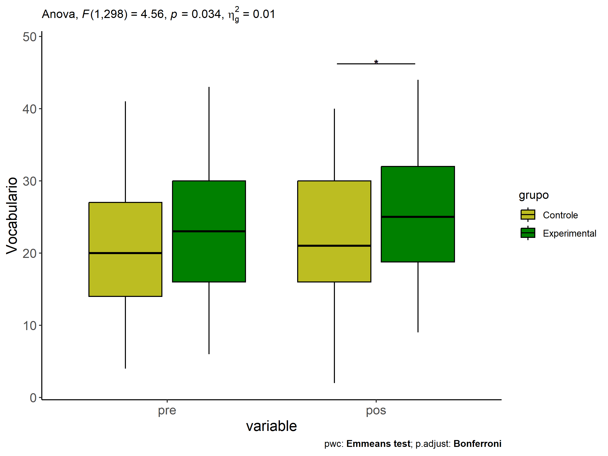<!-- -->

``` r
if (length(unique(wdat.long[["grupo"]])) > 1)
  plots <- oneWayAncovaBoxPlots(
    wdat.long, "vocab", "grupo", aov, pwc.long, pre.post = "time",
    theme = "classic", color = color$prepost)
```

``` r
if (length(unique(wdat.long[["grupo"]])) > 1)
  plots[["grupo"]] + ggplot2::ylab("Vocabulario")
```

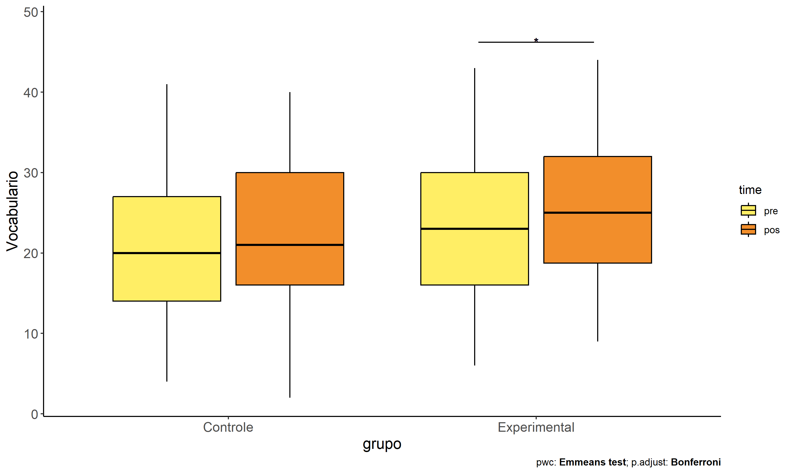<!-- -->

### Checking linearity assumption

``` r
ggscatter(wdat, x = "vocab.pre", y = "vocab.pos", size = 0.5,
          color = "grupo", add = "reg.line")+
  stat_regline_equation(
    aes(label =  paste(..eq.label.., ..rr.label.., sep = "~~~~"), color = grupo)
  )
```

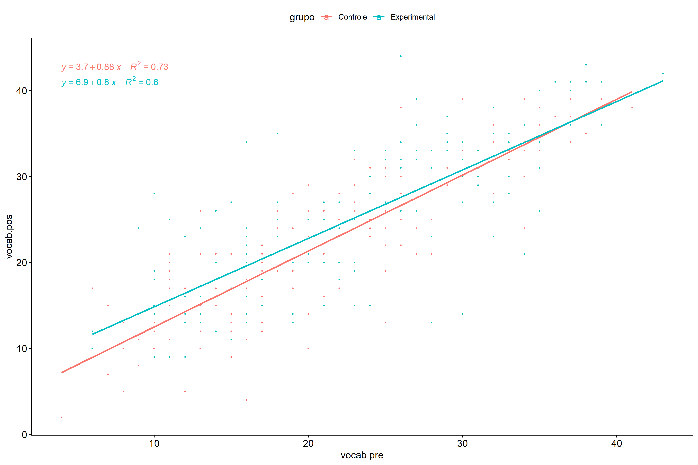<!-- -->

### Checking normality and homogeneity

``` r
res <- augment(lm(vocab.pos ~ vocab.pre + grupo, data = wdat))
```

``` r
shapiro_test(res$.resid)
```

    ## # A tibble: 1 × 3
    ##   variable   statistic p.value
    ##   <chr>          <dbl>   <dbl>
    ## 1 res$.resid     0.991  0.0637

``` r
levene_test(res, .resid ~ grupo)
```

    ## # A tibble: 1 × 4
    ##     df1   df2 statistic      p
    ##   <int> <int>     <dbl>  <dbl>
    ## 1     1   299      2.73 0.0993

# ANCOVA and Pairwise for two factors **grupo:Sexo**

## Without remove non-normal data

``` r
pdat = remove_group_data(dat[!is.na(dat[["grupo"]]) & !is.na(dat[["Sexo"]]),], "vocab.pos", c("grupo","Sexo"))

pdat.long <- rbind(pdat[,c("id","grupo","Sexo")], pdat[,c("id","grupo","Sexo")])
pdat.long[["time"]] <- c(rep("pre", nrow(pdat)), rep("pos", nrow(pdat)))
pdat.long[["time"]] <- factor(pdat.long[["time"]], c("pre","pos"))
pdat.long[["vocab"]] <- c(pdat[["vocab.pre"]], pdat[["vocab.pos"]])

aov = anova_test(pdat, vocab.pos ~ vocab.pre + grupo*Sexo)
laov[["grupo:Sexo"]] <- get_anova_table(aov)
```

``` r
pwcs <- list()
pwcs[["Sexo"]] <- emmeans_test(
  group_by(pdat, grupo), vocab.pos ~ Sexo,
  covariate = vocab.pre, p.adjust.method = "bonferroni")
pwcs[["grupo"]] <- emmeans_test(
  group_by(pdat, Sexo), vocab.pos ~ grupo,
  covariate = vocab.pre, p.adjust.method = "bonferroni")

pwc <- plyr::rbind.fill(pwcs[["grupo"]], pwcs[["Sexo"]])
pwc <- pwc[,c("grupo","Sexo", colnames(pwc)[!colnames(pwc) %in% c("grupo","Sexo")])]
```

``` r
pwc.long <- emmeans_test(dplyr::group_by_at(pdat.long, c("grupo","Sexo")),
                         vocab ~ time,
                         p.adjust.method = "bonferroni")
lpwc[["grupo:Sexo"]] <- plyr::rbind.fill(pwc, pwc.long)
```

``` r
ds <- get.descriptives(pdat, "vocab.pos", c("grupo","Sexo"), covar = "vocab.pre")
ds <- merge(ds[ds$variable != "vocab.pre",],
            ds[ds$variable == "vocab.pre", !colnames(ds) %in% c("variable")],
            by = c("grupo","Sexo"), all.x = T, suffixes = c("", ".vocab.pre"))
ds <- merge(get_emmeans(pwcs[["grupo"]]), ds, by = c("grupo","Sexo"), suffixes = c(".emms", ""))
ds <- ds[,c("grupo","Sexo","n","mean.vocab.pre","se.vocab.pre","mean","se","emmean","se.emms")]

colnames(ds) <- c("grupo","Sexo", "N", paste0(c("M","SE")," (pre)"),
                  paste0(c("M","SE"), " (unadj)"), paste0(c("M", "SE"), " (adj)"))

lemms[["grupo:Sexo"]] <- ds
```

## Computing ANCOVA and PairWise After removing non-normal data (OK)

``` r
wdat = pdat 

res = residuals(lm(vocab.pos ~ vocab.pre + grupo*Sexo, data = wdat))
non.normal = getNonNormal(res, wdat$id, plimit = 0.05)

wdat = wdat[!wdat$id %in% non.normal,]

wdat.long <- rbind(wdat[,c("id","grupo","Sexo")], wdat[,c("id","grupo","Sexo")])
wdat.long[["time"]] <- c(rep("pre", nrow(wdat)), rep("pos", nrow(wdat)))
wdat.long[["time"]] <- factor(wdat.long[["time"]], c("pre","pos"))
wdat.long[["vocab"]] <- c(wdat[["vocab.pre"]], wdat[["vocab.pos"]])


ldat[["grupo:Sexo"]] = wdat

(non.normal)
```

    ## [1] "P852"  "P1790" "P2850" "P478"  "P1620" "P863"  "P489"  "P3473" "P887"

``` r
aov = anova_test(wdat, vocab.pos ~ vocab.pre + grupo*Sexo)
laov[["grupo:Sexo"]] <- merge(get_anova_table(aov), laov[["grupo:Sexo"]], by="Effect", suffixes = c("","'"))

(df = get_anova_table(aov))
```

    ## ANOVA Table (type II tests)
    ## 
    ##       Effect DFn DFd       F        p p<.05      ges
    ## 1  vocab.pre   1 297 530.592 4.67e-68     * 0.641000
    ## 2      grupo   1 297   3.248 7.30e-02       0.011000
    ## 3       Sexo   1 297  10.260 2.00e-03     * 0.033000
    ## 4 grupo:Sexo   1 297   0.203 6.52e-01       0.000684

| Effect     | DFn | DFd |       F |     p | p\<.05 |   ges |
|:-----------|----:|----:|--------:|------:|:-------|------:|
| vocab.pre  |   1 | 297 | 530.592 | 0.000 | \*     | 0.641 |
| grupo      |   1 | 297 |   3.248 | 0.073 |        | 0.011 |
| Sexo       |   1 | 297 |  10.260 | 0.002 | \*     | 0.033 |
| grupo:Sexo |   1 | 297 |   0.203 | 0.652 |        | 0.001 |

``` r
pwcs <- list()
pwcs[["Sexo"]] <- emmeans_test(
  group_by(wdat, grupo), vocab.pos ~ Sexo,
  covariate = vocab.pre, p.adjust.method = "bonferroni")
pwcs[["grupo"]] <- emmeans_test(
  group_by(wdat, Sexo), vocab.pos ~ grupo,
  covariate = vocab.pre, p.adjust.method = "bonferroni")

pwc <- plyr::rbind.fill(pwcs[["grupo"]], pwcs[["Sexo"]])
pwc <- pwc[,c("grupo","Sexo", colnames(pwc)[!colnames(pwc) %in% c("grupo","Sexo")])]
```

| grupo        | Sexo | term             | .y.       | group1   | group2       |  df | statistic |     p | p.adj | p.adj.signif |
|:-------------|:-----|:-----------------|:----------|:---------|:-------------|----:|----------:|------:|------:|:-------------|
|              | F    | vocab.pre\*grupo | vocab.pos | Controle | Experimental | 297 |    -0.932 | 0.352 | 0.352 | ns           |
|              | M    | vocab.pre\*grupo | vocab.pos | Controle | Experimental | 297 |    -1.611 | 0.108 | 0.108 | ns           |
| Controle     |      | vocab.pre\*Sexo  | vocab.pos | F        | M            | 297 |     2.552 | 0.011 | 0.011 | \*           |
| Experimental |      | vocab.pre\*Sexo  | vocab.pos | F        | M            | 297 |     2.021 | 0.044 | 0.044 | \*           |

``` r
pwc.long <- emmeans_test(dplyr::group_by_at(wdat.long, c("grupo","Sexo")),
                         vocab ~ time,
                         p.adjust.method = "bonferroni")
lpwc[["grupo:Sexo"]] <- merge(plyr::rbind.fill(pwc, pwc.long), lpwc[["grupo:Sexo"]], by=c("grupo","Sexo","term",".y.","group1","group2"), suffixes = c("","'"))
```

| grupo        | Sexo | term | .y.   | group1 | group2 |  df | statistic |     p | p.adj | p.adj.signif |
|:-------------|:-----|:-----|:------|:-------|:-------|----:|----------:|------:|------:|:-------------|
| Controle     | F    | time | vocab | pre    | pos    | 596 |    -1.381 | 0.168 | 0.168 | ns           |
| Controle     | M    | time | vocab | pre    | pos    | 596 |    -0.302 | 0.763 | 0.763 | ns           |
| Experimental | F    | time | vocab | pre    | pos    | 596 |    -1.964 | 0.050 | 0.050 | ns           |
| Experimental | M    | time | vocab | pre    | pos    | 596 |    -1.026 | 0.306 | 0.306 | ns           |

``` r
ds <- get.descriptives(wdat, "vocab.pos", c("grupo","Sexo"), covar = "vocab.pre")
ds <- merge(ds[ds$variable != "vocab.pre",],
            ds[ds$variable == "vocab.pre", !colnames(ds) %in% c("variable")],
            by = c("grupo","Sexo"), all.x = T, suffixes = c("", ".vocab.pre"))
ds <- merge(get_emmeans(pwcs[["grupo"]]), ds, by = c("grupo","Sexo"), suffixes = c(".emms", ""))
ds <- ds[,c("grupo","Sexo","n","mean.vocab.pre","se.vocab.pre","mean","se","emmean","se.emms")]

colnames(ds) <- c("grupo","Sexo", "N", paste0(c("M","SE")," (pre)"),
                  paste0(c("M","SE"), " (unadj)"), paste0(c("M", "SE"), " (adj)"))

lemms[["grupo:Sexo"]] <- merge(ds, lemms[["grupo:Sexo"]], by=c("grupo","Sexo"), suffixes = c("","'"))
```

| grupo        | Sexo |   N | M (pre) | SE (pre) | M (unadj) | SE (unadj) | M (adj) | SE (adj) |
|:-------------|:-----|----:|--------:|---------:|----------:|-----------:|--------:|---------:|
| Controle     | F    |  64 |  22.953 |    1.037 |    25.047 |      1.011 |  24.528 |    0.647 |
| Controle     | M    |  81 |  20.148 |    0.978 |    20.556 |      1.011 |  22.306 |    0.580 |
| Experimental | F    |  83 |  24.434 |    0.954 |    27.048 |      0.958 |  25.331 |    0.573 |
| Experimental | M    |  74 |  21.743 |    0.959 |    23.189 |      0.977 |  23.649 |    0.602 |

### Plots for ancova

``` r
plots <- twoWayAncovaPlots(
  wdat, "vocab.pos", c("grupo","Sexo"), aov, pwcs, addParam = c("mean_se"),
  font.label.size=10, step.increase=0.05, p.label="p.adj",
  subtitle = which(aov$Effect == "grupo:Sexo"))
```

``` r
if (!is.null(plots[["grupo"]]))
  plots[["grupo"]] + ggplot2::scale_color_manual(values = color[["Sexo"]])
```

    ## Scale for colour is already present.
    ## Adding another scale for colour, which will replace the existing scale.

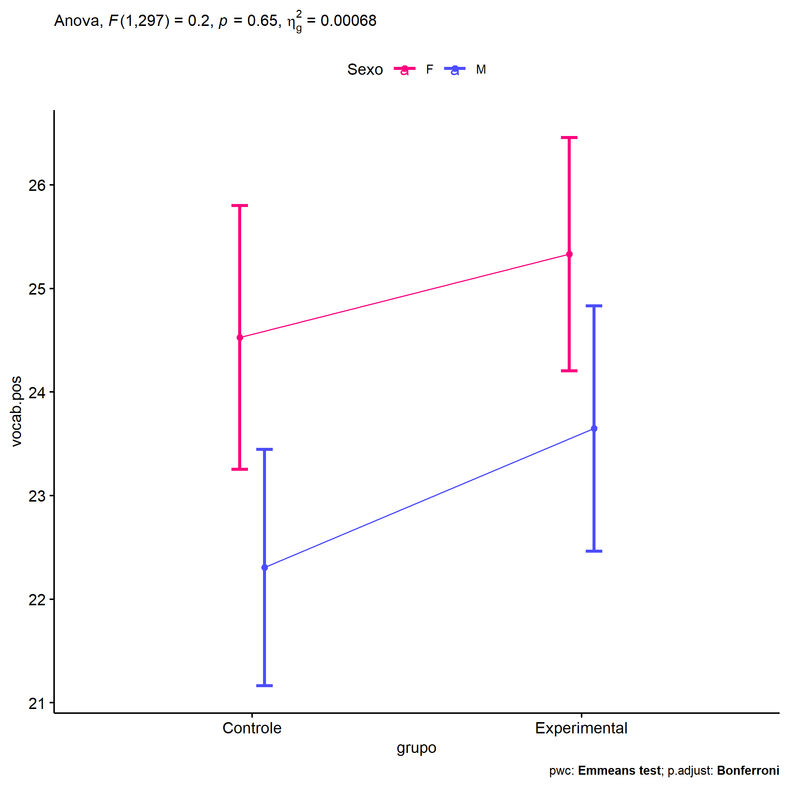<!-- -->

``` r
if (!is.null(plots[["Sexo"]]))
  plots[["Sexo"]] + ggplot2::scale_color_manual(values = color[["grupo"]])
```

    ## Scale for colour is already present.
    ## Adding another scale for colour, which will replace the existing scale.

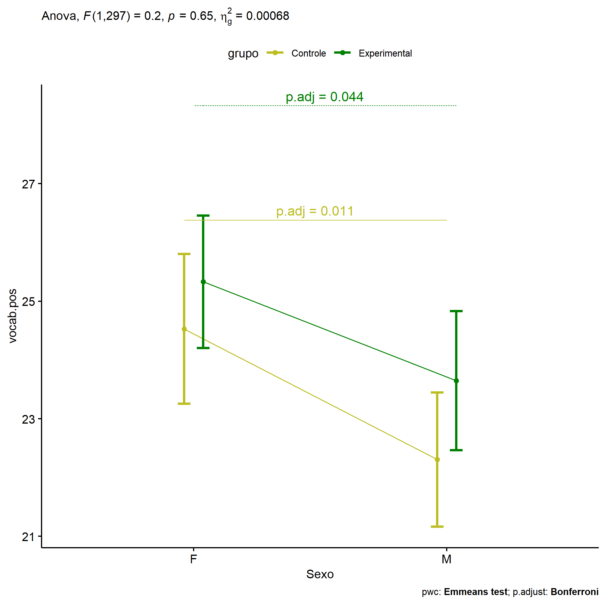<!-- -->

``` r
plots <- twoWayAncovaBoxPlots(
  wdat, "vocab.pos", c("grupo","Sexo"), aov, pwcs, covar = "vocab.pre",
  theme = "classic", color = color[["grupo:Sexo"]],
  subtitle = which(aov$Effect == "grupo:Sexo"))
```

``` r
plots[["grupo:Sexo"]] + ggplot2::ylab("Vocabulario") + ggplot2::scale_x_discrete(labels=c('pre', 'pos'))
```

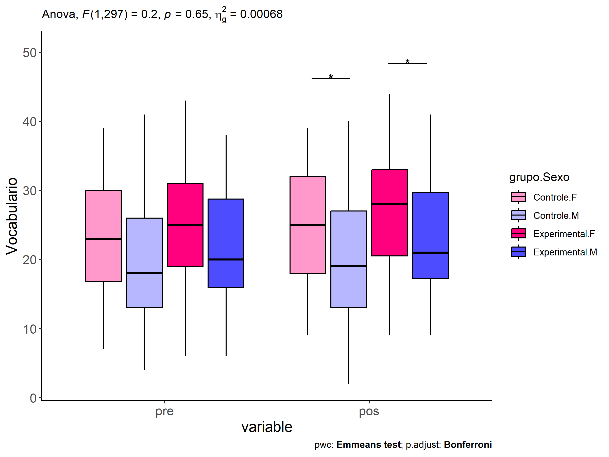<!-- -->

``` r
plots <- twoWayAncovaBoxPlots(
  wdat.long, "vocab", c("grupo","Sexo"), aov, pwc.long, pre.post = "time",
  theme = "classic", color = color$prepost)
```

``` r
plots[["grupo:Sexo"]] + ggplot2::ylab("Vocabulario")
```

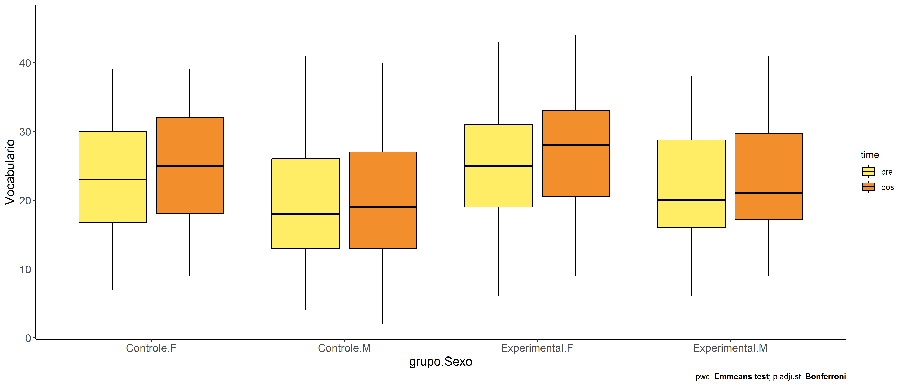<!-- -->

### Checking linearity assumption

``` r
ggscatter(wdat, x = "vocab.pre", y = "vocab.pos", size = 0.5,
          facet.by = c("grupo","Sexo"), add = "reg.line")+
  stat_regline_equation(
    aes(label =  paste(..eq.label.., ..rr.label.., sep = "~~~~"))
  )
```

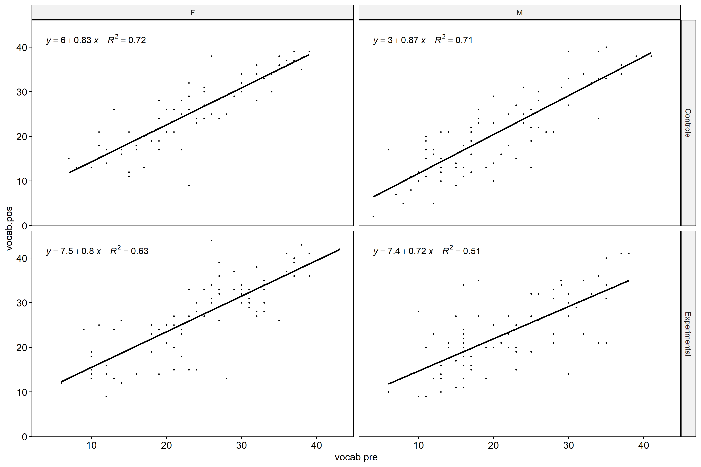<!-- -->

### Checking normality and homogeneity

``` r
res <- augment(lm(vocab.pos ~ vocab.pre + grupo*Sexo, data = wdat))
```

``` r
shapiro_test(res$.resid)
```

    ## # A tibble: 1 × 3
    ##   variable   statistic p.value
    ##   <chr>          <dbl>   <dbl>
    ## 1 res$.resid     0.990  0.0437

``` r
levene_test(res, .resid ~ grupo*Sexo)
```

    ## # A tibble: 1 × 4
    ##     df1   df2 statistic      p
    ##   <int> <int>     <dbl>  <dbl>
    ## 1     3   298      2.31 0.0764

# ANCOVA and Pairwise for two factors **grupo:Zona**

## Without remove non-normal data

``` r
pdat = remove_group_data(dat[!is.na(dat[["grupo"]]) & !is.na(dat[["Zona"]]),], "vocab.pos", c("grupo","Zona"))

pdat.long <- rbind(pdat[,c("id","grupo","Zona")], pdat[,c("id","grupo","Zona")])
pdat.long[["time"]] <- c(rep("pre", nrow(pdat)), rep("pos", nrow(pdat)))
pdat.long[["time"]] <- factor(pdat.long[["time"]], c("pre","pos"))
pdat.long[["vocab"]] <- c(pdat[["vocab.pre"]], pdat[["vocab.pos"]])

aov = anova_test(pdat, vocab.pos ~ vocab.pre + grupo*Zona)
laov[["grupo:Zona"]] <- get_anova_table(aov)
```

``` r
pwcs <- list()
pwcs[["Zona"]] <- emmeans_test(
  group_by(pdat, grupo), vocab.pos ~ Zona,
  covariate = vocab.pre, p.adjust.method = "bonferroni")
pwcs[["grupo"]] <- emmeans_test(
  group_by(pdat, Zona), vocab.pos ~ grupo,
  covariate = vocab.pre, p.adjust.method = "bonferroni")

pwc <- plyr::rbind.fill(pwcs[["grupo"]], pwcs[["Zona"]])
pwc <- pwc[,c("grupo","Zona", colnames(pwc)[!colnames(pwc) %in% c("grupo","Zona")])]
```

``` r
pwc.long <- emmeans_test(dplyr::group_by_at(pdat.long, c("grupo","Zona")),
                         vocab ~ time,
                         p.adjust.method = "bonferroni")
lpwc[["grupo:Zona"]] <- plyr::rbind.fill(pwc, pwc.long)
```

``` r
ds <- get.descriptives(pdat, "vocab.pos", c("grupo","Zona"), covar = "vocab.pre")
ds <- merge(ds[ds$variable != "vocab.pre",],
            ds[ds$variable == "vocab.pre", !colnames(ds) %in% c("variable")],
            by = c("grupo","Zona"), all.x = T, suffixes = c("", ".vocab.pre"))
ds <- merge(get_emmeans(pwcs[["grupo"]]), ds, by = c("grupo","Zona"), suffixes = c(".emms", ""))
ds <- ds[,c("grupo","Zona","n","mean.vocab.pre","se.vocab.pre","mean","se","emmean","se.emms")]

colnames(ds) <- c("grupo","Zona", "N", paste0(c("M","SE")," (pre)"),
                  paste0(c("M","SE"), " (unadj)"), paste0(c("M", "SE"), " (adj)"))

lemms[["grupo:Zona"]] <- ds
```

## Computing ANCOVA and PairWise After removing non-normal data (OK)

``` r
wdat = pdat 

res = residuals(lm(vocab.pos ~ vocab.pre + grupo*Zona, data = wdat))
non.normal = getNonNormal(res, wdat$id, plimit = 0.05)

wdat = wdat[!wdat$id %in% non.normal,]

wdat.long <- rbind(wdat[,c("id","grupo","Zona")], wdat[,c("id","grupo","Zona")])
wdat.long[["time"]] <- c(rep("pre", nrow(wdat)), rep("pos", nrow(wdat)))
wdat.long[["time"]] <- factor(wdat.long[["time"]], c("pre","pos"))
wdat.long[["vocab"]] <- c(wdat[["vocab.pre"]], wdat[["vocab.pos"]])


ldat[["grupo:Zona"]] = wdat

(non.normal)
```

    ## [1] "P852"  "P478"  "P863"  "P2850" "P887"  "P3473" "P888"

``` r
aov = anova_test(wdat, vocab.pos ~ vocab.pre + grupo*Zona)
laov[["grupo:Zona"]] <- merge(get_anova_table(aov), laov[["grupo:Zona"]], by="Effect", suffixes = c("","'"))

(df = get_anova_table(aov))
```

    ## ANOVA Table (type II tests)
    ## 
    ##       Effect DFn DFd       F        p p<.05      ges
    ## 1  vocab.pre   1 236 446.913 2.26e-56     * 6.54e-01
    ## 2      grupo   1 236   1.633 2.03e-01       7.00e-03
    ## 3       Zona   1 236   0.789 3.75e-01       3.00e-03
    ## 4 grupo:Zona   1 236   0.002 9.67e-01       7.10e-06

| Effect     | DFn | DFd |       F |     p | p\<.05 |   ges |
|:-----------|----:|----:|--------:|------:|:-------|------:|
| vocab.pre  |   1 | 236 | 446.913 | 0.000 | \*     | 0.654 |
| grupo      |   1 | 236 |   1.633 | 0.203 |        | 0.007 |
| Zona       |   1 | 236 |   0.789 | 0.375 |        | 0.003 |
| grupo:Zona |   1 | 236 |   0.002 | 0.967 |        | 0.000 |

``` r
pwcs <- list()
pwcs[["Zona"]] <- emmeans_test(
  group_by(wdat, grupo), vocab.pos ~ Zona,
  covariate = vocab.pre, p.adjust.method = "bonferroni")
pwcs[["grupo"]] <- emmeans_test(
  group_by(wdat, Zona), vocab.pos ~ grupo,
  covariate = vocab.pre, p.adjust.method = "bonferroni")

pwc <- plyr::rbind.fill(pwcs[["grupo"]], pwcs[["Zona"]])
pwc <- pwc[,c("grupo","Zona", colnames(pwc)[!colnames(pwc) %in% c("grupo","Zona")])]
```

| grupo        | Zona   | term             | .y.       | group1   | group2       |  df | statistic |     p | p.adj | p.adj.signif |
|:-------------|:-------|:-----------------|:----------|:---------|:-------------|----:|----------:|------:|------:|:-------------|
|              | Rural  | vocab.pre\*grupo | vocab.pos | Controle | Experimental | 236 |    -1.115 | 0.266 | 0.266 | ns           |
|              | Urbana | vocab.pre\*grupo | vocab.pos | Controle | Experimental | 236 |    -0.625 | 0.532 | 0.532 | ns           |
| Controle     |        | vocab.pre\*Zona  | vocab.pos | Rural    | Urbana       | 236 |    -0.634 | 0.526 | 0.526 | ns           |
| Experimental |        | vocab.pre\*Zona  | vocab.pos | Rural    | Urbana       | 236 |    -0.625 | 0.532 | 0.532 | ns           |

``` r
pwc.long <- emmeans_test(dplyr::group_by_at(wdat.long, c("grupo","Zona")),
                         vocab ~ time,
                         p.adjust.method = "bonferroni")
lpwc[["grupo:Zona"]] <- merge(plyr::rbind.fill(pwc, pwc.long), lpwc[["grupo:Zona"]], by=c("grupo","Zona","term",".y.","group1","group2"), suffixes = c("","'"))
```

| grupo        | Zona   | term | .y.   | group1 | group2 |  df | statistic |     p | p.adj | p.adj.signif |
|:-------------|:-------|:-----|:------|:-------|:-------|----:|----------:|------:|------:|:-------------|
| Controle     | Rural  | time | vocab | pre    | pos    | 474 |    -0.858 | 0.391 | 0.391 | ns           |
| Controle     | Urbana | time | vocab | pre    | pos    | 474 |    -0.691 | 0.490 | 0.490 | ns           |
| Experimental | Rural  | time | vocab | pre    | pos    | 474 |    -1.453 | 0.147 | 0.147 | ns           |
| Experimental | Urbana | time | vocab | pre    | pos    | 474 |    -1.108 | 0.268 | 0.268 | ns           |

``` r
ds <- get.descriptives(wdat, "vocab.pos", c("grupo","Zona"), covar = "vocab.pre")
ds <- merge(ds[ds$variable != "vocab.pre",],
            ds[ds$variable == "vocab.pre", !colnames(ds) %in% c("variable")],
            by = c("grupo","Zona"), all.x = T, suffixes = c("", ".vocab.pre"))
ds <- merge(get_emmeans(pwcs[["grupo"]]), ds, by = c("grupo","Zona"), suffixes = c(".emms", ""))
ds <- ds[,c("grupo","Zona","n","mean.vocab.pre","se.vocab.pre","mean","se","emmean","se.emms")]

colnames(ds) <- c("grupo","Zona", "N", paste0(c("M","SE")," (pre)"),
                  paste0(c("M","SE"), " (unadj)"), paste0(c("M", "SE"), " (adj)"))

lemms[["grupo:Zona"]] <- merge(ds, lemms[["grupo:Zona"]], by=c("grupo","Zona"), suffixes = c("","'"))
```

| grupo        | Zona   |   N | M (pre) | SE (pre) | M (unadj) | SE (unadj) | M (adj) | SE (adj) |
|:-------------|:-------|----:|--------:|---------:|----------:|-----------:|--------:|---------:|
| Controle     | Rural  |  95 |  22.189 |    0.859 |    23.274 |      0.928 |  23.575 |    0.531 |
| Controle     | Urbana |  28 |  23.214 |    1.905 |    24.821 |      1.646 |  24.281 |    0.977 |
| Experimental | Rural  |  81 |  22.012 |    0.926 |    24.000 |      0.898 |  24.447 |    0.575 |
| Experimental | Urbana |  37 |  24.189 |    1.450 |    26.432 |      1.571 |  25.090 |    0.852 |

### Plots for ancova

``` r
plots <- twoWayAncovaPlots(
  wdat, "vocab.pos", c("grupo","Zona"), aov, pwcs, addParam = c("mean_se"),
  font.label.size=10, step.increase=0.05, p.label="p.adj",
  subtitle = which(aov$Effect == "grupo:Zona"))
```

``` r
if (!is.null(plots[["grupo"]]))
  plots[["grupo"]] + ggplot2::scale_color_manual(values = color[["Zona"]])
```

    ## Scale for colour is already present.
    ## Adding another scale for colour, which will replace the existing scale.

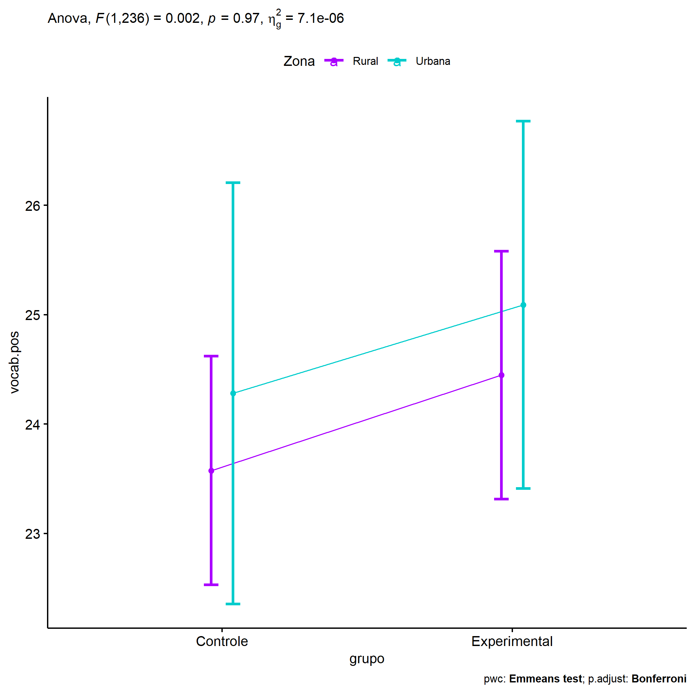<!-- -->

``` r
if (!is.null(plots[["Zona"]]))
  plots[["Zona"]] + ggplot2::scale_color_manual(values = color[["grupo"]])
```

    ## Scale for colour is already present.
    ## Adding another scale for colour, which will replace the existing scale.

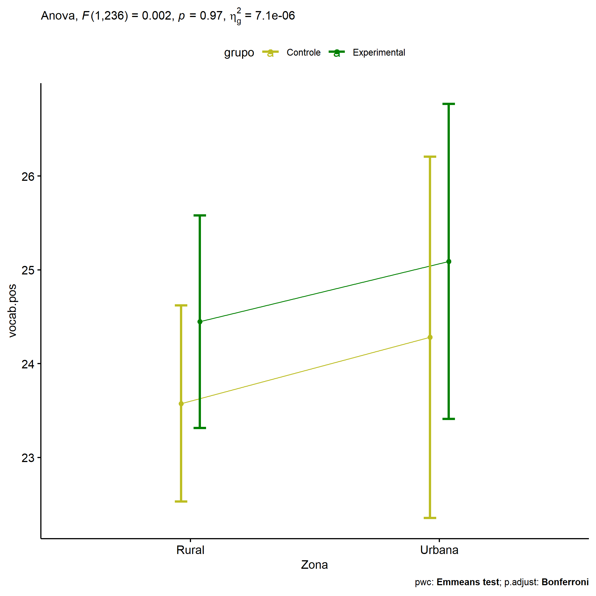<!-- -->

``` r
plots <- twoWayAncovaBoxPlots(
  wdat, "vocab.pos", c("grupo","Zona"), aov, pwcs, covar = "vocab.pre",
  theme = "classic", color = color[["grupo:Zona"]],
  subtitle = which(aov$Effect == "grupo:Zona"))
```

``` r
plots[["grupo:Zona"]] + ggplot2::ylab("Vocabulario") + ggplot2::scale_x_discrete(labels=c('pre', 'pos'))
```

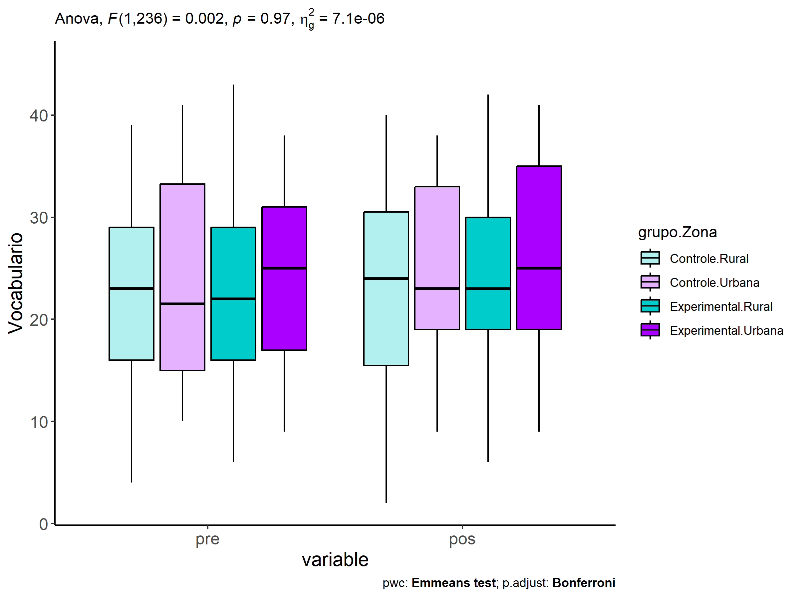<!-- -->

``` r
plots <- twoWayAncovaBoxPlots(
  wdat.long, "vocab", c("grupo","Zona"), aov, pwc.long, pre.post = "time",
  theme = "classic", color = color$prepost)
```

``` r
plots[["grupo:Zona"]] + ggplot2::ylab("Vocabulario")
```

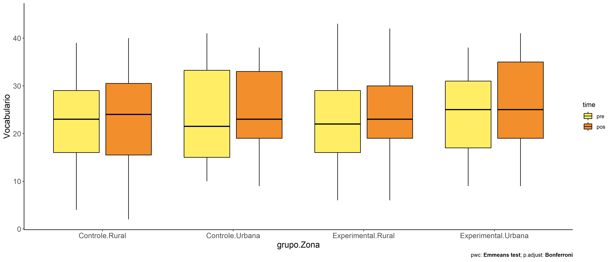<!-- -->

### Checking linearity assumption

``` r
ggscatter(wdat, x = "vocab.pre", y = "vocab.pos", size = 0.5,
          facet.by = c("grupo","Zona"), add = "reg.line")+
  stat_regline_equation(
    aes(label =  paste(..eq.label.., ..rr.label.., sep = "~~~~"))
  )
```

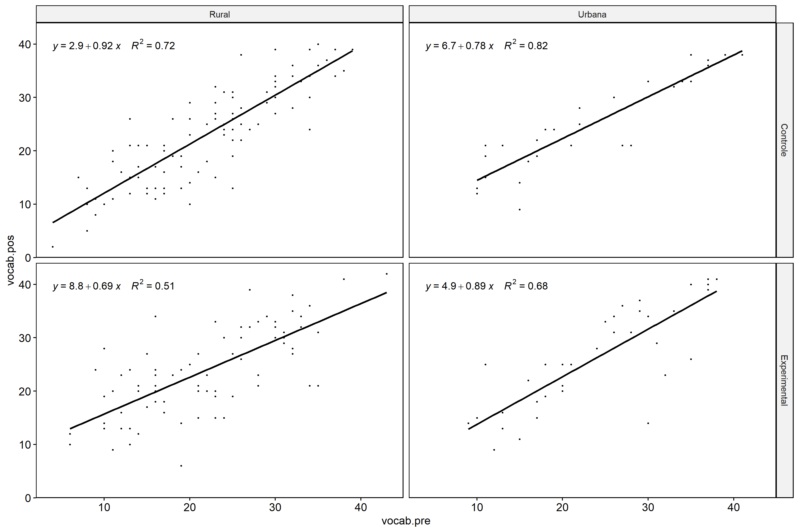<!-- -->

### Checking normality and homogeneity

``` r
res <- augment(lm(vocab.pos ~ vocab.pre + grupo*Zona, data = wdat))
```

``` r
shapiro_test(res$.resid)
```

    ## # A tibble: 1 × 3
    ##   variable   statistic p.value
    ##   <chr>          <dbl>   <dbl>
    ## 1 res$.resid     0.989  0.0614

``` r
levene_test(res, .resid ~ grupo*Zona)
```

    ## # A tibble: 1 × 4
    ##     df1   df2 statistic     p
    ##   <int> <int>     <dbl> <dbl>
    ## 1     3   237      1.77 0.153

# ANCOVA and Pairwise for two factors **grupo:Cor.Raca**

## Without remove non-normal data

``` r
pdat = remove_group_data(dat[!is.na(dat[["grupo"]]) & !is.na(dat[["Cor.Raca"]]),], "vocab.pos", c("grupo","Cor.Raca"))
```

    ## Warning: There were 2 warnings in `mutate()`.
    ## The first warning was:
    ## ℹ In argument: `ci = abs(stats::qt(alpha/2, .data$n - 1) * .data$se)`.
    ## Caused by warning:
    ## ! There was 1 warning in `mutate()`.
    ## ℹ In argument: `ci = abs(stats::qt(alpha/2, .data$n - 1) * .data$se)`.
    ## Caused by warning in `stats::qt()`:
    ## ! NaNs produced
    ## ℹ Run `dplyr::last_dplyr_warnings()` to see the 1 remaining warning.

``` r
pdat.long <- rbind(pdat[,c("id","grupo","Cor.Raca")], pdat[,c("id","grupo","Cor.Raca")])
pdat.long[["time"]] <- c(rep("pre", nrow(pdat)), rep("pos", nrow(pdat)))
pdat.long[["time"]] <- factor(pdat.long[["time"]], c("pre","pos"))
pdat.long[["vocab"]] <- c(pdat[["vocab.pre"]], pdat[["vocab.pos"]])

aov = anova_test(pdat, vocab.pos ~ vocab.pre + grupo*Cor.Raca)
laov[["grupo:Cor.Raca"]] <- get_anova_table(aov)
```

``` r
pwcs <- list()
pwcs[["Cor.Raca"]] <- emmeans_test(
  group_by(pdat, grupo), vocab.pos ~ Cor.Raca,
  covariate = vocab.pre, p.adjust.method = "bonferroni")
pwcs[["grupo"]] <- emmeans_test(
  group_by(pdat, Cor.Raca), vocab.pos ~ grupo,
  covariate = vocab.pre, p.adjust.method = "bonferroni")

pwc <- plyr::rbind.fill(pwcs[["grupo"]], pwcs[["Cor.Raca"]])
pwc <- pwc[,c("grupo","Cor.Raca", colnames(pwc)[!colnames(pwc) %in% c("grupo","Cor.Raca")])]
```

``` r
pwc.long <- emmeans_test(dplyr::group_by_at(pdat.long, c("grupo","Cor.Raca")),
                         vocab ~ time,
                         p.adjust.method = "bonferroni")
lpwc[["grupo:Cor.Raca"]] <- plyr::rbind.fill(pwc, pwc.long)
```

``` r
ds <- get.descriptives(pdat, "vocab.pos", c("grupo","Cor.Raca"), covar = "vocab.pre")
ds <- merge(ds[ds$variable != "vocab.pre",],
            ds[ds$variable == "vocab.pre", !colnames(ds) %in% c("variable")],
            by = c("grupo","Cor.Raca"), all.x = T, suffixes = c("", ".vocab.pre"))
ds <- merge(get_emmeans(pwcs[["grupo"]]), ds, by = c("grupo","Cor.Raca"), suffixes = c(".emms", ""))
ds <- ds[,c("grupo","Cor.Raca","n","mean.vocab.pre","se.vocab.pre","mean","se","emmean","se.emms")]

colnames(ds) <- c("grupo","Cor.Raca", "N", paste0(c("M","SE")," (pre)"),
                  paste0(c("M","SE"), " (unadj)"), paste0(c("M", "SE"), " (adj)"))

lemms[["grupo:Cor.Raca"]] <- ds
```

## Computing ANCOVA and PairWise After removing non-normal data (OK)

``` r
wdat = pdat 

res = residuals(lm(vocab.pos ~ vocab.pre + grupo*Cor.Raca, data = wdat))
non.normal = getNonNormal(res, wdat$id, plimit = 0.05)

wdat = wdat[!wdat$id %in% non.normal,]

wdat.long <- rbind(wdat[,c("id","grupo","Cor.Raca")], wdat[,c("id","grupo","Cor.Raca")])
wdat.long[["time"]] <- c(rep("pre", nrow(wdat)), rep("pos", nrow(wdat)))
wdat.long[["time"]] <- factor(wdat.long[["time"]], c("pre","pos"))
wdat.long[["vocab"]] <- c(wdat[["vocab.pre"]], wdat[["vocab.pos"]])


ldat[["grupo:Cor.Raca"]] = wdat

(non.normal)
```

    ## [1] "P852"

``` r
aov = anova_test(wdat, vocab.pos ~ vocab.pre + grupo*Cor.Raca)
laov[["grupo:Cor.Raca"]] <- merge(get_anova_table(aov), laov[["grupo:Cor.Raca"]], by="Effect", suffixes = c("","'"))

(df = get_anova_table(aov))
```

    ## ANOVA Table (type II tests)
    ## 
    ##           Effect DFn DFd       F        p p<.05   ges
    ## 1      vocab.pre   1 132 261.556 4.12e-33     * 0.665
    ## 2          grupo   1 132   0.198 6.57e-01       0.001
    ## 3       Cor.Raca   2 132   1.470 2.34e-01       0.022
    ## 4 grupo:Cor.Raca   1 132   2.156 1.44e-01       0.016

| Effect         | DFn | DFd |       F |     p | p\<.05 |   ges |
|:---------------|----:|----:|--------:|------:|:-------|------:|
| vocab.pre      |   1 | 132 | 261.556 | 0.000 | \*     | 0.665 |
| grupo          |   1 | 132 |   0.198 | 0.657 |        | 0.001 |
| Cor.Raca       |   2 | 132 |   1.470 | 0.234 |        | 0.022 |
| grupo:Cor.Raca |   1 | 132 |   2.156 | 0.144 |        | 0.016 |

``` r
pwcs <- list()
pwcs[["Cor.Raca"]] <- emmeans_test(
  group_by(wdat, grupo), vocab.pos ~ Cor.Raca,
  covariate = vocab.pre, p.adjust.method = "bonferroni")
pwcs[["grupo"]] <- emmeans_test(
  group_by(wdat, Cor.Raca), vocab.pos ~ grupo,
  covariate = vocab.pre, p.adjust.method = "bonferroni")

pwc <- plyr::rbind.fill(pwcs[["grupo"]], pwcs[["Cor.Raca"]])
pwc <- pwc[,c("grupo","Cor.Raca", colnames(pwc)[!colnames(pwc) %in% c("grupo","Cor.Raca")])]
```

| grupo        | Cor.Raca | term                | .y.       | group1   | group2       |  df | statistic |     p | p.adj | p.adj.signif |
|:-------------|:---------|:--------------------|:----------|:---------|:-------------|----:|----------:|------:|------:|:-------------|
|              | Branca   | vocab.pre\*grupo    | vocab.pos | Controle | Experimental | 132 |     0.963 | 0.338 | 0.338 | ns           |
|              | Indígena | vocab.pre\*grupo    | vocab.pos | Controle | Experimental |     |           |       |       |              |
|              | Parda    | vocab.pre\*grupo    | vocab.pos | Controle | Experimental | 132 |    -1.192 | 0.235 | 0.235 | ns           |
| Controle     |          | vocab.pre\*Cor.Raca | vocab.pos | Branca   | Indígena     |     |           |       |       |              |
| Controle     |          | vocab.pre\*Cor.Raca | vocab.pos | Branca   | Parda        | 132 |     0.097 | 0.923 | 0.923 | ns           |
| Controle     |          | vocab.pre\*Cor.Raca | vocab.pos | Indígena | Parda        |     |           |       |       |              |
| Experimental |          | vocab.pre\*Cor.Raca | vocab.pos | Branca   | Indígena     | 132 |    -2.053 | 0.042 | 0.126 | ns           |
| Experimental |          | vocab.pre\*Cor.Raca | vocab.pos | Branca   | Parda        | 132 |    -1.908 | 0.059 | 0.176 | ns           |
| Experimental |          | vocab.pre\*Cor.Raca | vocab.pos | Indígena | Parda        | 132 |     0.674 | 0.502 | 1.000 | ns           |

``` r
pwc.long <- emmeans_test(dplyr::group_by_at(wdat.long, c("grupo","Cor.Raca")),
                         vocab ~ time,
                         p.adjust.method = "bonferroni")
lpwc[["grupo:Cor.Raca"]] <- merge(plyr::rbind.fill(pwc, pwc.long), lpwc[["grupo:Cor.Raca"]], by=c("grupo","Cor.Raca","term",".y.","group1","group2"), suffixes = c("","'"))
```

| grupo        | Cor.Raca | term | .y.   | group1 | group2 |  df | statistic |     p | p.adj | p.adj.signif |
|:-------------|:---------|:-----|:------|:-------|:-------|----:|----------:|------:|------:|:-------------|
| Controle     | Branca   | time | vocab | pre    | pos    | 266 |    -0.276 | 0.782 | 0.782 | ns           |
| Controle     | Indígena | time | vocab | pre    | pos    |     |           |       |       |              |
| Controle     | Parda    | time | vocab | pre    | pos    | 266 |    -0.400 | 0.689 | 0.689 | ns           |
| Experimental | Branca   | time | vocab | pre    | pos    | 266 |     0.401 | 0.689 | 0.689 | ns           |
| Experimental | Indígena | time | vocab | pre    | pos    | 266 |    -0.966 | 0.335 | 0.335 | ns           |
| Experimental | Parda    | time | vocab | pre    | pos    | 266 |    -1.100 | 0.272 | 0.272 | ns           |

``` r
ds <- get.descriptives(wdat, "vocab.pos", c("grupo","Cor.Raca"), covar = "vocab.pre")
ds <- merge(ds[ds$variable != "vocab.pre",],
            ds[ds$variable == "vocab.pre", !colnames(ds) %in% c("variable")],
            by = c("grupo","Cor.Raca"), all.x = T, suffixes = c("", ".vocab.pre"))
ds <- merge(get_emmeans(pwcs[["grupo"]]), ds, by = c("grupo","Cor.Raca"), suffixes = c(".emms", ""))
ds <- ds[,c("grupo","Cor.Raca","n","mean.vocab.pre","se.vocab.pre","mean","se","emmean","se.emms")]

colnames(ds) <- c("grupo","Cor.Raca", "N", paste0(c("M","SE")," (pre)"),
                  paste0(c("M","SE"), " (unadj)"), paste0(c("M", "SE"), " (adj)"))

lemms[["grupo:Cor.Raca"]] <- merge(ds, lemms[["grupo:Cor.Raca"]], by=c("grupo","Cor.Raca"), suffixes = c("","'"))
```

| grupo        | Cor.Raca |   N | M (pre) | SE (pre) | M (unadj) | SE (unadj) | M (adj) | SE (adj) |
|:-------------|:---------|----:|--------:|---------:|----------:|-----------:|--------:|---------:|
| Controle     | Branca   |  22 |  23.000 |    1.578 |    23.727 |      1.766 |  23.138 |    1.130 |
| Controle     | Parda    |  42 |  21.405 |    1.426 |    22.167 |      1.519 |  23.002 |    0.819 |
| Experimental | Branca   |  18 |  25.500 |    1.898 |    24.333 |      2.667 |  21.512 |    1.261 |
| Experimental | Indígena |  13 |  21.000 |    2.082 |    24.308 |      2.392 |  25.505 |    1.472 |
| Experimental | Parda    |  43 |  22.000 |    1.241 |    24.070 |      1.193 |  24.374 |    0.808 |

### Plots for ancova

``` r
plots <- twoWayAncovaPlots(
  wdat, "vocab.pos", c("grupo","Cor.Raca"), aov, pwcs, addParam = c("mean_se"),
  font.label.size=10, step.increase=0.05, p.label="p.adj",
  subtitle = which(aov$Effect == "grupo:Cor.Raca"))
```

``` r
if (!is.null(plots[["grupo"]]))
  plots[["grupo"]] + ggplot2::scale_color_manual(values = color[["Cor.Raca"]])
```

<!-- -->

``` r
if (!is.null(plots[["Cor.Raca"]]))
  plots[["Cor.Raca"]] + ggplot2::scale_color_manual(values = color[["grupo"]])
```

    ## Scale for colour is already present.
    ## Adding another scale for colour, which will replace the existing scale.

    ## Warning: Removed 2 rows containing non-finite values (`stat_bracket()`).

    ## Warning: Removed 1 rows containing missing values (`geom_point()`).

<!-- -->

``` r
plots <- twoWayAncovaBoxPlots(
  wdat, "vocab.pos", c("grupo","Cor.Raca"), aov, pwcs, covar = "vocab.pre",
  theme = "classic", color = color[["grupo:Cor.Raca"]],
  subtitle = which(aov$Effect == "grupo:Cor.Raca"))
```

``` r
plots[["grupo:Cor.Raca"]] + ggplot2::ylab("Vocabulario") + ggplot2::scale_x_discrete(labels=c('pre', 'pos'))
```

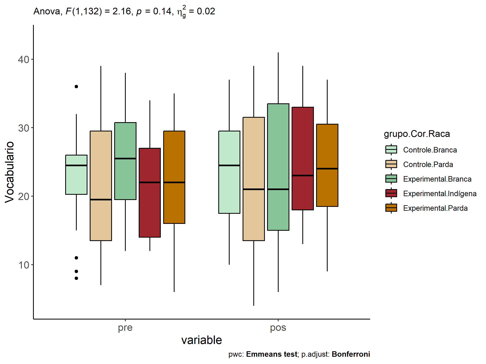<!-- -->

``` r
plots <- twoWayAncovaBoxPlots(
  wdat.long, "vocab", c("grupo","Cor.Raca"), aov, pwc.long, pre.post = "time",
  theme = "classic", color = color$prepost)
```

``` r
plots[["grupo:Cor.Raca"]] + ggplot2::ylab("Vocabulario")
```

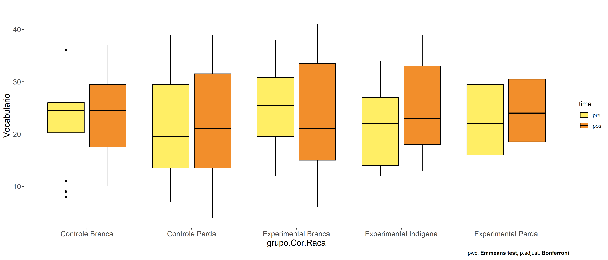<!-- -->

### Checking linearity assumption

``` r
ggscatter(wdat, x = "vocab.pre", y = "vocab.pos", size = 0.5,
          facet.by = c("grupo","Cor.Raca"), add = "reg.line")+
  stat_regline_equation(
    aes(label =  paste(..eq.label.., ..rr.label.., sep = "~~~~"))
  )
```

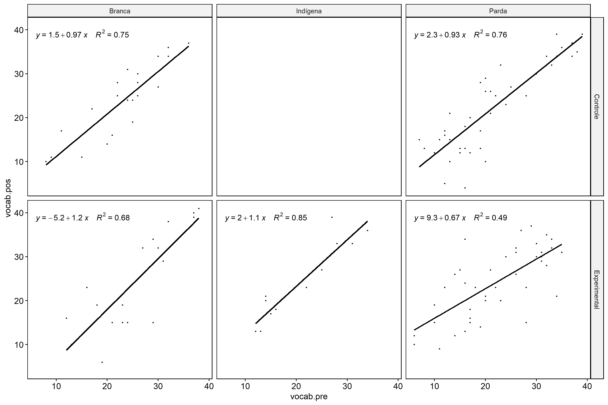<!-- -->

### Checking normality and homogeneity

``` r
res <- augment(lm(vocab.pos ~ vocab.pre + grupo*Cor.Raca, data = wdat))
```

``` r
shapiro_test(res$.resid)
```

    ## # A tibble: 1 × 3
    ##   variable   statistic p.value
    ##   <chr>          <dbl>   <dbl>
    ## 1 res$.resid     0.986   0.182

``` r
levene_test(res, .resid ~ grupo*Cor.Raca)
```

    ## # A tibble: 1 × 4
    ##     df1   df2 statistic      p
    ##   <int> <int>     <dbl>  <dbl>
    ## 1     4   133      2.19 0.0737

# ANCOVA and Pairwise for two factors **grupo:vocab.quintile**

## Without remove non-normal data

``` r
pdat = remove_group_data(dat[!is.na(dat[["grupo"]]) & !is.na(dat[["vocab.quintile"]]),], "vocab.pos", c("grupo","vocab.quintile"))

pdat.long <- rbind(pdat[,c("id","grupo","vocab.quintile")], pdat[,c("id","grupo","vocab.quintile")])
pdat.long[["time"]] <- c(rep("pre", nrow(pdat)), rep("pos", nrow(pdat)))
pdat.long[["time"]] <- factor(pdat.long[["time"]], c("pre","pos"))
pdat.long[["vocab"]] <- c(pdat[["vocab.pre"]], pdat[["vocab.pos"]])

aov = anova_test(pdat, vocab.pos ~ vocab.pre + grupo*vocab.quintile)
laov[["grupo:vocab.quintile"]] <- get_anova_table(aov)
```

``` r
pwcs <- list()
pwcs[["vocab.quintile"]] <- emmeans_test(
  group_by(pdat, grupo), vocab.pos ~ vocab.quintile,
  covariate = vocab.pre, p.adjust.method = "bonferroni")
pwcs[["grupo"]] <- emmeans_test(
  group_by(pdat, vocab.quintile), vocab.pos ~ grupo,
  covariate = vocab.pre, p.adjust.method = "bonferroni")

pwc <- plyr::rbind.fill(pwcs[["grupo"]], pwcs[["vocab.quintile"]])
pwc <- pwc[,c("grupo","vocab.quintile", colnames(pwc)[!colnames(pwc) %in% c("grupo","vocab.quintile")])]
```

``` r
pwc.long <- emmeans_test(dplyr::group_by_at(pdat.long, c("grupo","vocab.quintile")),
                         vocab ~ time,
                         p.adjust.method = "bonferroni")
lpwc[["grupo:vocab.quintile"]] <- plyr::rbind.fill(pwc, pwc.long)
```

``` r
ds <- get.descriptives(pdat, "vocab.pos", c("grupo","vocab.quintile"), covar = "vocab.pre")
ds <- merge(ds[ds$variable != "vocab.pre",],
            ds[ds$variable == "vocab.pre", !colnames(ds) %in% c("variable")],
            by = c("grupo","vocab.quintile"), all.x = T, suffixes = c("", ".vocab.pre"))
ds <- merge(get_emmeans(pwcs[["grupo"]]), ds, by = c("grupo","vocab.quintile"), suffixes = c(".emms", ""))
ds <- ds[,c("grupo","vocab.quintile","n","mean.vocab.pre","se.vocab.pre","mean","se","emmean","se.emms")]

colnames(ds) <- c("grupo","vocab.quintile", "N", paste0(c("M","SE")," (pre)"),
                  paste0(c("M","SE"), " (unadj)"), paste0(c("M", "SE"), " (adj)"))

lemms[["grupo:vocab.quintile"]] <- ds
```

## Computing ANCOVA and PairWise After removing non-normal data (OK)

``` r
wdat = pdat 

res = residuals(lm(vocab.pos ~ vocab.pre + grupo*vocab.quintile, data = wdat))
non.normal = getNonNormal(res, wdat$id, plimit = 0.05)

wdat = wdat[!wdat$id %in% non.normal,]

wdat.long <- rbind(wdat[,c("id","grupo","vocab.quintile")], wdat[,c("id","grupo","vocab.quintile")])
wdat.long[["time"]] <- c(rep("pre", nrow(wdat)), rep("pos", nrow(wdat)))
wdat.long[["time"]] <- factor(wdat.long[["time"]], c("pre","pos"))
wdat.long[["vocab"]] <- c(wdat[["vocab.pre"]], wdat[["vocab.pos"]])


ldat[["grupo:vocab.quintile"]] = wdat

(non.normal)
```

    ##  [1] "P852"  "P2861" "P888"  "P2853" "P837"  "P2850" "P1620" "P2856" "P478"  "P3473"

``` r
aov = anova_test(wdat, vocab.pos ~ vocab.pre + grupo*vocab.quintile)
laov[["grupo:vocab.quintile"]] <- merge(get_anova_table(aov), laov[["grupo:vocab.quintile"]], by="Effect", suffixes = c("","'"))

(df = get_anova_table(aov))
```

    ## ANOVA Table (type II tests)
    ## 
    ##                 Effect DFn DFd      F        p p<.05   ges
    ## 1            vocab.pre   1 290 18.683 2.12e-05     * 0.061
    ## 2                grupo   1 290  5.587 1.90e-02     * 0.019
    ## 3       vocab.quintile   4 290  1.620 1.69e-01       0.022
    ## 4 grupo:vocab.quintile   4 290  1.754 1.38e-01       0.024

| Effect               | DFn | DFd |      F |     p | p\<.05 |   ges |
|:---------------------|----:|----:|-------:|------:|:-------|------:|
| vocab.pre            |   1 | 290 | 18.683 | 0.000 | \*     | 0.061 |
| grupo                |   1 | 290 |  5.587 | 0.019 | \*     | 0.019 |
| vocab.quintile       |   4 | 290 |  1.620 | 0.169 |        | 0.022 |
| grupo:vocab.quintile |   4 | 290 |  1.754 | 0.138 |        | 0.024 |

``` r
pwcs <- list()
pwcs[["vocab.quintile"]] <- emmeans_test(
  group_by(wdat, grupo), vocab.pos ~ vocab.quintile,
  covariate = vocab.pre, p.adjust.method = "bonferroni")
pwcs[["grupo"]] <- emmeans_test(
  group_by(wdat, vocab.quintile), vocab.pos ~ grupo,
  covariate = vocab.pre, p.adjust.method = "bonferroni")

pwc <- plyr::rbind.fill(pwcs[["grupo"]], pwcs[["vocab.quintile"]])
pwc <- pwc[,c("grupo","vocab.quintile", colnames(pwc)[!colnames(pwc) %in% c("grupo","vocab.quintile")])]
```

| grupo        | vocab.quintile | term                      | .y.       | group1       | group2       |  df | statistic |     p | p.adj | p.adj.signif |
|:-------------|:---------------|:--------------------------|:----------|:-------------|:-------------|----:|----------:|------:|------:|:-------------|
|              | 1st quintile   | vocab.pre\*grupo          | vocab.pos | Controle     | Experimental | 290 |    -2.810 | 0.005 | 0.005 | \*\*         |
|              | 2nd quintile   | vocab.pre\*grupo          | vocab.pos | Controle     | Experimental | 290 |    -0.161 | 0.872 | 0.872 | ns           |
|              | 3rd quintile   | vocab.pre\*grupo          | vocab.pos | Controle     | Experimental | 290 |    -1.901 | 0.058 | 0.058 | ns           |
|              | 4th quintile   | vocab.pre\*grupo          | vocab.pos | Controle     | Experimental | 290 |     0.924 | 0.356 | 0.356 | ns           |
|              | 5th quintile   | vocab.pre\*grupo          | vocab.pos | Controle     | Experimental | 290 |    -0.536 | 0.592 | 0.592 | ns           |
| Controle     |                | vocab.pre\*vocab.quintile | vocab.pos | 1st quintile | 2nd quintile | 290 |    -1.369 | 0.172 | 1.000 | ns           |
| Controle     |                | vocab.pre\*vocab.quintile | vocab.pos | 1st quintile | 3rd quintile | 290 |    -1.740 | 0.083 | 0.828 | ns           |
| Controle     |                | vocab.pre\*vocab.quintile | vocab.pos | 1st quintile | 4th quintile | 290 |    -2.195 | 0.029 | 0.290 | ns           |
| Controle     |                | vocab.pre\*vocab.quintile | vocab.pos | 1st quintile | 5th quintile | 290 |    -2.124 | 0.035 | 0.345 | ns           |
| Controle     |                | vocab.pre\*vocab.quintile | vocab.pos | 2nd quintile | 3rd quintile | 290 |    -1.058 | 0.291 | 1.000 | ns           |
| Controle     |                | vocab.pre\*vocab.quintile | vocab.pos | 2nd quintile | 4th quintile | 290 |    -2.002 | 0.046 | 0.462 | ns           |
| Controle     |                | vocab.pre\*vocab.quintile | vocab.pos | 2nd quintile | 5th quintile | 290 |    -1.990 | 0.048 | 0.476 | ns           |
| Controle     |                | vocab.pre\*vocab.quintile | vocab.pos | 3rd quintile | 4th quintile | 290 |    -1.696 | 0.091 | 0.909 | ns           |
| Controle     |                | vocab.pre\*vocab.quintile | vocab.pos | 3rd quintile | 5th quintile | 290 |    -1.830 | 0.068 | 0.682 | ns           |
| Controle     |                | vocab.pre\*vocab.quintile | vocab.pos | 4th quintile | 5th quintile | 290 |    -0.667 | 0.505 | 1.000 | ns           |
| Experimental |                | vocab.pre\*vocab.quintile | vocab.pos | 1st quintile | 2nd quintile | 290 |     0.419 | 0.675 | 1.000 | ns           |
| Experimental |                | vocab.pre\*vocab.quintile | vocab.pos | 1st quintile | 3rd quintile | 290 |    -1.480 | 0.140 | 1.000 | ns           |
| Experimental |                | vocab.pre\*vocab.quintile | vocab.pos | 1st quintile | 4th quintile | 290 |    -0.803 | 0.423 | 1.000 | ns           |
| Experimental |                | vocab.pre\*vocab.quintile | vocab.pos | 1st quintile | 5th quintile | 290 |    -1.655 | 0.099 | 0.991 | ns           |
| Experimental |                | vocab.pre\*vocab.quintile | vocab.pos | 2nd quintile | 3rd quintile | 290 |    -2.512 | 0.013 | 0.126 | ns           |
| Experimental |                | vocab.pre\*vocab.quintile | vocab.pos | 2nd quintile | 4th quintile | 290 |    -1.396 | 0.164 | 1.000 | ns           |
| Experimental |                | vocab.pre\*vocab.quintile | vocab.pos | 2nd quintile | 5th quintile | 290 |    -2.346 | 0.020 | 0.196 | ns           |
| Experimental |                | vocab.pre\*vocab.quintile | vocab.pos | 3rd quintile | 4th quintile | 290 |     0.547 | 0.585 | 1.000 | ns           |
| Experimental |                | vocab.pre\*vocab.quintile | vocab.pos | 3rd quintile | 5th quintile | 290 |    -1.329 | 0.185 | 1.000 | ns           |
| Experimental |                | vocab.pre\*vocab.quintile | vocab.pos | 4th quintile | 5th quintile | 290 |    -2.105 | 0.036 | 0.361 | ns           |

``` r
pwc.long <- emmeans_test(dplyr::group_by_at(wdat.long, c("grupo","vocab.quintile")),
                         vocab ~ time,
                         p.adjust.method = "bonferroni")
lpwc[["grupo:vocab.quintile"]] <- merge(plyr::rbind.fill(pwc, pwc.long), lpwc[["grupo:vocab.quintile"]], by=c("grupo","vocab.quintile","term",".y.","group1","group2"), suffixes = c("","'"))
```

| grupo        | vocab.quintile | term | .y.   | group1 | group2 |  df | statistic |     p | p.adj | p.adj.signif |
|:-------------|:---------------|:-----|:------|:-------|:-------|----:|----------:|------:|------:|:-------------|
| Controle     | 1st quintile   | time | vocab | pre    | pos    | 582 |    -2.543 | 0.011 | 0.011 | \*           |
| Controle     | 2nd quintile   | time | vocab | pre    | pos    | 582 |    -1.223 | 0.222 | 0.222 | ns           |
| Controle     | 3rd quintile   | time | vocab | pre    | pos    | 582 |    -0.463 | 0.644 | 0.644 | ns           |
| Controle     | 4th quintile   | time | vocab | pre    | pos    | 582 |    -0.521 | 0.603 | 0.603 | ns           |
| Controle     | 5th quintile   | time | vocab | pre    | pos    | 582 |     0.048 | 0.961 | 0.961 | ns           |
| Experimental | 1st quintile   | time | vocab | pre    | pos    | 582 |    -5.730 | 0.000 | 0.000 | \*\*\*\*     |
| Experimental | 2nd quintile   | time | vocab | pre    | pos    | 582 |    -1.223 | 0.222 | 0.222 | ns           |
| Experimental | 3rd quintile   | time | vocab | pre    | pos    | 582 |    -2.685 | 0.007 | 0.007 | \*\*         |
| Experimental | 4th quintile   | time | vocab | pre    | pos    | 582 |     0.571 | 0.568 | 0.568 | ns           |
| Experimental | 5th quintile   | time | vocab | pre    | pos    | 582 |    -0.611 | 0.541 | 0.541 | ns           |

``` r
ds <- get.descriptives(wdat, "vocab.pos", c("grupo","vocab.quintile"), covar = "vocab.pre")
ds <- merge(ds[ds$variable != "vocab.pre",],
            ds[ds$variable == "vocab.pre", !colnames(ds) %in% c("variable")],
            by = c("grupo","vocab.quintile"), all.x = T, suffixes = c("", ".vocab.pre"))
ds <- merge(get_emmeans(pwcs[["grupo"]]), ds, by = c("grupo","vocab.quintile"), suffixes = c(".emms", ""))
ds <- ds[,c("grupo","vocab.quintile","n","mean.vocab.pre","se.vocab.pre","mean","se","emmean","se.emms")]

colnames(ds) <- c("grupo","vocab.quintile", "N", paste0(c("M","SE")," (pre)"),
                  paste0(c("M","SE"), " (unadj)"), paste0(c("M", "SE"), " (adj)"))

lemms[["grupo:vocab.quintile"]] <- merge(ds, lemms[["grupo:vocab.quintile"]], by=c("grupo","vocab.quintile"), suffixes = c("","'"))
```

| grupo        | vocab.quintile |   N | M (pre) | SE (pre) | M (unadj) | SE (unadj) | M (adj) | SE (adj) |
|:-------------|:---------------|----:|--------:|---------:|----------:|-----------:|--------:|---------:|
| Controle     | 1st quintile   |  50 |  12.140 |    0.416 |    14.200 |      0.700 |  20.101 |    1.546 |
| Controle     | 2nd quintile   |  31 |  19.226 |    0.324 |    20.484 |      0.911 |  22.187 |    1.003 |
| Controle     | 3rd quintile   |  32 |  25.125 |    0.310 |    25.594 |      0.923 |  23.801 |    0.998 |
| Controle     | 4th quintile   |  19 |  31.895 |    0.382 |    32.579 |      0.846 |  26.775 |    1.786 |
| Controle     | 5th quintile   |  13 |  37.000 |    0.519 |    36.923 |      0.571 |  28.095 |    2.490 |
| Experimental | 1st quintile   |  47 |  12.660 |    0.405 |    17.447 |      0.962 |  23.040 |    1.495 |
| Experimental | 2nd quintile   |  31 |  19.742 |    0.314 |    21.000 |      0.968 |  22.397 |    0.977 |
| Experimental | 3rd quintile   |  35 |  25.771 |    0.343 |    28.371 |      1.096 |  26.196 |    1.004 |
| Experimental | 4th quintile   |  27 |  31.630 |    0.251 |    31.000 |      0.772 |  25.354 |    1.638 |
| Experimental | 5th quintile   |  16 |  37.188 |    0.518 |    38.062 |      1.142 |  29.123 |    2.434 |

### Plots for ancova

``` r
plots <- twoWayAncovaPlots(
  wdat, "vocab.pos", c("grupo","vocab.quintile"), aov, pwcs, addParam = c("mean_se"),
  font.label.size=10, step.increase=0.05, p.label="p.adj",
  subtitle = which(aov$Effect == "grupo:vocab.quintile"))
```

``` r
if (!is.null(plots[["grupo"]]))
  plots[["grupo"]] + ggplot2::scale_color_manual(values = color[["vocab.quintile"]])
```

    ## Scale for colour is already present.
    ## Adding another scale for colour, which will replace the existing scale.

<!-- -->

``` r
if (!is.null(plots[["vocab.quintile"]]))
  plots[["vocab.quintile"]] + ggplot2::scale_color_manual(values = color[["grupo"]])
```

    ## Scale for colour is already present.
    ## Adding another scale for colour, which will replace the existing scale.

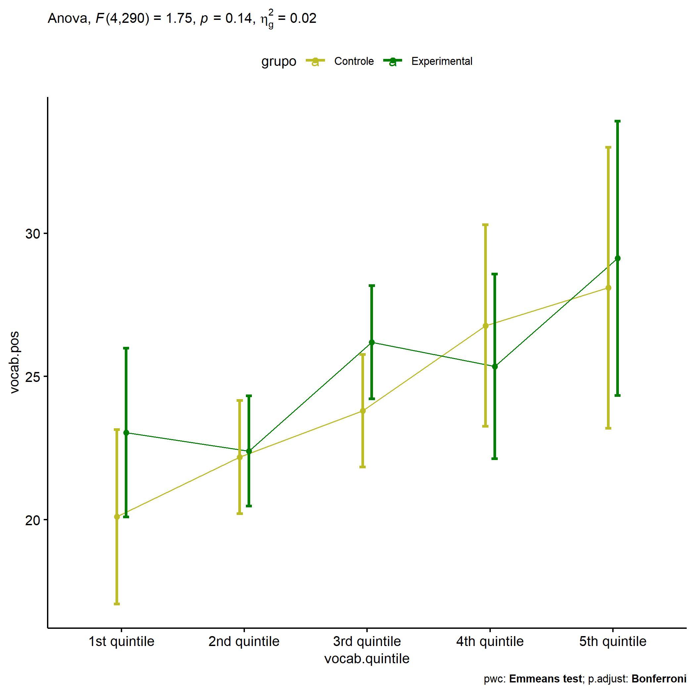<!-- -->

``` r
plots <- twoWayAncovaBoxPlots(
  wdat, "vocab.pos", c("grupo","vocab.quintile"), aov, pwcs, covar = "vocab.pre",
  theme = "classic", color = color[["grupo:vocab.quintile"]],
  subtitle = which(aov$Effect == "grupo:vocab.quintile"))
```

``` r
plots[["grupo:vocab.quintile"]] + ggplot2::ylab("Vocabulario") + ggplot2::scale_x_discrete(labels=c('pre', 'pos'))
```

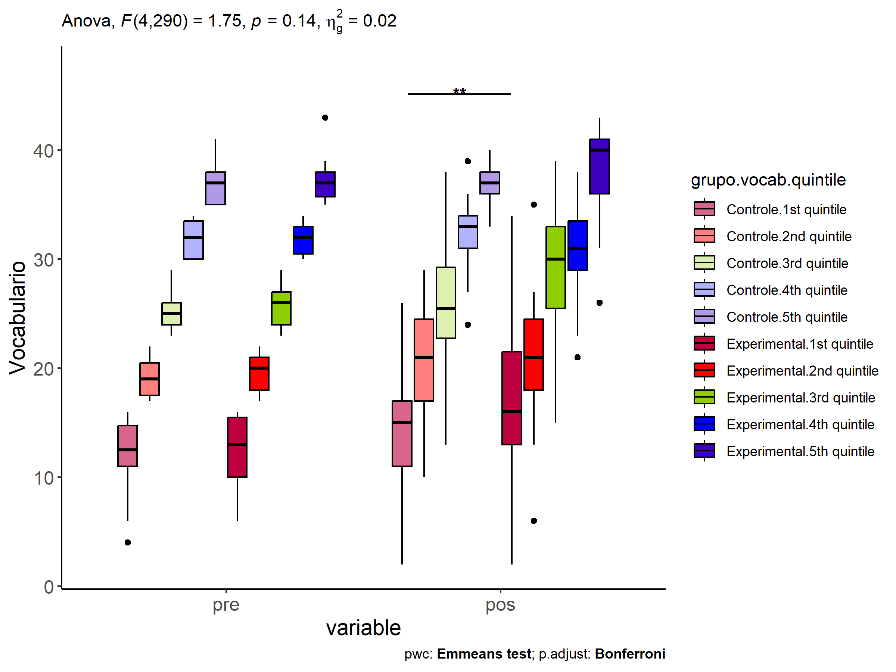<!-- -->

``` r
plots <- twoWayAncovaBoxPlots(
  wdat.long, "vocab", c("grupo","vocab.quintile"), aov, pwc.long, pre.post = "time",
  theme = "classic", color = color$prepost)
```

``` r
plots[["grupo:vocab.quintile"]] + ggplot2::ylab("Vocabulario")
```

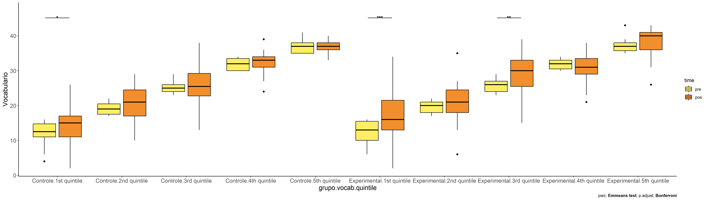<!-- -->

### Checking linearity assumption

``` r
ggscatter(wdat, x = "vocab.pre", y = "vocab.pos", size = 0.5,
          facet.by = c("grupo","vocab.quintile"), add = "reg.line")+
  stat_regline_equation(
    aes(label =  paste(..eq.label.., ..rr.label.., sep = "~~~~"))
  )
```

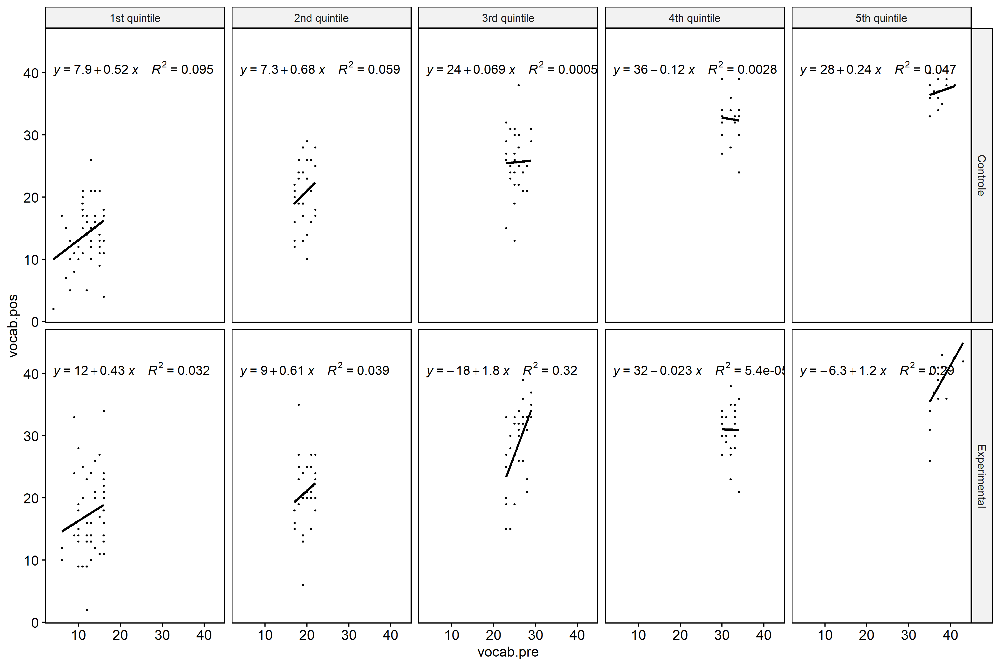<!-- -->

### Checking normality and homogeneity

``` r
res <- augment(lm(vocab.pos ~ vocab.pre + grupo*vocab.quintile, data = wdat))
```

``` r
shapiro_test(res$.resid)
```

    ## # A tibble: 1 × 3
    ##   variable   statistic p.value
    ##   <chr>          <dbl>   <dbl>
    ## 1 res$.resid     0.989  0.0185

``` r
levene_test(res, .resid ~ grupo*vocab.quintile)
```

    ## # A tibble: 1 × 4
    ##     df1   df2 statistic      p
    ##   <int> <int>     <dbl>  <dbl>
    ## 1     9   291      1.97 0.0424

# Summary of Results

## Descriptive Statistics

``` r
df <- get.descriptives(ldat[["grupo"]], c(dv.pre, dv.pos), c("grupo"), 
                       include.global = T, symmetry.test = T, normality.test = F)
df <- plyr::rbind.fill(
  df, do.call(plyr::rbind.fill, lapply(lfatores2, FUN = function(f) {
    if (nrow(dat) > 0 && sum(!is.na(unique(dat[[f]]))) > 1)
      get.descriptives(ldat[[paste0("grupo:",f)]], c(dv.pre,dv.pos), c("grupo", f),
                       symmetry.test = T, normality.test = F)
    }))
)
(df <- df[,c(fatores1[fatores1 %in% colnames(df)],"variable",
             colnames(df)[!colnames(df) %in% c(fatores1,"variable")])])
```

    ##           grupo Sexo   Zona Cor.Raca vocab.quintile  variable   n   mean median min max     sd    se    ci   iqr
    ## 1      Controle <NA>   <NA>     <NA>           <NA> vocab.pre 145 21.338   20.0   4  41  8.677 0.721 1.424 13.00
    ## 2  Experimental <NA>   <NA>     <NA>           <NA> vocab.pre 156 23.090   23.0   6  43  8.538 0.684 1.350 14.00
    ## 3          <NA> <NA>   <NA>     <NA>           <NA> vocab.pre 301 22.246   22.0   4  43  8.636 0.498 0.980 15.00
    ## 4      Controle <NA>   <NA>     <NA>           <NA> vocab.pos 145 22.503   21.0   2  40  8.985 0.746 1.475 14.00
    ## 5  Experimental <NA>   <NA>     <NA>           <NA> vocab.pos 156 25.256   25.0   9  44  8.788 0.704 1.390 13.25
    ## 6          <NA> <NA>   <NA>     <NA>           <NA> vocab.pos 301 23.930   24.0   2  44  8.975 0.517 1.018 14.00
    ## 7      Controle    F   <NA>     <NA>           <NA> vocab.pre  64 22.953   23.0   7  39  8.295 1.037 2.072 13.25
    ## 8      Controle    M   <NA>     <NA>           <NA> vocab.pre  81 20.148   18.0   4  41  8.804 0.978 1.947 13.00
    ## 9  Experimental    F   <NA>     <NA>           <NA> vocab.pre  83 24.434   25.0   6  43  8.687 0.954 1.897 12.00
    ## 10 Experimental    M   <NA>     <NA>           <NA> vocab.pre  74 21.743   20.0   6  38  8.250 0.959 1.911 12.75
    ## 11     Controle    F   <NA>     <NA>           <NA> vocab.pos  64 25.047   25.0   9  39  8.088 1.011 2.020 14.00
    ## 12     Controle    M   <NA>     <NA>           <NA> vocab.pos  81 20.556   19.0   2  40  9.098 1.011 2.012 14.00
    ## 13 Experimental    F   <NA>     <NA>           <NA> vocab.pos  83 27.048   28.0   9  44  8.732 0.958 1.907 12.50
    ## 14 Experimental    M   <NA>     <NA>           <NA> vocab.pos  74 23.189   21.0   9  41  8.402 0.977 1.947 12.50
    ## 15     Controle <NA>  Rural     <NA>           <NA> vocab.pre  95 22.189   23.0   4  39  8.372 0.859 1.705 13.00
    ## 16     Controle <NA> Urbana     <NA>           <NA> vocab.pre  28 23.214   21.5  10  41 10.082 1.905 3.910 18.25
    ## 17 Experimental <NA>  Rural     <NA>           <NA> vocab.pre  81 22.012   22.0   6  43  8.333 0.926 1.843 13.00
    ## 18 Experimental <NA> Urbana     <NA>           <NA> vocab.pre  37 24.189   25.0   9  38  8.822 1.450 2.941 14.00
    ## 19     Controle <NA>  Rural     <NA>           <NA> vocab.pos  95 23.274   24.0   2  40  9.048 0.928 1.843 15.00
    ## 20     Controle <NA> Urbana     <NA>           <NA> vocab.pos  28 24.821   23.0   9  38  8.710 1.646 3.377 14.00
    ## 21 Experimental <NA>  Rural     <NA>           <NA> vocab.pos  81 24.000   23.0   6  42  8.078 0.898 1.786 11.00
    ## 22 Experimental <NA> Urbana     <NA>           <NA> vocab.pos  37 26.432   25.0   9  41  9.558 1.571 3.187 16.00
    ## 23     Controle <NA>   <NA>   Branca           <NA> vocab.pre  22 23.000   24.5   8  36  7.400 1.578 3.281  5.75
    ## 24     Controle <NA>   <NA>    Parda           <NA> vocab.pre  42 21.405   19.5   7  39  9.240 1.426 2.879 16.00
    ## 25 Experimental <NA>   <NA>   Branca           <NA> vocab.pre  18 25.500   25.5  12  38  8.053 1.898 4.005 11.25
    ## 26 Experimental <NA>   <NA> Indígena           <NA> vocab.pre  13 21.000   22.0  12  34  7.506 2.082 4.536 13.00
    ## 27 Experimental <NA>   <NA>    Parda           <NA> vocab.pre  43 22.000   22.0   6  35  8.136 1.241 2.504 13.50
    ## 28     Controle <NA>   <NA>   Branca           <NA> vocab.pos  22 23.727   24.5  10  37  8.282 1.766 3.672 12.00
    ## 29     Controle <NA>   <NA>    Parda           <NA> vocab.pos  42 22.167   21.0   4  39  9.845 1.519 3.068 18.00
    ## 30 Experimental <NA>   <NA>   Branca           <NA> vocab.pos  18 24.333   21.0   6  41 11.314 2.667 5.626 18.50
    ## 31 Experimental <NA>   <NA> Indígena           <NA> vocab.pos  13 24.308   23.0  13  39  8.625 2.392 5.212 15.00
    ## 32 Experimental <NA>   <NA>    Parda           <NA> vocab.pos  43 24.070   24.0   9  37  7.821 1.193 2.407 12.00
    ## 33     Controle <NA>   <NA>     <NA>   1st quintile vocab.pre  50 12.140   12.5   4  16  2.942 0.416 0.836  3.75
    ## 34     Controle <NA>   <NA>     <NA>   2nd quintile vocab.pre  31 19.226   19.0  17  22  1.802 0.324 0.661  3.00
    ## 35     Controle <NA>   <NA>     <NA>   3rd quintile vocab.pre  32 25.125   25.0  23  29  1.755 0.310 0.633  2.00
    ## 36     Controle <NA>   <NA>     <NA>   4th quintile vocab.pre  19 31.895   32.0  30  34  1.663 0.382 0.802  3.50
    ## 37     Controle <NA>   <NA>     <NA>   5th quintile vocab.pre  13 37.000   37.0  35  41  1.871 0.519 1.131  3.00
    ## 38 Experimental <NA>   <NA>     <NA>   1st quintile vocab.pre  47 12.660   13.0   6  16  2.776 0.405 0.815  5.50
    ## 39 Experimental <NA>   <NA>     <NA>   2nd quintile vocab.pre  31 19.742   20.0  17  22  1.751 0.314 0.642  3.00
    ## 40 Experimental <NA>   <NA>     <NA>   3rd quintile vocab.pre  35 25.771   26.0  23  29  2.030 0.343 0.697  3.00
    ## 41 Experimental <NA>   <NA>     <NA>   4th quintile vocab.pre  27 31.630   32.0  30  34  1.305 0.251 0.516  2.50
    ## 42 Experimental <NA>   <NA>     <NA>   5th quintile vocab.pre  16 37.188   37.0  35  43  2.073 0.518 1.104  2.25
    ## 43     Controle <NA>   <NA>     <NA>   1st quintile vocab.pos  50 14.200   15.0   2  26  4.949 0.700 1.406  6.00
    ## 44     Controle <NA>   <NA>     <NA>   2nd quintile vocab.pos  31 20.484   21.0  10  29  5.072 0.911 1.860  7.50
    ## 45     Controle <NA>   <NA>     <NA>   3rd quintile vocab.pos  32 25.594   25.5  13  38  5.223 0.923 1.883  6.50
    ## 46     Controle <NA>   <NA>     <NA>   4th quintile vocab.pos  19 32.579   33.0  24  39  3.687 0.846 1.777  3.00
    ## 47     Controle <NA>   <NA>     <NA>   5th quintile vocab.pos  13 36.923   37.0  33  40  2.060 0.571 1.245  2.00
    ## 48 Experimental <NA>   <NA>     <NA>   1st quintile vocab.pos  47 17.447   16.0   2  34  6.593 0.962 1.936  8.50
    ## 49 Experimental <NA>   <NA>     <NA>   2nd quintile vocab.pos  31 21.000   21.0   6  35  5.391 0.968 1.978  6.50
    ## 50 Experimental <NA>   <NA>     <NA>   3rd quintile vocab.pos  35 28.371   30.0  15  39  6.481 1.096 2.226  7.50
    ## 51 Experimental <NA>   <NA>     <NA>   4th quintile vocab.pos  27 31.000   31.0  21  38  4.010 0.772 1.586  4.50
    ## 52 Experimental <NA>   <NA>     <NA>   5th quintile vocab.pos  16 38.062   40.0  26  43  4.568 1.142 2.434  5.00
    ##    symmetry    skewness     kurtosis
    ## 1       YES  0.28033083 -0.871260903
    ## 2       YES  0.05421717 -0.994983396
    ## 3       YES  0.15930613 -0.947674178
    ## 4       YES  0.08997163 -0.858172653
    ## 5       YES  0.06714064 -0.952306934
    ## 6       YES  0.06608317 -0.858480328
    ## 7       YES  0.12107253 -0.970342560
    ## 8       YES  0.42130654 -0.748902532
    ## 9       YES -0.20224221 -0.823526759
    ## 10      YES  0.31422646 -1.071042594
    ## 11      YES -0.01525533 -1.105031015
    ## 12      YES  0.33852878 -0.707166612
    ## 13      YES -0.15821200 -0.916400271
    ## 14      YES  0.32586195 -0.759550097
    ## 15      YES  0.01062411 -0.883073271
    ## 16      YES  0.25859484 -1.434023496
    ## 17      YES  0.11392167 -0.864138710
    ## 18      YES -0.03304376 -1.312339619
    ## 19      YES -0.03521604 -0.945630767
    ## 20      YES  0.07040274 -1.244586446
    ## 21      YES  0.07209627 -0.664391304
    ## 22      YES -0.06443201 -1.304213640
    ## 23      YES -0.46705736 -0.543829318
    ## 24      YES  0.46220664 -1.088729094
    ## 25      YES -0.05074010 -1.229656247
    ## 26      YES  0.28272192 -1.548143919
    ## 27      YES -0.16350043 -1.152350437
    ## 28      YES -0.11451444 -1.215546029
    ## 29      YES  0.10030581 -1.261607933
    ## 30      YES  0.10915552 -1.553285952
    ## 31      YES  0.29363097 -1.410667901
    ## 32      YES -0.22232183 -1.165136312
    ## 33       NO -0.61536314 -0.231471202
    ## 34      YES  0.16895584 -1.368189211
    ## 35       NO  0.61334554 -0.477784749
    ## 36      YES  0.01996559 -1.683232753
    ## 37       NO  0.56389185 -0.777080063
    ## 38      YES -0.40572241 -0.674515950
    ## 39      YES -0.12201316 -1.391844829
    ## 40      YES  0.05643892 -1.317167225
    ## 41      YES  0.17637414 -1.280947825
    ## 42       NO  1.15575690  1.266991734
    ## 43      YES -0.27862982 -0.111709047
    ## 44      YES -0.21924473 -0.947730443
    ## 45      YES -0.20003806  0.088377936
    ## 46      YES -0.36931963 -0.016286702
    ## 47      YES -0.38051203 -1.052639666
    ## 48      YES  0.37329701 -0.098428251
    ## 49      YES -0.23590116  0.976785244
    ## 50       NO -0.66770723 -0.587839534
    ## 51      YES -0.40333782  0.005464703
    ## 52       NO -1.22630275  0.619390881

| grupo        | Sexo | Zona   | Cor.Raca | vocab.quintile | variable  |   n |   mean | median | min | max |     sd |    se |    ci |   iqr | symmetry | skewness | kurtosis |
|:-------------|:-----|:-------|:---------|:---------------|:----------|----:|-------:|-------:|----:|----:|-------:|------:|------:|------:|:---------|---------:|---------:|
| Controle     |      |        |          |                | vocab.pre | 145 | 21.338 |   20.0 |   4 |  41 |  8.677 | 0.721 | 1.424 | 13.00 | YES      |    0.280 |   -0.871 |
| Experimental |      |        |          |                | vocab.pre | 156 | 23.090 |   23.0 |   6 |  43 |  8.538 | 0.684 | 1.350 | 14.00 | YES      |    0.054 |   -0.995 |
|              |      |        |          |                | vocab.pre | 301 | 22.246 |   22.0 |   4 |  43 |  8.636 | 0.498 | 0.980 | 15.00 | YES      |    0.159 |   -0.948 |
| Controle     |      |        |          |                | vocab.pos | 145 | 22.503 |   21.0 |   2 |  40 |  8.985 | 0.746 | 1.475 | 14.00 | YES      |    0.090 |   -0.858 |
| Experimental |      |        |          |                | vocab.pos | 156 | 25.256 |   25.0 |   9 |  44 |  8.788 | 0.704 | 1.390 | 13.25 | YES      |    0.067 |   -0.952 |
|              |      |        |          |                | vocab.pos | 301 | 23.930 |   24.0 |   2 |  44 |  8.975 | 0.517 | 1.018 | 14.00 | YES      |    0.066 |   -0.858 |
| Controle     | F    |        |          |                | vocab.pre |  64 | 22.953 |   23.0 |   7 |  39 |  8.295 | 1.037 | 2.072 | 13.25 | YES      |    0.121 |   -0.970 |
| Controle     | M    |        |          |                | vocab.pre |  81 | 20.148 |   18.0 |   4 |  41 |  8.804 | 0.978 | 1.947 | 13.00 | YES      |    0.421 |   -0.749 |
| Experimental | F    |        |          |                | vocab.pre |  83 | 24.434 |   25.0 |   6 |  43 |  8.687 | 0.954 | 1.897 | 12.00 | YES      |   -0.202 |   -0.824 |
| Experimental | M    |        |          |                | vocab.pre |  74 | 21.743 |   20.0 |   6 |  38 |  8.250 | 0.959 | 1.911 | 12.75 | YES      |    0.314 |   -1.071 |
| Controle     | F    |        |          |                | vocab.pos |  64 | 25.047 |   25.0 |   9 |  39 |  8.088 | 1.011 | 2.020 | 14.00 | YES      |   -0.015 |   -1.105 |
| Controle     | M    |        |          |                | vocab.pos |  81 | 20.556 |   19.0 |   2 |  40 |  9.098 | 1.011 | 2.012 | 14.00 | YES      |    0.339 |   -0.707 |
| Experimental | F    |        |          |                | vocab.pos |  83 | 27.048 |   28.0 |   9 |  44 |  8.732 | 0.958 | 1.907 | 12.50 | YES      |   -0.158 |   -0.916 |
| Experimental | M    |        |          |                | vocab.pos |  74 | 23.189 |   21.0 |   9 |  41 |  8.402 | 0.977 | 1.947 | 12.50 | YES      |    0.326 |   -0.760 |
| Controle     |      | Rural  |          |                | vocab.pre |  95 | 22.189 |   23.0 |   4 |  39 |  8.372 | 0.859 | 1.705 | 13.00 | YES      |    0.011 |   -0.883 |
| Controle     |      | Urbana |          |                | vocab.pre |  28 | 23.214 |   21.5 |  10 |  41 | 10.082 | 1.905 | 3.910 | 18.25 | YES      |    0.259 |   -1.434 |
| Experimental |      | Rural  |          |                | vocab.pre |  81 | 22.012 |   22.0 |   6 |  43 |  8.333 | 0.926 | 1.843 | 13.00 | YES      |    0.114 |   -0.864 |
| Experimental |      | Urbana |          |                | vocab.pre |  37 | 24.189 |   25.0 |   9 |  38 |  8.822 | 1.450 | 2.941 | 14.00 | YES      |   -0.033 |   -1.312 |
| Controle     |      | Rural  |          |                | vocab.pos |  95 | 23.274 |   24.0 |   2 |  40 |  9.048 | 0.928 | 1.843 | 15.00 | YES      |   -0.035 |   -0.946 |
| Controle     |      | Urbana |          |                | vocab.pos |  28 | 24.821 |   23.0 |   9 |  38 |  8.710 | 1.646 | 3.377 | 14.00 | YES      |    0.070 |   -1.245 |
| Experimental |      | Rural  |          |                | vocab.pos |  81 | 24.000 |   23.0 |   6 |  42 |  8.078 | 0.898 | 1.786 | 11.00 | YES      |    0.072 |   -0.664 |
| Experimental |      | Urbana |          |                | vocab.pos |  37 | 26.432 |   25.0 |   9 |  41 |  9.558 | 1.571 | 3.187 | 16.00 | YES      |   -0.064 |   -1.304 |
| Controle     |      |        | Branca   |                | vocab.pre |  22 | 23.000 |   24.5 |   8 |  36 |  7.400 | 1.578 | 3.281 |  5.75 | YES      |   -0.467 |   -0.544 |
| Controle     |      |        | Parda    |                | vocab.pre |  42 | 21.405 |   19.5 |   7 |  39 |  9.240 | 1.426 | 2.879 | 16.00 | YES      |    0.462 |   -1.089 |
| Experimental |      |        | Branca   |                | vocab.pre |  18 | 25.500 |   25.5 |  12 |  38 |  8.053 | 1.898 | 4.005 | 11.25 | YES      |   -0.051 |   -1.230 |
| Experimental |      |        | Indígena |                | vocab.pre |  13 | 21.000 |   22.0 |  12 |  34 |  7.506 | 2.082 | 4.536 | 13.00 | YES      |    0.283 |   -1.548 |
| Experimental |      |        | Parda    |                | vocab.pre |  43 | 22.000 |   22.0 |   6 |  35 |  8.136 | 1.241 | 2.504 | 13.50 | YES      |   -0.164 |   -1.152 |
| Controle     |      |        | Branca   |                | vocab.pos |  22 | 23.727 |   24.5 |  10 |  37 |  8.282 | 1.766 | 3.672 | 12.00 | YES      |   -0.115 |   -1.216 |
| Controle     |      |        | Parda    |                | vocab.pos |  42 | 22.167 |   21.0 |   4 |  39 |  9.845 | 1.519 | 3.068 | 18.00 | YES      |    0.100 |   -1.262 |
| Experimental |      |        | Branca   |                | vocab.pos |  18 | 24.333 |   21.0 |   6 |  41 | 11.314 | 2.667 | 5.626 | 18.50 | YES      |    0.109 |   -1.553 |
| Experimental |      |        | Indígena |                | vocab.pos |  13 | 24.308 |   23.0 |  13 |  39 |  8.625 | 2.392 | 5.212 | 15.00 | YES      |    0.294 |   -1.411 |
| Experimental |      |        | Parda    |                | vocab.pos |  43 | 24.070 |   24.0 |   9 |  37 |  7.821 | 1.193 | 2.407 | 12.00 | YES      |   -0.222 |   -1.165 |
| Controle     |      |        |          | 1st quintile   | vocab.pre |  50 | 12.140 |   12.5 |   4 |  16 |  2.942 | 0.416 | 0.836 |  3.75 | NO       |   -0.615 |   -0.231 |
| Controle     |      |        |          | 2nd quintile   | vocab.pre |  31 | 19.226 |   19.0 |  17 |  22 |  1.802 | 0.324 | 0.661 |  3.00 | YES      |    0.169 |   -1.368 |
| Controle     |      |        |          | 3rd quintile   | vocab.pre |  32 | 25.125 |   25.0 |  23 |  29 |  1.755 | 0.310 | 0.633 |  2.00 | NO       |    0.613 |   -0.478 |
| Controle     |      |        |          | 4th quintile   | vocab.pre |  19 | 31.895 |   32.0 |  30 |  34 |  1.663 | 0.382 | 0.802 |  3.50 | YES      |    0.020 |   -1.683 |
| Controle     |      |        |          | 5th quintile   | vocab.pre |  13 | 37.000 |   37.0 |  35 |  41 |  1.871 | 0.519 | 1.131 |  3.00 | NO       |    0.564 |   -0.777 |
| Experimental |      |        |          | 1st quintile   | vocab.pre |  47 | 12.660 |   13.0 |   6 |  16 |  2.776 | 0.405 | 0.815 |  5.50 | YES      |   -0.406 |   -0.675 |
| Experimental |      |        |          | 2nd quintile   | vocab.pre |  31 | 19.742 |   20.0 |  17 |  22 |  1.751 | 0.314 | 0.642 |  3.00 | YES      |   -0.122 |   -1.392 |
| Experimental |      |        |          | 3rd quintile   | vocab.pre |  35 | 25.771 |   26.0 |  23 |  29 |  2.030 | 0.343 | 0.697 |  3.00 | YES      |    0.056 |   -1.317 |
| Experimental |      |        |          | 4th quintile   | vocab.pre |  27 | 31.630 |   32.0 |  30 |  34 |  1.305 | 0.251 | 0.516 |  2.50 | YES      |    0.176 |   -1.281 |
| Experimental |      |        |          | 5th quintile   | vocab.pre |  16 | 37.188 |   37.0 |  35 |  43 |  2.073 | 0.518 | 1.104 |  2.25 | NO       |    1.156 |    1.267 |
| Controle     |      |        |          | 1st quintile   | vocab.pos |  50 | 14.200 |   15.0 |   2 |  26 |  4.949 | 0.700 | 1.406 |  6.00 | YES      |   -0.279 |   -0.112 |
| Controle     |      |        |          | 2nd quintile   | vocab.pos |  31 | 20.484 |   21.0 |  10 |  29 |  5.072 | 0.911 | 1.860 |  7.50 | YES      |   -0.219 |   -0.948 |
| Controle     |      |        |          | 3rd quintile   | vocab.pos |  32 | 25.594 |   25.5 |  13 |  38 |  5.223 | 0.923 | 1.883 |  6.50 | YES      |   -0.200 |    0.088 |
| Controle     |      |        |          | 4th quintile   | vocab.pos |  19 | 32.579 |   33.0 |  24 |  39 |  3.687 | 0.846 | 1.777 |  3.00 | YES      |   -0.369 |   -0.016 |
| Controle     |      |        |          | 5th quintile   | vocab.pos |  13 | 36.923 |   37.0 |  33 |  40 |  2.060 | 0.571 | 1.245 |  2.00 | YES      |   -0.381 |   -1.053 |
| Experimental |      |        |          | 1st quintile   | vocab.pos |  47 | 17.447 |   16.0 |   2 |  34 |  6.593 | 0.962 | 1.936 |  8.50 | YES      |    0.373 |   -0.098 |
| Experimental |      |        |          | 2nd quintile   | vocab.pos |  31 | 21.000 |   21.0 |   6 |  35 |  5.391 | 0.968 | 1.978 |  6.50 | YES      |   -0.236 |    0.977 |
| Experimental |      |        |          | 3rd quintile   | vocab.pos |  35 | 28.371 |   30.0 |  15 |  39 |  6.481 | 1.096 | 2.226 |  7.50 | NO       |   -0.668 |   -0.588 |
| Experimental |      |        |          | 4th quintile   | vocab.pos |  27 | 31.000 |   31.0 |  21 |  38 |  4.010 | 0.772 | 1.586 |  4.50 | YES      |   -0.403 |    0.005 |
| Experimental |      |        |          | 5th quintile   | vocab.pos |  16 | 38.062 |   40.0 |  26 |  43 |  4.568 | 1.142 | 2.434 |  5.00 | NO       |   -1.226 |    0.619 |

## ANCOVA Table Comparison

``` r
df <- do.call(plyr::rbind.fill, laov)
(df <- df[!duplicated(df$Effect),])
```

    ##                  Effect DFn DFd       F        p p<.05      ges DFn' DFd'      F'       p' p<.05'     ges'
    ## 1                 grupo   1 298   4.558 3.40e-02     * 1.50e-02    1  308   2.583 1.09e-01        0.008000
    ## 2             vocab.pre   1 298 580.381 6.36e-72     * 6.61e-01    1  308 427.226 3.82e-60      * 0.581000
    ## 4            grupo:Sexo   1 297   0.203 6.52e-01       6.84e-04    1  306   0.299 5.85e-01        0.000977
    ## 5                  Sexo   1 297  10.260 2.00e-03     * 3.30e-02    1  306   5.884 1.60e-02      * 0.019000
    ## 8            grupo:Zona   1 236   0.002 9.67e-01       7.10e-06    1  243   0.096 7.57e-01        0.000395
    ## 10                 Zona   1 236   0.789 3.75e-01       3.00e-03    1  243   0.771 3.81e-01        0.003000
    ## 11             Cor.Raca   2 132   1.470 2.34e-01       2.20e-02    2  133   1.232 2.95e-01        0.018000
    ## 13       grupo:Cor.Raca   1 132   2.156 1.44e-01       1.60e-02    1  133   2.577 1.11e-01        0.019000
    ## 16 grupo:vocab.quintile   4 290   1.754 1.38e-01       2.40e-02    4  300   2.103 8.00e-02        0.027000
    ## 18       vocab.quintile   4 290   1.620 1.69e-01       2.20e-02    4  300   1.462 2.14e-01        0.019000

|     | Effect               | DFn | DFd |       F |     p | p\<.05 |   ges | DFn’ | DFd’ |      F’ |    p’ | p\<.05’ |  ges’ |
|:----|:---------------------|----:|----:|--------:|------:|:-------|------:|-----:|-----:|--------:|------:|:--------|------:|
| 1   | grupo                |   1 | 298 |   4.558 | 0.034 | \*     | 0.015 |    1 |  308 |   2.583 | 0.109 |         | 0.008 |
| 2   | vocab.pre            |   1 | 298 | 580.381 | 0.000 | \*     | 0.661 |    1 |  308 | 427.226 | 0.000 | \*      | 0.581 |
| 4   | grupo:Sexo           |   1 | 297 |   0.203 | 0.652 |        | 0.001 |    1 |  306 |   0.299 | 0.585 |         | 0.001 |
| 5   | Sexo                 |   1 | 297 |  10.260 | 0.002 | \*     | 0.033 |    1 |  306 |   5.884 | 0.016 | \*      | 0.019 |
| 8   | grupo:Zona           |   1 | 236 |   0.002 | 0.967 |        | 0.000 |    1 |  243 |   0.096 | 0.757 |         | 0.000 |
| 10  | Zona                 |   1 | 236 |   0.789 | 0.375 |        | 0.003 |    1 |  243 |   0.771 | 0.381 |         | 0.003 |
| 11  | Cor.Raca             |   2 | 132 |   1.470 | 0.234 |        | 0.022 |    2 |  133 |   1.232 | 0.295 |         | 0.018 |
| 13  | grupo:Cor.Raca       |   1 | 132 |   2.156 | 0.144 |        | 0.016 |    1 |  133 |   2.577 | 0.111 |         | 0.019 |
| 16  | grupo:vocab.quintile |   4 | 290 |   1.754 | 0.138 |        | 0.024 |    4 |  300 |   2.103 | 0.080 |         | 0.027 |
| 18  | vocab.quintile       |   4 | 290 |   1.620 | 0.169 |        | 0.022 |    4 |  300 |   1.462 | 0.214 |         | 0.019 |

## PairWise Table Comparison

``` r
df <- do.call(plyr::rbind.fill, lpwc)
df <- df[,c(names(lfatores), names(df)[!names(df) %in% c(names(lfatores),"term",".y.")])]
```

| grupo        | Sexo | Zona   | Cor.Raca | vocab.quintile | group1       | group2       |  df | statistic |     p | p.adj | p.adj.signif | df’ | statistic’ |    p’ | p.adj’ | p.adj.signif’ |
|:-------------|:-----|:-------|:---------|:---------------|:-------------|:-------------|----:|----------:|------:|------:|:-------------|----:|-----------:|------:|-------:|:--------------|
| Controle     |      |        |          |                | pre          | pos          | 598 |    -1.135 | 0.257 | 0.257 | ns           | 618 |     -1.025 | 0.306 |  0.306 | ns            |
| Experimental |      |        |          |                | pre          | pos          | 598 |    -2.188 | 0.029 | 0.029 | \*           | 618 |     -1.872 | 0.062 |  0.062 | ns            |
|              |      |        |          |                | Controle     | Experimental | 298 |    -2.135 | 0.034 | 0.034 | \*           | 308 |     -1.607 | 0.109 |  0.109 | ns            |
| Controle     | F    |        |          |                | pre          | pos          | 596 |    -1.381 | 0.168 | 0.168 | ns           | 614 |     -1.226 | 0.221 |  0.221 | ns            |
| Controle     | M    |        |          |                | pre          | pos          | 596 |    -0.302 | 0.763 | 0.763 | ns           | 614 |     -0.297 | 0.767 |  0.767 | ns            |
| Controle     |      |        |          |                | F            | M            | 297 |     2.552 | 0.011 | 0.011 | \*           | 306 |      2.066 | 0.040 |  0.040 | \*            |
| Experimental | F    |        |          |                | pre          | pos          | 596 |    -1.964 | 0.050 | 0.050 | ns           | 614 |     -1.650 | 0.100 |  0.100 | ns            |
| Experimental | M    |        |          |                | pre          | pos          | 596 |    -1.026 | 0.306 | 0.306 | ns           | 614 |     -1.016 | 0.310 |  0.310 | ns            |
| Experimental |      |        |          |                | F            | M            | 297 |     2.021 | 0.044 | 0.044 | \*           | 306 |      1.409 | 0.160 |  0.160 | ns            |
|              | F    |        |          |                | Controle     | Experimental | 297 |    -0.932 | 0.352 | 0.352 | ns           | 306 |     -0.611 | 0.541 |  0.541 | ns            |
|              | M    |        |          |                | Controle     | Experimental | 297 |    -1.611 | 0.108 | 0.108 | ns           | 306 |     -1.411 | 0.159 |  0.159 | ns            |
| Controle     |      |        |          |                | Rural        | Urbana       | 236 |    -0.634 | 0.526 | 0.526 | ns           | 243 |     -0.822 | 0.412 |  0.412 | ns            |
| Controle     |      | Rural  |          |                | pre          | pos          | 474 |    -0.858 | 0.391 | 0.391 | ns           | 488 |     -0.627 | 0.531 |  0.531 | ns            |
| Controle     |      | Urbana |          |                | pre          | pos          | 474 |    -0.691 | 0.490 | 0.490 | ns           | 488 |     -0.682 | 0.495 |  0.495 | ns            |
| Experimental |      |        |          |                | Rural        | Urbana       | 236 |    -0.625 | 0.532 | 0.532 | ns           | 243 |     -0.441 | 0.659 |  0.659 | ns            |
| Experimental |      | Rural  |          |                | pre          | pos          | 474 |    -1.453 | 0.147 | 0.147 | ns           | 488 |     -1.331 | 0.184 |  0.184 | ns            |
| Experimental |      | Urbana |          |                | pre          | pos          | 474 |    -1.108 | 0.268 | 0.268 | ns           | 488 |     -0.911 | 0.363 |  0.363 | ns            |
|              |      | Rural  |          |                | Controle     | Experimental | 236 |    -1.115 | 0.266 | 0.266 | ns           | 243 |     -1.125 | 0.262 |  0.262 | ns            |
|              |      | Urbana |          |                | Controle     | Experimental | 236 |    -0.625 | 0.532 | 0.532 | ns           | 243 |     -0.310 | 0.757 |  0.757 | ns            |
| Controle     |      |        | Branca   |                | pre          | pos          | 266 |    -0.276 | 0.782 | 0.782 | ns           | 268 |     -0.275 | 0.784 |  0.784 | ns            |
| Controle     |      |        | Indígena |                | pre          | pos          |     |           |       |       |              |     |            |       |        |               |
| Controle     |      |        |          |                | Branca       | Indígena     |     |           |       |       |              |     |            |       |        |               |
| Controle     |      |        |          |                | Branca       | Parda        | 132 |     0.097 | 0.923 | 0.923 | ns           | 133 |      0.116 | 0.908 |  0.908 | ns            |
| Controle     |      |        |          |                | Indígena     | Parda        |     |           |       |       |              |     |            |       |        |               |
| Controle     |      |        | Parda    |                | pre          | pos          | 266 |    -0.400 | 0.689 | 0.689 | ns           | 268 |     -0.398 | 0.691 |  0.691 | ns            |
| Experimental |      |        | Branca   |                | pre          | pos          | 266 |     0.401 | 0.689 | 0.689 | ns           | 268 |      0.399 | 0.690 |  0.690 | ns            |
| Experimental |      |        | Indígena |                | pre          | pos          | 266 |    -0.966 | 0.335 | 0.335 | ns           | 268 |     -0.961 | 0.338 |  0.338 | ns            |
| Experimental |      |        |          |                | Branca       | Indígena     | 132 |    -2.053 | 0.042 | 0.126 | ns           | 133 |     -1.848 | 0.067 |  0.201 | ns            |
| Experimental |      |        |          |                | Branca       | Parda        | 132 |    -1.908 | 0.059 | 0.176 | ns           | 133 |     -2.079 | 0.040 |  0.119 | ns            |
| Experimental |      |        |          |                | Indígena     | Parda        | 132 |     0.674 | 0.502 | 1.000 | ns           | 133 |      0.288 | 0.774 |  1.000 | ns            |
| Experimental |      |        | Parda    |                | pre          | pos          | 266 |    -1.100 | 0.272 | 0.272 | ns           | 268 |     -1.433 | 0.153 |  0.153 | ns            |
|              |      |        | Branca   |                | Controle     | Experimental | 132 |     0.963 | 0.338 | 0.338 | ns           | 133 |      0.857 | 0.393 |  0.393 | ns            |
|              |      |        | Indígena |                | Controle     | Experimental |     |           |       |       |              |     |            |       |        |               |
|              |      |        | Parda    |                | Controle     | Experimental | 132 |    -1.192 | 0.235 | 0.235 | ns           | 133 |     -1.596 | 0.113 |  0.113 | ns            |
| Controle     |      |        |          | 1st quintile   | pre          | pos          | 582 |    -2.543 | 0.011 | 0.011 | \*           | 602 |     -2.296 | 0.022 |  0.022 | \*            |
| Controle     |      |        |          | 2nd quintile   | pre          | pos          | 582 |    -1.223 | 0.222 | 0.222 | ns           | 602 |     -1.104 | 0.270 |  0.270 | ns            |
| Controle     |      |        |          | 3rd quintile   | pre          | pos          | 582 |    -0.463 | 0.644 | 0.644 | ns           | 602 |     -0.027 | 0.978 |  0.978 | ns            |
| Controle     |      |        |          | 4th quintile   | pre          | pos          | 582 |    -0.521 | 0.603 | 0.603 | ns           | 602 |     -0.470 | 0.638 |  0.638 | ns            |
| Controle     |      |        |          | 5th quintile   | pre          | pos          | 582 |     0.048 | 0.961 | 0.961 | ns           | 602 |      0.044 | 0.965 |  0.965 | ns            |
| Controle     |      |        |          |                | 1st quintile | 2nd quintile | 290 |    -1.369 | 0.172 | 1.000 | ns           | 300 |     -1.405 | 0.161 |  1.000 | ns            |
| Controle     |      |        |          |                | 1st quintile | 3rd quintile | 290 |    -1.740 | 0.083 | 0.828 | ns           | 300 |     -1.618 | 0.107 |  1.000 | ns            |
| Controle     |      |        |          |                | 1st quintile | 4th quintile | 290 |    -2.195 | 0.029 | 0.290 | ns           | 300 |     -2.225 | 0.027 |  0.268 | ns            |
| Controle     |      |        |          |                | 1st quintile | 5th quintile | 290 |    -2.124 | 0.035 | 0.345 | ns           | 300 |     -2.168 | 0.031 |  0.310 | ns            |
| Controle     |      |        |          |                | 2nd quintile | 3rd quintile | 290 |    -1.058 | 0.291 | 1.000 | ns           | 300 |     -0.832 | 0.406 |  1.000 | ns            |
| Controle     |      |        |          |                | 2nd quintile | 4th quintile | 290 |    -2.002 | 0.046 | 0.462 | ns           | 300 |     -2.007 | 0.046 |  0.457 | ns            |
| Controle     |      |        |          |                | 2nd quintile | 5th quintile | 290 |    -1.990 | 0.048 | 0.476 | ns           | 300 |     -2.018 | 0.044 |  0.445 | ns            |
| Controle     |      |        |          |                | 3rd quintile | 4th quintile | 290 |    -1.696 | 0.091 | 0.909 | ns           | 300 |     -1.897 | 0.059 |  0.588 | ns            |
| Controle     |      |        |          |                | 3rd quintile | 5th quintile | 290 |    -1.830 | 0.068 | 0.682 | ns           | 300 |     -2.009 | 0.045 |  0.455 | ns            |
| Controle     |      |        |          |                | 4th quintile | 5th quintile | 290 |    -0.667 | 0.505 | 1.000 | ns           | 300 |     -0.696 | 0.487 |  1.000 | ns            |
| Experimental |      |        |          | 1st quintile   | pre          | pos          | 582 |    -5.730 | 0.000 | 0.000 | \*\*\*\*     | 602 |     -5.779 | 0.000 |  0.000 | \*\*\*\*      |
| Experimental |      |        |          | 2nd quintile   | pre          | pos          | 582 |    -1.223 | 0.222 | 0.222 | ns           | 602 |     -0.724 | 0.469 |  0.469 | ns            |
| Experimental |      |        |          | 3rd quintile   | pre          | pos          | 582 |    -2.685 | 0.007 | 0.007 | \*\*         | 602 |     -1.346 | 0.179 |  0.179 | ns            |
| Experimental |      |        |          | 4th quintile   | pre          | pos          | 582 |     0.571 | 0.568 | 0.568 | ns           | 602 |      0.983 | 0.326 |  0.326 | ns            |
| Experimental |      |        |          | 5th quintile   | pre          | pos          | 582 |    -0.611 | 0.541 | 0.541 | ns           | 602 |      0.000 | 1.000 |  1.000 | ns            |
| Experimental |      |        |          |                | 1st quintile | 2nd quintile | 290 |     0.419 | 0.675 | 1.000 | ns           | 300 |      0.720 | 0.472 |  1.000 | ns            |
| Experimental |      |        |          |                | 1st quintile | 3rd quintile | 290 |    -1.480 | 0.140 | 1.000 | ns           | 300 |     -0.892 | 0.373 |  1.000 | ns            |
| Experimental |      |        |          |                | 1st quintile | 4th quintile | 290 |    -0.803 | 0.423 | 1.000 | ns           | 300 |     -0.662 | 0.509 |  1.000 | ns            |
| Experimental |      |        |          |                | 1st quintile | 5th quintile | 290 |    -1.655 | 0.099 | 0.991 | ns           | 300 |     -1.418 | 0.157 |  1.000 | ns            |
| Experimental |      |        |          |                | 2nd quintile | 3rd quintile | 290 |    -2.512 | 0.013 | 0.126 | ns           | 300 |     -2.008 | 0.046 |  0.455 | ns            |
| Experimental |      |        |          |                | 2nd quintile | 4th quintile | 290 |    -1.396 | 0.164 | 1.000 | ns           | 300 |     -1.429 | 0.154 |  1.000 | ns            |
| Experimental |      |        |          |                | 2nd quintile | 5th quintile | 290 |    -2.346 | 0.020 | 0.196 | ns           | 300 |     -2.215 | 0.028 |  0.275 | ns            |
| Experimental |      |        |          |                | 3rd quintile | 4th quintile | 290 |     0.547 | 0.585 | 1.000 | ns           | 300 |      0.010 | 0.992 |  1.000 | ns            |
| Experimental |      |        |          |                | 3rd quintile | 5th quintile | 290 |    -1.329 | 0.185 | 1.000 | ns           | 300 |     -1.529 | 0.127 |  1.000 | ns            |
| Experimental |      |        |          |                | 4th quintile | 5th quintile | 290 |    -2.105 | 0.036 | 0.361 | ns           | 300 |     -1.852 | 0.065 |  0.650 | ns            |
|              |      |        |          | 1st quintile   | Controle     | Experimental | 290 |    -2.810 | 0.005 | 0.005 | \*\*         | 300 |     -2.933 | 0.004 |  0.004 | \*\*          |
|              |      |        |          | 2nd quintile   | Controle     | Experimental | 290 |    -0.161 | 0.872 | 0.872 | ns           | 300 |      0.131 | 0.896 |  0.896 | ns            |
|              |      |        |          | 3rd quintile   | Controle     | Experimental | 290 |    -1.901 | 0.058 | 0.058 | ns           | 300 |     -1.280 | 0.201 |  0.201 | ns            |
|              |      |        |          | 4th quintile   | Controle     | Experimental | 290 |     0.924 | 0.356 | 0.356 | ns           | 300 |      1.157 | 0.248 |  0.248 | ns            |
|              |      |        |          | 5th quintile   | Controle     | Experimental | 290 |    -0.536 | 0.592 | 0.592 | ns           | 300 |     -0.048 | 0.962 |  0.962 | ns            |

## EMMS Table Comparison

``` r
df <- do.call(plyr::rbind.fill, lemms)
df[["N-N'"]] <- df[["N"]] - df[["N'"]]
df <- df[,c(names(lfatores), names(df)[!names(df) %in% names(lfatores)])]
```

| grupo        | Sexo | Zona   | Cor.Raca | vocab.quintile |   N | M (pre) | SE (pre) | M (unadj) | SE (unadj) | M (adj) | SE (adj) |  N’ | M (pre)’ | SE (pre)’ | M (unadj)’ | SE (unadj)’ | M (adj)’ | SE (adj)’ | N-N’ |
|:-------------|:-----|:-------|:---------|:---------------|----:|--------:|---------:|----------:|-----------:|--------:|---------:|----:|---------:|----------:|-----------:|------------:|---------:|----------:|-----:|
| Controle     |      |        |          |                | 145 |  21.338 |    0.721 |    22.503 |      0.746 |  23.265 |    0.432 | 146 |   21.349 |     0.716 |     22.411 |       0.747 |   23.123 |     0.490 |   -1 |
| Experimental |      |        |          |                | 156 |  23.090 |    0.684 |    25.256 |      0.704 |  24.548 |    0.416 | 165 |   23.012 |     0.665 |     24.836 |       0.714 |   24.206 |     0.460 |   -9 |
| Controle     | F    |        |          |                |  64 |  22.953 |    1.037 |    25.047 |      1.011 |  24.528 |    0.647 |  65 |   22.846 |     1.026 |     24.723 |       1.047 |   24.236 |     0.728 |   -1 |
| Controle     | M    |        |          |                |  81 |  20.148 |    0.978 |    20.556 |      1.011 |  22.306 |    0.580 |  81 |   20.148 |     0.978 |     20.556 |       1.011 |   22.207 |     0.656 |    0 |
| Experimental | F    |        |          |                |  83 |  24.434 |    0.954 |    27.048 |      0.958 |  25.331 |    0.573 |  88 |   24.261 |     0.931 |     26.432 |       0.976 |   24.823 |     0.630 |   -5 |
| Experimental | M    |        |          |                |  74 |  21.743 |    0.959 |    23.189 |      0.977 |  23.649 |    0.602 |  77 |   21.584 |     0.929 |     23.013 |       1.015 |   23.526 |     0.669 |   -3 |
| Controle     |      | Rural  |          |                |  95 |  22.189 |    0.859 |    23.274 |      0.928 |  23.575 |    0.531 |  97 |   22.134 |     0.844 |     22.928 |       0.942 |   23.243 |     0.589 |   -2 |
| Controle     |      | Urbana |          |                |  28 |  23.214 |    1.905 |    24.821 |      1.646 |  24.281 |    0.977 |  28 |   23.214 |     1.905 |     24.821 |       1.646 |   24.265 |     1.096 |    0 |
| Experimental |      | Rural  |          |                |  81 |  22.012 |    0.926 |    24.000 |      0.898 |  24.447 |    0.575 |  85 |   21.941 |     0.903 |     23.741 |       0.931 |   24.211 |     0.629 |   -4 |
| Experimental |      | Urbana |          |                |  37 |  24.189 |    1.450 |    26.432 |      1.571 |  25.090 |    0.852 |  38 |   24.316 |     1.417 |     26.158 |       1.554 |   24.713 |     0.943 |   -1 |
| Controle     |      |        | Branca   |                |  22 |  23.000 |    1.578 |    23.727 |      1.766 |  23.138 |    1.130 |  22 |   23.000 |     1.578 |     23.727 |       1.766 |   23.096 |     1.221 |    0 |
| Controle     |      |        | Parda    |                |  42 |  21.405 |    1.426 |    22.167 |      1.519 |  23.002 |    0.819 |  42 |   21.405 |     1.426 |     22.167 |       1.519 |   22.921 |     0.885 |    0 |
| Experimental |      |        | Branca   |                |  18 |  25.500 |    1.898 |    24.333 |      2.667 |  21.512 |    1.261 |  18 |   25.500 |     1.898 |     24.333 |       2.667 |   21.531 |     1.363 |    0 |
| Experimental |      |        | Indígena |                |  13 |  21.000 |    2.082 |    24.308 |      2.392 |  25.505 |    1.472 |  13 |   21.000 |     2.082 |     24.308 |       2.392 |   25.414 |     1.590 |    0 |
| Experimental |      |        | Parda    |                |  43 |  22.000 |    1.241 |    24.070 |      1.193 |  24.374 |    0.808 |  44 |   21.795 |     1.229 |     24.477 |       1.234 |   24.892 |     0.864 |   -1 |
| Controle     |      |        |          | 1st quintile   |  50 |  12.140 |    0.416 |    14.200 |      0.700 |  20.101 |    1.546 |  50 |   12.140 |     0.416 |     14.200 |       0.700 |   19.700 |     1.758 |    0 |
| Controle     |      |        |          | 2nd quintile   |  31 |  19.226 |    0.324 |    20.484 |      0.911 |  22.187 |    1.003 |  31 |   19.226 |     0.324 |     20.484 |       0.911 |   22.122 |     1.147 |    0 |
| Controle     |      |        |          | 3rd quintile   |  32 |  25.125 |    0.310 |    25.594 |      0.923 |  23.801 |    0.998 |  33 |   25.061 |     0.308 |     25.091 |       1.027 |   23.549 |     1.106 |   -1 |
| Controle     |      |        |          | 4th quintile   |  19 |  31.895 |    0.382 |    32.579 |      0.846 |  26.775 |    1.786 |  19 |   31.895 |     0.382 |     32.579 |       0.846 |   27.312 |     2.001 |    0 |
| Controle     |      |        |          | 5th quintile   |  13 |  37.000 |    0.519 |    36.923 |      0.571 |  28.095 |    2.490 |  13 |   37.000 |     0.519 |     36.923 |       0.571 |   28.874 |     2.789 |    0 |
| Experimental |      |        |          | 1st quintile   |  47 |  12.660 |    0.405 |    17.447 |      0.962 |  23.040 |    1.495 |  48 |   12.667 |     0.396 |     17.958 |       1.071 |   23.171 |     1.695 |   -1 |
| Experimental |      |        |          | 2nd quintile   |  31 |  19.742 |    0.314 |    21.000 |      0.968 |  22.397 |    0.977 |  32 |   19.781 |     0.307 |     20.594 |       1.022 |   21.929 |     1.099 |   -1 |
| Experimental |      |        |          | 3rd quintile   |  35 |  25.771 |    0.343 |    28.371 |      1.096 |  26.196 |    1.004 |  40 |   26.050 |     0.328 |     27.400 |       1.236 |   25.319 |     1.095 |   -5 |
| Experimental |      |        |          | 4th quintile   |  27 |  31.630 |    0.251 |    31.000 |      0.772 |  25.354 |    1.638 |  28 |   31.571 |     0.249 |     30.393 |       0.960 |   25.302 |     1.811 |   -1 |
| Experimental |      |        |          | 5th quintile   |  16 |  37.188 |    0.518 |    38.062 |      1.142 |  29.123 |    2.434 |  17 |   37.059 |     0.503 |     37.059 |       1.469 |   28.978 |     2.684 |   -1 |
