ANCOVA in Vocabulario (Vocabulario)
================
Geiser C. Challco <geiser@alumni.usp.br>

- [Descriptive Statistics of Initial
  Data](#descriptive-statistics-of-initial-data)
- [ANCOVA and Pairwise for one factor:
  **grupo**](#ancova-and-pairwise-for-one-factor-grupo)
  - [Without remove non-normal data](#without-remove-non-normal-data)
  - [Computing ANCOVA and PairWise After removing non-normal data
    (OK)](#computing-ancova-and-pairwise-after-removing-non-normal-data-ok)
    - [Plots for ancova](#plots-for-ancova)
    - [Checking linearity assumption](#checking-linearity-assumption)
    - [Checking normality and
      homogeneity](#checking-normality-and-homogeneity)
- [ANCOVA and Pairwise for two factors
  **grupo:Sexo**](#ancova-and-pairwise-for-two-factors-gruposexo)
  - [Without remove non-normal data](#without-remove-non-normal-data-1)
  - [Computing ANCOVA and PairWise After removing non-normal data
    (OK)](#computing-ancova-and-pairwise-after-removing-non-normal-data-ok-1)
    - [Plots for ancova](#plots-for-ancova-1)
    - [Checking linearity assumption](#checking-linearity-assumption-1)
    - [Checking normality and
      homogeneity](#checking-normality-and-homogeneity-1)
- [ANCOVA and Pairwise for two factors
  **grupo:Zona**](#ancova-and-pairwise-for-two-factors-grupozona)
  - [Without remove non-normal data](#without-remove-non-normal-data-2)
  - [Computing ANCOVA and PairWise After removing non-normal data
    (OK)](#computing-ancova-and-pairwise-after-removing-non-normal-data-ok-2)
    - [Plots for ancova](#plots-for-ancova-2)
    - [Checking linearity assumption](#checking-linearity-assumption-2)
    - [Checking normality and
      homogeneity](#checking-normality-and-homogeneity-2)
- [ANCOVA and Pairwise for two factors
  **grupo:Cor.Raca**](#ancova-and-pairwise-for-two-factors-grupocorraca)
  - [Without remove non-normal data](#without-remove-non-normal-data-3)
  - [Computing ANCOVA and PairWise After removing non-normal data
    (OK)](#computing-ancova-and-pairwise-after-removing-non-normal-data-ok-3)
    - [Plots for ancova](#plots-for-ancova-3)
    - [Checking linearity assumption](#checking-linearity-assumption-3)
    - [Checking normality and
      homogeneity](#checking-normality-and-homogeneity-3)
- [ANCOVA and Pairwise for two factors
  **grupo:vocab.quintile**](#ancova-and-pairwise-for-two-factors-grupovocabquintile)
  - [Without remove non-normal data](#without-remove-non-normal-data-4)
  - [Computing ANCOVA and PairWise After removing non-normal data
    (OK)](#computing-ancova-and-pairwise-after-removing-non-normal-data-ok-4)
    - [Plots for ancova](#plots-for-ancova-4)
    - [Checking linearity assumption](#checking-linearity-assumption-4)
    - [Checking normality and
      homogeneity](#checking-normality-and-homogeneity-4)
- [Summary of Results](#summary-of-results)
  - [Descriptive Statistics](#descriptive-statistics)
  - [ANCOVA Table Comparison](#ancova-table-comparison)
  - [PairWise Table Comparison](#pairwise-table-comparison)
  - [EMMS Table Comparison](#emms-table-comparison)

**NOTE**:

- Teste ANCOVA para determinar se houve diferenças significativas no
  Vocabulario (medido usando pre- e pos-testes).
- ANCOVA test to determine whether there were significant differences in
  Vocabulario (measured using pre- and post-tests).

# Descriptive Statistics of Initial Data

``` r
df <- get.descriptives(dat, c(dv.pre, dv.pos), c("grupo"), 
                       include.global = T, symmetry.test = T, normality.test = F)
df <- plyr::rbind.fill(
  df, do.call(plyr::rbind.fill, lapply(lfatores2, FUN = function(f) {
    if (nrow(dat) > 0 && sum(!is.na(unique(dat[[f]]))) > 1)
      get.descriptives(dat, c(dv.pre,dv.pos), c("grupo", f),
                       symmetry.test = T, normality.test = F)
    }))
)
(df <- df[,c(fatores1[fatores1 %in% colnames(df)],"variable",
             colnames(df)[!colnames(df) %in% c(fatores1,"variable")])])
```

    ##           grupo Sexo   Zona Cor.Raca vocab.quintile  variable   n   mean median min max     sd    se      ci
    ## 1      Controle <NA>   <NA>     <NA>           <NA> vocab.pre 152 24.480   25.0   5  45  8.755 0.710   1.403
    ## 2  Experimental <NA>   <NA>     <NA>           <NA> vocab.pre 197 26.518   27.0   1  43  8.287 0.590   1.164
    ## 3          <NA> <NA>   <NA>     <NA>           <NA> vocab.pre 349 25.630   26.0   1  45  8.542 0.457   0.899
    ## 4      Controle <NA>   <NA>     <NA>           <NA> vocab.pos 152 26.132   27.0   7  45  8.827 0.716   1.415
    ## 5  Experimental <NA>   <NA>     <NA>           <NA> vocab.pos 197 26.817   27.0   5  46  8.540 0.608   1.200
    ## 6          <NA> <NA>   <NA>     <NA>           <NA> vocab.pos 349 26.519   27.0   5  46  8.660 0.464   0.912
    ## 7      Controle    F   <NA>     <NA>           <NA> vocab.pre  85 25.718   26.0   8  42  8.185 0.888   1.765
    ## 8      Controle    M   <NA>     <NA>           <NA> vocab.pre  67 22.910   21.0   5  45  9.254 1.131   2.257
    ## 9  Experimental    F   <NA>     <NA>           <NA> vocab.pre  99 26.202   27.0   1  43  8.281 0.832   1.652
    ## 10 Experimental    M   <NA>     <NA>           <NA> vocab.pre  98 26.837   27.0   5  43  8.323 0.841   1.669
    ## 11     Controle    F   <NA>     <NA>           <NA> vocab.pos  85 27.365   28.0   7  43  8.021 0.870   1.730
    ## 12     Controle    M   <NA>     <NA>           <NA> vocab.pos  67 24.567   24.0   7  45  9.589 1.171   2.339
    ## 13 Experimental    F   <NA>     <NA>           <NA> vocab.pos  99 27.677   28.0   7  46  7.869 0.791   1.569
    ## 14 Experimental    M   <NA>     <NA>           <NA> vocab.pos  98 25.949   26.0   5  44  9.127 0.922   1.830
    ## 15     Controle <NA>  Rural     <NA>           <NA> vocab.pre  77 25.065   26.0   8  45  8.565 0.976   1.944
    ## 16     Controle <NA> Urbana     <NA>           <NA> vocab.pre  50 25.980   25.0   6  42  8.625 1.220   2.451
    ## 17     Controle <NA>   <NA>     <NA>           <NA> vocab.pre  25 19.680   19.0   5  40  8.265 1.653   3.412
    ## 18 Experimental <NA>  Rural     <NA>           <NA> vocab.pre  92 26.630   27.0   5  43  8.513 0.888   1.763
    ## 19 Experimental <NA> Urbana     <NA>           <NA> vocab.pre  76 26.842   27.0   1  43  8.201 0.941   1.874
    ## 20 Experimental <NA>   <NA>     <NA>           <NA> vocab.pre  29 25.310   25.0  13  37  7.947 1.476   3.023
    ## 21     Controle <NA>  Rural     <NA>           <NA> vocab.pos  77 27.104   28.0  10  45  8.637 0.984   1.960
    ## 22     Controle <NA> Urbana     <NA>           <NA> vocab.pos  50 26.680   28.5   7  40  9.041 1.279   2.569
    ## 23     Controle <NA>   <NA>     <NA>           <NA> vocab.pos  25 22.040   20.0   9  42  8.126 1.625   3.354
    ## 24 Experimental <NA>  Rural     <NA>           <NA> vocab.pos  92 26.587   27.0   5  46  8.765 0.914   1.815
    ## 25 Experimental <NA> Urbana     <NA>           <NA> vocab.pos  76 27.566   29.0   8  44  8.385 0.962   1.916
    ## 26 Experimental <NA>   <NA>     <NA>           <NA> vocab.pos  29 25.586   26.0   7  37  8.326 1.546   3.167
    ## 27     Controle <NA>   <NA>   Branca           <NA> vocab.pre  22 26.273   27.0  12  45  8.172 1.742   3.623
    ## 28     Controle <NA>   <NA> Indígena           <NA> vocab.pre   8 24.250   25.5  15  33  6.386 2.258   5.339
    ## 29     Controle <NA>   <NA>    Parda           <NA> vocab.pre  44 22.591   21.0   9  38  8.478 1.278   2.578
    ## 30     Controle <NA>   <NA>     <NA>           <NA> vocab.pre  78 25.064   25.5   5  42  9.217 1.044   2.078
    ## 31 Experimental <NA>   <NA>   Branca           <NA> vocab.pre  12 26.667   27.5  15  37  6.972 2.013   4.430
    ## 32 Experimental <NA>   <NA> Indígena           <NA> vocab.pre   2 24.000   24.0  16  32 11.314 8.000 101.650
    ## 33 Experimental <NA>   <NA>    Parda           <NA> vocab.pre  53 24.396   25.0   1  42  8.654 1.189   2.385
    ## 34 Experimental <NA>   <NA>     <NA>           <NA> vocab.pre 130 27.408   27.5   5  43  8.140 0.714   1.413
    ## 35     Controle <NA>   <NA>   Branca           <NA> vocab.pos  22 28.000   29.0  13  45  7.910 1.686   3.507
    ## 36     Controle <NA>   <NA> Indígena           <NA> vocab.pos   8 28.875   27.5  18  38  7.717 2.728   6.452
    ## 37     Controle <NA>   <NA>    Parda           <NA> vocab.pos  44 25.545   26.0   7  40  9.598 1.447   2.918
    ## 38     Controle <NA>   <NA>     <NA>           <NA> vocab.pos  78 25.654   25.5   7  43  8.756 0.991   1.974
    ## 39 Experimental <NA>   <NA>   Branca           <NA> vocab.pos  12 24.000   23.0   9  37  7.160 2.067   4.550
    ## 40 Experimental <NA>   <NA> Indígena           <NA> vocab.pos   2 26.500   26.5  18  35 12.021 8.500 108.003
    ## 41 Experimental <NA>   <NA>    Parda           <NA> vocab.pos  53 25.396   26.0   7  40  7.510 1.032   2.070
    ## 42 Experimental <NA>   <NA>     <NA>           <NA> vocab.pos 130 27.662   29.0   5  46  8.961 0.786   1.555
    ## 43     Controle <NA>   <NA>     <NA>   1st quintile vocab.pre  32 12.500   13.5   5  16  3.059 0.541   1.103
    ## 44     Controle <NA>   <NA>     <NA>   2nd quintile vocab.pre  35 19.686   20.0  17  22  1.510 0.255   0.519
    ## 45     Controle <NA>   <NA>     <NA>   3rd quintile vocab.pre  39 26.256   26.0  23  29  1.846 0.296   0.598
    ## 46     Controle <NA>   <NA>     <NA>   4th quintile vocab.pre  23 32.261   32.0  30  34  1.544 0.322   0.668
    ## 47     Controle <NA>   <NA>     <NA>   5th quintile vocab.pre  23 37.652   37.0  35  45  2.347 0.489   1.015
    ## 48 Experimental <NA>   <NA>     <NA>   1st quintile vocab.pre  30 13.533   14.0   1  16  3.401 0.621   1.270
    ## 49 Experimental <NA>   <NA>     <NA>   2nd quintile vocab.pre  34 19.824   20.0  17  22  1.642 0.282   0.573
    ## 50 Experimental <NA>   <NA>     <NA>   3rd quintile vocab.pre  54 26.093   26.0  23  29  1.730 0.235   0.472
    ## 51 Experimental <NA>   <NA>     <NA>   4th quintile vocab.pre  44 31.750   32.0  30  34  1.512 0.228   0.460
    ## 52 Experimental <NA>   <NA>     <NA>   5th quintile vocab.pre  35 38.229   37.0  35  43  2.315 0.391   0.795
    ## 53     Controle <NA>   <NA>     <NA>   1st quintile vocab.pos  32 16.594   16.5   7  26  4.983 0.881   1.797
    ## 54     Controle <NA>   <NA>     <NA>   2nd quintile vocab.pos  35 22.057   21.0  11  36  6.097 1.031   2.094
    ## 55     Controle <NA>   <NA>     <NA>   3rd quintile vocab.pos  39 27.410   28.0   7  38  5.798 0.928   1.879
    ##      iqr symmetry      skewness    kurtosis
    ## 1  13.25      YES -0.0051710770 -0.83137125
    ## 2  13.00      YES -0.2034901209 -0.49236893
    ## 3  13.00      YES -0.1266081022 -0.66194342
    ## 4  14.00      YES -0.1467422085 -0.89427575
    ## 5  12.00      YES -0.2931131334 -0.46724474
    ## 6  13.00      YES -0.2301123644 -0.65883723
    ## 7  14.00      YES -0.0956851756 -0.90918651
    ## 8  15.00      YES  0.1837753437 -0.78832851
    ## 9  12.00      YES -0.1452216395 -0.34013202
    ## 10 12.00      YES -0.2603885104 -0.67866891
    ## 11 12.00      YES -0.2671745820 -0.71670710
    ## 12 15.50      YES  0.0840403294 -1.07596620
    ## 13  9.50      YES -0.4094215193 -0.10014127
    ## 14 14.50      YES -0.1451532157 -0.76438875
    ## 15 14.00      YES  0.0462452255 -0.95442723
    ## 16 13.50      YES -0.2309404453 -0.80836698
    ## 17 11.00      YES  0.3299211120 -0.33776277
    ## 18 11.50      YES -0.2045406966 -0.63510263
    ## 19 12.00      YES -0.2886698195 -0.08465256
    ## 20 13.00      YES  0.0148332017 -1.38184284
    ## 21 14.00      YES -0.1438303848 -0.92521040
    ## 22 12.75      YES -0.4949381077 -0.78419910
    ## 23 10.00       NO  0.5994553444 -0.17592246
    ## 24 12.00      YES -0.1958291158 -0.33980687
    ## 25 12.00      YES -0.4127426104 -0.61161532
    ## 26 14.00      YES -0.3086568795 -0.89020666
    ## 27 11.75      YES  0.2142467150 -0.55176433
    ## 28  5.75      YES -0.3667611717 -1.41242258
    ## 29 15.25      YES  0.2863716285 -1.14802599
    ## 30 13.00      YES -0.1824421820 -0.84702385
    ## 31  8.75      YES -0.3636793682 -1.22241596
    ## 32  8.00 few data  0.0000000000  0.00000000
    ## 33 12.00      YES -0.0383599578 -0.37679814
    ## 34 11.75      YES -0.2406331516 -0.56671301
    ## 35 10.00      YES  0.1085502155 -0.60143611
    ## 36 12.50      YES  0.0112449664 -1.78354210
    ## 37 16.50      YES -0.0818170069 -1.32972121
    ## 38 13.00      YES -0.1726930904 -0.86032019
    ## 39  6.75      YES -0.1103126697 -0.23762009
    ## 40  8.50 few data  0.0000000000  0.00000000
    ## 41  9.00      YES -0.2242706347 -0.33439254
    ## 42 12.00      YES -0.4162118002 -0.49870231
    ## 43  4.00       NO -0.8944981925 -0.31361363
    ## 44  2.00      YES -0.1227855484 -1.13187425
    ## 45  2.50      YES -0.0009117555 -1.04414367
    ## 46  3.00      YES -0.1352270961 -1.55782594
    ## 47  1.50       NO  1.4100832629  2.08020173
    ## 48  3.00       NO -2.2191494781  4.79410025
    ## 49  3.00      YES -0.2441287507 -1.30177177
    ## 50  2.00      YES -0.0539823943 -0.88807653
    ## 51  3.00      YES  0.1011733878 -1.50525184
    ## 52  2.50       NO  0.7387216108 -0.76506141
    ## 53  7.00      YES -0.0022125187 -0.89674779
    ## 54  8.00      YES  0.2232993461 -0.69238616
    ## 55  7.00       NO -0.9730902896  2.04194967
    ##  [ reached 'max' / getOption("max.print") -- omitted 7 rows ]

| grupo        | Sexo | Zona   | Cor.Raca | vocab.quintile | variable  |   n |   mean | median | min | max |     sd |    se |      ci |   iqr | symmetry | skewness | kurtosis |
|:-------------|:-----|:-------|:---------|:---------------|:----------|----:|-------:|-------:|----:|----:|-------:|------:|--------:|------:|:---------|---------:|---------:|
| Controle     |      |        |          |                | vocab.pre | 152 | 24.480 |   25.0 |   5 |  45 |  8.755 | 0.710 |   1.403 | 13.25 | YES      |   -0.005 |   -0.831 |
| Experimental |      |        |          |                | vocab.pre | 197 | 26.518 |   27.0 |   1 |  43 |  8.287 | 0.590 |   1.164 | 13.00 | YES      |   -0.203 |   -0.492 |
|              |      |        |          |                | vocab.pre | 349 | 25.630 |   26.0 |   1 |  45 |  8.542 | 0.457 |   0.899 | 13.00 | YES      |   -0.127 |   -0.662 |
| Controle     |      |        |          |                | vocab.pos | 152 | 26.132 |   27.0 |   7 |  45 |  8.827 | 0.716 |   1.415 | 14.00 | YES      |   -0.147 |   -0.894 |
| Experimental |      |        |          |                | vocab.pos | 197 | 26.817 |   27.0 |   5 |  46 |  8.540 | 0.608 |   1.200 | 12.00 | YES      |   -0.293 |   -0.467 |
|              |      |        |          |                | vocab.pos | 349 | 26.519 |   27.0 |   5 |  46 |  8.660 | 0.464 |   0.912 | 13.00 | YES      |   -0.230 |   -0.659 |
| Controle     | F    |        |          |                | vocab.pre |  85 | 25.718 |   26.0 |   8 |  42 |  8.185 | 0.888 |   1.765 | 14.00 | YES      |   -0.096 |   -0.909 |
| Controle     | M    |        |          |                | vocab.pre |  67 | 22.910 |   21.0 |   5 |  45 |  9.254 | 1.131 |   2.257 | 15.00 | YES      |    0.184 |   -0.788 |
| Experimental | F    |        |          |                | vocab.pre |  99 | 26.202 |   27.0 |   1 |  43 |  8.281 | 0.832 |   1.652 | 12.00 | YES      |   -0.145 |   -0.340 |
| Experimental | M    |        |          |                | vocab.pre |  98 | 26.837 |   27.0 |   5 |  43 |  8.323 | 0.841 |   1.669 | 12.00 | YES      |   -0.260 |   -0.679 |
| Controle     | F    |        |          |                | vocab.pos |  85 | 27.365 |   28.0 |   7 |  43 |  8.021 | 0.870 |   1.730 | 12.00 | YES      |   -0.267 |   -0.717 |
| Controle     | M    |        |          |                | vocab.pos |  67 | 24.567 |   24.0 |   7 |  45 |  9.589 | 1.171 |   2.339 | 15.50 | YES      |    0.084 |   -1.076 |
| Experimental | F    |        |          |                | vocab.pos |  99 | 27.677 |   28.0 |   7 |  46 |  7.869 | 0.791 |   1.569 |  9.50 | YES      |   -0.409 |   -0.100 |
| Experimental | M    |        |          |                | vocab.pos |  98 | 25.949 |   26.0 |   5 |  44 |  9.127 | 0.922 |   1.830 | 14.50 | YES      |   -0.145 |   -0.764 |
| Controle     |      | Rural  |          |                | vocab.pre |  77 | 25.065 |   26.0 |   8 |  45 |  8.565 | 0.976 |   1.944 | 14.00 | YES      |    0.046 |   -0.954 |
| Controle     |      | Urbana |          |                | vocab.pre |  50 | 25.980 |   25.0 |   6 |  42 |  8.625 | 1.220 |   2.451 | 13.50 | YES      |   -0.231 |   -0.808 |
| Controle     |      |        |          |                | vocab.pre |  25 | 19.680 |   19.0 |   5 |  40 |  8.265 | 1.653 |   3.412 | 11.00 | YES      |    0.330 |   -0.338 |
| Experimental |      | Rural  |          |                | vocab.pre |  92 | 26.630 |   27.0 |   5 |  43 |  8.513 | 0.888 |   1.763 | 11.50 | YES      |   -0.205 |   -0.635 |
| Experimental |      | Urbana |          |                | vocab.pre |  76 | 26.842 |   27.0 |   1 |  43 |  8.201 | 0.941 |   1.874 | 12.00 | YES      |   -0.289 |   -0.085 |
| Experimental |      |        |          |                | vocab.pre |  29 | 25.310 |   25.0 |  13 |  37 |  7.947 | 1.476 |   3.023 | 13.00 | YES      |    0.015 |   -1.382 |
| Controle     |      | Rural  |          |                | vocab.pos |  77 | 27.104 |   28.0 |  10 |  45 |  8.637 | 0.984 |   1.960 | 14.00 | YES      |   -0.144 |   -0.925 |
| Controle     |      | Urbana |          |                | vocab.pos |  50 | 26.680 |   28.5 |   7 |  40 |  9.041 | 1.279 |   2.569 | 12.75 | YES      |   -0.495 |   -0.784 |
| Controle     |      |        |          |                | vocab.pos |  25 | 22.040 |   20.0 |   9 |  42 |  8.126 | 1.625 |   3.354 | 10.00 | NO       |    0.599 |   -0.176 |
| Experimental |      | Rural  |          |                | vocab.pos |  92 | 26.587 |   27.0 |   5 |  46 |  8.765 | 0.914 |   1.815 | 12.00 | YES      |   -0.196 |   -0.340 |
| Experimental |      | Urbana |          |                | vocab.pos |  76 | 27.566 |   29.0 |   8 |  44 |  8.385 | 0.962 |   1.916 | 12.00 | YES      |   -0.413 |   -0.612 |
| Experimental |      |        |          |                | vocab.pos |  29 | 25.586 |   26.0 |   7 |  37 |  8.326 | 1.546 |   3.167 | 14.00 | YES      |   -0.309 |   -0.890 |
| Controle     |      |        | Branca   |                | vocab.pre |  22 | 26.273 |   27.0 |  12 |  45 |  8.172 | 1.742 |   3.623 | 11.75 | YES      |    0.214 |   -0.552 |
| Controle     |      |        | Indígena |                | vocab.pre |   8 | 24.250 |   25.5 |  15 |  33 |  6.386 | 2.258 |   5.339 |  5.75 | YES      |   -0.367 |   -1.412 |
| Controle     |      |        | Parda    |                | vocab.pre |  44 | 22.591 |   21.0 |   9 |  38 |  8.478 | 1.278 |   2.578 | 15.25 | YES      |    0.286 |   -1.148 |
| Controle     |      |        |          |                | vocab.pre |  78 | 25.064 |   25.5 |   5 |  42 |  9.217 | 1.044 |   2.078 | 13.00 | YES      |   -0.182 |   -0.847 |
| Experimental |      |        | Branca   |                | vocab.pre |  12 | 26.667 |   27.5 |  15 |  37 |  6.972 | 2.013 |   4.430 |  8.75 | YES      |   -0.364 |   -1.222 |
| Experimental |      |        | Indígena |                | vocab.pre |   2 | 24.000 |   24.0 |  16 |  32 | 11.314 | 8.000 | 101.650 |  8.00 | few data |    0.000 |    0.000 |
| Experimental |      |        | Parda    |                | vocab.pre |  53 | 24.396 |   25.0 |   1 |  42 |  8.654 | 1.189 |   2.385 | 12.00 | YES      |   -0.038 |   -0.377 |
| Experimental |      |        |          |                | vocab.pre | 130 | 27.408 |   27.5 |   5 |  43 |  8.140 | 0.714 |   1.413 | 11.75 | YES      |   -0.241 |   -0.567 |
| Controle     |      |        | Branca   |                | vocab.pos |  22 | 28.000 |   29.0 |  13 |  45 |  7.910 | 1.686 |   3.507 | 10.00 | YES      |    0.109 |   -0.601 |
| Controle     |      |        | Indígena |                | vocab.pos |   8 | 28.875 |   27.5 |  18 |  38 |  7.717 | 2.728 |   6.452 | 12.50 | YES      |    0.011 |   -1.784 |
| Controle     |      |        | Parda    |                | vocab.pos |  44 | 25.545 |   26.0 |   7 |  40 |  9.598 | 1.447 |   2.918 | 16.50 | YES      |   -0.082 |   -1.330 |
| Controle     |      |        |          |                | vocab.pos |  78 | 25.654 |   25.5 |   7 |  43 |  8.756 | 0.991 |   1.974 | 13.00 | YES      |   -0.173 |   -0.860 |
| Experimental |      |        | Branca   |                | vocab.pos |  12 | 24.000 |   23.0 |   9 |  37 |  7.160 | 2.067 |   4.550 |  6.75 | YES      |   -0.110 |   -0.238 |
| Experimental |      |        | Indígena |                | vocab.pos |   2 | 26.500 |   26.5 |  18 |  35 | 12.021 | 8.500 | 108.003 |  8.50 | few data |    0.000 |    0.000 |
| Experimental |      |        | Parda    |                | vocab.pos |  53 | 25.396 |   26.0 |   7 |  40 |  7.510 | 1.032 |   2.070 |  9.00 | YES      |   -0.224 |   -0.334 |
| Experimental |      |        |          |                | vocab.pos | 130 | 27.662 |   29.0 |   5 |  46 |  8.961 | 0.786 |   1.555 | 12.00 | YES      |   -0.416 |   -0.499 |
| Controle     |      |        |          | 1st quintile   | vocab.pre |  32 | 12.500 |   13.5 |   5 |  16 |  3.059 | 0.541 |   1.103 |  4.00 | NO       |   -0.894 |   -0.314 |
| Controle     |      |        |          | 2nd quintile   | vocab.pre |  35 | 19.686 |   20.0 |  17 |  22 |  1.510 | 0.255 |   0.519 |  2.00 | YES      |   -0.123 |   -1.132 |
| Controle     |      |        |          | 3rd quintile   | vocab.pre |  39 | 26.256 |   26.0 |  23 |  29 |  1.846 | 0.296 |   0.598 |  2.50 | YES      |   -0.001 |   -1.044 |
| Controle     |      |        |          | 4th quintile   | vocab.pre |  23 | 32.261 |   32.0 |  30 |  34 |  1.544 | 0.322 |   0.668 |  3.00 | YES      |   -0.135 |   -1.558 |
| Controle     |      |        |          | 5th quintile   | vocab.pre |  23 | 37.652 |   37.0 |  35 |  45 |  2.347 | 0.489 |   1.015 |  1.50 | NO       |    1.410 |    2.080 |
| Experimental |      |        |          | 1st quintile   | vocab.pre |  30 | 13.533 |   14.0 |   1 |  16 |  3.401 | 0.621 |   1.270 |  3.00 | NO       |   -2.219 |    4.794 |
| Experimental |      |        |          | 2nd quintile   | vocab.pre |  34 | 19.824 |   20.0 |  17 |  22 |  1.642 | 0.282 |   0.573 |  3.00 | YES      |   -0.244 |   -1.302 |
| Experimental |      |        |          | 3rd quintile   | vocab.pre |  54 | 26.093 |   26.0 |  23 |  29 |  1.730 | 0.235 |   0.472 |  2.00 | YES      |   -0.054 |   -0.888 |
| Experimental |      |        |          | 4th quintile   | vocab.pre |  44 | 31.750 |   32.0 |  30 |  34 |  1.512 | 0.228 |   0.460 |  3.00 | YES      |    0.101 |   -1.505 |
| Experimental |      |        |          | 5th quintile   | vocab.pre |  35 | 38.229 |   37.0 |  35 |  43 |  2.315 | 0.391 |   0.795 |  2.50 | NO       |    0.739 |   -0.765 |
| Controle     |      |        |          | 1st quintile   | vocab.pos |  32 | 16.594 |   16.5 |   7 |  26 |  4.983 | 0.881 |   1.797 |  7.00 | YES      |   -0.002 |   -0.897 |
| Controle     |      |        |          | 2nd quintile   | vocab.pos |  35 | 22.057 |   21.0 |  11 |  36 |  6.097 | 1.031 |   2.094 |  8.00 | YES      |    0.223 |   -0.692 |
| Controle     |      |        |          | 3rd quintile   | vocab.pos |  39 | 27.410 |   28.0 |   7 |  38 |  5.798 | 0.928 |   1.879 |  7.00 | NO       |   -0.973 |    2.042 |
| Controle     |      |        |          | 4th quintile   | vocab.pos |  23 | 34.435 |   34.0 |  27 |  41 |  3.678 | 0.767 |   1.591 |  5.00 | YES      |    0.082 |   -1.027 |
| Controle     |      |        |          | 5th quintile   | vocab.pos |  23 | 35.130 |   37.0 |  11 |  45 |  7.238 | 1.509 |   3.130 |  4.50 | NO       |   -1.792 |    3.480 |
| Experimental |      |        |          | 1st quintile   | vocab.pos |  30 | 16.900 |   18.0 |   5 |  29 |  6.326 | 1.155 |   2.362 | 10.00 | YES      |    0.013 |   -1.022 |
| Experimental |      |        |          | 2nd quintile   | vocab.pos |  34 | 20.706 |   21.0 |   8 |  34 |  5.808 | 0.996 |   2.026 |  8.00 | YES      |   -0.083 |   -0.429 |
| Experimental |      |        |          | 3rd quintile   | vocab.pos |  54 | 27.074 |   27.0 |   7 |  37 |  5.987 | 0.815 |   1.634 |  6.00 | NO       |   -0.740 |    0.945 |
| Experimental |      |        |          | 4th quintile   | vocab.pos |  44 | 30.750 |   31.0 |  15 |  40 |  5.109 | 0.770 |   1.553 |  7.00 | NO       |   -0.535 |    0.468 |
| Experimental |      |        |          | 5th quintile   | vocab.pos |  35 | 35.914 |   37.0 |  17 |  46 |  5.938 | 1.004 |   2.040 |  4.50 | NO       |   -1.130 |    1.821 |

# ANCOVA and Pairwise for one factor: **grupo**

## Without remove non-normal data

``` r
pdat = remove_group_data(dat[!is.na(dat[["grupo"]]),], "vocab.pos", "grupo")

pdat.long <- rbind(pdat[,c("id","grupo")], pdat[,c("id","grupo")])
pdat.long[["time"]] <- c(rep("pre", nrow(pdat)), rep("pos", nrow(pdat)))
pdat.long[["time"]] <- factor(pdat.long[["time"]], c("pre","pos"))
pdat.long[["vocab"]] <- c(pdat[["vocab.pre"]], pdat[["vocab.pos"]])

aov = anova_test(pdat, vocab.pos ~ vocab.pre + grupo)
laov[["grupo"]] <- get_anova_table(aov)
```

``` r
pwc <- emmeans_test(pdat, vocab.pos ~ grupo, covariate = vocab.pre,
                    p.adjust.method = "bonferroni")
```

``` r
pwc.long <- emmeans_test(dplyr::group_by_at(pdat.long, "grupo"),
                          vocab ~ time,
                          p.adjust.method = "bonferroni")
lpwc[["grupo"]] <- plyr::rbind.fill(pwc, pwc.long)
```

``` r
ds <- get.descriptives(pdat, "vocab.pos", "grupo", covar = "vocab.pre")
ds <- merge(ds[ds$variable != "vocab.pre",],
            ds[ds$variable == "vocab.pre", !colnames(ds) %in% c("variable")],
            by = "grupo", all.x = T, suffixes = c("", ".vocab.pre"))
ds <- merge(get_emmeans(pwc), ds, by = "grupo", suffixes = c(".emms", ""))
ds <- ds[,c("grupo","n","mean.vocab.pre","se.vocab.pre","mean","se","emmean","se.emms")]

colnames(ds) <- c("grupo", "N", paste0(c("M","SE")," (pre)"),
                  paste0(c("M","SE"), " (unadj)"), paste0(c("M", "SE"), " (adj)"))

lemms[["grupo"]] <- ds
```

## Computing ANCOVA and PairWise After removing non-normal data (OK)

``` r
wdat = pdat 

res = residuals(lm(vocab.pos ~ vocab.pre + grupo, data = wdat))
non.normal = getNonNormal(res, wdat$id, plimit = 0.05)

wdat = wdat[!wdat$id %in% non.normal,]

wdat.long <- rbind(wdat[,c("id","grupo")], wdat[,c("id","grupo")])
wdat.long[["time"]] <- c(rep("pre", nrow(wdat)), rep("pos", nrow(wdat)))
wdat.long[["time"]] <- factor(wdat.long[["time"]], c("pre","pos"))
wdat.long[["vocab"]] <- c(wdat[["vocab.pre"]], wdat[["vocab.pos"]])

ldat[["grupo"]] = wdat

(non.normal)
```

    ## [1] "P983"  "P1966" "P3042" "P1936" "P976"  "P1961"

``` r
aov = anova_test(wdat, vocab.pos ~ vocab.pre + grupo)
laov[["grupo"]] <- merge(get_anova_table(aov), laov[["grupo"]], by="Effect", suffixes = c("","'"))

(df = get_anova_table(aov))
```

    ## ANOVA Table (type II tests)
    ## 
    ##      Effect DFn DFd       F        p p<.05   ges
    ## 1 vocab.pre   1 340 652.429 4.35e-81     * 0.657
    ## 2     grupo   1 340   4.221 4.10e-02     * 0.012

| Effect    | DFn | DFd |       F |     p | p\<.05 |   ges |
|:----------|----:|----:|--------:|------:|:-------|------:|
| vocab.pre |   1 | 340 | 652.429 | 0.000 | \*     | 0.657 |
| grupo     |   1 | 340 |   4.221 | 0.041 | \*     | 0.012 |

| term             | .y.       | group1   | group2       |  df | statistic |     p | p.adj | p.adj.signif |
|:-----------------|:----------|:---------|:-------------|----:|----------:|------:|------:|:-------------|
| vocab.pre\*grupo | vocab.pos | Controle | Experimental | 340 |     2.055 | 0.041 | 0.041 | \*           |

``` r
pwc.long <- emmeans_test(dplyr::group_by_at(wdat.long, "grupo"),
                         vocab ~ time,
                         p.adjust.method = "bonferroni")
lpwc[["grupo"]] <- merge(plyr::rbind.fill(pwc, pwc.long), lpwc[["grupo"]], by=c("grupo","term",".y.","group1","group2"), suffixes = c("","'"))
```

| grupo        | term | .y.   | group1 | group2 |  df | statistic |     p | p.adj | p.adj.signif |
|:-------------|:-----|:------|:-------|:-------|----:|----------:|------:|------:|:-------------|
| Controle     | time | vocab | pre    | pos    | 682 |    -2.139 | 0.033 | 0.033 | \*           |
| Experimental | time | vocab | pre    | pos    | 682 |    -0.659 | 0.510 | 0.510 | ns           |

``` r
ds <- get.descriptives(wdat, "vocab.pos", "grupo", covar = "vocab.pre")
ds <- merge(ds[ds$variable != "vocab.pre",],
            ds[ds$variable == "vocab.pre", !colnames(ds) %in% c("variable")],
            by = "grupo", all.x = T, suffixes = c("", ".vocab.pre"))
ds <- merge(get_emmeans(pwc), ds, by = "grupo", suffixes = c(".emms", ""))
ds <- ds[,c("grupo","n","mean.vocab.pre","se.vocab.pre","mean","se","emmean","se.emms")]

colnames(ds) <- c("grupo", "N", paste0(c("M","SE")," (pre)"),
                  paste0(c("M","SE"), " (unadj)"), paste0(c("M", "SE"), " (adj)"))

lemms[["grupo"]] <- merge(ds, lemms[["grupo"]], by=c("grupo"), suffixes = c("","'"))
```

| grupo        |   N | M (pre) | SE (pre) | M (unadj) | SE (unadj) | M (adj) | SE (adj) |
|:-------------|----:|--------:|---------:|----------:|-----------:|--------:|---------:|
| Controle     | 149 |  24.302 |    0.712 |    26.403 |      0.710 |  27.413 |    0.409 |
| Experimental | 194 |  26.500 |    0.595 |    27.067 |      0.599 |  26.291 |    0.358 |

### Plots for ancova

``` r
plots <- oneWayAncovaPlots(
  wdat, "vocab.pos", "grupo", aov, list("grupo"=pwc), addParam = c("mean_se"),
  font.label.size=10, step.increase=0.05, p.label="p.adj",
  subtitle = which(aov$Effect == "grupo"))
```

``` r
if (!is.null(nrow(plots[["grupo"]]$data)))
  plots[["grupo"]] + ggplot2::scale_color_manual(values = color[["grupo"]])
```

    ## Scale for colour is already present.
    ## Adding another scale for colour, which will replace the existing scale.

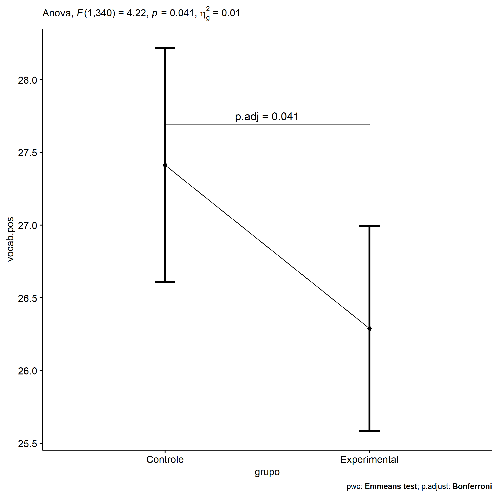<!-- -->

``` r
plots <- oneWayAncovaBoxPlots(
  wdat, "vocab.pos", "grupo", aov, pwc, covar = "vocab.pre",
  theme = "classic", color = color[["grupo"]],
  subtitle = which(aov$Effect == "grupo"))
```

``` r
if (length(unique(wdat[["grupo"]])) > 1)
  plots[["grupo"]] + ggplot2::ylab("Vocabulario") + ggplot2::scale_x_discrete(labels=c('pre', 'pos'))
```

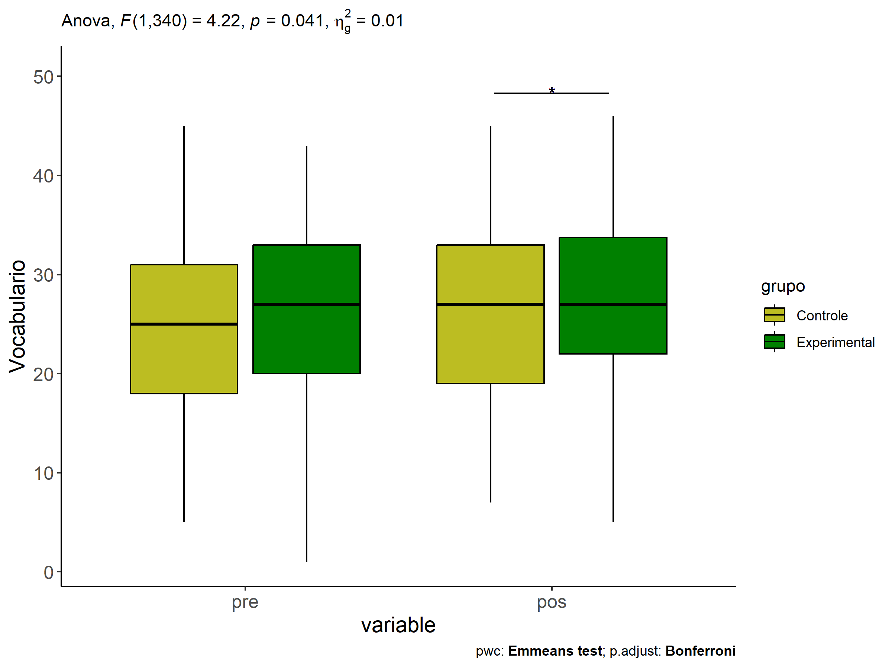<!-- -->

``` r
if (length(unique(wdat.long[["grupo"]])) > 1)
  plots <- oneWayAncovaBoxPlots(
    wdat.long, "vocab", "grupo", aov, pwc.long, pre.post = "time",
    theme = "classic", color = color$prepost)
```

``` r
if (length(unique(wdat.long[["grupo"]])) > 1)
  plots[["grupo"]] + ggplot2::ylab("Vocabulario")
```

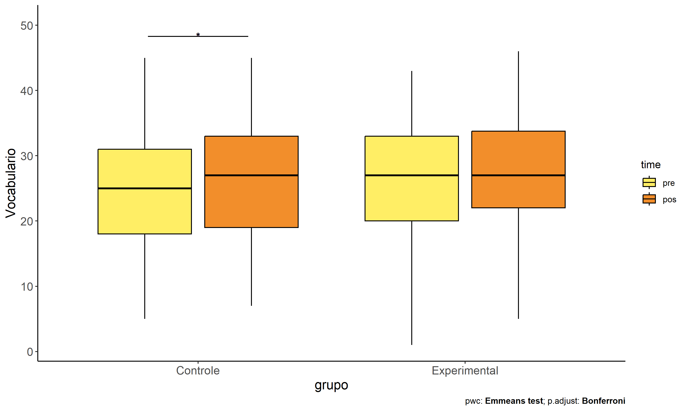<!-- -->

### Checking linearity assumption

``` r
ggscatter(wdat, x = "vocab.pre", y = "vocab.pos", size = 0.5,
          color = "grupo", add = "reg.line")+
  stat_regline_equation(
    aes(label =  paste(..eq.label.., ..rr.label.., sep = "~~~~"), color = grupo)
  )
```

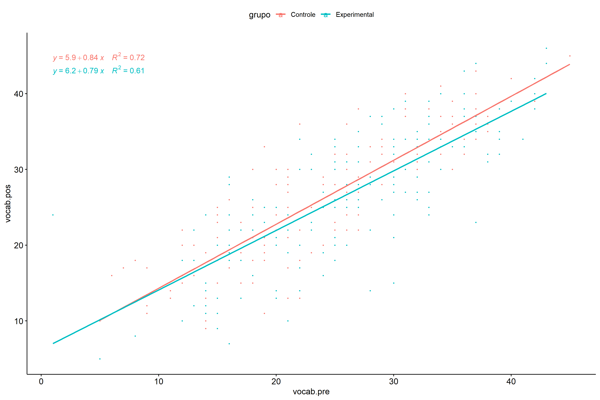<!-- -->

### Checking normality and homogeneity

``` r
res <- augment(lm(vocab.pos ~ vocab.pre + grupo, data = wdat))
```

``` r
shapiro_test(res$.resid)
```

    ## # A tibble: 1 × 3
    ##   variable   statistic p.value
    ##   <chr>          <dbl>   <dbl>
    ## 1 res$.resid     0.993   0.143

``` r
levene_test(res, .resid ~ grupo)
```

    ## # A tibble: 1 × 4
    ##     df1   df2 statistic     p
    ##   <int> <int>     <dbl> <dbl>
    ## 1     1   341      1.53 0.216

# ANCOVA and Pairwise for two factors **grupo:Sexo**

## Without remove non-normal data

``` r
pdat = remove_group_data(dat[!is.na(dat[["grupo"]]) & !is.na(dat[["Sexo"]]),], "vocab.pos", c("grupo","Sexo"))

pdat.long <- rbind(pdat[,c("id","grupo","Sexo")], pdat[,c("id","grupo","Sexo")])
pdat.long[["time"]] <- c(rep("pre", nrow(pdat)), rep("pos", nrow(pdat)))
pdat.long[["time"]] <- factor(pdat.long[["time"]], c("pre","pos"))
pdat.long[["vocab"]] <- c(pdat[["vocab.pre"]], pdat[["vocab.pos"]])

aov = anova_test(pdat, vocab.pos ~ vocab.pre + grupo*Sexo)
laov[["grupo:Sexo"]] <- get_anova_table(aov)
```

``` r
pwcs <- list()
pwcs[["Sexo"]] <- emmeans_test(
  group_by(pdat, grupo), vocab.pos ~ Sexo,
  covariate = vocab.pre, p.adjust.method = "bonferroni")
pwcs[["grupo"]] <- emmeans_test(
  group_by(pdat, Sexo), vocab.pos ~ grupo,
  covariate = vocab.pre, p.adjust.method = "bonferroni")

pwc <- plyr::rbind.fill(pwcs[["grupo"]], pwcs[["Sexo"]])
pwc <- pwc[,c("grupo","Sexo", colnames(pwc)[!colnames(pwc) %in% c("grupo","Sexo")])]
```

``` r
pwc.long <- emmeans_test(dplyr::group_by_at(pdat.long, c("grupo","Sexo")),
                         vocab ~ time,
                         p.adjust.method = "bonferroni")
lpwc[["grupo:Sexo"]] <- plyr::rbind.fill(pwc, pwc.long)
```

``` r
ds <- get.descriptives(pdat, "vocab.pos", c("grupo","Sexo"), covar = "vocab.pre")
ds <- merge(ds[ds$variable != "vocab.pre",],
            ds[ds$variable == "vocab.pre", !colnames(ds) %in% c("variable")],
            by = c("grupo","Sexo"), all.x = T, suffixes = c("", ".vocab.pre"))
ds <- merge(get_emmeans(pwcs[["grupo"]]), ds, by = c("grupo","Sexo"), suffixes = c(".emms", ""))
ds <- ds[,c("grupo","Sexo","n","mean.vocab.pre","se.vocab.pre","mean","se","emmean","se.emms")]

colnames(ds) <- c("grupo","Sexo", "N", paste0(c("M","SE")," (pre)"),
                  paste0(c("M","SE"), " (unadj)"), paste0(c("M", "SE"), " (adj)"))

lemms[["grupo:Sexo"]] <- ds
```

## Computing ANCOVA and PairWise After removing non-normal data (OK)

``` r
wdat = pdat 

res = residuals(lm(vocab.pos ~ vocab.pre + grupo*Sexo, data = wdat))
non.normal = getNonNormal(res, wdat$id, plimit = 0.05)

wdat = wdat[!wdat$id %in% non.normal,]

wdat.long <- rbind(wdat[,c("id","grupo","Sexo")], wdat[,c("id","grupo","Sexo")])
wdat.long[["time"]] <- c(rep("pre", nrow(wdat)), rep("pos", nrow(wdat)))
wdat.long[["time"]] <- factor(wdat.long[["time"]], c("pre","pos"))
wdat.long[["vocab"]] <- c(wdat[["vocab.pre"]], wdat[["vocab.pos"]])


ldat[["grupo:Sexo"]] = wdat

(non.normal)
```

    ## [1] "P983"  "P3042" "P1966" "P1961" "P1936"

``` r
aov = anova_test(wdat, vocab.pos ~ vocab.pre + grupo*Sexo)
laov[["grupo:Sexo"]] <- merge(get_anova_table(aov), laov[["grupo:Sexo"]], by="Effect", suffixes = c("","'"))

(df = get_anova_table(aov))
```

    ## ANOVA Table (type II tests)
    ## 
    ##       Effect DFn DFd       F        p p<.05   ges
    ## 1  vocab.pre   1 339 630.406 2.43e-79     * 0.650
    ## 2      grupo   1 339   2.786 9.60e-02       0.008
    ## 3       Sexo   1 339   4.075 4.40e-02     * 0.012
    ## 4 grupo:Sexo   1 339   3.995 4.60e-02     * 0.012

| Effect     | DFn | DFd |       F |     p | p\<.05 |   ges |
|:-----------|----:|----:|--------:|------:|:-------|------:|
| vocab.pre  |   1 | 339 | 630.406 | 0.000 | \*     | 0.650 |
| grupo      |   1 | 339 |   2.786 | 0.096 |        | 0.008 |
| Sexo       |   1 | 339 |   4.075 | 0.044 | \*     | 0.012 |
| grupo:Sexo |   1 | 339 |   3.995 | 0.046 | \*     | 0.012 |

``` r
pwcs <- list()
pwcs[["Sexo"]] <- emmeans_test(
  group_by(wdat, grupo), vocab.pos ~ Sexo,
  covariate = vocab.pre, p.adjust.method = "bonferroni")
pwcs[["grupo"]] <- emmeans_test(
  group_by(wdat, Sexo), vocab.pos ~ grupo,
  covariate = vocab.pre, p.adjust.method = "bonferroni")

pwc <- plyr::rbind.fill(pwcs[["grupo"]], pwcs[["Sexo"]])
pwc <- pwc[,c("grupo","Sexo", colnames(pwc)[!colnames(pwc) %in% c("grupo","Sexo")])]
```

| grupo        | Sexo | term             | .y.       | group1   | group2       |  df | statistic |     p | p.adj | p.adj.signif |
|:-------------|:-----|:-----------------|:----------|:---------|:-------------|----:|----------:|------:|------:|:-------------|
|              | F    | vocab.pre\*grupo | vocab.pos | Controle | Experimental | 339 |    -0.107 | 0.915 | 0.915 | ns           |
|              | M    | vocab.pre\*grupo | vocab.pos | Controle | Experimental | 339 |     2.601 | 0.010 | 0.010 | \*\*         |
| Controle     |      | vocab.pre\*Sexo  | vocab.pos | F        | M            | 339 |    -0.193 | 0.847 | 0.847 | ns           |
| Experimental |      | vocab.pre\*Sexo  | vocab.pos | F        | M            | 339 |     2.835 | 0.005 | 0.005 | \*\*         |

``` r
pwc.long <- emmeans_test(dplyr::group_by_at(wdat.long, c("grupo","Sexo")),
                         vocab ~ time,
                         p.adjust.method = "bonferroni")
lpwc[["grupo:Sexo"]] <- merge(plyr::rbind.fill(pwc, pwc.long), lpwc[["grupo:Sexo"]], by=c("grupo","Sexo","term",".y.","group1","group2"), suffixes = c("","'"))
```

| grupo        | Sexo | term | .y.   | group1 | group2 |  df | statistic |     p | p.adj | p.adj.signif |
|:-------------|:-----|:-----|:------|:-------|:-------|----:|----------:|------:|------:|:-------------|
| Controle     | F    | time | vocab | pre    | pos    | 680 |    -1.271 | 0.204 | 0.204 | ns           |
| Controle     | M    | time | vocab | pre    | pos    | 680 |    -1.620 | 0.106 | 0.106 | ns           |
| Experimental | F    | time | vocab | pre    | pos    | 680 |    -1.345 | 0.179 | 0.179 | ns           |
| Experimental | M    | time | vocab | pre    | pos    | 680 |     0.419 | 0.676 | 0.676 | ns           |

``` r
ds <- get.descriptives(wdat, "vocab.pos", c("grupo","Sexo"), covar = "vocab.pre")
ds <- merge(ds[ds$variable != "vocab.pre",],
            ds[ds$variable == "vocab.pre", !colnames(ds) %in% c("variable")],
            by = c("grupo","Sexo"), all.x = T, suffixes = c("", ".vocab.pre"))
ds <- merge(get_emmeans(pwcs[["grupo"]]), ds, by = c("grupo","Sexo"), suffixes = c(".emms", ""))
ds <- ds[,c("grupo","Sexo","n","mean.vocab.pre","se.vocab.pre","mean","se","emmean","se.emms")]

colnames(ds) <- c("grupo","Sexo", "N", paste0(c("M","SE")," (pre)"),
                  paste0(c("M","SE"), " (unadj)"), paste0(c("M", "SE"), " (adj)"))

lemms[["grupo:Sexo"]] <- merge(ds, lemms[["grupo:Sexo"]], by=c("grupo","Sexo"), suffixes = c("","'"))
```

| grupo        | Sexo |   N | M (pre) | SE (pre) | M (unadj) | SE (unadj) | M (adj) | SE (adj) |
|:-------------|:-----|----:|--------:|---------:|----------:|-----------:|--------:|---------:|
| Controle     | F    |  85 |  25.718 |    0.888 |    27.365 |      0.870 |  27.252 |    0.543 |
| Controle     | M    |  65 |  22.646 |    1.135 |    25.046 |      1.156 |  27.413 |    0.628 |
| Experimental | F    |  98 |  26.255 |    0.839 |    27.878 |      0.773 |  27.331 |    0.506 |
| Experimental | M    |  96 |  26.750 |    0.848 |    26.240 |      0.915 |  25.294 |    0.512 |

### Plots for ancova

``` r
plots <- twoWayAncovaPlots(
  wdat, "vocab.pos", c("grupo","Sexo"), aov, pwcs, addParam = c("mean_se"),
  font.label.size=10, step.increase=0.05, p.label="p.adj",
  subtitle = which(aov$Effect == "grupo:Sexo"))
```

``` r
if (!is.null(plots[["grupo"]]))
  plots[["grupo"]] + ggplot2::scale_color_manual(values = color[["Sexo"]])
```

    ## Scale for colour is already present.
    ## Adding another scale for colour, which will replace the existing scale.

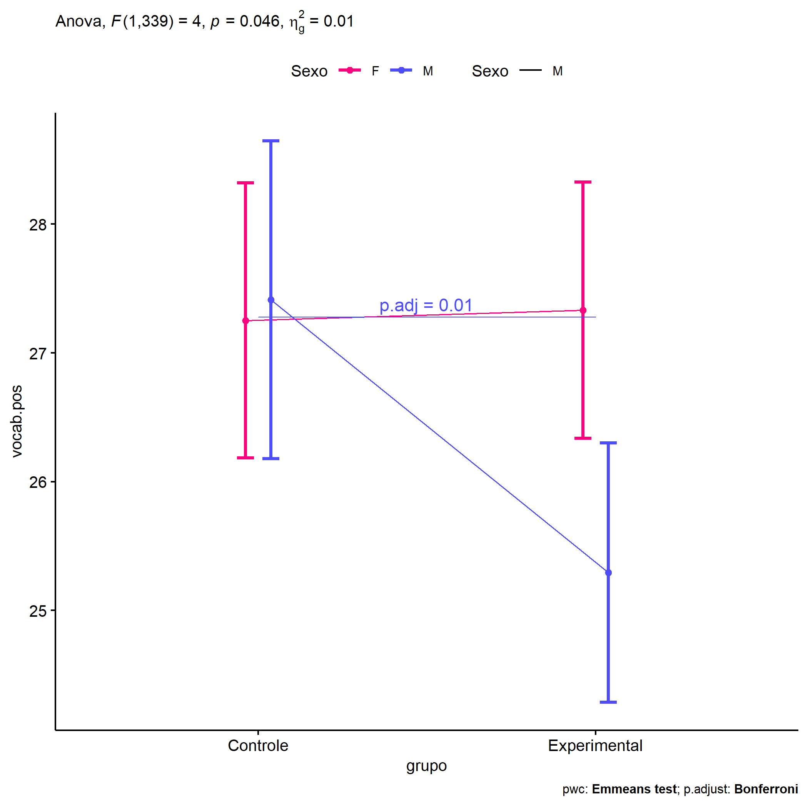<!-- -->

``` r
if (!is.null(plots[["Sexo"]]))
  plots[["Sexo"]] + ggplot2::scale_color_manual(values = color[["grupo"]])
```

    ## Scale for colour is already present.
    ## Adding another scale for colour, which will replace the existing scale.

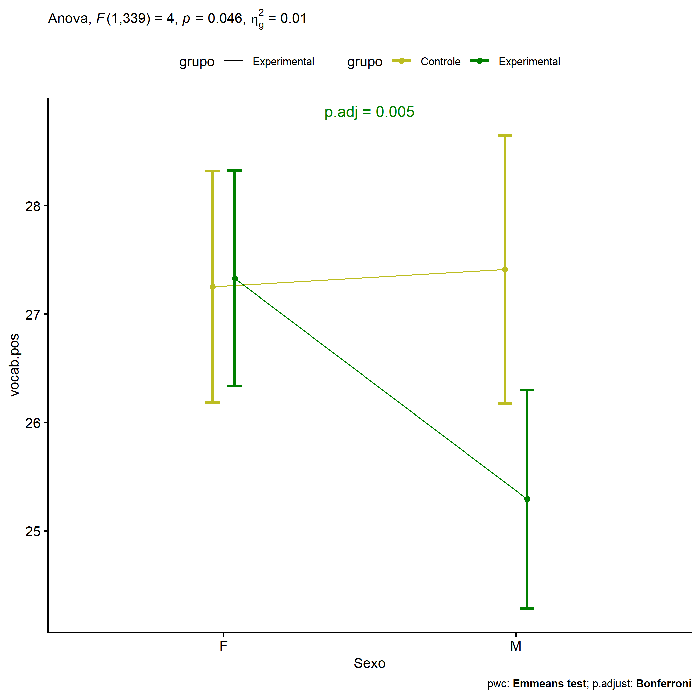<!-- -->

``` r
plots <- twoWayAncovaBoxPlots(
  wdat, "vocab.pos", c("grupo","Sexo"), aov, pwcs, covar = "vocab.pre",
  theme = "classic", color = color[["grupo:Sexo"]],
  subtitle = which(aov$Effect == "grupo:Sexo"))
```

``` r
plots[["grupo:Sexo"]] + ggplot2::ylab("Vocabulario") + ggplot2::scale_x_discrete(labels=c('pre', 'pos'))
```

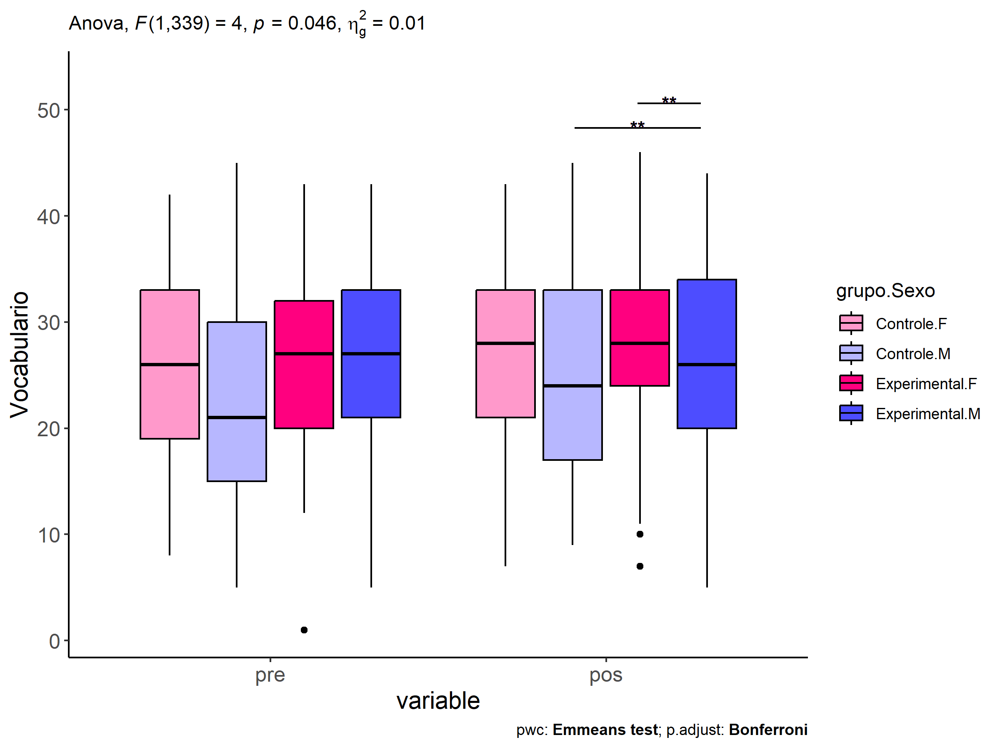<!-- -->

``` r
plots <- twoWayAncovaBoxPlots(
  wdat.long, "vocab", c("grupo","Sexo"), aov, pwc.long, pre.post = "time",
  theme = "classic", color = color$prepost)
```

``` r
plots[["grupo:Sexo"]] + ggplot2::ylab("Vocabulario")
```

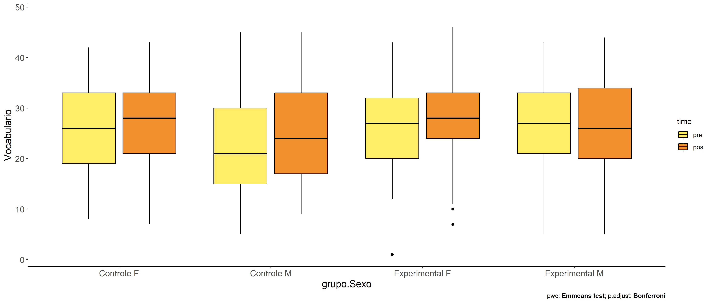<!-- -->

### Checking linearity assumption

``` r
ggscatter(wdat, x = "vocab.pre", y = "vocab.pos", size = 0.5,
          facet.by = c("grupo","Sexo"), add = "reg.line")+
  stat_regline_equation(
    aes(label =  paste(..eq.label.., ..rr.label.., sep = "~~~~"))
  )
```

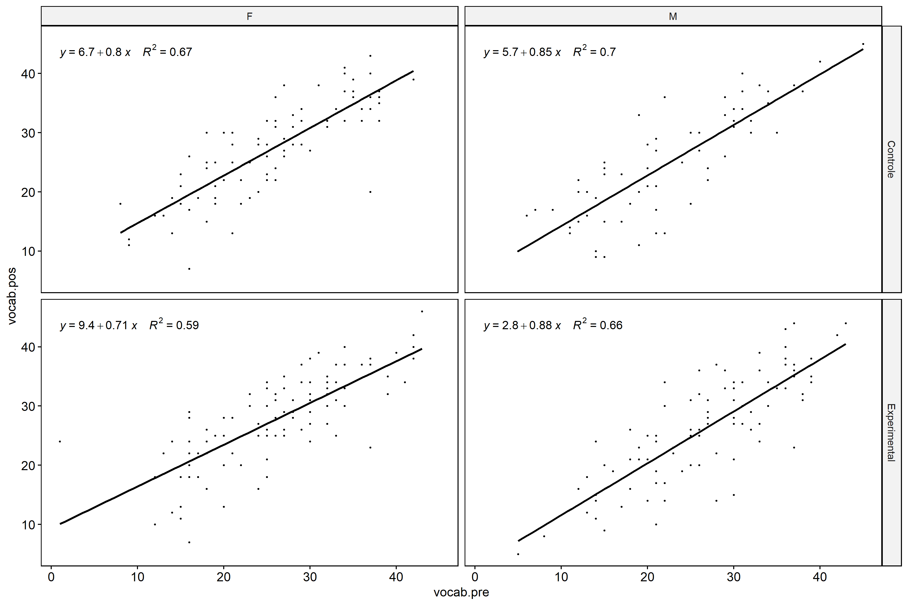<!-- -->

### Checking normality and homogeneity

``` r
res <- augment(lm(vocab.pos ~ vocab.pre + grupo*Sexo, data = wdat))
```

``` r
shapiro_test(res$.resid)
```

    ## # A tibble: 1 × 3
    ##   variable   statistic p.value
    ##   <chr>          <dbl>   <dbl>
    ## 1 res$.resid     0.993  0.0826

``` r
levene_test(res, .resid ~ grupo*Sexo)
```

    ## # A tibble: 1 × 4
    ##     df1   df2 statistic     p
    ##   <int> <int>     <dbl> <dbl>
    ## 1     3   340     0.654 0.581

# ANCOVA and Pairwise for two factors **grupo:Zona**

## Without remove non-normal data

``` r
pdat = remove_group_data(dat[!is.na(dat[["grupo"]]) & !is.na(dat[["Zona"]]),], "vocab.pos", c("grupo","Zona"))

pdat.long <- rbind(pdat[,c("id","grupo","Zona")], pdat[,c("id","grupo","Zona")])
pdat.long[["time"]] <- c(rep("pre", nrow(pdat)), rep("pos", nrow(pdat)))
pdat.long[["time"]] <- factor(pdat.long[["time"]], c("pre","pos"))
pdat.long[["vocab"]] <- c(pdat[["vocab.pre"]], pdat[["vocab.pos"]])

aov = anova_test(pdat, vocab.pos ~ vocab.pre + grupo*Zona)
laov[["grupo:Zona"]] <- get_anova_table(aov)
```

``` r
pwcs <- list()
pwcs[["Zona"]] <- emmeans_test(
  group_by(pdat, grupo), vocab.pos ~ Zona,
  covariate = vocab.pre, p.adjust.method = "bonferroni")
pwcs[["grupo"]] <- emmeans_test(
  group_by(pdat, Zona), vocab.pos ~ grupo,
  covariate = vocab.pre, p.adjust.method = "bonferroni")

pwc <- plyr::rbind.fill(pwcs[["grupo"]], pwcs[["Zona"]])
pwc <- pwc[,c("grupo","Zona", colnames(pwc)[!colnames(pwc) %in% c("grupo","Zona")])]
```

``` r
pwc.long <- emmeans_test(dplyr::group_by_at(pdat.long, c("grupo","Zona")),
                         vocab ~ time,
                         p.adjust.method = "bonferroni")
lpwc[["grupo:Zona"]] <- plyr::rbind.fill(pwc, pwc.long)
```

``` r
ds <- get.descriptives(pdat, "vocab.pos", c("grupo","Zona"), covar = "vocab.pre")
ds <- merge(ds[ds$variable != "vocab.pre",],
            ds[ds$variable == "vocab.pre", !colnames(ds) %in% c("variable")],
            by = c("grupo","Zona"), all.x = T, suffixes = c("", ".vocab.pre"))
ds <- merge(get_emmeans(pwcs[["grupo"]]), ds, by = c("grupo","Zona"), suffixes = c(".emms", ""))
ds <- ds[,c("grupo","Zona","n","mean.vocab.pre","se.vocab.pre","mean","se","emmean","se.emms")]

colnames(ds) <- c("grupo","Zona", "N", paste0(c("M","SE")," (pre)"),
                  paste0(c("M","SE"), " (unadj)"), paste0(c("M", "SE"), " (adj)"))

lemms[["grupo:Zona"]] <- ds
```

## Computing ANCOVA and PairWise After removing non-normal data (OK)

``` r
wdat = pdat 

res = residuals(lm(vocab.pos ~ vocab.pre + grupo*Zona, data = wdat))
non.normal = getNonNormal(res, wdat$id, plimit = 0.05)

wdat = wdat[!wdat$id %in% non.normal,]

wdat.long <- rbind(wdat[,c("id","grupo","Zona")], wdat[,c("id","grupo","Zona")])
wdat.long[["time"]] <- c(rep("pre", nrow(wdat)), rep("pos", nrow(wdat)))
wdat.long[["time"]] <- factor(wdat.long[["time"]], c("pre","pos"))
wdat.long[["vocab"]] <- c(wdat[["vocab.pre"]], wdat[["vocab.pos"]])


ldat[["grupo:Zona"]] = wdat

(non.normal)
```

    ## [1] "P983"  "P1966" "P3042" "P976"  "P1961"

``` r
aov = anova_test(wdat, vocab.pos ~ vocab.pre + grupo*Zona)
laov[["grupo:Zona"]] <- merge(get_anova_table(aov), laov[["grupo:Zona"]], by="Effect", suffixes = c("","'"))

(df = get_anova_table(aov))
```

    ## ANOVA Table (type II tests)
    ## 
    ##       Effect DFn DFd       F        p p<.05      ges
    ## 1  vocab.pre   1 285 550.594 1.57e-68     * 0.659000
    ## 2      grupo   1 285   4.491 3.50e-02     * 0.016000
    ## 3       Zona   1 285   0.056 8.13e-01       0.000196
    ## 4 grupo:Zona   1 285   3.392 6.70e-02       0.012000

| Effect     | DFn | DFd |       F |     p | p\<.05 |   ges |
|:-----------|----:|----:|--------:|------:|:-------|------:|
| vocab.pre  |   1 | 285 | 550.594 | 0.000 | \*     | 0.659 |
| grupo      |   1 | 285 |   4.491 | 0.035 | \*     | 0.016 |
| Zona       |   1 | 285 |   0.056 | 0.813 |        | 0.000 |
| grupo:Zona |   1 | 285 |   3.392 | 0.067 |        | 0.012 |

``` r
pwcs <- list()
pwcs[["Zona"]] <- emmeans_test(
  group_by(wdat, grupo), vocab.pos ~ Zona,
  covariate = vocab.pre, p.adjust.method = "bonferroni")
pwcs[["grupo"]] <- emmeans_test(
  group_by(wdat, Zona), vocab.pos ~ grupo,
  covariate = vocab.pre, p.adjust.method = "bonferroni")

pwc <- plyr::rbind.fill(pwcs[["grupo"]], pwcs[["Zona"]])
pwc <- pwc[,c("grupo","Zona", colnames(pwc)[!colnames(pwc) %in% c("grupo","Zona")])]
```

| grupo        | Zona   | term             | .y.       | group1   | group2       |  df | statistic |     p | p.adj | p.adj.signif |
|:-------------|:-------|:-----------------|:----------|:---------|:-------------|----:|----------:|------:|------:|:-------------|
|              | Rural  | vocab.pre\*grupo | vocab.pos | Controle | Experimental | 285 |     2.807 | 0.005 | 0.005 | \*\*         |
|              | Urbana | vocab.pre\*grupo | vocab.pos | Controle | Experimental | 285 |    -0.025 | 0.980 | 0.980 | ns           |
| Controle     |        | vocab.pre\*Zona  | vocab.pos | Rural    | Urbana       | 285 |     1.557 | 0.121 | 0.121 | ns           |
| Experimental |        | vocab.pre\*Zona  | vocab.pos | Rural    | Urbana       | 285 |    -1.010 | 0.313 | 0.313 | ns           |

``` r
pwc.long <- emmeans_test(dplyr::group_by_at(wdat.long, c("grupo","Zona")),
                         vocab ~ time,
                         p.adjust.method = "bonferroni")
lpwc[["grupo:Zona"]] <- merge(plyr::rbind.fill(pwc, pwc.long), lpwc[["grupo:Zona"]], by=c("grupo","Zona","term",".y.","group1","group2"), suffixes = c("","'"))
```

| grupo        | Zona   | term | .y.   | group1 | group2 |  df | statistic |     p | p.adj | p.adj.signif |
|:-------------|:-------|:-----|:------|:-------|:-------|----:|----------:|------:|------:|:-------------|
| Controle     | Rural  | time | vocab | pre    | pos    | 572 |    -1.957 | 0.051 | 0.051 | ns           |
| Controle     | Urbana | time | vocab | pre    | pos    | 572 |    -0.608 | 0.543 | 0.543 | ns           |
| Experimental | Rural  | time | vocab | pre    | pos    | 572 |    -0.158 | 0.875 | 0.875 | ns           |
| Experimental | Urbana | time | vocab | pre    | pos    | 572 |    -0.656 | 0.512 | 0.512 | ns           |

``` r
ds <- get.descriptives(wdat, "vocab.pos", c("grupo","Zona"), covar = "vocab.pre")
ds <- merge(ds[ds$variable != "vocab.pre",],
            ds[ds$variable == "vocab.pre", !colnames(ds) %in% c("variable")],
            by = c("grupo","Zona"), all.x = T, suffixes = c("", ".vocab.pre"))
ds <- merge(get_emmeans(pwcs[["grupo"]]), ds, by = c("grupo","Zona"), suffixes = c(".emms", ""))
ds <- ds[,c("grupo","Zona","n","mean.vocab.pre","se.vocab.pre","mean","se","emmean","se.emms")]

colnames(ds) <- c("grupo","Zona", "N", paste0(c("M","SE")," (pre)"),
                  paste0(c("M","SE"), " (unadj)"), paste0(c("M", "SE"), " (adj)"))

lemms[["grupo:Zona"]] <- merge(ds, lemms[["grupo:Zona"]], by=c("grupo","Zona"), suffixes = c("","'"))
```

| grupo        | Zona   |   N | M (pre) | SE (pre) | M (unadj) | SE (unadj) | M (adj) | SE (adj) |
|:-------------|:-------|----:|--------:|---------:|----------:|-----------:|--------:|---------:|
| Controle     | Rural  |  75 |  24.707 |    0.968 |    27.413 |      0.982 |  28.529 |    0.577 |
| Controle     | Urbana |  49 |  26.041 |    1.243 |    27.082 |      1.239 |  27.102 |    0.712 |
| Experimental | Rural  |  91 |  26.495 |    0.887 |    26.692 |      0.918 |  26.340 |    0.523 |
| Experimental | Urbana |  75 |  26.920 |    0.950 |    27.827 |      0.938 |  27.125 |    0.576 |

### Plots for ancova

``` r
plots <- twoWayAncovaPlots(
  wdat, "vocab.pos", c("grupo","Zona"), aov, pwcs, addParam = c("mean_se"),
  font.label.size=10, step.increase=0.05, p.label="p.adj",
  subtitle = which(aov$Effect == "grupo:Zona"))
```

``` r
if (!is.null(plots[["grupo"]]))
  plots[["grupo"]] + ggplot2::scale_color_manual(values = color[["Zona"]])
```

    ## Scale for colour is already present.
    ## Adding another scale for colour, which will replace the existing scale.

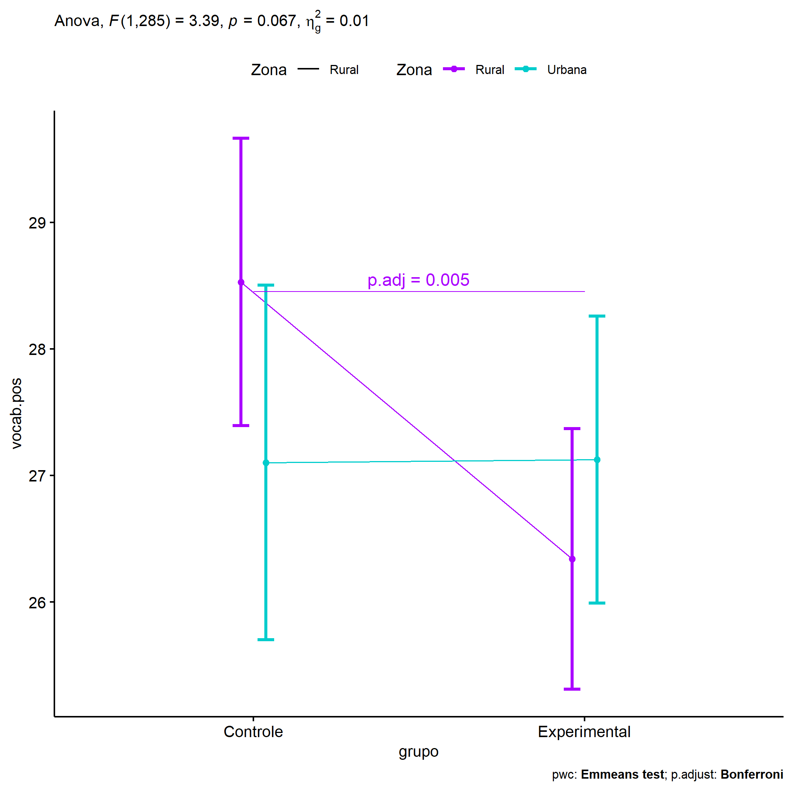<!-- -->

``` r
if (!is.null(plots[["Zona"]]))
  plots[["Zona"]] + ggplot2::scale_color_manual(values = color[["grupo"]])
```

    ## Scale for colour is already present.
    ## Adding another scale for colour, which will replace the existing scale.

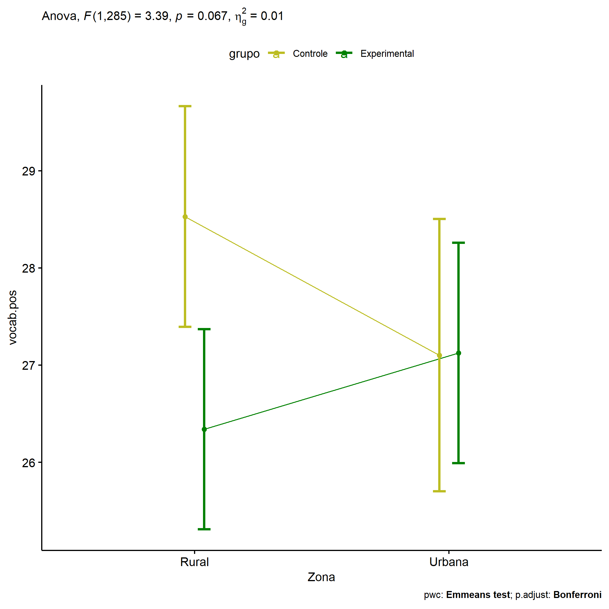<!-- -->

``` r
plots <- twoWayAncovaBoxPlots(
  wdat, "vocab.pos", c("grupo","Zona"), aov, pwcs, covar = "vocab.pre",
  theme = "classic", color = color[["grupo:Zona"]],
  subtitle = which(aov$Effect == "grupo:Zona"))
```

``` r
plots[["grupo:Zona"]] + ggplot2::ylab("Vocabulario") + ggplot2::scale_x_discrete(labels=c('pre', 'pos'))
```

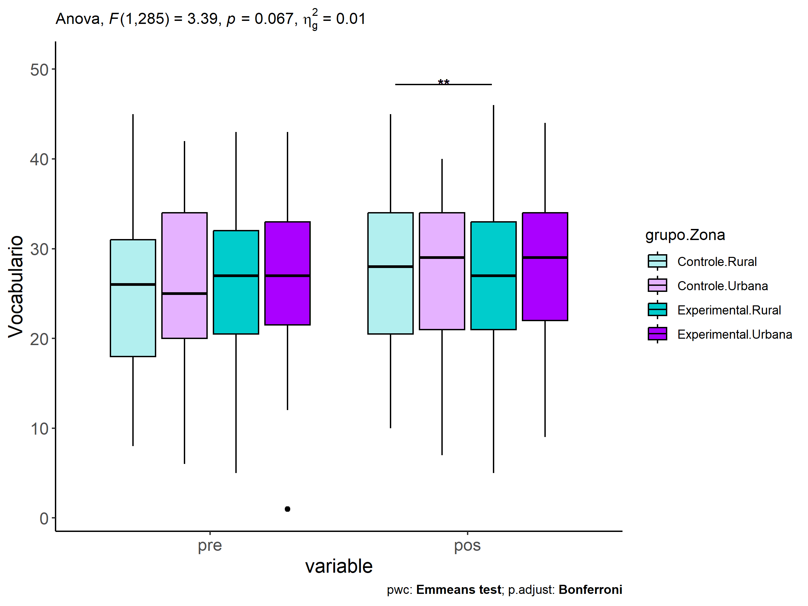<!-- -->

``` r
plots <- twoWayAncovaBoxPlots(
  wdat.long, "vocab", c("grupo","Zona"), aov, pwc.long, pre.post = "time",
  theme = "classic", color = color$prepost)
```

``` r
plots[["grupo:Zona"]] + ggplot2::ylab("Vocabulario")
```

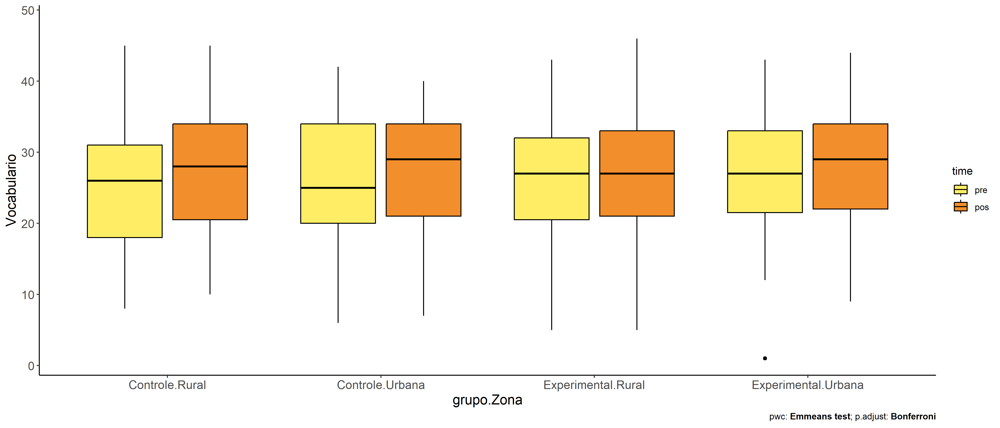<!-- -->

### Checking linearity assumption

``` r
ggscatter(wdat, x = "vocab.pre", y = "vocab.pos", size = 0.5,
          facet.by = c("grupo","Zona"), add = "reg.line")+
  stat_regline_equation(
    aes(label =  paste(..eq.label.., ..rr.label.., sep = "~~~~"))
  )
```

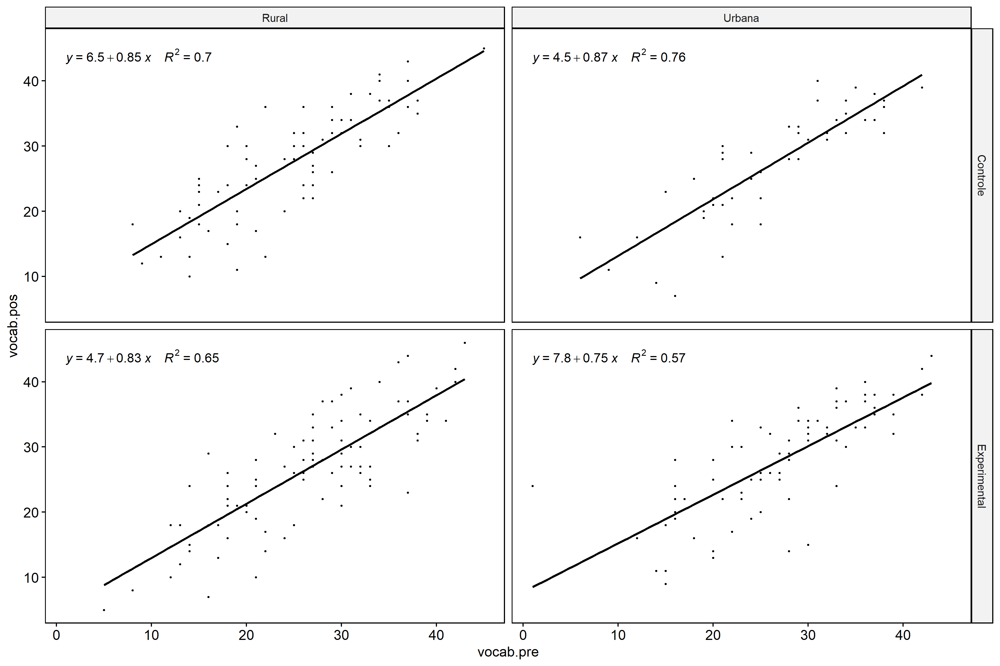<!-- -->

### Checking normality and homogeneity

``` r
res <- augment(lm(vocab.pos ~ vocab.pre + grupo*Zona, data = wdat))
```

``` r
shapiro_test(res$.resid)
```

    ## # A tibble: 1 × 3
    ##   variable   statistic p.value
    ##   <chr>          <dbl>   <dbl>
    ## 1 res$.resid     0.992   0.134

``` r
levene_test(res, .resid ~ grupo*Zona)
```

    ## # A tibble: 1 × 4
    ##     df1   df2 statistic     p
    ##   <int> <int>     <dbl> <dbl>
    ## 1     3   286      1.18 0.316

# ANCOVA and Pairwise for two factors **grupo:Cor.Raca**

## Without remove non-normal data

``` r
pdat = remove_group_data(dat[!is.na(dat[["grupo"]]) & !is.na(dat[["Cor.Raca"]]),], "vocab.pos", c("grupo","Cor.Raca"))

pdat.long <- rbind(pdat[,c("id","grupo","Cor.Raca")], pdat[,c("id","grupo","Cor.Raca")])
pdat.long[["time"]] <- c(rep("pre", nrow(pdat)), rep("pos", nrow(pdat)))
pdat.long[["time"]] <- factor(pdat.long[["time"]], c("pre","pos"))
pdat.long[["vocab"]] <- c(pdat[["vocab.pre"]], pdat[["vocab.pos"]])

aov = anova_test(pdat, vocab.pos ~ vocab.pre + grupo*Cor.Raca)
laov[["grupo:Cor.Raca"]] <- get_anova_table(aov)
```

``` r
pwcs <- list()
pwcs[["Cor.Raca"]] <- emmeans_test(
  group_by(pdat, grupo), vocab.pos ~ Cor.Raca,
  covariate = vocab.pre, p.adjust.method = "bonferroni")
pwcs[["grupo"]] <- emmeans_test(
  group_by(pdat, Cor.Raca), vocab.pos ~ grupo,
  covariate = vocab.pre, p.adjust.method = "bonferroni")

pwc <- plyr::rbind.fill(pwcs[["grupo"]], pwcs[["Cor.Raca"]])
pwc <- pwc[,c("grupo","Cor.Raca", colnames(pwc)[!colnames(pwc) %in% c("grupo","Cor.Raca")])]
```

``` r
pwc.long <- emmeans_test(dplyr::group_by_at(pdat.long, c("grupo","Cor.Raca")),
                         vocab ~ time,
                         p.adjust.method = "bonferroni")
lpwc[["grupo:Cor.Raca"]] <- plyr::rbind.fill(pwc, pwc.long)
```

``` r
ds <- get.descriptives(pdat, "vocab.pos", c("grupo","Cor.Raca"), covar = "vocab.pre")
ds <- merge(ds[ds$variable != "vocab.pre",],
            ds[ds$variable == "vocab.pre", !colnames(ds) %in% c("variable")],
            by = c("grupo","Cor.Raca"), all.x = T, suffixes = c("", ".vocab.pre"))
ds <- merge(get_emmeans(pwcs[["grupo"]]), ds, by = c("grupo","Cor.Raca"), suffixes = c(".emms", ""))
ds <- ds[,c("grupo","Cor.Raca","n","mean.vocab.pre","se.vocab.pre","mean","se","emmean","se.emms")]

colnames(ds) <- c("grupo","Cor.Raca", "N", paste0(c("M","SE")," (pre)"),
                  paste0(c("M","SE"), " (unadj)"), paste0(c("M", "SE"), " (adj)"))

lemms[["grupo:Cor.Raca"]] <- ds
```

## Computing ANCOVA and PairWise After removing non-normal data (OK)

``` r
wdat = pdat 

res = residuals(lm(vocab.pos ~ vocab.pre + grupo*Cor.Raca, data = wdat))
non.normal = getNonNormal(res, wdat$id, plimit = 0.05)

wdat = wdat[!wdat$id %in% non.normal,]

wdat.long <- rbind(wdat[,c("id","grupo","Cor.Raca")], wdat[,c("id","grupo","Cor.Raca")])
wdat.long[["time"]] <- c(rep("pre", nrow(wdat)), rep("pos", nrow(wdat)))
wdat.long[["time"]] <- factor(wdat.long[["time"]], c("pre","pos"))
wdat.long[["vocab"]] <- c(wdat[["vocab.pre"]], wdat[["vocab.pos"]])


ldat[["grupo:Cor.Raca"]] = wdat

(non.normal)
```

    ## NULL

``` r
aov = anova_test(wdat, vocab.pos ~ vocab.pre + grupo*Cor.Raca)
laov[["grupo:Cor.Raca"]] <- merge(get_anova_table(aov), laov[["grupo:Cor.Raca"]], by="Effect", suffixes = c("","'"))

(df = get_anova_table(aov))
```

    ## ANOVA Table (type II tests)
    ## 
    ##           Effect DFn DFd       F        p p<.05   ges
    ## 1      vocab.pre   1 133 198.508 3.73e-28     * 0.599
    ## 2          grupo   1 133   5.625 1.90e-02     * 0.041
    ## 3       Cor.Raca   2 133   1.585 2.09e-01       0.023
    ## 4 grupo:Cor.Raca   1 133   1.611 2.07e-01       0.012

| Effect         | DFn | DFd |       F |     p | p\<.05 |   ges |
|:---------------|----:|----:|--------:|------:|:-------|------:|
| vocab.pre      |   1 | 133 | 198.508 | 0.000 | \*     | 0.599 |
| grupo          |   1 | 133 |   5.625 | 0.019 | \*     | 0.041 |
| Cor.Raca       |   2 | 133 |   1.585 | 0.209 |        | 0.023 |
| grupo:Cor.Raca |   1 | 133 |   1.611 | 0.207 |        | 0.012 |

``` r
pwcs <- list()
pwcs[["Cor.Raca"]] <- emmeans_test(
  group_by(wdat, grupo), vocab.pos ~ Cor.Raca,
  covariate = vocab.pre, p.adjust.method = "bonferroni")
pwcs[["grupo"]] <- emmeans_test(
  group_by(wdat, Cor.Raca), vocab.pos ~ grupo,
  covariate = vocab.pre, p.adjust.method = "bonferroni")

pwc <- plyr::rbind.fill(pwcs[["grupo"]], pwcs[["Cor.Raca"]])
pwc <- pwc[,c("grupo","Cor.Raca", colnames(pwc)[!colnames(pwc) %in% c("grupo","Cor.Raca")])]
```

| grupo        | Cor.Raca | term                | .y.       | group1   | group2       |  df | statistic |     p | p.adj | p.adj.signif |
|:-------------|:---------|:--------------------|:----------|:---------|:-------------|----:|----------:|------:|------:|:-------------|
|              | Branca   | vocab.pre\*grupo    | vocab.pos | Controle | Experimental | 133 |     2.278 | 0.024 | 0.024 | \*           |
|              | Indígena | vocab.pre\*grupo    | vocab.pos | Controle | Experimental |     |           |       |       |              |
|              | Parda    | vocab.pre\*grupo    | vocab.pos | Controle | Experimental | 133 |     1.433 | 0.154 | 0.154 | ns           |
| Controle     |          | vocab.pre\*Cor.Raca | vocab.pos | Branca   | Indígena     | 133 |    -1.120 | 0.265 | 0.794 | ns           |
| Controle     |          | vocab.pre\*Cor.Raca | vocab.pos | Branca   | Parda        | 133 |    -0.282 | 0.779 | 1.000 | ns           |
| Controle     |          | vocab.pre\*Cor.Raca | vocab.pos | Indígena | Parda        | 133 |     1.011 | 0.314 | 0.942 | ns           |
| Experimental |          | vocab.pre\*Cor.Raca | vocab.pos | Branca   | Indígena     |     |           |       |       |              |
| Experimental |          | vocab.pre\*Cor.Raca | vocab.pos | Branca   | Parda        | 133 |    -1.867 | 0.064 | 0.064 | ns           |
| Experimental |          | vocab.pre\*Cor.Raca | vocab.pos | Indígena | Parda        |     |           |       |       |              |

``` r
pwc.long <- emmeans_test(dplyr::group_by_at(wdat.long, c("grupo","Cor.Raca")),
                         vocab ~ time,
                         p.adjust.method = "bonferroni")
lpwc[["grupo:Cor.Raca"]] <- merge(plyr::rbind.fill(pwc, pwc.long), lpwc[["grupo:Cor.Raca"]], by=c("grupo","Cor.Raca","term",".y.","group1","group2"), suffixes = c("","'"))
```

| grupo        | Cor.Raca | term | .y.   | group1 | group2 |  df | statistic |     p | p.adj | p.adj.signif |
|:-------------|:---------|:-----|:------|:-------|:-------|----:|----------:|------:|------:|:-------------|
| Controle     | Branca   | time | vocab | pre    | pos    | 268 |    -0.691 | 0.490 | 0.490 | ns           |
| Controle     | Indígena | time | vocab | pre    | pos    | 268 |    -1.116 | 0.265 | 0.265 | ns           |
| Controle     | Parda    | time | vocab | pre    | pos    | 268 |    -1.673 | 0.096 | 0.096 | ns           |
| Experimental | Branca   | time | vocab | pre    | pos    | 268 |     0.788 | 0.431 | 0.431 | ns           |
| Experimental | Indígena | time | vocab | pre    | pos    |     |           |       |       |              |
| Experimental | Parda    | time | vocab | pre    | pos    | 268 |    -0.621 | 0.535 | 0.535 | ns           |

``` r
ds <- get.descriptives(wdat, "vocab.pos", c("grupo","Cor.Raca"), covar = "vocab.pre")
ds <- merge(ds[ds$variable != "vocab.pre",],
            ds[ds$variable == "vocab.pre", !colnames(ds) %in% c("variable")],
            by = c("grupo","Cor.Raca"), all.x = T, suffixes = c("", ".vocab.pre"))
ds <- merge(get_emmeans(pwcs[["grupo"]]), ds, by = c("grupo","Cor.Raca"), suffixes = c(".emms", ""))
ds <- ds[,c("grupo","Cor.Raca","n","mean.vocab.pre","se.vocab.pre","mean","se","emmean","se.emms")]

colnames(ds) <- c("grupo","Cor.Raca", "N", paste0(c("M","SE")," (pre)"),
                  paste0(c("M","SE"), " (unadj)"), paste0(c("M", "SE"), " (adj)"))

lemms[["grupo:Cor.Raca"]] <- merge(ds, lemms[["grupo:Cor.Raca"]], by=c("grupo","Cor.Raca"), suffixes = c("","'"))
```

| grupo        | Cor.Raca |   N | M (pre) | SE (pre) | M (unadj) | SE (unadj) | M (adj) | SE (adj) |
|:-------------|:---------|----:|--------:|---------:|----------:|-----------:|--------:|---------:|
| Controle     | Branca   |  22 |  26.273 |    1.742 |    28.000 |      1.686 |  26.482 |    1.128 |
| Controle     | Indígena |   8 |  24.250 |    2.258 |    28.875 |      2.728 |  28.921 |    1.861 |
| Controle     | Parda    |  44 |  22.591 |    1.278 |    25.545 |      1.447 |  26.874 |    0.799 |
| Experimental | Branca   |  12 |  26.667 |    2.013 |    24.000 |      2.067 |  22.178 |    1.525 |
| Experimental | Parda    |  53 |  24.396 |    1.189 |    25.396 |      1.032 |  25.329 |    0.723 |

### Plots for ancova

``` r
plots <- twoWayAncovaPlots(
  wdat, "vocab.pos", c("grupo","Cor.Raca"), aov, pwcs, addParam = c("mean_se"),
  font.label.size=10, step.increase=0.05, p.label="p.adj",
  subtitle = which(aov$Effect == "grupo:Cor.Raca"))
```

``` r
if (!is.null(plots[["grupo"]]))
  plots[["grupo"]] + ggplot2::scale_color_manual(values = color[["Cor.Raca"]])
```

<!-- -->

``` r
if (!is.null(plots[["Cor.Raca"]]))
  plots[["Cor.Raca"]] + ggplot2::scale_color_manual(values = color[["grupo"]])
```

    ## Scale for colour is already present.
    ## Adding another scale for colour, which will replace the existing scale.

    ## Warning: Removed 2 rows containing non-finite values (`stat_bracket()`).

    ## Warning: Removed 1 rows containing missing values (`geom_point()`).

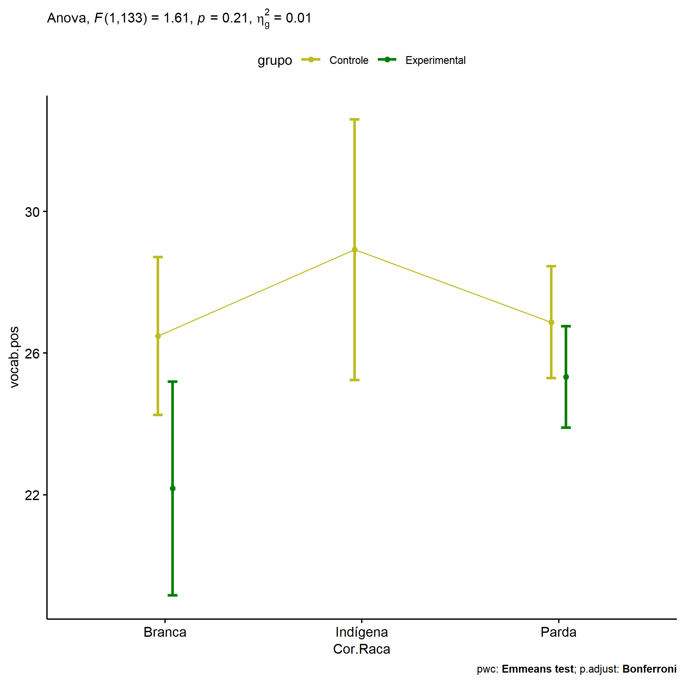<!-- -->

``` r
plots <- twoWayAncovaBoxPlots(
  wdat, "vocab.pos", c("grupo","Cor.Raca"), aov, pwcs, covar = "vocab.pre",
  theme = "classic", color = color[["grupo:Cor.Raca"]],
  subtitle = which(aov$Effect == "grupo:Cor.Raca"))
```

``` r
plots[["grupo:Cor.Raca"]] + ggplot2::ylab("Vocabulario") + ggplot2::scale_x_discrete(labels=c('pre', 'pos'))
```

<!-- -->

``` r
plots <- twoWayAncovaBoxPlots(
  wdat.long, "vocab", c("grupo","Cor.Raca"), aov, pwc.long, pre.post = "time",
  theme = "classic", color = color$prepost)
```

``` r
plots[["grupo:Cor.Raca"]] + ggplot2::ylab("Vocabulario")
```

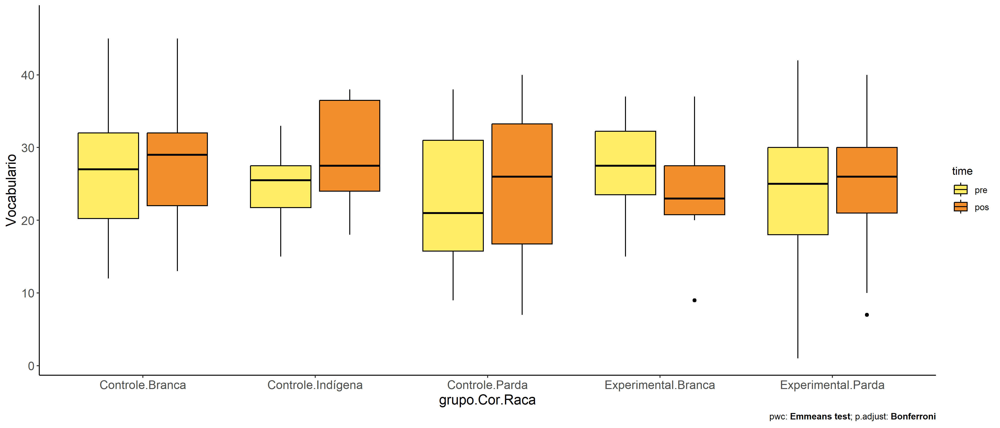<!-- -->

### Checking linearity assumption

``` r
ggscatter(wdat, x = "vocab.pre", y = "vocab.pos", size = 0.5,
          facet.by = c("grupo","Cor.Raca"), add = "reg.line")+
  stat_regline_equation(
    aes(label =  paste(..eq.label.., ..rr.label.., sep = "~~~~"))
  )
```

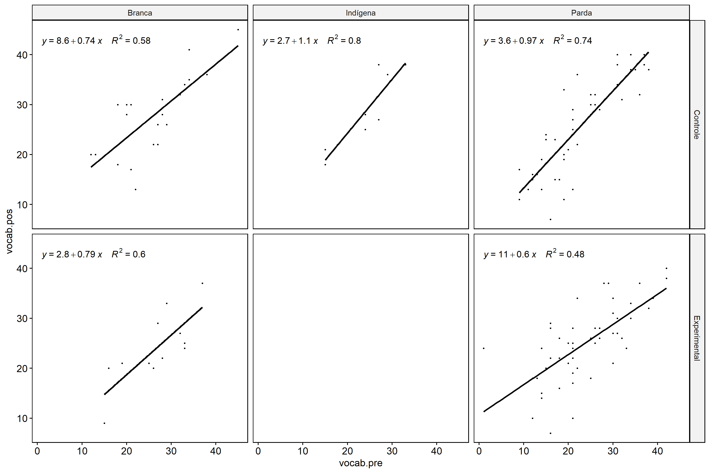<!-- -->

### Checking normality and homogeneity

``` r
res <- augment(lm(vocab.pos ~ vocab.pre + grupo*Cor.Raca, data = wdat))
```

``` r
shapiro_test(res$.resid)
```

    ## # A tibble: 1 × 3
    ##   variable   statistic p.value
    ##   <chr>          <dbl>   <dbl>
    ## 1 res$.resid     0.990   0.392

``` r
levene_test(res, .resid ~ grupo*Cor.Raca)
```

    ## # A tibble: 1 × 4
    ##     df1   df2 statistic     p
    ##   <int> <int>     <dbl> <dbl>
    ## 1     4   134     0.218 0.928

# ANCOVA and Pairwise for two factors **grupo:vocab.quintile**

## Without remove non-normal data

``` r
pdat = remove_group_data(dat[!is.na(dat[["grupo"]]) & !is.na(dat[["vocab.quintile"]]),], "vocab.pos", c("grupo","vocab.quintile"))

pdat.long <- rbind(pdat[,c("id","grupo","vocab.quintile")], pdat[,c("id","grupo","vocab.quintile")])
pdat.long[["time"]] <- c(rep("pre", nrow(pdat)), rep("pos", nrow(pdat)))
pdat.long[["time"]] <- factor(pdat.long[["time"]], c("pre","pos"))
pdat.long[["vocab"]] <- c(pdat[["vocab.pre"]], pdat[["vocab.pos"]])

aov = anova_test(pdat, vocab.pos ~ vocab.pre + grupo*vocab.quintile)
laov[["grupo:vocab.quintile"]] <- get_anova_table(aov)
```

``` r
pwcs <- list()
pwcs[["vocab.quintile"]] <- emmeans_test(
  group_by(pdat, grupo), vocab.pos ~ vocab.quintile,
  covariate = vocab.pre, p.adjust.method = "bonferroni")
pwcs[["grupo"]] <- emmeans_test(
  group_by(pdat, vocab.quintile), vocab.pos ~ grupo,
  covariate = vocab.pre, p.adjust.method = "bonferroni")

pwc <- plyr::rbind.fill(pwcs[["grupo"]], pwcs[["vocab.quintile"]])
pwc <- pwc[,c("grupo","vocab.quintile", colnames(pwc)[!colnames(pwc) %in% c("grupo","vocab.quintile")])]
```

``` r
pwc.long <- emmeans_test(dplyr::group_by_at(pdat.long, c("grupo","vocab.quintile")),
                         vocab ~ time,
                         p.adjust.method = "bonferroni")
lpwc[["grupo:vocab.quintile"]] <- plyr::rbind.fill(pwc, pwc.long)
```

``` r
ds <- get.descriptives(pdat, "vocab.pos", c("grupo","vocab.quintile"), covar = "vocab.pre")
ds <- merge(ds[ds$variable != "vocab.pre",],
            ds[ds$variable == "vocab.pre", !colnames(ds) %in% c("variable")],
            by = c("grupo","vocab.quintile"), all.x = T, suffixes = c("", ".vocab.pre"))
ds <- merge(get_emmeans(pwcs[["grupo"]]), ds, by = c("grupo","vocab.quintile"), suffixes = c(".emms", ""))
ds <- ds[,c("grupo","vocab.quintile","n","mean.vocab.pre","se.vocab.pre","mean","se","emmean","se.emms")]

colnames(ds) <- c("grupo","vocab.quintile", "N", paste0(c("M","SE")," (pre)"),
                  paste0(c("M","SE"), " (unadj)"), paste0(c("M", "SE"), " (adj)"))

lemms[["grupo:vocab.quintile"]] <- ds
```

## Computing ANCOVA and PairWise After removing non-normal data (OK)

``` r
wdat = pdat 

res = residuals(lm(vocab.pos ~ vocab.pre + grupo*vocab.quintile, data = wdat))
non.normal = getNonNormal(res, wdat$id, plimit = 0.05)

wdat = wdat[!wdat$id %in% non.normal,]

wdat.long <- rbind(wdat[,c("id","grupo","vocab.quintile")], wdat[,c("id","grupo","vocab.quintile")])
wdat.long[["time"]] <- c(rep("pre", nrow(wdat)), rep("pos", nrow(wdat)))
wdat.long[["time"]] <- factor(wdat.long[["time"]], c("pre","pos"))
wdat.long[["vocab"]] <- c(wdat[["vocab.pre"]], wdat[["vocab.pos"]])


ldat[["grupo:vocab.quintile"]] = wdat

(non.normal)
```

    ## [1] "P983"  "P1966" "P1936" "P3042" "P2957"

``` r
aov = anova_test(wdat, vocab.pos ~ vocab.pre + grupo*vocab.quintile)
laov[["grupo:vocab.quintile"]] <- merge(get_anova_table(aov), laov[["grupo:vocab.quintile"]], by="Effect", suffixes = c("","'"))

(df = get_anova_table(aov))
```

    ## ANOVA Table (type II tests)
    ## 
    ##                 Effect DFn DFd      F        p p<.05   ges
    ## 1            vocab.pre   1 333 29.608 1.03e-07     * 0.082
    ## 2                grupo   1 333  3.536 6.10e-02       0.011
    ## 3       vocab.quintile   4 333  0.828 5.08e-01       0.010
    ## 4 grupo:vocab.quintile   4 333  1.138 3.39e-01       0.013

| Effect               | DFn | DFd |      F |     p | p\<.05 |   ges |
|:---------------------|----:|----:|-------:|------:|:-------|------:|
| vocab.pre            |   1 | 333 | 29.608 | 0.000 | \*     | 0.082 |
| grupo                |   1 | 333 |  3.536 | 0.061 |        | 0.011 |
| vocab.quintile       |   4 | 333 |  0.828 | 0.508 |        | 0.010 |
| grupo:vocab.quintile |   4 | 333 |  1.138 | 0.339 |        | 0.013 |

``` r
pwcs <- list()
pwcs[["vocab.quintile"]] <- emmeans_test(
  group_by(wdat, grupo), vocab.pos ~ vocab.quintile,
  covariate = vocab.pre, p.adjust.method = "bonferroni")
pwcs[["grupo"]] <- emmeans_test(
  group_by(wdat, vocab.quintile), vocab.pos ~ grupo,
  covariate = vocab.pre, p.adjust.method = "bonferroni")

pwc <- plyr::rbind.fill(pwcs[["grupo"]], pwcs[["vocab.quintile"]])
pwc <- pwc[,c("grupo","vocab.quintile", colnames(pwc)[!colnames(pwc) %in% c("grupo","vocab.quintile")])]
```

| grupo        | vocab.quintile | term                      | .y.       | group1       | group2       |  df | statistic |     p | p.adj | p.adj.signif |
|:-------------|:---------------|:--------------------------|:----------|:-------------|:-------------|----:|----------:|------:|------:|:-------------|
|              | 1st quintile   | vocab.pre\*grupo          | vocab.pos | Controle     | Experimental | 333 |     0.330 | 0.741 | 0.741 | ns           |
|              | 2nd quintile   | vocab.pre\*grupo          | vocab.pos | Controle     | Experimental | 333 |     1.191 | 0.235 | 0.235 | ns           |
|              | 3rd quintile   | vocab.pre\*grupo          | vocab.pos | Controle     | Experimental | 333 |     0.070 | 0.945 | 0.945 | ns           |
|              | 4th quintile   | vocab.pre\*grupo          | vocab.pos | Controle     | Experimental | 333 |     2.552 | 0.011 | 0.011 | \*           |
|              | 5th quintile   | vocab.pre\*grupo          | vocab.pos | Controle     | Experimental | 333 |     0.162 | 0.871 | 0.871 | ns           |
| Controle     |                | vocab.pre\*vocab.quintile | vocab.pos | 1st quintile | 2nd quintile | 333 |    -0.238 | 0.812 | 1.000 | ns           |
| Controle     |                | vocab.pre\*vocab.quintile | vocab.pos | 1st quintile | 3rd quintile | 333 |    -0.708 | 0.479 | 1.000 | ns           |
| Controle     |                | vocab.pre\*vocab.quintile | vocab.pos | 1st quintile | 4th quintile | 333 |    -1.311 | 0.191 | 1.000 | ns           |
| Controle     |                | vocab.pre\*vocab.quintile | vocab.pos | 1st quintile | 5th quintile | 333 |    -0.528 | 0.598 | 1.000 | ns           |
| Controle     |                | vocab.pre\*vocab.quintile | vocab.pos | 2nd quintile | 3rd quintile | 333 |    -0.798 | 0.426 | 1.000 | ns           |
| Controle     |                | vocab.pre\*vocab.quintile | vocab.pos | 2nd quintile | 4th quintile | 333 |    -1.628 | 0.105 | 1.000 | ns           |
| Controle     |                | vocab.pre\*vocab.quintile | vocab.pos | 2nd quintile | 5th quintile | 333 |    -0.558 | 0.577 | 1.000 | ns           |
| Controle     |                | vocab.pre\*vocab.quintile | vocab.pos | 3rd quintile | 4th quintile | 333 |    -1.486 | 0.138 | 1.000 | ns           |
| Controle     |                | vocab.pre\*vocab.quintile | vocab.pos | 3rd quintile | 5th quintile | 333 |    -0.169 | 0.866 | 1.000 | ns           |
| Controle     |                | vocab.pre\*vocab.quintile | vocab.pos | 4th quintile | 5th quintile | 333 |     1.180 | 0.239 | 1.000 | ns           |
| Experimental |                | vocab.pre\*vocab.quintile | vocab.pos | 1st quintile | 2nd quintile | 333 |     0.434 | 0.665 | 1.000 | ns           |
| Experimental |                | vocab.pre\*vocab.quintile | vocab.pos | 1st quintile | 3rd quintile | 333 |    -0.942 | 0.347 | 1.000 | ns           |
| Experimental |                | vocab.pre\*vocab.quintile | vocab.pos | 1st quintile | 4th quintile | 333 |    -0.351 | 0.725 | 1.000 | ns           |
| Experimental |                | vocab.pre\*vocab.quintile | vocab.pos | 1st quintile | 5th quintile | 333 |    -0.601 | 0.548 | 1.000 | ns           |
| Experimental |                | vocab.pre\*vocab.quintile | vocab.pos | 2nd quintile | 3rd quintile | 333 |    -1.839 | 0.067 | 0.667 | ns           |
| Experimental |                | vocab.pre\*vocab.quintile | vocab.pos | 2nd quintile | 4th quintile | 333 |    -0.821 | 0.412 | 1.000 | ns           |
| Experimental |                | vocab.pre\*vocab.quintile | vocab.pos | 2nd quintile | 5th quintile | 333 |    -1.015 | 0.311 | 1.000 | ns           |
| Experimental |                | vocab.pre\*vocab.quintile | vocab.pos | 3rd quintile | 4th quintile | 333 |     0.754 | 0.451 | 1.000 | ns           |
| Experimental |                | vocab.pre\*vocab.quintile | vocab.pos | 3rd quintile | 5th quintile | 333 |    -0.097 | 0.923 | 1.000 | ns           |
| Experimental |                | vocab.pre\*vocab.quintile | vocab.pos | 4th quintile | 5th quintile | 333 |    -0.801 | 0.424 | 1.000 | ns           |

``` r
pwc.long <- emmeans_test(dplyr::group_by_at(wdat.long, c("grupo","vocab.quintile")),
                         vocab ~ time,
                         p.adjust.method = "bonferroni")
lpwc[["grupo:vocab.quintile"]] <- merge(plyr::rbind.fill(pwc, pwc.long), lpwc[["grupo:vocab.quintile"]], by=c("grupo","vocab.quintile","term",".y.","group1","group2"), suffixes = c("","'"))
```

| grupo        | vocab.quintile | term | .y.   | group1 | group2 |  df | statistic |     p | p.adj | p.adj.signif |
|:-------------|:---------------|:-----|:------|:-------|:-------|----:|----------:|------:|------:|:-------------|
| Controle     | 1st quintile   | time | vocab | pre    | pos    | 668 |    -4.080 | 0.000 | 0.000 | \*\*\*\*     |
| Controle     | 2nd quintile   | time | vocab | pre    | pos    | 668 |    -2.472 | 0.014 | 0.014 | \*           |
| Controle     | 3rd quintile   | time | vocab | pre    | pos    | 668 |    -1.743 | 0.082 | 0.082 | ns           |
| Controle     | 4th quintile   | time | vocab | pre    | pos    | 668 |    -1.837 | 0.067 | 0.067 | ns           |
| Controle     | 5th quintile   | time | vocab | pre    | pos    | 668 |     1.089 | 0.276 | 0.276 | ns           |
| Experimental | 1st quintile   | time | vocab | pre    | pos    | 668 |    -3.249 | 0.001 | 0.001 | \*\*         |
| Experimental | 2nd quintile   | time | vocab | pre    | pos    | 668 |    -0.906 | 0.365 | 0.365 | ns           |
| Experimental | 3rd quintile   | time | vocab | pre    | pos    | 668 |    -2.028 | 0.043 | 0.043 | \*           |
| Experimental | 4th quintile   | time | vocab | pre    | pos    | 668 |     1.169 | 0.243 | 0.243 | ns           |
| Experimental | 5th quintile   | time | vocab | pre    | pos    | 668 |     1.783 | 0.075 | 0.075 | ns           |

``` r
ds <- get.descriptives(wdat, "vocab.pos", c("grupo","vocab.quintile"), covar = "vocab.pre")
ds <- merge(ds[ds$variable != "vocab.pre",],
            ds[ds$variable == "vocab.pre", !colnames(ds) %in% c("variable")],
            by = c("grupo","vocab.quintile"), all.x = T, suffixes = c("", ".vocab.pre"))
ds <- merge(get_emmeans(pwcs[["grupo"]]), ds, by = c("grupo","vocab.quintile"), suffixes = c(".emms", ""))
ds <- ds[,c("grupo","vocab.quintile","n","mean.vocab.pre","se.vocab.pre","mean","se","emmean","se.emms")]

colnames(ds) <- c("grupo","vocab.quintile", "N", paste0(c("M","SE")," (pre)"),
                  paste0(c("M","SE"), " (unadj)"), paste0(c("M", "SE"), " (adj)"))

lemms[["grupo:vocab.quintile"]] <- merge(ds, lemms[["grupo:vocab.quintile"]], by=c("grupo","vocab.quintile"), suffixes = c("","'"))
```

| grupo        | vocab.quintile |   N | M (pre) | SE (pre) | M (unadj) | SE (unadj) | M (adj) | SE (adj) |
|:-------------|:---------------|----:|--------:|---------:|----------:|-----------:|--------:|---------:|
| Controle     | 1st quintile   |  32 |  12.500 |    0.541 |    16.594 |      0.881 |  25.852 |    1.922 |
| Controle     | 2nd quintile   |  35 |  19.686 |    0.255 |    22.057 |      1.031 |  26.221 |    1.147 |
| Controle     | 3rd quintile   |  38 |  26.342 |    0.290 |    27.947 |      0.777 |  27.392 |    0.826 |
| Controle     | 4th quintile   |  23 |  32.261 |    0.322 |    34.435 |      0.767 |  29.682 |    1.368 |
| Controle     | 5th quintile   |  22 |  37.545 |    0.500 |    36.227 |      1.085 |  27.728 |    1.897 |
| Experimental | 1st quintile   |  30 |  13.533 |    0.621 |    16.900 |      1.155 |  25.426 |    1.818 |
| Experimental | 2nd quintile   |  34 |  19.824 |    0.282 |    20.706 |      0.996 |  24.772 |    1.144 |
| Experimental | 3rd quintile   |  52 |  26.115 |    0.234 |    27.712 |      0.701 |  27.316 |    0.704 |
| Experimental | 4th quintile   |  44 |  31.750 |    0.228 |    30.750 |      0.770 |  26.360 |    1.110 |
| Experimental | 5th quintile   |  34 |  38.206 |    0.402 |    36.471 |      0.860 |  27.503 |    1.862 |

### Plots for ancova

``` r
plots <- twoWayAncovaPlots(
  wdat, "vocab.pos", c("grupo","vocab.quintile"), aov, pwcs, addParam = c("mean_se"),
  font.label.size=10, step.increase=0.05, p.label="p.adj",
  subtitle = which(aov$Effect == "grupo:vocab.quintile"))
```

``` r
if (!is.null(plots[["grupo"]]))
  plots[["grupo"]] + ggplot2::scale_color_manual(values = color[["vocab.quintile"]])
```

    ## Scale for colour is already present.
    ## Adding another scale for colour, which will replace the existing scale.

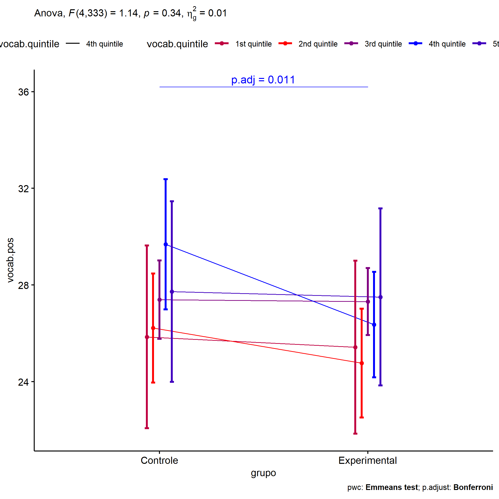<!-- -->

``` r
if (!is.null(plots[["vocab.quintile"]]))
  plots[["vocab.quintile"]] + ggplot2::scale_color_manual(values = color[["grupo"]])
```

    ## Scale for colour is already present.
    ## Adding another scale for colour, which will replace the existing scale.

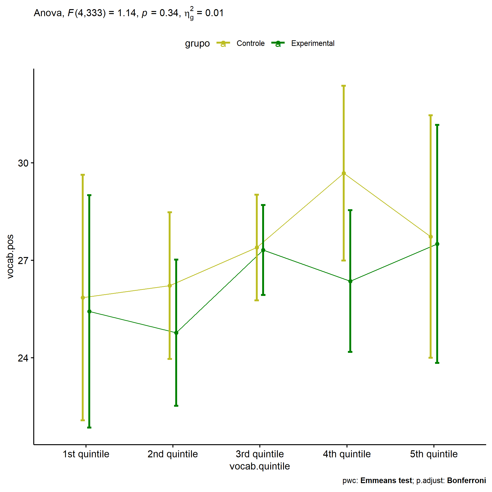<!-- -->

``` r
plots <- twoWayAncovaBoxPlots(
  wdat, "vocab.pos", c("grupo","vocab.quintile"), aov, pwcs, covar = "vocab.pre",
  theme = "classic", color = color[["grupo:vocab.quintile"]],
  subtitle = which(aov$Effect == "grupo:vocab.quintile"))
```

``` r
plots[["grupo:vocab.quintile"]] + ggplot2::ylab("Vocabulario") + ggplot2::scale_x_discrete(labels=c('pre', 'pos'))
```

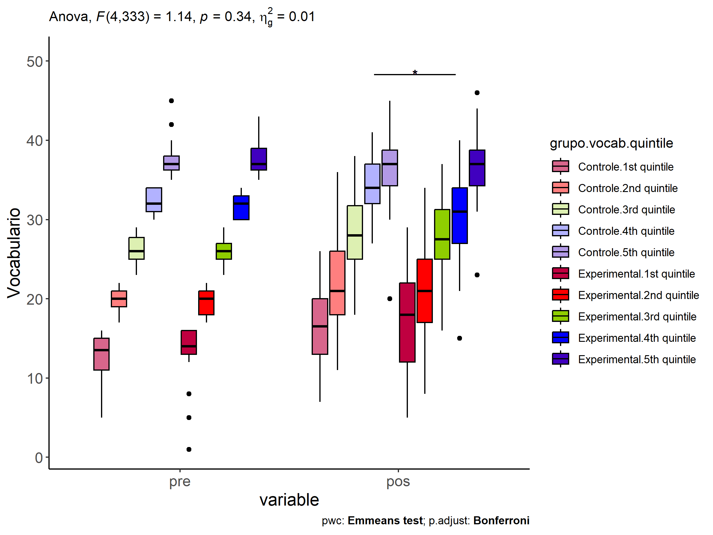<!-- -->

``` r
plots <- twoWayAncovaBoxPlots(
  wdat.long, "vocab", c("grupo","vocab.quintile"), aov, pwc.long, pre.post = "time",
  theme = "classic", color = color$prepost)
```

``` r
plots[["grupo:vocab.quintile"]] + ggplot2::ylab("Vocabulario")
```

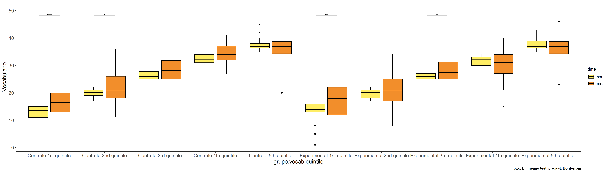<!-- -->

### Checking linearity assumption

``` r
ggscatter(wdat, x = "vocab.pre", y = "vocab.pos", size = 0.5,
          facet.by = c("grupo","vocab.quintile"), add = "reg.line")+
  stat_regline_equation(
    aes(label =  paste(..eq.label.., ..rr.label.., sep = "~~~~"))
  )
```

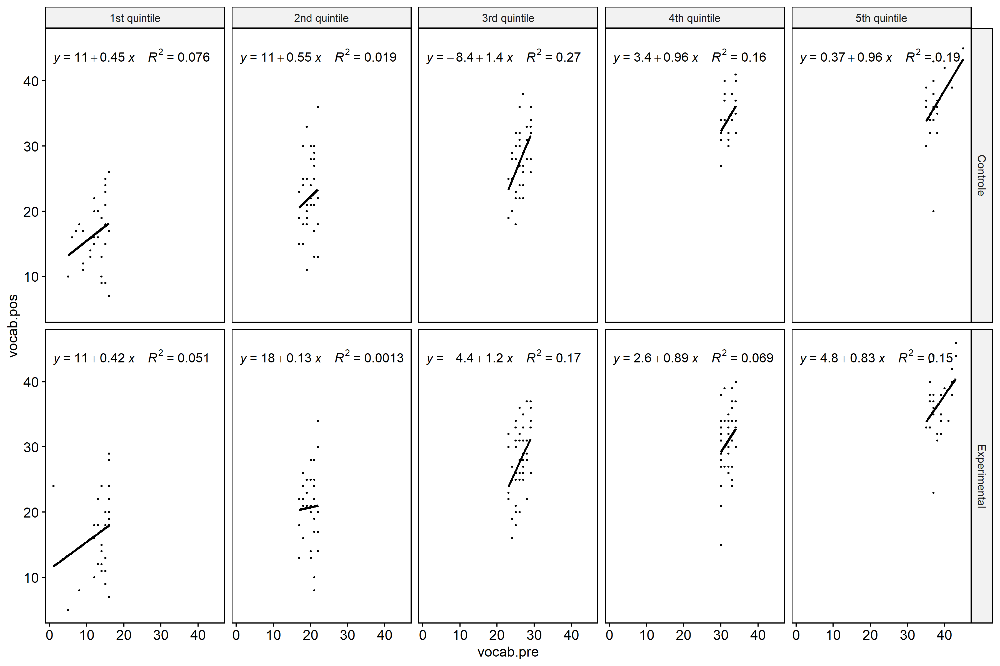<!-- -->

### Checking normality and homogeneity

``` r
res <- augment(lm(vocab.pos ~ vocab.pre + grupo*vocab.quintile, data = wdat))
```

``` r
shapiro_test(res$.resid)
```

    ## # A tibble: 1 × 3
    ##   variable   statistic p.value
    ##   <chr>          <dbl>   <dbl>
    ## 1 res$.resid     0.994   0.222

``` r
levene_test(res, .resid ~ grupo*vocab.quintile)
```

    ## # A tibble: 1 × 4
    ##     df1   df2 statistic      p
    ##   <int> <int>     <dbl>  <dbl>
    ## 1     9   334      1.76 0.0748

# Summary of Results

## Descriptive Statistics

``` r
df <- get.descriptives(ldat[["grupo"]], c(dv.pre, dv.pos), c("grupo"), 
                       include.global = T, symmetry.test = T, normality.test = F)
df <- plyr::rbind.fill(
  df, do.call(plyr::rbind.fill, lapply(lfatores2, FUN = function(f) {
    if (nrow(dat) > 0 && sum(!is.na(unique(dat[[f]]))) > 1)
      get.descriptives(ldat[[paste0("grupo:",f)]], c(dv.pre,dv.pos), c("grupo", f),
                       symmetry.test = T, normality.test = F)
    }))
)
(df <- df[,c(fatores1[fatores1 %in% colnames(df)],"variable",
             colnames(df)[!colnames(df) %in% c(fatores1,"variable")])])
```

    ##           grupo Sexo   Zona Cor.Raca vocab.quintile  variable   n   mean median min max    sd    se    ci   iqr
    ## 1      Controle <NA>   <NA>     <NA>           <NA> vocab.pre 149 24.302   25.0   5  45 8.687 0.712 1.406 13.00
    ## 2  Experimental <NA>   <NA>     <NA>           <NA> vocab.pre 194 26.500   27.0   1  43 8.289 0.595 1.174 13.00
    ## 3          <NA> <NA>   <NA>     <NA>           <NA> vocab.pre 343 25.545   26.0   1  45 8.522 0.460 0.905 13.00
    ## 4      Controle <NA>   <NA>     <NA>           <NA> vocab.pos 149 26.403   27.0   7  45 8.669 0.710 1.403 14.00
    ## 5  Experimental <NA>   <NA>     <NA>           <NA> vocab.pos 194 27.067   27.0   5  46 8.345 0.599 1.182 11.75
    ## 6          <NA> <NA>   <NA>     <NA>           <NA> vocab.pos 343 26.778   27.0   5  46 8.481 0.458 0.901 12.00
    ## 7      Controle    F   <NA>     <NA>           <NA> vocab.pre  85 25.718   26.0   8  42 8.185 0.888 1.765 14.00
    ## 8      Controle    M   <NA>     <NA>           <NA> vocab.pre  65 22.646   21.0   5  45 9.147 1.135 2.267 15.00
    ## 9  Experimental    F   <NA>     <NA>           <NA> vocab.pre  98 26.255   27.0   1  43 8.306 0.839 1.665 12.00
    ## 10 Experimental    M   <NA>     <NA>           <NA> vocab.pre  96 26.750   27.0   5  43 8.307 0.848 1.683 12.00
    ## 11     Controle    F   <NA>     <NA>           <NA> vocab.pos  85 27.365   28.0   7  43 8.021 0.870 1.730 12.00
    ## 12     Controle    M   <NA>     <NA>           <NA> vocab.pos  65 25.046   24.0   9  45 9.321 1.156 2.310 16.00
    ## 13 Experimental    F   <NA>     <NA>           <NA> vocab.pos  98 27.878   28.0   7  46 7.650 0.773 1.534  9.00
    ## 14 Experimental    M   <NA>     <NA>           <NA> vocab.pos  96 26.240   26.0   5  44 8.964 0.915 1.816 14.00
    ## 15     Controle <NA>  Rural     <NA>           <NA> vocab.pre  75 24.707   26.0   8  45 8.382 0.968 1.929 13.00
    ## 16     Controle <NA> Urbana     <NA>           <NA> vocab.pre  49 26.041   25.0   6  42 8.703 1.243 2.500 14.00
    ## 17 Experimental <NA>  Rural     <NA>           <NA> vocab.pre  91 26.495   27.0   5  43 8.460 0.887 1.762 11.50
    ## 18 Experimental <NA> Urbana     <NA>           <NA> vocab.pre  75 26.920   27.0   1  43 8.228 0.950 1.893 11.50
    ## 19     Controle <NA>  Rural     <NA>           <NA> vocab.pos  75 27.413   28.0  10  45 8.505 0.982 1.957 13.50
    ## 20     Controle <NA> Urbana     <NA>           <NA> vocab.pos  49 27.082   29.0   7  40 8.672 1.239 2.491 13.00
    ## 21 Experimental <NA>  Rural     <NA>           <NA> vocab.pos  91 26.692   27.0   5  46 8.754 0.918 1.823 12.00
    ## 22 Experimental <NA> Urbana     <NA>           <NA> vocab.pos  75 27.827   29.0   9  44 8.125 0.938 1.869 12.00
    ## 23     Controle <NA>   <NA>   Branca           <NA> vocab.pre  22 26.273   27.0  12  45 8.172 1.742 3.623 11.75
    ## 24     Controle <NA>   <NA> Indígena           <NA> vocab.pre   8 24.250   25.5  15  33 6.386 2.258 5.339  5.75
    ## 25     Controle <NA>   <NA>    Parda           <NA> vocab.pre  44 22.591   21.0   9  38 8.478 1.278 2.578 15.25
    ## 26 Experimental <NA>   <NA>   Branca           <NA> vocab.pre  12 26.667   27.5  15  37 6.972 2.013 4.430  8.75
    ## 27 Experimental <NA>   <NA>    Parda           <NA> vocab.pre  53 24.396   25.0   1  42 8.654 1.189 2.385 12.00
    ## 28     Controle <NA>   <NA>   Branca           <NA> vocab.pos  22 28.000   29.0  13  45 7.910 1.686 3.507 10.00
    ## 29     Controle <NA>   <NA> Indígena           <NA> vocab.pos   8 28.875   27.5  18  38 7.717 2.728 6.452 12.50
    ## 30     Controle <NA>   <NA>    Parda           <NA> vocab.pos  44 25.545   26.0   7  40 9.598 1.447 2.918 16.50
    ## 31 Experimental <NA>   <NA>   Branca           <NA> vocab.pos  12 24.000   23.0   9  37 7.160 2.067 4.550  6.75
    ## 32 Experimental <NA>   <NA>    Parda           <NA> vocab.pos  53 25.396   26.0   7  40 7.510 1.032 2.070  9.00
    ## 33     Controle <NA>   <NA>     <NA>   1st quintile vocab.pre  32 12.500   13.5   5  16 3.059 0.541 1.103  4.00
    ## 34     Controle <NA>   <NA>     <NA>   2nd quintile vocab.pre  35 19.686   20.0  17  22 1.510 0.255 0.519  2.00
    ## 35     Controle <NA>   <NA>     <NA>   3rd quintile vocab.pre  38 26.342   26.0  23  29 1.790 0.290 0.588  2.75
    ## 36     Controle <NA>   <NA>     <NA>   4th quintile vocab.pre  23 32.261   32.0  30  34 1.544 0.322 0.668  3.00
    ## 37     Controle <NA>   <NA>     <NA>   5th quintile vocab.pre  22 37.545   37.0  35  45 2.345 0.500 1.040  1.75
    ## 38 Experimental <NA>   <NA>     <NA>   1st quintile vocab.pre  30 13.533   14.0   1  16 3.401 0.621 1.270  3.00
    ## 39 Experimental <NA>   <NA>     <NA>   2nd quintile vocab.pre  34 19.824   20.0  17  22 1.642 0.282 0.573  3.00
    ## 40 Experimental <NA>   <NA>     <NA>   3rd quintile vocab.pre  52 26.115   26.0  23  29 1.688 0.234 0.470  2.00
    ## 41 Experimental <NA>   <NA>     <NA>   4th quintile vocab.pre  44 31.750   32.0  30  34 1.512 0.228 0.460  3.00
    ## 42 Experimental <NA>   <NA>     <NA>   5th quintile vocab.pre  34 38.206   37.0  35  43 2.346 0.402 0.818  2.75
    ## 43     Controle <NA>   <NA>     <NA>   1st quintile vocab.pos  32 16.594   16.5   7  26 4.983 0.881 1.797  7.00
    ## 44     Controle <NA>   <NA>     <NA>   2nd quintile vocab.pos  35 22.057   21.0  11  36 6.097 1.031 2.094  8.00
    ## 45     Controle <NA>   <NA>     <NA>   3rd quintile vocab.pos  38 27.947   28.0  18  38 4.793 0.777 1.575  6.75
    ## 46     Controle <NA>   <NA>     <NA>   4th quintile vocab.pos  23 34.435   34.0  27  41 3.678 0.767 1.591  5.00
    ## 47     Controle <NA>   <NA>     <NA>   5th quintile vocab.pos  22 36.227   37.0  20  45 5.089 1.085 2.256  4.50
    ## 48 Experimental <NA>   <NA>     <NA>   1st quintile vocab.pos  30 16.900   18.0   5  29 6.326 1.155 2.362 10.00
    ## 49 Experimental <NA>   <NA>     <NA>   2nd quintile vocab.pos  34 20.706   21.0   8  34 5.808 0.996 2.026  8.00
    ## 50 Experimental <NA>   <NA>     <NA>   3rd quintile vocab.pos  52 27.712   27.5  16  37 5.058 0.701 1.408  6.25
    ## 51 Experimental <NA>   <NA>     <NA>   4th quintile vocab.pos  44 30.750   31.0  15  40 5.109 0.770 1.553  7.00
    ## 52 Experimental <NA>   <NA>     <NA>   5th quintile vocab.pos  34 36.471   37.0  23  46 5.017 0.860 1.750  4.50
    ##    symmetry     skewness    kurtosis
    ## 1       YES -0.002569819 -0.81804611
    ## 2       YES -0.215756654 -0.48596542
    ## 3       YES -0.131333816 -0.65567948
    ## 4       YES -0.141056363 -0.90205401
    ## 5       YES -0.271859518 -0.45859651
    ## 6       YES -0.216237870 -0.65709844
    ## 7       YES -0.095685176 -0.90918651
    ## 8       YES  0.181162577 -0.78374153
    ## 9       YES -0.161819469 -0.34367415
    ## 10      YES -0.267998927 -0.67250178
    ## 11      YES -0.267174582 -0.71670710
    ## 12      YES  0.092792004 -1.07695674
    ## 13      YES -0.354402954 -0.13444361
    ## 14      YES -0.143939086 -0.75284936
    ## 15      YES  0.063329676 -0.90045880
    ## 16      YES -0.249047621 -0.83688462
    ## 17      YES -0.197435603 -0.61214514
    ## 18      YES -0.312912884 -0.07625735
    ## 19      YES -0.164113052 -0.89609482
    ## 20      YES -0.469914643 -0.79609273
    ## 21      YES -0.219950150 -0.30407821
    ## 22      YES -0.368556868 -0.66200654
    ## 23      YES  0.214246715 -0.55176433
    ## 24      YES -0.366761172 -1.41242258
    ## 25      YES  0.286371629 -1.14802599
    ## 26      YES -0.363679368 -1.22241596
    ## 27      YES -0.038359958 -0.37679814
    ## 28      YES  0.108550216 -0.60143611
    ## 29      YES  0.011244966 -1.78354210
    ## 30      YES -0.081817007 -1.32972121
    ## 31      YES -0.110312670 -0.23762009
    ## 32      YES -0.224270635 -0.33439254
    ## 33       NO -0.894498193 -0.31361363
    ## 34      YES -0.122785548 -1.13187425
    ## 35      YES  0.017463517 -1.03646581
    ## 36      YES -0.135227096 -1.55782594
    ## 37       NO  1.563822215  2.56156148
    ## 38       NO -2.219149478  4.79410025
    ## 39      YES -0.244128751 -1.30177177
    ## 40      YES -0.009511705 -0.83125126
    ## 41      YES  0.101173388 -1.50525184
    ## 42       NO  0.757951132 -0.78958306
    ## 43      YES -0.002212519 -0.89674779
    ## 44      YES  0.223299346 -0.69238616
    ## 45      YES -0.064493228 -0.61678262
    ## 46      YES  0.082008460 -1.02660940
    ## 47       NO -1.173316107  2.49024294
    ## 48      YES  0.013064191 -1.02157491
    ## 49      YES -0.082734283 -0.42850090
    ## 50      YES -0.113359411 -0.62384973
    ## 51       NO -0.535342434  0.46778061
    ## 52       NO -0.677013114  1.02507461

| grupo        | Sexo | Zona   | Cor.Raca | vocab.quintile | variable  |   n |   mean | median | min | max |    sd |    se |    ci |   iqr | symmetry | skewness | kurtosis |
|:-------------|:-----|:-------|:---------|:---------------|:----------|----:|-------:|-------:|----:|----:|------:|------:|------:|------:|:---------|---------:|---------:|
| Controle     |      |        |          |                | vocab.pre | 149 | 24.302 |   25.0 |   5 |  45 | 8.687 | 0.712 | 1.406 | 13.00 | YES      |   -0.003 |   -0.818 |
| Experimental |      |        |          |                | vocab.pre | 194 | 26.500 |   27.0 |   1 |  43 | 8.289 | 0.595 | 1.174 | 13.00 | YES      |   -0.216 |   -0.486 |
|              |      |        |          |                | vocab.pre | 343 | 25.545 |   26.0 |   1 |  45 | 8.522 | 0.460 | 0.905 | 13.00 | YES      |   -0.131 |   -0.656 |
| Controle     |      |        |          |                | vocab.pos | 149 | 26.403 |   27.0 |   7 |  45 | 8.669 | 0.710 | 1.403 | 14.00 | YES      |   -0.141 |   -0.902 |
| Experimental |      |        |          |                | vocab.pos | 194 | 27.067 |   27.0 |   5 |  46 | 8.345 | 0.599 | 1.182 | 11.75 | YES      |   -0.272 |   -0.459 |
|              |      |        |          |                | vocab.pos | 343 | 26.778 |   27.0 |   5 |  46 | 8.481 | 0.458 | 0.901 | 12.00 | YES      |   -0.216 |   -0.657 |
| Controle     | F    |        |          |                | vocab.pre |  85 | 25.718 |   26.0 |   8 |  42 | 8.185 | 0.888 | 1.765 | 14.00 | YES      |   -0.096 |   -0.909 |
| Controle     | M    |        |          |                | vocab.pre |  65 | 22.646 |   21.0 |   5 |  45 | 9.147 | 1.135 | 2.267 | 15.00 | YES      |    0.181 |   -0.784 |
| Experimental | F    |        |          |                | vocab.pre |  98 | 26.255 |   27.0 |   1 |  43 | 8.306 | 0.839 | 1.665 | 12.00 | YES      |   -0.162 |   -0.344 |
| Experimental | M    |        |          |                | vocab.pre |  96 | 26.750 |   27.0 |   5 |  43 | 8.307 | 0.848 | 1.683 | 12.00 | YES      |   -0.268 |   -0.673 |
| Controle     | F    |        |          |                | vocab.pos |  85 | 27.365 |   28.0 |   7 |  43 | 8.021 | 0.870 | 1.730 | 12.00 | YES      |   -0.267 |   -0.717 |
| Controle     | M    |        |          |                | vocab.pos |  65 | 25.046 |   24.0 |   9 |  45 | 9.321 | 1.156 | 2.310 | 16.00 | YES      |    0.093 |   -1.077 |
| Experimental | F    |        |          |                | vocab.pos |  98 | 27.878 |   28.0 |   7 |  46 | 7.650 | 0.773 | 1.534 |  9.00 | YES      |   -0.354 |   -0.134 |
| Experimental | M    |        |          |                | vocab.pos |  96 | 26.240 |   26.0 |   5 |  44 | 8.964 | 0.915 | 1.816 | 14.00 | YES      |   -0.144 |   -0.753 |
| Controle     |      | Rural  |          |                | vocab.pre |  75 | 24.707 |   26.0 |   8 |  45 | 8.382 | 0.968 | 1.929 | 13.00 | YES      |    0.063 |   -0.900 |
| Controle     |      | Urbana |          |                | vocab.pre |  49 | 26.041 |   25.0 |   6 |  42 | 8.703 | 1.243 | 2.500 | 14.00 | YES      |   -0.249 |   -0.837 |
| Experimental |      | Rural  |          |                | vocab.pre |  91 | 26.495 |   27.0 |   5 |  43 | 8.460 | 0.887 | 1.762 | 11.50 | YES      |   -0.197 |   -0.612 |
| Experimental |      | Urbana |          |                | vocab.pre |  75 | 26.920 |   27.0 |   1 |  43 | 8.228 | 0.950 | 1.893 | 11.50 | YES      |   -0.313 |   -0.076 |
| Controle     |      | Rural  |          |                | vocab.pos |  75 | 27.413 |   28.0 |  10 |  45 | 8.505 | 0.982 | 1.957 | 13.50 | YES      |   -0.164 |   -0.896 |
| Controle     |      | Urbana |          |                | vocab.pos |  49 | 27.082 |   29.0 |   7 |  40 | 8.672 | 1.239 | 2.491 | 13.00 | YES      |   -0.470 |   -0.796 |
| Experimental |      | Rural  |          |                | vocab.pos |  91 | 26.692 |   27.0 |   5 |  46 | 8.754 | 0.918 | 1.823 | 12.00 | YES      |   -0.220 |   -0.304 |
| Experimental |      | Urbana |          |                | vocab.pos |  75 | 27.827 |   29.0 |   9 |  44 | 8.125 | 0.938 | 1.869 | 12.00 | YES      |   -0.369 |   -0.662 |
| Controle     |      |        | Branca   |                | vocab.pre |  22 | 26.273 |   27.0 |  12 |  45 | 8.172 | 1.742 | 3.623 | 11.75 | YES      |    0.214 |   -0.552 |
| Controle     |      |        | Indígena |                | vocab.pre |   8 | 24.250 |   25.5 |  15 |  33 | 6.386 | 2.258 | 5.339 |  5.75 | YES      |   -0.367 |   -1.412 |
| Controle     |      |        | Parda    |                | vocab.pre |  44 | 22.591 |   21.0 |   9 |  38 | 8.478 | 1.278 | 2.578 | 15.25 | YES      |    0.286 |   -1.148 |
| Experimental |      |        | Branca   |                | vocab.pre |  12 | 26.667 |   27.5 |  15 |  37 | 6.972 | 2.013 | 4.430 |  8.75 | YES      |   -0.364 |   -1.222 |
| Experimental |      |        | Parda    |                | vocab.pre |  53 | 24.396 |   25.0 |   1 |  42 | 8.654 | 1.189 | 2.385 | 12.00 | YES      |   -0.038 |   -0.377 |
| Controle     |      |        | Branca   |                | vocab.pos |  22 | 28.000 |   29.0 |  13 |  45 | 7.910 | 1.686 | 3.507 | 10.00 | YES      |    0.109 |   -0.601 |
| Controle     |      |        | Indígena |                | vocab.pos |   8 | 28.875 |   27.5 |  18 |  38 | 7.717 | 2.728 | 6.452 | 12.50 | YES      |    0.011 |   -1.784 |
| Controle     |      |        | Parda    |                | vocab.pos |  44 | 25.545 |   26.0 |   7 |  40 | 9.598 | 1.447 | 2.918 | 16.50 | YES      |   -0.082 |   -1.330 |
| Experimental |      |        | Branca   |                | vocab.pos |  12 | 24.000 |   23.0 |   9 |  37 | 7.160 | 2.067 | 4.550 |  6.75 | YES      |   -0.110 |   -0.238 |
| Experimental |      |        | Parda    |                | vocab.pos |  53 | 25.396 |   26.0 |   7 |  40 | 7.510 | 1.032 | 2.070 |  9.00 | YES      |   -0.224 |   -0.334 |
| Controle     |      |        |          | 1st quintile   | vocab.pre |  32 | 12.500 |   13.5 |   5 |  16 | 3.059 | 0.541 | 1.103 |  4.00 | NO       |   -0.894 |   -0.314 |
| Controle     |      |        |          | 2nd quintile   | vocab.pre |  35 | 19.686 |   20.0 |  17 |  22 | 1.510 | 0.255 | 0.519 |  2.00 | YES      |   -0.123 |   -1.132 |
| Controle     |      |        |          | 3rd quintile   | vocab.pre |  38 | 26.342 |   26.0 |  23 |  29 | 1.790 | 0.290 | 0.588 |  2.75 | YES      |    0.017 |   -1.036 |
| Controle     |      |        |          | 4th quintile   | vocab.pre |  23 | 32.261 |   32.0 |  30 |  34 | 1.544 | 0.322 | 0.668 |  3.00 | YES      |   -0.135 |   -1.558 |
| Controle     |      |        |          | 5th quintile   | vocab.pre |  22 | 37.545 |   37.0 |  35 |  45 | 2.345 | 0.500 | 1.040 |  1.75 | NO       |    1.564 |    2.562 |
| Experimental |      |        |          | 1st quintile   | vocab.pre |  30 | 13.533 |   14.0 |   1 |  16 | 3.401 | 0.621 | 1.270 |  3.00 | NO       |   -2.219 |    4.794 |
| Experimental |      |        |          | 2nd quintile   | vocab.pre |  34 | 19.824 |   20.0 |  17 |  22 | 1.642 | 0.282 | 0.573 |  3.00 | YES      |   -0.244 |   -1.302 |
| Experimental |      |        |          | 3rd quintile   | vocab.pre |  52 | 26.115 |   26.0 |  23 |  29 | 1.688 | 0.234 | 0.470 |  2.00 | YES      |   -0.010 |   -0.831 |
| Experimental |      |        |          | 4th quintile   | vocab.pre |  44 | 31.750 |   32.0 |  30 |  34 | 1.512 | 0.228 | 0.460 |  3.00 | YES      |    0.101 |   -1.505 |
| Experimental |      |        |          | 5th quintile   | vocab.pre |  34 | 38.206 |   37.0 |  35 |  43 | 2.346 | 0.402 | 0.818 |  2.75 | NO       |    0.758 |   -0.790 |
| Controle     |      |        |          | 1st quintile   | vocab.pos |  32 | 16.594 |   16.5 |   7 |  26 | 4.983 | 0.881 | 1.797 |  7.00 | YES      |   -0.002 |   -0.897 |
| Controle     |      |        |          | 2nd quintile   | vocab.pos |  35 | 22.057 |   21.0 |  11 |  36 | 6.097 | 1.031 | 2.094 |  8.00 | YES      |    0.223 |   -0.692 |
| Controle     |      |        |          | 3rd quintile   | vocab.pos |  38 | 27.947 |   28.0 |  18 |  38 | 4.793 | 0.777 | 1.575 |  6.75 | YES      |   -0.064 |   -0.617 |
| Controle     |      |        |          | 4th quintile   | vocab.pos |  23 | 34.435 |   34.0 |  27 |  41 | 3.678 | 0.767 | 1.591 |  5.00 | YES      |    0.082 |   -1.027 |
| Controle     |      |        |          | 5th quintile   | vocab.pos |  22 | 36.227 |   37.0 |  20 |  45 | 5.089 | 1.085 | 2.256 |  4.50 | NO       |   -1.173 |    2.490 |
| Experimental |      |        |          | 1st quintile   | vocab.pos |  30 | 16.900 |   18.0 |   5 |  29 | 6.326 | 1.155 | 2.362 | 10.00 | YES      |    0.013 |   -1.022 |
| Experimental |      |        |          | 2nd quintile   | vocab.pos |  34 | 20.706 |   21.0 |   8 |  34 | 5.808 | 0.996 | 2.026 |  8.00 | YES      |   -0.083 |   -0.429 |
| Experimental |      |        |          | 3rd quintile   | vocab.pos |  52 | 27.712 |   27.5 |  16 |  37 | 5.058 | 0.701 | 1.408 |  6.25 | YES      |   -0.113 |   -0.624 |
| Experimental |      |        |          | 4th quintile   | vocab.pos |  44 | 30.750 |   31.0 |  15 |  40 | 5.109 | 0.770 | 1.553 |  7.00 | NO       |   -0.535 |    0.468 |
| Experimental |      |        |          | 5th quintile   | vocab.pos |  34 | 36.471 |   37.0 |  23 |  46 | 5.017 | 0.860 | 1.750 |  4.50 | NO       |   -0.677 |    1.025 |

## ANCOVA Table Comparison

``` r
df <- do.call(plyr::rbind.fill, laov)
(df <- df[!duplicated(df$Effect),])
```

    ##                  Effect DFn DFd       F        p p<.05      ges DFn' DFd'         F'       p' p<.05'     ges'
    ## 1                 grupo   1 340   4.221 4.10e-02     * 0.012000    1  346   2.276000 1.32e-01        7.00e-03
    ## 2             vocab.pre   1 340 652.429 4.35e-81     * 0.657000    1  346 498.152000 5.43e-69      * 5.90e-01
    ## 4            grupo:Sexo   1 339   3.995 4.60e-02     * 0.012000    1  344   1.844000 1.75e-01        5.00e-03
    ## 5                  Sexo   1 339   4.075 4.40e-02     * 0.012000    1  344   6.644000 1.00e-02      * 1.90e-02
    ## 8            grupo:Zona   1 285   3.392 6.70e-02       0.012000    1  290   2.139000 1.45e-01        7.00e-03
    ## 10                 Zona   1 285   0.056 8.13e-01       0.000196    1  290   0.000256 9.87e-01        8.84e-07
    ## 11             Cor.Raca   2 133   1.585 2.09e-01       0.023000    2  133   1.585000 2.09e-01        2.30e-02
    ## 13       grupo:Cor.Raca   1 133   1.611 2.07e-01       0.012000    1  133   1.611000 2.07e-01        1.20e-02
    ## 16 grupo:vocab.quintile   4 333   1.138 3.39e-01       0.013000    4  338   1.040000 3.87e-01        1.20e-02
    ## 18       vocab.quintile   4 333   0.828 5.08e-01       0.010000    4  338   0.669000 6.14e-01        8.00e-03

|     | Effect               | DFn | DFd |       F |     p | p\<.05 |   ges | DFn’ | DFd’ |      F’ |    p’ | p\<.05’ |  ges’ |
|:----|:---------------------|----:|----:|--------:|------:|:-------|------:|-----:|-----:|--------:|------:|:--------|------:|
| 1   | grupo                |   1 | 340 |   4.221 | 0.041 | \*     | 0.012 |    1 |  346 |   2.276 | 0.132 |         | 0.007 |
| 2   | vocab.pre            |   1 | 340 | 652.429 | 0.000 | \*     | 0.657 |    1 |  346 | 498.152 | 0.000 | \*      | 0.590 |
| 4   | grupo:Sexo           |   1 | 339 |   3.995 | 0.046 | \*     | 0.012 |    1 |  344 |   1.844 | 0.175 |         | 0.005 |
| 5   | Sexo                 |   1 | 339 |   4.075 | 0.044 | \*     | 0.012 |    1 |  344 |   6.644 | 0.010 | \*      | 0.019 |
| 8   | grupo:Zona           |   1 | 285 |   3.392 | 0.067 |        | 0.012 |    1 |  290 |   2.139 | 0.145 |         | 0.007 |
| 10  | Zona                 |   1 | 285 |   0.056 | 0.813 |        | 0.000 |    1 |  290 |   0.000 | 0.987 |         | 0.000 |
| 11  | Cor.Raca             |   2 | 133 |   1.585 | 0.209 |        | 0.023 |    2 |  133 |   1.585 | 0.209 |         | 0.023 |
| 13  | grupo:Cor.Raca       |   1 | 133 |   1.611 | 0.207 |        | 0.012 |    1 |  133 |   1.611 | 0.207 |         | 0.012 |
| 16  | grupo:vocab.quintile |   4 | 333 |   1.138 | 0.339 |        | 0.013 |    4 |  338 |   1.040 | 0.387 |         | 0.012 |
| 18  | vocab.quintile       |   4 | 333 |   0.828 | 0.508 |        | 0.010 |    4 |  338 |   0.669 | 0.614 |         | 0.008 |

## PairWise Table Comparison

``` r
df <- do.call(plyr::rbind.fill, lpwc)
df <- df[,c(names(lfatores), names(df)[!names(df) %in% c(names(lfatores),"term",".y.")])]
```

| grupo        | Sexo | Zona   | Cor.Raca | vocab.quintile | group1       | group2       |  df | statistic |     p | p.adj | p.adj.signif | df’ | statistic’ |    p’ | p.adj’ | p.adj.signif’ |
|:-------------|:-----|:-------|:---------|:---------------|:-------------|:-------------|----:|----------:|------:|------:|:-------------|----:|-----------:|------:|-------:|:--------------|
| Controle     |      |        |          |                | pre          | pos          | 682 |    -2.139 | 0.033 | 0.033 | \*           | 694 |     -1.678 | 0.094 |  0.094 | ns            |
| Experimental |      |        |          |                | pre          | pos          | 682 |    -0.659 | 0.510 | 0.510 | ns           | 694 |     -0.346 | 0.729 |  0.729 | ns            |
|              |      |        |          |                | Controle     | Experimental | 340 |     2.055 | 0.041 | 0.041 | \*           | 346 |      1.509 | 0.132 |  0.132 | ns            |
| Controle     | F    |        |          |                | pre          | pos          | 680 |    -1.271 | 0.204 | 0.204 | ns           | 690 |     -1.257 | 0.209 |  0.209 | ns            |
| Controle     | M    |        |          |                | pre          | pos          | 680 |    -1.620 | 0.106 | 0.106 | ns           | 690 |     -1.123 | 0.262 |  0.262 | ns            |
| Controle     |      |        |          |                | F            | M            | 339 |    -0.193 | 0.847 | 0.847 | ns           | 344 |      0.659 | 0.510 |  0.510 | ns            |
| Experimental | F    |        |          |                | pre          | pos          | 680 |    -1.345 | 0.179 | 0.179 | ns           | 690 |     -1.215 | 0.225 |  0.225 | ns            |
| Experimental | M    |        |          |                | pre          | pos          | 680 |     0.419 | 0.676 | 0.676 | ns           | 690 |      0.728 | 0.467 |  0.467 | ns            |
| Experimental |      |        |          |                | F            | M            | 339 |     2.835 | 0.005 | 0.005 | \*\*         | 344 |      2.836 | 0.005 |  0.005 | \*\*          |
|              | F    |        |          |                | Controle     | Experimental | 339 |    -0.107 | 0.915 | 0.915 | ns           | 344 |      0.083 | 0.934 |  0.934 | ns            |
|              | M    |        |          |                | Controle     | Experimental | 339 |     2.601 | 0.010 | 0.010 | \*\*         | 344 |      1.921 | 0.056 |  0.056 | ns            |
| Controle     |      |        |          |                | Rural        | Urbana       | 285 |     1.557 | 0.121 | 0.121 | ns           | 290 |      1.123 | 0.262 |  0.262 | ns            |
| Controle     |      | Rural  |          |                | pre          | pos          | 572 |    -1.957 | 0.051 | 0.051 | ns           | 582 |     -1.475 | 0.141 |  0.141 | ns            |
| Controle     |      | Urbana |          |                | pre          | pos          | 572 |    -0.608 | 0.543 | 0.543 | ns           | 582 |     -0.408 | 0.683 |  0.683 | ns            |
| Experimental |      |        |          |                | Rural        | Urbana       | 285 |    -1.010 | 0.313 | 0.313 | ns           | 290 |     -0.937 | 0.350 |  0.350 | ns            |
| Experimental |      | Rural  |          |                | pre          | pos          | 572 |    -0.158 | 0.875 | 0.875 | ns           | 582 |      0.034 | 0.973 |  0.973 | ns            |
| Experimental |      | Urbana |          |                | pre          | pos          | 572 |    -0.656 | 0.512 | 0.512 | ns           | 582 |     -0.520 | 0.603 |  0.603 | ns            |
|              |      | Rural  |          |                | Controle     | Experimental | 285 |     2.807 | 0.005 | 0.005 | \*\*         | 290 |      2.015 | 0.045 |  0.045 | \*            |
|              |      | Urbana |          |                | Controle     | Experimental | 285 |    -0.025 | 0.980 | 0.980 | ns           | 290 |     -0.205 | 0.838 |  0.838 | ns            |
| Controle     |      |        | Branca   |                | pre          | pos          | 268 |    -0.691 | 0.490 | 0.490 | ns           | 268 |     -0.691 | 0.490 |  0.490 | ns            |
| Controle     |      |        | Indígena |                | pre          | pos          | 268 |    -1.116 | 0.265 | 0.265 | ns           | 268 |     -1.116 | 0.265 |  0.265 | ns            |
| Controle     |      |        |          |                | Branca       | Indígena     | 133 |    -1.120 | 0.265 | 0.794 | ns           | 133 |     -1.120 | 0.265 |  0.794 | ns            |
| Controle     |      |        |          |                | Branca       | Parda        | 133 |    -0.282 | 0.779 | 1.000 | ns           | 133 |     -0.282 | 0.779 |  1.000 | ns            |
| Controle     |      |        |          |                | Indígena     | Parda        | 133 |     1.011 | 0.314 | 0.942 | ns           | 133 |      1.011 | 0.314 |  0.942 | ns            |
| Controle     |      |        | Parda    |                | pre          | pos          | 268 |    -1.673 | 0.096 | 0.096 | ns           | 268 |     -1.673 | 0.096 |  0.096 | ns            |
| Experimental |      |        | Branca   |                | pre          | pos          | 268 |     0.788 | 0.431 | 0.431 | ns           | 268 |      0.788 | 0.431 |  0.431 | ns            |
| Experimental |      |        | Indígena |                | pre          | pos          |     |           |       |       |              |     |            |       |        |               |
| Experimental |      |        |          |                | Branca       | Indígena     |     |           |       |       |              |     |            |       |        |               |
| Experimental |      |        |          |                | Branca       | Parda        | 133 |    -1.867 | 0.064 | 0.064 | ns           | 133 |     -1.867 | 0.064 |  0.064 | ns            |
| Experimental |      |        |          |                | Indígena     | Parda        |     |           |       |       |              |     |            |       |        |               |
| Experimental |      |        | Parda    |                | pre          | pos          | 268 |    -0.621 | 0.535 | 0.535 | ns           | 268 |     -0.621 | 0.535 |  0.535 | ns            |
|              |      |        | Branca   |                | Controle     | Experimental | 133 |     2.278 | 0.024 | 0.024 | \*           | 133 |      2.278 | 0.024 |  0.024 | \*            |
|              |      |        | Indígena |                | Controle     | Experimental |     |           |       |       |              |     |            |       |        |               |
|              |      |        | Parda    |                | Controle     | Experimental | 133 |     1.433 | 0.154 | 0.154 | ns           | 133 |      1.433 | 0.154 |  0.154 | ns            |
| Controle     |      |        |          | 1st quintile   | pre          | pos          | 668 |    -4.080 | 0.000 | 0.000 | \*\*\*\*     | 678 |     -3.770 | 0.000 |  0.000 | \*\*\*        |
| Controle     |      |        |          | 2nd quintile   | pre          | pos          | 668 |    -2.472 | 0.014 | 0.014 | \*           | 678 |     -2.284 | 0.023 |  0.023 | \*            |
| Controle     |      |        |          | 3rd quintile   | pre          | pos          | 668 |    -1.743 | 0.082 | 0.082 | ns           | 678 |     -1.173 | 0.241 |  0.241 | ns            |
| Controle     |      |        |          | 4th quintile   | pre          | pos          | 668 |    -1.837 | 0.067 | 0.067 | ns           | 678 |     -1.697 | 0.090 |  0.090 | ns            |
| Controle     |      |        |          | 5th quintile   | pre          | pos          | 668 |     1.089 | 0.276 | 0.276 | ns           | 678 |      1.969 | 0.049 |  0.049 | \*            |
| Controle     |      |        |          |                | 1st quintile | 2nd quintile | 333 |    -0.238 | 0.812 | 1.000 | ns           | 338 |     -0.188 | 0.851 |  1.000 | ns            |
| Controle     |      |        |          |                | 1st quintile | 3rd quintile | 333 |    -0.708 | 0.479 | 1.000 | ns           | 338 |     -0.411 | 0.681 |  1.000 | ns            |
| Controle     |      |        |          |                | 1st quintile | 4th quintile | 333 |    -1.311 | 0.191 | 1.000 | ns           | 338 |     -1.158 | 0.248 |  1.000 | ns            |
| Controle     |      |        |          |                | 1st quintile | 5th quintile | 333 |    -0.528 | 0.598 | 1.000 | ns           | 338 |     -0.138 | 0.890 |  1.000 | ns            |
| Controle     |      |        |          |                | 2nd quintile | 3rd quintile | 333 |    -0.798 | 0.426 | 1.000 | ns           | 338 |     -0.407 | 0.684 |  1.000 | ns            |
| Controle     |      |        |          |                | 2nd quintile | 4th quintile | 333 |    -1.628 | 0.105 | 1.000 | ns           | 338 |     -1.450 | 0.148 |  1.000 | ns            |
| Controle     |      |        |          |                | 2nd quintile | 5th quintile | 333 |    -0.558 | 0.577 | 1.000 | ns           | 338 |     -0.073 | 0.942 |  1.000 | ns            |
| Controle     |      |        |          |                | 3rd quintile | 4th quintile | 333 |    -1.486 | 0.138 | 1.000 | ns           | 338 |     -1.610 | 0.108 |  1.000 | ns            |
| Controle     |      |        |          |                | 3rd quintile | 5th quintile | 333 |    -0.169 | 0.866 | 1.000 | ns           | 338 |      0.200 | 0.842 |  1.000 | ns            |
| Controle     |      |        |          |                | 4th quintile | 5th quintile | 333 |     1.180 | 0.239 | 1.000 | ns           | 338 |      1.746 | 0.082 |  0.817 | ns            |
| Experimental |      |        |          | 1st quintile   | pre          | pos          | 668 |    -3.249 | 0.001 | 0.001 | \*\*         | 678 |     -3.002 | 0.003 |  0.003 | \*\*          |
| Experimental |      |        |          | 2nd quintile   | pre          | pos          | 668 |    -0.906 | 0.365 | 0.365 | ns           | 678 |     -0.838 | 0.403 |  0.403 | ns            |
| Experimental |      |        |          | 3rd quintile   | pre          | pos          | 668 |    -2.028 | 0.043 | 0.043 | \*           | 678 |     -1.174 | 0.241 |  0.241 | ns            |
| Experimental |      |        |          | 4th quintile   | pre          | pos          | 668 |     1.169 | 0.243 | 0.243 | ns           | 678 |      1.080 | 0.281 |  0.281 | ns            |
| Experimental |      |        |          | 5th quintile   | pre          | pos          | 668 |     1.783 | 0.075 | 0.075 | ns           | 678 |      2.229 | 0.026 |  0.026 | \*            |
| Experimental |      |        |          |                | 1st quintile | 2nd quintile | 333 |     0.434 | 0.665 | 1.000 | ns           | 338 |      0.420 | 0.675 |  1.000 | ns            |
| Experimental |      |        |          |                | 1st quintile | 3rd quintile | 333 |    -0.942 | 0.347 | 1.000 | ns           | 338 |     -0.542 | 0.588 |  1.000 | ns            |
| Experimental |      |        |          |                | 1st quintile | 4th quintile | 333 |    -0.351 | 0.725 | 1.000 | ns           | 338 |     -0.280 | 0.780 |  1.000 | ns            |
| Experimental |      |        |          |                | 1st quintile | 5th quintile | 333 |    -0.601 | 0.548 | 1.000 | ns           | 338 |     -0.355 | 0.723 |  1.000 | ns            |
| Experimental |      |        |          |                | 2nd quintile | 3rd quintile | 333 |    -1.839 | 0.067 | 0.667 | ns           | 338 |     -1.247 | 0.213 |  1.000 | ns            |
| Experimental |      |        |          |                | 2nd quintile | 4th quintile | 333 |    -0.821 | 0.412 | 1.000 | ns           | 338 |     -0.712 | 0.477 |  1.000 | ns            |
| Experimental |      |        |          |                | 2nd quintile | 5th quintile | 333 |    -1.015 | 0.311 | 1.000 | ns           | 338 |     -0.693 | 0.489 |  1.000 | ns            |
| Experimental |      |        |          |                | 3rd quintile | 4th quintile | 333 |     0.754 | 0.451 | 1.000 | ns           | 338 |      0.269 | 0.788 |  1.000 | ns            |
| Experimental |      |        |          |                | 3rd quintile | 5th quintile | 333 |    -0.097 | 0.923 | 1.000 | ns           | 338 |     -0.073 | 0.941 |  1.000 | ns            |
| Experimental |      |        |          |                | 4th quintile | 5th quintile | 333 |    -0.801 | 0.424 | 1.000 | ns           | 338 |     -0.338 | 0.736 |  1.000 | ns            |
|              |      |        |          | 1st quintile   | Controle     | Experimental | 333 |     0.330 | 0.741 | 0.741 | ns           | 338 |      0.305 | 0.761 |  0.761 | ns            |
|              |      |        |          | 2nd quintile   | Controle     | Experimental | 333 |     1.191 | 0.235 | 0.235 | ns           | 338 |      1.082 | 0.280 |  0.280 | ns            |
|              |      |        |          | 3rd quintile   | Controle     | Experimental | 333 |     0.070 | 0.945 | 0.945 | ns           | 338 |      0.187 | 0.852 |  0.852 | ns            |
|              |      |        |          | 4th quintile   | Controle     | Experimental | 333 |     2.552 | 0.011 | 0.011 | \*           | 338 |      2.315 | 0.021 |  0.021 | \*            |
|              |      |        |          | 5th quintile   | Controle     | Experimental | 333 |     0.162 | 0.871 | 0.871 | ns           | 338 |     -0.248 | 0.804 |  0.804 | ns            |

## EMMS Table Comparison

``` r
df <- do.call(plyr::rbind.fill, lemms)
df[["N-N'"]] <- df[["N"]] - df[["N'"]]
df <- df[,c(names(lfatores), names(df)[!names(df) %in% names(lfatores)])]
```

| grupo        | Sexo | Zona   | Cor.Raca | vocab.quintile |   N | M (pre) | SE (pre) | M (unadj) | SE (unadj) | M (adj) | SE (adj) |  N’ | M (pre)’ | SE (pre)’ | M (unadj)’ | SE (unadj)’ | M (adj)’ | SE (adj)’ | N-N’ |
|:-------------|:-----|:-------|:---------|:---------------|----:|--------:|---------:|----------:|-----------:|--------:|---------:|----:|---------:|----------:|-----------:|------------:|---------:|----------:|-----:|
| Controle     |      |        |          |                | 149 |  24.302 |    0.712 |    26.403 |      0.710 |  27.413 |    0.409 | 152 |   24.480 |     0.710 |     26.132 |       0.716 |   27.033 |     0.452 |   -3 |
| Experimental |      |        |          |                | 194 |  26.500 |    0.595 |    27.067 |      0.599 |  26.291 |    0.358 | 197 |   26.518 |     0.590 |     26.817 |       0.608 |   26.122 |     0.397 |   -3 |
| Controle     | F    |        |          |                |  85 |  25.718 |    0.888 |    27.365 |      0.870 |  27.252 |    0.543 |  85 |   25.718 |     0.888 |     27.365 |       0.870 |   27.296 |     0.597 |    0 |
| Controle     | M    |        |          |                |  65 |  22.646 |    1.135 |    25.046 |      1.156 |  27.413 |    0.628 |  67 |   22.910 |     1.131 |     24.567 |       1.171 |   26.700 |     0.679 |   -2 |
| Experimental | F    |        |          |                |  98 |  26.255 |    0.839 |    27.878 |      0.773 |  27.331 |    0.506 |  99 |   26.202 |     0.832 |     27.677 |       0.791 |   27.229 |     0.554 |   -1 |
| Experimental | M    |        |          |                |  96 |  26.750 |    0.848 |    26.240 |      0.915 |  25.294 |    0.512 |  98 |   26.837 |     0.841 |     25.949 |       0.922 |   25.003 |     0.558 |   -2 |
| Controle     |      | Rural  |          |                |  75 |  24.707 |    0.968 |    27.413 |      0.982 |  28.529 |    0.577 |  77 |   25.065 |     0.976 |     27.104 |       0.984 |   27.968 |     0.639 |   -2 |
| Controle     |      | Urbana |          |                |  49 |  26.041 |    1.243 |    27.082 |      1.239 |  27.102 |    0.712 |  50 |   25.980 |     1.220 |     26.680 |       1.279 |   26.826 |     0.792 |   -1 |
| Experimental |      | Rural  |          |                |  91 |  26.495 |    0.887 |    26.692 |      0.918 |  26.340 |    0.523 |  92 |   26.630 |     0.888 |     26.587 |       0.914 |   26.222 |     0.584 |   -1 |
| Experimental |      | Urbana |          |                |  75 |  26.920 |    0.950 |    27.827 |      0.938 |  27.125 |    0.576 |  76 |   26.842 |     0.941 |     27.566 |       0.962 |   27.035 |     0.643 |   -1 |
| Controle     |      |        | Branca   |                |  22 |  26.273 |    1.742 |    28.000 |      1.686 |  26.482 |    1.128 |  22 |   26.273 |     1.742 |     28.000 |       1.686 |   26.482 |     1.128 |    0 |
| Controle     |      |        | Indígena |                |   8 |  24.250 |    2.258 |    28.875 |      2.728 |  28.921 |    1.861 |   8 |   24.250 |     2.258 |     28.875 |       2.728 |   28.921 |     1.861 |    0 |
| Controle     |      |        | Parda    |                |  44 |  22.591 |    1.278 |    25.545 |      1.447 |  26.874 |    0.799 |  44 |   22.591 |     1.278 |     25.545 |       1.447 |   26.874 |     0.799 |    0 |
| Experimental |      |        | Branca   |                |  12 |  26.667 |    2.013 |    24.000 |      2.067 |  22.178 |    1.525 |  12 |   26.667 |     2.013 |     24.000 |       2.067 |   22.178 |     1.525 |    0 |
| Experimental |      |        | Parda    |                |  53 |  24.396 |    1.189 |    25.396 |      1.032 |  25.329 |    0.723 |  53 |   24.396 |     1.189 |     25.396 |       1.032 |   25.329 |     0.723 |    0 |
| Controle     |      |        |          | 1st quintile   |  32 |  12.500 |    0.541 |    16.594 |      0.881 |  25.852 |    1.922 |  32 |   12.500 |     0.541 |     16.594 |       0.881 |   25.991 |     2.109 |    0 |
| Controle     |      |        |          | 2nd quintile   |  35 |  19.686 |    0.255 |    22.057 |      1.031 |  26.221 |    1.147 |  35 |   19.686 |     0.255 |     22.057 |       1.031 |   26.312 |     1.264 |    0 |
| Controle     |      |        |          | 3rd quintile   |  38 |  26.342 |    0.290 |    27.947 |      0.777 |  27.392 |    0.826 |  39 |   26.256 |     0.296 |     27.410 |       0.928 |   26.962 |     0.896 |   -1 |
| Controle     |      |        |          | 4th quintile   |  23 |  32.261 |    0.322 |    34.435 |      0.767 |  29.682 |    1.368 |  23 |   32.261 |     0.322 |     34.435 |       0.767 |   29.689 |     1.495 |    0 |
| Controle     |      |        |          | 5th quintile   |  22 |  37.545 |    0.500 |    36.227 |      1.085 |  27.728 |    1.897 |  23 |   37.652 |     0.489 |     35.130 |       1.509 |   26.527 |     2.065 |   -1 |
| Experimental |      |        |          | 1st quintile   |  30 |  13.533 |    0.621 |    16.900 |      1.155 |  25.426 |    1.818 |  30 |   13.533 |     0.621 |     16.900 |       1.155 |   25.558 |     1.997 |    0 |
| Experimental |      |        |          | 2nd quintile   |  34 |  19.824 |    0.282 |    20.706 |      0.996 |  24.772 |    1.144 |  34 |   19.824 |     0.282 |     20.706 |       0.996 |   24.862 |     1.262 |    0 |
| Experimental |      |        |          | 3rd quintile   |  52 |  26.115 |    0.234 |    27.712 |      0.701 |  27.316 |    0.704 |  54 |   26.093 |     0.235 |     27.074 |       0.815 |   26.743 |     0.760 |   -2 |
| Experimental |      |        |          | 4th quintile   |  44 |  31.750 |    0.228 |    30.750 |      0.770 |  26.360 |    1.110 |  44 |   31.750 |     0.228 |     30.750 |       0.770 |   26.370 |     1.208 |    0 |
| Experimental |      |        |          | 5th quintile   |  34 |  38.206 |    0.402 |    36.471 |      0.860 |  27.503 |    1.862 |  35 |   38.229 |     0.391 |     35.914 |       1.004 |   26.898 |     2.022 |   -1 |
