ANCOVA in Vocabulario (Vocabulario)
================
Geiser C. Challco <geiser@alumni.usp.br>

- [Descriptive Statistics of Initial
  Data](#descriptive-statistics-of-initial-data)
- [ANCOVA and Pairwise for one factor:
  **grupo**](#ancova-and-pairwise-for-one-factor-grupo)
  - [Without remove non-normal data](#without-remove-non-normal-data)
  - [Computing ANCOVA and PairWise After removing non-normal data
    (OK)](#computing-ancova-and-pairwise-after-removing-non-normal-data-ok)
    - [Plots for ancova](#plots-for-ancova)
    - [Checking linearity assumption](#checking-linearity-assumption)
    - [Checking normality and
      homogeneity](#checking-normality-and-homogeneity)
- [ANCOVA and Pairwise for two factors
  **grupo:Sexo**](#ancova-and-pairwise-for-two-factors-gruposexo)
  - [Without remove non-normal data](#without-remove-non-normal-data-1)
  - [Computing ANCOVA and PairWise After removing non-normal data
    (OK)](#computing-ancova-and-pairwise-after-removing-non-normal-data-ok-1)
    - [Plots for ancova](#plots-for-ancova-1)
    - [Checking linearity assumption](#checking-linearity-assumption-1)
    - [Checking normality and
      homogeneity](#checking-normality-and-homogeneity-1)
- [ANCOVA and Pairwise for two factors
  **grupo:Zona**](#ancova-and-pairwise-for-two-factors-grupozona)
  - [Without remove non-normal data](#without-remove-non-normal-data-2)
  - [Computing ANCOVA and PairWise After removing non-normal data
    (OK)](#computing-ancova-and-pairwise-after-removing-non-normal-data-ok-2)
    - [Plots for ancova](#plots-for-ancova-2)
    - [Checking linearity assumption](#checking-linearity-assumption-2)
    - [Checking normality and
      homogeneity](#checking-normality-and-homogeneity-2)
- [ANCOVA and Pairwise for two factors
  **grupo:Cor.Raca**](#ancova-and-pairwise-for-two-factors-grupocorraca)
  - [Without remove non-normal data](#without-remove-non-normal-data-3)
  - [Computing ANCOVA and PairWise After removing non-normal data
    (OK)](#computing-ancova-and-pairwise-after-removing-non-normal-data-ok-3)
    - [Plots for ancova](#plots-for-ancova-3)
    - [Checking linearity assumption](#checking-linearity-assumption-3)
    - [Checking normality and
      homogeneity](#checking-normality-and-homogeneity-3)
- [ANCOVA and Pairwise for two factors
  **grupo:vocab.quintile**](#ancova-and-pairwise-for-two-factors-grupovocabquintile)
  - [Without remove non-normal data](#without-remove-non-normal-data-4)
  - [Computing ANCOVA and PairWise After removing non-normal data
    (OK)](#computing-ancova-and-pairwise-after-removing-non-normal-data-ok-4)
    - [Plots for ancova](#plots-for-ancova-4)
    - [Checking linearity assumption](#checking-linearity-assumption-4)
    - [Checking normality and
      homogeneity](#checking-normality-and-homogeneity-4)
- [Summary of Results](#summary-of-results)
  - [Descriptive Statistics](#descriptive-statistics)
  - [ANCOVA Table Comparison](#ancova-table-comparison)
  - [PairWise Table Comparison](#pairwise-table-comparison)
  - [EMMS Table Comparison](#emms-table-comparison)

**NOTE**:

- Teste ANCOVA para determinar se houve diferenças significativas no
  Vocabulario (medido usando pre- e pos-testes).
- ANCOVA test to determine whether there were significant differences in
  Vocabulario (measured using pre- and post-tests).

# Descriptive Statistics of Initial Data

``` r
df <- get.descriptives(dat, c(dv.pre, dv.pos), c("grupo"), 
                       include.global = T, symmetry.test = T, normality.test = F)
df <- plyr::rbind.fill(
  df, do.call(plyr::rbind.fill, lapply(lfatores2, FUN = function(f) {
    if (nrow(dat) > 0 && sum(!is.na(unique(dat[[f]]))) > 1)
      get.descriptives(dat, c(dv.pre,dv.pos), c("grupo", f),
                       symmetry.test = T, normality.test = F)
    }))
)
```

    ## Warning: There were 2 warnings in `mutate()`.
    ## The first warning was:
    ## ℹ In argument: `ci = abs(stats::qt(alpha/2, .data$n - 1) * .data$se)`.
    ## Caused by warning:
    ## ! There was 1 warning in `mutate()`.
    ## ℹ In argument: `ci = abs(stats::qt(alpha/2, .data$n - 1) * .data$se)`.
    ## Caused by warning in `stats::qt()`:
    ## ! NaNs produced
    ## ℹ Run `dplyr::last_dplyr_warnings()` to see the 1 remaining warning.
    ## There were 2 warnings in `mutate()`.
    ## The first warning was:
    ## ℹ In argument: `ci = abs(stats::qt(alpha/2, .data$n - 1) * .data$se)`.
    ## Caused by warning:
    ## ! There was 1 warning in `mutate()`.
    ## ℹ In argument: `ci = abs(stats::qt(alpha/2, .data$n - 1) * .data$se)`.
    ## Caused by warning in `stats::qt()`:
    ## ! NaNs produced
    ## ℹ Run `dplyr::last_dplyr_warnings()` to see the 1 remaining warning.

``` r
(df <- df[,c(fatores1[fatores1 %in% colnames(df)],"variable",
             colnames(df)[!colnames(df) %in% c(fatores1,"variable")])])
```

    ##           grupo Sexo   Zona Cor.Raca vocab.quintile  variable   n   mean median min max     sd    se     ci
    ## 1      Controle <NA>   <NA>     <NA>           <NA> vocab.pre 100 27.090   27.0   6  45  8.625 0.862  1.711
    ## 2  Experimental <NA>   <NA>     <NA>           <NA> vocab.pre 181 28.221   29.0   6  43  8.540 0.635  1.253
    ## 3          <NA> <NA>   <NA>     <NA>           <NA> vocab.pre 281 27.819   28.0   6  45  8.572 0.511  1.007
    ## 4      Controle <NA>   <NA>     <NA>           <NA> vocab.pos 100 27.350   29.0   0  45 10.700 1.070  2.123
    ## 5  Experimental <NA>   <NA>     <NA>           <NA> vocab.pos 181 29.044   30.0   7  44  9.018 0.670  1.323
    ## 6          <NA> <NA>   <NA>     <NA>           <NA> vocab.pos 281 28.441   30.0   0  45  9.665 0.577  1.135
    ## 7      Controle    F   <NA>     <NA>           <NA> vocab.pre  53 27.868   28.0   6  45  8.700 1.195  2.398
    ## 8      Controle    M   <NA>     <NA>           <NA> vocab.pre  47 26.213   25.0  12  42  8.546 1.247  2.509
    ## 9  Experimental    F   <NA>     <NA>           <NA> vocab.pre  96 29.229   30.5   6  43  8.921 0.911  1.808
    ## 10 Experimental    M   <NA>     <NA>           <NA> vocab.pre  85 27.082   28.0   8  43  7.987 0.866  1.723
    ## 11     Controle    F   <NA>     <NA>           <NA> vocab.pos  53 28.660   31.0   0  45 10.681 1.467  2.944
    ## 12     Controle    M   <NA>     <NA>           <NA> vocab.pos  47 25.872   28.0   3  44 10.642 1.552  3.124
    ## 13 Experimental    F   <NA>     <NA>           <NA> vocab.pos  96 30.438   32.0   8  44  9.028 0.921  1.829
    ## 14 Experimental    M   <NA>     <NA>           <NA> vocab.pos  85 27.471   29.0   7  43  8.795 0.954  1.897
    ## 15     Controle <NA>  Rural     <NA>           <NA> vocab.pre  38 26.711   27.0   7  45  8.427 1.367  2.770
    ## 16     Controle <NA> Urbana     <NA>           <NA> vocab.pre  18 26.944   26.5  12  41  7.635 1.800  3.797
    ## 17     Controle <NA>   <NA>     <NA>           <NA> vocab.pre  44 27.477   27.0   6  43  9.317 1.405  2.833
    ## 18 Experimental <NA>  Rural     <NA>           <NA> vocab.pre  56 27.804   28.5   8  41  8.490 1.135  2.274
    ## 19 Experimental <NA> Urbana     <NA>           <NA> vocab.pre  33 29.061   30.0  12  39  7.976 1.388  2.828
    ## 20 Experimental <NA>   <NA>     <NA>           <NA> vocab.pre  92 28.174   29.0   6  43  8.829 0.920  1.828
    ## 21     Controle <NA>  Rural     <NA>           <NA> vocab.pos  38 27.868   31.0   3  42 10.333 1.676  3.396
    ## 22     Controle <NA> Urbana     <NA>           <NA> vocab.pos  18 31.222   30.5  14  45  8.063 1.900  4.009
    ## 23     Controle <NA>   <NA>     <NA>           <NA> vocab.pos  44 25.318   27.0   0  44 11.631 1.754  3.536
    ## 24 Experimental <NA>  Rural     <NA>           <NA> vocab.pos  56 28.446   29.0   8  44  9.045 1.209  2.422
    ## 25 Experimental <NA> Urbana     <NA>           <NA> vocab.pos  33 31.030   32.0  12  43  8.687 1.512  3.080
    ## 26 Experimental <NA>   <NA>     <NA>           <NA> vocab.pos  92 28.696   30.0   7  44  9.116 0.950  1.888
    ## 27     Controle <NA>   <NA>   Branca           <NA> vocab.pre   3 35.667   36.0  29  42  6.506 3.756 16.163
    ## 28     Controle <NA>   <NA> Indígena           <NA> vocab.pre   1 34.000   34.0  34  34     NA    NA    NaN
    ## 29     Controle <NA>   <NA>    Parda           <NA> vocab.pre  38 27.316   27.5   7  45  8.269 1.341  2.718
    ## 30     Controle <NA>   <NA>     <NA>           <NA> vocab.pre  58 26.379   26.5   6  43  8.835 1.160  2.323
    ## 31 Experimental <NA>   <NA>  Amarela           <NA> vocab.pre   1 23.000   23.0  23  23     NA    NA    NaN
    ## 32 Experimental <NA>   <NA>   Branca           <NA> vocab.pre  19 30.000   29.0  19  40  6.333 1.453  3.053
    ## 33 Experimental <NA>   <NA>    Parda           <NA> vocab.pre  53 26.925   28.0   8  43  9.713 1.334  2.677
    ## 34 Experimental <NA>   <NA>     <NA>           <NA> vocab.pre 108 28.593   29.5   6  43  8.264 0.795  1.576
    ## 35     Controle <NA>   <NA>   Branca           <NA> vocab.pos   3 37.000   40.0  29  42  7.000 4.041 17.389
    ## 36     Controle <NA>   <NA> Indígena           <NA> vocab.pos   1 38.000   38.0  38  38     NA    NA    NaN
    ## 37     Controle <NA>   <NA>    Parda           <NA> vocab.pos  38 26.921   31.0   0  42 11.581 1.879  3.807
    ## 38     Controle <NA>   <NA>     <NA>           <NA> vocab.pos  58 26.948   29.0   9  45 10.144 1.332  2.667
    ## 39 Experimental <NA>   <NA>  Amarela           <NA> vocab.pos   1 26.000   26.0  26  26     NA    NA    NaN
    ## 40 Experimental <NA>   <NA>   Branca           <NA> vocab.pos  19 29.474   29.0  14  43  8.784 2.015  4.234
    ## 41 Experimental <NA>   <NA>    Parda           <NA> vocab.pos  53 28.962   31.0   8  44  9.567 1.314  2.637
    ## 42 Experimental <NA>   <NA>     <NA>           <NA> vocab.pos 108 29.037   30.5   7  44  8.900 0.856  1.698
    ## 43     Controle <NA>   <NA>     <NA>   1st quintile vocab.pre  13 12.308   13.0   6  16  3.276 0.909  1.980
    ## 44     Controle <NA>   <NA>     <NA>   2nd quintile vocab.pre  14 19.286   19.0  17  22  1.541 0.412  0.890
    ## 45     Controle <NA>   <NA>     <NA>   3rd quintile vocab.pre  33 26.061   26.0  23  29  1.749 0.304  0.620
    ## 46     Controle <NA>   <NA>     <NA>   4th quintile vocab.pre  18 32.278   32.5  30  34  1.526 0.360  0.759
    ## 47     Controle <NA>   <NA>     <NA>   5th quintile vocab.pre  22 38.091   37.0  35  45  3.022 0.644  1.340
    ## 48 Experimental <NA>   <NA>     <NA>   1st quintile vocab.pre  19 11.842   12.0   6  16  2.949 0.677  1.421
    ## 49 Experimental <NA>   <NA>     <NA>   2nd quintile vocab.pre  28 20.321   20.5  17  22  1.588 0.300  0.616
    ## 50 Experimental <NA>   <NA>     <NA>   3rd quintile vocab.pre  46 26.152   26.0  23  29  2.241 0.330  0.665
    ## 51 Experimental <NA>   <NA>     <NA>   4th quintile vocab.pre  37 31.757   32.0  30  34  1.362 0.224  0.454
    ## 52 Experimental <NA>   <NA>     <NA>   5th quintile vocab.pre  51 37.961   38.0  35  43  2.315 0.324  0.651
    ## 53     Controle <NA>   <NA>     <NA>   1st quintile vocab.pos  13 13.077   14.0   3  25  6.034 1.674  3.646
    ## 54     Controle <NA>   <NA>     <NA>   2nd quintile vocab.pos  14 21.929   25.0   0  37 11.146 2.979  6.435
    ## 55     Controle <NA>   <NA>     <NA>   3rd quintile vocab.pos  33 28.030   29.0   8  40  7.007 1.220  2.484
    ##      iqr symmetry    skewness   kurtosis
    ## 1  12.25      YES -0.25820661 -0.5132718
    ## 2  13.00      YES -0.45301723 -0.4991806
    ## 3  13.00      YES -0.38366420 -0.5046519
    ## 4  15.50       NO -0.54757788 -0.6501180
    ## 5  13.00      YES -0.39956295 -0.7190840
    ## 6  14.00       NO -0.51568361 -0.5172421
    ## 7   9.00       NO -0.54823823  0.2169823
    ## 8  15.00      YES  0.07610853 -1.2587510
    ## 9  13.00       NO -0.55612437 -0.5430911
    ## 10 11.00      YES -0.40864057 -0.4048573
    ## 11 10.00       NO -0.81936719 -0.1302327
    ## 12 18.00      YES -0.25365326 -1.0692097
    ## 13 14.00       NO -0.52478966 -0.6239864
    ## 14 13.00      YES -0.30409862 -0.7917079
    ## 15 10.75      YES -0.23197099 -0.4595988
    ## 16  8.50      YES -0.17724181 -0.7026937
    ## 17 15.50      YES -0.30296723 -0.7363833
    ## 18 13.00       NO -0.56600826 -0.4541082
    ## 19 12.00       NO -0.68840405 -0.5755394
    ## 20 13.00      YES -0.30507784 -0.6161011
    ## 21  9.50       NO -0.94304613 -0.1565564
    ## 22 10.00      YES -0.21124469 -0.5360377
    ## 23 18.50      YES -0.14093689 -1.2118727
    ## 24 13.25      YES -0.25424888 -0.8646051
    ## 25 13.00       NO -0.54090845 -0.8160102
    ## 26 12.75      YES -0.42264025 -0.6809417
    ## 27  6.50 few data  0.00000000  0.0000000
    ## 28  0.00 few data  0.00000000  0.0000000
    ## 29 10.00      YES -0.31877898 -0.1697375
    ## 30 14.75      YES -0.15699779 -0.7675505
    ## 31  0.00 few data  0.00000000  0.0000000
    ## 32  9.00      YES  0.16035789 -1.1678899
    ## 33 13.00      YES -0.45829960 -0.8880309
    ## 34 13.00      YES -0.36676867 -0.6236880
    ## 35  6.50 few data  0.00000000  0.0000000
    ## 36  0.00 few data  0.00000000  0.0000000
    ## 37 16.25       NO -0.80610362 -0.5856418
    ## 38 14.50      YES -0.20515574 -0.9927879
    ## 39  0.00 few data  0.00000000  0.0000000
    ## 40 12.50      YES -0.30790184 -1.1770045
    ## 41 16.00      YES -0.39186923 -0.8273649
    ## 42 12.50      YES -0.41096701 -0.7020595
    ## 43  4.00       NO -0.63295470 -1.0007731
    ## 44  2.00      YES  0.49269235 -1.0226915
    ## 45  2.00      YES -0.12351058 -0.8456603
    ## 46  3.00      YES -0.06864996 -1.7368954
    ## 47  4.50       NO  0.64819143 -0.8080911
    ## 48  5.00      YES -0.16169497 -1.2294725
    ## 49  3.00      YES -0.35305646 -1.2745967
    ## 50  4.00      YES -0.18609758 -1.4768521
    ## 51  2.00      YES  0.10996204 -1.3429984
    ## 52  4.00      YES  0.38811994 -0.9895265
    ## 53  6.00      YES  0.27175371 -0.7807677
    ## 54 18.00      YES -0.35797283 -1.2664178
    ## 55  6.00       NO -0.88147874  0.9801031
    ##  [ reached 'max' / getOption("max.print") -- omitted 7 rows ]

| grupo        | Sexo | Zona   | Cor.Raca | vocab.quintile | variable  |   n |   mean | median | min | max |     sd |    se |     ci |   iqr | symmetry | skewness | kurtosis |
|:-------------|:-----|:-------|:---------|:---------------|:----------|----:|-------:|-------:|----:|----:|-------:|------:|-------:|------:|:---------|---------:|---------:|
| Controle     |      |        |          |                | vocab.pre | 100 | 27.090 |   27.0 |   6 |  45 |  8.625 | 0.862 |  1.711 | 12.25 | YES      |   -0.258 |   -0.513 |
| Experimental |      |        |          |                | vocab.pre | 181 | 28.221 |   29.0 |   6 |  43 |  8.540 | 0.635 |  1.253 | 13.00 | YES      |   -0.453 |   -0.499 |
|              |      |        |          |                | vocab.pre | 281 | 27.819 |   28.0 |   6 |  45 |  8.572 | 0.511 |  1.007 | 13.00 | YES      |   -0.384 |   -0.505 |
| Controle     |      |        |          |                | vocab.pos | 100 | 27.350 |   29.0 |   0 |  45 | 10.700 | 1.070 |  2.123 | 15.50 | NO       |   -0.548 |   -0.650 |
| Experimental |      |        |          |                | vocab.pos | 181 | 29.044 |   30.0 |   7 |  44 |  9.018 | 0.670 |  1.323 | 13.00 | YES      |   -0.400 |   -0.719 |
|              |      |        |          |                | vocab.pos | 281 | 28.441 |   30.0 |   0 |  45 |  9.665 | 0.577 |  1.135 | 14.00 | NO       |   -0.516 |   -0.517 |
| Controle     | F    |        |          |                | vocab.pre |  53 | 27.868 |   28.0 |   6 |  45 |  8.700 | 1.195 |  2.398 |  9.00 | NO       |   -0.548 |    0.217 |
| Controle     | M    |        |          |                | vocab.pre |  47 | 26.213 |   25.0 |  12 |  42 |  8.546 | 1.247 |  2.509 | 15.00 | YES      |    0.076 |   -1.259 |
| Experimental | F    |        |          |                | vocab.pre |  96 | 29.229 |   30.5 |   6 |  43 |  8.921 | 0.911 |  1.808 | 13.00 | NO       |   -0.556 |   -0.543 |
| Experimental | M    |        |          |                | vocab.pre |  85 | 27.082 |   28.0 |   8 |  43 |  7.987 | 0.866 |  1.723 | 11.00 | YES      |   -0.409 |   -0.405 |
| Controle     | F    |        |          |                | vocab.pos |  53 | 28.660 |   31.0 |   0 |  45 | 10.681 | 1.467 |  2.944 | 10.00 | NO       |   -0.819 |   -0.130 |
| Controle     | M    |        |          |                | vocab.pos |  47 | 25.872 |   28.0 |   3 |  44 | 10.642 | 1.552 |  3.124 | 18.00 | YES      |   -0.254 |   -1.069 |
| Experimental | F    |        |          |                | vocab.pos |  96 | 30.438 |   32.0 |   8 |  44 |  9.028 | 0.921 |  1.829 | 14.00 | NO       |   -0.525 |   -0.624 |
| Experimental | M    |        |          |                | vocab.pos |  85 | 27.471 |   29.0 |   7 |  43 |  8.795 | 0.954 |  1.897 | 13.00 | YES      |   -0.304 |   -0.792 |
| Controle     |      | Rural  |          |                | vocab.pre |  38 | 26.711 |   27.0 |   7 |  45 |  8.427 | 1.367 |  2.770 | 10.75 | YES      |   -0.232 |   -0.460 |
| Controle     |      | Urbana |          |                | vocab.pre |  18 | 26.944 |   26.5 |  12 |  41 |  7.635 | 1.800 |  3.797 |  8.50 | YES      |   -0.177 |   -0.703 |
| Controle     |      |        |          |                | vocab.pre |  44 | 27.477 |   27.0 |   6 |  43 |  9.317 | 1.405 |  2.833 | 15.50 | YES      |   -0.303 |   -0.736 |
| Experimental |      | Rural  |          |                | vocab.pre |  56 | 27.804 |   28.5 |   8 |  41 |  8.490 | 1.135 |  2.274 | 13.00 | NO       |   -0.566 |   -0.454 |
| Experimental |      | Urbana |          |                | vocab.pre |  33 | 29.061 |   30.0 |  12 |  39 |  7.976 | 1.388 |  2.828 | 12.00 | NO       |   -0.688 |   -0.576 |
| Experimental |      |        |          |                | vocab.pre |  92 | 28.174 |   29.0 |   6 |  43 |  8.829 | 0.920 |  1.828 | 13.00 | YES      |   -0.305 |   -0.616 |
| Controle     |      | Rural  |          |                | vocab.pos |  38 | 27.868 |   31.0 |   3 |  42 | 10.333 | 1.676 |  3.396 |  9.50 | NO       |   -0.943 |   -0.157 |
| Controle     |      | Urbana |          |                | vocab.pos |  18 | 31.222 |   30.5 |  14 |  45 |  8.063 | 1.900 |  4.009 | 10.00 | YES      |   -0.211 |   -0.536 |
| Controle     |      |        |          |                | vocab.pos |  44 | 25.318 |   27.0 |   0 |  44 | 11.631 | 1.754 |  3.536 | 18.50 | YES      |   -0.141 |   -1.212 |
| Experimental |      | Rural  |          |                | vocab.pos |  56 | 28.446 |   29.0 |   8 |  44 |  9.045 | 1.209 |  2.422 | 13.25 | YES      |   -0.254 |   -0.865 |
| Experimental |      | Urbana |          |                | vocab.pos |  33 | 31.030 |   32.0 |  12 |  43 |  8.687 | 1.512 |  3.080 | 13.00 | NO       |   -0.541 |   -0.816 |
| Experimental |      |        |          |                | vocab.pos |  92 | 28.696 |   30.0 |   7 |  44 |  9.116 | 0.950 |  1.888 | 12.75 | YES      |   -0.423 |   -0.681 |
| Controle     |      |        | Branca   |                | vocab.pre |   3 | 35.667 |   36.0 |  29 |  42 |  6.506 | 3.756 | 16.163 |  6.50 | few data |    0.000 |    0.000 |
| Controle     |      |        | Indígena |                | vocab.pre |   1 | 34.000 |   34.0 |  34 |  34 |        |       |        |  0.00 | few data |    0.000 |    0.000 |
| Controle     |      |        | Parda    |                | vocab.pre |  38 | 27.316 |   27.5 |   7 |  45 |  8.269 | 1.341 |  2.718 | 10.00 | YES      |   -0.319 |   -0.170 |
| Controle     |      |        |          |                | vocab.pre |  58 | 26.379 |   26.5 |   6 |  43 |  8.835 | 1.160 |  2.323 | 14.75 | YES      |   -0.157 |   -0.768 |
| Experimental |      |        | Amarela  |                | vocab.pre |   1 | 23.000 |   23.0 |  23 |  23 |        |       |        |  0.00 | few data |    0.000 |    0.000 |
| Experimental |      |        | Branca   |                | vocab.pre |  19 | 30.000 |   29.0 |  19 |  40 |  6.333 | 1.453 |  3.053 |  9.00 | YES      |    0.160 |   -1.168 |
| Experimental |      |        | Parda    |                | vocab.pre |  53 | 26.925 |   28.0 |   8 |  43 |  9.713 | 1.334 |  2.677 | 13.00 | YES      |   -0.458 |   -0.888 |
| Experimental |      |        |          |                | vocab.pre | 108 | 28.593 |   29.5 |   6 |  43 |  8.264 | 0.795 |  1.576 | 13.00 | YES      |   -0.367 |   -0.624 |
| Controle     |      |        | Branca   |                | vocab.pos |   3 | 37.000 |   40.0 |  29 |  42 |  7.000 | 4.041 | 17.389 |  6.50 | few data |    0.000 |    0.000 |
| Controle     |      |        | Indígena |                | vocab.pos |   1 | 38.000 |   38.0 |  38 |  38 |        |       |        |  0.00 | few data |    0.000 |    0.000 |
| Controle     |      |        | Parda    |                | vocab.pos |  38 | 26.921 |   31.0 |   0 |  42 | 11.581 | 1.879 |  3.807 | 16.25 | NO       |   -0.806 |   -0.586 |
| Controle     |      |        |          |                | vocab.pos |  58 | 26.948 |   29.0 |   9 |  45 | 10.144 | 1.332 |  2.667 | 14.50 | YES      |   -0.205 |   -0.993 |
| Experimental |      |        | Amarela  |                | vocab.pos |   1 | 26.000 |   26.0 |  26 |  26 |        |       |        |  0.00 | few data |    0.000 |    0.000 |
| Experimental |      |        | Branca   |                | vocab.pos |  19 | 29.474 |   29.0 |  14 |  43 |  8.784 | 2.015 |  4.234 | 12.50 | YES      |   -0.308 |   -1.177 |
| Experimental |      |        | Parda    |                | vocab.pos |  53 | 28.962 |   31.0 |   8 |  44 |  9.567 | 1.314 |  2.637 | 16.00 | YES      |   -0.392 |   -0.827 |
| Experimental |      |        |          |                | vocab.pos | 108 | 29.037 |   30.5 |   7 |  44 |  8.900 | 0.856 |  1.698 | 12.50 | YES      |   -0.411 |   -0.702 |
| Controle     |      |        |          | 1st quintile   | vocab.pre |  13 | 12.308 |   13.0 |   6 |  16 |  3.276 | 0.909 |  1.980 |  4.00 | NO       |   -0.633 |   -1.001 |
| Controle     |      |        |          | 2nd quintile   | vocab.pre |  14 | 19.286 |   19.0 |  17 |  22 |  1.541 | 0.412 |  0.890 |  2.00 | YES      |    0.493 |   -1.023 |
| Controle     |      |        |          | 3rd quintile   | vocab.pre |  33 | 26.061 |   26.0 |  23 |  29 |  1.749 | 0.304 |  0.620 |  2.00 | YES      |   -0.124 |   -0.846 |
| Controle     |      |        |          | 4th quintile   | vocab.pre |  18 | 32.278 |   32.5 |  30 |  34 |  1.526 | 0.360 |  0.759 |  3.00 | YES      |   -0.069 |   -1.737 |
| Controle     |      |        |          | 5th quintile   | vocab.pre |  22 | 38.091 |   37.0 |  35 |  45 |  3.022 | 0.644 |  1.340 |  4.50 | NO       |    0.648 |   -0.808 |
| Experimental |      |        |          | 1st quintile   | vocab.pre |  19 | 11.842 |   12.0 |   6 |  16 |  2.949 | 0.677 |  1.421 |  5.00 | YES      |   -0.162 |   -1.229 |
| Experimental |      |        |          | 2nd quintile   | vocab.pre |  28 | 20.321 |   20.5 |  17 |  22 |  1.588 | 0.300 |  0.616 |  3.00 | YES      |   -0.353 |   -1.275 |
| Experimental |      |        |          | 3rd quintile   | vocab.pre |  46 | 26.152 |   26.0 |  23 |  29 |  2.241 | 0.330 |  0.665 |  4.00 | YES      |   -0.186 |   -1.477 |
| Experimental |      |        |          | 4th quintile   | vocab.pre |  37 | 31.757 |   32.0 |  30 |  34 |  1.362 | 0.224 |  0.454 |  2.00 | YES      |    0.110 |   -1.343 |
| Experimental |      |        |          | 5th quintile   | vocab.pre |  51 | 37.961 |   38.0 |  35 |  43 |  2.315 | 0.324 |  0.651 |  4.00 | YES      |    0.388 |   -0.990 |
| Controle     |      |        |          | 1st quintile   | vocab.pos |  13 | 13.077 |   14.0 |   3 |  25 |  6.034 | 1.674 |  3.646 |  6.00 | YES      |    0.272 |   -0.781 |
| Controle     |      |        |          | 2nd quintile   | vocab.pos |  14 | 21.929 |   25.0 |   0 |  37 | 11.146 | 2.979 |  6.435 | 18.00 | YES      |   -0.358 |   -1.266 |
| Controle     |      |        |          | 3rd quintile   | vocab.pos |  33 | 28.030 |   29.0 |   8 |  40 |  7.007 | 1.220 |  2.484 |  6.00 | NO       |   -0.881 |    0.980 |
| Controle     |      |        |          | 4th quintile   | vocab.pos |  18 | 32.667 |   33.0 |  15 |  42 |  5.881 | 1.386 |  2.925 |  6.25 | NO       |   -1.185 |    2.082 |
| Controle     |      |        |          | 5th quintile   | vocab.pos |  22 | 33.864 |   39.0 |  10 |  45 | 11.141 | 2.375 |  4.940 | 11.00 | NO       |   -1.114 |   -0.210 |
| Experimental |      |        |          | 1st quintile   | vocab.pos |  19 | 16.947 |   16.0 |   7 |  33 |  6.696 | 1.536 |  3.227 |  8.00 | NO       |    0.508 |   -0.335 |
| Experimental |      |        |          | 2nd quintile   | vocab.pos |  28 | 21.429 |   21.0 |  12 |  34 |  5.587 | 1.056 |  2.166 |  8.25 | YES      |    0.183 |   -0.927 |
| Experimental |      |        |          | 3rd quintile   | vocab.pos |  46 | 26.413 |   27.0 |   8 |  35 |  5.924 | 0.873 |  1.759 |  8.00 | NO       |   -0.978 |    0.870 |
| Experimental |      |        |          | 4th quintile   | vocab.pos |  37 | 32.568 |   34.0 |  18 |  40 |  5.378 | 0.884 |  1.793 |  7.00 | NO       |   -0.730 |    0.159 |
| Experimental |      |        |          | 5th quintile   | vocab.pos |  51 | 37.549 |   38.0 |  16 |  44 |  5.471 | 0.766 |  1.539 |  6.00 | NO       |   -2.109 |    6.018 |

# ANCOVA and Pairwise for one factor: **grupo**

## Without remove non-normal data

``` r
pdat = remove_group_data(dat[!is.na(dat[["grupo"]]),], "vocab.pos", "grupo")

pdat.long <- rbind(pdat[,c("id","grupo")], pdat[,c("id","grupo")])
pdat.long[["time"]] <- c(rep("pre", nrow(pdat)), rep("pos", nrow(pdat)))
pdat.long[["time"]] <- factor(pdat.long[["time"]], c("pre","pos"))
pdat.long[["vocab"]] <- c(pdat[["vocab.pre"]], pdat[["vocab.pos"]])

aov = anova_test(pdat, vocab.pos ~ vocab.pre + grupo)
laov[["grupo"]] <- get_anova_table(aov)
```

``` r
pwc <- emmeans_test(pdat, vocab.pos ~ grupo, covariate = vocab.pre,
                    p.adjust.method = "bonferroni")
```

``` r
pwc.long <- emmeans_test(dplyr::group_by_at(pdat.long, "grupo"),
                          vocab ~ time,
                          p.adjust.method = "bonferroni")
lpwc[["grupo"]] <- plyr::rbind.fill(pwc, pwc.long)
```

``` r
ds <- get.descriptives(pdat, "vocab.pos", "grupo", covar = "vocab.pre")
ds <- merge(ds[ds$variable != "vocab.pre",],
            ds[ds$variable == "vocab.pre", !colnames(ds) %in% c("variable")],
            by = "grupo", all.x = T, suffixes = c("", ".vocab.pre"))
ds <- merge(get_emmeans(pwc), ds, by = "grupo", suffixes = c(".emms", ""))
ds <- ds[,c("grupo","n","mean.vocab.pre","se.vocab.pre","mean","se","emmean","se.emms")]

colnames(ds) <- c("grupo", "N", paste0(c("M","SE")," (pre)"),
                  paste0(c("M","SE"), " (unadj)"), paste0(c("M", "SE"), " (adj)"))

lemms[["grupo"]] <- ds
```

## Computing ANCOVA and PairWise After removing non-normal data (OK)

``` r
wdat = pdat 

res = residuals(lm(vocab.pos ~ vocab.pre + grupo, data = wdat))
non.normal = getNonNormal(res, wdat$id, plimit = 0.05)

wdat = wdat[!wdat$id %in% non.normal,]

wdat.long <- rbind(wdat[,c("id","grupo")], wdat[,c("id","grupo")])
wdat.long[["time"]] <- c(rep("pre", nrow(wdat)), rep("pos", nrow(wdat)))
wdat.long[["time"]] <- factor(wdat.long[["time"]], c("pre","pos"))
wdat.long[["vocab"]] <- c(wdat[["vocab.pre"]], wdat[["vocab.pos"]])

ldat[["grupo"]] = wdat

(non.normal)
```

    ##  [1] "P1003" "P2207" "P2232" "P2245" "P996"  "P3654" "P1006" "P2192" "P1056" "P1069" "P2135" "P2206" "P2176"
    ## [14] "P1012" "P2219" "P1057"

``` r
aov = anova_test(wdat, vocab.pos ~ vocab.pre + grupo)
laov[["grupo"]] <- merge(get_anova_table(aov), laov[["grupo"]], by="Effect", suffixes = c("","'"))

(df = get_anova_table(aov))
```

    ## ANOVA Table (type II tests)
    ## 
    ##      Effect DFn DFd       F        p p<.05   ges
    ## 1 vocab.pre   1 262 585.347 9.85e-69     * 0.691
    ## 2     grupo   1 262   1.439 2.31e-01       0.005

| Effect    | DFn | DFd |       F |     p | p\<.05 |   ges |
|:----------|----:|----:|--------:|------:|:-------|------:|
| vocab.pre |   1 | 262 | 585.347 | 0.000 | \*     | 0.691 |
| grupo     |   1 | 262 |   1.439 | 0.231 |        | 0.005 |

| term             | .y.       | group1   | group2       |  df | statistic |     p | p.adj | p.adj.signif |
|:-----------------|:----------|:---------|:-------------|----:|----------:|------:|------:|:-------------|
| vocab.pre\*grupo | vocab.pos | Controle | Experimental | 262 |       1.2 | 0.231 | 0.231 | ns           |

``` r
pwc.long <- emmeans_test(dplyr::group_by_at(wdat.long, "grupo"),
                         vocab ~ time,
                         p.adjust.method = "bonferroni")
lpwc[["grupo"]] <- merge(plyr::rbind.fill(pwc, pwc.long), lpwc[["grupo"]], by=c("grupo","term",".y.","group1","group2"), suffixes = c("","'"))
```

| grupo        | term | .y.   | group1 | group2 |  df | statistic |     p | p.adj | p.adj.signif |
|:-------------|:-----|:------|:-------|:-------|----:|----------:|------:|------:|:-------------|
| Controle     | time | vocab | pre    | pos    | 526 |    -1.848 | 0.065 | 0.065 | ns           |
| Experimental | time | vocab | pre    | pos    | 526 |    -1.557 | 0.120 | 0.120 | ns           |

``` r
ds <- get.descriptives(wdat, "vocab.pos", "grupo", covar = "vocab.pre")
ds <- merge(ds[ds$variable != "vocab.pre",],
            ds[ds$variable == "vocab.pre", !colnames(ds) %in% c("variable")],
            by = "grupo", all.x = T, suffixes = c("", ".vocab.pre"))
ds <- merge(get_emmeans(pwc), ds, by = "grupo", suffixes = c(".emms", ""))
ds <- ds[,c("grupo","n","mean.vocab.pre","se.vocab.pre","mean","se","emmean","se.emms")]

colnames(ds) <- c("grupo", "N", paste0(c("M","SE")," (pre)"),
                  paste0(c("M","SE"), " (unadj)"), paste0(c("M", "SE"), " (adj)"))

lemms[["grupo"]] <- merge(ds, lemms[["grupo"]], by=c("grupo"), suffixes = c("","'"))
```

| grupo        |   N | M (pre) | SE (pre) | M (unadj) | SE (unadj) | M (adj) | SE (adj) |
|:-------------|----:|--------:|---------:|----------:|-----------:|--------:|---------:|
| Controle     |  90 |  26.689 |    0.881 |    29.100 |      0.999 |  29.912 |    0.529 |
| Experimental | 175 |  28.091 |    0.650 |    29.549 |      0.659 |  29.131 |    0.379 |

### Plots for ancova

``` r
plots <- oneWayAncovaPlots(
  wdat, "vocab.pos", "grupo", aov, list("grupo"=pwc), addParam = c("mean_se"),
  font.label.size=10, step.increase=0.05, p.label="p.adj",
  subtitle = which(aov$Effect == "grupo"))
```

``` r
if (!is.null(nrow(plots[["grupo"]]$data)))
  plots[["grupo"]] + ggplot2::scale_color_manual(values = color[["grupo"]])
```

    ## Scale for colour is already present.
    ## Adding another scale for colour, which will replace the existing scale.

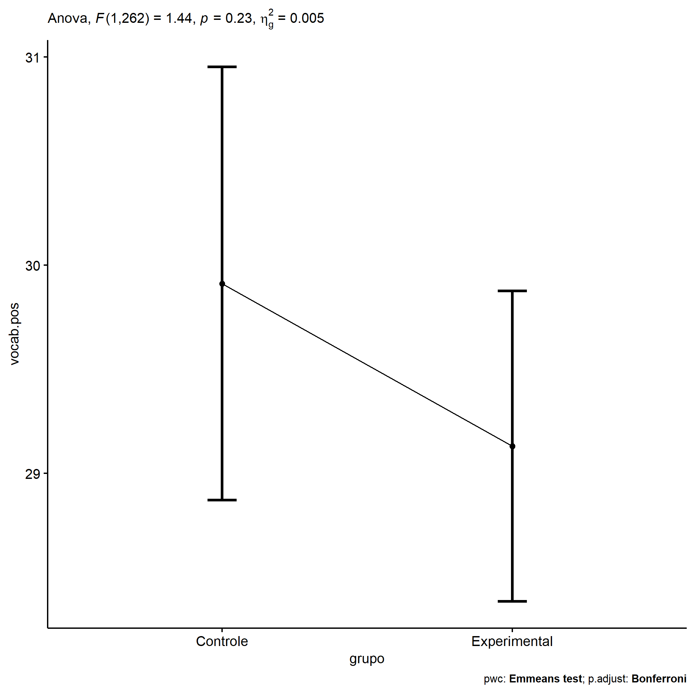<!-- -->

``` r
plots <- oneWayAncovaBoxPlots(
  wdat, "vocab.pos", "grupo", aov, pwc, covar = "vocab.pre",
  theme = "classic", color = color[["grupo"]],
  subtitle = which(aov$Effect == "grupo"))
```

``` r
if (length(unique(wdat[["grupo"]])) > 1)
  plots[["grupo"]] + ggplot2::ylab("Vocabulario") + ggplot2::scale_x_discrete(labels=c('pre', 'pos'))
```

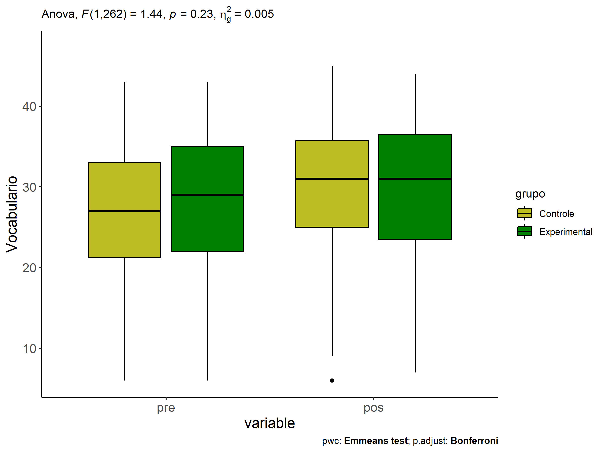<!-- -->

``` r
if (length(unique(wdat.long[["grupo"]])) > 1)
  plots <- oneWayAncovaBoxPlots(
    wdat.long, "vocab", "grupo", aov, pwc.long, pre.post = "time",
    theme = "classic", color = color$prepost)
```

``` r
if (length(unique(wdat.long[["grupo"]])) > 1)
  plots[["grupo"]] + ggplot2::ylab("Vocabulario")
```

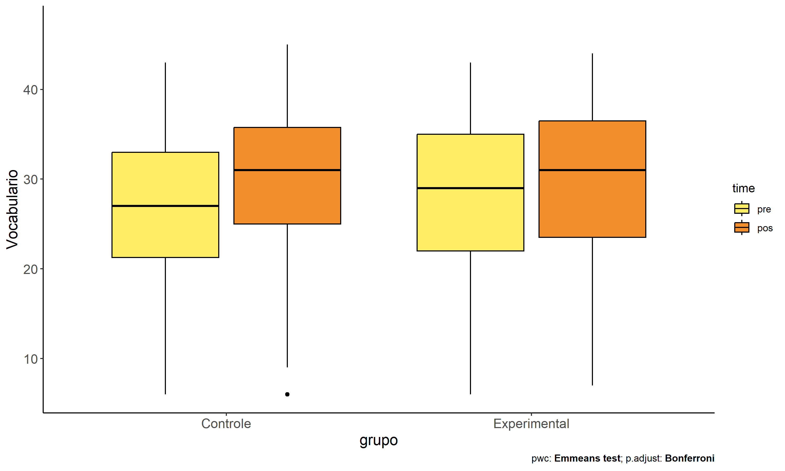<!-- -->

### Checking linearity assumption

``` r
ggscatter(wdat, x = "vocab.pre", y = "vocab.pos", size = 0.5,
          color = "grupo", add = "reg.line")+
  stat_regline_equation(
    aes(label =  paste(..eq.label.., ..rr.label.., sep = "~~~~"), color = grupo)
  )
```

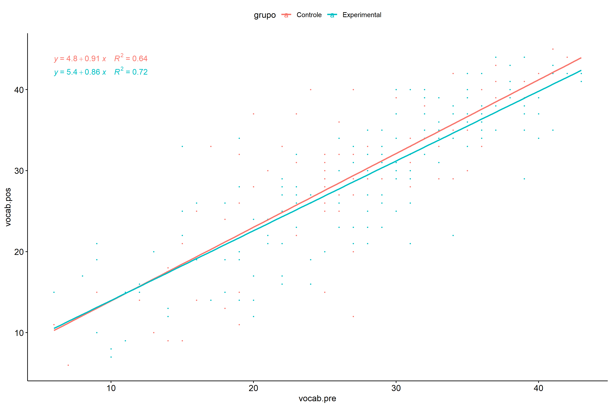<!-- -->

### Checking normality and homogeneity

``` r
res <- augment(lm(vocab.pos ~ vocab.pre + grupo, data = wdat))
```

``` r
shapiro_test(res$.resid)
```

    ## # A tibble: 1 × 3
    ##   variable   statistic p.value
    ##   <chr>          <dbl>   <dbl>
    ## 1 res$.resid     0.992   0.167

``` r
levene_test(res, .resid ~ grupo)
```

    ## # A tibble: 1 × 4
    ##     df1   df2 statistic     p
    ##   <int> <int>     <dbl> <dbl>
    ## 1     1   263      2.54 0.112

# ANCOVA and Pairwise for two factors **grupo:Sexo**

## Without remove non-normal data

``` r
pdat = remove_group_data(dat[!is.na(dat[["grupo"]]) & !is.na(dat[["Sexo"]]),], "vocab.pos", c("grupo","Sexo"))

pdat.long <- rbind(pdat[,c("id","grupo","Sexo")], pdat[,c("id","grupo","Sexo")])
pdat.long[["time"]] <- c(rep("pre", nrow(pdat)), rep("pos", nrow(pdat)))
pdat.long[["time"]] <- factor(pdat.long[["time"]], c("pre","pos"))
pdat.long[["vocab"]] <- c(pdat[["vocab.pre"]], pdat[["vocab.pos"]])

aov = anova_test(pdat, vocab.pos ~ vocab.pre + grupo*Sexo)
laov[["grupo:Sexo"]] <- get_anova_table(aov)
```

``` r
pwcs <- list()
pwcs[["Sexo"]] <- emmeans_test(
  group_by(pdat, grupo), vocab.pos ~ Sexo,
  covariate = vocab.pre, p.adjust.method = "bonferroni")
pwcs[["grupo"]] <- emmeans_test(
  group_by(pdat, Sexo), vocab.pos ~ grupo,
  covariate = vocab.pre, p.adjust.method = "bonferroni")

pwc <- plyr::rbind.fill(pwcs[["grupo"]], pwcs[["Sexo"]])
pwc <- pwc[,c("grupo","Sexo", colnames(pwc)[!colnames(pwc) %in% c("grupo","Sexo")])]
```

``` r
pwc.long <- emmeans_test(dplyr::group_by_at(pdat.long, c("grupo","Sexo")),
                         vocab ~ time,
                         p.adjust.method = "bonferroni")
lpwc[["grupo:Sexo"]] <- plyr::rbind.fill(pwc, pwc.long)
```

``` r
ds <- get.descriptives(pdat, "vocab.pos", c("grupo","Sexo"), covar = "vocab.pre")
ds <- merge(ds[ds$variable != "vocab.pre",],
            ds[ds$variable == "vocab.pre", !colnames(ds) %in% c("variable")],
            by = c("grupo","Sexo"), all.x = T, suffixes = c("", ".vocab.pre"))
ds <- merge(get_emmeans(pwcs[["grupo"]]), ds, by = c("grupo","Sexo"), suffixes = c(".emms", ""))
ds <- ds[,c("grupo","Sexo","n","mean.vocab.pre","se.vocab.pre","mean","se","emmean","se.emms")]

colnames(ds) <- c("grupo","Sexo", "N", paste0(c("M","SE")," (pre)"),
                  paste0(c("M","SE"), " (unadj)"), paste0(c("M", "SE"), " (adj)"))

lemms[["grupo:Sexo"]] <- ds
```

## Computing ANCOVA and PairWise After removing non-normal data (OK)

``` r
wdat = pdat 

res = residuals(lm(vocab.pos ~ vocab.pre + grupo*Sexo, data = wdat))
non.normal = getNonNormal(res, wdat$id, plimit = 0.05)

wdat = wdat[!wdat$id %in% non.normal,]

wdat.long <- rbind(wdat[,c("id","grupo","Sexo")], wdat[,c("id","grupo","Sexo")])
wdat.long[["time"]] <- c(rep("pre", nrow(wdat)), rep("pos", nrow(wdat)))
wdat.long[["time"]] <- factor(wdat.long[["time"]], c("pre","pos"))
wdat.long[["vocab"]] <- c(wdat[["vocab.pre"]], wdat[["vocab.pos"]])


ldat[["grupo:Sexo"]] = wdat

(non.normal)
```

    ##  [1] "P1003" "P2232" "P2207" "P2192" "P1056" "P1069" "P2245" "P996"  "P1006" "P3654" "P2176" "P2206" "P2251"
    ## [14] "P2219" "P1012"

``` r
aov = anova_test(wdat, vocab.pos ~ vocab.pre + grupo*Sexo)
laov[["grupo:Sexo"]] <- merge(get_anova_table(aov), laov[["grupo:Sexo"]], by="Effect", suffixes = c("","'"))

(df = get_anova_table(aov))
```

    ## ANOVA Table (type II tests)
    ## 
    ##       Effect DFn DFd       F        p p<.05      ges
    ## 1  vocab.pre   1 261 581.036 2.45e-68     * 6.90e-01
    ## 2      grupo   1 261   1.941 1.65e-01       7.00e-03
    ## 3       Sexo   1 261   4.173 4.20e-02     * 1.60e-02
    ## 4 grupo:Sexo   1 261   0.016 8.99e-01       6.19e-05

| Effect     | DFn | DFd |       F |     p | p\<.05 |   ges |
|:-----------|----:|----:|--------:|------:|:-------|------:|
| vocab.pre  |   1 | 261 | 581.036 | 0.000 | \*     | 0.690 |
| grupo      |   1 | 261 |   1.941 | 0.165 |        | 0.007 |
| Sexo       |   1 | 261 |   4.173 | 0.042 | \*     | 0.016 |
| grupo:Sexo |   1 | 261 |   0.016 | 0.899 |        | 0.000 |

``` r
pwcs <- list()
pwcs[["Sexo"]] <- emmeans_test(
  group_by(wdat, grupo), vocab.pos ~ Sexo,
  covariate = vocab.pre, p.adjust.method = "bonferroni")
pwcs[["grupo"]] <- emmeans_test(
  group_by(wdat, Sexo), vocab.pos ~ grupo,
  covariate = vocab.pre, p.adjust.method = "bonferroni")

pwc <- plyr::rbind.fill(pwcs[["grupo"]], pwcs[["Sexo"]])
pwc <- pwc[,c("grupo","Sexo", colnames(pwc)[!colnames(pwc) %in% c("grupo","Sexo")])]
```

| grupo        | Sexo | term             | .y.       | group1   | group2       |  df | statistic |     p | p.adj | p.adj.signif |
|:-------------|:-----|:-----------------|:----------|:---------|:-------------|----:|----------:|------:|------:|:-------------|
|              | F    | vocab.pre\*grupo | vocab.pos | Controle | Experimental | 261 |     0.931 | 0.353 | 0.353 | ns           |
|              | M    | vocab.pre\*grupo | vocab.pos | Controle | Experimental | 261 |     1.048 | 0.296 | 0.296 | ns           |
| Controle     |      | vocab.pre\*Sexo  | vocab.pos | F        | M            | 261 |     1.091 | 0.276 | 0.276 | ns           |
| Experimental |      | vocab.pre\*Sexo  | vocab.pos | F        | M            | 261 |     1.740 | 0.083 | 0.083 | ns           |

``` r
pwc.long <- emmeans_test(dplyr::group_by_at(wdat.long, c("grupo","Sexo")),
                         vocab ~ time,
                         p.adjust.method = "bonferroni")
lpwc[["grupo:Sexo"]] <- merge(plyr::rbind.fill(pwc, pwc.long), lpwc[["grupo:Sexo"]], by=c("grupo","Sexo","term",".y.","group1","group2"), suffixes = c("","'"))
```

| grupo        | Sexo | term | .y.   | group1 | group2 |  df | statistic |     p | p.adj | p.adj.signif |
|:-------------|:-----|:-----|:------|:-------|:-------|----:|----------:|------:|------:|:-------------|
| Controle     | F    | time | vocab | pre    | pos    | 524 |    -1.621 | 0.106 | 0.106 | ns           |
| Controle     | M    | time | vocab | pre    | pos    | 524 |    -1.047 | 0.296 | 0.296 | ns           |
| Experimental | F    | time | vocab | pre    | pos    | 524 |    -1.457 | 0.146 | 0.146 | ns           |
| Experimental | M    | time | vocab | pre    | pos    | 524 |    -0.594 | 0.553 | 0.553 | ns           |

``` r
ds <- get.descriptives(wdat, "vocab.pos", c("grupo","Sexo"), covar = "vocab.pre")
ds <- merge(ds[ds$variable != "vocab.pre",],
            ds[ds$variable == "vocab.pre", !colnames(ds) %in% c("variable")],
            by = c("grupo","Sexo"), all.x = T, suffixes = c("", ".vocab.pre"))
ds <- merge(get_emmeans(pwcs[["grupo"]]), ds, by = c("grupo","Sexo"), suffixes = c(".emms", ""))
ds <- ds[,c("grupo","Sexo","n","mean.vocab.pre","se.vocab.pre","mean","se","emmean","se.emms")]

colnames(ds) <- c("grupo","Sexo", "N", paste0(c("M","SE")," (pre)"),
                  paste0(c("M","SE"), " (unadj)"), paste0(c("M", "SE"), " (adj)"))

lemms[["grupo:Sexo"]] <- merge(ds, lemms[["grupo:Sexo"]], by=c("grupo","Sexo"), suffixes = c("","'"))
```

| grupo        | Sexo |   N | M (pre) | SE (pre) | M (unadj) | SE (unadj) | M (adj) | SE (adj) |
|:-------------|:-----|----:|--------:|---------:|----------:|-----------:|--------:|---------:|
| Controle     | F    |  48 |  27.521 |    1.230 |    30.417 |      1.316 |  30.454 |    0.724 |
| Controle     | M    |  42 |  25.381 |    1.301 |    27.381 |      1.574 |  29.296 |    0.778 |
| Experimental | F    |  93 |  29.097 |    0.930 |    30.968 |      0.895 |  29.623 |    0.523 |
| Experimental | M    |  83 |  26.976 |    0.879 |    27.783 |      0.950 |  28.299 |    0.551 |

### Plots for ancova

``` r
plots <- twoWayAncovaPlots(
  wdat, "vocab.pos", c("grupo","Sexo"), aov, pwcs, addParam = c("mean_se"),
  font.label.size=10, step.increase=0.05, p.label="p.adj",
  subtitle = which(aov$Effect == "grupo:Sexo"))
```

``` r
if (!is.null(plots[["grupo"]]))
  plots[["grupo"]] + ggplot2::scale_color_manual(values = color[["Sexo"]])
```

    ## Scale for colour is already present.
    ## Adding another scale for colour, which will replace the existing scale.

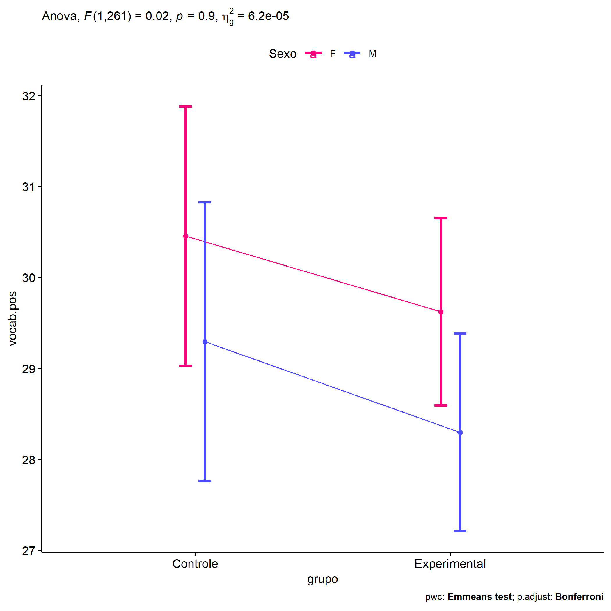<!-- -->

``` r
if (!is.null(plots[["Sexo"]]))
  plots[["Sexo"]] + ggplot2::scale_color_manual(values = color[["grupo"]])
```

    ## Scale for colour is already present.
    ## Adding another scale for colour, which will replace the existing scale.

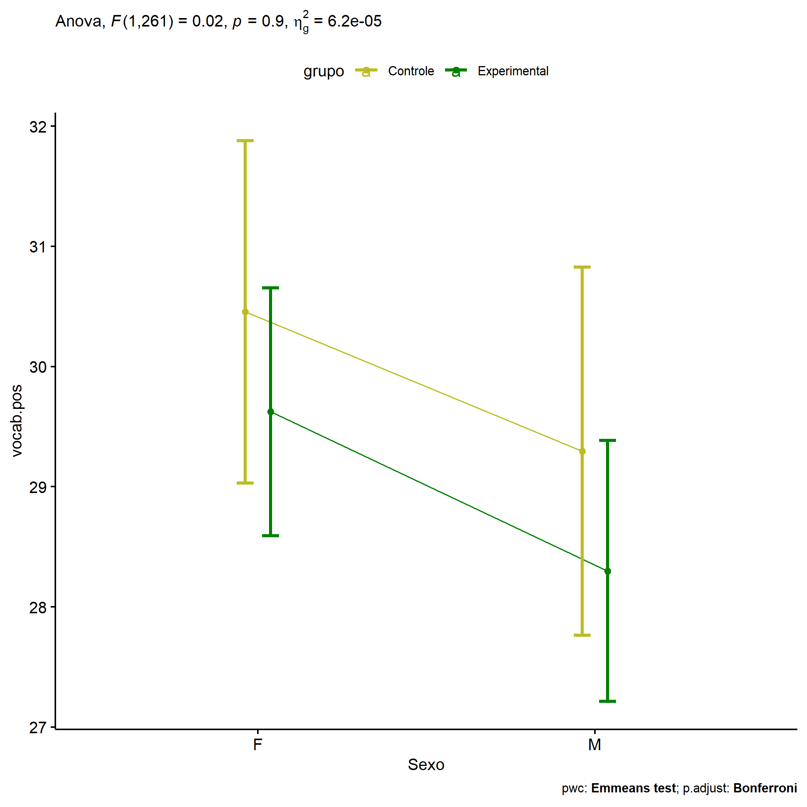<!-- -->

``` r
plots <- twoWayAncovaBoxPlots(
  wdat, "vocab.pos", c("grupo","Sexo"), aov, pwcs, covar = "vocab.pre",
  theme = "classic", color = color[["grupo:Sexo"]],
  subtitle = which(aov$Effect == "grupo:Sexo"))
```

``` r
plots[["grupo:Sexo"]] + ggplot2::ylab("Vocabulario") + ggplot2::scale_x_discrete(labels=c('pre', 'pos'))
```

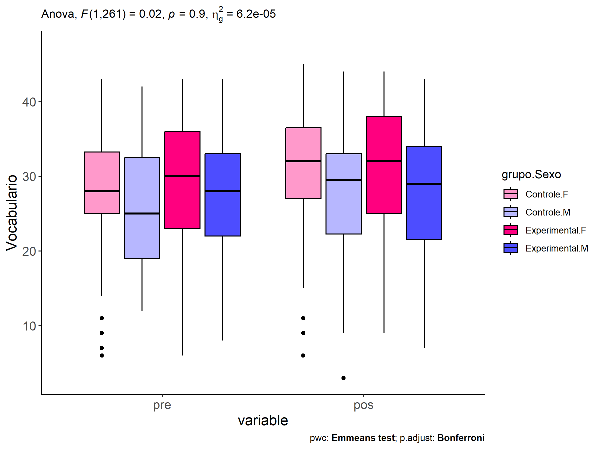<!-- -->

``` r
plots <- twoWayAncovaBoxPlots(
  wdat.long, "vocab", c("grupo","Sexo"), aov, pwc.long, pre.post = "time",
  theme = "classic", color = color$prepost)
```

``` r
plots[["grupo:Sexo"]] + ggplot2::ylab("Vocabulario")
```

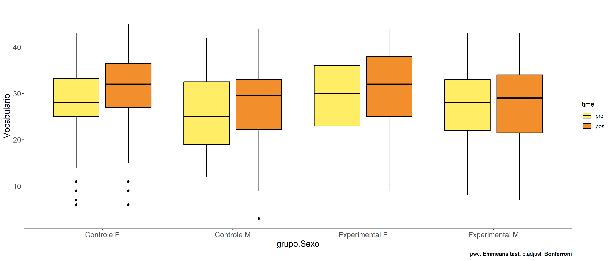<!-- -->

### Checking linearity assumption

``` r
ggscatter(wdat, x = "vocab.pre", y = "vocab.pos", size = 0.5,
          facet.by = c("grupo","Sexo"), add = "reg.line")+
  stat_regline_equation(
    aes(label =  paste(..eq.label.., ..rr.label.., sep = "~~~~"))
  )
```

<!-- -->

### Checking normality and homogeneity

``` r
res <- augment(lm(vocab.pos ~ vocab.pre + grupo*Sexo, data = wdat))
```

``` r
shapiro_test(res$.resid)
```

    ## # A tibble: 1 × 3
    ##   variable   statistic p.value
    ##   <chr>          <dbl>   <dbl>
    ## 1 res$.resid     0.993   0.219

``` r
levene_test(res, .resid ~ grupo*Sexo)
```

    ## # A tibble: 1 × 4
    ##     df1   df2 statistic      p
    ##   <int> <int>     <dbl>  <dbl>
    ## 1     3   262      2.62 0.0511

# ANCOVA and Pairwise for two factors **grupo:Zona**

## Without remove non-normal data

``` r
pdat = remove_group_data(dat[!is.na(dat[["grupo"]]) & !is.na(dat[["Zona"]]),], "vocab.pos", c("grupo","Zona"))

pdat.long <- rbind(pdat[,c("id","grupo","Zona")], pdat[,c("id","grupo","Zona")])
pdat.long[["time"]] <- c(rep("pre", nrow(pdat)), rep("pos", nrow(pdat)))
pdat.long[["time"]] <- factor(pdat.long[["time"]], c("pre","pos"))
pdat.long[["vocab"]] <- c(pdat[["vocab.pre"]], pdat[["vocab.pos"]])

aov = anova_test(pdat, vocab.pos ~ vocab.pre + grupo*Zona)
laov[["grupo:Zona"]] <- get_anova_table(aov)
```

``` r
pwcs <- list()
pwcs[["Zona"]] <- emmeans_test(
  group_by(pdat, grupo), vocab.pos ~ Zona,
  covariate = vocab.pre, p.adjust.method = "bonferroni")
pwcs[["grupo"]] <- emmeans_test(
  group_by(pdat, Zona), vocab.pos ~ grupo,
  covariate = vocab.pre, p.adjust.method = "bonferroni")

pwc <- plyr::rbind.fill(pwcs[["grupo"]], pwcs[["Zona"]])
pwc <- pwc[,c("grupo","Zona", colnames(pwc)[!colnames(pwc) %in% c("grupo","Zona")])]
```

``` r
pwc.long <- emmeans_test(dplyr::group_by_at(pdat.long, c("grupo","Zona")),
                         vocab ~ time,
                         p.adjust.method = "bonferroni")
lpwc[["grupo:Zona"]] <- plyr::rbind.fill(pwc, pwc.long)
```

``` r
ds <- get.descriptives(pdat, "vocab.pos", c("grupo","Zona"), covar = "vocab.pre")
ds <- merge(ds[ds$variable != "vocab.pre",],
            ds[ds$variable == "vocab.pre", !colnames(ds) %in% c("variable")],
            by = c("grupo","Zona"), all.x = T, suffixes = c("", ".vocab.pre"))
ds <- merge(get_emmeans(pwcs[["grupo"]]), ds, by = c("grupo","Zona"), suffixes = c(".emms", ""))
ds <- ds[,c("grupo","Zona","n","mean.vocab.pre","se.vocab.pre","mean","se","emmean","se.emms")]

colnames(ds) <- c("grupo","Zona", "N", paste0(c("M","SE")," (pre)"),
                  paste0(c("M","SE"), " (unadj)"), paste0(c("M", "SE"), " (adj)"))

lemms[["grupo:Zona"]] <- ds
```

## Computing ANCOVA and PairWise After removing non-normal data (OK)

``` r
wdat = pdat 

res = residuals(lm(vocab.pos ~ vocab.pre + grupo*Zona, data = wdat))
non.normal = getNonNormal(res, wdat$id, plimit = 0.05)

wdat = wdat[!wdat$id %in% non.normal,]

wdat.long <- rbind(wdat[,c("id","grupo","Zona")], wdat[,c("id","grupo","Zona")])
wdat.long[["time"]] <- c(rep("pre", nrow(wdat)), rep("pos", nrow(wdat)))
wdat.long[["time"]] <- factor(wdat.long[["time"]], c("pre","pos"))
wdat.long[["vocab"]] <- c(wdat[["vocab.pre"]], wdat[["vocab.pos"]])


ldat[["grupo:Zona"]] = wdat

(non.normal)
```

    ## [1] "P2207" "P3654" "P1056"

``` r
aov = anova_test(wdat, vocab.pos ~ vocab.pre + grupo*Zona)
laov[["grupo:Zona"]] <- merge(get_anova_table(aov), laov[["grupo:Zona"]], by="Effect", suffixes = c("","'"))

(df = get_anova_table(aov))
```

    ## ANOVA Table (type II tests)
    ## 
    ##       Effect DFn DFd       F        p p<.05   ges
    ## 1  vocab.pre   1 137 271.554 2.60e-34     * 0.665
    ## 2      grupo   1 137   0.787 3.77e-01       0.006
    ## 3       Zona   1 137   2.222 1.38e-01       0.016
    ## 4 grupo:Zona   1 137   1.053 3.07e-01       0.008

| Effect     | DFn | DFd |       F |     p | p\<.05 |   ges |
|:-----------|----:|----:|--------:|------:|:-------|------:|
| vocab.pre  |   1 | 137 | 271.554 | 0.000 | \*     | 0.665 |
| grupo      |   1 | 137 |   0.787 | 0.377 |        | 0.006 |
| Zona       |   1 | 137 |   2.222 | 0.138 |        | 0.016 |
| grupo:Zona |   1 | 137 |   1.053 | 0.307 |        | 0.008 |

``` r
pwcs <- list()
pwcs[["Zona"]] <- emmeans_test(
  group_by(wdat, grupo), vocab.pos ~ Zona,
  covariate = vocab.pre, p.adjust.method = "bonferroni")
pwcs[["grupo"]] <- emmeans_test(
  group_by(wdat, Zona), vocab.pos ~ grupo,
  covariate = vocab.pre, p.adjust.method = "bonferroni")

pwc <- plyr::rbind.fill(pwcs[["grupo"]], pwcs[["Zona"]])
pwc <- pwc[,c("grupo","Zona", colnames(pwc)[!colnames(pwc) %in% c("grupo","Zona")])]
```

| grupo        | Zona   | term             | .y.       | group1   | group2       |  df | statistic |     p | p.adj | p.adj.signif |
|:-------------|:-------|:-----------------|:----------|:---------|:-------------|----:|----------:|------:|------:|:-------------|
|              | Rural  | vocab.pre\*grupo | vocab.pos | Controle | Experimental | 137 |     0.116 | 0.907 | 0.907 | ns           |
|              | Urbana | vocab.pre\*grupo | vocab.pos | Controle | Experimental | 137 |     1.352 | 0.179 | 0.179 | ns           |
| Controle     |        | vocab.pre\*Zona  | vocab.pos | Rural    | Urbana       | 137 |    -1.723 | 0.087 | 0.087 | ns           |
| Experimental |        | vocab.pre\*Zona  | vocab.pos | Rural    | Urbana       | 137 |    -0.554 | 0.580 | 0.580 | ns           |

``` r
pwc.long <- emmeans_test(dplyr::group_by_at(wdat.long, c("grupo","Zona")),
                         vocab ~ time,
                         p.adjust.method = "bonferroni")
lpwc[["grupo:Zona"]] <- merge(plyr::rbind.fill(pwc, pwc.long), lpwc[["grupo:Zona"]], by=c("grupo","Zona","term",".y.","group1","group2"), suffixes = c("","'"))
```

| grupo        | Zona   | term | .y.   | group1 | group2 |  df | statistic |     p | p.adj | p.adj.signif |
|:-------------|:-------|:-----|:------|:-------|:-------|----:|----------:|------:|------:|:-------------|
| Controle     | Rural  | time | vocab | pre    | pos    | 276 |    -0.847 | 0.398 | 0.398 | ns           |
| Controle     | Urbana | time | vocab | pre    | pos    | 276 |    -1.485 | 0.139 | 0.139 | ns           |
| Experimental | Rural  | time | vocab | pre    | pos    | 276 |    -0.902 | 0.368 | 0.368 | ns           |
| Experimental | Urbana | time | vocab | pre    | pos    | 276 |    -0.926 | 0.355 | 0.355 | ns           |

``` r
ds <- get.descriptives(wdat, "vocab.pos", c("grupo","Zona"), covar = "vocab.pre")
ds <- merge(ds[ds$variable != "vocab.pre",],
            ds[ds$variable == "vocab.pre", !colnames(ds) %in% c("variable")],
            by = c("grupo","Zona"), all.x = T, suffixes = c("", ".vocab.pre"))
ds <- merge(get_emmeans(pwcs[["grupo"]]), ds, by = c("grupo","Zona"), suffixes = c(".emms", ""))
ds <- ds[,c("grupo","Zona","n","mean.vocab.pre","se.vocab.pre","mean","se","emmean","se.emms")]

colnames(ds) <- c("grupo","Zona", "N", paste0(c("M","SE")," (pre)"),
                  paste0(c("M","SE"), " (unadj)"), paste0(c("M", "SE"), " (adj)"))

lemms[["grupo:Zona"]] <- merge(ds, lemms[["grupo:Zona"]], by=c("grupo","Zona"), suffixes = c("","'"))
```

| grupo        | Zona   |   N | M (pre) | SE (pre) | M (unadj) | SE (unadj) | M (adj) | SE (adj) |
|:-------------|:-------|----:|--------:|---------:|----------:|-----------:|--------:|---------:|
| Controle     | Rural  |  37 |  26.703 |    1.405 |    28.405 |      1.631 |  29.157 |    0.865 |
| Controle     | Urbana |  18 |  26.944 |    1.800 |    31.222 |      1.900 |  31.757 |    1.238 |
| Experimental | Rural  |  54 |  27.389 |    1.137 |    28.889 |      1.212 |  29.026 |    0.715 |
| Experimental | Urbana |  33 |  29.061 |    1.388 |    31.030 |      1.512 |  29.671 |    0.918 |

### Plots for ancova

``` r
plots <- twoWayAncovaPlots(
  wdat, "vocab.pos", c("grupo","Zona"), aov, pwcs, addParam = c("mean_se"),
  font.label.size=10, step.increase=0.05, p.label="p.adj",
  subtitle = which(aov$Effect == "grupo:Zona"))
```

``` r
if (!is.null(plots[["grupo"]]))
  plots[["grupo"]] + ggplot2::scale_color_manual(values = color[["Zona"]])
```

    ## Scale for colour is already present.
    ## Adding another scale for colour, which will replace the existing scale.

<!-- -->

``` r
if (!is.null(plots[["Zona"]]))
  plots[["Zona"]] + ggplot2::scale_color_manual(values = color[["grupo"]])
```

    ## Scale for colour is already present.
    ## Adding another scale for colour, which will replace the existing scale.

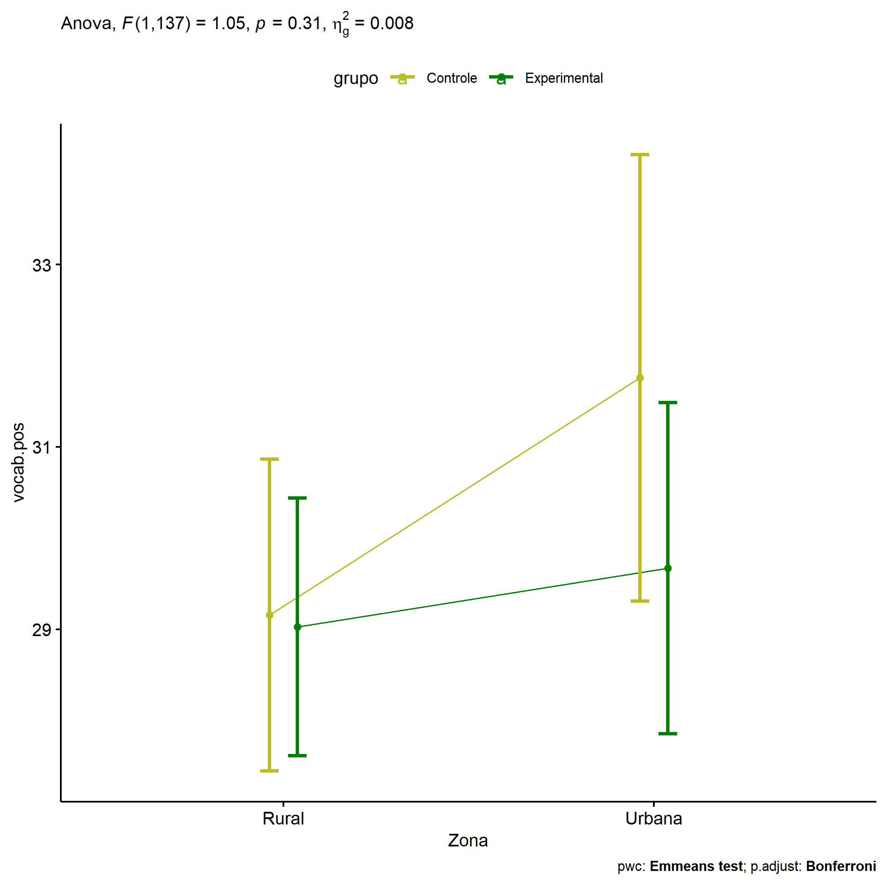<!-- -->

``` r
plots <- twoWayAncovaBoxPlots(
  wdat, "vocab.pos", c("grupo","Zona"), aov, pwcs, covar = "vocab.pre",
  theme = "classic", color = color[["grupo:Zona"]],
  subtitle = which(aov$Effect == "grupo:Zona"))
```

``` r
plots[["grupo:Zona"]] + ggplot2::ylab("Vocabulario") + ggplot2::scale_x_discrete(labels=c('pre', 'pos'))
```

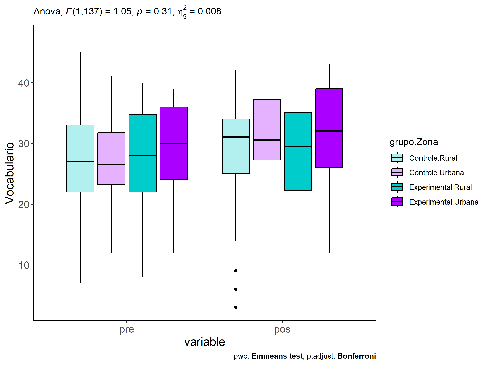<!-- -->

``` r
plots <- twoWayAncovaBoxPlots(
  wdat.long, "vocab", c("grupo","Zona"), aov, pwc.long, pre.post = "time",
  theme = "classic", color = color$prepost)
```

``` r
plots[["grupo:Zona"]] + ggplot2::ylab("Vocabulario")
```

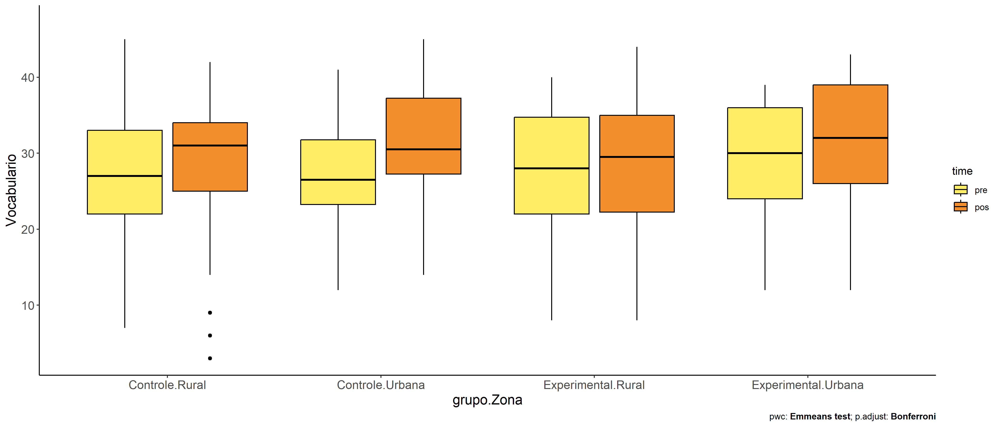<!-- -->

### Checking linearity assumption

``` r
ggscatter(wdat, x = "vocab.pre", y = "vocab.pos", size = 0.5,
          facet.by = c("grupo","Zona"), add = "reg.line")+
  stat_regline_equation(
    aes(label =  paste(..eq.label.., ..rr.label.., sep = "~~~~"))
  )
```

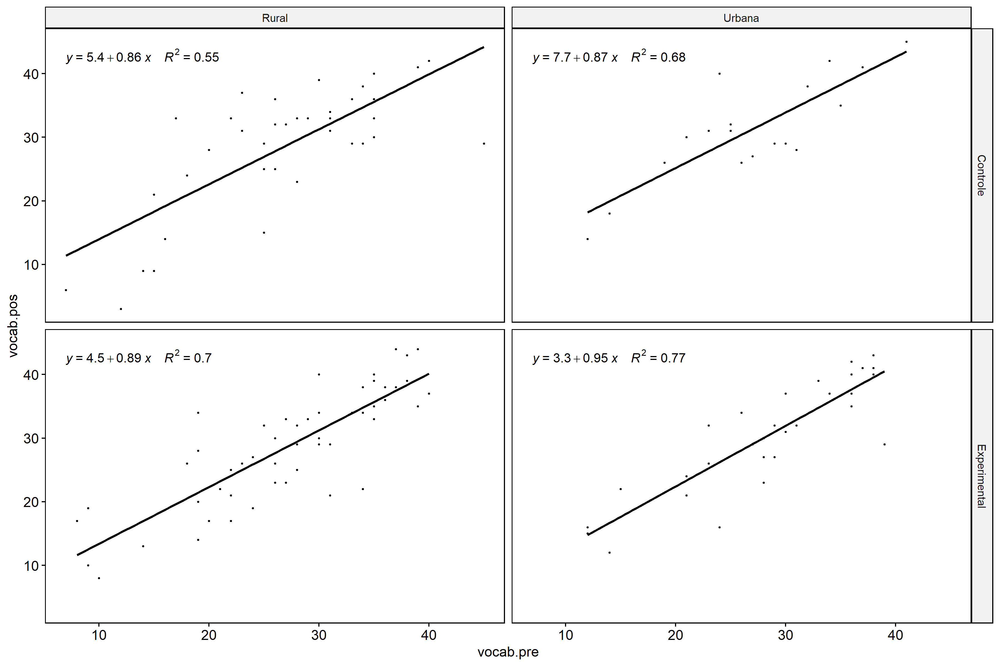<!-- -->

### Checking normality and homogeneity

``` r
res <- augment(lm(vocab.pos ~ vocab.pre + grupo*Zona, data = wdat))
```

``` r
shapiro_test(res$.resid)
```

    ## # A tibble: 1 × 3
    ##   variable   statistic p.value
    ##   <chr>          <dbl>   <dbl>
    ## 1 res$.resid     0.987   0.209

``` r
levene_test(res, .resid ~ grupo*Zona)
```

    ## # A tibble: 1 × 4
    ##     df1   df2 statistic      p
    ##   <int> <int>     <dbl>  <dbl>
    ## 1     3   138      2.33 0.0774

# ANCOVA and Pairwise for two factors **grupo:Cor.Raca**

## Without remove non-normal data

``` r
pdat = remove_group_data(dat[!is.na(dat[["grupo"]]) & !is.na(dat[["Cor.Raca"]]),], "vocab.pos", c("grupo","Cor.Raca"))
```

    ## Warning: There were 2 warnings in `mutate()`.
    ## The first warning was:
    ## ℹ In argument: `ci = abs(stats::qt(alpha/2, .data$n - 1) * .data$se)`.
    ## Caused by warning:
    ## ! There was 1 warning in `mutate()`.
    ## ℹ In argument: `ci = abs(stats::qt(alpha/2, .data$n - 1) * .data$se)`.
    ## Caused by warning in `stats::qt()`:
    ## ! NaNs produced
    ## ℹ Run `dplyr::last_dplyr_warnings()` to see the 1 remaining warning.

``` r
pdat.long <- rbind(pdat[,c("id","grupo","Cor.Raca")], pdat[,c("id","grupo","Cor.Raca")])
pdat.long[["time"]] <- c(rep("pre", nrow(pdat)), rep("pos", nrow(pdat)))
pdat.long[["time"]] <- factor(pdat.long[["time"]], c("pre","pos"))
pdat.long[["vocab"]] <- c(pdat[["vocab.pre"]], pdat[["vocab.pos"]])

aov = anova_test(pdat, vocab.pos ~ vocab.pre + grupo*Cor.Raca)
laov[["grupo:Cor.Raca"]] <- get_anova_table(aov)
```

``` r
pwcs <- list()
pwcs[["Cor.Raca"]] <- emmeans_test(
  group_by(pdat, grupo), vocab.pos ~ Cor.Raca,
  covariate = vocab.pre, p.adjust.method = "bonferroni")
pwcs[["grupo"]] <- emmeans_test(
  group_by(pdat, Cor.Raca), vocab.pos ~ grupo,
  covariate = vocab.pre, p.adjust.method = "bonferroni")

pwc <- plyr::rbind.fill(pwcs[["grupo"]], pwcs[["Cor.Raca"]])
pwc <- pwc[,c("grupo","Cor.Raca", colnames(pwc)[!colnames(pwc) %in% c("grupo","Cor.Raca")])]
```

``` r
pwc.long <- emmeans_test(dplyr::group_by_at(pdat.long, c("grupo","Cor.Raca")),
                         vocab ~ time,
                         p.adjust.method = "bonferroni")
lpwc[["grupo:Cor.Raca"]] <- plyr::rbind.fill(pwc, pwc.long)
```

``` r
ds <- get.descriptives(pdat, "vocab.pos", c("grupo","Cor.Raca"), covar = "vocab.pre")
ds <- merge(ds[ds$variable != "vocab.pre",],
            ds[ds$variable == "vocab.pre", !colnames(ds) %in% c("variable")],
            by = c("grupo","Cor.Raca"), all.x = T, suffixes = c("", ".vocab.pre"))
ds <- merge(get_emmeans(pwcs[["grupo"]]), ds, by = c("grupo","Cor.Raca"), suffixes = c(".emms", ""))
ds <- ds[,c("grupo","Cor.Raca","n","mean.vocab.pre","se.vocab.pre","mean","se","emmean","se.emms")]

colnames(ds) <- c("grupo","Cor.Raca", "N", paste0(c("M","SE")," (pre)"),
                  paste0(c("M","SE"), " (unadj)"), paste0(c("M", "SE"), " (adj)"))

lemms[["grupo:Cor.Raca"]] <- ds
```

## Computing ANCOVA and PairWise After removing non-normal data (OK)

``` r
wdat = pdat 

res = residuals(lm(vocab.pos ~ vocab.pre + grupo*Cor.Raca, data = wdat))
non.normal = getNonNormal(res, wdat$id, plimit = 0.05)

wdat = wdat[!wdat$id %in% non.normal,]

wdat.long <- rbind(wdat[,c("id","grupo","Cor.Raca")], wdat[,c("id","grupo","Cor.Raca")])
wdat.long[["time"]] <- c(rep("pre", nrow(wdat)), rep("pos", nrow(wdat)))
wdat.long[["time"]] <- factor(wdat.long[["time"]], c("pre","pos"))
wdat.long[["vocab"]] <- c(wdat[["vocab.pre"]], wdat[["vocab.pos"]])


ldat[["grupo:Cor.Raca"]] = wdat

(non.normal)
```

    ## [1] "P1003" "P1069" "P996"  "P1056"

``` r
aov = anova_test(wdat, vocab.pos ~ vocab.pre + grupo*Cor.Raca)
laov[["grupo:Cor.Raca"]] <- merge(get_anova_table(aov), laov[["grupo:Cor.Raca"]], by="Effect", suffixes = c("","'"))

(df = get_anova_table(aov))
```

    ## ANOVA Table (type II tests)
    ## 
    ##           Effect DFn DFd       F        p p<.05     ges
    ## 1      vocab.pre   1 102 130.866 5.43e-20     * 0.56200
    ## 2          grupo   1 102   0.003 9.56e-01       0.00003
    ## 3       Cor.Raca   1 102   1.395 2.40e-01       0.01300
    ## 4 grupo:Cor.Raca   0 102      NA       NA  <NA>      NA

| Effect         | DFn | DFd |       F |     p | p\<.05 |   ges |
|:---------------|----:|----:|--------:|------:|:-------|------:|
| vocab.pre      |   1 | 102 | 130.866 | 0.000 | \*     | 0.562 |
| grupo          |   1 | 102 |   0.003 | 0.956 |        | 0.000 |
| Cor.Raca       |   1 | 102 |   1.395 | 0.240 |        | 0.013 |
| grupo:Cor.Raca |   0 | 102 |         |       |        |       |

``` r
pwcs <- list()
pwcs[["Cor.Raca"]] <- emmeans_test(
  group_by(wdat, grupo), vocab.pos ~ Cor.Raca,
  covariate = vocab.pre, p.adjust.method = "bonferroni")
pwcs[["grupo"]] <- emmeans_test(
  group_by(wdat, Cor.Raca), vocab.pos ~ grupo,
  covariate = vocab.pre, p.adjust.method = "bonferroni")

pwc <- plyr::rbind.fill(pwcs[["grupo"]], pwcs[["Cor.Raca"]])
pwc <- pwc[,c("grupo","Cor.Raca", colnames(pwc)[!colnames(pwc) %in% c("grupo","Cor.Raca")])]
```

| grupo        | Cor.Raca | term                | .y.       | group1   | group2       |  df | statistic |     p | p.adj | p.adj.signif |
|:-------------|:---------|:--------------------|:----------|:---------|:-------------|----:|----------:|------:|------:|:-------------|
|              | Branca   | vocab.pre\*grupo    | vocab.pos | Controle | Experimental |     |           |       |       |              |
|              | Parda    | vocab.pre\*grupo    | vocab.pos | Controle | Experimental | 102 |     0.055 | 0.956 | 0.956 | ns           |
| Controle     |          | vocab.pre\*Cor.Raca | vocab.pos | Branca   | Parda        |     |           |       |       |              |
| Experimental |          | vocab.pre\*Cor.Raca | vocab.pos | Branca   | Parda        | 102 |    -1.181 | 0.240 | 0.240 | ns           |

``` r
pwc.long <- emmeans_test(dplyr::group_by_at(wdat.long, c("grupo","Cor.Raca")),
                         vocab ~ time,
                         p.adjust.method = "bonferroni")
lpwc[["grupo:Cor.Raca"]] <- merge(plyr::rbind.fill(pwc, pwc.long), lpwc[["grupo:Cor.Raca"]], by=c("grupo","Cor.Raca","term",".y.","group1","group2"), suffixes = c("","'"))
```

| grupo        | Cor.Raca | term | .y.   | group1 | group2 |  df | statistic |     p | p.adj | p.adj.signif |
|:-------------|:---------|:-----|:------|:-------|:-------|----:|----------:|------:|------:|:-------------|
| Controle     | Branca   | time | vocab | pre    | pos    |     |           |       |       |              |
| Controle     | Parda    | time | vocab | pre    | pos    | 206 |    -0.953 | 0.342 | 0.342 | ns           |
| Experimental | Branca   | time | vocab | pre    | pos    | 206 |     0.177 | 0.860 | 0.860 | ns           |
| Experimental | Parda    | time | vocab | pre    | pos    | 206 |    -1.145 | 0.254 | 0.254 | ns           |

``` r
ds <- get.descriptives(wdat, "vocab.pos", c("grupo","Cor.Raca"), covar = "vocab.pre")
ds <- merge(ds[ds$variable != "vocab.pre",],
            ds[ds$variable == "vocab.pre", !colnames(ds) %in% c("variable")],
            by = c("grupo","Cor.Raca"), all.x = T, suffixes = c("", ".vocab.pre"))
ds <- merge(get_emmeans(pwcs[["grupo"]]), ds, by = c("grupo","Cor.Raca"), suffixes = c(".emms", ""))
ds <- ds[,c("grupo","Cor.Raca","n","mean.vocab.pre","se.vocab.pre","mean","se","emmean","se.emms")]

colnames(ds) <- c("grupo","Cor.Raca", "N", paste0(c("M","SE")," (pre)"),
                  paste0(c("M","SE"), " (unadj)"), paste0(c("M", "SE"), " (adj)"))

lemms[["grupo:Cor.Raca"]] <- merge(ds, lemms[["grupo:Cor.Raca"]], by=c("grupo","Cor.Raca"), suffixes = c("","'"))
```

| grupo        | Cor.Raca |   N | M (pre) | SE (pre) | M (unadj) | SE (unadj) | M (adj) | SE (adj) |
|:-------------|:---------|----:|--------:|---------:|----------:|-----------:|--------:|---------:|
| Controle     | Parda    |  34 |  26.912 |    1.389 |    29.029 |      1.731 |  29.493 |    1.097 |
| Experimental | Branca   |  19 |  30.000 |    1.453 |    29.474 |      2.015 |  27.380 |    1.478 |
| Experimental | Parda    |  53 |  26.925 |    1.334 |    28.962 |      1.314 |  29.415 |    0.879 |

### Plots for ancova

``` r
plots <- twoWayAncovaPlots(
  wdat, "vocab.pos", c("grupo","Cor.Raca"), aov, pwcs, addParam = c("mean_se"),
  font.label.size=10, step.increase=0.05, p.label="p.adj",
  subtitle = which(aov$Effect == "grupo:Cor.Raca"))
```

``` r
if (!is.null(plots[["grupo"]]))
  plots[["grupo"]] + ggplot2::scale_color_manual(values = color[["Cor.Raca"]])
```

<!-- -->

``` r
if (!is.null(plots[["Cor.Raca"]]))
  plots[["Cor.Raca"]] + ggplot2::scale_color_manual(values = color[["grupo"]])
```

<!-- -->

``` r
plots <- twoWayAncovaBoxPlots(
  wdat, "vocab.pos", c("grupo","Cor.Raca"), aov, pwcs, covar = "vocab.pre",
  theme = "classic", color = color[["grupo:Cor.Raca"]],
  subtitle = which(aov$Effect == "grupo:Cor.Raca"))
```

``` r
plots[["grupo:Cor.Raca"]] + ggplot2::ylab("Vocabulario") + ggplot2::scale_x_discrete(labels=c('pre', 'pos'))
```

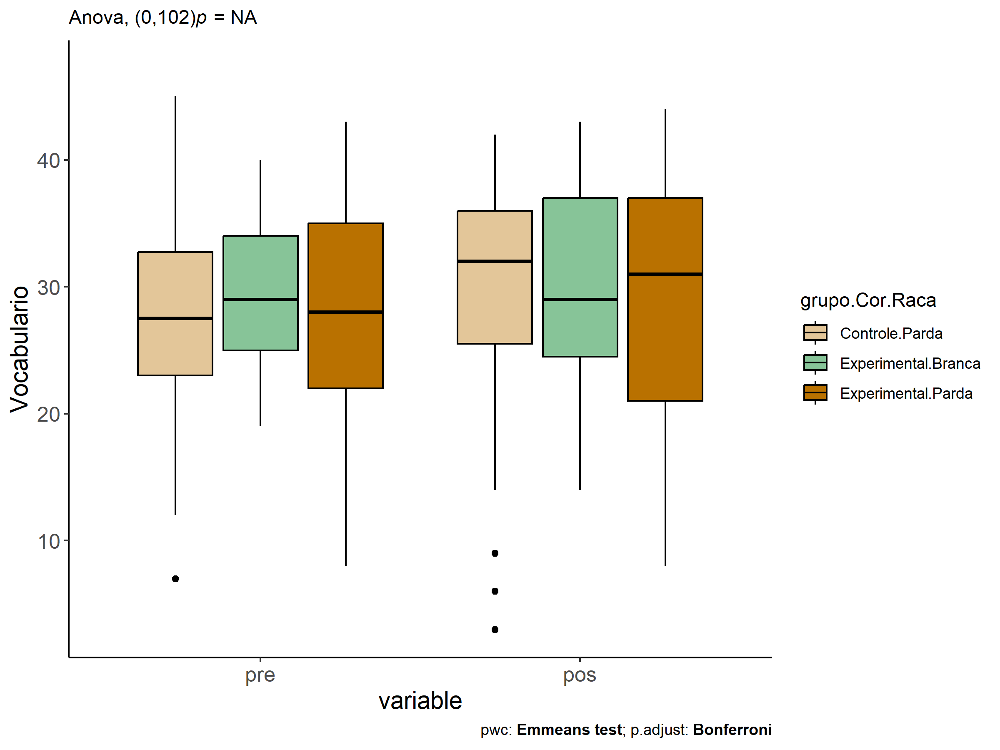<!-- -->

``` r
plots <- twoWayAncovaBoxPlots(
  wdat.long, "vocab", c("grupo","Cor.Raca"), aov, pwc.long, pre.post = "time",
  theme = "classic", color = color$prepost)
```

``` r
plots[["grupo:Cor.Raca"]] + ggplot2::ylab("Vocabulario")
```

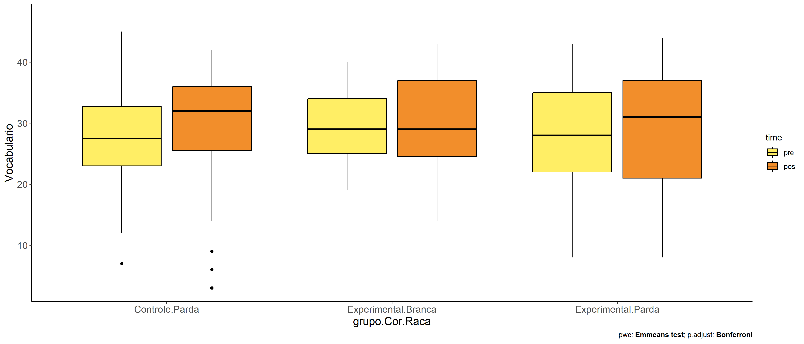<!-- -->

### Checking linearity assumption

``` r
ggscatter(wdat, x = "vocab.pre", y = "vocab.pos", size = 0.5,
          facet.by = c("grupo","Cor.Raca"), add = "reg.line")+
  stat_regline_equation(
    aes(label =  paste(..eq.label.., ..rr.label.., sep = "~~~~"))
  )
```

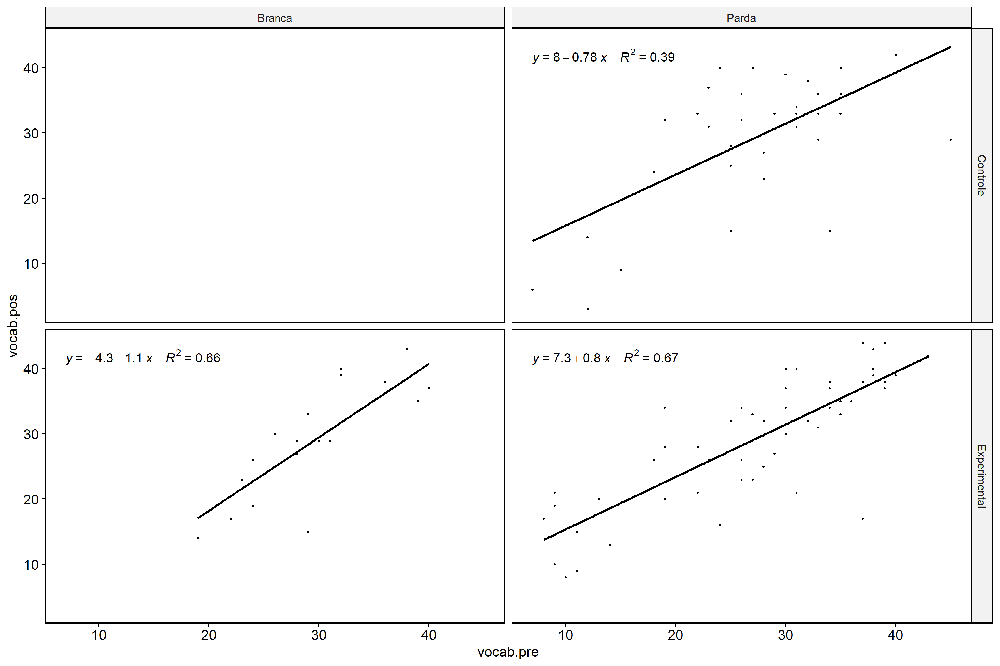<!-- -->

### Checking normality and homogeneity

``` r
res <- augment(lm(vocab.pos ~ vocab.pre + grupo*Cor.Raca, data = wdat))
```

``` r
shapiro_test(res$.resid)
```

    ## # A tibble: 1 × 3
    ##   variable   statistic p.value
    ##   <chr>          <dbl>   <dbl>
    ## 1 res$.resid     0.964 0.00529

``` r
levene_test(res, .resid ~ grupo*Cor.Raca)
```

    ## # A tibble: 1 × 4
    ##     df1   df2 statistic      p
    ##   <int> <int>     <dbl>  <dbl>
    ## 1     2   103      2.40 0.0960

# ANCOVA and Pairwise for two factors **grupo:vocab.quintile**

## Without remove non-normal data

``` r
pdat = remove_group_data(dat[!is.na(dat[["grupo"]]) & !is.na(dat[["vocab.quintile"]]),], "vocab.pos", c("grupo","vocab.quintile"))

pdat.long <- rbind(pdat[,c("id","grupo","vocab.quintile")], pdat[,c("id","grupo","vocab.quintile")])
pdat.long[["time"]] <- c(rep("pre", nrow(pdat)), rep("pos", nrow(pdat)))
pdat.long[["time"]] <- factor(pdat.long[["time"]], c("pre","pos"))
pdat.long[["vocab"]] <- c(pdat[["vocab.pre"]], pdat[["vocab.pos"]])

aov = anova_test(pdat, vocab.pos ~ vocab.pre + grupo*vocab.quintile)
laov[["grupo:vocab.quintile"]] <- get_anova_table(aov)
```

``` r
pwcs <- list()
pwcs[["vocab.quintile"]] <- emmeans_test(
  group_by(pdat, grupo), vocab.pos ~ vocab.quintile,
  covariate = vocab.pre, p.adjust.method = "bonferroni")
pwcs[["grupo"]] <- emmeans_test(
  group_by(pdat, vocab.quintile), vocab.pos ~ grupo,
  covariate = vocab.pre, p.adjust.method = "bonferroni")

pwc <- plyr::rbind.fill(pwcs[["grupo"]], pwcs[["vocab.quintile"]])
pwc <- pwc[,c("grupo","vocab.quintile", colnames(pwc)[!colnames(pwc) %in% c("grupo","vocab.quintile")])]
```

``` r
pwc.long <- emmeans_test(dplyr::group_by_at(pdat.long, c("grupo","vocab.quintile")),
                         vocab ~ time,
                         p.adjust.method = "bonferroni")
lpwc[["grupo:vocab.quintile"]] <- plyr::rbind.fill(pwc, pwc.long)
```

``` r
ds <- get.descriptives(pdat, "vocab.pos", c("grupo","vocab.quintile"), covar = "vocab.pre")
ds <- merge(ds[ds$variable != "vocab.pre",],
            ds[ds$variable == "vocab.pre", !colnames(ds) %in% c("variable")],
            by = c("grupo","vocab.quintile"), all.x = T, suffixes = c("", ".vocab.pre"))
ds <- merge(get_emmeans(pwcs[["grupo"]]), ds, by = c("grupo","vocab.quintile"), suffixes = c(".emms", ""))
ds <- ds[,c("grupo","vocab.quintile","n","mean.vocab.pre","se.vocab.pre","mean","se","emmean","se.emms")]

colnames(ds) <- c("grupo","vocab.quintile", "N", paste0(c("M","SE")," (pre)"),
                  paste0(c("M","SE"), " (unadj)"), paste0(c("M", "SE"), " (adj)"))

lemms[["grupo:vocab.quintile"]] <- ds
```

## Computing ANCOVA and PairWise After removing non-normal data (OK)

``` r
wdat = pdat 

res = residuals(lm(vocab.pos ~ vocab.pre + grupo*vocab.quintile, data = wdat))
non.normal = getNonNormal(res, wdat$id, plimit = 0.05)

wdat = wdat[!wdat$id %in% non.normal,]

wdat.long <- rbind(wdat[,c("id","grupo","vocab.quintile")], wdat[,c("id","grupo","vocab.quintile")])
wdat.long[["time"]] <- c(rep("pre", nrow(wdat)), rep("pos", nrow(wdat)))
wdat.long[["time"]] <- factor(wdat.long[["time"]], c("pre","pos"))
wdat.long[["vocab"]] <- c(wdat[["vocab.pre"]], wdat[["vocab.pos"]])


ldat[["grupo:vocab.quintile"]] = wdat

(non.normal)
```

    ##  [1] "P2207" "P1003" "P3654" "P2245" "P1056" "P1069" "P2232" "P2192" "P996"  "P1006" "P2206"

``` r
aov = anova_test(wdat, vocab.pos ~ vocab.pre + grupo*vocab.quintile)
laov[["grupo:vocab.quintile"]] <- merge(get_anova_table(aov), laov[["grupo:vocab.quintile"]], by="Effect", suffixes = c("","'"))

(df = get_anova_table(aov))
```

    ## ANOVA Table (type II tests)
    ## 
    ##                 Effect DFn DFd      F        p p<.05   ges
    ## 1            vocab.pre   1 259 13.274 0.000325     * 0.049
    ## 2                grupo   1 259  0.639 0.425000       0.002
    ## 3       vocab.quintile   4 259  1.658 0.160000       0.025
    ## 4 grupo:vocab.quintile   4 259  2.211 0.068000       0.033

| Effect               | DFn | DFd |      F |     p | p\<.05 |   ges |
|:---------------------|----:|----:|-------:|------:|:-------|------:|
| vocab.pre            |   1 | 259 | 13.274 | 0.000 | \*     | 0.049 |
| grupo                |   1 | 259 |  0.639 | 0.425 |        | 0.002 |
| vocab.quintile       |   4 | 259 |  1.658 | 0.160 |        | 0.025 |
| grupo:vocab.quintile |   4 | 259 |  2.211 | 0.068 |        | 0.033 |

``` r
pwcs <- list()
pwcs[["vocab.quintile"]] <- emmeans_test(
  group_by(wdat, grupo), vocab.pos ~ vocab.quintile,
  covariate = vocab.pre, p.adjust.method = "bonferroni")
pwcs[["grupo"]] <- emmeans_test(
  group_by(wdat, vocab.quintile), vocab.pos ~ grupo,
  covariate = vocab.pre, p.adjust.method = "bonferroni")

pwc <- plyr::rbind.fill(pwcs[["grupo"]], pwcs[["vocab.quintile"]])
pwc <- pwc[,c("grupo","vocab.quintile", colnames(pwc)[!colnames(pwc) %in% c("grupo","vocab.quintile")])]
```

| grupo        | vocab.quintile | term                      | .y.       | group1       | group2       |  df | statistic |     p | p.adj | p.adj.signif |
|:-------------|:---------------|:--------------------------|:----------|:-------------|:-------------|----:|----------:|------:|------:|:-------------|
|              | 1st quintile   | vocab.pre\*grupo          | vocab.pos | Controle     | Experimental | 259 |    -2.165 | 0.031 | 0.031 | \*           |
|              | 2nd quintile   | vocab.pre\*grupo          | vocab.pos | Controle     | Experimental | 259 |     1.516 | 0.131 | 0.131 | ns           |
|              | 3rd quintile   | vocab.pre\*grupo          | vocab.pos | Controle     | Experimental | 259 |     1.555 | 0.121 | 0.121 | ns           |
|              | 4th quintile   | vocab.pre\*grupo          | vocab.pos | Controle     | Experimental | 259 |     0.311 | 0.756 | 0.756 | ns           |
|              | 5th quintile   | vocab.pre\*grupo          | vocab.pos | Controle     | Experimental | 259 |    -0.034 | 0.973 | 0.973 | ns           |
| Controle     |                | vocab.pre\*vocab.quintile | vocab.pos | 1st quintile | 2nd quintile | 259 |    -2.860 | 0.005 | 0.046 | \*           |
| Controle     |                | vocab.pre\*vocab.quintile | vocab.pos | 1st quintile | 3rd quintile | 259 |    -2.992 | 0.003 | 0.030 | \*           |
| Controle     |                | vocab.pre\*vocab.quintile | vocab.pos | 1st quintile | 4th quintile | 259 |    -2.738 | 0.007 | 0.066 | ns           |
| Controle     |                | vocab.pre\*vocab.quintile | vocab.pos | 1st quintile | 5th quintile | 259 |    -2.591 | 0.010 | 0.101 | ns           |
| Controle     |                | vocab.pre\*vocab.quintile | vocab.pos | 2nd quintile | 3rd quintile | 259 |    -0.700 | 0.484 | 1.000 | ns           |
| Controle     |                | vocab.pre\*vocab.quintile | vocab.pos | 2nd quintile | 4th quintile | 259 |    -1.130 | 0.260 | 1.000 | ns           |
| Controle     |                | vocab.pre\*vocab.quintile | vocab.pos | 2nd quintile | 5th quintile | 259 |    -1.342 | 0.181 | 1.000 | ns           |
| Controle     |                | vocab.pre\*vocab.quintile | vocab.pos | 3rd quintile | 4th quintile | 259 |    -0.919 | 0.359 | 1.000 | ns           |
| Controle     |                | vocab.pre\*vocab.quintile | vocab.pos | 3rd quintile | 5th quintile | 259 |    -1.327 | 0.186 | 1.000 | ns           |
| Controle     |                | vocab.pre\*vocab.quintile | vocab.pos | 4th quintile | 5th quintile | 259 |    -0.752 | 0.453 | 1.000 | ns           |
| Experimental |                | vocab.pre\*vocab.quintile | vocab.pos | 1st quintile | 2nd quintile | 259 |     0.078 | 0.938 | 1.000 | ns           |
| Experimental |                | vocab.pre\*vocab.quintile | vocab.pos | 1st quintile | 3rd quintile | 259 |    -0.789 | 0.431 | 1.000 | ns           |
| Experimental |                | vocab.pre\*vocab.quintile | vocab.pos | 1st quintile | 4th quintile | 259 |    -1.541 | 0.125 | 1.000 | ns           |
| Experimental |                | vocab.pre\*vocab.quintile | vocab.pos | 1st quintile | 5th quintile | 259 |    -1.726 | 0.086 | 0.856 | ns           |
| Experimental |                | vocab.pre\*vocab.quintile | vocab.pos | 2nd quintile | 3rd quintile | 259 |    -1.425 | 0.155 | 1.000 | ns           |
| Experimental |                | vocab.pre\*vocab.quintile | vocab.pos | 2nd quintile | 4th quintile | 259 |    -2.445 | 0.015 | 0.151 | ns           |
| Experimental |                | vocab.pre\*vocab.quintile | vocab.pos | 2nd quintile | 5th quintile | 259 |    -2.514 | 0.013 | 0.126 | ns           |
| Experimental |                | vocab.pre\*vocab.quintile | vocab.pos | 3rd quintile | 4th quintile | 259 |    -2.143 | 0.033 | 0.330 | ns           |
| Experimental |                | vocab.pre\*vocab.quintile | vocab.pos | 3rd quintile | 5th quintile | 259 |    -2.480 | 0.014 | 0.138 | ns           |
| Experimental |                | vocab.pre\*vocab.quintile | vocab.pos | 4th quintile | 5th quintile | 259 |    -1.375 | 0.170 | 1.000 | ns           |

``` r
pwc.long <- emmeans_test(dplyr::group_by_at(wdat.long, c("grupo","vocab.quintile")),
                         vocab ~ time,
                         p.adjust.method = "bonferroni")
lpwc[["grupo:vocab.quintile"]] <- merge(plyr::rbind.fill(pwc, pwc.long), lpwc[["grupo:vocab.quintile"]], by=c("grupo","vocab.quintile","term",".y.","group1","group2"), suffixes = c("","'"))
```

| grupo        | vocab.quintile | term | .y.   | group1 | group2 |  df | statistic |     p | p.adj | p.adj.signif |
|:-------------|:---------------|:-----|:------|:-------|:-------|----:|----------:|------:|------:|:-------------|
| Controle     | 1st quintile   | time | vocab | pre    | pos    | 520 |    -0.475 | 0.635 | 0.635 | ns           |
| Controle     | 2nd quintile   | time | vocab | pre    | pos    | 520 |    -2.614 | 0.009 | 0.009 | \*\*         |
| Controle     | 3rd quintile   | time | vocab | pre    | pos    | 520 |    -2.544 | 0.011 | 0.011 | \*           |
| Controle     | 4th quintile   | time | vocab | pre    | pos    | 520 |    -1.080 | 0.280 | 0.280 | ns           |
| Controle     | 5th quintile   | time | vocab | pre    | pos    | 520 |    -0.202 | 0.840 | 0.840 | ns           |
| Experimental | 1st quintile   | time | vocab | pre    | pos    | 520 |    -3.813 | 0.000 | 0.000 | \*\*\*       |
| Experimental | 2nd quintile   | time | vocab | pre    | pos    | 520 |    -1.004 | 0.316 | 0.316 | ns           |
| Experimental | 3rd quintile   | time | vocab | pre    | pos    | 520 |    -0.766 | 0.444 | 0.444 | ns           |
| Experimental | 4th quintile   | time | vocab | pre    | pos    | 520 |    -1.285 | 0.199 | 0.199 | ns           |
| Experimental | 5th quintile   | time | vocab | pre    | pos    | 520 |    -0.587 | 0.557 | 0.557 | ns           |

``` r
ds <- get.descriptives(wdat, "vocab.pos", c("grupo","vocab.quintile"), covar = "vocab.pre")
ds <- merge(ds[ds$variable != "vocab.pre",],
            ds[ds$variable == "vocab.pre", !colnames(ds) %in% c("variable")],
            by = c("grupo","vocab.quintile"), all.x = T, suffixes = c("", ".vocab.pre"))
ds <- merge(get_emmeans(pwcs[["grupo"]]), ds, by = c("grupo","vocab.quintile"), suffixes = c(".emms", ""))
ds <- ds[,c("grupo","vocab.quintile","n","mean.vocab.pre","se.vocab.pre","mean","se","emmean","se.emms")]

colnames(ds) <- c("grupo","vocab.quintile", "N", paste0(c("M","SE")," (pre)"),
                  paste0(c("M","SE"), " (unadj)"), paste0(c("M", "SE"), " (adj)"))

lemms[["grupo:vocab.quintile"]] <- merge(ds, lemms[["grupo:vocab.quintile"]], by=c("grupo","vocab.quintile"), suffixes = c("","'"))
```

| grupo        | vocab.quintile |   N | M (pre) | SE (pre) | M (unadj) | SE (unadj) | M (adj) | SE (adj) |
|:-------------|:---------------|----:|--------:|---------:|----------:|-----------:|--------:|---------:|
| Controle     | 1st quintile   |  13 |  12.308 |    0.909 |    13.077 |      1.674 |  21.444 |    2.725 |
| Controle     | 2nd quintile   |  13 |  19.385 |    0.432 |    23.615 |      2.652 |  28.110 |    1.917 |
| Controle     | 3rd quintile   |  32 |  26.031 |    0.313 |    28.656 |      1.080 |  29.515 |    0.964 |
| Controle     | 4th quintile   |  17 |  32.176 |    0.366 |    33.706 |      0.973 |  31.202 |    1.455 |
| Controle     | 5th quintile   |  18 |  38.278 |    0.758 |    38.556 |      1.127 |  32.713 |    2.031 |
| Experimental | 1st quintile   |  19 |  11.842 |    0.677 |    16.947 |      1.536 |  25.569 |    2.659 |
| Experimental | 2nd quintile   |  28 |  20.321 |    0.300 |    21.429 |      1.056 |  25.411 |    1.481 |
| Experimental | 3rd quintile   |  45 |  26.156 |    0.338 |    26.822 |      0.789 |  27.613 |    0.818 |
| Experimental | 4th quintile   |  36 |  31.722 |    0.228 |    32.972 |      0.808 |  30.717 |    1.077 |
| Experimental | 5th quintile   |  49 |  37.918 |    0.331 |    38.408 |      0.494 |  32.762 |    1.724 |

### Plots for ancova

``` r
plots <- twoWayAncovaPlots(
  wdat, "vocab.pos", c("grupo","vocab.quintile"), aov, pwcs, addParam = c("mean_se"),
  font.label.size=10, step.increase=0.05, p.label="p.adj",
  subtitle = which(aov$Effect == "grupo:vocab.quintile"))
```

``` r
if (!is.null(plots[["grupo"]]))
  plots[["grupo"]] + ggplot2::scale_color_manual(values = color[["vocab.quintile"]])
```

    ## Scale for colour is already present.
    ## Adding another scale for colour, which will replace the existing scale.

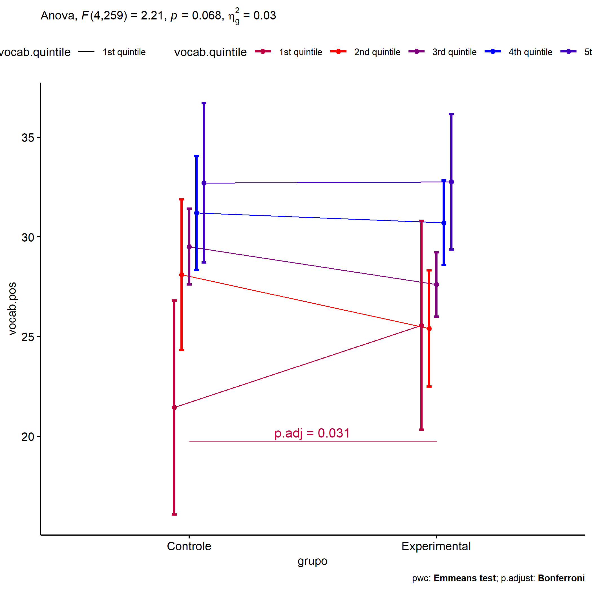<!-- -->

``` r
if (!is.null(plots[["vocab.quintile"]]))
  plots[["vocab.quintile"]] + ggplot2::scale_color_manual(values = color[["grupo"]])
```

    ## Scale for colour is already present.
    ## Adding another scale for colour, which will replace the existing scale.

    ## Warning: `position_dodge()` requires non-overlapping x intervals

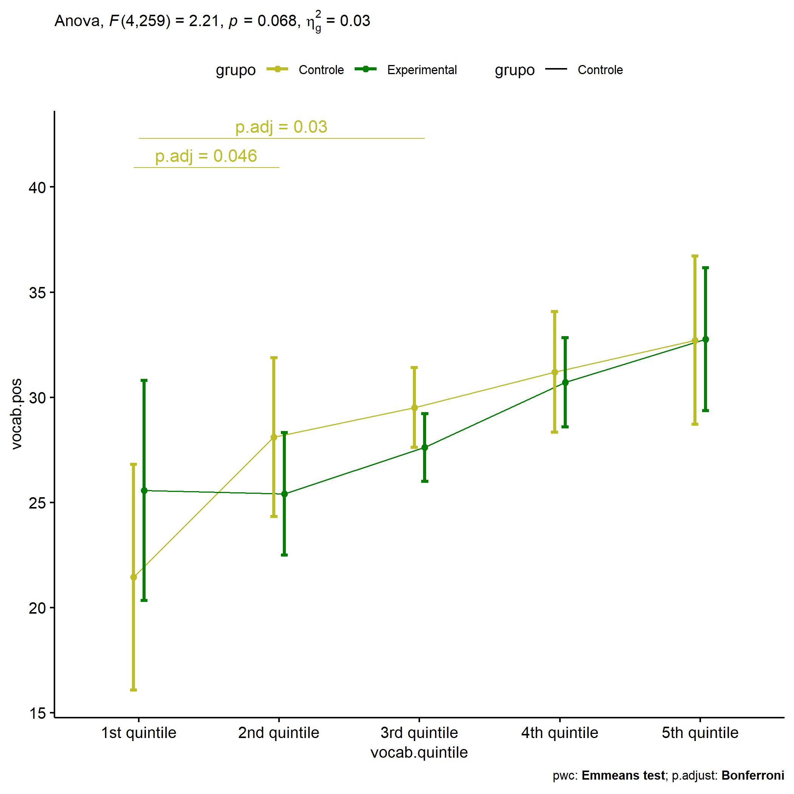<!-- -->

``` r
plots <- twoWayAncovaBoxPlots(
  wdat, "vocab.pos", c("grupo","vocab.quintile"), aov, pwcs, covar = "vocab.pre",
  theme = "classic", color = color[["grupo:vocab.quintile"]],
  subtitle = which(aov$Effect == "grupo:vocab.quintile"))
```

``` r
plots[["grupo:vocab.quintile"]] + ggplot2::ylab("Vocabulario") + ggplot2::scale_x_discrete(labels=c('pre', 'pos'))
```

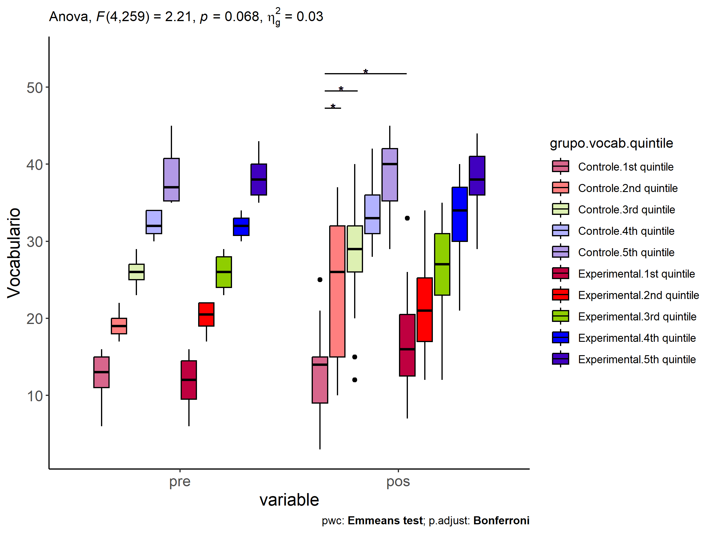<!-- -->

``` r
plots <- twoWayAncovaBoxPlots(
  wdat.long, "vocab", c("grupo","vocab.quintile"), aov, pwc.long, pre.post = "time",
  theme = "classic", color = color$prepost)
```

``` r
plots[["grupo:vocab.quintile"]] + ggplot2::ylab("Vocabulario")
```

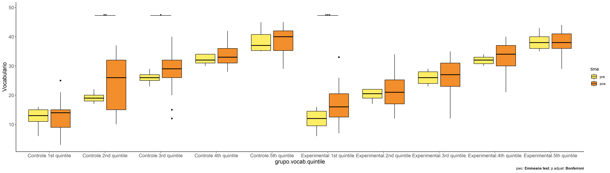<!-- -->

### Checking linearity assumption

``` r
ggscatter(wdat, x = "vocab.pre", y = "vocab.pos", size = 0.5,
          facet.by = c("grupo","vocab.quintile"), add = "reg.line")+
  stat_regline_equation(
    aes(label =  paste(..eq.label.., ..rr.label.., sep = "~~~~"))
  )
```

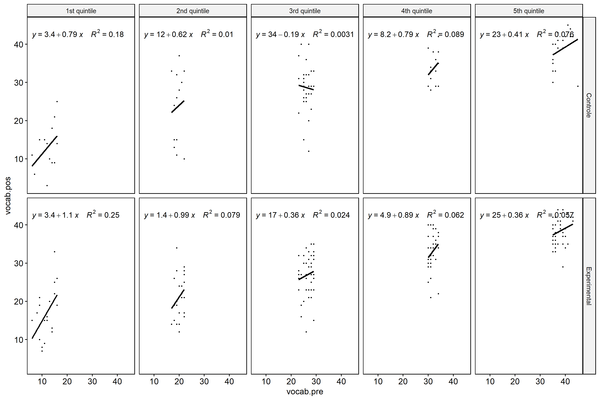<!-- -->

### Checking normality and homogeneity

``` r
res <- augment(lm(vocab.pos ~ vocab.pre + grupo*vocab.quintile, data = wdat))
```

``` r
shapiro_test(res$.resid)
```

    ## # A tibble: 1 × 3
    ##   variable   statistic p.value
    ##   <chr>          <dbl>   <dbl>
    ## 1 res$.resid     0.986  0.0115

``` r
levene_test(res, .resid ~ grupo*vocab.quintile)
```

    ## # A tibble: 1 × 4
    ##     df1   df2 statistic        p
    ##   <int> <int>     <dbl>    <dbl>
    ## 1     9   260      3.40 0.000578

# Summary of Results

## Descriptive Statistics

``` r
df <- get.descriptives(ldat[["grupo"]], c(dv.pre, dv.pos), c("grupo"), 
                       include.global = T, symmetry.test = T, normality.test = F)
df <- plyr::rbind.fill(
  df, do.call(plyr::rbind.fill, lapply(lfatores2, FUN = function(f) {
    if (nrow(dat) > 0 && sum(!is.na(unique(dat[[f]]))) > 1)
      get.descriptives(ldat[[paste0("grupo:",f)]], c(dv.pre,dv.pos), c("grupo", f),
                       symmetry.test = T, normality.test = F)
    }))
)
(df <- df[,c(fatores1[fatores1 %in% colnames(df)],"variable",
             colnames(df)[!colnames(df) %in% c(fatores1,"variable")])])
```

    ##           grupo Sexo   Zona Cor.Raca vocab.quintile  variable   n   mean median min max     sd    se    ci   iqr
    ## 1      Controle <NA>   <NA>     <NA>           <NA> vocab.pre  90 26.689   27.0   6  43  8.359 0.881 1.751 11.75
    ## 2  Experimental <NA>   <NA>     <NA>           <NA> vocab.pre 175 28.091   29.0   6  43  8.594 0.650 1.282 13.00
    ## 3          <NA> <NA>   <NA>     <NA>           <NA> vocab.pre 265 27.615   28.0   6  43  8.525 0.524 1.031 12.00
    ## 4      Controle <NA>   <NA>     <NA>           <NA> vocab.pos  90 29.100   31.0   6  45  9.479 0.999 1.985 10.75
    ## 5  Experimental <NA>   <NA>     <NA>           <NA> vocab.pos 175 29.549   31.0   7  44  8.718 0.659 1.301 13.00
    ## 6          <NA> <NA>   <NA>     <NA>           <NA> vocab.pos 265 29.396   31.0   6  45  8.968 0.551 1.085 12.00
    ## 7      Controle    F   <NA>     <NA>           <NA> vocab.pre  48 27.521   28.0   6  43  8.523 1.230 2.475  8.25
    ## 8      Controle    M   <NA>     <NA>           <NA> vocab.pre  42 25.381   25.0  12  42  8.433 1.301 2.628 13.50
    ## 9  Experimental    F   <NA>     <NA>           <NA> vocab.pre  93 29.097   30.0   6  43  8.966 0.930 1.847 13.00
    ## 10 Experimental    M   <NA>     <NA>           <NA> vocab.pre  83 26.976   28.0   8  43  8.008 0.879 1.749 11.00
    ## 11     Controle    F   <NA>     <NA>           <NA> vocab.pos  48 30.417   32.0   6  45  9.121 1.316 2.648  9.50
    ## 12     Controle    M   <NA>     <NA>           <NA> vocab.pos  42 27.381   29.5   3  44 10.203 1.574 3.179 10.75
    ## 13 Experimental    F   <NA>     <NA>           <NA> vocab.pos  93 30.968   32.0   9  44  8.629 0.895 1.777 13.00
    ## 14 Experimental    M   <NA>     <NA>           <NA> vocab.pos  83 27.783   29.0   7  43  8.653 0.950 1.889 12.50
    ## 15     Controle <NA>  Rural     <NA>           <NA> vocab.pre  37 26.703   27.0   7  45  8.544 1.405 2.849 11.00
    ## 16     Controle <NA> Urbana     <NA>           <NA> vocab.pre  18 26.944   26.5  12  41  7.635 1.800 3.797  8.50
    ## 17 Experimental <NA>  Rural     <NA>           <NA> vocab.pre  54 27.389   28.0   8  40  8.352 1.137 2.280 12.75
    ## 18 Experimental <NA> Urbana     <NA>           <NA> vocab.pre  33 29.061   30.0  12  39  7.976 1.388 2.828 12.00
    ## 19     Controle <NA>  Rural     <NA>           <NA> vocab.pos  37 28.405   31.0   3  42  9.923 1.631 3.309  9.00
    ## 20     Controle <NA> Urbana     <NA>           <NA> vocab.pos  18 31.222   30.5  14  45  8.063 1.900 4.009 10.00
    ## 21 Experimental <NA>  Rural     <NA>           <NA> vocab.pos  54 28.889   29.5   8  44  8.906 1.212 2.431 12.75
    ## 22 Experimental <NA> Urbana     <NA>           <NA> vocab.pos  33 31.030   32.0  12  43  8.687 1.512 3.080 13.00
    ## 23     Controle <NA>   <NA>    Parda           <NA> vocab.pre  34 26.912   27.5   7  45  8.099 1.389 2.826  9.75
    ## 24 Experimental <NA>   <NA>   Branca           <NA> vocab.pre  19 30.000   29.0  19  40  6.333 1.453 3.053  9.00
    ## 25 Experimental <NA>   <NA>    Parda           <NA> vocab.pre  53 26.925   28.0   8  43  9.713 1.334 2.677 13.00
    ## 26     Controle <NA>   <NA>    Parda           <NA> vocab.pos  34 29.029   32.0   3  42 10.095 1.731 3.522 10.50
    ## 27 Experimental <NA>   <NA>   Branca           <NA> vocab.pos  19 29.474   29.0  14  43  8.784 2.015 4.234 12.50
    ## 28 Experimental <NA>   <NA>    Parda           <NA> vocab.pos  53 28.962   31.0   8  44  9.567 1.314 2.637 16.00
    ## 29     Controle <NA>   <NA>     <NA>   1st quintile vocab.pre  13 12.308   13.0   6  16  3.276 0.909 1.980  4.00
    ## 30     Controle <NA>   <NA>     <NA>   2nd quintile vocab.pre  13 19.385   19.0  17  22  1.557 0.432 0.941  2.00
    ## 31     Controle <NA>   <NA>     <NA>   3rd quintile vocab.pre  32 26.031   26.0  23  29  1.769 0.313 0.638  2.00
    ## 32     Controle <NA>   <NA>     <NA>   4th quintile vocab.pre  17 32.176   32.0  30  34  1.510 0.366 0.776  3.00
    ## 33     Controle <NA>   <NA>     <NA>   5th quintile vocab.pre  18 38.278   37.0  35  45  3.214 0.758 1.598  5.50
    ## 34 Experimental <NA>   <NA>     <NA>   1st quintile vocab.pre  19 11.842   12.0   6  16  2.949 0.677 1.421  5.00
    ## 35 Experimental <NA>   <NA>     <NA>   2nd quintile vocab.pre  28 20.321   20.5  17  22  1.588 0.300 0.616  3.00
    ## 36 Experimental <NA>   <NA>     <NA>   3rd quintile vocab.pre  45 26.156   26.0  23  29  2.266 0.338 0.681  4.00
    ## 37 Experimental <NA>   <NA>     <NA>   4th quintile vocab.pre  36 31.722   32.0  30  34  1.365 0.228 0.462  2.25
    ## 38 Experimental <NA>   <NA>     <NA>   5th quintile vocab.pre  49 37.918   38.0  35  43  2.317 0.331 0.666  4.00
    ## 39     Controle <NA>   <NA>     <NA>   1st quintile vocab.pos  13 13.077   14.0   3  25  6.034 1.674 3.646  6.00
    ## 40     Controle <NA>   <NA>     <NA>   2nd quintile vocab.pos  13 23.615   26.0  10  37  9.562 2.652 5.778 17.00
    ## 41     Controle <NA>   <NA>     <NA>   3rd quintile vocab.pos  32 28.656   29.0  12  40  6.110 1.080 2.203  6.00
    ## 42     Controle <NA>   <NA>     <NA>   4th quintile vocab.pos  17 33.706   33.0  28  42  4.012 0.973 2.063  5.00
    ## 43     Controle <NA>   <NA>     <NA>   5th quintile vocab.pos  18 38.556   40.0  29  45  4.780 1.127 2.377  6.75
    ## 44 Experimental <NA>   <NA>     <NA>   1st quintile vocab.pos  19 16.947   16.0   7  33  6.696 1.536 3.227  8.00
    ## 45 Experimental <NA>   <NA>     <NA>   2nd quintile vocab.pos  28 21.429   21.0  12  34  5.587 1.056 2.166  8.25
    ## 46 Experimental <NA>   <NA>     <NA>   3rd quintile vocab.pos  45 26.822   27.0  12  35  5.293 0.789 1.590  8.00
    ## 47 Experimental <NA>   <NA>     <NA>   4th quintile vocab.pos  36 32.972   34.0  21  40  4.849 0.808 1.641  7.00
    ## 48 Experimental <NA>   <NA>     <NA>   5th quintile vocab.pos  49 38.408   38.0  29  44  3.458 0.494 0.993  5.00
    ##    symmetry    skewness    kurtosis
    ## 1       YES -0.29316214 -0.42823652
    ## 2       YES -0.44046933 -0.54050305
    ## 3       YES -0.38556767 -0.50568090
    ## 4        NO -0.60375601 -0.43130832
    ## 5       YES -0.43732439 -0.59845983
    ## 6        NO -0.51296018 -0.47761336
    ## 7        NO -0.70750931  0.29401353
    ## 8       YES  0.21552793 -1.13272286
    ## 9        NO -0.54627904 -0.58030432
    ## 10      YES -0.39871253 -0.42026153
    ## 11       NO -0.83166004  0.20339694
    ## 12      YES -0.49535511 -0.64589647
    ## 13       NO -0.53141067 -0.57520722
    ## 14      YES -0.34385314 -0.69393027
    ## 15      YES -0.22598697 -0.53073471
    ## 16      YES -0.17724181 -0.70269371
    ## 17       NO -0.56816738 -0.45000534
    ## 18       NO -0.68840405 -0.57553936
    ## 19       NO -1.03465067  0.20558578
    ## 20      YES -0.21124469 -0.53603773
    ## 21      YES -0.33280301 -0.71289609
    ## 22       NO -0.54090845 -0.81601018
    ## 23      YES -0.36569636  0.04390732
    ## 24      YES  0.16035789 -1.16788989
    ## 25      YES -0.45829960 -0.88803089
    ## 26       NO -1.06735481  0.20958132
    ## 27      YES -0.30790184 -1.17700445
    ## 28      YES -0.39186923 -0.82736488
    ## 29       NO -0.63295470 -1.00077308
    ## 30      YES  0.38157596 -1.11176857
    ## 31      YES -0.07959967 -0.88507692
    ## 32      YES  0.02732505 -1.72020740
    ## 33       NO  0.55598890 -1.11202105
    ## 34      YES -0.16169497 -1.22947250
    ## 35      YES -0.35305646 -1.27459670
    ## 36      YES -0.18832722 -1.51001262
    ## 37      YES  0.16514189 -1.31703214
    ## 38      YES  0.41205998 -0.94789327
    ## 39      YES  0.27175371 -0.78076767
    ## 40      YES -0.17673543 -1.72972764
    ## 41       NO -0.56865751  0.66086302
    ## 42      YES  0.32307872 -0.98588866
    ## 43       NO -0.62485678 -0.94647147
    ## 44       NO  0.50821560 -0.33480884
    ## 45      YES  0.18308538 -0.92708359
    ## 46       NO -0.69310303  0.13186278
    ## 47       NO -0.51415058 -0.22080199
    ## 48      YES -0.21723272 -0.56088117

| grupo        | Sexo | Zona   | Cor.Raca | vocab.quintile | variable  |   n |   mean | median | min | max |     sd |    se |    ci |   iqr | symmetry | skewness | kurtosis |
|:-------------|:-----|:-------|:---------|:---------------|:----------|----:|-------:|-------:|----:|----:|-------:|------:|------:|------:|:---------|---------:|---------:|
| Controle     |      |        |          |                | vocab.pre |  90 | 26.689 |   27.0 |   6 |  43 |  8.359 | 0.881 | 1.751 | 11.75 | YES      |   -0.293 |   -0.428 |
| Experimental |      |        |          |                | vocab.pre | 175 | 28.091 |   29.0 |   6 |  43 |  8.594 | 0.650 | 1.282 | 13.00 | YES      |   -0.440 |   -0.541 |
|              |      |        |          |                | vocab.pre | 265 | 27.615 |   28.0 |   6 |  43 |  8.525 | 0.524 | 1.031 | 12.00 | YES      |   -0.386 |   -0.506 |
| Controle     |      |        |          |                | vocab.pos |  90 | 29.100 |   31.0 |   6 |  45 |  9.479 | 0.999 | 1.985 | 10.75 | NO       |   -0.604 |   -0.431 |
| Experimental |      |        |          |                | vocab.pos | 175 | 29.549 |   31.0 |   7 |  44 |  8.718 | 0.659 | 1.301 | 13.00 | YES      |   -0.437 |   -0.598 |
|              |      |        |          |                | vocab.pos | 265 | 29.396 |   31.0 |   6 |  45 |  8.968 | 0.551 | 1.085 | 12.00 | NO       |   -0.513 |   -0.478 |
| Controle     | F    |        |          |                | vocab.pre |  48 | 27.521 |   28.0 |   6 |  43 |  8.523 | 1.230 | 2.475 |  8.25 | NO       |   -0.708 |    0.294 |
| Controle     | M    |        |          |                | vocab.pre |  42 | 25.381 |   25.0 |  12 |  42 |  8.433 | 1.301 | 2.628 | 13.50 | YES      |    0.216 |   -1.133 |
| Experimental | F    |        |          |                | vocab.pre |  93 | 29.097 |   30.0 |   6 |  43 |  8.966 | 0.930 | 1.847 | 13.00 | NO       |   -0.546 |   -0.580 |
| Experimental | M    |        |          |                | vocab.pre |  83 | 26.976 |   28.0 |   8 |  43 |  8.008 | 0.879 | 1.749 | 11.00 | YES      |   -0.399 |   -0.420 |
| Controle     | F    |        |          |                | vocab.pos |  48 | 30.417 |   32.0 |   6 |  45 |  9.121 | 1.316 | 2.648 |  9.50 | NO       |   -0.832 |    0.203 |
| Controle     | M    |        |          |                | vocab.pos |  42 | 27.381 |   29.5 |   3 |  44 | 10.203 | 1.574 | 3.179 | 10.75 | YES      |   -0.495 |   -0.646 |
| Experimental | F    |        |          |                | vocab.pos |  93 | 30.968 |   32.0 |   9 |  44 |  8.629 | 0.895 | 1.777 | 13.00 | NO       |   -0.531 |   -0.575 |
| Experimental | M    |        |          |                | vocab.pos |  83 | 27.783 |   29.0 |   7 |  43 |  8.653 | 0.950 | 1.889 | 12.50 | YES      |   -0.344 |   -0.694 |
| Controle     |      | Rural  |          |                | vocab.pre |  37 | 26.703 |   27.0 |   7 |  45 |  8.544 | 1.405 | 2.849 | 11.00 | YES      |   -0.226 |   -0.531 |
| Controle     |      | Urbana |          |                | vocab.pre |  18 | 26.944 |   26.5 |  12 |  41 |  7.635 | 1.800 | 3.797 |  8.50 | YES      |   -0.177 |   -0.703 |
| Experimental |      | Rural  |          |                | vocab.pre |  54 | 27.389 |   28.0 |   8 |  40 |  8.352 | 1.137 | 2.280 | 12.75 | NO       |   -0.568 |   -0.450 |
| Experimental |      | Urbana |          |                | vocab.pre |  33 | 29.061 |   30.0 |  12 |  39 |  7.976 | 1.388 | 2.828 | 12.00 | NO       |   -0.688 |   -0.576 |
| Controle     |      | Rural  |          |                | vocab.pos |  37 | 28.405 |   31.0 |   3 |  42 |  9.923 | 1.631 | 3.309 |  9.00 | NO       |   -1.035 |    0.206 |
| Controle     |      | Urbana |          |                | vocab.pos |  18 | 31.222 |   30.5 |  14 |  45 |  8.063 | 1.900 | 4.009 | 10.00 | YES      |   -0.211 |   -0.536 |
| Experimental |      | Rural  |          |                | vocab.pos |  54 | 28.889 |   29.5 |   8 |  44 |  8.906 | 1.212 | 2.431 | 12.75 | YES      |   -0.333 |   -0.713 |
| Experimental |      | Urbana |          |                | vocab.pos |  33 | 31.030 |   32.0 |  12 |  43 |  8.687 | 1.512 | 3.080 | 13.00 | NO       |   -0.541 |   -0.816 |
| Controle     |      |        | Parda    |                | vocab.pre |  34 | 26.912 |   27.5 |   7 |  45 |  8.099 | 1.389 | 2.826 |  9.75 | YES      |   -0.366 |    0.044 |
| Experimental |      |        | Branca   |                | vocab.pre |  19 | 30.000 |   29.0 |  19 |  40 |  6.333 | 1.453 | 3.053 |  9.00 | YES      |    0.160 |   -1.168 |
| Experimental |      |        | Parda    |                | vocab.pre |  53 | 26.925 |   28.0 |   8 |  43 |  9.713 | 1.334 | 2.677 | 13.00 | YES      |   -0.458 |   -0.888 |
| Controle     |      |        | Parda    |                | vocab.pos |  34 | 29.029 |   32.0 |   3 |  42 | 10.095 | 1.731 | 3.522 | 10.50 | NO       |   -1.067 |    0.210 |
| Experimental |      |        | Branca   |                | vocab.pos |  19 | 29.474 |   29.0 |  14 |  43 |  8.784 | 2.015 | 4.234 | 12.50 | YES      |   -0.308 |   -1.177 |
| Experimental |      |        | Parda    |                | vocab.pos |  53 | 28.962 |   31.0 |   8 |  44 |  9.567 | 1.314 | 2.637 | 16.00 | YES      |   -0.392 |   -0.827 |
| Controle     |      |        |          | 1st quintile   | vocab.pre |  13 | 12.308 |   13.0 |   6 |  16 |  3.276 | 0.909 | 1.980 |  4.00 | NO       |   -0.633 |   -1.001 |
| Controle     |      |        |          | 2nd quintile   | vocab.pre |  13 | 19.385 |   19.0 |  17 |  22 |  1.557 | 0.432 | 0.941 |  2.00 | YES      |    0.382 |   -1.112 |
| Controle     |      |        |          | 3rd quintile   | vocab.pre |  32 | 26.031 |   26.0 |  23 |  29 |  1.769 | 0.313 | 0.638 |  2.00 | YES      |   -0.080 |   -0.885 |
| Controle     |      |        |          | 4th quintile   | vocab.pre |  17 | 32.176 |   32.0 |  30 |  34 |  1.510 | 0.366 | 0.776 |  3.00 | YES      |    0.027 |   -1.720 |
| Controle     |      |        |          | 5th quintile   | vocab.pre |  18 | 38.278 |   37.0 |  35 |  45 |  3.214 | 0.758 | 1.598 |  5.50 | NO       |    0.556 |   -1.112 |
| Experimental |      |        |          | 1st quintile   | vocab.pre |  19 | 11.842 |   12.0 |   6 |  16 |  2.949 | 0.677 | 1.421 |  5.00 | YES      |   -0.162 |   -1.229 |
| Experimental |      |        |          | 2nd quintile   | vocab.pre |  28 | 20.321 |   20.5 |  17 |  22 |  1.588 | 0.300 | 0.616 |  3.00 | YES      |   -0.353 |   -1.275 |
| Experimental |      |        |          | 3rd quintile   | vocab.pre |  45 | 26.156 |   26.0 |  23 |  29 |  2.266 | 0.338 | 0.681 |  4.00 | YES      |   -0.188 |   -1.510 |
| Experimental |      |        |          | 4th quintile   | vocab.pre |  36 | 31.722 |   32.0 |  30 |  34 |  1.365 | 0.228 | 0.462 |  2.25 | YES      |    0.165 |   -1.317 |
| Experimental |      |        |          | 5th quintile   | vocab.pre |  49 | 37.918 |   38.0 |  35 |  43 |  2.317 | 0.331 | 0.666 |  4.00 | YES      |    0.412 |   -0.948 |
| Controle     |      |        |          | 1st quintile   | vocab.pos |  13 | 13.077 |   14.0 |   3 |  25 |  6.034 | 1.674 | 3.646 |  6.00 | YES      |    0.272 |   -0.781 |
| Controle     |      |        |          | 2nd quintile   | vocab.pos |  13 | 23.615 |   26.0 |  10 |  37 |  9.562 | 2.652 | 5.778 | 17.00 | YES      |   -0.177 |   -1.730 |
| Controle     |      |        |          | 3rd quintile   | vocab.pos |  32 | 28.656 |   29.0 |  12 |  40 |  6.110 | 1.080 | 2.203 |  6.00 | NO       |   -0.569 |    0.661 |
| Controle     |      |        |          | 4th quintile   | vocab.pos |  17 | 33.706 |   33.0 |  28 |  42 |  4.012 | 0.973 | 2.063 |  5.00 | YES      |    0.323 |   -0.986 |
| Controle     |      |        |          | 5th quintile   | vocab.pos |  18 | 38.556 |   40.0 |  29 |  45 |  4.780 | 1.127 | 2.377 |  6.75 | NO       |   -0.625 |   -0.946 |
| Experimental |      |        |          | 1st quintile   | vocab.pos |  19 | 16.947 |   16.0 |   7 |  33 |  6.696 | 1.536 | 3.227 |  8.00 | NO       |    0.508 |   -0.335 |
| Experimental |      |        |          | 2nd quintile   | vocab.pos |  28 | 21.429 |   21.0 |  12 |  34 |  5.587 | 1.056 | 2.166 |  8.25 | YES      |    0.183 |   -0.927 |
| Experimental |      |        |          | 3rd quintile   | vocab.pos |  45 | 26.822 |   27.0 |  12 |  35 |  5.293 | 0.789 | 1.590 |  8.00 | NO       |   -0.693 |    0.132 |
| Experimental |      |        |          | 4th quintile   | vocab.pos |  36 | 32.972 |   34.0 |  21 |  40 |  4.849 | 0.808 | 1.641 |  7.00 | NO       |   -0.514 |   -0.221 |
| Experimental |      |        |          | 5th quintile   | vocab.pos |  49 | 38.408 |   38.0 |  29 |  44 |  3.458 | 0.494 | 0.993 |  5.00 | YES      |   -0.217 |   -0.561 |

## ANCOVA Table Comparison

``` r
df <- do.call(plyr::rbind.fill, laov)
(df <- df[!duplicated(df$Effect),])
```

    ##                  Effect DFn DFd       F        p p<.05      ges DFn' DFd'      F'       p' p<.05'     ges'
    ## 1                 grupo   1 262   1.439 2.31e-01       5.00e-03    1  278   0.864 3.54e-01        3.00e-03
    ## 2             vocab.pre   1 262 585.347 9.85e-69     * 6.91e-01    1  278 288.206 7.65e-45      * 5.09e-01
    ## 4            grupo:Sexo   1 261   0.016 8.99e-01       6.19e-05    1  276   0.016 9.00e-01        5.69e-05
    ## 5                  Sexo   1 261   4.173 4.20e-02     * 1.60e-02    1  276   2.699 1.02e-01        1.00e-02
    ## 8            grupo:Zona   1 137   1.053 3.07e-01       8.00e-03    1  140   0.552 4.59e-01        4.00e-03
    ## 10                 Zona   1 137   2.222 1.38e-01       1.60e-02    1  140   4.044 4.60e-02      * 2.80e-02
    ## 11             Cor.Raca   1 102   1.395 2.40e-01       1.30e-02    1  106   0.855 3.57e-01        8.00e-03
    ## 13       grupo:Cor.Raca   0 102      NA       NA  <NA>       NA    0  106      NA       NA   <NA>       NA
    ## 16 grupo:vocab.quintile   4 259   2.211 6.80e-02       3.30e-02    4  270   2.058 8.70e-02        3.00e-02
    ## 18       vocab.quintile   4 259   1.658 1.60e-01       2.50e-02    4  270   0.931 4.46e-01        1.40e-02

|     | Effect               | DFn | DFd |       F |     p | p\<.05 |   ges | DFn’ | DFd’ |      F’ |    p’ | p\<.05’ |  ges’ |
|:----|:---------------------|----:|----:|--------:|------:|:-------|------:|-----:|-----:|--------:|------:|:--------|------:|
| 1   | grupo                |   1 | 262 |   1.439 | 0.231 |        | 0.005 |    1 |  278 |   0.864 | 0.354 |         | 0.003 |
| 2   | vocab.pre            |   1 | 262 | 585.347 | 0.000 | \*     | 0.691 |    1 |  278 | 288.206 | 0.000 | \*      | 0.509 |
| 4   | grupo:Sexo           |   1 | 261 |   0.016 | 0.899 |        | 0.000 |    1 |  276 |   0.016 | 0.900 |         | 0.000 |
| 5   | Sexo                 |   1 | 261 |   4.173 | 0.042 | \*     | 0.016 |    1 |  276 |   2.699 | 0.102 |         | 0.010 |
| 8   | grupo:Zona           |   1 | 137 |   1.053 | 0.307 |        | 0.008 |    1 |  140 |   0.552 | 0.459 |         | 0.004 |
| 10  | Zona                 |   1 | 137 |   2.222 | 0.138 |        | 0.016 |    1 |  140 |   4.044 | 0.046 | \*      | 0.028 |
| 11  | Cor.Raca             |   1 | 102 |   1.395 | 0.240 |        | 0.013 |    1 |  106 |   0.855 | 0.357 |         | 0.008 |
| 13  | grupo:Cor.Raca       |   0 | 102 |         |       |        |       |    0 |  106 |         |       |         |       |
| 16  | grupo:vocab.quintile |   4 | 259 |   2.211 | 0.068 |        | 0.033 |    4 |  270 |   2.058 | 0.087 |         | 0.030 |
| 18  | vocab.quintile       |   4 | 259 |   1.658 | 0.160 |        | 0.025 |    4 |  270 |   0.931 | 0.446 |         | 0.014 |

## PairWise Table Comparison

``` r
df <- do.call(plyr::rbind.fill, lpwc)
df <- df[,c(names(lfatores), names(df)[!names(df) %in% c(names(lfatores),"term",".y.")])]
```

| grupo        | Sexo | Zona   | Cor.Raca | vocab.quintile | group1       | group2       |  df | statistic |     p | p.adj | p.adj.signif | df’ | statistic’ |    p’ | p.adj’ | p.adj.signif’ |
|:-------------|:-----|:-------|:---------|:---------------|:-------------|:-------------|----:|----------:|------:|------:|:-------------|----:|-----------:|------:|-------:|:--------------|
| Controle     |      |        |          |                | pre          | pos          | 526 |    -1.848 | 0.065 | 0.065 | ns           | 558 |     -0.201 | 0.840 |  0.840 | ns            |
| Experimental |      |        |          |                | pre          | pos          | 526 |    -1.557 | 0.120 | 0.120 | ns           | 558 |     -0.858 | 0.391 |  0.391 | ns            |
|              |      |        |          |                | Controle     | Experimental | 262 |     1.200 | 0.231 | 0.231 | ns           | 278 |     -0.929 | 0.354 |  0.354 | ns            |
| Controle     | F    |        |          |                | pre          | pos          | 524 |    -1.621 | 0.106 | 0.106 | ns           | 554 |     -0.450 | 0.653 |  0.653 | ns            |
| Controle     | M    |        |          |                | pre          | pos          | 524 |    -1.047 | 0.296 | 0.296 | ns           | 554 |      0.182 | 0.856 |  0.856 | ns            |
| Controle     |      |        |          |                | F            | M            | 261 |     1.091 | 0.276 | 0.276 | ns           | 276 |      1.085 | 0.279 |  0.279 | ns            |
| Experimental | F    |        |          |                | pre          | pos          | 524 |    -1.457 | 0.146 | 0.146 | ns           | 554 |     -0.923 | 0.357 |  0.357 | ns            |
| Experimental | M    |        |          |                | pre          | pos          | 524 |    -0.594 | 0.553 | 0.553 | ns           | 554 |     -0.279 | 0.780 |  0.780 | ns            |
| Experimental |      |        |          |                | F            | M            | 261 |     1.740 | 0.083 | 0.083 | ns           | 276 |      1.246 | 0.214 |  0.214 | ns            |
|              | F    |        |          |                | Controle     | Experimental | 261 |     0.931 | 0.353 | 0.353 | ns           | 276 |     -0.600 | 0.549 |  0.549 | ns            |
|              | M    |        |          |                | Controle     | Experimental | 261 |     1.048 | 0.296 | 0.296 | ns           | 276 |     -0.738 | 0.461 |  0.461 | ns            |
| Controle     |      |        |          |                | Rural        | Urbana       | 137 |    -1.723 | 0.087 | 0.087 | ns           | 140 |     -1.814 | 0.072 |  0.072 | ns            |
| Controle     |      | Rural  |          |                | pre          | pos          | 276 |    -0.847 | 0.398 | 0.398 | ns           | 282 |     -0.577 | 0.565 |  0.565 | ns            |
| Controle     |      | Urbana |          |                | pre          | pos          | 276 |    -1.485 | 0.139 | 0.139 | ns           | 282 |     -1.467 | 0.144 |  0.144 | ns            |
| Experimental |      |        |          |                | Rural        | Urbana       | 137 |    -0.554 | 0.580 | 0.580 | ns           | 140 |     -1.143 | 0.255 |  0.255 | ns            |
| Experimental |      | Rural  |          |                | pre          | pos          | 276 |    -0.902 | 0.368 | 0.368 | ns           | 282 |     -0.389 | 0.698 |  0.698 | ns            |
| Experimental |      | Urbana |          |                | pre          | pos          | 276 |    -0.926 | 0.355 | 0.355 | ns           | 282 |     -0.914 | 0.361 |  0.361 | ns            |
|              |      | Rural  |          |                | Controle     | Experimental | 137 |     0.116 | 0.907 | 0.907 | ns           | 140 |      0.266 | 0.791 |  0.791 | ns            |
|              |      | Urbana |          |                | Controle     | Experimental | 137 |     1.352 | 0.179 | 0.179 | ns           | 140 |      1.103 | 0.272 |  0.272 | ns            |
| Controle     |      |        | Branca   |                | pre          | pos          |     |           |       |       |              |     |            |       |        |               |
| Controle     |      |        |          |                | Branca       | Parda        |     |           |       |       |              |     |            |       |        |               |
| Controle     |      |        | Parda    |                | pre          | pos          | 206 |    -0.953 | 0.342 | 0.342 | ns           | 214 |      0.181 | 0.856 |  0.856 | ns            |
| Experimental |      |        | Branca   |                | pre          | pos          | 206 |     0.177 | 0.860 | 0.860 | ns           | 214 |      0.171 | 0.864 |  0.864 | ns            |
| Experimental |      |        |          |                | Branca       | Parda        | 102 |    -1.181 | 0.240 | 0.240 | ns           | 106 |     -0.924 | 0.357 |  0.357 | ns            |
| Experimental |      |        | Parda    |                | pre          | pos          | 206 |    -1.145 | 0.254 | 0.254 | ns           | 214 |     -1.105 | 0.270 |  0.270 | ns            |
|              |      |        | Branca   |                | Controle     | Experimental |     |           |       |       |              |     |            |       |        |               |
|              |      |        | Parda    |                | Controle     | Experimental | 102 |     0.055 | 0.956 | 0.956 | ns           | 106 |     -1.453 | 0.149 |  0.149 | ns            |
| Controle     |      |        |          | 1st quintile   | pre          | pos          | 520 |    -0.475 | 0.635 | 0.635 | ns           | 542 |     -0.388 | 0.698 |  0.698 | ns            |
| Controle     |      |        |          | 2nd quintile   | pre          | pos          | 520 |    -2.614 | 0.009 | 0.009 | \*\*         | 542 |     -1.383 | 0.167 |  0.167 | ns            |
| Controle     |      |        |          | 3rd quintile   | pre          | pos          | 520 |    -2.544 | 0.011 | 0.011 | \*           | 542 |     -1.582 | 0.114 |  0.114 | ns            |
| Controle     |      |        |          | 4th quintile   | pre          | pos          | 520 |    -1.080 | 0.280 | 0.280 | ns           | 542 |     -0.231 | 0.818 |  0.818 | ns            |
| Controle     |      |        |          | 5th quintile   | pre          | pos          | 520 |    -0.202 | 0.840 | 0.840 | ns           | 542 |      2.773 | 0.006 |  0.006 | \*\*          |
| Controle     |      |        |          |                | 1st quintile | 2nd quintile | 259 |    -2.860 | 0.005 | 0.046 | \*           | 270 |     -1.748 | 0.082 |  0.816 | ns            |
| Controle     |      |        |          |                | 1st quintile | 3rd quintile | 259 |    -2.992 | 0.003 | 0.030 | \*           | 270 |     -2.210 | 0.028 |  0.279 | ns            |
| Controle     |      |        |          |                | 1st quintile | 4th quintile | 259 |    -2.738 | 0.007 | 0.066 | ns           | 270 |     -1.958 | 0.051 |  0.512 | ns            |
| Controle     |      |        |          |                | 1st quintile | 5th quintile | 259 |    -2.591 | 0.010 | 0.101 | ns           | 270 |     -1.268 | 0.206 |  1.000 | ns            |
| Controle     |      |        |          |                | 2nd quintile | 3rd quintile | 259 |    -0.700 | 0.484 | 1.000 | ns           | 270 |     -0.977 | 0.330 |  1.000 | ns            |
| Controle     |      |        |          |                | 2nd quintile | 4th quintile | 259 |    -1.130 | 0.260 | 1.000 | ns           | 270 |     -1.083 | 0.280 |  1.000 | ns            |
| Controle     |      |        |          |                | 2nd quintile | 5th quintile | 259 |    -1.342 | 0.181 | 1.000 | ns           | 270 |     -0.418 | 0.676 |  1.000 | ns            |
| Controle     |      |        |          |                | 3rd quintile | 4th quintile | 259 |    -0.919 | 0.359 | 1.000 | ns           | 270 |     -0.556 | 0.579 |  1.000 | ns            |
| Controle     |      |        |          |                | 3rd quintile | 5th quintile | 259 |    -1.327 | 0.186 | 1.000 | ns           | 270 |      0.230 | 0.818 |  1.000 | ns            |
| Controle     |      |        |          |                | 4th quintile | 5th quintile | 259 |    -0.752 | 0.453 | 1.000 | ns           | 270 |      0.811 | 0.418 |  1.000 | ns            |
| Experimental |      |        |          | 1st quintile   | pre          | pos          | 520 |    -3.813 | 0.000 | 0.000 | \*\*\*       | 542 |     -3.112 | 0.002 |  0.002 | \*\*          |
| Experimental |      |        |          | 2nd quintile   | pre          | pos          | 520 |    -1.004 | 0.316 | 0.316 | ns           | 542 |     -0.819 | 0.413 |  0.413 | ns            |
| Experimental |      |        |          | 3rd quintile   | pre          | pos          | 520 |    -0.766 | 0.444 | 0.444 | ns           | 542 |     -0.247 | 0.805 |  0.805 | ns            |
| Experimental |      |        |          | 4th quintile   | pre          | pos          | 520 |    -1.285 | 0.199 | 0.199 | ns           | 542 |     -0.690 | 0.491 |  0.491 | ns            |
| Experimental |      |        |          | 5th quintile   | pre          | pos          | 520 |    -0.587 | 0.557 | 0.557 | ns           | 542 |      0.411 | 0.681 |  0.681 | ns            |
| Experimental |      |        |          |                | 1st quintile | 2nd quintile | 259 |     0.078 | 0.938 | 1.000 | ns           | 270 |      0.041 | 0.967 |  1.000 | ns            |
| Experimental |      |        |          |                | 1st quintile | 3rd quintile | 259 |    -0.789 | 0.431 | 1.000 | ns           | 270 |     -0.529 | 0.597 |  1.000 | ns            |
| Experimental |      |        |          |                | 1st quintile | 4th quintile | 259 |    -1.541 | 0.125 | 1.000 | ns           | 270 |     -1.153 | 0.250 |  1.000 | ns            |
| Experimental |      |        |          |                | 1st quintile | 5th quintile | 259 |    -1.726 | 0.086 | 0.856 | ns           | 270 |     -1.235 | 0.218 |  1.000 | ns            |
| Experimental |      |        |          |                | 2nd quintile | 3rd quintile | 259 |    -1.425 | 0.155 | 1.000 | ns           | 270 |     -0.939 | 0.349 |  1.000 | ns            |
| Experimental |      |        |          |                | 2nd quintile | 4th quintile | 259 |    -2.445 | 0.015 | 0.151 | ns           | 270 |     -1.812 | 0.071 |  0.712 | ns            |
| Experimental |      |        |          |                | 2nd quintile | 5th quintile | 259 |    -2.514 | 0.013 | 0.126 | ns           | 270 |     -1.788 | 0.075 |  0.749 | ns            |
| Experimental |      |        |          |                | 3rd quintile | 4th quintile | 259 |    -2.143 | 0.033 | 0.330 | ns           | 270 |     -1.714 | 0.088 |  0.877 | ns            |
| Experimental |      |        |          |                | 3rd quintile | 5th quintile | 259 |    -2.480 | 0.014 | 0.138 | ns           | 270 |     -1.819 | 0.070 |  0.701 | ns            |
| Experimental |      |        |          |                | 4th quintile | 5th quintile | 259 |    -1.375 | 0.170 | 1.000 | ns           | 270 |     -0.872 | 0.384 |  1.000 | ns            |
|              |      |        |          | 1st quintile   | Controle     | Experimental | 259 |    -2.165 | 0.031 | 0.031 | \*           | 270 |     -1.702 | 0.090 |  0.090 | ns            |
|              |      |        |          | 2nd quintile   | Controle     | Experimental | 259 |     1.516 | 0.131 | 0.131 | ns           | 270 |      0.480 | 0.632 |  0.632 | ns            |
|              |      |        |          | 3rd quintile   | Controle     | Experimental | 259 |     1.555 | 0.121 | 0.121 | ns           | 270 |      1.086 | 0.278 |  0.278 | ns            |
|              |      |        |          | 4th quintile   | Controle     | Experimental | 259 |     0.311 | 0.756 | 0.756 | ns           | 270 |     -0.094 | 0.925 |  0.925 | ns            |
|              |      |        |          | 5th quintile   | Controle     | Experimental | 259 |    -0.034 | 0.973 | 0.973 | ns           | 270 |     -2.189 | 0.029 |  0.029 | \*            |

## EMMS Table Comparison

``` r
df <- do.call(plyr::rbind.fill, lemms)
df[["N-N'"]] <- df[["N"]] - df[["N'"]]
df <- df[,c(names(lfatores), names(df)[!names(df) %in% names(lfatores)])]
```

| grupo        | Sexo | Zona   | Cor.Raca | vocab.quintile |   N | M (pre) | SE (pre) | M (unadj) | SE (unadj) | M (adj) | SE (adj) |  N’ | M (pre)’ | SE (pre)’ | M (unadj)’ | SE (unadj)’ | M (adj)’ | SE (adj)’ | N-N’ |
|:-------------|:-----|:-------|:---------|:---------------|----:|--------:|---------:|----------:|-----------:|--------:|---------:|----:|---------:|----------:|-----------:|------------:|---------:|----------:|-----:|
| Controle     |      |        |          |                |  90 |  26.689 |    0.881 |    29.100 |      0.999 |  29.912 |    0.529 | 100 |   27.090 |     0.862 |     27.350 |       1.070 |   27.935 |     0.678 |  -10 |
| Experimental |      |        |          |                | 175 |  28.091 |    0.650 |    29.549 |      0.659 |  29.131 |    0.379 | 181 |   28.221 |     0.635 |     29.044 |       0.670 |   28.721 |     0.504 |   -6 |
| Controle     | F    |        |          |                |  48 |  27.521 |    1.230 |    30.417 |      1.316 |  30.454 |    0.724 |  53 |   27.868 |     1.195 |     28.660 |       1.467 |   28.621 |     0.929 |   -5 |
| Controle     | M    |        |          |                |  42 |  25.381 |    1.301 |    27.381 |      1.574 |  29.296 |    0.778 |  47 |   26.213 |     1.247 |     25.872 |       1.552 |   27.148 |     0.990 |   -5 |
| Experimental | F    |        |          |                |  93 |  29.097 |    0.930 |    30.968 |      0.895 |  29.623 |    0.523 |  96 |   29.229 |     0.911 |     30.438 |       0.921 |   29.317 |     0.694 |   -3 |
| Experimental | M    |        |          |                |  83 |  26.976 |    0.879 |    27.783 |      0.950 |  28.299 |    0.551 |  85 |   27.082 |     0.866 |     27.471 |       0.954 |   28.055 |     0.735 |   -2 |
| Controle     |      | Rural  |          |                |  37 |  26.703 |    1.405 |    28.405 |      1.631 |  29.157 |    0.865 |  38 |   26.711 |     1.367 |     27.868 |       1.676 |   28.697 |     0.988 |   -1 |
| Controle     |      | Urbana |          |                |  18 |  26.944 |    1.800 |    31.222 |      1.900 |  31.757 |    1.238 |  18 |   26.944 |     1.800 |     31.222 |       1.900 |   31.854 |     1.434 |    0 |
| Experimental |      | Rural  |          |                |  54 |  27.389 |    1.137 |    28.889 |      1.212 |  29.026 |    0.715 |  56 |   27.804 |     1.135 |     28.446 |       1.209 |   28.356 |     0.813 |   -2 |
| Experimental |      | Urbana |          |                |  33 |  29.061 |    1.388 |    31.030 |      1.512 |  29.671 |    0.918 |  33 |   29.061 |     1.388 |     31.030 |       1.512 |   29.884 |     1.062 |    0 |
| Controle     |      |        | Parda    |                |  34 |  26.912 |    1.389 |    29.029 |      1.731 |  29.493 |    1.097 |  38 |   27.316 |     1.341 |     26.921 |       1.879 |   27.136 |     1.233 |   -4 |
| Experimental |      |        | Branca   |                |  19 |  30.000 |    1.453 |    29.474 |      2.015 |  27.380 |    1.478 |  19 |   30.000 |     1.453 |     29.474 |       2.015 |   27.590 |     1.755 |    0 |
| Experimental |      |        | Parda    |                |  53 |  26.925 |    1.334 |    28.962 |      1.314 |  29.415 |    0.879 |  53 |   26.925 |     1.334 |     28.962 |       1.314 |   29.483 |     1.045 |    0 |
| Controle     |      |        |          | 1st quintile   |  13 |  12.308 |    0.909 |    13.077 |      1.674 |  21.444 |    2.725 |  13 |   12.308 |     0.909 |     13.077 |       1.674 |   21.466 |     3.467 |    0 |
| Controle     |      |        |          | 2nd quintile   |  13 |  19.385 |    0.432 |    23.615 |      2.652 |  28.110 |    1.917 |  14 |   19.286 |     0.412 |     21.929 |       2.979 |   26.543 |     2.411 |   -1 |
| Controle     |      |        |          | 3rd quintile   |  32 |  26.031 |    0.313 |    28.656 |      1.080 |  29.515 |    0.964 |  33 |   26.061 |     0.304 |     28.030 |       1.220 |   28.981 |     1.217 |   -1 |
| Controle     |      |        |          | 4th quintile   |  17 |  32.176 |    0.366 |    33.706 |      0.973 |  31.202 |    1.455 |  18 |   32.278 |     0.360 |     32.667 |       1.386 |   30.255 |     1.794 |   -1 |
| Controle     |      |        |          | 5th quintile   |  18 |  38.278 |    0.758 |    38.556 |      1.127 |  32.713 |    2.031 |  22 |   38.091 |     0.644 |     33.864 |       2.375 |   28.308 |     2.409 |   -4 |
| Experimental |      |        |          | 1st quintile   |  19 |  11.842 |    0.677 |    16.947 |      1.536 |  25.569 |    2.659 |  19 |   11.842 |     0.677 |     16.947 |       1.536 |   25.588 |     3.382 |    0 |
| Experimental |      |        |          | 2nd quintile   |  28 |  20.321 |    0.300 |    21.429 |      1.056 |  25.411 |    1.481 |  28 |   20.321 |     0.300 |     21.429 |       1.056 |   25.483 |     1.900 |    0 |
| Experimental |      |        |          | 3rd quintile   |  45 |  26.156 |    0.338 |    26.822 |      0.789 |  27.613 |    0.818 |  46 |   26.152 |     0.330 |     26.413 |       0.873 |   27.314 |     1.040 |   -1 |
| Experimental |      |        |          | 4th quintile   |  36 |  31.722 |    0.228 |    32.972 |      0.808 |  30.717 |    1.077 |  37 |   31.757 |     0.224 |     32.568 |       0.884 |   30.438 |     1.331 |   -1 |
| Experimental |      |        |          | 5th quintile   |  49 |  37.918 |    0.331 |    38.408 |      0.494 |  32.762 |    1.724 |  51 |   37.961 |     0.324 |     37.549 |       0.766 |   32.064 |     2.130 |   -2 |
