ANCOVA in Vocabulario (Vocabulario)
================
Geiser C. Challco <geiser@alumni.usp.br>

- [Descriptive Statistics of Initial
  Data](#descriptive-statistics-of-initial-data)
- [ANCOVA and Pairwise for one factor:
  **grupo**](#ancova-and-pairwise-for-one-factor-grupo)
  - [Without remove non-normal data](#without-remove-non-normal-data)
  - [Computing ANCOVA and PairWise After removing non-normal data
    (OK)](#computing-ancova-and-pairwise-after-removing-non-normal-data-ok)
    - [Plots for ancova](#plots-for-ancova)
    - [Checking linearity assumption](#checking-linearity-assumption)
    - [Checking normality and
      homogeneity](#checking-normality-and-homogeneity)
- [ANCOVA and Pairwise for two factors
  **grupo:Sexo**](#ancova-and-pairwise-for-two-factors-gruposexo)
  - [Without remove non-normal data](#without-remove-non-normal-data-1)
  - [Computing ANCOVA and PairWise After removing non-normal data
    (OK)](#computing-ancova-and-pairwise-after-removing-non-normal-data-ok-1)
    - [Plots for ancova](#plots-for-ancova-1)
    - [Checking linearity assumption](#checking-linearity-assumption-1)
    - [Checking normality and
      homogeneity](#checking-normality-and-homogeneity-1)
- [ANCOVA and Pairwise for two factors
  **grupo:Zona**](#ancova-and-pairwise-for-two-factors-grupozona)
  - [Without remove non-normal data](#without-remove-non-normal-data-2)
  - [Computing ANCOVA and PairWise After removing non-normal data
    (OK)](#computing-ancova-and-pairwise-after-removing-non-normal-data-ok-2)
    - [Plots for ancova](#plots-for-ancova-2)
    - [Checking linearity assumption](#checking-linearity-assumption-2)
    - [Checking normality and
      homogeneity](#checking-normality-and-homogeneity-2)
- [ANCOVA and Pairwise for two factors
  **grupo:Cor.Raca**](#ancova-and-pairwise-for-two-factors-grupocorraca)
  - [Without remove non-normal data](#without-remove-non-normal-data-3)
  - [Computing ANCOVA and PairWise After removing non-normal data
    (OK)](#computing-ancova-and-pairwise-after-removing-non-normal-data-ok-3)
    - [Plots for ancova](#plots-for-ancova-3)
    - [Checking linearity assumption](#checking-linearity-assumption-3)
    - [Checking normality and
      homogeneity](#checking-normality-and-homogeneity-3)
- [ANCOVA and Pairwise for two factors
  **grupo:vocab.quintile**](#ancova-and-pairwise-for-two-factors-grupovocabquintile)
  - [Without remove non-normal data](#without-remove-non-normal-data-4)
  - [Computing ANCOVA and PairWise After removing non-normal data
    (OK)](#computing-ancova-and-pairwise-after-removing-non-normal-data-ok-4)
    - [Plots for ancova](#plots-for-ancova-4)
    - [Checking linearity assumption](#checking-linearity-assumption-4)
    - [Checking normality and
      homogeneity](#checking-normality-and-homogeneity-4)
- [Summary of Results](#summary-of-results)
  - [Descriptive Statistics](#descriptive-statistics)
  - [ANCOVA Table Comparison](#ancova-table-comparison)
  - [PairWise Table Comparison](#pairwise-table-comparison)
  - [EMMS Table Comparison](#emms-table-comparison)

**NOTE**:

- Teste ANCOVA para determinar se houve diferenças significativas no
  Vocabulario (medido usando pre- e pos-testes).
- ANCOVA test to determine whether there were significant differences in
  Vocabulario (measured using pre- and post-tests).

# Descriptive Statistics of Initial Data

``` r
df <- get.descriptives(dat, c(dv.pre, dv.pos), c("grupo"), 
                       include.global = T, symmetry.test = T, normality.test = F)
df <- plyr::rbind.fill(
  df, do.call(plyr::rbind.fill, lapply(lfatores2, FUN = function(f) {
    if (nrow(dat) > 0 && sum(!is.na(unique(dat[[f]]))) > 1)
      get.descriptives(dat, c(dv.pre,dv.pos), c("grupo", f),
                       symmetry.test = T, normality.test = F)
    }))
)
(df <- df[,c(fatores1[fatores1 %in% colnames(df)],"variable",
             colnames(df)[!colnames(df) %in% c(fatores1,"variable")])])
```

    ##           grupo Sexo   Zona Cor.Raca vocab.quintile  variable   n   mean median min max     sd     se      ci
    ## 1      Controle <NA>   <NA>     <NA>           <NA> vocab.pre 118 32.237   33.0  13  45  7.434  0.684   1.355
    ## 2  Experimental <NA>   <NA>     <NA>           <NA> vocab.pre 171 31.181   31.0  11  48  7.251  0.554   1.095
    ## 3          <NA> <NA>   <NA>     <NA>           <NA> vocab.pre 289 31.612   32.0  11  48  7.332  0.431   0.849
    ## 4      Controle <NA>   <NA>     <NA>           <NA> vocab.pos 118 33.203   34.5  12  45  8.064  0.742   1.470
    ## 5  Experimental <NA>   <NA>     <NA>           <NA> vocab.pos 171 32.421   35.0   1  47  8.501  0.650   1.283
    ## 6          <NA> <NA>   <NA>     <NA>           <NA> vocab.pos 289 32.740   35.0   1  47  8.320  0.489   0.963
    ## 7      Controle    F   <NA>     <NA>           <NA> vocab.pre  56 32.214   33.0  13  45  7.122  0.952   1.907
    ## 8      Controle    M   <NA>     <NA>           <NA> vocab.pre  62 32.258   34.0  14  45  7.763  0.986   1.971
    ## 9  Experimental    F   <NA>     <NA>           <NA> vocab.pre  86 30.895   32.0  13  44  7.279  0.785   1.561
    ## 10 Experimental    M   <NA>     <NA>           <NA> vocab.pre  85 31.471   31.0  11  48  7.253  0.787   1.564
    ## 11     Controle    F   <NA>     <NA>           <NA> vocab.pos  56 33.554   34.5  12  45  7.466  0.998   1.999
    ## 12     Controle    M   <NA>     <NA>           <NA> vocab.pos  62 32.887   34.5  12  45  8.618  1.094   2.189
    ## 13 Experimental    F   <NA>     <NA>           <NA> vocab.pos  86 33.174   35.0  12  47  7.796  0.841   1.672
    ## 14 Experimental    M   <NA>     <NA>           <NA> vocab.pos  85 31.659   34.0   1  45  9.142  0.992   1.972
    ## 15     Controle <NA>  Rural     <NA>           <NA> vocab.pre  41 31.829   32.0  15  42  6.304  0.985   1.990
    ## 16     Controle <NA> Urbana     <NA>           <NA> vocab.pre  18 33.444   36.0  14  43  7.081  1.669   3.521
    ## 17     Controle <NA>   <NA>     <NA>           <NA> vocab.pre  59 32.153   34.0  13  45  8.294  1.080   2.161
    ## 18 Experimental <NA>  Rural     <NA>           <NA> vocab.pre  61 30.443   31.0  11  44  7.886  1.010   2.020
    ## 19 Experimental <NA> Urbana     <NA>           <NA> vocab.pre  43 31.512   34.0  14  48  8.727  1.331   2.686
    ## 20 Experimental <NA>   <NA>     <NA>           <NA> vocab.pre  67 31.642   32.0  16  44  5.443  0.665   1.328
    ## 21     Controle <NA>  Rural     <NA>           <NA> vocab.pos  41 35.488   37.0  12  45  7.766  1.213   2.451
    ## 22     Controle <NA> Urbana     <NA>           <NA> vocab.pos  18 32.222   34.5  12  44  9.552  2.251   4.750
    ## 23     Controle <NA>   <NA>     <NA>           <NA> vocab.pos  59 31.915   33.0  14  44  7.562  0.984   1.971
    ## 24 Experimental <NA>  Rural     <NA>           <NA> vocab.pos  61 32.689   35.0   1  45  8.930  1.143   2.287
    ## 25 Experimental <NA> Urbana     <NA>           <NA> vocab.pos  43 32.767   34.0  15  46  7.702  1.175   2.370
    ## 26 Experimental <NA>   <NA>     <NA>           <NA> vocab.pos  67 31.955   35.0   3  47  8.691  1.062   2.120
    ## 27     Controle <NA>   <NA>   Branca           <NA> vocab.pre   7 34.000   33.0  28  41  3.916  1.480   3.621
    ## 28     Controle <NA>   <NA> Indígena           <NA> vocab.pre   2 32.000   32.0  23  41 12.728  9.000 114.356
    ## 29     Controle <NA>   <NA>    Parda           <NA> vocab.pre  44 30.591   32.0  15  42  7.276  1.097   2.212
    ## 30     Controle <NA>   <NA>     <NA>           <NA> vocab.pre  65 33.169   34.0  13  45  7.642  0.948   1.893
    ## 31 Experimental <NA>   <NA>   Branca           <NA> vocab.pre  13 34.231   36.0  22  41  6.457  1.791   3.902
    ## 32 Experimental <NA>   <NA> Indígena           <NA> vocab.pre   3 30.333   31.0  26  34  4.041  2.333  10.040
    ## 33 Experimental <NA>   <NA>    Parda           <NA> vocab.pre  52 28.904   30.0  11  44  8.426  1.168   2.346
    ## 34 Experimental <NA>   <NA>     <NA>           <NA> vocab.pre 103 31.971   32.0  11  48  6.513  0.642   1.273
    ## 35     Controle <NA>   <NA>   Branca           <NA> vocab.pos   7 39.286   39.0  35  44  3.200  1.209   2.959
    ## 36     Controle <NA>   <NA> Indígena           <NA> vocab.pos   2 31.500   31.5  20  43 16.263 11.500 146.121
    ## 37     Controle <NA>   <NA>    Parda           <NA> vocab.pos  44 31.795   33.0  12  45  8.390  1.265   2.551
    ## 38     Controle <NA>   <NA>     <NA>           <NA> vocab.pos  65 33.554   36.0  12  45  7.802  0.968   1.933
    ## 39 Experimental <NA>   <NA>   Branca           <NA> vocab.pos  13 36.462   37.0  17  47  7.644  2.120   4.619
    ## 40 Experimental <NA>   <NA> Indígena           <NA> vocab.pos   3 33.333   34.0  32  34  1.155  0.667   2.868
    ## 41 Experimental <NA>   <NA>    Parda           <NA> vocab.pos  52 30.288   31.0   1  46 10.876  1.508   3.028
    ## 42 Experimental <NA>   <NA>     <NA>           <NA> vocab.pos 103 32.961   35.0   8  44  7.049  0.695   1.378
    ## 43     Controle <NA>   <NA>     <NA>   1st quintile vocab.pre   7 14.857   15.0  13  16  1.069  0.404   0.989
    ## 44     Controle <NA>   <NA>     <NA>   2nd quintile vocab.pre   6 20.333   21.0  18  22  1.506  0.615   1.580
    ## 45     Controle <NA>   <NA>     <NA>   3rd quintile vocab.pre  24 26.375   27.0  23  29  2.060  0.421   0.870
    ## 46     Controle <NA>   <NA>     <NA>   4th quintile vocab.pre  31 32.452   33.0  30  34  1.287  0.231   0.472
    ## 47     Controle <NA>   <NA>     <NA>   5th quintile vocab.pre  50 38.780   38.0  35  45  2.743  0.388   0.779
    ## 48 Experimental <NA>   <NA>     <NA>   1st quintile vocab.pre   9 13.889   15.0  11  16  1.833  0.611   1.409
    ## 49 Experimental <NA>   <NA>     <NA>   2nd quintile vocab.pre  12 20.833   21.5  18  22  1.586  0.458   1.008
    ## 50 Experimental <NA>   <NA>     <NA>   3rd quintile vocab.pre  42 26.619   27.0  23  29  1.950  0.301   0.608
    ## 51 Experimental <NA>   <NA>     <NA>   4th quintile vocab.pre  49 31.878   32.0  30  34  1.409  0.201   0.405
    ## 52 Experimental <NA>   <NA>     <NA>   5th quintile vocab.pre  59 38.593   38.0  35  48  2.983  0.388   0.777
    ## 53     Controle <NA>   <NA>     <NA>   1st quintile vocab.pos   7 18.571   19.0  12  29  5.623  2.125   5.200
    ## 54     Controle <NA>   <NA>     <NA>   2nd quintile vocab.pos   6 24.333   25.5  15  29  5.279  2.155   5.540
    ## 55     Controle <NA>   <NA>     <NA>   3rd quintile vocab.pos  24 27.542   27.5  14  37  5.664  1.156   2.392
    ##      iqr symmetry   skewness    kurtosis
    ## 1   9.75       NO -0.6719748 -0.11702101
    ## 2   9.00      YES -0.4846421  0.06633281
    ## 3  10.00       NO -0.5583304 -0.02245787
    ## 4  11.75       NO -0.7232423 -0.09860036
    ## 5  10.50       NO -0.9568356  0.99989622
    ## 6  11.00       NO -0.8799680  0.67013930
    ## 7   9.00       NO -0.7125248  0.23111327
    ## 8  11.50       NO -0.6274225 -0.45243417
    ## 9   9.00       NO -0.6082429 -0.20227558
    ## 10 10.00      YES -0.3510327  0.22764053
    ## 11 10.00       NO -0.6106570  0.07576679
    ## 12 13.00       NO -0.7421951 -0.39567789
    ## 13 11.00      YES -0.4639465 -0.52499075
    ## 14 10.00       NO -1.1890706  1.31984244
    ## 15  7.00       NO -0.7244519  0.29629807
    ## 16  4.75       NO -1.2282336  1.02748774
    ## 17 12.50       NO -0.5179797 -0.65860069
    ## 18 11.00      YES -0.4868448 -0.22546787
    ## 19 12.00      YES -0.3981602 -0.73930534
    ## 20  7.00      YES -0.2994611  0.26586847
    ## 21 12.00       NO -0.9673868  0.44982808
    ## 22 12.00       NO -0.7411003 -0.51896139
    ## 23 11.00       NO -0.5508682 -0.43543688
    ## 24 11.00       NO -1.1879429  1.53053597
    ## 25 10.00      YES -0.4509779 -0.59804730
    ## 26 11.00       NO -0.8983823  0.75340204
    ## 27  2.00      YES  0.3140661 -0.74210100
    ## 28  9.00 few data  0.0000000  0.00000000
    ## 29  9.50       NO -0.6253939 -0.47038798
    ## 30 10.00       NO -0.7437910 -0.01786374
    ## 31 11.00       NO -0.5302003 -1.29899974
    ## 32  4.00 few data  0.0000000  0.00000000
    ## 33 12.25      YES -0.2273909 -0.77538502
    ## 34  8.00      YES -0.4371679  0.58879266
    ## 35  4.50      YES  0.1185445 -1.70688315
    ## 36 11.50 few data  0.0000000  0.00000000
    ## 37 11.50      YES -0.3199351 -0.66179147
    ## 38 11.00       NO -0.9392116  0.43952804
    ## 39  6.00       NO -1.0590762  0.72720613
    ## 40  1.00 few data  0.0000000  0.00000000
    ## 41 15.25       NO -0.6468186 -0.22920339
    ## 42 10.00       NO -0.8203995  0.69035380
    ## 43  1.00      YES -0.4724797 -1.26658163
    ## 44  1.50      YES -0.4666843 -1.66637832
    ## 45  3.00      YES -0.4292730 -1.25784265
    ## 46  1.00       NO -0.5776873 -0.70770121
    ## 47  4.00      YES  0.4699858 -0.78778877
    ## 48  2.00       NO -0.6135181 -1.36845793
    ## 49  1.50       NO -0.8797702 -1.00682549
    ## 50  3.00      YES -0.4543571 -1.00140116
    ## 51  2.00      YES  0.2560884 -1.27676906
    ## 52  5.00       NO  0.6918747 -0.02452173
    ## 53  5.00       NO  0.5459447 -0.90372055
    ## 54  5.50       NO -0.6996764 -1.15971666
    ## 55  5.50       NO -0.6332218  0.27373974
    ##  [ reached 'max' / getOption("max.print") -- omitted 7 rows ]

| grupo        | Sexo | Zona   | Cor.Raca | vocab.quintile | variable  |   n |   mean | median | min | max |     sd |     se |      ci |   iqr | symmetry | skewness | kurtosis |
|:-------------|:-----|:-------|:---------|:---------------|:----------|----:|-------:|-------:|----:|----:|-------:|-------:|--------:|------:|:---------|---------:|---------:|
| Controle     |      |        |          |                | vocab.pre | 118 | 32.237 |   33.0 |  13 |  45 |  7.434 |  0.684 |   1.355 |  9.75 | NO       |   -0.672 |   -0.117 |
| Experimental |      |        |          |                | vocab.pre | 171 | 31.181 |   31.0 |  11 |  48 |  7.251 |  0.554 |   1.095 |  9.00 | YES      |   -0.485 |    0.066 |
|              |      |        |          |                | vocab.pre | 289 | 31.612 |   32.0 |  11 |  48 |  7.332 |  0.431 |   0.849 | 10.00 | NO       |   -0.558 |   -0.022 |
| Controle     |      |        |          |                | vocab.pos | 118 | 33.203 |   34.5 |  12 |  45 |  8.064 |  0.742 |   1.470 | 11.75 | NO       |   -0.723 |   -0.099 |
| Experimental |      |        |          |                | vocab.pos | 171 | 32.421 |   35.0 |   1 |  47 |  8.501 |  0.650 |   1.283 | 10.50 | NO       |   -0.957 |    1.000 |
|              |      |        |          |                | vocab.pos | 289 | 32.740 |   35.0 |   1 |  47 |  8.320 |  0.489 |   0.963 | 11.00 | NO       |   -0.880 |    0.670 |
| Controle     | F    |        |          |                | vocab.pre |  56 | 32.214 |   33.0 |  13 |  45 |  7.122 |  0.952 |   1.907 |  9.00 | NO       |   -0.713 |    0.231 |
| Controle     | M    |        |          |                | vocab.pre |  62 | 32.258 |   34.0 |  14 |  45 |  7.763 |  0.986 |   1.971 | 11.50 | NO       |   -0.627 |   -0.452 |
| Experimental | F    |        |          |                | vocab.pre |  86 | 30.895 |   32.0 |  13 |  44 |  7.279 |  0.785 |   1.561 |  9.00 | NO       |   -0.608 |   -0.202 |
| Experimental | M    |        |          |                | vocab.pre |  85 | 31.471 |   31.0 |  11 |  48 |  7.253 |  0.787 |   1.564 | 10.00 | YES      |   -0.351 |    0.228 |
| Controle     | F    |        |          |                | vocab.pos |  56 | 33.554 |   34.5 |  12 |  45 |  7.466 |  0.998 |   1.999 | 10.00 | NO       |   -0.611 |    0.076 |
| Controle     | M    |        |          |                | vocab.pos |  62 | 32.887 |   34.5 |  12 |  45 |  8.618 |  1.094 |   2.189 | 13.00 | NO       |   -0.742 |   -0.396 |
| Experimental | F    |        |          |                | vocab.pos |  86 | 33.174 |   35.0 |  12 |  47 |  7.796 |  0.841 |   1.672 | 11.00 | YES      |   -0.464 |   -0.525 |
| Experimental | M    |        |          |                | vocab.pos |  85 | 31.659 |   34.0 |   1 |  45 |  9.142 |  0.992 |   1.972 | 10.00 | NO       |   -1.189 |    1.320 |
| Controle     |      | Rural  |          |                | vocab.pre |  41 | 31.829 |   32.0 |  15 |  42 |  6.304 |  0.985 |   1.990 |  7.00 | NO       |   -0.724 |    0.296 |
| Controle     |      | Urbana |          |                | vocab.pre |  18 | 33.444 |   36.0 |  14 |  43 |  7.081 |  1.669 |   3.521 |  4.75 | NO       |   -1.228 |    1.027 |
| Controle     |      |        |          |                | vocab.pre |  59 | 32.153 |   34.0 |  13 |  45 |  8.294 |  1.080 |   2.161 | 12.50 | NO       |   -0.518 |   -0.659 |
| Experimental |      | Rural  |          |                | vocab.pre |  61 | 30.443 |   31.0 |  11 |  44 |  7.886 |  1.010 |   2.020 | 11.00 | YES      |   -0.487 |   -0.225 |
| Experimental |      | Urbana |          |                | vocab.pre |  43 | 31.512 |   34.0 |  14 |  48 |  8.727 |  1.331 |   2.686 | 12.00 | YES      |   -0.398 |   -0.739 |
| Experimental |      |        |          |                | vocab.pre |  67 | 31.642 |   32.0 |  16 |  44 |  5.443 |  0.665 |   1.328 |  7.00 | YES      |   -0.299 |    0.266 |
| Controle     |      | Rural  |          |                | vocab.pos |  41 | 35.488 |   37.0 |  12 |  45 |  7.766 |  1.213 |   2.451 | 12.00 | NO       |   -0.967 |    0.450 |
| Controle     |      | Urbana |          |                | vocab.pos |  18 | 32.222 |   34.5 |  12 |  44 |  9.552 |  2.251 |   4.750 | 12.00 | NO       |   -0.741 |   -0.519 |
| Controle     |      |        |          |                | vocab.pos |  59 | 31.915 |   33.0 |  14 |  44 |  7.562 |  0.984 |   1.971 | 11.00 | NO       |   -0.551 |   -0.435 |
| Experimental |      | Rural  |          |                | vocab.pos |  61 | 32.689 |   35.0 |   1 |  45 |  8.930 |  1.143 |   2.287 | 11.00 | NO       |   -1.188 |    1.531 |
| Experimental |      | Urbana |          |                | vocab.pos |  43 | 32.767 |   34.0 |  15 |  46 |  7.702 |  1.175 |   2.370 | 10.00 | YES      |   -0.451 |   -0.598 |
| Experimental |      |        |          |                | vocab.pos |  67 | 31.955 |   35.0 |   3 |  47 |  8.691 |  1.062 |   2.120 | 11.00 | NO       |   -0.898 |    0.753 |
| Controle     |      |        | Branca   |                | vocab.pre |   7 | 34.000 |   33.0 |  28 |  41 |  3.916 |  1.480 |   3.621 |  2.00 | YES      |    0.314 |   -0.742 |
| Controle     |      |        | Indígena |                | vocab.pre |   2 | 32.000 |   32.0 |  23 |  41 | 12.728 |  9.000 | 114.356 |  9.00 | few data |    0.000 |    0.000 |
| Controle     |      |        | Parda    |                | vocab.pre |  44 | 30.591 |   32.0 |  15 |  42 |  7.276 |  1.097 |   2.212 |  9.50 | NO       |   -0.625 |   -0.470 |
| Controle     |      |        |          |                | vocab.pre |  65 | 33.169 |   34.0 |  13 |  45 |  7.642 |  0.948 |   1.893 | 10.00 | NO       |   -0.744 |   -0.018 |
| Experimental |      |        | Branca   |                | vocab.pre |  13 | 34.231 |   36.0 |  22 |  41 |  6.457 |  1.791 |   3.902 | 11.00 | NO       |   -0.530 |   -1.299 |
| Experimental |      |        | Indígena |                | vocab.pre |   3 | 30.333 |   31.0 |  26 |  34 |  4.041 |  2.333 |  10.040 |  4.00 | few data |    0.000 |    0.000 |
| Experimental |      |        | Parda    |                | vocab.pre |  52 | 28.904 |   30.0 |  11 |  44 |  8.426 |  1.168 |   2.346 | 12.25 | YES      |   -0.227 |   -0.775 |
| Experimental |      |        |          |                | vocab.pre | 103 | 31.971 |   32.0 |  11 |  48 |  6.513 |  0.642 |   1.273 |  8.00 | YES      |   -0.437 |    0.589 |
| Controle     |      |        | Branca   |                | vocab.pos |   7 | 39.286 |   39.0 |  35 |  44 |  3.200 |  1.209 |   2.959 |  4.50 | YES      |    0.119 |   -1.707 |
| Controle     |      |        | Indígena |                | vocab.pos |   2 | 31.500 |   31.5 |  20 |  43 | 16.263 | 11.500 | 146.121 | 11.50 | few data |    0.000 |    0.000 |
| Controle     |      |        | Parda    |                | vocab.pos |  44 | 31.795 |   33.0 |  12 |  45 |  8.390 |  1.265 |   2.551 | 11.50 | YES      |   -0.320 |   -0.662 |
| Controle     |      |        |          |                | vocab.pos |  65 | 33.554 |   36.0 |  12 |  45 |  7.802 |  0.968 |   1.933 | 11.00 | NO       |   -0.939 |    0.440 |
| Experimental |      |        | Branca   |                | vocab.pos |  13 | 36.462 |   37.0 |  17 |  47 |  7.644 |  2.120 |   4.619 |  6.00 | NO       |   -1.059 |    0.727 |
| Experimental |      |        | Indígena |                | vocab.pos |   3 | 33.333 |   34.0 |  32 |  34 |  1.155 |  0.667 |   2.868 |  1.00 | few data |    0.000 |    0.000 |
| Experimental |      |        | Parda    |                | vocab.pos |  52 | 30.288 |   31.0 |   1 |  46 | 10.876 |  1.508 |   3.028 | 15.25 | NO       |   -0.647 |   -0.229 |
| Experimental |      |        |          |                | vocab.pos | 103 | 32.961 |   35.0 |   8 |  44 |  7.049 |  0.695 |   1.378 | 10.00 | NO       |   -0.820 |    0.690 |
| Controle     |      |        |          | 1st quintile   | vocab.pre |   7 | 14.857 |   15.0 |  13 |  16 |  1.069 |  0.404 |   0.989 |  1.00 | YES      |   -0.472 |   -1.267 |
| Controle     |      |        |          | 2nd quintile   | vocab.pre |   6 | 20.333 |   21.0 |  18 |  22 |  1.506 |  0.615 |   1.580 |  1.50 | YES      |   -0.467 |   -1.666 |
| Controle     |      |        |          | 3rd quintile   | vocab.pre |  24 | 26.375 |   27.0 |  23 |  29 |  2.060 |  0.421 |   0.870 |  3.00 | YES      |   -0.429 |   -1.258 |
| Controle     |      |        |          | 4th quintile   | vocab.pre |  31 | 32.452 |   33.0 |  30 |  34 |  1.287 |  0.231 |   0.472 |  1.00 | NO       |   -0.578 |   -0.708 |
| Controle     |      |        |          | 5th quintile   | vocab.pre |  50 | 38.780 |   38.0 |  35 |  45 |  2.743 |  0.388 |   0.779 |  4.00 | YES      |    0.470 |   -0.788 |
| Experimental |      |        |          | 1st quintile   | vocab.pre |   9 | 13.889 |   15.0 |  11 |  16 |  1.833 |  0.611 |   1.409 |  2.00 | NO       |   -0.614 |   -1.368 |
| Experimental |      |        |          | 2nd quintile   | vocab.pre |  12 | 20.833 |   21.5 |  18 |  22 |  1.586 |  0.458 |   1.008 |  1.50 | NO       |   -0.880 |   -1.007 |
| Experimental |      |        |          | 3rd quintile   | vocab.pre |  42 | 26.619 |   27.0 |  23 |  29 |  1.950 |  0.301 |   0.608 |  3.00 | YES      |   -0.454 |   -1.001 |
| Experimental |      |        |          | 4th quintile   | vocab.pre |  49 | 31.878 |   32.0 |  30 |  34 |  1.409 |  0.201 |   0.405 |  2.00 | YES      |    0.256 |   -1.277 |
| Experimental |      |        |          | 5th quintile   | vocab.pre |  59 | 38.593 |   38.0 |  35 |  48 |  2.983 |  0.388 |   0.777 |  5.00 | NO       |    0.692 |   -0.025 |
| Controle     |      |        |          | 1st quintile   | vocab.pos |   7 | 18.571 |   19.0 |  12 |  29 |  5.623 |  2.125 |   5.200 |  5.00 | NO       |    0.546 |   -0.904 |
| Controle     |      |        |          | 2nd quintile   | vocab.pos |   6 | 24.333 |   25.5 |  15 |  29 |  5.279 |  2.155 |   5.540 |  5.50 | NO       |   -0.700 |   -1.160 |
| Controle     |      |        |          | 3rd quintile   | vocab.pos |  24 | 27.542 |   27.5 |  14 |  37 |  5.664 |  1.156 |   2.392 |  5.50 | NO       |   -0.633 |    0.274 |
| Controle     |      |        |          | 4th quintile   | vocab.pos |  31 | 34.968 |   36.0 |  12 |  44 |  6.395 |  1.149 |   2.346 |  7.50 | NO       |   -1.477 |    3.085 |
| Controle     |      |        |          | 5th quintile   | vocab.pos |  50 | 37.940 |   39.0 |  22 |  45 |  5.262 |  0.744 |   1.495 |  7.75 | NO       |   -0.865 |    0.195 |
| Experimental |      |        |          | 1st quintile   | vocab.pos |   9 | 22.000 |   21.0 |   8 |  37 |  8.047 |  2.682 |   6.185 |  6.00 | YES      |    0.145 |   -0.564 |
| Experimental |      |        |          | 2nd quintile   | vocab.pos |  12 | 21.250 |   20.0 |  15 |  30 |  5.137 |  1.483 |   3.264 |  7.25 | YES      |    0.347 |   -1.380 |
| Experimental |      |        |          | 3rd quintile   | vocab.pos |  42 | 30.452 |   30.0 |  14 |  42 |  6.538 |  1.009 |   2.037 |  9.50 | YES      |   -0.383 |   -0.215 |
| Experimental |      |        |          | 4th quintile   | vocab.pos |  49 | 31.000 |   33.0 |   1 |  45 |  8.478 |  1.211 |   2.435 |  8.00 | NO       |   -1.771 |    3.617 |
| Experimental |      |        |          | 5th quintile   | vocab.pos |  59 | 38.864 |   39.0 |  27 |  47 |  4.333 |  0.564 |   1.129 |  5.00 | NO       |   -0.596 |    0.137 |

# ANCOVA and Pairwise for one factor: **grupo**

## Without remove non-normal data

``` r
pdat = remove_group_data(dat[!is.na(dat[["grupo"]]),], "vocab.pos", "grupo")

pdat.long <- rbind(pdat[,c("id","grupo")], pdat[,c("id","grupo")])
pdat.long[["time"]] <- c(rep("pre", nrow(pdat)), rep("pos", nrow(pdat)))
pdat.long[["time"]] <- factor(pdat.long[["time"]], c("pre","pos"))
pdat.long[["vocab"]] <- c(pdat[["vocab.pre"]], pdat[["vocab.pos"]])

aov = anova_test(pdat, vocab.pos ~ vocab.pre + grupo)
laov[["grupo"]] <- get_anova_table(aov)
```

``` r
pwc <- emmeans_test(pdat, vocab.pos ~ grupo, covariate = vocab.pre,
                    p.adjust.method = "bonferroni")
```

``` r
pwc.long <- emmeans_test(dplyr::group_by_at(pdat.long, "grupo"),
                          vocab ~ time,
                          p.adjust.method = "bonferroni")
lpwc[["grupo"]] <- plyr::rbind.fill(pwc, pwc.long)
```

``` r
ds <- get.descriptives(pdat, "vocab.pos", "grupo", covar = "vocab.pre")
ds <- merge(ds[ds$variable != "vocab.pre",],
            ds[ds$variable == "vocab.pre", !colnames(ds) %in% c("variable")],
            by = "grupo", all.x = T, suffixes = c("", ".vocab.pre"))
ds <- merge(get_emmeans(pwc), ds, by = "grupo", suffixes = c(".emms", ""))
ds <- ds[,c("grupo","n","mean.vocab.pre","se.vocab.pre","mean","se","emmean","se.emms")]

colnames(ds) <- c("grupo", "N", paste0(c("M","SE")," (pre)"),
                  paste0(c("M","SE"), " (unadj)"), paste0(c("M", "SE"), " (adj)"))

lemms[["grupo"]] <- ds
```

## Computing ANCOVA and PairWise After removing non-normal data (OK)

``` r
wdat = pdat 

res = residuals(lm(vocab.pos ~ vocab.pre + grupo, data = wdat))
non.normal = getNonNormal(res, wdat$id, plimit = 0.05)

wdat = wdat[!wdat$id %in% non.normal,]

wdat.long <- rbind(wdat[,c("id","grupo")], wdat[,c("id","grupo")])
wdat.long[["time"]] <- c(rep("pre", nrow(wdat)), rep("pos", nrow(wdat)))
wdat.long[["time"]] <- factor(wdat.long[["time"]], c("pre","pos"))
wdat.long[["vocab"]] <- c(wdat[["vocab.pre"]], wdat[["vocab.pos"]])

ldat[["grupo"]] = wdat

(non.normal)
```

    ## [1] "P1139" "P1113" "P2304" "P1129"

``` r
aov = anova_test(wdat, vocab.pos ~ vocab.pre + grupo)
laov[["grupo"]] <- merge(get_anova_table(aov), laov[["grupo"]], by="Effect", suffixes = c("","'"))

(df = get_anova_table(aov))
```

    ## ANOVA Table (type II tests)
    ## 
    ##      Effect DFn DFd       F        p p<.05      ges
    ## 1 vocab.pre   1 282 290.531 2.87e-45     * 0.507000
    ## 2     grupo   1 282   0.215 6.43e-01       0.000762

| Effect    | DFn | DFd |       F |     p | p\<.05 |   ges |
|:----------|----:|----:|--------:|------:|:-------|------:|
| vocab.pre |   1 | 282 | 290.531 | 0.000 | \*     | 0.507 |
| grupo     |   1 | 282 |   0.215 | 0.643 |        | 0.001 |

| term             | .y.       | group1   | group2       |  df | statistic |     p | p.adj | p.adj.signif |
|:-----------------|:----------|:---------|:-------------|----:|----------:|------:|------:|:-------------|
| vocab.pre\*grupo | vocab.pos | Controle | Experimental | 282 |    -0.464 | 0.643 | 0.643 | ns           |

``` r
pwc.long <- emmeans_test(dplyr::group_by_at(wdat.long, "grupo"),
                         vocab ~ time,
                         p.adjust.method = "bonferroni")
lpwc[["grupo"]] <- merge(plyr::rbind.fill(pwc, pwc.long), lpwc[["grupo"]], by=c("grupo","term",".y.","group1","group2"), suffixes = c("","'"))
```

| grupo        | term | .y.   | group1 | group2 |  df | statistic |     p | p.adj | p.adj.signif |
|:-------------|:-----|:------|:-------|:-------|----:|----------:|------:|------:|:-------------|
| Controle     | time | vocab | pre    | pos    | 566 |    -1.164 | 0.245 | 0.245 | ns           |
| Experimental | time | vocab | pre    | pos    | 566 |    -2.080 | 0.038 | 0.038 | \*           |

``` r
ds <- get.descriptives(wdat, "vocab.pos", "grupo", covar = "vocab.pre")
ds <- merge(ds[ds$variable != "vocab.pre",],
            ds[ds$variable == "vocab.pre", !colnames(ds) %in% c("variable")],
            by = "grupo", all.x = T, suffixes = c("", ".vocab.pre"))
ds <- merge(get_emmeans(pwc), ds, by = "grupo", suffixes = c(".emms", ""))
ds <- ds[,c("grupo","n","mean.vocab.pre","se.vocab.pre","mean","se","emmean","se.emms")]

colnames(ds) <- c("grupo", "N", paste0(c("M","SE")," (pre)"),
                  paste0(c("M","SE"), " (unadj)"), paste0(c("M", "SE"), " (adj)"))

lemms[["grupo"]] <- merge(ds, lemms[["grupo"]], by=c("grupo"), suffixes = c("","'"))
```

| grupo        |   N | M (pre) | SE (pre) | M (unadj) | SE (unadj) | M (adj) | SE (adj) |
|:-------------|----:|--------:|---------:|----------:|-----------:|--------:|---------:|
| Controle     | 117 |  32.231 |    0.690 |    33.385 |      0.726 |  32.921 |    0.506 |
| Experimental | 168 |  31.185 |    0.564 |    32.905 |      0.596 |  33.227 |    0.422 |

### Plots for ancova

``` r
plots <- oneWayAncovaPlots(
  wdat, "vocab.pos", "grupo", aov, list("grupo"=pwc), addParam = c("mean_se"),
  font.label.size=10, step.increase=0.05, p.label="p.adj",
  subtitle = which(aov$Effect == "grupo"))
```

``` r
if (!is.null(nrow(plots[["grupo"]]$data)))
  plots[["grupo"]] + ggplot2::scale_color_manual(values = color[["grupo"]])
```

    ## Scale for colour is already present.
    ## Adding another scale for colour, which will replace the existing scale.

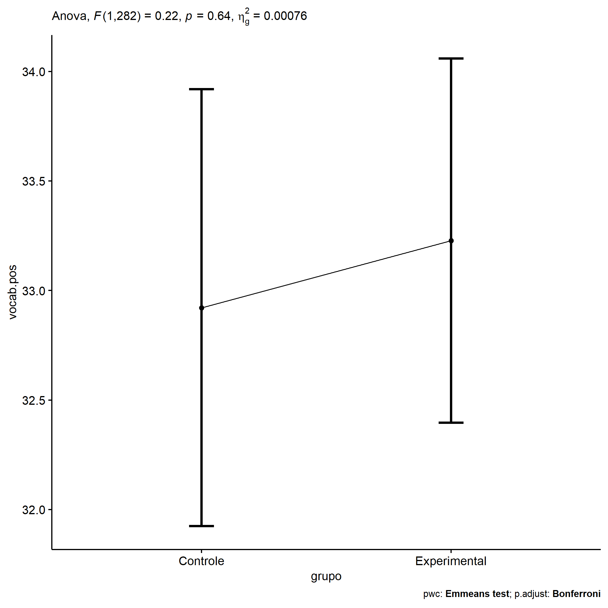<!-- -->

``` r
plots <- oneWayAncovaBoxPlots(
  wdat, "vocab.pos", "grupo", aov, pwc, covar = "vocab.pre",
  theme = "classic", color = color[["grupo"]],
  subtitle = which(aov$Effect == "grupo"))
```

``` r
if (length(unique(wdat[["grupo"]])) > 1)
  plots[["grupo"]] + ggplot2::ylab("Vocabulario") + ggplot2::scale_x_discrete(labels=c('pre', 'pos'))
```

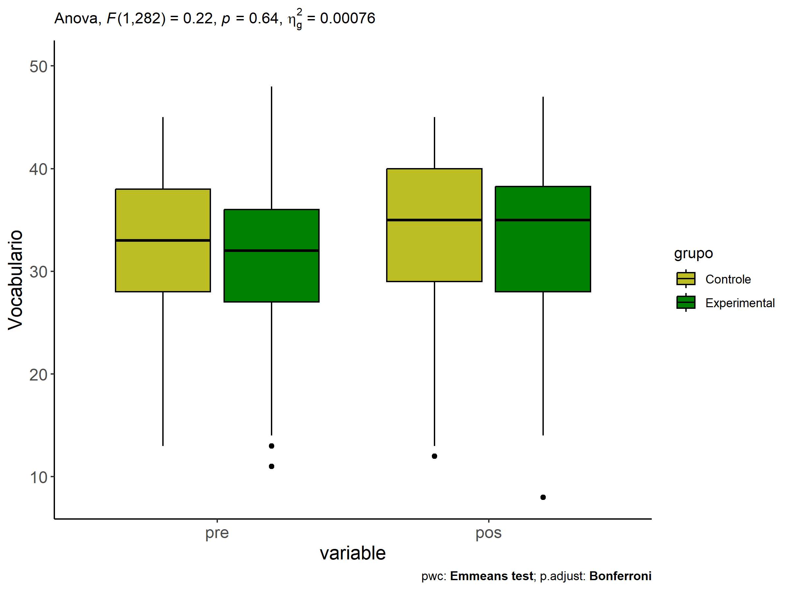<!-- -->

``` r
if (length(unique(wdat.long[["grupo"]])) > 1)
  plots <- oneWayAncovaBoxPlots(
    wdat.long, "vocab", "grupo", aov, pwc.long, pre.post = "time",
    theme = "classic", color = color$prepost)
```

``` r
if (length(unique(wdat.long[["grupo"]])) > 1)
  plots[["grupo"]] + ggplot2::ylab("Vocabulario")
```

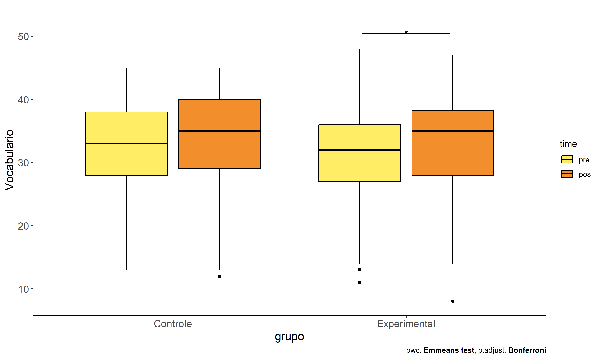<!-- -->

### Checking linearity assumption

``` r
ggscatter(wdat, x = "vocab.pre", y = "vocab.pos", size = 0.5,
          color = "grupo", add = "reg.line")+
  stat_regline_equation(
    aes(label =  paste(..eq.label.., ..rr.label.., sep = "~~~~"), color = grupo)
  )
```

<!-- -->

### Checking normality and homogeneity

``` r
res <- augment(lm(vocab.pos ~ vocab.pre + grupo, data = wdat))
```

``` r
shapiro_test(res$.resid)
```

    ## # A tibble: 1 × 3
    ##   variable   statistic p.value
    ##   <chr>          <dbl>   <dbl>
    ## 1 res$.resid     0.991  0.0869

``` r
levene_test(res, .resid ~ grupo)
```

    ## # A tibble: 1 × 4
    ##     df1   df2 statistic     p
    ##   <int> <int>     <dbl> <dbl>
    ## 1     1   283   0.00409 0.949

# ANCOVA and Pairwise for two factors **grupo:Sexo**

## Without remove non-normal data

``` r
pdat = remove_group_data(dat[!is.na(dat[["grupo"]]) & !is.na(dat[["Sexo"]]),], "vocab.pos", c("grupo","Sexo"))

pdat.long <- rbind(pdat[,c("id","grupo","Sexo")], pdat[,c("id","grupo","Sexo")])
pdat.long[["time"]] <- c(rep("pre", nrow(pdat)), rep("pos", nrow(pdat)))
pdat.long[["time"]] <- factor(pdat.long[["time"]], c("pre","pos"))
pdat.long[["vocab"]] <- c(pdat[["vocab.pre"]], pdat[["vocab.pos"]])

aov = anova_test(pdat, vocab.pos ~ vocab.pre + grupo*Sexo)
laov[["grupo:Sexo"]] <- get_anova_table(aov)
```

``` r
pwcs <- list()
pwcs[["Sexo"]] <- emmeans_test(
  group_by(pdat, grupo), vocab.pos ~ Sexo,
  covariate = vocab.pre, p.adjust.method = "bonferroni")
pwcs[["grupo"]] <- emmeans_test(
  group_by(pdat, Sexo), vocab.pos ~ grupo,
  covariate = vocab.pre, p.adjust.method = "bonferroni")

pwc <- plyr::rbind.fill(pwcs[["grupo"]], pwcs[["Sexo"]])
pwc <- pwc[,c("grupo","Sexo", colnames(pwc)[!colnames(pwc) %in% c("grupo","Sexo")])]
```

``` r
pwc.long <- emmeans_test(dplyr::group_by_at(pdat.long, c("grupo","Sexo")),
                         vocab ~ time,
                         p.adjust.method = "bonferroni")
lpwc[["grupo:Sexo"]] <- plyr::rbind.fill(pwc, pwc.long)
```

``` r
ds <- get.descriptives(pdat, "vocab.pos", c("grupo","Sexo"), covar = "vocab.pre")
ds <- merge(ds[ds$variable != "vocab.pre",],
            ds[ds$variable == "vocab.pre", !colnames(ds) %in% c("variable")],
            by = c("grupo","Sexo"), all.x = T, suffixes = c("", ".vocab.pre"))
ds <- merge(get_emmeans(pwcs[["grupo"]]), ds, by = c("grupo","Sexo"), suffixes = c(".emms", ""))
ds <- ds[,c("grupo","Sexo","n","mean.vocab.pre","se.vocab.pre","mean","se","emmean","se.emms")]

colnames(ds) <- c("grupo","Sexo", "N", paste0(c("M","SE")," (pre)"),
                  paste0(c("M","SE"), " (unadj)"), paste0(c("M", "SE"), " (adj)"))

lemms[["grupo:Sexo"]] <- ds
```

## Computing ANCOVA and PairWise After removing non-normal data (OK)

``` r
wdat = pdat 

res = residuals(lm(vocab.pos ~ vocab.pre + grupo*Sexo, data = wdat))
non.normal = getNonNormal(res, wdat$id, plimit = 0.05)

wdat = wdat[!wdat$id %in% non.normal,]

wdat.long <- rbind(wdat[,c("id","grupo","Sexo")], wdat[,c("id","grupo","Sexo")])
wdat.long[["time"]] <- c(rep("pre", nrow(wdat)), rep("pos", nrow(wdat)))
wdat.long[["time"]] <- factor(wdat.long[["time"]], c("pre","pos"))
wdat.long[["vocab"]] <- c(wdat[["vocab.pre"]], wdat[["vocab.pos"]])


ldat[["grupo:Sexo"]] = wdat

(non.normal)
```

    ## [1] "P1139" "P1113" "P1129" "P2304" "P3260"

``` r
aov = anova_test(wdat, vocab.pos ~ vocab.pre + grupo*Sexo)
laov[["grupo:Sexo"]] <- merge(get_anova_table(aov), laov[["grupo:Sexo"]], by="Effect", suffixes = c("","'"))

(df = get_anova_table(aov))
```

    ## ANOVA Table (type II tests)
    ## 
    ##       Effect DFn DFd       F        p p<.05      ges
    ## 1  vocab.pre   1 279 321.839 2.18e-48     * 0.536000
    ## 2      grupo   1 279   0.080 7.78e-01       0.000286
    ## 3       Sexo   1 279   3.469 6.40e-02       0.012000
    ## 4 grupo:Sexo   1 279   1.206 2.73e-01       0.004000

| Effect     | DFn | DFd |       F |     p | p\<.05 |   ges |
|:-----------|----:|----:|--------:|------:|:-------|------:|
| vocab.pre  |   1 | 279 | 321.839 | 0.000 | \*     | 0.536 |
| grupo      |   1 | 279 |   0.080 | 0.778 |        | 0.000 |
| Sexo       |   1 | 279 |   3.469 | 0.064 |        | 0.012 |
| grupo:Sexo |   1 | 279 |   1.206 | 0.273 |        | 0.004 |

``` r
pwcs <- list()
pwcs[["Sexo"]] <- emmeans_test(
  group_by(wdat, grupo), vocab.pos ~ Sexo,
  covariate = vocab.pre, p.adjust.method = "bonferroni")
pwcs[["grupo"]] <- emmeans_test(
  group_by(wdat, Sexo), vocab.pos ~ grupo,
  covariate = vocab.pre, p.adjust.method = "bonferroni")

pwc <- plyr::rbind.fill(pwcs[["grupo"]], pwcs[["Sexo"]])
pwc <- pwc[,c("grupo","Sexo", colnames(pwc)[!colnames(pwc) %in% c("grupo","Sexo")])]
```

| grupo        | Sexo | term             | .y.       | group1   | group2       |  df | statistic |     p | p.adj | p.adj.signif |
|:-------------|:-----|:-----------------|:----------|:---------|:-------------|----:|----------:|------:|------:|:-------------|
|              | F    | vocab.pre\*grupo | vocab.pos | Controle | Experimental | 279 |    -0.981 | 0.327 | 0.327 | ns           |
|              | M    | vocab.pre\*grupo | vocab.pos | Controle | Experimental | 279 |     0.567 | 0.571 | 0.571 | ns           |
| Controle     |      | vocab.pre\*Sexo  | vocab.pos | F        | M            | 279 |     0.354 | 0.724 | 0.724 | ns           |
| Experimental |      | vocab.pre\*Sexo  | vocab.pos | F        | M            | 279 |     2.133 | 0.034 | 0.034 | \*           |

``` r
pwc.long <- emmeans_test(dplyr::group_by_at(wdat.long, c("grupo","Sexo")),
                         vocab ~ time,
                         p.adjust.method = "bonferroni")
lpwc[["grupo:Sexo"]] <- merge(plyr::rbind.fill(pwc, pwc.long), lpwc[["grupo:Sexo"]], by=c("grupo","Sexo","term",".y.","group1","group2"), suffixes = c("","'"))
```

| grupo        | Sexo | term | .y.   | group1 | group2 |  df | statistic |     p | p.adj | p.adj.signif |
|:-------------|:-----|:-----|:------|:-------|:-------|----:|----------:|------:|------:|:-------------|
| Controle     | F    | time | vocab | pre    | pos    | 560 |    -0.937 | 0.349 | 0.349 | ns           |
| Controle     | M    | time | vocab | pre    | pos    | 560 |    -0.718 | 0.473 | 0.473 | ns           |
| Experimental | F    | time | vocab | pre    | pos    | 560 |    -2.181 | 0.030 | 0.030 | \*           |
| Experimental | M    | time | vocab | pre    | pos    | 560 |    -0.496 | 0.620 | 0.620 | ns           |

``` r
ds <- get.descriptives(wdat, "vocab.pos", c("grupo","Sexo"), covar = "vocab.pre")
ds <- merge(ds[ds$variable != "vocab.pre",],
            ds[ds$variable == "vocab.pre", !colnames(ds) %in% c("variable")],
            by = c("grupo","Sexo"), all.x = T, suffixes = c("", ".vocab.pre"))
ds <- merge(get_emmeans(pwcs[["grupo"]]), ds, by = c("grupo","Sexo"), suffixes = c(".emms", ""))
ds <- ds[,c("grupo","Sexo","n","mean.vocab.pre","se.vocab.pre","mean","se","emmean","se.emms")]

colnames(ds) <- c("grupo","Sexo", "N", paste0(c("M","SE")," (pre)"),
                  paste0(c("M","SE"), " (unadj)"), paste0(c("M", "SE"), " (adj)"))

lemms[["grupo:Sexo"]] <- merge(ds, lemms[["grupo:Sexo"]], by=c("grupo","Sexo"), suffixes = c("","'"))
```

| grupo        | Sexo |   N | M (pre) | SE (pre) | M (unadj) | SE (unadj) | M (adj) | SE (adj) |
|:-------------|:-----|----:|--------:|---------:|----------:|-----------:|--------:|---------:|
| Controle     | F    |  56 |  32.214 |    0.952 |    33.554 |      0.998 |  33.141 |    0.712 |
| Controle     | M    |  61 |  32.246 |    1.002 |    33.230 |      1.057 |  32.792 |    0.683 |
| Experimental | F    |  85 |  30.894 |    0.794 |    33.424 |      0.812 |  34.043 |    0.579 |
| Experimental | M    |  82 |  31.732 |    0.775 |    32.317 |      0.884 |  32.282 |    0.588 |

### Plots for ancova

``` r
plots <- twoWayAncovaPlots(
  wdat, "vocab.pos", c("grupo","Sexo"), aov, pwcs, addParam = c("mean_se"),
  font.label.size=10, step.increase=0.05, p.label="p.adj",
  subtitle = which(aov$Effect == "grupo:Sexo"))
```

``` r
if (!is.null(plots[["grupo"]]))
  plots[["grupo"]] + ggplot2::scale_color_manual(values = color[["Sexo"]])
```

    ## Scale for colour is already present.
    ## Adding another scale for colour, which will replace the existing scale.

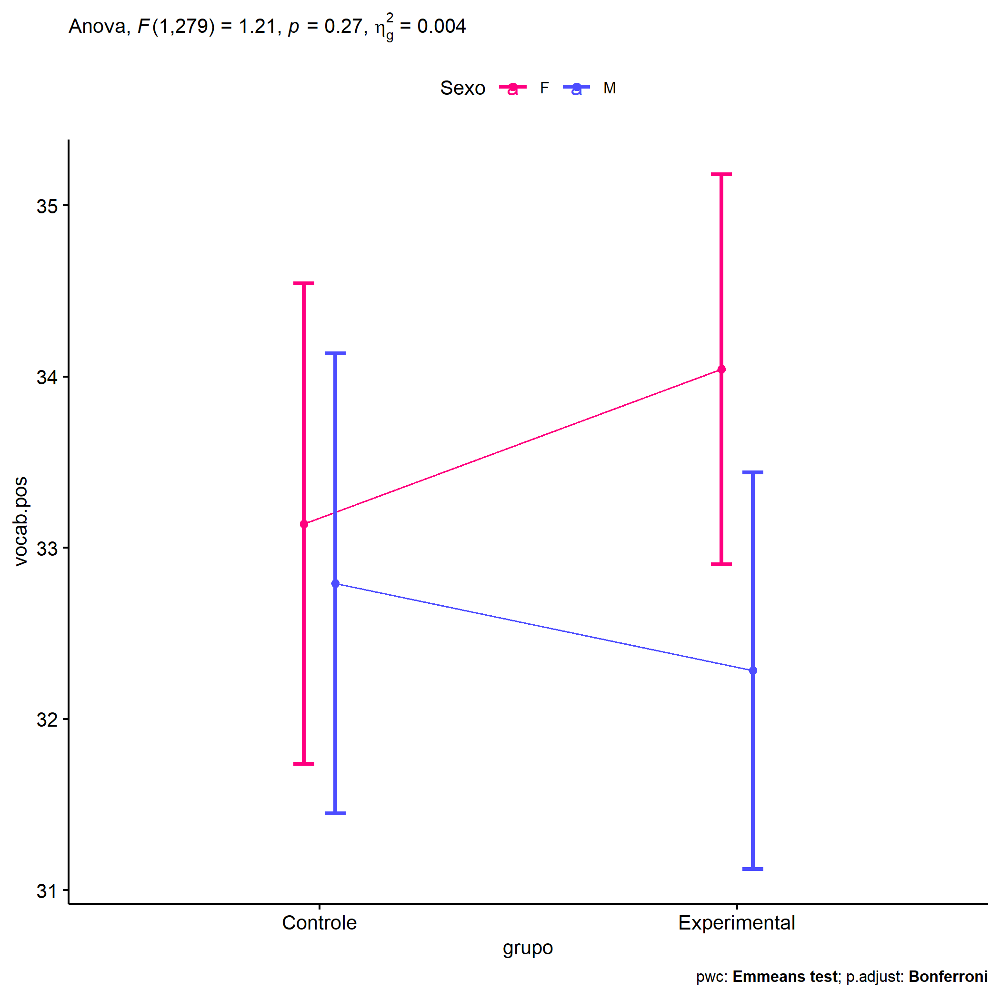<!-- -->

``` r
if (!is.null(plots[["Sexo"]]))
  plots[["Sexo"]] + ggplot2::scale_color_manual(values = color[["grupo"]])
```

    ## Scale for colour is already present.
    ## Adding another scale for colour, which will replace the existing scale.

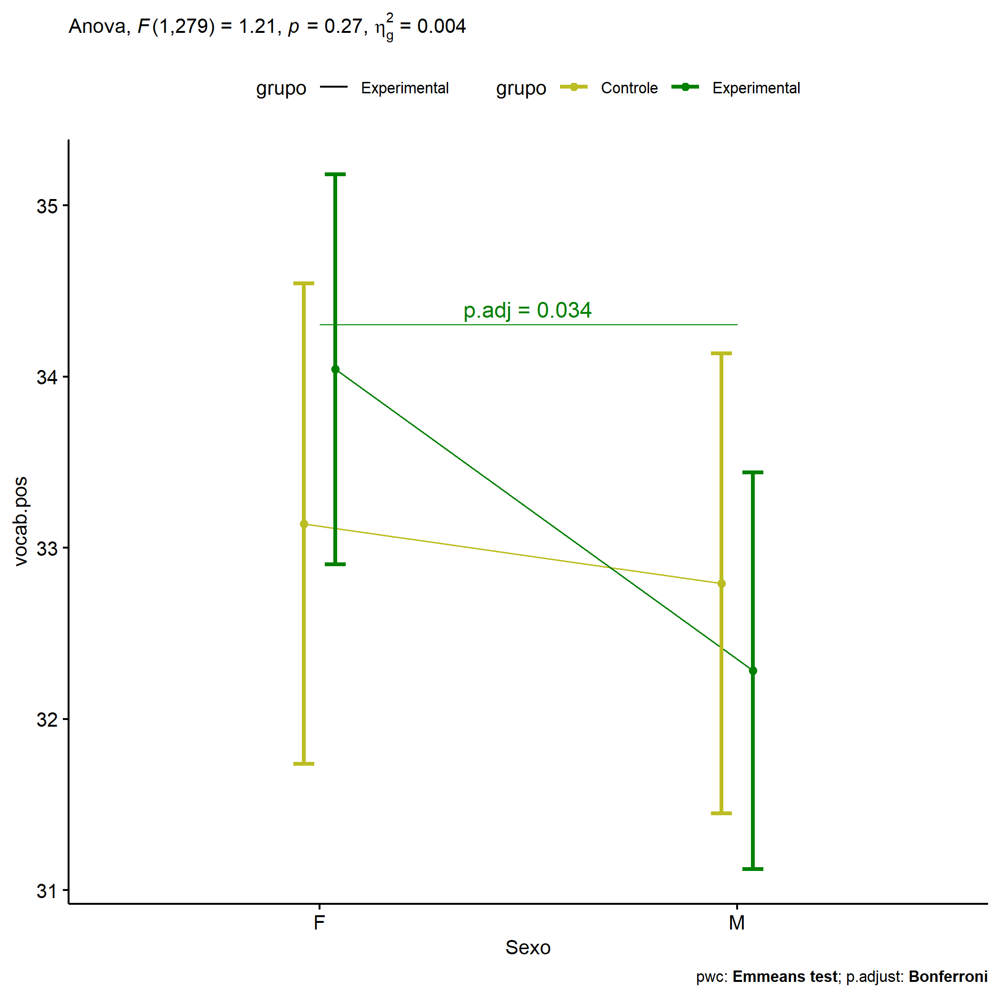<!-- -->

``` r
plots <- twoWayAncovaBoxPlots(
  wdat, "vocab.pos", c("grupo","Sexo"), aov, pwcs, covar = "vocab.pre",
  theme = "classic", color = color[["grupo:Sexo"]],
  subtitle = which(aov$Effect == "grupo:Sexo"))
```

``` r
plots[["grupo:Sexo"]] + ggplot2::ylab("Vocabulario") + ggplot2::scale_x_discrete(labels=c('pre', 'pos'))
```

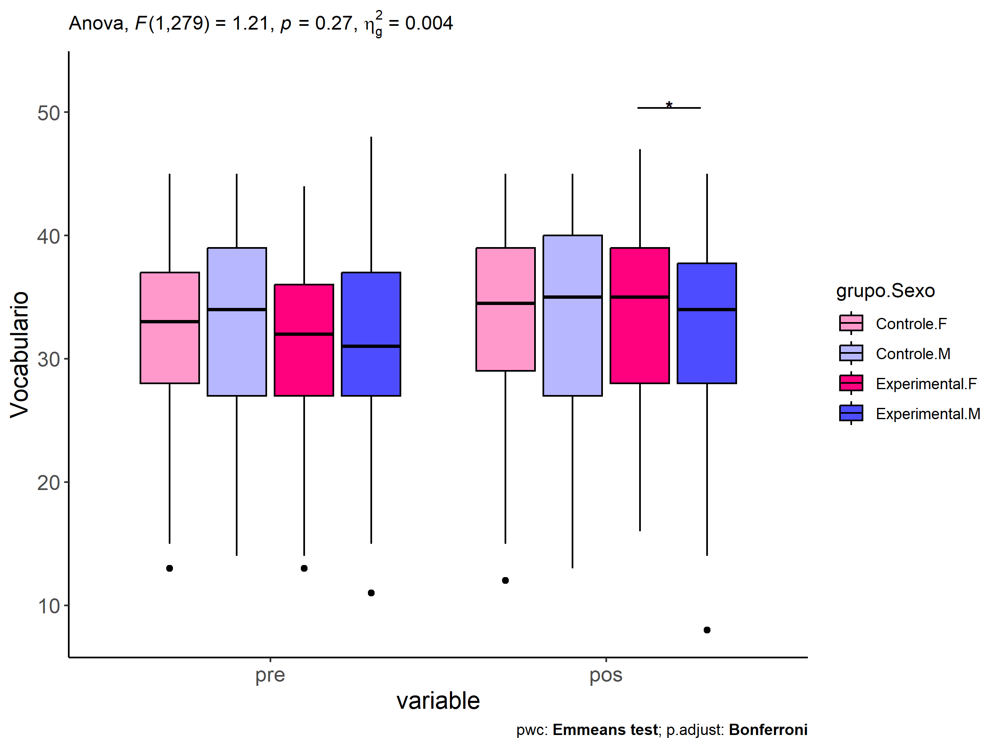<!-- -->

``` r
plots <- twoWayAncovaBoxPlots(
  wdat.long, "vocab", c("grupo","Sexo"), aov, pwc.long, pre.post = "time",
  theme = "classic", color = color$prepost)
```

``` r
plots[["grupo:Sexo"]] + ggplot2::ylab("Vocabulario")
```

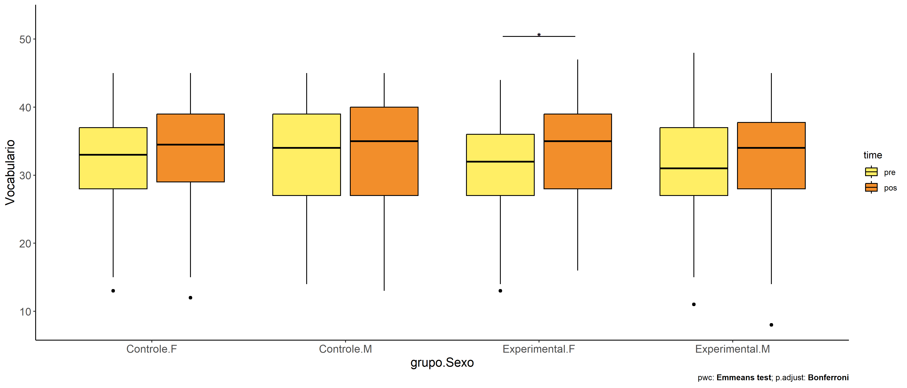<!-- -->

### Checking linearity assumption

``` r
ggscatter(wdat, x = "vocab.pre", y = "vocab.pos", size = 0.5,
          facet.by = c("grupo","Sexo"), add = "reg.line")+
  stat_regline_equation(
    aes(label =  paste(..eq.label.., ..rr.label.., sep = "~~~~"))
  )
```

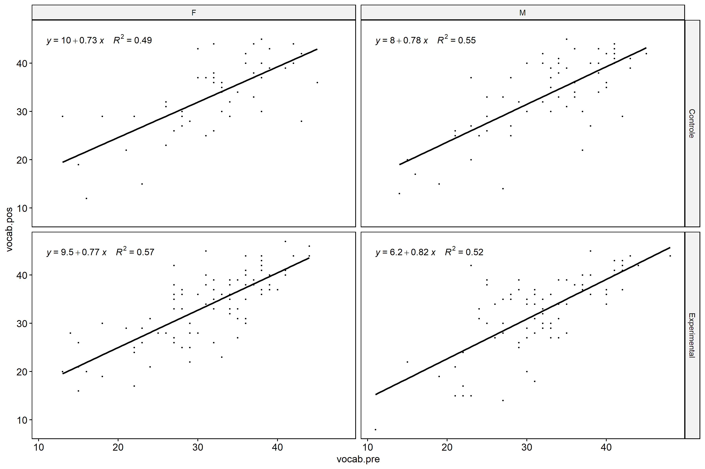<!-- -->

### Checking normality and homogeneity

``` r
res <- augment(lm(vocab.pos ~ vocab.pre + grupo*Sexo, data = wdat))
```

``` r
shapiro_test(res$.resid)
```

    ## # A tibble: 1 × 3
    ##   variable   statistic p.value
    ##   <chr>          <dbl>   <dbl>
    ## 1 res$.resid     0.991  0.0914

``` r
levene_test(res, .resid ~ grupo*Sexo)
```

    ## # A tibble: 1 × 4
    ##     df1   df2 statistic     p
    ##   <int> <int>     <dbl> <dbl>
    ## 1     3   280     0.195 0.900

# ANCOVA and Pairwise for two factors **grupo:Zona**

## Without remove non-normal data

``` r
pdat = remove_group_data(dat[!is.na(dat[["grupo"]]) & !is.na(dat[["Zona"]]),], "vocab.pos", c("grupo","Zona"))

pdat.long <- rbind(pdat[,c("id","grupo","Zona")], pdat[,c("id","grupo","Zona")])
pdat.long[["time"]] <- c(rep("pre", nrow(pdat)), rep("pos", nrow(pdat)))
pdat.long[["time"]] <- factor(pdat.long[["time"]], c("pre","pos"))
pdat.long[["vocab"]] <- c(pdat[["vocab.pre"]], pdat[["vocab.pos"]])

aov = anova_test(pdat, vocab.pos ~ vocab.pre + grupo*Zona)
laov[["grupo:Zona"]] <- get_anova_table(aov)
```

``` r
pwcs <- list()
pwcs[["Zona"]] <- emmeans_test(
  group_by(pdat, grupo), vocab.pos ~ Zona,
  covariate = vocab.pre, p.adjust.method = "bonferroni")
pwcs[["grupo"]] <- emmeans_test(
  group_by(pdat, Zona), vocab.pos ~ grupo,
  covariate = vocab.pre, p.adjust.method = "bonferroni")

pwc <- plyr::rbind.fill(pwcs[["grupo"]], pwcs[["Zona"]])
pwc <- pwc[,c("grupo","Zona", colnames(pwc)[!colnames(pwc) %in% c("grupo","Zona")])]
```

``` r
pwc.long <- emmeans_test(dplyr::group_by_at(pdat.long, c("grupo","Zona")),
                         vocab ~ time,
                         p.adjust.method = "bonferroni")
lpwc[["grupo:Zona"]] <- plyr::rbind.fill(pwc, pwc.long)
```

``` r
ds <- get.descriptives(pdat, "vocab.pos", c("grupo","Zona"), covar = "vocab.pre")
ds <- merge(ds[ds$variable != "vocab.pre",],
            ds[ds$variable == "vocab.pre", !colnames(ds) %in% c("variable")],
            by = c("grupo","Zona"), all.x = T, suffixes = c("", ".vocab.pre"))
ds <- merge(get_emmeans(pwcs[["grupo"]]), ds, by = c("grupo","Zona"), suffixes = c(".emms", ""))
ds <- ds[,c("grupo","Zona","n","mean.vocab.pre","se.vocab.pre","mean","se","emmean","se.emms")]

colnames(ds) <- c("grupo","Zona", "N", paste0(c("M","SE")," (pre)"),
                  paste0(c("M","SE"), " (unadj)"), paste0(c("M", "SE"), " (adj)"))

lemms[["grupo:Zona"]] <- ds
```

## Computing ANCOVA and PairWise After removing non-normal data (OK)

``` r
wdat = pdat 

res = residuals(lm(vocab.pos ~ vocab.pre + grupo*Zona, data = wdat))
non.normal = getNonNormal(res, wdat$id, plimit = 0.05)

wdat = wdat[!wdat$id %in% non.normal,]

wdat.long <- rbind(wdat[,c("id","grupo","Zona")], wdat[,c("id","grupo","Zona")])
wdat.long[["time"]] <- c(rep("pre", nrow(wdat)), rep("pos", nrow(wdat)))
wdat.long[["time"]] <- factor(wdat.long[["time"]], c("pre","pos"))
wdat.long[["vocab"]] <- c(wdat[["vocab.pre"]], wdat[["vocab.pos"]])


ldat[["grupo:Zona"]] = wdat

(non.normal)
```

    ## [1] "P1139" "P2304"

``` r
aov = anova_test(wdat, vocab.pos ~ vocab.pre + grupo*Zona)
laov[["grupo:Zona"]] <- merge(get_anova_table(aov), laov[["grupo:Zona"]], by="Effect", suffixes = c("","'"))

(df = get_anova_table(aov))
```

    ## ANOVA Table (type II tests)
    ## 
    ##       Effect DFn DFd       F        p p<.05   ges
    ## 1  vocab.pre   1 156 219.744 1.38e-31     * 0.585
    ## 2      grupo   1 156   0.337 5.62e-01       0.002
    ## 3       Zona   1 156   5.437 2.10e-02     * 0.034
    ## 4 grupo:Zona   1 156   1.332 2.50e-01       0.008

| Effect     | DFn | DFd |       F |     p | p\<.05 |   ges |
|:-----------|----:|----:|--------:|------:|:-------|------:|
| vocab.pre  |   1 | 156 | 219.744 | 0.000 | \*     | 0.585 |
| grupo      |   1 | 156 |   0.337 | 0.562 |        | 0.002 |
| Zona       |   1 | 156 |   5.437 | 0.021 | \*     | 0.034 |
| grupo:Zona |   1 | 156 |   1.332 | 0.250 |        | 0.008 |

``` r
pwcs <- list()
pwcs[["Zona"]] <- emmeans_test(
  group_by(wdat, grupo), vocab.pos ~ Zona,
  covariate = vocab.pre, p.adjust.method = "bonferroni")
pwcs[["grupo"]] <- emmeans_test(
  group_by(wdat, Zona), vocab.pos ~ grupo,
  covariate = vocab.pre, p.adjust.method = "bonferroni")

pwc <- plyr::rbind.fill(pwcs[["grupo"]], pwcs[["Zona"]])
pwc <- pwc[,c("grupo","Zona", colnames(pwc)[!colnames(pwc) %in% c("grupo","Zona")])]
```

| grupo        | Zona   | term             | .y.       | group1   | group2       |  df | statistic |     p | p.adj | p.adj.signif |
|:-------------|:-------|:-----------------|:----------|:---------|:-------------|----:|----------:|------:|------:|:-------------|
|              | Rural  | vocab.pre\*grupo | vocab.pos | Controle | Experimental | 156 |     1.138 | 0.257 | 0.257 | ns           |
|              | Urbana | vocab.pre\*grupo | vocab.pos | Controle | Experimental | 156 |    -0.605 | 0.546 | 0.546 | ns           |
| Controle     |        | vocab.pre\*Zona  | vocab.pos | Rural    | Urbana       | 156 |     2.278 | 0.024 | 0.024 | \*           |
| Experimental |        | vocab.pre\*Zona  | vocab.pos | Rural    | Urbana       | 156 |     1.265 | 0.208 | 0.208 | ns           |

``` r
pwc.long <- emmeans_test(dplyr::group_by_at(wdat.long, c("grupo","Zona")),
                         vocab ~ time,
                         p.adjust.method = "bonferroni")
lpwc[["grupo:Zona"]] <- merge(plyr::rbind.fill(pwc, pwc.long), lpwc[["grupo:Zona"]], by=c("grupo","Zona","term",".y.","group1","group2"), suffixes = c("","'"))
```

| grupo        | Zona   | term | .y.   | group1 | group2 |  df | statistic |     p | p.adj | p.adj.signif |
|:-------------|:-------|:-----|:------|:-------|:-------|----:|----------:|------:|------:|:-------------|
| Controle     | Rural  | time | vocab | pre    | pos    | 314 |    -2.121 | 0.035 | 0.035 | \*           |
| Controle     | Urbana | time | vocab | pre    | pos    | 314 |     0.022 | 0.982 | 0.982 | ns           |
| Experimental | Rural  | time | vocab | pre    | pos    | 314 |    -1.952 | 0.052 | 0.052 | ns           |
| Experimental | Urbana | time | vocab | pre    | pos    | 314 |    -0.745 | 0.457 | 0.457 | ns           |

``` r
ds <- get.descriptives(wdat, "vocab.pos", c("grupo","Zona"), covar = "vocab.pre")
ds <- merge(ds[ds$variable != "vocab.pre",],
            ds[ds$variable == "vocab.pre", !colnames(ds) %in% c("variable")],
            by = c("grupo","Zona"), all.x = T, suffixes = c("", ".vocab.pre"))
ds <- merge(get_emmeans(pwcs[["grupo"]]), ds, by = c("grupo","Zona"), suffixes = c(".emms", ""))
ds <- ds[,c("grupo","Zona","n","mean.vocab.pre","se.vocab.pre","mean","se","emmean","se.emms")]

colnames(ds) <- c("grupo","Zona", "N", paste0(c("M","SE")," (pre)"),
                  paste0(c("M","SE"), " (unadj)"), paste0(c("M", "SE"), " (adj)"))

lemms[["grupo:Zona"]] <- merge(ds, lemms[["grupo:Zona"]], by=c("grupo","Zona"), suffixes = c("","'"))
```

| grupo        | Zona   |   N | M (pre) | SE (pre) | M (unadj) | SE (unadj) | M (adj) | SE (adj) |
|:-------------|:-------|----:|--------:|---------:|----------:|-----------:|--------:|---------:|
| Controle     | Rural  |  41 |  31.829 |    0.985 |    35.488 |      1.213 |  35.150 |    0.797 |
| Controle     | Urbana |  17 |  33.471 |    1.770 |    33.412 |      2.027 |  31.792 |    1.243 |
| Experimental | Rural  |  60 |  30.433 |    1.027 |    33.217 |      1.031 |  33.970 |    0.661 |
| Experimental | Urbana |  43 |  31.512 |    1.331 |    32.767 |      1.175 |  32.678 |    0.778 |

### Plots for ancova

``` r
plots <- twoWayAncovaPlots(
  wdat, "vocab.pos", c("grupo","Zona"), aov, pwcs, addParam = c("mean_se"),
  font.label.size=10, step.increase=0.05, p.label="p.adj",
  subtitle = which(aov$Effect == "grupo:Zona"))
```

``` r
if (!is.null(plots[["grupo"]]))
  plots[["grupo"]] + ggplot2::scale_color_manual(values = color[["Zona"]])
```

    ## Scale for colour is already present.
    ## Adding another scale for colour, which will replace the existing scale.

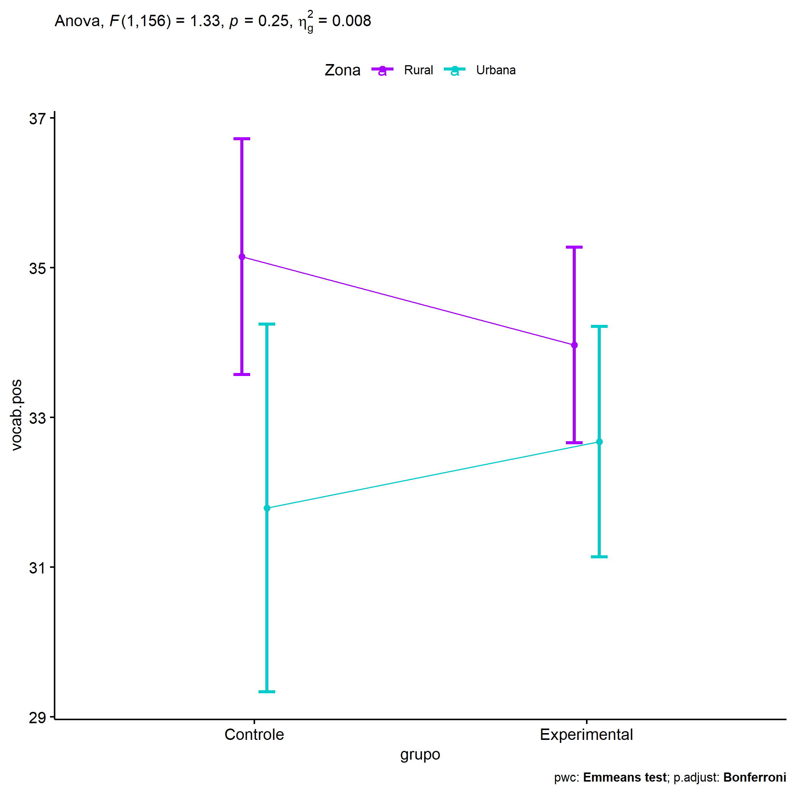<!-- -->

``` r
if (!is.null(plots[["Zona"]]))
  plots[["Zona"]] + ggplot2::scale_color_manual(values = color[["grupo"]])
```

    ## Scale for colour is already present.
    ## Adding another scale for colour, which will replace the existing scale.

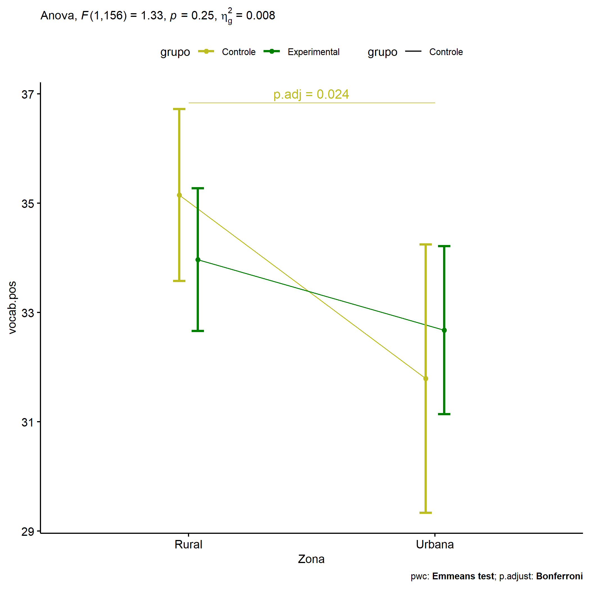<!-- -->

``` r
plots <- twoWayAncovaBoxPlots(
  wdat, "vocab.pos", c("grupo","Zona"), aov, pwcs, covar = "vocab.pre",
  theme = "classic", color = color[["grupo:Zona"]],
  subtitle = which(aov$Effect == "grupo:Zona"))
```

``` r
plots[["grupo:Zona"]] + ggplot2::ylab("Vocabulario") + ggplot2::scale_x_discrete(labels=c('pre', 'pos'))
```

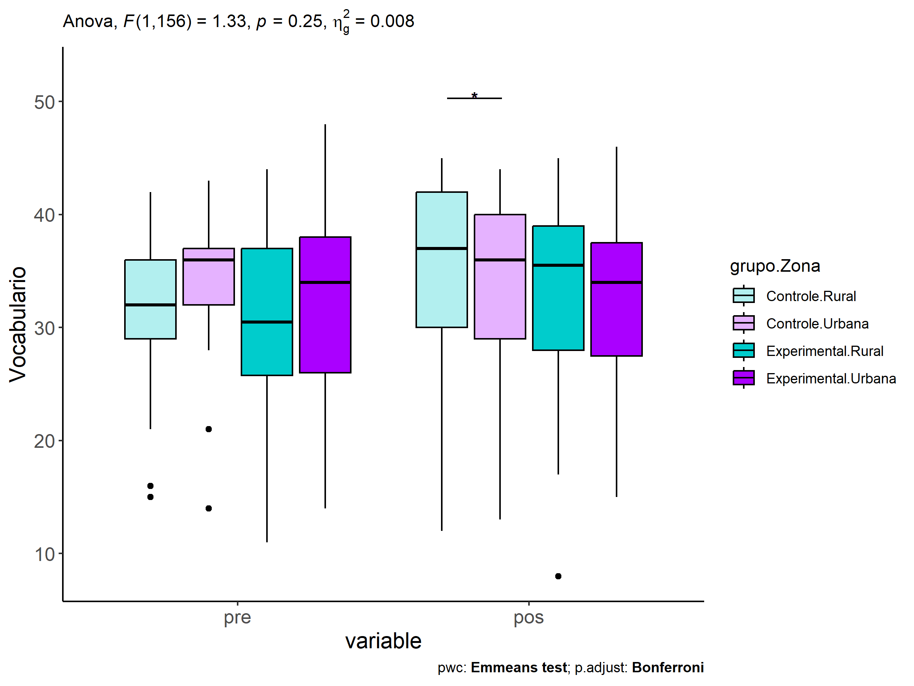<!-- -->

``` r
plots <- twoWayAncovaBoxPlots(
  wdat.long, "vocab", c("grupo","Zona"), aov, pwc.long, pre.post = "time",
  theme = "classic", color = color$prepost)
```

``` r
plots[["grupo:Zona"]] + ggplot2::ylab("Vocabulario")
```

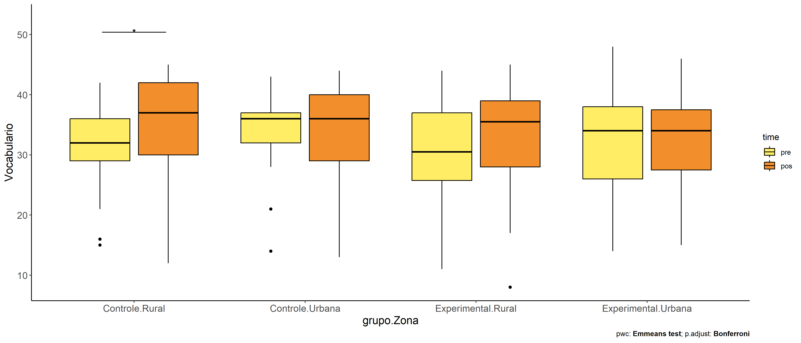<!-- -->

### Checking linearity assumption

``` r
ggscatter(wdat, x = "vocab.pre", y = "vocab.pos", size = 0.5,
          facet.by = c("grupo","Zona"), add = "reg.line")+
  stat_regline_equation(
    aes(label =  paste(..eq.label.., ..rr.label.., sep = "~~~~"))
  )
```

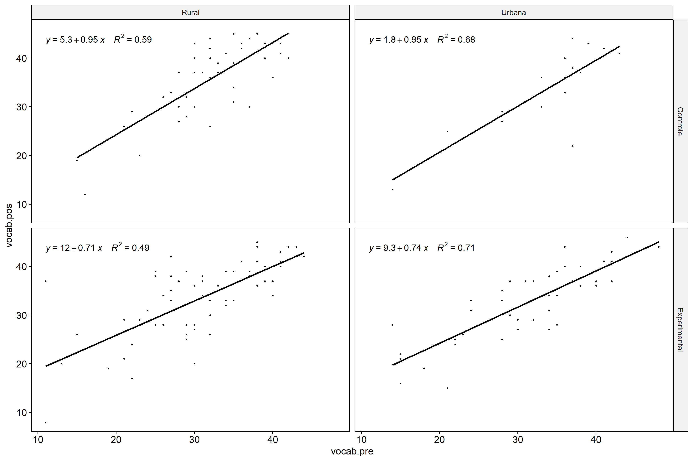<!-- -->

### Checking normality and homogeneity

``` r
res <- augment(lm(vocab.pos ~ vocab.pre + grupo*Zona, data = wdat))
```

``` r
shapiro_test(res$.resid)
```

    ## # A tibble: 1 × 3
    ##   variable   statistic p.value
    ##   <chr>          <dbl>   <dbl>
    ## 1 res$.resid     0.989   0.260

``` r
levene_test(res, .resid ~ grupo*Zona)
```

    ## # A tibble: 1 × 4
    ##     df1   df2 statistic     p
    ##   <int> <int>     <dbl> <dbl>
    ## 1     3   157      1.19 0.316

# ANCOVA and Pairwise for two factors **grupo:Cor.Raca**

## Without remove non-normal data

``` r
pdat = remove_group_data(dat[!is.na(dat[["grupo"]]) & !is.na(dat[["Cor.Raca"]]),], "vocab.pos", c("grupo","Cor.Raca"))

pdat.long <- rbind(pdat[,c("id","grupo","Cor.Raca")], pdat[,c("id","grupo","Cor.Raca")])
pdat.long[["time"]] <- c(rep("pre", nrow(pdat)), rep("pos", nrow(pdat)))
pdat.long[["time"]] <- factor(pdat.long[["time"]], c("pre","pos"))
pdat.long[["vocab"]] <- c(pdat[["vocab.pre"]], pdat[["vocab.pos"]])

aov = anova_test(pdat, vocab.pos ~ vocab.pre + grupo*Cor.Raca)
laov[["grupo:Cor.Raca"]] <- get_anova_table(aov)
```

``` r
pwcs <- list()
pwcs[["Cor.Raca"]] <- emmeans_test(
  group_by(pdat, grupo), vocab.pos ~ Cor.Raca,
  covariate = vocab.pre, p.adjust.method = "bonferroni")
pwcs[["grupo"]] <- emmeans_test(
  group_by(pdat, Cor.Raca), vocab.pos ~ grupo,
  covariate = vocab.pre, p.adjust.method = "bonferroni")

pwc <- plyr::rbind.fill(pwcs[["grupo"]], pwcs[["Cor.Raca"]])
pwc <- pwc[,c("grupo","Cor.Raca", colnames(pwc)[!colnames(pwc) %in% c("grupo","Cor.Raca")])]
```

``` r
pwc.long <- emmeans_test(dplyr::group_by_at(pdat.long, c("grupo","Cor.Raca")),
                         vocab ~ time,
                         p.adjust.method = "bonferroni")
lpwc[["grupo:Cor.Raca"]] <- plyr::rbind.fill(pwc, pwc.long)
```

``` r
ds <- get.descriptives(pdat, "vocab.pos", c("grupo","Cor.Raca"), covar = "vocab.pre")
ds <- merge(ds[ds$variable != "vocab.pre",],
            ds[ds$variable == "vocab.pre", !colnames(ds) %in% c("variable")],
            by = c("grupo","Cor.Raca"), all.x = T, suffixes = c("", ".vocab.pre"))
ds <- merge(get_emmeans(pwcs[["grupo"]]), ds, by = c("grupo","Cor.Raca"), suffixes = c(".emms", ""))
ds <- ds[,c("grupo","Cor.Raca","n","mean.vocab.pre","se.vocab.pre","mean","se","emmean","se.emms")]

colnames(ds) <- c("grupo","Cor.Raca", "N", paste0(c("M","SE")," (pre)"),
                  paste0(c("M","SE"), " (unadj)"), paste0(c("M", "SE"), " (adj)"))

lemms[["grupo:Cor.Raca"]] <- ds
```

## Computing ANCOVA and PairWise After removing non-normal data (OK)

``` r
wdat = pdat 

res = residuals(lm(vocab.pos ~ vocab.pre + grupo*Cor.Raca, data = wdat))
non.normal = getNonNormal(res, wdat$id, plimit = 0.05)

wdat = wdat[!wdat$id %in% non.normal,]

wdat.long <- rbind(wdat[,c("id","grupo","Cor.Raca")], wdat[,c("id","grupo","Cor.Raca")])
wdat.long[["time"]] <- c(rep("pre", nrow(wdat)), rep("pos", nrow(wdat)))
wdat.long[["time"]] <- factor(wdat.long[["time"]], c("pre","pos"))
wdat.long[["vocab"]] <- c(wdat[["vocab.pre"]], wdat[["vocab.pos"]])


ldat[["grupo:Cor.Raca"]] = wdat

(non.normal)
```

    ## [1] "P1113" "P1139" "P3260" "P3265" "P1112"

``` r
aov = anova_test(wdat, vocab.pos ~ vocab.pre + grupo*Cor.Raca)
laov[["grupo:Cor.Raca"]] <- merge(get_anova_table(aov), laov[["grupo:Cor.Raca"]], by="Effect", suffixes = c("","'"))

(df = get_anova_table(aov))
```

    ## ANOVA Table (type II tests)
    ## 
    ##           Effect DFn DFd       F        p p<.05   ges
    ## 1      vocab.pre   1 106 168.326 1.27e-23     * 0.614
    ## 2          grupo   1 106   0.403 5.27e-01       0.004
    ## 3       Cor.Raca   1 106   1.734 1.91e-01       0.016
    ## 4 grupo:Cor.Raca   1 106   2.645 1.07e-01       0.024

| Effect         | DFn | DFd |       F |     p | p\<.05 |   ges |
|:---------------|----:|----:|--------:|------:|:-------|------:|
| vocab.pre      |   1 | 106 | 168.326 | 0.000 | \*     | 0.614 |
| grupo          |   1 | 106 |   0.403 | 0.527 |        | 0.004 |
| Cor.Raca       |   1 | 106 |   1.734 | 0.191 |        | 0.016 |
| grupo:Cor.Raca |   1 | 106 |   2.645 | 0.107 |        | 0.024 |

``` r
pwcs <- list()
pwcs[["Cor.Raca"]] <- emmeans_test(
  group_by(wdat, grupo), vocab.pos ~ Cor.Raca,
  covariate = vocab.pre, p.adjust.method = "bonferroni")
pwcs[["grupo"]] <- emmeans_test(
  group_by(wdat, Cor.Raca), vocab.pos ~ grupo,
  covariate = vocab.pre, p.adjust.method = "bonferroni")

pwc <- plyr::rbind.fill(pwcs[["grupo"]], pwcs[["Cor.Raca"]])
pwc <- pwc[,c("grupo","Cor.Raca", colnames(pwc)[!colnames(pwc) %in% c("grupo","Cor.Raca")])]
```

| grupo        | Cor.Raca | term                | .y.       | group1   | group2       |  df | statistic |     p | p.adj | p.adj.signif |
|:-------------|:---------|:--------------------|:----------|:---------|:-------------|----:|----------:|------:|------:|:-------------|
|              | Branca   | vocab.pre\*grupo    | vocab.pos | Controle | Experimental | 106 |     1.224 | 0.224 | 0.224 | ns           |
|              | Parda    | vocab.pre\*grupo    | vocab.pos | Controle | Experimental | 106 |    -1.246 | 0.216 | 0.216 | ns           |
| Controle     |          | vocab.pre\*Cor.Raca | vocab.pos | Branca   | Parda        | 106 |     2.093 | 0.039 | 0.039 | \*           |
| Experimental |          | vocab.pre\*Cor.Raca | vocab.pos | Branca   | Parda        | 106 |     0.064 | 0.949 | 0.949 | ns           |

``` r
pwc.long <- emmeans_test(dplyr::group_by_at(wdat.long, c("grupo","Cor.Raca")),
                         vocab ~ time,
                         p.adjust.method = "bonferroni")
lpwc[["grupo:Cor.Raca"]] <- merge(plyr::rbind.fill(pwc, pwc.long), lpwc[["grupo:Cor.Raca"]], by=c("grupo","Cor.Raca","term",".y.","group1","group2"), suffixes = c("","'"))
```

| grupo        | Cor.Raca | term | .y.   | group1 | group2 |  df | statistic |     p | p.adj | p.adj.signif |
|:-------------|:---------|:-----|:------|:-------|:-------|----:|----------:|------:|------:|:-------------|
| Controle     | Branca   | time | vocab | pre    | pos    | 214 |    -1.232 | 0.219 | 0.219 | ns           |
| Controle     | Parda    | time | vocab | pre    | pos    | 214 |    -0.704 | 0.482 | 0.482 | ns           |
| Experimental | Branca   | time | vocab | pre    | pos    | 214 |    -0.709 | 0.479 | 0.479 | ns           |
| Experimental | Parda    | time | vocab | pre    | pos    | 214 |    -1.671 | 0.096 | 0.096 | ns           |

``` r
ds <- get.descriptives(wdat, "vocab.pos", c("grupo","Cor.Raca"), covar = "vocab.pre")
ds <- merge(ds[ds$variable != "vocab.pre",],
            ds[ds$variable == "vocab.pre", !colnames(ds) %in% c("variable")],
            by = c("grupo","Cor.Raca"), all.x = T, suffixes = c("", ".vocab.pre"))
ds <- merge(get_emmeans(pwcs[["grupo"]]), ds, by = c("grupo","Cor.Raca"), suffixes = c(".emms", ""))
ds <- ds[,c("grupo","Cor.Raca","n","mean.vocab.pre","se.vocab.pre","mean","se","emmean","se.emms")]

colnames(ds) <- c("grupo","Cor.Raca", "N", paste0(c("M","SE")," (pre)"),
                  paste0(c("M","SE"), " (unadj)"), paste0(c("M", "SE"), " (adj)"))

lemms[["grupo:Cor.Raca"]] <- merge(ds, lemms[["grupo:Cor.Raca"]], by=c("grupo","Cor.Raca"), suffixes = c("","'"))
```

| grupo        | Cor.Raca |   N | M (pre) | SE (pre) | M (unadj) | SE (unadj) | M (adj) | SE (adj) |
|:-------------|:---------|----:|--------:|---------:|----------:|-----------:|--------:|---------:|
| Controle     | Branca   |   7 |  34.000 |    1.480 |    39.286 |      1.209 |  36.354 |    2.006 |
| Controle     | Parda    |  44 |  30.591 |    1.097 |    31.795 |      1.265 |  31.838 |    0.795 |
| Experimental | Branca   |  13 |  34.231 |    1.791 |    36.462 |      2.120 |  33.328 |    1.482 |
| Experimental | Parda    |  47 |  29.191 |    1.232 |    31.957 |      1.332 |  33.221 |    0.775 |

### Plots for ancova

``` r
plots <- twoWayAncovaPlots(
  wdat, "vocab.pos", c("grupo","Cor.Raca"), aov, pwcs, addParam = c("mean_se"),
  font.label.size=10, step.increase=0.05, p.label="p.adj",
  subtitle = which(aov$Effect == "grupo:Cor.Raca"))
```

``` r
if (!is.null(plots[["grupo"]]))
  plots[["grupo"]] + ggplot2::scale_color_manual(values = color[["Cor.Raca"]])
```

    ## Scale for colour is already present.
    ## Adding another scale for colour, which will replace the existing scale.

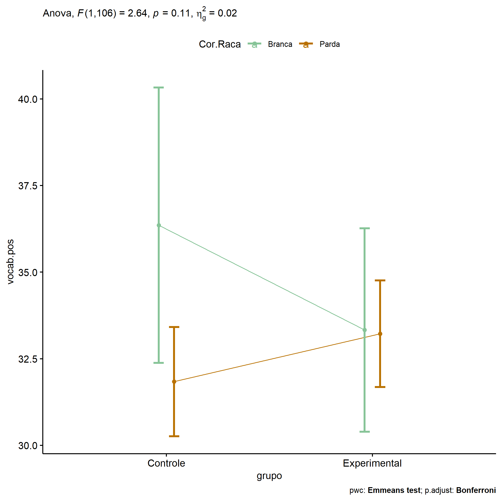<!-- -->

``` r
if (!is.null(plots[["Cor.Raca"]]))
  plots[["Cor.Raca"]] + ggplot2::scale_color_manual(values = color[["grupo"]])
```

    ## Scale for colour is already present.
    ## Adding another scale for colour, which will replace the existing scale.

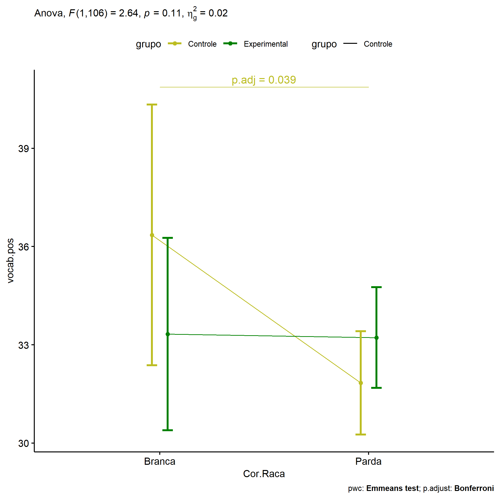<!-- -->

``` r
plots <- twoWayAncovaBoxPlots(
  wdat, "vocab.pos", c("grupo","Cor.Raca"), aov, pwcs, covar = "vocab.pre",
  theme = "classic", color = color[["grupo:Cor.Raca"]],
  subtitle = which(aov$Effect == "grupo:Cor.Raca"))
```

``` r
plots[["grupo:Cor.Raca"]] + ggplot2::ylab("Vocabulario") + ggplot2::scale_x_discrete(labels=c('pre', 'pos'))
```

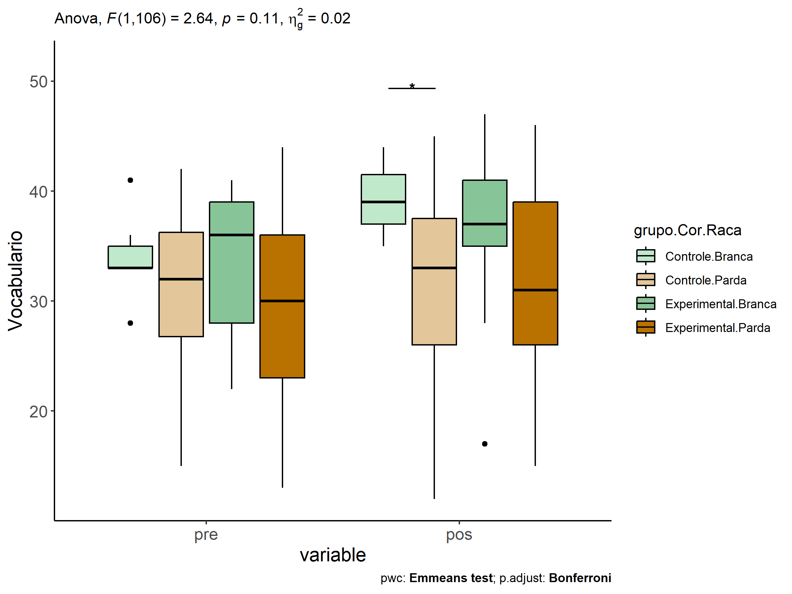<!-- -->

``` r
plots <- twoWayAncovaBoxPlots(
  wdat.long, "vocab", c("grupo","Cor.Raca"), aov, pwc.long, pre.post = "time",
  theme = "classic", color = color$prepost)
```

``` r
plots[["grupo:Cor.Raca"]] + ggplot2::ylab("Vocabulario")
```

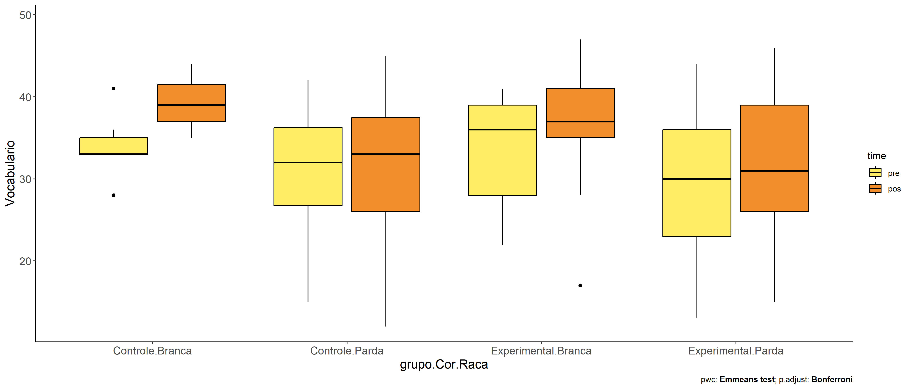<!-- -->

### Checking linearity assumption

``` r
ggscatter(wdat, x = "vocab.pre", y = "vocab.pos", size = 0.5,
          facet.by = c("grupo","Cor.Raca"), add = "reg.line")+
  stat_regline_equation(
    aes(label =  paste(..eq.label.., ..rr.label.., sep = "~~~~"))
  )
```

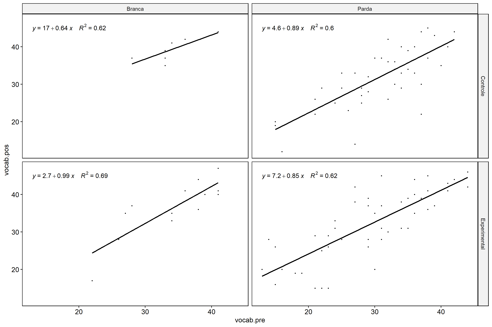<!-- -->

### Checking normality and homogeneity

``` r
res <- augment(lm(vocab.pos ~ vocab.pre + grupo*Cor.Raca, data = wdat))
```

``` r
shapiro_test(res$.resid)
```

    ## # A tibble: 1 × 3
    ##   variable   statistic p.value
    ##   <chr>          <dbl>   <dbl>
    ## 1 res$.resid     0.982   0.149

``` r
levene_test(res, .resid ~ grupo*Cor.Raca)
```

    ## # A tibble: 1 × 4
    ##     df1   df2 statistic     p
    ##   <int> <int>     <dbl> <dbl>
    ## 1     3   107      1.66 0.180

# ANCOVA and Pairwise for two factors **grupo:vocab.quintile**

## Without remove non-normal data

``` r
pdat = remove_group_data(dat[!is.na(dat[["grupo"]]) & !is.na(dat[["vocab.quintile"]]),], "vocab.pos", c("grupo","vocab.quintile"))

pdat.long <- rbind(pdat[,c("id","grupo","vocab.quintile")], pdat[,c("id","grupo","vocab.quintile")])
pdat.long[["time"]] <- c(rep("pre", nrow(pdat)), rep("pos", nrow(pdat)))
pdat.long[["time"]] <- factor(pdat.long[["time"]], c("pre","pos"))
pdat.long[["vocab"]] <- c(pdat[["vocab.pre"]], pdat[["vocab.pos"]])

aov = anova_test(pdat, vocab.pos ~ vocab.pre + grupo*vocab.quintile)
laov[["grupo:vocab.quintile"]] <- get_anova_table(aov)
```

``` r
pwcs <- list()
pwcs[["vocab.quintile"]] <- emmeans_test(
  group_by(pdat, grupo), vocab.pos ~ vocab.quintile,
  covariate = vocab.pre, p.adjust.method = "bonferroni")
pwcs[["grupo"]] <- emmeans_test(
  group_by(pdat, vocab.quintile), vocab.pos ~ grupo,
  covariate = vocab.pre, p.adjust.method = "bonferroni")

pwc <- plyr::rbind.fill(pwcs[["grupo"]], pwcs[["vocab.quintile"]])
pwc <- pwc[,c("grupo","vocab.quintile", colnames(pwc)[!colnames(pwc) %in% c("grupo","vocab.quintile")])]
```

``` r
pwc.long <- emmeans_test(dplyr::group_by_at(pdat.long, c("grupo","vocab.quintile")),
                         vocab ~ time,
                         p.adjust.method = "bonferroni")
lpwc[["grupo:vocab.quintile"]] <- plyr::rbind.fill(pwc, pwc.long)
```

``` r
ds <- get.descriptives(pdat, "vocab.pos", c("grupo","vocab.quintile"), covar = "vocab.pre")
ds <- merge(ds[ds$variable != "vocab.pre",],
            ds[ds$variable == "vocab.pre", !colnames(ds) %in% c("variable")],
            by = c("grupo","vocab.quintile"), all.x = T, suffixes = c("", ".vocab.pre"))
ds <- merge(get_emmeans(pwcs[["grupo"]]), ds, by = c("grupo","vocab.quintile"), suffixes = c(".emms", ""))
ds <- ds[,c("grupo","vocab.quintile","n","mean.vocab.pre","se.vocab.pre","mean","se","emmean","se.emms")]

colnames(ds) <- c("grupo","vocab.quintile", "N", paste0(c("M","SE")," (pre)"),
                  paste0(c("M","SE"), " (unadj)"), paste0(c("M", "SE"), " (adj)"))

lemms[["grupo:vocab.quintile"]] <- ds
```

## Computing ANCOVA and PairWise After removing non-normal data (OK)

``` r
wdat = pdat 

res = residuals(lm(vocab.pos ~ vocab.pre + grupo*vocab.quintile, data = wdat))
non.normal = getNonNormal(res, wdat$id, plimit = 0.05)

wdat = wdat[!wdat$id %in% non.normal,]

wdat.long <- rbind(wdat[,c("id","grupo","vocab.quintile")], wdat[,c("id","grupo","vocab.quintile")])
wdat.long[["time"]] <- c(rep("pre", nrow(wdat)), rep("pos", nrow(wdat)))
wdat.long[["time"]] <- factor(wdat.long[["time"]], c("pre","pos"))
wdat.long[["vocab"]] <- c(wdat[["vocab.pre"]], wdat[["vocab.pos"]])


ldat[["grupo:vocab.quintile"]] = wdat

(non.normal)
```

    ## [1] "P1139" "P1113" "P2304" "P1129" "P3265"

``` r
aov = anova_test(wdat, vocab.pos ~ vocab.pre + grupo*vocab.quintile)
laov[["grupo:vocab.quintile"]] <- merge(get_anova_table(aov), laov[["grupo:vocab.quintile"]], by="Effect", suffixes = c("","'"))

(df = get_anova_table(aov))
```

    ## ANOVA Table (type II tests)
    ## 
    ##                 Effect DFn DFd     F     p p<.05   ges
    ## 1            vocab.pre   1 273 9.393 0.002     * 0.033
    ## 2                grupo   1 273 0.369 0.544       0.001
    ## 3       vocab.quintile   4 273 2.461 0.046     * 0.035
    ## 4 grupo:vocab.quintile   4 273 3.840 0.005     * 0.053

| Effect               | DFn | DFd |     F |     p | p\<.05 |   ges |
|:---------------------|----:|----:|------:|------:|:-------|------:|
| vocab.pre            |   1 | 273 | 9.393 | 0.002 | \*     | 0.033 |
| grupo                |   1 | 273 | 0.369 | 0.544 |        | 0.001 |
| vocab.quintile       |   4 | 273 | 2.461 | 0.046 | \*     | 0.035 |
| grupo:vocab.quintile |   4 | 273 | 3.840 | 0.005 | \*     | 0.053 |

``` r
pwcs <- list()
pwcs[["vocab.quintile"]] <- emmeans_test(
  group_by(wdat, grupo), vocab.pos ~ vocab.quintile,
  covariate = vocab.pre, p.adjust.method = "bonferroni")
pwcs[["grupo"]] <- emmeans_test(
  group_by(wdat, vocab.quintile), vocab.pos ~ grupo,
  covariate = vocab.pre, p.adjust.method = "bonferroni")

pwc <- plyr::rbind.fill(pwcs[["grupo"]], pwcs[["vocab.quintile"]])
pwc <- pwc[,c("grupo","vocab.quintile", colnames(pwc)[!colnames(pwc) %in% c("grupo","vocab.quintile")])]
```

| grupo        | vocab.quintile | term                      | .y.       | group1       | group2       |  df | statistic |     p | p.adj | p.adj.signif |
|:-------------|:---------------|:--------------------------|:----------|:-------------|:-------------|----:|----------:|------:|------:|:-------------|
|              | 1st quintile   | vocab.pre\*grupo          | vocab.pos | Controle     | Experimental | 273 |    -1.456 | 0.146 | 0.146 | ns           |
|              | 2nd quintile   | vocab.pre\*grupo          | vocab.pos | Controle     | Experimental | 273 |     1.260 | 0.209 | 0.209 | ns           |
|              | 3rd quintile   | vocab.pre\*grupo          | vocab.pos | Controle     | Experimental | 273 |    -2.382 | 0.018 | 0.018 | \*           |
|              | 4th quintile   | vocab.pre\*grupo          | vocab.pos | Controle     | Experimental | 273 |     2.307 | 0.022 | 0.022 | \*           |
|              | 5th quintile   | vocab.pre\*grupo          | vocab.pos | Controle     | Experimental | 273 |    -0.998 | 0.319 | 0.319 | ns           |
| Controle     |                | vocab.pre\*vocab.quintile | vocab.pos | 1st quintile | 2nd quintile | 273 |    -1.117 | 0.265 | 1.000 | ns           |
| Controle     |                | vocab.pre\*vocab.quintile | vocab.pos | 1st quintile | 3rd quintile | 273 |    -1.415 | 0.158 | 1.000 | ns           |
| Controle     |                | vocab.pre\*vocab.quintile | vocab.pos | 1st quintile | 4th quintile | 273 |    -2.847 | 0.005 | 0.047 | \*           |
| Controle     |                | vocab.pre\*vocab.quintile | vocab.pos | 1st quintile | 5th quintile | 273 |    -2.225 | 0.027 | 0.269 | ns           |
| Controle     |                | vocab.pre\*vocab.quintile | vocab.pos | 2nd quintile | 3rd quintile | 273 |    -0.224 | 0.823 | 1.000 | ns           |
| Controle     |                | vocab.pre\*vocab.quintile | vocab.pos | 2nd quintile | 4th quintile | 273 |    -2.103 | 0.036 | 0.364 | ns           |
| Controle     |                | vocab.pre\*vocab.quintile | vocab.pos | 2nd quintile | 5th quintile | 273 |    -1.601 | 0.111 | 1.000 | ns           |
| Controle     |                | vocab.pre\*vocab.quintile | vocab.pos | 3rd quintile | 4th quintile | 273 |    -3.312 | 0.001 | 0.011 | \*           |
| Controle     |                | vocab.pre\*vocab.quintile | vocab.pos | 3rd quintile | 5th quintile | 273 |    -2.270 | 0.024 | 0.240 | ns           |
| Controle     |                | vocab.pre\*vocab.quintile | vocab.pos | 4th quintile | 5th quintile | 273 |     0.374 | 0.709 | 1.000 | ns           |
| Experimental |                | vocab.pre\*vocab.quintile | vocab.pos | 1st quintile | 2nd quintile | 273 |     1.505 | 0.134 | 1.000 | ns           |
| Experimental |                | vocab.pre\*vocab.quintile | vocab.pos | 1st quintile | 3rd quintile | 273 |    -1.247 | 0.214 | 1.000 | ns           |
| Experimental |                | vocab.pre\*vocab.quintile | vocab.pos | 1st quintile | 4th quintile | 273 |    -0.873 | 0.384 | 1.000 | ns           |
| Experimental |                | vocab.pre\*vocab.quintile | vocab.pos | 1st quintile | 5th quintile | 273 |    -1.524 | 0.129 | 1.000 | ns           |
| Experimental |                | vocab.pre\*vocab.quintile | vocab.pos | 2nd quintile | 3rd quintile | 273 |    -3.714 | 0.000 | 0.002 | \*\*         |
| Experimental |                | vocab.pre\*vocab.quintile | vocab.pos | 2nd quintile | 4th quintile | 273 |    -2.834 | 0.005 | 0.049 | \*           |
| Experimental |                | vocab.pre\*vocab.quintile | vocab.pos | 2nd quintile | 5th quintile | 273 |    -3.259 | 0.001 | 0.013 | \*           |
| Experimental |                | vocab.pre\*vocab.quintile | vocab.pos | 3rd quintile | 4th quintile | 273 |     0.372 | 0.710 | 1.000 | ns           |
| Experimental |                | vocab.pre\*vocab.quintile | vocab.pos | 3rd quintile | 5th quintile | 273 |    -1.381 | 0.168 | 1.000 | ns           |
| Experimental |                | vocab.pre\*vocab.quintile | vocab.pos | 4th quintile | 5th quintile | 273 |    -2.344 | 0.020 | 0.198 | ns           |

``` r
pwc.long <- emmeans_test(dplyr::group_by_at(wdat.long, c("grupo","vocab.quintile")),
                         vocab ~ time,
                         p.adjust.method = "bonferroni")
lpwc[["grupo:vocab.quintile"]] <- merge(plyr::rbind.fill(pwc, pwc.long), lpwc[["grupo:vocab.quintile"]], by=c("grupo","vocab.quintile","term",".y.","group1","group2"), suffixes = c("","'"))
```

| grupo        | vocab.quintile | term | .y.   | group1 | group2 |  df | statistic |     p | p.adj | p.adj.signif |
|:-------------|:---------------|:-----|:------|:-------|:-------|----:|----------:|------:|------:|:-------------|
| Controle     | 1st quintile   | time | vocab | pre    | pos    | 548 |    -1.705 | 0.089 | 0.089 | ns           |
| Controle     | 2nd quintile   | time | vocab | pre    | pos    | 548 |    -1.699 | 0.090 | 0.090 | ns           |
| Controle     | 3rd quintile   | time | vocab | pre    | pos    | 548 |    -0.991 | 0.322 | 0.322 | ns           |
| Controle     | 4th quintile   | time | vocab | pre    | pos    | 548 |    -3.135 | 0.002 | 0.002 | \*\*         |
| Controle     | 5th quintile   | time | vocab | pre    | pos    | 548 |     1.030 | 0.303 | 0.303 | ns           |
| Experimental | 1st quintile   | time | vocab | pre    | pos    | 548 |    -4.221 | 0.000 | 0.000 | \*\*\*\*     |
| Experimental | 2nd quintile   | time | vocab | pre    | pos    | 548 |    -0.250 | 0.802 | 0.802 | ns           |
| Experimental | 3rd quintile   | time | vocab | pre    | pos    | 548 |    -4.713 | 0.000 | 0.000 | \*\*\*\*     |
| Experimental | 4th quintile   | time | vocab | pre    | pos    | 548 |    -0.870 | 0.385 | 0.385 | ns           |
| Experimental | 5th quintile   | time | vocab | pre    | pos    | 548 |    -0.361 | 0.718 | 0.718 | ns           |

``` r
ds <- get.descriptives(wdat, "vocab.pos", c("grupo","vocab.quintile"), covar = "vocab.pre")
ds <- merge(ds[ds$variable != "vocab.pre",],
            ds[ds$variable == "vocab.pre", !colnames(ds) %in% c("variable")],
            by = c("grupo","vocab.quintile"), all.x = T, suffixes = c("", ".vocab.pre"))
ds <- merge(get_emmeans(pwcs[["grupo"]]), ds, by = c("grupo","vocab.quintile"), suffixes = c(".emms", ""))
ds <- ds[,c("grupo","vocab.quintile","n","mean.vocab.pre","se.vocab.pre","mean","se","emmean","se.emms")]

colnames(ds) <- c("grupo","vocab.quintile", "N", paste0(c("M","SE")," (pre)"),
                  paste0(c("M","SE"), " (unadj)"), paste0(c("M", "SE"), " (adj)"))

lemms[["grupo:vocab.quintile"]] <- merge(ds, lemms[["grupo:vocab.quintile"]], by=c("grupo","vocab.quintile"), suffixes = c("","'"))
```

| grupo        | vocab.quintile |   N | M (pre) | SE (pre) | M (unadj) | SE (unadj) | M (adj) | SE (adj) |
|:-------------|:---------------|----:|--------:|---------:|----------:|-----------:|--------:|---------:|
| Controle     | 1st quintile   |   7 |  14.857 |    0.404 |    18.571 |      2.125 |  25.894 |    3.104 |
| Controle     | 2nd quintile   |   6 |  20.333 |    0.615 |    24.333 |      2.155 |  29.266 |    2.677 |
| Controle     | 3rd quintile   |  24 |  26.375 |    0.421 |    27.542 |      1.156 |  29.836 |    1.306 |
| Controle     | 4th quintile   |  30 |  32.433 |    0.238 |    35.733 |      0.885 |  35.383 |    0.964 |
| Controle     | 5th quintile   |  50 |  38.780 |    0.388 |    37.940 |      0.744 |  34.818 |    1.260 |
| Experimental | 1st quintile   |   9 |  13.889 |    0.611 |    22.000 |      2.682 |  29.746 |    3.072 |
| Experimental | 2nd quintile   |  12 |  20.833 |    0.458 |    21.250 |      1.483 |  25.964 |    2.157 |
| Experimental | 3rd quintile   |  41 |  26.610 |    0.308 |    30.854 |      0.948 |  33.046 |    1.087 |
| Experimental | 4th quintile   |  46 |  31.935 |    0.212 |    32.674 |      0.785 |  32.541 |    0.774 |
| Experimental | 5th quintile   |  59 |  38.593 |    0.388 |    38.864 |      0.564 |  35.824 |    1.204 |

### Plots for ancova

``` r
plots <- twoWayAncovaPlots(
  wdat, "vocab.pos", c("grupo","vocab.quintile"), aov, pwcs, addParam = c("mean_se"),
  font.label.size=10, step.increase=0.05, p.label="p.adj",
  subtitle = which(aov$Effect == "grupo:vocab.quintile"))
```

``` r
if (!is.null(plots[["grupo"]]))
  plots[["grupo"]] + ggplot2::scale_color_manual(values = color[["vocab.quintile"]])
```

    ## Scale for colour is already present.
    ## Adding another scale for colour, which will replace the existing scale.

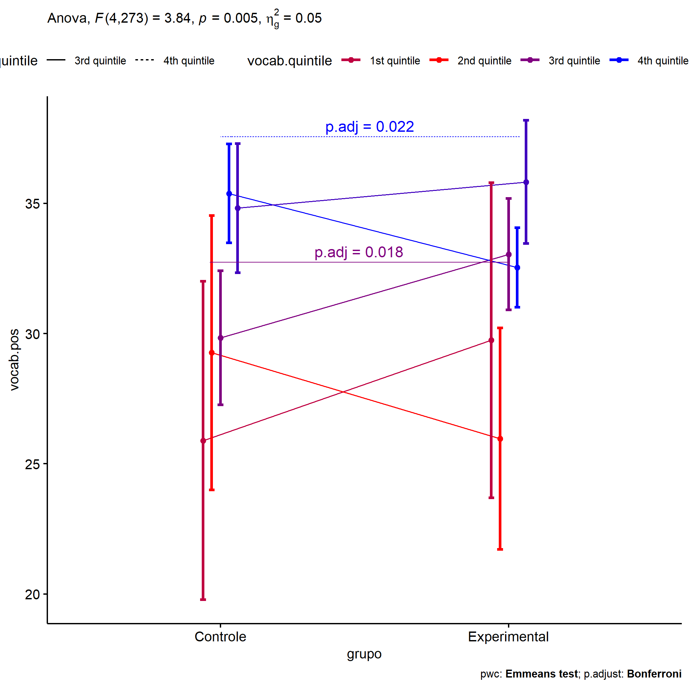<!-- -->

``` r
if (!is.null(plots[["vocab.quintile"]]))
  plots[["vocab.quintile"]] + ggplot2::scale_color_manual(values = color[["grupo"]])
```

    ## Scale for colour is already present.
    ## Adding another scale for colour, which will replace the existing scale.

    ## Warning: `position_dodge()` requires non-overlapping x intervals

<!-- -->

``` r
plots <- twoWayAncovaBoxPlots(
  wdat, "vocab.pos", c("grupo","vocab.quintile"), aov, pwcs, covar = "vocab.pre",
  theme = "classic", color = color[["grupo:vocab.quintile"]],
  subtitle = which(aov$Effect == "grupo:vocab.quintile"))
```

``` r
plots[["grupo:vocab.quintile"]] + ggplot2::ylab("Vocabulario") + ggplot2::scale_x_discrete(labels=c('pre', 'pos'))
```

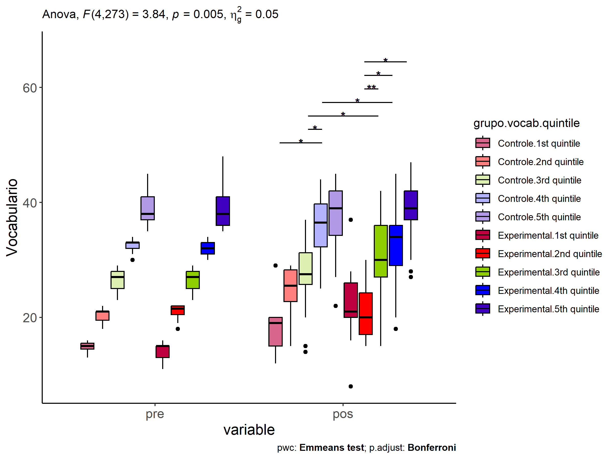<!-- -->

``` r
plots <- twoWayAncovaBoxPlots(
  wdat.long, "vocab", c("grupo","vocab.quintile"), aov, pwc.long, pre.post = "time",
  theme = "classic", color = color$prepost)
```

``` r
plots[["grupo:vocab.quintile"]] + ggplot2::ylab("Vocabulario")
```

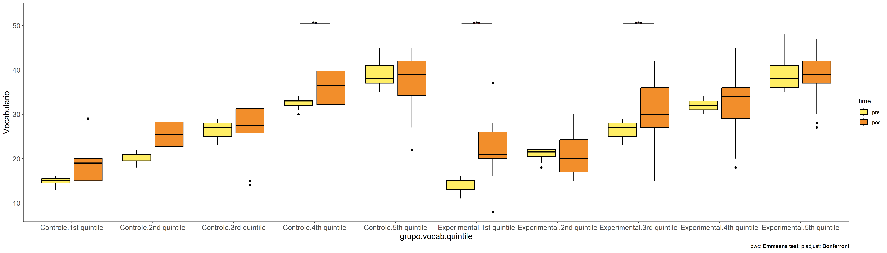<!-- -->

### Checking linearity assumption

``` r
ggscatter(wdat, x = "vocab.pre", y = "vocab.pos", size = 0.5,
          facet.by = c("grupo","vocab.quintile"), add = "reg.line")+
  stat_regline_equation(
    aes(label =  paste(..eq.label.., ..rr.label.., sep = "~~~~"))
  )
```

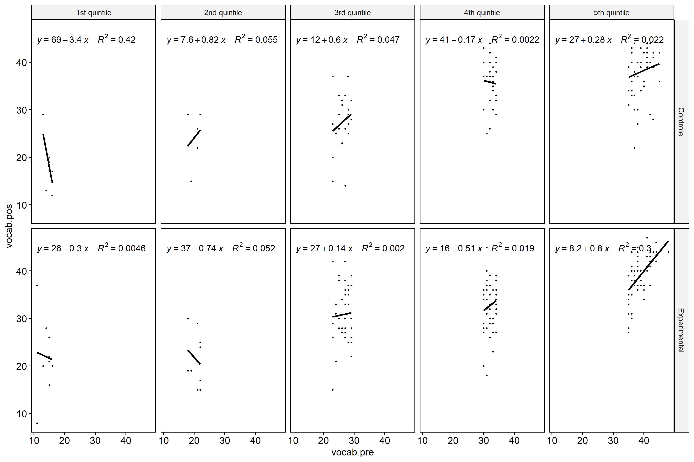<!-- -->

### Checking normality and homogeneity

``` r
res <- augment(lm(vocab.pos ~ vocab.pre + grupo*vocab.quintile, data = wdat))
```

``` r
shapiro_test(res$.resid)
```

    ## # A tibble: 1 × 3
    ##   variable   statistic p.value
    ##   <chr>          <dbl>   <dbl>
    ## 1 res$.resid     0.989  0.0381

``` r
levene_test(res, .resid ~ grupo*vocab.quintile)
```

    ## # A tibble: 1 × 4
    ##     df1   df2 statistic     p
    ##   <int> <int>     <dbl> <dbl>
    ## 1     9   274      1.39 0.193

# Summary of Results

## Descriptive Statistics

``` r
df <- get.descriptives(ldat[["grupo"]], c(dv.pre, dv.pos), c("grupo"), 
                       include.global = T, symmetry.test = T, normality.test = F)
df <- plyr::rbind.fill(
  df, do.call(plyr::rbind.fill, lapply(lfatores2, FUN = function(f) {
    if (nrow(dat) > 0 && sum(!is.na(unique(dat[[f]]))) > 1)
      get.descriptives(ldat[[paste0("grupo:",f)]], c(dv.pre,dv.pos), c("grupo", f),
                       symmetry.test = T, normality.test = F)
    }))
)
(df <- df[,c(fatores1[fatores1 %in% colnames(df)],"variable",
             colnames(df)[!colnames(df) %in% c(fatores1,"variable")])])
```

    ##           grupo Sexo   Zona Cor.Raca vocab.quintile  variable   n   mean median min max    sd    se    ci   iqr
    ## 1      Controle <NA>   <NA>     <NA>           <NA> vocab.pre 117 32.231   33.0  13  45 7.465 0.690 1.367 10.00
    ## 2  Experimental <NA>   <NA>     <NA>           <NA> vocab.pre 168 31.185   32.0  11  48 7.316 0.564 1.114  9.00
    ## 3          <NA> <NA>   <NA>     <NA>           <NA> vocab.pre 285 31.614   32.0  11  48 7.382 0.437 0.861 10.00
    ## 4      Controle <NA>   <NA>     <NA>           <NA> vocab.pos 117 33.385   35.0  12  45 7.854 0.726 1.438 11.00
    ## 5  Experimental <NA>   <NA>     <NA>           <NA> vocab.pos 168 32.905   35.0   8  47 7.729 0.596 1.177 10.25
    ## 6          <NA> <NA>   <NA>     <NA>           <NA> vocab.pos 285 33.102   35.0   8  47 7.770 0.460 0.906 11.00
    ## 7      Controle    F   <NA>     <NA>           <NA> vocab.pre  56 32.214   33.0  13  45 7.122 0.952 1.907  9.00
    ## 8      Controle    M   <NA>     <NA>           <NA> vocab.pre  61 32.246   34.0  14  45 7.827 1.002 2.004 12.00
    ## 9  Experimental    F   <NA>     <NA>           <NA> vocab.pre  85 30.894   32.0  13  44 7.323 0.794 1.579  9.00
    ## 10 Experimental    M   <NA>     <NA>           <NA> vocab.pre  82 31.732   31.0  11  48 7.022 0.775 1.543 10.00
    ## 11     Controle    F   <NA>     <NA>           <NA> vocab.pos  56 33.554   34.5  12  45 7.466 0.998 1.999 10.00
    ## 12     Controle    M   <NA>     <NA>           <NA> vocab.pos  61 33.230   35.0  13  45 8.253 1.057 2.114 13.00
    ## 13 Experimental    F   <NA>     <NA>           <NA> vocab.pos  85 33.424   35.0  16  47 7.490 0.812 1.616 11.00
    ## 14 Experimental    M   <NA>     <NA>           <NA> vocab.pos  82 32.317   34.0   8  45 8.009 0.884 1.760  9.75
    ## 15     Controle <NA>  Rural     <NA>           <NA> vocab.pre  41 31.829   32.0  15  42 6.304 0.985 1.990  7.00
    ## 16     Controle <NA> Urbana     <NA>           <NA> vocab.pre  17 33.471   36.0  14  43 7.298 1.770 3.752  5.00
    ## 17 Experimental <NA>  Rural     <NA>           <NA> vocab.pre  60 30.433   30.5  11  44 7.952 1.027 2.054 11.25
    ## 18 Experimental <NA> Urbana     <NA>           <NA> vocab.pre  43 31.512   34.0  14  48 8.727 1.331 2.686 12.00
    ## 19     Controle <NA>  Rural     <NA>           <NA> vocab.pos  41 35.488   37.0  12  45 7.766 1.213 2.451 12.00
    ## 20     Controle <NA> Urbana     <NA>           <NA> vocab.pos  17 33.412   36.0  13  44 8.360 2.027 4.298 11.00
    ## 21 Experimental <NA>  Rural     <NA>           <NA> vocab.pos  60 33.217   35.5   8  45 7.987 1.031 2.063 11.00
    ## 22 Experimental <NA> Urbana     <NA>           <NA> vocab.pos  43 32.767   34.0  15  46 7.702 1.175 2.370 10.00
    ## 23     Controle <NA>   <NA>   Branca           <NA> vocab.pre   7 34.000   33.0  28  41 3.916 1.480 3.621  2.00
    ## 24     Controle <NA>   <NA>    Parda           <NA> vocab.pre  44 30.591   32.0  15  42 7.276 1.097 2.212  9.50
    ## 25 Experimental <NA>   <NA>   Branca           <NA> vocab.pre  13 34.231   36.0  22  41 6.457 1.791 3.902 11.00
    ## 26 Experimental <NA>   <NA>    Parda           <NA> vocab.pre  47 29.191   30.0  13  44 8.443 1.232 2.479 13.00
    ## 27     Controle <NA>   <NA>   Branca           <NA> vocab.pos   7 39.286   39.0  35  44 3.200 1.209 2.959  4.50
    ## 28     Controle <NA>   <NA>    Parda           <NA> vocab.pos  44 31.795   33.0  12  45 8.390 1.265 2.551 11.50
    ## 29 Experimental <NA>   <NA>   Branca           <NA> vocab.pos  13 36.462   37.0  17  47 7.644 2.120 4.619  6.00
    ## 30 Experimental <NA>   <NA>    Parda           <NA> vocab.pos  47 31.957   31.0  15  46 9.134 1.332 2.682 13.00
    ## 31     Controle <NA>   <NA>     <NA>   1st quintile vocab.pre   7 14.857   15.0  13  16 1.069 0.404 0.989  1.00
    ## 32     Controle <NA>   <NA>     <NA>   2nd quintile vocab.pre   6 20.333   21.0  18  22 1.506 0.615 1.580  1.50
    ## 33     Controle <NA>   <NA>     <NA>   3rd quintile vocab.pre  24 26.375   27.0  23  29 2.060 0.421 0.870  3.00
    ## 34     Controle <NA>   <NA>     <NA>   4th quintile vocab.pre  30 32.433   33.0  30  34 1.305 0.238 0.487  1.00
    ## 35     Controle <NA>   <NA>     <NA>   5th quintile vocab.pre  50 38.780   38.0  35  45 2.743 0.388 0.779  4.00
    ## 36 Experimental <NA>   <NA>     <NA>   1st quintile vocab.pre   9 13.889   15.0  11  16 1.833 0.611 1.409  2.00
    ## 37 Experimental <NA>   <NA>     <NA>   2nd quintile vocab.pre  12 20.833   21.5  18  22 1.586 0.458 1.008  1.50
    ## 38 Experimental <NA>   <NA>     <NA>   3rd quintile vocab.pre  41 26.610   27.0  23  29 1.973 0.308 0.623  3.00
    ## 39 Experimental <NA>   <NA>     <NA>   4th quintile vocab.pre  46 31.935   32.0  30  34 1.436 0.212 0.426  2.00
    ## 40 Experimental <NA>   <NA>     <NA>   5th quintile vocab.pre  59 38.593   38.0  35  48 2.983 0.388 0.777  5.00
    ## 41     Controle <NA>   <NA>     <NA>   1st quintile vocab.pos   7 18.571   19.0  12  29 5.623 2.125 5.200  5.00
    ## 42     Controle <NA>   <NA>     <NA>   2nd quintile vocab.pos   6 24.333   25.5  15  29 5.279 2.155 5.540  5.50
    ## 43     Controle <NA>   <NA>     <NA>   3rd quintile vocab.pos  24 27.542   27.5  14  37 5.664 1.156 2.392  5.50
    ## 44     Controle <NA>   <NA>     <NA>   4th quintile vocab.pos  30 35.733   36.5  25  44 4.849 0.885 1.811  7.50
    ## 45     Controle <NA>   <NA>     <NA>   5th quintile vocab.pos  50 37.940   39.0  22  45 5.262 0.744 1.495  7.75
    ## 46 Experimental <NA>   <NA>     <NA>   1st quintile vocab.pos   9 22.000   21.0   8  37 8.047 2.682 6.185  6.00
    ## 47 Experimental <NA>   <NA>     <NA>   2nd quintile vocab.pos  12 21.250   20.0  15  30 5.137 1.483 3.264  7.25
    ## 48 Experimental <NA>   <NA>     <NA>   3rd quintile vocab.pos  41 30.854   30.0  15  42 6.073 0.948 1.917  9.00
    ## 49 Experimental <NA>   <NA>     <NA>   4th quintile vocab.pos  46 32.674   34.0  18  45 5.325 0.785 1.581  7.00
    ## 50 Experimental <NA>   <NA>     <NA>   5th quintile vocab.pos  59 38.864   39.0  27  47 4.333 0.564 1.129  5.00
    ##    symmetry   skewness    kurtosis
    ## 1        NO -0.6665510 -0.14368553
    ## 2       YES -0.4816239  0.01282362
    ## 3        NO -0.5552329 -0.06232827
    ## 4        NO -0.6900853 -0.14099677
    ## 5        NO -0.6447426 -0.06926699
    ## 6        NO -0.6652362 -0.08298607
    ## 7        NO -0.7125248  0.23111327
    ## 8        NO -0.6176615 -0.49796328
    ## 9        NO -0.6040745 -0.23596550
    ## 10      YES -0.2091224 -0.04937778
    ## 11       NO -0.6106570  0.07576679
    ## 12       NO -0.7156055 -0.41712635
    ## 13      YES -0.3621615 -0.77071047
    ## 14       NO -0.8382986  0.21829300
    ## 15       NO -0.7244519  0.29629807
    ## 16       NO -1.1979769  0.79640709
    ## 17      YES -0.4792573 -0.27425406
    ## 18      YES -0.3981602 -0.73930534
    ## 19       NO -0.9673868  0.44982808
    ## 20       NO -0.7426511 -0.22811251
    ## 21       NO -0.8425695  0.26553164
    ## 22      YES -0.4509779 -0.59804730
    ## 23      YES  0.3140661 -0.74210100
    ## 24       NO -0.6253939 -0.47038798
    ## 25       NO -0.5302003 -1.29899974
    ## 26      YES -0.1479398 -0.97639269
    ## 27      YES  0.1185445 -1.70688315
    ## 28      YES -0.3199351 -0.66179147
    ## 29       NO -1.0590762  0.72720613
    ## 30      YES -0.3178842 -1.03801346
    ## 31      YES -0.4724797 -1.26658163
    ## 32      YES -0.4666843 -1.66637832
    ## 33      YES -0.4292730 -1.25784265
    ## 34       NO -0.5345543 -0.79075538
    ## 35      YES  0.4699858 -0.78778877
    ## 36       NO -0.6135181 -1.36845793
    ## 37       NO -0.8797702 -1.00682549
    ## 38      YES -0.4355513 -1.05595276
    ## 39      YES  0.1553932 -1.34315757
    ## 40       NO  0.6918747 -0.02452173
    ## 41       NO  0.5459447 -0.90372055
    ## 42       NO -0.6996764 -1.15971666
    ## 43       NO -0.6332218  0.27373974
    ## 44      YES -0.4215733 -0.63219388
    ## 45       NO -0.8645616  0.19479372
    ## 46      YES  0.1445864 -0.56388711
    ## 47      YES  0.3474513 -1.37975162
    ## 48      YES -0.1980248 -0.45482276
    ## 49       NO -0.5330741  0.32158805
    ## 50       NO -0.5956601  0.13707484

| grupo        | Sexo | Zona   | Cor.Raca | vocab.quintile | variable  |   n |   mean | median | min | max |    sd |    se |    ci |   iqr | symmetry | skewness | kurtosis |
|:-------------|:-----|:-------|:---------|:---------------|:----------|----:|-------:|-------:|----:|----:|------:|------:|------:|------:|:---------|---------:|---------:|
| Controle     |      |        |          |                | vocab.pre | 117 | 32.231 |   33.0 |  13 |  45 | 7.465 | 0.690 | 1.367 | 10.00 | NO       |   -0.667 |   -0.144 |
| Experimental |      |        |          |                | vocab.pre | 168 | 31.185 |   32.0 |  11 |  48 | 7.316 | 0.564 | 1.114 |  9.00 | YES      |   -0.482 |    0.013 |
|              |      |        |          |                | vocab.pre | 285 | 31.614 |   32.0 |  11 |  48 | 7.382 | 0.437 | 0.861 | 10.00 | NO       |   -0.555 |   -0.062 |
| Controle     |      |        |          |                | vocab.pos | 117 | 33.385 |   35.0 |  12 |  45 | 7.854 | 0.726 | 1.438 | 11.00 | NO       |   -0.690 |   -0.141 |
| Experimental |      |        |          |                | vocab.pos | 168 | 32.905 |   35.0 |   8 |  47 | 7.729 | 0.596 | 1.177 | 10.25 | NO       |   -0.645 |   -0.069 |
|              |      |        |          |                | vocab.pos | 285 | 33.102 |   35.0 |   8 |  47 | 7.770 | 0.460 | 0.906 | 11.00 | NO       |   -0.665 |   -0.083 |
| Controle     | F    |        |          |                | vocab.pre |  56 | 32.214 |   33.0 |  13 |  45 | 7.122 | 0.952 | 1.907 |  9.00 | NO       |   -0.713 |    0.231 |
| Controle     | M    |        |          |                | vocab.pre |  61 | 32.246 |   34.0 |  14 |  45 | 7.827 | 1.002 | 2.004 | 12.00 | NO       |   -0.618 |   -0.498 |
| Experimental | F    |        |          |                | vocab.pre |  85 | 30.894 |   32.0 |  13 |  44 | 7.323 | 0.794 | 1.579 |  9.00 | NO       |   -0.604 |   -0.236 |
| Experimental | M    |        |          |                | vocab.pre |  82 | 31.732 |   31.0 |  11 |  48 | 7.022 | 0.775 | 1.543 | 10.00 | YES      |   -0.209 |   -0.049 |
| Controle     | F    |        |          |                | vocab.pos |  56 | 33.554 |   34.5 |  12 |  45 | 7.466 | 0.998 | 1.999 | 10.00 | NO       |   -0.611 |    0.076 |
| Controle     | M    |        |          |                | vocab.pos |  61 | 33.230 |   35.0 |  13 |  45 | 8.253 | 1.057 | 2.114 | 13.00 | NO       |   -0.716 |   -0.417 |
| Experimental | F    |        |          |                | vocab.pos |  85 | 33.424 |   35.0 |  16 |  47 | 7.490 | 0.812 | 1.616 | 11.00 | YES      |   -0.362 |   -0.771 |
| Experimental | M    |        |          |                | vocab.pos |  82 | 32.317 |   34.0 |   8 |  45 | 8.009 | 0.884 | 1.760 |  9.75 | NO       |   -0.838 |    0.218 |
| Controle     |      | Rural  |          |                | vocab.pre |  41 | 31.829 |   32.0 |  15 |  42 | 6.304 | 0.985 | 1.990 |  7.00 | NO       |   -0.724 |    0.296 |
| Controle     |      | Urbana |          |                | vocab.pre |  17 | 33.471 |   36.0 |  14 |  43 | 7.298 | 1.770 | 3.752 |  5.00 | NO       |   -1.198 |    0.796 |
| Experimental |      | Rural  |          |                | vocab.pre |  60 | 30.433 |   30.5 |  11 |  44 | 7.952 | 1.027 | 2.054 | 11.25 | YES      |   -0.479 |   -0.274 |
| Experimental |      | Urbana |          |                | vocab.pre |  43 | 31.512 |   34.0 |  14 |  48 | 8.727 | 1.331 | 2.686 | 12.00 | YES      |   -0.398 |   -0.739 |
| Controle     |      | Rural  |          |                | vocab.pos |  41 | 35.488 |   37.0 |  12 |  45 | 7.766 | 1.213 | 2.451 | 12.00 | NO       |   -0.967 |    0.450 |
| Controle     |      | Urbana |          |                | vocab.pos |  17 | 33.412 |   36.0 |  13 |  44 | 8.360 | 2.027 | 4.298 | 11.00 | NO       |   -0.743 |   -0.228 |
| Experimental |      | Rural  |          |                | vocab.pos |  60 | 33.217 |   35.5 |   8 |  45 | 7.987 | 1.031 | 2.063 | 11.00 | NO       |   -0.843 |    0.266 |
| Experimental |      | Urbana |          |                | vocab.pos |  43 | 32.767 |   34.0 |  15 |  46 | 7.702 | 1.175 | 2.370 | 10.00 | YES      |   -0.451 |   -0.598 |
| Controle     |      |        | Branca   |                | vocab.pre |   7 | 34.000 |   33.0 |  28 |  41 | 3.916 | 1.480 | 3.621 |  2.00 | YES      |    0.314 |   -0.742 |
| Controle     |      |        | Parda    |                | vocab.pre |  44 | 30.591 |   32.0 |  15 |  42 | 7.276 | 1.097 | 2.212 |  9.50 | NO       |   -0.625 |   -0.470 |
| Experimental |      |        | Branca   |                | vocab.pre |  13 | 34.231 |   36.0 |  22 |  41 | 6.457 | 1.791 | 3.902 | 11.00 | NO       |   -0.530 |   -1.299 |
| Experimental |      |        | Parda    |                | vocab.pre |  47 | 29.191 |   30.0 |  13 |  44 | 8.443 | 1.232 | 2.479 | 13.00 | YES      |   -0.148 |   -0.976 |
| Controle     |      |        | Branca   |                | vocab.pos |   7 | 39.286 |   39.0 |  35 |  44 | 3.200 | 1.209 | 2.959 |  4.50 | YES      |    0.119 |   -1.707 |
| Controle     |      |        | Parda    |                | vocab.pos |  44 | 31.795 |   33.0 |  12 |  45 | 8.390 | 1.265 | 2.551 | 11.50 | YES      |   -0.320 |   -0.662 |
| Experimental |      |        | Branca   |                | vocab.pos |  13 | 36.462 |   37.0 |  17 |  47 | 7.644 | 2.120 | 4.619 |  6.00 | NO       |   -1.059 |    0.727 |
| Experimental |      |        | Parda    |                | vocab.pos |  47 | 31.957 |   31.0 |  15 |  46 | 9.134 | 1.332 | 2.682 | 13.00 | YES      |   -0.318 |   -1.038 |
| Controle     |      |        |          | 1st quintile   | vocab.pre |   7 | 14.857 |   15.0 |  13 |  16 | 1.069 | 0.404 | 0.989 |  1.00 | YES      |   -0.472 |   -1.267 |
| Controle     |      |        |          | 2nd quintile   | vocab.pre |   6 | 20.333 |   21.0 |  18 |  22 | 1.506 | 0.615 | 1.580 |  1.50 | YES      |   -0.467 |   -1.666 |
| Controle     |      |        |          | 3rd quintile   | vocab.pre |  24 | 26.375 |   27.0 |  23 |  29 | 2.060 | 0.421 | 0.870 |  3.00 | YES      |   -0.429 |   -1.258 |
| Controle     |      |        |          | 4th quintile   | vocab.pre |  30 | 32.433 |   33.0 |  30 |  34 | 1.305 | 0.238 | 0.487 |  1.00 | NO       |   -0.535 |   -0.791 |
| Controle     |      |        |          | 5th quintile   | vocab.pre |  50 | 38.780 |   38.0 |  35 |  45 | 2.743 | 0.388 | 0.779 |  4.00 | YES      |    0.470 |   -0.788 |
| Experimental |      |        |          | 1st quintile   | vocab.pre |   9 | 13.889 |   15.0 |  11 |  16 | 1.833 | 0.611 | 1.409 |  2.00 | NO       |   -0.614 |   -1.368 |
| Experimental |      |        |          | 2nd quintile   | vocab.pre |  12 | 20.833 |   21.5 |  18 |  22 | 1.586 | 0.458 | 1.008 |  1.50 | NO       |   -0.880 |   -1.007 |
| Experimental |      |        |          | 3rd quintile   | vocab.pre |  41 | 26.610 |   27.0 |  23 |  29 | 1.973 | 0.308 | 0.623 |  3.00 | YES      |   -0.436 |   -1.056 |
| Experimental |      |        |          | 4th quintile   | vocab.pre |  46 | 31.935 |   32.0 |  30 |  34 | 1.436 | 0.212 | 0.426 |  2.00 | YES      |    0.155 |   -1.343 |
| Experimental |      |        |          | 5th quintile   | vocab.pre |  59 | 38.593 |   38.0 |  35 |  48 | 2.983 | 0.388 | 0.777 |  5.00 | NO       |    0.692 |   -0.025 |
| Controle     |      |        |          | 1st quintile   | vocab.pos |   7 | 18.571 |   19.0 |  12 |  29 | 5.623 | 2.125 | 5.200 |  5.00 | NO       |    0.546 |   -0.904 |
| Controle     |      |        |          | 2nd quintile   | vocab.pos |   6 | 24.333 |   25.5 |  15 |  29 | 5.279 | 2.155 | 5.540 |  5.50 | NO       |   -0.700 |   -1.160 |
| Controle     |      |        |          | 3rd quintile   | vocab.pos |  24 | 27.542 |   27.5 |  14 |  37 | 5.664 | 1.156 | 2.392 |  5.50 | NO       |   -0.633 |    0.274 |
| Controle     |      |        |          | 4th quintile   | vocab.pos |  30 | 35.733 |   36.5 |  25 |  44 | 4.849 | 0.885 | 1.811 |  7.50 | YES      |   -0.422 |   -0.632 |
| Controle     |      |        |          | 5th quintile   | vocab.pos |  50 | 37.940 |   39.0 |  22 |  45 | 5.262 | 0.744 | 1.495 |  7.75 | NO       |   -0.865 |    0.195 |
| Experimental |      |        |          | 1st quintile   | vocab.pos |   9 | 22.000 |   21.0 |   8 |  37 | 8.047 | 2.682 | 6.185 |  6.00 | YES      |    0.145 |   -0.564 |
| Experimental |      |        |          | 2nd quintile   | vocab.pos |  12 | 21.250 |   20.0 |  15 |  30 | 5.137 | 1.483 | 3.264 |  7.25 | YES      |    0.347 |   -1.380 |
| Experimental |      |        |          | 3rd quintile   | vocab.pos |  41 | 30.854 |   30.0 |  15 |  42 | 6.073 | 0.948 | 1.917 |  9.00 | YES      |   -0.198 |   -0.455 |
| Experimental |      |        |          | 4th quintile   | vocab.pos |  46 | 32.674 |   34.0 |  18 |  45 | 5.325 | 0.785 | 1.581 |  7.00 | NO       |   -0.533 |    0.322 |
| Experimental |      |        |          | 5th quintile   | vocab.pos |  59 | 38.864 |   39.0 |  27 |  47 | 4.333 | 0.564 | 1.129 |  5.00 | NO       |   -0.596 |    0.137 |

## ANCOVA Table Comparison

``` r
df <- do.call(plyr::rbind.fill, laov)
(df <- df[!duplicated(df$Effect),])
```

    ##                  Effect DFn DFd       F        p p<.05      ges DFn' DFd'         F'       p' p<.05'     ges'
    ## 1                 grupo   1 282   0.215 6.43e-01       0.000762    1  286   0.000211 9.88e-01        7.38e-07
    ## 2             vocab.pre   1 282 290.531 2.87e-45     * 0.507000    1  286 221.872000 1.54e-37      * 4.37e-01
    ## 4            grupo:Sexo   1 279   1.206 2.73e-01       0.004000    1  284   0.701000 4.03e-01        2.00e-03
    ## 5                  Sexo   1 279   3.469 6.40e-02       0.012000    1  284   3.850000 5.10e-02        1.30e-02
    ## 8            grupo:Zona   1 156   1.332 2.50e-01       0.008000    1  158   3.396000 6.70e-02        2.10e-02
    ## 10                 Zona   1 156   5.437 2.10e-02     * 0.034000    1  158   4.299000 4.00e-02      * 2.60e-02
    ## 11             Cor.Raca   1 106   1.734 1.91e-01       0.016000    1  111   2.721000 1.02e-01        2.40e-02
    ## 13       grupo:Cor.Raca   1 106   2.645 1.07e-01       0.024000    1  111   0.596000 4.42e-01        5.00e-03
    ## 16 grupo:vocab.quintile   4 273   3.840 5.00e-03     * 0.053000    4  278   3.390000 1.00e-02      * 4.70e-02
    ## 18       vocab.quintile   4 273   2.461 4.60e-02     * 0.035000    4  278   1.655000 1.61e-01        2.30e-02

|     | Effect               | DFn | DFd |       F |     p | p\<.05 |   ges | DFn’ | DFd’ |      F’ |    p’ | p\<.05’ |  ges’ |
|:----|:---------------------|----:|----:|--------:|------:|:-------|------:|-----:|-----:|--------:|------:|:--------|------:|
| 1   | grupo                |   1 | 282 |   0.215 | 0.643 |        | 0.001 |    1 |  286 |   0.000 | 0.988 |         | 0.000 |
| 2   | vocab.pre            |   1 | 282 | 290.531 | 0.000 | \*     | 0.507 |    1 |  286 | 221.872 | 0.000 | \*      | 0.437 |
| 4   | grupo:Sexo           |   1 | 279 |   1.206 | 0.273 |        | 0.004 |    1 |  284 |   0.701 | 0.403 |         | 0.002 |
| 5   | Sexo                 |   1 | 279 |   3.469 | 0.064 |        | 0.012 |    1 |  284 |   3.850 | 0.051 |         | 0.013 |
| 8   | grupo:Zona           |   1 | 156 |   1.332 | 0.250 |        | 0.008 |    1 |  158 |   3.396 | 0.067 |         | 0.021 |
| 10  | Zona                 |   1 | 156 |   5.437 | 0.021 | \*     | 0.034 |    1 |  158 |   4.299 | 0.040 | \*      | 0.026 |
| 11  | Cor.Raca             |   1 | 106 |   1.734 | 0.191 |        | 0.016 |    1 |  111 |   2.721 | 0.102 |         | 0.024 |
| 13  | grupo:Cor.Raca       |   1 | 106 |   2.645 | 0.107 |        | 0.024 |    1 |  111 |   0.596 | 0.442 |         | 0.005 |
| 16  | grupo:vocab.quintile |   4 | 273 |   3.840 | 0.005 | \*     | 0.053 |    4 |  278 |   3.390 | 0.010 | \*      | 0.047 |
| 18  | vocab.quintile       |   4 | 273 |   2.461 | 0.046 | \*     | 0.035 |    4 |  278 |   1.655 | 0.161 |         | 0.023 |

## PairWise Table Comparison

``` r
df <- do.call(plyr::rbind.fill, lpwc)
df <- df[,c(names(lfatores), names(df)[!names(df) %in% c(names(lfatores),"term",".y.")])]
```

| grupo        | Sexo | Zona   | Cor.Raca | vocab.quintile | group1       | group2       |  df | statistic |     p | p.adj | p.adj.signif | df’ | statistic’ |    p’ | p.adj’ | p.adj.signif’ |
|:-------------|:-----|:-------|:---------|:---------------|:-------------|:-------------|----:|----------:|------:|------:|:-------------|----:|-----------:|------:|-------:|:--------------|
| Controle     |      |        |          |                | pre          | pos          | 566 |    -1.164 | 0.245 | 0.245 | ns           | 574 |     -0.946 | 0.344 |  0.344 | ns            |
| Experimental |      |        |          |                | pre          | pos          | 566 |    -2.080 | 0.038 | 0.038 | \*           | 574 |     -1.462 | 0.144 |  0.144 | ns            |
|              |      |        |          |                | Controle     | Experimental | 282 |    -0.464 | 0.643 | 0.643 | ns           | 286 |     -0.015 | 0.988 |  0.988 | ns            |
| Controle     | F    |        |          |                | pre          | pos          | 560 |    -0.937 | 0.349 | 0.349 | ns           | 570 |     -0.902 | 0.367 |  0.367 | ns            |
| Controle     | M    |        |          |                | pre          | pos          | 560 |    -0.718 | 0.473 | 0.473 | ns           | 570 |     -0.446 | 0.656 |  0.656 | ns            |
| Controle     |      |        |          |                | F            | M            | 279 |     0.354 | 0.724 | 0.724 | ns           | 284 |      0.609 | 0.543 |  0.543 | ns            |
| Experimental | F    |        |          |                | pre          | pos          | 560 |    -2.181 | 0.030 | 0.030 | \*           | 570 |     -1.903 | 0.058 |  0.058 | ns            |
| Experimental | M    |        |          |                | pre          | pos          | 560 |    -0.496 | 0.620 | 0.620 | ns           | 570 |     -0.156 | 0.876 |  0.876 | ns            |
| Experimental |      |        |          |                | F            | M            | 279 |     2.133 | 0.034 | 0.034 | \*           | 284 |      2.045 | 0.042 |  0.042 | \*            |
|              | F    |        |          |                | Controle     | Experimental | 279 |    -0.981 | 0.327 | 0.327 | ns           | 284 |     -0.574 | 0.566 |  0.566 | ns            |
|              | M    |        |          |                | Controle     | Experimental | 279 |     0.567 | 0.571 | 0.571 | ns           | 284 |      0.609 | 0.543 |  0.543 | ns            |
| Controle     |      |        |          |                | Rural        | Urbana       | 156 |     2.278 | 0.024 | 0.024 | \*           | 158 |      2.701 | 0.008 |  0.008 | \*\*          |
| Controle     |      | Rural  |          |                | pre          | pos          | 314 |    -2.121 | 0.035 | 0.035 | \*           | 318 |     -2.057 | 0.040 |  0.040 | \*            |
| Controle     |      | Urbana |          |                | pre          | pos          | 314 |     0.022 | 0.982 | 0.982 | ns           | 318 |      0.455 | 0.649 |  0.649 | ns            |
| Experimental |      |        |          |                | Rural        | Urbana       | 156 |     1.265 | 0.208 | 0.208 | ns           | 158 |      0.640 | 0.523 |  0.523 | ns            |
| Experimental |      | Rural  |          |                | pre          | pos          | 314 |    -1.952 | 0.052 | 0.052 | ns           | 318 |     -1.541 | 0.124 |  0.124 | ns            |
| Experimental |      | Urbana |          |                | pre          | pos          | 314 |    -0.745 | 0.457 | 0.457 | ns           | 318 |     -0.723 | 0.470 |  0.470 | ns            |
|              |      | Rural  |          |                | Controle     | Experimental | 156 |     1.138 | 0.257 | 0.257 | ns           | 158 |      1.433 | 0.154 |  0.154 | ns            |
|              |      | Urbana |          |                | Controle     | Experimental | 156 |    -0.605 | 0.546 | 0.546 | ns           | 158 |     -1.233 | 0.219 |  0.219 | ns            |
| Controle     |      |        | Branca   |                | pre          | pos          | 214 |    -1.232 | 0.219 | 0.219 | ns           | 224 |     -1.159 | 0.248 |  0.248 | ns            |
| Controle     |      |        |          |                | Branca       | Parda        | 106 |     2.093 | 0.039 | 0.039 | \*           | 111 |      1.627 | 0.107 |  0.107 | ns            |
| Controle     |      |        | Parda    |                | pre          | pos          | 214 |    -0.704 | 0.482 | 0.482 | ns           | 224 |     -0.662 | 0.509 |  0.509 | ns            |
| Experimental |      |        | Branca   |                | pre          | pos          | 214 |    -0.709 | 0.479 | 0.479 | ns           | 224 |     -0.666 | 0.506 |  0.506 | ns            |
| Experimental |      |        |          |                | Branca       | Parda        | 106 |     0.064 | 0.949 | 0.949 | ns           | 111 |      0.853 | 0.396 |  0.396 | ns            |
| Experimental |      |        | Parda    |                | pre          | pos          | 214 |    -1.671 | 0.096 | 0.096 | ns           | 224 |     -0.827 | 0.409 |  0.409 | ns            |
|              |      |        | Branca   |                | Controle     | Experimental | 106 |     1.224 | 0.224 | 0.224 | ns           | 111 |      0.893 | 0.374 |  0.374 | ns            |
|              |      |        | Parda    |                | Controle     | Experimental | 106 |    -1.246 | 0.216 | 0.216 | ns           | 111 |      0.113 | 0.910 |  0.910 | ns            |
| Controle     |      |        |          | 1st quintile   | pre          | pos          | 548 |    -1.705 | 0.089 | 0.089 | ns           | 558 |     -1.492 | 0.136 |  0.136 | ns            |
| Controle     |      |        |          | 2nd quintile   | pre          | pos          | 548 |    -1.699 | 0.090 | 0.090 | ns           | 558 |     -1.487 | 0.137 |  0.137 | ns            |
| Controle     |      |        |          | 3rd quintile   | pre          | pos          | 548 |    -0.991 | 0.322 | 0.322 | ns           | 558 |     -0.868 | 0.386 |  0.386 | ns            |
| Controle     |      |        |          | 4th quintile   | pre          | pos          | 548 |    -3.135 | 0.002 | 0.002 | \*\*         | 558 |     -2.127 | 0.034 |  0.034 | \*            |
| Controle     |      |        |          | 5th quintile   | pre          | pos          | 548 |     1.030 | 0.303 | 0.303 | ns           | 558 |      0.902 | 0.368 |  0.368 | ns            |
| Controle     |      |        |          |                | 1st quintile | 2nd quintile | 273 |    -1.117 | 0.265 | 1.000 | ns           | 278 |     -0.896 | 0.371 |  1.000 | ns            |
| Controle     |      |        |          |                | 1st quintile | 3rd quintile | 273 |    -1.415 | 0.158 | 1.000 | ns           | 278 |     -1.076 | 0.283 |  1.000 | ns            |
| Controle     |      |        |          |                | 1st quintile | 4th quintile | 273 |    -2.847 | 0.005 | 0.047 | \*           | 278 |     -2.068 | 0.040 |  0.396 | ns            |
| Controle     |      |        |          |                | 1st quintile | 5th quintile | 273 |    -2.225 | 0.027 | 0.269 | ns           | 278 |     -1.711 | 0.088 |  0.883 | ns            |
| Controle     |      |        |          |                | 2nd quintile | 3rd quintile | 273 |    -0.224 | 0.823 | 1.000 | ns           | 278 |     -0.115 | 0.908 |  1.000 | ns            |
| Controle     |      |        |          |                | 2nd quintile | 4th quintile | 273 |    -2.103 | 0.036 | 0.364 | ns           | 278 |     -1.438 | 0.152 |  1.000 | ns            |
| Controle     |      |        |          |                | 2nd quintile | 5th quintile | 273 |    -1.601 | 0.111 | 1.000 | ns           | 278 |     -1.197 | 0.232 |  1.000 | ns            |
| Controle     |      |        |          |                | 3rd quintile | 4th quintile | 273 |    -3.312 | 0.001 | 0.011 | \*           | 278 |     -2.330 | 0.020 |  0.205 | ns            |
| Controle     |      |        |          |                | 3rd quintile | 5th quintile | 273 |    -2.270 | 0.024 | 0.240 | ns           | 278 |     -1.759 | 0.080 |  0.796 | ns            |
| Controle     |      |        |          |                | 4th quintile | 5th quintile | 273 |     0.374 | 0.709 | 1.000 | ns           | 278 |      0.017 | 0.986 |  1.000 | ns            |
| Experimental |      |        |          | 1st quintile   | pre          | pos          | 548 |    -4.221 | 0.000 | 0.000 | \*\*\*\*     | 558 |     -3.694 | 0.000 |  0.000 | \*\*\*        |
| Experimental |      |        |          | 2nd quintile   | pre          | pos          | 548 |    -0.250 | 0.802 | 0.802 | ns           | 558 |     -0.219 | 0.827 |  0.827 | ns            |
| Experimental |      |        |          | 3rd quintile   | pre          | pos          | 548 |    -4.713 | 0.000 | 0.000 | \*\*\*\*     | 558 |     -3.771 | 0.000 |  0.000 | \*\*\*        |
| Experimental |      |        |          | 4th quintile   | pre          | pos          | 548 |    -0.870 | 0.385 | 0.385 | ns           | 558 |      0.933 | 0.351 |  0.351 | ns            |
| Experimental |      |        |          | 5th quintile   | pre          | pos          | 548 |    -0.361 | 0.718 | 0.718 | ns           | 558 |     -0.316 | 0.752 |  0.752 | ns            |
| Experimental |      |        |          |                | 1st quintile | 2nd quintile | 273 |     1.505 | 0.134 | 1.000 | ns           | 278 |      1.376 | 0.170 |  1.000 | ns            |
| Experimental |      |        |          |                | 1st quintile | 3rd quintile | 273 |    -1.247 | 0.214 | 1.000 | ns           | 278 |     -0.780 | 0.436 |  1.000 | ns            |
| Experimental |      |        |          |                | 1st quintile | 4th quintile | 273 |    -0.873 | 0.384 | 1.000 | ns           | 278 |     -0.125 | 0.901 |  1.000 | ns            |
| Experimental |      |        |          |                | 1st quintile | 5th quintile | 273 |    -1.524 | 0.129 | 1.000 | ns           | 278 |     -1.104 | 0.271 |  1.000 | ns            |
| Experimental |      |        |          |                | 2nd quintile | 3rd quintile | 273 |    -3.714 | 0.000 | 0.002 | \*\*         | 278 |     -2.902 | 0.004 |  0.040 | \*            |
| Experimental |      |        |          |                | 2nd quintile | 4th quintile | 273 |    -2.834 | 0.005 | 0.049 | \*           | 278 |     -1.672 | 0.096 |  0.956 | ns            |
| Experimental |      |        |          |                | 2nd quintile | 5th quintile | 273 |    -3.259 | 0.001 | 0.013 | \*           | 278 |     -2.598 | 0.010 |  0.099 | ns            |
| Experimental |      |        |          |                | 3rd quintile | 4th quintile | 273 |     0.372 | 0.710 | 1.000 | ns           | 278 |      1.250 | 0.212 |  1.000 | ns            |
| Experimental |      |        |          |                | 3rd quintile | 5th quintile | 273 |    -1.381 | 0.168 | 1.000 | ns           | 278 |     -1.164 | 0.245 |  1.000 | ns            |
| Experimental |      |        |          |                | 4th quintile | 5th quintile | 273 |    -2.344 | 0.020 | 0.198 | ns           | 278 |     -2.872 | 0.004 |  0.044 | \*            |
|              |      |        |          | 1st quintile   | Controle     | Experimental | 273 |    -1.456 | 0.146 | 0.146 | ns           | 278 |     -1.257 | 0.210 |  0.210 | ns            |
|              |      |        |          | 2nd quintile   | Controle     | Experimental | 273 |     1.260 | 0.209 | 0.209 | ns           | 278 |      1.083 | 0.280 |  0.280 | ns            |
|              |      |        |          | 3rd quintile   | Controle     | Experimental | 273 |    -2.382 | 0.018 | 0.018 | \*           | 278 |     -1.781 | 0.076 |  0.076 | ns            |
|              |      |        |          | 4th quintile   | Controle     | Experimental | 273 |     2.307 | 0.022 | 0.022 | \*           | 278 |      2.621 | 0.009 |  0.009 | \*\*          |
|              |      |        |          | 5th quintile   | Controle     | Experimental | 273 |    -0.998 | 0.319 | 0.319 | ns           | 278 |     -0.859 | 0.391 |  0.391 | ns            |

## EMMS Table Comparison

``` r
df <- do.call(plyr::rbind.fill, lemms)
df[["N-N'"]] <- df[["N"]] - df[["N'"]]
df <- df[,c(names(lfatores), names(df)[!names(df) %in% names(lfatores)])]
```

| grupo        | Sexo | Zona   | Cor.Raca | vocab.quintile |   N | M (pre) | SE (pre) | M (unadj) | SE (unadj) | M (adj) | SE (adj) |  N’ | M (pre)’ | SE (pre)’ | M (unadj)’ | SE (unadj)’ | M (adj)’ | SE (adj)’ | N-N’ |
|:-------------|:-----|:-------|:---------|:---------------|----:|--------:|---------:|----------:|-----------:|--------:|---------:|----:|---------:|----------:|-----------:|------------:|---------:|----------:|-----:|
| Controle     |      |        |          |                | 117 |  32.231 |    0.690 |    33.385 |      0.726 |  32.921 |    0.506 | 118 |   32.237 |     0.684 |     33.203 |       0.742 |   32.734 |     0.577 |   -1 |
| Experimental |      |        |          |                | 168 |  31.185 |    0.564 |    32.905 |      0.596 |  33.227 |    0.422 | 171 |   31.181 |     0.554 |     32.421 |       0.650 |   32.745 |     0.479 |   -3 |
| Controle     | F    |        |          |                |  56 |  32.214 |    0.952 |    33.554 |      0.998 |  33.141 |    0.712 |  56 |   32.214 |     0.952 |     33.554 |       0.998 |   33.100 |     0.833 |    0 |
| Controle     | M    |        |          |                |  61 |  32.246 |    1.002 |    33.230 |      1.057 |  32.792 |    0.683 |  62 |   32.258 |     0.986 |     32.887 |       1.094 |   32.400 |     0.792 |   -1 |
| Experimental | F    |        |          |                |  85 |  30.894 |    0.794 |    33.424 |      0.812 |  34.043 |    0.579 |  86 |   30.895 |     0.785 |     33.174 |       0.841 |   33.715 |     0.673 |   -1 |
| Experimental | M    |        |          |                |  82 |  31.732 |    0.775 |    32.317 |      0.884 |  32.282 |    0.588 |  85 |   31.471 |     0.787 |     31.659 |       0.992 |   31.766 |     0.676 |   -3 |
| Controle     |      | Rural  |          |                |  41 |  31.829 |    0.985 |    35.488 |      1.213 |  35.150 |    0.797 |  41 |   31.829 |     0.985 |     35.488 |       1.213 |   35.157 |     0.924 |    0 |
| Controle     |      | Urbana |          |                |  17 |  33.471 |    1.770 |    33.412 |      2.027 |  31.792 |    1.243 |  18 |   33.444 |     1.669 |     32.222 |       2.251 |   30.630 |     1.400 |   -1 |
| Experimental |      | Rural  |          |                |  60 |  30.433 |    1.027 |    33.217 |      1.031 |  33.970 |    0.661 |  61 |   30.443 |     1.010 |     32.689 |       1.143 |   33.440 |     0.760 |   -1 |
| Experimental |      | Urbana |          |                |  43 |  31.512 |    1.331 |    32.767 |      1.175 |  32.678 |    0.778 |  43 |   31.512 |     1.331 |     32.767 |       1.175 |   32.684 |     0.902 |    0 |
| Controle     |      |        | Branca   |                |   7 |  34.000 |    1.480 |    39.286 |      1.209 |  36.354 |    2.006 |   7 |   34.000 |     1.480 |     39.286 |       1.209 |   36.465 |     2.734 |    0 |
| Controle     |      |        | Parda    |                |  44 |  30.591 |    1.097 |    31.795 |      1.265 |  31.838 |    0.795 |  44 |   30.591 |     1.097 |     31.795 |       1.265 |   31.682 |     1.083 |    0 |
| Experimental |      |        | Branca   |                |  13 |  34.231 |    1.791 |    36.462 |      2.120 |  33.328 |    1.482 |  13 |   34.231 |     1.791 |     36.462 |       2.120 |   33.458 |     2.021 |    0 |
| Experimental |      |        | Parda    |                |  47 |  29.191 |    1.232 |    31.957 |      1.332 |  33.221 |    0.775 |  52 |   28.904 |     1.168 |     30.288 |       1.508 |   31.515 |     1.006 |   -5 |
| Controle     |      |        |          | 1st quintile   |   7 |  14.857 |    0.404 |    18.571 |      2.125 |  25.894 |    3.104 |   7 |   14.857 |     0.404 |     18.571 |       2.125 |   26.520 |     3.626 |    0 |
| Controle     |      |        |          | 2nd quintile   |   6 |  20.333 |    0.615 |    24.333 |      2.155 |  29.266 |    2.677 |   6 |   20.333 |     0.615 |     24.333 |       2.155 |   29.684 |     3.128 |    0 |
| Controle     |      |        |          | 3rd quintile   |  24 |  26.375 |    0.421 |    27.542 |      1.156 |  29.836 |    1.306 |  24 |   26.375 |     0.421 |     27.542 |       1.156 |   30.026 |     1.525 |    0 |
| Controle     |      |        |          | 4th quintile   |  30 |  32.433 |    0.238 |    35.733 |      0.885 |  35.383 |    0.964 |  31 |   32.452 |     0.231 |     34.968 |       1.149 |   34.570 |     1.110 |   -1 |
| Controle     |      |        |          | 5th quintile   |  50 |  38.780 |    0.388 |    37.940 |      0.744 |  34.818 |    1.260 |  50 |   38.780 |     0.388 |     37.940 |       0.744 |   34.540 |     1.475 |    0 |
| Experimental |      |        |          | 1st quintile   |   9 |  13.889 |    0.611 |    22.000 |      2.682 |  29.746 |    3.072 |   9 |   13.889 |     0.611 |     22.000 |       2.682 |   30.408 |     3.589 |    0 |
| Experimental |      |        |          | 2nd quintile   |  12 |  20.833 |    0.458 |    21.250 |      1.483 |  25.964 |    2.157 |  12 |   20.833 |     0.458 |     21.250 |       1.483 |   26.364 |     2.520 |    0 |
| Experimental |      |        |          | 3rd quintile   |  41 |  26.610 |    0.308 |    30.854 |      0.948 |  33.046 |    1.087 |  42 |   26.619 |     0.301 |     30.452 |       1.009 |   32.821 |     1.259 |   -1 |
| Experimental |      |        |          | 4th quintile   |  46 |  31.935 |    0.212 |    32.674 |      0.785 |  32.541 |    0.774 |  49 |   31.878 |     0.201 |     31.000 |       1.211 |   30.874 |     0.877 |   -3 |
| Experimental |      |        |          | 5th quintile   |  59 |  38.593 |    0.388 |    38.864 |      0.564 |  35.824 |    1.204 |  59 |   38.593 |     0.388 |     38.864 |       0.564 |   35.553 |     1.410 |    0 |
