ANCOVA in Vocabulary (Vocabulary)
================
Geiser C. Challco <geiser@alumni.usp.br>

- [Setting Initial Variables](#setting-initial-variables)
- [Descriptive Statistics of Initial
  Data](#descriptive-statistics-of-initial-data)
- [ANCOVA and Pairwise for one factor:
  **grupo**](#ancova-and-pairwise-for-one-factor-grupo)
  - [Without remove non-normal data](#without-remove-non-normal-data)
  - [Computing ANCOVA and PairWise After removing non-normal data
    (OK)](#computing-ancova-and-pairwise-after-removing-non-normal-data-ok)
    - [Plots for ancova](#plots-for-ancova)
    - [Checking linearity assumption](#checking-linearity-assumption)
    - [Checking normality and
      homogeneity](#checking-normality-and-homogeneity)
- [ANCOVA and Pairwise for two factors
  **grupo:Sexo**](#ancova-and-pairwise-for-two-factors-gruposexo)
  - [Without remove non-normal data](#without-remove-non-normal-data-1)
  - [Computing ANCOVA and PairWise After removing non-normal data
    (OK)](#computing-ancova-and-pairwise-after-removing-non-normal-data-ok-1)
    - [Plots for ancova](#plots-for-ancova-1)
    - [Checking linearity assumption](#checking-linearity-assumption-1)
    - [Checking normality and
      homogeneity](#checking-normality-and-homogeneity-1)
- [ANCOVA and Pairwise for two factors
  **grupo:Zona**](#ancova-and-pairwise-for-two-factors-grupozona)
  - [Without remove non-normal data](#without-remove-non-normal-data-2)
  - [Computing ANCOVA and PairWise After removing non-normal data
    (OK)](#computing-ancova-and-pairwise-after-removing-non-normal-data-ok-2)
    - [Plots for ancova](#plots-for-ancova-2)
    - [Checking linearity assumption](#checking-linearity-assumption-2)
    - [Checking normality and
      homogeneity](#checking-normality-and-homogeneity-2)
- [ANCOVA and Pairwise for two factors
  **grupo:Cor.Raca**](#ancova-and-pairwise-for-two-factors-grupocorraca)
  - [Without remove non-normal data](#without-remove-non-normal-data-3)
  - [Computing ANCOVA and PairWise After removing non-normal data
    (OK)](#computing-ancova-and-pairwise-after-removing-non-normal-data-ok-3)
    - [Plots for ancova](#plots-for-ancova-3)
    - [Checking linearity assumption](#checking-linearity-assumption-3)
    - [Checking normality and
      homogeneity](#checking-normality-and-homogeneity-3)
- [ANCOVA and Pairwise for two factors
  **grupo:Serie**](#ancova-and-pairwise-for-two-factors-gruposerie)
  - [Without remove non-normal data](#without-remove-non-normal-data-4)
  - [Computing ANCOVA and PairWise After removing non-normal data
    (OK)](#computing-ancova-and-pairwise-after-removing-non-normal-data-ok-4)
    - [Plots for ancova](#plots-for-ancova-4)
    - [Checking linearity assumption](#checking-linearity-assumption-4)
    - [Checking normality and
      homogeneity](#checking-normality-and-homogeneity-4)
- [ANCOVA and Pairwise for two factors
  **grupo:vocab.quintile**](#ancova-and-pairwise-for-two-factors-grupovocabquintile)
  - [Without remove non-normal data](#without-remove-non-normal-data-5)
  - [Computing ANCOVA and PairWise After removing non-normal data
    (OK)](#computing-ancova-and-pairwise-after-removing-non-normal-data-ok-5)
    - [Plots for ancova](#plots-for-ancova-5)
    - [Checking linearity assumption](#checking-linearity-assumption-5)
    - [Checking normality and
      homogeneity](#checking-normality-and-homogeneity-5)
- [Summary of Results](#summary-of-results)
  - [Descriptive Statistics](#descriptive-statistics)
  - [ANCOVA Table Comparison](#ancova-table-comparison)
  - [PairWise Table Comparison](#pairwise-table-comparison)
  - [EMMS Table Comparison](#emms-table-comparison)

**NOTE**:

- Teste ANCOVA para determinar se houve diferenças significativas no
  Vocabulary (medido usando pre- e pos-testes).
- ANCOVA test to determine whether there were significant differences in
  Vocabulary (measured using pre- and post-tests).

# Setting Initial Variables

``` r
dv = "vocab"
dv.pos = "vocab.pos"
dv.pre = "vocab.pre"

fatores2 <- c("Sexo","Zona","Cor.Raca","Serie","vocab.quintile")
lfatores2 <- as.list(fatores2)
names(lfatores2) <- fatores2

fatores1 <- c("grupo", fatores2)
lfatores1 <- as.list(fatores1)
names(lfatores1) <- fatores1

lfatores <- c(lfatores1)

color <- list()
color[["prepost"]] = c("#ffee65","#f28e2B")
color[["grupo"]] = c("#bcbd22","#008000")
color[["Sexo"]] = c("#FF007F","#4D4DFF")
color[["Zona"]] = c("#AA00FF","#00CCCC")
color[["Cor.Raca"]] = c(
  "Parda"="#b97100","Indígena"="#9F262F",
  "Branca"="#87c498", "Preta"="#848283","Amarela"="#D6B91C"
)

level <- list()
level[["grupo"]] = c("Controle","Experimental")
level[["Sexo"]] = c("F","M")
level[["Zona"]] = c("Rural","Urbana")
level[["Cor.Raca"]] = c("Parda","Indígena","Branca", "Preta","Amarela")
level[["Serie"]] = c("6 ano","7 ano","8 ano","9 ano")

# ..

ymin <- 0
ymax <- 0

ymin.ci <- 0
ymax.ci <- 0


color[["grupo:Sexo"]] = c(
  "Controle:F"="#ff99cb", "Controle:M"="#b7b7ff",
  "Experimental:F"="#FF007F", "Experimental:M"="#4D4DFF",
  "Controle.F"="#ff99cb", "Controle.M"="#b7b7ff",
  "Experimental.F"="#FF007F", "Experimental.M"="#4D4DFF"
)
color[["grupo:Zona"]] = c(
  "Controle:Rural"="#b2efef","Controle:Urbana"="#e5b2ff",
  "Experimental:Rural"="#00CCCC", "Experimental:Urbana"="#AA00FF",
  "Controle.Rural"="#b2efef","Controle.Urbana"="#e5b2ff",
  "Experimental.Rural"="#00CCCC", "Experimental.Urbana"="#AA00FF"
)
color[["grupo:Cor.Raca"]] = c(
    "Controle:Parda"="#e3c699", "Experimental:Parda"="#b97100",
    "Controle:Indígena"="#e2bdc0", "Experimental:Indígena"="#9F262F",
    "Controle:Branca"="#c0e8cb", "Experimental:Branca"="#87c498",
    "Controle:Preta"="#dad9d9", "Experimental:Preta"="#848283",
    "Controle:Amarela"="#eee3a4", "Experimental:Amarela"="#D6B91C",
    
    "Controle.Parda"="#e3c699", "Experimental.Parda"="#b97100",
    "Controle.Indígena"="#e2bdc0", "Experimental.Indígena"="#9F262F",
    "Controle.Branca"="#c0e8cb", "Experimental.Branca"="#87c498",
    "Controle.Preta"="#dad9d9", "Experimental.Preta"="#848283",
    "Controle.Amarela"="#eee3a4", "Experimental.Amarela"="#D6B91C"
)


for (coln in c("vocab","vocab.teach","vocab.non.teach","score.tde",
               "TFL.lidas.per.min","TFL.corretas.per.min","TFL.erradas.per.min","TFL.omitidas.per.min",
               "leitura.compreensao")) {
  color[[paste0(coln,".quintile")]] = c("#BF0040","#FF0000","#800080","#0000FF","#4000BF")
  level[[paste0(coln,".quintile")]] = c("1st quintile","2nd quintile","3rd quintile","4th quintile","5th quintile")
  color[[paste0("grupo:",coln,".quintile")]] = c(
    "Experimental.1st quintile"="#BF0040", "Controle.1st quintile"="#d8668c",
    "Experimental.2nd quintile"="#FF0000", "Controle.2nd quintile"="#ff7f7f",
    "Experimental.3rd quintile"="#8fce00", "Controle.3rd quintile"="#ddf0b2",
    "Experimental.4th quintile"="#0000FF", "Controle.4th quintile"="#b2b2ff",
    "Experimental.5th quintile"="#4000BF", "Controle.5th quintile"="#b299e5",
    
    "Experimental:1st quintile"="#BF0040", "Controle:1st quintile"="#d8668c",
    "Experimental:2nd quintile"="#FF0000", "Controle:2nd quintile"="#ff7f7f",
    "Experimental:3rd quintile"="#8fce00", "Controle:3rd quintile"="#ddf0b2",
    "Experimental:4th quintile"="#0000FF", "Controle:4th quintile"="#b2b2ff",
    "Experimental:5th quintile"="#4000BF", "Controle:5th quintile"="#b299e5")
}


gdat <- read_excel("../data/data.xlsx", sheet = "sumary")
gdat <- gdat[which(is.na(gdat$Necessidade.Deficiencia) & !is.na(gdat$WG.Grupo)),]


dat <- gdat
dat$grupo <- factor(dat[["WG.Grupo"]], level[["grupo"]])
for (coln in c(names(lfatores))) {
  dat[[coln]] <- factor(dat[[coln]], level[[coln]][level[[coln]] %in% unique(dat[[coln]])])
}
dat <- dat[which(!is.na(dat[[dv.pre]]) & !is.na(dat[[dv.pos]])),]
dat <- dat[,c("id",names(lfatores),dv.pre,dv.pos)]

dat.long <- rbind(dat, dat)
dat.long$time <- c(rep("pre", nrow(dat)), rep("pos", nrow(dat)))
dat.long$time <- factor(dat.long$time, c("pre","pos"))
dat.long[[dv]] <- c(dat[[dv.pre]], dat[[dv.pos]])


for (f in c("grupo", names(lfatores))) {
  if (is.null(color[[f]]) && length(unique(dat[[f]])) > 0) 
      color[[f]] <- distinctColorPalette(length(unique(dat[[f]])))
}
for (f in c(fatores2)) {
  if (is.null(color[[paste0("grupo:",f)]]) && length(unique(dat[[f]])) > 0)
    color[[paste0("grupo:",f)]] <- distinctColorPalette(length(unique(dat[["grupo"]]))*length(unique(dat[[f]])))
}

ldat <- list()
laov <- list()
lpwc <- list()
lemms <- list()
```

# Descriptive Statistics of Initial Data

``` r
df <- get.descriptives(dat, c(dv.pre, dv.pos), c("grupo"), 
                       include.global = T, symmetry.test = T, normality.test = F)
df <- plyr::rbind.fill(
  df, do.call(plyr::rbind.fill, lapply(lfatores2, FUN = function(f) {
    if (nrow(dat) > 0 && sum(!is.na(unique(dat[[f]]))) > 1)
      get.descriptives(dat, c(dv.pre,dv.pos), c("grupo", f),
                       symmetry.test = T, normality.test = F)
    }))
)
```

    ## Warning: There were 3 warnings in `mutate()`.
    ## The first warning was:
    ## ℹ In argument: `ci = abs(stats::qt(alpha/2, .data$n - 1) * .data$se)`.
    ## Caused by warning:
    ## ! There was 1 warning in `mutate()`.
    ## ℹ In argument: `ci = abs(stats::qt(alpha/2, .data$n - 1) * .data$se)`.
    ## Caused by warning in `stats::qt()`:
    ## ! NaNs produced
    ## ℹ Run `dplyr::last_dplyr_warnings()` to see the 2 remaining warnings.
    ## There were 3 warnings in `mutate()`.
    ## The first warning was:
    ## ℹ In argument: `ci = abs(stats::qt(alpha/2, .data$n - 1) * .data$se)`.
    ## Caused by warning:
    ## ! There was 1 warning in `mutate()`.
    ## ℹ In argument: `ci = abs(stats::qt(alpha/2, .data$n - 1) * .data$se)`.
    ## Caused by warning in `stats::qt()`:
    ## ! NaNs produced
    ## ℹ Run `dplyr::last_dplyr_warnings()` to see the 2 remaining warnings.

``` r
df <- df[,c(fatores1[fatores1 %in% colnames(df)],"variable",
            colnames(df)[!colnames(df) %in% c(fatores1,"variable")])]
```

| grupo        | Sexo | Zona   | Cor.Raca | Serie | vocab.quintile | variable  |    n |   mean | median | min | max |     sd |    se |    ci |   iqr | symmetry | skewness | kurtosis |
|:-------------|:-----|:-------|:---------|:------|:---------------|:----------|-----:|-------:|-------:|----:|----:|-------:|------:|------:|------:|:---------|---------:|---------:|
| Controle     |      |        |          |       |                | vocab.pre |  516 | 25.874 |   26.0 |   4 |  45 |  9.291 | 0.409 | 0.804 | 15.00 | YES      |   -0.126 |   -0.899 |
| Experimental |      |        |          |       |                | vocab.pre |  714 | 27.256 |   28.0 |   1 |  48 |  8.653 | 0.324 | 0.636 | 13.00 | YES      |   -0.306 |   -0.612 |
|              |      |        |          |       |                | vocab.pre | 1230 | 26.676 |   27.0 |   1 |  48 |  8.949 | 0.255 | 0.501 | 14.00 | YES      |   -0.236 |   -0.749 |
| Controle     |      |        |          |       |                | vocab.pos |  516 | 26.932 |   28.0 |   0 |  45 |  9.878 | 0.435 | 0.854 | 16.00 | YES      |   -0.266 |   -0.821 |
| Experimental |      |        |          |       |                | vocab.pos |  714 | 28.266 |   29.0 |   1 |  47 |  9.207 | 0.345 | 0.676 | 13.75 | YES      |   -0.358 |   -0.586 |
|              |      |        |          |       |                | vocab.pos | 1230 | 27.707 |   29.0 |   0 |  47 |  9.513 | 0.271 | 0.532 | 14.00 | YES      |   -0.328 |   -0.683 |
| Controle     | F    |        |          |       |                | vocab.pre |  259 | 26.842 |   27.0 |   6 |  45 |  8.705 | 0.541 | 1.065 | 13.50 | YES      |   -0.249 |   -0.689 |
| Controle     | M    |        |          |       |                | vocab.pre |  257 | 24.899 |   25.0 |   4 |  45 |  9.767 | 0.609 | 1.200 | 17.00 | YES      |    0.021 |   -1.043 |
| Experimental | F    |        |          |       |                | vocab.pre |  369 | 27.621 |   29.0 |   1 |  44 |  8.689 | 0.452 | 0.889 | 12.00 | YES      |   -0.389 |   -0.537 |
| Experimental | M    |        |          |       |                | vocab.pre |  345 | 26.867 |   28.0 |   5 |  48 |  8.610 | 0.464 | 0.912 | 12.00 | YES      |   -0.219 |   -0.681 |
| Controle     | F    |        |          |       |                | vocab.pos |  259 | 28.305 |   29.0 |   0 |  45 |  9.111 | 0.566 | 1.115 | 13.50 | YES      |   -0.454 |   -0.358 |
| Controle     | M    |        |          |       |                | vocab.pos |  257 | 25.549 |   26.0 |   2 |  45 | 10.432 | 0.651 | 1.281 | 17.00 | YES      |   -0.055 |   -1.086 |
| Experimental | F    |        |          |       |                | vocab.pos |  369 | 29.379 |   30.0 |   2 |  47 |  8.826 | 0.459 | 0.904 | 12.00 | YES      |   -0.399 |   -0.460 |
| Experimental | M    |        |          |       |                | vocab.pos |  345 | 27.075 |   27.0 |   1 |  45 |  9.466 | 0.510 | 1.002 | 15.00 | YES      |   -0.286 |   -0.736 |
| Controle     |      | Rural  |          |       |                | vocab.pre |  253 | 25.285 |   26.0 |   4 |  45 |  8.733 | 0.549 | 1.081 | 14.00 | YES      |   -0.144 |   -0.816 |
| Controle     |      | Urbana |          |       |                | vocab.pre |  114 | 26.632 |   28.0 |   6 |  43 |  9.130 | 0.855 | 1.694 | 14.00 | YES      |   -0.249 |   -1.022 |
| Controle     |      |        |          |       |                | vocab.pre |  149 | 26.295 |   26.0 |   5 |  45 | 10.280 | 0.842 | 1.664 | 16.00 | YES      |   -0.083 |   -1.054 |
| Experimental |      | Rural  |          |       |                | vocab.pre |  294 | 26.289 |   27.0 |   5 |  44 |  8.843 | 0.516 | 1.015 | 13.00 | YES      |   -0.232 |   -0.731 |
| Experimental |      | Urbana |          |       |                | vocab.pre |  190 | 27.779 |   28.5 |   1 |  48 |  8.692 | 0.631 | 1.244 | 14.00 | YES      |   -0.289 |   -0.564 |
| Experimental |      |        |          |       |                | vocab.pre |  230 | 28.061 |   29.0 |   6 |  44 |  8.285 | 0.546 | 1.076 | 11.00 | YES      |   -0.399 |   -0.522 |
| Controle     |      | Rural  |          |       |                | vocab.pos |  253 | 26.976 |   28.0 |   2 |  45 |  9.937 | 0.625 | 1.230 | 14.00 | YES      |   -0.307 |   -0.762 |
| Controle     |      | Urbana |          |       |                | vocab.pos |  114 | 27.816 |   29.0 |   7 |  45 |  9.209 | 0.863 | 1.709 | 14.00 | YES      |   -0.330 |   -0.771 |
| Controle     |      |        |          |       |                | vocab.pos |  149 | 26.181 |   27.0 |   0 |  44 | 10.272 | 0.842 | 1.663 | 18.00 | YES      |   -0.125 |   -1.001 |
| Experimental |      | Rural  |          |       |                | vocab.pos |  294 | 27.384 |   28.0 |   1 |  46 |  9.315 | 0.543 | 1.069 | 13.00 | YES      |   -0.259 |   -0.536 |
| Experimental |      | Urbana |          |       |                | vocab.pos |  190 | 29.063 |   30.0 |   8 |  46 |  8.844 | 0.642 | 1.266 | 13.00 | YES      |   -0.377 |   -0.752 |
| Experimental |      |        |          |       |                | vocab.pos |  230 | 28.735 |   30.0 |   3 |  47 |  9.306 | 0.614 | 1.209 | 14.00 | YES      |   -0.455 |   -0.557 |
| Controle     |      |        | Parda    |       |                | vocab.pre |  168 | 25.458 |   25.5 |   7 |  45 |  9.070 | 0.700 | 1.382 | 15.00 | YES      |   -0.097 |   -1.091 |
| Controle     |      |        | Indígena |       |                | vocab.pre |   13 | 26.154 |   25.0 |  15 |  41 |  7.175 | 1.990 | 4.336 |  6.00 | YES      |    0.258 |   -0.508 |
| Controle     |      |        | Branca   |       |                | vocab.pre |   54 | 26.463 |   26.5 |   8 |  45 |  8.293 | 1.129 | 2.264 | 11.75 | YES      |   -0.176 |   -0.368 |
| Controle     |      |        | Preta    |       |                | vocab.pre |    1 | 19.000 |   19.0 |  19 |  19 |        |       |       |  0.00 | few data |    0.000 |    0.000 |
| Controle     |      |        |          |       |                | vocab.pre |  280 | 26.021 |   26.0 |   4 |  45 |  9.719 | 0.581 | 1.143 | 16.00 | YES      |   -0.144 |   -0.945 |
| Experimental |      |        | Parda    |       |                | vocab.pre |  202 | 25.653 |   26.5 |   1 |  44 |  9.102 | 0.640 | 1.263 | 13.00 | YES      |   -0.183 |   -0.736 |
| Experimental |      |        | Indígena |       |                | vocab.pre |   18 | 22.889 |   23.5 |  12 |  34 |  7.866 | 1.854 | 3.912 | 15.00 | YES      |    0.000 |   -1.671 |
| Experimental |      |        | Branca   |       |                | vocab.pre |   62 | 28.935 |   29.0 |  12 |  41 |  7.596 | 0.965 | 1.929 | 11.50 | YES      |   -0.247 |   -0.774 |
| Experimental |      |        | Preta    |       |                | vocab.pre |    1 | 10.000 |   10.0 |  10 |  10 |        |       |       |  0.00 | few data |    0.000 |    0.000 |
| Experimental |      |        | Amarela  |       |                | vocab.pre |    1 | 23.000 |   23.0 |  23 |  23 |        |       |       |  0.00 | few data |    0.000 |    0.000 |
| Experimental |      |        |          |       |                | vocab.pre |  430 | 28.000 |   29.0 |   5 |  48 |  8.441 | 0.407 | 0.800 | 13.00 | YES      |   -0.356 |   -0.539 |
| Controle     |      |        | Parda    |       |                | vocab.pos |  168 | 26.649 |   29.0 |   0 |  45 | 10.379 | 0.801 | 1.581 | 16.25 | YES      |   -0.365 |   -0.831 |
| Controle     |      |        | Indígena |       |                | vocab.pos |   13 | 30.154 |   29.0 |  18 |  43 |  7.967 | 2.210 | 4.814 | 13.00 | YES      |   -0.003 |   -1.471 |
| Controle     |      |        | Branca   |       |                | vocab.pos |   54 | 28.222 |   28.5 |  10 |  45 |  9.160 | 1.247 | 2.500 | 13.00 | YES      |   -0.163 |   -0.877 |
| Controle     |      |        | Preta    |       |                | vocab.pos |    1 | 24.000 |   24.0 |  24 |  24 |        |       |       |  0.00 | few data |    0.000 |    0.000 |
| Controle     |      |        |          |       |                | vocab.pos |  280 | 26.714 |   27.0 |   2 |  45 |  9.800 | 0.586 | 1.153 | 15.00 | YES      |   -0.187 |   -0.912 |
| Experimental |      |        | Parda    |       |                | vocab.pos |  202 | 27.391 |   28.0 |   1 |  46 |  9.400 | 0.661 | 1.304 | 14.00 | YES      |   -0.219 |   -0.539 |
| Experimental |      |        | Indígena |       |                | vocab.pos |   18 | 26.056 |   25.0 |  13 |  39 |  8.537 | 2.012 | 4.245 | 15.25 | YES      |   -0.080 |   -1.603 |
| Experimental |      |        | Branca   |       |                | vocab.pos |   62 | 28.387 |   29.0 |   6 |  47 | 10.103 | 1.283 | 2.566 | 17.00 | YES      |   -0.242 |   -1.049 |
| Experimental |      |        | Preta    |       |                | vocab.pos |    1 | 13.000 |   13.0 |  13 |  13 |        |       |       |  0.00 | few data |    0.000 |    0.000 |
| Experimental |      |        | Amarela  |       |                | vocab.pos |    1 | 26.000 |   26.0 |  26 |  26 |        |       |       |  0.00 | few data |    0.000 |    0.000 |
| Experimental |      |        |          |       |                | vocab.pos |  430 | 28.793 |   30.0 |   2 |  46 |  8.982 | 0.433 | 0.851 | 13.00 | YES      |   -0.464 |   -0.480 |
| Controle     |      |        |          | 6 ano |                | vocab.pre |  146 | 21.349 |   20.5 |   4 |  41 |  8.648 | 0.716 | 1.415 | 12.75 | YES      |    0.277 |   -0.859 |
| Controle     |      |        |          | 7 ano |                | vocab.pre |  152 | 24.480 |   25.0 |   5 |  45 |  8.755 | 0.710 | 1.403 | 13.25 | YES      |   -0.005 |   -0.831 |
| Controle     |      |        |          | 8 ano |                | vocab.pre |  100 | 27.090 |   27.0 |   6 |  45 |  8.625 | 0.862 | 1.711 | 12.25 | YES      |   -0.258 |   -0.513 |
| Controle     |      |        |          | 9 ano |                | vocab.pre |  118 | 32.237 |   33.0 |  13 |  45 |  7.434 | 0.684 | 1.355 |  9.75 | NO       |   -0.672 |   -0.117 |
| Experimental |      |        |          | 6 ano |                | vocab.pre |  165 | 23.012 |   23.0 |   6 |  43 |  8.546 | 0.665 | 1.314 | 14.00 | YES      |    0.049 |   -1.010 |
| Experimental |      |        |          | 7 ano |                | vocab.pre |  197 | 26.518 |   27.0 |   1 |  43 |  8.287 | 0.590 | 1.164 | 13.00 | YES      |   -0.203 |   -0.492 |
| Experimental |      |        |          | 8 ano |                | vocab.pre |  181 | 28.221 |   29.0 |   6 |  43 |  8.540 | 0.635 | 1.253 | 13.00 | YES      |   -0.453 |   -0.499 |
| Experimental |      |        |          | 9 ano |                | vocab.pre |  171 | 31.181 |   31.0 |  11 |  48 |  7.251 | 0.554 | 1.095 |  9.00 | YES      |   -0.485 |    0.066 |
| Controle     |      |        |          | 6 ano |                | vocab.pos |  146 | 22.411 |   21.0 |   2 |  40 |  9.023 | 0.747 | 1.476 | 14.50 | YES      |    0.096 |   -0.871 |
| Controle     |      |        |          | 7 ano |                | vocab.pos |  152 | 26.132 |   27.0 |   7 |  45 |  8.827 | 0.716 | 1.415 | 14.00 | YES      |   -0.147 |   -0.894 |
| Controle     |      |        |          | 8 ano |                | vocab.pos |  100 | 27.350 |   29.0 |   0 |  45 | 10.700 | 1.070 | 2.123 | 15.50 | NO       |   -0.548 |   -0.650 |
| Controle     |      |        |          | 9 ano |                | vocab.pos |  118 | 33.203 |   34.5 |  12 |  45 |  8.064 | 0.742 | 1.470 | 11.75 | NO       |   -0.723 |   -0.099 |
| Experimental |      |        |          | 6 ano |                | vocab.pos |  165 | 24.836 |   25.0 |   2 |  44 |  9.175 | 0.714 | 1.410 | 14.00 | YES      |    0.014 |   -0.841 |
| Experimental |      |        |          | 7 ano |                | vocab.pos |  197 | 26.817 |   27.0 |   5 |  46 |  8.540 | 0.608 | 1.200 | 12.00 | YES      |   -0.293 |   -0.467 |
| Experimental |      |        |          | 8 ano |                | vocab.pos |  181 | 29.044 |   30.0 |   7 |  44 |  9.018 | 0.670 | 1.323 | 13.00 | YES      |   -0.400 |   -0.719 |
| Experimental |      |        |          | 9 ano |                | vocab.pos |  171 | 32.421 |   35.0 |   1 |  47 |  8.501 | 0.650 | 1.283 | 10.50 | NO       |   -0.957 |    1.000 |
| Controle     |      |        |          |       | 1st quintile   | vocab.pre |  102 | 12.461 |   13.0 |   4 |  16 |  2.977 | 0.295 | 0.585 |  4.00 | NO       |   -0.811 |   -0.173 |
| Controle     |      |        |          |       | 2nd quintile   | vocab.pre |   86 | 19.500 |   19.0 |  17 |  22 |  1.629 | 0.176 | 0.349 |  3.00 | YES      |    0.016 |   -1.197 |
| Controle     |      |        |          |       | 3rd quintile   | vocab.pre |  129 | 25.922 |   26.0 |  23 |  29 |  1.894 | 0.167 | 0.330 |  2.00 | YES      |    0.035 |   -1.058 |
| Controle     |      |        |          |       | 4th quintile   | vocab.pre |   91 | 32.253 |   32.0 |  30 |  34 |  1.473 | 0.154 | 0.307 |  3.00 | YES      |   -0.249 |   -1.329 |
| Controle     |      |        |          |       | 5th quintile   | vocab.pre |  108 | 38.185 |   37.5 |  35 |  45 |  2.676 | 0.258 | 0.510 |  4.00 | NO       |    0.769 |   -0.210 |
| Experimental |      |        |          |       | 1st quintile   | vocab.pre |  106 | 12.868 |   13.5 |   1 |  16 |  2.957 | 0.287 | 0.569 |  4.00 | NO       |   -1.129 |    1.469 |
| Experimental |      |        |          |       | 2nd quintile   | vocab.pre |  106 | 20.057 |   20.0 |  17 |  22 |  1.667 | 0.162 | 0.321 |  3.00 | YES      |   -0.333 |   -1.225 |
| Experimental |      |        |          |       | 3rd quintile   | vocab.pre |  182 | 26.220 |   26.0 |  23 |  29 |  1.991 | 0.148 | 0.291 |  3.00 | YES      |   -0.203 |   -1.159 |
| Experimental |      |        |          |       | 4th quintile   | vocab.pre |  158 | 31.759 |   32.0 |  30 |  34 |  1.403 | 0.112 | 0.220 |  3.00 | YES      |    0.181 |   -1.276 |
| Experimental |      |        |          |       | 5th quintile   | vocab.pre |  162 | 38.154 |   38.0 |  35 |  48 |  2.577 | 0.202 | 0.400 |  4.00 | NO       |    0.776 |    0.173 |
| Controle     |      |        |          |       | 1st quintile   | vocab.pos |  102 | 15.108 |   15.0 |   2 |  29 |  5.308 | 0.526 | 1.043 |  6.75 | YES      |   -0.034 |   -0.132 |
| Controle     |      |        |          |       | 2nd quintile   | vocab.pos |   86 | 21.628 |   21.5 |   0 |  37 |  6.758 | 0.729 | 1.449 |  9.00 | YES      |   -0.189 |    0.031 |
| Controle     |      |        |          |       | 3rd quintile   | vocab.pos |  129 | 27.000 |   27.0 |   7 |  40 |  6.167 | 0.543 | 1.074 |  7.00 | NO       |   -0.757 |    1.109 |
| Controle     |      |        |          |       | 4th quintile   | vocab.pos |   91 | 33.879 |   34.0 |  12 |  44 |  5.228 | 0.548 | 1.089 |  6.00 | NO       |   -1.169 |    3.352 |
| Controle     |      |        |          |       | 5th quintile   | vocab.pos |  108 | 36.389 |   38.0 |  10 |  45 |  7.148 | 0.688 | 1.364 |  7.00 | NO       |   -1.870 |    4.061 |
| Experimental |      |        |          |       | 1st quintile   | vocab.pos |  106 | 17.821 |   18.0 |   2 |  42 |  7.087 | 0.688 | 1.365 |  9.00 | NO       |    0.593 |    0.553 |
| Experimental |      |        |          |       | 2nd quintile   | vocab.pos |  106 | 20.925 |   21.0 |   6 |  35 |  5.602 | 0.544 | 1.079 |  8.00 | YES      |   -0.073 |   -0.068 |
| Experimental |      |        |          |       | 3rd quintile   | vocab.pos |  182 | 27.758 |   28.0 |   7 |  44 |  6.661 | 0.494 | 0.974 |  7.00 | YES      |   -0.488 |    0.234 |
| Experimental |      |        |          |       | 4th quintile   | vocab.pos |  158 | 31.190 |   32.0 |   1 |  45 |  6.389 | 0.508 | 1.004 |  6.00 | NO       |   -1.585 |    4.682 |
| Experimental |      |        |          |       | 5th quintile   | vocab.pos |  162 | 37.623 |   38.0 |  16 |  47 |  5.328 | 0.419 | 0.827 |  6.00 | NO       |   -1.522 |    3.626 |

# ANCOVA and Pairwise for one factor: **grupo**

## Without remove non-normal data

``` r
pdat = remove_group_data(dat[!is.na(dat[["grupo"]]),], "vocab.pos", "grupo")

pdat.long <- rbind(pdat[,c("id","grupo")], pdat[,c("id","grupo")])
pdat.long[["time"]] <- c(rep("pre", nrow(pdat)), rep("pos", nrow(pdat)))
pdat.long[["time"]] <- factor(pdat.long[["time"]], c("pre","pos"))
pdat.long[["vocab"]] <- c(pdat[["vocab.pre"]], pdat[["vocab.pos"]])

aov = anova_test(pdat, vocab.pos ~ vocab.pre + grupo)
laov[["grupo"]] <- get_anova_table(aov)
```

``` r
pwc <- emmeans_test(pdat, vocab.pos ~ grupo, covariate = vocab.pre,
                    p.adjust.method = "bonferroni")
```

``` r
pwc.long <- emmeans_test(dplyr::group_by_at(pdat.long, "grupo"),
                          vocab ~ time,
                          p.adjust.method = "bonferroni")
lpwc[["grupo"]] <- plyr::rbind.fill(pwc, pwc.long)
```

``` r
ds <- get.descriptives(pdat, "vocab.pos", "grupo", covar = "vocab.pre")
ds <- merge(ds[ds$variable != "vocab.pre",],
            ds[ds$variable == "vocab.pre", !colnames(ds) %in% c("variable")],
            by = "grupo", all.x = T, suffixes = c("", ".vocab.pre"))
ds <- merge(get_emmeans(pwc), ds, by = "grupo", suffixes = c(".emms", ""))
ds <- ds[,c("grupo","n","mean.vocab.pre","se.vocab.pre","mean","se",
            "emmean","se.emms","conf.low","conf.high")]

colnames(ds) <- c("grupo", "N", paste0(c("M","SE")," (pre)"),
                  paste0(c("M","SE"), " (unadj)"),
                  paste0(c("M", "SE"), " (adj)"), "conf.low", "conf.high")

lemms[["grupo"]] <- ds
```

## Computing ANCOVA and PairWise After removing non-normal data (OK)

``` r
wdat = pdat 

res = residuals(lm(vocab.pos ~ vocab.pre + grupo, data = wdat))
non.normal = getNonNormal(res, wdat$id, plimit = 0.05)

wdat = wdat[!wdat$id %in% non.normal,]

wdat.long <- rbind(wdat[,c("id","grupo")], wdat[,c("id","grupo")])
wdat.long[["time"]] <- c(rep("pre", nrow(wdat)), rep("pos", nrow(wdat)))
wdat.long[["time"]] <- factor(wdat.long[["time"]], c("pre","pos"))
wdat.long[["vocab"]] <- c(wdat[["vocab.pre"]], wdat[["vocab.pos"]])

ldat[["grupo"]] = wdat

(non.normal)
```

    ##  [1] "P983"  "P1139" "P1003" "P1113" "P2207" "P2245" "P852"  "P2232" "P3654" "P2192" "P1129"
    ## [12] "P1069" "P996"  "P2304" "P1056" "P3260" "P1966" "P3042" "P3473" "P2957" "P887"  "P1620"
    ## [23] "P1961" "P1831" "P489"  "P2176" "P888"  "P1936" "P2251" "P913"  "P916"  "P2853" "P1006"
    ## [34] "P1865" "P3499" "P1012" "P2861" "P2850" "P2219" "P1790" "P1151" "P863"  "P478"  "P976" 
    ## [45] "P837"  "P3228" "P1952" "P2135" "P2856" "P2206" "P1126" "P3159" "P540"  "P1750" "P2887"
    ## [56] "P1157" "P2384" "P3145" "P3471" "P3635" "P3106" "P3548"

``` r
aov = anova_test(wdat, vocab.pos ~ vocab.pre + grupo)
laov[["grupo"]] <- merge(get_anova_table(aov), laov[["grupo"]],
                            by="Effect", suffixes = c("","'"))

(df = get_anova_table(aov))
```

    ## ANOVA Table (type II tests)
    ## 
    ##      Effect DFn  DFd        F             p p<.05      ges
    ## 1 vocab.pre   1 1165 2965.002 1.926856e-322     * 7.18e-01
    ## 2     grupo   1 1165    0.098  7.540000e-01       8.41e-05

| Effect    | DFn |  DFd |        F |     p | p\<.05 |   ges |
|:----------|----:|-----:|---------:|------:|:-------|------:|
| vocab.pre |   1 | 1165 | 2965.002 | 0.000 | \*     | 0.718 |
| grupo     |   1 | 1165 |    0.098 | 0.754 |        | 0.000 |

``` r
pwc <- emmeans_test(wdat, vocab.pos ~ grupo, covariate = vocab.pre,
                    p.adjust.method = "bonferroni")
```

| term             | .y.       | group1   | group2       |   df | statistic |     p | p.adj | p.adj.signif |
|:-----------------|:----------|:---------|:-------------|-----:|----------:|------:|------:|:-------------|
| vocab.pre\*grupo | vocab.pos | Controle | Experimental | 1165 |     0.313 | 0.754 | 0.754 | ns           |

``` r
pwc.long <- emmeans_test(dplyr::group_by_at(wdat.long, "grupo"),
                         vocab ~ time,
                         p.adjust.method = "bonferroni")
lpwc[["grupo"]] <- merge(plyr::rbind.fill(pwc, pwc.long), lpwc[["grupo"]],
                            by=c("grupo","term",".y.","group1","group2"),
                            suffixes = c("","'"))
```

| grupo        | term | .y.   | group1 | group2 |   df | statistic |     p | p.adj | p.adj.signif |
|:-------------|:-----|:------|:-------|:-------|-----:|----------:|------:|------:|:-------------|
| Controle     | time | vocab | pre    | pos    | 2332 |    -3.271 | 0.001 | 0.001 | \*\*         |
| Experimental | time | vocab | pre    | pos    | 2332 |    -3.191 | 0.001 | 0.001 | \*\*         |

``` r
ds <- get.descriptives(wdat, "vocab.pos", "grupo", covar = "vocab.pre")
ds <- merge(ds[ds$variable != "vocab.pre",],
            ds[ds$variable == "vocab.pre", !colnames(ds) %in% c("variable")],
            by = "grupo", all.x = T, suffixes = c("", ".vocab.pre"))
ds <- merge(get_emmeans(pwc), ds, by = "grupo", suffixes = c(".emms", ""))
ds <- ds[,c("grupo","n","mean.vocab.pre","se.vocab.pre","mean","se",
            "emmean","se.emms","conf.low","conf.high")]

colnames(ds) <- c("grupo", "N", paste0(c("M","SE")," (pre)"),
                  paste0(c("M","SE"), " (unadj)"),
                  paste0(c("M", "SE"), " (adj)"), "conf.low", "conf.high")

lemms[["grupo"]] <- merge(ds, lemms[["grupo"]], by=c("grupo"), suffixes = c("","'"))
```

| grupo        |   N | M (pre) | SE (pre) | M (unadj) | SE (unadj) | M (adj) | SE (adj) | conf.low | conf.high |
|:-------------|----:|--------:|---------:|----------:|-----------:|--------:|---------:|---------:|----------:|
| Controle     | 491 |  25.682 |    0.420 |    27.560 |      0.430 |  28.373 |    0.218 |   27.946 |    28.800 |
| Experimental | 677 |  27.313 |    0.332 |    28.873 |      0.335 |  28.283 |    0.185 |   27.920 |    28.647 |

### Plots for ancova

``` r
plots <- oneWayAncovaPlots(
  wdat, "vocab.pos", "grupo", aov, list("grupo"=pwc), addParam = c("mean_ci"),
  font.label.size=10, step.increase=0.05, p.label="p.adj",
  subtitle = which(aov$Effect == "grupo"))
```

``` r
if (!is.null(nrow(plots[["grupo"]]$data)))
  plots[["grupo"]] +
  if (ymin.ci < ymax.ci) ggplot2::ylim(ymin.ci, ymax.ci)
```

<!-- -->

``` r
plots <- oneWayAncovaBoxPlots(
  wdat, "vocab.pos", "grupo", aov, pwc, covar = "vocab.pre",
  theme = "classic", color = color[["grupo"]],
  subtitle = which(aov$Effect == "grupo"))
```

``` r
if (length(unique(wdat[["grupo"]])) > 1)
  plots[["grupo"]] + ggplot2::ylab("Vocabulary") +
  ggplot2::scale_x_discrete(labels=c('pre', 'pos')) +
  if (ymin < ymax) ggplot2::ylim(ymin, ymax)
```

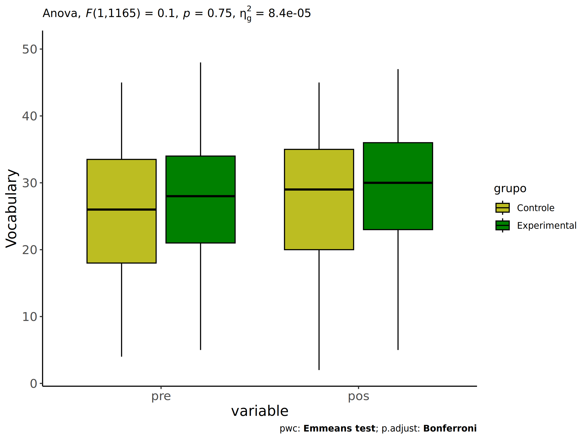<!-- -->

``` r
if (length(unique(wdat.long[["grupo"]])) > 1)
  plots <- oneWayAncovaBoxPlots(
    wdat.long, "vocab", "grupo", aov, pwc.long,
    pre.post = "time", theme = "classic", color = color$prepost)
```

``` r
if (length(unique(wdat.long[["grupo"]])) > 1)
  plots[["grupo"]] + ggplot2::ylab("Vocabulary") +
  if (ymin < ymax) ggplot2::ylim(ymin, ymax) 
```

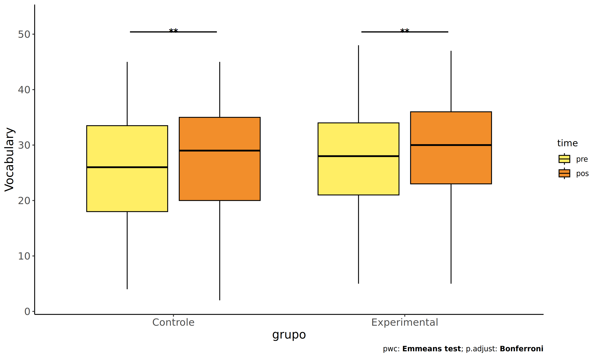<!-- -->

### Checking linearity assumption

``` r
ggscatter(wdat, x = "vocab.pre", y = "vocab.pos", size = 0.5,
          color = "grupo", add = "reg.line")+
  stat_regline_equation(
    aes(label =  paste(..eq.label.., ..rr.label.., sep = "~~~~"), color = grupo)
  ) +
  ggplot2::labs(subtitle = rstatix::get_test_label(aov, detailed = T, row = which(aov$Effect == "grupo"))) +
  ggplot2::scale_color_manual(values = color[["grupo"]]) +
  if (ymin < ymax) ggplot2::ylim(ymin, ymax)
```

<!-- -->

### Checking normality and homogeneity

``` r
res <- augment(lm(vocab.pos ~ vocab.pre + grupo, data = wdat))
```

``` r
shapiro_test(res$.resid)
```

    ## # A tibble: 1 × 3
    ##   variable   statistic p.value
    ##   <chr>          <dbl>   <dbl>
    ## 1 res$.resid     0.998   0.149

``` r
levene_test(res, .resid ~ grupo)
```

    ## # A tibble: 1 × 4
    ##     df1   df2 statistic     p
    ##   <int> <int>     <dbl> <dbl>
    ## 1     1  1166     0.209 0.647

# ANCOVA and Pairwise for two factors **grupo:Sexo**

## Without remove non-normal data

``` r
pdat = remove_group_data(dat[!is.na(dat[["grupo"]]) & !is.na(dat[["Sexo"]]),],
                         "vocab.pos", c("grupo","Sexo"))
pdat = pdat[pdat[["Sexo"]] %in% do.call(
  intersect, lapply(unique(pdat[["grupo"]]), FUN = function(x) {
    unique(pdat[["Sexo"]][which(pdat[["grupo"]] == x)])
  })),]
pdat[["grupo"]] = factor(pdat[["grupo"]], level[["grupo"]])
pdat[["Sexo"]] = factor(
  pdat[["Sexo"]],
  level[["Sexo"]][level[["Sexo"]] %in% unique(pdat[["Sexo"]])])

pdat.long <- rbind(pdat[,c("id","grupo","Sexo")], pdat[,c("id","grupo","Sexo")])
pdat.long[["time"]] <- c(rep("pre", nrow(pdat)), rep("pos", nrow(pdat)))
pdat.long[["time"]] <- factor(pdat.long[["time"]], c("pre","pos"))
pdat.long[["vocab"]] <- c(pdat[["vocab.pre"]], pdat[["vocab.pos"]])

if (length(unique(pdat[["Sexo"]])) >= 2) {
  aov = anova_test(pdat, vocab.pos ~ vocab.pre + grupo*Sexo)
  laov[["grupo:Sexo"]] <- get_anova_table(aov)
}
```

``` r
if (length(unique(pdat[["Sexo"]])) >= 2) {
  pwcs <- list()
  pwcs[["Sexo"]] <- emmeans_test(
    group_by(pdat, grupo), vocab.pos ~ Sexo,
    covariate = vocab.pre, p.adjust.method = "bonferroni")
  pwcs[["grupo"]] <- emmeans_test(
    group_by(pdat, Sexo), vocab.pos ~ grupo,
    covariate = vocab.pre, p.adjust.method = "bonferroni")
  
  pwc <- plyr::rbind.fill(pwcs[["grupo"]], pwcs[["Sexo"]])
  pwc <- pwc[,c("grupo","Sexo", colnames(pwc)[!colnames(pwc) %in% c("grupo","Sexo")])]
}
```

``` r
if (length(unique(pdat[["Sexo"]])) >= 2) {
  pwc.long <- emmeans_test(dplyr::group_by_at(pdat.long, c("grupo","Sexo")),
                           vocab ~ time,
                           p.adjust.method = "bonferroni")
  lpwc[["grupo:Sexo"]] <- plyr::rbind.fill(pwc, pwc.long)
}
```

``` r
if (length(unique(pdat[["Sexo"]])) >= 2) {
  ds <- get.descriptives(pdat, "vocab.pos", c("grupo","Sexo"), covar = "vocab.pre")
  ds <- merge(ds[ds$variable != "vocab.pre",],
              ds[ds$variable == "vocab.pre", !colnames(ds) %in% c("variable")],
              by = c("grupo","Sexo"), all.x = T, suffixes = c("", ".vocab.pre"))
  ds <- merge(get_emmeans(pwcs[["grupo"]]), ds,
              by = c("grupo","Sexo"), suffixes = c(".emms", ""))
  ds <- ds[,c("grupo","Sexo","n","mean.vocab.pre","se.vocab.pre","mean","se",
              "emmean","se.emms","conf.low","conf.high")]
  
  colnames(ds) <- c("grupo","Sexo", "N", paste0(c("M","SE")," (pre)"),
                    paste0(c("M","SE"), " (unadj)"),
                    paste0(c("M", "SE"), " (adj)"), "conf.low", "conf.high")
  
  lemms[["grupo:Sexo"]] <- ds
}
```

## Computing ANCOVA and PairWise After removing non-normal data (OK)

``` r
if (length(unique(pdat[["Sexo"]])) >= 2) {
  wdat = pdat 
  
  res = residuals(lm(vocab.pos ~ vocab.pre + grupo*Sexo, data = wdat))
  non.normal = getNonNormal(res, wdat$id, plimit = 0.05)
  
  wdat = wdat[!wdat$id %in% non.normal,]
  
  wdat.long <- rbind(wdat[,c("id","grupo","Sexo")], wdat[,c("id","grupo","Sexo")])
  wdat.long[["time"]] <- c(rep("pre", nrow(wdat)), rep("pos", nrow(wdat)))
  wdat.long[["time"]] <- factor(wdat.long[["time"]], c("pre","pos"))
  wdat.long[["vocab"]] <- c(wdat[["vocab.pre"]], wdat[["vocab.pos"]])
  
  
  ldat[["grupo:Sexo"]] = wdat
  
  (non.normal)
}
```

    ##  [1] "P1113" "P1003" "P1139" "P983"  "P852"  "P2232" "P2207" "P1966" "P2192" "P2304" "P1129"
    ## [12] "P1056" "P1069" "P2245" "P3260" "P3473" "P887"  "P1961" "P2251" "P888"  "P976"  "P2853"
    ## [23] "P1006" "P1936" "P3654" "P3042" "P996"  "P1865" "P3265" "P1012" "P1620" "P2957" "P2176"
    ## [34] "P2850" "P2458" "P1831" "P478"  "P916"  "P913"  "P489"  "P1112" "P3106" "P1790" "P3499"
    ## [45] "P3548" "P2219" "P2856" "P863"  "P1781" "P1066" "P842"  "P1151" "P3580" "P3228" "P1126"
    ## [56] "P837"  "P476"  "P2004" "P2339" "P2098"

``` r
if (length(unique(pdat[["Sexo"]])) >= 2) {
  aov = anova_test(wdat, vocab.pos ~ vocab.pre + grupo*Sexo)
  laov[["grupo:Sexo"]] <- merge(get_anova_table(aov), laov[["grupo:Sexo"]],
                                         by="Effect", suffixes = c("","'"))
  df = get_anova_table(aov)
}
```

| Effect     | DFn |  DFd |        F |     p | p\<.05 |   ges |
|:-----------|----:|-----:|---------:|------:|:-------|------:|
| vocab.pre  |   1 | 1165 | 2910.637 | 0.000 | \*     | 0.714 |
| grupo      |   1 | 1165 |    0.107 | 0.743 |        | 0.000 |
| Sexo       |   1 | 1165 |   24.154 | 0.000 | \*     | 0.020 |
| grupo:Sexo |   1 | 1165 |    0.849 | 0.357 |        | 0.001 |

``` r
if (length(unique(pdat[["Sexo"]])) >= 2) {
  pwcs <- list()
  pwcs[["Sexo"]] <- emmeans_test(
    group_by(wdat, grupo), vocab.pos ~ Sexo,
    covariate = vocab.pre, p.adjust.method = "bonferroni")
  pwcs[["grupo"]] <- emmeans_test(
    group_by(wdat, Sexo), vocab.pos ~ grupo,
    covariate = vocab.pre, p.adjust.method = "bonferroni")
  
  pwc <- plyr::rbind.fill(pwcs[["grupo"]], pwcs[["Sexo"]])
  pwc <- pwc[,c("grupo","Sexo", colnames(pwc)[!colnames(pwc) %in% c("grupo","Sexo")])]
}
```

| grupo        | Sexo | term             | .y.       | group1   | group2       |   df | statistic |     p | p.adj | p.adj.signif |
|:-------------|:-----|:-----------------|:----------|:---------|:-------------|-----:|----------:|------:|------:|:-------------|
|              | F    | vocab.pre\*grupo | vocab.pos | Controle | Experimental | 1165 |    -0.406 | 0.685 | 0.685 | ns           |
|              | M    | vocab.pre\*grupo | vocab.pos | Controle | Experimental | 1165 |     0.888 | 0.375 | 0.375 | ns           |
| Controle     |      | vocab.pre\*Sexo  | vocab.pos | F        | M            | 1165 |     2.490 | 0.013 | 0.013 | \*           |
| Experimental |      | vocab.pre\*Sexo  | vocab.pos | F        | M            | 1165 |     4.342 | 0.000 | 0.000 | \*\*\*\*     |

``` r
if (length(unique(pdat[["Sexo"]])) >= 2) {
  pwc.long <- emmeans_test(dplyr::group_by_at(wdat.long, c("grupo","Sexo")),
                           vocab ~ time,
                           p.adjust.method = "bonferroni")
  lpwc[["grupo:Sexo"]] <- merge(plyr::rbind.fill(pwc, pwc.long),
                                         lpwc[["grupo:Sexo"]],
                                         by=c("grupo","Sexo","term",".y.","group1","group2"),
                                         suffixes = c("","'"))
}
```

| grupo        | Sexo | term | .y.   | group1 | group2 |   df | statistic |     p | p.adj | p.adj.signif |
|:-------------|:-----|:-----|:------|:-------|:-------|-----:|----------:|------:|------:|:-------------|
| Controle     | F    | time | vocab | pre    | pos    | 2332 |    -2.681 | 0.007 | 0.007 | \*\*         |
| Controle     | M    | time | vocab | pre    | pos    | 2332 |    -1.731 | 0.084 | 0.084 | ns           |
| Experimental | F    | time | vocab | pre    | pos    | 2332 |    -3.232 | 0.001 | 0.001 | \*\*         |
| Experimental | M    | time | vocab | pre    | pos    | 2332 |    -0.971 | 0.332 | 0.332 | ns           |

``` r
if (length(unique(pdat[["Sexo"]])) >= 2) {
  ds <- get.descriptives(wdat, "vocab.pos", c("grupo","Sexo"), covar = "vocab.pre")
  ds <- merge(ds[ds$variable != "vocab.pre",],
              ds[ds$variable == "vocab.pre", !colnames(ds) %in% c("variable")],
              by = c("grupo","Sexo"), all.x = T, suffixes = c("", ".vocab.pre"))
  ds <- merge(get_emmeans(pwcs[["grupo"]]), ds,
              by = c("grupo","Sexo"), suffixes = c(".emms", ""))
  ds <- ds[,c("grupo","Sexo","n","mean.vocab.pre","se.vocab.pre",
              "mean","se","emmean","se.emms","conf.low","conf.high")]
  
  colnames(ds) <- c("grupo","Sexo", "N", paste0(c("M","SE")," (pre)"),
                    paste0(c("M","SE"), " (unadj)"),
                    paste0(c("M", "SE"), " (adj)"), "conf.low", "conf.high")
  
  lemms[["grupo:Sexo"]] <- merge(ds, lemms[["grupo:Sexo"]],
                                          by=c("grupo","Sexo"), suffixes = c("","'"))
}
```

| grupo        | Sexo |   N | M (pre) | SE (pre) | M (unadj) | SE (unadj) | M (adj) | SE (adj) | conf.low | conf.high |
|:-------------|:-----|----:|--------:|---------:|----------:|-----------:|--------:|---------:|---------:|----------:|
| Controle     | F    | 249 |  26.815 |    0.549 |    28.964 |      0.539 |  28.841 |    0.304 |   28.245 |    29.438 |
| Controle     | M    | 244 |  24.615 |    0.628 |    26.016 |      0.659 |  27.762 |    0.309 |   27.157 |    28.368 |
| Experimental | F    | 353 |  27.705 |    0.463 |    29.881 |      0.442 |  29.003 |    0.256 |   28.501 |    29.504 |
| Experimental | M    | 324 |  26.981 |    0.480 |    27.664 |      0.496 |  27.400 |    0.266 |   26.877 |    27.923 |

### Plots for ancova

``` r
if (length(unique(pdat[["Sexo"]])) >= 2) {
  ggPlotAoC2(pwcs, "grupo", "Sexo", aov, ylab = "Vocabulary",
             subtitle = which(aov$Effect == "grupo:Sexo"), addParam = "errorbar") +
    ggplot2::scale_color_manual(values = color[["Sexo"]]) +
    if (ymin.ci < ymax.ci) ggplot2::ylim(ymin.ci, ymax.ci)
}
```

    ## Scale for colour is already present.
    ## Adding another scale for colour, which will replace the existing scale.

<!-- -->

``` r
if (length(unique(pdat[["Sexo"]])) >= 2) {
  ggPlotAoC2(pwcs, "Sexo", "grupo", aov, ylab = "Vocabulary",
               subtitle = which(aov$Effect == "grupo:Sexo"), addParam = "errorbar") +
      ggplot2::scale_color_manual(values = color[["grupo"]]) +
      if (ymin.ci < ymax.ci) ggplot2::ylim(ymin.ci, ymax.ci)
}
```

    ## Scale for colour is already present.
    ## Adding another scale for colour, which will replace the existing scale.

<!-- -->

``` r
if (length(unique(pdat[["Sexo"]])) >= 2) {
  plots <- twoWayAncovaBoxPlots(
    wdat, "vocab.pos", c("grupo","Sexo"), aov, pwcs, covar = "vocab.pre",
    theme = "classic", color = color[["grupo:Sexo"]],
    subtitle = which(aov$Effect == "grupo:Sexo"))
}
```

``` r
if (length(unique(pdat[["Sexo"]])) >= 2) {
  plots[["grupo:Sexo"]] + ggplot2::ylab("Vocabulary") +
  ggplot2::scale_x_discrete(labels=c('pre', 'pos')) +
  if (ymin < ymax) ggplot2::ylim(ymin, ymax)
}
```

    ## Warning: No shared levels found between `names(values)` of the manual scale and the data's colour
    ## values.

<!-- -->

``` r
if (length(unique(pdat[["Sexo"]])) >= 2) {
  plots <- twoWayAncovaBoxPlots(
    wdat.long, "vocab", c("grupo","Sexo"), aov, pwc.long,
    pre.post = "time",
    theme = "classic", color = color$prepost)
}
```

``` r
if (length(unique(pdat[["Sexo"]])) >= 2) 
  plots[["grupo:Sexo"]] + ggplot2::ylab("Vocabulary") +
    if (ymin < ymax) ggplot2::ylim(ymin, ymax)
```

<!-- -->

### Checking linearity assumption

``` r
if (length(unique(pdat[["Sexo"]])) >= 2) {
  ggscatter(wdat, x = "vocab.pre", y = "vocab.pos", size = 0.5,
            facet.by = c("grupo","Sexo"), add = "reg.line")+
    stat_regline_equation(
      aes(label =  paste(..eq.label.., ..rr.label.., sep = "~~~~"))
    ) +
    if (ymin < ymax) ggplot2::ylim(ymin, ymax)
}
```

<!-- -->

``` r
if (length(unique(pdat[["Sexo"]])) >= 2) {
  ggscatter(wdat, x = "vocab.pre", y = "vocab.pos", size = 0.5,
            color = "grupo", facet.by = "Sexo", add = "reg.line")+
    stat_regline_equation(
      aes(label =  paste(..eq.label.., ..rr.label.., sep = "~~~~"), color = grupo)
    ) +
    ggplot2::labs(subtitle = rstatix::get_test_label(aov, detailed = T, row = which(aov$Effect == "grupo:Sexo"))) +
    ggplot2::scale_color_manual(values = color[["grupo"]]) +
    if (ymin < ymax) ggplot2::ylim(ymin, ymax)
}
```

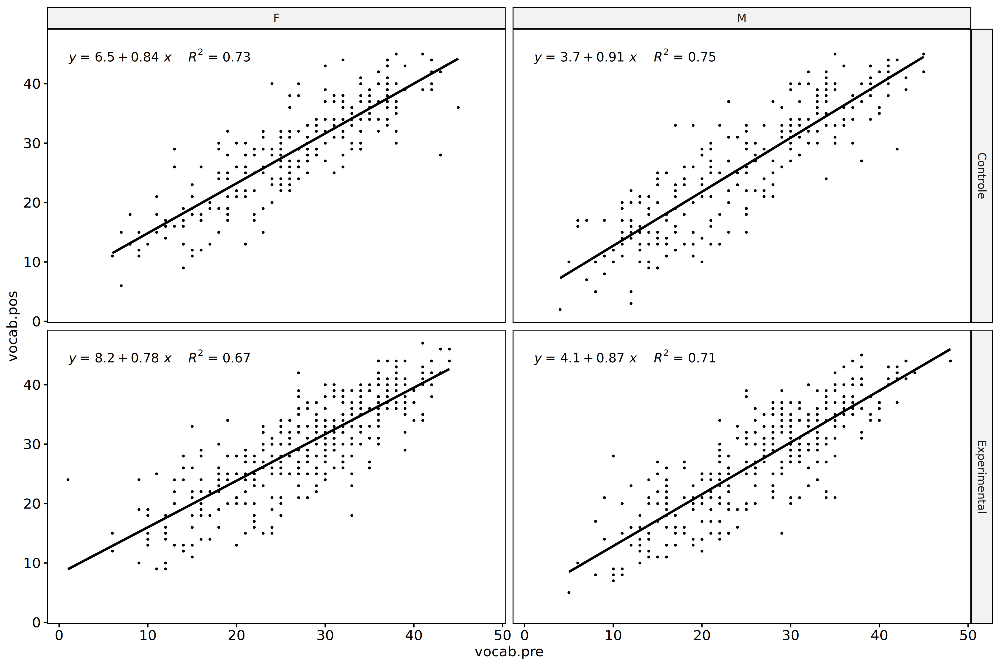<!-- -->

``` r
if (length(unique(pdat[["Sexo"]])) >= 2) {
  ggscatter(wdat, x = "vocab.pre", y = "vocab.pos", size = 0.5,
            color = "Sexo", facet.by = "grupo", add = "reg.line")+
    stat_regline_equation(
      aes(label =  paste(..eq.label.., ..rr.label.., sep = "~~~~"), color = Sexo)
    ) +
    ggplot2::labs(subtitle = rstatix::get_test_label(aov, detailed = T, row = which(aov$Effect == "grupo:Sexo"))) +
    ggplot2::scale_color_manual(values = color[["Sexo"]]) +
    if (ymin < ymax) ggplot2::ylim(ymin, ymax)
}
```

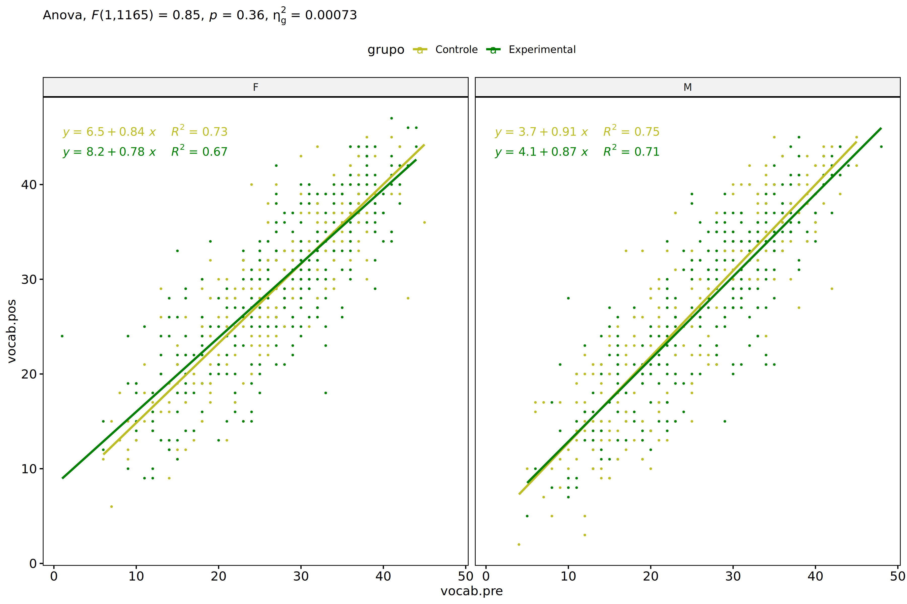<!-- -->

### Checking normality and homogeneity

``` r
if (length(unique(pdat[["Sexo"]])) >= 2) 
  res <- augment(lm(vocab.pos ~ vocab.pre + grupo*Sexo, data = wdat))
```

``` r
if (length(unique(pdat[["Sexo"]])) >= 2)
  shapiro_test(res$.resid)
```

    ## # A tibble: 1 × 3
    ##   variable   statistic p.value
    ##   <chr>          <dbl>   <dbl>
    ## 1 res$.resid     0.998   0.224

``` r
if (length(unique(pdat[["Sexo"]])) >= 2) 
  levene_test(res, .resid ~ grupo*Sexo)
```

    ## # A tibble: 1 × 4
    ##     df1   df2 statistic      p
    ##   <int> <int>     <dbl>  <dbl>
    ## 1     3  1166      2.55 0.0540

# ANCOVA and Pairwise for two factors **grupo:Zona**

## Without remove non-normal data

``` r
pdat = remove_group_data(dat[!is.na(dat[["grupo"]]) & !is.na(dat[["Zona"]]),],
                         "vocab.pos", c("grupo","Zona"))
pdat = pdat[pdat[["Zona"]] %in% do.call(
  intersect, lapply(unique(pdat[["grupo"]]), FUN = function(x) {
    unique(pdat[["Zona"]][which(pdat[["grupo"]] == x)])
  })),]
pdat[["grupo"]] = factor(pdat[["grupo"]], level[["grupo"]])
pdat[["Zona"]] = factor(
  pdat[["Zona"]],
  level[["Zona"]][level[["Zona"]] %in% unique(pdat[["Zona"]])])

pdat.long <- rbind(pdat[,c("id","grupo","Zona")], pdat[,c("id","grupo","Zona")])
pdat.long[["time"]] <- c(rep("pre", nrow(pdat)), rep("pos", nrow(pdat)))
pdat.long[["time"]] <- factor(pdat.long[["time"]], c("pre","pos"))
pdat.long[["vocab"]] <- c(pdat[["vocab.pre"]], pdat[["vocab.pos"]])

if (length(unique(pdat[["Zona"]])) >= 2) {
  aov = anova_test(pdat, vocab.pos ~ vocab.pre + grupo*Zona)
  laov[["grupo:Zona"]] <- get_anova_table(aov)
}
```

``` r
if (length(unique(pdat[["Zona"]])) >= 2) {
  pwcs <- list()
  pwcs[["Zona"]] <- emmeans_test(
    group_by(pdat, grupo), vocab.pos ~ Zona,
    covariate = vocab.pre, p.adjust.method = "bonferroni")
  pwcs[["grupo"]] <- emmeans_test(
    group_by(pdat, Zona), vocab.pos ~ grupo,
    covariate = vocab.pre, p.adjust.method = "bonferroni")
  
  pwc <- plyr::rbind.fill(pwcs[["grupo"]], pwcs[["Zona"]])
  pwc <- pwc[,c("grupo","Zona", colnames(pwc)[!colnames(pwc) %in% c("grupo","Zona")])]
}
```

``` r
if (length(unique(pdat[["Zona"]])) >= 2) {
  pwc.long <- emmeans_test(dplyr::group_by_at(pdat.long, c("grupo","Zona")),
                           vocab ~ time,
                           p.adjust.method = "bonferroni")
  lpwc[["grupo:Zona"]] <- plyr::rbind.fill(pwc, pwc.long)
}
```

``` r
if (length(unique(pdat[["Zona"]])) >= 2) {
  ds <- get.descriptives(pdat, "vocab.pos", c("grupo","Zona"), covar = "vocab.pre")
  ds <- merge(ds[ds$variable != "vocab.pre",],
              ds[ds$variable == "vocab.pre", !colnames(ds) %in% c("variable")],
              by = c("grupo","Zona"), all.x = T, suffixes = c("", ".vocab.pre"))
  ds <- merge(get_emmeans(pwcs[["grupo"]]), ds,
              by = c("grupo","Zona"), suffixes = c(".emms", ""))
  ds <- ds[,c("grupo","Zona","n","mean.vocab.pre","se.vocab.pre","mean","se",
              "emmean","se.emms","conf.low","conf.high")]
  
  colnames(ds) <- c("grupo","Zona", "N", paste0(c("M","SE")," (pre)"),
                    paste0(c("M","SE"), " (unadj)"),
                    paste0(c("M", "SE"), " (adj)"), "conf.low", "conf.high")
  
  lemms[["grupo:Zona"]] <- ds
}
```

## Computing ANCOVA and PairWise After removing non-normal data (OK)

``` r
if (length(unique(pdat[["Zona"]])) >= 2) {
  wdat = pdat 
  
  res = residuals(lm(vocab.pos ~ vocab.pre + grupo*Zona, data = wdat))
  non.normal = getNonNormal(res, wdat$id, plimit = 0.05)
  
  wdat = wdat[!wdat$id %in% non.normal,]
  
  wdat.long <- rbind(wdat[,c("id","grupo","Zona")], wdat[,c("id","grupo","Zona")])
  wdat.long[["time"]] <- c(rep("pre", nrow(wdat)), rep("pos", nrow(wdat)))
  wdat.long[["time"]] <- factor(wdat.long[["time"]], c("pre","pos"))
  wdat.long[["vocab"]] <- c(wdat[["vocab.pre"]], wdat[["vocab.pos"]])
  
  
  ldat[["grupo:Zona"]] = wdat
  
  (non.normal)
}
```

    ##  [1] "P1139" "P983"  "P852"  "P2207" "P1056" "P1966" "P3260" "P2304" "P2957" "P887"  "P976" 
    ## [12] "P3042" "P3654" "P489"  "P863"  "P2861" "P3499" "P1961" "P1831" "P478"  "P2850" "P888" 
    ## [23] "P1012"

``` r
if (length(unique(pdat[["Zona"]])) >= 2) {
  aov = anova_test(wdat, vocab.pos ~ vocab.pre + grupo*Zona)
  laov[["grupo:Zona"]] <- merge(get_anova_table(aov), laov[["grupo:Zona"]],
                                         by="Effect", suffixes = c("","'"))
  df = get_anova_table(aov)
}
```

| Effect     | DFn | DFd |        F |     p | p\<.05 |   ges |
|:-----------|----:|----:|---------:|------:|:-------|------:|
| vocab.pre  |   1 | 823 | 1893.948 | 0.000 | \*     | 0.697 |
| grupo      |   1 | 823 |    0.821 | 0.365 |        | 0.001 |
| Zona       |   1 | 823 |    0.001 | 0.979 |        | 0.000 |
| grupo:Zona |   1 | 823 |    1.291 | 0.256 |        | 0.002 |

``` r
if (length(unique(pdat[["Zona"]])) >= 2) {
  pwcs <- list()
  pwcs[["Zona"]] <- emmeans_test(
    group_by(wdat, grupo), vocab.pos ~ Zona,
    covariate = vocab.pre, p.adjust.method = "bonferroni")
  pwcs[["grupo"]] <- emmeans_test(
    group_by(wdat, Zona), vocab.pos ~ grupo,
    covariate = vocab.pre, p.adjust.method = "bonferroni")
  
  pwc <- plyr::rbind.fill(pwcs[["grupo"]], pwcs[["Zona"]])
  pwc <- pwc[,c("grupo","Zona", colnames(pwc)[!colnames(pwc) %in% c("grupo","Zona")])]
}
```

| grupo        | Zona   | term             | .y.       | group1   | group2       |  df | statistic |     p | p.adj | p.adj.signif |
|:-------------|:-------|:-----------------|:----------|:---------|:-------------|----:|----------:|------:|------:|:-------------|
|              | Rural  | vocab.pre\*grupo | vocab.pos | Controle | Experimental | 823 |     1.401 | 0.162 | 0.162 | ns           |
|              | Urbana | vocab.pre\*grupo | vocab.pos | Controle | Experimental | 823 |    -0.384 | 0.701 | 0.701 | ns           |
| Controle     |        | vocab.pre\*Zona  | vocab.pos | Rural    | Urbana       | 823 |     0.858 | 0.391 | 0.391 | ns           |
| Experimental |        | vocab.pre\*Zona  | vocab.pos | Rural    | Urbana       | 823 |    -0.743 | 0.458 | 0.458 | ns           |

``` r
if (length(unique(pdat[["Zona"]])) >= 2) {
  pwc.long <- emmeans_test(dplyr::group_by_at(wdat.long, c("grupo","Zona")),
                           vocab ~ time,
                           p.adjust.method = "bonferroni")
  lpwc[["grupo:Zona"]] <- merge(plyr::rbind.fill(pwc, pwc.long),
                                         lpwc[["grupo:Zona"]],
                                         by=c("grupo","Zona","term",".y.","group1","group2"),
                                         suffixes = c("","'"))
}
```

| grupo        | Zona   | term | .y.   | group1 | group2 |   df | statistic |     p | p.adj | p.adj.signif |
|:-------------|:-------|:-----|:------|:-------|:-------|-----:|----------:|------:|------:|:-------------|
| Controle     | Rural  | time | vocab | pre    | pos    | 1648 |    -2.754 | 0.006 | 0.006 | \*\*         |
| Controle     | Urbana | time | vocab | pre    | pos    | 1648 |    -1.284 | 0.199 | 0.199 | ns           |
| Experimental | Rural  | time | vocab | pre    | pos    | 1648 |    -1.940 | 0.053 | 0.053 | ns           |
| Experimental | Urbana | time | vocab | pre    | pos    | 1648 |    -1.731 | 0.084 | 0.084 | ns           |

``` r
if (length(unique(pdat[["Zona"]])) >= 2) {
  ds <- get.descriptives(wdat, "vocab.pos", c("grupo","Zona"), covar = "vocab.pre")
  ds <- merge(ds[ds$variable != "vocab.pre",],
              ds[ds$variable == "vocab.pre", !colnames(ds) %in% c("variable")],
              by = c("grupo","Zona"), all.x = T, suffixes = c("", ".vocab.pre"))
  ds <- merge(get_emmeans(pwcs[["grupo"]]), ds,
              by = c("grupo","Zona"), suffixes = c(".emms", ""))
  ds <- ds[,c("grupo","Zona","n","mean.vocab.pre","se.vocab.pre",
              "mean","se","emmean","se.emms","conf.low","conf.high")]
  
  colnames(ds) <- c("grupo","Zona", "N", paste0(c("M","SE")," (pre)"),
                    paste0(c("M","SE"), " (unadj)"),
                    paste0(c("M", "SE"), " (adj)"), "conf.low", "conf.high")
  
  lemms[["grupo:Zona"]] <- merge(ds, lemms[["grupo:Zona"]],
                                          by=c("grupo","Zona"), suffixes = c("","'"))
}
```

| grupo        | Zona   |   N | M (pre) | SE (pre) | M (unadj) | SE (unadj) | M (adj) | SE (adj) | conf.low | conf.high |
|:-------------|:-------|----:|--------:|---------:|----------:|-----------:|--------:|---------:|---------:|----------:|
| Controle     | Rural  | 246 |  25.138 |    0.552 |    27.362 |      0.620 |  28.390 |    0.321 |   27.760 |    29.020 |
| Controle     | Urbana | 112 |  26.607 |    0.868 |    28.143 |      0.846 |  27.898 |    0.474 |   26.967 |    28.830 |
| Experimental | Rural  | 284 |  26.278 |    0.519 |    27.736 |      0.532 |  27.776 |    0.298 |   27.192 |    28.361 |
| Experimental | Urbana | 186 |  27.796 |    0.643 |    29.403 |      0.632 |  28.129 |    0.369 |   27.404 |    28.854 |

### Plots for ancova

``` r
if (length(unique(pdat[["Zona"]])) >= 2) {
  ggPlotAoC2(pwcs, "grupo", "Zona", aov, ylab = "Vocabulary",
             subtitle = which(aov$Effect == "grupo:Zona"), addParam = "errorbar") +
    ggplot2::scale_color_manual(values = color[["Zona"]]) +
    if (ymin.ci < ymax.ci) ggplot2::ylim(ymin.ci, ymax.ci)
}
```

    ## Scale for colour is already present.
    ## Adding another scale for colour, which will replace the existing scale.

<!-- -->

``` r
if (length(unique(pdat[["Zona"]])) >= 2) {
  ggPlotAoC2(pwcs, "Zona", "grupo", aov, ylab = "Vocabulary",
               subtitle = which(aov$Effect == "grupo:Zona"), addParam = "errorbar") +
      ggplot2::scale_color_manual(values = color[["grupo"]]) +
      if (ymin.ci < ymax.ci) ggplot2::ylim(ymin.ci, ymax.ci)
}
```

    ## Scale for colour is already present.
    ## Adding another scale for colour, which will replace the existing scale.

<!-- -->

``` r
if (length(unique(pdat[["Zona"]])) >= 2) {
  plots <- twoWayAncovaBoxPlots(
    wdat, "vocab.pos", c("grupo","Zona"), aov, pwcs, covar = "vocab.pre",
    theme = "classic", color = color[["grupo:Zona"]],
    subtitle = which(aov$Effect == "grupo:Zona"))
}
```

``` r
if (length(unique(pdat[["Zona"]])) >= 2) {
  plots[["grupo:Zona"]] + ggplot2::ylab("Vocabulary") +
  ggplot2::scale_x_discrete(labels=c('pre', 'pos')) +
  if (ymin < ymax) ggplot2::ylim(ymin, ymax)
}
```

    ## Warning: No shared levels found between `names(values)` of the manual scale and the data's colour
    ## values.

<!-- -->

``` r
if (length(unique(pdat[["Zona"]])) >= 2) {
  plots <- twoWayAncovaBoxPlots(
    wdat.long, "vocab", c("grupo","Zona"), aov, pwc.long,
    pre.post = "time",
    theme = "classic", color = color$prepost)
}
```

``` r
if (length(unique(pdat[["Zona"]])) >= 2) 
  plots[["grupo:Zona"]] + ggplot2::ylab("Vocabulary") +
    if (ymin < ymax) ggplot2::ylim(ymin, ymax)
```

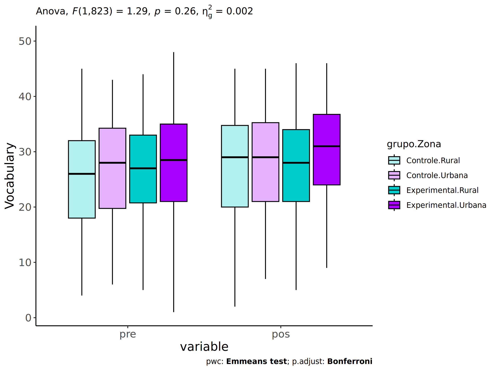<!-- -->

### Checking linearity assumption

``` r
if (length(unique(pdat[["Zona"]])) >= 2) {
  ggscatter(wdat, x = "vocab.pre", y = "vocab.pos", size = 0.5,
            facet.by = c("grupo","Zona"), add = "reg.line")+
    stat_regline_equation(
      aes(label =  paste(..eq.label.., ..rr.label.., sep = "~~~~"))
    ) +
    if (ymin < ymax) ggplot2::ylim(ymin, ymax)
}
```

<!-- -->

``` r
if (length(unique(pdat[["Zona"]])) >= 2) {
  ggscatter(wdat, x = "vocab.pre", y = "vocab.pos", size = 0.5,
            color = "grupo", facet.by = "Zona", add = "reg.line")+
    stat_regline_equation(
      aes(label =  paste(..eq.label.., ..rr.label.., sep = "~~~~"), color = grupo)
    ) +
    ggplot2::labs(subtitle = rstatix::get_test_label(aov, detailed = T, row = which(aov$Effect == "grupo:Zona"))) +
    ggplot2::scale_color_manual(values = color[["grupo"]]) +
    if (ymin < ymax) ggplot2::ylim(ymin, ymax)
}
```

<!-- -->

``` r
if (length(unique(pdat[["Zona"]])) >= 2) {
  ggscatter(wdat, x = "vocab.pre", y = "vocab.pos", size = 0.5,
            color = "Zona", facet.by = "grupo", add = "reg.line")+
    stat_regline_equation(
      aes(label =  paste(..eq.label.., ..rr.label.., sep = "~~~~"), color = Zona)
    ) +
    ggplot2::labs(subtitle = rstatix::get_test_label(aov, detailed = T, row = which(aov$Effect == "grupo:Zona"))) +
    ggplot2::scale_color_manual(values = color[["Zona"]]) +
    if (ymin < ymax) ggplot2::ylim(ymin, ymax)
}
```

<!-- -->

### Checking normality and homogeneity

``` r
if (length(unique(pdat[["Zona"]])) >= 2) 
  res <- augment(lm(vocab.pos ~ vocab.pre + grupo*Zona, data = wdat))
```

``` r
if (length(unique(pdat[["Zona"]])) >= 2)
  shapiro_test(res$.resid)
```

    ## # A tibble: 1 × 3
    ##   variable   statistic p.value
    ##   <chr>          <dbl>   <dbl>
    ## 1 res$.resid     0.997  0.0956

``` r
if (length(unique(pdat[["Zona"]])) >= 2) 
  levene_test(res, .resid ~ grupo*Zona)
```

    ## # A tibble: 1 × 4
    ##     df1   df2 statistic      p
    ##   <int> <int>     <dbl>  <dbl>
    ## 1     3   824      3.51 0.0150

# ANCOVA and Pairwise for two factors **grupo:Cor.Raca**

## Without remove non-normal data

``` r
pdat = remove_group_data(dat[!is.na(dat[["grupo"]]) & !is.na(dat[["Cor.Raca"]]),],
                         "vocab.pos", c("grupo","Cor.Raca"))
```

    ## Warning: There were 3 warnings in `mutate()`.
    ## The first warning was:
    ## ℹ In argument: `ci = abs(stats::qt(alpha/2, .data$n - 1) * .data$se)`.
    ## Caused by warning:
    ## ! There was 1 warning in `mutate()`.
    ## ℹ In argument: `ci = abs(stats::qt(alpha/2, .data$n - 1) * .data$se)`.
    ## Caused by warning in `stats::qt()`:
    ## ! NaNs produced
    ## ℹ Run `dplyr::last_dplyr_warnings()` to see the 2 remaining warnings.

``` r
pdat = pdat[pdat[["Cor.Raca"]] %in% do.call(
  intersect, lapply(unique(pdat[["grupo"]]), FUN = function(x) {
    unique(pdat[["Cor.Raca"]][which(pdat[["grupo"]] == x)])
  })),]
pdat[["grupo"]] = factor(pdat[["grupo"]], level[["grupo"]])
pdat[["Cor.Raca"]] = factor(
  pdat[["Cor.Raca"]],
  level[["Cor.Raca"]][level[["Cor.Raca"]] %in% unique(pdat[["Cor.Raca"]])])

pdat.long <- rbind(pdat[,c("id","grupo","Cor.Raca")], pdat[,c("id","grupo","Cor.Raca")])
pdat.long[["time"]] <- c(rep("pre", nrow(pdat)), rep("pos", nrow(pdat)))
pdat.long[["time"]] <- factor(pdat.long[["time"]], c("pre","pos"))
pdat.long[["vocab"]] <- c(pdat[["vocab.pre"]], pdat[["vocab.pos"]])

if (length(unique(pdat[["Cor.Raca"]])) >= 2) {
  aov = anova_test(pdat, vocab.pos ~ vocab.pre + grupo*Cor.Raca)
  laov[["grupo:Cor.Raca"]] <- get_anova_table(aov)
}
```

``` r
if (length(unique(pdat[["Cor.Raca"]])) >= 2) {
  pwcs <- list()
  pwcs[["Cor.Raca"]] <- emmeans_test(
    group_by(pdat, grupo), vocab.pos ~ Cor.Raca,
    covariate = vocab.pre, p.adjust.method = "bonferroni")
  pwcs[["grupo"]] <- emmeans_test(
    group_by(pdat, Cor.Raca), vocab.pos ~ grupo,
    covariate = vocab.pre, p.adjust.method = "bonferroni")
  
  pwc <- plyr::rbind.fill(pwcs[["grupo"]], pwcs[["Cor.Raca"]])
  pwc <- pwc[,c("grupo","Cor.Raca", colnames(pwc)[!colnames(pwc) %in% c("grupo","Cor.Raca")])]
}
```

``` r
if (length(unique(pdat[["Cor.Raca"]])) >= 2) {
  pwc.long <- emmeans_test(dplyr::group_by_at(pdat.long, c("grupo","Cor.Raca")),
                           vocab ~ time,
                           p.adjust.method = "bonferroni")
  lpwc[["grupo:Cor.Raca"]] <- plyr::rbind.fill(pwc, pwc.long)
}
```

``` r
if (length(unique(pdat[["Cor.Raca"]])) >= 2) {
  ds <- get.descriptives(pdat, "vocab.pos", c("grupo","Cor.Raca"), covar = "vocab.pre")
  ds <- merge(ds[ds$variable != "vocab.pre",],
              ds[ds$variable == "vocab.pre", !colnames(ds) %in% c("variable")],
              by = c("grupo","Cor.Raca"), all.x = T, suffixes = c("", ".vocab.pre"))
  ds <- merge(get_emmeans(pwcs[["grupo"]]), ds,
              by = c("grupo","Cor.Raca"), suffixes = c(".emms", ""))
  ds <- ds[,c("grupo","Cor.Raca","n","mean.vocab.pre","se.vocab.pre","mean","se",
              "emmean","se.emms","conf.low","conf.high")]
  
  colnames(ds) <- c("grupo","Cor.Raca", "N", paste0(c("M","SE")," (pre)"),
                    paste0(c("M","SE"), " (unadj)"),
                    paste0(c("M", "SE"), " (adj)"), "conf.low", "conf.high")
  
  lemms[["grupo:Cor.Raca"]] <- ds
}
```

## Computing ANCOVA and PairWise After removing non-normal data (OK)

``` r
if (length(unique(pdat[["Cor.Raca"]])) >= 2) {
  wdat = pdat 
  
  res = residuals(lm(vocab.pos ~ vocab.pre + grupo*Cor.Raca, data = wdat))
  non.normal = getNonNormal(res, wdat$id, plimit = 0.05)
  
  wdat = wdat[!wdat$id %in% non.normal,]
  
  wdat.long <- rbind(wdat[,c("id","grupo","Cor.Raca")], wdat[,c("id","grupo","Cor.Raca")])
  wdat.long[["time"]] <- c(rep("pre", nrow(wdat)), rep("pos", nrow(wdat)))
  wdat.long[["time"]] <- factor(wdat.long[["time"]], c("pre","pos"))
  wdat.long[["vocab"]] <- c(wdat[["vocab.pre"]], wdat[["vocab.pos"]])
  
  
  ldat[["grupo:Cor.Raca"]] = wdat
  
  (non.normal)
}
```

    ##  [1] "P1139" "P1003" "P1113" "P852"  "P3654" "P1056" "P1006" "P996"  "P3260" "P1069" "P850" 
    ## [12] "P3473" "P2135" "P1112" "P913"

``` r
if (length(unique(pdat[["Cor.Raca"]])) >= 2) {
  aov = anova_test(wdat, vocab.pos ~ vocab.pre + grupo*Cor.Raca)
  laov[["grupo:Cor.Raca"]] <- merge(get_anova_table(aov), laov[["grupo:Cor.Raca"]],
                                         by="Effect", suffixes = c("","'"))
  df = get_anova_table(aov)
}
```

| Effect         | DFn | DFd |        F |     p | p\<.05 |   ges |
|:---------------|----:|----:|---------:|------:|:-------|------:|
| vocab.pre      |   1 | 495 | 1060.021 | 0.000 | \*     | 0.682 |
| grupo          |   1 | 495 |    0.240 | 0.624 |        | 0.000 |
| Cor.Raca       |   2 | 495 |    2.754 | 0.065 |        | 0.011 |
| grupo:Cor.Raca |   2 | 495 |    1.448 | 0.236 |        | 0.006 |

``` r
if (length(unique(pdat[["Cor.Raca"]])) >= 2) {
  pwcs <- list()
  pwcs[["Cor.Raca"]] <- emmeans_test(
    group_by(wdat, grupo), vocab.pos ~ Cor.Raca,
    covariate = vocab.pre, p.adjust.method = "bonferroni")
  pwcs[["grupo"]] <- emmeans_test(
    group_by(wdat, Cor.Raca), vocab.pos ~ grupo,
    covariate = vocab.pre, p.adjust.method = "bonferroni")
  
  pwc <- plyr::rbind.fill(pwcs[["grupo"]], pwcs[["Cor.Raca"]])
  pwc <- pwc[,c("grupo","Cor.Raca", colnames(pwc)[!colnames(pwc) %in% c("grupo","Cor.Raca")])]
}
```

| grupo        | Cor.Raca | term                | .y.       | group1   | group2       |  df | statistic |     p | p.adj | p.adj.signif |
|:-------------|:---------|:--------------------|:----------|:---------|:-------------|----:|----------:|------:|------:|:-------------|
|              | Parda    | vocab.pre\*grupo    | vocab.pos | Controle | Experimental | 495 |    -0.494 | 0.621 | 0.621 | ns           |
|              | Indígena | vocab.pre\*grupo    | vocab.pos | Controle | Experimental | 495 |     0.611 | 0.541 | 0.541 | ns           |
|              | Branca   | vocab.pre\*grupo    | vocab.pos | Controle | Experimental | 495 |     1.584 | 0.114 | 0.114 | ns           |
| Controle     |          | vocab.pre\*Cor.Raca | vocab.pos | Parda    | Indígena     | 495 |    -1.442 | 0.150 | 0.450 | ns           |
| Controle     |          | vocab.pre\*Cor.Raca | vocab.pos | Parda    | Branca       | 495 |    -0.014 | 0.989 | 1.000 | ns           |
| Controle     |          | vocab.pre\*Cor.Raca | vocab.pos | Indígena | Branca       | 495 |     1.338 | 0.181 | 0.544 | ns           |
| Experimental |          | vocab.pre\*Cor.Raca | vocab.pos | Parda    | Indígena     | 495 |    -0.568 | 0.570 | 1.000 | ns           |
| Experimental |          | vocab.pre\*Cor.Raca | vocab.pos | Parda    | Branca       | 495 |     2.342 | 0.020 | 0.059 | ns           |
| Experimental |          | vocab.pre\*Cor.Raca | vocab.pos | Indígena | Branca       | 495 |     1.806 | 0.072 | 0.215 | ns           |

``` r
if (length(unique(pdat[["Cor.Raca"]])) >= 2) {
  pwc.long <- emmeans_test(dplyr::group_by_at(wdat.long, c("grupo","Cor.Raca")),
                           vocab ~ time,
                           p.adjust.method = "bonferroni")
  lpwc[["grupo:Cor.Raca"]] <- merge(plyr::rbind.fill(pwc, pwc.long),
                                         lpwc[["grupo:Cor.Raca"]],
                                         by=c("grupo","Cor.Raca","term",".y.","group1","group2"),
                                         suffixes = c("","'"))
}
```

| grupo        | Cor.Raca | term | .y.   | group1 | group2 |  df | statistic |     p | p.adj | p.adj.signif |
|:-------------|:---------|:-----|:------|:-------|:-------|----:|----------:|------:|------:|:-------------|
| Controle     | Parda    | time | vocab | pre    | pos    | 992 |    -1.860 | 0.063 | 0.063 | ns           |
| Controle     | Indígena | time | vocab | pre    | pos    | 992 |    -1.119 | 0.263 | 0.263 | ns           |
| Controle     | Branca   | time | vocab | pre    | pos    | 992 |    -1.003 | 0.316 | 0.316 | ns           |
| Experimental | Parda    | time | vocab | pre    | pos    | 992 |    -2.290 | 0.022 | 0.022 | \*           |
| Experimental | Indígena | time | vocab | pre    | pos    | 992 |    -1.043 | 0.297 | 0.297 | ns           |
| Experimental | Branca   | time | vocab | pre    | pos    | 992 |     0.060 | 0.952 | 0.952 | ns           |

``` r
if (length(unique(pdat[["Cor.Raca"]])) >= 2) {
  ds <- get.descriptives(wdat, "vocab.pos", c("grupo","Cor.Raca"), covar = "vocab.pre")
  ds <- merge(ds[ds$variable != "vocab.pre",],
              ds[ds$variable == "vocab.pre", !colnames(ds) %in% c("variable")],
              by = c("grupo","Cor.Raca"), all.x = T, suffixes = c("", ".vocab.pre"))
  ds <- merge(get_emmeans(pwcs[["grupo"]]), ds,
              by = c("grupo","Cor.Raca"), suffixes = c(".emms", ""))
  ds <- ds[,c("grupo","Cor.Raca","n","mean.vocab.pre","se.vocab.pre",
              "mean","se","emmean","se.emms","conf.low","conf.high")]
  
  colnames(ds) <- c("grupo","Cor.Raca", "N", paste0(c("M","SE")," (pre)"),
                    paste0(c("M","SE"), " (unadj)"),
                    paste0(c("M", "SE"), " (adj)"), "conf.low", "conf.high")
  
  lemms[["grupo:Cor.Raca"]] <- merge(ds, lemms[["grupo:Cor.Raca"]],
                                          by=c("grupo","Cor.Raca"), suffixes = c("","'"))
}
```

| grupo        | Cor.Raca |   N | M (pre) | SE (pre) | M (unadj) | SE (unadj) | M (adj) | SE (adj) | conf.low | conf.high |
|:-------------|:---------|----:|--------:|---------:|----------:|-----------:|--------:|---------:|---------:|----------:|
| Controle     | Branca   |  54 |  26.463 |    1.129 |    28.222 |      1.247 |  27.735 |    0.727 |   26.308 |    29.163 |
| Controle     | Indígena |  13 |  26.154 |    1.990 |    30.154 |      2.210 |  29.942 |    1.480 |   27.033 |    32.851 |
| Controle     | Parda    | 163 |  25.276 |    0.708 |    27.153 |      0.788 |  27.724 |    0.418 |   26.902 |    28.546 |
| Experimental | Branca   |  60 |  28.933 |    0.997 |    28.833 |      1.286 |  26.145 |    0.694 |   24.782 |    27.509 |
| Experimental | Indígena |  18 |  22.889 |    1.854 |    26.056 |      2.012 |  28.753 |    1.261 |   26.276 |    31.230 |
| Experimental | Parda    | 194 |  25.634 |    0.653 |    27.753 |      0.645 |  28.004 |    0.383 |   27.251 |    28.757 |

### Plots for ancova

``` r
if (length(unique(pdat[["Cor.Raca"]])) >= 2) {
  ggPlotAoC2(pwcs, "grupo", "Cor.Raca", aov, ylab = "Vocabulary",
             subtitle = which(aov$Effect == "grupo:Cor.Raca"), addParam = "errorbar") +
    ggplot2::scale_color_manual(values = color[["Cor.Raca"]]) +
    if (ymin.ci < ymax.ci) ggplot2::ylim(ymin.ci, ymax.ci)
}
```

    ## Scale for colour is already present.
    ## Adding another scale for colour, which will replace the existing scale.

<!-- -->

``` r
if (length(unique(pdat[["Cor.Raca"]])) >= 2) {
  ggPlotAoC2(pwcs, "Cor.Raca", "grupo", aov, ylab = "Vocabulary",
               subtitle = which(aov$Effect == "grupo:Cor.Raca"), addParam = "errorbar") +
      ggplot2::scale_color_manual(values = color[["grupo"]]) +
      if (ymin.ci < ymax.ci) ggplot2::ylim(ymin.ci, ymax.ci)
}
```

    ## Scale for colour is already present.
    ## Adding another scale for colour, which will replace the existing scale.

<!-- -->

``` r
if (length(unique(pdat[["Cor.Raca"]])) >= 2) {
  plots <- twoWayAncovaBoxPlots(
    wdat, "vocab.pos", c("grupo","Cor.Raca"), aov, pwcs, covar = "vocab.pre",
    theme = "classic", color = color[["grupo:Cor.Raca"]],
    subtitle = which(aov$Effect == "grupo:Cor.Raca"))
}
```

``` r
if (length(unique(pdat[["Cor.Raca"]])) >= 2) {
  plots[["grupo:Cor.Raca"]] + ggplot2::ylab("Vocabulary") +
  ggplot2::scale_x_discrete(labels=c('pre', 'pos')) +
  if (ymin < ymax) ggplot2::ylim(ymin, ymax)
}
```

    ## Warning: No shared levels found between `names(values)` of the manual scale and the data's colour
    ## values.

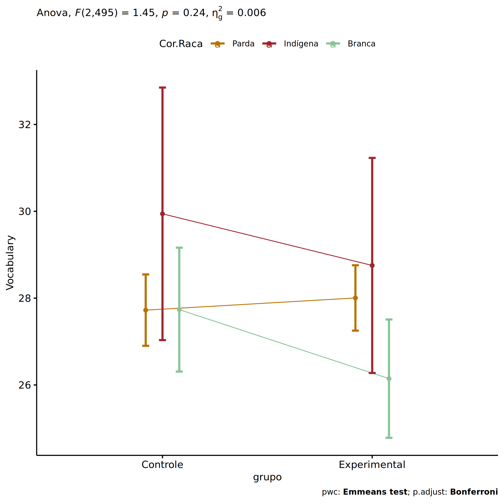<!-- -->

``` r
if (length(unique(pdat[["Cor.Raca"]])) >= 2) {
  plots <- twoWayAncovaBoxPlots(
    wdat.long, "vocab", c("grupo","Cor.Raca"), aov, pwc.long,
    pre.post = "time",
    theme = "classic", color = color$prepost)
}
```

``` r
if (length(unique(pdat[["Cor.Raca"]])) >= 2) 
  plots[["grupo:Cor.Raca"]] + ggplot2::ylab("Vocabulary") +
    if (ymin < ymax) ggplot2::ylim(ymin, ymax)
```

<!-- -->

### Checking linearity assumption

``` r
if (length(unique(pdat[["Cor.Raca"]])) >= 2) {
  ggscatter(wdat, x = "vocab.pre", y = "vocab.pos", size = 0.5,
            facet.by = c("grupo","Cor.Raca"), add = "reg.line")+
    stat_regline_equation(
      aes(label =  paste(..eq.label.., ..rr.label.., sep = "~~~~"))
    ) +
    if (ymin < ymax) ggplot2::ylim(ymin, ymax)
}
```

<!-- -->

``` r
if (length(unique(pdat[["Cor.Raca"]])) >= 2) {
  ggscatter(wdat, x = "vocab.pre", y = "vocab.pos", size = 0.5,
            color = "grupo", facet.by = "Cor.Raca", add = "reg.line")+
    stat_regline_equation(
      aes(label =  paste(..eq.label.., ..rr.label.., sep = "~~~~"), color = grupo)
    ) +
    ggplot2::labs(subtitle = rstatix::get_test_label(aov, detailed = T, row = which(aov$Effect == "grupo:Cor.Raca"))) +
    ggplot2::scale_color_manual(values = color[["grupo"]]) +
    if (ymin < ymax) ggplot2::ylim(ymin, ymax)
}
```

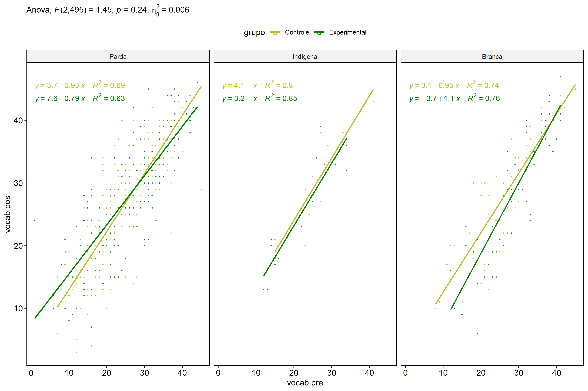<!-- -->

``` r
if (length(unique(pdat[["Cor.Raca"]])) >= 2) {
  ggscatter(wdat, x = "vocab.pre", y = "vocab.pos", size = 0.5,
            color = "Cor.Raca", facet.by = "grupo", add = "reg.line")+
    stat_regline_equation(
      aes(label =  paste(..eq.label.., ..rr.label.., sep = "~~~~"), color = Cor.Raca)
    ) +
    ggplot2::labs(subtitle = rstatix::get_test_label(aov, detailed = T, row = which(aov$Effect == "grupo:Cor.Raca"))) +
    ggplot2::scale_color_manual(values = color[["Cor.Raca"]]) +
    if (ymin < ymax) ggplot2::ylim(ymin, ymax)
}
```

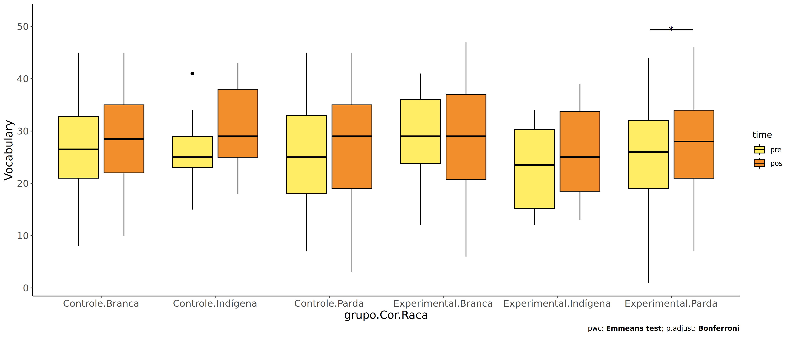<!-- -->

### Checking normality and homogeneity

``` r
if (length(unique(pdat[["Cor.Raca"]])) >= 2) 
  res <- augment(lm(vocab.pos ~ vocab.pre + grupo*Cor.Raca, data = wdat))
```

``` r
if (length(unique(pdat[["Cor.Raca"]])) >= 2)
  shapiro_test(res$.resid)
```

    ## # A tibble: 1 × 3
    ##   variable   statistic p.value
    ##   <chr>          <dbl>   <dbl>
    ## 1 res$.resid     0.995  0.0855

``` r
if (length(unique(pdat[["Cor.Raca"]])) >= 2) 
  levene_test(res, .resid ~ grupo*Cor.Raca)
```

    ## # A tibble: 1 × 4
    ##     df1   df2 statistic     p
    ##   <int> <int>     <dbl> <dbl>
    ## 1     5   496      1.77 0.116

# ANCOVA and Pairwise for two factors **grupo:Serie**

## Without remove non-normal data

``` r
pdat = remove_group_data(dat[!is.na(dat[["grupo"]]) & !is.na(dat[["Serie"]]),],
                         "vocab.pos", c("grupo","Serie"))
pdat = pdat[pdat[["Serie"]] %in% do.call(
  intersect, lapply(unique(pdat[["grupo"]]), FUN = function(x) {
    unique(pdat[["Serie"]][which(pdat[["grupo"]] == x)])
  })),]
pdat[["grupo"]] = factor(pdat[["grupo"]], level[["grupo"]])
pdat[["Serie"]] = factor(
  pdat[["Serie"]],
  level[["Serie"]][level[["Serie"]] %in% unique(pdat[["Serie"]])])

pdat.long <- rbind(pdat[,c("id","grupo","Serie")], pdat[,c("id","grupo","Serie")])
pdat.long[["time"]] <- c(rep("pre", nrow(pdat)), rep("pos", nrow(pdat)))
pdat.long[["time"]] <- factor(pdat.long[["time"]], c("pre","pos"))
pdat.long[["vocab"]] <- c(pdat[["vocab.pre"]], pdat[["vocab.pos"]])

if (length(unique(pdat[["Serie"]])) >= 2) {
  aov = anova_test(pdat, vocab.pos ~ vocab.pre + grupo*Serie)
  laov[["grupo:Serie"]] <- get_anova_table(aov)
}
```

``` r
if (length(unique(pdat[["Serie"]])) >= 2) {
  pwcs <- list()
  pwcs[["Serie"]] <- emmeans_test(
    group_by(pdat, grupo), vocab.pos ~ Serie,
    covariate = vocab.pre, p.adjust.method = "bonferroni")
  pwcs[["grupo"]] <- emmeans_test(
    group_by(pdat, Serie), vocab.pos ~ grupo,
    covariate = vocab.pre, p.adjust.method = "bonferroni")
  
  pwc <- plyr::rbind.fill(pwcs[["grupo"]], pwcs[["Serie"]])
  pwc <- pwc[,c("grupo","Serie", colnames(pwc)[!colnames(pwc) %in% c("grupo","Serie")])]
}
```

``` r
if (length(unique(pdat[["Serie"]])) >= 2) {
  pwc.long <- emmeans_test(dplyr::group_by_at(pdat.long, c("grupo","Serie")),
                           vocab ~ time,
                           p.adjust.method = "bonferroni")
  lpwc[["grupo:Serie"]] <- plyr::rbind.fill(pwc, pwc.long)
}
```

``` r
if (length(unique(pdat[["Serie"]])) >= 2) {
  ds <- get.descriptives(pdat, "vocab.pos", c("grupo","Serie"), covar = "vocab.pre")
  ds <- merge(ds[ds$variable != "vocab.pre",],
              ds[ds$variable == "vocab.pre", !colnames(ds) %in% c("variable")],
              by = c("grupo","Serie"), all.x = T, suffixes = c("", ".vocab.pre"))
  ds <- merge(get_emmeans(pwcs[["grupo"]]), ds,
              by = c("grupo","Serie"), suffixes = c(".emms", ""))
  ds <- ds[,c("grupo","Serie","n","mean.vocab.pre","se.vocab.pre","mean","se",
              "emmean","se.emms","conf.low","conf.high")]
  
  colnames(ds) <- c("grupo","Serie", "N", paste0(c("M","SE")," (pre)"),
                    paste0(c("M","SE"), " (unadj)"),
                    paste0(c("M", "SE"), " (adj)"), "conf.low", "conf.high")
  
  lemms[["grupo:Serie"]] <- ds
}
```

## Computing ANCOVA and PairWise After removing non-normal data (OK)

``` r
if (length(unique(pdat[["Serie"]])) >= 2) {
  wdat = pdat 
  
  res = residuals(lm(vocab.pos ~ vocab.pre + grupo*Serie, data = wdat))
  non.normal = getNonNormal(res, wdat$id, plimit = 0.05)
  
  wdat = wdat[!wdat$id %in% non.normal,]
  
  wdat.long <- rbind(wdat[,c("id","grupo","Serie")], wdat[,c("id","grupo","Serie")])
  wdat.long[["time"]] <- c(rep("pre", nrow(wdat)), rep("pos", nrow(wdat)))
  wdat.long[["time"]] <- factor(wdat.long[["time"]], c("pre","pos"))
  wdat.long[["vocab"]] <- c(wdat[["vocab.pre"]], wdat[["vocab.pos"]])
  
  
  ldat[["grupo:Serie"]] = wdat
  
  (non.normal)
}
```

    ##  [1] "P1139" "P1113" "P983"  "P1003" "P2207" "P2232" "P852"  "P1056" "P2245" "P3654" "P996" 
    ## [12] "P1069" "P2192" "P1966" "P1129" "P2304" "P1006" "P3042" "P863"  "P1961" "P3473" "P887" 
    ## [23] "P2957" "P1112" "P1831" "P2135" "P888"  "P2206" "P3228" "P1790" "P1151" "P3265" "P1620"
    ## [34] "P3260" "P2251" "P489"  "P2853" "P2176" "P976"  "P2856" "P2861" "P916"  "P1936" "P837" 
    ## [45] "P2458" "P3159" "P3499" "P842"  "P3106" "P2050" "P3097" "P491"  "P1009" "P1110" "P1057"
    ## [56] "P2384" "P3038" "P606"  "P3517" "P2435" "P913"  "P2219" "P2296" "P1865" "P3548" "P3635"

``` r
if (length(unique(pdat[["Serie"]])) >= 2) {
  aov = anova_test(wdat, vocab.pos ~ vocab.pre + grupo*Serie)
  laov[["grupo:Serie"]] <- merge(get_anova_table(aov), laov[["grupo:Serie"]],
                                         by="Effect", suffixes = c("","'"))
  df = get_anova_table(aov)
}
```

| Effect      | DFn |  DFd |        F |     p | p\<.05 |   ges |
|:------------|----:|-----:|---------:|------:|:-------|------:|
| vocab.pre   |   1 | 1155 | 2441.203 | 0.000 | \*     | 0.679 |
| grupo       |   1 | 1155 |    0.257 | 0.613 |        | 0.000 |
| Serie       |   3 | 1155 |    5.863 | 0.001 | \*     | 0.015 |
| grupo:Serie |   3 | 1155 |    2.341 | 0.072 |        | 0.006 |

``` r
if (length(unique(pdat[["Serie"]])) >= 2) {
  pwcs <- list()
  pwcs[["Serie"]] <- emmeans_test(
    group_by(wdat, grupo), vocab.pos ~ Serie,
    covariate = vocab.pre, p.adjust.method = "bonferroni")
  pwcs[["grupo"]] <- emmeans_test(
    group_by(wdat, Serie), vocab.pos ~ grupo,
    covariate = vocab.pre, p.adjust.method = "bonferroni")
  
  pwc <- plyr::rbind.fill(pwcs[["grupo"]], pwcs[["Serie"]])
  pwc <- pwc[,c("grupo","Serie", colnames(pwc)[!colnames(pwc) %in% c("grupo","Serie")])]
}
```

| grupo        | Serie | term             | .y.       | group1   | group2       |   df | statistic |     p | p.adj | p.adj.signif |
|:-------------|:------|:-----------------|:----------|:---------|:-------------|-----:|----------:|------:|------:|:-------------|
|              | 6 ano | vocab.pre\*grupo | vocab.pos | Controle | Experimental | 1155 |    -1.697 | 0.090 | 0.090 | ns           |
|              | 7 ano | vocab.pre\*grupo | vocab.pos | Controle | Experimental | 1155 |     1.854 | 0.064 | 0.064 | ns           |
|              | 8 ano | vocab.pre\*grupo | vocab.pos | Controle | Experimental | 1155 |     0.962 | 0.336 | 0.336 | ns           |
|              | 9 ano | vocab.pre\*grupo | vocab.pos | Controle | Experimental | 1155 |    -0.132 | 0.895 | 0.895 | ns           |
| Controle     |       | vocab.pre\*Serie | vocab.pos | 6 ano    | 7 ano        | 1155 |    -2.523 | 0.012 | 0.071 | ns           |
| Controle     |       | vocab.pre\*Serie | vocab.pos | 6 ano    | 8 ano        | 1155 |    -2.960 | 0.003 | 0.019 | \*           |
| Controle     |       | vocab.pre\*Serie | vocab.pos | 6 ano    | 9 ano        | 1155 |    -3.336 | 0.001 | 0.005 | \*\*         |
| Controle     |       | vocab.pre\*Serie | vocab.pos | 7 ano    | 8 ano        | 1155 |    -0.792 | 0.428 | 1.000 | ns           |
| Controle     |       | vocab.pre\*Serie | vocab.pos | 7 ano    | 9 ano        | 1155 |    -1.097 | 0.273 | 1.000 | ns           |
| Controle     |       | vocab.pre\*Serie | vocab.pos | 8 ano    | 9 ano        | 1155 |    -0.233 | 0.816 | 1.000 | ns           |
| Experimental |       | vocab.pre\*Serie | vocab.pos | 6 ano    | 7 ano        | 1155 |     0.952 | 0.341 | 1.000 | ns           |
| Experimental |       | vocab.pre\*Serie | vocab.pos | 6 ano    | 8 ano        | 1155 |    -0.728 | 0.467 | 1.000 | ns           |
| Experimental |       | vocab.pre\*Serie | vocab.pos | 6 ano    | 9 ano        | 1155 |    -2.206 | 0.028 | 0.165 | ns           |
| Experimental |       | vocab.pre\*Serie | vocab.pos | 7 ano    | 8 ano        | 1155 |    -1.764 | 0.078 | 0.468 | ns           |
| Experimental |       | vocab.pre\*Serie | vocab.pos | 7 ano    | 9 ano        | 1155 |    -3.324 | 0.001 | 0.005 | \*\*         |
| Experimental |       | vocab.pre\*Serie | vocab.pos | 8 ano    | 9 ano        | 1155 |    -1.595 | 0.111 | 0.667 | ns           |

``` r
if (length(unique(pdat[["Serie"]])) >= 2) {
  pwc.long <- emmeans_test(dplyr::group_by_at(wdat.long, c("grupo","Serie")),
                           vocab ~ time,
                           p.adjust.method = "bonferroni")
  lpwc[["grupo:Serie"]] <- merge(plyr::rbind.fill(pwc, pwc.long),
                                         lpwc[["grupo:Serie"]],
                                         by=c("grupo","Serie","term",".y.","group1","group2"),
                                         suffixes = c("","'"))
}
```

| grupo        | Serie | term | .y.   | group1 | group2 |   df | statistic |     p | p.adj | p.adj.signif |
|:-------------|:------|:-----|:------|:-------|:-------|-----:|----------:|------:|------:|:-------------|
| Controle     | 6 ano | time | vocab | pre    | pos    | 2312 |    -1.446 | 0.148 | 0.148 | ns           |
| Controle     | 7 ano | time | vocab | pre    | pos    | 2312 |    -2.374 | 0.018 | 0.018 | \*           |
| Controle     | 8 ano | time | vocab | pre    | pos    | 2312 |    -1.900 | 0.058 | 0.058 | ns           |
| Controle     | 9 ano | time | vocab | pre    | pos    | 2312 |    -1.493 | 0.136 | 0.136 | ns           |
| Experimental | 6 ano | time | vocab | pre    | pos    | 2312 |    -2.168 | 0.030 | 0.030 | \*           |
| Experimental | 7 ano | time | vocab | pre    | pos    | 2312 |    -1.158 | 0.247 | 0.247 | ns           |
| Experimental | 8 ano | time | vocab | pre    | pos    | 2312 |    -1.775 | 0.076 | 0.076 | ns           |
| Experimental | 9 ano | time | vocab | pre    | pos    | 2312 |    -1.987 | 0.047 | 0.047 | \*           |

``` r
if (length(unique(pdat[["Serie"]])) >= 2) {
  ds <- get.descriptives(wdat, "vocab.pos", c("grupo","Serie"), covar = "vocab.pre")
  ds <- merge(ds[ds$variable != "vocab.pre",],
              ds[ds$variable == "vocab.pre", !colnames(ds) %in% c("variable")],
              by = c("grupo","Serie"), all.x = T, suffixes = c("", ".vocab.pre"))
  ds <- merge(get_emmeans(pwcs[["grupo"]]), ds,
              by = c("grupo","Serie"), suffixes = c(".emms", ""))
  ds <- ds[,c("grupo","Serie","n","mean.vocab.pre","se.vocab.pre",
              "mean","se","emmean","se.emms","conf.low","conf.high")]
  
  colnames(ds) <- c("grupo","Serie", "N", paste0(c("M","SE")," (pre)"),
                    paste0(c("M","SE"), " (unadj)"),
                    paste0(c("M", "SE"), " (adj)"), "conf.low", "conf.high")
  
  lemms[["grupo:Serie"]] <- merge(ds, lemms[["grupo:Serie"]],
                                          by=c("grupo","Serie"), suffixes = c("","'"))
}
```

| grupo        | Serie |   N | M (pre) | SE (pre) | M (unadj) | SE (unadj) | M (adj) | SE (adj) | conf.low | conf.high |
|:-------------|:------|----:|--------:|---------:|----------:|-----------:|--------:|---------:|---------:|----------:|
| Controle     | 6 ano | 142 |  21.359 |    0.734 |    22.789 |      0.742 |  27.171 |    0.407 |   26.372 |    27.969 |
| Controle     | 7 ano | 146 |  24.418 |    0.723 |    26.733 |      0.698 |  28.584 |    0.393 |   27.812 |    29.356 |
| Controle     | 8 ano |  88 |  26.943 |    0.924 |    29.330 |      0.982 |  29.092 |    0.505 |   28.102 |    30.081 |
| Controle     | 9 ano | 113 |  32.097 |    0.705 |    33.752 |      0.721 |  29.250 |    0.454 |   28.358 |    30.142 |
| Experimental | 6 ano | 153 |  23.105 |    0.695 |    25.170 |      0.699 |  28.108 |    0.387 |   27.348 |    28.868 |
| Experimental | 7 ano | 188 |  26.447 |    0.605 |    27.441 |      0.593 |  27.614 |    0.345 |   26.937 |    28.291 |
| Experimental | 8 ano | 173 |  28.104 |    0.655 |    29.694 |      0.657 |  28.495 |    0.361 |   27.788 |    29.203 |
| Experimental | 9 ano | 161 |  31.441 |    0.569 |    33.286 |      0.581 |  29.326 |    0.382 |   28.578 |    30.075 |

### Plots for ancova

``` r
if (length(unique(pdat[["Serie"]])) >= 2) {
  ggPlotAoC2(pwcs, "grupo", "Serie", aov, ylab = "Vocabulary",
             subtitle = which(aov$Effect == "grupo:Serie"), addParam = "errorbar") +
    ggplot2::scale_color_manual(values = color[["Serie"]]) +
    if (ymin.ci < ymax.ci) ggplot2::ylim(ymin.ci, ymax.ci)
}
```

    ## Scale for colour is already present.
    ## Adding another scale for colour, which will replace the existing scale.

<!-- -->

``` r
if (length(unique(pdat[["Serie"]])) >= 2) {
  ggPlotAoC2(pwcs, "Serie", "grupo", aov, ylab = "Vocabulary",
               subtitle = which(aov$Effect == "grupo:Serie"), addParam = "errorbar") +
      ggplot2::scale_color_manual(values = color[["grupo"]]) +
      if (ymin.ci < ymax.ci) ggplot2::ylim(ymin.ci, ymax.ci)
}
```

    ## Scale for colour is already present.
    ## Adding another scale for colour, which will replace the existing scale.

<!-- -->

``` r
if (length(unique(pdat[["Serie"]])) >= 2) {
  plots <- twoWayAncovaBoxPlots(
    wdat, "vocab.pos", c("grupo","Serie"), aov, pwcs, covar = "vocab.pre",
    theme = "classic", color = color[["grupo:Serie"]],
    subtitle = which(aov$Effect == "grupo:Serie"))
}
```

``` r
if (length(unique(pdat[["Serie"]])) >= 2) {
  plots[["grupo:Serie"]] + ggplot2::ylab("Vocabulary") +
  ggplot2::scale_x_discrete(labels=c('pre', 'pos')) +
  if (ymin < ymax) ggplot2::ylim(ymin, ymax)
}
```

<!-- -->

``` r
if (length(unique(pdat[["Serie"]])) >= 2) {
  plots <- twoWayAncovaBoxPlots(
    wdat.long, "vocab", c("grupo","Serie"), aov, pwc.long,
    pre.post = "time",
    theme = "classic", color = color$prepost)
}
```

``` r
if (length(unique(pdat[["Serie"]])) >= 2) 
  plots[["grupo:Serie"]] + ggplot2::ylab("Vocabulary") +
    if (ymin < ymax) ggplot2::ylim(ymin, ymax)
```

<!-- -->

### Checking linearity assumption

``` r
if (length(unique(pdat[["Serie"]])) >= 2) {
  ggscatter(wdat, x = "vocab.pre", y = "vocab.pos", size = 0.5,
            facet.by = c("grupo","Serie"), add = "reg.line")+
    stat_regline_equation(
      aes(label =  paste(..eq.label.., ..rr.label.., sep = "~~~~"))
    ) +
    if (ymin < ymax) ggplot2::ylim(ymin, ymax)
}
```

<!-- -->

``` r
if (length(unique(pdat[["Serie"]])) >= 2) {
  ggscatter(wdat, x = "vocab.pre", y = "vocab.pos", size = 0.5,
            color = "grupo", facet.by = "Serie", add = "reg.line")+
    stat_regline_equation(
      aes(label =  paste(..eq.label.., ..rr.label.., sep = "~~~~"), color = grupo)
    ) +
    ggplot2::labs(subtitle = rstatix::get_test_label(aov, detailed = T, row = which(aov$Effect == "grupo:Serie"))) +
    ggplot2::scale_color_manual(values = color[["grupo"]]) +
    if (ymin < ymax) ggplot2::ylim(ymin, ymax)
}
```

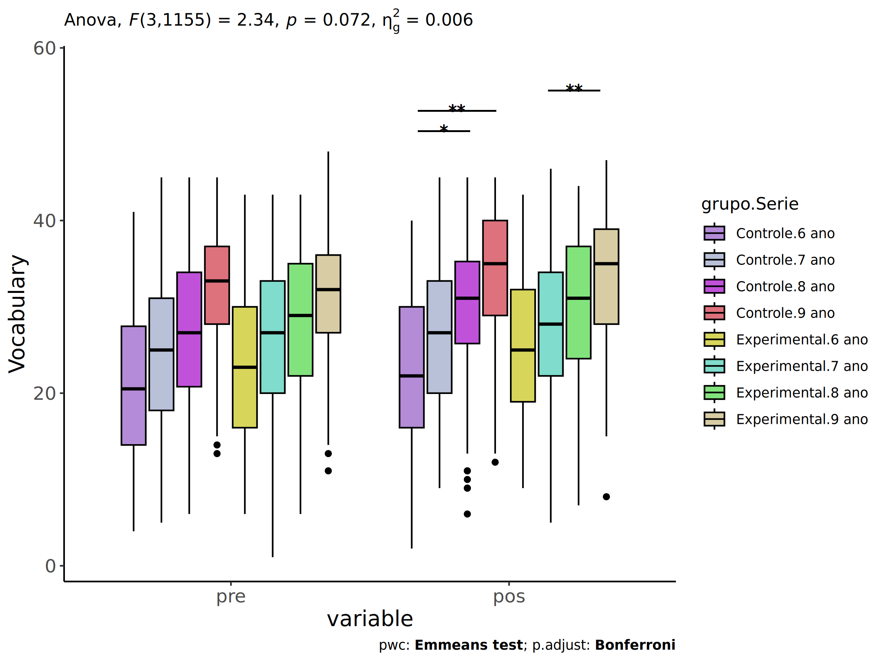<!-- -->

``` r
if (length(unique(pdat[["Serie"]])) >= 2) {
  ggscatter(wdat, x = "vocab.pre", y = "vocab.pos", size = 0.5,
            color = "Serie", facet.by = "grupo", add = "reg.line")+
    stat_regline_equation(
      aes(label =  paste(..eq.label.., ..rr.label.., sep = "~~~~"), color = Serie)
    ) +
    ggplot2::labs(subtitle = rstatix::get_test_label(aov, detailed = T, row = which(aov$Effect == "grupo:Serie"))) +
    ggplot2::scale_color_manual(values = color[["Serie"]]) +
    if (ymin < ymax) ggplot2::ylim(ymin, ymax)
}
```

<!-- -->

### Checking normality and homogeneity

``` r
if (length(unique(pdat[["Serie"]])) >= 2) 
  res <- augment(lm(vocab.pos ~ vocab.pre + grupo*Serie, data = wdat))
```

``` r
if (length(unique(pdat[["Serie"]])) >= 2)
  shapiro_test(res$.resid)
```

    ## # A tibble: 1 × 3
    ##   variable   statistic p.value
    ##   <chr>          <dbl>   <dbl>
    ## 1 res$.resid     0.998   0.213

``` r
if (length(unique(pdat[["Serie"]])) >= 2) 
  levene_test(res, .resid ~ grupo*Serie)
```

    ## # A tibble: 1 × 4
    ##     df1   df2 statistic     p
    ##   <int> <int>     <dbl> <dbl>
    ## 1     7  1156     0.999 0.430

# ANCOVA and Pairwise for two factors **grupo:vocab.quintile**

## Without remove non-normal data

``` r
pdat = remove_group_data(dat[!is.na(dat[["grupo"]]) & !is.na(dat[["vocab.quintile"]]),],
                         "vocab.pos", c("grupo","vocab.quintile"))
pdat = pdat[pdat[["vocab.quintile"]] %in% do.call(
  intersect, lapply(unique(pdat[["grupo"]]), FUN = function(x) {
    unique(pdat[["vocab.quintile"]][which(pdat[["grupo"]] == x)])
  })),]
pdat[["grupo"]] = factor(pdat[["grupo"]], level[["grupo"]])
pdat[["vocab.quintile"]] = factor(
  pdat[["vocab.quintile"]],
  level[["vocab.quintile"]][level[["vocab.quintile"]] %in% unique(pdat[["vocab.quintile"]])])

pdat.long <- rbind(pdat[,c("id","grupo","vocab.quintile")], pdat[,c("id","grupo","vocab.quintile")])
pdat.long[["time"]] <- c(rep("pre", nrow(pdat)), rep("pos", nrow(pdat)))
pdat.long[["time"]] <- factor(pdat.long[["time"]], c("pre","pos"))
pdat.long[["vocab"]] <- c(pdat[["vocab.pre"]], pdat[["vocab.pos"]])

if (length(unique(pdat[["vocab.quintile"]])) >= 2) {
  aov = anova_test(pdat, vocab.pos ~ vocab.pre + grupo*vocab.quintile)
  laov[["grupo:vocab.quintile"]] <- get_anova_table(aov)
}
```

``` r
if (length(unique(pdat[["vocab.quintile"]])) >= 2) {
  pwcs <- list()
  pwcs[["vocab.quintile"]] <- emmeans_test(
    group_by(pdat, grupo), vocab.pos ~ vocab.quintile,
    covariate = vocab.pre, p.adjust.method = "bonferroni")
  pwcs[["grupo"]] <- emmeans_test(
    group_by(pdat, vocab.quintile), vocab.pos ~ grupo,
    covariate = vocab.pre, p.adjust.method = "bonferroni")
  
  pwc <- plyr::rbind.fill(pwcs[["grupo"]], pwcs[["vocab.quintile"]])
  pwc <- pwc[,c("grupo","vocab.quintile", colnames(pwc)[!colnames(pwc) %in% c("grupo","vocab.quintile")])]
}
```

``` r
if (length(unique(pdat[["vocab.quintile"]])) >= 2) {
  pwc.long <- emmeans_test(dplyr::group_by_at(pdat.long, c("grupo","vocab.quintile")),
                           vocab ~ time,
                           p.adjust.method = "bonferroni")
  lpwc[["grupo:vocab.quintile"]] <- plyr::rbind.fill(pwc, pwc.long)
}
```

``` r
if (length(unique(pdat[["vocab.quintile"]])) >= 2) {
  ds <- get.descriptives(pdat, "vocab.pos", c("grupo","vocab.quintile"), covar = "vocab.pre")
  ds <- merge(ds[ds$variable != "vocab.pre",],
              ds[ds$variable == "vocab.pre", !colnames(ds) %in% c("variable")],
              by = c("grupo","vocab.quintile"), all.x = T, suffixes = c("", ".vocab.pre"))
  ds <- merge(get_emmeans(pwcs[["grupo"]]), ds,
              by = c("grupo","vocab.quintile"), suffixes = c(".emms", ""))
  ds <- ds[,c("grupo","vocab.quintile","n","mean.vocab.pre","se.vocab.pre","mean","se",
              "emmean","se.emms","conf.low","conf.high")]
  
  colnames(ds) <- c("grupo","vocab.quintile", "N", paste0(c("M","SE")," (pre)"),
                    paste0(c("M","SE"), " (unadj)"),
                    paste0(c("M", "SE"), " (adj)"), "conf.low", "conf.high")
  
  lemms[["grupo:vocab.quintile"]] <- ds
}
```

## Computing ANCOVA and PairWise After removing non-normal data (OK)

``` r
if (length(unique(pdat[["vocab.quintile"]])) >= 2) {
  wdat = pdat 
  
  res = residuals(lm(vocab.pos ~ vocab.pre + grupo*vocab.quintile, data = wdat))
  non.normal = getNonNormal(res, wdat$id, plimit = 0.05)
  
  wdat = wdat[!wdat$id %in% non.normal,]
  
  wdat.long <- rbind(wdat[,c("id","grupo","vocab.quintile")], wdat[,c("id","grupo","vocab.quintile")])
  wdat.long[["time"]] <- c(rep("pre", nrow(wdat)), rep("pos", nrow(wdat)))
  wdat.long[["time"]] <- factor(wdat.long[["time"]], c("pre","pos"))
  wdat.long[["vocab"]] <- c(wdat[["vocab.pre"]], wdat[["vocab.pos"]])
  
  
  ldat[["grupo:vocab.quintile"]] = wdat
  
  (non.normal)
}
```

    ##  [1] "P1139" "P983"  "P1003" "P1113" "P2304" "P2207" "P2232" "P2192" "P1056" "P3654" "P1069"
    ## [12] "P852"  "P1966" "P2245" "P1129" "P1936" "P3042" "P996"  "P1006" "P3499" "P2850" "P1620"
    ## [23] "P3228" "P478"  "P916"  "P3265" "P3473" "P1831" "P2176" "P3260" "P976"  "P1865" "P489" 
    ## [34] "P2135" "P863"  "P2251" "P2853" "P2856" "P2219" "P2458" "P887"  "P1961" "P2861" "P1952"
    ## [45] "P2400" "P3660" "P3259" "P606"  "P3159" "P2004" "P933"  "P1151" "P837"  "P2957" "P888" 
    ## [56] "P2887" "P1790" "P3106" "P3038" "P2394" "P2092" "P491"  "P2866" "P2958" "P2098" "P1009"
    ## [67] "P1029" "P856"  "P913"  "P2348" "P985"  "P3145" "P850"

``` r
if (length(unique(pdat[["vocab.quintile"]])) >= 2) {
  aov = anova_test(wdat, vocab.pos ~ vocab.pre + grupo*vocab.quintile)
  laov[["grupo:vocab.quintile"]] <- merge(get_anova_table(aov), laov[["grupo:vocab.quintile"]],
                                         by="Effect", suffixes = c("","'"))
  df = get_anova_table(aov)
}
```

| Effect               | DFn |  DFd |       F |     p | p\<.05 |   ges |
|:---------------------|----:|-----:|--------:|------:|:-------|------:|
| vocab.pre            |   1 | 1146 | 113.416 | 0.000 | \*     | 0.090 |
| grupo                |   1 | 1146 |   0.121 | 0.728 |        | 0.000 |
| vocab.quintile       |   4 | 1146 |   3.114 | 0.015 | \*     | 0.011 |
| grupo:vocab.quintile |   4 | 1146 |   5.742 | 0.000 | \*     | 0.020 |

``` r
if (length(unique(pdat[["vocab.quintile"]])) >= 2) {
  pwcs <- list()
  pwcs[["vocab.quintile"]] <- emmeans_test(
    group_by(wdat, grupo), vocab.pos ~ vocab.quintile,
    covariate = vocab.pre, p.adjust.method = "bonferroni")
  pwcs[["grupo"]] <- emmeans_test(
    group_by(wdat, vocab.quintile), vocab.pos ~ grupo,
    covariate = vocab.pre, p.adjust.method = "bonferroni")
  
  pwc <- plyr::rbind.fill(pwcs[["grupo"]], pwcs[["vocab.quintile"]])
  pwc <- pwc[,c("grupo","vocab.quintile", colnames(pwc)[!colnames(pwc) %in% c("grupo","vocab.quintile")])]
}
```

| grupo        | vocab.quintile | term                      | .y.       | group1       | group2       |   df | statistic |     p | p.adj | p.adj.signif |
|:-------------|:---------------|:--------------------------|:----------|:-------------|:-------------|-----:|----------:|------:|------:|:-------------|
|              | 1st quintile   | vocab.pre\*grupo          | vocab.pos | Controle     | Experimental | 1146 |    -2.811 | 0.005 | 0.005 | \*\*         |
|              | 2nd quintile   | vocab.pre\*grupo          | vocab.pos | Controle     | Experimental | 1146 |     2.024 | 0.043 | 0.043 | \*           |
|              | 3rd quintile   | vocab.pre\*grupo          | vocab.pos | Controle     | Experimental | 1146 |    -0.805 | 0.421 | 0.421 | ns           |
|              | 4th quintile   | vocab.pre\*grupo          | vocab.pos | Controle     | Experimental | 1146 |     3.162 | 0.002 | 0.002 | \*\*         |
|              | 5th quintile   | vocab.pre\*grupo          | vocab.pos | Controle     | Experimental | 1146 |    -0.663 | 0.508 | 0.508 | ns           |
| Controle     |                | vocab.pre\*vocab.quintile | vocab.pos | 1st quintile | 2nd quintile | 1146 |    -2.829 | 0.005 | 0.047 | \*           |
| Controle     |                | vocab.pre\*vocab.quintile | vocab.pos | 1st quintile | 3rd quintile | 1146 |    -3.270 | 0.001 | 0.011 | \*           |
| Controle     |                | vocab.pre\*vocab.quintile | vocab.pos | 1st quintile | 4th quintile | 1146 |    -3.932 | 0.000 | 0.001 | \*\*\*       |
| Controle     |                | vocab.pre\*vocab.quintile | vocab.pos | 1st quintile | 5th quintile | 1146 |    -2.969 | 0.003 | 0.031 | \*           |
| Controle     |                | vocab.pre\*vocab.quintile | vocab.pos | 2nd quintile | 3rd quintile | 1146 |    -1.462 | 0.144 | 1.000 | ns           |
| Controle     |                | vocab.pre\*vocab.quintile | vocab.pos | 2nd quintile | 4th quintile | 1146 |    -3.034 | 0.002 | 0.025 | \*           |
| Controle     |                | vocab.pre\*vocab.quintile | vocab.pos | 2nd quintile | 5th quintile | 1146 |    -2.098 | 0.036 | 0.361 | ns           |
| Controle     |                | vocab.pre\*vocab.quintile | vocab.pos | 3rd quintile | 4th quintile | 1146 |    -2.781 | 0.006 | 0.055 | ns           |
| Controle     |                | vocab.pre\*vocab.quintile | vocab.pos | 3rd quintile | 5th quintile | 1146 |    -1.736 | 0.083 | 0.828 | ns           |
| Controle     |                | vocab.pre\*vocab.quintile | vocab.pos | 4th quintile | 5th quintile | 1146 |     0.502 | 0.616 | 1.000 | ns           |
| Experimental |                | vocab.pre\*vocab.quintile | vocab.pos | 1st quintile | 2nd quintile | 1146 |     1.170 | 0.242 | 1.000 | ns           |
| Experimental |                | vocab.pre\*vocab.quintile | vocab.pos | 1st quintile | 3rd quintile | 1146 |    -2.037 | 0.042 | 0.419 | ns           |
| Experimental |                | vocab.pre\*vocab.quintile | vocab.pos | 1st quintile | 4th quintile | 1146 |    -1.339 | 0.181 | 1.000 | ns           |
| Experimental |                | vocab.pre\*vocab.quintile | vocab.pos | 1st quintile | 5th quintile | 1146 |    -2.210 | 0.027 | 0.273 | ns           |
| Experimental |                | vocab.pre\*vocab.quintile | vocab.pos | 2nd quintile | 3rd quintile | 1146 |    -4.264 | 0.000 | 0.000 | \*\*\*       |
| Experimental |                | vocab.pre\*vocab.quintile | vocab.pos | 2nd quintile | 4th quintile | 1146 |    -2.840 | 0.005 | 0.046 | \*           |
| Experimental |                | vocab.pre\*vocab.quintile | vocab.pos | 2nd quintile | 5th quintile | 1146 |    -3.624 | 0.000 | 0.003 | \*\*         |
| Experimental |                | vocab.pre\*vocab.quintile | vocab.pos | 3rd quintile | 4th quintile | 1146 |     0.474 | 0.636 | 1.000 | ns           |
| Experimental |                | vocab.pre\*vocab.quintile | vocab.pos | 3rd quintile | 5th quintile | 1146 |    -1.823 | 0.069 | 0.686 | ns           |
| Experimental |                | vocab.pre\*vocab.quintile | vocab.pos | 4th quintile | 5th quintile | 1146 |    -2.954 | 0.003 | 0.032 | \*           |

``` r
if (length(unique(pdat[["vocab.quintile"]])) >= 2) {
  pwc.long <- emmeans_test(dplyr::group_by_at(wdat.long, c("grupo","vocab.quintile")),
                           vocab ~ time,
                           p.adjust.method = "bonferroni")
  lpwc[["grupo:vocab.quintile"]] <- merge(plyr::rbind.fill(pwc, pwc.long),
                                         lpwc[["grupo:vocab.quintile"]],
                                         by=c("grupo","vocab.quintile","term",".y.","group1","group2"),
                                         suffixes = c("","'"))
}
```

| grupo        | vocab.quintile | term | .y.   | group1 | group2 |   df | statistic |     p | p.adj | p.adj.signif |
|:-------------|:---------------|:-----|:------|:-------|:-------|-----:|----------:|------:|------:|:-------------|
| Controle     | 1st quintile   | time | vocab | pre    | pos    | 2294 |    -5.292 | 0.000 | 0.000 | \*\*\*\*     |
| Controle     | 2nd quintile   | time | vocab | pre    | pos    | 2294 |    -4.930 | 0.000 | 0.000 | \*\*\*\*     |
| Controle     | 3rd quintile   | time | vocab | pre    | pos    | 2294 |    -4.051 | 0.000 | 0.000 | \*\*\*\*     |
| Controle     | 4th quintile   | time | vocab | pre    | pos    | 2294 |    -3.715 | 0.000 | 0.000 | \*\*\*       |
| Controle     | 5th quintile   | time | vocab | pre    | pos    | 2294 |     0.373 | 0.709 | 0.709 | ns           |
| Experimental | 1st quintile   | time | vocab | pre    | pos    | 2294 |    -8.343 | 0.000 | 0.000 | \*\*\*\*     |
| Experimental | 2nd quintile   | time | vocab | pre    | pos    | 2294 |    -2.480 | 0.013 | 0.013 | \*           |
| Experimental | 3rd quintile   | time | vocab | pre    | pos    | 2294 |    -5.701 | 0.000 | 0.000 | \*\*\*\*     |
| Experimental | 4th quintile   | time | vocab | pre    | pos    | 2294 |    -0.622 | 0.534 | 0.534 | ns           |
| Experimental | 5th quintile   | time | vocab | pre    | pos    | 2294 |    -0.449 | 0.653 | 0.653 | ns           |

``` r
if (length(unique(pdat[["vocab.quintile"]])) >= 2) {
  ds <- get.descriptives(wdat, "vocab.pos", c("grupo","vocab.quintile"), covar = "vocab.pre")
  ds <- merge(ds[ds$variable != "vocab.pre",],
              ds[ds$variable == "vocab.pre", !colnames(ds) %in% c("variable")],
              by = c("grupo","vocab.quintile"), all.x = T, suffixes = c("", ".vocab.pre"))
  ds <- merge(get_emmeans(pwcs[["grupo"]]), ds,
              by = c("grupo","vocab.quintile"), suffixes = c(".emms", ""))
  ds <- ds[,c("grupo","vocab.quintile","n","mean.vocab.pre","se.vocab.pre",
              "mean","se","emmean","se.emms","conf.low","conf.high")]
  
  colnames(ds) <- c("grupo","vocab.quintile", "N", paste0(c("M","SE")," (pre)"),
                    paste0(c("M","SE"), " (unadj)"),
                    paste0(c("M", "SE"), " (adj)"), "conf.low", "conf.high")
  
  lemms[["grupo:vocab.quintile"]] <- merge(ds, lemms[["grupo:vocab.quintile"]],
                                          by=c("grupo","vocab.quintile"), suffixes = c("","'"))
}
```

| grupo        | vocab.quintile |   N | M (pre) | SE (pre) | M (unadj) | SE (unadj) | M (adj) | SE (adj) | conf.low | conf.high |
|:-------------|:---------------|----:|--------:|---------:|----------:|-----------:|--------:|---------:|---------:|----------:|
| Controle     | 1st quintile   |  98 |  12.357 |    0.301 |    15.224 |      0.505 |  24.961 |    1.029 |   22.942 |    26.981 |
| Controle     | 2nd quintile   |  81 |  19.469 |    0.180 |    22.407 |      0.672 |  27.326 |    0.695 |   25.961 |    28.691 |
| Controle     | 3rd quintile   | 119 |  25.992 |    0.174 |    27.983 |      0.428 |  28.483 |    0.432 |   27.636 |    29.330 |
| Controle     | 4th quintile   |  89 |  32.225 |    0.156 |    34.337 |      0.453 |  30.614 |    0.607 |   29.424 |    31.805 |
| Controle     | 5th quintile   | 100 |  38.180 |    0.270 |    37.980 |      0.420 |  30.223 |    0.866 |   28.524 |    31.921 |
| Experimental | 1st quintile   |  98 |  13.071 |    0.279 |    17.592 |      0.612 |  26.845 |    0.989 |   24.904 |    28.785 |
| Experimental | 2nd quintile   | 100 |  20.060 |    0.170 |    21.390 |      0.489 |  25.908 |    0.632 |   24.669 |    27.148 |
| Experimental | 3rd quintile   | 166 |  26.211 |    0.154 |    28.584 |      0.409 |  28.936 |    0.365 |   28.220 |    29.651 |
| Experimental | 4th quintile   | 151 |  31.795 |    0.114 |    32.066 |      0.389 |  28.635 |    0.499 |   27.656 |    29.614 |
| Experimental | 5th quintile   | 155 |  38.194 |    0.208 |    38.387 |      0.315 |  30.621 |    0.820 |   29.011 |    32.230 |

### Plots for ancova

``` r
if (length(unique(pdat[["vocab.quintile"]])) >= 2) {
  ggPlotAoC2(pwcs, "grupo", "vocab.quintile", aov, ylab = "Vocabulary",
             subtitle = which(aov$Effect == "grupo:vocab.quintile"), addParam = "errorbar") +
    ggplot2::scale_color_manual(values = color[["vocab.quintile"]]) +
    if (ymin.ci < ymax.ci) ggplot2::ylim(ymin.ci, ymax.ci)
}
```

    ## Scale for colour is already present.
    ## Adding another scale for colour, which will replace the existing scale.

<!-- -->

``` r
if (length(unique(pdat[["vocab.quintile"]])) >= 2) {
  ggPlotAoC2(pwcs, "vocab.quintile", "grupo", aov, ylab = "Vocabulary",
               subtitle = which(aov$Effect == "grupo:vocab.quintile"), addParam = "errorbar") +
      ggplot2::scale_color_manual(values = color[["grupo"]]) +
      if (ymin.ci < ymax.ci) ggplot2::ylim(ymin.ci, ymax.ci)
}
```

    ## Scale for colour is already present.
    ## Adding another scale for colour, which will replace the existing scale.

<!-- -->

``` r
if (length(unique(pdat[["vocab.quintile"]])) >= 2) {
  plots <- twoWayAncovaBoxPlots(
    wdat, "vocab.pos", c("grupo","vocab.quintile"), aov, pwcs, covar = "vocab.pre",
    theme = "classic", color = color[["grupo:vocab.quintile"]],
    subtitle = which(aov$Effect == "grupo:vocab.quintile"))
}
```

``` r
if (length(unique(pdat[["vocab.quintile"]])) >= 2) {
  plots[["grupo:vocab.quintile"]] + ggplot2::ylab("Vocabulary") +
  ggplot2::scale_x_discrete(labels=c('pre', 'pos')) +
  if (ymin < ymax) ggplot2::ylim(ymin, ymax)
}
```

    ## Warning: No shared levels found between `names(values)` of the manual scale and the data's colour
    ## values.

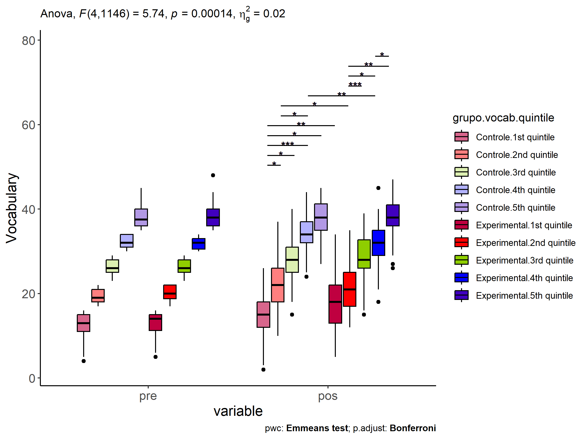<!-- -->

``` r
if (length(unique(pdat[["vocab.quintile"]])) >= 2) {
  plots <- twoWayAncovaBoxPlots(
    wdat.long, "vocab", c("grupo","vocab.quintile"), aov, pwc.long,
    pre.post = "time",
    theme = "classic", color = color$prepost)
}
```

``` r
if (length(unique(pdat[["vocab.quintile"]])) >= 2) 
  plots[["grupo:vocab.quintile"]] + ggplot2::ylab("Vocabulary") +
    if (ymin < ymax) ggplot2::ylim(ymin, ymax)
```

<!-- -->

### Checking linearity assumption

``` r
if (length(unique(pdat[["vocab.quintile"]])) >= 2) {
  ggscatter(wdat, x = "vocab.pre", y = "vocab.pos", size = 0.5,
            facet.by = c("grupo","vocab.quintile"), add = "reg.line")+
    stat_regline_equation(
      aes(label =  paste(..eq.label.., ..rr.label.., sep = "~~~~"))
    ) +
    if (ymin < ymax) ggplot2::ylim(ymin, ymax)
}
```

<!-- -->

``` r
if (length(unique(pdat[["vocab.quintile"]])) >= 2) {
  ggscatter(wdat, x = "vocab.pre", y = "vocab.pos", size = 0.5,
            color = "grupo", facet.by = "vocab.quintile", add = "reg.line")+
    stat_regline_equation(
      aes(label =  paste(..eq.label.., ..rr.label.., sep = "~~~~"), color = grupo)
    ) +
    ggplot2::labs(subtitle = rstatix::get_test_label(aov, detailed = T, row = which(aov$Effect == "grupo:vocab.quintile"))) +
    ggplot2::scale_color_manual(values = color[["grupo"]]) +
    if (ymin < ymax) ggplot2::ylim(ymin, ymax)
}
```

<!-- -->

``` r
if (length(unique(pdat[["vocab.quintile"]])) >= 2) {
  ggscatter(wdat, x = "vocab.pre", y = "vocab.pos", size = 0.5,
            color = "vocab.quintile", facet.by = "grupo", add = "reg.line")+
    stat_regline_equation(
      aes(label =  paste(..eq.label.., ..rr.label.., sep = "~~~~"), color = vocab.quintile)
    ) +
    ggplot2::labs(subtitle = rstatix::get_test_label(aov, detailed = T, row = which(aov$Effect == "grupo:vocab.quintile"))) +
    ggplot2::scale_color_manual(values = color[["vocab.quintile"]]) +
    if (ymin < ymax) ggplot2::ylim(ymin, ymax)
}
```

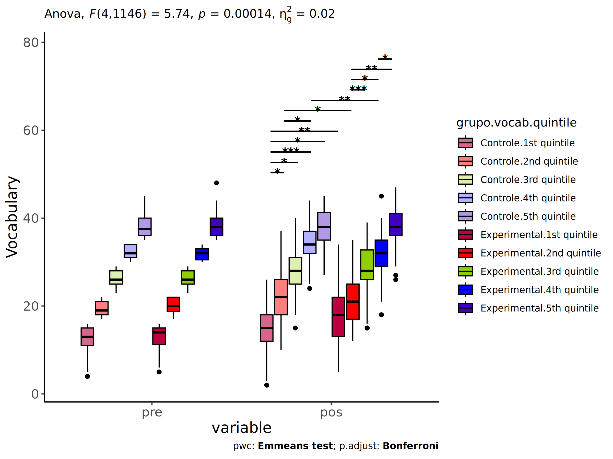<!-- -->

### Checking normality and homogeneity

``` r
if (length(unique(pdat[["vocab.quintile"]])) >= 2) 
  res <- augment(lm(vocab.pos ~ vocab.pre + grupo*vocab.quintile, data = wdat))
```

``` r
if (length(unique(pdat[["vocab.quintile"]])) >= 2)
  shapiro_test(res$.resid)
```

    ## # A tibble: 1 × 3
    ##   variable   statistic p.value
    ##   <chr>          <dbl>   <dbl>
    ## 1 res$.resid     0.998   0.143

``` r
if (length(unique(pdat[["vocab.quintile"]])) >= 2) 
  levene_test(res, .resid ~ grupo*vocab.quintile)
```

    ## # A tibble: 1 × 4
    ##     df1   df2 statistic           p
    ##   <int> <int>     <dbl>       <dbl>
    ## 1     9  1147      5.29 0.000000429

# Summary of Results

## Descriptive Statistics

``` r
df <- get.descriptives(ldat[["grupo"]], c(dv.pre, dv.pos), c("grupo"), 
                       include.global = T, symmetry.test = T, normality.test = F)
df <- plyr::rbind.fill(
  df, do.call(plyr::rbind.fill, lapply(lfatores2, FUN = function(f) {
    if (nrow(dat) > 0 && sum(!is.na(unique(dat[[f]]))) > 1 && paste0("grupo:",f) %in% names(ldat))
      get.descriptives(ldat[[paste0("grupo:",f)]], c(dv.pre,dv.pos), c("grupo", f),
                       symmetry.test = T, normality.test = F)
    }))
)
df <- df[,c(fatores1[fatores1 %in% colnames(df)],"variable",
             colnames(df)[!colnames(df) %in% c(fatores1,"variable")])]
```

| grupo        | Sexo | Zona   | Cor.Raca | Serie | vocab.quintile | variable  |    n |   mean | median | min | max |     sd |    se |    ci |   iqr | symmetry | skewness | kurtosis |
|:-------------|:-----|:-------|:---------|:------|:---------------|:----------|-----:|-------:|-------:|----:|----:|-------:|------:|------:|------:|:---------|---------:|---------:|
| Controle     |      |        |          |       |                | vocab.pre |  491 | 25.682 |   26.0 |   4 |  45 |  9.308 | 0.420 | 0.825 | 15.50 | YES      |   -0.119 |   -0.912 |
| Experimental |      |        |          |       |                | vocab.pre |  677 | 27.313 |   28.0 |   5 |  48 |  8.639 | 0.332 | 0.652 | 13.00 | YES      |   -0.277 |   -0.688 |
|              |      |        |          |       |                | vocab.pre | 1168 | 26.628 |   27.0 |   4 |  48 |  8.959 | 0.262 | 0.514 | 14.00 | YES      |   -0.220 |   -0.790 |
| Controle     |      |        |          |       |                | vocab.pos |  491 | 27.560 |   29.0 |   2 |  45 |  9.526 | 0.430 | 0.845 | 15.00 | YES      |   -0.282 |   -0.788 |
| Experimental |      |        |          |       |                | vocab.pos |  677 | 28.873 |   30.0 |   5 |  47 |  8.708 | 0.335 | 0.657 | 13.00 | YES      |   -0.332 |   -0.639 |
|              |      |        |          |       |                | vocab.pos | 1168 | 28.321 |   29.0 |   2 |  47 |  9.080 | 0.266 | 0.521 | 14.25 | YES      |   -0.326 |   -0.680 |
| Controle     | F    |        |          |       |                | vocab.pre |  249 | 26.815 |   27.0 |   6 |  45 |  8.670 | 0.549 | 1.082 | 13.00 | YES      |   -0.287 |   -0.686 |
| Controle     | M    |        |          |       |                | vocab.pre |  244 | 24.615 |   25.0 |   4 |  45 |  9.814 | 0.628 | 1.238 | 17.00 | YES      |    0.058 |   -1.043 |
| Experimental | F    |        |          |       |                | vocab.pre |  353 | 27.705 |   29.0 |   1 |  44 |  8.698 | 0.463 | 0.911 | 12.00 | YES      |   -0.393 |   -0.544 |
| Experimental | M    |        |          |       |                | vocab.pre |  324 | 26.981 |   28.0 |   5 |  48 |  8.643 | 0.480 | 0.945 | 12.25 | YES      |   -0.236 |   -0.663 |
| Controle     | F    |        |          |       |                | vocab.pos |  249 | 28.964 |   30.0 |   6 |  45 |  8.505 | 0.539 | 1.062 | 13.00 | YES      |   -0.330 |   -0.619 |
| Controle     | M    |        |          |       |                | vocab.pos |  244 | 26.016 |   26.5 |   2 |  45 | 10.287 | 0.659 | 1.297 | 17.00 | YES      |   -0.107 |   -1.016 |
| Experimental | F    |        |          |       |                | vocab.pos |  353 | 29.881 |   31.0 |   9 |  47 |  8.304 | 0.442 | 0.869 | 12.00 | YES      |   -0.341 |   -0.569 |
| Experimental | M    |        |          |       |                | vocab.pos |  324 | 27.664 |   28.0 |   5 |  45 |  8.934 | 0.496 | 0.976 | 14.00 | YES      |   -0.243 |   -0.789 |
| Controle     |      | Rural  |          |       |                | vocab.pre |  246 | 25.138 |   26.0 |   4 |  45 |  8.661 | 0.552 | 1.088 | 14.00 | YES      |   -0.175 |   -0.853 |
| Controle     |      | Urbana |          |       |                | vocab.pre |  112 | 26.607 |   28.0 |   6 |  43 |  9.185 | 0.868 | 1.720 | 14.50 | YES      |   -0.243 |   -1.040 |
| Experimental |      | Rural  |          |       |                | vocab.pre |  284 | 26.278 |   27.0 |   5 |  44 |  8.746 | 0.519 | 1.022 | 12.25 | YES      |   -0.234 |   -0.681 |
| Experimental |      | Urbana |          |       |                | vocab.pre |  186 | 27.796 |   28.5 |   1 |  48 |  8.769 | 0.643 | 1.269 | 14.00 | YES      |   -0.290 |   -0.598 |
| Controle     |      | Rural  |          |       |                | vocab.pos |  246 | 27.362 |   29.0 |   2 |  45 |  9.717 | 0.620 | 1.220 | 14.75 | YES      |   -0.315 |   -0.724 |
| Controle     |      | Urbana |          |       |                | vocab.pos |  112 | 28.143 |   29.0 |   7 |  45 |  8.948 | 0.846 | 1.675 | 14.25 | YES      |   -0.314 |   -0.765 |
| Experimental |      | Rural  |          |       |                | vocab.pos |  284 | 27.736 |   28.0 |   5 |  46 |  8.965 | 0.532 | 1.047 | 13.00 | YES      |   -0.191 |   -0.675 |
| Experimental |      | Urbana |          |       |                | vocab.pos |  186 | 29.403 |   31.0 |   9 |  46 |  8.613 | 0.632 | 1.246 | 12.75 | YES      |   -0.385 |   -0.705 |
| Controle     |      |        | Parda    |       |                | vocab.pre |  163 | 25.276 |   25.0 |   7 |  45 |  9.039 | 0.708 | 1.398 | 15.00 | YES      |   -0.083 |   -1.084 |
| Controle     |      |        | Indígena |       |                | vocab.pre |   13 | 26.154 |   25.0 |  15 |  41 |  7.175 | 1.990 | 4.336 |  6.00 | YES      |    0.258 |   -0.508 |
| Controle     |      |        | Branca   |       |                | vocab.pre |   54 | 26.463 |   26.5 |   8 |  45 |  8.293 | 1.129 | 2.264 | 11.75 | YES      |   -0.176 |   -0.368 |
| Experimental |      |        | Parda    |       |                | vocab.pre |  194 | 25.634 |   26.0 |   1 |  44 |  9.097 | 0.653 | 1.288 | 13.00 | YES      |   -0.166 |   -0.711 |
| Experimental |      |        | Indígena |       |                | vocab.pre |   18 | 22.889 |   23.5 |  12 |  34 |  7.866 | 1.854 | 3.912 | 15.00 | YES      |    0.000 |   -1.671 |
| Experimental |      |        | Branca   |       |                | vocab.pre |   60 | 28.933 |   29.0 |  12 |  41 |  7.724 | 0.997 | 1.995 | 12.25 | YES      |   -0.242 |   -0.848 |
| Controle     |      |        | Parda    |       |                | vocab.pos |  163 | 27.153 |   29.0 |   3 |  45 | 10.063 | 0.788 | 1.556 | 16.00 | YES      |   -0.369 |   -0.846 |
| Controle     |      |        | Indígena |       |                | vocab.pos |   13 | 30.154 |   29.0 |  18 |  43 |  7.967 | 2.210 | 4.814 | 13.00 | YES      |   -0.003 |   -1.471 |
| Controle     |      |        | Branca   |       |                | vocab.pos |   54 | 28.222 |   28.5 |  10 |  45 |  9.160 | 1.247 | 2.500 | 13.00 | YES      |   -0.163 |   -0.877 |
| Experimental |      |        | Parda    |       |                | vocab.pos |  194 | 27.753 |   28.0 |   7 |  46 |  8.990 | 0.645 | 1.273 | 13.00 | YES      |   -0.123 |   -0.721 |
| Experimental |      |        | Indígena |       |                | vocab.pos |   18 | 26.056 |   25.0 |  13 |  39 |  8.537 | 2.012 | 4.245 | 15.25 | YES      |   -0.080 |   -1.603 |
| Experimental |      |        | Branca   |       |                | vocab.pos |   60 | 28.833 |   29.0 |   6 |  47 |  9.963 | 1.286 | 2.574 | 16.25 | YES      |   -0.312 |   -0.933 |
| Controle     |      |        |          | 6 ano |                | vocab.pre |  142 | 21.359 |   20.5 |   4 |  41 |  8.751 | 0.734 | 1.452 | 13.75 | YES      |    0.273 |   -0.903 |
| Controle     |      |        |          | 7 ano |                | vocab.pre |  146 | 24.418 |   25.0 |   5 |  45 |  8.733 | 0.723 | 1.429 | 13.00 | YES      |   -0.034 |   -0.826 |
| Controle     |      |        |          | 8 ano |                | vocab.pre |   88 | 26.943 |   27.0 |   6 |  45 |  8.669 | 0.924 | 1.837 | 13.25 | YES      |   -0.248 |   -0.476 |
| Controle     |      |        |          | 9 ano |                | vocab.pre |  113 | 32.097 |   33.0 |  13 |  45 |  7.490 | 0.705 | 1.396 |  9.00 | NO       |   -0.653 |   -0.163 |
| Experimental |      |        |          | 6 ano |                | vocab.pre |  153 | 23.105 |   23.0 |   6 |  43 |  8.594 | 0.695 | 1.373 | 14.00 | YES      |    0.051 |   -1.013 |
| Experimental |      |        |          | 7 ano |                | vocab.pre |  188 | 26.447 |   27.0 |   1 |  43 |  8.301 | 0.605 | 1.194 | 13.00 | YES      |   -0.212 |   -0.468 |
| Experimental |      |        |          | 8 ano |                | vocab.pre |  173 | 28.104 |   29.0 |   6 |  43 |  8.610 | 0.655 | 1.292 | 13.00 | YES      |   -0.445 |   -0.534 |
| Experimental |      |        |          | 9 ano |                | vocab.pre |  161 | 31.441 |   32.0 |  11 |  48 |  7.222 | 0.569 | 1.124 |  9.00 | YES      |   -0.470 |   -0.038 |
| Controle     |      |        |          | 6 ano |                | vocab.pos |  142 | 22.789 |   22.0 |   2 |  40 |  8.842 | 0.742 | 1.467 | 14.00 | YES      |    0.093 |   -0.859 |
| Controle     |      |        |          | 7 ano |                | vocab.pos |  146 | 26.733 |   27.0 |   9 |  45 |  8.433 | 0.698 | 1.379 | 13.00 | YES      |   -0.120 |   -0.912 |
| Controle     |      |        |          | 8 ano |                | vocab.pos |   88 | 29.330 |   31.0 |   6 |  45 |  9.211 | 0.982 | 1.952 |  9.50 | NO       |   -0.652 |   -0.213 |
| Controle     |      |        |          | 9 ano |                | vocab.pos |  113 | 33.752 |   35.0 |  12 |  45 |  7.662 | 0.721 | 1.428 | 11.00 | NO       |   -0.733 |   -0.015 |
| Experimental |      |        |          | 6 ano |                | vocab.pos |  153 | 25.170 |   25.0 |   9 |  43 |  8.641 | 0.699 | 1.380 | 13.00 | YES      |    0.053 |   -0.953 |
| Experimental |      |        |          | 7 ano |                | vocab.pos |  188 | 27.441 |   28.0 |   5 |  46 |  8.133 | 0.593 | 1.170 | 12.00 | YES      |   -0.271 |   -0.419 |
| Experimental |      |        |          | 8 ano |                | vocab.pos |  173 | 29.694 |   31.0 |   7 |  44 |  8.646 | 0.657 | 1.297 | 13.00 | YES      |   -0.451 |   -0.561 |
| Experimental |      |        |          | 9 ano |                | vocab.pos |  161 | 33.286 |   35.0 |   8 |  47 |  7.369 | 0.581 | 1.147 | 11.00 | NO       |   -0.649 |    0.136 |
| Controle     |      |        |          |       | 1st quintile   | vocab.pre |   98 | 12.357 |   13.0 |   4 |  16 |  2.982 | 0.301 | 0.598 |  4.00 | NO       |   -0.778 |   -0.236 |
| Controle     |      |        |          |       | 2nd quintile   | vocab.pre |   81 | 19.469 |   19.0 |  17 |  22 |  1.621 | 0.180 | 0.358 |  3.00 | YES      |   -0.006 |   -1.199 |
| Controle     |      |        |          |       | 3rd quintile   | vocab.pre |  119 | 25.992 |   26.0 |  23 |  29 |  1.893 | 0.174 | 0.344 |  3.00 | YES      |    0.027 |   -1.059 |
| Controle     |      |        |          |       | 4th quintile   | vocab.pre |   89 | 32.225 |   32.0 |  30 |  34 |  1.475 | 0.156 | 0.311 |  3.00 | YES      |   -0.217 |   -1.345 |
| Controle     |      |        |          |       | 5th quintile   | vocab.pre |  100 | 38.180 |   37.5 |  35 |  45 |  2.698 | 0.270 | 0.535 |  4.00 | NO       |    0.779 |   -0.207 |
| Experimental |      |        |          |       | 1st quintile   | vocab.pre |   98 | 13.071 |   14.0 |   5 |  16 |  2.767 | 0.279 | 0.555 |  3.75 | NO       |   -0.871 |    0.028 |
| Experimental |      |        |          |       | 2nd quintile   | vocab.pre |  100 | 20.060 |   20.0 |  17 |  22 |  1.699 | 0.170 | 0.337 |  3.25 | YES      |   -0.338 |   -1.261 |
| Experimental |      |        |          |       | 3rd quintile   | vocab.pre |  166 | 26.211 |   26.0 |  23 |  29 |  1.981 | 0.154 | 0.304 |  3.00 | YES      |   -0.198 |   -1.141 |
| Experimental |      |        |          |       | 4th quintile   | vocab.pre |  151 | 31.795 |   32.0 |  30 |  34 |  1.397 | 0.114 | 0.225 |  2.50 | YES      |    0.133 |   -1.278 |
| Experimental |      |        |          |       | 5th quintile   | vocab.pre |  155 | 38.194 |   38.0 |  35 |  48 |  2.594 | 0.208 | 0.412 |  4.00 | NO       |    0.766 |    0.144 |
| Controle     |      |        |          |       | 1st quintile   | vocab.pos |   98 | 15.224 |   15.0 |   2 |  26 |  5.000 | 0.505 | 1.002 |  6.00 | YES      |   -0.157 |   -0.147 |
| Controle     |      |        |          |       | 2nd quintile   | vocab.pos |   81 | 22.407 |   22.0 |  10 |  37 |  6.051 | 0.672 | 1.338 |  8.00 | YES      |    0.157 |   -0.642 |
| Controle     |      |        |          |       | 3rd quintile   | vocab.pos |  119 | 27.983 |   28.0 |  15 |  40 |  4.669 | 0.428 | 0.848 |  6.00 | YES      |    0.001 |   -0.058 |
| Controle     |      |        |          |       | 4th quintile   | vocab.pos |   89 | 34.337 |   34.0 |  24 |  44 |  4.272 | 0.453 | 0.900 |  5.00 | YES      |   -0.030 |   -0.506 |
| Controle     |      |        |          |       | 5th quintile   | vocab.pos |  100 | 37.980 |   38.0 |  27 |  45 |  4.204 | 0.420 | 0.834 |  6.25 | YES      |   -0.367 |   -0.529 |
| Experimental |      |        |          |       | 1st quintile   | vocab.pos |   98 | 17.592 |   18.0 |   5 |  34 |  6.061 | 0.612 | 1.215 |  9.00 | YES      |    0.272 |   -0.416 |
| Experimental |      |        |          |       | 2nd quintile   | vocab.pos |  100 | 21.390 |   21.0 |  12 |  35 |  4.886 | 0.489 | 0.970 |  8.00 | YES      |    0.217 |   -0.448 |
| Experimental |      |        |          |       | 3rd quintile   | vocab.pos |  166 | 28.584 |   28.0 |  15 |  39 |  5.268 | 0.409 | 0.807 |  6.75 | YES      |   -0.270 |   -0.333 |
| Experimental |      |        |          |       | 4th quintile   | vocab.pos |  151 | 32.066 |   32.0 |  18 |  45 |  4.783 | 0.389 | 0.769 |  6.00 | YES      |   -0.342 |    0.109 |
| Experimental |      |        |          |       | 5th quintile   | vocab.pos |  155 | 38.387 |   38.0 |  26 |  47 |  3.919 | 0.315 | 0.622 |  5.00 | YES      |   -0.363 |    0.013 |

## ANCOVA Table Comparison

``` r
df <- do.call(plyr::rbind.fill, laov)
df <- df[!duplicated(df$Effect),]
```

|     | Effect               | DFn |  DFd |        F |     p | p\<.05 |   ges | DFn’ | DFd’ |       F’ |    p’ | p\<.05’ |  ges’ |
|:----|:---------------------|----:|-----:|---------:|------:|:-------|------:|-----:|-----:|---------:|------:|:--------|------:|
| 1   | grupo                |   1 | 1165 |    0.098 | 0.754 |        | 0.000 |    1 | 1227 |    0.351 | 0.554 |         | 0.000 |
| 2   | vocab.pre            |   1 | 1165 | 2965.002 | 0.000 | \*     | 0.718 |    1 | 1227 | 1722.777 | 0.000 | \*      | 0.584 |
| 4   | grupo:Sexo           |   1 | 1165 |    0.849 | 0.357 |        | 0.001 |    1 | 1225 |    0.521 | 0.471 |         | 0.000 |
| 5   | Sexo                 |   1 | 1165 |   24.154 | 0.000 | \*     | 0.020 |    1 | 1225 |   18.157 | 0.000 | \*      | 0.015 |
| 8   | grupo:Zona           |   1 |  823 |    1.291 | 0.256 |        | 0.002 |    1 |  846 |    0.702 | 0.402 |         | 0.001 |
| 10  | Zona                 |   1 |  823 |    0.001 | 0.979 |        | 0.000 |    1 |  846 |    0.124 | 0.725 |         | 0.000 |
| 11  | Cor.Raca             |   2 |  495 |    2.754 | 0.065 |        | 0.011 |    2 |  510 |    1.737 | 0.177 |         | 0.007 |
| 13  | grupo:Cor.Raca       |   2 |  495 |    1.448 | 0.236 |        | 0.006 |    2 |  510 |    1.811 | 0.165 |         | 0.007 |
| 16  | grupo:Serie          |   3 | 1155 |    2.341 | 0.072 |        | 0.006 |    3 | 1221 |    1.770 | 0.151 |         | 0.004 |
| 17  | Serie                |   3 | 1155 |    5.863 | 0.001 | \*     | 0.015 |    3 | 1221 |    4.005 | 0.008 | \*      | 0.010 |
| 20  | grupo:vocab.quintile |   4 | 1146 |    5.742 | 0.000 | \*     | 0.020 |    4 | 1219 |    5.476 | 0.000 | \*      | 0.018 |
| 22  | vocab.quintile       |   4 | 1146 |    3.114 | 0.015 | \*     | 0.011 |    4 | 1219 |    2.492 | 0.042 | \*      | 0.008 |

## PairWise Table Comparison

``` r
df <- do.call(plyr::rbind.fill, lpwc)
df <- df[,c(names(lfatores)[names(lfatores) %in% colnames(df)],
            names(df)[!names(df) %in% c(names(lfatores),"term",".y.")])]
```

| grupo        | Sexo | Zona   | Cor.Raca | Serie | vocab.quintile | group1       | group2       |   df | statistic |     p | p.adj | p.adj.signif |  df’ | statistic’ |    p’ | p.adj’ | p.adj.signif’ |
|:-------------|:-----|:-------|:---------|:------|:---------------|:-------------|:-------------|-----:|----------:|------:|------:|:-------------|-----:|-----------:|------:|-------:|:--------------|
| Controle     |      |        |          |       |                | pre          | pos          | 2332 |    -3.271 | 0.001 | 0.001 | \*\*         | 2456 |     -1.844 | 0.065 |  0.065 | ns            |
| Experimental |      |        |          |       |                | pre          | pos          | 2332 |    -3.191 | 0.001 | 0.001 | \*\*         | 2456 |     -2.071 | 0.039 |  0.039 | \*            |
|              |      |        |          |       |                | Controle     | Experimental | 1165 |     0.313 | 0.754 | 0.754 | ns           | 1227 |     -0.593 | 0.554 |  0.554 | ns            |
| Controle     | F    |        |          |       |                | pre          | pos          | 2332 |    -2.681 | 0.007 | 0.007 | \*\*         | 2452 |     -1.817 | 0.069 |  0.069 | ns            |
| Controle     | M    |        |          |       |                | pre          | pos          | 2332 |    -1.731 | 0.084 | 0.084 | ns           | 2452 |     -0.804 | 0.422 |  0.422 | ns            |
| Controle     |      |        |          |       |                | F            | M            | 1165 |     2.490 | 0.013 | 0.013 | \*           | 1225 |      2.211 | 0.027 |  0.027 | \*            |
| Experimental | F    |        |          |       |                | pre          | pos          | 2332 |    -3.232 | 0.001 | 0.001 | \*\*         | 2452 |     -2.606 | 0.009 |  0.009 | \*\*          |
| Experimental | M    |        |          |       |                | pre          | pos          | 2332 |    -0.971 | 0.332 | 0.332 | ns           | 2452 |     -0.299 | 0.765 |  0.765 | ns            |
| Experimental |      |        |          |       |                | F            | M            | 1165 |     4.342 | 0.000 | 0.000 | \*\*\*\*     | 1225 |      3.718 | 0.000 |  0.000 | \*\*\*        |
|              | F    |        |          |       |                | Controle     | Experimental | 1165 |    -0.406 | 0.685 | 0.685 | ns           | 1225 |     -0.903 | 0.367 |  0.367 | ns            |
|              | M    |        |          |       |                | Controle     | Experimental | 1165 |     0.888 | 0.375 | 0.375 | ns           | 1225 |      0.124 | 0.901 |  0.901 | ns            |
| Controle     |      |        |          |       |                | Rural        | Urbana       |  823 |     0.858 | 0.391 | 0.391 | ns           |  846 |      0.421 | 0.674 |  0.674 | ns            |
| Controle     |      | Rural  |          |       |                | pre          | pos          | 1648 |    -2.754 | 0.006 | 0.006 | \*\*         | 1694 |     -2.089 | 0.037 |  0.037 | \*            |
| Controle     |      | Urbana |          |       |                | pre          | pos          | 1648 |    -1.284 | 0.199 | 0.199 | ns           | 1694 |     -0.982 | 0.326 |  0.326 | ns            |
| Experimental |      |        |          |       |                | Rural        | Urbana       |  823 |    -0.743 | 0.458 | 0.458 | ns           |  846 |     -0.805 | 0.421 |  0.421 | ns            |
| Experimental |      | Rural  |          |       |                | pre          | pos          | 1648 |    -1.940 | 0.053 | 0.053 | ns           | 1694 |     -1.458 | 0.145 |  0.145 | ns            |
| Experimental |      | Urbana |          |       |                | pre          | pos          | 1648 |    -1.731 | 0.084 | 0.084 | ns           | 1694 |     -1.374 | 0.169 |  0.169 | ns            |
|              |      | Rural  |          |       |                | Controle     | Experimental |  823 |     1.401 | 0.162 | 0.162 | ns           |  846 |      0.844 | 0.399 |  0.399 | ns            |
|              |      | Urbana |          |       |                | Controle     | Experimental |  823 |    -0.384 | 0.701 | 0.701 | ns           |  846 |     -0.422 | 0.673 |  0.673 | ns            |
| Controle     |      |        | Branca   |       |                | pre          | pos          |  992 |    -1.003 | 0.316 | 0.316 | ns           | 1022 |     -0.987 | 0.324 |  0.324 | ns            |
| Controle     |      |        | Indígena |       |                | pre          | pos          |  992 |    -1.119 | 0.263 | 0.263 | ns           | 1022 |     -1.101 | 0.271 |  0.271 | ns            |
| Controle     |      |        |          |       |                | Indígena     | Branca       |  495 |     1.338 | 0.181 | 0.544 | ns           |  510 |      1.108 | 0.268 |  0.805 | ns            |
| Controle     |      |        |          |       |                | Parda        | Branca       |  495 |    -0.014 | 0.989 | 1.000 | ns           |  510 |     -0.730 | 0.465 |  1.000 | ns            |
| Controle     |      |        |          |       |                | Parda        | Indígena     |  495 |    -1.442 | 0.150 | 0.450 | ns           |  510 |     -1.586 | 0.113 |  0.340 | ns            |
| Controle     |      |        | Parda    |       |                | pre          | pos          |  992 |    -1.860 | 0.063 | 0.063 | ns           | 1022 |     -1.178 | 0.239 |  0.239 | ns            |
| Experimental |      |        | Branca   |       |                | pre          | pos          |  992 |     0.060 | 0.952 | 0.952 | ns           | 1022 |      0.330 | 0.742 |  0.742 | ns            |
| Experimental |      |        | Indígena |       |                | pre          | pos          |  992 |    -1.043 | 0.297 | 0.297 | ns           | 1022 |     -1.026 | 0.305 |  0.305 | ns            |
| Experimental |      |        |          |       |                | Indígena     | Branca       |  495 |     1.806 | 0.072 | 0.215 | ns           |  510 |      1.586 | 0.113 |  0.340 | ns            |
| Experimental |      |        |          |       |                | Parda        | Branca       |  495 |     2.342 | 0.020 | 0.059 | ns           |  510 |      1.876 | 0.061 |  0.184 | ns            |
| Experimental |      |        |          |       |                | Parda        | Indígena     |  495 |    -0.568 | 0.570 | 1.000 | ns           |  510 |     -0.622 | 0.534 |  1.000 | ns            |
| Experimental |      |        | Parda    |       |                | pre          | pos          |  992 |    -2.290 | 0.022 | 0.022 | \*           | 1022 |     -1.886 | 0.060 |  0.060 | ns            |
|              |      |        | Branca   |       |                | Controle     | Experimental |  495 |     1.584 | 0.114 | 0.114 | ns           |  510 |      1.597 | 0.111 |  0.111 | ns            |
|              |      |        | Indígena |       |                | Controle     | Experimental |  495 |     0.611 | 0.541 | 0.541 | ns           |  510 |      0.584 | 0.559 |  0.559 | ns            |
|              |      |        | Parda    |       |                | Controle     | Experimental |  495 |    -0.494 | 0.621 | 0.621 | ns           |  510 |     -0.866 | 0.387 |  0.387 | ns            |
| Controle     |      |        |          | 6 ano |                | pre          | pos          | 2312 |    -1.446 | 0.148 | 0.148 | ns           | 2444 |     -1.053 | 0.292 |  0.292 | ns            |
| Controle     |      |        |          | 7 ano |                | pre          | pos          | 2312 |    -2.374 | 0.018 | 0.018 | \*           | 2444 |     -1.671 | 0.095 |  0.095 | ns            |
| Controle     |      |        |          | 8 ano |                | pre          | pos          | 2312 |    -1.900 | 0.058 | 0.058 | ns           | 2444 |     -0.213 | 0.831 |  0.831 | ns            |
| Controle     |      |        |          | 9 ano |                | pre          | pos          | 2312 |    -1.493 | 0.136 | 0.136 | ns           | 2444 |     -0.862 | 0.389 |  0.389 | ns            |
| Controle     |      |        |          |       |                | 6 ano        | 7 ano        | 1155 |    -2.523 | 0.012 | 0.071 | ns           | 1221 |     -1.762 | 0.078 |  0.470 | ns            |
| Controle     |      |        |          |       |                | 6 ano        | 8 ano        | 1155 |    -2.960 | 0.003 | 0.019 | \*           | 1221 |     -0.512 | 0.609 |  1.000 | ns            |
| Controle     |      |        |          |       |                | 6 ano        | 9 ano        | 1155 |    -3.336 | 0.001 | 0.005 | \*\*         | 1221 |     -2.791 | 0.005 |  0.032 | \*            |
| Controle     |      |        |          |       |                | 7 ano        | 8 ano        | 1155 |    -0.792 | 0.428 | 1.000 | ns           | 1221 |      1.068 | 0.286 |  1.000 | ns            |
| Controle     |      |        |          |       |                | 7 ano        | 9 ano        | 1155 |    -1.097 | 0.273 | 1.000 | ns           | 1221 |     -1.242 | 0.214 |  1.000 | ns            |
| Controle     |      |        |          |       |                | 8 ano        | 9 ano        | 1155 |    -0.233 | 0.816 | 1.000 | ns           | 1221 |     -2.144 | 0.032 |  0.193 | ns            |
| Experimental |      |        |          | 6 ano |                | pre          | pos          | 2312 |    -2.168 | 0.030 | 0.030 | \*           | 2444 |     -1.924 | 0.054 |  0.054 | ns            |
| Experimental |      |        |          | 7 ano |                | pre          | pos          | 2312 |    -1.158 | 0.247 | 0.247 | ns           | 2444 |     -0.345 | 0.730 |  0.730 | ns            |
| Experimental |      |        |          | 8 ano |                | pre          | pos          | 2312 |    -1.775 | 0.076 | 0.076 | ns           | 2444 |     -0.909 | 0.363 |  0.363 | ns            |
| Experimental |      |        |          | 9 ano |                | pre          | pos          | 2312 |    -1.987 | 0.047 | 0.047 | \*           | 2444 |     -1.331 | 0.183 |  0.183 | ns            |
| Experimental |      |        |          |       |                | 6 ano        | 7 ano        | 1155 |     0.952 | 0.341 | 1.000 | ns           | 1221 |      1.212 | 0.226 |  1.000 | ns            |
| Experimental |      |        |          |       |                | 6 ano        | 8 ano        | 1155 |    -0.728 | 0.467 | 1.000 | ns           | 1221 |     -0.147 | 0.883 |  1.000 | ns            |
| Experimental |      |        |          |       |                | 6 ano        | 9 ano        | 1155 |    -2.206 | 0.028 | 0.165 | ns           | 1221 |     -1.657 | 0.098 |  0.586 | ns            |
| Experimental |      |        |          |       |                | 7 ano        | 8 ano        | 1155 |    -1.764 | 0.078 | 0.468 | ns           | 1221 |     -1.404 | 0.160 |  0.963 | ns            |
| Experimental |      |        |          |       |                | 7 ano        | 9 ano        | 1155 |    -3.324 | 0.001 | 0.005 | \*\*         | 1221 |     -2.984 | 0.003 |  0.017 | \*            |
| Experimental |      |        |          |       |                | 8 ano        | 9 ano        | 1155 |    -1.595 | 0.111 | 0.667 | ns           | 1221 |     -1.594 | 0.111 |  0.667 | ns            |
|              |      |        |          | 6 ano |                | Controle     | Experimental | 1155 |    -1.697 | 0.090 | 0.090 | ns           | 1221 |     -1.605 | 0.109 |  0.109 | ns            |
|              |      |        |          | 7 ano |                | Controle     | Experimental | 1155 |     1.854 | 0.064 | 0.064 | ns           | 1221 |      1.397 | 0.163 |  0.163 | ns            |
|              |      |        |          | 8 ano |                | Controle     | Experimental | 1155 |     0.962 | 0.336 | 0.336 | ns           | 1221 |     -1.055 | 0.292 |  0.292 | ns            |
|              |      |        |          | 9 ano |                | Controle     | Experimental | 1155 |    -0.132 | 0.895 | 0.895 | ns           | 1221 |     -0.070 | 0.944 |  0.944 | ns            |
| Controle     |      |        |          |       | 1st quintile   | pre          | pos          | 2294 |    -5.292 | 0.000 | 0.000 | \*\*\*\*     | 2440 |     -4.058 | 0.000 |  0.000 | \*\*\*\*      |
| Controle     |      |        |          |       | 2nd quintile   | pre          | pos          | 2294 |    -4.930 | 0.000 | 0.000 | \*\*\*\*     | 2440 |     -2.995 | 0.003 |  0.003 | \*\*          |
| Controle     |      |        |          |       | 3rd quintile   | pre          | pos          | 2294 |    -4.051 | 0.000 | 0.000 | \*\*\*\*     | 2440 |     -1.858 | 0.063 |  0.063 | ns            |
| Controle     |      |        |          |       | 4th quintile   | pre          | pos          | 2294 |    -3.715 | 0.000 | 0.000 | \*\*\*       | 2440 |     -2.355 | 0.019 |  0.019 | \*            |
| Controle     |      |        |          |       | 5th quintile   | pre          | pos          | 2294 |     0.373 | 0.709 | 0.709 | ns           | 2440 |      2.834 | 0.005 |  0.005 | \*\*          |
| Controle     |      |        |          |       |                | 1st quintile | 2nd quintile | 1146 |    -2.829 | 0.005 | 0.047 | \*           | 1219 |     -2.070 | 0.039 |  0.386 | ns            |
| Controle     |      |        |          |       |                | 1st quintile | 3rd quintile | 1146 |    -3.270 | 0.001 | 0.011 | \*           | 1219 |     -2.676 | 0.008 |  0.076 | ns            |
| Controle     |      |        |          |       |                | 1st quintile | 4th quintile | 1146 |    -3.932 | 0.000 | 0.001 | \*\*\*       | 1219 |     -3.642 | 0.000 |  0.003 | \*\*          |
| Controle     |      |        |          |       |                | 1st quintile | 5th quintile | 1146 |    -2.969 | 0.003 | 0.031 | \*           | 1219 |     -2.444 | 0.015 |  0.147 | ns            |
| Controle     |      |        |          |       |                | 2nd quintile | 3rd quintile | 1146 |    -1.462 | 0.144 | 1.000 | ns           | 1219 |     -1.425 | 0.155 |  1.000 | ns            |
| Controle     |      |        |          |       |                | 2nd quintile | 4th quintile | 1146 |    -3.034 | 0.002 | 0.025 | \*           | 1219 |     -3.211 | 0.001 |  0.014 | \*            |
| Controle     |      |        |          |       |                | 2nd quintile | 5th quintile | 1146 |    -2.098 | 0.036 | 0.361 | ns           | 1219 |     -1.869 | 0.062 |  0.618 | ns            |
| Controle     |      |        |          |       |                | 3rd quintile | 4th quintile | 1146 |    -2.781 | 0.006 | 0.055 | ns           | 1219 |     -3.059 | 0.002 |  0.023 | \*            |
| Controle     |      |        |          |       |                | 3rd quintile | 5th quintile | 1146 |    -1.736 | 0.083 | 0.828 | ns           | 1219 |     -1.447 | 0.148 |  1.000 | ns            |
| Controle     |      |        |          |       |                | 4th quintile | 5th quintile | 1146 |     0.502 | 0.616 | 1.000 | ns           | 1219 |      1.174 | 0.241 |  1.000 | ns            |
| Experimental |      |        |          |       | 1st quintile   | pre          | pos          | 2294 |    -8.343 | 0.000 | 0.000 | \*\*\*\*     | 2440 |     -7.740 | 0.000 |  0.000 | \*\*\*\*      |
| Experimental |      |        |          |       | 2nd quintile   | pre          | pos          | 2294 |    -2.480 | 0.013 | 0.013 | \*           | 2440 |     -1.356 | 0.175 |  0.175 | ns            |
| Experimental |      |        |          |       | 3rd quintile   | pre          | pos          | 2294 |    -5.701 | 0.000 | 0.000 | \*\*\*\*     | 2440 |     -3.150 | 0.002 |  0.002 | \*\*          |
| Experimental |      |        |          |       | 4th quintile   | pre          | pos          | 2294 |    -0.622 | 0.534 | 0.534 | ns           | 2440 |      1.087 | 0.277 |  0.277 | ns            |
| Experimental |      |        |          |       | 5th quintile   | pre          | pos          | 2294 |    -0.449 | 0.653 | 0.653 | ns           | 2440 |      1.026 | 0.305 |  0.305 | ns            |
| Experimental |      |        |          |       |                | 1st quintile | 2nd quintile | 1146 |     1.170 | 0.242 | 1.000 | ns           | 1219 |      1.323 | 0.186 |  1.000 | ns            |
| Experimental |      |        |          |       |                | 1st quintile | 3rd quintile | 1146 |    -2.037 | 0.042 | 0.419 | ns           | 1219 |     -1.307 | 0.191 |  1.000 | ns            |
| Experimental |      |        |          |       |                | 1st quintile | 4th quintile | 1146 |    -1.339 | 0.181 | 1.000 | ns           | 1219 |     -1.011 | 0.312 |  1.000 | ns            |
| Experimental |      |        |          |       |                | 1st quintile | 5th quintile | 1146 |    -2.210 | 0.027 | 0.273 | ns           | 1219 |     -1.951 | 0.051 |  0.513 | ns            |
| Experimental |      |        |          |       |                | 2nd quintile | 3rd quintile | 1146 |    -4.264 | 0.000 | 0.000 | \*\*\*       | 1219 |     -3.408 | 0.001 |  0.007 | \*\*          |
| Experimental |      |        |          |       |                | 2nd quintile | 4th quintile | 1146 |    -2.840 | 0.005 | 0.046 | \*           | 1219 |     -2.529 | 0.012 |  0.116 | ns            |
| Experimental |      |        |          |       |                | 2nd quintile | 5th quintile | 1146 |    -3.624 | 0.000 | 0.003 | \*\*         | 1219 |     -3.400 | 0.001 |  0.007 | \*\*          |
| Experimental |      |        |          |       |                | 3rd quintile | 4th quintile | 1146 |     0.474 | 0.636 | 1.000 | ns           | 1219 |     -0.013 | 0.990 |  1.000 | ns            |
| Experimental |      |        |          |       |                | 3rd quintile | 5th quintile | 1146 |    -1.823 | 0.069 | 0.686 | ns           | 1219 |     -2.165 | 0.031 |  0.305 | ns            |
| Experimental |      |        |          |       |                | 4th quintile | 5th quintile | 1146 |    -2.954 | 0.003 | 0.032 | \*           | 1219 |     -2.932 | 0.003 |  0.034 | \*            |
|              |      |        |          |       | 1st quintile   | Controle     | Experimental | 1146 |    -2.811 | 0.005 | 0.005 | \*\*         | 1219 |     -2.923 | 0.004 |  0.004 | \*\*          |
|              |      |        |          |       | 2nd quintile   | Controle     | Experimental | 1146 |     2.024 | 0.043 | 0.043 | \*           | 1219 |      1.188 | 0.235 |  0.235 | ns            |
|              |      |        |          |       | 3rd quintile   | Controle     | Experimental | 1146 |    -0.805 | 0.421 | 0.421 | ns           | 1219 |     -0.822 | 0.411 |  0.411 | ns            |
|              |      |        |          |       | 4th quintile   | Controle     | Experimental | 1146 |     3.162 | 0.002 | 0.002 | \*\*         | 1219 |      2.983 | 0.003 |  0.003 | \*\*          |
|              |      |        |          |       | 5th quintile   | Controle     | Experimental | 1146 |    -0.663 | 0.508 | 0.508 | ns           | 1219 |     -1.663 | 0.097 |  0.097 | ns            |

## EMMS Table Comparison

``` r
df <- do.call(plyr::rbind.fill, lemms)
df[["N-N'"]] <- df[["N"]] - df[["N'"]]
df <- df[,c(names(lfatores)[names(lfatores) %in% colnames(df)],
            names(df)[!names(df) %in% names(lfatores)])]
```

| grupo        | Sexo | Zona   | Cor.Raca | Serie | vocab.quintile |   N | M (pre) | SE (pre) | M (unadj) | SE (unadj) | M (adj) | SE (adj) | conf.low | conf.high |  N’ | M (pre)’ | SE (pre)’ | M (unadj)’ | SE (unadj)’ | M (adj)’ | SE (adj)’ | conf.low’ | conf.high’ | N-N’ |
|:-------------|:-----|:-------|:---------|:------|:---------------|----:|--------:|---------:|----------:|-----------:|--------:|---------:|---------:|----------:|----:|---------:|----------:|-----------:|------------:|---------:|----------:|----------:|-----------:|-----:|
| Controle     |      |        |          |       |                | 491 |  25.682 |    0.420 |    27.560 |      0.430 |  28.373 |    0.218 |   27.946 |    28.800 | 516 |   25.874 |     0.409 |     26.932 |       0.435 |   27.584 |     0.270 |    27.054 |     28.114 |  -25 |
| Experimental |      |        |          |       |                | 677 |  27.313 |    0.332 |    28.873 |      0.335 |  28.283 |    0.185 |   27.920 |    28.647 | 714 |   27.256 |     0.324 |     28.266 |       0.345 |   27.795 |     0.230 |    27.344 |     28.245 |  -37 |
| Controle     | F    |        |          |       |                | 249 |  26.815 |    0.549 |    28.964 |      0.539 |  28.841 |    0.304 |   28.245 |    29.438 | 259 |   26.842 |     0.541 |     28.305 |       0.566 |   28.172 |     0.378 |    27.430 |     28.913 |  -10 |
| Controle     | M    |        |          |       |                | 244 |  24.615 |    0.628 |    26.016 |      0.659 |  27.762 |    0.309 |   27.157 |    28.368 | 257 |   24.899 |     0.609 |     25.549 |       0.651 |   26.984 |     0.381 |    26.236 |     27.732 |  -13 |
| Experimental | F    |        |          |       |                | 353 |  27.705 |    0.463 |    29.881 |      0.442 |  29.003 |    0.256 |   28.501 |    29.504 | 369 |   27.621 |     0.452 |     29.379 |       0.459 |   28.617 |     0.317 |    27.994 |     29.239 |  -16 |
| Experimental | M    |        |          |       |                | 324 |  26.981 |    0.480 |    27.664 |      0.496 |  27.400 |    0.266 |   26.877 |    27.923 | 345 |   26.867 |     0.464 |     27.075 |       0.510 |   26.922 |     0.328 |    26.279 |     27.564 |  -21 |
| Controle     |      | Rural  |          |       |                | 246 |  25.138 |    0.552 |    27.362 |      0.620 |  28.390 |    0.321 |   27.760 |    29.020 | 253 |   25.285 |     0.549 |     26.976 |       0.625 |   27.877 |     0.371 |    27.150 |     28.604 |   -7 |
| Controle     |      | Urbana |          |       |                | 112 |  26.607 |    0.868 |    28.143 |      0.846 |  27.898 |    0.474 |   26.967 |    28.830 | 114 |   26.632 |     0.855 |     27.816 |       0.863 |   27.598 |     0.551 |    26.517 |     28.679 |   -2 |
| Experimental |      | Rural  |          |       |                | 284 |  26.278 |    0.519 |    27.736 |      0.532 |  27.776 |    0.298 |   27.192 |    28.361 | 294 |   26.289 |     0.516 |     27.384 |       0.543 |   27.451 |     0.343 |    26.778 |     28.124 |  -10 |
| Experimental |      | Urbana |          |       |                | 186 |  27.796 |    0.643 |    29.403 |      0.632 |  28.129 |    0.369 |   27.404 |    28.854 | 190 |   27.779 |     0.631 |     29.063 |       0.642 |   27.892 |     0.428 |    27.052 |     28.732 |   -4 |
| Controle     |      |        | Branca   |       |                |  54 |  26.463 |    1.129 |    28.222 |      1.247 |  27.735 |    0.727 |   26.308 |    29.163 |  54 |   26.463 |     1.129 |     28.222 |       1.247 |   27.821 |     0.871 |    26.110 |     29.532 |    0 |
| Controle     |      |        | Indígena |       |                |  13 |  26.154 |    1.990 |    30.154 |      2.210 |  29.942 |    1.480 |   27.033 |    32.851 |  13 |   26.154 |     1.990 |     30.154 |       2.210 |   30.012 |     1.775 |    26.525 |     33.499 |    0 |
| Controle     |      |        | Parda    |       |                | 163 |  25.276 |    0.708 |    27.153 |      0.788 |  27.724 |    0.418 |   26.902 |    28.546 | 168 |   25.458 |     0.700 |     26.649 |       0.801 |   27.090 |     0.494 |    26.119 |     28.060 |   -5 |
| Experimental |      |        | Branca   |       |                |  60 |  28.933 |    0.997 |    28.833 |      1.286 |  26.145 |    0.694 |   24.782 |    27.509 |  62 |   28.935 |     0.965 |     28.387 |       1.283 |   25.914 |     0.818 |    24.307 |     27.522 |   -2 |
| Experimental |      |        | Indígena |       |                |  18 |  22.889 |    1.854 |    26.056 |      2.012 |  28.753 |    1.261 |   26.276 |    31.230 |  18 |   22.889 |     1.854 |     26.056 |       2.012 |   28.649 |     1.512 |    25.680 |     31.619 |    0 |
| Experimental |      |        | Parda    |       |                | 194 |  25.634 |    0.653 |    27.753 |      0.645 |  28.004 |    0.383 |   27.251 |    28.757 | 202 |   25.653 |     0.640 |     27.391 |       0.661 |   27.668 |     0.450 |    26.784 |     28.553 |   -8 |
| Controle     |      |        |          | 6 ano |                | 142 |  21.359 |    0.734 |    22.789 |      0.742 |  27.171 |    0.407 |   26.372 |    27.969 | 146 |   21.349 |     0.716 |     22.411 |       0.747 |   26.614 |     0.517 |    25.600 |     27.628 |   -4 |
| Controle     |      |        |          | 7 ano |                | 146 |  24.418 |    0.723 |    26.733 |      0.698 |  28.584 |    0.393 |   27.812 |    29.356 | 152 |   24.480 |     0.710 |     26.132 |       0.716 |   27.864 |     0.497 |    26.890 |     28.839 |   -6 |
| Controle     |      |        |          | 8 ano |                |  88 |  26.943 |    0.924 |    29.330 |      0.982 |  29.092 |    0.505 |   28.102 |    30.081 | 100 |   27.090 |     0.862 |     27.350 |       1.070 |   27.024 |     0.610 |    25.827 |     28.220 |  -12 |
| Controle     |      |        |          | 9 ano |                | 113 |  32.097 |    0.705 |    33.752 |      0.721 |  29.250 |    0.454 |   28.358 |    30.142 | 118 |   32.237 |     0.684 |     33.203 |       0.742 |   28.816 |     0.573 |    27.691 |     29.941 |   -5 |
| Experimental |      |        |          | 6 ano |                | 153 |  23.105 |    0.695 |    25.170 |      0.699 |  28.108 |    0.387 |   27.348 |    28.868 | 165 |   23.012 |     0.665 |     24.836 |       0.714 |   27.728 |     0.481 |    26.784 |     28.671 |  -12 |
| Experimental |      |        |          | 7 ano |                | 188 |  26.447 |    0.605 |    27.441 |      0.593 |  27.614 |    0.345 |   26.937 |    28.291 | 197 |   26.518 |     0.590 |     26.817 |       0.608 |   26.942 |     0.434 |    26.090 |     27.795 |   -9 |
| Experimental |      |        |          | 8 ano |                | 173 |  28.104 |    0.655 |    29.694 |      0.657 |  28.495 |    0.361 |   27.788 |    29.203 | 181 |   28.221 |     0.635 |     29.044 |       0.670 |   27.826 |     0.454 |    26.934 |     28.717 |   -8 |
| Experimental |      |        |          | 9 ano |                | 161 |  31.441 |    0.569 |    33.286 |      0.581 |  29.326 |    0.382 |   28.578 |    30.075 | 171 |   31.181 |     0.554 |     32.421 |       0.650 |   28.867 |     0.476 |    27.933 |     29.800 |  -10 |
| Controle     |      |        |          |       | 1st quintile   |  98 |  12.357 |    0.301 |    15.224 |      0.505 |  24.961 |    1.029 |   22.942 |    26.981 | 102 |   12.461 |     0.295 |     15.108 |       0.526 |   23.888 |     1.278 |    21.381 |     26.395 |   -4 |
| Controle     |      |        |          |       | 2nd quintile   |  81 |  19.469 |    0.180 |    22.407 |      0.672 |  27.326 |    0.695 |   25.961 |    28.691 |  86 |   19.500 |     0.176 |     21.628 |       0.729 |   26.060 |     0.867 |    24.359 |     27.762 |   -5 |
| Controle     |      |        |          |       | 3rd quintile   | 119 |  25.992 |    0.174 |    27.983 |      0.428 |  28.483 |    0.432 |   27.636 |    29.330 | 129 |   25.922 |     0.167 |     27.000 |       0.543 |   27.466 |     0.538 |    26.411 |     28.520 |  -10 |
| Controle     |      |        |          |       | 4th quintile   |  89 |  32.225 |    0.156 |    34.337 |      0.453 |  30.614 |    0.607 |   29.424 |    31.805 |  91 |   32.253 |     0.154 |     33.879 |       0.548 |   30.435 |     0.775 |    28.915 |     31.955 |   -2 |
| Controle     |      |        |          |       | 5th quintile   | 100 |  38.180 |    0.270 |    37.980 |      0.420 |  30.223 |    0.866 |   28.524 |    31.921 | 108 |   38.185 |     0.258 |     36.389 |       0.688 |   29.280 |     1.084 |    27.154 |     31.407 |   -8 |
| Experimental |      |        |          |       | 1st quintile   |  98 |  13.071 |    0.279 |    17.592 |      0.612 |  26.845 |    0.989 |   24.904 |    28.785 | 106 |   12.868 |     0.287 |     17.821 |       0.688 |   26.350 |     1.244 |    23.909 |     28.790 |   -8 |
| Experimental |      |        |          |       | 2nd quintile   | 100 |  20.060 |    0.170 |    21.390 |      0.489 |  25.908 |    0.632 |   24.669 |    27.148 | 106 |   20.057 |     0.162 |     20.925 |       0.544 |   25.013 |     0.789 |    23.465 |     26.562 |   -6 |
| Experimental |      |        |          |       | 3rd quintile   | 166 |  26.211 |    0.154 |    28.584 |      0.409 |  28.936 |    0.365 |   28.220 |    29.651 | 182 |   26.220 |     0.148 |     27.758 |       0.494 |   28.040 |     0.451 |    27.155 |     28.925 |  -16 |
| Experimental |      |        |          |       | 4th quintile   | 151 |  31.795 |    0.114 |    32.066 |      0.389 |  28.635 |    0.499 |   27.656 |    29.614 | 158 |   31.759 |     0.112 |     31.190 |       0.508 |   28.050 |     0.629 |    26.816 |     29.284 |   -7 |
| Experimental |      |        |          |       | 5th quintile   | 155 |  38.194 |    0.208 |    38.387 |      0.315 |  30.621 |    0.820 |   29.011 |    32.230 | 162 |   38.154 |     0.202 |     37.623 |       0.419 |   30.534 |     1.028 |    28.517 |     32.551 |   -7 |
