ANCOVA in Vocabulario Não Ensinado (Vocabulario Não Ensinado)
================
Geiser C. Challco <geiser@alumni.usp.br>

- [Descriptive Statistics of Initial
  Data](#descriptive-statistics-of-initial-data)
- [ANCOVA and Pairwise for one factor:
  **grupo**](#ancova-and-pairwise-for-one-factor-grupo)
  - [Without remove non-normal data](#without-remove-non-normal-data)
  - [Computing ANCOVA and PairWise After removing non-normal data
    (OK)](#computing-ancova-and-pairwise-after-removing-non-normal-data-ok)
    - [Plots for ancova](#plots-for-ancova)
    - [Checking linearity assumption](#checking-linearity-assumption)
    - [Checking normality and
      homogeneity](#checking-normality-and-homogeneity)
- [ANCOVA and Pairwise for two factors
  **grupo:Sexo**](#ancova-and-pairwise-for-two-factors-gruposexo)
  - [Without remove non-normal data](#without-remove-non-normal-data-1)
  - [Computing ANCOVA and PairWise After removing non-normal data
    (OK)](#computing-ancova-and-pairwise-after-removing-non-normal-data-ok-1)
    - [Plots for ancova](#plots-for-ancova-1)
    - [Checking linearity assumption](#checking-linearity-assumption-1)
    - [Checking normality and
      homogeneity](#checking-normality-and-homogeneity-1)
- [ANCOVA and Pairwise for two factors
  **grupo:Zona**](#ancova-and-pairwise-for-two-factors-grupozona)
  - [Without remove non-normal data](#without-remove-non-normal-data-2)
  - [Computing ANCOVA and PairWise After removing non-normal data
    (OK)](#computing-ancova-and-pairwise-after-removing-non-normal-data-ok-2)
    - [Plots for ancova](#plots-for-ancova-2)
    - [Checking linearity assumption](#checking-linearity-assumption-2)
    - [Checking normality and
      homogeneity](#checking-normality-and-homogeneity-2)
- [ANCOVA and Pairwise for two factors
  **grupo:Cor.Raca**](#ancova-and-pairwise-for-two-factors-grupocorraca)
  - [Without remove non-normal data](#without-remove-non-normal-data-3)
  - [Computing ANCOVA and PairWise After removing non-normal data
    (OK)](#computing-ancova-and-pairwise-after-removing-non-normal-data-ok-3)
    - [Plots for ancova](#plots-for-ancova-3)
    - [Checking linearity assumption](#checking-linearity-assumption-3)
    - [Checking normality and
      homogeneity](#checking-normality-and-homogeneity-3)
- [ANCOVA and Pairwise for two factors
  **grupo:Serie**](#ancova-and-pairwise-for-two-factors-gruposerie)
  - [Without remove non-normal data](#without-remove-non-normal-data-4)
  - [Computing ANCOVA and PairWise After removing non-normal data
    (OK)](#computing-ancova-and-pairwise-after-removing-non-normal-data-ok-4)
    - [Plots for ancova](#plots-for-ancova-4)
    - [Checking linearity assumption](#checking-linearity-assumption-4)
    - [Checking normality and
      homogeneity](#checking-normality-and-homogeneity-4)
- [Summary of Results](#summary-of-results)
  - [Descriptive Statistics](#descriptive-statistics)
  - [ANCOVA Table Comparison](#ancova-table-comparison)
  - [PairWise Table Comparison](#pairwise-table-comparison)
  - [EMMS Table Comparison](#emms-table-comparison)

**NOTE**:

- Teste ANCOVA para determinar se houve diferenças significativas no
  Vocabulario Não Ensinado (medido usando pre- e pos-testes).
- ANCOVA test to determine whether there were significant differences in
  Vocabulario Não Ensinado (measured using pre- and post-tests).

# Descriptive Statistics of Initial Data

``` r
df <- get.descriptives(dat, c(dv.pre, dv.pos), c("grupo"), 
                       include.global = T, symmetry.test = T, normality.test = F)
df <- plyr::rbind.fill(
  df, do.call(plyr::rbind.fill, lapply(lfatores2, FUN = function(f) {
    if (nrow(dat) > 0 && sum(!is.na(unique(dat[[f]]))) > 1)
      get.descriptives(dat, c(dv.pre,dv.pos), c("grupo", f),
                       symmetry.test = T, normality.test = F)
    }))
)
```

    ## Warning: There were 2 warnings in `mutate()`.
    ## The first warning was:
    ## ℹ In argument: `ci = abs(stats::qt(alpha/2, .data$n - 1) * .data$se)`.
    ## Caused by warning:
    ## ! There was 1 warning in `mutate()`.
    ## ℹ In argument: `ci = abs(stats::qt(alpha/2, .data$n - 1) * .data$se)`.
    ## Caused by warning in `stats::qt()`:
    ## ! NaNs produced
    ## ℹ Run `dplyr::last_dplyr_warnings()` to see the 1 remaining warning.
    ## There were 2 warnings in `mutate()`.
    ## The first warning was:
    ## ℹ In argument: `ci = abs(stats::qt(alpha/2, .data$n - 1) * .data$se)`.
    ## Caused by warning:
    ## ! There was 1 warning in `mutate()`.
    ## ℹ In argument: `ci = abs(stats::qt(alpha/2, .data$n - 1) * .data$se)`.
    ## Caused by warning in `stats::qt()`:
    ## ! NaNs produced
    ## ℹ Run `dplyr::last_dplyr_warnings()` to see the 1 remaining warning.

``` r
(df <- df[,c(fatores1[fatores1 %in% colnames(df)],"variable",
             colnames(df)[!colnames(df) %in% c(fatores1,"variable")])])
```

    ##           grupo Sexo   Zona Cor.Raca Serie            variable   n   mean median min max    sd    se
    ## 1      Controle <NA>   <NA>     <NA>  <NA> vocab.non.teach.pre 100  9.660   10.0   1  13 2.690 0.269
    ## 2  Experimental <NA>   <NA>     <NA>  <NA> vocab.non.teach.pre 103  9.971   11.0   3  13 2.584 0.255
    ## 3          <NA> <NA>   <NA>     <NA>  <NA> vocab.non.teach.pre 203  9.818   10.0   1  13 2.635 0.185
    ## 4      Controle <NA>   <NA>     <NA>  <NA> vocab.non.teach.pos 100 11.990   12.0   2  26 4.722 0.472
    ## 5  Experimental <NA>   <NA>     <NA>  <NA> vocab.non.teach.pos 103 13.563   13.0   2  32 5.620 0.554
    ## 6          <NA> <NA>   <NA>     <NA>  <NA> vocab.non.teach.pos 203 12.788   12.0   2  32 5.244 0.368
    ## 7      Controle    F   <NA>     <NA>  <NA> vocab.non.teach.pre  38 10.053   11.0   5  13 2.536 0.411
    ## 8      Controle    M   <NA>     <NA>  <NA> vocab.non.teach.pre  62  9.419   10.0   1  13 2.773 0.352
    ## 9  Experimental    F   <NA>     <NA>  <NA> vocab.non.teach.pre  46  9.652   10.0   3  13 2.567 0.378
    ## 10 Experimental    M   <NA>     <NA>  <NA> vocab.non.teach.pre  57 10.228   11.0   4  13 2.591 0.343
    ## 11     Controle    F   <NA>     <NA>  <NA> vocab.non.teach.pos  38 13.211   13.0   5  26 4.657 0.755
    ## 12     Controle    M   <NA>     <NA>  <NA> vocab.non.teach.pos  62 11.242   11.0   2  21 4.640 0.589
    ## 13 Experimental    F   <NA>     <NA>  <NA> vocab.non.teach.pos  46 13.848   13.0   2  29 5.789 0.854
    ## 14 Experimental    M   <NA>     <NA>  <NA> vocab.non.teach.pos  57 13.333   13.0   4  32 5.521 0.731
    ## 15     Controle <NA>  Rural     <NA>  <NA> vocab.non.teach.pre  51  9.941   11.0   1  13 2.781 0.389
    ## 16     Controle <NA> Urbana     <NA>  <NA> vocab.non.teach.pre  18  9.500   10.0   4  13 2.407 0.567
    ## 17     Controle <NA>   <NA>     <NA>  <NA> vocab.non.teach.pre  31  9.290   10.0   4  13 2.723 0.489
    ## 18 Experimental <NA>  Rural     <NA>  <NA> vocab.non.teach.pre  52  9.788   11.0   3  13 2.681 0.372
    ## 19 Experimental <NA> Urbana     <NA>  <NA> vocab.non.teach.pre  24 10.708   11.0   6  13 2.156 0.440
    ## 20 Experimental <NA>   <NA>     <NA>  <NA> vocab.non.teach.pre  27  9.667   10.0   3  13 2.703 0.520
    ## 21     Controle <NA>  Rural     <NA>  <NA> vocab.non.teach.pos  51 11.961   12.0   2  20 4.935 0.691
    ## 22     Controle <NA> Urbana     <NA>  <NA> vocab.non.teach.pos  18 11.167   11.5   4  19 3.899 0.919
    ## 23     Controle <NA>   <NA>     <NA>  <NA> vocab.non.teach.pos  31 12.516   13.0   5  26 4.864 0.874
    ## 24 Experimental <NA>  Rural     <NA>  <NA> vocab.non.teach.pos  52 13.500   13.0   2  32 6.076 0.843
    ## 25 Experimental <NA> Urbana     <NA>  <NA> vocab.non.teach.pos  24 13.167   12.0   5  24 4.770 0.974
    ## 26 Experimental <NA>   <NA>     <NA>  <NA> vocab.non.teach.pos  27 14.037   14.0   5  29 5.564 1.071
    ## 27     Controle <NA>   <NA>   Branca  <NA> vocab.non.teach.pre   6  9.500   10.0   7  12 2.168 0.885
    ## 28     Controle <NA>   <NA> Indígena  <NA> vocab.non.teach.pre   1 11.000   11.0  11  11    NA    NA
    ## 29     Controle <NA>   <NA>    Parda  <NA> vocab.non.teach.pre  35  9.943   10.0   5  13 2.449 0.414
    ## 30     Controle <NA>   <NA>     <NA>  <NA> vocab.non.teach.pre  58  9.483   10.0   1  13 2.909 0.382
    ## 31 Experimental <NA>   <NA>   Branca  <NA> vocab.non.teach.pre   5 11.600   11.0  10  13 1.342 0.600
    ## 32 Experimental <NA>   <NA> Indígena  <NA> vocab.non.teach.pre   6 10.500   11.0   7  12 1.871 0.764
    ## 33 Experimental <NA>   <NA>    Parda  <NA> vocab.non.teach.pre  40 10.025   10.5   3  13 2.577 0.407
    ## 34 Experimental <NA>   <NA>    Preta  <NA> vocab.non.teach.pre   1  9.000    9.0   9   9    NA    NA
    ## 35 Experimental <NA>   <NA>     <NA>  <NA> vocab.non.teach.pre  51  9.725   10.0   3  13 2.750 0.385
    ## 36     Controle <NA>   <NA>   Branca  <NA> vocab.non.teach.pos   6 11.833   10.0   8  19 4.579 1.869
    ## 37     Controle <NA>   <NA> Indígena  <NA> vocab.non.teach.pos   1 18.000   18.0  18  18    NA    NA
    ## 38     Controle <NA>   <NA>    Parda  <NA> vocab.non.teach.pos  35 11.114   11.0   2  20 4.071 0.688
    ## 39     Controle <NA>   <NA>     <NA>  <NA> vocab.non.teach.pos  58 12.431   13.0   2  26 5.068 0.666
    ## 40 Experimental <NA>   <NA>   Branca  <NA> vocab.non.teach.pos   5 12.600   13.0   8  21 5.320 2.379
    ## 41 Experimental <NA>   <NA> Indígena  <NA> vocab.non.teach.pos   6 13.333   13.0  10  17 2.805 1.145
    ## 42 Experimental <NA>   <NA>    Parda  <NA> vocab.non.teach.pos  40 14.475   13.5   5  32 6.222 0.984
    ## 43 Experimental <NA>   <NA>    Preta  <NA> vocab.non.teach.pos   1  9.000    9.0   9   9    NA    NA
    ## 44 Experimental <NA>   <NA>     <NA>  <NA> vocab.non.teach.pos  51 13.059   12.0   2  29 5.453 0.764
    ## 45     Controle <NA>   <NA>     <NA> 6 ano vocab.non.teach.pre  50  9.180    9.0   1  13 2.753 0.389
    ## 46     Controle <NA>   <NA>     <NA> 7 ano vocab.non.teach.pre  31 10.000   11.0   4  13 2.671 0.480
    ## 47     Controle <NA>   <NA>     <NA> 8 ano vocab.non.teach.pre  14 10.357   10.5   5  13 2.620 0.700
    ## 48     Controle <NA>   <NA>     <NA> 9 ano vocab.non.teach.pre   5 10.400   10.0   8  13 2.074 0.927
    ## 49 Experimental <NA>   <NA>     <NA> 6 ano vocab.non.teach.pre  51  9.784   10.0   3  13 2.610 0.365
    ## 50 Experimental <NA>   <NA>     <NA> 7 ano vocab.non.teach.pre  25 11.000   12.0   4  13 2.398 0.480
    ## 51 Experimental <NA>   <NA>     <NA> 8 ano vocab.non.teach.pre  19  8.842    9.0   3  13 2.566 0.589
    ## 52 Experimental <NA>   <NA>     <NA> 9 ano vocab.non.teach.pre   8 10.625   10.5   8  13 1.996 0.706
    ## 53     Controle <NA>   <NA>     <NA> 6 ano vocab.non.teach.pos  50 11.100   11.0   2  20 4.220 0.597
    ## 54     Controle <NA>   <NA>     <NA> 7 ano vocab.non.teach.pos  31 13.484   14.0   5  22 4.618 0.829
    ## 55     Controle <NA>   <NA>     <NA> 8 ano vocab.non.teach.pos  14 10.571   10.0   2  21 4.863 1.300
    ##       ci  iqr symmetry    skewness    kurtosis
    ## 1  0.534 4.00       NO -0.71569493 -0.11693349
    ## 2  0.505 4.00       NO -0.71797033 -0.35408772
    ## 3  0.365 4.00       NO -0.72585849 -0.18430405
    ## 4  0.937 7.00      YES  0.25530177 -0.18025012
    ## 5  1.098 7.50       NO  0.75313128  0.79348527
    ## 6  0.726 7.00       NO  0.63746928  0.80604859
    ## 7  0.833 3.75       NO -0.59976330 -0.86093277
    ## 8  0.704 4.00       NO -0.72964821  0.00265455
    ## 9  0.762 3.00       NO -0.76985017  0.02238948
    ## 10 0.688 4.00       NO -0.68859211 -0.77422346
    ## 11 1.531 6.50       NO  0.55483041 -0.14716850
    ## 12 1.178 6.00      YES  0.08473694 -0.61139790
    ## 13 1.719 7.75      YES  0.41528073 -0.17820403
    ## 14 1.465 6.00       NO  1.03756880  1.67707888
    ## 15 0.782 4.00       NO -0.93555718  0.30790488
    ## 16 1.197 3.00      YES -0.44214988 -0.50431243
    ## 17 0.999 3.00      YES -0.45942962 -0.78681546
    ## 18 0.746 4.00       NO -0.67614875 -0.62163847
    ## 19 0.911 4.00      YES -0.46042716 -0.99440108
    ## 20 1.069 4.00       NO -0.67119526 -0.52218871
    ## 21 1.388 7.00      YES -0.03567209 -0.85471015
    ## 22 1.939 4.00      YES  0.07839034 -0.58859418
    ## 23 1.784 5.50       NO  0.68758838  0.34402469
    ## 24 1.692 8.00       NO  0.71823842  0.73879639
    ## 25 2.014 6.25       NO  0.62429924 -0.33638678
    ## 26 2.201 7.50       NO  0.77303427  0.39415651
    ## 27 2.275 3.50      YES -0.14721243 -2.03896937
    ## 28   NaN 0.00 few data  0.00000000  0.00000000
    ## 29 0.841 4.00      YES -0.40283558 -0.95272159
    ## 30 0.765 4.00       NO -0.75981677 -0.19470160
    ## 31 1.666 2.00 few data  0.00000000  0.00000000
    ## 32 1.963 1.50       NO -0.91632426 -0.81802721
    ## 33 0.824 4.00       NO -0.74572900 -0.29385257
    ## 34   NaN 0.00 few data  0.00000000  0.00000000
    ## 35 0.773 4.00       NO -0.54443392 -0.77578745
    ## 36 4.805 6.00       NO  0.54761779 -1.71329585
    ## 37   NaN 0.00 few data  0.00000000  0.00000000
    ## 38 1.399 6.00      YES  0.10785623 -0.40212909
    ## 39 1.333 6.00      YES  0.20009050 -0.26858520
    ## 40 6.605 5.00 few data  0.00000000  0.00000000
    ## 41 2.943 4.25      YES  0.12421723 -1.95564014
    ## 42 1.990 8.00       NO  0.82675539  0.42393997
    ## 43   NaN 0.00 few data  0.00000000  0.00000000
    ## 44 1.534 7.00      YES  0.47577024  0.27431706
    ## 45 0.782 4.00      YES -0.49443439 -0.09207225
    ## 46 0.980 3.00       NO -0.93462761 -0.29304433
    ## 47 1.513 2.00       NO -0.95842202 -0.24102979
    ## 48 2.575 3.00      YES  0.11304669 -2.03411574
    ## 49 0.734 4.00       NO -0.54924543 -0.69404094
    ## 50 0.990 2.00       NO -1.56657786  1.75463138
    ## 51 1.237 3.50      YES -0.37621160 -0.65367471
    ## 52 1.668 2.75      YES -0.11355252 -1.71910348
    ## 53 1.199 6.00      YES -0.04120472 -0.48950883
    ## 54 1.694 7.00      YES -0.01545167 -1.10386855
    ## 55 2.808 4.50      YES  0.45115624 -0.28205659
    ##  [ reached 'max' / getOption("max.print") -- omitted 5 rows ]

| grupo        | Sexo | Zona   | Cor.Raca | Serie | variable            |   n |   mean | median | min | max |    sd |    se |    ci |  iqr | symmetry | skewness | kurtosis |
|:-------------|:-----|:-------|:---------|:------|:--------------------|----:|-------:|-------:|----:|----:|------:|------:|------:|-----:|:---------|---------:|---------:|
| Controle     |      |        |          |       | vocab.non.teach.pre | 100 |  9.660 |   10.0 |   1 |  13 | 2.690 | 0.269 | 0.534 | 4.00 | NO       |   -0.716 |   -0.117 |
| Experimental |      |        |          |       | vocab.non.teach.pre | 103 |  9.971 |   11.0 |   3 |  13 | 2.584 | 0.255 | 0.505 | 4.00 | NO       |   -0.718 |   -0.354 |
|              |      |        |          |       | vocab.non.teach.pre | 203 |  9.818 |   10.0 |   1 |  13 | 2.635 | 0.185 | 0.365 | 4.00 | NO       |   -0.726 |   -0.184 |
| Controle     |      |        |          |       | vocab.non.teach.pos | 100 | 11.990 |   12.0 |   2 |  26 | 4.722 | 0.472 | 0.937 | 7.00 | YES      |    0.255 |   -0.180 |
| Experimental |      |        |          |       | vocab.non.teach.pos | 103 | 13.563 |   13.0 |   2 |  32 | 5.620 | 0.554 | 1.098 | 7.50 | NO       |    0.753 |    0.793 |
|              |      |        |          |       | vocab.non.teach.pos | 203 | 12.788 |   12.0 |   2 |  32 | 5.244 | 0.368 | 0.726 | 7.00 | NO       |    0.637 |    0.806 |
| Controle     | F    |        |          |       | vocab.non.teach.pre |  38 | 10.053 |   11.0 |   5 |  13 | 2.536 | 0.411 | 0.833 | 3.75 | NO       |   -0.600 |   -0.861 |
| Controle     | M    |        |          |       | vocab.non.teach.pre |  62 |  9.419 |   10.0 |   1 |  13 | 2.773 | 0.352 | 0.704 | 4.00 | NO       |   -0.730 |    0.003 |
| Experimental | F    |        |          |       | vocab.non.teach.pre |  46 |  9.652 |   10.0 |   3 |  13 | 2.567 | 0.378 | 0.762 | 3.00 | NO       |   -0.770 |    0.022 |
| Experimental | M    |        |          |       | vocab.non.teach.pre |  57 | 10.228 |   11.0 |   4 |  13 | 2.591 | 0.343 | 0.688 | 4.00 | NO       |   -0.689 |   -0.774 |
| Controle     | F    |        |          |       | vocab.non.teach.pos |  38 | 13.211 |   13.0 |   5 |  26 | 4.657 | 0.755 | 1.531 | 6.50 | NO       |    0.555 |   -0.147 |
| Controle     | M    |        |          |       | vocab.non.teach.pos |  62 | 11.242 |   11.0 |   2 |  21 | 4.640 | 0.589 | 1.178 | 6.00 | YES      |    0.085 |   -0.611 |
| Experimental | F    |        |          |       | vocab.non.teach.pos |  46 | 13.848 |   13.0 |   2 |  29 | 5.789 | 0.854 | 1.719 | 7.75 | YES      |    0.415 |   -0.178 |
| Experimental | M    |        |          |       | vocab.non.teach.pos |  57 | 13.333 |   13.0 |   4 |  32 | 5.521 | 0.731 | 1.465 | 6.00 | NO       |    1.038 |    1.677 |
| Controle     |      | Rural  |          |       | vocab.non.teach.pre |  51 |  9.941 |   11.0 |   1 |  13 | 2.781 | 0.389 | 0.782 | 4.00 | NO       |   -0.936 |    0.308 |
| Controle     |      | Urbana |          |       | vocab.non.teach.pre |  18 |  9.500 |   10.0 |   4 |  13 | 2.407 | 0.567 | 1.197 | 3.00 | YES      |   -0.442 |   -0.504 |
| Controle     |      |        |          |       | vocab.non.teach.pre |  31 |  9.290 |   10.0 |   4 |  13 | 2.723 | 0.489 | 0.999 | 3.00 | YES      |   -0.459 |   -0.787 |
| Experimental |      | Rural  |          |       | vocab.non.teach.pre |  52 |  9.788 |   11.0 |   3 |  13 | 2.681 | 0.372 | 0.746 | 4.00 | NO       |   -0.676 |   -0.622 |
| Experimental |      | Urbana |          |       | vocab.non.teach.pre |  24 | 10.708 |   11.0 |   6 |  13 | 2.156 | 0.440 | 0.911 | 4.00 | YES      |   -0.460 |   -0.994 |
| Experimental |      |        |          |       | vocab.non.teach.pre |  27 |  9.667 |   10.0 |   3 |  13 | 2.703 | 0.520 | 1.069 | 4.00 | NO       |   -0.671 |   -0.522 |
| Controle     |      | Rural  |          |       | vocab.non.teach.pos |  51 | 11.961 |   12.0 |   2 |  20 | 4.935 | 0.691 | 1.388 | 7.00 | YES      |   -0.036 |   -0.855 |
| Controle     |      | Urbana |          |       | vocab.non.teach.pos |  18 | 11.167 |   11.5 |   4 |  19 | 3.899 | 0.919 | 1.939 | 4.00 | YES      |    0.078 |   -0.589 |
| Controle     |      |        |          |       | vocab.non.teach.pos |  31 | 12.516 |   13.0 |   5 |  26 | 4.864 | 0.874 | 1.784 | 5.50 | NO       |    0.688 |    0.344 |
| Experimental |      | Rural  |          |       | vocab.non.teach.pos |  52 | 13.500 |   13.0 |   2 |  32 | 6.076 | 0.843 | 1.692 | 8.00 | NO       |    0.718 |    0.739 |
| Experimental |      | Urbana |          |       | vocab.non.teach.pos |  24 | 13.167 |   12.0 |   5 |  24 | 4.770 | 0.974 | 2.014 | 6.25 | NO       |    0.624 |   -0.336 |
| Experimental |      |        |          |       | vocab.non.teach.pos |  27 | 14.037 |   14.0 |   5 |  29 | 5.564 | 1.071 | 2.201 | 7.50 | NO       |    0.773 |    0.394 |
| Controle     |      |        | Branca   |       | vocab.non.teach.pre |   6 |  9.500 |   10.0 |   7 |  12 | 2.168 | 0.885 | 2.275 | 3.50 | YES      |   -0.147 |   -2.039 |
| Controle     |      |        | Indígena |       | vocab.non.teach.pre |   1 | 11.000 |   11.0 |  11 |  11 |       |       |       | 0.00 | few data |    0.000 |    0.000 |
| Controle     |      |        | Parda    |       | vocab.non.teach.pre |  35 |  9.943 |   10.0 |   5 |  13 | 2.449 | 0.414 | 0.841 | 4.00 | YES      |   -0.403 |   -0.953 |
| Controle     |      |        |          |       | vocab.non.teach.pre |  58 |  9.483 |   10.0 |   1 |  13 | 2.909 | 0.382 | 0.765 | 4.00 | NO       |   -0.760 |   -0.195 |
| Experimental |      |        | Branca   |       | vocab.non.teach.pre |   5 | 11.600 |   11.0 |  10 |  13 | 1.342 | 0.600 | 1.666 | 2.00 | few data |    0.000 |    0.000 |
| Experimental |      |        | Indígena |       | vocab.non.teach.pre |   6 | 10.500 |   11.0 |   7 |  12 | 1.871 | 0.764 | 1.963 | 1.50 | NO       |   -0.916 |   -0.818 |
| Experimental |      |        | Parda    |       | vocab.non.teach.pre |  40 | 10.025 |   10.5 |   3 |  13 | 2.577 | 0.407 | 0.824 | 4.00 | NO       |   -0.746 |   -0.294 |
| Experimental |      |        | Preta    |       | vocab.non.teach.pre |   1 |  9.000 |    9.0 |   9 |   9 |       |       |       | 0.00 | few data |    0.000 |    0.000 |
| Experimental |      |        |          |       | vocab.non.teach.pre |  51 |  9.725 |   10.0 |   3 |  13 | 2.750 | 0.385 | 0.773 | 4.00 | NO       |   -0.544 |   -0.776 |
| Controle     |      |        | Branca   |       | vocab.non.teach.pos |   6 | 11.833 |   10.0 |   8 |  19 | 4.579 | 1.869 | 4.805 | 6.00 | NO       |    0.548 |   -1.713 |
| Controle     |      |        | Indígena |       | vocab.non.teach.pos |   1 | 18.000 |   18.0 |  18 |  18 |       |       |       | 0.00 | few data |    0.000 |    0.000 |
| Controle     |      |        | Parda    |       | vocab.non.teach.pos |  35 | 11.114 |   11.0 |   2 |  20 | 4.071 | 0.688 | 1.399 | 6.00 | YES      |    0.108 |   -0.402 |
| Controle     |      |        |          |       | vocab.non.teach.pos |  58 | 12.431 |   13.0 |   2 |  26 | 5.068 | 0.666 | 1.333 | 6.00 | YES      |    0.200 |   -0.269 |
| Experimental |      |        | Branca   |       | vocab.non.teach.pos |   5 | 12.600 |   13.0 |   8 |  21 | 5.320 | 2.379 | 6.605 | 5.00 | few data |    0.000 |    0.000 |
| Experimental |      |        | Indígena |       | vocab.non.teach.pos |   6 | 13.333 |   13.0 |  10 |  17 | 2.805 | 1.145 | 2.943 | 4.25 | YES      |    0.124 |   -1.956 |
| Experimental |      |        | Parda    |       | vocab.non.teach.pos |  40 | 14.475 |   13.5 |   5 |  32 | 6.222 | 0.984 | 1.990 | 8.00 | NO       |    0.827 |    0.424 |
| Experimental |      |        | Preta    |       | vocab.non.teach.pos |   1 |  9.000 |    9.0 |   9 |   9 |       |       |       | 0.00 | few data |    0.000 |    0.000 |
| Experimental |      |        |          |       | vocab.non.teach.pos |  51 | 13.059 |   12.0 |   2 |  29 | 5.453 | 0.764 | 1.534 | 7.00 | YES      |    0.476 |    0.274 |
| Controle     |      |        |          | 6 ano | vocab.non.teach.pre |  50 |  9.180 |    9.0 |   1 |  13 | 2.753 | 0.389 | 0.782 | 4.00 | YES      |   -0.494 |   -0.092 |
| Controle     |      |        |          | 7 ano | vocab.non.teach.pre |  31 | 10.000 |   11.0 |   4 |  13 | 2.671 | 0.480 | 0.980 | 3.00 | NO       |   -0.935 |   -0.293 |
| Controle     |      |        |          | 8 ano | vocab.non.teach.pre |  14 | 10.357 |   10.5 |   5 |  13 | 2.620 | 0.700 | 1.513 | 2.00 | NO       |   -0.958 |   -0.241 |
| Controle     |      |        |          | 9 ano | vocab.non.teach.pre |   5 | 10.400 |   10.0 |   8 |  13 | 2.074 | 0.927 | 2.575 | 3.00 | YES      |    0.113 |   -2.034 |
| Experimental |      |        |          | 6 ano | vocab.non.teach.pre |  51 |  9.784 |   10.0 |   3 |  13 | 2.610 | 0.365 | 0.734 | 4.00 | NO       |   -0.549 |   -0.694 |
| Experimental |      |        |          | 7 ano | vocab.non.teach.pre |  25 | 11.000 |   12.0 |   4 |  13 | 2.398 | 0.480 | 0.990 | 2.00 | NO       |   -1.567 |    1.755 |
| Experimental |      |        |          | 8 ano | vocab.non.teach.pre |  19 |  8.842 |    9.0 |   3 |  13 | 2.566 | 0.589 | 1.237 | 3.50 | YES      |   -0.376 |   -0.654 |
| Experimental |      |        |          | 9 ano | vocab.non.teach.pre |   8 | 10.625 |   10.5 |   8 |  13 | 1.996 | 0.706 | 1.668 | 2.75 | YES      |   -0.114 |   -1.719 |
| Controle     |      |        |          | 6 ano | vocab.non.teach.pos |  50 | 11.100 |   11.0 |   2 |  20 | 4.220 | 0.597 | 1.199 | 6.00 | YES      |   -0.041 |   -0.490 |
| Controle     |      |        |          | 7 ano | vocab.non.teach.pos |  31 | 13.484 |   14.0 |   5 |  22 | 4.618 | 0.829 | 1.694 | 7.00 | YES      |   -0.015 |   -1.104 |
| Controle     |      |        |          | 8 ano | vocab.non.teach.pos |  14 | 10.571 |   10.0 |   2 |  21 | 4.863 | 1.300 | 2.808 | 4.50 | YES      |    0.451 |   -0.282 |
| Controle     |      |        |          | 9 ano | vocab.non.teach.pos |   5 | 15.600 |   16.0 |   9 |  26 | 6.804 | 3.043 | 8.449 | 7.00 | YES      |    0.422 |   -1.639 |
| Experimental |      |        |          | 6 ano | vocab.non.teach.pos |  51 | 13.588 |   13.0 |   2 |  32 | 5.404 | 0.757 | 1.520 | 7.00 | NO       |    0.785 |    1.380 |
| Experimental |      |        |          | 7 ano | vocab.non.teach.pos |  25 | 12.280 |   12.0 |   4 |  24 | 4.852 | 0.970 | 2.003 | 6.00 | YES      |    0.401 |   -0.446 |
| Experimental |      |        |          | 8 ano | vocab.non.teach.pos |  19 | 13.421 |   13.0 |   6 |  29 | 6.167 | 1.415 | 2.973 | 8.00 | NO       |    0.771 |   -0.047 |
| Experimental |      |        |          | 9 ano | vocab.non.teach.pos |   8 | 17.750 |   17.0 |   7 |  30 | 6.861 | 2.426 | 5.736 | 4.25 | YES      |    0.213 |   -0.871 |

# ANCOVA and Pairwise for one factor: **grupo**

## Without remove non-normal data

``` r
pdat = remove_group_data(dat[!is.na(dat[["grupo"]]),], "vocab.non.teach.pos", "grupo")

pdat.long <- rbind(pdat[,c("id","grupo")], pdat[,c("id","grupo")])
pdat.long[["time"]] <- c(rep("pre", nrow(pdat)), rep("pos", nrow(pdat)))
pdat.long[["time"]] <- factor(pdat.long[["time"]], c("pre","pos"))
pdat.long[["vocab.non.teach"]] <- c(pdat[["vocab.non.teach.pre"]], pdat[["vocab.non.teach.pos"]])

aov = anova_test(pdat, vocab.non.teach.pos ~ vocab.non.teach.pre + grupo)
laov[["grupo"]] <- get_anova_table(aov)
```

``` r
pwc <- emmeans_test(pdat, vocab.non.teach.pos ~ grupo, covariate = vocab.non.teach.pre,
                    p.adjust.method = "bonferroni")
```

``` r
pwc.long <- emmeans_test(dplyr::group_by_at(pdat.long, "grupo"),
                          vocab.non.teach ~ time,
                          p.adjust.method = "bonferroni")
lpwc[["grupo"]] <- plyr::rbind.fill(pwc, pwc.long)
```

``` r
ds <- get.descriptives(pdat, "vocab.non.teach.pos", "grupo", covar = "vocab.non.teach.pre")
ds <- merge(ds[ds$variable != "vocab.non.teach.pre",],
            ds[ds$variable == "vocab.non.teach.pre", !colnames(ds) %in% c("variable")],
            by = "grupo", all.x = T, suffixes = c("", ".vocab.non.teach.pre"))
ds <- merge(get_emmeans(pwc), ds, by = "grupo", suffixes = c(".emms", ""))
ds <- ds[,c("grupo","n","mean.vocab.non.teach.pre","se.vocab.non.teach.pre","mean","se","emmean","se.emms")]

colnames(ds) <- c("grupo", "N", paste0(c("M","SE")," (pre)"),
                  paste0(c("M","SE"), " (unadj)"), paste0(c("M", "SE"), " (adj)"))

lemms[["grupo"]] <- ds
```

## Computing ANCOVA and PairWise After removing non-normal data (OK)

``` r
wdat = pdat 

res = residuals(lm(vocab.non.teach.pos ~ vocab.non.teach.pre + grupo, data = wdat))
non.normal = getNonNormal(res, wdat$id, plimit = 0.05)

wdat = wdat[!wdat$id %in% non.normal,]

wdat.long <- rbind(wdat[,c("id","grupo")], wdat[,c("id","grupo")])
wdat.long[["time"]] <- c(rep("pre", nrow(wdat)), rep("pos", nrow(wdat)))
wdat.long[["time"]] <- factor(wdat.long[["time"]], c("pre","pos"))
wdat.long[["vocab.non.teach"]] <- c(wdat[["vocab.non.teach.pre"]], wdat[["vocab.non.teach.pos"]])

ldat[["grupo"]] = wdat

(non.normal)
```

    ## [1] "P3260" "P1057" "P852"  "P1790" "P2164"

``` r
aov = anova_test(wdat, vocab.non.teach.pos ~ vocab.non.teach.pre + grupo)
laov[["grupo"]] <- merge(get_anova_table(aov), laov[["grupo"]], by="Effect", suffixes = c("","'"))

(df = get_anova_table(aov))
```

    ## ANOVA Table (type II tests)
    ## 
    ##                Effect DFn DFd      F        p p<.05   ges
    ## 1 vocab.non.teach.pre   1 195 22.942 3.30e-06     * 0.105
    ## 2               grupo   1 195  1.011 3.16e-01       0.005

| Effect              | DFn | DFd |      F |     p | p\<.05 |   ges |
|:--------------------|----:|----:|-------:|------:|:-------|------:|
| vocab.non.teach.pre |   1 | 195 | 22.942 | 0.000 | \*     | 0.105 |
| grupo               |   1 | 195 |  1.011 | 0.316 |        | 0.005 |

| term                       | .y.                 | group1   | group2       |  df | statistic |     p | p.adj | p.adj.signif |
|:---------------------------|:--------------------|:---------|:-------------|----:|----------:|------:|------:|:-------------|
| vocab.non.teach.pre\*grupo | vocab.non.teach.pos | Controle | Experimental | 195 |    -1.005 | 0.316 | 0.316 | ns           |

``` r
pwc.long <- emmeans_test(dplyr::group_by_at(wdat.long, "grupo"),
                         vocab.non.teach ~ time,
                         p.adjust.method = "bonferroni")
lpwc[["grupo"]] <- merge(plyr::rbind.fill(pwc, pwc.long), lpwc[["grupo"]], by=c("grupo","term",".y.","group1","group2"), suffixes = c("","'"))
```

| grupo        | term | .y.             | group1 | group2 |  df | statistic |   p | p.adj | p.adj.signif |
|:-------------|:-----|:----------------|:-------|:-------|----:|----------:|----:|------:|:-------------|
| Controle     | time | vocab.non.teach | pre    | pos    | 392 |    -4.512 |   0 |     0 | \*\*\*\*     |
| Experimental | time | vocab.non.teach | pre    | pos    | 392 |    -5.411 |   0 |     0 | \*\*\*\*     |

``` r
ds <- get.descriptives(wdat, "vocab.non.teach.pos", "grupo", covar = "vocab.non.teach.pre")
ds <- merge(ds[ds$variable != "vocab.non.teach.pre",],
            ds[ds$variable == "vocab.non.teach.pre", !colnames(ds) %in% c("variable")],
            by = "grupo", all.x = T, suffixes = c("", ".vocab.non.teach.pre"))
ds <- merge(get_emmeans(pwc), ds, by = "grupo", suffixes = c(".emms", ""))
ds <- ds[,c("grupo","n","mean.vocab.non.teach.pre","se.vocab.non.teach.pre","mean","se","emmean","se.emms")]

colnames(ds) <- c("grupo", "N", paste0(c("M","SE")," (pre)"),
                  paste0(c("M","SE"), " (unadj)"), paste0(c("M", "SE"), " (adj)"))

lemms[["grupo"]] <- merge(ds, lemms[["grupo"]], by=c("grupo"), suffixes = c("","'"))
```

| grupo        |   N | M (pre) | SE (pre) | M (unadj) | SE (unadj) | M (adj) | SE (adj) |
|:-------------|----:|--------:|---------:|----------:|-----------:|--------:|---------:|
| Controle     |  99 |   9.657 |    0.272 |    12.091 |      0.466 |  12.193 |    0.446 |
| Experimental |  99 |  10.010 |    0.258 |    12.929 |      0.474 |  12.828 |    0.446 |

### Plots for ancova

``` r
plots <- oneWayAncovaPlots(
  wdat, "vocab.non.teach.pos", "grupo", aov, list("grupo"=pwc), addParam = c("mean_se"),
  font.label.size=10, step.increase=0.05, p.label="p.adj",
  subtitle = which(aov$Effect == "grupo"))
```

``` r
if (!is.null(nrow(plots[["grupo"]]$data)))
  plots[["grupo"]] + ggplot2::scale_color_manual(values = color[["grupo"]])
```

    ## Scale for colour is already present.
    ## Adding another scale for colour, which will replace the existing scale.

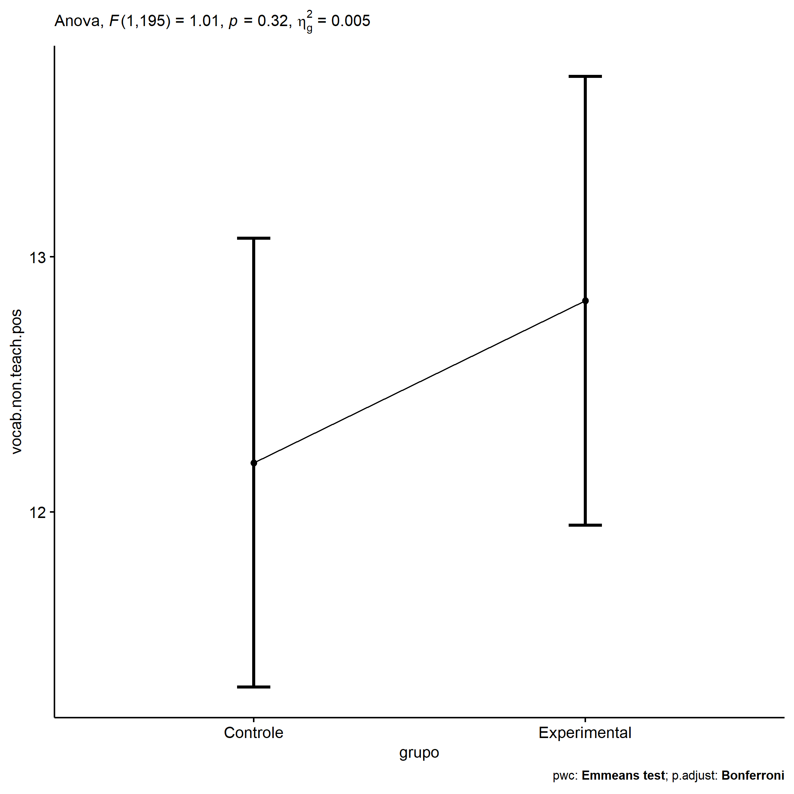<!-- -->

``` r
plots <- oneWayAncovaBoxPlots(
  wdat, "vocab.non.teach.pos", "grupo", aov, pwc, covar = "vocab.non.teach.pre",
  theme = "classic", color = color[["grupo"]],
  subtitle = which(aov$Effect == "grupo"))
```

``` r
if (length(unique(wdat[["grupo"]])) > 1)
  plots[["grupo"]] + ggplot2::ylab("Vocabulario Não Ensinado") + ggplot2::scale_x_discrete(labels=c('pre', 'pos'))
```

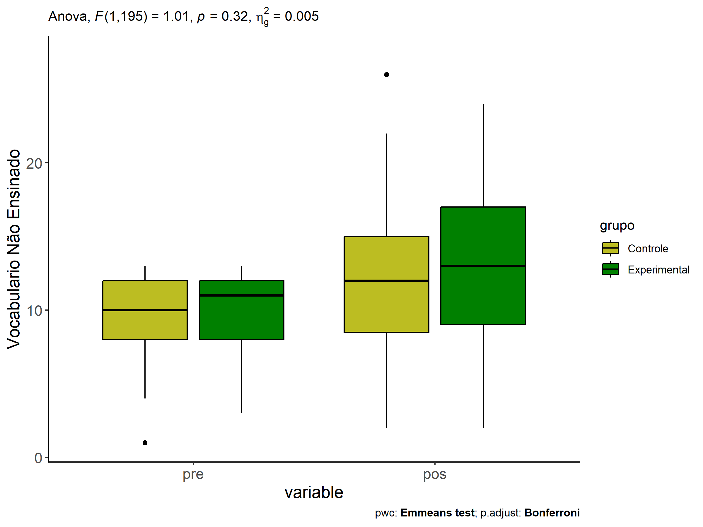<!-- -->

``` r
if (length(unique(wdat.long[["grupo"]])) > 1)
  plots <- oneWayAncovaBoxPlots(
    wdat.long, "vocab.non.teach", "grupo", aov, pwc.long, pre.post = "time",
    theme = "classic", color = color$prepost)
```

``` r
if (length(unique(wdat.long[["grupo"]])) > 1)
  plots[["grupo"]] + ggplot2::ylab("Vocabulario Não Ensinado")
```

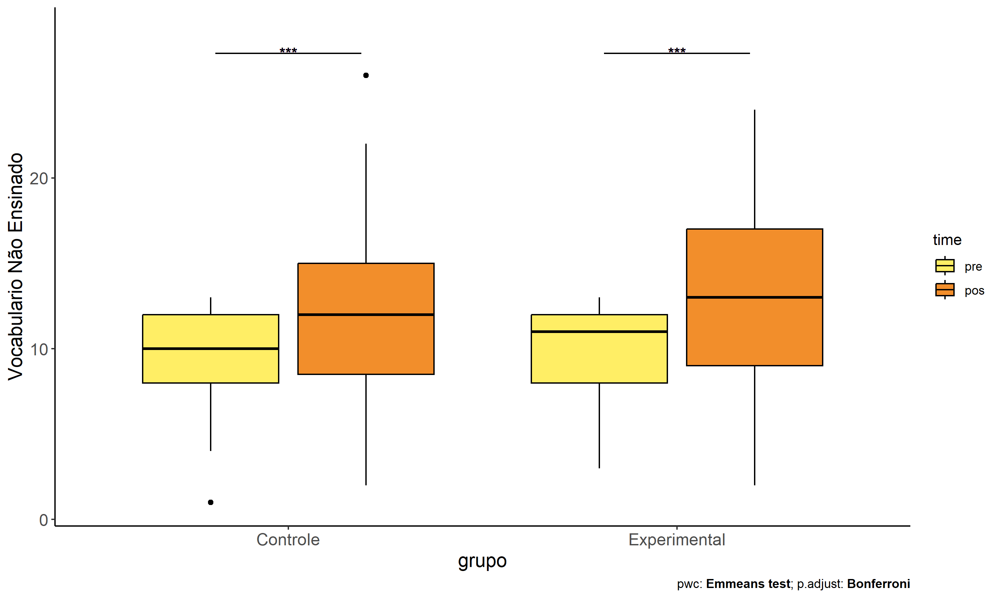<!-- -->

### Checking linearity assumption

``` r
ggscatter(wdat, x = "vocab.non.teach.pre", y = "vocab.non.teach.pos", size = 0.5,
          color = "grupo", add = "reg.line")+
  stat_regline_equation(
    aes(label =  paste(..eq.label.., ..rr.label.., sep = "~~~~"), color = grupo)
  )
```

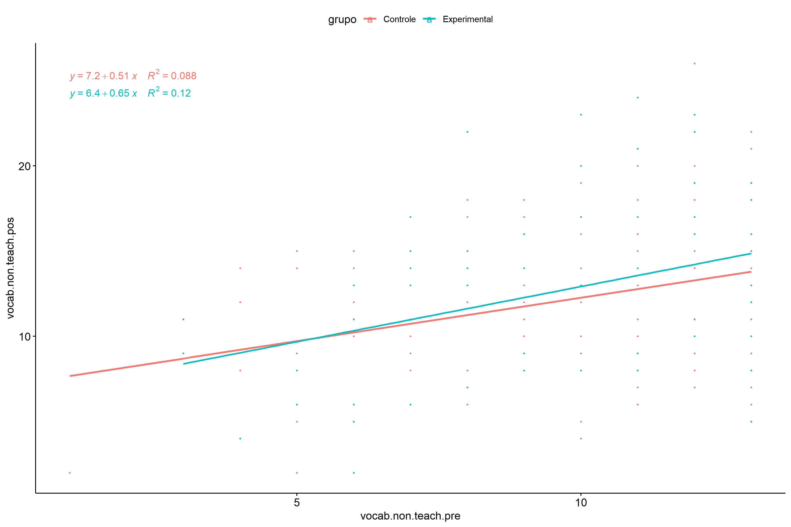<!-- -->

### Checking normality and homogeneity

``` r
res <- augment(lm(vocab.non.teach.pos ~ vocab.non.teach.pre + grupo, data = wdat))
```

``` r
shapiro_test(res$.resid)
```

    ## # A tibble: 1 × 3
    ##   variable   statistic p.value
    ##   <chr>          <dbl>   <dbl>
    ## 1 res$.resid     0.987  0.0566

``` r
levene_test(res, .resid ~ grupo)
```

    ## # A tibble: 1 × 4
    ##     df1   df2 statistic     p
    ##   <int> <int>     <dbl> <dbl>
    ## 1     1   196    0.0531 0.818

# ANCOVA and Pairwise for two factors **grupo:Sexo**

## Without remove non-normal data

``` r
pdat = remove_group_data(dat[!is.na(dat[["grupo"]]) & !is.na(dat[["Sexo"]]),], "vocab.non.teach.pos", c("grupo","Sexo"))

pdat.long <- rbind(pdat[,c("id","grupo","Sexo")], pdat[,c("id","grupo","Sexo")])
pdat.long[["time"]] <- c(rep("pre", nrow(pdat)), rep("pos", nrow(pdat)))
pdat.long[["time"]] <- factor(pdat.long[["time"]], c("pre","pos"))
pdat.long[["vocab.non.teach"]] <- c(pdat[["vocab.non.teach.pre"]], pdat[["vocab.non.teach.pos"]])

aov = anova_test(pdat, vocab.non.teach.pos ~ vocab.non.teach.pre + grupo*Sexo)
laov[["grupo:Sexo"]] <- get_anova_table(aov)
```

``` r
pwcs <- list()
pwcs[["Sexo"]] <- emmeans_test(
  group_by(pdat, grupo), vocab.non.teach.pos ~ Sexo,
  covariate = vocab.non.teach.pre, p.adjust.method = "bonferroni")
pwcs[["grupo"]] <- emmeans_test(
  group_by(pdat, Sexo), vocab.non.teach.pos ~ grupo,
  covariate = vocab.non.teach.pre, p.adjust.method = "bonferroni")

pwc <- plyr::rbind.fill(pwcs[["grupo"]], pwcs[["Sexo"]])
pwc <- pwc[,c("grupo","Sexo", colnames(pwc)[!colnames(pwc) %in% c("grupo","Sexo")])]
```

``` r
pwc.long <- emmeans_test(dplyr::group_by_at(pdat.long, c("grupo","Sexo")),
                         vocab.non.teach ~ time,
                         p.adjust.method = "bonferroni")
lpwc[["grupo:Sexo"]] <- plyr::rbind.fill(pwc, pwc.long)
```

``` r
ds <- get.descriptives(pdat, "vocab.non.teach.pos", c("grupo","Sexo"), covar = "vocab.non.teach.pre")
ds <- merge(ds[ds$variable != "vocab.non.teach.pre",],
            ds[ds$variable == "vocab.non.teach.pre", !colnames(ds) %in% c("variable")],
            by = c("grupo","Sexo"), all.x = T, suffixes = c("", ".vocab.non.teach.pre"))
ds <- merge(get_emmeans(pwcs[["grupo"]]), ds, by = c("grupo","Sexo"), suffixes = c(".emms", ""))
ds <- ds[,c("grupo","Sexo","n","mean.vocab.non.teach.pre","se.vocab.non.teach.pre","mean","se","emmean","se.emms")]

colnames(ds) <- c("grupo","Sexo", "N", paste0(c("M","SE")," (pre)"),
                  paste0(c("M","SE"), " (unadj)"), paste0(c("M", "SE"), " (adj)"))

lemms[["grupo:Sexo"]] <- ds
```

## Computing ANCOVA and PairWise After removing non-normal data (OK)

``` r
wdat = pdat 

res = residuals(lm(vocab.non.teach.pos ~ vocab.non.teach.pre + grupo*Sexo, data = wdat))
non.normal = getNonNormal(res, wdat$id, plimit = 0.05)

wdat = wdat[!wdat$id %in% non.normal,]

wdat.long <- rbind(wdat[,c("id","grupo","Sexo")], wdat[,c("id","grupo","Sexo")])
wdat.long[["time"]] <- c(rep("pre", nrow(wdat)), rep("pos", nrow(wdat)))
wdat.long[["time"]] <- factor(wdat.long[["time"]], c("pre","pos"))
wdat.long[["vocab.non.teach"]] <- c(wdat[["vocab.non.teach.pre"]], wdat[["vocab.non.teach.pos"]])


ldat[["grupo:Sexo"]] = wdat

(non.normal)
```

    ##   [1] "P3260" "P3548" "P852"  "P2931" "P1074" "P863"  "P2872" "P3106" "P818"  "P1859" "P2004" "P1754"
    ##  [13] "P1037" "P3113" "P2121" "P1613" "P1998" "P1057" "P822"  "P968"  "P1029" "P2161" "P890"  "P472" 
    ##  [25] "P1873" "P3475" "P2000" "P2164" "P2877" "P1050" "P3254" "P583"  "P1008" "P1976" "P3503" "P539" 
    ##  [37] "P879"  "P1656" "P3236" "P2841" "P1790" "P904"  "P856"  "P1987" "P1064" "P1757" "P443"  "P1862"
    ##  [49] "P3461" "P889"  "P915"  "P1659" "P3215" "P1720" "P3110" "P1622" "P1714" "P865"  "P1725" "P3111"
    ##  [61] "P3257" "P2162" "P2862" "P1718" "P930"  "P3542" "P2881" "P3486" "P2867" "P1690" "P490"  "P1975"
    ##  [73] "P476"  "P2311" "P2229" "P2900" "P1655" "P1691" "P824"  "P1758" "P868"  "P2903" "P3086" "P2137"
    ##  [85] "P883"  "P479"  "P1891" "P2242" "P2400" "P3158" "P3095" "P834"  "P2868" "P2842" "P486"  "P3166"
    ##  [97] "P500"  "P3562" "P1668" "P1789" "P1797" "P1767" "P2213" "P1799" "P971"  "P3463" "P1735" "P1051"
    ## [109] "P2908" "P973"  "P3488" "P2870" "P3494" "P471"  "P1654" "P954"  "P1694" "P3057" "P1666" "P3554"
    ## [121] "P2920" "P2056" "P3536" "P1920" "P3025" "P3305" "P975"  "P1969" "P2912" "P937"  "P845"  "P1775"
    ## [133] "P864"  "P442"  "P982"  "P940"  "P2831" "P877"  "P3477" "P3102" "P3551" "P2215" "P3196" "P2233"
    ## [145] "P1759" "P3017" "P2077" "P1892" "P582"  "P452"  "P821"  "P1082" "P1719" "P482"

``` r
aov = anova_test(wdat, vocab.non.teach.pos ~ vocab.non.teach.pre + grupo*Sexo)
laov[["grupo:Sexo"]] <- merge(get_anova_table(aov), laov[["grupo:Sexo"]], by="Effect", suffixes = c("","'"))

(df = get_anova_table(aov))
```

    ## ANOVA Table (type II tests)
    ## 
    ##                Effect DFn DFd      F        p p<.05   ges
    ## 1 vocab.non.teach.pre   1  44 56.991 1.81e-09     * 0.564
    ## 2               grupo   1  44  2.300 1.37e-01       0.050
    ## 3                Sexo   1  44  9.601 3.00e-03     * 0.179
    ## 4          grupo:Sexo   1  44  4.669 3.60e-02     * 0.096

| Effect              | DFn | DFd |      F |     p | p\<.05 |   ges |
|:--------------------|----:|----:|-------:|------:|:-------|------:|
| vocab.non.teach.pre |   1 |  44 | 56.991 | 0.000 | \*     | 0.564 |
| grupo               |   1 |  44 |  2.300 | 0.137 |        | 0.050 |
| Sexo                |   1 |  44 |  9.601 | 0.003 | \*     | 0.179 |
| grupo:Sexo          |   1 |  44 |  4.669 | 0.036 | \*     | 0.096 |

``` r
pwcs <- list()
pwcs[["Sexo"]] <- emmeans_test(
  group_by(wdat, grupo), vocab.non.teach.pos ~ Sexo,
  covariate = vocab.non.teach.pre, p.adjust.method = "bonferroni")
pwcs[["grupo"]] <- emmeans_test(
  group_by(wdat, Sexo), vocab.non.teach.pos ~ grupo,
  covariate = vocab.non.teach.pre, p.adjust.method = "bonferroni")

pwc <- plyr::rbind.fill(pwcs[["grupo"]], pwcs[["Sexo"]])
pwc <- pwc[,c("grupo","Sexo", colnames(pwc)[!colnames(pwc) %in% c("grupo","Sexo")])]
```

| grupo        | Sexo | term                       | .y.                 | group1   | group2       |  df | statistic |     p | p.adj | p.adj.signif |
|:-------------|:-----|:---------------------------|:--------------------|:---------|:-------------|----:|----------:|------:|------:|:-------------|
|              | F    | vocab.non.teach.pre\*grupo | vocab.non.teach.pos | Controle | Experimental |  44 |     0.427 | 0.671 | 0.671 | ns           |
|              | M    | vocab.non.teach.pre\*grupo | vocab.non.teach.pos | Controle | Experimental |  44 |    -2.608 | 0.012 | 0.012 | \*           |
| Controle     |      | vocab.non.teach.pre\*Sexo  | vocab.non.teach.pos | F        | M            |  44 |     3.660 | 0.001 | 0.001 | \*\*\*       |
| Experimental |      | vocab.non.teach.pre\*Sexo  | vocab.non.teach.pos | F        | M            |  44 |     0.918 | 0.364 | 0.364 | ns           |

``` r
pwc.long <- emmeans_test(dplyr::group_by_at(wdat.long, c("grupo","Sexo")),
                         vocab.non.teach ~ time,
                         p.adjust.method = "bonferroni")
lpwc[["grupo:Sexo"]] <- merge(plyr::rbind.fill(pwc, pwc.long), lpwc[["grupo:Sexo"]], by=c("grupo","Sexo","term",".y.","group1","group2"), suffixes = c("","'"))
```

| grupo        | Sexo | term | .y.             | group1 | group2 |  df | statistic |   p | p.adj | p.adj.signif |
|:-------------|:-----|:-----|:----------------|:-------|:-------|----:|----------:|----:|------:|:-------------|
| Controle     | F    | time | vocab.non.teach | pre    | pos    |  90 |    -7.012 |   0 |     0 | \*\*\*\*     |
| Controle     | M    | time | vocab.non.teach | pre    | pos    |  90 |    -7.658 |   0 |     0 | \*\*\*\*     |
| Experimental | F    | time | vocab.non.teach | pre    | pos    |  90 |    -9.204 |   0 |     0 | \*\*\*\*     |
| Experimental | M    | time | vocab.non.teach | pre    | pos    |  90 |    -7.136 |   0 |     0 | \*\*\*\*     |

``` r
ds <- get.descriptives(wdat, "vocab.non.teach.pos", c("grupo","Sexo"), covar = "vocab.non.teach.pre")
ds <- merge(ds[ds$variable != "vocab.non.teach.pre",],
            ds[ds$variable == "vocab.non.teach.pre", !colnames(ds) %in% c("variable")],
            by = c("grupo","Sexo"), all.x = T, suffixes = c("", ".vocab.non.teach.pre"))
ds <- merge(get_emmeans(pwcs[["grupo"]]), ds, by = c("grupo","Sexo"), suffixes = c(".emms", ""))
ds <- ds[,c("grupo","Sexo","n","mean.vocab.non.teach.pre","se.vocab.non.teach.pre","mean","se","emmean","se.emms")]

colnames(ds) <- c("grupo","Sexo", "N", paste0(c("M","SE")," (pre)"),
                  paste0(c("M","SE"), " (unadj)"), paste0(c("M", "SE"), " (adj)"))

lemms[["grupo:Sexo"]] <- merge(ds, lemms[["grupo:Sexo"]], by=c("grupo","Sexo"), suffixes = c("","'"))
```

| grupo        | Sexo |   N | M (pre) | SE (pre) | M (unadj) | SE (unadj) | M (adj) | SE (adj) |
|:-------------|:-----|----:|--------:|---------:|----------:|-----------:|--------:|---------:|
| Controle     | F    |   9 |  10.222 |    0.940 |    17.333 |      0.553 |  17.022 |    0.366 |
| Controle     | M    |  13 |   8.000 |    0.751 |    14.462 |      0.418 |  15.214 |    0.319 |
| Experimental | F    |  16 |  10.062 |    0.504 |    17.062 |      0.370 |  16.827 |    0.275 |
| Experimental | M    |  11 |  10.182 |    0.872 |    16.727 |      0.589 |  16.435 |    0.331 |

### Plots for ancova

``` r
plots <- twoWayAncovaPlots(
  wdat, "vocab.non.teach.pos", c("grupo","Sexo"), aov, pwcs, addParam = c("mean_se"),
  font.label.size=10, step.increase=0.05, p.label="p.adj",
  subtitle = which(aov$Effect == "grupo:Sexo"))
```

``` r
if (!is.null(plots[["grupo"]]))
  plots[["grupo"]] + ggplot2::scale_color_manual(values = color[["Sexo"]])
```

    ## Scale for colour is already present.
    ## Adding another scale for colour, which will replace the existing scale.

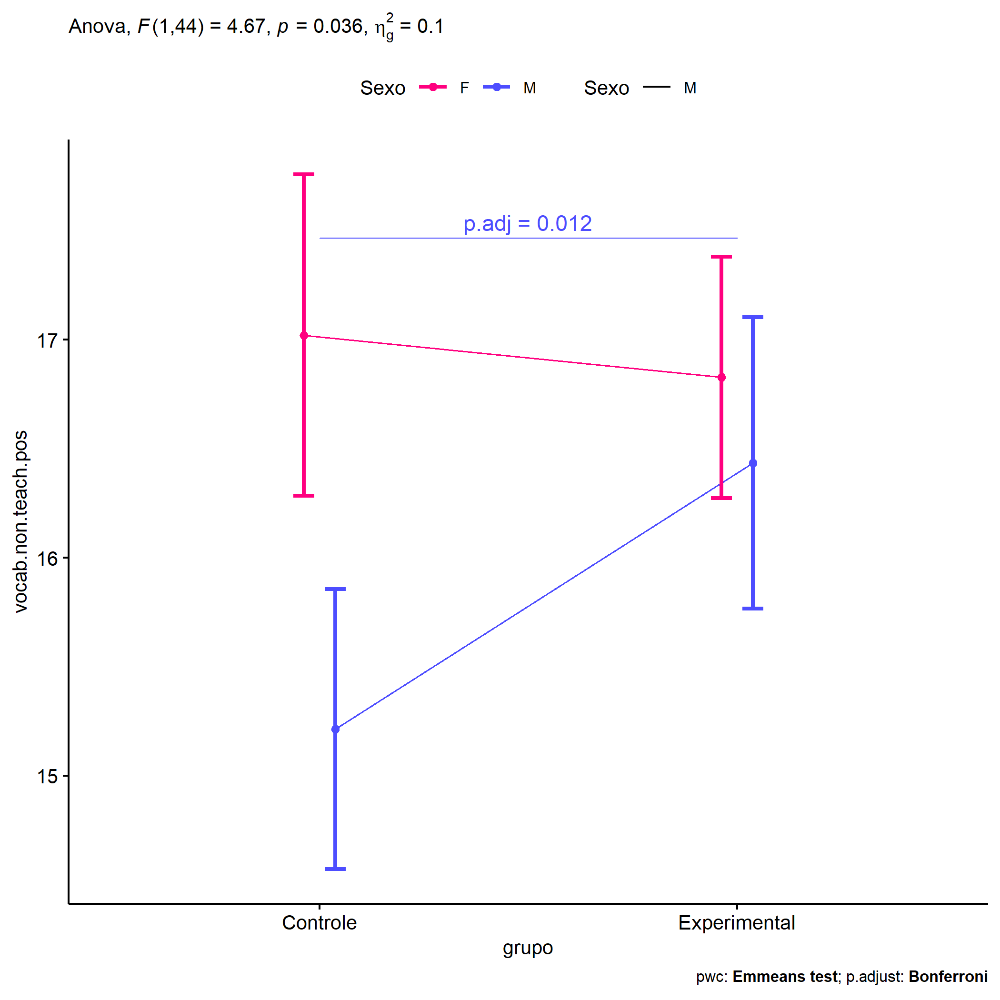<!-- -->

``` r
if (!is.null(plots[["Sexo"]]))
  plots[["Sexo"]] + ggplot2::scale_color_manual(values = color[["grupo"]])
```

    ## Scale for colour is already present.
    ## Adding another scale for colour, which will replace the existing scale.

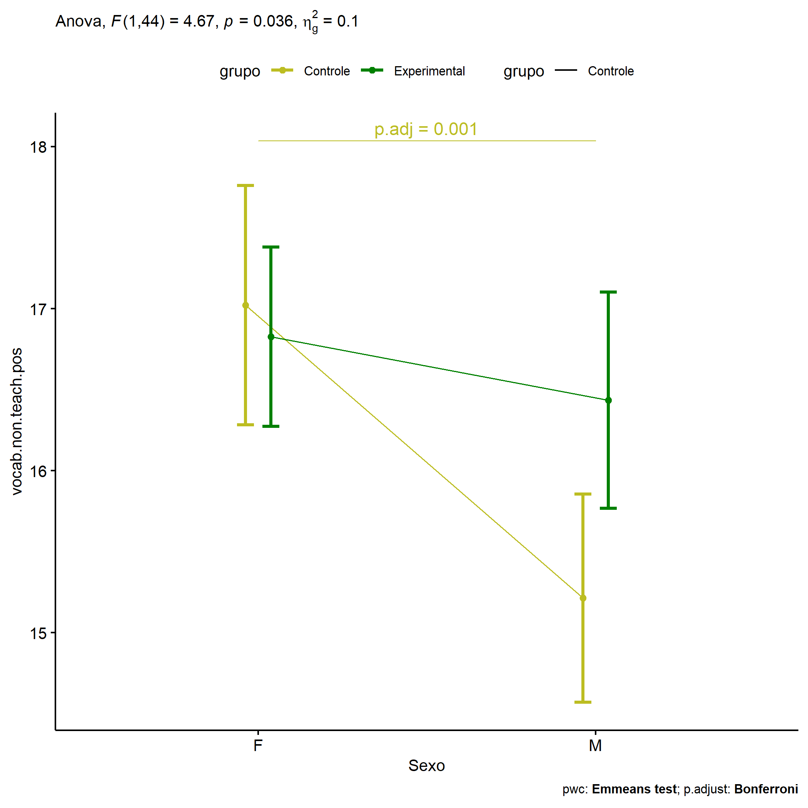<!-- -->

``` r
plots <- twoWayAncovaBoxPlots(
  wdat, "vocab.non.teach.pos", c("grupo","Sexo"), aov, pwcs, covar = "vocab.non.teach.pre",
  theme = "classic", color = color[["grupo:Sexo"]],
  subtitle = which(aov$Effect == "grupo:Sexo"))
```

``` r
plots[["grupo:Sexo"]] + ggplot2::ylab("Vocabulario Não Ensinado") + ggplot2::scale_x_discrete(labels=c('pre', 'pos'))
```

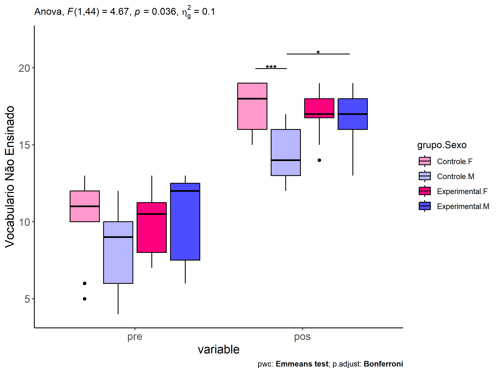<!-- -->

``` r
plots <- twoWayAncovaBoxPlots(
  wdat.long, "vocab.non.teach", c("grupo","Sexo"), aov, pwc.long, pre.post = "time",
  theme = "classic", color = color$prepost)
```

``` r
plots[["grupo:Sexo"]] + ggplot2::ylab("Vocabulario Não Ensinado")
```

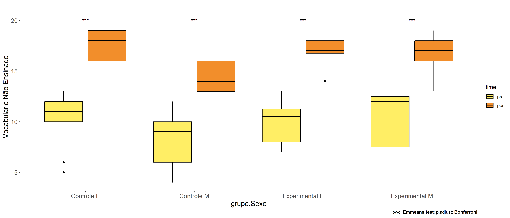<!-- -->

### Checking linearity assumption

``` r
ggscatter(wdat, x = "vocab.non.teach.pre", y = "vocab.non.teach.pos", size = 0.5,
          facet.by = c("grupo","Sexo"), add = "reg.line")+
  stat_regline_equation(
    aes(label =  paste(..eq.label.., ..rr.label.., sep = "~~~~"))
  )
```

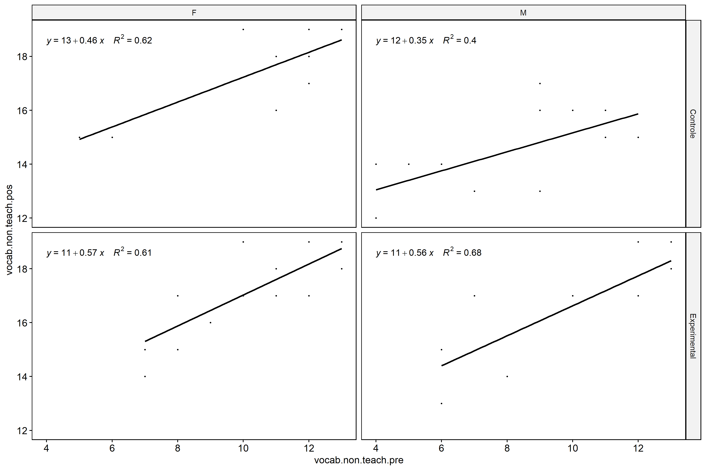<!-- -->

### Checking normality and homogeneity

``` r
res <- augment(lm(vocab.non.teach.pos ~ vocab.non.teach.pre + grupo*Sexo, data = wdat))
```

``` r
shapiro_test(res$.resid)
```

    ## # A tibble: 1 × 3
    ##   variable   statistic p.value
    ##   <chr>          <dbl>   <dbl>
    ## 1 res$.resid     0.977   0.458

``` r
levene_test(res, .resid ~ grupo*Sexo)
```

    ## # A tibble: 1 × 4
    ##     df1   df2 statistic     p
    ##   <int> <int>     <dbl> <dbl>
    ## 1     3    45     0.511 0.677

# ANCOVA and Pairwise for two factors **grupo:Zona**

## Without remove non-normal data

``` r
pdat = remove_group_data(dat[!is.na(dat[["grupo"]]) & !is.na(dat[["Zona"]]),], "vocab.non.teach.pos", c("grupo","Zona"))

pdat.long <- rbind(pdat[,c("id","grupo","Zona")], pdat[,c("id","grupo","Zona")])
pdat.long[["time"]] <- c(rep("pre", nrow(pdat)), rep("pos", nrow(pdat)))
pdat.long[["time"]] <- factor(pdat.long[["time"]], c("pre","pos"))
pdat.long[["vocab.non.teach"]] <- c(pdat[["vocab.non.teach.pre"]], pdat[["vocab.non.teach.pos"]])

aov = anova_test(pdat, vocab.non.teach.pos ~ vocab.non.teach.pre + grupo*Zona)
laov[["grupo:Zona"]] <- get_anova_table(aov)
```

``` r
pwcs <- list()
pwcs[["Zona"]] <- emmeans_test(
  group_by(pdat, grupo), vocab.non.teach.pos ~ Zona,
  covariate = vocab.non.teach.pre, p.adjust.method = "bonferroni")
pwcs[["grupo"]] <- emmeans_test(
  group_by(pdat, Zona), vocab.non.teach.pos ~ grupo,
  covariate = vocab.non.teach.pre, p.adjust.method = "bonferroni")

pwc <- plyr::rbind.fill(pwcs[["grupo"]], pwcs[["Zona"]])
pwc <- pwc[,c("grupo","Zona", colnames(pwc)[!colnames(pwc) %in% c("grupo","Zona")])]
```

``` r
pwc.long <- emmeans_test(dplyr::group_by_at(pdat.long, c("grupo","Zona")),
                         vocab.non.teach ~ time,
                         p.adjust.method = "bonferroni")
lpwc[["grupo:Zona"]] <- plyr::rbind.fill(pwc, pwc.long)
```

``` r
ds <- get.descriptives(pdat, "vocab.non.teach.pos", c("grupo","Zona"), covar = "vocab.non.teach.pre")
ds <- merge(ds[ds$variable != "vocab.non.teach.pre",],
            ds[ds$variable == "vocab.non.teach.pre", !colnames(ds) %in% c("variable")],
            by = c("grupo","Zona"), all.x = T, suffixes = c("", ".vocab.non.teach.pre"))
ds <- merge(get_emmeans(pwcs[["grupo"]]), ds, by = c("grupo","Zona"), suffixes = c(".emms", ""))
ds <- ds[,c("grupo","Zona","n","mean.vocab.non.teach.pre","se.vocab.non.teach.pre","mean","se","emmean","se.emms")]

colnames(ds) <- c("grupo","Zona", "N", paste0(c("M","SE")," (pre)"),
                  paste0(c("M","SE"), " (unadj)"), paste0(c("M", "SE"), " (adj)"))

lemms[["grupo:Zona"]] <- ds
```

## Computing ANCOVA and PairWise After removing non-normal data (OK)

``` r
wdat = pdat 

res = residuals(lm(vocab.non.teach.pos ~ vocab.non.teach.pre + grupo*Zona, data = wdat))
non.normal = getNonNormal(res, wdat$id, plimit = 0.05)

wdat = wdat[!wdat$id %in% non.normal,]

wdat.long <- rbind(wdat[,c("id","grupo","Zona")], wdat[,c("id","grupo","Zona")])
wdat.long[["time"]] <- c(rep("pre", nrow(wdat)), rep("pos", nrow(wdat)))
wdat.long[["time"]] <- factor(wdat.long[["time"]], c("pre","pos"))
wdat.long[["vocab.non.teach"]] <- c(wdat[["vocab.non.teach.pre"]], wdat[["vocab.non.teach.pos"]])


ldat[["grupo:Zona"]] = wdat

(non.normal)
```

    ## [1] "P3260" "P852"

``` r
aov = anova_test(wdat, vocab.non.teach.pos ~ vocab.non.teach.pre + grupo*Zona)
laov[["grupo:Zona"]] <- merge(get_anova_table(aov), laov[["grupo:Zona"]], by="Effect", suffixes = c("","'"))

(df = get_anova_table(aov))
```

    ## ANOVA Table (type II tests)
    ## 
    ##                Effect DFn DFd      F        p p<.05      ges
    ## 1 vocab.non.teach.pre   1 138 16.602 7.74e-05     * 0.107000
    ## 2               grupo   1 138  1.770 1.86e-01       0.013000
    ## 3                Zona   1 138  0.161 6.89e-01       0.001000
    ## 4          grupo:Zona   1 138  0.041 8.40e-01       0.000297

| Effect              | DFn | DFd |      F |     p | p\<.05 |   ges |
|:--------------------|----:|----:|-------:|------:|:-------|------:|
| vocab.non.teach.pre |   1 | 138 | 16.602 | 0.000 | \*     | 0.107 |
| grupo               |   1 | 138 |  1.770 | 0.186 |        | 0.013 |
| Zona                |   1 | 138 |  0.161 | 0.689 |        | 0.001 |
| grupo:Zona          |   1 | 138 |  0.041 | 0.840 |        | 0.000 |

``` r
pwcs <- list()
pwcs[["Zona"]] <- emmeans_test(
  group_by(wdat, grupo), vocab.non.teach.pos ~ Zona,
  covariate = vocab.non.teach.pre, p.adjust.method = "bonferroni")
pwcs[["grupo"]] <- emmeans_test(
  group_by(wdat, Zona), vocab.non.teach.pos ~ grupo,
  covariate = vocab.non.teach.pre, p.adjust.method = "bonferroni")

pwc <- plyr::rbind.fill(pwcs[["grupo"]], pwcs[["Zona"]])
pwc <- pwc[,c("grupo","Zona", colnames(pwc)[!colnames(pwc) %in% c("grupo","Zona")])]
```

| grupo        | Zona   | term                       | .y.                 | group1   | group2       |  df | statistic |     p | p.adj | p.adj.signif |
|:-------------|:-------|:---------------------------|:--------------------|:---------|:-------------|----:|----------:|------:|------:|:-------------|
|              | Rural  | vocab.non.teach.pre\*grupo | vocab.non.teach.pos | Controle | Experimental | 138 |    -1.014 | 0.312 | 0.312 | ns           |
|              | Urbana | vocab.non.teach.pre\*grupo | vocab.non.teach.pos | Controle | Experimental | 138 |    -0.882 | 0.379 | 0.379 | ns           |
| Controle     |        | vocab.non.teach.pre\*Zona  | vocab.non.teach.pos | Rural    | Urbana       | 138 |     0.420 | 0.675 | 0.675 | ns           |
| Experimental |        | vocab.non.teach.pre\*Zona  | vocab.non.teach.pos | Rural    | Urbana       | 138 |     0.159 | 0.874 | 0.874 | ns           |

``` r
pwc.long <- emmeans_test(dplyr::group_by_at(wdat.long, c("grupo","Zona")),
                         vocab.non.teach ~ time,
                         p.adjust.method = "bonferroni")
lpwc[["grupo:Zona"]] <- merge(plyr::rbind.fill(pwc, pwc.long), lpwc[["grupo:Zona"]], by=c("grupo","Zona","term",".y.","group1","group2"), suffixes = c("","'"))
```

| grupo        | Zona   | term | .y.             | group1 | group2 |  df | statistic |     p | p.adj | p.adj.signif |
|:-------------|:-------|:-----|:----------------|:-------|:-------|----:|----------:|------:|------:|:-------------|
| Controle     | Rural  | time | vocab.non.teach | pre    | pos    | 278 |    -2.624 | 0.009 | 0.009 | \*\*         |
| Controle     | Urbana | time | vocab.non.teach | pre    | pos    | 278 |    -1.287 | 0.199 | 0.199 | ns           |
| Experimental | Rural  | time | vocab.non.teach | pre    | pos    | 278 |    -3.860 | 0.000 | 0.000 | \*\*\*       |
| Experimental | Urbana | time | vocab.non.teach | pre    | pos    | 278 |    -2.191 | 0.029 | 0.029 | \*           |

``` r
ds <- get.descriptives(wdat, "vocab.non.teach.pos", c("grupo","Zona"), covar = "vocab.non.teach.pre")
ds <- merge(ds[ds$variable != "vocab.non.teach.pre",],
            ds[ds$variable == "vocab.non.teach.pre", !colnames(ds) %in% c("variable")],
            by = c("grupo","Zona"), all.x = T, suffixes = c("", ".vocab.non.teach.pre"))
ds <- merge(get_emmeans(pwcs[["grupo"]]), ds, by = c("grupo","Zona"), suffixes = c(".emms", ""))
ds <- ds[,c("grupo","Zona","n","mean.vocab.non.teach.pre","se.vocab.non.teach.pre","mean","se","emmean","se.emms")]

colnames(ds) <- c("grupo","Zona", "N", paste0(c("M","SE")," (pre)"),
                  paste0(c("M","SE"), " (unadj)"), paste0(c("M", "SE"), " (adj)"))

lemms[["grupo:Zona"]] <- merge(ds, lemms[["grupo:Zona"]], by=c("grupo","Zona"), suffixes = c("","'"))
```

| grupo        | Zona   |   N | M (pre) | SE (pre) | M (unadj) | SE (unadj) | M (adj) | SE (adj) |
|:-------------|:-------|----:|--------:|---------:|----------:|-----------:|--------:|---------:|
| Controle     | Rural  |  51 |   9.941 |    0.389 |    11.961 |      0.691 |  11.975 |    0.641 |
| Controle     | Urbana |  18 |   9.500 |    0.567 |    11.167 |      0.919 |  11.448 |    1.082 |
| Experimental | Rural  |  50 |   9.800 |    0.384 |    12.800 |      0.713 |  12.900 |    0.648 |
| Experimental | Urbana |  24 |  10.708 |    0.440 |    13.167 |      0.974 |  12.718 |    0.941 |

### Plots for ancova

``` r
plots <- twoWayAncovaPlots(
  wdat, "vocab.non.teach.pos", c("grupo","Zona"), aov, pwcs, addParam = c("mean_se"),
  font.label.size=10, step.increase=0.05, p.label="p.adj",
  subtitle = which(aov$Effect == "grupo:Zona"))
```

``` r
if (!is.null(plots[["grupo"]]))
  plots[["grupo"]] + ggplot2::scale_color_manual(values = color[["Zona"]])
```

    ## Scale for colour is already present.
    ## Adding another scale for colour, which will replace the existing scale.

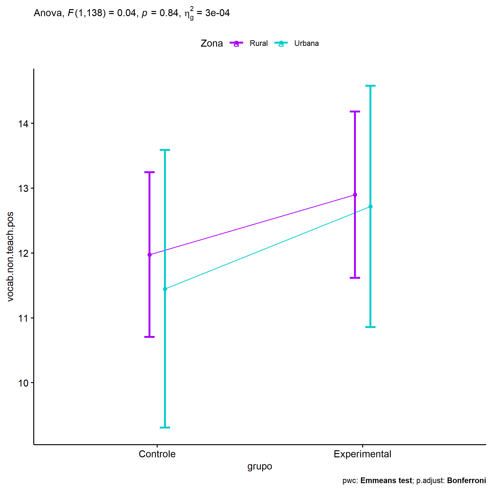<!-- -->

``` r
if (!is.null(plots[["Zona"]]))
  plots[["Zona"]] + ggplot2::scale_color_manual(values = color[["grupo"]])
```

    ## Scale for colour is already present.
    ## Adding another scale for colour, which will replace the existing scale.

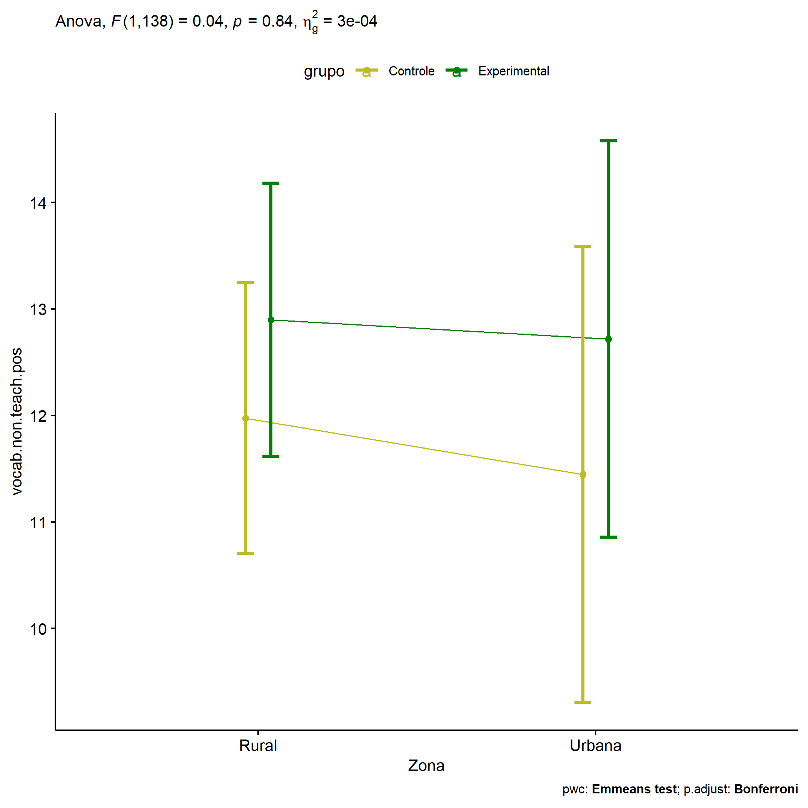<!-- -->

``` r
plots <- twoWayAncovaBoxPlots(
  wdat, "vocab.non.teach.pos", c("grupo","Zona"), aov, pwcs, covar = "vocab.non.teach.pre",
  theme = "classic", color = color[["grupo:Zona"]],
  subtitle = which(aov$Effect == "grupo:Zona"))
```

``` r
plots[["grupo:Zona"]] + ggplot2::ylab("Vocabulario Não Ensinado") + ggplot2::scale_x_discrete(labels=c('pre', 'pos'))
```

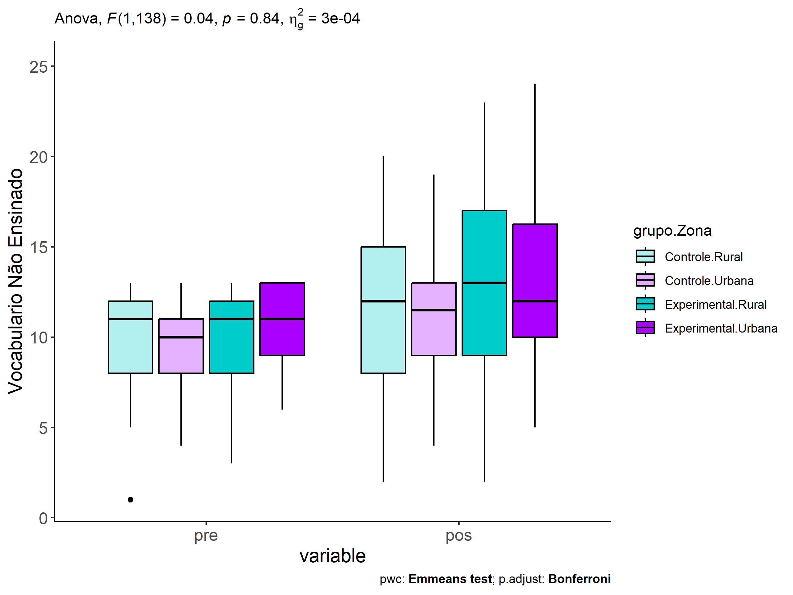<!-- -->

``` r
plots <- twoWayAncovaBoxPlots(
  wdat.long, "vocab.non.teach", c("grupo","Zona"), aov, pwc.long, pre.post = "time",
  theme = "classic", color = color$prepost)
```

``` r
plots[["grupo:Zona"]] + ggplot2::ylab("Vocabulario Não Ensinado")
```

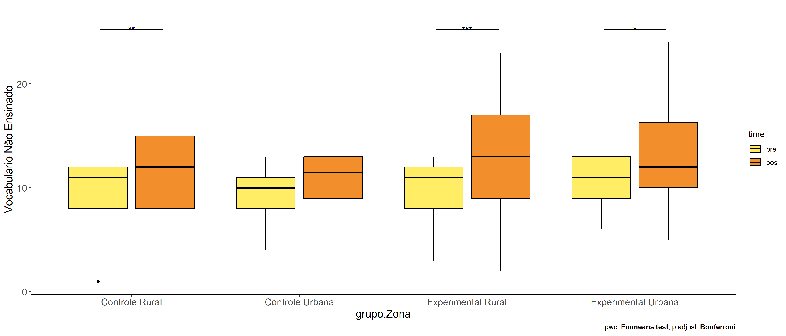<!-- -->

### Checking linearity assumption

``` r
ggscatter(wdat, x = "vocab.non.teach.pre", y = "vocab.non.teach.pos", size = 0.5,
          facet.by = c("grupo","Zona"), add = "reg.line")+
  stat_regline_equation(
    aes(label =  paste(..eq.label.., ..rr.label.., sep = "~~~~"))
  )
```

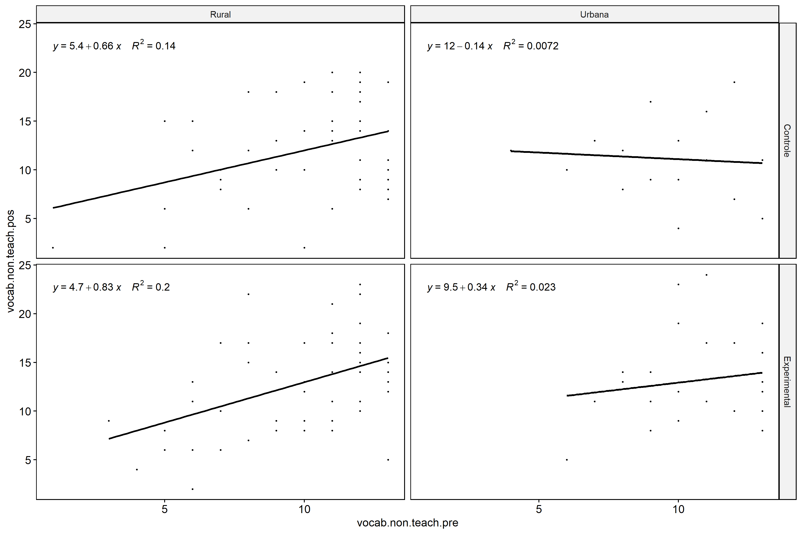<!-- -->

### Checking normality and homogeneity

``` r
res <- augment(lm(vocab.non.teach.pos ~ vocab.non.teach.pre + grupo*Zona, data = wdat))
```

``` r
shapiro_test(res$.resid)
```

    ## # A tibble: 1 × 3
    ##   variable   statistic p.value
    ##   <chr>          <dbl>   <dbl>
    ## 1 res$.resid     0.985   0.129

``` r
levene_test(res, .resid ~ grupo*Zona)
```

    ## # A tibble: 1 × 4
    ##     df1   df2 statistic     p
    ##   <int> <int>     <dbl> <dbl>
    ## 1     3   139     0.146 0.932

# ANCOVA and Pairwise for two factors **grupo:Cor.Raca**

## Without remove non-normal data

``` r
pdat = remove_group_data(dat[!is.na(dat[["grupo"]]) & !is.na(dat[["Cor.Raca"]]),], "vocab.non.teach.pos", c("grupo","Cor.Raca"))
```

    ## Warning: There were 2 warnings in `mutate()`.
    ## The first warning was:
    ## ℹ In argument: `ci = abs(stats::qt(alpha/2, .data$n - 1) * .data$se)`.
    ## Caused by warning:
    ## ! There was 1 warning in `mutate()`.
    ## ℹ In argument: `ci = abs(stats::qt(alpha/2, .data$n - 1) * .data$se)`.
    ## Caused by warning in `stats::qt()`:
    ## ! NaNs produced
    ## ℹ Run `dplyr::last_dplyr_warnings()` to see the 1 remaining warning.

``` r
pdat.long <- rbind(pdat[,c("id","grupo","Cor.Raca")], pdat[,c("id","grupo","Cor.Raca")])
pdat.long[["time"]] <- c(rep("pre", nrow(pdat)), rep("pos", nrow(pdat)))
pdat.long[["time"]] <- factor(pdat.long[["time"]], c("pre","pos"))
pdat.long[["vocab.non.teach"]] <- c(pdat[["vocab.non.teach.pre"]], pdat[["vocab.non.teach.pos"]])

aov = anova_test(pdat, vocab.non.teach.pos ~ vocab.non.teach.pre + grupo*Cor.Raca)
laov[["grupo:Cor.Raca"]] <- get_anova_table(aov)
```

``` r
pwcs <- list()
pwcs[["Cor.Raca"]] <- emmeans_test(
  group_by(pdat, grupo), vocab.non.teach.pos ~ Cor.Raca,
  covariate = vocab.non.teach.pre, p.adjust.method = "bonferroni")
pwcs[["grupo"]] <- emmeans_test(
  group_by(pdat, Cor.Raca), vocab.non.teach.pos ~ grupo,
  covariate = vocab.non.teach.pre, p.adjust.method = "bonferroni")

pwc <- plyr::rbind.fill(pwcs[["grupo"]], pwcs[["Cor.Raca"]])
pwc <- pwc[,c("grupo","Cor.Raca", colnames(pwc)[!colnames(pwc) %in% c("grupo","Cor.Raca")])]
```

``` r
pwc.long <- emmeans_test(dplyr::group_by_at(pdat.long, c("grupo","Cor.Raca")),
                         vocab.non.teach ~ time,
                         p.adjust.method = "bonferroni")
lpwc[["grupo:Cor.Raca"]] <- plyr::rbind.fill(pwc, pwc.long)
```

``` r
ds <- get.descriptives(pdat, "vocab.non.teach.pos", c("grupo","Cor.Raca"), covar = "vocab.non.teach.pre")
ds <- merge(ds[ds$variable != "vocab.non.teach.pre",],
            ds[ds$variable == "vocab.non.teach.pre", !colnames(ds) %in% c("variable")],
            by = c("grupo","Cor.Raca"), all.x = T, suffixes = c("", ".vocab.non.teach.pre"))
ds <- merge(get_emmeans(pwcs[["grupo"]]), ds, by = c("grupo","Cor.Raca"), suffixes = c(".emms", ""))
ds <- ds[,c("grupo","Cor.Raca","n","mean.vocab.non.teach.pre","se.vocab.non.teach.pre","mean","se","emmean","se.emms")]

colnames(ds) <- c("grupo","Cor.Raca", "N", paste0(c("M","SE")," (pre)"),
                  paste0(c("M","SE"), " (unadj)"), paste0(c("M", "SE"), " (adj)"))

lemms[["grupo:Cor.Raca"]] <- ds
```

## Computing ANCOVA and PairWise After removing non-normal data (OK)

``` r
wdat = pdat 

res = residuals(lm(vocab.non.teach.pos ~ vocab.non.teach.pre + grupo*Cor.Raca, data = wdat))
non.normal = getNonNormal(res, wdat$id, plimit = 0.05)

wdat = wdat[!wdat$id %in% non.normal,]

wdat.long <- rbind(wdat[,c("id","grupo","Cor.Raca")], wdat[,c("id","grupo","Cor.Raca")])
wdat.long[["time"]] <- c(rep("pre", nrow(wdat)), rep("pos", nrow(wdat)))
wdat.long[["time"]] <- factor(wdat.long[["time"]], c("pre","pos"))
wdat.long[["vocab.non.teach"]] <- c(wdat[["vocab.non.teach.pre"]], wdat[["vocab.non.teach.pos"]])


ldat[["grupo:Cor.Raca"]] = wdat

(non.normal)
```

    ## [1] "P3260"

``` r
aov = anova_test(wdat, vocab.non.teach.pos ~ vocab.non.teach.pre + grupo*Cor.Raca)
laov[["grupo:Cor.Raca"]] <- merge(get_anova_table(aov), laov[["grupo:Cor.Raca"]], by="Effect", suffixes = c("","'"))

(df = get_anova_table(aov))
```

    ## ANOVA Table (type II tests)
    ## 
    ##                Effect DFn DFd     F     p p<.05   ges
    ## 1 vocab.non.teach.pre   1  85 3.405 0.068       0.039
    ## 2               grupo   1  85 5.743 0.019     * 0.063
    ## 3            Cor.Raca   2  85 0.095 0.909       0.002
    ## 4      grupo:Cor.Raca   1  85 0.878 0.351       0.010

| Effect              | DFn | DFd |     F |     p | p\<.05 |   ges |
|:--------------------|----:|----:|------:|------:|:-------|------:|
| vocab.non.teach.pre |   1 |  85 | 3.405 | 0.068 |        | 0.039 |
| grupo               |   1 |  85 | 5.743 | 0.019 | \*     | 0.063 |
| Cor.Raca            |   2 |  85 | 0.095 | 0.909 |        | 0.002 |
| grupo:Cor.Raca      |   1 |  85 | 0.878 | 0.351 |        | 0.010 |

``` r
pwcs <- list()
pwcs[["Cor.Raca"]] <- emmeans_test(
  group_by(wdat, grupo), vocab.non.teach.pos ~ Cor.Raca,
  covariate = vocab.non.teach.pre, p.adjust.method = "bonferroni")
pwcs[["grupo"]] <- emmeans_test(
  group_by(wdat, Cor.Raca), vocab.non.teach.pos ~ grupo,
  covariate = vocab.non.teach.pre, p.adjust.method = "bonferroni")

pwc <- plyr::rbind.fill(pwcs[["grupo"]], pwcs[["Cor.Raca"]])
pwc <- pwc[,c("grupo","Cor.Raca", colnames(pwc)[!colnames(pwc) %in% c("grupo","Cor.Raca")])]
```

| grupo        | Cor.Raca | term                          | .y.                 | group1   | group2       |  df | statistic |     p | p.adj | p.adj.signif |
|:-------------|:---------|:------------------------------|:--------------------|:---------|:-------------|----:|----------:|------:|------:|:-------------|
|              | Branca   | vocab.non.teach.pre\*grupo    | vocab.non.teach.pos | Controle | Experimental |  85 |     0.023 | 0.982 | 0.982 | ns           |
|              | Indígena | vocab.non.teach.pre\*grupo    | vocab.non.teach.pos | Controle | Experimental |     |           |       |       |              |
|              | Parda    | vocab.non.teach.pre\*grupo    | vocab.non.teach.pos | Controle | Experimental |  85 |    -2.573 | 0.012 | 0.012 | \*           |
| Controle     |          | vocab.non.teach.pre\*Cor.Raca | vocab.non.teach.pos | Branca   | Indígena     |     |           |       |       |              |
| Controle     |          | vocab.non.teach.pre\*Cor.Raca | vocab.non.teach.pos | Branca   | Parda        |  85 |     0.417 | 0.678 | 0.678 | ns           |
| Controle     |          | vocab.non.teach.pre\*Cor.Raca | vocab.non.teach.pos | Indígena | Parda        |     |           |       |       |              |
| Experimental |          | vocab.non.teach.pre\*Cor.Raca | vocab.non.teach.pos | Branca   | Indígena     |  85 |    -0.397 | 0.692 | 1.000 | ns           |
| Experimental |          | vocab.non.teach.pre\*Cor.Raca | vocab.non.teach.pos | Branca   | Parda        |  85 |    -0.894 | 0.374 | 1.000 | ns           |
| Experimental |          | vocab.non.teach.pre\*Cor.Raca | vocab.non.teach.pos | Indígena | Parda        |  85 |    -0.428 | 0.670 | 1.000 | ns           |

``` r
pwc.long <- emmeans_test(dplyr::group_by_at(wdat.long, c("grupo","Cor.Raca")),
                         vocab.non.teach ~ time,
                         p.adjust.method = "bonferroni")
lpwc[["grupo:Cor.Raca"]] <- merge(plyr::rbind.fill(pwc, pwc.long), lpwc[["grupo:Cor.Raca"]], by=c("grupo","Cor.Raca","term",".y.","group1","group2"), suffixes = c("","'"))
```

| grupo        | Cor.Raca | term | .y.             | group1 | group2 |  df | statistic |     p | p.adj | p.adj.signif |
|:-------------|:---------|:-----|:----------------|:-------|:-------|----:|----------:|------:|------:|:-------------|
| Controle     | Branca   | time | vocab.non.teach | pre    | pos    | 172 |    -1.041 | 0.299 | 0.299 | ns           |
| Controle     | Indígena | time | vocab.non.teach | pre    | pos    |     |           |       |       |              |
| Controle     | Parda    | time | vocab.non.teach | pre    | pos    | 172 |    -1.263 | 0.208 | 0.208 | ns           |
| Experimental | Branca   | time | vocab.non.teach | pre    | pos    | 172 |    -0.407 | 0.684 | 0.684 | ns           |
| Experimental | Indígena | time | vocab.non.teach | pre    | pos    | 172 |    -1.265 | 0.208 | 0.208 | ns           |
| Experimental | Parda    | time | vocab.non.teach | pre    | pos    | 172 |    -4.551 | 0.000 | 0.000 | \*\*\*\*     |

``` r
ds <- get.descriptives(wdat, "vocab.non.teach.pos", c("grupo","Cor.Raca"), covar = "vocab.non.teach.pre")
ds <- merge(ds[ds$variable != "vocab.non.teach.pre",],
            ds[ds$variable == "vocab.non.teach.pre", !colnames(ds) %in% c("variable")],
            by = c("grupo","Cor.Raca"), all.x = T, suffixes = c("", ".vocab.non.teach.pre"))
ds <- merge(get_emmeans(pwcs[["grupo"]]), ds, by = c("grupo","Cor.Raca"), suffixes = c(".emms", ""))
ds <- ds[,c("grupo","Cor.Raca","n","mean.vocab.non.teach.pre","se.vocab.non.teach.pre","mean","se","emmean","se.emms")]

colnames(ds) <- c("grupo","Cor.Raca", "N", paste0(c("M","SE")," (pre)"),
                  paste0(c("M","SE"), " (unadj)"), paste0(c("M", "SE"), " (adj)"))

lemms[["grupo:Cor.Raca"]] <- merge(ds, lemms[["grupo:Cor.Raca"]], by=c("grupo","Cor.Raca"), suffixes = c("","'"))
```

| grupo        | Cor.Raca |   N | M (pre) | SE (pre) | M (unadj) | SE (unadj) | M (adj) | SE (adj) |
|:-------------|:---------|----:|--------:|---------:|----------:|-----------:|--------:|---------:|
| Controle     | Branca   |   6 |   9.500 |    0.885 |    11.833 |      1.869 |  12.072 |    1.986 |
| Controle     | Parda    |  35 |   9.943 |    0.414 |    11.114 |      0.688 |  11.176 |    0.821 |
| Experimental | Branca   |   5 |  11.600 |    0.600 |    12.600 |      2.379 |  12.003 |    2.195 |
| Experimental | Indígena |   6 |  10.500 |    0.764 |    13.333 |      1.145 |  13.174 |    1.984 |
| Experimental | Parda    |  39 |  10.077 |    0.415 |    14.077 |      0.923 |  14.086 |    0.777 |

### Plots for ancova

``` r
plots <- twoWayAncovaPlots(
  wdat, "vocab.non.teach.pos", c("grupo","Cor.Raca"), aov, pwcs, addParam = c("mean_se"),
  font.label.size=10, step.increase=0.05, p.label="p.adj",
  subtitle = which(aov$Effect == "grupo:Cor.Raca"))
```

``` r
if (!is.null(plots[["grupo"]]))
  plots[["grupo"]] + ggplot2::scale_color_manual(values = color[["Cor.Raca"]])
```

<!-- -->

``` r
if (!is.null(plots[["Cor.Raca"]]))
  plots[["Cor.Raca"]] + ggplot2::scale_color_manual(values = color[["grupo"]])
```

    ## Scale for colour is already present.
    ## Adding another scale for colour, which will replace the existing scale.

    ## Warning: Removed 2 rows containing non-finite values (`stat_bracket()`).

    ## Warning: Removed 1 rows containing missing values (`geom_point()`).

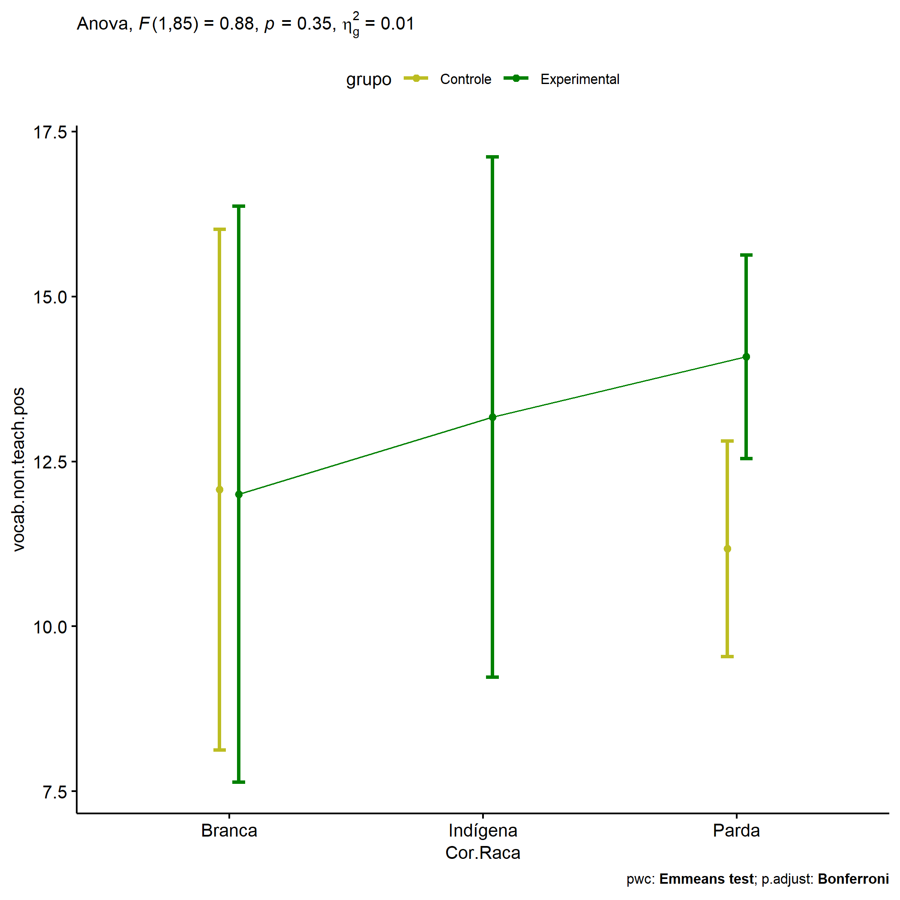<!-- -->

``` r
plots <- twoWayAncovaBoxPlots(
  wdat, "vocab.non.teach.pos", c("grupo","Cor.Raca"), aov, pwcs, covar = "vocab.non.teach.pre",
  theme = "classic", color = color[["grupo:Cor.Raca"]],
  subtitle = which(aov$Effect == "grupo:Cor.Raca"))
```

``` r
plots[["grupo:Cor.Raca"]] + ggplot2::ylab("Vocabulario Não Ensinado") + ggplot2::scale_x_discrete(labels=c('pre', 'pos'))
```

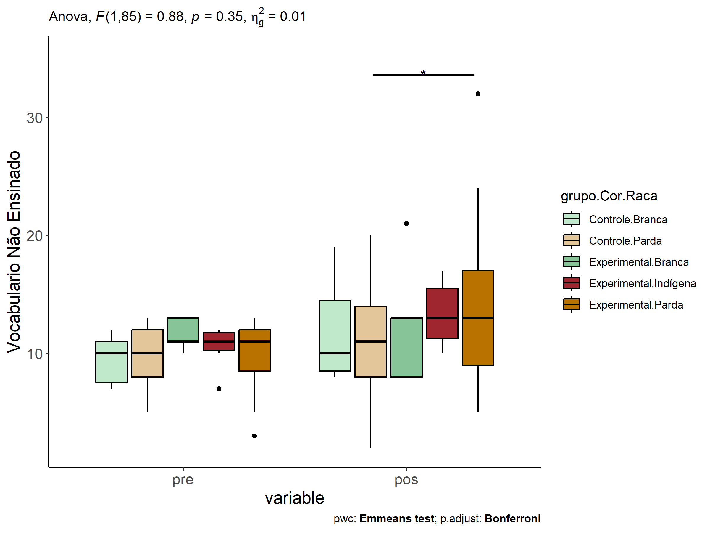<!-- -->

``` r
plots <- twoWayAncovaBoxPlots(
  wdat.long, "vocab.non.teach", c("grupo","Cor.Raca"), aov, pwc.long, pre.post = "time",
  theme = "classic", color = color$prepost)
```

``` r
plots[["grupo:Cor.Raca"]] + ggplot2::ylab("Vocabulario Não Ensinado")
```

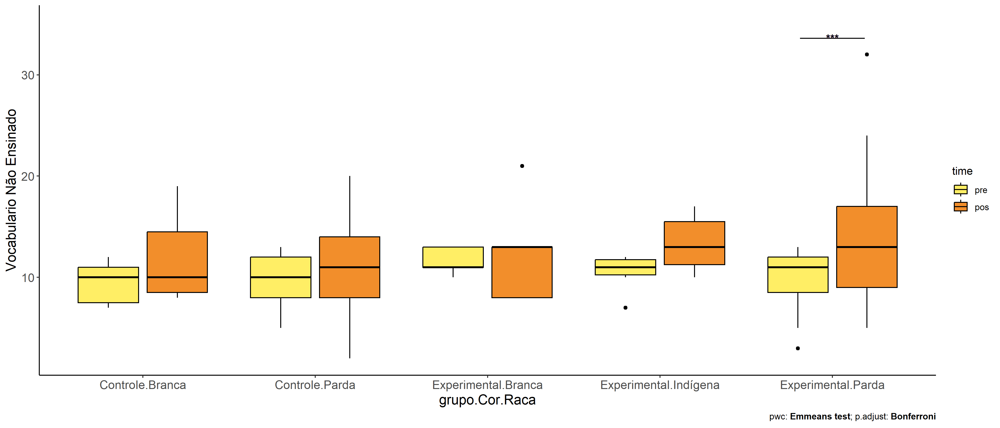<!-- -->

### Checking linearity assumption

``` r
ggscatter(wdat, x = "vocab.non.teach.pre", y = "vocab.non.teach.pos", size = 0.5,
          facet.by = c("grupo","Cor.Raca"), add = "reg.line")+
  stat_regline_equation(
    aes(label =  paste(..eq.label.., ..rr.label.., sep = "~~~~"))
  )
```

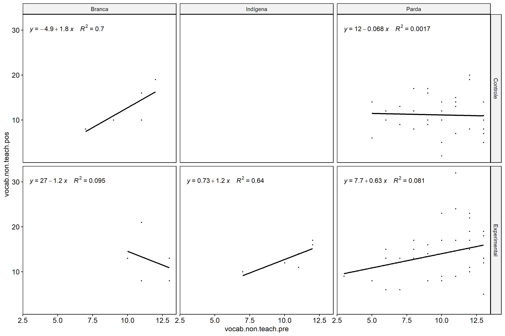<!-- -->

### Checking normality and homogeneity

``` r
res <- augment(lm(vocab.non.teach.pos ~ vocab.non.teach.pre + grupo*Cor.Raca, data = wdat))
```

``` r
shapiro_test(res$.resid)
```

    ## # A tibble: 1 × 3
    ##   variable   statistic p.value
    ##   <chr>          <dbl>   <dbl>
    ## 1 res$.resid     0.975  0.0725

``` r
levene_test(res, .resid ~ grupo*Cor.Raca)
```

    ## # A tibble: 1 × 4
    ##     df1   df2 statistic     p
    ##   <int> <int>     <dbl> <dbl>
    ## 1     4    86      1.23 0.304

# ANCOVA and Pairwise for two factors **grupo:Serie**

## Without remove non-normal data

``` r
pdat = remove_group_data(dat[!is.na(dat[["grupo"]]) & !is.na(dat[["Serie"]]),], "vocab.non.teach.pos", c("grupo","Serie"))

pdat.long <- rbind(pdat[,c("id","grupo","Serie")], pdat[,c("id","grupo","Serie")])
pdat.long[["time"]] <- c(rep("pre", nrow(pdat)), rep("pos", nrow(pdat)))
pdat.long[["time"]] <- factor(pdat.long[["time"]], c("pre","pos"))
pdat.long[["vocab.non.teach"]] <- c(pdat[["vocab.non.teach.pre"]], pdat[["vocab.non.teach.pos"]])

aov = anova_test(pdat, vocab.non.teach.pos ~ vocab.non.teach.pre + grupo*Serie)
laov[["grupo:Serie"]] <- get_anova_table(aov)
```

``` r
pwcs <- list()
pwcs[["Serie"]] <- emmeans_test(
  group_by(pdat, grupo), vocab.non.teach.pos ~ Serie,
  covariate = vocab.non.teach.pre, p.adjust.method = "bonferroni")
pwcs[["grupo"]] <- emmeans_test(
  group_by(pdat, Serie), vocab.non.teach.pos ~ grupo,
  covariate = vocab.non.teach.pre, p.adjust.method = "bonferroni")

pwc <- plyr::rbind.fill(pwcs[["grupo"]], pwcs[["Serie"]])
pwc <- pwc[,c("grupo","Serie", colnames(pwc)[!colnames(pwc) %in% c("grupo","Serie")])]
```

``` r
pwc.long <- emmeans_test(dplyr::group_by_at(pdat.long, c("grupo","Serie")),
                         vocab.non.teach ~ time,
                         p.adjust.method = "bonferroni")
lpwc[["grupo:Serie"]] <- plyr::rbind.fill(pwc, pwc.long)
```

``` r
ds <- get.descriptives(pdat, "vocab.non.teach.pos", c("grupo","Serie"), covar = "vocab.non.teach.pre")
ds <- merge(ds[ds$variable != "vocab.non.teach.pre",],
            ds[ds$variable == "vocab.non.teach.pre", !colnames(ds) %in% c("variable")],
            by = c("grupo","Serie"), all.x = T, suffixes = c("", ".vocab.non.teach.pre"))
ds <- merge(get_emmeans(pwcs[["grupo"]]), ds, by = c("grupo","Serie"), suffixes = c(".emms", ""))
ds <- ds[,c("grupo","Serie","n","mean.vocab.non.teach.pre","se.vocab.non.teach.pre","mean","se","emmean","se.emms")]

colnames(ds) <- c("grupo","Serie", "N", paste0(c("M","SE")," (pre)"),
                  paste0(c("M","SE"), " (unadj)"), paste0(c("M", "SE"), " (adj)"))

lemms[["grupo:Serie"]] <- ds
```

## Computing ANCOVA and PairWise After removing non-normal data (OK)

``` r
wdat = pdat 

res = residuals(lm(vocab.non.teach.pos ~ vocab.non.teach.pre + grupo*Serie, data = wdat))
non.normal = getNonNormal(res, wdat$id, plimit = 0.05)

wdat = wdat[!wdat$id %in% non.normal,]

wdat.long <- rbind(wdat[,c("id","grupo","Serie")], wdat[,c("id","grupo","Serie")])
wdat.long[["time"]] <- c(rep("pre", nrow(wdat)), rep("pos", nrow(wdat)))
wdat.long[["time"]] <- factor(wdat.long[["time"]], c("pre","pos"))
wdat.long[["vocab.non.teach"]] <- c(wdat[["vocab.non.teach.pre"]], wdat[["vocab.non.teach.pos"]])


ldat[["grupo:Serie"]] = wdat

(non.normal)
```

    ## [1] "P852"  "P3260"

``` r
aov = anova_test(wdat, vocab.non.teach.pos ~ vocab.non.teach.pre + grupo*Serie)
laov[["grupo:Serie"]] <- merge(get_anova_table(aov), laov[["grupo:Serie"]], by="Effect", suffixes = c("","'"))

(df = get_anova_table(aov))
```

    ## ANOVA Table (type II tests)
    ## 
    ##                Effect DFn DFd      F        p p<.05   ges
    ## 1 vocab.non.teach.pre   1 192 18.427 0.000028     * 0.088
    ## 2               grupo   1 192  2.458 0.119000       0.013
    ## 3               Serie   3 192  1.468 0.224000       0.022
    ## 4         grupo:Serie   3 192  2.770 0.043000     * 0.041

| Effect              | DFn | DFd |      F |     p | p\<.05 |   ges |
|:--------------------|----:|----:|-------:|------:|:-------|------:|
| vocab.non.teach.pre |   1 | 192 | 18.427 | 0.000 | \*     | 0.088 |
| grupo               |   1 | 192 |  2.458 | 0.119 |        | 0.013 |
| Serie               |   3 | 192 |  1.468 | 0.224 |        | 0.022 |
| grupo:Serie         |   3 | 192 |  2.770 | 0.043 | \*     | 0.041 |

``` r
pwcs <- list()
pwcs[["Serie"]] <- emmeans_test(
  group_by(wdat, grupo), vocab.non.teach.pos ~ Serie,
  covariate = vocab.non.teach.pre, p.adjust.method = "bonferroni")
pwcs[["grupo"]] <- emmeans_test(
  group_by(wdat, Serie), vocab.non.teach.pos ~ grupo,
  covariate = vocab.non.teach.pre, p.adjust.method = "bonferroni")

pwc <- plyr::rbind.fill(pwcs[["grupo"]], pwcs[["Serie"]])
pwc <- pwc[,c("grupo","Serie", colnames(pwc)[!colnames(pwc) %in% c("grupo","Serie")])]
```

| grupo        | Serie | term                       | .y.                 | group1   | group2       |  df | statistic |     p | p.adj | p.adj.signif |
|:-------------|:------|:---------------------------|:--------------------|:---------|:-------------|----:|----------:|------:|------:|:-------------|
|              | 6 ano | vocab.non.teach.pre\*grupo | vocab.non.teach.pos | Controle | Experimental | 192 |    -1.935 | 0.054 | 0.054 | ns           |
|              | 7 ano | vocab.non.teach.pre\*grupo | vocab.non.teach.pos | Controle | Experimental | 192 |     1.400 | 0.163 | 0.163 | ns           |
|              | 8 ano | vocab.non.teach.pre\*grupo | vocab.non.teach.pos | Controle | Experimental | 192 |    -2.239 | 0.026 | 0.026 | \*           |
|              | 9 ano | vocab.non.teach.pre\*grupo | vocab.non.teach.pos | Controle | Experimental | 192 |    -0.026 | 0.980 | 0.980 | ns           |
| Controle     |       | vocab.non.teach.pre\*Serie | vocab.non.teach.pos | 6 ano    | 7 ano        | 192 |    -1.814 | 0.071 | 0.428 | ns           |
| Controle     |       | vocab.non.teach.pre\*Serie | vocab.non.teach.pos | 6 ano    | 8 ano        | 192 |     0.834 | 0.405 | 1.000 | ns           |
| Controle     |       | vocab.non.teach.pre\*Serie | vocab.non.teach.pos | 6 ano    | 9 ano        | 192 |    -1.755 | 0.081 | 0.485 | ns           |
| Controle     |       | vocab.non.teach.pre\*Serie | vocab.non.teach.pos | 7 ano    | 8 ano        | 192 |     2.081 | 0.039 | 0.233 | ns           |
| Controle     |       | vocab.non.teach.pre\*Serie | vocab.non.teach.pos | 7 ano    | 9 ano        | 192 |    -0.848 | 0.398 | 1.000 | ns           |
| Controle     |       | vocab.non.teach.pre\*Serie | vocab.non.teach.pos | 8 ano    | 9 ano        | 192 |    -2.071 | 0.040 | 0.238 | ns           |
| Experimental |       | vocab.non.teach.pre\*Serie | vocab.non.teach.pos | 6 ano    | 7 ano        | 192 |     1.415 | 0.159 | 0.953 | ns           |
| Experimental |       | vocab.non.teach.pre\*Serie | vocab.non.teach.pos | 6 ano    | 8 ano        | 192 |    -0.563 | 0.574 | 1.000 | ns           |
| Experimental |       | vocab.non.teach.pre\*Serie | vocab.non.teach.pos | 6 ano    | 9 ano        | 192 |    -1.116 | 0.266 | 1.000 | ns           |
| Experimental |       | vocab.non.teach.pre\*Serie | vocab.non.teach.pos | 7 ano    | 8 ano        | 192 |    -1.619 | 0.107 | 0.642 | ns           |
| Experimental |       | vocab.non.teach.pre\*Serie | vocab.non.teach.pos | 7 ano    | 9 ano        | 192 |    -1.876 | 0.062 | 0.373 | ns           |
| Experimental |       | vocab.non.teach.pre\*Serie | vocab.non.teach.pos | 8 ano    | 9 ano        | 192 |    -0.672 | 0.502 | 1.000 | ns           |

``` r
pwc.long <- emmeans_test(dplyr::group_by_at(wdat.long, c("grupo","Serie")),
                         vocab.non.teach ~ time,
                         p.adjust.method = "bonferroni")
lpwc[["grupo:Serie"]] <- merge(plyr::rbind.fill(pwc, pwc.long), lpwc[["grupo:Serie"]], by=c("grupo","Serie","term",".y.","group1","group2"), suffixes = c("","'"))
```

| grupo        | Serie | term | .y.             | group1 | group2 |  df | statistic |     p | p.adj | p.adj.signif |
|:-------------|:------|:-----|:----------------|:-------|:-------|----:|----------:|------:|------:|:-------------|
| Controle     | 6 ano | time | vocab.non.teach | pre    | pos    | 386 |    -2.469 | 0.014 | 0.014 | \*           |
| Controle     | 7 ano | time | vocab.non.teach | pre    | pos    | 386 |    -3.528 | 0.000 | 0.000 | \*\*\*       |
| Controle     | 8 ano | time | vocab.non.teach | pre    | pos    | 386 |    -0.146 | 0.884 | 0.884 | ns           |
| Controle     | 9 ano | time | vocab.non.teach | pre    | pos    | 386 |    -2.115 | 0.035 | 0.035 | \*           |
| Experimental | 6 ano | time | vocab.non.teach | pre    | pos    | 386 |    -4.450 | 0.000 | 0.000 | \*\*\*\*     |
| Experimental | 7 ano | time | vocab.non.teach | pre    | pos    | 386 |    -1.164 | 0.245 | 0.245 | ns           |
| Experimental | 8 ano | time | vocab.non.teach | pre    | pos    | 386 |    -3.630 | 0.000 | 0.000 | \*\*\*       |
| Experimental | 9 ano | time | vocab.non.teach | pre    | pos    | 386 |    -2.406 | 0.017 | 0.017 | \*           |

``` r
ds <- get.descriptives(wdat, "vocab.non.teach.pos", c("grupo","Serie"), covar = "vocab.non.teach.pre")
ds <- merge(ds[ds$variable != "vocab.non.teach.pre",],
            ds[ds$variable == "vocab.non.teach.pre", !colnames(ds) %in% c("variable")],
            by = c("grupo","Serie"), all.x = T, suffixes = c("", ".vocab.non.teach.pre"))
ds <- merge(get_emmeans(pwcs[["grupo"]]), ds, by = c("grupo","Serie"), suffixes = c(".emms", ""))
ds <- ds[,c("grupo","Serie","n","mean.vocab.non.teach.pre","se.vocab.non.teach.pre","mean","se","emmean","se.emms")]

colnames(ds) <- c("grupo","Serie", "N", paste0(c("M","SE")," (pre)"),
                  paste0(c("M","SE"), " (unadj)"), paste0(c("M", "SE"), " (adj)"))

lemms[["grupo:Serie"]] <- merge(ds, lemms[["grupo:Serie"]], by=c("grupo","Serie"), suffixes = c("","'"))
```

| grupo        | Serie |   N | M (pre) | SE (pre) | M (unadj) | SE (unadj) | M (adj) | SE (adj) |
|:-------------|:------|----:|--------:|---------:|----------:|-----------:|--------:|---------:|
| Controle     | 6 ano |  50 |   9.180 |    0.389 |    11.100 |      0.597 |  11.453 |    0.661 |
| Controle     | 7 ano |  31 |  10.000 |    0.480 |    13.484 |      0.829 |  13.385 |    0.833 |
| Controle     | 8 ano |  14 |  10.357 |    0.700 |    10.571 |      1.300 |  10.276 |    1.242 |
| Controle     | 9 ano |   5 |  10.400 |    0.927 |    15.600 |      3.043 |  15.281 |    2.076 |
| Experimental | 6 ano |  50 |   9.760 |    0.372 |    13.220 |      0.674 |  13.254 |    0.656 |
| Experimental | 7 ano |  25 |  11.000 |    0.480 |    12.280 |      0.970 |  11.631 |    0.940 |
| Experimental | 8 ano |  19 |   8.842 |    0.589 |    13.421 |      1.415 |  13.960 |    1.071 |
| Experimental | 9 ano |   7 |  11.000 |    0.690 |    16.000 |      1.940 |  15.351 |    1.760 |

### Plots for ancova

``` r
plots <- twoWayAncovaPlots(
  wdat, "vocab.non.teach.pos", c("grupo","Serie"), aov, pwcs, addParam = c("mean_se"),
  font.label.size=10, step.increase=0.05, p.label="p.adj",
  subtitle = which(aov$Effect == "grupo:Serie"))
```

``` r
if (!is.null(plots[["grupo"]]))
  plots[["grupo"]] + ggplot2::scale_color_manual(values = color[["Serie"]])
```

    ## Scale for colour is already present.
    ## Adding another scale for colour, which will replace the existing scale.

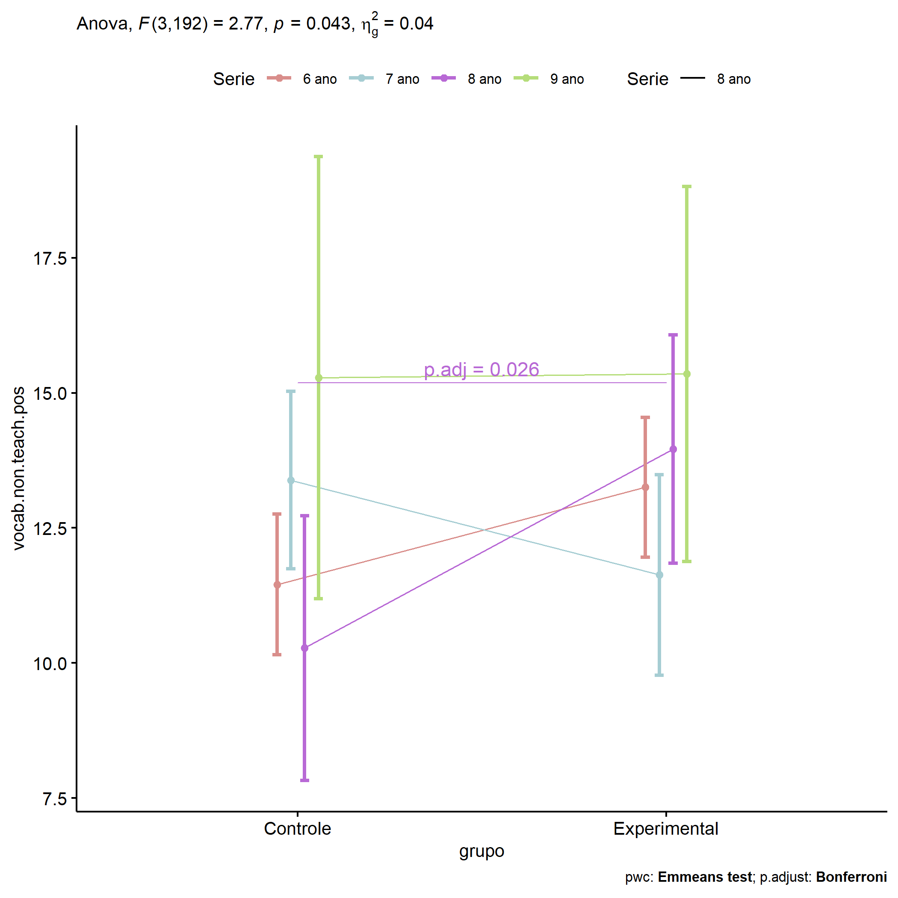<!-- -->

``` r
if (!is.null(plots[["Serie"]]))
  plots[["Serie"]] + ggplot2::scale_color_manual(values = color[["grupo"]])
```

    ## Scale for colour is already present.
    ## Adding another scale for colour, which will replace the existing scale.

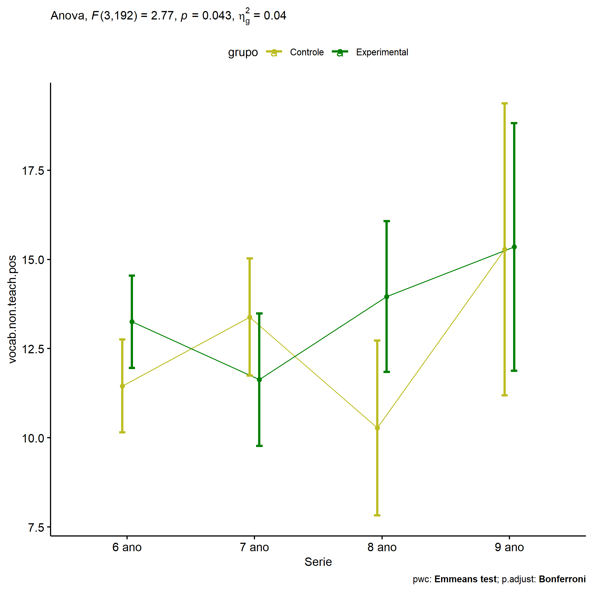<!-- -->

``` r
plots <- twoWayAncovaBoxPlots(
  wdat, "vocab.non.teach.pos", c("grupo","Serie"), aov, pwcs, covar = "vocab.non.teach.pre",
  theme = "classic", color = color[["grupo:Serie"]],
  subtitle = which(aov$Effect == "grupo:Serie"))
```

``` r
plots[["grupo:Serie"]] + ggplot2::ylab("Vocabulario Não Ensinado") + ggplot2::scale_x_discrete(labels=c('pre', 'pos'))
```

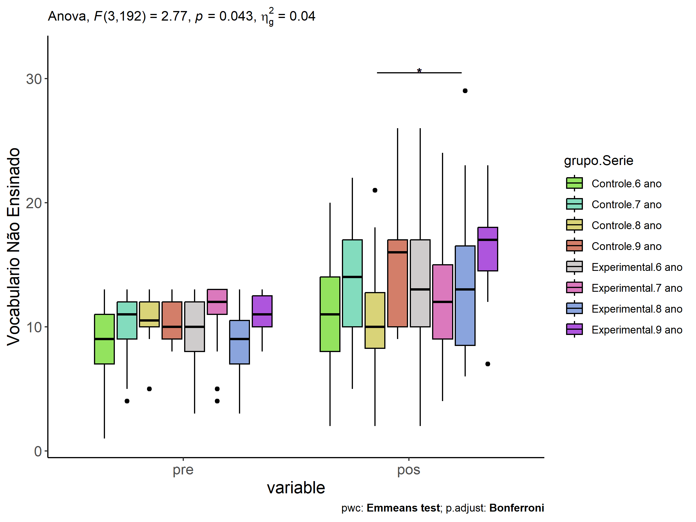<!-- -->

``` r
plots <- twoWayAncovaBoxPlots(
  wdat.long, "vocab.non.teach", c("grupo","Serie"), aov, pwc.long, pre.post = "time",
  theme = "classic", color = color$prepost)
```

``` r
plots[["grupo:Serie"]] + ggplot2::ylab("Vocabulario Não Ensinado")
```

<!-- -->

### Checking linearity assumption

``` r
ggscatter(wdat, x = "vocab.non.teach.pre", y = "vocab.non.teach.pos", size = 0.5,
          facet.by = c("grupo","Serie"), add = "reg.line")+
  stat_regline_equation(
    aes(label =  paste(..eq.label.., ..rr.label.., sep = "~~~~"))
  )
```

<!-- -->

### Checking normality and homogeneity

``` r
res <- augment(lm(vocab.non.teach.pos ~ vocab.non.teach.pre + grupo*Serie, data = wdat))
```

``` r
shapiro_test(res$.resid)
```

    ## # A tibble: 1 × 3
    ##   variable   statistic p.value
    ##   <chr>          <dbl>   <dbl>
    ## 1 res$.resid     0.988  0.0890

``` r
levene_test(res, .resid ~ grupo*Serie)
```

    ## # A tibble: 1 × 4
    ##     df1   df2 statistic     p
    ##   <int> <int>     <dbl> <dbl>
    ## 1     7   193     0.477 0.851

# Summary of Results

## Descriptive Statistics

``` r
df <- get.descriptives(ldat[["grupo"]], c(dv.pre, dv.pos), c("grupo"), 
                       include.global = T, symmetry.test = T, normality.test = F)
df <- plyr::rbind.fill(
  df, do.call(plyr::rbind.fill, lapply(lfatores2, FUN = function(f) {
    if (nrow(dat) > 0 && sum(!is.na(unique(dat[[f]]))) > 1)
      get.descriptives(ldat[[paste0("grupo:",f)]], c(dv.pre,dv.pos), c("grupo", f),
                       symmetry.test = T, normality.test = F)
    }))
)
(df <- df[,c(fatores1[fatores1 %in% colnames(df)],"variable",
             colnames(df)[!colnames(df) %in% c(fatores1,"variable")])])
```

    ##           grupo Sexo   Zona Cor.Raca Serie            variable   n   mean median min max    sd    se
    ## 1      Controle <NA>   <NA>     <NA>  <NA> vocab.non.teach.pre  99  9.657   10.0   1  13 2.704 0.272
    ## 2  Experimental <NA>   <NA>     <NA>  <NA> vocab.non.teach.pre  99 10.010   11.0   3  13 2.569 0.258
    ## 3          <NA> <NA>   <NA>     <NA>  <NA> vocab.non.teach.pre 198  9.833   10.0   1  13 2.637 0.187
    ## 4      Controle <NA>   <NA>     <NA>  <NA> vocab.non.teach.pos  99 12.091   12.0   2  26 4.636 0.466
    ## 5  Experimental <NA>   <NA>     <NA>  <NA> vocab.non.teach.pos  99 12.929   13.0   2  24 4.715 0.474
    ## 6          <NA> <NA>   <NA>     <NA>  <NA> vocab.non.teach.pos 198 12.510   12.0   2  26 4.683 0.333
    ## 7      Controle    F   <NA>     <NA>  <NA> vocab.non.teach.pre   9 10.222   11.0   5  13 2.819 0.940
    ## 8      Controle    M   <NA>     <NA>  <NA> vocab.non.teach.pre  13  8.000    9.0   4  12 2.708 0.751
    ## 9  Experimental    F   <NA>     <NA>  <NA> vocab.non.teach.pre  16 10.062   10.5   7  13 2.016 0.504
    ## 10 Experimental    M   <NA>     <NA>  <NA> vocab.non.teach.pre  11 10.182   12.0   6  13 2.892 0.872
    ## 11     Controle    F   <NA>     <NA>  <NA> vocab.non.teach.pos   9 17.333   18.0  15  19 1.658 0.553
    ## 12     Controle    M   <NA>     <NA>  <NA> vocab.non.teach.pos  13 14.462   14.0  12  17 1.506 0.418
    ## 13 Experimental    F   <NA>     <NA>  <NA> vocab.non.teach.pos  16 17.062   17.0  14  19 1.482 0.370
    ## 14 Experimental    M   <NA>     <NA>  <NA> vocab.non.teach.pos  11 16.727   17.0  13  19 1.954 0.589
    ## 15     Controle <NA>  Rural     <NA>  <NA> vocab.non.teach.pre  51  9.941   11.0   1  13 2.781 0.389
    ## 16     Controle <NA> Urbana     <NA>  <NA> vocab.non.teach.pre  18  9.500   10.0   4  13 2.407 0.567
    ## 17 Experimental <NA>  Rural     <NA>  <NA> vocab.non.teach.pre  50  9.800   11.0   3  13 2.718 0.384
    ## 18 Experimental <NA> Urbana     <NA>  <NA> vocab.non.teach.pre  24 10.708   11.0   6  13 2.156 0.440
    ## 19     Controle <NA>  Rural     <NA>  <NA> vocab.non.teach.pos  51 11.961   12.0   2  20 4.935 0.691
    ## 20     Controle <NA> Urbana     <NA>  <NA> vocab.non.teach.pos  18 11.167   11.5   4  19 3.899 0.919
    ## 21 Experimental <NA>  Rural     <NA>  <NA> vocab.non.teach.pos  50 12.800   13.0   2  23 5.039 0.713
    ## 22 Experimental <NA> Urbana     <NA>  <NA> vocab.non.teach.pos  24 13.167   12.0   5  24 4.770 0.974
    ## 23     Controle <NA>   <NA>   Branca  <NA> vocab.non.teach.pre   6  9.500   10.0   7  12 2.168 0.885
    ## 24     Controle <NA>   <NA>    Parda  <NA> vocab.non.teach.pre  35  9.943   10.0   5  13 2.449 0.414
    ## 25 Experimental <NA>   <NA>   Branca  <NA> vocab.non.teach.pre   5 11.600   11.0  10  13 1.342 0.600
    ## 26 Experimental <NA>   <NA> Indígena  <NA> vocab.non.teach.pre   6 10.500   11.0   7  12 1.871 0.764
    ## 27 Experimental <NA>   <NA>    Parda  <NA> vocab.non.teach.pre  39 10.077   11.0   3  13 2.589 0.415
    ## 28     Controle <NA>   <NA>   Branca  <NA> vocab.non.teach.pos   6 11.833   10.0   8  19 4.579 1.869
    ## 29     Controle <NA>   <NA>    Parda  <NA> vocab.non.teach.pos  35 11.114   11.0   2  20 4.071 0.688
    ## 30 Experimental <NA>   <NA>   Branca  <NA> vocab.non.teach.pos   5 12.600   13.0   8  21 5.320 2.379
    ## 31 Experimental <NA>   <NA> Indígena  <NA> vocab.non.teach.pos   6 13.333   13.0  10  17 2.805 1.145
    ## 32 Experimental <NA>   <NA>    Parda  <NA> vocab.non.teach.pos  39 14.077   13.0   5  32 5.765 0.923
    ## 33     Controle <NA>   <NA>     <NA> 6 ano vocab.non.teach.pre  50  9.180    9.0   1  13 2.753 0.389
    ## 34     Controle <NA>   <NA>     <NA> 7 ano vocab.non.teach.pre  31 10.000   11.0   4  13 2.671 0.480
    ## 35     Controle <NA>   <NA>     <NA> 8 ano vocab.non.teach.pre  14 10.357   10.5   5  13 2.620 0.700
    ## 36     Controle <NA>   <NA>     <NA> 9 ano vocab.non.teach.pre   5 10.400   10.0   8  13 2.074 0.927
    ## 37 Experimental <NA>   <NA>     <NA> 6 ano vocab.non.teach.pre  50  9.760   10.0   3  13 2.631 0.372
    ## 38 Experimental <NA>   <NA>     <NA> 7 ano vocab.non.teach.pre  25 11.000   12.0   4  13 2.398 0.480
    ## 39 Experimental <NA>   <NA>     <NA> 8 ano vocab.non.teach.pre  19  8.842    9.0   3  13 2.566 0.589
    ## 40 Experimental <NA>   <NA>     <NA> 9 ano vocab.non.teach.pre   7 11.000   11.0   8  13 1.826 0.690
    ## 41     Controle <NA>   <NA>     <NA> 6 ano vocab.non.teach.pos  50 11.100   11.0   2  20 4.220 0.597
    ## 42     Controle <NA>   <NA>     <NA> 7 ano vocab.non.teach.pos  31 13.484   14.0   5  22 4.618 0.829
    ## 43     Controle <NA>   <NA>     <NA> 8 ano vocab.non.teach.pos  14 10.571   10.0   2  21 4.863 1.300
    ## 44     Controle <NA>   <NA>     <NA> 9 ano vocab.non.teach.pos   5 15.600   16.0   9  26 6.804 3.043
    ## 45 Experimental <NA>   <NA>     <NA> 6 ano vocab.non.teach.pos  50 13.220   13.0   2  26 4.769 0.674
    ## 46 Experimental <NA>   <NA>     <NA> 7 ano vocab.non.teach.pos  25 12.280   12.0   4  24 4.852 0.970
    ## 47 Experimental <NA>   <NA>     <NA> 8 ano vocab.non.teach.pos  19 13.421   13.0   6  29 6.167 1.415
    ## 48 Experimental <NA>   <NA>     <NA> 9 ano vocab.non.teach.pos   7 16.000   17.0   7  23 5.132 1.940
    ##       ci  iqr symmetry    skewness    kurtosis
    ## 1  0.539 4.00       NO -0.70842030 -0.14902785
    ## 2  0.512 4.00       NO -0.73278513 -0.29121679
    ## 3  0.370 4.00       NO -0.73111031 -0.16435186
    ## 4  0.925 6.50      YES  0.30886100 -0.18297454
    ## 5  0.940 8.00      YES  0.15662368 -0.56096666
    ## 6  0.656 7.00      YES  0.23427809 -0.37079713
    ## 7  2.167 2.00       NO -0.88557493 -0.97230690
    ## 8  1.636 4.00      YES -0.13944630 -1.50095359
    ## 9  1.074 3.25      YES -0.12540627 -1.44097911
    ## 10 1.943 5.00      YES -0.38970369 -1.75391351
    ## 11 1.275 3.00      YES -0.32486071 -1.73645546
    ## 12 0.910 3.00      YES  0.06790819 -1.37120871
    ## 13 0.790 1.25      YES -0.44523422 -0.79611874
    ## 14 1.313 2.00       NO -0.60360632 -1.03035925
    ## 15 0.782 4.00       NO -0.93555718  0.30790488
    ## 16 1.197 3.00      YES -0.44214988 -0.50431243
    ## 17 0.772 4.00       NO -0.68365742 -0.65040446
    ## 18 0.911 4.00      YES -0.46042716 -0.99440108
    ## 19 1.388 7.00      YES -0.03567209 -0.85471015
    ## 20 1.939 4.00      YES  0.07839034 -0.58859418
    ## 21 1.432 8.00      YES  0.02889319 -0.80856402
    ## 22 2.014 6.25       NO  0.62429924 -0.33638678
    ## 23 2.275 3.50      YES -0.14721243 -2.03896937
    ## 24 0.841 4.00      YES -0.40283558 -0.95272159
    ## 25 1.666 2.00 few data  0.00000000  0.00000000
    ## 26 1.963 1.50       NO -0.91632426 -0.81802721
    ## 27 0.839 3.50       NO -0.80027244 -0.22500930
    ## 28 4.805 6.00       NO  0.54761779 -1.71329585
    ## 29 1.399 6.00      YES  0.10785623 -0.40212909
    ## 30 6.605 5.00 few data  0.00000000  0.00000000
    ## 31 2.943 4.25      YES  0.12421723 -1.95564014
    ## 32 1.869 8.00       NO  0.76771793  0.60231958
    ## 33 0.782 4.00      YES -0.49443439 -0.09207225
    ## 34 0.980 3.00       NO -0.93462761 -0.29304433
    ## 35 1.513 2.00       NO -0.95842202 -0.24102979
    ## 36 2.575 3.00      YES  0.11304669 -2.03411574
    ## 37 0.748 4.00       NO -0.52193665 -0.74164618
    ## 38 0.990 2.00       NO -1.56657786  1.75463138
    ## 39 1.237 3.50      YES -0.37621160 -0.65367471
    ## 40 1.689 2.50      YES -0.28168589 -1.50857143
    ## 41 1.199 6.00      YES -0.04120472 -0.48950883
    ## 42 1.694 7.00      YES -0.01545167 -1.10386855
    ## 43 2.808 4.50      YES  0.45115624 -0.28205659
    ## 44 8.449 7.00      YES  0.42188366 -1.63941372
    ## 45 1.355 7.00      YES  0.24129338 -0.03731210
    ## 46 2.003 6.00      YES  0.40121167 -0.44611458
    ## 47 2.973 8.00       NO  0.77134442 -0.04696346
    ## 48 4.746 3.50      YES -0.44400974 -1.08368622

| grupo        | Sexo | Zona   | Cor.Raca | Serie | variable            |   n |   mean | median | min | max |    sd |    se |    ci |  iqr | symmetry | skewness | kurtosis |
|:-------------|:-----|:-------|:---------|:------|:--------------------|----:|-------:|-------:|----:|----:|------:|------:|------:|-----:|:---------|---------:|---------:|
| Controle     |      |        |          |       | vocab.non.teach.pre |  99 |  9.657 |   10.0 |   1 |  13 | 2.704 | 0.272 | 0.539 | 4.00 | NO       |   -0.708 |   -0.149 |
| Experimental |      |        |          |       | vocab.non.teach.pre |  99 | 10.010 |   11.0 |   3 |  13 | 2.569 | 0.258 | 0.512 | 4.00 | NO       |   -0.733 |   -0.291 |
|              |      |        |          |       | vocab.non.teach.pre | 198 |  9.833 |   10.0 |   1 |  13 | 2.637 | 0.187 | 0.370 | 4.00 | NO       |   -0.731 |   -0.164 |
| Controle     |      |        |          |       | vocab.non.teach.pos |  99 | 12.091 |   12.0 |   2 |  26 | 4.636 | 0.466 | 0.925 | 6.50 | YES      |    0.309 |   -0.183 |
| Experimental |      |        |          |       | vocab.non.teach.pos |  99 | 12.929 |   13.0 |   2 |  24 | 4.715 | 0.474 | 0.940 | 8.00 | YES      |    0.157 |   -0.561 |
|              |      |        |          |       | vocab.non.teach.pos | 198 | 12.510 |   12.0 |   2 |  26 | 4.683 | 0.333 | 0.656 | 7.00 | YES      |    0.234 |   -0.371 |
| Controle     | F    |        |          |       | vocab.non.teach.pre |   9 | 10.222 |   11.0 |   5 |  13 | 2.819 | 0.940 | 2.167 | 2.00 | NO       |   -0.886 |   -0.972 |
| Controle     | M    |        |          |       | vocab.non.teach.pre |  13 |  8.000 |    9.0 |   4 |  12 | 2.708 | 0.751 | 1.636 | 4.00 | YES      |   -0.139 |   -1.501 |
| Experimental | F    |        |          |       | vocab.non.teach.pre |  16 | 10.062 |   10.5 |   7 |  13 | 2.016 | 0.504 | 1.074 | 3.25 | YES      |   -0.125 |   -1.441 |
| Experimental | M    |        |          |       | vocab.non.teach.pre |  11 | 10.182 |   12.0 |   6 |  13 | 2.892 | 0.872 | 1.943 | 5.00 | YES      |   -0.390 |   -1.754 |
| Controle     | F    |        |          |       | vocab.non.teach.pos |   9 | 17.333 |   18.0 |  15 |  19 | 1.658 | 0.553 | 1.275 | 3.00 | YES      |   -0.325 |   -1.736 |
| Controle     | M    |        |          |       | vocab.non.teach.pos |  13 | 14.462 |   14.0 |  12 |  17 | 1.506 | 0.418 | 0.910 | 3.00 | YES      |    0.068 |   -1.371 |
| Experimental | F    |        |          |       | vocab.non.teach.pos |  16 | 17.062 |   17.0 |  14 |  19 | 1.482 | 0.370 | 0.790 | 1.25 | YES      |   -0.445 |   -0.796 |
| Experimental | M    |        |          |       | vocab.non.teach.pos |  11 | 16.727 |   17.0 |  13 |  19 | 1.954 | 0.589 | 1.313 | 2.00 | NO       |   -0.604 |   -1.030 |
| Controle     |      | Rural  |          |       | vocab.non.teach.pre |  51 |  9.941 |   11.0 |   1 |  13 | 2.781 | 0.389 | 0.782 | 4.00 | NO       |   -0.936 |    0.308 |
| Controle     |      | Urbana |          |       | vocab.non.teach.pre |  18 |  9.500 |   10.0 |   4 |  13 | 2.407 | 0.567 | 1.197 | 3.00 | YES      |   -0.442 |   -0.504 |
| Experimental |      | Rural  |          |       | vocab.non.teach.pre |  50 |  9.800 |   11.0 |   3 |  13 | 2.718 | 0.384 | 0.772 | 4.00 | NO       |   -0.684 |   -0.650 |
| Experimental |      | Urbana |          |       | vocab.non.teach.pre |  24 | 10.708 |   11.0 |   6 |  13 | 2.156 | 0.440 | 0.911 | 4.00 | YES      |   -0.460 |   -0.994 |
| Controle     |      | Rural  |          |       | vocab.non.teach.pos |  51 | 11.961 |   12.0 |   2 |  20 | 4.935 | 0.691 | 1.388 | 7.00 | YES      |   -0.036 |   -0.855 |
| Controle     |      | Urbana |          |       | vocab.non.teach.pos |  18 | 11.167 |   11.5 |   4 |  19 | 3.899 | 0.919 | 1.939 | 4.00 | YES      |    0.078 |   -0.589 |
| Experimental |      | Rural  |          |       | vocab.non.teach.pos |  50 | 12.800 |   13.0 |   2 |  23 | 5.039 | 0.713 | 1.432 | 8.00 | YES      |    0.029 |   -0.809 |
| Experimental |      | Urbana |          |       | vocab.non.teach.pos |  24 | 13.167 |   12.0 |   5 |  24 | 4.770 | 0.974 | 2.014 | 6.25 | NO       |    0.624 |   -0.336 |
| Controle     |      |        | Branca   |       | vocab.non.teach.pre |   6 |  9.500 |   10.0 |   7 |  12 | 2.168 | 0.885 | 2.275 | 3.50 | YES      |   -0.147 |   -2.039 |
| Controle     |      |        | Parda    |       | vocab.non.teach.pre |  35 |  9.943 |   10.0 |   5 |  13 | 2.449 | 0.414 | 0.841 | 4.00 | YES      |   -0.403 |   -0.953 |
| Experimental |      |        | Branca   |       | vocab.non.teach.pre |   5 | 11.600 |   11.0 |  10 |  13 | 1.342 | 0.600 | 1.666 | 2.00 | few data |    0.000 |    0.000 |
| Experimental |      |        | Indígena |       | vocab.non.teach.pre |   6 | 10.500 |   11.0 |   7 |  12 | 1.871 | 0.764 | 1.963 | 1.50 | NO       |   -0.916 |   -0.818 |
| Experimental |      |        | Parda    |       | vocab.non.teach.pre |  39 | 10.077 |   11.0 |   3 |  13 | 2.589 | 0.415 | 0.839 | 3.50 | NO       |   -0.800 |   -0.225 |
| Controle     |      |        | Branca   |       | vocab.non.teach.pos |   6 | 11.833 |   10.0 |   8 |  19 | 4.579 | 1.869 | 4.805 | 6.00 | NO       |    0.548 |   -1.713 |
| Controle     |      |        | Parda    |       | vocab.non.teach.pos |  35 | 11.114 |   11.0 |   2 |  20 | 4.071 | 0.688 | 1.399 | 6.00 | YES      |    0.108 |   -0.402 |
| Experimental |      |        | Branca   |       | vocab.non.teach.pos |   5 | 12.600 |   13.0 |   8 |  21 | 5.320 | 2.379 | 6.605 | 5.00 | few data |    0.000 |    0.000 |
| Experimental |      |        | Indígena |       | vocab.non.teach.pos |   6 | 13.333 |   13.0 |  10 |  17 | 2.805 | 1.145 | 2.943 | 4.25 | YES      |    0.124 |   -1.956 |
| Experimental |      |        | Parda    |       | vocab.non.teach.pos |  39 | 14.077 |   13.0 |   5 |  32 | 5.765 | 0.923 | 1.869 | 8.00 | NO       |    0.768 |    0.602 |
| Controle     |      |        |          | 6 ano | vocab.non.teach.pre |  50 |  9.180 |    9.0 |   1 |  13 | 2.753 | 0.389 | 0.782 | 4.00 | YES      |   -0.494 |   -0.092 |
| Controle     |      |        |          | 7 ano | vocab.non.teach.pre |  31 | 10.000 |   11.0 |   4 |  13 | 2.671 | 0.480 | 0.980 | 3.00 | NO       |   -0.935 |   -0.293 |
| Controle     |      |        |          | 8 ano | vocab.non.teach.pre |  14 | 10.357 |   10.5 |   5 |  13 | 2.620 | 0.700 | 1.513 | 2.00 | NO       |   -0.958 |   -0.241 |
| Controle     |      |        |          | 9 ano | vocab.non.teach.pre |   5 | 10.400 |   10.0 |   8 |  13 | 2.074 | 0.927 | 2.575 | 3.00 | YES      |    0.113 |   -2.034 |
| Experimental |      |        |          | 6 ano | vocab.non.teach.pre |  50 |  9.760 |   10.0 |   3 |  13 | 2.631 | 0.372 | 0.748 | 4.00 | NO       |   -0.522 |   -0.742 |
| Experimental |      |        |          | 7 ano | vocab.non.teach.pre |  25 | 11.000 |   12.0 |   4 |  13 | 2.398 | 0.480 | 0.990 | 2.00 | NO       |   -1.567 |    1.755 |
| Experimental |      |        |          | 8 ano | vocab.non.teach.pre |  19 |  8.842 |    9.0 |   3 |  13 | 2.566 | 0.589 | 1.237 | 3.50 | YES      |   -0.376 |   -0.654 |
| Experimental |      |        |          | 9 ano | vocab.non.teach.pre |   7 | 11.000 |   11.0 |   8 |  13 | 1.826 | 0.690 | 1.689 | 2.50 | YES      |   -0.282 |   -1.509 |
| Controle     |      |        |          | 6 ano | vocab.non.teach.pos |  50 | 11.100 |   11.0 |   2 |  20 | 4.220 | 0.597 | 1.199 | 6.00 | YES      |   -0.041 |   -0.490 |
| Controle     |      |        |          | 7 ano | vocab.non.teach.pos |  31 | 13.484 |   14.0 |   5 |  22 | 4.618 | 0.829 | 1.694 | 7.00 | YES      |   -0.015 |   -1.104 |
| Controle     |      |        |          | 8 ano | vocab.non.teach.pos |  14 | 10.571 |   10.0 |   2 |  21 | 4.863 | 1.300 | 2.808 | 4.50 | YES      |    0.451 |   -0.282 |
| Controle     |      |        |          | 9 ano | vocab.non.teach.pos |   5 | 15.600 |   16.0 |   9 |  26 | 6.804 | 3.043 | 8.449 | 7.00 | YES      |    0.422 |   -1.639 |
| Experimental |      |        |          | 6 ano | vocab.non.teach.pos |  50 | 13.220 |   13.0 |   2 |  26 | 4.769 | 0.674 | 1.355 | 7.00 | YES      |    0.241 |   -0.037 |
| Experimental |      |        |          | 7 ano | vocab.non.teach.pos |  25 | 12.280 |   12.0 |   4 |  24 | 4.852 | 0.970 | 2.003 | 6.00 | YES      |    0.401 |   -0.446 |
| Experimental |      |        |          | 8 ano | vocab.non.teach.pos |  19 | 13.421 |   13.0 |   6 |  29 | 6.167 | 1.415 | 2.973 | 8.00 | NO       |    0.771 |   -0.047 |
| Experimental |      |        |          | 9 ano | vocab.non.teach.pos |   7 | 16.000 |   17.0 |   7 |  23 | 5.132 | 1.940 | 4.746 | 3.50 | YES      |   -0.444 |   -1.084 |

## ANCOVA Table Comparison

``` r
df <- do.call(plyr::rbind.fill, laov)
(df <- df[!duplicated(df$Effect),])
```

    ##                 Effect DFn DFd      F        p p<.05      ges DFn' DFd'     F'       p' p<.05'     ges'
    ## 1                grupo   1 195  1.011 3.16e-01       0.005000    1  200  3.986 0.047000      * 0.020000
    ## 2  vocab.non.teach.pre   1 195 22.942 3.30e-06     * 0.105000    1  200 15.307 0.000125      * 0.071000
    ## 4           grupo:Sexo   1  44  4.669 3.60e-02     * 0.096000    1  198  0.332 0.565000        0.002000
    ## 5                 Sexo   1  44  9.601 3.00e-03     * 0.179000    1  198  2.866 0.092000        0.014000
    ## 8           grupo:Zona   1 138  0.041 8.40e-01       0.000297    1  140  0.034 0.853000        0.000246
    ## 10                Zona   1 138  0.161 6.89e-01       0.001000    1  140  0.612 0.436000        0.004000
    ## 11            Cor.Raca   2  85  0.095 9.09e-01       0.002000    2   86  0.177 0.838000        0.004000
    ## 13      grupo:Cor.Raca   1  85  0.878 3.51e-01       0.010000    1   86  0.940 0.335000        0.011000
    ## 16         grupo:Serie   3 192  2.770 4.30e-02     * 0.041000    3  194  2.646 0.050000        0.039000
    ## 17               Serie   3 192  1.468 2.24e-01       0.022000    3  194  2.573 0.055000        0.038000

|     | Effect              | DFn | DFd |      F |     p | p\<.05 |   ges | DFn’ | DFd’ |     F’ |    p’ | p\<.05’ |  ges’ |
|:----|:--------------------|----:|----:|-------:|------:|:-------|------:|-----:|-----:|-------:|------:|:--------|------:|
| 1   | grupo               |   1 | 195 |  1.011 | 0.316 |        | 0.005 |    1 |  200 |  3.986 | 0.047 | \*      | 0.020 |
| 2   | vocab.non.teach.pre |   1 | 195 | 22.942 | 0.000 | \*     | 0.105 |    1 |  200 | 15.307 | 0.000 | \*      | 0.071 |
| 4   | grupo:Sexo          |   1 |  44 |  4.669 | 0.036 | \*     | 0.096 |    1 |  198 |  0.332 | 0.565 |         | 0.002 |
| 5   | Sexo                |   1 |  44 |  9.601 | 0.003 | \*     | 0.179 |    1 |  198 |  2.866 | 0.092 |         | 0.014 |
| 8   | grupo:Zona          |   1 | 138 |  0.041 | 0.840 |        | 0.000 |    1 |  140 |  0.034 | 0.853 |         | 0.000 |
| 10  | Zona                |   1 | 138 |  0.161 | 0.689 |        | 0.001 |    1 |  140 |  0.612 | 0.436 |         | 0.004 |
| 11  | Cor.Raca            |   2 |  85 |  0.095 | 0.909 |        | 0.002 |    2 |   86 |  0.177 | 0.838 |         | 0.004 |
| 13  | grupo:Cor.Raca      |   1 |  85 |  0.878 | 0.351 |        | 0.010 |    1 |   86 |  0.940 | 0.335 |         | 0.011 |
| 16  | grupo:Serie         |   3 | 192 |  2.770 | 0.043 | \*     | 0.041 |    3 |  194 |  2.646 | 0.050 |         | 0.039 |
| 17  | Serie               |   3 | 192 |  1.468 | 0.224 |        | 0.022 |    3 |  194 |  2.573 | 0.055 |         | 0.038 |

## PairWise Table Comparison

``` r
df <- do.call(plyr::rbind.fill, lpwc)
df <- df[,c(names(lfatores), names(df)[!names(df) %in% c(names(lfatores),"term",".y.")])]
```

| grupo        | Sexo | Zona   | Cor.Raca | Serie | group1   | group2       |  df | statistic |     p | p.adj | p.adj.signif | df’ | statistic’ |    p’ | p.adj’ | p.adj.signif’ |
|:-------------|:-----|:-------|:---------|:------|:---------|:-------------|----:|----------:|------:|------:|:-------------|----:|-----------:|------:|-------:|:--------------|
| Controle     |      |        |          |       | pre      | pos          | 392 |    -4.512 | 0.000 | 0.000 | \*\*\*\*     | 402 |     -3.998 | 0.000 |  0.000 | \*\*\*\*      |
| Experimental |      |        |          |       | pre      | pos          | 392 |    -5.411 | 0.000 | 0.000 | \*\*\*\*     | 402 |     -6.256 | 0.000 |  0.000 | \*\*\*\*      |
|              |      |        |          |       | Controle | Experimental | 195 |    -1.005 | 0.316 | 0.316 | ns           | 200 |     -1.996 | 0.047 |  0.047 | \*            |
| Controle     | F    |        |          |       | pre      | pos          |  90 |    -7.012 | 0.000 | 0.000 | \*\*\*\*     | 398 |     -3.352 | 0.001 |  0.001 | \*\*\*        |
| Controle     | M    |        |          |       | pre      | pos          |  90 |    -7.658 | 0.000 | 0.000 | \*\*\*\*     | 398 |     -2.471 | 0.014 |  0.014 | \*            |
| Controle     |      |        |          |       | F        | M            |  44 |     3.660 | 0.001 | 0.001 | \*\*\*       | 198 |      1.586 | 0.114 |  0.114 | ns            |
| Experimental | F    |        |          |       | pre      | pos          |  90 |    -9.204 | 0.000 | 0.000 | \*\*\*\*     | 398 |     -4.901 | 0.000 |  0.000 | \*\*\*\*      |
| Experimental | M    |        |          |       | pre      | pos          |  90 |    -7.136 | 0.000 | 0.000 | \*\*\*\*     | 398 |     -4.037 | 0.000 |  0.000 | \*\*\*\*      |
| Experimental |      |        |          |       | F        | M            |  44 |     0.918 | 0.364 | 0.364 | ns           | 198 |      0.816 | 0.416 |  0.416 | ns            |
|              | F    |        |          |       | Controle | Experimental |  44 |     0.427 | 0.671 | 0.671 | ns           | 198 |     -0.768 | 0.443 |  0.443 | ns            |
|              | M    |        |          |       | Controle | Experimental |  44 |    -2.608 | 0.012 | 0.012 | \*           | 198 |     -1.809 | 0.072 |  0.072 | ns            |
| Controle     |      |        |          |       | Rural    | Urbana       | 138 |     0.420 | 0.675 | 0.675 | ns           | 140 |      0.385 | 0.701 |  0.701 | ns            |
| Controle     |      | Rural  |          |       | pre      | pos          | 278 |    -2.624 | 0.009 | 0.009 | \*\*         | 282 |     -2.461 | 0.014 |  0.014 | \*            |
| Controle     |      | Urbana |          |       | pre      | pos          | 278 |    -1.287 | 0.199 | 0.199 | ns           | 282 |     -1.207 | 0.229 |  0.229 | ns            |
| Experimental |      |        |          |       | Rural    | Urbana       | 138 |     0.159 | 0.874 | 0.874 | ns           | 140 |      0.703 | 0.483 |  0.483 | ns            |
| Experimental |      | Rural  |          |       | pre      | pos          | 278 |    -3.860 | 0.000 | 0.000 | \*\*\*       | 282 |     -4.567 | 0.000 |  0.000 | \*\*\*\*      |
| Experimental |      | Urbana |          |       | pre      | pos          | 278 |    -2.191 | 0.029 | 0.029 | \*           | 282 |     -2.055 | 0.041 |  0.041 | \*            |
|              |      | Rural  |          |       | Controle | Experimental | 138 |    -1.014 | 0.312 | 0.312 | ns           | 140 |     -1.643 | 0.103 |  0.103 | ns            |
|              |      | Urbana |          |       | Controle | Experimental | 138 |    -0.882 | 0.379 | 0.379 | ns           | 140 |     -0.811 | 0.419 |  0.419 | ns            |
| Controle     |      |        | Branca   |       | pre      | pos          | 172 |    -1.041 | 0.299 | 0.299 | ns           | 174 |     -1.000 | 0.319 |  0.319 | ns            |
| Controle     |      |        | Indígena |       | pre      | pos          |     |           |       |       |              |     |            |       |        |               |
| Controle     |      |        |          |       | Branca   | Indígena     |     |           |       |       |              |     |            |       |        |               |
| Controle     |      |        |          |       | Branca   | Parda        |  85 |     0.417 | 0.678 | 0.678 | ns           |  86 |      0.381 | 0.704 |  0.704 | ns            |
| Controle     |      |        |          |       | Indígena | Parda        |     |           |       |       |              |     |            |       |        |               |
| Controle     |      |        | Parda    |       | pre      | pos          | 172 |    -1.263 | 0.208 | 0.208 | ns           | 174 |     -1.213 | 0.227 |  0.227 | ns            |
| Experimental |      |        | Branca   |       | pre      | pos          | 172 |    -0.407 | 0.684 | 0.684 | ns           | 174 |     -0.391 | 0.696 |  0.696 | ns            |
| Experimental |      |        | Indígena |       | pre      | pos          | 172 |    -1.265 | 0.208 | 0.208 | ns           | 174 |     -1.214 | 0.226 |  0.226 | ns            |
| Experimental |      |        |          |       | Branca   | Indígena     |  85 |    -0.397 | 0.692 | 1.000 | ns           |  86 |     -0.351 | 0.726 |  1.000 | ns            |
| Experimental |      |        |          |       | Branca   | Parda        |  85 |    -0.894 | 0.374 | 1.000 | ns           |  86 |     -0.972 | 0.334 |  1.000 | ns            |
| Experimental |      |        |          |       | Indígena | Parda        |  85 |    -0.428 | 0.670 | 1.000 | ns           |  86 |     -0.576 | 0.566 |  1.000 | ns            |
| Experimental |      |        | Parda    |       | pre      | pos          | 172 |    -4.551 | 0.000 | 0.000 | \*\*\*\*     | 174 |     -4.924 | 0.000 |  0.000 | \*\*\*\*      |
|              |      |        | Branca   |       | Controle | Experimental |  85 |     0.023 | 0.982 | 0.982 | ns           |  86 |     -0.022 | 0.982 |  0.982 | ns            |
|              |      |        | Indígena |       | Controle | Experimental |     |           |       |       |              |     |            |       |        |               |
|              |      |        | Parda    |       | Controle | Experimental |  85 |    -2.573 | 0.012 | 0.012 | \*           |  86 |     -2.800 | 0.006 |  0.006 | \*\*          |
| Controle     |      |        |          | 6 ano | pre      | pos          | 386 |    -2.469 | 0.014 | 0.014 | \*           | 390 |     -2.377 | 0.018 |  0.018 | \*            |
| Controle     |      |        |          | 7 ano | pre      | pos          | 386 |    -3.528 | 0.000 | 0.000 | \*\*\*       | 390 |     -3.396 | 0.001 |  0.001 | \*\*\*        |
| Controle     |      |        |          | 8 ano | pre      | pos          | 386 |    -0.146 | 0.884 | 0.884 | ns           | 390 |     -0.140 | 0.888 |  0.888 | ns            |
| Controle     |      |        |          | 9 ano | pre      | pos          | 386 |    -2.115 | 0.035 | 0.035 | \*           | 390 |     -2.036 | 0.042 |  0.042 | \*            |
| Controle     |      |        |          |       | 6 ano    | 7 ano        | 192 |    -1.814 | 0.071 | 0.428 | ns           | 194 |     -1.726 | 0.086 |  0.516 | ns            |
| Controle     |      |        |          |       | 6 ano    | 8 ano        | 192 |     0.834 | 0.405 | 1.000 | ns           | 194 |      0.778 | 0.438 |  1.000 | ns            |
| Controle     |      |        |          |       | 6 ano    | 9 ano        | 192 |    -1.755 | 0.081 | 0.485 | ns           | 194 |     -1.668 | 0.097 |  0.582 | ns            |
| Controle     |      |        |          |       | 7 ano    | 8 ano        | 192 |     2.081 | 0.039 | 0.233 | ns           | 194 |      1.965 | 0.051 |  0.305 | ns            |
| Controle     |      |        |          |       | 7 ano    | 9 ano        | 192 |    -0.848 | 0.398 | 1.000 | ns           | 194 |     -0.804 | 0.422 |  1.000 | ns            |
| Controle     |      |        |          |       | 8 ano    | 9 ano        | 192 |    -2.071 | 0.040 | 0.238 | ns           | 194 |     -1.959 | 0.052 |  0.309 | ns            |
| Experimental |      |        |          | 6 ano | pre      | pos          | 386 |    -4.450 | 0.000 | 0.000 | \*\*\*\*     | 390 |     -4.756 | 0.000 |  0.000 | \*\*\*\*      |
| Experimental |      |        |          | 7 ano | pre      | pos          | 386 |    -1.164 | 0.245 | 0.245 | ns           | 390 |     -1.121 | 0.263 |  0.263 | ns            |
| Experimental |      |        |          | 8 ano | pre      | pos          | 386 |    -3.630 | 0.000 | 0.000 | \*\*\*       | 390 |     -3.495 | 0.001 |  0.001 | \*\*\*        |
| Experimental |      |        |          | 9 ano | pre      | pos          | 386 |    -2.406 | 0.017 | 0.017 | \*           | 390 |     -3.528 | 0.000 |  0.000 | \*\*\*        |
| Experimental |      |        |          |       | 6 ano    | 7 ano        | 192 |     1.415 | 0.159 | 0.953 | ns           | 194 |      1.622 | 0.106 |  0.639 | ns            |
| Experimental |      |        |          |       | 6 ano    | 8 ano        | 192 |    -0.563 | 0.574 | 1.000 | ns           | 194 |     -0.255 | 0.799 |  1.000 | ns            |
| Experimental |      |        |          |       | 6 ano    | 9 ano        | 192 |    -1.116 | 0.266 | 1.000 | ns           | 194 |     -1.986 | 0.048 |  0.290 | ns            |
| Experimental |      |        |          |       | 7 ano    | 8 ano        | 192 |    -1.619 | 0.107 | 0.642 | ns           | 194 |     -1.511 | 0.132 |  0.794 | ns            |
| Experimental |      |        |          |       | 7 ano    | 9 ano        | 192 |    -1.876 | 0.062 | 0.373 | ns           | 194 |     -2.846 | 0.005 |  0.029 | \*            |
| Experimental |      |        |          |       | 8 ano    | 9 ano        | 192 |    -0.672 | 0.502 | 1.000 | ns           | 194 |     -1.621 | 0.107 |  0.640 | ns            |
|              |      |        |          | 6 ano | Controle | Experimental | 192 |    -1.935 | 0.054 | 0.054 | ns           | 194 |     -2.210 | 0.028 |  0.028 | \*            |
|              |      |        |          | 7 ano | Controle | Experimental | 192 |     1.400 | 0.163 | 0.163 | ns           | 194 |      1.313 | 0.191 |  0.191 | ns            |
|              |      |        |          | 8 ano | Controle | Experimental | 192 |    -2.239 | 0.026 | 0.026 | \*           | 194 |     -2.105 | 0.037 |  0.037 | \*            |
|              |      |        |          | 9 ano | Controle | Experimental | 192 |    -0.026 | 0.980 | 0.980 | ns           | 194 |     -0.726 | 0.469 |  0.469 | ns            |

## EMMS Table Comparison

``` r
df <- do.call(plyr::rbind.fill, lemms)
df[["N-N'"]] <- df[["N"]] - df[["N'"]]
df <- df[,c(names(lfatores), names(df)[!names(df) %in% names(lfatores)])]
```

| grupo        | Sexo | Zona   | Cor.Raca | Serie |   N | M (pre) | SE (pre) | M (unadj) | SE (unadj) | M (adj) | SE (adj) |  N’ | M (pre)’ | SE (pre)’ | M (unadj)’ | SE (unadj)’ | M (adj)’ | SE (adj)’ | N-N’ |
|:-------------|:-----|:-------|:---------|:------|----:|--------:|---------:|----------:|-----------:|--------:|---------:|----:|---------:|----------:|-----------:|------------:|---------:|----------:|-----:|
| Controle     |      |        |          |       |  99 |   9.657 |    0.272 |    12.091 |      0.466 |  12.193 |    0.446 | 100 |    9.660 |     0.269 |     11.990 |       0.472 |   12.073 |     0.503 |   -1 |
| Experimental |      |        |          |       |  99 |  10.010 |    0.258 |    12.929 |      0.474 |  12.828 |    0.446 | 103 |    9.971 |     0.255 |     13.563 |       0.554 |   13.483 |     0.495 |   -4 |
| Controle     | F    |        |          |       |   9 |  10.222 |    0.940 |    17.333 |      0.553 |  17.022 |    0.366 |  38 |   10.053 |     0.411 |     13.211 |       0.755 |   13.089 |     0.813 |  -29 |
| Controle     | M    |        |          |       |  13 |   8.000 |    0.751 |    14.462 |      0.418 |  15.214 |    0.319 |  62 |    9.419 |     0.352 |     11.242 |       0.589 |   11.448 |     0.638 |  -49 |
| Experimental | F    |        |          |       |  16 |  10.062 |    0.504 |    17.062 |      0.370 |  16.827 |    0.275 |  46 |    9.652 |     0.378 |     13.848 |       0.854 |   13.933 |     0.738 |  -30 |
| Experimental | M    |        |          |       |  11 |  10.182 |    0.872 |    16.727 |      0.589 |  16.435 |    0.331 |  57 |   10.228 |     0.343 |     13.333 |       0.731 |   13.121 |     0.665 |  -46 |
| Controle     |      | Rural  |          |       |  51 |   9.941 |    0.389 |    11.961 |      0.691 |  11.975 |    0.641 |  51 |    9.941 |     0.389 |     11.961 |       0.691 |   11.971 |     0.705 |    0 |
| Controle     |      | Urbana |          |       |  18 |   9.500 |    0.567 |    11.167 |      0.919 |  11.448 |    1.082 |  18 |    9.500 |     0.567 |     11.167 |       0.919 |   11.439 |     1.188 |    0 |
| Experimental |      | Rural  |          |       |  50 |   9.800 |    0.384 |    12.800 |      0.713 |  12.900 |    0.648 |  52 |    9.788 |     0.372 |     13.500 |       0.843 |   13.601 |     0.698 |   -2 |
| Experimental |      | Urbana |          |       |  24 |  10.708 |    0.440 |    13.167 |      0.974 |  12.718 |    0.941 |  24 |   10.708 |     0.440 |     13.167 |       0.974 |   12.722 |     1.034 |    0 |
| Controle     |      |        | Branca   |       |   6 |   9.500 |    0.885 |    11.833 |      1.869 |  12.072 |    1.986 |   6 |    9.500 |     0.885 |     11.833 |       1.869 |   12.024 |     2.104 |    0 |
| Controle     |      |        | Parda    |       |  35 |   9.943 |    0.414 |    11.114 |      0.688 |  11.176 |    0.821 |  35 |    9.943 |     0.414 |     11.114 |       0.688 |   11.158 |     0.870 |    0 |
| Experimental |      |        | Branca   |       |   5 |  11.600 |    0.600 |    12.600 |      2.379 |  12.003 |    2.195 |   5 |   11.600 |     0.600 |     12.600 |       2.379 |   12.095 |     2.326 |    0 |
| Experimental |      |        | Indígena |       |   6 |  10.500 |    0.764 |    13.333 |      1.145 |  13.174 |    1.984 |   6 |   10.500 |     0.764 |     13.333 |       1.145 |   13.193 |     2.102 |    0 |
| Experimental |      |        | Parda    |       |  39 |  10.077 |    0.415 |    14.077 |      0.923 |  14.086 |    0.777 |  40 |   10.025 |     0.407 |     14.475 |       0.984 |   14.492 |     0.813 |   -1 |
| Controle     |      |        |          | 6 ano |  50 |   9.180 |    0.389 |    11.100 |      0.597 |  11.453 |    0.661 |  50 |    9.180 |     0.389 |     11.100 |       0.597 |   11.442 |     0.699 |    0 |
| Controle     |      |        |          | 7 ano |  31 |  10.000 |    0.480 |    13.484 |      0.829 |  13.385 |    0.833 |  31 |   10.000 |     0.480 |     13.484 |       0.829 |   13.386 |     0.881 |    0 |
| Controle     |      |        |          | 8 ano |  14 |  10.357 |    0.700 |    10.571 |      1.300 |  10.276 |    1.242 |  14 |   10.357 |     0.700 |     10.571 |       1.300 |   10.282 |     1.313 |    0 |
| Controle     |      |        |          | 9 ano |   5 |  10.400 |    0.927 |    15.600 |      3.043 |  15.281 |    2.076 |   5 |   10.400 |     0.927 |     15.600 |       3.043 |   15.288 |     2.195 |    0 |
| Experimental |      |        |          | 6 ano |  50 |   9.760 |    0.372 |    13.220 |      0.674 |  13.254 |    0.656 |  51 |    9.784 |     0.365 |     13.588 |       0.757 |   13.606 |     0.687 |   -1 |
| Experimental |      |        |          | 7 ano |  25 |  11.000 |    0.480 |    12.280 |      0.970 |  11.631 |    0.940 |  25 |   11.000 |     0.480 |     12.280 |       0.970 |   11.646 |     0.994 |    0 |
| Experimental |      |        |          | 8 ano |  19 |   8.842 |    0.589 |    13.421 |      1.415 |  13.960 |    1.071 |  19 |    8.842 |     0.589 |     13.421 |       1.415 |   13.944 |     1.133 |    0 |
| Experimental |      |        |          | 9 ano |   7 |  11.000 |    0.690 |    16.000 |      1.940 |  15.351 |    1.760 |   8 |   10.625 |     0.706 |     17.750 |       2.426 |   17.317 |     1.737 |   -1 |
