ANCOVA in Vocabulario Não Ensinado (Vocabulario Não Ensinado)
================
Geiser C. Challco <geiser@alumni.usp.br>

- [Descriptive Statistics of Initial
  Data](#descriptive-statistics-of-initial-data)
- [ANCOVA and Pairwise for one factor:
  **grupo**](#ancova-and-pairwise-for-one-factor-grupo)
  - [Without remove non-normal data](#without-remove-non-normal-data)
  - [Computing ANCOVA and PairWise After removing non-normal data
    (OK)](#computing-ancova-and-pairwise-after-removing-non-normal-data-ok)
    - [Plots for ancova](#plots-for-ancova)
    - [Checking linearity assumption](#checking-linearity-assumption)
    - [Checking normality and
      homogeneity](#checking-normality-and-homogeneity)
- [ANCOVA and Pairwise for two factors
  **grupo:Sexo**](#ancova-and-pairwise-for-two-factors-gruposexo)
  - [Without remove non-normal data](#without-remove-non-normal-data-1)
  - [Computing ANCOVA and PairWise After removing non-normal data
    (OK)](#computing-ancova-and-pairwise-after-removing-non-normal-data-ok-1)
    - [Plots for ancova](#plots-for-ancova-1)
    - [Checking linearity assumption](#checking-linearity-assumption-1)
    - [Checking normality and
      homogeneity](#checking-normality-and-homogeneity-1)
- [ANCOVA and Pairwise for two factors
  **grupo:Zona**](#ancova-and-pairwise-for-two-factors-grupozona)
  - [Without remove non-normal data](#without-remove-non-normal-data-2)
  - [Computing ANCOVA and PairWise After removing non-normal data
    (OK)](#computing-ancova-and-pairwise-after-removing-non-normal-data-ok-2)
    - [Plots for ancova](#plots-for-ancova-2)
    - [Checking linearity assumption](#checking-linearity-assumption-2)
    - [Checking normality and
      homogeneity](#checking-normality-and-homogeneity-2)
- [ANCOVA and Pairwise for two factors
  **grupo:Cor.Raca**](#ancova-and-pairwise-for-two-factors-grupocorraca)
  - [Without remove non-normal data](#without-remove-non-normal-data-3)
  - [Computing ANCOVA and PairWise After removing non-normal data
    (OK)](#computing-ancova-and-pairwise-after-removing-non-normal-data-ok-3)
    - [Plots for ancova](#plots-for-ancova-3)
    - [Checking linearity assumption](#checking-linearity-assumption-3)
    - [Checking normality and
      homogeneity](#checking-normality-and-homogeneity-3)
- [ANCOVA and Pairwise for two factors
  **grupo:Serie**](#ancova-and-pairwise-for-two-factors-gruposerie)
  - [Without remove non-normal data](#without-remove-non-normal-data-4)
  - [Computing ANCOVA and PairWise After removing non-normal data
    (OK)](#computing-ancova-and-pairwise-after-removing-non-normal-data-ok-4)
    - [Plots for ancova](#plots-for-ancova-4)
    - [Checking linearity assumption](#checking-linearity-assumption-4)
    - [Checking normality and
      homogeneity](#checking-normality-and-homogeneity-4)
- [Summary of Results](#summary-of-results)
  - [Descriptive Statistics](#descriptive-statistics)
  - [ANCOVA Table Comparison](#ancova-table-comparison)
  - [PairWise Table Comparison](#pairwise-table-comparison)
  - [EMMS Table Comparison](#emms-table-comparison)

**NOTE**:

- Teste ANCOVA para determinar se houve diferenças significativas no
  Vocabulario Não Ensinado (medido usando pre- e pos-testes).
- ANCOVA test to determine whether there were significant differences in
  Vocabulario Não Ensinado (measured using pre- and post-tests).

# Descriptive Statistics of Initial Data

``` r
df <- get.descriptives(dat, c(dv.pre, dv.pos), c("grupo"), 
                       include.global = T, symmetry.test = T, normality.test = F)
df <- plyr::rbind.fill(
  df, do.call(plyr::rbind.fill, lapply(lfatores2, FUN = function(f) {
    if (nrow(dat) > 0 && sum(!is.na(unique(dat[[f]]))) > 1)
      get.descriptives(dat, c(dv.pre,dv.pos), c("grupo", f),
                       symmetry.test = T, normality.test = F)
    }))
)
```

    ## Warning: There was 1 warning in `mutate()`.
    ## ℹ In argument: `ci = abs(stats::qt(alpha/2, .data$n - 1) * .data$se)`.
    ## Caused by warning:
    ## ! There was 1 warning in `mutate()`.
    ## ℹ In argument: `ci = abs(stats::qt(alpha/2, .data$n - 1) * .data$se)`.
    ## Caused by warning in `stats::qt()`:
    ## ! NaNs produced
    ## There was 1 warning in `mutate()`.
    ## ℹ In argument: `ci = abs(stats::qt(alpha/2, .data$n - 1) * .data$se)`.
    ## Caused by warning:
    ## ! There was 1 warning in `mutate()`.
    ## ℹ In argument: `ci = abs(stats::qt(alpha/2, .data$n - 1) * .data$se)`.
    ## Caused by warning in `stats::qt()`:
    ## ! NaNs produced

``` r
(df <- df[,c(fatores1[fatores1 %in% colnames(df)],"variable",
             colnames(df)[!colnames(df) %in% c(fatores1,"variable")])])
```

    ##           grupo Sexo   Zona Cor.Raca Serie            variable   n   mean median min max    sd    se
    ## 1      Controle <NA>   <NA>     <NA>  <NA> vocab.non.teach.pre 105 16.638   17.0  14  19 1.716 0.167
    ## 2  Experimental <NA>   <NA>     <NA>  <NA> vocab.non.teach.pre 124 16.935   17.0  14  19 1.666 0.150
    ## 3          <NA> <NA>   <NA>     <NA>  <NA> vocab.non.teach.pre 229 16.799   17.0  14  19 1.692 0.112
    ## 4      Controle <NA>   <NA>     <NA>  <NA> vocab.non.teach.pos 105 17.924   18.0   0  32 6.226 0.608
    ## 5  Experimental <NA>   <NA>     <NA>  <NA> vocab.non.teach.pos 124 17.492   18.0   5  31 5.125 0.460
    ## 6          <NA> <NA>   <NA>     <NA>  <NA> vocab.non.teach.pos 229 17.690   18.0   0  32 5.648 0.373
    ## 7      Controle    F   <NA>     <NA>  <NA> vocab.non.teach.pre  48 16.625   16.0  14  19 1.671 0.241
    ## 8      Controle    M   <NA>     <NA>  <NA> vocab.non.teach.pre  57 16.649   17.0  14  19 1.768 0.234
    ## 9  Experimental    F   <NA>     <NA>  <NA> vocab.non.teach.pre  61 16.852   17.0  14  19 1.662 0.213
    ## 10 Experimental    M   <NA>     <NA>  <NA> vocab.non.teach.pre  63 17.016   17.0  14  19 1.680 0.212
    ## 11     Controle    F   <NA>     <NA>  <NA> vocab.non.teach.pos  48 18.125   17.5   0  32 6.094 0.880
    ## 12     Controle    M   <NA>     <NA>  <NA> vocab.non.teach.pos  57 17.754   19.0   5  31 6.384 0.846
    ## 13 Experimental    F   <NA>     <NA>  <NA> vocab.non.teach.pos  61 18.393   19.0   7  29 4.360 0.558
    ## 14 Experimental    M   <NA>     <NA>  <NA> vocab.non.teach.pos  63 16.619   17.0   5  31 5.669 0.714
    ## 15     Controle <NA>  Rural     <NA>  <NA> vocab.non.teach.pre  53 16.774   17.0  14  19 1.836 0.252
    ## 16     Controle <NA> Urbana     <NA>  <NA> vocab.non.teach.pre  24 16.458   16.0  14  19 1.503 0.307
    ## 17     Controle <NA>   <NA>     <NA>  <NA> vocab.non.teach.pre  28 16.536   16.5  14  19 1.688 0.319
    ## 18 Experimental <NA>  Rural     <NA>  <NA> vocab.non.teach.pre  54 17.019   17.0  14  19 1.584 0.216
    ## 19 Experimental <NA> Urbana     <NA>  <NA> vocab.non.teach.pre  33 16.909   17.0  14  19 1.665 0.290
    ## 20 Experimental <NA>   <NA>     <NA>  <NA> vocab.non.teach.pre  37 16.838   17.0  14  19 1.818 0.299
    ## 21     Controle <NA>  Rural     <NA>  <NA> vocab.non.teach.pos  53 18.113   19.0   4  30 6.583 0.904
    ## 22     Controle <NA> Urbana     <NA>  <NA> vocab.non.teach.pos  24 18.583   18.0   5  32 4.969 1.014
    ## 23     Controle <NA>   <NA>     <NA>  <NA> vocab.non.teach.pos  28 17.000   17.0   0  31 6.594 1.246
    ## 24 Experimental <NA>  Rural     <NA>  <NA> vocab.non.teach.pos  54 17.704   18.0   5  31 5.138 0.699
    ## 25 Experimental <NA> Urbana     <NA>  <NA> vocab.non.teach.pos  33 18.182   18.0   7  27 4.633 0.807
    ## 26 Experimental <NA>   <NA>     <NA>  <NA> vocab.non.teach.pos  37 16.568   17.0   5  25 5.515 0.907
    ## 27     Controle <NA>   <NA>   Branca  <NA> vocab.non.teach.pre  11 17.091   18.0  14  19 1.868 0.563
    ## 28     Controle <NA>   <NA> Indígena  <NA> vocab.non.teach.pre   3 16.667   17.0  14  19 2.517 1.453
    ## 29     Controle <NA>   <NA>    Parda  <NA> vocab.non.teach.pre  36 16.583   16.5  14  19 1.842 0.307
    ## 30     Controle <NA>   <NA>    Preta  <NA> vocab.non.teach.pre   1 16.000   16.0  16  16    NA    NA
    ## 31     Controle <NA>   <NA>     <NA>  <NA> vocab.non.teach.pre  54 16.593   16.5  14  19 1.608 0.219
    ## 32 Experimental <NA>   <NA>   Branca  <NA> vocab.non.teach.pre  12 17.417   18.0  14  19 1.881 0.543
    ## 33 Experimental <NA>   <NA> Indígena  <NA> vocab.non.teach.pre   2 16.500   16.5  15  18 2.121 1.500
    ## 34 Experimental <NA>   <NA>    Parda  <NA> vocab.non.teach.pre  41 17.049   18.0  14  19 1.731 0.270
    ## 35 Experimental <NA>   <NA>     <NA>  <NA> vocab.non.teach.pre  69 16.797   17.0  14  19 1.596 0.192
    ## 36     Controle <NA>   <NA>   Branca  <NA> vocab.non.teach.pos  11 18.273   20.0   9  25 6.182 1.864
    ## 37     Controle <NA>   <NA> Indígena  <NA> vocab.non.teach.pos   3 18.000   18.0  12  24 6.000 3.464
    ## 38     Controle <NA>   <NA>    Parda  <NA> vocab.non.teach.pos  36 18.861   19.5   0  32 7.499 1.250
    ## 39     Controle <NA>   <NA>    Preta  <NA> vocab.non.teach.pos   1 18.000   18.0  18  18    NA    NA
    ## 40     Controle <NA>   <NA>     <NA>  <NA> vocab.non.teach.pos  54 17.222   17.5   5  31 5.407 0.736
    ## 41 Experimental <NA>   <NA>   Branca  <NA> vocab.non.teach.pos  12 14.083   15.5   5  20 4.379 1.264
    ## 42 Experimental <NA>   <NA> Indígena  <NA> vocab.non.teach.pos   2 16.500   16.5  15  18 2.121 1.500
    ## 43 Experimental <NA>   <NA>    Parda  <NA> vocab.non.teach.pos  41 18.610   19.0   7  29 4.868 0.760
    ## 44 Experimental <NA>   <NA>     <NA>  <NA> vocab.non.teach.pos  69 17.449   18.0   5  31 5.251 0.632
    ## 45     Controle <NA>   <NA>     <NA> 6 ano vocab.non.teach.pre  39 16.462   16.0  14  19 1.790 0.287
    ## 46     Controle <NA>   <NA>     <NA> 7 ano vocab.non.teach.pre  39 16.513   16.0  14  19 1.571 0.252
    ## 47     Controle <NA>   <NA>     <NA> 8 ano vocab.non.teach.pre  17 17.176   18.0  14  19 1.704 0.413
    ## 48     Controle <NA>   <NA>     <NA> 9 ano vocab.non.teach.pre  10 16.900   17.5  14  19 2.025 0.640
    ## 49 Experimental <NA>   <NA>     <NA> 6 ano vocab.non.teach.pre  33 16.970   17.0  14  19 1.828 0.318
    ## 50 Experimental <NA>   <NA>     <NA> 7 ano vocab.non.teach.pre  45 16.733   17.0  14  19 1.587 0.237
    ## 51 Experimental <NA>   <NA>     <NA> 8 ano vocab.non.teach.pre  30 16.933   17.0  14  19 1.680 0.307
    ## 52 Experimental <NA>   <NA>     <NA> 9 ano vocab.non.teach.pre  16 17.438   17.5  15  19 1.548 0.387
    ## 53     Controle <NA>   <NA>     <NA> 6 ano vocab.non.teach.pos  39 16.821   18.0   4  27 5.693 0.912
    ## 54     Controle <NA>   <NA>     <NA> 7 ano vocab.non.teach.pos  39 17.667   17.0   5  27 5.362 0.859
    ## 55     Controle <NA>   <NA>     <NA> 8 ano vocab.non.teach.pos  17 20.412   22.0   0  32 9.063 2.198
    ##        ci   iqr symmetry      skewness    kurtosis
    ## 1   0.332  3.00      YES -0.1253833850 -1.26768421
    ## 2   0.296  3.00      YES -0.2543054974 -1.25917231
    ## 3   0.220  3.00      YES -0.1990177859 -1.24713006
    ## 4   1.205  8.00      YES -0.2049847568 -0.15522400
    ## 5   0.911  7.00      YES -0.1541893373 -0.23958985
    ## 6   0.735  8.00      YES -0.1662570947 -0.06341882
    ## 7   0.485  3.00      YES  0.0008370624 -1.26194653
    ## 8   0.469  3.00      YES -0.2139069710 -1.33008126
    ## 9   0.426  3.00      YES -0.1338907445 -1.36755089
    ## 10  0.423  2.50      YES -0.3660155946 -1.17930028
    ## 11  1.769  8.00      YES -0.4287306337  0.57975334
    ## 12  1.694  9.00      YES -0.0290750720 -0.73449860
    ## 13  1.117  5.00      YES -0.3619593463 -0.11715942
    ## 14  1.428  8.50      YES  0.1208147180 -0.39842019
    ## 15  0.506  3.00      YES -0.2387910015 -1.37762726
    ## 16  0.635  2.25      YES  0.1870977841 -1.05274873
    ## 17  0.655  3.00      YES -0.1706606574 -1.36737276
    ## 18  0.432  2.75      YES -0.2254617057 -1.29298943
    ## 19  0.590  3.00      YES -0.2938860415 -1.26445541
    ## 20  0.606  4.00      YES -0.1975221623 -1.45552863
    ## 21  1.814 10.00      YES -0.2093712918 -1.01603813
    ## 22  2.098  3.25      YES  0.0569031116  1.88467042
    ## 23  2.557  7.50      YES -0.1659165446  0.19162651
    ## 24  1.402  6.00      YES  0.0711490974  0.17256420
    ## 25  1.643  5.00      YES -0.3793047115 -0.33780662
    ## 26  1.839  9.00      YES -0.1782296625 -1.03688037
    ## 27  1.255  2.50       NO -0.5370149855 -1.30453416
    ## 28  6.252  2.50 few data  0.0000000000  0.00000000
    ## 29  0.623  3.00      YES -0.0887101697 -1.51608726
    ## 30    NaN  0.00 few data  0.0000000000  0.00000000
    ## 31  0.439  2.75      YES -0.0572743970 -1.14108672
    ## 32  1.195  2.50       NO -0.5574422313 -1.38687426
    ## 33 19.059  1.50 few data  0.0000000000  0.00000000
    ## 34  0.546  4.00      YES -0.3550642530 -1.40111495
    ## 35  0.383  3.00      YES -0.1641394883 -1.14996065
    ## 36  4.153 11.00      YES -0.2208267291 -1.83496861
    ## 37 14.905  6.00 few data  0.0000000000  0.00000000
    ## 38  2.537 10.00       NO -0.5090629877 -0.29304926
    ## 39    NaN  0.00 few data  0.0000000000  0.00000000
    ## 40  1.476  6.75      YES  0.0476302742 -0.07527900
    ## 41  2.782  5.25       NO -0.5337165070 -0.82732318
    ## 42 19.059  1.50 few data  0.0000000000  0.00000000
    ## 43  1.536  6.00      YES -0.0562516306 -0.44455384
    ## 44  1.261  7.00      YES -0.2120418492 -0.37487377
    ## 45  0.580  3.00      YES  0.0074658370 -1.39583079
    ## 46  0.509  2.50      YES  0.0166722688 -1.09469193
    ## 47  0.876  2.00       NO -0.6143509759 -1.05592046
    ## 48  1.448  3.50      YES -0.3122189164 -1.71256990
    ## 49  0.648  3.00      YES -0.4624695106 -1.21261204
    ## 50  0.477  3.00      YES -0.1029165130 -1.32224417
    ## 51  0.627  3.75      YES -0.0675911474 -1.57263460
    ## 52  0.825  2.25      YES -0.3961934861 -1.40722915
    ## 53  1.846  7.50      YES -0.2197390239 -0.68670526
    ## 54  1.738  7.00      YES -0.3290793692 -0.31060708
    ## 55  4.660 14.00       NO -0.6441954830 -0.70917455
    ##  [ reached 'max' / getOption("max.print") -- omitted 5 rows ]

| grupo        | Sexo | Zona   | Cor.Raca | Serie | variable            |   n |   mean | median | min | max |    sd |    se |     ci |   iqr | symmetry | skewness | kurtosis |
|:-------------|:-----|:-------|:---------|:------|:--------------------|----:|-------:|-------:|----:|----:|------:|------:|-------:|------:|:---------|---------:|---------:|
| Controle     |      |        |          |       | vocab.non.teach.pre | 105 | 16.638 |   17.0 |  14 |  19 | 1.716 | 0.167 |  0.332 |  3.00 | YES      |   -0.125 |   -1.268 |
| Experimental |      |        |          |       | vocab.non.teach.pre | 124 | 16.935 |   17.0 |  14 |  19 | 1.666 | 0.150 |  0.296 |  3.00 | YES      |   -0.254 |   -1.259 |
|              |      |        |          |       | vocab.non.teach.pre | 229 | 16.799 |   17.0 |  14 |  19 | 1.692 | 0.112 |  0.220 |  3.00 | YES      |   -0.199 |   -1.247 |
| Controle     |      |        |          |       | vocab.non.teach.pos | 105 | 17.924 |   18.0 |   0 |  32 | 6.226 | 0.608 |  1.205 |  8.00 | YES      |   -0.205 |   -0.155 |
| Experimental |      |        |          |       | vocab.non.teach.pos | 124 | 17.492 |   18.0 |   5 |  31 | 5.125 | 0.460 |  0.911 |  7.00 | YES      |   -0.154 |   -0.240 |
|              |      |        |          |       | vocab.non.teach.pos | 229 | 17.690 |   18.0 |   0 |  32 | 5.648 | 0.373 |  0.735 |  8.00 | YES      |   -0.166 |   -0.063 |
| Controle     | F    |        |          |       | vocab.non.teach.pre |  48 | 16.625 |   16.0 |  14 |  19 | 1.671 | 0.241 |  0.485 |  3.00 | YES      |    0.001 |   -1.262 |
| Controle     | M    |        |          |       | vocab.non.teach.pre |  57 | 16.649 |   17.0 |  14 |  19 | 1.768 | 0.234 |  0.469 |  3.00 | YES      |   -0.214 |   -1.330 |
| Experimental | F    |        |          |       | vocab.non.teach.pre |  61 | 16.852 |   17.0 |  14 |  19 | 1.662 | 0.213 |  0.426 |  3.00 | YES      |   -0.134 |   -1.368 |
| Experimental | M    |        |          |       | vocab.non.teach.pre |  63 | 17.016 |   17.0 |  14 |  19 | 1.680 | 0.212 |  0.423 |  2.50 | YES      |   -0.366 |   -1.179 |
| Controle     | F    |        |          |       | vocab.non.teach.pos |  48 | 18.125 |   17.5 |   0 |  32 | 6.094 | 0.880 |  1.769 |  8.00 | YES      |   -0.429 |    0.580 |
| Controle     | M    |        |          |       | vocab.non.teach.pos |  57 | 17.754 |   19.0 |   5 |  31 | 6.384 | 0.846 |  1.694 |  9.00 | YES      |   -0.029 |   -0.734 |
| Experimental | F    |        |          |       | vocab.non.teach.pos |  61 | 18.393 |   19.0 |   7 |  29 | 4.360 | 0.558 |  1.117 |  5.00 | YES      |   -0.362 |   -0.117 |
| Experimental | M    |        |          |       | vocab.non.teach.pos |  63 | 16.619 |   17.0 |   5 |  31 | 5.669 | 0.714 |  1.428 |  8.50 | YES      |    0.121 |   -0.398 |
| Controle     |      | Rural  |          |       | vocab.non.teach.pre |  53 | 16.774 |   17.0 |  14 |  19 | 1.836 | 0.252 |  0.506 |  3.00 | YES      |   -0.239 |   -1.378 |
| Controle     |      | Urbana |          |       | vocab.non.teach.pre |  24 | 16.458 |   16.0 |  14 |  19 | 1.503 | 0.307 |  0.635 |  2.25 | YES      |    0.187 |   -1.053 |
| Controle     |      |        |          |       | vocab.non.teach.pre |  28 | 16.536 |   16.5 |  14 |  19 | 1.688 | 0.319 |  0.655 |  3.00 | YES      |   -0.171 |   -1.367 |
| Experimental |      | Rural  |          |       | vocab.non.teach.pre |  54 | 17.019 |   17.0 |  14 |  19 | 1.584 | 0.216 |  0.432 |  2.75 | YES      |   -0.225 |   -1.293 |
| Experimental |      | Urbana |          |       | vocab.non.teach.pre |  33 | 16.909 |   17.0 |  14 |  19 | 1.665 | 0.290 |  0.590 |  3.00 | YES      |   -0.294 |   -1.264 |
| Experimental |      |        |          |       | vocab.non.teach.pre |  37 | 16.838 |   17.0 |  14 |  19 | 1.818 | 0.299 |  0.606 |  4.00 | YES      |   -0.198 |   -1.456 |
| Controle     |      | Rural  |          |       | vocab.non.teach.pos |  53 | 18.113 |   19.0 |   4 |  30 | 6.583 | 0.904 |  1.814 | 10.00 | YES      |   -0.209 |   -1.016 |
| Controle     |      | Urbana |          |       | vocab.non.teach.pos |  24 | 18.583 |   18.0 |   5 |  32 | 4.969 | 1.014 |  2.098 |  3.25 | YES      |    0.057 |    1.885 |
| Controle     |      |        |          |       | vocab.non.teach.pos |  28 | 17.000 |   17.0 |   0 |  31 | 6.594 | 1.246 |  2.557 |  7.50 | YES      |   -0.166 |    0.192 |
| Experimental |      | Rural  |          |       | vocab.non.teach.pos |  54 | 17.704 |   18.0 |   5 |  31 | 5.138 | 0.699 |  1.402 |  6.00 | YES      |    0.071 |    0.173 |
| Experimental |      | Urbana |          |       | vocab.non.teach.pos |  33 | 18.182 |   18.0 |   7 |  27 | 4.633 | 0.807 |  1.643 |  5.00 | YES      |   -0.379 |   -0.338 |
| Experimental |      |        |          |       | vocab.non.teach.pos |  37 | 16.568 |   17.0 |   5 |  25 | 5.515 | 0.907 |  1.839 |  9.00 | YES      |   -0.178 |   -1.037 |
| Controle     |      |        | Branca   |       | vocab.non.teach.pre |  11 | 17.091 |   18.0 |  14 |  19 | 1.868 | 0.563 |  1.255 |  2.50 | NO       |   -0.537 |   -1.305 |
| Controle     |      |        | Indígena |       | vocab.non.teach.pre |   3 | 16.667 |   17.0 |  14 |  19 | 2.517 | 1.453 |  6.252 |  2.50 | few data |    0.000 |    0.000 |
| Controle     |      |        | Parda    |       | vocab.non.teach.pre |  36 | 16.583 |   16.5 |  14 |  19 | 1.842 | 0.307 |  0.623 |  3.00 | YES      |   -0.089 |   -1.516 |
| Controle     |      |        | Preta    |       | vocab.non.teach.pre |   1 | 16.000 |   16.0 |  16 |  16 |       |       |        |  0.00 | few data |    0.000 |    0.000 |
| Controle     |      |        |          |       | vocab.non.teach.pre |  54 | 16.593 |   16.5 |  14 |  19 | 1.608 | 0.219 |  0.439 |  2.75 | YES      |   -0.057 |   -1.141 |
| Experimental |      |        | Branca   |       | vocab.non.teach.pre |  12 | 17.417 |   18.0 |  14 |  19 | 1.881 | 0.543 |  1.195 |  2.50 | NO       |   -0.557 |   -1.387 |
| Experimental |      |        | Indígena |       | vocab.non.teach.pre |   2 | 16.500 |   16.5 |  15 |  18 | 2.121 | 1.500 | 19.059 |  1.50 | few data |    0.000 |    0.000 |
| Experimental |      |        | Parda    |       | vocab.non.teach.pre |  41 | 17.049 |   18.0 |  14 |  19 | 1.731 | 0.270 |  0.546 |  4.00 | YES      |   -0.355 |   -1.401 |
| Experimental |      |        |          |       | vocab.non.teach.pre |  69 | 16.797 |   17.0 |  14 |  19 | 1.596 | 0.192 |  0.383 |  3.00 | YES      |   -0.164 |   -1.150 |
| Controle     |      |        | Branca   |       | vocab.non.teach.pos |  11 | 18.273 |   20.0 |   9 |  25 | 6.182 | 1.864 |  4.153 | 11.00 | YES      |   -0.221 |   -1.835 |
| Controle     |      |        | Indígena |       | vocab.non.teach.pos |   3 | 18.000 |   18.0 |  12 |  24 | 6.000 | 3.464 | 14.905 |  6.00 | few data |    0.000 |    0.000 |
| Controle     |      |        | Parda    |       | vocab.non.teach.pos |  36 | 18.861 |   19.5 |   0 |  32 | 7.499 | 1.250 |  2.537 | 10.00 | NO       |   -0.509 |   -0.293 |
| Controle     |      |        | Preta    |       | vocab.non.teach.pos |   1 | 18.000 |   18.0 |  18 |  18 |       |       |        |  0.00 | few data |    0.000 |    0.000 |
| Controle     |      |        |          |       | vocab.non.teach.pos |  54 | 17.222 |   17.5 |   5 |  31 | 5.407 | 0.736 |  1.476 |  6.75 | YES      |    0.048 |   -0.075 |
| Experimental |      |        | Branca   |       | vocab.non.teach.pos |  12 | 14.083 |   15.5 |   5 |  20 | 4.379 | 1.264 |  2.782 |  5.25 | NO       |   -0.534 |   -0.827 |
| Experimental |      |        | Indígena |       | vocab.non.teach.pos |   2 | 16.500 |   16.5 |  15 |  18 | 2.121 | 1.500 | 19.059 |  1.50 | few data |    0.000 |    0.000 |
| Experimental |      |        | Parda    |       | vocab.non.teach.pos |  41 | 18.610 |   19.0 |   7 |  29 | 4.868 | 0.760 |  1.536 |  6.00 | YES      |   -0.056 |   -0.445 |
| Experimental |      |        |          |       | vocab.non.teach.pos |  69 | 17.449 |   18.0 |   5 |  31 | 5.251 | 0.632 |  1.261 |  7.00 | YES      |   -0.212 |   -0.375 |
| Controle     |      |        |          | 6 ano | vocab.non.teach.pre |  39 | 16.462 |   16.0 |  14 |  19 | 1.790 | 0.287 |  0.580 |  3.00 | YES      |    0.007 |   -1.396 |
| Controle     |      |        |          | 7 ano | vocab.non.teach.pre |  39 | 16.513 |   16.0 |  14 |  19 | 1.571 | 0.252 |  0.509 |  2.50 | YES      |    0.017 |   -1.095 |
| Controle     |      |        |          | 8 ano | vocab.non.teach.pre |  17 | 17.176 |   18.0 |  14 |  19 | 1.704 | 0.413 |  0.876 |  2.00 | NO       |   -0.614 |   -1.056 |
| Controle     |      |        |          | 9 ano | vocab.non.teach.pre |  10 | 16.900 |   17.5 |  14 |  19 | 2.025 | 0.640 |  1.448 |  3.50 | YES      |   -0.312 |   -1.713 |
| Experimental |      |        |          | 6 ano | vocab.non.teach.pre |  33 | 16.970 |   17.0 |  14 |  19 | 1.828 | 0.318 |  0.648 |  3.00 | YES      |   -0.462 |   -1.213 |
| Experimental |      |        |          | 7 ano | vocab.non.teach.pre |  45 | 16.733 |   17.0 |  14 |  19 | 1.587 | 0.237 |  0.477 |  3.00 | YES      |   -0.103 |   -1.322 |
| Experimental |      |        |          | 8 ano | vocab.non.teach.pre |  30 | 16.933 |   17.0 |  14 |  19 | 1.680 | 0.307 |  0.627 |  3.75 | YES      |   -0.068 |   -1.573 |
| Experimental |      |        |          | 9 ano | vocab.non.teach.pre |  16 | 17.438 |   17.5 |  15 |  19 | 1.548 | 0.387 |  0.825 |  2.25 | YES      |   -0.396 |   -1.407 |
| Controle     |      |        |          | 6 ano | vocab.non.teach.pos |  39 | 16.821 |   18.0 |   4 |  27 | 5.693 | 0.912 |  1.846 |  7.50 | YES      |   -0.220 |   -0.687 |
| Controle     |      |        |          | 7 ano | vocab.non.teach.pos |  39 | 17.667 |   17.0 |   5 |  27 | 5.362 | 0.859 |  1.738 |  7.00 | YES      |   -0.329 |   -0.311 |
| Controle     |      |        |          | 8 ano | vocab.non.teach.pos |  17 | 20.412 |   22.0 |   0 |  32 | 9.063 | 2.198 |  4.660 | 14.00 | NO       |   -0.644 |   -0.709 |
| Controle     |      |        |          | 9 ano | vocab.non.teach.pos |  10 | 19.000 |   18.5 |  13 |  29 | 5.011 | 1.585 |  3.585 |  6.75 | NO       |    0.539 |   -0.896 |
| Experimental |      |        |          | 6 ano | vocab.non.teach.pos |  33 | 17.212 |   18.0 |   5 |  27 | 5.436 | 0.946 |  1.927 |  6.00 | YES      |   -0.368 |   -0.451 |
| Experimental |      |        |          | 7 ano | vocab.non.teach.pos |  45 | 17.400 |   18.0 |   5 |  27 | 5.043 | 0.752 |  1.515 |  7.00 | NO       |   -0.506 |   -0.355 |
| Experimental |      |        |          | 8 ano | vocab.non.teach.pos |  30 | 17.633 |   17.0 |  10 |  29 | 4.522 | 0.826 |  1.688 |  6.00 | YES      |    0.236 |   -0.465 |
| Experimental |      |        |          | 9 ano | vocab.non.teach.pos |  16 | 18.062 |   18.5 |  11 |  31 | 6.137 | 1.534 |  3.270 |  9.25 | YES      |    0.411 |   -1.007 |

# ANCOVA and Pairwise for one factor: **grupo**

## Without remove non-normal data

``` r
pdat = remove_group_data(dat[!is.na(dat[["grupo"]]),], "vocab.non.teach.pos", "grupo")

pdat.long <- rbind(pdat[,c("id","grupo")], pdat[,c("id","grupo")])
pdat.long[["time"]] <- c(rep("pre", nrow(pdat)), rep("pos", nrow(pdat)))
pdat.long[["time"]] <- factor(pdat.long[["time"]], c("pre","pos"))
pdat.long[["vocab.non.teach"]] <- c(pdat[["vocab.non.teach.pre"]], pdat[["vocab.non.teach.pos"]])

aov = anova_test(pdat, vocab.non.teach.pos ~ vocab.non.teach.pre + grupo)
laov[["grupo"]] <- get_anova_table(aov)
```

``` r
pwc <- emmeans_test(pdat, vocab.non.teach.pos ~ grupo, covariate = vocab.non.teach.pre,
                    p.adjust.method = "bonferroni")
```

``` r
pwc.long <- emmeans_test(dplyr::group_by_at(pdat.long, "grupo"),
                          vocab.non.teach ~ time,
                          p.adjust.method = "bonferroni")
lpwc[["grupo"]] <- plyr::rbind.fill(pwc, pwc.long)
```

``` r
ds <- get.descriptives(pdat, "vocab.non.teach.pos", "grupo", covar = "vocab.non.teach.pre")
ds <- merge(ds[ds$variable != "vocab.non.teach.pre",],
            ds[ds$variable == "vocab.non.teach.pre", !colnames(ds) %in% c("variable")],
            by = "grupo", all.x = T, suffixes = c("", ".vocab.non.teach.pre"))
ds <- merge(get_emmeans(pwc), ds, by = "grupo", suffixes = c(".emms", ""))
ds <- ds[,c("grupo","n","mean.vocab.non.teach.pre","se.vocab.non.teach.pre","mean","se","emmean","se.emms")]

colnames(ds) <- c("grupo", "N", paste0(c("M","SE")," (pre)"),
                  paste0(c("M","SE"), " (unadj)"), paste0(c("M", "SE"), " (adj)"))

lemms[["grupo"]] <- ds
```

## Computing ANCOVA and PairWise After removing non-normal data (OK)

``` r
wdat = pdat 

res = residuals(lm(vocab.non.teach.pos ~ vocab.non.teach.pre + grupo, data = wdat))
non.normal = getNonNormal(res, wdat$id, plimit = 0.05)

wdat = wdat[!wdat$id %in% non.normal,]

wdat.long <- rbind(wdat[,c("id","grupo")], wdat[,c("id","grupo")])
wdat.long[["time"]] <- c(rep("pre", nrow(wdat)), rep("pos", nrow(wdat)))
wdat.long[["time"]] <- factor(wdat.long[["time"]], c("pre","pos"))
wdat.long[["vocab.non.teach"]] <- c(wdat[["vocab.non.teach.pre"]], wdat[["vocab.non.teach.pos"]])

ldat[["grupo"]] = wdat

(non.normal)
```

    ## NULL

``` r
aov = anova_test(wdat, vocab.non.teach.pos ~ vocab.non.teach.pre + grupo)
laov[["grupo"]] <- merge(get_anova_table(aov), laov[["grupo"]], by="Effect", suffixes = c("","'"))

(df = get_anova_table(aov))
```

    ## ANOVA Table (type II tests)
    ## 
    ##                Effect DFn DFd      F        p p<.05   ges
    ## 1 vocab.non.teach.pre   1 226 12.106 0.000603     * 0.051
    ## 2               grupo   1 226  0.797 0.373000       0.004

| Effect              | DFn | DFd |      F |     p | p\<.05 |   ges |
|:--------------------|----:|----:|-------:|------:|:-------|------:|
| vocab.non.teach.pre |   1 | 226 | 12.106 | 0.001 | \*     | 0.051 |
| grupo               |   1 | 226 |  0.797 | 0.373 |        | 0.004 |

| term                       | .y.                 | group1   | group2       |  df | statistic |     p | p.adj | p.adj.signif |
|:---------------------------|:--------------------|:---------|:-------------|----:|----------:|------:|------:|:-------------|
| vocab.non.teach.pre\*grupo | vocab.non.teach.pos | Controle | Experimental | 226 |     0.893 | 0.373 | 0.373 | ns           |

``` r
pwc.long <- emmeans_test(dplyr::group_by_at(wdat.long, "grupo"),
                         vocab.non.teach ~ time,
                         p.adjust.method = "bonferroni")
lpwc[["grupo"]] <- merge(plyr::rbind.fill(pwc, pwc.long), lpwc[["grupo"]], by=c("grupo","term",".y.","group1","group2"), suffixes = c("","'"))
```

| grupo        | term | .y.             | group1 | group2 |  df | statistic |     p | p.adj | p.adj.signif |
|:-------------|:-----|:----------------|:-------|:-------|----:|----------:|------:|------:|:-------------|
| Controle     | time | vocab.non.teach | pre    | pos    | 454 |    -2.232 | 0.026 | 0.026 | \*           |
| Experimental | time | vocab.non.teach | pre    | pos    | 454 |    -1.050 | 0.294 | 0.294 | ns           |

``` r
ds <- get.descriptives(wdat, "vocab.non.teach.pos", "grupo", covar = "vocab.non.teach.pre")
ds <- merge(ds[ds$variable != "vocab.non.teach.pre",],
            ds[ds$variable == "vocab.non.teach.pre", !colnames(ds) %in% c("variable")],
            by = "grupo", all.x = T, suffixes = c("", ".vocab.non.teach.pre"))
ds <- merge(get_emmeans(pwc), ds, by = "grupo", suffixes = c(".emms", ""))
ds <- ds[,c("grupo","n","mean.vocab.non.teach.pre","se.vocab.non.teach.pre","mean","se","emmean","se.emms")]

colnames(ds) <- c("grupo", "N", paste0(c("M","SE")," (pre)"),
                  paste0(c("M","SE"), " (unadj)"), paste0(c("M", "SE"), " (adj)"))

lemms[["grupo"]] <- merge(ds, lemms[["grupo"]], by=c("grupo"), suffixes = c("","'"))
```

| grupo        |   N | M (pre) | SE (pre) | M (unadj) | SE (unadj) | M (adj) | SE (adj) |
|:-------------|----:|--------:|---------:|----------:|-----------:|--------:|---------:|
| Controle     | 105 |  16.638 |    0.167 |    17.924 |      0.608 |  18.045 |    0.540 |
| Experimental | 124 |  16.935 |    0.150 |    17.492 |      0.460 |  17.389 |    0.497 |

### Plots for ancova

``` r
plots <- oneWayAncovaPlots(
  wdat, "vocab.non.teach.pos", "grupo", aov, list("grupo"=pwc), addParam = c("mean_se"),
  font.label.size=10, step.increase=0.05, p.label="p.adj",
  subtitle = which(aov$Effect == "grupo"))
```

``` r
if (!is.null(nrow(plots[["grupo"]]$data)))
  plots[["grupo"]] + ggplot2::scale_color_manual(values = color[["grupo"]])
```

    ## Scale for colour is already present.
    ## Adding another scale for colour, which will replace the existing scale.

<!-- -->

``` r
plots <- oneWayAncovaBoxPlots(
  wdat, "vocab.non.teach.pos", "grupo", aov, pwc, covar = "vocab.non.teach.pre",
  theme = "classic", color = color[["grupo"]],
  subtitle = which(aov$Effect == "grupo"))
```

``` r
if (length(unique(wdat[["grupo"]])) > 1)
  plots[["grupo"]] + ggplot2::ylab("Vocabulario Não Ensinado") + ggplot2::scale_x_discrete(labels=c('pre', 'pos'))
```

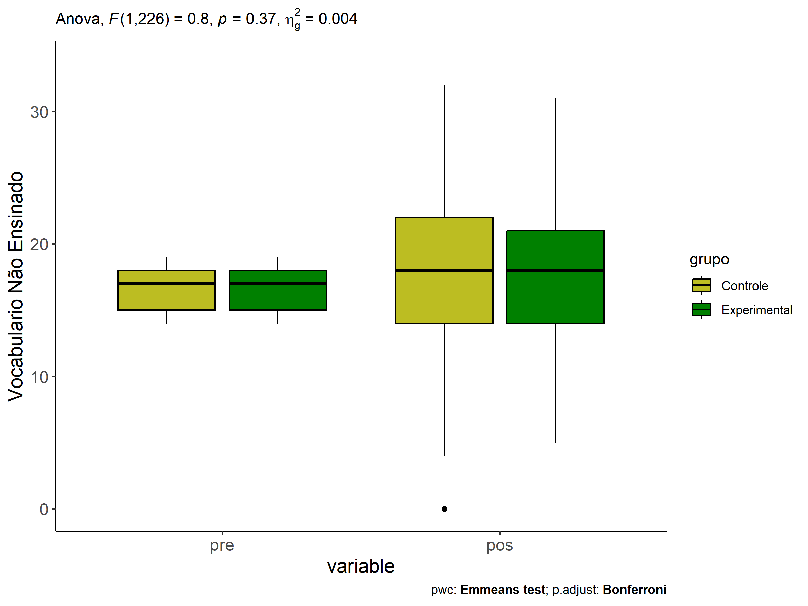<!-- -->

``` r
if (length(unique(wdat.long[["grupo"]])) > 1)
  plots <- oneWayAncovaBoxPlots(
    wdat.long, "vocab.non.teach", "grupo", aov, pwc.long, pre.post = "time",
    theme = "classic", color = color$prepost)
```

``` r
if (length(unique(wdat.long[["grupo"]])) > 1)
  plots[["grupo"]] + ggplot2::ylab("Vocabulario Não Ensinado")
```

<!-- -->

### Checking linearity assumption

``` r
ggscatter(wdat, x = "vocab.non.teach.pre", y = "vocab.non.teach.pos", size = 0.5,
          color = "grupo", add = "reg.line")+
  stat_regline_equation(
    aes(label =  paste(..eq.label.., ..rr.label.., sep = "~~~~"), color = grupo)
  )
```

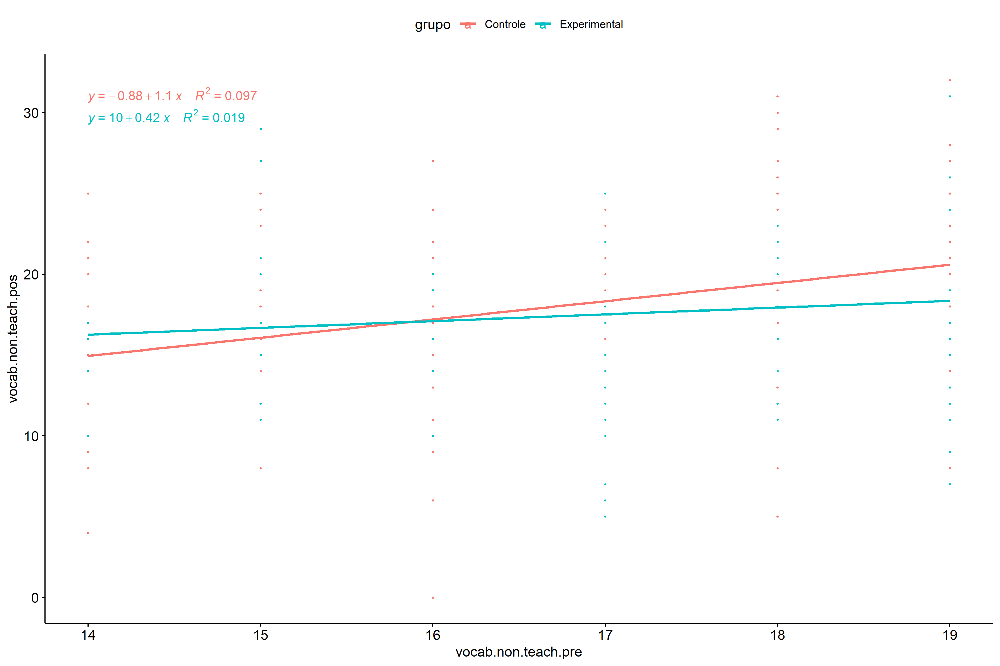<!-- -->

### Checking normality and homogeneity

``` r
res <- augment(lm(vocab.non.teach.pos ~ vocab.non.teach.pre + grupo, data = wdat))
```

``` r
shapiro_test(res$.resid)
```

    ## # A tibble: 1 × 3
    ##   variable   statistic p.value
    ##   <chr>          <dbl>   <dbl>
    ## 1 res$.resid     0.991   0.143

``` r
levene_test(res, .resid ~ grupo)
```

    ## # A tibble: 1 × 4
    ##     df1   df2 statistic     p
    ##   <int> <int>     <dbl> <dbl>
    ## 1     1   227      1.63 0.203

# ANCOVA and Pairwise for two factors **grupo:Sexo**

## Without remove non-normal data

``` r
pdat = remove_group_data(dat[!is.na(dat[["grupo"]]) & !is.na(dat[["Sexo"]]),], "vocab.non.teach.pos", c("grupo","Sexo"))

pdat.long <- rbind(pdat[,c("id","grupo","Sexo")], pdat[,c("id","grupo","Sexo")])
pdat.long[["time"]] <- c(rep("pre", nrow(pdat)), rep("pos", nrow(pdat)))
pdat.long[["time"]] <- factor(pdat.long[["time"]], c("pre","pos"))
pdat.long[["vocab.non.teach"]] <- c(pdat[["vocab.non.teach.pre"]], pdat[["vocab.non.teach.pos"]])

aov = anova_test(pdat, vocab.non.teach.pos ~ vocab.non.teach.pre + grupo*Sexo)
laov[["grupo:Sexo"]] <- get_anova_table(aov)
```

``` r
pwcs <- list()
pwcs[["Sexo"]] <- emmeans_test(
  group_by(pdat, grupo), vocab.non.teach.pos ~ Sexo,
  covariate = vocab.non.teach.pre, p.adjust.method = "bonferroni")
pwcs[["grupo"]] <- emmeans_test(
  group_by(pdat, Sexo), vocab.non.teach.pos ~ grupo,
  covariate = vocab.non.teach.pre, p.adjust.method = "bonferroni")

pwc <- plyr::rbind.fill(pwcs[["grupo"]], pwcs[["Sexo"]])
pwc <- pwc[,c("grupo","Sexo", colnames(pwc)[!colnames(pwc) %in% c("grupo","Sexo")])]
```

``` r
pwc.long <- emmeans_test(dplyr::group_by_at(pdat.long, c("grupo","Sexo")),
                         vocab.non.teach ~ time,
                         p.adjust.method = "bonferroni")
lpwc[["grupo:Sexo"]] <- plyr::rbind.fill(pwc, pwc.long)
```

``` r
ds <- get.descriptives(pdat, "vocab.non.teach.pos", c("grupo","Sexo"), covar = "vocab.non.teach.pre")
ds <- merge(ds[ds$variable != "vocab.non.teach.pre",],
            ds[ds$variable == "vocab.non.teach.pre", !colnames(ds) %in% c("variable")],
            by = c("grupo","Sexo"), all.x = T, suffixes = c("", ".vocab.non.teach.pre"))
ds <- merge(get_emmeans(pwcs[["grupo"]]), ds, by = c("grupo","Sexo"), suffixes = c(".emms", ""))
ds <- ds[,c("grupo","Sexo","n","mean.vocab.non.teach.pre","se.vocab.non.teach.pre","mean","se","emmean","se.emms")]

colnames(ds) <- c("grupo","Sexo", "N", paste0(c("M","SE")," (pre)"),
                  paste0(c("M","SE"), " (unadj)"), paste0(c("M", "SE"), " (adj)"))

lemms[["grupo:Sexo"]] <- ds
```

## Computing ANCOVA and PairWise After removing non-normal data (OK)

``` r
wdat = pdat 

res = residuals(lm(vocab.non.teach.pos ~ vocab.non.teach.pre + grupo*Sexo, data = wdat))
non.normal = getNonNormal(res, wdat$id, plimit = 0.05)

wdat = wdat[!wdat$id %in% non.normal,]

wdat.long <- rbind(wdat[,c("id","grupo","Sexo")], wdat[,c("id","grupo","Sexo")])
wdat.long[["time"]] <- c(rep("pre", nrow(wdat)), rep("pos", nrow(wdat)))
wdat.long[["time"]] <- factor(wdat.long[["time"]], c("pre","pos"))
wdat.long[["vocab.non.teach"]] <- c(wdat[["vocab.non.teach.pre"]], wdat[["vocab.non.teach.pos"]])


ldat[["grupo:Sexo"]] = wdat

(non.normal)
```

    ## NULL

``` r
aov = anova_test(wdat, vocab.non.teach.pos ~ vocab.non.teach.pre + grupo*Sexo)
laov[["grupo:Sexo"]] <- merge(get_anova_table(aov), laov[["grupo:Sexo"]], by="Effect", suffixes = c("","'"))

(df = get_anova_table(aov))
```

    ## ANOVA Table (type II tests)
    ## 
    ##                Effect DFn DFd      F       p p<.05   ges
    ## 1 vocab.non.teach.pre   1 224 12.684 0.00045     * 0.054
    ## 2               grupo   1 224  0.917 0.33900       0.004
    ## 3                Sexo   1 224  2.756 0.09800       0.012
    ## 4          grupo:Sexo   1 224  1.068 0.30300       0.005

| Effect              | DFn | DFd |      F |     p | p\<.05 |   ges |
|:--------------------|----:|----:|-------:|------:|:-------|------:|
| vocab.non.teach.pre |   1 | 224 | 12.684 | 0.000 | \*     | 0.054 |
| grupo               |   1 | 224 |  0.917 | 0.339 |        | 0.004 |
| Sexo                |   1 | 224 |  2.756 | 0.098 |        | 0.012 |
| grupo:Sexo          |   1 | 224 |  1.068 | 0.303 |        | 0.005 |

``` r
pwcs <- list()
pwcs[["Sexo"]] <- emmeans_test(
  group_by(wdat, grupo), vocab.non.teach.pos ~ Sexo,
  covariate = vocab.non.teach.pre, p.adjust.method = "bonferroni")
pwcs[["grupo"]] <- emmeans_test(
  group_by(wdat, Sexo), vocab.non.teach.pos ~ grupo,
  covariate = vocab.non.teach.pre, p.adjust.method = "bonferroni")

pwc <- plyr::rbind.fill(pwcs[["grupo"]], pwcs[["Sexo"]])
pwc <- pwc[,c("grupo","Sexo", colnames(pwc)[!colnames(pwc) %in% c("grupo","Sexo")])]
```

| grupo        | Sexo | term                       | .y.                 | group1   | group2       |  df | statistic |     p | p.adj | p.adj.signif |
|:-------------|:-----|:---------------------------|:--------------------|:---------|:-------------|----:|----------:|------:|------:|:-------------|
|              | F    | vocab.non.teach.pre\*grupo | vocab.non.teach.pos | Controle | Experimental | 224 |    -0.088 | 0.930 | 0.930 | ns           |
|              | M    | vocab.non.teach.pre\*grupo | vocab.non.teach.pos | Controle | Experimental | 224 |     1.406 | 0.161 | 0.161 | ns           |
| Controle     |      | vocab.non.teach.pre\*Sexo  | vocab.non.teach.pos | F        | M            | 224 |     0.361 | 0.718 | 0.718 | ns           |
| Experimental |      | vocab.non.teach.pre\*Sexo  | vocab.non.teach.pos | F        | M            | 224 |     1.922 | 0.056 | 0.056 | ns           |

``` r
pwc.long <- emmeans_test(dplyr::group_by_at(wdat.long, c("grupo","Sexo")),
                         vocab.non.teach ~ time,
                         p.adjust.method = "bonferroni")
lpwc[["grupo:Sexo"]] <- merge(plyr::rbind.fill(pwc, pwc.long), lpwc[["grupo:Sexo"]], by=c("grupo","Sexo","term",".y.","group1","group2"), suffixes = c("","'"))
```

| grupo        | Sexo | term | .y.             | group1 | group2 |  df | statistic |     p | p.adj | p.adj.signif |
|:-------------|:-----|:-----|:----------------|:-------|:-------|----:|----------:|------:|------:|:-------------|
| Controle     | F    | time | vocab.non.teach | pre    | pos    | 450 |    -1.764 | 0.078 | 0.078 | ns           |
| Controle     | M    | time | vocab.non.teach | pre    | pos    | 450 |    -1.417 | 0.157 | 0.157 | ns           |
| Experimental | F    | time | vocab.non.teach | pre    | pos    | 450 |    -2.043 | 0.042 | 0.042 | \*           |
| Experimental | M    | time | vocab.non.teach | pre    | pos    | 450 |     0.535 | 0.593 | 0.593 | ns           |

``` r
ds <- get.descriptives(wdat, "vocab.non.teach.pos", c("grupo","Sexo"), covar = "vocab.non.teach.pre")
ds <- merge(ds[ds$variable != "vocab.non.teach.pre",],
            ds[ds$variable == "vocab.non.teach.pre", !colnames(ds) %in% c("variable")],
            by = c("grupo","Sexo"), all.x = T, suffixes = c("", ".vocab.non.teach.pre"))
ds <- merge(get_emmeans(pwcs[["grupo"]]), ds, by = c("grupo","Sexo"), suffixes = c(".emms", ""))
ds <- ds[,c("grupo","Sexo","n","mean.vocab.non.teach.pre","se.vocab.non.teach.pre","mean","se","emmean","se.emms")]

colnames(ds) <- c("grupo","Sexo", "N", paste0(c("M","SE")," (pre)"),
                  paste0(c("M","SE"), " (unadj)"), paste0(c("M", "SE"), " (adj)"))

lemms[["grupo:Sexo"]] <- merge(ds, lemms[["grupo:Sexo"]], by=c("grupo","Sexo"), suffixes = c("","'"))
```

| grupo        | Sexo |   N | M (pre) | SE (pre) | M (unadj) | SE (unadj) | M (adj) | SE (adj) |
|:-------------|:-----|----:|--------:|---------:|----------:|-----------:|--------:|---------:|
| Controle     | F    |  48 |  16.625 |    0.241 |    18.125 |      0.880 |  18.259 |    0.795 |
| Controle     | M    |  57 |  16.649 |    0.234 |    17.754 |      0.846 |  17.870 |    0.729 |
| Experimental | F    |  61 |  16.852 |    0.213 |    18.393 |      0.558 |  18.352 |    0.704 |
| Experimental | M    |  63 |  17.016 |    0.212 |    16.619 |      0.714 |  16.452 |    0.695 |

### Plots for ancova

``` r
plots <- twoWayAncovaPlots(
  wdat, "vocab.non.teach.pos", c("grupo","Sexo"), aov, pwcs, addParam = c("mean_se"),
  font.label.size=10, step.increase=0.05, p.label="p.adj",
  subtitle = which(aov$Effect == "grupo:Sexo"))
```

``` r
if (!is.null(plots[["grupo"]]))
  plots[["grupo"]] + ggplot2::scale_color_manual(values = color[["Sexo"]])
```

    ## Scale for colour is already present.
    ## Adding another scale for colour, which will replace the existing scale.

<!-- -->

``` r
if (!is.null(plots[["Sexo"]]))
  plots[["Sexo"]] + ggplot2::scale_color_manual(values = color[["grupo"]])
```

    ## Scale for colour is already present.
    ## Adding another scale for colour, which will replace the existing scale.

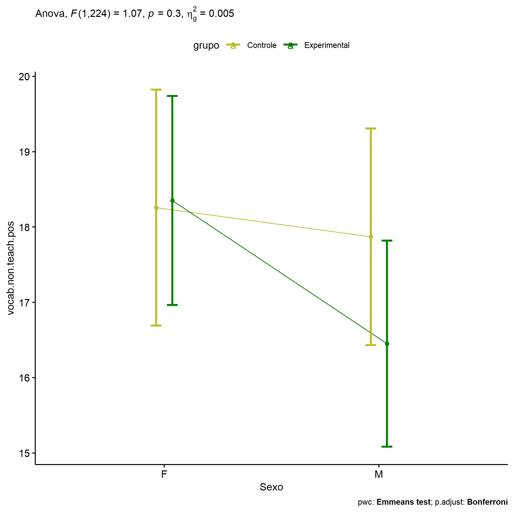<!-- -->

``` r
plots <- twoWayAncovaBoxPlots(
  wdat, "vocab.non.teach.pos", c("grupo","Sexo"), aov, pwcs, covar = "vocab.non.teach.pre",
  theme = "classic", color = color[["grupo:Sexo"]],
  subtitle = which(aov$Effect == "grupo:Sexo"))
```

``` r
plots[["grupo:Sexo"]] + ggplot2::ylab("Vocabulario Não Ensinado") + ggplot2::scale_x_discrete(labels=c('pre', 'pos'))
```

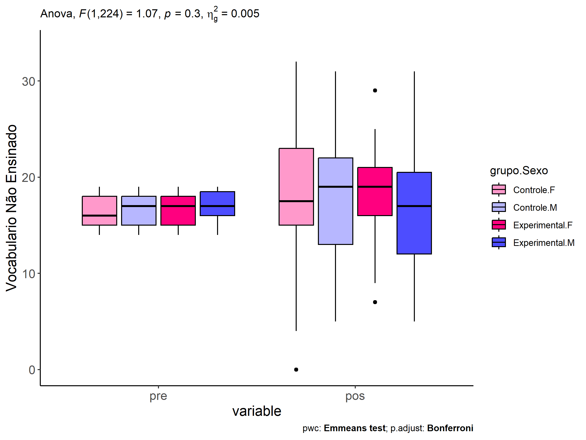<!-- -->

``` r
plots <- twoWayAncovaBoxPlots(
  wdat.long, "vocab.non.teach", c("grupo","Sexo"), aov, pwc.long, pre.post = "time",
  theme = "classic", color = color$prepost)
```

``` r
plots[["grupo:Sexo"]] + ggplot2::ylab("Vocabulario Não Ensinado")
```

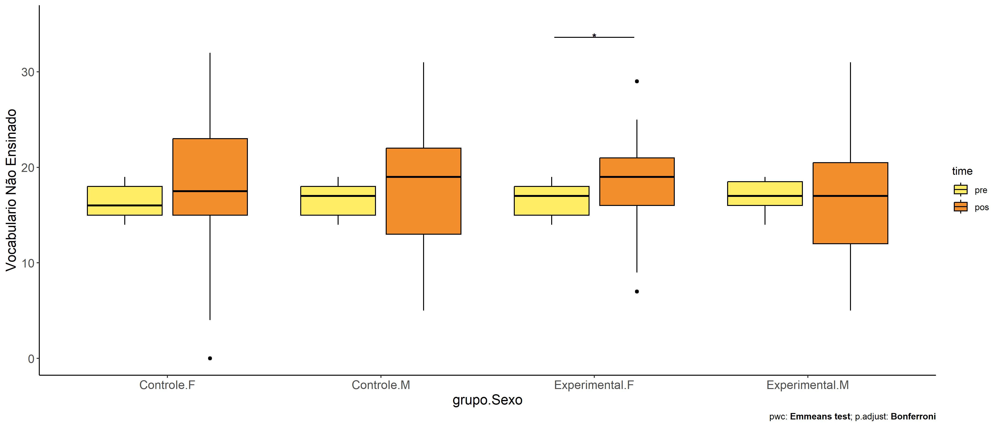<!-- -->

### Checking linearity assumption

``` r
ggscatter(wdat, x = "vocab.non.teach.pre", y = "vocab.non.teach.pos", size = 0.5,
          facet.by = c("grupo","Sexo"), add = "reg.line")+
  stat_regline_equation(
    aes(label =  paste(..eq.label.., ..rr.label.., sep = "~~~~"))
  )
```

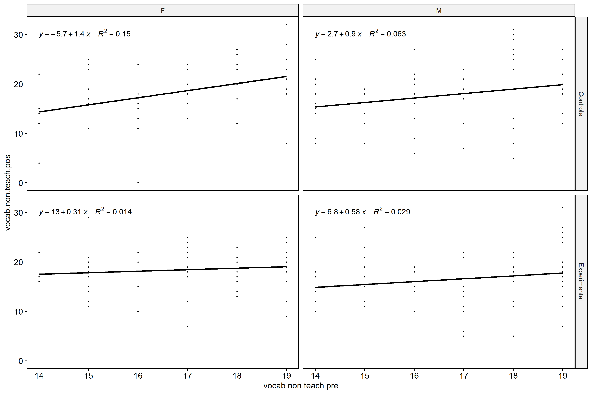<!-- -->

### Checking normality and homogeneity

``` r
res <- augment(lm(vocab.non.teach.pos ~ vocab.non.teach.pre + grupo*Sexo, data = wdat))
```

``` r
shapiro_test(res$.resid)
```

    ## # A tibble: 1 × 3
    ##   variable   statistic p.value
    ##   <chr>          <dbl>   <dbl>
    ## 1 res$.resid     0.991   0.153

``` r
levene_test(res, .resid ~ grupo*Sexo)
```

    ## # A tibble: 1 × 4
    ##     df1   df2 statistic      p
    ##   <int> <int>     <dbl>  <dbl>
    ## 1     3   225      2.12 0.0987

# ANCOVA and Pairwise for two factors **grupo:Zona**

## Without remove non-normal data

``` r
pdat = remove_group_data(dat[!is.na(dat[["grupo"]]) & !is.na(dat[["Zona"]]),], "vocab.non.teach.pos", c("grupo","Zona"))

pdat.long <- rbind(pdat[,c("id","grupo","Zona")], pdat[,c("id","grupo","Zona")])
pdat.long[["time"]] <- c(rep("pre", nrow(pdat)), rep("pos", nrow(pdat)))
pdat.long[["time"]] <- factor(pdat.long[["time"]], c("pre","pos"))
pdat.long[["vocab.non.teach"]] <- c(pdat[["vocab.non.teach.pre"]], pdat[["vocab.non.teach.pos"]])

aov = anova_test(pdat, vocab.non.teach.pos ~ vocab.non.teach.pre + grupo*Zona)
laov[["grupo:Zona"]] <- get_anova_table(aov)
```

``` r
pwcs <- list()
pwcs[["Zona"]] <- emmeans_test(
  group_by(pdat, grupo), vocab.non.teach.pos ~ Zona,
  covariate = vocab.non.teach.pre, p.adjust.method = "bonferroni")
pwcs[["grupo"]] <- emmeans_test(
  group_by(pdat, Zona), vocab.non.teach.pos ~ grupo,
  covariate = vocab.non.teach.pre, p.adjust.method = "bonferroni")

pwc <- plyr::rbind.fill(pwcs[["grupo"]], pwcs[["Zona"]])
pwc <- pwc[,c("grupo","Zona", colnames(pwc)[!colnames(pwc) %in% c("grupo","Zona")])]
```

``` r
pwc.long <- emmeans_test(dplyr::group_by_at(pdat.long, c("grupo","Zona")),
                         vocab.non.teach ~ time,
                         p.adjust.method = "bonferroni")
lpwc[["grupo:Zona"]] <- plyr::rbind.fill(pwc, pwc.long)
```

``` r
ds <- get.descriptives(pdat, "vocab.non.teach.pos", c("grupo","Zona"), covar = "vocab.non.teach.pre")
ds <- merge(ds[ds$variable != "vocab.non.teach.pre",],
            ds[ds$variable == "vocab.non.teach.pre", !colnames(ds) %in% c("variable")],
            by = c("grupo","Zona"), all.x = T, suffixes = c("", ".vocab.non.teach.pre"))
ds <- merge(get_emmeans(pwcs[["grupo"]]), ds, by = c("grupo","Zona"), suffixes = c(".emms", ""))
ds <- ds[,c("grupo","Zona","n","mean.vocab.non.teach.pre","se.vocab.non.teach.pre","mean","se","emmean","se.emms")]

colnames(ds) <- c("grupo","Zona", "N", paste0(c("M","SE")," (pre)"),
                  paste0(c("M","SE"), " (unadj)"), paste0(c("M", "SE"), " (adj)"))

lemms[["grupo:Zona"]] <- ds
```

## Computing ANCOVA and PairWise After removing non-normal data (OK)

``` r
wdat = pdat 

res = residuals(lm(vocab.non.teach.pos ~ vocab.non.teach.pre + grupo*Zona, data = wdat))
non.normal = getNonNormal(res, wdat$id, plimit = 0.05)

wdat = wdat[!wdat$id %in% non.normal,]

wdat.long <- rbind(wdat[,c("id","grupo","Zona")], wdat[,c("id","grupo","Zona")])
wdat.long[["time"]] <- c(rep("pre", nrow(wdat)), rep("pos", nrow(wdat)))
wdat.long[["time"]] <- factor(wdat.long[["time"]], c("pre","pos"))
wdat.long[["vocab.non.teach"]] <- c(wdat[["vocab.non.teach.pre"]], wdat[["vocab.non.teach.pos"]])


ldat[["grupo:Zona"]] = wdat

(non.normal)
```

    ## NULL

``` r
aov = anova_test(wdat, vocab.non.teach.pos ~ vocab.non.teach.pre + grupo*Zona)
laov[["grupo:Zona"]] <- merge(get_anova_table(aov), laov[["grupo:Zona"]], by="Effect", suffixes = c("","'"))

(df = get_anova_table(aov))
```

    ## ANOVA Table (type II tests)
    ## 
    ##                Effect DFn DFd      F        p p<.05      ges
    ## 1 vocab.non.teach.pre   1 159 14.403 0.000209     * 8.30e-02
    ## 2               grupo   1 159  0.711 0.400000       4.00e-03
    ## 3                Zona   1 159  0.578 0.448000       4.00e-03
    ## 4          grupo:Zona   1 159  0.011 0.915000       7.19e-05

| Effect              | DFn | DFd |      F |     p | p\<.05 |   ges |
|:--------------------|----:|----:|-------:|------:|:-------|------:|
| vocab.non.teach.pre |   1 | 159 | 14.403 | 0.000 | \*     | 0.083 |
| grupo               |   1 | 159 |  0.711 | 0.400 |        | 0.004 |
| Zona                |   1 | 159 |  0.578 | 0.448 |        | 0.004 |
| grupo:Zona          |   1 | 159 |  0.011 | 0.915 |        | 0.000 |

``` r
pwcs <- list()
pwcs[["Zona"]] <- emmeans_test(
  group_by(wdat, grupo), vocab.non.teach.pos ~ Zona,
  covariate = vocab.non.teach.pre, p.adjust.method = "bonferroni")
pwcs[["grupo"]] <- emmeans_test(
  group_by(wdat, Zona), vocab.non.teach.pos ~ grupo,
  covariate = vocab.non.teach.pre, p.adjust.method = "bonferroni")

pwc <- plyr::rbind.fill(pwcs[["grupo"]], pwcs[["Zona"]])
pwc <- pwc[,c("grupo","Zona", colnames(pwc)[!colnames(pwc) %in% c("grupo","Zona")])]
```

| grupo        | Zona   | term                       | .y.                 | group1   | group2       |  df | statistic |     p | p.adj | p.adj.signif |
|:-------------|:-------|:---------------------------|:--------------------|:---------|:-------------|----:|----------:|------:|------:|:-------------|
|              | Rural  | vocab.non.teach.pre\*grupo | vocab.non.teach.pos | Controle | Experimental | 159 |     0.624 | 0.534 | 0.534 | ns           |
|              | Urbana | vocab.non.teach.pre\*grupo | vocab.non.teach.pos | Controle | Experimental | 159 |     0.580 | 0.562 | 0.562 | ns           |
| Controle     |        | vocab.non.teach.pre\*Zona  | vocab.non.teach.pos | Rural    | Urbana       | 159 |    -0.588 | 0.558 | 0.558 | ns           |
| Experimental |        | vocab.non.teach.pre\*Zona  | vocab.non.teach.pos | Rural    | Urbana       | 159 |    -0.495 | 0.621 | 0.621 | ns           |

``` r
pwc.long <- emmeans_test(dplyr::group_by_at(wdat.long, c("grupo","Zona")),
                         vocab.non.teach ~ time,
                         p.adjust.method = "bonferroni")
lpwc[["grupo:Zona"]] <- merge(plyr::rbind.fill(pwc, pwc.long), lpwc[["grupo:Zona"]], by=c("grupo","Zona","term",".y.","group1","group2"), suffixes = c("","'"))
```

| grupo        | Zona   | term | .y.             | group1 | group2 |  df | statistic |     p | p.adj | p.adj.signif |
|:-------------|:-------|:-----|:----------------|:-------|:-------|----:|----------:|------:|------:|:-------------|
| Controle     | Rural  | time | vocab.non.teach | pre    | pos    | 320 |    -1.686 | 0.093 | 0.093 | ns           |
| Controle     | Urbana | time | vocab.non.teach | pre    | pos    | 320 |    -1.799 | 0.073 | 0.073 | ns           |
| Experimental | Rural  | time | vocab.non.teach | pre    | pos    | 320 |    -0.870 | 0.385 | 0.385 | ns           |
| Experimental | Urbana | time | vocab.non.teach | pre    | pos    | 320 |    -1.264 | 0.207 | 0.207 | ns           |

``` r
ds <- get.descriptives(wdat, "vocab.non.teach.pos", c("grupo","Zona"), covar = "vocab.non.teach.pre")
ds <- merge(ds[ds$variable != "vocab.non.teach.pre",],
            ds[ds$variable == "vocab.non.teach.pre", !colnames(ds) %in% c("variable")],
            by = c("grupo","Zona"), all.x = T, suffixes = c("", ".vocab.non.teach.pre"))
ds <- merge(get_emmeans(pwcs[["grupo"]]), ds, by = c("grupo","Zona"), suffixes = c(".emms", ""))
ds <- ds[,c("grupo","Zona","n","mean.vocab.non.teach.pre","se.vocab.non.teach.pre","mean","se","emmean","se.emms")]

colnames(ds) <- c("grupo","Zona", "N", paste0(c("M","SE")," (pre)"),
                  paste0(c("M","SE"), " (unadj)"), paste0(c("M", "SE"), " (adj)"))

lemms[["grupo:Zona"]] <- merge(ds, lemms[["grupo:Zona"]], by=c("grupo","Zona"), suffixes = c("","'"))
```

| grupo        | Zona   |   N | M (pre) | SE (pre) | M (unadj) | SE (unadj) | M (adj) | SE (adj) |
|:-------------|:-------|----:|--------:|---------:|----------:|-----------:|--------:|---------:|
| Controle     | Rural  |  53 |  16.774 |    0.252 |    18.113 |      0.904 |  18.172 |    0.731 |
| Controle     | Urbana |  24 |  16.458 |    0.307 |    18.583 |      1.014 |  18.943 |    1.090 |
| Experimental | Rural  |  54 |  17.019 |    0.216 |    17.704 |      0.699 |  17.529 |    0.725 |
| Experimental | Urbana |  33 |  16.909 |    0.290 |    18.182 |      0.807 |  18.112 |    0.926 |

### Plots for ancova

``` r
plots <- twoWayAncovaPlots(
  wdat, "vocab.non.teach.pos", c("grupo","Zona"), aov, pwcs, addParam = c("mean_se"),
  font.label.size=10, step.increase=0.05, p.label="p.adj",
  subtitle = which(aov$Effect == "grupo:Zona"))
```

``` r
if (!is.null(plots[["grupo"]]))
  plots[["grupo"]] + ggplot2::scale_color_manual(values = color[["Zona"]])
```

    ## Scale for colour is already present.
    ## Adding another scale for colour, which will replace the existing scale.

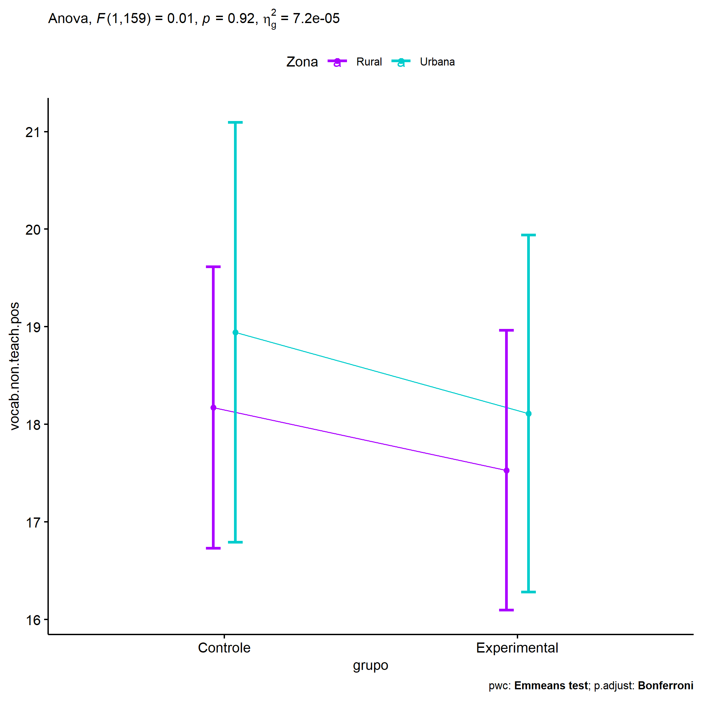<!-- -->

``` r
if (!is.null(plots[["Zona"]]))
  plots[["Zona"]] + ggplot2::scale_color_manual(values = color[["grupo"]])
```

    ## Scale for colour is already present.
    ## Adding another scale for colour, which will replace the existing scale.

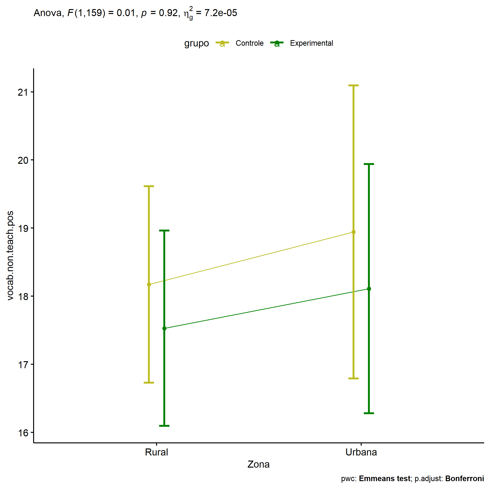<!-- -->

``` r
plots <- twoWayAncovaBoxPlots(
  wdat, "vocab.non.teach.pos", c("grupo","Zona"), aov, pwcs, covar = "vocab.non.teach.pre",
  theme = "classic", color = color[["grupo:Zona"]],
  subtitle = which(aov$Effect == "grupo:Zona"))
```

``` r
plots[["grupo:Zona"]] + ggplot2::ylab("Vocabulario Não Ensinado") + ggplot2::scale_x_discrete(labels=c('pre', 'pos'))
```

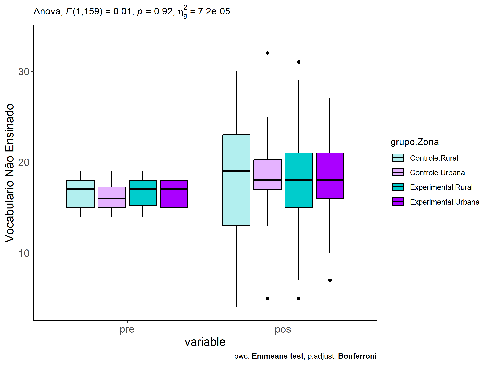<!-- -->

``` r
plots <- twoWayAncovaBoxPlots(
  wdat.long, "vocab.non.teach", c("grupo","Zona"), aov, pwc.long, pre.post = "time",
  theme = "classic", color = color$prepost)
```

``` r
plots[["grupo:Zona"]] + ggplot2::ylab("Vocabulario Não Ensinado")
```

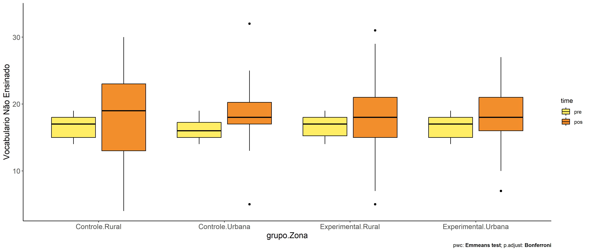<!-- -->

### Checking linearity assumption

``` r
ggscatter(wdat, x = "vocab.non.teach.pre", y = "vocab.non.teach.pos", size = 0.5,
          facet.by = c("grupo","Zona"), add = "reg.line")+
  stat_regline_equation(
    aes(label =  paste(..eq.label.., ..rr.label.., sep = "~~~~"))
  )
```

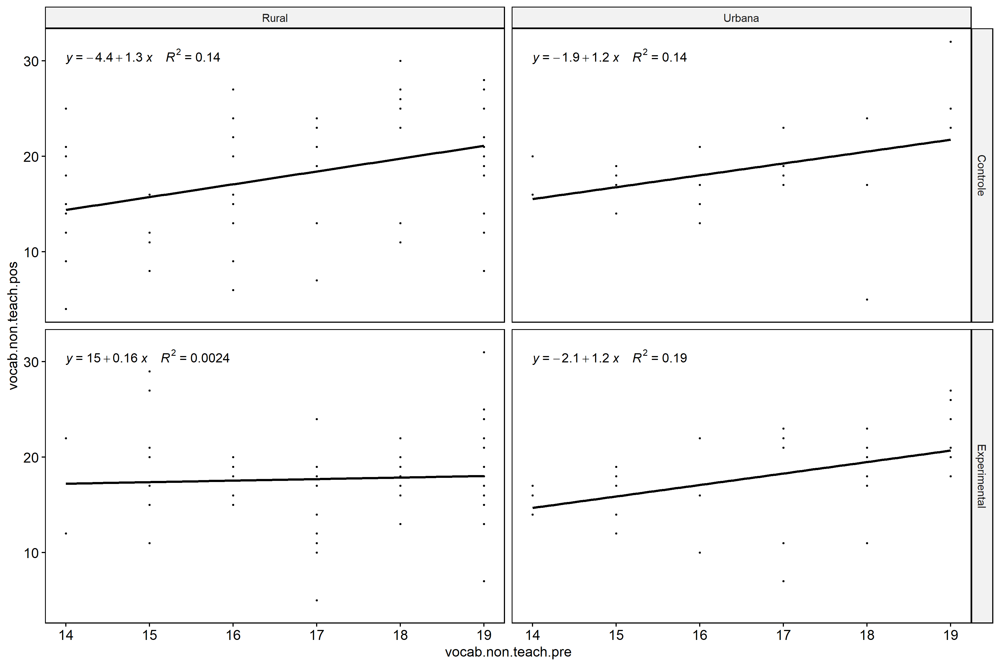<!-- -->

### Checking normality and homogeneity

``` r
res <- augment(lm(vocab.non.teach.pos ~ vocab.non.teach.pre + grupo*Zona, data = wdat))
```

``` r
shapiro_test(res$.resid)
```

    ## # A tibble: 1 × 3
    ##   variable   statistic p.value
    ##   <chr>          <dbl>   <dbl>
    ## 1 res$.resid     0.988   0.179

``` r
levene_test(res, .resid ~ grupo*Zona)
```

    ## # A tibble: 1 × 4
    ##     df1   df2 statistic      p
    ##   <int> <int>     <dbl>  <dbl>
    ## 1     3   160      3.53 0.0162

# ANCOVA and Pairwise for two factors **grupo:Cor.Raca**

## Without remove non-normal data

``` r
pdat = remove_group_data(dat[!is.na(dat[["grupo"]]) & !is.na(dat[["Cor.Raca"]]),], "vocab.non.teach.pos", c("grupo","Cor.Raca"))
```

    ## Warning: There was 1 warning in `mutate()`.
    ## ℹ In argument: `ci = abs(stats::qt(alpha/2, .data$n - 1) * .data$se)`.
    ## Caused by warning:
    ## ! There was 1 warning in `mutate()`.
    ## ℹ In argument: `ci = abs(stats::qt(alpha/2, .data$n - 1) * .data$se)`.
    ## Caused by warning in `stats::qt()`:
    ## ! NaNs produced

``` r
pdat.long <- rbind(pdat[,c("id","grupo","Cor.Raca")], pdat[,c("id","grupo","Cor.Raca")])
pdat.long[["time"]] <- c(rep("pre", nrow(pdat)), rep("pos", nrow(pdat)))
pdat.long[["time"]] <- factor(pdat.long[["time"]], c("pre","pos"))
pdat.long[["vocab.non.teach"]] <- c(pdat[["vocab.non.teach.pre"]], pdat[["vocab.non.teach.pos"]])

aov = anova_test(pdat, vocab.non.teach.pos ~ vocab.non.teach.pre + grupo*Cor.Raca)
laov[["grupo:Cor.Raca"]] <- get_anova_table(aov)
```

``` r
pwcs <- list()
pwcs[["Cor.Raca"]] <- emmeans_test(
  group_by(pdat, grupo), vocab.non.teach.pos ~ Cor.Raca,
  covariate = vocab.non.teach.pre, p.adjust.method = "bonferroni")
pwcs[["grupo"]] <- emmeans_test(
  group_by(pdat, Cor.Raca), vocab.non.teach.pos ~ grupo,
  covariate = vocab.non.teach.pre, p.adjust.method = "bonferroni")

pwc <- plyr::rbind.fill(pwcs[["grupo"]], pwcs[["Cor.Raca"]])
pwc <- pwc[,c("grupo","Cor.Raca", colnames(pwc)[!colnames(pwc) %in% c("grupo","Cor.Raca")])]
```

``` r
pwc.long <- emmeans_test(dplyr::group_by_at(pdat.long, c("grupo","Cor.Raca")),
                         vocab.non.teach ~ time,
                         p.adjust.method = "bonferroni")
lpwc[["grupo:Cor.Raca"]] <- plyr::rbind.fill(pwc, pwc.long)
```

``` r
ds <- get.descriptives(pdat, "vocab.non.teach.pos", c("grupo","Cor.Raca"), covar = "vocab.non.teach.pre")
ds <- merge(ds[ds$variable != "vocab.non.teach.pre",],
            ds[ds$variable == "vocab.non.teach.pre", !colnames(ds) %in% c("variable")],
            by = c("grupo","Cor.Raca"), all.x = T, suffixes = c("", ".vocab.non.teach.pre"))
ds <- merge(get_emmeans(pwcs[["grupo"]]), ds, by = c("grupo","Cor.Raca"), suffixes = c(".emms", ""))
ds <- ds[,c("grupo","Cor.Raca","n","mean.vocab.non.teach.pre","se.vocab.non.teach.pre","mean","se","emmean","se.emms")]

colnames(ds) <- c("grupo","Cor.Raca", "N", paste0(c("M","SE")," (pre)"),
                  paste0(c("M","SE"), " (unadj)"), paste0(c("M", "SE"), " (adj)"))

lemms[["grupo:Cor.Raca"]] <- ds
```

## Computing ANCOVA and PairWise After removing non-normal data (OK)

``` r
wdat = pdat 

res = residuals(lm(vocab.non.teach.pos ~ vocab.non.teach.pre + grupo*Cor.Raca, data = wdat))
non.normal = getNonNormal(res, wdat$id, plimit = 0.05)

wdat = wdat[!wdat$id %in% non.normal,]

wdat.long <- rbind(wdat[,c("id","grupo","Cor.Raca")], wdat[,c("id","grupo","Cor.Raca")])
wdat.long[["time"]] <- c(rep("pre", nrow(wdat)), rep("pos", nrow(wdat)))
wdat.long[["time"]] <- factor(wdat.long[["time"]], c("pre","pos"))
wdat.long[["vocab.non.teach"]] <- c(wdat[["vocab.non.teach.pre"]], wdat[["vocab.non.teach.pos"]])


ldat[["grupo:Cor.Raca"]] = wdat

(non.normal)
```

    ## NULL

``` r
aov = anova_test(wdat, vocab.non.teach.pos ~ vocab.non.teach.pre + grupo*Cor.Raca)
laov[["grupo:Cor.Raca"]] <- merge(get_anova_table(aov), laov[["grupo:Cor.Raca"]], by="Effect", suffixes = c("","'"))

(df = get_anova_table(aov))
```

    ## ANOVA Table (type II tests)
    ## 
    ##                Effect DFn DFd     F     p p<.05   ges
    ## 1 vocab.non.teach.pre   1  95 8.433 0.005     * 0.082
    ## 2               grupo   1  95 1.798 0.183       0.019
    ## 3            Cor.Raca   1  95 4.873 0.030     * 0.049
    ## 4      grupo:Cor.Raca   1  95 1.884 0.173       0.019

| Effect              | DFn | DFd |     F |     p | p\<.05 |   ges |
|:--------------------|----:|----:|------:|------:|:-------|------:|
| vocab.non.teach.pre |   1 |  95 | 8.433 | 0.005 | \*     | 0.082 |
| grupo               |   1 |  95 | 1.798 | 0.183 |        | 0.019 |
| Cor.Raca            |   1 |  95 | 4.873 | 0.030 | \*     | 0.049 |
| grupo:Cor.Raca      |   1 |  95 | 1.884 | 0.173 |        | 0.019 |

``` r
pwcs <- list()
pwcs[["Cor.Raca"]] <- emmeans_test(
  group_by(wdat, grupo), vocab.non.teach.pos ~ Cor.Raca,
  covariate = vocab.non.teach.pre, p.adjust.method = "bonferroni")
pwcs[["grupo"]] <- emmeans_test(
  group_by(wdat, Cor.Raca), vocab.non.teach.pos ~ grupo,
  covariate = vocab.non.teach.pre, p.adjust.method = "bonferroni")

pwc <- plyr::rbind.fill(pwcs[["grupo"]], pwcs[["Cor.Raca"]])
pwc <- pwc[,c("grupo","Cor.Raca", colnames(pwc)[!colnames(pwc) %in% c("grupo","Cor.Raca")])]
```

| grupo        | Cor.Raca | term                          | .y.                 | group1   | group2       |  df | statistic |     p | p.adj | p.adj.signif |
|:-------------|:---------|:------------------------------|:--------------------|:---------|:-------------|----:|----------:|------:|------:|:-------------|
|              | Branca   | vocab.non.teach.pre\*grupo    | vocab.non.teach.pos | Controle | Experimental |  95 |     1.849 | 0.067 | 0.067 | ns           |
|              | Parda    | vocab.non.teach.pre\*grupo    | vocab.non.teach.pos | Controle | Experimental |  95 |     0.520 | 0.604 | 0.604 | ns           |
| Controle     |          | vocab.non.teach.pre\*Cor.Raca | vocab.non.teach.pos | Branca   | Parda        |  95 |    -0.533 | 0.595 | 0.595 | ns           |
| Experimental |          | vocab.non.teach.pre\*Cor.Raca | vocab.non.teach.pos | Branca   | Parda        |  95 |    -2.547 | 0.012 | 0.012 | \*           |

``` r
pwc.long <- emmeans_test(dplyr::group_by_at(wdat.long, c("grupo","Cor.Raca")),
                         vocab.non.teach ~ time,
                         p.adjust.method = "bonferroni")
lpwc[["grupo:Cor.Raca"]] <- merge(plyr::rbind.fill(pwc, pwc.long), lpwc[["grupo:Cor.Raca"]], by=c("grupo","Cor.Raca","term",".y.","group1","group2"), suffixes = c("","'"))
```

| grupo        | Cor.Raca | term | .y.             | group1 | group2 |  df | statistic |     p | p.adj | p.adj.signif |
|:-------------|:---------|:-----|:----------------|:-------|:-------|----:|----------:|------:|------:|:-------------|
| Controle     | Branca   | time | vocab.non.teach | pre    | pos    | 192 |    -0.621 | 0.535 | 0.535 | ns           |
| Controle     | Parda    | time | vocab.non.teach | pre    | pos    | 192 |    -2.166 | 0.032 | 0.032 | \*           |
| Experimental | Branca   | time | vocab.non.teach | pre    | pos    | 192 |     1.830 | 0.069 | 0.069 | ns           |
| Experimental | Parda    | time | vocab.non.teach | pre    | pos    | 192 |    -1.584 | 0.115 | 0.115 | ns           |

``` r
ds <- get.descriptives(wdat, "vocab.non.teach.pos", c("grupo","Cor.Raca"), covar = "vocab.non.teach.pre")
ds <- merge(ds[ds$variable != "vocab.non.teach.pre",],
            ds[ds$variable == "vocab.non.teach.pre", !colnames(ds) %in% c("variable")],
            by = c("grupo","Cor.Raca"), all.x = T, suffixes = c("", ".vocab.non.teach.pre"))
ds <- merge(get_emmeans(pwcs[["grupo"]]), ds, by = c("grupo","Cor.Raca"), suffixes = c(".emms", ""))
ds <- ds[,c("grupo","Cor.Raca","n","mean.vocab.non.teach.pre","se.vocab.non.teach.pre","mean","se","emmean","se.emms")]

colnames(ds) <- c("grupo","Cor.Raca", "N", paste0(c("M","SE")," (pre)"),
                  paste0(c("M","SE"), " (unadj)"), paste0(c("M", "SE"), " (adj)"))

lemms[["grupo:Cor.Raca"]] <- merge(ds, lemms[["grupo:Cor.Raca"]], by=c("grupo","Cor.Raca"), suffixes = c("","'"))
```

| grupo        | Cor.Raca |   N | M (pre) | SE (pre) | M (unadj) | SE (unadj) | M (adj) | SE (adj) |
|:-------------|:---------|----:|--------:|---------:|----------:|-----------:|--------:|---------:|
| Controle     | Branca   |  11 |  17.091 |    0.563 |    18.273 |      1.864 |  18.119 |    1.757 |
| Controle     | Parda    |  36 |  16.583 |    0.307 |    18.861 |      1.250 |  19.193 |    0.977 |
| Experimental | Branca   |  12 |  17.417 |    0.543 |    14.083 |      1.264 |  13.618 |    1.689 |
| Experimental | Parda    |  41 |  17.049 |    0.270 |    18.610 |      0.760 |  18.496 |    0.911 |

### Plots for ancova

``` r
plots <- twoWayAncovaPlots(
  wdat, "vocab.non.teach.pos", c("grupo","Cor.Raca"), aov, pwcs, addParam = c("mean_se"),
  font.label.size=10, step.increase=0.05, p.label="p.adj",
  subtitle = which(aov$Effect == "grupo:Cor.Raca"))
```

``` r
if (!is.null(plots[["grupo"]]))
  plots[["grupo"]] + ggplot2::scale_color_manual(values = color[["Cor.Raca"]])
```

    ## Scale for colour is already present.
    ## Adding another scale for colour, which will replace the existing scale.

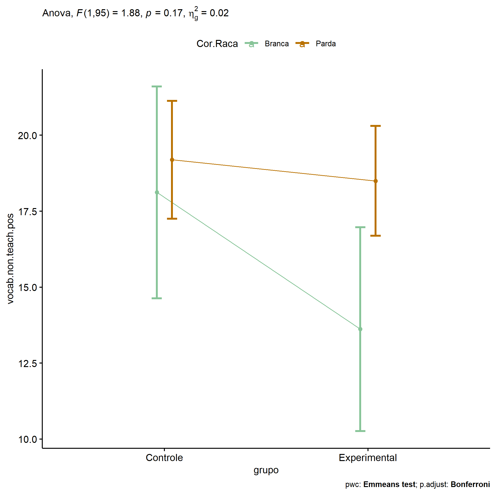<!-- -->

``` r
if (!is.null(plots[["Cor.Raca"]]))
  plots[["Cor.Raca"]] + ggplot2::scale_color_manual(values = color[["grupo"]])
```

    ## Scale for colour is already present.
    ## Adding another scale for colour, which will replace the existing scale.

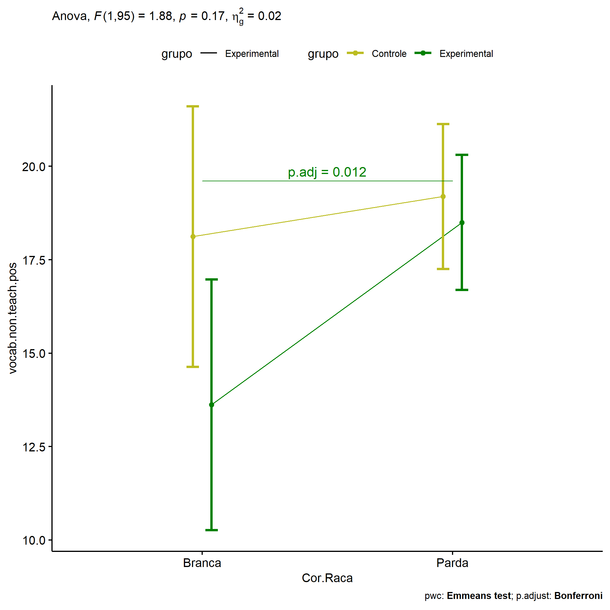<!-- -->

``` r
plots <- twoWayAncovaBoxPlots(
  wdat, "vocab.non.teach.pos", c("grupo","Cor.Raca"), aov, pwcs, covar = "vocab.non.teach.pre",
  theme = "classic", color = color[["grupo:Cor.Raca"]],
  subtitle = which(aov$Effect == "grupo:Cor.Raca"))
```

``` r
plots[["grupo:Cor.Raca"]] + ggplot2::ylab("Vocabulario Não Ensinado") + ggplot2::scale_x_discrete(labels=c('pre', 'pos'))
```

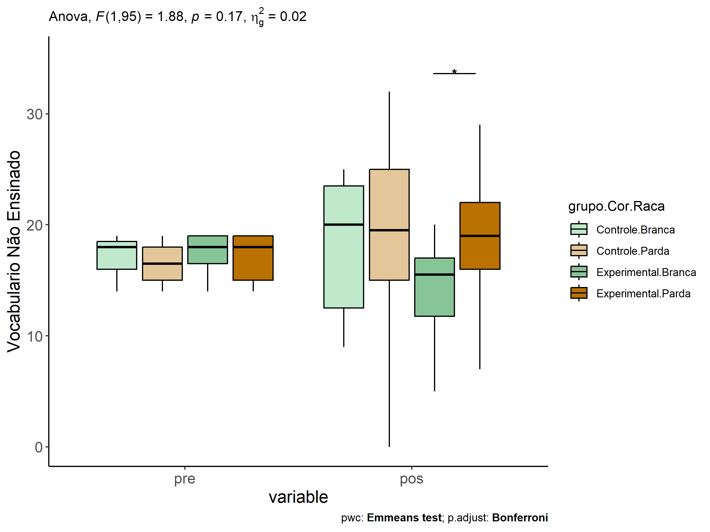<!-- -->

``` r
plots <- twoWayAncovaBoxPlots(
  wdat.long, "vocab.non.teach", c("grupo","Cor.Raca"), aov, pwc.long, pre.post = "time",
  theme = "classic", color = color$prepost)
```

``` r
plots[["grupo:Cor.Raca"]] + ggplot2::ylab("Vocabulario Não Ensinado")
```

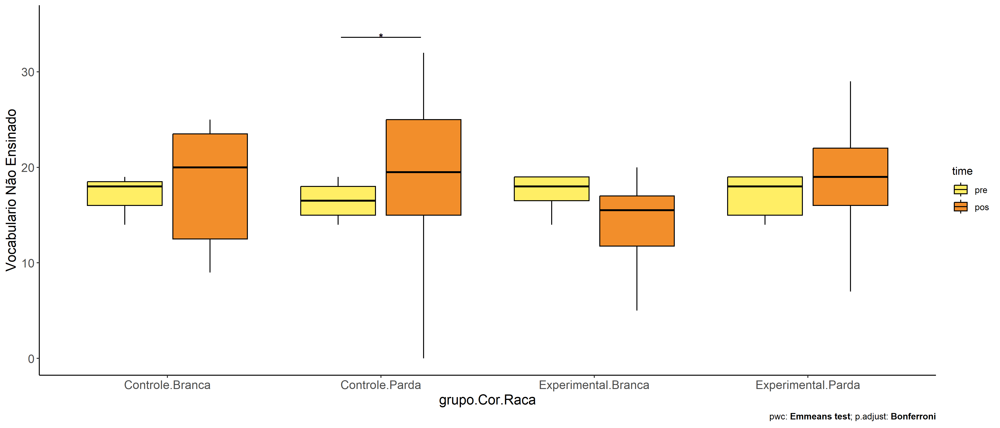<!-- -->

### Checking linearity assumption

``` r
ggscatter(wdat, x = "vocab.non.teach.pre", y = "vocab.non.teach.pos", size = 0.5,
          facet.by = c("grupo","Cor.Raca"), add = "reg.line")+
  stat_regline_equation(
    aes(label =  paste(..eq.label.., ..rr.label.., sep = "~~~~"))
  )
```

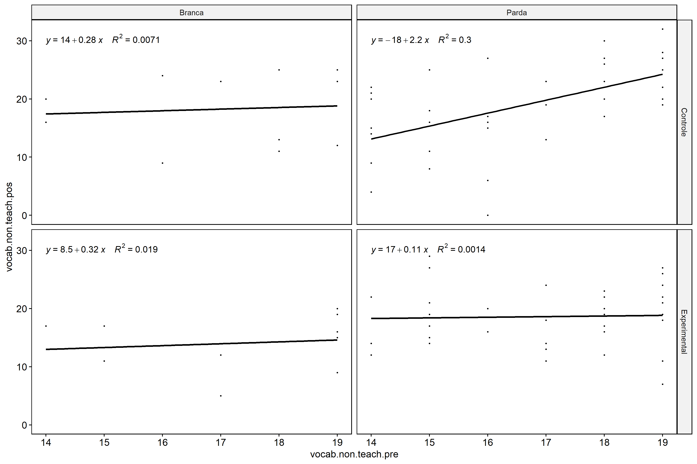<!-- -->

### Checking normality and homogeneity

``` r
res <- augment(lm(vocab.non.teach.pos ~ vocab.non.teach.pre + grupo*Cor.Raca, data = wdat))
```

``` r
shapiro_test(res$.resid)
```

    ## # A tibble: 1 × 3
    ##   variable   statistic p.value
    ##   <chr>          <dbl>   <dbl>
    ## 1 res$.resid     0.980   0.145

``` r
levene_test(res, .resid ~ grupo*Cor.Raca)
```

    ## # A tibble: 1 × 4
    ##     df1   df2 statistic     p
    ##   <int> <int>     <dbl> <dbl>
    ## 1     3    96      1.37 0.256

# ANCOVA and Pairwise for two factors **grupo:Serie**

## Without remove non-normal data

``` r
pdat = remove_group_data(dat[!is.na(dat[["grupo"]]) & !is.na(dat[["Serie"]]),], "vocab.non.teach.pos", c("grupo","Serie"))

pdat.long <- rbind(pdat[,c("id","grupo","Serie")], pdat[,c("id","grupo","Serie")])
pdat.long[["time"]] <- c(rep("pre", nrow(pdat)), rep("pos", nrow(pdat)))
pdat.long[["time"]] <- factor(pdat.long[["time"]], c("pre","pos"))
pdat.long[["vocab.non.teach"]] <- c(pdat[["vocab.non.teach.pre"]], pdat[["vocab.non.teach.pos"]])

aov = anova_test(pdat, vocab.non.teach.pos ~ vocab.non.teach.pre + grupo*Serie)
laov[["grupo:Serie"]] <- get_anova_table(aov)
```

``` r
pwcs <- list()
pwcs[["Serie"]] <- emmeans_test(
  group_by(pdat, grupo), vocab.non.teach.pos ~ Serie,
  covariate = vocab.non.teach.pre, p.adjust.method = "bonferroni")
pwcs[["grupo"]] <- emmeans_test(
  group_by(pdat, Serie), vocab.non.teach.pos ~ grupo,
  covariate = vocab.non.teach.pre, p.adjust.method = "bonferroni")

pwc <- plyr::rbind.fill(pwcs[["grupo"]], pwcs[["Serie"]])
pwc <- pwc[,c("grupo","Serie", colnames(pwc)[!colnames(pwc) %in% c("grupo","Serie")])]
```

``` r
pwc.long <- emmeans_test(dplyr::group_by_at(pdat.long, c("grupo","Serie")),
                         vocab.non.teach ~ time,
                         p.adjust.method = "bonferroni")
lpwc[["grupo:Serie"]] <- plyr::rbind.fill(pwc, pwc.long)
```

``` r
ds <- get.descriptives(pdat, "vocab.non.teach.pos", c("grupo","Serie"), covar = "vocab.non.teach.pre")
ds <- merge(ds[ds$variable != "vocab.non.teach.pre",],
            ds[ds$variable == "vocab.non.teach.pre", !colnames(ds) %in% c("variable")],
            by = c("grupo","Serie"), all.x = T, suffixes = c("", ".vocab.non.teach.pre"))
ds <- merge(get_emmeans(pwcs[["grupo"]]), ds, by = c("grupo","Serie"), suffixes = c(".emms", ""))
ds <- ds[,c("grupo","Serie","n","mean.vocab.non.teach.pre","se.vocab.non.teach.pre","mean","se","emmean","se.emms")]

colnames(ds) <- c("grupo","Serie", "N", paste0(c("M","SE")," (pre)"),
                  paste0(c("M","SE"), " (unadj)"), paste0(c("M", "SE"), " (adj)"))

lemms[["grupo:Serie"]] <- ds
```

## Computing ANCOVA and PairWise After removing non-normal data (OK)

``` r
wdat = pdat 

res = residuals(lm(vocab.non.teach.pos ~ vocab.non.teach.pre + grupo*Serie, data = wdat))
non.normal = getNonNormal(res, wdat$id, plimit = 0.05)

wdat = wdat[!wdat$id %in% non.normal,]

wdat.long <- rbind(wdat[,c("id","grupo","Serie")], wdat[,c("id","grupo","Serie")])
wdat.long[["time"]] <- c(rep("pre", nrow(wdat)), rep("pos", nrow(wdat)))
wdat.long[["time"]] <- factor(wdat.long[["time"]], c("pre","pos"))
wdat.long[["vocab.non.teach"]] <- c(wdat[["vocab.non.teach.pre"]], wdat[["vocab.non.teach.pos"]])


ldat[["grupo:Serie"]] = wdat

(non.normal)
```

    ## [1] "P1069"

``` r
aov = anova_test(wdat, vocab.non.teach.pos ~ vocab.non.teach.pre + grupo*Serie)
laov[["grupo:Serie"]] <- merge(get_anova_table(aov), laov[["grupo:Serie"]], by="Effect", suffixes = c("","'"))

(df = get_anova_table(aov))
```

    ## ANOVA Table (type II tests)
    ## 
    ##                Effect DFn DFd     F     p p<.05   ges
    ## 1 vocab.non.teach.pre   1 219 9.780 0.002     * 0.043
    ## 2               grupo   1 219 1.959 0.163       0.009
    ## 3               Serie   3 219 1.317 0.270       0.018
    ## 4         grupo:Serie   3 219 1.275 0.284       0.017

| Effect              | DFn | DFd |     F |     p | p\<.05 |   ges |
|:--------------------|----:|----:|------:|------:|:-------|------:|
| vocab.non.teach.pre |   1 | 219 | 9.780 | 0.002 | \*     | 0.043 |
| grupo               |   1 | 219 | 1.959 | 0.163 |        | 0.009 |
| Serie               |   3 | 219 | 1.317 | 0.270 |        | 0.018 |
| grupo:Serie         |   3 | 219 | 1.275 | 0.284 |        | 0.017 |

``` r
pwcs <- list()
pwcs[["Serie"]] <- emmeans_test(
  group_by(wdat, grupo), vocab.non.teach.pos ~ Serie,
  covariate = vocab.non.teach.pre, p.adjust.method = "bonferroni")
pwcs[["grupo"]] <- emmeans_test(
  group_by(wdat, Serie), vocab.non.teach.pos ~ grupo,
  covariate = vocab.non.teach.pre, p.adjust.method = "bonferroni")

pwc <- plyr::rbind.fill(pwcs[["grupo"]], pwcs[["Serie"]])
pwc <- pwc[,c("grupo","Serie", colnames(pwc)[!colnames(pwc) %in% c("grupo","Serie")])]
```

| grupo        | Serie | term                       | .y.                 | group1   | group2       |  df | statistic |     p | p.adj | p.adj.signif |
|:-------------|:------|:---------------------------|:--------------------|:---------|:-------------|----:|----------:|------:|------:|:-------------|
|              | 6 ano | vocab.non.teach.pre\*grupo | vocab.non.teach.pos | Controle | Experimental | 219 |    -0.040 | 0.968 | 0.968 | ns           |
|              | 7 ano | vocab.non.teach.pre\*grupo | vocab.non.teach.pos | Controle | Experimental | 219 |     0.351 | 0.726 | 0.726 | ns           |
|              | 8 ano | vocab.non.teach.pre\*grupo | vocab.non.teach.pos | Controle | Experimental | 219 |     2.301 | 0.022 | 0.022 | \*           |
|              | 9 ano | vocab.non.teach.pre\*grupo | vocab.non.teach.pos | Controle | Experimental | 219 |     0.596 | 0.551 | 0.551 | ns           |
| Controle     |       | vocab.non.teach.pre\*Serie | vocab.non.teach.pos | 6 ano    | 7 ano        | 219 |    -0.665 | 0.507 | 1.000 | ns           |
| Controle     |       | vocab.non.teach.pre\*Serie | vocab.non.teach.pos | 6 ano    | 8 ano        | 219 |    -2.697 | 0.008 | 0.045 | \*           |
| Controle     |       | vocab.non.teach.pre\*Serie | vocab.non.teach.pos | 6 ano    | 9 ano        | 219 |    -0.986 | 0.325 | 1.000 | ns           |
| Controle     |       | vocab.non.teach.pre\*Serie | vocab.non.teach.pos | 7 ano    | 8 ano        | 219 |    -2.194 | 0.029 | 0.176 | ns           |
| Controle     |       | vocab.non.teach.pre\*Serie | vocab.non.teach.pos | 7 ano    | 9 ano        | 219 |    -0.562 | 0.575 | 1.000 | ns           |
| Controle     |       | vocab.non.teach.pre\*Serie | vocab.non.teach.pos | 8 ano    | 9 ano        | 219 |     1.129 | 0.260 | 1.000 | ns           |
| Experimental |       | vocab.non.teach.pre\*Serie | vocab.non.teach.pos | 6 ano    | 7 ano        | 219 |    -0.280 | 0.780 | 1.000 | ns           |
| Experimental |       | vocab.non.teach.pre\*Serie | vocab.non.teach.pos | 6 ano    | 8 ano        | 219 |    -0.328 | 0.743 | 1.000 | ns           |
| Experimental |       | vocab.non.teach.pre\*Serie | vocab.non.teach.pos | 6 ano    | 9 ano        | 219 |    -0.326 | 0.744 | 1.000 | ns           |
| Experimental |       | vocab.non.teach.pre\*Serie | vocab.non.teach.pos | 7 ano    | 8 ano        | 219 |    -0.078 | 0.938 | 1.000 | ns           |
| Experimental |       | vocab.non.teach.pre\*Serie | vocab.non.teach.pos | 7 ano    | 9 ano        | 219 |    -0.121 | 0.904 | 1.000 | ns           |
| Experimental |       | vocab.non.teach.pre\*Serie | vocab.non.teach.pos | 8 ano    | 9 ano        | 219 |    -0.055 | 0.956 | 1.000 | ns           |

``` r
pwc.long <- emmeans_test(dplyr::group_by_at(wdat.long, c("grupo","Serie")),
                         vocab.non.teach ~ time,
                         p.adjust.method = "bonferroni")
lpwc[["grupo:Serie"]] <- merge(plyr::rbind.fill(pwc, pwc.long), lpwc[["grupo:Serie"]], by=c("grupo","Serie","term",".y.","group1","group2"), suffixes = c("","'"))
```

| grupo        | Serie | term | .y.             | group1 | group2 |  df | statistic |     p | p.adj | p.adj.signif |
|:-------------|:------|:-----|:----------------|:-------|:-------|----:|----------:|------:|------:|:-------------|
| Controle     | 6 ano | time | vocab.non.teach | pre    | pos    | 440 |    -0.390 | 0.697 | 0.697 | ns           |
| Controle     | 7 ano | time | vocab.non.teach | pre    | pos    | 440 |    -1.253 | 0.211 | 0.211 | ns           |
| Controle     | 8 ano | time | vocab.non.teach | pre    | pos    | 440 |    -3.086 | 0.002 | 0.002 | \*\*         |
| Controle     | 9 ano | time | vocab.non.teach | pre    | pos    | 440 |    -1.155 | 0.249 | 0.249 | ns           |
| Experimental | 6 ano | time | vocab.non.teach | pre    | pos    | 440 |    -0.242 | 0.809 | 0.809 | ns           |
| Experimental | 7 ano | time | vocab.non.teach | pre    | pos    | 440 |    -0.778 | 0.437 | 0.437 | ns           |
| Experimental | 8 ano | time | vocab.non.teach | pre    | pos    | 440 |    -0.667 | 0.505 | 0.505 | ns           |
| Experimental | 9 ano | time | vocab.non.teach | pre    | pos    | 440 |    -0.435 | 0.664 | 0.664 | ns           |

``` r
ds <- get.descriptives(wdat, "vocab.non.teach.pos", c("grupo","Serie"), covar = "vocab.non.teach.pre")
ds <- merge(ds[ds$variable != "vocab.non.teach.pre",],
            ds[ds$variable == "vocab.non.teach.pre", !colnames(ds) %in% c("variable")],
            by = c("grupo","Serie"), all.x = T, suffixes = c("", ".vocab.non.teach.pre"))
ds <- merge(get_emmeans(pwcs[["grupo"]]), ds, by = c("grupo","Serie"), suffixes = c(".emms", ""))
ds <- ds[,c("grupo","Serie","n","mean.vocab.non.teach.pre","se.vocab.non.teach.pre","mean","se","emmean","se.emms")]

colnames(ds) <- c("grupo","Serie", "N", paste0(c("M","SE")," (pre)"),
                  paste0(c("M","SE"), " (unadj)"), paste0(c("M", "SE"), " (adj)"))

lemms[["grupo:Serie"]] <- merge(ds, lemms[["grupo:Serie"]], by=c("grupo","Serie"), suffixes = c("","'"))
```

| grupo        | Serie |   N | M (pre) | SE (pre) | M (unadj) | SE (unadj) | M (adj) | SE (adj) |
|:-------------|:------|----:|--------:|---------:|----------:|-----------:|--------:|---------:|
| Controle     | 6 ano |  39 |  16.462 |    0.287 |    16.821 |      0.912 |  17.049 |    0.866 |
| Controle     | 7 ano |  39 |  16.513 |    0.252 |    17.667 |      0.859 |  17.861 |    0.865 |
| Controle     | 8 ano |  16 |  17.250 |    0.433 |    21.688 |      1.906 |  21.388 |    1.351 |
| Controle     | 9 ano |  10 |  16.900 |    0.640 |    19.000 |      1.585 |  18.935 |    1.704 |
| Experimental | 6 ano |  33 |  16.970 |    0.318 |    17.212 |      0.946 |  17.100 |    0.939 |
| Experimental | 7 ano |  45 |  16.733 |    0.237 |    17.400 |      0.752 |  17.446 |    0.803 |
| Experimental | 8 ano |  30 |  16.933 |    0.307 |    17.633 |      0.826 |  17.546 |    0.984 |
| Experimental | 9 ano |  16 |  17.438 |    0.387 |    18.062 |      1.534 |  17.637 |    1.354 |

### Plots for ancova

``` r
plots <- twoWayAncovaPlots(
  wdat, "vocab.non.teach.pos", c("grupo","Serie"), aov, pwcs, addParam = c("mean_se"),
  font.label.size=10, step.increase=0.05, p.label="p.adj",
  subtitle = which(aov$Effect == "grupo:Serie"))
```

``` r
if (!is.null(plots[["grupo"]]))
  plots[["grupo"]] + ggplot2::scale_color_manual(values = color[["Serie"]])
```

    ## Scale for colour is already present.
    ## Adding another scale for colour, which will replace the existing scale.

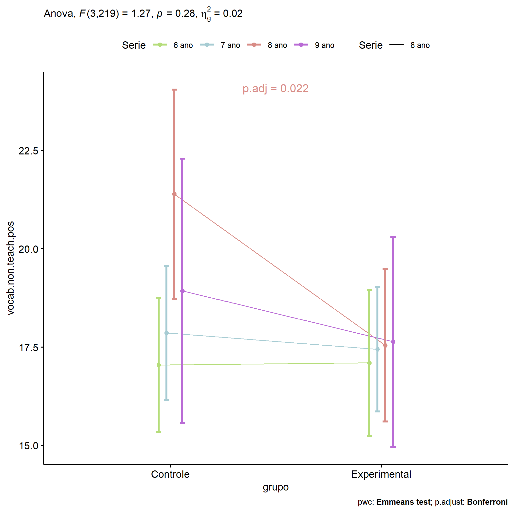<!-- -->

``` r
if (!is.null(plots[["Serie"]]))
  plots[["Serie"]] + ggplot2::scale_color_manual(values = color[["grupo"]])
```

    ## Scale for colour is already present.
    ## Adding another scale for colour, which will replace the existing scale.

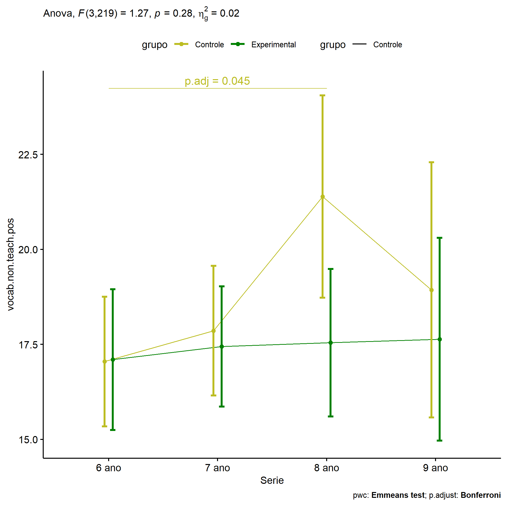<!-- -->

``` r
plots <- twoWayAncovaBoxPlots(
  wdat, "vocab.non.teach.pos", c("grupo","Serie"), aov, pwcs, covar = "vocab.non.teach.pre",
  theme = "classic", color = color[["grupo:Serie"]],
  subtitle = which(aov$Effect == "grupo:Serie"))
```

``` r
plots[["grupo:Serie"]] + ggplot2::ylab("Vocabulario Não Ensinado") + ggplot2::scale_x_discrete(labels=c('pre', 'pos'))
```

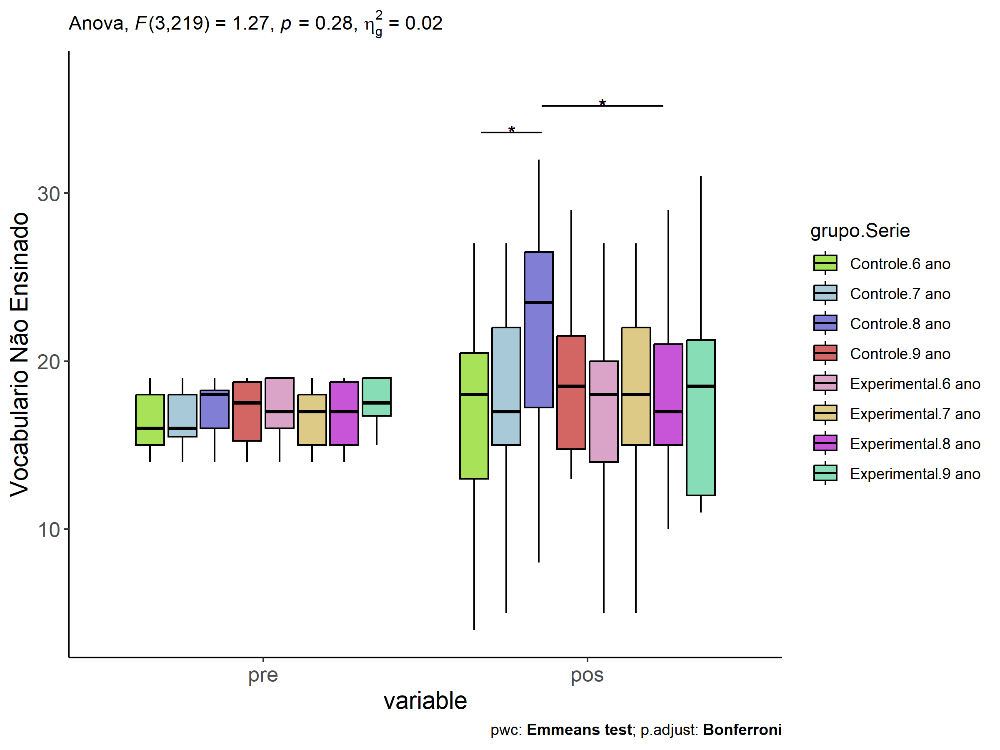<!-- -->

``` r
plots <- twoWayAncovaBoxPlots(
  wdat.long, "vocab.non.teach", c("grupo","Serie"), aov, pwc.long, pre.post = "time",
  theme = "classic", color = color$prepost)
```

``` r
plots[["grupo:Serie"]] + ggplot2::ylab("Vocabulario Não Ensinado")
```

<!-- -->

### Checking linearity assumption

``` r
ggscatter(wdat, x = "vocab.non.teach.pre", y = "vocab.non.teach.pos", size = 0.5,
          facet.by = c("grupo","Serie"), add = "reg.line")+
  stat_regline_equation(
    aes(label =  paste(..eq.label.., ..rr.label.., sep = "~~~~"))
  )
```

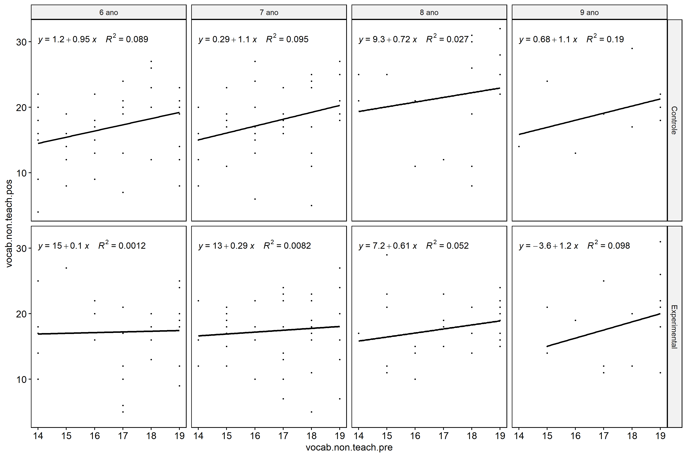<!-- -->

### Checking normality and homogeneity

``` r
res <- augment(lm(vocab.non.teach.pos ~ vocab.non.teach.pre + grupo*Serie, data = wdat))
```

``` r
shapiro_test(res$.resid)
```

    ## # A tibble: 1 × 3
    ##   variable   statistic p.value
    ##   <chr>          <dbl>   <dbl>
    ## 1 res$.resid     0.988  0.0478

``` r
levene_test(res, .resid ~ grupo*Serie)
```

    ## # A tibble: 1 × 4
    ##     df1   df2 statistic     p
    ##   <int> <int>     <dbl> <dbl>
    ## 1     7   220      1.02 0.419

# Summary of Results

## Descriptive Statistics

``` r
df <- get.descriptives(ldat[["grupo"]], c(dv.pre, dv.pos), c("grupo"), 
                       include.global = T, symmetry.test = T, normality.test = F)
df <- plyr::rbind.fill(
  df, do.call(plyr::rbind.fill, lapply(lfatores2, FUN = function(f) {
    if (nrow(dat) > 0 && sum(!is.na(unique(dat[[f]]))) > 1)
      get.descriptives(ldat[[paste0("grupo:",f)]], c(dv.pre,dv.pos), c("grupo", f),
                       symmetry.test = T, normality.test = F)
    }))
)
(df <- df[,c(fatores1[fatores1 %in% colnames(df)],"variable",
             colnames(df)[!colnames(df) %in% c(fatores1,"variable")])])
```

    ##           grupo Sexo   Zona Cor.Raca Serie            variable   n   mean median min max    sd    se
    ## 1      Controle <NA>   <NA>     <NA>  <NA> vocab.non.teach.pre 105 16.638   17.0  14  19 1.716 0.167
    ## 2  Experimental <NA>   <NA>     <NA>  <NA> vocab.non.teach.pre 124 16.935   17.0  14  19 1.666 0.150
    ## 3          <NA> <NA>   <NA>     <NA>  <NA> vocab.non.teach.pre 229 16.799   17.0  14  19 1.692 0.112
    ## 4      Controle <NA>   <NA>     <NA>  <NA> vocab.non.teach.pos 105 17.924   18.0   0  32 6.226 0.608
    ## 5  Experimental <NA>   <NA>     <NA>  <NA> vocab.non.teach.pos 124 17.492   18.0   5  31 5.125 0.460
    ## 6          <NA> <NA>   <NA>     <NA>  <NA> vocab.non.teach.pos 229 17.690   18.0   0  32 5.648 0.373
    ## 7      Controle    F   <NA>     <NA>  <NA> vocab.non.teach.pre  48 16.625   16.0  14  19 1.671 0.241
    ## 8      Controle    M   <NA>     <NA>  <NA> vocab.non.teach.pre  57 16.649   17.0  14  19 1.768 0.234
    ## 9  Experimental    F   <NA>     <NA>  <NA> vocab.non.teach.pre  61 16.852   17.0  14  19 1.662 0.213
    ## 10 Experimental    M   <NA>     <NA>  <NA> vocab.non.teach.pre  63 17.016   17.0  14  19 1.680 0.212
    ## 11     Controle    F   <NA>     <NA>  <NA> vocab.non.teach.pos  48 18.125   17.5   0  32 6.094 0.880
    ## 12     Controle    M   <NA>     <NA>  <NA> vocab.non.teach.pos  57 17.754   19.0   5  31 6.384 0.846
    ## 13 Experimental    F   <NA>     <NA>  <NA> vocab.non.teach.pos  61 18.393   19.0   7  29 4.360 0.558
    ## 14 Experimental    M   <NA>     <NA>  <NA> vocab.non.teach.pos  63 16.619   17.0   5  31 5.669 0.714
    ## 15     Controle <NA>  Rural     <NA>  <NA> vocab.non.teach.pre  53 16.774   17.0  14  19 1.836 0.252
    ## 16     Controle <NA> Urbana     <NA>  <NA> vocab.non.teach.pre  24 16.458   16.0  14  19 1.503 0.307
    ## 17 Experimental <NA>  Rural     <NA>  <NA> vocab.non.teach.pre  54 17.019   17.0  14  19 1.584 0.216
    ## 18 Experimental <NA> Urbana     <NA>  <NA> vocab.non.teach.pre  33 16.909   17.0  14  19 1.665 0.290
    ## 19     Controle <NA>  Rural     <NA>  <NA> vocab.non.teach.pos  53 18.113   19.0   4  30 6.583 0.904
    ## 20     Controle <NA> Urbana     <NA>  <NA> vocab.non.teach.pos  24 18.583   18.0   5  32 4.969 1.014
    ## 21 Experimental <NA>  Rural     <NA>  <NA> vocab.non.teach.pos  54 17.704   18.0   5  31 5.138 0.699
    ## 22 Experimental <NA> Urbana     <NA>  <NA> vocab.non.teach.pos  33 18.182   18.0   7  27 4.633 0.807
    ## 23     Controle <NA>   <NA>   Branca  <NA> vocab.non.teach.pre  11 17.091   18.0  14  19 1.868 0.563
    ## 24     Controle <NA>   <NA>    Parda  <NA> vocab.non.teach.pre  36 16.583   16.5  14  19 1.842 0.307
    ## 25 Experimental <NA>   <NA>   Branca  <NA> vocab.non.teach.pre  12 17.417   18.0  14  19 1.881 0.543
    ## 26 Experimental <NA>   <NA>    Parda  <NA> vocab.non.teach.pre  41 17.049   18.0  14  19 1.731 0.270
    ## 27     Controle <NA>   <NA>   Branca  <NA> vocab.non.teach.pos  11 18.273   20.0   9  25 6.182 1.864
    ## 28     Controle <NA>   <NA>    Parda  <NA> vocab.non.teach.pos  36 18.861   19.5   0  32 7.499 1.250
    ## 29 Experimental <NA>   <NA>   Branca  <NA> vocab.non.teach.pos  12 14.083   15.5   5  20 4.379 1.264
    ## 30 Experimental <NA>   <NA>    Parda  <NA> vocab.non.teach.pos  41 18.610   19.0   7  29 4.868 0.760
    ## 31     Controle <NA>   <NA>     <NA> 6 ano vocab.non.teach.pre  39 16.462   16.0  14  19 1.790 0.287
    ## 32     Controle <NA>   <NA>     <NA> 7 ano vocab.non.teach.pre  39 16.513   16.0  14  19 1.571 0.252
    ## 33     Controle <NA>   <NA>     <NA> 8 ano vocab.non.teach.pre  16 17.250   18.0  14  19 1.732 0.433
    ## 34     Controle <NA>   <NA>     <NA> 9 ano vocab.non.teach.pre  10 16.900   17.5  14  19 2.025 0.640
    ## 35 Experimental <NA>   <NA>     <NA> 6 ano vocab.non.teach.pre  33 16.970   17.0  14  19 1.828 0.318
    ## 36 Experimental <NA>   <NA>     <NA> 7 ano vocab.non.teach.pre  45 16.733   17.0  14  19 1.587 0.237
    ## 37 Experimental <NA>   <NA>     <NA> 8 ano vocab.non.teach.pre  30 16.933   17.0  14  19 1.680 0.307
    ## 38 Experimental <NA>   <NA>     <NA> 9 ano vocab.non.teach.pre  16 17.438   17.5  15  19 1.548 0.387
    ## 39     Controle <NA>   <NA>     <NA> 6 ano vocab.non.teach.pos  39 16.821   18.0   4  27 5.693 0.912
    ## 40     Controle <NA>   <NA>     <NA> 7 ano vocab.non.teach.pos  39 17.667   17.0   5  27 5.362 0.859
    ## 41     Controle <NA>   <NA>     <NA> 8 ano vocab.non.teach.pos  16 21.688   23.5   8  32 7.622 1.906
    ## 42     Controle <NA>   <NA>     <NA> 9 ano vocab.non.teach.pos  10 19.000   18.5  13  29 5.011 1.585
    ## 43 Experimental <NA>   <NA>     <NA> 6 ano vocab.non.teach.pos  33 17.212   18.0   5  27 5.436 0.946
    ## 44 Experimental <NA>   <NA>     <NA> 7 ano vocab.non.teach.pos  45 17.400   18.0   5  27 5.043 0.752
    ## 45 Experimental <NA>   <NA>     <NA> 8 ano vocab.non.teach.pos  30 17.633   17.0  10  29 4.522 0.826
    ## 46 Experimental <NA>   <NA>     <NA> 9 ano vocab.non.teach.pos  16 18.062   18.5  11  31 6.137 1.534
    ##       ci   iqr symmetry      skewness    kurtosis
    ## 1  0.332  3.00      YES -0.1253833850 -1.26768421
    ## 2  0.296  3.00      YES -0.2543054974 -1.25917231
    ## 3  0.220  3.00      YES -0.1990177859 -1.24713006
    ## 4  1.205  8.00      YES -0.2049847568 -0.15522400
    ## 5  0.911  7.00      YES -0.1541893373 -0.23958985
    ## 6  0.735  8.00      YES -0.1662570947 -0.06341882
    ## 7  0.485  3.00      YES  0.0008370624 -1.26194653
    ## 8  0.469  3.00      YES -0.2139069710 -1.33008126
    ## 9  0.426  3.00      YES -0.1338907445 -1.36755089
    ## 10 0.423  2.50      YES -0.3660155946 -1.17930028
    ## 11 1.769  8.00      YES -0.4287306337  0.57975334
    ## 12 1.694  9.00      YES -0.0290750720 -0.73449860
    ## 13 1.117  5.00      YES -0.3619593463 -0.11715942
    ## 14 1.428  8.50      YES  0.1208147180 -0.39842019
    ## 15 0.506  3.00      YES -0.2387910015 -1.37762726
    ## 16 0.635  2.25      YES  0.1870977841 -1.05274873
    ## 17 0.432  2.75      YES -0.2254617057 -1.29298943
    ## 18 0.590  3.00      YES -0.2938860415 -1.26445541
    ## 19 1.814 10.00      YES -0.2093712918 -1.01603813
    ## 20 2.098  3.25      YES  0.0569031116  1.88467042
    ## 21 1.402  6.00      YES  0.0711490974  0.17256420
    ## 22 1.643  5.00      YES -0.3793047115 -0.33780662
    ## 23 1.255  2.50       NO -0.5370149855 -1.30453416
    ## 24 0.623  3.00      YES -0.0887101697 -1.51608726
    ## 25 1.195  2.50       NO -0.5574422313 -1.38687426
    ## 26 0.546  4.00      YES -0.3550642530 -1.40111495
    ## 27 4.153 11.00      YES -0.2208267291 -1.83496861
    ## 28 2.537 10.00       NO -0.5090629877 -0.29304926
    ## 29 2.782  5.25       NO -0.5337165070 -0.82732318
    ## 30 1.536  6.00      YES -0.0562516306 -0.44455384
    ## 31 0.580  3.00      YES  0.0074658370 -1.39583079
    ## 32 0.509  2.50      YES  0.0166722688 -1.09469193
    ## 33 0.923  2.25       NO -0.7216878365 -0.96484375
    ## 34 1.448  3.50      YES -0.3122189164 -1.71256990
    ## 35 0.648  3.00      YES -0.4624695106 -1.21261204
    ## 36 0.477  3.00      YES -0.1029165130 -1.32224417
    ## 37 0.627  3.75      YES -0.0675911474 -1.57263460
    ## 38 0.825  2.25      YES -0.3961934861 -1.40722915
    ## 39 1.846  7.50      YES -0.2197390239 -0.68670526
    ## 40 1.738  7.00      YES -0.3290793692 -0.31060708
    ## 41 4.062  9.25      YES -0.4256253608 -1.22316226
    ## 42 3.585  6.75       NO  0.5388039852 -0.89554781
    ## 43 1.927  6.00      YES -0.3681009929 -0.45110150
    ## 44 1.515  7.00       NO -0.5056380497 -0.35529068
    ## 45 1.688  6.00      YES  0.2360481873 -0.46475625
    ## 46 3.270  9.25      YES  0.4113065166 -1.00702140

| grupo        | Sexo | Zona   | Cor.Raca | Serie | variable            |   n |   mean | median | min | max |    sd |    se |    ci |   iqr | symmetry | skewness | kurtosis |
|:-------------|:-----|:-------|:---------|:------|:--------------------|----:|-------:|-------:|----:|----:|------:|------:|------:|------:|:---------|---------:|---------:|
| Controle     |      |        |          |       | vocab.non.teach.pre | 105 | 16.638 |   17.0 |  14 |  19 | 1.716 | 0.167 | 0.332 |  3.00 | YES      |   -0.125 |   -1.268 |
| Experimental |      |        |          |       | vocab.non.teach.pre | 124 | 16.935 |   17.0 |  14 |  19 | 1.666 | 0.150 | 0.296 |  3.00 | YES      |   -0.254 |   -1.259 |
|              |      |        |          |       | vocab.non.teach.pre | 229 | 16.799 |   17.0 |  14 |  19 | 1.692 | 0.112 | 0.220 |  3.00 | YES      |   -0.199 |   -1.247 |
| Controle     |      |        |          |       | vocab.non.teach.pos | 105 | 17.924 |   18.0 |   0 |  32 | 6.226 | 0.608 | 1.205 |  8.00 | YES      |   -0.205 |   -0.155 |
| Experimental |      |        |          |       | vocab.non.teach.pos | 124 | 17.492 |   18.0 |   5 |  31 | 5.125 | 0.460 | 0.911 |  7.00 | YES      |   -0.154 |   -0.240 |
|              |      |        |          |       | vocab.non.teach.pos | 229 | 17.690 |   18.0 |   0 |  32 | 5.648 | 0.373 | 0.735 |  8.00 | YES      |   -0.166 |   -0.063 |
| Controle     | F    |        |          |       | vocab.non.teach.pre |  48 | 16.625 |   16.0 |  14 |  19 | 1.671 | 0.241 | 0.485 |  3.00 | YES      |    0.001 |   -1.262 |
| Controle     | M    |        |          |       | vocab.non.teach.pre |  57 | 16.649 |   17.0 |  14 |  19 | 1.768 | 0.234 | 0.469 |  3.00 | YES      |   -0.214 |   -1.330 |
| Experimental | F    |        |          |       | vocab.non.teach.pre |  61 | 16.852 |   17.0 |  14 |  19 | 1.662 | 0.213 | 0.426 |  3.00 | YES      |   -0.134 |   -1.368 |
| Experimental | M    |        |          |       | vocab.non.teach.pre |  63 | 17.016 |   17.0 |  14 |  19 | 1.680 | 0.212 | 0.423 |  2.50 | YES      |   -0.366 |   -1.179 |
| Controle     | F    |        |          |       | vocab.non.teach.pos |  48 | 18.125 |   17.5 |   0 |  32 | 6.094 | 0.880 | 1.769 |  8.00 | YES      |   -0.429 |    0.580 |
| Controle     | M    |        |          |       | vocab.non.teach.pos |  57 | 17.754 |   19.0 |   5 |  31 | 6.384 | 0.846 | 1.694 |  9.00 | YES      |   -0.029 |   -0.734 |
| Experimental | F    |        |          |       | vocab.non.teach.pos |  61 | 18.393 |   19.0 |   7 |  29 | 4.360 | 0.558 | 1.117 |  5.00 | YES      |   -0.362 |   -0.117 |
| Experimental | M    |        |          |       | vocab.non.teach.pos |  63 | 16.619 |   17.0 |   5 |  31 | 5.669 | 0.714 | 1.428 |  8.50 | YES      |    0.121 |   -0.398 |
| Controle     |      | Rural  |          |       | vocab.non.teach.pre |  53 | 16.774 |   17.0 |  14 |  19 | 1.836 | 0.252 | 0.506 |  3.00 | YES      |   -0.239 |   -1.378 |
| Controle     |      | Urbana |          |       | vocab.non.teach.pre |  24 | 16.458 |   16.0 |  14 |  19 | 1.503 | 0.307 | 0.635 |  2.25 | YES      |    0.187 |   -1.053 |
| Experimental |      | Rural  |          |       | vocab.non.teach.pre |  54 | 17.019 |   17.0 |  14 |  19 | 1.584 | 0.216 | 0.432 |  2.75 | YES      |   -0.225 |   -1.293 |
| Experimental |      | Urbana |          |       | vocab.non.teach.pre |  33 | 16.909 |   17.0 |  14 |  19 | 1.665 | 0.290 | 0.590 |  3.00 | YES      |   -0.294 |   -1.264 |
| Controle     |      | Rural  |          |       | vocab.non.teach.pos |  53 | 18.113 |   19.0 |   4 |  30 | 6.583 | 0.904 | 1.814 | 10.00 | YES      |   -0.209 |   -1.016 |
| Controle     |      | Urbana |          |       | vocab.non.teach.pos |  24 | 18.583 |   18.0 |   5 |  32 | 4.969 | 1.014 | 2.098 |  3.25 | YES      |    0.057 |    1.885 |
| Experimental |      | Rural  |          |       | vocab.non.teach.pos |  54 | 17.704 |   18.0 |   5 |  31 | 5.138 | 0.699 | 1.402 |  6.00 | YES      |    0.071 |    0.173 |
| Experimental |      | Urbana |          |       | vocab.non.teach.pos |  33 | 18.182 |   18.0 |   7 |  27 | 4.633 | 0.807 | 1.643 |  5.00 | YES      |   -0.379 |   -0.338 |
| Controle     |      |        | Branca   |       | vocab.non.teach.pre |  11 | 17.091 |   18.0 |  14 |  19 | 1.868 | 0.563 | 1.255 |  2.50 | NO       |   -0.537 |   -1.305 |
| Controle     |      |        | Parda    |       | vocab.non.teach.pre |  36 | 16.583 |   16.5 |  14 |  19 | 1.842 | 0.307 | 0.623 |  3.00 | YES      |   -0.089 |   -1.516 |
| Experimental |      |        | Branca   |       | vocab.non.teach.pre |  12 | 17.417 |   18.0 |  14 |  19 | 1.881 | 0.543 | 1.195 |  2.50 | NO       |   -0.557 |   -1.387 |
| Experimental |      |        | Parda    |       | vocab.non.teach.pre |  41 | 17.049 |   18.0 |  14 |  19 | 1.731 | 0.270 | 0.546 |  4.00 | YES      |   -0.355 |   -1.401 |
| Controle     |      |        | Branca   |       | vocab.non.teach.pos |  11 | 18.273 |   20.0 |   9 |  25 | 6.182 | 1.864 | 4.153 | 11.00 | YES      |   -0.221 |   -1.835 |
| Controle     |      |        | Parda    |       | vocab.non.teach.pos |  36 | 18.861 |   19.5 |   0 |  32 | 7.499 | 1.250 | 2.537 | 10.00 | NO       |   -0.509 |   -0.293 |
| Experimental |      |        | Branca   |       | vocab.non.teach.pos |  12 | 14.083 |   15.5 |   5 |  20 | 4.379 | 1.264 | 2.782 |  5.25 | NO       |   -0.534 |   -0.827 |
| Experimental |      |        | Parda    |       | vocab.non.teach.pos |  41 | 18.610 |   19.0 |   7 |  29 | 4.868 | 0.760 | 1.536 |  6.00 | YES      |   -0.056 |   -0.445 |
| Controle     |      |        |          | 6 ano | vocab.non.teach.pre |  39 | 16.462 |   16.0 |  14 |  19 | 1.790 | 0.287 | 0.580 |  3.00 | YES      |    0.007 |   -1.396 |
| Controle     |      |        |          | 7 ano | vocab.non.teach.pre |  39 | 16.513 |   16.0 |  14 |  19 | 1.571 | 0.252 | 0.509 |  2.50 | YES      |    0.017 |   -1.095 |
| Controle     |      |        |          | 8 ano | vocab.non.teach.pre |  16 | 17.250 |   18.0 |  14 |  19 | 1.732 | 0.433 | 0.923 |  2.25 | NO       |   -0.722 |   -0.965 |
| Controle     |      |        |          | 9 ano | vocab.non.teach.pre |  10 | 16.900 |   17.5 |  14 |  19 | 2.025 | 0.640 | 1.448 |  3.50 | YES      |   -0.312 |   -1.713 |
| Experimental |      |        |          | 6 ano | vocab.non.teach.pre |  33 | 16.970 |   17.0 |  14 |  19 | 1.828 | 0.318 | 0.648 |  3.00 | YES      |   -0.462 |   -1.213 |
| Experimental |      |        |          | 7 ano | vocab.non.teach.pre |  45 | 16.733 |   17.0 |  14 |  19 | 1.587 | 0.237 | 0.477 |  3.00 | YES      |   -0.103 |   -1.322 |
| Experimental |      |        |          | 8 ano | vocab.non.teach.pre |  30 | 16.933 |   17.0 |  14 |  19 | 1.680 | 0.307 | 0.627 |  3.75 | YES      |   -0.068 |   -1.573 |
| Experimental |      |        |          | 9 ano | vocab.non.teach.pre |  16 | 17.438 |   17.5 |  15 |  19 | 1.548 | 0.387 | 0.825 |  2.25 | YES      |   -0.396 |   -1.407 |
| Controle     |      |        |          | 6 ano | vocab.non.teach.pos |  39 | 16.821 |   18.0 |   4 |  27 | 5.693 | 0.912 | 1.846 |  7.50 | YES      |   -0.220 |   -0.687 |
| Controle     |      |        |          | 7 ano | vocab.non.teach.pos |  39 | 17.667 |   17.0 |   5 |  27 | 5.362 | 0.859 | 1.738 |  7.00 | YES      |   -0.329 |   -0.311 |
| Controle     |      |        |          | 8 ano | vocab.non.teach.pos |  16 | 21.688 |   23.5 |   8 |  32 | 7.622 | 1.906 | 4.062 |  9.25 | YES      |   -0.426 |   -1.223 |
| Controle     |      |        |          | 9 ano | vocab.non.teach.pos |  10 | 19.000 |   18.5 |  13 |  29 | 5.011 | 1.585 | 3.585 |  6.75 | NO       |    0.539 |   -0.896 |
| Experimental |      |        |          | 6 ano | vocab.non.teach.pos |  33 | 17.212 |   18.0 |   5 |  27 | 5.436 | 0.946 | 1.927 |  6.00 | YES      |   -0.368 |   -0.451 |
| Experimental |      |        |          | 7 ano | vocab.non.teach.pos |  45 | 17.400 |   18.0 |   5 |  27 | 5.043 | 0.752 | 1.515 |  7.00 | NO       |   -0.506 |   -0.355 |
| Experimental |      |        |          | 8 ano | vocab.non.teach.pos |  30 | 17.633 |   17.0 |  10 |  29 | 4.522 | 0.826 | 1.688 |  6.00 | YES      |    0.236 |   -0.465 |
| Experimental |      |        |          | 9 ano | vocab.non.teach.pos |  16 | 18.062 |   18.5 |  11 |  31 | 6.137 | 1.534 | 3.270 |  9.25 | YES      |    0.411 |   -1.007 |

## ANCOVA Table Comparison

``` r
df <- do.call(plyr::rbind.fill, laov)
(df <- df[!duplicated(df$Effect),])
```

    ##                 Effect DFn DFd      F        p p<.05      ges DFn' DFd'     F'       p' p<.05'     ges'
    ## 1                grupo   1 226  0.797 0.373000       4.00e-03    1  226  0.797 0.373000        4.00e-03
    ## 2  vocab.non.teach.pre   1 226 12.106 0.000603     * 5.10e-02    1  226 12.106 0.000603      * 5.10e-02
    ## 4           grupo:Sexo   1 224  1.068 0.303000       5.00e-03    1  224  1.068 0.303000        5.00e-03
    ## 5                 Sexo   1 224  2.756 0.098000       1.20e-02    1  224  2.756 0.098000        1.20e-02
    ## 8           grupo:Zona   1 159  0.011 0.915000       7.19e-05    1  159  0.011 0.915000        7.19e-05
    ## 10                Zona   1 159  0.578 0.448000       4.00e-03    1  159  0.578 0.448000        4.00e-03
    ## 11            Cor.Raca   1  95  4.873 0.030000     * 4.90e-02    1   95  4.873 0.030000      * 4.90e-02
    ## 13      grupo:Cor.Raca   1  95  1.884 0.173000       1.90e-02    1   95  1.884 0.173000        1.90e-02
    ## 16         grupo:Serie   3 219  1.275 0.284000       1.70e-02    3  220  0.565 0.639000        8.00e-03
    ## 17               Serie   3 219  1.317 0.270000       1.80e-02    3  220  0.788 0.501000        1.10e-02

|     | Effect              | DFn | DFd |      F |     p | p\<.05 |   ges | DFn’ | DFd’ |     F’ |    p’ | p\<.05’ |  ges’ |
|:----|:--------------------|----:|----:|-------:|------:|:-------|------:|-----:|-----:|-------:|------:|:--------|------:|
| 1   | grupo               |   1 | 226 |  0.797 | 0.373 |        | 0.004 |    1 |  226 |  0.797 | 0.373 |         | 0.004 |
| 2   | vocab.non.teach.pre |   1 | 226 | 12.106 | 0.001 | \*     | 0.051 |    1 |  226 | 12.106 | 0.001 | \*      | 0.051 |
| 4   | grupo:Sexo          |   1 | 224 |  1.068 | 0.303 |        | 0.005 |    1 |  224 |  1.068 | 0.303 |         | 0.005 |
| 5   | Sexo                |   1 | 224 |  2.756 | 0.098 |        | 0.012 |    1 |  224 |  2.756 | 0.098 |         | 0.012 |
| 8   | grupo:Zona          |   1 | 159 |  0.011 | 0.915 |        | 0.000 |    1 |  159 |  0.011 | 0.915 |         | 0.000 |
| 10  | Zona                |   1 | 159 |  0.578 | 0.448 |        | 0.004 |    1 |  159 |  0.578 | 0.448 |         | 0.004 |
| 11  | Cor.Raca            |   1 |  95 |  4.873 | 0.030 | \*     | 0.049 |    1 |   95 |  4.873 | 0.030 | \*      | 0.049 |
| 13  | grupo:Cor.Raca      |   1 |  95 |  1.884 | 0.173 |        | 0.019 |    1 |   95 |  1.884 | 0.173 |         | 0.019 |
| 16  | grupo:Serie         |   3 | 219 |  1.275 | 0.284 |        | 0.017 |    3 |  220 |  0.565 | 0.639 |         | 0.008 |
| 17  | Serie               |   3 | 219 |  1.317 | 0.270 |        | 0.018 |    3 |  220 |  0.788 | 0.501 |         | 0.011 |

## PairWise Table Comparison

``` r
df <- do.call(plyr::rbind.fill, lpwc)
df <- df[,c(names(lfatores), names(df)[!names(df) %in% c(names(lfatores),"term",".y.")])]
```

| grupo        | Sexo | Zona   | Cor.Raca | Serie | group1   | group2       |  df | statistic |     p | p.adj | p.adj.signif | df’ | statistic’ |    p’ | p.adj’ | p.adj.signif’ |
|:-------------|:-----|:-------|:---------|:------|:---------|:-------------|----:|----------:|------:|------:|:-------------|----:|-----------:|------:|-------:|:--------------|
| Controle     |      |        |          |       | pre      | pos          | 454 |    -2.232 | 0.026 | 0.026 | \*           | 454 |     -2.232 | 0.026 |  0.026 | \*            |
| Experimental |      |        |          |       | pre      | pos          | 454 |    -1.050 | 0.294 | 0.294 | ns           | 454 |     -1.050 | 0.294 |  0.294 | ns            |
|              |      |        |          |       | Controle | Experimental | 226 |     0.893 | 0.373 | 0.373 | ns           | 226 |      0.893 | 0.373 |  0.373 | ns            |
| Controle     | F    |        |          |       | pre      | pos          | 450 |    -1.764 | 0.078 | 0.078 | ns           | 450 |     -1.764 | 0.078 |  0.078 | ns            |
| Controle     | M    |        |          |       | pre      | pos          | 450 |    -1.417 | 0.157 | 0.157 | ns           | 450 |     -1.417 | 0.157 |  0.157 | ns            |
| Controle     |      |        |          |       | F        | M            | 224 |     0.361 | 0.718 | 0.718 | ns           | 224 |      0.361 | 0.718 |  0.718 | ns            |
| Experimental | F    |        |          |       | pre      | pos          | 450 |    -2.043 | 0.042 | 0.042 | \*           | 450 |     -2.043 | 0.042 |  0.042 | \*            |
| Experimental | M    |        |          |       | pre      | pos          | 450 |     0.535 | 0.593 | 0.593 | ns           | 450 |      0.535 | 0.593 |  0.593 | ns            |
| Experimental |      |        |          |       | F        | M            | 224 |     1.922 | 0.056 | 0.056 | ns           | 224 |      1.922 | 0.056 |  0.056 | ns            |
|              | F    |        |          |       | Controle | Experimental | 224 |    -0.088 | 0.930 | 0.930 | ns           | 224 |     -0.088 | 0.930 |  0.930 | ns            |
|              | M    |        |          |       | Controle | Experimental | 224 |     1.406 | 0.161 | 0.161 | ns           | 224 |      1.406 | 0.161 |  0.161 | ns            |
| Controle     |      |        |          |       | Rural    | Urbana       | 159 |    -0.588 | 0.558 | 0.558 | ns           | 159 |     -0.588 | 0.558 |  0.558 | ns            |
| Controle     |      | Rural  |          |       | pre      | pos          | 320 |    -1.686 | 0.093 | 0.093 | ns           | 320 |     -1.686 | 0.093 |  0.093 | ns            |
| Controle     |      | Urbana |          |       | pre      | pos          | 320 |    -1.799 | 0.073 | 0.073 | ns           | 320 |     -1.799 | 0.073 |  0.073 | ns            |
| Experimental |      |        |          |       | Rural    | Urbana       | 159 |    -0.495 | 0.621 | 0.621 | ns           | 159 |     -0.495 | 0.621 |  0.621 | ns            |
| Experimental |      | Rural  |          |       | pre      | pos          | 320 |    -0.870 | 0.385 | 0.385 | ns           | 320 |     -0.870 | 0.385 |  0.385 | ns            |
| Experimental |      | Urbana |          |       | pre      | pos          | 320 |    -1.264 | 0.207 | 0.207 | ns           | 320 |     -1.264 | 0.207 |  0.207 | ns            |
|              |      | Rural  |          |       | Controle | Experimental | 159 |     0.624 | 0.534 | 0.534 | ns           | 159 |      0.624 | 0.534 |  0.534 | ns            |
|              |      | Urbana |          |       | Controle | Experimental | 159 |     0.580 | 0.562 | 0.562 | ns           | 159 |      0.580 | 0.562 |  0.562 | ns            |
| Controle     |      |        | Branca   |       | pre      | pos          | 192 |    -0.621 | 0.535 | 0.535 | ns           | 192 |     -0.621 | 0.535 |  0.535 | ns            |
| Controle     |      |        |          |       | Branca   | Parda        |  95 |    -0.533 | 0.595 | 0.595 | ns           |  95 |     -0.533 | 0.595 |  0.595 | ns            |
| Controle     |      |        | Parda    |       | pre      | pos          | 192 |    -2.166 | 0.032 | 0.032 | \*           | 192 |     -2.166 | 0.032 |  0.032 | \*            |
| Experimental |      |        | Branca   |       | pre      | pos          | 192 |     1.830 | 0.069 | 0.069 | ns           | 192 |      1.830 | 0.069 |  0.069 | ns            |
| Experimental |      |        |          |       | Branca   | Parda        |  95 |    -2.547 | 0.012 | 0.012 | \*           |  95 |     -2.547 | 0.012 |  0.012 | \*            |
| Experimental |      |        | Parda    |       | pre      | pos          | 192 |    -1.584 | 0.115 | 0.115 | ns           | 192 |     -1.584 | 0.115 |  0.115 | ns            |
|              |      |        | Branca   |       | Controle | Experimental |  95 |     1.849 | 0.067 | 0.067 | ns           |  95 |      1.849 | 0.067 |  0.067 | ns            |
|              |      |        | Parda    |       | Controle | Experimental |  95 |     0.520 | 0.604 | 0.604 | ns           |  95 |      0.520 | 0.604 |  0.604 | ns            |
| Controle     |      |        |          | 6 ano | pre      | pos          | 440 |    -0.390 | 0.697 | 0.697 | ns           | 442 |     -0.379 | 0.705 |  0.705 | ns            |
| Controle     |      |        |          | 7 ano | pre      | pos          | 440 |    -1.253 | 0.211 | 0.211 | ns           | 442 |     -1.219 | 0.223 |  0.223 | ns            |
| Controle     |      |        |          | 8 ano | pre      | pos          | 440 |    -3.086 | 0.002 | 0.002 | \*\*         | 442 |     -2.257 | 0.025 |  0.025 | \*            |
| Controle     |      |        |          | 9 ano | pre      | pos          | 440 |    -1.155 | 0.249 | 0.249 | ns           | 442 |     -1.124 | 0.262 |  0.262 | ns            |
| Controle     |      |        |          |       | 6 ano    | 7 ano        | 219 |    -0.665 | 0.507 | 1.000 | ns           | 220 |     -0.645 | 0.520 |  1.000 | ns            |
| Controle     |      |        |          |       | 6 ano    | 8 ano        | 219 |    -2.697 | 0.008 | 0.045 | \*           | 220 |     -1.905 | 0.058 |  0.349 | ns            |
| Controle     |      |        |          |       | 6 ano    | 9 ano        | 219 |    -0.986 | 0.325 | 1.000 | ns           | 220 |     -0.949 | 0.343 |  1.000 | ns            |
| Controle     |      |        |          |       | 7 ano    | 8 ano        | 219 |    -2.194 | 0.029 | 0.176 | ns           | 220 |     -1.405 | 0.161 |  0.968 | ns            |
| Controle     |      |        |          |       | 7 ano    | 9 ano        | 219 |    -0.562 | 0.575 | 1.000 | ns           | 220 |     -0.538 | 0.591 |  1.000 | ns            |
| Controle     |      |        |          |       | 8 ano    | 9 ano        | 219 |     1.129 | 0.260 | 1.000 | ns           | 220 |      0.550 | 0.583 |  1.000 | ns            |
| Experimental |      |        |          | 6 ano | pre      | pos          | 440 |    -0.242 | 0.809 | 0.809 | ns           | 442 |     -0.236 | 0.814 |  0.814 | ns            |
| Experimental |      |        |          | 7 ano | pre      | pos          | 440 |    -0.778 | 0.437 | 0.437 | ns           | 442 |     -0.757 | 0.450 |  0.450 | ns            |
| Experimental |      |        |          | 8 ano | pre      | pos          | 440 |    -0.667 | 0.505 | 0.505 | ns           | 442 |     -0.649 | 0.517 |  0.517 | ns            |
| Experimental |      |        |          | 9 ano | pre      | pos          | 440 |    -0.435 | 0.664 | 0.664 | ns           | 442 |     -0.423 | 0.673 |  0.673 | ns            |
| Experimental |      |        |          |       | 6 ano    | 7 ano        | 219 |    -0.280 | 0.780 | 1.000 | ns           | 220 |     -0.279 | 0.780 |  1.000 | ns            |
| Experimental |      |        |          |       | 6 ano    | 8 ano        | 219 |    -0.328 | 0.743 | 1.000 | ns           | 220 |     -0.319 | 0.750 |  1.000 | ns            |
| Experimental |      |        |          |       | 6 ano    | 9 ano        | 219 |    -0.326 | 0.744 | 1.000 | ns           | 220 |     -0.307 | 0.759 |  1.000 | ns            |
| Experimental |      |        |          |       | 7 ano    | 8 ano        | 219 |    -0.078 | 0.938 | 1.000 | ns           | 220 |     -0.070 | 0.944 |  1.000 | ns            |
| Experimental |      |        |          |       | 7 ano    | 9 ano        | 219 |    -0.121 | 0.904 | 1.000 | ns           | 220 |     -0.101 | 0.920 |  1.000 | ns            |
| Experimental |      |        |          |       | 8 ano    | 9 ano        | 219 |    -0.055 | 0.956 | 1.000 | ns           | 220 |     -0.042 | 0.967 |  1.000 | ns            |
|              |      |        |          | 6 ano | Controle | Experimental | 219 |    -0.040 | 0.968 | 0.968 | ns           | 220 |     -0.024 | 0.981 |  0.981 | ns            |
|              |      |        |          | 7 ano | Controle | Experimental | 219 |     0.351 | 0.726 | 0.726 | ns           | 220 |      0.348 | 0.728 |  0.728 | ns            |
|              |      |        |          | 8 ano | Controle | Experimental | 219 |     2.301 | 0.022 | 0.022 | \*           | 220 |      1.547 | 0.123 |  0.123 | ns            |
|              |      |        |          | 9 ano | Controle | Experimental | 219 |     0.596 | 0.551 | 0.551 | ns           | 220 |      0.589 | 0.557 |  0.557 | ns            |

## EMMS Table Comparison

``` r
df <- do.call(plyr::rbind.fill, lemms)
df[["N-N'"]] <- df[["N"]] - df[["N'"]]
df <- df[,c(names(lfatores), names(df)[!names(df) %in% names(lfatores)])]
```

| grupo        | Sexo | Zona   | Cor.Raca | Serie |   N | M (pre) | SE (pre) | M (unadj) | SE (unadj) | M (adj) | SE (adj) |  N’ | M (pre)’ | SE (pre)’ | M (unadj)’ | SE (unadj)’ | M (adj)’ | SE (adj)’ | N-N’ |
|:-------------|:-----|:-------|:---------|:------|----:|--------:|---------:|----------:|-----------:|--------:|---------:|----:|---------:|----------:|-----------:|------------:|---------:|----------:|-----:|
| Controle     |      |        |          |       | 105 |  16.638 |    0.167 |    17.924 |      0.608 |  18.045 |    0.540 | 105 |   16.638 |     0.167 |     17.924 |       0.608 |   18.045 |     0.540 |    0 |
| Experimental |      |        |          |       | 124 |  16.935 |    0.150 |    17.492 |      0.460 |  17.389 |    0.497 | 124 |   16.935 |     0.150 |     17.492 |       0.460 |   17.389 |     0.497 |    0 |
| Controle     | F    |        |          |       |  48 |  16.625 |    0.241 |    18.125 |      0.880 |  18.259 |    0.795 |  48 |   16.625 |     0.241 |     18.125 |       0.880 |   18.259 |     0.795 |    0 |
| Controle     | M    |        |          |       |  57 |  16.649 |    0.234 |    17.754 |      0.846 |  17.870 |    0.729 |  57 |   16.649 |     0.234 |     17.754 |       0.846 |   17.870 |     0.729 |    0 |
| Experimental | F    |        |          |       |  61 |  16.852 |    0.213 |    18.393 |      0.558 |  18.352 |    0.704 |  61 |   16.852 |     0.213 |     18.393 |       0.558 |   18.352 |     0.704 |    0 |
| Experimental | M    |        |          |       |  63 |  17.016 |    0.212 |    16.619 |      0.714 |  16.452 |    0.695 |  63 |   17.016 |     0.212 |     16.619 |       0.714 |   16.452 |     0.695 |    0 |
| Controle     |      | Rural  |          |       |  53 |  16.774 |    0.252 |    18.113 |      0.904 |  18.172 |    0.731 |  53 |   16.774 |     0.252 |     18.113 |       0.904 |   18.172 |     0.731 |    0 |
| Controle     |      | Urbana |          |       |  24 |  16.458 |    0.307 |    18.583 |      1.014 |  18.943 |    1.090 |  24 |   16.458 |     0.307 |     18.583 |       1.014 |   18.943 |     1.090 |    0 |
| Experimental |      | Rural  |          |       |  54 |  17.019 |    0.216 |    17.704 |      0.699 |  17.529 |    0.725 |  54 |   17.019 |     0.216 |     17.704 |       0.699 |   17.529 |     0.725 |    0 |
| Experimental |      | Urbana |          |       |  33 |  16.909 |    0.290 |    18.182 |      0.807 |  18.112 |    0.926 |  33 |   16.909 |     0.290 |     18.182 |       0.807 |   18.112 |     0.926 |    0 |
| Controle     |      |        | Branca   |       |  11 |  17.091 |    0.563 |    18.273 |      1.864 |  18.119 |    1.757 |  11 |   17.091 |     0.563 |     18.273 |       1.864 |   18.119 |     1.757 |    0 |
| Controle     |      |        | Parda    |       |  36 |  16.583 |    0.307 |    18.861 |      1.250 |  19.193 |    0.977 |  36 |   16.583 |     0.307 |     18.861 |       1.250 |   19.193 |     0.977 |    0 |
| Experimental |      |        | Branca   |       |  12 |  17.417 |    0.543 |    14.083 |      1.264 |  13.618 |    1.689 |  12 |   17.417 |     0.543 |     14.083 |       1.264 |   13.618 |     1.689 |    0 |
| Experimental |      |        | Parda    |       |  41 |  17.049 |    0.270 |    18.610 |      0.760 |  18.496 |    0.911 |  41 |   17.049 |     0.270 |     18.610 |       0.760 |   18.496 |     0.911 |    0 |
| Controle     |      |        |          | 6 ano |  39 |  16.462 |    0.287 |    16.821 |      0.912 |  17.049 |    0.866 |  39 |   16.462 |     0.287 |     16.821 |       0.912 |   17.060 |     0.891 |    0 |
| Controle     |      |        |          | 7 ano |  39 |  16.513 |    0.252 |    17.667 |      0.859 |  17.861 |    0.865 |  39 |   16.513 |     0.252 |     17.667 |       0.859 |   17.870 |     0.890 |    0 |
| Controle     |      |        |          | 8 ano |  16 |  17.250 |    0.433 |    21.688 |      1.906 |  21.388 |    1.351 |  17 |   17.176 |     0.413 |     20.412 |       2.198 |   20.144 |     1.348 |   -1 |
| Controle     |      |        |          | 9 ano |  10 |  16.900 |    0.640 |    19.000 |      1.585 |  18.935 |    1.704 |  10 |   16.900 |     0.640 |     19.000 |       1.585 |   18.929 |     1.754 |    0 |
| Experimental |      |        |          | 6 ano |  33 |  16.970 |    0.318 |    17.212 |      0.946 |  17.100 |    0.939 |  33 |   16.970 |     0.318 |     17.212 |       0.946 |   17.091 |     0.966 |    0 |
| Experimental |      |        |          | 7 ano |  45 |  16.733 |    0.237 |    17.400 |      0.752 |  17.446 |    0.803 |  45 |   16.733 |     0.237 |     17.400 |       0.752 |   17.447 |     0.827 |    0 |
| Experimental |      |        |          | 8 ano |  30 |  16.933 |    0.307 |    17.633 |      0.826 |  17.546 |    0.984 |  30 |   16.933 |     0.307 |     17.633 |       0.826 |   17.538 |     1.013 |    0 |
| Experimental |      |        |          | 9 ano |  16 |  17.438 |    0.387 |    18.062 |      1.534 |  17.637 |    1.354 |  16 |   17.438 |     0.387 |     18.062 |       1.534 |   17.610 |     1.394 |    0 |
