ANCOVA in Vocabulario Não Ensinado (Vocabulario Não Ensinado)
================
Geiser C. Challco <geiser@alumni.usp.br>

- [Descriptive Statistics of Initial
  Data](#descriptive-statistics-of-initial-data)
- [ANCOVA and Pairwise for one factor:
  **grupo**](#ancova-and-pairwise-for-one-factor-grupo)
  - [Without remove non-normal data](#without-remove-non-normal-data)
  - [Computing ANCOVA and PairWise After removing non-normal data
    (OK)](#computing-ancova-and-pairwise-after-removing-non-normal-data-ok)
    - [Plots for ancova](#plots-for-ancova)
    - [Checking linearity assumption](#checking-linearity-assumption)
    - [Checking normality and
      homogeneity](#checking-normality-and-homogeneity)
- [ANCOVA and Pairwise for two factors
  **grupo:Sexo**](#ancova-and-pairwise-for-two-factors-gruposexo)
  - [Without remove non-normal data](#without-remove-non-normal-data-1)
  - [Computing ANCOVA and PairWise After removing non-normal data
    (OK)](#computing-ancova-and-pairwise-after-removing-non-normal-data-ok-1)
    - [Plots for ancova](#plots-for-ancova-1)
    - [Checking linearity assumption](#checking-linearity-assumption-1)
    - [Checking normality and
      homogeneity](#checking-normality-and-homogeneity-1)
- [ANCOVA and Pairwise for two factors
  **grupo:Zona**](#ancova-and-pairwise-for-two-factors-grupozona)
  - [Without remove non-normal data](#without-remove-non-normal-data-2)
  - [Computing ANCOVA and PairWise After removing non-normal data
    (OK)](#computing-ancova-and-pairwise-after-removing-non-normal-data-ok-2)
    - [Plots for ancova](#plots-for-ancova-2)
    - [Checking linearity assumption](#checking-linearity-assumption-2)
    - [Checking normality and
      homogeneity](#checking-normality-and-homogeneity-2)
- [ANCOVA and Pairwise for two factors
  **grupo:Cor.Raca**](#ancova-and-pairwise-for-two-factors-grupocorraca)
  - [Without remove non-normal data](#without-remove-non-normal-data-3)
  - [Computing ANCOVA and PairWise After removing non-normal data
    (OK)](#computing-ancova-and-pairwise-after-removing-non-normal-data-ok-3)
    - [Plots for ancova](#plots-for-ancova-3)
    - [Checking linearity assumption](#checking-linearity-assumption-3)
    - [Checking normality and
      homogeneity](#checking-normality-and-homogeneity-3)
- [ANCOVA and Pairwise for two factors
  **grupo:Serie**](#ancova-and-pairwise-for-two-factors-gruposerie)
  - [Without remove non-normal data](#without-remove-non-normal-data-4)
  - [Computing ANCOVA and PairWise After removing non-normal data
    (OK)](#computing-ancova-and-pairwise-after-removing-non-normal-data-ok-4)
    - [Plots for ancova](#plots-for-ancova-4)
    - [Checking linearity assumption](#checking-linearity-assumption-4)
    - [Checking normality and
      homogeneity](#checking-normality-and-homogeneity-4)
- [Summary of Results](#summary-of-results)
  - [Descriptive Statistics](#descriptive-statistics)
  - [ANCOVA Table Comparison](#ancova-table-comparison)
  - [PairWise Table Comparison](#pairwise-table-comparison)
  - [EMMS Table Comparison](#emms-table-comparison)

**NOTE**:

- Teste ANCOVA para determinar se houve diferenças significativas no
  Vocabulario Não Ensinado (medido usando pre- e pos-testes).
- ANCOVA test to determine whether there were significant differences in
  Vocabulario Não Ensinado (measured using pre- and post-tests).

# Descriptive Statistics of Initial Data

``` r
df <- get.descriptives(dat, c(dv.pre, dv.pos), c("grupo"), 
                       include.global = T, symmetry.test = T, normality.test = F)
df <- plyr::rbind.fill(
  df, do.call(plyr::rbind.fill, lapply(lfatores2, FUN = function(f) {
    if (nrow(dat) > 0 && sum(!is.na(unique(dat[[f]]))) > 1)
      get.descriptives(dat, c(dv.pre,dv.pos), c("grupo", f),
                       symmetry.test = T, normality.test = F)
    }))
)
```

    ## Warning: There was 1 warning in `mutate()`.
    ## ℹ In argument: `ci = abs(stats::qt(alpha/2, .data$n - 1) * .data$se)`.
    ## Caused by warning:
    ## ! There was 1 warning in `mutate()`.
    ## ℹ In argument: `ci = abs(stats::qt(alpha/2, .data$n - 1) * .data$se)`.
    ## Caused by warning in `stats::qt()`:
    ## ! NaNs produced
    ## There was 1 warning in `mutate()`.
    ## ℹ In argument: `ci = abs(stats::qt(alpha/2, .data$n - 1) * .data$se)`.
    ## Caused by warning:
    ## ! There was 1 warning in `mutate()`.
    ## ℹ In argument: `ci = abs(stats::qt(alpha/2, .data$n - 1) * .data$se)`.
    ## Caused by warning in `stats::qt()`:
    ## ! NaNs produced

``` r
(df <- df[,c(fatores1[fatores1 %in% colnames(df)],"variable",
             colnames(df)[!colnames(df) %in% c(fatores1,"variable")])])
```

    ##           grupo Sexo   Zona Cor.Raca Serie            variable   n   mean median min max    sd    se
    ## 1      Controle <NA>   <NA>     <NA>  <NA> vocab.non.teach.pre 110 22.182   22.0  20  24 1.441 0.137
    ## 2  Experimental <NA>   <NA>     <NA>  <NA> vocab.non.teach.pre 167 21.988   22.0  20  24 1.439 0.111
    ## 3          <NA> <NA>   <NA>     <NA>  <NA> vocab.non.teach.pre 277 22.065   22.0  20  24 1.441 0.087
    ## 4      Controle <NA>   <NA>     <NA>  <NA> vocab.non.teach.pos 110 23.345   24.0   7  35 5.178 0.494
    ## 5  Experimental <NA>   <NA>     <NA>  <NA> vocab.non.teach.pos 167 22.940   23.0   2  35 5.527 0.428
    ## 6          <NA> <NA>   <NA>     <NA>  <NA> vocab.non.teach.pos 277 23.101   24.0   2  35 5.386 0.324
    ## 7      Controle    F   <NA>     <NA>  <NA> vocab.non.teach.pre  65 22.138   22.0  20  24 1.467 0.182
    ## 8      Controle    M   <NA>     <NA>  <NA> vocab.non.teach.pre  45 22.244   22.0  20  24 1.417 0.211
    ## 9  Experimental    F   <NA>     <NA>  <NA> vocab.non.teach.pre  90 21.956   22.0  20  24 1.398 0.147
    ## 10 Experimental    M   <NA>     <NA>  <NA> vocab.non.teach.pre  77 22.026   22.0  20  24 1.495 0.170
    ## 11     Controle    F   <NA>     <NA>  <NA> vocab.non.teach.pos  65 23.877   24.0   7  35 5.272 0.654
    ## 12     Controle    M   <NA>     <NA>  <NA> vocab.non.teach.pos  45 22.578   23.0  10  33 4.998 0.745
    ## 13 Experimental    F   <NA>     <NA>  <NA> vocab.non.teach.pos  90 23.211   23.0   6  34 5.276 0.556
    ## 14 Experimental    M   <NA>     <NA>  <NA> vocab.non.teach.pos  77 22.623   23.0   2  35 5.827 0.664
    ## 15     Controle <NA>  Rural     <NA>  <NA> vocab.non.teach.pre  62 22.419   22.5  20  24 1.362 0.173
    ## 16     Controle <NA> Urbana     <NA>  <NA> vocab.non.teach.pre  19 21.684   21.0  20  24 1.416 0.325
    ## 17     Controle <NA>   <NA>     <NA>  <NA> vocab.non.teach.pre  29 22.000   22.0  20  24 1.558 0.289
    ## 18 Experimental <NA>  Rural     <NA>  <NA> vocab.non.teach.pre  77 22.052   22.0  20  24 1.503 0.171
    ## 19 Experimental <NA> Urbana     <NA>  <NA> vocab.non.teach.pre  44 22.068   22.0  20  24 1.388 0.209
    ## 20 Experimental <NA>   <NA>     <NA>  <NA> vocab.non.teach.pre  46 21.804   22.0  20  24 1.392 0.205
    ## 21     Controle <NA>  Rural     <NA>  <NA> vocab.non.teach.pos  62 24.065   24.0   7  35 5.086 0.646
    ## 22     Controle <NA> Urbana     <NA>  <NA> vocab.non.teach.pos  19 23.053   24.0  14  30 3.659 0.839
    ## 23     Controle <NA>   <NA>     <NA>  <NA> vocab.non.teach.pos  29 22.000   22.0   7  32 6.030 1.120
    ## 24 Experimental <NA>  Rural     <NA>  <NA> vocab.non.teach.pos  77 23.390   24.0  11  34 5.148 0.587
    ## 25 Experimental <NA> Urbana     <NA>  <NA> vocab.non.teach.pos  44 23.000   24.0  11  30 5.144 0.776
    ## 26 Experimental <NA>   <NA>     <NA>  <NA> vocab.non.teach.pos  46 22.130   22.5   2  35 6.452 0.951
    ## 27     Controle <NA>   <NA>   Branca  <NA> vocab.non.teach.pre  17 22.118   22.0  20  24 1.576 0.382
    ## 28     Controle <NA>   <NA> Indígena  <NA> vocab.non.teach.pre   6 21.833   21.5  20  24 2.041 0.833
    ## 29     Controle <NA>   <NA>    Parda  <NA> vocab.non.teach.pre  30 21.867   22.0  20  24 1.432 0.261
    ## 30     Controle <NA>   <NA>     <NA>  <NA> vocab.non.teach.pre  57 22.404   22.0  20  24 1.334 0.177
    ## 31 Experimental <NA>   <NA>  Amarela  <NA> vocab.non.teach.pre   1 20.000   20.0  20  20    NA    NA
    ## 32 Experimental <NA>   <NA>   Branca  <NA> vocab.non.teach.pre  17 22.588   23.0  20  24 1.372 0.333
    ## 33 Experimental <NA>   <NA> Indígena  <NA> vocab.non.teach.pre   5 21.400   21.0  20  24 1.673 0.748
    ## 34 Experimental <NA>   <NA>    Parda  <NA> vocab.non.teach.pre  42 22.095   22.0  20  24 1.495 0.231
    ## 35 Experimental <NA>   <NA>     <NA>  <NA> vocab.non.teach.pre 102 21.892   22.0  20  24 1.399 0.139
    ## 36     Controle <NA>   <NA>   Branca  <NA> vocab.non.teach.pos  17 22.588   23.0  17  32 4.473 1.085
    ## 37     Controle <NA>   <NA> Indígena  <NA> vocab.non.teach.pos   6 24.667   23.5  21  32 4.227 1.726
    ## 38     Controle <NA>   <NA>    Parda  <NA> vocab.non.teach.pos  30 23.233   24.0   7  31 6.157 1.124
    ## 39     Controle <NA>   <NA>     <NA>  <NA> vocab.non.teach.pos  57 23.491   24.0   7  35 4.986 0.660
    ## 40 Experimental <NA>   <NA>  Amarela  <NA> vocab.non.teach.pos   1 20.000   20.0  20  20    NA    NA
    ## 41 Experimental <NA>   <NA>   Branca  <NA> vocab.non.teach.pos  17 21.647   23.0  12  32 6.284 1.524
    ## 42 Experimental <NA>   <NA> Indígena  <NA> vocab.non.teach.pos   5 25.400   28.0  18  30 5.177 2.315
    ## 43 Experimental <NA>   <NA>    Parda  <NA> vocab.non.teach.pos  42 23.310   24.0   2  34 5.757 0.888
    ## 44 Experimental <NA>   <NA>     <NA>  <NA> vocab.non.teach.pos 102 22.912   23.0   6  35 5.359 0.531
    ## 45     Controle <NA>   <NA>     <NA> 6 ano vocab.non.teach.pre  29 22.069   22.0  20  24 1.602 0.297
    ## 46     Controle <NA>   <NA>     <NA> 7 ano vocab.non.teach.pre  31 22.290   23.0  20  24 1.553 0.279
    ## 47     Controle <NA>   <NA>     <NA> 8 ano vocab.non.teach.pre  25 22.120   22.0  20  24 1.333 0.267
    ## 48     Controle <NA>   <NA>     <NA> 9 ano vocab.non.teach.pre  25 22.240   22.0  20  24 1.268 0.254
    ## 49 Experimental <NA>   <NA>     <NA> 6 ano vocab.non.teach.pre  40 22.125   22.0  20  24 1.539 0.243
    ## 50 Experimental <NA>   <NA>     <NA> 7 ano vocab.non.teach.pre  52 22.019   22.0  20  24 1.276 0.177
    ## 51 Experimental <NA>   <NA>     <NA> 8 ano vocab.non.teach.pre  39 21.538   21.0  20  24 1.466 0.235
    ## 52 Experimental <NA>   <NA>     <NA> 9 ano vocab.non.teach.pre  36 22.278   23.0  20  24 1.466 0.244
    ## 53     Controle <NA>   <NA>     <NA> 6 ano vocab.non.teach.pos  29 22.966   22.0  17  35 4.822 0.895
    ## 54     Controle <NA>   <NA>     <NA> 7 ano vocab.non.teach.pos  31 23.129   24.0  10  32 4.653 0.836
    ## 55     Controle <NA>   <NA>     <NA> 8 ano vocab.non.teach.pos  25 23.040   24.0   7  31 6.341 1.268
    ##       ci   iqr symmetry    skewness    kurtosis
    ## 1  0.272  3.00      YES -0.13405807 -1.32828379
    ## 2  0.220  2.00      YES -0.03942969 -1.40074762
    ## 3  0.170  2.00      YES -0.07696689 -1.36066893
    ## 4  0.979  5.00      YES -0.48483946  0.94239036
    ## 5  0.844  7.00       NO -0.67103038  0.78088796
    ## 6  0.637  6.00       NO -0.61554802  0.89627620
    ## 7  0.364  3.00      YES -0.06037964 -1.37284019
    ## 8  0.426  2.00      YES -0.23773059 -1.31790929
    ## 9  0.293  2.00      YES -0.04402945 -1.35124482
    ## 10 0.339  2.00      YES -0.04366951 -1.49757566
    ## 11 1.306  6.00       NO -0.67698681  1.64842666
    ## 12 1.501  5.00      YES -0.22281262 -0.10351511
    ## 13 1.105  7.00       NO -0.50011088  0.34314622
    ## 14 1.322  6.00       NO -0.77972395  0.89591092
    ## 15 0.346  2.00      YES -0.38880028 -1.04419832
    ## 16 0.683  2.00      YES  0.42247162 -1.31235605
    ## 17 0.593  3.00      YES  0.05466721 -1.55005369
    ## 18 0.341  2.00      YES -0.04120866 -1.46617075
    ## 19 0.422  2.00      YES -0.16969524 -1.36858012
    ## 20 0.413  2.00      YES  0.05275231 -1.46127237
    ## 21 1.292  6.00      YES -0.35992693  0.86598267
    ## 22 1.763  4.50       NO -0.53630692  0.10708381
    ## 23 2.294  3.00      YES -0.47283145  0.03646323
    ## 24 1.169  6.00      YES -0.32959844 -0.33143901
    ## 25 1.564  7.00       NO -0.75819994 -0.26267739
    ## 26 1.916  6.75       NO -0.75042957  1.11555159
    ## 27 0.811  3.00      YES -0.09101661 -1.59483660
    ## 28 2.142  3.75 few data  0.00000000  0.00000000
    ## 29 0.535  2.00      YES  0.08920005 -1.39995955
    ## 30 0.354  3.00      YES -0.21748880 -1.22056496
    ## 31   NaN  0.00 few data  0.00000000  0.00000000
    ## 32 0.705  3.00      YES -0.37830570 -1.43087695
    ## 33 2.078  2.00       NO  0.52248565 -1.63428571
    ## 34 0.466  2.00      YES -0.20109415 -1.44674621
    ## 35 0.275  2.00      YES  0.03979747 -1.37965746
    ## 36 2.300  6.00       NO  0.50062042 -0.78114672
    ## 37 4.436  4.75       NO  0.66991798 -1.28167929
    ## 38 2.299  6.00       NO -0.89555938  0.28146873
    ## 39 1.323  5.00      YES -0.29330887  1.22188699
    ## 40   NaN  0.00 few data  0.00000000  0.00000000
    ## 41 3.231 10.00      YES -0.24227739 -1.38599417
    ## 42 6.428  7.00      YES -0.40789920 -1.94361328
    ## 43 1.794  5.50       NO -1.25869451  2.87746512
    ## 44 1.053  6.00      YES -0.45512761  0.22763909
    ## 45 0.609  3.00      YES -0.05767954 -1.68158116
    ## 46 0.570  3.00      YES -0.36840636 -1.44928282
    ## 47 0.550  2.00      YES  0.09469676 -1.16736751
    ## 48 0.523  2.00      YES  0.03714572 -1.12851619
    ## 49 0.492  3.00      YES -0.03921989 -1.54199298
    ## 50 0.355  2.00      YES -0.09069166 -1.25974740
    ## 51 0.475  3.00      YES  0.26801035 -1.48736003
    ## 52 0.496  2.25      YES -0.31259336 -1.42226551
    ## 53 1.834  4.00       NO  0.94508679  0.03178199
    ## 54 1.707  5.00       NO -0.59034514  0.53983011
    ## 55 2.617  5.00       NO -1.22862357  0.89031285
    ##  [ reached 'max' / getOption("max.print") -- omitted 5 rows ]

| grupo        | Sexo | Zona   | Cor.Raca | Serie | variable            |   n |   mean | median | min | max |    sd |    se |    ci |   iqr | symmetry | skewness | kurtosis |
|:-------------|:-----|:-------|:---------|:------|:--------------------|----:|-------:|-------:|----:|----:|------:|------:|------:|------:|:---------|---------:|---------:|
| Controle     |      |        |          |       | vocab.non.teach.pre | 110 | 22.182 |   22.0 |  20 |  24 | 1.441 | 0.137 | 0.272 |  3.00 | YES      |   -0.134 |   -1.328 |
| Experimental |      |        |          |       | vocab.non.teach.pre | 167 | 21.988 |   22.0 |  20 |  24 | 1.439 | 0.111 | 0.220 |  2.00 | YES      |   -0.039 |   -1.401 |
|              |      |        |          |       | vocab.non.teach.pre | 277 | 22.065 |   22.0 |  20 |  24 | 1.441 | 0.087 | 0.170 |  2.00 | YES      |   -0.077 |   -1.361 |
| Controle     |      |        |          |       | vocab.non.teach.pos | 110 | 23.345 |   24.0 |   7 |  35 | 5.178 | 0.494 | 0.979 |  5.00 | YES      |   -0.485 |    0.942 |
| Experimental |      |        |          |       | vocab.non.teach.pos | 167 | 22.940 |   23.0 |   2 |  35 | 5.527 | 0.428 | 0.844 |  7.00 | NO       |   -0.671 |    0.781 |
|              |      |        |          |       | vocab.non.teach.pos | 277 | 23.101 |   24.0 |   2 |  35 | 5.386 | 0.324 | 0.637 |  6.00 | NO       |   -0.616 |    0.896 |
| Controle     | F    |        |          |       | vocab.non.teach.pre |  65 | 22.138 |   22.0 |  20 |  24 | 1.467 | 0.182 | 0.364 |  3.00 | YES      |   -0.060 |   -1.373 |
| Controle     | M    |        |          |       | vocab.non.teach.pre |  45 | 22.244 |   22.0 |  20 |  24 | 1.417 | 0.211 | 0.426 |  2.00 | YES      |   -0.238 |   -1.318 |
| Experimental | F    |        |          |       | vocab.non.teach.pre |  90 | 21.956 |   22.0 |  20 |  24 | 1.398 | 0.147 | 0.293 |  2.00 | YES      |   -0.044 |   -1.351 |
| Experimental | M    |        |          |       | vocab.non.teach.pre |  77 | 22.026 |   22.0 |  20 |  24 | 1.495 | 0.170 | 0.339 |  2.00 | YES      |   -0.044 |   -1.498 |
| Controle     | F    |        |          |       | vocab.non.teach.pos |  65 | 23.877 |   24.0 |   7 |  35 | 5.272 | 0.654 | 1.306 |  6.00 | NO       |   -0.677 |    1.648 |
| Controle     | M    |        |          |       | vocab.non.teach.pos |  45 | 22.578 |   23.0 |  10 |  33 | 4.998 | 0.745 | 1.501 |  5.00 | YES      |   -0.223 |   -0.104 |
| Experimental | F    |        |          |       | vocab.non.teach.pos |  90 | 23.211 |   23.0 |   6 |  34 | 5.276 | 0.556 | 1.105 |  7.00 | NO       |   -0.500 |    0.343 |
| Experimental | M    |        |          |       | vocab.non.teach.pos |  77 | 22.623 |   23.0 |   2 |  35 | 5.827 | 0.664 | 1.322 |  6.00 | NO       |   -0.780 |    0.896 |
| Controle     |      | Rural  |          |       | vocab.non.teach.pre |  62 | 22.419 |   22.5 |  20 |  24 | 1.362 | 0.173 | 0.346 |  2.00 | YES      |   -0.389 |   -1.044 |
| Controle     |      | Urbana |          |       | vocab.non.teach.pre |  19 | 21.684 |   21.0 |  20 |  24 | 1.416 | 0.325 | 0.683 |  2.00 | YES      |    0.422 |   -1.312 |
| Controle     |      |        |          |       | vocab.non.teach.pre |  29 | 22.000 |   22.0 |  20 |  24 | 1.558 | 0.289 | 0.593 |  3.00 | YES      |    0.055 |   -1.550 |
| Experimental |      | Rural  |          |       | vocab.non.teach.pre |  77 | 22.052 |   22.0 |  20 |  24 | 1.503 | 0.171 | 0.341 |  2.00 | YES      |   -0.041 |   -1.466 |
| Experimental |      | Urbana |          |       | vocab.non.teach.pre |  44 | 22.068 |   22.0 |  20 |  24 | 1.388 | 0.209 | 0.422 |  2.00 | YES      |   -0.170 |   -1.369 |
| Experimental |      |        |          |       | vocab.non.teach.pre |  46 | 21.804 |   22.0 |  20 |  24 | 1.392 | 0.205 | 0.413 |  2.00 | YES      |    0.053 |   -1.461 |
| Controle     |      | Rural  |          |       | vocab.non.teach.pos |  62 | 24.065 |   24.0 |   7 |  35 | 5.086 | 0.646 | 1.292 |  6.00 | YES      |   -0.360 |    0.866 |
| Controle     |      | Urbana |          |       | vocab.non.teach.pos |  19 | 23.053 |   24.0 |  14 |  30 | 3.659 | 0.839 | 1.763 |  4.50 | NO       |   -0.536 |    0.107 |
| Controle     |      |        |          |       | vocab.non.teach.pos |  29 | 22.000 |   22.0 |   7 |  32 | 6.030 | 1.120 | 2.294 |  3.00 | YES      |   -0.473 |    0.036 |
| Experimental |      | Rural  |          |       | vocab.non.teach.pos |  77 | 23.390 |   24.0 |  11 |  34 | 5.148 | 0.587 | 1.169 |  6.00 | YES      |   -0.330 |   -0.331 |
| Experimental |      | Urbana |          |       | vocab.non.teach.pos |  44 | 23.000 |   24.0 |  11 |  30 | 5.144 | 0.776 | 1.564 |  7.00 | NO       |   -0.758 |   -0.263 |
| Experimental |      |        |          |       | vocab.non.teach.pos |  46 | 22.130 |   22.5 |   2 |  35 | 6.452 | 0.951 | 1.916 |  6.75 | NO       |   -0.750 |    1.116 |
| Controle     |      |        | Branca   |       | vocab.non.teach.pre |  17 | 22.118 |   22.0 |  20 |  24 | 1.576 | 0.382 | 0.811 |  3.00 | YES      |   -0.091 |   -1.595 |
| Controle     |      |        | Indígena |       | vocab.non.teach.pre |   6 | 21.833 |   21.5 |  20 |  24 | 2.041 | 0.833 | 2.142 |  3.75 | few data |    0.000 |    0.000 |
| Controle     |      |        | Parda    |       | vocab.non.teach.pre |  30 | 21.867 |   22.0 |  20 |  24 | 1.432 | 0.261 | 0.535 |  2.00 | YES      |    0.089 |   -1.400 |
| Controle     |      |        |          |       | vocab.non.teach.pre |  57 | 22.404 |   22.0 |  20 |  24 | 1.334 | 0.177 | 0.354 |  3.00 | YES      |   -0.217 |   -1.221 |
| Experimental |      |        | Amarela  |       | vocab.non.teach.pre |   1 | 20.000 |   20.0 |  20 |  20 |       |       |       |  0.00 | few data |    0.000 |    0.000 |
| Experimental |      |        | Branca   |       | vocab.non.teach.pre |  17 | 22.588 |   23.0 |  20 |  24 | 1.372 | 0.333 | 0.705 |  3.00 | YES      |   -0.378 |   -1.431 |
| Experimental |      |        | Indígena |       | vocab.non.teach.pre |   5 | 21.400 |   21.0 |  20 |  24 | 1.673 | 0.748 | 2.078 |  2.00 | NO       |    0.522 |   -1.634 |
| Experimental |      |        | Parda    |       | vocab.non.teach.pre |  42 | 22.095 |   22.0 |  20 |  24 | 1.495 | 0.231 | 0.466 |  2.00 | YES      |   -0.201 |   -1.447 |
| Experimental |      |        |          |       | vocab.non.teach.pre | 102 | 21.892 |   22.0 |  20 |  24 | 1.399 | 0.139 | 0.275 |  2.00 | YES      |    0.040 |   -1.380 |
| Controle     |      |        | Branca   |       | vocab.non.teach.pos |  17 | 22.588 |   23.0 |  17 |  32 | 4.473 | 1.085 | 2.300 |  6.00 | NO       |    0.501 |   -0.781 |
| Controle     |      |        | Indígena |       | vocab.non.teach.pos |   6 | 24.667 |   23.5 |  21 |  32 | 4.227 | 1.726 | 4.436 |  4.75 | NO       |    0.670 |   -1.282 |
| Controle     |      |        | Parda    |       | vocab.non.teach.pos |  30 | 23.233 |   24.0 |   7 |  31 | 6.157 | 1.124 | 2.299 |  6.00 | NO       |   -0.896 |    0.281 |
| Controle     |      |        |          |       | vocab.non.teach.pos |  57 | 23.491 |   24.0 |   7 |  35 | 4.986 | 0.660 | 1.323 |  5.00 | YES      |   -0.293 |    1.222 |
| Experimental |      |        | Amarela  |       | vocab.non.teach.pos |   1 | 20.000 |   20.0 |  20 |  20 |       |       |       |  0.00 | few data |    0.000 |    0.000 |
| Experimental |      |        | Branca   |       | vocab.non.teach.pos |  17 | 21.647 |   23.0 |  12 |  32 | 6.284 | 1.524 | 3.231 | 10.00 | YES      |   -0.242 |   -1.386 |
| Experimental |      |        | Indígena |       | vocab.non.teach.pos |   5 | 25.400 |   28.0 |  18 |  30 | 5.177 | 2.315 | 6.428 |  7.00 | YES      |   -0.408 |   -1.944 |
| Experimental |      |        | Parda    |       | vocab.non.teach.pos |  42 | 23.310 |   24.0 |   2 |  34 | 5.757 | 0.888 | 1.794 |  5.50 | NO       |   -1.259 |    2.877 |
| Experimental |      |        |          |       | vocab.non.teach.pos | 102 | 22.912 |   23.0 |   6 |  35 | 5.359 | 0.531 | 1.053 |  6.00 | YES      |   -0.455 |    0.228 |
| Controle     |      |        |          | 6 ano | vocab.non.teach.pre |  29 | 22.069 |   22.0 |  20 |  24 | 1.602 | 0.297 | 0.609 |  3.00 | YES      |   -0.058 |   -1.682 |
| Controle     |      |        |          | 7 ano | vocab.non.teach.pre |  31 | 22.290 |   23.0 |  20 |  24 | 1.553 | 0.279 | 0.570 |  3.00 | YES      |   -0.368 |   -1.449 |
| Controle     |      |        |          | 8 ano | vocab.non.teach.pre |  25 | 22.120 |   22.0 |  20 |  24 | 1.333 | 0.267 | 0.550 |  2.00 | YES      |    0.095 |   -1.167 |
| Controle     |      |        |          | 9 ano | vocab.non.teach.pre |  25 | 22.240 |   22.0 |  20 |  24 | 1.268 | 0.254 | 0.523 |  2.00 | YES      |    0.037 |   -1.129 |
| Experimental |      |        |          | 6 ano | vocab.non.teach.pre |  40 | 22.125 |   22.0 |  20 |  24 | 1.539 | 0.243 | 0.492 |  3.00 | YES      |   -0.039 |   -1.542 |
| Experimental |      |        |          | 7 ano | vocab.non.teach.pre |  52 | 22.019 |   22.0 |  20 |  24 | 1.276 | 0.177 | 0.355 |  2.00 | YES      |   -0.091 |   -1.260 |
| Experimental |      |        |          | 8 ano | vocab.non.teach.pre |  39 | 21.538 |   21.0 |  20 |  24 | 1.466 | 0.235 | 0.475 |  3.00 | YES      |    0.268 |   -1.487 |
| Experimental |      |        |          | 9 ano | vocab.non.teach.pre |  36 | 22.278 |   23.0 |  20 |  24 | 1.466 | 0.244 | 0.496 |  2.25 | YES      |   -0.313 |   -1.422 |
| Controle     |      |        |          | 6 ano | vocab.non.teach.pos |  29 | 22.966 |   22.0 |  17 |  35 | 4.822 | 0.895 | 1.834 |  4.00 | NO       |    0.945 |    0.032 |
| Controle     |      |        |          | 7 ano | vocab.non.teach.pos |  31 | 23.129 |   24.0 |  10 |  32 | 4.653 | 0.836 | 1.707 |  5.00 | NO       |   -0.590 |    0.540 |
| Controle     |      |        |          | 8 ano | vocab.non.teach.pos |  25 | 23.040 |   24.0 |   7 |  31 | 6.341 | 1.268 | 2.617 |  5.00 | NO       |   -1.229 |    0.890 |
| Controle     |      |        |          | 9 ano | vocab.non.teach.pos |  25 | 24.360 |   24.0 |  13 |  34 | 5.098 | 1.020 | 2.104 |  7.00 | YES      |   -0.205 |   -0.232 |
| Experimental |      |        |          | 6 ano | vocab.non.teach.pos |  40 | 22.050 |   23.0 |  11 |  33 | 5.773 | 0.913 | 1.846 |  7.25 | YES      |   -0.382 |   -0.778 |
| Experimental |      |        |          | 7 ano | vocab.non.teach.pos |  52 | 23.135 |   23.0 |  11 |  31 | 4.883 | 0.677 | 1.359 |  6.00 | YES      |   -0.293 |   -0.498 |
| Experimental |      |        |          | 8 ano | vocab.non.teach.pos |  39 | 21.897 |   23.0 |   6 |  30 | 5.134 | 0.822 | 1.664 |  5.50 | NO       |   -1.060 |    0.988 |
| Experimental |      |        |          | 9 ano | vocab.non.teach.pos |  36 | 24.778 |   25.5 |   2 |  35 | 6.225 | 1.037 | 2.106 |  7.00 | NO       |   -1.192 |    2.759 |

# ANCOVA and Pairwise for one factor: **grupo**

## Without remove non-normal data

``` r
pdat = remove_group_data(dat[!is.na(dat[["grupo"]]),], "vocab.non.teach.pos", "grupo")

pdat.long <- rbind(pdat[,c("id","grupo")], pdat[,c("id","grupo")])
pdat.long[["time"]] <- c(rep("pre", nrow(pdat)), rep("pos", nrow(pdat)))
pdat.long[["time"]] <- factor(pdat.long[["time"]], c("pre","pos"))
pdat.long[["vocab.non.teach"]] <- c(pdat[["vocab.non.teach.pre"]], pdat[["vocab.non.teach.pos"]])

aov = anova_test(pdat, vocab.non.teach.pos ~ vocab.non.teach.pre + grupo)
laov[["grupo"]] <- get_anova_table(aov)
```

``` r
pwc <- emmeans_test(pdat, vocab.non.teach.pos ~ grupo, covariate = vocab.non.teach.pre,
                    p.adjust.method = "bonferroni")
```

``` r
pwc.long <- emmeans_test(dplyr::group_by_at(pdat.long, "grupo"),
                          vocab.non.teach ~ time,
                          p.adjust.method = "bonferroni")
lpwc[["grupo"]] <- plyr::rbind.fill(pwc, pwc.long)
```

``` r
ds <- get.descriptives(pdat, "vocab.non.teach.pos", "grupo", covar = "vocab.non.teach.pre")
ds <- merge(ds[ds$variable != "vocab.non.teach.pre",],
            ds[ds$variable == "vocab.non.teach.pre", !colnames(ds) %in% c("variable")],
            by = "grupo", all.x = T, suffixes = c("", ".vocab.non.teach.pre"))
ds <- merge(get_emmeans(pwc), ds, by = "grupo", suffixes = c(".emms", ""))
ds <- ds[,c("grupo","n","mean.vocab.non.teach.pre","se.vocab.non.teach.pre","mean","se","emmean","se.emms")]

colnames(ds) <- c("grupo", "N", paste0(c("M","SE")," (pre)"),
                  paste0(c("M","SE"), " (unadj)"), paste0(c("M", "SE"), " (adj)"))

lemms[["grupo"]] <- ds
```

## Computing ANCOVA and PairWise After removing non-normal data (OK)

``` r
wdat = pdat 

res = residuals(lm(vocab.non.teach.pos ~ vocab.non.teach.pre + grupo, data = wdat))
non.normal = getNonNormal(res, wdat$id, plimit = 0.05)

wdat = wdat[!wdat$id %in% non.normal,]

wdat.long <- rbind(wdat[,c("id","grupo")], wdat[,c("id","grupo")])
wdat.long[["time"]] <- c(rep("pre", nrow(wdat)), rep("pos", nrow(wdat)))
wdat.long[["time"]] <- factor(wdat.long[["time"]], c("pre","pos"))
wdat.long[["vocab.non.teach"]] <- c(wdat[["vocab.non.teach.pre"]], wdat[["vocab.non.teach.pos"]])

ldat[["grupo"]] = wdat

(non.normal)
```

    ## [1] "P1113" "P2251" "P1056" "P2192"

``` r
aov = anova_test(wdat, vocab.non.teach.pos ~ vocab.non.teach.pre + grupo)
laov[["grupo"]] <- merge(get_anova_table(aov), laov[["grupo"]], by="Effect", suffixes = c("","'"))

(df = get_anova_table(aov))
```

    ## ANOVA Table (type II tests)
    ## 
    ##                Effect DFn DFd      F        p p<.05      ges
    ## 1 vocab.non.teach.pre   1 270 17.435 4.02e-05     * 0.061000
    ## 2               grupo   1 270  0.261 6.10e-01       0.000966

| Effect              | DFn | DFd |      F |    p | p\<.05 |   ges |
|:--------------------|----:|----:|-------:|-----:|:-------|------:|
| vocab.non.teach.pre |   1 | 270 | 17.435 | 0.00 | \*     | 0.061 |
| grupo               |   1 | 270 |  0.261 | 0.61 |        | 0.001 |

| term                       | .y.                 | group1   | group2       |  df | statistic |    p | p.adj | p.adj.signif |
|:---------------------------|:--------------------|:---------|:-------------|----:|----------:|-----:|------:|:-------------|
| vocab.non.teach.pre\*grupo | vocab.non.teach.pos | Controle | Experimental | 270 |     0.511 | 0.61 |  0.61 | ns           |

``` r
pwc.long <- emmeans_test(dplyr::group_by_at(wdat.long, "grupo"),
                         vocab.non.teach ~ time,
                         p.adjust.method = "bonferroni")
lpwc[["grupo"]] <- merge(plyr::rbind.fill(pwc, pwc.long), lpwc[["grupo"]], by=c("grupo","term",".y.","group1","group2"), suffixes = c("","'"))
```

| grupo        | term | .y.             | group1 | group2 |  df | statistic |     p | p.adj | p.adj.signif |
|:-------------|:-----|:----------------|:-------|:-------|----:|----------:|------:|------:|:-------------|
| Controle     | time | vocab.non.teach | pre    | pos    | 542 |    -2.932 | 0.004 | 0.004 | \*\*         |
| Experimental | time | vocab.non.teach | pre    | pos    | 542 |    -2.943 | 0.003 | 0.003 | \*\*         |

``` r
ds <- get.descriptives(wdat, "vocab.non.teach.pos", "grupo", covar = "vocab.non.teach.pre")
ds <- merge(ds[ds$variable != "vocab.non.teach.pre",],
            ds[ds$variable == "vocab.non.teach.pre", !colnames(ds) %in% c("variable")],
            by = "grupo", all.x = T, suffixes = c("", ".vocab.non.teach.pre"))
ds <- merge(get_emmeans(pwc), ds, by = "grupo", suffixes = c(".emms", ""))
ds <- ds[,c("grupo","n","mean.vocab.non.teach.pre","se.vocab.non.teach.pre","mean","se","emmean","se.emms")]

colnames(ds) <- c("grupo", "N", paste0(c("M","SE")," (pre)"),
                  paste0(c("M","SE"), " (unadj)"), paste0(c("M", "SE"), " (adj)"))

lemms[["grupo"]] <- merge(ds, lemms[["grupo"]], by=c("grupo"), suffixes = c("","'"))
```

| grupo        |   N | M (pre) | SE (pre) | M (unadj) | SE (unadj) | M (adj) | SE (adj) |
|:-------------|----:|--------:|---------:|----------:|-----------:|--------:|---------:|
| Controle     | 108 |  22.185 |    0.140 |    23.648 |      0.454 |  23.544 |    0.466 |
| Experimental | 165 |  21.982 |    0.113 |    23.170 |      0.400 |  23.238 |    0.377 |

### Plots for ancova

``` r
plots <- oneWayAncovaPlots(
  wdat, "vocab.non.teach.pos", "grupo", aov, list("grupo"=pwc), addParam = c("mean_se"),
  font.label.size=10, step.increase=0.05, p.label="p.adj",
  subtitle = which(aov$Effect == "grupo"))
```

``` r
if (!is.null(nrow(plots[["grupo"]]$data)))
  plots[["grupo"]] + ggplot2::scale_color_manual(values = color[["grupo"]])
```

    ## Scale for colour is already present.
    ## Adding another scale for colour, which will replace the existing scale.

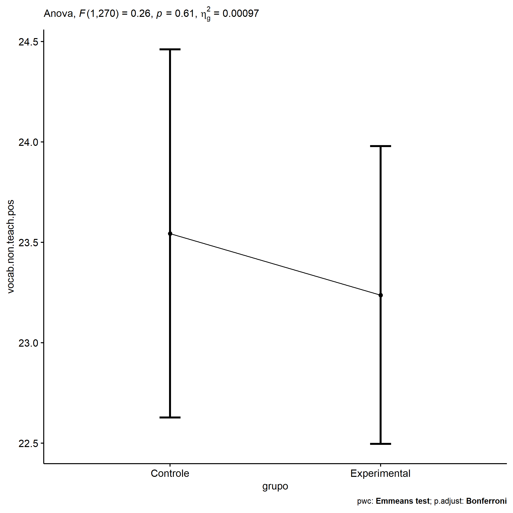<!-- -->

``` r
plots <- oneWayAncovaBoxPlots(
  wdat, "vocab.non.teach.pos", "grupo", aov, pwc, covar = "vocab.non.teach.pre",
  theme = "classic", color = color[["grupo"]],
  subtitle = which(aov$Effect == "grupo"))
```

``` r
if (length(unique(wdat[["grupo"]])) > 1)
  plots[["grupo"]] + ggplot2::ylab("Vocabulario Não Ensinado") + ggplot2::scale_x_discrete(labels=c('pre', 'pos'))
```

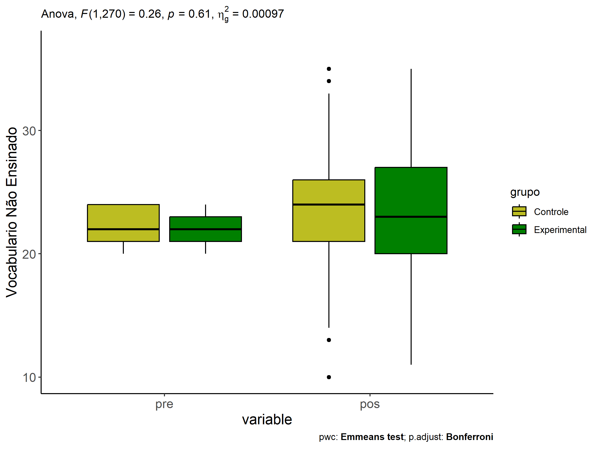<!-- -->

``` r
if (length(unique(wdat.long[["grupo"]])) > 1)
  plots <- oneWayAncovaBoxPlots(
    wdat.long, "vocab.non.teach", "grupo", aov, pwc.long, pre.post = "time",
    theme = "classic", color = color$prepost)
```

``` r
if (length(unique(wdat.long[["grupo"]])) > 1)
  plots[["grupo"]] + ggplot2::ylab("Vocabulario Não Ensinado")
```

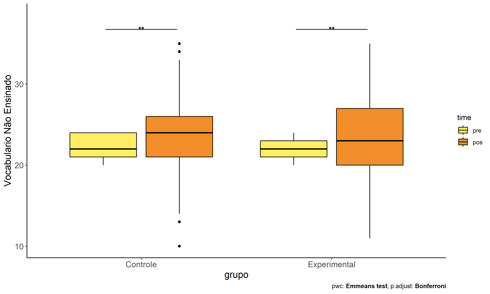<!-- -->

### Checking linearity assumption

``` r
ggscatter(wdat, x = "vocab.non.teach.pre", y = "vocab.non.teach.pos", size = 0.5,
          color = "grupo", add = "reg.line")+
  stat_regline_equation(
    aes(label =  paste(..eq.label.., ..rr.label.., sep = "~~~~"), color = grupo)
  )
```

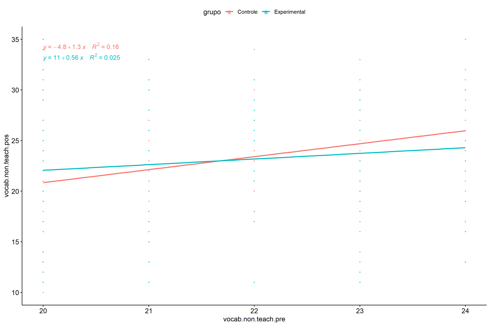<!-- -->

### Checking normality and homogeneity

``` r
res <- augment(lm(vocab.non.teach.pos ~ vocab.non.teach.pre + grupo, data = wdat))
```

``` r
shapiro_test(res$.resid)
```

    ## # A tibble: 1 × 3
    ##   variable   statistic p.value
    ##   <chr>          <dbl>   <dbl>
    ## 1 res$.resid     0.990  0.0674

``` r
levene_test(res, .resid ~ grupo)
```

    ## # A tibble: 1 × 4
    ##     df1   df2 statistic      p
    ##   <int> <int>     <dbl>  <dbl>
    ## 1     1   271      2.74 0.0989

# ANCOVA and Pairwise for two factors **grupo:Sexo**

## Without remove non-normal data

``` r
pdat = remove_group_data(dat[!is.na(dat[["grupo"]]) & !is.na(dat[["Sexo"]]),], "vocab.non.teach.pos", c("grupo","Sexo"))

pdat.long <- rbind(pdat[,c("id","grupo","Sexo")], pdat[,c("id","grupo","Sexo")])
pdat.long[["time"]] <- c(rep("pre", nrow(pdat)), rep("pos", nrow(pdat)))
pdat.long[["time"]] <- factor(pdat.long[["time"]], c("pre","pos"))
pdat.long[["vocab.non.teach"]] <- c(pdat[["vocab.non.teach.pre"]], pdat[["vocab.non.teach.pos"]])

aov = anova_test(pdat, vocab.non.teach.pos ~ vocab.non.teach.pre + grupo*Sexo)
laov[["grupo:Sexo"]] <- get_anova_table(aov)
```

``` r
pwcs <- list()
pwcs[["Sexo"]] <- emmeans_test(
  group_by(pdat, grupo), vocab.non.teach.pos ~ Sexo,
  covariate = vocab.non.teach.pre, p.adjust.method = "bonferroni")
pwcs[["grupo"]] <- emmeans_test(
  group_by(pdat, Sexo), vocab.non.teach.pos ~ grupo,
  covariate = vocab.non.teach.pre, p.adjust.method = "bonferroni")

pwc <- plyr::rbind.fill(pwcs[["grupo"]], pwcs[["Sexo"]])
pwc <- pwc[,c("grupo","Sexo", colnames(pwc)[!colnames(pwc) %in% c("grupo","Sexo")])]
```

``` r
pwc.long <- emmeans_test(dplyr::group_by_at(pdat.long, c("grupo","Sexo")),
                         vocab.non.teach ~ time,
                         p.adjust.method = "bonferroni")
lpwc[["grupo:Sexo"]] <- plyr::rbind.fill(pwc, pwc.long)
```

``` r
ds <- get.descriptives(pdat, "vocab.non.teach.pos", c("grupo","Sexo"), covar = "vocab.non.teach.pre")
ds <- merge(ds[ds$variable != "vocab.non.teach.pre",],
            ds[ds$variable == "vocab.non.teach.pre", !colnames(ds) %in% c("variable")],
            by = c("grupo","Sexo"), all.x = T, suffixes = c("", ".vocab.non.teach.pre"))
ds <- merge(get_emmeans(pwcs[["grupo"]]), ds, by = c("grupo","Sexo"), suffixes = c(".emms", ""))
ds <- ds[,c("grupo","Sexo","n","mean.vocab.non.teach.pre","se.vocab.non.teach.pre","mean","se","emmean","se.emms")]

colnames(ds) <- c("grupo","Sexo", "N", paste0(c("M","SE")," (pre)"),
                  paste0(c("M","SE"), " (unadj)"), paste0(c("M", "SE"), " (adj)"))

lemms[["grupo:Sexo"]] <- ds
```

## Computing ANCOVA and PairWise After removing non-normal data (OK)

``` r
wdat = pdat 

res = residuals(lm(vocab.non.teach.pos ~ vocab.non.teach.pre + grupo*Sexo, data = wdat))
non.normal = getNonNormal(res, wdat$id, plimit = 0.05)

wdat = wdat[!wdat$id %in% non.normal,]

wdat.long <- rbind(wdat[,c("id","grupo","Sexo")], wdat[,c("id","grupo","Sexo")])
wdat.long[["time"]] <- c(rep("pre", nrow(wdat)), rep("pos", nrow(wdat)))
wdat.long[["time"]] <- factor(wdat.long[["time"]], c("pre","pos"))
wdat.long[["vocab.non.teach"]] <- c(wdat[["vocab.non.teach.pre"]], wdat[["vocab.non.teach.pos"]])


ldat[["grupo:Sexo"]] = wdat

(non.normal)
```

    ## [1] "P1113" "P2251" "P1056"

``` r
aov = anova_test(wdat, vocab.non.teach.pos ~ vocab.non.teach.pre + grupo*Sexo)
laov[["grupo:Sexo"]] <- merge(get_anova_table(aov), laov[["grupo:Sexo"]], by="Effect", suffixes = c("","'"))

(df = get_anova_table(aov))
```

    ## ANOVA Table (type II tests)
    ## 
    ##                Effect DFn DFd      F        p p<.05   ges
    ## 1 vocab.non.teach.pre   1 269 17.247 4.41e-05     * 0.060
    ## 2               grupo   1 269  0.365 5.46e-01       0.001
    ## 3                Sexo   1 269  2.631 1.06e-01       0.010
    ## 4          grupo:Sexo   1 269  1.607 2.06e-01       0.006

| Effect              | DFn | DFd |      F |     p | p\<.05 |   ges |
|:--------------------|----:|----:|-------:|------:|:-------|------:|
| vocab.non.teach.pre |   1 | 269 | 17.247 | 0.000 | \*     | 0.060 |
| grupo               |   1 | 269 |  0.365 | 0.546 |        | 0.001 |
| Sexo                |   1 | 269 |  2.631 | 0.106 |        | 0.010 |
| grupo:Sexo          |   1 | 269 |  1.607 | 0.206 |        | 0.006 |

``` r
pwcs <- list()
pwcs[["Sexo"]] <- emmeans_test(
  group_by(wdat, grupo), vocab.non.teach.pos ~ Sexo,
  covariate = vocab.non.teach.pre, p.adjust.method = "bonferroni")
pwcs[["grupo"]] <- emmeans_test(
  group_by(wdat, Sexo), vocab.non.teach.pos ~ grupo,
  covariate = vocab.non.teach.pre, p.adjust.method = "bonferroni")

pwc <- plyr::rbind.fill(pwcs[["grupo"]], pwcs[["Sexo"]])
pwc <- pwc[,c("grupo","Sexo", colnames(pwc)[!colnames(pwc) %in% c("grupo","Sexo")])]
```

| grupo        | Sexo | term                       | .y.                 | group1   | group2       |  df | statistic |     p | p.adj | p.adj.signif |
|:-------------|:-----|:---------------------------|:--------------------|:---------|:-------------|----:|----------:|------:|------:|:-------------|
|              | F    | vocab.non.teach.pre\*grupo | vocab.non.teach.pos | Controle | Experimental | 269 |     1.288 | 0.199 | 0.199 | ns           |
|              | M    | vocab.non.teach.pre\*grupo | vocab.non.teach.pos | Controle | Experimental | 269 |    -0.556 | 0.579 | 0.579 | ns           |
| Controle     |      | vocab.non.teach.pre\*Sexo  | vocab.non.teach.pos | F        | M            | 269 |     2.003 | 0.046 | 0.046 | \*           |
| Experimental |      | vocab.non.teach.pre\*Sexo  | vocab.non.teach.pos | F        | M            | 269 |     0.477 | 0.633 | 0.633 | ns           |

``` r
pwc.long <- emmeans_test(dplyr::group_by_at(wdat.long, c("grupo","Sexo")),
                         vocab.non.teach ~ time,
                         p.adjust.method = "bonferroni")
lpwc[["grupo:Sexo"]] <- merge(plyr::rbind.fill(pwc, pwc.long), lpwc[["grupo:Sexo"]], by=c("grupo","Sexo","term",".y.","group1","group2"), suffixes = c("","'"))
```

| grupo        | Sexo | term | .y.             | group1 | group2 |  df | statistic |     p | p.adj | p.adj.signif |
|:-------------|:-----|:-----|:----------------|:-------|:-------|----:|----------:|------:|------:|:-------------|
| Controle     | F    | time | vocab.non.teach | pre    | pos    | 540 |    -3.422 | 0.001 | 0.001 | \*\*\*       |
| Controle     | M    | time | vocab.non.teach | pre    | pos    | 540 |    -0.425 | 0.671 | 0.671 | ns           |
| Experimental | F    | time | vocab.non.teach | pre    | pos    | 540 |    -2.262 | 0.024 | 0.024 | \*           |
| Experimental | M    | time | vocab.non.teach | pre    | pos    | 540 |    -1.460 | 0.145 | 0.145 | ns           |

``` r
ds <- get.descriptives(wdat, "vocab.non.teach.pos", c("grupo","Sexo"), covar = "vocab.non.teach.pre")
ds <- merge(ds[ds$variable != "vocab.non.teach.pre",],
            ds[ds$variable == "vocab.non.teach.pre", !colnames(ds) %in% c("variable")],
            by = c("grupo","Sexo"), all.x = T, suffixes = c("", ".vocab.non.teach.pre"))
ds <- merge(get_emmeans(pwcs[["grupo"]]), ds, by = c("grupo","Sexo"), suffixes = c(".emms", ""))
ds <- ds[,c("grupo","Sexo","n","mean.vocab.non.teach.pre","se.vocab.non.teach.pre","mean","se","emmean","se.emms")]

colnames(ds) <- c("grupo","Sexo", "N", paste0(c("M","SE")," (pre)"),
                  paste0(c("M","SE"), " (unadj)"), paste0(c("M", "SE"), " (adj)"))

lemms[["grupo:Sexo"]] <- merge(ds, lemms[["grupo:Sexo"]], by=c("grupo","Sexo"), suffixes = c("","'"))
```

| grupo        | Sexo |   N | M (pre) | SE (pre) | M (unadj) | SE (unadj) | M (adj) | SE (adj) |
|:-------------|:-----|----:|--------:|---------:|----------:|-----------:|--------:|---------:|
| Controle     | F    |  63 |  22.143 |    0.188 |    24.413 |      0.552 |  24.344 |    0.620 |
| Controle     | M    |  45 |  22.244 |    0.211 |    22.578 |      0.745 |  22.422 |    0.734 |
| Experimental | F    |  90 |  21.956 |    0.147 |    23.211 |      0.556 |  23.302 |    0.519 |
| Experimental | M    |  76 |  22.013 |    0.172 |    22.895 |      0.614 |  22.937 |    0.564 |

### Plots for ancova

``` r
plots <- twoWayAncovaPlots(
  wdat, "vocab.non.teach.pos", c("grupo","Sexo"), aov, pwcs, addParam = c("mean_se"),
  font.label.size=10, step.increase=0.05, p.label="p.adj",
  subtitle = which(aov$Effect == "grupo:Sexo"))
```

``` r
if (!is.null(plots[["grupo"]]))
  plots[["grupo"]] + ggplot2::scale_color_manual(values = color[["Sexo"]])
```

    ## Scale for colour is already present.
    ## Adding another scale for colour, which will replace the existing scale.

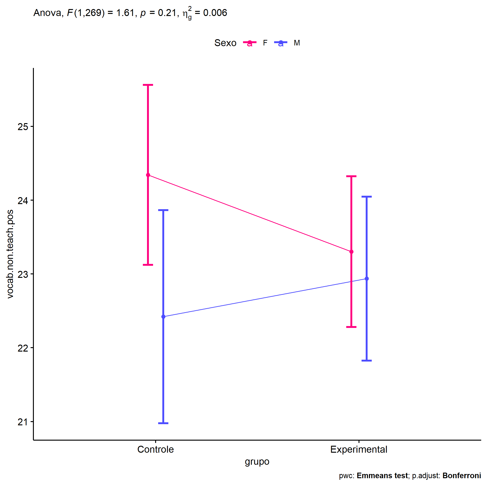<!-- -->

``` r
if (!is.null(plots[["Sexo"]]))
  plots[["Sexo"]] + ggplot2::scale_color_manual(values = color[["grupo"]])
```

    ## Scale for colour is already present.
    ## Adding another scale for colour, which will replace the existing scale.

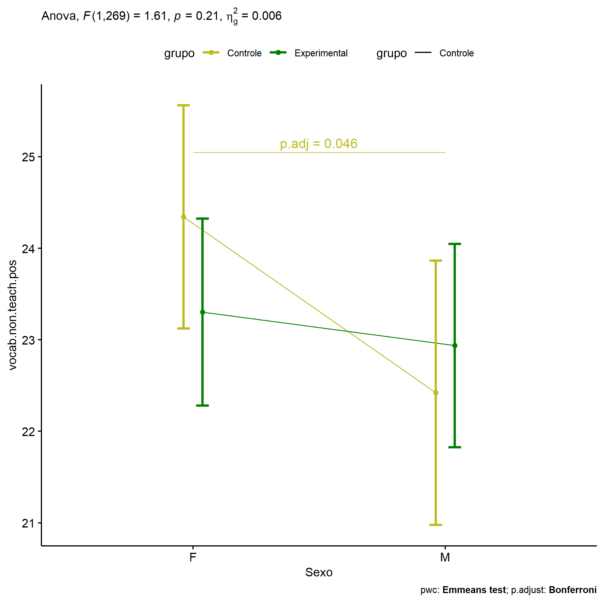<!-- -->

``` r
plots <- twoWayAncovaBoxPlots(
  wdat, "vocab.non.teach.pos", c("grupo","Sexo"), aov, pwcs, covar = "vocab.non.teach.pre",
  theme = "classic", color = color[["grupo:Sexo"]],
  subtitle = which(aov$Effect == "grupo:Sexo"))
```

``` r
plots[["grupo:Sexo"]] + ggplot2::ylab("Vocabulario Não Ensinado") + ggplot2::scale_x_discrete(labels=c('pre', 'pos'))
```

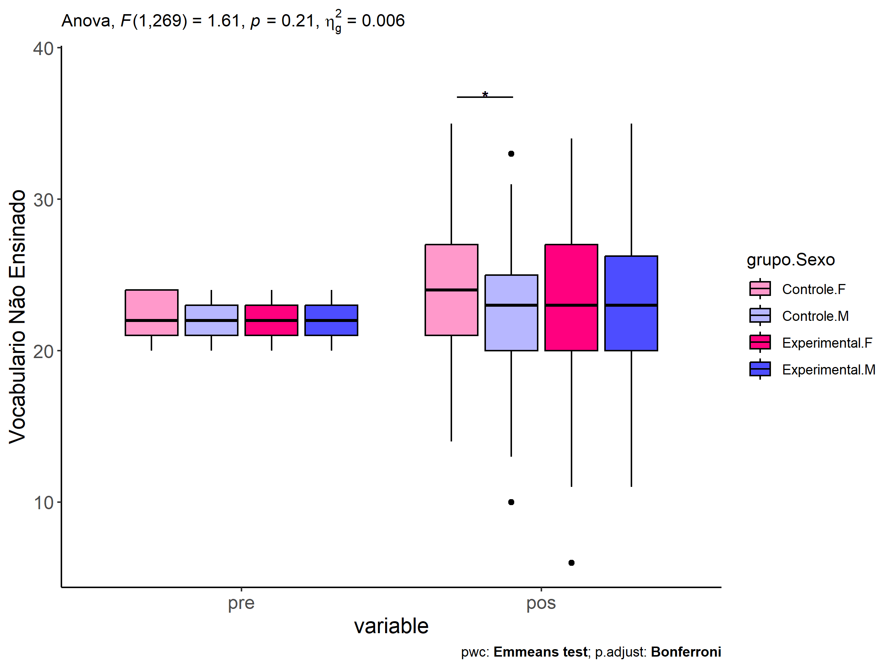<!-- -->

``` r
plots <- twoWayAncovaBoxPlots(
  wdat.long, "vocab.non.teach", c("grupo","Sexo"), aov, pwc.long, pre.post = "time",
  theme = "classic", color = color$prepost)
```

``` r
plots[["grupo:Sexo"]] + ggplot2::ylab("Vocabulario Não Ensinado")
```

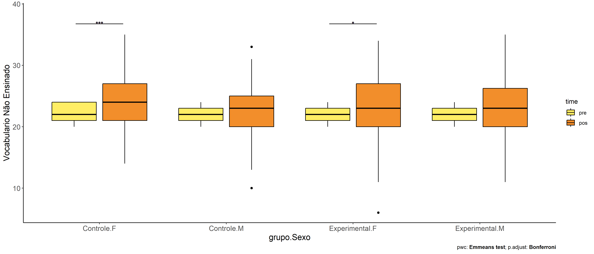<!-- -->

### Checking linearity assumption

``` r
ggscatter(wdat, x = "vocab.non.teach.pre", y = "vocab.non.teach.pos", size = 0.5,
          facet.by = c("grupo","Sexo"), add = "reg.line")+
  stat_regline_equation(
    aes(label =  paste(..eq.label.., ..rr.label.., sep = "~~~~"))
  )
```

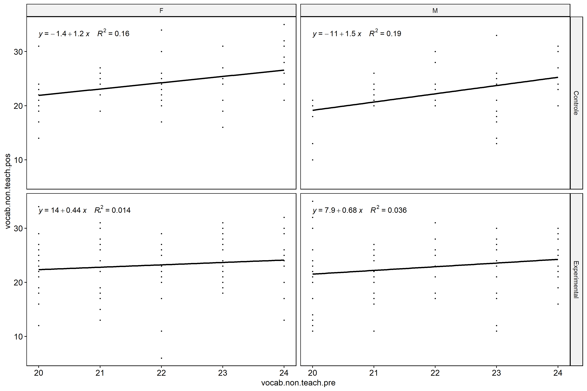<!-- -->

### Checking normality and homogeneity

``` r
res <- augment(lm(vocab.non.teach.pos ~ vocab.non.teach.pre + grupo*Sexo, data = wdat))
```

``` r
shapiro_test(res$.resid)
```

    ## # A tibble: 1 × 3
    ##   variable   statistic p.value
    ##   <chr>          <dbl>   <dbl>
    ## 1 res$.resid     0.990  0.0664

``` r
levene_test(res, .resid ~ grupo*Sexo)
```

    ## # A tibble: 1 × 4
    ##     df1   df2 statistic     p
    ##   <int> <int>     <dbl> <dbl>
    ## 1     3   270      1.44 0.233

# ANCOVA and Pairwise for two factors **grupo:Zona**

## Without remove non-normal data

``` r
pdat = remove_group_data(dat[!is.na(dat[["grupo"]]) & !is.na(dat[["Zona"]]),], "vocab.non.teach.pos", c("grupo","Zona"))

pdat.long <- rbind(pdat[,c("id","grupo","Zona")], pdat[,c("id","grupo","Zona")])
pdat.long[["time"]] <- c(rep("pre", nrow(pdat)), rep("pos", nrow(pdat)))
pdat.long[["time"]] <- factor(pdat.long[["time"]], c("pre","pos"))
pdat.long[["vocab.non.teach"]] <- c(pdat[["vocab.non.teach.pre"]], pdat[["vocab.non.teach.pos"]])

aov = anova_test(pdat, vocab.non.teach.pos ~ vocab.non.teach.pre + grupo*Zona)
laov[["grupo:Zona"]] <- get_anova_table(aov)
```

``` r
pwcs <- list()
pwcs[["Zona"]] <- emmeans_test(
  group_by(pdat, grupo), vocab.non.teach.pos ~ Zona,
  covariate = vocab.non.teach.pre, p.adjust.method = "bonferroni")
pwcs[["grupo"]] <- emmeans_test(
  group_by(pdat, Zona), vocab.non.teach.pos ~ grupo,
  covariate = vocab.non.teach.pre, p.adjust.method = "bonferroni")

pwc <- plyr::rbind.fill(pwcs[["grupo"]], pwcs[["Zona"]])
pwc <- pwc[,c("grupo","Zona", colnames(pwc)[!colnames(pwc) %in% c("grupo","Zona")])]
```

``` r
pwc.long <- emmeans_test(dplyr::group_by_at(pdat.long, c("grupo","Zona")),
                         vocab.non.teach ~ time,
                         p.adjust.method = "bonferroni")
lpwc[["grupo:Zona"]] <- plyr::rbind.fill(pwc, pwc.long)
```

``` r
ds <- get.descriptives(pdat, "vocab.non.teach.pos", c("grupo","Zona"), covar = "vocab.non.teach.pre")
ds <- merge(ds[ds$variable != "vocab.non.teach.pre",],
            ds[ds$variable == "vocab.non.teach.pre", !colnames(ds) %in% c("variable")],
            by = c("grupo","Zona"), all.x = T, suffixes = c("", ".vocab.non.teach.pre"))
ds <- merge(get_emmeans(pwcs[["grupo"]]), ds, by = c("grupo","Zona"), suffixes = c(".emms", ""))
ds <- ds[,c("grupo","Zona","n","mean.vocab.non.teach.pre","se.vocab.non.teach.pre","mean","se","emmean","se.emms")]

colnames(ds) <- c("grupo","Zona", "N", paste0(c("M","SE")," (pre)"),
                  paste0(c("M","SE"), " (unadj)"), paste0(c("M", "SE"), " (adj)"))

lemms[["grupo:Zona"]] <- ds
```

## Computing ANCOVA and PairWise After removing non-normal data (OK)

``` r
wdat = pdat 

res = residuals(lm(vocab.non.teach.pos ~ vocab.non.teach.pre + grupo*Zona, data = wdat))
non.normal = getNonNormal(res, wdat$id, plimit = 0.05)

wdat = wdat[!wdat$id %in% non.normal,]

wdat.long <- rbind(wdat[,c("id","grupo","Zona")], wdat[,c("id","grupo","Zona")])
wdat.long[["time"]] <- c(rep("pre", nrow(wdat)), rep("pos", nrow(wdat)))
wdat.long[["time"]] <- factor(wdat.long[["time"]], c("pre","pos"))
wdat.long[["vocab.non.teach"]] <- c(wdat[["vocab.non.teach.pre"]], wdat[["vocab.non.teach.pos"]])


ldat[["grupo:Zona"]] = wdat

(non.normal)
```

    ## [1] "P1056"

``` r
aov = anova_test(wdat, vocab.non.teach.pos ~ vocab.non.teach.pre + grupo*Zona)
laov[["grupo:Zona"]] <- merge(get_anova_table(aov), laov[["grupo:Zona"]], by="Effect", suffixes = c("","'"))

(df = get_anova_table(aov))
```

    ## ANOVA Table (type II tests)
    ## 
    ##                Effect DFn DFd      F        p p<.05      ges
    ## 1 vocab.non.teach.pre   1 196 13.426 0.000319     * 0.064000
    ## 2               grupo   1 196  0.667 0.415000       0.003000
    ## 3                Zona   1 196  0.449 0.503000       0.002000
    ## 4          grupo:Zona   1 196  0.026 0.872000       0.000133

| Effect              | DFn | DFd |      F |     p | p\<.05 |   ges |
|:--------------------|----:|----:|-------:|------:|:-------|------:|
| vocab.non.teach.pre |   1 | 196 | 13.426 | 0.000 | \*     | 0.064 |
| grupo               |   1 | 196 |  0.667 | 0.415 |        | 0.003 |
| Zona                |   1 | 196 |  0.449 | 0.503 |        | 0.002 |
| grupo:Zona          |   1 | 196 |  0.026 | 0.872 |        | 0.000 |

``` r
pwcs <- list()
pwcs[["Zona"]] <- emmeans_test(
  group_by(wdat, grupo), vocab.non.teach.pos ~ Zona,
  covariate = vocab.non.teach.pre, p.adjust.method = "bonferroni")
pwcs[["grupo"]] <- emmeans_test(
  group_by(wdat, Zona), vocab.non.teach.pos ~ grupo,
  covariate = vocab.non.teach.pre, p.adjust.method = "bonferroni")

pwc <- plyr::rbind.fill(pwcs[["grupo"]], pwcs[["Zona"]])
pwc <- pwc[,c("grupo","Zona", colnames(pwc)[!colnames(pwc) %in% c("grupo","Zona")])]
```

| grupo        | Zona   | term                       | .y.                 | group1   | group2       |  df | statistic |     p | p.adj | p.adj.signif |
|:-------------|:-------|:---------------------------|:--------------------|:---------|:-------------|----:|----------:|------:|------:|:-------------|
|              | Rural  | vocab.non.teach.pre\*grupo | vocab.non.teach.pos | Controle | Experimental | 196 |     0.776 | 0.439 | 0.439 | ns           |
|              | Urbana | vocab.non.teach.pre\*grupo | vocab.non.teach.pos | Controle | Experimental | 196 |     0.295 | 0.768 | 0.768 | ns           |
| Controle     |        | vocab.non.teach.pre\*Zona  | vocab.non.teach.pos | Rural    | Urbana       | 196 |     0.520 | 0.603 | 0.603 | ns           |
| Experimental |        | vocab.non.teach.pre\*Zona  | vocab.non.teach.pos | Rural    | Urbana       | 196 |     0.452 | 0.652 | 0.652 | ns           |

``` r
pwc.long <- emmeans_test(dplyr::group_by_at(wdat.long, c("grupo","Zona")),
                         vocab.non.teach ~ time,
                         p.adjust.method = "bonferroni")
lpwc[["grupo:Zona"]] <- merge(plyr::rbind.fill(pwc, pwc.long), lpwc[["grupo:Zona"]], by=c("grupo","Zona","term",".y.","group1","group2"), suffixes = c("","'"))
```

| grupo        | Zona   | term | .y.             | group1 | group2 |  df | statistic |     p | p.adj | p.adj.signif |
|:-------------|:-------|:-----|:----------------|:-------|:-------|----:|----------:|------:|------:|:-------------|
| Controle     | Rural  | time | vocab.non.teach | pre    | pos    | 394 |    -2.950 | 0.003 | 0.003 | \*\*         |
| Controle     | Urbana | time | vocab.non.teach | pre    | pos    | 394 |    -1.175 | 0.241 | 0.241 | ns           |
| Experimental | Rural  | time | vocab.non.teach | pre    | pos    | 394 |    -2.312 | 0.021 | 0.021 | \*           |
| Experimental | Urbana | time | vocab.non.teach | pre    | pos    | 394 |    -1.217 | 0.224 | 0.224 | ns           |

``` r
ds <- get.descriptives(wdat, "vocab.non.teach.pos", c("grupo","Zona"), covar = "vocab.non.teach.pre")
ds <- merge(ds[ds$variable != "vocab.non.teach.pre",],
            ds[ds$variable == "vocab.non.teach.pre", !colnames(ds) %in% c("variable")],
            by = c("grupo","Zona"), all.x = T, suffixes = c("", ".vocab.non.teach.pre"))
ds <- merge(get_emmeans(pwcs[["grupo"]]), ds, by = c("grupo","Zona"), suffixes = c(".emms", ""))
ds <- ds[,c("grupo","Zona","n","mean.vocab.non.teach.pre","se.vocab.non.teach.pre","mean","se","emmean","se.emms")]

colnames(ds) <- c("grupo","Zona", "N", paste0(c("M","SE")," (pre)"),
                  paste0(c("M","SE"), " (unadj)"), paste0(c("M", "SE"), " (adj)"))

lemms[["grupo:Zona"]] <- merge(ds, lemms[["grupo:Zona"]], by=c("grupo","Zona"), suffixes = c("","'"))
```

| grupo        | Zona   |   N | M (pre) | SE (pre) | M (unadj) | SE (unadj) | M (adj) | SE (adj) |
|:-------------|:-------|----:|--------:|---------:|----------:|-----------:|--------:|---------:|
| Controle     | Rural  |  61 |  22.426 |    0.176 |    24.344 |      0.592 |  24.093 |    0.609 |
| Controle     | Urbana |  19 |  21.684 |    0.325 |    23.053 |      0.839 |  23.441 |    1.089 |
| Experimental | Rural  |  77 |  22.052 |    0.171 |    23.390 |      0.587 |  23.461 |    0.539 |
| Experimental | Urbana |  44 |  22.068 |    0.209 |    23.000 |      0.776 |  23.057 |    0.712 |

### Plots for ancova

``` r
plots <- twoWayAncovaPlots(
  wdat, "vocab.non.teach.pos", c("grupo","Zona"), aov, pwcs, addParam = c("mean_se"),
  font.label.size=10, step.increase=0.05, p.label="p.adj",
  subtitle = which(aov$Effect == "grupo:Zona"))
```

``` r
if (!is.null(plots[["grupo"]]))
  plots[["grupo"]] + ggplot2::scale_color_manual(values = color[["Zona"]])
```

    ## Scale for colour is already present.
    ## Adding another scale for colour, which will replace the existing scale.

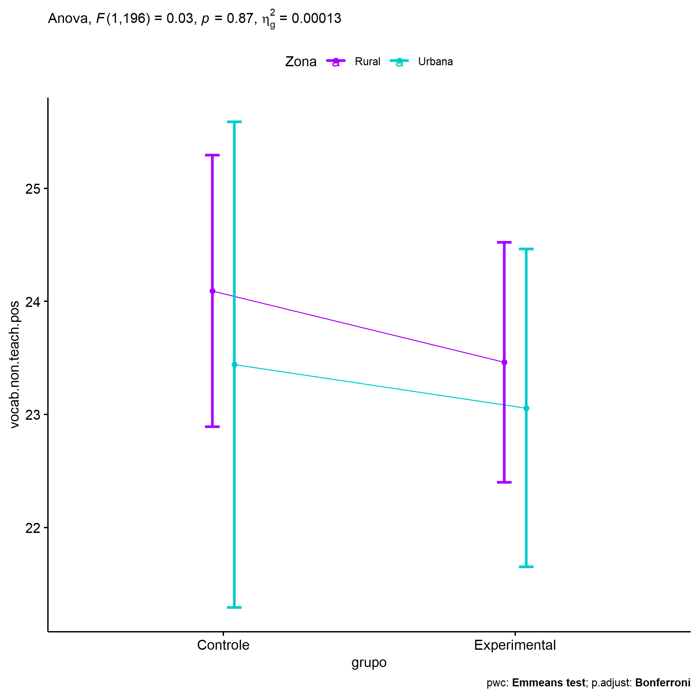<!-- -->

``` r
if (!is.null(plots[["Zona"]]))
  plots[["Zona"]] + ggplot2::scale_color_manual(values = color[["grupo"]])
```

    ## Scale for colour is already present.
    ## Adding another scale for colour, which will replace the existing scale.

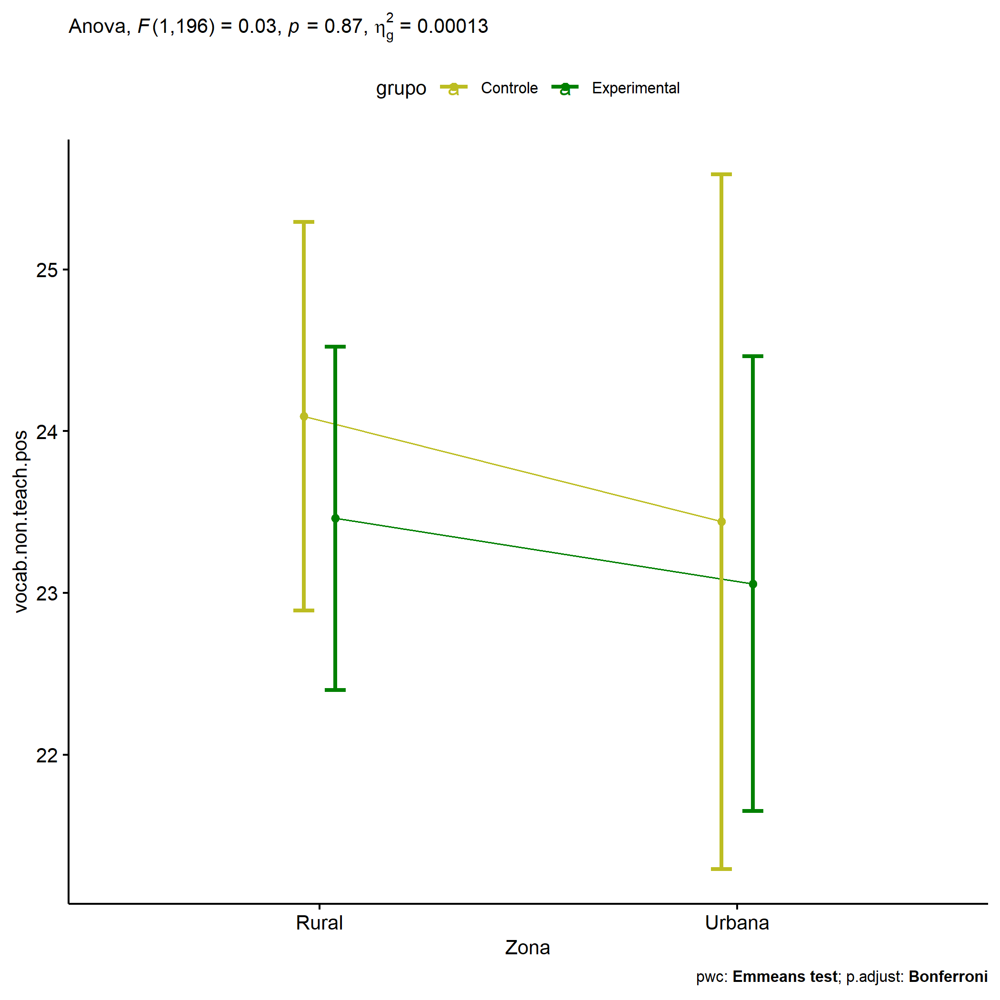<!-- -->

``` r
plots <- twoWayAncovaBoxPlots(
  wdat, "vocab.non.teach.pos", c("grupo","Zona"), aov, pwcs, covar = "vocab.non.teach.pre",
  theme = "classic", color = color[["grupo:Zona"]],
  subtitle = which(aov$Effect == "grupo:Zona"))
```

``` r
plots[["grupo:Zona"]] + ggplot2::ylab("Vocabulario Não Ensinado") + ggplot2::scale_x_discrete(labels=c('pre', 'pos'))
```

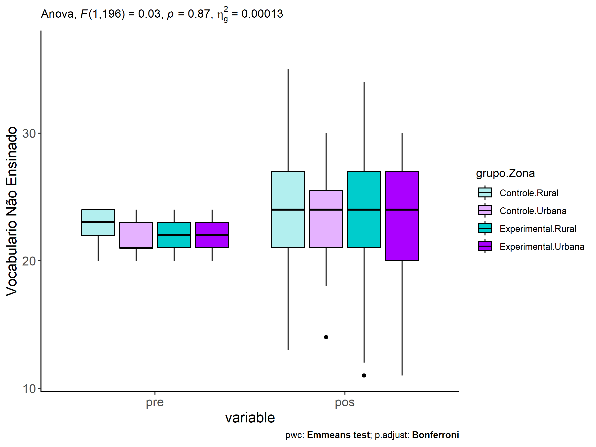<!-- -->

``` r
plots <- twoWayAncovaBoxPlots(
  wdat.long, "vocab.non.teach", c("grupo","Zona"), aov, pwc.long, pre.post = "time",
  theme = "classic", color = color$prepost)
```

``` r
plots[["grupo:Zona"]] + ggplot2::ylab("Vocabulario Não Ensinado")
```

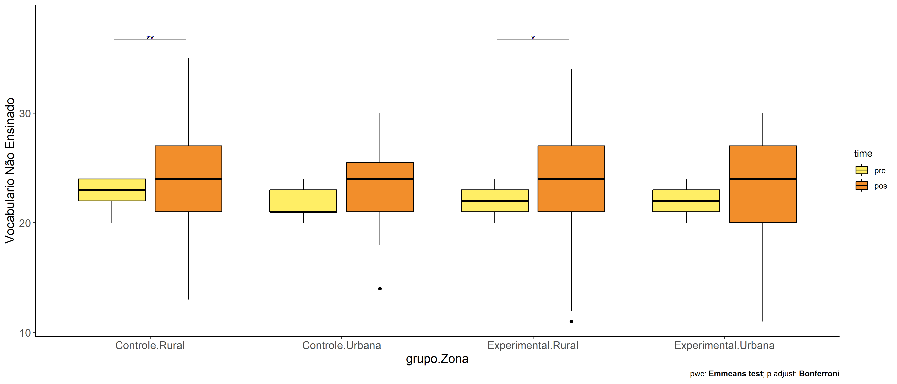<!-- -->

### Checking linearity assumption

``` r
ggscatter(wdat, x = "vocab.non.teach.pre", y = "vocab.non.teach.pos", size = 0.5,
          facet.by = c("grupo","Zona"), add = "reg.line")+
  stat_regline_equation(
    aes(label =  paste(..eq.label.., ..rr.label.., sep = "~~~~"))
  )
```

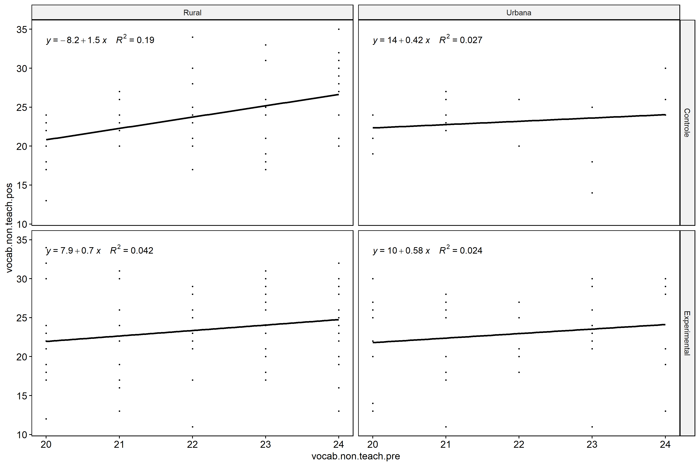<!-- -->

### Checking normality and homogeneity

``` r
res <- augment(lm(vocab.non.teach.pos ~ vocab.non.teach.pre + grupo*Zona, data = wdat))
```

``` r
shapiro_test(res$.resid)
```

    ## # A tibble: 1 × 3
    ##   variable   statistic p.value
    ##   <chr>          <dbl>   <dbl>
    ## 1 res$.resid     0.989   0.112

``` r
levene_test(res, .resid ~ grupo*Zona)
```

    ## # A tibble: 1 × 4
    ##     df1   df2 statistic     p
    ##   <int> <int>     <dbl> <dbl>
    ## 1     3   197      1.54 0.205

# ANCOVA and Pairwise for two factors **grupo:Cor.Raca**

## Without remove non-normal data

``` r
pdat = remove_group_data(dat[!is.na(dat[["grupo"]]) & !is.na(dat[["Cor.Raca"]]),], "vocab.non.teach.pos", c("grupo","Cor.Raca"))
```

    ## Warning: There was 1 warning in `mutate()`.
    ## ℹ In argument: `ci = abs(stats::qt(alpha/2, .data$n - 1) * .data$se)`.
    ## Caused by warning:
    ## ! There was 1 warning in `mutate()`.
    ## ℹ In argument: `ci = abs(stats::qt(alpha/2, .data$n - 1) * .data$se)`.
    ## Caused by warning in `stats::qt()`:
    ## ! NaNs produced

``` r
pdat.long <- rbind(pdat[,c("id","grupo","Cor.Raca")], pdat[,c("id","grupo","Cor.Raca")])
pdat.long[["time"]] <- c(rep("pre", nrow(pdat)), rep("pos", nrow(pdat)))
pdat.long[["time"]] <- factor(pdat.long[["time"]], c("pre","pos"))
pdat.long[["vocab.non.teach"]] <- c(pdat[["vocab.non.teach.pre"]], pdat[["vocab.non.teach.pos"]])

aov = anova_test(pdat, vocab.non.teach.pos ~ vocab.non.teach.pre + grupo*Cor.Raca)
laov[["grupo:Cor.Raca"]] <- get_anova_table(aov)
```

``` r
pwcs <- list()
pwcs[["Cor.Raca"]] <- emmeans_test(
  group_by(pdat, grupo), vocab.non.teach.pos ~ Cor.Raca,
  covariate = vocab.non.teach.pre, p.adjust.method = "bonferroni")
pwcs[["grupo"]] <- emmeans_test(
  group_by(pdat, Cor.Raca), vocab.non.teach.pos ~ grupo,
  covariate = vocab.non.teach.pre, p.adjust.method = "bonferroni")

pwc <- plyr::rbind.fill(pwcs[["grupo"]], pwcs[["Cor.Raca"]])
pwc <- pwc[,c("grupo","Cor.Raca", colnames(pwc)[!colnames(pwc) %in% c("grupo","Cor.Raca")])]
```

``` r
pwc.long <- emmeans_test(dplyr::group_by_at(pdat.long, c("grupo","Cor.Raca")),
                         vocab.non.teach ~ time,
                         p.adjust.method = "bonferroni")
lpwc[["grupo:Cor.Raca"]] <- plyr::rbind.fill(pwc, pwc.long)
```

``` r
ds <- get.descriptives(pdat, "vocab.non.teach.pos", c("grupo","Cor.Raca"), covar = "vocab.non.teach.pre")
ds <- merge(ds[ds$variable != "vocab.non.teach.pre",],
            ds[ds$variable == "vocab.non.teach.pre", !colnames(ds) %in% c("variable")],
            by = c("grupo","Cor.Raca"), all.x = T, suffixes = c("", ".vocab.non.teach.pre"))
ds <- merge(get_emmeans(pwcs[["grupo"]]), ds, by = c("grupo","Cor.Raca"), suffixes = c(".emms", ""))
ds <- ds[,c("grupo","Cor.Raca","n","mean.vocab.non.teach.pre","se.vocab.non.teach.pre","mean","se","emmean","se.emms")]

colnames(ds) <- c("grupo","Cor.Raca", "N", paste0(c("M","SE")," (pre)"),
                  paste0(c("M","SE"), " (unadj)"), paste0(c("M", "SE"), " (adj)"))

lemms[["grupo:Cor.Raca"]] <- ds
```

## Computing ANCOVA and PairWise After removing non-normal data (OK)

``` r
wdat = pdat 

res = residuals(lm(vocab.non.teach.pos ~ vocab.non.teach.pre + grupo*Cor.Raca, data = wdat))
non.normal = getNonNormal(res, wdat$id, plimit = 0.05)

wdat = wdat[!wdat$id %in% non.normal,]

wdat.long <- rbind(wdat[,c("id","grupo","Cor.Raca")], wdat[,c("id","grupo","Cor.Raca")])
wdat.long[["time"]] <- c(rep("pre", nrow(wdat)), rep("pos", nrow(wdat)))
wdat.long[["time"]] <- factor(wdat.long[["time"]], c("pre","pos"))
wdat.long[["vocab.non.teach"]] <- c(wdat[["vocab.non.teach.pre"]], wdat[["vocab.non.teach.pos"]])


ldat[["grupo:Cor.Raca"]] = wdat

(non.normal)
```

    ## [1] "P1113" "P1056"

``` r
aov = anova_test(wdat, vocab.non.teach.pos ~ vocab.non.teach.pre + grupo*Cor.Raca)
laov[["grupo:Cor.Raca"]] <- merge(get_anova_table(aov), laov[["grupo:Cor.Raca"]], by="Effect", suffixes = c("","'"))

(df = get_anova_table(aov))
```

    ## ANOVA Table (type II tests)
    ## 
    ##                Effect DFn DFd      F        p p<.05   ges
    ## 1 vocab.non.teach.pre   1 108 19.677 2.22e-05     * 0.154
    ## 2               grupo   1 108  0.296 5.88e-01       0.003
    ## 3            Cor.Raca   2 108  3.595 3.10e-02     * 0.062
    ## 4      grupo:Cor.Raca   2 108  0.435 6.49e-01       0.008

| Effect              | DFn | DFd |      F |     p | p\<.05 |   ges |
|:--------------------|----:|----:|-------:|------:|:-------|------:|
| vocab.non.teach.pre |   1 | 108 | 19.677 | 0.000 | \*     | 0.154 |
| grupo               |   1 | 108 |  0.296 | 0.588 |        | 0.003 |
| Cor.Raca            |   2 | 108 |  3.595 | 0.031 | \*     | 0.062 |
| grupo:Cor.Raca      |   2 | 108 |  0.435 | 0.649 |        | 0.008 |

``` r
pwcs <- list()
pwcs[["Cor.Raca"]] <- emmeans_test(
  group_by(wdat, grupo), vocab.non.teach.pos ~ Cor.Raca,
  covariate = vocab.non.teach.pre, p.adjust.method = "bonferroni")
pwcs[["grupo"]] <- emmeans_test(
  group_by(wdat, Cor.Raca), vocab.non.teach.pos ~ grupo,
  covariate = vocab.non.teach.pre, p.adjust.method = "bonferroni")

pwc <- plyr::rbind.fill(pwcs[["grupo"]], pwcs[["Cor.Raca"]])
pwc <- pwc[,c("grupo","Cor.Raca", colnames(pwc)[!colnames(pwc) %in% c("grupo","Cor.Raca")])]
```

| grupo        | Cor.Raca | term                          | .y.                 | group1   | group2       |  df | statistic |     p | p.adj | p.adj.signif |
|:-------------|:---------|:------------------------------|:--------------------|:---------|:-------------|----:|----------:|------:|------:|:-------------|
|              | Branca   | vocab.non.teach.pre\*grupo    | vocab.non.teach.pos | Controle | Experimental | 108 |     0.959 | 0.340 | 0.340 | ns           |
|              | Indígena | vocab.non.teach.pre\*grupo    | vocab.non.teach.pos | Controle | Experimental | 108 |    -0.455 | 0.650 | 0.650 | ns           |
|              | Parda    | vocab.non.teach.pre\*grupo    | vocab.non.teach.pos | Controle | Experimental | 108 |     0.211 | 0.833 | 0.833 | ns           |
| Controle     |          | vocab.non.teach.pre\*Cor.Raca | vocab.non.teach.pos | Branca   | Indígena     | 108 |    -1.090 | 0.278 | 0.835 | ns           |
| Controle     |          | vocab.non.teach.pre\*Cor.Raca | vocab.non.teach.pos | Branca   | Parda        | 108 |    -1.064 | 0.290 | 0.869 | ns           |
| Controle     |          | vocab.non.teach.pre\*Cor.Raca | vocab.non.teach.pos | Indígena | Parda        | 108 |     0.429 | 0.669 | 1.000 | ns           |
| Experimental |          | vocab.non.teach.pre\*Cor.Raca | vocab.non.teach.pos | Branca   | Indígena     | 108 |    -2.185 | 0.031 | 0.093 | ns           |
| Experimental |          | vocab.non.teach.pre\*Cor.Raca | vocab.non.teach.pos | Branca   | Parda        | 108 |    -2.081 | 0.040 | 0.119 | ns           |
| Experimental |          | vocab.non.teach.pre\*Cor.Raca | vocab.non.teach.pos | Indígena | Parda        | 108 |     1.092 | 0.277 | 0.832 | ns           |

``` r
pwc.long <- emmeans_test(dplyr::group_by_at(wdat.long, c("grupo","Cor.Raca")),
                         vocab.non.teach ~ time,
                         p.adjust.method = "bonferroni")
lpwc[["grupo:Cor.Raca"]] <- merge(plyr::rbind.fill(pwc, pwc.long), lpwc[["grupo:Cor.Raca"]], by=c("grupo","Cor.Raca","term",".y.","group1","group2"), suffixes = c("","'"))
```

| grupo        | Cor.Raca | term | .y.             | group1 | group2 |  df | statistic |     p | p.adj | p.adj.signif |
|:-------------|:---------|:-----|:----------------|:-------|:-------|----:|----------:|------:|------:|:-------------|
| Controle     | Branca   | time | vocab.non.teach | pre    | pos    | 218 |    -0.363 | 0.717 | 0.717 | ns           |
| Controle     | Indígena | time | vocab.non.teach | pre    | pos    | 218 |    -1.297 | 0.196 | 0.196 | ns           |
| Controle     | Parda    | time | vocab.non.teach | pre    | pos    | 218 |    -1.943 | 0.053 | 0.053 | ns           |
| Experimental | Branca   | time | vocab.non.teach | pre    | pos    | 218 |     0.725 | 0.469 | 0.469 | ns           |
| Experimental | Indígena | time | vocab.non.teach | pre    | pos    | 218 |    -1.671 | 0.096 | 0.096 | ns           |
| Experimental | Parda    | time | vocab.non.teach | pre    | pos    | 218 |    -2.101 | 0.037 | 0.037 | \*           |

``` r
ds <- get.descriptives(wdat, "vocab.non.teach.pos", c("grupo","Cor.Raca"), covar = "vocab.non.teach.pre")
ds <- merge(ds[ds$variable != "vocab.non.teach.pre",],
            ds[ds$variable == "vocab.non.teach.pre", !colnames(ds) %in% c("variable")],
            by = c("grupo","Cor.Raca"), all.x = T, suffixes = c("", ".vocab.non.teach.pre"))
ds <- merge(get_emmeans(pwcs[["grupo"]]), ds, by = c("grupo","Cor.Raca"), suffixes = c(".emms", ""))
ds <- ds[,c("grupo","Cor.Raca","n","mean.vocab.non.teach.pre","se.vocab.non.teach.pre","mean","se","emmean","se.emms")]

colnames(ds) <- c("grupo","Cor.Raca", "N", paste0(c("M","SE")," (pre)"),
                  paste0(c("M","SE"), " (unadj)"), paste0(c("M", "SE"), " (adj)"))

lemms[["grupo:Cor.Raca"]] <- merge(ds, lemms[["grupo:Cor.Raca"]], by=c("grupo","Cor.Raca"), suffixes = c("","'"))
```

| grupo        | Cor.Raca |   N | M (pre) | SE (pre) | M (unadj) | SE (unadj) | M (adj) | SE (adj) |
|:-------------|:---------|----:|--------:|---------:|----------:|-----------:|--------:|---------:|
| Controle     | Branca   |  17 |  22.118 |    0.382 |    22.588 |      1.085 |  22.513 |    1.150 |
| Controle     | Indígena |   6 |  21.833 |    0.833 |    24.667 |      1.726 |  24.968 |    1.936 |
| Controle     | Parda    |  29 |  21.862 |    0.271 |    23.793 |      1.009 |  24.056 |    0.882 |
| Experimental | Branca   |  17 |  22.588 |    0.333 |    21.647 |      1.524 |  20.949 |    1.160 |
| Experimental | Indígena |   5 |  21.400 |    0.748 |    25.400 |      2.315 |  26.275 |    2.129 |
| Experimental | Parda    |  41 |  22.073 |    0.235 |    23.829 |      0.738 |  23.813 |    0.740 |

### Plots for ancova

``` r
plots <- twoWayAncovaPlots(
  wdat, "vocab.non.teach.pos", c("grupo","Cor.Raca"), aov, pwcs, addParam = c("mean_se"),
  font.label.size=10, step.increase=0.05, p.label="p.adj",
  subtitle = which(aov$Effect == "grupo:Cor.Raca"))
```

``` r
if (!is.null(plots[["grupo"]]))
  plots[["grupo"]] + ggplot2::scale_color_manual(values = color[["Cor.Raca"]])
```

    ## Scale for colour is already present.
    ## Adding another scale for colour, which will replace the existing scale.

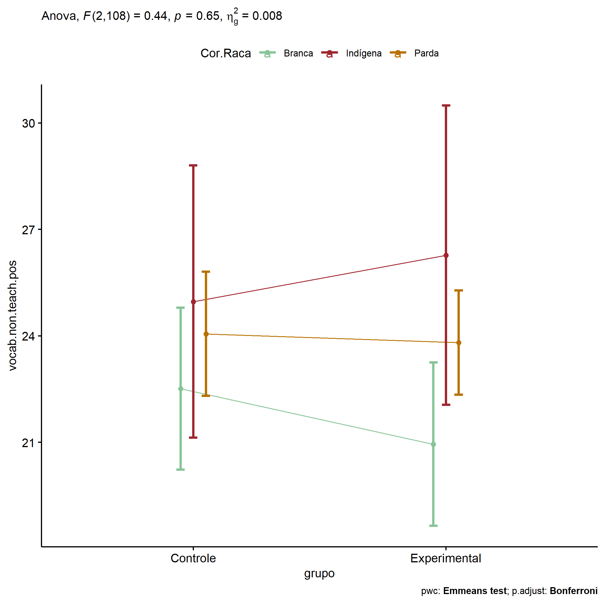<!-- -->

``` r
if (!is.null(plots[["Cor.Raca"]]))
  plots[["Cor.Raca"]] + ggplot2::scale_color_manual(values = color[["grupo"]])
```

    ## Scale for colour is already present.
    ## Adding another scale for colour, which will replace the existing scale.

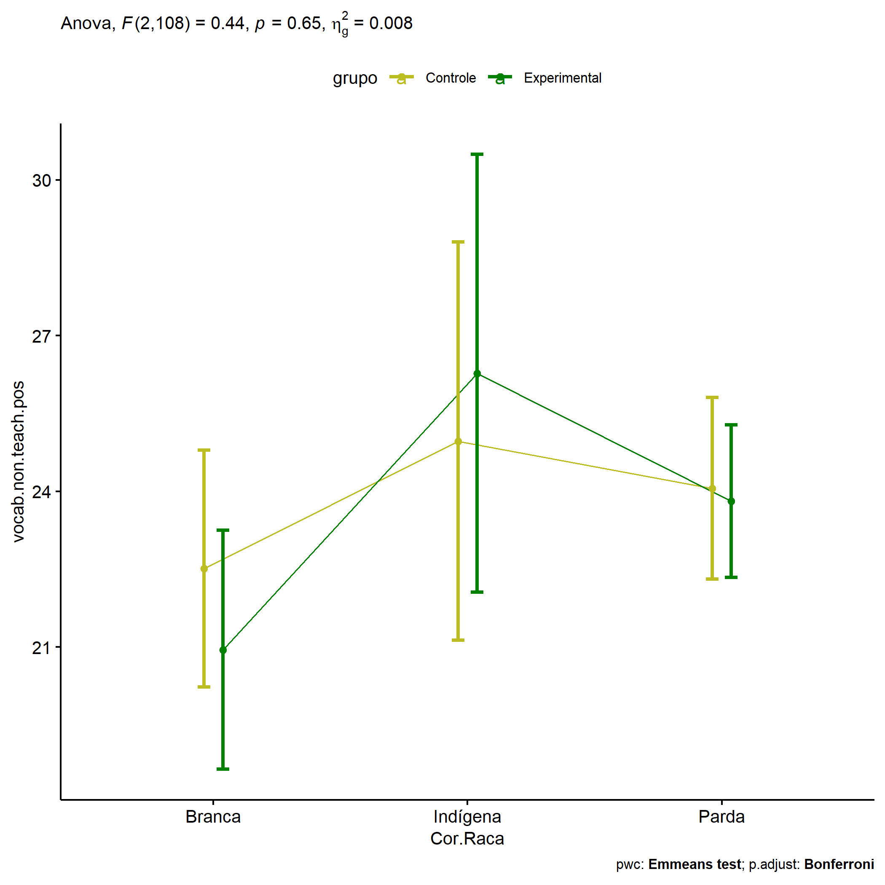<!-- -->

``` r
plots <- twoWayAncovaBoxPlots(
  wdat, "vocab.non.teach.pos", c("grupo","Cor.Raca"), aov, pwcs, covar = "vocab.non.teach.pre",
  theme = "classic", color = color[["grupo:Cor.Raca"]],
  subtitle = which(aov$Effect == "grupo:Cor.Raca"))
```

``` r
plots[["grupo:Cor.Raca"]] + ggplot2::ylab("Vocabulario Não Ensinado") + ggplot2::scale_x_discrete(labels=c('pre', 'pos'))
```

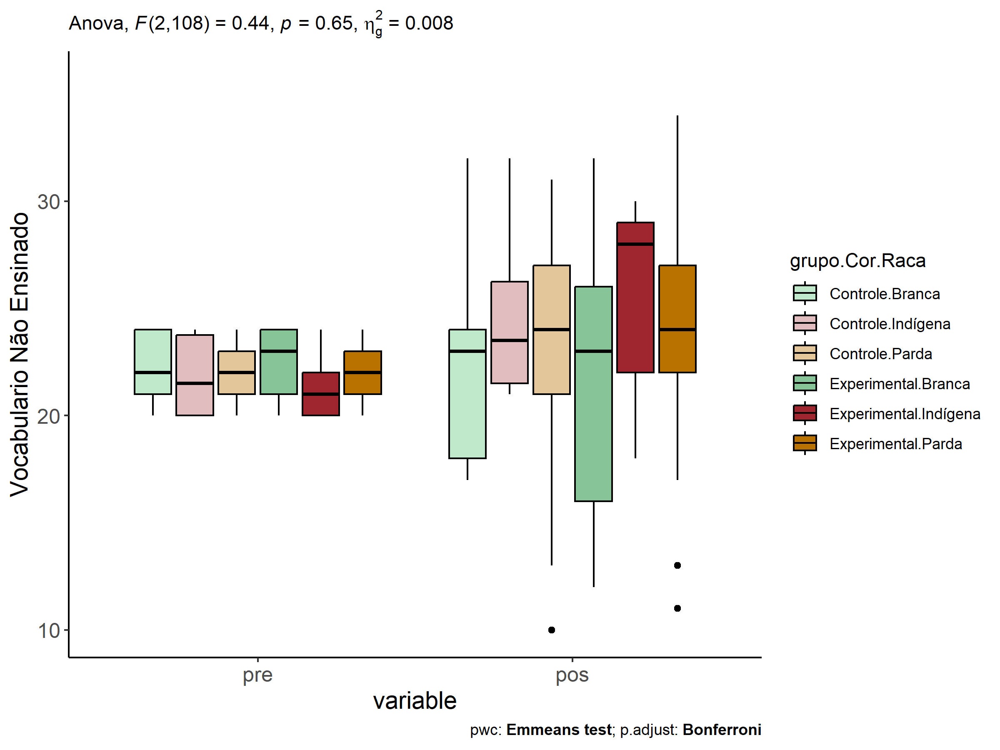<!-- -->

``` r
plots <- twoWayAncovaBoxPlots(
  wdat.long, "vocab.non.teach", c("grupo","Cor.Raca"), aov, pwc.long, pre.post = "time",
  theme = "classic", color = color$prepost)
```

``` r
plots[["grupo:Cor.Raca"]] + ggplot2::ylab("Vocabulario Não Ensinado")
```

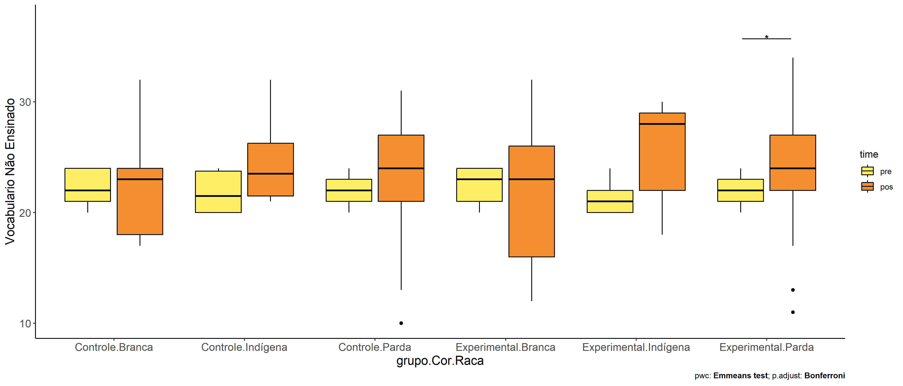<!-- -->

### Checking linearity assumption

``` r
ggscatter(wdat, x = "vocab.non.teach.pre", y = "vocab.non.teach.pos", size = 0.5,
          facet.by = c("grupo","Cor.Raca"), add = "reg.line")+
  stat_regline_equation(
    aes(label =  paste(..eq.label.., ..rr.label.., sep = "~~~~"))
  )
```

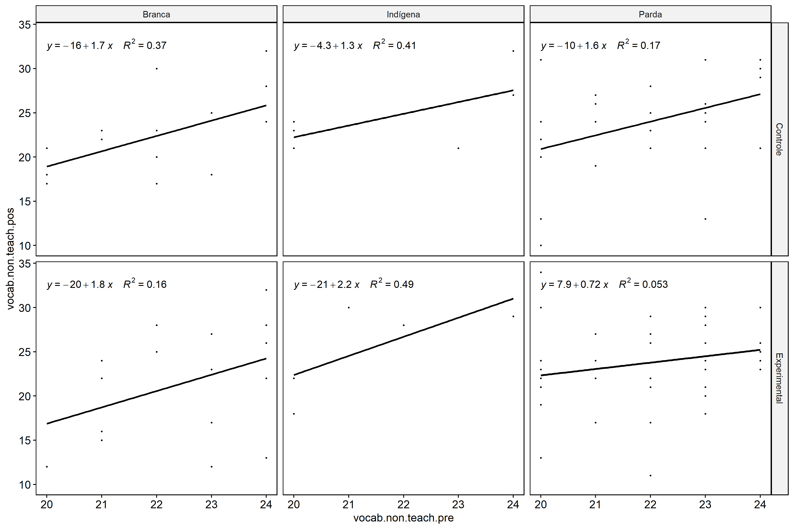<!-- -->

### Checking normality and homogeneity

``` r
res <- augment(lm(vocab.non.teach.pos ~ vocab.non.teach.pre + grupo*Cor.Raca, data = wdat))
```

``` r
shapiro_test(res$.resid)
```

    ## # A tibble: 1 × 3
    ##   variable   statistic p.value
    ##   <chr>          <dbl>   <dbl>
    ## 1 res$.resid     0.983   0.161

``` r
levene_test(res, .resid ~ grupo*Cor.Raca)
```

    ## # A tibble: 1 × 4
    ##     df1   df2 statistic     p
    ##   <int> <int>     <dbl> <dbl>
    ## 1     5   109     0.918 0.472

# ANCOVA and Pairwise for two factors **grupo:Serie**

## Without remove non-normal data

``` r
pdat = remove_group_data(dat[!is.na(dat[["grupo"]]) & !is.na(dat[["Serie"]]),], "vocab.non.teach.pos", c("grupo","Serie"))

pdat.long <- rbind(pdat[,c("id","grupo","Serie")], pdat[,c("id","grupo","Serie")])
pdat.long[["time"]] <- c(rep("pre", nrow(pdat)), rep("pos", nrow(pdat)))
pdat.long[["time"]] <- factor(pdat.long[["time"]], c("pre","pos"))
pdat.long[["vocab.non.teach"]] <- c(pdat[["vocab.non.teach.pre"]], pdat[["vocab.non.teach.pos"]])

aov = anova_test(pdat, vocab.non.teach.pos ~ vocab.non.teach.pre + grupo*Serie)
laov[["grupo:Serie"]] <- get_anova_table(aov)
```

``` r
pwcs <- list()
pwcs[["Serie"]] <- emmeans_test(
  group_by(pdat, grupo), vocab.non.teach.pos ~ Serie,
  covariate = vocab.non.teach.pre, p.adjust.method = "bonferroni")
pwcs[["grupo"]] <- emmeans_test(
  group_by(pdat, Serie), vocab.non.teach.pos ~ grupo,
  covariate = vocab.non.teach.pre, p.adjust.method = "bonferroni")

pwc <- plyr::rbind.fill(pwcs[["grupo"]], pwcs[["Serie"]])
pwc <- pwc[,c("grupo","Serie", colnames(pwc)[!colnames(pwc) %in% c("grupo","Serie")])]
```

``` r
pwc.long <- emmeans_test(dplyr::group_by_at(pdat.long, c("grupo","Serie")),
                         vocab.non.teach ~ time,
                         p.adjust.method = "bonferroni")
lpwc[["grupo:Serie"]] <- plyr::rbind.fill(pwc, pwc.long)
```

``` r
ds <- get.descriptives(pdat, "vocab.non.teach.pos", c("grupo","Serie"), covar = "vocab.non.teach.pre")
ds <- merge(ds[ds$variable != "vocab.non.teach.pre",],
            ds[ds$variable == "vocab.non.teach.pre", !colnames(ds) %in% c("variable")],
            by = c("grupo","Serie"), all.x = T, suffixes = c("", ".vocab.non.teach.pre"))
ds <- merge(get_emmeans(pwcs[["grupo"]]), ds, by = c("grupo","Serie"), suffixes = c(".emms", ""))
ds <- ds[,c("grupo","Serie","n","mean.vocab.non.teach.pre","se.vocab.non.teach.pre","mean","se","emmean","se.emms")]

colnames(ds) <- c("grupo","Serie", "N", paste0(c("M","SE")," (pre)"),
                  paste0(c("M","SE"), " (unadj)"), paste0(c("M", "SE"), " (adj)"))

lemms[["grupo:Serie"]] <- ds
```

## Computing ANCOVA and PairWise After removing non-normal data (OK)

``` r
wdat = pdat 

res = residuals(lm(vocab.non.teach.pos ~ vocab.non.teach.pre + grupo*Serie, data = wdat))
non.normal = getNonNormal(res, wdat$id, plimit = 0.05)

wdat = wdat[!wdat$id %in% non.normal,]

wdat.long <- rbind(wdat[,c("id","grupo","Serie")], wdat[,c("id","grupo","Serie")])
wdat.long[["time"]] <- c(rep("pre", nrow(wdat)), rep("pos", nrow(wdat)))
wdat.long[["time"]] <- factor(wdat.long[["time"]], c("pre","pos"))
wdat.long[["vocab.non.teach"]] <- c(wdat[["vocab.non.teach.pre"]], wdat[["vocab.non.teach.pos"]])


ldat[["grupo:Serie"]] = wdat

(non.normal)
```

    ## [1] "P1113" "P2251" "P1056"

``` r
aov = anova_test(wdat, vocab.non.teach.pos ~ vocab.non.teach.pre + grupo*Serie)
laov[["grupo:Serie"]] <- merge(get_anova_table(aov), laov[["grupo:Serie"]], by="Effect", suffixes = c("","'"))

(df = get_anova_table(aov))
```

    ## ANOVA Table (type II tests)
    ## 
    ##                Effect DFn DFd      F       p p<.05   ges
    ## 1 vocab.non.teach.pre   1 265 14.800 0.00015     * 0.053
    ## 2               grupo   1 265  0.436 0.51000       0.002
    ## 3               Serie   3 265  2.815 0.04000     * 0.031
    ## 4         grupo:Serie   3 265  1.169 0.32200       0.013

| Effect              | DFn | DFd |      F |     p | p\<.05 |   ges |
|:--------------------|----:|----:|-------:|------:|:-------|------:|
| vocab.non.teach.pre |   1 | 265 | 14.800 | 0.000 | \*     | 0.053 |
| grupo               |   1 | 265 |  0.436 | 0.510 |        | 0.002 |
| Serie               |   3 | 265 |  2.815 | 0.040 | \*     | 0.031 |
| grupo:Serie         |   3 | 265 |  1.169 | 0.322 |        | 0.013 |

``` r
pwcs <- list()
pwcs[["Serie"]] <- emmeans_test(
  group_by(wdat, grupo), vocab.non.teach.pos ~ Serie,
  covariate = vocab.non.teach.pre, p.adjust.method = "bonferroni")
pwcs[["grupo"]] <- emmeans_test(
  group_by(wdat, Serie), vocab.non.teach.pos ~ grupo,
  covariate = vocab.non.teach.pre, p.adjust.method = "bonferroni")

pwc <- plyr::rbind.fill(pwcs[["grupo"]], pwcs[["Serie"]])
pwc <- pwc[,c("grupo","Serie", colnames(pwc)[!colnames(pwc) %in% c("grupo","Serie")])]
```

| grupo        | Serie | term                       | .y.                 | group1   | group2       |  df | statistic |     p | p.adj | p.adj.signif |
|:-------------|:------|:---------------------------|:--------------------|:---------|:-------------|----:|----------:|------:|------:|:-------------|
|              | 6 ano | vocab.non.teach.pre\*grupo | vocab.non.teach.pos | Controle | Experimental | 265 |     0.806 | 0.421 | 0.421 | ns           |
|              | 7 ano | vocab.non.teach.pre\*grupo | vocab.non.teach.pos | Controle | Experimental | 265 |    -0.199 | 0.842 | 0.842 | ns           |
|              | 8 ano | vocab.non.teach.pre\*grupo | vocab.non.teach.pos | Controle | Experimental | 265 |     1.602 | 0.110 | 0.110 | ns           |
|              | 9 ano | vocab.non.teach.pre\*grupo | vocab.non.teach.pos | Controle | Experimental | 265 |    -0.825 | 0.410 | 0.410 | ns           |
| Controle     |       | vocab.non.teach.pre\*Serie | vocab.non.teach.pos | 6 ano    | 7 ano        | 265 |     0.010 | 0.992 | 1.000 | ns           |
| Controle     |       | vocab.non.teach.pre\*Serie | vocab.non.teach.pos | 6 ano    | 8 ano        | 265 |    -1.042 | 0.298 | 1.000 | ns           |
| Controle     |       | vocab.non.teach.pre\*Serie | vocab.non.teach.pos | 6 ano    | 9 ano        | 265 |    -0.944 | 0.346 | 1.000 | ns           |
| Controle     |       | vocab.non.teach.pre\*Serie | vocab.non.teach.pos | 7 ano    | 8 ano        | 265 |    -1.066 | 0.287 | 1.000 | ns           |
| Controle     |       | vocab.non.teach.pre\*Serie | vocab.non.teach.pos | 7 ano    | 9 ano        | 265 |    -0.968 | 0.334 | 1.000 | ns           |
| Controle     |       | vocab.non.teach.pre\*Serie | vocab.non.teach.pos | 8 ano    | 9 ano        | 265 |     0.115 | 0.909 | 1.000 | ns           |
| Experimental |       | vocab.non.teach.pre\*Serie | vocab.non.teach.pos | 6 ano    | 7 ano        | 265 |    -1.138 | 0.256 | 1.000 | ns           |
| Experimental |       | vocab.non.teach.pre\*Serie | vocab.non.teach.pos | 6 ano    | 8 ano        | 265 |    -0.284 | 0.776 | 1.000 | ns           |
| Experimental |       | vocab.non.teach.pre\*Serie | vocab.non.teach.pos | 6 ano    | 9 ano        | 265 |    -2.896 | 0.004 | 0.025 | \*           |
| Experimental |       | vocab.non.teach.pre\*Serie | vocab.non.teach.pos | 7 ano    | 8 ano        | 265 |     0.823 | 0.412 | 1.000 | ns           |
| Experimental |       | vocab.non.teach.pre\*Serie | vocab.non.teach.pos | 7 ano    | 9 ano        | 265 |    -1.969 | 0.050 | 0.300 | ns           |
| Experimental |       | vocab.non.teach.pre\*Serie | vocab.non.teach.pos | 8 ano    | 9 ano        | 265 |    -2.581 | 0.010 | 0.062 | ns           |

``` r
pwc.long <- emmeans_test(dplyr::group_by_at(wdat.long, c("grupo","Serie")),
                         vocab.non.teach ~ time,
                         p.adjust.method = "bonferroni")
lpwc[["grupo:Serie"]] <- merge(plyr::rbind.fill(pwc, pwc.long), lpwc[["grupo:Serie"]], by=c("grupo","Serie","term",".y.","group1","group2"), suffixes = c("","'"))
```

| grupo        | Serie | term | .y.             | group1 | group2 |  df | statistic |     p | p.adj | p.adj.signif |
|:-------------|:------|:-----|:----------------|:-------|:-------|----:|----------:|------:|------:|:-------------|
| Controle     | 6 ano | time | vocab.non.teach | pre    | pos    | 532 |    -0.926 | 0.355 | 0.355 | ns           |
| Controle     | 7 ano | time | vocab.non.teach | pre    | pos    | 532 |    -0.896 | 0.371 | 0.371 | ns           |
| Controle     | 8 ano | time | vocab.non.teach | pre    | pos    | 532 |    -2.120 | 0.034 | 0.034 | \*           |
| Controle     | 9 ano | time | vocab.non.teach | pre    | pos    | 532 |    -2.034 | 0.042 | 0.042 | \*           |
| Experimental | 6 ano | time | vocab.non.teach | pre    | pos    | 532 |     0.091 | 0.928 | 0.928 | ns           |
| Experimental | 7 ano | time | vocab.non.teach | pre    | pos    | 532 |    -1.543 | 0.123 | 0.123 | ns           |
| Experimental | 8 ano | time | vocab.non.teach | pre    | pos    | 532 |    -0.430 | 0.667 | 0.667 | ns           |
| Experimental | 9 ano | time | vocab.non.teach | pre    | pos    | 532 |    -3.600 | 0.000 | 0.000 | \*\*\*       |

``` r
ds <- get.descriptives(wdat, "vocab.non.teach.pos", c("grupo","Serie"), covar = "vocab.non.teach.pre")
ds <- merge(ds[ds$variable != "vocab.non.teach.pre",],
            ds[ds$variable == "vocab.non.teach.pre", !colnames(ds) %in% c("variable")],
            by = c("grupo","Serie"), all.x = T, suffixes = c("", ".vocab.non.teach.pre"))
ds <- merge(get_emmeans(pwcs[["grupo"]]), ds, by = c("grupo","Serie"), suffixes = c(".emms", ""))
ds <- ds[,c("grupo","Serie","n","mean.vocab.non.teach.pre","se.vocab.non.teach.pre","mean","se","emmean","se.emms")]

colnames(ds) <- c("grupo","Serie", "N", paste0(c("M","SE")," (pre)"),
                  paste0(c("M","SE"), " (unadj)"), paste0(c("M", "SE"), " (adj)"))

lemms[["grupo:Serie"]] <- merge(ds, lemms[["grupo:Serie"]], by=c("grupo","Serie"), suffixes = c("","'"))
```

| grupo        | Serie |   N | M (pre) | SE (pre) | M (unadj) | SE (unadj) | M (adj) | SE (adj) |
|:-------------|:------|----:|--------:|---------:|----------:|-----------:|--------:|---------:|
| Controle     | 6 ano |  29 |  22.069 |    0.297 |    22.966 |      0.895 |  22.960 |    0.907 |
| Controle     | 7 ano |  31 |  22.290 |    0.279 |    23.129 |      0.836 |  22.947 |    0.878 |
| Controle     | 8 ano |  23 |  22.130 |    0.290 |    24.435 |      0.895 |  24.380 |    1.018 |
| Controle     | 9 ano |  25 |  22.240 |    0.254 |    24.360 |      1.020 |  24.218 |    0.977 |
| Experimental | 6 ano |  40 |  22.125 |    0.243 |    22.050 |      0.913 |  22.000 |    0.772 |
| Experimental | 7 ano |  52 |  22.019 |    0.177 |    23.135 |      0.677 |  23.169 |    0.677 |
| Experimental | 8 ano |  39 |  21.538 |    0.235 |    21.897 |      0.822 |  22.314 |    0.789 |
| Experimental | 9 ano |  35 |  22.257 |    0.251 |    25.429 |      0.831 |  25.273 |    0.826 |

### Plots for ancova

``` r
plots <- twoWayAncovaPlots(
  wdat, "vocab.non.teach.pos", c("grupo","Serie"), aov, pwcs, addParam = c("mean_se"),
  font.label.size=10, step.increase=0.05, p.label="p.adj",
  subtitle = which(aov$Effect == "grupo:Serie"))
```

``` r
if (!is.null(plots[["grupo"]]))
  plots[["grupo"]] + ggplot2::scale_color_manual(values = color[["Serie"]])
```

    ## Scale for colour is already present.
    ## Adding another scale for colour, which will replace the existing scale.

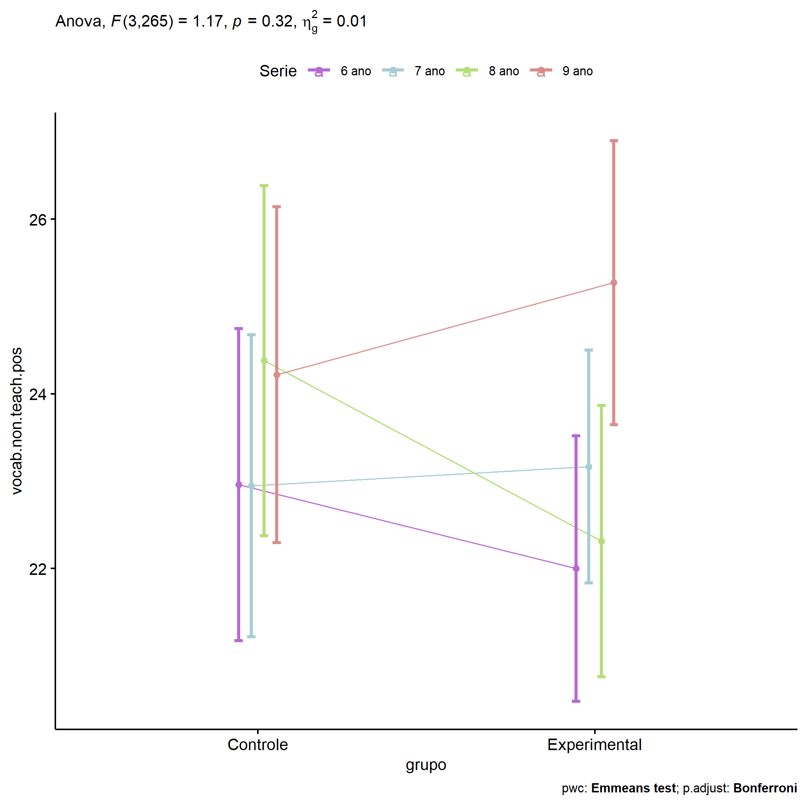<!-- -->

``` r
if (!is.null(plots[["Serie"]]))
  plots[["Serie"]] + ggplot2::scale_color_manual(values = color[["grupo"]])
```

    ## Scale for colour is already present.
    ## Adding another scale for colour, which will replace the existing scale.

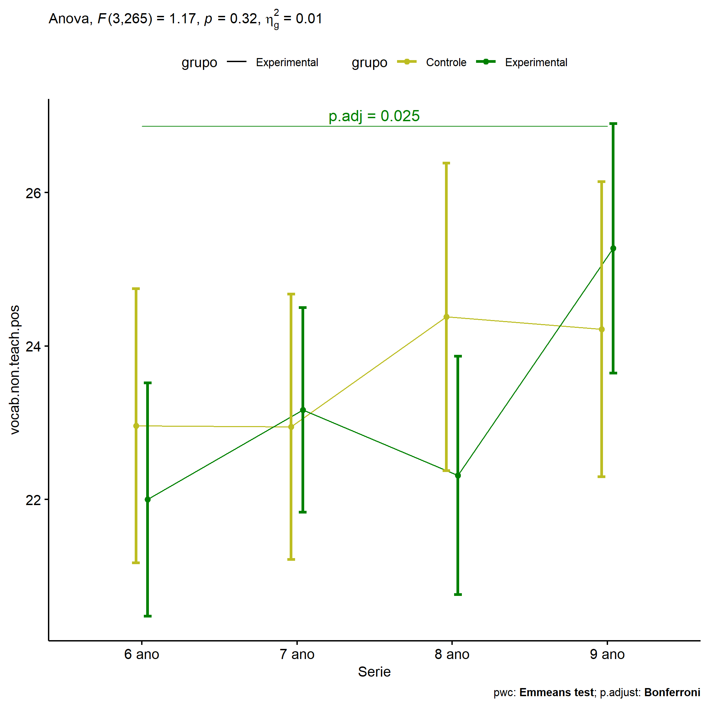<!-- -->

``` r
plots <- twoWayAncovaBoxPlots(
  wdat, "vocab.non.teach.pos", c("grupo","Serie"), aov, pwcs, covar = "vocab.non.teach.pre",
  theme = "classic", color = color[["grupo:Serie"]],
  subtitle = which(aov$Effect == "grupo:Serie"))
```

``` r
plots[["grupo:Serie"]] + ggplot2::ylab("Vocabulario Não Ensinado") + ggplot2::scale_x_discrete(labels=c('pre', 'pos'))
```

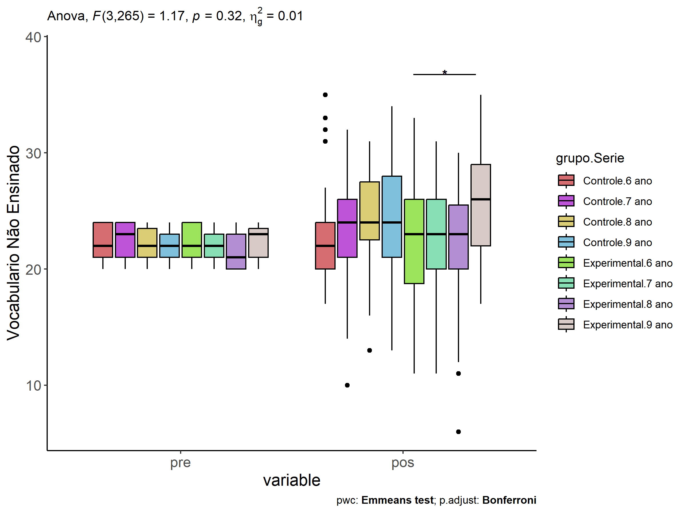<!-- -->

``` r
plots <- twoWayAncovaBoxPlots(
  wdat.long, "vocab.non.teach", c("grupo","Serie"), aov, pwc.long, pre.post = "time",
  theme = "classic", color = color$prepost)
```

``` r
plots[["grupo:Serie"]] + ggplot2::ylab("Vocabulario Não Ensinado")
```

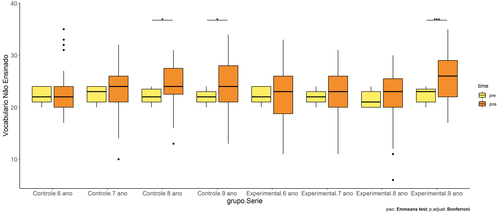<!-- -->

### Checking linearity assumption

``` r
ggscatter(wdat, x = "vocab.non.teach.pre", y = "vocab.non.teach.pos", size = 0.5,
          facet.by = c("grupo","Serie"), add = "reg.line")+
  stat_regline_equation(
    aes(label =  paste(..eq.label.., ..rr.label.., sep = "~~~~"))
  )
```

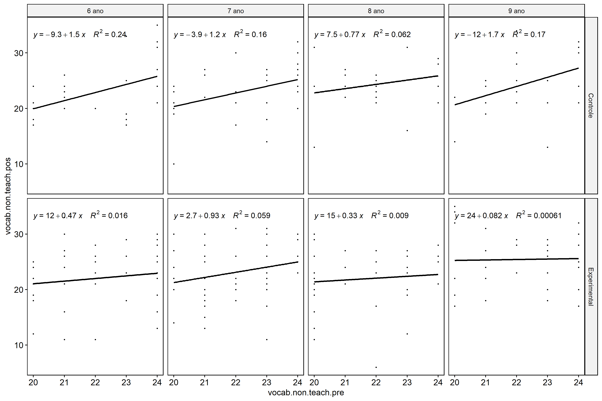<!-- -->

### Checking normality and homogeneity

``` r
res <- augment(lm(vocab.non.teach.pos ~ vocab.non.teach.pre + grupo*Serie, data = wdat))
```

``` r
shapiro_test(res$.resid)
```

    ## # A tibble: 1 × 3
    ##   variable   statistic p.value
    ##   <chr>          <dbl>   <dbl>
    ## 1 res$.resid     0.990  0.0616

``` r
levene_test(res, .resid ~ grupo*Serie)
```

    ## # A tibble: 1 × 4
    ##     df1   df2 statistic     p
    ##   <int> <int>     <dbl> <dbl>
    ## 1     7   266     0.951 0.467

# Summary of Results

## Descriptive Statistics

``` r
df <- get.descriptives(ldat[["grupo"]], c(dv.pre, dv.pos), c("grupo"), 
                       include.global = T, symmetry.test = T, normality.test = F)
df <- plyr::rbind.fill(
  df, do.call(plyr::rbind.fill, lapply(lfatores2, FUN = function(f) {
    if (nrow(dat) > 0 && sum(!is.na(unique(dat[[f]]))) > 1)
      get.descriptives(ldat[[paste0("grupo:",f)]], c(dv.pre,dv.pos), c("grupo", f),
                       symmetry.test = T, normality.test = F)
    }))
)
(df <- df[,c(fatores1[fatores1 %in% colnames(df)],"variable",
             colnames(df)[!colnames(df) %in% c(fatores1,"variable")])])
```

    ##           grupo Sexo   Zona Cor.Raca Serie            variable   n   mean median min max    sd    se
    ## 1      Controle <NA>   <NA>     <NA>  <NA> vocab.non.teach.pre 108 22.185   22.0  20  24 1.454 0.140
    ## 2  Experimental <NA>   <NA>     <NA>  <NA> vocab.non.teach.pre 165 21.982   22.0  20  24 1.446 0.113
    ## 3          <NA> <NA>   <NA>     <NA>  <NA> vocab.non.teach.pre 273 22.062   22.0  20  24 1.450 0.088
    ## 4      Controle <NA>   <NA>     <NA>  <NA> vocab.non.teach.pos 108 23.648   24.0  10  35 4.715 0.454
    ## 5  Experimental <NA>   <NA>     <NA>  <NA> vocab.non.teach.pos 165 23.170   23.0  11  35 5.143 0.400
    ## 6          <NA> <NA>   <NA>     <NA>  <NA> vocab.non.teach.pos 273 23.359   24.0  10  35 4.975 0.301
    ## 7      Controle    F   <NA>     <NA>  <NA> vocab.non.teach.pre  63 22.143   22.0  20  24 1.490 0.188
    ## 8      Controle    M   <NA>     <NA>  <NA> vocab.non.teach.pre  45 22.244   22.0  20  24 1.417 0.211
    ## 9  Experimental    F   <NA>     <NA>  <NA> vocab.non.teach.pre  90 21.956   22.0  20  24 1.398 0.147
    ## 10 Experimental    M   <NA>     <NA>  <NA> vocab.non.teach.pre  76 22.013   22.0  20  24 1.501 0.172
    ## 11     Controle    F   <NA>     <NA>  <NA> vocab.non.teach.pos  63 24.413   24.0  14  35 4.383 0.552
    ## 12     Controle    M   <NA>     <NA>  <NA> vocab.non.teach.pos  45 22.578   23.0  10  33 4.998 0.745
    ## 13 Experimental    F   <NA>     <NA>  <NA> vocab.non.teach.pos  90 23.211   23.0   6  34 5.276 0.556
    ## 14 Experimental    M   <NA>     <NA>  <NA> vocab.non.teach.pos  76 22.895   23.0  11  35 5.353 0.614
    ## 15     Controle <NA>  Rural     <NA>  <NA> vocab.non.teach.pre  61 22.426   23.0  20  24 1.372 0.176
    ## 16     Controle <NA> Urbana     <NA>  <NA> vocab.non.teach.pre  19 21.684   21.0  20  24 1.416 0.325
    ## 17 Experimental <NA>  Rural     <NA>  <NA> vocab.non.teach.pre  77 22.052   22.0  20  24 1.503 0.171
    ## 18 Experimental <NA> Urbana     <NA>  <NA> vocab.non.teach.pre  44 22.068   22.0  20  24 1.388 0.209
    ## 19     Controle <NA>  Rural     <NA>  <NA> vocab.non.teach.pos  61 24.344   24.0  13  35 4.622 0.592
    ## 20     Controle <NA> Urbana     <NA>  <NA> vocab.non.teach.pos  19 23.053   24.0  14  30 3.659 0.839
    ## 21 Experimental <NA>  Rural     <NA>  <NA> vocab.non.teach.pos  77 23.390   24.0  11  34 5.148 0.587
    ## 22 Experimental <NA> Urbana     <NA>  <NA> vocab.non.teach.pos  44 23.000   24.0  11  30 5.144 0.776
    ## 23     Controle <NA>   <NA>   Branca  <NA> vocab.non.teach.pre  17 22.118   22.0  20  24 1.576 0.382
    ## 24     Controle <NA>   <NA> Indígena  <NA> vocab.non.teach.pre   6 21.833   21.5  20  24 2.041 0.833
    ## 25     Controle <NA>   <NA>    Parda  <NA> vocab.non.teach.pre  29 21.862   22.0  20  24 1.457 0.271
    ## 26 Experimental <NA>   <NA>   Branca  <NA> vocab.non.teach.pre  17 22.588   23.0  20  24 1.372 0.333
    ## 27 Experimental <NA>   <NA> Indígena  <NA> vocab.non.teach.pre   5 21.400   21.0  20  24 1.673 0.748
    ## 28 Experimental <NA>   <NA>    Parda  <NA> vocab.non.teach.pre  41 22.073   22.0  20  24 1.506 0.235
    ## 29     Controle <NA>   <NA>   Branca  <NA> vocab.non.teach.pos  17 22.588   23.0  17  32 4.473 1.085
    ## 30     Controle <NA>   <NA> Indígena  <NA> vocab.non.teach.pos   6 24.667   23.5  21  32 4.227 1.726
    ## 31     Controle <NA>   <NA>    Parda  <NA> vocab.non.teach.pos  29 23.793   24.0  10  31 5.434 1.009
    ## 32 Experimental <NA>   <NA>   Branca  <NA> vocab.non.teach.pos  17 21.647   23.0  12  32 6.284 1.524
    ## 33 Experimental <NA>   <NA> Indígena  <NA> vocab.non.teach.pos   5 25.400   28.0  18  30 5.177 2.315
    ## 34 Experimental <NA>   <NA>    Parda  <NA> vocab.non.teach.pos  41 23.829   24.0  11  34 4.727 0.738
    ## 35     Controle <NA>   <NA>     <NA> 6 ano vocab.non.teach.pre  29 22.069   22.0  20  24 1.602 0.297
    ## 36     Controle <NA>   <NA>     <NA> 7 ano vocab.non.teach.pre  31 22.290   23.0  20  24 1.553 0.279
    ## 37     Controle <NA>   <NA>     <NA> 8 ano vocab.non.teach.pre  23 22.130   22.0  20  24 1.392 0.290
    ## 38     Controle <NA>   <NA>     <NA> 9 ano vocab.non.teach.pre  25 22.240   22.0  20  24 1.268 0.254
    ## 39 Experimental <NA>   <NA>     <NA> 6 ano vocab.non.teach.pre  40 22.125   22.0  20  24 1.539 0.243
    ## 40 Experimental <NA>   <NA>     <NA> 7 ano vocab.non.teach.pre  52 22.019   22.0  20  24 1.276 0.177
    ## 41 Experimental <NA>   <NA>     <NA> 8 ano vocab.non.teach.pre  39 21.538   21.0  20  24 1.466 0.235
    ## 42 Experimental <NA>   <NA>     <NA> 9 ano vocab.non.teach.pre  35 22.257   23.0  20  24 1.482 0.251
    ## 43     Controle <NA>   <NA>     <NA> 6 ano vocab.non.teach.pos  29 22.966   22.0  17  35 4.822 0.895
    ## 44     Controle <NA>   <NA>     <NA> 7 ano vocab.non.teach.pos  31 23.129   24.0  10  32 4.653 0.836
    ## 45     Controle <NA>   <NA>     <NA> 8 ano vocab.non.teach.pos  23 24.435   24.0  13  31 4.294 0.895
    ## 46     Controle <NA>   <NA>     <NA> 9 ano vocab.non.teach.pos  25 24.360   24.0  13  34 5.098 1.020
    ## 47 Experimental <NA>   <NA>     <NA> 6 ano vocab.non.teach.pos  40 22.050   23.0  11  33 5.773 0.913
    ## 48 Experimental <NA>   <NA>     <NA> 7 ano vocab.non.teach.pos  52 23.135   23.0  11  31 4.883 0.677
    ## 49 Experimental <NA>   <NA>     <NA> 8 ano vocab.non.teach.pos  39 21.897   23.0   6  30 5.134 0.822
    ## 50 Experimental <NA>   <NA>     <NA> 9 ano vocab.non.teach.pos  35 25.429   26.0  17  35 4.919 0.831
    ##       ci   iqr symmetry    skewness    kurtosis
    ## 1  0.277  3.00      YES -0.13970444 -1.35700223
    ## 2  0.222  2.00      YES -0.02864603 -1.41267655
    ## 3  0.173  2.00      YES -0.07197440 -1.38067988
    ## 4  0.899  5.00      YES -0.07372221  0.16215250
    ## 5  0.791  7.00      YES -0.35064867 -0.22239435
    ## 6  0.593  6.00      YES -0.27082426 -0.03035903
    ## 7  0.375  3.00      YES -0.06810698 -1.42281576
    ## 8  0.426  2.00      YES -0.23773059 -1.31790929
    ## 9  0.293  2.00      YES -0.04402945 -1.35124482
    ## 10 0.343  2.00      YES -0.02206156 -1.50420708
    ## 11 1.104  6.00      YES  0.23382272 -0.14120192
    ## 12 1.501  5.00      YES -0.22281262 -0.10351511
    ## 13 1.105  7.00       NO -0.50011088  0.34314622
    ## 14 1.223  6.25      YES -0.41647182 -0.28951910
    ## 15 0.351  2.00      YES -0.40073142 -1.06294285
    ## 16 0.683  2.00      YES  0.42247162 -1.31235605
    ## 17 0.341  2.00      YES -0.04120866 -1.46617075
    ## 18 0.422  2.00      YES -0.16969524 -1.36858012
    ## 19 1.184  6.00      YES  0.15884165 -0.34616140
    ## 20 1.763  4.50       NO -0.53630692  0.10708381
    ## 21 1.169  6.00      YES -0.32959844 -0.33143901
    ## 22 1.564  7.00       NO -0.75819994 -0.26267739
    ## 23 0.811  3.00      YES -0.09101661 -1.59483660
    ## 24 2.142  3.75 few data  0.00000000  0.00000000
    ## 25 0.554  2.00      YES  0.09669833 -1.45485507
    ## 26 0.705  3.00      YES -0.37830570 -1.43087695
    ## 27 2.078  2.00       NO  0.52248565 -1.63428571
    ## 28 0.476  2.00      YES -0.16367290 -1.47144298
    ## 29 2.300  6.00       NO  0.50062042 -0.78114672
    ## 30 4.436  4.75       NO  0.66991798 -1.28167929
    ## 31 2.067  6.00       NO -0.72783449  0.08725133
    ## 32 3.231 10.00      YES -0.24227739 -1.38599417
    ## 33 6.428  7.00      YES -0.40789920 -1.94361328
    ## 34 1.492  5.00      YES -0.41817583  0.28817725
    ## 35 0.609  3.00      YES -0.05767954 -1.68158116
    ## 36 0.570  3.00      YES -0.36840636 -1.44928282
    ## 37 0.602  2.50      YES  0.06897564 -1.32610930
    ## 38 0.523  2.00      YES  0.03714572 -1.12851619
    ## 39 0.492  3.00      YES -0.03921989 -1.54199298
    ## 40 0.355  2.00      YES -0.09069166 -1.25974740
    ## 41 0.475  3.00      YES  0.26801035 -1.48736003
    ## 42 0.509  2.50      YES -0.27389553 -1.46450827
    ## 43 1.834  4.00       NO  0.94508679  0.03178199
    ## 44 1.707  5.00       NO -0.59034514  0.53983011
    ## 45 1.857  5.00       NO -0.73418836  0.51347263
    ## 46 2.104  7.00      YES -0.20463012 -0.23209519
    ## 47 1.846  7.25      YES -0.38208989 -0.77817246
    ## 48 1.359  6.00      YES -0.29304199 -0.49848709
    ## 49 1.664  5.50       NO -1.05993954  0.98785322
    ## 50 1.690  7.00      YES -0.03489762 -1.02936387

| grupo        | Sexo | Zona   | Cor.Raca | Serie | variable            |   n |   mean | median | min | max |    sd |    se |    ci |   iqr | symmetry | skewness | kurtosis |
|:-------------|:-----|:-------|:---------|:------|:--------------------|----:|-------:|-------:|----:|----:|------:|------:|------:|------:|:---------|---------:|---------:|
| Controle     |      |        |          |       | vocab.non.teach.pre | 108 | 22.185 |   22.0 |  20 |  24 | 1.454 | 0.140 | 0.277 |  3.00 | YES      |   -0.140 |   -1.357 |
| Experimental |      |        |          |       | vocab.non.teach.pre | 165 | 21.982 |   22.0 |  20 |  24 | 1.446 | 0.113 | 0.222 |  2.00 | YES      |   -0.029 |   -1.413 |
|              |      |        |          |       | vocab.non.teach.pre | 273 | 22.062 |   22.0 |  20 |  24 | 1.450 | 0.088 | 0.173 |  2.00 | YES      |   -0.072 |   -1.381 |
| Controle     |      |        |          |       | vocab.non.teach.pos | 108 | 23.648 |   24.0 |  10 |  35 | 4.715 | 0.454 | 0.899 |  5.00 | YES      |   -0.074 |    0.162 |
| Experimental |      |        |          |       | vocab.non.teach.pos | 165 | 23.170 |   23.0 |  11 |  35 | 5.143 | 0.400 | 0.791 |  7.00 | YES      |   -0.351 |   -0.222 |
|              |      |        |          |       | vocab.non.teach.pos | 273 | 23.359 |   24.0 |  10 |  35 | 4.975 | 0.301 | 0.593 |  6.00 | YES      |   -0.271 |   -0.030 |
| Controle     | F    |        |          |       | vocab.non.teach.pre |  63 | 22.143 |   22.0 |  20 |  24 | 1.490 | 0.188 | 0.375 |  3.00 | YES      |   -0.068 |   -1.423 |
| Controle     | M    |        |          |       | vocab.non.teach.pre |  45 | 22.244 |   22.0 |  20 |  24 | 1.417 | 0.211 | 0.426 |  2.00 | YES      |   -0.238 |   -1.318 |
| Experimental | F    |        |          |       | vocab.non.teach.pre |  90 | 21.956 |   22.0 |  20 |  24 | 1.398 | 0.147 | 0.293 |  2.00 | YES      |   -0.044 |   -1.351 |
| Experimental | M    |        |          |       | vocab.non.teach.pre |  76 | 22.013 |   22.0 |  20 |  24 | 1.501 | 0.172 | 0.343 |  2.00 | YES      |   -0.022 |   -1.504 |
| Controle     | F    |        |          |       | vocab.non.teach.pos |  63 | 24.413 |   24.0 |  14 |  35 | 4.383 | 0.552 | 1.104 |  6.00 | YES      |    0.234 |   -0.141 |
| Controle     | M    |        |          |       | vocab.non.teach.pos |  45 | 22.578 |   23.0 |  10 |  33 | 4.998 | 0.745 | 1.501 |  5.00 | YES      |   -0.223 |   -0.104 |
| Experimental | F    |        |          |       | vocab.non.teach.pos |  90 | 23.211 |   23.0 |   6 |  34 | 5.276 | 0.556 | 1.105 |  7.00 | NO       |   -0.500 |    0.343 |
| Experimental | M    |        |          |       | vocab.non.teach.pos |  76 | 22.895 |   23.0 |  11 |  35 | 5.353 | 0.614 | 1.223 |  6.25 | YES      |   -0.416 |   -0.290 |
| Controle     |      | Rural  |          |       | vocab.non.teach.pre |  61 | 22.426 |   23.0 |  20 |  24 | 1.372 | 0.176 | 0.351 |  2.00 | YES      |   -0.401 |   -1.063 |
| Controle     |      | Urbana |          |       | vocab.non.teach.pre |  19 | 21.684 |   21.0 |  20 |  24 | 1.416 | 0.325 | 0.683 |  2.00 | YES      |    0.422 |   -1.312 |
| Experimental |      | Rural  |          |       | vocab.non.teach.pre |  77 | 22.052 |   22.0 |  20 |  24 | 1.503 | 0.171 | 0.341 |  2.00 | YES      |   -0.041 |   -1.466 |
| Experimental |      | Urbana |          |       | vocab.non.teach.pre |  44 | 22.068 |   22.0 |  20 |  24 | 1.388 | 0.209 | 0.422 |  2.00 | YES      |   -0.170 |   -1.369 |
| Controle     |      | Rural  |          |       | vocab.non.teach.pos |  61 | 24.344 |   24.0 |  13 |  35 | 4.622 | 0.592 | 1.184 |  6.00 | YES      |    0.159 |   -0.346 |
| Controle     |      | Urbana |          |       | vocab.non.teach.pos |  19 | 23.053 |   24.0 |  14 |  30 | 3.659 | 0.839 | 1.763 |  4.50 | NO       |   -0.536 |    0.107 |
| Experimental |      | Rural  |          |       | vocab.non.teach.pos |  77 | 23.390 |   24.0 |  11 |  34 | 5.148 | 0.587 | 1.169 |  6.00 | YES      |   -0.330 |   -0.331 |
| Experimental |      | Urbana |          |       | vocab.non.teach.pos |  44 | 23.000 |   24.0 |  11 |  30 | 5.144 | 0.776 | 1.564 |  7.00 | NO       |   -0.758 |   -0.263 |
| Controle     |      |        | Branca   |       | vocab.non.teach.pre |  17 | 22.118 |   22.0 |  20 |  24 | 1.576 | 0.382 | 0.811 |  3.00 | YES      |   -0.091 |   -1.595 |
| Controle     |      |        | Indígena |       | vocab.non.teach.pre |   6 | 21.833 |   21.5 |  20 |  24 | 2.041 | 0.833 | 2.142 |  3.75 | few data |    0.000 |    0.000 |
| Controle     |      |        | Parda    |       | vocab.non.teach.pre |  29 | 21.862 |   22.0 |  20 |  24 | 1.457 | 0.271 | 0.554 |  2.00 | YES      |    0.097 |   -1.455 |
| Experimental |      |        | Branca   |       | vocab.non.teach.pre |  17 | 22.588 |   23.0 |  20 |  24 | 1.372 | 0.333 | 0.705 |  3.00 | YES      |   -0.378 |   -1.431 |
| Experimental |      |        | Indígena |       | vocab.non.teach.pre |   5 | 21.400 |   21.0 |  20 |  24 | 1.673 | 0.748 | 2.078 |  2.00 | NO       |    0.522 |   -1.634 |
| Experimental |      |        | Parda    |       | vocab.non.teach.pre |  41 | 22.073 |   22.0 |  20 |  24 | 1.506 | 0.235 | 0.476 |  2.00 | YES      |   -0.164 |   -1.471 |
| Controle     |      |        | Branca   |       | vocab.non.teach.pos |  17 | 22.588 |   23.0 |  17 |  32 | 4.473 | 1.085 | 2.300 |  6.00 | NO       |    0.501 |   -0.781 |
| Controle     |      |        | Indígena |       | vocab.non.teach.pos |   6 | 24.667 |   23.5 |  21 |  32 | 4.227 | 1.726 | 4.436 |  4.75 | NO       |    0.670 |   -1.282 |
| Controle     |      |        | Parda    |       | vocab.non.teach.pos |  29 | 23.793 |   24.0 |  10 |  31 | 5.434 | 1.009 | 2.067 |  6.00 | NO       |   -0.728 |    0.087 |
| Experimental |      |        | Branca   |       | vocab.non.teach.pos |  17 | 21.647 |   23.0 |  12 |  32 | 6.284 | 1.524 | 3.231 | 10.00 | YES      |   -0.242 |   -1.386 |
| Experimental |      |        | Indígena |       | vocab.non.teach.pos |   5 | 25.400 |   28.0 |  18 |  30 | 5.177 | 2.315 | 6.428 |  7.00 | YES      |   -0.408 |   -1.944 |
| Experimental |      |        | Parda    |       | vocab.non.teach.pos |  41 | 23.829 |   24.0 |  11 |  34 | 4.727 | 0.738 | 1.492 |  5.00 | YES      |   -0.418 |    0.288 |
| Controle     |      |        |          | 6 ano | vocab.non.teach.pre |  29 | 22.069 |   22.0 |  20 |  24 | 1.602 | 0.297 | 0.609 |  3.00 | YES      |   -0.058 |   -1.682 |
| Controle     |      |        |          | 7 ano | vocab.non.teach.pre |  31 | 22.290 |   23.0 |  20 |  24 | 1.553 | 0.279 | 0.570 |  3.00 | YES      |   -0.368 |   -1.449 |
| Controle     |      |        |          | 8 ano | vocab.non.teach.pre |  23 | 22.130 |   22.0 |  20 |  24 | 1.392 | 0.290 | 0.602 |  2.50 | YES      |    0.069 |   -1.326 |
| Controle     |      |        |          | 9 ano | vocab.non.teach.pre |  25 | 22.240 |   22.0 |  20 |  24 | 1.268 | 0.254 | 0.523 |  2.00 | YES      |    0.037 |   -1.129 |
| Experimental |      |        |          | 6 ano | vocab.non.teach.pre |  40 | 22.125 |   22.0 |  20 |  24 | 1.539 | 0.243 | 0.492 |  3.00 | YES      |   -0.039 |   -1.542 |
| Experimental |      |        |          | 7 ano | vocab.non.teach.pre |  52 | 22.019 |   22.0 |  20 |  24 | 1.276 | 0.177 | 0.355 |  2.00 | YES      |   -0.091 |   -1.260 |
| Experimental |      |        |          | 8 ano | vocab.non.teach.pre |  39 | 21.538 |   21.0 |  20 |  24 | 1.466 | 0.235 | 0.475 |  3.00 | YES      |    0.268 |   -1.487 |
| Experimental |      |        |          | 9 ano | vocab.non.teach.pre |  35 | 22.257 |   23.0 |  20 |  24 | 1.482 | 0.251 | 0.509 |  2.50 | YES      |   -0.274 |   -1.465 |
| Controle     |      |        |          | 6 ano | vocab.non.teach.pos |  29 | 22.966 |   22.0 |  17 |  35 | 4.822 | 0.895 | 1.834 |  4.00 | NO       |    0.945 |    0.032 |
| Controle     |      |        |          | 7 ano | vocab.non.teach.pos |  31 | 23.129 |   24.0 |  10 |  32 | 4.653 | 0.836 | 1.707 |  5.00 | NO       |   -0.590 |    0.540 |
| Controle     |      |        |          | 8 ano | vocab.non.teach.pos |  23 | 24.435 |   24.0 |  13 |  31 | 4.294 | 0.895 | 1.857 |  5.00 | NO       |   -0.734 |    0.513 |
| Controle     |      |        |          | 9 ano | vocab.non.teach.pos |  25 | 24.360 |   24.0 |  13 |  34 | 5.098 | 1.020 | 2.104 |  7.00 | YES      |   -0.205 |   -0.232 |
| Experimental |      |        |          | 6 ano | vocab.non.teach.pos |  40 | 22.050 |   23.0 |  11 |  33 | 5.773 | 0.913 | 1.846 |  7.25 | YES      |   -0.382 |   -0.778 |
| Experimental |      |        |          | 7 ano | vocab.non.teach.pos |  52 | 23.135 |   23.0 |  11 |  31 | 4.883 | 0.677 | 1.359 |  6.00 | YES      |   -0.293 |   -0.498 |
| Experimental |      |        |          | 8 ano | vocab.non.teach.pos |  39 | 21.897 |   23.0 |   6 |  30 | 5.134 | 0.822 | 1.664 |  5.50 | NO       |   -1.060 |    0.988 |
| Experimental |      |        |          | 9 ano | vocab.non.teach.pos |  35 | 25.429 |   26.0 |  17 |  35 | 4.919 | 0.831 | 1.690 |  7.00 | YES      |   -0.035 |   -1.029 |

## ANCOVA Table Comparison

``` r
df <- do.call(plyr::rbind.fill, laov)
(df <- df[!duplicated(df$Effect),])
```

    ##                 Effect DFn DFd      F        p p<.05      ges DFn' DFd'        F'       p' p<.05'
    ## 1                grupo   1 270  0.261 6.10e-01       0.000966    1  274  0.145000 0.704000       
    ## 2  vocab.non.teach.pre   1 270 17.435 4.02e-05     * 0.061000    1  274 13.701000 0.000259      *
    ## 4           grupo:Sexo   1 269  1.607 2.06e-01       0.006000    1  272  0.321000 0.572000       
    ## 5                 Sexo   1 269  2.631 1.06e-01       0.010000    1  272  2.145000 0.144000       
    ## 8           grupo:Zona   1 196  0.026 8.72e-01       0.000133    1  197  0.000591 0.981000       
    ## 10                Zona   1 196  0.449 5.03e-01       0.002000    1  197  0.273000 0.602000       
    ## 11            Cor.Raca   2 108  3.595 3.10e-02     * 0.062000    2  110  2.171000 0.119000       
    ## 13      grupo:Cor.Raca   2 108  0.435 6.49e-01       0.008000    2  110  0.320000 0.727000       
    ## 16         grupo:Serie   3 265  1.169 3.22e-01       0.013000    3  268  0.260000 0.854000       
    ## 17               Serie   3 265  2.815 4.00e-02     * 0.031000    3  268  1.941000 0.123000       
    ##        ges'
    ## 1  0.000529
    ## 2  0.048000
    ## 4  0.001000
    ## 5  0.008000
    ## 8  0.000003
    ## 10 0.001000
    ## 11 0.038000
    ## 13 0.006000
    ## 16 0.003000
    ## 17 0.021000

|     | Effect              | DFn | DFd |      F |     p | p\<.05 |   ges | DFn’ | DFd’ |     F’ |    p’ | p\<.05’ |  ges’ |
|:----|:--------------------|----:|----:|-------:|------:|:-------|------:|-----:|-----:|-------:|------:|:--------|------:|
| 1   | grupo               |   1 | 270 |  0.261 | 0.610 |        | 0.001 |    1 |  274 |  0.145 | 0.704 |         | 0.001 |
| 2   | vocab.non.teach.pre |   1 | 270 | 17.435 | 0.000 | \*     | 0.061 |    1 |  274 | 13.701 | 0.000 | \*      | 0.048 |
| 4   | grupo:Sexo          |   1 | 269 |  1.607 | 0.206 |        | 0.006 |    1 |  272 |  0.321 | 0.572 |         | 0.001 |
| 5   | Sexo                |   1 | 269 |  2.631 | 0.106 |        | 0.010 |    1 |  272 |  2.145 | 0.144 |         | 0.008 |
| 8   | grupo:Zona          |   1 | 196 |  0.026 | 0.872 |        | 0.000 |    1 |  197 |  0.001 | 0.981 |         | 0.000 |
| 10  | Zona                |   1 | 196 |  0.449 | 0.503 |        | 0.002 |    1 |  197 |  0.273 | 0.602 |         | 0.001 |
| 11  | Cor.Raca            |   2 | 108 |  3.595 | 0.031 | \*     | 0.062 |    2 |  110 |  2.171 | 0.119 |         | 0.038 |
| 13  | grupo:Cor.Raca      |   2 | 108 |  0.435 | 0.649 |        | 0.008 |    2 |  110 |  0.320 | 0.727 |         | 0.006 |
| 16  | grupo:Serie         |   3 | 265 |  1.169 | 0.322 |        | 0.013 |    3 |  268 |  0.260 | 0.854 |         | 0.003 |
| 17  | Serie               |   3 | 265 |  2.815 | 0.040 | \*     | 0.031 |    3 |  268 |  1.941 | 0.123 |         | 0.021 |

## PairWise Table Comparison

``` r
df <- do.call(plyr::rbind.fill, lpwc)
df <- df[,c(names(lfatores), names(df)[!names(df) %in% c(names(lfatores),"term",".y.")])]
```

| grupo        | Sexo | Zona   | Cor.Raca | Serie | group1   | group2       |  df | statistic |     p | p.adj | p.adj.signif | df’ | statistic’ |    p’ | p.adj’ | p.adj.signif’ |
|:-------------|:-----|:-------|:---------|:------|:---------|:-------------|----:|----------:|------:|------:|:-------------|----:|-----------:|------:|-------:|:--------------|
| Controle     |      |        |          |       | pre      | pos          | 542 |    -2.932 | 0.004 | 0.004 | \*\*         | 550 |     -2.187 | 0.029 |  0.029 | \*            |
| Experimental |      |        |          |       | pre      | pos          | 542 |    -2.943 | 0.003 | 0.003 | \*\*         | 550 |     -2.205 | 0.028 |  0.028 | \*            |
|              |      |        |          |       | Controle | Experimental | 270 |     0.511 | 0.610 | 0.610 | ns           | 274 |      0.381 | 0.704 |  0.704 | ns            |
| Controle     | F    |        |          |       | pre      | pos          | 540 |    -3.422 | 0.001 | 0.001 | \*\*\*       | 546 |     -2.511 | 0.012 |  0.012 | \*            |
| Controle     | M    |        |          |       | pre      | pos          | 540 |    -0.425 | 0.671 | 0.671 | ns           | 546 |     -0.401 | 0.689 |  0.689 | ns            |
| Controle     |      |        |          |       | F        | M            | 269 |     2.003 | 0.046 | 0.046 | \*           | 272 |      1.357 | 0.176 |  0.176 | ns            |
| Experimental | F    |        |          |       | pre      | pos          | 540 |    -2.262 | 0.024 | 0.024 | \*           | 546 |     -2.134 | 0.033 |  0.033 | \*            |
| Experimental | M    |        |          |       | pre      | pos          | 540 |    -1.460 | 0.145 | 0.145 | ns           | 546 |     -0.939 | 0.348 |  0.348 | ns            |
| Experimental |      |        |          |       | F        | M            | 269 |     0.477 | 0.633 | 0.633 | ns           | 272 |      0.790 | 0.430 |  0.430 | ns            |
|              | F    |        |          |       | Controle | Experimental | 269 |     1.288 | 0.199 | 0.199 | ns           | 272 |      0.599 | 0.549 |  0.549 | ns            |
|              | M    |        |          |       | Controle | Experimental | 269 |    -0.556 | 0.579 | 0.579 | ns           | 272 |     -0.229 | 0.819 |  0.819 | ns            |
| Controle     |      |        |          |       | Rural    | Urbana       | 196 |     0.520 | 0.603 | 0.603 | ns           | 197 |      0.284 | 0.777 |  0.777 | ns            |
| Controle     |      | Rural  |          |       | pre      | pos          | 394 |    -2.950 | 0.003 | 0.003 | \*\*         | 396 |     -2.486 | 0.013 |  0.013 | \*            |
| Controle     |      | Urbana |          |       | pre      | pos          | 394 |    -1.175 | 0.241 | 0.241 | ns           | 396 |     -1.145 | 0.253 |  0.253 | ns            |
| Experimental |      |        |          |       | Rural    | Urbana       | 196 |     0.452 | 0.652 | 0.652 | ns           | 197 |      0.439 | 0.661 |  0.661 | ns            |
| Experimental |      | Rural  |          |       | pre      | pos          | 394 |    -2.312 | 0.021 | 0.021 | \*           | 396 |     -2.253 | 0.025 |  0.025 | \*            |
| Experimental |      | Urbana |          |       | pre      | pos          | 394 |    -1.217 | 0.224 | 0.224 | ns           | 396 |     -1.186 | 0.236 |  0.236 | ns            |
|              |      | Rural  |          |       | Controle | Experimental | 196 |     0.776 | 0.439 | 0.439 | ns           | 197 |      0.422 | 0.674 |  0.674 | ns            |
|              |      | Urbana |          |       | Controle | Experimental | 196 |     0.295 | 0.768 | 0.768 | ns           | 197 |      0.292 | 0.771 |  0.771 | ns            |
| Controle     |      |        | Branca   |       | pre      | pos          | 218 |    -0.363 | 0.717 | 0.717 | ns           | 222 |     -0.329 | 0.742 |  0.742 | ns            |
| Controle     |      |        | Indígena |       | pre      | pos          | 218 |    -1.297 | 0.196 | 0.196 | ns           | 222 |     -1.177 | 0.240 |  0.240 | ns            |
| Controle     |      |        |          |       | Branca   | Indígena     | 108 |    -1.090 | 0.278 | 0.835 | ns           | 110 |     -0.944 | 0.347 |  1.000 | ns            |
| Controle     |      |        |          |       | Branca   | Parda        | 108 |    -1.064 | 0.290 | 0.869 | ns           | 110 |     -0.580 | 0.563 |  1.000 | ns            |
| Controle     |      |        |          |       | Indígena | Parda        | 108 |     0.429 | 0.669 | 1.000 | ns           | 110 |      0.609 | 0.544 |  1.000 | ns            |
| Controle     |      |        | Parda    |       | pre      | pos          | 218 |    -1.943 | 0.053 | 0.053 | ns           | 222 |     -1.269 | 0.206 |  0.206 | ns            |
| Experimental |      |        | Branca   |       | pre      | pos          | 218 |     0.725 | 0.469 | 0.469 | ns           | 222 |      0.658 | 0.511 |  0.511 | ns            |
| Experimental |      |        | Indígena |       | pre      | pos          | 218 |    -1.671 | 0.096 | 0.096 | ns           | 222 |     -1.517 | 0.131 |  0.131 | ns            |
| Experimental |      |        |          |       | Branca   | Indígena     | 108 |    -2.185 | 0.031 | 0.093 | ns           | 110 |     -1.875 | 0.063 |  0.190 | ns            |
| Experimental |      |        |          |       | Branca   | Parda        | 108 |    -2.081 | 0.040 | 0.119 | ns           | 110 |     -1.451 | 0.150 |  0.449 | ns            |
| Experimental |      |        |          |       | Indígena | Parda        | 108 |     1.092 | 0.277 | 0.832 | ns           | 110 |      1.146 | 0.254 |  0.762 | ns            |
| Experimental |      |        | Parda    |       | pre      | pos          | 218 |    -2.101 | 0.037 | 0.037 | \*           | 222 |     -1.335 | 0.183 |  0.183 | ns            |
|              |      |        | Branca   |       | Controle | Experimental | 108 |     0.959 | 0.340 | 0.340 | ns           | 110 |      0.816 | 0.416 |  0.416 | ns            |
|              |      |        | Indígena |       | Controle | Experimental | 108 |    -0.455 | 0.650 | 0.650 | ns           | 110 |     -0.386 | 0.700 |  0.700 | ns            |
|              |      |        | Parda    |       | Controle | Experimental | 108 |     0.211 | 0.833 | 0.833 | ns           | 110 |      0.159 | 0.874 |  0.874 | ns            |
| Controle     |      |        |          | 6 ano | pre      | pos          | 532 |    -0.926 | 0.355 | 0.355 | ns           | 538 |     -0.868 | 0.386 |  0.386 | ns            |
| Controle     |      |        |          | 7 ano | pre      | pos          | 532 |    -0.896 | 0.371 | 0.371 | ns           | 538 |     -0.840 | 0.401 |  0.401 | ns            |
| Controle     |      |        |          | 8 ano | pre      | pos          | 532 |    -2.120 | 0.034 | 0.034 | \*           | 538 |     -0.827 | 0.409 |  0.409 | ns            |
| Controle     |      |        |          | 9 ano | pre      | pos          | 532 |    -2.034 | 0.042 | 0.042 | \*           | 538 |     -1.906 | 0.057 |  0.057 | ns            |
| Controle     |      |        |          |       | 6 ano    | 7 ano        | 265 |     0.010 | 0.992 | 1.000 | ns           | 268 |      0.005 | 0.996 |  1.000 | ns            |
| Controle     |      |        |          |       | 6 ano    | 8 ano        | 265 |    -1.042 | 0.298 | 1.000 | ns           | 268 |     -0.024 | 0.981 |  1.000 | ns            |
| Controle     |      |        |          |       | 6 ano    | 9 ano        | 265 |    -0.944 | 0.346 | 1.000 | ns           | 268 |     -0.878 | 0.381 |  1.000 | ns            |
| Controle     |      |        |          |       | 7 ano    | 8 ano        | 265 |    -1.066 | 0.287 | 1.000 | ns           | 268 |     -0.030 | 0.976 |  1.000 | ns            |
| Controle     |      |        |          |       | 7 ano    | 9 ano        | 265 |    -0.968 | 0.334 | 1.000 | ns           | 268 |     -0.897 | 0.370 |  1.000 | ns            |
| Controle     |      |        |          |       | 8 ano    | 9 ano        | 265 |     0.115 | 0.909 | 1.000 | ns           | 268 |     -0.824 | 0.411 |  1.000 | ns            |
| Experimental |      |        |          | 6 ano | pre      | pos          | 532 |     0.091 | 0.928 | 0.928 | ns           | 538 |      0.085 | 0.932 |  0.932 | ns            |
| Experimental |      |        |          | 7 ano | pre      | pos          | 532 |    -1.543 | 0.123 | 0.123 | ns           | 538 |     -1.446 | 0.149 |  0.149 | ns            |
| Experimental |      |        |          | 8 ano | pre      | pos          | 532 |    -0.430 | 0.667 | 0.667 | ns           | 538 |     -0.403 | 0.687 |  0.687 | ns            |
| Experimental |      |        |          | 9 ano | pre      | pos          | 532 |    -3.600 | 0.000 | 0.000 | \*\*\*       | 538 |     -2.697 | 0.007 |  0.007 | \*\*          |
| Experimental |      |        |          |       | 6 ano    | 7 ano        | 265 |    -1.138 | 0.256 | 1.000 | ns           | 268 |     -1.053 | 0.293 |  1.000 | ns            |
| Experimental |      |        |          |       | 6 ano    | 8 ano        | 265 |    -0.284 | 0.776 | 1.000 | ns           | 268 |     -0.252 | 0.801 |  1.000 | ns            |
| Experimental |      |        |          |       | 6 ano    | 9 ano        | 265 |    -2.896 | 0.004 | 0.025 | \*           | 268 |     -2.157 | 0.032 |  0.192 | ns            |
| Experimental |      |        |          |       | 7 ano    | 8 ano        | 265 |     0.823 | 0.412 | 1.000 | ns           | 268 |      0.773 | 0.440 |  1.000 | ns            |
| Experimental |      |        |          |       | 7 ano    | 9 ano        | 265 |    -1.969 | 0.050 | 0.300 | ns           | 268 |     -1.263 | 0.208 |  1.000 | ns            |
| Experimental |      |        |          |       | 8 ano    | 9 ano        | 265 |    -2.581 | 0.010 | 0.062 | ns           | 268 |     -1.881 | 0.061 |  0.367 | ns            |
|              |      |        |          | 6 ano | Controle | Experimental | 265 |     0.806 | 0.421 | 0.421 | ns           | 268 |      0.747 | 0.456 |  0.456 | ns            |
|              |      |        |          | 7 ano | Controle | Experimental | 265 |    -0.199 | 0.842 | 0.842 | ns           | 268 |     -0.180 | 0.858 |  0.858 | ns            |
|              |      |        |          | 8 ano | Controle | Experimental | 265 |     1.602 | 0.110 | 0.110 | ns           | 268 |      0.512 | 0.609 |  0.609 | ns            |
|              |      |        |          | 9 ano | Controle | Experimental | 265 |    -0.825 | 0.410 | 0.410 | ns           | 268 |     -0.283 | 0.777 |  0.777 | ns            |

## EMMS Table Comparison

``` r
df <- do.call(plyr::rbind.fill, lemms)
df[["N-N'"]] <- df[["N"]] - df[["N'"]]
df <- df[,c(names(lfatores), names(df)[!names(df) %in% names(lfatores)])]
```

| grupo        | Sexo | Zona   | Cor.Raca | Serie |   N | M (pre) | SE (pre) | M (unadj) | SE (unadj) | M (adj) | SE (adj) |  N’ | M (pre)’ | SE (pre)’ | M (unadj)’ | SE (unadj)’ | M (adj)’ | SE (adj)’ | N-N’ |
|:-------------|:-----|:-------|:---------|:------|----:|--------:|---------:|----------:|-----------:|--------:|---------:|----:|---------:|----------:|-----------:|------------:|---------:|----------:|-----:|
| Controle     |      |        |          |       | 108 |  22.185 |    0.140 |    23.648 |      0.454 |  23.544 |    0.466 | 110 |   22.182 |     0.137 |     23.345 |       0.494 |   23.250 |     0.503 |   -2 |
| Experimental |      |        |          |       | 165 |  21.982 |    0.113 |    23.170 |      0.400 |  23.238 |    0.377 | 167 |   21.988 |     0.111 |     22.940 |       0.428 |   23.003 |     0.408 |   -2 |
| Controle     | F    |        |          |       |  63 |  22.143 |    0.188 |    24.413 |      0.552 |  24.344 |    0.620 |  65 |   22.138 |     0.182 |     23.877 |       0.654 |   23.816 |     0.653 |   -2 |
| Controle     | M    |        |          |       |  45 |  22.244 |    0.211 |    22.578 |      0.745 |  22.422 |    0.734 |  45 |   22.244 |     0.211 |     22.578 |       0.745 |   22.429 |     0.786 |    0 |
| Experimental | F    |        |          |       |  90 |  21.956 |    0.147 |    23.211 |      0.556 |  23.302 |    0.519 |  90 |   21.956 |     0.147 |     23.211 |       0.556 |   23.302 |     0.556 |    0 |
| Experimental | M    |        |          |       |  76 |  22.013 |    0.172 |    22.895 |      0.614 |  22.937 |    0.564 |  77 |   22.026 |     0.170 |     22.623 |       0.664 |   22.656 |     0.600 |   -1 |
| Controle     |      | Rural  |          |       |  61 |  22.426 |    0.176 |    24.344 |      0.592 |  24.093 |    0.609 |  62 |   22.419 |     0.173 |     24.065 |       0.646 |   23.813 |     0.621 |   -1 |
| Controle     |      | Urbana |          |       |  19 |  21.684 |    0.325 |    23.053 |      0.839 |  23.441 |    1.089 |  19 |   21.684 |     0.325 |     23.053 |       0.839 |   23.448 |     1.121 |    0 |
| Experimental |      | Rural  |          |       |  77 |  22.052 |    0.171 |    23.390 |      0.587 |  23.461 |    0.539 |  77 |   22.052 |     0.171 |     23.390 |       0.587 |   23.461 |     0.555 |    0 |
| Experimental |      | Urbana |          |       |  44 |  22.068 |    0.209 |    23.000 |      0.776 |  23.057 |    0.712 |  44 |   22.068 |     0.209 |     23.000 |       0.776 |   23.058 |     0.733 |    0 |
| Controle     |      |        | Branca   |       |  17 |  22.118 |    0.382 |    22.588 |      1.085 |  22.513 |    1.150 |  17 |   22.118 |     0.382 |     22.588 |       1.085 |   22.527 |     1.313 |    0 |
| Controle     |      |        | Indígena |       |   6 |  21.833 |    0.833 |    24.667 |      1.726 |  24.968 |    1.936 |   6 |   21.833 |     0.833 |     24.667 |       1.726 |   24.956 |     2.211 |    0 |
| Controle     |      |        | Parda    |       |  29 |  21.862 |    0.271 |    23.793 |      1.009 |  24.056 |    0.882 |  30 |   21.867 |     0.261 |     23.233 |       1.124 |   23.482 |     0.991 |   -1 |
| Experimental |      |        | Branca   |       |  17 |  22.588 |    0.333 |    21.647 |      1.524 |  20.949 |    1.160 |  17 |   22.588 |     0.333 |     21.647 |       1.524 |   21.006 |     1.325 |    0 |
| Experimental |      |        | Indígena |       |   5 |  21.400 |    0.748 |    25.400 |      2.315 |  26.275 |    2.129 |   5 |   21.400 |     0.748 |     25.400 |       2.315 |   26.224 |     2.431 |    0 |
| Experimental |      |        | Parda    |       |  41 |  22.073 |    0.235 |    23.829 |      0.738 |  23.813 |    0.740 |  42 |   22.095 |     0.231 |     23.310 |       0.888 |   23.276 |     0.835 |   -1 |
| Controle     |      |        |          | 6 ano |  29 |  22.069 |    0.297 |    22.966 |      0.895 |  22.960 |    0.907 |  29 |   22.069 |     0.297 |     22.966 |       0.895 |   22.962 |     0.978 |    0 |
| Controle     |      |        |          | 7 ano |  31 |  22.290 |    0.279 |    23.129 |      0.836 |  22.947 |    0.878 |  31 |   22.290 |     0.279 |     23.129 |       0.836 |   22.955 |     0.947 |    0 |
| Controle     |      |        |          | 8 ano |  23 |  22.130 |    0.290 |    24.435 |      0.895 |  24.380 |    1.018 |  25 |   22.120 |     0.267 |     23.040 |       1.268 |   22.998 |     1.053 |   -2 |
| Controle     |      |        |          | 9 ano |  25 |  22.240 |    0.254 |    24.360 |      1.020 |  24.218 |    0.977 |  25 |   22.240 |     0.254 |     24.360 |       1.020 |   24.225 |     1.054 |    0 |
| Experimental |      |        |          | 6 ano |  40 |  22.125 |    0.243 |    22.050 |      0.913 |  22.000 |    0.772 |  40 |   22.125 |     0.243 |     22.050 |       0.913 |   22.004 |     0.833 |    0 |
| Experimental |      |        |          | 7 ano |  52 |  22.019 |    0.177 |    23.135 |      0.677 |  23.169 |    0.677 |  52 |   22.019 |     0.177 |     23.135 |       0.677 |   23.170 |     0.730 |    0 |
| Experimental |      |        |          | 8 ano |  39 |  21.538 |    0.235 |    21.897 |      0.822 |  22.314 |    0.789 |  39 |   21.538 |     0.235 |     21.897 |       0.822 |   22.304 |     0.851 |    0 |
| Experimental |      |        |          | 9 ano |  35 |  22.257 |    0.251 |    25.429 |      0.831 |  25.273 |    0.826 |  36 |   22.278 |     0.244 |     24.778 |       1.037 |   24.613 |     0.879 |   -1 |
