ANCOVA in Vocabulario Não Ensinado (Vocabulario Não Ensinado)
================
Geiser C. Challco <geiser@alumni.usp.br>

- [Descriptive Statistics of Initial
  Data](#descriptive-statistics-of-initial-data)
- [ANCOVA and Pairwise for one factor:
  **grupo**](#ancova-and-pairwise-for-one-factor-grupo)
  - [Without remove non-normal data](#without-remove-non-normal-data)
  - [Computing ANCOVA and PairWise After removing non-normal data
    (OK)](#computing-ancova-and-pairwise-after-removing-non-normal-data-ok)
    - [Plots for ancova](#plots-for-ancova)
    - [Checking linearity assumption](#checking-linearity-assumption)
    - [Checking normality and
      homogeneity](#checking-normality-and-homogeneity)
- [ANCOVA and Pairwise for two factors
  **grupo:Sexo**](#ancova-and-pairwise-for-two-factors-gruposexo)
  - [Without remove non-normal data](#without-remove-non-normal-data-1)
  - [Computing ANCOVA and PairWise After removing non-normal data
    (OK)](#computing-ancova-and-pairwise-after-removing-non-normal-data-ok-1)
    - [Plots for ancova](#plots-for-ancova-1)
    - [Checking linearity assumption](#checking-linearity-assumption-1)
    - [Checking normality and
      homogeneity](#checking-normality-and-homogeneity-1)
- [ANCOVA and Pairwise for two factors
  **grupo:Zona**](#ancova-and-pairwise-for-two-factors-grupozona)
  - [Without remove non-normal data](#without-remove-non-normal-data-2)
  - [Computing ANCOVA and PairWise After removing non-normal data
    (OK)](#computing-ancova-and-pairwise-after-removing-non-normal-data-ok-2)
    - [Plots for ancova](#plots-for-ancova-2)
    - [Checking linearity assumption](#checking-linearity-assumption-2)
    - [Checking normality and
      homogeneity](#checking-normality-and-homogeneity-2)
- [ANCOVA and Pairwise for two factors
  **grupo:Cor.Raca**](#ancova-and-pairwise-for-two-factors-grupocorraca)
  - [Without remove non-normal data](#without-remove-non-normal-data-3)
  - [Computing ANCOVA and PairWise After removing non-normal data
    (OK)](#computing-ancova-and-pairwise-after-removing-non-normal-data-ok-3)
    - [Plots for ancova](#plots-for-ancova-3)
    - [Checking linearity assumption](#checking-linearity-assumption-3)
    - [Checking normality and
      homogeneity](#checking-normality-and-homogeneity-3)
- [ANCOVA and Pairwise for two factors
  **grupo:Serie**](#ancova-and-pairwise-for-two-factors-gruposerie)
  - [Without remove non-normal data](#without-remove-non-normal-data-4)
  - [Computing ANCOVA and PairWise After removing non-normal data
    (OK)](#computing-ancova-and-pairwise-after-removing-non-normal-data-ok-4)
    - [Plots for ancova](#plots-for-ancova-4)
    - [Checking linearity assumption](#checking-linearity-assumption-4)
    - [Checking normality and
      homogeneity](#checking-normality-and-homogeneity-4)
- [Summary of Results](#summary-of-results)
  - [Descriptive Statistics](#descriptive-statistics)
  - [ANCOVA Table Comparison](#ancova-table-comparison)
  - [PairWise Table Comparison](#pairwise-table-comparison)
  - [EMMS Table Comparison](#emms-table-comparison)

**NOTE**:

- Teste ANCOVA para determinar se houve diferenças significativas no
  Vocabulario Não Ensinado (medido usando pre- e pos-testes).
- ANCOVA test to determine whether there were significant differences in
  Vocabulario Não Ensinado (measured using pre- and post-tests).

# Descriptive Statistics of Initial Data

``` r
df <- get.descriptives(dat, c(dv.pre, dv.pos), c("grupo"), 
                       include.global = T, symmetry.test = T, normality.test = F)
df <- plyr::rbind.fill(
  df, do.call(plyr::rbind.fill, lapply(lfatores2, FUN = function(f) {
    if (nrow(dat) > 0 && sum(!is.na(unique(dat[[f]]))) > 1)
      get.descriptives(dat, c(dv.pre,dv.pos), c("grupo", f),
                       symmetry.test = T, normality.test = F)
    }))
)
(df <- df[,c(fatores1[fatores1 %in% colnames(df)],"variable",
             colnames(df)[!colnames(df) %in% c(fatores1,"variable")])])
```

    ##           grupo Sexo   Zona Cor.Raca Serie            variable   n   mean median min max    sd    se
    ## 1      Controle <NA>   <NA>     <NA>  <NA> vocab.non.teach.pre 112 27.125   27.0  25  29 1.471 0.139
    ## 2  Experimental <NA>   <NA>     <NA>  <NA> vocab.non.teach.pre 182 26.901   27.0  25  29 1.446 0.107
    ## 3          <NA> <NA>   <NA>     <NA>  <NA> vocab.non.teach.pre 294 26.986   27.0  25  29 1.457 0.085
    ## 4      Controle <NA>   <NA>     <NA>  <NA> vocab.non.teach.pos 112 27.339   28.0   7  41 4.831 0.457
    ## 5  Experimental <NA>   <NA>     <NA>  <NA> vocab.non.teach.pos 182 26.115   27.0   1  34 5.209 0.386
    ## 6          <NA> <NA>   <NA>     <NA>  <NA> vocab.non.teach.pos 294 26.582   27.0   1  41 5.095 0.297
    ## 7      Controle    F   <NA>     <NA>  <NA> vocab.non.teach.pre  60 27.000   27.0  25  29 1.529 0.197
    ## 8      Controle    M   <NA>     <NA>  <NA> vocab.non.teach.pre  52 27.269   27.0  25  29 1.402 0.194
    ## 9  Experimental    F   <NA>     <NA>  <NA> vocab.non.teach.pre  94 26.872   27.0  25  29 1.461 0.151
    ## 10 Experimental    M   <NA>     <NA>  <NA> vocab.non.teach.pre  88 26.932   27.0  25  29 1.437 0.153
    ## 11     Controle    F   <NA>     <NA>  <NA> vocab.non.teach.pos  60 27.467   28.0  19  35 3.427 0.442
    ## 12     Controle    M   <NA>     <NA>  <NA> vocab.non.teach.pos  52 27.192   27.5   7  41 6.097 0.846
    ## 13 Experimental    F   <NA>     <NA>  <NA> vocab.non.teach.pos  94 26.670   28.0   8  34 4.849 0.500
    ## 14 Experimental    M   <NA>     <NA>  <NA> vocab.non.teach.pos  88 25.523   27.0   1  34 5.534 0.590
    ## 15     Controle <NA>  Rural     <NA>  <NA> vocab.non.teach.pre  59 26.966   27.0  25  29 1.531 0.199
    ## 16     Controle <NA> Urbana     <NA>  <NA> vocab.non.teach.pre  27 27.259   27.0  25  29 1.403 0.270
    ## 17     Controle <NA>   <NA>     <NA>  <NA> vocab.non.teach.pre  26 27.346   28.0  25  29 1.413 0.277
    ## 18 Experimental <NA>  Rural     <NA>  <NA> vocab.non.teach.pre  65 26.985   27.0  25  29 1.420 0.176
    ## 19 Experimental <NA> Urbana     <NA>  <NA> vocab.non.teach.pre  46 27.087   27.0  25  29 1.458 0.215
    ## 20 Experimental <NA>   <NA>     <NA>  <NA> vocab.non.teach.pre  71 26.704   27.0  25  29 1.458 0.173
    ## 21     Controle <NA>  Rural     <NA>  <NA> vocab.non.teach.pos  59 28.102   28.0  19  41 3.845 0.501
    ## 22     Controle <NA> Urbana     <NA>  <NA> vocab.non.teach.pos  27 27.259   27.0   7  37 5.193 0.999
    ## 23     Controle <NA>   <NA>     <NA>  <NA> vocab.non.teach.pos  26 25.692   27.0   8  35 6.091 1.195
    ## 24 Experimental <NA>  Rural     <NA>  <NA> vocab.non.teach.pos  65 25.585   27.0   1  34 5.681 0.705
    ## 25 Experimental <NA> Urbana     <NA>  <NA> vocab.non.teach.pos  46 27.000   28.0  10  32 4.179 0.616
    ## 26 Experimental <NA>   <NA>     <NA>  <NA> vocab.non.teach.pos  71 26.028   27.0   8  33 5.350 0.635
    ## 27     Controle <NA>   <NA>   Branca  <NA> vocab.non.teach.pre  13 27.077   27.0  25  29 1.320 0.366
    ## 28     Controle <NA>   <NA> Indígena  <NA> vocab.non.teach.pre   2 27.000   27.0  27  27 0.000 0.000
    ## 29     Controle <NA>   <NA>    Parda  <NA> vocab.non.teach.pre  43 27.209   27.0  25  29 1.612 0.246
    ## 30     Controle <NA>   <NA>     <NA>  <NA> vocab.non.teach.pre  54 27.074   27.0  25  29 1.439 0.196
    ## 31 Experimental <NA>   <NA>   Branca  <NA> vocab.non.teach.pre  11 26.636   26.0  25  29 1.286 0.388
    ## 32 Experimental <NA>   <NA> Indígena  <NA> vocab.non.teach.pre   4 26.000   25.0  25  29 2.000 1.000
    ## 33 Experimental <NA>   <NA>    Parda  <NA> vocab.non.teach.pre  47 26.957   27.0  25  29 1.351 0.197
    ## 34 Experimental <NA>   <NA>     <NA>  <NA> vocab.non.teach.pre 120 26.933   27.0  25  29 1.482 0.135
    ## 35     Controle <NA>   <NA>   Branca  <NA> vocab.non.teach.pos  13 28.923   29.0  23  35 3.523 0.977
    ## 36     Controle <NA>   <NA> Indígena  <NA> vocab.non.teach.pos   2 30.000   30.0  30  30 0.000 0.000
    ## 37     Controle <NA>   <NA>    Parda  <NA> vocab.non.teach.pos  43 27.628   28.0  11  37 4.462 0.680
    ## 38     Controle <NA>   <NA>     <NA>  <NA> vocab.non.teach.pos  54 26.630   27.0   7  41 5.370 0.731
    ## 39 Experimental <NA>   <NA>   Branca  <NA> vocab.non.teach.pos  11 26.727   26.0  20  32 4.671 1.408
    ## 40 Experimental <NA>   <NA> Indígena  <NA> vocab.non.teach.pos   4 27.000   27.0  26  28 0.816 0.408
    ## 41 Experimental <NA>   <NA>    Parda  <NA> vocab.non.teach.pos  47 24.979   26.0   1  33 6.512 0.950
    ## 42 Experimental <NA>   <NA>     <NA>  <NA> vocab.non.teach.pos 120 26.475   27.0   8  34 4.724 0.431
    ## 43     Controle <NA>   <NA>     <NA> 6 ano vocab.non.teach.pre  16 26.938   27.0  25  29 1.482 0.370
    ## 44     Controle <NA>   <NA>     <NA> 7 ano vocab.non.teach.pre  30 26.933   27.0  25  29 1.574 0.287
    ## 45     Controle <NA>   <NA>     <NA> 8 ano vocab.non.teach.pre  29 26.897   27.0  25  29 1.319 0.245
    ## 46     Controle <NA>   <NA>     <NA> 9 ano vocab.non.teach.pre  37 27.541   28.0  25  29 1.464 0.241
    ## 47 Experimental <NA>   <NA>     <NA> 6 ano vocab.non.teach.pre  29 26.759   26.0  25  29 1.640 0.305
    ## 48 Experimental <NA>   <NA>     <NA> 7 ano vocab.non.teach.pre  47 26.957   27.0  25  29 1.414 0.206
    ## 49 Experimental <NA>   <NA>     <NA> 8 ano vocab.non.teach.pre  48 26.854   27.0  25  29 1.399 0.202
    ## 50 Experimental <NA>   <NA>     <NA> 9 ano vocab.non.teach.pre  58 26.966   27.0  25  29 1.438 0.189
    ## 51     Controle <NA>   <NA>     <NA> 6 ano vocab.non.teach.pos  16 26.875   27.5  21  31 2.705 0.676
    ## 52     Controle <NA>   <NA>     <NA> 7 ano vocab.non.teach.pos  30 27.433   27.0  22  37 3.191 0.583
    ## 53     Controle <NA>   <NA>     <NA> 8 ano vocab.non.teach.pos  29 25.552   27.0   8  35 5.635 1.046
    ## 54     Controle <NA>   <NA>     <NA> 9 ano vocab.non.teach.pos  37 28.865   30.0   7  41 5.564 0.915
    ## 55 Experimental <NA>   <NA>     <NA> 6 ano vocab.non.teach.pos  29 25.621   27.0   8  32 5.137 0.954
    ##       ci  iqr symmetry      skewness   kurtosis
    ## 1  0.275 3.00      YES -0.0962107750 -1.3826390
    ## 2  0.211 2.00      YES  0.1062200943 -1.3731115
    ## 3  0.167 2.00      YES  0.0301202433 -1.3794044
    ## 4  0.905 5.00       NO -1.2900685134  4.6559255
    ## 5  0.762 6.00       NO -1.5525198438  3.5011736
    ## 6  0.585 5.00       NO -1.4704679417  3.9593181
    ## 7  0.395 3.00      YES  0.0559099860 -1.4828660
    ## 8  0.390 2.25      YES -0.2650303805 -1.2423103
    ## 9  0.299 2.00      YES  0.1371944315 -1.4090131
    ## 10 0.304 2.00      YES  0.0718882642 -1.3676485
    ## 11 0.885 4.00      YES -0.2038145188  0.1488550
    ## 12 1.698 6.00       NO -1.2922077636  3.0127342
    ## 13 0.993 5.00       NO -1.3833030062  2.4465895
    ## 14 1.172 5.50       NO -1.6098745664  3.7164182
    ## 15 0.399 3.00      YES -0.0008223847 -1.4724382
    ## 16 0.555 3.00      YES -0.0439960297 -1.3979824
    ## 17 0.571 2.75      YES -0.2712934420 -1.4129590
    ## 18 0.352 2.00      YES  0.0588976007 -1.3732354
    ## 19 0.433 2.00      YES -0.0209252184 -1.4569851
    ## 20 0.345 3.00      YES  0.2402528398 -1.3698994
    ## 21 1.002 4.00      YES  0.2762504108  1.0307238
    ## 22 2.054 4.00       NO -1.8101320407  6.2685923
    ## 23 2.460 6.25       NO -1.2759374072  1.4854263
    ## 24 1.408 9.00       NO -1.3538802737  3.4881248
    ## 25 1.241 5.50       NO -1.5741795953  3.8153618
    ## 26 1.266 5.00       NO -1.5447311365  2.2786046
    ## 27 0.798 2.00      YES -0.1281086606 -1.2430642
    ## 28 0.000 0.00 few data  0.0000000000  0.0000000
    ## 29 0.496 3.50      YES -0.2327447578 -1.5621157
    ## 30 0.393 2.00      YES  0.0223833153 -1.4036854
    ## 31 0.864 1.50      YES  0.3664386241 -1.2346824
    ## 32 3.182 1.00 few data  0.0000000000  0.0000000
    ## 33 0.397 2.00      YES  0.0752671668 -1.3851787
    ## 34 0.268 2.00      YES  0.0673670038 -1.4084045
    ## 35 2.129 4.00      YES  0.0481619918 -1.1679369
    ## 36 0.000 0.00 few data  0.0000000000  0.0000000
    ## 37 1.373 4.00       NO -1.0836904588  3.0258318
    ## 38 1.466 4.75       NO -1.2473379778  4.3113894
    ## 39 3.138 8.50      YES -0.1483128954 -1.6891305
    ## 40 1.299 0.50 few data  0.0000000000  0.0000000
    ## 41 1.912 8.00       NO -1.3677814109  2.1968914
    ## 42 0.854 6.00       NO -1.4673941550  2.9102035
    ## 43 0.790 2.25      YES -0.0157565193 -1.4960817
    ## 44 0.588 3.50      YES  0.1057993704 -1.5595575
    ## 45 0.502 2.00      YES  0.0923724382 -1.2163273
    ## 46 0.488 3.00      YES -0.4908050521 -1.2316682
    ## 47 0.624 4.00      YES  0.3278806668 -1.5935148
    ## 48 0.415 2.00      YES -0.0170435709 -1.3660416
    ## 49 0.406 2.00      YES  0.1627710606 -1.3152208
    ## 50 0.378 2.00      YES  0.0243451625 -1.4141102
    ## 51 1.441 3.25       NO -0.6720587598 -0.4580213
    ## 52 1.192 5.00       NO  0.6569138239  0.5464654
    ## 53 2.144 4.00       NO -1.3786235155  2.3522990
    ## 54 1.855 5.00       NO -1.5372551256  4.6787558
    ## 55 1.954 3.00       NO -1.5881650849  2.8209179
    ##  [ reached 'max' / getOption("max.print") -- omitted 3 rows ]

| grupo        | Sexo | Zona   | Cor.Raca | Serie | variable            |   n |   mean | median | min | max |    sd |    se |    ci |  iqr | symmetry | skewness | kurtosis |
|:-------------|:-----|:-------|:---------|:------|:--------------------|----:|-------:|-------:|----:|----:|------:|------:|------:|-----:|:---------|---------:|---------:|
| Controle     |      |        |          |       | vocab.non.teach.pre | 112 | 27.125 |   27.0 |  25 |  29 | 1.471 | 0.139 | 0.275 | 3.00 | YES      |   -0.096 |   -1.383 |
| Experimental |      |        |          |       | vocab.non.teach.pre | 182 | 26.901 |   27.0 |  25 |  29 | 1.446 | 0.107 | 0.211 | 2.00 | YES      |    0.106 |   -1.373 |
|              |      |        |          |       | vocab.non.teach.pre | 294 | 26.986 |   27.0 |  25 |  29 | 1.457 | 0.085 | 0.167 | 2.00 | YES      |    0.030 |   -1.379 |
| Controle     |      |        |          |       | vocab.non.teach.pos | 112 | 27.339 |   28.0 |   7 |  41 | 4.831 | 0.457 | 0.905 | 5.00 | NO       |   -1.290 |    4.656 |
| Experimental |      |        |          |       | vocab.non.teach.pos | 182 | 26.115 |   27.0 |   1 |  34 | 5.209 | 0.386 | 0.762 | 6.00 | NO       |   -1.553 |    3.501 |
|              |      |        |          |       | vocab.non.teach.pos | 294 | 26.582 |   27.0 |   1 |  41 | 5.095 | 0.297 | 0.585 | 5.00 | NO       |   -1.470 |    3.959 |
| Controle     | F    |        |          |       | vocab.non.teach.pre |  60 | 27.000 |   27.0 |  25 |  29 | 1.529 | 0.197 | 0.395 | 3.00 | YES      |    0.056 |   -1.483 |
| Controle     | M    |        |          |       | vocab.non.teach.pre |  52 | 27.269 |   27.0 |  25 |  29 | 1.402 | 0.194 | 0.390 | 2.25 | YES      |   -0.265 |   -1.242 |
| Experimental | F    |        |          |       | vocab.non.teach.pre |  94 | 26.872 |   27.0 |  25 |  29 | 1.461 | 0.151 | 0.299 | 2.00 | YES      |    0.137 |   -1.409 |
| Experimental | M    |        |          |       | vocab.non.teach.pre |  88 | 26.932 |   27.0 |  25 |  29 | 1.437 | 0.153 | 0.304 | 2.00 | YES      |    0.072 |   -1.368 |
| Controle     | F    |        |          |       | vocab.non.teach.pos |  60 | 27.467 |   28.0 |  19 |  35 | 3.427 | 0.442 | 0.885 | 4.00 | YES      |   -0.204 |    0.149 |
| Controle     | M    |        |          |       | vocab.non.teach.pos |  52 | 27.192 |   27.5 |   7 |  41 | 6.097 | 0.846 | 1.698 | 6.00 | NO       |   -1.292 |    3.013 |
| Experimental | F    |        |          |       | vocab.non.teach.pos |  94 | 26.670 |   28.0 |   8 |  34 | 4.849 | 0.500 | 0.993 | 5.00 | NO       |   -1.383 |    2.447 |
| Experimental | M    |        |          |       | vocab.non.teach.pos |  88 | 25.523 |   27.0 |   1 |  34 | 5.534 | 0.590 | 1.172 | 5.50 | NO       |   -1.610 |    3.716 |
| Controle     |      | Rural  |          |       | vocab.non.teach.pre |  59 | 26.966 |   27.0 |  25 |  29 | 1.531 | 0.199 | 0.399 | 3.00 | YES      |   -0.001 |   -1.472 |
| Controle     |      | Urbana |          |       | vocab.non.teach.pre |  27 | 27.259 |   27.0 |  25 |  29 | 1.403 | 0.270 | 0.555 | 3.00 | YES      |   -0.044 |   -1.398 |
| Controle     |      |        |          |       | vocab.non.teach.pre |  26 | 27.346 |   28.0 |  25 |  29 | 1.413 | 0.277 | 0.571 | 2.75 | YES      |   -0.271 |   -1.413 |
| Experimental |      | Rural  |          |       | vocab.non.teach.pre |  65 | 26.985 |   27.0 |  25 |  29 | 1.420 | 0.176 | 0.352 | 2.00 | YES      |    0.059 |   -1.373 |
| Experimental |      | Urbana |          |       | vocab.non.teach.pre |  46 | 27.087 |   27.0 |  25 |  29 | 1.458 | 0.215 | 0.433 | 2.00 | YES      |   -0.021 |   -1.457 |
| Experimental |      |        |          |       | vocab.non.teach.pre |  71 | 26.704 |   27.0 |  25 |  29 | 1.458 | 0.173 | 0.345 | 3.00 | YES      |    0.240 |   -1.370 |
| Controle     |      | Rural  |          |       | vocab.non.teach.pos |  59 | 28.102 |   28.0 |  19 |  41 | 3.845 | 0.501 | 1.002 | 4.00 | YES      |    0.276 |    1.031 |
| Controle     |      | Urbana |          |       | vocab.non.teach.pos |  27 | 27.259 |   27.0 |   7 |  37 | 5.193 | 0.999 | 2.054 | 4.00 | NO       |   -1.810 |    6.269 |
| Controle     |      |        |          |       | vocab.non.teach.pos |  26 | 25.692 |   27.0 |   8 |  35 | 6.091 | 1.195 | 2.460 | 6.25 | NO       |   -1.276 |    1.485 |
| Experimental |      | Rural  |          |       | vocab.non.teach.pos |  65 | 25.585 |   27.0 |   1 |  34 | 5.681 | 0.705 | 1.408 | 9.00 | NO       |   -1.354 |    3.488 |
| Experimental |      | Urbana |          |       | vocab.non.teach.pos |  46 | 27.000 |   28.0 |  10 |  32 | 4.179 | 0.616 | 1.241 | 5.50 | NO       |   -1.574 |    3.815 |
| Experimental |      |        |          |       | vocab.non.teach.pos |  71 | 26.028 |   27.0 |   8 |  33 | 5.350 | 0.635 | 1.266 | 5.00 | NO       |   -1.545 |    2.279 |
| Controle     |      |        | Branca   |       | vocab.non.teach.pre |  13 | 27.077 |   27.0 |  25 |  29 | 1.320 | 0.366 | 0.798 | 2.00 | YES      |   -0.128 |   -1.243 |
| Controle     |      |        | Indígena |       | vocab.non.teach.pre |   2 | 27.000 |   27.0 |  27 |  27 | 0.000 | 0.000 | 0.000 | 0.00 | few data |    0.000 |    0.000 |
| Controle     |      |        | Parda    |       | vocab.non.teach.pre |  43 | 27.209 |   27.0 |  25 |  29 | 1.612 | 0.246 | 0.496 | 3.50 | YES      |   -0.233 |   -1.562 |
| Controle     |      |        |          |       | vocab.non.teach.pre |  54 | 27.074 |   27.0 |  25 |  29 | 1.439 | 0.196 | 0.393 | 2.00 | YES      |    0.022 |   -1.404 |
| Experimental |      |        | Branca   |       | vocab.non.teach.pre |  11 | 26.636 |   26.0 |  25 |  29 | 1.286 | 0.388 | 0.864 | 1.50 | YES      |    0.366 |   -1.235 |
| Experimental |      |        | Indígena |       | vocab.non.teach.pre |   4 | 26.000 |   25.0 |  25 |  29 | 2.000 | 1.000 | 3.182 | 1.00 | few data |    0.000 |    0.000 |
| Experimental |      |        | Parda    |       | vocab.non.teach.pre |  47 | 26.957 |   27.0 |  25 |  29 | 1.351 | 0.197 | 0.397 | 2.00 | YES      |    0.075 |   -1.385 |
| Experimental |      |        |          |       | vocab.non.teach.pre | 120 | 26.933 |   27.0 |  25 |  29 | 1.482 | 0.135 | 0.268 | 2.00 | YES      |    0.067 |   -1.408 |
| Controle     |      |        | Branca   |       | vocab.non.teach.pos |  13 | 28.923 |   29.0 |  23 |  35 | 3.523 | 0.977 | 2.129 | 4.00 | YES      |    0.048 |   -1.168 |
| Controle     |      |        | Indígena |       | vocab.non.teach.pos |   2 | 30.000 |   30.0 |  30 |  30 | 0.000 | 0.000 | 0.000 | 0.00 | few data |    0.000 |    0.000 |
| Controle     |      |        | Parda    |       | vocab.non.teach.pos |  43 | 27.628 |   28.0 |  11 |  37 | 4.462 | 0.680 | 1.373 | 4.00 | NO       |   -1.084 |    3.026 |
| Controle     |      |        |          |       | vocab.non.teach.pos |  54 | 26.630 |   27.0 |   7 |  41 | 5.370 | 0.731 | 1.466 | 4.75 | NO       |   -1.247 |    4.311 |
| Experimental |      |        | Branca   |       | vocab.non.teach.pos |  11 | 26.727 |   26.0 |  20 |  32 | 4.671 | 1.408 | 3.138 | 8.50 | YES      |   -0.148 |   -1.689 |
| Experimental |      |        | Indígena |       | vocab.non.teach.pos |   4 | 27.000 |   27.0 |  26 |  28 | 0.816 | 0.408 | 1.299 | 0.50 | few data |    0.000 |    0.000 |
| Experimental |      |        | Parda    |       | vocab.non.teach.pos |  47 | 24.979 |   26.0 |   1 |  33 | 6.512 | 0.950 | 1.912 | 8.00 | NO       |   -1.368 |    2.197 |
| Experimental |      |        |          |       | vocab.non.teach.pos | 120 | 26.475 |   27.0 |   8 |  34 | 4.724 | 0.431 | 0.854 | 6.00 | NO       |   -1.467 |    2.910 |
| Controle     |      |        |          | 6 ano | vocab.non.teach.pre |  16 | 26.938 |   27.0 |  25 |  29 | 1.482 | 0.370 | 0.790 | 2.25 | YES      |   -0.016 |   -1.496 |
| Controle     |      |        |          | 7 ano | vocab.non.teach.pre |  30 | 26.933 |   27.0 |  25 |  29 | 1.574 | 0.287 | 0.588 | 3.50 | YES      |    0.106 |   -1.560 |
| Controle     |      |        |          | 8 ano | vocab.non.teach.pre |  29 | 26.897 |   27.0 |  25 |  29 | 1.319 | 0.245 | 0.502 | 2.00 | YES      |    0.092 |   -1.216 |
| Controle     |      |        |          | 9 ano | vocab.non.teach.pre |  37 | 27.541 |   28.0 |  25 |  29 | 1.464 | 0.241 | 0.488 | 3.00 | YES      |   -0.491 |   -1.232 |
| Experimental |      |        |          | 6 ano | vocab.non.teach.pre |  29 | 26.759 |   26.0 |  25 |  29 | 1.640 | 0.305 | 0.624 | 4.00 | YES      |    0.328 |   -1.594 |
| Experimental |      |        |          | 7 ano | vocab.non.teach.pre |  47 | 26.957 |   27.0 |  25 |  29 | 1.414 | 0.206 | 0.415 | 2.00 | YES      |   -0.017 |   -1.366 |
| Experimental |      |        |          | 8 ano | vocab.non.teach.pre |  48 | 26.854 |   27.0 |  25 |  29 | 1.399 | 0.202 | 0.406 | 2.00 | YES      |    0.163 |   -1.315 |
| Experimental |      |        |          | 9 ano | vocab.non.teach.pre |  58 | 26.966 |   27.0 |  25 |  29 | 1.438 | 0.189 | 0.378 | 2.00 | YES      |    0.024 |   -1.414 |
| Controle     |      |        |          | 6 ano | vocab.non.teach.pos |  16 | 26.875 |   27.5 |  21 |  31 | 2.705 | 0.676 | 1.441 | 3.25 | NO       |   -0.672 |   -0.458 |
| Controle     |      |        |          | 7 ano | vocab.non.teach.pos |  30 | 27.433 |   27.0 |  22 |  37 | 3.191 | 0.583 | 1.192 | 5.00 | NO       |    0.657 |    0.546 |
| Controle     |      |        |          | 8 ano | vocab.non.teach.pos |  29 | 25.552 |   27.0 |   8 |  35 | 5.635 | 1.046 | 2.144 | 4.00 | NO       |   -1.379 |    2.352 |
| Controle     |      |        |          | 9 ano | vocab.non.teach.pos |  37 | 28.865 |   30.0 |   7 |  41 | 5.564 | 0.915 | 1.855 | 5.00 | NO       |   -1.537 |    4.679 |
| Experimental |      |        |          | 6 ano | vocab.non.teach.pos |  29 | 25.621 |   27.0 |   8 |  32 | 5.137 | 0.954 | 1.954 | 3.00 | NO       |   -1.588 |    2.821 |
| Experimental |      |        |          | 7 ano | vocab.non.teach.pos |  47 | 25.936 |   27.0 |  10 |  34 | 4.660 | 0.680 | 1.368 | 6.50 | NO       |   -0.946 |    1.197 |
| Experimental |      |        |          | 8 ano | vocab.non.teach.pos |  48 | 27.396 |   28.0 |  13 |  34 | 4.276 | 0.617 | 1.242 | 4.00 | NO       |   -1.350 |    1.892 |
| Experimental |      |        |          | 9 ano | vocab.non.teach.pos |  58 | 25.448 |   27.0 |   1 |  33 | 6.213 | 0.816 | 1.634 | 7.00 | NO       |   -1.543 |    3.007 |

# ANCOVA and Pairwise for one factor: **grupo**

## Without remove non-normal data

``` r
pdat = remove_group_data(dat[!is.na(dat[["grupo"]]),], "vocab.non.teach.pos", "grupo")

pdat.long <- rbind(pdat[,c("id","grupo")], pdat[,c("id","grupo")])
pdat.long[["time"]] <- c(rep("pre", nrow(pdat)), rep("pos", nrow(pdat)))
pdat.long[["time"]] <- factor(pdat.long[["time"]], c("pre","pos"))
pdat.long[["vocab.non.teach"]] <- c(pdat[["vocab.non.teach.pre"]], pdat[["vocab.non.teach.pos"]])

aov = anova_test(pdat, vocab.non.teach.pos ~ vocab.non.teach.pre + grupo)
laov[["grupo"]] <- get_anova_table(aov)
```

``` r
pwc <- emmeans_test(pdat, vocab.non.teach.pos ~ grupo, covariate = vocab.non.teach.pre,
                    p.adjust.method = "bonferroni")
```

``` r
pwc.long <- emmeans_test(dplyr::group_by_at(pdat.long, "grupo"),
                          vocab.non.teach ~ time,
                          p.adjust.method = "bonferroni")
lpwc[["grupo"]] <- plyr::rbind.fill(pwc, pwc.long)
```

``` r
ds <- get.descriptives(pdat, "vocab.non.teach.pos", "grupo", covar = "vocab.non.teach.pre")
ds <- merge(ds[ds$variable != "vocab.non.teach.pre",],
            ds[ds$variable == "vocab.non.teach.pre", !colnames(ds) %in% c("variable")],
            by = "grupo", all.x = T, suffixes = c("", ".vocab.non.teach.pre"))
ds <- merge(get_emmeans(pwc), ds, by = "grupo", suffixes = c(".emms", ""))
ds <- ds[,c("grupo","n","mean.vocab.non.teach.pre","se.vocab.non.teach.pre","mean","se","emmean","se.emms")]

colnames(ds) <- c("grupo", "N", paste0(c("M","SE")," (pre)"),
                  paste0(c("M","SE"), " (unadj)"), paste0(c("M", "SE"), " (adj)"))

lemms[["grupo"]] <- ds
```

## Computing ANCOVA and PairWise After removing non-normal data (OK)

``` r
wdat = pdat 

res = residuals(lm(vocab.non.teach.pos ~ vocab.non.teach.pre + grupo, data = wdat))
non.normal = getNonNormal(res, wdat$id, plimit = 0.05)

wdat = wdat[!wdat$id %in% non.normal,]

wdat.long <- rbind(wdat[,c("id","grupo")], wdat[,c("id","grupo")])
wdat.long[["time"]] <- c(rep("pre", nrow(wdat)), rep("pos", nrow(wdat)))
wdat.long[["time"]] <- factor(wdat.long[["time"]], c("pre","pos"))
wdat.long[["vocab.non.teach"]] <- c(wdat[["vocab.non.teach.pre"]], wdat[["vocab.non.teach.pos"]])

ldat[["grupo"]] = wdat

(non.normal)
```

    ##   [1] "P1139" "P2245" "P2304" "P1112" "P1006" "P1831" "P2853" "P850"  "P1129" "P3265" "P2206" "P2195"
    ##  [13] "P1065" "P1165" "P3635" "P3716" "P540"  "P3731" "P3658" "P1750" "P1071" "P2359" "P1907" "P3710"
    ##  [25] "P1126" "P2883" "P2073" "P3534" "P2071" "P3621" "P2127" "P3143" "P2858" "P3249" "P2084" "P560" 
    ##  [37] "P569"  "P2414" "P1013" "P3704" "P1854" "P3662" "P2411" "P2468" "P2302" "P2335" "P2461" "P3278"
    ##  [49] "P2057" "P3238" "P630"  "P2421" "P2424" "P3717" "P3268" "P606"  "P3067" "P1023" "P3276" "P3715"
    ##  [61] "P3241" "P3690" "P1025" "P3584" "P1905" "P2970" "P1602" "P3213" "P1830" "P1610" "P1592" "P475" 
    ##  [73] "P3179" "P1880" "P544"  "P3140" "P3722" "P1837" "P1028" "P1857" "P603"  "P2314" "P2326" "P536" 
    ##  [85] "P2469" "P2116" "P3647" "P2333" "P3733" "P3718" "P2873" "P2099" "P3279" "P3691" "P3136" "P548" 
    ##  [97] "P3127" "P1035" "P3730" "P1700" "P1829" "P3582" "P2324" "P3568" "P3599" "P2070" "P2445" "P3528"
    ## [109] "P1707" "P2463" "P1978" "P1828" "P2358" "P1842" "P1772" "P3173" "P2997" "P1152" "P815"  "P573" 
    ## [121] "P919"  "P1840" "P911"  "P3211" "P2088" "P2049" "P1600" "P496"  "P2470" "P2893" "P3227" "P3709"
    ## [133] "P455"  "P2952" "P1974" "P3132" "P2852" "P2413" "P3462" "P518"  "P1105" "P1141" "P563"  "P1870"
    ## [145] "P3540" "P938"  "P2986" "P972"  "P586"  "P1849" "P1603" "P1614" "P2481" "P2080" "P565"  "P1949"
    ## [157] "P2350" "P1688" "P970"  "P3021" "P2075" "P487"  "P1121" "P1033" "P1611" "P2426" "P2846" "P2122"
    ## [169] "P2183" "P905"  "P1053" "P1042" "P2973" "P3064" "P2054" "P2108" "P2435" "P921"  "P453"  "P3072"
    ## [181] "P1941" "P3081" "P2978" "P1036" "P2418" "P3250" "P3663" "P2440" "P3003" "P2316" "P2410" "P3149"
    ## [193] "P1031" "P831"  "P2964" "P2364" "P3048" "P1887" "P1059" "P814"  "P2106" "P935"  "P3247" "P2315"
    ## [205] "P1018" "P2175" "P987"  "P3010" "P3543" "P2336" "P1882" "P3054" "P2212" "P2331" "P2114" "P1596"
    ## [217] "P3123" "P535"  "P456"  "P995"  "P1599" "P3290" "P572"  "P1014" "P3614" "P604"  "P2966" "P1645"
    ## [229] "P2312" "P2297" "P3474" "P1161" "P1867"

``` r
aov = anova_test(wdat, vocab.non.teach.pos ~ vocab.non.teach.pre + grupo)
laov[["grupo"]] <- merge(get_anova_table(aov), laov[["grupo"]], by="Effect", suffixes = c("","'"))

(df = get_anova_table(aov))
```

    ## ANOVA Table (type II tests)
    ## 
    ##                Effect DFn DFd      F        p p<.05   ges
    ## 1 vocab.non.teach.pre   1  58 99.476 3.42e-14     * 0.632
    ## 2               grupo   1  58 10.978 2.00e-03     * 0.159

| Effect              | DFn | DFd |      F |     p | p\<.05 |   ges |
|:--------------------|----:|----:|-------:|------:|:-------|------:|
| vocab.non.teach.pre |   1 |  58 | 99.476 | 0.000 | \*     | 0.632 |
| grupo               |   1 |  58 | 10.978 | 0.002 | \*     | 0.159 |

| term                       | .y.                 | group1   | group2       |  df | statistic |     p | p.adj | p.adj.signif |
|:---------------------------|:--------------------|:---------|:-------------|----:|----------:|------:|------:|:-------------|
| vocab.non.teach.pre\*grupo | vocab.non.teach.pos | Controle | Experimental |  58 |     3.313 | 0.002 | 0.002 | \*\*         |

``` r
pwc.long <- emmeans_test(dplyr::group_by_at(wdat.long, "grupo"),
                         vocab.non.teach ~ time,
                         p.adjust.method = "bonferroni")
lpwc[["grupo"]] <- merge(plyr::rbind.fill(pwc, pwc.long), lpwc[["grupo"]], by=c("grupo","term",".y.","group1","group2"), suffixes = c("","'"))
```

| grupo        | term | .y.             | group1 | group2 |  df | statistic |   p | p.adj | p.adj.signif |
|:-------------|:-----|:----------------|:-------|:-------|----:|----------:|----:|------:|:-------------|
| Controle     | time | vocab.non.teach | pre    | pos    | 118 |     4.340 |   0 |     0 | \*\*\*\*     |
| Experimental | time | vocab.non.teach | pre    | pos    | 118 |     7.998 |   0 |     0 | \*\*\*\*     |

``` r
ds <- get.descriptives(wdat, "vocab.non.teach.pos", "grupo", covar = "vocab.non.teach.pre")
ds <- merge(ds[ds$variable != "vocab.non.teach.pre",],
            ds[ds$variable == "vocab.non.teach.pre", !colnames(ds) %in% c("variable")],
            by = "grupo", all.x = T, suffixes = c("", ".vocab.non.teach.pre"))
ds <- merge(get_emmeans(pwc), ds, by = "grupo", suffixes = c(".emms", ""))
ds <- ds[,c("grupo","n","mean.vocab.non.teach.pre","se.vocab.non.teach.pre","mean","se","emmean","se.emms")]

colnames(ds) <- c("grupo", "N", paste0(c("M","SE")," (pre)"),
                  paste0(c("M","SE"), " (unadj)"), paste0(c("M", "SE"), " (adj)"))

lemms[["grupo"]] <- merge(ds, lemms[["grupo"]], by=c("grupo"), suffixes = c("","'"))
```

| grupo        |   N | M (pre) | SE (pre) | M (unadj) | SE (unadj) | M (adj) | SE (adj) |
|:-------------|----:|--------:|---------:|----------:|-----------:|--------:|---------:|
| Controle     |  26 |  27.615 |    0.314 |    25.115 |      0.468 |  24.729 |    0.302 |
| Experimental |  35 |  27.086 |    0.257 |    23.114 |      0.433 |  23.402 |    0.259 |

### Plots for ancova

``` r
plots <- oneWayAncovaPlots(
  wdat, "vocab.non.teach.pos", "grupo", aov, list("grupo"=pwc), addParam = c("mean_se"),
  font.label.size=10, step.increase=0.05, p.label="p.adj",
  subtitle = which(aov$Effect == "grupo"))
```

``` r
if (!is.null(nrow(plots[["grupo"]]$data)))
  plots[["grupo"]] + ggplot2::scale_color_manual(values = color[["grupo"]])
```

    ## Scale for colour is already present.
    ## Adding another scale for colour, which will replace the existing scale.

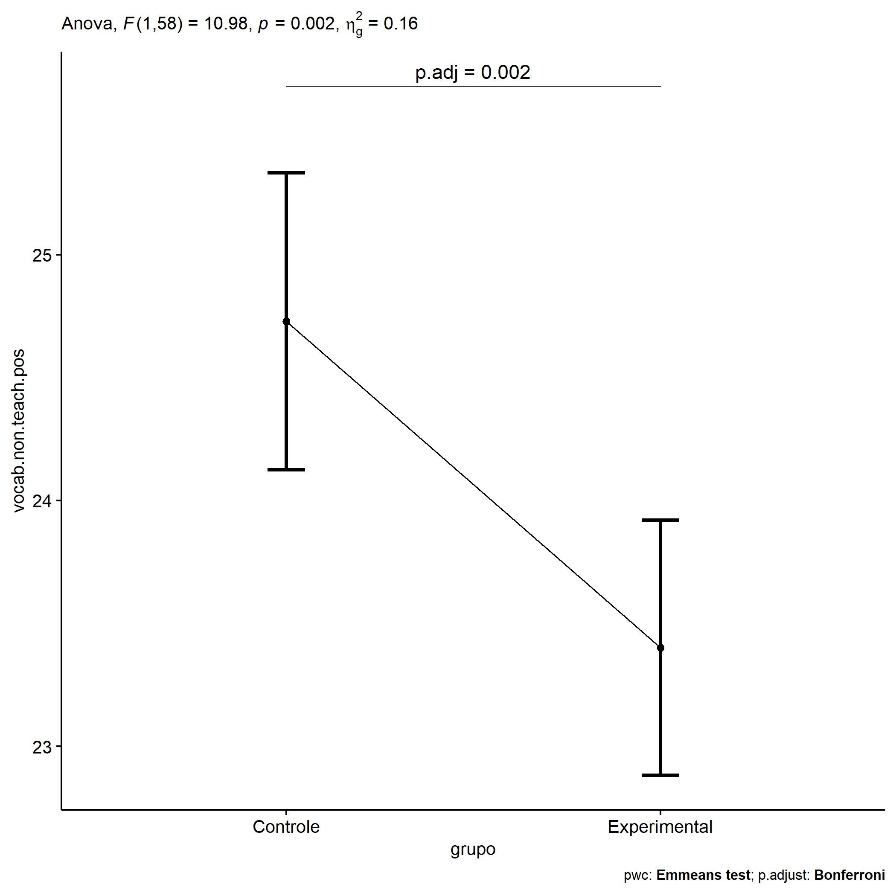<!-- -->

``` r
plots <- oneWayAncovaBoxPlots(
  wdat, "vocab.non.teach.pos", "grupo", aov, pwc, covar = "vocab.non.teach.pre",
  theme = "classic", color = color[["grupo"]],
  subtitle = which(aov$Effect == "grupo"))
```

``` r
if (length(unique(wdat[["grupo"]])) > 1)
  plots[["grupo"]] + ggplot2::ylab("Vocabulario Não Ensinado") + ggplot2::scale_x_discrete(labels=c('pre', 'pos'))
```

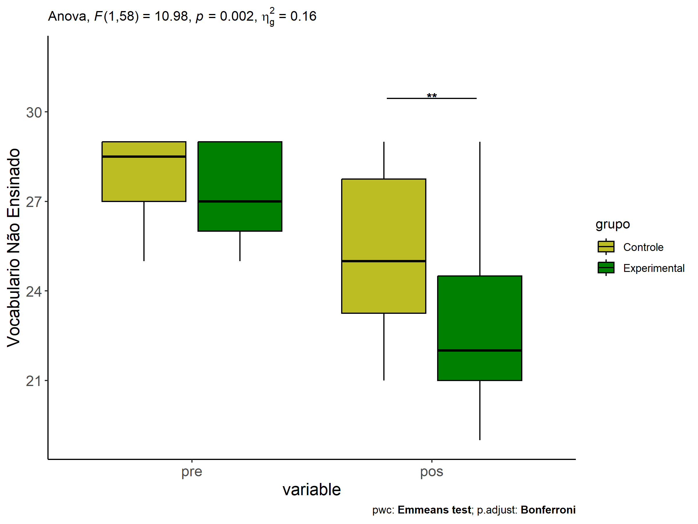<!-- -->

``` r
if (length(unique(wdat.long[["grupo"]])) > 1)
  plots <- oneWayAncovaBoxPlots(
    wdat.long, "vocab.non.teach", "grupo", aov, pwc.long, pre.post = "time",
    theme = "classic", color = color$prepost)
```

``` r
if (length(unique(wdat.long[["grupo"]])) > 1)
  plots[["grupo"]] + ggplot2::ylab("Vocabulario Não Ensinado")
```

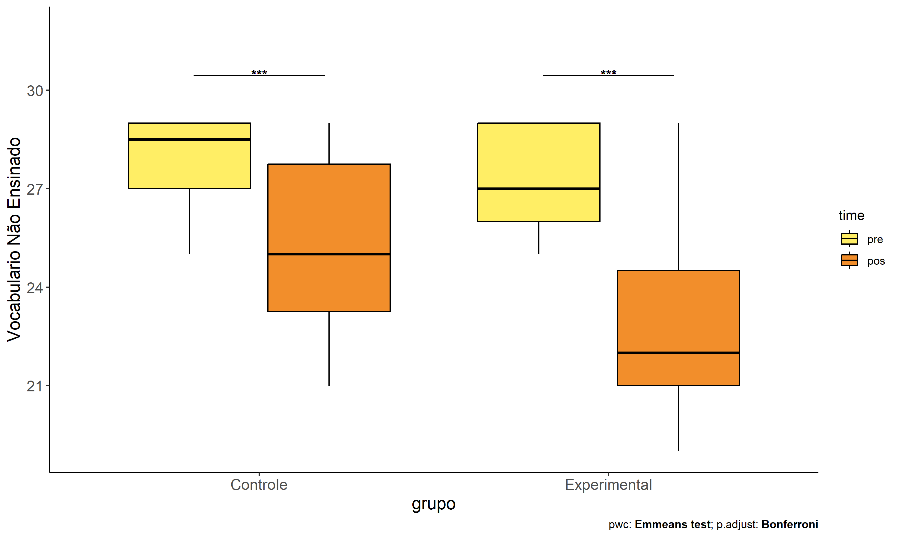<!-- -->

### Checking linearity assumption

``` r
ggscatter(wdat, x = "vocab.non.teach.pre", y = "vocab.non.teach.pos", size = 0.5,
          color = "grupo", add = "reg.line")+
  stat_regline_equation(
    aes(label =  paste(..eq.label.., ..rr.label.., sep = "~~~~"), color = grupo)
  )
```

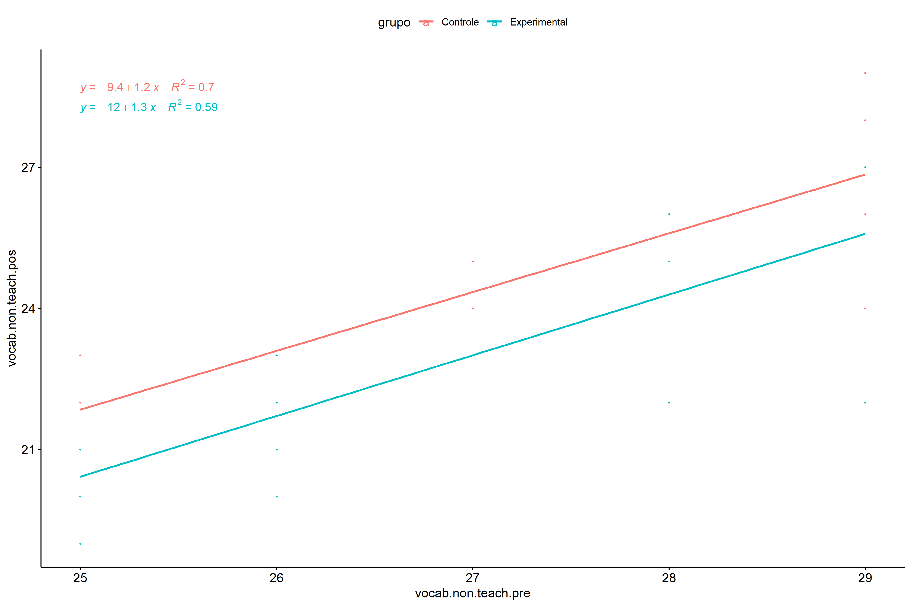<!-- -->

### Checking normality and homogeneity

``` r
res <- augment(lm(vocab.non.teach.pos ~ vocab.non.teach.pre + grupo, data = wdat))
```

``` r
shapiro_test(res$.resid)
```

    ## # A tibble: 1 × 3
    ##   variable   statistic p.value
    ##   <chr>          <dbl>   <dbl>
    ## 1 res$.resid     0.966  0.0856

``` r
levene_test(res, .resid ~ grupo)
```

    ## # A tibble: 1 × 4
    ##     df1   df2 statistic     p
    ##   <int> <int>     <dbl> <dbl>
    ## 1     1    59      1.88 0.175

# ANCOVA and Pairwise for two factors **grupo:Sexo**

## Without remove non-normal data

``` r
pdat = remove_group_data(dat[!is.na(dat[["grupo"]]) & !is.na(dat[["Sexo"]]),], "vocab.non.teach.pos", c("grupo","Sexo"))

pdat.long <- rbind(pdat[,c("id","grupo","Sexo")], pdat[,c("id","grupo","Sexo")])
pdat.long[["time"]] <- c(rep("pre", nrow(pdat)), rep("pos", nrow(pdat)))
pdat.long[["time"]] <- factor(pdat.long[["time"]], c("pre","pos"))
pdat.long[["vocab.non.teach"]] <- c(pdat[["vocab.non.teach.pre"]], pdat[["vocab.non.teach.pos"]])

aov = anova_test(pdat, vocab.non.teach.pos ~ vocab.non.teach.pre + grupo*Sexo)
laov[["grupo:Sexo"]] <- get_anova_table(aov)
```

``` r
pwcs <- list()
pwcs[["Sexo"]] <- emmeans_test(
  group_by(pdat, grupo), vocab.non.teach.pos ~ Sexo,
  covariate = vocab.non.teach.pre, p.adjust.method = "bonferroni")
pwcs[["grupo"]] <- emmeans_test(
  group_by(pdat, Sexo), vocab.non.teach.pos ~ grupo,
  covariate = vocab.non.teach.pre, p.adjust.method = "bonferroni")

pwc <- plyr::rbind.fill(pwcs[["grupo"]], pwcs[["Sexo"]])
pwc <- pwc[,c("grupo","Sexo", colnames(pwc)[!colnames(pwc) %in% c("grupo","Sexo")])]
```

``` r
pwc.long <- emmeans_test(dplyr::group_by_at(pdat.long, c("grupo","Sexo")),
                         vocab.non.teach ~ time,
                         p.adjust.method = "bonferroni")
lpwc[["grupo:Sexo"]] <- plyr::rbind.fill(pwc, pwc.long)
```

``` r
ds <- get.descriptives(pdat, "vocab.non.teach.pos", c("grupo","Sexo"), covar = "vocab.non.teach.pre")
ds <- merge(ds[ds$variable != "vocab.non.teach.pre",],
            ds[ds$variable == "vocab.non.teach.pre", !colnames(ds) %in% c("variable")],
            by = c("grupo","Sexo"), all.x = T, suffixes = c("", ".vocab.non.teach.pre"))
ds <- merge(get_emmeans(pwcs[["grupo"]]), ds, by = c("grupo","Sexo"), suffixes = c(".emms", ""))
ds <- ds[,c("grupo","Sexo","n","mean.vocab.non.teach.pre","se.vocab.non.teach.pre","mean","se","emmean","se.emms")]

colnames(ds) <- c("grupo","Sexo", "N", paste0(c("M","SE")," (pre)"),
                  paste0(c("M","SE"), " (unadj)"), paste0(c("M", "SE"), " (adj)"))

lemms[["grupo:Sexo"]] <- ds
```

## Computing ANCOVA and PairWise After removing non-normal data (OK)

``` r
wdat = pdat 

res = residuals(lm(vocab.non.teach.pos ~ vocab.non.teach.pre + grupo*Sexo, data = wdat))
non.normal = getNonNormal(res, wdat$id, plimit = 0.05)

wdat = wdat[!wdat$id %in% non.normal,]

wdat.long <- rbind(wdat[,c("id","grupo","Sexo")], wdat[,c("id","grupo","Sexo")])
wdat.long[["time"]] <- c(rep("pre", nrow(wdat)), rep("pos", nrow(wdat)))
wdat.long[["time"]] <- factor(wdat.long[["time"]], c("pre","pos"))
wdat.long[["vocab.non.teach"]] <- c(wdat[["vocab.non.teach.pre"]], wdat[["vocab.non.teach.pos"]])


ldat[["grupo:Sexo"]] = wdat

(non.normal)
```

    ##  [1] "P1139" "P2245" "P1112" "P2304" "P2853" "P1006" "P1831" "P850"  "P1129" "P2206" "P3658" "P3143"
    ## [13] "P921"  "P540"  "P3249" "P1854" "P2411" "P2883" "P2468" "P3716" "P2335" "P2461" "P3278" "P2057"
    ## [25] "P3731" "P1013" "P3265" "P1065" "P3081" "P3072" "P2359" "P1165" "P3704" "P2421" "P3635" "P606" 
    ## [37] "P1025" "P2071" "P2127" "P2858" "P560"  "P1941" "P569"  "P2302" "P3238" "P2414" "P630"  "P3213"
    ## [49] "P544"  "P3715" "P1857" "P1962" "P603"  "P1779" "P536"  "P2435"

``` r
aov = anova_test(wdat, vocab.non.teach.pos ~ vocab.non.teach.pre + grupo*Sexo)
laov[["grupo:Sexo"]] <- merge(get_anova_table(aov), laov[["grupo:Sexo"]], by="Effect", suffixes = c("","'"))

(df = get_anova_table(aov))
```

    ## ANOVA Table (type II tests)
    ## 
    ##                Effect DFn DFd      F        p p<.05      ges
    ## 1 vocab.non.teach.pre   1 233 62.200 1.20e-13     * 0.211000
    ## 2               grupo   1 233  2.074 1.51e-01       0.009000
    ## 3                Sexo   1 233  0.139 7.10e-01       0.000597
    ## 4          grupo:Sexo   1 233  2.254 1.35e-01       0.010000

| Effect              | DFn | DFd |      F |     p | p\<.05 |   ges |
|:--------------------|----:|----:|-------:|------:|:-------|------:|
| vocab.non.teach.pre |   1 | 233 | 62.200 | 0.000 | \*     | 0.211 |
| grupo               |   1 | 233 |  2.074 | 0.151 |        | 0.009 |
| Sexo                |   1 | 233 |  0.139 | 0.710 |        | 0.001 |
| grupo:Sexo          |   1 | 233 |  2.254 | 0.135 |        | 0.010 |

``` r
pwcs <- list()
pwcs[["Sexo"]] <- emmeans_test(
  group_by(wdat, grupo), vocab.non.teach.pos ~ Sexo,
  covariate = vocab.non.teach.pre, p.adjust.method = "bonferroni")
pwcs[["grupo"]] <- emmeans_test(
  group_by(wdat, Sexo), vocab.non.teach.pos ~ grupo,
  covariate = vocab.non.teach.pre, p.adjust.method = "bonferroni")

pwc <- plyr::rbind.fill(pwcs[["grupo"]], pwcs[["Sexo"]])
pwc <- pwc[,c("grupo","Sexo", colnames(pwc)[!colnames(pwc) %in% c("grupo","Sexo")])]
```

| grupo        | Sexo | term                       | .y.                 | group1   | group2       |  df | statistic |     p | p.adj | p.adj.signif |
|:-------------|:-----|:---------------------------|:--------------------|:---------|:-------------|----:|----------:|------:|------:|:-------------|
|              | F    | vocab.non.teach.pre\*grupo | vocab.non.teach.pos | Controle | Experimental | 233 |     0.062 | 0.951 | 0.951 | ns           |
|              | M    | vocab.non.teach.pre\*grupo | vocab.non.teach.pos | Controle | Experimental | 233 |     2.079 | 0.039 | 0.039 | \*           |
| Controle     |      | vocab.non.teach.pre\*Sexo  | vocab.non.teach.pos | F        | M            | 233 |    -0.900 | 0.369 | 0.369 | ns           |
| Experimental |      | vocab.non.teach.pre\*Sexo  | vocab.non.teach.pos | F        | M            | 233 |     1.257 | 0.210 | 0.210 | ns           |

``` r
pwc.long <- emmeans_test(dplyr::group_by_at(wdat.long, c("grupo","Sexo")),
                         vocab.non.teach ~ time,
                         p.adjust.method = "bonferroni")
lpwc[["grupo:Sexo"]] <- merge(plyr::rbind.fill(pwc, pwc.long), lpwc[["grupo:Sexo"]], by=c("grupo","Sexo","term",".y.","group1","group2"), suffixes = c("","'"))
```

| grupo        | Sexo | term | .y.             | group1 | group2 |  df | statistic |     p | p.adj | p.adj.signif |
|:-------------|:-----|:-----|:----------------|:-------|:-------|----:|----------:|------:|------:|:-------------|
| Controle     | F    | time | vocab.non.teach | pre    | pos    | 468 |    -0.388 | 0.698 | 0.698 | ns           |
| Controle     | M    | time | vocab.non.teach | pre    | pos    | 468 |    -1.389 | 0.166 | 0.166 | ns           |
| Experimental | F    | time | vocab.non.teach | pre    | pos    | 468 |    -0.405 | 0.686 | 0.686 | ns           |
| Experimental | M    | time | vocab.non.teach | pre    | pos    | 468 |     0.993 | 0.321 | 0.321 | ns           |

``` r
ds <- get.descriptives(wdat, "vocab.non.teach.pos", c("grupo","Sexo"), covar = "vocab.non.teach.pre")
ds <- merge(ds[ds$variable != "vocab.non.teach.pre",],
            ds[ds$variable == "vocab.non.teach.pre", !colnames(ds) %in% c("variable")],
            by = c("grupo","Sexo"), all.x = T, suffixes = c("", ".vocab.non.teach.pre"))
ds <- merge(get_emmeans(pwcs[["grupo"]]), ds, by = c("grupo","Sexo"), suffixes = c(".emms", ""))
ds <- ds[,c("grupo","Sexo","n","mean.vocab.non.teach.pre","se.vocab.non.teach.pre","mean","se","emmean","se.emms")]

colnames(ds) <- c("grupo","Sexo", "N", paste0(c("M","SE")," (pre)"),
                  paste0(c("M","SE"), " (unadj)"), paste0(c("M", "SE"), " (adj)"))

lemms[["grupo:Sexo"]] <- merge(ds, lemms[["grupo:Sexo"]], by=c("grupo","Sexo"), suffixes = c("","'"))
```

| grupo        | Sexo |   N | M (pre) | SE (pre) | M (unadj) | SE (unadj) | M (adj) | SE (adj) |
|:-------------|:-----|----:|--------:|---------:|----------:|-----------:|--------:|---------:|
| Controle     | F    |  52 |  26.942 |    0.215 |    27.135 |      0.355 |  27.214 |    0.402 |
| Controle     | M    |  47 |  27.277 |    0.196 |    28.000 |      0.536 |  27.741 |    0.424 |
| Experimental | F    |  81 |  26.951 |    0.164 |    27.111 |      0.403 |  27.183 |    0.322 |
| Experimental | M    |  58 |  26.983 |    0.196 |    26.517 |      0.376 |  26.556 |    0.380 |

### Plots for ancova

``` r
plots <- twoWayAncovaPlots(
  wdat, "vocab.non.teach.pos", c("grupo","Sexo"), aov, pwcs, addParam = c("mean_se"),
  font.label.size=10, step.increase=0.05, p.label="p.adj",
  subtitle = which(aov$Effect == "grupo:Sexo"))
```

``` r
if (!is.null(plots[["grupo"]]))
  plots[["grupo"]] + ggplot2::scale_color_manual(values = color[["Sexo"]])
```

    ## Scale for colour is already present.
    ## Adding another scale for colour, which will replace the existing scale.

<!-- -->

``` r
if (!is.null(plots[["Sexo"]]))
  plots[["Sexo"]] + ggplot2::scale_color_manual(values = color[["grupo"]])
```

    ## Scale for colour is already present.
    ## Adding another scale for colour, which will replace the existing scale.

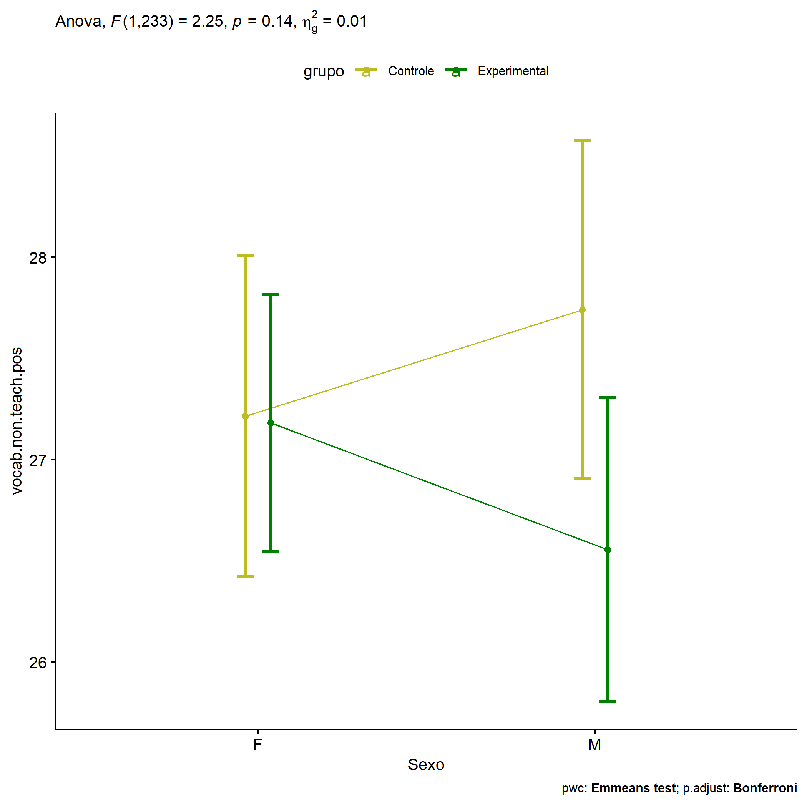<!-- -->

``` r
plots <- twoWayAncovaBoxPlots(
  wdat, "vocab.non.teach.pos", c("grupo","Sexo"), aov, pwcs, covar = "vocab.non.teach.pre",
  theme = "classic", color = color[["grupo:Sexo"]],
  subtitle = which(aov$Effect == "grupo:Sexo"))
```

``` r
plots[["grupo:Sexo"]] + ggplot2::ylab("Vocabulario Não Ensinado") + ggplot2::scale_x_discrete(labels=c('pre', 'pos'))
```

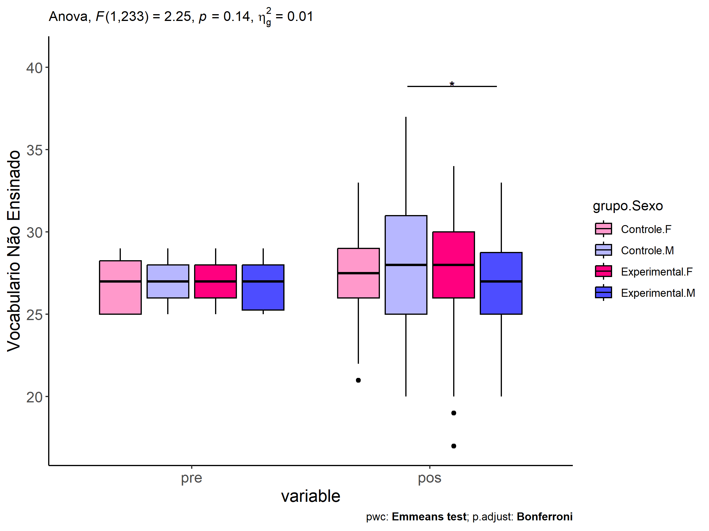<!-- -->

``` r
plots <- twoWayAncovaBoxPlots(
  wdat.long, "vocab.non.teach", c("grupo","Sexo"), aov, pwc.long, pre.post = "time",
  theme = "classic", color = color$prepost)
```

``` r
plots[["grupo:Sexo"]] + ggplot2::ylab("Vocabulario Não Ensinado")
```

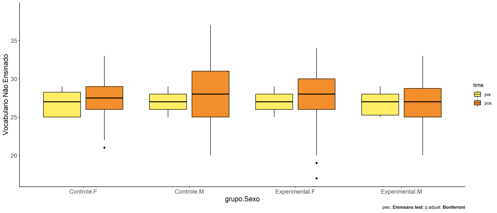<!-- -->

### Checking linearity assumption

``` r
ggscatter(wdat, x = "vocab.non.teach.pre", y = "vocab.non.teach.pos", size = 0.5,
          facet.by = c("grupo","Sexo"), add = "reg.line")+
  stat_regline_equation(
    aes(label =  paste(..eq.label.., ..rr.label.., sep = "~~~~"))
  )
```

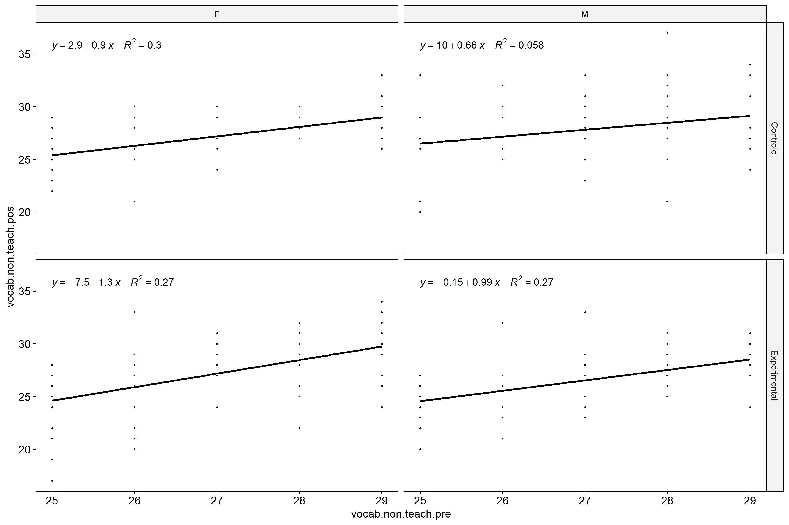<!-- -->

### Checking normality and homogeneity

``` r
res <- augment(lm(vocab.non.teach.pos ~ vocab.non.teach.pre + grupo*Sexo, data = wdat))
```

``` r
shapiro_test(res$.resid)
```

    ## # A tibble: 1 × 3
    ##   variable   statistic p.value
    ##   <chr>          <dbl>   <dbl>
    ## 1 res$.resid     0.988  0.0370

``` r
levene_test(res, .resid ~ grupo*Sexo)
```

    ## # A tibble: 1 × 4
    ##     df1   df2 statistic       p
    ##   <int> <int>     <dbl>   <dbl>
    ## 1     3   234      4.39 0.00500

# ANCOVA and Pairwise for two factors **grupo:Zona**

## Without remove non-normal data

``` r
pdat = remove_group_data(dat[!is.na(dat[["grupo"]]) & !is.na(dat[["Zona"]]),], "vocab.non.teach.pos", c("grupo","Zona"))

pdat.long <- rbind(pdat[,c("id","grupo","Zona")], pdat[,c("id","grupo","Zona")])
pdat.long[["time"]] <- c(rep("pre", nrow(pdat)), rep("pos", nrow(pdat)))
pdat.long[["time"]] <- factor(pdat.long[["time"]], c("pre","pos"))
pdat.long[["vocab.non.teach"]] <- c(pdat[["vocab.non.teach.pre"]], pdat[["vocab.non.teach.pos"]])

aov = anova_test(pdat, vocab.non.teach.pos ~ vocab.non.teach.pre + grupo*Zona)
laov[["grupo:Zona"]] <- get_anova_table(aov)
```

``` r
pwcs <- list()
pwcs[["Zona"]] <- emmeans_test(
  group_by(pdat, grupo), vocab.non.teach.pos ~ Zona,
  covariate = vocab.non.teach.pre, p.adjust.method = "bonferroni")
pwcs[["grupo"]] <- emmeans_test(
  group_by(pdat, Zona), vocab.non.teach.pos ~ grupo,
  covariate = vocab.non.teach.pre, p.adjust.method = "bonferroni")

pwc <- plyr::rbind.fill(pwcs[["grupo"]], pwcs[["Zona"]])
pwc <- pwc[,c("grupo","Zona", colnames(pwc)[!colnames(pwc) %in% c("grupo","Zona")])]
```

``` r
pwc.long <- emmeans_test(dplyr::group_by_at(pdat.long, c("grupo","Zona")),
                         vocab.non.teach ~ time,
                         p.adjust.method = "bonferroni")
lpwc[["grupo:Zona"]] <- plyr::rbind.fill(pwc, pwc.long)
```

``` r
ds <- get.descriptives(pdat, "vocab.non.teach.pos", c("grupo","Zona"), covar = "vocab.non.teach.pre")
ds <- merge(ds[ds$variable != "vocab.non.teach.pre",],
            ds[ds$variable == "vocab.non.teach.pre", !colnames(ds) %in% c("variable")],
            by = c("grupo","Zona"), all.x = T, suffixes = c("", ".vocab.non.teach.pre"))
ds <- merge(get_emmeans(pwcs[["grupo"]]), ds, by = c("grupo","Zona"), suffixes = c(".emms", ""))
ds <- ds[,c("grupo","Zona","n","mean.vocab.non.teach.pre","se.vocab.non.teach.pre","mean","se","emmean","se.emms")]

colnames(ds) <- c("grupo","Zona", "N", paste0(c("M","SE")," (pre)"),
                  paste0(c("M","SE"), " (unadj)"), paste0(c("M", "SE"), " (adj)"))

lemms[["grupo:Zona"]] <- ds
```

## Computing ANCOVA and PairWise After removing non-normal data (OK)

``` r
wdat = pdat 

res = residuals(lm(vocab.non.teach.pos ~ vocab.non.teach.pre + grupo*Zona, data = wdat))
non.normal = getNonNormal(res, wdat$id, plimit = 0.05)

wdat = wdat[!wdat$id %in% non.normal,]

wdat.long <- rbind(wdat[,c("id","grupo","Zona")], wdat[,c("id","grupo","Zona")])
wdat.long[["time"]] <- c(rep("pre", nrow(wdat)), rep("pos", nrow(wdat)))
wdat.long[["time"]] <- factor(wdat.long[["time"]], c("pre","pos"))
wdat.long[["vocab.non.teach"]] <- c(wdat[["vocab.non.teach.pre"]], wdat[["vocab.non.teach.pos"]])


ldat[["grupo:Zona"]] = wdat

(non.normal)
```

    ## [1] "P1139" "P2304" "P1831"

``` r
aov = anova_test(wdat, vocab.non.teach.pos ~ vocab.non.teach.pre + grupo*Zona)
laov[["grupo:Zona"]] <- merge(get_anova_table(aov), laov[["grupo:Zona"]], by="Effect", suffixes = c("","'"))

(df = get_anova_table(aov))
```

    ## ANOVA Table (type II tests)
    ## 
    ##                Effect DFn DFd      F        p p<.05   ges
    ## 1 vocab.non.teach.pre   1 189 28.400 2.79e-07     * 0.131
    ## 2               grupo   1 189  8.110 5.00e-03     * 0.041
    ## 3                Zona   1 189  1.106 2.94e-01       0.006
    ## 4          grupo:Zona   1 189  2.292 1.32e-01       0.012

| Effect              | DFn | DFd |      F |     p | p\<.05 |   ges |
|:--------------------|----:|----:|-------:|------:|:-------|------:|
| vocab.non.teach.pre |   1 | 189 | 28.400 | 0.000 | \*     | 0.131 |
| grupo               |   1 | 189 |  8.110 | 0.005 | \*     | 0.041 |
| Zona                |   1 | 189 |  1.106 | 0.294 |        | 0.006 |
| grupo:Zona          |   1 | 189 |  2.292 | 0.132 |        | 0.012 |

``` r
pwcs <- list()
pwcs[["Zona"]] <- emmeans_test(
  group_by(wdat, grupo), vocab.non.teach.pos ~ Zona,
  covariate = vocab.non.teach.pre, p.adjust.method = "bonferroni")
pwcs[["grupo"]] <- emmeans_test(
  group_by(wdat, Zona), vocab.non.teach.pos ~ grupo,
  covariate = vocab.non.teach.pre, p.adjust.method = "bonferroni")

pwc <- plyr::rbind.fill(pwcs[["grupo"]], pwcs[["Zona"]])
pwc <- pwc[,c("grupo","Zona", colnames(pwc)[!colnames(pwc) %in% c("grupo","Zona")])]
```

| grupo        | Zona   | term                       | .y.                 | group1   | group2       |  df | statistic |     p | p.adj | p.adj.signif |
|:-------------|:-------|:---------------------------|:--------------------|:---------|:-------------|----:|----------:|------:|------:|:-------------|
|              | Rural  | vocab.non.teach.pre\*grupo | vocab.non.teach.pos | Controle | Experimental | 189 |     3.192 | 0.002 | 0.002 | \*\*         |
|              | Urbana | vocab.non.teach.pre\*grupo | vocab.non.teach.pos | Controle | Experimental | 189 |     0.460 | 0.646 | 0.646 | ns           |
| Controle     |        | vocab.non.teach.pre\*Zona  | vocab.non.teach.pos | Rural    | Urbana       | 189 |     0.498 | 0.619 | 0.619 | ns           |
| Experimental |        | vocab.non.teach.pre\*Zona  | vocab.non.teach.pos | Rural    | Urbana       | 189 |    -1.774 | 0.078 | 0.078 | ns           |

``` r
pwc.long <- emmeans_test(dplyr::group_by_at(wdat.long, c("grupo","Zona")),
                         vocab.non.teach ~ time,
                         p.adjust.method = "bonferroni")
lpwc[["grupo:Zona"]] <- merge(plyr::rbind.fill(pwc, pwc.long), lpwc[["grupo:Zona"]], by=c("grupo","Zona","term",".y.","group1","group2"), suffixes = c("","'"))
```

| grupo        | Zona   | term | .y.             | group1 | group2 |  df | statistic |     p | p.adj | p.adj.signif |
|:-------------|:-------|:-----|:----------------|:-------|:-------|----:|----------:|------:|------:|:-------------|
| Controle     | Rural  | time | vocab.non.teach | pre    | pos    | 380 |    -2.038 | 0.042 | 0.042 | \*           |
| Controle     | Urbana | time | vocab.non.teach | pre    | pos    | 380 |    -0.825 | 0.410 | 0.410 | ns           |
| Experimental | Rural  | time | vocab.non.teach | pre    | pos    | 380 |     1.928 | 0.055 | 0.055 | ns           |
| Experimental | Urbana | time | vocab.non.teach | pre    | pos    | 380 |    -0.418 | 0.676 | 0.676 | ns           |

``` r
ds <- get.descriptives(wdat, "vocab.non.teach.pos", c("grupo","Zona"), covar = "vocab.non.teach.pre")
ds <- merge(ds[ds$variable != "vocab.non.teach.pre",],
            ds[ds$variable == "vocab.non.teach.pre", !colnames(ds) %in% c("variable")],
            by = c("grupo","Zona"), all.x = T, suffixes = c("", ".vocab.non.teach.pre"))
ds <- merge(get_emmeans(pwcs[["grupo"]]), ds, by = c("grupo","Zona"), suffixes = c(".emms", ""))
ds <- ds[,c("grupo","Zona","n","mean.vocab.non.teach.pre","se.vocab.non.teach.pre","mean","se","emmean","se.emms")]

colnames(ds) <- c("grupo","Zona", "N", paste0(c("M","SE")," (pre)"),
                  paste0(c("M","SE"), " (unadj)"), paste0(c("M", "SE"), " (adj)"))

lemms[["grupo:Zona"]] <- merge(ds, lemms[["grupo:Zona"]], by=c("grupo","Zona"), suffixes = c("","'"))
```

| grupo        | Zona   |   N | M (pre) | SE (pre) | M (unadj) | SE (unadj) | M (adj) | SE (adj) |
|:-------------|:-------|----:|--------:|---------:|----------:|-----------:|--------:|---------:|
| Controle     | Rural  |  59 |  26.966 |    0.199 |    28.102 |      0.501 |  28.197 |    0.490 |
| Controle     | Urbana |  26 |  27.346 |    0.266 |    28.038 |      0.650 |  27.755 |    0.739 |
| Experimental | Rural  |  64 |  27.000 |    0.178 |    25.969 |      0.600 |  26.030 |    0.470 |
| Experimental | Urbana |  45 |  27.111 |    0.218 |    27.378 |      0.498 |  27.329 |    0.561 |

### Plots for ancova

``` r
plots <- twoWayAncovaPlots(
  wdat, "vocab.non.teach.pos", c("grupo","Zona"), aov, pwcs, addParam = c("mean_se"),
  font.label.size=10, step.increase=0.05, p.label="p.adj",
  subtitle = which(aov$Effect == "grupo:Zona"))
```

``` r
if (!is.null(plots[["grupo"]]))
  plots[["grupo"]] + ggplot2::scale_color_manual(values = color[["Zona"]])
```

    ## Scale for colour is already present.
    ## Adding another scale for colour, which will replace the existing scale.

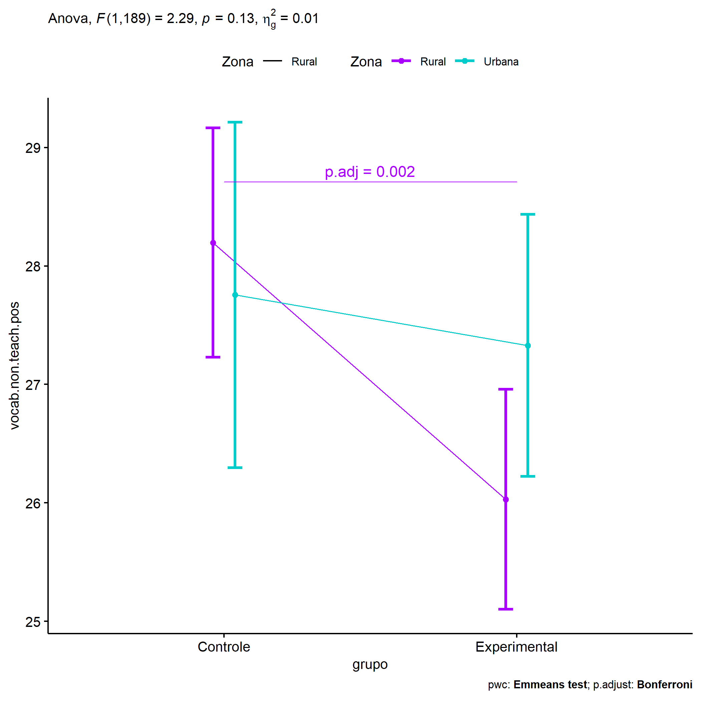<!-- -->

``` r
if (!is.null(plots[["Zona"]]))
  plots[["Zona"]] + ggplot2::scale_color_manual(values = color[["grupo"]])
```

    ## Scale for colour is already present.
    ## Adding another scale for colour, which will replace the existing scale.

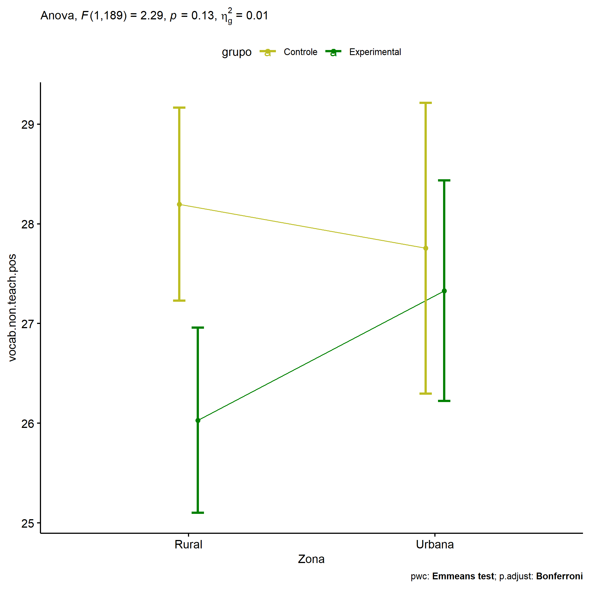<!-- -->

``` r
plots <- twoWayAncovaBoxPlots(
  wdat, "vocab.non.teach.pos", c("grupo","Zona"), aov, pwcs, covar = "vocab.non.teach.pre",
  theme = "classic", color = color[["grupo:Zona"]],
  subtitle = which(aov$Effect == "grupo:Zona"))
```

``` r
plots[["grupo:Zona"]] + ggplot2::ylab("Vocabulario Não Ensinado") + ggplot2::scale_x_discrete(labels=c('pre', 'pos'))
```

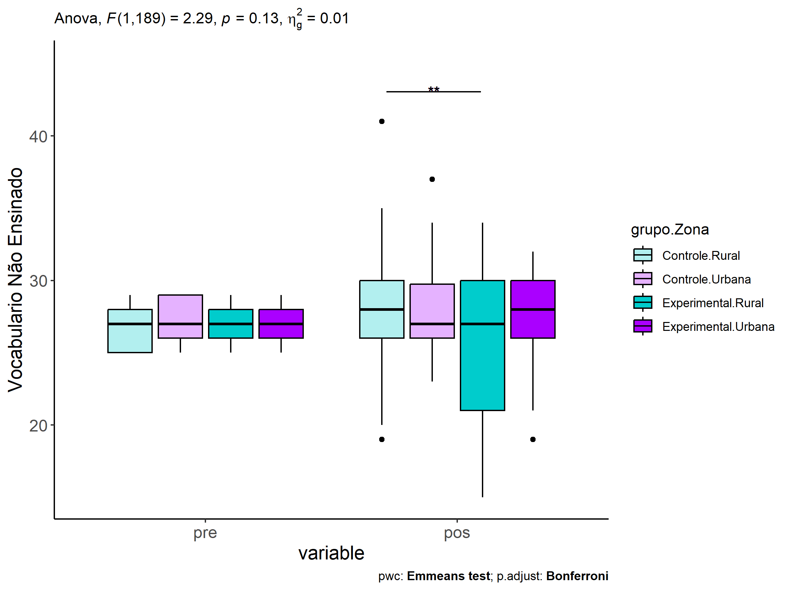<!-- -->

``` r
plots <- twoWayAncovaBoxPlots(
  wdat.long, "vocab.non.teach", c("grupo","Zona"), aov, pwc.long, pre.post = "time",
  theme = "classic", color = color$prepost)
```

``` r
plots[["grupo:Zona"]] + ggplot2::ylab("Vocabulario Não Ensinado")
```

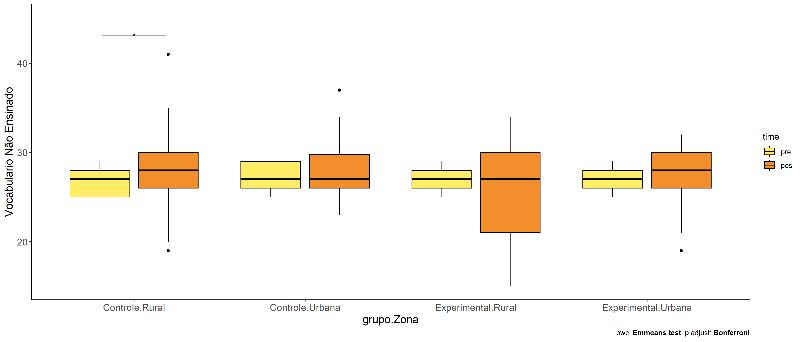<!-- -->

### Checking linearity assumption

``` r
ggscatter(wdat, x = "vocab.non.teach.pre", y = "vocab.non.teach.pos", size = 0.5,
          facet.by = c("grupo","Zona"), add = "reg.line")+
  stat_regline_equation(
    aes(label =  paste(..eq.label.., ..rr.label.., sep = "~~~~"))
  )
```

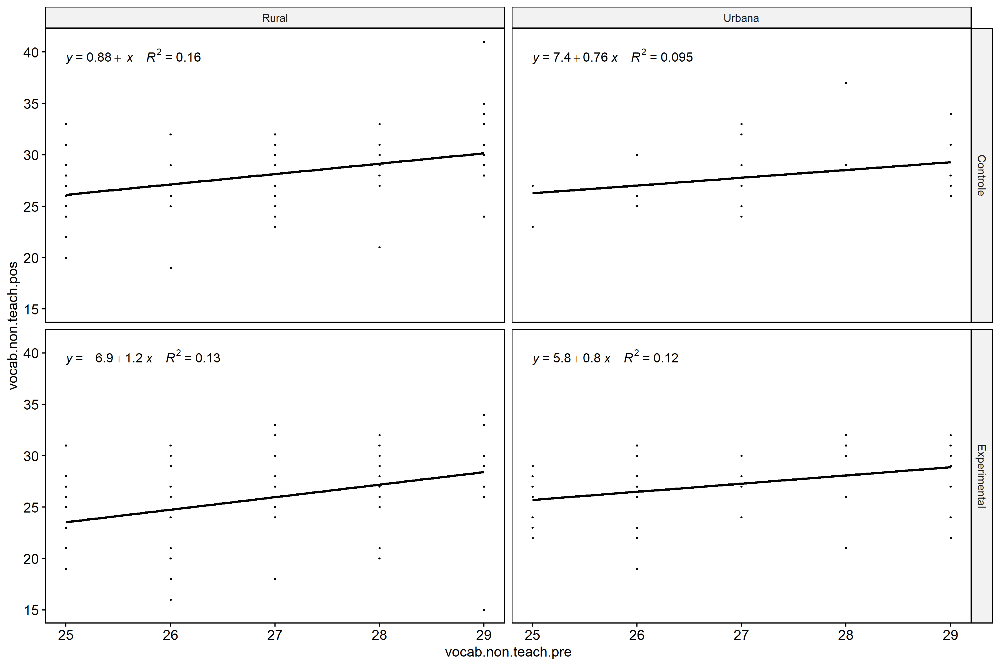<!-- -->

### Checking normality and homogeneity

``` r
res <- augment(lm(vocab.non.teach.pos ~ vocab.non.teach.pre + grupo*Zona, data = wdat))
```

``` r
shapiro_test(res$.resid)
```

    ## # A tibble: 1 × 3
    ##   variable   statistic p.value
    ##   <chr>          <dbl>   <dbl>
    ## 1 res$.resid     0.987  0.0826

``` r
levene_test(res, .resid ~ grupo*Zona)
```

    ## # A tibble: 1 × 4
    ##     df1   df2 statistic      p
    ##   <int> <int>     <dbl>  <dbl>
    ## 1     3   190      2.69 0.0474

# ANCOVA and Pairwise for two factors **grupo:Cor.Raca**

## Without remove non-normal data

``` r
pdat = remove_group_data(dat[!is.na(dat[["grupo"]]) & !is.na(dat[["Cor.Raca"]]),], "vocab.non.teach.pos", c("grupo","Cor.Raca"))

pdat.long <- rbind(pdat[,c("id","grupo","Cor.Raca")], pdat[,c("id","grupo","Cor.Raca")])
pdat.long[["time"]] <- c(rep("pre", nrow(pdat)), rep("pos", nrow(pdat)))
pdat.long[["time"]] <- factor(pdat.long[["time"]], c("pre","pos"))
pdat.long[["vocab.non.teach"]] <- c(pdat[["vocab.non.teach.pre"]], pdat[["vocab.non.teach.pos"]])

aov = anova_test(pdat, vocab.non.teach.pos ~ vocab.non.teach.pre + grupo*Cor.Raca)
laov[["grupo:Cor.Raca"]] <- get_anova_table(aov)
```

``` r
pwcs <- list()
pwcs[["Cor.Raca"]] <- emmeans_test(
  group_by(pdat, grupo), vocab.non.teach.pos ~ Cor.Raca,
  covariate = vocab.non.teach.pre, p.adjust.method = "bonferroni")
pwcs[["grupo"]] <- emmeans_test(
  group_by(pdat, Cor.Raca), vocab.non.teach.pos ~ grupo,
  covariate = vocab.non.teach.pre, p.adjust.method = "bonferroni")

pwc <- plyr::rbind.fill(pwcs[["grupo"]], pwcs[["Cor.Raca"]])
pwc <- pwc[,c("grupo","Cor.Raca", colnames(pwc)[!colnames(pwc) %in% c("grupo","Cor.Raca")])]
```

``` r
pwc.long <- emmeans_test(dplyr::group_by_at(pdat.long, c("grupo","Cor.Raca")),
                         vocab.non.teach ~ time,
                         p.adjust.method = "bonferroni")
lpwc[["grupo:Cor.Raca"]] <- plyr::rbind.fill(pwc, pwc.long)
```

``` r
ds <- get.descriptives(pdat, "vocab.non.teach.pos", c("grupo","Cor.Raca"), covar = "vocab.non.teach.pre")
ds <- merge(ds[ds$variable != "vocab.non.teach.pre",],
            ds[ds$variable == "vocab.non.teach.pre", !colnames(ds) %in% c("variable")],
            by = c("grupo","Cor.Raca"), all.x = T, suffixes = c("", ".vocab.non.teach.pre"))
ds <- merge(get_emmeans(pwcs[["grupo"]]), ds, by = c("grupo","Cor.Raca"), suffixes = c(".emms", ""))
ds <- ds[,c("grupo","Cor.Raca","n","mean.vocab.non.teach.pre","se.vocab.non.teach.pre","mean","se","emmean","se.emms")]

colnames(ds) <- c("grupo","Cor.Raca", "N", paste0(c("M","SE")," (pre)"),
                  paste0(c("M","SE"), " (unadj)"), paste0(c("M", "SE"), " (adj)"))

lemms[["grupo:Cor.Raca"]] <- ds
```

## Computing ANCOVA and PairWise After removing non-normal data (OK)

``` r
wdat = pdat 

res = residuals(lm(vocab.non.teach.pos ~ vocab.non.teach.pre + grupo*Cor.Raca, data = wdat))
non.normal = getNonNormal(res, wdat$id, plimit = 0.05)

wdat = wdat[!wdat$id %in% non.normal,]

wdat.long <- rbind(wdat[,c("id","grupo","Cor.Raca")], wdat[,c("id","grupo","Cor.Raca")])
wdat.long[["time"]] <- c(rep("pre", nrow(wdat)), rep("pos", nrow(wdat)))
wdat.long[["time"]] <- factor(wdat.long[["time"]], c("pre","pos"))
wdat.long[["vocab.non.teach"]] <- c(wdat[["vocab.non.teach.pre"]], wdat[["vocab.non.teach.pos"]])


ldat[["grupo:Cor.Raca"]] = wdat

(non.normal)
```

    ## [1] "P1139" "P1006" "P1112"

``` r
aov = anova_test(wdat, vocab.non.teach.pos ~ vocab.non.teach.pre + grupo*Cor.Raca)
laov[["grupo:Cor.Raca"]] <- merge(get_anova_table(aov), laov[["grupo:Cor.Raca"]], by="Effect", suffixes = c("","'"))

(df = get_anova_table(aov))
```

    ## ANOVA Table (type II tests)
    ## 
    ##                Effect DFn DFd      F        p p<.05      ges
    ## 1 vocab.non.teach.pre   1 106 13.696 0.000343     * 0.114000
    ## 2               grupo   1 106  5.810 0.018000     * 0.052000
    ## 3            Cor.Raca   1 106  1.299 0.257000       0.012000
    ## 4      grupo:Cor.Raca   1 106  0.013 0.909000       0.000123

| Effect              | DFn | DFd |      F |     p | p\<.05 |   ges |
|:--------------------|----:|----:|-------:|------:|:-------|------:|
| vocab.non.teach.pre |   1 | 106 | 13.696 | 0.000 | \*     | 0.114 |
| grupo               |   1 | 106 |  5.810 | 0.018 | \*     | 0.052 |
| Cor.Raca            |   1 | 106 |  1.299 | 0.257 |        | 0.012 |
| grupo:Cor.Raca      |   1 | 106 |  0.013 | 0.909 |        | 0.000 |

``` r
pwcs <- list()
pwcs[["Cor.Raca"]] <- emmeans_test(
  group_by(wdat, grupo), vocab.non.teach.pos ~ Cor.Raca,
  covariate = vocab.non.teach.pre, p.adjust.method = "bonferroni")
pwcs[["grupo"]] <- emmeans_test(
  group_by(wdat, Cor.Raca), vocab.non.teach.pos ~ grupo,
  covariate = vocab.non.teach.pre, p.adjust.method = "bonferroni")

pwc <- plyr::rbind.fill(pwcs[["grupo"]], pwcs[["Cor.Raca"]])
pwc <- pwc[,c("grupo","Cor.Raca", colnames(pwc)[!colnames(pwc) %in% c("grupo","Cor.Raca")])]
```

| grupo        | Cor.Raca | term                          | .y.                 | group1   | group2       |  df | statistic |     p | p.adj | p.adj.signif |
|:-------------|:---------|:------------------------------|:--------------------|:---------|:-------------|----:|----------:|------:|------:|:-------------|
|              | Branca   | vocab.non.teach.pre\*grupo    | vocab.non.teach.pos | Controle | Experimental | 106 |     1.020 | 0.310 | 0.310 | ns           |
|              | Parda    | vocab.non.teach.pre\*grupo    | vocab.non.teach.pos | Controle | Experimental | 106 |     2.192 | 0.031 | 0.031 | \*           |
| Controle     |          | vocab.non.teach.pre\*Cor.Raca | vocab.non.teach.pos | Branca   | Parda        | 106 |     0.752 | 0.454 | 0.454 | ns           |
| Experimental |          | vocab.non.teach.pre\*Cor.Raca | vocab.non.teach.pos | Branca   | Parda        | 106 |     0.865 | 0.389 | 0.389 | ns           |

``` r
pwc.long <- emmeans_test(dplyr::group_by_at(wdat.long, c("grupo","Cor.Raca")),
                         vocab.non.teach ~ time,
                         p.adjust.method = "bonferroni")
lpwc[["grupo:Cor.Raca"]] <- merge(plyr::rbind.fill(pwc, pwc.long), lpwc[["grupo:Cor.Raca"]], by=c("grupo","Cor.Raca","term",".y.","group1","group2"), suffixes = c("","'"))
```

| grupo        | Cor.Raca | term | .y.             | group1 | group2 |  df | statistic |     p | p.adj | p.adj.signif |
|:-------------|:---------|:-----|:----------------|:-------|:-------|----:|----------:|------:|------:|:-------------|
| Controle     | Branca   | time | vocab.non.teach | pre    | pos    | 214 |    -1.439 | 0.152 | 0.152 | ns           |
| Controle     | Parda    | time | vocab.non.teach | pre    | pos    | 214 |    -1.201 | 0.231 | 0.231 | ns           |
| Experimental | Branca   | time | vocab.non.teach | pre    | pos    | 214 |    -0.065 | 0.948 | 0.948 | ns           |
| Experimental | Parda    | time | vocab.non.teach | pre    | pos    | 214 |     1.611 | 0.109 | 0.109 | ns           |

``` r
ds <- get.descriptives(wdat, "vocab.non.teach.pos", c("grupo","Cor.Raca"), covar = "vocab.non.teach.pre")
ds <- merge(ds[ds$variable != "vocab.non.teach.pre",],
            ds[ds$variable == "vocab.non.teach.pre", !colnames(ds) %in% c("variable")],
            by = c("grupo","Cor.Raca"), all.x = T, suffixes = c("", ".vocab.non.teach.pre"))
ds <- merge(get_emmeans(pwcs[["grupo"]]), ds, by = c("grupo","Cor.Raca"), suffixes = c(".emms", ""))
ds <- ds[,c("grupo","Cor.Raca","n","mean.vocab.non.teach.pre","se.vocab.non.teach.pre","mean","se","emmean","se.emms")]

colnames(ds) <- c("grupo","Cor.Raca", "N", paste0(c("M","SE")," (pre)"),
                  paste0(c("M","SE"), " (unadj)"), paste0(c("M", "SE"), " (adj)"))

lemms[["grupo:Cor.Raca"]] <- merge(ds, lemms[["grupo:Cor.Raca"]], by=c("grupo","Cor.Raca"), suffixes = c("","'"))
```

| grupo        | Cor.Raca |   N | M (pre) | SE (pre) | M (unadj) | SE (unadj) | M (adj) | SE (adj) |
|:-------------|:---------|----:|--------:|---------:|----------:|-----------:|--------:|---------:|
| Controle     | Branca   |  13 |  27.077 |    0.366 |    28.923 |      0.977 |  28.853 |    1.153 |
| Controle     | Parda    |  42 |  27.167 |    0.248 |    28.024 |      0.567 |  27.861 |    0.643 |
| Experimental | Branca   |  11 |  26.636 |    0.388 |    26.727 |      1.408 |  27.112 |    1.258 |
| Experimental | Parda    |  45 |  26.933 |    0.199 |    25.822 |      0.762 |  25.900 |    0.620 |

### Plots for ancova

``` r
plots <- twoWayAncovaPlots(
  wdat, "vocab.non.teach.pos", c("grupo","Cor.Raca"), aov, pwcs, addParam = c("mean_se"),
  font.label.size=10, step.increase=0.05, p.label="p.adj",
  subtitle = which(aov$Effect == "grupo:Cor.Raca"))
```

``` r
if (!is.null(plots[["grupo"]]))
  plots[["grupo"]] + ggplot2::scale_color_manual(values = color[["Cor.Raca"]])
```

    ## Scale for colour is already present.
    ## Adding another scale for colour, which will replace the existing scale.

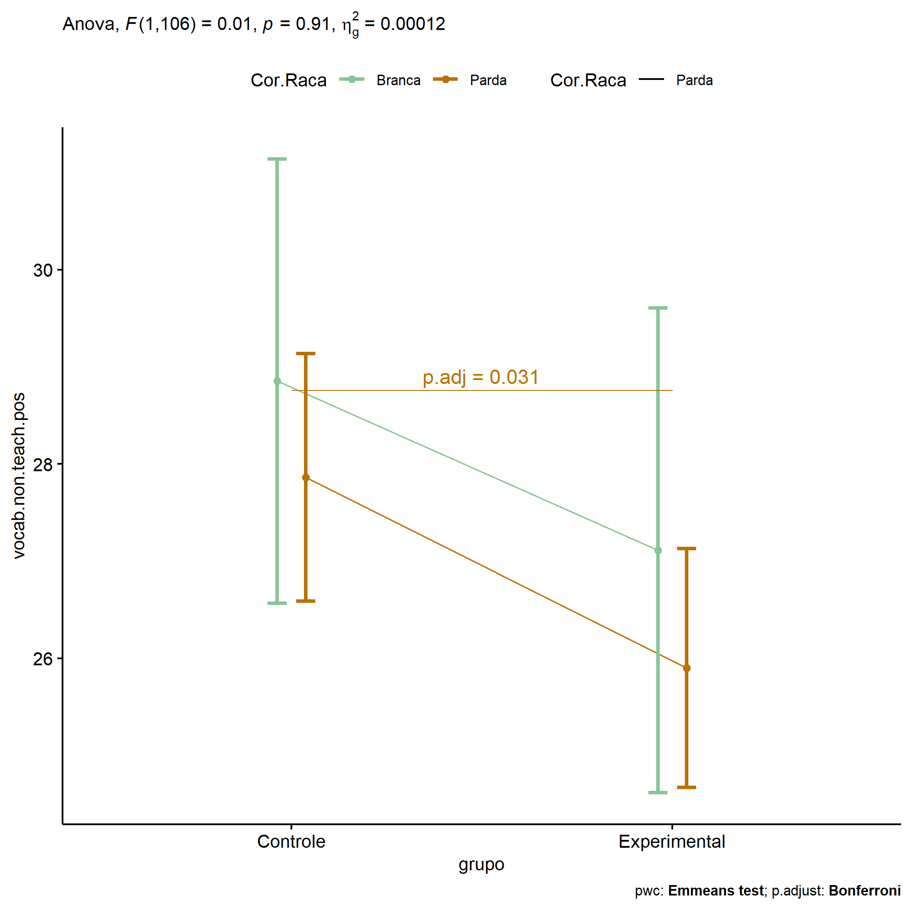<!-- -->

``` r
if (!is.null(plots[["Cor.Raca"]]))
  plots[["Cor.Raca"]] + ggplot2::scale_color_manual(values = color[["grupo"]])
```

    ## Scale for colour is already present.
    ## Adding another scale for colour, which will replace the existing scale.

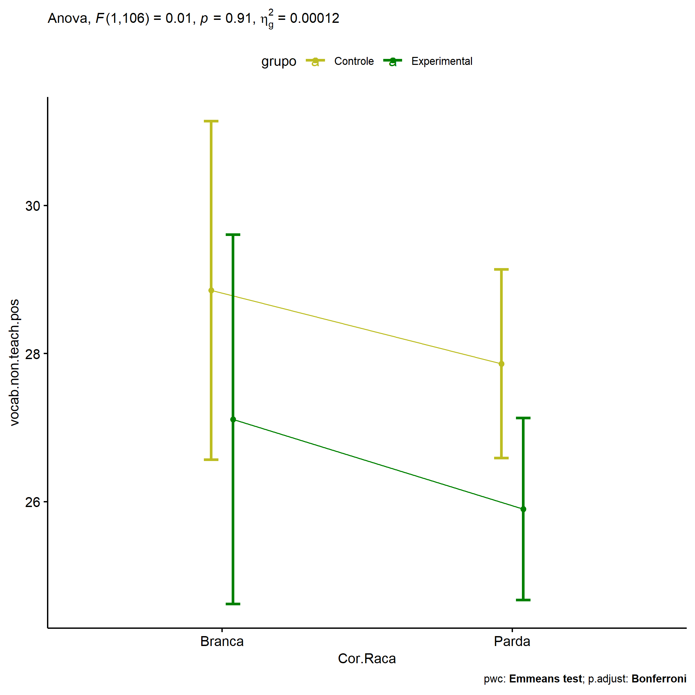<!-- -->

``` r
plots <- twoWayAncovaBoxPlots(
  wdat, "vocab.non.teach.pos", c("grupo","Cor.Raca"), aov, pwcs, covar = "vocab.non.teach.pre",
  theme = "classic", color = color[["grupo:Cor.Raca"]],
  subtitle = which(aov$Effect == "grupo:Cor.Raca"))
```

``` r
plots[["grupo:Cor.Raca"]] + ggplot2::ylab("Vocabulario Não Ensinado") + ggplot2::scale_x_discrete(labels=c('pre', 'pos'))
```

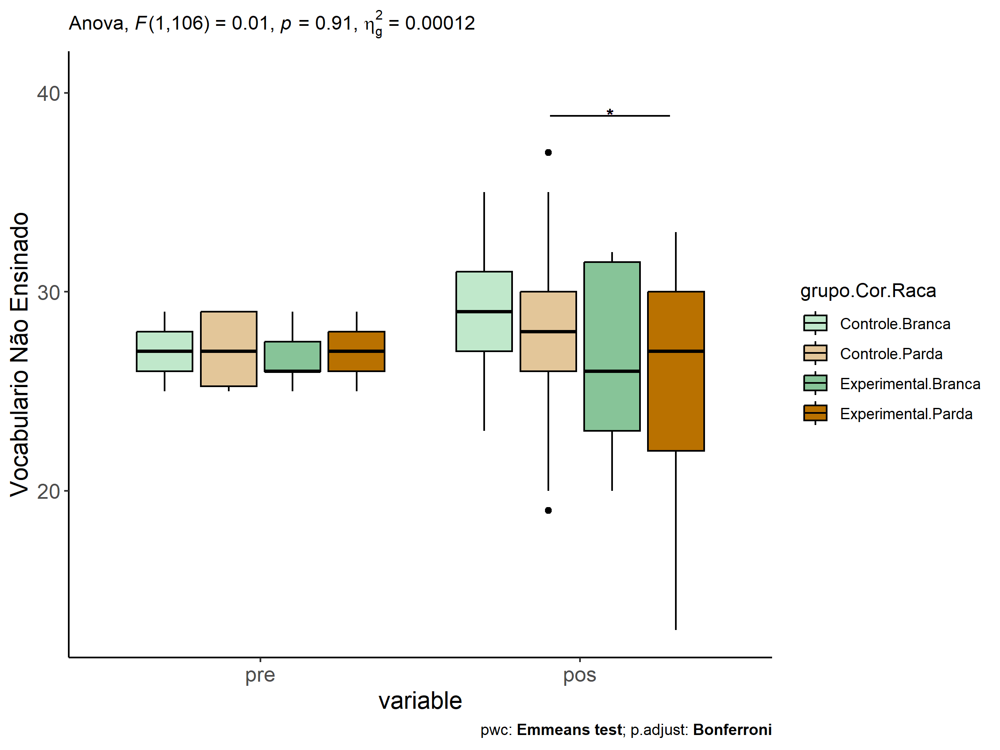<!-- -->

``` r
plots <- twoWayAncovaBoxPlots(
  wdat.long, "vocab.non.teach", c("grupo","Cor.Raca"), aov, pwc.long, pre.post = "time",
  theme = "classic", color = color$prepost)
```

``` r
plots[["grupo:Cor.Raca"]] + ggplot2::ylab("Vocabulario Não Ensinado")
```

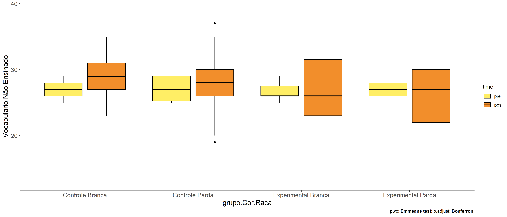<!-- -->

### Checking linearity assumption

``` r
ggscatter(wdat, x = "vocab.non.teach.pre", y = "vocab.non.teach.pos", size = 0.5,
          facet.by = c("grupo","Cor.Raca"), add = "reg.line")+
  stat_regline_equation(
    aes(label =  paste(..eq.label.., ..rr.label.., sep = "~~~~"))
  )
```

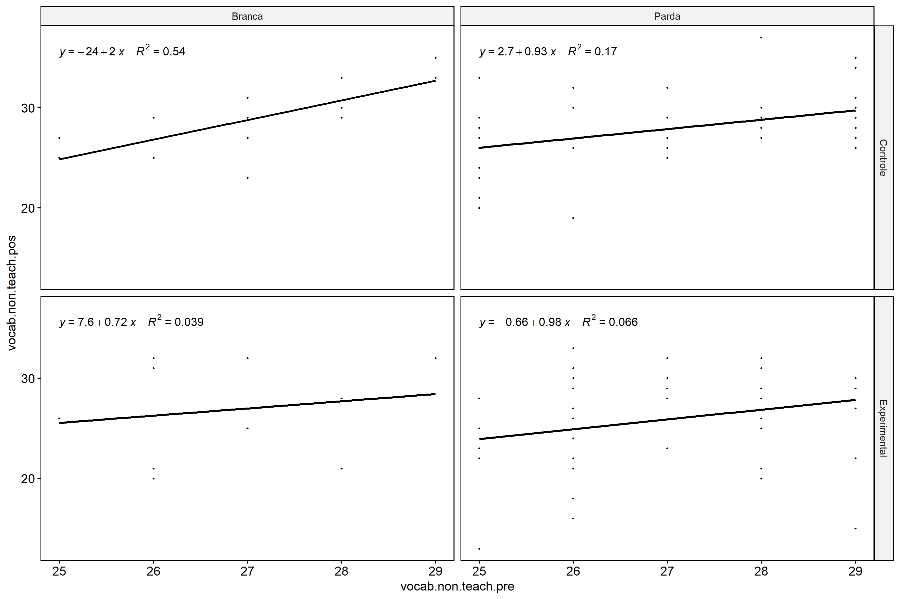<!-- -->

### Checking normality and homogeneity

``` r
res <- augment(lm(vocab.non.teach.pos ~ vocab.non.teach.pre + grupo*Cor.Raca, data = wdat))
```

``` r
shapiro_test(res$.resid)
```

    ## # A tibble: 1 × 3
    ##   variable   statistic p.value
    ##   <chr>          <dbl>   <dbl>
    ## 1 res$.resid     0.977  0.0498

``` r
levene_test(res, .resid ~ grupo*Cor.Raca)
```

    ## # A tibble: 1 × 4
    ##     df1   df2 statistic      p
    ##   <int> <int>     <dbl>  <dbl>
    ## 1     3   107      2.27 0.0842

# ANCOVA and Pairwise for two factors **grupo:Serie**

## Without remove non-normal data

``` r
pdat = remove_group_data(dat[!is.na(dat[["grupo"]]) & !is.na(dat[["Serie"]]),], "vocab.non.teach.pos", c("grupo","Serie"))

pdat.long <- rbind(pdat[,c("id","grupo","Serie")], pdat[,c("id","grupo","Serie")])
pdat.long[["time"]] <- c(rep("pre", nrow(pdat)), rep("pos", nrow(pdat)))
pdat.long[["time"]] <- factor(pdat.long[["time"]], c("pre","pos"))
pdat.long[["vocab.non.teach"]] <- c(pdat[["vocab.non.teach.pre"]], pdat[["vocab.non.teach.pos"]])

aov = anova_test(pdat, vocab.non.teach.pos ~ vocab.non.teach.pre + grupo*Serie)
laov[["grupo:Serie"]] <- get_anova_table(aov)
```

``` r
pwcs <- list()
pwcs[["Serie"]] <- emmeans_test(
  group_by(pdat, grupo), vocab.non.teach.pos ~ Serie,
  covariate = vocab.non.teach.pre, p.adjust.method = "bonferroni")
pwcs[["grupo"]] <- emmeans_test(
  group_by(pdat, Serie), vocab.non.teach.pos ~ grupo,
  covariate = vocab.non.teach.pre, p.adjust.method = "bonferroni")

pwc <- plyr::rbind.fill(pwcs[["grupo"]], pwcs[["Serie"]])
pwc <- pwc[,c("grupo","Serie", colnames(pwc)[!colnames(pwc) %in% c("grupo","Serie")])]
```

``` r
pwc.long <- emmeans_test(dplyr::group_by_at(pdat.long, c("grupo","Serie")),
                         vocab.non.teach ~ time,
                         p.adjust.method = "bonferroni")
lpwc[["grupo:Serie"]] <- plyr::rbind.fill(pwc, pwc.long)
```

``` r
ds <- get.descriptives(pdat, "vocab.non.teach.pos", c("grupo","Serie"), covar = "vocab.non.teach.pre")
ds <- merge(ds[ds$variable != "vocab.non.teach.pre",],
            ds[ds$variable == "vocab.non.teach.pre", !colnames(ds) %in% c("variable")],
            by = c("grupo","Serie"), all.x = T, suffixes = c("", ".vocab.non.teach.pre"))
ds <- merge(get_emmeans(pwcs[["grupo"]]), ds, by = c("grupo","Serie"), suffixes = c(".emms", ""))
ds <- ds[,c("grupo","Serie","n","mean.vocab.non.teach.pre","se.vocab.non.teach.pre","mean","se","emmean","se.emms")]

colnames(ds) <- c("grupo","Serie", "N", paste0(c("M","SE")," (pre)"),
                  paste0(c("M","SE"), " (unadj)"), paste0(c("M", "SE"), " (adj)"))

lemms[["grupo:Serie"]] <- ds
```

## Computing ANCOVA and PairWise After removing non-normal data (OK)

``` r
wdat = pdat 

res = residuals(lm(vocab.non.teach.pos ~ vocab.non.teach.pre + grupo*Serie, data = wdat))
non.normal = getNonNormal(res, wdat$id, plimit = 0.05)

wdat = wdat[!wdat$id %in% non.normal,]

wdat.long <- rbind(wdat[,c("id","grupo","Serie")], wdat[,c("id","grupo","Serie")])
wdat.long[["time"]] <- c(rep("pre", nrow(wdat)), rep("pos", nrow(wdat)))
wdat.long[["time"]] <- factor(wdat.long[["time"]], c("pre","pos"))
wdat.long[["vocab.non.teach"]] <- c(wdat[["vocab.non.teach.pre"]], wdat[["vocab.non.teach.pos"]])


ldat[["grupo:Serie"]] = wdat

(non.normal)
```

    ##  [1] "P1139" "P2304" "P2245" "P1112" "P1006" "P2853" "P1831" "P850"  "P1129" "P2206" "P3265" "P3635"
    ## [13] "P1165" "P606"

``` r
aov = anova_test(wdat, vocab.non.teach.pos ~ vocab.non.teach.pre + grupo*Serie)
laov[["grupo:Serie"]] <- merge(get_anova_table(aov), laov[["grupo:Serie"]], by="Effect", suffixes = c("","'"))

(df = get_anova_table(aov))
```

    ## ANOVA Table (type II tests)
    ## 
    ##                Effect DFn DFd      F        p p<.05   ges
    ## 1 vocab.non.teach.pre   1 271 35.910 6.56e-09     * 0.117
    ## 2               grupo   1 271  3.498 6.30e-02       0.013
    ## 3               Serie   3 271  1.554 2.01e-01       0.017
    ## 4         grupo:Serie   3 271  3.369 1.90e-02     * 0.036

| Effect              | DFn | DFd |      F |     p | p\<.05 |   ges |
|:--------------------|----:|----:|-------:|------:|:-------|------:|
| vocab.non.teach.pre |   1 | 271 | 35.910 | 0.000 | \*     | 0.117 |
| grupo               |   1 | 271 |  3.498 | 0.063 |        | 0.013 |
| Serie               |   3 | 271 |  1.554 | 0.201 |        | 0.017 |
| grupo:Serie         |   3 | 271 |  3.369 | 0.019 | \*     | 0.036 |

``` r
pwcs <- list()
pwcs[["Serie"]] <- emmeans_test(
  group_by(wdat, grupo), vocab.non.teach.pos ~ Serie,
  covariate = vocab.non.teach.pre, p.adjust.method = "bonferroni")
pwcs[["grupo"]] <- emmeans_test(
  group_by(wdat, Serie), vocab.non.teach.pos ~ grupo,
  covariate = vocab.non.teach.pre, p.adjust.method = "bonferroni")

pwc <- plyr::rbind.fill(pwcs[["grupo"]], pwcs[["Serie"]])
pwc <- pwc[,c("grupo","Serie", colnames(pwc)[!colnames(pwc) %in% c("grupo","Serie")])]
```

| grupo        | Serie | term                       | .y.                 | group1   | group2       |  df | statistic |     p | p.adj | p.adj.signif |
|:-------------|:------|:---------------------------|:--------------------|:---------|:-------------|----:|----------:|------:|------:|:-------------|
|              | 6 ano | vocab.non.teach.pre\*grupo | vocab.non.teach.pos | Controle | Experimental | 271 |     0.035 | 0.972 | 0.972 | ns           |
|              | 7 ano | vocab.non.teach.pre\*grupo | vocab.non.teach.pos | Controle | Experimental | 271 |     1.475 | 0.141 | 0.141 | ns           |
|              | 8 ano | vocab.non.teach.pre\*grupo | vocab.non.teach.pos | Controle | Experimental | 271 |    -1.312 | 0.191 | 0.191 | ns           |
|              | 9 ano | vocab.non.teach.pre\*grupo | vocab.non.teach.pos | Controle | Experimental | 271 |     3.117 | 0.002 | 0.002 | \*\*         |
| Controle     |       | vocab.non.teach.pre\*Serie | vocab.non.teach.pos | 6 ano    | 7 ano        | 271 |    -0.528 | 0.598 | 1.000 | ns           |
| Controle     |       | vocab.non.teach.pre\*Serie | vocab.non.teach.pos | 6 ano    | 8 ano        | 271 |    -0.003 | 0.997 | 1.000 | ns           |
| Controle     |       | vocab.non.teach.pre\*Serie | vocab.non.teach.pos | 6 ano    | 9 ano        | 271 |    -2.183 | 0.030 | 0.180 | ns           |
| Controle     |       | vocab.non.teach.pre\*Serie | vocab.non.teach.pos | 7 ano    | 8 ano        | 271 |     0.612 | 0.541 | 1.000 | ns           |
| Controle     |       | vocab.non.teach.pre\*Serie | vocab.non.teach.pos | 7 ano    | 9 ano        | 271 |    -1.989 | 0.048 | 0.286 | ns           |
| Controle     |       | vocab.non.teach.pre\*Serie | vocab.non.teach.pos | 8 ano    | 9 ano        | 271 |    -2.554 | 0.011 | 0.067 | ns           |
| Experimental |       | vocab.non.teach.pre\*Serie | vocab.non.teach.pos | 6 ano    | 7 ano        | 271 |     0.707 | 0.480 | 1.000 | ns           |
| Experimental |       | vocab.non.teach.pre\*Serie | vocab.non.teach.pos | 6 ano    | 8 ano        | 271 |    -1.362 | 0.174 | 1.000 | ns           |
| Experimental |       | vocab.non.teach.pre\*Serie | vocab.non.teach.pos | 6 ano    | 9 ano        | 271 |     0.045 | 0.964 | 1.000 | ns           |
| Experimental |       | vocab.non.teach.pre\*Serie | vocab.non.teach.pos | 7 ano    | 8 ano        | 271 |    -2.406 | 0.017 | 0.101 | ns           |
| Experimental |       | vocab.non.teach.pre\*Serie | vocab.non.teach.pos | 7 ano    | 9 ano        | 271 |    -0.798 | 0.425 | 1.000 | ns           |
| Experimental |       | vocab.non.teach.pre\*Serie | vocab.non.teach.pos | 8 ano    | 9 ano        | 271 |     1.691 | 0.092 | 0.552 | ns           |

``` r
pwc.long <- emmeans_test(dplyr::group_by_at(wdat.long, c("grupo","Serie")),
                         vocab.non.teach ~ time,
                         p.adjust.method = "bonferroni")
lpwc[["grupo:Serie"]] <- merge(plyr::rbind.fill(pwc, pwc.long), lpwc[["grupo:Serie"]], by=c("grupo","Serie","term",".y.","group1","group2"), suffixes = c("","'"))
```

| grupo        | Serie | term | .y.             | group1 | group2 |  df | statistic |     p | p.adj | p.adj.signif |
|:-------------|:------|:-----|:----------------|:-------|:-------|----:|----------:|------:|------:|:-------------|
| Controle     | 6 ano | time | vocab.non.teach | pre    | pos    | 544 |     0.064 | 0.949 | 0.949 | ns           |
| Controle     | 7 ano | time | vocab.non.teach | pre    | pos    | 544 |    -0.697 | 0.486 | 0.486 | ns           |
| Controle     | 8 ano | time | vocab.non.teach | pre    | pos    | 544 |     0.049 | 0.961 | 0.961 | ns           |
| Controle     | 9 ano | time | vocab.non.teach | pre    | pos    | 544 |    -3.186 | 0.002 | 0.002 | \*\*         |
| Experimental | 6 ano | time | vocab.non.teach | pre    | pos    | 544 |     0.098 | 0.922 | 0.922 | ns           |
| Experimental | 7 ano | time | vocab.non.teach | pre    | pos    | 544 |     1.202 | 0.230 | 0.230 | ns           |
| Experimental | 8 ano | time | vocab.non.teach | pre    | pos    | 544 |    -1.802 | 0.072 | 0.072 | ns           |
| Experimental | 9 ano | time | vocab.non.teach | pre    | pos    | 544 |     0.280 | 0.780 | 0.780 | ns           |

``` r
ds <- get.descriptives(wdat, "vocab.non.teach.pos", c("grupo","Serie"), covar = "vocab.non.teach.pre")
ds <- merge(ds[ds$variable != "vocab.non.teach.pre",],
            ds[ds$variable == "vocab.non.teach.pre", !colnames(ds) %in% c("variable")],
            by = c("grupo","Serie"), all.x = T, suffixes = c("", ".vocab.non.teach.pre"))
ds <- merge(get_emmeans(pwcs[["grupo"]]), ds, by = c("grupo","Serie"), suffixes = c(".emms", ""))
ds <- ds[,c("grupo","Serie","n","mean.vocab.non.teach.pre","se.vocab.non.teach.pre","mean","se","emmean","se.emms")]

colnames(ds) <- c("grupo","Serie", "N", paste0(c("M","SE")," (pre)"),
                  paste0(c("M","SE"), " (unadj)"), paste0(c("M", "SE"), " (adj)"))

lemms[["grupo:Serie"]] <- merge(ds, lemms[["grupo:Serie"]], by=c("grupo","Serie"), suffixes = c("","'"))
```

| grupo        | Serie |   N | M (pre) | SE (pre) | M (unadj) | SE (unadj) | M (adj) | SE (adj) |
|:-------------|:------|----:|--------:|---------:|----------:|-----------:|--------:|---------:|
| Controle     | 6 ano |  16 |  26.938 |    0.370 |    26.875 |      0.676 |  26.935 |    0.859 |
| Controle     | 7 ano |  30 |  26.933 |    0.287 |    27.433 |      0.583 |  27.497 |    0.628 |
| Controle     | 8 ano |  27 |  26.778 |    0.247 |    26.741 |      0.687 |  26.939 |    0.662 |
| Controle     | 9 ano |  35 |  27.657 |    0.239 |    29.771 |      0.655 |  29.210 |    0.588 |
| Experimental | 6 ano |  27 |  26.741 |    0.309 |    26.667 |      0.638 |  26.897 |    0.662 |
| Experimental | 7 ano |  46 |  26.978 |    0.210 |    26.283 |      0.598 |  26.308 |    0.507 |
| Experimental | 8 ano |  46 |  26.870 |    0.210 |    27.913 |      0.516 |  28.032 |    0.507 |
| Experimental | 9 ano |  53 |  27.038 |    0.194 |    26.887 |      0.539 |  26.860 |    0.472 |

### Plots for ancova

``` r
plots <- twoWayAncovaPlots(
  wdat, "vocab.non.teach.pos", c("grupo","Serie"), aov, pwcs, addParam = c("mean_se"),
  font.label.size=10, step.increase=0.05, p.label="p.adj",
  subtitle = which(aov$Effect == "grupo:Serie"))
```

``` r
if (!is.null(plots[["grupo"]]))
  plots[["grupo"]] + ggplot2::scale_color_manual(values = color[["Serie"]])
```

    ## Scale for colour is already present.
    ## Adding another scale for colour, which will replace the existing scale.

<!-- -->

``` r
if (!is.null(plots[["Serie"]]))
  plots[["Serie"]] + ggplot2::scale_color_manual(values = color[["grupo"]])
```

    ## Scale for colour is already present.
    ## Adding another scale for colour, which will replace the existing scale.

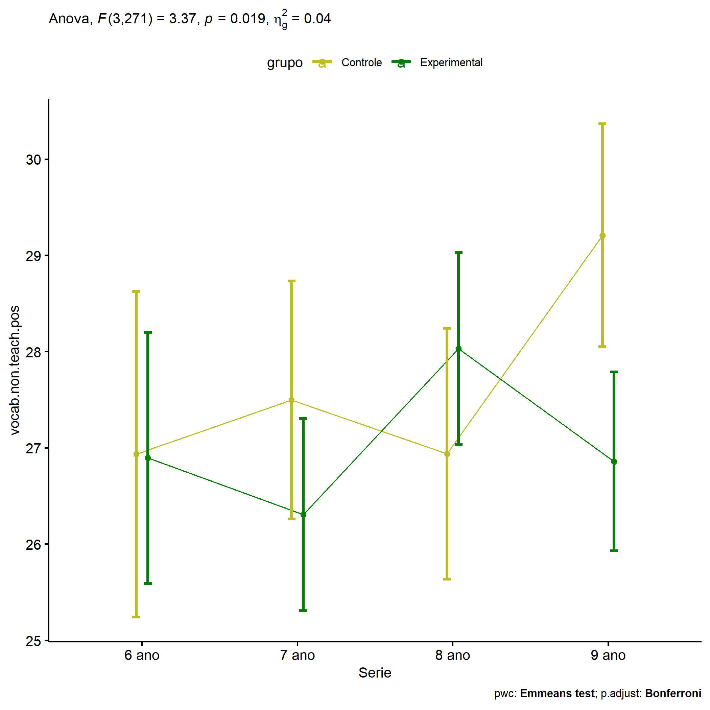<!-- -->

``` r
plots <- twoWayAncovaBoxPlots(
  wdat, "vocab.non.teach.pos", c("grupo","Serie"), aov, pwcs, covar = "vocab.non.teach.pre",
  theme = "classic", color = color[["grupo:Serie"]],
  subtitle = which(aov$Effect == "grupo:Serie"))
```

``` r
plots[["grupo:Serie"]] + ggplot2::ylab("Vocabulario Não Ensinado") + ggplot2::scale_x_discrete(labels=c('pre', 'pos'))
```

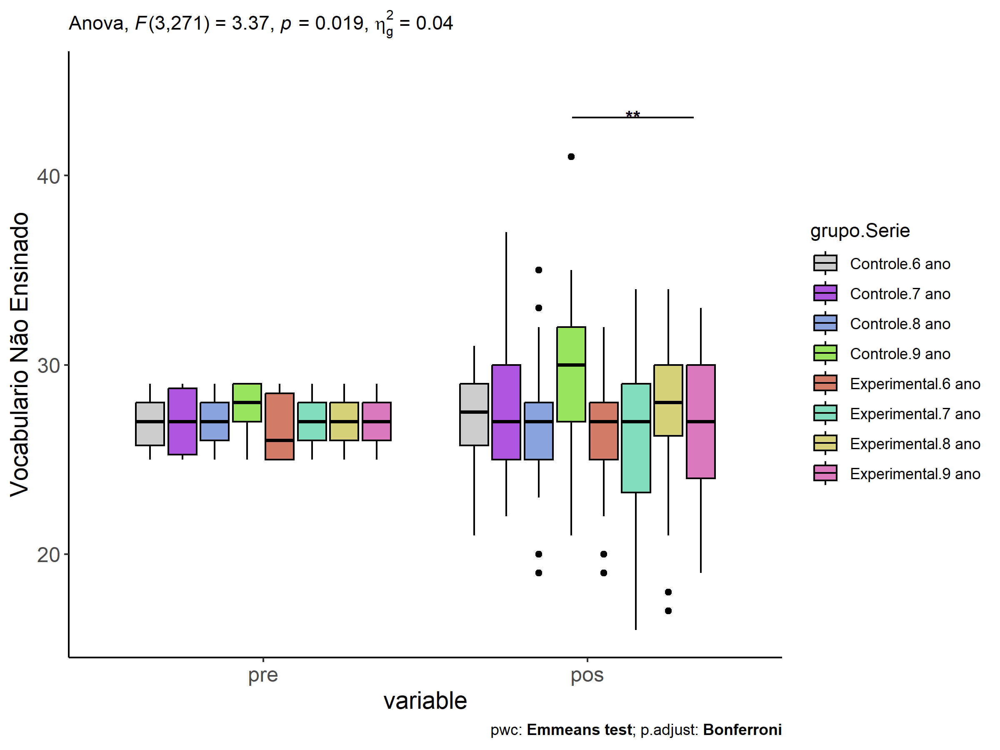<!-- -->

``` r
plots <- twoWayAncovaBoxPlots(
  wdat.long, "vocab.non.teach", c("grupo","Serie"), aov, pwc.long, pre.post = "time",
  theme = "classic", color = color$prepost)
```

``` r
plots[["grupo:Serie"]] + ggplot2::ylab("Vocabulario Não Ensinado")
```

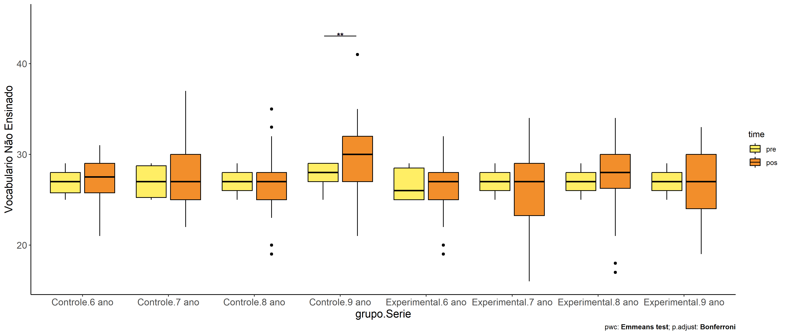<!-- -->

### Checking linearity assumption

``` r
ggscatter(wdat, x = "vocab.non.teach.pre", y = "vocab.non.teach.pos", size = 0.5,
          facet.by = c("grupo","Serie"), add = "reg.line")+
  stat_regline_equation(
    aes(label =  paste(..eq.label.., ..rr.label.., sep = "~~~~"))
  )
```

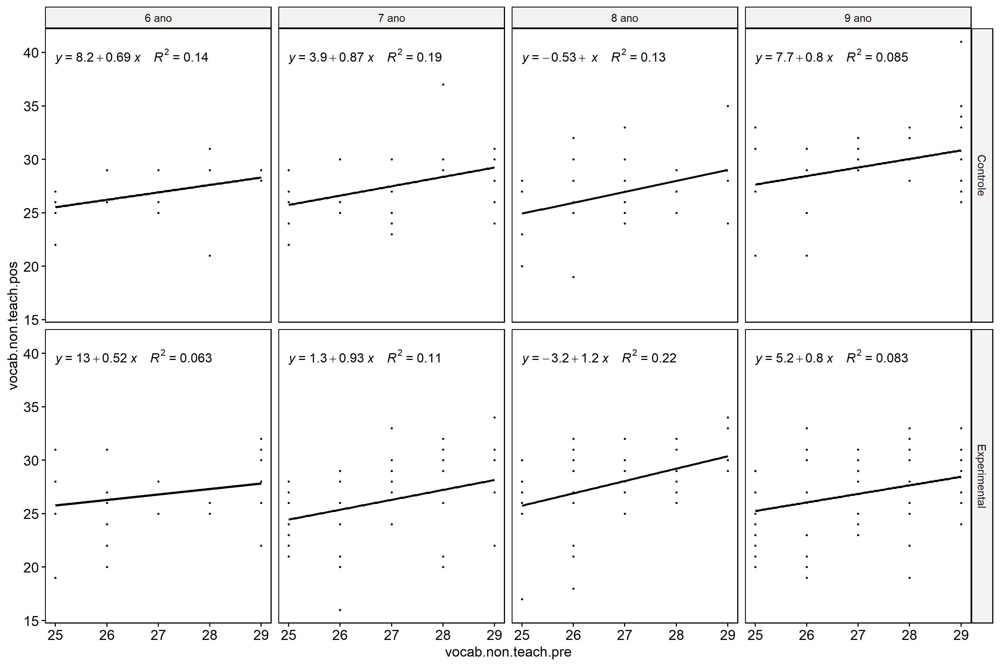<!-- -->

### Checking normality and homogeneity

``` r
res <- augment(lm(vocab.non.teach.pos ~ vocab.non.teach.pre + grupo*Serie, data = wdat))
```

``` r
shapiro_test(res$.resid)
```

    ## # A tibble: 1 × 3
    ##   variable   statistic p.value
    ##   <chr>          <dbl>   <dbl>
    ## 1 res$.resid     0.986 0.00946

``` r
levene_test(res, .resid ~ grupo*Serie)
```

    ## # A tibble: 1 × 4
    ##     df1   df2 statistic     p
    ##   <int> <int>     <dbl> <dbl>
    ## 1     7   272      1.48 0.175

# Summary of Results

## Descriptive Statistics

``` r
df <- get.descriptives(ldat[["grupo"]], c(dv.pre, dv.pos), c("grupo"), 
                       include.global = T, symmetry.test = T, normality.test = F)
df <- plyr::rbind.fill(
  df, do.call(plyr::rbind.fill, lapply(lfatores2, FUN = function(f) {
    if (nrow(dat) > 0 && sum(!is.na(unique(dat[[f]]))) > 1)
      get.descriptives(ldat[[paste0("grupo:",f)]], c(dv.pre,dv.pos), c("grupo", f),
                       symmetry.test = T, normality.test = F)
    }))
)
(df <- df[,c(fatores1[fatores1 %in% colnames(df)],"variable",
             colnames(df)[!colnames(df) %in% c(fatores1,"variable")])])
```

    ##           grupo Sexo   Zona Cor.Raca Serie            variable  n   mean median min max    sd    se
    ## 1      Controle <NA>   <NA>     <NA>  <NA> vocab.non.teach.pre 26 27.615   28.5  25  29 1.602 0.314
    ## 2  Experimental <NA>   <NA>     <NA>  <NA> vocab.non.teach.pre 35 27.086   27.0  25  29 1.522 0.257
    ## 3          <NA> <NA>   <NA>     <NA>  <NA> vocab.non.teach.pre 61 27.311   27.0  25  29 1.566 0.200
    ## 4      Controle <NA>   <NA>     <NA>  <NA> vocab.non.teach.pos 26 25.115   25.0  21  29 2.389 0.468
    ## 5  Experimental <NA>   <NA>     <NA>  <NA> vocab.non.teach.pos 35 23.114   22.0  19  29 2.564 0.433
    ## 6          <NA> <NA>   <NA>     <NA>  <NA> vocab.non.teach.pos 61 23.967   24.0  19  29 2.664 0.341
    ## 7      Controle    F   <NA>     <NA>  <NA> vocab.non.teach.pre 52 26.942   27.0  25  29 1.552 0.215
    ## 8      Controle    M   <NA>     <NA>  <NA> vocab.non.teach.pre 47 27.277   27.0  25  29 1.347 0.196
    ## 9  Experimental    F   <NA>     <NA>  <NA> vocab.non.teach.pre 81 26.951   27.0  25  29 1.474 0.164
    ## 10 Experimental    M   <NA>     <NA>  <NA> vocab.non.teach.pre 58 26.983   27.0  25  29 1.493 0.196
    ## 11     Controle    F   <NA>     <NA>  <NA> vocab.non.teach.pos 52 27.135   27.5  21  33 2.559 0.355
    ## 12     Controle    M   <NA>     <NA>  <NA> vocab.non.teach.pos 47 28.000   28.0  20  37 3.677 0.536
    ## 13 Experimental    F   <NA>     <NA>  <NA> vocab.non.teach.pos 81 27.111   28.0  17  34 3.630 0.403
    ## 14 Experimental    M   <NA>     <NA>  <NA> vocab.non.teach.pos 58 26.517   27.0  20  33 2.861 0.376
    ## 15     Controle <NA>  Rural     <NA>  <NA> vocab.non.teach.pre 59 26.966   27.0  25  29 1.531 0.199
    ## 16     Controle <NA> Urbana     <NA>  <NA> vocab.non.teach.pre 26 27.346   27.0  25  29 1.355 0.266
    ## 17 Experimental <NA>  Rural     <NA>  <NA> vocab.non.teach.pre 64 27.000   27.0  25  29 1.425 0.178
    ## 18 Experimental <NA> Urbana     <NA>  <NA> vocab.non.teach.pre 45 27.111   27.0  25  29 1.465 0.218
    ## 19     Controle <NA>  Rural     <NA>  <NA> vocab.non.teach.pos 59 28.102   28.0  19  41 3.845 0.501
    ## 20     Controle <NA> Urbana     <NA>  <NA> vocab.non.teach.pos 26 28.038   27.0  23  37 3.316 0.650
    ## 21 Experimental <NA>  Rural     <NA>  <NA> vocab.non.teach.pos 64 25.969   27.0  15  34 4.801 0.600
    ## 22 Experimental <NA> Urbana     <NA>  <NA> vocab.non.teach.pos 45 27.378   28.0  19  32 3.339 0.498
    ## 23     Controle <NA>   <NA>   Branca  <NA> vocab.non.teach.pre 13 27.077   27.0  25  29 1.320 0.366
    ## 24     Controle <NA>   <NA>    Parda  <NA> vocab.non.teach.pre 42 27.167   27.0  25  29 1.607 0.248
    ## 25 Experimental <NA>   <NA>   Branca  <NA> vocab.non.teach.pre 11 26.636   26.0  25  29 1.286 0.388
    ## 26 Experimental <NA>   <NA>    Parda  <NA> vocab.non.teach.pre 45 26.933   27.0  25  29 1.338 0.199
    ## 27     Controle <NA>   <NA>   Branca  <NA> vocab.non.teach.pos 13 28.923   29.0  23  35 3.523 0.977
    ## 28     Controle <NA>   <NA>    Parda  <NA> vocab.non.teach.pos 42 28.024   28.0  19  37 3.672 0.567
    ## 29 Experimental <NA>   <NA>   Branca  <NA> vocab.non.teach.pos 11 26.727   26.0  20  32 4.671 1.408
    ## 30 Experimental <NA>   <NA>    Parda  <NA> vocab.non.teach.pos 45 25.822   27.0  13  33 5.109 0.762
    ## 31     Controle <NA>   <NA>     <NA> 6 ano vocab.non.teach.pre 16 26.938   27.0  25  29 1.482 0.370
    ## 32     Controle <NA>   <NA>     <NA> 7 ano vocab.non.teach.pre 30 26.933   27.0  25  29 1.574 0.287
    ## 33     Controle <NA>   <NA>     <NA> 8 ano vocab.non.teach.pre 27 26.778   27.0  25  29 1.281 0.247
    ## 34     Controle <NA>   <NA>     <NA> 9 ano vocab.non.teach.pre 35 27.657   28.0  25  29 1.413 0.239
    ## 35 Experimental <NA>   <NA>     <NA> 6 ano vocab.non.teach.pre 27 26.741   26.0  25  29 1.607 0.309
    ## 36 Experimental <NA>   <NA>     <NA> 7 ano vocab.non.teach.pre 46 26.978   27.0  25  29 1.422 0.210
    ## 37 Experimental <NA>   <NA>     <NA> 8 ano vocab.non.teach.pre 46 26.870   27.0  25  29 1.424 0.210
    ## 38 Experimental <NA>   <NA>     <NA> 9 ano vocab.non.teach.pre 53 27.038   27.0  25  29 1.414 0.194
    ## 39     Controle <NA>   <NA>     <NA> 6 ano vocab.non.teach.pos 16 26.875   27.5  21  31 2.705 0.676
    ## 40     Controle <NA>   <NA>     <NA> 7 ano vocab.non.teach.pos 30 27.433   27.0  22  37 3.191 0.583
    ## 41     Controle <NA>   <NA>     <NA> 8 ano vocab.non.teach.pos 27 26.741   27.0  19  35 3.569 0.687
    ## 42     Controle <NA>   <NA>     <NA> 9 ano vocab.non.teach.pos 35 29.771   30.0  21  41 3.874 0.655
    ## 43 Experimental <NA>   <NA>     <NA> 6 ano vocab.non.teach.pos 27 26.667   27.0  19  32 3.317 0.638
    ## 44 Experimental <NA>   <NA>     <NA> 7 ano vocab.non.teach.pos 46 26.283   27.0  16  34 4.053 0.598
    ## 45 Experimental <NA>   <NA>     <NA> 8 ano vocab.non.teach.pos 46 27.913   28.0  17  34 3.501 0.516
    ## 46 Experimental <NA>   <NA>     <NA> 9 ano vocab.non.teach.pos 53 26.887   27.0  19  33 3.926 0.539
    ##       ci  iqr symmetry      skewness    kurtosis
    ## 1  0.647 2.00       NO -0.5660264863 -1.30961398
    ## 2  0.523 3.00      YES  0.0545551146 -1.58722458
    ## 3  0.401 3.00      YES -0.2062197624 -1.54059182
    ## 4  0.965 4.50      YES -0.0632629352 -1.24473284
    ## 5  0.881 3.50       NO  0.5174189450 -0.74291883
    ## 6  0.682 4.00      YES  0.1905912245 -1.07287915
    ## 7  0.432 3.25      YES  0.0631251924 -1.51671636
    ## 8  0.395 2.00      YES -0.2370626114 -1.17141508
    ## 9  0.326 2.00      YES  0.0607539537 -1.44480275
    ## 10 0.392 2.75      YES -0.0644607263 -1.43698268
    ## 11 0.713 3.00      YES -0.3533616687 -0.36062752
    ## 12 1.080 6.00      YES  0.0410794429 -0.41963538
    ## 13 0.803 4.00       NO -0.6104051083 -0.11524257
    ## 14 0.752 3.75      YES  0.0045078913 -0.47817038
    ## 15 0.399 3.00      YES -0.0008223847 -1.47243822
    ## 16 0.547 3.00      YES -0.0576620218 -1.39240788
    ## 17 0.356 2.00      YES  0.0323718222 -1.37996292
    ## 18 0.440 2.00      YES -0.0603702469 -1.45755161
    ## 19 1.002 4.00      YES  0.2762504108  1.03072384
    ## 20 1.340 3.75       NO  0.8596692040  0.17925318
    ## 21 1.199 9.00      YES -0.4174414836 -0.72502935
    ## 22 1.003 4.00       NO -0.5559651954 -0.65615647
    ## 23 0.798 2.00      YES -0.1281086606 -1.24306423
    ## 24 0.501 3.75      YES -0.1958342497 -1.57041871
    ## 25 0.864 1.50      YES  0.3664386241 -1.23468240
    ## 26 0.402 2.00      YES  0.0628028892 -1.37384891
    ## 27 2.129 4.00      YES  0.0481619918 -1.16793694
    ## 28 1.144 4.00      YES -0.0963781903  0.40604049
    ## 29 3.138 8.50      YES -0.1483128954 -1.68913051
    ## 30 1.535 8.00       NO -0.6949987465 -0.39974774
    ## 31 0.790 2.25      YES -0.0157565193 -1.49608165
    ## 32 0.588 3.50      YES  0.1057993704 -1.55955750
    ## 33 0.507 2.00      YES  0.1892332373 -1.11801135
    ## 34 0.485 2.00       NO -0.6153605940 -1.01975965
    ## 35 0.636 3.50      YES  0.3542068936 -1.54132625
    ## 36 0.422 2.00      YES -0.0534365139 -1.37185014
    ## 37 0.423 2.00      YES  0.1340488181 -1.37068037
    ## 38 0.390 2.00      YES -0.0652308091 -1.37223097
    ## 39 1.441 3.25       NO -0.6720587598 -0.45802131
    ## 40 1.192 5.00       NO  0.6569138239  0.54646545
    ## 41 1.412 3.00      YES  0.0872193864  0.06203652
    ## 42 1.331 5.00      YES  0.1004009364  0.92253386
    ## 43 1.312 3.00       NO -0.5096252356 -0.36863585
    ## 44 1.204 5.75      YES -0.3985401923 -0.61058832
    ## 45 1.040 3.75       NO -1.0717438910  1.52468839
    ## 46 1.082 6.00      YES -0.3099618556 -1.01853710

| grupo        | Sexo | Zona   | Cor.Raca | Serie | variable            |   n |   mean | median | min | max |    sd |    se |    ci |  iqr | symmetry | skewness | kurtosis |
|:-------------|:-----|:-------|:---------|:------|:--------------------|----:|-------:|-------:|----:|----:|------:|------:|------:|-----:|:---------|---------:|---------:|
| Controle     |      |        |          |       | vocab.non.teach.pre |  26 | 27.615 |   28.5 |  25 |  29 | 1.602 | 0.314 | 0.647 | 2.00 | NO       |   -0.566 |   -1.310 |
| Experimental |      |        |          |       | vocab.non.teach.pre |  35 | 27.086 |   27.0 |  25 |  29 | 1.522 | 0.257 | 0.523 | 3.00 | YES      |    0.055 |   -1.587 |
|              |      |        |          |       | vocab.non.teach.pre |  61 | 27.311 |   27.0 |  25 |  29 | 1.566 | 0.200 | 0.401 | 3.00 | YES      |   -0.206 |   -1.541 |
| Controle     |      |        |          |       | vocab.non.teach.pos |  26 | 25.115 |   25.0 |  21 |  29 | 2.389 | 0.468 | 0.965 | 4.50 | YES      |   -0.063 |   -1.245 |
| Experimental |      |        |          |       | vocab.non.teach.pos |  35 | 23.114 |   22.0 |  19 |  29 | 2.564 | 0.433 | 0.881 | 3.50 | NO       |    0.517 |   -0.743 |
|              |      |        |          |       | vocab.non.teach.pos |  61 | 23.967 |   24.0 |  19 |  29 | 2.664 | 0.341 | 0.682 | 4.00 | YES      |    0.191 |   -1.073 |
| Controle     | F    |        |          |       | vocab.non.teach.pre |  52 | 26.942 |   27.0 |  25 |  29 | 1.552 | 0.215 | 0.432 | 3.25 | YES      |    0.063 |   -1.517 |
| Controle     | M    |        |          |       | vocab.non.teach.pre |  47 | 27.277 |   27.0 |  25 |  29 | 1.347 | 0.196 | 0.395 | 2.00 | YES      |   -0.237 |   -1.171 |
| Experimental | F    |        |          |       | vocab.non.teach.pre |  81 | 26.951 |   27.0 |  25 |  29 | 1.474 | 0.164 | 0.326 | 2.00 | YES      |    0.061 |   -1.445 |
| Experimental | M    |        |          |       | vocab.non.teach.pre |  58 | 26.983 |   27.0 |  25 |  29 | 1.493 | 0.196 | 0.392 | 2.75 | YES      |   -0.064 |   -1.437 |
| Controle     | F    |        |          |       | vocab.non.teach.pos |  52 | 27.135 |   27.5 |  21 |  33 | 2.559 | 0.355 | 0.713 | 3.00 | YES      |   -0.353 |   -0.361 |
| Controle     | M    |        |          |       | vocab.non.teach.pos |  47 | 28.000 |   28.0 |  20 |  37 | 3.677 | 0.536 | 1.080 | 6.00 | YES      |    0.041 |   -0.420 |
| Experimental | F    |        |          |       | vocab.non.teach.pos |  81 | 27.111 |   28.0 |  17 |  34 | 3.630 | 0.403 | 0.803 | 4.00 | NO       |   -0.610 |   -0.115 |
| Experimental | M    |        |          |       | vocab.non.teach.pos |  58 | 26.517 |   27.0 |  20 |  33 | 2.861 | 0.376 | 0.752 | 3.75 | YES      |    0.005 |   -0.478 |
| Controle     |      | Rural  |          |       | vocab.non.teach.pre |  59 | 26.966 |   27.0 |  25 |  29 | 1.531 | 0.199 | 0.399 | 3.00 | YES      |   -0.001 |   -1.472 |
| Controle     |      | Urbana |          |       | vocab.non.teach.pre |  26 | 27.346 |   27.0 |  25 |  29 | 1.355 | 0.266 | 0.547 | 3.00 | YES      |   -0.058 |   -1.392 |
| Experimental |      | Rural  |          |       | vocab.non.teach.pre |  64 | 27.000 |   27.0 |  25 |  29 | 1.425 | 0.178 | 0.356 | 2.00 | YES      |    0.032 |   -1.380 |
| Experimental |      | Urbana |          |       | vocab.non.teach.pre |  45 | 27.111 |   27.0 |  25 |  29 | 1.465 | 0.218 | 0.440 | 2.00 | YES      |   -0.060 |   -1.458 |
| Controle     |      | Rural  |          |       | vocab.non.teach.pos |  59 | 28.102 |   28.0 |  19 |  41 | 3.845 | 0.501 | 1.002 | 4.00 | YES      |    0.276 |    1.031 |
| Controle     |      | Urbana |          |       | vocab.non.teach.pos |  26 | 28.038 |   27.0 |  23 |  37 | 3.316 | 0.650 | 1.340 | 3.75 | NO       |    0.860 |    0.179 |
| Experimental |      | Rural  |          |       | vocab.non.teach.pos |  64 | 25.969 |   27.0 |  15 |  34 | 4.801 | 0.600 | 1.199 | 9.00 | YES      |   -0.417 |   -0.725 |
| Experimental |      | Urbana |          |       | vocab.non.teach.pos |  45 | 27.378 |   28.0 |  19 |  32 | 3.339 | 0.498 | 1.003 | 4.00 | NO       |   -0.556 |   -0.656 |
| Controle     |      |        | Branca   |       | vocab.non.teach.pre |  13 | 27.077 |   27.0 |  25 |  29 | 1.320 | 0.366 | 0.798 | 2.00 | YES      |   -0.128 |   -1.243 |
| Controle     |      |        | Parda    |       | vocab.non.teach.pre |  42 | 27.167 |   27.0 |  25 |  29 | 1.607 | 0.248 | 0.501 | 3.75 | YES      |   -0.196 |   -1.570 |
| Experimental |      |        | Branca   |       | vocab.non.teach.pre |  11 | 26.636 |   26.0 |  25 |  29 | 1.286 | 0.388 | 0.864 | 1.50 | YES      |    0.366 |   -1.235 |
| Experimental |      |        | Parda    |       | vocab.non.teach.pre |  45 | 26.933 |   27.0 |  25 |  29 | 1.338 | 0.199 | 0.402 | 2.00 | YES      |    0.063 |   -1.374 |
| Controle     |      |        | Branca   |       | vocab.non.teach.pos |  13 | 28.923 |   29.0 |  23 |  35 | 3.523 | 0.977 | 2.129 | 4.00 | YES      |    0.048 |   -1.168 |
| Controle     |      |        | Parda    |       | vocab.non.teach.pos |  42 | 28.024 |   28.0 |  19 |  37 | 3.672 | 0.567 | 1.144 | 4.00 | YES      |   -0.096 |    0.406 |
| Experimental |      |        | Branca   |       | vocab.non.teach.pos |  11 | 26.727 |   26.0 |  20 |  32 | 4.671 | 1.408 | 3.138 | 8.50 | YES      |   -0.148 |   -1.689 |
| Experimental |      |        | Parda    |       | vocab.non.teach.pos |  45 | 25.822 |   27.0 |  13 |  33 | 5.109 | 0.762 | 1.535 | 8.00 | NO       |   -0.695 |   -0.400 |
| Controle     |      |        |          | 6 ano | vocab.non.teach.pre |  16 | 26.938 |   27.0 |  25 |  29 | 1.482 | 0.370 | 0.790 | 2.25 | YES      |   -0.016 |   -1.496 |
| Controle     |      |        |          | 7 ano | vocab.non.teach.pre |  30 | 26.933 |   27.0 |  25 |  29 | 1.574 | 0.287 | 0.588 | 3.50 | YES      |    0.106 |   -1.560 |
| Controle     |      |        |          | 8 ano | vocab.non.teach.pre |  27 | 26.778 |   27.0 |  25 |  29 | 1.281 | 0.247 | 0.507 | 2.00 | YES      |    0.189 |   -1.118 |
| Controle     |      |        |          | 9 ano | vocab.non.teach.pre |  35 | 27.657 |   28.0 |  25 |  29 | 1.413 | 0.239 | 0.485 | 2.00 | NO       |   -0.615 |   -1.020 |
| Experimental |      |        |          | 6 ano | vocab.non.teach.pre |  27 | 26.741 |   26.0 |  25 |  29 | 1.607 | 0.309 | 0.636 | 3.50 | YES      |    0.354 |   -1.541 |
| Experimental |      |        |          | 7 ano | vocab.non.teach.pre |  46 | 26.978 |   27.0 |  25 |  29 | 1.422 | 0.210 | 0.422 | 2.00 | YES      |   -0.053 |   -1.372 |
| Experimental |      |        |          | 8 ano | vocab.non.teach.pre |  46 | 26.870 |   27.0 |  25 |  29 | 1.424 | 0.210 | 0.423 | 2.00 | YES      |    0.134 |   -1.371 |
| Experimental |      |        |          | 9 ano | vocab.non.teach.pre |  53 | 27.038 |   27.0 |  25 |  29 | 1.414 | 0.194 | 0.390 | 2.00 | YES      |   -0.065 |   -1.372 |
| Controle     |      |        |          | 6 ano | vocab.non.teach.pos |  16 | 26.875 |   27.5 |  21 |  31 | 2.705 | 0.676 | 1.441 | 3.25 | NO       |   -0.672 |   -0.458 |
| Controle     |      |        |          | 7 ano | vocab.non.teach.pos |  30 | 27.433 |   27.0 |  22 |  37 | 3.191 | 0.583 | 1.192 | 5.00 | NO       |    0.657 |    0.546 |
| Controle     |      |        |          | 8 ano | vocab.non.teach.pos |  27 | 26.741 |   27.0 |  19 |  35 | 3.569 | 0.687 | 1.412 | 3.00 | YES      |    0.087 |    0.062 |
| Controle     |      |        |          | 9 ano | vocab.non.teach.pos |  35 | 29.771 |   30.0 |  21 |  41 | 3.874 | 0.655 | 1.331 | 5.00 | YES      |    0.100 |    0.923 |
| Experimental |      |        |          | 6 ano | vocab.non.teach.pos |  27 | 26.667 |   27.0 |  19 |  32 | 3.317 | 0.638 | 1.312 | 3.00 | NO       |   -0.510 |   -0.369 |
| Experimental |      |        |          | 7 ano | vocab.non.teach.pos |  46 | 26.283 |   27.0 |  16 |  34 | 4.053 | 0.598 | 1.204 | 5.75 | YES      |   -0.399 |   -0.611 |
| Experimental |      |        |          | 8 ano | vocab.non.teach.pos |  46 | 27.913 |   28.0 |  17 |  34 | 3.501 | 0.516 | 1.040 | 3.75 | NO       |   -1.072 |    1.525 |
| Experimental |      |        |          | 9 ano | vocab.non.teach.pos |  53 | 26.887 |   27.0 |  19 |  33 | 3.926 | 0.539 | 1.082 | 6.00 | YES      |   -0.310 |   -1.019 |

## ANCOVA Table Comparison

``` r
df <- do.call(plyr::rbind.fill, laov)
(df <- df[!duplicated(df$Effect),])
```

    ##                 Effect DFn DFd      F        p p<.05      ges DFn' DFd'     F'       p' p<.05'     ges'
    ## 1                grupo   1  58 10.978 2.00e-03     * 0.159000    1  291  2.886 9.00e-02        0.010000
    ## 2  vocab.non.teach.pre   1  58 99.476 3.42e-14     * 0.632000    1  291 28.307 2.07e-07      * 0.089000
    ## 4           grupo:Sexo   1 233  2.254 1.35e-01       0.010000    1  289  0.314 5.75e-01        0.001000
    ## 5                 Sexo   1 233  0.139 7.10e-01       0.000597    1  289  2.894 9.00e-02        0.010000
    ## 8           grupo:Zona   1 189  2.292 1.32e-01       0.012000    1  192  3.410 6.60e-02        0.017000
    ## 10                Zona   1 189  1.106 2.94e-01       0.006000    1  192  0.181 6.71e-01        0.000940
    ## 11            Cor.Raca   1 106  1.299 2.57e-01       0.012000    1  109  1.965 1.64e-01        0.018000
    ## 13      grupo:Cor.Raca   1 106  0.013 9.09e-01       0.000123    1  109  0.064 8.01e-01        0.000586
    ## 16         grupo:Serie   3 271  3.369 1.90e-02     * 0.036000    3  285  3.333 2.00e-02      * 0.034000
    ## 17               Serie   3 271  1.554 2.01e-01       0.017000    3  285  0.134 9.40e-01        0.001000

|     | Effect              | DFn | DFd |      F |     p | p\<.05 |   ges | DFn’ | DFd’ |     F’ |    p’ | p\<.05’ |  ges’ |
|:----|:--------------------|----:|----:|-------:|------:|:-------|------:|-----:|-----:|-------:|------:|:--------|------:|
| 1   | grupo               |   1 |  58 | 10.978 | 0.002 | \*     | 0.159 |    1 |  291 |  2.886 | 0.090 |         | 0.010 |
| 2   | vocab.non.teach.pre |   1 |  58 | 99.476 | 0.000 | \*     | 0.632 |    1 |  291 | 28.307 | 0.000 | \*      | 0.089 |
| 4   | grupo:Sexo          |   1 | 233 |  2.254 | 0.135 |        | 0.010 |    1 |  289 |  0.314 | 0.575 |         | 0.001 |
| 5   | Sexo                |   1 | 233 |  0.139 | 0.710 |        | 0.001 |    1 |  289 |  2.894 | 0.090 |         | 0.010 |
| 8   | grupo:Zona          |   1 | 189 |  2.292 | 0.132 |        | 0.012 |    1 |  192 |  3.410 | 0.066 |         | 0.017 |
| 10  | Zona                |   1 | 189 |  1.106 | 0.294 |        | 0.006 |    1 |  192 |  0.181 | 0.671 |         | 0.001 |
| 11  | Cor.Raca            |   1 | 106 |  1.299 | 0.257 |        | 0.012 |    1 |  109 |  1.965 | 0.164 |         | 0.018 |
| 13  | grupo:Cor.Raca      |   1 | 106 |  0.013 | 0.909 |        | 0.000 |    1 |  109 |  0.064 | 0.801 |         | 0.001 |
| 16  | grupo:Serie         |   3 | 271 |  3.369 | 0.019 | \*     | 0.036 |    3 |  285 |  3.333 | 0.020 | \*      | 0.034 |
| 17  | Serie               |   3 | 271 |  1.554 | 0.201 |        | 0.017 |    3 |  285 |  0.134 | 0.940 |         | 0.001 |

## PairWise Table Comparison

``` r
df <- do.call(plyr::rbind.fill, lpwc)
df <- df[,c(names(lfatores), names(df)[!names(df) %in% c(names(lfatores),"term",".y.")])]
```

| grupo        | Sexo | Zona   | Cor.Raca | Serie | group1   | group2       |  df | statistic |     p | p.adj | p.adj.signif | df’ | statistic’ |    p’ | p.adj’ | p.adj.signif’ |
|:-------------|:-----|:-------|:---------|:------|:---------|:-------------|----:|----------:|------:|------:|:-------------|----:|-----------:|------:|-------:|:--------------|
| Controle     |      |        |          |       | pre      | pos          | 118 |     4.340 | 0.000 | 0.000 | \*\*\*\*     | 584 |     -0.430 | 0.667 |  0.667 | ns            |
| Experimental |      |        |          |       | pre      | pos          | 118 |     7.998 | 0.000 | 0.000 | \*\*\*\*     | 584 |      2.010 | 0.045 |  0.045 | \*            |
|              |      |        |          |       | Controle | Experimental |  58 |     3.313 | 0.002 | 0.002 | \*\*         | 291 |      1.699 | 0.090 |  0.090 | ns            |
| Controle     | F    |        |          |       | pre      | pos          | 468 |    -0.388 | 0.698 | 0.698 | ns           | 580 |     -0.686 | 0.493 |  0.493 | ns            |
| Controle     | M    |        |          |       | pre      | pos          | 468 |    -1.389 | 0.166 | 0.166 | ns           | 580 |      0.105 | 0.916 |  0.916 | ns            |
| Controle     |      |        |          |       | F        | M            | 233 |    -0.900 | 0.369 | 0.369 | ns           | 289 |      0.607 | 0.545 |  0.545 | ns            |
| Experimental | F    |        |          |       | pre      | pos          | 468 |    -0.405 | 0.686 | 0.686 | ns           | 580 |      0.372 | 0.710 |  0.710 | ns            |
| Experimental | M    |        |          |       | pre      | pos          | 468 |     0.993 | 0.321 | 0.321 | ns           | 580 |      2.508 | 0.012 |  0.012 | \*            |
| Experimental |      |        |          |       | F        | M            | 233 |     1.257 | 0.210 | 0.210 | ns           | 289 |      1.686 | 0.093 |  0.093 | ns            |
|              | F    |        |          |       | Controle | Experimental | 233 |     0.062 | 0.951 | 0.951 | ns           | 289 |      0.829 | 0.408 |  0.408 | ns            |
|              | M    |        |          |       | Controle | Experimental | 233 |     2.079 | 0.039 | 0.039 | \*           | 289 |      1.550 | 0.122 |  0.122 | ns            |
| Controle     |      |        |          |       | Rural    | Urbana       | 189 |     0.498 | 0.619 | 0.619 | ns           | 192 |      1.150 | 0.251 |  0.251 | ns            |
| Controle     |      | Rural  |          |       | pre      | pos          | 380 |    -2.038 | 0.042 | 0.042 | \*           | 386 |     -1.745 | 0.082 |  0.082 | ns            |
| Controle     |      | Urbana |          |       | pre      | pos          | 380 |    -0.825 | 0.410 | 0.410 | ns           | 386 |      0.000 | 1.000 |  1.000 | ns            |
| Experimental |      |        |          |       | Rural    | Urbana       | 189 |    -1.774 | 0.078 | 0.078 | ns           | 192 |     -1.504 | 0.134 |  0.134 | ns            |
| Experimental |      | Rural  |          |       | pre      | pos          | 380 |     1.928 | 0.055 | 0.055 | ns           | 386 |      2.258 | 0.024 |  0.024 | \*            |
| Experimental |      | Urbana |          |       | pre      | pos          | 380 |    -0.418 | 0.676 | 0.676 | ns           | 386 |      0.118 | 0.906 |  0.906 | ns            |
|              |      | Rural  |          |       | Controle | Experimental | 189 |     3.192 | 0.002 | 0.002 | \*\*         | 192 |      3.167 | 0.002 |  0.002 | \*\*          |
|              |      | Urbana |          |       | Controle | Experimental | 189 |     0.460 | 0.646 | 0.646 | ns           | 192 |      0.049 | 0.961 |  0.961 | ns            |
| Controle     |      |        | Branca   |       | pre      | pos          | 214 |    -1.439 | 0.152 | 0.152 | ns           | 220 |     -1.200 | 0.231 |  0.231 | ns            |
| Controle     |      |        |          |       | Branca   | Parda        | 106 |     0.752 | 0.454 | 0.454 | ns           | 109 |      0.847 | 0.399 |  0.399 | ns            |
| Controle     |      |        | Parda    |       | pre      | pos          | 214 |    -1.201 | 0.231 | 0.231 | ns           | 220 |     -0.495 | 0.621 |  0.621 | ns            |
| Experimental |      |        | Branca   |       | pre      | pos          | 214 |    -0.065 | 0.948 | 0.948 | ns           | 220 |     -0.054 | 0.957 |  0.957 | ns            |
| Experimental |      |        |          |       | Branca   | Parda        | 106 |     0.865 | 0.389 | 0.389 | ns           | 109 |      1.146 | 0.254 |  0.254 | ns            |
| Experimental |      |        | Parda    |       | pre      | pos          | 214 |     1.611 | 0.109 | 0.109 | ns           | 220 |      2.446 | 0.015 |  0.015 | \*            |
|              |      |        | Branca   |       | Controle | Experimental | 106 |     1.020 | 0.310 | 0.310 | ns           | 109 |      0.849 | 0.398 |  0.398 | ns            |
|              |      |        | Parda    |       | Controle | Experimental | 106 |     2.192 | 0.031 | 0.031 | \*           | 109 |      2.199 | 0.030 |  0.030 | \*            |
| Controle     |      |        |          | 6 ano | pre      | pos          | 544 |     0.064 | 0.949 | 0.949 | ns           | 572 |      0.048 | 0.962 |  0.962 | ns            |
| Controle     |      |        |          | 7 ano | pre      | pos          | 544 |    -0.697 | 0.486 | 0.486 | ns           | 572 |     -0.524 | 0.601 |  0.601 | ns            |
| Controle     |      |        |          | 8 ano | pre      | pos          | 544 |     0.049 | 0.961 | 0.961 | ns           | 572 |      1.386 | 0.166 |  0.166 | ns            |
| Controle     |      |        |          | 9 ano | pre      | pos          | 544 |    -3.186 | 0.002 | 0.002 | \*\*         | 572 |     -1.541 | 0.124 |  0.124 | ns            |
| Controle     |      |        |          |       | 6 ano    | 7 ano        | 271 |    -0.528 | 0.598 | 1.000 | ns           | 285 |     -0.378 | 0.706 |  1.000 | ns            |
| Controle     |      |        |          |       | 6 ano    | 8 ano        | 271 |    -0.003 | 0.997 | 1.000 | ns           | 285 |      0.856 | 0.393 |  1.000 | ns            |
| Controle     |      |        |          |       | 6 ano    | 9 ano        | 271 |    -2.183 | 0.030 | 0.180 | ns           | 285 |     -0.959 | 0.338 |  1.000 | ns            |
| Controle     |      |        |          |       | 7 ano    | 8 ano        | 271 |     0.612 | 0.541 | 1.000 | ns           | 285 |      1.472 | 0.142 |  0.852 | ns            |
| Controle     |      |        |          |       | 7 ano    | 9 ano        | 271 |    -1.989 | 0.048 | 0.286 | ns           | 285 |     -0.693 | 0.489 |  1.000 | ns            |
| Controle     |      |        |          |       | 8 ano    | 9 ano        | 271 |    -2.554 | 0.011 | 0.067 | ns           | 285 |     -2.224 | 0.027 |  0.162 | ns            |
| Experimental |      |        |          | 6 ano | pre      | pos          | 544 |     0.098 | 0.922 | 0.922 | ns           | 572 |      1.172 | 0.242 |  0.242 | ns            |
| Experimental |      |        |          | 7 ano | pre      | pos          | 544 |     1.202 | 0.230 | 0.230 | ns           | 572 |      1.339 | 0.181 |  0.181 | ns            |
| Experimental |      |        |          | 8 ano | pre      | pos          | 544 |    -1.802 | 0.072 | 0.072 | ns           | 572 |     -0.718 | 0.473 |  0.473 | ns            |
| Experimental |      |        |          | 9 ano | pre      | pos          | 544 |     0.280 | 0.780 | 0.780 | ns           | 572 |      2.211 | 0.027 |  0.027 | \*            |
| Experimental |      |        |          |       | 6 ano    | 7 ano        | 271 |     0.707 | 0.480 | 1.000 | ns           | 285 |     -0.102 | 0.919 |  1.000 | ns            |
| Experimental |      |        |          |       | 6 ano    | 8 ano        | 271 |    -1.362 | 0.174 | 1.000 | ns           | 285 |     -1.484 | 0.139 |  0.833 | ns            |
| Experimental |      |        |          |       | 6 ano    | 9 ano        | 271 |     0.045 | 0.964 | 1.000 | ns           | 285 |      0.347 | 0.729 |  1.000 | ns            |
| Experimental |      |        |          |       | 7 ano    | 8 ano        | 271 |    -2.406 | 0.017 | 0.101 | ns           | 285 |     -1.583 | 0.115 |  0.687 | ns            |
| Experimental |      |        |          |       | 7 ano    | 9 ano        | 271 |    -0.798 | 0.425 | 1.000 | ns           | 285 |      0.525 | 0.600 |  1.000 | ns            |
| Experimental |      |        |          |       | 8 ano    | 9 ano        | 271 |     1.691 | 0.092 | 0.552 | ns           | 285 |      2.193 | 0.029 |  0.175 | ns            |
|              |      |        |          | 6 ano | Controle | Experimental | 271 |     0.035 | 0.972 | 0.972 | ns           | 285 |      0.717 | 0.474 |  0.474 | ns            |
|              |      |        |          | 7 ano | Controle | Experimental | 271 |     1.475 | 0.141 | 0.141 | ns           | 285 |      1.353 | 0.177 |  0.177 | ns            |
|              |      |        |          | 8 ano | Controle | Experimental | 271 |    -1.312 | 0.191 | 0.191 | ns           | 285 |     -1.667 | 0.097 |  0.097 | ns            |
|              |      |        |          | 9 ano | Controle | Experimental | 271 |     3.117 | 0.002 | 0.002 | \*\*         | 285 |      2.789 | 0.006 |  0.006 | \*\*          |

## EMMS Table Comparison

``` r
df <- do.call(plyr::rbind.fill, lemms)
df[["N-N'"]] <- df[["N"]] - df[["N'"]]
df <- df[,c(names(lfatores), names(df)[!names(df) %in% names(lfatores)])]
```

| grupo        | Sexo | Zona   | Cor.Raca | Serie |   N | M (pre) | SE (pre) | M (unadj) | SE (unadj) | M (adj) | SE (adj) |  N’ | M (pre)’ | SE (pre)’ | M (unadj)’ | SE (unadj)’ | M (adj)’ | SE (adj)’ | N-N’ |
|:-------------|:-----|:-------|:---------|:------|----:|--------:|---------:|----------:|-----------:|--------:|---------:|----:|---------:|----------:|-----------:|------------:|---------:|----------:|-----:|
| Controle     |      |        |          |       |  26 |  27.615 |    0.314 |    25.115 |      0.468 |  24.729 |    0.302 | 112 |   27.125 |     0.139 |     27.339 |       0.457 |   27.196 |     0.459 |  -86 |
| Experimental |      |        |          |       |  35 |  27.086 |    0.257 |    23.114 |      0.433 |  23.402 |    0.259 | 182 |   26.901 |     0.107 |     26.115 |       0.386 |   26.204 |     0.360 | -147 |
| Controle     | F    |        |          |       |  52 |  26.942 |    0.215 |    27.135 |      0.355 |  27.214 |    0.402 |  60 |   27.000 |     0.197 |     27.467 |       0.442 |   27.452 |     0.624 |   -8 |
| Controle     | M    |        |          |       |  47 |  27.277 |    0.196 |    28.000 |      0.536 |  27.741 |    0.424 |  52 |   27.269 |     0.194 |     27.192 |       0.846 |   26.896 |     0.673 |   -5 |
| Experimental | F    |        |          |       |  81 |  26.951 |    0.164 |    27.111 |      0.403 |  27.183 |    0.322 |  94 |   26.872 |     0.151 |     26.670 |       0.500 |   26.790 |     0.499 |  -13 |
| Experimental | M    |        |          |       |  58 |  26.983 |    0.196 |    26.517 |      0.376 |  26.556 |    0.380 |  88 |   26.932 |     0.153 |     25.523 |       0.590 |   25.580 |     0.516 |  -30 |
| Controle     |      | Rural  |          |       |  59 |  26.966 |    0.199 |    28.102 |      0.501 |  28.197 |    0.490 |  59 |   26.966 |     0.199 |     28.102 |       0.501 |   28.191 |     0.581 |    0 |
| Controle     |      | Urbana |          |       |  26 |  27.346 |    0.266 |    28.038 |      0.650 |  27.755 |    0.739 |  27 |   27.259 |     0.270 |     27.259 |       0.999 |   26.997 |     0.860 |   -1 |
| Experimental |      | Rural  |          |       |  64 |  27.000 |    0.178 |    25.969 |      0.600 |  26.030 |    0.470 |  65 |   26.985 |     0.176 |     25.585 |       0.705 |   25.652 |     0.553 |   -1 |
| Experimental |      | Urbana |          |       |  45 |  27.111 |    0.218 |    27.378 |      0.498 |  27.329 |    0.561 |  46 |   27.087 |     0.215 |     27.000 |       0.616 |   26.944 |     0.658 |   -1 |
| Controle     |      |        | Branca   |       |  13 |  27.077 |    0.366 |    28.923 |      0.977 |  28.853 |    1.153 |  13 |   27.077 |     0.366 |     28.923 |       0.977 |   28.888 |     1.454 |    0 |
| Controle     |      |        | Parda    |       |  42 |  27.167 |    0.248 |    28.024 |      0.567 |  27.861 |    0.643 |  43 |   27.209 |     0.246 |     27.628 |       0.680 |   27.483 |     0.801 |   -1 |
| Experimental |      |        | Branca   |       |  11 |  26.636 |    0.388 |    26.727 |      1.408 |  27.112 |    1.258 |  11 |   26.636 |     0.388 |     26.727 |       1.408 |   27.060 |     1.586 |    0 |
| Experimental |      |        | Parda    |       |  45 |  26.933 |    0.199 |    25.822 |      0.762 |  25.900 |    0.620 |  47 |   26.957 |     0.197 |     24.979 |       0.950 |   25.043 |     0.765 |   -2 |
| Controle     |      |        |          | 6 ano |  16 |  26.938 |    0.370 |    26.875 |      0.676 |  26.935 |    0.859 |  16 |   26.938 |     0.370 |     26.875 |       0.676 |   26.924 |     1.203 |    0 |
| Controle     |      |        |          | 7 ano |  30 |  26.933 |    0.287 |    27.433 |      0.583 |  27.497 |    0.628 |  30 |   26.933 |     0.287 |     27.433 |       0.583 |   27.486 |     0.878 |    0 |
| Controle     |      |        |          | 8 ano |  27 |  26.778 |    0.247 |    26.741 |      0.687 |  26.939 |    0.662 |  29 |   26.897 |     0.245 |     25.552 |       1.046 |   25.642 |     0.894 |   -2 |
| Controle     |      |        |          | 9 ano |  35 |  27.657 |    0.239 |    29.771 |      0.655 |  29.210 |    0.588 |  37 |   27.541 |     0.241 |     28.865 |       0.915 |   28.310 |     0.798 |   -2 |
| Experimental |      |        |          | 6 ano |  27 |  26.741 |    0.309 |    26.667 |      0.638 |  26.897 |    0.662 |  29 |   26.759 |     0.305 |     25.621 |       0.954 |   25.849 |     0.894 |   -2 |
| Experimental |      |        |          | 7 ano |  46 |  26.978 |    0.210 |    26.283 |      0.598 |  26.308 |    0.507 |  47 |   26.957 |     0.206 |     25.936 |       0.680 |   25.965 |     0.702 |   -1 |
| Experimental |      |        |          | 8 ano |  46 |  26.870 |    0.210 |    27.913 |      0.516 |  28.032 |    0.507 |  48 |   26.854 |     0.202 |     27.396 |       0.617 |   27.528 |     0.695 |   -2 |
| Experimental |      |        |          | 9 ano |  53 |  27.038 |    0.194 |    26.887 |      0.539 |  26.860 |    0.472 |  58 |   26.966 |     0.189 |     25.448 |       0.816 |   25.469 |     0.632 |   -5 |
