ANCOVA in Vocabulario Não Ensinado (Vocabulario Não Ensinado)
================
Geiser C. Challco <geiser@alumni.usp.br>

- [Descriptive Statistics of Initial
  Data](#descriptive-statistics-of-initial-data)
- [ANCOVA and Pairwise for one factor:
  **grupo**](#ancova-and-pairwise-for-one-factor-grupo)
  - [Without remove non-normal data](#without-remove-non-normal-data)
  - [Computing ANCOVA and PairWise After removing non-normal data
    (OK)](#computing-ancova-and-pairwise-after-removing-non-normal-data-ok)
    - [Plots for ancova](#plots-for-ancova)
    - [Checking linearity assumption](#checking-linearity-assumption)
    - [Checking normality and
      homogeneity](#checking-normality-and-homogeneity)
- [ANCOVA and Pairwise for two factors
  **grupo:Sexo**](#ancova-and-pairwise-for-two-factors-gruposexo)
  - [Without remove non-normal data](#without-remove-non-normal-data-1)
  - [Computing ANCOVA and PairWise After removing non-normal data
    (OK)](#computing-ancova-and-pairwise-after-removing-non-normal-data-ok-1)
    - [Plots for ancova](#plots-for-ancova-1)
    - [Checking linearity assumption](#checking-linearity-assumption-1)
    - [Checking normality and
      homogeneity](#checking-normality-and-homogeneity-1)
- [ANCOVA and Pairwise for two factors
  **grupo:Zona**](#ancova-and-pairwise-for-two-factors-grupozona)
  - [Without remove non-normal data](#without-remove-non-normal-data-2)
  - [Computing ANCOVA and PairWise After removing non-normal data
    (OK)](#computing-ancova-and-pairwise-after-removing-non-normal-data-ok-2)
    - [Plots for ancova](#plots-for-ancova-2)
    - [Checking linearity assumption](#checking-linearity-assumption-2)
    - [Checking normality and
      homogeneity](#checking-normality-and-homogeneity-2)
- [ANCOVA and Pairwise for two factors
  **grupo:Cor.Raca**](#ancova-and-pairwise-for-two-factors-grupocorraca)
  - [Without remove non-normal data](#without-remove-non-normal-data-3)
  - [Computing ANCOVA and PairWise After removing non-normal data
    (OK)](#computing-ancova-and-pairwise-after-removing-non-normal-data-ok-3)
    - [Plots for ancova](#plots-for-ancova-3)
    - [Checking linearity assumption](#checking-linearity-assumption-3)
    - [Checking normality and
      homogeneity](#checking-normality-and-homogeneity-3)
- [ANCOVA and Pairwise for two factors
  **grupo:Serie**](#ancova-and-pairwise-for-two-factors-gruposerie)
  - [Without remove non-normal data](#without-remove-non-normal-data-4)
  - [Computing ANCOVA and PairWise After removing non-normal data
    (OK)](#computing-ancova-and-pairwise-after-removing-non-normal-data-ok-4)
    - [Plots for ancova](#plots-for-ancova-4)
    - [Checking linearity assumption](#checking-linearity-assumption-4)
    - [Checking normality and
      homogeneity](#checking-normality-and-homogeneity-4)
- [Summary of Results](#summary-of-results)
  - [Descriptive Statistics](#descriptive-statistics)
  - [ANCOVA Table Comparison](#ancova-table-comparison)
  - [PairWise Table Comparison](#pairwise-table-comparison)
  - [EMMS Table Comparison](#emms-table-comparison)

**NOTE**:

- Teste ANCOVA para determinar se houve diferenças significativas no
  Vocabulario Não Ensinado (medido usando pre- e pos-testes).
- ANCOVA test to determine whether there were significant differences in
  Vocabulario Não Ensinado (measured using pre- and post-tests).

# Descriptive Statistics of Initial Data

``` r
df <- get.descriptives(dat, c(dv.pre, dv.pos), c("grupo"), 
                       include.global = T, symmetry.test = T, normality.test = F)
df <- plyr::rbind.fill(
  df, do.call(plyr::rbind.fill, lapply(lfatores2, FUN = function(f) {
    if (nrow(dat) > 0 && sum(!is.na(unique(dat[[f]]))) > 1)
      get.descriptives(dat, c(dv.pre,dv.pos), c("grupo", f),
                       symmetry.test = T, normality.test = F)
    }))
)
```

    ## Warning: There were 2 warnings in `mutate()`.
    ## The first warning was:
    ## ℹ In argument: `ci = abs(stats::qt(alpha/2, .data$n - 1) * .data$se)`.
    ## Caused by warning:
    ## ! There was 1 warning in `mutate()`.
    ## ℹ In argument: `ci = abs(stats::qt(alpha/2, .data$n - 1) * .data$se)`.
    ## Caused by warning in `stats::qt()`:
    ## ! NaNs produced
    ## ℹ Run `dplyr::last_dplyr_warnings()` to see the 1 remaining warning.
    ## There were 2 warnings in `mutate()`.
    ## The first warning was:
    ## ℹ In argument: `ci = abs(stats::qt(alpha/2, .data$n - 1) * .data$se)`.
    ## Caused by warning:
    ## ! There was 1 warning in `mutate()`.
    ## ℹ In argument: `ci = abs(stats::qt(alpha/2, .data$n - 1) * .data$se)`.
    ## Caused by warning in `stats::qt()`:
    ## ! NaNs produced
    ## ℹ Run `dplyr::last_dplyr_warnings()` to see the 1 remaining warning.

``` r
(df <- df[,c(fatores1[fatores1 %in% colnames(df)],"variable",
             colnames(df)[!colnames(df) %in% c(fatores1,"variable")])])
```

    ##           grupo Sexo   Zona Cor.Raca Serie            variable   n   mean median min max    sd    se
    ## 1      Controle <NA>   <NA>     <NA>  <NA> vocab.non.teach.pre  89 31.854   31.0  30  39 1.868 0.198
    ## 2  Experimental <NA>   <NA>     <NA>  <NA> vocab.non.teach.pre 137 31.912   31.0  30  37 1.743 0.149
    ## 3          <NA> <NA>   <NA>     <NA>  <NA> vocab.non.teach.pre 226 31.889   31.0  30  39 1.789 0.119
    ## 4      Controle <NA>   <NA>     <NA>  <NA> vocab.non.teach.pos  89 29.753   31.0   8  36 5.593 0.593
    ## 5  Experimental <NA>   <NA>     <NA>  <NA> vocab.non.teach.pos 137 30.343   31.0  12  37 4.281 0.366
    ## 6          <NA> <NA>   <NA>     <NA>  <NA> vocab.non.teach.pos 226 30.111   31.0   8  37 4.837 0.322
    ## 7      Controle    F   <NA>     <NA>  <NA> vocab.non.teach.pre  48 31.771   31.0  30  39 2.024 0.292
    ## 8      Controle    M   <NA>     <NA>  <NA> vocab.non.teach.pre  41 31.951   32.0  30  35 1.687 0.264
    ## 9  Experimental    F   <NA>     <NA>  <NA> vocab.non.teach.pre  77 31.935   32.0  30  37 1.649 0.188
    ## 10 Experimental    M   <NA>     <NA>  <NA> vocab.non.teach.pre  60 31.883   31.0  30  37 1.869 0.241
    ## 11     Controle    F   <NA>     <NA>  <NA> vocab.non.teach.pos  48 30.188   31.0   8  35 4.823 0.696
    ## 12     Controle    M   <NA>     <NA>  <NA> vocab.non.teach.pos  41 29.244   31.0   9  36 6.402 1.000
    ## 13 Experimental    F   <NA>     <NA>  <NA> vocab.non.teach.pos  77 30.714   31.0  12  37 4.036 0.460
    ## 14 Experimental    M   <NA>     <NA>  <NA> vocab.non.teach.pos  60 29.867   30.0  13  37 4.568 0.590
    ## 15     Controle <NA>  Rural     <NA>  <NA> vocab.non.teach.pre  28 31.821   31.0  30  39 2.127 0.402
    ## 16     Controle <NA> Urbana     <NA>  <NA> vocab.non.teach.pre  26 31.500   31.0  30  35 1.606 0.315
    ## 17     Controle <NA>   <NA>     <NA>  <NA> vocab.non.teach.pre  35 32.143   32.0  30  37 1.833 0.310
    ## 18 Experimental <NA>  Rural     <NA>  <NA> vocab.non.teach.pre  46 31.935   32.0  30  36 1.482 0.218
    ## 19 Experimental <NA> Urbana     <NA>  <NA> vocab.non.teach.pre  42 31.786   31.0  30  37 1.855 0.286
    ## 20 Experimental <NA>   <NA>     <NA>  <NA> vocab.non.teach.pre  49 32.000   31.0  30  37 1.893 0.270
    ## 21     Controle <NA>  Rural     <NA>  <NA> vocab.non.teach.pos  28 29.857   32.0   9  36 5.816 1.099
    ## 22     Controle <NA> Urbana     <NA>  <NA> vocab.non.teach.pos  26 30.731   31.0  20  35 3.157 0.619
    ## 23     Controle <NA>   <NA>     <NA>  <NA> vocab.non.teach.pos  35 28.943   32.0   8  35 6.734 1.138
    ## 24 Experimental <NA>  Rural     <NA>  <NA> vocab.non.teach.pos  46 29.326   31.0  12  37 5.457 0.805
    ## 25 Experimental <NA> Urbana     <NA>  <NA> vocab.non.teach.pos  42 30.738   31.0  17  36 3.663 0.565
    ## 26 Experimental <NA>   <NA>     <NA>  <NA> vocab.non.teach.pos  49 30.959   31.0  21  37 3.323 0.475
    ## 27     Controle <NA>   <NA>   Branca  <NA> vocab.non.teach.pre   7 31.571   31.0  30  34 1.512 0.571
    ## 28     Controle <NA>   <NA> Indígena  <NA> vocab.non.teach.pre   1 34.000   34.0  34  34    NA    NA
    ## 29     Controle <NA>   <NA>    Parda  <NA> vocab.non.teach.pre  24 31.542   31.0  30  39 1.956 0.399
    ## 30     Controle <NA>   <NA>     <NA>  <NA> vocab.non.teach.pre  57 31.982   31.0  30  37 1.876 0.248
    ## 31 Experimental <NA>   <NA>   Branca  <NA> vocab.non.teach.pre  17 31.765   32.0  30  34 1.522 0.369
    ## 32 Experimental <NA>   <NA> Indígena  <NA> vocab.non.teach.pre   1 30.000   30.0  30  30    NA    NA
    ## 33 Experimental <NA>   <NA>    Parda  <NA> vocab.non.teach.pre  31 31.806   31.0  30  35 1.515 0.272
    ## 34 Experimental <NA>   <NA>     <NA>  <NA> vocab.non.teach.pre  88 32.000   31.5  30  37 1.863 0.199
    ## 35     Controle <NA>   <NA>   Branca  <NA> vocab.non.teach.pos   7 32.571   33.0  30  36 2.573 0.972
    ## 36     Controle <NA>   <NA> Indígena  <NA> vocab.non.teach.pos   1 35.000   35.0  35  35    NA    NA
    ## 37     Controle <NA>   <NA>    Parda  <NA> vocab.non.teach.pos  24 28.458   31.0   8  34 6.997 1.428
    ## 38     Controle <NA>   <NA>     <NA>  <NA> vocab.non.teach.pos  57 29.860   31.0   9  35 5.111 0.677
    ## 39 Experimental <NA>   <NA>   Branca  <NA> vocab.non.teach.pos  17 31.294   31.0  26  37 2.889 0.701
    ## 40 Experimental <NA>   <NA> Indígena  <NA> vocab.non.teach.pos   1 29.000   29.0  29  29    NA    NA
    ## 41 Experimental <NA>   <NA>    Parda  <NA> vocab.non.teach.pos  31 30.484   32.0  13  37 4.456 0.800
    ## 42 Experimental <NA>   <NA>     <NA>  <NA> vocab.non.teach.pos  88 30.125   31.0  12  36 4.474 0.477
    ## 43     Controle <NA>   <NA>     <NA> 6 ano vocab.non.teach.pre  12 31.000   31.0  30  34 1.279 0.369
    ## 44     Controle <NA>   <NA>     <NA> 7 ano vocab.non.teach.pre  21 31.333   31.0  30  35 1.528 0.333
    ## 45     Controle <NA>   <NA>     <NA> 8 ano vocab.non.teach.pre  15 32.200   31.0  30  39 2.455 0.634
    ## 46     Controle <NA>   <NA>     <NA> 9 ano vocab.non.teach.pre  41 32.244   32.0  30  37 1.841 0.288
    ## 47 Experimental <NA>   <NA>     <NA> 6 ano vocab.non.teach.pre  12 31.250   31.0  30  34 1.422 0.411
    ## 48 Experimental <NA>   <NA>     <NA> 7 ano vocab.non.teach.pre  27 31.593   32.0  30  35 1.309 0.252
    ## 49 Experimental <NA>   <NA>     <NA> 8 ano vocab.non.teach.pre  45 31.889   31.0  30  36 1.748 0.261
    ## 50 Experimental <NA>   <NA>     <NA> 9 ano vocab.non.teach.pre  53 32.245   32.0  30  37 1.950 0.268
    ## 51     Controle <NA>   <NA>     <NA> 6 ano vocab.non.teach.pos  12 29.833   30.5  26  32 2.125 0.613
    ## 52     Controle <NA>   <NA>     <NA> 7 ano vocab.non.teach.pos  21 29.381   31.0   9  36 6.054 1.321
    ## 53     Controle <NA>   <NA>     <NA> 8 ano vocab.non.teach.pos  15 27.733   33.0   8  35 9.573 2.472
    ## 54     Controle <NA>   <NA>     <NA> 9 ano vocab.non.teach.pos  41 30.659   32.0  20  35 3.838 0.599
    ## 55 Experimental <NA>   <NA>     <NA> 6 ano vocab.non.teach.pos  12 30.000   32.0  17  34 4.729 1.365
    ##       ci  iqr symmetry    skewness    kurtosis
    ## 1  0.394 3.00       NO  1.17172271  1.30194714
    ## 2  0.294 3.00       NO  0.78718765 -0.10638748
    ## 3  0.235 3.00       NO  0.96290764  0.57446366
    ## 4  1.178 5.00       NO -2.11000102  4.82114089
    ## 5  0.723 4.00       NO -1.87606051  5.04924795
    ## 6  0.634 4.00       NO -2.12072556  5.75200085
    ## 7  0.588 3.00       NO  1.57340253  2.26186090
    ## 8  0.533 3.00      YES  0.34857417 -1.21396196
    ## 9  0.374 2.00       NO  0.65820736 -0.05529645
    ## 10 0.483 3.00       NO  0.88593222 -0.27572594
    ## 11 1.400 4.25       NO -2.36315058  7.51128034
    ## 12 2.021 5.00       NO -1.77021000  2.62658652
    ## 13 0.916 4.00       NO -1.94864846  5.81797453
    ## 14 1.180 5.00       NO -1.73590791  4.02431541
    ## 15 0.825 3.00       NO  1.58405542  2.46256266
    ## 16 0.649 2.75       NO  0.91882391 -0.48868065
    ## 17 0.630 2.00       NO  0.63014509 -0.39204041
    ## 18 0.440 2.00      YES  0.42993739 -0.32476203
    ## 19 0.578 3.00       NO  0.93300750 -0.18759863
    ## 20 0.544 3.00       NO  0.77623427 -0.34254589
    ## 21 2.255 4.75       NO -1.86916461  3.77670793
    ## 22 1.275 2.75       NO -1.39060818  2.84659226
    ## 23 2.313 6.00       NO -1.74871954  2.40929363
    ## 24 1.621 4.00       NO -1.83175597  3.08631676
    ## 25 1.141 3.75       NO -1.31574790  2.87057862
    ## 26 0.954 5.00       NO -0.70607550  0.25602399
    ## 27 1.398 2.00      YES  0.37965181 -1.59470663
    ## 28   NaN 0.00 few data  0.00000000  0.00000000
    ## 29 0.826 2.00       NO  2.29683262  6.07366643
    ## 30 0.498 3.00       NO  0.71100880 -0.56773314
    ## 31 0.782 3.00      YES -0.02702350 -1.68295721
    ## 32   NaN 0.00 few data  0.00000000  0.00000000
    ## 33 0.556 1.50       NO  0.81849903 -0.40991645
    ## 34 0.395 3.00       NO  0.79067554 -0.21418394
    ## 35 2.379 4.50      YES  0.05546993 -1.99462042
    ## 36   NaN 0.00 few data  0.00000000  0.00000000
    ## 37 2.954 7.50       NO -1.51564597  1.56808905
    ## 38 1.356 5.00       NO -2.24429817  5.89815709
    ## 39 1.485 3.00      YES  0.13357623 -0.72880974
    ## 40   NaN 0.00 few data  0.00000000  0.00000000
    ## 41 1.635 5.00       NO -1.87488516  5.14447771
    ## 42 0.948 4.00       NO -1.85058405  4.28504680
    ## 43 0.813 1.00       NO  1.19431883  0.17438272
    ## 44 0.695 1.00       NO  1.06288442 -0.20505345
    ## 45 1.360 2.50       NO  1.32522261  1.24343089
    ## 46 0.581 2.00       NO  0.61069518 -0.45794763
    ## 47 0.904 2.25       NO  0.64090851 -1.19776806
    ## 48 0.518 2.00      YES  0.45024556 -0.41901195
    ## 49 0.525 2.00       NO  0.76503013 -0.45142088
    ## 50 0.538 3.00       NO  0.60691730 -0.57060151
    ## 51 1.350 2.75       NO -0.58291427 -1.29556195
    ## 52 2.756 3.00       NO -1.97744624  3.87859426
    ## 53 5.301 9.00       NO -1.07089735 -0.57302156
    ## 54 1.211 4.00       NO -1.03917103  0.02807439
    ## 55 3.005 2.50       NO -1.71145286  1.94369258
    ##  [ reached 'max' / getOption("max.print") -- omitted 3 rows ]

| grupo        | Sexo | Zona   | Cor.Raca | Serie | variable            |   n |   mean | median | min | max |    sd |    se |    ci |  iqr | symmetry | skewness | kurtosis |
|:-------------|:-----|:-------|:---------|:------|:--------------------|----:|-------:|-------:|----:|----:|------:|------:|------:|-----:|:---------|---------:|---------:|
| Controle     |      |        |          |       | vocab.non.teach.pre |  89 | 31.854 |   31.0 |  30 |  39 | 1.868 | 0.198 | 0.394 | 3.00 | NO       |    1.172 |    1.302 |
| Experimental |      |        |          |       | vocab.non.teach.pre | 137 | 31.912 |   31.0 |  30 |  37 | 1.743 | 0.149 | 0.294 | 3.00 | NO       |    0.787 |   -0.106 |
|              |      |        |          |       | vocab.non.teach.pre | 226 | 31.889 |   31.0 |  30 |  39 | 1.789 | 0.119 | 0.235 | 3.00 | NO       |    0.963 |    0.574 |
| Controle     |      |        |          |       | vocab.non.teach.pos |  89 | 29.753 |   31.0 |   8 |  36 | 5.593 | 0.593 | 1.178 | 5.00 | NO       |   -2.110 |    4.821 |
| Experimental |      |        |          |       | vocab.non.teach.pos | 137 | 30.343 |   31.0 |  12 |  37 | 4.281 | 0.366 | 0.723 | 4.00 | NO       |   -1.876 |    5.049 |
|              |      |        |          |       | vocab.non.teach.pos | 226 | 30.111 |   31.0 |   8 |  37 | 4.837 | 0.322 | 0.634 | 4.00 | NO       |   -2.121 |    5.752 |
| Controle     | F    |        |          |       | vocab.non.teach.pre |  48 | 31.771 |   31.0 |  30 |  39 | 2.024 | 0.292 | 0.588 | 3.00 | NO       |    1.573 |    2.262 |
| Controle     | M    |        |          |       | vocab.non.teach.pre |  41 | 31.951 |   32.0 |  30 |  35 | 1.687 | 0.264 | 0.533 | 3.00 | YES      |    0.349 |   -1.214 |
| Experimental | F    |        |          |       | vocab.non.teach.pre |  77 | 31.935 |   32.0 |  30 |  37 | 1.649 | 0.188 | 0.374 | 2.00 | NO       |    0.658 |   -0.055 |
| Experimental | M    |        |          |       | vocab.non.teach.pre |  60 | 31.883 |   31.0 |  30 |  37 | 1.869 | 0.241 | 0.483 | 3.00 | NO       |    0.886 |   -0.276 |
| Controle     | F    |        |          |       | vocab.non.teach.pos |  48 | 30.188 |   31.0 |   8 |  35 | 4.823 | 0.696 | 1.400 | 4.25 | NO       |   -2.363 |    7.511 |
| Controle     | M    |        |          |       | vocab.non.teach.pos |  41 | 29.244 |   31.0 |   9 |  36 | 6.402 | 1.000 | 2.021 | 5.00 | NO       |   -1.770 |    2.627 |
| Experimental | F    |        |          |       | vocab.non.teach.pos |  77 | 30.714 |   31.0 |  12 |  37 | 4.036 | 0.460 | 0.916 | 4.00 | NO       |   -1.949 |    5.818 |
| Experimental | M    |        |          |       | vocab.non.teach.pos |  60 | 29.867 |   30.0 |  13 |  37 | 4.568 | 0.590 | 1.180 | 5.00 | NO       |   -1.736 |    4.024 |
| Controle     |      | Rural  |          |       | vocab.non.teach.pre |  28 | 31.821 |   31.0 |  30 |  39 | 2.127 | 0.402 | 0.825 | 3.00 | NO       |    1.584 |    2.463 |
| Controle     |      | Urbana |          |       | vocab.non.teach.pre |  26 | 31.500 |   31.0 |  30 |  35 | 1.606 | 0.315 | 0.649 | 2.75 | NO       |    0.919 |   -0.489 |
| Controle     |      |        |          |       | vocab.non.teach.pre |  35 | 32.143 |   32.0 |  30 |  37 | 1.833 | 0.310 | 0.630 | 2.00 | NO       |    0.630 |   -0.392 |
| Experimental |      | Rural  |          |       | vocab.non.teach.pre |  46 | 31.935 |   32.0 |  30 |  36 | 1.482 | 0.218 | 0.440 | 2.00 | YES      |    0.430 |   -0.325 |
| Experimental |      | Urbana |          |       | vocab.non.teach.pre |  42 | 31.786 |   31.0 |  30 |  37 | 1.855 | 0.286 | 0.578 | 3.00 | NO       |    0.933 |   -0.188 |
| Experimental |      |        |          |       | vocab.non.teach.pre |  49 | 32.000 |   31.0 |  30 |  37 | 1.893 | 0.270 | 0.544 | 3.00 | NO       |    0.776 |   -0.343 |
| Controle     |      | Rural  |          |       | vocab.non.teach.pos |  28 | 29.857 |   32.0 |   9 |  36 | 5.816 | 1.099 | 2.255 | 4.75 | NO       |   -1.869 |    3.777 |
| Controle     |      | Urbana |          |       | vocab.non.teach.pos |  26 | 30.731 |   31.0 |  20 |  35 | 3.157 | 0.619 | 1.275 | 2.75 | NO       |   -1.391 |    2.847 |
| Controle     |      |        |          |       | vocab.non.teach.pos |  35 | 28.943 |   32.0 |   8 |  35 | 6.734 | 1.138 | 2.313 | 6.00 | NO       |   -1.749 |    2.409 |
| Experimental |      | Rural  |          |       | vocab.non.teach.pos |  46 | 29.326 |   31.0 |  12 |  37 | 5.457 | 0.805 | 1.621 | 4.00 | NO       |   -1.832 |    3.086 |
| Experimental |      | Urbana |          |       | vocab.non.teach.pos |  42 | 30.738 |   31.0 |  17 |  36 | 3.663 | 0.565 | 1.141 | 3.75 | NO       |   -1.316 |    2.871 |
| Experimental |      |        |          |       | vocab.non.teach.pos |  49 | 30.959 |   31.0 |  21 |  37 | 3.323 | 0.475 | 0.954 | 5.00 | NO       |   -0.706 |    0.256 |
| Controle     |      |        | Branca   |       | vocab.non.teach.pre |   7 | 31.571 |   31.0 |  30 |  34 | 1.512 | 0.571 | 1.398 | 2.00 | YES      |    0.380 |   -1.595 |
| Controle     |      |        | Indígena |       | vocab.non.teach.pre |   1 | 34.000 |   34.0 |  34 |  34 |       |       |       | 0.00 | few data |    0.000 |    0.000 |
| Controle     |      |        | Parda    |       | vocab.non.teach.pre |  24 | 31.542 |   31.0 |  30 |  39 | 1.956 | 0.399 | 0.826 | 2.00 | NO       |    2.297 |    6.074 |
| Controle     |      |        |          |       | vocab.non.teach.pre |  57 | 31.982 |   31.0 |  30 |  37 | 1.876 | 0.248 | 0.498 | 3.00 | NO       |    0.711 |   -0.568 |
| Experimental |      |        | Branca   |       | vocab.non.teach.pre |  17 | 31.765 |   32.0 |  30 |  34 | 1.522 | 0.369 | 0.782 | 3.00 | YES      |   -0.027 |   -1.683 |
| Experimental |      |        | Indígena |       | vocab.non.teach.pre |   1 | 30.000 |   30.0 |  30 |  30 |       |       |       | 0.00 | few data |    0.000 |    0.000 |
| Experimental |      |        | Parda    |       | vocab.non.teach.pre |  31 | 31.806 |   31.0 |  30 |  35 | 1.515 | 0.272 | 0.556 | 1.50 | NO       |    0.818 |   -0.410 |
| Experimental |      |        |          |       | vocab.non.teach.pre |  88 | 32.000 |   31.5 |  30 |  37 | 1.863 | 0.199 | 0.395 | 3.00 | NO       |    0.791 |   -0.214 |
| Controle     |      |        | Branca   |       | vocab.non.teach.pos |   7 | 32.571 |   33.0 |  30 |  36 | 2.573 | 0.972 | 2.379 | 4.50 | YES      |    0.055 |   -1.995 |
| Controle     |      |        | Indígena |       | vocab.non.teach.pos |   1 | 35.000 |   35.0 |  35 |  35 |       |       |       | 0.00 | few data |    0.000 |    0.000 |
| Controle     |      |        | Parda    |       | vocab.non.teach.pos |  24 | 28.458 |   31.0 |   8 |  34 | 6.997 | 1.428 | 2.954 | 7.50 | NO       |   -1.516 |    1.568 |
| Controle     |      |        |          |       | vocab.non.teach.pos |  57 | 29.860 |   31.0 |   9 |  35 | 5.111 | 0.677 | 1.356 | 5.00 | NO       |   -2.244 |    5.898 |
| Experimental |      |        | Branca   |       | vocab.non.teach.pos |  17 | 31.294 |   31.0 |  26 |  37 | 2.889 | 0.701 | 1.485 | 3.00 | YES      |    0.134 |   -0.729 |
| Experimental |      |        | Indígena |       | vocab.non.teach.pos |   1 | 29.000 |   29.0 |  29 |  29 |       |       |       | 0.00 | few data |    0.000 |    0.000 |
| Experimental |      |        | Parda    |       | vocab.non.teach.pos |  31 | 30.484 |   32.0 |  13 |  37 | 4.456 | 0.800 | 1.635 | 5.00 | NO       |   -1.875 |    5.144 |
| Experimental |      |        |          |       | vocab.non.teach.pos |  88 | 30.125 |   31.0 |  12 |  36 | 4.474 | 0.477 | 0.948 | 4.00 | NO       |   -1.851 |    4.285 |
| Controle     |      |        |          | 6 ano | vocab.non.teach.pre |  12 | 31.000 |   31.0 |  30 |  34 | 1.279 | 0.369 | 0.813 | 1.00 | NO       |    1.194 |    0.174 |
| Controle     |      |        |          | 7 ano | vocab.non.teach.pre |  21 | 31.333 |   31.0 |  30 |  35 | 1.528 | 0.333 | 0.695 | 1.00 | NO       |    1.063 |   -0.205 |
| Controle     |      |        |          | 8 ano | vocab.non.teach.pre |  15 | 32.200 |   31.0 |  30 |  39 | 2.455 | 0.634 | 1.360 | 2.50 | NO       |    1.325 |    1.243 |
| Controle     |      |        |          | 9 ano | vocab.non.teach.pre |  41 | 32.244 |   32.0 |  30 |  37 | 1.841 | 0.288 | 0.581 | 2.00 | NO       |    0.611 |   -0.458 |
| Experimental |      |        |          | 6 ano | vocab.non.teach.pre |  12 | 31.250 |   31.0 |  30 |  34 | 1.422 | 0.411 | 0.904 | 2.25 | NO       |    0.641 |   -1.198 |
| Experimental |      |        |          | 7 ano | vocab.non.teach.pre |  27 | 31.593 |   32.0 |  30 |  35 | 1.309 | 0.252 | 0.518 | 2.00 | YES      |    0.450 |   -0.419 |
| Experimental |      |        |          | 8 ano | vocab.non.teach.pre |  45 | 31.889 |   31.0 |  30 |  36 | 1.748 | 0.261 | 0.525 | 2.00 | NO       |    0.765 |   -0.451 |
| Experimental |      |        |          | 9 ano | vocab.non.teach.pre |  53 | 32.245 |   32.0 |  30 |  37 | 1.950 | 0.268 | 0.538 | 3.00 | NO       |    0.607 |   -0.571 |
| Controle     |      |        |          | 6 ano | vocab.non.teach.pos |  12 | 29.833 |   30.5 |  26 |  32 | 2.125 | 0.613 | 1.350 | 2.75 | NO       |   -0.583 |   -1.296 |
| Controle     |      |        |          | 7 ano | vocab.non.teach.pos |  21 | 29.381 |   31.0 |   9 |  36 | 6.054 | 1.321 | 2.756 | 3.00 | NO       |   -1.977 |    3.879 |
| Controle     |      |        |          | 8 ano | vocab.non.teach.pos |  15 | 27.733 |   33.0 |   8 |  35 | 9.573 | 2.472 | 5.301 | 9.00 | NO       |   -1.071 |   -0.573 |
| Controle     |      |        |          | 9 ano | vocab.non.teach.pos |  41 | 30.659 |   32.0 |  20 |  35 | 3.838 | 0.599 | 1.211 | 4.00 | NO       |   -1.039 |    0.028 |
| Experimental |      |        |          | 6 ano | vocab.non.teach.pos |  12 | 30.000 |   32.0 |  17 |  34 | 4.729 | 1.365 | 3.005 | 2.50 | NO       |   -1.711 |    1.944 |
| Experimental |      |        |          | 7 ano | vocab.non.teach.pos |  27 | 28.556 |   29.0 |  14 |  35 | 4.807 | 0.925 | 1.901 | 4.00 | NO       |   -1.409 |    1.914 |
| Experimental |      |        |          | 8 ano | vocab.non.teach.pos |  45 | 30.244 |   31.0 |  12 |  35 | 4.711 | 0.702 | 1.415 | 4.00 | NO       |   -2.340 |    6.301 |
| Experimental |      |        |          | 9 ano | vocab.non.teach.pos |  53 | 31.415 |   31.0 |  24 |  37 | 3.165 | 0.435 | 0.872 | 4.00 | YES      |   -0.350 |   -0.505 |

# ANCOVA and Pairwise for one factor: **grupo**

## Without remove non-normal data

``` r
pdat = remove_group_data(dat[!is.na(dat[["grupo"]]),], "vocab.non.teach.pos", "grupo")

pdat.long <- rbind(pdat[,c("id","grupo")], pdat[,c("id","grupo")])
pdat.long[["time"]] <- c(rep("pre", nrow(pdat)), rep("pos", nrow(pdat)))
pdat.long[["time"]] <- factor(pdat.long[["time"]], c("pre","pos"))
pdat.long[["vocab.non.teach"]] <- c(pdat[["vocab.non.teach.pre"]], pdat[["vocab.non.teach.pos"]])

aov = anova_test(pdat, vocab.non.teach.pos ~ vocab.non.teach.pre + grupo)
laov[["grupo"]] <- get_anova_table(aov)
```

``` r
pwc <- emmeans_test(pdat, vocab.non.teach.pos ~ grupo, covariate = vocab.non.teach.pre,
                    p.adjust.method = "bonferroni")
```

``` r
pwc.long <- emmeans_test(dplyr::group_by_at(pdat.long, "grupo"),
                          vocab.non.teach ~ time,
                          p.adjust.method = "bonferroni")
lpwc[["grupo"]] <- plyr::rbind.fill(pwc, pwc.long)
```

``` r
ds <- get.descriptives(pdat, "vocab.non.teach.pos", "grupo", covar = "vocab.non.teach.pre")
ds <- merge(ds[ds$variable != "vocab.non.teach.pre",],
            ds[ds$variable == "vocab.non.teach.pre", !colnames(ds) %in% c("variable")],
            by = "grupo", all.x = T, suffixes = c("", ".vocab.non.teach.pre"))
ds <- merge(get_emmeans(pwc), ds, by = "grupo", suffixes = c(".emms", ""))
ds <- ds[,c("grupo","n","mean.vocab.non.teach.pre","se.vocab.non.teach.pre","mean","se","emmean","se.emms")]

colnames(ds) <- c("grupo", "N", paste0(c("M","SE")," (pre)"),
                  paste0(c("M","SE"), " (unadj)"), paste0(c("M", "SE"), " (adj)"))

lemms[["grupo"]] <- ds
```

## Computing ANCOVA and PairWise After removing non-normal data (OK)

``` r
wdat = pdat 

res = residuals(lm(vocab.non.teach.pos ~ vocab.non.teach.pre + grupo, data = wdat))
non.normal = getNonNormal(res, wdat$id, plimit = 0.05)

wdat = wdat[!wdat$id %in% non.normal,]

wdat.long <- rbind(wdat[,c("id","grupo")], wdat[,c("id","grupo")])
wdat.long[["time"]] <- c(rep("pre", nrow(wdat)), rep("pos", nrow(wdat)))
wdat.long[["time"]] <- factor(wdat.long[["time"]], c("pre","pos"))
wdat.long[["vocab.non.teach"]] <- c(wdat[["vocab.non.teach.pre"]], wdat[["vocab.non.teach.pos"]])

ldat[["grupo"]] = wdat

(non.normal)
```

    ##   [1] "P1003" "P983"  "P2232" "P996"  "P2207" "P1966" "P3654" "P916"  "P976"  "P1794" "P1012" "P1865"
    ##  [13] "P3280" "P2069" "P1116" "P3228" "P3574" "P2113" "P932"  "P2066" "P526"  "P2322" "P3720" "P3157"
    ##  [25] "P2432" "P2447" "P2306" "P1060" "P3225" "P999"  "P3222" "P1985" "P3258" "P2146" "P2079" "P596" 
    ##  [37] "P633"  "P3284" "P2123" "P1851" "P2379" "P3151" "P1100" "P986"  "P3723" "P3138" "P3646" "P1138"
    ##  [49] "P3242" "P1085" "P1001" "P2428" "P2065" "P2459" "P2300" "P3676" "P2150" "P2360" "P3610" "P2292"
    ##  [61] "P3719" "P3245" "P1617" "P2387" "P1876" "P1761" "P3657" "P2869" "P588"  "P2191" "P1650" "P2008"
    ##  [73] "P2299" "P2225" "P2412" "P2475" "P2367" "P2139" "P1888" "P1749" "P828"  "P3283" "P1853" "P2423"
    ##  [85] "P1648" "P2431" "P2361" "P2370" "P3264" "P2064" "P3129" "P1879" "P2298" "P2984" "P1679" "P2118"
    ##  [97] "P3192" "P3144" "P605"  "P2441" "P2323" "P1900" "P2372" "P3589" "P1153" "P3202" "P1133" "P3226"
    ## [109] "P1913" "P1061" "P3171" "P2196" "P2871" "P1825" "P3147" "P2308" "P1846" "P3301" "P3643" "P928" 
    ## [121] "P552"  "P1652" "P1674" "P1908" "P2457" "P2343" "P2845" "P2476" "P2295" "P3708" "P2393" "P1665"
    ## [133] "P846"  "P3576" "P1689" "P980"  "P2990" "P3079" "P3639" "P2436" "P3688" "P600"  "P2354" "P2452"
    ## [145] "P1848" "P2188" "P2181" "P1800" "P3148" "P2477" "P2910" "P2480" "P2381" "P3693" "P2362" "P3645"
    ## [157] "P3150" "P2467" "P2131" "P2141" "P2948" "P2200" "P597"  "P3587" "P2319" "P2394" "P832"  "P2357"
    ## [169] "P3652" "P2296"

``` r
aov = anova_test(wdat, vocab.non.teach.pos ~ vocab.non.teach.pre + grupo)
laov[["grupo"]] <- merge(get_anova_table(aov), laov[["grupo"]], by="Effect", suffixes = c("","'"))

(df = get_anova_table(aov))
```

    ## ANOVA Table (type II tests)
    ## 
    ##                Effect DFn DFd      F        p p<.05   ges
    ## 1 vocab.non.teach.pre   1  53 29.682 1.35e-06     * 0.359
    ## 2               grupo   1  53  8.087 6.00e-03     * 0.132

| Effect              | DFn | DFd |      F |     p | p\<.05 |   ges |
|:--------------------|----:|----:|-------:|------:|:-------|------:|
| vocab.non.teach.pre |   1 |  53 | 29.682 | 0.000 | \*     | 0.359 |
| grupo               |   1 |  53 |  8.087 | 0.006 | \*     | 0.132 |

| term                       | .y.                 | group1   | group2       |  df | statistic |     p | p.adj | p.adj.signif |
|:---------------------------|:--------------------|:---------|:-------------|----:|----------:|------:|------:|:-------------|
| vocab.non.teach.pre\*grupo | vocab.non.teach.pos | Controle | Experimental |  53 |    -2.844 | 0.006 | 0.006 | \*\*         |

``` r
pwc.long <- emmeans_test(dplyr::group_by_at(wdat.long, "grupo"),
                         vocab.non.teach ~ time,
                         p.adjust.method = "bonferroni")
lpwc[["grupo"]] <- merge(plyr::rbind.fill(pwc, pwc.long), lpwc[["grupo"]], by=c("grupo","term",".y.","group1","group2"), suffixes = c("","'"))
```

| grupo        | term | .y.             | group1 | group2 |  df | statistic |   p | p.adj | p.adj.signif |
|:-------------|:-----|:----------------|:-------|:-------|----:|----------:|----:|------:|:-------------|
| Controle     | time | vocab.non.teach | pre    | pos    | 108 |     8.313 |   0 |     0 | \*\*\*\*     |
| Experimental | time | vocab.non.teach | pre    | pos    | 108 |    10.252 |   0 |     0 | \*\*\*\*     |

``` r
ds <- get.descriptives(wdat, "vocab.non.teach.pos", "grupo", covar = "vocab.non.teach.pre")
ds <- merge(ds[ds$variable != "vocab.non.teach.pre",],
            ds[ds$variable == "vocab.non.teach.pre", !colnames(ds) %in% c("variable")],
            by = "grupo", all.x = T, suffixes = c("", ".vocab.non.teach.pre"))
ds <- merge(get_emmeans(pwc), ds, by = "grupo", suffixes = c(".emms", ""))
ds <- ds[,c("grupo","n","mean.vocab.non.teach.pre","se.vocab.non.teach.pre","mean","se","emmean","se.emms")]

colnames(ds) <- c("grupo", "N", paste0(c("M","SE")," (pre)"),
                  paste0(c("M","SE"), " (unadj)"), paste0(c("M", "SE"), " (adj)"))

lemms[["grupo"]] <- merge(ds, lemms[["grupo"]], by=c("grupo"), suffixes = c("","'"))
```

| grupo        |   N | M (pre) | SE (pre) | M (unadj) | SE (unadj) | M (adj) | SE (adj) |
|:-------------|----:|--------:|---------:|----------:|-----------:|--------:|---------:|
| Controle     |  16 |   31.50 |    0.483 |     26.50 |      0.465 |  26.613 |    0.354 |
| Experimental |  40 |   31.75 |    0.242 |     27.85 |      0.269 |  27.805 |    0.224 |

### Plots for ancova

``` r
plots <- oneWayAncovaPlots(
  wdat, "vocab.non.teach.pos", "grupo", aov, list("grupo"=pwc), addParam = c("mean_se"),
  font.label.size=10, step.increase=0.05, p.label="p.adj",
  subtitle = which(aov$Effect == "grupo"))
```

``` r
if (!is.null(nrow(plots[["grupo"]]$data)))
  plots[["grupo"]] + ggplot2::scale_color_manual(values = color[["grupo"]])
```

    ## Scale for colour is already present.
    ## Adding another scale for colour, which will replace the existing scale.

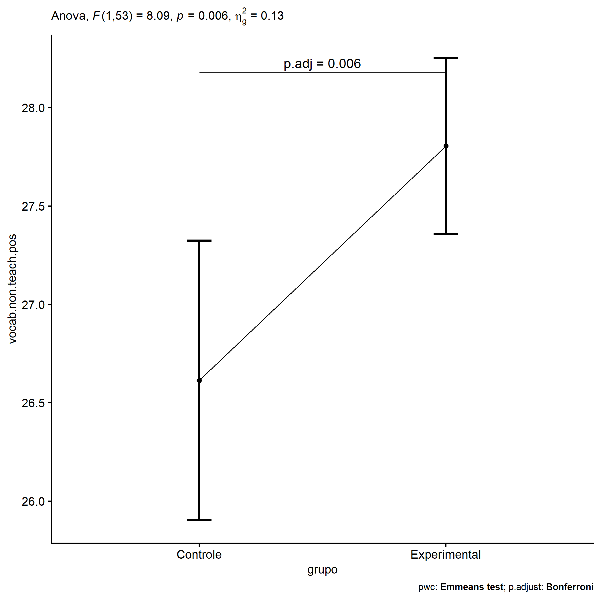<!-- -->

``` r
plots <- oneWayAncovaBoxPlots(
  wdat, "vocab.non.teach.pos", "grupo", aov, pwc, covar = "vocab.non.teach.pre",
  theme = "classic", color = color[["grupo"]],
  subtitle = which(aov$Effect == "grupo"))
```

``` r
if (length(unique(wdat[["grupo"]])) > 1)
  plots[["grupo"]] + ggplot2::ylab("Vocabulario Não Ensinado") + ggplot2::scale_x_discrete(labels=c('pre', 'pos'))
```

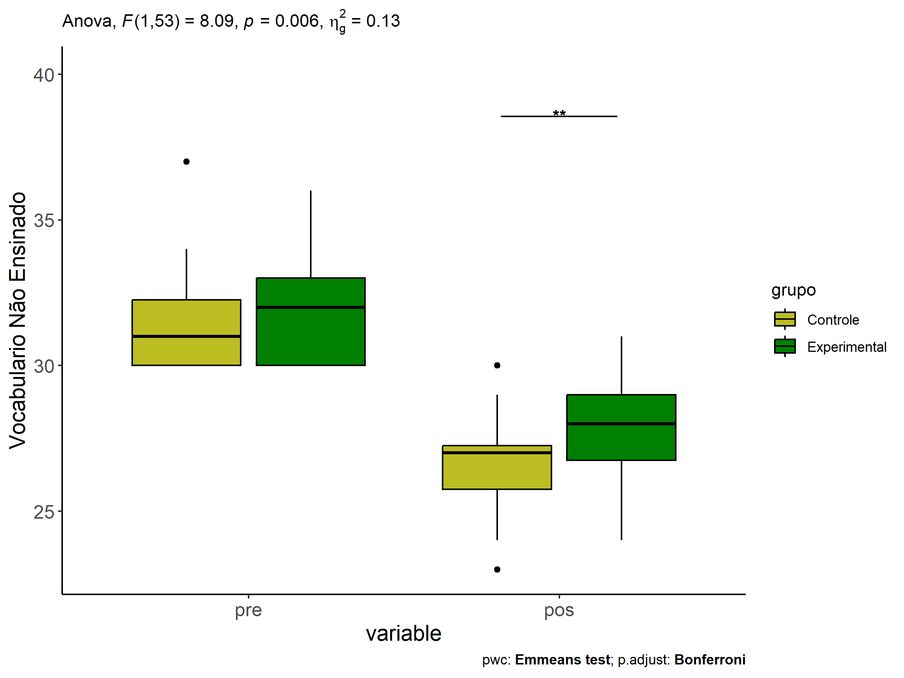<!-- -->

``` r
if (length(unique(wdat.long[["grupo"]])) > 1)
  plots <- oneWayAncovaBoxPlots(
    wdat.long, "vocab.non.teach", "grupo", aov, pwc.long, pre.post = "time",
    theme = "classic", color = color$prepost)
```

``` r
if (length(unique(wdat.long[["grupo"]])) > 1)
  plots[["grupo"]] + ggplot2::ylab("Vocabulario Não Ensinado")
```

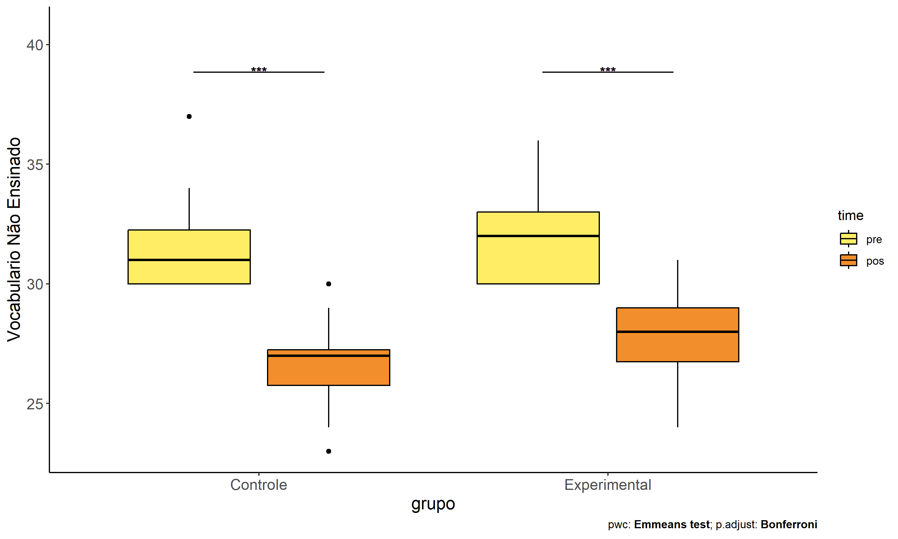<!-- -->

### Checking linearity assumption

``` r
ggscatter(wdat, x = "vocab.non.teach.pre", y = "vocab.non.teach.pos", size = 0.5,
          color = "grupo", add = "reg.line")+
  stat_regline_equation(
    aes(label =  paste(..eq.label.., ..rr.label.., sep = "~~~~"), color = grupo)
  )
```

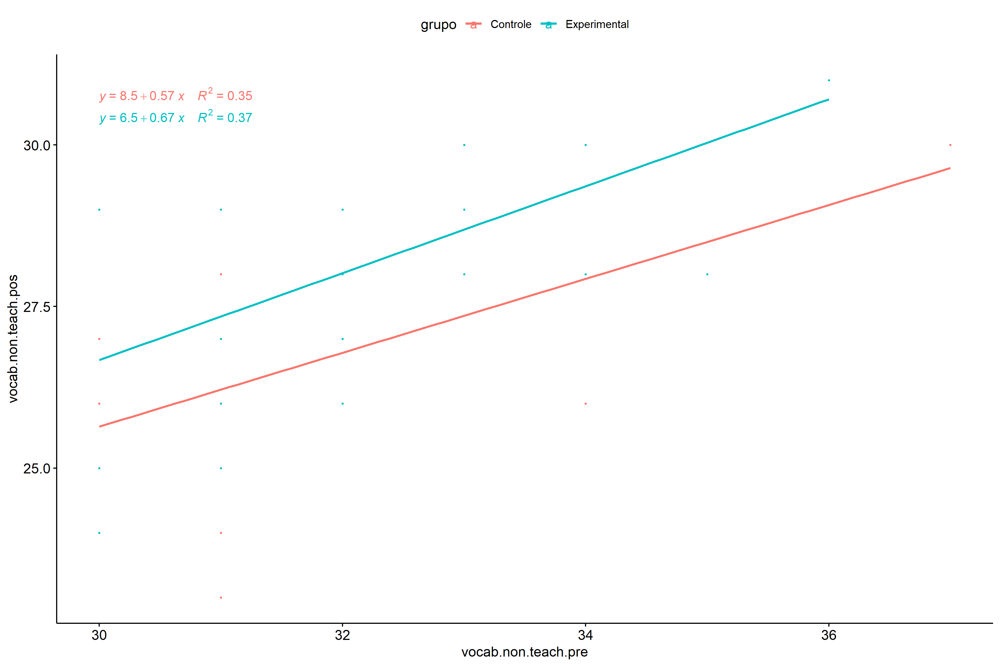<!-- -->

### Checking normality and homogeneity

``` r
res <- augment(lm(vocab.non.teach.pos ~ vocab.non.teach.pre + grupo, data = wdat))
```

``` r
shapiro_test(res$.resid)
```

    ## # A tibble: 1 × 3
    ##   variable   statistic p.value
    ##   <chr>          <dbl>   <dbl>
    ## 1 res$.resid     0.963  0.0810

``` r
levene_test(res, .resid ~ grupo)
```

    ## # A tibble: 1 × 4
    ##     df1   df2 statistic     p
    ##   <int> <int>     <dbl> <dbl>
    ## 1     1    54   0.00173 0.967

# ANCOVA and Pairwise for two factors **grupo:Sexo**

## Without remove non-normal data

``` r
pdat = remove_group_data(dat[!is.na(dat[["grupo"]]) & !is.na(dat[["Sexo"]]),], "vocab.non.teach.pos", c("grupo","Sexo"))

pdat.long <- rbind(pdat[,c("id","grupo","Sexo")], pdat[,c("id","grupo","Sexo")])
pdat.long[["time"]] <- c(rep("pre", nrow(pdat)), rep("pos", nrow(pdat)))
pdat.long[["time"]] <- factor(pdat.long[["time"]], c("pre","pos"))
pdat.long[["vocab.non.teach"]] <- c(pdat[["vocab.non.teach.pre"]], pdat[["vocab.non.teach.pos"]])

aov = anova_test(pdat, vocab.non.teach.pos ~ vocab.non.teach.pre + grupo*Sexo)
laov[["grupo:Sexo"]] <- get_anova_table(aov)
```

``` r
pwcs <- list()
pwcs[["Sexo"]] <- emmeans_test(
  group_by(pdat, grupo), vocab.non.teach.pos ~ Sexo,
  covariate = vocab.non.teach.pre, p.adjust.method = "bonferroni")
pwcs[["grupo"]] <- emmeans_test(
  group_by(pdat, Sexo), vocab.non.teach.pos ~ grupo,
  covariate = vocab.non.teach.pre, p.adjust.method = "bonferroni")

pwc <- plyr::rbind.fill(pwcs[["grupo"]], pwcs[["Sexo"]])
pwc <- pwc[,c("grupo","Sexo", colnames(pwc)[!colnames(pwc) %in% c("grupo","Sexo")])]
```

``` r
pwc.long <- emmeans_test(dplyr::group_by_at(pdat.long, c("grupo","Sexo")),
                         vocab.non.teach ~ time,
                         p.adjust.method = "bonferroni")
lpwc[["grupo:Sexo"]] <- plyr::rbind.fill(pwc, pwc.long)
```

``` r
ds <- get.descriptives(pdat, "vocab.non.teach.pos", c("grupo","Sexo"), covar = "vocab.non.teach.pre")
ds <- merge(ds[ds$variable != "vocab.non.teach.pre",],
            ds[ds$variable == "vocab.non.teach.pre", !colnames(ds) %in% c("variable")],
            by = c("grupo","Sexo"), all.x = T, suffixes = c("", ".vocab.non.teach.pre"))
ds <- merge(get_emmeans(pwcs[["grupo"]]), ds, by = c("grupo","Sexo"), suffixes = c(".emms", ""))
ds <- ds[,c("grupo","Sexo","n","mean.vocab.non.teach.pre","se.vocab.non.teach.pre","mean","se","emmean","se.emms")]

colnames(ds) <- c("grupo","Sexo", "N", paste0(c("M","SE")," (pre)"),
                  paste0(c("M","SE"), " (unadj)"), paste0(c("M", "SE"), " (adj)"))

lemms[["grupo:Sexo"]] <- ds
```

## Computing ANCOVA and PairWise After removing non-normal data (OK)

``` r
wdat = pdat 

res = residuals(lm(vocab.non.teach.pos ~ vocab.non.teach.pre + grupo*Sexo, data = wdat))
non.normal = getNonNormal(res, wdat$id, plimit = 0.05)

wdat = wdat[!wdat$id %in% non.normal,]

wdat.long <- rbind(wdat[,c("id","grupo","Sexo")], wdat[,c("id","grupo","Sexo")])
wdat.long[["time"]] <- c(rep("pre", nrow(wdat)), rep("pos", nrow(wdat)))
wdat.long[["time"]] <- factor(wdat.long[["time"]], c("pre","pos"))
wdat.long[["vocab.non.teach"]] <- c(wdat[["vocab.non.teach.pre"]], wdat[["vocab.non.teach.pos"]])


ldat[["grupo:Sexo"]] = wdat

(non.normal)
```

    ##   [1] "P1003" "P2207" "P983"  "P2232" "P3654" "P1966" "P996"  "P976"  "P1794" "P916"  "P1012" "P1865"
    ##  [13] "P2069" "P3280" "P2066" "P526"  "P3228" "P1116" "P2322" "P3574" "P2306" "P1060" "P999"  "P2113"
    ##  [25] "P932"  "P633"  "P2432" "P2447" "P1100" "P3723" "P3720" "P3157" "P1851" "P1085" "P1985" "P3258"
    ##  [37] "P2146" "P2079" "P596"  "P3225" "P3222" "P2428" "P2459" "P2150" "P3284" "P3610" "P2123" "P3719"
    ##  [49] "P3138" "P3646" "P1138" "P2387" "P1876" "P2379" "P3151" "P986"  "P2191" "P2008" "P2299" "P2065"
    ##  [61] "P3676" "P3242" "P1001" "P1888" "P2412" "P2300" "P2475" "P2367" "P1853" "P2423" "P2360" "P1617"
    ##  [73] "P3657" "P2869" "P588"  "P1650" "P2361" "P2292" "P3245" "P2298" "P1679" "P3264" "P1761" "P3192"
    ##  [85] "P3144" "P2323" "P2139" "P2225" "P3589" "P1153" "P3171" "P3283" "P1648" "P2431" "P1749" "P828" 
    ##  [97] "P3202" "P2871" "P1825" "P2064" "P3129" "P2370" "P2118" "P605"  "P2441" "P1908" "P1846" "P3301"
    ## [109] "P1879" "P2984" "P2343" "P2845" "P2476" "P2295" "P1133" "P1900" "P3708" "P1665" "P2196" "P2372"
    ## [121] "P3147" "P3226" "P1913" "P1061" "P3688" "P2354" "P2452" "P2181" "P1800" "P3643" "P2308" "P2910"
    ## [133] "P928"  "P552"  "P1652" "P2381" "P2457" "P2480" "P1674" "P2467" "P2131" "P2948" "P846"  "P3079"
    ## [145] "P3639" "P2436" "P600"  "P2393" "P3587" "P832"  "P1848" "P2188" "P3148" "P2477" "P2200" "P3576"
    ## [157] "P1689" "P980"  "P2990" "P2357" "P1833" "P3491" "P3645" "P3693" "P2296" "P2362" "P2394" "P3150"
    ## [169] "P2141" "P2170" "P2338"

``` r
aov = anova_test(wdat, vocab.non.teach.pos ~ vocab.non.teach.pre + grupo*Sexo)
laov[["grupo:Sexo"]] <- merge(get_anova_table(aov), laov[["grupo:Sexo"]], by="Effect", suffixes = c("","'"))

(df = get_anova_table(aov))
```

    ## ANOVA Table (type II tests)
    ## 
    ##                Effect DFn DFd      F        p p<.05   ges
    ## 1 vocab.non.teach.pre   1  50 24.924 7.63e-06     * 0.333
    ## 2               grupo   1  50  5.047 2.90e-02     * 0.092
    ## 3                Sexo   1  50  0.813 3.71e-01       0.016
    ## 4          grupo:Sexo   1  50  0.076 7.83e-01       0.002

| Effect              | DFn | DFd |      F |     p | p\<.05 |   ges |
|:--------------------|----:|----:|-------:|------:|:-------|------:|
| vocab.non.teach.pre |   1 |  50 | 24.924 | 0.000 | \*     | 0.333 |
| grupo               |   1 |  50 |  5.047 | 0.029 | \*     | 0.092 |
| Sexo                |   1 |  50 |  0.813 | 0.371 |        | 0.016 |
| grupo:Sexo          |   1 |  50 |  0.076 | 0.783 |        | 0.002 |

``` r
pwcs <- list()
pwcs[["Sexo"]] <- emmeans_test(
  group_by(wdat, grupo), vocab.non.teach.pos ~ Sexo,
  covariate = vocab.non.teach.pre, p.adjust.method = "bonferroni")
pwcs[["grupo"]] <- emmeans_test(
  group_by(wdat, Sexo), vocab.non.teach.pos ~ grupo,
  covariate = vocab.non.teach.pre, p.adjust.method = "bonferroni")

pwc <- plyr::rbind.fill(pwcs[["grupo"]], pwcs[["Sexo"]])
pwc <- pwc[,c("grupo","Sexo", colnames(pwc)[!colnames(pwc) %in% c("grupo","Sexo")])]
```

| grupo        | Sexo | term                       | .y.                 | group1   | group2       |  df | statistic |     p | p.adj | p.adj.signif |
|:-------------|:-----|:---------------------------|:--------------------|:---------|:-------------|----:|----------:|------:|------:|:-------------|
|              | F    | vocab.non.teach.pre\*grupo | vocab.non.teach.pos | Controle | Experimental |  50 |    -1.892 | 0.064 | 0.064 | ns           |
|              | M    | vocab.non.teach.pre\*grupo | vocab.non.teach.pos | Controle | Experimental |  50 |    -1.253 | 0.216 | 0.216 | ns           |
| Controle     |      | vocab.non.teach.pre\*Sexo  | vocab.non.teach.pos | F        | M            |  50 |     0.283 | 0.778 | 0.778 | ns           |
| Experimental |      | vocab.non.teach.pre\*Sexo  | vocab.non.teach.pos | F        | M            |  50 |     0.911 | 0.367 | 0.367 | ns           |

``` r
pwc.long <- emmeans_test(dplyr::group_by_at(wdat.long, c("grupo","Sexo")),
                         vocab.non.teach ~ time,
                         p.adjust.method = "bonferroni")
lpwc[["grupo:Sexo"]] <- merge(plyr::rbind.fill(pwc, pwc.long), lpwc[["grupo:Sexo"]], by=c("grupo","Sexo","term",".y.","group1","group2"), suffixes = c("","'"))
```

| grupo        | Sexo | term | .y.             | group1 | group2 |  df | statistic |   p | p.adj | p.adj.signif |
|:-------------|:-----|:-----|:----------------|:-------|:-------|----:|----------:|----:|------:|:-------------|
| Controle     | F    | time | vocab.non.teach | pre    | pos    | 102 |     6.473 |   0 |     0 | \*\*\*\*     |
| Controle     | M    | time | vocab.non.teach | pre    | pos    | 102 |     5.210 |   0 |     0 | \*\*\*\*     |
| Experimental | F    | time | vocab.non.teach | pre    | pos    | 102 |     7.566 |   0 |     0 | \*\*\*\*     |
| Experimental | M    | time | vocab.non.teach | pre    | pos    | 102 |     6.991 |   0 |     0 | \*\*\*\*     |

``` r
ds <- get.descriptives(wdat, "vocab.non.teach.pos", c("grupo","Sexo"), covar = "vocab.non.teach.pre")
ds <- merge(ds[ds$variable != "vocab.non.teach.pre",],
            ds[ds$variable == "vocab.non.teach.pre", !colnames(ds) %in% c("variable")],
            by = c("grupo","Sexo"), all.x = T, suffixes = c("", ".vocab.non.teach.pre"))
ds <- merge(get_emmeans(pwcs[["grupo"]]), ds, by = c("grupo","Sexo"), suffixes = c(".emms", ""))
ds <- ds[,c("grupo","Sexo","n","mean.vocab.non.teach.pre","se.vocab.non.teach.pre","mean","se","emmean","se.emms")]

colnames(ds) <- c("grupo","Sexo", "N", paste0(c("M","SE")," (pre)"),
                  paste0(c("M","SE"), " (unadj)"), paste0(c("M", "SE"), " (adj)"))

lemms[["grupo:Sexo"]] <- merge(ds, lemms[["grupo:Sexo"]], by=c("grupo","Sexo"), suffixes = c("","'"))
```

| grupo        | Sexo |   N | M (pre) | SE (pre) | M (unadj) | SE (unadj) | M (adj) | SE (adj) |
|:-------------|:-----|----:|--------:|---------:|----------:|-----------:|--------:|---------:|
| Controle     | F    |  10 |  31.900 |    0.706 |    27.000 |      0.537 |  26.869 |    0.460 |
| Controle     | M    |   7 |  30.857 |    0.404 |    26.143 |      0.829 |  26.664 |    0.558 |
| Experimental | F    |  21 |  32.190 |    0.363 |    28.238 |      0.371 |  27.926 |    0.323 |
| Experimental | M    |  17 |  31.294 |    0.318 |    27.235 |      0.407 |  27.483 |    0.355 |

### Plots for ancova

``` r
plots <- twoWayAncovaPlots(
  wdat, "vocab.non.teach.pos", c("grupo","Sexo"), aov, pwcs, addParam = c("mean_se"),
  font.label.size=10, step.increase=0.05, p.label="p.adj",
  subtitle = which(aov$Effect == "grupo:Sexo"))
```

``` r
if (!is.null(plots[["grupo"]]))
  plots[["grupo"]] + ggplot2::scale_color_manual(values = color[["Sexo"]])
```

    ## Scale for colour is already present.
    ## Adding another scale for colour, which will replace the existing scale.

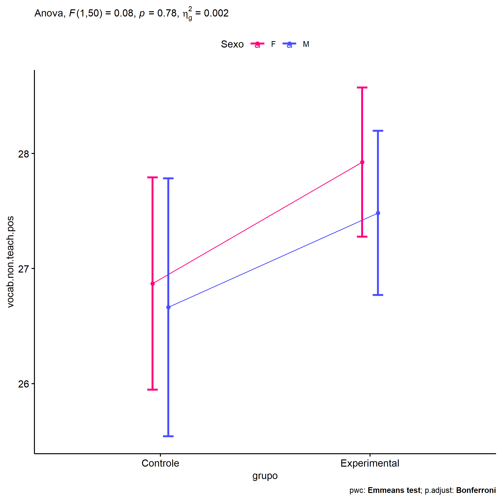<!-- -->

``` r
if (!is.null(plots[["Sexo"]]))
  plots[["Sexo"]] + ggplot2::scale_color_manual(values = color[["grupo"]])
```

    ## Scale for colour is already present.
    ## Adding another scale for colour, which will replace the existing scale.

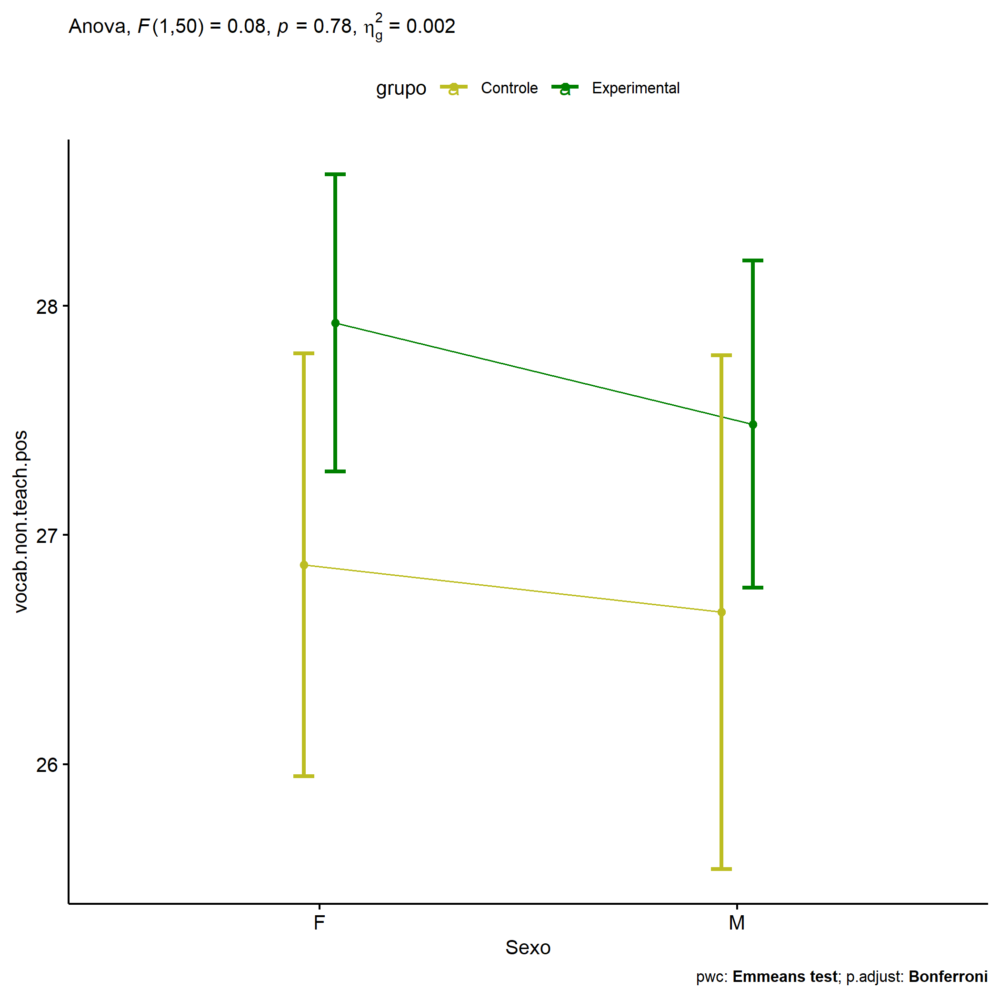<!-- -->

``` r
plots <- twoWayAncovaBoxPlots(
  wdat, "vocab.non.teach.pos", c("grupo","Sexo"), aov, pwcs, covar = "vocab.non.teach.pre",
  theme = "classic", color = color[["grupo:Sexo"]],
  subtitle = which(aov$Effect == "grupo:Sexo"))
```

``` r
plots[["grupo:Sexo"]] + ggplot2::ylab("Vocabulario Não Ensinado") + ggplot2::scale_x_discrete(labels=c('pre', 'pos'))
```

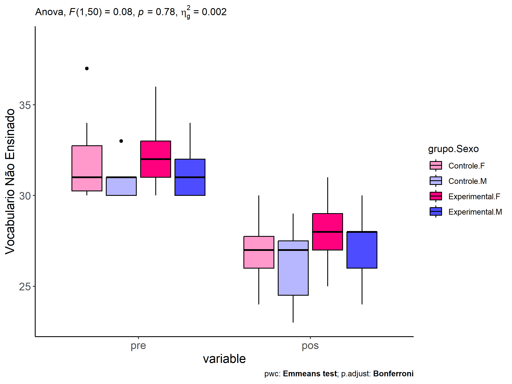<!-- -->

``` r
plots <- twoWayAncovaBoxPlots(
  wdat.long, "vocab.non.teach", c("grupo","Sexo"), aov, pwc.long, pre.post = "time",
  theme = "classic", color = color$prepost)
```

``` r
plots[["grupo:Sexo"]] + ggplot2::ylab("Vocabulario Não Ensinado")
```

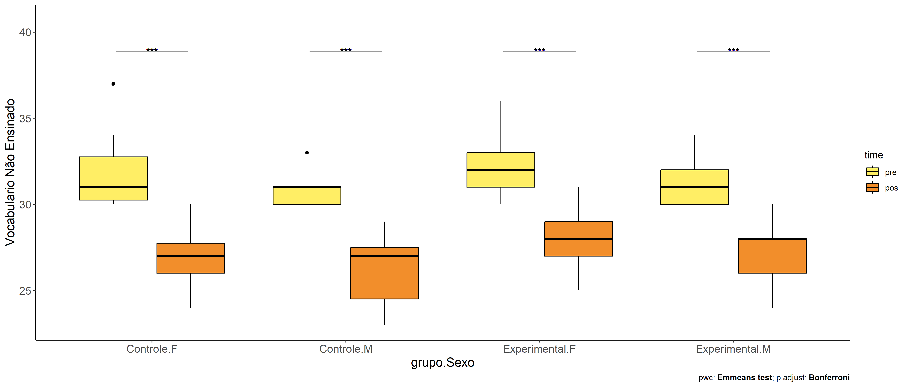<!-- -->

### Checking linearity assumption

``` r
ggscatter(wdat, x = "vocab.non.teach.pre", y = "vocab.non.teach.pos", size = 0.5,
          facet.by = c("grupo","Sexo"), add = "reg.line")+
  stat_regline_equation(
    aes(label =  paste(..eq.label.., ..rr.label.., sep = "~~~~"))
  )
```

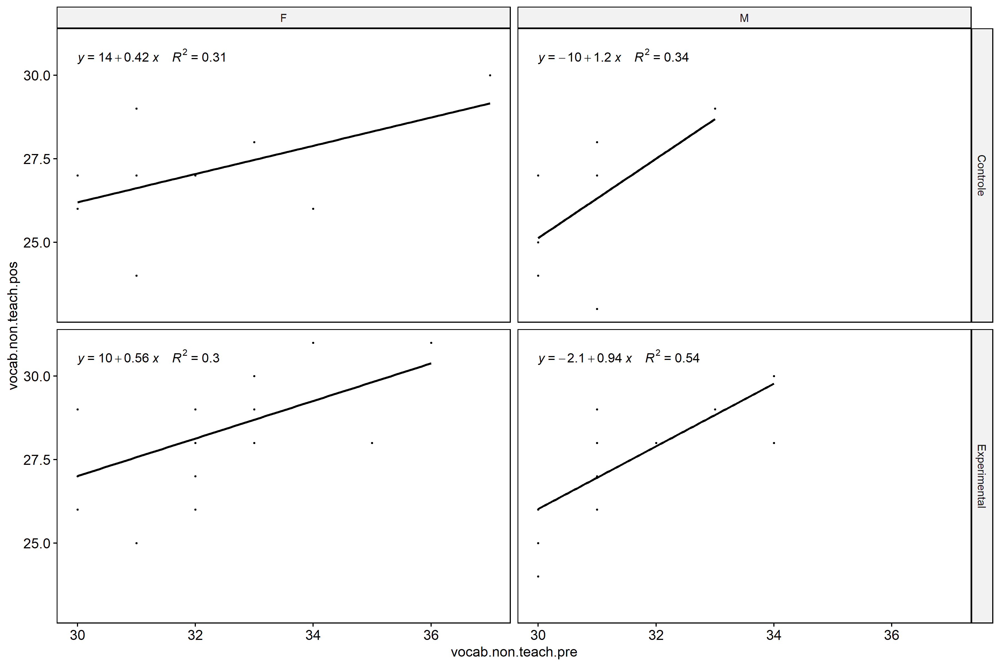<!-- -->

### Checking normality and homogeneity

``` r
res <- augment(lm(vocab.non.teach.pos ~ vocab.non.teach.pre + grupo*Sexo, data = wdat))
```

``` r
shapiro_test(res$.resid)
```

    ## # A tibble: 1 × 3
    ##   variable   statistic p.value
    ##   <chr>          <dbl>   <dbl>
    ## 1 res$.resid     0.972   0.223

``` r
levene_test(res, .resid ~ grupo*Sexo)
```

    ## # A tibble: 1 × 4
    ##     df1   df2 statistic     p
    ##   <int> <int>     <dbl> <dbl>
    ## 1     3    51     0.565 0.640

# ANCOVA and Pairwise for two factors **grupo:Zona**

## Without remove non-normal data

``` r
pdat = remove_group_data(dat[!is.na(dat[["grupo"]]) & !is.na(dat[["Zona"]]),], "vocab.non.teach.pos", c("grupo","Zona"))

pdat.long <- rbind(pdat[,c("id","grupo","Zona")], pdat[,c("id","grupo","Zona")])
pdat.long[["time"]] <- c(rep("pre", nrow(pdat)), rep("pos", nrow(pdat)))
pdat.long[["time"]] <- factor(pdat.long[["time"]], c("pre","pos"))
pdat.long[["vocab.non.teach"]] <- c(pdat[["vocab.non.teach.pre"]], pdat[["vocab.non.teach.pos"]])

aov = anova_test(pdat, vocab.non.teach.pos ~ vocab.non.teach.pre + grupo*Zona)
laov[["grupo:Zona"]] <- get_anova_table(aov)
```

``` r
pwcs <- list()
pwcs[["Zona"]] <- emmeans_test(
  group_by(pdat, grupo), vocab.non.teach.pos ~ Zona,
  covariate = vocab.non.teach.pre, p.adjust.method = "bonferroni")
pwcs[["grupo"]] <- emmeans_test(
  group_by(pdat, Zona), vocab.non.teach.pos ~ grupo,
  covariate = vocab.non.teach.pre, p.adjust.method = "bonferroni")

pwc <- plyr::rbind.fill(pwcs[["grupo"]], pwcs[["Zona"]])
pwc <- pwc[,c("grupo","Zona", colnames(pwc)[!colnames(pwc) %in% c("grupo","Zona")])]
```

``` r
pwc.long <- emmeans_test(dplyr::group_by_at(pdat.long, c("grupo","Zona")),
                         vocab.non.teach ~ time,
                         p.adjust.method = "bonferroni")
lpwc[["grupo:Zona"]] <- plyr::rbind.fill(pwc, pwc.long)
```

``` r
ds <- get.descriptives(pdat, "vocab.non.teach.pos", c("grupo","Zona"), covar = "vocab.non.teach.pre")
ds <- merge(ds[ds$variable != "vocab.non.teach.pre",],
            ds[ds$variable == "vocab.non.teach.pre", !colnames(ds) %in% c("variable")],
            by = c("grupo","Zona"), all.x = T, suffixes = c("", ".vocab.non.teach.pre"))
ds <- merge(get_emmeans(pwcs[["grupo"]]), ds, by = c("grupo","Zona"), suffixes = c(".emms", ""))
ds <- ds[,c("grupo","Zona","n","mean.vocab.non.teach.pre","se.vocab.non.teach.pre","mean","se","emmean","se.emms")]

colnames(ds) <- c("grupo","Zona", "N", paste0(c("M","SE")," (pre)"),
                  paste0(c("M","SE"), " (unadj)"), paste0(c("M", "SE"), " (adj)"))

lemms[["grupo:Zona"]] <- ds
```

## Computing ANCOVA and PairWise After removing non-normal data (OK)

``` r
wdat = pdat 

res = residuals(lm(vocab.non.teach.pos ~ vocab.non.teach.pre + grupo*Zona, data = wdat))
non.normal = getNonNormal(res, wdat$id, plimit = 0.05)

wdat = wdat[!wdat$id %in% non.normal,]

wdat.long <- rbind(wdat[,c("id","grupo","Zona")], wdat[,c("id","grupo","Zona")])
wdat.long[["time"]] <- c(rep("pre", nrow(wdat)), rep("pos", nrow(wdat)))
wdat.long[["time"]] <- factor(wdat.long[["time"]], c("pre","pos"))
wdat.long[["vocab.non.teach"]] <- c(wdat[["vocab.non.teach.pre"]], wdat[["vocab.non.teach.pos"]])


ldat[["grupo:Zona"]] = wdat

(non.normal)
```

    ## [1] "P983"  "P2207" "P3654" "P1966" "P1794" "P976"  "P3228" "P916"  "P2069"

``` r
aov = anova_test(wdat, vocab.non.teach.pos ~ vocab.non.teach.pre + grupo*Zona)
laov[["grupo:Zona"]] <- merge(get_anova_table(aov), laov[["grupo:Zona"]], by="Effect", suffixes = c("","'"))

(df = get_anova_table(aov))
```

    ## ANOVA Table (type II tests)
    ## 
    ##                Effect DFn DFd     F     p p<.05      ges
    ## 1 vocab.non.teach.pre   1 128 5.758 0.018     * 0.043000
    ## 2               grupo   1 128 0.121 0.728       0.000945
    ## 3                Zona   1 128 0.753 0.387       0.006000
    ## 4          grupo:Zona   1 128 0.155 0.695       0.001000

| Effect              | DFn | DFd |     F |     p | p\<.05 |   ges |
|:--------------------|----:|----:|------:|------:|:-------|------:|
| vocab.non.teach.pre |   1 | 128 | 5.758 | 0.018 | \*     | 0.043 |
| grupo               |   1 | 128 | 0.121 | 0.728 |        | 0.001 |
| Zona                |   1 | 128 | 0.753 | 0.387 |        | 0.006 |
| grupo:Zona          |   1 | 128 | 0.155 | 0.695 |        | 0.001 |

``` r
pwcs <- list()
pwcs[["Zona"]] <- emmeans_test(
  group_by(wdat, grupo), vocab.non.teach.pos ~ Zona,
  covariate = vocab.non.teach.pre, p.adjust.method = "bonferroni")
pwcs[["grupo"]] <- emmeans_test(
  group_by(wdat, Zona), vocab.non.teach.pos ~ grupo,
  covariate = vocab.non.teach.pre, p.adjust.method = "bonferroni")

pwc <- plyr::rbind.fill(pwcs[["grupo"]], pwcs[["Zona"]])
pwc <- pwc[,c("grupo","Zona", colnames(pwc)[!colnames(pwc) %in% c("grupo","Zona")])]
```

| grupo        | Zona   | term                       | .y.                 | group1   | group2       |  df | statistic |     p | p.adj | p.adj.signif |
|:-------------|:-------|:---------------------------|:--------------------|:---------|:-------------|----:|----------:|------:|------:|:-------------|
|              | Rural  | vocab.non.teach.pre\*grupo | vocab.non.teach.pos | Controle | Experimental | 128 |     0.524 | 0.601 | 0.601 | ns           |
|              | Urbana | vocab.non.teach.pre\*grupo | vocab.non.teach.pos | Controle | Experimental | 128 |    -0.038 | 0.970 | 0.970 | ns           |
| Controle     |        | vocab.non.teach.pre\*Zona  | vocab.non.teach.pos | Rural    | Urbana       | 128 |    -0.229 | 0.819 | 0.819 | ns           |
| Experimental |        | vocab.non.teach.pre\*Zona  | vocab.non.teach.pos | Rural    | Urbana       | 128 |    -0.926 | 0.356 | 0.356 | ns           |

``` r
pwc.long <- emmeans_test(dplyr::group_by_at(wdat.long, c("grupo","Zona")),
                         vocab.non.teach ~ time,
                         p.adjust.method = "bonferroni")
lpwc[["grupo:Zona"]] <- merge(plyr::rbind.fill(pwc, pwc.long), lpwc[["grupo:Zona"]], by=c("grupo","Zona","term",".y.","group1","group2"), suffixes = c("","'"))
```

| grupo        | Zona   | term | .y.             | group1 | group2 |  df | statistic |     p | p.adj | p.adj.signif |
|:-------------|:-------|:-----|:----------------|:-------|:-------|----:|----------:|------:|------:|:-------------|
| Controle     | Rural  | time | vocab.non.teach | pre    | pos    | 258 |     1.183 | 0.238 | 0.238 | ns           |
| Controle     | Urbana | time | vocab.non.teach | pre    | pos    | 258 |     0.483 | 0.630 | 0.630 | ns           |
| Experimental | Rural  | time | vocab.non.teach | pre    | pos    | 258 |     2.327 | 0.021 | 0.021 | \*           |
| Experimental | Urbana | time | vocab.non.teach | pre    | pos    | 258 |     0.906 | 0.366 | 0.366 | ns           |

``` r
ds <- get.descriptives(wdat, "vocab.non.teach.pos", c("grupo","Zona"), covar = "vocab.non.teach.pre")
ds <- merge(ds[ds$variable != "vocab.non.teach.pre",],
            ds[ds$variable == "vocab.non.teach.pre", !colnames(ds) %in% c("variable")],
            by = c("grupo","Zona"), all.x = T, suffixes = c("", ".vocab.non.teach.pre"))
ds <- merge(get_emmeans(pwcs[["grupo"]]), ds, by = c("grupo","Zona"), suffixes = c(".emms", ""))
ds <- ds[,c("grupo","Zona","n","mean.vocab.non.teach.pre","se.vocab.non.teach.pre","mean","se","emmean","se.emms")]

colnames(ds) <- c("grupo","Zona", "N", paste0(c("M","SE")," (pre)"),
                  paste0(c("M","SE"), " (unadj)"), paste0(c("M", "SE"), " (adj)"))

lemms[["grupo:Zona"]] <- merge(ds, lemms[["grupo:Zona"]], by=c("grupo","Zona"), suffixes = c("","'"))
```

| grupo        | Zona   |   N | M (pre) | SE (pre) | M (unadj) | SE (unadj) | M (adj) | SE (adj) |
|:-------------|:-------|----:|--------:|---------:|----------:|-----------:|--------:|---------:|
| Controle     | Rural  |  26 |  31.885 |    0.431 |    31.115 |      0.676 |  31.087 |    0.540 |
| Controle     | Urbana |  25 |  31.480 |    0.327 |    31.160 |      0.464 |  31.264 |    0.552 |
| Experimental | Rural  |  42 |  31.976 |    0.232 |    30.786 |      0.415 |  30.727 |    0.425 |
| Experimental | Urbana |  40 |  31.750 |    0.286 |    31.275 |      0.431 |  31.290 |    0.435 |

### Plots for ancova

``` r
plots <- twoWayAncovaPlots(
  wdat, "vocab.non.teach.pos", c("grupo","Zona"), aov, pwcs, addParam = c("mean_se"),
  font.label.size=10, step.increase=0.05, p.label="p.adj",
  subtitle = which(aov$Effect == "grupo:Zona"))
```

``` r
if (!is.null(plots[["grupo"]]))
  plots[["grupo"]] + ggplot2::scale_color_manual(values = color[["Zona"]])
```

    ## Scale for colour is already present.
    ## Adding another scale for colour, which will replace the existing scale.

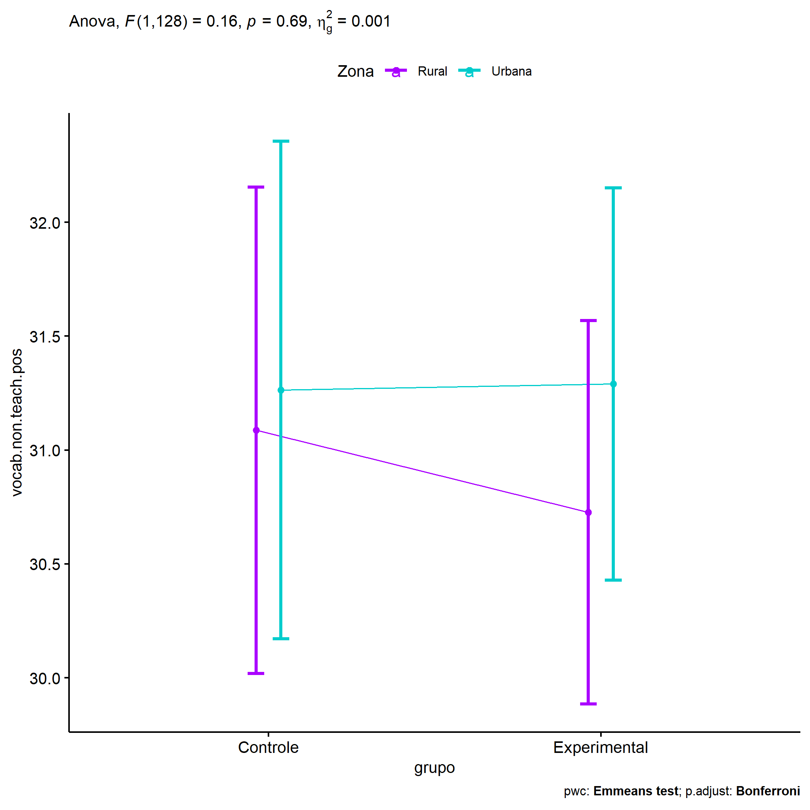<!-- -->

``` r
if (!is.null(plots[["Zona"]]))
  plots[["Zona"]] + ggplot2::scale_color_manual(values = color[["grupo"]])
```

    ## Scale for colour is already present.
    ## Adding another scale for colour, which will replace the existing scale.

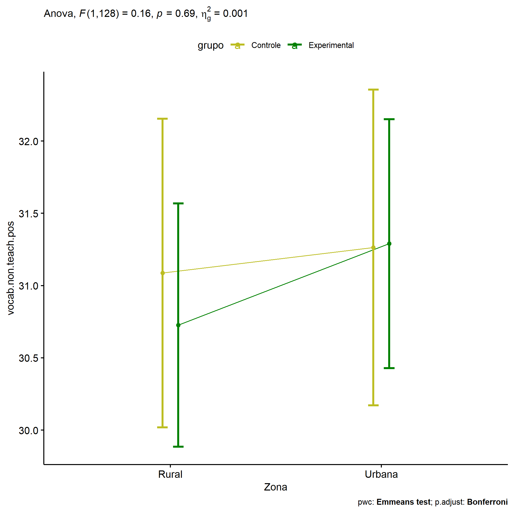<!-- -->

``` r
plots <- twoWayAncovaBoxPlots(
  wdat, "vocab.non.teach.pos", c("grupo","Zona"), aov, pwcs, covar = "vocab.non.teach.pre",
  theme = "classic", color = color[["grupo:Zona"]],
  subtitle = which(aov$Effect == "grupo:Zona"))
```

``` r
plots[["grupo:Zona"]] + ggplot2::ylab("Vocabulario Não Ensinado") + ggplot2::scale_x_discrete(labels=c('pre', 'pos'))
```

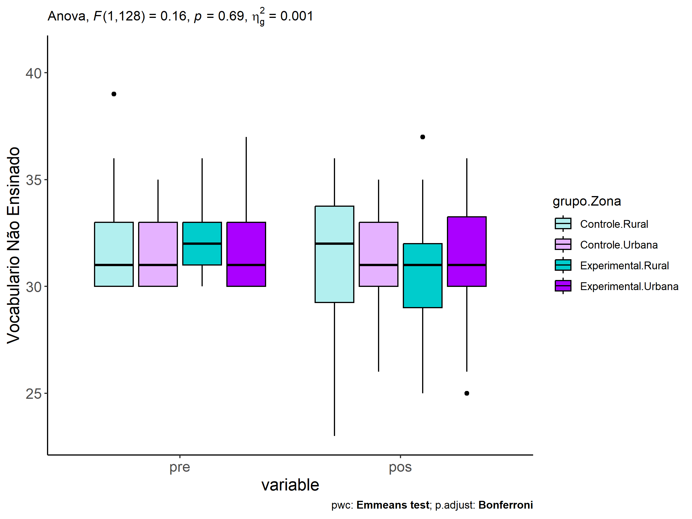<!-- -->

``` r
plots <- twoWayAncovaBoxPlots(
  wdat.long, "vocab.non.teach", c("grupo","Zona"), aov, pwc.long, pre.post = "time",
  theme = "classic", color = color$prepost)
```

``` r
plots[["grupo:Zona"]] + ggplot2::ylab("Vocabulario Não Ensinado")
```

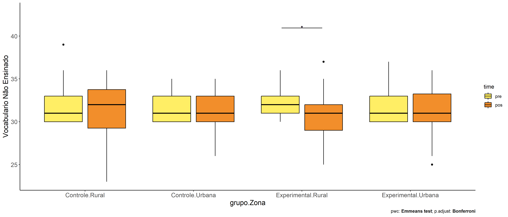<!-- -->

### Checking linearity assumption

``` r
ggscatter(wdat, x = "vocab.non.teach.pre", y = "vocab.non.teach.pos", size = 0.5,
          facet.by = c("grupo","Zona"), add = "reg.line")+
  stat_regline_equation(
    aes(label =  paste(..eq.label.., ..rr.label.., sep = "~~~~"))
  )
```

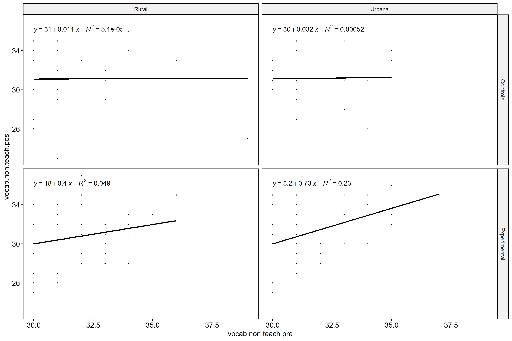<!-- -->

### Checking normality and homogeneity

``` r
res <- augment(lm(vocab.non.teach.pos ~ vocab.non.teach.pre + grupo*Zona, data = wdat))
```

``` r
shapiro_test(res$.resid)
```

    ## # A tibble: 1 × 3
    ##   variable   statistic p.value
    ##   <chr>          <dbl>   <dbl>
    ## 1 res$.resid     0.982  0.0734

``` r
levene_test(res, .resid ~ grupo*Zona)
```

    ## # A tibble: 1 × 4
    ##     df1   df2 statistic     p
    ##   <int> <int>     <dbl> <dbl>
    ## 1     3   129      1.35 0.260

# ANCOVA and Pairwise for two factors **grupo:Cor.Raca**

## Without remove non-normal data

``` r
pdat = remove_group_data(dat[!is.na(dat[["grupo"]]) & !is.na(dat[["Cor.Raca"]]),], "vocab.non.teach.pos", c("grupo","Cor.Raca"))
```

    ## Warning: There were 2 warnings in `mutate()`.
    ## The first warning was:
    ## ℹ In argument: `ci = abs(stats::qt(alpha/2, .data$n - 1) * .data$se)`.
    ## Caused by warning:
    ## ! There was 1 warning in `mutate()`.
    ## ℹ In argument: `ci = abs(stats::qt(alpha/2, .data$n - 1) * .data$se)`.
    ## Caused by warning in `stats::qt()`:
    ## ! NaNs produced
    ## ℹ Run `dplyr::last_dplyr_warnings()` to see the 1 remaining warning.

``` r
pdat.long <- rbind(pdat[,c("id","grupo","Cor.Raca")], pdat[,c("id","grupo","Cor.Raca")])
pdat.long[["time"]] <- c(rep("pre", nrow(pdat)), rep("pos", nrow(pdat)))
pdat.long[["time"]] <- factor(pdat.long[["time"]], c("pre","pos"))
pdat.long[["vocab.non.teach"]] <- c(pdat[["vocab.non.teach.pre"]], pdat[["vocab.non.teach.pos"]])

aov = anova_test(pdat, vocab.non.teach.pos ~ vocab.non.teach.pre + grupo*Cor.Raca)
laov[["grupo:Cor.Raca"]] <- get_anova_table(aov)
```

``` r
pwcs <- list()
pwcs[["Cor.Raca"]] <- emmeans_test(
  group_by(pdat, grupo), vocab.non.teach.pos ~ Cor.Raca,
  covariate = vocab.non.teach.pre, p.adjust.method = "bonferroni")
pwcs[["grupo"]] <- emmeans_test(
  group_by(pdat, Cor.Raca), vocab.non.teach.pos ~ grupo,
  covariate = vocab.non.teach.pre, p.adjust.method = "bonferroni")

pwc <- plyr::rbind.fill(pwcs[["grupo"]], pwcs[["Cor.Raca"]])
pwc <- pwc[,c("grupo","Cor.Raca", colnames(pwc)[!colnames(pwc) %in% c("grupo","Cor.Raca")])]
```

``` r
pwc.long <- emmeans_test(dplyr::group_by_at(pdat.long, c("grupo","Cor.Raca")),
                         vocab.non.teach ~ time,
                         p.adjust.method = "bonferroni")
lpwc[["grupo:Cor.Raca"]] <- plyr::rbind.fill(pwc, pwc.long)
```

``` r
ds <- get.descriptives(pdat, "vocab.non.teach.pos", c("grupo","Cor.Raca"), covar = "vocab.non.teach.pre")
ds <- merge(ds[ds$variable != "vocab.non.teach.pre",],
            ds[ds$variable == "vocab.non.teach.pre", !colnames(ds) %in% c("variable")],
            by = c("grupo","Cor.Raca"), all.x = T, suffixes = c("", ".vocab.non.teach.pre"))
ds <- merge(get_emmeans(pwcs[["grupo"]]), ds, by = c("grupo","Cor.Raca"), suffixes = c(".emms", ""))
ds <- ds[,c("grupo","Cor.Raca","n","mean.vocab.non.teach.pre","se.vocab.non.teach.pre","mean","se","emmean","se.emms")]

colnames(ds) <- c("grupo","Cor.Raca", "N", paste0(c("M","SE")," (pre)"),
                  paste0(c("M","SE"), " (unadj)"), paste0(c("M", "SE"), " (adj)"))

lemms[["grupo:Cor.Raca"]] <- ds
```

## Computing ANCOVA and PairWise After removing non-normal data (OK)

``` r
wdat = pdat 

res = residuals(lm(vocab.non.teach.pos ~ vocab.non.teach.pre + grupo*Cor.Raca, data = wdat))
non.normal = getNonNormal(res, wdat$id, plimit = 0.05)

wdat = wdat[!wdat$id %in% non.normal,]

wdat.long <- rbind(wdat[,c("id","grupo","Cor.Raca")], wdat[,c("id","grupo","Cor.Raca")])
wdat.long[["time"]] <- c(rep("pre", nrow(wdat)), rep("pos", nrow(wdat)))
wdat.long[["time"]] <- factor(wdat.long[["time"]], c("pre","pos"))
wdat.long[["vocab.non.teach"]] <- c(wdat[["vocab.non.teach.pre"]], wdat[["vocab.non.teach.pos"]])


ldat[["grupo:Cor.Raca"]] = wdat

(non.normal)
```

    ## [1] "P1003" "P996"  "P3654"

``` r
aov = anova_test(wdat, vocab.non.teach.pos ~ vocab.non.teach.pre + grupo*Cor.Raca)
laov[["grupo:Cor.Raca"]] <- merge(get_anova_table(aov), laov[["grupo:Cor.Raca"]], by="Effect", suffixes = c("","'"))

(df = get_anova_table(aov))
```

    ## ANOVA Table (type II tests)
    ## 
    ##                Effect DFn DFd     F     p p<.05   ges
    ## 1 vocab.non.teach.pre   1  71 1.286 0.261       0.018
    ## 2               grupo   1  71 0.074 0.786       0.001
    ## 3            Cor.Raca   1  71 1.287 0.260       0.018
    ## 4      grupo:Cor.Raca   1  71 1.449 0.233       0.020

| Effect              | DFn | DFd |     F |     p | p\<.05 |   ges |
|:--------------------|----:|----:|------:|------:|:-------|------:|
| vocab.non.teach.pre |   1 |  71 | 1.286 | 0.261 |        | 0.018 |
| grupo               |   1 |  71 | 0.074 | 0.786 |        | 0.001 |
| Cor.Raca            |   1 |  71 | 1.287 | 0.260 |        | 0.018 |
| grupo:Cor.Raca      |   1 |  71 | 1.449 | 0.233 |        | 0.020 |

``` r
pwcs <- list()
pwcs[["Cor.Raca"]] <- emmeans_test(
  group_by(wdat, grupo), vocab.non.teach.pos ~ Cor.Raca,
  covariate = vocab.non.teach.pre, p.adjust.method = "bonferroni")
pwcs[["grupo"]] <- emmeans_test(
  group_by(wdat, Cor.Raca), vocab.non.teach.pos ~ grupo,
  covariate = vocab.non.teach.pre, p.adjust.method = "bonferroni")

pwc <- plyr::rbind.fill(pwcs[["grupo"]], pwcs[["Cor.Raca"]])
pwc <- pwc[,c("grupo","Cor.Raca", colnames(pwc)[!colnames(pwc) %in% c("grupo","Cor.Raca")])]
```

| grupo        | Cor.Raca | term                          | .y.                 | group1   | group2       |  df | statistic |     p | p.adj | p.adj.signif |
|:-------------|:---------|:------------------------------|:--------------------|:---------|:-------------|----:|----------:|------:|------:|:-------------|
|              | Branca   | vocab.non.teach.pre\*grupo    | vocab.non.teach.pos | Controle | Experimental |  71 |     0.874 | 0.385 | 0.385 | ns           |
|              | Parda    | vocab.non.teach.pre\*grupo    | vocab.non.teach.pos | Controle | Experimental |  71 |    -0.869 | 0.388 | 0.388 | ns           |
| Controle     |          | vocab.non.teach.pre\*Cor.Raca | vocab.non.teach.pos | Branca   | Parda        |  71 |     1.637 | 0.106 | 0.106 | ns           |
| Experimental |          | vocab.non.teach.pre\*Cor.Raca | vocab.non.teach.pos | Branca   | Parda        |  71 |     0.239 | 0.812 | 0.812 | ns           |

``` r
pwc.long <- emmeans_test(dplyr::group_by_at(wdat.long, c("grupo","Cor.Raca")),
                         vocab.non.teach ~ time,
                         p.adjust.method = "bonferroni")
lpwc[["grupo:Cor.Raca"]] <- merge(plyr::rbind.fill(pwc, pwc.long), lpwc[["grupo:Cor.Raca"]], by=c("grupo","Cor.Raca","term",".y.","group1","group2"), suffixes = c("","'"))
```

| grupo        | Cor.Raca | term | .y.             | group1 | group2 |  df | statistic |     p | p.adj | p.adj.signif |
|:-------------|:---------|:-----|:----------------|:-------|:-------|----:|----------:|------:|------:|:-------------|
| Controle     | Branca   | time | vocab.non.teach | pre    | pos    | 144 |    -0.699 | 0.486 | 0.486 | ns           |
| Controle     | Parda    | time | vocab.non.teach | pre    | pos    | 144 |     1.633 | 0.105 | 0.105 | ns           |
| Experimental | Branca   | time | vocab.non.teach | pre    | pos    | 144 |     0.512 | 0.609 | 0.609 | ns           |
| Experimental | Parda    | time | vocab.non.teach | pre    | pos    | 144 |     1.109 | 0.269 | 0.269 | ns           |

``` r
ds <- get.descriptives(wdat, "vocab.non.teach.pos", c("grupo","Cor.Raca"), covar = "vocab.non.teach.pre")
ds <- merge(ds[ds$variable != "vocab.non.teach.pre",],
            ds[ds$variable == "vocab.non.teach.pre", !colnames(ds) %in% c("variable")],
            by = c("grupo","Cor.Raca"), all.x = T, suffixes = c("", ".vocab.non.teach.pre"))
ds <- merge(get_emmeans(pwcs[["grupo"]]), ds, by = c("grupo","Cor.Raca"), suffixes = c(".emms", ""))
ds <- ds[,c("grupo","Cor.Raca","n","mean.vocab.non.teach.pre","se.vocab.non.teach.pre","mean","se","emmean","se.emms")]

colnames(ds) <- c("grupo","Cor.Raca", "N", paste0(c("M","SE")," (pre)"),
                  paste0(c("M","SE"), " (unadj)"), paste0(c("M", "SE"), " (adj)"))

lemms[["grupo:Cor.Raca"]] <- merge(ds, lemms[["grupo:Cor.Raca"]], by=c("grupo","Cor.Raca"), suffixes = c("","'"))
```

| grupo        | Cor.Raca |   N | M (pre) | SE (pre) | M (unadj) | SE (unadj) | M (adj) | SE (adj) |
|:-------------|:---------|----:|--------:|---------:|----------:|-----------:|--------:|---------:|
| Controle     | Branca   |   7 |  31.571 |    0.571 |    32.571 |      0.972 |  32.602 |    1.279 |
| Controle     | Parda    |  22 |  31.455 |    0.430 |    30.136 |      0.900 |  30.198 |    0.723 |
| Experimental | Branca   |  17 |  31.765 |    0.369 |    31.294 |      0.701 |  31.273 |    0.821 |
| Experimental | Parda    |  30 |  31.833 |    0.280 |    31.067 |      0.567 |  31.027 |    0.619 |

### Plots for ancova

``` r
plots <- twoWayAncovaPlots(
  wdat, "vocab.non.teach.pos", c("grupo","Cor.Raca"), aov, pwcs, addParam = c("mean_se"),
  font.label.size=10, step.increase=0.05, p.label="p.adj",
  subtitle = which(aov$Effect == "grupo:Cor.Raca"))
```

``` r
if (!is.null(plots[["grupo"]]))
  plots[["grupo"]] + ggplot2::scale_color_manual(values = color[["Cor.Raca"]])
```

    ## Scale for colour is already present.
    ## Adding another scale for colour, which will replace the existing scale.

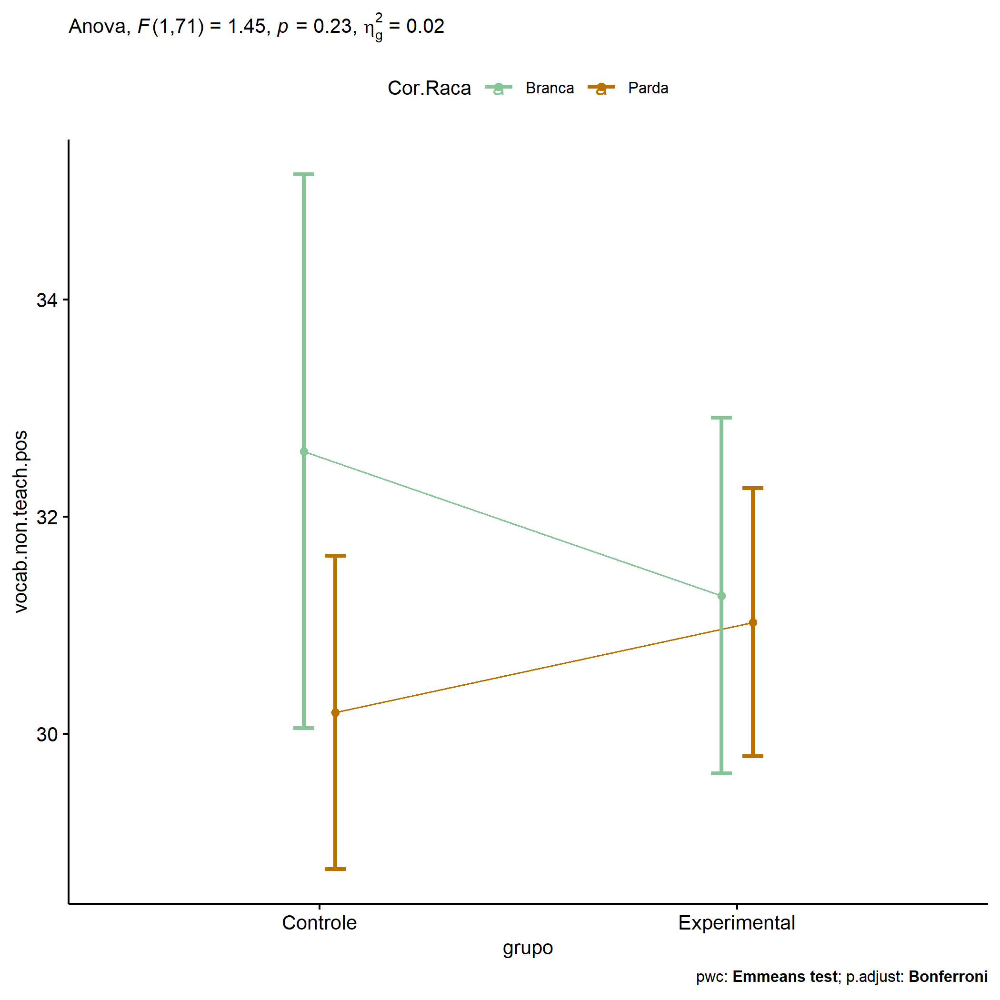<!-- -->

``` r
if (!is.null(plots[["Cor.Raca"]]))
  plots[["Cor.Raca"]] + ggplot2::scale_color_manual(values = color[["grupo"]])
```

    ## Scale for colour is already present.
    ## Adding another scale for colour, which will replace the existing scale.

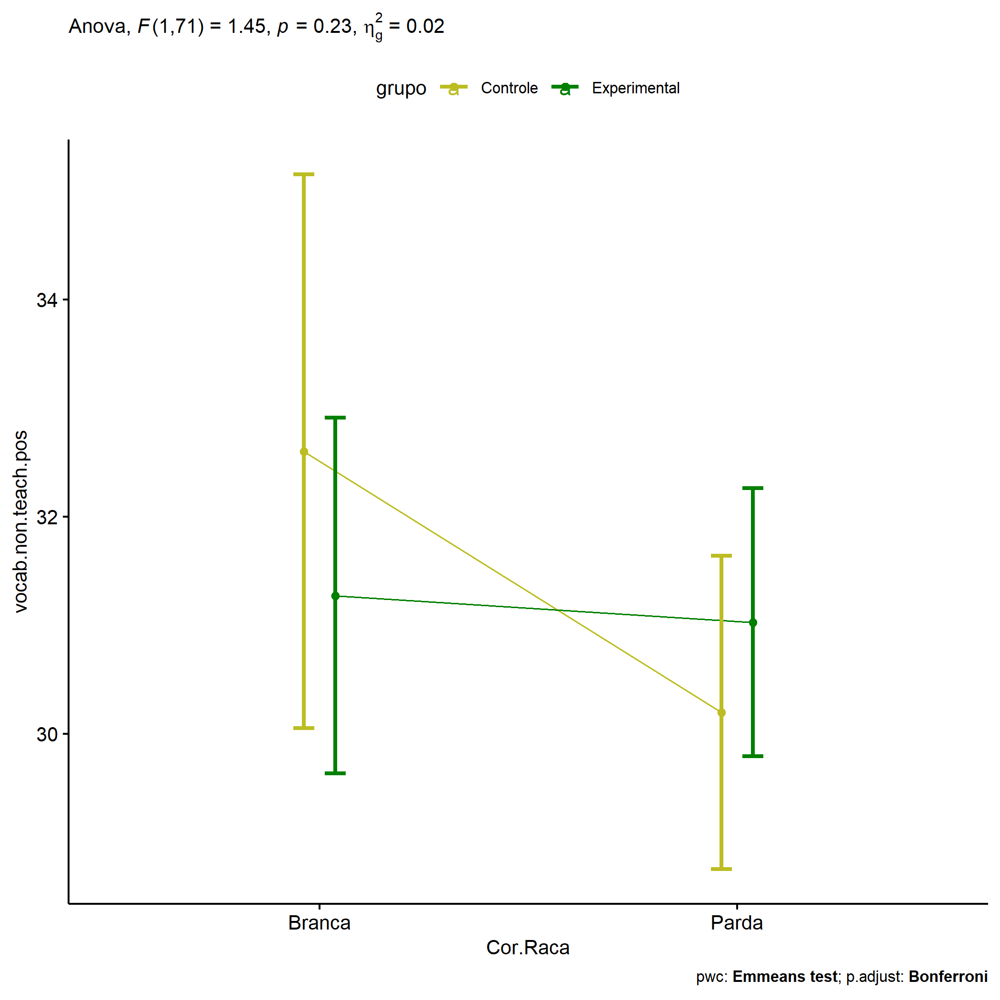<!-- -->

``` r
plots <- twoWayAncovaBoxPlots(
  wdat, "vocab.non.teach.pos", c("grupo","Cor.Raca"), aov, pwcs, covar = "vocab.non.teach.pre",
  theme = "classic", color = color[["grupo:Cor.Raca"]],
  subtitle = which(aov$Effect == "grupo:Cor.Raca"))
```

``` r
plots[["grupo:Cor.Raca"]] + ggplot2::ylab("Vocabulario Não Ensinado") + ggplot2::scale_x_discrete(labels=c('pre', 'pos'))
```

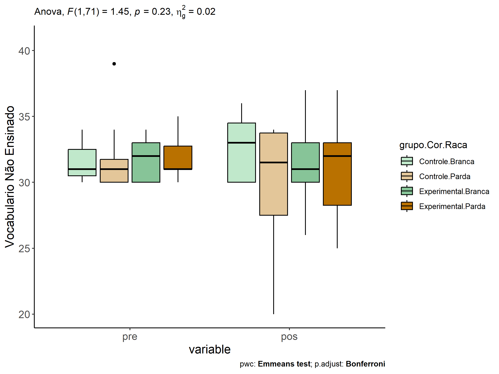<!-- -->

``` r
plots <- twoWayAncovaBoxPlots(
  wdat.long, "vocab.non.teach", c("grupo","Cor.Raca"), aov, pwc.long, pre.post = "time",
  theme = "classic", color = color$prepost)
```

``` r
plots[["grupo:Cor.Raca"]] + ggplot2::ylab("Vocabulario Não Ensinado")
```

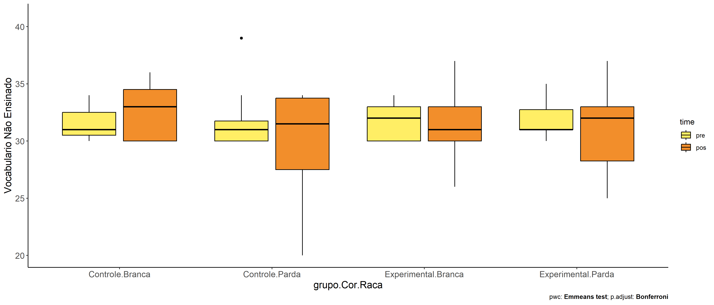<!-- -->

### Checking linearity assumption

``` r
ggscatter(wdat, x = "vocab.non.teach.pre", y = "vocab.non.teach.pos", size = 0.5,
          facet.by = c("grupo","Cor.Raca"), add = "reg.line")+
  stat_regline_equation(
    aes(label =  paste(..eq.label.., ..rr.label.., sep = "~~~~"))
  )
```

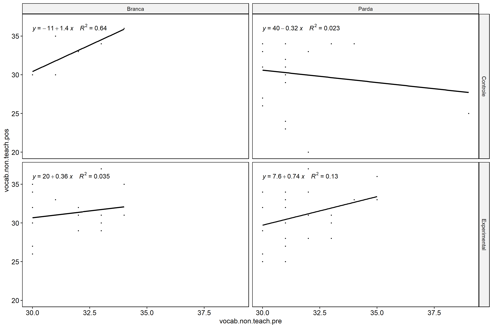<!-- -->

### Checking normality and homogeneity

``` r
res <- augment(lm(vocab.non.teach.pos ~ vocab.non.teach.pre + grupo*Cor.Raca, data = wdat))
```

``` r
shapiro_test(res$.resid)
```

    ## # A tibble: 1 × 3
    ##   variable   statistic p.value
    ##   <chr>          <dbl>   <dbl>
    ## 1 res$.resid     0.960  0.0184

``` r
levene_test(res, .resid ~ grupo*Cor.Raca)
```

    ## # A tibble: 1 × 4
    ##     df1   df2 statistic     p
    ##   <int> <int>     <dbl> <dbl>
    ## 1     3    72      1.21 0.311

# ANCOVA and Pairwise for two factors **grupo:Serie**

## Without remove non-normal data

``` r
pdat = remove_group_data(dat[!is.na(dat[["grupo"]]) & !is.na(dat[["Serie"]]),], "vocab.non.teach.pos", c("grupo","Serie"))

pdat.long <- rbind(pdat[,c("id","grupo","Serie")], pdat[,c("id","grupo","Serie")])
pdat.long[["time"]] <- c(rep("pre", nrow(pdat)), rep("pos", nrow(pdat)))
pdat.long[["time"]] <- factor(pdat.long[["time"]], c("pre","pos"))
pdat.long[["vocab.non.teach"]] <- c(pdat[["vocab.non.teach.pre"]], pdat[["vocab.non.teach.pos"]])

aov = anova_test(pdat, vocab.non.teach.pos ~ vocab.non.teach.pre + grupo*Serie)
laov[["grupo:Serie"]] <- get_anova_table(aov)
```

``` r
pwcs <- list()
pwcs[["Serie"]] <- emmeans_test(
  group_by(pdat, grupo), vocab.non.teach.pos ~ Serie,
  covariate = vocab.non.teach.pre, p.adjust.method = "bonferroni")
pwcs[["grupo"]] <- emmeans_test(
  group_by(pdat, Serie), vocab.non.teach.pos ~ grupo,
  covariate = vocab.non.teach.pre, p.adjust.method = "bonferroni")

pwc <- plyr::rbind.fill(pwcs[["grupo"]], pwcs[["Serie"]])
pwc <- pwc[,c("grupo","Serie", colnames(pwc)[!colnames(pwc) %in% c("grupo","Serie")])]
```

``` r
pwc.long <- emmeans_test(dplyr::group_by_at(pdat.long, c("grupo","Serie")),
                         vocab.non.teach ~ time,
                         p.adjust.method = "bonferroni")
lpwc[["grupo:Serie"]] <- plyr::rbind.fill(pwc, pwc.long)
```

``` r
ds <- get.descriptives(pdat, "vocab.non.teach.pos", c("grupo","Serie"), covar = "vocab.non.teach.pre")
ds <- merge(ds[ds$variable != "vocab.non.teach.pre",],
            ds[ds$variable == "vocab.non.teach.pre", !colnames(ds) %in% c("variable")],
            by = c("grupo","Serie"), all.x = T, suffixes = c("", ".vocab.non.teach.pre"))
ds <- merge(get_emmeans(pwcs[["grupo"]]), ds, by = c("grupo","Serie"), suffixes = c(".emms", ""))
ds <- ds[,c("grupo","Serie","n","mean.vocab.non.teach.pre","se.vocab.non.teach.pre","mean","se","emmean","se.emms")]

colnames(ds) <- c("grupo","Serie", "N", paste0(c("M","SE")," (pre)"),
                  paste0(c("M","SE"), " (unadj)"), paste0(c("M", "SE"), " (adj)"))

lemms[["grupo:Serie"]] <- ds
```

## Computing ANCOVA and PairWise After removing non-normal data (OK)

``` r
wdat = pdat 

res = residuals(lm(vocab.non.teach.pos ~ vocab.non.teach.pre + grupo*Serie, data = wdat))
non.normal = getNonNormal(res, wdat$id, plimit = 0.05)

wdat = wdat[!wdat$id %in% non.normal,]

wdat.long <- rbind(wdat[,c("id","grupo","Serie")], wdat[,c("id","grupo","Serie")])
wdat.long[["time"]] <- c(rep("pre", nrow(wdat)), rep("pos", nrow(wdat)))
wdat.long[["time"]] <- factor(wdat.long[["time"]], c("pre","pos"))
wdat.long[["vocab.non.teach"]] <- c(wdat[["vocab.non.teach.pre"]], wdat[["vocab.non.teach.pos"]])


ldat[["grupo:Serie"]] = wdat

(non.normal)
```

    ##  [1] "P1003" "P2207" "P983"  "P3654" "P996"  "P2232" "P1966" "P3228" "P916"  "P1794" "P976"  "P2069"
    ## [13] "P2296" "P2394"

``` r
aov = anova_test(wdat, vocab.non.teach.pos ~ vocab.non.teach.pre + grupo*Serie)
laov[["grupo:Serie"]] <- merge(get_anova_table(aov), laov[["grupo:Serie"]], by="Effect", suffixes = c("","'"))

(df = get_anova_table(aov))
```

    ## ANOVA Table (type II tests)
    ## 
    ##                Effect DFn DFd      F        p p<.05   ges
    ## 1 vocab.non.teach.pre   1 203 14.429 0.000192     * 0.066
    ## 2               grupo   1 203  0.502 0.479000       0.002
    ## 3               Serie   3 203  1.391 0.247000       0.020
    ## 4         grupo:Serie   3 203  1.409 0.241000       0.020

| Effect              | DFn | DFd |      F |     p | p\<.05 |   ges |
|:--------------------|----:|----:|-------:|------:|:-------|------:|
| vocab.non.teach.pre |   1 | 203 | 14.429 | 0.000 | \*     | 0.066 |
| grupo               |   1 | 203 |  0.502 | 0.479 |        | 0.002 |
| Serie               |   3 | 203 |  1.391 | 0.247 |        | 0.020 |
| grupo:Serie         |   3 | 203 |  1.409 | 0.241 |        | 0.020 |

``` r
pwcs <- list()
pwcs[["Serie"]] <- emmeans_test(
  group_by(wdat, grupo), vocab.non.teach.pos ~ Serie,
  covariate = vocab.non.teach.pre, p.adjust.method = "bonferroni")
pwcs[["grupo"]] <- emmeans_test(
  group_by(wdat, Serie), vocab.non.teach.pos ~ grupo,
  covariate = vocab.non.teach.pre, p.adjust.method = "bonferroni")

pwc <- plyr::rbind.fill(pwcs[["grupo"]], pwcs[["Serie"]])
pwc <- pwc[,c("grupo","Serie", colnames(pwc)[!colnames(pwc) %in% c("grupo","Serie")])]
```

| grupo        | Serie | term                       | .y.                 | group1   | group2       |  df | statistic |     p | p.adj | p.adj.signif |
|:-------------|:------|:---------------------------|:--------------------|:---------|:-------------|----:|----------:|------:|------:|:-------------|
|              | 6 ano | vocab.non.teach.pre\*grupo | vocab.non.teach.pos | Controle | Experimental | 203 |    -1.006 | 0.315 | 0.315 | ns           |
|              | 7 ano | vocab.non.teach.pre\*grupo | vocab.non.teach.pos | Controle | Experimental | 203 |     1.811 | 0.072 | 0.072 | ns           |
|              | 8 ano | vocab.non.teach.pre\*grupo | vocab.non.teach.pos | Controle | Experimental | 203 |     0.643 | 0.521 | 0.521 | ns           |
|              | 9 ano | vocab.non.teach.pre\*grupo | vocab.non.teach.pos | Controle | Experimental | 203 |    -0.128 | 0.898 | 0.898 | ns           |
| Controle     |       | vocab.non.teach.pre\*Serie | vocab.non.teach.pos | 6 ano    | 7 ano        | 203 |    -1.014 | 0.312 | 1.000 | ns           |
| Controle     |       | vocab.non.teach.pre\*Serie | vocab.non.teach.pos | 6 ano    | 8 ano        | 203 |    -1.441 | 0.151 | 0.907 | ns           |
| Controle     |       | vocab.non.teach.pre\*Serie | vocab.non.teach.pos | 6 ano    | 9 ano        | 203 |    -1.029 | 0.305 | 1.000 | ns           |
| Controle     |       | vocab.non.teach.pre\*Serie | vocab.non.teach.pos | 7 ano    | 8 ano        | 203 |    -0.591 | 0.555 | 1.000 | ns           |
| Controle     |       | vocab.non.teach.pre\*Serie | vocab.non.teach.pos | 7 ano    | 9 ano        | 203 |     0.107 | 0.915 | 1.000 | ns           |
| Controle     |       | vocab.non.teach.pre\*Serie | vocab.non.teach.pos | 8 ano    | 9 ano        | 203 |     0.753 | 0.453 | 1.000 | ns           |
| Experimental |       | vocab.non.teach.pre\*Serie | vocab.non.teach.pos | 6 ano    | 7 ano        | 203 |     1.651 | 0.100 | 0.601 | ns           |
| Experimental |       | vocab.non.teach.pre\*Serie | vocab.non.teach.pos | 6 ano    | 8 ano        | 203 |     0.113 | 0.910 | 1.000 | ns           |
| Experimental |       | vocab.non.teach.pre\*Serie | vocab.non.teach.pos | 6 ano    | 9 ano        | 203 |     0.148 | 0.883 | 1.000 | ns           |
| Experimental |       | vocab.non.teach.pre\*Serie | vocab.non.teach.pos | 7 ano    | 8 ano        | 203 |    -2.214 | 0.028 | 0.168 | ns           |
| Experimental |       | vocab.non.teach.pre\*Serie | vocab.non.teach.pos | 7 ano    | 9 ano        | 203 |    -2.250 | 0.026 | 0.153 | ns           |
| Experimental |       | vocab.non.teach.pre\*Serie | vocab.non.teach.pos | 8 ano    | 9 ano        | 203 |     0.053 | 0.958 | 1.000 | ns           |

``` r
pwc.long <- emmeans_test(dplyr::group_by_at(wdat.long, c("grupo","Serie")),
                         vocab.non.teach ~ time,
                         p.adjust.method = "bonferroni")
lpwc[["grupo:Serie"]] <- merge(plyr::rbind.fill(pwc, pwc.long), lpwc[["grupo:Serie"]], by=c("grupo","Serie","term",".y.","group1","group2"), suffixes = c("","'"))
```

| grupo        | Serie | term | .y.             | group1 | group2 |  df | statistic |     p | p.adj | p.adj.signif |
|:-------------|:------|:-----|:----------------|:-------|:-------|----:|----------:|------:|------:|:-------------|
| Controle     | 6 ano | time | vocab.non.teach | pre    | pos    | 408 |     1.177 | 0.240 | 0.240 | ns           |
| Controle     | 7 ano | time | vocab.non.teach | pre    | pos    | 408 |     0.401 | 0.689 | 0.689 | ns           |
| Controle     | 8 ano | time | vocab.non.teach | pre    | pos    | 408 |     0.252 | 0.801 | 0.801 | ns           |
| Controle     | 9 ano | time | vocab.non.teach | pre    | pos    | 408 |     1.512 | 0.131 | 0.131 | ns           |
| Experimental | 6 ano | time | vocab.non.teach | pre    | pos    | 408 |     0.176 | 0.861 | 0.861 | ns           |
| Experimental | 7 ano | time | vocab.non.teach | pre    | pos    | 408 |     2.970 | 0.003 | 0.003 | \*\*         |
| Experimental | 8 ano | time | vocab.non.teach | pre    | pos    | 408 |     1.033 | 0.302 | 0.302 | ns           |
| Experimental | 9 ano | time | vocab.non.teach | pre    | pos    | 408 |     1.760 | 0.079 | 0.079 | ns           |

``` r
ds <- get.descriptives(wdat, "vocab.non.teach.pos", c("grupo","Serie"), covar = "vocab.non.teach.pre")
ds <- merge(ds[ds$variable != "vocab.non.teach.pre",],
            ds[ds$variable == "vocab.non.teach.pre", !colnames(ds) %in% c("variable")],
            by = c("grupo","Serie"), all.x = T, suffixes = c("", ".vocab.non.teach.pre"))
ds <- merge(get_emmeans(pwcs[["grupo"]]), ds, by = c("grupo","Serie"), suffixes = c(".emms", ""))
ds <- ds[,c("grupo","Serie","n","mean.vocab.non.teach.pre","se.vocab.non.teach.pre","mean","se","emmean","se.emms")]

colnames(ds) <- c("grupo","Serie", "N", paste0(c("M","SE")," (pre)"),
                  paste0(c("M","SE"), " (unadj)"), paste0(c("M", "SE"), " (adj)"))

lemms[["grupo:Serie"]] <- merge(ds, lemms[["grupo:Serie"]], by=c("grupo","Serie"), suffixes = c("","'"))
```

| grupo        | Serie |   N | M (pre) | SE (pre) | M (unadj) | SE (unadj) | M (adj) | SE (adj) |
|:-------------|:------|----:|--------:|---------:|----------:|-----------:|--------:|---------:|
| Controle     | 6 ano |  12 |  31.000 |    0.369 |    29.833 |      0.613 |  30.205 |    0.826 |
| Controle     | 7 ano |  19 |  31.368 |    0.368 |    31.053 |      0.628 |  31.268 |    0.654 |
| Controle     | 8 ano |  12 |  32.333 |    0.772 |    32.083 |      1.026 |  31.890 |    0.822 |
| Controle     | 9 ano |  38 |  32.132 |    0.297 |    31.289 |      0.514 |  31.182 |    0.462 |
| Experimental | 6 ano |  11 |  31.364 |    0.432 |    31.182 |      0.749 |  31.399 |    0.859 |
| Experimental | 7 ano |  25 |  31.640 |    0.264 |    29.600 |      0.616 |  29.700 |    0.569 |
| Experimental | 8 ano |  42 |  31.810 |    0.267 |    31.262 |      0.381 |  31.291 |    0.439 |
| Experimental | 9 ano |  53 |  32.245 |    0.268 |    31.415 |      0.435 |  31.259 |    0.393 |

### Plots for ancova

``` r
plots <- twoWayAncovaPlots(
  wdat, "vocab.non.teach.pos", c("grupo","Serie"), aov, pwcs, addParam = c("mean_se"),
  font.label.size=10, step.increase=0.05, p.label="p.adj",
  subtitle = which(aov$Effect == "grupo:Serie"))
```

``` r
if (!is.null(plots[["grupo"]]))
  plots[["grupo"]] + ggplot2::scale_color_manual(values = color[["Serie"]])
```

    ## Scale for colour is already present.
    ## Adding another scale for colour, which will replace the existing scale.

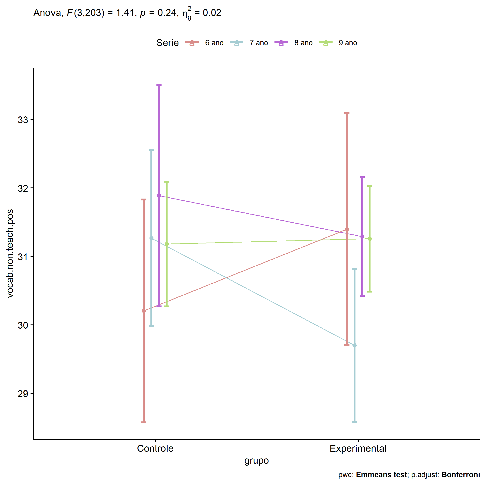<!-- -->

``` r
if (!is.null(plots[["Serie"]]))
  plots[["Serie"]] + ggplot2::scale_color_manual(values = color[["grupo"]])
```

    ## Scale for colour is already present.
    ## Adding another scale for colour, which will replace the existing scale.

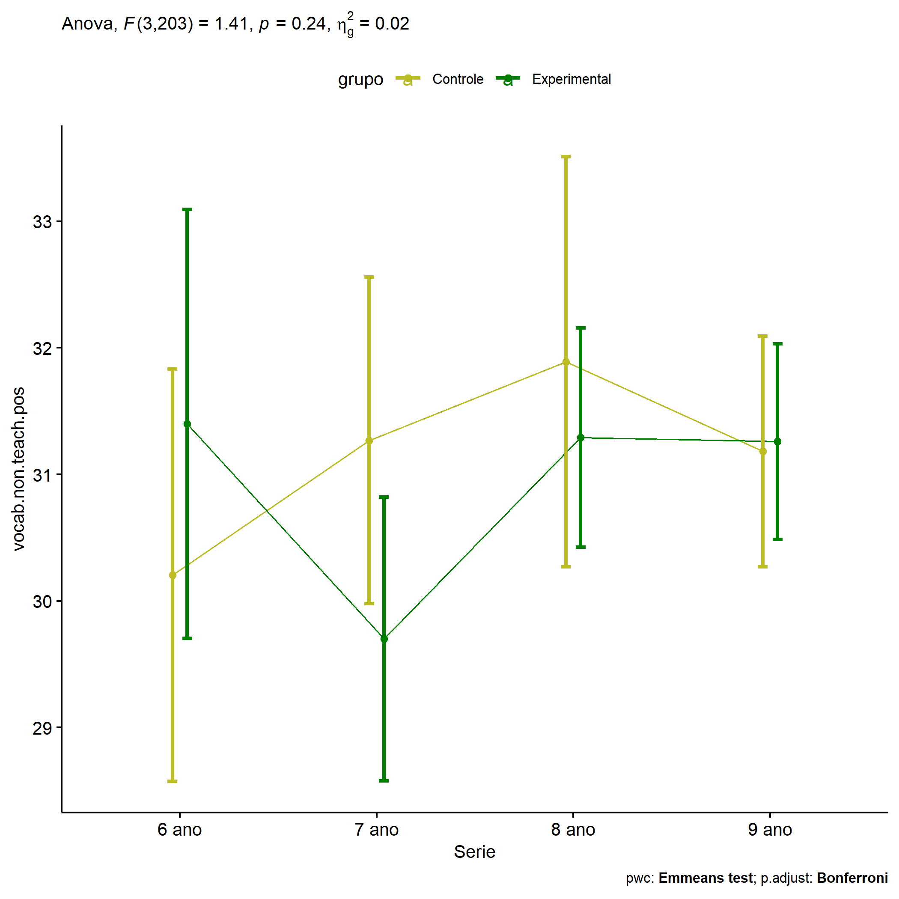<!-- -->

``` r
plots <- twoWayAncovaBoxPlots(
  wdat, "vocab.non.teach.pos", c("grupo","Serie"), aov, pwcs, covar = "vocab.non.teach.pre",
  theme = "classic", color = color[["grupo:Serie"]],
  subtitle = which(aov$Effect == "grupo:Serie"))
```

``` r
plots[["grupo:Serie"]] + ggplot2::ylab("Vocabulario Não Ensinado") + ggplot2::scale_x_discrete(labels=c('pre', 'pos'))
```

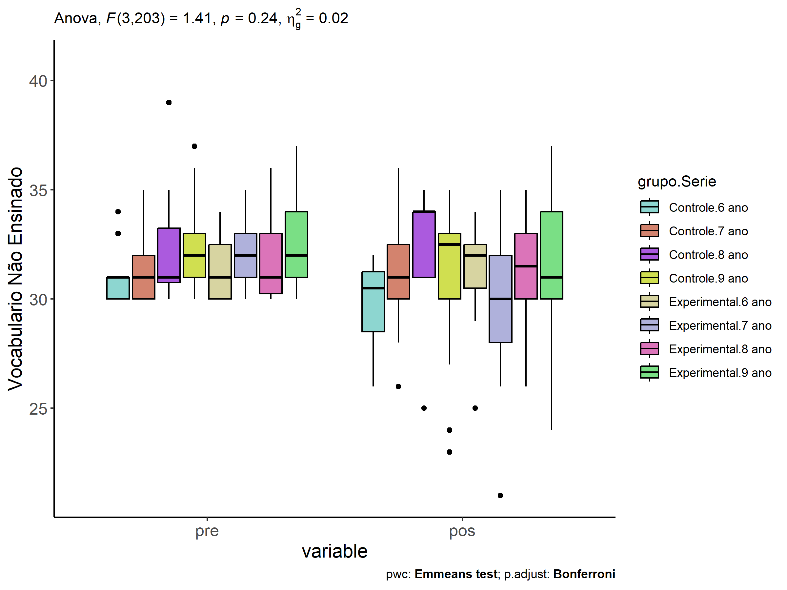<!-- -->

``` r
plots <- twoWayAncovaBoxPlots(
  wdat.long, "vocab.non.teach", c("grupo","Serie"), aov, pwc.long, pre.post = "time",
  theme = "classic", color = color$prepost)
```

``` r
plots[["grupo:Serie"]] + ggplot2::ylab("Vocabulario Não Ensinado")
```

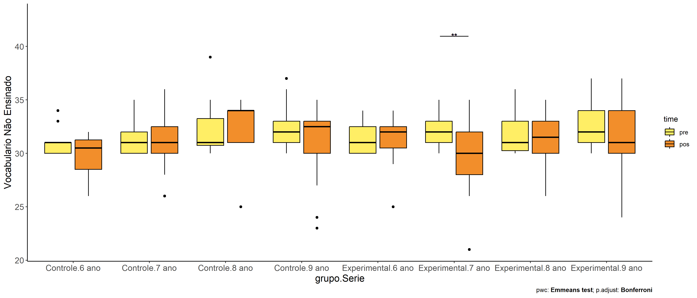<!-- -->

### Checking linearity assumption

``` r
ggscatter(wdat, x = "vocab.non.teach.pre", y = "vocab.non.teach.pos", size = 0.5,
          facet.by = c("grupo","Serie"), add = "reg.line")+
  stat_regline_equation(
    aes(label =  paste(..eq.label.., ..rr.label.., sep = "~~~~"))
  )
```

<!-- -->

### Checking normality and homogeneity

``` r
res <- augment(lm(vocab.non.teach.pos ~ vocab.non.teach.pre + grupo*Serie, data = wdat))
```

``` r
shapiro_test(res$.resid)
```

    ## # A tibble: 1 × 3
    ##   variable   statistic  p.value
    ##   <chr>          <dbl>    <dbl>
    ## 1 res$.resid     0.969 0.000126

``` r
levene_test(res, .resid ~ grupo*Serie)
```

    ## # A tibble: 1 × 4
    ##     df1   df2 statistic     p
    ##   <int> <int>     <dbl> <dbl>
    ## 1     7   204     0.606 0.751

# Summary of Results

## Descriptive Statistics

``` r
df <- get.descriptives(ldat[["grupo"]], c(dv.pre, dv.pos), c("grupo"), 
                       include.global = T, symmetry.test = T, normality.test = F)
df <- plyr::rbind.fill(
  df, do.call(plyr::rbind.fill, lapply(lfatores2, FUN = function(f) {
    if (nrow(dat) > 0 && sum(!is.na(unique(dat[[f]]))) > 1)
      get.descriptives(ldat[[paste0("grupo:",f)]], c(dv.pre,dv.pos), c("grupo", f),
                       symmetry.test = T, normality.test = F)
    }))
)
(df <- df[,c(fatores1[fatores1 %in% colnames(df)],"variable",
             colnames(df)[!colnames(df) %in% c(fatores1,"variable")])])
```

    ##           grupo Sexo   Zona Cor.Raca Serie            variable  n   mean median min max    sd    se
    ## 1      Controle <NA>   <NA>     <NA>  <NA> vocab.non.teach.pre 16 31.500   31.0  30  37 1.932 0.483
    ## 2  Experimental <NA>   <NA>     <NA>  <NA> vocab.non.teach.pre 40 31.750   32.0  30  36 1.532 0.242
    ## 3          <NA> <NA>   <NA>     <NA>  <NA> vocab.non.teach.pre 56 31.679   31.0  30  37 1.642 0.219
    ## 4      Controle <NA>   <NA>     <NA>  <NA> vocab.non.teach.pos 16 26.500   27.0  23  30 1.862 0.465
    ## 5  Experimental <NA>   <NA>     <NA>  <NA> vocab.non.teach.pos 40 27.850   28.0  24  31 1.703 0.269
    ## 6          <NA> <NA>   <NA>     <NA>  <NA> vocab.non.teach.pos 56 27.464   28.0  23  31 1.839 0.246
    ## 7      Controle    F   <NA>     <NA>  <NA> vocab.non.teach.pre 10 31.900   31.0  30  37 2.234 0.706
    ## 8      Controle    M   <NA>     <NA>  <NA> vocab.non.teach.pre  7 30.857   31.0  30  33 1.069 0.404
    ## 9  Experimental    F   <NA>     <NA>  <NA> vocab.non.teach.pre 21 32.190   32.0  30  36 1.662 0.363
    ## 10 Experimental    M   <NA>     <NA>  <NA> vocab.non.teach.pre 17 31.294   31.0  30  34 1.312 0.318
    ## 11     Controle    F   <NA>     <NA>  <NA> vocab.non.teach.pos 10 27.000   27.0  24  30 1.700 0.537
    ## 12     Controle    M   <NA>     <NA>  <NA> vocab.non.teach.pos  7 26.143   27.0  23  29 2.193 0.829
    ## 13 Experimental    F   <NA>     <NA>  <NA> vocab.non.teach.pos 21 28.238   28.0  25  31 1.700 0.371
    ## 14 Experimental    M   <NA>     <NA>  <NA> vocab.non.teach.pos 17 27.235   28.0  24  30 1.678 0.407
    ## 15     Controle <NA>  Rural     <NA>  <NA> vocab.non.teach.pre 26 31.885   31.0  30  39 2.197 0.431
    ## 16     Controle <NA> Urbana     <NA>  <NA> vocab.non.teach.pre 25 31.480   31.0  30  35 1.636 0.327
    ## 17 Experimental <NA>  Rural     <NA>  <NA> vocab.non.teach.pre 42 31.976   32.0  30  36 1.506 0.232
    ## 18 Experimental <NA> Urbana     <NA>  <NA> vocab.non.teach.pre 40 31.750   31.0  30  37 1.808 0.286
    ## 19     Controle <NA>  Rural     <NA>  <NA> vocab.non.teach.pos 26 31.115   32.0  23  36 3.445 0.676
    ## 20     Controle <NA> Urbana     <NA>  <NA> vocab.non.teach.pos 25 31.160   31.0  26  35 2.322 0.464
    ## 21 Experimental <NA>  Rural     <NA>  <NA> vocab.non.teach.pos 42 30.786   31.0  25  37 2.692 0.415
    ## 22 Experimental <NA> Urbana     <NA>  <NA> vocab.non.teach.pos 40 31.275   31.0  25  36 2.727 0.431
    ## 23     Controle <NA>   <NA>   Branca  <NA> vocab.non.teach.pre  7 31.571   31.0  30  34 1.512 0.571
    ## 24     Controle <NA>   <NA>    Parda  <NA> vocab.non.teach.pre 22 31.455   31.0  30  39 2.017 0.430
    ## 25 Experimental <NA>   <NA>   Branca  <NA> vocab.non.teach.pre 17 31.765   32.0  30  34 1.522 0.369
    ## 26 Experimental <NA>   <NA>    Parda  <NA> vocab.non.teach.pre 30 31.833   31.0  30  35 1.533 0.280
    ## 27     Controle <NA>   <NA>   Branca  <NA> vocab.non.teach.pos  7 32.571   33.0  30  36 2.573 0.972
    ## 28     Controle <NA>   <NA>    Parda  <NA> vocab.non.teach.pos 22 30.136   31.5  20  34 4.223 0.900
    ## 29 Experimental <NA>   <NA>   Branca  <NA> vocab.non.teach.pos 17 31.294   31.0  26  37 2.889 0.701
    ## 30 Experimental <NA>   <NA>    Parda  <NA> vocab.non.teach.pos 30 31.067   32.0  25  37 3.107 0.567
    ## 31     Controle <NA>   <NA>     <NA> 6 ano vocab.non.teach.pre 12 31.000   31.0  30  34 1.279 0.369
    ## 32     Controle <NA>   <NA>     <NA> 7 ano vocab.non.teach.pre 19 31.368   31.0  30  35 1.606 0.368
    ## 33     Controle <NA>   <NA>     <NA> 8 ano vocab.non.teach.pre 12 32.333   31.0  30  39 2.674 0.772
    ## 34     Controle <NA>   <NA>     <NA> 9 ano vocab.non.teach.pre 38 32.132   32.0  30  37 1.833 0.297
    ## 35 Experimental <NA>   <NA>     <NA> 6 ano vocab.non.teach.pre 11 31.364   31.0  30  34 1.433 0.432
    ## 36 Experimental <NA>   <NA>     <NA> 7 ano vocab.non.teach.pre 25 31.640   32.0  30  35 1.319 0.264
    ## 37 Experimental <NA>   <NA>     <NA> 8 ano vocab.non.teach.pre 42 31.810   31.0  30  36 1.728 0.267
    ## 38 Experimental <NA>   <NA>     <NA> 9 ano vocab.non.teach.pre 53 32.245   32.0  30  37 1.950 0.268
    ## 39     Controle <NA>   <NA>     <NA> 6 ano vocab.non.teach.pos 12 29.833   30.5  26  32 2.125 0.613
    ## 40     Controle <NA>   <NA>     <NA> 7 ano vocab.non.teach.pos 19 31.053   31.0  26  36 2.738 0.628
    ## 41     Controle <NA>   <NA>     <NA> 8 ano vocab.non.teach.pos 12 32.083   34.0  25  35 3.554 1.026
    ## 42     Controle <NA>   <NA>     <NA> 9 ano vocab.non.teach.pos 38 31.289   32.5  23  35 3.170 0.514
    ## 43 Experimental <NA>   <NA>     <NA> 6 ano vocab.non.teach.pos 11 31.182   32.0  25  34 2.483 0.749
    ## 44 Experimental <NA>   <NA>     <NA> 7 ano vocab.non.teach.pos 25 29.600   30.0  21  35 3.082 0.616
    ## 45 Experimental <NA>   <NA>     <NA> 8 ano vocab.non.teach.pos 42 31.262   31.5  26  35 2.470 0.381
    ## 46 Experimental <NA>   <NA>     <NA> 9 ano vocab.non.teach.pos 53 31.415   31.0  24  37 3.165 0.435
    ##       ci  iqr symmetry    skewness    kurtosis
    ## 1  1.030 2.25       NO  1.45560704  1.46179448
    ## 2  0.490 3.00       NO  0.62088834 -0.19870918
    ## 3  0.440 3.00       NO  0.99616653  0.76425997
    ## 4  0.992 1.50      YES -0.11619652 -0.74812777
    ## 5  0.545 2.25      YES -0.31876946 -0.82125669
    ## 6  0.492 3.00      YES -0.30619521 -0.62353198
    ## 7  1.598 2.50       NO  1.08120790 -0.03283927
    ## 8  0.989 1.00 few data  0.00000000  0.00000000
    ## 9  0.756 2.00      YES  0.33499556 -0.48208725
    ## 10 0.674 2.00       NO  0.89337982 -0.41176774
    ## 11 1.216 1.75      YES  0.12219544 -0.81923077
    ## 12 2.028 3.00      YES -0.15423643 -1.76500703
    ## 13 0.774 2.00      YES -0.12186188 -1.06644152
    ## 14 0.863 2.00      YES -0.27417640 -1.10336927
    ## 15 0.887 3.00       NO  1.46848830  1.99052387
    ## 16 0.675 3.00       NO  0.93834848 -0.52879368
    ## 17 0.469 2.00      YES  0.41583310 -0.37777173
    ## 18 0.578 3.00       NO  0.99917937  0.07423573
    ## 19 1.391 4.50       NO -0.68662970 -0.55525043
    ## 20 0.958 3.00      YES -0.22438006 -0.50649509
    ## 21 0.839 3.00      YES -0.12160401 -0.51848099
    ## 22 0.872 3.25      YES -0.16407699 -0.75538635
    ## 23 1.398 2.00      YES  0.37965181 -1.59470663
    ## 24 0.894 1.75       NO  2.38884868  6.13200425
    ## 25 0.782 3.00      YES -0.02702350 -1.68295721
    ## 26 0.572 1.75       NO  0.76976288 -0.50779995
    ## 27 2.379 4.50      YES  0.05546993 -1.99462042
    ## 28 1.873 6.25       NO -0.86176548 -0.53196429
    ## 29 1.485 3.00      YES  0.13357623 -0.72880974
    ## 30 1.160 4.75      YES -0.32686623 -0.76989469
    ## 31 0.813 1.00       NO  1.19431883  0.17438272
    ## 32 0.774 2.00       NO  0.94983817 -0.55716051
    ## 33 1.699 2.50       NO  1.18907025  0.47963349
    ## 34 0.603 2.00       NO  0.73399524 -0.20933422
    ## 35 0.963 2.50       NO  0.52657230 -1.34824009
    ## 36 0.544 2.00      YES  0.44034517 -0.45683329
    ## 37 0.539 2.75       NO  0.84058186 -0.25668251
    ## 38 0.538 3.00       NO  0.60691730 -0.57060151
    ## 39 1.350 2.75       NO -0.58291427 -1.29556195
    ## 40 1.320 2.50      YES -0.09822533 -0.63200447
    ## 41 2.258 3.00       NO -1.16561027 -0.25657881
    ## 42 1.042 3.00       NO -1.09111127  0.26814925
    ## 43 1.668 2.00       NO -1.25760379  0.76103498
    ## 44 1.272 4.00      YES -0.46555840  0.54535180
    ## 45 0.770 3.00      YES -0.37019908 -0.79707805
    ## 46 0.872 4.00      YES -0.35020646 -0.50513901

| grupo        | Sexo | Zona   | Cor.Raca | Serie | variable            |   n |   mean | median | min | max |    sd |    se |    ci |  iqr | symmetry | skewness | kurtosis |
|:-------------|:-----|:-------|:---------|:------|:--------------------|----:|-------:|-------:|----:|----:|------:|------:|------:|-----:|:---------|---------:|---------:|
| Controle     |      |        |          |       | vocab.non.teach.pre |  16 | 31.500 |   31.0 |  30 |  37 | 1.932 | 0.483 | 1.030 | 2.25 | NO       |    1.456 |    1.462 |
| Experimental |      |        |          |       | vocab.non.teach.pre |  40 | 31.750 |   32.0 |  30 |  36 | 1.532 | 0.242 | 0.490 | 3.00 | NO       |    0.621 |   -0.199 |
|              |      |        |          |       | vocab.non.teach.pre |  56 | 31.679 |   31.0 |  30 |  37 | 1.642 | 0.219 | 0.440 | 3.00 | NO       |    0.996 |    0.764 |
| Controle     |      |        |          |       | vocab.non.teach.pos |  16 | 26.500 |   27.0 |  23 |  30 | 1.862 | 0.465 | 0.992 | 1.50 | YES      |   -0.116 |   -0.748 |
| Experimental |      |        |          |       | vocab.non.teach.pos |  40 | 27.850 |   28.0 |  24 |  31 | 1.703 | 0.269 | 0.545 | 2.25 | YES      |   -0.319 |   -0.821 |
|              |      |        |          |       | vocab.non.teach.pos |  56 | 27.464 |   28.0 |  23 |  31 | 1.839 | 0.246 | 0.492 | 3.00 | YES      |   -0.306 |   -0.624 |
| Controle     | F    |        |          |       | vocab.non.teach.pre |  10 | 31.900 |   31.0 |  30 |  37 | 2.234 | 0.706 | 1.598 | 2.50 | NO       |    1.081 |   -0.033 |
| Controle     | M    |        |          |       | vocab.non.teach.pre |   7 | 30.857 |   31.0 |  30 |  33 | 1.069 | 0.404 | 0.989 | 1.00 | few data |    0.000 |    0.000 |
| Experimental | F    |        |          |       | vocab.non.teach.pre |  21 | 32.190 |   32.0 |  30 |  36 | 1.662 | 0.363 | 0.756 | 2.00 | YES      |    0.335 |   -0.482 |
| Experimental | M    |        |          |       | vocab.non.teach.pre |  17 | 31.294 |   31.0 |  30 |  34 | 1.312 | 0.318 | 0.674 | 2.00 | NO       |    0.893 |   -0.412 |
| Controle     | F    |        |          |       | vocab.non.teach.pos |  10 | 27.000 |   27.0 |  24 |  30 | 1.700 | 0.537 | 1.216 | 1.75 | YES      |    0.122 |   -0.819 |
| Controle     | M    |        |          |       | vocab.non.teach.pos |   7 | 26.143 |   27.0 |  23 |  29 | 2.193 | 0.829 | 2.028 | 3.00 | YES      |   -0.154 |   -1.765 |
| Experimental | F    |        |          |       | vocab.non.teach.pos |  21 | 28.238 |   28.0 |  25 |  31 | 1.700 | 0.371 | 0.774 | 2.00 | YES      |   -0.122 |   -1.066 |
| Experimental | M    |        |          |       | vocab.non.teach.pos |  17 | 27.235 |   28.0 |  24 |  30 | 1.678 | 0.407 | 0.863 | 2.00 | YES      |   -0.274 |   -1.103 |
| Controle     |      | Rural  |          |       | vocab.non.teach.pre |  26 | 31.885 |   31.0 |  30 |  39 | 2.197 | 0.431 | 0.887 | 3.00 | NO       |    1.468 |    1.991 |
| Controle     |      | Urbana |          |       | vocab.non.teach.pre |  25 | 31.480 |   31.0 |  30 |  35 | 1.636 | 0.327 | 0.675 | 3.00 | NO       |    0.938 |   -0.529 |
| Experimental |      | Rural  |          |       | vocab.non.teach.pre |  42 | 31.976 |   32.0 |  30 |  36 | 1.506 | 0.232 | 0.469 | 2.00 | YES      |    0.416 |   -0.378 |
| Experimental |      | Urbana |          |       | vocab.non.teach.pre |  40 | 31.750 |   31.0 |  30 |  37 | 1.808 | 0.286 | 0.578 | 3.00 | NO       |    0.999 |    0.074 |
| Controle     |      | Rural  |          |       | vocab.non.teach.pos |  26 | 31.115 |   32.0 |  23 |  36 | 3.445 | 0.676 | 1.391 | 4.50 | NO       |   -0.687 |   -0.555 |
| Controle     |      | Urbana |          |       | vocab.non.teach.pos |  25 | 31.160 |   31.0 |  26 |  35 | 2.322 | 0.464 | 0.958 | 3.00 | YES      |   -0.224 |   -0.506 |
| Experimental |      | Rural  |          |       | vocab.non.teach.pos |  42 | 30.786 |   31.0 |  25 |  37 | 2.692 | 0.415 | 0.839 | 3.00 | YES      |   -0.122 |   -0.518 |
| Experimental |      | Urbana |          |       | vocab.non.teach.pos |  40 | 31.275 |   31.0 |  25 |  36 | 2.727 | 0.431 | 0.872 | 3.25 | YES      |   -0.164 |   -0.755 |
| Controle     |      |        | Branca   |       | vocab.non.teach.pre |   7 | 31.571 |   31.0 |  30 |  34 | 1.512 | 0.571 | 1.398 | 2.00 | YES      |    0.380 |   -1.595 |
| Controle     |      |        | Parda    |       | vocab.non.teach.pre |  22 | 31.455 |   31.0 |  30 |  39 | 2.017 | 0.430 | 0.894 | 1.75 | NO       |    2.389 |    6.132 |
| Experimental |      |        | Branca   |       | vocab.non.teach.pre |  17 | 31.765 |   32.0 |  30 |  34 | 1.522 | 0.369 | 0.782 | 3.00 | YES      |   -0.027 |   -1.683 |
| Experimental |      |        | Parda    |       | vocab.non.teach.pre |  30 | 31.833 |   31.0 |  30 |  35 | 1.533 | 0.280 | 0.572 | 1.75 | NO       |    0.770 |   -0.508 |
| Controle     |      |        | Branca   |       | vocab.non.teach.pos |   7 | 32.571 |   33.0 |  30 |  36 | 2.573 | 0.972 | 2.379 | 4.50 | YES      |    0.055 |   -1.995 |
| Controle     |      |        | Parda    |       | vocab.non.teach.pos |  22 | 30.136 |   31.5 |  20 |  34 | 4.223 | 0.900 | 1.873 | 6.25 | NO       |   -0.862 |   -0.532 |
| Experimental |      |        | Branca   |       | vocab.non.teach.pos |  17 | 31.294 |   31.0 |  26 |  37 | 2.889 | 0.701 | 1.485 | 3.00 | YES      |    0.134 |   -0.729 |
| Experimental |      |        | Parda    |       | vocab.non.teach.pos |  30 | 31.067 |   32.0 |  25 |  37 | 3.107 | 0.567 | 1.160 | 4.75 | YES      |   -0.327 |   -0.770 |
| Controle     |      |        |          | 6 ano | vocab.non.teach.pre |  12 | 31.000 |   31.0 |  30 |  34 | 1.279 | 0.369 | 0.813 | 1.00 | NO       |    1.194 |    0.174 |
| Controle     |      |        |          | 7 ano | vocab.non.teach.pre |  19 | 31.368 |   31.0 |  30 |  35 | 1.606 | 0.368 | 0.774 | 2.00 | NO       |    0.950 |   -0.557 |
| Controle     |      |        |          | 8 ano | vocab.non.teach.pre |  12 | 32.333 |   31.0 |  30 |  39 | 2.674 | 0.772 | 1.699 | 2.50 | NO       |    1.189 |    0.480 |
| Controle     |      |        |          | 9 ano | vocab.non.teach.pre |  38 | 32.132 |   32.0 |  30 |  37 | 1.833 | 0.297 | 0.603 | 2.00 | NO       |    0.734 |   -0.209 |
| Experimental |      |        |          | 6 ano | vocab.non.teach.pre |  11 | 31.364 |   31.0 |  30 |  34 | 1.433 | 0.432 | 0.963 | 2.50 | NO       |    0.527 |   -1.348 |
| Experimental |      |        |          | 7 ano | vocab.non.teach.pre |  25 | 31.640 |   32.0 |  30 |  35 | 1.319 | 0.264 | 0.544 | 2.00 | YES      |    0.440 |   -0.457 |
| Experimental |      |        |          | 8 ano | vocab.non.teach.pre |  42 | 31.810 |   31.0 |  30 |  36 | 1.728 | 0.267 | 0.539 | 2.75 | NO       |    0.841 |   -0.257 |
| Experimental |      |        |          | 9 ano | vocab.non.teach.pre |  53 | 32.245 |   32.0 |  30 |  37 | 1.950 | 0.268 | 0.538 | 3.00 | NO       |    0.607 |   -0.571 |
| Controle     |      |        |          | 6 ano | vocab.non.teach.pos |  12 | 29.833 |   30.5 |  26 |  32 | 2.125 | 0.613 | 1.350 | 2.75 | NO       |   -0.583 |   -1.296 |
| Controle     |      |        |          | 7 ano | vocab.non.teach.pos |  19 | 31.053 |   31.0 |  26 |  36 | 2.738 | 0.628 | 1.320 | 2.50 | YES      |   -0.098 |   -0.632 |
| Controle     |      |        |          | 8 ano | vocab.non.teach.pos |  12 | 32.083 |   34.0 |  25 |  35 | 3.554 | 1.026 | 2.258 | 3.00 | NO       |   -1.166 |   -0.257 |
| Controle     |      |        |          | 9 ano | vocab.non.teach.pos |  38 | 31.289 |   32.5 |  23 |  35 | 3.170 | 0.514 | 1.042 | 3.00 | NO       |   -1.091 |    0.268 |
| Experimental |      |        |          | 6 ano | vocab.non.teach.pos |  11 | 31.182 |   32.0 |  25 |  34 | 2.483 | 0.749 | 1.668 | 2.00 | NO       |   -1.258 |    0.761 |
| Experimental |      |        |          | 7 ano | vocab.non.teach.pos |  25 | 29.600 |   30.0 |  21 |  35 | 3.082 | 0.616 | 1.272 | 4.00 | YES      |   -0.466 |    0.545 |
| Experimental |      |        |          | 8 ano | vocab.non.teach.pos |  42 | 31.262 |   31.5 |  26 |  35 | 2.470 | 0.381 | 0.770 | 3.00 | YES      |   -0.370 |   -0.797 |
| Experimental |      |        |          | 9 ano | vocab.non.teach.pos |  53 | 31.415 |   31.0 |  24 |  37 | 3.165 | 0.435 | 0.872 | 4.00 | YES      |   -0.350 |   -0.505 |

## ANCOVA Table Comparison

``` r
df <- do.call(plyr::rbind.fill, laov)
(df <- df[!duplicated(df$Effect),])
```

    ##                 Effect DFn DFd      F        p p<.05   ges DFn' DFd'    F'    p' p<.05'     ges'
    ## 1                grupo   1  53  8.087 6.00e-03     * 0.132    1  223 0.749 0.388        0.003000
    ## 2  vocab.non.teach.pre   1  53 29.682 1.35e-06     * 0.359    1  223 6.909 0.009      * 0.030000
    ## 4           grupo:Sexo   1  50  0.076 7.83e-01       0.002    1  221 0.025 0.875        0.000112
    ## 5                 Sexo   1  50  0.813 3.71e-01       0.016    1  221 2.002 0.158        0.009000
    ## 8           grupo:Zona   1 128  0.155 6.95e-01       0.001    1  137 0.084 0.773        0.000610
    ## 10                Zona   1 128  0.753 3.87e-01       0.006    1  137 2.730 0.101        0.020000
    ## 11            Cor.Raca   1  71  1.287 2.60e-01       0.018    1   74 2.330 0.131        0.031000
    ## 13      grupo:Cor.Raca   1  71  1.449 2.33e-01       0.020    1   74 1.539 0.219        0.020000
    ## 16         grupo:Serie   3 203  1.409 2.41e-01       0.020    3  217 1.135 0.336        0.015000
    ## 17               Serie   3 203  1.391 2.47e-01       0.020    3  217 2.046 0.108        0.028000

|     | Effect              | DFn | DFd |      F |     p | p\<.05 |   ges | DFn’ | DFd’ |    F’ |    p’ | p\<.05’ |  ges’ |
|:----|:--------------------|----:|----:|-------:|------:|:-------|------:|-----:|-----:|------:|------:|:--------|------:|
| 1   | grupo               |   1 |  53 |  8.087 | 0.006 | \*     | 0.132 |    1 |  223 | 0.749 | 0.388 |         | 0.003 |
| 2   | vocab.non.teach.pre |   1 |  53 | 29.682 | 0.000 | \*     | 0.359 |    1 |  223 | 6.909 | 0.009 | \*      | 0.030 |
| 4   | grupo:Sexo          |   1 |  50 |  0.076 | 0.783 |        | 0.002 |    1 |  221 | 0.025 | 0.875 |         | 0.000 |
| 5   | Sexo                |   1 |  50 |  0.813 | 0.371 |        | 0.016 |    1 |  221 | 2.002 | 0.158 |         | 0.009 |
| 8   | grupo:Zona          |   1 | 128 |  0.155 | 0.695 |        | 0.001 |    1 |  137 | 0.084 | 0.773 |         | 0.001 |
| 10  | Zona                |   1 | 128 |  0.753 | 0.387 |        | 0.006 |    1 |  137 | 2.730 | 0.101 |         | 0.020 |
| 11  | Cor.Raca            |   1 |  71 |  1.287 | 0.260 |        | 0.018 |    1 |   74 | 2.330 | 0.131 |         | 0.031 |
| 13  | grupo:Cor.Raca      |   1 |  71 |  1.449 | 0.233 |        | 0.020 |    1 |   74 | 1.539 | 0.219 |         | 0.020 |
| 16  | grupo:Serie         |   3 | 203 |  1.409 | 0.241 |        | 0.020 |    3 |  217 | 1.135 | 0.336 |         | 0.015 |
| 17  | Serie               |   3 | 203 |  1.391 | 0.247 |        | 0.020 |    3 |  217 | 2.046 | 0.108 |         | 0.028 |

## PairWise Table Comparison

``` r
df <- do.call(plyr::rbind.fill, lpwc)
df <- df[,c(names(lfatores), names(df)[!names(df) %in% c(names(lfatores),"term",".y.")])]
```

| grupo        | Sexo | Zona   | Cor.Raca | Serie | group1   | group2       |  df | statistic |     p | p.adj | p.adj.signif | df’ | statistic’ |    p’ | p.adj’ | p.adj.signif’ |
|:-------------|:-----|:-------|:---------|:------|:---------|:-------------|----:|----------:|------:|------:|:-------------|----:|-----------:|------:|-------:|:--------------|
| Controle     |      |        |          |       | pre      | pos          | 108 |     8.313 | 0.000 | 0.000 | \*\*\*\*     | 448 |      3.841 | 0.000 |  0.000 | \*\*\*        |
| Experimental |      |        |          |       | pre      | pos          | 108 |    10.252 | 0.000 | 0.000 | \*\*\*\*     | 448 |      3.559 | 0.000 |  0.000 | \*\*\*        |
|              |      |        |          |       | Controle | Experimental |  53 |    -2.844 | 0.006 | 0.006 | \*\*         | 223 |     -0.865 | 0.388 |  0.388 | ns            |
| Controle     | F    |        |          |       | pre      | pos          | 102 |     6.473 | 0.000 | 0.000 | \*\*\*\*     | 444 |      2.124 | 0.034 |  0.034 | \*            |
| Controle     | M    |        |          |       | pre      | pos          | 102 |     5.210 | 0.000 | 0.000 | \*\*\*\*     | 444 |      3.357 | 0.001 |  0.001 | \*\*\*        |
| Controle     |      |        |          |       | F        | M            |  50 |     0.283 | 0.778 | 0.778 | ns           | 221 |      1.012 | 0.313 |  0.313 | ns            |
| Experimental | F    |        |          |       | pre      | pos          | 102 |     7.566 | 0.000 | 0.000 | \*\*\*\*     | 444 |      2.074 | 0.039 |  0.039 | \*            |
| Experimental | M    |        |          |       | pre      | pos          | 102 |     6.991 | 0.000 | 0.000 | \*\*\*\*     | 444 |      3.025 | 0.003 |  0.003 | \*\*          |
| Experimental |      |        |          |       | F        | M            |  50 |     0.911 | 0.367 | 0.367 | ns           | 221 |      1.001 | 0.318 |  0.318 | ns            |
|              | F    |        |          |       | Controle | Experimental |  50 |    -1.892 | 0.064 | 0.064 | ns           | 221 |     -0.511 | 0.610 |  0.610 | ns            |
|              | M    |        |          |       | Controle | Experimental |  50 |    -1.253 | 0.216 | 0.216 | ns           | 221 |     -0.677 | 0.499 |  0.499 | ns            |
| Controle     |      |        |          |       | Rural    | Urbana       | 128 |    -0.229 | 0.819 | 0.819 | ns           | 137 |     -0.792 | 0.430 |  0.430 | ns            |
| Controle     |      | Rural  |          |       | pre      | pos          | 258 |     1.183 | 0.238 | 0.238 | ns           | 276 |      2.070 | 0.039 |  0.039 | \*            |
| Controle     |      | Urbana |          |       | pre      | pos          | 258 |     0.483 | 0.630 | 0.630 | ns           | 276 |      0.781 | 0.435 |  0.435 | ns            |
| Experimental |      |        |          |       | Rural    | Urbana       | 128 |    -0.926 | 0.356 | 0.356 | ns           | 137 |     -1.480 | 0.141 |  0.141 | ns            |
| Experimental |      | Rural  |          |       | pre      | pos          | 258 |     2.327 | 0.021 | 0.021 | \*           | 276 |      3.524 | 0.000 |  0.000 | \*\*\*        |
| Experimental |      | Urbana |          |       | pre      | pos          | 258 |     0.906 | 0.366 | 0.366 | ns           | 276 |      1.352 | 0.177 |  0.177 | ns            |
|              |      | Rural  |          |       | Controle | Experimental | 128 |     0.524 | 0.601 | 0.601 | ns           | 137 |      0.517 | 0.606 |  0.606 | ns            |
|              |      | Urbana |          |       | Controle | Experimental | 128 |    -0.038 | 0.970 | 0.970 | ns           | 137 |      0.096 | 0.924 |  0.924 | ns            |
| Controle     |      |        | Branca   |       | pre      | pos          | 144 |    -0.699 | 0.486 | 0.486 | ns           | 150 |     -0.500 | 0.618 |  0.618 | ns            |
| Controle     |      |        |          |       | Branca   | Parda        |  71 |     1.637 | 0.106 | 0.106 | ns           |  74 |      1.893 | 0.062 |  0.062 | ns            |
| Controle     |      |        | Parda    |       | pre      | pos          | 144 |     1.633 | 0.105 | 0.105 | ns           | 150 |      2.853 | 0.005 |  0.005 | \*\*          |
| Experimental |      |        | Branca   |       | pre      | pos          | 144 |     0.512 | 0.609 | 0.609 | ns           | 150 |      0.366 | 0.715 |  0.715 | ns            |
| Experimental |      |        |          |       | Branca   | Parda        |  71 |     0.239 | 0.812 | 0.812 | ns           |  74 |      0.536 | 0.594 |  0.594 | ns            |
| Experimental |      |        | Parda    |       | pre      | pos          | 144 |     1.109 | 0.269 | 0.269 | ns           | 150 |      1.391 | 0.166 |  0.166 | ns            |
|              |      |        | Branca   |       | Controle | Experimental |  71 |     0.874 | 0.385 | 0.385 | ns           |  74 |      0.576 | 0.566 |  0.566 | ns            |
|              |      |        | Parda    |       | Controle | Experimental |  71 |    -0.869 | 0.388 | 0.388 | ns           |  74 |     -1.440 | 0.154 |  0.154 | ns            |
| Controle     |      |        |          | 6 ano | pre      | pos          | 408 |     1.177 | 0.240 | 0.240 | ns           | 436 |      0.792 | 0.429 |  0.429 | ns            |
| Controle     |      |        |          | 7 ano | pre      | pos          | 408 |     0.401 | 0.689 | 0.689 | ns           | 436 |      1.752 | 0.080 |  0.080 | ns            |
| Controle     |      |        |          | 8 ano | pre      | pos          | 408 |     0.252 | 0.801 | 0.801 | ns           | 436 |      3.388 | 0.001 |  0.001 | \*\*\*        |
| Controle     |      |        |          | 9 ano | pre      | pos          | 408 |     1.512 | 0.131 | 0.131 | ns           | 436 |      1.988 | 0.047 |  0.047 | \*            |
| Controle     |      |        |          |       | 6 ano    | 7 ano        | 203 |    -1.014 | 0.312 | 1.000 | ns           | 217 |      0.347 | 0.729 |  1.000 | ns            |
| Controle     |      |        |          |       | 6 ano    | 8 ano        | 203 |    -1.441 | 0.151 | 0.907 | ns           | 217 |      1.414 | 0.159 |  0.953 | ns            |
| Controle     |      |        |          |       | 6 ano    | 9 ano        | 203 |    -1.029 | 0.305 | 1.000 | ns           | 217 |     -0.186 | 0.852 |  1.000 | ns            |
| Controle     |      |        |          |       | 7 ano    | 8 ano        | 203 |    -0.591 | 0.555 | 1.000 | ns           | 217 |      1.254 | 0.211 |  1.000 | ns            |
| Controle     |      |        |          |       | 7 ano    | 9 ano        | 203 |     0.107 | 0.915 | 1.000 | ns           | 217 |     -0.692 | 0.489 |  1.000 | ns            |
| Controle     |      |        |          |       | 8 ano    | 9 ano        | 203 |     0.753 | 0.453 | 1.000 | ns           | 217 |     -2.032 | 0.043 |  0.260 | ns            |
| Experimental |      |        |          | 6 ano | pre      | pos          | 408 |     0.176 | 0.861 | 0.861 | ns           | 436 |      0.848 | 0.397 |  0.397 | ns            |
| Experimental |      |        |          | 7 ano | pre      | pos          | 408 |     2.970 | 0.003 | 0.003 | \*\*         | 436 |      3.091 | 0.002 |  0.002 | \*\*          |
| Experimental |      |        |          | 8 ano | pre      | pos          | 408 |     1.033 | 0.302 | 0.302 | ns           | 436 |      2.161 | 0.031 |  0.031 | \*            |
| Experimental |      |        |          | 9 ano | pre      | pos          | 408 |     1.760 | 0.079 | 0.079 | ns           | 436 |      1.184 | 0.237 |  0.237 | ns            |
| Experimental |      |        |          |       | 6 ano    | 7 ano        | 203 |     1.651 | 0.100 | 0.601 | ns           | 217 |      0.967 | 0.335 |  1.000 | ns            |
| Experimental |      |        |          |       | 6 ano    | 8 ano        | 203 |     0.113 | 0.910 | 1.000 | ns           | 217 |      0.019 | 0.985 |  1.000 | ns            |
| Experimental |      |        |          |       | 6 ano    | 9 ano        | 203 |     0.148 | 0.883 | 1.000 | ns           | 217 |     -0.648 | 0.517 |  1.000 | ns            |
| Experimental |      |        |          |       | 7 ano    | 8 ano        | 203 |    -2.214 | 0.028 | 0.168 | ns           | 217 |     -1.353 | 0.178 |  1.000 | ns            |
| Experimental |      |        |          |       | 7 ano    | 9 ano        | 203 |    -2.250 | 0.026 | 0.153 | ns           | 217 |     -2.290 | 0.023 |  0.138 | ns            |
| Experimental |      |        |          |       | 8 ano    | 9 ano        | 203 |     0.053 | 0.958 | 1.000 | ns           | 217 |     -1.058 | 0.291 |  1.000 | ns            |
|              |      |        |          | 6 ano | Controle | Experimental | 203 |    -1.006 | 0.315 | 0.315 | ns           | 217 |     -0.031 | 0.975 |  0.975 | ns            |
|              |      |        |          | 7 ano | Controle | Experimental | 203 |     1.811 | 0.072 | 0.072 | ns           | 217 |      0.679 | 0.498 |  0.498 | ns            |
|              |      |        |          | 8 ano | Controle | Experimental | 203 |     0.643 | 0.521 | 0.521 | ns           | 217 |     -1.870 | 0.063 |  0.063 | ns            |
|              |      |        |          | 9 ano | Controle | Experimental | 203 |    -0.128 | 0.898 | 0.898 | ns           | 217 |     -0.767 | 0.444 |  0.444 | ns            |

## EMMS Table Comparison

``` r
df <- do.call(plyr::rbind.fill, lemms)
df[["N-N'"]] <- df[["N"]] - df[["N'"]]
df <- df[,c(names(lfatores), names(df)[!names(df) %in% names(lfatores)])]
```

| grupo        | Sexo | Zona   | Cor.Raca | Serie |   N | M (pre) | SE (pre) | M (unadj) | SE (unadj) | M (adj) | SE (adj) |  N’ | M (pre)’ | SE (pre)’ | M (unadj)’ | SE (unadj)’ | M (adj)’ | SE (adj)’ | N-N’ |
|:-------------|:-----|:-------|:---------|:------|----:|--------:|---------:|----------:|-----------:|--------:|---------:|----:|---------:|----------:|-----------:|------------:|---------:|----------:|-----:|
| Controle     |      |        |          |       |  16 |  31.500 |    0.483 |    26.500 |      0.465 |  26.613 |    0.354 |  89 |   31.854 |     0.198 |     29.753 |       0.593 |   29.769 |     0.506 |  -73 |
| Experimental |      |        |          |       |  40 |  31.750 |    0.242 |    27.850 |      0.269 |  27.805 |    0.224 | 137 |   31.912 |     0.149 |     30.343 |       0.366 |   30.332 |     0.408 |  -97 |
| Controle     | F    |        |          |       |  10 |  31.900 |    0.706 |    27.000 |      0.537 |  26.869 |    0.460 |  48 |   31.771 |     0.292 |     30.188 |       0.696 |   30.243 |     0.690 |  -38 |
| Controle     | M    |        |          |       |   7 |  30.857 |    0.404 |    26.143 |      0.829 |  26.664 |    0.558 |  41 |   31.951 |     0.264 |     29.244 |       1.000 |   29.215 |     0.746 |  -34 |
| Experimental | F    |        |          |       |  21 |  32.190 |    0.363 |    28.238 |      0.371 |  27.926 |    0.323 |  77 |   31.935 |     0.188 |     30.714 |       0.460 |   30.693 |     0.544 |  -56 |
| Experimental | M    |        |          |       |  17 |  31.294 |    0.318 |    27.235 |      0.407 |  27.483 |    0.355 |  60 |   31.883 |     0.241 |     29.867 |       0.590 |   29.870 |     0.617 |  -43 |
| Controle     |      | Rural  |          |       |  26 |  31.885 |    0.431 |    31.115 |      0.676 |  31.087 |    0.540 |  28 |   31.821 |     0.402 |     29.857 |       1.099 |   29.844 |     0.881 |   -2 |
| Controle     |      | Urbana |          |       |  25 |  31.480 |    0.327 |    31.160 |      0.464 |  31.264 |    0.552 |  26 |   31.500 |     0.315 |     30.731 |       0.619 |   30.851 |     0.917 |   -1 |
| Experimental |      | Rural  |          |       |  42 |  31.976 |    0.232 |    30.786 |      0.415 |  30.727 |    0.425 |  46 |   31.935 |     0.218 |     29.326 |       0.805 |   29.265 |     0.688 |   -4 |
| Experimental |      | Urbana |          |       |  40 |  31.750 |    0.286 |    31.275 |      0.431 |  31.290 |    0.435 |  42 |   31.786 |     0.286 |     30.738 |       0.565 |   30.739 |     0.720 |   -2 |
| Controle     |      |        | Branca   |       |   7 |  31.571 |    0.571 |    32.571 |      0.972 |  32.602 |    1.279 |   7 |   31.571 |     0.571 |     32.571 |       0.972 |   32.591 |     1.911 |    0 |
| Controle     |      |        | Parda    |       |  22 |  31.455 |    0.430 |    30.136 |      0.900 |  30.198 |    0.723 |  24 |   31.542 |     0.399 |     28.458 |       1.428 |   28.483 |     1.033 |   -2 |
| Experimental |      |        | Branca   |       |  17 |  31.765 |    0.369 |    31.294 |      0.701 |  31.273 |    0.821 |  17 |   31.765 |     0.369 |     31.294 |       0.701 |   31.283 |     1.226 |    0 |
| Experimental |      |        | Parda    |       |  30 |  31.833 |    0.280 |    31.067 |      0.567 |  31.027 |    0.619 |  31 |   31.806 |     0.272 |     30.484 |       0.800 |   30.466 |     0.908 |   -1 |
| Controle     |      |        |          | 6 ano |  12 |  31.000 |    0.369 |    29.833 |      0.613 |  30.205 |    0.826 |  12 |   31.000 |     0.369 |     29.833 |       0.613 |   30.214 |     1.378 |    0 |
| Controle     |      |        |          | 7 ano |  19 |  31.368 |    0.368 |    31.053 |      0.628 |  31.268 |    0.654 |  21 |   31.333 |     0.333 |     29.381 |       1.321 |   29.619 |     1.039 |   -2 |
| Controle     |      |        |          | 8 ano |  12 |  32.333 |    0.772 |    32.083 |      1.026 |  31.890 |    0.822 |  15 |   32.200 |     0.634 |     27.733 |       2.472 |   27.600 |     1.225 |   -3 |
| Controle     |      |        |          | 9 ano |  38 |  32.132 |    0.297 |    31.289 |      0.514 |  31.182 |    0.462 |  41 |   32.244 |     0.288 |     30.659 |       0.599 |   30.507 |     0.743 |   -3 |
| Experimental |      |        |          | 6 ano |  11 |  31.364 |    0.432 |    31.182 |      0.749 |  31.399 |    0.859 |  12 |   31.250 |     0.411 |     30.000 |       1.365 |   30.274 |     1.373 |   -1 |
| Experimental |      |        |          | 7 ano |  25 |  31.640 |    0.264 |    29.600 |      0.616 |  29.700 |    0.569 |  27 |   31.593 |     0.252 |     28.556 |       0.925 |   28.683 |     0.914 |   -2 |
| Experimental |      |        |          | 8 ano |  42 |  31.810 |    0.267 |    31.262 |      0.381 |  31.291 |    0.439 |  45 |   31.889 |     0.261 |     30.244 |       0.702 |   30.245 |     0.706 |   -3 |
| Experimental |      |        |          | 9 ano |  53 |  32.245 |    0.268 |    31.415 |      0.435 |  31.259 |    0.393 |  53 |   32.245 |     0.268 |     31.415 |       0.435 |   31.263 |     0.654 |    0 |
