ANCOVA in Vocabulario Não Ensinado (Vocabulario Não Ensinado)
================
Geiser C. Challco <geiser@alumni.usp.br>

- [Descriptive Statistics of Initial
  Data](#descriptive-statistics-of-initial-data)
- [ANCOVA and Pairwise for one factor:
  **grupo**](#ancova-and-pairwise-for-one-factor-grupo)
  - [Without remove non-normal data](#without-remove-non-normal-data)
  - [Computing ANCOVA and PairWise After removing non-normal data
    (OK)](#computing-ancova-and-pairwise-after-removing-non-normal-data-ok)
    - [Plots for ancova](#plots-for-ancova)
    - [Checking linearity assumption](#checking-linearity-assumption)
    - [Checking normality and
      homogeneity](#checking-normality-and-homogeneity)
- [ANCOVA and Pairwise for two factors
  **grupo:Sexo**](#ancova-and-pairwise-for-two-factors-gruposexo)
  - [Without remove non-normal data](#without-remove-non-normal-data-1)
  - [Computing ANCOVA and PairWise After removing non-normal data
    (OK)](#computing-ancova-and-pairwise-after-removing-non-normal-data-ok-1)
    - [Plots for ancova](#plots-for-ancova-1)
    - [Checking linearity assumption](#checking-linearity-assumption-1)
    - [Checking normality and
      homogeneity](#checking-normality-and-homogeneity-1)
- [ANCOVA and Pairwise for two factors
  **grupo:Zona**](#ancova-and-pairwise-for-two-factors-grupozona)
  - [Without remove non-normal data](#without-remove-non-normal-data-2)
  - [Computing ANCOVA and PairWise After removing non-normal data
    (OK)](#computing-ancova-and-pairwise-after-removing-non-normal-data-ok-2)
    - [Plots for ancova](#plots-for-ancova-2)
    - [Checking linearity assumption](#checking-linearity-assumption-2)
    - [Checking normality and
      homogeneity](#checking-normality-and-homogeneity-2)
- [ANCOVA and Pairwise for two factors
  **grupo:Cor.Raca**](#ancova-and-pairwise-for-two-factors-grupocorraca)
  - [Without remove non-normal data](#without-remove-non-normal-data-3)
  - [Computing ANCOVA and PairWise After removing non-normal data
    (OK)](#computing-ancova-and-pairwise-after-removing-non-normal-data-ok-3)
    - [Plots for ancova](#plots-for-ancova-3)
    - [Checking linearity assumption](#checking-linearity-assumption-3)
    - [Checking normality and
      homogeneity](#checking-normality-and-homogeneity-3)
- [ANCOVA and Pairwise for two factors
  **grupo:vocab.non.teach.quintile**](#ancova-and-pairwise-for-two-factors-grupovocabnonteachquintile)
  - [Without remove non-normal data](#without-remove-non-normal-data-4)
  - [Computing ANCOVA and PairWise After removing non-normal data
    (OK)](#computing-ancova-and-pairwise-after-removing-non-normal-data-ok-4)
    - [Plots for ancova](#plots-for-ancova-4)
    - [Checking linearity assumption](#checking-linearity-assumption-4)
    - [Checking normality and
      homogeneity](#checking-normality-and-homogeneity-4)
- [Summary of Results](#summary-of-results)
  - [Descriptive Statistics](#descriptive-statistics)
  - [ANCOVA Table Comparison](#ancova-table-comparison)
  - [PairWise Table Comparison](#pairwise-table-comparison)
  - [EMMS Table Comparison](#emms-table-comparison)

**NOTE**:

- Teste ANCOVA para determinar se houve diferenças significativas no
  Vocabulario Não Ensinado (medido usando pre- e pos-testes).
- ANCOVA test to determine whether there were significant differences in
  Vocabulario Não Ensinado (measured using pre- and post-tests).

# Descriptive Statistics of Initial Data

``` r
df <- get.descriptives(dat, c(dv.pre, dv.pos), c("grupo"), 
                       include.global = T, symmetry.test = T, normality.test = F)
df <- plyr::rbind.fill(
  df, do.call(plyr::rbind.fill, lapply(lfatores2, FUN = function(f) {
    if (nrow(dat) > 0 && sum(!is.na(unique(dat[[f]]))) > 1)
      get.descriptives(dat, c(dv.pre,dv.pos), c("grupo", f),
                       symmetry.test = T, normality.test = F)
    }))
)
```

    ## Warning: There were 2 warnings in `mutate()`.
    ## The first warning was:
    ## ℹ In argument: `ci = abs(stats::qt(alpha/2, .data$n - 1) * .data$se)`.
    ## Caused by warning:
    ## ! There was 1 warning in `mutate()`.
    ## ℹ In argument: `ci = abs(stats::qt(alpha/2, .data$n - 1) * .data$se)`.
    ## Caused by warning in `stats::qt()`:
    ## ! NaNs produced
    ## ℹ Run `dplyr::last_dplyr_warnings()` to see the 1 remaining warning.
    ## There were 2 warnings in `mutate()`.
    ## The first warning was:
    ## ℹ In argument: `ci = abs(stats::qt(alpha/2, .data$n - 1) * .data$se)`.
    ## Caused by warning:
    ## ! There was 1 warning in `mutate()`.
    ## ℹ In argument: `ci = abs(stats::qt(alpha/2, .data$n - 1) * .data$se)`.
    ## Caused by warning in `stats::qt()`:
    ## ! NaNs produced
    ## ℹ Run `dplyr::last_dplyr_warnings()` to see the 1 remaining warning.

``` r
(df <- df[,c(fatores1[fatores1 %in% colnames(df)],"variable",
             colnames(df)[!colnames(df) %in% c(fatores1,"variable")])])
```

    ##           grupo Sexo   Zona Cor.Raca vocab.non.teach.quintile            variable   n   mean median min max
    ## 1      Controle <NA>   <NA>     <NA>                     <NA> vocab.non.teach.pre 146 17.425   17.0   1  34
    ## 2  Experimental <NA>   <NA>     <NA>                     <NA> vocab.non.teach.pre 165 18.758   19.0   3  34
    ## 3          <NA> <NA>   <NA>     <NA>                     <NA> vocab.non.teach.pre 311 18.132   18.0   1  34
    ## 4      Controle <NA>   <NA>     <NA>                     <NA> vocab.non.teach.pos 146 18.253   18.0   2  35
    ## 5  Experimental <NA>   <NA>     <NA>                     <NA> vocab.non.teach.pos 165 19.673   19.0   2  34
    ## 6          <NA> <NA>   <NA>     <NA>                     <NA> vocab.non.teach.pos 311 19.006   19.0   2  35
    ## 7      Controle    F   <NA>     <NA>                     <NA> vocab.non.teach.pre  65 18.785   19.0   5  31
    ## 8      Controle    M   <NA>     <NA>                     <NA> vocab.non.teach.pre  81 16.333   15.0   1  34
    ## 9  Experimental    F   <NA>     <NA>                     <NA> vocab.non.teach.pre  88 19.977   21.0   3  34
    ## 10 Experimental    M   <NA>     <NA>                     <NA> vocab.non.teach.pre  77 17.364   17.0   5  32
    ## 11     Controle    F   <NA>     <NA>                     <NA> vocab.non.teach.pos  65 20.262   20.0   4  35
    ## 12     Controle    M   <NA>     <NA>                     <NA> vocab.non.teach.pos  81 16.642   17.0   2  33
    ## 13 Experimental    F   <NA>     <NA>                     <NA> vocab.non.teach.pos  88 20.898   21.5   2  34
    ## 14 Experimental    M   <NA>     <NA>                     <NA> vocab.non.teach.pos  77 18.273   17.0   5  32
    ## 15     Controle <NA>  Rural     <NA>                     <NA> vocab.non.teach.pre  97 18.062   18.0   1  31
    ## 16     Controle <NA> Urbana     <NA>                     <NA> vocab.non.teach.pre  28 19.250   17.5   6  34
    ## 17     Controle <NA>   <NA>     <NA>                     <NA> vocab.non.teach.pre  21 12.048   11.0   4  20
    ## 18 Experimental <NA>  Rural     <NA>                     <NA> vocab.non.teach.pre  85 17.812   18.0   3  34
    ## 19 Experimental <NA> Urbana     <NA>                     <NA> vocab.non.teach.pre  38 19.921   21.0   6  31
    ## 20 Experimental <NA>   <NA>     <NA>                     <NA> vocab.non.teach.pre  42 19.619   20.5   5  33
    ## 21     Controle <NA>  Rural     <NA>                     <NA> vocab.non.teach.pos  97 18.742   19.0   2  35
    ## 22     Controle <NA> Urbana     <NA>                     <NA> vocab.non.teach.pos  28 20.286   19.5   4  32
    ## 23     Controle <NA>   <NA>     <NA>                     <NA> vocab.non.teach.pos  21 13.286   13.0   5  22
    ## 24 Experimental <NA>  Rural     <NA>                     <NA> vocab.non.teach.pos  85 18.741   18.0   2  32
    ## 25 Experimental <NA> Urbana     <NA>                     <NA> vocab.non.teach.pos  38 20.816   21.0   5  33
    ## 26 Experimental <NA>   <NA>     <NA>                     <NA> vocab.non.teach.pos  42 20.524   21.5   5  34
    ## 27     Controle <NA>   <NA>   Branca                     <NA> vocab.non.teach.pre  22 19.227   20.0   7  30
    ## 28     Controle <NA>   <NA> Indígena                     <NA> vocab.non.teach.pre   2 18.500   18.5  17  20
    ## 29     Controle <NA>   <NA>    Parda                     <NA> vocab.non.teach.pre  42 17.429   15.5   6  31
    ## 30     Controle <NA>   <NA>    Preta                     <NA> vocab.non.teach.pre   1 16.000   16.0  16  16
    ## 31     Controle <NA>   <NA>     <NA>                     <NA> vocab.non.teach.pre  79 16.911   16.0   1  34
    ## 32 Experimental <NA>   <NA>   Branca                     <NA> vocab.non.teach.pre  18 20.778   21.5  10  32
    ## 33 Experimental <NA>   <NA> Indígena                     <NA> vocab.non.teach.pre  13 17.000   18.0   7  30
    ## 34 Experimental <NA>   <NA>    Parda                     <NA> vocab.non.teach.pre  44 17.932   18.5   3  30
    ## 35 Experimental <NA>   <NA>    Preta                     <NA> vocab.non.teach.pre   1  9.000    9.0   9   9
    ## 36 Experimental <NA>   <NA>     <NA>                     <NA> vocab.non.teach.pre  89 19.124   20.0   5  34
    ## 37     Controle <NA>   <NA>   Branca                     <NA> vocab.non.teach.pos  22 19.455   20.5   8  32
    ## 38     Controle <NA>   <NA> Indígena                     <NA> vocab.non.teach.pos   2 24.000   24.0  24  24
    ## 39     Controle <NA>   <NA>    Parda                     <NA> vocab.non.teach.pos  42 17.929   17.0   4  32
    ## 40     Controle <NA>   <NA>    Preta                     <NA> vocab.non.teach.pos   1 18.000   18.0  18  18
    ## 41     Controle <NA>   <NA>     <NA>                     <NA> vocab.non.teach.pos  79 17.949   18.0   2  35
    ## 42 Experimental <NA>   <NA>   Branca                     <NA> vocab.non.teach.pos  18 19.722   19.0   5  33
    ## 43 Experimental <NA>   <NA> Indígena                     <NA> vocab.non.teach.pos  13 19.538   18.0  10  30
    ## 44 Experimental <NA>   <NA>    Parda                     <NA> vocab.non.teach.pos  44 19.545   19.5   8  32
    ## 45 Experimental <NA>   <NA>    Preta                     <NA> vocab.non.teach.pos   1  9.000    9.0   9   9
    ## 46 Experimental <NA>   <NA>     <NA>                     <NA> vocab.non.teach.pos  89 19.865   20.0   2  34
    ## 47     Controle <NA>   <NA>     <NA>             1st quintile vocab.non.teach.pre  50  9.180    9.0   1  13
    ## 48     Controle <NA>   <NA>     <NA>             2nd quintile vocab.non.teach.pre  39 16.462   16.0  14  19
    ## 49     Controle <NA>   <NA>     <NA>             3rd quintile vocab.non.teach.pre  29 22.069   22.0  20  24
    ## 50     Controle <NA>   <NA>     <NA>             4th quintile vocab.non.teach.pre  16 26.938   27.0  25  29
    ## 51     Controle <NA>   <NA>     <NA>             5th quintile vocab.non.teach.pre  12 31.000   31.0  30  34
    ## 52 Experimental <NA>   <NA>     <NA>             1st quintile vocab.non.teach.pre  51  9.784   10.0   3  13
    ## 53 Experimental <NA>   <NA>     <NA>             2nd quintile vocab.non.teach.pre  33 16.970   17.0  14  19
    ## 54 Experimental <NA>   <NA>     <NA>             3rd quintile vocab.non.teach.pre  40 22.125   22.0  20  24
    ## 55 Experimental <NA>   <NA>     <NA>             4th quintile vocab.non.teach.pre  29 26.759   26.0  25  29
    ##       sd    se     ci   iqr symmetry      skewness    kurtosis
    ## 1  7.582 0.627  1.240 12.00      YES  0.1774022972 -0.90611419
    ## 2  7.421 0.578  1.141 12.00      YES -0.0587591418 -1.00665983
    ## 3  7.515 0.426  0.838 12.00      YES  0.0499108310 -0.97082219
    ## 4  7.876 0.652  1.288 12.00      YES  0.0603776322 -0.94650035
    ## 5  7.535 0.587  1.158 13.00      YES -0.0378756937 -0.98521587
    ## 6  7.717 0.438  0.861 12.00      YES -0.0006309199 -0.95048769
    ## 7  7.190 0.892  1.782 12.00      YES  0.0412483156 -1.05032826
    ## 8  7.754 0.862  1.715 13.00      YES  0.3305342938 -0.78301706
    ## 9  7.614 0.812  1.613  9.50      YES -0.4109964915 -0.75652893
    ## 10 6.985 0.796  1.585 11.00      YES  0.3468649815 -0.95961838
    ## 11 7.276 0.903  1.803 11.00      YES -0.0545039127 -0.92190796
    ## 12 8.011 0.890  1.771 13.00      YES  0.2375448138 -0.94288662
    ## 13 7.667 0.817  1.624 12.25      YES -0.2420514977 -0.86814037
    ## 14 7.176 0.818  1.629 13.00      YES  0.1623088974 -1.02347337
    ## 15 7.222 0.733  1.456 11.00      YES -0.0957010125 -0.88278636
    ## 16 8.910 1.684  3.455 15.00      YES  0.1654898542 -1.43159515
    ## 17 4.717 1.029  2.147  7.00      YES  0.2030408915 -1.14531862
    ## 18 7.072 0.767  1.525 12.00      YES -0.0022323488 -0.88122188
    ## 19 7.441 1.207  2.446 11.75      YES -0.2041051068 -1.21290035
    ## 20 8.000 1.234  2.493 12.50      YES -0.1268172513 -1.18650205
    ## 21 8.068 0.819  1.626 14.00      YES -0.0725204031 -1.00981995
    ## 22 7.581 1.433  2.940 11.75      YES -0.0371086024 -1.02170693
    ## 23 5.188 1.132  2.362  8.00      YES  0.0614291153 -1.21256657
    ## 24 6.922 0.751  1.493 12.00      YES  0.0445689413 -0.72555644
    ## 25 7.756 1.258  2.549 13.50      YES -0.1340608997 -1.24327082
    ## 26 8.420 1.299  2.624 14.25      YES -0.2143492438 -1.25277793
    ## 27 6.241 1.331  2.767  7.00       NO -0.5859093306 -0.56813056
    ## 28 2.121 1.500 19.059  1.50 few data  0.0000000000  0.00000000
    ## 29 7.790 1.202  2.428 11.75      YES  0.3662838250 -1.13462790
    ## 30    NA    NA    NaN  0.00 few data  0.0000000000  0.00000000
    ## 31 7.949 0.894  1.780 13.00      YES  0.2558930782 -0.90771426
    ## 32 6.620 1.560  3.292  7.00      YES -0.0503647853 -1.07042750
    ## 33 7.000 1.941  4.230 10.00      YES  0.2570082978 -1.34299811
    ## 34 6.970 1.051  2.119 10.50      YES -0.1306138574 -1.06268755
    ## 35    NA    NA    NaN  0.00 few data  0.0000000000  0.00000000
    ## 36 7.804 0.827  1.644 12.00      YES -0.0982073745 -1.07237290
    ## 37 7.282 1.552  3.228 10.75      YES -0.1905403421 -1.15615028
    ## 38 0.000 0.000  0.000  0.00 few data  0.0000000000  0.00000000
    ## 39 8.292 1.279  2.584 14.75      YES  0.1115613925 -1.39148293
    ## 40    NA    NA    NaN  0.00 few data  0.0000000000  0.00000000
    ## 41 7.969 0.897  1.785 10.00      YES  0.1524208971 -0.73164486
    ## 42 9.228 2.175  4.589 15.25      YES  0.0578138769 -1.54214932
    ## 43 7.310 2.027  4.417 14.00      YES  0.2566236989 -1.62226697
    ## 44 6.504 0.980  1.977 10.25      YES -0.1354424462 -1.08074218
    ## 45    NA    NA    NaN  0.00 few data  0.0000000000  0.00000000
    ## 46 7.749 0.821  1.632 12.00      YES -0.1026749368 -0.92029427
    ## 47 2.753 0.389  0.782  4.00      YES -0.4944343893 -0.09207225
    ## 48 1.790 0.287  0.580  3.00      YES  0.0074658370 -1.39583079
    ## 49 1.602 0.297  0.609  3.00      YES -0.0576795366 -1.68158116
    ## 50 1.482 0.370  0.790  2.25      YES -0.0157565193 -1.49608165
    ## 51 1.279 0.369  0.813  1.00       NO  1.1943188277  0.17438272
    ## 52 2.610 0.365  0.734  4.00       NO -0.5492454292 -0.69404094
    ## 53 1.828 0.318  0.648  3.00      YES -0.4624695106 -1.21261204
    ## 54 1.539 0.243  0.492  3.00      YES -0.0392198884 -1.54199298
    ## 55 1.640 0.305  0.624  4.00      YES  0.3278806668 -1.59351481
    ##  [ reached 'max' / getOption("max.print") -- omitted 11 rows ]

| grupo        | Sexo | Zona   | Cor.Raca | vocab.non.teach.quintile | variable            |   n |   mean | median | min | max |    sd |    se |     ci |   iqr | symmetry | skewness | kurtosis |
|:-------------|:-----|:-------|:---------|:-------------------------|:--------------------|----:|-------:|-------:|----:|----:|------:|------:|-------:|------:|:---------|---------:|---------:|
| Controle     |      |        |          |                          | vocab.non.teach.pre | 146 | 17.425 |   17.0 |   1 |  34 | 7.582 | 0.627 |  1.240 | 12.00 | YES      |    0.177 |   -0.906 |
| Experimental |      |        |          |                          | vocab.non.teach.pre | 165 | 18.758 |   19.0 |   3 |  34 | 7.421 | 0.578 |  1.141 | 12.00 | YES      |   -0.059 |   -1.007 |
|              |      |        |          |                          | vocab.non.teach.pre | 311 | 18.132 |   18.0 |   1 |  34 | 7.515 | 0.426 |  0.838 | 12.00 | YES      |    0.050 |   -0.971 |
| Controle     |      |        |          |                          | vocab.non.teach.pos | 146 | 18.253 |   18.0 |   2 |  35 | 7.876 | 0.652 |  1.288 | 12.00 | YES      |    0.060 |   -0.947 |
| Experimental |      |        |          |                          | vocab.non.teach.pos | 165 | 19.673 |   19.0 |   2 |  34 | 7.535 | 0.587 |  1.158 | 13.00 | YES      |   -0.038 |   -0.985 |
|              |      |        |          |                          | vocab.non.teach.pos | 311 | 19.006 |   19.0 |   2 |  35 | 7.717 | 0.438 |  0.861 | 12.00 | YES      |   -0.001 |   -0.950 |
| Controle     | F    |        |          |                          | vocab.non.teach.pre |  65 | 18.785 |   19.0 |   5 |  31 | 7.190 | 0.892 |  1.782 | 12.00 | YES      |    0.041 |   -1.050 |
| Controle     | M    |        |          |                          | vocab.non.teach.pre |  81 | 16.333 |   15.0 |   1 |  34 | 7.754 | 0.862 |  1.715 | 13.00 | YES      |    0.331 |   -0.783 |
| Experimental | F    |        |          |                          | vocab.non.teach.pre |  88 | 19.977 |   21.0 |   3 |  34 | 7.614 | 0.812 |  1.613 |  9.50 | YES      |   -0.411 |   -0.757 |
| Experimental | M    |        |          |                          | vocab.non.teach.pre |  77 | 17.364 |   17.0 |   5 |  32 | 6.985 | 0.796 |  1.585 | 11.00 | YES      |    0.347 |   -0.960 |
| Controle     | F    |        |          |                          | vocab.non.teach.pos |  65 | 20.262 |   20.0 |   4 |  35 | 7.276 | 0.903 |  1.803 | 11.00 | YES      |   -0.055 |   -0.922 |
| Controle     | M    |        |          |                          | vocab.non.teach.pos |  81 | 16.642 |   17.0 |   2 |  33 | 8.011 | 0.890 |  1.771 | 13.00 | YES      |    0.238 |   -0.943 |
| Experimental | F    |        |          |                          | vocab.non.teach.pos |  88 | 20.898 |   21.5 |   2 |  34 | 7.667 | 0.817 |  1.624 | 12.25 | YES      |   -0.242 |   -0.868 |
| Experimental | M    |        |          |                          | vocab.non.teach.pos |  77 | 18.273 |   17.0 |   5 |  32 | 7.176 | 0.818 |  1.629 | 13.00 | YES      |    0.162 |   -1.023 |
| Controle     |      | Rural  |          |                          | vocab.non.teach.pre |  97 | 18.062 |   18.0 |   1 |  31 | 7.222 | 0.733 |  1.456 | 11.00 | YES      |   -0.096 |   -0.883 |
| Controle     |      | Urbana |          |                          | vocab.non.teach.pre |  28 | 19.250 |   17.5 |   6 |  34 | 8.910 | 1.684 |  3.455 | 15.00 | YES      |    0.165 |   -1.432 |
| Controle     |      |        |          |                          | vocab.non.teach.pre |  21 | 12.048 |   11.0 |   4 |  20 | 4.717 | 1.029 |  2.147 |  7.00 | YES      |    0.203 |   -1.145 |
| Experimental |      | Rural  |          |                          | vocab.non.teach.pre |  85 | 17.812 |   18.0 |   3 |  34 | 7.072 | 0.767 |  1.525 | 12.00 | YES      |   -0.002 |   -0.881 |
| Experimental |      | Urbana |          |                          | vocab.non.teach.pre |  38 | 19.921 |   21.0 |   6 |  31 | 7.441 | 1.207 |  2.446 | 11.75 | YES      |   -0.204 |   -1.213 |
| Experimental |      |        |          |                          | vocab.non.teach.pre |  42 | 19.619 |   20.5 |   5 |  33 | 8.000 | 1.234 |  2.493 | 12.50 | YES      |   -0.127 |   -1.187 |
| Controle     |      | Rural  |          |                          | vocab.non.teach.pos |  97 | 18.742 |   19.0 |   2 |  35 | 8.068 | 0.819 |  1.626 | 14.00 | YES      |   -0.073 |   -1.010 |
| Controle     |      | Urbana |          |                          | vocab.non.teach.pos |  28 | 20.286 |   19.5 |   4 |  32 | 7.581 | 1.433 |  2.940 | 11.75 | YES      |   -0.037 |   -1.022 |
| Controle     |      |        |          |                          | vocab.non.teach.pos |  21 | 13.286 |   13.0 |   5 |  22 | 5.188 | 1.132 |  2.362 |  8.00 | YES      |    0.061 |   -1.213 |
| Experimental |      | Rural  |          |                          | vocab.non.teach.pos |  85 | 18.741 |   18.0 |   2 |  32 | 6.922 | 0.751 |  1.493 | 12.00 | YES      |    0.045 |   -0.726 |
| Experimental |      | Urbana |          |                          | vocab.non.teach.pos |  38 | 20.816 |   21.0 |   5 |  33 | 7.756 | 1.258 |  2.549 | 13.50 | YES      |   -0.134 |   -1.243 |
| Experimental |      |        |          |                          | vocab.non.teach.pos |  42 | 20.524 |   21.5 |   5 |  34 | 8.420 | 1.299 |  2.624 | 14.25 | YES      |   -0.214 |   -1.253 |
| Controle     |      |        | Branca   |                          | vocab.non.teach.pre |  22 | 19.227 |   20.0 |   7 |  30 | 6.241 | 1.331 |  2.767 |  7.00 | NO       |   -0.586 |   -0.568 |
| Controle     |      |        | Indígena |                          | vocab.non.teach.pre |   2 | 18.500 |   18.5 |  17 |  20 | 2.121 | 1.500 | 19.059 |  1.50 | few data |    0.000 |    0.000 |
| Controle     |      |        | Parda    |                          | vocab.non.teach.pre |  42 | 17.429 |   15.5 |   6 |  31 | 7.790 | 1.202 |  2.428 | 11.75 | YES      |    0.366 |   -1.135 |
| Controle     |      |        | Preta    |                          | vocab.non.teach.pre |   1 | 16.000 |   16.0 |  16 |  16 |       |       |        |  0.00 | few data |    0.000 |    0.000 |
| Controle     |      |        |          |                          | vocab.non.teach.pre |  79 | 16.911 |   16.0 |   1 |  34 | 7.949 | 0.894 |  1.780 | 13.00 | YES      |    0.256 |   -0.908 |
| Experimental |      |        | Branca   |                          | vocab.non.teach.pre |  18 | 20.778 |   21.5 |  10 |  32 | 6.620 | 1.560 |  3.292 |  7.00 | YES      |   -0.050 |   -1.070 |
| Experimental |      |        | Indígena |                          | vocab.non.teach.pre |  13 | 17.000 |   18.0 |   7 |  30 | 7.000 | 1.941 |  4.230 | 10.00 | YES      |    0.257 |   -1.343 |
| Experimental |      |        | Parda    |                          | vocab.non.teach.pre |  44 | 17.932 |   18.5 |   3 |  30 | 6.970 | 1.051 |  2.119 | 10.50 | YES      |   -0.131 |   -1.063 |
| Experimental |      |        | Preta    |                          | vocab.non.teach.pre |   1 |  9.000 |    9.0 |   9 |   9 |       |       |        |  0.00 | few data |    0.000 |    0.000 |
| Experimental |      |        |          |                          | vocab.non.teach.pre |  89 | 19.124 |   20.0 |   5 |  34 | 7.804 | 0.827 |  1.644 | 12.00 | YES      |   -0.098 |   -1.072 |
| Controle     |      |        | Branca   |                          | vocab.non.teach.pos |  22 | 19.455 |   20.5 |   8 |  32 | 7.282 | 1.552 |  3.228 | 10.75 | YES      |   -0.191 |   -1.156 |
| Controle     |      |        | Indígena |                          | vocab.non.teach.pos |   2 | 24.000 |   24.0 |  24 |  24 | 0.000 | 0.000 |  0.000 |  0.00 | few data |    0.000 |    0.000 |
| Controle     |      |        | Parda    |                          | vocab.non.teach.pos |  42 | 17.929 |   17.0 |   4 |  32 | 8.292 | 1.279 |  2.584 | 14.75 | YES      |    0.112 |   -1.391 |
| Controle     |      |        | Preta    |                          | vocab.non.teach.pos |   1 | 18.000 |   18.0 |  18 |  18 |       |       |        |  0.00 | few data |    0.000 |    0.000 |
| Controle     |      |        |          |                          | vocab.non.teach.pos |  79 | 17.949 |   18.0 |   2 |  35 | 7.969 | 0.897 |  1.785 | 10.00 | YES      |    0.152 |   -0.732 |
| Experimental |      |        | Branca   |                          | vocab.non.teach.pos |  18 | 19.722 |   19.0 |   5 |  33 | 9.228 | 2.175 |  4.589 | 15.25 | YES      |    0.058 |   -1.542 |
| Experimental |      |        | Indígena |                          | vocab.non.teach.pos |  13 | 19.538 |   18.0 |  10 |  30 | 7.310 | 2.027 |  4.417 | 14.00 | YES      |    0.257 |   -1.622 |
| Experimental |      |        | Parda    |                          | vocab.non.teach.pos |  44 | 19.545 |   19.5 |   8 |  32 | 6.504 | 0.980 |  1.977 | 10.25 | YES      |   -0.135 |   -1.081 |
| Experimental |      |        | Preta    |                          | vocab.non.teach.pos |   1 |  9.000 |    9.0 |   9 |   9 |       |       |        |  0.00 | few data |    0.000 |    0.000 |
| Experimental |      |        |          |                          | vocab.non.teach.pos |  89 | 19.865 |   20.0 |   2 |  34 | 7.749 | 0.821 |  1.632 | 12.00 | YES      |   -0.103 |   -0.920 |
| Controle     |      |        |          | 1st quintile             | vocab.non.teach.pre |  50 |  9.180 |    9.0 |   1 |  13 | 2.753 | 0.389 |  0.782 |  4.00 | YES      |   -0.494 |   -0.092 |
| Controle     |      |        |          | 2nd quintile             | vocab.non.teach.pre |  39 | 16.462 |   16.0 |  14 |  19 | 1.790 | 0.287 |  0.580 |  3.00 | YES      |    0.007 |   -1.396 |
| Controle     |      |        |          | 3rd quintile             | vocab.non.teach.pre |  29 | 22.069 |   22.0 |  20 |  24 | 1.602 | 0.297 |  0.609 |  3.00 | YES      |   -0.058 |   -1.682 |
| Controle     |      |        |          | 4th quintile             | vocab.non.teach.pre |  16 | 26.938 |   27.0 |  25 |  29 | 1.482 | 0.370 |  0.790 |  2.25 | YES      |   -0.016 |   -1.496 |
| Controle     |      |        |          | 5th quintile             | vocab.non.teach.pre |  12 | 31.000 |   31.0 |  30 |  34 | 1.279 | 0.369 |  0.813 |  1.00 | NO       |    1.194 |    0.174 |
| Experimental |      |        |          | 1st quintile             | vocab.non.teach.pre |  51 |  9.784 |   10.0 |   3 |  13 | 2.610 | 0.365 |  0.734 |  4.00 | NO       |   -0.549 |   -0.694 |
| Experimental |      |        |          | 2nd quintile             | vocab.non.teach.pre |  33 | 16.970 |   17.0 |  14 |  19 | 1.828 | 0.318 |  0.648 |  3.00 | YES      |   -0.462 |   -1.213 |
| Experimental |      |        |          | 3rd quintile             | vocab.non.teach.pre |  40 | 22.125 |   22.0 |  20 |  24 | 1.539 | 0.243 |  0.492 |  3.00 | YES      |   -0.039 |   -1.542 |
| Experimental |      |        |          | 4th quintile             | vocab.non.teach.pre |  29 | 26.759 |   26.0 |  25 |  29 | 1.640 | 0.305 |  0.624 |  4.00 | YES      |    0.328 |   -1.594 |
| Experimental |      |        |          | 5th quintile             | vocab.non.teach.pre |  12 | 31.250 |   31.0 |  30 |  34 | 1.422 | 0.411 |  0.904 |  2.25 | NO       |    0.641 |   -1.198 |
| Controle     |      |        |          | 1st quintile             | vocab.non.teach.pos |  50 | 11.100 |   11.0 |   2 |  20 | 4.220 | 0.597 |  1.199 |  6.00 | YES      |   -0.041 |   -0.490 |
| Controle     |      |        |          | 2nd quintile             | vocab.non.teach.pos |  39 | 16.821 |   18.0 |   4 |  27 | 5.693 | 0.912 |  1.846 |  7.50 | YES      |   -0.220 |   -0.687 |
| Controle     |      |        |          | 3rd quintile             | vocab.non.teach.pos |  29 | 22.966 |   22.0 |  17 |  35 | 4.822 | 0.895 |  1.834 |  4.00 | NO       |    0.945 |    0.032 |
| Controle     |      |        |          | 4th quintile             | vocab.non.teach.pos |  16 | 26.875 |   27.5 |  21 |  31 | 2.705 | 0.676 |  1.441 |  3.25 | NO       |   -0.672 |   -0.458 |
| Controle     |      |        |          | 5th quintile             | vocab.non.teach.pos |  12 | 29.833 |   30.5 |  26 |  32 | 2.125 | 0.613 |  1.350 |  2.75 | NO       |   -0.583 |   -1.296 |
| Experimental |      |        |          | 1st quintile             | vocab.non.teach.pos |  51 | 13.588 |   13.0 |   2 |  32 | 5.404 | 0.757 |  1.520 |  7.00 | NO       |    0.785 |    1.380 |
| Experimental |      |        |          | 2nd quintile             | vocab.non.teach.pos |  33 | 17.212 |   18.0 |   5 |  27 | 5.436 | 0.946 |  1.927 |  6.00 | YES      |   -0.368 |   -0.451 |
| Experimental |      |        |          | 3rd quintile             | vocab.non.teach.pos |  40 | 22.050 |   23.0 |  11 |  33 | 5.773 | 0.913 |  1.846 |  7.25 | YES      |   -0.382 |   -0.778 |
| Experimental |      |        |          | 4th quintile             | vocab.non.teach.pos |  29 | 25.621 |   27.0 |   8 |  32 | 5.137 | 0.954 |  1.954 |  3.00 | NO       |   -1.588 |    2.821 |
| Experimental |      |        |          | 5th quintile             | vocab.non.teach.pos |  12 | 30.000 |   32.0 |  17 |  34 | 4.729 | 1.365 |  3.005 |  2.50 | NO       |   -1.711 |    1.944 |

# ANCOVA and Pairwise for one factor: **grupo**

## Without remove non-normal data

``` r
pdat = remove_group_data(dat[!is.na(dat[["grupo"]]),], "vocab.non.teach.pos", "grupo")

pdat.long <- rbind(pdat[,c("id","grupo")], pdat[,c("id","grupo")])
pdat.long[["time"]] <- c(rep("pre", nrow(pdat)), rep("pos", nrow(pdat)))
pdat.long[["time"]] <- factor(pdat.long[["time"]], c("pre","pos"))
pdat.long[["vocab.non.teach"]] <- c(pdat[["vocab.non.teach.pre"]], pdat[["vocab.non.teach.pos"]])

aov = anova_test(pdat, vocab.non.teach.pos ~ vocab.non.teach.pre + grupo)
laov[["grupo"]] <- get_anova_table(aov)
```

``` r
pwc <- emmeans_test(pdat, vocab.non.teach.pos ~ grupo, covariate = vocab.non.teach.pre,
                    p.adjust.method = "bonferroni")
```

``` r
pwc.long <- emmeans_test(dplyr::group_by_at(pdat.long, "grupo"),
                          vocab.non.teach ~ time,
                          p.adjust.method = "bonferroni")
lpwc[["grupo"]] <- plyr::rbind.fill(pwc, pwc.long)
```

``` r
ds <- get.descriptives(pdat, "vocab.non.teach.pos", "grupo", covar = "vocab.non.teach.pre")
ds <- merge(ds[ds$variable != "vocab.non.teach.pre",],
            ds[ds$variable == "vocab.non.teach.pre", !colnames(ds) %in% c("variable")],
            by = "grupo", all.x = T, suffixes = c("", ".vocab.non.teach.pre"))
ds <- merge(get_emmeans(pwc), ds, by = "grupo", suffixes = c(".emms", ""))
ds <- ds[,c("grupo","n","mean.vocab.non.teach.pre","se.vocab.non.teach.pre","mean","se","emmean","se.emms")]

colnames(ds) <- c("grupo", "N", paste0(c("M","SE")," (pre)"),
                  paste0(c("M","SE"), " (unadj)"), paste0(c("M", "SE"), " (adj)"))

lemms[["grupo"]] <- ds
```

## Computing ANCOVA and PairWise After removing non-normal data (OK)

``` r
wdat = pdat 

res = residuals(lm(vocab.non.teach.pos ~ vocab.non.teach.pre + grupo, data = wdat))
non.normal = getNonNormal(res, wdat$id, plimit = 0.05)

wdat = wdat[!wdat$id %in% non.normal,]

wdat.long <- rbind(wdat[,c("id","grupo")], wdat[,c("id","grupo")])
wdat.long[["time"]] <- c(rep("pre", nrow(wdat)), rep("pos", nrow(wdat)))
wdat.long[["time"]] <- factor(wdat.long[["time"]], c("pre","pos"))
wdat.long[["vocab.non.teach"]] <- c(wdat[["vocab.non.teach.pre"]], wdat[["vocab.non.teach.pos"]])

ldat[["grupo"]] = wdat

(non.normal)
```

    ## [1] "P1790" "P852"  "P2853" "P3473" "P2850" "P3471" "P478"  "P888"

``` r
aov = anova_test(wdat, vocab.non.teach.pos ~ vocab.non.teach.pre + grupo)
laov[["grupo"]] <- merge(get_anova_table(aov), laov[["grupo"]], by="Effect", suffixes = c("","'"))

(df = get_anova_table(aov))
```

    ## ANOVA Table (type II tests)
    ## 
    ##                Effect DFn DFd       F        p p<.05   ges
    ## 1 vocab.non.teach.pre   1 300 595.851 3.05e-73     * 0.665
    ## 2               grupo   1 300   0.581 4.46e-01       0.002

| Effect              | DFn | DFd |       F |     p | p\<.05 |   ges |
|:--------------------|----:|----:|--------:|------:|:-------|------:|
| vocab.non.teach.pre |   1 | 300 | 595.851 | 0.000 | \*     | 0.665 |
| grupo               |   1 | 300 |   0.581 | 0.446 |        | 0.002 |

| term                       | .y.                 | group1   | group2       |  df | statistic |     p | p.adj | p.adj.signif |
|:---------------------------|:--------------------|:---------|:-------------|----:|----------:|------:|------:|:-------------|
| vocab.non.teach.pre\*grupo | vocab.non.teach.pos | Controle | Experimental | 300 |    -0.762 | 0.446 | 0.446 | ns           |

``` r
pwc.long <- emmeans_test(dplyr::group_by_at(wdat.long, "grupo"),
                         vocab.non.teach ~ time,
                         p.adjust.method = "bonferroni")
lpwc[["grupo"]] <- merge(plyr::rbind.fill(pwc, pwc.long), lpwc[["grupo"]], by=c("grupo","term",".y.","group1","group2"), suffixes = c("","'"))
```

| grupo        | term | .y.             | group1 | group2 |  df | statistic |     p | p.adj | p.adj.signif |
|:-------------|:-----|:----------------|:-------|:-------|----:|----------:|------:|------:|:-------------|
| Controle     | time | vocab.non.teach | pre    | pos    | 602 |    -1.022 | 0.307 | 0.307 | ns           |
| Experimental | time | vocab.non.teach | pre    | pos    | 602 |    -1.254 | 0.210 | 0.210 | ns           |

``` r
ds <- get.descriptives(wdat, "vocab.non.teach.pos", "grupo", covar = "vocab.non.teach.pre")
ds <- merge(ds[ds$variable != "vocab.non.teach.pre",],
            ds[ds$variable == "vocab.non.teach.pre", !colnames(ds) %in% c("variable")],
            by = "grupo", all.x = T, suffixes = c("", ".vocab.non.teach.pre"))
ds <- merge(get_emmeans(pwc), ds, by = "grupo", suffixes = c(".emms", ""))
ds <- ds[,c("grupo","n","mean.vocab.non.teach.pre","se.vocab.non.teach.pre","mean","se","emmean","se.emms")]

colnames(ds) <- c("grupo", "N", paste0(c("M","SE")," (pre)"),
                  paste0(c("M","SE"), " (unadj)"), paste0(c("M", "SE"), " (adj)"))

lemms[["grupo"]] <- merge(ds, lemms[["grupo"]], by=c("grupo"), suffixes = c("","'"))
```

| grupo        |   N | M (pre) | SE (pre) | M (unadj) | SE (unadj) | M (adj) | SE (adj) |
|:-------------|----:|--------:|---------:|----------:|-----------:|--------:|---------:|
| Controle     | 145 |  17.414 |    0.632 |    18.324 |      0.652 |  18.909 |    0.369 |
| Experimental | 158 |  18.766 |    0.591 |    19.835 |      0.592 |  19.299 |    0.353 |

### Plots for ancova

``` r
plots <- oneWayAncovaPlots(
  wdat, "vocab.non.teach.pos", "grupo", aov, list("grupo"=pwc), addParam = c("mean_se"),
  font.label.size=10, step.increase=0.05, p.label="p.adj",
  subtitle = which(aov$Effect == "grupo"))
```

``` r
if (!is.null(nrow(plots[["grupo"]]$data)))
  plots[["grupo"]] + ggplot2::scale_color_manual(values = color[["grupo"]])
```

    ## Scale for colour is already present.
    ## Adding another scale for colour, which will replace the existing scale.

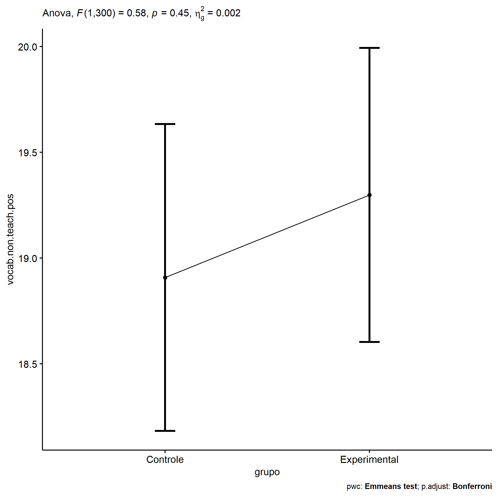<!-- -->

``` r
plots <- oneWayAncovaBoxPlots(
  wdat, "vocab.non.teach.pos", "grupo", aov, pwc, covar = "vocab.non.teach.pre",
  theme = "classic", color = color[["grupo"]],
  subtitle = which(aov$Effect == "grupo"))
```

``` r
if (length(unique(wdat[["grupo"]])) > 1)
  plots[["grupo"]] + ggplot2::ylab("Vocabulario Não Ensinado") + ggplot2::scale_x_discrete(labels=c('pre', 'pos'))
```

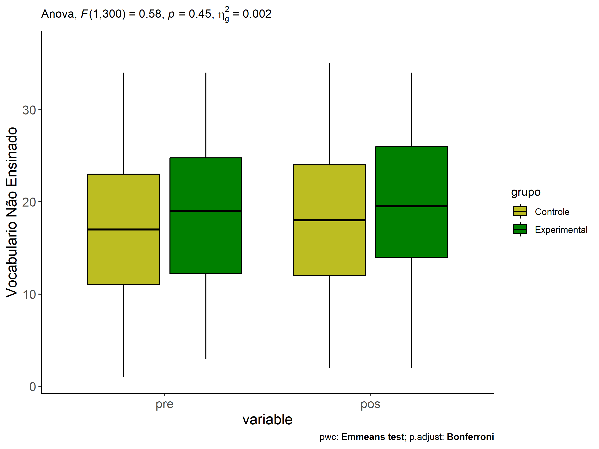<!-- -->

``` r
if (length(unique(wdat.long[["grupo"]])) > 1)
  plots <- oneWayAncovaBoxPlots(
    wdat.long, "vocab.non.teach", "grupo", aov, pwc.long, pre.post = "time",
    theme = "classic", color = color$prepost)
```

``` r
if (length(unique(wdat.long[["grupo"]])) > 1)
  plots[["grupo"]] + ggplot2::ylab("Vocabulario Não Ensinado")
```

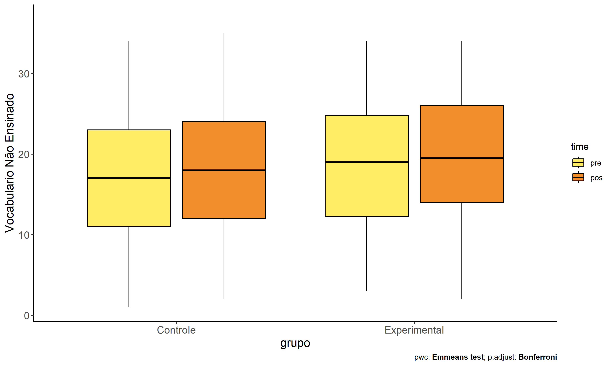<!-- -->

### Checking linearity assumption

``` r
ggscatter(wdat, x = "vocab.non.teach.pre", y = "vocab.non.teach.pos", size = 0.5,
          color = "grupo", add = "reg.line")+
  stat_regline_equation(
    aes(label =  paste(..eq.label.., ..rr.label.., sep = "~~~~"), color = grupo)
  )
```

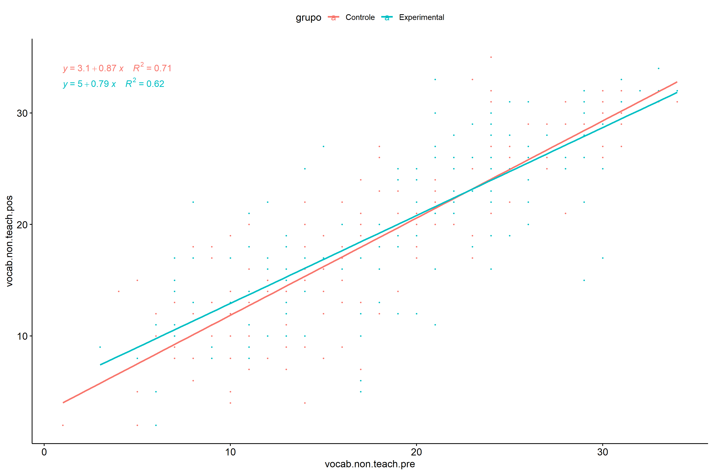<!-- -->

### Checking normality and homogeneity

``` r
res <- augment(lm(vocab.non.teach.pos ~ vocab.non.teach.pre + grupo, data = wdat))
```

``` r
shapiro_test(res$.resid)
```

    ## # A tibble: 1 × 3
    ##   variable   statistic p.value
    ##   <chr>          <dbl>   <dbl>
    ## 1 res$.resid     0.990  0.0364

``` r
levene_test(res, .resid ~ grupo)
```

    ## # A tibble: 1 × 4
    ##     df1   df2 statistic     p
    ##   <int> <int>     <dbl> <dbl>
    ## 1     1   301     0.621 0.431

# ANCOVA and Pairwise for two factors **grupo:Sexo**

## Without remove non-normal data

``` r
pdat = remove_group_data(dat[!is.na(dat[["grupo"]]) & !is.na(dat[["Sexo"]]),], "vocab.non.teach.pos", c("grupo","Sexo"))

pdat.long <- rbind(pdat[,c("id","grupo","Sexo")], pdat[,c("id","grupo","Sexo")])
pdat.long[["time"]] <- c(rep("pre", nrow(pdat)), rep("pos", nrow(pdat)))
pdat.long[["time"]] <- factor(pdat.long[["time"]], c("pre","pos"))
pdat.long[["vocab.non.teach"]] <- c(pdat[["vocab.non.teach.pre"]], pdat[["vocab.non.teach.pos"]])

aov = anova_test(pdat, vocab.non.teach.pos ~ vocab.non.teach.pre + grupo*Sexo)
laov[["grupo:Sexo"]] <- get_anova_table(aov)
```

``` r
pwcs <- list()
pwcs[["Sexo"]] <- emmeans_test(
  group_by(pdat, grupo), vocab.non.teach.pos ~ Sexo,
  covariate = vocab.non.teach.pre, p.adjust.method = "bonferroni")
pwcs[["grupo"]] <- emmeans_test(
  group_by(pdat, Sexo), vocab.non.teach.pos ~ grupo,
  covariate = vocab.non.teach.pre, p.adjust.method = "bonferroni")

pwc <- plyr::rbind.fill(pwcs[["grupo"]], pwcs[["Sexo"]])
pwc <- pwc[,c("grupo","Sexo", colnames(pwc)[!colnames(pwc) %in% c("grupo","Sexo")])]
```

``` r
pwc.long <- emmeans_test(dplyr::group_by_at(pdat.long, c("grupo","Sexo")),
                         vocab.non.teach ~ time,
                         p.adjust.method = "bonferroni")
lpwc[["grupo:Sexo"]] <- plyr::rbind.fill(pwc, pwc.long)
```

``` r
ds <- get.descriptives(pdat, "vocab.non.teach.pos", c("grupo","Sexo"), covar = "vocab.non.teach.pre")
ds <- merge(ds[ds$variable != "vocab.non.teach.pre",],
            ds[ds$variable == "vocab.non.teach.pre", !colnames(ds) %in% c("variable")],
            by = c("grupo","Sexo"), all.x = T, suffixes = c("", ".vocab.non.teach.pre"))
ds <- merge(get_emmeans(pwcs[["grupo"]]), ds, by = c("grupo","Sexo"), suffixes = c(".emms", ""))
ds <- ds[,c("grupo","Sexo","n","mean.vocab.non.teach.pre","se.vocab.non.teach.pre","mean","se","emmean","se.emms")]

colnames(ds) <- c("grupo","Sexo", "N", paste0(c("M","SE")," (pre)"),
                  paste0(c("M","SE"), " (unadj)"), paste0(c("M", "SE"), " (adj)"))

lemms[["grupo:Sexo"]] <- ds
```

## Computing ANCOVA and PairWise After removing non-normal data (OK)

``` r
wdat = pdat 

res = residuals(lm(vocab.non.teach.pos ~ vocab.non.teach.pre + grupo*Sexo, data = wdat))
non.normal = getNonNormal(res, wdat$id, plimit = 0.05)

wdat = wdat[!wdat$id %in% non.normal,]

wdat.long <- rbind(wdat[,c("id","grupo","Sexo")], wdat[,c("id","grupo","Sexo")])
wdat.long[["time"]] <- c(rep("pre", nrow(wdat)), rep("pos", nrow(wdat)))
wdat.long[["time"]] <- factor(wdat.long[["time"]], c("pre","pos"))
wdat.long[["vocab.non.teach"]] <- c(wdat[["vocab.non.teach.pre"]], wdat[["vocab.non.teach.pos"]])


ldat[["grupo:Sexo"]] = wdat

(non.normal)
```

    ## [1] "P852"  "P1790" "P2853" "P3473" "P2850" "P478"  "P1794" "P1620"

``` r
aov = anova_test(wdat, vocab.non.teach.pos ~ vocab.non.teach.pre + grupo*Sexo)
laov[["grupo:Sexo"]] <- merge(get_anova_table(aov), laov[["grupo:Sexo"]], by="Effect", suffixes = c("","'"))

(df = get_anova_table(aov))
```

    ## ANOVA Table (type II tests)
    ## 
    ##                Effect DFn DFd       F        p p<.05     ges
    ## 1 vocab.non.teach.pre   1 298 577.787 9.88e-72     * 0.66000
    ## 2               grupo   1 298   0.836 3.61e-01       0.00300
    ## 3                Sexo   1 298   7.084 8.00e-03     * 0.02300
    ## 4          grupo:Sexo   1 298   0.224 6.37e-01       0.00075

| Effect              | DFn | DFd |       F |     p | p\<.05 |   ges |
|:--------------------|----:|----:|--------:|------:|:-------|------:|
| vocab.non.teach.pre |   1 | 298 | 577.787 | 0.000 | \*     | 0.660 |
| grupo               |   1 | 298 |   0.836 | 0.361 |        | 0.003 |
| Sexo                |   1 | 298 |   7.084 | 0.008 | \*     | 0.023 |
| grupo:Sexo          |   1 | 298 |   0.224 | 0.637 |        | 0.001 |

``` r
pwcs <- list()
pwcs[["Sexo"]] <- emmeans_test(
  group_by(wdat, grupo), vocab.non.teach.pos ~ Sexo,
  covariate = vocab.non.teach.pre, p.adjust.method = "bonferroni")
pwcs[["grupo"]] <- emmeans_test(
  group_by(wdat, Sexo), vocab.non.teach.pos ~ grupo,
  covariate = vocab.non.teach.pre, p.adjust.method = "bonferroni")

pwc <- plyr::rbind.fill(pwcs[["grupo"]], pwcs[["Sexo"]])
pwc <- pwc[,c("grupo","Sexo", colnames(pwc)[!colnames(pwc) %in% c("grupo","Sexo")])]
```

| grupo        | Sexo | term                       | .y.                 | group1   | group2       |  df | statistic |     p | p.adj | p.adj.signif |
|:-------------|:-----|:---------------------------|:--------------------|:---------|:-------------|----:|----------:|------:|------:|:-------------|
|              | F    | vocab.non.teach.pre\*grupo | vocab.non.teach.pos | Controle | Experimental | 298 |    -0.296 | 0.767 | 0.767 | ns           |
|              | M    | vocab.non.teach.pre\*grupo | vocab.non.teach.pos | Controle | Experimental | 298 |    -0.987 | 0.325 | 0.325 | ns           |
| Controle     |      | vocab.non.teach.pre\*Sexo  | vocab.non.teach.pos | F        | M            | 298 |     2.194 | 0.029 | 0.029 | \*           |
| Experimental |      | vocab.non.teach.pre\*Sexo  | vocab.non.teach.pos | F        | M            | 298 |     1.608 | 0.109 | 0.109 | ns           |

``` r
pwc.long <- emmeans_test(dplyr::group_by_at(wdat.long, c("grupo","Sexo")),
                         vocab.non.teach ~ time,
                         p.adjust.method = "bonferroni")
lpwc[["grupo:Sexo"]] <- merge(plyr::rbind.fill(pwc, pwc.long), lpwc[["grupo:Sexo"]], by=c("grupo","Sexo","term",".y.","group1","group2"), suffixes = c("","'"))
```

| grupo        | Sexo | term | .y.             | group1 | group2 |  df | statistic |     p | p.adj | p.adj.signif |
|:-------------|:-----|:-----|:----------------|:-------|:-------|----:|----------:|------:|------:|:-------------|
| Controle     | F    | time | vocab.non.teach | pre    | pos    | 598 |    -1.130 | 0.259 | 0.259 | ns           |
| Controle     | M    | time | vocab.non.teach | pre    | pos    | 598 |    -0.264 | 0.792 | 0.792 | ns           |
| Experimental | F    | time | vocab.non.teach | pre    | pos    | 598 |    -1.289 | 0.198 | 0.198 | ns           |
| Experimental | M    | time | vocab.non.teach | pre    | pos    | 598 |    -0.657 | 0.511 | 0.511 | ns           |

``` r
ds <- get.descriptives(wdat, "vocab.non.teach.pos", c("grupo","Sexo"), covar = "vocab.non.teach.pre")
ds <- merge(ds[ds$variable != "vocab.non.teach.pre",],
            ds[ds$variable == "vocab.non.teach.pre", !colnames(ds) %in% c("variable")],
            by = c("grupo","Sexo"), all.x = T, suffixes = c("", ".vocab.non.teach.pre"))
ds <- merge(get_emmeans(pwcs[["grupo"]]), ds, by = c("grupo","Sexo"), suffixes = c(".emms", ""))
ds <- ds[,c("grupo","Sexo","n","mean.vocab.non.teach.pre","se.vocab.non.teach.pre","mean","se","emmean","se.emms")]

colnames(ds) <- c("grupo","Sexo", "N", paste0(c("M","SE")," (pre)"),
                  paste0(c("M","SE"), " (unadj)"), paste0(c("M", "SE"), " (adj)"))

lemms[["grupo:Sexo"]] <- merge(ds, lemms[["grupo:Sexo"]], by=c("grupo","Sexo"), suffixes = c("","'"))
```

| grupo        | Sexo |   N | M (pre) | SE (pre) | M (unadj) | SE (unadj) | M (adj) | SE (adj) |
|:-------------|:-----|----:|--------:|---------:|----------:|-----------:|--------:|---------:|
| Controle     | F    |  65 |  18.785 |    0.892 |    20.262 |      0.903 |  19.691 |    0.543 |
| Controle     | M    |  81 |  16.333 |    0.862 |    16.642 |      0.890 |  18.082 |    0.490 |
| Experimental | F    |  82 |  19.854 |    0.837 |    21.354 |      0.838 |  19.906 |    0.487 |
| Experimental | M    |  75 |  17.453 |    0.813 |    18.253 |      0.802 |  18.775 |    0.506 |

### Plots for ancova

``` r
plots <- twoWayAncovaPlots(
  wdat, "vocab.non.teach.pos", c("grupo","Sexo"), aov, pwcs, addParam = c("mean_se"),
  font.label.size=10, step.increase=0.05, p.label="p.adj",
  subtitle = which(aov$Effect == "grupo:Sexo"))
```

``` r
if (!is.null(plots[["grupo"]]))
  plots[["grupo"]] + ggplot2::scale_color_manual(values = color[["Sexo"]])
```

    ## Scale for colour is already present.
    ## Adding another scale for colour, which will replace the existing scale.

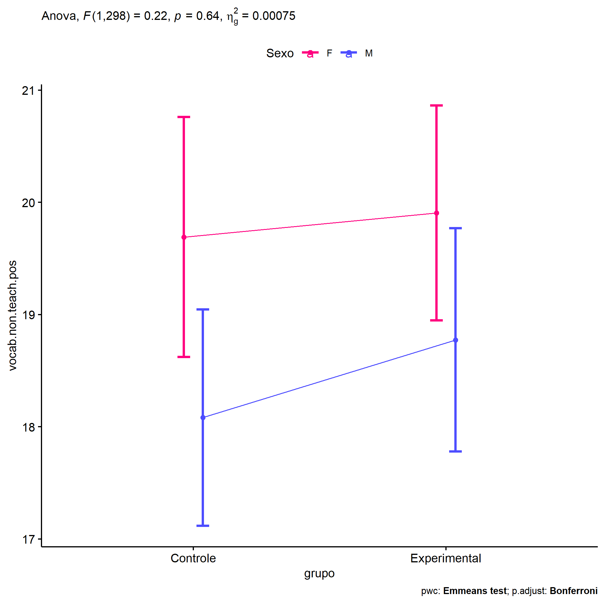<!-- -->

``` r
if (!is.null(plots[["Sexo"]]))
  plots[["Sexo"]] + ggplot2::scale_color_manual(values = color[["grupo"]])
```

    ## Scale for colour is already present.
    ## Adding another scale for colour, which will replace the existing scale.

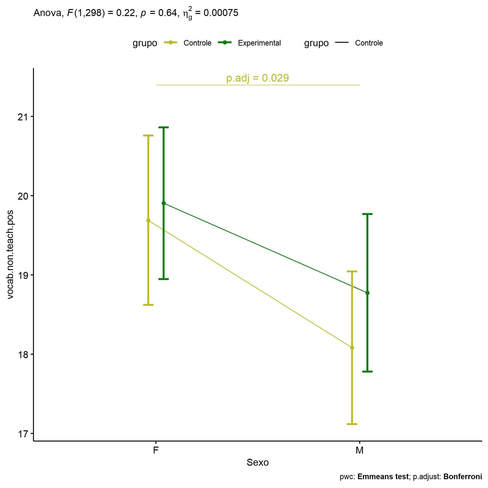<!-- -->

``` r
plots <- twoWayAncovaBoxPlots(
  wdat, "vocab.non.teach.pos", c("grupo","Sexo"), aov, pwcs, covar = "vocab.non.teach.pre",
  theme = "classic", color = color[["grupo:Sexo"]],
  subtitle = which(aov$Effect == "grupo:Sexo"))
```

``` r
plots[["grupo:Sexo"]] + ggplot2::ylab("Vocabulario Não Ensinado") + ggplot2::scale_x_discrete(labels=c('pre', 'pos'))
```

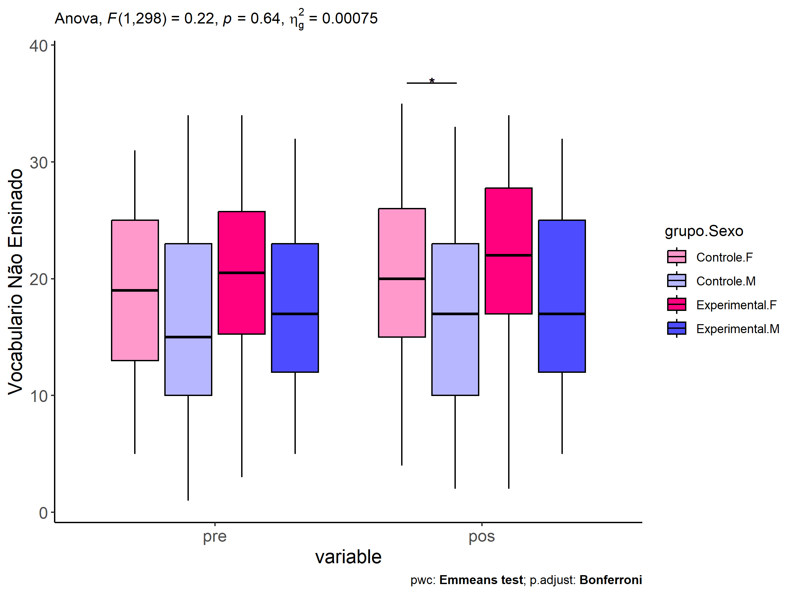<!-- -->

``` r
plots <- twoWayAncovaBoxPlots(
  wdat.long, "vocab.non.teach", c("grupo","Sexo"), aov, pwc.long, pre.post = "time",
  theme = "classic", color = color$prepost)
```

``` r
plots[["grupo:Sexo"]] + ggplot2::ylab("Vocabulario Não Ensinado")
```

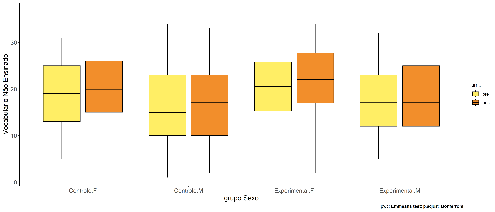<!-- -->

### Checking linearity assumption

``` r
ggscatter(wdat, x = "vocab.non.teach.pre", y = "vocab.non.teach.pos", size = 0.5,
          facet.by = c("grupo","Sexo"), add = "reg.line")+
  stat_regline_equation(
    aes(label =  paste(..eq.label.., ..rr.label.., sep = "~~~~"))
  )
```

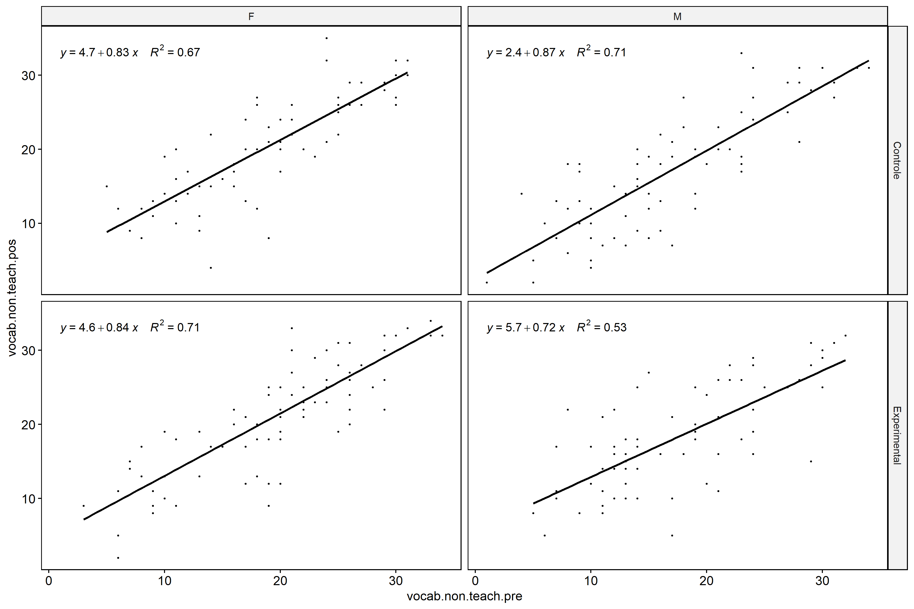<!-- -->

### Checking normality and homogeneity

``` r
res <- augment(lm(vocab.non.teach.pos ~ vocab.non.teach.pre + grupo*Sexo, data = wdat))
```

``` r
shapiro_test(res$.resid)
```

    ## # A tibble: 1 × 3
    ##   variable   statistic p.value
    ##   <chr>          <dbl>   <dbl>
    ## 1 res$.resid     0.990  0.0452

``` r
levene_test(res, .resid ~ grupo*Sexo)
```

    ## # A tibble: 1 × 4
    ##     df1   df2 statistic     p
    ##   <int> <int>     <dbl> <dbl>
    ## 1     3   299     0.769 0.512

# ANCOVA and Pairwise for two factors **grupo:Zona**

## Without remove non-normal data

``` r
pdat = remove_group_data(dat[!is.na(dat[["grupo"]]) & !is.na(dat[["Zona"]]),], "vocab.non.teach.pos", c("grupo","Zona"))

pdat.long <- rbind(pdat[,c("id","grupo","Zona")], pdat[,c("id","grupo","Zona")])
pdat.long[["time"]] <- c(rep("pre", nrow(pdat)), rep("pos", nrow(pdat)))
pdat.long[["time"]] <- factor(pdat.long[["time"]], c("pre","pos"))
pdat.long[["vocab.non.teach"]] <- c(pdat[["vocab.non.teach.pre"]], pdat[["vocab.non.teach.pos"]])

aov = anova_test(pdat, vocab.non.teach.pos ~ vocab.non.teach.pre + grupo*Zona)
laov[["grupo:Zona"]] <- get_anova_table(aov)
```

``` r
pwcs <- list()
pwcs[["Zona"]] <- emmeans_test(
  group_by(pdat, grupo), vocab.non.teach.pos ~ Zona,
  covariate = vocab.non.teach.pre, p.adjust.method = "bonferroni")
pwcs[["grupo"]] <- emmeans_test(
  group_by(pdat, Zona), vocab.non.teach.pos ~ grupo,
  covariate = vocab.non.teach.pre, p.adjust.method = "bonferroni")

pwc <- plyr::rbind.fill(pwcs[["grupo"]], pwcs[["Zona"]])
pwc <- pwc[,c("grupo","Zona", colnames(pwc)[!colnames(pwc) %in% c("grupo","Zona")])]
```

``` r
pwc.long <- emmeans_test(dplyr::group_by_at(pdat.long, c("grupo","Zona")),
                         vocab.non.teach ~ time,
                         p.adjust.method = "bonferroni")
lpwc[["grupo:Zona"]] <- plyr::rbind.fill(pwc, pwc.long)
```

``` r
ds <- get.descriptives(pdat, "vocab.non.teach.pos", c("grupo","Zona"), covar = "vocab.non.teach.pre")
ds <- merge(ds[ds$variable != "vocab.non.teach.pre",],
            ds[ds$variable == "vocab.non.teach.pre", !colnames(ds) %in% c("variable")],
            by = c("grupo","Zona"), all.x = T, suffixes = c("", ".vocab.non.teach.pre"))
ds <- merge(get_emmeans(pwcs[["grupo"]]), ds, by = c("grupo","Zona"), suffixes = c(".emms", ""))
ds <- ds[,c("grupo","Zona","n","mean.vocab.non.teach.pre","se.vocab.non.teach.pre","mean","se","emmean","se.emms")]

colnames(ds) <- c("grupo","Zona", "N", paste0(c("M","SE")," (pre)"),
                  paste0(c("M","SE"), " (unadj)"), paste0(c("M", "SE"), " (adj)"))

lemms[["grupo:Zona"]] <- ds
```

## Computing ANCOVA and PairWise After removing non-normal data (OK)

``` r
wdat = pdat 

res = residuals(lm(vocab.non.teach.pos ~ vocab.non.teach.pre + grupo*Zona, data = wdat))
non.normal = getNonNormal(res, wdat$id, plimit = 0.05)

wdat = wdat[!wdat$id %in% non.normal,]

wdat.long <- rbind(wdat[,c("id","grupo","Zona")], wdat[,c("id","grupo","Zona")])
wdat.long[["time"]] <- c(rep("pre", nrow(wdat)), rep("pos", nrow(wdat)))
wdat.long[["time"]] <- factor(wdat.long[["time"]], c("pre","pos"))
wdat.long[["vocab.non.teach"]] <- c(wdat[["vocab.non.teach.pre"]], wdat[["vocab.non.teach.pos"]])


ldat[["grupo:Zona"]] = wdat

(non.normal)
```

    ## [1] "P852"  "P3473" "P3499" "P2856"

``` r
aov = anova_test(wdat, vocab.non.teach.pos ~ vocab.non.teach.pre + grupo*Zona)
laov[["grupo:Zona"]] <- merge(get_anova_table(aov), laov[["grupo:Zona"]], by="Effect", suffixes = c("","'"))

(df = get_anova_table(aov))
```

    ## ANOVA Table (type II tests)
    ## 
    ##                Effect DFn DFd       F        p p<.05      ges
    ## 1 vocab.non.teach.pre   1 239 414.802 3.83e-54     * 6.34e-01
    ## 2               grupo   1 239   0.013 9.10e-01       5.34e-05
    ## 3                Zona   1 239   0.891 3.46e-01       4.00e-03
    ## 4          grupo:Zona   1 239   0.047 8.29e-01       1.96e-04

| Effect              | DFn | DFd |       F |     p | p\<.05 |   ges |
|:--------------------|----:|----:|--------:|------:|:-------|------:|
| vocab.non.teach.pre |   1 | 239 | 414.802 | 0.000 | \*     | 0.634 |
| grupo               |   1 | 239 |   0.013 | 0.910 |        | 0.000 |
| Zona                |   1 | 239 |   0.891 | 0.346 |        | 0.004 |
| grupo:Zona          |   1 | 239 |   0.047 | 0.829 |        | 0.000 |

``` r
pwcs <- list()
pwcs[["Zona"]] <- emmeans_test(
  group_by(wdat, grupo), vocab.non.teach.pos ~ Zona,
  covariate = vocab.non.teach.pre, p.adjust.method = "bonferroni")
pwcs[["grupo"]] <- emmeans_test(
  group_by(wdat, Zona), vocab.non.teach.pos ~ grupo,
  covariate = vocab.non.teach.pre, p.adjust.method = "bonferroni")

pwc <- plyr::rbind.fill(pwcs[["grupo"]], pwcs[["Zona"]])
pwc <- pwc[,c("grupo","Zona", colnames(pwc)[!colnames(pwc) %in% c("grupo","Zona")])]
```

| grupo        | Zona   | term                       | .y.                 | group1   | group2       |  df | statistic |     p | p.adj | p.adj.signif |
|:-------------|:-------|:---------------------------|:--------------------|:---------|:-------------|----:|----------:|------:|------:|:-------------|
|              | Rural  | vocab.non.teach.pre\*grupo | vocab.non.teach.pos | Controle | Experimental | 239 |     0.014 | 0.989 | 0.989 | ns           |
|              | Urbana | vocab.non.teach.pre\*grupo | vocab.non.teach.pos | Controle | Experimental | 239 |    -0.244 | 0.808 | 0.808 | ns           |
| Controle     |        | vocab.non.teach.pre\*Zona  | vocab.non.teach.pos | Rural    | Urbana       | 239 |    -0.483 | 0.630 | 0.630 | ns           |
| Experimental |        | vocab.non.teach.pre\*Zona  | vocab.non.teach.pos | Rural    | Urbana       | 239 |    -0.841 | 0.401 | 0.401 | ns           |

``` r
pwc.long <- emmeans_test(dplyr::group_by_at(wdat.long, c("grupo","Zona")),
                         vocab.non.teach ~ time,
                         p.adjust.method = "bonferroni")
lpwc[["grupo:Zona"]] <- merge(plyr::rbind.fill(pwc, pwc.long), lpwc[["grupo:Zona"]], by=c("grupo","Zona","term",".y.","group1","group2"), suffixes = c("","'"))
```

| grupo        | Zona   | term | .y.             | group1 | group2 |  df | statistic |     p | p.adj | p.adj.signif |
|:-------------|:-------|:-----|:----------------|:-------|:-------|----:|----------:|------:|------:|:-------------|
| Controle     | Rural  | time | vocab.non.teach | pre    | pos    | 480 |    -0.732 | 0.464 | 0.464 | ns           |
| Controle     | Urbana | time | vocab.non.teach | pre    | pos    | 480 |    -0.518 | 0.605 | 0.605 | ns           |
| Experimental | Rural  | time | vocab.non.teach | pre    | pos    | 480 |    -0.715 | 0.475 | 0.475 | ns           |
| Experimental | Urbana | time | vocab.non.teach | pre    | pos    | 480 |    -0.683 | 0.495 | 0.495 | ns           |

``` r
ds <- get.descriptives(wdat, "vocab.non.teach.pos", c("grupo","Zona"), covar = "vocab.non.teach.pre")
ds <- merge(ds[ds$variable != "vocab.non.teach.pre",],
            ds[ds$variable == "vocab.non.teach.pre", !colnames(ds) %in% c("variable")],
            by = c("grupo","Zona"), all.x = T, suffixes = c("", ".vocab.non.teach.pre"))
ds <- merge(get_emmeans(pwcs[["grupo"]]), ds, by = c("grupo","Zona"), suffixes = c(".emms", ""))
ds <- ds[,c("grupo","Zona","n","mean.vocab.non.teach.pre","se.vocab.non.teach.pre","mean","se","emmean","se.emms")]

colnames(ds) <- c("grupo","Zona", "N", paste0(c("M","SE")," (pre)"),
                  paste0(c("M","SE"), " (unadj)"), paste0(c("M", "SE"), " (adj)"))

lemms[["grupo:Zona"]] <- merge(ds, lemms[["grupo:Zona"]], by=c("grupo","Zona"), suffixes = c("","'"))
```

| grupo        | Zona   |   N | M (pre) | SE (pre) | M (unadj) | SE (unadj) | M (adj) | SE (adj) |
|:-------------|:-------|----:|--------:|---------:|----------:|-----------:|--------:|---------:|
| Controle     | Rural  |  96 |  18.073 |    0.741 |    18.865 |      0.818 |  19.126 |    0.466 |
| Controle     | Urbana |  28 |  19.250 |    1.684 |    20.286 |      1.433 |  19.599 |    0.863 |
| Experimental | Rural  |  83 |  17.819 |    0.778 |    18.651 |      0.749 |  19.116 |    0.501 |
| Experimental | Urbana |  37 |  19.892 |    1.240 |    21.081 |      1.264 |  19.878 |    0.752 |

### Plots for ancova

``` r
plots <- twoWayAncovaPlots(
  wdat, "vocab.non.teach.pos", c("grupo","Zona"), aov, pwcs, addParam = c("mean_se"),
  font.label.size=10, step.increase=0.05, p.label="p.adj",
  subtitle = which(aov$Effect == "grupo:Zona"))
```

``` r
if (!is.null(plots[["grupo"]]))
  plots[["grupo"]] + ggplot2::scale_color_manual(values = color[["Zona"]])
```

    ## Scale for colour is already present.
    ## Adding another scale for colour, which will replace the existing scale.

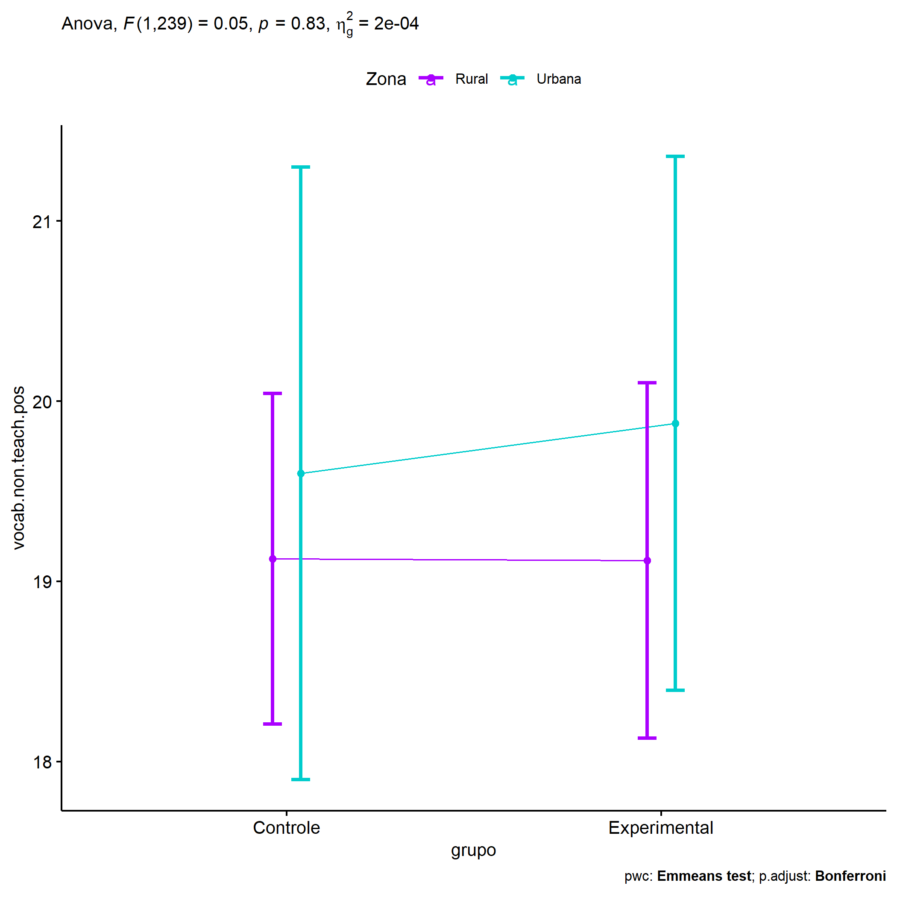<!-- -->

``` r
if (!is.null(plots[["Zona"]]))
  plots[["Zona"]] + ggplot2::scale_color_manual(values = color[["grupo"]])
```

    ## Scale for colour is already present.
    ## Adding another scale for colour, which will replace the existing scale.

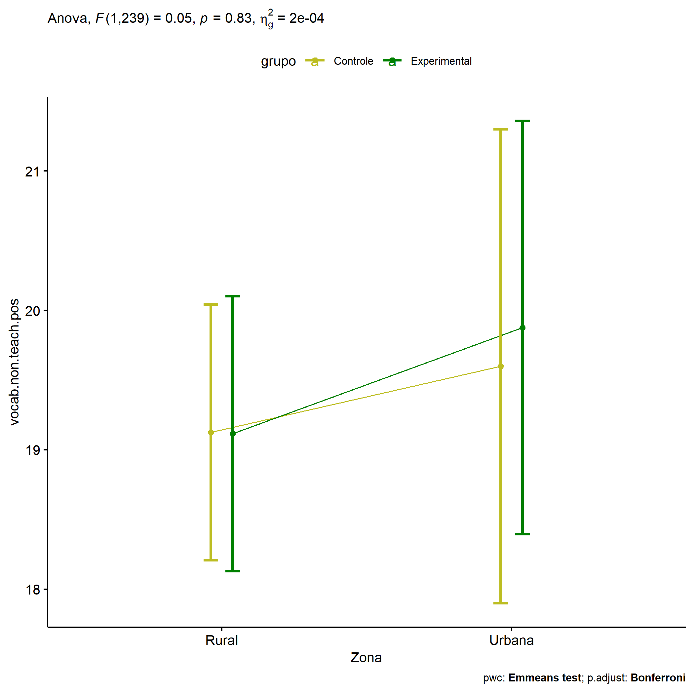<!-- -->

``` r
plots <- twoWayAncovaBoxPlots(
  wdat, "vocab.non.teach.pos", c("grupo","Zona"), aov, pwcs, covar = "vocab.non.teach.pre",
  theme = "classic", color = color[["grupo:Zona"]],
  subtitle = which(aov$Effect == "grupo:Zona"))
```

``` r
plots[["grupo:Zona"]] + ggplot2::ylab("Vocabulario Não Ensinado") + ggplot2::scale_x_discrete(labels=c('pre', 'pos'))
```

<!-- -->

``` r
plots <- twoWayAncovaBoxPlots(
  wdat.long, "vocab.non.teach", c("grupo","Zona"), aov, pwc.long, pre.post = "time",
  theme = "classic", color = color$prepost)
```

``` r
plots[["grupo:Zona"]] + ggplot2::ylab("Vocabulario Não Ensinado")
```

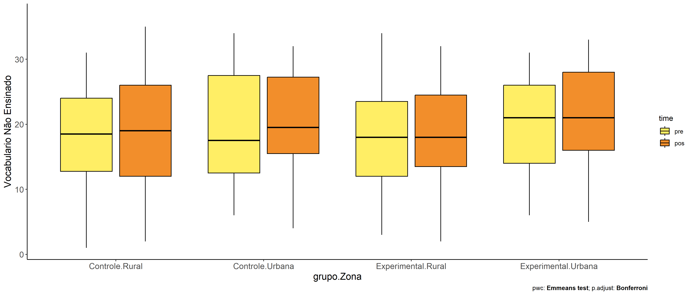<!-- -->

### Checking linearity assumption

``` r
ggscatter(wdat, x = "vocab.non.teach.pre", y = "vocab.non.teach.pos", size = 0.5,
          facet.by = c("grupo","Zona"), add = "reg.line")+
  stat_regline_equation(
    aes(label =  paste(..eq.label.., ..rr.label.., sep = "~~~~"))
  )
```

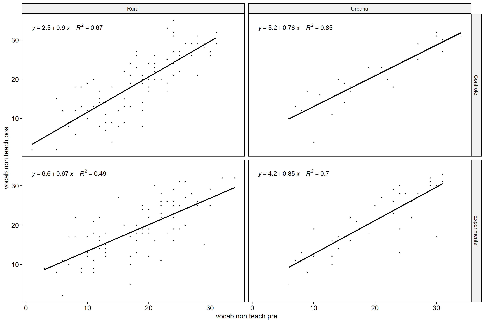<!-- -->

### Checking normality and homogeneity

``` r
res <- augment(lm(vocab.non.teach.pos ~ vocab.non.teach.pre + grupo*Zona, data = wdat))
```

``` r
shapiro_test(res$.resid)
```

    ## # A tibble: 1 × 3
    ##   variable   statistic p.value
    ##   <chr>          <dbl>   <dbl>
    ## 1 res$.resid     0.988  0.0438

``` r
levene_test(res, .resid ~ grupo*Zona)
```

    ## # A tibble: 1 × 4
    ##     df1   df2 statistic      p
    ##   <int> <int>     <dbl>  <dbl>
    ## 1     3   240      2.61 0.0520

# ANCOVA and Pairwise for two factors **grupo:Cor.Raca**

## Without remove non-normal data

``` r
pdat = remove_group_data(dat[!is.na(dat[["grupo"]]) & !is.na(dat[["Cor.Raca"]]),], "vocab.non.teach.pos", c("grupo","Cor.Raca"))
```

    ## Warning: There were 2 warnings in `mutate()`.
    ## The first warning was:
    ## ℹ In argument: `ci = abs(stats::qt(alpha/2, .data$n - 1) * .data$se)`.
    ## Caused by warning:
    ## ! There was 1 warning in `mutate()`.
    ## ℹ In argument: `ci = abs(stats::qt(alpha/2, .data$n - 1) * .data$se)`.
    ## Caused by warning in `stats::qt()`:
    ## ! NaNs produced
    ## ℹ Run `dplyr::last_dplyr_warnings()` to see the 1 remaining warning.

``` r
pdat.long <- rbind(pdat[,c("id","grupo","Cor.Raca")], pdat[,c("id","grupo","Cor.Raca")])
pdat.long[["time"]] <- c(rep("pre", nrow(pdat)), rep("pos", nrow(pdat)))
pdat.long[["time"]] <- factor(pdat.long[["time"]], c("pre","pos"))
pdat.long[["vocab.non.teach"]] <- c(pdat[["vocab.non.teach.pre"]], pdat[["vocab.non.teach.pos"]])

aov = anova_test(pdat, vocab.non.teach.pos ~ vocab.non.teach.pre + grupo*Cor.Raca)
laov[["grupo:Cor.Raca"]] <- get_anova_table(aov)
```

``` r
pwcs <- list()
pwcs[["Cor.Raca"]] <- emmeans_test(
  group_by(pdat, grupo), vocab.non.teach.pos ~ Cor.Raca,
  covariate = vocab.non.teach.pre, p.adjust.method = "bonferroni")
pwcs[["grupo"]] <- emmeans_test(
  group_by(pdat, Cor.Raca), vocab.non.teach.pos ~ grupo,
  covariate = vocab.non.teach.pre, p.adjust.method = "bonferroni")

pwc <- plyr::rbind.fill(pwcs[["grupo"]], pwcs[["Cor.Raca"]])
pwc <- pwc[,c("grupo","Cor.Raca", colnames(pwc)[!colnames(pwc) %in% c("grupo","Cor.Raca")])]
```

``` r
pwc.long <- emmeans_test(dplyr::group_by_at(pdat.long, c("grupo","Cor.Raca")),
                         vocab.non.teach ~ time,
                         p.adjust.method = "bonferroni")
lpwc[["grupo:Cor.Raca"]] <- plyr::rbind.fill(pwc, pwc.long)
```

``` r
ds <- get.descriptives(pdat, "vocab.non.teach.pos", c("grupo","Cor.Raca"), covar = "vocab.non.teach.pre")
ds <- merge(ds[ds$variable != "vocab.non.teach.pre",],
            ds[ds$variable == "vocab.non.teach.pre", !colnames(ds) %in% c("variable")],
            by = c("grupo","Cor.Raca"), all.x = T, suffixes = c("", ".vocab.non.teach.pre"))
ds <- merge(get_emmeans(pwcs[["grupo"]]), ds, by = c("grupo","Cor.Raca"), suffixes = c(".emms", ""))
ds <- ds[,c("grupo","Cor.Raca","n","mean.vocab.non.teach.pre","se.vocab.non.teach.pre","mean","se","emmean","se.emms")]

colnames(ds) <- c("grupo","Cor.Raca", "N", paste0(c("M","SE")," (pre)"),
                  paste0(c("M","SE"), " (unadj)"), paste0(c("M", "SE"), " (adj)"))

lemms[["grupo:Cor.Raca"]] <- ds
```

## Computing ANCOVA and PairWise After removing non-normal data (OK)

``` r
wdat = pdat 

res = residuals(lm(vocab.non.teach.pos ~ vocab.non.teach.pre + grupo*Cor.Raca, data = wdat))
non.normal = getNonNormal(res, wdat$id, plimit = 0.05)

wdat = wdat[!wdat$id %in% non.normal,]

wdat.long <- rbind(wdat[,c("id","grupo","Cor.Raca")], wdat[,c("id","grupo","Cor.Raca")])
wdat.long[["time"]] <- c(rep("pre", nrow(wdat)), rep("pos", nrow(wdat)))
wdat.long[["time"]] <- factor(wdat.long[["time"]], c("pre","pos"))
wdat.long[["vocab.non.teach"]] <- c(wdat[["vocab.non.teach.pre"]], wdat[["vocab.non.teach.pos"]])


ldat[["grupo:Cor.Raca"]] = wdat

(non.normal)
```

    ## NULL

``` r
aov = anova_test(wdat, vocab.non.teach.pos ~ vocab.non.teach.pre + grupo*Cor.Raca)
laov[["grupo:Cor.Raca"]] <- merge(get_anova_table(aov), laov[["grupo:Cor.Raca"]], by="Effect", suffixes = c("","'"))

(df = get_anova_table(aov))
```

    ## ANOVA Table (type II tests)
    ## 
    ##                Effect DFn DFd       F        p p<.05   ges
    ## 1 vocab.non.teach.pre   1 133 204.336 1.16e-28     * 0.606
    ## 2               grupo   1 133   0.327 5.68e-01       0.002
    ## 3            Cor.Raca   2 133   1.054 3.52e-01       0.016
    ## 4      grupo:Cor.Raca   1 133   1.447 2.31e-01       0.011

| Effect              | DFn | DFd |       F |     p | p\<.05 |   ges |
|:--------------------|----:|----:|--------:|------:|:-------|------:|
| vocab.non.teach.pre |   1 | 133 | 204.336 | 0.000 | \*     | 0.606 |
| grupo               |   1 | 133 |   0.327 | 0.568 |        | 0.002 |
| Cor.Raca            |   2 | 133 |   1.054 | 0.352 |        | 0.016 |
| grupo:Cor.Raca      |   1 | 133 |   1.447 | 0.231 |        | 0.011 |

``` r
pwcs <- list()
pwcs[["Cor.Raca"]] <- emmeans_test(
  group_by(wdat, grupo), vocab.non.teach.pos ~ Cor.Raca,
  covariate = vocab.non.teach.pre, p.adjust.method = "bonferroni")
pwcs[["grupo"]] <- emmeans_test(
  group_by(wdat, Cor.Raca), vocab.non.teach.pos ~ grupo,
  covariate = vocab.non.teach.pre, p.adjust.method = "bonferroni")

pwc <- plyr::rbind.fill(pwcs[["grupo"]], pwcs[["Cor.Raca"]])
pwc <- pwc[,c("grupo","Cor.Raca", colnames(pwc)[!colnames(pwc) %in% c("grupo","Cor.Raca")])]
```

| grupo        | Cor.Raca | term                          | .y.                 | group1   | group2       |  df | statistic |     p | p.adj | p.adj.signif |
|:-------------|:---------|:------------------------------|:--------------------|:---------|:-------------|----:|----------:|------:|------:|:-------------|
|              | Branca   | vocab.non.teach.pre\*grupo    | vocab.non.teach.pos | Controle | Experimental | 133 |     0.674 | 0.501 | 0.501 | ns           |
|              | Indígena | vocab.non.teach.pre\*grupo    | vocab.non.teach.pos | Controle | Experimental |     |           |       |       |              |
|              | Parda    | vocab.non.teach.pre\*grupo    | vocab.non.teach.pos | Controle | Experimental | 133 |    -1.148 | 0.253 | 0.253 | ns           |
| Controle     |          | vocab.non.teach.pre\*Cor.Raca | vocab.non.teach.pos | Branca   | Indígena     |     |           |       |       |              |
| Controle     |          | vocab.non.teach.pre\*Cor.Raca | vocab.non.teach.pos | Branca   | Parda        | 133 |     0.012 | 0.991 | 0.991 | ns           |
| Controle     |          | vocab.non.teach.pre\*Cor.Raca | vocab.non.teach.pos | Indígena | Parda        |     |           |       |       |              |
| Experimental |          | vocab.non.teach.pre\*Cor.Raca | vocab.non.teach.pos | Branca   | Indígena     | 133 |    -1.691 | 0.093 | 0.280 | ns           |
| Experimental |          | vocab.non.teach.pre\*Cor.Raca | vocab.non.teach.pos | Branca   | Parda        | 133 |    -1.629 | 0.106 | 0.317 | ns           |
| Experimental |          | vocab.non.teach.pre\*Cor.Raca | vocab.non.teach.pos | Indígena | Parda        | 133 |     0.509 | 0.611 | 1.000 | ns           |

``` r
pwc.long <- emmeans_test(dplyr::group_by_at(wdat.long, c("grupo","Cor.Raca")),
                         vocab.non.teach ~ time,
                         p.adjust.method = "bonferroni")
lpwc[["grupo:Cor.Raca"]] <- merge(plyr::rbind.fill(pwc, pwc.long), lpwc[["grupo:Cor.Raca"]], by=c("grupo","Cor.Raca","term",".y.","group1","group2"), suffixes = c("","'"))
```

| grupo        | Cor.Raca | term | .y.             | group1 | group2 |  df | statistic |     p | p.adj | p.adj.signif |
|:-------------|:---------|:-----|:----------------|:-------|:-------|----:|----------:|------:|------:|:-------------|
| Controle     | Branca   | time | vocab.non.teach | pre    | pos    | 268 |    -0.102 | 0.919 | 0.919 | ns           |
| Controle     | Indígena | time | vocab.non.teach | pre    | pos    |     |           |       |       |              |
| Controle     | Parda    | time | vocab.non.teach | pre    | pos    | 268 |    -0.311 | 0.756 | 0.756 | ns           |
| Experimental | Branca   | time | vocab.non.teach | pre    | pos    | 268 |     0.430 | 0.668 | 0.668 | ns           |
| Experimental | Indígena | time | vocab.non.teach | pre    | pos    | 268 |    -0.878 | 0.381 | 0.381 | ns           |
| Experimental | Parda    | time | vocab.non.teach | pre    | pos    | 268 |    -1.027 | 0.306 | 0.306 | ns           |

``` r
ds <- get.descriptives(wdat, "vocab.non.teach.pos", c("grupo","Cor.Raca"), covar = "vocab.non.teach.pre")
ds <- merge(ds[ds$variable != "vocab.non.teach.pre",],
            ds[ds$variable == "vocab.non.teach.pre", !colnames(ds) %in% c("variable")],
            by = c("grupo","Cor.Raca"), all.x = T, suffixes = c("", ".vocab.non.teach.pre"))
ds <- merge(get_emmeans(pwcs[["grupo"]]), ds, by = c("grupo","Cor.Raca"), suffixes = c(".emms", ""))
ds <- ds[,c("grupo","Cor.Raca","n","mean.vocab.non.teach.pre","se.vocab.non.teach.pre","mean","se","emmean","se.emms")]

colnames(ds) <- c("grupo","Cor.Raca", "N", paste0(c("M","SE")," (pre)"),
                  paste0(c("M","SE"), " (unadj)"), paste0(c("M", "SE"), " (adj)"))

lemms[["grupo:Cor.Raca"]] <- merge(ds, lemms[["grupo:Cor.Raca"]], by=c("grupo","Cor.Raca"), suffixes = c("","'"))
```

| grupo        | Cor.Raca |   N | M (pre) | SE (pre) | M (unadj) | SE (unadj) | M (adj) | SE (adj) |
|:-------------|:---------|----:|--------:|---------:|----------:|-----------:|--------:|---------:|
| Controle     | Branca   |  22 |  19.227 |    1.331 |    19.455 |      1.552 |  18.647 |    1.029 |
| Controle     | Parda    |  42 |  17.429 |    1.202 |    17.929 |      1.279 |  18.632 |    0.746 |
| Experimental | Branca   |  18 |  20.778 |    1.560 |    19.722 |      2.175 |  17.612 |    1.146 |
| Experimental | Indígena |  13 |  17.000 |    1.941 |    19.538 |      2.027 |  20.602 |    1.339 |
| Experimental | Parda    |  44 |  17.932 |    1.051 |    19.545 |      0.980 |  19.826 |    0.727 |

### Plots for ancova

``` r
plots <- twoWayAncovaPlots(
  wdat, "vocab.non.teach.pos", c("grupo","Cor.Raca"), aov, pwcs, addParam = c("mean_se"),
  font.label.size=10, step.increase=0.05, p.label="p.adj",
  subtitle = which(aov$Effect == "grupo:Cor.Raca"))
```

``` r
if (!is.null(plots[["grupo"]]))
  plots[["grupo"]] + ggplot2::scale_color_manual(values = color[["Cor.Raca"]])
```

<!-- -->

``` r
if (!is.null(plots[["Cor.Raca"]]))
  plots[["Cor.Raca"]] + ggplot2::scale_color_manual(values = color[["grupo"]])
```

    ## Scale for colour is already present.
    ## Adding another scale for colour, which will replace the existing scale.

    ## Warning: Removed 2 rows containing non-finite values (`stat_bracket()`).

    ## Warning: Removed 1 rows containing missing values (`geom_point()`).

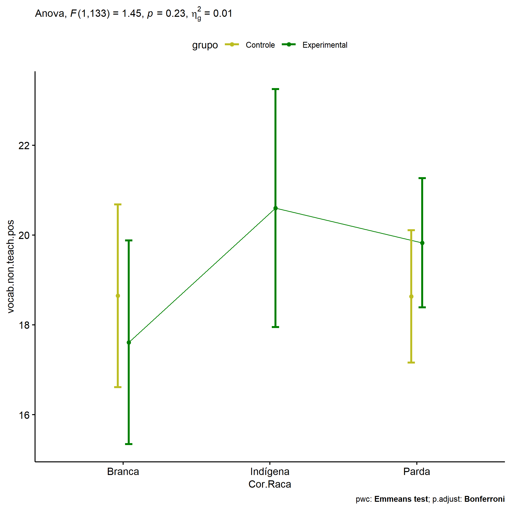<!-- -->

``` r
plots <- twoWayAncovaBoxPlots(
  wdat, "vocab.non.teach.pos", c("grupo","Cor.Raca"), aov, pwcs, covar = "vocab.non.teach.pre",
  theme = "classic", color = color[["grupo:Cor.Raca"]],
  subtitle = which(aov$Effect == "grupo:Cor.Raca"))
```

``` r
plots[["grupo:Cor.Raca"]] + ggplot2::ylab("Vocabulario Não Ensinado") + ggplot2::scale_x_discrete(labels=c('pre', 'pos'))
```

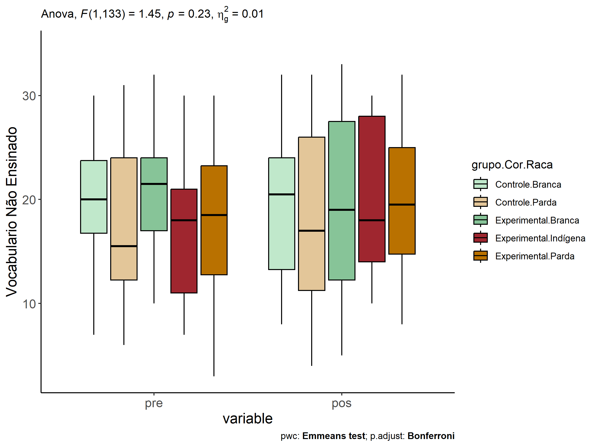<!-- -->

``` r
plots <- twoWayAncovaBoxPlots(
  wdat.long, "vocab.non.teach", c("grupo","Cor.Raca"), aov, pwc.long, pre.post = "time",
  theme = "classic", color = color$prepost)
```

``` r
plots[["grupo:Cor.Raca"]] + ggplot2::ylab("Vocabulario Não Ensinado")
```

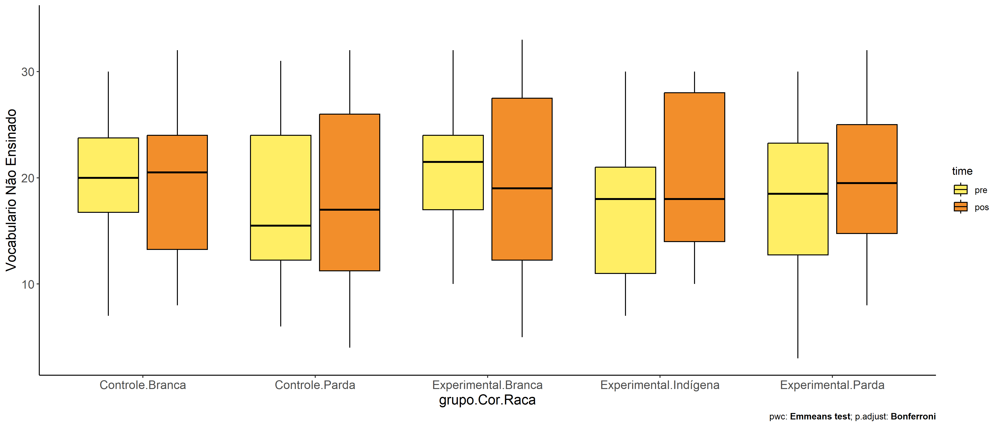<!-- -->

### Checking linearity assumption

``` r
ggscatter(wdat, x = "vocab.non.teach.pre", y = "vocab.non.teach.pos", size = 0.5,
          facet.by = c("grupo","Cor.Raca"), add = "reg.line")+
  stat_regline_equation(
    aes(label =  paste(..eq.label.., ..rr.label.., sep = "~~~~"))
  )
```

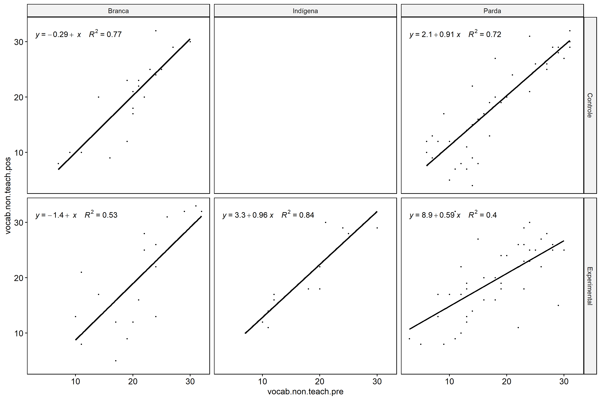<!-- -->

### Checking normality and homogeneity

``` r
res <- augment(lm(vocab.non.teach.pos ~ vocab.non.teach.pre + grupo*Cor.Raca, data = wdat))
```

``` r
shapiro_test(res$.resid)
```

    ## # A tibble: 1 × 3
    ##   variable   statistic p.value
    ##   <chr>          <dbl>   <dbl>
    ## 1 res$.resid     0.981  0.0542

``` r
levene_test(res, .resid ~ grupo*Cor.Raca)
```

    ## # A tibble: 1 × 4
    ##     df1   df2 statistic      p
    ##   <int> <int>     <dbl>  <dbl>
    ## 1     4   134      2.32 0.0598

# ANCOVA and Pairwise for two factors **grupo:vocab.non.teach.quintile**

## Without remove non-normal data

``` r
pdat = remove_group_data(dat[!is.na(dat[["grupo"]]) & !is.na(dat[["vocab.non.teach.quintile"]]),], "vocab.non.teach.pos", c("grupo","vocab.non.teach.quintile"))

pdat.long <- rbind(pdat[,c("id","grupo","vocab.non.teach.quintile")], pdat[,c("id","grupo","vocab.non.teach.quintile")])
pdat.long[["time"]] <- c(rep("pre", nrow(pdat)), rep("pos", nrow(pdat)))
pdat.long[["time"]] <- factor(pdat.long[["time"]], c("pre","pos"))
pdat.long[["vocab.non.teach"]] <- c(pdat[["vocab.non.teach.pre"]], pdat[["vocab.non.teach.pos"]])

aov = anova_test(pdat, vocab.non.teach.pos ~ vocab.non.teach.pre + grupo*vocab.non.teach.quintile)
laov[["grupo:vocab.non.teach.quintile"]] <- get_anova_table(aov)
```

``` r
pwcs <- list()
pwcs[["vocab.non.teach.quintile"]] <- emmeans_test(
  group_by(pdat, grupo), vocab.non.teach.pos ~ vocab.non.teach.quintile,
  covariate = vocab.non.teach.pre, p.adjust.method = "bonferroni")
pwcs[["grupo"]] <- emmeans_test(
  group_by(pdat, vocab.non.teach.quintile), vocab.non.teach.pos ~ grupo,
  covariate = vocab.non.teach.pre, p.adjust.method = "bonferroni")

pwc <- plyr::rbind.fill(pwcs[["grupo"]], pwcs[["vocab.non.teach.quintile"]])
pwc <- pwc[,c("grupo","vocab.non.teach.quintile", colnames(pwc)[!colnames(pwc) %in% c("grupo","vocab.non.teach.quintile")])]
```

``` r
pwc.long <- emmeans_test(dplyr::group_by_at(pdat.long, c("grupo","vocab.non.teach.quintile")),
                         vocab.non.teach ~ time,
                         p.adjust.method = "bonferroni")
lpwc[["grupo:vocab.non.teach.quintile"]] <- plyr::rbind.fill(pwc, pwc.long)
```

``` r
ds <- get.descriptives(pdat, "vocab.non.teach.pos", c("grupo","vocab.non.teach.quintile"), covar = "vocab.non.teach.pre")
ds <- merge(ds[ds$variable != "vocab.non.teach.pre",],
            ds[ds$variable == "vocab.non.teach.pre", !colnames(ds) %in% c("variable")],
            by = c("grupo","vocab.non.teach.quintile"), all.x = T, suffixes = c("", ".vocab.non.teach.pre"))
ds <- merge(get_emmeans(pwcs[["grupo"]]), ds, by = c("grupo","vocab.non.teach.quintile"), suffixes = c(".emms", ""))
ds <- ds[,c("grupo","vocab.non.teach.quintile","n","mean.vocab.non.teach.pre","se.vocab.non.teach.pre","mean","se","emmean","se.emms")]

colnames(ds) <- c("grupo","vocab.non.teach.quintile", "N", paste0(c("M","SE")," (pre)"),
                  paste0(c("M","SE"), " (unadj)"), paste0(c("M", "SE"), " (adj)"))

lemms[["grupo:vocab.non.teach.quintile"]] <- ds
```

## Computing ANCOVA and PairWise After removing non-normal data (OK)

``` r
wdat = pdat 

res = residuals(lm(vocab.non.teach.pos ~ vocab.non.teach.pre + grupo*vocab.non.teach.quintile, data = wdat))
non.normal = getNonNormal(res, wdat$id, plimit = 0.05)

wdat = wdat[!wdat$id %in% non.normal,]

wdat.long <- rbind(wdat[,c("id","grupo","vocab.non.teach.quintile")], wdat[,c("id","grupo","vocab.non.teach.quintile")])
wdat.long[["time"]] <- c(rep("pre", nrow(wdat)), rep("pos", nrow(wdat)))
wdat.long[["time"]] <- factor(wdat.long[["time"]], c("pre","pos"))
wdat.long[["vocab.non.teach"]] <- c(wdat[["vocab.non.teach.pre"]], wdat[["vocab.non.teach.pos"]])


ldat[["grupo:vocab.non.teach.quintile"]] = wdat

(non.normal)
```

    ## [1] "P852"

``` r
aov = anova_test(wdat, vocab.non.teach.pos ~ vocab.non.teach.pre + grupo*vocab.non.teach.quintile)
laov[["grupo:vocab.non.teach.quintile"]] <- merge(get_anova_table(aov), laov[["grupo:vocab.non.teach.quintile"]], by="Effect", suffixes = c("","'"))

(df = get_anova_table(aov))
```

    ## ANOVA Table (type II tests)
    ## 
    ##                           Effect DFn DFd      F        p p<.05     ges
    ## 1            vocab.non.teach.pre   1 299 16.948 4.97e-05     * 0.05400
    ## 2                          grupo   1 299  0.200 6.55e-01       0.00067
    ## 3       vocab.non.teach.quintile   4 299  1.361 2.48e-01       0.01800
    ## 4 grupo:vocab.non.teach.quintile   4 299  1.137 3.39e-01       0.01500

| Effect                         | DFn | DFd |      F |     p | p\<.05 |   ges |
|:-------------------------------|----:|----:|-------:|------:|:-------|------:|
| vocab.non.teach.pre            |   1 | 299 | 16.948 | 0.000 | \*     | 0.054 |
| grupo                          |   1 | 299 |  0.200 | 0.655 |        | 0.001 |
| vocab.non.teach.quintile       |   4 | 299 |  1.361 | 0.248 |        | 0.018 |
| grupo:vocab.non.teach.quintile |   4 | 299 |  1.137 | 0.339 |        | 0.015 |

``` r
pwcs <- list()
pwcs[["vocab.non.teach.quintile"]] <- emmeans_test(
  group_by(wdat, grupo), vocab.non.teach.pos ~ vocab.non.teach.quintile,
  covariate = vocab.non.teach.pre, p.adjust.method = "bonferroni")
pwcs[["grupo"]] <- emmeans_test(
  group_by(wdat, vocab.non.teach.quintile), vocab.non.teach.pos ~ grupo,
  covariate = vocab.non.teach.pre, p.adjust.method = "bonferroni")

pwc <- plyr::rbind.fill(pwcs[["grupo"]], pwcs[["vocab.non.teach.quintile"]])
pwc <- pwc[,c("grupo","vocab.non.teach.quintile", colnames(pwc)[!colnames(pwc) %in% c("grupo","vocab.non.teach.quintile")])]
```

| grupo        | vocab.non.teach.quintile | term                                          | .y.                 | group1       | group2       |  df | statistic |     p | p.adj | p.adj.signif |
|:-------------|:-------------------------|:----------------------------------------------|:--------------------|:-------------|:-------------|----:|----------:|------:|------:|:-------------|
|              | 1st quintile             | vocab.non.teach.pre\*grupo                    | vocab.non.teach.pos | Controle     | Experimental | 299 |    -1.868 | 0.063 | 0.063 | ns           |
|              | 2nd quintile             | vocab.non.teach.pre\*grupo                    | vocab.non.teach.pos | Controle     | Experimental | 299 |    -0.095 | 0.924 | 0.924 | ns           |
|              | 3rd quintile             | vocab.non.teach.pre\*grupo                    | vocab.non.teach.pos | Controle     | Experimental | 299 |     0.810 | 0.419 | 0.419 | ns           |
|              | 4th quintile             | vocab.non.teach.pre\*grupo                    | vocab.non.teach.pos | Controle     | Experimental | 299 |     0.773 | 0.440 | 0.440 | ns           |
|              | 5th quintile             | vocab.non.teach.pre\*grupo                    | vocab.non.teach.pos | Controle     | Experimental | 299 |    -0.014 | 0.989 | 0.989 | ns           |
| Controle     |                          | vocab.non.teach.pre\*vocab.non.teach.quintile | vocab.non.teach.pos | 1st quintile | 2nd quintile | 299 |    -1.167 | 0.244 | 1.000 | ns           |
| Controle     |                          | vocab.non.teach.pre\*vocab.non.teach.quintile | vocab.non.teach.pos | 1st quintile | 3rd quintile | 299 |    -2.255 | 0.025 | 0.248 | ns           |
| Controle     |                          | vocab.non.teach.pre\*vocab.non.teach.quintile | vocab.non.teach.pos | 1st quintile | 4th quintile | 299 |    -2.118 | 0.035 | 0.350 | ns           |
| Controle     |                          | vocab.non.teach.pre\*vocab.non.teach.quintile | vocab.non.teach.pos | 1st quintile | 5th quintile | 299 |    -1.969 | 0.050 | 0.499 | ns           |
| Controle     |                          | vocab.non.teach.pre\*vocab.non.teach.quintile | vocab.non.teach.pos | 2nd quintile | 3rd quintile | 299 |    -2.156 | 0.032 | 0.319 | ns           |
| Controle     |                          | vocab.non.teach.pre\*vocab.non.teach.quintile | vocab.non.teach.pos | 2nd quintile | 4th quintile | 299 |    -2.096 | 0.037 | 0.370 | ns           |
| Controle     |                          | vocab.non.teach.pre\*vocab.non.teach.quintile | vocab.non.teach.pos | 2nd quintile | 5th quintile | 299 |    -1.941 | 0.053 | 0.532 | ns           |
| Controle     |                          | vocab.non.teach.pre\*vocab.non.teach.quintile | vocab.non.teach.pos | 3rd quintile | 4th quintile | 299 |    -0.732 | 0.465 | 1.000 | ns           |
| Controle     |                          | vocab.non.teach.pre\*vocab.non.teach.quintile | vocab.non.teach.pos | 3rd quintile | 5th quintile | 299 |    -0.924 | 0.356 | 1.000 | ns           |
| Controle     |                          | vocab.non.teach.pre\*vocab.non.teach.quintile | vocab.non.teach.pos | 4th quintile | 5th quintile | 299 |    -0.362 | 0.717 | 1.000 | ns           |
| Experimental |                          | vocab.non.teach.pre\*vocab.non.teach.quintile | vocab.non.teach.pos | 1st quintile | 2nd quintile | 299 |     0.020 | 0.984 | 1.000 | ns           |
| Experimental |                          | vocab.non.teach.pre\*vocab.non.teach.quintile | vocab.non.teach.pos | 1st quintile | 3rd quintile | 299 |    -0.987 | 0.325 | 1.000 | ns           |
| Experimental |                          | vocab.non.teach.pre\*vocab.non.teach.quintile | vocab.non.teach.pos | 1st quintile | 4th quintile | 299 |    -1.141 | 0.255 | 1.000 | ns           |
| Experimental |                          | vocab.non.teach.pre\*vocab.non.teach.quintile | vocab.non.teach.pos | 1st quintile | 5th quintile | 299 |    -1.455 | 0.147 | 1.000 | ns           |
| Experimental |                          | vocab.non.teach.pre\*vocab.non.teach.quintile | vocab.non.teach.pos | 2nd quintile | 3rd quintile | 299 |    -1.480 | 0.140 | 1.000 | ns           |
| Experimental |                          | vocab.non.teach.pre\*vocab.non.teach.quintile | vocab.non.teach.pos | 2nd quintile | 4th quintile | 299 |    -1.636 | 0.103 | 1.000 | ns           |
| Experimental |                          | vocab.non.teach.pre\*vocab.non.teach.quintile | vocab.non.teach.pos | 2nd quintile | 5th quintile | 299 |    -1.914 | 0.057 | 0.566 | ns           |
| Experimental |                          | vocab.non.teach.pre\*vocab.non.teach.quintile | vocab.non.teach.pos | 3rd quintile | 4th quintile | 299 |    -0.743 | 0.458 | 1.000 | ns           |
| Experimental |                          | vocab.non.teach.pre\*vocab.non.teach.quintile | vocab.non.teach.pos | 3rd quintile | 5th quintile | 299 |    -1.427 | 0.155 | 1.000 | ns           |
| Experimental |                          | vocab.non.teach.pre\*vocab.non.teach.quintile | vocab.non.teach.pos | 4th quintile | 5th quintile | 299 |    -1.068 | 0.286 | 1.000 | ns           |

``` r
pwc.long <- emmeans_test(dplyr::group_by_at(wdat.long, c("grupo","vocab.non.teach.quintile")),
                         vocab.non.teach ~ time,
                         p.adjust.method = "bonferroni")
lpwc[["grupo:vocab.non.teach.quintile"]] <- merge(plyr::rbind.fill(pwc, pwc.long), lpwc[["grupo:vocab.non.teach.quintile"]], by=c("grupo","vocab.non.teach.quintile","term",".y.","group1","group2"), suffixes = c("","'"))
```

| grupo        | vocab.non.teach.quintile | term | .y.             | group1 | group2 |  df | statistic |     p | p.adj | p.adj.signif |
|:-------------|:-------------------------|:-----|:----------------|:-------|:-------|----:|----------:|------:|------:|:-------------|
| Controle     | 1st quintile             | time | vocab.non.teach | pre    | pos    | 600 |    -2.549 | 0.011 | 0.011 | \*           |
| Controle     | 2nd quintile             | time | vocab.non.teach | pre    | pos    | 600 |    -0.421 | 0.674 | 0.674 | ns           |
| Controle     | 3rd quintile             | time | vocab.non.teach | pre    | pos    | 600 |    -0.906 | 0.365 | 0.365 | ns           |
| Controle     | 4th quintile             | time | vocab.non.teach | pre    | pos    | 600 |     0.047 | 0.963 | 0.963 | ns           |
| Controle     | 5th quintile             | time | vocab.non.teach | pre    | pos    | 600 |     0.759 | 0.448 | 0.448 | ns           |
| Experimental | 1st quintile             | time | vocab.non.teach | pre    | pos    | 600 |    -4.593 | 0.000 | 0.000 | \*\*\*\*     |
| Experimental | 2nd quintile             | time | vocab.non.teach | pre    | pos    | 600 |    -0.261 | 0.794 | 0.794 | ns           |
| Experimental | 3rd quintile             | time | vocab.non.teach | pre    | pos    | 600 |     0.089 | 0.929 | 0.929 | ns           |
| Experimental | 4th quintile             | time | vocab.non.teach | pre    | pos    | 600 |     1.150 | 0.250 | 0.250 | ns           |
| Experimental | 5th quintile             | time | vocab.non.teach | pre    | pos    | 600 |     0.813 | 0.417 | 0.417 | ns           |

``` r
ds <- get.descriptives(wdat, "vocab.non.teach.pos", c("grupo","vocab.non.teach.quintile"), covar = "vocab.non.teach.pre")
ds <- merge(ds[ds$variable != "vocab.non.teach.pre",],
            ds[ds$variable == "vocab.non.teach.pre", !colnames(ds) %in% c("variable")],
            by = c("grupo","vocab.non.teach.quintile"), all.x = T, suffixes = c("", ".vocab.non.teach.pre"))
ds <- merge(get_emmeans(pwcs[["grupo"]]), ds, by = c("grupo","vocab.non.teach.quintile"), suffixes = c(".emms", ""))
ds <- ds[,c("grupo","vocab.non.teach.quintile","n","mean.vocab.non.teach.pre","se.vocab.non.teach.pre","mean","se","emmean","se.emms")]

colnames(ds) <- c("grupo","vocab.non.teach.quintile", "N", paste0(c("M","SE")," (pre)"),
                  paste0(c("M","SE"), " (unadj)"), paste0(c("M", "SE"), " (adj)"))

lemms[["grupo:vocab.non.teach.quintile"]] <- merge(ds, lemms[["grupo:vocab.non.teach.quintile"]], by=c("grupo","vocab.non.teach.quintile"), suffixes = c("","'"))
```

| grupo        | vocab.non.teach.quintile |   N | M (pre) | SE (pre) | M (unadj) | SE (unadj) | M (adj) | SE (adj) |
|:-------------|:-------------------------|----:|--------:|---------:|----------:|-----------:|--------:|---------:|
| Controle     | 1st quintile             |  50 |   9.180 |    0.389 |    11.100 |      0.597 |  16.106 |    1.392 |
| Controle     | 2nd quintile             |  39 |  16.462 |    0.287 |    16.821 |      0.912 |  17.765 |    0.801 |
| Controle     | 3rd quintile             |  29 |  22.069 |    0.297 |    22.966 |      0.895 |  20.782 |    1.036 |
| Controle     | 4th quintile             |  16 |  26.938 |    0.370 |    26.875 |      0.676 |  21.977 |    1.689 |
| Controle     | 5th quintile             |  12 |  31.000 |    0.369 |    29.833 |      0.613 |  22.669 |    2.223 |
| Experimental | 1st quintile             |  50 |   9.760 |    0.372 |    13.220 |      0.674 |  17.902 |    1.324 |
| Experimental | 2nd quintile             |  33 |  16.970 |    0.318 |    17.212 |      0.946 |  17.873 |    0.850 |
| Experimental | 3rd quintile             |  40 |  22.125 |    0.243 |    22.050 |      0.913 |  19.836 |    0.929 |
| Experimental | 4th quintile             |  29 |  26.759 |    0.305 |    25.621 |      0.954 |  20.822 |    1.467 |
| Experimental | 5th quintile             |  12 |  31.250 |    0.411 |    30.000 |      1.365 |  22.696 |    2.250 |

### Plots for ancova

``` r
plots <- twoWayAncovaPlots(
  wdat, "vocab.non.teach.pos", c("grupo","vocab.non.teach.quintile"), aov, pwcs, addParam = c("mean_se"),
  font.label.size=10, step.increase=0.05, p.label="p.adj",
  subtitle = which(aov$Effect == "grupo:vocab.non.teach.quintile"))
```

``` r
if (!is.null(plots[["grupo"]]))
  plots[["grupo"]] + ggplot2::scale_color_manual(values = color[["vocab.non.teach.quintile"]])
```

    ## Scale for colour is already present.
    ## Adding another scale for colour, which will replace the existing scale.

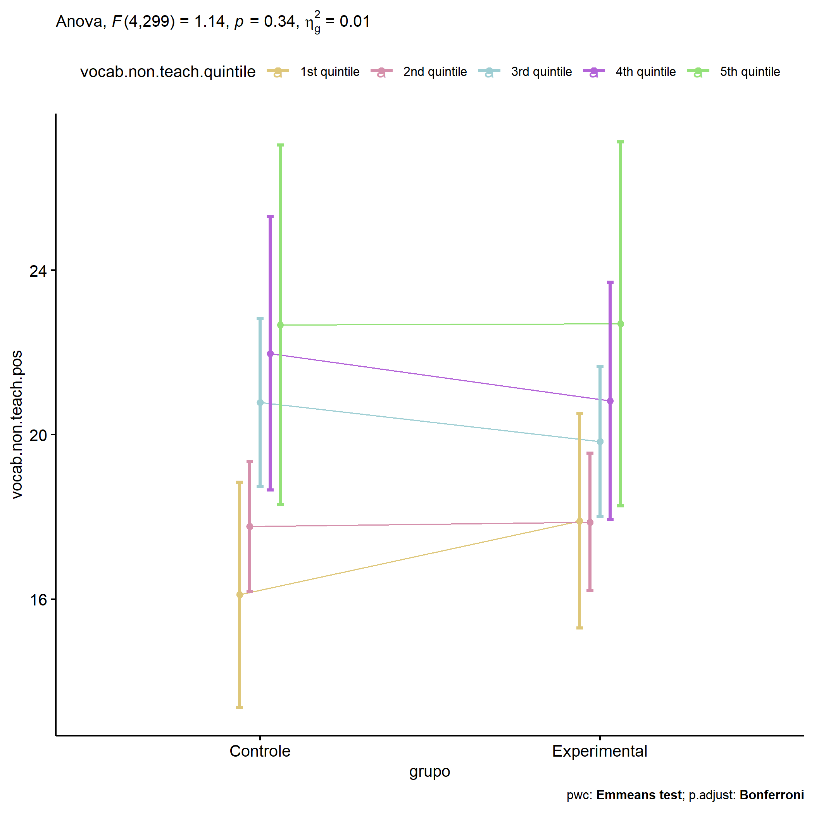<!-- -->

``` r
if (!is.null(plots[["vocab.non.teach.quintile"]]))
  plots[["vocab.non.teach.quintile"]] + ggplot2::scale_color_manual(values = color[["grupo"]])
```

    ## Scale for colour is already present.
    ## Adding another scale for colour, which will replace the existing scale.

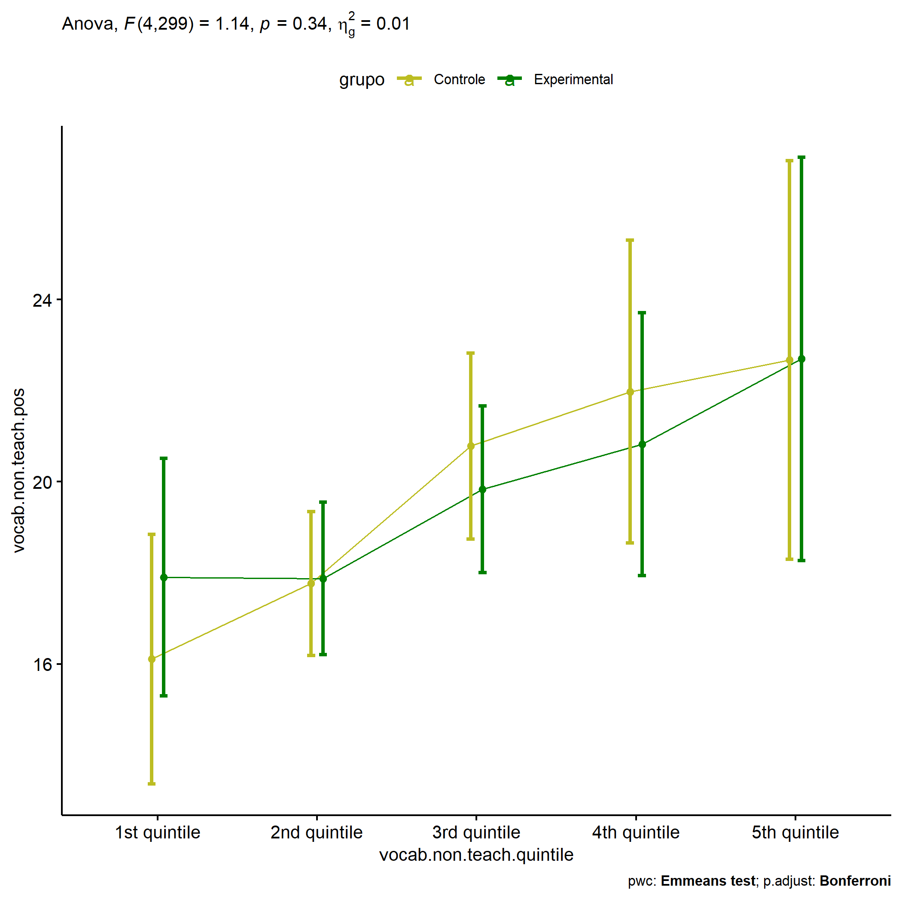<!-- -->

``` r
plots <- twoWayAncovaBoxPlots(
  wdat, "vocab.non.teach.pos", c("grupo","vocab.non.teach.quintile"), aov, pwcs, covar = "vocab.non.teach.pre",
  theme = "classic", color = color[["grupo:vocab.non.teach.quintile"]],
  subtitle = which(aov$Effect == "grupo:vocab.non.teach.quintile"))
```

``` r
plots[["grupo:vocab.non.teach.quintile"]] + ggplot2::ylab("Vocabulario Não Ensinado") + ggplot2::scale_x_discrete(labels=c('pre', 'pos'))
```

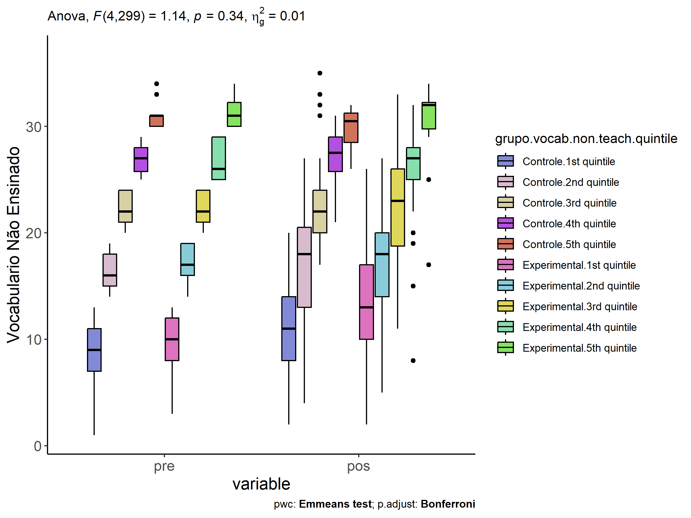<!-- -->

``` r
plots <- twoWayAncovaBoxPlots(
  wdat.long, "vocab.non.teach", c("grupo","vocab.non.teach.quintile"), aov, pwc.long, pre.post = "time",
  theme = "classic", color = color$prepost)
```

``` r
plots[["grupo:vocab.non.teach.quintile"]] + ggplot2::ylab("Vocabulario Não Ensinado")
```

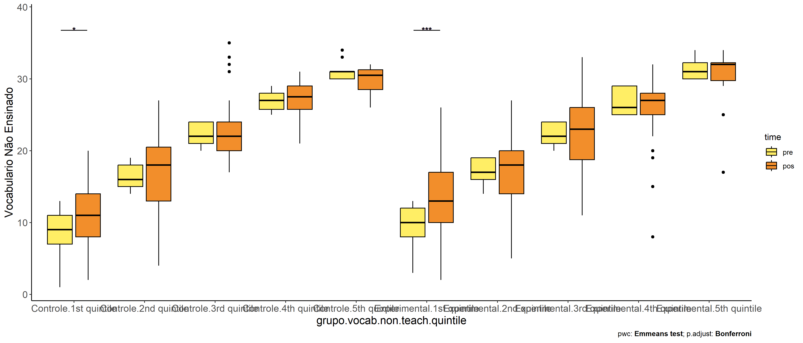<!-- -->

### Checking linearity assumption

``` r
ggscatter(wdat, x = "vocab.non.teach.pre", y = "vocab.non.teach.pos", size = 0.5,
          facet.by = c("grupo","vocab.non.teach.quintile"), add = "reg.line")+
  stat_regline_equation(
    aes(label =  paste(..eq.label.., ..rr.label.., sep = "~~~~"))
  )
```

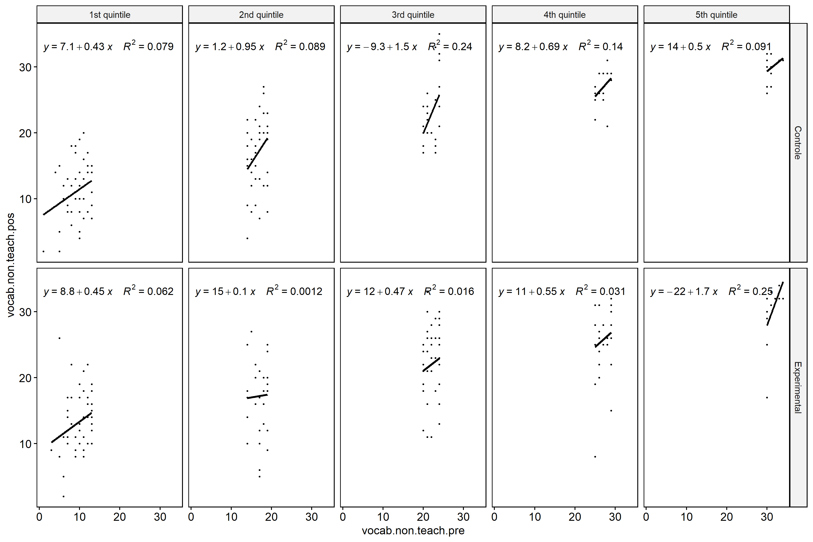<!-- -->

### Checking normality and homogeneity

``` r
res <- augment(lm(vocab.non.teach.pos ~ vocab.non.teach.pre + grupo*vocab.non.teach.quintile, data = wdat))
```

``` r
shapiro_test(res$.resid)
```

    ## # A tibble: 1 × 3
    ##   variable   statistic p.value
    ##   <chr>          <dbl>   <dbl>
    ## 1 res$.resid     0.991  0.0551

``` r
levene_test(res, .resid ~ grupo*vocab.non.teach.quintile)
```

    ## # A tibble: 1 × 4
    ##     df1   df2 statistic      p
    ##   <int> <int>     <dbl>  <dbl>
    ## 1     9   300      2.21 0.0213

# Summary of Results

## Descriptive Statistics

``` r
df <- get.descriptives(ldat[["grupo"]], c(dv.pre, dv.pos), c("grupo"), 
                       include.global = T, symmetry.test = T, normality.test = F)
df <- plyr::rbind.fill(
  df, do.call(plyr::rbind.fill, lapply(lfatores2, FUN = function(f) {
    if (nrow(dat) > 0 && sum(!is.na(unique(dat[[f]]))) > 1)
      get.descriptives(ldat[[paste0("grupo:",f)]], c(dv.pre,dv.pos), c("grupo", f),
                       symmetry.test = T, normality.test = F)
    }))
)
(df <- df[,c(fatores1[fatores1 %in% colnames(df)],"variable",
             colnames(df)[!colnames(df) %in% c(fatores1,"variable")])])
```

    ##           grupo Sexo   Zona Cor.Raca vocab.non.teach.quintile            variable   n   mean median min max
    ## 1      Controle <NA>   <NA>     <NA>                     <NA> vocab.non.teach.pre 145 17.414   17.0   1  34
    ## 2  Experimental <NA>   <NA>     <NA>                     <NA> vocab.non.teach.pre 158 18.766   19.0   3  34
    ## 3          <NA> <NA>   <NA>     <NA>                     <NA> vocab.non.teach.pre 303 18.119   18.0   1  34
    ## 4      Controle <NA>   <NA>     <NA>                     <NA> vocab.non.teach.pos 145 18.324   18.0   2  35
    ## 5  Experimental <NA>   <NA>     <NA>                     <NA> vocab.non.teach.pos 158 19.835   19.5   2  34
    ## 6          <NA> <NA>   <NA>     <NA>                     <NA> vocab.non.teach.pos 303 19.112   19.0   2  35
    ## 7      Controle    F   <NA>     <NA>                     <NA> vocab.non.teach.pre  65 18.785   19.0   5  31
    ## 8      Controle    M   <NA>     <NA>                     <NA> vocab.non.teach.pre  81 16.333   15.0   1  34
    ## 9  Experimental    F   <NA>     <NA>                     <NA> vocab.non.teach.pre  82 19.854   20.5   3  34
    ## 10 Experimental    M   <NA>     <NA>                     <NA> vocab.non.teach.pre  75 17.453   17.0   5  32
    ## 11     Controle    F   <NA>     <NA>                     <NA> vocab.non.teach.pos  65 20.262   20.0   4  35
    ## 12     Controle    M   <NA>     <NA>                     <NA> vocab.non.teach.pos  81 16.642   17.0   2  33
    ## 13 Experimental    F   <NA>     <NA>                     <NA> vocab.non.teach.pos  82 21.354   22.0   2  34
    ## 14 Experimental    M   <NA>     <NA>                     <NA> vocab.non.teach.pos  75 18.253   17.0   5  32
    ## 15     Controle <NA>  Rural     <NA>                     <NA> vocab.non.teach.pre  96 18.073   18.5   1  31
    ## 16     Controle <NA> Urbana     <NA>                     <NA> vocab.non.teach.pre  28 19.250   17.5   6  34
    ## 17 Experimental <NA>  Rural     <NA>                     <NA> vocab.non.teach.pre  83 17.819   18.0   3  34
    ## 18 Experimental <NA> Urbana     <NA>                     <NA> vocab.non.teach.pre  37 19.892   21.0   6  31
    ## 19     Controle <NA>  Rural     <NA>                     <NA> vocab.non.teach.pos  96 18.865   19.0   2  35
    ## 20     Controle <NA> Urbana     <NA>                     <NA> vocab.non.teach.pos  28 20.286   19.5   4  32
    ## 21 Experimental <NA>  Rural     <NA>                     <NA> vocab.non.teach.pos  83 18.651   18.0   2  32
    ## 22 Experimental <NA> Urbana     <NA>                     <NA> vocab.non.teach.pos  37 21.081   21.0   5  33
    ## 23     Controle <NA>   <NA>   Branca                     <NA> vocab.non.teach.pre  22 19.227   20.0   7  30
    ## 24     Controle <NA>   <NA>    Parda                     <NA> vocab.non.teach.pre  42 17.429   15.5   6  31
    ## 25 Experimental <NA>   <NA>   Branca                     <NA> vocab.non.teach.pre  18 20.778   21.5  10  32
    ## 26 Experimental <NA>   <NA> Indígena                     <NA> vocab.non.teach.pre  13 17.000   18.0   7  30
    ## 27 Experimental <NA>   <NA>    Parda                     <NA> vocab.non.teach.pre  44 17.932   18.5   3  30
    ## 28     Controle <NA>   <NA>   Branca                     <NA> vocab.non.teach.pos  22 19.455   20.5   8  32
    ## 29     Controle <NA>   <NA>    Parda                     <NA> vocab.non.teach.pos  42 17.929   17.0   4  32
    ## 30 Experimental <NA>   <NA>   Branca                     <NA> vocab.non.teach.pos  18 19.722   19.0   5  33
    ## 31 Experimental <NA>   <NA> Indígena                     <NA> vocab.non.teach.pos  13 19.538   18.0  10  30
    ## 32 Experimental <NA>   <NA>    Parda                     <NA> vocab.non.teach.pos  44 19.545   19.5   8  32
    ## 33     Controle <NA>   <NA>     <NA>             1st quintile vocab.non.teach.pre  50  9.180    9.0   1  13
    ## 34     Controle <NA>   <NA>     <NA>             2nd quintile vocab.non.teach.pre  39 16.462   16.0  14  19
    ## 35     Controle <NA>   <NA>     <NA>             3rd quintile vocab.non.teach.pre  29 22.069   22.0  20  24
    ## 36     Controle <NA>   <NA>     <NA>             4th quintile vocab.non.teach.pre  16 26.938   27.0  25  29
    ## 37     Controle <NA>   <NA>     <NA>             5th quintile vocab.non.teach.pre  12 31.000   31.0  30  34
    ## 38 Experimental <NA>   <NA>     <NA>             1st quintile vocab.non.teach.pre  50  9.760   10.0   3  13
    ## 39 Experimental <NA>   <NA>     <NA>             2nd quintile vocab.non.teach.pre  33 16.970   17.0  14  19
    ## 40 Experimental <NA>   <NA>     <NA>             3rd quintile vocab.non.teach.pre  40 22.125   22.0  20  24
    ## 41 Experimental <NA>   <NA>     <NA>             4th quintile vocab.non.teach.pre  29 26.759   26.0  25  29
    ## 42 Experimental <NA>   <NA>     <NA>             5th quintile vocab.non.teach.pre  12 31.250   31.0  30  34
    ## 43     Controle <NA>   <NA>     <NA>             1st quintile vocab.non.teach.pos  50 11.100   11.0   2  20
    ## 44     Controle <NA>   <NA>     <NA>             2nd quintile vocab.non.teach.pos  39 16.821   18.0   4  27
    ## 45     Controle <NA>   <NA>     <NA>             3rd quintile vocab.non.teach.pos  29 22.966   22.0  17  35
    ## 46     Controle <NA>   <NA>     <NA>             4th quintile vocab.non.teach.pos  16 26.875   27.5  21  31
    ## 47     Controle <NA>   <NA>     <NA>             5th quintile vocab.non.teach.pos  12 29.833   30.5  26  32
    ## 48 Experimental <NA>   <NA>     <NA>             1st quintile vocab.non.teach.pos  50 13.220   13.0   2  26
    ## 49 Experimental <NA>   <NA>     <NA>             2nd quintile vocab.non.teach.pos  33 17.212   18.0   5  27
    ## 50 Experimental <NA>   <NA>     <NA>             3rd quintile vocab.non.teach.pos  40 22.050   23.0  11  33
    ## 51 Experimental <NA>   <NA>     <NA>             4th quintile vocab.non.teach.pos  29 25.621   27.0   8  32
    ## 52 Experimental <NA>   <NA>     <NA>             5th quintile vocab.non.teach.pos  12 30.000   32.0  17  34
    ##       sd    se    ci   iqr symmetry     skewness    kurtosis
    ## 1  7.607 0.632 1.249 12.00      YES  0.181054368 -0.91839698
    ## 2  7.435 0.591 1.168 12.50      YES -0.025752361 -1.02156327
    ## 3  7.536 0.433 0.852 12.00      YES  0.070156340 -0.97802037
    ## 4  7.857 0.652 1.290 12.00      YES  0.049756539 -0.93417929
    ## 5  7.444 0.592 1.170 12.00      YES -0.076634812 -0.92345376
    ## 6  7.669 0.441 0.867 12.00      YES -0.026690182 -0.91624956
    ## 7  7.190 0.892 1.782 12.00      YES  0.041248316 -1.05032826
    ## 8  7.754 0.862 1.715 13.00      YES  0.330534294 -0.78301706
    ## 9  7.582 0.837 1.666 10.50      YES -0.340009739 -0.80201968
    ## 10 7.039 0.813 1.620 11.00      YES  0.320070902 -0.99527490
    ## 11 7.276 0.903 1.803 11.00      YES -0.054503913 -0.92190796
    ## 12 8.011 0.890 1.771 13.00      YES  0.237544814 -0.94288662
    ## 13 7.590 0.838 1.668 10.75      YES -0.333631107 -0.72850308
    ## 14 6.950 0.802 1.599 13.00      YES  0.162355677 -1.02465856
    ## 15 7.259 0.741 1.471 11.25      YES -0.099714213 -0.90352528
    ## 16 8.910 1.684 3.455 15.00      YES  0.165489854 -1.43159515
    ## 17 7.085 0.778 1.547 11.50      YES -0.002736690 -0.86359325
    ## 18 7.542 1.240 2.515 12.00      YES -0.190149961 -1.26348031
    ## 19 8.019 0.818 1.625 14.00      YES -0.087197437 -0.98387393
    ## 20 7.581 1.433 2.940 11.75      YES -0.037108602 -1.02170693
    ## 21 6.821 0.749 1.489 11.00      YES  0.005742994 -0.70875668
    ## 22 7.686 1.264 2.563 12.00      YES -0.185965951 -1.18253241
    ## 23 6.241 1.331 2.767  7.00       NO -0.585909331 -0.56813056
    ## 24 7.790 1.202 2.428 11.75      YES  0.366283825 -1.13462790
    ## 25 6.620 1.560 3.292  7.00      YES -0.050364785 -1.07042750
    ## 26 7.000 1.941 4.230 10.00      YES  0.257008298 -1.34299811
    ## 27 6.970 1.051 2.119 10.50      YES -0.130613857 -1.06268755
    ## 28 7.282 1.552 3.228 10.75      YES -0.190540342 -1.15615028
    ## 29 8.292 1.279 2.584 14.75      YES  0.111561393 -1.39148293
    ## 30 9.228 2.175 4.589 15.25      YES  0.057813877 -1.54214932
    ## 31 7.310 2.027 4.417 14.00      YES  0.256623699 -1.62226697
    ## 32 6.504 0.980 1.977 10.25      YES -0.135442446 -1.08074218
    ## 33 2.753 0.389 0.782  4.00      YES -0.494434389 -0.09207225
    ## 34 1.790 0.287 0.580  3.00      YES  0.007465837 -1.39583079
    ## 35 1.602 0.297 0.609  3.00      YES -0.057679537 -1.68158116
    ## 36 1.482 0.370 0.790  2.25      YES -0.015756519 -1.49608165
    ## 37 1.279 0.369 0.813  1.00       NO  1.194318828  0.17438272
    ## 38 2.631 0.372 0.748  4.00       NO -0.521936654 -0.74164618
    ## 39 1.828 0.318 0.648  3.00      YES -0.462469511 -1.21261204
    ## 40 1.539 0.243 0.492  3.00      YES -0.039219888 -1.54199298
    ## 41 1.640 0.305 0.624  4.00      YES  0.327880667 -1.59351481
    ## 42 1.422 0.411 0.904  2.25       NO  0.640908510 -1.19776806
    ## 43 4.220 0.597 1.199  6.00      YES -0.041204715 -0.48950883
    ## 44 5.693 0.912 1.846  7.50      YES -0.219739024 -0.68670526
    ## 45 4.822 0.895 1.834  4.00       NO  0.945086794  0.03178199
    ## 46 2.705 0.676 1.441  3.25       NO -0.672058760 -0.45802131
    ## 47 2.125 0.613 1.350  2.75       NO -0.582914274 -1.29556195
    ## 48 4.769 0.674 1.355  7.00      YES  0.241293375 -0.03731210
    ## 49 5.436 0.946 1.927  6.00      YES -0.368100993 -0.45110150
    ## 50 5.773 0.913 1.846  7.25      YES -0.382089894 -0.77817246
    ## 51 5.137 0.954 1.954  3.00       NO -1.588165085  2.82091793
    ## 52 4.729 1.365 3.005  2.50       NO -1.711452862  1.94369258

| grupo        | Sexo | Zona   | Cor.Raca | vocab.non.teach.quintile | variable            |   n |   mean | median | min | max |    sd |    se |    ci |   iqr | symmetry | skewness | kurtosis |
|:-------------|:-----|:-------|:---------|:-------------------------|:--------------------|----:|-------:|-------:|----:|----:|------:|------:|------:|------:|:---------|---------:|---------:|
| Controle     |      |        |          |                          | vocab.non.teach.pre | 145 | 17.414 |   17.0 |   1 |  34 | 7.607 | 0.632 | 1.249 | 12.00 | YES      |    0.181 |   -0.918 |
| Experimental |      |        |          |                          | vocab.non.teach.pre | 158 | 18.766 |   19.0 |   3 |  34 | 7.435 | 0.591 | 1.168 | 12.50 | YES      |   -0.026 |   -1.022 |
|              |      |        |          |                          | vocab.non.teach.pre | 303 | 18.119 |   18.0 |   1 |  34 | 7.536 | 0.433 | 0.852 | 12.00 | YES      |    0.070 |   -0.978 |
| Controle     |      |        |          |                          | vocab.non.teach.pos | 145 | 18.324 |   18.0 |   2 |  35 | 7.857 | 0.652 | 1.290 | 12.00 | YES      |    0.050 |   -0.934 |
| Experimental |      |        |          |                          | vocab.non.teach.pos | 158 | 19.835 |   19.5 |   2 |  34 | 7.444 | 0.592 | 1.170 | 12.00 | YES      |   -0.077 |   -0.923 |
|              |      |        |          |                          | vocab.non.teach.pos | 303 | 19.112 |   19.0 |   2 |  35 | 7.669 | 0.441 | 0.867 | 12.00 | YES      |   -0.027 |   -0.916 |
| Controle     | F    |        |          |                          | vocab.non.teach.pre |  65 | 18.785 |   19.0 |   5 |  31 | 7.190 | 0.892 | 1.782 | 12.00 | YES      |    0.041 |   -1.050 |
| Controle     | M    |        |          |                          | vocab.non.teach.pre |  81 | 16.333 |   15.0 |   1 |  34 | 7.754 | 0.862 | 1.715 | 13.00 | YES      |    0.331 |   -0.783 |
| Experimental | F    |        |          |                          | vocab.non.teach.pre |  82 | 19.854 |   20.5 |   3 |  34 | 7.582 | 0.837 | 1.666 | 10.50 | YES      |   -0.340 |   -0.802 |
| Experimental | M    |        |          |                          | vocab.non.teach.pre |  75 | 17.453 |   17.0 |   5 |  32 | 7.039 | 0.813 | 1.620 | 11.00 | YES      |    0.320 |   -0.995 |
| Controle     | F    |        |          |                          | vocab.non.teach.pos |  65 | 20.262 |   20.0 |   4 |  35 | 7.276 | 0.903 | 1.803 | 11.00 | YES      |   -0.055 |   -0.922 |
| Controle     | M    |        |          |                          | vocab.non.teach.pos |  81 | 16.642 |   17.0 |   2 |  33 | 8.011 | 0.890 | 1.771 | 13.00 | YES      |    0.238 |   -0.943 |
| Experimental | F    |        |          |                          | vocab.non.teach.pos |  82 | 21.354 |   22.0 |   2 |  34 | 7.590 | 0.838 | 1.668 | 10.75 | YES      |   -0.334 |   -0.729 |
| Experimental | M    |        |          |                          | vocab.non.teach.pos |  75 | 18.253 |   17.0 |   5 |  32 | 6.950 | 0.802 | 1.599 | 13.00 | YES      |    0.162 |   -1.025 |
| Controle     |      | Rural  |          |                          | vocab.non.teach.pre |  96 | 18.073 |   18.5 |   1 |  31 | 7.259 | 0.741 | 1.471 | 11.25 | YES      |   -0.100 |   -0.904 |
| Controle     |      | Urbana |          |                          | vocab.non.teach.pre |  28 | 19.250 |   17.5 |   6 |  34 | 8.910 | 1.684 | 3.455 | 15.00 | YES      |    0.165 |   -1.432 |
| Experimental |      | Rural  |          |                          | vocab.non.teach.pre |  83 | 17.819 |   18.0 |   3 |  34 | 7.085 | 0.778 | 1.547 | 11.50 | YES      |   -0.003 |   -0.864 |
| Experimental |      | Urbana |          |                          | vocab.non.teach.pre |  37 | 19.892 |   21.0 |   6 |  31 | 7.542 | 1.240 | 2.515 | 12.00 | YES      |   -0.190 |   -1.263 |
| Controle     |      | Rural  |          |                          | vocab.non.teach.pos |  96 | 18.865 |   19.0 |   2 |  35 | 8.019 | 0.818 | 1.625 | 14.00 | YES      |   -0.087 |   -0.984 |
| Controle     |      | Urbana |          |                          | vocab.non.teach.pos |  28 | 20.286 |   19.5 |   4 |  32 | 7.581 | 1.433 | 2.940 | 11.75 | YES      |   -0.037 |   -1.022 |
| Experimental |      | Rural  |          |                          | vocab.non.teach.pos |  83 | 18.651 |   18.0 |   2 |  32 | 6.821 | 0.749 | 1.489 | 11.00 | YES      |    0.006 |   -0.709 |
| Experimental |      | Urbana |          |                          | vocab.non.teach.pos |  37 | 21.081 |   21.0 |   5 |  33 | 7.686 | 1.264 | 2.563 | 12.00 | YES      |   -0.186 |   -1.183 |
| Controle     |      |        | Branca   |                          | vocab.non.teach.pre |  22 | 19.227 |   20.0 |   7 |  30 | 6.241 | 1.331 | 2.767 |  7.00 | NO       |   -0.586 |   -0.568 |
| Controle     |      |        | Parda    |                          | vocab.non.teach.pre |  42 | 17.429 |   15.5 |   6 |  31 | 7.790 | 1.202 | 2.428 | 11.75 | YES      |    0.366 |   -1.135 |
| Experimental |      |        | Branca   |                          | vocab.non.teach.pre |  18 | 20.778 |   21.5 |  10 |  32 | 6.620 | 1.560 | 3.292 |  7.00 | YES      |   -0.050 |   -1.070 |
| Experimental |      |        | Indígena |                          | vocab.non.teach.pre |  13 | 17.000 |   18.0 |   7 |  30 | 7.000 | 1.941 | 4.230 | 10.00 | YES      |    0.257 |   -1.343 |
| Experimental |      |        | Parda    |                          | vocab.non.teach.pre |  44 | 17.932 |   18.5 |   3 |  30 | 6.970 | 1.051 | 2.119 | 10.50 | YES      |   -0.131 |   -1.063 |
| Controle     |      |        | Branca   |                          | vocab.non.teach.pos |  22 | 19.455 |   20.5 |   8 |  32 | 7.282 | 1.552 | 3.228 | 10.75 | YES      |   -0.191 |   -1.156 |
| Controle     |      |        | Parda    |                          | vocab.non.teach.pos |  42 | 17.929 |   17.0 |   4 |  32 | 8.292 | 1.279 | 2.584 | 14.75 | YES      |    0.112 |   -1.391 |
| Experimental |      |        | Branca   |                          | vocab.non.teach.pos |  18 | 19.722 |   19.0 |   5 |  33 | 9.228 | 2.175 | 4.589 | 15.25 | YES      |    0.058 |   -1.542 |
| Experimental |      |        | Indígena |                          | vocab.non.teach.pos |  13 | 19.538 |   18.0 |  10 |  30 | 7.310 | 2.027 | 4.417 | 14.00 | YES      |    0.257 |   -1.622 |
| Experimental |      |        | Parda    |                          | vocab.non.teach.pos |  44 | 19.545 |   19.5 |   8 |  32 | 6.504 | 0.980 | 1.977 | 10.25 | YES      |   -0.135 |   -1.081 |
| Controle     |      |        |          | 1st quintile             | vocab.non.teach.pre |  50 |  9.180 |    9.0 |   1 |  13 | 2.753 | 0.389 | 0.782 |  4.00 | YES      |   -0.494 |   -0.092 |
| Controle     |      |        |          | 2nd quintile             | vocab.non.teach.pre |  39 | 16.462 |   16.0 |  14 |  19 | 1.790 | 0.287 | 0.580 |  3.00 | YES      |    0.007 |   -1.396 |
| Controle     |      |        |          | 3rd quintile             | vocab.non.teach.pre |  29 | 22.069 |   22.0 |  20 |  24 | 1.602 | 0.297 | 0.609 |  3.00 | YES      |   -0.058 |   -1.682 |
| Controle     |      |        |          | 4th quintile             | vocab.non.teach.pre |  16 | 26.938 |   27.0 |  25 |  29 | 1.482 | 0.370 | 0.790 |  2.25 | YES      |   -0.016 |   -1.496 |
| Controle     |      |        |          | 5th quintile             | vocab.non.teach.pre |  12 | 31.000 |   31.0 |  30 |  34 | 1.279 | 0.369 | 0.813 |  1.00 | NO       |    1.194 |    0.174 |
| Experimental |      |        |          | 1st quintile             | vocab.non.teach.pre |  50 |  9.760 |   10.0 |   3 |  13 | 2.631 | 0.372 | 0.748 |  4.00 | NO       |   -0.522 |   -0.742 |
| Experimental |      |        |          | 2nd quintile             | vocab.non.teach.pre |  33 | 16.970 |   17.0 |  14 |  19 | 1.828 | 0.318 | 0.648 |  3.00 | YES      |   -0.462 |   -1.213 |
| Experimental |      |        |          | 3rd quintile             | vocab.non.teach.pre |  40 | 22.125 |   22.0 |  20 |  24 | 1.539 | 0.243 | 0.492 |  3.00 | YES      |   -0.039 |   -1.542 |
| Experimental |      |        |          | 4th quintile             | vocab.non.teach.pre |  29 | 26.759 |   26.0 |  25 |  29 | 1.640 | 0.305 | 0.624 |  4.00 | YES      |    0.328 |   -1.594 |
| Experimental |      |        |          | 5th quintile             | vocab.non.teach.pre |  12 | 31.250 |   31.0 |  30 |  34 | 1.422 | 0.411 | 0.904 |  2.25 | NO       |    0.641 |   -1.198 |
| Controle     |      |        |          | 1st quintile             | vocab.non.teach.pos |  50 | 11.100 |   11.0 |   2 |  20 | 4.220 | 0.597 | 1.199 |  6.00 | YES      |   -0.041 |   -0.490 |
| Controle     |      |        |          | 2nd quintile             | vocab.non.teach.pos |  39 | 16.821 |   18.0 |   4 |  27 | 5.693 | 0.912 | 1.846 |  7.50 | YES      |   -0.220 |   -0.687 |
| Controle     |      |        |          | 3rd quintile             | vocab.non.teach.pos |  29 | 22.966 |   22.0 |  17 |  35 | 4.822 | 0.895 | 1.834 |  4.00 | NO       |    0.945 |    0.032 |
| Controle     |      |        |          | 4th quintile             | vocab.non.teach.pos |  16 | 26.875 |   27.5 |  21 |  31 | 2.705 | 0.676 | 1.441 |  3.25 | NO       |   -0.672 |   -0.458 |
| Controle     |      |        |          | 5th quintile             | vocab.non.teach.pos |  12 | 29.833 |   30.5 |  26 |  32 | 2.125 | 0.613 | 1.350 |  2.75 | NO       |   -0.583 |   -1.296 |
| Experimental |      |        |          | 1st quintile             | vocab.non.teach.pos |  50 | 13.220 |   13.0 |   2 |  26 | 4.769 | 0.674 | 1.355 |  7.00 | YES      |    0.241 |   -0.037 |
| Experimental |      |        |          | 2nd quintile             | vocab.non.teach.pos |  33 | 17.212 |   18.0 |   5 |  27 | 5.436 | 0.946 | 1.927 |  6.00 | YES      |   -0.368 |   -0.451 |
| Experimental |      |        |          | 3rd quintile             | vocab.non.teach.pos |  40 | 22.050 |   23.0 |  11 |  33 | 5.773 | 0.913 | 1.846 |  7.25 | YES      |   -0.382 |   -0.778 |
| Experimental |      |        |          | 4th quintile             | vocab.non.teach.pos |  29 | 25.621 |   27.0 |   8 |  32 | 5.137 | 0.954 | 1.954 |  3.00 | NO       |   -1.588 |    2.821 |
| Experimental |      |        |          | 5th quintile             | vocab.non.teach.pos |  12 | 30.000 |   32.0 |  17 |  34 | 4.729 | 1.365 | 3.005 |  2.50 | NO       |   -1.711 |    1.944 |

## ANCOVA Table Comparison

``` r
df <- do.call(plyr::rbind.fill, laov)
(df <- df[!duplicated(df$Effect),])
```

    ##                            Effect DFn DFd       F        p p<.05      ges DFn' DFd'      F'       p' p<.05'
    ## 1                           grupo   1 300   0.581 4.46e-01       0.002000    1  308   0.424 5.15e-01       
    ## 2             vocab.non.teach.pre   1 300 595.851 3.05e-73     * 0.665000    1  308 449.452 3.85e-62      *
    ## 4                      grupo:Sexo   1 298   0.224 6.37e-01       0.000750    1  306   1.008 3.16e-01       
    ## 5                            Sexo   1 298   7.084 8.00e-03     * 0.023000    1  306   3.890 4.90e-02      *
    ## 8                      grupo:Zona   1 239   0.047 8.29e-01       0.000196    1  243   0.020 8.88e-01       
    ## 10                           Zona   1 239   0.891 3.46e-01       0.004000    1  243   0.501 4.80e-01       
    ## 11                       Cor.Raca   2 133   1.054 3.52e-01       0.016000    2  133   1.054 3.52e-01       
    ## 13                 grupo:Cor.Raca   1 133   1.447 2.31e-01       0.011000    1  133   1.447 2.31e-01       
    ## 16 grupo:vocab.non.teach.quintile   4 299   1.137 3.39e-01       0.015000    4  300   1.395 2.36e-01       
    ## 18       vocab.non.teach.quintile   4 299   1.361 2.48e-01       0.018000    4  300   1.247 2.91e-01       
    ##        ges'
    ## 1  1.00e-03
    ## 2  5.93e-01
    ## 4  3.00e-03
    ## 5  1.30e-02
    ## 8  8.14e-05
    ## 10 2.00e-03
    ## 11 1.60e-02
    ## 13 1.10e-02
    ## 16 1.80e-02
    ## 18 1.60e-02

|     | Effect                         | DFn | DFd |       F |     p | p\<.05 |   ges | DFn’ | DFd’ |      F’ |    p’ | p\<.05’ |  ges’ |
|:----|:-------------------------------|----:|----:|--------:|------:|:-------|------:|-----:|-----:|--------:|------:|:--------|------:|
| 1   | grupo                          |   1 | 300 |   0.581 | 0.446 |        | 0.002 |    1 |  308 |   0.424 | 0.515 |         | 0.001 |
| 2   | vocab.non.teach.pre            |   1 | 300 | 595.851 | 0.000 | \*     | 0.665 |    1 |  308 | 449.452 | 0.000 | \*      | 0.593 |
| 4   | grupo:Sexo                     |   1 | 298 |   0.224 | 0.637 |        | 0.001 |    1 |  306 |   1.008 | 0.316 |         | 0.003 |
| 5   | Sexo                           |   1 | 298 |   7.084 | 0.008 | \*     | 0.023 |    1 |  306 |   3.890 | 0.049 | \*      | 0.013 |
| 8   | grupo:Zona                     |   1 | 239 |   0.047 | 0.829 |        | 0.000 |    1 |  243 |   0.020 | 0.888 |         | 0.000 |
| 10  | Zona                           |   1 | 239 |   0.891 | 0.346 |        | 0.004 |    1 |  243 |   0.501 | 0.480 |         | 0.002 |
| 11  | Cor.Raca                       |   2 | 133 |   1.054 | 0.352 |        | 0.016 |    2 |  133 |   1.054 | 0.352 |         | 0.016 |
| 13  | grupo:Cor.Raca                 |   1 | 133 |   1.447 | 0.231 |        | 0.011 |    1 |  133 |   1.447 | 0.231 |         | 0.011 |
| 16  | grupo:vocab.non.teach.quintile |   4 | 299 |   1.137 | 0.339 |        | 0.015 |    4 |  300 |   1.395 | 0.236 |         | 0.018 |
| 18  | vocab.non.teach.quintile       |   4 | 299 |   1.361 | 0.248 |        | 0.018 |    4 |  300 |   1.247 | 0.291 |         | 0.016 |

## PairWise Table Comparison

``` r
df <- do.call(plyr::rbind.fill, lpwc)
df <- df[,c(names(lfatores), names(df)[!names(df) %in% c(names(lfatores),"term",".y.")])]
```

| grupo        | Sexo | Zona   | Cor.Raca | vocab.non.teach.quintile | group1       | group2       |  df | statistic |     p | p.adj | p.adj.signif | df’ | statistic’ |    p’ | p.adj’ | p.adj.signif’ |
|:-------------|:-----|:-------|:---------|:-------------------------|:-------------|:-------------|----:|----------:|------:|------:|:-------------|----:|-----------:|------:|-------:|:--------------|
| Controle     |      |        |          |                          | pre          | pos          | 602 |    -1.022 | 0.307 | 0.307 | ns           | 618 |     -0.932 | 0.352 |  0.352 | ns            |
| Experimental |      |        |          |                          | pre          | pos          | 602 |    -1.254 | 0.210 | 0.210 | ns           | 618 |     -1.094 | 0.274 |  0.274 | ns            |
|              |      |        |          |                          | Controle     | Experimental | 300 |    -0.762 | 0.446 | 0.446 | ns           | 308 |     -0.651 | 0.515 |  0.515 | ns            |
| Controle     | F    |        |          |                          | pre          | pos          | 598 |    -1.130 | 0.259 | 0.259 | ns           | 614 |     -1.125 | 0.261 |  0.261 | ns            |
| Controle     | M    |        |          |                          | pre          | pos          | 598 |    -0.264 | 0.792 | 0.792 | ns           | 614 |     -0.262 | 0.793 |  0.793 | ns            |
| Controle     |      |        |          |                          | F            | M            | 298 |     2.194 | 0.029 | 0.029 | \*           | 306 |      2.087 | 0.038 |  0.038 | \*            |
| Experimental | F    |        |          |                          | pre          | pos          | 598 |    -1.289 | 0.198 | 0.198 | ns           | 614 |     -0.815 | 0.415 |  0.415 | ns            |
| Experimental | M    |        |          |                          | pre          | pos          | 598 |    -0.657 | 0.511 | 0.511 | ns           | 614 |     -0.753 | 0.452 |  0.452 | ns            |
| Experimental |      |        |          |                          | F            | M            | 298 |     1.608 | 0.109 | 0.109 | ns           | 306 |      0.767 | 0.444 |  0.444 | ns            |
|              | F    |        |          |                          | Controle     | Experimental | 298 |    -0.296 | 0.767 | 0.767 | ns           | 306 |      0.365 | 0.716 |  0.716 | ns            |
|              | M    |        |          |                          | Controle     | Experimental | 298 |    -0.987 | 0.325 | 0.325 | ns           | 306 |     -1.063 | 0.289 |  0.289 | ns            |
| Controle     |      |        |          |                          | Rural        | Urbana       | 239 |    -0.483 | 0.630 | 0.630 | ns           | 243 |     -0.582 | 0.561 |  0.561 | ns            |
| Controle     |      | Rural  |          |                          | pre          | pos          | 480 |    -0.732 | 0.464 | 0.464 | ns           | 488 |     -0.632 | 0.528 |  0.528 | ns            |
| Controle     |      | Urbana |          |                          | pre          | pos          | 480 |    -0.518 | 0.605 | 0.605 | ns           | 488 |     -0.517 | 0.606 |  0.606 | ns            |
| Experimental |      |        |          |                          | Rural        | Urbana       | 239 |    -0.841 | 0.401 | 0.401 | ns           | 243 |     -0.430 | 0.668 |  0.668 | ns            |
| Experimental |      | Rural  |          |                          | pre          | pos          | 480 |    -0.715 | 0.475 | 0.475 | ns           | 488 |     -0.808 | 0.420 |  0.420 | ns            |
| Experimental |      | Urbana |          |                          | pre          | pos          | 480 |    -0.683 | 0.495 | 0.495 | ns           | 488 |     -0.520 | 0.603 |  0.603 | ns            |
|              |      | Rural  |          |                          | Controle     | Experimental | 239 |     0.014 | 0.989 | 0.989 | ns           | 243 |     -0.274 | 0.784 |  0.784 | ns            |
|              |      | Urbana |          |                          | Controle     | Experimental | 239 |    -0.244 | 0.808 | 0.808 | ns           | 243 |      0.000 | 1.000 |  1.000 | ns            |
| Controle     |      |        | Branca   |                          | pre          | pos          | 268 |    -0.102 | 0.919 | 0.919 | ns           | 268 |     -0.102 | 0.919 |  0.919 | ns            |
| Controle     |      |        | Indígena |                          | pre          | pos          |     |           |       |       |              |     |            |       |        |               |
| Controle     |      |        |          |                          | Branca       | Indígena     |     |           |       |       |              |     |            |       |        |               |
| Controle     |      |        |          |                          | Branca       | Parda        | 133 |     0.012 | 0.991 | 0.991 | ns           | 133 |      0.012 | 0.991 |  0.991 | ns            |
| Controle     |      |        |          |                          | Indígena     | Parda        |     |           |       |       |              |     |            |       |        |               |
| Controle     |      |        | Parda    |                          | pre          | pos          | 268 |    -0.311 | 0.756 | 0.756 | ns           | 268 |     -0.311 | 0.756 |  0.756 | ns            |
| Experimental |      |        | Branca   |                          | pre          | pos          | 268 |     0.430 | 0.668 | 0.668 | ns           | 268 |      0.430 | 0.668 |  0.668 | ns            |
| Experimental |      |        | Indígena |                          | pre          | pos          | 268 |    -0.878 | 0.381 | 0.381 | ns           | 268 |     -0.878 | 0.381 |  0.381 | ns            |
| Experimental |      |        |          |                          | Branca       | Indígena     | 133 |    -1.691 | 0.093 | 0.280 | ns           | 133 |     -1.691 | 0.093 |  0.280 | ns            |
| Experimental |      |        |          |                          | Branca       | Parda        | 133 |    -1.629 | 0.106 | 0.317 | ns           | 133 |     -1.629 | 0.106 |  0.317 | ns            |
| Experimental |      |        |          |                          | Indígena     | Parda        | 133 |     0.509 | 0.611 | 1.000 | ns           | 133 |      0.509 | 0.611 |  1.000 | ns            |
| Experimental |      |        | Parda    |                          | pre          | pos          | 268 |    -1.027 | 0.306 | 0.306 | ns           | 268 |     -1.027 | 0.306 |  0.306 | ns            |
|              |      |        | Branca   |                          | Controle     | Experimental | 133 |     0.674 | 0.501 | 0.501 | ns           | 133 |      0.674 | 0.501 |  0.501 | ns            |
|              |      |        | Indígena |                          | Controle     | Experimental |     |           |       |       |              |     |            |       |        |               |
|              |      |        | Parda    |                          | Controle     | Experimental | 133 |    -1.148 | 0.253 | 0.253 | ns           | 133 |     -1.148 | 0.253 |  0.253 | ns            |
| Controle     |      |        |          | 1st quintile             | pre          | pos          | 600 |    -2.549 | 0.011 | 0.011 | \*           | 602 |     -2.503 | 0.013 |  0.013 | \*            |
| Controle     |      |        |          | 2nd quintile             | pre          | pos          | 600 |    -0.421 | 0.674 | 0.674 | ns           | 602 |     -0.413 | 0.680 |  0.680 | ns            |
| Controle     |      |        |          | 3rd quintile             | pre          | pos          | 600 |    -0.906 | 0.365 | 0.365 | ns           | 602 |     -0.890 | 0.374 |  0.374 | ns            |
| Controle     |      |        |          | 4th quintile             | pre          | pos          | 600 |     0.047 | 0.963 | 0.963 | ns           | 602 |      0.046 | 0.963 |  0.963 | ns            |
| Controle     |      |        |          | 5th quintile             | pre          | pos          | 600 |     0.759 | 0.448 | 0.448 | ns           | 602 |      0.745 | 0.457 |  0.457 | ns            |
| Controle     |      |        |          |                          | 1st quintile | 2nd quintile | 299 |    -1.167 | 0.244 | 1.000 | ns           | 300 |     -1.055 | 0.292 |  1.000 | ns            |
| Controle     |      |        |          |                          | 1st quintile | 3rd quintile | 299 |    -2.255 | 0.025 | 0.248 | ns           | 300 |     -2.102 | 0.036 |  0.364 | ns            |
| Controle     |      |        |          |                          | 1st quintile | 4th quintile | 299 |    -2.118 | 0.035 | 0.350 | ns           | 300 |     -1.965 | 0.050 |  0.504 | ns            |
| Controle     |      |        |          |                          | 1st quintile | 5th quintile | 299 |    -1.969 | 0.050 | 0.499 | ns           | 300 |     -1.816 | 0.070 |  0.703 | ns            |
| Controle     |      |        |          |                          | 2nd quintile | 3rd quintile | 299 |    -2.156 | 0.032 | 0.319 | ns           | 300 |     -2.043 | 0.042 |  0.420 | ns            |
| Controle     |      |        |          |                          | 2nd quintile | 4th quintile | 299 |    -2.096 | 0.037 | 0.370 | ns           | 300 |     -1.963 | 0.051 |  0.506 | ns            |
| Controle     |      |        |          |                          | 2nd quintile | 5th quintile | 299 |    -1.941 | 0.053 | 0.532 | ns           | 300 |     -1.802 | 0.072 |  0.725 | ns            |
| Controle     |      |        |          |                          | 3rd quintile | 4th quintile | 299 |    -0.732 | 0.465 | 1.000 | ns           | 300 |     -0.665 | 0.506 |  1.000 | ns            |
| Controle     |      |        |          |                          | 3rd quintile | 5th quintile | 299 |    -0.924 | 0.356 | 1.000 | ns           | 300 |     -0.830 | 0.407 |  1.000 | ns            |
| Controle     |      |        |          |                          | 4th quintile | 5th quintile | 299 |    -0.362 | 0.717 | 1.000 | ns           | 300 |     -0.318 | 0.751 |  1.000 | ns            |
| Experimental |      |        |          | 1st quintile             | pre          | pos          | 600 |    -4.593 | 0.000 | 0.000 | \*\*\*\*     | 602 |     -5.007 | 0.000 |  0.000 | \*\*\*\*      |
| Experimental |      |        |          | 2nd quintile             | pre          | pos          | 600 |    -0.261 | 0.794 | 0.794 | ns           | 602 |     -0.257 | 0.797 |  0.797 | ns            |
| Experimental |      |        |          | 3rd quintile             | pre          | pos          | 600 |     0.089 | 0.929 | 0.929 | ns           | 602 |      0.087 | 0.930 |  0.930 | ns            |
| Experimental |      |        |          | 4th quintile             | pre          | pos          | 600 |     1.150 | 0.250 | 0.250 | ns           | 602 |      1.130 | 0.259 |  0.259 | ns            |
| Experimental |      |        |          | 5th quintile             | pre          | pos          | 600 |     0.813 | 0.417 | 0.417 | ns           | 602 |      0.798 | 0.425 |  0.425 | ns            |
| Experimental |      |        |          |                          | 1st quintile | 2nd quintile | 299 |     0.020 | 0.984 | 1.000 | ns           | 300 |      0.345 | 0.730 |  1.000 | ns            |
| Experimental |      |        |          |                          | 1st quintile | 3rd quintile | 299 |    -0.987 | 0.325 | 1.000 | ns           | 300 |     -0.683 | 0.495 |  1.000 | ns            |
| Experimental |      |        |          |                          | 1st quintile | 4th quintile | 299 |    -1.141 | 0.255 | 1.000 | ns           | 300 |     -0.869 | 0.385 |  1.000 | ns            |
| Experimental |      |        |          |                          | 1st quintile | 5th quintile | 299 |    -1.455 | 0.147 | 1.000 | ns           | 300 |     -1.210 | 0.227 |  1.000 | ns            |
| Experimental |      |        |          |                          | 2nd quintile | 3rd quintile | 299 |    -1.480 | 0.140 | 1.000 | ns           | 300 |     -1.383 | 0.168 |  1.000 | ns            |
| Experimental |      |        |          |                          | 2nd quintile | 4th quintile | 299 |    -1.636 | 0.103 | 1.000 | ns           | 300 |     -1.509 | 0.132 |  1.000 | ns            |
| Experimental |      |        |          |                          | 2nd quintile | 5th quintile | 299 |    -1.914 | 0.057 | 0.566 | ns           | 300 |     -1.777 | 0.077 |  0.766 | ns            |
| Experimental |      |        |          |                          | 3rd quintile | 4th quintile | 299 |    -0.743 | 0.458 | 1.000 | ns           | 300 |     -0.668 | 0.505 |  1.000 | ns            |
| Experimental |      |        |          |                          | 3rd quintile | 5th quintile | 299 |    -1.427 | 0.155 | 1.000 | ns           | 300 |     -1.320 | 0.188 |  1.000 | ns            |
| Experimental |      |        |          |                          | 4th quintile | 5th quintile | 299 |    -1.068 | 0.286 | 1.000 | ns           | 300 |     -1.002 | 0.317 |  1.000 | ns            |
|              |      |        |          | 1st quintile             | Controle     | Experimental | 299 |    -1.868 | 0.063 | 0.063 | ns           | 300 |     -2.189 | 0.029 |  0.029 | \*            |
|              |      |        |          | 2nd quintile             | Controle     | Experimental | 299 |    -0.095 | 0.924 | 0.924 | ns           | 300 |     -0.086 | 0.932 |  0.932 | ns            |
|              |      |        |          | 3rd quintile             | Controle     | Experimental | 299 |     0.810 | 0.419 | 0.419 | ns           | 300 |      0.794 | 0.428 |  0.428 | ns            |
|              |      |        |          | 4th quintile             | Controle     | Experimental | 299 |     0.773 | 0.440 | 0.440 | ns           | 300 |      0.755 | 0.451 |  0.451 | ns            |
|              |      |        |          | 5th quintile             | Controle     | Experimental | 299 |    -0.014 | 0.989 | 0.989 | ns           | 300 |     -0.011 | 0.991 |  0.991 | ns            |

## EMMS Table Comparison

``` r
df <- do.call(plyr::rbind.fill, lemms)
df[["N-N'"]] <- df[["N"]] - df[["N'"]]
df <- df[,c(names(lfatores), names(df)[!names(df) %in% names(lfatores)])]
```

| grupo        | Sexo | Zona   | Cor.Raca | vocab.non.teach.quintile |   N | M (pre) | SE (pre) | M (unadj) | SE (unadj) | M (adj) | SE (adj) |  N’ | M (pre)’ | SE (pre)’ | M (unadj)’ | SE (unadj)’ | M (adj)’ | SE (adj)’ | N-N’ |
|:-------------|:-----|:-------|:---------|:-------------------------|----:|--------:|---------:|----------:|-----------:|--------:|---------:|----:|---------:|----------:|-----------:|------------:|---------:|----------:|-----:|
| Controle     |      |        |          |                          | 145 |  17.414 |    0.632 |    18.324 |      0.652 |  18.909 |    0.369 | 146 |   17.425 |     0.627 |     18.253 |       0.652 |   18.813 |     0.408 |   -1 |
| Experimental |      |        |          |                          | 158 |  18.766 |    0.591 |    19.835 |      0.592 |  19.299 |    0.353 | 165 |   18.758 |     0.578 |     19.673 |       0.587 |   19.178 |     0.383 |   -7 |
| Controle     | F    |        |          |                          |  65 |  18.785 |    0.892 |    20.262 |      0.903 |  19.691 |    0.543 |  65 |   18.785 |     0.892 |     20.262 |       0.903 |   19.753 |     0.607 |    0 |
| Controle     | M    |        |          |                          |  81 |  16.333 |    0.862 |    16.642 |      0.890 |  18.082 |    0.490 |  81 |   16.333 |     0.862 |     16.642 |       0.890 |   18.042 |     0.548 |    0 |
| Experimental | F    |        |          |                          |  82 |  19.854 |    0.837 |    21.354 |      0.838 |  19.906 |    0.487 |  88 |   19.977 |     0.812 |     20.898 |       0.817 |   19.461 |     0.526 |   -6 |
| Experimental | M    |        |          |                          |  75 |  17.453 |    0.813 |    18.253 |      0.802 |  18.775 |    0.506 |  77 |   17.364 |     0.796 |     18.273 |       0.818 |   18.871 |     0.558 |   -2 |
| Controle     |      | Rural  |          |                          |  96 |  18.073 |    0.741 |    18.865 |      0.818 |  19.126 |    0.466 |  97 |   18.062 |     0.733 |     18.742 |       0.819 |   19.006 |     0.491 |   -1 |
| Controle     |      | Urbana |          |                          |  28 |  19.250 |    1.684 |    20.286 |      1.433 |  19.599 |    0.863 |  28 |   19.250 |     1.684 |     20.286 |       1.433 |   19.610 |     0.914 |    0 |
| Experimental |      | Rural  |          |                          |  83 |  17.819 |    0.778 |    18.651 |      0.749 |  19.116 |    0.501 |  85 |   17.812 |     0.767 |     18.741 |       0.751 |   19.202 |     0.525 |   -2 |
| Experimental |      | Urbana |          |                          |  37 |  19.892 |    1.240 |    21.081 |      1.264 |  19.878 |    0.752 |  38 |   19.921 |     1.207 |     20.816 |       1.258 |   19.609 |     0.786 |   -1 |
| Controle     |      |        | Branca   |                          |  22 |  19.227 |    1.331 |    19.455 |      1.552 |  18.647 |    1.029 |  22 |   19.227 |     1.331 |     19.455 |       1.552 |   18.647 |     1.029 |    0 |
| Controle     |      |        | Parda    |                          |  42 |  17.429 |    1.202 |    17.929 |      1.279 |  18.632 |    0.746 |  42 |   17.429 |     1.202 |     17.929 |       1.279 |   18.632 |     0.746 |    0 |
| Experimental |      |        | Branca   |                          |  18 |  20.778 |    1.560 |    19.722 |      2.175 |  17.612 |    1.146 |  18 |   20.778 |     1.560 |     19.722 |       2.175 |   17.612 |     1.146 |    0 |
| Experimental |      |        | Indígena |                          |  13 |  17.000 |    1.941 |    19.538 |      2.027 |  20.602 |    1.339 |  13 |   17.000 |     1.941 |     19.538 |       2.027 |   20.602 |     1.339 |    0 |
| Experimental |      |        | Parda    |                          |  44 |  17.932 |    1.051 |    19.545 |      0.980 |  19.826 |    0.727 |  44 |   17.932 |     1.051 |     19.545 |       0.980 |   19.826 |     0.727 |    0 |
| Controle     |      |        |          | 1st quintile             |  50 |   9.180 |    0.389 |    11.100 |      0.597 |  16.106 |    1.392 |  50 |    9.180 |     0.389 |     11.100 |       0.597 |   16.250 |     1.418 |    0 |
| Controle     |      |        |          | 2nd quintile             |  39 |  16.462 |    0.287 |    16.821 |      0.912 |  17.765 |    0.801 |  39 |   16.462 |     0.287 |     16.821 |       0.912 |   17.781 |     0.817 |    0 |
| Controle     |      |        |          | 3rd quintile             |  29 |  22.069 |    0.297 |    22.966 |      0.895 |  20.782 |    1.036 |  29 |   22.069 |     0.297 |     22.966 |       0.895 |   20.701 |     1.060 |    0 |
| Controle     |      |        |          | 4th quintile             |  16 |  26.938 |    0.370 |    26.875 |      0.676 |  21.977 |    1.689 |  16 |   26.938 |     0.370 |     26.875 |       0.676 |   21.809 |     1.726 |    0 |
| Controle     |      |        |          | 5th quintile             |  12 |  31.000 |    0.369 |    29.833 |      0.613 |  22.669 |    2.223 |  12 |   31.000 |     0.369 |     29.833 |       0.613 |   22.431 |     2.272 |    0 |
| Experimental |      |        |          | 1st quintile             |  50 |   9.760 |    0.372 |    13.220 |      0.674 |  17.902 |    1.324 |  51 |    9.784 |     0.365 |     13.588 |       0.757 |   18.390 |     1.343 |   -1 |
| Experimental |      |        |          | 2nd quintile             |  33 |  16.970 |    0.318 |    17.212 |      0.946 |  17.873 |    0.850 |  33 |   16.970 |     0.318 |     17.212 |       0.946 |   17.881 |     0.867 |    0 |
| Experimental |      |        |          | 3rd quintile             |  40 |  22.125 |    0.243 |    22.050 |      0.913 |  19.836 |    0.929 |  40 |   22.125 |     0.243 |     22.050 |       0.913 |   19.753 |     0.951 |    0 |
| Experimental |      |        |          | 4th quintile             |  29 |  26.759 |    0.305 |    25.621 |      0.954 |  20.822 |    1.467 |  29 |   26.759 |     0.305 |     25.621 |       0.954 |   20.658 |     1.500 |    0 |
| Experimental |      |        |          | 5th quintile             |  12 |  31.250 |    0.411 |    30.000 |      1.365 |  22.696 |    2.250 |  12 |   31.250 |     0.411 |     30.000 |       1.365 |   22.453 |     2.300 |    0 |
