ANCOVA in Vocabulario Não Ensinado (Vocabulario Não Ensinado)
================
Geiser C. Challco <geiser@alumni.usp.br>

- [Descriptive Statistics of Initial
  Data](#descriptive-statistics-of-initial-data)
- [ANCOVA and Pairwise for one factor:
  **grupo**](#ancova-and-pairwise-for-one-factor-grupo)
  - [Without remove non-normal data](#without-remove-non-normal-data)
  - [Computing ANCOVA and PairWise After removing non-normal data
    (OK)](#computing-ancova-and-pairwise-after-removing-non-normal-data-ok)
    - [Plots for ancova](#plots-for-ancova)
    - [Checking linearity assumption](#checking-linearity-assumption)
    - [Checking normality and
      homogeneity](#checking-normality-and-homogeneity)
- [ANCOVA and Pairwise for two factors
  **grupo:Sexo**](#ancova-and-pairwise-for-two-factors-gruposexo)
  - [Without remove non-normal data](#without-remove-non-normal-data-1)
  - [Computing ANCOVA and PairWise After removing non-normal data
    (OK)](#computing-ancova-and-pairwise-after-removing-non-normal-data-ok-1)
    - [Plots for ancova](#plots-for-ancova-1)
    - [Checking linearity assumption](#checking-linearity-assumption-1)
    - [Checking normality and
      homogeneity](#checking-normality-and-homogeneity-1)
- [ANCOVA and Pairwise for two factors
  **grupo:Zona**](#ancova-and-pairwise-for-two-factors-grupozona)
  - [Without remove non-normal data](#without-remove-non-normal-data-2)
  - [Computing ANCOVA and PairWise After removing non-normal data
    (OK)](#computing-ancova-and-pairwise-after-removing-non-normal-data-ok-2)
    - [Plots for ancova](#plots-for-ancova-2)
    - [Checking linearity assumption](#checking-linearity-assumption-2)
    - [Checking normality and
      homogeneity](#checking-normality-and-homogeneity-2)
- [ANCOVA and Pairwise for two factors
  **grupo:Cor.Raca**](#ancova-and-pairwise-for-two-factors-grupocorraca)
  - [Without remove non-normal data](#without-remove-non-normal-data-3)
  - [Computing ANCOVA and PairWise After removing non-normal data
    (OK)](#computing-ancova-and-pairwise-after-removing-non-normal-data-ok-3)
    - [Plots for ancova](#plots-for-ancova-3)
    - [Checking linearity assumption](#checking-linearity-assumption-3)
    - [Checking normality and
      homogeneity](#checking-normality-and-homogeneity-3)
- [ANCOVA and Pairwise for two factors
  **grupo:vocab.non.teach.quintile**](#ancova-and-pairwise-for-two-factors-grupovocabnonteachquintile)
  - [Without remove non-normal data](#without-remove-non-normal-data-4)
  - [Computing ANCOVA and PairWise After removing non-normal data
    (OK)](#computing-ancova-and-pairwise-after-removing-non-normal-data-ok-4)
    - [Plots for ancova](#plots-for-ancova-4)
    - [Checking linearity assumption](#checking-linearity-assumption-4)
    - [Checking normality and
      homogeneity](#checking-normality-and-homogeneity-4)
- [Summary of Results](#summary-of-results)
  - [Descriptive Statistics](#descriptive-statistics)
  - [ANCOVA Table Comparison](#ancova-table-comparison)
  - [PairWise Table Comparison](#pairwise-table-comparison)
  - [EMMS Table Comparison](#emms-table-comparison)

**NOTE**:

- Teste ANCOVA para determinar se houve diferenças significativas no
  Vocabulario Não Ensinado (medido usando pre- e pos-testes).
- ANCOVA test to determine whether there were significant differences in
  Vocabulario Não Ensinado (measured using pre- and post-tests).

# Descriptive Statistics of Initial Data

``` r
df <- get.descriptives(dat, c(dv.pre, dv.pos), c("grupo"), 
                       include.global = T, symmetry.test = T, normality.test = F)
df <- plyr::rbind.fill(
  df, do.call(plyr::rbind.fill, lapply(lfatores2, FUN = function(f) {
    if (nrow(dat) > 0 && sum(!is.na(unique(dat[[f]]))) > 1)
      get.descriptives(dat, c(dv.pre,dv.pos), c("grupo", f),
                       symmetry.test = T, normality.test = F)
    }))
)
(df <- df[,c(fatores1[fatores1 %in% colnames(df)],"variable",
             colnames(df)[!colnames(df) %in% c(fatores1,"variable")])])
```

    ##           grupo Sexo   Zona Cor.Raca vocab.non.teach.quintile            variable   n   mean median min max
    ## 1      Controle <NA>   <NA>     <NA>                     <NA> vocab.non.teach.pre 152 20.467   20.0   4  35
    ## 2  Experimental <NA>   <NA>     <NA>                     <NA> vocab.non.teach.pre 196 21.903   22.0   4  35
    ## 3          <NA> <NA>   <NA>     <NA>                     <NA> vocab.non.teach.pre 348 21.276   22.0   4  35
    ## 4      Controle <NA>   <NA>     <NA>                     <NA> vocab.non.teach.pos 152 21.474   23.0   5  37
    ## 5  Experimental <NA>   <NA>     <NA>                     <NA> vocab.non.teach.pos 196 21.852   22.0   4  35
    ## 6          <NA> <NA>   <NA>     <NA>                     <NA> vocab.non.teach.pos 348 21.687   22.0   4  37
    ## 7      Controle    F   <NA>     <NA>                     <NA> vocab.non.teach.pre  85 21.459   22.0   6  35
    ## 8      Controle    M   <NA>     <NA>                     <NA> vocab.non.teach.pre  67 19.209   18.0   4  34
    ## 9  Experimental    F   <NA>     <NA>                     <NA> vocab.non.teach.pre  98 21.806   22.0   9  33
    ## 10 Experimental    M   <NA>     <NA>                     <NA> vocab.non.teach.pre  98 22.000   22.5   4  35
    ## 11     Controle    F   <NA>     <NA>                     <NA> vocab.non.teach.pos  85 22.565   24.0   5  35
    ## 12     Controle    M   <NA>     <NA>                     <NA> vocab.non.teach.pos  67 20.090   20.0   5  37
    ## 13 Experimental    F   <NA>     <NA>                     <NA> vocab.non.teach.pos  98 22.704   23.0   5  35
    ## 14 Experimental    M   <NA>     <NA>                     <NA> vocab.non.teach.pos  98 21.000   21.5   4  35
    ## 15     Controle <NA>  Rural     <NA>                     <NA> vocab.non.teach.pre  77 20.948   22.0   6  34
    ## 16     Controle <NA> Urbana     <NA>                     <NA> vocab.non.teach.pre  50 21.840   22.0   4  35
    ## 17     Controle <NA>   <NA>     <NA>                     <NA> vocab.non.teach.pre  25 16.240   16.0   4  31
    ## 18 Experimental <NA>  Rural     <NA>                     <NA> vocab.non.teach.pre  92 21.924   23.0   4  33
    ## 19 Experimental <NA> Urbana     <NA>                     <NA> vocab.non.teach.pre  75 22.427   23.0   8  35
    ## 20 Experimental <NA>   <NA>     <NA>                     <NA> vocab.non.teach.pre  29 20.483   21.0  11  31
    ## 21     Controle <NA>  Rural     <NA>                     <NA> vocab.non.teach.pos  77 22.091   23.0   6  36
    ## 22     Controle <NA> Urbana     <NA>                     <NA> vocab.non.teach.pos  50 22.200   24.0   5  37
    ## 23     Controle <NA>   <NA>     <NA>                     <NA> vocab.non.teach.pos  25 18.120   16.0   8  32
    ## 24 Experimental <NA>  Rural     <NA>                     <NA> vocab.non.teach.pos  92 21.522   22.0   4  35
    ## 25 Experimental <NA> Urbana     <NA>                     <NA> vocab.non.teach.pos  75 22.520   24.0   7  35
    ## 26 Experimental <NA>   <NA>     <NA>                     <NA> vocab.non.teach.pos  29 21.172   21.0   5  33
    ## 27     Controle <NA>   <NA>   Branca                     <NA> vocab.non.teach.pre  22 22.273   22.5  11  34
    ## 28     Controle <NA>   <NA> Indígena                     <NA> vocab.non.teach.pre   8 20.375   21.5  11  27
    ## 29     Controle <NA>   <NA>    Parda                     <NA> vocab.non.teach.pre  44 18.864   18.0   5  31
    ## 30     Controle <NA>   <NA>     <NA>                     <NA> vocab.non.teach.pre  78 20.872   21.5   4  35
    ## 31 Experimental <NA>   <NA>   Branca                     <NA> vocab.non.teach.pre  12 22.167   23.5  13  33
    ## 32 Experimental <NA>   <NA> Indígena                     <NA> vocab.non.teach.pre   2 20.000   20.0  15  25
    ## 33 Experimental <NA>   <NA>    Parda                     <NA> vocab.non.teach.pre  52 20.481   19.5   9  33
    ## 34 Experimental <NA>   <NA>     <NA>                     <NA> vocab.non.teach.pre 130 22.477   23.0   4  35
    ## 35     Controle <NA>   <NA>   Branca                     <NA> vocab.non.teach.pos  22 23.500   24.0  11  36
    ## 36     Controle <NA>   <NA> Indígena                     <NA> vocab.non.teach.pos   8 23.000   22.0  12  32
    ## 37     Controle <NA>   <NA>    Parda                     <NA> vocab.non.teach.pos  44 20.545   21.5   5  37
    ## 38     Controle <NA>   <NA>     <NA>                     <NA> vocab.non.teach.pos  78 21.269   21.5   5  35
    ## 39 Experimental <NA>   <NA>   Branca                     <NA> vocab.non.teach.pos  12 19.167   18.5   8  30
    ## 40 Experimental <NA>   <NA> Indígena                     <NA> vocab.non.teach.pos   2 21.000   21.0  15  27
    ## 41 Experimental <NA>   <NA>    Parda                     <NA> vocab.non.teach.pos  52 20.615   21.5   5  31
    ## 42 Experimental <NA>   <NA>     <NA>                     <NA> vocab.non.teach.pos 130 22.608   24.0   4  35
    ## 43     Controle <NA>   <NA>     <NA>             1st quintile vocab.non.teach.pre  31 10.000   11.0   4  13
    ## 44     Controle <NA>   <NA>     <NA>             2nd quintile vocab.non.teach.pre  39 16.513   16.0  14  19
    ## 45     Controle <NA>   <NA>     <NA>             3rd quintile vocab.non.teach.pre  31 22.290   23.0  20  24
    ## 46     Controle <NA>   <NA>     <NA>             4th quintile vocab.non.teach.pre  30 26.933   27.0  25  29
    ## 47     Controle <NA>   <NA>     <NA>             5th quintile vocab.non.teach.pre  21 31.333   31.0  30  35
    ## 48 Experimental <NA>   <NA>     <NA>             1st quintile vocab.non.teach.pre  25 11.000   12.0   4  13
    ## 49 Experimental <NA>   <NA>     <NA>             2nd quintile vocab.non.teach.pre  45 16.733   17.0  14  19
    ## 50 Experimental <NA>   <NA>     <NA>             3rd quintile vocab.non.teach.pre  52 22.019   22.0  20  24
    ## 51 Experimental <NA>   <NA>     <NA>             4th quintile vocab.non.teach.pre  47 26.957   27.0  25  29
    ## 52 Experimental <NA>   <NA>     <NA>             5th quintile vocab.non.teach.pre  27 31.593   32.0  30  35
    ## 53     Controle <NA>   <NA>     <NA>             1st quintile vocab.non.teach.pos  31 13.484   14.0   5  22
    ## 54     Controle <NA>   <NA>     <NA>             2nd quintile vocab.non.teach.pos  39 17.667   17.0   5  27
    ## 55     Controle <NA>   <NA>     <NA>             3rd quintile vocab.non.teach.pos  31 23.129   24.0  10  32
    ##       sd    se     ci   iqr symmetry     skewness   kurtosis
    ## 1  7.433 0.603  1.191 11.25      YES -0.124014493 -0.9276520
    ## 2  6.555 0.468  0.923 10.00      YES -0.218228335 -0.6800809
    ## 3  6.978 0.374  0.736 11.00      YES -0.205432880 -0.7601698
    ## 4  7.466 0.606  1.197 11.00      YES -0.244238029 -0.7633148
    ## 5  7.076 0.505  0.997 11.00      YES -0.415991955 -0.6088062
    ## 6  7.241 0.388  0.763 10.00      YES -0.339701250 -0.6695384
    ## 7  7.001 0.759  1.510 11.00      YES -0.136466534 -0.9060187
    ## 8  7.819 0.955  1.907 14.00      YES -0.022731680 -1.0712807
    ## 9  6.296 0.636  1.262  9.00      YES -0.063110723 -0.9018631
    ## 10 6.835 0.690  1.370 10.00      YES -0.342013126 -0.5714715
    ## 11 6.771 0.734  1.460 10.00      YES -0.404985298 -0.4926321
    ## 12 8.107 0.990  1.977 13.00      YES  0.019797031 -0.9905811
    ## 13 6.494 0.656  1.302  9.00       NO -0.561450718 -0.3038650
    ## 14 7.552 0.763  1.514 11.75      YES -0.240240500 -0.8661864
    ## 15 7.104 0.810  1.612 11.00      YES -0.167125912 -1.0723129
    ## 16 7.560 1.069  2.149 12.50      YES -0.227778442 -0.9079305
    ## 17 6.912 1.382  2.853  9.00      YES  0.123092463 -0.7829968
    ## 18 6.878 0.717  1.424 10.00      YES -0.301786047 -0.5706265
    ## 19 6.219 0.718  1.431  9.50      YES -0.173347755 -0.7595341
    ## 20 6.362 1.181  2.420 10.00      YES  0.033144767 -1.3529709
    ## 21 7.233 0.824  1.642  9.00      YES -0.320703740 -0.6626482
    ## 22 7.884 1.115  2.241 11.75      YES -0.477435963 -0.6520859
    ## 23 6.642 1.328  2.741  8.00      YES  0.430074587 -0.6108121
    ## 24 7.098 0.740  1.470 10.00      YES -0.377525391 -0.4722507
    ## 25 6.888 0.795  1.585 10.00       NO -0.528328128 -0.6777602
    ## 26 7.588 1.409  2.886 13.00      YES -0.216029285 -1.0577837
    ## 27 6.423 1.369  2.848  8.75      YES  0.005954151 -1.0951022
    ## 28 5.423 1.917  4.534  5.50       NO -0.532159006 -1.3098533
    ## 29 7.395 1.115  2.248 13.00      YES  0.102638815 -1.2839451
    ## 30 7.830 0.887  1.765 11.75      YES -0.211846692 -0.8912890
    ## 31 6.206 1.792  3.943  8.00      YES -0.115010906 -1.1854221
    ## 32 7.071 5.000 63.531  5.00 few data  0.000000000  0.0000000
    ## 33 6.491 0.900  1.807 11.00      YES  0.099818007 -1.0964186
    ## 34 6.589 0.578  1.143 10.00      YES -0.363595685 -0.4244450
    ## 35 6.603 1.408  2.927  9.50      YES -0.024160737 -0.7764181
    ## 36 6.547 2.315  5.473  7.50      YES -0.149697473 -1.3315500
    ## 37 8.398 1.266  2.553 13.00      YES -0.147410229 -1.1827456
    ## 38 7.225 0.818  1.629  9.75      YES -0.249006731 -0.7393649
    ## 39 6.162 1.779  3.915  6.50      YES  0.060945447 -0.9423390
    ## 40 8.485 6.000 76.237  6.00 few data  0.000000000  0.0000000
    ## 41 6.411 0.889  1.785  9.25      YES -0.411444982 -0.5439898
    ## 42 7.333 0.643  1.273 10.75       NO -0.537387774 -0.5625810
    ## 43 2.671 0.480  0.980  3.00       NO -0.934627609 -0.2930443
    ## 44 1.571 0.252  0.509  2.50      YES  0.016672269 -1.0946919
    ## 45 1.553 0.279  0.570  3.00      YES -0.368406362 -1.4492828
    ## 46 1.574 0.287  0.588  3.50      YES  0.105799370 -1.5595575
    ## 47 1.528 0.333  0.695  1.00       NO  1.062884418 -0.2050534
    ## 48 2.398 0.480  0.990  2.00       NO -1.566577859  1.7546314
    ## 49 1.587 0.237  0.477  3.00      YES -0.102916513 -1.3222442
    ## 50 1.276 0.177  0.355  2.00      YES -0.090691661 -1.2597474
    ## 51 1.414 0.206  0.415  2.00      YES -0.017043571 -1.3660416
    ## 52 1.309 0.252  0.518  2.00      YES  0.450245560 -0.4190119
    ## 53 4.618 0.829  1.694  7.00      YES -0.015451665 -1.1038686
    ## 54 5.362 0.859  1.738  7.00      YES -0.329079369 -0.3106071
    ## 55 4.653 0.836  1.707  5.00       NO -0.590345143  0.5398301
    ##  [ reached 'max' / getOption("max.print") -- omitted 7 rows ]

| grupo        | Sexo | Zona   | Cor.Raca | vocab.non.teach.quintile | variable            |   n |   mean | median | min | max |    sd |    se |     ci |   iqr | symmetry | skewness | kurtosis |
|:-------------|:-----|:-------|:---------|:-------------------------|:--------------------|----:|-------:|-------:|----:|----:|------:|------:|-------:|------:|:---------|---------:|---------:|
| Controle     |      |        |          |                          | vocab.non.teach.pre | 152 | 20.467 |   20.0 |   4 |  35 | 7.433 | 0.603 |  1.191 | 11.25 | YES      |   -0.124 |   -0.928 |
| Experimental |      |        |          |                          | vocab.non.teach.pre | 196 | 21.903 |   22.0 |   4 |  35 | 6.555 | 0.468 |  0.923 | 10.00 | YES      |   -0.218 |   -0.680 |
|              |      |        |          |                          | vocab.non.teach.pre | 348 | 21.276 |   22.0 |   4 |  35 | 6.978 | 0.374 |  0.736 | 11.00 | YES      |   -0.205 |   -0.760 |
| Controle     |      |        |          |                          | vocab.non.teach.pos | 152 | 21.474 |   23.0 |   5 |  37 | 7.466 | 0.606 |  1.197 | 11.00 | YES      |   -0.244 |   -0.763 |
| Experimental |      |        |          |                          | vocab.non.teach.pos | 196 | 21.852 |   22.0 |   4 |  35 | 7.076 | 0.505 |  0.997 | 11.00 | YES      |   -0.416 |   -0.609 |
|              |      |        |          |                          | vocab.non.teach.pos | 348 | 21.687 |   22.0 |   4 |  37 | 7.241 | 0.388 |  0.763 | 10.00 | YES      |   -0.340 |   -0.670 |
| Controle     | F    |        |          |                          | vocab.non.teach.pre |  85 | 21.459 |   22.0 |   6 |  35 | 7.001 | 0.759 |  1.510 | 11.00 | YES      |   -0.136 |   -0.906 |
| Controle     | M    |        |          |                          | vocab.non.teach.pre |  67 | 19.209 |   18.0 |   4 |  34 | 7.819 | 0.955 |  1.907 | 14.00 | YES      |   -0.023 |   -1.071 |
| Experimental | F    |        |          |                          | vocab.non.teach.pre |  98 | 21.806 |   22.0 |   9 |  33 | 6.296 | 0.636 |  1.262 |  9.00 | YES      |   -0.063 |   -0.902 |
| Experimental | M    |        |          |                          | vocab.non.teach.pre |  98 | 22.000 |   22.5 |   4 |  35 | 6.835 | 0.690 |  1.370 | 10.00 | YES      |   -0.342 |   -0.571 |
| Controle     | F    |        |          |                          | vocab.non.teach.pos |  85 | 22.565 |   24.0 |   5 |  35 | 6.771 | 0.734 |  1.460 | 10.00 | YES      |   -0.405 |   -0.493 |
| Controle     | M    |        |          |                          | vocab.non.teach.pos |  67 | 20.090 |   20.0 |   5 |  37 | 8.107 | 0.990 |  1.977 | 13.00 | YES      |    0.020 |   -0.991 |
| Experimental | F    |        |          |                          | vocab.non.teach.pos |  98 | 22.704 |   23.0 |   5 |  35 | 6.494 | 0.656 |  1.302 |  9.00 | NO       |   -0.561 |   -0.304 |
| Experimental | M    |        |          |                          | vocab.non.teach.pos |  98 | 21.000 |   21.5 |   4 |  35 | 7.552 | 0.763 |  1.514 | 11.75 | YES      |   -0.240 |   -0.866 |
| Controle     |      | Rural  |          |                          | vocab.non.teach.pre |  77 | 20.948 |   22.0 |   6 |  34 | 7.104 | 0.810 |  1.612 | 11.00 | YES      |   -0.167 |   -1.072 |
| Controle     |      | Urbana |          |                          | vocab.non.teach.pre |  50 | 21.840 |   22.0 |   4 |  35 | 7.560 | 1.069 |  2.149 | 12.50 | YES      |   -0.228 |   -0.908 |
| Controle     |      |        |          |                          | vocab.non.teach.pre |  25 | 16.240 |   16.0 |   4 |  31 | 6.912 | 1.382 |  2.853 |  9.00 | YES      |    0.123 |   -0.783 |
| Experimental |      | Rural  |          |                          | vocab.non.teach.pre |  92 | 21.924 |   23.0 |   4 |  33 | 6.878 | 0.717 |  1.424 | 10.00 | YES      |   -0.302 |   -0.571 |
| Experimental |      | Urbana |          |                          | vocab.non.teach.pre |  75 | 22.427 |   23.0 |   8 |  35 | 6.219 | 0.718 |  1.431 |  9.50 | YES      |   -0.173 |   -0.760 |
| Experimental |      |        |          |                          | vocab.non.teach.pre |  29 | 20.483 |   21.0 |  11 |  31 | 6.362 | 1.181 |  2.420 | 10.00 | YES      |    0.033 |   -1.353 |
| Controle     |      | Rural  |          |                          | vocab.non.teach.pos |  77 | 22.091 |   23.0 |   6 |  36 | 7.233 | 0.824 |  1.642 |  9.00 | YES      |   -0.321 |   -0.663 |
| Controle     |      | Urbana |          |                          | vocab.non.teach.pos |  50 | 22.200 |   24.0 |   5 |  37 | 7.884 | 1.115 |  2.241 | 11.75 | YES      |   -0.477 |   -0.652 |
| Controle     |      |        |          |                          | vocab.non.teach.pos |  25 | 18.120 |   16.0 |   8 |  32 | 6.642 | 1.328 |  2.741 |  8.00 | YES      |    0.430 |   -0.611 |
| Experimental |      | Rural  |          |                          | vocab.non.teach.pos |  92 | 21.522 |   22.0 |   4 |  35 | 7.098 | 0.740 |  1.470 | 10.00 | YES      |   -0.378 |   -0.472 |
| Experimental |      | Urbana |          |                          | vocab.non.teach.pos |  75 | 22.520 |   24.0 |   7 |  35 | 6.888 | 0.795 |  1.585 | 10.00 | NO       |   -0.528 |   -0.678 |
| Experimental |      |        |          |                          | vocab.non.teach.pos |  29 | 21.172 |   21.0 |   5 |  33 | 7.588 | 1.409 |  2.886 | 13.00 | YES      |   -0.216 |   -1.058 |
| Controle     |      |        | Branca   |                          | vocab.non.teach.pre |  22 | 22.273 |   22.5 |  11 |  34 | 6.423 | 1.369 |  2.848 |  8.75 | YES      |    0.006 |   -1.095 |
| Controle     |      |        | Indígena |                          | vocab.non.teach.pre |   8 | 20.375 |   21.5 |  11 |  27 | 5.423 | 1.917 |  4.534 |  5.50 | NO       |   -0.532 |   -1.310 |
| Controle     |      |        | Parda    |                          | vocab.non.teach.pre |  44 | 18.864 |   18.0 |   5 |  31 | 7.395 | 1.115 |  2.248 | 13.00 | YES      |    0.103 |   -1.284 |
| Controle     |      |        |          |                          | vocab.non.teach.pre |  78 | 20.872 |   21.5 |   4 |  35 | 7.830 | 0.887 |  1.765 | 11.75 | YES      |   -0.212 |   -0.891 |
| Experimental |      |        | Branca   |                          | vocab.non.teach.pre |  12 | 22.167 |   23.5 |  13 |  33 | 6.206 | 1.792 |  3.943 |  8.00 | YES      |   -0.115 |   -1.185 |
| Experimental |      |        | Indígena |                          | vocab.non.teach.pre |   2 | 20.000 |   20.0 |  15 |  25 | 7.071 | 5.000 | 63.531 |  5.00 | few data |    0.000 |    0.000 |
| Experimental |      |        | Parda    |                          | vocab.non.teach.pre |  52 | 20.481 |   19.5 |   9 |  33 | 6.491 | 0.900 |  1.807 | 11.00 | YES      |    0.100 |   -1.096 |
| Experimental |      |        |          |                          | vocab.non.teach.pre | 130 | 22.477 |   23.0 |   4 |  35 | 6.589 | 0.578 |  1.143 | 10.00 | YES      |   -0.364 |   -0.424 |
| Controle     |      |        | Branca   |                          | vocab.non.teach.pos |  22 | 23.500 |   24.0 |  11 |  36 | 6.603 | 1.408 |  2.927 |  9.50 | YES      |   -0.024 |   -0.776 |
| Controle     |      |        | Indígena |                          | vocab.non.teach.pos |   8 | 23.000 |   22.0 |  12 |  32 | 6.547 | 2.315 |  5.473 |  7.50 | YES      |   -0.150 |   -1.332 |
| Controle     |      |        | Parda    |                          | vocab.non.teach.pos |  44 | 20.545 |   21.5 |   5 |  37 | 8.398 | 1.266 |  2.553 | 13.00 | YES      |   -0.147 |   -1.183 |
| Controle     |      |        |          |                          | vocab.non.teach.pos |  78 | 21.269 |   21.5 |   5 |  35 | 7.225 | 0.818 |  1.629 |  9.75 | YES      |   -0.249 |   -0.739 |
| Experimental |      |        | Branca   |                          | vocab.non.teach.pos |  12 | 19.167 |   18.5 |   8 |  30 | 6.162 | 1.779 |  3.915 |  6.50 | YES      |    0.061 |   -0.942 |
| Experimental |      |        | Indígena |                          | vocab.non.teach.pos |   2 | 21.000 |   21.0 |  15 |  27 | 8.485 | 6.000 | 76.237 |  6.00 | few data |    0.000 |    0.000 |
| Experimental |      |        | Parda    |                          | vocab.non.teach.pos |  52 | 20.615 |   21.5 |   5 |  31 | 6.411 | 0.889 |  1.785 |  9.25 | YES      |   -0.411 |   -0.544 |
| Experimental |      |        |          |                          | vocab.non.teach.pos | 130 | 22.608 |   24.0 |   4 |  35 | 7.333 | 0.643 |  1.273 | 10.75 | NO       |   -0.537 |   -0.563 |
| Controle     |      |        |          | 1st quintile             | vocab.non.teach.pre |  31 | 10.000 |   11.0 |   4 |  13 | 2.671 | 0.480 |  0.980 |  3.00 | NO       |   -0.935 |   -0.293 |
| Controle     |      |        |          | 2nd quintile             | vocab.non.teach.pre |  39 | 16.513 |   16.0 |  14 |  19 | 1.571 | 0.252 |  0.509 |  2.50 | YES      |    0.017 |   -1.095 |
| Controle     |      |        |          | 3rd quintile             | vocab.non.teach.pre |  31 | 22.290 |   23.0 |  20 |  24 | 1.553 | 0.279 |  0.570 |  3.00 | YES      |   -0.368 |   -1.449 |
| Controle     |      |        |          | 4th quintile             | vocab.non.teach.pre |  30 | 26.933 |   27.0 |  25 |  29 | 1.574 | 0.287 |  0.588 |  3.50 | YES      |    0.106 |   -1.560 |
| Controle     |      |        |          | 5th quintile             | vocab.non.teach.pre |  21 | 31.333 |   31.0 |  30 |  35 | 1.528 | 0.333 |  0.695 |  1.00 | NO       |    1.063 |   -0.205 |
| Experimental |      |        |          | 1st quintile             | vocab.non.teach.pre |  25 | 11.000 |   12.0 |   4 |  13 | 2.398 | 0.480 |  0.990 |  2.00 | NO       |   -1.567 |    1.755 |
| Experimental |      |        |          | 2nd quintile             | vocab.non.teach.pre |  45 | 16.733 |   17.0 |  14 |  19 | 1.587 | 0.237 |  0.477 |  3.00 | YES      |   -0.103 |   -1.322 |
| Experimental |      |        |          | 3rd quintile             | vocab.non.teach.pre |  52 | 22.019 |   22.0 |  20 |  24 | 1.276 | 0.177 |  0.355 |  2.00 | YES      |   -0.091 |   -1.260 |
| Experimental |      |        |          | 4th quintile             | vocab.non.teach.pre |  47 | 26.957 |   27.0 |  25 |  29 | 1.414 | 0.206 |  0.415 |  2.00 | YES      |   -0.017 |   -1.366 |
| Experimental |      |        |          | 5th quintile             | vocab.non.teach.pre |  27 | 31.593 |   32.0 |  30 |  35 | 1.309 | 0.252 |  0.518 |  2.00 | YES      |    0.450 |   -0.419 |
| Controle     |      |        |          | 1st quintile             | vocab.non.teach.pos |  31 | 13.484 |   14.0 |   5 |  22 | 4.618 | 0.829 |  1.694 |  7.00 | YES      |   -0.015 |   -1.104 |
| Controle     |      |        |          | 2nd quintile             | vocab.non.teach.pos |  39 | 17.667 |   17.0 |   5 |  27 | 5.362 | 0.859 |  1.738 |  7.00 | YES      |   -0.329 |   -0.311 |
| Controle     |      |        |          | 3rd quintile             | vocab.non.teach.pos |  31 | 23.129 |   24.0 |  10 |  32 | 4.653 | 0.836 |  1.707 |  5.00 | NO       |   -0.590 |    0.540 |
| Controle     |      |        |          | 4th quintile             | vocab.non.teach.pos |  30 | 27.433 |   27.0 |  22 |  37 | 3.191 | 0.583 |  1.192 |  5.00 | NO       |    0.657 |    0.546 |
| Controle     |      |        |          | 5th quintile             | vocab.non.teach.pos |  21 | 29.381 |   31.0 |   9 |  36 | 6.054 | 1.321 |  2.756 |  3.00 | NO       |   -1.977 |    3.879 |
| Experimental |      |        |          | 1st quintile             | vocab.non.teach.pos |  25 | 12.280 |   12.0 |   4 |  24 | 4.852 | 0.970 |  2.003 |  6.00 | YES      |    0.401 |   -0.446 |
| Experimental |      |        |          | 2nd quintile             | vocab.non.teach.pos |  45 | 17.400 |   18.0 |   5 |  27 | 5.043 | 0.752 |  1.515 |  7.00 | NO       |   -0.506 |   -0.355 |
| Experimental |      |        |          | 3rd quintile             | vocab.non.teach.pos |  52 | 23.135 |   23.0 |  11 |  31 | 4.883 | 0.677 |  1.359 |  6.00 | YES      |   -0.293 |   -0.498 |
| Experimental |      |        |          | 4th quintile             | vocab.non.teach.pos |  47 | 25.936 |   27.0 |  10 |  34 | 4.660 | 0.680 |  1.368 |  6.50 | NO       |   -0.946 |    1.197 |
| Experimental |      |        |          | 5th quintile             | vocab.non.teach.pos |  27 | 28.556 |   29.0 |  14 |  35 | 4.807 | 0.925 |  1.901 |  4.00 | NO       |   -1.409 |    1.914 |

# ANCOVA and Pairwise for one factor: **grupo**

## Without remove non-normal data

``` r
pdat = remove_group_data(dat[!is.na(dat[["grupo"]]),], "vocab.non.teach.pos", "grupo")

pdat.long <- rbind(pdat[,c("id","grupo")], pdat[,c("id","grupo")])
pdat.long[["time"]] <- c(rep("pre", nrow(pdat)), rep("pos", nrow(pdat)))
pdat.long[["time"]] <- factor(pdat.long[["time"]], c("pre","pos"))
pdat.long[["vocab.non.teach"]] <- c(pdat[["vocab.non.teach.pre"]], pdat[["vocab.non.teach.pos"]])

aov = anova_test(pdat, vocab.non.teach.pos ~ vocab.non.teach.pre + grupo)
laov[["grupo"]] <- get_anova_table(aov)
```

``` r
pwc <- emmeans_test(pdat, vocab.non.teach.pos ~ grupo, covariate = vocab.non.teach.pre,
                    p.adjust.method = "bonferroni")
```

``` r
pwc.long <- emmeans_test(dplyr::group_by_at(pdat.long, "grupo"),
                          vocab.non.teach ~ time,
                          p.adjust.method = "bonferroni")
lpwc[["grupo"]] <- plyr::rbind.fill(pwc, pwc.long)
```

``` r
ds <- get.descriptives(pdat, "vocab.non.teach.pos", "grupo", covar = "vocab.non.teach.pre")
ds <- merge(ds[ds$variable != "vocab.non.teach.pre",],
            ds[ds$variable == "vocab.non.teach.pre", !colnames(ds) %in% c("variable")],
            by = "grupo", all.x = T, suffixes = c("", ".vocab.non.teach.pre"))
ds <- merge(get_emmeans(pwc), ds, by = "grupo", suffixes = c(".emms", ""))
ds <- ds[,c("grupo","n","mean.vocab.non.teach.pre","se.vocab.non.teach.pre","mean","se","emmean","se.emms")]

colnames(ds) <- c("grupo", "N", paste0(c("M","SE")," (pre)"),
                  paste0(c("M","SE"), " (unadj)"), paste0(c("M", "SE"), " (adj)"))

lemms[["grupo"]] <- ds
```

## Computing ANCOVA and PairWise After removing non-normal data (OK)

``` r
wdat = pdat 

res = residuals(lm(vocab.non.teach.pos ~ vocab.non.teach.pre + grupo, data = wdat))
non.normal = getNonNormal(res, wdat$id, plimit = 0.05)

wdat = wdat[!wdat$id %in% non.normal,]

wdat.long <- rbind(wdat[,c("id","grupo")], wdat[,c("id","grupo")])
wdat.long[["time"]] <- c(rep("pre", nrow(wdat)), rep("pos", nrow(wdat)))
wdat.long[["time"]] <- factor(wdat.long[["time"]], c("pre","pos"))
wdat.long[["vocab.non.teach"]] <- c(wdat[["vocab.non.teach.pre"]], wdat[["vocab.non.teach.pos"]])

ldat[["grupo"]] = wdat

(non.normal)
```

    ##   [1] "P983"  "P1966" "P3042" "P1936" "P1831" "P1961" "P3097" "P2957" "P976"  "P916"  "P1969" "P2955" "P1907"
    ##  [14] "P3561" "P1989" "P3078" "P1982" "P3586" "P1939" "P3571" "P3535" "P3080" "P2002" "P3534" "P1826" "P3580"
    ##  [27] "P1954" "P1854" "P3025" "P1955" "P917"  "P3029" "P910"  "P3574" "P3009" "P1897" "P3573" "P1869" "P3067"
    ##  [40] "P940"  "P937"  "P1958" "P932"  "P955"  "P1985" "P3053" "P1863" "P1944" "P926"  "P3069" "P1997" "P3103"
    ##  [53] "P920"  "P2011" "P2980" "P546"  "P2999" "P2005" "P1948" "P1851" "P3556" "P2989" "P536"  "P3017" "P3102"
    ##  [66] "P963"  "P2967" "P1880" "P3591" "P1837" "P1857" "P525"  "P1959" "P988"  "P2962" "P1979" "P986"  "P3584"
    ##  [79] "P1905" "P2008" "P544"  "P1935" "P1973" "P526"  "P3012" "P1853" "P3572" "P2970" "P1830" "P3088" "P3033"
    ##  [92] "P3066" "P3011" "P3038" "P511"  "P1842" "P1883" "P3582" "P3568" "P1978" "P1828" "P1968" "P2009" "P3074"
    ## [105] "P3062" "P3529" "P1990" "P1988" "P3528" "P1876" "P1903" "P1829" "P967"  "P938"  "P2986" "P972"  "P3567"
    ## [118] "P913"  "P1825" "P548"  "P1991" "P2953" "P518"  "P520"  "P1849" "P1949" "P538"  "P3554" "P3551" "P1870"
    ## [131] "P3540" "P1888" "P1884" "P2952" "P1974" "P944"  "P1879" "P2984" "P2997" "P3590" "P1910" "P3003" "P1914"
    ## [144] "P1848" "P919"  "P1840" "P911"  "P931"  "P3082" "P2945" "P2978" "P939"  "P3532" "P928"  "P552"  "P2003"
    ## [157] "P3549" "P1913" "P3079" "P2973" "P3064" "P3007" "P1920" "P3536" "P1908" "P970"  "P3021" "P2948" "P1885"
    ## [170] "P905"  "P975"  "P3077" "P929"  "P3085" "P1846" "P1915" "P1833" "P924"  "P1950" "P3059" "P3589" "P3563"
    ## [183] "P3588" "P2956" "P1855" "P935"  "P524"  "P1878" "P1921" "P1868" "P909"  "P3576" "P980"  "P2990" "P3048"
    ## [196] "P1887" "P3015" "P954"  "P3068" "P3546" "P1900" "P1886" "P3570" "P1943" "P1902" "P1892" "P1912" "P3024"
    ## [209] "P3006" "P3026" "P3579" "P2964" "P2947" "P971"  "P2950" "P914"  "P1867" "P2969" "P3530" "P927"  "P3531"
    ## [222] "P3020" "P2966" "P2971" "P1891" "P1925" "P3587" "P1882" "P3054" "P1852" "P1911" "P1895" "P982"  "P545" 
    ## [235] "P1841" "P3526" "P987"  "P3010" "P961"  "P535"  "P3057" "P2946" "P3083" "P3030" "P978"  "P969"  "P3543"
    ## [248] "P549"  "P3065" "P974"  "P962"  "P1916" "P1956" "P3073" "P2968" "P1975" "P3086" "P918"  "P3076" "P2961"
    ## [261] "P949"  "P966"  "P1843" "P1922" "P1906" "P907"  "P1832" "P3550" "P1875" "P979"  "P2951" "P1847" "P3562"
    ## [274] "P1987" "P3585" "P2981" "P973"  "P3050" "P925"  "P1893" "P534"  "P1947" "P3542" "P1877" "P2982" "P930" 
    ## [287] "P959"  "P3005" "P3070" "P3095" "P2012" "P1862" "P3533" "P3111" "P539"  "P1901" "P3110" "P1844" "P541" 
    ## [300] "P1998" "P951"  "P1834" "P543"  "P1976" "P915"  "P3541"

``` r
aov = anova_test(wdat, vocab.non.teach.pos ~ vocab.non.teach.pre + grupo)
laov[["grupo"]] <- merge(get_anova_table(aov), laov[["grupo"]], by="Effect", suffixes = c("","'"))

(df = get_anova_table(aov))
```

    ## ANOVA Table (type II tests)
    ## 
    ##                Effect DFn DFd       F        p p<.05   ges
    ## 1 vocab.non.teach.pre   1  39 379.844 1.05e-21     * 0.907
    ## 2               grupo   1  39   0.396 5.33e-01       0.010

| Effect              | DFn | DFd |       F |     p | p\<.05 |   ges |
|:--------------------|----:|----:|--------:|------:|:-------|------:|
| vocab.non.teach.pre |   1 |  39 | 379.844 | 0.000 | \*     | 0.907 |
| grupo               |   1 |  39 |   0.396 | 0.533 |        | 0.010 |

| term                       | .y.                 | group1   | group2       |  df | statistic |     p | p.adj | p.adj.signif |
|:---------------------------|:--------------------|:---------|:-------------|----:|----------:|------:|------:|:-------------|
| vocab.non.teach.pre\*grupo | vocab.non.teach.pos | Controle | Experimental |  39 |     0.629 | 0.533 | 0.533 | ns           |

``` r
pwc.long <- emmeans_test(dplyr::group_by_at(wdat.long, "grupo"),
                         vocab.non.teach ~ time,
                         p.adjust.method = "bonferroni")
lpwc[["grupo"]] <- merge(plyr::rbind.fill(pwc, pwc.long), lpwc[["grupo"]], by=c("grupo","term",".y.","group1","group2"), suffixes = c("","'"))
```

| grupo        | term | .y.             | group1 | group2 |  df | statistic |     p | p.adj | p.adj.signif |
|:-------------|:-----|:----------------|:-------|:-------|----:|----------:|------:|------:|:-------------|
| Controle     | time | vocab.non.teach | pre    | pos    |  80 |     2.537 | 0.013 | 0.013 | \*           |
| Experimental | time | vocab.non.teach | pre    | pos    |  80 |     3.653 | 0.000 | 0.000 | \*\*\*       |

``` r
ds <- get.descriptives(wdat, "vocab.non.teach.pos", "grupo", covar = "vocab.non.teach.pre")
ds <- merge(ds[ds$variable != "vocab.non.teach.pre",],
            ds[ds$variable == "vocab.non.teach.pre", !colnames(ds) %in% c("variable")],
            by = "grupo", all.x = T, suffixes = c("", ".vocab.non.teach.pre"))
ds <- merge(get_emmeans(pwc), ds, by = "grupo", suffixes = c(".emms", ""))
ds <- ds[,c("grupo","n","mean.vocab.non.teach.pre","se.vocab.non.teach.pre","mean","se","emmean","se.emms")]

colnames(ds) <- c("grupo", "N", paste0(c("M","SE")," (pre)"),
                  paste0(c("M","SE"), " (unadj)"), paste0(c("M", "SE"), " (adj)"))

lemms[["grupo"]] <- merge(ds, lemms[["grupo"]], by=c("grupo"), suffixes = c("","'"))
```

| grupo        |   N | M (pre) | SE (pre) | M (unadj) | SE (unadj) | M (adj) | SE (adj) |
|:-------------|----:|--------:|---------:|----------:|-----------:|--------:|---------:|
| Controle     |  16 |  18.625 |    1.663 |    13.312 |      1.564 |  14.405 |    0.431 |
| Experimental |  26 |  20.731 |    1.188 |    14.731 |      0.990 |  14.058 |    0.337 |

### Plots for ancova

``` r
plots <- oneWayAncovaPlots(
  wdat, "vocab.non.teach.pos", "grupo", aov, list("grupo"=pwc), addParam = c("mean_se"),
  font.label.size=10, step.increase=0.05, p.label="p.adj",
  subtitle = which(aov$Effect == "grupo"))
```

``` r
if (!is.null(nrow(plots[["grupo"]]$data)))
  plots[["grupo"]] + ggplot2::scale_color_manual(values = color[["grupo"]])
```

    ## Scale for colour is already present.
    ## Adding another scale for colour, which will replace the existing scale.

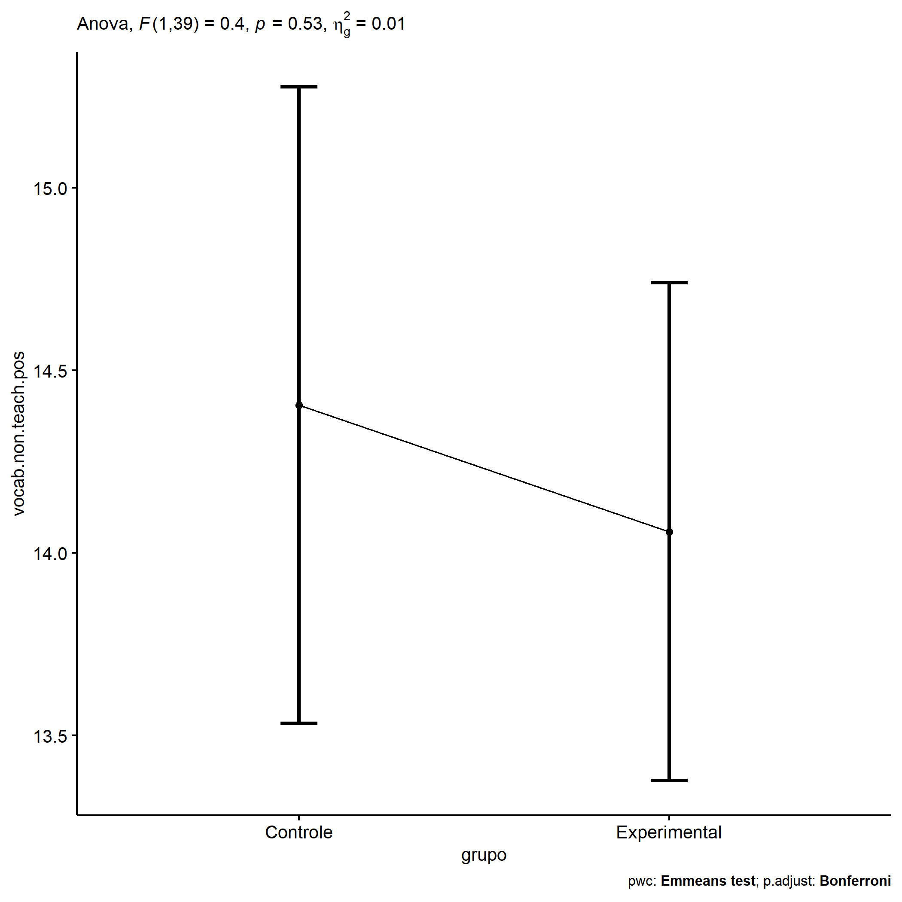<!-- -->

``` r
plots <- oneWayAncovaBoxPlots(
  wdat, "vocab.non.teach.pos", "grupo", aov, pwc, covar = "vocab.non.teach.pre",
  theme = "classic", color = color[["grupo"]],
  subtitle = which(aov$Effect == "grupo"))
```

``` r
if (length(unique(wdat[["grupo"]])) > 1)
  plots[["grupo"]] + ggplot2::ylab("Vocabulario Não Ensinado") + ggplot2::scale_x_discrete(labels=c('pre', 'pos'))
```

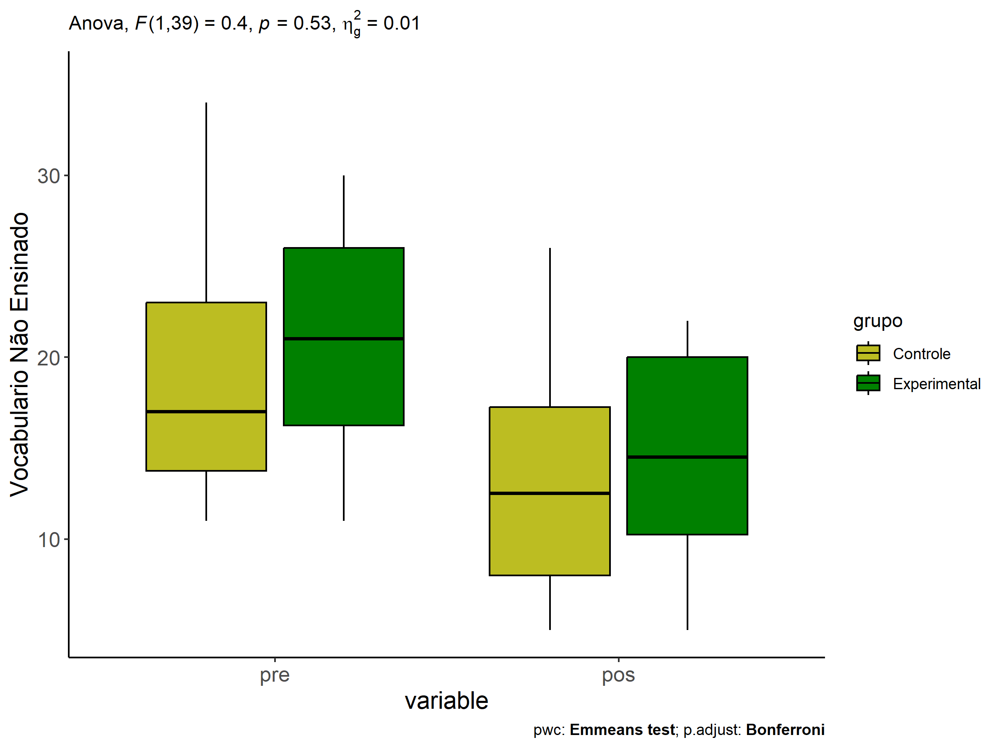<!-- -->

``` r
if (length(unique(wdat.long[["grupo"]])) > 1)
  plots <- oneWayAncovaBoxPlots(
    wdat.long, "vocab.non.teach", "grupo", aov, pwc.long, pre.post = "time",
    theme = "classic", color = color$prepost)
```

``` r
if (length(unique(wdat.long[["grupo"]])) > 1)
  plots[["grupo"]] + ggplot2::ylab("Vocabulario Não Ensinado")
```

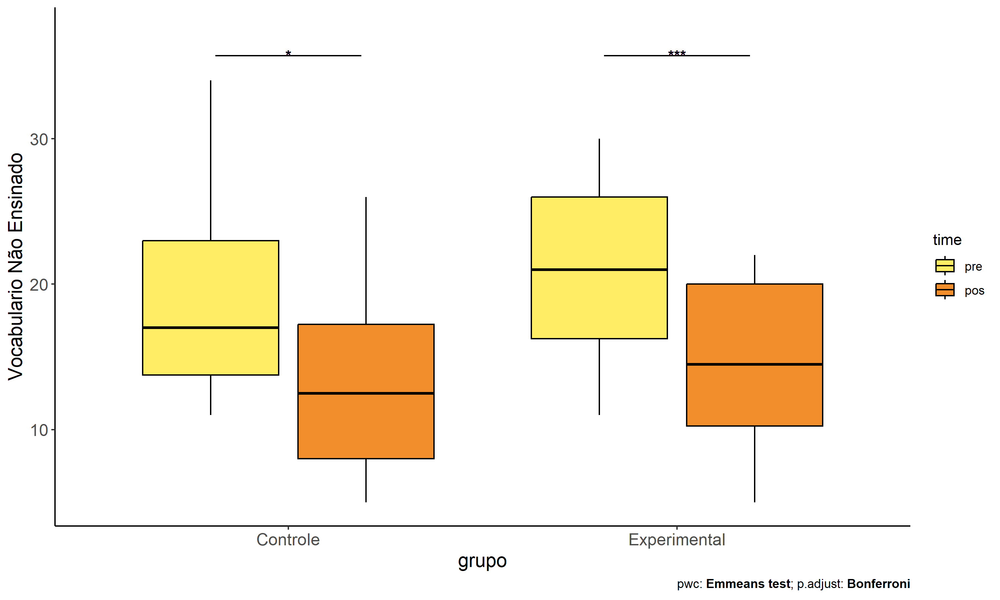<!-- -->

### Checking linearity assumption

``` r
ggscatter(wdat, x = "vocab.non.teach.pre", y = "vocab.non.teach.pos", size = 0.5,
          color = "grupo", add = "reg.line")+
  stat_regline_equation(
    aes(label =  paste(..eq.label.., ..rr.label.., sep = "~~~~"), color = grupo)
  )
```

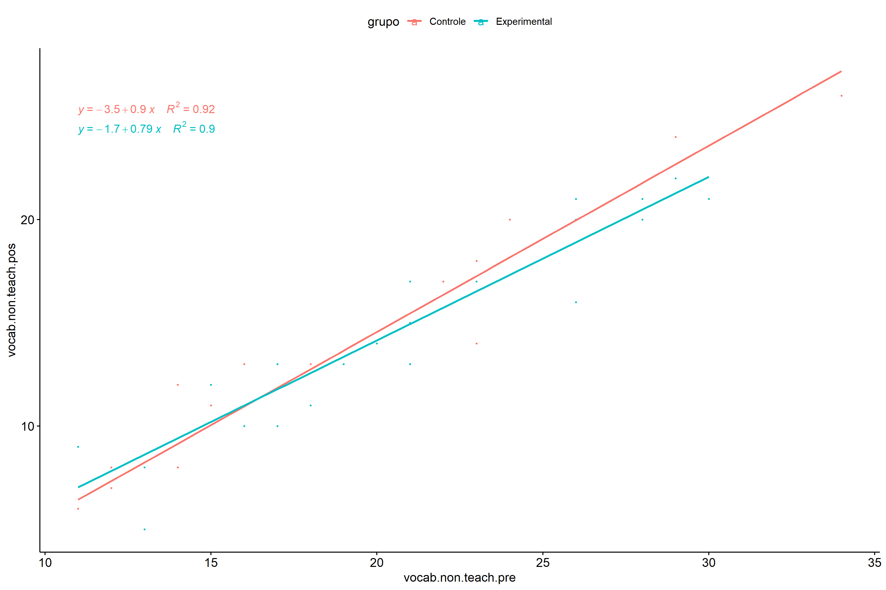<!-- -->

### Checking normality and homogeneity

``` r
res <- augment(lm(vocab.non.teach.pos ~ vocab.non.teach.pre + grupo, data = wdat))
```

``` r
shapiro_test(res$.resid)
```

    ## # A tibble: 1 × 3
    ##   variable   statistic p.value
    ##   <chr>          <dbl>   <dbl>
    ## 1 res$.resid     0.957   0.120

``` r
levene_test(res, .resid ~ grupo)
```

    ## # A tibble: 1 × 4
    ##     df1   df2 statistic     p
    ##   <int> <int>     <dbl> <dbl>
    ## 1     1    40     0.332 0.567

# ANCOVA and Pairwise for two factors **grupo:Sexo**

## Without remove non-normal data

``` r
pdat = remove_group_data(dat[!is.na(dat[["grupo"]]) & !is.na(dat[["Sexo"]]),], "vocab.non.teach.pos", c("grupo","Sexo"))

pdat.long <- rbind(pdat[,c("id","grupo","Sexo")], pdat[,c("id","grupo","Sexo")])
pdat.long[["time"]] <- c(rep("pre", nrow(pdat)), rep("pos", nrow(pdat)))
pdat.long[["time"]] <- factor(pdat.long[["time"]], c("pre","pos"))
pdat.long[["vocab.non.teach"]] <- c(pdat[["vocab.non.teach.pre"]], pdat[["vocab.non.teach.pos"]])

aov = anova_test(pdat, vocab.non.teach.pos ~ vocab.non.teach.pre + grupo*Sexo)
laov[["grupo:Sexo"]] <- get_anova_table(aov)
```

``` r
pwcs <- list()
pwcs[["Sexo"]] <- emmeans_test(
  group_by(pdat, grupo), vocab.non.teach.pos ~ Sexo,
  covariate = vocab.non.teach.pre, p.adjust.method = "bonferroni")
pwcs[["grupo"]] <- emmeans_test(
  group_by(pdat, Sexo), vocab.non.teach.pos ~ grupo,
  covariate = vocab.non.teach.pre, p.adjust.method = "bonferroni")

pwc <- plyr::rbind.fill(pwcs[["grupo"]], pwcs[["Sexo"]])
pwc <- pwc[,c("grupo","Sexo", colnames(pwc)[!colnames(pwc) %in% c("grupo","Sexo")])]
```

``` r
pwc.long <- emmeans_test(dplyr::group_by_at(pdat.long, c("grupo","Sexo")),
                         vocab.non.teach ~ time,
                         p.adjust.method = "bonferroni")
lpwc[["grupo:Sexo"]] <- plyr::rbind.fill(pwc, pwc.long)
```

``` r
ds <- get.descriptives(pdat, "vocab.non.teach.pos", c("grupo","Sexo"), covar = "vocab.non.teach.pre")
ds <- merge(ds[ds$variable != "vocab.non.teach.pre",],
            ds[ds$variable == "vocab.non.teach.pre", !colnames(ds) %in% c("variable")],
            by = c("grupo","Sexo"), all.x = T, suffixes = c("", ".vocab.non.teach.pre"))
ds <- merge(get_emmeans(pwcs[["grupo"]]), ds, by = c("grupo","Sexo"), suffixes = c(".emms", ""))
ds <- ds[,c("grupo","Sexo","n","mean.vocab.non.teach.pre","se.vocab.non.teach.pre","mean","se","emmean","se.emms")]

colnames(ds) <- c("grupo","Sexo", "N", paste0(c("M","SE")," (pre)"),
                  paste0(c("M","SE"), " (unadj)"), paste0(c("M", "SE"), " (adj)"))

lemms[["grupo:Sexo"]] <- ds
```

## Computing ANCOVA and PairWise After removing non-normal data (OK)

``` r
wdat = pdat 

res = residuals(lm(vocab.non.teach.pos ~ vocab.non.teach.pre + grupo*Sexo, data = wdat))
non.normal = getNonNormal(res, wdat$id, plimit = 0.05)

wdat = wdat[!wdat$id %in% non.normal,]

wdat.long <- rbind(wdat[,c("id","grupo","Sexo")], wdat[,c("id","grupo","Sexo")])
wdat.long[["time"]] <- c(rep("pre", nrow(wdat)), rep("pos", nrow(wdat)))
wdat.long[["time"]] <- factor(wdat.long[["time"]], c("pre","pos"))
wdat.long[["vocab.non.teach"]] <- c(wdat[["vocab.non.teach.pre"]], wdat[["vocab.non.teach.pos"]])


ldat[["grupo:Sexo"]] = wdat

(non.normal)
```

    ##  [1] "P983"  "P3042" "P1831" "P1966" "P1936" "P3038" "P2955" "P3548" "P916"  "P3097" "P2957" "P913"

``` r
aov = anova_test(wdat, vocab.non.teach.pos ~ vocab.non.teach.pre + grupo*Sexo)
laov[["grupo:Sexo"]] <- merge(get_anova_table(aov), laov[["grupo:Sexo"]], by="Effect", suffixes = c("","'"))

(df = get_anova_table(aov))
```

    ## ANOVA Table (type II tests)
    ## 
    ##                Effect DFn DFd       F        p p<.05   ges
    ## 1 vocab.non.teach.pre   1 331 680.789 2.61e-82     * 0.673
    ## 2               grupo   1 331   2.681 1.03e-01       0.008
    ## 3                Sexo   1 331   1.896 1.69e-01       0.006
    ## 4          grupo:Sexo   1 331   3.016 8.30e-02       0.009

| Effect              | DFn | DFd |       F |     p | p\<.05 |   ges |
|:--------------------|----:|----:|--------:|------:|:-------|------:|
| vocab.non.teach.pre |   1 | 331 | 680.789 | 0.000 | \*     | 0.673 |
| grupo               |   1 | 331 |   2.681 | 0.103 |        | 0.008 |
| Sexo                |   1 | 331 |   1.896 | 0.169 |        | 0.006 |
| grupo:Sexo          |   1 | 331 |   3.016 | 0.083 |        | 0.009 |

``` r
pwcs <- list()
pwcs[["Sexo"]] <- emmeans_test(
  group_by(wdat, grupo), vocab.non.teach.pos ~ Sexo,
  covariate = vocab.non.teach.pre, p.adjust.method = "bonferroni")
pwcs[["grupo"]] <- emmeans_test(
  group_by(wdat, Sexo), vocab.non.teach.pos ~ grupo,
  covariate = vocab.non.teach.pre, p.adjust.method = "bonferroni")

pwc <- plyr::rbind.fill(pwcs[["grupo"]], pwcs[["Sexo"]])
pwc <- pwc[,c("grupo","Sexo", colnames(pwc)[!colnames(pwc) %in% c("grupo","Sexo")])]
```

| grupo        | Sexo | term                       | .y.                 | group1   | group2       |  df | statistic |     p | p.adj | p.adj.signif |
|:-------------|:-----|:---------------------------|:--------------------|:---------|:-------------|----:|----------:|------:|------:|:-------------|
|              | F    | vocab.non.teach.pre\*grupo | vocab.non.teach.pos | Controle | Experimental | 331 |     0.061 | 0.951 | 0.951 | ns           |
|              | M    | vocab.non.teach.pre\*grupo | vocab.non.teach.pos | Controle | Experimental | 331 |     2.386 | 0.018 | 0.018 | \*           |
| Controle     |      | vocab.non.teach.pre\*Sexo  | vocab.non.teach.pos | F        | M            | 331 |    -0.403 | 0.687 | 0.687 | ns           |
| Experimental |      | vocab.non.teach.pre\*Sexo  | vocab.non.teach.pos | F        | M            | 331 |     2.179 | 0.030 | 0.030 | \*           |

``` r
pwc.long <- emmeans_test(dplyr::group_by_at(wdat.long, c("grupo","Sexo")),
                         vocab.non.teach ~ time,
                         p.adjust.method = "bonferroni")
lpwc[["grupo:Sexo"]] <- merge(plyr::rbind.fill(pwc, pwc.long), lpwc[["grupo:Sexo"]], by=c("grupo","Sexo","term",".y.","group1","group2"), suffixes = c("","'"))
```

| grupo        | Sexo | term | .y.             | group1 | group2 |  df | statistic |     p | p.adj | p.adj.signif |
|:-------------|:-----|:-----|:----------------|:-------|:-------|----:|----------:|------:|------:|:-------------|
| Controle     | F    | time | vocab.non.teach | pre    | pos    | 664 |    -1.038 | 0.300 | 0.300 | ns           |
| Controle     | M    | time | vocab.non.teach | pre    | pos    | 664 |    -1.462 | 0.144 | 0.144 | ns           |
| Experimental | F    | time | vocab.non.teach | pre    | pos    | 664 |    -0.992 | 0.321 | 0.321 | ns           |
| Experimental | M    | time | vocab.non.teach | pre    | pos    | 664 |     0.256 | 0.798 | 0.798 | ns           |

``` r
ds <- get.descriptives(wdat, "vocab.non.teach.pos", c("grupo","Sexo"), covar = "vocab.non.teach.pre")
ds <- merge(ds[ds$variable != "vocab.non.teach.pre",],
            ds[ds$variable == "vocab.non.teach.pre", !colnames(ds) %in% c("variable")],
            by = c("grupo","Sexo"), all.x = T, suffixes = c("", ".vocab.non.teach.pre"))
ds <- merge(get_emmeans(pwcs[["grupo"]]), ds, by = c("grupo","Sexo"), suffixes = c(".emms", ""))
ds <- ds[,c("grupo","Sexo","n","mean.vocab.non.teach.pre","se.vocab.non.teach.pre","mean","se","emmean","se.emms")]

colnames(ds) <- c("grupo","Sexo", "N", paste0(c("M","SE")," (pre)"),
                  paste0(c("M","SE"), " (unadj)"), paste0(c("M", "SE"), " (adj)"))

lemms[["grupo:Sexo"]] <- merge(ds, lemms[["grupo:Sexo"]], by=c("grupo","Sexo"), suffixes = c("","'"))
```

| grupo        | Sexo |   N | M (pre) | SE (pre) | M (unadj) | SE (unadj) | M (adj) | SE (adj) |
|:-------------|:-----|----:|--------:|---------:|----------:|-----------:|--------:|---------:|
| Controle     | F    |  85 |  21.459 |    0.759 |    22.565 |      0.734 |  22.389 |    0.431 |
| Controle     | M    |  63 |  19.079 |    0.997 |    20.889 |      0.966 |  22.657 |    0.505 |
| Experimental | F    |  97 |  21.897 |    0.636 |    22.887 |      0.637 |  22.353 |    0.404 |
| Experimental | M    |  91 |  21.846 |    0.726 |    21.582 |      0.756 |  21.091 |    0.417 |

### Plots for ancova

``` r
plots <- twoWayAncovaPlots(
  wdat, "vocab.non.teach.pos", c("grupo","Sexo"), aov, pwcs, addParam = c("mean_se"),
  font.label.size=10, step.increase=0.05, p.label="p.adj",
  subtitle = which(aov$Effect == "grupo:Sexo"))
```

``` r
if (!is.null(plots[["grupo"]]))
  plots[["grupo"]] + ggplot2::scale_color_manual(values = color[["Sexo"]])
```

    ## Scale for colour is already present.
    ## Adding another scale for colour, which will replace the existing scale.

<!-- -->

``` r
if (!is.null(plots[["Sexo"]]))
  plots[["Sexo"]] + ggplot2::scale_color_manual(values = color[["grupo"]])
```

    ## Scale for colour is already present.
    ## Adding another scale for colour, which will replace the existing scale.

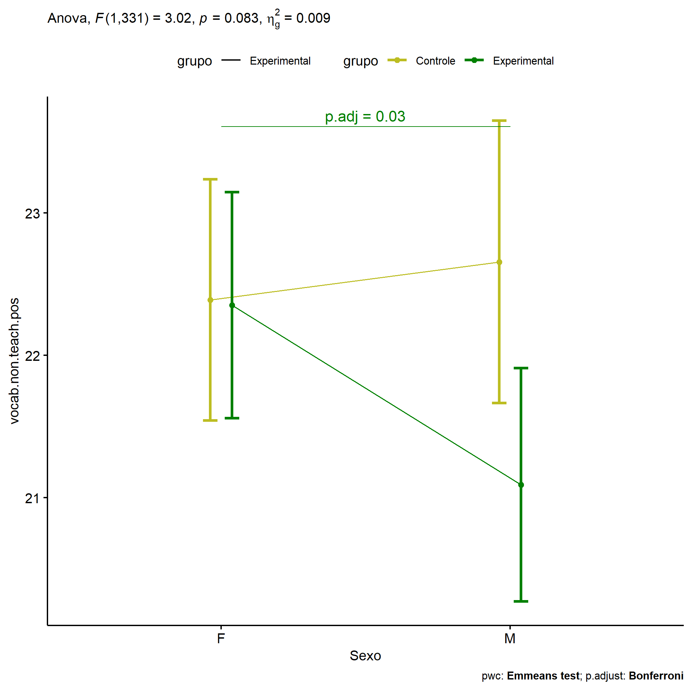<!-- -->

``` r
plots <- twoWayAncovaBoxPlots(
  wdat, "vocab.non.teach.pos", c("grupo","Sexo"), aov, pwcs, covar = "vocab.non.teach.pre",
  theme = "classic", color = color[["grupo:Sexo"]],
  subtitle = which(aov$Effect == "grupo:Sexo"))
```

``` r
plots[["grupo:Sexo"]] + ggplot2::ylab("Vocabulario Não Ensinado") + ggplot2::scale_x_discrete(labels=c('pre', 'pos'))
```

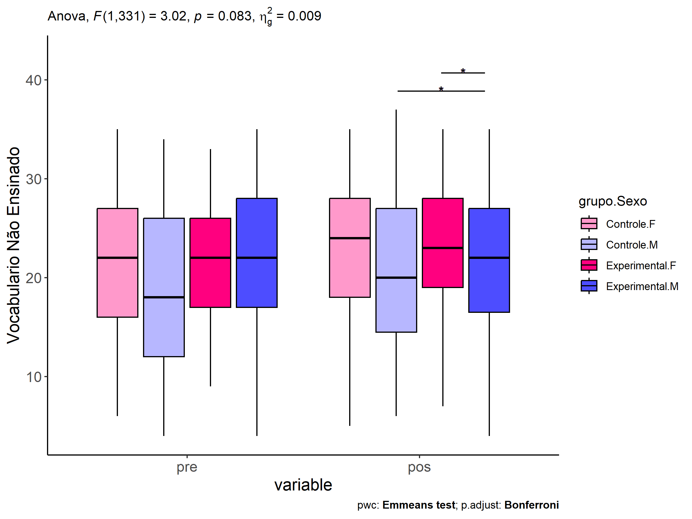<!-- -->

``` r
plots <- twoWayAncovaBoxPlots(
  wdat.long, "vocab.non.teach", c("grupo","Sexo"), aov, pwc.long, pre.post = "time",
  theme = "classic", color = color$prepost)
```

``` r
plots[["grupo:Sexo"]] + ggplot2::ylab("Vocabulario Não Ensinado")
```

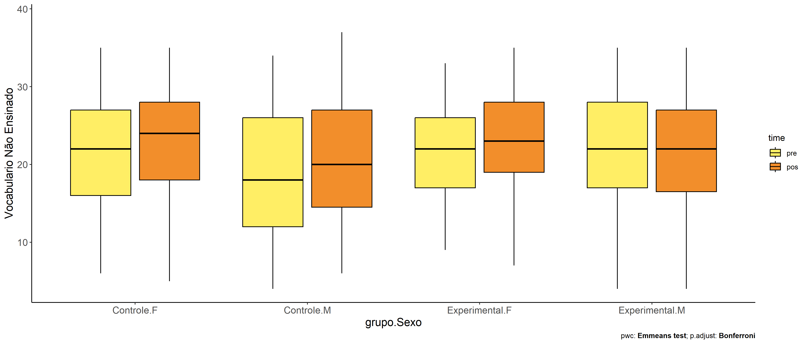<!-- -->

### Checking linearity assumption

``` r
ggscatter(wdat, x = "vocab.non.teach.pre", y = "vocab.non.teach.pos", size = 0.5,
          facet.by = c("grupo","Sexo"), add = "reg.line")+
  stat_regline_equation(
    aes(label =  paste(..eq.label.., ..rr.label.., sep = "~~~~"))
  )
```

<!-- -->

### Checking normality and homogeneity

``` r
res <- augment(lm(vocab.non.teach.pos ~ vocab.non.teach.pre + grupo*Sexo, data = wdat))
```

``` r
shapiro_test(res$.resid)
```

    ## # A tibble: 1 × 3
    ##   variable   statistic p.value
    ##   <chr>          <dbl>   <dbl>
    ## 1 res$.resid     0.992  0.0759

``` r
levene_test(res, .resid ~ grupo*Sexo)
```

    ## # A tibble: 1 × 4
    ##     df1   df2 statistic     p
    ##   <int> <int>     <dbl> <dbl>
    ## 1     3   332     0.509 0.676

# ANCOVA and Pairwise for two factors **grupo:Zona**

## Without remove non-normal data

``` r
pdat = remove_group_data(dat[!is.na(dat[["grupo"]]) & !is.na(dat[["Zona"]]),], "vocab.non.teach.pos", c("grupo","Zona"))

pdat.long <- rbind(pdat[,c("id","grupo","Zona")], pdat[,c("id","grupo","Zona")])
pdat.long[["time"]] <- c(rep("pre", nrow(pdat)), rep("pos", nrow(pdat)))
pdat.long[["time"]] <- factor(pdat.long[["time"]], c("pre","pos"))
pdat.long[["vocab.non.teach"]] <- c(pdat[["vocab.non.teach.pre"]], pdat[["vocab.non.teach.pos"]])

aov = anova_test(pdat, vocab.non.teach.pos ~ vocab.non.teach.pre + grupo*Zona)
laov[["grupo:Zona"]] <- get_anova_table(aov)
```

``` r
pwcs <- list()
pwcs[["Zona"]] <- emmeans_test(
  group_by(pdat, grupo), vocab.non.teach.pos ~ Zona,
  covariate = vocab.non.teach.pre, p.adjust.method = "bonferroni")
pwcs[["grupo"]] <- emmeans_test(
  group_by(pdat, Zona), vocab.non.teach.pos ~ grupo,
  covariate = vocab.non.teach.pre, p.adjust.method = "bonferroni")

pwc <- plyr::rbind.fill(pwcs[["grupo"]], pwcs[["Zona"]])
pwc <- pwc[,c("grupo","Zona", colnames(pwc)[!colnames(pwc) %in% c("grupo","Zona")])]
```

``` r
pwc.long <- emmeans_test(dplyr::group_by_at(pdat.long, c("grupo","Zona")),
                         vocab.non.teach ~ time,
                         p.adjust.method = "bonferroni")
lpwc[["grupo:Zona"]] <- plyr::rbind.fill(pwc, pwc.long)
```

``` r
ds <- get.descriptives(pdat, "vocab.non.teach.pos", c("grupo","Zona"), covar = "vocab.non.teach.pre")
ds <- merge(ds[ds$variable != "vocab.non.teach.pre",],
            ds[ds$variable == "vocab.non.teach.pre", !colnames(ds) %in% c("variable")],
            by = c("grupo","Zona"), all.x = T, suffixes = c("", ".vocab.non.teach.pre"))
ds <- merge(get_emmeans(pwcs[["grupo"]]), ds, by = c("grupo","Zona"), suffixes = c(".emms", ""))
ds <- ds[,c("grupo","Zona","n","mean.vocab.non.teach.pre","se.vocab.non.teach.pre","mean","se","emmean","se.emms")]

colnames(ds) <- c("grupo","Zona", "N", paste0(c("M","SE")," (pre)"),
                  paste0(c("M","SE"), " (unadj)"), paste0(c("M", "SE"), " (adj)"))

lemms[["grupo:Zona"]] <- ds
```

## Computing ANCOVA and PairWise After removing non-normal data (OK)

``` r
wdat = pdat 

res = residuals(lm(vocab.non.teach.pos ~ vocab.non.teach.pre + grupo*Zona, data = wdat))
non.normal = getNonNormal(res, wdat$id, plimit = 0.05)

wdat = wdat[!wdat$id %in% non.normal,]

wdat.long <- rbind(wdat[,c("id","grupo","Zona")], wdat[,c("id","grupo","Zona")])
wdat.long[["time"]] <- c(rep("pre", nrow(wdat)), rep("pos", nrow(wdat)))
wdat.long[["time"]] <- factor(wdat.long[["time"]], c("pre","pos"))
wdat.long[["vocab.non.teach"]] <- c(wdat[["vocab.non.teach.pre"]], wdat[["vocab.non.teach.pos"]])


ldat[["grupo:Zona"]] = wdat

(non.normal)
```

    ## [1] "P983"  "P1831" "P1966" "P2957" "P976"  "P916"  "P3038" "P3042" "P1961"

``` r
aov = anova_test(wdat, vocab.non.teach.pos ~ vocab.non.teach.pre + grupo*Zona)
laov[["grupo:Zona"]] <- merge(get_anova_table(aov), laov[["grupo:Zona"]], by="Effect", suffixes = c("","'"))

(df = get_anova_table(aov))
```

    ## ANOVA Table (type II tests)
    ## 
    ##                Effect DFn DFd       F        p p<.05      ges
    ## 1 vocab.non.teach.pre   1 280 576.726 5.85e-70     * 0.673000
    ## 2               grupo   1 280   3.957 4.80e-02     * 0.014000
    ## 3                Zona   1 280   0.015 9.03e-01       0.000053
    ## 4          grupo:Zona   1 280   3.357 6.80e-02       0.012000

| Effect              | DFn | DFd |       F |     p | p\<.05 |   ges |
|:--------------------|----:|----:|--------:|------:|:-------|------:|
| vocab.non.teach.pre |   1 | 280 | 576.726 | 0.000 | \*     | 0.673 |
| grupo               |   1 | 280 |   3.957 | 0.048 | \*     | 0.014 |
| Zona                |   1 | 280 |   0.015 | 0.903 |        | 0.000 |
| grupo:Zona          |   1 | 280 |   3.357 | 0.068 |        | 0.012 |

``` r
pwcs <- list()
pwcs[["Zona"]] <- emmeans_test(
  group_by(wdat, grupo), vocab.non.teach.pos ~ Zona,
  covariate = vocab.non.teach.pre, p.adjust.method = "bonferroni")
pwcs[["grupo"]] <- emmeans_test(
  group_by(wdat, Zona), vocab.non.teach.pos ~ grupo,
  covariate = vocab.non.teach.pre, p.adjust.method = "bonferroni")

pwc <- plyr::rbind.fill(pwcs[["grupo"]], pwcs[["Zona"]])
pwc <- pwc[,c("grupo","Zona", colnames(pwc)[!colnames(pwc) %in% c("grupo","Zona")])]
```

| grupo        | Zona   | term                       | .y.                 | group1   | group2       |  df | statistic |     p | p.adj | p.adj.signif |
|:-------------|:-------|:---------------------------|:--------------------|:---------|:-------------|----:|----------:|------:|------:|:-------------|
|              | Rural  | vocab.non.teach.pre\*grupo | vocab.non.teach.pos | Controle | Experimental | 280 |     2.702 | 0.007 | 0.007 | \*\*         |
|              | Urbana | vocab.non.teach.pre\*grupo | vocab.non.teach.pos | Controle | Experimental | 280 |    -0.109 | 0.913 | 0.913 | ns           |
| Controle     |        | vocab.non.teach.pre\*Zona  | vocab.non.teach.pos | Rural    | Urbana       | 280 |     1.310 | 0.191 | 0.191 | ns           |
| Experimental |        | vocab.non.teach.pre\*Zona  | vocab.non.teach.pos | Rural    | Urbana       | 280 |    -1.284 | 0.200 | 0.200 | ns           |

``` r
pwc.long <- emmeans_test(dplyr::group_by_at(wdat.long, c("grupo","Zona")),
                         vocab.non.teach ~ time,
                         p.adjust.method = "bonferroni")
lpwc[["grupo:Zona"]] <- merge(plyr::rbind.fill(pwc, pwc.long), lpwc[["grupo:Zona"]], by=c("grupo","Zona","term",".y.","group1","group2"), suffixes = c("","'"))
```

| grupo        | Zona   | term | .y.             | group1 | group2 |  df | statistic |     p | p.adj | p.adj.signif |
|:-------------|:-------|:-----|:----------------|:-------|:-------|----:|----------:|------:|------:|:-------------|
| Controle     | Rural  | time | vocab.non.teach | pre    | pos    | 562 |    -1.575 | 0.116 | 0.116 | ns           |
| Controle     | Urbana | time | vocab.non.teach | pre    | pos    | 562 |    -0.451 | 0.652 | 0.652 | ns           |
| Experimental | Rural  | time | vocab.non.teach | pre    | pos    | 562 |     0.064 | 0.949 | 0.949 | ns           |
| Experimental | Urbana | time | vocab.non.teach | pre    | pos    | 562 |    -0.540 | 0.589 | 0.589 | ns           |

``` r
ds <- get.descriptives(wdat, "vocab.non.teach.pos", c("grupo","Zona"), covar = "vocab.non.teach.pre")
ds <- merge(ds[ds$variable != "vocab.non.teach.pre",],
            ds[ds$variable == "vocab.non.teach.pre", !colnames(ds) %in% c("variable")],
            by = c("grupo","Zona"), all.x = T, suffixes = c("", ".vocab.non.teach.pre"))
ds <- merge(get_emmeans(pwcs[["grupo"]]), ds, by = c("grupo","Zona"), suffixes = c(".emms", ""))
ds <- ds[,c("grupo","Zona","n","mean.vocab.non.teach.pre","se.vocab.non.teach.pre","mean","se","emmean","se.emms")]

colnames(ds) <- c("grupo","Zona", "N", paste0(c("M","SE")," (pre)"),
                  paste0(c("M","SE"), " (unadj)"), paste0(c("M", "SE"), " (adj)"))

lemms[["grupo:Zona"]] <- merge(ds, lemms[["grupo:Zona"]], by=c("grupo","Zona"), suffixes = c("","'"))
```

| grupo        | Zona   |   N | M (pre) | SE (pre) | M (unadj) | SE (unadj) | M (adj) | SE (adj) |
|:-------------|:-------|----:|--------:|---------:|----------:|-----------:|--------:|---------:|
| Controle     | Rural  |  74 |  20.743 |    0.817 |    22.541 |      0.807 |  23.323 |    0.466 |
| Controle     | Urbana |  49 |  21.918 |    1.088 |    22.551 |      1.080 |  22.356 |    0.572 |
| Experimental | Rural  |  90 |  21.722 |    0.718 |    21.656 |      0.750 |  21.624 |    0.422 |
| Experimental | Urbana |  72 |  22.444 |    0.743 |    23.069 |      0.761 |  22.437 |    0.472 |

### Plots for ancova

``` r
plots <- twoWayAncovaPlots(
  wdat, "vocab.non.teach.pos", c("grupo","Zona"), aov, pwcs, addParam = c("mean_se"),
  font.label.size=10, step.increase=0.05, p.label="p.adj",
  subtitle = which(aov$Effect == "grupo:Zona"))
```

``` r
if (!is.null(plots[["grupo"]]))
  plots[["grupo"]] + ggplot2::scale_color_manual(values = color[["Zona"]])
```

    ## Scale for colour is already present.
    ## Adding another scale for colour, which will replace the existing scale.

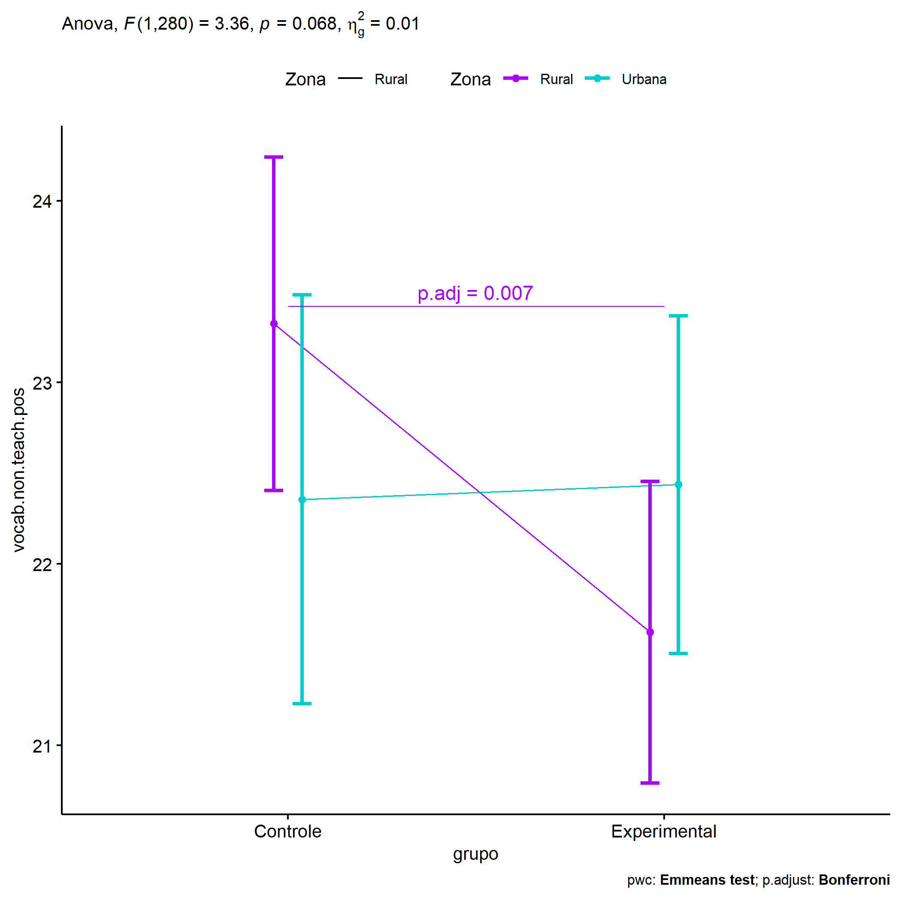<!-- -->

``` r
if (!is.null(plots[["Zona"]]))
  plots[["Zona"]] + ggplot2::scale_color_manual(values = color[["grupo"]])
```

    ## Scale for colour is already present.
    ## Adding another scale for colour, which will replace the existing scale.

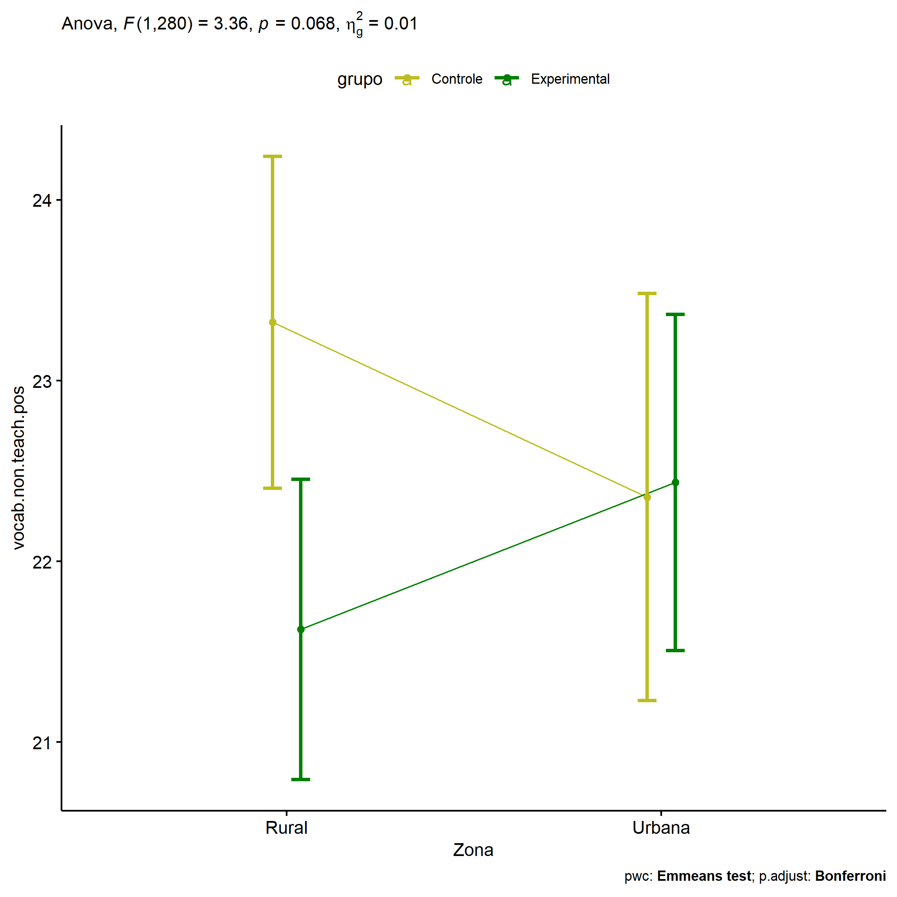<!-- -->

``` r
plots <- twoWayAncovaBoxPlots(
  wdat, "vocab.non.teach.pos", c("grupo","Zona"), aov, pwcs, covar = "vocab.non.teach.pre",
  theme = "classic", color = color[["grupo:Zona"]],
  subtitle = which(aov$Effect == "grupo:Zona"))
```

``` r
plots[["grupo:Zona"]] + ggplot2::ylab("Vocabulario Não Ensinado") + ggplot2::scale_x_discrete(labels=c('pre', 'pos'))
```

<!-- -->

``` r
plots <- twoWayAncovaBoxPlots(
  wdat.long, "vocab.non.teach", c("grupo","Zona"), aov, pwc.long, pre.post = "time",
  theme = "classic", color = color$prepost)
```

``` r
plots[["grupo:Zona"]] + ggplot2::ylab("Vocabulario Não Ensinado")
```

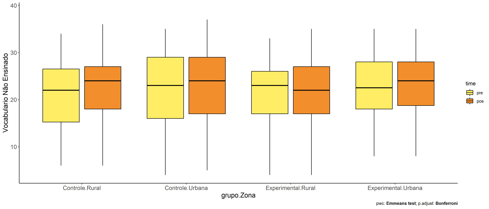<!-- -->

### Checking linearity assumption

``` r
ggscatter(wdat, x = "vocab.non.teach.pre", y = "vocab.non.teach.pos", size = 0.5,
          facet.by = c("grupo","Zona"), add = "reg.line")+
  stat_regline_equation(
    aes(label =  paste(..eq.label.., ..rr.label.., sep = "~~~~"))
  )
```

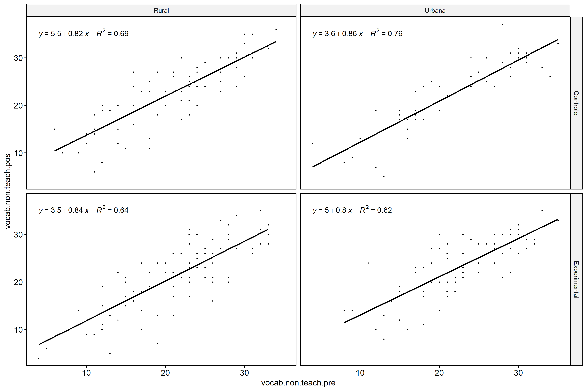<!-- -->

### Checking normality and homogeneity

``` r
res <- augment(lm(vocab.non.teach.pos ~ vocab.non.teach.pre + grupo*Zona, data = wdat))
```

``` r
shapiro_test(res$.resid)
```

    ## # A tibble: 1 × 3
    ##   variable   statistic p.value
    ##   <chr>          <dbl>   <dbl>
    ## 1 res$.resid     0.993   0.179

``` r
levene_test(res, .resid ~ grupo*Zona)
```

    ## # A tibble: 1 × 4
    ##     df1   df2 statistic     p
    ##   <int> <int>     <dbl> <dbl>
    ## 1     3   281     0.907 0.438

# ANCOVA and Pairwise for two factors **grupo:Cor.Raca**

## Without remove non-normal data

``` r
pdat = remove_group_data(dat[!is.na(dat[["grupo"]]) & !is.na(dat[["Cor.Raca"]]),], "vocab.non.teach.pos", c("grupo","Cor.Raca"))

pdat.long <- rbind(pdat[,c("id","grupo","Cor.Raca")], pdat[,c("id","grupo","Cor.Raca")])
pdat.long[["time"]] <- c(rep("pre", nrow(pdat)), rep("pos", nrow(pdat)))
pdat.long[["time"]] <- factor(pdat.long[["time"]], c("pre","pos"))
pdat.long[["vocab.non.teach"]] <- c(pdat[["vocab.non.teach.pre"]], pdat[["vocab.non.teach.pos"]])

aov = anova_test(pdat, vocab.non.teach.pos ~ vocab.non.teach.pre + grupo*Cor.Raca)
laov[["grupo:Cor.Raca"]] <- get_anova_table(aov)
```

``` r
pwcs <- list()
pwcs[["Cor.Raca"]] <- emmeans_test(
  group_by(pdat, grupo), vocab.non.teach.pos ~ Cor.Raca,
  covariate = vocab.non.teach.pre, p.adjust.method = "bonferroni")
pwcs[["grupo"]] <- emmeans_test(
  group_by(pdat, Cor.Raca), vocab.non.teach.pos ~ grupo,
  covariate = vocab.non.teach.pre, p.adjust.method = "bonferroni")

pwc <- plyr::rbind.fill(pwcs[["grupo"]], pwcs[["Cor.Raca"]])
pwc <- pwc[,c("grupo","Cor.Raca", colnames(pwc)[!colnames(pwc) %in% c("grupo","Cor.Raca")])]
```

``` r
pwc.long <- emmeans_test(dplyr::group_by_at(pdat.long, c("grupo","Cor.Raca")),
                         vocab.non.teach ~ time,
                         p.adjust.method = "bonferroni")
lpwc[["grupo:Cor.Raca"]] <- plyr::rbind.fill(pwc, pwc.long)
```

``` r
ds <- get.descriptives(pdat, "vocab.non.teach.pos", c("grupo","Cor.Raca"), covar = "vocab.non.teach.pre")
ds <- merge(ds[ds$variable != "vocab.non.teach.pre",],
            ds[ds$variable == "vocab.non.teach.pre", !colnames(ds) %in% c("variable")],
            by = c("grupo","Cor.Raca"), all.x = T, suffixes = c("", ".vocab.non.teach.pre"))
ds <- merge(get_emmeans(pwcs[["grupo"]]), ds, by = c("grupo","Cor.Raca"), suffixes = c(".emms", ""))
ds <- ds[,c("grupo","Cor.Raca","n","mean.vocab.non.teach.pre","se.vocab.non.teach.pre","mean","se","emmean","se.emms")]

colnames(ds) <- c("grupo","Cor.Raca", "N", paste0(c("M","SE")," (pre)"),
                  paste0(c("M","SE"), " (unadj)"), paste0(c("M", "SE"), " (adj)"))

lemms[["grupo:Cor.Raca"]] <- ds
```

## Computing ANCOVA and PairWise After removing non-normal data (OK)

``` r
wdat = pdat 

res = residuals(lm(vocab.non.teach.pos ~ vocab.non.teach.pre + grupo*Cor.Raca, data = wdat))
non.normal = getNonNormal(res, wdat$id, plimit = 0.05)

wdat = wdat[!wdat$id %in% non.normal,]

wdat.long <- rbind(wdat[,c("id","grupo","Cor.Raca")], wdat[,c("id","grupo","Cor.Raca")])
wdat.long[["time"]] <- c(rep("pre", nrow(wdat)), rep("pos", nrow(wdat)))
wdat.long[["time"]] <- factor(wdat.long[["time"]], c("pre","pos"))
wdat.long[["vocab.non.teach"]] <- c(wdat[["vocab.non.teach.pre"]], wdat[["vocab.non.teach.pos"]])


ldat[["grupo:Cor.Raca"]] = wdat

(non.normal)
```

    ## NULL

``` r
aov = anova_test(wdat, vocab.non.teach.pos ~ vocab.non.teach.pre + grupo*Cor.Raca)
laov[["grupo:Cor.Raca"]] <- merge(get_anova_table(aov), laov[["grupo:Cor.Raca"]], by="Effect", suffixes = c("","'"))

(df = get_anova_table(aov))
```

    ## ANOVA Table (type II tests)
    ## 
    ##                Effect DFn DFd       F        p p<.05   ges
    ## 1 vocab.non.teach.pre   1 132 199.848 3.35e-28     * 0.602
    ## 2               grupo   1 132   6.168 1.40e-02     * 0.045
    ## 3            Cor.Raca   2 132   0.890 4.13e-01       0.013
    ## 4      grupo:Cor.Raca   1 132   2.550 1.13e-01       0.019

| Effect              | DFn | DFd |       F |     p | p\<.05 |   ges |
|:--------------------|----:|----:|--------:|------:|:-------|------:|
| vocab.non.teach.pre |   1 | 132 | 199.848 | 0.000 | \*     | 0.602 |
| grupo               |   1 | 132 |   6.168 | 0.014 | \*     | 0.045 |
| Cor.Raca            |   2 | 132 |   0.890 | 0.413 |        | 0.013 |
| grupo:Cor.Raca      |   1 | 132 |   2.550 | 0.113 |        | 0.019 |

``` r
pwcs <- list()
pwcs[["Cor.Raca"]] <- emmeans_test(
  group_by(wdat, grupo), vocab.non.teach.pos ~ Cor.Raca,
  covariate = vocab.non.teach.pre, p.adjust.method = "bonferroni")
pwcs[["grupo"]] <- emmeans_test(
  group_by(wdat, Cor.Raca), vocab.non.teach.pos ~ grupo,
  covariate = vocab.non.teach.pre, p.adjust.method = "bonferroni")

pwc <- plyr::rbind.fill(pwcs[["grupo"]], pwcs[["Cor.Raca"]])
pwc <- pwc[,c("grupo","Cor.Raca", colnames(pwc)[!colnames(pwc) %in% c("grupo","Cor.Raca")])]
```

| grupo        | Cor.Raca | term                          | .y.                 | group1   | group2       |  df | statistic |     p | p.adj | p.adj.signif |
|:-------------|:---------|:------------------------------|:--------------------|:---------|:-------------|----:|----------:|------:|------:|:-------------|
|              | Branca   | vocab.non.teach.pre\*grupo    | vocab.non.teach.pos | Controle | Experimental | 132 |     2.621 | 0.010 | 0.010 | \*\*         |
|              | Indígena | vocab.non.teach.pre\*grupo    | vocab.non.teach.pos | Controle | Experimental |     |           |       |       |              |
|              | Parda    | vocab.non.teach.pre\*grupo    | vocab.non.teach.pos | Controle | Experimental | 132 |     1.359 | 0.177 | 0.177 | ns           |
| Controle     |          | vocab.non.teach.pre\*Cor.Raca | vocab.non.teach.pos | Branca   | Indígena     | 132 |    -0.570 | 0.570 | 1.000 | ns           |
| Controle     |          | vocab.non.teach.pre\*Cor.Raca | vocab.non.teach.pos | Branca   | Parda        | 132 |     0.121 | 0.904 | 1.000 | ns           |
| Controle     |          | vocab.non.teach.pre\*Cor.Raca | vocab.non.teach.pos | Indígena | Parda        | 132 |     0.696 | 0.488 | 1.000 | ns           |
| Experimental |          | vocab.non.teach.pre\*Cor.Raca | vocab.non.teach.pos | Branca   | Indígena     |     |           |       |       |              |
| Experimental |          | vocab.non.teach.pre\*Cor.Raca | vocab.non.teach.pos | Branca   | Parda        | 132 |    -1.959 | 0.052 | 0.052 | ns           |
| Experimental |          | vocab.non.teach.pre\*Cor.Raca | vocab.non.teach.pos | Indígena | Parda        |     |           |       |       |              |

``` r
pwc.long <- emmeans_test(dplyr::group_by_at(wdat.long, c("grupo","Cor.Raca")),
                         vocab.non.teach ~ time,
                         p.adjust.method = "bonferroni")
lpwc[["grupo:Cor.Raca"]] <- merge(plyr::rbind.fill(pwc, pwc.long), lpwc[["grupo:Cor.Raca"]], by=c("grupo","Cor.Raca","term",".y.","group1","group2"), suffixes = c("","'"))
```

| grupo        | Cor.Raca | term | .y.             | group1 | group2 |  df | statistic |     p | p.adj | p.adj.signif |
|:-------------|:---------|:-----|:----------------|:-------|:-------|----:|----------:|------:|------:|:-------------|
| Controle     | Branca   | time | vocab.non.teach | pre    | pos    | 266 |    -0.588 | 0.557 | 0.557 | ns           |
| Controle     | Indígena | time | vocab.non.teach | pre    | pos    | 266 |    -0.758 | 0.449 | 0.449 | ns           |
| Controle     | Parda    | time | vocab.non.teach | pre    | pos    | 266 |    -1.139 | 0.256 | 0.256 | ns           |
| Experimental | Branca   | time | vocab.non.teach | pre    | pos    | 266 |     1.061 | 0.290 | 0.290 | ns           |
| Experimental | Indígena | time | vocab.non.teach | pre    | pos    |     |           |       |       |              |
| Experimental | Parda    | time | vocab.non.teach | pre    | pos    | 266 |    -0.099 | 0.921 | 0.921 | ns           |

``` r
ds <- get.descriptives(wdat, "vocab.non.teach.pos", c("grupo","Cor.Raca"), covar = "vocab.non.teach.pre")
ds <- merge(ds[ds$variable != "vocab.non.teach.pre",],
            ds[ds$variable == "vocab.non.teach.pre", !colnames(ds) %in% c("variable")],
            by = c("grupo","Cor.Raca"), all.x = T, suffixes = c("", ".vocab.non.teach.pre"))
ds <- merge(get_emmeans(pwcs[["grupo"]]), ds, by = c("grupo","Cor.Raca"), suffixes = c(".emms", ""))
ds <- ds[,c("grupo","Cor.Raca","n","mean.vocab.non.teach.pre","se.vocab.non.teach.pre","mean","se","emmean","se.emms")]

colnames(ds) <- c("grupo","Cor.Raca", "N", paste0(c("M","SE")," (pre)"),
                  paste0(c("M","SE"), " (unadj)"), paste0(c("M", "SE"), " (adj)"))

lemms[["grupo:Cor.Raca"]] <- merge(ds, lemms[["grupo:Cor.Raca"]], by=c("grupo","Cor.Raca"), suffixes = c("","'"))
```

| grupo        | Cor.Raca |   N | M (pre) | SE (pre) | M (unadj) | SE (unadj) | M (adj) | SE (adj) |
|:-------------|:---------|----:|--------:|---------:|----------:|-----------:|--------:|---------:|
| Controle     | Branca   |  22 |  22.273 |    1.369 |    23.500 |      1.408 |  21.949 |    0.969 |
| Controle     | Indígena |   8 |  20.375 |    1.917 |    23.000 |      2.315 |  23.013 |    1.596 |
| Controle     | Parda    |  44 |  18.864 |    1.115 |    20.545 |      1.266 |  21.804 |    0.686 |
| Experimental | Branca   |  12 |  22.167 |    1.792 |    19.167 |      1.779 |  17.704 |    1.307 |
| Experimental | Parda    |  52 |  20.481 |    0.900 |    20.615 |      0.889 |  20.542 |    0.626 |

### Plots for ancova

``` r
plots <- twoWayAncovaPlots(
  wdat, "vocab.non.teach.pos", c("grupo","Cor.Raca"), aov, pwcs, addParam = c("mean_se"),
  font.label.size=10, step.increase=0.05, p.label="p.adj",
  subtitle = which(aov$Effect == "grupo:Cor.Raca"))
```

``` r
if (!is.null(plots[["grupo"]]))
  plots[["grupo"]] + ggplot2::scale_color_manual(values = color[["Cor.Raca"]])
```

<!-- -->

``` r
if (!is.null(plots[["Cor.Raca"]]))
  plots[["Cor.Raca"]] + ggplot2::scale_color_manual(values = color[["grupo"]])
```

    ## Scale for colour is already present.
    ## Adding another scale for colour, which will replace the existing scale.

    ## Warning: Removed 2 rows containing non-finite values (`stat_bracket()`).

    ## Warning: Removed 1 rows containing missing values (`geom_point()`).

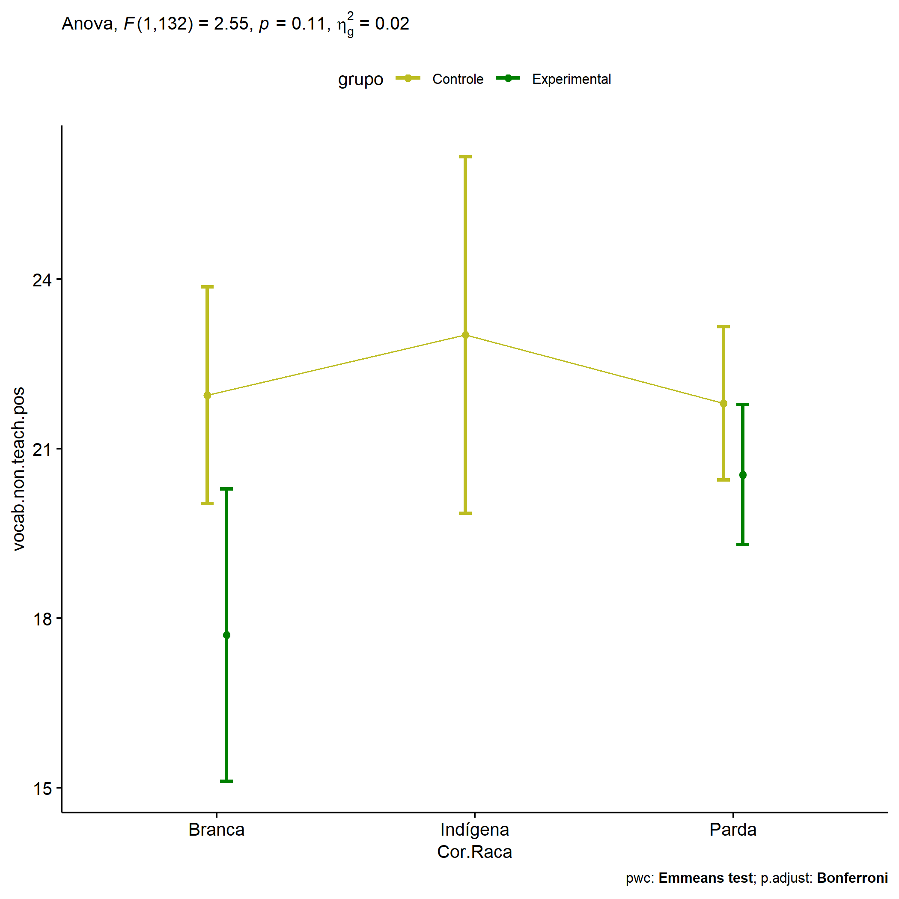<!-- -->

``` r
plots <- twoWayAncovaBoxPlots(
  wdat, "vocab.non.teach.pos", c("grupo","Cor.Raca"), aov, pwcs, covar = "vocab.non.teach.pre",
  theme = "classic", color = color[["grupo:Cor.Raca"]],
  subtitle = which(aov$Effect == "grupo:Cor.Raca"))
```

``` r
plots[["grupo:Cor.Raca"]] + ggplot2::ylab("Vocabulario Não Ensinado") + ggplot2::scale_x_discrete(labels=c('pre', 'pos'))
```

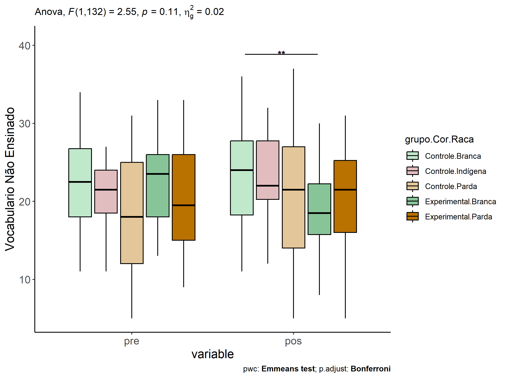<!-- -->

``` r
plots <- twoWayAncovaBoxPlots(
  wdat.long, "vocab.non.teach", c("grupo","Cor.Raca"), aov, pwc.long, pre.post = "time",
  theme = "classic", color = color$prepost)
```

``` r
plots[["grupo:Cor.Raca"]] + ggplot2::ylab("Vocabulario Não Ensinado")
```

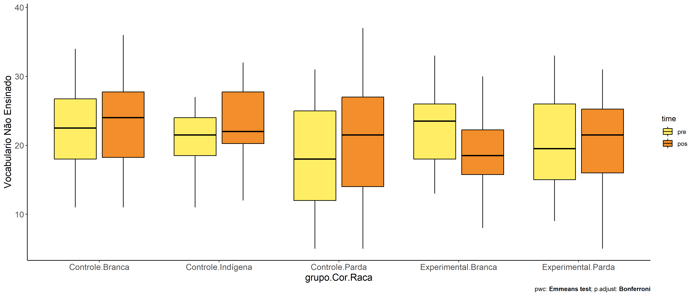<!-- -->

### Checking linearity assumption

``` r
ggscatter(wdat, x = "vocab.non.teach.pre", y = "vocab.non.teach.pos", size = 0.5,
          facet.by = c("grupo","Cor.Raca"), add = "reg.line")+
  stat_regline_equation(
    aes(label =  paste(..eq.label.., ..rr.label.., sep = "~~~~"))
  )
```

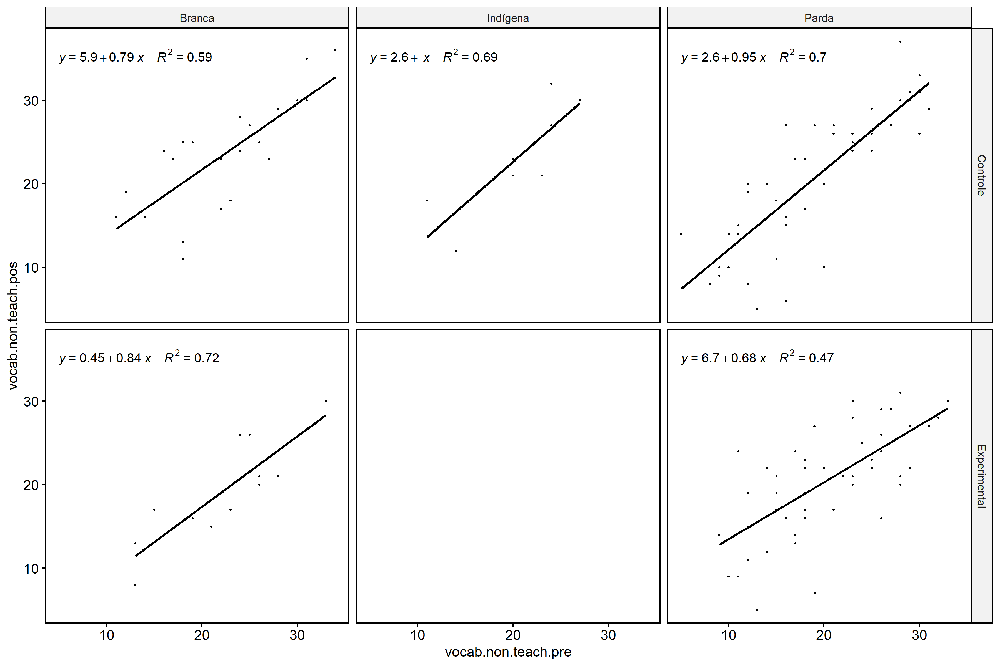<!-- -->

### Checking normality and homogeneity

``` r
res <- augment(lm(vocab.non.teach.pos ~ vocab.non.teach.pre + grupo*Cor.Raca, data = wdat))
```

``` r
shapiro_test(res$.resid)
```

    ## # A tibble: 1 × 3
    ##   variable   statistic p.value
    ##   <chr>          <dbl>   <dbl>
    ## 1 res$.resid     0.986   0.156

``` r
levene_test(res, .resid ~ grupo*Cor.Raca)
```

    ## # A tibble: 1 × 4
    ##     df1   df2 statistic     p
    ##   <int> <int>     <dbl> <dbl>
    ## 1     4   133     0.431 0.786

# ANCOVA and Pairwise for two factors **grupo:vocab.non.teach.quintile**

## Without remove non-normal data

``` r
pdat = remove_group_data(dat[!is.na(dat[["grupo"]]) & !is.na(dat[["vocab.non.teach.quintile"]]),], "vocab.non.teach.pos", c("grupo","vocab.non.teach.quintile"))

pdat.long <- rbind(pdat[,c("id","grupo","vocab.non.teach.quintile")], pdat[,c("id","grupo","vocab.non.teach.quintile")])
pdat.long[["time"]] <- c(rep("pre", nrow(pdat)), rep("pos", nrow(pdat)))
pdat.long[["time"]] <- factor(pdat.long[["time"]], c("pre","pos"))
pdat.long[["vocab.non.teach"]] <- c(pdat[["vocab.non.teach.pre"]], pdat[["vocab.non.teach.pos"]])

aov = anova_test(pdat, vocab.non.teach.pos ~ vocab.non.teach.pre + grupo*vocab.non.teach.quintile)
laov[["grupo:vocab.non.teach.quintile"]] <- get_anova_table(aov)
```

``` r
pwcs <- list()
pwcs[["vocab.non.teach.quintile"]] <- emmeans_test(
  group_by(pdat, grupo), vocab.non.teach.pos ~ vocab.non.teach.quintile,
  covariate = vocab.non.teach.pre, p.adjust.method = "bonferroni")
pwcs[["grupo"]] <- emmeans_test(
  group_by(pdat, vocab.non.teach.quintile), vocab.non.teach.pos ~ grupo,
  covariate = vocab.non.teach.pre, p.adjust.method = "bonferroni")

pwc <- plyr::rbind.fill(pwcs[["grupo"]], pwcs[["vocab.non.teach.quintile"]])
pwc <- pwc[,c("grupo","vocab.non.teach.quintile", colnames(pwc)[!colnames(pwc) %in% c("grupo","vocab.non.teach.quintile")])]
```

``` r
pwc.long <- emmeans_test(dplyr::group_by_at(pdat.long, c("grupo","vocab.non.teach.quintile")),
                         vocab.non.teach ~ time,
                         p.adjust.method = "bonferroni")
lpwc[["grupo:vocab.non.teach.quintile"]] <- plyr::rbind.fill(pwc, pwc.long)
```

``` r
ds <- get.descriptives(pdat, "vocab.non.teach.pos", c("grupo","vocab.non.teach.quintile"), covar = "vocab.non.teach.pre")
ds <- merge(ds[ds$variable != "vocab.non.teach.pre",],
            ds[ds$variable == "vocab.non.teach.pre", !colnames(ds) %in% c("variable")],
            by = c("grupo","vocab.non.teach.quintile"), all.x = T, suffixes = c("", ".vocab.non.teach.pre"))
ds <- merge(get_emmeans(pwcs[["grupo"]]), ds, by = c("grupo","vocab.non.teach.quintile"), suffixes = c(".emms", ""))
ds <- ds[,c("grupo","vocab.non.teach.quintile","n","mean.vocab.non.teach.pre","se.vocab.non.teach.pre","mean","se","emmean","se.emms")]

colnames(ds) <- c("grupo","vocab.non.teach.quintile", "N", paste0(c("M","SE")," (pre)"),
                  paste0(c("M","SE"), " (unadj)"), paste0(c("M", "SE"), " (adj)"))

lemms[["grupo:vocab.non.teach.quintile"]] <- ds
```

## Computing ANCOVA and PairWise After removing non-normal data (OK)

``` r
wdat = pdat 

res = residuals(lm(vocab.non.teach.pos ~ vocab.non.teach.pre + grupo*vocab.non.teach.quintile, data = wdat))
non.normal = getNonNormal(res, wdat$id, plimit = 0.05)

wdat = wdat[!wdat$id %in% non.normal,]

wdat.long <- rbind(wdat[,c("id","grupo","vocab.non.teach.quintile")], wdat[,c("id","grupo","vocab.non.teach.quintile")])
wdat.long[["time"]] <- c(rep("pre", nrow(wdat)), rep("pos", nrow(wdat)))
wdat.long[["time"]] <- factor(wdat.long[["time"]], c("pre","pos"))
wdat.long[["vocab.non.teach"]] <- c(wdat[["vocab.non.teach.pre"]], wdat[["vocab.non.teach.pos"]])


ldat[["grupo:vocab.non.teach.quintile"]] = wdat

(non.normal)
```

    ##  [1] "P983"  "P1966" "P2957" "P1936" "P1831" "P916"  "P1961" "P976"  "P3038" "P3042" "P3106"

``` r
aov = anova_test(wdat, vocab.non.teach.pos ~ vocab.non.teach.pre + grupo*vocab.non.teach.quintile)
laov[["grupo:vocab.non.teach.quintile"]] <- merge(get_anova_table(aov), laov[["grupo:vocab.non.teach.quintile"]], by="Effect", suffixes = c("","'"))

(df = get_anova_table(aov))
```

    ## ANOVA Table (type II tests)
    ## 
    ##                           Effect DFn DFd      F        p p<.05   ges
    ## 1            vocab.non.teach.pre   1 326 36.932 3.41e-09     * 0.102
    ## 2                          grupo   1 326  4.039 4.50e-02     * 0.012
    ## 3       vocab.non.teach.quintile   4 326  0.544 7.03e-01       0.007
    ## 4 grupo:vocab.non.teach.quintile   4 326  1.153 3.31e-01       0.014

| Effect                         | DFn | DFd |      F |     p | p\<.05 |   ges |
|:-------------------------------|----:|----:|-------:|------:|:-------|------:|
| vocab.non.teach.pre            |   1 | 326 | 36.932 | 0.000 | \*     | 0.102 |
| grupo                          |   1 | 326 |  4.039 | 0.045 | \*     | 0.012 |
| vocab.non.teach.quintile       |   4 | 326 |  0.544 | 0.703 |        | 0.007 |
| grupo:vocab.non.teach.quintile |   4 | 326 |  1.153 | 0.331 |        | 0.014 |

``` r
pwcs <- list()
pwcs[["vocab.non.teach.quintile"]] <- emmeans_test(
  group_by(wdat, grupo), vocab.non.teach.pos ~ vocab.non.teach.quintile,
  covariate = vocab.non.teach.pre, p.adjust.method = "bonferroni")
pwcs[["grupo"]] <- emmeans_test(
  group_by(wdat, vocab.non.teach.quintile), vocab.non.teach.pos ~ grupo,
  covariate = vocab.non.teach.pre, p.adjust.method = "bonferroni")

pwc <- plyr::rbind.fill(pwcs[["grupo"]], pwcs[["vocab.non.teach.quintile"]])
pwc <- pwc[,c("grupo","vocab.non.teach.quintile", colnames(pwc)[!colnames(pwc) %in% c("grupo","vocab.non.teach.quintile")])]
```

| grupo        | vocab.non.teach.quintile | term                                          | .y.                 | group1       | group2       |  df | statistic |     p | p.adj | p.adj.signif |
|:-------------|:-------------------------|:----------------------------------------------|:--------------------|:-------------|:-------------|----:|----------:|------:|------:|:-------------|
|              | 1st quintile             | vocab.non.teach.pre\*grupo                    | vocab.non.teach.pos | Controle     | Experimental | 326 |     2.148 | 0.032 | 0.032 | \*           |
|              | 2nd quintile             | vocab.non.teach.pre\*grupo                    | vocab.non.teach.pos | Controle     | Experimental | 326 |     0.623 | 0.534 | 0.534 | ns           |
|              | 3rd quintile             | vocab.non.teach.pre\*grupo                    | vocab.non.teach.pos | Controle     | Experimental | 326 |    -0.517 | 0.605 | 0.605 | ns           |
|              | 4th quintile             | vocab.non.teach.pre\*grupo                    | vocab.non.teach.pos | Controle     | Experimental | 326 |     1.257 | 0.210 | 0.210 | ns           |
|              | 5th quintile             | vocab.non.teach.pre\*grupo                    | vocab.non.teach.pos | Controle     | Experimental | 326 |     1.362 | 0.174 | 0.174 | ns           |
| Controle     |                          | vocab.non.teach.pre\*vocab.non.teach.quintile | vocab.non.teach.pos | 1st quintile | 2nd quintile | 326 |     0.511 | 0.610 | 1.000 | ns           |
| Controle     |                          | vocab.non.teach.pre\*vocab.non.teach.quintile | vocab.non.teach.pos | 1st quintile | 3rd quintile | 326 |     0.245 | 0.807 | 1.000 | ns           |
| Controle     |                          | vocab.non.teach.pre\*vocab.non.teach.quintile | vocab.non.teach.pos | 1st quintile | 4th quintile | 326 |    -0.061 | 0.951 | 1.000 | ns           |
| Controle     |                          | vocab.non.teach.pre\*vocab.non.teach.quintile | vocab.non.teach.pos | 1st quintile | 5th quintile | 326 |    -0.082 | 0.934 | 1.000 | ns           |
| Controle     |                          | vocab.non.teach.pre\*vocab.non.teach.quintile | vocab.non.teach.pos | 2nd quintile | 3rd quintile | 326 |    -0.161 | 0.872 | 1.000 | ns           |
| Controle     |                          | vocab.non.teach.pre\*vocab.non.teach.quintile | vocab.non.teach.pos | 2nd quintile | 4th quintile | 326 |    -0.487 | 0.627 | 1.000 | ns           |
| Controle     |                          | vocab.non.teach.pre\*vocab.non.teach.quintile | vocab.non.teach.pos | 2nd quintile | 5th quintile | 326 |    -0.409 | 0.683 | 1.000 | ns           |
| Controle     |                          | vocab.non.teach.pre\*vocab.non.teach.quintile | vocab.non.teach.pos | 3rd quintile | 4th quintile | 326 |    -0.519 | 0.604 | 1.000 | ns           |
| Controle     |                          | vocab.non.teach.pre\*vocab.non.teach.quintile | vocab.non.teach.pos | 3rd quintile | 5th quintile | 326 |    -0.432 | 0.666 | 1.000 | ns           |
| Controle     |                          | vocab.non.teach.pre\*vocab.non.teach.quintile | vocab.non.teach.pos | 4th quintile | 5th quintile | 326 |    -0.076 | 0.939 | 1.000 | ns           |
| Experimental |                          | vocab.non.teach.pre\*vocab.non.teach.quintile | vocab.non.teach.pos | 1st quintile | 2nd quintile | 326 |    -0.899 | 0.369 | 1.000 | ns           |
| Experimental |                          | vocab.non.teach.pre\*vocab.non.teach.quintile | vocab.non.teach.pos | 1st quintile | 3rd quintile | 326 |    -1.359 | 0.175 | 1.000 | ns           |
| Experimental |                          | vocab.non.teach.pre\*vocab.non.teach.quintile | vocab.non.teach.pos | 1st quintile | 4th quintile | 326 |    -0.572 | 0.568 | 1.000 | ns           |
| Experimental |                          | vocab.non.teach.pre\*vocab.non.teach.quintile | vocab.non.teach.pos | 1st quintile | 5th quintile | 326 |    -0.322 | 0.748 | 1.000 | ns           |
| Experimental |                          | vocab.non.teach.pre\*vocab.non.teach.quintile | vocab.non.teach.pos | 2nd quintile | 3rd quintile | 326 |    -1.141 | 0.255 | 1.000 | ns           |
| Experimental |                          | vocab.non.teach.pre\*vocab.non.teach.quintile | vocab.non.teach.pos | 2nd quintile | 4th quintile | 326 |    -0.122 | 0.903 | 1.000 | ns           |
| Experimental |                          | vocab.non.teach.pre\*vocab.non.teach.quintile | vocab.non.teach.pos | 2nd quintile | 5th quintile | 326 |     0.085 | 0.932 | 1.000 | ns           |
| Experimental |                          | vocab.non.teach.pre\*vocab.non.teach.quintile | vocab.non.teach.pos | 3rd quintile | 4th quintile | 326 |     0.996 | 0.320 | 1.000 | ns           |
| Experimental |                          | vocab.non.teach.pre\*vocab.non.teach.quintile | vocab.non.teach.pos | 3rd quintile | 5th quintile | 326 |     0.891 | 0.374 | 1.000 | ns           |
| Experimental |                          | vocab.non.teach.pre\*vocab.non.teach.quintile | vocab.non.teach.pos | 4th quintile | 5th quintile | 326 |     0.326 | 0.744 | 1.000 | ns           |

``` r
pwc.long <- emmeans_test(dplyr::group_by_at(wdat.long, c("grupo","vocab.non.teach.quintile")),
                         vocab.non.teach ~ time,
                         p.adjust.method = "bonferroni")
lpwc[["grupo:vocab.non.teach.quintile"]] <- merge(plyr::rbind.fill(pwc, pwc.long), lpwc[["grupo:vocab.non.teach.quintile"]], by=c("grupo","vocab.non.teach.quintile","term",".y.","group1","group2"), suffixes = c("","'"))
```

| grupo        | vocab.non.teach.quintile | term | .y.             | group1 | group2 |  df | statistic |     p | p.adj | p.adj.signif |
|:-------------|:-------------------------|:-----|:----------------|:-------|:-------|----:|----------:|------:|------:|:-------------|
| Controle     | 1st quintile             | time | vocab.non.teach | pre    | pos    | 654 |    -4.639 | 0.000 | 0.000 | \*\*\*\*     |
| Controle     | 2nd quintile             | time | vocab.non.teach | pre    | pos    | 654 |    -2.448 | 0.015 | 0.015 | \*           |
| Controle     | 3rd quintile             | time | vocab.non.teach | pre    | pos    | 654 |    -1.023 | 0.307 | 0.307 | ns           |
| Controle     | 4th quintile             | time | vocab.non.teach | pre    | pos    | 654 |    -0.600 | 0.549 | 0.549 | ns           |
| Controle     | 5th quintile             | time | vocab.non.teach | pre    | pos    | 654 |     0.301 | 0.763 | 0.763 | ns           |
| Experimental | 1st quintile             | time | vocab.non.teach | pre    | pos    | 654 |    -1.402 | 0.161 | 0.161 | ns           |
| Experimental | 2nd quintile             | time | vocab.non.teach | pre    | pos    | 654 |    -1.770 | 0.077 | 0.077 | ns           |
| Experimental | 3rd quintile             | time | vocab.non.teach | pre    | pos    | 654 |    -2.147 | 0.032 | 0.032 | \*           |
| Experimental | 4th quintile             | time | vocab.non.teach | pre    | pos    | 654 |     1.033 | 0.302 | 0.302 | ns           |
| Experimental | 5th quintile             | time | vocab.non.teach | pre    | pos    | 654 |     2.234 | 0.026 | 0.026 | \*           |

``` r
ds <- get.descriptives(wdat, "vocab.non.teach.pos", c("grupo","vocab.non.teach.quintile"), covar = "vocab.non.teach.pre")
ds <- merge(ds[ds$variable != "vocab.non.teach.pre",],
            ds[ds$variable == "vocab.non.teach.pre", !colnames(ds) %in% c("variable")],
            by = c("grupo","vocab.non.teach.quintile"), all.x = T, suffixes = c("", ".vocab.non.teach.pre"))
ds <- merge(get_emmeans(pwcs[["grupo"]]), ds, by = c("grupo","vocab.non.teach.quintile"), suffixes = c(".emms", ""))
ds <- ds[,c("grupo","vocab.non.teach.quintile","n","mean.vocab.non.teach.pre","se.vocab.non.teach.pre","mean","se","emmean","se.emms")]

colnames(ds) <- c("grupo","vocab.non.teach.quintile", "N", paste0(c("M","SE")," (pre)"),
                  paste0(c("M","SE"), " (unadj)"), paste0(c("M", "SE"), " (adj)"))

lemms[["grupo:vocab.non.teach.quintile"]] <- merge(ds, lemms[["grupo:vocab.non.teach.quintile"]], by=c("grupo","vocab.non.teach.quintile"), suffixes = c("","'"))
```

| grupo        | vocab.non.teach.quintile |   N | M (pre) | SE (pre) | M (unadj) | SE (unadj) | M (adj) | SE (adj) |
|:-------------|:-------------------------|----:|--------:|---------:|----------:|-----------:|--------:|---------:|
| Controle     | 1st quintile             |  30 |   9.900 |    0.485 |    13.767 |      0.806 |  22.744 |    1.650 |
| Controle     | 2nd quintile             |  37 |  16.486 |    0.262 |    18.324 |      0.765 |  22.075 |    0.904 |
| Controle     | 3rd quintile             |  31 |  22.290 |    0.279 |    23.129 |      0.836 |  22.275 |    0.736 |
| Controle     | 4th quintile             |  30 |  26.933 |    0.287 |    27.433 |      0.583 |  22.895 |    1.047 |
| Controle     | 5th quintile             |  19 |  31.368 |    0.368 |    31.053 |      0.628 |  22.995 |    1.615 |
| Experimental | 1st quintile             |  25 |  11.000 |    0.480 |    12.280 |      0.970 |  20.385 |    1.557 |
| Experimental | 2nd quintile             |  43 |  16.698 |    0.246 |    17.930 |      0.684 |  21.514 |    0.851 |
| Experimental | 3rd quintile             |  51 |  22.000 |    0.179 |    23.373 |      0.647 |  22.749 |    0.572 |
| Experimental | 4th quintile             |  46 |  26.978 |    0.210 |    26.283 |      0.598 |  21.708 |    0.958 |
| Experimental | 5th quintile             |  25 |  31.640 |    0.264 |    29.600 |      0.616 |  21.327 |    1.581 |

### Plots for ancova

``` r
plots <- twoWayAncovaPlots(
  wdat, "vocab.non.teach.pos", c("grupo","vocab.non.teach.quintile"), aov, pwcs, addParam = c("mean_se"),
  font.label.size=10, step.increase=0.05, p.label="p.adj",
  subtitle = which(aov$Effect == "grupo:vocab.non.teach.quintile"))
```

``` r
if (!is.null(plots[["grupo"]]))
  plots[["grupo"]] + ggplot2::scale_color_manual(values = color[["vocab.non.teach.quintile"]])
```

    ## Scale for colour is already present.
    ## Adding another scale for colour, which will replace the existing scale.

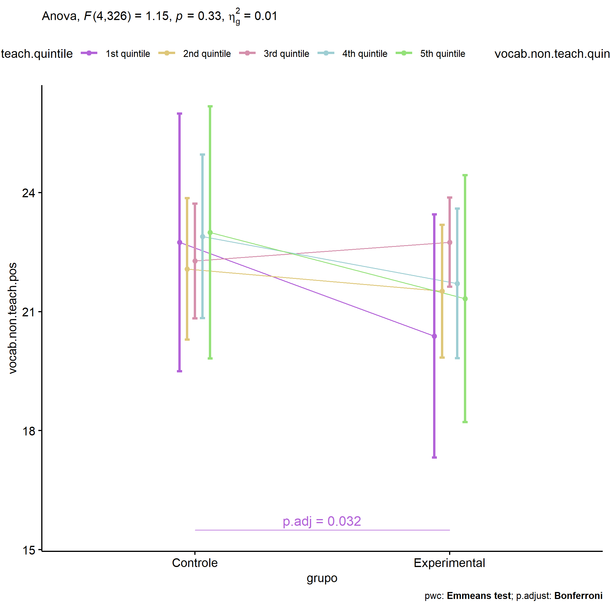<!-- -->

``` r
if (!is.null(plots[["vocab.non.teach.quintile"]]))
  plots[["vocab.non.teach.quintile"]] + ggplot2::scale_color_manual(values = color[["grupo"]])
```

    ## Scale for colour is already present.
    ## Adding another scale for colour, which will replace the existing scale.

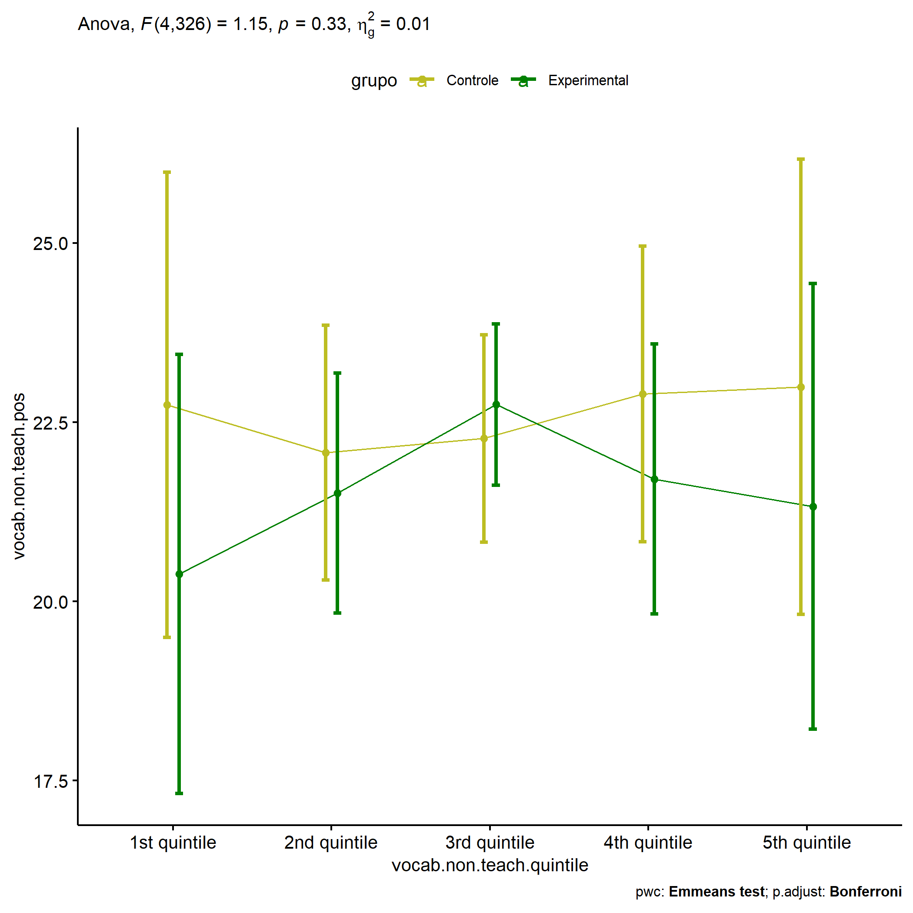<!-- -->

``` r
plots <- twoWayAncovaBoxPlots(
  wdat, "vocab.non.teach.pos", c("grupo","vocab.non.teach.quintile"), aov, pwcs, covar = "vocab.non.teach.pre",
  theme = "classic", color = color[["grupo:vocab.non.teach.quintile"]],
  subtitle = which(aov$Effect == "grupo:vocab.non.teach.quintile"))
```

``` r
plots[["grupo:vocab.non.teach.quintile"]] + ggplot2::ylab("Vocabulario Não Ensinado") + ggplot2::scale_x_discrete(labels=c('pre', 'pos'))
```

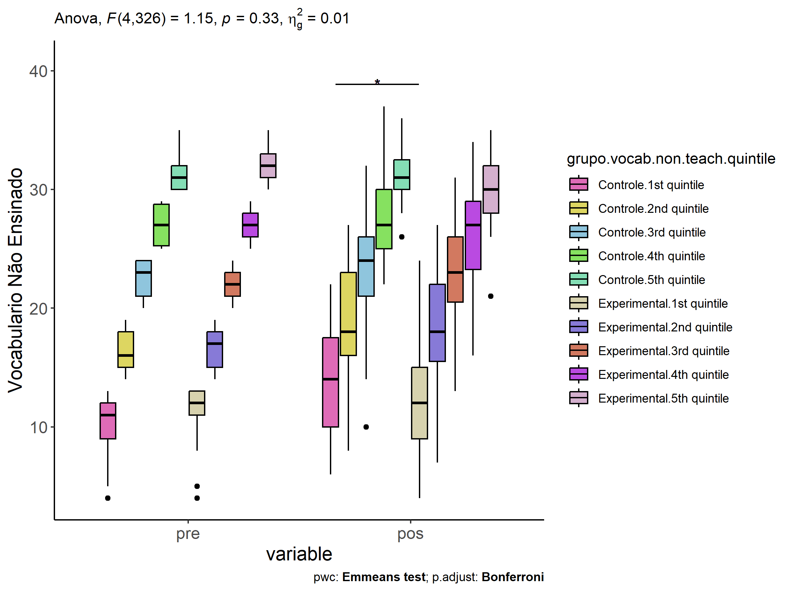<!-- -->

``` r
plots <- twoWayAncovaBoxPlots(
  wdat.long, "vocab.non.teach", c("grupo","vocab.non.teach.quintile"), aov, pwc.long, pre.post = "time",
  theme = "classic", color = color$prepost)
```

``` r
plots[["grupo:vocab.non.teach.quintile"]] + ggplot2::ylab("Vocabulario Não Ensinado")
```

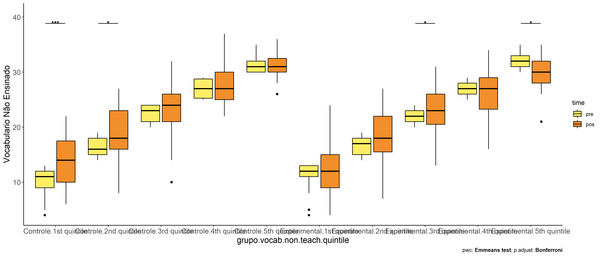<!-- -->

### Checking linearity assumption

``` r
ggscatter(wdat, x = "vocab.non.teach.pre", y = "vocab.non.teach.pos", size = 0.5,
          facet.by = c("grupo","vocab.non.teach.quintile"), add = "reg.line")+
  stat_regline_equation(
    aes(label =  paste(..eq.label.., ..rr.label.., sep = "~~~~"))
  )
```

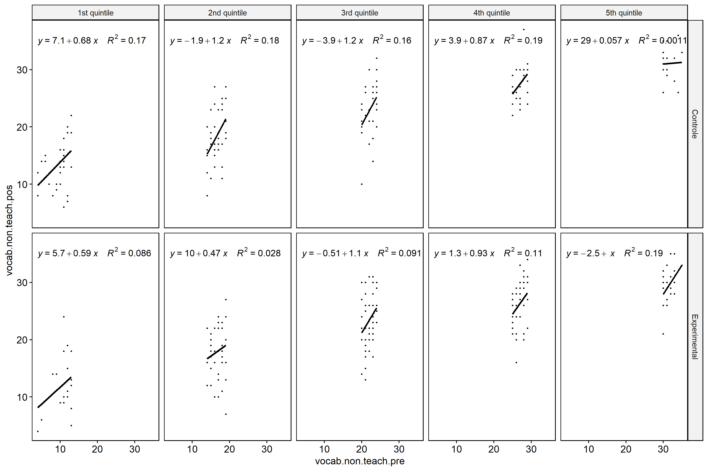<!-- -->

### Checking normality and homogeneity

``` r
res <- augment(lm(vocab.non.teach.pos ~ vocab.non.teach.pre + grupo*vocab.non.teach.quintile, data = wdat))
```

``` r
shapiro_test(res$.resid)
```

    ## # A tibble: 1 × 3
    ##   variable   statistic p.value
    ##   <chr>          <dbl>   <dbl>
    ## 1 res$.resid     0.993  0.0971

``` r
levene_test(res, .resid ~ grupo*vocab.non.teach.quintile)
```

    ## # A tibble: 1 × 4
    ##     df1   df2 statistic     p
    ##   <int> <int>     <dbl> <dbl>
    ## 1     9   327      1.58 0.121

# Summary of Results

## Descriptive Statistics

``` r
df <- get.descriptives(ldat[["grupo"]], c(dv.pre, dv.pos), c("grupo"), 
                       include.global = T, symmetry.test = T, normality.test = F)
df <- plyr::rbind.fill(
  df, do.call(plyr::rbind.fill, lapply(lfatores2, FUN = function(f) {
    if (nrow(dat) > 0 && sum(!is.na(unique(dat[[f]]))) > 1)
      get.descriptives(ldat[[paste0("grupo:",f)]], c(dv.pre,dv.pos), c("grupo", f),
                       symmetry.test = T, normality.test = F)
    }))
)
(df <- df[,c(fatores1[fatores1 %in% colnames(df)],"variable",
             colnames(df)[!colnames(df) %in% c(fatores1,"variable")])])
```

    ##           grupo Sexo   Zona Cor.Raca vocab.non.teach.quintile            variable  n   mean median min max    sd
    ## 1      Controle <NA>   <NA>     <NA>                     <NA> vocab.non.teach.pre 16 18.625   17.0  11  34 6.652
    ## 2  Experimental <NA>   <NA>     <NA>                     <NA> vocab.non.teach.pre 26 20.731   21.0  11  30 6.057
    ## 3          <NA> <NA>   <NA>     <NA>                     <NA> vocab.non.teach.pre 42 19.929   19.5  11  34 6.295
    ## 4      Controle <NA>   <NA>     <NA>                     <NA> vocab.non.teach.pos 16 13.312   12.5   5  26 6.258
    ## 5  Experimental <NA>   <NA>     <NA>                     <NA> vocab.non.teach.pos 26 14.731   14.5   5  22 5.048
    ## 6          <NA> <NA>   <NA>     <NA>                     <NA> vocab.non.teach.pos 42 14.190   13.0   5  26 5.509
    ## 7      Controle    F   <NA>     <NA>                     <NA> vocab.non.teach.pre 85 21.459   22.0   6  35 7.001
    ## 8      Controle    M   <NA>     <NA>                     <NA> vocab.non.teach.pre 63 19.079   18.0   4  34 7.913
    ## 9  Experimental    F   <NA>     <NA>                     <NA> vocab.non.teach.pre 97 21.897   22.0   9  33 6.264
    ## 10 Experimental    M   <NA>     <NA>                     <NA> vocab.non.teach.pre 91 21.846   22.0   4  35 6.928
    ## 11     Controle    F   <NA>     <NA>                     <NA> vocab.non.teach.pos 85 22.565   24.0   5  35 6.771
    ## 12     Controle    M   <NA>     <NA>                     <NA> vocab.non.teach.pos 63 20.889   20.0   6  37 7.669
    ## 13 Experimental    F   <NA>     <NA>                     <NA> vocab.non.teach.pos 97 22.887   23.0   7  35 6.270
    ## 14 Experimental    M   <NA>     <NA>                     <NA> vocab.non.teach.pos 91 21.582   22.0   4  35 7.213
    ## 15     Controle <NA>  Rural     <NA>                     <NA> vocab.non.teach.pre 74 20.743   22.0   6  34 7.028
    ## 16     Controle <NA> Urbana     <NA>                     <NA> vocab.non.teach.pre 49 21.918   23.0   4  35 7.618
    ## 17 Experimental <NA>  Rural     <NA>                     <NA> vocab.non.teach.pre 90 21.722   23.0   4  33 6.815
    ## 18 Experimental <NA> Urbana     <NA>                     <NA> vocab.non.teach.pre 72 22.444   22.5   8  35 6.302
    ## 19     Controle <NA>  Rural     <NA>                     <NA> vocab.non.teach.pos 74 22.541   24.0   6  36 6.938
    ## 20     Controle <NA> Urbana     <NA>                     <NA> vocab.non.teach.pos 49 22.551   24.0   5  37 7.561
    ## 21 Experimental <NA>  Rural     <NA>                     <NA> vocab.non.teach.pos 90 21.656   22.0   4  35 7.116
    ## 22 Experimental <NA> Urbana     <NA>                     <NA> vocab.non.teach.pos 72 23.069   24.0   8  35 6.455
    ## 23     Controle <NA>   <NA>   Branca                     <NA> vocab.non.teach.pre 22 22.273   22.5  11  34 6.423
    ## 24     Controle <NA>   <NA> Indígena                     <NA> vocab.non.teach.pre  8 20.375   21.5  11  27 5.423
    ## 25     Controle <NA>   <NA>    Parda                     <NA> vocab.non.teach.pre 44 18.864   18.0   5  31 7.395
    ## 26 Experimental <NA>   <NA>   Branca                     <NA> vocab.non.teach.pre 12 22.167   23.5  13  33 6.206
    ## 27 Experimental <NA>   <NA>    Parda                     <NA> vocab.non.teach.pre 52 20.481   19.5   9  33 6.491
    ## 28     Controle <NA>   <NA>   Branca                     <NA> vocab.non.teach.pos 22 23.500   24.0  11  36 6.603
    ## 29     Controle <NA>   <NA> Indígena                     <NA> vocab.non.teach.pos  8 23.000   22.0  12  32 6.547
    ## 30     Controle <NA>   <NA>    Parda                     <NA> vocab.non.teach.pos 44 20.545   21.5   5  37 8.398
    ## 31 Experimental <NA>   <NA>   Branca                     <NA> vocab.non.teach.pos 12 19.167   18.5   8  30 6.162
    ## 32 Experimental <NA>   <NA>    Parda                     <NA> vocab.non.teach.pos 52 20.615   21.5   5  31 6.411
    ## 33     Controle <NA>   <NA>     <NA>             1st quintile vocab.non.teach.pre 30  9.900   11.0   4  13 2.657
    ## 34     Controle <NA>   <NA>     <NA>             2nd quintile vocab.non.teach.pre 37 16.486   16.0  14  19 1.592
    ## 35     Controle <NA>   <NA>     <NA>             3rd quintile vocab.non.teach.pre 31 22.290   23.0  20  24 1.553
    ## 36     Controle <NA>   <NA>     <NA>             4th quintile vocab.non.teach.pre 30 26.933   27.0  25  29 1.574
    ## 37     Controle <NA>   <NA>     <NA>             5th quintile vocab.non.teach.pre 19 31.368   31.0  30  35 1.606
    ## 38 Experimental <NA>   <NA>     <NA>             1st quintile vocab.non.teach.pre 25 11.000   12.0   4  13 2.398
    ## 39 Experimental <NA>   <NA>     <NA>             2nd quintile vocab.non.teach.pre 43 16.698   17.0  14  19 1.611
    ## 40 Experimental <NA>   <NA>     <NA>             3rd quintile vocab.non.teach.pre 51 22.000   22.0  20  24 1.281
    ## 41 Experimental <NA>   <NA>     <NA>             4th quintile vocab.non.teach.pre 46 26.978   27.0  25  29 1.422
    ## 42 Experimental <NA>   <NA>     <NA>             5th quintile vocab.non.teach.pre 25 31.640   32.0  30  35 1.319
    ## 43     Controle <NA>   <NA>     <NA>             1st quintile vocab.non.teach.pos 30 13.767   14.0   6  22 4.415
    ## 44     Controle <NA>   <NA>     <NA>             2nd quintile vocab.non.teach.pos 37 18.324   18.0   8  27 4.655
    ## 45     Controle <NA>   <NA>     <NA>             3rd quintile vocab.non.teach.pos 31 23.129   24.0  10  32 4.653
    ## 46     Controle <NA>   <NA>     <NA>             4th quintile vocab.non.teach.pos 30 27.433   27.0  22  37 3.191
    ## 47     Controle <NA>   <NA>     <NA>             5th quintile vocab.non.teach.pos 19 31.053   31.0  26  36 2.738
    ## 48 Experimental <NA>   <NA>     <NA>             1st quintile vocab.non.teach.pos 25 12.280   12.0   4  24 4.852
    ## 49 Experimental <NA>   <NA>     <NA>             2nd quintile vocab.non.teach.pos 43 17.930   18.0   7  27 4.485
    ## 50 Experimental <NA>   <NA>     <NA>             3rd quintile vocab.non.teach.pos 51 23.373   23.0  13  31 4.617
    ## 51 Experimental <NA>   <NA>     <NA>             4th quintile vocab.non.teach.pos 46 26.283   27.0  16  34 4.053
    ## 52 Experimental <NA>   <NA>     <NA>             5th quintile vocab.non.teach.pos 25 29.600   30.0  21  35 3.082
    ##       se    ci   iqr symmetry     skewness   kurtosis
    ## 1  1.663 3.545  9.25       NO  0.774060049 -0.4932494
    ## 2  1.188 2.446  9.75      YES -0.052578796 -1.3925341
    ## 3  0.971 1.962 11.25      YES  0.279753411 -1.1024450
    ## 4  1.564 3.335  9.25       NO  0.553849856 -0.8604901
    ## 5  0.990 2.039  9.75      YES -0.108192561 -1.3494101
    ## 6  0.850 1.717  9.50      YES  0.183467085 -1.0408508
    ## 7  0.759 1.510 11.00      YES -0.136466534 -0.9060187
    ## 8  0.997 1.993 14.00      YES -0.026375786 -1.1269453
    ## 9  0.636 1.263  9.00      YES -0.079137952 -0.8733731
    ## 10 0.726 1.443 11.00      YES -0.336669945 -0.6249119
    ## 11 0.734 1.460 10.00      YES -0.404985298 -0.4926321
    ## 12 0.966 1.931 12.50      YES  0.019515469 -0.9395613
    ## 13 0.637 1.264  9.00      YES -0.484586366 -0.4694127
    ## 14 0.756 1.502 10.50      YES -0.277917613 -0.7469269
    ## 15 0.817 1.628 11.25      YES -0.167677069 -1.0471250
    ## 16 1.088 2.188 13.00      YES -0.254795208 -0.9207450
    ## 17 0.718 1.427  9.00      YES -0.283589878 -0.5384846
    ## 18 0.743 1.481 10.00      YES -0.175578998 -0.7933558
    ## 19 0.807 1.608  9.00      YES -0.308057234 -0.6361567
    ## 20 1.080 2.172 12.00      YES -0.448682950 -0.6431645
    ## 21 0.750 1.490 10.00      YES -0.422897322 -0.4273708
    ## 22 0.761 1.517  9.25       NO -0.547675592 -0.5224879
    ## 23 1.369 2.848  8.75      YES  0.005954151 -1.0951022
    ## 24 1.917 4.534  5.50       NO -0.532159006 -1.3098533
    ## 25 1.115 2.248 13.00      YES  0.102638815 -1.2839451
    ## 26 1.792 3.943  8.00      YES -0.115010906 -1.1854221
    ## 27 0.900 1.807 11.00      YES  0.099818007 -1.0964186
    ## 28 1.408 2.927  9.50      YES -0.024160737 -0.7764181
    ## 29 2.315 5.473  7.50      YES -0.149697473 -1.3315500
    ## 30 1.266 2.553 13.00      YES -0.147410229 -1.1827456
    ## 31 1.779 3.915  6.50      YES  0.060945447 -0.9423390
    ## 32 0.889 1.785  9.25      YES -0.411444982 -0.5439898
    ## 33 0.485 0.992  3.00       NO -0.919940380 -0.3441976
    ## 34 0.262 0.531  3.00      YES  0.044034191 -1.1169547
    ## 35 0.279 0.570  3.00      YES -0.368406362 -1.4492828
    ## 36 0.287 0.588  3.50      YES  0.105799370 -1.5595575
    ## 37 0.368 0.774  2.00       NO  0.949838167 -0.5571605
    ## 38 0.480 0.990  2.00       NO -1.566577859  1.7546314
    ## 39 0.246 0.496  3.00      YES -0.049391847 -1.3651752
    ## 40 0.179 0.360  2.00      YES -0.056016414 -1.2649217
    ## 41 0.210 0.422  2.00      YES -0.053436514 -1.3718501
    ## 42 0.264 0.544  2.00      YES  0.440345170 -0.4568333
    ## 43 0.806 1.649  7.50      YES  0.032194290 -1.1421159
    ## 44 0.765 1.552  7.00      YES  0.024572756 -0.6873679
    ## 45 0.836 1.707  5.00       NO -0.590345143  0.5398301
    ## 46 0.583 1.192  5.00       NO  0.656913824  0.5464654
    ## 47 0.628 1.320  2.50      YES -0.098225332 -0.6320045
    ## 48 0.970 2.003  6.00      YES  0.401211666 -0.4461146
    ## 49 0.684 1.380  6.50      YES -0.318683481 -0.5398077
    ## 50 0.647 1.299  5.50      YES -0.149195683 -0.7295758
    ## 51 0.598 1.204  5.75      YES -0.398540192 -0.6105883
    ## 52 0.616 1.272  4.00      YES -0.465558403  0.5453518

| grupo        | Sexo | Zona   | Cor.Raca | vocab.non.teach.quintile | variable            |   n |   mean | median | min | max |    sd |    se |    ci |   iqr | symmetry | skewness | kurtosis |
|:-------------|:-----|:-------|:---------|:-------------------------|:--------------------|----:|-------:|-------:|----:|----:|------:|------:|------:|------:|:---------|---------:|---------:|
| Controle     |      |        |          |                          | vocab.non.teach.pre |  16 | 18.625 |   17.0 |  11 |  34 | 6.652 | 1.663 | 3.545 |  9.25 | NO       |    0.774 |   -0.493 |
| Experimental |      |        |          |                          | vocab.non.teach.pre |  26 | 20.731 |   21.0 |  11 |  30 | 6.057 | 1.188 | 2.446 |  9.75 | YES      |   -0.053 |   -1.393 |
|              |      |        |          |                          | vocab.non.teach.pre |  42 | 19.929 |   19.5 |  11 |  34 | 6.295 | 0.971 | 1.962 | 11.25 | YES      |    0.280 |   -1.102 |
| Controle     |      |        |          |                          | vocab.non.teach.pos |  16 | 13.312 |   12.5 |   5 |  26 | 6.258 | 1.564 | 3.335 |  9.25 | NO       |    0.554 |   -0.860 |
| Experimental |      |        |          |                          | vocab.non.teach.pos |  26 | 14.731 |   14.5 |   5 |  22 | 5.048 | 0.990 | 2.039 |  9.75 | YES      |   -0.108 |   -1.349 |
|              |      |        |          |                          | vocab.non.teach.pos |  42 | 14.190 |   13.0 |   5 |  26 | 5.509 | 0.850 | 1.717 |  9.50 | YES      |    0.183 |   -1.041 |
| Controle     | F    |        |          |                          | vocab.non.teach.pre |  85 | 21.459 |   22.0 |   6 |  35 | 7.001 | 0.759 | 1.510 | 11.00 | YES      |   -0.136 |   -0.906 |
| Controle     | M    |        |          |                          | vocab.non.teach.pre |  63 | 19.079 |   18.0 |   4 |  34 | 7.913 | 0.997 | 1.993 | 14.00 | YES      |   -0.026 |   -1.127 |
| Experimental | F    |        |          |                          | vocab.non.teach.pre |  97 | 21.897 |   22.0 |   9 |  33 | 6.264 | 0.636 | 1.263 |  9.00 | YES      |   -0.079 |   -0.873 |
| Experimental | M    |        |          |                          | vocab.non.teach.pre |  91 | 21.846 |   22.0 |   4 |  35 | 6.928 | 0.726 | 1.443 | 11.00 | YES      |   -0.337 |   -0.625 |
| Controle     | F    |        |          |                          | vocab.non.teach.pos |  85 | 22.565 |   24.0 |   5 |  35 | 6.771 | 0.734 | 1.460 | 10.00 | YES      |   -0.405 |   -0.493 |
| Controle     | M    |        |          |                          | vocab.non.teach.pos |  63 | 20.889 |   20.0 |   6 |  37 | 7.669 | 0.966 | 1.931 | 12.50 | YES      |    0.020 |   -0.940 |
| Experimental | F    |        |          |                          | vocab.non.teach.pos |  97 | 22.887 |   23.0 |   7 |  35 | 6.270 | 0.637 | 1.264 |  9.00 | YES      |   -0.485 |   -0.469 |
| Experimental | M    |        |          |                          | vocab.non.teach.pos |  91 | 21.582 |   22.0 |   4 |  35 | 7.213 | 0.756 | 1.502 | 10.50 | YES      |   -0.278 |   -0.747 |
| Controle     |      | Rural  |          |                          | vocab.non.teach.pre |  74 | 20.743 |   22.0 |   6 |  34 | 7.028 | 0.817 | 1.628 | 11.25 | YES      |   -0.168 |   -1.047 |
| Controle     |      | Urbana |          |                          | vocab.non.teach.pre |  49 | 21.918 |   23.0 |   4 |  35 | 7.618 | 1.088 | 2.188 | 13.00 | YES      |   -0.255 |   -0.921 |
| Experimental |      | Rural  |          |                          | vocab.non.teach.pre |  90 | 21.722 |   23.0 |   4 |  33 | 6.815 | 0.718 | 1.427 |  9.00 | YES      |   -0.284 |   -0.538 |
| Experimental |      | Urbana |          |                          | vocab.non.teach.pre |  72 | 22.444 |   22.5 |   8 |  35 | 6.302 | 0.743 | 1.481 | 10.00 | YES      |   -0.176 |   -0.793 |
| Controle     |      | Rural  |          |                          | vocab.non.teach.pos |  74 | 22.541 |   24.0 |   6 |  36 | 6.938 | 0.807 | 1.608 |  9.00 | YES      |   -0.308 |   -0.636 |
| Controle     |      | Urbana |          |                          | vocab.non.teach.pos |  49 | 22.551 |   24.0 |   5 |  37 | 7.561 | 1.080 | 2.172 | 12.00 | YES      |   -0.449 |   -0.643 |
| Experimental |      | Rural  |          |                          | vocab.non.teach.pos |  90 | 21.656 |   22.0 |   4 |  35 | 7.116 | 0.750 | 1.490 | 10.00 | YES      |   -0.423 |   -0.427 |
| Experimental |      | Urbana |          |                          | vocab.non.teach.pos |  72 | 23.069 |   24.0 |   8 |  35 | 6.455 | 0.761 | 1.517 |  9.25 | NO       |   -0.548 |   -0.522 |
| Controle     |      |        | Branca   |                          | vocab.non.teach.pre |  22 | 22.273 |   22.5 |  11 |  34 | 6.423 | 1.369 | 2.848 |  8.75 | YES      |    0.006 |   -1.095 |
| Controle     |      |        | Indígena |                          | vocab.non.teach.pre |   8 | 20.375 |   21.5 |  11 |  27 | 5.423 | 1.917 | 4.534 |  5.50 | NO       |   -0.532 |   -1.310 |
| Controle     |      |        | Parda    |                          | vocab.non.teach.pre |  44 | 18.864 |   18.0 |   5 |  31 | 7.395 | 1.115 | 2.248 | 13.00 | YES      |    0.103 |   -1.284 |
| Experimental |      |        | Branca   |                          | vocab.non.teach.pre |  12 | 22.167 |   23.5 |  13 |  33 | 6.206 | 1.792 | 3.943 |  8.00 | YES      |   -0.115 |   -1.185 |
| Experimental |      |        | Parda    |                          | vocab.non.teach.pre |  52 | 20.481 |   19.5 |   9 |  33 | 6.491 | 0.900 | 1.807 | 11.00 | YES      |    0.100 |   -1.096 |
| Controle     |      |        | Branca   |                          | vocab.non.teach.pos |  22 | 23.500 |   24.0 |  11 |  36 | 6.603 | 1.408 | 2.927 |  9.50 | YES      |   -0.024 |   -0.776 |
| Controle     |      |        | Indígena |                          | vocab.non.teach.pos |   8 | 23.000 |   22.0 |  12 |  32 | 6.547 | 2.315 | 5.473 |  7.50 | YES      |   -0.150 |   -1.332 |
| Controle     |      |        | Parda    |                          | vocab.non.teach.pos |  44 | 20.545 |   21.5 |   5 |  37 | 8.398 | 1.266 | 2.553 | 13.00 | YES      |   -0.147 |   -1.183 |
| Experimental |      |        | Branca   |                          | vocab.non.teach.pos |  12 | 19.167 |   18.5 |   8 |  30 | 6.162 | 1.779 | 3.915 |  6.50 | YES      |    0.061 |   -0.942 |
| Experimental |      |        | Parda    |                          | vocab.non.teach.pos |  52 | 20.615 |   21.5 |   5 |  31 | 6.411 | 0.889 | 1.785 |  9.25 | YES      |   -0.411 |   -0.544 |
| Controle     |      |        |          | 1st quintile             | vocab.non.teach.pre |  30 |  9.900 |   11.0 |   4 |  13 | 2.657 | 0.485 | 0.992 |  3.00 | NO       |   -0.920 |   -0.344 |
| Controle     |      |        |          | 2nd quintile             | vocab.non.teach.pre |  37 | 16.486 |   16.0 |  14 |  19 | 1.592 | 0.262 | 0.531 |  3.00 | YES      |    0.044 |   -1.117 |
| Controle     |      |        |          | 3rd quintile             | vocab.non.teach.pre |  31 | 22.290 |   23.0 |  20 |  24 | 1.553 | 0.279 | 0.570 |  3.00 | YES      |   -0.368 |   -1.449 |
| Controle     |      |        |          | 4th quintile             | vocab.non.teach.pre |  30 | 26.933 |   27.0 |  25 |  29 | 1.574 | 0.287 | 0.588 |  3.50 | YES      |    0.106 |   -1.560 |
| Controle     |      |        |          | 5th quintile             | vocab.non.teach.pre |  19 | 31.368 |   31.0 |  30 |  35 | 1.606 | 0.368 | 0.774 |  2.00 | NO       |    0.950 |   -0.557 |
| Experimental |      |        |          | 1st quintile             | vocab.non.teach.pre |  25 | 11.000 |   12.0 |   4 |  13 | 2.398 | 0.480 | 0.990 |  2.00 | NO       |   -1.567 |    1.755 |
| Experimental |      |        |          | 2nd quintile             | vocab.non.teach.pre |  43 | 16.698 |   17.0 |  14 |  19 | 1.611 | 0.246 | 0.496 |  3.00 | YES      |   -0.049 |   -1.365 |
| Experimental |      |        |          | 3rd quintile             | vocab.non.teach.pre |  51 | 22.000 |   22.0 |  20 |  24 | 1.281 | 0.179 | 0.360 |  2.00 | YES      |   -0.056 |   -1.265 |
| Experimental |      |        |          | 4th quintile             | vocab.non.teach.pre |  46 | 26.978 |   27.0 |  25 |  29 | 1.422 | 0.210 | 0.422 |  2.00 | YES      |   -0.053 |   -1.372 |
| Experimental |      |        |          | 5th quintile             | vocab.non.teach.pre |  25 | 31.640 |   32.0 |  30 |  35 | 1.319 | 0.264 | 0.544 |  2.00 | YES      |    0.440 |   -0.457 |
| Controle     |      |        |          | 1st quintile             | vocab.non.teach.pos |  30 | 13.767 |   14.0 |   6 |  22 | 4.415 | 0.806 | 1.649 |  7.50 | YES      |    0.032 |   -1.142 |
| Controle     |      |        |          | 2nd quintile             | vocab.non.teach.pos |  37 | 18.324 |   18.0 |   8 |  27 | 4.655 | 0.765 | 1.552 |  7.00 | YES      |    0.025 |   -0.687 |
| Controle     |      |        |          | 3rd quintile             | vocab.non.teach.pos |  31 | 23.129 |   24.0 |  10 |  32 | 4.653 | 0.836 | 1.707 |  5.00 | NO       |   -0.590 |    0.540 |
| Controle     |      |        |          | 4th quintile             | vocab.non.teach.pos |  30 | 27.433 |   27.0 |  22 |  37 | 3.191 | 0.583 | 1.192 |  5.00 | NO       |    0.657 |    0.546 |
| Controle     |      |        |          | 5th quintile             | vocab.non.teach.pos |  19 | 31.053 |   31.0 |  26 |  36 | 2.738 | 0.628 | 1.320 |  2.50 | YES      |   -0.098 |   -0.632 |
| Experimental |      |        |          | 1st quintile             | vocab.non.teach.pos |  25 | 12.280 |   12.0 |   4 |  24 | 4.852 | 0.970 | 2.003 |  6.00 | YES      |    0.401 |   -0.446 |
| Experimental |      |        |          | 2nd quintile             | vocab.non.teach.pos |  43 | 17.930 |   18.0 |   7 |  27 | 4.485 | 0.684 | 1.380 |  6.50 | YES      |   -0.319 |   -0.540 |
| Experimental |      |        |          | 3rd quintile             | vocab.non.teach.pos |  51 | 23.373 |   23.0 |  13 |  31 | 4.617 | 0.647 | 1.299 |  5.50 | YES      |   -0.149 |   -0.730 |
| Experimental |      |        |          | 4th quintile             | vocab.non.teach.pos |  46 | 26.283 |   27.0 |  16 |  34 | 4.053 | 0.598 | 1.204 |  5.75 | YES      |   -0.399 |   -0.611 |
| Experimental |      |        |          | 5th quintile             | vocab.non.teach.pos |  25 | 29.600 |   30.0 |  21 |  35 | 3.082 | 0.616 | 1.272 |  4.00 | YES      |   -0.466 |    0.545 |

## ANCOVA Table Comparison

``` r
df <- do.call(plyr::rbind.fill, laov)
(df <- df[!duplicated(df$Effect),])
```

    ##                            Effect DFn DFd       F        p p<.05      ges DFn' DFd'      F'       p' p<.05'
    ## 1                           grupo   1  39   0.396 5.33e-01       0.010000    1  345   2.274 1.32e-01       
    ## 2             vocab.non.teach.pre   1  39 379.844 1.05e-21     * 0.907000    1  345 485.659 8.35e-68      *
    ## 4                      grupo:Sexo   1 331   3.016 8.30e-02       0.009000    1  343   1.347 2.47e-01       
    ## 5                            Sexo   1 331   1.896 1.69e-01       0.006000    1  343   7.351 7.00e-03      *
    ## 8                      grupo:Zona   1 280   3.357 6.80e-02       0.012000    1  289   1.141 2.86e-01       
    ## 10                           Zona   1 280   0.015 9.03e-01       0.000053    1  289   0.027 8.70e-01       
    ## 11                       Cor.Raca   2 132   0.890 4.13e-01       0.013000    2  132   0.890 4.13e-01       
    ## 13                 grupo:Cor.Raca   1 132   2.550 1.13e-01       0.019000    1  132   2.550 1.13e-01       
    ## 16 grupo:vocab.non.teach.quintile   4 326   1.153 3.31e-01       0.014000    4  337   0.574 6.82e-01       
    ## 18       vocab.non.teach.quintile   4 326   0.544 7.03e-01       0.007000    4  337   1.505 2.00e-01       
    ##        ges'
    ## 1  7.00e-03
    ## 2  5.85e-01
    ## 4  4.00e-03
    ## 5  2.10e-02
    ## 8  4.00e-03
    ## 10 9.28e-05
    ## 11 1.30e-02
    ## 13 1.90e-02
    ## 16 7.00e-03
    ## 18 1.80e-02

|     | Effect                         | DFn | DFd |       F |     p | p\<.05 |   ges | DFn’ | DFd’ |      F’ |    p’ | p\<.05’ |  ges’ |
|:----|:-------------------------------|----:|----:|--------:|------:|:-------|------:|-----:|-----:|--------:|------:|:--------|------:|
| 1   | grupo                          |   1 |  39 |   0.396 | 0.533 |        | 0.010 |    1 |  345 |   2.274 | 0.132 |         | 0.007 |
| 2   | vocab.non.teach.pre            |   1 |  39 | 379.844 | 0.000 | \*     | 0.907 |    1 |  345 | 485.659 | 0.000 | \*      | 0.585 |
| 4   | grupo:Sexo                     |   1 | 331 |   3.016 | 0.083 |        | 0.009 |    1 |  343 |   1.347 | 0.247 |         | 0.004 |
| 5   | Sexo                           |   1 | 331 |   1.896 | 0.169 |        | 0.006 |    1 |  343 |   7.351 | 0.007 | \*      | 0.021 |
| 8   | grupo:Zona                     |   1 | 280 |   3.357 | 0.068 |        | 0.012 |    1 |  289 |   1.141 | 0.286 |         | 0.004 |
| 10  | Zona                           |   1 | 280 |   0.015 | 0.903 |        | 0.000 |    1 |  289 |   0.027 | 0.870 |         | 0.000 |
| 11  | Cor.Raca                       |   2 | 132 |   0.890 | 0.413 |        | 0.013 |    2 |  132 |   0.890 | 0.413 |         | 0.013 |
| 13  | grupo:Cor.Raca                 |   1 | 132 |   2.550 | 0.113 |        | 0.019 |    1 |  132 |   2.550 | 0.113 |         | 0.019 |
| 16  | grupo:vocab.non.teach.quintile |   4 | 326 |   1.153 | 0.331 |        | 0.014 |    4 |  337 |   0.574 | 0.682 |         | 0.007 |
| 18  | vocab.non.teach.quintile       |   4 | 326 |   0.544 | 0.703 |        | 0.007 |    4 |  337 |   1.505 | 0.200 |         | 0.018 |

## PairWise Table Comparison

``` r
df <- do.call(plyr::rbind.fill, lpwc)
df <- df[,c(names(lfatores), names(df)[!names(df) %in% c(names(lfatores),"term",".y.")])]
```

| grupo        | Sexo | Zona   | Cor.Raca | vocab.non.teach.quintile | group1       | group2       |  df | statistic |     p | p.adj | p.adj.signif | df’ | statistic’ |    p’ | p.adj’ | p.adj.signif’ |
|:-------------|:-----|:-------|:---------|:-------------------------|:-------------|:-------------|----:|----------:|------:|------:|:-------------|----:|-----------:|------:|-------:|:--------------|
| Controle     |      |        |          |                          | pre          | pos          |  80 |     2.537 | 0.013 | 0.013 | \*           | 692 |     -1.236 | 0.217 |  0.217 | ns            |
| Experimental |      |        |          |                          | pre          | pos          |  80 |     3.653 | 0.000 | 0.000 | \*\*\*       | 692 |      0.071 | 0.943 |  0.943 | ns            |
|              |      |        |          |                          | Controle     | Experimental |  39 |     0.629 | 0.533 | 0.533 | ns           | 345 |      1.508 | 0.132 |  0.132 | ns            |
| Controle     | F    |        |          |                          | pre          | pos          | 664 |    -1.038 | 0.300 | 0.300 | ns           | 688 |     -1.020 | 0.308 |  0.308 | ns            |
| Controle     | M    |        |          |                          | pre          | pos          | 664 |    -1.462 | 0.144 | 0.144 | ns           | 688 |     -0.721 | 0.471 |  0.471 | ns            |
| Controle     |      |        |          |                          | F            | M            | 331 |    -0.403 | 0.687 | 0.687 | ns           | 343 |      0.902 | 0.368 |  0.368 | ns            |
| Experimental | F    |        |          |                          | pre          | pos          | 664 |    -0.992 | 0.321 | 0.321 | ns           | 688 |     -0.890 | 0.374 |  0.374 | ns            |
| Experimental | M    |        |          |                          | pre          | pos          | 664 |     0.256 | 0.798 | 0.798 | ns           | 688 |      0.991 | 0.322 |  0.322 | ns            |
| Experimental |      |        |          |                          | F            | M            | 331 |     2.179 | 0.030 | 0.030 | \*           | 343 |      2.807 | 0.005 |  0.005 | \*\*          |
|              | F    |        |          |                          | Controle     | Experimental | 331 |     0.061 | 0.951 | 0.951 | ns           | 343 |      0.199 | 0.842 |  0.842 | ns            |
|              | M    |        |          |                          | Controle     | Experimental | 331 |     2.386 | 0.018 | 0.018 | \*           | 343 |      1.765 | 0.079 |  0.079 | ns            |
| Controle     |      |        |          |                          | Rural        | Urbana       | 280 |     1.310 | 0.191 | 0.191 | ns           | 289 |      0.704 | 0.482 |  0.482 | ns            |
| Controle     |      | Rural  |          |                          | pre          | pos          | 562 |    -1.575 | 0.116 | 0.116 | ns           | 580 |     -1.004 | 0.316 |  0.316 | ns            |
| Controle     |      | Urbana |          |                          | pre          | pos          | 562 |    -0.451 | 0.652 | 0.652 | ns           | 580 |     -0.255 | 0.799 |  0.799 | ns            |
| Experimental |      |        |          |                          | Rural        | Urbana       | 280 |    -1.284 | 0.200 | 0.200 | ns           | 289 |     -0.819 | 0.414 |  0.414 | ns            |
| Experimental |      | Rural  |          |                          | pre          | pos          | 562 |     0.064 | 0.949 | 0.949 | ns           | 580 |      0.386 | 0.699 |  0.699 | ns            |
| Experimental |      | Urbana |          |                          | pre          | pos          | 562 |    -0.540 | 0.589 | 0.589 | ns           | 580 |     -0.081 | 0.936 |  0.936 | ns            |
|              |      | Rural  |          |                          | Controle     | Experimental | 280 |     2.702 | 0.007 | 0.007 | \*\*         | 289 |      1.854 | 0.065 |  0.065 | ns            |
|              |      | Urbana |          |                          | Controle     | Experimental | 280 |    -0.109 | 0.913 | 0.913 | ns           | 289 |      0.172 | 0.864 |  0.864 | ns            |
| Controle     |      |        | Branca   |                          | pre          | pos          | 266 |    -0.588 | 0.557 | 0.557 | ns           | 266 |     -0.588 | 0.557 |  0.557 | ns            |
| Controle     |      |        | Indígena |                          | pre          | pos          | 266 |    -0.758 | 0.449 | 0.449 | ns           | 266 |     -0.758 | 0.449 |  0.449 | ns            |
| Controle     |      |        |          |                          | Branca       | Indígena     | 132 |    -0.570 | 0.570 | 1.000 | ns           | 132 |     -0.570 | 0.570 |  1.000 | ns            |
| Controle     |      |        |          |                          | Branca       | Parda        | 132 |     0.121 | 0.904 | 1.000 | ns           | 132 |      0.121 | 0.904 |  1.000 | ns            |
| Controle     |      |        |          |                          | Indígena     | Parda        | 132 |     0.696 | 0.488 | 1.000 | ns           | 132 |      0.696 | 0.488 |  1.000 | ns            |
| Controle     |      |        | Parda    |                          | pre          | pos          | 266 |    -1.139 | 0.256 | 0.256 | ns           | 266 |     -1.139 | 0.256 |  0.256 | ns            |
| Experimental |      |        | Branca   |                          | pre          | pos          | 266 |     1.061 | 0.290 | 0.290 | ns           | 266 |      1.061 | 0.290 |  0.290 | ns            |
| Experimental |      |        | Indígena |                          | pre          | pos          |     |           |       |       |              |     |            |       |        |               |
| Experimental |      |        |          |                          | Branca       | Indígena     |     |           |       |       |              |     |            |       |        |               |
| Experimental |      |        |          |                          | Branca       | Parda        | 132 |    -1.959 | 0.052 | 0.052 | ns           | 132 |     -1.959 | 0.052 |  0.052 | ns            |
| Experimental |      |        |          |                          | Indígena     | Parda        |     |           |       |       |              |     |            |       |        |               |
| Experimental |      |        | Parda    |                          | pre          | pos          | 266 |    -0.099 | 0.921 | 0.921 | ns           | 266 |     -0.099 | 0.921 |  0.921 | ns            |
|              |      |        | Branca   |                          | Controle     | Experimental | 132 |     2.621 | 0.010 | 0.010 | \*\*         | 132 |      2.621 | 0.010 |  0.010 | \*\*          |
|              |      |        | Indígena |                          | Controle     | Experimental |     |           |       |       |              |     |            |       |        |               |
|              |      |        | Parda    |                          | Controle     | Experimental | 132 |     1.359 | 0.177 | 0.177 | ns           | 132 |      1.359 | 0.177 |  0.177 | ns            |
| Controle     |      |        |          | 1st quintile             | pre          | pos          | 654 |    -4.639 | 0.000 | 0.000 | \*\*\*\*     | 676 |     -3.785 | 0.000 |  0.000 | \*\*\*        |
| Controle     |      |        |          | 2nd quintile             | pre          | pos          | 654 |    -2.448 | 0.015 | 0.015 | \*           | 676 |     -1.406 | 0.160 |  0.160 | ns            |
| Controle     |      |        |          | 3rd quintile             | pre          | pos          | 654 |    -1.023 | 0.307 | 0.307 | ns           | 676 |     -0.911 | 0.362 |  0.362 | ns            |
| Controle     |      |        |          | 4th quintile             | pre          | pos          | 654 |    -0.600 | 0.549 | 0.549 | ns           | 676 |     -0.534 | 0.593 |  0.593 | ns            |
| Controle     |      |        |          | 5th quintile             | pre          | pos          | 654 |     0.301 | 0.763 | 0.763 | ns           | 676 |      1.746 | 0.081 |  0.081 | ns            |
| Controle     |      |        |          |                          | 1st quintile | 2nd quintile | 326 |     0.511 | 0.610 | 1.000 | ns           | 337 |      0.458 | 0.647 |  1.000 | ns            |
| Controle     |      |        |          |                          | 1st quintile | 3rd quintile | 326 |     0.245 | 0.807 | 1.000 | ns           | 337 |     -0.211 | 0.833 |  1.000 | ns            |
| Controle     |      |        |          |                          | 1st quintile | 4th quintile | 326 |    -0.061 | 0.951 | 1.000 | ns           | 337 |     -0.461 | 0.645 |  1.000 | ns            |
| Controle     |      |        |          |                          | 1st quintile | 5th quintile | 326 |    -0.082 | 0.934 | 1.000 | ns           | 337 |      0.012 | 0.991 |  1.000 | ns            |
| Controle     |      |        |          |                          | 2nd quintile | 3rd quintile | 326 |    -0.161 | 0.872 | 1.000 | ns           | 337 |     -0.806 | 0.421 |  1.000 | ns            |
| Controle     |      |        |          |                          | 2nd quintile | 4th quintile | 326 |    -0.487 | 0.627 | 1.000 | ns           | 337 |     -1.024 | 0.307 |  1.000 | ns            |
| Controle     |      |        |          |                          | 2nd quintile | 5th quintile | 326 |    -0.409 | 0.683 | 1.000 | ns           | 337 |     -0.250 | 0.802 |  1.000 | ns            |
| Controle     |      |        |          |                          | 3rd quintile | 4th quintile | 326 |    -0.519 | 0.604 | 1.000 | ns           | 337 |     -0.603 | 0.547 |  1.000 | ns            |
| Controle     |      |        |          |                          | 3rd quintile | 5th quintile | 326 |    -0.432 | 0.666 | 1.000 | ns           | 337 |      0.266 | 0.791 |  1.000 | ns            |
| Controle     |      |        |          |                          | 4th quintile | 5th quintile | 326 |    -0.076 | 0.939 | 1.000 | ns           | 337 |      0.901 | 0.368 |  1.000 | ns            |
| Experimental |      |        |          | 1st quintile             | pre          | pos          | 654 |    -1.402 | 0.161 | 0.161 | ns           | 676 |     -1.249 | 0.212 |  0.212 | ns            |
| Experimental |      |        |          | 2nd quintile             | pre          | pos          | 654 |    -1.770 | 0.077 | 0.077 | ns           | 676 |     -0.873 | 0.383 |  0.383 | ns            |
| Experimental |      |        |          | 3rd quintile             | pre          | pos          | 654 |    -2.147 | 0.032 | 0.032 | \*           | 676 |     -1.570 | 0.117 |  0.117 | ns            |
| Experimental |      |        |          | 4th quintile             | pre          | pos          | 654 |     1.033 | 0.302 | 0.302 | ns           | 676 |      1.366 | 0.172 |  0.172 | ns            |
| Experimental |      |        |          | 5th quintile             | pre          | pos          | 654 |     2.234 | 0.026 | 0.026 | \*           | 676 |      3.079 | 0.002 |  0.002 | \*\*          |
| Experimental |      |        |          |                          | 1st quintile | 2nd quintile | 326 |    -0.899 | 0.369 | 1.000 | ns           | 337 |     -0.577 | 0.564 |  1.000 | ns            |
| Experimental |      |        |          |                          | 1st quintile | 3rd quintile | 326 |    -1.359 | 0.175 | 1.000 | ns           | 337 |     -1.304 | 0.193 |  1.000 | ns            |
| Experimental |      |        |          |                          | 1st quintile | 4th quintile | 326 |    -0.572 | 0.568 | 1.000 | ns           | 337 |     -0.651 | 0.516 |  1.000 | ns            |
| Experimental |      |        |          |                          | 1st quintile | 5th quintile | 326 |    -0.322 | 0.748 | 1.000 | ns           | 337 |     -0.265 | 0.791 |  1.000 | ns            |
| Experimental |      |        |          |                          | 2nd quintile | 3rd quintile | 326 |    -1.141 | 0.255 | 1.000 | ns           | 337 |     -1.440 | 0.151 |  1.000 | ns            |
| Experimental |      |        |          |                          | 2nd quintile | 4th quintile | 326 |    -0.122 | 0.903 | 1.000 | ns           | 337 |     -0.493 | 0.622 |  1.000 | ns            |
| Experimental |      |        |          |                          | 2nd quintile | 5th quintile | 326 |     0.085 | 0.932 | 1.000 | ns           | 337 |     -0.022 | 0.983 |  1.000 | ns            |
| Experimental |      |        |          |                          | 3rd quintile | 4th quintile | 326 |     0.996 | 0.320 | 1.000 | ns           | 337 |      0.740 | 0.460 |  1.000 | ns            |
| Experimental |      |        |          |                          | 3rd quintile | 5th quintile | 326 |     0.891 | 0.374 | 1.000 | ns           | 337 |      0.953 | 0.341 |  1.000 | ns            |
| Experimental |      |        |          |                          | 4th quintile | 5th quintile | 326 |     0.326 | 0.744 | 1.000 | ns           | 337 |      0.636 | 0.525 |  1.000 | ns            |
|              |      |        |          | 1st quintile             | Controle     | Experimental | 326 |     2.148 | 0.032 | 0.032 | \*           | 337 |      1.541 | 0.124 |  0.124 | ns            |
|              |      |        |          | 2nd quintile             | Controle     | Experimental | 326 |     0.623 | 0.534 | 0.534 | ns           | 337 |      0.421 | 0.674 |  0.674 | ns            |
|              |      |        |          | 3rd quintile             | Controle     | Experimental | 326 |    -0.517 | 0.605 | 0.605 | ns           | 337 |     -0.196 | 0.845 |  0.845 | ns            |
|              |      |        |          | 4th quintile             | Controle     | Experimental | 326 |     1.257 | 0.210 | 0.210 | ns           | 337 |      1.386 | 0.167 |  0.167 | ns            |
|              |      |        |          | 5th quintile             | Controle     | Experimental | 326 |     1.362 | 0.174 | 0.174 | ns           | 337 |      0.749 | 0.455 |  0.455 | ns            |

## EMMS Table Comparison

``` r
df <- do.call(plyr::rbind.fill, lemms)
df[["N-N'"]] <- df[["N"]] - df[["N'"]]
df <- df[,c(names(lfatores), names(df)[!names(df) %in% names(lfatores)])]
```

| grupo        | Sexo | Zona   | Cor.Raca | vocab.non.teach.quintile |   N | M (pre) | SE (pre) | M (unadj) | SE (unadj) | M (adj) | SE (adj) |  N’ | M (pre)’ | SE (pre)’ | M (unadj)’ | SE (unadj)’ | M (adj)’ | SE (adj)’ | N-N’ |
|:-------------|:-----|:-------|:---------|:-------------------------|----:|--------:|---------:|----------:|-----------:|--------:|---------:|----:|---------:|----------:|-----------:|------------:|---------:|----------:|-----:|
| Controle     |      |        |          |                          |  16 |  18.625 |    1.663 |    13.312 |      1.564 |  14.405 |    0.431 | 152 |   20.467 |     0.603 |     21.474 |       0.606 |   22.119 |     0.381 | -136 |
| Experimental |      |        |          |                          |  26 |  20.731 |    1.188 |    14.731 |      0.990 |  14.058 |    0.337 | 196 |   21.903 |     0.468 |     21.852 |       0.505 |   21.352 |     0.335 | -170 |
| Controle     | F    |        |          |                          |  85 |  21.459 |    0.759 |    22.565 |      0.734 |  22.389 |    0.431 |  85 |   21.459 |     0.759 |     22.565 |       0.734 |   22.419 |     0.503 |    0 |
| Controle     | M    |        |          |                          |  63 |  19.079 |    0.997 |    20.889 |      0.966 |  22.657 |    0.505 |  67 |   19.209 |     0.955 |     20.090 |       0.990 |   21.733 |     0.571 |   -4 |
| Experimental | F    |        |          |                          |  97 |  21.897 |    0.636 |    22.887 |      0.637 |  22.353 |    0.404 |  98 |   21.806 |     0.636 |     22.704 |       0.656 |   22.283 |     0.468 |   -1 |
| Experimental | M    |        |          |                          |  91 |  21.846 |    0.726 |    21.582 |      0.756 |  21.091 |    0.417 |  98 |   22.000 |     0.690 |     21.000 |       0.763 |   20.424 |     0.469 |   -7 |
| Controle     |      | Rural  |          |                          |  74 |  20.743 |    0.817 |    22.541 |      0.807 |  23.323 |    0.466 |  77 |   20.948 |     0.810 |     22.091 |       0.824 |   22.755 |     0.536 |   -3 |
| Controle     |      | Urbana |          |                          |  49 |  21.918 |    1.088 |    22.551 |      1.080 |  22.356 |    0.572 |  50 |   21.840 |     1.069 |     22.200 |       1.115 |   22.154 |     0.664 |   -1 |
| Experimental |      | Rural  |          |                          |  90 |  21.722 |    0.718 |    21.656 |      0.750 |  21.624 |    0.422 |  92 |   21.924 |     0.717 |     21.522 |       0.740 |   21.409 |     0.489 |   -2 |
| Experimental |      | Urbana |          |                          |  72 |  22.444 |    0.743 |    23.069 |      0.761 |  22.437 |    0.472 |  75 |   22.427 |     0.718 |     22.520 |       0.795 |   22.007 |     0.543 |   -3 |
| Controle     |      |        | Branca   |                          |  22 |  22.273 |    1.369 |    23.500 |      1.408 |  21.949 |    0.969 |  22 |   22.273 |     1.369 |     23.500 |       1.408 |   21.949 |     0.969 |    0 |
| Controle     |      |        | Indígena |                          |   8 |  20.375 |    1.917 |    23.000 |      2.315 |  23.013 |    1.596 |   8 |   20.375 |     1.917 |     23.000 |       2.315 |   23.013 |     1.596 |    0 |
| Controle     |      |        | Parda    |                          |  44 |  18.864 |    1.115 |    20.545 |      1.266 |  21.804 |    0.686 |  44 |   18.864 |     1.115 |     20.545 |       1.266 |   21.804 |     0.686 |    0 |
| Experimental |      |        | Branca   |                          |  12 |  22.167 |    1.792 |    19.167 |      1.779 |  17.704 |    1.307 |  12 |   22.167 |     1.792 |     19.167 |       1.779 |   17.704 |     1.307 |    0 |
| Experimental |      |        | Parda    |                          |  52 |  20.481 |    0.900 |    20.615 |      0.889 |  20.542 |    0.626 |  52 |   20.481 |     0.900 |     20.615 |       0.889 |   20.542 |     0.626 |    0 |
| Controle     |      |        |          | 1st quintile             |  30 |   9.900 |    0.485 |    13.767 |      0.806 |  22.744 |    1.650 |  31 |   10.000 |     0.480 |     13.484 |       0.829 |   21.908 |     1.892 |   -1 |
| Controle     |      |        |          | 2nd quintile             |  37 |  16.486 |    0.262 |    18.324 |      0.765 |  22.075 |    0.904 |  39 |   16.513 |     0.252 |     17.667 |       0.859 |   21.225 |     1.036 |   -2 |
| Controle     |      |        |          | 3rd quintile             |  31 |  22.290 |    0.279 |    23.129 |      0.836 |  22.275 |    0.736 |  31 |   22.290 |     0.279 |     23.129 |       0.836 |   22.371 |     0.854 |    0 |
| Controle     |      |        |          | 4th quintile             |  30 |  26.933 |    0.287 |    27.433 |      0.583 |  22.895 |    1.047 |  30 |   26.933 |     0.287 |     27.433 |       0.583 |   23.207 |     1.205 |    0 |
| Controle     |      |        |          | 5th quintile             |  19 |  31.368 |    0.368 |    31.053 |      0.628 |  22.995 |    1.615 |  21 |   31.333 |     0.333 |     29.381 |       1.321 |   21.867 |     1.825 |   -2 |
| Experimental |      |        |          | 1st quintile             |  25 |  11.000 |    0.480 |    12.280 |      0.970 |  20.385 |    1.557 |  25 |   11.000 |     0.480 |     12.280 |       0.970 |   19.957 |     1.806 |    0 |
| Experimental |      |        |          | 2nd quintile             |  43 |  16.698 |    0.246 |    17.930 |      0.684 |  21.514 |    0.851 |  45 |   16.733 |     0.237 |     17.400 |       0.752 |   20.794 |     0.976 |   -2 |
| Experimental |      |        |          | 3rd quintile             |  51 |  22.000 |    0.179 |    23.373 |      0.647 |  22.749 |    0.572 |  52 |   22.019 |     0.177 |     23.135 |       0.677 |   22.579 |     0.658 |   -1 |
| Experimental |      |        |          | 4th quintile             |  46 |  26.978 |    0.210 |    26.283 |      0.598 |  21.708 |    0.958 |  47 |   26.957 |     0.206 |     25.936 |       0.680 |   21.691 |     1.093 |   -1 |
| Experimental |      |        |          | 5th quintile             |  25 |  31.640 |    0.264 |    29.600 |      0.616 |  21.327 |    1.581 |  27 |   31.593 |     0.252 |     28.556 |       0.925 |   20.848 |     1.794 |   -2 |
