ANCOVA in Vocabulario Não Ensinado (Vocabulario Não Ensinado)
================
Geiser C. Challco <geiser@alumni.usp.br>

- [Descriptive Statistics of Initial
  Data](#descriptive-statistics-of-initial-data)
- [ANCOVA and Pairwise for one factor:
  **grupo**](#ancova-and-pairwise-for-one-factor-grupo)
  - [Without remove non-normal data](#without-remove-non-normal-data)
  - [Computing ANCOVA and PairWise After removing non-normal data
    (OK)](#computing-ancova-and-pairwise-after-removing-non-normal-data-ok)
    - [Plots for ancova](#plots-for-ancova)
    - [Checking linearity assumption](#checking-linearity-assumption)
    - [Checking normality and
      homogeneity](#checking-normality-and-homogeneity)
- [ANCOVA and Pairwise for two factors
  **grupo:Sexo**](#ancova-and-pairwise-for-two-factors-gruposexo)
  - [Without remove non-normal data](#without-remove-non-normal-data-1)
  - [Computing ANCOVA and PairWise After removing non-normal data
    (OK)](#computing-ancova-and-pairwise-after-removing-non-normal-data-ok-1)
    - [Plots for ancova](#plots-for-ancova-1)
    - [Checking linearity assumption](#checking-linearity-assumption-1)
    - [Checking normality and
      homogeneity](#checking-normality-and-homogeneity-1)
- [ANCOVA and Pairwise for two factors
  **grupo:Zona**](#ancova-and-pairwise-for-two-factors-grupozona)
  - [Without remove non-normal data](#without-remove-non-normal-data-2)
  - [Computing ANCOVA and PairWise After removing non-normal data
    (OK)](#computing-ancova-and-pairwise-after-removing-non-normal-data-ok-2)
    - [Plots for ancova](#plots-for-ancova-2)
    - [Checking linearity assumption](#checking-linearity-assumption-2)
    - [Checking normality and
      homogeneity](#checking-normality-and-homogeneity-2)
- [ANCOVA and Pairwise for two factors
  **grupo:Cor.Raca**](#ancova-and-pairwise-for-two-factors-grupocorraca)
  - [Without remove non-normal data](#without-remove-non-normal-data-3)
  - [Computing ANCOVA and PairWise After removing non-normal data
    (OK)](#computing-ancova-and-pairwise-after-removing-non-normal-data-ok-3)
    - [Plots for ancova](#plots-for-ancova-3)
    - [Checking linearity assumption](#checking-linearity-assumption-3)
    - [Checking normality and
      homogeneity](#checking-normality-and-homogeneity-3)
- [ANCOVA and Pairwise for two factors
  **grupo:vocab.non.teach.quintile**](#ancova-and-pairwise-for-two-factors-grupovocabnonteachquintile)
  - [Without remove non-normal data](#without-remove-non-normal-data-4)
  - [Computing ANCOVA and PairWise After removing non-normal data
    (OK)](#computing-ancova-and-pairwise-after-removing-non-normal-data-ok-4)
    - [Plots for ancova](#plots-for-ancova-4)
    - [Checking linearity assumption](#checking-linearity-assumption-4)
    - [Checking normality and
      homogeneity](#checking-normality-and-homogeneity-4)
- [Summary of Results](#summary-of-results)
  - [Descriptive Statistics](#descriptive-statistics)
  - [ANCOVA Table Comparison](#ancova-table-comparison)
  - [PairWise Table Comparison](#pairwise-table-comparison)
  - [EMMS Table Comparison](#emms-table-comparison)

**NOTE**:

- Teste ANCOVA para determinar se houve diferenças significativas no
  Vocabulario Não Ensinado (medido usando pre- e pos-testes).
- ANCOVA test to determine whether there were significant differences in
  Vocabulario Não Ensinado (measured using pre- and post-tests).

# Descriptive Statistics of Initial Data

``` r
df <- get.descriptives(dat, c(dv.pre, dv.pos), c("grupo"), 
                       include.global = T, symmetry.test = T, normality.test = F)
df <- plyr::rbind.fill(
  df, do.call(plyr::rbind.fill, lapply(lfatores2, FUN = function(f) {
    if (nrow(dat) > 0 && sum(!is.na(unique(dat[[f]]))) > 1)
      get.descriptives(dat, c(dv.pre,dv.pos), c("grupo", f),
                       symmetry.test = T, normality.test = F)
    }))
)
```

    ## Warning: There were 2 warnings in `mutate()`.
    ## The first warning was:
    ## ℹ In argument: `ci = abs(stats::qt(alpha/2, .data$n - 1) * .data$se)`.
    ## Caused by warning:
    ## ! There was 1 warning in `mutate()`.
    ## ℹ In argument: `ci = abs(stats::qt(alpha/2, .data$n - 1) * .data$se)`.
    ## Caused by warning in `stats::qt()`:
    ## ! NaNs produced
    ## ℹ Run `dplyr::last_dplyr_warnings()` to see the 1 remaining warning.
    ## There were 2 warnings in `mutate()`.
    ## The first warning was:
    ## ℹ In argument: `ci = abs(stats::qt(alpha/2, .data$n - 1) * .data$se)`.
    ## Caused by warning:
    ## ! There was 1 warning in `mutate()`.
    ## ℹ In argument: `ci = abs(stats::qt(alpha/2, .data$n - 1) * .data$se)`.
    ## Caused by warning in `stats::qt()`:
    ## ! NaNs produced
    ## ℹ Run `dplyr::last_dplyr_warnings()` to see the 1 remaining warning.

``` r
(df <- df[,c(fatores1[fatores1 %in% colnames(df)],"variable",
             colnames(df)[!colnames(df) %in% c(fatores1,"variable")])])
```

    ##           grupo Sexo   Zona Cor.Raca vocab.non.teach.quintile            variable   n   mean median min max
    ## 1      Controle <NA>   <NA>     <NA>                     <NA> vocab.non.teach.pre 100 22.530   23.5   5  39
    ## 2  Experimental <NA>   <NA>     <NA>                     <NA> vocab.non.teach.pre 181 23.425   25.0   3  36
    ## 3          <NA> <NA>   <NA>     <NA>                     <NA> vocab.non.teach.pre 281 23.107   24.0   3  39
    ## 4      Controle <NA>   <NA>     <NA>                     <NA> vocab.non.teach.pos 100 22.280   25.0   0  35
    ## 5  Experimental <NA>   <NA>     <NA>                     <NA> vocab.non.teach.pos 181 23.834   26.0   6  35
    ## 6          <NA> <NA>   <NA>     <NA>                     <NA> vocab.non.teach.pos 281 23.281   25.0   0  35
    ## 7      Controle    F   <NA>     <NA>                     <NA> vocab.non.teach.pre  53 23.189   24.0   5  39
    ## 8      Controle    M   <NA>     <NA>                     <NA> vocab.non.teach.pre  47 21.787   21.0  10  34
    ## 9  Experimental    F   <NA>     <NA>                     <NA> vocab.non.teach.pre  96 24.271   26.0   3  36
    ## 10 Experimental    M   <NA>     <NA>                     <NA> vocab.non.teach.pre  85 22.471   23.0   6  36
    ## 11     Controle    F   <NA>     <NA>                     <NA> vocab.non.teach.pos  53 23.566   26.0   0  35
    ## 12     Controle    M   <NA>     <NA>                     <NA> vocab.non.teach.pos  47 20.830   23.0   2  35
    ## 13 Experimental    F   <NA>     <NA>                     <NA> vocab.non.teach.pos  96 24.740   26.5   6  35
    ## 14 Experimental    M   <NA>     <NA>                     <NA> vocab.non.teach.pos  85 22.812   24.0   6  35
    ## 15     Controle <NA>  Rural     <NA>                     <NA> vocab.non.teach.pre  38 22.053   23.5   5  39
    ## 16     Controle <NA> Urbana     <NA>                     <NA> vocab.non.teach.pre  18 22.722   23.5  10  31
    ## 17     Controle <NA>   <NA>     <NA>                     <NA> vocab.non.teach.pre  44 22.864   23.5   5  35
    ## 18 Experimental <NA>  Rural     <NA>                     <NA> vocab.non.teach.pre  56 23.018   25.0   6  33
    ## 19 Experimental <NA> Urbana     <NA>                     <NA> vocab.non.teach.pre  33 24.424   26.0   9  35
    ## 20 Experimental <NA>   <NA>     <NA>                     <NA> vocab.non.teach.pre  92 23.315   24.5   3  36
    ## 21     Controle <NA>  Rural     <NA>                     <NA> vocab.non.teach.pos  38 23.026   25.0   2  34
    ## 22     Controle <NA> Urbana     <NA>                     <NA> vocab.non.teach.pos  18 25.778   26.0  11  35
    ## 23     Controle <NA>   <NA>     <NA>                     <NA> vocab.non.teach.pos  44 20.205   22.0   0  35
    ## 24 Experimental <NA>  Rural     <NA>                     <NA> vocab.non.teach.pos  56 23.304   24.5   6  34
    ## 25 Experimental <NA> Urbana     <NA>                     <NA> vocab.non.teach.pos  33 25.303   26.0   9  35
    ## 26 Experimental <NA>   <NA>     <NA>                     <NA> vocab.non.teach.pos  92 23.630   26.0   6  35
    ## 27     Controle <NA>   <NA>   Branca                     <NA> vocab.non.teach.pre   3 29.667   29.0  27  33
    ## 28     Controle <NA>   <NA> Indígena                     <NA> vocab.non.teach.pre   1 27.000   27.0  27  27
    ## 29     Controle <NA>   <NA>    Parda                     <NA> vocab.non.teach.pre  38 22.526   22.5   5  39
    ## 30     Controle <NA>   <NA>     <NA>                     <NA> vocab.non.teach.pre  58 22.086   22.5   5  35
    ## 31 Experimental <NA>   <NA>  Amarela                     <NA> vocab.non.teach.pre   1 20.000   20.0  20  20
    ## 32 Experimental <NA>   <NA>   Branca                     <NA> vocab.non.teach.pre  19 24.947   25.0  15  33
    ## 33 Experimental <NA>   <NA>    Parda                     <NA> vocab.non.teach.pre  53 22.283   24.0   6  35
    ## 34 Experimental <NA>   <NA>     <NA>                     <NA> vocab.non.teach.pre 108 23.750   25.0   3  36
    ## 35     Controle <NA>   <NA>   Branca                     <NA> vocab.non.teach.pos   3 32.000   34.0  27  35
    ## 36     Controle <NA>   <NA> Indígena                     <NA> vocab.non.teach.pos   1 30.000   30.0  30  30
    ## 37     Controle <NA>   <NA>    Parda                     <NA> vocab.non.teach.pos  38 21.947   25.5   0  34
    ## 38     Controle <NA>   <NA>     <NA>                     <NA> vocab.non.teach.pos  58 21.862   24.0   6  35
    ## 39 Experimental <NA>   <NA>  Amarela                     <NA> vocab.non.teach.pos   1 20.000   20.0  20  20
    ## 40 Experimental <NA>   <NA>   Branca                     <NA> vocab.non.teach.pos  19 24.263   26.0  11  35
    ## 41 Experimental <NA>   <NA>    Parda                     <NA> vocab.non.teach.pos  53 23.698   25.0   6  34
    ## 42 Experimental <NA>   <NA>     <NA>                     <NA> vocab.non.teach.pos 108 23.861   26.0   6  35
    ## 43     Controle <NA>   <NA>     <NA>             1st quintile vocab.non.teach.pre  14 10.357   10.5   5  13
    ## 44     Controle <NA>   <NA>     <NA>             2nd quintile vocab.non.teach.pre  17 17.176   18.0  14  19
    ## 45     Controle <NA>   <NA>     <NA>             3rd quintile vocab.non.teach.pre  25 22.120   22.0  20  24
    ## 46     Controle <NA>   <NA>     <NA>             4th quintile vocab.non.teach.pre  29 26.897   27.0  25  29
    ## 47     Controle <NA>   <NA>     <NA>             5th quintile vocab.non.teach.pre  15 32.200   31.0  30  39
    ## 48 Experimental <NA>   <NA>     <NA>             1st quintile vocab.non.teach.pre  19  8.842    9.0   3  13
    ## 49 Experimental <NA>   <NA>     <NA>             2nd quintile vocab.non.teach.pre  30 16.933   17.0  14  19
    ## 50 Experimental <NA>   <NA>     <NA>             3rd quintile vocab.non.teach.pre  39 21.538   21.0  20  24
    ## 51 Experimental <NA>   <NA>     <NA>             4th quintile vocab.non.teach.pre  48 26.854   27.0  25  29
    ## 52 Experimental <NA>   <NA>     <NA>             5th quintile vocab.non.teach.pre  45 31.889   31.0  30  36
    ## 53     Controle <NA>   <NA>     <NA>             1st quintile vocab.non.teach.pos  14 10.571   10.0   2  21
    ## 54     Controle <NA>   <NA>     <NA>             2nd quintile vocab.non.teach.pos  17 20.412   22.0   0  32
    ## 55     Controle <NA>   <NA>     <NA>             3rd quintile vocab.non.teach.pos  25 23.040   24.0   7  31
    ##       sd    se     ci   iqr symmetry    skewness     kurtosis
    ## 1  6.987 0.699  1.386  9.25      YES -0.37651272 -0.346421519
    ## 2  7.356 0.547  1.079 10.00       NO -0.56847671 -0.346906585
    ## 3  7.227 0.431  0.849 10.00      YES -0.49837884 -0.349958247
    ## 4  8.709 0.871  1.728 12.75       NO -0.63399686 -0.643813059
    ## 5  7.429 0.552  1.090 12.00       NO -0.57581192 -0.645079527
    ## 6  7.928 0.473  0.931 11.00       NO -0.64811756 -0.486227731
    ## 7  6.975 0.958  1.923  6.00       NO -0.65346632  0.548492842
    ## 8  7.000 1.021  2.055 10.50      YES -0.06581450 -1.219610847
    ## 9  7.572 0.773  1.534 11.25       NO -0.62543688 -0.405483885
    ## 10 7.026 0.762  1.516  9.00       NO -0.57007379 -0.272544009
    ## 11 8.630 1.185  2.379  8.00       NO -0.94447979 -0.061682041
    ## 12 8.659 1.263  2.542 14.00      YES -0.31481397 -1.036074369
    ## 13 7.409 0.756  1.501 10.50       NO -0.70327565 -0.409840237
    ## 14 7.361 0.798  1.588 12.00      YES -0.45583855 -0.872886452
    ## 15 7.052 1.144  2.318  8.50      YES -0.20986824 -0.113327628
    ## 16 5.949 1.402  2.958  6.00       NO -0.69384515 -0.476482400
    ## 17 7.435 1.121  2.261 11.00      YES -0.41498322 -0.719222143
    ## 18 7.320 0.978  1.960 10.00       NO -0.69308486 -0.422674346
    ## 19 7.093 1.235  2.515 10.00       NO -0.65800910 -0.522224795
    ## 20 7.515 0.784  1.556 10.25      YES -0.44904301 -0.375808474
    ## 21 8.146 1.321  2.677  7.00       NO -1.05118104  0.093984806
    ## 22 6.320 1.490  3.143  5.75       NO -0.78443448  0.117652142
    ## 23 9.576 1.444  2.911 17.00      YES -0.13414309 -1.227395288
    ## 24 7.527 1.006  2.016 11.25       NO -0.53379483 -0.727465807
    ## 25 7.218 1.256  2.559 10.00       NO -0.71379583 -0.501638349
    ## 26 7.456 0.777  1.544 11.25       NO -0.53770516 -0.729062485
    ## 27 3.055 1.764  7.589  3.00 few data  0.00000000  0.000000000
    ## 28    NA    NA    NaN  0.00 few data  0.00000000  0.000000000
    ## 29 7.012 1.138  2.305  7.75      YES -0.16364577 -0.008778384
    ## 30 7.022 0.922  1.846  9.00      YES -0.42465422 -0.699157969
    ## 31    NA    NA    NaN  0.00 few data  0.00000000  0.000000000
    ## 32 5.441 1.248  2.623 10.00      YES -0.03555885 -1.321517362
    ## 33 8.468 1.163  2.334 11.00       NO -0.56534636 -0.871011877
    ## 34 7.066 0.680  1.348 10.25      YES -0.45832667 -0.407804194
    ## 35 4.359 2.517 10.828  4.00 few data  0.00000000  0.000000000
    ## 36    NA    NA    NaN  0.00 few data  0.00000000  0.000000000
    ## 37 9.303 1.509  3.058 13.25       NO -0.89165321 -0.538215229
    ## 38 8.283 1.088  2.178 14.25      YES -0.32537876 -1.003581327
    ## 39    NA    NA    NaN  0.00 few data  0.00000000  0.000000000
    ## 40 7.023 1.611  3.385 10.00      YES -0.45229540 -1.043907897
    ## 41 7.941 1.091  2.189 12.00       NO -0.62517423 -0.750785964
    ## 42 7.329 0.705  1.398 10.50       NO -0.54965090 -0.655112950
    ## 43 2.620 0.700  1.513  2.00       NO -0.95842202 -0.241029787
    ## 44 1.704 0.413  0.876  2.00       NO -0.61435098 -1.055920459
    ## 45 1.333 0.267  0.550  2.00      YES  0.09469676 -1.167367505
    ## 46 1.319 0.245  0.502  2.00      YES  0.09237244 -1.216327316
    ## 47 2.455 0.634  1.360  2.50       NO  1.32522261  1.243430890
    ## 48 2.566 0.589  1.237  3.50      YES -0.37621160 -0.653674706
    ## 49 1.680 0.307  0.627  3.75      YES -0.06759115 -1.572634599
    ## 50 1.466 0.235  0.475  3.00      YES  0.26801035 -1.487360027
    ## 51 1.399 0.202  0.406  2.00      YES  0.16277106 -1.315220780
    ## 52 1.748 0.261  0.525  2.00       NO  0.76503013 -0.451420875
    ## 53 4.863 1.300  2.808  4.50      YES  0.45115624 -0.282056587
    ## 54 9.063 2.198  4.660 14.00       NO -0.64419548 -0.709174550
    ## 55 6.341 1.268  2.617  5.00       NO -1.22862357  0.890312846
    ##  [ reached 'max' / getOption("max.print") -- omitted 7 rows ]

| grupo        | Sexo | Zona   | Cor.Raca | vocab.non.teach.quintile | variable            |   n |   mean | median | min | max |    sd |    se |     ci |   iqr | symmetry | skewness | kurtosis |
|:-------------|:-----|:-------|:---------|:-------------------------|:--------------------|----:|-------:|-------:|----:|----:|------:|------:|-------:|------:|:---------|---------:|---------:|
| Controle     |      |        |          |                          | vocab.non.teach.pre | 100 | 22.530 |   23.5 |   5 |  39 | 6.987 | 0.699 |  1.386 |  9.25 | YES      |   -0.377 |   -0.346 |
| Experimental |      |        |          |                          | vocab.non.teach.pre | 181 | 23.425 |   25.0 |   3 |  36 | 7.356 | 0.547 |  1.079 | 10.00 | NO       |   -0.568 |   -0.347 |
|              |      |        |          |                          | vocab.non.teach.pre | 281 | 23.107 |   24.0 |   3 |  39 | 7.227 | 0.431 |  0.849 | 10.00 | YES      |   -0.498 |   -0.350 |
| Controle     |      |        |          |                          | vocab.non.teach.pos | 100 | 22.280 |   25.0 |   0 |  35 | 8.709 | 0.871 |  1.728 | 12.75 | NO       |   -0.634 |   -0.644 |
| Experimental |      |        |          |                          | vocab.non.teach.pos | 181 | 23.834 |   26.0 |   6 |  35 | 7.429 | 0.552 |  1.090 | 12.00 | NO       |   -0.576 |   -0.645 |
|              |      |        |          |                          | vocab.non.teach.pos | 281 | 23.281 |   25.0 |   0 |  35 | 7.928 | 0.473 |  0.931 | 11.00 | NO       |   -0.648 |   -0.486 |
| Controle     | F    |        |          |                          | vocab.non.teach.pre |  53 | 23.189 |   24.0 |   5 |  39 | 6.975 | 0.958 |  1.923 |  6.00 | NO       |   -0.653 |    0.548 |
| Controle     | M    |        |          |                          | vocab.non.teach.pre |  47 | 21.787 |   21.0 |  10 |  34 | 7.000 | 1.021 |  2.055 | 10.50 | YES      |   -0.066 |   -1.220 |
| Experimental | F    |        |          |                          | vocab.non.teach.pre |  96 | 24.271 |   26.0 |   3 |  36 | 7.572 | 0.773 |  1.534 | 11.25 | NO       |   -0.625 |   -0.405 |
| Experimental | M    |        |          |                          | vocab.non.teach.pre |  85 | 22.471 |   23.0 |   6 |  36 | 7.026 | 0.762 |  1.516 |  9.00 | NO       |   -0.570 |   -0.273 |
| Controle     | F    |        |          |                          | vocab.non.teach.pos |  53 | 23.566 |   26.0 |   0 |  35 | 8.630 | 1.185 |  2.379 |  8.00 | NO       |   -0.944 |   -0.062 |
| Controle     | M    |        |          |                          | vocab.non.teach.pos |  47 | 20.830 |   23.0 |   2 |  35 | 8.659 | 1.263 |  2.542 | 14.00 | YES      |   -0.315 |   -1.036 |
| Experimental | F    |        |          |                          | vocab.non.teach.pos |  96 | 24.740 |   26.5 |   6 |  35 | 7.409 | 0.756 |  1.501 | 10.50 | NO       |   -0.703 |   -0.410 |
| Experimental | M    |        |          |                          | vocab.non.teach.pos |  85 | 22.812 |   24.0 |   6 |  35 | 7.361 | 0.798 |  1.588 | 12.00 | YES      |   -0.456 |   -0.873 |
| Controle     |      | Rural  |          |                          | vocab.non.teach.pre |  38 | 22.053 |   23.5 |   5 |  39 | 7.052 | 1.144 |  2.318 |  8.50 | YES      |   -0.210 |   -0.113 |
| Controle     |      | Urbana |          |                          | vocab.non.teach.pre |  18 | 22.722 |   23.5 |  10 |  31 | 5.949 | 1.402 |  2.958 |  6.00 | NO       |   -0.694 |   -0.476 |
| Controle     |      |        |          |                          | vocab.non.teach.pre |  44 | 22.864 |   23.5 |   5 |  35 | 7.435 | 1.121 |  2.261 | 11.00 | YES      |   -0.415 |   -0.719 |
| Experimental |      | Rural  |          |                          | vocab.non.teach.pre |  56 | 23.018 |   25.0 |   6 |  33 | 7.320 | 0.978 |  1.960 | 10.00 | NO       |   -0.693 |   -0.423 |
| Experimental |      | Urbana |          |                          | vocab.non.teach.pre |  33 | 24.424 |   26.0 |   9 |  35 | 7.093 | 1.235 |  2.515 | 10.00 | NO       |   -0.658 |   -0.522 |
| Experimental |      |        |          |                          | vocab.non.teach.pre |  92 | 23.315 |   24.5 |   3 |  36 | 7.515 | 0.784 |  1.556 | 10.25 | YES      |   -0.449 |   -0.376 |
| Controle     |      | Rural  |          |                          | vocab.non.teach.pos |  38 | 23.026 |   25.0 |   2 |  34 | 8.146 | 1.321 |  2.677 |  7.00 | NO       |   -1.051 |    0.094 |
| Controle     |      | Urbana |          |                          | vocab.non.teach.pos |  18 | 25.778 |   26.0 |  11 |  35 | 6.320 | 1.490 |  3.143 |  5.75 | NO       |   -0.784 |    0.118 |
| Controle     |      |        |          |                          | vocab.non.teach.pos |  44 | 20.205 |   22.0 |   0 |  35 | 9.576 | 1.444 |  2.911 | 17.00 | YES      |   -0.134 |   -1.227 |
| Experimental |      | Rural  |          |                          | vocab.non.teach.pos |  56 | 23.304 |   24.5 |   6 |  34 | 7.527 | 1.006 |  2.016 | 11.25 | NO       |   -0.534 |   -0.727 |
| Experimental |      | Urbana |          |                          | vocab.non.teach.pos |  33 | 25.303 |   26.0 |   9 |  35 | 7.218 | 1.256 |  2.559 | 10.00 | NO       |   -0.714 |   -0.502 |
| Experimental |      |        |          |                          | vocab.non.teach.pos |  92 | 23.630 |   26.0 |   6 |  35 | 7.456 | 0.777 |  1.544 | 11.25 | NO       |   -0.538 |   -0.729 |
| Controle     |      |        | Branca   |                          | vocab.non.teach.pre |   3 | 29.667 |   29.0 |  27 |  33 | 3.055 | 1.764 |  7.589 |  3.00 | few data |    0.000 |    0.000 |
| Controle     |      |        | Indígena |                          | vocab.non.teach.pre |   1 | 27.000 |   27.0 |  27 |  27 |       |       |        |  0.00 | few data |    0.000 |    0.000 |
| Controle     |      |        | Parda    |                          | vocab.non.teach.pre |  38 | 22.526 |   22.5 |   5 |  39 | 7.012 | 1.138 |  2.305 |  7.75 | YES      |   -0.164 |   -0.009 |
| Controle     |      |        |          |                          | vocab.non.teach.pre |  58 | 22.086 |   22.5 |   5 |  35 | 7.022 | 0.922 |  1.846 |  9.00 | YES      |   -0.425 |   -0.699 |
| Experimental |      |        | Amarela  |                          | vocab.non.teach.pre |   1 | 20.000 |   20.0 |  20 |  20 |       |       |        |  0.00 | few data |    0.000 |    0.000 |
| Experimental |      |        | Branca   |                          | vocab.non.teach.pre |  19 | 24.947 |   25.0 |  15 |  33 | 5.441 | 1.248 |  2.623 | 10.00 | YES      |   -0.036 |   -1.322 |
| Experimental |      |        | Parda    |                          | vocab.non.teach.pre |  53 | 22.283 |   24.0 |   6 |  35 | 8.468 | 1.163 |  2.334 | 11.00 | NO       |   -0.565 |   -0.871 |
| Experimental |      |        |          |                          | vocab.non.teach.pre | 108 | 23.750 |   25.0 |   3 |  36 | 7.066 | 0.680 |  1.348 | 10.25 | YES      |   -0.458 |   -0.408 |
| Controle     |      |        | Branca   |                          | vocab.non.teach.pos |   3 | 32.000 |   34.0 |  27 |  35 | 4.359 | 2.517 | 10.828 |  4.00 | few data |    0.000 |    0.000 |
| Controle     |      |        | Indígena |                          | vocab.non.teach.pos |   1 | 30.000 |   30.0 |  30 |  30 |       |       |        |  0.00 | few data |    0.000 |    0.000 |
| Controle     |      |        | Parda    |                          | vocab.non.teach.pos |  38 | 21.947 |   25.5 |   0 |  34 | 9.303 | 1.509 |  3.058 | 13.25 | NO       |   -0.892 |   -0.538 |
| Controle     |      |        |          |                          | vocab.non.teach.pos |  58 | 21.862 |   24.0 |   6 |  35 | 8.283 | 1.088 |  2.178 | 14.25 | YES      |   -0.325 |   -1.004 |
| Experimental |      |        | Amarela  |                          | vocab.non.teach.pos |   1 | 20.000 |   20.0 |  20 |  20 |       |       |        |  0.00 | few data |    0.000 |    0.000 |
| Experimental |      |        | Branca   |                          | vocab.non.teach.pos |  19 | 24.263 |   26.0 |  11 |  35 | 7.023 | 1.611 |  3.385 | 10.00 | YES      |   -0.452 |   -1.044 |
| Experimental |      |        | Parda    |                          | vocab.non.teach.pos |  53 | 23.698 |   25.0 |   6 |  34 | 7.941 | 1.091 |  2.189 | 12.00 | NO       |   -0.625 |   -0.751 |
| Experimental |      |        |          |                          | vocab.non.teach.pos | 108 | 23.861 |   26.0 |   6 |  35 | 7.329 | 0.705 |  1.398 | 10.50 | NO       |   -0.550 |   -0.655 |
| Controle     |      |        |          | 1st quintile             | vocab.non.teach.pre |  14 | 10.357 |   10.5 |   5 |  13 | 2.620 | 0.700 |  1.513 |  2.00 | NO       |   -0.958 |   -0.241 |
| Controle     |      |        |          | 2nd quintile             | vocab.non.teach.pre |  17 | 17.176 |   18.0 |  14 |  19 | 1.704 | 0.413 |  0.876 |  2.00 | NO       |   -0.614 |   -1.056 |
| Controle     |      |        |          | 3rd quintile             | vocab.non.teach.pre |  25 | 22.120 |   22.0 |  20 |  24 | 1.333 | 0.267 |  0.550 |  2.00 | YES      |    0.095 |   -1.167 |
| Controle     |      |        |          | 4th quintile             | vocab.non.teach.pre |  29 | 26.897 |   27.0 |  25 |  29 | 1.319 | 0.245 |  0.502 |  2.00 | YES      |    0.092 |   -1.216 |
| Controle     |      |        |          | 5th quintile             | vocab.non.teach.pre |  15 | 32.200 |   31.0 |  30 |  39 | 2.455 | 0.634 |  1.360 |  2.50 | NO       |    1.325 |    1.243 |
| Experimental |      |        |          | 1st quintile             | vocab.non.teach.pre |  19 |  8.842 |    9.0 |   3 |  13 | 2.566 | 0.589 |  1.237 |  3.50 | YES      |   -0.376 |   -0.654 |
| Experimental |      |        |          | 2nd quintile             | vocab.non.teach.pre |  30 | 16.933 |   17.0 |  14 |  19 | 1.680 | 0.307 |  0.627 |  3.75 | YES      |   -0.068 |   -1.573 |
| Experimental |      |        |          | 3rd quintile             | vocab.non.teach.pre |  39 | 21.538 |   21.0 |  20 |  24 | 1.466 | 0.235 |  0.475 |  3.00 | YES      |    0.268 |   -1.487 |
| Experimental |      |        |          | 4th quintile             | vocab.non.teach.pre |  48 | 26.854 |   27.0 |  25 |  29 | 1.399 | 0.202 |  0.406 |  2.00 | YES      |    0.163 |   -1.315 |
| Experimental |      |        |          | 5th quintile             | vocab.non.teach.pre |  45 | 31.889 |   31.0 |  30 |  36 | 1.748 | 0.261 |  0.525 |  2.00 | NO       |    0.765 |   -0.451 |
| Controle     |      |        |          | 1st quintile             | vocab.non.teach.pos |  14 | 10.571 |   10.0 |   2 |  21 | 4.863 | 1.300 |  2.808 |  4.50 | YES      |    0.451 |   -0.282 |
| Controle     |      |        |          | 2nd quintile             | vocab.non.teach.pos |  17 | 20.412 |   22.0 |   0 |  32 | 9.063 | 2.198 |  4.660 | 14.00 | NO       |   -0.644 |   -0.709 |
| Controle     |      |        |          | 3rd quintile             | vocab.non.teach.pos |  25 | 23.040 |   24.0 |   7 |  31 | 6.341 | 1.268 |  2.617 |  5.00 | NO       |   -1.229 |    0.890 |
| Controle     |      |        |          | 4th quintile             | vocab.non.teach.pos |  29 | 25.552 |   27.0 |   8 |  35 | 5.635 | 1.046 |  2.144 |  4.00 | NO       |   -1.379 |    2.352 |
| Controle     |      |        |          | 5th quintile             | vocab.non.teach.pos |  15 | 27.733 |   33.0 |   8 |  35 | 9.573 | 2.472 |  5.301 |  9.00 | NO       |   -1.071 |   -0.573 |
| Experimental |      |        |          | 1st quintile             | vocab.non.teach.pos |  19 | 13.421 |   13.0 |   6 |  29 | 6.167 | 1.415 |  2.973 |  8.00 | NO       |    0.771 |   -0.047 |
| Experimental |      |        |          | 2nd quintile             | vocab.non.teach.pos |  30 | 17.633 |   17.0 |  10 |  29 | 4.522 | 0.826 |  1.688 |  6.00 | YES      |    0.236 |   -0.465 |
| Experimental |      |        |          | 3rd quintile             | vocab.non.teach.pos |  39 | 21.897 |   23.0 |   6 |  30 | 5.134 | 0.822 |  1.664 |  5.50 | NO       |   -1.060 |    0.988 |
| Experimental |      |        |          | 4th quintile             | vocab.non.teach.pos |  48 | 27.396 |   28.0 |  13 |  34 | 4.276 | 0.617 |  1.242 |  4.00 | NO       |   -1.350 |    1.892 |
| Experimental |      |        |          | 5th quintile             | vocab.non.teach.pos |  45 | 30.244 |   31.0 |  12 |  35 | 4.711 | 0.702 |  1.415 |  4.00 | NO       |   -2.340 |    6.301 |

# ANCOVA and Pairwise for one factor: **grupo**

## Without remove non-normal data

``` r
pdat = remove_group_data(dat[!is.na(dat[["grupo"]]),], "vocab.non.teach.pos", "grupo")

pdat.long <- rbind(pdat[,c("id","grupo")], pdat[,c("id","grupo")])
pdat.long[["time"]] <- c(rep("pre", nrow(pdat)), rep("pos", nrow(pdat)))
pdat.long[["time"]] <- factor(pdat.long[["time"]], c("pre","pos"))
pdat.long[["vocab.non.teach"]] <- c(pdat[["vocab.non.teach.pre"]], pdat[["vocab.non.teach.pos"]])

aov = anova_test(pdat, vocab.non.teach.pos ~ vocab.non.teach.pre + grupo)
laov[["grupo"]] <- get_anova_table(aov)
```

``` r
pwc <- emmeans_test(pdat, vocab.non.teach.pos ~ grupo, covariate = vocab.non.teach.pre,
                    p.adjust.method = "bonferroni")
```

``` r
pwc.long <- emmeans_test(dplyr::group_by_at(pdat.long, "grupo"),
                          vocab.non.teach ~ time,
                          p.adjust.method = "bonferroni")
lpwc[["grupo"]] <- plyr::rbind.fill(pwc, pwc.long)
```

``` r
ds <- get.descriptives(pdat, "vocab.non.teach.pos", "grupo", covar = "vocab.non.teach.pre")
ds <- merge(ds[ds$variable != "vocab.non.teach.pre",],
            ds[ds$variable == "vocab.non.teach.pre", !colnames(ds) %in% c("variable")],
            by = "grupo", all.x = T, suffixes = c("", ".vocab.non.teach.pre"))
ds <- merge(get_emmeans(pwc), ds, by = "grupo", suffixes = c(".emms", ""))
ds <- ds[,c("grupo","n","mean.vocab.non.teach.pre","se.vocab.non.teach.pre","mean","se","emmean","se.emms")]

colnames(ds) <- c("grupo", "N", paste0(c("M","SE")," (pre)"),
                  paste0(c("M","SE"), " (unadj)"), paste0(c("M", "SE"), " (adj)"))

lemms[["grupo"]] <- ds
```

## Computing ANCOVA and PairWise After removing non-normal data (OK)

``` r
wdat = pdat 

res = residuals(lm(vocab.non.teach.pos ~ vocab.non.teach.pre + grupo, data = wdat))
non.normal = getNonNormal(res, wdat$id, plimit = 0.05)

wdat = wdat[!wdat$id %in% non.normal,]

wdat.long <- rbind(wdat[,c("id","grupo")], wdat[,c("id","grupo")])
wdat.long[["time"]] <- c(rep("pre", nrow(wdat)), rep("pos", nrow(wdat)))
wdat.long[["time"]] <- factor(wdat.long[["time"]], c("pre","pos"))
wdat.long[["vocab.non.teach"]] <- c(wdat[["vocab.non.teach.pre"]], wdat[["vocab.non.teach.pos"]])

ldat[["grupo"]] = wdat

(non.normal)
```

    ##  [1] "P1003" "P3654" "P996"  "P2192" "P2245" "P2232" "P2207" "P1006" "P1069" "P2251" "P1056" "P1057" "P2069"
    ## [14] "P2219" "P2135" "P2206" "P1066" "P2164" "P3658" "P2092" "P2195" "P2125" "P1012"

``` r
aov = anova_test(wdat, vocab.non.teach.pos ~ vocab.non.teach.pre + grupo)
laov[["grupo"]] <- merge(get_anova_table(aov), laov[["grupo"]], by="Effect", suffixes = c("","'"))

(df = get_anova_table(aov))
```

    ## ANOVA Table (type II tests)
    ## 
    ##                Effect DFn DFd       F        p p<.05   ges
    ## 1 vocab.non.teach.pre   1 255 638.001 2.35e-71     * 0.714
    ## 2               grupo   1 255   1.202 2.74e-01       0.005

| Effect              | DFn | DFd |       F |     p | p\<.05 |   ges |
|:--------------------|----:|----:|--------:|------:|:-------|------:|
| vocab.non.teach.pre |   1 | 255 | 638.001 | 0.000 | \*     | 0.714 |
| grupo               |   1 | 255 |   1.202 | 0.274 |        | 0.005 |

| term                       | .y.                 | group1   | group2       |  df | statistic |     p | p.adj | p.adj.signif |
|:---------------------------|:--------------------|:---------|:-------------|----:|----------:|------:|------:|:-------------|
| vocab.non.teach.pre\*grupo | vocab.non.teach.pos | Controle | Experimental | 255 |     1.097 | 0.274 | 0.274 | ns           |

``` r
pwc.long <- emmeans_test(dplyr::group_by_at(wdat.long, "grupo"),
                         vocab.non.teach ~ time,
                         p.adjust.method = "bonferroni")
lpwc[["grupo"]] <- merge(plyr::rbind.fill(pwc, pwc.long), lpwc[["grupo"]], by=c("grupo","term",".y.","group1","group2"), suffixes = c("","'"))
```

| grupo        | term | .y.             | group1 | group2 |  df | statistic |     p | p.adj | p.adj.signif |
|:-------------|:-----|:----------------|:-------|:-------|----:|----------:|------:|------:|:-------------|
| Controle     | time | vocab.non.teach | pre    | pos    | 512 |    -1.565 | 0.118 | 0.118 | ns           |
| Experimental | time | vocab.non.teach | pre    | pos    | 512 |    -1.274 | 0.203 | 0.203 | ns           |

``` r
ds <- get.descriptives(wdat, "vocab.non.teach.pos", "grupo", covar = "vocab.non.teach.pre")
ds <- merge(ds[ds$variable != "vocab.non.teach.pre",],
            ds[ds$variable == "vocab.non.teach.pre", !colnames(ds) %in% c("variable")],
            by = "grupo", all.x = T, suffixes = c("", ".vocab.non.teach.pre"))
ds <- merge(get_emmeans(pwc), ds, by = "grupo", suffixes = c(".emms", ""))
ds <- ds[,c("grupo","n","mean.vocab.non.teach.pre","se.vocab.non.teach.pre","mean","se","emmean","se.emms")]

colnames(ds) <- c("grupo", "N", paste0(c("M","SE")," (pre)"),
                  paste0(c("M","SE"), " (unadj)"), paste0(c("M", "SE"), " (adj)"))

lemms[["grupo"]] <- merge(ds, lemms[["grupo"]], by=c("grupo"), suffixes = c("","'"))
```

| grupo        |   N | M (pre) | SE (pre) | M (unadj) | SE (unadj) | M (adj) | SE (adj) |
|:-------------|----:|--------:|---------:|----------:|-----------:|--------:|---------:|
| Controle     |  87 |  22.276 |    0.728 |    23.989 |      0.792 |  24.589 |    0.417 |
| Experimental | 171 |  23.339 |    0.564 |    24.333 |      0.549 |  24.028 |    0.297 |

### Plots for ancova

``` r
plots <- oneWayAncovaPlots(
  wdat, "vocab.non.teach.pos", "grupo", aov, list("grupo"=pwc), addParam = c("mean_se"),
  font.label.size=10, step.increase=0.05, p.label="p.adj",
  subtitle = which(aov$Effect == "grupo"))
```

``` r
if (!is.null(nrow(plots[["grupo"]]$data)))
  plots[["grupo"]] + ggplot2::scale_color_manual(values = color[["grupo"]])
```

    ## Scale for colour is already present.
    ## Adding another scale for colour, which will replace the existing scale.

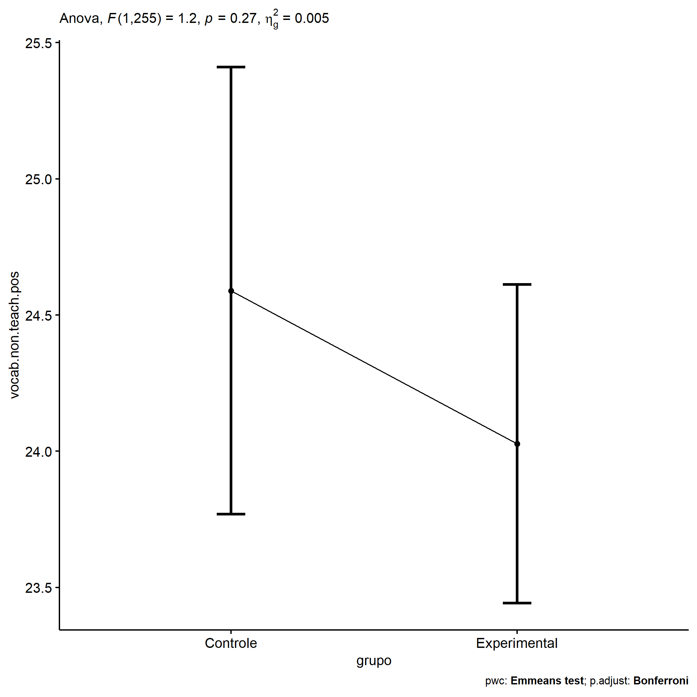<!-- -->

``` r
plots <- oneWayAncovaBoxPlots(
  wdat, "vocab.non.teach.pos", "grupo", aov, pwc, covar = "vocab.non.teach.pre",
  theme = "classic", color = color[["grupo"]],
  subtitle = which(aov$Effect == "grupo"))
```

``` r
if (length(unique(wdat[["grupo"]])) > 1)
  plots[["grupo"]] + ggplot2::ylab("Vocabulario Não Ensinado") + ggplot2::scale_x_discrete(labels=c('pre', 'pos'))
```

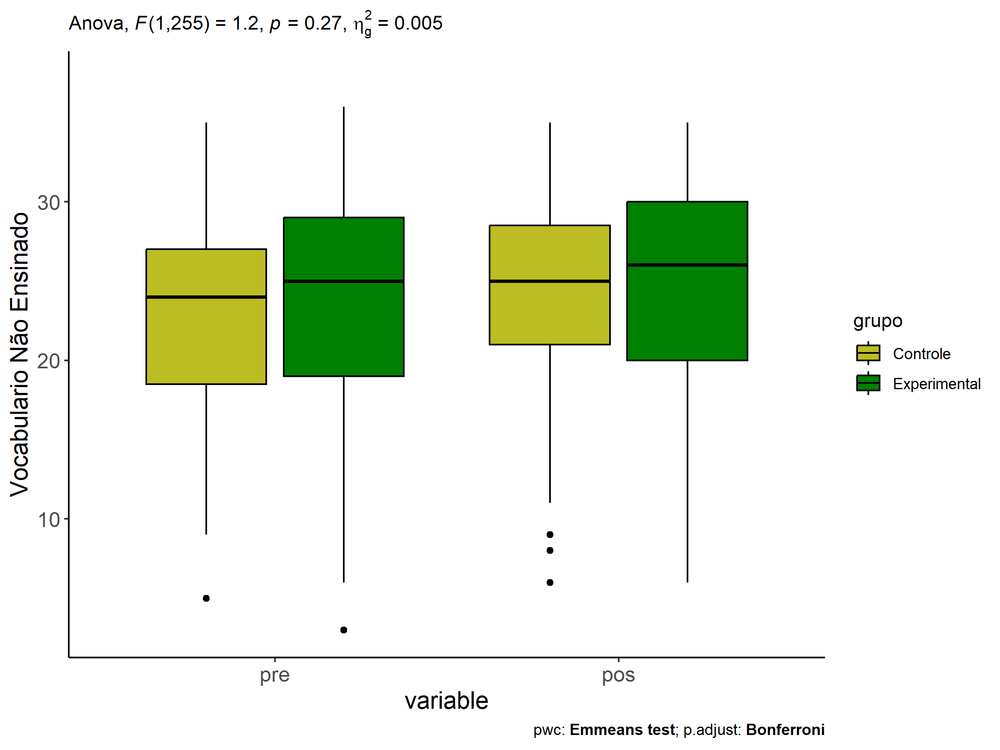<!-- -->

``` r
if (length(unique(wdat.long[["grupo"]])) > 1)
  plots <- oneWayAncovaBoxPlots(
    wdat.long, "vocab.non.teach", "grupo", aov, pwc.long, pre.post = "time",
    theme = "classic", color = color$prepost)
```

``` r
if (length(unique(wdat.long[["grupo"]])) > 1)
  plots[["grupo"]] + ggplot2::ylab("Vocabulario Não Ensinado")
```

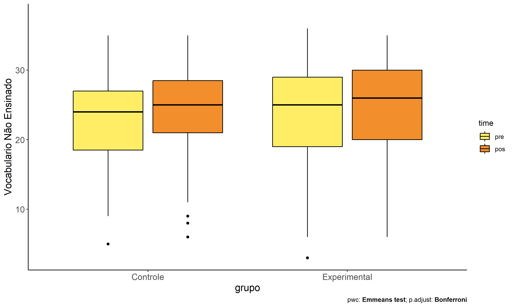<!-- -->

### Checking linearity assumption

``` r
ggscatter(wdat, x = "vocab.non.teach.pre", y = "vocab.non.teach.pos", size = 0.5,
          color = "grupo", add = "reg.line")+
  stat_regline_equation(
    aes(label =  paste(..eq.label.., ..rr.label.., sep = "~~~~"), color = grupo)
  )
```

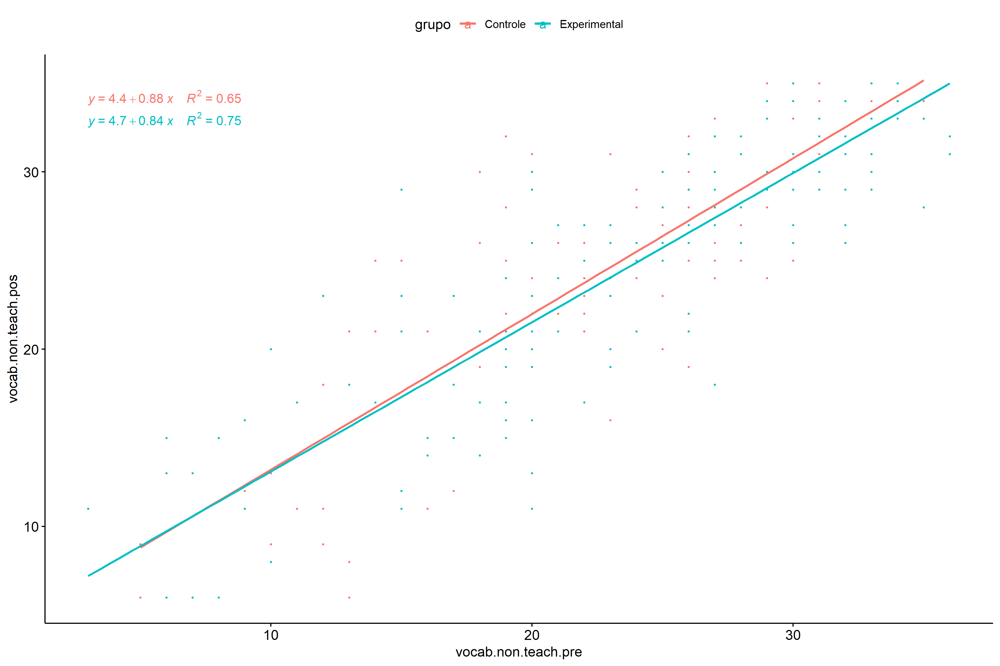<!-- -->

### Checking normality and homogeneity

``` r
res <- augment(lm(vocab.non.teach.pos ~ vocab.non.teach.pre + grupo, data = wdat))
```

``` r
shapiro_test(res$.resid)
```

    ## # A tibble: 1 × 3
    ##   variable   statistic p.value
    ##   <chr>          <dbl>   <dbl>
    ## 1 res$.resid     0.994   0.331

``` r
levene_test(res, .resid ~ grupo)
```

    ## # A tibble: 1 × 4
    ##     df1   df2 statistic      p
    ##   <int> <int>     <dbl>  <dbl>
    ## 1     1   256      3.56 0.0602

# ANCOVA and Pairwise for two factors **grupo:Sexo**

## Without remove non-normal data

``` r
pdat = remove_group_data(dat[!is.na(dat[["grupo"]]) & !is.na(dat[["Sexo"]]),], "vocab.non.teach.pos", c("grupo","Sexo"))

pdat.long <- rbind(pdat[,c("id","grupo","Sexo")], pdat[,c("id","grupo","Sexo")])
pdat.long[["time"]] <- c(rep("pre", nrow(pdat)), rep("pos", nrow(pdat)))
pdat.long[["time"]] <- factor(pdat.long[["time"]], c("pre","pos"))
pdat.long[["vocab.non.teach"]] <- c(pdat[["vocab.non.teach.pre"]], pdat[["vocab.non.teach.pos"]])

aov = anova_test(pdat, vocab.non.teach.pos ~ vocab.non.teach.pre + grupo*Sexo)
laov[["grupo:Sexo"]] <- get_anova_table(aov)
```

``` r
pwcs <- list()
pwcs[["Sexo"]] <- emmeans_test(
  group_by(pdat, grupo), vocab.non.teach.pos ~ Sexo,
  covariate = vocab.non.teach.pre, p.adjust.method = "bonferroni")
pwcs[["grupo"]] <- emmeans_test(
  group_by(pdat, Sexo), vocab.non.teach.pos ~ grupo,
  covariate = vocab.non.teach.pre, p.adjust.method = "bonferroni")

pwc <- plyr::rbind.fill(pwcs[["grupo"]], pwcs[["Sexo"]])
pwc <- pwc[,c("grupo","Sexo", colnames(pwc)[!colnames(pwc) %in% c("grupo","Sexo")])]
```

``` r
pwc.long <- emmeans_test(dplyr::group_by_at(pdat.long, c("grupo","Sexo")),
                         vocab.non.teach ~ time,
                         p.adjust.method = "bonferroni")
lpwc[["grupo:Sexo"]] <- plyr::rbind.fill(pwc, pwc.long)
```

``` r
ds <- get.descriptives(pdat, "vocab.non.teach.pos", c("grupo","Sexo"), covar = "vocab.non.teach.pre")
ds <- merge(ds[ds$variable != "vocab.non.teach.pre",],
            ds[ds$variable == "vocab.non.teach.pre", !colnames(ds) %in% c("variable")],
            by = c("grupo","Sexo"), all.x = T, suffixes = c("", ".vocab.non.teach.pre"))
ds <- merge(get_emmeans(pwcs[["grupo"]]), ds, by = c("grupo","Sexo"), suffixes = c(".emms", ""))
ds <- ds[,c("grupo","Sexo","n","mean.vocab.non.teach.pre","se.vocab.non.teach.pre","mean","se","emmean","se.emms")]

colnames(ds) <- c("grupo","Sexo", "N", paste0(c("M","SE")," (pre)"),
                  paste0(c("M","SE"), " (unadj)"), paste0(c("M", "SE"), " (adj)"))

lemms[["grupo:Sexo"]] <- ds
```

## Computing ANCOVA and PairWise After removing non-normal data (OK)

``` r
wdat = pdat 

res = residuals(lm(vocab.non.teach.pos ~ vocab.non.teach.pre + grupo*Sexo, data = wdat))
non.normal = getNonNormal(res, wdat$id, plimit = 0.05)

wdat = wdat[!wdat$id %in% non.normal,]

wdat.long <- rbind(wdat[,c("id","grupo","Sexo")], wdat[,c("id","grupo","Sexo")])
wdat.long[["time"]] <- c(rep("pre", nrow(wdat)), rep("pos", nrow(wdat)))
wdat.long[["time"]] <- factor(wdat.long[["time"]], c("pre","pos"))
wdat.long[["vocab.non.teach"]] <- c(wdat[["vocab.non.teach.pre"]], wdat[["vocab.non.teach.pos"]])


ldat[["grupo:Sexo"]] = wdat

(non.normal)
```

    ##  [1] "P1003" "P2192" "P996"  "P2245" "P1069" "P2207" "P1006" "P2251" "P1056" "P2232" "P3654" "P2069" "P1057"
    ## [14] "P2206" "P1066" "P2176" "P2219" "P3660" "P3159" "P1012" "P2164" "P2121" "P2161" "P2135" "P1029" "P2203"
    ## [27] "P2072" "P1050" "P2125" "P576"  "P1065"

``` r
aov = anova_test(wdat, vocab.non.teach.pos ~ vocab.non.teach.pre + grupo*Sexo)
laov[["grupo:Sexo"]] <- merge(get_anova_table(aov), laov[["grupo:Sexo"]], by="Effect", suffixes = c("","'"))

(df = get_anova_table(aov))
```

    ## ANOVA Table (type II tests)
    ## 
    ##                Effect DFn DFd       F        p p<.05   ges
    ## 1 vocab.non.teach.pre   1 245 601.988 6.14e-68     * 0.711
    ## 2               grupo   1 245   0.523 4.70e-01       0.002
    ## 3                Sexo   1 245   2.798 9.60e-02       0.011
    ## 4          grupo:Sexo   1 245   1.487 2.24e-01       0.006

| Effect              | DFn | DFd |       F |     p | p\<.05 |   ges |
|:--------------------|----:|----:|--------:|------:|:-------|------:|
| vocab.non.teach.pre |   1 | 245 | 601.988 | 0.000 | \*     | 0.711 |
| grupo               |   1 | 245 |   0.523 | 0.470 |        | 0.002 |
| Sexo                |   1 | 245 |   2.798 | 0.096 |        | 0.011 |
| grupo:Sexo          |   1 | 245 |   1.487 | 0.224 |        | 0.006 |

``` r
pwcs <- list()
pwcs[["Sexo"]] <- emmeans_test(
  group_by(wdat, grupo), vocab.non.teach.pos ~ Sexo,
  covariate = vocab.non.teach.pre, p.adjust.method = "bonferroni")
pwcs[["grupo"]] <- emmeans_test(
  group_by(wdat, Sexo), vocab.non.teach.pos ~ grupo,
  covariate = vocab.non.teach.pre, p.adjust.method = "bonferroni")

pwc <- plyr::rbind.fill(pwcs[["grupo"]], pwcs[["Sexo"]])
pwc <- pwc[,c("grupo","Sexo", colnames(pwc)[!colnames(pwc) %in% c("grupo","Sexo")])]
```

| grupo        | Sexo | term                       | .y.                 | group1   | group2       |  df | statistic |     p | p.adj | p.adj.signif |
|:-------------|:-----|:---------------------------|:--------------------|:---------|:-------------|----:|----------:|------:|------:|:-------------|
|              | F    | vocab.non.teach.pre\*grupo | vocab.non.teach.pos | Controle | Experimental | 245 |     1.363 | 0.174 | 0.174 | ns           |
|              | M    | vocab.non.teach.pre\*grupo | vocab.non.teach.pos | Controle | Experimental | 245 |    -0.383 | 0.702 | 0.702 | ns           |
| Controle     |      | vocab.non.teach.pre\*Sexo  | vocab.non.teach.pos | F        | M            | 245 |     1.969 | 0.050 | 0.050 | ns           |
| Experimental |      | vocab.non.teach.pre\*Sexo  | vocab.non.teach.pos | F        | M            | 245 |     0.655 | 0.513 | 0.513 | ns           |

``` r
pwc.long <- emmeans_test(dplyr::group_by_at(wdat.long, c("grupo","Sexo")),
                         vocab.non.teach ~ time,
                         p.adjust.method = "bonferroni")
lpwc[["grupo:Sexo"]] <- merge(plyr::rbind.fill(pwc, pwc.long), lpwc[["grupo:Sexo"]], by=c("grupo","Sexo","term",".y.","group1","group2"), suffixes = c("","'"))
```

| grupo        | Sexo | term | .y.             | group1 | group2 |  df | statistic |     p | p.adj | p.adj.signif |
|:-------------|:-----|:-----|:----------------|:-------|:-------|----:|----------:|------:|------:|:-------------|
| Controle     | F    | time | vocab.non.teach | pre    | pos    | 492 |    -1.534 | 0.126 | 0.126 | ns           |
| Controle     | M    | time | vocab.non.teach | pre    | pos    | 492 |    -0.612 | 0.541 | 0.541 | ns           |
| Experimental | F    | time | vocab.non.teach | pre    | pos    | 492 |    -0.978 | 0.329 | 0.329 | ns           |
| Experimental | M    | time | vocab.non.teach | pre    | pos    | 492 |    -0.906 | 0.366 | 0.366 | ns           |

``` r
ds <- get.descriptives(wdat, "vocab.non.teach.pos", c("grupo","Sexo"), covar = "vocab.non.teach.pre")
ds <- merge(ds[ds$variable != "vocab.non.teach.pre",],
            ds[ds$variable == "vocab.non.teach.pre", !colnames(ds) %in% c("variable")],
            by = c("grupo","Sexo"), all.x = T, suffixes = c("", ".vocab.non.teach.pre"))
ds <- merge(get_emmeans(pwcs[["grupo"]]), ds, by = c("grupo","Sexo"), suffixes = c(".emms", ""))
ds <- ds[,c("grupo","Sexo","n","mean.vocab.non.teach.pre","se.vocab.non.teach.pre","mean","se","emmean","se.emms")]

colnames(ds) <- c("grupo","Sexo", "N", paste0(c("M","SE")," (pre)"),
                  paste0(c("M","SE"), " (unadj)"), paste0(c("M", "SE"), " (adj)"))

lemms[["grupo:Sexo"]] <- merge(ds, lemms[["grupo:Sexo"]], by=c("grupo","Sexo"), suffixes = c("","'"))
```

| grupo        | Sexo |   N | M (pre) | SE (pre) | M (unadj) | SE (unadj) | M (adj) | SE (adj) |
|:-------------|:-----|----:|--------:|---------:|----------:|-----------:|--------:|---------:|
| Controle     | F    |  45 |  23.133 |    1.004 |    25.378 |      1.023 |  25.509 |    0.552 |
| Controle     | M    |  40 |  21.450 |    1.074 |    22.400 |      1.212 |  23.921 |    0.589 |
| Experimental | F    |  86 |  24.733 |    0.788 |    25.767 |      0.711 |  24.578 |    0.402 |
| Experimental | M    |  79 |  22.747 |    0.781 |    23.747 |      0.758 |  24.197 |    0.417 |

### Plots for ancova

``` r
plots <- twoWayAncovaPlots(
  wdat, "vocab.non.teach.pos", c("grupo","Sexo"), aov, pwcs, addParam = c("mean_se"),
  font.label.size=10, step.increase=0.05, p.label="p.adj",
  subtitle = which(aov$Effect == "grupo:Sexo"))
```

``` r
if (!is.null(plots[["grupo"]]))
  plots[["grupo"]] + ggplot2::scale_color_manual(values = color[["Sexo"]])
```

    ## Scale for colour is already present.
    ## Adding another scale for colour, which will replace the existing scale.

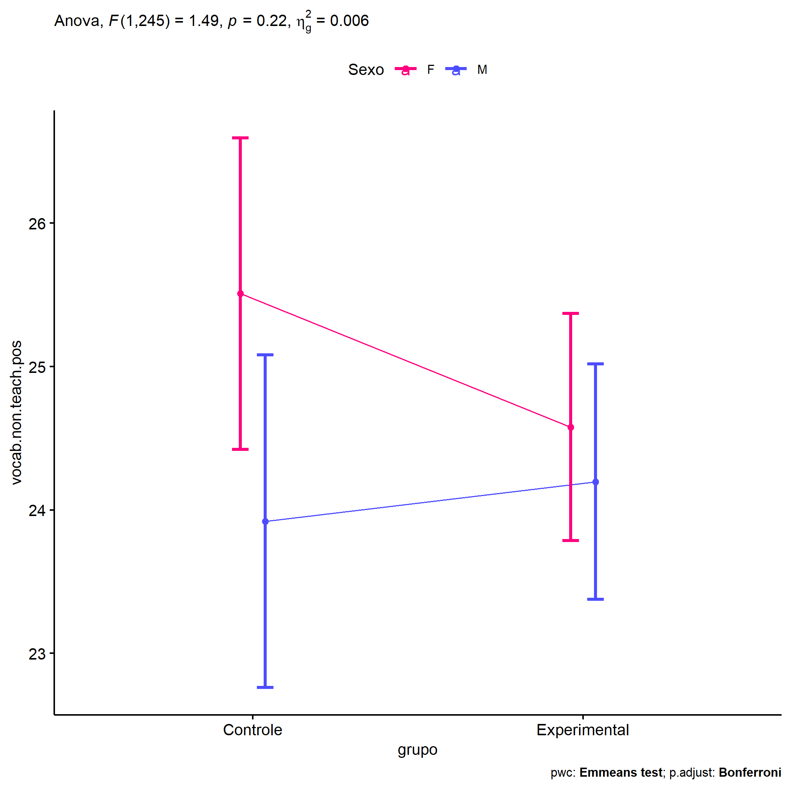<!-- -->

``` r
if (!is.null(plots[["Sexo"]]))
  plots[["Sexo"]] + ggplot2::scale_color_manual(values = color[["grupo"]])
```

    ## Scale for colour is already present.
    ## Adding another scale for colour, which will replace the existing scale.

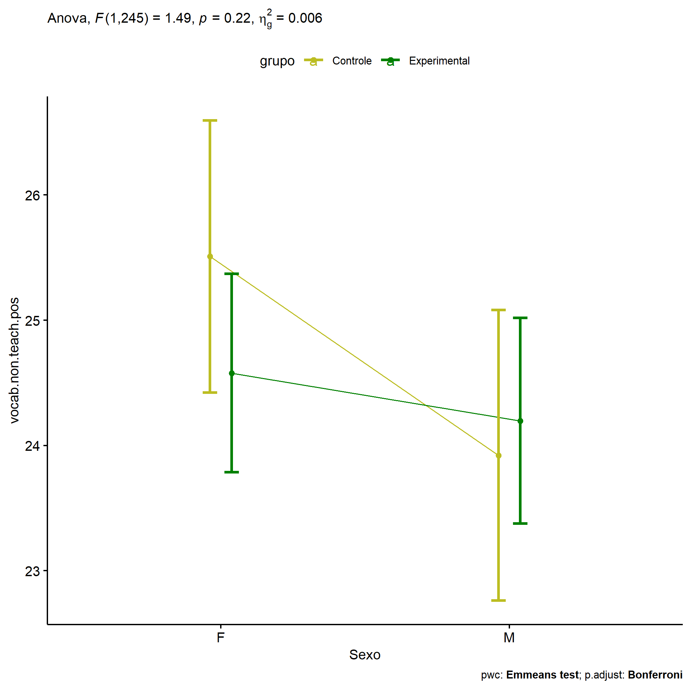<!-- -->

``` r
plots <- twoWayAncovaBoxPlots(
  wdat, "vocab.non.teach.pos", c("grupo","Sexo"), aov, pwcs, covar = "vocab.non.teach.pre",
  theme = "classic", color = color[["grupo:Sexo"]],
  subtitle = which(aov$Effect == "grupo:Sexo"))
```

``` r
plots[["grupo:Sexo"]] + ggplot2::ylab("Vocabulario Não Ensinado") + ggplot2::scale_x_discrete(labels=c('pre', 'pos'))
```

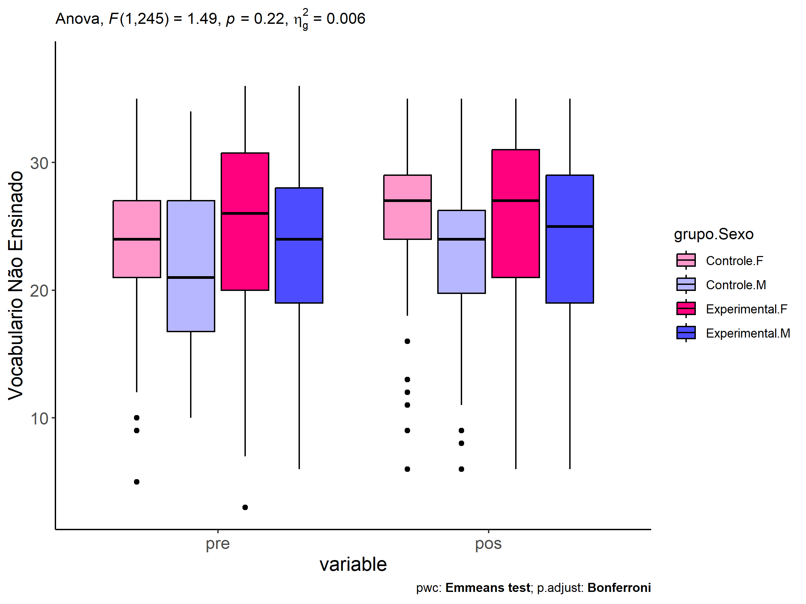<!-- -->

``` r
plots <- twoWayAncovaBoxPlots(
  wdat.long, "vocab.non.teach", c("grupo","Sexo"), aov, pwc.long, pre.post = "time",
  theme = "classic", color = color$prepost)
```

``` r
plots[["grupo:Sexo"]] + ggplot2::ylab("Vocabulario Não Ensinado")
```

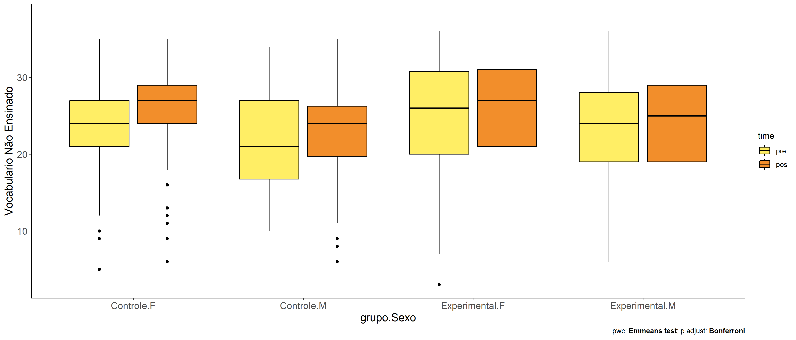<!-- -->

### Checking linearity assumption

``` r
ggscatter(wdat, x = "vocab.non.teach.pre", y = "vocab.non.teach.pos", size = 0.5,
          facet.by = c("grupo","Sexo"), add = "reg.line")+
  stat_regline_equation(
    aes(label =  paste(..eq.label.., ..rr.label.., sep = "~~~~"))
  )
```

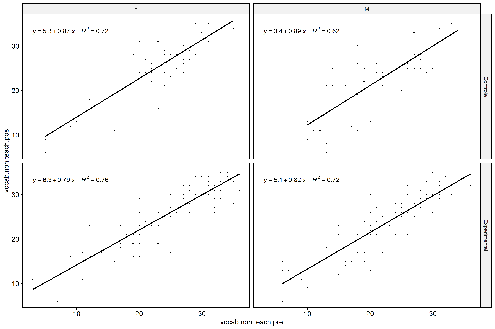<!-- -->

### Checking normality and homogeneity

``` r
res <- augment(lm(vocab.non.teach.pos ~ vocab.non.teach.pre + grupo*Sexo, data = wdat))
```

``` r
shapiro_test(res$.resid)
```

    ## # A tibble: 1 × 3
    ##   variable   statistic p.value
    ##   <chr>          <dbl>   <dbl>
    ## 1 res$.resid     0.991   0.134

``` r
levene_test(res, .resid ~ grupo*Sexo)
```

    ## # A tibble: 1 × 4
    ##     df1   df2 statistic      p
    ##   <int> <int>     <dbl>  <dbl>
    ## 1     3   246      2.51 0.0594

# ANCOVA and Pairwise for two factors **grupo:Zona**

## Without remove non-normal data

``` r
pdat = remove_group_data(dat[!is.na(dat[["grupo"]]) & !is.na(dat[["Zona"]]),], "vocab.non.teach.pos", c("grupo","Zona"))

pdat.long <- rbind(pdat[,c("id","grupo","Zona")], pdat[,c("id","grupo","Zona")])
pdat.long[["time"]] <- c(rep("pre", nrow(pdat)), rep("pos", nrow(pdat)))
pdat.long[["time"]] <- factor(pdat.long[["time"]], c("pre","pos"))
pdat.long[["vocab.non.teach"]] <- c(pdat[["vocab.non.teach.pre"]], pdat[["vocab.non.teach.pos"]])

aov = anova_test(pdat, vocab.non.teach.pos ~ vocab.non.teach.pre + grupo*Zona)
laov[["grupo:Zona"]] <- get_anova_table(aov)
```

``` r
pwcs <- list()
pwcs[["Zona"]] <- emmeans_test(
  group_by(pdat, grupo), vocab.non.teach.pos ~ Zona,
  covariate = vocab.non.teach.pre, p.adjust.method = "bonferroni")
pwcs[["grupo"]] <- emmeans_test(
  group_by(pdat, Zona), vocab.non.teach.pos ~ grupo,
  covariate = vocab.non.teach.pre, p.adjust.method = "bonferroni")

pwc <- plyr::rbind.fill(pwcs[["grupo"]], pwcs[["Zona"]])
pwc <- pwc[,c("grupo","Zona", colnames(pwc)[!colnames(pwc) %in% c("grupo","Zona")])]
```

``` r
pwc.long <- emmeans_test(dplyr::group_by_at(pdat.long, c("grupo","Zona")),
                         vocab.non.teach ~ time,
                         p.adjust.method = "bonferroni")
lpwc[["grupo:Zona"]] <- plyr::rbind.fill(pwc, pwc.long)
```

``` r
ds <- get.descriptives(pdat, "vocab.non.teach.pos", c("grupo","Zona"), covar = "vocab.non.teach.pre")
ds <- merge(ds[ds$variable != "vocab.non.teach.pre",],
            ds[ds$variable == "vocab.non.teach.pre", !colnames(ds) %in% c("variable")],
            by = c("grupo","Zona"), all.x = T, suffixes = c("", ".vocab.non.teach.pre"))
ds <- merge(get_emmeans(pwcs[["grupo"]]), ds, by = c("grupo","Zona"), suffixes = c(".emms", ""))
ds <- ds[,c("grupo","Zona","n","mean.vocab.non.teach.pre","se.vocab.non.teach.pre","mean","se","emmean","se.emms")]

colnames(ds) <- c("grupo","Zona", "N", paste0(c("M","SE")," (pre)"),
                  paste0(c("M","SE"), " (unadj)"), paste0(c("M", "SE"), " (adj)"))

lemms[["grupo:Zona"]] <- ds
```

## Computing ANCOVA and PairWise After removing non-normal data (OK)

``` r
wdat = pdat 

res = residuals(lm(vocab.non.teach.pos ~ vocab.non.teach.pre + grupo*Zona, data = wdat))
non.normal = getNonNormal(res, wdat$id, plimit = 0.05)

wdat = wdat[!wdat$id %in% non.normal,]

wdat.long <- rbind(wdat[,c("id","grupo","Zona")], wdat[,c("id","grupo","Zona")])
wdat.long[["time"]] <- c(rep("pre", nrow(wdat)), rep("pos", nrow(wdat)))
wdat.long[["time"]] <- factor(wdat.long[["time"]], c("pre","pos"))
wdat.long[["vocab.non.teach"]] <- c(wdat[["vocab.non.teach.pre"]], wdat[["vocab.non.teach.pos"]])


ldat[["grupo:Zona"]] = wdat

(non.normal)
```

    ## [1] "P2207" "P1056" "P3654"

``` r
aov = anova_test(wdat, vocab.non.teach.pos ~ vocab.non.teach.pre + grupo*Zona)
laov[["grupo:Zona"]] <- merge(get_anova_table(aov), laov[["grupo:Zona"]], by="Effect", suffixes = c("","'"))

(df = get_anova_table(aov))
```

    ## ANOVA Table (type II tests)
    ## 
    ##                Effect DFn DFd       F        p p<.05   ges
    ## 1 vocab.non.teach.pre   1 137 264.406 8.74e-34     * 0.659
    ## 2               grupo   1 137   1.310 2.54e-01       0.009
    ## 3                Zona   1 137   0.946 3.32e-01       0.007
    ## 4          grupo:Zona   1 137   1.086 2.99e-01       0.008

| Effect              | DFn | DFd |       F |     p | p\<.05 |   ges |
|:--------------------|----:|----:|--------:|------:|:-------|------:|
| vocab.non.teach.pre |   1 | 137 | 264.406 | 0.000 | \*     | 0.659 |
| grupo               |   1 | 137 |   1.310 | 0.254 |        | 0.009 |
| Zona                |   1 | 137 |   0.946 | 0.332 |        | 0.007 |
| grupo:Zona          |   1 | 137 |   1.086 | 0.299 |        | 0.008 |

``` r
pwcs <- list()
pwcs[["Zona"]] <- emmeans_test(
  group_by(wdat, grupo), vocab.non.teach.pos ~ Zona,
  covariate = vocab.non.teach.pre, p.adjust.method = "bonferroni")
pwcs[["grupo"]] <- emmeans_test(
  group_by(wdat, Zona), vocab.non.teach.pos ~ grupo,
  covariate = vocab.non.teach.pre, p.adjust.method = "bonferroni")

pwc <- plyr::rbind.fill(pwcs[["grupo"]], pwcs[["Zona"]])
pwc <- pwc[,c("grupo","Zona", colnames(pwc)[!colnames(pwc) %in% c("grupo","Zona")])]
```

| grupo        | Zona   | term                       | .y.                 | group1   | group2       |  df | statistic |     p | p.adj | p.adj.signif |
|:-------------|:-------|:---------------------------|:--------------------|:---------|:-------------|----:|----------:|------:|------:|:-------------|
|              | Rural  | vocab.non.teach.pre\*grupo | vocab.non.teach.pos | Controle | Experimental | 137 |     0.315 | 0.753 | 0.753 | ns           |
|              | Urbana | vocab.non.teach.pre\*grupo | vocab.non.teach.pos | Controle | Experimental | 137 |     1.516 | 0.132 | 0.132 | ns           |
| Controle     |        | vocab.non.teach.pre\*Zona  | vocab.non.teach.pos | Rural    | Urbana       | 137 |    -1.420 | 0.158 | 0.158 | ns           |
| Experimental |        | vocab.non.teach.pre\*Zona  | vocab.non.teach.pos | Rural    | Urbana       | 137 |    -0.135 | 0.893 | 0.893 | ns           |

``` r
pwc.long <- emmeans_test(dplyr::group_by_at(wdat.long, c("grupo","Zona")),
                         vocab.non.teach ~ time,
                         p.adjust.method = "bonferroni")
lpwc[["grupo:Zona"]] <- merge(plyr::rbind.fill(pwc, pwc.long), lpwc[["grupo:Zona"]], by=c("grupo","Zona","term",".y.","group1","group2"), suffixes = c("","'"))
```

| grupo        | Zona   | term | .y.             | group1 | group2 |  df | statistic |     p | p.adj | p.adj.signif |
|:-------------|:-------|:-----|:----------------|:-------|:-------|----:|----------:|------:|------:|:-------------|
| Controle     | Rural  | time | vocab.non.teach | pre    | pos    | 276 |    -0.842 | 0.401 | 0.401 | ns           |
| Controle     | Urbana | time | vocab.non.teach | pre    | pos    | 276 |    -1.276 | 0.203 | 0.203 | ns           |
| Experimental | Rural  | time | vocab.non.teach | pre    | pos    | 276 |    -0.737 | 0.462 | 0.462 | ns           |
| Experimental | Urbana | time | vocab.non.teach | pre    | pos    | 276 |    -0.497 | 0.620 | 0.620 | ns           |

``` r
ds <- get.descriptives(wdat, "vocab.non.teach.pos", c("grupo","Zona"), covar = "vocab.non.teach.pre")
ds <- merge(ds[ds$variable != "vocab.non.teach.pre",],
            ds[ds$variable == "vocab.non.teach.pre", !colnames(ds) %in% c("variable")],
            by = c("grupo","Zona"), all.x = T, suffixes = c("", ".vocab.non.teach.pre"))
ds <- merge(get_emmeans(pwcs[["grupo"]]), ds, by = c("grupo","Zona"), suffixes = c(".emms", ""))
ds <- ds[,c("grupo","Zona","n","mean.vocab.non.teach.pre","se.vocab.non.teach.pre","mean","se","emmean","se.emms")]

colnames(ds) <- c("grupo","Zona", "N", paste0(c("M","SE")," (pre)"),
                  paste0(c("M","SE"), " (unadj)"), paste0(c("M", "SE"), " (adj)"))

lemms[["grupo:Zona"]] <- merge(ds, lemms[["grupo:Zona"]], by=c("grupo","Zona"), suffixes = c("","'"))
```

| grupo        | Zona   |   N | M (pre) | SE (pre) | M (unadj) | SE (unadj) | M (adj) | SE (adj) |
|:-------------|:-------|----:|--------:|---------:|----------:|-----------:|--------:|---------:|
| Controle     | Rural  |  37 |  22.054 |    1.175 |    23.459 |      1.283 |  24.200 |    0.708 |
| Controle     | Urbana |  18 |  22.722 |    1.402 |    25.778 |      1.490 |  25.953 |    1.013 |
| Experimental | Rural  |  54 |  22.685 |    0.985 |    23.704 |      1.002 |  23.910 |    0.585 |
| Experimental | Urbana |  33 |  24.424 |    1.235 |    25.303 |      1.256 |  24.039 |    0.752 |

### Plots for ancova

``` r
plots <- twoWayAncovaPlots(
  wdat, "vocab.non.teach.pos", c("grupo","Zona"), aov, pwcs, addParam = c("mean_se"),
  font.label.size=10, step.increase=0.05, p.label="p.adj",
  subtitle = which(aov$Effect == "grupo:Zona"))
```

``` r
if (!is.null(plots[["grupo"]]))
  plots[["grupo"]] + ggplot2::scale_color_manual(values = color[["Zona"]])
```

    ## Scale for colour is already present.
    ## Adding another scale for colour, which will replace the existing scale.

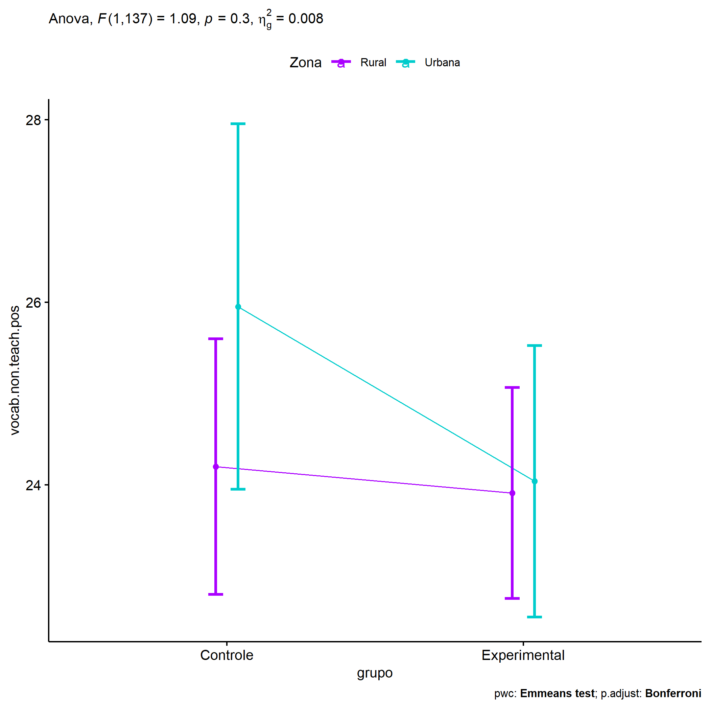<!-- -->

``` r
if (!is.null(plots[["Zona"]]))
  plots[["Zona"]] + ggplot2::scale_color_manual(values = color[["grupo"]])
```

    ## Scale for colour is already present.
    ## Adding another scale for colour, which will replace the existing scale.

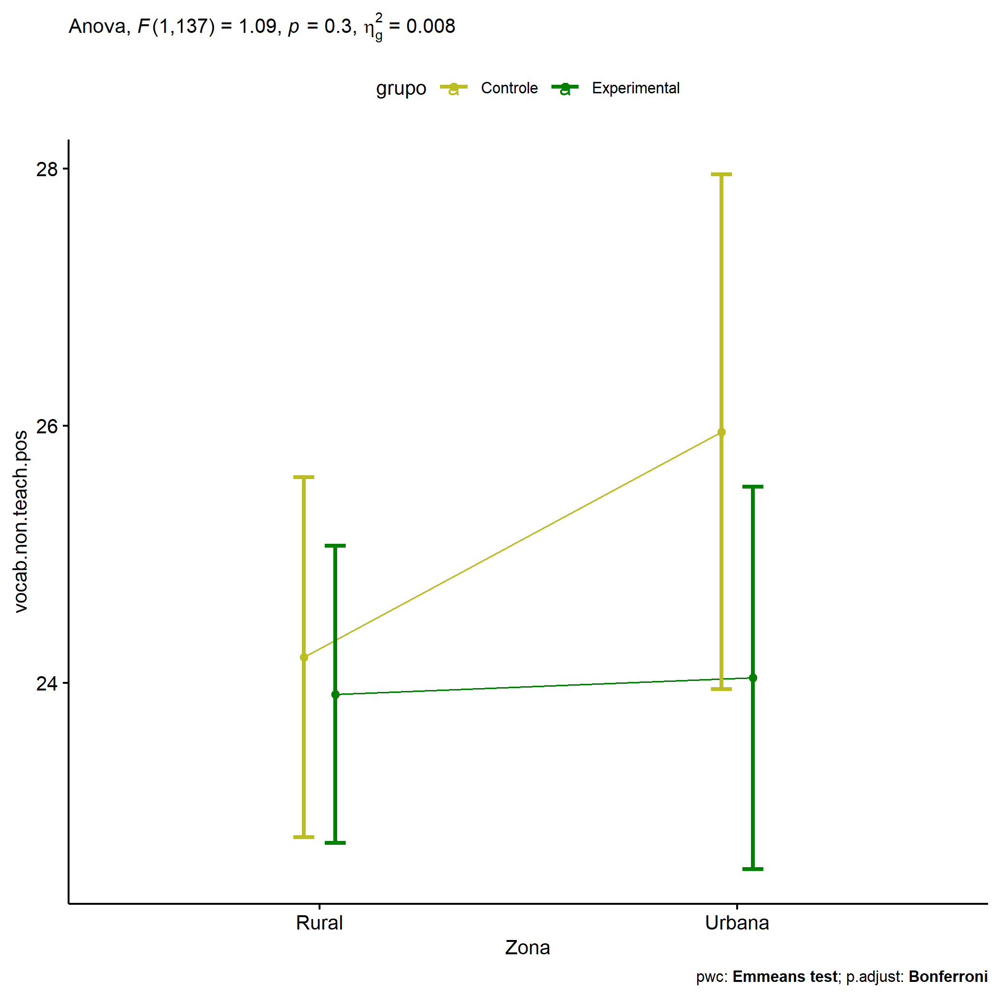<!-- -->

``` r
plots <- twoWayAncovaBoxPlots(
  wdat, "vocab.non.teach.pos", c("grupo","Zona"), aov, pwcs, covar = "vocab.non.teach.pre",
  theme = "classic", color = color[["grupo:Zona"]],
  subtitle = which(aov$Effect == "grupo:Zona"))
```

``` r
plots[["grupo:Zona"]] + ggplot2::ylab("Vocabulario Não Ensinado") + ggplot2::scale_x_discrete(labels=c('pre', 'pos'))
```

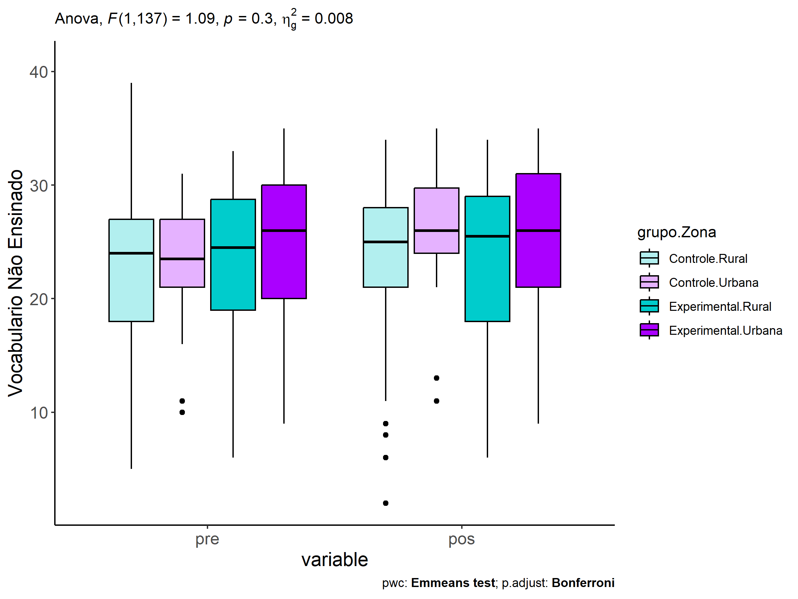<!-- -->

``` r
plots <- twoWayAncovaBoxPlots(
  wdat.long, "vocab.non.teach", c("grupo","Zona"), aov, pwc.long, pre.post = "time",
  theme = "classic", color = color$prepost)
```

``` r
plots[["grupo:Zona"]] + ggplot2::ylab("Vocabulario Não Ensinado")
```

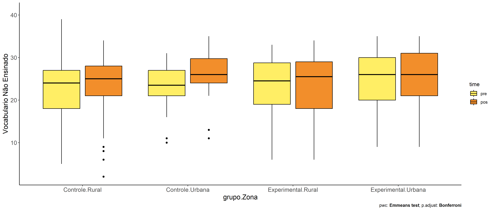<!-- -->

### Checking linearity assumption

``` r
ggscatter(wdat, x = "vocab.non.teach.pre", y = "vocab.non.teach.pos", size = 0.5,
          facet.by = c("grupo","Zona"), add = "reg.line")+
  stat_regline_equation(
    aes(label =  paste(..eq.label.., ..rr.label.., sep = "~~~~"))
  )
```

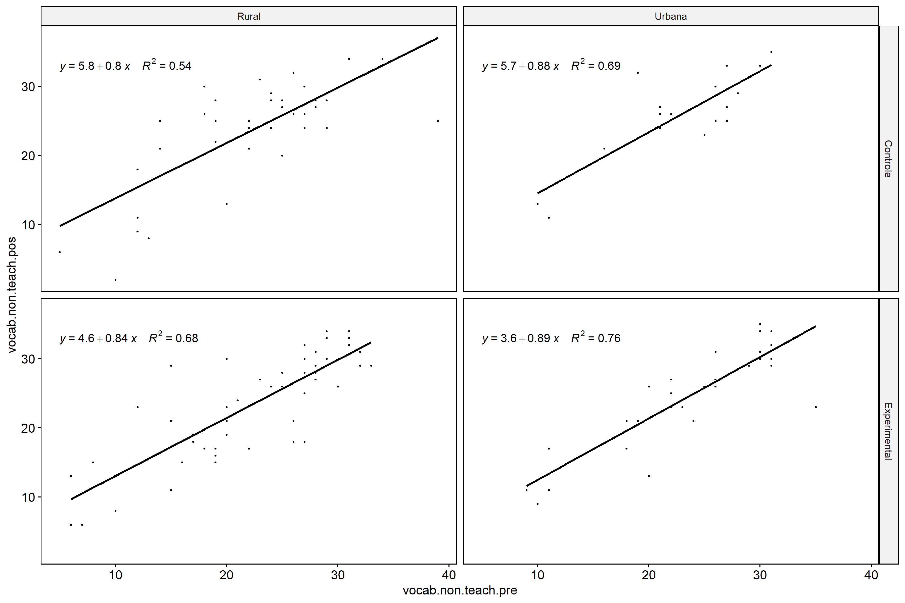<!-- -->

### Checking normality and homogeneity

``` r
res <- augment(lm(vocab.non.teach.pos ~ vocab.non.teach.pre + grupo*Zona, data = wdat))
```

``` r
shapiro_test(res$.resid)
```

    ## # A tibble: 1 × 3
    ##   variable   statistic p.value
    ##   <chr>          <dbl>   <dbl>
    ## 1 res$.resid     0.984  0.0888

``` r
levene_test(res, .resid ~ grupo*Zona)
```

    ## # A tibble: 1 × 4
    ##     df1   df2 statistic      p
    ##   <int> <int>     <dbl>  <dbl>
    ## 1     3   138      2.65 0.0511

# ANCOVA and Pairwise for two factors **grupo:Cor.Raca**

## Without remove non-normal data

``` r
pdat = remove_group_data(dat[!is.na(dat[["grupo"]]) & !is.na(dat[["Cor.Raca"]]),], "vocab.non.teach.pos", c("grupo","Cor.Raca"))
```

    ## Warning: There were 2 warnings in `mutate()`.
    ## The first warning was:
    ## ℹ In argument: `ci = abs(stats::qt(alpha/2, .data$n - 1) * .data$se)`.
    ## Caused by warning:
    ## ! There was 1 warning in `mutate()`.
    ## ℹ In argument: `ci = abs(stats::qt(alpha/2, .data$n - 1) * .data$se)`.
    ## Caused by warning in `stats::qt()`:
    ## ! NaNs produced
    ## ℹ Run `dplyr::last_dplyr_warnings()` to see the 1 remaining warning.

``` r
pdat.long <- rbind(pdat[,c("id","grupo","Cor.Raca")], pdat[,c("id","grupo","Cor.Raca")])
pdat.long[["time"]] <- c(rep("pre", nrow(pdat)), rep("pos", nrow(pdat)))
pdat.long[["time"]] <- factor(pdat.long[["time"]], c("pre","pos"))
pdat.long[["vocab.non.teach"]] <- c(pdat[["vocab.non.teach.pre"]], pdat[["vocab.non.teach.pos"]])

aov = anova_test(pdat, vocab.non.teach.pos ~ vocab.non.teach.pre + grupo*Cor.Raca)
laov[["grupo:Cor.Raca"]] <- get_anova_table(aov)
```

``` r
pwcs <- list()
pwcs[["Cor.Raca"]] <- emmeans_test(
  group_by(pdat, grupo), vocab.non.teach.pos ~ Cor.Raca,
  covariate = vocab.non.teach.pre, p.adjust.method = "bonferroni")
pwcs[["grupo"]] <- emmeans_test(
  group_by(pdat, Cor.Raca), vocab.non.teach.pos ~ grupo,
  covariate = vocab.non.teach.pre, p.adjust.method = "bonferroni")

pwc <- plyr::rbind.fill(pwcs[["grupo"]], pwcs[["Cor.Raca"]])
pwc <- pwc[,c("grupo","Cor.Raca", colnames(pwc)[!colnames(pwc) %in% c("grupo","Cor.Raca")])]
```

``` r
pwc.long <- emmeans_test(dplyr::group_by_at(pdat.long, c("grupo","Cor.Raca")),
                         vocab.non.teach ~ time,
                         p.adjust.method = "bonferroni")
lpwc[["grupo:Cor.Raca"]] <- plyr::rbind.fill(pwc, pwc.long)
```

``` r
ds <- get.descriptives(pdat, "vocab.non.teach.pos", c("grupo","Cor.Raca"), covar = "vocab.non.teach.pre")
ds <- merge(ds[ds$variable != "vocab.non.teach.pre",],
            ds[ds$variable == "vocab.non.teach.pre", !colnames(ds) %in% c("variable")],
            by = c("grupo","Cor.Raca"), all.x = T, suffixes = c("", ".vocab.non.teach.pre"))
ds <- merge(get_emmeans(pwcs[["grupo"]]), ds, by = c("grupo","Cor.Raca"), suffixes = c(".emms", ""))
ds <- ds[,c("grupo","Cor.Raca","n","mean.vocab.non.teach.pre","se.vocab.non.teach.pre","mean","se","emmean","se.emms")]

colnames(ds) <- c("grupo","Cor.Raca", "N", paste0(c("M","SE")," (pre)"),
                  paste0(c("M","SE"), " (unadj)"), paste0(c("M", "SE"), " (adj)"))

lemms[["grupo:Cor.Raca"]] <- ds
```

## Computing ANCOVA and PairWise After removing non-normal data (OK)

``` r
wdat = pdat 

res = residuals(lm(vocab.non.teach.pos ~ vocab.non.teach.pre + grupo*Cor.Raca, data = wdat))
non.normal = getNonNormal(res, wdat$id, plimit = 0.05)

wdat = wdat[!wdat$id %in% non.normal,]

wdat.long <- rbind(wdat[,c("id","grupo","Cor.Raca")], wdat[,c("id","grupo","Cor.Raca")])
wdat.long[["time"]] <- c(rep("pre", nrow(wdat)), rep("pos", nrow(wdat)))
wdat.long[["time"]] <- factor(wdat.long[["time"]], c("pre","pos"))
wdat.long[["vocab.non.teach"]] <- c(wdat[["vocab.non.teach.pre"]], wdat[["vocab.non.teach.pos"]])


ldat[["grupo:Cor.Raca"]] = wdat

(non.normal)
```

    ## [1] "P1003" "P3654" "P1069" "P1006" "P996"  "P1056"

``` r
aov = anova_test(wdat, vocab.non.teach.pos ~ vocab.non.teach.pre + grupo*Cor.Raca)
laov[["grupo:Cor.Raca"]] <- merge(get_anova_table(aov), laov[["grupo:Cor.Raca"]], by="Effect", suffixes = c("","'"))

(df = get_anova_table(aov))
```

    ## ANOVA Table (type II tests)
    ## 
    ##                Effect DFn DFd       F        p p<.05   ges
    ## 1 vocab.non.teach.pre   1 100 169.014 3.24e-23     * 0.628
    ## 2               grupo   1 100   0.118 7.32e-01       0.001
    ## 3            Cor.Raca   1 100   2.307 1.32e-01       0.023
    ## 4      grupo:Cor.Raca   0 100      NA       NA  <NA>    NA

| Effect              | DFn | DFd |       F |     p | p\<.05 |   ges |
|:--------------------|----:|----:|--------:|------:|:-------|------:|
| vocab.non.teach.pre |   1 | 100 | 169.014 | 0.000 | \*     | 0.628 |
| grupo               |   1 | 100 |   0.118 | 0.732 |        | 0.001 |
| Cor.Raca            |   1 | 100 |   2.307 | 0.132 |        | 0.023 |
| grupo:Cor.Raca      |   0 | 100 |         |       |        |       |

``` r
pwcs <- list()
pwcs[["Cor.Raca"]] <- emmeans_test(
  group_by(wdat, grupo), vocab.non.teach.pos ~ Cor.Raca,
  covariate = vocab.non.teach.pre, p.adjust.method = "bonferroni")
pwcs[["grupo"]] <- emmeans_test(
  group_by(wdat, Cor.Raca), vocab.non.teach.pos ~ grupo,
  covariate = vocab.non.teach.pre, p.adjust.method = "bonferroni")

pwc <- plyr::rbind.fill(pwcs[["grupo"]], pwcs[["Cor.Raca"]])
pwc <- pwc[,c("grupo","Cor.Raca", colnames(pwc)[!colnames(pwc) %in% c("grupo","Cor.Raca")])]
```

| grupo        | Cor.Raca | term                          | .y.                 | group1   | group2       |  df | statistic |     p | p.adj | p.adj.signif |
|:-------------|:---------|:------------------------------|:--------------------|:---------|:-------------|----:|----------:|------:|------:|:-------------|
|              | Branca   | vocab.non.teach.pre\*grupo    | vocab.non.teach.pos | Controle | Experimental |     |           |       |       |              |
|              | Parda    | vocab.non.teach.pre\*grupo    | vocab.non.teach.pos | Controle | Experimental | 100 |     0.343 | 0.732 | 0.732 | ns           |
| Controle     |          | vocab.non.teach.pre\*Cor.Raca | vocab.non.teach.pos | Branca   | Parda        |     |           |       |       |              |
| Experimental |          | vocab.non.teach.pre\*Cor.Raca | vocab.non.teach.pos | Branca   | Parda        | 100 |    -1.519 | 0.132 | 0.132 | ns           |

``` r
pwc.long <- emmeans_test(dplyr::group_by_at(wdat.long, c("grupo","Cor.Raca")),
                         vocab.non.teach ~ time,
                         p.adjust.method = "bonferroni")
lpwc[["grupo:Cor.Raca"]] <- merge(plyr::rbind.fill(pwc, pwc.long), lpwc[["grupo:Cor.Raca"]], by=c("grupo","Cor.Raca","term",".y.","group1","group2"), suffixes = c("","'"))
```

| grupo        | Cor.Raca | term | .y.             | group1 | group2 |  df | statistic |     p | p.adj | p.adj.signif |
|:-------------|:---------|:-----|:----------------|:-------|:-------|----:|----------:|------:|------:|:-------------|
| Controle     | Branca   | time | vocab.non.teach | pre    | pos    |     |           |       |       |              |
| Controle     | Parda    | time | vocab.non.teach | pre    | pos    | 202 |    -1.165 | 0.245 | 0.245 | ns           |
| Experimental | Branca   | time | vocab.non.teach | pre    | pos    | 202 |     0.277 | 0.782 | 0.782 | ns           |
| Experimental | Parda    | time | vocab.non.teach | pre    | pos    | 202 |    -1.199 | 0.232 | 0.232 | ns           |

``` r
ds <- get.descriptives(wdat, "vocab.non.teach.pos", c("grupo","Cor.Raca"), covar = "vocab.non.teach.pre")
ds <- merge(ds[ds$variable != "vocab.non.teach.pre",],
            ds[ds$variable == "vocab.non.teach.pre", !colnames(ds) %in% c("variable")],
            by = c("grupo","Cor.Raca"), all.x = T, suffixes = c("", ".vocab.non.teach.pre"))
ds <- merge(get_emmeans(pwcs[["grupo"]]), ds, by = c("grupo","Cor.Raca"), suffixes = c(".emms", ""))
ds <- ds[,c("grupo","Cor.Raca","n","mean.vocab.non.teach.pre","se.vocab.non.teach.pre","mean","se","emmean","se.emms")]

colnames(ds) <- c("grupo","Cor.Raca", "N", paste0(c("M","SE")," (pre)"),
                  paste0(c("M","SE"), " (unadj)"), paste0(c("M", "SE"), " (adj)"))

lemms[["grupo:Cor.Raca"]] <- merge(ds, lemms[["grupo:Cor.Raca"]], by=c("grupo","Cor.Raca"), suffixes = c("","'"))
```

| grupo        | Cor.Raca |   N | M (pre) | SE (pre) | M (unadj) | SE (unadj) | M (adj) | SE (adj) |
|:-------------|:---------|----:|--------:|---------:|----------:|-----------:|--------:|---------:|
| Controle     | Parda    |  33 |  21.939 |    1.201 |    24.121 |      1.351 |  24.638 |    0.822 |
| Experimental | Branca   |  19 |  24.947 |    1.248 |    24.263 |      1.611 |  22.340 |    1.092 |
| Experimental | Parda    |  52 |  22.115 |    1.173 |    23.904 |      1.092 |  24.278 |    0.654 |

### Plots for ancova

``` r
plots <- twoWayAncovaPlots(
  wdat, "vocab.non.teach.pos", c("grupo","Cor.Raca"), aov, pwcs, addParam = c("mean_se"),
  font.label.size=10, step.increase=0.05, p.label="p.adj",
  subtitle = which(aov$Effect == "grupo:Cor.Raca"))
```

``` r
if (!is.null(plots[["grupo"]]))
  plots[["grupo"]] + ggplot2::scale_color_manual(values = color[["Cor.Raca"]])
```

<!-- -->

``` r
if (!is.null(plots[["Cor.Raca"]]))
  plots[["Cor.Raca"]] + ggplot2::scale_color_manual(values = color[["grupo"]])
```

<!-- -->

``` r
plots <- twoWayAncovaBoxPlots(
  wdat, "vocab.non.teach.pos", c("grupo","Cor.Raca"), aov, pwcs, covar = "vocab.non.teach.pre",
  theme = "classic", color = color[["grupo:Cor.Raca"]],
  subtitle = which(aov$Effect == "grupo:Cor.Raca"))
```

``` r
plots[["grupo:Cor.Raca"]] + ggplot2::ylab("Vocabulario Não Ensinado") + ggplot2::scale_x_discrete(labels=c('pre', 'pos'))
```

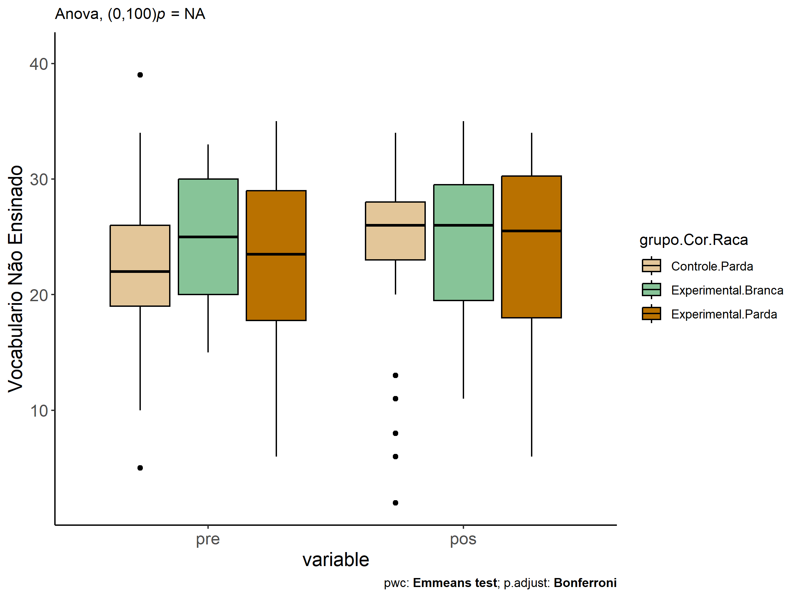<!-- -->

``` r
plots <- twoWayAncovaBoxPlots(
  wdat.long, "vocab.non.teach", c("grupo","Cor.Raca"), aov, pwc.long, pre.post = "time",
  theme = "classic", color = color$prepost)
```

``` r
plots[["grupo:Cor.Raca"]] + ggplot2::ylab("Vocabulario Não Ensinado")
```

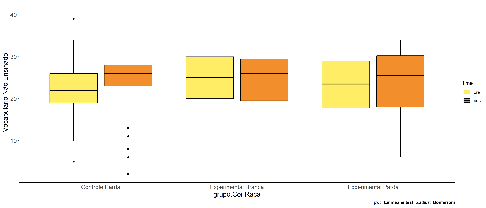<!-- -->

### Checking linearity assumption

``` r
ggscatter(wdat, x = "vocab.non.teach.pre", y = "vocab.non.teach.pos", size = 0.5,
          facet.by = c("grupo","Cor.Raca"), add = "reg.line")+
  stat_regline_equation(
    aes(label =  paste(..eq.label.., ..rr.label.., sep = "~~~~"))
  )
```

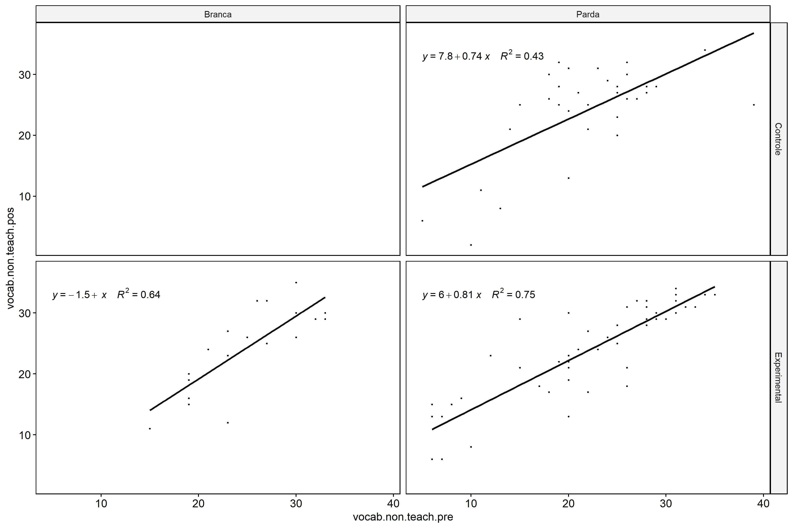<!-- -->

### Checking normality and homogeneity

``` r
res <- augment(lm(vocab.non.teach.pos ~ vocab.non.teach.pre + grupo*Cor.Raca, data = wdat))
```

``` r
shapiro_test(res$.resid)
```

    ## # A tibble: 1 × 3
    ##   variable   statistic p.value
    ##   <chr>          <dbl>   <dbl>
    ## 1 res$.resid     0.981   0.148

``` r
levene_test(res, .resid ~ grupo*Cor.Raca)
```

    ## # A tibble: 1 × 4
    ##     df1   df2 statistic      p
    ##   <int> <int>     <dbl>  <dbl>
    ## 1     2   101      3.58 0.0314

# ANCOVA and Pairwise for two factors **grupo:vocab.non.teach.quintile**

## Without remove non-normal data

``` r
pdat = remove_group_data(dat[!is.na(dat[["grupo"]]) & !is.na(dat[["vocab.non.teach.quintile"]]),], "vocab.non.teach.pos", c("grupo","vocab.non.teach.quintile"))

pdat.long <- rbind(pdat[,c("id","grupo","vocab.non.teach.quintile")], pdat[,c("id","grupo","vocab.non.teach.quintile")])
pdat.long[["time"]] <- c(rep("pre", nrow(pdat)), rep("pos", nrow(pdat)))
pdat.long[["time"]] <- factor(pdat.long[["time"]], c("pre","pos"))
pdat.long[["vocab.non.teach"]] <- c(pdat[["vocab.non.teach.pre"]], pdat[["vocab.non.teach.pos"]])

aov = anova_test(pdat, vocab.non.teach.pos ~ vocab.non.teach.pre + grupo*vocab.non.teach.quintile)
laov[["grupo:vocab.non.teach.quintile"]] <- get_anova_table(aov)
```

``` r
pwcs <- list()
pwcs[["vocab.non.teach.quintile"]] <- emmeans_test(
  group_by(pdat, grupo), vocab.non.teach.pos ~ vocab.non.teach.quintile,
  covariate = vocab.non.teach.pre, p.adjust.method = "bonferroni")
pwcs[["grupo"]] <- emmeans_test(
  group_by(pdat, vocab.non.teach.quintile), vocab.non.teach.pos ~ grupo,
  covariate = vocab.non.teach.pre, p.adjust.method = "bonferroni")

pwc <- plyr::rbind.fill(pwcs[["grupo"]], pwcs[["vocab.non.teach.quintile"]])
pwc <- pwc[,c("grupo","vocab.non.teach.quintile", colnames(pwc)[!colnames(pwc) %in% c("grupo","vocab.non.teach.quintile")])]
```

``` r
pwc.long <- emmeans_test(dplyr::group_by_at(pdat.long, c("grupo","vocab.non.teach.quintile")),
                         vocab.non.teach ~ time,
                         p.adjust.method = "bonferroni")
lpwc[["grupo:vocab.non.teach.quintile"]] <- plyr::rbind.fill(pwc, pwc.long)
```

``` r
ds <- get.descriptives(pdat, "vocab.non.teach.pos", c("grupo","vocab.non.teach.quintile"), covar = "vocab.non.teach.pre")
ds <- merge(ds[ds$variable != "vocab.non.teach.pre",],
            ds[ds$variable == "vocab.non.teach.pre", !colnames(ds) %in% c("variable")],
            by = c("grupo","vocab.non.teach.quintile"), all.x = T, suffixes = c("", ".vocab.non.teach.pre"))
ds <- merge(get_emmeans(pwcs[["grupo"]]), ds, by = c("grupo","vocab.non.teach.quintile"), suffixes = c(".emms", ""))
ds <- ds[,c("grupo","vocab.non.teach.quintile","n","mean.vocab.non.teach.pre","se.vocab.non.teach.pre","mean","se","emmean","se.emms")]

colnames(ds) <- c("grupo","vocab.non.teach.quintile", "N", paste0(c("M","SE")," (pre)"),
                  paste0(c("M","SE"), " (unadj)"), paste0(c("M", "SE"), " (adj)"))

lemms[["grupo:vocab.non.teach.quintile"]] <- ds
```

## Computing ANCOVA and PairWise After removing non-normal data (OK)

``` r
wdat = pdat 

res = residuals(lm(vocab.non.teach.pos ~ vocab.non.teach.pre + grupo*vocab.non.teach.quintile, data = wdat))
non.normal = getNonNormal(res, wdat$id, plimit = 0.05)

wdat = wdat[!wdat$id %in% non.normal,]

wdat.long <- rbind(wdat[,c("id","grupo","vocab.non.teach.quintile")], wdat[,c("id","grupo","vocab.non.teach.quintile")])
wdat.long[["time"]] <- c(rep("pre", nrow(wdat)), rep("pos", nrow(wdat)))
wdat.long[["time"]] <- factor(wdat.long[["time"]], c("pre","pos"))
wdat.long[["vocab.non.teach"]] <- c(wdat[["vocab.non.teach.pre"]], wdat[["vocab.non.teach.pos"]])


ldat[["grupo:vocab.non.teach.quintile"]] = wdat

(non.normal)
```

    ##  [1] "P1003" "P2207" "P2245" "P1069" "P1006" "P2251" "P1056" "P2232" "P2192" "P996"  "P3654" "P2206" "P2219"
    ## [14] "P2082" "P2223" "P1009" "P3658" "P2069"

``` r
aov = anova_test(wdat, vocab.non.teach.pos ~ vocab.non.teach.pre + grupo*vocab.non.teach.quintile)
laov[["grupo:vocab.non.teach.quintile"]] <- merge(get_anova_table(aov), laov[["grupo:vocab.non.teach.quintile"]], by="Effect", suffixes = c("","'"))

(df = get_anova_table(aov))
```

    ## ANOVA Table (type II tests)
    ## 
    ##                           Effect DFn DFd      F        p p<.05   ges
    ## 1            vocab.non.teach.pre   1 252 16.176 7.63e-05     * 0.060
    ## 2                          grupo   1 252  2.339 1.27e-01       0.009
    ## 3       vocab.non.teach.quintile   4 252  1.498 2.03e-01       0.023
    ## 4 grupo:vocab.non.teach.quintile   4 252  8.602 1.60e-06     * 0.120

| Effect                         | DFn | DFd |      F |     p | p\<.05 |   ges |
|:-------------------------------|----:|----:|-------:|------:|:-------|------:|
| vocab.non.teach.pre            |   1 | 252 | 16.176 | 0.000 | \*     | 0.060 |
| grupo                          |   1 | 252 |  2.339 | 0.127 |        | 0.009 |
| vocab.non.teach.quintile       |   4 | 252 |  1.498 | 0.203 |        | 0.023 |
| grupo:vocab.non.teach.quintile |   4 | 252 |  8.602 | 0.000 | \*     | 0.120 |

``` r
pwcs <- list()
pwcs[["vocab.non.teach.quintile"]] <- emmeans_test(
  group_by(wdat, grupo), vocab.non.teach.pos ~ vocab.non.teach.quintile,
  covariate = vocab.non.teach.pre, p.adjust.method = "bonferroni")
pwcs[["grupo"]] <- emmeans_test(
  group_by(wdat, vocab.non.teach.quintile), vocab.non.teach.pos ~ grupo,
  covariate = vocab.non.teach.pre, p.adjust.method = "bonferroni")

pwc <- plyr::rbind.fill(pwcs[["grupo"]], pwcs[["vocab.non.teach.quintile"]])
pwc <- pwc[,c("grupo","vocab.non.teach.quintile", colnames(pwc)[!colnames(pwc) %in% c("grupo","vocab.non.teach.quintile")])]
```

| grupo        | vocab.non.teach.quintile | term                                          | .y.                 | group1       | group2       |  df | statistic |     p | p.adj | p.adj.signif |
|:-------------|:-------------------------|:----------------------------------------------|:--------------------|:-------------|:-------------|----:|----------:|------:|------:|:-------------|
|              | 1st quintile             | vocab.non.teach.pre\*grupo                    | vocab.non.teach.pos | Controle     | Experimental | 252 |    -2.618 | 0.009 | 0.009 | \*\*         |
|              | 2nd quintile             | vocab.non.teach.pre\*grupo                    | vocab.non.teach.pos | Controle     | Experimental | 252 |     4.881 | 0.000 | 0.000 | \*\*\*\*     |
|              | 3rd quintile             | vocab.non.teach.pre\*grupo                    | vocab.non.teach.pos | Controle     | Experimental | 252 |     2.088 | 0.038 | 0.038 | \*           |
|              | 4th quintile             | vocab.non.teach.pre\*grupo                    | vocab.non.teach.pos | Controle     | Experimental | 252 |    -1.147 | 0.253 | 0.253 | ns           |
|              | 5th quintile             | vocab.non.teach.pre\*grupo                    | vocab.non.teach.pos | Controle     | Experimental | 252 |     0.400 | 0.690 | 0.690 | ns           |
| Controle     |                          | vocab.non.teach.pre\*vocab.non.teach.quintile | vocab.non.teach.pos | 1st quintile | 2nd quintile | 252 |    -5.352 | 0.000 | 0.000 | \*\*\*\*     |
| Controle     |                          | vocab.non.teach.pre\*vocab.non.teach.quintile | vocab.non.teach.pos | 1st quintile | 3rd quintile | 252 |    -3.506 | 0.001 | 0.005 | \*\*         |
| Controle     |                          | vocab.non.teach.pre\*vocab.non.teach.quintile | vocab.non.teach.pos | 1st quintile | 4th quintile | 252 |    -2.535 | 0.012 | 0.118 | ns           |
| Controle     |                          | vocab.non.teach.pre\*vocab.non.teach.quintile | vocab.non.teach.pos | 1st quintile | 5th quintile | 252 |    -2.563 | 0.011 | 0.110 | ns           |
| Controle     |                          | vocab.non.teach.pre\*vocab.non.teach.quintile | vocab.non.teach.pos | 2nd quintile | 3rd quintile | 252 |     1.388 | 0.166 | 1.000 | ns           |
| Controle     |                          | vocab.non.teach.pre\*vocab.non.teach.quintile | vocab.non.teach.pos | 2nd quintile | 4th quintile | 252 |     1.566 | 0.119 | 1.000 | ns           |
| Controle     |                          | vocab.non.teach.pre\*vocab.non.teach.quintile | vocab.non.teach.pos | 2nd quintile | 5th quintile | 252 |     0.304 | 0.761 | 1.000 | ns           |
| Controle     |                          | vocab.non.teach.pre\*vocab.non.teach.quintile | vocab.non.teach.pos | 3rd quintile | 4th quintile | 252 |     0.619 | 0.536 | 1.000 | ns           |
| Controle     |                          | vocab.non.teach.pre\*vocab.non.teach.quintile | vocab.non.teach.pos | 3rd quintile | 5th quintile | 252 |    -0.668 | 0.505 | 1.000 | ns           |
| Controle     |                          | vocab.non.teach.pre\*vocab.non.teach.quintile | vocab.non.teach.pos | 4th quintile | 5th quintile | 252 |    -1.362 | 0.174 | 1.000 | ns           |
| Experimental |                          | vocab.non.teach.pre\*vocab.non.teach.quintile | vocab.non.teach.pos | 1st quintile | 2nd quintile | 252 |     0.251 | 0.802 | 1.000 | ns           |
| Experimental |                          | vocab.non.teach.pre\*vocab.non.teach.quintile | vocab.non.teach.pos | 1st quintile | 3rd quintile | 252 |    -0.776 | 0.438 | 1.000 | ns           |
| Experimental |                          | vocab.non.teach.pre\*vocab.non.teach.quintile | vocab.non.teach.pos | 1st quintile | 4th quintile | 252 |    -1.500 | 0.135 | 1.000 | ns           |
| Experimental |                          | vocab.non.teach.pre\*vocab.non.teach.quintile | vocab.non.teach.pos | 1st quintile | 5th quintile | 252 |    -1.370 | 0.172 | 1.000 | ns           |
| Experimental |                          | vocab.non.teach.pre\*vocab.non.teach.quintile | vocab.non.teach.pos | 2nd quintile | 3rd quintile | 252 |    -1.757 | 0.080 | 0.802 | ns           |
| Experimental |                          | vocab.non.teach.pre\*vocab.non.teach.quintile | vocab.non.teach.pos | 2nd quintile | 4th quintile | 252 |    -2.707 | 0.007 | 0.073 | ns           |
| Experimental |                          | vocab.non.teach.pre\*vocab.non.teach.quintile | vocab.non.teach.pos | 2nd quintile | 5th quintile | 252 |    -2.212 | 0.028 | 0.279 | ns           |
| Experimental |                          | vocab.non.teach.pre\*vocab.non.teach.quintile | vocab.non.teach.pos | 3rd quintile | 4th quintile | 252 |    -2.184 | 0.030 | 0.299 | ns           |
| Experimental |                          | vocab.non.teach.pre\*vocab.non.teach.quintile | vocab.non.teach.pos | 3rd quintile | 5th quintile | 252 |    -1.794 | 0.074 | 0.741 | ns           |
| Experimental |                          | vocab.non.teach.pre\*vocab.non.teach.quintile | vocab.non.teach.pos | 4th quintile | 5th quintile | 252 |    -0.489 | 0.625 | 1.000 | ns           |

``` r
pwc.long <- emmeans_test(dplyr::group_by_at(wdat.long, c("grupo","vocab.non.teach.quintile")),
                         vocab.non.teach ~ time,
                         p.adjust.method = "bonferroni")
lpwc[["grupo:vocab.non.teach.quintile"]] <- merge(plyr::rbind.fill(pwc, pwc.long), lpwc[["grupo:vocab.non.teach.quintile"]], by=c("grupo","vocab.non.teach.quintile","term",".y.","group1","group2"), suffixes = c("","'"))
```

| grupo        | vocab.non.teach.quintile | term | .y.             | group1 | group2 |  df | statistic |     p | p.adj | p.adj.signif |
|:-------------|:-------------------------|:-----|:----------------|:-------|:-------|----:|----------:|------:|------:|:-------------|
| Controle     | 1st quintile             | time | vocab.non.teach | pre    | pos    | 506 |    -0.180 | 0.858 | 0.858 | ns           |
| Controle     | 2nd quintile             | time | vocab.non.teach | pre    | pos    | 506 |    -5.654 | 0.000 | 0.000 | \*\*\*\*     |
| Controle     | 3rd quintile             | time | vocab.non.teach | pre    | pos    | 506 |    -2.866 | 0.004 | 0.004 | \*\*         |
| Controle     | 4th quintile             | time | vocab.non.teach | pre    | pos    | 506 |     0.043 | 0.966 | 0.966 | ns           |
| Controle     | 5th quintile             | time | vocab.non.teach | pre    | pos    | 506 |     0.194 | 0.846 | 0.846 | ns           |
| Experimental | 1st quintile             | time | vocab.non.teach | pre    | pos    | 506 |    -4.471 | 0.000 | 0.000 | \*\*\*\*     |
| Experimental | 2nd quintile             | time | vocab.non.teach | pre    | pos    | 506 |    -0.859 | 0.391 | 0.391 | ns           |
| Experimental | 3rd quintile             | time | vocab.non.teach | pre    | pos    | 506 |    -1.090 | 0.276 | 0.276 | ns           |
| Experimental | 4th quintile             | time | vocab.non.teach | pre    | pos    | 506 |    -1.552 | 0.121 | 0.121 | ns           |
| Experimental | 5th quintile             | time | vocab.non.teach | pre    | pos    | 506 |     0.795 | 0.427 | 0.427 | ns           |

``` r
ds <- get.descriptives(wdat, "vocab.non.teach.pos", c("grupo","vocab.non.teach.quintile"), covar = "vocab.non.teach.pre")
ds <- merge(ds[ds$variable != "vocab.non.teach.pre",],
            ds[ds$variable == "vocab.non.teach.pre", !colnames(ds) %in% c("variable")],
            by = c("grupo","vocab.non.teach.quintile"), all.x = T, suffixes = c("", ".vocab.non.teach.pre"))
ds <- merge(get_emmeans(pwcs[["grupo"]]), ds, by = c("grupo","vocab.non.teach.quintile"), suffixes = c(".emms", ""))
ds <- ds[,c("grupo","vocab.non.teach.quintile","n","mean.vocab.non.teach.pre","se.vocab.non.teach.pre","mean","se","emmean","se.emms")]

colnames(ds) <- c("grupo","vocab.non.teach.quintile", "N", paste0(c("M","SE")," (pre)"),
                  paste0(c("M","SE"), " (unadj)"), paste0(c("M", "SE"), " (adj)"))

lemms[["grupo:vocab.non.teach.quintile"]] <- merge(ds, lemms[["grupo:vocab.non.teach.quintile"]], by=c("grupo","vocab.non.teach.quintile"), suffixes = c("","'"))
```

| grupo        | vocab.non.teach.quintile |   N | M (pre) | SE (pre) | M (unadj) | SE (unadj) | M (adj) | SE (adj) |
|:-------------|:-------------------------|----:|--------:|---------:|----------:|-----------:|--------:|---------:|
| Controle     | 1st quintile             |  14 |  10.357 |    0.700 |    10.571 |      1.300 |  17.770 |    2.082 |
| Controle     | 2nd quintile             |  13 |  17.308 |    0.524 |    24.308 |      1.575 |  27.534 |    1.365 |
| Controle     | 3rd quintile             |  22 |  22.227 |    0.286 |    24.955 |      0.763 |  25.370 |    0.855 |
| Controle     | 4th quintile             |  27 |  26.778 |    0.247 |    26.741 |      0.687 |  24.556 |    0.940 |
| Controle     | 5th quintile             |  12 |  32.333 |    0.772 |    32.083 |      1.026 |  26.724 |    1.760 |
| Experimental | 1st quintile             |  19 |   8.842 |    0.589 |    13.421 |      1.415 |  21.485 |    2.203 |
| Experimental | 2nd quintile             |  30 |  16.933 |    0.307 |    17.633 |      0.826 |  21.074 |    1.123 |
| Experimental | 3rd quintile             |  38 |  21.526 |    0.241 |    22.316 |      0.727 |  23.132 |    0.677 |
| Experimental | 4th quintile             |  46 |  26.891 |    0.209 |    27.913 |      0.516 |  25.663 |    0.811 |
| Experimental | 5th quintile             |  42 |  31.810 |    0.267 |    31.262 |      0.381 |  26.202 |    1.400 |

### Plots for ancova

``` r
plots <- twoWayAncovaPlots(
  wdat, "vocab.non.teach.pos", c("grupo","vocab.non.teach.quintile"), aov, pwcs, addParam = c("mean_se"),
  font.label.size=10, step.increase=0.05, p.label="p.adj",
  subtitle = which(aov$Effect == "grupo:vocab.non.teach.quintile"))
```

``` r
if (!is.null(plots[["grupo"]]))
  plots[["grupo"]] + ggplot2::scale_color_manual(values = color[["vocab.non.teach.quintile"]])
```

    ## Scale for colour is already present.
    ## Adding another scale for colour, which will replace the existing scale.

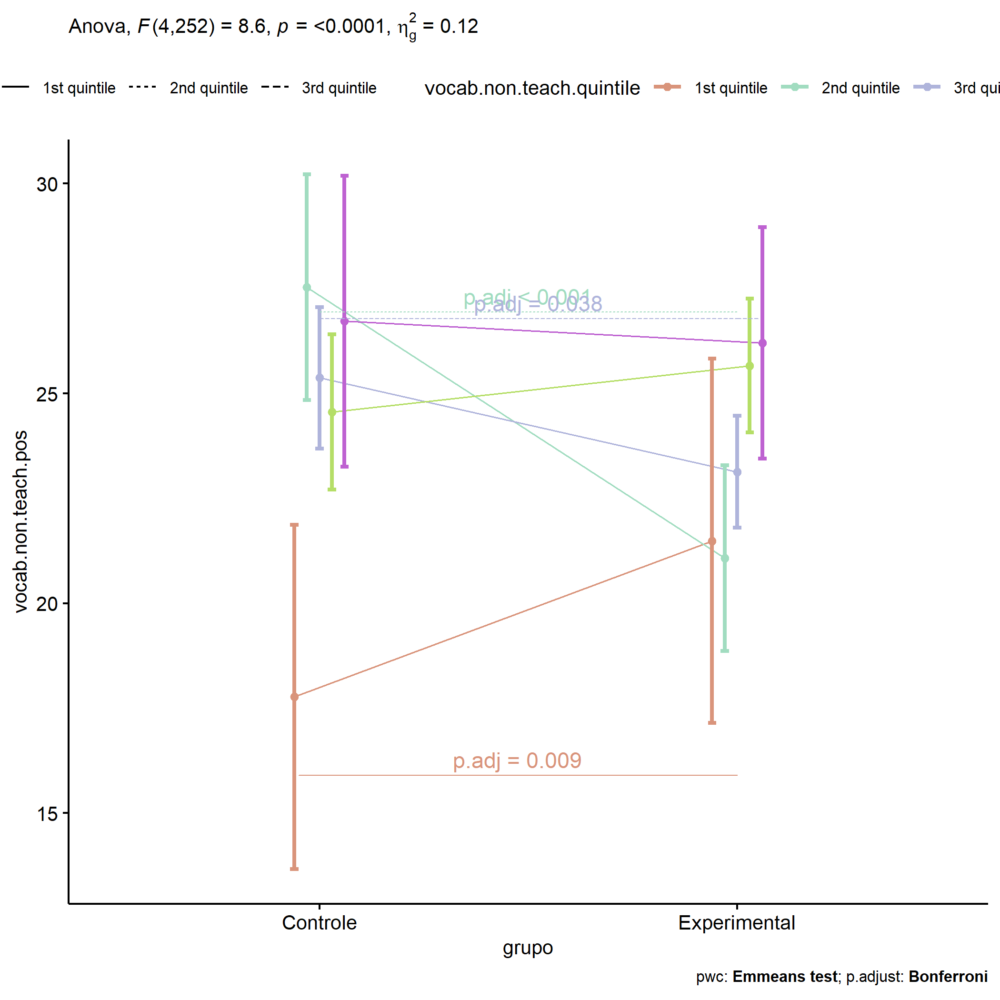<!-- -->

``` r
if (!is.null(plots[["vocab.non.teach.quintile"]]))
  plots[["vocab.non.teach.quintile"]] + ggplot2::scale_color_manual(values = color[["grupo"]])
```

    ## Scale for colour is already present.
    ## Adding another scale for colour, which will replace the existing scale.

    ## Warning: `position_dodge()` requires non-overlapping x intervals

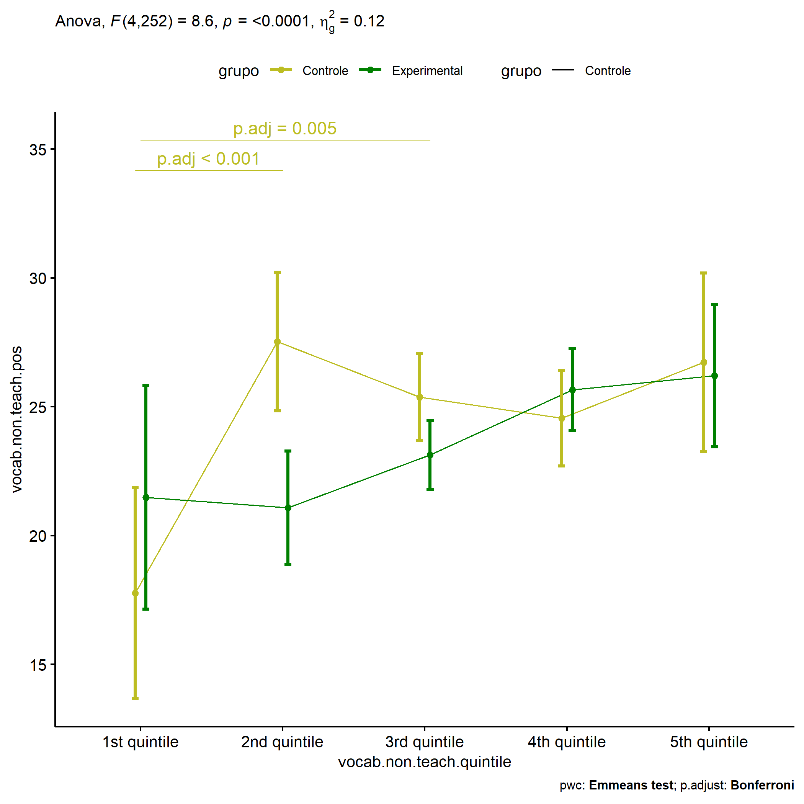<!-- -->

``` r
plots <- twoWayAncovaBoxPlots(
  wdat, "vocab.non.teach.pos", c("grupo","vocab.non.teach.quintile"), aov, pwcs, covar = "vocab.non.teach.pre",
  theme = "classic", color = color[["grupo:vocab.non.teach.quintile"]],
  subtitle = which(aov$Effect == "grupo:vocab.non.teach.quintile"))
```

``` r
plots[["grupo:vocab.non.teach.quintile"]] + ggplot2::ylab("Vocabulario Não Ensinado") + ggplot2::scale_x_discrete(labels=c('pre', 'pos'))
```

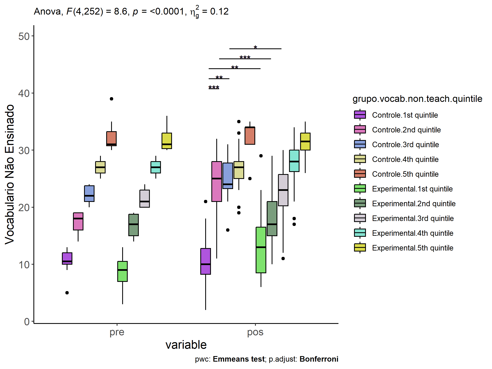<!-- -->

``` r
plots <- twoWayAncovaBoxPlots(
  wdat.long, "vocab.non.teach", c("grupo","vocab.non.teach.quintile"), aov, pwc.long, pre.post = "time",
  theme = "classic", color = color$prepost)
```

``` r
plots[["grupo:vocab.non.teach.quintile"]] + ggplot2::ylab("Vocabulario Não Ensinado")
```

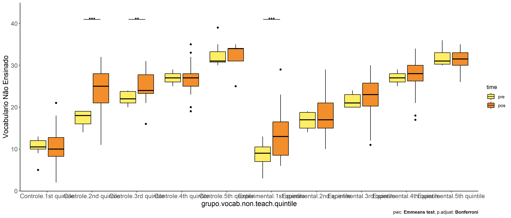<!-- -->

### Checking linearity assumption

``` r
ggscatter(wdat, x = "vocab.non.teach.pre", y = "vocab.non.teach.pos", size = 0.5,
          facet.by = c("grupo","vocab.non.teach.quintile"), add = "reg.line")+
  stat_regline_equation(
    aes(label =  paste(..eq.label.., ..rr.label.., sep = "~~~~"))
  )
```

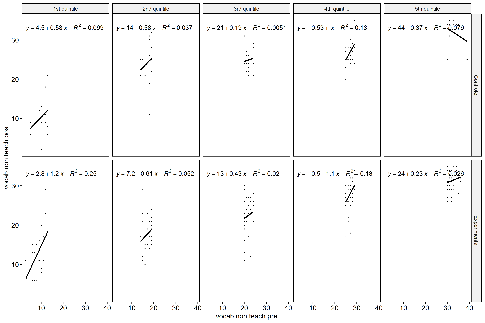<!-- -->

### Checking normality and homogeneity

``` r
res <- augment(lm(vocab.non.teach.pos ~ vocab.non.teach.pre + grupo*vocab.non.teach.quintile, data = wdat))
```

``` r
shapiro_test(res$.resid)
```

    ## # A tibble: 1 × 3
    ##   variable   statistic p.value
    ##   <chr>          <dbl>   <dbl>
    ## 1 res$.resid     0.981 0.00143

``` r
levene_test(res, .resid ~ grupo*vocab.non.teach.quintile)
```

    ## # A tibble: 1 × 4
    ##     df1   df2 statistic      p
    ##   <int> <int>     <dbl>  <dbl>
    ## 1     9   253      2.22 0.0211

# Summary of Results

## Descriptive Statistics

``` r
df <- get.descriptives(ldat[["grupo"]], c(dv.pre, dv.pos), c("grupo"), 
                       include.global = T, symmetry.test = T, normality.test = F)
df <- plyr::rbind.fill(
  df, do.call(plyr::rbind.fill, lapply(lfatores2, FUN = function(f) {
    if (nrow(dat) > 0 && sum(!is.na(unique(dat[[f]]))) > 1)
      get.descriptives(ldat[[paste0("grupo:",f)]], c(dv.pre,dv.pos), c("grupo", f),
                       symmetry.test = T, normality.test = F)
    }))
)
(df <- df[,c(fatores1[fatores1 %in% colnames(df)],"variable",
             colnames(df)[!colnames(df) %in% c(fatores1,"variable")])])
```

    ##           grupo Sexo   Zona Cor.Raca vocab.non.teach.quintile            variable   n   mean median min max
    ## 1      Controle <NA>   <NA>     <NA>                     <NA> vocab.non.teach.pre  87 22.276   24.0   5  35
    ## 2  Experimental <NA>   <NA>     <NA>                     <NA> vocab.non.teach.pre 171 23.339   25.0   3  36
    ## 3          <NA> <NA>   <NA>     <NA>                     <NA> vocab.non.teach.pre 258 22.981   24.0   3  36
    ## 4      Controle <NA>   <NA>     <NA>                     <NA> vocab.non.teach.pos  87 23.989   25.0   6  35
    ## 5  Experimental <NA>   <NA>     <NA>                     <NA> vocab.non.teach.pos 171 24.333   26.0   6  35
    ## 6          <NA> <NA>   <NA>     <NA>                     <NA> vocab.non.teach.pos 258 24.217   26.0   6  35
    ## 7      Controle    F   <NA>     <NA>                     <NA> vocab.non.teach.pre  45 23.133   24.0   5  35
    ## 8      Controle    M   <NA>     <NA>                     <NA> vocab.non.teach.pre  40 21.450   21.0  10  34
    ## 9  Experimental    F   <NA>     <NA>                     <NA> vocab.non.teach.pre  86 24.733   26.0   3  36
    ## 10 Experimental    M   <NA>     <NA>                     <NA> vocab.non.teach.pre  79 22.747   24.0   6  36
    ## 11     Controle    F   <NA>     <NA>                     <NA> vocab.non.teach.pos  45 25.378   27.0   6  35
    ## 12     Controle    M   <NA>     <NA>                     <NA> vocab.non.teach.pos  40 22.400   24.0   6  35
    ## 13 Experimental    F   <NA>     <NA>                     <NA> vocab.non.teach.pos  86 25.767   27.0   6  35
    ## 14 Experimental    M   <NA>     <NA>                     <NA> vocab.non.teach.pos  79 23.747   25.0   6  35
    ## 15     Controle <NA>  Rural     <NA>                     <NA> vocab.non.teach.pre  37 22.054   24.0   5  39
    ## 16     Controle <NA> Urbana     <NA>                     <NA> vocab.non.teach.pre  18 22.722   23.5  10  31
    ## 17 Experimental <NA>  Rural     <NA>                     <NA> vocab.non.teach.pre  54 22.685   24.5   6  33
    ## 18 Experimental <NA> Urbana     <NA>                     <NA> vocab.non.teach.pre  33 24.424   26.0   9  35
    ## 19     Controle <NA>  Rural     <NA>                     <NA> vocab.non.teach.pos  37 23.459   25.0   2  34
    ## 20     Controle <NA> Urbana     <NA>                     <NA> vocab.non.teach.pos  18 25.778   26.0  11  35
    ## 21 Experimental <NA>  Rural     <NA>                     <NA> vocab.non.teach.pos  54 23.704   25.5   6  34
    ## 22 Experimental <NA> Urbana     <NA>                     <NA> vocab.non.teach.pos  33 25.303   26.0   9  35
    ## 23     Controle <NA>   <NA>    Parda                     <NA> vocab.non.teach.pre  33 21.939   22.0   5  39
    ## 24 Experimental <NA>   <NA>   Branca                     <NA> vocab.non.teach.pre  19 24.947   25.0  15  33
    ## 25 Experimental <NA>   <NA>    Parda                     <NA> vocab.non.teach.pre  52 22.115   23.5   6  35
    ## 26     Controle <NA>   <NA>    Parda                     <NA> vocab.non.teach.pos  33 24.121   26.0   2  34
    ## 27 Experimental <NA>   <NA>   Branca                     <NA> vocab.non.teach.pos  19 24.263   26.0  11  35
    ## 28 Experimental <NA>   <NA>    Parda                     <NA> vocab.non.teach.pos  52 23.904   25.5   6  34
    ## 29     Controle <NA>   <NA>     <NA>             1st quintile vocab.non.teach.pre  14 10.357   10.5   5  13
    ## 30     Controle <NA>   <NA>     <NA>             2nd quintile vocab.non.teach.pre  13 17.308   18.0  14  19
    ## 31     Controle <NA>   <NA>     <NA>             3rd quintile vocab.non.teach.pre  22 22.227   22.0  20  24
    ## 32     Controle <NA>   <NA>     <NA>             4th quintile vocab.non.teach.pre  27 26.778   27.0  25  29
    ## 33     Controle <NA>   <NA>     <NA>             5th quintile vocab.non.teach.pre  12 32.333   31.0  30  39
    ## 34 Experimental <NA>   <NA>     <NA>             1st quintile vocab.non.teach.pre  19  8.842    9.0   3  13
    ## 35 Experimental <NA>   <NA>     <NA>             2nd quintile vocab.non.teach.pre  30 16.933   17.0  14  19
    ## 36 Experimental <NA>   <NA>     <NA>             3rd quintile vocab.non.teach.pre  38 21.526   21.0  20  24
    ## 37 Experimental <NA>   <NA>     <NA>             4th quintile vocab.non.teach.pre  46 26.891   27.0  25  29
    ## 38 Experimental <NA>   <NA>     <NA>             5th quintile vocab.non.teach.pre  42 31.810   31.0  30  36
    ## 39     Controle <NA>   <NA>     <NA>             1st quintile vocab.non.teach.pos  14 10.571   10.0   2  21
    ## 40     Controle <NA>   <NA>     <NA>             2nd quintile vocab.non.teach.pos  13 24.308   25.0  11  32
    ## 41     Controle <NA>   <NA>     <NA>             3rd quintile vocab.non.teach.pos  22 24.955   24.0  16  31
    ## 42     Controle <NA>   <NA>     <NA>             4th quintile vocab.non.teach.pos  27 26.741   27.0  19  35
    ## 43     Controle <NA>   <NA>     <NA>             5th quintile vocab.non.teach.pos  12 32.083   34.0  25  35
    ## 44 Experimental <NA>   <NA>     <NA>             1st quintile vocab.non.teach.pos  19 13.421   13.0   6  29
    ## 45 Experimental <NA>   <NA>     <NA>             2nd quintile vocab.non.teach.pos  30 17.633   17.0  10  29
    ## 46 Experimental <NA>   <NA>     <NA>             3rd quintile vocab.non.teach.pos  38 22.316   23.0  11  30
    ## 47 Experimental <NA>   <NA>     <NA>             4th quintile vocab.non.teach.pos  46 27.913   28.0  17  34
    ## 48 Experimental <NA>   <NA>     <NA>             5th quintile vocab.non.teach.pos  42 31.262   31.5  26  35
    ##       sd    se    ci   iqr symmetry     skewness    kurtosis
    ## 1  6.792 0.728 1.448  8.50       NO -0.535844854 -0.35968993
    ## 2  7.377 0.564 1.114 10.00       NO -0.576197764 -0.35007954
    ## 3  7.190 0.448 0.881  9.00       NO -0.548842673 -0.33893841
    ## 4  7.390 0.792 1.575  7.50       NO -0.751830823 -0.15729211
    ## 5  7.178 0.549 1.084 10.00       NO -0.653149955 -0.44689836
    ## 6  7.237 0.451 0.887  9.75       NO -0.693870615 -0.31093709
    ## 7  6.737 1.004 2.024  6.00       NO -1.034261140  0.82686355
    ## 8  6.790 1.074 2.171 10.25      YES -0.005815401 -1.17318089
    ## 9  7.309 0.788 1.567 10.75       NO -0.760703201 -0.03990626
    ## 10 6.938 0.781 1.554  9.00       NO -0.637090319 -0.11653194
    ## 11 6.863 1.023 2.062  5.00       NO -1.043062363  0.64860894
    ## 12 7.665 1.212 2.452  6.50      YES -0.450612696 -0.68075490
    ## 13 6.595 0.711 1.414 10.00       NO -0.719411380 -0.20165701
    ## 14 6.740 0.758 1.510 10.00       NO -0.541507422 -0.59273441
    ## 15 7.149 1.175 2.384  9.00      YES -0.207442801 -0.19322386
    ## 16 5.949 1.402 2.958  6.00       NO -0.693845147 -0.47648240
    ## 17 7.239 0.985 1.976  9.75       NO -0.680988953 -0.43815798
    ## 18 7.093 1.235 2.515 10.00       NO -0.658009097 -0.52222479
    ## 19 7.802 1.283 2.601  7.00       NO -1.156691093  0.53364280
    ## 20 6.320 1.490 3.143  5.75       NO -0.784434483  0.11765214
    ## 21 7.363 1.002 2.010 11.00       NO -0.633763447 -0.47997345
    ## 22 7.218 1.256 2.559 10.00       NO -0.713795835 -0.50163835
    ## 23 6.901 1.201 2.447  7.00      YES -0.133423106  0.26919188
    ## 24 5.441 1.248 2.623 10.00      YES -0.035558850 -1.32151736
    ## 25 8.461 1.173 2.356 11.25       NO -0.540304615 -0.89003157
    ## 26 7.761 1.351 2.752  5.00       NO -1.378412396  1.06024367
    ## 27 7.023 1.611 3.385 10.00      YES -0.452295399 -1.04390790
    ## 28 7.875 1.092 2.192 12.25       NO -0.682130254 -0.62742140
    ## 29 2.620 0.700 1.513  2.00       NO -0.958422025 -0.24102979
    ## 30 1.888 0.524 1.141  3.00       NO -0.752904369 -1.15519858
    ## 31 1.343 0.286 0.595  2.75      YES  0.054927606 -1.31450349
    ## 32 1.281 0.247 0.507  2.00      YES  0.189233237 -1.11801135
    ## 33 2.674 0.772 1.699  2.50       NO  1.189070247  0.47963349
    ## 34 2.566 0.589 1.237  3.50      YES -0.376211605 -0.65367471
    ## 35 1.680 0.307 0.627  3.75      YES -0.067591147 -1.57263460
    ## 36 1.484 0.241 0.488  3.00      YES  0.288459123 -1.51147045
    ## 37 1.418 0.209 0.421  2.00      YES  0.095773269 -1.35348374
    ## 38 1.728 0.267 0.539  2.75       NO  0.840581861 -0.25668251
    ## 39 4.863 1.300 2.808  4.50      YES  0.451156236 -0.28205659
    ## 40 5.677 1.575 3.431  7.00       NO -0.670686034 -0.09910124
    ## 41 3.579 0.763 1.587  4.50      YES -0.262133035 -0.09318525
    ## 42 3.569 0.687 1.412  3.00      YES  0.087219386  0.06203652
    ## 43 3.554 1.026 2.258  3.00       NO -1.165610265 -0.25657881
    ## 44 6.167 1.415 2.973  8.00       NO  0.771344422 -0.04696346
    ## 45 4.522 0.826 1.688  6.00      YES  0.236048187 -0.46475625
    ## 46 4.479 0.727 1.472  5.50       NO -0.735294768  0.11272358
    ## 47 3.501 0.516 1.040  3.75       NO -1.071743891  1.52468839
    ## 48 2.470 0.381 0.770  3.00      YES -0.370199084 -0.79707805

| grupo        | Sexo | Zona   | Cor.Raca | vocab.non.teach.quintile | variable            |   n |   mean | median | min | max |    sd |    se |    ci |   iqr | symmetry | skewness | kurtosis |
|:-------------|:-----|:-------|:---------|:-------------------------|:--------------------|----:|-------:|-------:|----:|----:|------:|------:|------:|------:|:---------|---------:|---------:|
| Controle     |      |        |          |                          | vocab.non.teach.pre |  87 | 22.276 |   24.0 |   5 |  35 | 6.792 | 0.728 | 1.448 |  8.50 | NO       |   -0.536 |   -0.360 |
| Experimental |      |        |          |                          | vocab.non.teach.pre | 171 | 23.339 |   25.0 |   3 |  36 | 7.377 | 0.564 | 1.114 | 10.00 | NO       |   -0.576 |   -0.350 |
|              |      |        |          |                          | vocab.non.teach.pre | 258 | 22.981 |   24.0 |   3 |  36 | 7.190 | 0.448 | 0.881 |  9.00 | NO       |   -0.549 |   -0.339 |
| Controle     |      |        |          |                          | vocab.non.teach.pos |  87 | 23.989 |   25.0 |   6 |  35 | 7.390 | 0.792 | 1.575 |  7.50 | NO       |   -0.752 |   -0.157 |
| Experimental |      |        |          |                          | vocab.non.teach.pos | 171 | 24.333 |   26.0 |   6 |  35 | 7.178 | 0.549 | 1.084 | 10.00 | NO       |   -0.653 |   -0.447 |
|              |      |        |          |                          | vocab.non.teach.pos | 258 | 24.217 |   26.0 |   6 |  35 | 7.237 | 0.451 | 0.887 |  9.75 | NO       |   -0.694 |   -0.311 |
| Controle     | F    |        |          |                          | vocab.non.teach.pre |  45 | 23.133 |   24.0 |   5 |  35 | 6.737 | 1.004 | 2.024 |  6.00 | NO       |   -1.034 |    0.827 |
| Controle     | M    |        |          |                          | vocab.non.teach.pre |  40 | 21.450 |   21.0 |  10 |  34 | 6.790 | 1.074 | 2.171 | 10.25 | YES      |   -0.006 |   -1.173 |
| Experimental | F    |        |          |                          | vocab.non.teach.pre |  86 | 24.733 |   26.0 |   3 |  36 | 7.309 | 0.788 | 1.567 | 10.75 | NO       |   -0.761 |   -0.040 |
| Experimental | M    |        |          |                          | vocab.non.teach.pre |  79 | 22.747 |   24.0 |   6 |  36 | 6.938 | 0.781 | 1.554 |  9.00 | NO       |   -0.637 |   -0.117 |
| Controle     | F    |        |          |                          | vocab.non.teach.pos |  45 | 25.378 |   27.0 |   6 |  35 | 6.863 | 1.023 | 2.062 |  5.00 | NO       |   -1.043 |    0.649 |
| Controle     | M    |        |          |                          | vocab.non.teach.pos |  40 | 22.400 |   24.0 |   6 |  35 | 7.665 | 1.212 | 2.452 |  6.50 | YES      |   -0.451 |   -0.681 |
| Experimental | F    |        |          |                          | vocab.non.teach.pos |  86 | 25.767 |   27.0 |   6 |  35 | 6.595 | 0.711 | 1.414 | 10.00 | NO       |   -0.719 |   -0.202 |
| Experimental | M    |        |          |                          | vocab.non.teach.pos |  79 | 23.747 |   25.0 |   6 |  35 | 6.740 | 0.758 | 1.510 | 10.00 | NO       |   -0.542 |   -0.593 |
| Controle     |      | Rural  |          |                          | vocab.non.teach.pre |  37 | 22.054 |   24.0 |   5 |  39 | 7.149 | 1.175 | 2.384 |  9.00 | YES      |   -0.207 |   -0.193 |
| Controle     |      | Urbana |          |                          | vocab.non.teach.pre |  18 | 22.722 |   23.5 |  10 |  31 | 5.949 | 1.402 | 2.958 |  6.00 | NO       |   -0.694 |   -0.476 |
| Experimental |      | Rural  |          |                          | vocab.non.teach.pre |  54 | 22.685 |   24.5 |   6 |  33 | 7.239 | 0.985 | 1.976 |  9.75 | NO       |   -0.681 |   -0.438 |
| Experimental |      | Urbana |          |                          | vocab.non.teach.pre |  33 | 24.424 |   26.0 |   9 |  35 | 7.093 | 1.235 | 2.515 | 10.00 | NO       |   -0.658 |   -0.522 |
| Controle     |      | Rural  |          |                          | vocab.non.teach.pos |  37 | 23.459 |   25.0 |   2 |  34 | 7.802 | 1.283 | 2.601 |  7.00 | NO       |   -1.157 |    0.534 |
| Controle     |      | Urbana |          |                          | vocab.non.teach.pos |  18 | 25.778 |   26.0 |  11 |  35 | 6.320 | 1.490 | 3.143 |  5.75 | NO       |   -0.784 |    0.118 |
| Experimental |      | Rural  |          |                          | vocab.non.teach.pos |  54 | 23.704 |   25.5 |   6 |  34 | 7.363 | 1.002 | 2.010 | 11.00 | NO       |   -0.634 |   -0.480 |
| Experimental |      | Urbana |          |                          | vocab.non.teach.pos |  33 | 25.303 |   26.0 |   9 |  35 | 7.218 | 1.256 | 2.559 | 10.00 | NO       |   -0.714 |   -0.502 |
| Controle     |      |        | Parda    |                          | vocab.non.teach.pre |  33 | 21.939 |   22.0 |   5 |  39 | 6.901 | 1.201 | 2.447 |  7.00 | YES      |   -0.133 |    0.269 |
| Experimental |      |        | Branca   |                          | vocab.non.teach.pre |  19 | 24.947 |   25.0 |  15 |  33 | 5.441 | 1.248 | 2.623 | 10.00 | YES      |   -0.036 |   -1.322 |
| Experimental |      |        | Parda    |                          | vocab.non.teach.pre |  52 | 22.115 |   23.5 |   6 |  35 | 8.461 | 1.173 | 2.356 | 11.25 | NO       |   -0.540 |   -0.890 |
| Controle     |      |        | Parda    |                          | vocab.non.teach.pos |  33 | 24.121 |   26.0 |   2 |  34 | 7.761 | 1.351 | 2.752 |  5.00 | NO       |   -1.378 |    1.060 |
| Experimental |      |        | Branca   |                          | vocab.non.teach.pos |  19 | 24.263 |   26.0 |  11 |  35 | 7.023 | 1.611 | 3.385 | 10.00 | YES      |   -0.452 |   -1.044 |
| Experimental |      |        | Parda    |                          | vocab.non.teach.pos |  52 | 23.904 |   25.5 |   6 |  34 | 7.875 | 1.092 | 2.192 | 12.25 | NO       |   -0.682 |   -0.627 |
| Controle     |      |        |          | 1st quintile             | vocab.non.teach.pre |  14 | 10.357 |   10.5 |   5 |  13 | 2.620 | 0.700 | 1.513 |  2.00 | NO       |   -0.958 |   -0.241 |
| Controle     |      |        |          | 2nd quintile             | vocab.non.teach.pre |  13 | 17.308 |   18.0 |  14 |  19 | 1.888 | 0.524 | 1.141 |  3.00 | NO       |   -0.753 |   -1.155 |
| Controle     |      |        |          | 3rd quintile             | vocab.non.teach.pre |  22 | 22.227 |   22.0 |  20 |  24 | 1.343 | 0.286 | 0.595 |  2.75 | YES      |    0.055 |   -1.315 |
| Controle     |      |        |          | 4th quintile             | vocab.non.teach.pre |  27 | 26.778 |   27.0 |  25 |  29 | 1.281 | 0.247 | 0.507 |  2.00 | YES      |    0.189 |   -1.118 |
| Controle     |      |        |          | 5th quintile             | vocab.non.teach.pre |  12 | 32.333 |   31.0 |  30 |  39 | 2.674 | 0.772 | 1.699 |  2.50 | NO       |    1.189 |    0.480 |
| Experimental |      |        |          | 1st quintile             | vocab.non.teach.pre |  19 |  8.842 |    9.0 |   3 |  13 | 2.566 | 0.589 | 1.237 |  3.50 | YES      |   -0.376 |   -0.654 |
| Experimental |      |        |          | 2nd quintile             | vocab.non.teach.pre |  30 | 16.933 |   17.0 |  14 |  19 | 1.680 | 0.307 | 0.627 |  3.75 | YES      |   -0.068 |   -1.573 |
| Experimental |      |        |          | 3rd quintile             | vocab.non.teach.pre |  38 | 21.526 |   21.0 |  20 |  24 | 1.484 | 0.241 | 0.488 |  3.00 | YES      |    0.288 |   -1.511 |
| Experimental |      |        |          | 4th quintile             | vocab.non.teach.pre |  46 | 26.891 |   27.0 |  25 |  29 | 1.418 | 0.209 | 0.421 |  2.00 | YES      |    0.096 |   -1.353 |
| Experimental |      |        |          | 5th quintile             | vocab.non.teach.pre |  42 | 31.810 |   31.0 |  30 |  36 | 1.728 | 0.267 | 0.539 |  2.75 | NO       |    0.841 |   -0.257 |
| Controle     |      |        |          | 1st quintile             | vocab.non.teach.pos |  14 | 10.571 |   10.0 |   2 |  21 | 4.863 | 1.300 | 2.808 |  4.50 | YES      |    0.451 |   -0.282 |
| Controle     |      |        |          | 2nd quintile             | vocab.non.teach.pos |  13 | 24.308 |   25.0 |  11 |  32 | 5.677 | 1.575 | 3.431 |  7.00 | NO       |   -0.671 |   -0.099 |
| Controle     |      |        |          | 3rd quintile             | vocab.non.teach.pos |  22 | 24.955 |   24.0 |  16 |  31 | 3.579 | 0.763 | 1.587 |  4.50 | YES      |   -0.262 |   -0.093 |
| Controle     |      |        |          | 4th quintile             | vocab.non.teach.pos |  27 | 26.741 |   27.0 |  19 |  35 | 3.569 | 0.687 | 1.412 |  3.00 | YES      |    0.087 |    0.062 |
| Controle     |      |        |          | 5th quintile             | vocab.non.teach.pos |  12 | 32.083 |   34.0 |  25 |  35 | 3.554 | 1.026 | 2.258 |  3.00 | NO       |   -1.166 |   -0.257 |
| Experimental |      |        |          | 1st quintile             | vocab.non.teach.pos |  19 | 13.421 |   13.0 |   6 |  29 | 6.167 | 1.415 | 2.973 |  8.00 | NO       |    0.771 |   -0.047 |
| Experimental |      |        |          | 2nd quintile             | vocab.non.teach.pos |  30 | 17.633 |   17.0 |  10 |  29 | 4.522 | 0.826 | 1.688 |  6.00 | YES      |    0.236 |   -0.465 |
| Experimental |      |        |          | 3rd quintile             | vocab.non.teach.pos |  38 | 22.316 |   23.0 |  11 |  30 | 4.479 | 0.727 | 1.472 |  5.50 | NO       |   -0.735 |    0.113 |
| Experimental |      |        |          | 4th quintile             | vocab.non.teach.pos |  46 | 27.913 |   28.0 |  17 |  34 | 3.501 | 0.516 | 1.040 |  3.75 | NO       |   -1.072 |    1.525 |
| Experimental |      |        |          | 5th quintile             | vocab.non.teach.pos |  42 | 31.262 |   31.5 |  26 |  35 | 2.470 | 0.381 | 0.770 |  3.00 | YES      |   -0.370 |   -0.797 |

## ANCOVA Table Comparison

``` r
df <- do.call(plyr::rbind.fill, laov)
(df <- df[!duplicated(df$Effect),])
```

    ##                            Effect DFn DFd       F        p p<.05   ges DFn' DFd'      F'       p' p<.05'  ges'
    ## 1                           grupo   1 255   1.202 2.74e-01       0.005    1  278   1.511 2.20e-01        0.005
    ## 2             vocab.non.teach.pre   1 255 638.001 2.35e-71     * 0.714    1  278 261.718 6.11e-42      * 0.485
    ## 4                      grupo:Sexo   1 245   1.487 2.24e-01       0.006    1  276   0.612 4.35e-01        0.002
    ## 5                            Sexo   1 245   2.798 9.60e-02       0.011    1  276   1.995 1.59e-01        0.007
    ## 8                      grupo:Zona   1 137   1.086 2.99e-01       0.008    1  140   0.554 4.58e-01        0.004
    ## 10                           Zona   1 137   0.946 3.32e-01       0.007    1  140   2.499 1.16e-01        0.018
    ## 11                       Cor.Raca   1 100   2.307 1.32e-01       0.023    1  106   0.608 4.37e-01        0.006
    ## 13                 grupo:Cor.Raca   0 100      NA       NA  <NA>    NA    0  106      NA       NA   <NA>    NA
    ## 16 grupo:vocab.non.teach.quintile   4 252   8.602 1.60e-06     * 0.120    4  270   2.332 5.60e-02        0.033
    ## 18       vocab.non.teach.quintile   4 252   1.498 2.03e-01       0.023    4  270   0.701 5.92e-01        0.010

|     | Effect                         | DFn | DFd |       F |     p | p\<.05 |   ges | DFn’ | DFd’ |      F’ |    p’ | p\<.05’ |  ges’ |
|:----|:-------------------------------|----:|----:|--------:|------:|:-------|------:|-----:|-----:|--------:|------:|:--------|------:|
| 1   | grupo                          |   1 | 255 |   1.202 | 0.274 |        | 0.005 |    1 |  278 |   1.511 | 0.220 |         | 0.005 |
| 2   | vocab.non.teach.pre            |   1 | 255 | 638.001 | 0.000 | \*     | 0.714 |    1 |  278 | 261.718 | 0.000 | \*      | 0.485 |
| 4   | grupo:Sexo                     |   1 | 245 |   1.487 | 0.224 |        | 0.006 |    1 |  276 |   0.612 | 0.435 |         | 0.002 |
| 5   | Sexo                           |   1 | 245 |   2.798 | 0.096 |        | 0.011 |    1 |  276 |   1.995 | 0.159 |         | 0.007 |
| 8   | grupo:Zona                     |   1 | 137 |   1.086 | 0.299 |        | 0.008 |    1 |  140 |   0.554 | 0.458 |         | 0.004 |
| 10  | Zona                           |   1 | 137 |   0.946 | 0.332 |        | 0.007 |    1 |  140 |   2.499 | 0.116 |         | 0.018 |
| 11  | Cor.Raca                       |   1 | 100 |   2.307 | 0.132 |        | 0.023 |    1 |  106 |   0.608 | 0.437 |         | 0.006 |
| 13  | grupo:Cor.Raca                 |   0 | 100 |         |       |        |       |    0 |  106 |         |       |         |       |
| 16  | grupo:vocab.non.teach.quintile |   4 | 252 |   8.602 | 0.000 | \*     | 0.120 |    4 |  270 |   2.332 | 0.056 |         | 0.033 |
| 18  | vocab.non.teach.quintile       |   4 | 252 |   1.498 | 0.203 |        | 0.023 |    4 |  270 |   0.701 | 0.592 |         | 0.010 |

## PairWise Table Comparison

``` r
df <- do.call(plyr::rbind.fill, lpwc)
df <- df[,c(names(lfatores), names(df)[!names(df) %in% c(names(lfatores),"term",".y.")])]
```

| grupo        | Sexo | Zona   | Cor.Raca | vocab.non.teach.quintile | group1       | group2       |  df | statistic |     p | p.adj | p.adj.signif | df’ | statistic’ |    p’ | p.adj’ | p.adj.signif’ |
|:-------------|:-----|:-------|:---------|:-------------------------|:-------------|:-------------|----:|----------:|------:|------:|:-------------|----:|-----------:|------:|-------:|:--------------|
| Controle     |      |        |          |                          | pre          | pos          | 512 |    -1.565 | 0.118 | 0.118 | ns           | 558 |      0.233 | 0.816 |  0.816 | ns            |
| Experimental |      |        |          |                          | pre          | pos          | 512 |    -1.274 | 0.203 | 0.203 | ns           | 558 |     -0.513 | 0.608 |  0.608 | ns            |
|              |      |        |          |                          | Controle     | Experimental | 255 |     1.097 | 0.274 | 0.274 | ns           | 278 |     -1.229 | 0.220 |  0.220 | ns            |
| Controle     | F    |        |          |                          | pre          | pos          | 492 |    -1.534 | 0.126 | 0.126 | ns           | 554 |     -0.258 | 0.797 |  0.797 | ns            |
| Controle     | M    |        |          |                          | pre          | pos          | 492 |    -0.612 | 0.541 | 0.541 | ns           | 554 |      0.616 | 0.538 |  0.538 | ns            |
| Controle     |      |        |          |                          | F            | M            | 245 |     1.969 | 0.050 | 0.050 | ns           | 276 |      1.473 | 0.142 |  0.142 | ns            |
| Experimental | F    |        |          |                          | pre          | pos          | 492 |    -0.978 | 0.329 | 0.329 | ns           | 554 |     -0.431 | 0.667 |  0.667 | ns            |
| Experimental | M    |        |          |                          | pre          | pos          | 492 |    -0.906 | 0.366 | 0.366 | ns           | 554 |     -0.295 | 0.768 |  0.768 | ns            |
| Experimental |      |        |          |                          | F            | M            | 245 |     0.655 | 0.513 | 0.513 | ns           | 276 |      0.670 | 0.504 |  0.504 | ns            |
|              | F    |        |          |                          | Controle     | Experimental | 245 |     1.363 | 0.174 | 0.174 | ns           | 276 |     -0.367 | 0.714 |  0.714 | ns            |
|              | M    |        |          |                          | Controle     | Experimental | 245 |    -0.383 | 0.702 | 0.702 | ns           | 276 |     -1.420 | 0.157 |  0.157 | ns            |
| Controle     |      |        |          |                          | Rural        | Urbana       | 137 |    -1.420 | 0.158 | 0.158 | ns           | 140 |     -1.554 | 0.122 |  0.122 | ns            |
| Controle     |      | Rural  |          |                          | pre          | pos          | 276 |    -0.842 | 0.401 | 0.401 | ns           | 282 |     -0.584 | 0.560 |  0.560 | ns            |
| Controle     |      | Urbana |          |                          | pre          | pos          | 276 |    -1.276 | 0.203 | 0.203 | ns           | 282 |     -1.260 | 0.209 |  0.209 | ns            |
| Experimental |      |        |          |                          | Rural        | Urbana       | 137 |    -0.135 | 0.893 | 0.893 | ns           | 140 |     -0.802 | 0.424 |  0.424 | ns            |
| Experimental |      | Rural  |          |                          | pre          | pos          | 276 |    -0.737 | 0.462 | 0.462 | ns           | 282 |     -0.208 | 0.835 |  0.835 | ns            |
| Experimental |      | Urbana |          |                          | pre          | pos          | 276 |    -0.497 | 0.620 | 0.620 | ns           | 282 |     -0.491 | 0.624 |  0.624 | ns            |
|              |      | Rural  |          |                          | Controle     | Experimental | 137 |     0.315 | 0.753 | 0.753 | ns           | 140 |      0.468 | 0.640 |  0.640 | ns            |
|              |      | Urbana |          |                          | Controle     | Experimental | 137 |     1.516 | 0.132 | 0.132 | ns           | 140 |      1.250 | 0.214 |  0.214 | ns            |
| Controle     |      |        | Branca   |                          | pre          | pos          |     |           |       |       |              |     |            |       |        |               |
| Controle     |      |        |          |                          | Branca       | Parda        |     |           |       |       |              |     |            |       |        |               |
| Controle     |      |        | Parda    |                          | pre          | pos          | 202 |    -1.165 | 0.245 | 0.245 | ns           | 214 |      0.318 | 0.751 |  0.751 | ns            |
| Experimental |      |        | Branca   |                          | pre          | pos          | 202 |     0.277 | 0.782 | 0.782 | ns           | 214 |      0.266 | 0.790 |  0.790 | ns            |
| Experimental |      |        |          |                          | Branca       | Parda        | 100 |    -1.519 | 0.132 | 0.132 | ns           | 106 |     -0.780 | 0.437 |  0.437 | ns            |
| Experimental |      |        | Parda    |                          | pre          | pos          | 202 |    -1.199 | 0.232 | 0.232 | ns           | 214 |     -0.919 | 0.359 |  0.359 | ns            |
|              |      |        | Branca   |                          | Controle     | Experimental |     |           |       |       |              |     |            |       |        |               |
|              |      |        | Parda    |                          | Controle     | Experimental | 100 |     0.343 | 0.732 | 0.732 | ns           | 106 |     -1.425 | 0.157 |  0.157 | ns            |
| Controle     |      |        |          | 1st quintile             | pre          | pos          | 506 |    -0.180 | 0.858 | 0.858 | ns           | 542 |     -0.134 | 0.893 |  0.893 | ns            |
| Controle     |      |        |          | 2nd quintile             | pre          | pos          | 506 |    -5.654 | 0.000 | 0.000 | \*\*\*\*     | 542 |     -2.230 | 0.026 |  0.026 | \*            |
| Controle     |      |        |          | 3rd quintile             | pre          | pos          | 506 |    -2.866 | 0.004 | 0.004 | \*\*         | 542 |     -0.769 | 0.442 |  0.442 | ns            |
| Controle     |      |        |          | 4th quintile             | pre          | pos          | 506 |     0.043 | 0.966 | 0.966 | ns           | 542 |      1.211 | 0.226 |  0.226 | ns            |
| Controle     |      |        |          | 5th quintile             | pre          | pos          | 506 |     0.194 | 0.846 | 0.846 | ns           | 542 |      2.892 | 0.004 |  0.004 | \*\*          |
| Controle     |      |        |          |                          | 1st quintile | 2nd quintile | 252 |    -5.352 | 0.000 | 0.000 | \*\*\*\*     | 270 |     -2.411 | 0.017 |  0.166 | ns            |
| Controle     |      |        |          |                          | 1st quintile | 3rd quintile | 252 |    -3.506 | 0.001 | 0.005 | \*\*         | 270 |     -1.889 | 0.060 |  0.600 | ns            |
| Controle     |      |        |          |                          | 1st quintile | 4th quintile | 252 |    -2.535 | 0.012 | 0.118 | ns           | 270 |     -1.438 | 0.152 |  1.000 | ns            |
| Controle     |      |        |          |                          | 1st quintile | 5th quintile | 252 |    -2.563 | 0.011 | 0.110 | ns           | 270 |     -0.936 | 0.350 |  1.000 | ns            |
| Controle     |      |        |          |                          | 2nd quintile | 3rd quintile | 252 |     1.388 | 0.166 | 1.000 | ns           | 270 |      0.119 | 0.905 |  1.000 | ns            |
| Controle     |      |        |          |                          | 2nd quintile | 4th quintile | 252 |     1.566 | 0.119 | 1.000 | ns           | 270 |      0.195 | 0.846 |  1.000 | ns            |
| Controle     |      |        |          |                          | 2nd quintile | 5th quintile | 252 |     0.304 | 0.761 | 1.000 | ns           | 270 |      0.392 | 0.696 |  1.000 | ns            |
| Controle     |      |        |          |                          | 3rd quintile | 4th quintile | 252 |     0.619 | 0.536 | 1.000 | ns           | 270 |      0.144 | 0.885 |  1.000 | ns            |
| Controle     |      |        |          |                          | 3rd quintile | 5th quintile | 252 |    -0.668 | 0.505 | 1.000 | ns           | 270 |      0.427 | 0.670 |  1.000 | ns            |
| Controle     |      |        |          |                          | 4th quintile | 5th quintile | 252 |    -1.362 | 0.174 | 1.000 | ns           | 270 |      0.432 | 0.666 |  1.000 | ns            |
| Experimental |      |        |          | 1st quintile             | pre          | pos          | 506 |    -4.471 | 0.000 | 0.000 | \*\*\*\*     | 542 |     -3.337 | 0.001 |  0.001 | \*\*\*        |
| Experimental |      |        |          | 2nd quintile             | pre          | pos          | 506 |    -0.859 | 0.391 | 0.391 | ns           | 542 |     -0.641 | 0.522 |  0.522 | ns            |
| Experimental |      |        |          | 3rd quintile             | pre          | pos          | 506 |    -1.090 | 0.276 | 0.276 | ns           | 542 |     -0.375 | 0.708 |  0.708 | ns            |
| Experimental |      |        |          | 4th quintile             | pre          | pos          | 506 |    -1.552 | 0.121 | 0.121 | ns           | 542 |     -0.627 | 0.531 |  0.531 | ns            |
| Experimental |      |        |          | 5th quintile             | pre          | pos          | 506 |     0.795 | 0.427 | 0.427 | ns           | 542 |      1.844 | 0.066 |  0.066 | ns            |
| Experimental |      |        |          |                          | 1st quintile | 2nd quintile | 252 |     0.251 | 0.802 | 1.000 | ns           | 270 |      0.211 | 0.833 |  1.000 | ns            |
| Experimental |      |        |          |                          | 1st quintile | 3rd quintile | 252 |    -0.776 | 0.438 | 1.000 | ns           | 270 |     -0.374 | 0.709 |  1.000 | ns            |
| Experimental |      |        |          |                          | 1st quintile | 4th quintile | 252 |    -1.500 | 0.135 | 1.000 | ns           | 270 |     -0.911 | 0.363 |  1.000 | ns            |
| Experimental |      |        |          |                          | 1st quintile | 5th quintile | 252 |    -1.370 | 0.172 | 1.000 | ns           | 270 |     -0.718 | 0.473 |  1.000 | ns            |
| Experimental |      |        |          |                          | 2nd quintile | 3rd quintile | 252 |    -1.757 | 0.080 | 0.802 | ns           | 270 |     -0.968 | 0.334 |  1.000 | ns            |
| Experimental |      |        |          |                          | 2nd quintile | 4th quintile | 252 |    -2.707 | 0.007 | 0.073 | ns           | 270 |     -1.700 | 0.090 |  0.903 | ns            |
| Experimental |      |        |          |                          | 2nd quintile | 5th quintile | 252 |    -2.212 | 0.028 | 0.279 | ns           | 270 |     -1.215 | 0.225 |  1.000 | ns            |
| Experimental |      |        |          |                          | 3rd quintile | 4th quintile | 252 |    -2.184 | 0.030 | 0.299 | ns           | 270 |     -1.503 | 0.134 |  1.000 | ns            |
| Experimental |      |        |          |                          | 3rd quintile | 5th quintile | 252 |    -1.794 | 0.074 | 0.741 | ns           | 270 |     -0.981 | 0.327 |  1.000 | ns            |
| Experimental |      |        |          |                          | 4th quintile | 5th quintile | 252 |    -0.489 | 0.625 | 1.000 | ns           | 270 |      0.048 | 0.962 |  1.000 | ns            |
|              |      |        |          | 1st quintile             | Controle     | Experimental | 252 |    -2.618 | 0.009 | 0.009 | \*\*         | 270 |     -1.855 | 0.065 |  0.065 | ns            |
|              |      |        |          | 2nd quintile             | Controle     | Experimental | 252 |     4.881 | 0.000 | 0.000 | \*\*\*\*     | 270 |      1.539 | 0.125 |  0.125 | ns            |
|              |      |        |          | 3rd quintile             | Controle     | Experimental | 252 |     2.088 | 0.038 | 0.038 | \*           | 270 |      0.555 | 0.579 |  0.579 | ns            |
|              |      |        |          | 4th quintile             | Controle     | Experimental | 252 |    -1.147 | 0.253 | 0.253 | ns           | 270 |     -1.408 | 0.160 |  0.160 | ns            |
|              |      |        |          | 5th quintile             | Controle     | Experimental | 252 |     0.400 | 0.690 | 0.690 | ns           | 270 |     -1.599 | 0.111 |  0.111 | ns            |

## EMMS Table Comparison

``` r
df <- do.call(plyr::rbind.fill, lemms)
df[["N-N'"]] <- df[["N"]] - df[["N'"]]
df <- df[,c(names(lfatores), names(df)[!names(df) %in% names(lfatores)])]
```

| grupo        | Sexo | Zona   | Cor.Raca | vocab.non.teach.quintile |   N | M (pre) | SE (pre) | M (unadj) | SE (unadj) | M (adj) | SE (adj) |  N’ | M (pre)’ | SE (pre)’ | M (unadj)’ | SE (unadj)’ | M (adj)’ | SE (adj)’ | N-N’ |
|:-------------|:-----|:-------|:---------|:-------------------------|----:|--------:|---------:|----------:|-----------:|--------:|---------:|----:|---------:|----------:|-----------:|------------:|---------:|----------:|-----:|
| Controle     |      |        |          |                          |  87 |  22.276 |    0.728 |    23.989 |      0.792 |  24.589 |    0.417 | 100 |   22.530 |     0.699 |     22.280 |       0.871 |   22.719 |     0.569 |  -13 |
| Experimental |      |        |          |                          | 171 |  23.339 |    0.564 |    24.333 |      0.549 |  24.028 |    0.297 | 181 |   23.425 |     0.547 |     23.834 |       0.552 |   23.592 |     0.423 |  -10 |
| Controle     | F    |        |          |                          |  45 |  23.133 |    1.004 |    25.378 |      1.023 |  25.509 |    0.552 |  53 |   23.189 |     0.958 |     23.566 |       1.185 |   23.504 |     0.780 |   -8 |
| Controle     | M    |        |          |                          |  40 |  21.450 |    1.074 |    22.400 |      1.212 |  23.921 |    0.589 |  47 |   21.787 |     1.021 |     20.830 |       1.263 |   21.826 |     0.831 |   -7 |
| Experimental | F    |        |          |                          |  86 |  24.733 |    0.788 |    25.767 |      0.711 |  24.578 |    0.402 |  96 |   24.271 |     0.773 |     24.740 |       0.756 |   23.861 |     0.582 |  -10 |
| Experimental | M    |        |          |                          |  79 |  22.747 |    0.781 |    23.747 |      0.758 |  24.197 |    0.417 |  85 |   22.471 |     0.762 |     22.812 |       0.798 |   23.292 |     0.617 |   -6 |
| Controle     |      | Rural  |          |                          |  37 |  22.054 |    1.175 |    23.459 |      1.283 |  24.200 |    0.708 |  38 |   22.053 |     1.144 |     23.026 |       1.321 |   23.819 |     0.811 |   -1 |
| Controle     |      | Urbana |          |                          |  18 |  22.722 |    1.402 |    25.778 |      1.490 |  25.953 |    1.013 |  18 |   22.722 |     1.402 |     25.778 |       1.490 |   26.037 |     1.175 |    0 |
| Experimental |      | Rural  |          |                          |  54 |  22.685 |    0.985 |    23.704 |      1.002 |  23.910 |    0.585 |  56 |   23.018 |     0.978 |     23.304 |       1.006 |   23.328 |     0.666 |   -2 |
| Experimental |      | Urbana |          |                          |  33 |  24.424 |    1.235 |    25.303 |      1.256 |  24.039 |    0.752 |  33 |   24.424 |     1.235 |     25.303 |       1.256 |   24.207 |     0.872 |    0 |
| Controle     |      |        | Parda    |                          |  33 |  21.939 |    1.201 |    24.121 |      1.351 |  24.638 |    0.822 |  38 |   22.526 |     1.138 |     21.947 |       1.509 |   22.162 |     1.031 |   -5 |
| Experimental |      |        | Branca   |                          |  19 |  24.947 |    1.248 |    24.263 |      1.611 |  22.340 |    1.092 |  19 |   24.947 |     1.248 |     24.263 |       1.611 |   22.751 |     1.467 |    0 |
| Experimental |      |        | Parda    |                          |  52 |  22.115 |    1.173 |    23.904 |      1.092 |  24.278 |    0.654 |  53 |   22.283 |     1.163 |     23.698 |       1.091 |   24.086 |     0.874 |   -1 |
| Controle     |      |        |          | 1st quintile             |  14 |  10.357 |    0.700 |    10.571 |      1.300 |  17.770 |    2.082 |  14 |   10.357 |     0.700 |     10.571 |       1.300 |   17.972 |     2.930 |    0 |
| Controle     |      |        |          | 2nd quintile             |  13 |  17.308 |    0.524 |    24.308 |      1.575 |  27.534 |    1.365 |  17 |   17.176 |     0.413 |     20.412 |       2.198 |   23.854 |     1.800 |   -4 |
| Controle     |      |        |          | 3rd quintile             |  22 |  22.227 |    0.286 |    24.955 |      0.763 |  25.370 |    0.855 |  25 |   22.120 |     0.267 |     23.040 |       1.268 |   23.613 |     1.145 |   -3 |
| Controle     |      |        |          | 4th quintile             |  27 |  26.778 |    0.247 |    26.741 |      0.687 |  24.556 |    0.940 |  29 |   26.897 |     0.245 |     25.552 |       1.046 |   23.352 |     1.287 |   -2 |
| Controle     |      |        |          | 5th quintile             |  12 |  32.333 |    0.772 |    32.083 |      1.026 |  26.724 |    1.760 |  15 |   32.200 |     0.634 |     27.733 |       2.472 |   22.455 |     2.310 |   -3 |
| Experimental |      |        |          | 1st quintile             |  19 |   8.842 |    0.589 |    13.421 |      1.415 |  21.485 |    2.203 |  19 |    8.842 |     0.589 |     13.421 |       1.415 |   21.701 |     3.095 |    0 |
| Experimental |      |        |          | 2nd quintile             |  30 |  16.933 |    0.307 |    17.633 |      0.826 |  21.074 |    1.123 |  30 |   16.933 |     0.307 |     17.633 |       0.826 |   21.217 |     1.594 |    0 |
| Experimental |      |        |          | 3rd quintile             |  38 |  21.526 |    0.241 |    22.316 |      0.727 |  23.132 |    0.677 |  39 |   21.538 |     0.235 |     21.897 |       0.822 |   22.808 |     0.955 |   -1 |
| Experimental |      |        |          | 4th quintile             |  46 |  26.891 |    0.209 |    27.913 |      0.516 |  25.663 |    0.811 |  48 |   26.854 |     0.202 |     27.396 |       0.617 |   25.221 |     1.099 |   -2 |
| Experimental |      |        |          | 5th quintile             |  42 |  31.810 |    0.267 |    31.262 |      0.381 |  26.202 |    1.400 |  45 |   31.889 |     0.261 |     30.244 |       0.702 |   25.147 |     1.924 |   -3 |
