ANCOVA in Vocabulario Não Ensinado (Vocabulario Não Ensinado)
================
Geiser C. Challco <geiser@alumni.usp.br>

- [Descriptive Statistics of Initial
  Data](#descriptive-statistics-of-initial-data)
- [ANCOVA and Pairwise for one factor:
  **grupo**](#ancova-and-pairwise-for-one-factor-grupo)
  - [Without remove non-normal data](#without-remove-non-normal-data)
  - [Computing ANCOVA and PairWise After removing non-normal data
    (OK)](#computing-ancova-and-pairwise-after-removing-non-normal-data-ok)
    - [Plots for ancova](#plots-for-ancova)
    - [Checking linearity assumption](#checking-linearity-assumption)
    - [Checking normality and
      homogeneity](#checking-normality-and-homogeneity)
- [ANCOVA and Pairwise for two factors
  **grupo:Sexo**](#ancova-and-pairwise-for-two-factors-gruposexo)
  - [Without remove non-normal data](#without-remove-non-normal-data-1)
  - [Computing ANCOVA and PairWise After removing non-normal data
    (OK)](#computing-ancova-and-pairwise-after-removing-non-normal-data-ok-1)
    - [Plots for ancova](#plots-for-ancova-1)
    - [Checking linearity assumption](#checking-linearity-assumption-1)
    - [Checking normality and
      homogeneity](#checking-normality-and-homogeneity-1)
- [ANCOVA and Pairwise for two factors
  **grupo:Zona**](#ancova-and-pairwise-for-two-factors-grupozona)
  - [Without remove non-normal data](#without-remove-non-normal-data-2)
  - [Computing ANCOVA and PairWise After removing non-normal data
    (OK)](#computing-ancova-and-pairwise-after-removing-non-normal-data-ok-2)
    - [Plots for ancova](#plots-for-ancova-2)
    - [Checking linearity assumption](#checking-linearity-assumption-2)
    - [Checking normality and
      homogeneity](#checking-normality-and-homogeneity-2)
- [ANCOVA and Pairwise for two factors
  **grupo:Cor.Raca**](#ancova-and-pairwise-for-two-factors-grupocorraca)
  - [Without remove non-normal data](#without-remove-non-normal-data-3)
  - [Computing ANCOVA and PairWise After removing non-normal data
    (OK)](#computing-ancova-and-pairwise-after-removing-non-normal-data-ok-3)
    - [Plots for ancova](#plots-for-ancova-3)
    - [Checking linearity assumption](#checking-linearity-assumption-3)
    - [Checking normality and
      homogeneity](#checking-normality-and-homogeneity-3)
- [ANCOVA and Pairwise for two factors
  **grupo:vocab.non.teach.quintile**](#ancova-and-pairwise-for-two-factors-grupovocabnonteachquintile)
  - [Without remove non-normal data](#without-remove-non-normal-data-4)
  - [Computing ANCOVA and PairWise After removing non-normal data
    (OK)](#computing-ancova-and-pairwise-after-removing-non-normal-data-ok-4)
    - [Plots for ancova](#plots-for-ancova-4)
    - [Checking linearity assumption](#checking-linearity-assumption-4)
    - [Checking normality and
      homogeneity](#checking-normality-and-homogeneity-4)
- [Summary of Results](#summary-of-results)
  - [Descriptive Statistics](#descriptive-statistics)
  - [ANCOVA Table Comparison](#ancova-table-comparison)
  - [PairWise Table Comparison](#pairwise-table-comparison)
  - [EMMS Table Comparison](#emms-table-comparison)

**NOTE**:

- Teste ANCOVA para determinar se houve diferenças significativas no
  Vocabulario Não Ensinado (medido usando pre- e pos-testes).
- ANCOVA test to determine whether there were significant differences in
  Vocabulario Não Ensinado (measured using pre- and post-tests).

# Descriptive Statistics of Initial Data

``` r
df <- get.descriptives(dat, c(dv.pre, dv.pos), c("grupo"), 
                       include.global = T, symmetry.test = T, normality.test = F)
df <- plyr::rbind.fill(
  df, do.call(plyr::rbind.fill, lapply(lfatores2, FUN = function(f) {
    if (nrow(dat) > 0 && sum(!is.na(unique(dat[[f]]))) > 1)
      get.descriptives(dat, c(dv.pre,dv.pos), c("grupo", f),
                       symmetry.test = T, normality.test = F)
    }))
)
(df <- df[,c(fatores1[fatores1 %in% colnames(df)],"variable",
             colnames(df)[!colnames(df) %in% c(fatores1,"variable")])])
```

    ##           grupo Sexo   Zona Cor.Raca vocab.non.teach.quintile            variable   n   mean median min max
    ## 1      Controle <NA>   <NA>     <NA>                     <NA> vocab.non.teach.pre 118 26.424   28.0   8  37
    ## 2  Experimental <NA>   <NA>     <NA>                     <NA> vocab.non.teach.pre 171 25.959   27.0   8  37
    ## 3          <NA> <NA>   <NA>     <NA>                     <NA> vocab.non.teach.pre 289 26.149   27.0   8  37
    ## 4      Controle <NA>   <NA>     <NA>                     <NA> vocab.non.teach.pos 118 27.136   29.0   7  41
    ## 5  Experimental <NA>   <NA>     <NA>                     <NA> vocab.non.teach.pos 171 26.105   28.0   1  37
    ## 6          <NA> <NA>   <NA>     <NA>                     <NA> vocab.non.teach.pos 289 26.526   28.0   1  41
    ## 7      Controle    F   <NA>     <NA>                     <NA> vocab.non.teach.pre  56 26.607   28.0  12  37
    ## 8      Controle    M   <NA>     <NA>                     <NA> vocab.non.teach.pre  62 26.258   28.0   8  35
    ## 9  Experimental    F   <NA>     <NA>                     <NA> vocab.non.teach.pre  86 25.674   27.0  10  37
    ## 10 Experimental    M   <NA>     <NA>                     <NA> vocab.non.teach.pre  85 26.247   26.0   8  37
    ## 11     Controle    F   <NA>     <NA>                     <NA> vocab.non.teach.pos  56 27.446   28.5  10  35
    ## 12     Controle    M   <NA>     <NA>                     <NA> vocab.non.teach.pos  62 26.855   29.0   7  41
    ## 13 Experimental    F   <NA>     <NA>                     <NA> vocab.non.teach.pos  86 26.523   28.0  10  37
    ## 14 Experimental    M   <NA>     <NA>                     <NA> vocab.non.teach.pos  85 25.682   28.0   1  37
    ## 15     Controle <NA>  Rural     <NA>                     <NA> vocab.non.teach.pre  41 25.976   26.0  13  36
    ## 16     Controle <NA> Urbana     <NA>                     <NA> vocab.non.teach.pre  18 27.389   29.0  10  35
    ## 17     Controle <NA>   <NA>     <NA>                     <NA> vocab.non.teach.pre  59 26.441   28.0   8  37
    ## 18 Experimental <NA>  Rural     <NA>                     <NA> vocab.non.teach.pre  61 25.066   26.0   8  36
    ## 19 Experimental <NA> Urbana     <NA>                     <NA> vocab.non.teach.pre  43 26.093   28.0  10  37
    ## 20 Experimental <NA>   <NA>     <NA>                     <NA> vocab.non.teach.pre  67 26.687   27.0  10  37
    ## 21     Controle <NA>  Rural     <NA>                     <NA> vocab.non.teach.pos  41 28.341   30.0  10  41
    ## 22     Controle <NA> Urbana     <NA>                     <NA> vocab.non.teach.pos  18 26.556   28.0   7  35
    ## 23     Controle <NA>   <NA>     <NA>                     <NA> vocab.non.teach.pos  59 26.475   27.0  13  35
    ## 24 Experimental <NA>  Rural     <NA>                     <NA> vocab.non.teach.pos  61 26.115   28.0   1  37
    ## 25 Experimental <NA> Urbana     <NA>                     <NA> vocab.non.teach.pos  43 26.651   28.0  11  36
    ## 26 Experimental <NA>   <NA>     <NA>                     <NA> vocab.non.teach.pos  67 25.746   27.0   2  37
    ## 27     Controle <NA>   <NA>   Branca                     <NA> vocab.non.teach.pre   7 27.429   28.0  22  32
    ## 28     Controle <NA>   <NA> Indígena                     <NA> vocab.non.teach.pre   2 26.500   26.5  19  34
    ## 29     Controle <NA>   <NA>    Parda                     <NA> vocab.non.teach.pre  44 25.227   27.0   8  33
    ## 30     Controle <NA>   <NA>     <NA>                     <NA> vocab.non.teach.pre  65 27.123   29.0  10  37
    ## 31 Experimental <NA>   <NA>   Branca                     <NA> vocab.non.teach.pre  13 28.462   30.0  17  34
    ## 32 Experimental <NA>   <NA> Indígena                     <NA> vocab.non.teach.pre   3 25.333   25.0  22  29
    ## 33 Experimental <NA>   <NA>    Parda                     <NA> vocab.non.teach.pre  52 23.962   25.5   8  35
    ## 34 Experimental <NA>   <NA>     <NA>                     <NA> vocab.non.teach.pre 103 26.670   27.0   8  37
    ## 35     Controle <NA>   <NA>   Branca                     <NA> vocab.non.teach.pos   7 31.286   31.0  29  33
    ## 36     Controle <NA>   <NA> Indígena                     <NA> vocab.non.teach.pos   2 26.500   26.5  18  35
    ## 37     Controle <NA>   <NA>    Parda                     <NA> vocab.non.teach.pos  44 26.023   27.0  10  35
    ## 38     Controle <NA>   <NA>     <NA>                     <NA> vocab.non.teach.pos  65 27.462   29.0   7  41
    ## 39 Experimental <NA>   <NA>   Branca                     <NA> vocab.non.teach.pos  13 29.231   31.0  12  37
    ## 40 Experimental <NA>   <NA> Indígena                     <NA> vocab.non.teach.pos   3 27.000   27.0  26  28
    ## 41 Experimental <NA>   <NA>    Parda                     <NA> vocab.non.teach.pos  52 24.077   25.5   1  37
    ## 42 Experimental <NA>   <NA>     <NA>                     <NA> vocab.non.teach.pos 103 26.709   28.0   7  36
    ## 43     Controle <NA>   <NA>     <NA>             1st quintile vocab.non.teach.pre   5 10.400   10.0   8  13
    ## 44     Controle <NA>   <NA>     <NA>             2nd quintile vocab.non.teach.pre  10 16.900   17.5  14  19
    ## 45     Controle <NA>   <NA>     <NA>             3rd quintile vocab.non.teach.pre  25 22.240   22.0  20  24
    ## 46     Controle <NA>   <NA>     <NA>             4th quintile vocab.non.teach.pre  37 27.541   28.0  25  29
    ## 47     Controle <NA>   <NA>     <NA>             5th quintile vocab.non.teach.pre  41 32.244   32.0  30  37
    ## 48 Experimental <NA>   <NA>     <NA>             1st quintile vocab.non.teach.pre   8 10.625   10.5   8  13
    ## 49 Experimental <NA>   <NA>     <NA>             2nd quintile vocab.non.teach.pre  16 17.438   17.5  15  19
    ## 50 Experimental <NA>   <NA>     <NA>             3rd quintile vocab.non.teach.pre  36 22.278   23.0  20  24
    ## 51 Experimental <NA>   <NA>     <NA>             4th quintile vocab.non.teach.pre  58 26.966   27.0  25  29
    ## 52 Experimental <NA>   <NA>     <NA>             5th quintile vocab.non.teach.pre  53 32.245   32.0  30  37
    ## 53     Controle <NA>   <NA>     <NA>             1st quintile vocab.non.teach.pos   5 15.600   16.0   9  26
    ## 54     Controle <NA>   <NA>     <NA>             2nd quintile vocab.non.teach.pos  10 19.000   18.5  13  29
    ## 55     Controle <NA>   <NA>     <NA>             3rd quintile vocab.non.teach.pos  25 24.360   24.0  13  34
    ##        sd    se      ci   iqr symmetry    skewness    kurtosis
    ## 1   6.111 0.563   1.114  9.00       NO -0.83806609  0.35116193
    ## 2   6.009 0.460   0.907  7.00       NO -0.70299773  0.29832233
    ## 3   6.045 0.356   0.700  8.00       NO -0.76049441  0.33098085
    ## 4   6.457 0.594   1.177  8.00       NO -0.88968550  0.40150539
    ## 5   6.923 0.529   1.045  9.00       NO -1.03656682  1.00114182
    ## 6   6.744 0.397   0.781  8.00       NO -0.99738153  0.87838608
    ## 7   5.745 0.768   1.539  9.00       NO -0.63706773 -0.14498480
    ## 8   6.465 0.821   1.642  8.50       NO -0.92689306  0.42514709
    ## 9   6.085 0.656   1.305  7.75       NO -0.69465289 -0.07982608
    ## 10  5.954 0.646   1.284  6.00       NO -0.69747442  0.62572792
    ## 11  5.849 0.782   1.566  8.25       NO -0.88477328  0.21930496
    ## 12  6.996 0.889   1.777  8.75       NO -0.82826143  0.20919663
    ## 13  6.302 0.680   1.351  9.00       NO -0.55080337 -0.55928868
    ## 14  7.514 0.815   1.621  7.00       NO -1.25295754  1.33887907
    ## 15  5.106 0.797   1.612  7.00      YES -0.37968900 -0.08392578
    ## 16  6.213 1.464   3.090  5.50       NO -1.34330942  1.12668125
    ## 17  6.752 0.879   1.760  9.50       NO -0.84432751  0.05025737
    ## 18  6.549 0.839   1.677  9.00       NO -0.55692394 -0.13299254
    ## 19  6.952 1.060   2.139  9.00       NO -0.64454191 -0.53356957
    ## 20  4.688 0.573   1.143  6.50       NO -0.62226558  1.08365992
    ## 21  6.227 0.973   1.966  9.00       NO -0.85185404  0.56495790
    ## 22  8.290 1.954   4.123  9.25       NO -1.07426396  0.12170600
    ## 23  5.969 0.777   1.556  8.00       NO -0.66446283 -0.54330737
    ## 24  7.225 0.925   1.850  9.00       NO -1.20599532  1.34806837
    ## 25  6.309 0.962   1.942  8.00       NO -0.69766536 -0.20799872
    ## 26  7.095 0.867   1.731  8.50       NO -0.95219636  0.75706295
    ## 27  3.047 1.152   2.818  2.00      YES -0.31899499 -0.82017631
    ## 28 10.607 7.500  95.297  7.50 few data  0.00000000  0.00000000
    ## 29  6.171 0.930   1.876  8.00       NO -1.02948721  0.49830602
    ## 30  6.201 0.769   1.537  9.00       NO -0.72820907 -0.09135150
    ## 31  5.395 1.496   3.260  9.00       NO -0.74318377 -0.81541075
    ## 32  3.512 2.028   8.724  3.50 few data  0.00000000  0.00000000
    ## 33  6.976 0.967   1.942 11.00      YES -0.45427967 -0.68751306
    ## 34  5.369 0.529   1.049  7.00       NO -0.64972958  0.78438981
    ## 35  1.704 0.644   1.576  3.00      YES -0.03180049 -2.00655409
    ## 36 12.021 8.500 108.003  8.50 few data  0.00000000  0.00000000
    ## 37  6.732 1.015   2.047 11.25      YES -0.45849053 -0.86389406
    ## 38  6.354 0.788   1.575  8.00       NO -1.10969126  1.43871073
    ## 39  6.444 1.787   3.894  4.00       NO -1.34536821  1.29710456
    ## 40  1.000 0.577   2.484  1.00 few data  0.00000000  0.00000000
    ## 41  8.726 1.210   2.429 13.50       NO -0.70386380 -0.25777262
    ## 42  5.759 0.567   1.126  8.00       NO -0.86262781  0.67180567
    ## 43  2.074 0.927   2.575  3.00      YES  0.11304669 -2.03411574
    ## 44  2.025 0.640   1.448  3.50      YES -0.31221892 -1.71256990
    ## 45  1.268 0.254   0.523  2.00      YES  0.03714572 -1.12851619
    ## 46  1.464 0.241   0.488  3.00      YES -0.49080505 -1.23166823
    ## 47  1.841 0.288   0.581  2.00       NO  0.61069518 -0.45794763
    ## 48  1.996 0.706   1.668  2.75      YES -0.11355252 -1.71910348
    ## 49  1.548 0.387   0.825  2.25      YES -0.39619349 -1.40722915
    ## 50  1.466 0.244   0.496  2.25      YES -0.31259336 -1.42226551
    ## 51  1.438 0.189   0.378  2.00      YES  0.02434516 -1.41411019
    ## 52  1.950 0.268   0.538  3.00       NO  0.60691730 -0.57060151
    ## 53  6.804 3.043   8.449  7.00      YES  0.42188366 -1.63941372
    ## 54  5.011 1.585   3.585  6.75       NO  0.53880399 -0.89554781
    ## 55  5.098 1.020   2.104  7.00      YES -0.20463012 -0.23209519
    ##  [ reached 'max' / getOption("max.print") -- omitted 7 rows ]

| grupo        | Sexo | Zona   | Cor.Raca | vocab.non.teach.quintile | variable            |   n |   mean | median | min | max |     sd |    se |      ci |   iqr | symmetry | skewness | kurtosis |
|:-------------|:-----|:-------|:---------|:-------------------------|:--------------------|----:|-------:|-------:|----:|----:|-------:|------:|--------:|------:|:---------|---------:|---------:|
| Controle     |      |        |          |                          | vocab.non.teach.pre | 118 | 26.424 |   28.0 |   8 |  37 |  6.111 | 0.563 |   1.114 |  9.00 | NO       |   -0.838 |    0.351 |
| Experimental |      |        |          |                          | vocab.non.teach.pre | 171 | 25.959 |   27.0 |   8 |  37 |  6.009 | 0.460 |   0.907 |  7.00 | NO       |   -0.703 |    0.298 |
|              |      |        |          |                          | vocab.non.teach.pre | 289 | 26.149 |   27.0 |   8 |  37 |  6.045 | 0.356 |   0.700 |  8.00 | NO       |   -0.760 |    0.331 |
| Controle     |      |        |          |                          | vocab.non.teach.pos | 118 | 27.136 |   29.0 |   7 |  41 |  6.457 | 0.594 |   1.177 |  8.00 | NO       |   -0.890 |    0.402 |
| Experimental |      |        |          |                          | vocab.non.teach.pos | 171 | 26.105 |   28.0 |   1 |  37 |  6.923 | 0.529 |   1.045 |  9.00 | NO       |   -1.037 |    1.001 |
|              |      |        |          |                          | vocab.non.teach.pos | 289 | 26.526 |   28.0 |   1 |  41 |  6.744 | 0.397 |   0.781 |  8.00 | NO       |   -0.997 |    0.878 |
| Controle     | F    |        |          |                          | vocab.non.teach.pre |  56 | 26.607 |   28.0 |  12 |  37 |  5.745 | 0.768 |   1.539 |  9.00 | NO       |   -0.637 |   -0.145 |
| Controle     | M    |        |          |                          | vocab.non.teach.pre |  62 | 26.258 |   28.0 |   8 |  35 |  6.465 | 0.821 |   1.642 |  8.50 | NO       |   -0.927 |    0.425 |
| Experimental | F    |        |          |                          | vocab.non.teach.pre |  86 | 25.674 |   27.0 |  10 |  37 |  6.085 | 0.656 |   1.305 |  7.75 | NO       |   -0.695 |   -0.080 |
| Experimental | M    |        |          |                          | vocab.non.teach.pre |  85 | 26.247 |   26.0 |   8 |  37 |  5.954 | 0.646 |   1.284 |  6.00 | NO       |   -0.697 |    0.626 |
| Controle     | F    |        |          |                          | vocab.non.teach.pos |  56 | 27.446 |   28.5 |  10 |  35 |  5.849 | 0.782 |   1.566 |  8.25 | NO       |   -0.885 |    0.219 |
| Controle     | M    |        |          |                          | vocab.non.teach.pos |  62 | 26.855 |   29.0 |   7 |  41 |  6.996 | 0.889 |   1.777 |  8.75 | NO       |   -0.828 |    0.209 |
| Experimental | F    |        |          |                          | vocab.non.teach.pos |  86 | 26.523 |   28.0 |  10 |  37 |  6.302 | 0.680 |   1.351 |  9.00 | NO       |   -0.551 |   -0.559 |
| Experimental | M    |        |          |                          | vocab.non.teach.pos |  85 | 25.682 |   28.0 |   1 |  37 |  7.514 | 0.815 |   1.621 |  7.00 | NO       |   -1.253 |    1.339 |
| Controle     |      | Rural  |          |                          | vocab.non.teach.pre |  41 | 25.976 |   26.0 |  13 |  36 |  5.106 | 0.797 |   1.612 |  7.00 | YES      |   -0.380 |   -0.084 |
| Controle     |      | Urbana |          |                          | vocab.non.teach.pre |  18 | 27.389 |   29.0 |  10 |  35 |  6.213 | 1.464 |   3.090 |  5.50 | NO       |   -1.343 |    1.127 |
| Controle     |      |        |          |                          | vocab.non.teach.pre |  59 | 26.441 |   28.0 |   8 |  37 |  6.752 | 0.879 |   1.760 |  9.50 | NO       |   -0.844 |    0.050 |
| Experimental |      | Rural  |          |                          | vocab.non.teach.pre |  61 | 25.066 |   26.0 |   8 |  36 |  6.549 | 0.839 |   1.677 |  9.00 | NO       |   -0.557 |   -0.133 |
| Experimental |      | Urbana |          |                          | vocab.non.teach.pre |  43 | 26.093 |   28.0 |  10 |  37 |  6.952 | 1.060 |   2.139 |  9.00 | NO       |   -0.645 |   -0.534 |
| Experimental |      |        |          |                          | vocab.non.teach.pre |  67 | 26.687 |   27.0 |  10 |  37 |  4.688 | 0.573 |   1.143 |  6.50 | NO       |   -0.622 |    1.084 |
| Controle     |      | Rural  |          |                          | vocab.non.teach.pos |  41 | 28.341 |   30.0 |  10 |  41 |  6.227 | 0.973 |   1.966 |  9.00 | NO       |   -0.852 |    0.565 |
| Controle     |      | Urbana |          |                          | vocab.non.teach.pos |  18 | 26.556 |   28.0 |   7 |  35 |  8.290 | 1.954 |   4.123 |  9.25 | NO       |   -1.074 |    0.122 |
| Controle     |      |        |          |                          | vocab.non.teach.pos |  59 | 26.475 |   27.0 |  13 |  35 |  5.969 | 0.777 |   1.556 |  8.00 | NO       |   -0.664 |   -0.543 |
| Experimental |      | Rural  |          |                          | vocab.non.teach.pos |  61 | 26.115 |   28.0 |   1 |  37 |  7.225 | 0.925 |   1.850 |  9.00 | NO       |   -1.206 |    1.348 |
| Experimental |      | Urbana |          |                          | vocab.non.teach.pos |  43 | 26.651 |   28.0 |  11 |  36 |  6.309 | 0.962 |   1.942 |  8.00 | NO       |   -0.698 |   -0.208 |
| Experimental |      |        |          |                          | vocab.non.teach.pos |  67 | 25.746 |   27.0 |   2 |  37 |  7.095 | 0.867 |   1.731 |  8.50 | NO       |   -0.952 |    0.757 |
| Controle     |      |        | Branca   |                          | vocab.non.teach.pre |   7 | 27.429 |   28.0 |  22 |  32 |  3.047 | 1.152 |   2.818 |  2.00 | YES      |   -0.319 |   -0.820 |
| Controle     |      |        | Indígena |                          | vocab.non.teach.pre |   2 | 26.500 |   26.5 |  19 |  34 | 10.607 | 7.500 |  95.297 |  7.50 | few data |    0.000 |    0.000 |
| Controle     |      |        | Parda    |                          | vocab.non.teach.pre |  44 | 25.227 |   27.0 |   8 |  33 |  6.171 | 0.930 |   1.876 |  8.00 | NO       |   -1.029 |    0.498 |
| Controle     |      |        |          |                          | vocab.non.teach.pre |  65 | 27.123 |   29.0 |  10 |  37 |  6.201 | 0.769 |   1.537 |  9.00 | NO       |   -0.728 |   -0.091 |
| Experimental |      |        | Branca   |                          | vocab.non.teach.pre |  13 | 28.462 |   30.0 |  17 |  34 |  5.395 | 1.496 |   3.260 |  9.00 | NO       |   -0.743 |   -0.815 |
| Experimental |      |        | Indígena |                          | vocab.non.teach.pre |   3 | 25.333 |   25.0 |  22 |  29 |  3.512 | 2.028 |   8.724 |  3.50 | few data |    0.000 |    0.000 |
| Experimental |      |        | Parda    |                          | vocab.non.teach.pre |  52 | 23.962 |   25.5 |   8 |  35 |  6.976 | 0.967 |   1.942 | 11.00 | YES      |   -0.454 |   -0.688 |
| Experimental |      |        |          |                          | vocab.non.teach.pre | 103 | 26.670 |   27.0 |   8 |  37 |  5.369 | 0.529 |   1.049 |  7.00 | NO       |   -0.650 |    0.784 |
| Controle     |      |        | Branca   |                          | vocab.non.teach.pos |   7 | 31.286 |   31.0 |  29 |  33 |  1.704 | 0.644 |   1.576 |  3.00 | YES      |   -0.032 |   -2.007 |
| Controle     |      |        | Indígena |                          | vocab.non.teach.pos |   2 | 26.500 |   26.5 |  18 |  35 | 12.021 | 8.500 | 108.003 |  8.50 | few data |    0.000 |    0.000 |
| Controle     |      |        | Parda    |                          | vocab.non.teach.pos |  44 | 26.023 |   27.0 |  10 |  35 |  6.732 | 1.015 |   2.047 | 11.25 | YES      |   -0.458 |   -0.864 |
| Controle     |      |        |          |                          | vocab.non.teach.pos |  65 | 27.462 |   29.0 |   7 |  41 |  6.354 | 0.788 |   1.575 |  8.00 | NO       |   -1.110 |    1.439 |
| Experimental |      |        | Branca   |                          | vocab.non.teach.pos |  13 | 29.231 |   31.0 |  12 |  37 |  6.444 | 1.787 |   3.894 |  4.00 | NO       |   -1.345 |    1.297 |
| Experimental |      |        | Indígena |                          | vocab.non.teach.pos |   3 | 27.000 |   27.0 |  26 |  28 |  1.000 | 0.577 |   2.484 |  1.00 | few data |    0.000 |    0.000 |
| Experimental |      |        | Parda    |                          | vocab.non.teach.pos |  52 | 24.077 |   25.5 |   1 |  37 |  8.726 | 1.210 |   2.429 | 13.50 | NO       |   -0.704 |   -0.258 |
| Experimental |      |        |          |                          | vocab.non.teach.pos | 103 | 26.709 |   28.0 |   7 |  36 |  5.759 | 0.567 |   1.126 |  8.00 | NO       |   -0.863 |    0.672 |
| Controle     |      |        |          | 1st quintile             | vocab.non.teach.pre |   5 | 10.400 |   10.0 |   8 |  13 |  2.074 | 0.927 |   2.575 |  3.00 | YES      |    0.113 |   -2.034 |
| Controle     |      |        |          | 2nd quintile             | vocab.non.teach.pre |  10 | 16.900 |   17.5 |  14 |  19 |  2.025 | 0.640 |   1.448 |  3.50 | YES      |   -0.312 |   -1.713 |
| Controle     |      |        |          | 3rd quintile             | vocab.non.teach.pre |  25 | 22.240 |   22.0 |  20 |  24 |  1.268 | 0.254 |   0.523 |  2.00 | YES      |    0.037 |   -1.129 |
| Controle     |      |        |          | 4th quintile             | vocab.non.teach.pre |  37 | 27.541 |   28.0 |  25 |  29 |  1.464 | 0.241 |   0.488 |  3.00 | YES      |   -0.491 |   -1.232 |
| Controle     |      |        |          | 5th quintile             | vocab.non.teach.pre |  41 | 32.244 |   32.0 |  30 |  37 |  1.841 | 0.288 |   0.581 |  2.00 | NO       |    0.611 |   -0.458 |
| Experimental |      |        |          | 1st quintile             | vocab.non.teach.pre |   8 | 10.625 |   10.5 |   8 |  13 |  1.996 | 0.706 |   1.668 |  2.75 | YES      |   -0.114 |   -1.719 |
| Experimental |      |        |          | 2nd quintile             | vocab.non.teach.pre |  16 | 17.438 |   17.5 |  15 |  19 |  1.548 | 0.387 |   0.825 |  2.25 | YES      |   -0.396 |   -1.407 |
| Experimental |      |        |          | 3rd quintile             | vocab.non.teach.pre |  36 | 22.278 |   23.0 |  20 |  24 |  1.466 | 0.244 |   0.496 |  2.25 | YES      |   -0.313 |   -1.422 |
| Experimental |      |        |          | 4th quintile             | vocab.non.teach.pre |  58 | 26.966 |   27.0 |  25 |  29 |  1.438 | 0.189 |   0.378 |  2.00 | YES      |    0.024 |   -1.414 |
| Experimental |      |        |          | 5th quintile             | vocab.non.teach.pre |  53 | 32.245 |   32.0 |  30 |  37 |  1.950 | 0.268 |   0.538 |  3.00 | NO       |    0.607 |   -0.571 |
| Controle     |      |        |          | 1st quintile             | vocab.non.teach.pos |   5 | 15.600 |   16.0 |   9 |  26 |  6.804 | 3.043 |   8.449 |  7.00 | YES      |    0.422 |   -1.639 |
| Controle     |      |        |          | 2nd quintile             | vocab.non.teach.pos |  10 | 19.000 |   18.5 |  13 |  29 |  5.011 | 1.585 |   3.585 |  6.75 | NO       |    0.539 |   -0.896 |
| Controle     |      |        |          | 3rd quintile             | vocab.non.teach.pos |  25 | 24.360 |   24.0 |  13 |  34 |  5.098 | 1.020 |   2.104 |  7.00 | YES      |   -0.205 |   -0.232 |
| Controle     |      |        |          | 4th quintile             | vocab.non.teach.pos |  37 | 28.865 |   30.0 |   7 |  41 |  5.564 | 0.915 |   1.855 |  5.00 | NO       |   -1.537 |    4.679 |
| Controle     |      |        |          | 5th quintile             | vocab.non.teach.pos |  41 | 30.659 |   32.0 |  20 |  35 |  3.838 | 0.599 |   1.211 |  4.00 | NO       |   -1.039 |    0.028 |
| Experimental |      |        |          | 1st quintile             | vocab.non.teach.pos |   8 | 17.750 |   17.0 |   7 |  30 |  6.861 | 2.426 |   5.736 |  4.25 | YES      |    0.213 |   -0.871 |
| Experimental |      |        |          | 2nd quintile             | vocab.non.teach.pos |  16 | 18.062 |   18.5 |  11 |  31 |  6.137 | 1.534 |   3.270 |  9.25 | YES      |    0.411 |   -1.007 |
| Experimental |      |        |          | 3rd quintile             | vocab.non.teach.pos |  36 | 24.778 |   25.5 |   2 |  35 |  6.225 | 1.037 |   2.106 |  7.00 | NO       |   -1.192 |    2.759 |
| Experimental |      |        |          | 4th quintile             | vocab.non.teach.pos |  58 | 25.448 |   27.0 |   1 |  33 |  6.213 | 0.816 |   1.634 |  7.00 | NO       |   -1.543 |    3.007 |
| Experimental |      |        |          | 5th quintile             | vocab.non.teach.pos |  53 | 31.415 |   31.0 |  24 |  37 |  3.165 | 0.435 |   0.872 |  4.00 | YES      |   -0.350 |   -0.505 |

# ANCOVA and Pairwise for one factor: **grupo**

## Without remove non-normal data

``` r
pdat = remove_group_data(dat[!is.na(dat[["grupo"]]),], "vocab.non.teach.pos", "grupo")

pdat.long <- rbind(pdat[,c("id","grupo")], pdat[,c("id","grupo")])
pdat.long[["time"]] <- c(rep("pre", nrow(pdat)), rep("pos", nrow(pdat)))
pdat.long[["time"]] <- factor(pdat.long[["time"]], c("pre","pos"))
pdat.long[["vocab.non.teach"]] <- c(pdat[["vocab.non.teach.pre"]], pdat[["vocab.non.teach.pos"]])

aov = anova_test(pdat, vocab.non.teach.pos ~ vocab.non.teach.pre + grupo)
laov[["grupo"]] <- get_anova_table(aov)
```

``` r
pwc <- emmeans_test(pdat, vocab.non.teach.pos ~ grupo, covariate = vocab.non.teach.pre,
                    p.adjust.method = "bonferroni")
```

``` r
pwc.long <- emmeans_test(dplyr::group_by_at(pdat.long, "grupo"),
                          vocab.non.teach ~ time,
                          p.adjust.method = "bonferroni")
lpwc[["grupo"]] <- plyr::rbind.fill(pwc, pwc.long)
```

``` r
ds <- get.descriptives(pdat, "vocab.non.teach.pos", "grupo", covar = "vocab.non.teach.pre")
ds <- merge(ds[ds$variable != "vocab.non.teach.pre",],
            ds[ds$variable == "vocab.non.teach.pre", !colnames(ds) %in% c("variable")],
            by = "grupo", all.x = T, suffixes = c("", ".vocab.non.teach.pre"))
ds <- merge(get_emmeans(pwc), ds, by = "grupo", suffixes = c(".emms", ""))
ds <- ds[,c("grupo","n","mean.vocab.non.teach.pre","se.vocab.non.teach.pre","mean","se","emmean","se.emms")]

colnames(ds) <- c("grupo", "N", paste0(c("M","SE")," (pre)"),
                  paste0(c("M","SE"), " (unadj)"), paste0(c("M", "SE"), " (adj)"))

lemms[["grupo"]] <- ds
```

## Computing ANCOVA and PairWise After removing non-normal data (OK)

``` r
wdat = pdat 

res = residuals(lm(vocab.non.teach.pos ~ vocab.non.teach.pre + grupo, data = wdat))
non.normal = getNonNormal(res, wdat$id, plimit = 0.05)

wdat = wdat[!wdat$id %in% non.normal,]

wdat.long <- rbind(wdat[,c("id","grupo")], wdat[,c("id","grupo")])
wdat.long[["time"]] <- c(rep("pre", nrow(wdat)), rep("pos", nrow(wdat)))
wdat.long[["time"]] <- factor(wdat.long[["time"]], c("pre","pos"))
wdat.long[["vocab.non.teach"]] <- c(wdat[["vocab.non.teach.pre"]], wdat[["vocab.non.teach.pos"]])

ldat[["grupo"]] = wdat

(non.normal)
```

    ## [1] "P1139" "P1113" "P2304" "P1112" "P1129" "P3265" "P3260"

``` r
aov = anova_test(wdat, vocab.non.teach.pos ~ vocab.non.teach.pre + grupo)
laov[["grupo"]] <- merge(get_anova_table(aov), laov[["grupo"]], by="Effect", suffixes = c("","'"))

(df = get_anova_table(aov))
```

    ## ANOVA Table (type II tests)
    ## 
    ##                Effect DFn DFd       F        p p<.05   ges
    ## 1 vocab.non.teach.pre   1 279 296.141 9.88e-46     * 0.515
    ## 2               grupo   1 279   0.579 4.47e-01       0.002

| Effect              | DFn | DFd |       F |     p | p\<.05 |   ges |
|:--------------------|----:|----:|--------:|------:|:-------|------:|
| vocab.non.teach.pre |   1 | 279 | 296.141 | 0.000 | \*     | 0.515 |
| grupo               |   1 | 279 |   0.579 | 0.447 |        | 0.002 |

| term                       | .y.                 | group1   | group2       |  df | statistic |     p | p.adj | p.adj.signif |
|:---------------------------|:--------------------|:---------|:-------------|----:|----------:|------:|------:|:-------------|
| vocab.non.teach.pre\*grupo | vocab.non.teach.pos | Controle | Experimental | 279 |     0.761 | 0.447 | 0.447 | ns           |

``` r
pwc.long <- emmeans_test(dplyr::group_by_at(wdat.long, "grupo"),
                         vocab.non.teach ~ time,
                         p.adjust.method = "bonferroni")
lpwc[["grupo"]] <- merge(plyr::rbind.fill(pwc, pwc.long), lpwc[["grupo"]], by=c("grupo","term",".y.","group1","group2"), suffixes = c("","'"))
```

| grupo        | term | .y.             | group1 | group2 |  df | statistic |     p | p.adj | p.adj.signif |
|:-------------|:-----|:----------------|:-------|:-------|----:|----------:|------:|------:|:-------------|
| Controle     | time | vocab.non.teach | pre    | pos    | 560 |    -1.093 | 0.275 | 0.275 | ns           |
| Experimental | time | vocab.non.teach | pre    | pos    | 560 |    -0.848 | 0.397 | 0.397 | ns           |

``` r
ds <- get.descriptives(wdat, "vocab.non.teach.pos", "grupo", covar = "vocab.non.teach.pre")
ds <- merge(ds[ds$variable != "vocab.non.teach.pre",],
            ds[ds$variable == "vocab.non.teach.pre", !colnames(ds) %in% c("variable")],
            by = "grupo", all.x = T, suffixes = c("", ".vocab.non.teach.pre"))
ds <- merge(get_emmeans(pwc), ds, by = "grupo", suffixes = c(".emms", ""))
ds <- ds[,c("grupo","n","mean.vocab.non.teach.pre","se.vocab.non.teach.pre","mean","se","emmean","se.emms")]

colnames(ds) <- c("grupo", "N", paste0(c("M","SE")," (pre)"),
                  paste0(c("M","SE"), " (unadj)"), paste0(c("M", "SE"), " (adj)"))

lemms[["grupo"]] <- merge(ds, lemms[["grupo"]], by=c("grupo"), suffixes = c("","'"))
```

| grupo        |   N | M (pre) | SE (pre) | M (unadj) | SE (unadj) | M (adj) | SE (adj) |
|:-------------|----:|--------:|---------:|----------:|-----------:|--------:|---------:|
| Controle     | 117 |  26.436 |    0.567 |    27.308 |      0.574 |  27.154 |    0.399 |
| Experimental | 165 |  26.079 |    0.463 |    26.648 |      0.479 |  26.757 |    0.336 |

### Plots for ancova

``` r
plots <- oneWayAncovaPlots(
  wdat, "vocab.non.teach.pos", "grupo", aov, list("grupo"=pwc), addParam = c("mean_se"),
  font.label.size=10, step.increase=0.05, p.label="p.adj",
  subtitle = which(aov$Effect == "grupo"))
```

``` r
if (!is.null(nrow(plots[["grupo"]]$data)))
  plots[["grupo"]] + ggplot2::scale_color_manual(values = color[["grupo"]])
```

    ## Scale for colour is already present.
    ## Adding another scale for colour, which will replace the existing scale.

<!-- -->

``` r
plots <- oneWayAncovaBoxPlots(
  wdat, "vocab.non.teach.pos", "grupo", aov, pwc, covar = "vocab.non.teach.pre",
  theme = "classic", color = color[["grupo"]],
  subtitle = which(aov$Effect == "grupo"))
```

``` r
if (length(unique(wdat[["grupo"]])) > 1)
  plots[["grupo"]] + ggplot2::ylab("Vocabulario Não Ensinado") + ggplot2::scale_x_discrete(labels=c('pre', 'pos'))
```

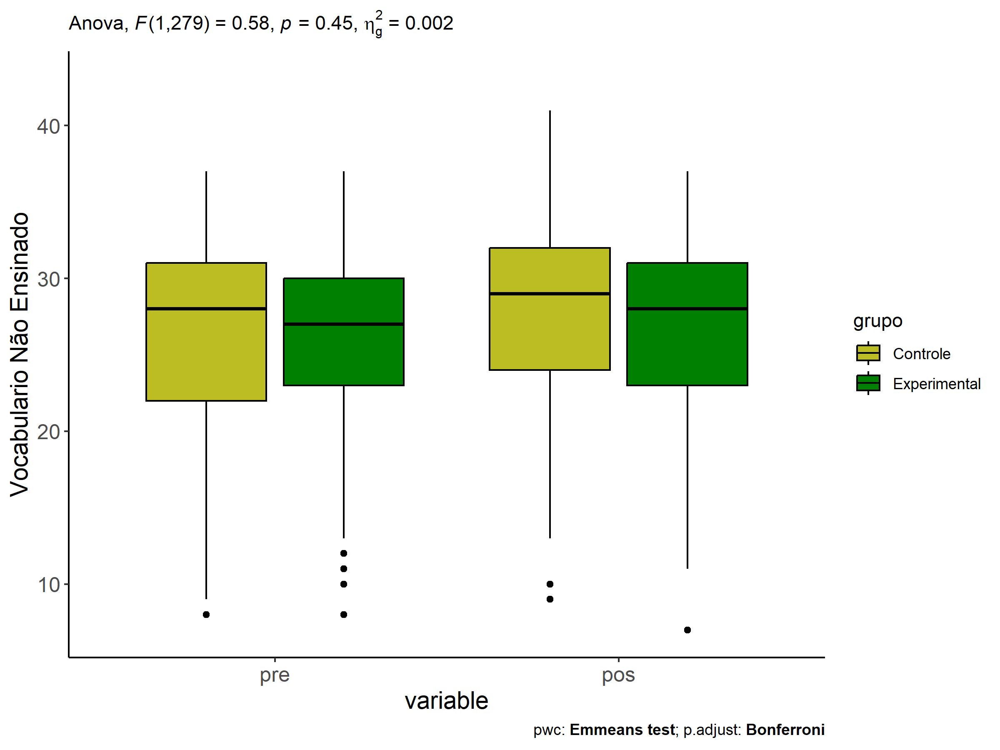<!-- -->

``` r
if (length(unique(wdat.long[["grupo"]])) > 1)
  plots <- oneWayAncovaBoxPlots(
    wdat.long, "vocab.non.teach", "grupo", aov, pwc.long, pre.post = "time",
    theme = "classic", color = color$prepost)
```

``` r
if (length(unique(wdat.long[["grupo"]])) > 1)
  plots[["grupo"]] + ggplot2::ylab("Vocabulario Não Ensinado")
```

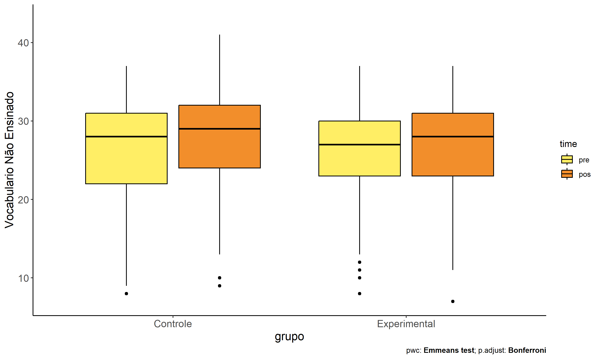<!-- -->

### Checking linearity assumption

``` r
ggscatter(wdat, x = "vocab.non.teach.pre", y = "vocab.non.teach.pos", size = 0.5,
          color = "grupo", add = "reg.line")+
  stat_regline_equation(
    aes(label =  paste(..eq.label.., ..rr.label.., sep = "~~~~"), color = grupo)
  )
```

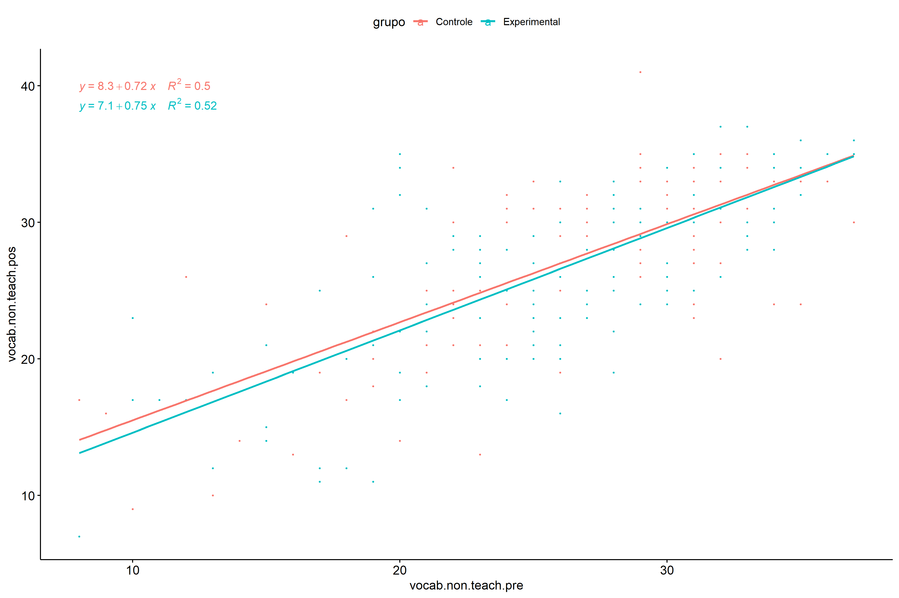<!-- -->

### Checking normality and homogeneity

``` r
res <- augment(lm(vocab.non.teach.pos ~ vocab.non.teach.pre + grupo, data = wdat))
```

``` r
shapiro_test(res$.resid)
```

    ## # A tibble: 1 × 3
    ##   variable   statistic p.value
    ##   <chr>          <dbl>   <dbl>
    ## 1 res$.resid     0.991  0.0890

``` r
levene_test(res, .resid ~ grupo)
```

    ## # A tibble: 1 × 4
    ##     df1   df2 statistic     p
    ##   <int> <int>     <dbl> <dbl>
    ## 1     1   280    0.0955 0.758

# ANCOVA and Pairwise for two factors **grupo:Sexo**

## Without remove non-normal data

``` r
pdat = remove_group_data(dat[!is.na(dat[["grupo"]]) & !is.na(dat[["Sexo"]]),], "vocab.non.teach.pos", c("grupo","Sexo"))

pdat.long <- rbind(pdat[,c("id","grupo","Sexo")], pdat[,c("id","grupo","Sexo")])
pdat.long[["time"]] <- c(rep("pre", nrow(pdat)), rep("pos", nrow(pdat)))
pdat.long[["time"]] <- factor(pdat.long[["time"]], c("pre","pos"))
pdat.long[["vocab.non.teach"]] <- c(pdat[["vocab.non.teach.pre"]], pdat[["vocab.non.teach.pos"]])

aov = anova_test(pdat, vocab.non.teach.pos ~ vocab.non.teach.pre + grupo*Sexo)
laov[["grupo:Sexo"]] <- get_anova_table(aov)
```

``` r
pwcs <- list()
pwcs[["Sexo"]] <- emmeans_test(
  group_by(pdat, grupo), vocab.non.teach.pos ~ Sexo,
  covariate = vocab.non.teach.pre, p.adjust.method = "bonferroni")
pwcs[["grupo"]] <- emmeans_test(
  group_by(pdat, Sexo), vocab.non.teach.pos ~ grupo,
  covariate = vocab.non.teach.pre, p.adjust.method = "bonferroni")

pwc <- plyr::rbind.fill(pwcs[["grupo"]], pwcs[["Sexo"]])
pwc <- pwc[,c("grupo","Sexo", colnames(pwc)[!colnames(pwc) %in% c("grupo","Sexo")])]
```

``` r
pwc.long <- emmeans_test(dplyr::group_by_at(pdat.long, c("grupo","Sexo")),
                         vocab.non.teach ~ time,
                         p.adjust.method = "bonferroni")
lpwc[["grupo:Sexo"]] <- plyr::rbind.fill(pwc, pwc.long)
```

``` r
ds <- get.descriptives(pdat, "vocab.non.teach.pos", c("grupo","Sexo"), covar = "vocab.non.teach.pre")
ds <- merge(ds[ds$variable != "vocab.non.teach.pre",],
            ds[ds$variable == "vocab.non.teach.pre", !colnames(ds) %in% c("variable")],
            by = c("grupo","Sexo"), all.x = T, suffixes = c("", ".vocab.non.teach.pre"))
ds <- merge(get_emmeans(pwcs[["grupo"]]), ds, by = c("grupo","Sexo"), suffixes = c(".emms", ""))
ds <- ds[,c("grupo","Sexo","n","mean.vocab.non.teach.pre","se.vocab.non.teach.pre","mean","se","emmean","se.emms")]

colnames(ds) <- c("grupo","Sexo", "N", paste0(c("M","SE")," (pre)"),
                  paste0(c("M","SE"), " (unadj)"), paste0(c("M", "SE"), " (adj)"))

lemms[["grupo:Sexo"]] <- ds
```

## Computing ANCOVA and PairWise After removing non-normal data (OK)

``` r
wdat = pdat 

res = residuals(lm(vocab.non.teach.pos ~ vocab.non.teach.pre + grupo*Sexo, data = wdat))
non.normal = getNonNormal(res, wdat$id, plimit = 0.05)

wdat = wdat[!wdat$id %in% non.normal,]

wdat.long <- rbind(wdat[,c("id","grupo","Sexo")], wdat[,c("id","grupo","Sexo")])
wdat.long[["time"]] <- c(rep("pre", nrow(wdat)), rep("pos", nrow(wdat)))
wdat.long[["time"]] <- factor(wdat.long[["time"]], c("pre","pos"))
wdat.long[["vocab.non.teach"]] <- c(wdat[["vocab.non.teach.pre"]], wdat[["vocab.non.teach.pos"]])


ldat[["grupo:Sexo"]] = wdat

(non.normal)
```

    ##  [1] "P1139" "P1113" "P2304" "P1129" "P1112" "P3260" "P3236" "P2359" "P1165" "P3228" "P1151"

``` r
aov = anova_test(wdat, vocab.non.teach.pos ~ vocab.non.teach.pre + grupo*Sexo)
laov[["grupo:Sexo"]] <- merge(get_anova_table(aov), laov[["grupo:Sexo"]], by="Effect", suffixes = c("","'"))

(df = get_anova_table(aov))
```

    ## ANOVA Table (type II tests)
    ## 
    ##                Effect DFn DFd       F        p p<.05   ges
    ## 1 vocab.non.teach.pre   1 273 298.756 1.00e-45     * 0.523
    ## 2               grupo   1 273   2.352 1.26e-01       0.009
    ## 3                Sexo   1 273   1.204 2.74e-01       0.004
    ## 4          grupo:Sexo   1 273   1.075 3.01e-01       0.004

| Effect              | DFn | DFd |       F |     p | p\<.05 |   ges |
|:--------------------|----:|----:|--------:|------:|:-------|------:|
| vocab.non.teach.pre |   1 | 273 | 298.756 | 0.000 | \*     | 0.523 |
| grupo               |   1 | 273 |   2.352 | 0.126 |        | 0.009 |
| Sexo                |   1 | 273 |   1.204 | 0.274 |        | 0.004 |
| grupo:Sexo          |   1 | 273 |   1.075 | 0.301 |        | 0.004 |

``` r
pwcs <- list()
pwcs[["Sexo"]] <- emmeans_test(
  group_by(wdat, grupo), vocab.non.teach.pos ~ Sexo,
  covariate = vocab.non.teach.pre, p.adjust.method = "bonferroni")
pwcs[["grupo"]] <- emmeans_test(
  group_by(wdat, Sexo), vocab.non.teach.pos ~ grupo,
  covariate = vocab.non.teach.pre, p.adjust.method = "bonferroni")

pwc <- plyr::rbind.fill(pwcs[["grupo"]], pwcs[["Sexo"]])
pwc <- pwc[,c("grupo","Sexo", colnames(pwc)[!colnames(pwc) %in% c("grupo","Sexo")])]
```

| grupo        | Sexo | term                       | .y.                 | group1   | group2       |  df | statistic |     p | p.adj | p.adj.signif |
|:-------------|:-----|:---------------------------|:--------------------|:---------|:-------------|----:|----------:|------:|------:|:-------------|
|              | F    | vocab.non.teach.pre\*grupo | vocab.non.teach.pos | Controle | Experimental | 273 |     0.331 | 0.741 | 0.741 | ns           |
|              | M    | vocab.non.teach.pre\*grupo | vocab.non.teach.pos | Controle | Experimental | 273 |     1.821 | 0.070 | 0.070 | ns           |
| Controle     |      | vocab.non.teach.pre\*Sexo  | vocab.non.teach.pos | F        | M            | 273 |    -0.101 | 0.920 | 0.920 | ns           |
| Experimental |      | vocab.non.teach.pre\*Sexo  | vocab.non.teach.pos | F        | M            | 273 |     1.506 | 0.133 | 0.133 | ns           |

``` r
pwc.long <- emmeans_test(dplyr::group_by_at(wdat.long, c("grupo","Sexo")),
                         vocab.non.teach ~ time,
                         p.adjust.method = "bonferroni")
lpwc[["grupo:Sexo"]] <- merge(plyr::rbind.fill(pwc, pwc.long), lpwc[["grupo:Sexo"]], by=c("grupo","Sexo","term",".y.","group1","group2"), suffixes = c("","'"))
```

| grupo        | Sexo | term | .y.             | group1 | group2 |  df | statistic |     p | p.adj | p.adj.signif |
|:-------------|:-----|:-----|:----------------|:-------|:-------|----:|----------:|------:|------:|:-------------|
| Controle     | F    | time | vocab.non.teach | pre    | pos    | 548 |    -0.907 | 0.365 | 0.365 | ns           |
| Controle     | M    | time | vocab.non.teach | pre    | pos    | 548 |    -1.172 | 0.242 | 0.242 | ns           |
| Experimental | F    | time | vocab.non.teach | pre    | pos    | 548 |    -1.212 | 0.226 | 0.226 | ns           |
| Experimental | M    | time | vocab.non.teach | pre    | pos    | 548 |     0.078 | 0.938 | 0.938 | ns           |

``` r
ds <- get.descriptives(wdat, "vocab.non.teach.pos", c("grupo","Sexo"), covar = "vocab.non.teach.pre")
ds <- merge(ds[ds$variable != "vocab.non.teach.pre",],
            ds[ds$variable == "vocab.non.teach.pre", !colnames(ds) %in% c("variable")],
            by = c("grupo","Sexo"), all.x = T, suffixes = c("", ".vocab.non.teach.pre"))
ds <- merge(get_emmeans(pwcs[["grupo"]]), ds, by = c("grupo","Sexo"), suffixes = c(".emms", ""))
ds <- ds[,c("grupo","Sexo","n","mean.vocab.non.teach.pre","se.vocab.non.teach.pre","mean","se","emmean","se.emms")]

colnames(ds) <- c("grupo","Sexo", "N", paste0(c("M","SE")," (pre)"),
                  paste0(c("M","SE"), " (unadj)"), paste0(c("M", "SE"), " (adj)"))

lemms[["grupo:Sexo"]] <- merge(ds, lemms[["grupo:Sexo"]], by=c("grupo","Sexo"), suffixes = c("","'"))
```

| grupo        | Sexo |   N | M (pre) | SE (pre) | M (unadj) | SE (unadj) | M (adj) | SE (adj) |
|:-------------|:-----|----:|--------:|---------:|----------:|-----------:|--------:|---------:|
| Controle     | F    |  54 |  26.870 |    0.754 |    27.926 |      0.722 |  27.481 |    0.574 |
| Controle     | M    |  59 |  26.237 |    0.856 |    27.542 |      0.824 |  27.561 |    0.549 |
| Experimental | F    |  84 |  25.679 |    0.672 |    26.810 |      0.660 |  27.237 |    0.460 |
| Experimental | M    |  81 |  26.481 |    0.636 |    26.407 |      0.713 |  26.247 |    0.468 |

### Plots for ancova

``` r
plots <- twoWayAncovaPlots(
  wdat, "vocab.non.teach.pos", c("grupo","Sexo"), aov, pwcs, addParam = c("mean_se"),
  font.label.size=10, step.increase=0.05, p.label="p.adj",
  subtitle = which(aov$Effect == "grupo:Sexo"))
```

``` r
if (!is.null(plots[["grupo"]]))
  plots[["grupo"]] + ggplot2::scale_color_manual(values = color[["Sexo"]])
```

    ## Scale for colour is already present.
    ## Adding another scale for colour, which will replace the existing scale.

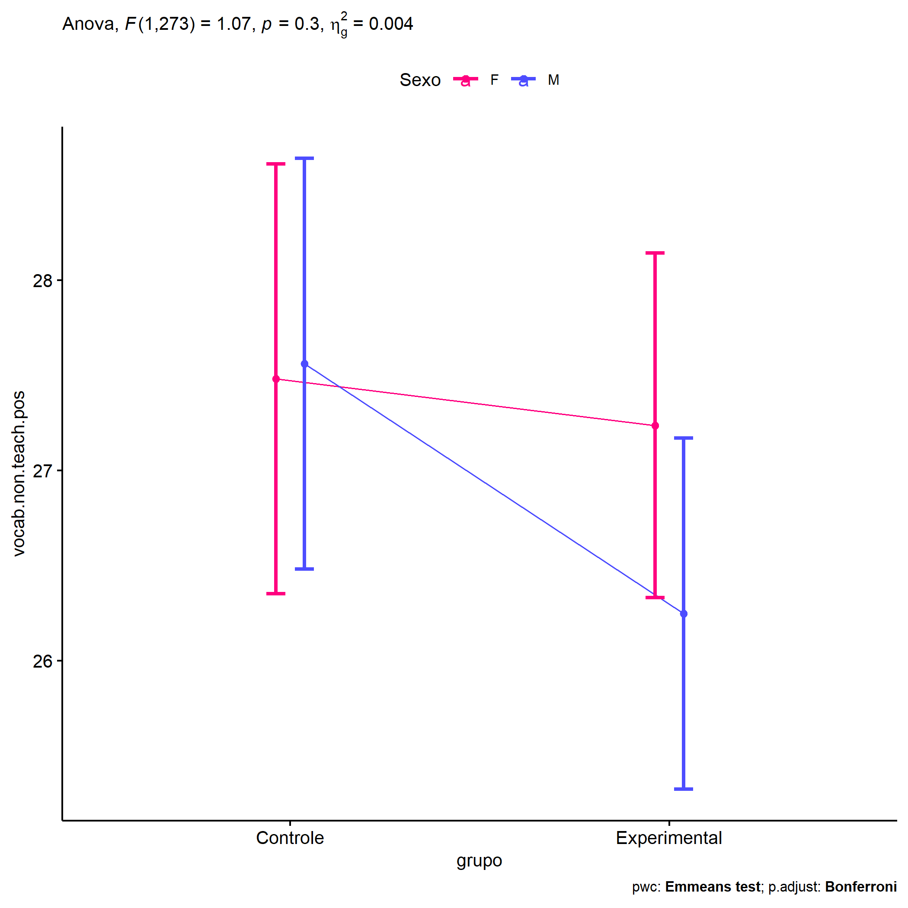<!-- -->

``` r
if (!is.null(plots[["Sexo"]]))
  plots[["Sexo"]] + ggplot2::scale_color_manual(values = color[["grupo"]])
```

    ## Scale for colour is already present.
    ## Adding another scale for colour, which will replace the existing scale.

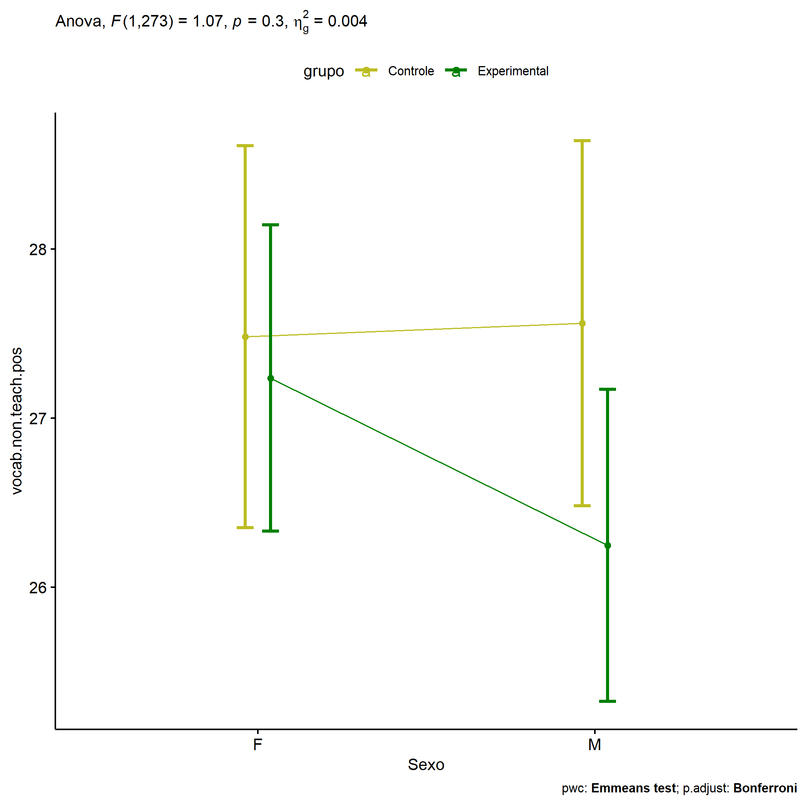<!-- -->

``` r
plots <- twoWayAncovaBoxPlots(
  wdat, "vocab.non.teach.pos", c("grupo","Sexo"), aov, pwcs, covar = "vocab.non.teach.pre",
  theme = "classic", color = color[["grupo:Sexo"]],
  subtitle = which(aov$Effect == "grupo:Sexo"))
```

``` r
plots[["grupo:Sexo"]] + ggplot2::ylab("Vocabulario Não Ensinado") + ggplot2::scale_x_discrete(labels=c('pre', 'pos'))
```

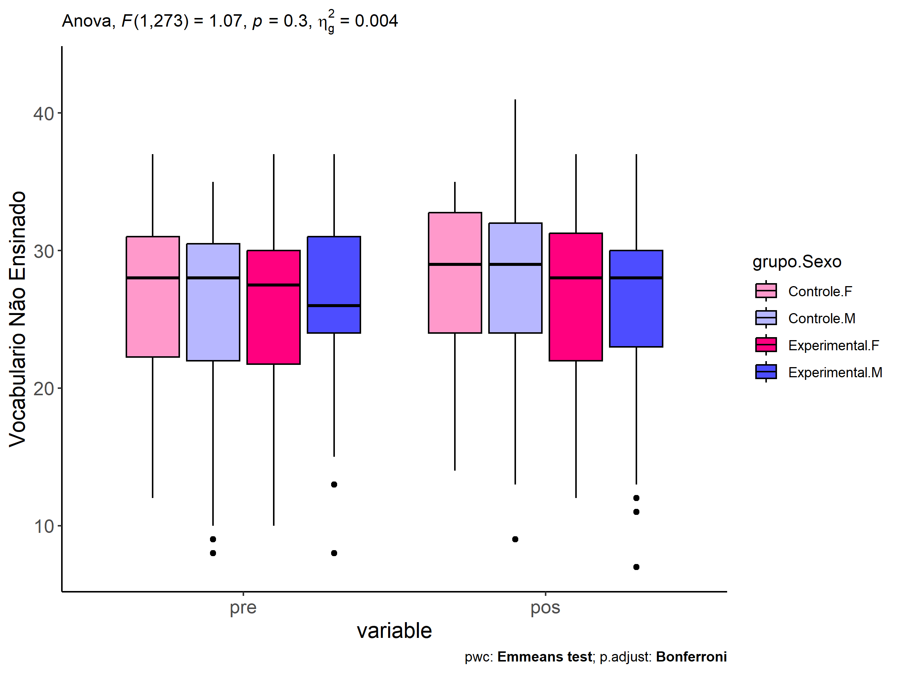<!-- -->

``` r
plots <- twoWayAncovaBoxPlots(
  wdat.long, "vocab.non.teach", c("grupo","Sexo"), aov, pwc.long, pre.post = "time",
  theme = "classic", color = color$prepost)
```

``` r
plots[["grupo:Sexo"]] + ggplot2::ylab("Vocabulario Não Ensinado")
```

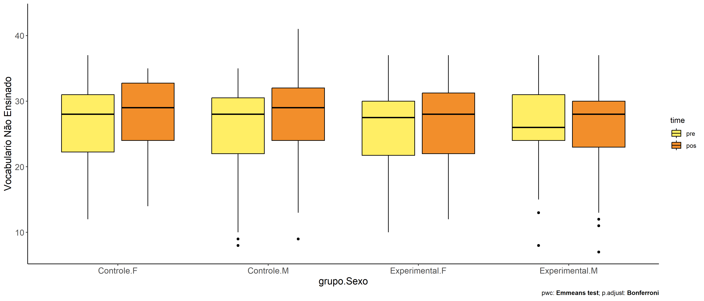<!-- -->

### Checking linearity assumption

``` r
ggscatter(wdat, x = "vocab.non.teach.pre", y = "vocab.non.teach.pos", size = 0.5,
          facet.by = c("grupo","Sexo"), add = "reg.line")+
  stat_regline_equation(
    aes(label =  paste(..eq.label.., ..rr.label.., sep = "~~~~"))
  )
```

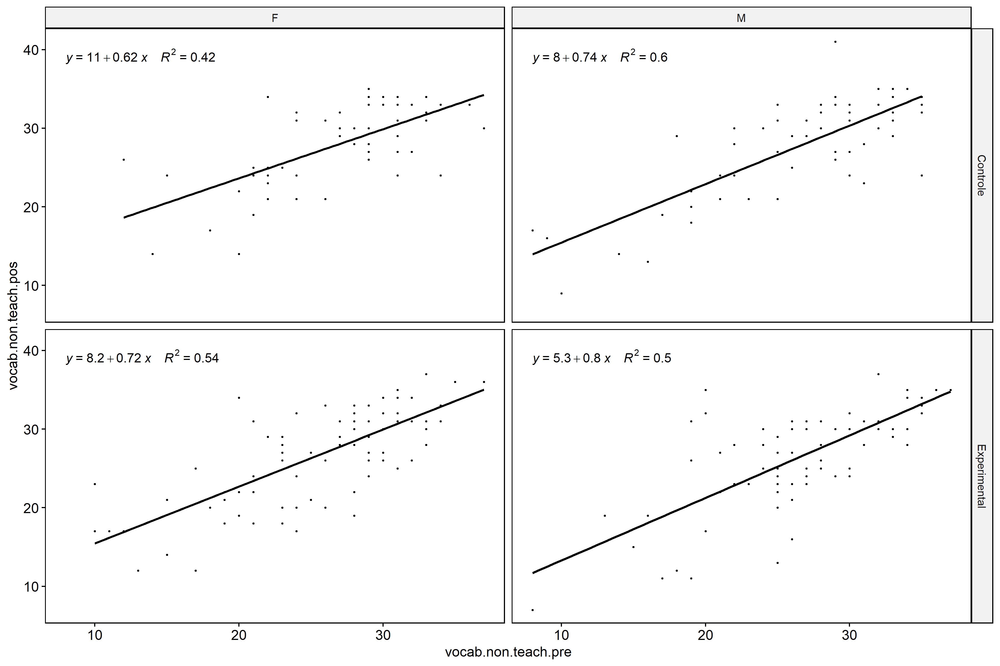<!-- -->

### Checking normality and homogeneity

``` r
res <- augment(lm(vocab.non.teach.pos ~ vocab.non.teach.pre + grupo*Sexo, data = wdat))
```

``` r
shapiro_test(res$.resid)
```

    ## # A tibble: 1 × 3
    ##   variable   statistic p.value
    ##   <chr>          <dbl>   <dbl>
    ## 1 res$.resid     0.991   0.100

``` r
levene_test(res, .resid ~ grupo*Sexo)
```

    ## # A tibble: 1 × 4
    ##     df1   df2 statistic     p
    ##   <int> <int>     <dbl> <dbl>
    ## 1     3   274     0.163 0.921

# ANCOVA and Pairwise for two factors **grupo:Zona**

## Without remove non-normal data

``` r
pdat = remove_group_data(dat[!is.na(dat[["grupo"]]) & !is.na(dat[["Zona"]]),], "vocab.non.teach.pos", c("grupo","Zona"))

pdat.long <- rbind(pdat[,c("id","grupo","Zona")], pdat[,c("id","grupo","Zona")])
pdat.long[["time"]] <- c(rep("pre", nrow(pdat)), rep("pos", nrow(pdat)))
pdat.long[["time"]] <- factor(pdat.long[["time"]], c("pre","pos"))
pdat.long[["vocab.non.teach"]] <- c(pdat[["vocab.non.teach.pre"]], pdat[["vocab.non.teach.pos"]])

aov = anova_test(pdat, vocab.non.teach.pos ~ vocab.non.teach.pre + grupo*Zona)
laov[["grupo:Zona"]] <- get_anova_table(aov)
```

``` r
pwcs <- list()
pwcs[["Zona"]] <- emmeans_test(
  group_by(pdat, grupo), vocab.non.teach.pos ~ Zona,
  covariate = vocab.non.teach.pre, p.adjust.method = "bonferroni")
pwcs[["grupo"]] <- emmeans_test(
  group_by(pdat, Zona), vocab.non.teach.pos ~ grupo,
  covariate = vocab.non.teach.pre, p.adjust.method = "bonferroni")

pwc <- plyr::rbind.fill(pwcs[["grupo"]], pwcs[["Zona"]])
pwc <- pwc[,c("grupo","Zona", colnames(pwc)[!colnames(pwc) %in% c("grupo","Zona")])]
```

``` r
pwc.long <- emmeans_test(dplyr::group_by_at(pdat.long, c("grupo","Zona")),
                         vocab.non.teach ~ time,
                         p.adjust.method = "bonferroni")
lpwc[["grupo:Zona"]] <- plyr::rbind.fill(pwc, pwc.long)
```

``` r
ds <- get.descriptives(pdat, "vocab.non.teach.pos", c("grupo","Zona"), covar = "vocab.non.teach.pre")
ds <- merge(ds[ds$variable != "vocab.non.teach.pre",],
            ds[ds$variable == "vocab.non.teach.pre", !colnames(ds) %in% c("variable")],
            by = c("grupo","Zona"), all.x = T, suffixes = c("", ".vocab.non.teach.pre"))
ds <- merge(get_emmeans(pwcs[["grupo"]]), ds, by = c("grupo","Zona"), suffixes = c(".emms", ""))
ds <- ds[,c("grupo","Zona","n","mean.vocab.non.teach.pre","se.vocab.non.teach.pre","mean","se","emmean","se.emms")]

colnames(ds) <- c("grupo","Zona", "N", paste0(c("M","SE")," (pre)"),
                  paste0(c("M","SE"), " (unadj)"), paste0(c("M", "SE"), " (adj)"))

lemms[["grupo:Zona"]] <- ds
```

## Computing ANCOVA and PairWise After removing non-normal data (OK)

``` r
wdat = pdat 

res = residuals(lm(vocab.non.teach.pos ~ vocab.non.teach.pre + grupo*Zona, data = wdat))
non.normal = getNonNormal(res, wdat$id, plimit = 0.05)

wdat = wdat[!wdat$id %in% non.normal,]

wdat.long <- rbind(wdat[,c("id","grupo","Zona")], wdat[,c("id","grupo","Zona")])
wdat.long[["time"]] <- c(rep("pre", nrow(wdat)), rep("pos", nrow(wdat)))
wdat.long[["time"]] <- factor(wdat.long[["time"]], c("pre","pos"))
wdat.long[["vocab.non.teach"]] <- c(wdat[["vocab.non.teach.pre"]], wdat[["vocab.non.teach.pos"]])


ldat[["grupo:Zona"]] = wdat

(non.normal)
```

    ## [1] "P1139" "P2304"

``` r
aov = anova_test(wdat, vocab.non.teach.pos ~ vocab.non.teach.pre + grupo*Zona)
laov[["grupo:Zona"]] <- merge(get_anova_table(aov), laov[["grupo:Zona"]], by="Effect", suffixes = c("","'"))

(df = get_anova_table(aov))
```

    ## ANOVA Table (type II tests)
    ## 
    ##                Effect DFn DFd       F        p p<.05   ges
    ## 1 vocab.non.teach.pre   1 156 177.008 1.79e-27     * 0.532
    ## 2               grupo   1 156   1.042 3.09e-01       0.007
    ## 3                Zona   1 156   1.963 1.63e-01       0.012
    ## 4          grupo:Zona   1 156   0.534 4.66e-01       0.003

| Effect              | DFn | DFd |       F |     p | p\<.05 |   ges |
|:--------------------|----:|----:|--------:|------:|:-------|------:|
| vocab.non.teach.pre |   1 | 156 | 177.008 | 0.000 | \*     | 0.532 |
| grupo               |   1 | 156 |   1.042 | 0.309 |        | 0.007 |
| Zona                |   1 | 156 |   1.963 | 0.163 |        | 0.012 |
| grupo:Zona          |   1 | 156 |   0.534 | 0.466 |        | 0.003 |

``` r
pwcs <- list()
pwcs[["Zona"]] <- emmeans_test(
  group_by(wdat, grupo), vocab.non.teach.pos ~ Zona,
  covariate = vocab.non.teach.pre, p.adjust.method = "bonferroni")
pwcs[["grupo"]] <- emmeans_test(
  group_by(wdat, Zona), vocab.non.teach.pos ~ grupo,
  covariate = vocab.non.teach.pre, p.adjust.method = "bonferroni")

pwc <- plyr::rbind.fill(pwcs[["grupo"]], pwcs[["Zona"]])
pwc <- pwc[,c("grupo","Zona", colnames(pwc)[!colnames(pwc) %in% c("grupo","Zona")])]
```

| grupo        | Zona   | term                       | .y.                 | group1   | group2       |  df | statistic |     p | p.adj | p.adj.signif |
|:-------------|:-------|:---------------------------|:--------------------|:---------|:-------------|----:|----------:|------:|------:|:-------------|
|              | Rural  | vocab.non.teach.pre\*grupo | vocab.non.teach.pos | Controle | Experimental | 156 |     1.255 | 0.211 | 0.211 | ns           |
|              | Urbana | vocab.non.teach.pre\*grupo | vocab.non.teach.pos | Controle | Experimental | 156 |    -0.006 | 0.995 | 0.995 | ns           |
| Controle     |        | vocab.non.teach.pre\*Zona  | vocab.non.teach.pos | Rural    | Urbana       | 156 |     1.400 | 0.164 | 0.164 | ns           |
| Experimental |        | vocab.non.teach.pre\*Zona  | vocab.non.teach.pos | Rural    | Urbana       | 156 |     0.740 | 0.460 | 0.460 | ns           |

``` r
pwc.long <- emmeans_test(dplyr::group_by_at(wdat.long, c("grupo","Zona")),
                         vocab.non.teach ~ time,
                         p.adjust.method = "bonferroni")
lpwc[["grupo:Zona"]] <- merge(plyr::rbind.fill(pwc, pwc.long), lpwc[["grupo:Zona"]], by=c("grupo","Zona","term",".y.","group1","group2"), suffixes = c("","'"))
```

| grupo        | Zona   | term | .y.             | group1 | group2 |  df | statistic |     p | p.adj | p.adj.signif |
|:-------------|:-------|:-----|:----------------|:-------|:-------|----:|----------:|------:|------:|:-------------|
| Controle     | Rural  | time | vocab.non.teach | pre    | pos    | 314 |    -1.680 | 0.094 | 0.094 | ns           |
| Controle     | Urbana | time | vocab.non.teach | pre    | pos    | 314 |    -0.081 | 0.936 | 0.936 | ns           |
| Experimental | Rural  | time | vocab.non.teach | pre    | pos    | 314 |    -1.274 | 0.204 | 0.204 | ns           |
| Experimental | Urbana | time | vocab.non.teach | pre    | pos    | 314 |    -0.406 | 0.685 | 0.685 | ns           |

``` r
ds <- get.descriptives(wdat, "vocab.non.teach.pos", c("grupo","Zona"), covar = "vocab.non.teach.pre")
ds <- merge(ds[ds$variable != "vocab.non.teach.pre",],
            ds[ds$variable == "vocab.non.teach.pre", !colnames(ds) %in% c("variable")],
            by = c("grupo","Zona"), all.x = T, suffixes = c("", ".vocab.non.teach.pre"))
ds <- merge(get_emmeans(pwcs[["grupo"]]), ds, by = c("grupo","Zona"), suffixes = c(".emms", ""))
ds <- ds[,c("grupo","Zona","n","mean.vocab.non.teach.pre","se.vocab.non.teach.pre","mean","se","emmean","se.emms")]

colnames(ds) <- c("grupo","Zona", "N", paste0(c("M","SE")," (pre)"),
                  paste0(c("M","SE"), " (unadj)"), paste0(c("M", "SE"), " (adj)"))

lemms[["grupo:Zona"]] <- merge(ds, lemms[["grupo:Zona"]], by=c("grupo","Zona"), suffixes = c("","'"))
```

| grupo        | Zona   |   N | M (pre) | SE (pre) | M (unadj) | SE (unadj) | M (adj) | SE (adj) |
|:-------------|:-------|----:|--------:|---------:|----------:|-----------:|--------:|---------:|
| Controle     | Rural  |  41 |  25.976 |    0.797 |    28.341 |      0.973 |  28.231 |    0.689 |
| Controle     | Urbana |  17 |  27.529 |    1.546 |    27.706 |      1.675 |  26.446 |    1.074 |
| Experimental | Rural  |  60 |  25.050 |    0.853 |    26.533 |      0.839 |  27.107 |    0.571 |
| Experimental | Urbana |  43 |  26.093 |    1.060 |    26.651 |      0.962 |  26.454 |    0.673 |

### Plots for ancova

``` r
plots <- twoWayAncovaPlots(
  wdat, "vocab.non.teach.pos", c("grupo","Zona"), aov, pwcs, addParam = c("mean_se"),
  font.label.size=10, step.increase=0.05, p.label="p.adj",
  subtitle = which(aov$Effect == "grupo:Zona"))
```

``` r
if (!is.null(plots[["grupo"]]))
  plots[["grupo"]] + ggplot2::scale_color_manual(values = color[["Zona"]])
```

    ## Scale for colour is already present.
    ## Adding another scale for colour, which will replace the existing scale.

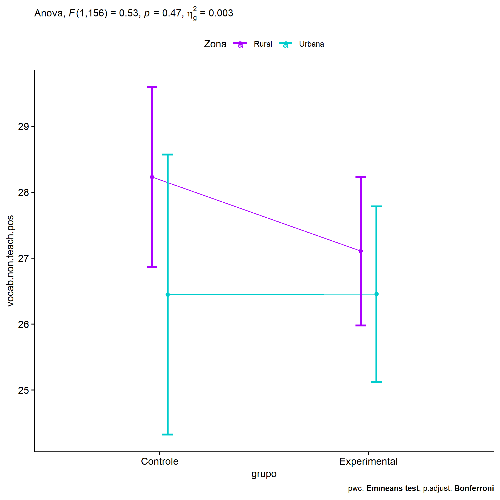<!-- -->

``` r
if (!is.null(plots[["Zona"]]))
  plots[["Zona"]] + ggplot2::scale_color_manual(values = color[["grupo"]])
```

    ## Scale for colour is already present.
    ## Adding another scale for colour, which will replace the existing scale.

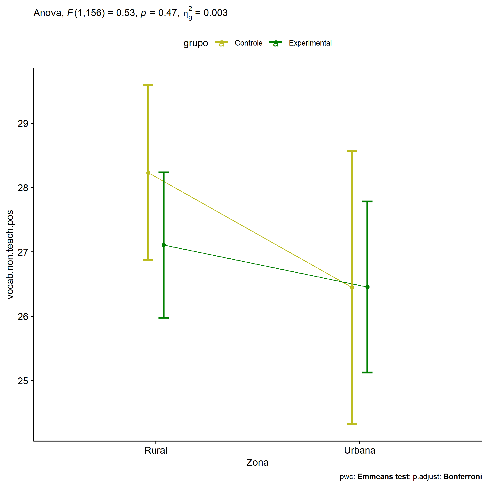<!-- -->

``` r
plots <- twoWayAncovaBoxPlots(
  wdat, "vocab.non.teach.pos", c("grupo","Zona"), aov, pwcs, covar = "vocab.non.teach.pre",
  theme = "classic", color = color[["grupo:Zona"]],
  subtitle = which(aov$Effect == "grupo:Zona"))
```

``` r
plots[["grupo:Zona"]] + ggplot2::ylab("Vocabulario Não Ensinado") + ggplot2::scale_x_discrete(labels=c('pre', 'pos'))
```

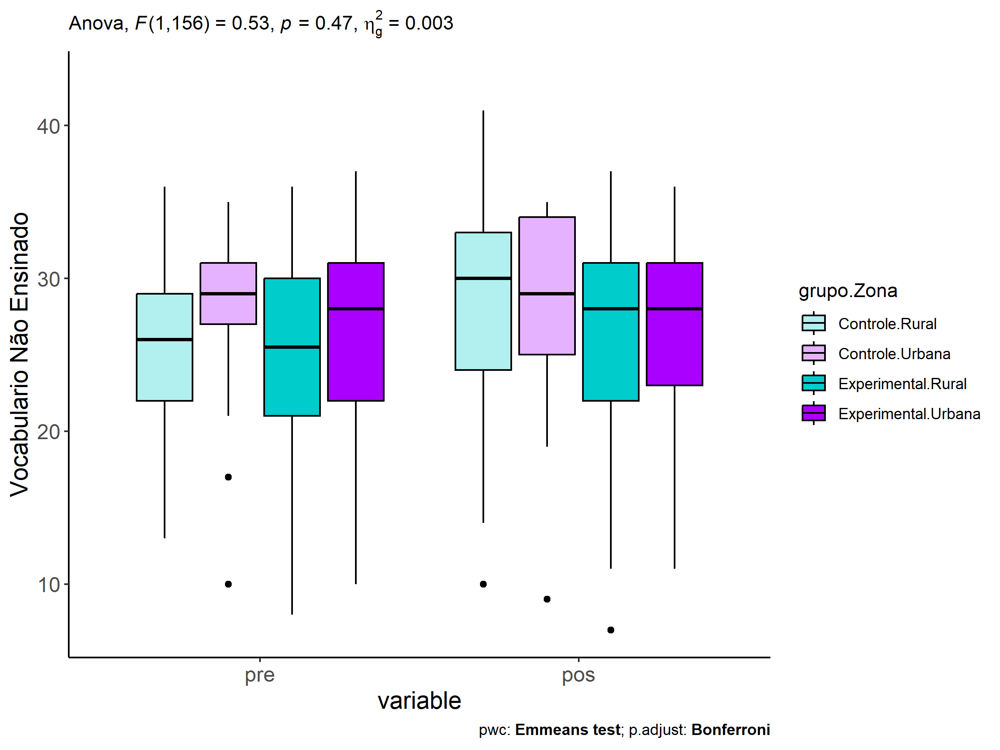<!-- -->

``` r
plots <- twoWayAncovaBoxPlots(
  wdat.long, "vocab.non.teach", c("grupo","Zona"), aov, pwc.long, pre.post = "time",
  theme = "classic", color = color$prepost)
```

``` r
plots[["grupo:Zona"]] + ggplot2::ylab("Vocabulario Não Ensinado")
```

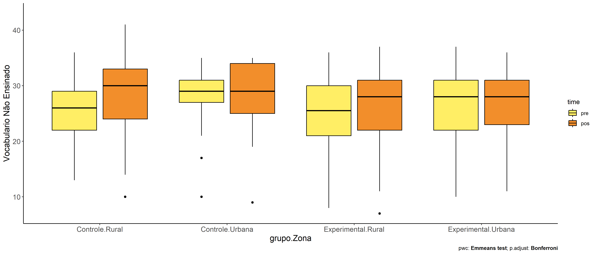<!-- -->

### Checking linearity assumption

``` r
ggscatter(wdat, x = "vocab.non.teach.pre", y = "vocab.non.teach.pos", size = 0.5,
          facet.by = c("grupo","Zona"), add = "reg.line")+
  stat_regline_equation(
    aes(label =  paste(..eq.label.., ..rr.label.., sep = "~~~~"))
  )
```

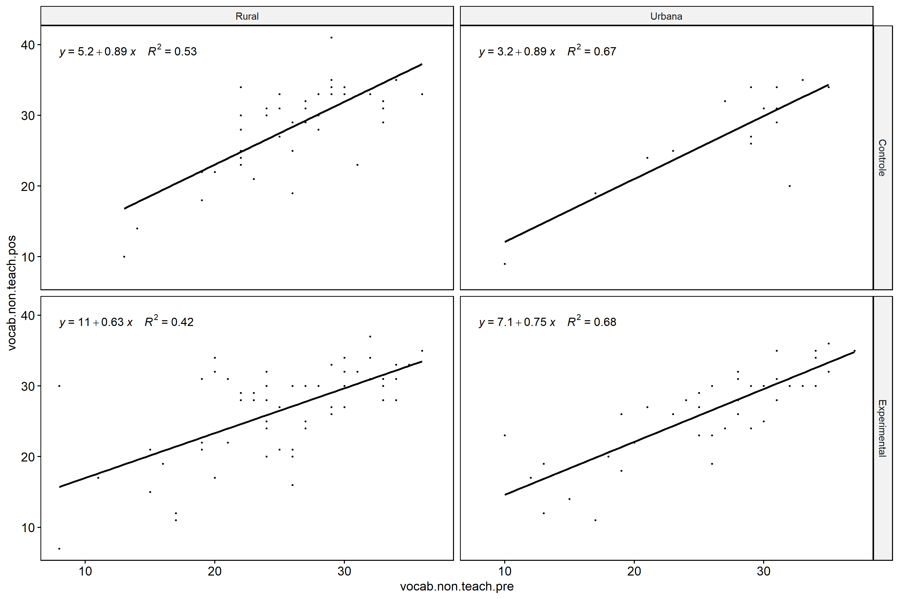<!-- -->

### Checking normality and homogeneity

``` r
res <- augment(lm(vocab.non.teach.pos ~ vocab.non.teach.pre + grupo*Zona, data = wdat))
```

``` r
shapiro_test(res$.resid)
```

    ## # A tibble: 1 × 3
    ##   variable   statistic p.value
    ##   <chr>          <dbl>   <dbl>
    ## 1 res$.resid     0.983  0.0520

``` r
levene_test(res, .resid ~ grupo*Zona)
```

    ## # A tibble: 1 × 4
    ##     df1   df2 statistic     p
    ##   <int> <int>     <dbl> <dbl>
    ## 1     3   157     0.960 0.413

# ANCOVA and Pairwise for two factors **grupo:Cor.Raca**

## Without remove non-normal data

``` r
pdat = remove_group_data(dat[!is.na(dat[["grupo"]]) & !is.na(dat[["Cor.Raca"]]),], "vocab.non.teach.pos", c("grupo","Cor.Raca"))

pdat.long <- rbind(pdat[,c("id","grupo","Cor.Raca")], pdat[,c("id","grupo","Cor.Raca")])
pdat.long[["time"]] <- c(rep("pre", nrow(pdat)), rep("pos", nrow(pdat)))
pdat.long[["time"]] <- factor(pdat.long[["time"]], c("pre","pos"))
pdat.long[["vocab.non.teach"]] <- c(pdat[["vocab.non.teach.pre"]], pdat[["vocab.non.teach.pos"]])

aov = anova_test(pdat, vocab.non.teach.pos ~ vocab.non.teach.pre + grupo*Cor.Raca)
laov[["grupo:Cor.Raca"]] <- get_anova_table(aov)
```

``` r
pwcs <- list()
pwcs[["Cor.Raca"]] <- emmeans_test(
  group_by(pdat, grupo), vocab.non.teach.pos ~ Cor.Raca,
  covariate = vocab.non.teach.pre, p.adjust.method = "bonferroni")
pwcs[["grupo"]] <- emmeans_test(
  group_by(pdat, Cor.Raca), vocab.non.teach.pos ~ grupo,
  covariate = vocab.non.teach.pre, p.adjust.method = "bonferroni")

pwc <- plyr::rbind.fill(pwcs[["grupo"]], pwcs[["Cor.Raca"]])
pwc <- pwc[,c("grupo","Cor.Raca", colnames(pwc)[!colnames(pwc) %in% c("grupo","Cor.Raca")])]
```

``` r
pwc.long <- emmeans_test(dplyr::group_by_at(pdat.long, c("grupo","Cor.Raca")),
                         vocab.non.teach ~ time,
                         p.adjust.method = "bonferroni")
lpwc[["grupo:Cor.Raca"]] <- plyr::rbind.fill(pwc, pwc.long)
```

``` r
ds <- get.descriptives(pdat, "vocab.non.teach.pos", c("grupo","Cor.Raca"), covar = "vocab.non.teach.pre")
ds <- merge(ds[ds$variable != "vocab.non.teach.pre",],
            ds[ds$variable == "vocab.non.teach.pre", !colnames(ds) %in% c("variable")],
            by = c("grupo","Cor.Raca"), all.x = T, suffixes = c("", ".vocab.non.teach.pre"))
ds <- merge(get_emmeans(pwcs[["grupo"]]), ds, by = c("grupo","Cor.Raca"), suffixes = c(".emms", ""))
ds <- ds[,c("grupo","Cor.Raca","n","mean.vocab.non.teach.pre","se.vocab.non.teach.pre","mean","se","emmean","se.emms")]

colnames(ds) <- c("grupo","Cor.Raca", "N", paste0(c("M","SE")," (pre)"),
                  paste0(c("M","SE"), " (unadj)"), paste0(c("M", "SE"), " (adj)"))

lemms[["grupo:Cor.Raca"]] <- ds
```

## Computing ANCOVA and PairWise After removing non-normal data (OK)

``` r
wdat = pdat 

res = residuals(lm(vocab.non.teach.pos ~ vocab.non.teach.pre + grupo*Cor.Raca, data = wdat))
non.normal = getNonNormal(res, wdat$id, plimit = 0.05)

wdat = wdat[!wdat$id %in% non.normal,]

wdat.long <- rbind(wdat[,c("id","grupo","Cor.Raca")], wdat[,c("id","grupo","Cor.Raca")])
wdat.long[["time"]] <- c(rep("pre", nrow(wdat)), rep("pos", nrow(wdat)))
wdat.long[["time"]] <- factor(wdat.long[["time"]], c("pre","pos"))
wdat.long[["vocab.non.teach"]] <- c(wdat[["vocab.non.teach.pre"]], wdat[["vocab.non.teach.pos"]])


ldat[["grupo:Cor.Raca"]] = wdat

(non.normal)
```

    ## [1] "P1139" "P1113" "P1112" "P3260" "P1151"

``` r
aov = anova_test(wdat, vocab.non.teach.pos ~ vocab.non.teach.pre + grupo*Cor.Raca)
laov[["grupo:Cor.Raca"]] <- merge(get_anova_table(aov), laov[["grupo:Cor.Raca"]], by="Effect", suffixes = c("","'"))

(df = get_anova_table(aov))
```

    ## ANOVA Table (type II tests)
    ## 
    ##                Effect DFn DFd       F        p p<.05   ges
    ## 1 vocab.non.teach.pre   1 106 130.595 3.41e-20     * 0.552
    ## 2               grupo   1 106   0.662 4.18e-01       0.006
    ## 3            Cor.Raca   1 106   1.965 1.64e-01       0.018
    ## 4      grupo:Cor.Raca   1 106   1.243 2.67e-01       0.012

| Effect              | DFn | DFd |       F |     p | p\<.05 |   ges |
|:--------------------|----:|----:|--------:|------:|:-------|------:|
| vocab.non.teach.pre |   1 | 106 | 130.595 | 0.000 | \*     | 0.552 |
| grupo               |   1 | 106 |   0.662 | 0.418 |        | 0.006 |
| Cor.Raca            |   1 | 106 |   1.965 | 0.164 |        | 0.018 |
| grupo:Cor.Raca      |   1 | 106 |   1.243 | 0.267 |        | 0.012 |

``` r
pwcs <- list()
pwcs[["Cor.Raca"]] <- emmeans_test(
  group_by(wdat, grupo), vocab.non.teach.pos ~ Cor.Raca,
  covariate = vocab.non.teach.pre, p.adjust.method = "bonferroni")
pwcs[["grupo"]] <- emmeans_test(
  group_by(wdat, Cor.Raca), vocab.non.teach.pos ~ grupo,
  covariate = vocab.non.teach.pre, p.adjust.method = "bonferroni")

pwc <- plyr::rbind.fill(pwcs[["grupo"]], pwcs[["Cor.Raca"]])
pwc <- pwc[,c("grupo","Cor.Raca", colnames(pwc)[!colnames(pwc) %in% c("grupo","Cor.Raca")])]
```

| grupo        | Cor.Raca | term                          | .y.                 | group1   | group2       |  df | statistic |     p | p.adj | p.adj.signif |
|:-------------|:---------|:------------------------------|:--------------------|:---------|:-------------|----:|----------:|------:|------:|:-------------|
|              | Branca   | vocab.non.teach.pre\*grupo    | vocab.non.teach.pos | Controle | Experimental | 106 |     1.350 | 0.180 | 0.180 | ns           |
|              | Parda    | vocab.non.teach.pre\*grupo    | vocab.non.teach.pos | Controle | Experimental | 106 |     0.282 | 0.778 | 0.778 | ns           |
| Controle     |          | vocab.non.teach.pre\*Cor.Raca | vocab.non.teach.pos | Branca   | Parda        | 106 |     1.744 | 0.084 | 0.084 | ns           |
| Experimental |          | vocab.non.teach.pre\*Cor.Raca | vocab.non.teach.pos | Branca   | Parda        | 106 |     0.436 | 0.664 | 0.664 | ns           |

``` r
pwc.long <- emmeans_test(dplyr::group_by_at(wdat.long, c("grupo","Cor.Raca")),
                         vocab.non.teach ~ time,
                         p.adjust.method = "bonferroni")
lpwc[["grupo:Cor.Raca"]] <- merge(plyr::rbind.fill(pwc, pwc.long), lpwc[["grupo:Cor.Raca"]], by=c("grupo","Cor.Raca","term",".y.","group1","group2"), suffixes = c("","'"))
```

| grupo        | Cor.Raca | term | .y.             | group1 | group2 |  df | statistic |     p | p.adj | p.adj.signif |
|:-------------|:---------|:-----|:----------------|:-------|:-------|----:|----------:|------:|------:|:-------------|
| Controle     | Branca   | time | vocab.non.teach | pre    | pos    | 214 |    -1.105 | 0.270 | 0.270 | ns           |
| Controle     | Parda    | time | vocab.non.teach | pre    | pos    | 214 |    -0.743 | 0.458 | 0.458 | ns           |
| Experimental | Branca   | time | vocab.non.teach | pre    | pos    | 214 |    -0.300 | 0.764 | 0.764 | ns           |
| Experimental | Parda    | time | vocab.non.teach | pre    | pos    | 214 |    -0.750 | 0.454 | 0.454 | ns           |

``` r
ds <- get.descriptives(wdat, "vocab.non.teach.pos", c("grupo","Cor.Raca"), covar = "vocab.non.teach.pre")
ds <- merge(ds[ds$variable != "vocab.non.teach.pre",],
            ds[ds$variable == "vocab.non.teach.pre", !colnames(ds) %in% c("variable")],
            by = c("grupo","Cor.Raca"), all.x = T, suffixes = c("", ".vocab.non.teach.pre"))
ds <- merge(get_emmeans(pwcs[["grupo"]]), ds, by = c("grupo","Cor.Raca"), suffixes = c(".emms", ""))
ds <- ds[,c("grupo","Cor.Raca","n","mean.vocab.non.teach.pre","se.vocab.non.teach.pre","mean","se","emmean","se.emms")]

colnames(ds) <- c("grupo","Cor.Raca", "N", paste0(c("M","SE")," (pre)"),
                  paste0(c("M","SE"), " (unadj)"), paste0(c("M", "SE"), " (adj)"))

lemms[["grupo:Cor.Raca"]] <- merge(ds, lemms[["grupo:Cor.Raca"]], by=c("grupo","Cor.Raca"), suffixes = c("","'"))
```

| grupo        | Cor.Raca |   N | M (pre) | SE (pre) | M (unadj) | SE (unadj) | M (adj) | SE (adj) |
|:-------------|:---------|----:|--------:|---------:|----------:|-----------:|--------:|---------:|
| Controle     | Branca   |   7 |  27.429 |    1.152 |    31.286 |      0.644 |  29.591 |    1.725 |
| Controle     | Parda    |  43 |  25.279 |    0.951 |    26.326 |      0.992 |  26.347 |    0.693 |
| Experimental | Branca   |  13 |  28.462 |    1.496 |    29.231 |      1.787 |  26.711 |    1.280 |
| Experimental | Parda    |  48 |  24.167 |    0.986 |    25.167 |      1.074 |  26.077 |    0.661 |

### Plots for ancova

``` r
plots <- twoWayAncovaPlots(
  wdat, "vocab.non.teach.pos", c("grupo","Cor.Raca"), aov, pwcs, addParam = c("mean_se"),
  font.label.size=10, step.increase=0.05, p.label="p.adj",
  subtitle = which(aov$Effect == "grupo:Cor.Raca"))
```

``` r
if (!is.null(plots[["grupo"]]))
  plots[["grupo"]] + ggplot2::scale_color_manual(values = color[["Cor.Raca"]])
```

    ## Scale for colour is already present.
    ## Adding another scale for colour, which will replace the existing scale.

<!-- -->

``` r
if (!is.null(plots[["Cor.Raca"]]))
  plots[["Cor.Raca"]] + ggplot2::scale_color_manual(values = color[["grupo"]])
```

    ## Scale for colour is already present.
    ## Adding another scale for colour, which will replace the existing scale.

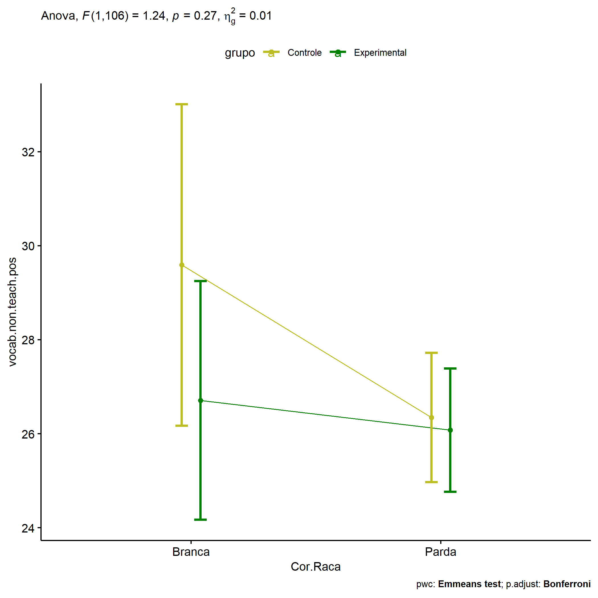<!-- -->

``` r
plots <- twoWayAncovaBoxPlots(
  wdat, "vocab.non.teach.pos", c("grupo","Cor.Raca"), aov, pwcs, covar = "vocab.non.teach.pre",
  theme = "classic", color = color[["grupo:Cor.Raca"]],
  subtitle = which(aov$Effect == "grupo:Cor.Raca"))
```

``` r
plots[["grupo:Cor.Raca"]] + ggplot2::ylab("Vocabulario Não Ensinado") + ggplot2::scale_x_discrete(labels=c('pre', 'pos'))
```

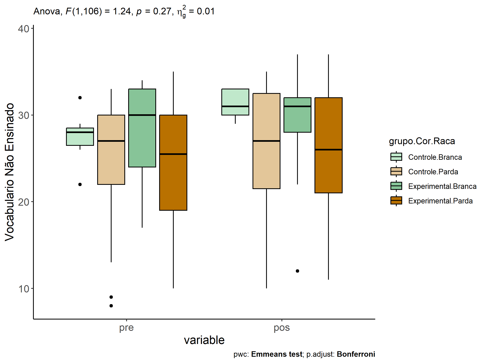<!-- -->

``` r
plots <- twoWayAncovaBoxPlots(
  wdat.long, "vocab.non.teach", c("grupo","Cor.Raca"), aov, pwc.long, pre.post = "time",
  theme = "classic", color = color$prepost)
```

``` r
plots[["grupo:Cor.Raca"]] + ggplot2::ylab("Vocabulario Não Ensinado")
```

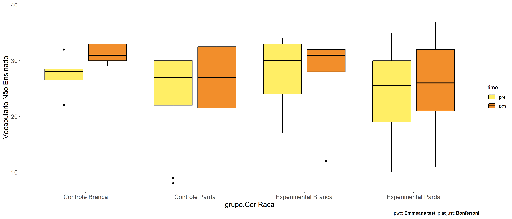<!-- -->

### Checking linearity assumption

``` r
ggscatter(wdat, x = "vocab.non.teach.pre", y = "vocab.non.teach.pos", size = 0.5,
          facet.by = c("grupo","Cor.Raca"), add = "reg.line")+
  stat_regline_equation(
    aes(label =  paste(..eq.label.., ..rr.label.., sep = "~~~~"))
  )
```

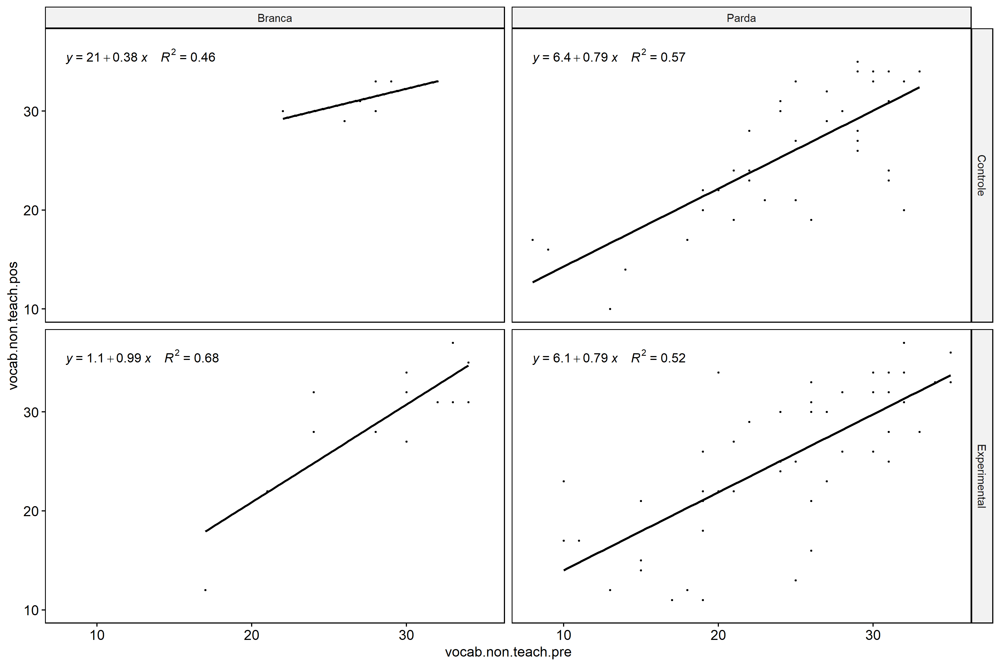<!-- -->

### Checking normality and homogeneity

``` r
res <- augment(lm(vocab.non.teach.pos ~ vocab.non.teach.pre + grupo*Cor.Raca, data = wdat))
```

``` r
shapiro_test(res$.resid)
```

    ## # A tibble: 1 × 3
    ##   variable   statistic p.value
    ##   <chr>          <dbl>   <dbl>
    ## 1 res$.resid     0.977  0.0487

``` r
levene_test(res, .resid ~ grupo*Cor.Raca)
```

    ## # A tibble: 1 × 4
    ##     df1   df2 statistic     p
    ##   <int> <int>     <dbl> <dbl>
    ## 1     3   107      2.12 0.102

# ANCOVA and Pairwise for two factors **grupo:vocab.non.teach.quintile**

## Without remove non-normal data

``` r
pdat = remove_group_data(dat[!is.na(dat[["grupo"]]) & !is.na(dat[["vocab.non.teach.quintile"]]),], "vocab.non.teach.pos", c("grupo","vocab.non.teach.quintile"))

pdat.long <- rbind(pdat[,c("id","grupo","vocab.non.teach.quintile")], pdat[,c("id","grupo","vocab.non.teach.quintile")])
pdat.long[["time"]] <- c(rep("pre", nrow(pdat)), rep("pos", nrow(pdat)))
pdat.long[["time"]] <- factor(pdat.long[["time"]], c("pre","pos"))
pdat.long[["vocab.non.teach"]] <- c(pdat[["vocab.non.teach.pre"]], pdat[["vocab.non.teach.pos"]])

aov = anova_test(pdat, vocab.non.teach.pos ~ vocab.non.teach.pre + grupo*vocab.non.teach.quintile)
laov[["grupo:vocab.non.teach.quintile"]] <- get_anova_table(aov)
```

``` r
pwcs <- list()
pwcs[["vocab.non.teach.quintile"]] <- emmeans_test(
  group_by(pdat, grupo), vocab.non.teach.pos ~ vocab.non.teach.quintile,
  covariate = vocab.non.teach.pre, p.adjust.method = "bonferroni")
pwcs[["grupo"]] <- emmeans_test(
  group_by(pdat, vocab.non.teach.quintile), vocab.non.teach.pos ~ grupo,
  covariate = vocab.non.teach.pre, p.adjust.method = "bonferroni")

pwc <- plyr::rbind.fill(pwcs[["grupo"]], pwcs[["vocab.non.teach.quintile"]])
pwc <- pwc[,c("grupo","vocab.non.teach.quintile", colnames(pwc)[!colnames(pwc) %in% c("grupo","vocab.non.teach.quintile")])]
```

``` r
pwc.long <- emmeans_test(dplyr::group_by_at(pdat.long, c("grupo","vocab.non.teach.quintile")),
                         vocab.non.teach ~ time,
                         p.adjust.method = "bonferroni")
lpwc[["grupo:vocab.non.teach.quintile"]] <- plyr::rbind.fill(pwc, pwc.long)
```

``` r
ds <- get.descriptives(pdat, "vocab.non.teach.pos", c("grupo","vocab.non.teach.quintile"), covar = "vocab.non.teach.pre")
ds <- merge(ds[ds$variable != "vocab.non.teach.pre",],
            ds[ds$variable == "vocab.non.teach.pre", !colnames(ds) %in% c("variable")],
            by = c("grupo","vocab.non.teach.quintile"), all.x = T, suffixes = c("", ".vocab.non.teach.pre"))
ds <- merge(get_emmeans(pwcs[["grupo"]]), ds, by = c("grupo","vocab.non.teach.quintile"), suffixes = c(".emms", ""))
ds <- ds[,c("grupo","vocab.non.teach.quintile","n","mean.vocab.non.teach.pre","se.vocab.non.teach.pre","mean","se","emmean","se.emms")]

colnames(ds) <- c("grupo","vocab.non.teach.quintile", "N", paste0(c("M","SE")," (pre)"),
                  paste0(c("M","SE"), " (unadj)"), paste0(c("M", "SE"), " (adj)"))

lemms[["grupo:vocab.non.teach.quintile"]] <- ds
```

## Computing ANCOVA and PairWise After removing non-normal data (OK)

``` r
wdat = pdat 

res = residuals(lm(vocab.non.teach.pos ~ vocab.non.teach.pre + grupo*vocab.non.teach.quintile, data = wdat))
non.normal = getNonNormal(res, wdat$id, plimit = 0.05)

wdat = wdat[!wdat$id %in% non.normal,]

wdat.long <- rbind(wdat[,c("id","grupo","vocab.non.teach.quintile")], wdat[,c("id","grupo","vocab.non.teach.quintile")])
wdat.long[["time"]] <- c(rep("pre", nrow(wdat)), rep("pos", nrow(wdat)))
wdat.long[["time"]] <- factor(wdat.long[["time"]], c("pre","pos"))
wdat.long[["vocab.non.teach"]] <- c(wdat[["vocab.non.teach.pre"]], wdat[["vocab.non.teach.pos"]])


ldat[["grupo:vocab.non.teach.quintile"]] = wdat

(non.normal)
```

    ## [1] "P1113" "P1139" "P2304" "P1112"

``` r
aov = anova_test(wdat, vocab.non.teach.pos ~ vocab.non.teach.pre + grupo*vocab.non.teach.quintile)
laov[["grupo:vocab.non.teach.quintile"]] <- merge(get_anova_table(aov), laov[["grupo:vocab.non.teach.quintile"]], by="Effect", suffixes = c("","'"))

(df = get_anova_table(aov))
```

    ## ANOVA Table (type II tests)
    ## 
    ##                           Effect DFn DFd      F        p p<.05   ges
    ## 1            vocab.non.teach.pre   1 274 19.146 1.72e-05     * 0.065
    ## 2                          grupo   1 274  0.708 4.01e-01       0.003
    ## 3       vocab.non.teach.quintile   4 274  2.300 5.90e-02       0.032
    ## 4 grupo:vocab.non.teach.quintile   4 274  2.690 3.20e-02     * 0.038

| Effect                         | DFn | DFd |      F |     p | p\<.05 |   ges |
|:-------------------------------|----:|----:|-------:|------:|:-------|------:|
| vocab.non.teach.pre            |   1 | 274 | 19.146 | 0.000 | \*     | 0.065 |
| grupo                          |   1 | 274 |  0.708 | 0.401 |        | 0.003 |
| vocab.non.teach.quintile       |   4 | 274 |  2.300 | 0.059 |        | 0.032 |
| grupo:vocab.non.teach.quintile |   4 | 274 |  2.690 | 0.032 | \*     | 0.038 |

``` r
pwcs <- list()
pwcs[["vocab.non.teach.quintile"]] <- emmeans_test(
  group_by(wdat, grupo), vocab.non.teach.pos ~ vocab.non.teach.quintile,
  covariate = vocab.non.teach.pre, p.adjust.method = "bonferroni")
pwcs[["grupo"]] <- emmeans_test(
  group_by(wdat, vocab.non.teach.quintile), vocab.non.teach.pos ~ grupo,
  covariate = vocab.non.teach.pre, p.adjust.method = "bonferroni")

pwc <- plyr::rbind.fill(pwcs[["grupo"]], pwcs[["vocab.non.teach.quintile"]])
pwc <- pwc[,c("grupo","vocab.non.teach.quintile", colnames(pwc)[!colnames(pwc) %in% c("grupo","vocab.non.teach.quintile")])]
```

| grupo        | vocab.non.teach.quintile | term                                          | .y.                 | group1       | group2       |  df | statistic |     p | p.adj | p.adj.signif |
|:-------------|:-------------------------|:----------------------------------------------|:--------------------|:-------------|:-------------|----:|----------:|------:|------:|:-------------|
|              | 1st quintile             | vocab.non.teach.pre\*grupo                    | vocab.non.teach.pos | Controle     | Experimental | 274 |    -0.781 | 0.436 | 0.436 | ns           |
|              | 2nd quintile             | vocab.non.teach.pre\*grupo                    | vocab.non.teach.pos | Controle     | Experimental | 274 |     0.733 | 0.464 | 0.464 | ns           |
|              | 3rd quintile             | vocab.non.teach.pre\*grupo                    | vocab.non.teach.pos | Controle     | Experimental | 274 |    -0.903 | 0.367 | 0.367 | ns           |
|              | 4th quintile             | vocab.non.teach.pre\*grupo                    | vocab.non.teach.pos | Controle     | Experimental | 274 |     2.971 | 0.003 | 0.003 | \*\*         |
|              | 5th quintile             | vocab.non.teach.pre\*grupo                    | vocab.non.teach.pos | Controle     | Experimental | 274 |    -0.813 | 0.417 | 0.417 | ns           |
| Controle     |                          | vocab.non.teach.pre\*vocab.non.teach.quintile | vocab.non.teach.pos | 1st quintile | 2nd quintile | 274 |     0.467 | 0.641 | 1.000 | ns           |
| Controle     |                          | vocab.non.teach.pre\*vocab.non.teach.quintile | vocab.non.teach.pos | 1st quintile | 3rd quintile | 274 |    -0.101 | 0.919 | 1.000 | ns           |
| Controle     |                          | vocab.non.teach.pre\*vocab.non.teach.quintile | vocab.non.teach.pos | 1st quintile | 4th quintile | 274 |    -0.445 | 0.657 | 1.000 | ns           |
| Controle     |                          | vocab.non.teach.pre\*vocab.non.teach.quintile | vocab.non.teach.pos | 1st quintile | 5th quintile | 274 |     0.134 | 0.893 | 1.000 | ns           |
| Controle     |                          | vocab.non.teach.pre\*vocab.non.teach.quintile | vocab.non.teach.pos | 2nd quintile | 3rd quintile | 274 |    -0.818 | 0.414 | 1.000 | ns           |
| Controle     |                          | vocab.non.teach.pre\*vocab.non.teach.quintile | vocab.non.teach.pos | 2nd quintile | 4th quintile | 274 |    -1.188 | 0.236 | 1.000 | ns           |
| Controle     |                          | vocab.non.teach.pre\*vocab.non.teach.quintile | vocab.non.teach.pos | 2nd quintile | 5th quintile | 274 |    -0.233 | 0.816 | 1.000 | ns           |
| Controle     |                          | vocab.non.teach.pre\*vocab.non.teach.quintile | vocab.non.teach.pos | 3rd quintile | 4th quintile | 274 |    -0.873 | 0.383 | 1.000 | ns           |
| Controle     |                          | vocab.non.teach.pre\*vocab.non.teach.quintile | vocab.non.teach.pos | 3rd quintile | 5th quintile | 274 |     0.429 | 0.668 | 1.000 | ns           |
| Controle     |                          | vocab.non.teach.pre\*vocab.non.teach.quintile | vocab.non.teach.pos | 4th quintile | 5th quintile | 274 |     1.673 | 0.095 | 0.955 | ns           |
| Experimental |                          | vocab.non.teach.pre\*vocab.non.teach.quintile | vocab.non.teach.pos | 1st quintile | 2nd quintile | 274 |     2.042 | 0.042 | 0.421 | ns           |
| Experimental |                          | vocab.non.teach.pre\*vocab.non.teach.quintile | vocab.non.teach.pos | 1st quintile | 3rd quintile | 274 |     0.246 | 0.806 | 1.000 | ns           |
| Experimental |                          | vocab.non.teach.pre\*vocab.non.teach.quintile | vocab.non.teach.pos | 1st quintile | 4th quintile | 274 |     1.037 | 0.300 | 1.000 | ns           |
| Experimental |                          | vocab.non.teach.pre\*vocab.non.teach.quintile | vocab.non.teach.pos | 1st quintile | 5th quintile | 274 |     0.457 | 0.648 | 1.000 | ns           |
| Experimental |                          | vocab.non.teach.pre\*vocab.non.teach.quintile | vocab.non.teach.pos | 2nd quintile | 3rd quintile | 274 |    -2.511 | 0.013 | 0.126 | ns           |
| Experimental |                          | vocab.non.teach.pre\*vocab.non.teach.quintile | vocab.non.teach.pos | 2nd quintile | 4th quintile | 274 |    -0.640 | 0.523 | 1.000 | ns           |
| Experimental |                          | vocab.non.teach.pre\*vocab.non.teach.quintile | vocab.non.teach.pos | 2nd quintile | 5th quintile | 274 |    -1.012 | 0.312 | 1.000 | ns           |
| Experimental |                          | vocab.non.teach.pre\*vocab.non.teach.quintile | vocab.non.teach.pos | 3rd quintile | 4th quintile | 274 |     2.144 | 0.033 | 0.329 | ns           |
| Experimental |                          | vocab.non.teach.pre\*vocab.non.teach.quintile | vocab.non.teach.pos | 3rd quintile | 5th quintile | 274 |     0.607 | 0.544 | 1.000 | ns           |
| Experimental |                          | vocab.non.teach.pre\*vocab.non.teach.quintile | vocab.non.teach.pos | 4th quintile | 5th quintile | 274 |    -1.219 | 0.224 | 1.000 | ns           |

``` r
pwc.long <- emmeans_test(dplyr::group_by_at(wdat.long, c("grupo","vocab.non.teach.quintile")),
                         vocab.non.teach ~ time,
                         p.adjust.method = "bonferroni")
lpwc[["grupo:vocab.non.teach.quintile"]] <- merge(plyr::rbind.fill(pwc, pwc.long), lpwc[["grupo:vocab.non.teach.quintile"]], by=c("grupo","vocab.non.teach.quintile","term",".y.","group1","group2"), suffixes = c("","'"))
```

| grupo        | vocab.non.teach.quintile | term | .y.             | group1 | group2 |  df | statistic |     p | p.adj | p.adj.signif |
|:-------------|:-------------------------|:-----|:----------------|:-------|:-------|----:|----------:|------:|------:|:-------------|
| Controle     | 1st quintile             | time | vocab.non.teach | pre    | pos    | 550 |    -2.373 | 0.018 | 0.018 | \*           |
| Controle     | 2nd quintile             | time | vocab.non.teach | pre    | pos    | 550 |    -1.356 | 0.176 | 0.176 | ns           |
| Controle     | 3rd quintile             | time | vocab.non.teach | pre    | pos    | 550 |    -2.164 | 0.031 | 0.031 | \*           |
| Controle     | 4th quintile             | time | vocab.non.teach | pre    | pos    | 550 |    -2.279 | 0.023 | 0.023 | \*           |
| Controle     | 5th quintile             | time | vocab.non.teach | pre    | pos    | 550 |     2.072 | 0.039 | 0.039 | \*           |
| Experimental | 1st quintile             | time | vocab.non.teach | pre    | pos    | 550 |    -4.114 | 0.000 | 0.000 | \*\*\*\*     |
| Experimental | 2nd quintile             | time | vocab.non.teach | pre    | pos    | 550 |    -0.510 | 0.610 | 0.610 | ns           |
| Experimental | 3rd quintile             | time | vocab.non.teach | pre    | pos    | 550 |    -3.830 | 0.000 | 0.000 | \*\*\*       |
| Experimental | 4th quintile             | time | vocab.non.teach | pre    | pos    | 550 |     1.227 | 0.220 | 0.220 | ns           |
| Experimental | 5th quintile             | time | vocab.non.teach | pre    | pos    | 550 |     1.234 | 0.218 | 0.218 | ns           |

``` r
ds <- get.descriptives(wdat, "vocab.non.teach.pos", c("grupo","vocab.non.teach.quintile"), covar = "vocab.non.teach.pre")
ds <- merge(ds[ds$variable != "vocab.non.teach.pre",],
            ds[ds$variable == "vocab.non.teach.pre", !colnames(ds) %in% c("variable")],
            by = c("grupo","vocab.non.teach.quintile"), all.x = T, suffixes = c("", ".vocab.non.teach.pre"))
ds <- merge(get_emmeans(pwcs[["grupo"]]), ds, by = c("grupo","vocab.non.teach.quintile"), suffixes = c(".emms", ""))
ds <- ds[,c("grupo","vocab.non.teach.quintile","n","mean.vocab.non.teach.pre","se.vocab.non.teach.pre","mean","se","emmean","se.emms")]

colnames(ds) <- c("grupo","vocab.non.teach.quintile", "N", paste0(c("M","SE")," (pre)"),
                  paste0(c("M","SE"), " (unadj)"), paste0(c("M", "SE"), " (adj)"))

lemms[["grupo:vocab.non.teach.quintile"]] <- merge(ds, lemms[["grupo:vocab.non.teach.quintile"]], by=c("grupo","vocab.non.teach.quintile"), suffixes = c("","'"))
```

| grupo        | vocab.non.teach.quintile |   N | M (pre) | SE (pre) | M (unadj) | SE (unadj) | M (adj) | SE (adj) |
|:-------------|:-------------------------|----:|--------:|---------:|----------:|-----------:|--------:|---------:|
| Controle     | 1st quintile             |   5 |  10.400 |    0.927 |    15.600 |      3.043 |  26.862 |    3.258 |
| Controle     | 2nd quintile             |  10 |  16.900 |    0.640 |    19.000 |      1.585 |  25.615 |    2.069 |
| Controle     | 3rd quintile             |  25 |  22.240 |    0.254 |    24.360 |      1.020 |  27.158 |    1.099 |
| Controle     | 4th quintile             |  36 |  27.611 |    0.237 |    29.472 |      0.703 |  28.431 |    0.782 |
| Controle     | 5th quintile             |  41 |  32.244 |    0.288 |    30.659 |      0.599 |  26.305 |    1.215 |
| Experimental | 1st quintile             |   8 |  10.625 |    0.706 |    17.750 |      2.426 |  28.851 |    2.989 |
| Experimental | 2nd quintile             |  16 |  17.438 |    0.387 |    18.062 |      1.534 |  24.294 |    1.810 |
| Experimental | 3rd quintile             |  35 |  22.257 |    0.251 |    25.429 |      0.831 |  28.215 |    0.988 |
| Experimental | 4th quintile             |  56 |  26.946 |    0.191 |    26.143 |      0.666 |  25.577 |    0.611 |
| Experimental | 5th quintile             |  53 |  32.245 |    0.268 |    31.415 |      0.435 |  27.061 |    1.169 |

### Plots for ancova

``` r
plots <- twoWayAncovaPlots(
  wdat, "vocab.non.teach.pos", c("grupo","vocab.non.teach.quintile"), aov, pwcs, addParam = c("mean_se"),
  font.label.size=10, step.increase=0.05, p.label="p.adj",
  subtitle = which(aov$Effect == "grupo:vocab.non.teach.quintile"))
```

``` r
if (!is.null(plots[["grupo"]]))
  plots[["grupo"]] + ggplot2::scale_color_manual(values = color[["vocab.non.teach.quintile"]])
```

    ## Scale for colour is already present.
    ## Adding another scale for colour, which will replace the existing scale.

<!-- -->

``` r
if (!is.null(plots[["vocab.non.teach.quintile"]]))
  plots[["vocab.non.teach.quintile"]] + ggplot2::scale_color_manual(values = color[["grupo"]])
```

    ## Scale for colour is already present.
    ## Adding another scale for colour, which will replace the existing scale.

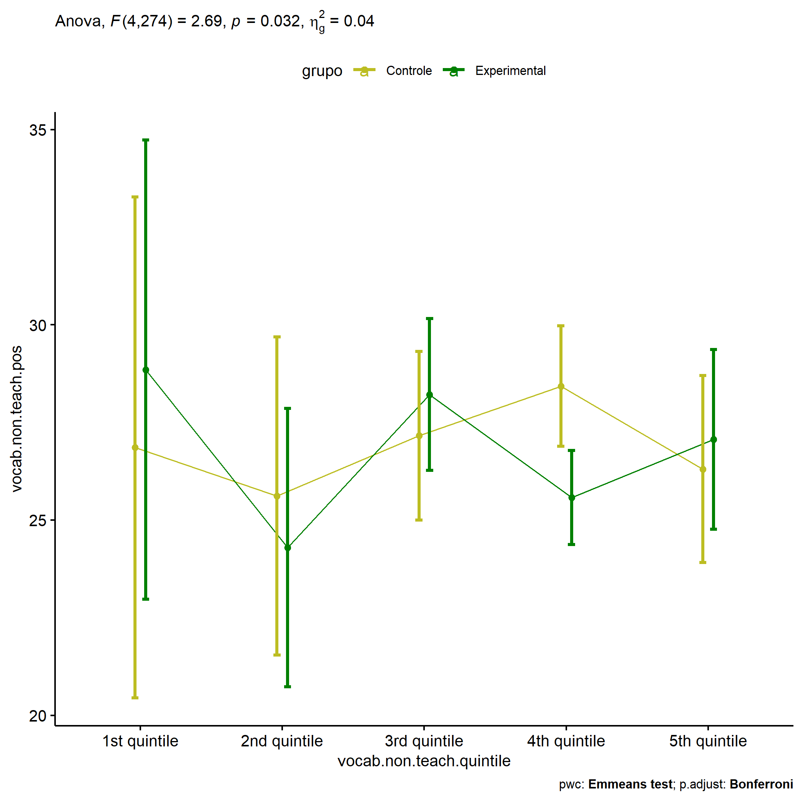<!-- -->

``` r
plots <- twoWayAncovaBoxPlots(
  wdat, "vocab.non.teach.pos", c("grupo","vocab.non.teach.quintile"), aov, pwcs, covar = "vocab.non.teach.pre",
  theme = "classic", color = color[["grupo:vocab.non.teach.quintile"]],
  subtitle = which(aov$Effect == "grupo:vocab.non.teach.quintile"))
```

``` r
plots[["grupo:vocab.non.teach.quintile"]] + ggplot2::ylab("Vocabulario Não Ensinado") + ggplot2::scale_x_discrete(labels=c('pre', 'pos'))
```

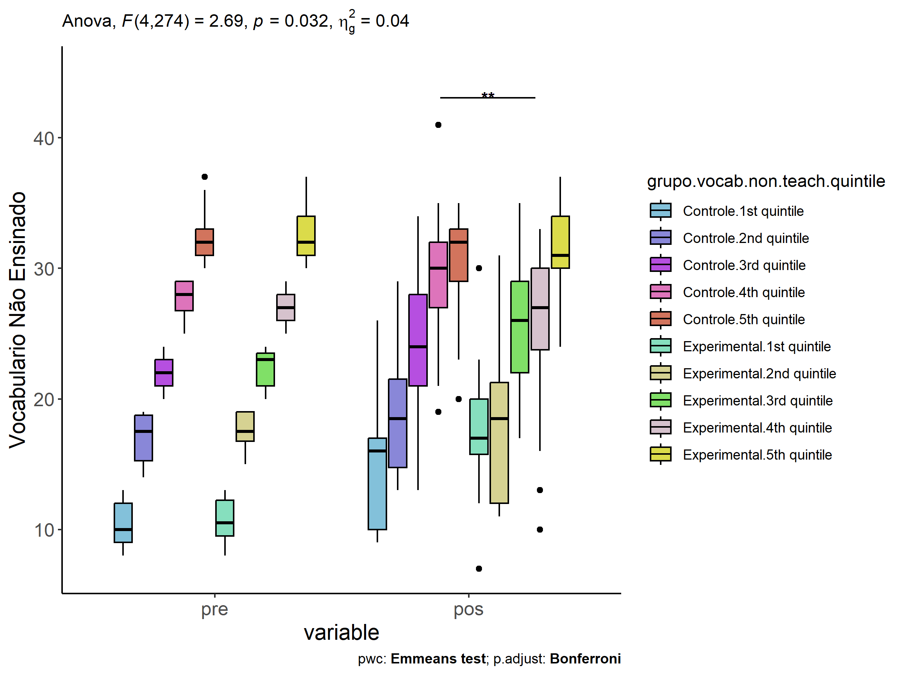<!-- -->

``` r
plots <- twoWayAncovaBoxPlots(
  wdat.long, "vocab.non.teach", c("grupo","vocab.non.teach.quintile"), aov, pwc.long, pre.post = "time",
  theme = "classic", color = color$prepost)
```

``` r
plots[["grupo:vocab.non.teach.quintile"]] + ggplot2::ylab("Vocabulario Não Ensinado")
```

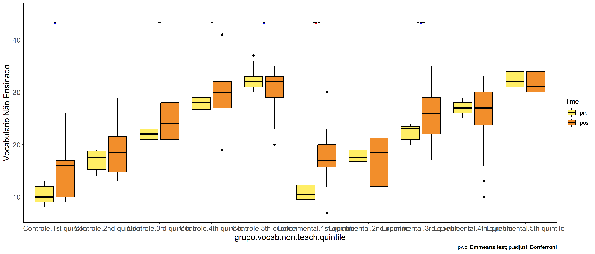<!-- -->

### Checking linearity assumption

``` r
ggscatter(wdat, x = "vocab.non.teach.pre", y = "vocab.non.teach.pos", size = 0.5,
          facet.by = c("grupo","vocab.non.teach.quintile"), add = "reg.line")+
  stat_regline_equation(
    aes(label =  paste(..eq.label.., ..rr.label.., sep = "~~~~"))
  )
```

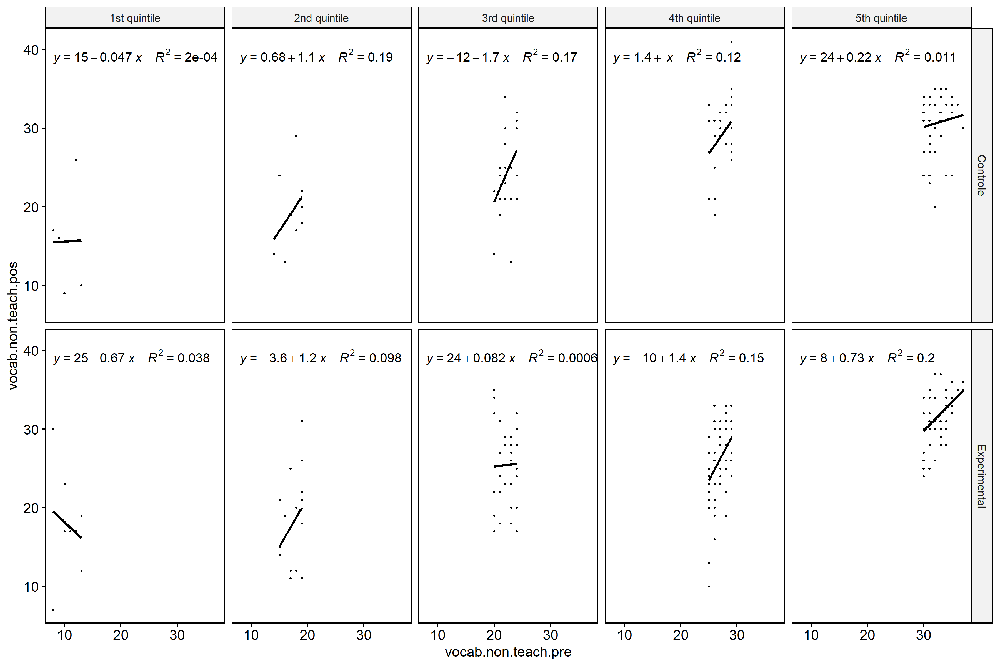<!-- -->

### Checking normality and homogeneity

``` r
res <- augment(lm(vocab.non.teach.pos ~ vocab.non.teach.pre + grupo*vocab.non.teach.quintile, data = wdat))
```

``` r
shapiro_test(res$.resid)
```

    ## # A tibble: 1 × 3
    ##   variable   statistic p.value
    ##   <chr>          <dbl>   <dbl>
    ## 1 res$.resid     0.992   0.127

``` r
levene_test(res, .resid ~ grupo*vocab.non.teach.quintile)
```

    ## # A tibble: 1 × 4
    ##     df1   df2 statistic      p
    ##   <int> <int>     <dbl>  <dbl>
    ## 1     9   275      2.38 0.0133

# Summary of Results

## Descriptive Statistics

``` r
df <- get.descriptives(ldat[["grupo"]], c(dv.pre, dv.pos), c("grupo"), 
                       include.global = T, symmetry.test = T, normality.test = F)
df <- plyr::rbind.fill(
  df, do.call(plyr::rbind.fill, lapply(lfatores2, FUN = function(f) {
    if (nrow(dat) > 0 && sum(!is.na(unique(dat[[f]]))) > 1)
      get.descriptives(ldat[[paste0("grupo:",f)]], c(dv.pre,dv.pos), c("grupo", f),
                       symmetry.test = T, normality.test = F)
    }))
)
(df <- df[,c(fatores1[fatores1 %in% colnames(df)],"variable",
             colnames(df)[!colnames(df) %in% c(fatores1,"variable")])])
```

    ##           grupo Sexo   Zona Cor.Raca vocab.non.teach.quintile            variable   n   mean median min max
    ## 1      Controle <NA>   <NA>     <NA>                     <NA> vocab.non.teach.pre 117 26.436   28.0   8  37
    ## 2  Experimental <NA>   <NA>     <NA>                     <NA> vocab.non.teach.pre 165 26.079   27.0   8  37
    ## 3          <NA> <NA>   <NA>     <NA>                     <NA> vocab.non.teach.pre 282 26.227   27.0   8  37
    ## 4      Controle <NA>   <NA>     <NA>                     <NA> vocab.non.teach.pos 117 27.308   29.0   9  41
    ## 5  Experimental <NA>   <NA>     <NA>                     <NA> vocab.non.teach.pos 165 26.648   28.0   7  37
    ## 6          <NA> <NA>   <NA>     <NA>                     <NA> vocab.non.teach.pos 282 26.922   28.0   7  41
    ## 7      Controle    F   <NA>     <NA>                     <NA> vocab.non.teach.pre  54 26.870   28.0  12  37
    ## 8      Controle    M   <NA>     <NA>                     <NA> vocab.non.teach.pre  59 26.237   28.0   8  35
    ## 9  Experimental    F   <NA>     <NA>                     <NA> vocab.non.teach.pre  84 25.679   27.5  10  37
    ## 10 Experimental    M   <NA>     <NA>                     <NA> vocab.non.teach.pre  81 26.481   26.0   8  37
    ## 11     Controle    F   <NA>     <NA>                     <NA> vocab.non.teach.pos  54 27.926   29.0  14  35
    ## 12     Controle    M   <NA>     <NA>                     <NA> vocab.non.teach.pos  59 27.542   29.0   9  41
    ## 13 Experimental    F   <NA>     <NA>                     <NA> vocab.non.teach.pos  84 26.810   28.0  12  37
    ## 14 Experimental    M   <NA>     <NA>                     <NA> vocab.non.teach.pos  81 26.407   28.0   7  37
    ## 15     Controle <NA>  Rural     <NA>                     <NA> vocab.non.teach.pre  41 25.976   26.0  13  36
    ## 16     Controle <NA> Urbana     <NA>                     <NA> vocab.non.teach.pre  17 27.529   29.0  10  35
    ## 17 Experimental <NA>  Rural     <NA>                     <NA> vocab.non.teach.pre  60 25.050   25.5   8  36
    ## 18 Experimental <NA> Urbana     <NA>                     <NA> vocab.non.teach.pre  43 26.093   28.0  10  37
    ## 19     Controle <NA>  Rural     <NA>                     <NA> vocab.non.teach.pos  41 28.341   30.0  10  41
    ## 20     Controle <NA> Urbana     <NA>                     <NA> vocab.non.teach.pos  17 27.706   29.0   9  35
    ## 21 Experimental <NA>  Rural     <NA>                     <NA> vocab.non.teach.pos  60 26.533   28.0   7  37
    ## 22 Experimental <NA> Urbana     <NA>                     <NA> vocab.non.teach.pos  43 26.651   28.0  11  36
    ## 23     Controle <NA>   <NA>   Branca                     <NA> vocab.non.teach.pre   7 27.429   28.0  22  32
    ## 24     Controle <NA>   <NA>    Parda                     <NA> vocab.non.teach.pre  43 25.279   27.0   8  33
    ## 25 Experimental <NA>   <NA>   Branca                     <NA> vocab.non.teach.pre  13 28.462   30.0  17  34
    ## 26 Experimental <NA>   <NA>    Parda                     <NA> vocab.non.teach.pre  48 24.167   25.5  10  35
    ## 27     Controle <NA>   <NA>   Branca                     <NA> vocab.non.teach.pos   7 31.286   31.0  29  33
    ## 28     Controle <NA>   <NA>    Parda                     <NA> vocab.non.teach.pos  43 26.326   27.0  10  35
    ## 29 Experimental <NA>   <NA>   Branca                     <NA> vocab.non.teach.pos  13 29.231   31.0  12  37
    ## 30 Experimental <NA>   <NA>    Parda                     <NA> vocab.non.teach.pos  48 25.167   26.0  11  37
    ## 31     Controle <NA>   <NA>     <NA>             1st quintile vocab.non.teach.pre   5 10.400   10.0   8  13
    ## 32     Controle <NA>   <NA>     <NA>             2nd quintile vocab.non.teach.pre  10 16.900   17.5  14  19
    ## 33     Controle <NA>   <NA>     <NA>             3rd quintile vocab.non.teach.pre  25 22.240   22.0  20  24
    ## 34     Controle <NA>   <NA>     <NA>             4th quintile vocab.non.teach.pre  36 27.611   28.0  25  29
    ## 35     Controle <NA>   <NA>     <NA>             5th quintile vocab.non.teach.pre  41 32.244   32.0  30  37
    ## 36 Experimental <NA>   <NA>     <NA>             1st quintile vocab.non.teach.pre   8 10.625   10.5   8  13
    ## 37 Experimental <NA>   <NA>     <NA>             2nd quintile vocab.non.teach.pre  16 17.438   17.5  15  19
    ## 38 Experimental <NA>   <NA>     <NA>             3rd quintile vocab.non.teach.pre  35 22.257   23.0  20  24
    ## 39 Experimental <NA>   <NA>     <NA>             4th quintile vocab.non.teach.pre  56 26.946   27.0  25  29
    ## 40 Experimental <NA>   <NA>     <NA>             5th quintile vocab.non.teach.pre  53 32.245   32.0  30  37
    ## 41     Controle <NA>   <NA>     <NA>             1st quintile vocab.non.teach.pos   5 15.600   16.0   9  26
    ## 42     Controle <NA>   <NA>     <NA>             2nd quintile vocab.non.teach.pos  10 19.000   18.5  13  29
    ## 43     Controle <NA>   <NA>     <NA>             3rd quintile vocab.non.teach.pos  25 24.360   24.0  13  34
    ## 44     Controle <NA>   <NA>     <NA>             4th quintile vocab.non.teach.pos  36 29.472   30.0  19  41
    ## 45     Controle <NA>   <NA>     <NA>             5th quintile vocab.non.teach.pos  41 30.659   32.0  20  35
    ## 46 Experimental <NA>   <NA>     <NA>             1st quintile vocab.non.teach.pos   8 17.750   17.0   7  30
    ## 47 Experimental <NA>   <NA>     <NA>             2nd quintile vocab.non.teach.pos  16 18.062   18.5  11  31
    ## 48 Experimental <NA>   <NA>     <NA>             3rd quintile vocab.non.teach.pos  35 25.429   26.0  17  35
    ## 49 Experimental <NA>   <NA>     <NA>             4th quintile vocab.non.teach.pos  56 26.143   27.0  10  33
    ## 50 Experimental <NA>   <NA>     <NA>             5th quintile vocab.non.teach.pos  53 31.415   31.0  24  37
    ##       sd    se    ci   iqr symmetry    skewness    kurtosis
    ## 1  6.136 0.567 1.123  9.00       NO -0.84079428  0.33201026
    ## 2  5.944 0.463 0.914  7.00       NO -0.64576044  0.11475890
    ## 3  6.016 0.358 0.705  8.00       NO -0.73186311  0.22217784
    ## 4  6.207 0.574 1.137  8.00       NO -0.80081717  0.15514061
    ## 5  6.155 0.479 0.946  8.00       NO -0.76206713  0.12657850
    ## 6  6.174 0.368 0.724  8.75       NO -0.77818096  0.15434592
    ## 7  5.539 0.754 1.512  8.75       NO -0.60265333 -0.14658264
    ## 8  6.571 0.856 1.713  8.50       NO -0.92740939  0.34975431
    ## 9  6.157 0.672 1.336  8.25       NO -0.68840907 -0.14646296
    ## 10 5.725 0.636 1.266  7.00       NO -0.54404552  0.25382473
    ## 11 5.309 0.722 1.449  8.75       NO -0.76219507 -0.13079977
    ## 12 6.331 0.824 1.650  8.00       NO -0.77416656  0.24418144
    ## 13 6.051 0.660 1.313  9.25       NO -0.51202793 -0.66727712
    ## 14 6.418 0.713 1.419  7.00       NO -0.97936845  0.58976556
    ## 15 5.106 0.797 1.612  7.00      YES -0.37968900 -0.08392578
    ## 16 6.375 1.546 3.278  4.00       NO -1.37599141  1.06018568
    ## 17 6.604 0.853 1.706  9.00       NO -0.54548578 -0.18479923
    ## 18 6.952 1.060 2.139  9.00       NO -0.64454191 -0.53356957
    ## 19 6.227 0.973 1.966  9.00       NO -0.85185404  0.56495790
    ## 20 6.908 1.675 3.552  9.00       NO -1.10648282  0.65882894
    ## 21 6.498 0.839 1.679  9.00       NO -0.91367321  0.24942285
    ## 22 6.309 0.962 1.942  8.00       NO -0.69766536 -0.20799872
    ## 23 3.047 1.152 2.818  2.00      YES -0.31899499 -0.82017631
    ## 24 6.235 0.951 1.919  8.00       NO -1.04492590  0.47031168
    ## 25 5.395 1.496 3.260  9.00       NO -0.74318377 -0.81541075
    ## 26 6.833 0.986 1.984 11.00      YES -0.35515351 -0.86811040
    ## 27 1.704 0.644 1.576  3.00      YES -0.03180049 -2.00655409
    ## 28 6.502 0.992 2.001 11.00      YES -0.47059619 -0.78647641
    ## 29 6.444 1.787 3.894  4.00       NO -1.34536821  1.29710456
    ## 30 7.439 1.074 2.160 11.00      YES -0.39522938 -1.02185852
    ## 31 2.074 0.927 2.575  3.00      YES  0.11304669 -2.03411574
    ## 32 2.025 0.640 1.448  3.50      YES -0.31221892 -1.71256990
    ## 33 1.268 0.254 0.523  2.00      YES  0.03714572 -1.12851619
    ## 34 1.420 0.237 0.480  2.25       NO -0.53929542 -1.13585275
    ## 35 1.841 0.288 0.581  2.00       NO  0.61069518 -0.45794763
    ## 36 1.996 0.706 1.668  2.75      YES -0.11355252 -1.71910348
    ## 37 1.548 0.387 0.825  2.25      YES -0.39619349 -1.40722915
    ## 38 1.482 0.251 0.509  2.50      YES -0.27389553 -1.46450827
    ## 39 1.432 0.191 0.384  2.00      YES  0.01910198 -1.40598388
    ## 40 1.950 0.268 0.538  3.00       NO  0.60691730 -0.57060151
    ## 41 6.804 3.043 8.449  7.00      YES  0.42188366 -1.63941372
    ## 42 5.011 1.585 3.585  6.75       NO  0.53880399 -0.89554781
    ## 43 5.098 1.020 2.104  7.00      YES -0.20463012 -0.23209519
    ## 44 4.219 0.703 1.427  5.00      YES -0.17953042  0.81022276
    ## 45 3.838 0.599 1.211  4.00       NO -1.03917103  0.02807439
    ## 46 6.861 2.426 5.736  4.25      YES  0.21336469 -0.87147819
    ## 47 6.137 1.534 3.270  9.25      YES  0.41130652 -1.00702140
    ## 48 4.919 0.831 1.690  7.00      YES -0.03489762 -1.02936387
    ## 49 4.985 0.666 1.335  6.25       NO -0.96627931  0.84504764
    ## 50 3.165 0.435 0.872  4.00      YES -0.35020646 -0.50513901

| grupo        | Sexo | Zona   | Cor.Raca | vocab.non.teach.quintile | variable            |   n |   mean | median | min | max |    sd |    se |    ci |   iqr | symmetry | skewness | kurtosis |
|:-------------|:-----|:-------|:---------|:-------------------------|:--------------------|----:|-------:|-------:|----:|----:|------:|------:|------:|------:|:---------|---------:|---------:|
| Controle     |      |        |          |                          | vocab.non.teach.pre | 117 | 26.436 |   28.0 |   8 |  37 | 6.136 | 0.567 | 1.123 |  9.00 | NO       |   -0.841 |    0.332 |
| Experimental |      |        |          |                          | vocab.non.teach.pre | 165 | 26.079 |   27.0 |   8 |  37 | 5.944 | 0.463 | 0.914 |  7.00 | NO       |   -0.646 |    0.115 |
|              |      |        |          |                          | vocab.non.teach.pre | 282 | 26.227 |   27.0 |   8 |  37 | 6.016 | 0.358 | 0.705 |  8.00 | NO       |   -0.732 |    0.222 |
| Controle     |      |        |          |                          | vocab.non.teach.pos | 117 | 27.308 |   29.0 |   9 |  41 | 6.207 | 0.574 | 1.137 |  8.00 | NO       |   -0.801 |    0.155 |
| Experimental |      |        |          |                          | vocab.non.teach.pos | 165 | 26.648 |   28.0 |   7 |  37 | 6.155 | 0.479 | 0.946 |  8.00 | NO       |   -0.762 |    0.127 |
|              |      |        |          |                          | vocab.non.teach.pos | 282 | 26.922 |   28.0 |   7 |  41 | 6.174 | 0.368 | 0.724 |  8.75 | NO       |   -0.778 |    0.154 |
| Controle     | F    |        |          |                          | vocab.non.teach.pre |  54 | 26.870 |   28.0 |  12 |  37 | 5.539 | 0.754 | 1.512 |  8.75 | NO       |   -0.603 |   -0.147 |
| Controle     | M    |        |          |                          | vocab.non.teach.pre |  59 | 26.237 |   28.0 |   8 |  35 | 6.571 | 0.856 | 1.713 |  8.50 | NO       |   -0.927 |    0.350 |
| Experimental | F    |        |          |                          | vocab.non.teach.pre |  84 | 25.679 |   27.5 |  10 |  37 | 6.157 | 0.672 | 1.336 |  8.25 | NO       |   -0.688 |   -0.146 |
| Experimental | M    |        |          |                          | vocab.non.teach.pre |  81 | 26.481 |   26.0 |   8 |  37 | 5.725 | 0.636 | 1.266 |  7.00 | NO       |   -0.544 |    0.254 |
| Controle     | F    |        |          |                          | vocab.non.teach.pos |  54 | 27.926 |   29.0 |  14 |  35 | 5.309 | 0.722 | 1.449 |  8.75 | NO       |   -0.762 |   -0.131 |
| Controle     | M    |        |          |                          | vocab.non.teach.pos |  59 | 27.542 |   29.0 |   9 |  41 | 6.331 | 0.824 | 1.650 |  8.00 | NO       |   -0.774 |    0.244 |
| Experimental | F    |        |          |                          | vocab.non.teach.pos |  84 | 26.810 |   28.0 |  12 |  37 | 6.051 | 0.660 | 1.313 |  9.25 | NO       |   -0.512 |   -0.667 |
| Experimental | M    |        |          |                          | vocab.non.teach.pos |  81 | 26.407 |   28.0 |   7 |  37 | 6.418 | 0.713 | 1.419 |  7.00 | NO       |   -0.979 |    0.590 |
| Controle     |      | Rural  |          |                          | vocab.non.teach.pre |  41 | 25.976 |   26.0 |  13 |  36 | 5.106 | 0.797 | 1.612 |  7.00 | YES      |   -0.380 |   -0.084 |
| Controle     |      | Urbana |          |                          | vocab.non.teach.pre |  17 | 27.529 |   29.0 |  10 |  35 | 6.375 | 1.546 | 3.278 |  4.00 | NO       |   -1.376 |    1.060 |
| Experimental |      | Rural  |          |                          | vocab.non.teach.pre |  60 | 25.050 |   25.5 |   8 |  36 | 6.604 | 0.853 | 1.706 |  9.00 | NO       |   -0.545 |   -0.185 |
| Experimental |      | Urbana |          |                          | vocab.non.teach.pre |  43 | 26.093 |   28.0 |  10 |  37 | 6.952 | 1.060 | 2.139 |  9.00 | NO       |   -0.645 |   -0.534 |
| Controle     |      | Rural  |          |                          | vocab.non.teach.pos |  41 | 28.341 |   30.0 |  10 |  41 | 6.227 | 0.973 | 1.966 |  9.00 | NO       |   -0.852 |    0.565 |
| Controle     |      | Urbana |          |                          | vocab.non.teach.pos |  17 | 27.706 |   29.0 |   9 |  35 | 6.908 | 1.675 | 3.552 |  9.00 | NO       |   -1.106 |    0.659 |
| Experimental |      | Rural  |          |                          | vocab.non.teach.pos |  60 | 26.533 |   28.0 |   7 |  37 | 6.498 | 0.839 | 1.679 |  9.00 | NO       |   -0.914 |    0.249 |
| Experimental |      | Urbana |          |                          | vocab.non.teach.pos |  43 | 26.651 |   28.0 |  11 |  36 | 6.309 | 0.962 | 1.942 |  8.00 | NO       |   -0.698 |   -0.208 |
| Controle     |      |        | Branca   |                          | vocab.non.teach.pre |   7 | 27.429 |   28.0 |  22 |  32 | 3.047 | 1.152 | 2.818 |  2.00 | YES      |   -0.319 |   -0.820 |
| Controle     |      |        | Parda    |                          | vocab.non.teach.pre |  43 | 25.279 |   27.0 |   8 |  33 | 6.235 | 0.951 | 1.919 |  8.00 | NO       |   -1.045 |    0.470 |
| Experimental |      |        | Branca   |                          | vocab.non.teach.pre |  13 | 28.462 |   30.0 |  17 |  34 | 5.395 | 1.496 | 3.260 |  9.00 | NO       |   -0.743 |   -0.815 |
| Experimental |      |        | Parda    |                          | vocab.non.teach.pre |  48 | 24.167 |   25.5 |  10 |  35 | 6.833 | 0.986 | 1.984 | 11.00 | YES      |   -0.355 |   -0.868 |
| Controle     |      |        | Branca   |                          | vocab.non.teach.pos |   7 | 31.286 |   31.0 |  29 |  33 | 1.704 | 0.644 | 1.576 |  3.00 | YES      |   -0.032 |   -2.007 |
| Controle     |      |        | Parda    |                          | vocab.non.teach.pos |  43 | 26.326 |   27.0 |  10 |  35 | 6.502 | 0.992 | 2.001 | 11.00 | YES      |   -0.471 |   -0.786 |
| Experimental |      |        | Branca   |                          | vocab.non.teach.pos |  13 | 29.231 |   31.0 |  12 |  37 | 6.444 | 1.787 | 3.894 |  4.00 | NO       |   -1.345 |    1.297 |
| Experimental |      |        | Parda    |                          | vocab.non.teach.pos |  48 | 25.167 |   26.0 |  11 |  37 | 7.439 | 1.074 | 2.160 | 11.00 | YES      |   -0.395 |   -1.022 |
| Controle     |      |        |          | 1st quintile             | vocab.non.teach.pre |   5 | 10.400 |   10.0 |   8 |  13 | 2.074 | 0.927 | 2.575 |  3.00 | YES      |    0.113 |   -2.034 |
| Controle     |      |        |          | 2nd quintile             | vocab.non.teach.pre |  10 | 16.900 |   17.5 |  14 |  19 | 2.025 | 0.640 | 1.448 |  3.50 | YES      |   -0.312 |   -1.713 |
| Controle     |      |        |          | 3rd quintile             | vocab.non.teach.pre |  25 | 22.240 |   22.0 |  20 |  24 | 1.268 | 0.254 | 0.523 |  2.00 | YES      |    0.037 |   -1.129 |
| Controle     |      |        |          | 4th quintile             | vocab.non.teach.pre |  36 | 27.611 |   28.0 |  25 |  29 | 1.420 | 0.237 | 0.480 |  2.25 | NO       |   -0.539 |   -1.136 |
| Controle     |      |        |          | 5th quintile             | vocab.non.teach.pre |  41 | 32.244 |   32.0 |  30 |  37 | 1.841 | 0.288 | 0.581 |  2.00 | NO       |    0.611 |   -0.458 |
| Experimental |      |        |          | 1st quintile             | vocab.non.teach.pre |   8 | 10.625 |   10.5 |   8 |  13 | 1.996 | 0.706 | 1.668 |  2.75 | YES      |   -0.114 |   -1.719 |
| Experimental |      |        |          | 2nd quintile             | vocab.non.teach.pre |  16 | 17.438 |   17.5 |  15 |  19 | 1.548 | 0.387 | 0.825 |  2.25 | YES      |   -0.396 |   -1.407 |
| Experimental |      |        |          | 3rd quintile             | vocab.non.teach.pre |  35 | 22.257 |   23.0 |  20 |  24 | 1.482 | 0.251 | 0.509 |  2.50 | YES      |   -0.274 |   -1.465 |
| Experimental |      |        |          | 4th quintile             | vocab.non.teach.pre |  56 | 26.946 |   27.0 |  25 |  29 | 1.432 | 0.191 | 0.384 |  2.00 | YES      |    0.019 |   -1.406 |
| Experimental |      |        |          | 5th quintile             | vocab.non.teach.pre |  53 | 32.245 |   32.0 |  30 |  37 | 1.950 | 0.268 | 0.538 |  3.00 | NO       |    0.607 |   -0.571 |
| Controle     |      |        |          | 1st quintile             | vocab.non.teach.pos |   5 | 15.600 |   16.0 |   9 |  26 | 6.804 | 3.043 | 8.449 |  7.00 | YES      |    0.422 |   -1.639 |
| Controle     |      |        |          | 2nd quintile             | vocab.non.teach.pos |  10 | 19.000 |   18.5 |  13 |  29 | 5.011 | 1.585 | 3.585 |  6.75 | NO       |    0.539 |   -0.896 |
| Controle     |      |        |          | 3rd quintile             | vocab.non.teach.pos |  25 | 24.360 |   24.0 |  13 |  34 | 5.098 | 1.020 | 2.104 |  7.00 | YES      |   -0.205 |   -0.232 |
| Controle     |      |        |          | 4th quintile             | vocab.non.teach.pos |  36 | 29.472 |   30.0 |  19 |  41 | 4.219 | 0.703 | 1.427 |  5.00 | YES      |   -0.180 |    0.810 |
| Controle     |      |        |          | 5th quintile             | vocab.non.teach.pos |  41 | 30.659 |   32.0 |  20 |  35 | 3.838 | 0.599 | 1.211 |  4.00 | NO       |   -1.039 |    0.028 |
| Experimental |      |        |          | 1st quintile             | vocab.non.teach.pos |   8 | 17.750 |   17.0 |   7 |  30 | 6.861 | 2.426 | 5.736 |  4.25 | YES      |    0.213 |   -0.871 |
| Experimental |      |        |          | 2nd quintile             | vocab.non.teach.pos |  16 | 18.062 |   18.5 |  11 |  31 | 6.137 | 1.534 | 3.270 |  9.25 | YES      |    0.411 |   -1.007 |
| Experimental |      |        |          | 3rd quintile             | vocab.non.teach.pos |  35 | 25.429 |   26.0 |  17 |  35 | 4.919 | 0.831 | 1.690 |  7.00 | YES      |   -0.035 |   -1.029 |
| Experimental |      |        |          | 4th quintile             | vocab.non.teach.pos |  56 | 26.143 |   27.0 |  10 |  33 | 4.985 | 0.666 | 1.335 |  6.25 | NO       |   -0.966 |    0.845 |
| Experimental |      |        |          | 5th quintile             | vocab.non.teach.pos |  53 | 31.415 |   31.0 |  24 |  37 | 3.165 | 0.435 | 0.872 |  4.00 | YES      |   -0.350 |   -0.505 |

## ANCOVA Table Comparison

``` r
df <- do.call(plyr::rbind.fill, laov)
(df <- df[!duplicated(df$Effect),])
```

    ##                            Effect DFn DFd       F        p p<.05   ges DFn' DFd'      F'       p' p<.05'  ges'
    ## 1                           grupo   1 279   0.579 4.47e-01       0.002    1  286   1.268 2.61e-01        0.004
    ## 2             vocab.non.teach.pre   1 279 296.141 9.88e-46     * 0.515    1  286 199.362 1.04e-34      * 0.411
    ## 4                      grupo:Sexo   1 273   1.075 3.01e-01       0.004    1  284   0.537 4.64e-01        0.002
    ## 5                            Sexo   1 273   1.204 2.74e-01       0.004    1  284   2.086 1.50e-01        0.007
    ## 8                      grupo:Zona   1 156   0.534 4.66e-01       0.003    1  158   2.222 1.38e-01        0.014
    ## 10                           Zona   1 156   1.963 1.63e-01       0.012    1  158   1.737 1.89e-01        0.011
    ## 11                       Cor.Raca   1 106   1.965 1.64e-01       0.018    1  111   2.900 9.10e-02        0.025
    ## 13                 grupo:Cor.Raca   1 106   1.243 2.67e-01       0.012    1  111   0.321 5.72e-01        0.003
    ## 16 grupo:vocab.non.teach.quintile   4 274   2.690 3.20e-02     * 0.038    4  278   1.984 9.70e-02        0.028
    ## 18       vocab.non.teach.quintile   4 274   2.300 5.90e-02       0.032    4  278   1.737 1.42e-01        0.024

|     | Effect                         | DFn | DFd |       F |     p | p\<.05 |   ges | DFn’ | DFd’ |      F’ |    p’ | p\<.05’ |  ges’ |
|:----|:-------------------------------|----:|----:|--------:|------:|:-------|------:|-----:|-----:|--------:|------:|:--------|------:|
| 1   | grupo                          |   1 | 279 |   0.579 | 0.447 |        | 0.002 |    1 |  286 |   1.268 | 0.261 |         | 0.004 |
| 2   | vocab.non.teach.pre            |   1 | 279 | 296.141 | 0.000 | \*     | 0.515 |    1 |  286 | 199.362 | 0.000 | \*      | 0.411 |
| 4   | grupo:Sexo                     |   1 | 273 |   1.075 | 0.301 |        | 0.004 |    1 |  284 |   0.537 | 0.464 |         | 0.002 |
| 5   | Sexo                           |   1 | 273 |   1.204 | 0.274 |        | 0.004 |    1 |  284 |   2.086 | 0.150 |         | 0.007 |
| 8   | grupo:Zona                     |   1 | 156 |   0.534 | 0.466 |        | 0.003 |    1 |  158 |   2.222 | 0.138 |         | 0.014 |
| 10  | Zona                           |   1 | 156 |   1.963 | 0.163 |        | 0.012 |    1 |  158 |   1.737 | 0.189 |         | 0.011 |
| 11  | Cor.Raca                       |   1 | 106 |   1.965 | 0.164 |        | 0.018 |    1 |  111 |   2.900 | 0.091 |         | 0.025 |
| 13  | grupo:Cor.Raca                 |   1 | 106 |   1.243 | 0.267 |        | 0.012 |    1 |  111 |   0.321 | 0.572 |         | 0.003 |
| 16  | grupo:vocab.non.teach.quintile |   4 | 274 |   2.690 | 0.032 | \*     | 0.038 |    4 |  278 |   1.984 | 0.097 |         | 0.028 |
| 18  | vocab.non.teach.quintile       |   4 | 274 |   2.300 | 0.059 |        | 0.032 |    4 |  278 |   1.737 | 0.142 |         | 0.024 |

## PairWise Table Comparison

``` r
df <- do.call(plyr::rbind.fill, lpwc)
df <- df[,c(names(lfatores), names(df)[!names(df) %in% c(names(lfatores),"term",".y.")])]
```

| grupo        | Sexo | Zona   | Cor.Raca | vocab.non.teach.quintile | group1       | group2       |  df | statistic |     p | p.adj | p.adj.signif | df’ | statistic’ |    p’ | p.adj’ | p.adj.signif’ |
|:-------------|:-----|:-------|:---------|:-------------------------|:-------------|:-------------|----:|----------:|------:|------:|:-------------|----:|-----------:|------:|-------:|:--------------|
| Controle     |      |        |          |                          | pre          | pos          | 560 |    -1.093 | 0.275 | 0.275 | ns           | 574 |     -0.854 | 0.393 |  0.393 | ns            |
| Experimental |      |        |          |                          | pre          | pos          | 560 |    -0.848 | 0.397 | 0.397 | ns           | 574 |     -0.211 | 0.833 |  0.833 | ns            |
|              |      |        |          |                          | Controle     | Experimental | 279 |     0.761 | 0.447 | 0.447 | ns           | 286 |      1.126 | 0.261 |  0.261 | ns            |
| Controle     | F    |        |          |                          | pre          | pos          | 548 |    -0.907 | 0.365 | 0.365 | ns           | 570 |     -0.692 | 0.489 |  0.489 | ns            |
| Controle     | M    |        |          |                          | pre          | pos          | 548 |    -1.172 | 0.242 | 0.242 | ns           | 570 |     -0.518 | 0.605 |  0.605 | ns            |
| Controle     |      |        |          |                          | F            | M            | 273 |    -0.101 | 0.920 | 0.920 | ns           | 284 |      0.358 | 0.721 |  0.721 | ns            |
| Experimental | F    |        |          |                          | pre          | pos          | 548 |    -1.212 | 0.226 | 0.226 | ns           | 570 |     -0.867 | 0.386 |  0.386 | ns            |
| Experimental | M    |        |          |                          | pre          | pos          | 548 |     0.078 | 0.938 | 0.938 | ns           | 570 |      0.574 | 0.566 |  0.566 | ns            |
| Experimental |      |        |          |                          | F            | M            | 273 |     1.506 | 0.133 | 0.133 | ns           | 284 |      1.580 | 0.115 |  0.115 | ns            |
|              | F    |        |          |                          | Controle     | Experimental | 273 |     0.331 | 0.741 | 0.741 | ns           | 284 |      0.287 | 0.774 |  0.774 | ns            |
|              | M    |        |          |                          | Controle     | Experimental | 273 |     1.821 | 0.070 | 0.070 | ns           | 284 |      1.347 | 0.179 |  0.179 | ns            |
| Controle     |      |        |          |                          | Rural        | Urbana       | 156 |     1.400 | 0.164 | 0.164 | ns           | 158 |      1.978 | 0.050 |  0.050 | \*            |
| Controle     |      | Rural  |          |                          | pre          | pos          | 314 |    -1.680 | 0.094 | 0.094 | ns           | 318 |     -1.625 | 0.105 |  0.105 | ns            |
| Controle     |      | Urbana |          |                          | pre          | pos          | 314 |    -0.081 | 0.936 | 0.936 | ns           | 318 |      0.379 | 0.705 |  0.705 | ns            |
| Experimental |      |        |          |                          | Rural        | Urbana       | 156 |     0.740 | 0.460 | 0.460 | ns           | 158 |      0.225 | 0.823 |  0.823 | ns            |
| Experimental |      | Rural  |          |                          | pre          | pos          | 314 |    -1.274 | 0.204 | 0.204 | ns           | 318 |     -0.879 | 0.380 |  0.380 | ns            |
| Experimental |      | Urbana |          |                          | pre          | pos          | 314 |    -0.406 | 0.685 | 0.685 | ns           | 318 |     -0.392 | 0.695 |  0.695 | ns            |
|              |      | Rural  |          |                          | Controle     | Experimental | 156 |     1.255 | 0.211 | 0.211 | ns           | 158 |      1.515 | 0.132 |  0.132 | ns            |
|              |      | Urbana |          |                          | Controle     | Experimental | 156 |    -0.006 | 0.995 | 0.995 | ns           | 158 |     -0.744 | 0.458 |  0.458 | ns            |
| Controle     |      |        | Branca   |                          | pre          | pos          | 214 |    -1.105 | 0.270 | 0.270 | ns           | 224 |     -1.036 | 0.301 |  0.301 | ns            |
| Controle     |      |        |          |                          | Branca       | Parda        | 106 |     1.744 | 0.084 | 0.084 | ns           | 111 |      1.499 | 0.137 |  0.137 | ns            |
| Controle     |      |        | Parda    |                          | pre          | pos          | 214 |    -0.743 | 0.458 | 0.458 | ns           | 224 |     -0.536 | 0.593 |  0.593 | ns            |
| Experimental |      |        | Branca   |                          | pre          | pos          | 214 |    -0.300 | 0.764 | 0.764 | ns           | 224 |     -0.281 | 0.779 |  0.779 | ns            |
| Experimental |      |        |          |                          | Branca       | Parda        | 106 |     0.436 | 0.664 | 0.664 | ns           | 111 |      1.013 | 0.313 |  0.313 | ns            |
| Experimental |      |        | Parda    |                          | pre          | pos          | 214 |    -0.750 | 0.454 | 0.454 | ns           | 224 |     -0.084 | 0.933 |  0.933 | ns            |
|              |      |        | Branca   |                          | Controle     | Experimental | 106 |     1.350 | 0.180 | 0.180 | ns           | 111 |      0.988 | 0.325 |  0.325 | ns            |
|              |      |        | Parda    |                          | Controle     | Experimental | 106 |     0.282 | 0.778 | 0.778 | ns           | 111 |      0.839 | 0.403 |  0.403 | ns            |
| Controle     |      |        |          | 1st quintile             | pre          | pos          | 550 |    -2.373 | 0.018 | 0.018 | \*           | 558 |     -2.110 | 0.035 |  0.035 | \*            |
| Controle     |      |        |          | 2nd quintile             | pre          | pos          | 550 |    -1.356 | 0.176 | 0.176 | ns           | 558 |     -1.205 | 0.229 |  0.229 | ns            |
| Controle     |      |        |          | 3rd quintile             | pre          | pos          | 550 |    -2.164 | 0.031 | 0.031 | \*           | 558 |     -1.924 | 0.055 |  0.055 | ns            |
| Controle     |      |        |          | 4th quintile             | pre          | pos          | 550 |    -2.279 | 0.023 | 0.023 | \*           | 558 |     -1.462 | 0.144 |  0.144 | ns            |
| Controle     |      |        |          | 5th quintile             | pre          | pos          | 550 |     2.072 | 0.039 | 0.039 | \*           | 558 |      1.842 | 0.066 |  0.066 | ns            |
| Controle     |      |        |          |                          | 1st quintile | 2nd quintile | 274 |     0.467 | 0.641 | 1.000 | ns           | 278 |      0.478 | 0.633 |  1.000 | ns            |
| Controle     |      |        |          |                          | 1st quintile | 3rd quintile | 274 |    -0.101 | 0.919 | 1.000 | ns           | 278 |      0.027 | 0.978 |  1.000 | ns            |
| Controle     |      |        |          |                          | 1st quintile | 4th quintile | 274 |    -0.445 | 0.657 | 1.000 | ns           | 278 |     -0.113 | 0.911 |  1.000 | ns            |
| Controle     |      |        |          |                          | 1st quintile | 5th quintile | 274 |     0.134 | 0.893 | 1.000 | ns           | 278 |      0.269 | 0.788 |  1.000 | ns            |
| Controle     |      |        |          |                          | 2nd quintile | 3rd quintile | 274 |    -0.818 | 0.414 | 1.000 | ns           | 278 |     -0.634 | 0.526 |  1.000 | ns            |
| Controle     |      |        |          |                          | 2nd quintile | 4th quintile | 274 |    -1.188 | 0.236 | 1.000 | ns           | 278 |     -0.710 | 0.478 |  1.000 | ns            |
| Controle     |      |        |          |                          | 2nd quintile | 5th quintile | 274 |    -0.233 | 0.816 | 1.000 | ns           | 278 |     -0.056 | 0.956 |  1.000 | ns            |
| Controle     |      |        |          |                          | 3rd quintile | 4th quintile | 274 |    -0.873 | 0.383 | 1.000 | ns           | 278 |     -0.329 | 0.743 |  1.000 | ns            |
| Controle     |      |        |          |                          | 3rd quintile | 5th quintile | 274 |     0.429 | 0.668 | 1.000 | ns           | 278 |      0.521 | 0.603 |  1.000 | ns            |
| Controle     |      |        |          |                          | 4th quintile | 5th quintile | 274 |     1.673 | 0.095 | 0.955 | ns           | 278 |      1.186 | 0.237 |  1.000 | ns            |
| Experimental |      |        |          | 1st quintile             | pre          | pos          | 550 |    -4.114 | 0.000 | 0.000 | \*\*\*\*     | 558 |     -3.657 | 0.000 |  0.000 | \*\*\*        |
| Experimental |      |        |          | 2nd quintile             | pre          | pos          | 550 |    -0.510 | 0.610 | 0.610 | ns           | 558 |     -0.454 | 0.650 |  0.650 | ns            |
| Experimental |      |        |          | 3rd quintile             | pre          | pos          | 550 |    -3.830 | 0.000 | 0.000 | \*\*\*       | 558 |     -2.722 | 0.007 |  0.007 | \*\*          |
| Experimental |      |        |          | 4th quintile             | pre          | pos          | 550 |     1.227 | 0.220 | 0.220 | ns           | 558 |      2.097 | 0.036 |  0.036 | \*            |
| Experimental |      |        |          | 5th quintile             | pre          | pos          | 550 |     1.234 | 0.218 | 0.218 | ns           | 558 |      1.097 | 0.273 |  0.273 | ns            |
| Experimental |      |        |          |                          | 1st quintile | 2nd quintile | 274 |     2.042 | 0.042 | 0.421 | ns           | 278 |      1.873 | 0.062 |  0.621 | ns            |
| Experimental |      |        |          |                          | 1st quintile | 3rd quintile | 274 |     0.246 | 0.806 | 1.000 | ns           | 278 |      0.571 | 0.568 |  1.000 | ns            |
| Experimental |      |        |          |                          | 1st quintile | 4th quintile | 274 |     1.037 | 0.300 | 1.000 | ns           | 278 |      1.256 | 0.210 |  1.000 | ns            |
| Experimental |      |        |          |                          | 1st quintile | 5th quintile | 274 |     0.457 | 0.648 | 1.000 | ns           | 278 |      0.560 | 0.576 |  1.000 | ns            |
| Experimental |      |        |          |                          | 2nd quintile | 3rd quintile | 274 |    -2.511 | 0.013 | 0.126 | ns           | 278 |     -1.738 | 0.083 |  0.833 | ns            |
| Experimental |      |        |          |                          | 2nd quintile | 4th quintile | 274 |    -0.640 | 0.523 | 1.000 | ns           | 278 |     -0.115 | 0.908 |  1.000 | ns            |
| Experimental |      |        |          |                          | 2nd quintile | 5th quintile | 274 |    -1.012 | 0.312 | 1.000 | ns           | 278 |     -0.733 | 0.464 |  1.000 | ns            |
| Experimental |      |        |          |                          | 3rd quintile | 4th quintile | 274 |     2.144 | 0.033 | 0.329 | ns           | 278 |      2.036 | 0.043 |  0.427 | ns            |
| Experimental |      |        |          |                          | 3rd quintile | 5th quintile | 274 |     0.607 | 0.544 | 1.000 | ns           | 278 |      0.378 | 0.706 |  1.000 | ns            |
| Experimental |      |        |          |                          | 4th quintile | 5th quintile | 274 |    -1.219 | 0.224 | 1.000 | ns           | 278 |     -1.463 | 0.145 |  1.000 | ns            |
|              |      |        |          | 1st quintile             | Controle     | Experimental | 274 |    -0.781 | 0.436 | 0.436 | ns           | 278 |     -0.679 | 0.498 |  0.498 | ns            |
|              |      |        |          | 2nd quintile             | Controle     | Experimental | 274 |     0.733 | 0.464 | 0.464 | ns           | 278 |      0.648 | 0.517 |  0.517 | ns            |
|              |      |        |          | 3rd quintile             | Controle     | Experimental | 274 |    -0.903 | 0.367 | 0.367 | ns           | 278 |     -0.292 | 0.770 |  0.770 | ns            |
|              |      |        |          | 4th quintile             | Controle     | Experimental | 274 |     2.971 | 0.003 | 0.003 | \*\*         | 278 |      2.759 | 0.006 |  0.006 | \*\*          |
|              |      |        |          | 5th quintile             | Controle     | Experimental | 274 |    -0.813 | 0.417 | 0.417 | ns           | 278 |     -0.710 | 0.479 |  0.479 | ns            |

## EMMS Table Comparison

``` r
df <- do.call(plyr::rbind.fill, lemms)
df[["N-N'"]] <- df[["N"]] - df[["N'"]]
df <- df[,c(names(lfatores), names(df)[!names(df) %in% names(lfatores)])]
```

| grupo        | Sexo | Zona   | Cor.Raca | vocab.non.teach.quintile |   N | M (pre) | SE (pre) | M (unadj) | SE (unadj) | M (adj) | SE (adj) |  N’ | M (pre)’ | SE (pre)’ | M (unadj)’ | SE (unadj)’ | M (adj)’ | SE (adj)’ | N-N’ |
|:-------------|:-----|:-------|:---------|:-------------------------|----:|--------:|---------:|----------:|-----------:|--------:|---------:|----:|---------:|----------:|-----------:|------------:|---------:|----------:|-----:|
| Controle     |      |        |          |                          | 117 |  26.436 |    0.567 |    27.308 |      0.574 |  27.154 |    0.399 | 118 |   26.424 |     0.563 |     27.136 |       0.594 |   26.939 |     0.477 |   -1 |
| Experimental |      |        |          |                          | 165 |  26.079 |    0.463 |    26.648 |      0.479 |  26.757 |    0.336 | 171 |   25.959 |     0.460 |     26.105 |       0.529 |   26.241 |     0.396 |   -6 |
| Controle     | F    |        |          |                          |  54 |  26.870 |    0.754 |    27.926 |      0.722 |  27.481 |    0.574 |  56 |   26.607 |     0.768 |     27.446 |       0.782 |   27.118 |     0.692 |   -2 |
| Controle     | M    |        |          |                          |  59 |  26.237 |    0.856 |    27.542 |      0.824 |  27.561 |    0.549 |  62 |   26.258 |     0.821 |     26.855 |       0.889 |   26.777 |     0.657 |   -3 |
| Experimental | F    |        |          |                          |  84 |  25.679 |    0.672 |    26.810 |      0.660 |  27.237 |    0.460 |  86 |   25.674 |     0.656 |     26.523 |       0.680 |   26.863 |     0.559 |   -2 |
| Experimental | M    |        |          |                          |  81 |  26.481 |    0.636 |    26.407 |      0.713 |  26.247 |    0.468 |  85 |   26.247 |     0.646 |     25.682 |       0.815 |   25.612 |     0.561 |   -4 |
| Controle     |      | Rural  |          |                          |  41 |  25.976 |    0.797 |    28.341 |      0.973 |  28.231 |    0.689 |  41 |   25.976 |     0.797 |     28.341 |       0.973 |   28.227 |     0.790 |    0 |
| Controle     |      | Urbana |          |                          |  17 |  27.529 |    1.546 |    27.706 |      1.675 |  26.446 |    1.074 |  18 |   27.389 |     1.464 |     26.556 |       1.954 |   25.392 |     1.197 |   -1 |
| Experimental |      | Rural  |          |                          |  60 |  25.050 |    0.853 |    26.533 |      0.839 |  27.107 |    0.571 |  61 |   25.066 |     0.839 |     26.115 |       0.925 |   26.677 |     0.650 |   -1 |
| Experimental |      | Urbana |          |                          |  43 |  26.093 |    1.060 |    26.651 |      0.962 |  26.454 |    0.673 |  43 |   26.093 |     1.060 |     26.651 |       0.962 |   26.450 |     0.772 |    0 |
| Controle     |      |        | Branca   |                          |   7 |  27.429 |    1.152 |    31.286 |      0.644 |  29.591 |    1.725 |   7 |   27.429 |     1.152 |     31.286 |       0.644 |   29.660 |     2.288 |    0 |
| Controle     |      |        | Parda    |                          |  43 |  25.279 |    0.951 |    26.326 |      0.992 |  26.347 |    0.693 |  44 |   25.227 |     0.930 |     26.023 |       1.015 |   25.971 |     0.909 |   -1 |
| Experimental |      |        | Branca   |                          |  13 |  28.462 |    1.496 |    29.231 |      1.787 |  26.711 |    1.280 |  13 |   28.462 |     1.496 |     29.231 |       1.787 |   26.867 |     1.698 |    0 |
| Experimental |      |        | Parda    |                          |  48 |  24.167 |    0.986 |    25.167 |      1.074 |  26.077 |    0.661 |  52 |   23.962 |     0.967 |     24.077 |       1.210 |   24.930 |     0.843 |   -4 |
| Controle     |      |        |          | 1st quintile             |   5 |  10.400 |    0.927 |    15.600 |      3.043 |  26.862 |    3.258 |   5 |   10.400 |     0.927 |     15.600 |       3.043 |   27.373 |     3.714 |    0 |
| Controle     |      |        |          | 2nd quintile             |  10 |  16.900 |    0.640 |    19.000 |      1.585 |  25.615 |    2.069 |  10 |   16.900 |     0.640 |     19.000 |       1.585 |   25.914 |     2.360 |    0 |
| Controle     |      |        |          | 3rd quintile             |  25 |  22.240 |    0.254 |    24.360 |      1.020 |  27.158 |    1.099 |  25 |   22.240 |     0.254 |     24.360 |       1.020 |   27.282 |     1.255 |    0 |
| Controle     |      |        |          | 4th quintile             |  36 |  27.611 |    0.237 |    29.472 |      0.703 |  28.431 |    0.782 |  37 |   27.541 |     0.241 |     28.865 |       0.915 |   27.824 |     0.880 |   -1 |
| Controle     |      |        |          | 5th quintile             |  41 |  32.244 |    0.288 |    30.659 |      0.599 |  26.305 |    1.215 |  41 |   32.244 |     0.288 |     30.659 |       0.599 |   26.102 |     1.386 |    0 |
| Experimental |      |        |          | 1st quintile             |   8 |  10.625 |    0.706 |    17.750 |      2.426 |  28.851 |    2.989 |   8 |   10.625 |     0.706 |     17.750 |       2.426 |   29.355 |     3.403 |    0 |
| Experimental |      |        |          | 2nd quintile             |  16 |  17.438 |    0.387 |    18.062 |      1.534 |  24.294 |    1.810 |  16 |   17.438 |     0.387 |     18.062 |       1.534 |   24.575 |     2.063 |    0 |
| Experimental |      |        |          | 3rd quintile             |  35 |  22.257 |    0.251 |    25.429 |      0.831 |  28.215 |    0.988 |  36 |   22.278 |     0.244 |     24.778 |       1.037 |   27.672 |     1.116 |   -1 |
| Experimental |      |        |          | 4th quintile             |  56 |  26.946 |    0.191 |    26.143 |      0.666 |  25.577 |    0.611 |  58 |   26.966 |     0.189 |     25.448 |       0.816 |   24.838 |     0.689 |   -2 |
| Experimental |      |        |          | 5th quintile             |  53 |  32.245 |    0.268 |    31.415 |      0.435 |  27.061 |    1.169 |  53 |   32.245 |     0.268 |     31.415 |       0.435 |   26.858 |     1.333 |    0 |
