ANCOVA in Vocabulary not taught (Vocabulary not taught)
================
Geiser C. Challco <geiser@alumni.usp.br>

- [Setting Initial Variables](#setting-initial-variables)
- [Descriptive Statistics of Initial
  Data](#descriptive-statistics-of-initial-data)
- [ANCOVA and Pairwise for one factor:
  **grupo**](#ancova-and-pairwise-for-one-factor-grupo)
  - [Without remove non-normal data](#without-remove-non-normal-data)
  - [Computing ANCOVA and PairWise After removing non-normal data
    (OK)](#computing-ancova-and-pairwise-after-removing-non-normal-data-ok)
    - [Plots for ancova](#plots-for-ancova)
    - [Checking linearity assumption](#checking-linearity-assumption)
    - [Checking normality and
      homogeneity](#checking-normality-and-homogeneity)
- [ANCOVA and Pairwise for two factors
  **grupo:Sexo**](#ancova-and-pairwise-for-two-factors-gruposexo)
  - [Without remove non-normal data](#without-remove-non-normal-data-1)
  - [Computing ANCOVA and PairWise After removing non-normal data
    (OK)](#computing-ancova-and-pairwise-after-removing-non-normal-data-ok-1)
    - [Plots for ancova](#plots-for-ancova-1)
    - [Checking linearity assumption](#checking-linearity-assumption-1)
    - [Checking normality and
      homogeneity](#checking-normality-and-homogeneity-1)
- [ANCOVA and Pairwise for two factors
  **grupo:Zona**](#ancova-and-pairwise-for-two-factors-grupozona)
  - [Without remove non-normal data](#without-remove-non-normal-data-2)
  - [Computing ANCOVA and PairWise After removing non-normal data
    (OK)](#computing-ancova-and-pairwise-after-removing-non-normal-data-ok-2)
    - [Plots for ancova](#plots-for-ancova-2)
    - [Checking linearity assumption](#checking-linearity-assumption-2)
    - [Checking normality and
      homogeneity](#checking-normality-and-homogeneity-2)
- [ANCOVA and Pairwise for two factors
  **grupo:Cor.Raca**](#ancova-and-pairwise-for-two-factors-grupocorraca)
  - [Without remove non-normal data](#without-remove-non-normal-data-3)
  - [Computing ANCOVA and PairWise After removing non-normal data
    (OK)](#computing-ancova-and-pairwise-after-removing-non-normal-data-ok-3)
    - [Plots for ancova](#plots-for-ancova-3)
    - [Checking linearity assumption](#checking-linearity-assumption-3)
    - [Checking normality and
      homogeneity](#checking-normality-and-homogeneity-3)
- [ANCOVA and Pairwise for two factors
  **grupo:Serie**](#ancova-and-pairwise-for-two-factors-gruposerie)
  - [Without remove non-normal data](#without-remove-non-normal-data-4)
  - [Computing ANCOVA and PairWise After removing non-normal data
    (OK)](#computing-ancova-and-pairwise-after-removing-non-normal-data-ok-4)
    - [Plots for ancova](#plots-for-ancova-4)
    - [Checking linearity assumption](#checking-linearity-assumption-4)
    - [Checking normality and
      homogeneity](#checking-normality-and-homogeneity-4)
- [ANCOVA and Pairwise for two factors
  **grupo:vocab.non.teach.quintile**](#ancova-and-pairwise-for-two-factors-grupovocabnonteachquintile)
  - [Without remove non-normal data](#without-remove-non-normal-data-5)
  - [Computing ANCOVA and PairWise After removing non-normal data
    (OK)](#computing-ancova-and-pairwise-after-removing-non-normal-data-ok-5)
    - [Plots for ancova](#plots-for-ancova-5)
    - [Checking linearity assumption](#checking-linearity-assumption-5)
    - [Checking normality and
      homogeneity](#checking-normality-and-homogeneity-5)
- [Summary of Results](#summary-of-results)
  - [Descriptive Statistics](#descriptive-statistics)
  - [ANCOVA Table Comparison](#ancova-table-comparison)
  - [PairWise Table Comparison](#pairwise-table-comparison)
  - [EMMS Table Comparison](#emms-table-comparison)

**NOTE**:

- Teste ANCOVA para determinar se houve diferenças significativas no
  Vocabulary not taught (medido usando pre- e pos-testes).
- ANCOVA test to determine whether there were significant differences in
  Vocabulary not taught (measured using pre- and post-tests).

# Setting Initial Variables

``` r
dv = "vocab.non.teach"
dv.pos = "vocab.non.teach.pos"
dv.pre = "vocab.non.teach.pre"

fatores2 <- c("Sexo","Zona","Cor.Raca","Serie","vocab.non.teach.quintile")
lfatores2 <- as.list(fatores2)
names(lfatores2) <- fatores2

fatores1 <- c("grupo", fatores2)
lfatores1 <- as.list(fatores1)
names(lfatores1) <- fatores1

lfatores <- c(lfatores1)

color <- list()
color[["prepost"]] = c("#ffee65","#f28e2B")
color[["grupo"]] = c("#bcbd22","#008000")
color[["Sexo"]] = c("#FF007F","#4D4DFF")
color[["Zona"]] = c("#AA00FF","#00CCCC")
color[["Cor.Raca"]] = c(
  "Parda"="#b97100","Indígena"="#9F262F",
  "Branca"="#87c498", "Preta"="#848283","Amarela"="#D6B91C"
)

level <- list()
level[["grupo"]] = c("Controle","Experimental")
level[["Sexo"]] = c("F","M")
level[["Zona"]] = c("Rural","Urbana")
level[["Cor.Raca"]] = c("Parda","Indígena","Branca", "Preta","Amarela")
level[["Serie"]] = c("6 ano","7 ano","8 ano","9 ano")

# ..

ymin <- 0
ymax <- 0

ymin.ci <- 0
ymax.ci <- 0


color[["grupo:Sexo"]] = c(
  "Controle:F"="#ff99cb", "Controle:M"="#b7b7ff",
  "Experimental:F"="#FF007F", "Experimental:M"="#4D4DFF",
  "Controle.F"="#ff99cb", "Controle.M"="#b7b7ff",
  "Experimental.F"="#FF007F", "Experimental.M"="#4D4DFF"
)
color[["grupo:Zona"]] = c(
  "Controle:Rural"="#b2efef","Controle:Urbana"="#e5b2ff",
  "Experimental:Rural"="#00CCCC", "Experimental:Urbana"="#AA00FF",
  "Controle.Rural"="#b2efef","Controle.Urbana"="#e5b2ff",
  "Experimental.Rural"="#00CCCC", "Experimental.Urbana"="#AA00FF"
)
color[["grupo:Cor.Raca"]] = c(
    "Controle:Parda"="#e3c699", "Experimental:Parda"="#b97100",
    "Controle:Indígena"="#e2bdc0", "Experimental:Indígena"="#9F262F",
    "Controle:Branca"="#c0e8cb", "Experimental:Branca"="#87c498",
    "Controle:Preta"="#dad9d9", "Experimental:Preta"="#848283",
    "Controle:Amarela"="#eee3a4", "Experimental:Amarela"="#D6B91C",
    
    "Controle.Parda"="#e3c699", "Experimental.Parda"="#b97100",
    "Controle.Indígena"="#e2bdc0", "Experimental.Indígena"="#9F262F",
    "Controle.Branca"="#c0e8cb", "Experimental.Branca"="#87c498",
    "Controle.Preta"="#dad9d9", "Experimental.Preta"="#848283",
    "Controle.Amarela"="#eee3a4", "Experimental.Amarela"="#D6B91C"
)


for (coln in c("vocab","vocab.teach","vocab.non.teach","score.tde",
               "TFL.lidas.per.min","TFL.corretas.per.min","TFL.erradas.per.min","TFL.omitidas.per.min",
               "leitura.compreensao")) {
  color[[paste0(coln,".quintile")]] = c("#BF0040","#FF0000","#800080","#0000FF","#4000BF")
  level[[paste0(coln,".quintile")]] = c("1st quintile","2nd quintile","3rd quintile","4th quintile","5th quintile")
  color[[paste0("grupo:",coln,".quintile")]] = c(
    "Experimental.1st quintile"="#BF0040", "Controle.1st quintile"="#d8668c",
    "Experimental.2nd quintile"="#FF0000", "Controle.2nd quintile"="#ff7f7f",
    "Experimental.3rd quintile"="#8fce00", "Controle.3rd quintile"="#ddf0b2",
    "Experimental.4th quintile"="#0000FF", "Controle.4th quintile"="#b2b2ff",
    "Experimental.5th quintile"="#4000BF", "Controle.5th quintile"="#b299e5",
    
    "Experimental:1st quintile"="#BF0040", "Controle:1st quintile"="#d8668c",
    "Experimental:2nd quintile"="#FF0000", "Controle:2nd quintile"="#ff7f7f",
    "Experimental:3rd quintile"="#8fce00", "Controle:3rd quintile"="#ddf0b2",
    "Experimental:4th quintile"="#0000FF", "Controle:4th quintile"="#b2b2ff",
    "Experimental:5th quintile"="#4000BF", "Controle:5th quintile"="#b299e5")
}


gdat <- read_excel("../data/data.xlsx", sheet = "sumary")
gdat <- gdat[which(is.na(gdat$Necessidade.Deficiencia) & !is.na(gdat$WG.Grupo)),]


dat <- gdat
dat$grupo <- factor(dat[["WG.Grupo"]], level[["grupo"]])
for (coln in c(names(lfatores))) {
  dat[[coln]] <- factor(dat[[coln]], level[[coln]][level[[coln]] %in% unique(dat[[coln]])])
}
dat <- dat[which(!is.na(dat[[dv.pre]]) & !is.na(dat[[dv.pos]])),]
dat <- dat[,c("id",names(lfatores),dv.pre,dv.pos)]

dat.long <- rbind(dat, dat)
dat.long$time <- c(rep("pre", nrow(dat)), rep("pos", nrow(dat)))
dat.long$time <- factor(dat.long$time, c("pre","pos"))
dat.long[[dv]] <- c(dat[[dv.pre]], dat[[dv.pos]])


for (f in c("grupo", names(lfatores))) {
  if (is.null(color[[f]]) && length(unique(dat[[f]])) > 0) 
      color[[f]] <- distinctColorPalette(length(unique(dat[[f]])))
}
for (f in c(fatores2)) {
  if (is.null(color[[paste0("grupo:",f)]]) && length(unique(dat[[f]])) > 0)
    color[[paste0("grupo:",f)]] <- distinctColorPalette(length(unique(dat[["grupo"]]))*length(unique(dat[[f]])))
}

ldat <- list()
laov <- list()
lpwc <- list()
lemms <- list()
```

# Descriptive Statistics of Initial Data

``` r
df <- get.descriptives(dat, c(dv.pre, dv.pos), c("grupo"), 
                       include.global = T, symmetry.test = T, normality.test = F)
df <- plyr::rbind.fill(
  df, do.call(plyr::rbind.fill, lapply(lfatores2, FUN = function(f) {
    if (nrow(dat) > 0 && sum(!is.na(unique(dat[[f]]))) > 1)
      get.descriptives(dat, c(dv.pre,dv.pos), c("grupo", f),
                       symmetry.test = T, normality.test = F)
    }))
)
```

    ## Warning: There were 3 warnings in `mutate()`.
    ## The first warning was:
    ## ℹ In argument: `ci = abs(stats::qt(alpha/2, .data$n - 1) * .data$se)`.
    ## Caused by warning:
    ## ! There was 1 warning in `mutate()`.
    ## ℹ In argument: `ci = abs(stats::qt(alpha/2, .data$n - 1) * .data$se)`.
    ## Caused by warning in `stats::qt()`:
    ## ! NaNs produced
    ## ℹ Run `dplyr::last_dplyr_warnings()` to see the 2 remaining warnings.
    ## There were 3 warnings in `mutate()`.
    ## The first warning was:
    ## ℹ In argument: `ci = abs(stats::qt(alpha/2, .data$n - 1) * .data$se)`.
    ## Caused by warning:
    ## ! There was 1 warning in `mutate()`.
    ## ℹ In argument: `ci = abs(stats::qt(alpha/2, .data$n - 1) * .data$se)`.
    ## Caused by warning in `stats::qt()`:
    ## ! NaNs produced
    ## ℹ Run `dplyr::last_dplyr_warnings()` to see the 2 remaining warnings.

``` r
df <- df[,c(fatores1[fatores1 %in% colnames(df)],"variable",
            colnames(df)[!colnames(df) %in% c(fatores1,"variable")])]
```

| grupo | Sexo | Zona | Cor.Raca | Serie | vocab.non.teach.quintile | variable | n | mean | median | min | max | sd | se | ci | iqr | symmetry | skewness | kurtosis |
|:---|:---|:---|:---|:---|:---|:---|---:|---:|---:|---:|---:|---:|---:|---:|---:|:---|---:|---:|
| Controle |  |  |  |  |  | vocab.non.teach.pre | 516 | 21.368 | 22.0 | 1 | 39 | 7.811 | 0.344 | 0.676 | 12.25 | YES | -0.259 | -0.851 |
| Experimental |  |  |  |  |  | vocab.non.teach.pre | 713 | 22.534 | 23.0 | 3 | 37 | 7.293 | 0.273 | 0.536 | 10.00 | YES | -0.413 | -0.574 |
|  |  |  |  |  |  | vocab.non.teach.pre | 1229 | 22.045 | 23.0 | 1 | 39 | 7.534 | 0.215 | 0.422 | 11.00 | YES | -0.354 | -0.698 |
| Controle |  |  |  |  |  | vocab.non.teach.pos | 516 | 22.014 | 24.0 | 0 | 41 | 8.245 | 0.363 | 0.713 | 13.00 | YES | -0.371 | -0.791 |
| Experimental |  |  |  |  |  | vocab.non.teach.pos | 713 | 22.871 | 24.0 | 1 | 37 | 7.589 | 0.284 | 0.558 | 12.00 | YES | -0.463 | -0.641 |
|  |  |  |  |  |  | vocab.non.teach.pos | 1229 | 22.511 | 24.0 | 0 | 41 | 7.879 | 0.225 | 0.441 | 12.00 | YES | -0.432 | -0.691 |
| Controle | F |  |  |  |  | vocab.non.teach.pre | 259 | 22.255 | 23.0 | 5 | 39 | 7.291 | 0.453 | 0.892 | 11.00 | YES | -0.330 | -0.641 |
| Controle | M |  |  |  |  | vocab.non.teach.pre | 257 | 20.475 | 21.0 | 1 | 35 | 8.221 | 0.513 | 1.010 | 14.00 | YES | -0.144 | -1.042 |
| Experimental | F |  |  |  |  | vocab.non.teach.pre | 368 | 22.916 | 24.0 | 3 | 37 | 7.232 | 0.377 | 0.741 | 11.00 | YES | -0.477 | -0.457 |
| Experimental | M |  |  |  |  | vocab.non.teach.pre | 345 | 22.128 | 23.0 | 4 | 37 | 7.347 | 0.396 | 0.778 | 11.00 | YES | -0.343 | -0.687 |
| Controle | F |  |  |  |  | vocab.non.teach.pos | 259 | 23.247 | 24.0 | 0 | 35 | 7.524 | 0.468 | 0.921 | 11.00 | NO | -0.567 | -0.403 |
| Controle | M |  |  |  |  | vocab.non.teach.pos | 257 | 20.770 | 21.0 | 2 | 41 | 8.753 | 0.546 | 1.075 | 15.00 | YES | -0.149 | -1.027 |
| Experimental | F |  |  |  |  | vocab.non.teach.pos | 368 | 23.696 | 25.0 | 2 | 37 | 7.265 | 0.379 | 0.745 | 11.00 | NO | -0.525 | -0.476 |
| Experimental | M |  |  |  |  | vocab.non.teach.pos | 345 | 21.991 | 23.0 | 1 | 37 | 7.835 | 0.422 | 0.830 | 12.00 | YES | -0.375 | -0.817 |
| Controle |  | Rural |  |  |  | vocab.non.teach.pre | 253 | 20.822 | 22.0 | 1 | 39 | 7.350 | 0.462 | 0.910 | 12.00 | YES | -0.263 | -0.676 |
| Controle |  | Urbana |  |  |  | vocab.non.teach.pre | 114 | 22.219 | 23.0 | 4 | 35 | 7.838 | 0.734 | 1.454 | 13.00 | YES | -0.356 | -0.986 |
| Controle |  |  |  |  |  | vocab.non.teach.pre | 149 | 21.644 | 22.0 | 4 | 37 | 8.503 | 0.697 | 1.377 | 14.00 | YES | -0.240 | -1.048 |
| Experimental |  | Rural |  |  |  | vocab.non.teach.pre | 294 | 21.595 | 22.0 | 3 | 36 | 7.413 | 0.432 | 0.851 | 10.00 | YES | -0.333 | -0.670 |
| Experimental |  | Urbana |  |  |  | vocab.non.teach.pre | 189 | 23.106 | 24.0 | 6 | 37 | 7.076 | 0.515 | 1.015 | 11.00 | YES | -0.362 | -0.727 |
| Experimental |  |  |  |  |  | vocab.non.teach.pre | 230 | 23.265 | 25.0 | 3 | 37 | 7.213 | 0.476 | 0.937 | 10.00 | NO | -0.542 | -0.351 |
| Controle |  | Rural |  |  |  | vocab.non.teach.pos | 253 | 21.960 | 24.0 | 2 | 41 | 8.201 | 0.516 | 1.015 | 12.00 | YES | -0.407 | -0.688 |
| Controle |  | Urbana |  |  |  | vocab.non.teach.pos | 114 | 22.982 | 24.5 | 4 | 37 | 7.899 | 0.740 | 1.466 | 12.50 | YES | -0.491 | -0.653 |
| Controle |  |  |  |  |  | vocab.non.teach.pos | 149 | 21.362 | 22.0 | 0 | 35 | 8.558 | 0.701 | 1.386 | 14.00 | YES | -0.210 | -1.054 |
| Experimental |  | Rural |  |  |  | vocab.non.teach.pos | 294 | 22.010 | 22.0 | 1 | 37 | 7.597 | 0.443 | 0.872 | 11.00 | YES | -0.356 | -0.660 |
| Experimental |  | Urbana |  |  |  | vocab.non.teach.pos | 189 | 23.603 | 25.0 | 5 | 36 | 7.276 | 0.529 | 1.044 | 12.00 | NO | -0.515 | -0.669 |
| Experimental |  |  |  |  |  | vocab.non.teach.pos | 230 | 23.370 | 25.0 | 2 | 37 | 7.753 | 0.511 | 1.007 | 12.00 | NO | -0.556 | -0.600 |
| Controle |  |  | Parda |  |  | vocab.non.teach.pre | 168 | 21.000 | 21.5 | 5 | 39 | 7.703 | 0.594 | 1.173 | 13.25 | YES | -0.198 | -1.009 |
| Controle |  |  | Indígena |  |  | vocab.non.teach.pre | 13 | 21.538 | 20.0 | 11 | 34 | 5.995 | 1.663 | 3.623 | 5.00 | YES | 0.205 | -0.497 |
| Controle |  |  | Branca |  |  | vocab.non.teach.pre | 54 | 22.111 | 22.5 | 7 | 34 | 6.604 | 0.899 | 1.802 | 8.75 | YES | -0.429 | -0.439 |
| Controle |  |  | Preta |  |  | vocab.non.teach.pre | 1 | 16.000 | 16.0 | 16 | 16 |  |  |  | 0.00 | few data | 0.000 | 0.000 |
| Controle |  |  |  |  |  | vocab.non.teach.pre | 280 | 21.457 | 22.0 | 1 | 37 | 8.185 | 0.489 | 0.963 | 13.25 | YES | -0.271 | -0.898 |
| Experimental |  |  | Parda |  |  | vocab.non.teach.pre | 201 | 21.299 | 22.0 | 3 | 35 | 7.551 | 0.533 | 1.050 | 13.00 | YES | -0.265 | -0.868 |
| Experimental |  |  | Indígena |  |  | vocab.non.teach.pre | 18 | 18.722 | 20.0 | 7 | 30 | 7.011 | 1.652 | 3.486 | 12.75 | YES | -0.064 | -1.414 |
| Experimental |  |  | Branca |  |  | vocab.non.teach.pre | 62 | 23.935 | 24.0 | 10 | 34 | 6.470 | 0.822 | 1.643 | 11.00 | YES | -0.272 | -0.838 |
| Experimental |  |  | Preta |  |  | vocab.non.teach.pre | 1 | 9.000 | 9.0 | 9 | 9 |  |  |  | 0.00 | few data | 0.000 | 0.000 |
| Experimental |  |  | Amarela |  |  | vocab.non.teach.pre | 1 | 20.000 | 20.0 | 20 | 20 |  |  |  | 0.00 | few data | 0.000 | 0.000 |
| Experimental |  |  |  |  |  | vocab.non.teach.pre | 430 | 23.107 | 24.0 | 3 | 37 | 7.171 | 0.346 | 0.680 | 10.00 | NO | -0.501 | -0.364 |
| Controle |  |  | Parda |  |  | vocab.non.teach.pos | 168 | 21.643 | 24.0 | 0 | 37 | 8.646 | 0.667 | 1.317 | 14.00 | YES | -0.423 | -0.920 |
| Controle |  |  | Indígena |  |  | vocab.non.teach.pos | 13 | 24.231 | 24.0 | 12 | 35 | 6.457 | 1.791 | 3.902 | 9.00 | YES | -0.074 | -1.009 |
| Controle |  |  | Branca |  |  | vocab.non.teach.pos | 54 | 23.333 | 24.0 | 8 | 36 | 7.628 | 1.038 | 2.082 | 11.75 | YES | -0.366 | -0.791 |
| Controle |  |  | Preta |  |  | vocab.non.teach.pos | 1 | 18.000 | 18.0 | 18 | 18 |  |  |  | 0.00 | few data | 0.000 | 0.000 |
| Controle |  |  |  |  |  | vocab.non.teach.pos | 280 | 21.893 | 23.0 | 2 | 41 | 8.196 | 0.490 | 0.964 | 14.00 | YES | -0.308 | -0.813 |
| Experimental |  |  | Parda |  |  | vocab.non.teach.pos | 201 | 22.090 | 23.0 | 1 | 37 | 7.687 | 0.542 | 1.069 | 11.00 | YES | -0.357 | -0.632 |
| Experimental |  |  | Indígena |  |  | vocab.non.teach.pos | 18 | 20.944 | 20.0 | 10 | 30 | 7.075 | 1.668 | 3.518 | 12.50 | YES | -0.113 | -1.702 |
| Experimental |  |  | Branca |  |  | vocab.non.teach.pos | 62 | 23.000 | 25.0 | 5 | 37 | 8.254 | 1.048 | 2.096 | 14.00 | YES | -0.320 | -1.101 |
| Experimental |  |  | Preta |  |  | vocab.non.teach.pos | 1 | 9.000 | 9.0 | 9 | 9 |  |  |  | 0.00 | few data | 0.000 | 0.000 |
| Experimental |  |  | Amarela |  |  | vocab.non.teach.pos | 1 | 20.000 | 20.0 | 20 | 20 |  |  |  | 0.00 | few data | 0.000 | 0.000 |
| Experimental |  |  |  |  |  | vocab.non.teach.pos | 430 | 23.337 | 25.0 | 2 | 36 | 7.432 | 0.358 | 0.704 | 11.75 | NO | -0.560 | -0.513 |
| Controle |  |  |  | 6 ano |  | vocab.non.teach.pre | 146 | 17.425 | 17.0 | 1 | 34 | 7.582 | 0.627 | 1.240 | 12.00 | YES | 0.177 | -0.906 |
| Controle |  |  |  | 7 ano |  | vocab.non.teach.pre | 152 | 20.467 | 20.0 | 4 | 35 | 7.433 | 0.603 | 1.191 | 11.25 | YES | -0.124 | -0.928 |
| Controle |  |  |  | 8 ano |  | vocab.non.teach.pre | 100 | 22.530 | 23.5 | 5 | 39 | 6.987 | 0.699 | 1.386 | 9.25 | YES | -0.377 | -0.346 |
| Controle |  |  |  | 9 ano |  | vocab.non.teach.pre | 118 | 26.424 | 28.0 | 8 | 37 | 6.111 | 0.563 | 1.114 | 9.00 | NO | -0.838 | 0.351 |
| Experimental |  |  |  | 6 ano |  | vocab.non.teach.pre | 165 | 18.758 | 19.0 | 3 | 34 | 7.421 | 0.578 | 1.141 | 12.00 | YES | -0.059 | -1.007 |
| Experimental |  |  |  | 7 ano |  | vocab.non.teach.pre | 196 | 21.903 | 22.0 | 4 | 35 | 6.555 | 0.468 | 0.923 | 10.00 | YES | -0.218 | -0.680 |
| Experimental |  |  |  | 8 ano |  | vocab.non.teach.pre | 181 | 23.425 | 25.0 | 3 | 36 | 7.356 | 0.547 | 1.079 | 10.00 | NO | -0.568 | -0.347 |
| Experimental |  |  |  | 9 ano |  | vocab.non.teach.pre | 171 | 25.959 | 27.0 | 8 | 37 | 6.009 | 0.460 | 0.907 | 7.00 | NO | -0.703 | 0.298 |
| Controle |  |  |  | 6 ano |  | vocab.non.teach.pos | 146 | 18.253 | 18.0 | 2 | 35 | 7.876 | 0.652 | 1.288 | 12.00 | YES | 0.060 | -0.947 |
| Controle |  |  |  | 7 ano |  | vocab.non.teach.pos | 152 | 21.474 | 23.0 | 5 | 37 | 7.466 | 0.606 | 1.197 | 11.00 | YES | -0.244 | -0.763 |
| Controle |  |  |  | 8 ano |  | vocab.non.teach.pos | 100 | 22.280 | 25.0 | 0 | 35 | 8.709 | 0.871 | 1.728 | 12.75 | NO | -0.634 | -0.644 |
| Controle |  |  |  | 9 ano |  | vocab.non.teach.pos | 118 | 27.136 | 29.0 | 7 | 41 | 6.457 | 0.594 | 1.177 | 8.00 | NO | -0.890 | 0.402 |
| Experimental |  |  |  | 6 ano |  | vocab.non.teach.pos | 165 | 19.673 | 19.0 | 2 | 34 | 7.535 | 0.587 | 1.158 | 13.00 | YES | -0.038 | -0.985 |
| Experimental |  |  |  | 7 ano |  | vocab.non.teach.pos | 196 | 21.852 | 22.0 | 4 | 35 | 7.076 | 0.505 | 0.997 | 11.00 | YES | -0.416 | -0.609 |
| Experimental |  |  |  | 8 ano |  | vocab.non.teach.pos | 181 | 23.834 | 26.0 | 6 | 35 | 7.429 | 0.552 | 1.090 | 12.00 | NO | -0.576 | -0.645 |
| Experimental |  |  |  | 9 ano |  | vocab.non.teach.pos | 171 | 26.105 | 28.0 | 1 | 37 | 6.923 | 0.529 | 1.045 | 9.00 | NO | -1.037 | 1.001 |
| Controle |  |  |  |  | 1st quintile | vocab.non.teach.pre | 100 | 9.660 | 10.0 | 1 | 13 | 2.690 | 0.269 | 0.534 | 4.00 | NO | -0.716 | -0.117 |
| Controle |  |  |  |  | 2nd quintile | vocab.non.teach.pre | 105 | 16.638 | 17.0 | 14 | 19 | 1.716 | 0.167 | 0.332 | 3.00 | YES | -0.125 | -1.268 |
| Controle |  |  |  |  | 3rd quintile | vocab.non.teach.pre | 110 | 22.182 | 22.0 | 20 | 24 | 1.441 | 0.137 | 0.272 | 3.00 | YES | -0.134 | -1.328 |
| Controle |  |  |  |  | 4th quintile | vocab.non.teach.pre | 112 | 27.125 | 27.0 | 25 | 29 | 1.471 | 0.139 | 0.275 | 3.00 | YES | -0.096 | -1.383 |
| Controle |  |  |  |  | 5th quintile | vocab.non.teach.pre | 89 | 31.854 | 31.0 | 30 | 39 | 1.868 | 0.198 | 0.394 | 3.00 | NO | 1.172 | 1.302 |
| Experimental |  |  |  |  | 1st quintile | vocab.non.teach.pre | 103 | 9.971 | 11.0 | 3 | 13 | 2.584 | 0.255 | 0.505 | 4.00 | NO | -0.718 | -0.354 |
| Experimental |  |  |  |  | 2nd quintile | vocab.non.teach.pre | 124 | 16.935 | 17.0 | 14 | 19 | 1.666 | 0.150 | 0.296 | 3.00 | YES | -0.254 | -1.259 |
| Experimental |  |  |  |  | 3rd quintile | vocab.non.teach.pre | 167 | 21.988 | 22.0 | 20 | 24 | 1.439 | 0.111 | 0.220 | 2.00 | YES | -0.039 | -1.401 |
| Experimental |  |  |  |  | 4th quintile | vocab.non.teach.pre | 182 | 26.901 | 27.0 | 25 | 29 | 1.446 | 0.107 | 0.211 | 2.00 | YES | 0.106 | -1.373 |
| Experimental |  |  |  |  | 5th quintile | vocab.non.teach.pre | 137 | 31.912 | 31.0 | 30 | 37 | 1.743 | 0.149 | 0.294 | 3.00 | NO | 0.787 | -0.106 |
| Controle |  |  |  |  | 1st quintile | vocab.non.teach.pos | 100 | 11.990 | 12.0 | 2 | 26 | 4.722 | 0.472 | 0.937 | 7.00 | YES | 0.255 | -0.180 |
| Controle |  |  |  |  | 2nd quintile | vocab.non.teach.pos | 105 | 17.924 | 18.0 | 0 | 32 | 6.226 | 0.608 | 1.205 | 8.00 | YES | -0.205 | -0.155 |
| Controle |  |  |  |  | 3rd quintile | vocab.non.teach.pos | 110 | 23.345 | 24.0 | 7 | 35 | 5.178 | 0.494 | 0.979 | 5.00 | YES | -0.485 | 0.942 |
| Controle |  |  |  |  | 4th quintile | vocab.non.teach.pos | 112 | 27.339 | 28.0 | 7 | 41 | 4.831 | 0.457 | 0.905 | 5.00 | NO | -1.290 | 4.656 |
| Controle |  |  |  |  | 5th quintile | vocab.non.teach.pos | 89 | 29.753 | 31.0 | 8 | 36 | 5.593 | 0.593 | 1.178 | 5.00 | NO | -2.110 | 4.821 |
| Experimental |  |  |  |  | 1st quintile | vocab.non.teach.pos | 103 | 13.563 | 13.0 | 2 | 32 | 5.620 | 0.554 | 1.098 | 7.50 | NO | 0.753 | 0.793 |
| Experimental |  |  |  |  | 2nd quintile | vocab.non.teach.pos | 124 | 17.492 | 18.0 | 5 | 31 | 5.125 | 0.460 | 0.911 | 7.00 | YES | -0.154 | -0.240 |
| Experimental |  |  |  |  | 3rd quintile | vocab.non.teach.pos | 167 | 22.940 | 23.0 | 2 | 35 | 5.527 | 0.428 | 0.844 | 7.00 | NO | -0.671 | 0.781 |
| Experimental |  |  |  |  | 4th quintile | vocab.non.teach.pos | 182 | 26.115 | 27.0 | 1 | 34 | 5.209 | 0.386 | 0.762 | 6.00 | NO | -1.553 | 3.501 |
| Experimental |  |  |  |  | 5th quintile | vocab.non.teach.pos | 137 | 30.343 | 31.0 | 12 | 37 | 4.281 | 0.366 | 0.723 | 4.00 | NO | -1.876 | 5.049 |

# ANCOVA and Pairwise for one factor: **grupo**

## Without remove non-normal data

``` r
pdat = remove_group_data(dat[!is.na(dat[["grupo"]]),], "vocab.non.teach.pos", "grupo")

pdat.long <- rbind(pdat[,c("id","grupo")], pdat[,c("id","grupo")])
pdat.long[["time"]] <- c(rep("pre", nrow(pdat)), rep("pos", nrow(pdat)))
pdat.long[["time"]] <- factor(pdat.long[["time"]], c("pre","pos"))
pdat.long[["vocab.non.teach"]] <- c(pdat[["vocab.non.teach.pre"]], pdat[["vocab.non.teach.pos"]])

aov = anova_test(pdat, vocab.non.teach.pos ~ vocab.non.teach.pre + grupo)
laov[["grupo"]] <- get_anova_table(aov)
```

``` r
pwc <- emmeans_test(pdat, vocab.non.teach.pos ~ grupo, covariate = vocab.non.teach.pre,
                    p.adjust.method = "bonferroni")
```

``` r
pwc.long <- emmeans_test(dplyr::group_by_at(pdat.long, "grupo"),
                          vocab.non.teach ~ time,
                          p.adjust.method = "bonferroni")
lpwc[["grupo"]] <- plyr::rbind.fill(pwc, pwc.long)
```

``` r
ds <- get.descriptives(pdat, "vocab.non.teach.pos", "grupo", covar = "vocab.non.teach.pre")
ds <- merge(ds[ds$variable != "vocab.non.teach.pre",],
            ds[ds$variable == "vocab.non.teach.pre", !colnames(ds) %in% c("variable")],
            by = "grupo", all.x = T, suffixes = c("", ".vocab.non.teach.pre"))
ds <- merge(get_emmeans(pwc), ds, by = "grupo", suffixes = c(".emms", ""))
ds <- ds[,c("grupo","n","mean.vocab.non.teach.pre","se.vocab.non.teach.pre","mean","se",
            "emmean","se.emms","conf.low","conf.high")]

colnames(ds) <- c("grupo", "N", paste0(c("M","SE")," (pre)"),
                  paste0(c("M","SE"), " (unadj)"),
                  paste0(c("M", "SE"), " (adj)"), "conf.low", "conf.high")

lemms[["grupo"]] <- ds
```

## Computing ANCOVA and PairWise After removing non-normal data (OK)

``` r
wdat = pdat 

res = residuals(lm(vocab.non.teach.pos ~ vocab.non.teach.pre + grupo, data = wdat))
non.normal = getNonNormal(res, wdat$id, plimit = 0.05)

wdat = wdat[!wdat$id %in% non.normal,]

wdat.long <- rbind(wdat[,c("id","grupo")], wdat[,c("id","grupo")])
wdat.long[["time"]] <- c(rep("pre", nrow(wdat)), rep("pos", nrow(wdat)))
wdat.long[["time"]] <- factor(wdat.long[["time"]], c("pre","pos"))
wdat.long[["vocab.non.teach"]] <- c(wdat[["vocab.non.teach.pre"]], wdat[["vocab.non.teach.pos"]])

ldat[["grupo"]] = wdat

(non.normal)
```

    ##  [1] "P1139" "P1003" "P1113" "P983"  "P2207" "P996"  "P1069" "P1966" "P2853" "P2192" "P2232" "P1112" "P3654" "P1006" "P2251"
    ## [16] "P2245" "P2304" "P852"  "P1790" "P1056" "P3260" "P1936" "P3097" "P3473" "P1057" "P2850" "P478"  "P2219" "P2135" "P976" 
    ## [31] "P3042" "P3038" "P916"  "P1961" "P3499" "P1129" "P888"  "P1794" "P3265" "P887"  "P1831" "P2957" "P1620" "P850"  "P2206"
    ## [46] "P2458" "P913"  "P3731" "P921"  "P837"  "P3658" "P2125" "P3255" "P3081" "P3471" "P1865" "P2949" "P968"  "P863"  "P2861"
    ## [61] "P3480" "P2195" "P1009" "P1754" "P2907" "P2435" "P985"  "P2092" "P1835" "P2394" "P933"  "P1801" "P444"  "P3635" "P1938"
    ## [76] "P491"  "P540"  "P3548" "P3043" "P489"

``` r
aov = anova_test(wdat, vocab.non.teach.pos ~ vocab.non.teach.pre + grupo)
laov[["grupo"]] <- merge(get_anova_table(aov), laov[["grupo"]],
                            by="Effect", suffixes = c("","'"))

(df = get_anova_table(aov))
```

    ## ANOVA Table (type II tests)
    ## 
    ##                Effect DFn  DFd        F         p p<.05     ges
    ## 1 vocab.non.teach.pre   1 1146 2891.174 1.19e-315     * 0.71600
    ## 2               grupo   1 1146    0.516  4.73e-01       0.00045

| Effect              | DFn |  DFd |        F |     p | p\<.05 |   ges |
|:--------------------|----:|-----:|---------:|------:|:-------|------:|
| vocab.non.teach.pre |   1 | 1146 | 2891.174 | 0.000 | \*     | 0.716 |
| grupo               |   1 | 1146 |    0.516 | 0.473 |        | 0.000 |

``` r
pwc <- emmeans_test(wdat, vocab.non.teach.pos ~ grupo, covariate = vocab.non.teach.pre,
                    p.adjust.method = "bonferroni")
```

| term | .y. | group1 | group2 | df | statistic | p | p.adj | p.adj.signif |
|:---|:---|:---|:---|---:|---:|---:|---:|:---|
| vocab.non.teach.pre\*grupo | vocab.non.teach.pos | Controle | Experimental | 1146 | 0.718 | 0.473 | 0.473 | ns |

``` r
pwc.long <- emmeans_test(dplyr::group_by_at(wdat.long, "grupo"),
                         vocab.non.teach ~ time,
                         p.adjust.method = "bonferroni")
lpwc[["grupo"]] <- merge(plyr::rbind.fill(pwc, pwc.long), lpwc[["grupo"]],
                            by=c("grupo","term",".y.","group1","group2"),
                            suffixes = c("","'"))
```

| grupo | term | .y. | group1 | group2 | df | statistic | p | p.adj | p.adj.signif |
|:---|:---|:---|:---|:---|---:|---:|---:|---:|:---|
| Controle | time | vocab.non.teach | pre | pos | 2294 | -2.892 | 0.004 | 0.004 | \*\* |
| Experimental | time | vocab.non.teach | pre | pos | 2294 | -2.454 | 0.014 | 0.014 | \* |

``` r
ds <- get.descriptives(wdat, "vocab.non.teach.pos", "grupo", covar = "vocab.non.teach.pre")
ds <- merge(ds[ds$variable != "vocab.non.teach.pre",],
            ds[ds$variable == "vocab.non.teach.pre", !colnames(ds) %in% c("variable")],
            by = "grupo", all.x = T, suffixes = c("", ".vocab.non.teach.pre"))
ds <- merge(get_emmeans(pwc), ds, by = "grupo", suffixes = c(".emms", ""))
ds <- ds[,c("grupo","n","mean.vocab.non.teach.pre","se.vocab.non.teach.pre","mean","se",
            "emmean","se.emms","conf.low","conf.high")]

colnames(ds) <- c("grupo", "N", paste0(c("M","SE")," (pre)"),
                  paste0(c("M","SE"), " (unadj)"),
                  paste0(c("M", "SE"), " (adj)"), "conf.low", "conf.high")

lemms[["grupo"]] <- merge(ds, lemms[["grupo"]], by=c("grupo"), suffixes = c("","'"))
```

| grupo | N | M (pre) | SE (pre) | M (unadj) | SE (unadj) | M (adj) | SE (adj) | conf.low | conf.high |
|:---|---:|---:|---:|---:|---:|---:|---:|---:|---:|
| Controle | 486 | 21.364 | 0.356 | 22.751 | 0.350 | 23.320 | 0.179 | 22.970 | 23.671 |
| Experimental | 663 | 22.561 | 0.286 | 23.569 | 0.276 | 23.151 | 0.153 | 22.851 | 23.451 |

### Plots for ancova

``` r
plots <- oneWayAncovaPlots(
  wdat, "vocab.non.teach.pos", "grupo", aov, list("grupo"=pwc), addParam = c("mean_ci"),
  font.label.size=10, step.increase=0.05, p.label="p.adj",
  subtitle = which(aov$Effect == "grupo"))
```

``` r
if (!is.null(nrow(plots[["grupo"]]$data)))
  plots[["grupo"]] +
  if (ymin.ci < ymax.ci) ggplot2::ylim(ymin.ci, ymax.ci)
```

<!-- -->

``` r
plots <- oneWayAncovaBoxPlots(
  wdat, "vocab.non.teach.pos", "grupo", aov, pwc, covar = "vocab.non.teach.pre",
  theme = "classic", color = color[["grupo"]],
  subtitle = which(aov$Effect == "grupo"))
```

``` r
if (length(unique(wdat[["grupo"]])) > 1)
  plots[["grupo"]] + ggplot2::ylab("Vocabulary not taught") +
  ggplot2::scale_x_discrete(labels=c('pre', 'pos')) +
  if (ymin < ymax) ggplot2::ylim(ymin, ymax)
```

<!-- -->

``` r
if (length(unique(wdat.long[["grupo"]])) > 1)
  plots <- oneWayAncovaBoxPlots(
    wdat.long, "vocab.non.teach", "grupo", aov, pwc.long,
    pre.post = "time", theme = "classic", color = color$prepost)
```

``` r
if (length(unique(wdat.long[["grupo"]])) > 1)
  plots[["grupo"]] + ggplot2::ylab("Vocabulary not taught") +
  if (ymin < ymax) ggplot2::ylim(ymin, ymax) 
```

<!-- -->

### Checking linearity assumption

``` r
ggscatter(wdat, x = "vocab.non.teach.pre", y = "vocab.non.teach.pos", size = 0.5,
          color = "grupo", add = "reg.line")+
  stat_regline_equation(
    aes(label =  paste(..eq.label.., ..rr.label.., sep = "~~~~"), color = grupo)
  ) +
  ggplot2::labs(subtitle = rstatix::get_test_label(aov, detailed = T, row = which(aov$Effect == "grupo"))) +
  ggplot2::scale_color_manual(values = color[["grupo"]]) +
  if (ymin < ymax) ggplot2::ylim(ymin, ymax)
```

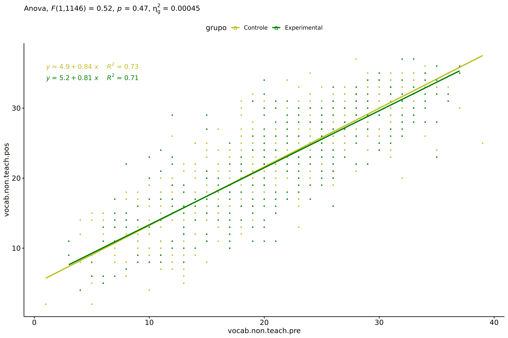<!-- -->

### Checking normality and homogeneity

``` r
res <- augment(lm(vocab.non.teach.pos ~ vocab.non.teach.pre + grupo, data = wdat))
```

``` r
shapiro_test(res$.resid)
```

    ## # A tibble: 1 × 3
    ##   variable   statistic p.value
    ##   <chr>          <dbl>   <dbl>
    ## 1 res$.resid     0.998   0.170

``` r
levene_test(res, .resid ~ grupo)
```

    ## # A tibble: 1 × 4
    ##     df1   df2 statistic     p
    ##   <int> <int>     <dbl> <dbl>
    ## 1     1  1147     0.681 0.409

# ANCOVA and Pairwise for two factors **grupo:Sexo**

## Without remove non-normal data

``` r
pdat = remove_group_data(dat[!is.na(dat[["grupo"]]) & !is.na(dat[["Sexo"]]),],
                         "vocab.non.teach.pos", c("grupo","Sexo"))
pdat = pdat[pdat[["Sexo"]] %in% do.call(
  intersect, lapply(unique(pdat[["grupo"]]), FUN = function(x) {
    unique(pdat[["Sexo"]][which(pdat[["grupo"]] == x)])
  })),]
pdat[["grupo"]] = factor(pdat[["grupo"]], level[["grupo"]])
pdat[["Sexo"]] = factor(
  pdat[["Sexo"]],
  level[["Sexo"]][level[["Sexo"]] %in% unique(pdat[["Sexo"]])])

pdat.long <- rbind(pdat[,c("id","grupo","Sexo")], pdat[,c("id","grupo","Sexo")])
pdat.long[["time"]] <- c(rep("pre", nrow(pdat)), rep("pos", nrow(pdat)))
pdat.long[["time"]] <- factor(pdat.long[["time"]], c("pre","pos"))
pdat.long[["vocab.non.teach"]] <- c(pdat[["vocab.non.teach.pre"]], pdat[["vocab.non.teach.pos"]])

if (length(unique(pdat[["Sexo"]])) >= 2) {
  aov = anova_test(pdat, vocab.non.teach.pos ~ vocab.non.teach.pre + grupo*Sexo)
  laov[["grupo:Sexo"]] <- get_anova_table(aov)
}
```

``` r
if (length(unique(pdat[["Sexo"]])) >= 2) {
  pwcs <- list()
  pwcs[["Sexo"]] <- emmeans_test(
    group_by(pdat, grupo), vocab.non.teach.pos ~ Sexo,
    covariate = vocab.non.teach.pre, p.adjust.method = "bonferroni")
  pwcs[["grupo"]] <- emmeans_test(
    group_by(pdat, Sexo), vocab.non.teach.pos ~ grupo,
    covariate = vocab.non.teach.pre, p.adjust.method = "bonferroni")
  
  pwc <- plyr::rbind.fill(pwcs[["grupo"]], pwcs[["Sexo"]])
  pwc <- pwc[,c("grupo","Sexo", colnames(pwc)[!colnames(pwc) %in% c("grupo","Sexo")])]
}
```

``` r
if (length(unique(pdat[["Sexo"]])) >= 2) {
  pwc.long <- emmeans_test(dplyr::group_by_at(pdat.long, c("grupo","Sexo")),
                           vocab.non.teach ~ time,
                           p.adjust.method = "bonferroni")
  lpwc[["grupo:Sexo"]] <- plyr::rbind.fill(pwc, pwc.long)
}
```

``` r
if (length(unique(pdat[["Sexo"]])) >= 2) {
  ds <- get.descriptives(pdat, "vocab.non.teach.pos", c("grupo","Sexo"), covar = "vocab.non.teach.pre")
  ds <- merge(ds[ds$variable != "vocab.non.teach.pre",],
              ds[ds$variable == "vocab.non.teach.pre", !colnames(ds) %in% c("variable")],
              by = c("grupo","Sexo"), all.x = T, suffixes = c("", ".vocab.non.teach.pre"))
  ds <- merge(get_emmeans(pwcs[["grupo"]]), ds,
              by = c("grupo","Sexo"), suffixes = c(".emms", ""))
  ds <- ds[,c("grupo","Sexo","n","mean.vocab.non.teach.pre","se.vocab.non.teach.pre","mean","se",
              "emmean","se.emms","conf.low","conf.high")]
  
  colnames(ds) <- c("grupo","Sexo", "N", paste0(c("M","SE")," (pre)"),
                    paste0(c("M","SE"), " (unadj)"),
                    paste0(c("M", "SE"), " (adj)"), "conf.low", "conf.high")
  
  lemms[["grupo:Sexo"]] <- ds
}
```

## Computing ANCOVA and PairWise After removing non-normal data (OK)

``` r
if (length(unique(pdat[["Sexo"]])) >= 2) {
  wdat = pdat 
  
  res = residuals(lm(vocab.non.teach.pos ~ vocab.non.teach.pre + grupo*Sexo, data = wdat))
  non.normal = getNonNormal(res, wdat$id, plimit = 0.05)
  
  wdat = wdat[!wdat$id %in% non.normal,]
  
  wdat.long <- rbind(wdat[,c("id","grupo","Sexo")], wdat[,c("id","grupo","Sexo")])
  wdat.long[["time"]] <- c(rep("pre", nrow(wdat)), rep("pos", nrow(wdat)))
  wdat.long[["time"]] <- factor(wdat.long[["time"]], c("pre","pos"))
  wdat.long[["vocab.non.teach"]] <- c(wdat[["vocab.non.teach.pre"]], wdat[["vocab.non.teach.pos"]])
  
  
  ldat[["grupo:Sexo"]] = wdat
  
  (non.normal)
}
```

    ##    [1] "P1003" "P1139" "P1113" "P996"  "P1069" "P2207" "P2232" "P3654" "P2192" "P983"  "P2245" "P2853" "P852"  "P1966" "P2251"
    ##   [16] "P1056" "P1112" "P3260" "P1006" "P1831" "P1129" "P2304" "P1012" "P916"  "P3473" "P1620" "P2850" "P478"  "P1961" "P976" 
    ##   [31] "P1794" "P850"  "P913"  "P888"  "P1790" "P887"  "P489"  "P2206" "P1936" "P3097" "P2135" "P2069" "P2219" "P3731" "P3548"
    ##   [46] "P2164" "P3106" "P3499" "P3038" "P890"  "P1785" "P3042" "P837"  "P2359" "P2957" "P3113" "P607"  "P3471" "P1775" "P2400"
    ##   [61] "P3265" "P1057" "P2458" "P2856" "P3228" "P3259" "P1151" "P491"  "P1066" "P2176" "P1938" "P3675" "P606"  "P540"  "P3660"
    ##   [76] "P1074" "P3043" "P3684" "P2435" "P3480" "P3159" "P2394" "P1110" "P3622" "P2931" "P3517" "P3712" "P2195" "P842"  "P863" 
    ##   [91] "P1801" "P1671" "P1865" "P2296" "P1907" "P444"  "P2949" "P1712" "P2860" "P1960" "P2406" "P1672" "P822"  "P3561" "P3635"
    ##  [106] "P2098" "P1969" "P933"  "P2092" "P2955" "P1835" "P985"  "P3134" "P2907" "P2339" "P3608" "P1754" "P2861" "P3305" "P1157"
    ##  [121] "P1009" "P1781" "P3145" "P2082" "P2246" "P968"  "P1165" "P1989" "P1065" "P3553" "P2434" "P2125" "P1873" "P3710" "P873" 
    ##  [136] "P3724" "P3658" "P3477" "P582"  "P3267" "P474"  "P3078" "P3685" "P845"  "P2154" "P1008" "P2077" "P1068" "P840"  "P1939"
    ##  [151] "P3700" "P1859" "P467"  "P3580" "P2004" "P2371" "P461"  "P3255" "P3586" "P3595" "P1697" "P3535" "P1982" "P3081" "P3280"
    ##  [166] "P1047" "P921"  "P3620" "P3534" "P818"  "P3510" "P877"  "P1890" "P2084" "P3459" "P2959" "P3571" "P2073" "P3112" "P1126"
    ##  [181] "P3621" "P1779" "P2066" "P3716" "P2189" "P2174" "P1854" "P1778" "P3287" "P3672" "P1845" "P3241" "P2395" "P3503" "P3266"
    ##  [196] "P1897" "P1167" "P3728" "P1080" "P1050" "P1013" "P3704" "P3538" "P1147" "P821"  "P1780" "P3717" "P823"  "P3080" "P2454"
    ##  [211] "P2002" "P3573" "P2905" "P2215" "P1673" "P2374" "P3686" "P499"  "P1757" "P1082" "P3025" "P443"  "P3694" "P3726" "P1909"
    ##  [226] "P2472" "P3143" "P2223" "P3249" "P940"  "P2072" "P937"  "P2053" "P3236" "P3310" "P1826" "P3101" "P3131" "P3029" "P2203"
    ##  [241] "P2126" "P2883" "P826"  "P1759" "P3574" "P2341" "P1954" "P1025" "P1750" "P502"  "P1591" "P1136" "P3662" "P3718" "P3527"
    ##  [256] "P3009" "P1609" "P1941" "P3103" "P1955" "P3072" "P2835" "P2933" "P2925" "P3715" "P3631" "P2866" "P1741" "P917"  "P1029"
    ##  [271] "P3602" "P1116" "P2161" "P1958" "P2921" "P1977" "P2414" "P2314" "P1962" "P2326" "P1717" "P2190" "P3669" "P2425" "P2050"
    ##  [286] "P2864" "P2421" "P576"  "P2322" "P488"  "P2872" "P1788" "P560"  "P1899" "P569"  "P3722" "P3475" "P1944" "P3238" "P2000"
    ##  [301] "P630"  "P910"  "P2185" "P2989" "P2335" "P2327" "P2461" "P3278" "P472"  "P2057" "P3017" "P547"  "P3102" "P2447" "P3539"
    ##  [316] "P2432" "P999"  "P3541" "P3513" "P1630" "P1037" "P2127" "P2858" "P473"  "P1880" "P2113" "P1122" "P932"  "P2874" "P1976"
    ##  [331] "P3156" "P2302" "P1836" "P886"  "P955"  "P865"  "P3161" "P2411" "P889"  "P2468" "P3258" "P2309" "P2146" "P2079" "P578" 
    ##  [346] "P596"  "P1100" "P2117" "P3723" "P988"  "P2479" "P2071" "P1905" "P1748" "P3125" "P3720" "P2121" "P3157" "P2132" "P1656"
    ##  [361] "P3053" "P3470" "P530"  "P526"  "P3312" "P2938" "P3670" "P1625" "P2151" "P2048" "P3690" "P529"  "P2005" "P2186" "P2877"
    ##  [376] "P1869" "P3733" "P3469" "P1851" "P854"  "P571"  "P2241" "P2342" "P3603" "P536"  "P580"  "P2469" "P3647" "P2363" "P3572"
    ##  [391] "P2941" "P1718" "P2306" "P1060" "P539"  "P2980" "P562"  "P1651" "P1090" "P3268" "P2847" "P3067" "P1023" "P3522" "P3276"
    ##  [406] "P1707" "P1738" "P3033" "P3699" "P2197" "P2442" "P3309" "P1725" "P2150" "P1739" "P1071" "P1857" "P603"  "P2416" "P1985"
    ##  [421] "P2999" "P3533" "P3476" "P2424" "P2384" "P3582" "P2962" "P1862" "P3209" "P2191" "P2438" "P2008" "P1863" "P1613" "P3128"
    ##  [436] "P544"  "P2305" "P926"  "P3138" "P2887" "P3646" "P1138" "P2365" "P3556" "P1935" "P2841" "P1973" "P1608" "P904"  "P3730"
    ##  [451] "P963"  "P2429" "P3225" "P3222" "P2193" "P3069" "P1997" "P2832" "P3179" "P1853" "P2958" "P2423" "P920"  "P3200" "P1616"
    ##  [466] "P2101" "P598"  "P585"  "P810"  "P915"  "P3591" "P3213" "P1659" "P2011" "P1806" "P1720" "P2387" "P1876" "P3110" "P3482"
    ##  [481] "P525"  "P2375" "P2379" "P3151" "P543"  "P986"  "P2428" "P1834" "P2459" "P2838" "P2074" "P3584" "P1772" "P1691" "P546" 
    ##  [496] "P1034" "P2900" "P3282" "P633"  "P3257" "P2466" "P967"  "P3254" "P2873" "P2986" "P1947" "P972"  "P1755" "P3111" "P3567"
    ##  [511] "P1948" "P1703" "P1804" "P3012" "P3163" "P2420" "P2104" "P1828" "P2172" "P2123" "P1085" "P534"  "P1968" "P1595" "P1901"
    ##  [526] "P851"  "P3461" "P3637" "P2116" "P1117" "P2333" "P1105" "P925"  "P3074" "P3062" "P1998" "P3529" "P2453" "P2382" "P520" 
    ##  [541] "P2165" "P2217" "P3483" "P2967" "P1988" "P1684" "P3011" "P3528" "P856"  "P1793" "P3676" "P1064" "P3719" "P511"  "P541" 
    ##  [556] "P2129" "P1039" "P965"  "P1837" "P1028" "P1714" "P2893" "P3227" "P1844" "P1883" "P1633" "P2234" "P2056" "P1959" "P984" 
    ##  [571] "P481"  "P492"  "P2311" "P3599" "P2324" "P2229" "P3568" "P3192" "P1622" "P3144" "P3293" "P1979" "P1745" "P2344" "P3196"
    ##  [586] "P3155" "P3657" "P2346" "P2869" "P588"  "P3005" "P1650" "P1888" "P1709" "P3198" "P3650" "P3215" "P1632" "P1751" "P493" 
    ##  [601] "P1680" "P3140" "P879"  "P1070" "P2300" "P3285" "P2096" "P2325" "P959"  "P1700" "P1825" "P1763" "P1884" "P3284" "P1158"
    ##  [616] "P2392" "P3691" "P1847" "P3136" "P1035" "P2351" "P2198" "P3262" "P2982" "P944"  "P3283" "P1877" "P1648" "P2431" "P884" 
    ##  [631] "P2298" "P1679" "P1052" "P584"  "P2970" "P1127" "P1602" "P1830" "P2162" "P1610" "P1592" "P1087" "P475"  "P1152" "P583" 
    ##  [646] "P1991" "P1761" "P2068" "P2475" "P2367" "P1607" "P3088" "P2099" "P2348" "P586"  "P2481" "P3550" "P565"  "P2321" "P2350"
    ##  [661] "P3066" "P2158" "P2901" "P2065" "P2012" "P3610" "P993"  "P1893" "P1903" "P3520" "P3158" "P538"  "P3651" "P2886" "P2358"
    ##  [676] "P1842" "P2051" "P1623" "P938"  "P3070" "P3180" "P1102" "P1076" "P3551" "P563"  "P3050" "P1870" "P2929" "P1617" "P930" 
    ##  [691] "P1723" "P2463" "P1922" "P1978" "P453"  "P2156" "P3120" "P3242" "P951"  "P1001" "P2334" "P1843" "P3119" "P1149" "P2009"
    ##  [706] "P835"  "P518"  "P2981" "P1141" "P2961" "P2871" "P3132" "P1990" "P1975" "P2070" "P2445" "P476"  "P1053" "P2292" "P3269"
    ##  [721] "P3245" "P2412" "P3585" "P2859" "P3714" "P2968" "P1148" "P1075" "P2862" "P482"  "P3709" "P3542" "P455"  "P2343" "P2881"
    ##  [736] "P2845" "P2476" "P1956" "P1627" "P3713" "P477"  "P3616" "P2470" "P836"  "P2451" "P2118" "P3246" "P605"  "P2441" "P3472"
    ##  [751] "P3171" "P1829" "P979"  "P1734" "P2449" "P559"  "P1749" "P828"  "P3299" "P3264" "P3671" "P2882" "P3146" "P1644" "P1166"
    ##  [766] "P1663" "P1708" "P1875" "P2088" "P2168" "P2354" "P2452" "P1645" "P2181" "P1800" "P3487" "P604"  "P2299" "P2083" "P3095"
    ##  [781] "P3218" "P441"  "P834"  "P573"  "P1840" "P3124" "P911"  "P3007" "P1906" "P3147" "P1908" "P1987" "P2133" "P1667" "P1043"
    ##  [796] "P3279" "P548"  "P3065" "P3127" "P970"  "P549"  "P1660" "P1879" "P998"  "P2984" "P3202" "P2086" "P3633" "P864"  "P1693"
    ##  [811] "P3173" "P2997" "P1744" "P815"  "P3149" "P561"  "P1031" "P2953" "P1802" "P1885" "P2139" "P2482" "P3590" "P3532" "P3507"
    ##  [826] "P3695" "P1849" "P966"  "P1603" "P601"  "P1614" "P2080" "P2078" "P1949" "P1910" "P495"  "P3166" "P1787" "P3003" "P2443"
    ##  [841] "P2316" "P1026" "P2951" "P3307" "P1914" "P567"  "P3250" "P3663" "P3486" "P2064" "P3129" "P2867" "P3589" "P1153" "P1690"
    ##  [856] "P3199" "P2160" "P3549" "P3554" "P1596" "P2916" "P3540" "P824"  "P1018" "P2361" "P3588" "P1758" "P2831" "P2108" "P868" 
    ##  [871] "P2978" "P3688" "P2903" "P2148" "P2360" "P1740" "P939"  "P2366" "P2310" "P1042" "P962"  "P2973" "P2054" "P2196" "P2403"
    ##  [886] "P2437" "P2870" "P1807" "P1719" "P452"  "P1832" "P2952" "P1974" "P907"  "P2852" "P1678" "P2413" "P3462" "P3526" "P935" 
    ##  [901] "P2868" "P2109" "P1598" "P1920" "P3536" "P1841" "P2467" "P3666" "P2131" "P2948" "P1852" "P2398" "P2909" "P973"  "P1878"
    ##  [916] "P1799" "P2356" "P3237" "P2237" "P2439" "P2183" "P817"  "P3465" "P2457" "P2889" "P3076" "P3077" "P2444" "P918"  "P2049"
    ##  [931] "P1600" "P3086" "P496"  "P1887" "P883"  "P1059" "P929"  "P1142" "P3085" "P3226" "P2971" "P1913" "P1061" "P3135" "P1846"
    ##  [946] "P3301" "P2157" "P2235" "P1654" "P2937" "P471"  "P1833" "P969"  "P3491" "P1696" "P2323" "P2094" "P487"  "P1121" "P2966"
    ##  [961] "P1033" "P2136" "P1611" "P1848" "P2188" "P3562" "P3148" "P1668" "P2477" "P3638" "P2225" "P1655" "P1789" "P3073" "P2920"
    ##  [976] "P919"  "P3211" "P978"  "P3059" "P1674" "P2301" "P3272" "P3485" "P3703" "P931"  "P3082" "P3531" "P1886" "P3570" "P927" 
    ##  [991] "P1688" "P3021" "P2369" "P1597" "P2945" "P2450" "P1133" "P631"  "P624"  "P1892"
    ##  [ reached getOption("max.print") -- omitted 155 entries ]

``` r
if (length(unique(pdat[["Sexo"]])) >= 2) {
  aov = anova_test(wdat, vocab.non.teach.pos ~ vocab.non.teach.pre + grupo*Sexo)
  laov[["grupo:Sexo"]] <- merge(get_anova_table(aov), laov[["grupo:Sexo"]],
                                         by="Effect", suffixes = c("","'"))
  df = get_anova_table(aov)
}
```

| Effect              | DFn | DFd |         F |     p | p\<.05 |   ges |
|:--------------------|----:|----:|----------:|------:|:-------|------:|
| vocab.non.teach.pre |   1 |  69 | 98203.024 | 0.000 | \*     | 0.999 |
| grupo               |   1 |  69 |     8.694 | 0.004 | \*     | 0.112 |
| Sexo                |   1 |  69 |   704.887 | 0.000 | \*     | 0.911 |
| grupo:Sexo          |   1 |  69 |     0.096 | 0.757 |        | 0.001 |

``` r
if (length(unique(pdat[["Sexo"]])) >= 2) {
  pwcs <- list()
  pwcs[["Sexo"]] <- emmeans_test(
    group_by(wdat, grupo), vocab.non.teach.pos ~ Sexo,
    covariate = vocab.non.teach.pre, p.adjust.method = "bonferroni")
  pwcs[["grupo"]] <- emmeans_test(
    group_by(wdat, Sexo), vocab.non.teach.pos ~ grupo,
    covariate = vocab.non.teach.pre, p.adjust.method = "bonferroni")
  
  pwc <- plyr::rbind.fill(pwcs[["grupo"]], pwcs[["Sexo"]])
  pwc <- pwc[,c("grupo","Sexo", colnames(pwc)[!colnames(pwc) %in% c("grupo","Sexo")])]
}
```

| grupo | Sexo | term | .y. | group1 | group2 | df | statistic | p | p.adj | p.adj.signif |
|:---|:---|:---|:---|:---|:---|---:|---:|---:|---:|:---|
|  | F | vocab.non.teach.pre\*grupo | vocab.non.teach.pos | Controle | Experimental | 69 | 2.074 | 0.042 | 0.042 | \* |
|  | M | vocab.non.teach.pre\*grupo | vocab.non.teach.pos | Controle | Experimental | 69 | 2.121 | 0.038 | 0.038 | \* |
| Controle |  | vocab.non.teach.pre\*Sexo | vocab.non.teach.pos | F | M | 69 | 16.705 | 0.000 | 0.000 | \*\*\*\* |
| Experimental |  | vocab.non.teach.pre\*Sexo | vocab.non.teach.pos | F | M | 69 | 20.655 | 0.000 | 0.000 | \*\*\*\* |

``` r
if (length(unique(pdat[["Sexo"]])) >= 2) {
  pwc.long <- emmeans_test(dplyr::group_by_at(wdat.long, c("grupo","Sexo")),
                           vocab.non.teach ~ time,
                           p.adjust.method = "bonferroni")
  lpwc[["grupo:Sexo"]] <- merge(plyr::rbind.fill(pwc, pwc.long),
                                         lpwc[["grupo:Sexo"]],
                                         by=c("grupo","Sexo","term",".y.","group1","group2"),
                                         suffixes = c("","'"))
}
```

| grupo | Sexo | term | .y. | group1 | group2 | df | statistic | p | p.adj | p.adj.signif |
|:---|:---|:---|:---|:---|:---|---:|---:|---:|---:|:---|
| Controle | F | time | vocab.non.teach | pre | pos | 140 | -0.190 | 0.850 | 0.850 | ns |
| Controle | M | time | vocab.non.teach | pre | pos | 140 | 0.116 | 0.908 | 0.908 | ns |
| Experimental | F | time | vocab.non.teach | pre | pos | 140 | -0.105 | 0.916 | 0.916 | ns |
| Experimental | M | time | vocab.non.teach | pre | pos | 140 | 0.337 | 0.737 | 0.737 | ns |

``` r
if (length(unique(pdat[["Sexo"]])) >= 2) {
  ds <- get.descriptives(wdat, "vocab.non.teach.pos", c("grupo","Sexo"), covar = "vocab.non.teach.pre")
  ds <- merge(ds[ds$variable != "vocab.non.teach.pre",],
              ds[ds$variable == "vocab.non.teach.pre", !colnames(ds) %in% c("variable")],
              by = c("grupo","Sexo"), all.x = T, suffixes = c("", ".vocab.non.teach.pre"))
  ds <- merge(get_emmeans(pwcs[["grupo"]]), ds,
              by = c("grupo","Sexo"), suffixes = c(".emms", ""))
  ds <- ds[,c("grupo","Sexo","n","mean.vocab.non.teach.pre","se.vocab.non.teach.pre",
              "mean","se","emmean","se.emms","conf.low","conf.high")]
  
  colnames(ds) <- c("grupo","Sexo", "N", paste0(c("M","SE")," (pre)"),
                    paste0(c("M","SE"), " (unadj)"),
                    paste0(c("M", "SE"), " (adj)"), "conf.low", "conf.high")
  
  lemms[["grupo:Sexo"]] <- merge(ds, lemms[["grupo:Sexo"]],
                                          by=c("grupo","Sexo"), suffixes = c("","'"))
}
```

| grupo | Sexo | N | M (pre) | SE (pre) | M (unadj) | SE (unadj) | M (adj) | SE (adj) | conf.low | conf.high |
|:---|:---|---:|---:|---:|---:|---:|---:|---:|---:|---:|
| Controle | F | 21 | 22.286 | 1.832 | 22.714 | 1.446 | 22.638 | 0.037 | 22.564 | 22.713 |
| Controle | M | 11 | 21.000 | 2.576 | 20.636 | 2.051 | 21.573 | 0.052 | 21.470 | 21.676 |
| Experimental | F | 21 | 22.667 | 1.504 | 22.905 | 1.185 | 22.529 | 0.037 | 22.454 | 22.603 |
| Experimental | M | 21 | 22.238 | 1.918 | 21.476 | 1.502 | 21.438 | 0.037 | 21.363 | 21.512 |

### Plots for ancova

``` r
if (length(unique(pdat[["Sexo"]])) >= 2) {
  ggPlotAoC2(pwcs, "grupo", "Sexo", aov, ylab = "Vocabulary not taught",
             subtitle = which(aov$Effect == "grupo:Sexo"), addParam = "errorbar") +
    ggplot2::scale_color_manual(values = color[["Sexo"]]) +
    if (ymin.ci < ymax.ci) ggplot2::ylim(ymin.ci, ymax.ci)
}
```

    ## Scale for colour is already present.
    ## Adding another scale for colour, which will replace the existing scale.

<!-- -->

``` r
if (length(unique(pdat[["Sexo"]])) >= 2) {
  ggPlotAoC2(pwcs, "Sexo", "grupo", aov, ylab = "Vocabulary not taught",
               subtitle = which(aov$Effect == "grupo:Sexo"), addParam = "errorbar") +
      ggplot2::scale_color_manual(values = color[["grupo"]]) +
      if (ymin.ci < ymax.ci) ggplot2::ylim(ymin.ci, ymax.ci)
}
```

    ## Scale for colour is already present.
    ## Adding another scale for colour, which will replace the existing scale.

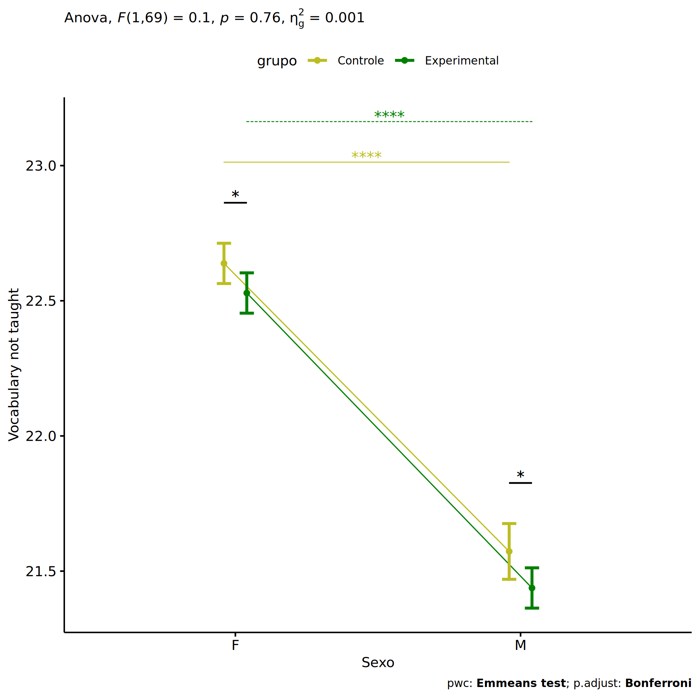<!-- -->

``` r
if (length(unique(pdat[["Sexo"]])) >= 2) {
  plots <- twoWayAncovaBoxPlots(
    wdat, "vocab.non.teach.pos", c("grupo","Sexo"), aov, pwcs, covar = "vocab.non.teach.pre",
    theme = "classic", color = color[["grupo:Sexo"]],
    subtitle = which(aov$Effect == "grupo:Sexo"))
}
```

``` r
if (length(unique(pdat[["Sexo"]])) >= 2) {
  plots[["grupo:Sexo"]] + ggplot2::ylab("Vocabulary not taught") +
  ggplot2::scale_x_discrete(labels=c('pre', 'pos')) +
  if (ymin < ymax) ggplot2::ylim(ymin, ymax)
}
```

    ## Warning: No shared levels found between `names(values)` of the manual scale and the data's colour values.

<!-- -->

``` r
if (length(unique(pdat[["Sexo"]])) >= 2) {
  plots <- twoWayAncovaBoxPlots(
    wdat.long, "vocab.non.teach", c("grupo","Sexo"), aov, pwc.long,
    pre.post = "time",
    theme = "classic", color = color$prepost)
}
```

``` r
if (length(unique(pdat[["Sexo"]])) >= 2) 
  plots[["grupo:Sexo"]] + ggplot2::ylab("Vocabulary not taught") +
    if (ymin < ymax) ggplot2::ylim(ymin, ymax)
```

<!-- -->

### Checking linearity assumption

``` r
if (length(unique(pdat[["Sexo"]])) >= 2) {
  ggscatter(wdat, x = "vocab.non.teach.pre", y = "vocab.non.teach.pos", size = 0.5,
            facet.by = c("grupo","Sexo"), add = "reg.line")+
    stat_regline_equation(
      aes(label =  paste(..eq.label.., ..rr.label.., sep = "~~~~"))
    ) +
    if (ymin < ymax) ggplot2::ylim(ymin, ymax)
}
```

<!-- -->

``` r
if (length(unique(pdat[["Sexo"]])) >= 2) {
  ggscatter(wdat, x = "vocab.non.teach.pre", y = "vocab.non.teach.pos", size = 0.5,
            color = "grupo", facet.by = "Sexo", add = "reg.line")+
    stat_regline_equation(
      aes(label =  paste(..eq.label.., ..rr.label.., sep = "~~~~"), color = grupo)
    ) +
    ggplot2::labs(subtitle = rstatix::get_test_label(aov, detailed = T, row = which(aov$Effect == "grupo:Sexo"))) +
    ggplot2::scale_color_manual(values = color[["grupo"]]) +
    if (ymin < ymax) ggplot2::ylim(ymin, ymax)
}
```

<!-- -->

``` r
if (length(unique(pdat[["Sexo"]])) >= 2) {
  ggscatter(wdat, x = "vocab.non.teach.pre", y = "vocab.non.teach.pos", size = 0.5,
            color = "Sexo", facet.by = "grupo", add = "reg.line")+
    stat_regline_equation(
      aes(label =  paste(..eq.label.., ..rr.label.., sep = "~~~~"), color = Sexo)
    ) +
    ggplot2::labs(subtitle = rstatix::get_test_label(aov, detailed = T, row = which(aov$Effect == "grupo:Sexo"))) +
    ggplot2::scale_color_manual(values = color[["Sexo"]]) +
    if (ymin < ymax) ggplot2::ylim(ymin, ymax)
}
```

<!-- -->

### Checking normality and homogeneity

``` r
if (length(unique(pdat[["Sexo"]])) >= 2) 
  res <- augment(lm(vocab.non.teach.pos ~ vocab.non.teach.pre + grupo*Sexo, data = wdat))
```

``` r
if (length(unique(pdat[["Sexo"]])) >= 2)
  shapiro_test(res$.resid)
```

    ## # A tibble: 1 × 3
    ##   variable   statistic p.value
    ##   <chr>          <dbl>   <dbl>
    ## 1 res$.resid     0.981   0.328

``` r
if (length(unique(pdat[["Sexo"]])) >= 2) 
  levene_test(res, .resid ~ grupo*Sexo)
```

    ## # A tibble: 1 × 4
    ##     df1   df2 statistic      p
    ##   <int> <int>     <dbl>  <dbl>
    ## 1     3    70      2.37 0.0782

# ANCOVA and Pairwise for two factors **grupo:Zona**

## Without remove non-normal data

``` r
pdat = remove_group_data(dat[!is.na(dat[["grupo"]]) & !is.na(dat[["Zona"]]),],
                         "vocab.non.teach.pos", c("grupo","Zona"))
pdat = pdat[pdat[["Zona"]] %in% do.call(
  intersect, lapply(unique(pdat[["grupo"]]), FUN = function(x) {
    unique(pdat[["Zona"]][which(pdat[["grupo"]] == x)])
  })),]
pdat[["grupo"]] = factor(pdat[["grupo"]], level[["grupo"]])
pdat[["Zona"]] = factor(
  pdat[["Zona"]],
  level[["Zona"]][level[["Zona"]] %in% unique(pdat[["Zona"]])])

pdat.long <- rbind(pdat[,c("id","grupo","Zona")], pdat[,c("id","grupo","Zona")])
pdat.long[["time"]] <- c(rep("pre", nrow(pdat)), rep("pos", nrow(pdat)))
pdat.long[["time"]] <- factor(pdat.long[["time"]], c("pre","pos"))
pdat.long[["vocab.non.teach"]] <- c(pdat[["vocab.non.teach.pre"]], pdat[["vocab.non.teach.pos"]])

if (length(unique(pdat[["Zona"]])) >= 2) {
  aov = anova_test(pdat, vocab.non.teach.pos ~ vocab.non.teach.pre + grupo*Zona)
  laov[["grupo:Zona"]] <- get_anova_table(aov)
}
```

``` r
if (length(unique(pdat[["Zona"]])) >= 2) {
  pwcs <- list()
  pwcs[["Zona"]] <- emmeans_test(
    group_by(pdat, grupo), vocab.non.teach.pos ~ Zona,
    covariate = vocab.non.teach.pre, p.adjust.method = "bonferroni")
  pwcs[["grupo"]] <- emmeans_test(
    group_by(pdat, Zona), vocab.non.teach.pos ~ grupo,
    covariate = vocab.non.teach.pre, p.adjust.method = "bonferroni")
  
  pwc <- plyr::rbind.fill(pwcs[["grupo"]], pwcs[["Zona"]])
  pwc <- pwc[,c("grupo","Zona", colnames(pwc)[!colnames(pwc) %in% c("grupo","Zona")])]
}
```

``` r
if (length(unique(pdat[["Zona"]])) >= 2) {
  pwc.long <- emmeans_test(dplyr::group_by_at(pdat.long, c("grupo","Zona")),
                           vocab.non.teach ~ time,
                           p.adjust.method = "bonferroni")
  lpwc[["grupo:Zona"]] <- plyr::rbind.fill(pwc, pwc.long)
}
```

``` r
if (length(unique(pdat[["Zona"]])) >= 2) {
  ds <- get.descriptives(pdat, "vocab.non.teach.pos", c("grupo","Zona"), covar = "vocab.non.teach.pre")
  ds <- merge(ds[ds$variable != "vocab.non.teach.pre",],
              ds[ds$variable == "vocab.non.teach.pre", !colnames(ds) %in% c("variable")],
              by = c("grupo","Zona"), all.x = T, suffixes = c("", ".vocab.non.teach.pre"))
  ds <- merge(get_emmeans(pwcs[["grupo"]]), ds,
              by = c("grupo","Zona"), suffixes = c(".emms", ""))
  ds <- ds[,c("grupo","Zona","n","mean.vocab.non.teach.pre","se.vocab.non.teach.pre","mean","se",
              "emmean","se.emms","conf.low","conf.high")]
  
  colnames(ds) <- c("grupo","Zona", "N", paste0(c("M","SE")," (pre)"),
                    paste0(c("M","SE"), " (unadj)"),
                    paste0(c("M", "SE"), " (adj)"), "conf.low", "conf.high")
  
  lemms[["grupo:Zona"]] <- ds
}
```

## Computing ANCOVA and PairWise After removing non-normal data (OK)

``` r
if (length(unique(pdat[["Zona"]])) >= 2) {
  wdat = pdat 
  
  res = residuals(lm(vocab.non.teach.pos ~ vocab.non.teach.pre + grupo*Zona, data = wdat))
  non.normal = getNonNormal(res, wdat$id, plimit = 0.05)
  
  wdat = wdat[!wdat$id %in% non.normal,]
  
  wdat.long <- rbind(wdat[,c("id","grupo","Zona")], wdat[,c("id","grupo","Zona")])
  wdat.long[["time"]] <- c(rep("pre", nrow(wdat)), rep("pos", nrow(wdat)))
  wdat.long[["time"]] <- factor(wdat.long[["time"]], c("pre","pos"))
  wdat.long[["vocab.non.teach"]] <- c(wdat[["vocab.non.teach.pre"]], wdat[["vocab.non.teach.pos"]])
  
  
  ldat[["grupo:Zona"]] = wdat
  
  (non.normal)
}
```

    ##  [1] "P1139" "P983"  "P2207" "P2304" "P1966" "P1056" "P852"  "P3260" "P1831" "P3654" "P3042" "P1012" "P3499" "P1961" "P2850"
    ## [16] "P2856" "P3228" "P916"  "P1794" "P3038" "P976"  "P887"  "P478"  "P888"  "P2957" "P913"  "P850"  "P3473" "P1057" "P1960"

``` r
if (length(unique(pdat[["Zona"]])) >= 2) {
  aov = anova_test(wdat, vocab.non.teach.pos ~ vocab.non.teach.pre + grupo*Zona)
  laov[["grupo:Zona"]] <- merge(get_anova_table(aov), laov[["grupo:Zona"]],
                                         by="Effect", suffixes = c("","'"))
  df = get_anova_table(aov)
}
```

| Effect              | DFn | DFd |        F |     p | p\<.05 |   ges |
|:--------------------|----:|----:|---------:|------:|:-------|------:|
| vocab.non.teach.pre |   1 | 815 | 1922.796 | 0.000 | \*     | 0.702 |
| grupo               |   1 | 815 |    3.167 | 0.076 |        | 0.004 |
| Zona                |   1 | 815 |    0.076 | 0.782 |        | 0.000 |
| grupo:Zona          |   1 | 815 |    0.964 | 0.326 |        | 0.001 |

``` r
if (length(unique(pdat[["Zona"]])) >= 2) {
  pwcs <- list()
  pwcs[["Zona"]] <- emmeans_test(
    group_by(wdat, grupo), vocab.non.teach.pos ~ Zona,
    covariate = vocab.non.teach.pre, p.adjust.method = "bonferroni")
  pwcs[["grupo"]] <- emmeans_test(
    group_by(wdat, Zona), vocab.non.teach.pos ~ grupo,
    covariate = vocab.non.teach.pre, p.adjust.method = "bonferroni")
  
  pwc <- plyr::rbind.fill(pwcs[["grupo"]], pwcs[["Zona"]])
  pwc <- pwc[,c("grupo","Zona", colnames(pwc)[!colnames(pwc) %in% c("grupo","Zona")])]
}
```

| grupo | Zona | term | .y. | group1 | group2 | df | statistic | p | p.adj | p.adj.signif |
|:---|:---|:---|:---|:---|:---|---:|---:|---:|---:|:---|
|  | Rural | vocab.non.teach.pre\*grupo | vocab.non.teach.pos | Controle | Experimental | 815 | 2.017 | 0.044 | 0.044 | \* |
|  | Urbana | vocab.non.teach.pre\*grupo | vocab.non.teach.pos | Controle | Experimental | 815 | 0.253 | 0.800 | 0.800 | ns |
| Controle |  | vocab.non.teach.pre\*Zona | vocab.non.teach.pos | Rural | Urbana | 815 | 0.577 | 0.564 | 0.564 | ns |
| Experimental |  | vocab.non.teach.pre\*Zona | vocab.non.teach.pos | Rural | Urbana | 815 | -0.838 | 0.402 | 0.402 | ns |

``` r
if (length(unique(pdat[["Zona"]])) >= 2) {
  pwc.long <- emmeans_test(dplyr::group_by_at(wdat.long, c("grupo","Zona")),
                           vocab.non.teach ~ time,
                           p.adjust.method = "bonferroni")
  lpwc[["grupo:Zona"]] <- merge(plyr::rbind.fill(pwc, pwc.long),
                                         lpwc[["grupo:Zona"]],
                                         by=c("grupo","Zona","term",".y.","group1","group2"),
                                         suffixes = c("","'"))
}
```

| grupo | Zona | term | .y. | group1 | group2 | df | statistic | p | p.adj | p.adj.signif |
|:---|:---|:---|:---|:---|:---|---:|---:|---:|---:|:---|
| Controle | Rural | time | vocab.non.teach | pre | pos | 1632 | -2.442 | 0.015 | 0.015 | \* |
| Controle | Urbana | time | vocab.non.teach | pre | pos | 1632 | -1.174 | 0.241 | 0.241 | ns |
| Experimental | Rural | time | vocab.non.teach | pre | pos | 1632 | -1.297 | 0.195 | 0.195 | ns |
| Experimental | Urbana | time | vocab.non.teach | pre | pos | 1632 | -1.167 | 0.243 | 0.243 | ns |

``` r
if (length(unique(pdat[["Zona"]])) >= 2) {
  ds <- get.descriptives(wdat, "vocab.non.teach.pos", c("grupo","Zona"), covar = "vocab.non.teach.pre")
  ds <- merge(ds[ds$variable != "vocab.non.teach.pre",],
              ds[ds$variable == "vocab.non.teach.pre", !colnames(ds) %in% c("variable")],
              by = c("grupo","Zona"), all.x = T, suffixes = c("", ".vocab.non.teach.pre"))
  ds <- merge(get_emmeans(pwcs[["grupo"]]), ds,
              by = c("grupo","Zona"), suffixes = c(".emms", ""))
  ds <- ds[,c("grupo","Zona","n","mean.vocab.non.teach.pre","se.vocab.non.teach.pre",
              "mean","se","emmean","se.emms","conf.low","conf.high")]
  
  colnames(ds) <- c("grupo","Zona", "N", paste0(c("M","SE")," (pre)"),
                    paste0(c("M","SE"), " (unadj)"),
                    paste0(c("M", "SE"), " (adj)"), "conf.low", "conf.high")
  
  lemms[["grupo:Zona"]] <- merge(ds, lemms[["grupo:Zona"]],
                                          by=c("grupo","Zona"), suffixes = c("","'"))
}
```

| grupo | Zona | N | M (pre) | SE (pre) | M (unadj) | SE (unadj) | M (adj) | SE (adj) | conf.low | conf.high |
|:---|:---|---:|---:|---:|---:|---:|---:|---:|---:|---:|
| Controle | Rural | 244 | 20.775 | 0.466 | 22.418 | 0.504 | 23.235 | 0.263 | 22.719 | 23.750 |
| Controle | Urbana | 111 | 22.144 | 0.747 | 23.315 | 0.727 | 22.963 | 0.389 | 22.200 | 23.727 |
| Experimental | Rural | 282 | 21.514 | 0.439 | 22.326 | 0.441 | 22.512 | 0.244 | 22.033 | 22.991 |
| Experimental | Urbana | 183 | 23.093 | 0.529 | 24.000 | 0.520 | 22.839 | 0.304 | 22.242 | 23.435 |

### Plots for ancova

``` r
if (length(unique(pdat[["Zona"]])) >= 2) {
  ggPlotAoC2(pwcs, "grupo", "Zona", aov, ylab = "Vocabulary not taught",
             subtitle = which(aov$Effect == "grupo:Zona"), addParam = "errorbar") +
    ggplot2::scale_color_manual(values = color[["Zona"]]) +
    if (ymin.ci < ymax.ci) ggplot2::ylim(ymin.ci, ymax.ci)
}
```

    ## Scale for colour is already present.
    ## Adding another scale for colour, which will replace the existing scale.

<!-- -->

``` r
if (length(unique(pdat[["Zona"]])) >= 2) {
  ggPlotAoC2(pwcs, "Zona", "grupo", aov, ylab = "Vocabulary not taught",
               subtitle = which(aov$Effect == "grupo:Zona"), addParam = "errorbar") +
      ggplot2::scale_color_manual(values = color[["grupo"]]) +
      if (ymin.ci < ymax.ci) ggplot2::ylim(ymin.ci, ymax.ci)
}
```

    ## Scale for colour is already present.
    ## Adding another scale for colour, which will replace the existing scale.

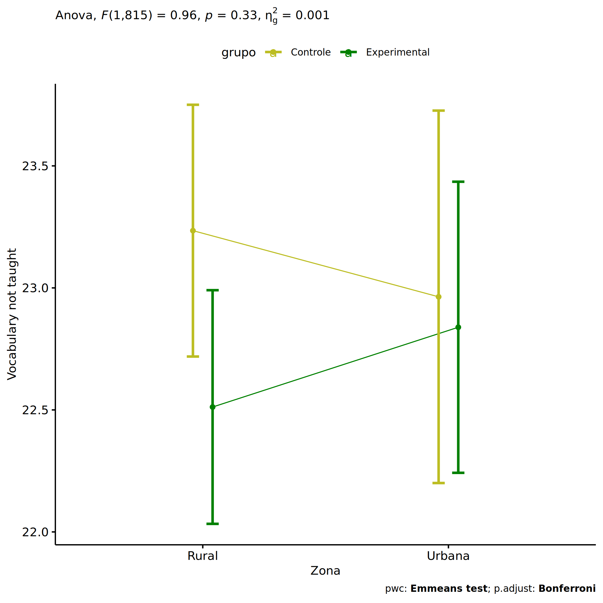<!-- -->

``` r
if (length(unique(pdat[["Zona"]])) >= 2) {
  plots <- twoWayAncovaBoxPlots(
    wdat, "vocab.non.teach.pos", c("grupo","Zona"), aov, pwcs, covar = "vocab.non.teach.pre",
    theme = "classic", color = color[["grupo:Zona"]],
    subtitle = which(aov$Effect == "grupo:Zona"))
}
```

``` r
if (length(unique(pdat[["Zona"]])) >= 2) {
  plots[["grupo:Zona"]] + ggplot2::ylab("Vocabulary not taught") +
  ggplot2::scale_x_discrete(labels=c('pre', 'pos')) +
  if (ymin < ymax) ggplot2::ylim(ymin, ymax)
}
```

    ## Warning: No shared levels found between `names(values)` of the manual scale and the data's colour values.

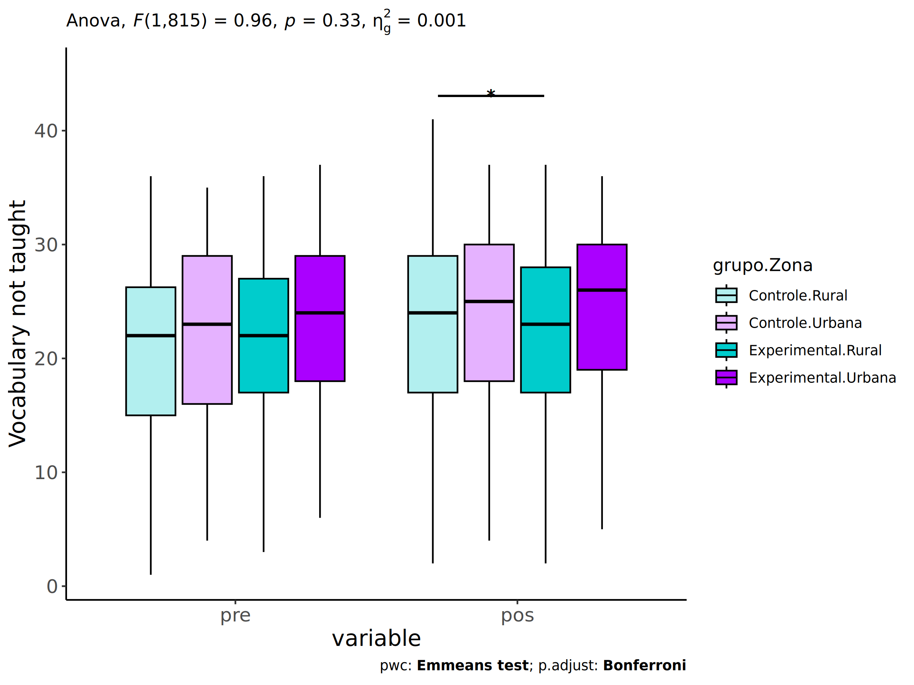<!-- -->

``` r
if (length(unique(pdat[["Zona"]])) >= 2) {
  plots <- twoWayAncovaBoxPlots(
    wdat.long, "vocab.non.teach", c("grupo","Zona"), aov, pwc.long,
    pre.post = "time",
    theme = "classic", color = color$prepost)
}
```

``` r
if (length(unique(pdat[["Zona"]])) >= 2) 
  plots[["grupo:Zona"]] + ggplot2::ylab("Vocabulary not taught") +
    if (ymin < ymax) ggplot2::ylim(ymin, ymax)
```

<!-- -->

### Checking linearity assumption

``` r
if (length(unique(pdat[["Zona"]])) >= 2) {
  ggscatter(wdat, x = "vocab.non.teach.pre", y = "vocab.non.teach.pos", size = 0.5,
            facet.by = c("grupo","Zona"), add = "reg.line")+
    stat_regline_equation(
      aes(label =  paste(..eq.label.., ..rr.label.., sep = "~~~~"))
    ) +
    if (ymin < ymax) ggplot2::ylim(ymin, ymax)
}
```

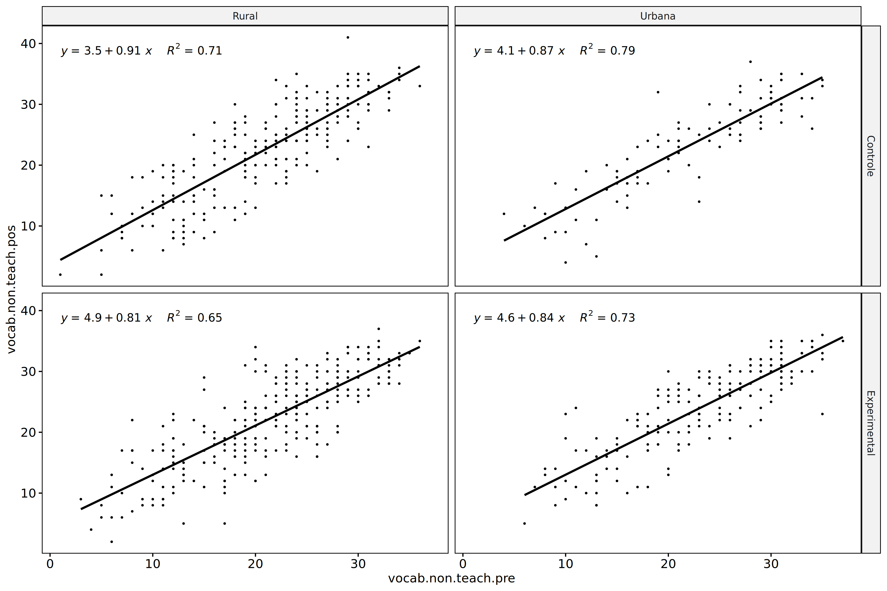<!-- -->

``` r
if (length(unique(pdat[["Zona"]])) >= 2) {
  ggscatter(wdat, x = "vocab.non.teach.pre", y = "vocab.non.teach.pos", size = 0.5,
            color = "grupo", facet.by = "Zona", add = "reg.line")+
    stat_regline_equation(
      aes(label =  paste(..eq.label.., ..rr.label.., sep = "~~~~"), color = grupo)
    ) +
    ggplot2::labs(subtitle = rstatix::get_test_label(aov, detailed = T, row = which(aov$Effect == "grupo:Zona"))) +
    ggplot2::scale_color_manual(values = color[["grupo"]]) +
    if (ymin < ymax) ggplot2::ylim(ymin, ymax)
}
```

<!-- -->

``` r
if (length(unique(pdat[["Zona"]])) >= 2) {
  ggscatter(wdat, x = "vocab.non.teach.pre", y = "vocab.non.teach.pos", size = 0.5,
            color = "Zona", facet.by = "grupo", add = "reg.line")+
    stat_regline_equation(
      aes(label =  paste(..eq.label.., ..rr.label.., sep = "~~~~"), color = Zona)
    ) +
    ggplot2::labs(subtitle = rstatix::get_test_label(aov, detailed = T, row = which(aov$Effect == "grupo:Zona"))) +
    ggplot2::scale_color_manual(values = color[["Zona"]]) +
    if (ymin < ymax) ggplot2::ylim(ymin, ymax)
}
```

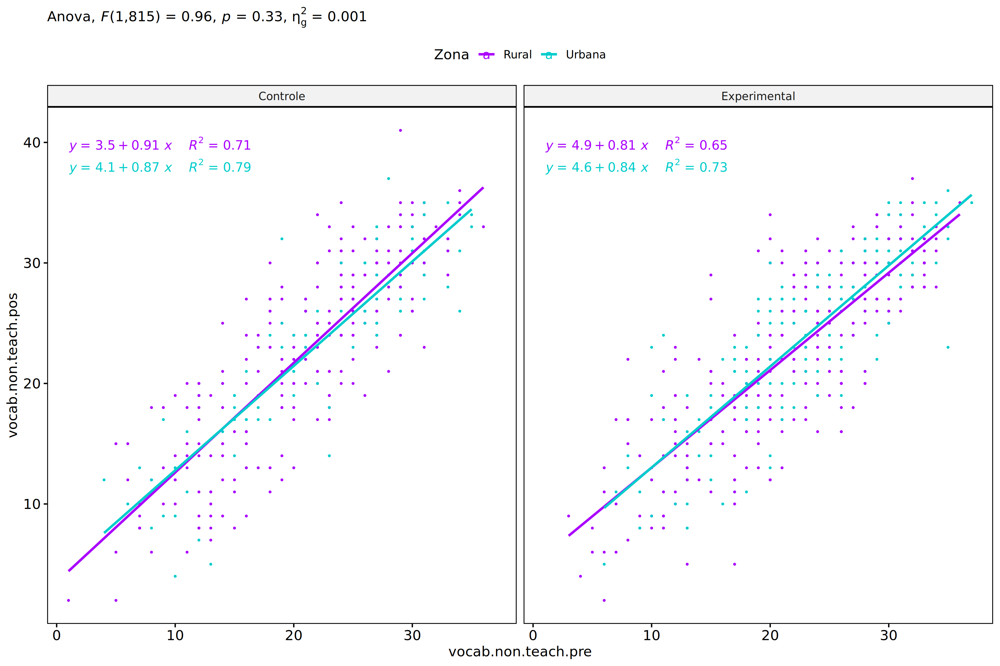<!-- -->

### Checking normality and homogeneity

``` r
if (length(unique(pdat[["Zona"]])) >= 2) 
  res <- augment(lm(vocab.non.teach.pos ~ vocab.non.teach.pre + grupo*Zona, data = wdat))
```

``` r
if (length(unique(pdat[["Zona"]])) >= 2)
  shapiro_test(res$.resid)
```

    ## # A tibble: 1 × 3
    ##   variable   statistic p.value
    ##   <chr>          <dbl>   <dbl>
    ## 1 res$.resid     0.997   0.105

``` r
if (length(unique(pdat[["Zona"]])) >= 2) 
  levene_test(res, .resid ~ grupo*Zona)
```

    ## # A tibble: 1 × 4
    ##     df1   df2 statistic       p
    ##   <int> <int>     <dbl>   <dbl>
    ## 1     3   816      4.76 0.00269

# ANCOVA and Pairwise for two factors **grupo:Cor.Raca**

## Without remove non-normal data

``` r
pdat = remove_group_data(dat[!is.na(dat[["grupo"]]) & !is.na(dat[["Cor.Raca"]]),],
                         "vocab.non.teach.pos", c("grupo","Cor.Raca"))
```

    ## Warning: There were 3 warnings in `mutate()`.
    ## The first warning was:
    ## ℹ In argument: `ci = abs(stats::qt(alpha/2, .data$n - 1) * .data$se)`.
    ## Caused by warning:
    ## ! There was 1 warning in `mutate()`.
    ## ℹ In argument: `ci = abs(stats::qt(alpha/2, .data$n - 1) * .data$se)`.
    ## Caused by warning in `stats::qt()`:
    ## ! NaNs produced
    ## ℹ Run `dplyr::last_dplyr_warnings()` to see the 2 remaining warnings.

``` r
pdat = pdat[pdat[["Cor.Raca"]] %in% do.call(
  intersect, lapply(unique(pdat[["grupo"]]), FUN = function(x) {
    unique(pdat[["Cor.Raca"]][which(pdat[["grupo"]] == x)])
  })),]
pdat[["grupo"]] = factor(pdat[["grupo"]], level[["grupo"]])
pdat[["Cor.Raca"]] = factor(
  pdat[["Cor.Raca"]],
  level[["Cor.Raca"]][level[["Cor.Raca"]] %in% unique(pdat[["Cor.Raca"]])])

pdat.long <- rbind(pdat[,c("id","grupo","Cor.Raca")], pdat[,c("id","grupo","Cor.Raca")])
pdat.long[["time"]] <- c(rep("pre", nrow(pdat)), rep("pos", nrow(pdat)))
pdat.long[["time"]] <- factor(pdat.long[["time"]], c("pre","pos"))
pdat.long[["vocab.non.teach"]] <- c(pdat[["vocab.non.teach.pre"]], pdat[["vocab.non.teach.pos"]])

if (length(unique(pdat[["Cor.Raca"]])) >= 2) {
  aov = anova_test(pdat, vocab.non.teach.pos ~ vocab.non.teach.pre + grupo*Cor.Raca)
  laov[["grupo:Cor.Raca"]] <- get_anova_table(aov)
}
```

``` r
if (length(unique(pdat[["Cor.Raca"]])) >= 2) {
  pwcs <- list()
  pwcs[["Cor.Raca"]] <- emmeans_test(
    group_by(pdat, grupo), vocab.non.teach.pos ~ Cor.Raca,
    covariate = vocab.non.teach.pre, p.adjust.method = "bonferroni")
  pwcs[["grupo"]] <- emmeans_test(
    group_by(pdat, Cor.Raca), vocab.non.teach.pos ~ grupo,
    covariate = vocab.non.teach.pre, p.adjust.method = "bonferroni")
  
  pwc <- plyr::rbind.fill(pwcs[["grupo"]], pwcs[["Cor.Raca"]])
  pwc <- pwc[,c("grupo","Cor.Raca", colnames(pwc)[!colnames(pwc) %in% c("grupo","Cor.Raca")])]
}
```

``` r
if (length(unique(pdat[["Cor.Raca"]])) >= 2) {
  pwc.long <- emmeans_test(dplyr::group_by_at(pdat.long, c("grupo","Cor.Raca")),
                           vocab.non.teach ~ time,
                           p.adjust.method = "bonferroni")
  lpwc[["grupo:Cor.Raca"]] <- plyr::rbind.fill(pwc, pwc.long)
}
```

``` r
if (length(unique(pdat[["Cor.Raca"]])) >= 2) {
  ds <- get.descriptives(pdat, "vocab.non.teach.pos", c("grupo","Cor.Raca"), covar = "vocab.non.teach.pre")
  ds <- merge(ds[ds$variable != "vocab.non.teach.pre",],
              ds[ds$variable == "vocab.non.teach.pre", !colnames(ds) %in% c("variable")],
              by = c("grupo","Cor.Raca"), all.x = T, suffixes = c("", ".vocab.non.teach.pre"))
  ds <- merge(get_emmeans(pwcs[["grupo"]]), ds,
              by = c("grupo","Cor.Raca"), suffixes = c(".emms", ""))
  ds <- ds[,c("grupo","Cor.Raca","n","mean.vocab.non.teach.pre","se.vocab.non.teach.pre","mean","se",
              "emmean","se.emms","conf.low","conf.high")]
  
  colnames(ds) <- c("grupo","Cor.Raca", "N", paste0(c("M","SE")," (pre)"),
                    paste0(c("M","SE"), " (unadj)"),
                    paste0(c("M", "SE"), " (adj)"), "conf.low", "conf.high")
  
  lemms[["grupo:Cor.Raca"]] <- ds
}
```

## Computing ANCOVA and PairWise After removing non-normal data (OK)

``` r
if (length(unique(pdat[["Cor.Raca"]])) >= 2) {
  wdat = pdat 
  
  res = residuals(lm(vocab.non.teach.pos ~ vocab.non.teach.pre + grupo*Cor.Raca, data = wdat))
  non.normal = getNonNormal(res, wdat$id, plimit = 0.05)
  
  wdat = wdat[!wdat$id %in% non.normal,]
  
  wdat.long <- rbind(wdat[,c("id","grupo","Cor.Raca")], wdat[,c("id","grupo","Cor.Raca")])
  wdat.long[["time"]] <- c(rep("pre", nrow(wdat)), rep("pos", nrow(wdat)))
  wdat.long[["time"]] <- factor(wdat.long[["time"]], c("pre","pos"))
  wdat.long[["vocab.non.teach"]] <- c(wdat[["vocab.non.teach.pre"]], wdat[["vocab.non.teach.pos"]])
  
  
  ldat[["grupo:Cor.Raca"]] = wdat
  
  (non.normal)
}
```

    ##  [1] "P1139" "P1003" "P1113" "P996"  "P3654" "P1006" "P852"  "P1112" "P1056" "P3260" "P1069" "P540"  "P606"  "P3471" "P3038"
    ## [16] "P3473" "P3106" "P2135" "P478"  "P887"

``` r
if (length(unique(pdat[["Cor.Raca"]])) >= 2) {
  aov = anova_test(wdat, vocab.non.teach.pos ~ vocab.non.teach.pre + grupo*Cor.Raca)
  laov[["grupo:Cor.Raca"]] <- merge(get_anova_table(aov), laov[["grupo:Cor.Raca"]],
                                         by="Effect", suffixes = c("","'"))
  df = get_anova_table(aov)
}
```

| Effect              | DFn | DFd |        F |     p | p\<.05 |   ges |
|:--------------------|----:|----:|---------:|------:|:-------|------:|
| vocab.non.teach.pre |   1 | 489 | 1002.582 | 0.000 | \*     | 0.672 |
| grupo               |   1 | 489 |    1.686 | 0.195 |        | 0.003 |
| Cor.Raca            |   2 | 489 |    1.929 | 0.146 |        | 0.008 |
| grupo:Cor.Raca      |   2 | 489 |    0.797 | 0.451 |        | 0.003 |

``` r
if (length(unique(pdat[["Cor.Raca"]])) >= 2) {
  pwcs <- list()
  pwcs[["Cor.Raca"]] <- emmeans_test(
    group_by(wdat, grupo), vocab.non.teach.pos ~ Cor.Raca,
    covariate = vocab.non.teach.pre, p.adjust.method = "bonferroni")
  pwcs[["grupo"]] <- emmeans_test(
    group_by(wdat, Cor.Raca), vocab.non.teach.pos ~ grupo,
    covariate = vocab.non.teach.pre, p.adjust.method = "bonferroni")
  
  pwc <- plyr::rbind.fill(pwcs[["grupo"]], pwcs[["Cor.Raca"]])
  pwc <- pwc[,c("grupo","Cor.Raca", colnames(pwc)[!colnames(pwc) %in% c("grupo","Cor.Raca")])]
}
```

| grupo | Cor.Raca | term | .y. | group1 | group2 | df | statistic | p | p.adj | p.adj.signif |
|:---|:---|:---|:---|:---|:---|---:|---:|---:|---:|:---|
|  | Parda | vocab.non.teach.pre\*grupo | vocab.non.teach.pos | Controle | Experimental | 489 | 0.432 | 0.666 | 0.666 | ns |
|  | Indígena | vocab.non.teach.pre\*grupo | vocab.non.teach.pos | Controle | Experimental | 489 | 0.539 | 0.590 | 0.590 | ns |
|  | Branca | vocab.non.teach.pre\*grupo | vocab.non.teach.pos | Controle | Experimental | 489 | 1.673 | 0.095 | 0.095 | ns |
| Controle |  | vocab.non.teach.pre\*Cor.Raca | vocab.non.teach.pos | Parda | Indígena | 489 | -1.051 | 0.294 | 0.882 | ns |
| Controle |  | vocab.non.teach.pre\*Cor.Raca | vocab.non.teach.pos | Parda | Branca | 489 | 0.076 | 0.939 | 1.000 | ns |
| Controle |  | vocab.non.teach.pre\*Cor.Raca | vocab.non.teach.pos | Indígena | Branca | 489 | 1.020 | 0.308 | 0.925 | ns |
| Experimental |  | vocab.non.teach.pre\*Cor.Raca | vocab.non.teach.pos | Parda | Indígena | 489 | -0.619 | 0.536 | 1.000 | ns |
| Experimental |  | vocab.non.teach.pre\*Cor.Raca | vocab.non.teach.pos | Parda | Branca | 489 | 1.878 | 0.061 | 0.183 | ns |
| Experimental |  | vocab.non.teach.pre\*Cor.Raca | vocab.non.teach.pos | Indígena | Branca | 489 | 1.601 | 0.110 | 0.330 | ns |

``` r
if (length(unique(pdat[["Cor.Raca"]])) >= 2) {
  pwc.long <- emmeans_test(dplyr::group_by_at(wdat.long, c("grupo","Cor.Raca")),
                           vocab.non.teach ~ time,
                           p.adjust.method = "bonferroni")
  lpwc[["grupo:Cor.Raca"]] <- merge(plyr::rbind.fill(pwc, pwc.long),
                                         lpwc[["grupo:Cor.Raca"]],
                                         by=c("grupo","Cor.Raca","term",".y.","group1","group2"),
                                         suffixes = c("","'"))
}
```

| grupo | Cor.Raca | term | .y. | group1 | group2 | df | statistic | p | p.adj | p.adj.signif |
|:---|:---|:---|:---|:---|:---|---:|---:|---:|---:|:---|
| Controle | Parda | time | vocab.non.teach | pre | pos | 980 | -1.709 | 0.088 | 0.088 | ns |
| Controle | Indígena | time | vocab.non.teach | pre | pos | 980 | -0.913 | 0.362 | 0.362 | ns |
| Controle | Branca | time | vocab.non.teach | pre | pos | 980 | -0.844 | 0.399 | 0.399 | ns |
| Experimental | Parda | time | vocab.non.teach | pre | pos | 980 | -1.554 | 0.121 | 0.121 | ns |
| Experimental | Indígena | time | vocab.non.teach | pre | pos | 980 | -0.886 | 0.376 | 0.376 | ns |
| Experimental | Branca | time | vocab.non.teach | pre | pos | 980 | 0.318 | 0.750 | 0.750 | ns |

``` r
if (length(unique(pdat[["Cor.Raca"]])) >= 2) {
  ds <- get.descriptives(wdat, "vocab.non.teach.pos", c("grupo","Cor.Raca"), covar = "vocab.non.teach.pre")
  ds <- merge(ds[ds$variable != "vocab.non.teach.pre",],
              ds[ds$variable == "vocab.non.teach.pre", !colnames(ds) %in% c("variable")],
              by = c("grupo","Cor.Raca"), all.x = T, suffixes = c("", ".vocab.non.teach.pre"))
  ds <- merge(get_emmeans(pwcs[["grupo"]]), ds,
              by = c("grupo","Cor.Raca"), suffixes = c(".emms", ""))
  ds <- ds[,c("grupo","Cor.Raca","n","mean.vocab.non.teach.pre","se.vocab.non.teach.pre",
              "mean","se","emmean","se.emms","conf.low","conf.high")]
  
  colnames(ds) <- c("grupo","Cor.Raca", "N", paste0(c("M","SE")," (pre)"),
                    paste0(c("M","SE"), " (unadj)"),
                    paste0(c("M", "SE"), " (adj)"), "conf.low", "conf.high")
  
  lemms[["grupo:Cor.Raca"]] <- merge(ds, lemms[["grupo:Cor.Raca"]],
                                          by=c("grupo","Cor.Raca"), suffixes = c("","'"))
}
```

| grupo | Cor.Raca | N | M (pre) | SE (pre) | M (unadj) | SE (unadj) | M (adj) | SE (adj) | conf.low | conf.high |
|:---|:---|---:|---:|---:|---:|---:|---:|---:|---:|---:|
| Controle | Branca | 54 | 22.111 | 0.899 | 23.333 | 1.038 | 22.803 | 0.600 | 21.623 | 23.983 |
| Controle | Indígena | 13 | 21.538 | 1.663 | 24.231 | 1.791 | 24.193 | 1.223 | 21.789 | 26.596 |
| Controle | Parda | 160 | 20.956 | 0.608 | 22.394 | 0.642 | 22.856 | 0.349 | 22.170 | 23.542 |
| Experimental | Branca | 59 | 24.034 | 0.859 | 23.593 | 1.042 | 21.411 | 0.578 | 20.274 | 22.547 |
| Experimental | Indígena | 18 | 18.722 | 1.652 | 20.944 | 1.668 | 23.326 | 1.042 | 21.278 | 25.374 |
| Experimental | Parda | 192 | 21.245 | 0.545 | 22.438 | 0.532 | 22.652 | 0.318 | 22.026 | 23.277 |

### Plots for ancova

``` r
if (length(unique(pdat[["Cor.Raca"]])) >= 2) {
  ggPlotAoC2(pwcs, "grupo", "Cor.Raca", aov, ylab = "Vocabulary not taught",
             subtitle = which(aov$Effect == "grupo:Cor.Raca"), addParam = "errorbar") +
    ggplot2::scale_color_manual(values = color[["Cor.Raca"]]) +
    if (ymin.ci < ymax.ci) ggplot2::ylim(ymin.ci, ymax.ci)
}
```

    ## Scale for colour is already present.
    ## Adding another scale for colour, which will replace the existing scale.

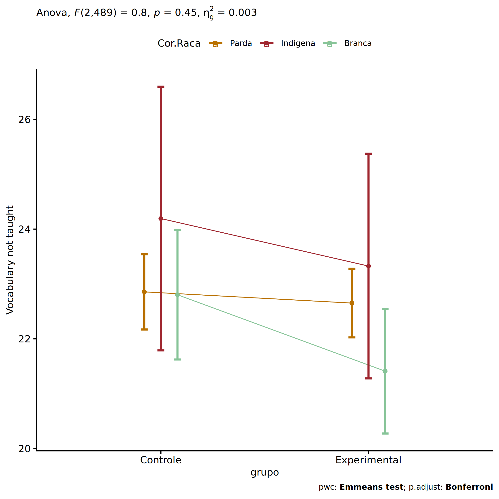<!-- -->

``` r
if (length(unique(pdat[["Cor.Raca"]])) >= 2) {
  ggPlotAoC2(pwcs, "Cor.Raca", "grupo", aov, ylab = "Vocabulary not taught",
               subtitle = which(aov$Effect == "grupo:Cor.Raca"), addParam = "errorbar") +
      ggplot2::scale_color_manual(values = color[["grupo"]]) +
      if (ymin.ci < ymax.ci) ggplot2::ylim(ymin.ci, ymax.ci)
}
```

    ## Scale for colour is already present.
    ## Adding another scale for colour, which will replace the existing scale.

<!-- -->

``` r
if (length(unique(pdat[["Cor.Raca"]])) >= 2) {
  plots <- twoWayAncovaBoxPlots(
    wdat, "vocab.non.teach.pos", c("grupo","Cor.Raca"), aov, pwcs, covar = "vocab.non.teach.pre",
    theme = "classic", color = color[["grupo:Cor.Raca"]],
    subtitle = which(aov$Effect == "grupo:Cor.Raca"))
}
```

``` r
if (length(unique(pdat[["Cor.Raca"]])) >= 2) {
  plots[["grupo:Cor.Raca"]] + ggplot2::ylab("Vocabulary not taught") +
  ggplot2::scale_x_discrete(labels=c('pre', 'pos')) +
  if (ymin < ymax) ggplot2::ylim(ymin, ymax)
}
```

    ## Warning: No shared levels found between `names(values)` of the manual scale and the data's colour values.

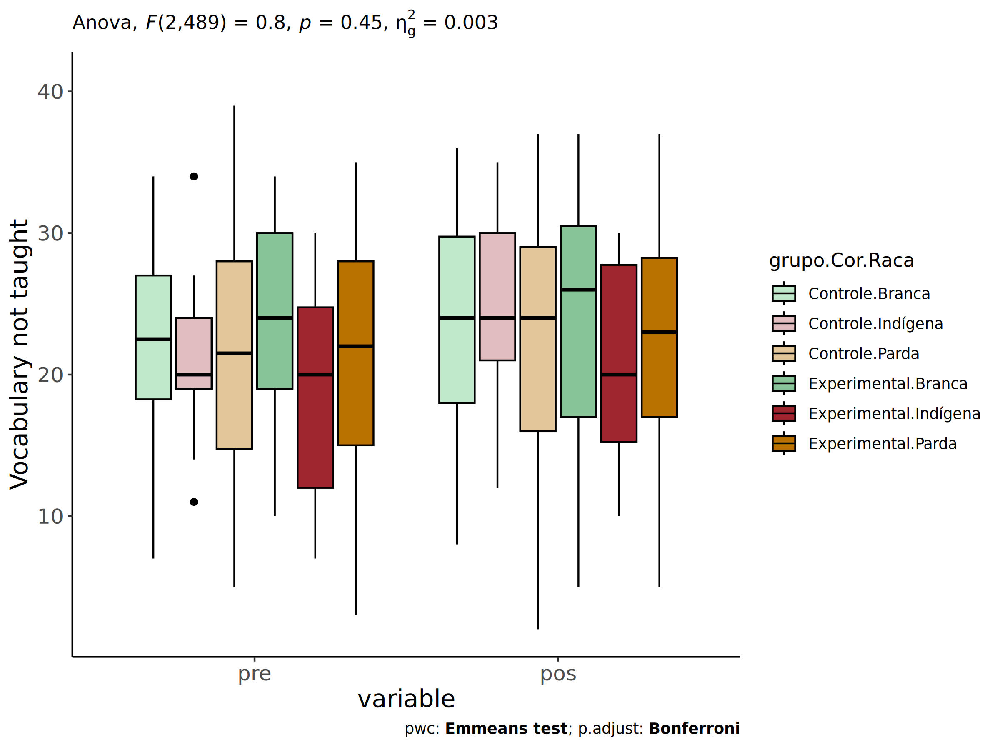<!-- -->

``` r
if (length(unique(pdat[["Cor.Raca"]])) >= 2) {
  plots <- twoWayAncovaBoxPlots(
    wdat.long, "vocab.non.teach", c("grupo","Cor.Raca"), aov, pwc.long,
    pre.post = "time",
    theme = "classic", color = color$prepost)
}
```

``` r
if (length(unique(pdat[["Cor.Raca"]])) >= 2) 
  plots[["grupo:Cor.Raca"]] + ggplot2::ylab("Vocabulary not taught") +
    if (ymin < ymax) ggplot2::ylim(ymin, ymax)
```

<!-- -->

### Checking linearity assumption

``` r
if (length(unique(pdat[["Cor.Raca"]])) >= 2) {
  ggscatter(wdat, x = "vocab.non.teach.pre", y = "vocab.non.teach.pos", size = 0.5,
            facet.by = c("grupo","Cor.Raca"), add = "reg.line")+
    stat_regline_equation(
      aes(label =  paste(..eq.label.., ..rr.label.., sep = "~~~~"))
    ) +
    if (ymin < ymax) ggplot2::ylim(ymin, ymax)
}
```

<!-- -->

``` r
if (length(unique(pdat[["Cor.Raca"]])) >= 2) {
  ggscatter(wdat, x = "vocab.non.teach.pre", y = "vocab.non.teach.pos", size = 0.5,
            color = "grupo", facet.by = "Cor.Raca", add = "reg.line")+
    stat_regline_equation(
      aes(label =  paste(..eq.label.., ..rr.label.., sep = "~~~~"), color = grupo)
    ) +
    ggplot2::labs(subtitle = rstatix::get_test_label(aov, detailed = T, row = which(aov$Effect == "grupo:Cor.Raca"))) +
    ggplot2::scale_color_manual(values = color[["grupo"]]) +
    if (ymin < ymax) ggplot2::ylim(ymin, ymax)
}
```

<!-- -->

``` r
if (length(unique(pdat[["Cor.Raca"]])) >= 2) {
  ggscatter(wdat, x = "vocab.non.teach.pre", y = "vocab.non.teach.pos", size = 0.5,
            color = "Cor.Raca", facet.by = "grupo", add = "reg.line")+
    stat_regline_equation(
      aes(label =  paste(..eq.label.., ..rr.label.., sep = "~~~~"), color = Cor.Raca)
    ) +
    ggplot2::labs(subtitle = rstatix::get_test_label(aov, detailed = T, row = which(aov$Effect == "grupo:Cor.Raca"))) +
    ggplot2::scale_color_manual(values = color[["Cor.Raca"]]) +
    if (ymin < ymax) ggplot2::ylim(ymin, ymax)
}
```

<!-- -->

### Checking normality and homogeneity

``` r
if (length(unique(pdat[["Cor.Raca"]])) >= 2) 
  res <- augment(lm(vocab.non.teach.pos ~ vocab.non.teach.pre + grupo*Cor.Raca, data = wdat))
```

``` r
if (length(unique(pdat[["Cor.Raca"]])) >= 2)
  shapiro_test(res$.resid)
```

    ## # A tibble: 1 × 3
    ##   variable   statistic p.value
    ##   <chr>          <dbl>   <dbl>
    ## 1 res$.resid     0.994  0.0458

``` r
if (length(unique(pdat[["Cor.Raca"]])) >= 2) 
  levene_test(res, .resid ~ grupo*Cor.Raca)
```

    ## # A tibble: 1 × 4
    ##     df1   df2 statistic     p
    ##   <int> <int>     <dbl> <dbl>
    ## 1     5   490      1.36 0.239

# ANCOVA and Pairwise for two factors **grupo:Serie**

## Without remove non-normal data

``` r
pdat = remove_group_data(dat[!is.na(dat[["grupo"]]) & !is.na(dat[["Serie"]]),],
                         "vocab.non.teach.pos", c("grupo","Serie"))
pdat = pdat[pdat[["Serie"]] %in% do.call(
  intersect, lapply(unique(pdat[["grupo"]]), FUN = function(x) {
    unique(pdat[["Serie"]][which(pdat[["grupo"]] == x)])
  })),]
pdat[["grupo"]] = factor(pdat[["grupo"]], level[["grupo"]])
pdat[["Serie"]] = factor(
  pdat[["Serie"]],
  level[["Serie"]][level[["Serie"]] %in% unique(pdat[["Serie"]])])

pdat.long <- rbind(pdat[,c("id","grupo","Serie")], pdat[,c("id","grupo","Serie")])
pdat.long[["time"]] <- c(rep("pre", nrow(pdat)), rep("pos", nrow(pdat)))
pdat.long[["time"]] <- factor(pdat.long[["time"]], c("pre","pos"))
pdat.long[["vocab.non.teach"]] <- c(pdat[["vocab.non.teach.pre"]], pdat[["vocab.non.teach.pos"]])

if (length(unique(pdat[["Serie"]])) >= 2) {
  aov = anova_test(pdat, vocab.non.teach.pos ~ vocab.non.teach.pre + grupo*Serie)
  laov[["grupo:Serie"]] <- get_anova_table(aov)
}
```

``` r
if (length(unique(pdat[["Serie"]])) >= 2) {
  pwcs <- list()
  pwcs[["Serie"]] <- emmeans_test(
    group_by(pdat, grupo), vocab.non.teach.pos ~ Serie,
    covariate = vocab.non.teach.pre, p.adjust.method = "bonferroni")
  pwcs[["grupo"]] <- emmeans_test(
    group_by(pdat, Serie), vocab.non.teach.pos ~ grupo,
    covariate = vocab.non.teach.pre, p.adjust.method = "bonferroni")
  
  pwc <- plyr::rbind.fill(pwcs[["grupo"]], pwcs[["Serie"]])
  pwc <- pwc[,c("grupo","Serie", colnames(pwc)[!colnames(pwc) %in% c("grupo","Serie")])]
}
```

``` r
if (length(unique(pdat[["Serie"]])) >= 2) {
  pwc.long <- emmeans_test(dplyr::group_by_at(pdat.long, c("grupo","Serie")),
                           vocab.non.teach ~ time,
                           p.adjust.method = "bonferroni")
  lpwc[["grupo:Serie"]] <- plyr::rbind.fill(pwc, pwc.long)
}
```

``` r
if (length(unique(pdat[["Serie"]])) >= 2) {
  ds <- get.descriptives(pdat, "vocab.non.teach.pos", c("grupo","Serie"), covar = "vocab.non.teach.pre")
  ds <- merge(ds[ds$variable != "vocab.non.teach.pre",],
              ds[ds$variable == "vocab.non.teach.pre", !colnames(ds) %in% c("variable")],
              by = c("grupo","Serie"), all.x = T, suffixes = c("", ".vocab.non.teach.pre"))
  ds <- merge(get_emmeans(pwcs[["grupo"]]), ds,
              by = c("grupo","Serie"), suffixes = c(".emms", ""))
  ds <- ds[,c("grupo","Serie","n","mean.vocab.non.teach.pre","se.vocab.non.teach.pre","mean","se",
              "emmean","se.emms","conf.low","conf.high")]
  
  colnames(ds) <- c("grupo","Serie", "N", paste0(c("M","SE")," (pre)"),
                    paste0(c("M","SE"), " (unadj)"),
                    paste0(c("M", "SE"), " (adj)"), "conf.low", "conf.high")
  
  lemms[["grupo:Serie"]] <- ds
}
```

## Computing ANCOVA and PairWise After removing non-normal data (OK)

``` r
if (length(unique(pdat[["Serie"]])) >= 2) {
  wdat = pdat 
  
  res = residuals(lm(vocab.non.teach.pos ~ vocab.non.teach.pre + grupo*Serie, data = wdat))
  non.normal = getNonNormal(res, wdat$id, plimit = 0.05)
  
  wdat = wdat[!wdat$id %in% non.normal,]
  
  wdat.long <- rbind(wdat[,c("id","grupo","Serie")], wdat[,c("id","grupo","Serie")])
  wdat.long[["time"]] <- c(rep("pre", nrow(wdat)), rep("pos", nrow(wdat)))
  wdat.long[["time"]] <- factor(wdat.long[["time"]], c("pre","pos"))
  wdat.long[["vocab.non.teach"]] <- c(wdat[["vocab.non.teach.pre"]], wdat[["vocab.non.teach.pos"]])
  
  
  ldat[["grupo:Serie"]] = wdat
  
  (non.normal)
}
```

    ##    [1] "P1139" "P1003" "P1113" "P983"  "P2304" "P996"  "P2853" "P3654" "P1006" "P2232" "P2245" "P1069" "P2192" "P1112" "P2207"
    ##   [16] "P3260" "P1790" "P2251" "P3042" "P852"  "P1056" "P1831" "P1129" "P1936" "P3106" "P3473" "P1057" "P1961" "P2850" "P2219"
    ##   [31] "P916"  "P1794" "P3228" "P3471" "P3097" "P888"  "P1151" "P478"  "P1966" "P2135" "P976"  "P1620" "P3038" "P887"  "P2957"
    ##   [46] "P3265" "P850"  "P913"  "P2092" "P1165" "P2206" "P3658" "P837"  "P863"  "P2861" "P822"  "P3660" "P2195" "P1835" "P1873"
    ##   [61] "P1960" "P2125" "P444"  "P3255" "P1938" "P968"  "P1157" "P1066" "P3145" "P1110" "P3159" "P2458" "P3685" "P2296" "P489" 
    ##   [76] "P3499" "P2856" "P3025" "P1741" "P2835" "P2176" "P606"  "P821"  "P3724" "P2113" "P1012" "P3548" "P2069" "P540"  "P823" 
    ##   [91] "P3043" "P2394" "P1074" "P2435" "P491"  "P1801" "P3635" "P933"  "P2931" "P985"  "P3517" "P2860" "P3267" "P3480" "P2374"
    ##  [106] "P2339" "P1754" "P2907" "P1009" "P2949" "P607"  "P2359" "P1865" "P1859" "P2004" "P3113" "P1008" "P3236" "P1672" "P1167"
    ##  [121] "P818"  "P2098" "P2959" "P1697" "P3101" "P3081" "P921"  "P1845" "P2050" "P576"  "P2189" "P1785" "P3503" "P3112" "P2082"
    ##  [136] "P3553" "P2454" "P2305" "P840"  "P1757" "P443"  "P2223" "P2866" "P1065" "P2121" "P1890" "P2384" "P890"  "P2341" "P2327"
    ##  [151] "P2072" "P578"  "P3527" "P472"  "P1136" "P1909" "P2203" "P1779" "P1941" "P3072" "P826"  "P1778" "P1029" "P2161" "P2925"
    ##  [166] "P2311" "P530"  "P580"  "P1750" "P473"  "P2438" "P2197" "P1962" "P2309" "P1780" "P3254" "P1656" "P2365" "P2190" "P1037"
    ##  [181] "P1050" "P598"  "P1836" "P1158" "P1899" "P3538" "P1122" "P889"  "P3469" "P2905" "P2872" "P1613" "P3200" "P2479" "P2185"
    ##  [196] "P1651" "P2847" "P2841" "P3475" "P2342" "P2938" "P1977" "P1718" "P2351" "P2151" "P529"  "P3215" "P1659" "P2344" "P2346"
    ##  [211] "P2363" "P2117" "P2375" "P904"  "P2000" "P571"  "P583"  "P1738" "P2416" "P3285" "P2429" "P2382" "P2348" "P915"  "P1976"
    ##  [226] "P965"  "P1071" "P547"  "P2958" "P2887" "P856"  "P2877" "P3257" "P2158" "P543"  "P984"  "P1998" "P3539" "P3541" "P1087"
    ##  [241] "P1834" "P3269" "P2156" "P3110" "P1691" "P865"  "P2900" "P2420" "P2193" "P541"  "P2321" "P539"  "P1714" "P3293" "P1149"
    ##  [256] "P3111" "P1844" "P2229" "P879"  "P1703" "P1748" "P3246" "P2369" "P1117" "P951"  "P2172" "P1142" "P2074" "P1862" "P2168"
    ##  [271] "P624"  "P3095" "P2443" "P1607" "P1725" "P3124" "P2234" "P2832" "P2162" "P3533" "P3522" "P2862" "P2881" "P1127" "P2301"
    ##  [286] "P930"  "P2012" "P3158" "P1901" "P3461" "P2366" "P2329" "P1166" "P2068" "P2160" "P477"  "P836"  "P1052" "P2982" "P1877"
    ##  [301] "P3542" "P1720" "P3005" "P1622" "P2356" "P2439" "P567"  "P2317" "P3070" "P1947" "P959"  "P1987" "P1893" "P1064" "P3299"
    ##  [316] "P2403" "P973"  "P534"  "P3486" "P2867" "P2450" "P2399" "P3298" "P3135" "P2157" "P493"  "P3562" "P2981" "P2353" "P2051"
    ##  [331] "P834"  "P3050" "P2482" "P604"  "P3585" "P925"  "P2217" "P1667" "P3166" "P2164" "P2336" "P979"  "P1684" "P2446" "P1847"
    ##  [346] "P1693" "P1744" "P476"  "P601"  "P559"  "P824"  "P1758" "P868"  "P2903" "P561"  "P3550" "P884"  "P2312" "P2297" "P1161"
    ##  [361] "P1104" "P1906" "P2951" "P1709" "P1875" "P966"  "P949"  "P2865" "P3297" "P2368" "P3086" "P1975" "P1763" "P2373" "P1922"
    ##  [376] "P3290" "P2078" "P1832" "P907"  "P3484" "P2882" "P2968" "P2331" "P3472" "P1916" "P1843" "P2886" "P1678" "P2295" "P1668"
    ##  [391] "P1740" "P1076" "P844"  "P2137" "P3073" "P1956" "P3256" "P2319" "P962"  "P2961" "P3076" "P918"  "P1802" "P572"  "P1645"
    ##  [406] "P2885" "P2338" "P3703" "P2200" "P2308" "P3065" "P549"  "P974"  "P2094" "P969"  "P3679" "P3666" "P2381" "P2194" "P1093"
    ##  [421] "P3057" "P2364" "P2136" "P978"  "P1807" "P597"  "P3083" "P2313" "P1596" "P3543" "P1797" "P2170" "P2393" "P3708" "P1690"
    ##  [436] "P3030" "P2173" "P998"  "P2086" "P1598" "P982"  "P2946" "P1655" "P1088" "P961"  "P3465" "P2480" "P1891" "P490"  "P1599"
    ##  [451] "P1895" "P1911" "P535"  "P871"  "P3010" "P987"  "P3142" "P3507" "P3526" "P1841" "P545"  "P2842" "P486"  "P1027" "P3164"
    ##  [466] "P2398" "P1803" "P1925" "P442"  "P2448" "P2417" "P3474" "P3020" "P2357" "P971"  "P2323" "P883"  "P3054" "P1882" "P2100"
    ##  [481] "P3221" "P859"  "P2971" "P2171" "P1852" "P2888" "P1685" "P2937" "P3587" "P479"  "P3689" "P2966" "P2362" "P3693" "P1666"
    ##  [496] "P3133" "P3141" "P2119" "P3579" "P3530" "P2969" "P1721" "P3463" "P1038" "P3531" "P927"  "P2836" "P1892" "P2947" "P1683"
    ##  [511] "P1121" "P3123" "P2175" "P2315" "P3247" "P1867" "P914"  "P2950" "P1767" "P610"  "P608"  "P2444" "P1902" "P2964" "P3493"
    ##  [526] "P3488" "P3645" "P1153" "P2372" "P3026" "P3006" "P3638" "P2149" "P631"  "P855"  "P954"  "P2891" "P2426" "P3570" "P1886"
    ##  [541] "P3301" "P3546" "P1735" "P3024" "P1912" "P2437" "P1033" "P2075" "P2910" "P2467" "P2370" "P2332" "P2114" "P2212" "P2839"
    ##  [556] "P3068" "P500"  "P2128" "P3652" "P3015" "P3139" "P1943" "P2216" "P1634" "P909"  "P3494" "P2213" "P2183" "P2122" "P1878"
    ##  [571] "P1067" "P3478" "P600"  "P3688" "P2436" "P3643" "P2299" "P1855" "P2242" "P1887" "P3048" "P1130" "P3208" "P832"  "P995" 
    ##  [586] "P3237" "P1148" "P3714" "P1868" "P1921" "P1900" "P471"  "P1654" "P2440" "P3250" "P2418" "P2141" "P2131" "P3150" "P3226"
    ##  [601] "P524"  "P456"  "P1631" "P2361" "P1671" "P2956" "P1664" "P2233" "P1051" "P2990" "P980"  "P3576" "P1799" "P3695" "P2054"
    ##  [616] "P1042" "P1597" "P2143" "P3059" "P1950" "P924"  "P935"  "P3272" "P3199" "P3614" "P1014" "P2310" "P1611" "P487"  "P3731"
    ##  [631] "P1747" "P2410" "P3639" "P846"  "P2920" "P3588" "P3563" "P2449" "P3130" "P1019" "P1102" "P975"  "P3663" "P1036" "P3491"
    ##  [646] "P1915" "P1695" "P1704" "P2927" "P1133" "P3085" "P929"  "P2138" "P1665" "P3619" "P2846" "P1885" "P1669" "P2944" "P3259"
    ##  [661] "P2831" "P2477" "P2452" "P2354" "P3536" "P1920" "P1043" "P2133" "P3523" "P1670" "P862"  "P3007" "P3077" "P1696" "P1662"
    ##  [676] "P3589" "P2470" "P2152" "P1031" "P3149" "P2316" "P1833" "P831"  "P2235" "P3481" "P2879" "P3264" "P817"  "P3211" "P573" 
    ##  [691] "P1152" "P905"  "P462"  "P1787" "P2851" "P2476" "P2343" "P2457" "P3202" "P842"  "P2908" "P452"  "P1719" "P3021" "P3684"
    ##  [706] "P970"  "P1846" "P1059" "P3218" "P1712" "P2325" "P2909" "P2413" "P3148" "P3675" "P2181" "P2188" "P2298" "P2948" "P1969"
    ##  [721] "P814"  "P2109" "P2412" "P1908" "P1775" "P1789" "P2049" "P3064" "P2973" "P1694" "P2916" "P3307" "P1689" "P2106" "P3608"
    ##  [736] "P3713" "P494"  "P3549" "P2003" "P2904" "P1652" "P2148" "P3120" "P3079" "P3485" "P2360" "P1913" "P3132" "P3709" "P3227"
    ##  [751] "P2945" "P2912" "P2868" "P1018" "P3532" "P885"  "P482"  "P2350" "P2481" "P3622" "P2196" "P3245" "P3719" "P2292" "P939" 
    ##  [766] "P1026" "P552"  "P928"  "P3082" "P931"  "P2870" "P3691" "P3279" "P563"  "P1141" "P1105" "P1800" "P2451" "P2367" "P2475"
    ##  [781] "P2978" "P3671" "P3651" "P496"  "P1600" "P1910" "P911"  "P1840" "P919"  "P3129" "P2064" "P1085" "P3242" "P1914" "P3633"
    ##  [796] "P584"  "P466"  "P944"  "P3196" "P2955" "P565"  "P2080" "P586"  "P2845" "P3590" "P1848" "P1688" "P3003" "P1035" "P3127"
    ##  [811] "P3136" "P3462" "P2852" "P1884" "P1708" "P1663" "P1623" "P2441" "P605"  "P2139" "P633"  "P2997" "P3650" "P3146" "P2400"
    ##  [826] "P3198" "P1674" "P2392" "P2889" "P2445" "P3147" "P2225" "P2387" "P3551" "P1982" "P3554" "P2871" "P2237" "P3134" "P3561"
    ##  [841] "P1075" "P2984" "P1879" "P3712" "P1907" "P2334" "P3171" "P1061" "P3730" "P3510" "P2165" "P1974" "P2952" "P2129" "P3620"
    ##  [856] "P1053" "P495"  "P1090" "P2463" "P1068" "P3144" "P3192" "P2118" "P474"  "P461"  "P2300" "P2929" "P1888" "P1781" "P3078"
    ##  [871] "P2070" "P2324" "P1614" "P1603" "P1989" "P3262" "P3540" "P1870" "P835"  "P3305" "P3180" "P3487" "P2953" "P1991" "P3119"
    ##  [886] "P2108" "P538"  "P492"  "P481"  "P2358" "P864"  "P520"  "P453"  "P1644" "P967"  "P585"  "P2901" "P1949" "P1849" "P1627"
    ##  [901] "P1633" "P2459" "P2428" "P1660" "P518"  "P2198" "P548"  "P3483" "P2431" "P2423" "P3283" "P2306" "P1680" "P1751" "P3567"
    ##  [916] "P3173" "P2859" "P3610" "P1988" "P1903" "P3309" "P1825" "P815"  "P2096" "P2083" "P3284" "P2056" "P1734" "P972"  "P2986"
    ##  [931] "P938"  "P3213" "P1829" "P441"  "P2065" "P1990" "P1679" "P2088" "P851"  "P1595" "P1039" "P1745" "P603"  "P3723" "P1100"
    ##  [946] "P2379" "P3616" "P3529" "P3062" "P3074" "P1876" "P2453" "P3140" "P2466" "P3528" "P3676" "P3033" "P828"  "P1749" "P1883"
    ##  [961] "P3637" "P2009" "P1968" "P2333" "P2469" "P2191" "P588"  "P3657" "P3222" "P3225" "P1617" "P3282" "P455"  "P2893" "P3482"
    ##  [976] "P1632" "P3670" "P3312" "P1028" "P3722" "P1772" "P511"  "P1828" "P1978" "P2246" "P3066" "P3568" "P3582" "P562"  "P475" 
    ##  [991] "P1592" "P1610" "P1602" "P3572" "P1723" "P2150" "P2322" "P3011" "P2186" "P3088"
    ##  [ reached getOption("max.print") -- omitted 185 entries ]

``` r
if (length(unique(pdat[["Serie"]])) >= 2) {
  aov = anova_test(wdat, vocab.non.teach.pos ~ vocab.non.teach.pre + grupo*Serie)
  laov[["grupo:Serie"]] <- merge(get_anova_table(aov), laov[["grupo:Serie"]],
                                         by="Effect", suffixes = c("","'"))
  df = get_anova_table(aov)
}
```

| Effect              | DFn | DFd |        F |     p | p\<.05 |   ges |
|:--------------------|----:|----:|---------:|------:|:-------|------:|
| vocab.non.teach.pre |   1 |  35 | 1519.296 | 0.000 | \*     | 0.977 |
| grupo               |   1 |  35 |    0.066 | 0.799 |        | 0.002 |
| Serie               |   3 |  35 |    8.261 | 0.000 | \*     | 0.415 |
| grupo:Serie         |   3 |  35 |    1.843 | 0.157 |        | 0.136 |

``` r
if (length(unique(pdat[["Serie"]])) >= 2) {
  pwcs <- list()
  pwcs[["Serie"]] <- emmeans_test(
    group_by(wdat, grupo), vocab.non.teach.pos ~ Serie,
    covariate = vocab.non.teach.pre, p.adjust.method = "bonferroni")
  pwcs[["grupo"]] <- emmeans_test(
    group_by(wdat, Serie), vocab.non.teach.pos ~ grupo,
    covariate = vocab.non.teach.pre, p.adjust.method = "bonferroni")
  
  pwc <- plyr::rbind.fill(pwcs[["grupo"]], pwcs[["Serie"]])
  pwc <- pwc[,c("grupo","Serie", colnames(pwc)[!colnames(pwc) %in% c("grupo","Serie")])]
}
```

| grupo | Serie | term | .y. | group1 | group2 | df | statistic | p | p.adj | p.adj.signif |
|:---|:---|:---|:---|:---|:---|---:|---:|---:|---:|:---|
|  | 6 ano | vocab.non.teach.pre\*grupo | vocab.non.teach.pos | Controle | Experimental | 35 | -0.623 | 0.537 | 0.537 | ns |
|  | 7 ano | vocab.non.teach.pre\*grupo | vocab.non.teach.pos | Controle | Experimental | 35 | 1.975 | 0.056 | 0.056 | ns |
|  | 8 ano | vocab.non.teach.pre\*grupo | vocab.non.teach.pos | Controle | Experimental | 35 | -1.078 | 0.288 | 0.288 | ns |
|  | 9 ano | vocab.non.teach.pre\*grupo | vocab.non.teach.pos | Controle | Experimental | 35 | 0.330 | 0.743 | 0.743 | ns |
| Controle |  | vocab.non.teach.pre\*Serie | vocab.non.teach.pos | 6 ano | 7 ano | 35 | -2.570 | 0.015 | 0.088 | ns |
| Controle |  | vocab.non.teach.pre\*Serie | vocab.non.teach.pos | 6 ano | 8 ano | 35 | -1.684 | 0.101 | 0.607 | ns |
| Controle |  | vocab.non.teach.pre\*Serie | vocab.non.teach.pos | 6 ano | 9 ano | 35 | -3.654 | 0.001 | 0.005 | \*\* |
| Controle |  | vocab.non.teach.pre\*Serie | vocab.non.teach.pos | 7 ano | 8 ano | 35 | 1.147 | 0.259 | 1.000 | ns |
| Controle |  | vocab.non.teach.pre\*Serie | vocab.non.teach.pos | 7 ano | 9 ano | 35 | -1.571 | 0.125 | 0.751 | ns |
| Controle |  | vocab.non.teach.pre\*Serie | vocab.non.teach.pos | 8 ano | 9 ano | 35 | -2.566 | 0.015 | 0.088 | ns |
| Experimental |  | vocab.non.teach.pre\*Serie | vocab.non.teach.pos | 6 ano | 7 ano | 35 | -0.404 | 0.689 | 1.000 | ns |
| Experimental |  | vocab.non.teach.pre\*Serie | vocab.non.teach.pos | 6 ano | 8 ano | 35 | -2.111 | 0.042 | 0.252 | ns |
| Experimental |  | vocab.non.teach.pre\*Serie | vocab.non.teach.pos | 6 ano | 9 ano | 35 | -3.443 | 0.002 | 0.009 | \*\* |
| Experimental |  | vocab.non.teach.pre\*Serie | vocab.non.teach.pos | 7 ano | 8 ano | 35 | -1.963 | 0.058 | 0.346 | ns |
| Experimental |  | vocab.non.teach.pre\*Serie | vocab.non.teach.pos | 7 ano | 9 ano | 35 | -3.745 | 0.001 | 0.004 | \*\* |
| Experimental |  | vocab.non.teach.pre\*Serie | vocab.non.teach.pos | 8 ano | 9 ano | 35 | -1.673 | 0.103 | 0.619 | ns |

``` r
if (length(unique(pdat[["Serie"]])) >= 2) {
  pwc.long <- emmeans_test(dplyr::group_by_at(wdat.long, c("grupo","Serie")),
                           vocab.non.teach ~ time,
                           p.adjust.method = "bonferroni")
  lpwc[["grupo:Serie"]] <- merge(plyr::rbind.fill(pwc, pwc.long),
                                         lpwc[["grupo:Serie"]],
                                         by=c("grupo","Serie","term",".y.","group1","group2"),
                                         suffixes = c("","'"))
}
```

| grupo | Serie | term | .y. | group1 | group2 | df | statistic | p | p.adj | p.adj.signif |
|:---|:---|:---|:---|:---|:---|---:|---:|---:|---:|:---|
| Controle | 6 ano | time | vocab.non.teach | pre | pos | 72 | -2.961 | 0.004 | 0.004 | \*\* |
| Controle | 7 ano | time | vocab.non.teach | pre | pos | 72 | -1.958 | 0.054 | 0.054 | ns |
| Controle | 8 ano | time | vocab.non.teach | pre | pos | 72 | -2.371 | 0.020 | 0.020 | \* |
| Controle | 9 ano | time | vocab.non.teach | pre | pos | 72 | -1.528 | 0.131 | 0.131 | ns |
| Experimental | 6 ano | time | vocab.non.teach | pre | pos | 72 | -2.812 | 0.006 | 0.006 | \*\* |
| Experimental | 7 ano | time | vocab.non.teach | pre | pos | 72 | -2.904 | 0.005 | 0.005 | \*\* |
| Experimental | 8 ano | time | vocab.non.teach | pre | pos | 72 | -2.476 | 0.016 | 0.016 | \* |
| Experimental | 9 ano | time | vocab.non.teach | pre | pos | 72 | -2.026 | 0.046 | 0.046 | \* |

``` r
if (length(unique(pdat[["Serie"]])) >= 2) {
  ds <- get.descriptives(wdat, "vocab.non.teach.pos", c("grupo","Serie"), covar = "vocab.non.teach.pre")
  ds <- merge(ds[ds$variable != "vocab.non.teach.pre",],
              ds[ds$variable == "vocab.non.teach.pre", !colnames(ds) %in% c("variable")],
              by = c("grupo","Serie"), all.x = T, suffixes = c("", ".vocab.non.teach.pre"))
  ds <- merge(get_emmeans(pwcs[["grupo"]]), ds,
              by = c("grupo","Serie"), suffixes = c(".emms", ""))
  ds <- ds[,c("grupo","Serie","n","mean.vocab.non.teach.pre","se.vocab.non.teach.pre",
              "mean","se","emmean","se.emms","conf.low","conf.high")]
  
  colnames(ds) <- c("grupo","Serie", "N", paste0(c("M","SE")," (pre)"),
                    paste0(c("M","SE"), " (unadj)"),
                    paste0(c("M", "SE"), " (adj)"), "conf.low", "conf.high")
  
  lemms[["grupo:Serie"]] <- merge(ds, lemms[["grupo:Serie"]],
                                          by=c("grupo","Serie"), suffixes = c("","'"))
}
```

| grupo | Serie | N | M (pre) | SE (pre) | M (unadj) | SE (unadj) | M (adj) | SE (adj) | conf.low | conf.high |
|:---|:---|---:|---:|---:|---:|---:|---:|---:|---:|---:|
| Controle | 6 ano | 7 | 14.571 | 2.091 | 22.857 | 1.724 | 27.139 | 0.281 | 26.568 | 27.710 |
| Controle | 7 ano | 4 | 23.750 | 2.323 | 31.000 | 1.683 | 28.333 | 0.349 | 27.624 | 29.042 |
| Controle | 8 ano | 6 | 22.000 | 2.556 | 29.167 | 2.120 | 27.825 | 0.282 | 27.253 | 28.397 |
| Controle | 9 ano | 2 | 24.500 | 0.500 | 32.500 | 0.500 | 29.266 | 0.491 | 28.268 | 30.263 |
| Experimental | 6 ano | 6 | 14.667 | 3.040 | 23.167 | 2.286 | 27.376 | 0.300 | 26.767 | 27.985 |
| Experimental | 7 ano | 10 | 22.300 | 1.325 | 29.100 | 1.069 | 27.531 | 0.220 | 27.084 | 27.978 |
| Experimental | 8 ano | 5 | 19.600 | 3.868 | 27.800 | 2.782 | 28.275 | 0.307 | 27.652 | 28.897 |
| Experimental | 9 ano | 4 | 25.750 | 2.323 | 33.250 | 1.315 | 29.069 | 0.359 | 28.341 | 29.798 |

### Plots for ancova

``` r
if (length(unique(pdat[["Serie"]])) >= 2) {
  ggPlotAoC2(pwcs, "grupo", "Serie", aov, ylab = "Vocabulary not taught",
             subtitle = which(aov$Effect == "grupo:Serie"), addParam = "errorbar") +
    ggplot2::scale_color_manual(values = color[["Serie"]]) +
    if (ymin.ci < ymax.ci) ggplot2::ylim(ymin.ci, ymax.ci)
}
```

    ## Scale for colour is already present.
    ## Adding another scale for colour, which will replace the existing scale.

<!-- -->

``` r
if (length(unique(pdat[["Serie"]])) >= 2) {
  ggPlotAoC2(pwcs, "Serie", "grupo", aov, ylab = "Vocabulary not taught",
               subtitle = which(aov$Effect == "grupo:Serie"), addParam = "errorbar") +
      ggplot2::scale_color_manual(values = color[["grupo"]]) +
      if (ymin.ci < ymax.ci) ggplot2::ylim(ymin.ci, ymax.ci)
}
```

    ## Scale for colour is already present.
    ## Adding another scale for colour, which will replace the existing scale.

<!-- -->

``` r
if (length(unique(pdat[["Serie"]])) >= 2) {
  plots <- twoWayAncovaBoxPlots(
    wdat, "vocab.non.teach.pos", c("grupo","Serie"), aov, pwcs, covar = "vocab.non.teach.pre",
    theme = "classic", color = color[["grupo:Serie"]],
    subtitle = which(aov$Effect == "grupo:Serie"))
}
```

``` r
if (length(unique(pdat[["Serie"]])) >= 2) {
  plots[["grupo:Serie"]] + ggplot2::ylab("Vocabulary not taught") +
  ggplot2::scale_x_discrete(labels=c('pre', 'pos')) +
  if (ymin < ymax) ggplot2::ylim(ymin, ymax)
}
```

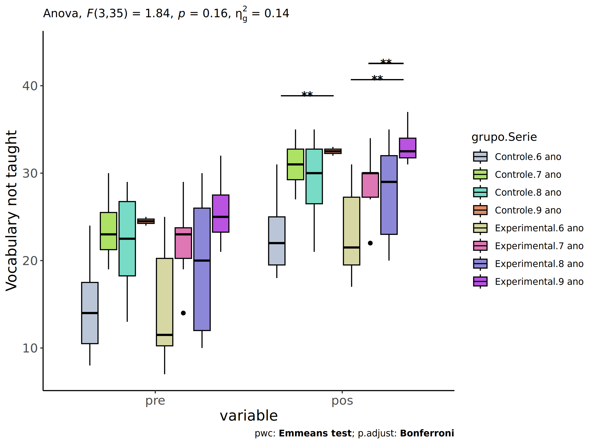<!-- -->

``` r
if (length(unique(pdat[["Serie"]])) >= 2) {
  plots <- twoWayAncovaBoxPlots(
    wdat.long, "vocab.non.teach", c("grupo","Serie"), aov, pwc.long,
    pre.post = "time",
    theme = "classic", color = color$prepost)
}
```

``` r
if (length(unique(pdat[["Serie"]])) >= 2) 
  plots[["grupo:Serie"]] + ggplot2::ylab("Vocabulary not taught") +
    if (ymin < ymax) ggplot2::ylim(ymin, ymax)
```

<!-- -->

### Checking linearity assumption

``` r
if (length(unique(pdat[["Serie"]])) >= 2) {
  ggscatter(wdat, x = "vocab.non.teach.pre", y = "vocab.non.teach.pos", size = 0.5,
            facet.by = c("grupo","Serie"), add = "reg.line")+
    stat_regline_equation(
      aes(label =  paste(..eq.label.., ..rr.label.., sep = "~~~~"))
    ) +
    if (ymin < ymax) ggplot2::ylim(ymin, ymax)
}
```

<!-- -->

``` r
if (length(unique(pdat[["Serie"]])) >= 2) {
  ggscatter(wdat, x = "vocab.non.teach.pre", y = "vocab.non.teach.pos", size = 0.5,
            color = "grupo", facet.by = "Serie", add = "reg.line")+
    stat_regline_equation(
      aes(label =  paste(..eq.label.., ..rr.label.., sep = "~~~~"), color = grupo)
    ) +
    ggplot2::labs(subtitle = rstatix::get_test_label(aov, detailed = T, row = which(aov$Effect == "grupo:Serie"))) +
    ggplot2::scale_color_manual(values = color[["grupo"]]) +
    if (ymin < ymax) ggplot2::ylim(ymin, ymax)
}
```

<!-- -->

``` r
if (length(unique(pdat[["Serie"]])) >= 2) {
  ggscatter(wdat, x = "vocab.non.teach.pre", y = "vocab.non.teach.pos", size = 0.5,
            color = "Serie", facet.by = "grupo", add = "reg.line")+
    stat_regline_equation(
      aes(label =  paste(..eq.label.., ..rr.label.., sep = "~~~~"), color = Serie)
    ) +
    ggplot2::labs(subtitle = rstatix::get_test_label(aov, detailed = T, row = which(aov$Effect == "grupo:Serie"))) +
    ggplot2::scale_color_manual(values = color[["Serie"]]) +
    if (ymin < ymax) ggplot2::ylim(ymin, ymax)
}
```

<!-- -->

### Checking normality and homogeneity

``` r
if (length(unique(pdat[["Serie"]])) >= 2) 
  res <- augment(lm(vocab.non.teach.pos ~ vocab.non.teach.pre + grupo*Serie, data = wdat))
```

``` r
if (length(unique(pdat[["Serie"]])) >= 2)
  shapiro_test(res$.resid)
```

    ## # A tibble: 1 × 3
    ##   variable   statistic p.value
    ##   <chr>          <dbl>   <dbl>
    ## 1 res$.resid     0.980   0.631

``` r
if (length(unique(pdat[["Serie"]])) >= 2) 
  levene_test(res, .resid ~ grupo*Serie)
```

    ## # A tibble: 1 × 4
    ##     df1   df2 statistic     p
    ##   <int> <int>     <dbl> <dbl>
    ## 1     7    36     0.572 0.773

# ANCOVA and Pairwise for two factors **grupo:vocab.non.teach.quintile**

## Without remove non-normal data

``` r
pdat = remove_group_data(dat[!is.na(dat[["grupo"]]) & !is.na(dat[["vocab.non.teach.quintile"]]),],
                         "vocab.non.teach.pos", c("grupo","vocab.non.teach.quintile"))
pdat = pdat[pdat[["vocab.non.teach.quintile"]] %in% do.call(
  intersect, lapply(unique(pdat[["grupo"]]), FUN = function(x) {
    unique(pdat[["vocab.non.teach.quintile"]][which(pdat[["grupo"]] == x)])
  })),]
pdat[["grupo"]] = factor(pdat[["grupo"]], level[["grupo"]])
pdat[["vocab.non.teach.quintile"]] = factor(
  pdat[["vocab.non.teach.quintile"]],
  level[["vocab.non.teach.quintile"]][level[["vocab.non.teach.quintile"]] %in% unique(pdat[["vocab.non.teach.quintile"]])])

pdat.long <- rbind(pdat[,c("id","grupo","vocab.non.teach.quintile")], pdat[,c("id","grupo","vocab.non.teach.quintile")])
pdat.long[["time"]] <- c(rep("pre", nrow(pdat)), rep("pos", nrow(pdat)))
pdat.long[["time"]] <- factor(pdat.long[["time"]], c("pre","pos"))
pdat.long[["vocab.non.teach"]] <- c(pdat[["vocab.non.teach.pre"]], pdat[["vocab.non.teach.pos"]])

if (length(unique(pdat[["vocab.non.teach.quintile"]])) >= 2) {
  aov = anova_test(pdat, vocab.non.teach.pos ~ vocab.non.teach.pre + grupo*vocab.non.teach.quintile)
  laov[["grupo:vocab.non.teach.quintile"]] <- get_anova_table(aov)
}
```

``` r
if (length(unique(pdat[["vocab.non.teach.quintile"]])) >= 2) {
  pwcs <- list()
  pwcs[["vocab.non.teach.quintile"]] <- emmeans_test(
    group_by(pdat, grupo), vocab.non.teach.pos ~ vocab.non.teach.quintile,
    covariate = vocab.non.teach.pre, p.adjust.method = "bonferroni")
  pwcs[["grupo"]] <- emmeans_test(
    group_by(pdat, vocab.non.teach.quintile), vocab.non.teach.pos ~ grupo,
    covariate = vocab.non.teach.pre, p.adjust.method = "bonferroni")
  
  pwc <- plyr::rbind.fill(pwcs[["grupo"]], pwcs[["vocab.non.teach.quintile"]])
  pwc <- pwc[,c("grupo","vocab.non.teach.quintile", colnames(pwc)[!colnames(pwc) %in% c("grupo","vocab.non.teach.quintile")])]
}
```

``` r
if (length(unique(pdat[["vocab.non.teach.quintile"]])) >= 2) {
  pwc.long <- emmeans_test(dplyr::group_by_at(pdat.long, c("grupo","vocab.non.teach.quintile")),
                           vocab.non.teach ~ time,
                           p.adjust.method = "bonferroni")
  lpwc[["grupo:vocab.non.teach.quintile"]] <- plyr::rbind.fill(pwc, pwc.long)
}
```

``` r
if (length(unique(pdat[["vocab.non.teach.quintile"]])) >= 2) {
  ds <- get.descriptives(pdat, "vocab.non.teach.pos", c("grupo","vocab.non.teach.quintile"), covar = "vocab.non.teach.pre")
  ds <- merge(ds[ds$variable != "vocab.non.teach.pre",],
              ds[ds$variable == "vocab.non.teach.pre", !colnames(ds) %in% c("variable")],
              by = c("grupo","vocab.non.teach.quintile"), all.x = T, suffixes = c("", ".vocab.non.teach.pre"))
  ds <- merge(get_emmeans(pwcs[["grupo"]]), ds,
              by = c("grupo","vocab.non.teach.quintile"), suffixes = c(".emms", ""))
  ds <- ds[,c("grupo","vocab.non.teach.quintile","n","mean.vocab.non.teach.pre","se.vocab.non.teach.pre","mean","se",
              "emmean","se.emms","conf.low","conf.high")]
  
  colnames(ds) <- c("grupo","vocab.non.teach.quintile", "N", paste0(c("M","SE")," (pre)"),
                    paste0(c("M","SE"), " (unadj)"),
                    paste0(c("M", "SE"), " (adj)"), "conf.low", "conf.high")
  
  lemms[["grupo:vocab.non.teach.quintile"]] <- ds
}
```

## Computing ANCOVA and PairWise After removing non-normal data (OK)

``` r
if (length(unique(pdat[["vocab.non.teach.quintile"]])) >= 2) {
  wdat = pdat 
  
  res = residuals(lm(vocab.non.teach.pos ~ vocab.non.teach.pre + grupo*vocab.non.teach.quintile, data = wdat))
  non.normal = getNonNormal(res, wdat$id, plimit = 0.05)
  
  wdat = wdat[!wdat$id %in% non.normal,]
  
  wdat.long <- rbind(wdat[,c("id","grupo","vocab.non.teach.quintile")], wdat[,c("id","grupo","vocab.non.teach.quintile")])
  wdat.long[["time"]] <- c(rep("pre", nrow(wdat)), rep("pos", nrow(wdat)))
  wdat.long[["time"]] <- factor(wdat.long[["time"]], c("pre","pos"))
  wdat.long[["vocab.non.teach"]] <- c(wdat[["vocab.non.teach.pre"]], wdat[["vocab.non.teach.pos"]])
  
  
  ldat[["grupo:vocab.non.teach.quintile"]] = wdat
  
  (non.normal)
}
```

    ##    [1] "P1139" "P1113" "P1003" "P2245" "P996"  "P2304" "P1069" "P2251" "P2207" "P1966" "P1056" "P983"  "P1112" "P3654" "P2853"
    ##   [16] "P2192" "P2232" "P852"  "P1006" "P1831" "P3260" "P3499" "P2856" "P976"  "P3038" "P3473" "P888"  "P3265" "P3097" "P1620"
    ##   [31] "P913"  "P2135" "P478"  "P916"  "P2206" "P1794" "P850"  "P887"  "P489"  "P1936" "P3042" "P1129" "P3684" "P3731" "P1790"
    ##   [46] "P3259" "P1066" "P2400" "P3106" "P2069" "P540"  "P1938" "P606"  "P1012" "P491"  "P3159" "P3228" "P1961" "P1126" "P3025"
    ##   [61] "P3580" "P2472" "P3029" "P2395" "P1047" "P3574" "P3534" "P2371" "P3660" "P2458" "P2073" "P2176" "P3622" "P842"  "P917" 
    ##   [76] "P1854" "P3712" "P837"  "P3662" "P1671" "P3675" "P2406" "P1775" "P1969" "P3561" "P1781" "P3305" "P3608" "P1712" "P1907"
    ##   [91] "P2246" "P2434" "P3595" "P2955" "P3134" "P1068" "P873"  "P3510" "P1939" "P582"  "P1989" "P474"  "P3078" "P461"  "P3700"
    ##  [106] "P3586" "P2154" "P1982" "P1673" "P877"  "P3266" "P1759" "P3620" "P3710" "P3477" "P2174" "P2933" "P3571" "P3724" "P2215"
    ##  [121] "P845"  "P3280" "P910"  "P821"  "P940"  "P937"  "P1147" "P467"  "P2077" "P1013" "P3704" "P3535" "P3080" "P2002" "P3009"
    ##  [136] "P2883" "P3573" "P1741" "P2414" "P1082" "P1609" "P854"  "P3694" "P2066" "P1116" "P1717" "P3513" "P823"  "P2113" "P932" 
    ##  [151] "P560"  "P569"  "P2084" "P1826" "P1955" "P3287" "P2835" "P3672" "P3720" "P3157" "P2127" "P3143" "P2858" "P3249" "P2980"
    ##  [166] "P3631" "P3053" "P3690" "P1025" "P1863" "P3128" "P2921" "P3459" "P963"  "P3017" "P3102" "P1897" "P3728" "P1080" "P3621"
    ##  [181] "P1591" "P1954" "P3715" "P3241" "P3669" "P2425" "P2864" "P2432" "P2447" "P2071" "P2999" "P3103" "P2322" "P3268" "P3067"
    ##  [196] "P1023" "P3276" "P920"  "P1616" "P2005" "P1948" "P1804" "P2186" "P525"  "P3716" "P3717" "P3686" "P499"  "P3258" "P2146"
    ##  [211] "P2079" "P596"  "P3602" "P3556" "P2989" "P3225" "P999"  "P3222" "P2421" "P2424" "P546"  "P1034" "P3125" "P3282" "P526" 
    ##  [226] "P2967" "P3726" "P488"  "P1788" "P1883" "P3238" "P630"  "P2053" "P2874" "P3310" "P1869" "P502"  "P1985" "P886"  "P2379"
    ##  [241] "P3151" "P1100" "P986"  "P3723" "P2335" "P2461" "P3278" "P2057" "P988"  "P2306" "P1060" "P2873" "P2962" "P1979" "P1090"
    ##  [256] "P955"  "P3161" "P1070" "P2241" "P3603" "P2302" "P2126" "P2132" "P3733" "P3718" "P3699" "P2442" "P1958" "P3138" "P3646"
    ##  [271] "P1138" "P2411" "P2468" "P1739" "P511"  "P536"  "P2469" "P2116" "P3647" "P2333" "P3131" "P2314" "P2326" "P1944" "P926" 
    ##  [286] "P3209" "P2123" "P1851" "P3572" "P2941" "P3033" "P2300" "P1837" "P1028" "P1857" "P603"  "P3066" "P633"  "P3074" "P3062"
    ##  [301] "P3529" "P967"  "P3722" "P2011" "P1806" "P1630" "P3069" "P2164" "P1997" "P3312" "P3670" "P1625" "P2048" "P3676" "P2150"
    ##  [316] "P3284" "P2101" "P2387" "P1876" "P1761" "P544"  "P3140" "P1723" "P3242" "P1085" "P1001" "P2358" "P1842" "P1772" "P1633"
    ##  [331] "P1627" "P810"  "P3156" "P3591" "P1608" "P1734" "P3012" "P3163" "P2104" "P3179" "P1880" "P3470" "P2466" "P2838" "P3309"
    ##  [346] "P1793" "P562"  "P2453" "P3657" "P2869" "P588"  "P2191" "P1650" "P2008" "P2428" "P2065" "P2459" "P2970" "P1602" "P3213"
    ##  [361] "P1830" "P1610" "P1592" "P475"  "P2292" "P3719" "P3245" "P2463" "P1978" "P1828" "P3487" "P1026" "P3307" "P1660" "P944" 
    ##  [376] "P3011" "P3584" "P1905" "P3637" "P1707" "P1959" "P3476" "P3283" "P1853" "P2423" "P1648" "P2431" "P1617" "P1745" "P1888"
    ##  [391] "P1749" "P828"  "P2070" "P2445" "P3528" "P1991" "P2953" "P1751" "P1680" "P3610" "P3120" "P2148" "P3155" "P1039" "P3582"
    ##  [406] "P2324" "P3568" "P3599" "P2198" "P3262" "P1935" "P1973" "P1884" "P1879" "P2298" "P2984" "P1679" "P1829" "P1623" "P3180"
    ##  [421] "P1102" "P864"  "P586"  "P1849" "P1603" "P1614" "P2481" "P2080" "P565"  "P1949" "P2350" "P2392" "P1632" "P1755" "P3567"
    ##  [436] "P3730" "P1700" "P3088" "P3482" "P938"  "P2986" "P972"  "P2165" "P3483" "P1990" "P1968" "P2334" "P1595" "P851"  "P3119"
    ##  [451] "P2009" "P2118" "P3192" "P3144" "P605"  "P2441" "P2475" "P2367" "P2139" "P2360" "P1910" "P2901" "P3279" "P3691" "P3136"
    ##  [466] "P548"  "P3127" "P1035" "P563"  "P1870" "P3540" "P2056" "P2449" "P993"  "P1903" "P3520" "P2299" "P2225" "P585"  "P1130"
    ##  [481] "P3130" "P3007" "P520"  "P2099" "P518"  "P1105" "P1141" "P481"  "P2451" "P492"  "P2129" "P2859" "P1825" "P3147" "P2064"
    ##  [496] "P3129" "P2412" "P2929" "P2889" "P3226" "P1913" "P1061" "P3171" "P2952" "P1974" "P3132" "P2852" "P2413" "P3462" "P2945"
    ##  [511] "P2370" "P2332" "P2879" "P3481" "P2912" "P975"  "P3713" "P3616" "P1988" "P2893" "P3227" "P3709" "P455"  "P3198" "P3671"
    ##  [526] "P3146" "P3650" "P1644" "P538"  "P495"  "P3651" "P2196" "P2871" "P3264" "P1674" "P1908" "P2049" "P1600" "P496"  "P2470"
    ##  [541] "P2851" "P2143" "P1787" "P1915" "P885"  "P2372" "P3589" "P1153" "P2410" "P3149" "P1031" "P2152" "P3139" "P2916" "P1694"
    ##  [556] "P2083" "P2096" "P2325" "P3218" "P441"  "P3196" "P817"  "P1914" "P2088" "P584"  "P3633" "P3003" "P2316" "P2457" "P2343"
    ##  [571] "P2845" "P2476" "P3202" "P1133" "P2361" "P1885" "P573"  "P919"  "P1840" "P911"  "P3211" "P2904" "P1036" "P2418" "P3250"
    ##  [586] "P3663" "P2440" "P929"  "P3085" "P1719" "P452"  "P2908" "P3590" "P2323" "P1900" "P2956" "P1634" "P1038" "P954"  "P939" 
    ##  [601] "P835"  "P2310" "P3173" "P2997" "P1152" "P815"  "P3554" "P3551" "P2108" "P453"  "P2978" "P482"  "P2354" "P2452" "P1848"
    ##  [616] "P2188" "P2181" "P1800" "P3148" "P2477" "P928"  "P552"  "P1652" "P2398" "P2909" "P1878" "P3576" "P1689" "P980"  "P2990"
    ##  [631] "P1042" "P2973" "P3064" "P2054" "P924"  "P3478" "P1950" "P3059" "P909"  "P1892" "P1051" "P2233" "P3714" "P1148" "P3237"
    ##  [646] "P1075" "P2237" "P2870" "P3494" "P1053" "P2138" "P3532" "P494"  "P3695" "P3079" "P3639" "P2436" "P3688" "P600"  "P1846"
    ##  [661] "P3301" "P3643" "P1662" "P1696" "P2426" "P2846" "P2122" "P2183" "P905"  "P1855" "P1747" "P1093" "P2920" "P3708" "P2393"
    ##  [676] "P1665" "P1597" "P1027" "P3546" "P2213" "P1663" "P1708" "P2308" "P1735" "P2133" "P3272" "P3485" "P931"  "P1043" "P3082"
    ##  [691] "P466"  "P2831" "P2003" "P3199" "P3549" "P3150" "P2467" "P2131" "P2141" "P2948" "P846"  "P1902" "P2075" "P487"  "P1121"
    ##  [706] "P1033" "P1611" "P1067" "P2242" "P2381" "P2175" "P3123" "P2868" "P631"  "P2295" "P1789" "P2194" "P1803" "P1767" "P982" 
    ##  [721] "P3563" "P3588" "P1688" "P970"  "P3021" "P3247" "P2315" "P1018" "P1920" "P3536" "P2437" "P3208" "P862"  "P3652" "P1833"
    ##  [736] "P2128" "P3491" "P3693" "P2362" "P3645" "P1664" "P3579" "P3020" "P971"  "P2319" "P832"  "P3587" "P1891" "P2910" "P1925"
    ##  [751] "P3465" "P1666" "P3057" "P3221" "P2109" "P524"  "P442"  "P2106" "P935"  "P1654" "P471"  "P3077" "P2444" "P608"  "P610" 
    ##  [766] "P3689" "P2357" "P2480" "P1911" "P2891" "P1895" "P978"  "P1721" "P2950" "P914"  "P3679" "P1867" "P1807" "P883"  "P2235"
    ##  [781] "P462"  "P3015" "P1799" "P2927" "P1019" "P3006" "P2313" "P1704" "P3026" "P1695" "P3048" "P1887" "P1059" "P814"  "P500" 
    ##  [796] "P2149" "P1631" "P3638" "P3619" "P1912" "P1670" "P1088" "P3024" "P3523" "P3488" "P2119" "P3141" "P3133" "P1921" "P2839"
    ##  [811] "P1868" "P2417" "P2448" "P2171" "P1943" "P597"  "P1683" "P2964" "P2364" "P3474" "P2136" "P3256" "P2966" "P3083" "P2885"
    ##  [826] "P2944" "P1886" "P3570" "P1669" "P2882" "P3299" "P3484" "P831"  "P1014" "P3614" "P3463" "P3068" "P855"  "P927"  "P3531"
    ##  [841] "P2170" "P3703" "P2338" "P2200" "P969"  "P2937" "P1685" "P1916" "P2399" "P1599" "P3290" "P572"  "P549"  "P3065" "P3298"
    ##  [856] "P1690" "P2157" "P2968" "P3135" "P2216" "P973"  "P456"  "P995"  "P2836" "P3142" "P859"  "P2969" "P3530" "P1852" "P3666"
    ##  [871] "P949"  "P966"  "P3507" "P2317" "P1596" "P535"  "P2865" "P979"  "P624"  "P2301" "P604"  "P1645" "P1668" "P3562" "P2373"
    ##  [886] "P479"  "P3030" "P1882" "P3054" "P2212" "P2331" "P2114" "P486"  "P2842" "P2173" "P2947" "P1104" "P1161" "P2297" "P2312"
    ##  [901] "P1797" "P2971" "P2368" "P3297" "P2446" "P3543" "P2336" "P2981" "P1149" "P3472" "P2450" "P2160" "P2068" "P961"  "P3493"
    ##  [916] "P2168" "P3166" "P987"  "P3010" "P2137" "P1655" "P545"  "P1841" "P1598" "P3526" "P2078" "P601"  "P559"  "P2353" "P2051"
    ##  [931] "P2369" "P3246" "P1893" "P2321" "P1740" "P2439" "P2356" "P1843" "P3293" "P2957" "P2903" "P868"  "P1758" "P824"  "P490" 
    ##  [946] "P836"  "P477"  "P1947" "P834"  "P3095" "P2403" "P962"  "P3164" "P2888" "P2100" "P974"  "P2946" "P844"  "P918"  "P3076"
    ##  [961] "P2961" "P884"  "P1877" "P2219" "P2982" "P1763" "P959"  "P2366" "P1901" "P2156" "P3111" "P871"  "P3158" "P2482" "P1802"
    ##  [976] "P561"  "P1875" "P1166" "P2329" "P476"  "P1975" "P3086" "P1956" "P3073" "P907"  "P1832" "P1667" "P2443" "P1847" "P1064"
    ##  [991] "P2375" "P2158" "P3110" "P1720" "P1906" "P571"  "P1844" "P1725" "P3585" "P1142"
    ##  [ reached getOption("max.print") -- omitted 164 entries ]

``` r
if (length(unique(pdat[["vocab.non.teach.quintile"]])) >= 2) {
  aov = anova_test(wdat, vocab.non.teach.pos ~ vocab.non.teach.pre + grupo*vocab.non.teach.quintile)
  laov[["grupo:vocab.non.teach.quintile"]] <- merge(get_anova_table(aov), laov[["grupo:vocab.non.teach.quintile"]],
                                         by="Effect", suffixes = c("","'"))
  df = get_anova_table(aov)
}
```

| Effect                         | DFn | DFd |       F |     p | p\<.05 |   ges |
|:-------------------------------|----:|----:|--------:|------:|:-------|------:|
| vocab.non.teach.pre            |   1 |  54 | 128.281 | 0.000 | \*     | 0.704 |
| grupo                          |   1 |  54 |   0.421 | 0.519 |        | 0.008 |
| vocab.non.teach.quintile       |   4 |  54 |   7.037 | 0.000 | \*     | 0.343 |
| grupo:vocab.non.teach.quintile |   4 |  54 |   3.238 | 0.019 | \*     | 0.193 |

``` r
if (length(unique(pdat[["vocab.non.teach.quintile"]])) >= 2) {
  pwcs <- list()
  pwcs[["vocab.non.teach.quintile"]] <- emmeans_test(
    group_by(wdat, grupo), vocab.non.teach.pos ~ vocab.non.teach.quintile,
    covariate = vocab.non.teach.pre, p.adjust.method = "bonferroni")
  pwcs[["grupo"]] <- emmeans_test(
    group_by(wdat, vocab.non.teach.quintile), vocab.non.teach.pos ~ grupo,
    covariate = vocab.non.teach.pre, p.adjust.method = "bonferroni")
  
  pwc <- plyr::rbind.fill(pwcs[["grupo"]], pwcs[["vocab.non.teach.quintile"]])
  pwc <- pwc[,c("grupo","vocab.non.teach.quintile", colnames(pwc)[!colnames(pwc) %in% c("grupo","vocab.non.teach.quintile")])]
}
```

| grupo | vocab.non.teach.quintile | term | .y. | group1 | group2 | df | statistic | p | p.adj | p.adj.signif |
|:---|:---|:---|:---|:---|:---|---:|---:|---:|---:|:---|
|  | 1st quintile | vocab.non.teach.pre\*grupo | vocab.non.teach.pos | Controle | Experimental | 54 | -2.321 | 0.024 | 0.024 | \* |
|  | 2nd quintile | vocab.non.teach.pre\*grupo | vocab.non.teach.pos | Controle | Experimental | 54 | 0.391 | 0.698 | 0.698 | ns |
|  | 3rd quintile | vocab.non.teach.pre\*grupo | vocab.non.teach.pos | Controle | Experimental | 54 | 0.654 | 0.516 | 0.516 | ns |
|  | 4th quintile | vocab.non.teach.pre\*grupo | vocab.non.teach.pos | Controle | Experimental | 54 | 2.722 | 0.009 | 0.009 | \*\* |
|  | 5th quintile | vocab.non.teach.pre\*grupo | vocab.non.teach.pos | Controle | Experimental | 54 | 0.246 | 0.807 | 0.807 | ns |
| Controle |  | vocab.non.teach.pre\*vocab.non.teach.quintile | vocab.non.teach.pos | 1st quintile | 2nd quintile | 54 | -0.850 | 0.399 | 1.000 | ns |
| Controle |  | vocab.non.teach.pre\*vocab.non.teach.quintile | vocab.non.teach.pos | 1st quintile | 3rd quintile | 54 | -2.772 | 0.008 | 0.076 | ns |
| Controle |  | vocab.non.teach.pre\*vocab.non.teach.quintile | vocab.non.teach.pos | 1st quintile | 4th quintile | 54 | -2.552 | 0.014 | 0.136 | ns |
| Controle |  | vocab.non.teach.pre\*vocab.non.teach.quintile | vocab.non.teach.pos | 1st quintile | 5th quintile | 54 | -1.046 | 0.300 | 1.000 | ns |
| Controle |  | vocab.non.teach.pre\*vocab.non.teach.quintile | vocab.non.teach.pos | 2nd quintile | 3rd quintile | 54 | -3.362 | 0.001 | 0.014 | \* |
| Controle |  | vocab.non.teach.pre\*vocab.non.teach.quintile | vocab.non.teach.pos | 2nd quintile | 4th quintile | 54 | -2.955 | 0.005 | 0.046 | \* |
| Controle |  | vocab.non.teach.pre\*vocab.non.teach.quintile | vocab.non.teach.pos | 2nd quintile | 5th quintile | 54 | -0.956 | 0.343 | 1.000 | ns |
| Controle |  | vocab.non.teach.pre\*vocab.non.teach.quintile | vocab.non.teach.pos | 3rd quintile | 4th quintile | 54 | -0.869 | 0.389 | 1.000 | ns |
| Controle |  | vocab.non.teach.pre\*vocab.non.teach.quintile | vocab.non.teach.pos | 3rd quintile | 5th quintile | 54 | 0.737 | 0.464 | 1.000 | ns |
| Controle |  | vocab.non.teach.pre\*vocab.non.teach.quintile | vocab.non.teach.pos | 4th quintile | 5th quintile | 54 | 1.523 | 0.134 | 1.000 | ns |
| Experimental |  | vocab.non.teach.pre\*vocab.non.teach.quintile | vocab.non.teach.pos | 1st quintile | 2nd quintile | 54 | 1.241 | 0.220 | 1.000 | ns |
| Experimental |  | vocab.non.teach.pre\*vocab.non.teach.quintile | vocab.non.teach.pos | 1st quintile | 3rd quintile | 54 | -1.017 | 0.314 | 1.000 | ns |
| Experimental |  | vocab.non.teach.pre\*vocab.non.teach.quintile | vocab.non.teach.pos | 1st quintile | 4th quintile | 54 | -0.203 | 0.840 | 1.000 | ns |
| Experimental |  | vocab.non.teach.pre\*vocab.non.teach.quintile | vocab.non.teach.pos | 1st quintile | 5th quintile | 54 | -0.156 | 0.877 | 1.000 | ns |
| Experimental |  | vocab.non.teach.pre\*vocab.non.teach.quintile | vocab.non.teach.pos | 2nd quintile | 3rd quintile | 54 | -3.521 | 0.001 | 0.009 | \*\* |
| Experimental |  | vocab.non.teach.pre\*vocab.non.teach.quintile | vocab.non.teach.pos | 2nd quintile | 4th quintile | 54 | -1.431 | 0.158 | 1.000 | ns |
| Experimental |  | vocab.non.teach.pre\*vocab.non.teach.quintile | vocab.non.teach.pos | 2nd quintile | 5th quintile | 54 | -0.880 | 0.383 | 1.000 | ns |
| Experimental |  | vocab.non.teach.pre\*vocab.non.teach.quintile | vocab.non.teach.pos | 3rd quintile | 4th quintile | 54 | 1.234 | 0.222 | 1.000 | ns |
| Experimental |  | vocab.non.teach.pre\*vocab.non.teach.quintile | vocab.non.teach.pos | 3rd quintile | 5th quintile | 54 | 0.628 | 0.533 | 1.000 | ns |
| Experimental |  | vocab.non.teach.pre\*vocab.non.teach.quintile | vocab.non.teach.pos | 4th quintile | 5th quintile | 54 | -0.008 | 0.994 | 1.000 | ns |

``` r
if (length(unique(pdat[["vocab.non.teach.quintile"]])) >= 2) {
  pwc.long <- emmeans_test(dplyr::group_by_at(wdat.long, c("grupo","vocab.non.teach.quintile")),
                           vocab.non.teach ~ time,
                           p.adjust.method = "bonferroni")
  lpwc[["grupo:vocab.non.teach.quintile"]] <- merge(plyr::rbind.fill(pwc, pwc.long),
                                         lpwc[["grupo:vocab.non.teach.quintile"]],
                                         by=c("grupo","vocab.non.teach.quintile","term",".y.","group1","group2"),
                                         suffixes = c("","'"))
}
```

| grupo | vocab.non.teach.quintile | term | .y. | group1 | group2 | df | statistic | p | p.adj | p.adj.signif |
|:---|:---|:---|:---|:---|:---|---:|---:|---:|---:|:---|
| Controle | 1st quintile | time | vocab.non.teach | pre | pos | 110 | 6.382 | 0.000 | 0.000 | \*\*\*\* |
| Controle | 2nd quintile | time | vocab.non.teach | pre | pos | 110 | 8.161 | 0.000 | 0.000 | \*\*\*\* |
| Controle | 3rd quintile | time | vocab.non.teach | pre | pos | 110 | 6.450 | 0.000 | 0.000 | \*\*\*\* |
| Controle | 4th quintile | time | vocab.non.teach | pre | pos | 110 | 5.411 | 0.000 | 0.000 | \*\*\*\* |
| Controle | 5th quintile | time | vocab.non.teach | pre | pos | 110 | 6.969 | 0.000 | 0.000 | \*\*\*\* |
| Experimental | 1st quintile | time | vocab.non.teach | pre | pos | 110 | 3.537 | 0.001 | 0.001 | \*\*\* |
| Experimental | 2nd quintile | time | vocab.non.teach | pre | pos | 110 | 8.687 | 0.000 | 0.000 | \*\*\*\* |
| Experimental | 3rd quintile | time | vocab.non.teach | pre | pos | 110 | 7.631 | 0.000 | 0.000 | \*\*\*\* |
| Experimental | 4th quintile | time | vocab.non.teach | pre | pos | 110 | 8.967 | 0.000 | 0.000 | \*\*\*\* |
| Experimental | 5th quintile | time | vocab.non.teach | pre | pos | 110 | 3.746 | 0.000 | 0.000 | \*\*\* |

``` r
if (length(unique(pdat[["vocab.non.teach.quintile"]])) >= 2) {
  ds <- get.descriptives(wdat, "vocab.non.teach.pos", c("grupo","vocab.non.teach.quintile"), covar = "vocab.non.teach.pre")
  ds <- merge(ds[ds$variable != "vocab.non.teach.pre",],
              ds[ds$variable == "vocab.non.teach.pre", !colnames(ds) %in% c("variable")],
              by = c("grupo","vocab.non.teach.quintile"), all.x = T, suffixes = c("", ".vocab.non.teach.pre"))
  ds <- merge(get_emmeans(pwcs[["grupo"]]), ds,
              by = c("grupo","vocab.non.teach.quintile"), suffixes = c(".emms", ""))
  ds <- ds[,c("grupo","vocab.non.teach.quintile","n","mean.vocab.non.teach.pre","se.vocab.non.teach.pre",
              "mean","se","emmean","se.emms","conf.low","conf.high")]
  
  colnames(ds) <- c("grupo","vocab.non.teach.quintile", "N", paste0(c("M","SE")," (pre)"),
                    paste0(c("M","SE"), " (unadj)"),
                    paste0(c("M", "SE"), " (adj)"), "conf.low", "conf.high")
  
  lemms[["grupo:vocab.non.teach.quintile"]] <- merge(ds, lemms[["grupo:vocab.non.teach.quintile"]],
                                          by=c("grupo","vocab.non.teach.quintile"), suffixes = c("","'"))
}
```

    ## Warning: There was 1 warning in `mutate()`.
    ## ℹ In argument: `ci = abs(stats::qt(alpha/2, .data$n - 1) * .data$se)`.
    ## Caused by warning:
    ## ! There was 1 warning in `mutate()`.
    ## ℹ In argument: `ci = abs(stats::qt(alpha/2, .data$n - 1) * .data$se)`.
    ## Caused by warning in `stats::qt()`:
    ## ! NaNs produced

| grupo | vocab.non.teach.quintile | N | M (pre) | SE (pre) | M (unadj) | SE (unadj) | M (adj) | SE (adj) | conf.low | conf.high |
|:---|:---|---:|---:|---:|---:|---:|---:|---:|---:|---:|
| Controle | 1st quintile | 9 | 10.889 | 0.841 | 5.778 | 0.619 | 11.959 | 0.617 | 10.722 | 13.195 |
| Controle | 2nd quintile | 10 | 16.500 | 0.563 | 10.300 | 0.517 | 12.413 | 0.331 | 11.751 | 13.076 |
| Controle | 3rd quintile | 7 | 22.000 | 0.535 | 16.143 | 0.738 | 14.269 | 0.366 | 13.536 | 15.002 |
| Controle | 4th quintile | 4 | 26.250 | 0.629 | 19.750 | 0.479 | 14.796 | 0.614 | 13.564 | 16.027 |
| Controle | 5th quintile | 3 | 33.333 | 1.202 | 23.667 | 0.333 | 13.577 | 1.021 | 11.531 | 15.624 |
| Experimental | 1st quintile | 5 | 10.200 | 1.393 | 6.400 | 1.166 | 13.080 | 0.705 | 11.667 | 14.493 |
| Experimental | 2nd quintile | 10 | 17.400 | 0.340 | 10.800 | 0.249 | 12.261 | 0.302 | 11.656 | 12.866 |
| Experimental | 3rd quintile | 9 | 21.889 | 0.512 | 15.778 | 0.494 | 13.985 | 0.328 | 13.326 | 14.643 |
| Experimental | 4th quintile | 7 | 26.857 | 0.459 | 18.714 | 0.421 | 13.320 | 0.577 | 12.162 | 14.477 |
| Experimental | 5th quintile | 1 | 30.000 |  | 21.000 |  | 13.327 | 1.097 | 11.128 | 15.527 |

### Plots for ancova

``` r
if (length(unique(pdat[["vocab.non.teach.quintile"]])) >= 2) {
  ggPlotAoC2(pwcs, "grupo", "vocab.non.teach.quintile", aov, ylab = "Vocabulary not taught",
             subtitle = which(aov$Effect == "grupo:vocab.non.teach.quintile"), addParam = "errorbar") +
    ggplot2::scale_color_manual(values = color[["vocab.non.teach.quintile"]]) +
    if (ymin.ci < ymax.ci) ggplot2::ylim(ymin.ci, ymax.ci)
}
```

    ## Scale for colour is already present.
    ## Adding another scale for colour, which will replace the existing scale.

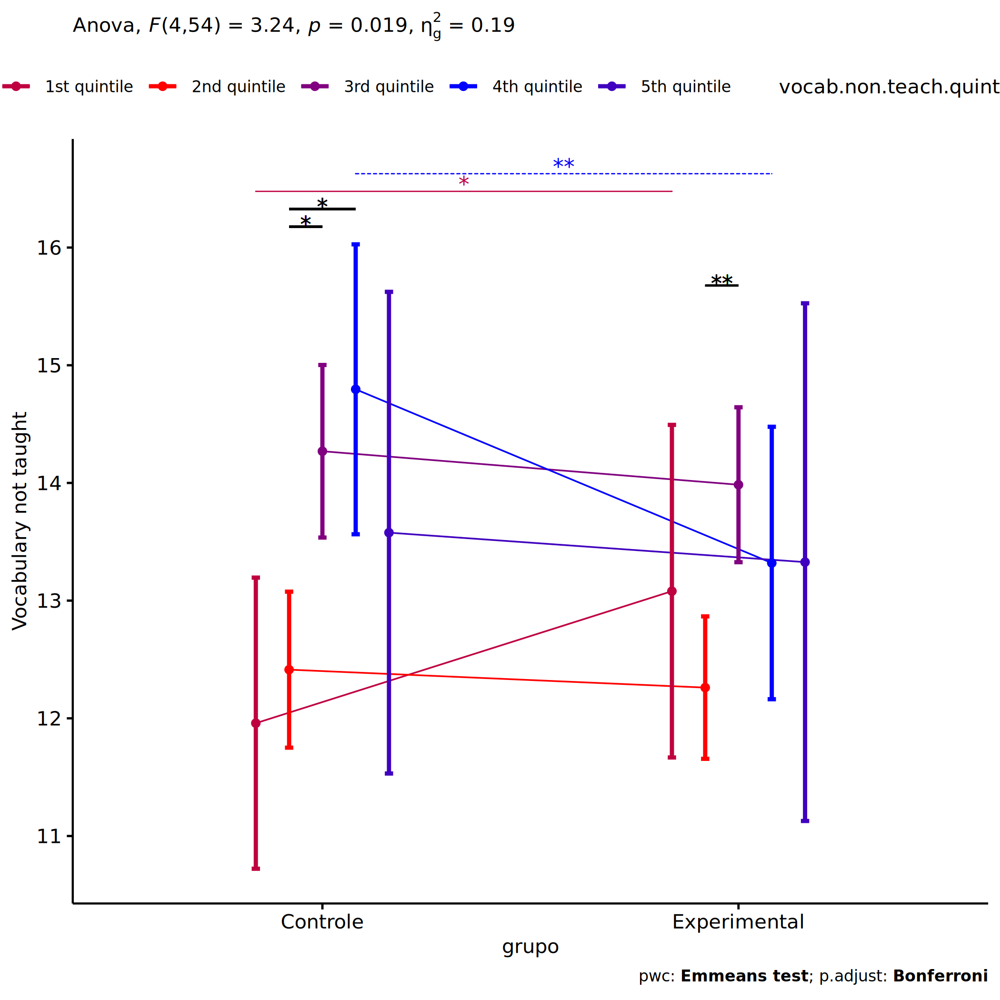<!-- -->

``` r
if (length(unique(pdat[["vocab.non.teach.quintile"]])) >= 2) {
  ggPlotAoC2(pwcs, "vocab.non.teach.quintile", "grupo", aov, ylab = "Vocabulary not taught",
               subtitle = which(aov$Effect == "grupo:vocab.non.teach.quintile"), addParam = "errorbar") +
      ggplot2::scale_color_manual(values = color[["grupo"]]) +
      if (ymin.ci < ymax.ci) ggplot2::ylim(ymin.ci, ymax.ci)
}
```

    ## Scale for colour is already present.
    ## Adding another scale for colour, which will replace the existing scale.

<!-- -->

``` r
if (length(unique(pdat[["vocab.non.teach.quintile"]])) >= 2) {
  plots <- twoWayAncovaBoxPlots(
    wdat, "vocab.non.teach.pos", c("grupo","vocab.non.teach.quintile"), aov, pwcs, covar = "vocab.non.teach.pre",
    theme = "classic", color = color[["grupo:vocab.non.teach.quintile"]],
    subtitle = which(aov$Effect == "grupo:vocab.non.teach.quintile"))
}
```

``` r
if (length(unique(pdat[["vocab.non.teach.quintile"]])) >= 2) {
  plots[["grupo:vocab.non.teach.quintile"]] + ggplot2::ylab("Vocabulary not taught") +
  ggplot2::scale_x_discrete(labels=c('pre', 'pos')) +
  if (ymin < ymax) ggplot2::ylim(ymin, ymax)
}
```

    ## Warning: No shared levels found between `names(values)` of the manual scale and the data's colour values.

<!-- -->

``` r
if (length(unique(pdat[["vocab.non.teach.quintile"]])) >= 2) {
  plots <- twoWayAncovaBoxPlots(
    wdat.long, "vocab.non.teach", c("grupo","vocab.non.teach.quintile"), aov, pwc.long,
    pre.post = "time",
    theme = "classic", color = color$prepost)
}
```

``` r
if (length(unique(pdat[["vocab.non.teach.quintile"]])) >= 2) 
  plots[["grupo:vocab.non.teach.quintile"]] + ggplot2::ylab("Vocabulary not taught") +
    if (ymin < ymax) ggplot2::ylim(ymin, ymax)
```

<!-- -->

### Checking linearity assumption

``` r
if (length(unique(pdat[["vocab.non.teach.quintile"]])) >= 2) {
  ggscatter(wdat, x = "vocab.non.teach.pre", y = "vocab.non.teach.pos", size = 0.5,
            facet.by = c("grupo","vocab.non.teach.quintile"), add = "reg.line")+
    stat_regline_equation(
      aes(label =  paste(..eq.label.., ..rr.label.., sep = "~~~~"))
    ) +
    if (ymin < ymax) ggplot2::ylim(ymin, ymax)
}
```

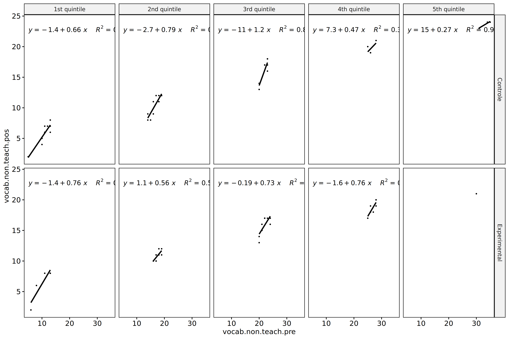<!-- -->

``` r
if (length(unique(pdat[["vocab.non.teach.quintile"]])) >= 2) {
  ggscatter(wdat, x = "vocab.non.teach.pre", y = "vocab.non.teach.pos", size = 0.5,
            color = "grupo", facet.by = "vocab.non.teach.quintile", add = "reg.line")+
    stat_regline_equation(
      aes(label =  paste(..eq.label.., ..rr.label.., sep = "~~~~"), color = grupo)
    ) +
    ggplot2::labs(subtitle = rstatix::get_test_label(aov, detailed = T, row = which(aov$Effect == "grupo:vocab.non.teach.quintile"))) +
    ggplot2::scale_color_manual(values = color[["grupo"]]) +
    if (ymin < ymax) ggplot2::ylim(ymin, ymax)
}
```

<!-- -->

``` r
if (length(unique(pdat[["vocab.non.teach.quintile"]])) >= 2) {
  ggscatter(wdat, x = "vocab.non.teach.pre", y = "vocab.non.teach.pos", size = 0.5,
            color = "vocab.non.teach.quintile", facet.by = "grupo", add = "reg.line")+
    stat_regline_equation(
      aes(label =  paste(..eq.label.., ..rr.label.., sep = "~~~~"), color = vocab.non.teach.quintile)
    ) +
    ggplot2::labs(subtitle = rstatix::get_test_label(aov, detailed = T, row = which(aov$Effect == "grupo:vocab.non.teach.quintile"))) +
    ggplot2::scale_color_manual(values = color[["vocab.non.teach.quintile"]]) +
    if (ymin < ymax) ggplot2::ylim(ymin, ymax)
}
```

<!-- -->

### Checking normality and homogeneity

``` r
if (length(unique(pdat[["vocab.non.teach.quintile"]])) >= 2) 
  res <- augment(lm(vocab.non.teach.pos ~ vocab.non.teach.pre + grupo*vocab.non.teach.quintile, data = wdat))
```

``` r
if (length(unique(pdat[["vocab.non.teach.quintile"]])) >= 2)
  shapiro_test(res$.resid)
```

    ## # A tibble: 1 × 3
    ##   variable   statistic p.value
    ##   <chr>          <dbl>   <dbl>
    ## 1 res$.resid     0.964  0.0543

``` r
if (length(unique(pdat[["vocab.non.teach.quintile"]])) >= 2) 
  levene_test(res, .resid ~ grupo*vocab.non.teach.quintile)
```

    ## # A tibble: 1 × 4
    ##     df1   df2 statistic     p
    ##   <int> <int>     <dbl> <dbl>
    ## 1     9    55     0.786 0.630

# Summary of Results

## Descriptive Statistics

``` r
df <- get.descriptives(ldat[["grupo"]], c(dv.pre, dv.pos), c("grupo"), 
                       include.global = T, symmetry.test = T, normality.test = F)
df <- plyr::rbind.fill(
  df, do.call(plyr::rbind.fill, lapply(lfatores2, FUN = function(f) {
    if (nrow(dat) > 0 && sum(!is.na(unique(dat[[f]]))) > 1 && paste0("grupo:",f) %in% names(ldat))
      get.descriptives(ldat[[paste0("grupo:",f)]], c(dv.pre,dv.pos), c("grupo", f),
                       symmetry.test = T, normality.test = F)
    }))
)
```

    ## Warning: There was 1 warning in `mutate()`.
    ## ℹ In argument: `ci = abs(stats::qt(alpha/2, .data$n - 1) * .data$se)`.
    ## Caused by warning:
    ## ! There was 1 warning in `mutate()`.
    ## ℹ In argument: `ci = abs(stats::qt(alpha/2, .data$n - 1) * .data$se)`.
    ## Caused by warning in `stats::qt()`:
    ## ! NaNs produced
    ## There was 1 warning in `mutate()`.
    ## ℹ In argument: `ci = abs(stats::qt(alpha/2, .data$n - 1) * .data$se)`.
    ## Caused by warning:
    ## ! There was 1 warning in `mutate()`.
    ## ℹ In argument: `ci = abs(stats::qt(alpha/2, .data$n - 1) * .data$se)`.
    ## Caused by warning in `stats::qt()`:
    ## ! NaNs produced

``` r
df <- df[,c(fatores1[fatores1 %in% colnames(df)],"variable",
             colnames(df)[!colnames(df) %in% c(fatores1,"variable")])]
```

| grupo | Sexo | Zona | Cor.Raca | Serie | vocab.non.teach.quintile | variable | n | mean | median | min | max | sd | se | ci | iqr | symmetry | skewness | kurtosis |
|:---|:---|:---|:---|:---|:---|:---|---:|---:|---:|---:|---:|---:|---:|---:|---:|:---|---:|---:|
| Controle |  |  |  |  |  | vocab.non.teach.pre | 486 | 21.364 | 22.0 | 1 | 39 | 7.857 | 0.356 | 0.700 | 13.00 | YES | -0.280 | -0.848 |
| Experimental |  |  |  |  |  | vocab.non.teach.pre | 663 | 22.561 | 23.0 | 3 | 37 | 7.357 | 0.286 | 0.561 | 10.00 | YES | -0.399 | -0.624 |
|  |  |  |  |  |  | vocab.non.teach.pre | 1149 | 22.055 | 23.0 | 1 | 39 | 7.592 | 0.224 | 0.439 | 11.00 | YES | -0.356 | -0.718 |
| Controle |  |  |  |  |  | vocab.non.teach.pos | 486 | 22.751 | 24.0 | 2 | 37 | 7.715 | 0.350 | 0.688 | 12.00 | YES | -0.419 | -0.703 |
| Experimental |  |  |  |  |  | vocab.non.teach.pos | 663 | 23.569 | 25.0 | 4 | 37 | 7.119 | 0.276 | 0.543 | 10.50 | YES | -0.492 | -0.576 |
|  |  |  |  |  |  | vocab.non.teach.pos | 1149 | 23.223 | 24.0 | 2 | 37 | 7.385 | 0.218 | 0.427 | 11.00 | YES | -0.470 | -0.612 |
| Controle | F |  |  |  |  | vocab.non.teach.pre | 21 | 22.286 | 24.0 | 5 | 35 | 8.397 | 1.832 | 3.822 | 13.00 | NO | -0.518 | -0.946 |
| Controle | M |  |  |  |  | vocab.non.teach.pre | 11 | 21.000 | 20.0 | 10 | 34 | 8.544 | 2.576 | 5.740 | 15.50 | YES | 0.034 | -1.691 |
| Experimental | F |  |  |  |  | vocab.non.teach.pre | 21 | 22.667 | 23.0 | 10 | 34 | 6.894 | 1.504 | 3.138 | 6.00 | YES | 0.153 | -0.984 |
| Experimental | M |  |  |  |  | vocab.non.teach.pre | 21 | 22.238 | 24.0 | 5 | 36 | 8.792 | 1.918 | 4.002 | 10.00 | YES | -0.392 | -1.069 |
| Controle | F |  |  |  |  | vocab.non.teach.pos | 21 | 22.714 | 24.0 | 9 | 33 | 6.627 | 1.446 | 3.016 | 10.00 | NO | -0.523 | -0.901 |
| Controle | M |  |  |  |  | vocab.non.teach.pos | 11 | 20.636 | 20.0 | 12 | 31 | 6.801 | 2.051 | 4.569 | 12.50 | YES | 0.039 | -1.701 |
| Experimental | F |  |  |  |  | vocab.non.teach.pos | 21 | 22.905 | 23.0 | 13 | 32 | 5.431 | 1.185 | 2.472 | 5.00 | YES | 0.185 | -0.987 |
| Experimental | M |  |  |  |  | vocab.non.teach.pos | 21 | 21.476 | 23.0 | 8 | 32 | 6.882 | 1.502 | 3.133 | 8.00 | YES | -0.397 | -1.080 |
| Controle |  | Rural |  |  |  | vocab.non.teach.pre | 244 | 20.775 | 22.0 | 1 | 36 | 7.277 | 0.466 | 0.918 | 11.25 | YES | -0.329 | -0.716 |
| Controle |  | Urbana |  |  |  | vocab.non.teach.pre | 111 | 22.144 | 23.0 | 4 | 35 | 7.874 | 0.747 | 1.481 | 13.00 | YES | -0.348 | -1.006 |
| Experimental |  | Rural |  |  |  | vocab.non.teach.pre | 282 | 21.514 | 22.0 | 3 | 36 | 7.378 | 0.439 | 0.865 | 10.00 | YES | -0.325 | -0.650 |
| Experimental |  | Urbana |  |  |  | vocab.non.teach.pre | 183 | 23.093 | 24.0 | 6 | 37 | 7.154 | 0.529 | 1.043 | 11.00 | YES | -0.359 | -0.763 |
| Controle |  | Rural |  |  |  | vocab.non.teach.pos | 244 | 22.418 | 24.0 | 2 | 41 | 7.880 | 0.504 | 0.994 | 12.00 | YES | -0.403 | -0.639 |
| Controle |  | Urbana |  |  |  | vocab.non.teach.pos | 111 | 23.315 | 25.0 | 4 | 37 | 7.657 | 0.727 | 1.440 | 12.00 | YES | -0.484 | -0.643 |
| Experimental |  | Rural |  |  |  | vocab.non.teach.pos | 282 | 22.326 | 23.0 | 2 | 37 | 7.399 | 0.441 | 0.867 | 11.00 | YES | -0.374 | -0.621 |
| Experimental |  | Urbana |  |  |  | vocab.non.teach.pos | 183 | 24.000 | 26.0 | 5 | 36 | 7.028 | 0.520 | 1.025 | 11.00 | NO | -0.561 | -0.519 |
| Controle |  |  | Parda |  |  | vocab.non.teach.pre | 160 | 20.956 | 21.5 | 5 | 39 | 7.695 | 0.608 | 1.201 | 13.25 | YES | -0.225 | -0.990 |
| Controle |  |  | Indígena |  |  | vocab.non.teach.pre | 13 | 21.538 | 20.0 | 11 | 34 | 5.995 | 1.663 | 3.623 | 5.00 | YES | 0.205 | -0.497 |
| Controle |  |  | Branca |  |  | vocab.non.teach.pre | 54 | 22.111 | 22.5 | 7 | 34 | 6.604 | 0.899 | 1.802 | 8.75 | YES | -0.429 | -0.439 |
| Experimental |  |  | Parda |  |  | vocab.non.teach.pre | 192 | 21.245 | 22.0 | 3 | 35 | 7.553 | 0.545 | 1.075 | 13.00 | YES | -0.235 | -0.868 |
| Experimental |  |  | Indígena |  |  | vocab.non.teach.pre | 18 | 18.722 | 20.0 | 7 | 30 | 7.011 | 1.652 | 3.486 | 12.75 | YES | -0.064 | -1.414 |
| Experimental |  |  | Branca |  |  | vocab.non.teach.pre | 59 | 24.034 | 24.0 | 10 | 34 | 6.602 | 0.859 | 1.720 | 11.00 | YES | -0.306 | -0.893 |
| Controle |  |  | Parda |  |  | vocab.non.teach.pos | 160 | 22.394 | 24.0 | 2 | 37 | 8.120 | 0.642 | 1.268 | 13.00 | YES | -0.441 | -0.879 |
| Controle |  |  | Indígena |  |  | vocab.non.teach.pos | 13 | 24.231 | 24.0 | 12 | 35 | 6.457 | 1.791 | 3.902 | 9.00 | YES | -0.074 | -1.009 |
| Controle |  |  | Branca |  |  | vocab.non.teach.pos | 54 | 23.333 | 24.0 | 8 | 36 | 7.628 | 1.038 | 2.082 | 11.75 | YES | -0.366 | -0.791 |
| Experimental |  |  | Parda |  |  | vocab.non.teach.pos | 192 | 22.438 | 23.0 | 5 | 37 | 7.373 | 0.532 | 1.050 | 11.25 | YES | -0.306 | -0.757 |
| Experimental |  |  | Indígena |  |  | vocab.non.teach.pos | 18 | 20.944 | 20.0 | 10 | 30 | 7.075 | 1.668 | 3.518 | 12.50 | YES | -0.113 | -1.702 |
| Experimental |  |  | Branca |  |  | vocab.non.teach.pos | 59 | 23.593 | 26.0 | 5 | 37 | 8.007 | 1.042 | 2.087 | 13.50 | YES | -0.420 | -0.914 |
| Controle |  |  |  | 6 ano |  | vocab.non.teach.pre | 7 | 14.571 | 14.0 | 8 | 24 | 5.533 | 2.091 | 5.118 | 7.00 | YES | 0.394 | -1.394 |
| Controle |  |  |  | 7 ano |  | vocab.non.teach.pre | 4 | 23.750 | 23.0 | 19 | 30 | 4.646 | 2.323 | 7.392 | 4.25 | YES | 0.328 | -1.903 |
| Controle |  |  |  | 8 ano |  | vocab.non.teach.pre | 6 | 22.000 | 22.5 | 13 | 29 | 6.261 | 2.556 | 6.571 | 8.50 | YES | -0.196 | -1.896 |
| Controle |  |  |  | 9 ano |  | vocab.non.teach.pre | 2 | 24.500 | 24.5 | 24 | 25 | 0.707 | 0.500 | 6.353 | 0.50 | few data | 0.000 | 0.000 |
| Experimental |  |  |  | 6 ano |  | vocab.non.teach.pre | 6 | 14.667 | 11.5 | 7 | 25 | 7.448 | 3.040 | 7.816 | 10.00 | YES | 0.428 | -1.896 |
| Experimental |  |  |  | 7 ano |  | vocab.non.teach.pre | 10 | 22.300 | 23.0 | 14 | 29 | 4.191 | 1.325 | 2.998 | 3.50 | YES | -0.287 | -0.600 |
| Experimental |  |  |  | 8 ano |  | vocab.non.teach.pre | 5 | 19.600 | 20.0 | 10 | 30 | 8.649 | 3.868 | 10.739 | 14.00 | YES | 0.020 | -2.099 |
| Experimental |  |  |  | 9 ano |  | vocab.non.teach.pre | 4 | 25.750 | 25.0 | 21 | 32 | 4.646 | 2.323 | 7.392 | 4.25 | YES | 0.328 | -1.903 |
| Controle |  |  |  | 6 ano |  | vocab.non.teach.pos | 7 | 22.857 | 22.0 | 18 | 31 | 4.562 | 1.724 | 4.219 | 5.50 | NO | 0.567 | -1.238 |
| Controle |  |  |  | 7 ano |  | vocab.non.teach.pos | 4 | 31.000 | 31.0 | 27 | 35 | 3.367 | 1.683 | 5.357 | 3.50 | YES | 0.000 | -2.000 |
| Controle |  |  |  | 8 ano |  | vocab.non.teach.pos | 6 | 29.167 | 30.0 | 21 | 35 | 5.193 | 2.120 | 5.450 | 6.25 | YES | -0.358 | -1.627 |
| Controle |  |  |  | 9 ano |  | vocab.non.teach.pos | 2 | 32.500 | 32.5 | 32 | 33 | 0.707 | 0.500 | 6.353 | 0.50 | few data | 0.000 | 0.000 |
| Experimental |  |  |  | 6 ano |  | vocab.non.teach.pos | 6 | 23.167 | 21.5 | 17 | 31 | 5.601 | 2.286 | 5.877 | 7.75 | YES | 0.342 | -1.866 |
| Experimental |  |  |  | 7 ano |  | vocab.non.teach.pos | 10 | 29.100 | 30.0 | 22 | 34 | 3.381 | 1.069 | 2.419 | 2.75 | NO | -0.512 | -0.405 |
| Experimental |  |  |  | 8 ano |  | vocab.non.teach.pos | 5 | 27.800 | 29.0 | 20 | 35 | 6.221 | 2.782 | 7.724 | 9.00 | YES | -0.113 | -2.034 |
| Experimental |  |  |  | 9 ano |  | vocab.non.teach.pos | 4 | 33.250 | 32.5 | 31 | 37 | 2.630 | 1.315 | 4.185 | 2.25 | NO | 0.541 | -1.820 |
| Controle |  |  |  |  | 1st quintile | vocab.non.teach.pre | 9 | 10.889 | 11.0 | 5 | 13 | 2.522 | 0.841 | 1.939 | 3.00 | NO | -1.219 | 0.474 |
| Controle |  |  |  |  | 2nd quintile | vocab.non.teach.pre | 10 | 16.500 | 16.5 | 14 | 19 | 1.780 | 0.563 | 1.273 | 2.75 | YES | -0.160 | -1.628 |
| Controle |  |  |  |  | 3rd quintile | vocab.non.teach.pre | 7 | 22.000 | 23.0 | 20 | 23 | 1.414 | 0.535 | 1.308 | 2.00 | few data | 0.000 | 0.000 |
| Controle |  |  |  |  | 4th quintile | vocab.non.teach.pre | 4 | 26.250 | 26.0 | 25 | 28 | 1.258 | 0.629 | 2.002 | 0.75 | few data | 0.000 | 0.000 |
| Controle |  |  |  |  | 5th quintile | vocab.non.teach.pre | 3 | 33.333 | 34.0 | 31 | 35 | 2.082 | 1.202 | 5.171 | 2.00 | few data | 0.000 | 0.000 |
| Experimental |  |  |  |  | 1st quintile | vocab.non.teach.pre | 5 | 10.200 | 11.0 | 6 | 13 | 3.114 | 1.393 | 3.867 | 5.00 | YES | -0.267 | -2.027 |
| Experimental |  |  |  |  | 2nd quintile | vocab.non.teach.pre | 10 | 17.400 | 17.0 | 16 | 19 | 1.075 | 0.340 | 0.769 | 1.00 | YES | 0.232 | -1.416 |
| Experimental |  |  |  |  | 3rd quintile | vocab.non.teach.pre | 9 | 21.889 | 22.0 | 20 | 24 | 1.537 | 0.512 | 1.181 | 2.00 | YES | 0.163 | -1.646 |
| Experimental |  |  |  |  | 4th quintile | vocab.non.teach.pre | 7 | 26.857 | 27.0 | 25 | 28 | 1.215 | 0.459 | 1.124 | 2.00 | YES | -0.254 | -1.814 |
| Experimental |  |  |  |  | 5th quintile | vocab.non.teach.pre | 1 | 30.000 | 30.0 | 30 | 30 |  |  |  | 0.00 | few data | 0.000 | 0.000 |
| Controle |  |  |  |  | 1st quintile | vocab.non.teach.pos | 9 | 5.778 | 6.0 | 2 | 8 | 1.856 | 0.619 | 1.427 | 2.00 | NO | -0.757 | -0.704 |
| Controle |  |  |  |  | 2nd quintile | vocab.non.teach.pos | 10 | 10.300 | 11.0 | 8 | 12 | 1.636 | 0.517 | 1.171 | 2.75 | YES | -0.296 | -1.780 |
| Controle |  |  |  |  | 3rd quintile | vocab.non.teach.pos | 7 | 16.143 | 17.0 | 13 | 18 | 1.952 | 0.738 | 1.805 | 2.50 | NO | -0.515 | -1.587 |
| Controle |  |  |  |  | 4th quintile | vocab.non.teach.pos | 4 | 19.750 | 19.5 | 19 | 21 | 0.957 | 0.479 | 1.523 | 1.25 | few data | 0.000 | 0.000 |
| Controle |  |  |  |  | 5th quintile | vocab.non.teach.pos | 3 | 23.667 | 24.0 | 23 | 24 | 0.577 | 0.333 | 1.434 | 0.50 | few data | 0.000 | 0.000 |
| Experimental |  |  |  |  | 1st quintile | vocab.non.teach.pos | 5 | 6.400 | 8.0 | 2 | 8 | 2.608 | 1.166 | 3.238 | 2.00 | few data | 0.000 | 0.000 |
| Experimental |  |  |  |  | 2nd quintile | vocab.non.teach.pos | 10 | 10.800 | 11.0 | 10 | 12 | 0.789 | 0.249 | 0.564 | 1.00 | few data | 0.000 | 0.000 |
| Experimental |  |  |  |  | 3rd quintile | vocab.non.teach.pos | 9 | 15.778 | 16.0 | 13 | 17 | 1.481 | 0.494 | 1.139 | 2.00 | NO | -0.690 | -1.181 |
| Experimental |  |  |  |  | 4th quintile | vocab.non.teach.pos | 7 | 18.714 | 19.0 | 17 | 20 | 1.113 | 0.421 | 1.029 | 1.50 | YES | -0.152 | -1.636 |
| Experimental |  |  |  |  | 5th quintile | vocab.non.teach.pos | 1 | 21.000 | 21.0 | 21 | 21 |  |  |  | 0.00 | few data | 0.000 | 0.000 |

## ANCOVA Table Comparison

``` r
df <- do.call(plyr::rbind.fill, laov)
df <- df[!duplicated(df$Effect),]
```

|  | Effect | DFn | DFd | F | p | p\<.05 | ges | DFn’ | DFd’ | F’ | p’ | p\<.05’ | ges’ |
|:---|:---|---:|---:|---:|---:|:---|---:|---:|---:|---:|---:|:---|---:|
| 1 | grupo | 1 | 1146 | 0.516 | 0.473 |  | 0.000 | 1 | 1226 | 0.057 | 0.811 |  | 0.000 |
| 2 | vocab.non.teach.pre | 1 | 1146 | 2891.174 | 0.000 | \* | 0.716 | 1 | 1226 | 1676.847 | 0.000 | \* | 0.578 |
| 4 | grupo:Sexo | 1 | 69 | 0.096 | 0.757 |  | 0.001 | 1 | 1224 | 0.000 | 0.984 |  | 0.000 |
| 5 | Sexo | 1 | 69 | 704.887 | 0.000 | \* | 0.911 | 1 | 1224 | 13.631 | 0.000 | \* | 0.011 |
| 8 | grupo:Zona | 1 | 815 | 0.964 | 0.326 |  | 0.001 | 1 | 845 | 0.446 | 0.504 |  | 0.001 |
| 10 | Zona | 1 | 815 | 0.076 | 0.782 |  | 0.000 | 1 | 845 | 0.223 | 0.637 |  | 0.000 |
| 11 | Cor.Raca | 2 | 489 | 1.929 | 0.146 |  | 0.008 | 2 | 509 | 1.302 | 0.273 |  | 0.005 |
| 13 | grupo:Cor.Raca | 2 | 489 | 0.797 | 0.451 |  | 0.003 | 2 | 509 | 1.597 | 0.203 |  | 0.006 |
| 16 | grupo:Serie | 3 | 35 | 1.843 | 0.157 |  | 0.136 | 3 | 1220 | 1.732 | 0.159 |  | 0.004 |
| 17 | Serie | 3 | 35 | 8.261 | 0.000 | \* | 0.415 | 3 | 1220 | 3.340 | 0.019 | \* | 0.008 |
| 20 | grupo:vocab.non.teach.quintile | 4 | 54 | 3.238 | 0.019 | \* | 0.193 | 4 | 1218 | 2.070 | 0.083 |  | 0.007 |
| 22 | vocab.non.teach.quintile | 4 | 54 | 7.037 | 0.000 | \* | 0.343 | 4 | 1218 | 2.475 | 0.043 | \* | 0.008 |

## PairWise Table Comparison

``` r
df <- do.call(plyr::rbind.fill, lpwc)
df <- df[,c(names(lfatores)[names(lfatores) %in% colnames(df)],
            names(df)[!names(df) %in% c(names(lfatores),"term",".y.")])]
```

| grupo | Sexo | Zona | Cor.Raca | Serie | vocab.non.teach.quintile | group1 | group2 | df | statistic | p | p.adj | p.adj.signif | df’ | statistic’ | p’ | p.adj’ | p.adj.signif’ |
|:---|:---|:---|:---|:---|:---|:---|:---|---:|---:|---:|---:|:---|---:|---:|---:|---:|:---|
| Controle |  |  |  |  |  | pre | pos | 2294 | -2.892 | 0.004 | 0.004 | \*\* | 2454 | -1.347 | 0.178 | 0.178 | ns |
| Experimental |  |  |  |  |  | pre | pos | 2294 | -2.454 | 0.014 | 0.014 | \* | 2454 | -0.826 | 0.409 | 0.409 | ns |
|  |  |  |  |  |  | Controle | Experimental | 1146 | 0.718 | 0.473 | 0.473 | ns | 1226 | 0.239 | 0.811 | 0.811 | ns |
| Controle | F |  |  |  |  | pre | pos | 140 | -0.190 | 0.850 | 0.850 | ns | 2450 | -1.476 | 0.140 | 0.140 | ns |
| Controle | M |  |  |  |  | pre | pos | 140 | 0.116 | 0.908 | 0.908 | ns | 2450 | -0.438 | 0.661 | 0.661 | ns |
| Controle |  |  |  |  |  | F | M | 69 | 16.705 | 0.000 | 0.000 | \*\*\*\* | 1224 | 2.379 | 0.018 | 0.018 | \* |
| Experimental | F |  |  |  |  | pre | pos | 140 | -0.105 | 0.916 | 0.916 | ns | 2450 | -1.382 | 0.167 | 0.167 | ns |
| Experimental | M |  |  |  |  | pre | pos | 140 | 0.337 | 0.737 | 0.737 | ns | 2450 | 0.234 | 0.815 | 0.815 | ns |
| Experimental |  |  |  |  |  | F | M | 69 | 20.655 | 0.000 | 0.000 | \*\*\*\* | 1224 | 2.831 | 0.005 | 0.005 | \*\* |
|  | F |  |  |  |  | Controle | Experimental | 69 | 2.074 | 0.042 | 0.042 | \* | 1224 | 0.179 | 0.858 | 0.858 | ns |
|  | M |  |  |  |  | Controle | Experimental | 69 | 2.121 | 0.038 | 0.038 | \* | 1224 | 0.203 | 0.839 | 0.839 | ns |
| Controle |  |  |  |  |  | Rural | Urbana | 815 | 0.577 | 0.564 | 0.564 | ns | 845 | 0.212 | 0.832 | 0.832 | ns |
| Controle |  | Rural |  |  |  | pre | pos | 1632 | -2.442 | 0.015 | 0.015 | \* | 1692 | -1.692 | 0.091 | 0.091 | ns |
| Controle |  | Urbana |  |  |  | pre | pos | 1632 | -1.174 | 0.241 | 0.241 | ns | 1692 | -0.761 | 0.447 | 0.447 | ns |
| Experimental |  |  |  |  |  | Rural | Urbana | 815 | -0.838 | 0.402 | 0.402 | ns | 845 | -0.790 | 0.430 | 0.430 | ns |
| Experimental |  | Rural |  |  |  | pre | pos | 1632 | -1.297 | 0.195 | 0.195 | ns | 1692 | -0.665 | 0.506 | 0.506 | ns |
| Experimental |  | Urbana |  |  |  | pre | pos | 1632 | -1.167 | 0.243 | 0.243 | ns | 1692 | -0.639 | 0.523 | 0.523 | ns |
|  |  | Rural |  |  |  | Controle | Experimental | 815 | 2.017 | 0.044 | 0.044 | \* | 845 | 1.383 | 0.167 | 0.167 | ns |
|  |  | Urbana |  |  |  | Controle | Experimental | 815 | 0.253 | 0.800 | 0.800 | ns | 845 | 0.176 | 0.860 | 0.860 | ns |
| Controle |  |  | Branca |  |  | pre | pos | 980 | -0.844 | 0.399 | 0.399 | ns | 1020 | -0.826 | 0.409 | 0.409 | ns |
| Controle |  |  | Indígena |  |  | pre | pos | 980 | -0.913 | 0.362 | 0.362 | ns | 1020 | -0.892 | 0.372 | 0.372 | ns |
| Controle |  |  |  |  |  | Indígena | Branca | 489 | 1.020 | 0.308 | 0.925 | ns | 509 | 0.817 | 0.414 | 1.000 | ns |
| Controle |  |  |  |  |  | Parda | Branca | 489 | 0.076 | 0.939 | 1.000 | ns | 509 | -0.934 | 0.351 | 1.000 | ns |
| Controle |  |  |  |  |  | Parda | Indígena | 489 | -1.051 | 0.294 | 0.882 | ns | 509 | -1.385 | 0.167 | 0.500 | ns |
| Controle |  |  | Parda |  |  | pre | pos | 980 | -1.709 | 0.088 | 0.088 | ns | 1020 | -0.766 | 0.444 | 0.444 | ns |
| Experimental |  |  | Branca |  |  | pre | pos | 980 | 0.318 | 0.750 | 0.750 | ns | 1020 | 0.677 | 0.498 | 0.498 | ns |
| Experimental |  |  | Indígena |  |  | pre | pos | 980 | -0.886 | 0.376 | 0.376 | ns | 1020 | -0.867 | 0.386 | 0.386 | ns |
| Experimental |  |  |  |  |  | Indígena | Branca | 489 | 1.601 | 0.110 | 0.330 | ns | 509 | 1.496 | 0.135 | 0.406 | ns |
| Experimental |  |  |  |  |  | Parda | Branca | 489 | 1.878 | 0.061 | 0.183 | ns | 509 | 1.560 | 0.119 | 0.358 | ns |
| Experimental |  |  |  |  |  | Parda | Indígena | 489 | -0.619 | 0.536 | 1.000 | ns | 509 | -0.711 | 0.477 | 1.000 | ns |
| Experimental |  |  | Parda |  |  | pre | pos | 980 | -1.554 | 0.121 | 0.121 | ns | 1020 | -1.031 | 0.303 | 0.303 | ns |
|  |  |  | Branca |  |  | Controle | Experimental | 489 | 1.673 | 0.095 | 0.095 | ns | 509 | 1.803 | 0.072 | 0.072 | ns |
|  |  |  | Indígena |  |  | Controle | Experimental | 489 | 0.539 | 0.590 | 0.590 | ns | 509 | 0.509 | 0.611 | 0.611 | ns |
|  |  |  | Parda |  |  | Controle | Experimental | 489 | 0.432 | 0.666 | 0.666 | ns | 509 | -0.362 | 0.717 | 0.717 | ns |
| Controle |  |  |  | 6 ano |  | pre | pos | 72 | -2.961 | 0.004 | 0.004 | \*\* | 2442 | -0.985 | 0.325 | 0.325 | ns |
| Controle |  |  |  | 7 ano |  | pre | pos | 72 | -1.958 | 0.054 | 0.054 | ns | 2442 | -1.221 | 0.222 | 0.222 | ns |
| Controle |  |  |  | 8 ano |  | pre | pos | 72 | -2.371 | 0.020 | 0.020 | \* | 2442 | 0.246 | 0.806 | 0.806 | ns |
| Controle |  |  |  | 9 ano |  | pre | pos | 72 | -1.528 | 0.131 | 0.131 | ns | 2442 | -0.761 | 0.447 | 0.447 | ns |
| Controle |  |  |  |  |  | 6 ano | 7 ano | 35 | -2.570 | 0.015 | 0.088 | ns | 1220 | -1.468 | 0.142 | 0.855 | ns |
| Controle |  |  |  |  |  | 6 ano | 8 ano | 35 | -1.684 | 0.101 | 0.607 | ns | 1220 | -0.129 | 0.898 | 1.000 | ns |
| Controle |  |  |  |  |  | 6 ano | 9 ano | 35 | -3.654 | 0.001 | 0.005 | \*\* | 1220 | -2.940 | 0.003 | 0.020 | \* |
| Controle |  |  |  |  |  | 7 ano | 8 ano | 35 | 1.147 | 0.259 | 1.000 | ns | 1220 | 1.195 | 0.232 | 1.000 | ns |
| Controle |  |  |  |  |  | 7 ano | 9 ano | 35 | -1.571 | 0.125 | 0.751 | ns | 1220 | -1.669 | 0.095 | 0.572 | ns |
| Controle |  |  |  |  |  | 8 ano | 9 ano | 35 | -2.566 | 0.015 | 0.088 | ns | 1220 | -2.652 | 0.008 | 0.049 | \* |
| Experimental |  |  |  | 6 ano |  | pre | pos | 72 | -2.812 | 0.006 | 0.006 | \*\* | 2442 | -1.157 | 0.248 | 0.248 | ns |
| Experimental |  |  |  | 7 ano |  | pre | pos | 72 | -2.904 | 0.005 | 0.005 | \*\* | 2442 | 0.070 | 0.944 | 0.944 | ns |
| Experimental |  |  |  | 8 ano |  | pre | pos | 72 | -2.476 | 0.016 | 0.016 | \* | 2442 | -0.541 | 0.588 | 0.588 | ns |
| Experimental |  |  |  | 9 ano |  | pre | pos | 72 | -2.026 | 0.046 | 0.046 | \* | 2442 | -0.188 | 0.851 | 0.851 | ns |
| Experimental |  |  |  |  |  | 6 ano | 7 ano | 35 | -0.404 | 0.689 | 1.000 | ns | 1220 | 0.458 | 0.647 | 1.000 | ns |
| Experimental |  |  |  |  |  | 6 ano | 8 ano | 35 | -2.111 | 0.042 | 0.252 | ns | 1220 | -1.003 | 0.316 | 1.000 | ns |
| Experimental |  |  |  |  |  | 6 ano | 9 ano | 35 | -3.443 | 0.002 | 0.009 | \*\* | 1220 | -1.517 | 0.130 | 0.777 | ns |
| Experimental |  |  |  |  |  | 7 ano | 8 ano | 35 | -1.963 | 0.058 | 0.346 | ns | 1220 | -1.533 | 0.125 | 0.753 | ns |
| Experimental |  |  |  |  |  | 7 ano | 9 ano | 35 | -3.745 | 0.001 | 0.004 | \*\* | 1220 | -2.078 | 0.038 | 0.227 | ns |
| Experimental |  |  |  |  |  | 8 ano | 9 ano | 35 | -1.673 | 0.103 | 0.619 | ns | 1220 | -0.578 | 0.564 | 1.000 | ns |
|  |  |  |  | 6 ano |  | Controle | Experimental | 35 | -0.623 | 0.537 | 0.537 | ns | 1220 | -0.673 | 0.501 | 0.501 | ns |
|  |  |  |  | 7 ano |  | Controle | Experimental | 35 | 1.975 | 0.056 | 0.056 | ns | 1220 | 1.323 | 0.186 | 0.186 | ns |
|  |  |  |  | 8 ano |  | Controle | Experimental | 35 | -1.078 | 0.288 | 0.288 | ns | 1220 | -1.358 | 0.175 | 0.175 | ns |
|  |  |  |  | 9 ano |  | Controle | Experimental | 35 | 0.330 | 0.743 | 0.743 | ns | 1220 | 1.101 | 0.271 | 0.271 | ns |
| Controle |  |  |  |  | 1st quintile | pre | pos | 110 | 6.382 | 0.000 | 0.000 | \*\*\*\* | 2438 | -4.207 | 0.000 | 0.000 | \*\*\*\* |
| Controle |  |  |  |  | 2nd quintile | pre | pos | 110 | 8.161 | 0.000 | 0.000 | \*\*\*\* | 2438 | -2.379 | 0.017 | 0.017 | \* |
| Controle |  |  |  |  | 3rd quintile | pre | pos | 110 | 6.450 | 0.000 | 0.000 | \*\*\*\* | 2438 | -2.204 | 0.028 | 0.028 | \* |
| Controle |  |  |  |  | 4th quintile | pre | pos | 110 | 5.411 | 0.000 | 0.000 | \*\*\*\* | 2438 | -0.409 | 0.682 | 0.682 | ns |
| Controle |  |  |  |  | 5th quintile | pre | pos | 110 | 6.969 | 0.000 | 0.000 | \*\*\*\* | 2438 | 3.579 | 0.000 | 0.000 | \*\*\* |
| Controle |  |  |  |  |  | 1st quintile | 2nd quintile | 54 | -0.850 | 0.399 | 1.000 | ns | 1218 | -1.348 | 0.178 | 1.000 | ns |
| Controle |  |  |  |  |  | 1st quintile | 3rd quintile | 54 | -2.772 | 0.008 | 0.076 | ns | 1218 | -2.354 | 0.019 | 0.187 | ns |
| Controle |  |  |  |  |  | 1st quintile | 4th quintile | 54 | -2.552 | 0.014 | 0.136 | ns | 1218 | -2.258 | 0.024 | 0.241 | ns |
| Controle |  |  |  |  |  | 1st quintile | 5th quintile | 54 | -1.046 | 0.300 | 1.000 | ns | 1218 | -1.433 | 0.152 | 1.000 | ns |
| Controle |  |  |  |  |  | 2nd quintile | 3rd quintile | 54 | -3.362 | 0.001 | 0.014 | \* | 1218 | -2.031 | 0.042 | 0.425 | ns |
| Controle |  |  |  |  |  | 2nd quintile | 4th quintile | 54 | -2.955 | 0.005 | 0.046 | \* | 1218 | -2.135 | 0.033 | 0.330 | ns |
| Controle |  |  |  |  |  | 2nd quintile | 5th quintile | 54 | -0.956 | 0.343 | 1.000 | ns | 1218 | -1.089 | 0.276 | 1.000 | ns |
| Controle |  |  |  |  |  | 3rd quintile | 4th quintile | 54 | -0.869 | 0.389 | 1.000 | ns | 1218 | -0.831 | 0.406 | 1.000 | ns |
| Controle |  |  |  |  |  | 3rd quintile | 5th quintile | 54 | 0.737 | 0.464 | 1.000 | ns | 1218 | 0.110 | 0.912 | 1.000 | ns |
| Controle |  |  |  |  |  | 4th quintile | 5th quintile | 54 | 1.523 | 0.134 | 1.000 | ns | 1218 | 0.949 | 0.343 | 1.000 | ns |
| Experimental |  |  |  |  | 1st quintile | pre | pos | 110 | 3.537 | 0.001 | 0.001 | \*\*\* | 2438 | -6.583 | 0.000 | 0.000 | \*\*\*\* |
| Experimental |  |  |  |  | 2nd quintile | pre | pos | 110 | 8.687 | 0.000 | 0.000 | \*\*\*\* | 2438 | -1.119 | 0.263 | 0.263 | ns |
| Experimental |  |  |  |  | 3rd quintile | pre | pos | 110 | 7.631 | 0.000 | 0.000 | \*\*\*\* | 2438 | -2.222 | 0.026 | 0.026 | \* |
| Experimental |  |  |  |  | 4th quintile | pre | pos | 110 | 8.967 | 0.000 | 0.000 | \*\*\*\* | 2438 | 1.914 | 0.056 | 0.056 | ns |
| Experimental |  |  |  |  | 5th quintile | pre | pos | 110 | 3.746 | 0.000 | 0.000 | \*\*\* | 2438 | 3.317 | 0.001 | 0.001 | \*\*\* |
| Experimental |  |  |  |  |  | 1st quintile | 2nd quintile | 54 | 1.241 | 0.220 | 1.000 | ns | 1218 | 0.872 | 0.384 | 1.000 | ns |
| Experimental |  |  |  |  |  | 1st quintile | 3rd quintile | 54 | -1.017 | 0.314 | 1.000 | ns | 1218 | -1.090 | 0.276 | 1.000 | ns |
| Experimental |  |  |  |  |  | 1st quintile | 4th quintile | 54 | -0.203 | 0.840 | 1.000 | ns | 1218 | -0.749 | 0.454 | 1.000 | ns |
| Experimental |  |  |  |  |  | 1st quintile | 5th quintile | 54 | -0.156 | 0.877 | 1.000 | ns | 1218 | -1.041 | 0.298 | 1.000 | ns |
| Experimental |  |  |  |  |  | 2nd quintile | 3rd quintile | 54 | -3.521 | 0.001 | 0.009 | \*\* | 1218 | -2.794 | 0.005 | 0.053 | ns |
| Experimental |  |  |  |  |  | 2nd quintile | 4th quintile | 54 | -1.431 | 0.158 | 1.000 | ns | 1218 | -1.896 | 0.058 | 0.582 | ns |
| Experimental |  |  |  |  |  | 2nd quintile | 5th quintile | 54 | -0.880 | 0.383 | 1.000 | ns | 1218 | -2.007 | 0.045 | 0.449 | ns |
| Experimental |  |  |  |  |  | 3rd quintile | 4th quintile | 54 | 1.234 | 0.222 | 1.000 | ns | 1218 | 0.206 | 0.837 | 1.000 | ns |
| Experimental |  |  |  |  |  | 3rd quintile | 5th quintile | 54 | 0.628 | 0.533 | 1.000 | ns | 1218 | -0.710 | 0.478 | 1.000 | ns |
| Experimental |  |  |  |  |  | 4th quintile | 5th quintile | 54 | -0.008 | 0.994 | 1.000 | ns | 1218 | -1.201 | 0.230 | 1.000 | ns |
|  |  |  |  |  | 1st quintile | Controle | Experimental | 54 | -2.321 | 0.024 | 0.024 | \* | 1218 | -1.904 | 0.057 | 0.057 | ns |
|  |  |  |  |  | 2nd quintile | Controle | Experimental | 54 | 0.391 | 0.698 | 0.698 | ns | 1218 | 0.935 | 0.350 | 0.350 | ns |
|  |  |  |  |  | 3rd quintile | Controle | Experimental | 54 | 0.654 | 0.516 | 0.516 | ns | 1218 | 0.439 | 0.661 | 0.661 | ns |
|  |  |  |  |  | 4th quintile | Controle | Experimental | 54 | 2.722 | 0.009 | 0.009 | \*\* | 1218 | 1.752 | 0.080 | 0.080 | ns |
|  |  |  |  |  | 5th quintile | Controle | Experimental | 54 | 0.246 | 0.807 | 0.807 | ns | 1218 | -0.794 | 0.427 | 0.427 | ns |

## EMMS Table Comparison

``` r
df <- do.call(plyr::rbind.fill, lemms)
df[["N-N'"]] <- df[["N"]] - df[["N'"]]
df <- df[,c(names(lfatores)[names(lfatores) %in% colnames(df)],
            names(df)[!names(df) %in% names(lfatores)])]
```

| grupo | Sexo | Zona | Cor.Raca | Serie | vocab.non.teach.quintile | N | M (pre) | SE (pre) | M (unadj) | SE (unadj) | M (adj) | SE (adj) | conf.low | conf.high | N’ | M (pre)’ | SE (pre)’ | M (unadj)’ | SE (unadj)’ | M (adj)’ | SE (adj)’ | conf.low’ | conf.high’ | N-N’ |
|:---|:---|:---|:---|:---|:---|---:|---:|---:|---:|---:|---:|---:|---:|---:|---:|---:|---:|---:|---:|---:|---:|---:|---:|---:|
| Controle |  |  |  |  |  | 486 | 21.364 | 0.356 | 22.751 | 0.350 | 23.320 | 0.179 | 22.970 | 23.671 | 516 | 21.368 | 0.344 | 22.014 | 0.363 | 22.552 | 0.226 | 22.109 | 22.995 | -30 |
| Experimental |  |  |  |  |  | 663 | 22.561 | 0.286 | 23.569 | 0.276 | 23.151 | 0.153 | 22.851 | 23.451 | 713 | 22.534 | 0.273 | 22.871 | 0.284 | 22.481 | 0.192 | 22.105 | 22.858 | -50 |
| Controle | F |  |  |  |  | 21 | 22.286 | 1.832 | 22.714 | 1.446 | 22.638 | 0.037 | 22.564 | 22.713 | 259 | 22.255 | 0.453 | 23.247 | 0.468 | 23.081 | 0.316 | 22.460 | 23.702 | -238 |
| Controle | M |  |  |  |  | 11 | 21.000 | 2.576 | 20.636 | 2.051 | 21.573 | 0.052 | 21.470 | 21.676 | 257 | 20.475 | 0.513 | 20.770 | 0.546 | 22.011 | 0.319 | 21.385 | 22.637 | -246 |
| Experimental | F |  |  |  |  | 21 | 22.667 | 1.504 | 22.905 | 1.185 | 22.529 | 0.037 | 22.454 | 22.603 | 368 | 22.916 | 0.377 | 23.696 | 0.379 | 23.007 | 0.266 | 22.485 | 23.529 | -347 |
| Experimental | M |  |  |  |  | 21 | 22.238 | 1.918 | 21.476 | 1.502 | 21.438 | 0.037 | 21.363 | 21.512 | 345 | 22.128 | 0.396 | 21.991 | 0.422 | 21.926 | 0.274 | 21.388 | 22.464 | -324 |
| Controle |  | Rural |  |  |  | 244 | 20.775 | 0.466 | 22.418 | 0.504 | 23.235 | 0.263 | 22.719 | 23.750 | 253 | 20.822 | 0.462 | 21.960 | 0.516 | 22.745 | 0.308 | 22.140 | 23.351 | -9 |
| Controle |  | Urbana |  |  |  | 111 | 22.144 | 0.747 | 23.315 | 0.727 | 22.963 | 0.389 | 22.200 | 23.727 | 114 | 22.219 | 0.734 | 22.982 | 0.740 | 22.628 | 0.458 | 21.728 | 23.528 | -3 |
| Experimental |  | Rural |  |  |  | 282 | 21.514 | 0.439 | 22.326 | 0.441 | 22.512 | 0.244 | 22.033 | 22.991 | 294 | 21.595 | 0.432 | 22.010 | 0.443 | 22.165 | 0.285 | 21.604 | 22.725 | -12 |
| Experimental |  | Urbana |  |  |  | 183 | 23.093 | 0.529 | 24.000 | 0.520 | 22.839 | 0.304 | 22.242 | 23.435 | 189 | 23.106 | 0.515 | 23.603 | 0.529 | 22.526 | 0.357 | 21.825 | 23.227 | -6 |
| Controle |  |  | Branca |  |  | 54 | 22.111 | 0.899 | 23.333 | 1.038 | 22.803 | 0.600 | 21.623 | 23.983 | 54 | 22.111 | 0.899 | 23.333 | 1.038 | 22.853 | 0.734 | 21.410 | 24.296 | 0 |
| Controle |  |  | Indígena |  |  | 13 | 21.538 | 1.663 | 24.231 | 1.791 | 24.193 | 1.223 | 21.789 | 26.596 | 13 | 21.538 | 1.663 | 24.231 | 1.791 | 24.215 | 1.496 | 21.275 | 27.155 | 0 |
| Controle |  |  | Parda |  |  | 160 | 20.956 | 0.608 | 22.394 | 0.642 | 22.856 | 0.349 | 22.170 | 23.542 | 168 | 21.000 | 0.594 | 21.643 | 0.667 | 22.064 | 0.417 | 21.246 | 22.883 | -8 |
| Experimental |  |  | Branca |  |  | 59 | 24.034 | 0.859 | 23.593 | 1.042 | 21.411 | 0.578 | 20.274 | 22.547 | 62 | 23.935 | 0.822 | 23.000 | 1.048 | 21.039 | 0.690 | 19.684 | 22.394 | -3 |
| Experimental |  |  | Indígena |  |  | 18 | 18.722 | 1.652 | 20.944 | 1.668 | 23.326 | 1.042 | 21.278 | 25.374 | 18 | 18.722 | 1.652 | 20.944 | 1.668 | 23.215 | 1.275 | 20.710 | 25.719 | 0 |
| Experimental |  |  | Parda |  |  | 192 | 21.245 | 0.545 | 22.438 | 0.532 | 22.652 | 0.318 | 22.026 | 23.277 | 201 | 21.299 | 0.533 | 22.090 | 0.542 | 22.269 | 0.381 | 21.521 | 23.017 | -9 |
| Controle |  |  |  | 6 ano |  | 7 | 14.571 | 2.091 | 22.857 | 1.724 | 27.139 | 0.281 | 26.568 | 27.710 | 146 | 17.425 | 0.627 | 18.253 | 0.652 | 21.819 | 0.433 | 20.970 | 22.669 | -139 |
| Controle |  |  |  | 7 ano |  | 4 | 23.750 | 2.323 | 31.000 | 1.683 | 28.333 | 0.349 | 27.624 | 29.042 | 152 | 20.467 | 0.603 | 21.474 | 0.606 | 22.691 | 0.415 | 21.877 | 23.505 | -148 |
| Controle |  |  |  | 8 ano |  | 6 | 22.000 | 2.556 | 29.167 | 2.120 | 27.825 | 0.282 | 27.253 | 28.397 | 100 | 22.530 | 0.699 | 22.280 | 0.871 | 21.905 | 0.510 | 20.905 | 22.906 | -94 |
| Controle |  |  |  | 9 ano |  | 2 | 24.500 | 0.500 | 32.500 | 0.500 | 29.266 | 0.491 | 28.268 | 30.263 | 118 | 26.424 | 0.563 | 27.136 | 0.594 | 23.756 | 0.478 | 22.818 | 24.694 | -116 |
| Experimental |  |  |  | 6 ano |  | 6 | 14.667 | 3.040 | 23.167 | 2.286 | 27.376 | 0.300 | 26.767 | 27.985 | 165 | 18.758 | 0.578 | 19.673 | 0.587 | 22.210 | 0.403 | 21.419 | 23.000 | -159 |
| Experimental |  |  |  | 7 ano |  | 10 | 22.300 | 1.325 | 29.100 | 1.069 | 27.531 | 0.220 | 27.084 | 27.978 | 196 | 21.903 | 0.468 | 21.852 | 0.505 | 21.961 | 0.364 | 21.247 | 22.676 | -186 |
| Experimental |  |  |  | 8 ano |  | 5 | 19.600 | 3.868 | 27.800 | 2.782 | 28.275 | 0.307 | 27.652 | 28.897 | 181 | 23.425 | 0.547 | 23.834 | 0.552 | 22.769 | 0.380 | 22.023 | 23.514 | -176 |
| Experimental |  |  |  | 9 ano |  | 4 | 25.750 | 2.323 | 33.250 | 1.315 | 29.069 | 0.359 | 28.341 | 29.798 | 171 | 25.959 | 0.460 | 26.105 | 0.529 | 23.084 | 0.398 | 22.303 | 23.866 | -167 |
| Controle |  |  |  |  | 1st quintile | 9 | 10.889 | 0.841 | 5.778 | 0.619 | 11.959 | 0.617 | 10.722 | 13.195 | 100 | 9.660 | 0.269 | 11.990 | 0.472 | 20.346 | 1.126 | 18.137 | 22.554 | -91 |
| Controle |  |  |  |  | 2nd quintile | 10 | 16.500 | 0.563 | 10.300 | 0.517 | 12.413 | 0.331 | 11.751 | 13.076 | 105 | 16.638 | 0.167 | 17.924 | 0.608 | 21.571 | 0.663 | 20.271 | 22.872 | -95 |
| Controle |  |  |  |  | 3rd quintile | 7 | 22.000 | 0.535 | 16.143 | 0.738 | 14.269 | 0.366 | 13.536 | 15.002 | 110 | 22.182 | 0.137 | 23.345 | 0.494 | 23.253 | 0.486 | 22.299 | 24.207 | -103 |
| Controle |  |  |  |  | 4th quintile | 4 | 26.250 | 0.629 | 19.750 | 0.479 | 14.796 | 0.614 | 13.564 | 16.027 | 112 | 27.125 | 0.139 | 27.339 | 0.457 | 23.912 | 0.634 | 22.669 | 25.155 | -108 |
| Controle |  |  |  |  | 5th quintile | 3 | 33.333 | 1.202 | 23.667 | 0.333 | 13.577 | 1.021 | 11.531 | 15.624 | 89 | 31.854 | 0.198 | 29.753 | 0.593 | 23.135 | 0.961 | 21.249 | 25.021 | -86 |
| Experimental |  |  |  |  | 1st quintile | 5 | 10.200 | 1.393 | 6.400 | 1.166 | 13.080 | 0.705 | 11.667 | 14.493 | 103 | 9.971 | 0.255 | 13.563 | 0.554 | 21.709 | 1.100 | 19.551 | 23.867 | -98 |
| Experimental |  |  |  |  | 2nd quintile | 10 | 17.400 | 0.340 | 10.800 | 0.249 | 12.261 | 0.302 | 11.656 | 12.866 | 124 | 16.935 | 0.150 | 17.492 | 0.460 | 20.939 | 0.617 | 19.728 | 22.150 | -114 |
| Experimental |  |  |  |  | 3rd quintile | 9 | 21.889 | 0.512 | 15.778 | 0.494 | 13.985 | 0.328 | 13.326 | 14.643 | 167 | 21.988 | 0.111 | 22.940 | 0.428 | 22.978 | 0.394 | 22.205 | 23.752 | -158 |
| Experimental |  |  |  |  | 4th quintile | 7 | 26.857 | 0.459 | 18.714 | 0.421 | 13.320 | 0.577 | 12.162 | 14.477 | 182 | 26.901 | 0.107 | 26.115 | 0.386 | 22.839 | 0.546 | 21.769 | 23.909 | -175 |
| Experimental |  |  |  |  | 5th quintile | 1 | 30.000 |  | 21.000 |  | 13.327 | 1.097 | 11.128 | 15.527 | 137 | 31.912 | 0.149 | 30.343 | 0.366 | 23.686 | 0.911 | 21.899 | 25.472 | -136 |
