ANCOVA in Vocabulario Ensinado (Vocabulario Ensinado)
================
Geiser C. Challco <geiser@alumni.usp.br>

- [Descriptive Statistics of Initial
  Data](#descriptive-statistics-of-initial-data)
- [ANCOVA and Pairwise for one factor:
  **grupo**](#ancova-and-pairwise-for-one-factor-grupo)
  - [Without remove non-normal data](#without-remove-non-normal-data)
  - [Computing ANCOVA and PairWise After removing non-normal data
    (OK)](#computing-ancova-and-pairwise-after-removing-non-normal-data-ok)
    - [Plots for ancova](#plots-for-ancova)
    - [Checking linearity assumption](#checking-linearity-assumption)
    - [Checking normality and
      homogeneity](#checking-normality-and-homogeneity)
- [ANCOVA and Pairwise for two factors
  **grupo:Sexo**](#ancova-and-pairwise-for-two-factors-gruposexo)
  - [Without remove non-normal data](#without-remove-non-normal-data-1)
  - [Computing ANCOVA and PairWise After removing non-normal data
    (OK)](#computing-ancova-and-pairwise-after-removing-non-normal-data-ok-1)
    - [Plots for ancova](#plots-for-ancova-1)
    - [Checking linearity assumption](#checking-linearity-assumption-1)
    - [Checking normality and
      homogeneity](#checking-normality-and-homogeneity-1)
- [ANCOVA and Pairwise for two factors
  **grupo:Zona**](#ancova-and-pairwise-for-two-factors-grupozona)
  - [Without remove non-normal data](#without-remove-non-normal-data-2)
  - [Computing ANCOVA and PairWise After removing non-normal data
    (OK)](#computing-ancova-and-pairwise-after-removing-non-normal-data-ok-2)
    - [Plots for ancova](#plots-for-ancova-2)
    - [Checking linearity assumption](#checking-linearity-assumption-2)
    - [Checking normality and
      homogeneity](#checking-normality-and-homogeneity-2)
- [ANCOVA and Pairwise for two factors
  **grupo:Cor.Raca**](#ancova-and-pairwise-for-two-factors-grupocorraca)
  - [Without remove non-normal data](#without-remove-non-normal-data-3)
  - [Computing ANCOVA and PairWise After removing non-normal data
    (OK)](#computing-ancova-and-pairwise-after-removing-non-normal-data-ok-3)
    - [Plots for ancova](#plots-for-ancova-3)
    - [Checking linearity assumption](#checking-linearity-assumption-3)
    - [Checking normality and
      homogeneity](#checking-normality-and-homogeneity-3)
- [ANCOVA and Pairwise for two factors
  **grupo:Serie**](#ancova-and-pairwise-for-two-factors-gruposerie)
  - [Without remove non-normal data](#without-remove-non-normal-data-4)
  - [Computing ANCOVA and PairWise After removing non-normal data
    (OK)](#computing-ancova-and-pairwise-after-removing-non-normal-data-ok-4)
    - [Plots for ancova](#plots-for-ancova-4)
    - [Checking linearity assumption](#checking-linearity-assumption-4)
    - [Checking normality and
      homogeneity](#checking-normality-and-homogeneity-4)
- [Summary of Results](#summary-of-results)
  - [Descriptive Statistics](#descriptive-statistics)
  - [ANCOVA Table Comparison](#ancova-table-comparison)
  - [PairWise Table Comparison](#pairwise-table-comparison)
  - [EMMS Table Comparison](#emms-table-comparison)

**NOTE**:

- Teste ANCOVA para determinar se houve diferenças significativas no
  Vocabulario Ensinado (medido usando pre- e pos-testes).
- ANCOVA test to determine whether there were significant differences in
  Vocabulario Ensinado (measured using pre- and post-tests).

# Descriptive Statistics of Initial Data

``` r
df <- get.descriptives(dat, c(dv.pre, dv.pos), c("grupo"), 
                       include.global = T, symmetry.test = T, normality.test = F)
df <- plyr::rbind.fill(
  df, do.call(plyr::rbind.fill, lapply(lfatores2, FUN = function(f) {
    if (nrow(dat) > 0 && sum(!is.na(unique(dat[[f]]))) > 1)
      get.descriptives(dat, c(dv.pre,dv.pos), c("grupo", f),
                       symmetry.test = T, normality.test = F)
    }))
)
```

    ## Warning: There were 2 warnings in `mutate()`.
    ## The first warning was:
    ## ℹ In argument: `ci = abs(stats::qt(alpha/2, .data$n - 1) * .data$se)`.
    ## Caused by warning:
    ## ! There was 1 warning in `mutate()`.
    ## ℹ In argument: `ci = abs(stats::qt(alpha/2, .data$n - 1) * .data$se)`.
    ## Caused by warning in `stats::qt()`:
    ## ! NaNs produced
    ## ℹ Run `dplyr::last_dplyr_warnings()` to see the 1 remaining warning.
    ## There were 2 warnings in `mutate()`.
    ## The first warning was:
    ## ℹ In argument: `ci = abs(stats::qt(alpha/2, .data$n - 1) * .data$se)`.
    ## Caused by warning:
    ## ! There was 1 warning in `mutate()`.
    ## ℹ In argument: `ci = abs(stats::qt(alpha/2, .data$n - 1) * .data$se)`.
    ## Caused by warning in `stats::qt()`:
    ## ! NaNs produced
    ## ℹ Run `dplyr::last_dplyr_warnings()` to see the 1 remaining warning.

``` r
(df <- df[,c(fatores1[fatores1 %in% colnames(df)],"variable",
             colnames(df)[!colnames(df) %in% c(fatores1,"variable")])])
```

    ##           grupo Sexo   Zona Cor.Raca Serie        variable   n  mean median min max    sd    se    ci
    ## 1      Controle <NA>   <NA>     <NA>  <NA> vocab.teach.pre 102 1.618    2.0   0   2 0.598 0.059 0.117
    ## 2  Experimental <NA>   <NA>     <NA>  <NA> vocab.teach.pre  93 1.710    2.0   0   2 0.480 0.050 0.099
    ## 3          <NA> <NA>   <NA>     <NA>  <NA> vocab.teach.pre 195 1.662    2.0   0   2 0.545 0.039 0.077
    ## 4      Controle <NA>   <NA>     <NA>  <NA> vocab.teach.pos 102 3.431    3.0   0  10 1.927 0.191 0.378
    ## 5  Experimental <NA>   <NA>     <NA>  <NA> vocab.teach.pos  93 3.871    3.0   1  10 1.946 0.202 0.401
    ## 6          <NA> <NA>   <NA>     <NA>  <NA> vocab.teach.pos 195 3.641    3.0   0  10 1.944 0.139 0.275
    ## 7      Controle    F   <NA>     <NA>  <NA> vocab.teach.pre  44 1.636    2.0   0   2 0.613 0.092 0.187
    ## 8      Controle    M   <NA>     <NA>  <NA> vocab.teach.pre  58 1.603    2.0   0   2 0.591 0.078 0.155
    ## 9  Experimental    F   <NA>     <NA>  <NA> vocab.teach.pre  50 1.660    2.0   0   2 0.519 0.073 0.148
    ## 10 Experimental    M   <NA>     <NA>  <NA> vocab.teach.pre  43 1.767    2.0   1   2 0.427 0.065 0.132
    ## 11     Controle    F   <NA>     <NA>  <NA> vocab.teach.pos  44 3.614    4.0   0  10 2.137 0.322 0.650
    ## 12     Controle    M   <NA>     <NA>  <NA> vocab.teach.pos  58 3.293    3.0   0   7 1.757 0.231 0.462
    ## 13 Experimental    F   <NA>     <NA>  <NA> vocab.teach.pos  50 4.220    4.0   1   8 1.753 0.248 0.498
    ## 14 Experimental    M   <NA>     <NA>  <NA> vocab.teach.pos  43 3.465    3.0   1  10 2.097 0.320 0.645
    ## 15     Controle <NA>  Rural     <NA>  <NA> vocab.teach.pre  49 1.694    2.0   0   2 0.548 0.078 0.157
    ## 16     Controle <NA> Urbana     <NA>  <NA> vocab.teach.pre  20 1.650    2.0   0   2 0.671 0.150 0.314
    ## 17     Controle <NA>   <NA>     <NA>  <NA> vocab.teach.pre  33 1.485    2.0   0   2 0.619 0.108 0.219
    ## 18 Experimental <NA>  Rural     <NA>  <NA> vocab.teach.pre  48 1.729    2.0   0   2 0.494 0.071 0.144
    ## 19 Experimental <NA> Urbana     <NA>  <NA> vocab.teach.pre  25 1.680    2.0   1   2 0.476 0.095 0.197
    ## 20 Experimental <NA>   <NA>     <NA>  <NA> vocab.teach.pre  20 1.700    2.0   1   2 0.470 0.105 0.220
    ## 21     Controle <NA>  Rural     <NA>  <NA> vocab.teach.pos  49 3.551    4.0   0   7 1.980 0.283 0.569
    ## 22     Controle <NA> Urbana     <NA>  <NA> vocab.teach.pos  20 3.500    4.0   1   7 1.670 0.373 0.782
    ## 23     Controle <NA>   <NA>     <NA>  <NA> vocab.teach.pos  33 3.212    3.0   0  10 2.027 0.353 0.719
    ## 24 Experimental <NA>  Rural     <NA>  <NA> vocab.teach.pos  48 3.979    3.5   1  10 2.088 0.301 0.606
    ## 25 Experimental <NA> Urbana     <NA>  <NA> vocab.teach.pos  25 3.600    3.0   1   6 1.528 0.306 0.631
    ## 26 Experimental <NA>   <NA>     <NA>  <NA> vocab.teach.pos  20 3.950    4.0   1   8 2.114 0.473 0.990
    ## 27     Controle <NA>   <NA>   Branca  <NA> vocab.teach.pre  14 1.714    2.0   1   2 0.469 0.125 0.271
    ## 28     Controle <NA>   <NA> Indígena  <NA> vocab.teach.pre   1 1.000    1.0   1   1    NA    NA   NaN
    ## 29     Controle <NA>   <NA>    Parda  <NA> vocab.teach.pre  32 1.594    2.0   0   2 0.615 0.109 0.222
    ## 30     Controle <NA>   <NA>     <NA>  <NA> vocab.teach.pre  55 1.618    2.0   0   2 0.623 0.084 0.169
    ## 31 Experimental <NA>   <NA>   Branca  <NA> vocab.teach.pre   6 1.833    2.0   1   2 0.408 0.167 0.428
    ## 32 Experimental <NA>   <NA> Indígena  <NA> vocab.teach.pre   4 1.750    2.0   1   2 0.500 0.250 0.796
    ## 33 Experimental <NA>   <NA>    Parda  <NA> vocab.teach.pre  34 1.706    2.0   0   2 0.524 0.090 0.183
    ## 34 Experimental <NA>   <NA>    Preta  <NA> vocab.teach.pre   1 1.000    1.0   1   1    NA    NA   NaN
    ## 35 Experimental <NA>   <NA>     <NA>  <NA> vocab.teach.pre  48 1.708    2.0   1   2 0.459 0.066 0.133
    ## 36     Controle <NA>   <NA>   Branca  <NA> vocab.teach.pos  14 3.857    4.0   1   7 1.703 0.455 0.983
    ## 37     Controle <NA>   <NA> Indígena  <NA> vocab.teach.pos   1 6.000    6.0   6   6    NA    NA   NaN
    ## 38     Controle <NA>   <NA>    Parda  <NA> vocab.teach.pos  32 3.000    3.0   0   7 1.918 0.339 0.691
    ## 39     Controle <NA>   <NA>     <NA>  <NA> vocab.teach.pos  55 3.527    3.0   0  10 1.961 0.264 0.530
    ## 40 Experimental <NA>   <NA>   Branca  <NA> vocab.teach.pos   6 2.167    2.5   1   3 0.983 0.401 1.032
    ## 41 Experimental <NA>   <NA> Indígena  <NA> vocab.teach.pos   4 3.250    3.0   2   5 1.258 0.629 2.002
    ## 42 Experimental <NA>   <NA>    Parda  <NA> vocab.teach.pos  34 3.941    3.5   1  10 2.348 0.403 0.819
    ## 43 Experimental <NA>   <NA>    Preta  <NA> vocab.teach.pos   1 4.000    4.0   4   4    NA    NA   NaN
    ## 44 Experimental <NA>   <NA>     <NA>  <NA> vocab.teach.pos  48 4.083    4.0   1   8 1.699 0.245 0.493
    ## 45     Controle <NA>   <NA>     <NA> 6 ano vocab.teach.pre  40 1.700    2.0   0   2 0.608 0.096 0.194
    ## 46     Controle <NA>   <NA>     <NA> 7 ano vocab.teach.pre  33 1.636    2.0   1   2 0.489 0.085 0.173
    ## 47     Controle <NA>   <NA>     <NA> 8 ano vocab.teach.pre  22 1.455    2.0   0   2 0.739 0.157 0.327
    ## 48     Controle <NA>   <NA>     <NA> 9 ano vocab.teach.pre   7 1.571    2.0   1   2 0.535 0.202 0.494
    ## 49 Experimental <NA>   <NA>     <NA> 6 ano vocab.teach.pre  33 1.758    2.0   1   2 0.435 0.076 0.154
    ## 50 Experimental <NA>   <NA>     <NA> 7 ano vocab.teach.pre  27 1.667    2.0   1   2 0.480 0.092 0.190
    ## 51 Experimental <NA>   <NA>     <NA> 8 ano vocab.teach.pre  22 1.727    2.0   1   2 0.456 0.097 0.202
    ## 52 Experimental <NA>   <NA>     <NA> 9 ano vocab.teach.pre  11 1.636    2.0   0   2 0.674 0.203 0.453
    ## 53     Controle <NA>   <NA>     <NA> 6 ano vocab.teach.pos  40 3.550    3.5   0   7 1.797 0.284 0.575
    ## 54     Controle <NA>   <NA>     <NA> 7 ano vocab.teach.pos  33 3.424    3.0   1   7 1.714 0.298 0.608
    ## 55     Controle <NA>   <NA>     <NA> 8 ano vocab.teach.pos  22 3.045    3.0   0  10 2.535 0.540 1.124
    ##     iqr symmetry    skewness    kurtosis
    ## 1  1.00 few data  0.00000000  0.00000000
    ## 2  1.00 few data  0.00000000  0.00000000
    ## 3  1.00 few data  0.00000000  0.00000000
    ## 4  2.75      YES  0.41175144  0.16958891
    ## 5  2.00       NO  0.61718018 -0.02758707
    ## 6  3.00       NO  0.50864709  0.15140705
    ## 7  1.00 few data  0.00000000  0.00000000
    ## 8  1.00 few data  0.00000000  0.00000000
    ## 9  1.00 few data  0.00000000  0.00000000
    ## 10 0.00 few data  0.00000000  0.00000000
    ## 11 3.00      YES  0.35665460  0.23988571
    ## 12 2.00      YES  0.35828507 -0.51639549
    ## 13 2.00      YES  0.29360686 -0.67980939
    ## 14 2.00       NO  1.03887622  0.76861238
    ## 15 1.00 few data  0.00000000  0.00000000
    ## 16 0.25 few data  0.00000000  0.00000000
    ## 17 1.00 few data  0.00000000  0.00000000
    ## 18 0.25 few data  0.00000000  0.00000000
    ## 19 1.00 few data  0.00000000  0.00000000
    ## 20 1.00 few data  0.00000000  0.00000000
    ## 21 3.00      YES -0.01098349 -1.01106754
    ## 22 2.25      YES  0.12878576 -0.83290762
    ## 23 2.00       NO  1.09472381  2.07723066
    ## 24 2.00       NO  0.68578731 -0.01480071
    ## 25 1.00      YES  0.25587606 -0.92757551
    ## 26 2.25      YES  0.31597804 -1.01985422
    ## 27 0.75 few data  0.00000000  0.00000000
    ## 28 0.00 few data  0.00000000  0.00000000
    ## 29 1.00 few data  0.00000000  0.00000000
    ## 30 1.00 few data  0.00000000  0.00000000
    ## 31 0.00 few data  0.00000000  0.00000000
    ## 32 0.25 few data  0.00000000  0.00000000
    ## 33 0.75 few data  0.00000000  0.00000000
    ## 34 0.00 few data  0.00000000  0.00000000
    ## 35 1.00 few data  0.00000000  0.00000000
    ## 36 1.75      YES  0.20532476 -1.01838070
    ## 37 0.00 few data  0.00000000  0.00000000
    ## 38 2.25      YES  0.18611637 -0.60138216
    ## 39 3.00       NO  0.64683579  0.57144701
    ## 40 1.75 few data  0.00000000  0.00000000
    ## 41 0.75 few data  0.00000000  0.00000000
    ## 42 3.00       NO  0.70942291 -0.37455443
    ## 43 0.00 few data  0.00000000  0.00000000
    ## 44 2.00      YES  0.20414532 -0.70382368
    ## 45 0.00 few data  0.00000000  0.00000000
    ## 46 1.00 few data  0.00000000  0.00000000
    ## 47 1.00 few data  0.00000000  0.00000000
    ## 48 1.00 few data  0.00000000  0.00000000
    ## 49 0.00 few data  0.00000000  0.00000000
    ## 50 1.00 few data  0.00000000  0.00000000
    ## 51 0.75 few data  0.00000000  0.00000000
    ## 52 0.50 few data  0.00000000  0.00000000
    ## 53 3.00      YES  0.02418027 -0.69345360
    ## 54 2.00      YES  0.46762031 -0.73644307
    ## 55 3.00       NO  0.78847790  0.28641818
    ##  [ reached 'max' / getOption("max.print") -- omitted 5 rows ]

| grupo        | Sexo | Zona   | Cor.Raca | Serie | variable        |   n |  mean | median | min | max |    sd |    se |    ci |  iqr | symmetry | skewness | kurtosis |
|:-------------|:-----|:-------|:---------|:------|:----------------|----:|------:|-------:|----:|----:|------:|------:|------:|-----:|:---------|---------:|---------:|
| Controle     |      |        |          |       | vocab.teach.pre | 102 | 1.618 |    2.0 |   0 |   2 | 0.598 | 0.059 | 0.117 | 1.00 | few data |    0.000 |    0.000 |
| Experimental |      |        |          |       | vocab.teach.pre |  93 | 1.710 |    2.0 |   0 |   2 | 0.480 | 0.050 | 0.099 | 1.00 | few data |    0.000 |    0.000 |
|              |      |        |          |       | vocab.teach.pre | 195 | 1.662 |    2.0 |   0 |   2 | 0.545 | 0.039 | 0.077 | 1.00 | few data |    0.000 |    0.000 |
| Controle     |      |        |          |       | vocab.teach.pos | 102 | 3.431 |    3.0 |   0 |  10 | 1.927 | 0.191 | 0.378 | 2.75 | YES      |    0.412 |    0.170 |
| Experimental |      |        |          |       | vocab.teach.pos |  93 | 3.871 |    3.0 |   1 |  10 | 1.946 | 0.202 | 0.401 | 2.00 | NO       |    0.617 |   -0.028 |
|              |      |        |          |       | vocab.teach.pos | 195 | 3.641 |    3.0 |   0 |  10 | 1.944 | 0.139 | 0.275 | 3.00 | NO       |    0.509 |    0.151 |
| Controle     | F    |        |          |       | vocab.teach.pre |  44 | 1.636 |    2.0 |   0 |   2 | 0.613 | 0.092 | 0.187 | 1.00 | few data |    0.000 |    0.000 |
| Controle     | M    |        |          |       | vocab.teach.pre |  58 | 1.603 |    2.0 |   0 |   2 | 0.591 | 0.078 | 0.155 | 1.00 | few data |    0.000 |    0.000 |
| Experimental | F    |        |          |       | vocab.teach.pre |  50 | 1.660 |    2.0 |   0 |   2 | 0.519 | 0.073 | 0.148 | 1.00 | few data |    0.000 |    0.000 |
| Experimental | M    |        |          |       | vocab.teach.pre |  43 | 1.767 |    2.0 |   1 |   2 | 0.427 | 0.065 | 0.132 | 0.00 | few data |    0.000 |    0.000 |
| Controle     | F    |        |          |       | vocab.teach.pos |  44 | 3.614 |    4.0 |   0 |  10 | 2.137 | 0.322 | 0.650 | 3.00 | YES      |    0.357 |    0.240 |
| Controle     | M    |        |          |       | vocab.teach.pos |  58 | 3.293 |    3.0 |   0 |   7 | 1.757 | 0.231 | 0.462 | 2.00 | YES      |    0.358 |   -0.516 |
| Experimental | F    |        |          |       | vocab.teach.pos |  50 | 4.220 |    4.0 |   1 |   8 | 1.753 | 0.248 | 0.498 | 2.00 | YES      |    0.294 |   -0.680 |
| Experimental | M    |        |          |       | vocab.teach.pos |  43 | 3.465 |    3.0 |   1 |  10 | 2.097 | 0.320 | 0.645 | 2.00 | NO       |    1.039 |    0.769 |
| Controle     |      | Rural  |          |       | vocab.teach.pre |  49 | 1.694 |    2.0 |   0 |   2 | 0.548 | 0.078 | 0.157 | 1.00 | few data |    0.000 |    0.000 |
| Controle     |      | Urbana |          |       | vocab.teach.pre |  20 | 1.650 |    2.0 |   0 |   2 | 0.671 | 0.150 | 0.314 | 0.25 | few data |    0.000 |    0.000 |
| Controle     |      |        |          |       | vocab.teach.pre |  33 | 1.485 |    2.0 |   0 |   2 | 0.619 | 0.108 | 0.219 | 1.00 | few data |    0.000 |    0.000 |
| Experimental |      | Rural  |          |       | vocab.teach.pre |  48 | 1.729 |    2.0 |   0 |   2 | 0.494 | 0.071 | 0.144 | 0.25 | few data |    0.000 |    0.000 |
| Experimental |      | Urbana |          |       | vocab.teach.pre |  25 | 1.680 |    2.0 |   1 |   2 | 0.476 | 0.095 | 0.197 | 1.00 | few data |    0.000 |    0.000 |
| Experimental |      |        |          |       | vocab.teach.pre |  20 | 1.700 |    2.0 |   1 |   2 | 0.470 | 0.105 | 0.220 | 1.00 | few data |    0.000 |    0.000 |
| Controle     |      | Rural  |          |       | vocab.teach.pos |  49 | 3.551 |    4.0 |   0 |   7 | 1.980 | 0.283 | 0.569 | 3.00 | YES      |   -0.011 |   -1.011 |
| Controle     |      | Urbana |          |       | vocab.teach.pos |  20 | 3.500 |    4.0 |   1 |   7 | 1.670 | 0.373 | 0.782 | 2.25 | YES      |    0.129 |   -0.833 |
| Controle     |      |        |          |       | vocab.teach.pos |  33 | 3.212 |    3.0 |   0 |  10 | 2.027 | 0.353 | 0.719 | 2.00 | NO       |    1.095 |    2.077 |
| Experimental |      | Rural  |          |       | vocab.teach.pos |  48 | 3.979 |    3.5 |   1 |  10 | 2.088 | 0.301 | 0.606 | 2.00 | NO       |    0.686 |   -0.015 |
| Experimental |      | Urbana |          |       | vocab.teach.pos |  25 | 3.600 |    3.0 |   1 |   6 | 1.528 | 0.306 | 0.631 | 1.00 | YES      |    0.256 |   -0.928 |
| Experimental |      |        |          |       | vocab.teach.pos |  20 | 3.950 |    4.0 |   1 |   8 | 2.114 | 0.473 | 0.990 | 2.25 | YES      |    0.316 |   -1.020 |
| Controle     |      |        | Branca   |       | vocab.teach.pre |  14 | 1.714 |    2.0 |   1 |   2 | 0.469 | 0.125 | 0.271 | 0.75 | few data |    0.000 |    0.000 |
| Controle     |      |        | Indígena |       | vocab.teach.pre |   1 | 1.000 |    1.0 |   1 |   1 |       |       |       | 0.00 | few data |    0.000 |    0.000 |
| Controle     |      |        | Parda    |       | vocab.teach.pre |  32 | 1.594 |    2.0 |   0 |   2 | 0.615 | 0.109 | 0.222 | 1.00 | few data |    0.000 |    0.000 |
| Controle     |      |        |          |       | vocab.teach.pre |  55 | 1.618 |    2.0 |   0 |   2 | 0.623 | 0.084 | 0.169 | 1.00 | few data |    0.000 |    0.000 |
| Experimental |      |        | Branca   |       | vocab.teach.pre |   6 | 1.833 |    2.0 |   1 |   2 | 0.408 | 0.167 | 0.428 | 0.00 | few data |    0.000 |    0.000 |
| Experimental |      |        | Indígena |       | vocab.teach.pre |   4 | 1.750 |    2.0 |   1 |   2 | 0.500 | 0.250 | 0.796 | 0.25 | few data |    0.000 |    0.000 |
| Experimental |      |        | Parda    |       | vocab.teach.pre |  34 | 1.706 |    2.0 |   0 |   2 | 0.524 | 0.090 | 0.183 | 0.75 | few data |    0.000 |    0.000 |
| Experimental |      |        | Preta    |       | vocab.teach.pre |   1 | 1.000 |    1.0 |   1 |   1 |       |       |       | 0.00 | few data |    0.000 |    0.000 |
| Experimental |      |        |          |       | vocab.teach.pre |  48 | 1.708 |    2.0 |   1 |   2 | 0.459 | 0.066 | 0.133 | 1.00 | few data |    0.000 |    0.000 |
| Controle     |      |        | Branca   |       | vocab.teach.pos |  14 | 3.857 |    4.0 |   1 |   7 | 1.703 | 0.455 | 0.983 | 1.75 | YES      |    0.205 |   -1.018 |
| Controle     |      |        | Indígena |       | vocab.teach.pos |   1 | 6.000 |    6.0 |   6 |   6 |       |       |       | 0.00 | few data |    0.000 |    0.000 |
| Controle     |      |        | Parda    |       | vocab.teach.pos |  32 | 3.000 |    3.0 |   0 |   7 | 1.918 | 0.339 | 0.691 | 2.25 | YES      |    0.186 |   -0.601 |
| Controle     |      |        |          |       | vocab.teach.pos |  55 | 3.527 |    3.0 |   0 |  10 | 1.961 | 0.264 | 0.530 | 3.00 | NO       |    0.647 |    0.571 |
| Experimental |      |        | Branca   |       | vocab.teach.pos |   6 | 2.167 |    2.5 |   1 |   3 | 0.983 | 0.401 | 1.032 | 1.75 | few data |    0.000 |    0.000 |
| Experimental |      |        | Indígena |       | vocab.teach.pos |   4 | 3.250 |    3.0 |   2 |   5 | 1.258 | 0.629 | 2.002 | 0.75 | few data |    0.000 |    0.000 |
| Experimental |      |        | Parda    |       | vocab.teach.pos |  34 | 3.941 |    3.5 |   1 |  10 | 2.348 | 0.403 | 0.819 | 3.00 | NO       |    0.709 |   -0.375 |
| Experimental |      |        | Preta    |       | vocab.teach.pos |   1 | 4.000 |    4.0 |   4 |   4 |       |       |       | 0.00 | few data |    0.000 |    0.000 |
| Experimental |      |        |          |       | vocab.teach.pos |  48 | 4.083 |    4.0 |   1 |   8 | 1.699 | 0.245 | 0.493 | 2.00 | YES      |    0.204 |   -0.704 |
| Controle     |      |        |          | 6 ano | vocab.teach.pre |  40 | 1.700 |    2.0 |   0 |   2 | 0.608 | 0.096 | 0.194 | 0.00 | few data |    0.000 |    0.000 |
| Controle     |      |        |          | 7 ano | vocab.teach.pre |  33 | 1.636 |    2.0 |   1 |   2 | 0.489 | 0.085 | 0.173 | 1.00 | few data |    0.000 |    0.000 |
| Controle     |      |        |          | 8 ano | vocab.teach.pre |  22 | 1.455 |    2.0 |   0 |   2 | 0.739 | 0.157 | 0.327 | 1.00 | few data |    0.000 |    0.000 |
| Controle     |      |        |          | 9 ano | vocab.teach.pre |   7 | 1.571 |    2.0 |   1 |   2 | 0.535 | 0.202 | 0.494 | 1.00 | few data |    0.000 |    0.000 |
| Experimental |      |        |          | 6 ano | vocab.teach.pre |  33 | 1.758 |    2.0 |   1 |   2 | 0.435 | 0.076 | 0.154 | 0.00 | few data |    0.000 |    0.000 |
| Experimental |      |        |          | 7 ano | vocab.teach.pre |  27 | 1.667 |    2.0 |   1 |   2 | 0.480 | 0.092 | 0.190 | 1.00 | few data |    0.000 |    0.000 |
| Experimental |      |        |          | 8 ano | vocab.teach.pre |  22 | 1.727 |    2.0 |   1 |   2 | 0.456 | 0.097 | 0.202 | 0.75 | few data |    0.000 |    0.000 |
| Experimental |      |        |          | 9 ano | vocab.teach.pre |  11 | 1.636 |    2.0 |   0 |   2 | 0.674 | 0.203 | 0.453 | 0.50 | few data |    0.000 |    0.000 |
| Controle     |      |        |          | 6 ano | vocab.teach.pos |  40 | 3.550 |    3.5 |   0 |   7 | 1.797 | 0.284 | 0.575 | 3.00 | YES      |    0.024 |   -0.693 |
| Controle     |      |        |          | 7 ano | vocab.teach.pos |  33 | 3.424 |    3.0 |   1 |   7 | 1.714 | 0.298 | 0.608 | 2.00 | YES      |    0.468 |   -0.736 |
| Controle     |      |        |          | 8 ano | vocab.teach.pos |  22 | 3.045 |    3.0 |   0 |  10 | 2.535 | 0.540 | 1.124 | 3.00 | NO       |    0.788 |    0.286 |
| Controle     |      |        |          | 9 ano | vocab.teach.pos |   7 | 4.000 |    3.0 |   3 |   7 | 1.528 | 0.577 | 1.413 | 1.50 | NO       |    0.962 |   -0.743 |
| Experimental |      |        |          | 6 ano | vocab.teach.pos |  33 | 4.242 |    3.0 |   1 |  10 | 2.278 | 0.397 | 0.808 | 3.00 | YES      |    0.463 |   -0.684 |
| Experimental |      |        |          | 7 ano | vocab.teach.pos |  27 | 3.370 |    3.0 |   1 |   7 | 1.548 | 0.298 | 0.612 | 1.50 | YES      |    0.473 |   -0.420 |
| Experimental |      |        |          | 8 ano | vocab.teach.pos |  22 | 3.409 |    4.0 |   1 |   7 | 1.436 | 0.306 | 0.637 | 1.00 | YES      |    0.128 |    0.090 |
| Experimental |      |        |          | 9 ano | vocab.teach.pos |  11 | 4.909 |    5.0 |   1 |   8 | 2.212 | 0.667 | 1.486 | 3.00 | YES      |   -0.048 |   -1.235 |

# ANCOVA and Pairwise for one factor: **grupo**

## Without remove non-normal data

``` r
pdat = remove_group_data(dat[!is.na(dat[["grupo"]]),], "vocab.teach.pos", "grupo")

pdat.long <- rbind(pdat[,c("id","grupo")], pdat[,c("id","grupo")])
pdat.long[["time"]] <- c(rep("pre", nrow(pdat)), rep("pos", nrow(pdat)))
pdat.long[["time"]] <- factor(pdat.long[["time"]], c("pre","pos"))
pdat.long[["vocab.teach"]] <- c(pdat[["vocab.teach.pre"]], pdat[["vocab.teach.pos"]])

aov = anova_test(pdat, vocab.teach.pos ~ vocab.teach.pre + grupo)
laov[["grupo"]] <- get_anova_table(aov)
```

``` r
pwc <- emmeans_test(pdat, vocab.teach.pos ~ grupo, covariate = vocab.teach.pre,
                    p.adjust.method = "bonferroni")
```

``` r
pwc.long <- emmeans_test(dplyr::group_by_at(pdat.long, "grupo"),
                          vocab.teach ~ time,
                          p.adjust.method = "bonferroni")
lpwc[["grupo"]] <- plyr::rbind.fill(pwc, pwc.long)
```

``` r
ds <- get.descriptives(pdat, "vocab.teach.pos", "grupo", covar = "vocab.teach.pre")
ds <- merge(ds[ds$variable != "vocab.teach.pre",],
            ds[ds$variable == "vocab.teach.pre", !colnames(ds) %in% c("variable")],
            by = "grupo", all.x = T, suffixes = c("", ".vocab.teach.pre"))
ds <- merge(get_emmeans(pwc), ds, by = "grupo", suffixes = c(".emms", ""))
ds <- ds[,c("grupo","n","mean.vocab.teach.pre","se.vocab.teach.pre","mean","se","emmean","se.emms")]

colnames(ds) <- c("grupo", "N", paste0(c("M","SE")," (pre)"),
                  paste0(c("M","SE"), " (unadj)"), paste0(c("M", "SE"), " (adj)"))

lemms[["grupo"]] <- ds
```

## Computing ANCOVA and PairWise After removing non-normal data (OK)

``` r
wdat = pdat 

res = residuals(lm(vocab.teach.pos ~ vocab.teach.pre + grupo, data = wdat))
non.normal = getNonNormal(res, wdat$id, plimit = 0.05)

wdat = wdat[!wdat$id %in% non.normal,]

wdat.long <- rbind(wdat[,c("id","grupo")], wdat[,c("id","grupo")])
wdat.long[["time"]] <- c(rep("pre", nrow(wdat)), rep("pos", nrow(wdat)))
wdat.long[["time"]] <- factor(wdat.long[["time"]], c("pre","pos"))
wdat.long[["vocab.teach"]] <- c(wdat[["vocab.teach.pre"]], wdat[["vocab.teach.pos"]])

ldat[["grupo"]] = wdat

(non.normal)
```

    ##   [1] "P1064" "P1050" "P887"  "P1754" "P1069" "P852"  "P2092" "P1065" "P2121" "P539"  "P3265" "P856" 
    ##  [13] "P563"  "P2004" "P1656" "P489"  "P1029" "P1998" "P1878" "P2908" "P1008" "P1057" "P865"  "P1019"
    ##  [25] "P1892" "P3017" "P985"  "P442"  "P472"  "P2143" "P3486" "P2870" "P1027" "P2967" "P488"  "P490" 
    ##  [37] "P915"  "P3542" "P1855" "P2106" "P1873" "P973"  "P1714" "P873"  "P1664" "P2900" "P969"  "P1891"
    ##  [49] "P824"  "P982"  "P1051" "P889"  "P2242" "P971"  "P1911" "P3130" "P3484" "P3085" "P500"  "P1616"
    ##  [61] "P3487" "P1845" "P913"  "P1799" "P2189" "P2867" "P3309" "P3262" "P3065" "P1835" "P481"  "P473" 
    ##  [73] "P930"  "P2953" "P1859" "P2174" "P567"  "P3536" "P2149" "P2882" "P549"  "P1691" "P3503" "P1685"
    ##  [85] "P3562" "P2223" "P2369" "P2325" "P2912" "P951"  "P3573" "P939"  "P1671" "P3053" "P2903" "P823" 
    ##  [97] "P864"  "P1080" "P3110" "P988"  "P3097" "P2400" "P3166" "P1747" "P2213" "P3119" "P2068" "P2011"
    ## [109] "P3200" "P3257" "P1847" "P1997" "P3638" "P2156" "P585"  "P1841" "P1037" "P3461" "P2162" "P2351"
    ## [121] "P1039" "P2905" "P1704" "P520"  "P3033" "P2907" "P1102" "P2086" "P2082" "P3161" "P1683" "P3030"
    ## [133] "P3043" "P2944" "P886"  "P1738" "P884"  "P3050" "P1690" "P944"  "P3142" "P1802" "P493"  "P1950"
    ## [145] "P2879"

``` r
aov = anova_test(wdat, vocab.teach.pos ~ vocab.teach.pre + grupo)
laov[["grupo"]] <- merge(get_anova_table(aov), laov[["grupo"]], by="Effect", suffixes = c("","'"))

(df = get_anova_table(aov))
```

    ## ANOVA Table (type II tests)
    ## 
    ##            Effect DFn DFd     F     p p<.05   ges
    ## 1 vocab.teach.pre   1  47 2.306 0.136       0.047
    ## 2           grupo   1  47 3.458 0.069       0.069

| Effect          | DFn | DFd |     F |     p | p\<.05 |   ges |
|:----------------|----:|----:|------:|------:|:-------|------:|
| vocab.teach.pre |   1 |  47 | 2.306 | 0.136 |        | 0.047 |
| grupo           |   1 |  47 | 3.458 | 0.069 |        | 0.069 |

| term                   | .y.             | group1   | group2       |  df | statistic |     p | p.adj | p.adj.signif |
|:-----------------------|:----------------|:---------|:-------------|----:|----------:|------:|------:|:-------------|
| vocab.teach.pre\*grupo | vocab.teach.pos | Controle | Experimental |  47 |     -1.86 | 0.069 | 0.069 | ns           |

``` r
pwc.long <- emmeans_test(dplyr::group_by_at(wdat.long, "grupo"),
                         vocab.teach ~ time,
                         p.adjust.method = "bonferroni")
lpwc[["grupo"]] <- merge(plyr::rbind.fill(pwc, pwc.long), lpwc[["grupo"]], by=c("grupo","term",".y.","group1","group2"), suffixes = c("","'"))
```

| grupo        | term | .y.         | group1 | group2 |  df | statistic |   p | p.adj | p.adj.signif |
|:-------------|:-----|:------------|:-------|:-------|----:|----------:|----:|------:|:-------------|
| Controle     | time | vocab.teach | pre    | pos    |  96 |   -19.380 |   0 |     0 | \*\*\*\*     |
| Experimental | time | vocab.teach | pre    | pos    |  96 |   -20.171 |   0 |     0 | \*\*\*\*     |

``` r
ds <- get.descriptives(wdat, "vocab.teach.pos", "grupo", covar = "vocab.teach.pre")
ds <- merge(ds[ds$variable != "vocab.teach.pre",],
            ds[ds$variable == "vocab.teach.pre", !colnames(ds) %in% c("variable")],
            by = "grupo", all.x = T, suffixes = c("", ".vocab.teach.pre"))
ds <- merge(get_emmeans(pwc), ds, by = "grupo", suffixes = c(".emms", ""))
ds <- ds[,c("grupo","n","mean.vocab.teach.pre","se.vocab.teach.pre","mean","se","emmean","se.emms")]

colnames(ds) <- c("grupo", "N", paste0(c("M","SE")," (pre)"),
                  paste0(c("M","SE"), " (unadj)"), paste0(c("M", "SE"), " (adj)"))

lemms[["grupo"]] <- merge(ds, lemms[["grupo"]], by=c("grupo"), suffixes = c("","'"))
```

| grupo        |   N | M (pre) | SE (pre) | M (unadj) | SE (unadj) | M (adj) | SE (adj) |
|:-------------|----:|--------:|---------:|----------:|-----------:|--------:|---------:|
| Controle     |  26 |   1.462 |    0.149 |     5.769 |      0.160 |   5.792 |    0.176 |
| Experimental |  24 |   1.625 |    0.118 |     6.292 |      0.204 |   6.267 |    0.184 |

### Plots for ancova

``` r
plots <- oneWayAncovaPlots(
  wdat, "vocab.teach.pos", "grupo", aov, list("grupo"=pwc), addParam = c("mean_se"),
  font.label.size=10, step.increase=0.05, p.label="p.adj",
  subtitle = which(aov$Effect == "grupo"))
```

``` r
if (!is.null(nrow(plots[["grupo"]]$data)))
  plots[["grupo"]] + ggplot2::scale_color_manual(values = color[["grupo"]])
```

    ## Scale for colour is already present.
    ## Adding another scale for colour, which will replace the existing scale.

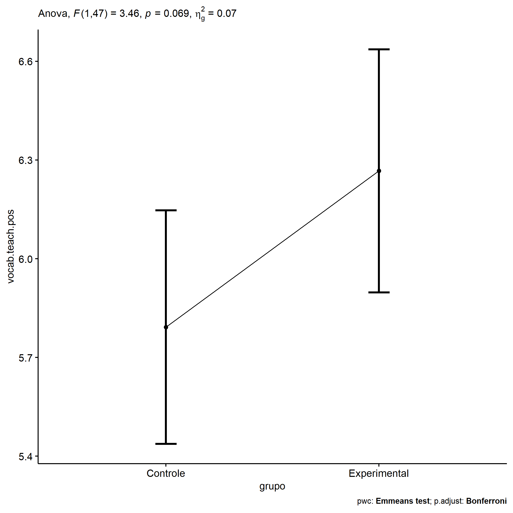<!-- -->

``` r
plots <- oneWayAncovaBoxPlots(
  wdat, "vocab.teach.pos", "grupo", aov, pwc, covar = "vocab.teach.pre",
  theme = "classic", color = color[["grupo"]],
  subtitle = which(aov$Effect == "grupo"))
```

``` r
if (length(unique(wdat[["grupo"]])) > 1)
  plots[["grupo"]] + ggplot2::ylab("Vocabulario Ensinado") + ggplot2::scale_x_discrete(labels=c('pre', 'pos'))
```

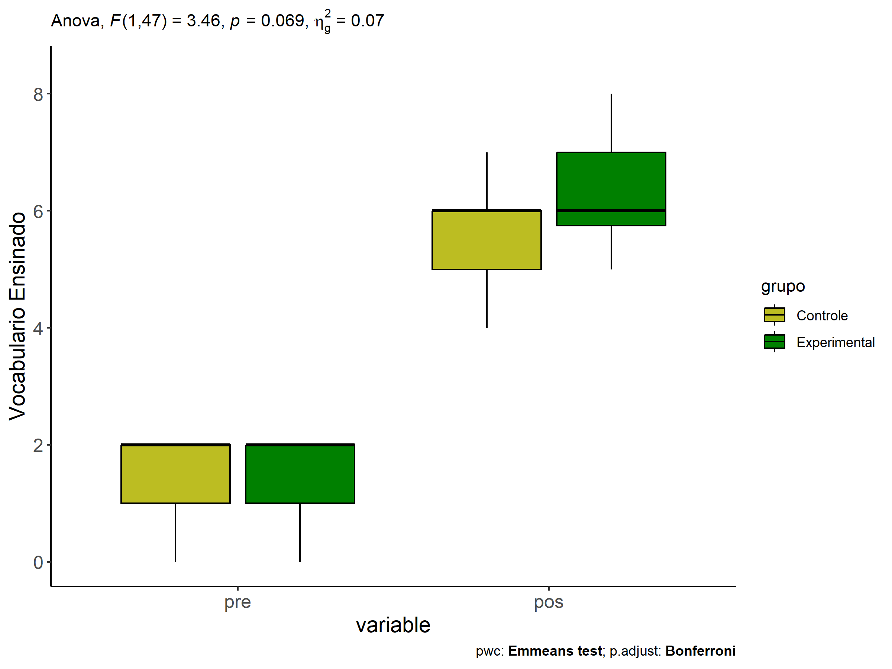<!-- -->

``` r
if (length(unique(wdat.long[["grupo"]])) > 1)
  plots <- oneWayAncovaBoxPlots(
    wdat.long, "vocab.teach", "grupo", aov, pwc.long, pre.post = "time",
    theme = "classic", color = color$prepost)
```

``` r
if (length(unique(wdat.long[["grupo"]])) > 1)
  plots[["grupo"]] + ggplot2::ylab("Vocabulario Ensinado")
```

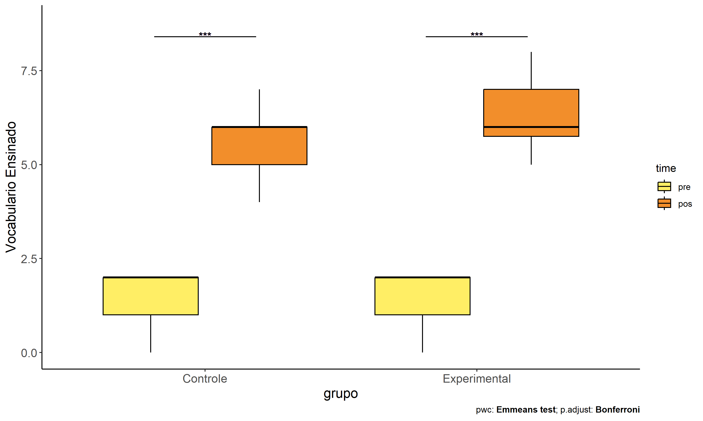<!-- -->

### Checking linearity assumption

``` r
ggscatter(wdat, x = "vocab.teach.pre", y = "vocab.teach.pos", size = 0.5,
          color = "grupo", add = "reg.line")+
  stat_regline_equation(
    aes(label =  paste(..eq.label.., ..rr.label.., sep = "~~~~"), color = grupo)
  )
```

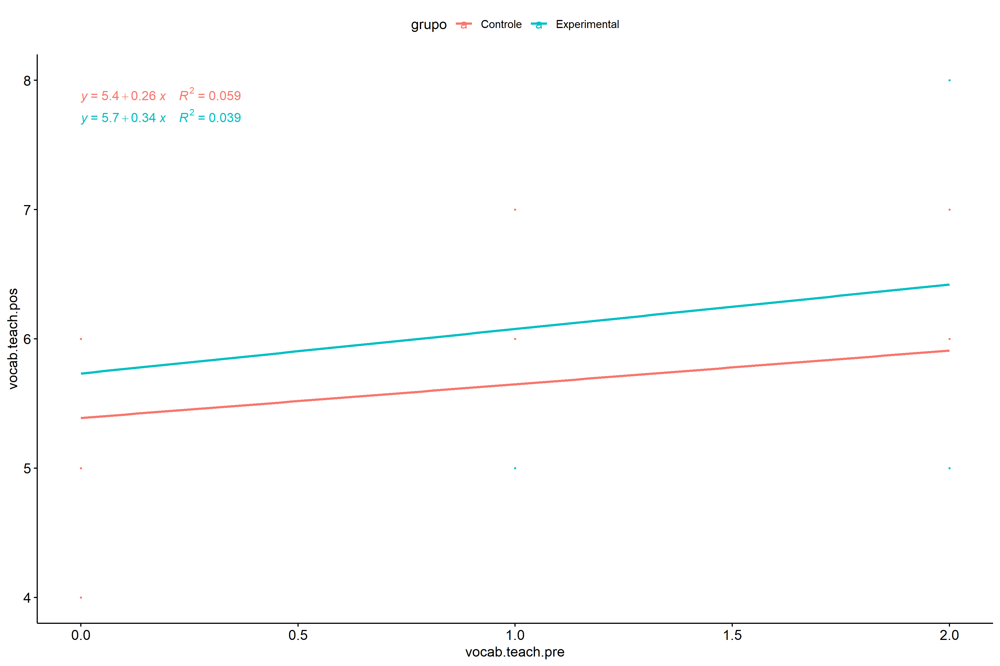<!-- -->

### Checking normality and homogeneity

``` r
res <- augment(lm(vocab.teach.pos ~ vocab.teach.pre + grupo, data = wdat))
```

``` r
shapiro_test(res$.resid)
```

    ## # A tibble: 1 × 3
    ##   variable   statistic p.value
    ##   <chr>          <dbl>   <dbl>
    ## 1 res$.resid     0.958  0.0708

``` r
levene_test(res, .resid ~ grupo)
```

    ## # A tibble: 1 × 4
    ##     df1   df2 statistic     p
    ##   <int> <int>     <dbl> <dbl>
    ## 1     1    48      1.37 0.248

# ANCOVA and Pairwise for two factors **grupo:Sexo**

## Without remove non-normal data

``` r
pdat = remove_group_data(dat[!is.na(dat[["grupo"]]) & !is.na(dat[["Sexo"]]),], "vocab.teach.pos", c("grupo","Sexo"))

pdat.long <- rbind(pdat[,c("id","grupo","Sexo")], pdat[,c("id","grupo","Sexo")])
pdat.long[["time"]] <- c(rep("pre", nrow(pdat)), rep("pos", nrow(pdat)))
pdat.long[["time"]] <- factor(pdat.long[["time"]], c("pre","pos"))
pdat.long[["vocab.teach"]] <- c(pdat[["vocab.teach.pre"]], pdat[["vocab.teach.pos"]])

aov = anova_test(pdat, vocab.teach.pos ~ vocab.teach.pre + grupo*Sexo)
laov[["grupo:Sexo"]] <- get_anova_table(aov)
```

``` r
pwcs <- list()
pwcs[["Sexo"]] <- emmeans_test(
  group_by(pdat, grupo), vocab.teach.pos ~ Sexo,
  covariate = vocab.teach.pre, p.adjust.method = "bonferroni")
pwcs[["grupo"]] <- emmeans_test(
  group_by(pdat, Sexo), vocab.teach.pos ~ grupo,
  covariate = vocab.teach.pre, p.adjust.method = "bonferroni")

pwc <- plyr::rbind.fill(pwcs[["grupo"]], pwcs[["Sexo"]])
pwc <- pwc[,c("grupo","Sexo", colnames(pwc)[!colnames(pwc) %in% c("grupo","Sexo")])]
```

``` r
pwc.long <- emmeans_test(dplyr::group_by_at(pdat.long, c("grupo","Sexo")),
                         vocab.teach ~ time,
                         p.adjust.method = "bonferroni")
lpwc[["grupo:Sexo"]] <- plyr::rbind.fill(pwc, pwc.long)
```

``` r
ds <- get.descriptives(pdat, "vocab.teach.pos", c("grupo","Sexo"), covar = "vocab.teach.pre")
ds <- merge(ds[ds$variable != "vocab.teach.pre",],
            ds[ds$variable == "vocab.teach.pre", !colnames(ds) %in% c("variable")],
            by = c("grupo","Sexo"), all.x = T, suffixes = c("", ".vocab.teach.pre"))
ds <- merge(get_emmeans(pwcs[["grupo"]]), ds, by = c("grupo","Sexo"), suffixes = c(".emms", ""))
ds <- ds[,c("grupo","Sexo","n","mean.vocab.teach.pre","se.vocab.teach.pre","mean","se","emmean","se.emms")]

colnames(ds) <- c("grupo","Sexo", "N", paste0(c("M","SE")," (pre)"),
                  paste0(c("M","SE"), " (unadj)"), paste0(c("M", "SE"), " (adj)"))

lemms[["grupo:Sexo"]] <- ds
```

## Computing ANCOVA and PairWise After removing non-normal data (OK)

``` r
wdat = pdat 

res = residuals(lm(vocab.teach.pos ~ vocab.teach.pre + grupo*Sexo, data = wdat))
non.normal = getNonNormal(res, wdat$id, plimit = 0.05)

wdat = wdat[!wdat$id %in% non.normal,]

wdat.long <- rbind(wdat[,c("id","grupo","Sexo")], wdat[,c("id","grupo","Sexo")])
wdat.long[["time"]] <- c(rep("pre", nrow(wdat)), rep("pos", nrow(wdat)))
wdat.long[["time"]] <- factor(wdat.long[["time"]], c("pre","pos"))
wdat.long[["vocab.teach"]] <- c(wdat[["vocab.teach.pre"]], wdat[["vocab.teach.pos"]])


ldat[["grupo:Sexo"]] = wdat

(non.normal)
```

    ##   [1] "P1065" "P852"  "P2438" "P631"  "P1112" "P3048" "P2133" "P1064" "P842"  "P1668" "P1050" "P1759"
    ##  [13] "P887"  "P871"  "P1066" "P1069" "P810"  "P961"  "P1754" "P967"  "P3029" "P2092" "P2908" "P817" 
    ##  [25] "P539"  "P865"  "P1019" "P2121" "P1029" "P3265" "P856"  "P563"  "P2004" "P1656" "P489"  "P1998"
    ##  [37] "P1878" "P1008" "P1057" "P1892" "P3017" "P985"  "P442"  "P2143" "P2870" "P855"  "P835"  "P3180"
    ##  [49] "P1130" "P2096" "P529"  "P1027" "P917"  "P3493" "P3470" "P1807" "P1775" "P2967" "P2106" "P969" 
    ##  [61] "P1788" "P549"  "P2882" "P2149" "P1039" "P3065" "P3262" "P2953" "P2189" "P3487" "P2162" "P1037"
    ##  [73] "P1616" "P1841" "P500"  "P971"  "P3130" "P889"  "P982"  "P2900" "P824"  "P1664" "P1997" "P873" 
    ##  [85] "P1847" "P3461" "P3542" "P3257" "P2011" "P2068" "P1747" "P3119" "P3166" "P987"  "P3097" "P1714"
    ##  [97] "P915"  "P988"  "P3113" "P1691" "P1855" "P1696" "P823"  "P1080" "P2912" "P2980" "P3246" "P2903"
    ## [109] "P826"  "P3142" "P3573" "P1793" "P490"  "P1806" "P1591" "P3486" "P951"  "P2945" "P1911" "P2086"
    ## [121] "P1610" "P939"  "P2325" "P1974" "P3282" "P1671" "P2359" "P2472" "P1602" "P926"  "P1667" "P2879"
    ## [133] "P2168" "P1950" "P493"  "P1802" "P1074" "P1944" "P944"  "P488"  "P1738" "P886"  "P3043" "P2369"
    ## [145] "P3030" "P2223" "P973"  "P2242" "P472"  "P3536" "P1102" "P567"  "P3562" "P2907" "P2174" "P1859"
    ## [157] "P930"  "P473"  "P3033" "P1051" "P481"  "P1835" "P3053" "P520"  "P2082" "P864"  "P3309" "P3161"

``` r
aov = anova_test(wdat, vocab.teach.pos ~ vocab.teach.pre + grupo*Sexo)
laov[["grupo:Sexo"]] <- merge(get_anova_table(aov), laov[["grupo:Sexo"]], by="Effect", suffixes = c("","'"))

(df = get_anova_table(aov))
```

    ## ANOVA Table (type II tests)
    ## 
    ##            Effect DFn DFd     F     p p<.05   ges
    ## 1 vocab.teach.pre   1  23 0.573 0.457       0.024
    ## 2           grupo   1  23 1.010 0.325       0.042
    ## 3            Sexo   1  23 1.747 0.199       0.071
    ## 4      grupo:Sexo   0  23    NA    NA  <NA>    NA

| Effect          | DFn | DFd |     F |     p | p\<.05 |   ges |
|:----------------|----:|----:|------:|------:|:-------|------:|
| vocab.teach.pre |   1 |  23 | 0.573 | 0.457 |        | 0.024 |
| grupo           |   1 |  23 | 1.010 | 0.325 |        | 0.042 |
| Sexo            |   1 |  23 | 1.747 | 0.199 |        | 0.071 |
| grupo:Sexo      |   0 |  23 |       |       |        |       |

``` r
pwcs <- list()
pwcs[["Sexo"]] <- emmeans_test(
  group_by(wdat, grupo), vocab.teach.pos ~ Sexo,
  covariate = vocab.teach.pre, p.adjust.method = "bonferroni")
pwcs[["grupo"]] <- emmeans_test(
  group_by(wdat, Sexo), vocab.teach.pos ~ grupo,
  covariate = vocab.teach.pre, p.adjust.method = "bonferroni")

pwc <- plyr::rbind.fill(pwcs[["grupo"]], pwcs[["Sexo"]])
pwc <- pwc[,c("grupo","Sexo", colnames(pwc)[!colnames(pwc) %in% c("grupo","Sexo")])]
```

| grupo        | Sexo | term                   | .y.             | group1   | group2       |  df | statistic |     p | p.adj | p.adj.signif |
|:-------------|:-----|:-----------------------|:----------------|:---------|:-------------|----:|----------:|------:|------:|:-------------|
|              | F    | vocab.teach.pre\*grupo | vocab.teach.pos | Controle | Experimental |     |           |       |       |              |
|              | M    | vocab.teach.pre\*grupo | vocab.teach.pos | Controle | Experimental |  23 |    -1.005 | 0.325 | 0.325 | ns           |
| Controle     |      | vocab.teach.pre\*Sexo  | vocab.teach.pos | F        | M            |  23 |     1.322 | 0.199 | 0.199 | ns           |
| Experimental |      | vocab.teach.pre\*Sexo  | vocab.teach.pos | F        | M            |     |           |       |       |              |

``` r
pwc.long <- emmeans_test(dplyr::group_by_at(wdat.long, c("grupo","Sexo")),
                         vocab.teach ~ time,
                         p.adjust.method = "bonferroni")
lpwc[["grupo:Sexo"]] <- merge(plyr::rbind.fill(pwc, pwc.long), lpwc[["grupo:Sexo"]], by=c("grupo","Sexo","term",".y.","group1","group2"), suffixes = c("","'"))
```

| grupo        | Sexo | term | .y.         | group1 | group2 |  df | statistic |     p | p.adj | p.adj.signif |
|:-------------|:-----|:-----|:------------|:-------|:-------|----:|----------:|------:|------:|:-------------|
| Controle     | F    | time | vocab.teach | pre    | pos    |  48 |    -9.046 | 0.000 | 0.000 | \*\*\*\*     |
| Controle     | M    | time | vocab.teach | pre    | pos    |  48 |    -2.161 | 0.036 | 0.036 | \*           |
| Experimental | F    | time | vocab.teach | pre    | pos    |     |           |       |       |              |
| Experimental | M    | time | vocab.teach | pre    | pos    |  48 |    -5.539 | 0.000 | 0.000 | \*\*\*\*     |

``` r
ds <- get.descriptives(wdat, "vocab.teach.pos", c("grupo","Sexo"), covar = "vocab.teach.pre")
ds <- merge(ds[ds$variable != "vocab.teach.pre",],
            ds[ds$variable == "vocab.teach.pre", !colnames(ds) %in% c("variable")],
            by = c("grupo","Sexo"), all.x = T, suffixes = c("", ".vocab.teach.pre"))
ds <- merge(get_emmeans(pwcs[["grupo"]]), ds, by = c("grupo","Sexo"), suffixes = c(".emms", ""))
ds <- ds[,c("grupo","Sexo","n","mean.vocab.teach.pre","se.vocab.teach.pre","mean","se","emmean","se.emms")]

colnames(ds) <- c("grupo","Sexo", "N", paste0(c("M","SE")," (pre)"),
                  paste0(c("M","SE"), " (unadj)"), paste0(c("M", "SE"), " (adj)"))

lemms[["grupo:Sexo"]] <- merge(ds, lemms[["grupo:Sexo"]], by=c("grupo","Sexo"), suffixes = c("","'"))
```

| grupo        | Sexo |   N | M (pre) | SE (pre) | M (unadj) | SE (unadj) | M (adj) | SE (adj) |
|:-------------|:-----|----:|--------:|---------:|----------:|-----------:|--------:|---------:|
| Controle     | F    |  12 |   1.333 |    0.225 |     3.750 |      0.250 |   3.682 |    0.232 |
| Controle     | M    |   4 |   2.000 |    0.000 |     3.000 |      0.408 |   3.068 |    0.382 |
| Experimental | M    |  11 |   1.909 |    0.091 |     3.455 |      0.157 |   3.504 |    0.233 |

### Plots for ancova

``` r
plots <- twoWayAncovaPlots(
  wdat, "vocab.teach.pos", c("grupo","Sexo"), aov, pwcs, addParam = c("mean_se"),
  font.label.size=10, step.increase=0.05, p.label="p.adj",
  subtitle = which(aov$Effect == "grupo:Sexo"))
```

``` r
if (!is.null(plots[["grupo"]]))
  plots[["grupo"]] + ggplot2::scale_color_manual(values = color[["Sexo"]])
```

<!-- -->

``` r
if (!is.null(plots[["Sexo"]]))
  plots[["Sexo"]] + ggplot2::scale_color_manual(values = color[["grupo"]])
```

<!-- -->

``` r
plots <- twoWayAncovaBoxPlots(
  wdat, "vocab.teach.pos", c("grupo","Sexo"), aov, pwcs, covar = "vocab.teach.pre",
  theme = "classic", color = color[["grupo:Sexo"]],
  subtitle = which(aov$Effect == "grupo:Sexo"))
```

``` r
plots[["grupo:Sexo"]] + ggplot2::ylab("Vocabulario Ensinado") + ggplot2::scale_x_discrete(labels=c('pre', 'pos'))
```

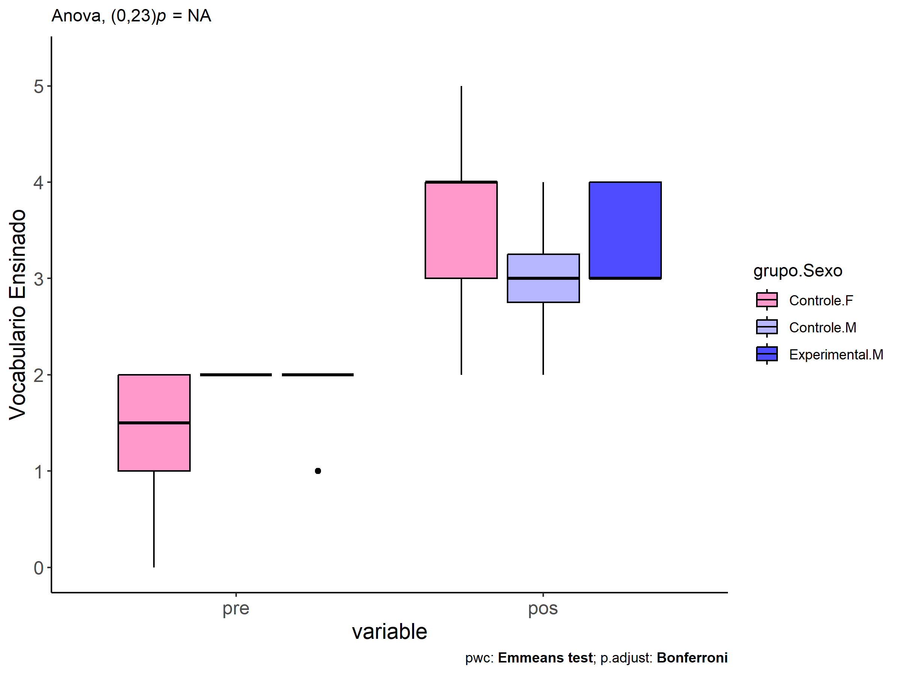<!-- -->

``` r
plots <- twoWayAncovaBoxPlots(
  wdat.long, "vocab.teach", c("grupo","Sexo"), aov, pwc.long, pre.post = "time",
  theme = "classic", color = color$prepost)
```

``` r
plots[["grupo:Sexo"]] + ggplot2::ylab("Vocabulario Ensinado")
```

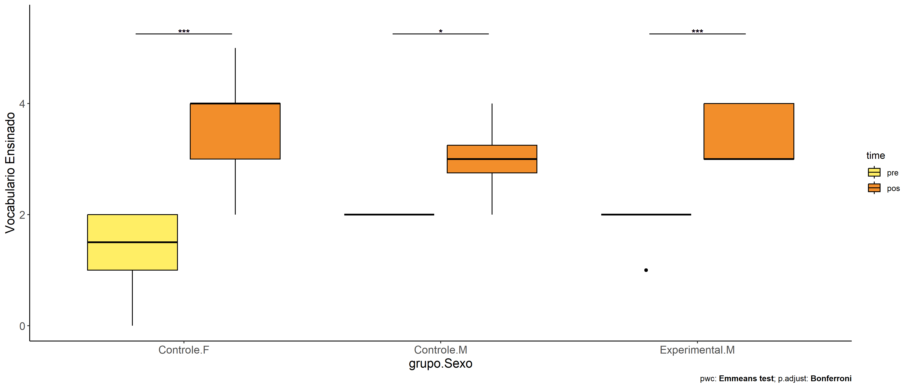<!-- -->

### Checking linearity assumption

``` r
ggscatter(wdat, x = "vocab.teach.pre", y = "vocab.teach.pos", size = 0.5,
          facet.by = c("grupo","Sexo"), add = "reg.line")+
  stat_regline_equation(
    aes(label =  paste(..eq.label.., ..rr.label.., sep = "~~~~"))
  )
```

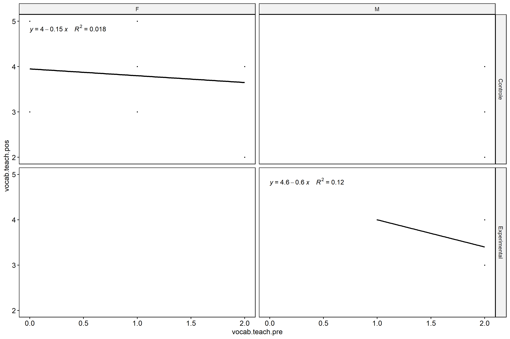<!-- -->

### Checking normality and homogeneity

``` r
res <- augment(lm(vocab.teach.pos ~ vocab.teach.pre + grupo*Sexo, data = wdat))
```

``` r
shapiro_test(res$.resid)
```

    ## # A tibble: 1 × 3
    ##   variable   statistic p.value
    ##   <chr>          <dbl>   <dbl>
    ## 1 res$.resid     0.951   0.225

``` r
levene_test(res, .resid ~ grupo*Sexo)
```

    ## # A tibble: 1 × 4
    ##     df1   df2 statistic     p
    ##   <int> <int>     <dbl> <dbl>
    ## 1     2    24     0.259 0.774

# ANCOVA and Pairwise for two factors **grupo:Zona**

## Without remove non-normal data

``` r
pdat = remove_group_data(dat[!is.na(dat[["grupo"]]) & !is.na(dat[["Zona"]]),], "vocab.teach.pos", c("grupo","Zona"))

pdat.long <- rbind(pdat[,c("id","grupo","Zona")], pdat[,c("id","grupo","Zona")])
pdat.long[["time"]] <- c(rep("pre", nrow(pdat)), rep("pos", nrow(pdat)))
pdat.long[["time"]] <- factor(pdat.long[["time"]], c("pre","pos"))
pdat.long[["vocab.teach"]] <- c(pdat[["vocab.teach.pre"]], pdat[["vocab.teach.pos"]])

aov = anova_test(pdat, vocab.teach.pos ~ vocab.teach.pre + grupo*Zona)
laov[["grupo:Zona"]] <- get_anova_table(aov)
```

``` r
pwcs <- list()
pwcs[["Zona"]] <- emmeans_test(
  group_by(pdat, grupo), vocab.teach.pos ~ Zona,
  covariate = vocab.teach.pre, p.adjust.method = "bonferroni")
pwcs[["grupo"]] <- emmeans_test(
  group_by(pdat, Zona), vocab.teach.pos ~ grupo,
  covariate = vocab.teach.pre, p.adjust.method = "bonferroni")

pwc <- plyr::rbind.fill(pwcs[["grupo"]], pwcs[["Zona"]])
pwc <- pwc[,c("grupo","Zona", colnames(pwc)[!colnames(pwc) %in% c("grupo","Zona")])]
```

``` r
pwc.long <- emmeans_test(dplyr::group_by_at(pdat.long, c("grupo","Zona")),
                         vocab.teach ~ time,
                         p.adjust.method = "bonferroni")
lpwc[["grupo:Zona"]] <- plyr::rbind.fill(pwc, pwc.long)
```

``` r
ds <- get.descriptives(pdat, "vocab.teach.pos", c("grupo","Zona"), covar = "vocab.teach.pre")
ds <- merge(ds[ds$variable != "vocab.teach.pre",],
            ds[ds$variable == "vocab.teach.pre", !colnames(ds) %in% c("variable")],
            by = c("grupo","Zona"), all.x = T, suffixes = c("", ".vocab.teach.pre"))
ds <- merge(get_emmeans(pwcs[["grupo"]]), ds, by = c("grupo","Zona"), suffixes = c(".emms", ""))
ds <- ds[,c("grupo","Zona","n","mean.vocab.teach.pre","se.vocab.teach.pre","mean","se","emmean","se.emms")]

colnames(ds) <- c("grupo","Zona", "N", paste0(c("M","SE")," (pre)"),
                  paste0(c("M","SE"), " (unadj)"), paste0(c("M", "SE"), " (adj)"))

lemms[["grupo:Zona"]] <- ds
```

## Computing ANCOVA and PairWise After removing non-normal data (OK)

``` r
wdat = pdat 

res = residuals(lm(vocab.teach.pos ~ vocab.teach.pre + grupo*Zona, data = wdat))
non.normal = getNonNormal(res, wdat$id, plimit = 0.05)

wdat = wdat[!wdat$id %in% non.normal,]

wdat.long <- rbind(wdat[,c("id","grupo","Zona")], wdat[,c("id","grupo","Zona")])
wdat.long[["time"]] <- c(rep("pre", nrow(wdat)), rep("pos", nrow(wdat)))
wdat.long[["time"]] <- factor(wdat.long[["time"]], c("pre","pos"))
wdat.long[["vocab.teach"]] <- c(wdat[["vocab.teach.pre"]], wdat[["vocab.teach.pos"]])


ldat[["grupo:Zona"]] = wdat

(non.normal)
```

    ##  [1] "P1064" "P852"  "P1050" "P887"  "P1998" "P1806" "P539"  "P442"  "P856"  "P563"  "P3470" "P1610"
    ## [13] "P489"  "P1775" "P3017" "P631"  "P917"  "P2359" "P855"  "P2945" "P1974" "P1892" "P871"  "P1759"
    ## [25] "P1807" "P2004" "P961"  "P810"  "P1130" "P3048" "P842"  "P3029" "P1591" "P529"  "P817"

``` r
aov = anova_test(wdat, vocab.teach.pos ~ vocab.teach.pre + grupo*Zona)
laov[["grupo:Zona"]] <- merge(get_anova_table(aov), laov[["grupo:Zona"]], by="Effect", suffixes = c("","'"))

(df = get_anova_table(aov))
```

    ## ANOVA Table (type II tests)
    ## 
    ##            Effect DFn DFd     F     p p<.05      ges
    ## 1 vocab.teach.pre   1 102 7.870 0.006     * 7.20e-02
    ## 2           grupo   1 102 0.001 0.972       1.23e-05
    ## 3            Zona   1 102 0.547 0.461       5.00e-03
    ## 4      grupo:Zona   1 102 0.855 0.357       8.00e-03

| Effect          | DFn | DFd |     F |     p | p\<.05 |   ges |
|:----------------|----:|----:|------:|------:|:-------|------:|
| vocab.teach.pre |   1 | 102 | 7.870 | 0.006 | \*     | 0.072 |
| grupo           |   1 | 102 | 0.001 | 0.972 |        | 0.000 |
| Zona            |   1 | 102 | 0.547 | 0.461 |        | 0.005 |
| grupo:Zona      |   1 | 102 | 0.855 | 0.357 |        | 0.008 |

``` r
pwcs <- list()
pwcs[["Zona"]] <- emmeans_test(
  group_by(wdat, grupo), vocab.teach.pos ~ Zona,
  covariate = vocab.teach.pre, p.adjust.method = "bonferroni")
pwcs[["grupo"]] <- emmeans_test(
  group_by(wdat, Zona), vocab.teach.pos ~ grupo,
  covariate = vocab.teach.pre, p.adjust.method = "bonferroni")

pwc <- plyr::rbind.fill(pwcs[["grupo"]], pwcs[["Zona"]])
pwc <- pwc[,c("grupo","Zona", colnames(pwc)[!colnames(pwc) %in% c("grupo","Zona")])]
```

| grupo        | Zona   | term                   | .y.             | group1   | group2       |  df | statistic |     p | p.adj | p.adj.signif |
|:-------------|:-------|:-----------------------|:----------------|:---------|:-------------|----:|----------:|------:|------:|:-------------|
|              | Rural  | vocab.teach.pre\*grupo | vocab.teach.pos | Controle | Experimental | 102 |    -0.573 | 0.568 | 0.568 | ns           |
|              | Urbana | vocab.teach.pre\*grupo | vocab.teach.pos | Controle | Experimental | 102 |     0.727 | 0.469 | 0.469 | ns           |
| Controle     |        | vocab.teach.pre\*Zona  | vocab.teach.pos | Rural    | Urbana       | 102 |    -0.136 | 0.892 | 0.892 | ns           |
| Experimental |        | vocab.teach.pre\*Zona  | vocab.teach.pos | Rural    | Urbana       | 102 |     1.176 | 0.242 | 0.242 | ns           |

``` r
pwc.long <- emmeans_test(dplyr::group_by_at(wdat.long, c("grupo","Zona")),
                         vocab.teach ~ time,
                         p.adjust.method = "bonferroni")
lpwc[["grupo:Zona"]] <- merge(plyr::rbind.fill(pwc, pwc.long), lpwc[["grupo:Zona"]], by=c("grupo","Zona","term",".y.","group1","group2"), suffixes = c("","'"))
```

| grupo        | Zona   | term | .y.         | group1 | group2 |  df | statistic |   p | p.adj | p.adj.signif |
|:-------------|:-------|:-----|:------------|:-------|:-------|----:|----------:|----:|------:|:-------------|
| Controle     | Rural  | time | vocab.teach | pre    | pos    | 206 |    -7.105 |   0 |     0 | \*\*\*\*     |
| Controle     | Urbana | time | vocab.teach | pre    | pos    | 206 |    -5.450 |   0 |     0 | \*\*\*\*     |
| Experimental | Rural  | time | vocab.teach | pre    | pos    | 206 |    -7.931 |   0 |     0 | \*\*\*\*     |
| Experimental | Urbana | time | vocab.teach | pre    | pos    | 206 |    -4.310 |   0 |     0 | \*\*\*\*     |

``` r
ds <- get.descriptives(wdat, "vocab.teach.pos", c("grupo","Zona"), covar = "vocab.teach.pre")
ds <- merge(ds[ds$variable != "vocab.teach.pre",],
            ds[ds$variable == "vocab.teach.pre", !colnames(ds) %in% c("variable")],
            by = c("grupo","Zona"), all.x = T, suffixes = c("", ".vocab.teach.pre"))
ds <- merge(get_emmeans(pwcs[["grupo"]]), ds, by = c("grupo","Zona"), suffixes = c(".emms", ""))
ds <- ds[,c("grupo","Zona","n","mean.vocab.teach.pre","se.vocab.teach.pre","mean","se","emmean","se.emms")]

colnames(ds) <- c("grupo","Zona", "N", paste0(c("M","SE")," (pre)"),
                  paste0(c("M","SE"), " (unadj)"), paste0(c("M", "SE"), " (adj)"))

lemms[["grupo:Zona"]] <- merge(ds, lemms[["grupo:Zona"]], by=c("grupo","Zona"), suffixes = c("","'"))
```

| grupo        | Zona   |   N | M (pre) | SE (pre) | M (unadj) | SE (unadj) | M (adj) | SE (adj) |
|:-------------|:-------|----:|--------:|---------:|----------:|-----------:|--------:|---------:|
| Controle     | Rural  |  36 |   1.722 |    0.086 |     3.361 |      0.236 |   3.374 |    0.205 |
| Controle     | Urbana |  18 |   1.667 |    0.162 |     3.444 |      0.336 |   3.423 |    0.291 |
| Experimental | Rural  |  34 |   1.676 |    0.092 |     3.559 |      0.203 |   3.543 |    0.211 |
| Experimental | Urbana |  19 |   1.737 |    0.104 |     3.105 |      0.215 |   3.128 |    0.283 |

### Plots for ancova

``` r
plots <- twoWayAncovaPlots(
  wdat, "vocab.teach.pos", c("grupo","Zona"), aov, pwcs, addParam = c("mean_se"),
  font.label.size=10, step.increase=0.05, p.label="p.adj",
  subtitle = which(aov$Effect == "grupo:Zona"))
```

``` r
if (!is.null(plots[["grupo"]]))
  plots[["grupo"]] + ggplot2::scale_color_manual(values = color[["Zona"]])
```

    ## Scale for colour is already present.
    ## Adding another scale for colour, which will replace the existing scale.

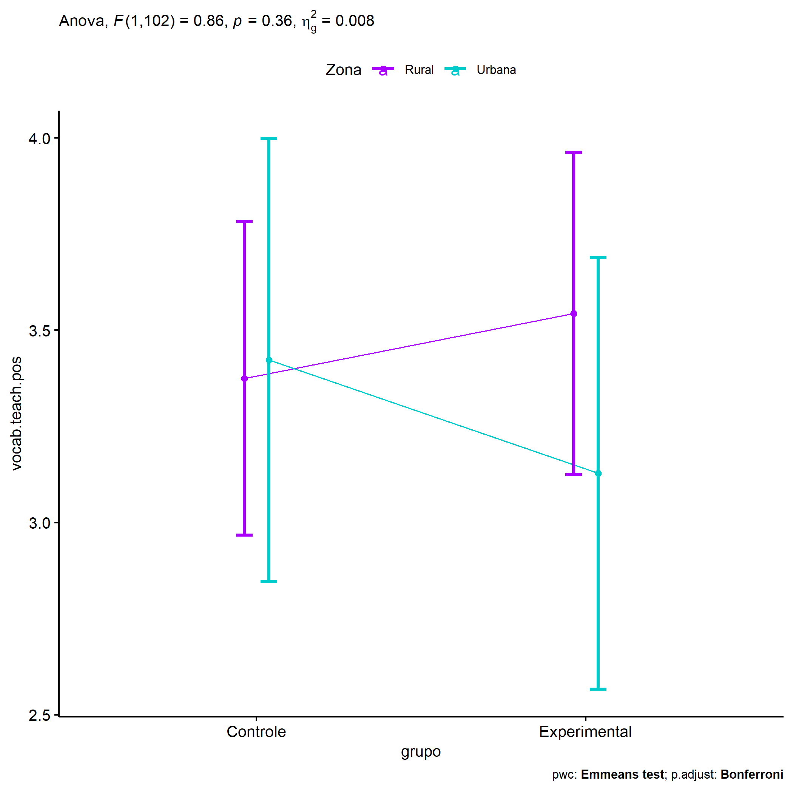<!-- -->

``` r
if (!is.null(plots[["Zona"]]))
  plots[["Zona"]] + ggplot2::scale_color_manual(values = color[["grupo"]])
```

    ## Scale for colour is already present.
    ## Adding another scale for colour, which will replace the existing scale.

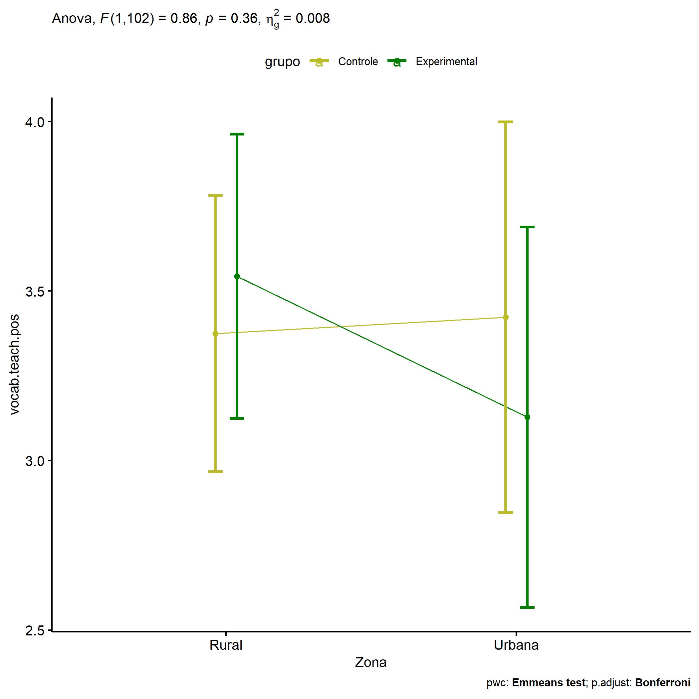<!-- -->

``` r
plots <- twoWayAncovaBoxPlots(
  wdat, "vocab.teach.pos", c("grupo","Zona"), aov, pwcs, covar = "vocab.teach.pre",
  theme = "classic", color = color[["grupo:Zona"]],
  subtitle = which(aov$Effect == "grupo:Zona"))
```

``` r
plots[["grupo:Zona"]] + ggplot2::ylab("Vocabulario Ensinado") + ggplot2::scale_x_discrete(labels=c('pre', 'pos'))
```

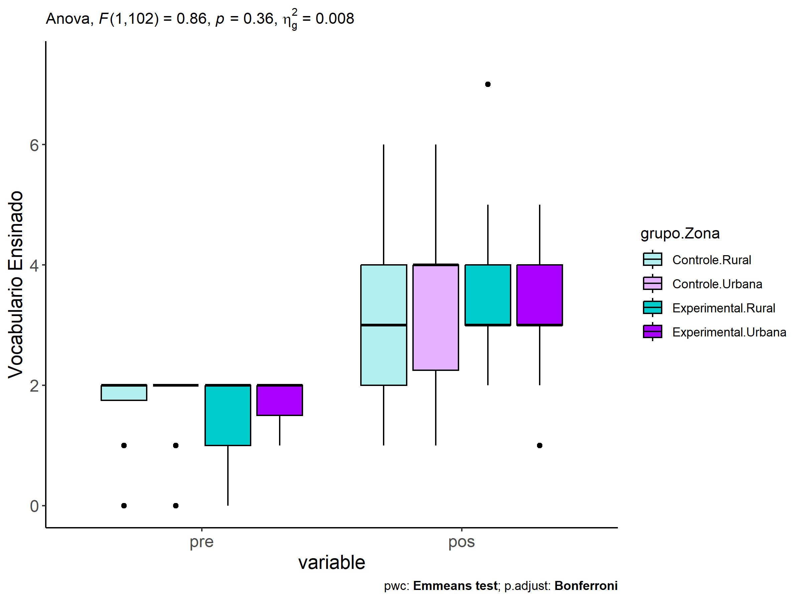<!-- -->

``` r
plots <- twoWayAncovaBoxPlots(
  wdat.long, "vocab.teach", c("grupo","Zona"), aov, pwc.long, pre.post = "time",
  theme = "classic", color = color$prepost)
```

``` r
plots[["grupo:Zona"]] + ggplot2::ylab("Vocabulario Ensinado")
```

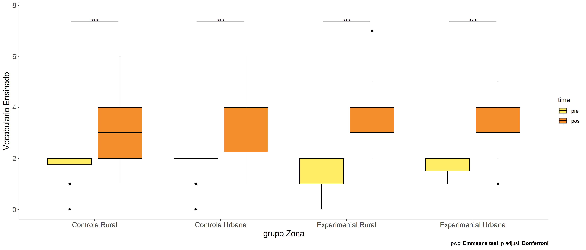<!-- -->

### Checking linearity assumption

``` r
ggscatter(wdat, x = "vocab.teach.pre", y = "vocab.teach.pos", size = 0.5,
          facet.by = c("grupo","Zona"), add = "reg.line")+
  stat_regline_equation(
    aes(label =  paste(..eq.label.., ..rr.label.., sep = "~~~~"))
  )
```

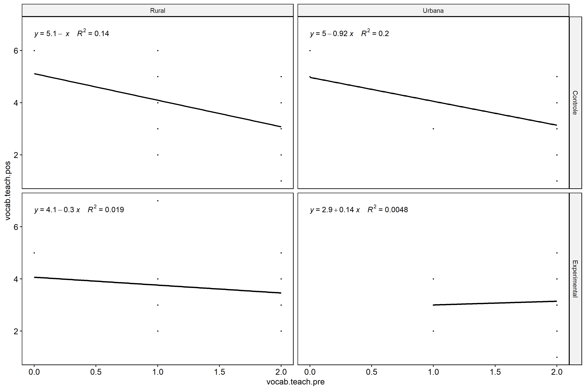<!-- -->

### Checking normality and homogeneity

``` r
res <- augment(lm(vocab.teach.pos ~ vocab.teach.pre + grupo*Zona, data = wdat))
```

``` r
shapiro_test(res$.resid)
```

    ## # A tibble: 1 × 3
    ##   variable   statistic p.value
    ##   <chr>          <dbl>   <dbl>
    ## 1 res$.resid     0.977  0.0568

``` r
levene_test(res, .resid ~ grupo*Zona)
```

    ## # A tibble: 1 × 4
    ##     df1   df2 statistic     p
    ##   <int> <int>     <dbl> <dbl>
    ## 1     3   103      1.10 0.354

# ANCOVA and Pairwise for two factors **grupo:Cor.Raca**

## Without remove non-normal data

``` r
pdat = remove_group_data(dat[!is.na(dat[["grupo"]]) & !is.na(dat[["Cor.Raca"]]),], "vocab.teach.pos", c("grupo","Cor.Raca"))
```

    ## Warning: There were 2 warnings in `mutate()`.
    ## The first warning was:
    ## ℹ In argument: `ci = abs(stats::qt(alpha/2, .data$n - 1) * .data$se)`.
    ## Caused by warning:
    ## ! There was 1 warning in `mutate()`.
    ## ℹ In argument: `ci = abs(stats::qt(alpha/2, .data$n - 1) * .data$se)`.
    ## Caused by warning in `stats::qt()`:
    ## ! NaNs produced
    ## ℹ Run `dplyr::last_dplyr_warnings()` to see the 1 remaining warning.

``` r
pdat.long <- rbind(pdat[,c("id","grupo","Cor.Raca")], pdat[,c("id","grupo","Cor.Raca")])
pdat.long[["time"]] <- c(rep("pre", nrow(pdat)), rep("pos", nrow(pdat)))
pdat.long[["time"]] <- factor(pdat.long[["time"]], c("pre","pos"))
pdat.long[["vocab.teach"]] <- c(pdat[["vocab.teach.pre"]], pdat[["vocab.teach.pos"]])

aov = anova_test(pdat, vocab.teach.pos ~ vocab.teach.pre + grupo*Cor.Raca)
laov[["grupo:Cor.Raca"]] <- get_anova_table(aov)
```

``` r
pwcs <- list()
pwcs[["Cor.Raca"]] <- emmeans_test(
  group_by(pdat, grupo), vocab.teach.pos ~ Cor.Raca,
  covariate = vocab.teach.pre, p.adjust.method = "bonferroni")
pwcs[["grupo"]] <- emmeans_test(
  group_by(pdat, Cor.Raca), vocab.teach.pos ~ grupo,
  covariate = vocab.teach.pre, p.adjust.method = "bonferroni")

pwc <- plyr::rbind.fill(pwcs[["grupo"]], pwcs[["Cor.Raca"]])
pwc <- pwc[,c("grupo","Cor.Raca", colnames(pwc)[!colnames(pwc) %in% c("grupo","Cor.Raca")])]
```

``` r
pwc.long <- emmeans_test(dplyr::group_by_at(pdat.long, c("grupo","Cor.Raca")),
                         vocab.teach ~ time,
                         p.adjust.method = "bonferroni")
lpwc[["grupo:Cor.Raca"]] <- plyr::rbind.fill(pwc, pwc.long)
```

``` r
ds <- get.descriptives(pdat, "vocab.teach.pos", c("grupo","Cor.Raca"), covar = "vocab.teach.pre")
ds <- merge(ds[ds$variable != "vocab.teach.pre",],
            ds[ds$variable == "vocab.teach.pre", !colnames(ds) %in% c("variable")],
            by = c("grupo","Cor.Raca"), all.x = T, suffixes = c("", ".vocab.teach.pre"))
ds <- merge(get_emmeans(pwcs[["grupo"]]), ds, by = c("grupo","Cor.Raca"), suffixes = c(".emms", ""))
ds <- ds[,c("grupo","Cor.Raca","n","mean.vocab.teach.pre","se.vocab.teach.pre","mean","se","emmean","se.emms")]

colnames(ds) <- c("grupo","Cor.Raca", "N", paste0(c("M","SE")," (pre)"),
                  paste0(c("M","SE"), " (unadj)"), paste0(c("M", "SE"), " (adj)"))

lemms[["grupo:Cor.Raca"]] <- ds
```

## Computing ANCOVA and PairWise After removing non-normal data (OK)

``` r
wdat = pdat 

res = residuals(lm(vocab.teach.pos ~ vocab.teach.pre + grupo*Cor.Raca, data = wdat))
non.normal = getNonNormal(res, wdat$id, plimit = 0.05)

wdat = wdat[!wdat$id %in% non.normal,]

wdat.long <- rbind(wdat[,c("id","grupo","Cor.Raca")], wdat[,c("id","grupo","Cor.Raca")])
wdat.long[["time"]] <- c(rep("pre", nrow(wdat)), rep("pos", nrow(wdat)))
wdat.long[["time"]] <- factor(wdat.long[["time"]], c("pre","pos"))
wdat.long[["vocab.teach"]] <- c(wdat[["vocab.teach.pre"]], wdat[["vocab.teach.pos"]])


ldat[["grupo:Cor.Raca"]] = wdat

(non.normal)
```

    ## [1] "P852"  "P631"  "P1029" "P961"  "P855"  "P1112"

``` r
aov = anova_test(wdat, vocab.teach.pos ~ vocab.teach.pre + grupo*Cor.Raca)
laov[["grupo:Cor.Raca"]] <- merge(get_anova_table(aov), laov[["grupo:Cor.Raca"]], by="Effect", suffixes = c("","'"))

(df = get_anova_table(aov))
```

    ## ANOVA Table (type II tests)
    ## 
    ##            Effect DFn DFd     F     p p<.05   ges
    ## 1 vocab.teach.pre   1  75 2.158 0.146       0.028
    ## 2           grupo   1  75 0.842 0.362       0.011
    ## 3        Cor.Raca   1  75 0.463 0.498       0.006
    ## 4  grupo:Cor.Raca   1  75 7.153 0.009     * 0.087

| Effect          | DFn | DFd |     F |     p | p\<.05 |   ges |
|:----------------|----:|----:|------:|------:|:-------|------:|
| vocab.teach.pre |   1 |  75 | 2.158 | 0.146 |        | 0.028 |
| grupo           |   1 |  75 | 0.842 | 0.362 |        | 0.011 |
| Cor.Raca        |   1 |  75 | 0.463 | 0.498 |        | 0.006 |
| grupo:Cor.Raca  |   1 |  75 | 7.153 | 0.009 | \*     | 0.087 |

``` r
pwcs <- list()
pwcs[["Cor.Raca"]] <- emmeans_test(
  group_by(wdat, grupo), vocab.teach.pos ~ Cor.Raca,
  covariate = vocab.teach.pre, p.adjust.method = "bonferroni")
pwcs[["grupo"]] <- emmeans_test(
  group_by(wdat, Cor.Raca), vocab.teach.pos ~ grupo,
  covariate = vocab.teach.pre, p.adjust.method = "bonferroni")

pwc <- plyr::rbind.fill(pwcs[["grupo"]], pwcs[["Cor.Raca"]])
pwc <- pwc[,c("grupo","Cor.Raca", colnames(pwc)[!colnames(pwc) %in% c("grupo","Cor.Raca")])]
```

| grupo        | Cor.Raca | term                      | .y.             | group1   | group2       |  df | statistic |     p | p.adj | p.adj.signif |
|:-------------|:---------|:--------------------------|:----------------|:---------|:-------------|----:|----------:|------:|------:|:-------------|
|              | Branca   | vocab.teach.pre\*grupo    | vocab.teach.pos | Controle | Experimental |  75 |     1.931 | 0.057 | 0.057 | ns           |
|              | Parda    | vocab.teach.pre\*grupo    | vocab.teach.pos | Controle | Experimental |  75 |    -2.057 | 0.043 | 0.043 | \*           |
| Controle     |          | vocab.teach.pre\*Cor.Raca | vocab.teach.pos | Branca   | Parda        |  75 |     2.115 | 0.038 | 0.038 | \*           |
| Experimental |          | vocab.teach.pre\*Cor.Raca | vocab.teach.pos | Branca   | Parda        |  75 |    -1.764 | 0.082 | 0.082 | ns           |

``` r
pwc.long <- emmeans_test(dplyr::group_by_at(wdat.long, c("grupo","Cor.Raca")),
                         vocab.teach ~ time,
                         p.adjust.method = "bonferroni")
lpwc[["grupo:Cor.Raca"]] <- merge(plyr::rbind.fill(pwc, pwc.long), lpwc[["grupo:Cor.Raca"]], by=c("grupo","Cor.Raca","term",".y.","group1","group2"), suffixes = c("","'"))
```

| grupo        | Cor.Raca | term | .y.         | group1 | group2 |  df | statistic |     p | p.adj | p.adj.signif |
|:-------------|:---------|:-----|:------------|:-------|:-------|----:|----------:|------:|------:|:-------------|
| Controle     | Branca   | time | vocab.teach | pre    | pos    | 152 |    -4.396 | 0.000 | 0.000 | \*\*\*\*     |
| Controle     | Parda    | time | vocab.teach | pre    | pos    | 152 |    -3.404 | 0.001 | 0.001 | \*\*\*       |
| Experimental | Branca   | time | vocab.teach | pre    | pos    | 152 |    -0.448 | 0.655 | 0.655 | ns           |
| Experimental | Parda    | time | vocab.teach | pre    | pos    | 152 |    -5.706 | 0.000 | 0.000 | \*\*\*\*     |

``` r
ds <- get.descriptives(wdat, "vocab.teach.pos", c("grupo","Cor.Raca"), covar = "vocab.teach.pre")
ds <- merge(ds[ds$variable != "vocab.teach.pre",],
            ds[ds$variable == "vocab.teach.pre", !colnames(ds) %in% c("variable")],
            by = c("grupo","Cor.Raca"), all.x = T, suffixes = c("", ".vocab.teach.pre"))
ds <- merge(get_emmeans(pwcs[["grupo"]]), ds, by = c("grupo","Cor.Raca"), suffixes = c(".emms", ""))
ds <- ds[,c("grupo","Cor.Raca","n","mean.vocab.teach.pre","se.vocab.teach.pre","mean","se","emmean","se.emms")]

colnames(ds) <- c("grupo","Cor.Raca", "N", paste0(c("M","SE")," (pre)"),
                  paste0(c("M","SE"), " (unadj)"), paste0(c("M", "SE"), " (adj)"))

lemms[["grupo:Cor.Raca"]] <- merge(ds, lemms[["grupo:Cor.Raca"]], by=c("grupo","Cor.Raca"), suffixes = c("","'"))
```

| grupo        | Cor.Raca |   N | M (pre) | SE (pre) | M (unadj) | SE (unadj) | M (adj) | SE (adj) |
|:-------------|:---------|----:|--------:|---------:|----------:|-----------:|--------:|---------:|
| Controle     | Branca   |  14 |   1.714 |    0.125 |     3.857 |      0.455 |   3.878 |    0.461 |
| Controle     | Parda    |  30 |   1.600 |    0.113 |     2.733 |      0.303 |   2.694 |    0.316 |
| Experimental | Branca   |   6 |   1.833 |    0.167 |     2.167 |      0.401 |   2.250 |    0.707 |
| Experimental | Parda    |  30 |   1.700 |    0.098 |     3.600 |      0.351 |   3.613 |    0.315 |

### Plots for ancova

``` r
plots <- twoWayAncovaPlots(
  wdat, "vocab.teach.pos", c("grupo","Cor.Raca"), aov, pwcs, addParam = c("mean_se"),
  font.label.size=10, step.increase=0.05, p.label="p.adj",
  subtitle = which(aov$Effect == "grupo:Cor.Raca"))
```

``` r
if (!is.null(plots[["grupo"]]))
  plots[["grupo"]] + ggplot2::scale_color_manual(values = color[["Cor.Raca"]])
```

    ## Scale for colour is already present.
    ## Adding another scale for colour, which will replace the existing scale.

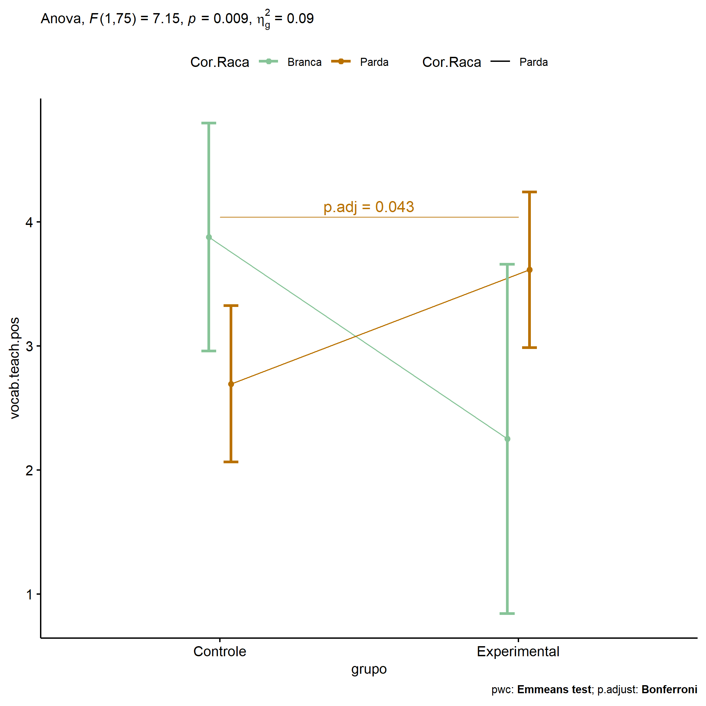<!-- -->

``` r
if (!is.null(plots[["Cor.Raca"]]))
  plots[["Cor.Raca"]] + ggplot2::scale_color_manual(values = color[["grupo"]])
```

    ## Scale for colour is already present.
    ## Adding another scale for colour, which will replace the existing scale.

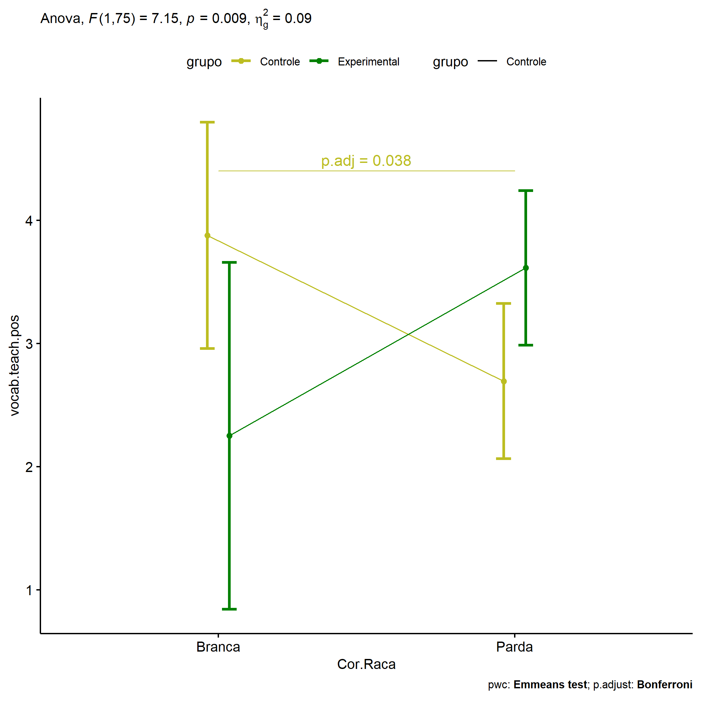<!-- -->

``` r
plots <- twoWayAncovaBoxPlots(
  wdat, "vocab.teach.pos", c("grupo","Cor.Raca"), aov, pwcs, covar = "vocab.teach.pre",
  theme = "classic", color = color[["grupo:Cor.Raca"]],
  subtitle = which(aov$Effect == "grupo:Cor.Raca"))
```

``` r
plots[["grupo:Cor.Raca"]] + ggplot2::ylab("Vocabulario Ensinado") + ggplot2::scale_x_discrete(labels=c('pre', 'pos'))
```

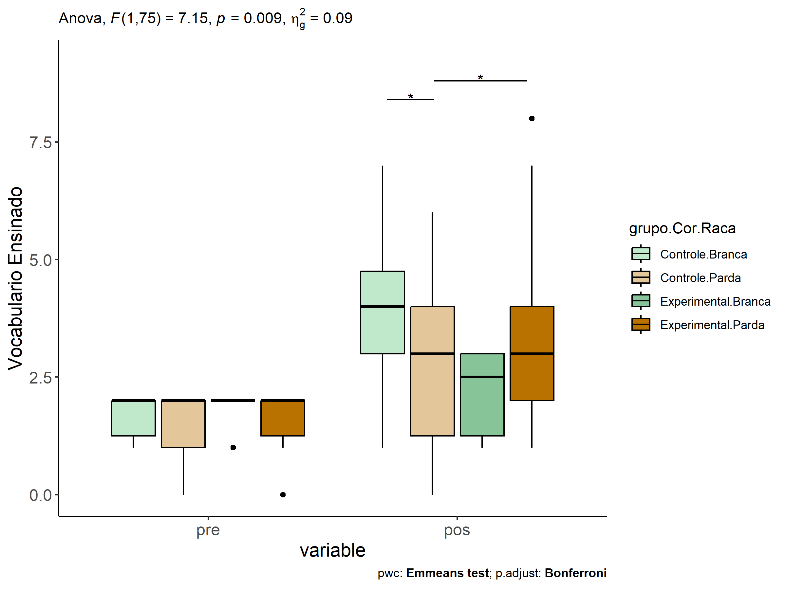<!-- -->

``` r
plots <- twoWayAncovaBoxPlots(
  wdat.long, "vocab.teach", c("grupo","Cor.Raca"), aov, pwc.long, pre.post = "time",
  theme = "classic", color = color$prepost)
```

``` r
plots[["grupo:Cor.Raca"]] + ggplot2::ylab("Vocabulario Ensinado")
```

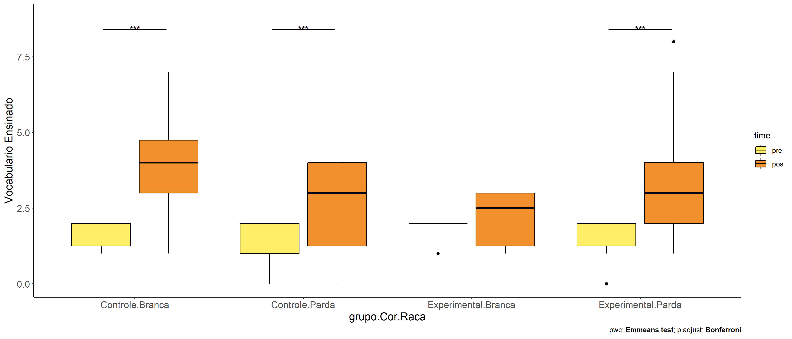<!-- -->

### Checking linearity assumption

``` r
ggscatter(wdat, x = "vocab.teach.pre", y = "vocab.teach.pos", size = 0.5,
          facet.by = c("grupo","Cor.Raca"), add = "reg.line")+
  stat_regline_equation(
    aes(label =  paste(..eq.label.., ..rr.label.., sep = "~~~~"))
  )
```

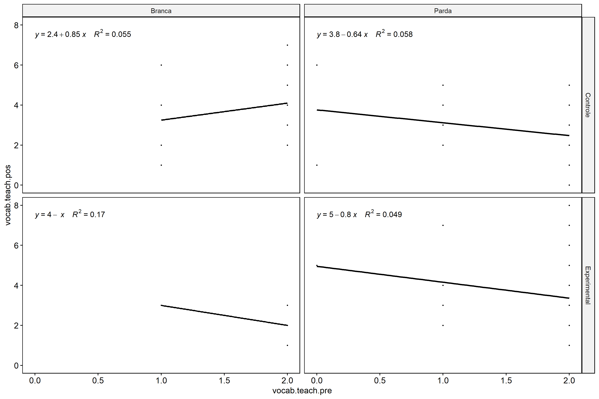<!-- -->

### Checking normality and homogeneity

``` r
res <- augment(lm(vocab.teach.pos ~ vocab.teach.pre + grupo*Cor.Raca, data = wdat))
```

``` r
shapiro_test(res$.resid)
```

    ## # A tibble: 1 × 3
    ##   variable   statistic p.value
    ##   <chr>          <dbl>   <dbl>
    ## 1 res$.resid     0.978   0.190

``` r
levene_test(res, .resid ~ grupo*Cor.Raca)
```

    ## # A tibble: 1 × 4
    ##     df1   df2 statistic     p
    ##   <int> <int>     <dbl> <dbl>
    ## 1     3    76     0.738 0.533

# ANCOVA and Pairwise for two factors **grupo:Serie**

## Without remove non-normal data

``` r
pdat = remove_group_data(dat[!is.na(dat[["grupo"]]) & !is.na(dat[["Serie"]]),], "vocab.teach.pos", c("grupo","Serie"))

pdat.long <- rbind(pdat[,c("id","grupo","Serie")], pdat[,c("id","grupo","Serie")])
pdat.long[["time"]] <- c(rep("pre", nrow(pdat)), rep("pos", nrow(pdat)))
pdat.long[["time"]] <- factor(pdat.long[["time"]], c("pre","pos"))
pdat.long[["vocab.teach"]] <- c(pdat[["vocab.teach.pre"]], pdat[["vocab.teach.pos"]])

aov = anova_test(pdat, vocab.teach.pos ~ vocab.teach.pre + grupo*Serie)
laov[["grupo:Serie"]] <- get_anova_table(aov)
```

``` r
pwcs <- list()
pwcs[["Serie"]] <- emmeans_test(
  group_by(pdat, grupo), vocab.teach.pos ~ Serie,
  covariate = vocab.teach.pre, p.adjust.method = "bonferroni")
pwcs[["grupo"]] <- emmeans_test(
  group_by(pdat, Serie), vocab.teach.pos ~ grupo,
  covariate = vocab.teach.pre, p.adjust.method = "bonferroni")

pwc <- plyr::rbind.fill(pwcs[["grupo"]], pwcs[["Serie"]])
pwc <- pwc[,c("grupo","Serie", colnames(pwc)[!colnames(pwc) %in% c("grupo","Serie")])]
```

``` r
pwc.long <- emmeans_test(dplyr::group_by_at(pdat.long, c("grupo","Serie")),
                         vocab.teach ~ time,
                         p.adjust.method = "bonferroni")
lpwc[["grupo:Serie"]] <- plyr::rbind.fill(pwc, pwc.long)
```

``` r
ds <- get.descriptives(pdat, "vocab.teach.pos", c("grupo","Serie"), covar = "vocab.teach.pre")
ds <- merge(ds[ds$variable != "vocab.teach.pre",],
            ds[ds$variable == "vocab.teach.pre", !colnames(ds) %in% c("variable")],
            by = c("grupo","Serie"), all.x = T, suffixes = c("", ".vocab.teach.pre"))
ds <- merge(get_emmeans(pwcs[["grupo"]]), ds, by = c("grupo","Serie"), suffixes = c(".emms", ""))
ds <- ds[,c("grupo","Serie","n","mean.vocab.teach.pre","se.vocab.teach.pre","mean","se","emmean","se.emms")]

colnames(ds) <- c("grupo","Serie", "N", paste0(c("M","SE")," (pre)"),
                  paste0(c("M","SE"), " (unadj)"), paste0(c("M", "SE"), " (adj)"))

lemms[["grupo:Serie"]] <- ds
```

## Computing ANCOVA and PairWise After removing non-normal data (OK)

``` r
wdat = pdat 

res = residuals(lm(vocab.teach.pos ~ vocab.teach.pre + grupo*Serie, data = wdat))
non.normal = getNonNormal(res, wdat$id, plimit = 0.05)

wdat = wdat[!wdat$id %in% non.normal,]

wdat.long <- rbind(wdat[,c("id","grupo","Serie")], wdat[,c("id","grupo","Serie")])
wdat.long[["time"]] <- c(rep("pre", nrow(wdat)), rep("pos", nrow(wdat)))
wdat.long[["time"]] <- factor(wdat.long[["time"]], c("pre","pos"))
wdat.long[["vocab.teach"]] <- c(wdat[["vocab.teach.pre"]], wdat[["vocab.teach.pos"]])


ldat[["grupo:Serie"]] = wdat

(non.normal)
```

    ##   [1] "P1065" "P3265" "P887"  "P1754" "P856"  "P1656" "P489"  "P2092" "P1064" "P1050" "P1069" "P442" 
    ##  [13] "P2908" "P865"  "P1892" "P3017" "P985"  "P1029" "P1878" "P563"  "P2121" "P1998" "P539"  "P2004"
    ##  [25] "P490"  "P3486" "P2870" "P488"  "P472"  "P1008" "P1057" "P1019" "P3309" "P3262" "P824"  "P889" 
    ##  [37] "P1714" "P873"  "P1664" "P2900" "P982"  "P971"  "P1911" "P1873" "P973"  "P969"  "P1891" "P2143"
    ##  [49] "P1027" "P915"  "P3542" "P1855" "P2967" "P2882" "P3484" "P500"  "P1616" "P3487" "P1799" "P2867"
    ##  [61] "P481"  "P473"  "P1051" "P2242" "P2106" "P1080" "P2400" "P2369" "P2325" "P2351" "P3257" "P864" 
    ##  [73] "P1747" "P3503" "P1685" "P2912" "P1671" "P2903" "P823"  "P1691" "P3110" "P988"  "P3097" "P2174"
    ##  [85] "P567"  "P2149" "P3562" "P951"  "P3573" "P939"  "P3053" "P3130" "P2189" "P2953" "P1859" "P3536"
    ##  [97] "P549"  "P3085" "P1845" "P913"  "P3065" "P1835" "P930"  "P3461" "P2213" "P3166" "P2223" "P1102"
    ## [109] "P3282" "P2472" "P1690" "P2905" "P1704" "P2907" "P1683" "P2944" "P886"  "P1738" "P884"  "P944" 
    ## [121] "P2162" "P1039" "P520"  "P3033" "P3030" "P3043" "P3050" "P3119" "P2068" "P3200" "P3638" "P2156"
    ## [133] "P585"  "P852"  "P1037" "P2011" "P1847" "P1997" "P1841" "P1802" "P493"  "P2879" "P1602" "P1074"
    ## [145] "P2086" "P2082" "P3161" "P3246" "P2359" "P1660" "P1696" "P826"  "P1667" "P3113" "P2980" "P987" 
    ## [157] "P3142" "P2168" "P1950"

``` r
aov = anova_test(wdat, vocab.teach.pos ~ vocab.teach.pre + grupo*Serie)
laov[["grupo:Serie"]] <- merge(get_anova_table(aov), laov[["grupo:Serie"]], by="Effect", suffixes = c("","'"))

(df = get_anova_table(aov))
```

    ## ANOVA Table (type II tests)
    ## 
    ##            Effect DFn DFd     F     p p<.05   ges
    ## 1 vocab.teach.pre   1  27 0.049 0.826       0.002
    ## 2           grupo   1  27 0.427 0.519       0.016
    ## 3           Serie   3  27 4.242 0.014     * 0.320
    ## 4     grupo:Serie   3  27 2.110 0.122       0.190

| Effect          | DFn | DFd |     F |     p | p\<.05 |   ges |
|:----------------|----:|----:|------:|------:|:-------|------:|
| vocab.teach.pre |   1 |  27 | 0.049 | 0.826 |        | 0.002 |
| grupo           |   1 |  27 | 0.427 | 0.519 |        | 0.016 |
| Serie           |   3 |  27 | 4.242 | 0.014 | \*     | 0.320 |
| grupo:Serie     |   3 |  27 | 2.110 | 0.122 |        | 0.190 |

``` r
pwcs <- list()
pwcs[["Serie"]] <- emmeans_test(
  group_by(wdat, grupo), vocab.teach.pos ~ Serie,
  covariate = vocab.teach.pre, p.adjust.method = "bonferroni")
pwcs[["grupo"]] <- emmeans_test(
  group_by(wdat, Serie), vocab.teach.pos ~ grupo,
  covariate = vocab.teach.pre, p.adjust.method = "bonferroni")

pwc <- plyr::rbind.fill(pwcs[["grupo"]], pwcs[["Serie"]])
pwc <- pwc[,c("grupo","Serie", colnames(pwc)[!colnames(pwc) %in% c("grupo","Serie")])]
```

| grupo        | Serie | term                   | .y.             | group1   | group2       |  df | statistic |     p | p.adj | p.adj.signif |
|:-------------|:------|:-----------------------|:----------------|:---------|:-------------|----:|----------:|------:|------:|:-------------|
|              | 6 ano | vocab.teach.pre\*grupo | vocab.teach.pos | Controle | Experimental |  27 |    -0.998 | 0.327 | 0.327 | ns           |
|              | 7 ano | vocab.teach.pre\*grupo | vocab.teach.pos | Controle | Experimental |  27 |     1.486 | 0.149 | 0.149 | ns           |
|              | 8 ano | vocab.teach.pre\*grupo | vocab.teach.pos | Controle | Experimental |  27 |    -1.610 | 0.119 | 0.119 | ns           |
|              | 9 ano | vocab.teach.pre\*grupo | vocab.teach.pos | Controle | Experimental |  27 |    -0.895 | 0.378 | 0.378 | ns           |
| Controle     |       | vocab.teach.pre\*Serie | vocab.teach.pos | 6 ano    | 7 ano        |  27 |    -0.299 | 0.767 | 1.000 | ns           |
| Controle     |       | vocab.teach.pre\*Serie | vocab.teach.pos | 6 ano    | 8 ano        |  27 |     1.214 | 0.235 | 1.000 | ns           |
| Controle     |       | vocab.teach.pre\*Serie | vocab.teach.pos | 6 ano    | 9 ano        |  27 |    -1.001 | 0.326 | 1.000 | ns           |
| Controle     |       | vocab.teach.pre\*Serie | vocab.teach.pos | 7 ano    | 8 ano        |  27 |     1.387 | 0.177 | 1.000 | ns           |
| Controle     |       | vocab.teach.pre\*Serie | vocab.teach.pos | 7 ano    | 9 ano        |  27 |    -0.819 | 0.420 | 1.000 | ns           |
| Controle     |       | vocab.teach.pre\*Serie | vocab.teach.pos | 8 ano    | 9 ano        |  27 |    -1.610 | 0.119 | 0.714 | ns           |
| Experimental |       | vocab.teach.pre\*Serie | vocab.teach.pos | 6 ano    | 7 ano        |  27 |     2.270 | 0.031 | 0.188 | ns           |
| Experimental |       | vocab.teach.pre\*Serie | vocab.teach.pos | 6 ano    | 8 ano        |  27 |    -0.552 | 0.585 | 1.000 | ns           |
| Experimental |       | vocab.teach.pre\*Serie | vocab.teach.pos | 6 ano    | 9 ano        |  27 |    -2.394 | 0.024 | 0.143 | ns           |
| Experimental |       | vocab.teach.pre\*Serie | vocab.teach.pos | 7 ano    | 8 ano        |  27 |    -1.684 | 0.104 | 0.623 | ns           |
| Experimental |       | vocab.teach.pre\*Serie | vocab.teach.pos | 7 ano    | 9 ano        |  27 |    -3.931 | 0.001 | 0.003 | \*\*         |
| Experimental |       | vocab.teach.pre\*Serie | vocab.teach.pos | 8 ano    | 9 ano        |  27 |    -0.895 | 0.378 | 1.000 | ns           |

``` r
pwc.long <- emmeans_test(dplyr::group_by_at(wdat.long, c("grupo","Serie")),
                         vocab.teach ~ time,
                         p.adjust.method = "bonferroni")
lpwc[["grupo:Serie"]] <- merge(plyr::rbind.fill(pwc, pwc.long), lpwc[["grupo:Serie"]], by=c("grupo","Serie","term",".y.","group1","group2"), suffixes = c("","'"))
```

| grupo        | Serie | term | .y.         | group1 | group2 |  df | statistic |   p | p.adj | p.adj.signif |
|:-------------|:------|:-----|:------------|:-------|:-------|----:|----------:|----:|------:|:-------------|
| Controle     | 6 ano | time | vocab.teach | pre    | pos    |  56 |   -14.247 |   0 |     0 | \*\*\*\*     |
| Controle     | 7 ano | time | vocab.teach | pre    | pos    |  56 |   -12.260 |   0 |     0 | \*\*\*\*     |
| Controle     | 8 ano | time | vocab.teach | pre    | pos    |  56 |   -10.852 |   0 |     0 | \*\*\*\*     |
| Controle     | 9 ano | time | vocab.teach | pre    | pos    |  56 |    -5.711 |   0 |     0 | \*\*\*\*     |
| Experimental | 6 ano | time | vocab.teach | pre    | pos    |  56 |   -18.422 |   0 |     0 | \*\*\*\*     |
| Experimental | 7 ano | time | vocab.teach | pre    | pos    |  56 |   -10.217 |   0 |     0 | \*\*\*\*     |
| Experimental | 8 ano | time | vocab.teach | pre    | pos    |  56 |    -5.711 |   0 |     0 | \*\*\*\*     |
| Experimental | 9 ano | time | vocab.teach | pre    | pos    |  56 |   -11.211 |   0 |     0 | \*\*\*\*     |

``` r
ds <- get.descriptives(wdat, "vocab.teach.pos", c("grupo","Serie"), covar = "vocab.teach.pre")
```

    ## Warning: There were 2 warnings in `mutate()`.
    ## The first warning was:
    ## ℹ In argument: `ci = abs(stats::qt(alpha/2, .data$n - 1) * .data$se)`.
    ## Caused by warning:
    ## ! There was 1 warning in `mutate()`.
    ## ℹ In argument: `ci = abs(stats::qt(alpha/2, .data$n - 1) * .data$se)`.
    ## Caused by warning in `stats::qt()`:
    ## ! NaNs produced
    ## ℹ Run `dplyr::last_dplyr_warnings()` to see the 1 remaining warning.

``` r
ds <- merge(ds[ds$variable != "vocab.teach.pre",],
            ds[ds$variable == "vocab.teach.pre", !colnames(ds) %in% c("variable")],
            by = c("grupo","Serie"), all.x = T, suffixes = c("", ".vocab.teach.pre"))
ds <- merge(get_emmeans(pwcs[["grupo"]]), ds, by = c("grupo","Serie"), suffixes = c(".emms", ""))
ds <- ds[,c("grupo","Serie","n","mean.vocab.teach.pre","se.vocab.teach.pre","mean","se","emmean","se.emms")]

colnames(ds) <- c("grupo","Serie", "N", paste0(c("M","SE")," (pre)"),
                  paste0(c("M","SE"), " (unadj)"), paste0(c("M", "SE"), " (adj)"))

lemms[["grupo:Serie"]] <- merge(ds, lemms[["grupo:Serie"]], by=c("grupo","Serie"), suffixes = c("","'"))
```

| grupo        | Serie |   N | M (pre) | SE (pre) | M (unadj) | SE (unadj) | M (adj) | SE (adj) |
|:-------------|:------|----:|--------:|---------:|----------:|-----------:|--------:|---------:|
| Controle     | 6 ano |   7 |   1.571 |    0.297 |     6.286 |      0.184 |   6.286 |    0.244 |
| Controle     | 7 ano |   5 |   1.600 |    0.245 |     6.400 |      0.245 |   6.399 |    0.288 |
| Controle     | 8 ano |   4 |   1.000 |    0.408 |     5.750 |      0.250 |   5.776 |    0.343 |
| Controle     | 9 ano |   1 |   2.000 |          |     7.000 |            |   6.981 |    0.650 |
| Experimental | 6 ano |  10 |   1.500 |    0.167 |     6.600 |      0.221 |   6.604 |    0.205 |
| Experimental | 7 ano |   5 |   1.800 |    0.200 |     5.800 |      0.374 |   5.790 |    0.292 |
| Experimental | 8 ano |   1 |   2.000 |          |     7.000 |            |   6.981 |    0.650 |
| Experimental | 9 ano |   3 |   2.000 |    0.000 |     7.667 |      0.333 |   7.648 |    0.382 |

### Plots for ancova

``` r
plots <- twoWayAncovaPlots(
  wdat, "vocab.teach.pos", c("grupo","Serie"), aov, pwcs, addParam = c("mean_se"),
  font.label.size=10, step.increase=0.05, p.label="p.adj",
  subtitle = which(aov$Effect == "grupo:Serie"))
```

``` r
if (!is.null(plots[["grupo"]]))
  plots[["grupo"]] + ggplot2::scale_color_manual(values = color[["Serie"]])
```

    ## Scale for colour is already present.
    ## Adding another scale for colour, which will replace the existing scale.

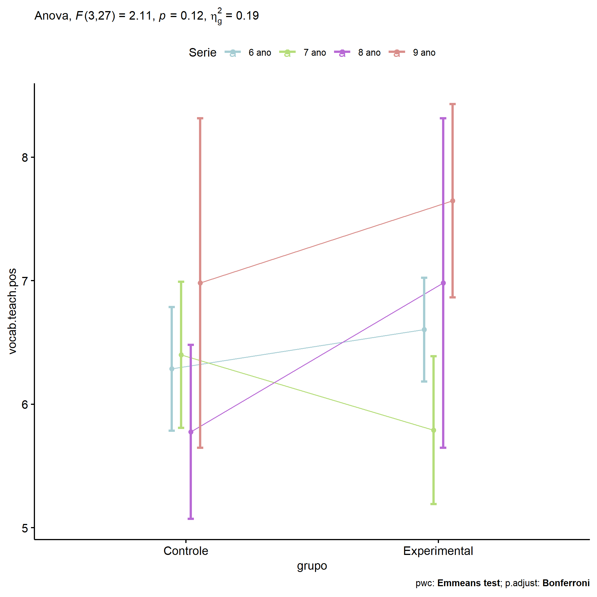<!-- -->

``` r
if (!is.null(plots[["Serie"]]))
  plots[["Serie"]] + ggplot2::scale_color_manual(values = color[["grupo"]])
```

    ## Scale for colour is already present.
    ## Adding another scale for colour, which will replace the existing scale.

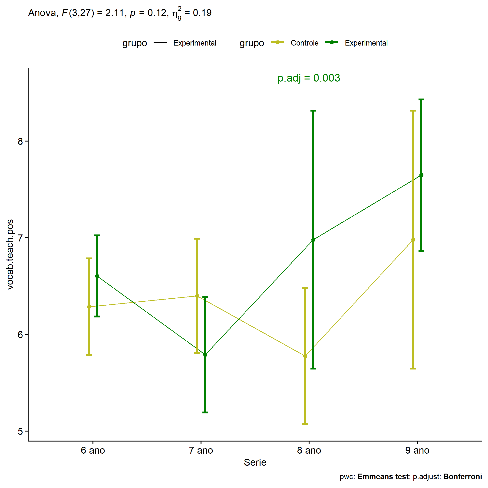<!-- -->

``` r
plots <- twoWayAncovaBoxPlots(
  wdat, "vocab.teach.pos", c("grupo","Serie"), aov, pwcs, covar = "vocab.teach.pre",
  theme = "classic", color = color[["grupo:Serie"]],
  subtitle = which(aov$Effect == "grupo:Serie"))
```

``` r
plots[["grupo:Serie"]] + ggplot2::ylab("Vocabulario Ensinado") + ggplot2::scale_x_discrete(labels=c('pre', 'pos'))
```

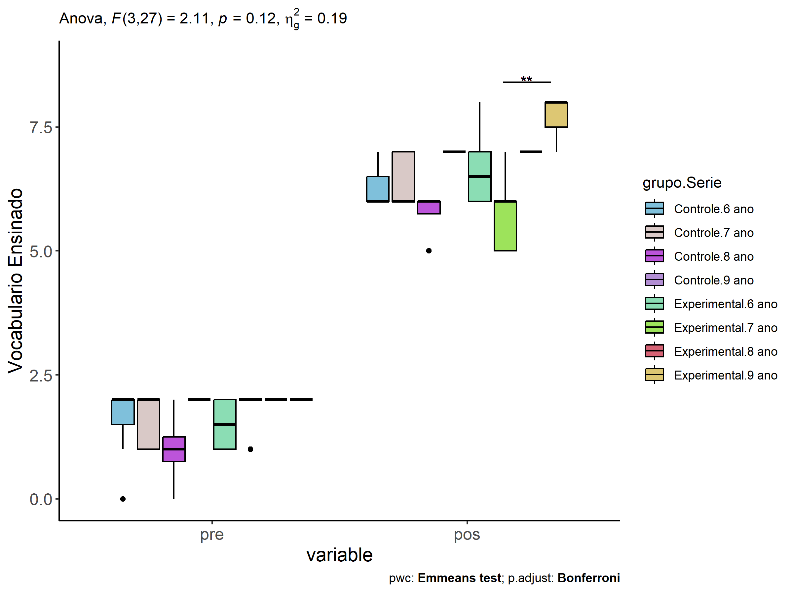<!-- -->

``` r
plots <- twoWayAncovaBoxPlots(
  wdat.long, "vocab.teach", c("grupo","Serie"), aov, pwc.long, pre.post = "time",
  theme = "classic", color = color$prepost)
```

``` r
plots[["grupo:Serie"]] + ggplot2::ylab("Vocabulario Ensinado")
```

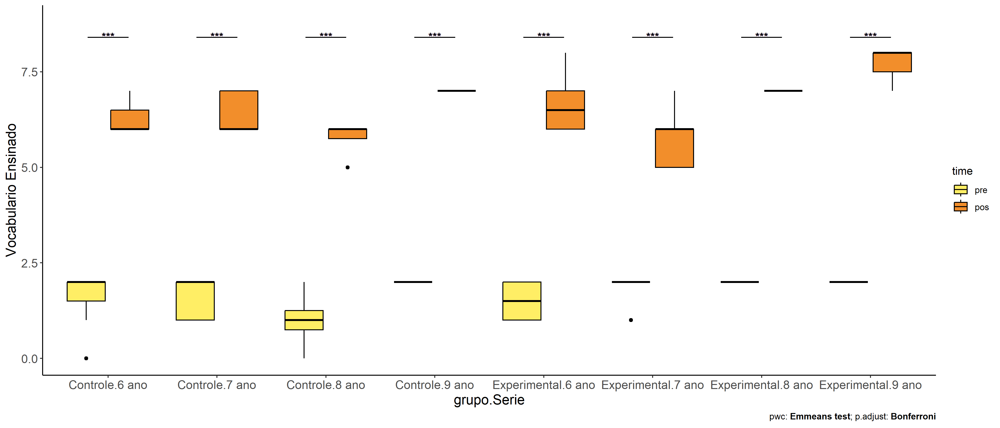<!-- -->

### Checking linearity assumption

``` r
ggscatter(wdat, x = "vocab.teach.pre", y = "vocab.teach.pos", size = 0.5,
          facet.by = c("grupo","Serie"), add = "reg.line")+
  stat_regline_equation(
    aes(label =  paste(..eq.label.., ..rr.label.., sep = "~~~~"))
  )
```

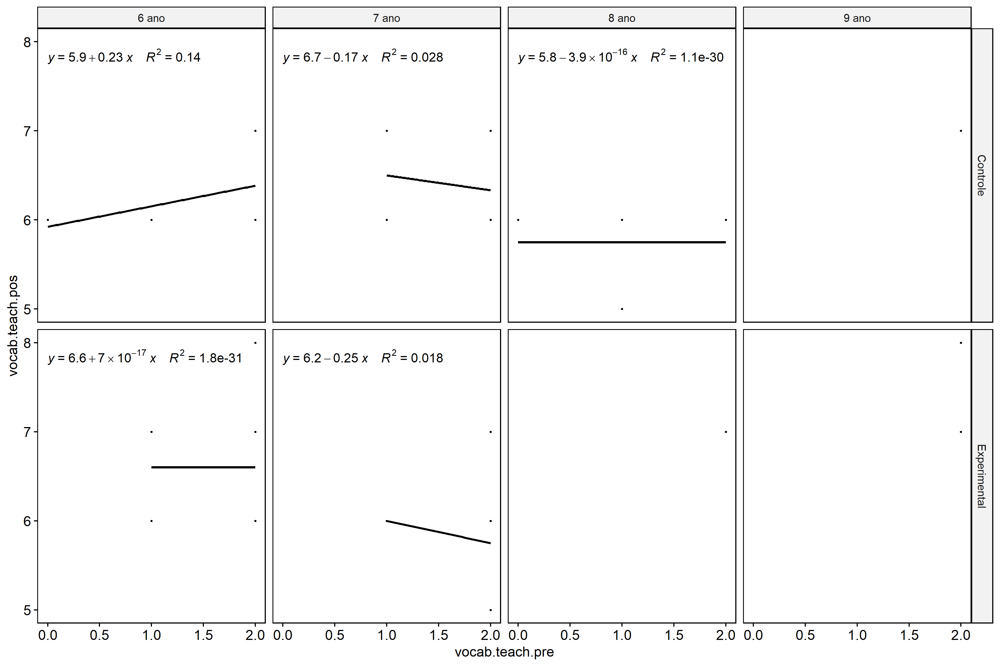<!-- -->

### Checking normality and homogeneity

``` r
res <- augment(lm(vocab.teach.pos ~ vocab.teach.pre + grupo*Serie, data = wdat))
```

``` r
shapiro_test(res$.resid)
```

    ## # A tibble: 1 × 3
    ##   variable   statistic p.value
    ##   <chr>          <dbl>   <dbl>
    ## 1 res$.resid     0.946  0.0760

``` r
levene_test(res, .resid ~ grupo*Serie)
```

    ## # A tibble: 1 × 4
    ##     df1   df2 statistic     p
    ##   <int> <int>     <dbl> <dbl>
    ## 1     7    28     0.772 0.616

# Summary of Results

## Descriptive Statistics

``` r
df <- get.descriptives(ldat[["grupo"]], c(dv.pre, dv.pos), c("grupo"), 
                       include.global = T, symmetry.test = T, normality.test = F)
df <- plyr::rbind.fill(
  df, do.call(plyr::rbind.fill, lapply(lfatores2, FUN = function(f) {
    if (nrow(dat) > 0 && sum(!is.na(unique(dat[[f]]))) > 1)
      get.descriptives(ldat[[paste0("grupo:",f)]], c(dv.pre,dv.pos), c("grupo", f),
                       symmetry.test = T, normality.test = F)
    }))
)
```

    ## Warning: There were 2 warnings in `mutate()`.
    ## The first warning was:
    ## ℹ In argument: `ci = abs(stats::qt(alpha/2, .data$n - 1) * .data$se)`.
    ## Caused by warning:
    ## ! There was 1 warning in `mutate()`.
    ## ℹ In argument: `ci = abs(stats::qt(alpha/2, .data$n - 1) * .data$se)`.
    ## Caused by warning in `stats::qt()`:
    ## ! NaNs produced
    ## ℹ Run `dplyr::last_dplyr_warnings()` to see the 1 remaining warning.
    ## There were 2 warnings in `mutate()`.
    ## The first warning was:
    ## ℹ In argument: `ci = abs(stats::qt(alpha/2, .data$n - 1) * .data$se)`.
    ## Caused by warning:
    ## ! There was 1 warning in `mutate()`.
    ## ℹ In argument: `ci = abs(stats::qt(alpha/2, .data$n - 1) * .data$se)`.
    ## Caused by warning in `stats::qt()`:
    ## ! NaNs produced
    ## ℹ Run `dplyr::last_dplyr_warnings()` to see the 1 remaining warning.

``` r
(df <- df[,c(fatores1[fatores1 %in% colnames(df)],"variable",
             colnames(df)[!colnames(df) %in% c(fatores1,"variable")])])
```

    ##           grupo Sexo   Zona Cor.Raca Serie        variable  n  mean median min max    sd    se    ci
    ## 1      Controle <NA>   <NA>     <NA>  <NA> vocab.teach.pre 26 1.462    2.0   0   2 0.761 0.149 0.307
    ## 2  Experimental <NA>   <NA>     <NA>  <NA> vocab.teach.pre 24 1.625    2.0   0   2 0.576 0.118 0.243
    ## 3          <NA> <NA>   <NA>     <NA>  <NA> vocab.teach.pre 50 1.540    2.0   0   2 0.676 0.096 0.192
    ## 4      Controle <NA>   <NA>     <NA>  <NA> vocab.teach.pos 26 5.769    6.0   4   7 0.815 0.160 0.329
    ## 5  Experimental <NA>   <NA>     <NA>  <NA> vocab.teach.pos 24 6.292    6.0   5   8 0.999 0.204 0.422
    ## 6          <NA> <NA>   <NA>     <NA>  <NA> vocab.teach.pos 50 6.020    6.0   4   8 0.937 0.132 0.266
    ## 7      Controle    F   <NA>     <NA>  <NA> vocab.teach.pre 12 1.333    1.5   0   2 0.778 0.225 0.495
    ## 8      Controle    M   <NA>     <NA>  <NA> vocab.teach.pre  4 2.000    2.0   2   2 0.000 0.000 0.000
    ## 9  Experimental    M   <NA>     <NA>  <NA> vocab.teach.pre 11 1.909    2.0   1   2 0.302 0.091 0.203
    ## 10     Controle    F   <NA>     <NA>  <NA> vocab.teach.pos 12 3.750    4.0   2   5 0.866 0.250 0.550
    ## 11     Controle    M   <NA>     <NA>  <NA> vocab.teach.pos  4 3.000    3.0   2   4 0.816 0.408 1.299
    ## 12 Experimental    M   <NA>     <NA>  <NA> vocab.teach.pos 11 3.455    3.0   3   4 0.522 0.157 0.351
    ## 13     Controle <NA>  Rural     <NA>  <NA> vocab.teach.pre 36 1.722    2.0   0   2 0.513 0.086 0.174
    ## 14     Controle <NA> Urbana     <NA>  <NA> vocab.teach.pre 18 1.667    2.0   0   2 0.686 0.162 0.341
    ## 15 Experimental <NA>  Rural     <NA>  <NA> vocab.teach.pre 34 1.676    2.0   0   2 0.535 0.092 0.187
    ## 16 Experimental <NA> Urbana     <NA>  <NA> vocab.teach.pre 19 1.737    2.0   1   2 0.452 0.104 0.218
    ## 17     Controle <NA>  Rural     <NA>  <NA> vocab.teach.pos 36 3.361    3.0   1   6 1.417 0.236 0.480
    ## 18     Controle <NA> Urbana     <NA>  <NA> vocab.teach.pos 18 3.444    4.0   1   6 1.423 0.336 0.708
    ## 19 Experimental <NA>  Rural     <NA>  <NA> vocab.teach.pos 34 3.559    3.0   2   7 1.186 0.203 0.414
    ## 20 Experimental <NA> Urbana     <NA>  <NA> vocab.teach.pos 19 3.105    3.0   1   5 0.937 0.215 0.451
    ## 21     Controle <NA>   <NA>   Branca  <NA> vocab.teach.pre 14 1.714    2.0   1   2 0.469 0.125 0.271
    ## 22     Controle <NA>   <NA>    Parda  <NA> vocab.teach.pre 30 1.600    2.0   0   2 0.621 0.113 0.232
    ## 23 Experimental <NA>   <NA>   Branca  <NA> vocab.teach.pre  6 1.833    2.0   1   2 0.408 0.167 0.428
    ## 24 Experimental <NA>   <NA>    Parda  <NA> vocab.teach.pre 30 1.700    2.0   0   2 0.535 0.098 0.200
    ## 25     Controle <NA>   <NA>   Branca  <NA> vocab.teach.pos 14 3.857    4.0   1   7 1.703 0.455 0.983
    ## 26     Controle <NA>   <NA>    Parda  <NA> vocab.teach.pos 30 2.733    3.0   0   6 1.660 0.303 0.620
    ## 27 Experimental <NA>   <NA>   Branca  <NA> vocab.teach.pos  6 2.167    2.5   1   3 0.983 0.401 1.032
    ## 28 Experimental <NA>   <NA>    Parda  <NA> vocab.teach.pos 30 3.600    3.0   1   8 1.923 0.351 0.718
    ## 29     Controle <NA>   <NA>     <NA> 6 ano vocab.teach.pre  7 1.571    2.0   0   2 0.787 0.297 0.728
    ## 30     Controle <NA>   <NA>     <NA> 7 ano vocab.teach.pre  5 1.600    2.0   1   2 0.548 0.245 0.680
    ## 31     Controle <NA>   <NA>     <NA> 8 ano vocab.teach.pre  4 1.000    1.0   0   2 0.816 0.408 1.299
    ## 32     Controle <NA>   <NA>     <NA> 9 ano vocab.teach.pre  1 2.000    2.0   2   2    NA    NA   NaN
    ## 33 Experimental <NA>   <NA>     <NA> 6 ano vocab.teach.pre 10 1.500    1.5   1   2 0.527 0.167 0.377
    ## 34 Experimental <NA>   <NA>     <NA> 7 ano vocab.teach.pre  5 1.800    2.0   1   2 0.447 0.200 0.555
    ## 35 Experimental <NA>   <NA>     <NA> 8 ano vocab.teach.pre  1 2.000    2.0   2   2    NA    NA   NaN
    ## 36 Experimental <NA>   <NA>     <NA> 9 ano vocab.teach.pre  3 2.000    2.0   2   2 0.000 0.000 0.000
    ## 37     Controle <NA>   <NA>     <NA> 6 ano vocab.teach.pos  7 6.286    6.0   6   7 0.488 0.184 0.451
    ## 38     Controle <NA>   <NA>     <NA> 7 ano vocab.teach.pos  5 6.400    6.0   6   7 0.548 0.245 0.680
    ## 39     Controle <NA>   <NA>     <NA> 8 ano vocab.teach.pos  4 5.750    6.0   5   6 0.500 0.250 0.796
    ## 40     Controle <NA>   <NA>     <NA> 9 ano vocab.teach.pos  1 7.000    7.0   7   7    NA    NA   NaN
    ## 41 Experimental <NA>   <NA>     <NA> 6 ano vocab.teach.pos 10 6.600    6.5   6   8 0.699 0.221 0.500
    ## 42 Experimental <NA>   <NA>     <NA> 7 ano vocab.teach.pos  5 5.800    6.0   5   7 0.837 0.374 1.039
    ## 43 Experimental <NA>   <NA>     <NA> 8 ano vocab.teach.pos  1 7.000    7.0   7   7    NA    NA   NaN
    ## 44 Experimental <NA>   <NA>     <NA> 9 ano vocab.teach.pos  3 7.667    8.0   7   8 0.577 0.333 1.434
    ##     iqr symmetry    skewness    kurtosis
    ## 1  1.00 few data  0.00000000  0.00000000
    ## 2  1.00 few data  0.00000000  0.00000000
    ## 3  1.00 few data  0.00000000  0.00000000
    ## 4  1.00      YES -0.01260102 -0.87076226
    ## 5  1.25      YES  0.18032196 -1.15696590
    ## 6  2.00      YES  0.25370297 -0.65881037
    ## 7  1.00 few data  0.00000000  0.00000000
    ## 8  0.00 few data  0.00000000  0.00000000
    ## 9  0.00 few data  0.00000000  0.00000000
    ## 10 1.00      YES -0.33678766 -0.74305556
    ## 11 0.50 few data  0.00000000  0.00000000
    ## 12 1.00 few data  0.00000000  0.00000000
    ## 13 0.25 few data  0.00000000  0.00000000
    ## 14 0.00 few data  0.00000000  0.00000000
    ## 15 1.00 few data  0.00000000  0.00000000
    ## 16 0.50 few data  0.00000000  0.00000000
    ## 17 2.00      YES  0.06966900 -0.78971125
    ## 18 1.75      YES -0.18311664 -1.03267931
    ## 19 1.00       NO  0.65851294  0.08757261
    ## 20 1.00      YES -0.19271978 -0.24932078
    ## 21 0.75 few data  0.00000000  0.00000000
    ## 22 1.00 few data  0.00000000  0.00000000
    ## 23 0.00 few data  0.00000000  0.00000000
    ## 24 0.75 few data  0.00000000  0.00000000
    ## 25 1.75      YES  0.20532476 -1.01838070
    ## 26 2.75      YES -0.15708268 -0.93970419
    ## 27 1.75 few data  0.00000000  0.00000000
    ## 28 2.00       NO  0.61234152 -0.47956041
    ## 29 0.50 few data  0.00000000  0.00000000
    ## 30 1.00 few data  0.00000000  0.00000000
    ## 31 0.50 few data  0.00000000  0.00000000
    ## 32 0.00 few data  0.00000000  0.00000000
    ## 33 1.00 few data  0.00000000  0.00000000
    ## 34 0.00 few data  0.00000000  0.00000000
    ## 35 0.00 few data  0.00000000  0.00000000
    ## 36 0.00 few data  0.00000000  0.00000000
    ## 37 0.50 few data  0.00000000  0.00000000
    ## 38 1.00 few data  0.00000000  0.00000000
    ## 39 0.25 few data  0.00000000  0.00000000
    ## 40 0.00 few data  0.00000000  0.00000000
    ## 41 1.00 few data  0.00000000  0.00000000
    ## 42 1.00 few data  0.00000000  0.00000000
    ## 43 0.00 few data  0.00000000  0.00000000
    ## 44 0.50 few data  0.00000000  0.00000000

| grupo        | Sexo | Zona   | Cor.Raca | Serie | variable        |   n |  mean | median | min | max |    sd |    se |    ci |  iqr | symmetry | skewness | kurtosis |
|:-------------|:-----|:-------|:---------|:------|:----------------|----:|------:|-------:|----:|----:|------:|------:|------:|-----:|:---------|---------:|---------:|
| Controle     |      |        |          |       | vocab.teach.pre |  26 | 1.462 |    2.0 |   0 |   2 | 0.761 | 0.149 | 0.307 | 1.00 | few data |    0.000 |    0.000 |
| Experimental |      |        |          |       | vocab.teach.pre |  24 | 1.625 |    2.0 |   0 |   2 | 0.576 | 0.118 | 0.243 | 1.00 | few data |    0.000 |    0.000 |
|              |      |        |          |       | vocab.teach.pre |  50 | 1.540 |    2.0 |   0 |   2 | 0.676 | 0.096 | 0.192 | 1.00 | few data |    0.000 |    0.000 |
| Controle     |      |        |          |       | vocab.teach.pos |  26 | 5.769 |    6.0 |   4 |   7 | 0.815 | 0.160 | 0.329 | 1.00 | YES      |   -0.013 |   -0.871 |
| Experimental |      |        |          |       | vocab.teach.pos |  24 | 6.292 |    6.0 |   5 |   8 | 0.999 | 0.204 | 0.422 | 1.25 | YES      |    0.180 |   -1.157 |
|              |      |        |          |       | vocab.teach.pos |  50 | 6.020 |    6.0 |   4 |   8 | 0.937 | 0.132 | 0.266 | 2.00 | YES      |    0.254 |   -0.659 |
| Controle     | F    |        |          |       | vocab.teach.pre |  12 | 1.333 |    1.5 |   0 |   2 | 0.778 | 0.225 | 0.495 | 1.00 | few data |    0.000 |    0.000 |
| Controle     | M    |        |          |       | vocab.teach.pre |   4 | 2.000 |    2.0 |   2 |   2 | 0.000 | 0.000 | 0.000 | 0.00 | few data |    0.000 |    0.000 |
| Experimental | M    |        |          |       | vocab.teach.pre |  11 | 1.909 |    2.0 |   1 |   2 | 0.302 | 0.091 | 0.203 | 0.00 | few data |    0.000 |    0.000 |
| Controle     | F    |        |          |       | vocab.teach.pos |  12 | 3.750 |    4.0 |   2 |   5 | 0.866 | 0.250 | 0.550 | 1.00 | YES      |   -0.337 |   -0.743 |
| Controle     | M    |        |          |       | vocab.teach.pos |   4 | 3.000 |    3.0 |   2 |   4 | 0.816 | 0.408 | 1.299 | 0.50 | few data |    0.000 |    0.000 |
| Experimental | M    |        |          |       | vocab.teach.pos |  11 | 3.455 |    3.0 |   3 |   4 | 0.522 | 0.157 | 0.351 | 1.00 | few data |    0.000 |    0.000 |
| Controle     |      | Rural  |          |       | vocab.teach.pre |  36 | 1.722 |    2.0 |   0 |   2 | 0.513 | 0.086 | 0.174 | 0.25 | few data |    0.000 |    0.000 |
| Controle     |      | Urbana |          |       | vocab.teach.pre |  18 | 1.667 |    2.0 |   0 |   2 | 0.686 | 0.162 | 0.341 | 0.00 | few data |    0.000 |    0.000 |
| Experimental |      | Rural  |          |       | vocab.teach.pre |  34 | 1.676 |    2.0 |   0 |   2 | 0.535 | 0.092 | 0.187 | 1.00 | few data |    0.000 |    0.000 |
| Experimental |      | Urbana |          |       | vocab.teach.pre |  19 | 1.737 |    2.0 |   1 |   2 | 0.452 | 0.104 | 0.218 | 0.50 | few data |    0.000 |    0.000 |
| Controle     |      | Rural  |          |       | vocab.teach.pos |  36 | 3.361 |    3.0 |   1 |   6 | 1.417 | 0.236 | 0.480 | 2.00 | YES      |    0.070 |   -0.790 |
| Controle     |      | Urbana |          |       | vocab.teach.pos |  18 | 3.444 |    4.0 |   1 |   6 | 1.423 | 0.336 | 0.708 | 1.75 | YES      |   -0.183 |   -1.033 |
| Experimental |      | Rural  |          |       | vocab.teach.pos |  34 | 3.559 |    3.0 |   2 |   7 | 1.186 | 0.203 | 0.414 | 1.00 | NO       |    0.659 |    0.088 |
| Experimental |      | Urbana |          |       | vocab.teach.pos |  19 | 3.105 |    3.0 |   1 |   5 | 0.937 | 0.215 | 0.451 | 1.00 | YES      |   -0.193 |   -0.249 |
| Controle     |      |        | Branca   |       | vocab.teach.pre |  14 | 1.714 |    2.0 |   1 |   2 | 0.469 | 0.125 | 0.271 | 0.75 | few data |    0.000 |    0.000 |
| Controle     |      |        | Parda    |       | vocab.teach.pre |  30 | 1.600 |    2.0 |   0 |   2 | 0.621 | 0.113 | 0.232 | 1.00 | few data |    0.000 |    0.000 |
| Experimental |      |        | Branca   |       | vocab.teach.pre |   6 | 1.833 |    2.0 |   1 |   2 | 0.408 | 0.167 | 0.428 | 0.00 | few data |    0.000 |    0.000 |
| Experimental |      |        | Parda    |       | vocab.teach.pre |  30 | 1.700 |    2.0 |   0 |   2 | 0.535 | 0.098 | 0.200 | 0.75 | few data |    0.000 |    0.000 |
| Controle     |      |        | Branca   |       | vocab.teach.pos |  14 | 3.857 |    4.0 |   1 |   7 | 1.703 | 0.455 | 0.983 | 1.75 | YES      |    0.205 |   -1.018 |
| Controle     |      |        | Parda    |       | vocab.teach.pos |  30 | 2.733 |    3.0 |   0 |   6 | 1.660 | 0.303 | 0.620 | 2.75 | YES      |   -0.157 |   -0.940 |
| Experimental |      |        | Branca   |       | vocab.teach.pos |   6 | 2.167 |    2.5 |   1 |   3 | 0.983 | 0.401 | 1.032 | 1.75 | few data |    0.000 |    0.000 |
| Experimental |      |        | Parda    |       | vocab.teach.pos |  30 | 3.600 |    3.0 |   1 |   8 | 1.923 | 0.351 | 0.718 | 2.00 | NO       |    0.612 |   -0.480 |
| Controle     |      |        |          | 6 ano | vocab.teach.pre |   7 | 1.571 |    2.0 |   0 |   2 | 0.787 | 0.297 | 0.728 | 0.50 | few data |    0.000 |    0.000 |
| Controle     |      |        |          | 7 ano | vocab.teach.pre |   5 | 1.600 |    2.0 |   1 |   2 | 0.548 | 0.245 | 0.680 | 1.00 | few data |    0.000 |    0.000 |
| Controle     |      |        |          | 8 ano | vocab.teach.pre |   4 | 1.000 |    1.0 |   0 |   2 | 0.816 | 0.408 | 1.299 | 0.50 | few data |    0.000 |    0.000 |
| Controle     |      |        |          | 9 ano | vocab.teach.pre |   1 | 2.000 |    2.0 |   2 |   2 |       |       |       | 0.00 | few data |    0.000 |    0.000 |
| Experimental |      |        |          | 6 ano | vocab.teach.pre |  10 | 1.500 |    1.5 |   1 |   2 | 0.527 | 0.167 | 0.377 | 1.00 | few data |    0.000 |    0.000 |
| Experimental |      |        |          | 7 ano | vocab.teach.pre |   5 | 1.800 |    2.0 |   1 |   2 | 0.447 | 0.200 | 0.555 | 0.00 | few data |    0.000 |    0.000 |
| Experimental |      |        |          | 8 ano | vocab.teach.pre |   1 | 2.000 |    2.0 |   2 |   2 |       |       |       | 0.00 | few data |    0.000 |    0.000 |
| Experimental |      |        |          | 9 ano | vocab.teach.pre |   3 | 2.000 |    2.0 |   2 |   2 | 0.000 | 0.000 | 0.000 | 0.00 | few data |    0.000 |    0.000 |
| Controle     |      |        |          | 6 ano | vocab.teach.pos |   7 | 6.286 |    6.0 |   6 |   7 | 0.488 | 0.184 | 0.451 | 0.50 | few data |    0.000 |    0.000 |
| Controle     |      |        |          | 7 ano | vocab.teach.pos |   5 | 6.400 |    6.0 |   6 |   7 | 0.548 | 0.245 | 0.680 | 1.00 | few data |    0.000 |    0.000 |
| Controle     |      |        |          | 8 ano | vocab.teach.pos |   4 | 5.750 |    6.0 |   5 |   6 | 0.500 | 0.250 | 0.796 | 0.25 | few data |    0.000 |    0.000 |
| Controle     |      |        |          | 9 ano | vocab.teach.pos |   1 | 7.000 |    7.0 |   7 |   7 |       |       |       | 0.00 | few data |    0.000 |    0.000 |
| Experimental |      |        |          | 6 ano | vocab.teach.pos |  10 | 6.600 |    6.5 |   6 |   8 | 0.699 | 0.221 | 0.500 | 1.00 | few data |    0.000 |    0.000 |
| Experimental |      |        |          | 7 ano | vocab.teach.pos |   5 | 5.800 |    6.0 |   5 |   7 | 0.837 | 0.374 | 1.039 | 1.00 | few data |    0.000 |    0.000 |
| Experimental |      |        |          | 8 ano | vocab.teach.pos |   1 | 7.000 |    7.0 |   7 |   7 |       |       |       | 0.00 | few data |    0.000 |    0.000 |
| Experimental |      |        |          | 9 ano | vocab.teach.pos |   3 | 7.667 |    8.0 |   7 |   8 | 0.577 | 0.333 | 1.434 | 0.50 | few data |    0.000 |    0.000 |

## ANCOVA Table Comparison

``` r
df <- do.call(plyr::rbind.fill, laov)
(df <- df[!duplicated(df$Effect),])
```

    ##             Effect DFn DFd     F     p p<.05   ges DFn' DFd'       F'    p' p<.05'     ges'
    ## 1            grupo   1  47 3.458 0.069       0.069    1  192 2.471000 0.118        1.30e-02
    ## 2  vocab.teach.pre   1  47 2.306 0.136       0.047    1  192 0.000535 0.982        2.79e-06
    ## 4       grupo:Sexo   0  23    NA    NA  <NA>    NA    1  190 0.620000 0.432        3.00e-03
    ## 5             Sexo   1  23 1.747 0.199       0.071    1  190 3.625000 0.058        1.90e-02
    ## 8       grupo:Zona   1 102 0.855 0.357       0.008    1  137 0.228000 0.634        2.00e-03
    ## 10            Zona   1 102 0.547 0.461       0.005    1  137 0.493000 0.484        4.00e-03
    ## 11        Cor.Raca   1  75 0.463 0.498       0.006    1   81 0.000500 0.982        6.17e-06
    ## 13  grupo:Cor.Raca   1  75 7.153 0.009     * 0.087    1   81 5.573000 0.021      * 6.40e-02
    ## 16     grupo:Serie   3  27 2.110 0.122       0.190    3  186 0.515000 0.672        8.00e-03
    ## 17           Serie   3  27 4.242 0.014     * 0.320    3  186 2.542000 0.058        3.90e-02

|     | Effect          | DFn | DFd |     F |     p | p\<.05 |   ges | DFn’ | DFd’ |    F’ |    p’ | p\<.05’ |  ges’ |
|:----|:----------------|----:|----:|------:|------:|:-------|------:|-----:|-----:|------:|------:|:--------|------:|
| 1   | grupo           |   1 |  47 | 3.458 | 0.069 |        | 0.069 |    1 |  192 | 2.471 | 0.118 |         | 0.013 |
| 2   | vocab.teach.pre |   1 |  47 | 2.306 | 0.136 |        | 0.047 |    1 |  192 | 0.001 | 0.982 |         | 0.000 |
| 4   | grupo:Sexo      |   0 |  23 |       |       |        |       |    1 |  190 | 0.620 | 0.432 |         | 0.003 |
| 5   | Sexo            |   1 |  23 | 1.747 | 0.199 |        | 0.071 |    1 |  190 | 3.625 | 0.058 |         | 0.019 |
| 8   | grupo:Zona      |   1 | 102 | 0.855 | 0.357 |        | 0.008 |    1 |  137 | 0.228 | 0.634 |         | 0.002 |
| 10  | Zona            |   1 | 102 | 0.547 | 0.461 |        | 0.005 |    1 |  137 | 0.493 | 0.484 |         | 0.004 |
| 11  | Cor.Raca        |   1 |  75 | 0.463 | 0.498 |        | 0.006 |    1 |   81 | 0.000 | 0.982 |         | 0.000 |
| 13  | grupo:Cor.Raca  |   1 |  75 | 7.153 | 0.009 | \*     | 0.087 |    1 |   81 | 5.573 | 0.021 | \*      | 0.064 |
| 16  | grupo:Serie     |   3 |  27 | 2.110 | 0.122 |        | 0.190 |    3 |  186 | 0.515 | 0.672 |         | 0.008 |
| 17  | Serie           |   3 |  27 | 4.242 | 0.014 | \*     | 0.320 |    3 |  186 | 2.542 | 0.058 |         | 0.039 |

## PairWise Table Comparison

``` r
df <- do.call(plyr::rbind.fill, lpwc)
df <- df[,c(names(lfatores), names(df)[!names(df) %in% c(names(lfatores),"term",".y.")])]
```

| grupo        | Sexo | Zona   | Cor.Raca | Serie | group1   | group2       |  df | statistic |     p | p.adj | p.adj.signif | df’ | statistic’ |    p’ | p.adj’ | p.adj.signif’ |
|:-------------|:-----|:-------|:---------|:------|:---------|:-------------|----:|----------:|------:|------:|:-------------|----:|-----------:|------:|-------:|:--------------|
| Controle     |      |        |          |       | pre      | pos          |  96 |   -19.380 | 0.000 | 0.000 | \*\*\*\*     | 386 |     -9.108 | 0.000 |  0.000 | \*\*\*\*      |
| Experimental |      |        |          |       | pre      | pos          |  96 |   -20.171 | 0.000 | 0.000 | \*\*\*\*     | 386 |    -10.363 | 0.000 |  0.000 | \*\*\*\*      |
|              |      |        |          |       | Controle | Experimental |  47 |    -1.860 | 0.069 | 0.069 | ns           | 192 |     -1.572 | 0.118 |  0.118 | ns            |
| Controle     | F    |        |          |       | pre      | pos          |  48 |    -9.046 | 0.000 | 0.000 | \*\*\*\*     | 382 |     -6.555 | 0.000 |  0.000 | \*\*\*\*      |
| Controle     | M    |        |          |       | pre      | pos          |  48 |    -2.161 | 0.036 | 0.036 | \*           | 382 |     -6.431 | 0.000 |  0.000 | \*\*\*\*      |
| Controle     |      |        |          |       | F        | M            |  23 |     1.322 | 0.199 | 0.199 | ns           | 190 |      0.828 | 0.409 |  0.409 | ns            |
| Experimental | F    |        |          |       | pre      | pos          |     |           |       |       |              | 382 |     -9.047 | 0.000 |  0.000 | \*\*\*\*      |
| Experimental | M    |        |          |       | pre      | pos          |  48 |    -5.539 | 0.000 | 0.000 | \*\*\*\*     | 382 |     -5.564 | 0.000 |  0.000 | \*\*\*\*      |
| Experimental |      |        |          |       | F        | M            |     |           |       |       |              | 190 |      1.885 | 0.061 |  0.061 | ns            |
|              | F    |        |          |       | Controle | Experimental |     |           |       |       |              | 190 |     -1.518 | 0.131 |  0.131 | ns            |
|              | M    |        |          |       | Controle | Experimental |  23 |    -1.005 | 0.325 | 0.325 | ns           | 190 |     -0.426 | 0.671 |  0.671 | ns            |
| Controle     |      |        |          |       | Rural    | Urbana       | 102 |    -0.136 | 0.892 | 0.892 | ns           | 137 |      0.128 | 0.898 |  0.898 | ns            |
| Controle     |      | Rural  |          |       | pre      | pos          | 206 |    -7.105 | 0.000 | 0.000 | \*\*\*\*     | 276 |     -6.560 | 0.000 |  0.000 | \*\*\*\*      |
| Controle     |      | Urbana |          |       | pre      | pos          | 206 |    -5.450 | 0.000 | 0.000 | \*\*\*\*     | 276 |     -4.175 | 0.000 |  0.000 | \*\*\*\*      |
| Experimental |      |        |          |       | Rural    | Urbana       | 102 |     1.176 | 0.242 | 0.242 | ns           | 137 |      0.839 | 0.403 |  0.403 | ns            |
| Experimental |      | Rural  |          |       | pre      | pos          | 206 |    -7.931 | 0.000 | 0.000 | \*\*\*\*     | 276 |     -7.866 | 0.000 |  0.000 | \*\*\*\*      |
| Experimental |      | Urbana |          |       | pre      | pos          | 206 |    -4.310 | 0.000 | 0.000 | \*\*\*\*     | 276 |     -4.844 | 0.000 |  0.000 | \*\*\*\*      |
|              |      | Rural  |          |       | Controle | Experimental | 102 |    -0.573 | 0.568 | 0.568 | ns           | 137 |     -1.134 | 0.259 |  0.259 | ns            |
|              |      | Urbana |          |       | Controle | Experimental | 102 |     0.727 | 0.469 | 0.469 | ns           | 137 |     -0.192 | 0.848 |  0.848 | ns            |
| Controle     |      |        | Branca   |       | pre      | pos          | 152 |    -4.396 | 0.000 | 0.000 | \*\*\*\*     | 164 |     -3.811 | 0.000 |  0.000 | \*\*\*        |
| Controle     |      |        |          |       | Branca   | Parda        |  75 |     2.115 | 0.038 | 0.038 | \*           |  81 |      1.361 | 0.177 |  0.177 | ns            |
| Controle     |      |        | Parda    |       | pre      | pos          | 152 |    -3.404 | 0.001 | 0.001 | \*\*\*       | 164 |     -3.781 | 0.000 |  0.000 | \*\*\*        |
| Experimental |      |        | Branca   |       | pre      | pos          | 152 |    -0.448 | 0.655 | 0.655 | ns           | 164 |     -0.388 | 0.698 |  0.698 | ns            |
| Experimental |      |        |          |       | Branca   | Parda        |  75 |    -1.764 | 0.082 | 0.082 | ns           |  81 |     -1.923 | 0.058 |  0.058 | ns            |
| Experimental |      |        | Parda    |       | pre      | pos          | 152 |    -5.706 | 0.000 | 0.000 | \*\*\*\*     | 164 |     -6.196 | 0.000 |  0.000 | \*\*\*\*      |
|              |      |        | Branca   |       | Controle | Experimental |  75 |     1.931 | 0.057 | 0.057 | ns           |  81 |      1.664 | 0.100 |  0.100 | ns            |
|              |      |        | Parda    |       | Controle | Experimental |  75 |    -2.057 | 0.043 | 0.043 | \*           |  81 |     -1.931 | 0.057 |  0.057 | ns            |
| Controle     |      |        |          | 6 ano | pre      | pos          |  56 |   -14.247 | 0.000 | 0.000 | \*\*\*\*     | 374 |     -5.859 | 0.000 |  0.000 | \*\*\*\*      |
| Controle     |      |        |          | 7 ano | pre      | pos          |  56 |   -12.260 | 0.000 | 0.000 | \*\*\*\*     | 374 |     -5.143 | 0.000 |  0.000 | \*\*\*\*      |
| Controle     |      |        |          | 8 ano | pre      | pos          |  56 |   -10.852 | 0.000 | 0.000 | \*\*\*\*     | 374 |     -3.737 | 0.000 |  0.000 | \*\*\*        |
| Controle     |      |        |          | 9 ano | pre      | pos          |  56 |    -5.711 | 0.000 | 0.000 | \*\*\*\*     | 374 |     -3.218 | 0.001 |  0.001 | \*\*          |
| Controle     |      |        |          |       | 6 ano    | 7 ano        |  27 |    -0.299 | 0.767 | 1.000 | ns           | 186 |      0.281 | 0.779 |  1.000 | ns            |
| Controle     |      |        |          |       | 6 ano    | 8 ano        |  27 |     1.214 | 0.235 | 1.000 | ns           | 186 |      0.992 | 0.323 |  1.000 | ns            |
| Controle     |      |        |          |       | 6 ano    | 9 ano        |  27 |    -1.001 | 0.326 | 1.000 | ns           | 186 |     -0.566 | 0.572 |  1.000 | ns            |
| Controle     |      |        |          |       | 7 ano    | 8 ano        |  27 |     1.387 | 0.177 | 1.000 | ns           | 186 |      0.721 | 0.472 |  1.000 | ns            |
| Controle     |      |        |          |       | 7 ano    | 9 ano        |  27 |    -0.819 | 0.420 | 1.000 | ns           | 186 |     -0.716 | 0.475 |  1.000 | ns            |
| Controle     |      |        |          |       | 8 ano    | 9 ano        |  27 |    -1.610 | 0.119 | 0.714 | ns           | 186 |     -1.145 | 0.254 |  1.000 | ns            |
| Experimental |      |        |          | 6 ano | pre      | pos          |  56 |   -18.422 | 0.000 | 0.000 | \*\*\*\*     | 374 |     -7.148 | 0.000 |  0.000 | \*\*\*\*      |
| Experimental |      |        |          | 7 ano | pre      | pos          |  56 |   -10.217 | 0.000 | 0.000 | \*\*\*\*     | 374 |     -4.433 | 0.000 |  0.000 | \*\*\*\*      |
| Experimental |      |        |          | 8 ano | pre      | pos          |  56 |    -5.711 | 0.000 | 0.000 | \*\*\*\*     | 374 |     -3.950 | 0.000 |  0.000 | \*\*\*\*      |
| Experimental |      |        |          | 9 ano | pre      | pos          |  56 |   -11.211 | 0.000 | 0.000 | \*\*\*\*     | 374 |     -5.436 | 0.000 |  0.000 | \*\*\*\*      |
| Experimental |      |        |          |       | 6 ano    | 7 ano        |  27 |     2.270 | 0.031 | 0.188 | ns           | 186 |      1.748 | 0.082 |  0.493 | ns            |
| Experimental |      |        |          |       | 6 ano    | 8 ano        |  27 |    -0.552 | 0.585 | 1.000 | ns           | 186 |      1.574 | 0.117 |  0.703 | ns            |
| Experimental |      |        |          |       | 6 ano    | 9 ano        |  27 |    -2.394 | 0.024 | 0.143 | ns           | 186 |     -0.989 | 0.324 |  1.000 | ns            |
| Experimental |      |        |          |       | 7 ano    | 8 ano        |  27 |    -1.684 | 0.104 | 0.623 | ns           | 186 |     -0.073 | 0.942 |  1.000 | ns            |
| Experimental |      |        |          |       | 7 ano    | 9 ano        |  27 |    -3.931 | 0.001 | 0.003 | \*\*         | 186 |     -2.233 | 0.027 |  0.160 | ns            |
| Experimental |      |        |          |       | 8 ano    | 9 ano        |  27 |    -0.895 | 0.378 | 1.000 | ns           | 186 |     -2.105 | 0.037 |  0.220 | ns            |
|              |      |        |          | 6 ano | Controle | Experimental |  27 |    -0.998 | 0.327 | 0.327 | ns           | 186 |     -1.532 | 0.127 |  0.127 | ns            |
|              |      |        |          | 7 ano | Controle | Experimental |  27 |     1.486 | 0.149 | 0.149 | ns           | 186 |      0.106 | 0.915 |  0.915 | ns            |
|              |      |        |          | 8 ano | Controle | Experimental |  27 |    -1.610 | 0.119 | 0.119 | ns           | 186 |     -0.634 | 0.527 |  0.527 | ns            |
|              |      |        |          | 9 ano | Controle | Experimental |  27 |    -0.895 | 0.378 | 0.378 | ns           | 186 |     -0.978 | 0.329 |  0.329 | ns            |

## EMMS Table Comparison

``` r
df <- do.call(plyr::rbind.fill, lemms)
df[["N-N'"]] <- df[["N"]] - df[["N'"]]
df <- df[,c(names(lfatores), names(df)[!names(df) %in% names(lfatores)])]
```

| grupo        | Sexo | Zona   | Cor.Raca | Serie |   N | M (pre) | SE (pre) | M (unadj) | SE (unadj) | M (adj) | SE (adj) |  N’ | M (pre)’ | SE (pre)’ | M (unadj)’ | SE (unadj)’ | M (adj)’ | SE (adj)’ | N-N’ |
|:-------------|:-----|:-------|:---------|:------|----:|--------:|---------:|----------:|-----------:|--------:|---------:|----:|---------:|----------:|-----------:|------------:|---------:|----------:|-----:|
| Controle     |      |        |          |       |  26 |   1.462 |    0.149 |     5.769 |      0.160 |   5.792 |    0.176 | 102 |    1.618 |     0.059 |      3.431 |       0.191 |    3.432 |     0.193 |  -76 |
| Experimental |      |        |          |       |  24 |   1.625 |    0.118 |     6.292 |      0.204 |   6.267 |    0.184 |  93 |    1.710 |     0.050 |      3.871 |       0.202 |    3.871 |     0.202 |  -69 |
| Controle     | F    |        |          |       |  12 |   1.333 |    0.225 |     3.750 |      0.250 |   3.682 |    0.232 |  44 |    1.636 |     0.092 |      3.614 |       0.322 |    3.614 |     0.291 |  -32 |
| Controle     | M    |        |          |       |   4 |   2.000 |    0.000 |     3.000 |      0.408 |   3.068 |    0.382 |  58 |    1.603 |     0.078 |      3.293 |       0.231 |    3.295 |     0.254 |  -54 |
| Experimental | M    |        |          |       |  11 |   1.909 |    0.091 |     3.455 |      0.157 |   3.504 |    0.233 |  43 |    1.767 |     0.065 |      3.465 |       0.320 |    3.461 |     0.296 |  -32 |
| Controle     |      | Rural  |          |       |  36 |   1.722 |    0.086 |     3.361 |      0.236 |   3.374 |    0.205 |  49 |    1.694 |     0.078 |      3.551 |       0.283 |    3.550 |     0.272 |  -13 |
| Controle     |      | Urbana |          |       |  18 |   1.667 |    0.162 |     3.444 |      0.336 |   3.423 |    0.291 |  20 |    1.650 |     0.150 |      3.500 |       0.373 |    3.485 |     0.427 |   -2 |
| Experimental |      | Rural  |          |       |  34 |   1.676 |    0.092 |     3.559 |      0.203 |   3.543 |    0.211 |  48 |    1.729 |     0.071 |      3.979 |       0.301 |    3.989 |     0.275 |  -14 |
| Experimental |      | Urbana |          |       |  19 |   1.737 |    0.104 |     3.105 |      0.215 |   3.128 |    0.283 |  25 |    1.680 |     0.095 |      3.600 |       0.306 |    3.595 |     0.381 |   -6 |
| Controle     |      |        | Branca   |       |  14 |   1.714 |    0.125 |     3.857 |      0.455 |   3.878 |    0.461 |  14 |    1.714 |     0.125 |      3.857 |       0.455 |    3.869 |     0.545 |    0 |
| Controle     |      |        | Parda    |       |  30 |   1.600 |    0.113 |     2.733 |      0.303 |   2.694 |    0.316 |  32 |    1.594 |     0.109 |      3.000 |       0.339 |    2.977 |     0.362 |   -2 |
| Experimental |      |        | Branca   |       |   6 |   1.833 |    0.167 |     2.167 |      0.401 |   2.250 |    0.707 |   6 |    1.833 |     0.167 |      2.167 |       0.401 |    2.212 |     0.835 |    0 |
| Experimental |      |        | Parda    |       |  30 |   1.700 |    0.098 |     3.600 |      0.351 |   3.613 |    0.315 |  34 |    1.706 |     0.090 |      3.941 |       0.403 |    3.950 |     0.350 |   -4 |
| Controle     |      |        |          | 6 ano |   7 |   1.571 |    0.297 |     6.286 |      0.184 |   6.286 |    0.244 |  40 |    1.700 |     0.096 |      3.550 |       0.284 |    3.551 |     0.305 |  -33 |
| Controle     |      |        |          | 7 ano |   5 |   1.600 |    0.245 |     6.400 |      0.245 |   6.399 |    0.288 |  33 |    1.636 |     0.085 |      3.424 |       0.298 |    3.424 |     0.335 |  -28 |
| Controle     |      |        |          | 8 ano |   4 |   1.000 |    0.408 |     5.750 |      0.250 |   5.776 |    0.343 |  22 |    1.455 |     0.157 |      3.045 |       0.540 |    3.040 |     0.414 |  -18 |
| Controle     |      |        |          | 9 ano |   1 |   2.000 |          |     7.000 |            |   6.981 |    0.650 |   7 |    1.571 |     0.202 |      4.000 |       0.577 |    3.998 |     0.728 |   -6 |
| Experimental |      |        |          | 6 ano |  10 |   1.500 |    0.167 |     6.600 |      0.221 |   6.604 |    0.205 |  33 |    1.758 |     0.076 |      4.242 |       0.397 |    4.245 |     0.336 |  -23 |
| Experimental |      |        |          | 7 ano |   5 |   1.800 |    0.200 |     5.800 |      0.374 |   5.790 |    0.292 |  27 |    1.667 |     0.092 |      3.370 |       0.298 |    3.370 |     0.371 |  -22 |
| Experimental |      |        |          | 8 ano |   1 |   2.000 |          |     7.000 |            |   6.981 |    0.650 |  22 |    1.727 |     0.097 |      3.409 |       0.306 |    3.411 |     0.411 |  -21 |
| Experimental |      |        |          | 9 ano |   3 |   2.000 |    0.000 |     7.667 |      0.333 |   7.648 |    0.382 |  11 |    1.636 |     0.203 |      4.909 |       0.667 |    4.908 |     0.581 |   -8 |
