ANCOVA in Vocabulario Ensinado (Vocabulario Ensinado)
================
Geiser C. Challco <geiser@alumni.usp.br>

- [Descriptive Statistics of Initial
  Data](#descriptive-statistics-of-initial-data)
- [ANCOVA and Pairwise for one factor:
  **grupo**](#ancova-and-pairwise-for-one-factor-grupo)
  - [Without remove non-normal data](#without-remove-non-normal-data)
  - [Computing ANCOVA and PairWise After removing non-normal data
    (OK)](#computing-ancova-and-pairwise-after-removing-non-normal-data-ok)
    - [Plots for ancova](#plots-for-ancova)
    - [Checking linearity assumption](#checking-linearity-assumption)
    - [Checking normality and
      homogeneity](#checking-normality-and-homogeneity)
- [ANCOVA and Pairwise for two factors
  **grupo:Sexo**](#ancova-and-pairwise-for-two-factors-gruposexo)
  - [Without remove non-normal data](#without-remove-non-normal-data-1)
  - [Computing ANCOVA and PairWise After removing non-normal data
    (OK)](#computing-ancova-and-pairwise-after-removing-non-normal-data-ok-1)
    - [Plots for ancova](#plots-for-ancova-1)
    - [Checking linearity assumption](#checking-linearity-assumption-1)
    - [Checking normality and
      homogeneity](#checking-normality-and-homogeneity-1)
- [ANCOVA and Pairwise for two factors
  **grupo:Zona**](#ancova-and-pairwise-for-two-factors-grupozona)
  - [Without remove non-normal data](#without-remove-non-normal-data-2)
  - [Computing ANCOVA and PairWise After removing non-normal data
    (OK)](#computing-ancova-and-pairwise-after-removing-non-normal-data-ok-2)
    - [Plots for ancova](#plots-for-ancova-2)
    - [Checking linearity assumption](#checking-linearity-assumption-2)
    - [Checking normality and
      homogeneity](#checking-normality-and-homogeneity-2)
- [ANCOVA and Pairwise for two factors
  **grupo:Cor.Raca**](#ancova-and-pairwise-for-two-factors-grupocorraca)
  - [Without remove non-normal data](#without-remove-non-normal-data-3)
  - [Computing ANCOVA and PairWise After removing non-normal data
    (OK)](#computing-ancova-and-pairwise-after-removing-non-normal-data-ok-3)
    - [Plots for ancova](#plots-for-ancova-3)
    - [Checking linearity assumption](#checking-linearity-assumption-3)
    - [Checking normality and
      homogeneity](#checking-normality-and-homogeneity-3)
- [ANCOVA and Pairwise for two factors
  **grupo:Serie**](#ancova-and-pairwise-for-two-factors-gruposerie)
  - [Without remove non-normal data](#without-remove-non-normal-data-4)
  - [Computing ANCOVA and PairWise After removing non-normal data
    (OK)](#computing-ancova-and-pairwise-after-removing-non-normal-data-ok-4)
    - [Plots for ancova](#plots-for-ancova-4)
    - [Checking linearity assumption](#checking-linearity-assumption-4)
    - [Checking normality and
      homogeneity](#checking-normality-and-homogeneity-4)
- [Summary of Results](#summary-of-results)
  - [Descriptive Statistics](#descriptive-statistics)
  - [ANCOVA Table Comparison](#ancova-table-comparison)
  - [PairWise Table Comparison](#pairwise-table-comparison)
  - [EMMS Table Comparison](#emms-table-comparison)

**NOTE**:

- Teste ANCOVA para determinar se houve diferenças significativas no
  Vocabulario Ensinado (medido usando pre- e pos-testes).
- ANCOVA test to determine whether there were significant differences in
  Vocabulario Ensinado (measured using pre- and post-tests).

# Descriptive Statistics of Initial Data

``` r
df <- get.descriptives(dat, c(dv.pre, dv.pos), c("grupo"), 
                       include.global = T, symmetry.test = T, normality.test = F)
df <- plyr::rbind.fill(
  df, do.call(plyr::rbind.fill, lapply(lfatores2, FUN = function(f) {
    if (nrow(dat) > 0 && sum(!is.na(unique(dat[[f]]))) > 1)
      get.descriptives(dat, c(dv.pre,dv.pos), c("grupo", f),
                       symmetry.test = T, normality.test = F)
    }))
)
```

    ## Warning: There were 4 warnings in `mutate()`.
    ## The first warning was:
    ## ℹ In argument: `ci = abs(stats::qt(alpha/2, .data$n - 1) * .data$se)`.
    ## Caused by warning:
    ## ! There was 1 warning in `mutate()`.
    ## ℹ In argument: `ci = abs(stats::qt(alpha/2, .data$n - 1) * .data$se)`.
    ## Caused by warning in `stats::qt()`:
    ## ! NaNs produced
    ## ℹ Run `dplyr::last_dplyr_warnings()` to see the 3 remaining warnings.
    ## There were 4 warnings in `mutate()`.
    ## The first warning was:
    ## ℹ In argument: `ci = abs(stats::qt(alpha/2, .data$n - 1) * .data$se)`.
    ## Caused by warning:
    ## ! There was 1 warning in `mutate()`.
    ## ℹ In argument: `ci = abs(stats::qt(alpha/2, .data$n - 1) * .data$se)`.
    ## Caused by warning in `stats::qt()`:
    ## ! NaNs produced
    ## ℹ Run `dplyr::last_dplyr_warnings()` to see the 3 remaining warnings.

``` r
(df <- df[,c(fatores1[fatores1 %in% colnames(df)],"variable",
             colnames(df)[!colnames(df) %in% c(fatores1,"variable")])])
```

    ##           grupo Sexo   Zona Cor.Raca Serie        variable   n  mean median min max    sd    se    ci  iqr
    ## 1      Controle <NA>   <NA>     <NA>  <NA> vocab.teach.pre  80 3.000    3.0   3   3 0.000 0.000 0.000 0.00
    ## 2  Experimental <NA>   <NA>     <NA>  <NA> vocab.teach.pre 105 3.000    3.0   3   3 0.000 0.000 0.000 0.00
    ## 3          <NA> <NA>   <NA>     <NA>  <NA> vocab.teach.pre 185 3.000    3.0   3   3 0.000 0.000 0.000 0.00
    ## 4      Controle <NA>   <NA>     <NA>  <NA> vocab.teach.pos  80 4.138    4.0   0   9 1.674 0.187 0.373 2.00
    ## 5  Experimental <NA>   <NA>     <NA>  <NA> vocab.teach.pos 105 4.686    5.0   1   9 1.723 0.168 0.333 3.00
    ## 6          <NA> <NA>   <NA>     <NA>  <NA> vocab.teach.pos 185 4.449    4.0   0   9 1.719 0.126 0.249 3.00
    ## 7      Controle    F   <NA>     <NA>  <NA> vocab.teach.pre  38 3.000    3.0   3   3 0.000 0.000 0.000 0.00
    ## 8      Controle    M   <NA>     <NA>  <NA> vocab.teach.pre  42 3.000    3.0   3   3 0.000 0.000 0.000 0.00
    ## 9  Experimental    F   <NA>     <NA>  <NA> vocab.teach.pre  52 3.000    3.0   3   3 0.000 0.000 0.000 0.00
    ## 10 Experimental    M   <NA>     <NA>  <NA> vocab.teach.pre  53 3.000    3.0   3   3 0.000 0.000 0.000 0.00
    ## 11     Controle    F   <NA>     <NA>  <NA> vocab.teach.pos  38 4.053    4.0   1   7 1.576 0.256 0.518 2.00
    ## 12     Controle    M   <NA>     <NA>  <NA> vocab.teach.pos  42 4.214    4.0   0   9 1.774 0.274 0.553 2.00
    ## 13 Experimental    F   <NA>     <NA>  <NA> vocab.teach.pos  52 4.885    5.0   1   9 1.745 0.242 0.486 2.00
    ## 14 Experimental    M   <NA>     <NA>  <NA> vocab.teach.pos  53 4.491    4.0   1   7 1.694 0.233 0.467 3.00
    ## 15     Controle <NA>  Rural     <NA>  <NA> vocab.teach.pre  42 3.000    3.0   3   3 0.000 0.000 0.000 0.00
    ## 16     Controle <NA> Urbana     <NA>  <NA> vocab.teach.pre  18 3.000    3.0   3   3 0.000 0.000 0.000 0.00
    ## 17     Controle <NA>   <NA>     <NA>  <NA> vocab.teach.pre  20 3.000    3.0   3   3 0.000 0.000 0.000 0.00
    ## 18 Experimental <NA>  Rural     <NA>  <NA> vocab.teach.pre  40 3.000    3.0   3   3 0.000 0.000 0.000 0.00
    ## 19 Experimental <NA> Urbana     <NA>  <NA> vocab.teach.pre  28 3.000    3.0   3   3 0.000 0.000 0.000 0.00
    ## 20 Experimental <NA>   <NA>     <NA>  <NA> vocab.teach.pre  37 3.000    3.0   3   3 0.000 0.000 0.000 0.00
    ## 21     Controle <NA>  Rural     <NA>  <NA> vocab.teach.pos  42 3.929    4.0   0   9 1.759 0.271 0.548 2.00
    ## 22     Controle <NA> Urbana     <NA>  <NA> vocab.teach.pos  18 4.500    4.5   2   7 1.425 0.336 0.708 1.75
    ## 23     Controle <NA>   <NA>     <NA>  <NA> vocab.teach.pos  20 4.250    4.0   1   8 1.713 0.383 0.802 1.25
    ## 24 Experimental <NA>  Rural     <NA>  <NA> vocab.teach.pos  40 4.575    4.5   1   9 1.920 0.304 0.614 3.00
    ## 25 Experimental <NA> Urbana     <NA>  <NA> vocab.teach.pos  28 4.821    5.0   1   8 1.701 0.321 0.660 2.00
    ## 26 Experimental <NA>   <NA>     <NA>  <NA> vocab.teach.pos  37 4.703    5.0   2   8 1.543 0.254 0.515 2.00
    ## 27     Controle <NA>   <NA>   Branca  <NA> vocab.teach.pre   7 3.000    3.0   3   3 0.000 0.000 0.000 0.00
    ## 28     Controle <NA>   <NA> Indígena  <NA> vocab.teach.pre   1 3.000    3.0   3   3    NA    NA   NaN 0.00
    ## 29     Controle <NA>   <NA>    Parda  <NA> vocab.teach.pre  30 3.000    3.0   3   3 0.000 0.000 0.000 0.00
    ## 30     Controle <NA>   <NA>    Preta  <NA> vocab.teach.pre   1 3.000    3.0   3   3    NA    NA   NaN 0.00
    ## 31     Controle <NA>   <NA>     <NA>  <NA> vocab.teach.pre  41 3.000    3.0   3   3 0.000 0.000 0.000 0.00
    ## 32 Experimental <NA>   <NA>  Amarela  <NA> vocab.teach.pre   1 3.000    3.0   3   3    NA    NA   NaN 0.00
    ## 33 Experimental <NA>   <NA>   Branca  <NA> vocab.teach.pre   6 3.000    3.0   3   3 0.000 0.000 0.000 0.00
    ## 34 Experimental <NA>   <NA> Indígena  <NA> vocab.teach.pre   1 3.000    3.0   3   3    NA    NA   NaN 0.00
    ## 35 Experimental <NA>   <NA>    Parda  <NA> vocab.teach.pre  37 3.000    3.0   3   3 0.000 0.000 0.000 0.00
    ## 36 Experimental <NA>   <NA>     <NA>  <NA> vocab.teach.pre  60 3.000    3.0   3   3 0.000 0.000 0.000 0.00
    ## 37     Controle <NA>   <NA>   Branca  <NA> vocab.teach.pos   7 4.286    4.0   2   7 1.890 0.714 1.748 2.50
    ## 38     Controle <NA>   <NA> Indígena  <NA> vocab.teach.pos   1 6.000    6.0   6   6    NA    NA   NaN 0.00
    ## 39     Controle <NA>   <NA>    Parda  <NA> vocab.teach.pos  30 4.300    4.0   2   9 1.601 0.292 0.598 2.00
    ## 40     Controle <NA>   <NA>    Preta  <NA> vocab.teach.pos   1 6.000    6.0   6   6    NA    NA   NaN 0.00
    ## 41     Controle <NA>   <NA>     <NA>  <NA> vocab.teach.pos  41 3.902    4.0   0   8 1.700 0.266 0.537 2.00
    ## 42 Experimental <NA>   <NA>  Amarela  <NA> vocab.teach.pos   1 6.000    6.0   6   6    NA    NA   NaN 0.00
    ## 43 Experimental <NA>   <NA>   Branca  <NA> vocab.teach.pos   6 4.333    3.5   2   7 2.160 0.882 2.267 3.25
    ## 44 Experimental <NA>   <NA> Indígena  <NA> vocab.teach.pos   1 7.000    7.0   7   7    NA    NA   NaN 0.00
    ## 45 Experimental <NA>   <NA>    Parda  <NA> vocab.teach.pos  37 5.162    5.0   2   8 1.519 0.250 0.506 2.00
    ## 46 Experimental <NA>   <NA>     <NA>  <NA> vocab.teach.pos  60 4.367    4.0   1   9 1.746 0.225 0.451 2.25
    ## 47     Controle <NA>   <NA>     <NA> 6 ano vocab.teach.pre  25 3.000    3.0   3   3 0.000 0.000 0.000 0.00
    ## 48     Controle <NA>   <NA>     <NA> 7 ano vocab.teach.pre  33 3.000    3.0   3   3 0.000 0.000 0.000 0.00
    ## 49     Controle <NA>   <NA>     <NA> 8 ano vocab.teach.pre  12 3.000    3.0   3   3 0.000 0.000 0.000 0.00
    ## 50     Controle <NA>   <NA>     <NA> 9 ano vocab.teach.pre  10 3.000    3.0   3   3 0.000 0.000 0.000 0.00
    ## 51 Experimental <NA>   <NA>     <NA> 6 ano vocab.teach.pre  23 3.000    3.0   3   3 0.000 0.000 0.000 0.00
    ## 52 Experimental <NA>   <NA>     <NA> 7 ano vocab.teach.pre  36 3.000    3.0   3   3 0.000 0.000 0.000 0.00
    ## 53 Experimental <NA>   <NA>     <NA> 8 ano vocab.teach.pre  28 3.000    3.0   3   3 0.000 0.000 0.000 0.00
    ## 54 Experimental <NA>   <NA>     <NA> 9 ano vocab.teach.pre  18 3.000    3.0   3   3 0.000 0.000 0.000 0.00
    ## 55     Controle <NA>   <NA>     <NA> 6 ano vocab.teach.pos  25 3.480    3.0   0   6 1.636 0.327 0.675 3.00
    ##    symmetry     skewness   kurtosis
    ## 1  few data  0.000000000  0.0000000
    ## 2  few data  0.000000000  0.0000000
    ## 3  few data  0.000000000  0.0000000
    ## 4       YES  0.264750892  0.2046120
    ## 5       YES  0.106659376 -0.6478100
    ## 6       YES  0.179197581 -0.3048097
    ## 7  few data  0.000000000  0.0000000
    ## 8  few data  0.000000000  0.0000000
    ## 9  few data  0.000000000  0.0000000
    ## 10 few data  0.000000000  0.0000000
    ## 11      YES -0.124483638 -0.8056067
    ## 12      YES  0.475765737  0.4876273
    ## 13      YES  0.216548796 -0.5048881
    ## 14      YES -0.030659288 -1.0600993
    ## 15 few data  0.000000000  0.0000000
    ## 16 few data  0.000000000  0.0000000
    ## 17 few data  0.000000000  0.0000000
    ## 18 few data  0.000000000  0.0000000
    ## 19 few data  0.000000000  0.0000000
    ## 20 few data  0.000000000  0.0000000
    ## 21       NO  0.631301903  0.6359989
    ## 22      YES -0.172947681 -1.0019079
    ## 23      YES -0.130566695 -0.2057871
    ## 24      YES  0.259186129 -0.7951043
    ## 25      YES -0.254031678 -0.5801215
    ## 26      YES  0.223826941 -0.9057000
    ## 27 few data  0.000000000  0.0000000
    ## 28 few data  0.000000000  0.0000000
    ## 29 few data  0.000000000  0.0000000
    ## 30 few data  0.000000000  0.0000000
    ## 31 few data  0.000000000  0.0000000
    ## 32 few data  0.000000000  0.0000000
    ## 33 few data  0.000000000  0.0000000
    ## 34 few data  0.000000000  0.0000000
    ## 35 few data  0.000000000  0.0000000
    ## 36 few data  0.000000000  0.0000000
    ## 37      YES  0.031101077 -1.6808816
    ## 38 few data  0.000000000  0.0000000
    ## 39       NO  0.693495054  0.5660668
    ## 40 few data  0.000000000  0.0000000
    ## 41      YES  0.178076747  0.1982875
    ## 42 few data  0.000000000  0.0000000
    ## 43      YES  0.337997814 -1.9506803
    ## 44 few data  0.000000000  0.0000000
    ## 45      YES  0.150092122 -0.6918359
    ## 46      YES  0.247583222 -0.4881433
    ## 47 few data  0.000000000  0.0000000
    ## 48 few data  0.000000000  0.0000000
    ## 49 few data  0.000000000  0.0000000
    ## 50 few data  0.000000000  0.0000000
    ## 51 few data  0.000000000  0.0000000
    ## 52 few data  0.000000000  0.0000000
    ## 53 few data  0.000000000  0.0000000
    ## 54 few data  0.000000000  0.0000000
    ## 55      YES  0.006664282 -0.8423377
    ##  [ reached 'max' / getOption("max.print") -- omitted 7 rows ]

| grupo        | Sexo | Zona   | Cor.Raca | Serie | variable        |   n |  mean | median | min | max |    sd |    se |    ci |  iqr | symmetry | skewness | kurtosis |
|:-------------|:-----|:-------|:---------|:------|:----------------|----:|------:|-------:|----:|----:|------:|------:|------:|-----:|:---------|---------:|---------:|
| Controle     |      |        |          |       | vocab.teach.pre |  80 | 3.000 |    3.0 |   3 |   3 | 0.000 | 0.000 | 0.000 | 0.00 | few data |    0.000 |    0.000 |
| Experimental |      |        |          |       | vocab.teach.pre | 105 | 3.000 |    3.0 |   3 |   3 | 0.000 | 0.000 | 0.000 | 0.00 | few data |    0.000 |    0.000 |
|              |      |        |          |       | vocab.teach.pre | 185 | 3.000 |    3.0 |   3 |   3 | 0.000 | 0.000 | 0.000 | 0.00 | few data |    0.000 |    0.000 |
| Controle     |      |        |          |       | vocab.teach.pos |  80 | 4.138 |    4.0 |   0 |   9 | 1.674 | 0.187 | 0.373 | 2.00 | YES      |    0.265 |    0.205 |
| Experimental |      |        |          |       | vocab.teach.pos | 105 | 4.686 |    5.0 |   1 |   9 | 1.723 | 0.168 | 0.333 | 3.00 | YES      |    0.107 |   -0.648 |
|              |      |        |          |       | vocab.teach.pos | 185 | 4.449 |    4.0 |   0 |   9 | 1.719 | 0.126 | 0.249 | 3.00 | YES      |    0.179 |   -0.305 |
| Controle     | F    |        |          |       | vocab.teach.pre |  38 | 3.000 |    3.0 |   3 |   3 | 0.000 | 0.000 | 0.000 | 0.00 | few data |    0.000 |    0.000 |
| Controle     | M    |        |          |       | vocab.teach.pre |  42 | 3.000 |    3.0 |   3 |   3 | 0.000 | 0.000 | 0.000 | 0.00 | few data |    0.000 |    0.000 |
| Experimental | F    |        |          |       | vocab.teach.pre |  52 | 3.000 |    3.0 |   3 |   3 | 0.000 | 0.000 | 0.000 | 0.00 | few data |    0.000 |    0.000 |
| Experimental | M    |        |          |       | vocab.teach.pre |  53 | 3.000 |    3.0 |   3 |   3 | 0.000 | 0.000 | 0.000 | 0.00 | few data |    0.000 |    0.000 |
| Controle     | F    |        |          |       | vocab.teach.pos |  38 | 4.053 |    4.0 |   1 |   7 | 1.576 | 0.256 | 0.518 | 2.00 | YES      |   -0.124 |   -0.806 |
| Controle     | M    |        |          |       | vocab.teach.pos |  42 | 4.214 |    4.0 |   0 |   9 | 1.774 | 0.274 | 0.553 | 2.00 | YES      |    0.476 |    0.488 |
| Experimental | F    |        |          |       | vocab.teach.pos |  52 | 4.885 |    5.0 |   1 |   9 | 1.745 | 0.242 | 0.486 | 2.00 | YES      |    0.217 |   -0.505 |
| Experimental | M    |        |          |       | vocab.teach.pos |  53 | 4.491 |    4.0 |   1 |   7 | 1.694 | 0.233 | 0.467 | 3.00 | YES      |   -0.031 |   -1.060 |
| Controle     |      | Rural  |          |       | vocab.teach.pre |  42 | 3.000 |    3.0 |   3 |   3 | 0.000 | 0.000 | 0.000 | 0.00 | few data |    0.000 |    0.000 |
| Controle     |      | Urbana |          |       | vocab.teach.pre |  18 | 3.000 |    3.0 |   3 |   3 | 0.000 | 0.000 | 0.000 | 0.00 | few data |    0.000 |    0.000 |
| Controle     |      |        |          |       | vocab.teach.pre |  20 | 3.000 |    3.0 |   3 |   3 | 0.000 | 0.000 | 0.000 | 0.00 | few data |    0.000 |    0.000 |
| Experimental |      | Rural  |          |       | vocab.teach.pre |  40 | 3.000 |    3.0 |   3 |   3 | 0.000 | 0.000 | 0.000 | 0.00 | few data |    0.000 |    0.000 |
| Experimental |      | Urbana |          |       | vocab.teach.pre |  28 | 3.000 |    3.0 |   3 |   3 | 0.000 | 0.000 | 0.000 | 0.00 | few data |    0.000 |    0.000 |
| Experimental |      |        |          |       | vocab.teach.pre |  37 | 3.000 |    3.0 |   3 |   3 | 0.000 | 0.000 | 0.000 | 0.00 | few data |    0.000 |    0.000 |
| Controle     |      | Rural  |          |       | vocab.teach.pos |  42 | 3.929 |    4.0 |   0 |   9 | 1.759 | 0.271 | 0.548 | 2.00 | NO       |    0.631 |    0.636 |
| Controle     |      | Urbana |          |       | vocab.teach.pos |  18 | 4.500 |    4.5 |   2 |   7 | 1.425 | 0.336 | 0.708 | 1.75 | YES      |   -0.173 |   -1.002 |
| Controle     |      |        |          |       | vocab.teach.pos |  20 | 4.250 |    4.0 |   1 |   8 | 1.713 | 0.383 | 0.802 | 1.25 | YES      |   -0.131 |   -0.206 |
| Experimental |      | Rural  |          |       | vocab.teach.pos |  40 | 4.575 |    4.5 |   1 |   9 | 1.920 | 0.304 | 0.614 | 3.00 | YES      |    0.259 |   -0.795 |
| Experimental |      | Urbana |          |       | vocab.teach.pos |  28 | 4.821 |    5.0 |   1 |   8 | 1.701 | 0.321 | 0.660 | 2.00 | YES      |   -0.254 |   -0.580 |
| Experimental |      |        |          |       | vocab.teach.pos |  37 | 4.703 |    5.0 |   2 |   8 | 1.543 | 0.254 | 0.515 | 2.00 | YES      |    0.224 |   -0.906 |
| Controle     |      |        | Branca   |       | vocab.teach.pre |   7 | 3.000 |    3.0 |   3 |   3 | 0.000 | 0.000 | 0.000 | 0.00 | few data |    0.000 |    0.000 |
| Controle     |      |        | Indígena |       | vocab.teach.pre |   1 | 3.000 |    3.0 |   3 |   3 |       |       |       | 0.00 | few data |    0.000 |    0.000 |
| Controle     |      |        | Parda    |       | vocab.teach.pre |  30 | 3.000 |    3.0 |   3 |   3 | 0.000 | 0.000 | 0.000 | 0.00 | few data |    0.000 |    0.000 |
| Controle     |      |        | Preta    |       | vocab.teach.pre |   1 | 3.000 |    3.0 |   3 |   3 |       |       |       | 0.00 | few data |    0.000 |    0.000 |
| Controle     |      |        |          |       | vocab.teach.pre |  41 | 3.000 |    3.0 |   3 |   3 | 0.000 | 0.000 | 0.000 | 0.00 | few data |    0.000 |    0.000 |
| Experimental |      |        | Amarela  |       | vocab.teach.pre |   1 | 3.000 |    3.0 |   3 |   3 |       |       |       | 0.00 | few data |    0.000 |    0.000 |
| Experimental |      |        | Branca   |       | vocab.teach.pre |   6 | 3.000 |    3.0 |   3 |   3 | 0.000 | 0.000 | 0.000 | 0.00 | few data |    0.000 |    0.000 |
| Experimental |      |        | Indígena |       | vocab.teach.pre |   1 | 3.000 |    3.0 |   3 |   3 |       |       |       | 0.00 | few data |    0.000 |    0.000 |
| Experimental |      |        | Parda    |       | vocab.teach.pre |  37 | 3.000 |    3.0 |   3 |   3 | 0.000 | 0.000 | 0.000 | 0.00 | few data |    0.000 |    0.000 |
| Experimental |      |        |          |       | vocab.teach.pre |  60 | 3.000 |    3.0 |   3 |   3 | 0.000 | 0.000 | 0.000 | 0.00 | few data |    0.000 |    0.000 |
| Controle     |      |        | Branca   |       | vocab.teach.pos |   7 | 4.286 |    4.0 |   2 |   7 | 1.890 | 0.714 | 1.748 | 2.50 | YES      |    0.031 |   -1.681 |
| Controle     |      |        | Indígena |       | vocab.teach.pos |   1 | 6.000 |    6.0 |   6 |   6 |       |       |       | 0.00 | few data |    0.000 |    0.000 |
| Controle     |      |        | Parda    |       | vocab.teach.pos |  30 | 4.300 |    4.0 |   2 |   9 | 1.601 | 0.292 | 0.598 | 2.00 | NO       |    0.693 |    0.566 |
| Controle     |      |        | Preta    |       | vocab.teach.pos |   1 | 6.000 |    6.0 |   6 |   6 |       |       |       | 0.00 | few data |    0.000 |    0.000 |
| Controle     |      |        |          |       | vocab.teach.pos |  41 | 3.902 |    4.0 |   0 |   8 | 1.700 | 0.266 | 0.537 | 2.00 | YES      |    0.178 |    0.198 |
| Experimental |      |        | Amarela  |       | vocab.teach.pos |   1 | 6.000 |    6.0 |   6 |   6 |       |       |       | 0.00 | few data |    0.000 |    0.000 |
| Experimental |      |        | Branca   |       | vocab.teach.pos |   6 | 4.333 |    3.5 |   2 |   7 | 2.160 | 0.882 | 2.267 | 3.25 | YES      |    0.338 |   -1.951 |
| Experimental |      |        | Indígena |       | vocab.teach.pos |   1 | 7.000 |    7.0 |   7 |   7 |       |       |       | 0.00 | few data |    0.000 |    0.000 |
| Experimental |      |        | Parda    |       | vocab.teach.pos |  37 | 5.162 |    5.0 |   2 |   8 | 1.519 | 0.250 | 0.506 | 2.00 | YES      |    0.150 |   -0.692 |
| Experimental |      |        |          |       | vocab.teach.pos |  60 | 4.367 |    4.0 |   1 |   9 | 1.746 | 0.225 | 0.451 | 2.25 | YES      |    0.248 |   -0.488 |
| Controle     |      |        |          | 6 ano | vocab.teach.pre |  25 | 3.000 |    3.0 |   3 |   3 | 0.000 | 0.000 | 0.000 | 0.00 | few data |    0.000 |    0.000 |
| Controle     |      |        |          | 7 ano | vocab.teach.pre |  33 | 3.000 |    3.0 |   3 |   3 | 0.000 | 0.000 | 0.000 | 0.00 | few data |    0.000 |    0.000 |
| Controle     |      |        |          | 8 ano | vocab.teach.pre |  12 | 3.000 |    3.0 |   3 |   3 | 0.000 | 0.000 | 0.000 | 0.00 | few data |    0.000 |    0.000 |
| Controle     |      |        |          | 9 ano | vocab.teach.pre |  10 | 3.000 |    3.0 |   3 |   3 | 0.000 | 0.000 | 0.000 | 0.00 | few data |    0.000 |    0.000 |
| Experimental |      |        |          | 6 ano | vocab.teach.pre |  23 | 3.000 |    3.0 |   3 |   3 | 0.000 | 0.000 | 0.000 | 0.00 | few data |    0.000 |    0.000 |
| Experimental |      |        |          | 7 ano | vocab.teach.pre |  36 | 3.000 |    3.0 |   3 |   3 | 0.000 | 0.000 | 0.000 | 0.00 | few data |    0.000 |    0.000 |
| Experimental |      |        |          | 8 ano | vocab.teach.pre |  28 | 3.000 |    3.0 |   3 |   3 | 0.000 | 0.000 | 0.000 | 0.00 | few data |    0.000 |    0.000 |
| Experimental |      |        |          | 9 ano | vocab.teach.pre |  18 | 3.000 |    3.0 |   3 |   3 | 0.000 | 0.000 | 0.000 | 0.00 | few data |    0.000 |    0.000 |
| Controle     |      |        |          | 6 ano | vocab.teach.pos |  25 | 3.480 |    3.0 |   0 |   6 | 1.636 | 0.327 | 0.675 | 3.00 | YES      |    0.007 |   -0.842 |
| Controle     |      |        |          | 7 ano | vocab.teach.pos |  33 | 4.424 |    4.0 |   2 |   9 | 1.562 | 0.272 | 0.554 | 1.00 | NO       |    0.685 |    0.587 |
| Controle     |      |        |          | 8 ano | vocab.teach.pos |  12 | 4.833 |    4.5 |   3 |   8 | 1.749 | 0.505 | 1.112 | 1.50 | NO       |    0.699 |   -0.880 |
| Controle     |      |        |          | 9 ano | vocab.teach.pos |  10 | 4.000 |    5.0 |   1 |   6 | 1.700 | 0.537 | 1.216 | 2.50 | NO       |   -0.611 |   -1.394 |
| Experimental |      |        |          | 6 ano | vocab.teach.pos |  23 | 5.087 |    5.0 |   2 |   8 | 1.676 | 0.350 | 0.725 | 2.50 | YES      |   -0.075 |   -1.271 |
| Experimental |      |        |          | 7 ano | vocab.teach.pos |  36 | 4.250 |    4.0 |   1 |   9 | 1.746 | 0.291 | 0.591 | 2.00 | YES      |    0.440 |   -0.108 |
| Experimental |      |        |          | 8 ano | vocab.teach.pos |  28 | 4.500 |    4.0 |   2 |   8 | 1.503 | 0.284 | 0.583 | 1.25 | NO       |    0.536 |   -0.028 |
| Experimental |      |        |          | 9 ano | vocab.teach.pos |  18 | 5.333 |    5.5 |   1 |   7 | 1.879 | 0.443 | 0.934 | 3.00 | NO       |   -0.760 |   -0.544 |

# ANCOVA and Pairwise for one factor: **grupo**

## Without remove non-normal data

``` r
pdat = remove_group_data(dat[!is.na(dat[["grupo"]]),], "vocab.teach.pos", "grupo")

pdat.long <- rbind(pdat[,c("id","grupo")], pdat[,c("id","grupo")])
pdat.long[["time"]] <- c(rep("pre", nrow(pdat)), rep("pos", nrow(pdat)))
pdat.long[["time"]] <- factor(pdat.long[["time"]], c("pre","pos"))
pdat.long[["vocab.teach"]] <- c(pdat[["vocab.teach.pre"]], pdat[["vocab.teach.pos"]])

aov = anova_test(pdat, vocab.teach.pos ~ vocab.teach.pre + grupo)
laov[["grupo"]] <- get_anova_table(aov)
```

``` r
pwc <- emmeans_test(pdat, vocab.teach.pos ~ grupo, covariate = vocab.teach.pre,
                    p.adjust.method = "bonferroni")
```

``` r
pwc.long <- emmeans_test(dplyr::group_by_at(pdat.long, "grupo"),
                          vocab.teach ~ time,
                          p.adjust.method = "bonferroni")
lpwc[["grupo"]] <- plyr::rbind.fill(pwc, pwc.long)
```

``` r
ds <- get.descriptives(pdat, "vocab.teach.pos", "grupo", covar = "vocab.teach.pre")
ds <- merge(ds[ds$variable != "vocab.teach.pre",],
            ds[ds$variable == "vocab.teach.pre", !colnames(ds) %in% c("variable")],
            by = "grupo", all.x = T, suffixes = c("", ".vocab.teach.pre"))
ds <- merge(get_emmeans(pwc), ds, by = "grupo", suffixes = c(".emms", ""))
ds <- ds[,c("grupo","n","mean.vocab.teach.pre","se.vocab.teach.pre","mean","se","emmean","se.emms")]

colnames(ds) <- c("grupo", "N", paste0(c("M","SE")," (pre)"),
                  paste0(c("M","SE"), " (unadj)"), paste0(c("M", "SE"), " (adj)"))

lemms[["grupo"]] <- ds
```

## Computing ANCOVA and PairWise After removing non-normal data (OK)

``` r
wdat = pdat 

res = residuals(lm(vocab.teach.pos ~ vocab.teach.pre + grupo, data = wdat))
non.normal = getNonNormal(res, wdat$id, plimit = 0.05)

wdat = wdat[!wdat$id %in% non.normal,]

wdat.long <- rbind(wdat[,c("id","grupo")], wdat[,c("id","grupo")])
wdat.long[["time"]] <- c(rep("pre", nrow(wdat)), rep("pos", nrow(wdat)))
wdat.long[["time"]] <- factor(wdat.long[["time"]], c("pre","pos"))
wdat.long[["vocab.teach"]] <- c(wdat[["vocab.teach.pre"]], wdat[["vocab.teach.pos"]])

ldat[["grupo"]] = wdat

(non.normal)
```

    ## NULL

``` r
aov = anova_test(wdat, vocab.teach.pos ~ vocab.teach.pre + grupo)
laov[["grupo"]] <- merge(get_anova_table(aov), laov[["grupo"]], by="Effect", suffixes = c("","'"))

(df = get_anova_table(aov))
```

    ## ANOVA Table (type II tests)
    ## 
    ##            Effect DFn DFd     F     p p<.05   ges
    ## 1 vocab.teach.pre   0 183    NA    NA  <NA>    NA
    ## 2           grupo   1 183 4.711 0.031     * 0.025

| Effect          | DFn | DFd |     F |     p | p\<.05 |   ges |
|:----------------|----:|----:|------:|------:|:-------|------:|
| vocab.teach.pre |   0 | 183 |       |       |        |       |
| grupo           |   1 | 183 | 4.711 | 0.031 | \*     | 0.025 |

| term                   | .y.             | group1   | group2       |  df | statistic |     p | p.adj | p.adj.signif |
|:-----------------------|:----------------|:---------|:-------------|----:|----------:|------:|------:|:-------------|
| vocab.teach.pre\*grupo | vocab.teach.pos | Controle | Experimental | 183 |     -2.17 | 0.031 | 0.031 | \*           |

``` r
pwc.long <- emmeans_test(dplyr::group_by_at(wdat.long, "grupo"),
                         vocab.teach ~ time,
                         p.adjust.method = "bonferroni")
lpwc[["grupo"]] <- merge(plyr::rbind.fill(pwc, pwc.long), lpwc[["grupo"]], by=c("grupo","term",".y.","group1","group2"), suffixes = c("","'"))
```

| grupo        | term | .y.         | group1 | group2 |  df | statistic |   p | p.adj | p.adj.signif |
|:-------------|:-----|:------------|:-------|:-------|----:|----------:|----:|------:|:-------------|
| Controle     | time | vocab.teach | pre    | pos    | 366 |    -5.978 |   0 |     0 | \*\*\*\*     |
| Experimental | time | vocab.teach | pre    | pos    | 366 |   -10.149 |   0 |     0 | \*\*\*\*     |

``` r
ds <- get.descriptives(wdat, "vocab.teach.pos", "grupo", covar = "vocab.teach.pre")
ds <- merge(ds[ds$variable != "vocab.teach.pre",],
            ds[ds$variable == "vocab.teach.pre", !colnames(ds) %in% c("variable")],
            by = "grupo", all.x = T, suffixes = c("", ".vocab.teach.pre"))
ds <- merge(get_emmeans(pwc), ds, by = "grupo", suffixes = c(".emms", ""))
ds <- ds[,c("grupo","n","mean.vocab.teach.pre","se.vocab.teach.pre","mean","se","emmean","se.emms")]

colnames(ds) <- c("grupo", "N", paste0(c("M","SE")," (pre)"),
                  paste0(c("M","SE"), " (unadj)"), paste0(c("M", "SE"), " (adj)"))

lemms[["grupo"]] <- merge(ds, lemms[["grupo"]], by=c("grupo"), suffixes = c("","'"))
```

| grupo        |   N | M (pre) | SE (pre) | M (unadj) | SE (unadj) | M (adj) | SE (adj) |
|:-------------|----:|--------:|---------:|----------:|-----------:|--------:|---------:|
| Controle     |  80 |       3 |        0 |     4.138 |      0.187 |   4.137 |    0.190 |
| Experimental | 105 |       3 |        0 |     4.686 |      0.168 |   4.686 |    0.166 |

### Plots for ancova

``` r
plots <- oneWayAncovaPlots(
  wdat, "vocab.teach.pos", "grupo", aov, list("grupo"=pwc), addParam = c("mean_se"),
  font.label.size=10, step.increase=0.05, p.label="p.adj",
  subtitle = which(aov$Effect == "grupo"))
```

``` r
if (!is.null(nrow(plots[["grupo"]]$data)))
  plots[["grupo"]] + ggplot2::scale_color_manual(values = color[["grupo"]])
```

    ## Scale for colour is already present.
    ## Adding another scale for colour, which will replace the existing scale.

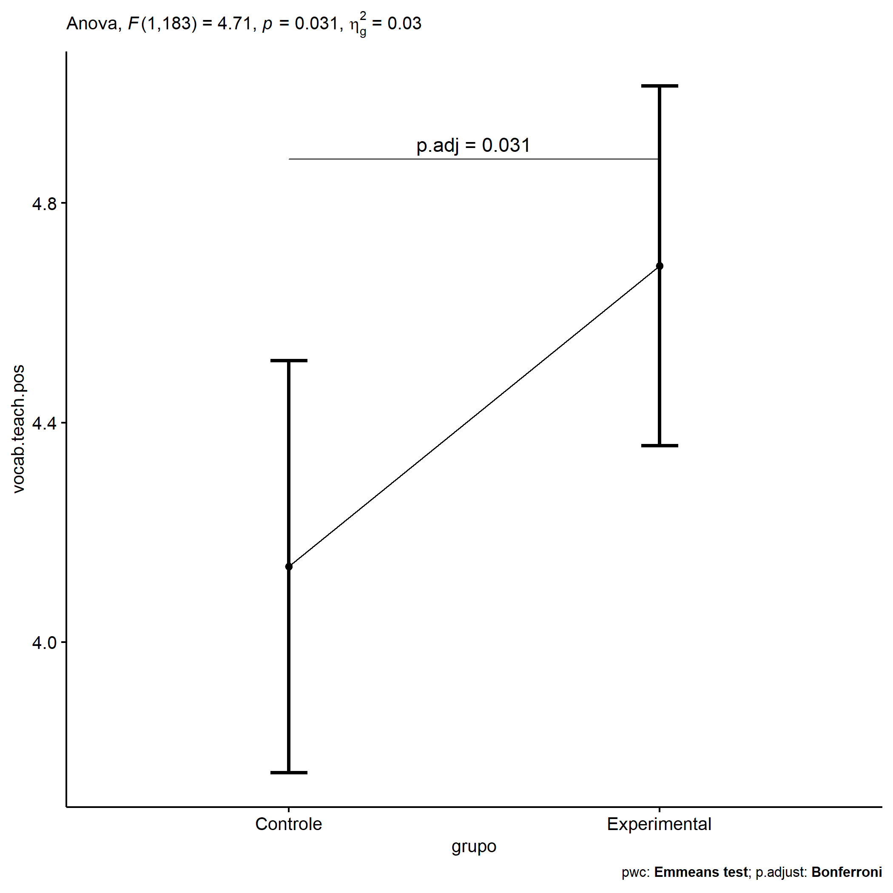<!-- -->

``` r
plots <- oneWayAncovaBoxPlots(
  wdat, "vocab.teach.pos", "grupo", aov, pwc, covar = "vocab.teach.pre",
  theme = "classic", color = color[["grupo"]],
  subtitle = which(aov$Effect == "grupo"))
```

``` r
if (length(unique(wdat[["grupo"]])) > 1)
  plots[["grupo"]] + ggplot2::ylab("Vocabulario Ensinado") + ggplot2::scale_x_discrete(labels=c('pre', 'pos'))
```

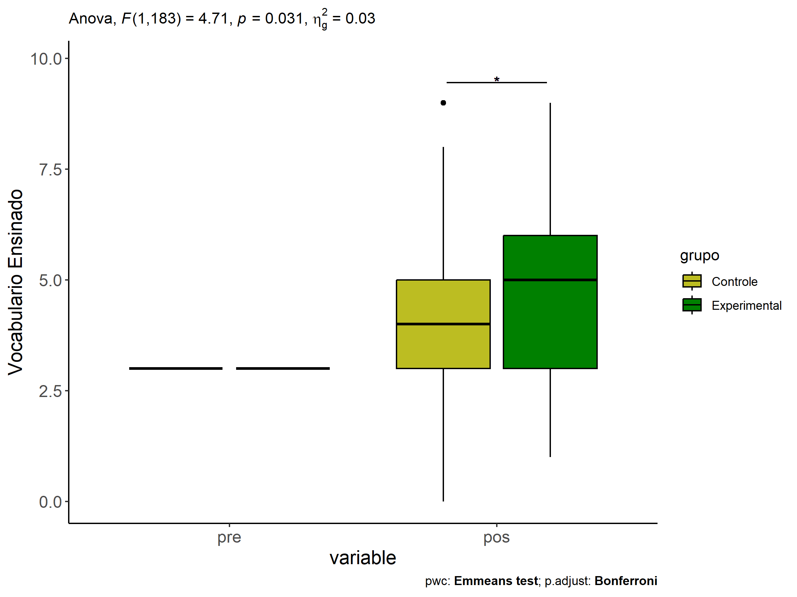<!-- -->

``` r
if (length(unique(wdat.long[["grupo"]])) > 1)
  plots <- oneWayAncovaBoxPlots(
    wdat.long, "vocab.teach", "grupo", aov, pwc.long, pre.post = "time",
    theme = "classic", color = color$prepost)
```

``` r
if (length(unique(wdat.long[["grupo"]])) > 1)
  plots[["grupo"]] + ggplot2::ylab("Vocabulario Ensinado")
```

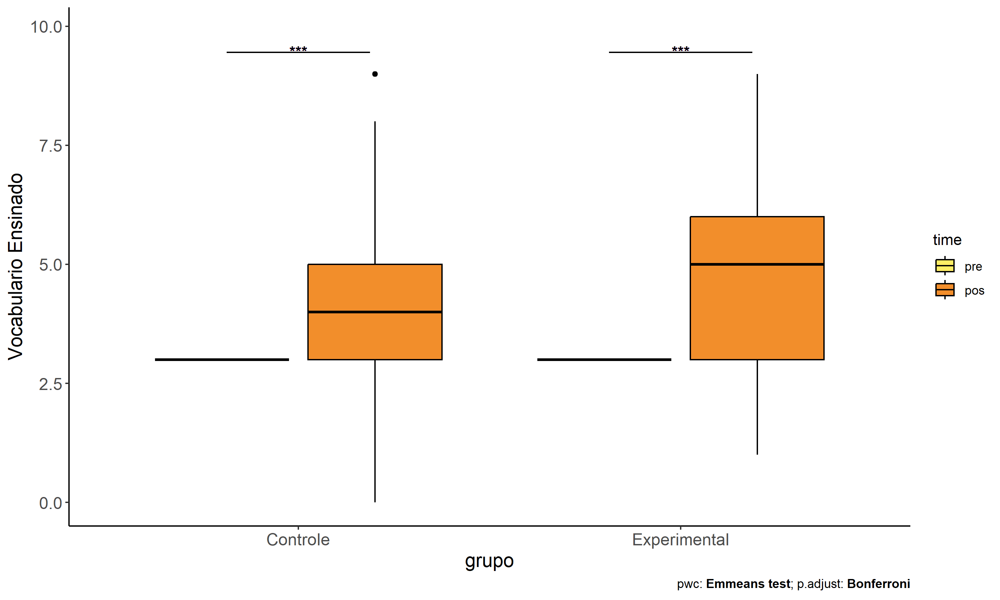<!-- -->

### Checking linearity assumption

``` r
ggscatter(wdat, x = "vocab.teach.pre", y = "vocab.teach.pos", size = 0.5,
          color = "grupo", add = "reg.line")+
  stat_regline_equation(
    aes(label =  paste(..eq.label.., ..rr.label.., sep = "~~~~"), color = grupo)
  )
```

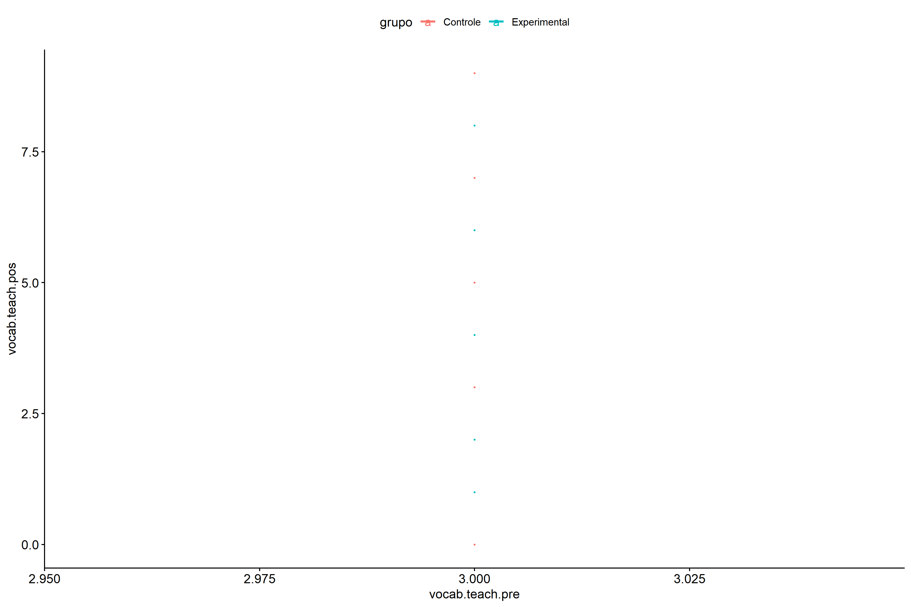<!-- -->

### Checking normality and homogeneity

``` r
res <- augment(lm(vocab.teach.pos ~ vocab.teach.pre + grupo, data = wdat))
```

``` r
shapiro_test(res$.resid)
```

    ## # A tibble: 1 × 3
    ##   variable   statistic p.value
    ##   <chr>          <dbl>   <dbl>
    ## 1 res$.resid     0.986  0.0692

``` r
levene_test(res, .resid ~ grupo)
```

    ## # A tibble: 1 × 4
    ##     df1   df2 statistic     p
    ##   <int> <int>     <dbl> <dbl>
    ## 1     1   183      1.03 0.312

# ANCOVA and Pairwise for two factors **grupo:Sexo**

## Without remove non-normal data

``` r
pdat = remove_group_data(dat[!is.na(dat[["grupo"]]) & !is.na(dat[["Sexo"]]),], "vocab.teach.pos", c("grupo","Sexo"))

pdat.long <- rbind(pdat[,c("id","grupo","Sexo")], pdat[,c("id","grupo","Sexo")])
pdat.long[["time"]] <- c(rep("pre", nrow(pdat)), rep("pos", nrow(pdat)))
pdat.long[["time"]] <- factor(pdat.long[["time"]], c("pre","pos"))
pdat.long[["vocab.teach"]] <- c(pdat[["vocab.teach.pre"]], pdat[["vocab.teach.pos"]])

aov = anova_test(pdat, vocab.teach.pos ~ vocab.teach.pre + grupo*Sexo)
laov[["grupo:Sexo"]] <- get_anova_table(aov)
```

``` r
pwcs <- list()
pwcs[["Sexo"]] <- emmeans_test(
  group_by(pdat, grupo), vocab.teach.pos ~ Sexo,
  covariate = vocab.teach.pre, p.adjust.method = "bonferroni")
pwcs[["grupo"]] <- emmeans_test(
  group_by(pdat, Sexo), vocab.teach.pos ~ grupo,
  covariate = vocab.teach.pre, p.adjust.method = "bonferroni")

pwc <- plyr::rbind.fill(pwcs[["grupo"]], pwcs[["Sexo"]])
pwc <- pwc[,c("grupo","Sexo", colnames(pwc)[!colnames(pwc) %in% c("grupo","Sexo")])]
```

``` r
pwc.long <- emmeans_test(dplyr::group_by_at(pdat.long, c("grupo","Sexo")),
                         vocab.teach ~ time,
                         p.adjust.method = "bonferroni")
lpwc[["grupo:Sexo"]] <- plyr::rbind.fill(pwc, pwc.long)
```

``` r
ds <- get.descriptives(pdat, "vocab.teach.pos", c("grupo","Sexo"), covar = "vocab.teach.pre")
ds <- merge(ds[ds$variable != "vocab.teach.pre",],
            ds[ds$variable == "vocab.teach.pre", !colnames(ds) %in% c("variable")],
            by = c("grupo","Sexo"), all.x = T, suffixes = c("", ".vocab.teach.pre"))
ds <- merge(get_emmeans(pwcs[["grupo"]]), ds, by = c("grupo","Sexo"), suffixes = c(".emms", ""))
ds <- ds[,c("grupo","Sexo","n","mean.vocab.teach.pre","se.vocab.teach.pre","mean","se","emmean","se.emms")]

colnames(ds) <- c("grupo","Sexo", "N", paste0(c("M","SE")," (pre)"),
                  paste0(c("M","SE"), " (unadj)"), paste0(c("M", "SE"), " (adj)"))

lemms[["grupo:Sexo"]] <- ds
```

## Computing ANCOVA and PairWise After removing non-normal data (OK)

``` r
wdat = pdat 

res = residuals(lm(vocab.teach.pos ~ vocab.teach.pre + grupo*Sexo, data = wdat))
non.normal = getNonNormal(res, wdat$id, plimit = 0.05)

wdat = wdat[!wdat$id %in% non.normal,]

wdat.long <- rbind(wdat[,c("id","grupo","Sexo")], wdat[,c("id","grupo","Sexo")])
wdat.long[["time"]] <- c(rep("pre", nrow(wdat)), rep("pos", nrow(wdat)))
wdat.long[["time"]] <- factor(wdat.long[["time"]], c("pre","pos"))
wdat.long[["vocab.teach"]] <- c(wdat[["vocab.teach.pre"]], wdat[["vocab.teach.pos"]])


ldat[["grupo:Sexo"]] = wdat

(non.normal)
```

    ## NULL

``` r
aov = anova_test(wdat, vocab.teach.pos ~ vocab.teach.pre + grupo*Sexo)
laov[["grupo:Sexo"]] <- merge(get_anova_table(aov), laov[["grupo:Sexo"]], by="Effect", suffixes = c("","'"))

(df = get_anova_table(aov))
```

    ## ANOVA Table (type II tests)
    ## 
    ##            Effect DFn DFd     F     p p<.05   ges
    ## 1 vocab.teach.pre   0 181    NA    NA  <NA>    NA
    ## 2           grupo   1 181 4.645 0.032     * 0.025
    ## 3            Sexo   1 181 0.378 0.540       0.002
    ## 4      grupo:Sexo   1 181 1.206 0.274       0.007

| Effect          | DFn | DFd |     F |     p | p\<.05 |   ges |
|:----------------|----:|----:|------:|------:|:-------|------:|
| vocab.teach.pre |   0 | 181 |       |       |        |       |
| grupo           |   1 | 181 | 4.645 | 0.032 | \*     | 0.025 |
| Sexo            |   1 | 181 | 0.378 | 0.540 |        | 0.002 |
| grupo:Sexo      |   1 | 181 | 1.206 | 0.274 |        | 0.007 |

``` r
pwcs <- list()
pwcs[["Sexo"]] <- emmeans_test(
  group_by(wdat, grupo), vocab.teach.pos ~ Sexo,
  covariate = vocab.teach.pre, p.adjust.method = "bonferroni")
pwcs[["grupo"]] <- emmeans_test(
  group_by(wdat, Sexo), vocab.teach.pos ~ grupo,
  covariate = vocab.teach.pre, p.adjust.method = "bonferroni")

pwc <- plyr::rbind.fill(pwcs[["grupo"]], pwcs[["Sexo"]])
pwc <- pwc[,c("grupo","Sexo", colnames(pwc)[!colnames(pwc) %in% c("grupo","Sexo")])]
```

| grupo        | Sexo | term                   | .y.             | group1   | group2       |  df | statistic |     p | p.adj | p.adj.signif |
|:-------------|:-----|:-----------------------|:----------------|:---------|:-------------|----:|----------:|------:|------:|:-------------|
|              | F    | vocab.teach.pre\*grupo | vocab.teach.pos | Controle | Experimental | 181 |    -2.288 | 0.023 | 0.023 | \*           |
|              | M    | vocab.teach.pre\*grupo | vocab.teach.pos | Controle | Experimental | 181 |    -0.785 | 0.434 | 0.434 | ns           |
| Controle     |      | vocab.teach.pre\*Sexo  | vocab.teach.pos | F        | M            | 181 |    -0.424 | 0.672 | 0.672 | ns           |
| Experimental |      | vocab.teach.pre\*Sexo  | vocab.teach.pos | F        | M            | 181 |     1.185 | 0.238 | 0.238 | ns           |

``` r
pwc.long <- emmeans_test(dplyr::group_by_at(wdat.long, c("grupo","Sexo")),
                         vocab.teach ~ time,
                         p.adjust.method = "bonferroni")
lpwc[["grupo:Sexo"]] <- merge(plyr::rbind.fill(pwc, pwc.long), lpwc[["grupo:Sexo"]], by=c("grupo","Sexo","term",".y.","group1","group2"), suffixes = c("","'"))
```

| grupo        | Sexo | term | .y.         | group1 | group2 |  df | statistic |   p | p.adj | p.adj.signif |
|:-------------|:-----|:-----|:------------|:-------|:-------|----:|----------:|----:|------:|:-------------|
| Controle     | F    | time | vocab.teach | pre    | pos    | 362 |    -3.808 |   0 |     0 | \*\*\*       |
| Controle     | M    | time | vocab.teach | pre    | pos    | 362 |    -4.618 |   0 |     0 | \*\*\*\*     |
| Experimental | F    | time | vocab.teach | pre    | pos    | 362 |    -7.976 |   0 |     0 | \*\*\*\*     |
| Experimental | M    | time | vocab.teach | pre    | pos    | 362 |    -6.368 |   0 |     0 | \*\*\*\*     |

``` r
ds <- get.descriptives(wdat, "vocab.teach.pos", c("grupo","Sexo"), covar = "vocab.teach.pre")
ds <- merge(ds[ds$variable != "vocab.teach.pre",],
            ds[ds$variable == "vocab.teach.pre", !colnames(ds) %in% c("variable")],
            by = c("grupo","Sexo"), all.x = T, suffixes = c("", ".vocab.teach.pre"))
ds <- merge(get_emmeans(pwcs[["grupo"]]), ds, by = c("grupo","Sexo"), suffixes = c(".emms", ""))
ds <- ds[,c("grupo","Sexo","n","mean.vocab.teach.pre","se.vocab.teach.pre","mean","se","emmean","se.emms")]

colnames(ds) <- c("grupo","Sexo", "N", paste0(c("M","SE")," (pre)"),
                  paste0(c("M","SE"), " (unadj)"), paste0(c("M", "SE"), " (adj)"))

lemms[["grupo:Sexo"]] <- merge(ds, lemms[["grupo:Sexo"]], by=c("grupo","Sexo"), suffixes = c("","'"))
```

| grupo        | Sexo |   N | M (pre) | SE (pre) | M (unadj) | SE (unadj) | M (adj) | SE (adj) |
|:-------------|:-----|----:|--------:|---------:|----------:|-----------:|--------:|---------:|
| Controle     | F    |  38 |       3 |        0 |     4.053 |      0.256 |   4.053 |    0.276 |
| Controle     | M    |  42 |       3 |        0 |     4.214 |      0.274 |   4.214 |    0.263 |
| Experimental | F    |  52 |       3 |        0 |     4.885 |      0.242 |   4.885 |    0.236 |
| Experimental | M    |  53 |       3 |        0 |     4.491 |      0.233 |   4.491 |    0.234 |

### Plots for ancova

``` r
plots <- twoWayAncovaPlots(
  wdat, "vocab.teach.pos", c("grupo","Sexo"), aov, pwcs, addParam = c("mean_se"),
  font.label.size=10, step.increase=0.05, p.label="p.adj",
  subtitle = which(aov$Effect == "grupo:Sexo"))
```

``` r
if (!is.null(plots[["grupo"]]))
  plots[["grupo"]] + ggplot2::scale_color_manual(values = color[["Sexo"]])
```

    ## Scale for colour is already present.
    ## Adding another scale for colour, which will replace the existing scale.

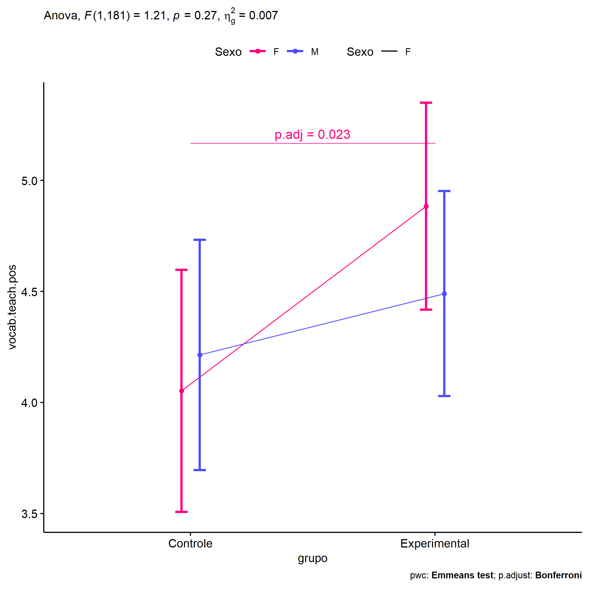<!-- -->

``` r
if (!is.null(plots[["Sexo"]]))
  plots[["Sexo"]] + ggplot2::scale_color_manual(values = color[["grupo"]])
```

    ## Scale for colour is already present.
    ## Adding another scale for colour, which will replace the existing scale.

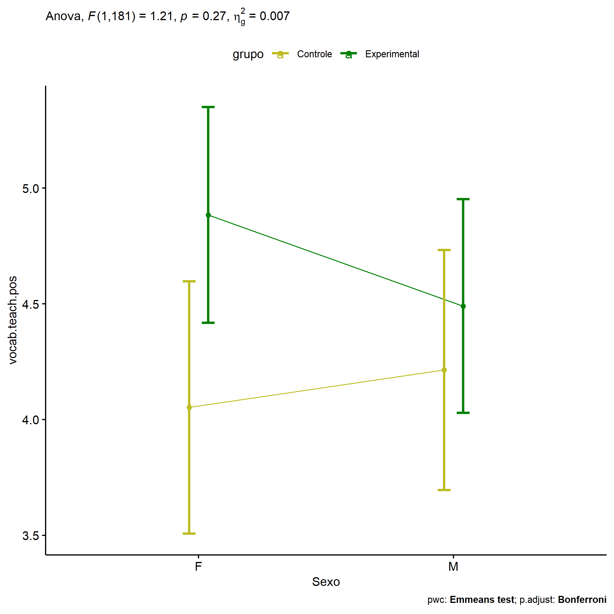<!-- -->

``` r
plots <- twoWayAncovaBoxPlots(
  wdat, "vocab.teach.pos", c("grupo","Sexo"), aov, pwcs, covar = "vocab.teach.pre",
  theme = "classic", color = color[["grupo:Sexo"]],
  subtitle = which(aov$Effect == "grupo:Sexo"))
```

``` r
plots[["grupo:Sexo"]] + ggplot2::ylab("Vocabulario Ensinado") + ggplot2::scale_x_discrete(labels=c('pre', 'pos'))
```

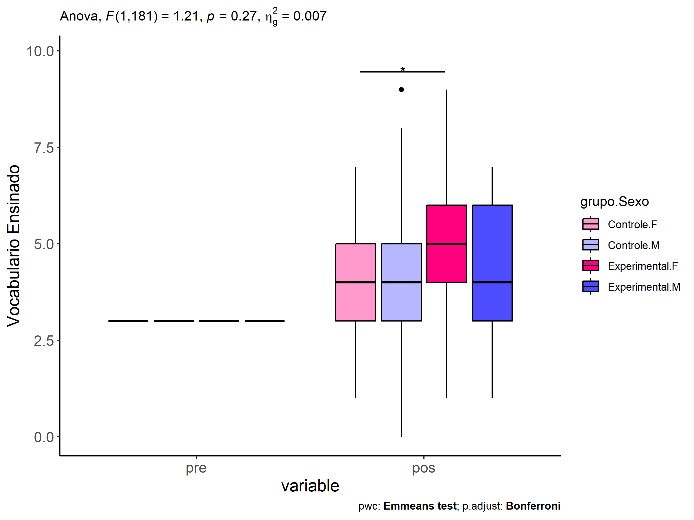<!-- -->

``` r
plots <- twoWayAncovaBoxPlots(
  wdat.long, "vocab.teach", c("grupo","Sexo"), aov, pwc.long, pre.post = "time",
  theme = "classic", color = color$prepost)
```

``` r
plots[["grupo:Sexo"]] + ggplot2::ylab("Vocabulario Ensinado")
```

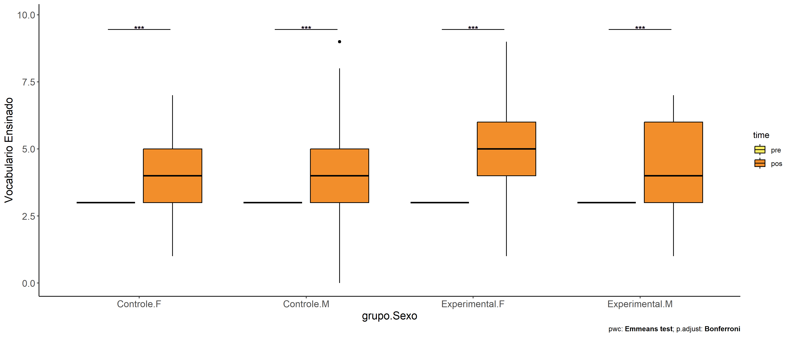<!-- -->

### Checking linearity assumption

``` r
ggscatter(wdat, x = "vocab.teach.pre", y = "vocab.teach.pos", size = 0.5,
          facet.by = c("grupo","Sexo"), add = "reg.line")+
  stat_regline_equation(
    aes(label =  paste(..eq.label.., ..rr.label.., sep = "~~~~"))
  )
```

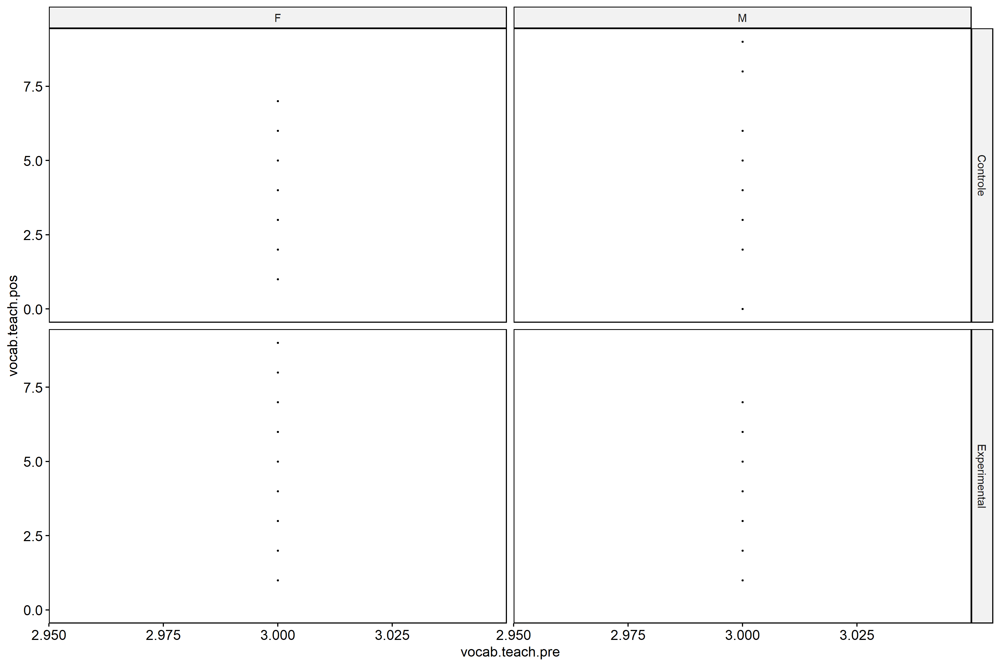<!-- -->

### Checking normality and homogeneity

``` r
res <- augment(lm(vocab.teach.pos ~ vocab.teach.pre + grupo*Sexo, data = wdat))
```

``` r
shapiro_test(res$.resid)
```

    ## # A tibble: 1 × 3
    ##   variable   statistic p.value
    ##   <chr>          <dbl>   <dbl>
    ## 1 res$.resid     0.991   0.269

``` r
levene_test(res, .resid ~ grupo*Sexo)
```

    ## # A tibble: 1 × 4
    ##     df1   df2 statistic     p
    ##   <int> <int>     <dbl> <dbl>
    ## 1     3   181     0.255 0.858

# ANCOVA and Pairwise for two factors **grupo:Zona**

## Without remove non-normal data

``` r
pdat = remove_group_data(dat[!is.na(dat[["grupo"]]) & !is.na(dat[["Zona"]]),], "vocab.teach.pos", c("grupo","Zona"))

pdat.long <- rbind(pdat[,c("id","grupo","Zona")], pdat[,c("id","grupo","Zona")])
pdat.long[["time"]] <- c(rep("pre", nrow(pdat)), rep("pos", nrow(pdat)))
pdat.long[["time"]] <- factor(pdat.long[["time"]], c("pre","pos"))
pdat.long[["vocab.teach"]] <- c(pdat[["vocab.teach.pre"]], pdat[["vocab.teach.pos"]])

aov = anova_test(pdat, vocab.teach.pos ~ vocab.teach.pre + grupo*Zona)
laov[["grupo:Zona"]] <- get_anova_table(aov)
```

``` r
pwcs <- list()
pwcs[["Zona"]] <- emmeans_test(
  group_by(pdat, grupo), vocab.teach.pos ~ Zona,
  covariate = vocab.teach.pre, p.adjust.method = "bonferroni")
pwcs[["grupo"]] <- emmeans_test(
  group_by(pdat, Zona), vocab.teach.pos ~ grupo,
  covariate = vocab.teach.pre, p.adjust.method = "bonferroni")

pwc <- plyr::rbind.fill(pwcs[["grupo"]], pwcs[["Zona"]])
pwc <- pwc[,c("grupo","Zona", colnames(pwc)[!colnames(pwc) %in% c("grupo","Zona")])]
```

``` r
pwc.long <- emmeans_test(dplyr::group_by_at(pdat.long, c("grupo","Zona")),
                         vocab.teach ~ time,
                         p.adjust.method = "bonferroni")
lpwc[["grupo:Zona"]] <- plyr::rbind.fill(pwc, pwc.long)
```

``` r
ds <- get.descriptives(pdat, "vocab.teach.pos", c("grupo","Zona"), covar = "vocab.teach.pre")
ds <- merge(ds[ds$variable != "vocab.teach.pre",],
            ds[ds$variable == "vocab.teach.pre", !colnames(ds) %in% c("variable")],
            by = c("grupo","Zona"), all.x = T, suffixes = c("", ".vocab.teach.pre"))
ds <- merge(get_emmeans(pwcs[["grupo"]]), ds, by = c("grupo","Zona"), suffixes = c(".emms", ""))
ds <- ds[,c("grupo","Zona","n","mean.vocab.teach.pre","se.vocab.teach.pre","mean","se","emmean","se.emms")]

colnames(ds) <- c("grupo","Zona", "N", paste0(c("M","SE")," (pre)"),
                  paste0(c("M","SE"), " (unadj)"), paste0(c("M", "SE"), " (adj)"))

lemms[["grupo:Zona"]] <- ds
```

## Computing ANCOVA and PairWise After removing non-normal data (OK)

``` r
wdat = pdat 

res = residuals(lm(vocab.teach.pos ~ vocab.teach.pre + grupo*Zona, data = wdat))
non.normal = getNonNormal(res, wdat$id, plimit = 0.05)

wdat = wdat[!wdat$id %in% non.normal,]

wdat.long <- rbind(wdat[,c("id","grupo","Zona")], wdat[,c("id","grupo","Zona")])
wdat.long[["time"]] <- c(rep("pre", nrow(wdat)), rep("pos", nrow(wdat)))
wdat.long[["time"]] <- factor(wdat.long[["time"]], c("pre","pos"))
wdat.long[["vocab.teach"]] <- c(wdat[["vocab.teach.pre"]], wdat[["vocab.teach.pos"]])


ldat[["grupo:Zona"]] = wdat

(non.normal)
```

    ## NULL

``` r
aov = anova_test(wdat, vocab.teach.pos ~ vocab.teach.pre + grupo*Zona)
laov[["grupo:Zona"]] <- merge(get_anova_table(aov), laov[["grupo:Zona"]], by="Effect", suffixes = c("","'"))

(df = get_anova_table(aov))
```

    ## ANOVA Table (type II tests)
    ## 
    ##            Effect DFn DFd     F     p p<.05   ges
    ## 1 vocab.teach.pre   0 124    NA    NA  <NA>    NA
    ## 2           grupo   1 124 2.893 0.091       0.023
    ## 3            Zona   1 124 1.411 0.237       0.011
    ## 4      grupo:Zona   1 124 0.244 0.622       0.002

| Effect          | DFn | DFd |     F |     p | p\<.05 |   ges |
|:----------------|----:|----:|------:|------:|:-------|------:|
| vocab.teach.pre |   0 | 124 |       |       |        |       |
| grupo           |   1 | 124 | 2.893 | 0.091 |        | 0.023 |
| Zona            |   1 | 124 | 1.411 | 0.237 |        | 0.011 |
| grupo:Zona      |   1 | 124 | 0.244 | 0.622 |        | 0.002 |

``` r
pwcs <- list()
pwcs[["Zona"]] <- emmeans_test(
  group_by(wdat, grupo), vocab.teach.pos ~ Zona,
  covariate = vocab.teach.pre, p.adjust.method = "bonferroni")
pwcs[["grupo"]] <- emmeans_test(
  group_by(wdat, Zona), vocab.teach.pos ~ grupo,
  covariate = vocab.teach.pre, p.adjust.method = "bonferroni")

pwc <- plyr::rbind.fill(pwcs[["grupo"]], pwcs[["Zona"]])
pwc <- pwc[,c("grupo","Zona", colnames(pwc)[!colnames(pwc) %in% c("grupo","Zona")])]
```

| grupo        | Zona   | term                   | .y.             | group1   | group2       |  df | statistic |     p | p.adj | p.adj.signif |
|:-------------|:-------|:-----------------------|:----------------|:---------|:-------------|----:|----------:|------:|------:|:-------------|
|              | Rural  | vocab.teach.pre\*grupo | vocab.teach.pos | Controle | Experimental | 124 |    -1.665 | 0.099 | 0.099 | ns           |
|              | Urbana | vocab.teach.pre\*grupo | vocab.teach.pos | Controle | Experimental | 124 |    -0.605 | 0.546 | 0.546 | ns           |
| Controle     |        | vocab.teach.pre\*Zona  | vocab.teach.pos | Rural    | Urbana       | 124 |    -1.154 | 0.251 | 0.251 | ns           |
| Experimental |        | vocab.teach.pre\*Zona  | vocab.teach.pos | Rural    | Urbana       | 124 |    -0.569 | 0.570 | 0.570 | ns           |

``` r
pwc.long <- emmeans_test(dplyr::group_by_at(wdat.long, c("grupo","Zona")),
                         vocab.teach ~ time,
                         p.adjust.method = "bonferroni")
lpwc[["grupo:Zona"]] <- merge(plyr::rbind.fill(pwc, pwc.long), lpwc[["grupo:Zona"]], by=c("grupo","Zona","term",".y.","group1","group2"), suffixes = c("","'"))
```

| grupo        | Zona   | term | .y.         | group1 | group2 |  df | statistic |     p | p.adj | p.adj.signif |
|:-------------|:-------|:-----|:------------|:-------|:-------|----:|----------:|------:|------:|:-------------|
| Controle     | Rural  | time | vocab.teach | pre    | pos    | 248 |    -3.423 | 0.001 | 0.001 | \*\*\*       |
| Controle     | Urbana | time | vocab.teach | pre    | pos    | 248 |    -3.620 | 0.000 | 0.000 | \*\*\*       |
| Experimental | Rural  | time | vocab.teach | pre    | pos    | 248 |    -5.667 | 0.000 | 0.000 | \*\*\*\*     |
| Experimental | Urbana | time | vocab.teach | pre    | pos    | 248 |    -5.483 | 0.000 | 0.000 | \*\*\*\*     |

``` r
ds <- get.descriptives(wdat, "vocab.teach.pos", c("grupo","Zona"), covar = "vocab.teach.pre")
ds <- merge(ds[ds$variable != "vocab.teach.pre",],
            ds[ds$variable == "vocab.teach.pre", !colnames(ds) %in% c("variable")],
            by = c("grupo","Zona"), all.x = T, suffixes = c("", ".vocab.teach.pre"))
ds <- merge(get_emmeans(pwcs[["grupo"]]), ds, by = c("grupo","Zona"), suffixes = c(".emms", ""))
ds <- ds[,c("grupo","Zona","n","mean.vocab.teach.pre","se.vocab.teach.pre","mean","se","emmean","se.emms")]

colnames(ds) <- c("grupo","Zona", "N", paste0(c("M","SE")," (pre)"),
                  paste0(c("M","SE"), " (unadj)"), paste0(c("M", "SE"), " (adj)"))

lemms[["grupo:Zona"]] <- merge(ds, lemms[["grupo:Zona"]], by=c("grupo","Zona"), suffixes = c("","'"))
```

| grupo        | Zona   |   N | M (pre) | SE (pre) | M (unadj) | SE (unadj) | M (adj) | SE (adj) |
|:-------------|:-------|----:|--------:|---------:|----------:|-----------:|--------:|---------:|
| Controle     | Rural  |  42 |       3 |        0 |     3.929 |      0.271 |   3.929 |    0.271 |
| Controle     | Urbana |  18 |       3 |        0 |     4.500 |      0.336 |   4.500 |    0.414 |
| Experimental | Rural  |  40 |       3 |        0 |     4.575 |      0.304 |   4.575 |    0.278 |
| Experimental | Urbana |  28 |       3 |        0 |     4.821 |      0.321 |   4.821 |    0.332 |

### Plots for ancova

``` r
plots <- twoWayAncovaPlots(
  wdat, "vocab.teach.pos", c("grupo","Zona"), aov, pwcs, addParam = c("mean_se"),
  font.label.size=10, step.increase=0.05, p.label="p.adj",
  subtitle = which(aov$Effect == "grupo:Zona"))
```

``` r
if (!is.null(plots[["grupo"]]))
  plots[["grupo"]] + ggplot2::scale_color_manual(values = color[["Zona"]])
```

    ## Scale for colour is already present.
    ## Adding another scale for colour, which will replace the existing scale.

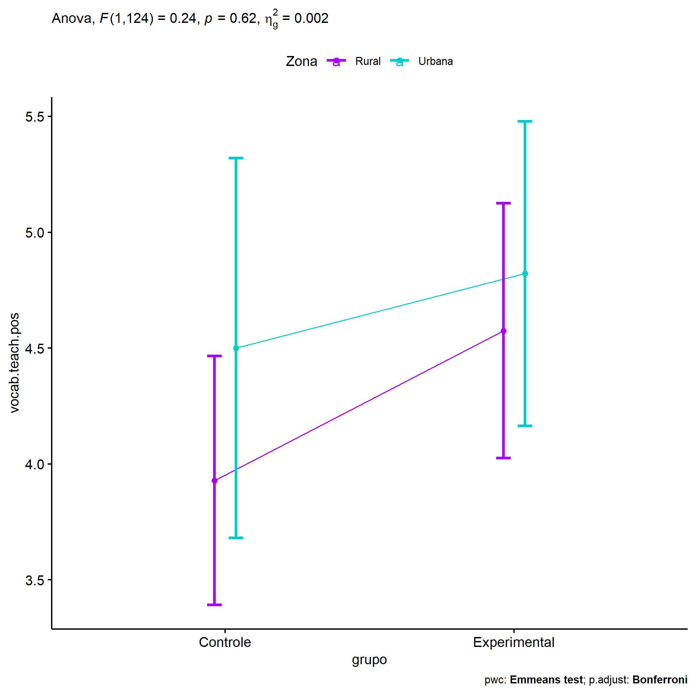<!-- -->

``` r
if (!is.null(plots[["Zona"]]))
  plots[["Zona"]] + ggplot2::scale_color_manual(values = color[["grupo"]])
```

    ## Scale for colour is already present.
    ## Adding another scale for colour, which will replace the existing scale.

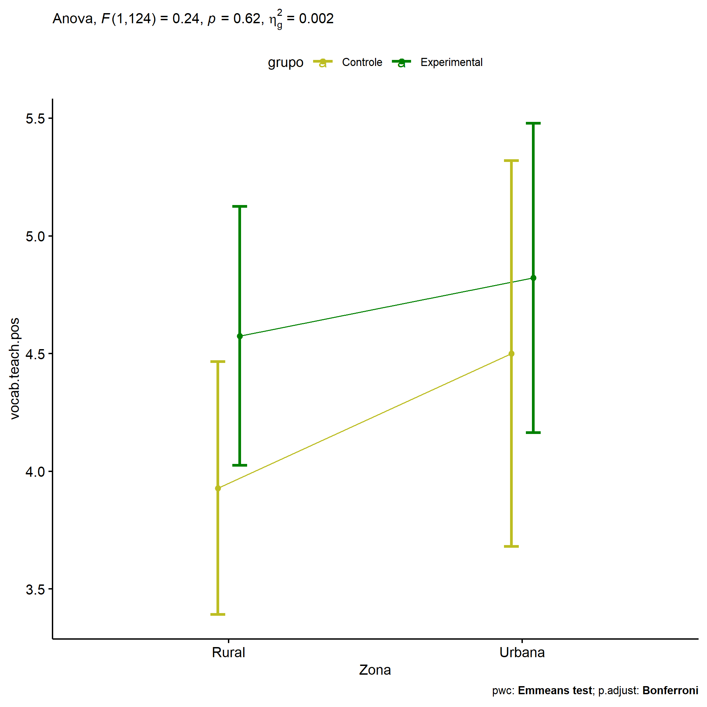<!-- -->

``` r
plots <- twoWayAncovaBoxPlots(
  wdat, "vocab.teach.pos", c("grupo","Zona"), aov, pwcs, covar = "vocab.teach.pre",
  theme = "classic", color = color[["grupo:Zona"]],
  subtitle = which(aov$Effect == "grupo:Zona"))
```

``` r
plots[["grupo:Zona"]] + ggplot2::ylab("Vocabulario Ensinado") + ggplot2::scale_x_discrete(labels=c('pre', 'pos'))
```

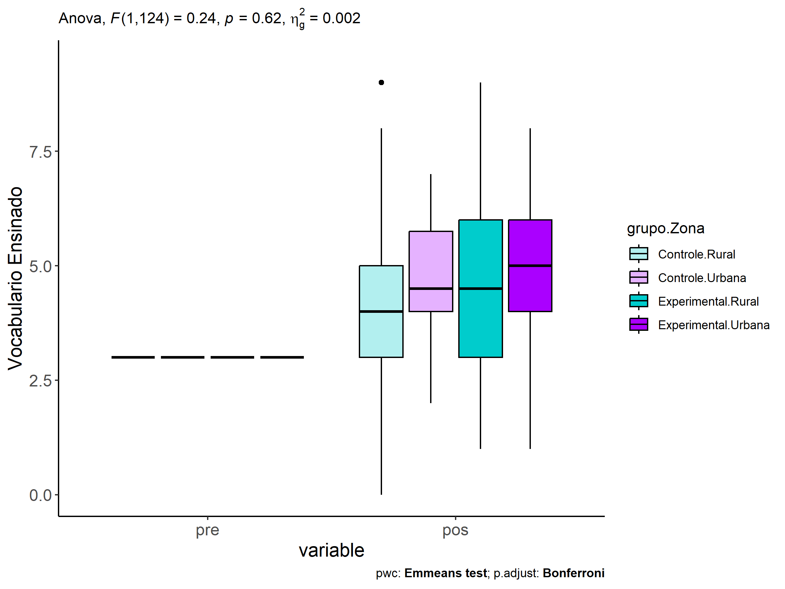<!-- -->

``` r
plots <- twoWayAncovaBoxPlots(
  wdat.long, "vocab.teach", c("grupo","Zona"), aov, pwc.long, pre.post = "time",
  theme = "classic", color = color$prepost)
```

``` r
plots[["grupo:Zona"]] + ggplot2::ylab("Vocabulario Ensinado")
```

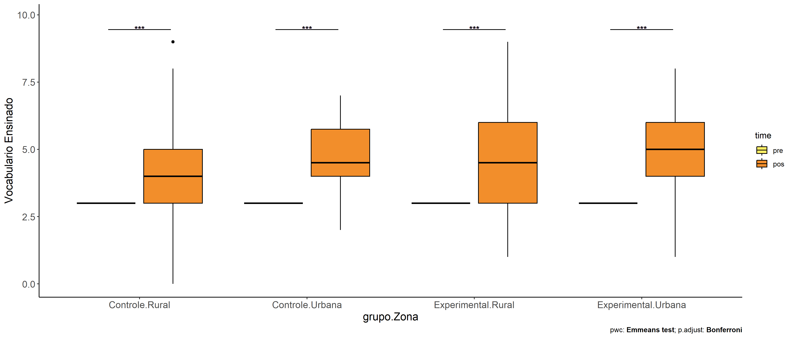<!-- -->

### Checking linearity assumption

``` r
ggscatter(wdat, x = "vocab.teach.pre", y = "vocab.teach.pos", size = 0.5,
          facet.by = c("grupo","Zona"), add = "reg.line")+
  stat_regline_equation(
    aes(label =  paste(..eq.label.., ..rr.label.., sep = "~~~~"))
  )
```

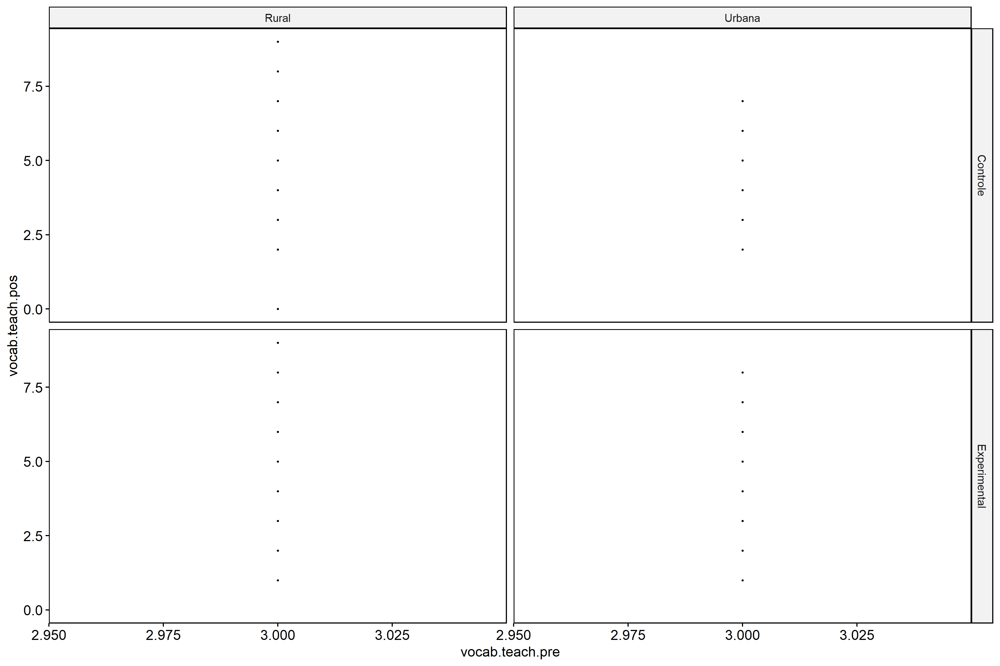<!-- -->

### Checking normality and homogeneity

``` r
res <- augment(lm(vocab.teach.pos ~ vocab.teach.pre + grupo*Zona, data = wdat))
```

``` r
shapiro_test(res$.resid)
```

    ## # A tibble: 1 × 3
    ##   variable   statistic p.value
    ##   <chr>          <dbl>   <dbl>
    ## 1 res$.resid     0.986   0.203

``` r
levene_test(res, .resid ~ grupo*Zona)
```

    ## # A tibble: 1 × 4
    ##     df1   df2 statistic     p
    ##   <int> <int>     <dbl> <dbl>
    ## 1     3   124     0.846 0.471

# ANCOVA and Pairwise for two factors **grupo:Cor.Raca**

## Without remove non-normal data

``` r
pdat = remove_group_data(dat[!is.na(dat[["grupo"]]) & !is.na(dat[["Cor.Raca"]]),], "vocab.teach.pos", c("grupo","Cor.Raca"))
```

    ## Warning: There were 4 warnings in `mutate()`.
    ## The first warning was:
    ## ℹ In argument: `ci = abs(stats::qt(alpha/2, .data$n - 1) * .data$se)`.
    ## Caused by warning:
    ## ! There was 1 warning in `mutate()`.
    ## ℹ In argument: `ci = abs(stats::qt(alpha/2, .data$n - 1) * .data$se)`.
    ## Caused by warning in `stats::qt()`:
    ## ! NaNs produced
    ## ℹ Run `dplyr::last_dplyr_warnings()` to see the 3 remaining warnings.

``` r
pdat.long <- rbind(pdat[,c("id","grupo","Cor.Raca")], pdat[,c("id","grupo","Cor.Raca")])
pdat.long[["time"]] <- c(rep("pre", nrow(pdat)), rep("pos", nrow(pdat)))
pdat.long[["time"]] <- factor(pdat.long[["time"]], c("pre","pos"))
pdat.long[["vocab.teach"]] <- c(pdat[["vocab.teach.pre"]], pdat[["vocab.teach.pos"]])

aov = anova_test(pdat, vocab.teach.pos ~ vocab.teach.pre + grupo*Cor.Raca)
laov[["grupo:Cor.Raca"]] <- get_anova_table(aov)
```

``` r
pwcs <- list()
pwcs[["Cor.Raca"]] <- emmeans_test(
  group_by(pdat, grupo), vocab.teach.pos ~ Cor.Raca,
  covariate = vocab.teach.pre, p.adjust.method = "bonferroni")
pwcs[["grupo"]] <- emmeans_test(
  group_by(pdat, Cor.Raca), vocab.teach.pos ~ grupo,
  covariate = vocab.teach.pre, p.adjust.method = "bonferroni")

pwc <- plyr::rbind.fill(pwcs[["grupo"]], pwcs[["Cor.Raca"]])
pwc <- pwc[,c("grupo","Cor.Raca", colnames(pwc)[!colnames(pwc) %in% c("grupo","Cor.Raca")])]
```

``` r
pwc.long <- emmeans_test(dplyr::group_by_at(pdat.long, c("grupo","Cor.Raca")),
                         vocab.teach ~ time,
                         p.adjust.method = "bonferroni")
lpwc[["grupo:Cor.Raca"]] <- plyr::rbind.fill(pwc, pwc.long)
```

``` r
ds <- get.descriptives(pdat, "vocab.teach.pos", c("grupo","Cor.Raca"), covar = "vocab.teach.pre")
ds <- merge(ds[ds$variable != "vocab.teach.pre",],
            ds[ds$variable == "vocab.teach.pre", !colnames(ds) %in% c("variable")],
            by = c("grupo","Cor.Raca"), all.x = T, suffixes = c("", ".vocab.teach.pre"))
ds <- merge(get_emmeans(pwcs[["grupo"]]), ds, by = c("grupo","Cor.Raca"), suffixes = c(".emms", ""))
ds <- ds[,c("grupo","Cor.Raca","n","mean.vocab.teach.pre","se.vocab.teach.pre","mean","se","emmean","se.emms")]

colnames(ds) <- c("grupo","Cor.Raca", "N", paste0(c("M","SE")," (pre)"),
                  paste0(c("M","SE"), " (unadj)"), paste0(c("M", "SE"), " (adj)"))

lemms[["grupo:Cor.Raca"]] <- ds
```

## Computing ANCOVA and PairWise After removing non-normal data (OK)

``` r
wdat = pdat 

res = residuals(lm(vocab.teach.pos ~ vocab.teach.pre + grupo*Cor.Raca, data = wdat))
non.normal = getNonNormal(res, wdat$id, plimit = 0.05)

wdat = wdat[!wdat$id %in% non.normal,]

wdat.long <- rbind(wdat[,c("id","grupo","Cor.Raca")], wdat[,c("id","grupo","Cor.Raca")])
wdat.long[["time"]] <- c(rep("pre", nrow(wdat)), rep("pos", nrow(wdat)))
wdat.long[["time"]] <- factor(wdat.long[["time"]], c("pre","pos"))
wdat.long[["vocab.teach"]] <- c(wdat[["vocab.teach.pre"]], wdat[["vocab.teach.pos"]])


ldat[["grupo:Cor.Raca"]] = wdat

(non.normal)
```

    ##  [1] "P3580" "P580"  "P1975" "P3670" "P822"  "P3548" "P3111" "P3236" "P975"  "P3556" "P3588" "P1023" "P2904"
    ## [14] "P572"  "P3106" "P511"  "P3477" "P534"  "P937"  "P538"  "P598"  "P462"  "P2941" "P573"  "P1158" "P1907"
    ## [27] "P2982" "P3561" "P3529" "P1719" "P3475" "P1071" "P3102" "P949"  "P1666"

``` r
aov = anova_test(wdat, vocab.teach.pos ~ vocab.teach.pre + grupo*Cor.Raca)
laov[["grupo:Cor.Raca"]] <- merge(get_anova_table(aov), laov[["grupo:Cor.Raca"]], by="Effect", suffixes = c("","'"))

(df = get_anova_table(aov))
```

    ## ANOVA Table (type II tests)
    ## 
    ##            Effect DFn DFd     F     p p<.05   ges
    ## 1 vocab.teach.pre   0  42    NA    NA  <NA>    NA
    ## 2           grupo   1  42 4.201 0.047     * 0.091
    ## 3        Cor.Raca   1  42 0.173 0.680       0.004
    ## 4  grupo:Cor.Raca   0  42    NA    NA  <NA>    NA

| Effect          | DFn | DFd |     F |     p | p\<.05 |   ges |
|:----------------|----:|----:|------:|------:|:-------|------:|
| vocab.teach.pre |   0 |  42 |       |       |        |       |
| grupo           |   1 |  42 | 4.201 | 0.047 | \*     | 0.091 |
| Cor.Raca        |   1 |  42 | 0.173 | 0.680 |        | 0.004 |
| grupo:Cor.Raca  |   0 |  42 |       |       |        |       |

``` r
pwcs <- list()
pwcs[["Cor.Raca"]] <- emmeans_test(
  group_by(wdat, grupo), vocab.teach.pos ~ Cor.Raca,
  covariate = vocab.teach.pre, p.adjust.method = "bonferroni")
pwcs[["grupo"]] <- emmeans_test(
  group_by(wdat, Cor.Raca), vocab.teach.pos ~ grupo,
  covariate = vocab.teach.pre, p.adjust.method = "bonferroni")

pwc <- plyr::rbind.fill(pwcs[["grupo"]], pwcs[["Cor.Raca"]])
pwc <- pwc[,c("grupo","Cor.Raca", colnames(pwc)[!colnames(pwc) %in% c("grupo","Cor.Raca")])]
```

| grupo        | Cor.Raca | term                      | .y.             | group1   | group2       |  df | statistic |     p | p.adj | p.adj.signif |
|:-------------|:---------|:--------------------------|:----------------|:---------|:-------------|----:|----------:|------:|------:|:-------------|
|              | Branca   | vocab.teach.pre\*grupo    | vocab.teach.pos | Controle | Experimental |     |           |       |       |              |
|              | Parda    | vocab.teach.pre\*grupo    | vocab.teach.pos | Controle | Experimental |  42 |    -2.050 | 0.047 | 0.047 | \*           |
| Controle     |          | vocab.teach.pre\*Cor.Raca | vocab.teach.pos | Branca   | Parda        |  42 |     0.416 | 0.680 | 0.680 | ns           |
| Experimental |          | vocab.teach.pre\*Cor.Raca | vocab.teach.pos | Branca   | Parda        |     |           |       |       |              |

``` r
pwc.long <- emmeans_test(dplyr::group_by_at(wdat.long, c("grupo","Cor.Raca")),
                         vocab.teach ~ time,
                         p.adjust.method = "bonferroni")
lpwc[["grupo:Cor.Raca"]] <- merge(plyr::rbind.fill(pwc, pwc.long), lpwc[["grupo:Cor.Raca"]], by=c("grupo","Cor.Raca","term",".y.","group1","group2"), suffixes = c("","'"))
```

| grupo        | Cor.Raca | term | .y.         | group1 | group2 |  df | statistic |     p | p.adj | p.adj.signif |
|:-------------|:---------|:-----|:------------|:-------|:-------|----:|----------:|------:|------:|:-------------|
| Controle     | Branca   | time | vocab.teach | pre    | pos    |  84 |    -2.877 | 0.005 | 0.005 | \*\*         |
| Controle     | Parda    | time | vocab.teach | pre    | pos    |  84 |    -3.966 | 0.000 | 0.000 | \*\*\*       |
| Experimental | Branca   | time | vocab.teach | pre    | pos    |     |           |       |       |              |
| Experimental | Parda    | time | vocab.teach | pre    | pos    |  84 |   -10.507 | 0.000 | 0.000 | \*\*\*\*     |

``` r
ds <- get.descriptives(wdat, "vocab.teach.pos", c("grupo","Cor.Raca"), covar = "vocab.teach.pre")
ds <- merge(ds[ds$variable != "vocab.teach.pre",],
            ds[ds$variable == "vocab.teach.pre", !colnames(ds) %in% c("variable")],
            by = c("grupo","Cor.Raca"), all.x = T, suffixes = c("", ".vocab.teach.pre"))
ds <- merge(get_emmeans(pwcs[["grupo"]]), ds, by = c("grupo","Cor.Raca"), suffixes = c(".emms", ""))
ds <- ds[,c("grupo","Cor.Raca","n","mean.vocab.teach.pre","se.vocab.teach.pre","mean","se","emmean","se.emms")]

colnames(ds) <- c("grupo","Cor.Raca", "N", paste0(c("M","SE")," (pre)"),
                  paste0(c("M","SE"), " (unadj)"), paste0(c("M", "SE"), " (adj)"))

lemms[["grupo:Cor.Raca"]] <- merge(ds, lemms[["grupo:Cor.Raca"]], by=c("grupo","Cor.Raca"), suffixes = c("","'"))
```

| grupo        | Cor.Raca |   N | M (pre) | SE (pre) | M (unadj) | SE (unadj) | M (adj) | SE (adj) |
|:-------------|:---------|----:|--------:|---------:|----------:|-----------:|--------:|---------:|
| Controle     | Branca   |   4 |       3 |        0 |     4.750 |      0.479 |   4.750 |    0.608 |
| Controle     | Parda    |  11 |       3 |        0 |     4.455 |      0.207 |   4.455 |    0.367 |
| Experimental | Parda    |  30 |       3 |        0 |     5.333 |      0.251 |   5.333 |    0.222 |

### Plots for ancova

``` r
plots <- twoWayAncovaPlots(
  wdat, "vocab.teach.pos", c("grupo","Cor.Raca"), aov, pwcs, addParam = c("mean_se"),
  font.label.size=10, step.increase=0.05, p.label="p.adj",
  subtitle = which(aov$Effect == "grupo:Cor.Raca"))
```

``` r
if (!is.null(plots[["grupo"]]))
  plots[["grupo"]] + ggplot2::scale_color_manual(values = color[["Cor.Raca"]])
```

<!-- -->

``` r
if (!is.null(plots[["Cor.Raca"]]))
  plots[["Cor.Raca"]] + ggplot2::scale_color_manual(values = color[["grupo"]])
```

<!-- -->

``` r
plots <- twoWayAncovaBoxPlots(
  wdat, "vocab.teach.pos", c("grupo","Cor.Raca"), aov, pwcs, covar = "vocab.teach.pre",
  theme = "classic", color = color[["grupo:Cor.Raca"]],
  subtitle = which(aov$Effect == "grupo:Cor.Raca"))
```

``` r
plots[["grupo:Cor.Raca"]] + ggplot2::ylab("Vocabulario Ensinado") + ggplot2::scale_x_discrete(labels=c('pre', 'pos'))
```

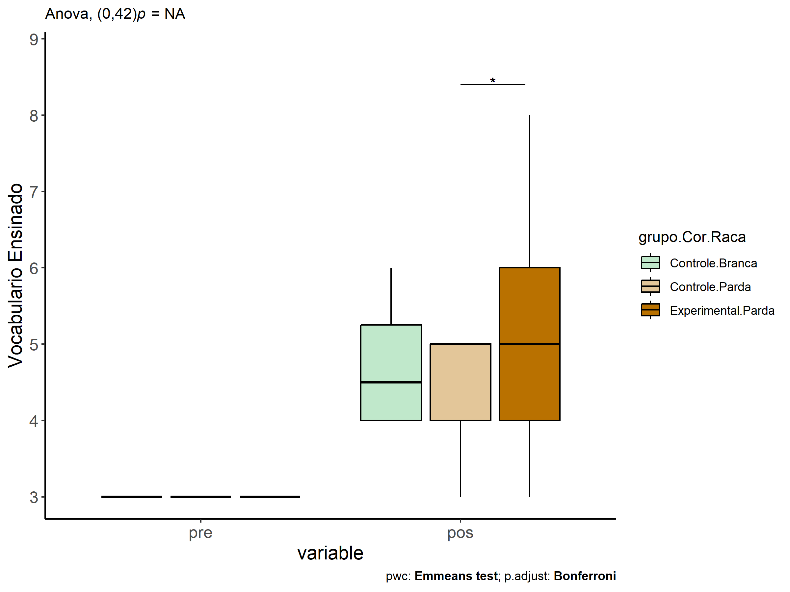<!-- -->

``` r
plots <- twoWayAncovaBoxPlots(
  wdat.long, "vocab.teach", c("grupo","Cor.Raca"), aov, pwc.long, pre.post = "time",
  theme = "classic", color = color$prepost)
```

``` r
plots[["grupo:Cor.Raca"]] + ggplot2::ylab("Vocabulario Ensinado")
```

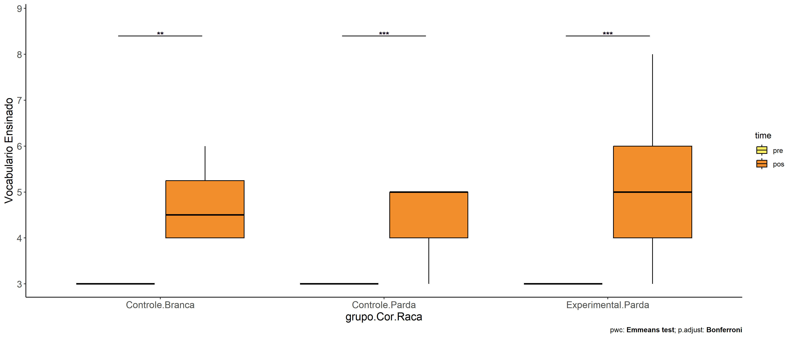<!-- -->

### Checking linearity assumption

``` r
ggscatter(wdat, x = "vocab.teach.pre", y = "vocab.teach.pos", size = 0.5,
          facet.by = c("grupo","Cor.Raca"), add = "reg.line")+
  stat_regline_equation(
    aes(label =  paste(..eq.label.., ..rr.label.., sep = "~~~~"))
  )
```

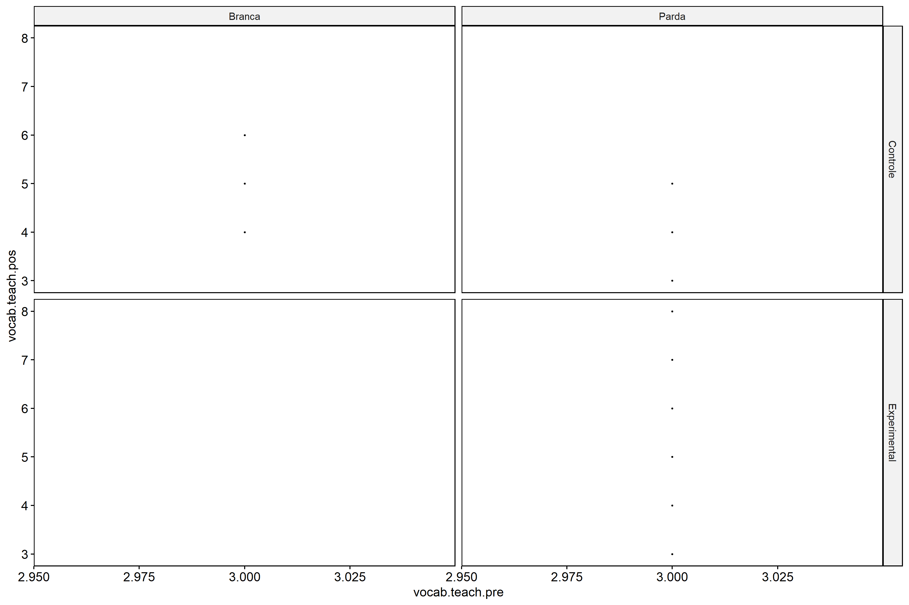<!-- -->

### Checking normality and homogeneity

``` r
res <- augment(lm(vocab.teach.pos ~ vocab.teach.pre + grupo*Cor.Raca, data = wdat))
```

``` r
shapiro_test(res$.resid)
```

    ## # A tibble: 1 × 3
    ##   variable   statistic p.value
    ##   <chr>          <dbl>   <dbl>
    ## 1 res$.resid     0.957  0.0943

``` r
levene_test(res, .resid ~ grupo*Cor.Raca)
```

    ## # A tibble: 1 × 4
    ##     df1   df2 statistic     p
    ##   <int> <int>     <dbl> <dbl>
    ## 1     2    42      1.65 0.205

# ANCOVA and Pairwise for two factors **grupo:Serie**

## Without remove non-normal data

``` r
pdat = remove_group_data(dat[!is.na(dat[["grupo"]]) & !is.na(dat[["Serie"]]),], "vocab.teach.pos", c("grupo","Serie"))

pdat.long <- rbind(pdat[,c("id","grupo","Serie")], pdat[,c("id","grupo","Serie")])
pdat.long[["time"]] <- c(rep("pre", nrow(pdat)), rep("pos", nrow(pdat)))
pdat.long[["time"]] <- factor(pdat.long[["time"]], c("pre","pos"))
pdat.long[["vocab.teach"]] <- c(pdat[["vocab.teach.pre"]], pdat[["vocab.teach.pos"]])

aov = anova_test(pdat, vocab.teach.pos ~ vocab.teach.pre + grupo*Serie)
laov[["grupo:Serie"]] <- get_anova_table(aov)
```

``` r
pwcs <- list()
pwcs[["Serie"]] <- emmeans_test(
  group_by(pdat, grupo), vocab.teach.pos ~ Serie,
  covariate = vocab.teach.pre, p.adjust.method = "bonferroni")
pwcs[["grupo"]] <- emmeans_test(
  group_by(pdat, Serie), vocab.teach.pos ~ grupo,
  covariate = vocab.teach.pre, p.adjust.method = "bonferroni")

pwc <- plyr::rbind.fill(pwcs[["grupo"]], pwcs[["Serie"]])
pwc <- pwc[,c("grupo","Serie", colnames(pwc)[!colnames(pwc) %in% c("grupo","Serie")])]
```

``` r
pwc.long <- emmeans_test(dplyr::group_by_at(pdat.long, c("grupo","Serie")),
                         vocab.teach ~ time,
                         p.adjust.method = "bonferroni")
lpwc[["grupo:Serie"]] <- plyr::rbind.fill(pwc, pwc.long)
```

``` r
ds <- get.descriptives(pdat, "vocab.teach.pos", c("grupo","Serie"), covar = "vocab.teach.pre")
ds <- merge(ds[ds$variable != "vocab.teach.pre",],
            ds[ds$variable == "vocab.teach.pre", !colnames(ds) %in% c("variable")],
            by = c("grupo","Serie"), all.x = T, suffixes = c("", ".vocab.teach.pre"))
ds <- merge(get_emmeans(pwcs[["grupo"]]), ds, by = c("grupo","Serie"), suffixes = c(".emms", ""))
ds <- ds[,c("grupo","Serie","n","mean.vocab.teach.pre","se.vocab.teach.pre","mean","se","emmean","se.emms")]

colnames(ds) <- c("grupo","Serie", "N", paste0(c("M","SE")," (pre)"),
                  paste0(c("M","SE"), " (unadj)"), paste0(c("M", "SE"), " (adj)"))

lemms[["grupo:Serie"]] <- ds
```

## Computing ANCOVA and PairWise After removing non-normal data (OK)

``` r
wdat = pdat 

res = residuals(lm(vocab.teach.pos ~ vocab.teach.pre + grupo*Serie, data = wdat))
non.normal = getNonNormal(res, wdat$id, plimit = 0.05)

wdat = wdat[!wdat$id %in% non.normal,]

wdat.long <- rbind(wdat[,c("id","grupo","Serie")], wdat[,c("id","grupo","Serie")])
wdat.long[["time"]] <- c(rep("pre", nrow(wdat)), rep("pos", nrow(wdat)))
wdat.long[["time"]] <- factor(wdat.long[["time"]], c("pre","pos"))
wdat.long[["vocab.teach"]] <- c(wdat[["vocab.teach.pre"]], wdat[["vocab.teach.pos"]])


ldat[["grupo:Serie"]] = wdat

(non.normal)
```

    ## NULL

``` r
aov = anova_test(wdat, vocab.teach.pos ~ vocab.teach.pre + grupo*Serie)
laov[["grupo:Serie"]] <- merge(get_anova_table(aov), laov[["grupo:Serie"]], by="Effect", suffixes = c("","'"))

(df = get_anova_table(aov))
```

    ## ANOVA Table (type II tests)
    ## 
    ##            Effect DFn DFd     F     p p<.05   ges
    ## 1 vocab.teach.pre   0 177    NA    NA  <NA>    NA
    ## 2           grupo   1 177 3.966 0.048     * 0.022
    ## 3           Serie   3 177 0.692 0.558       0.012
    ## 4     grupo:Serie   3 177 3.937 0.009     * 0.063

| Effect          | DFn | DFd |     F |     p | p\<.05 |   ges |
|:----------------|----:|----:|------:|------:|:-------|------:|
| vocab.teach.pre |   0 | 177 |       |       |        |       |
| grupo           |   1 | 177 | 3.966 | 0.048 | \*     | 0.022 |
| Serie           |   3 | 177 | 0.692 | 0.558 |        | 0.012 |
| grupo:Serie     |   3 | 177 | 3.937 | 0.009 | \*     | 0.063 |

``` r
pwcs <- list()
pwcs[["Serie"]] <- emmeans_test(
  group_by(wdat, grupo), vocab.teach.pos ~ Serie,
  covariate = vocab.teach.pre, p.adjust.method = "bonferroni")
pwcs[["grupo"]] <- emmeans_test(
  group_by(wdat, Serie), vocab.teach.pos ~ grupo,
  covariate = vocab.teach.pre, p.adjust.method = "bonferroni")

pwc <- plyr::rbind.fill(pwcs[["grupo"]], pwcs[["Serie"]])
pwc <- pwc[,c("grupo","Serie", colnames(pwc)[!colnames(pwc) %in% c("grupo","Serie")])]
```

| grupo        | Serie | term                   | .y.             | group1   | group2       |  df | statistic |     p | p.adj | p.adj.signif |
|:-------------|:------|:-----------------------|:----------------|:---------|:-------------|----:|----------:|------:|------:|:-------------|
|              | 6 ano | vocab.teach.pre\*grupo | vocab.teach.pos | Controle | Experimental | 177 |    -3.338 | 0.001 | 0.001 | \*\*         |
|              | 7 ano | vocab.teach.pre\*grupo | vocab.teach.pos | Controle | Experimental | 177 |     0.434 | 0.665 | 0.665 | ns           |
|              | 8 ano | vocab.teach.pre\*grupo | vocab.teach.pos | Controle | Experimental | 177 |     0.580 | 0.563 | 0.563 | ns           |
|              | 9 ano | vocab.teach.pre\*grupo | vocab.teach.pos | Controle | Experimental | 177 |    -2.029 | 0.044 | 0.044 | \*           |
| Controle     |       | vocab.teach.pre\*Serie | vocab.teach.pos | 6 ano    | 7 ano        | 177 |    -2.137 | 0.034 | 0.204 | ns           |
| Controle     |       | vocab.teach.pre\*Serie | vocab.teach.pos | 6 ano    | 8 ano        | 177 |    -2.312 | 0.022 | 0.131 | ns           |
| Controle     |       | vocab.teach.pre\*Serie | vocab.teach.pos | 6 ano    | 9 ano        | 177 |    -0.834 | 0.405 | 1.000 | ns           |
| Controle     |       | vocab.teach.pre\*Serie | vocab.teach.pos | 7 ano    | 8 ano        | 177 |    -0.728 | 0.467 | 1.000 | ns           |
| Controle     |       | vocab.teach.pre\*Serie | vocab.teach.pos | 7 ano    | 9 ano        | 177 |     0.705 | 0.482 | 1.000 | ns           |
| Controle     |       | vocab.teach.pre\*Serie | vocab.teach.pos | 8 ano    | 9 ano        | 177 |     1.168 | 0.244 | 1.000 | ns           |
| Experimental |       | vocab.teach.pre\*Serie | vocab.teach.pos | 6 ano    | 7 ano        | 177 |     1.881 | 0.062 | 0.369 | ns           |
| Experimental |       | vocab.teach.pre\*Serie | vocab.teach.pos | 6 ano    | 8 ano        | 177 |     1.252 | 0.212 | 1.000 | ns           |
| Experimental |       | vocab.teach.pre\*Serie | vocab.teach.pos | 6 ano    | 9 ano        | 177 |    -0.470 | 0.639 | 1.000 | ns           |
| Experimental |       | vocab.teach.pre\*Serie | vocab.teach.pos | 7 ano    | 8 ano        | 177 |    -0.595 | 0.552 | 1.000 | ns           |
| Experimental |       | vocab.teach.pre\*Serie | vocab.teach.pos | 7 ano    | 9 ano        | 177 |    -2.252 | 0.026 | 0.153 | ns           |
| Experimental |       | vocab.teach.pre\*Serie | vocab.teach.pos | 8 ano    | 9 ano        | 177 |    -1.655 | 0.100 | 0.598 | ns           |

``` r
pwc.long <- emmeans_test(dplyr::group_by_at(wdat.long, c("grupo","Serie")),
                         vocab.teach ~ time,
                         p.adjust.method = "bonferroni")
lpwc[["grupo:Serie"]] <- merge(plyr::rbind.fill(pwc, pwc.long), lpwc[["grupo:Serie"]], by=c("grupo","Serie","term",".y.","group1","group2"), suffixes = c("","'"))
```

| grupo        | Serie | term | .y.         | group1 | group2 |  df | statistic |     p | p.adj | p.adj.signif |
|:-------------|:------|:-----|:------------|:-------|:-------|----:|----------:|------:|------:|:-------------|
| Controle     | 6 ano | time | vocab.teach | pre    | pos    | 354 |    -1.440 | 0.151 | 0.151 | ns           |
| Controle     | 7 ano | time | vocab.teach | pre    | pos    | 354 |    -4.910 | 0.000 | 0.000 | \*\*\*\*     |
| Controle     | 8 ano | time | vocab.teach | pre    | pos    | 354 |    -3.811 | 0.000 | 0.000 | \*\*\*       |
| Controle     | 9 ano | time | vocab.teach | pre    | pos    | 354 |    -1.898 | 0.059 | 0.059 | ns           |
| Experimental | 6 ano | time | vocab.teach | pre    | pos    | 354 |    -6.006 | 0.000 | 0.000 | \*\*\*\*     |
| Experimental | 7 ano | time | vocab.teach | pre    | pos    | 354 |    -4.501 | 0.000 | 0.000 | \*\*\*\*     |
| Experimental | 8 ano | time | vocab.teach | pre    | pos    | 354 |    -4.763 | 0.000 | 0.000 | \*\*\*\*     |
| Experimental | 9 ano | time | vocab.teach | pre    | pos    | 354 |    -5.940 | 0.000 | 0.000 | \*\*\*\*     |

``` r
ds <- get.descriptives(wdat, "vocab.teach.pos", c("grupo","Serie"), covar = "vocab.teach.pre")
ds <- merge(ds[ds$variable != "vocab.teach.pre",],
            ds[ds$variable == "vocab.teach.pre", !colnames(ds) %in% c("variable")],
            by = c("grupo","Serie"), all.x = T, suffixes = c("", ".vocab.teach.pre"))
ds <- merge(get_emmeans(pwcs[["grupo"]]), ds, by = c("grupo","Serie"), suffixes = c(".emms", ""))
ds <- ds[,c("grupo","Serie","n","mean.vocab.teach.pre","se.vocab.teach.pre","mean","se","emmean","se.emms")]

colnames(ds) <- c("grupo","Serie", "N", paste0(c("M","SE")," (pre)"),
                  paste0(c("M","SE"), " (unadj)"), paste0(c("M", "SE"), " (adj)"))

lemms[["grupo:Serie"]] <- merge(ds, lemms[["grupo:Serie"]], by=c("grupo","Serie"), suffixes = c("","'"))
```

| grupo        | Serie |   N | M (pre) | SE (pre) | M (unadj) | SE (unadj) | M (adj) | SE (adj) |
|:-------------|:------|----:|--------:|---------:|----------:|-----------:|--------:|---------:|
| Controle     | 6 ano |  25 |       3 |        0 |     3.480 |      0.327 |   3.480 |    0.333 |
| Controle     | 7 ano |  33 |       3 |        0 |     4.424 |      0.272 |   4.424 |    0.290 |
| Controle     | 8 ano |  12 |       3 |        0 |     4.833 |      0.505 |   4.833 |    0.481 |
| Controle     | 9 ano |  10 |       3 |        0 |     4.000 |      0.537 |   4.000 |    0.527 |
| Experimental | 6 ano |  23 |       3 |        0 |     5.087 |      0.350 |   5.087 |    0.347 |
| Experimental | 7 ano |  36 |       3 |        0 |     4.250 |      0.291 |   4.250 |    0.278 |
| Experimental | 8 ano |  28 |       3 |        0 |     4.500 |      0.284 |   4.500 |    0.315 |
| Experimental | 9 ano |  18 |       3 |        0 |     5.333 |      0.443 |   5.333 |    0.393 |

### Plots for ancova

``` r
plots <- twoWayAncovaPlots(
  wdat, "vocab.teach.pos", c("grupo","Serie"), aov, pwcs, addParam = c("mean_se"),
  font.label.size=10, step.increase=0.05, p.label="p.adj",
  subtitle = which(aov$Effect == "grupo:Serie"))
```

``` r
if (!is.null(plots[["grupo"]]))
  plots[["grupo"]] + ggplot2::scale_color_manual(values = color[["Serie"]])
```

    ## Scale for colour is already present.
    ## Adding another scale for colour, which will replace the existing scale.

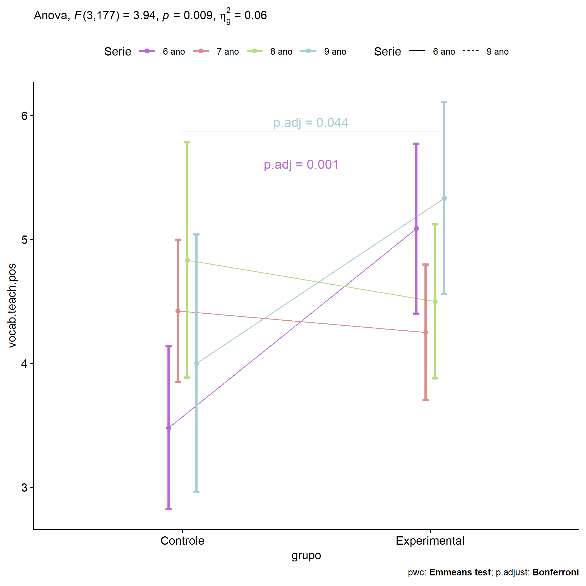<!-- -->

``` r
if (!is.null(plots[["Serie"]]))
  plots[["Serie"]] + ggplot2::scale_color_manual(values = color[["grupo"]])
```

    ## Scale for colour is already present.
    ## Adding another scale for colour, which will replace the existing scale.

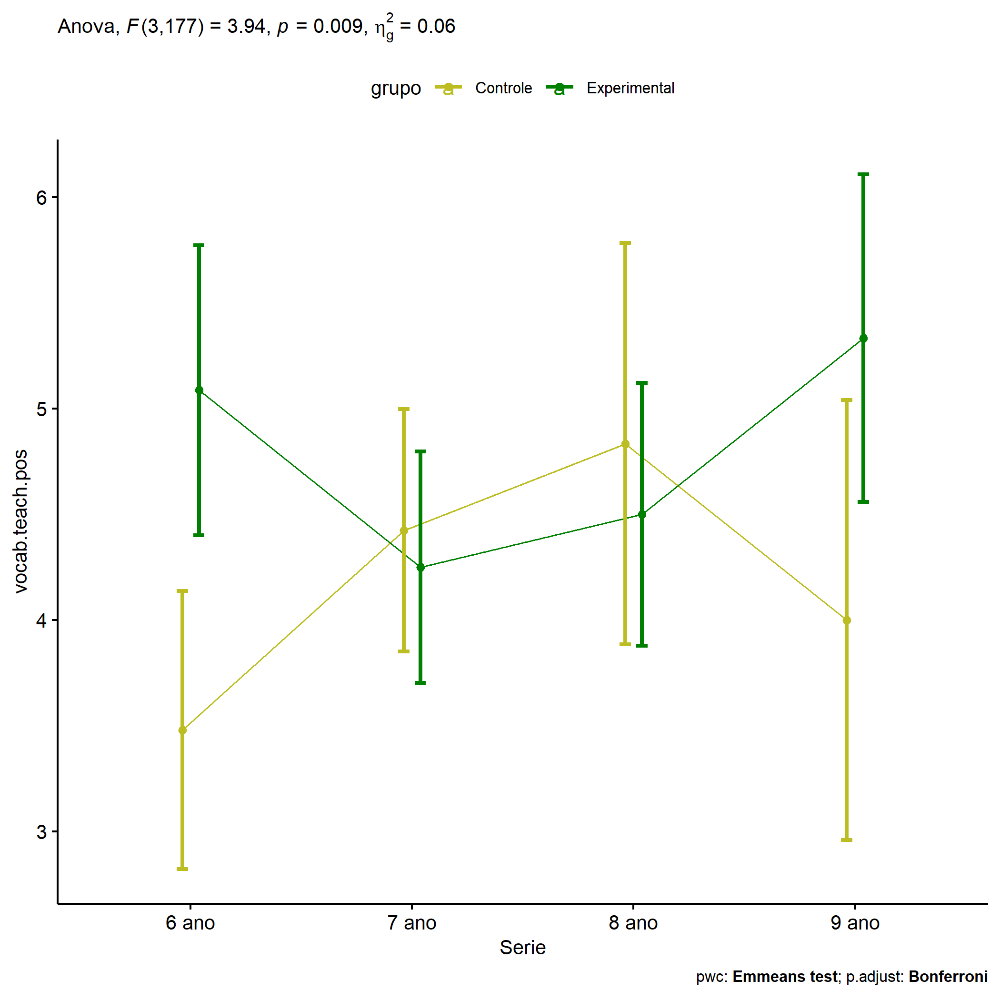<!-- -->

``` r
plots <- twoWayAncovaBoxPlots(
  wdat, "vocab.teach.pos", c("grupo","Serie"), aov, pwcs, covar = "vocab.teach.pre",
  theme = "classic", color = color[["grupo:Serie"]],
  subtitle = which(aov$Effect == "grupo:Serie"))
```

``` r
plots[["grupo:Serie"]] + ggplot2::ylab("Vocabulario Ensinado") + ggplot2::scale_x_discrete(labels=c('pre', 'pos'))
```

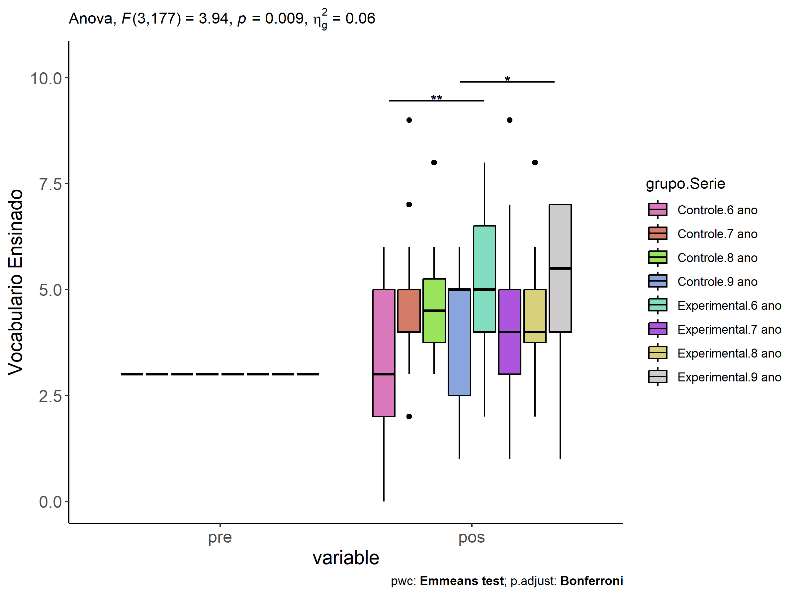<!-- -->

``` r
plots <- twoWayAncovaBoxPlots(
  wdat.long, "vocab.teach", c("grupo","Serie"), aov, pwc.long, pre.post = "time",
  theme = "classic", color = color$prepost)
```

``` r
plots[["grupo:Serie"]] + ggplot2::ylab("Vocabulario Ensinado")
```

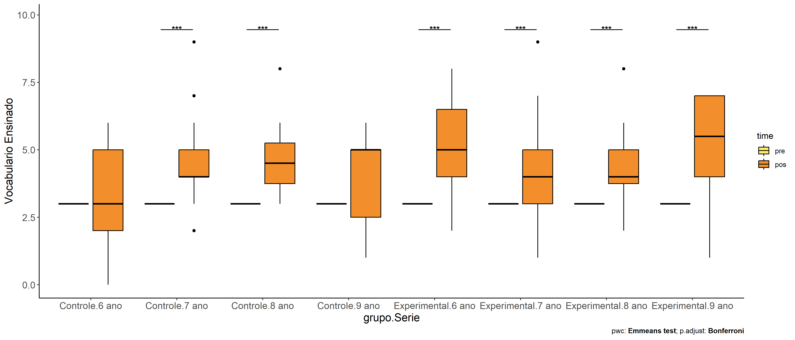<!-- -->

### Checking linearity assumption

``` r
ggscatter(wdat, x = "vocab.teach.pre", y = "vocab.teach.pos", size = 0.5,
          facet.by = c("grupo","Serie"), add = "reg.line")+
  stat_regline_equation(
    aes(label =  paste(..eq.label.., ..rr.label.., sep = "~~~~"))
  )
```

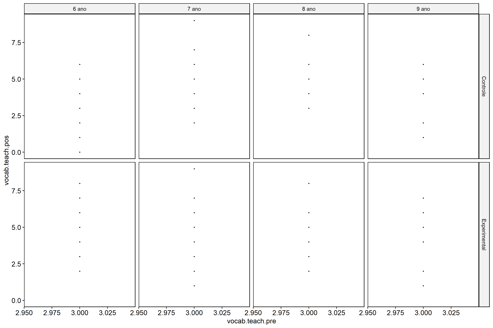<!-- -->

### Checking normality and homogeneity

``` r
res <- augment(lm(vocab.teach.pos ~ vocab.teach.pre + grupo*Serie, data = wdat))
```

``` r
shapiro_test(res$.resid)
```

    ## # A tibble: 1 × 3
    ##   variable   statistic p.value
    ##   <chr>          <dbl>   <dbl>
    ## 1 res$.resid     0.989   0.171

``` r
levene_test(res, .resid ~ grupo*Serie)
```

    ## # A tibble: 1 × 4
    ##     df1   df2 statistic     p
    ##   <int> <int>     <dbl> <dbl>
    ## 1     7   177     0.520 0.819

# Summary of Results

## Descriptive Statistics

``` r
df <- get.descriptives(ldat[["grupo"]], c(dv.pre, dv.pos), c("grupo"), 
                       include.global = T, symmetry.test = T, normality.test = F)
df <- plyr::rbind.fill(
  df, do.call(plyr::rbind.fill, lapply(lfatores2, FUN = function(f) {
    if (nrow(dat) > 0 && sum(!is.na(unique(dat[[f]]))) > 1)
      get.descriptives(ldat[[paste0("grupo:",f)]], c(dv.pre,dv.pos), c("grupo", f),
                       symmetry.test = T, normality.test = F)
    }))
)
(df <- df[,c(fatores1[fatores1 %in% colnames(df)],"variable",
             colnames(df)[!colnames(df) %in% c(fatores1,"variable")])])
```

    ##           grupo Sexo   Zona Cor.Raca Serie        variable   n  mean median min max    sd    se    ci  iqr
    ## 1      Controle <NA>   <NA>     <NA>  <NA> vocab.teach.pre  80 3.000    3.0   3   3 0.000 0.000 0.000 0.00
    ## 2  Experimental <NA>   <NA>     <NA>  <NA> vocab.teach.pre 105 3.000    3.0   3   3 0.000 0.000 0.000 0.00
    ## 3          <NA> <NA>   <NA>     <NA>  <NA> vocab.teach.pre 185 3.000    3.0   3   3 0.000 0.000 0.000 0.00
    ## 4      Controle <NA>   <NA>     <NA>  <NA> vocab.teach.pos  80 4.138    4.0   0   9 1.674 0.187 0.373 2.00
    ## 5  Experimental <NA>   <NA>     <NA>  <NA> vocab.teach.pos 105 4.686    5.0   1   9 1.723 0.168 0.333 3.00
    ## 6          <NA> <NA>   <NA>     <NA>  <NA> vocab.teach.pos 185 4.449    4.0   0   9 1.719 0.126 0.249 3.00
    ## 7      Controle    F   <NA>     <NA>  <NA> vocab.teach.pre  38 3.000    3.0   3   3 0.000 0.000 0.000 0.00
    ## 8      Controle    M   <NA>     <NA>  <NA> vocab.teach.pre  42 3.000    3.0   3   3 0.000 0.000 0.000 0.00
    ## 9  Experimental    F   <NA>     <NA>  <NA> vocab.teach.pre  52 3.000    3.0   3   3 0.000 0.000 0.000 0.00
    ## 10 Experimental    M   <NA>     <NA>  <NA> vocab.teach.pre  53 3.000    3.0   3   3 0.000 0.000 0.000 0.00
    ## 11     Controle    F   <NA>     <NA>  <NA> vocab.teach.pos  38 4.053    4.0   1   7 1.576 0.256 0.518 2.00
    ## 12     Controle    M   <NA>     <NA>  <NA> vocab.teach.pos  42 4.214    4.0   0   9 1.774 0.274 0.553 2.00
    ## 13 Experimental    F   <NA>     <NA>  <NA> vocab.teach.pos  52 4.885    5.0   1   9 1.745 0.242 0.486 2.00
    ## 14 Experimental    M   <NA>     <NA>  <NA> vocab.teach.pos  53 4.491    4.0   1   7 1.694 0.233 0.467 3.00
    ## 15     Controle <NA>  Rural     <NA>  <NA> vocab.teach.pre  42 3.000    3.0   3   3 0.000 0.000 0.000 0.00
    ## 16     Controle <NA> Urbana     <NA>  <NA> vocab.teach.pre  18 3.000    3.0   3   3 0.000 0.000 0.000 0.00
    ## 17 Experimental <NA>  Rural     <NA>  <NA> vocab.teach.pre  40 3.000    3.0   3   3 0.000 0.000 0.000 0.00
    ## 18 Experimental <NA> Urbana     <NA>  <NA> vocab.teach.pre  28 3.000    3.0   3   3 0.000 0.000 0.000 0.00
    ## 19     Controle <NA>  Rural     <NA>  <NA> vocab.teach.pos  42 3.929    4.0   0   9 1.759 0.271 0.548 2.00
    ## 20     Controle <NA> Urbana     <NA>  <NA> vocab.teach.pos  18 4.500    4.5   2   7 1.425 0.336 0.708 1.75
    ## 21 Experimental <NA>  Rural     <NA>  <NA> vocab.teach.pos  40 4.575    4.5   1   9 1.920 0.304 0.614 3.00
    ## 22 Experimental <NA> Urbana     <NA>  <NA> vocab.teach.pos  28 4.821    5.0   1   8 1.701 0.321 0.660 2.00
    ## 23     Controle <NA>   <NA>   Branca  <NA> vocab.teach.pre   4 3.000    3.0   3   3 0.000 0.000 0.000 0.00
    ## 24     Controle <NA>   <NA>    Parda  <NA> vocab.teach.pre  11 3.000    3.0   3   3 0.000 0.000 0.000 0.00
    ## 25 Experimental <NA>   <NA>    Parda  <NA> vocab.teach.pre  30 3.000    3.0   3   3 0.000 0.000 0.000 0.00
    ## 26     Controle <NA>   <NA>   Branca  <NA> vocab.teach.pos   4 4.750    4.5   4   6 0.957 0.479 1.523 1.25
    ## 27     Controle <NA>   <NA>    Parda  <NA> vocab.teach.pos  11 4.455    5.0   3   5 0.688 0.207 0.462 1.00
    ## 28 Experimental <NA>   <NA>    Parda  <NA> vocab.teach.pos  30 5.333    5.0   3   8 1.373 0.251 0.513 2.00
    ## 29     Controle <NA>   <NA>     <NA> 6 ano vocab.teach.pre  25 3.000    3.0   3   3 0.000 0.000 0.000 0.00
    ## 30     Controle <NA>   <NA>     <NA> 7 ano vocab.teach.pre  33 3.000    3.0   3   3 0.000 0.000 0.000 0.00
    ## 31     Controle <NA>   <NA>     <NA> 8 ano vocab.teach.pre  12 3.000    3.0   3   3 0.000 0.000 0.000 0.00
    ## 32     Controle <NA>   <NA>     <NA> 9 ano vocab.teach.pre  10 3.000    3.0   3   3 0.000 0.000 0.000 0.00
    ## 33 Experimental <NA>   <NA>     <NA> 6 ano vocab.teach.pre  23 3.000    3.0   3   3 0.000 0.000 0.000 0.00
    ## 34 Experimental <NA>   <NA>     <NA> 7 ano vocab.teach.pre  36 3.000    3.0   3   3 0.000 0.000 0.000 0.00
    ## 35 Experimental <NA>   <NA>     <NA> 8 ano vocab.teach.pre  28 3.000    3.0   3   3 0.000 0.000 0.000 0.00
    ## 36 Experimental <NA>   <NA>     <NA> 9 ano vocab.teach.pre  18 3.000    3.0   3   3 0.000 0.000 0.000 0.00
    ## 37     Controle <NA>   <NA>     <NA> 6 ano vocab.teach.pos  25 3.480    3.0   0   6 1.636 0.327 0.675 3.00
    ## 38     Controle <NA>   <NA>     <NA> 7 ano vocab.teach.pos  33 4.424    4.0   2   9 1.562 0.272 0.554 1.00
    ## 39     Controle <NA>   <NA>     <NA> 8 ano vocab.teach.pos  12 4.833    4.5   3   8 1.749 0.505 1.112 1.50
    ## 40     Controle <NA>   <NA>     <NA> 9 ano vocab.teach.pos  10 4.000    5.0   1   6 1.700 0.537 1.216 2.50
    ## 41 Experimental <NA>   <NA>     <NA> 6 ano vocab.teach.pos  23 5.087    5.0   2   8 1.676 0.350 0.725 2.50
    ## 42 Experimental <NA>   <NA>     <NA> 7 ano vocab.teach.pos  36 4.250    4.0   1   9 1.746 0.291 0.591 2.00
    ## 43 Experimental <NA>   <NA>     <NA> 8 ano vocab.teach.pos  28 4.500    4.0   2   8 1.503 0.284 0.583 1.25
    ## 44 Experimental <NA>   <NA>     <NA> 9 ano vocab.teach.pos  18 5.333    5.5   1   7 1.879 0.443 0.934 3.00
    ##    symmetry     skewness    kurtosis
    ## 1  few data  0.000000000  0.00000000
    ## 2  few data  0.000000000  0.00000000
    ## 3  few data  0.000000000  0.00000000
    ## 4       YES  0.264750892  0.20461200
    ## 5       YES  0.106659376 -0.64781000
    ## 6       YES  0.179197581 -0.30480968
    ## 7  few data  0.000000000  0.00000000
    ## 8  few data  0.000000000  0.00000000
    ## 9  few data  0.000000000  0.00000000
    ## 10 few data  0.000000000  0.00000000
    ## 11      YES -0.124483638 -0.80560668
    ## 12      YES  0.475765737  0.48762733
    ## 13      YES  0.216548796 -0.50488812
    ## 14      YES -0.030659288 -1.06009934
    ## 15 few data  0.000000000  0.00000000
    ## 16 few data  0.000000000  0.00000000
    ## 17 few data  0.000000000  0.00000000
    ## 18 few data  0.000000000  0.00000000
    ## 19       NO  0.631301903  0.63599891
    ## 20      YES -0.172947681 -1.00190786
    ## 21      YES  0.259186129 -0.79510431
    ## 22      YES -0.254031678 -0.58012152
    ## 23 few data  0.000000000  0.00000000
    ## 24 few data  0.000000000  0.00000000
    ## 25 few data  0.000000000  0.00000000
    ## 26 few data  0.000000000  0.00000000
    ## 27 few data  0.000000000  0.00000000
    ## 28      YES  0.260447822 -0.91542733
    ## 29 few data  0.000000000  0.00000000
    ## 30 few data  0.000000000  0.00000000
    ## 31 few data  0.000000000  0.00000000
    ## 32 few data  0.000000000  0.00000000
    ## 33 few data  0.000000000  0.00000000
    ## 34 few data  0.000000000  0.00000000
    ## 35 few data  0.000000000  0.00000000
    ## 36 few data  0.000000000  0.00000000
    ## 37      YES  0.006664282 -0.84233769
    ## 38       NO  0.685045768  0.58745810
    ## 39       NO  0.698628758 -0.87998930
    ## 40       NO -0.610977190 -1.39437870
    ## 41      YES -0.075156850 -1.27121881
    ## 42      YES  0.440008966 -0.10814559
    ## 43       NO  0.536368221 -0.02803826
    ## 44       NO -0.759664183 -0.54409465

| grupo        | Sexo | Zona   | Cor.Raca | Serie | variable        |   n |  mean | median | min | max |    sd |    se |    ci |  iqr | symmetry | skewness | kurtosis |
|:-------------|:-----|:-------|:---------|:------|:----------------|----:|------:|-------:|----:|----:|------:|------:|------:|-----:|:---------|---------:|---------:|
| Controle     |      |        |          |       | vocab.teach.pre |  80 | 3.000 |    3.0 |   3 |   3 | 0.000 | 0.000 | 0.000 | 0.00 | few data |    0.000 |    0.000 |
| Experimental |      |        |          |       | vocab.teach.pre | 105 | 3.000 |    3.0 |   3 |   3 | 0.000 | 0.000 | 0.000 | 0.00 | few data |    0.000 |    0.000 |
|              |      |        |          |       | vocab.teach.pre | 185 | 3.000 |    3.0 |   3 |   3 | 0.000 | 0.000 | 0.000 | 0.00 | few data |    0.000 |    0.000 |
| Controle     |      |        |          |       | vocab.teach.pos |  80 | 4.138 |    4.0 |   0 |   9 | 1.674 | 0.187 | 0.373 | 2.00 | YES      |    0.265 |    0.205 |
| Experimental |      |        |          |       | vocab.teach.pos | 105 | 4.686 |    5.0 |   1 |   9 | 1.723 | 0.168 | 0.333 | 3.00 | YES      |    0.107 |   -0.648 |
|              |      |        |          |       | vocab.teach.pos | 185 | 4.449 |    4.0 |   0 |   9 | 1.719 | 0.126 | 0.249 | 3.00 | YES      |    0.179 |   -0.305 |
| Controle     | F    |        |          |       | vocab.teach.pre |  38 | 3.000 |    3.0 |   3 |   3 | 0.000 | 0.000 | 0.000 | 0.00 | few data |    0.000 |    0.000 |
| Controle     | M    |        |          |       | vocab.teach.pre |  42 | 3.000 |    3.0 |   3 |   3 | 0.000 | 0.000 | 0.000 | 0.00 | few data |    0.000 |    0.000 |
| Experimental | F    |        |          |       | vocab.teach.pre |  52 | 3.000 |    3.0 |   3 |   3 | 0.000 | 0.000 | 0.000 | 0.00 | few data |    0.000 |    0.000 |
| Experimental | M    |        |          |       | vocab.teach.pre |  53 | 3.000 |    3.0 |   3 |   3 | 0.000 | 0.000 | 0.000 | 0.00 | few data |    0.000 |    0.000 |
| Controle     | F    |        |          |       | vocab.teach.pos |  38 | 4.053 |    4.0 |   1 |   7 | 1.576 | 0.256 | 0.518 | 2.00 | YES      |   -0.124 |   -0.806 |
| Controle     | M    |        |          |       | vocab.teach.pos |  42 | 4.214 |    4.0 |   0 |   9 | 1.774 | 0.274 | 0.553 | 2.00 | YES      |    0.476 |    0.488 |
| Experimental | F    |        |          |       | vocab.teach.pos |  52 | 4.885 |    5.0 |   1 |   9 | 1.745 | 0.242 | 0.486 | 2.00 | YES      |    0.217 |   -0.505 |
| Experimental | M    |        |          |       | vocab.teach.pos |  53 | 4.491 |    4.0 |   1 |   7 | 1.694 | 0.233 | 0.467 | 3.00 | YES      |   -0.031 |   -1.060 |
| Controle     |      | Rural  |          |       | vocab.teach.pre |  42 | 3.000 |    3.0 |   3 |   3 | 0.000 | 0.000 | 0.000 | 0.00 | few data |    0.000 |    0.000 |
| Controle     |      | Urbana |          |       | vocab.teach.pre |  18 | 3.000 |    3.0 |   3 |   3 | 0.000 | 0.000 | 0.000 | 0.00 | few data |    0.000 |    0.000 |
| Experimental |      | Rural  |          |       | vocab.teach.pre |  40 | 3.000 |    3.0 |   3 |   3 | 0.000 | 0.000 | 0.000 | 0.00 | few data |    0.000 |    0.000 |
| Experimental |      | Urbana |          |       | vocab.teach.pre |  28 | 3.000 |    3.0 |   3 |   3 | 0.000 | 0.000 | 0.000 | 0.00 | few data |    0.000 |    0.000 |
| Controle     |      | Rural  |          |       | vocab.teach.pos |  42 | 3.929 |    4.0 |   0 |   9 | 1.759 | 0.271 | 0.548 | 2.00 | NO       |    0.631 |    0.636 |
| Controle     |      | Urbana |          |       | vocab.teach.pos |  18 | 4.500 |    4.5 |   2 |   7 | 1.425 | 0.336 | 0.708 | 1.75 | YES      |   -0.173 |   -1.002 |
| Experimental |      | Rural  |          |       | vocab.teach.pos |  40 | 4.575 |    4.5 |   1 |   9 | 1.920 | 0.304 | 0.614 | 3.00 | YES      |    0.259 |   -0.795 |
| Experimental |      | Urbana |          |       | vocab.teach.pos |  28 | 4.821 |    5.0 |   1 |   8 | 1.701 | 0.321 | 0.660 | 2.00 | YES      |   -0.254 |   -0.580 |
| Controle     |      |        | Branca   |       | vocab.teach.pre |   4 | 3.000 |    3.0 |   3 |   3 | 0.000 | 0.000 | 0.000 | 0.00 | few data |    0.000 |    0.000 |
| Controle     |      |        | Parda    |       | vocab.teach.pre |  11 | 3.000 |    3.0 |   3 |   3 | 0.000 | 0.000 | 0.000 | 0.00 | few data |    0.000 |    0.000 |
| Experimental |      |        | Parda    |       | vocab.teach.pre |  30 | 3.000 |    3.0 |   3 |   3 | 0.000 | 0.000 | 0.000 | 0.00 | few data |    0.000 |    0.000 |
| Controle     |      |        | Branca   |       | vocab.teach.pos |   4 | 4.750 |    4.5 |   4 |   6 | 0.957 | 0.479 | 1.523 | 1.25 | few data |    0.000 |    0.000 |
| Controle     |      |        | Parda    |       | vocab.teach.pos |  11 | 4.455 |    5.0 |   3 |   5 | 0.688 | 0.207 | 0.462 | 1.00 | few data |    0.000 |    0.000 |
| Experimental |      |        | Parda    |       | vocab.teach.pos |  30 | 5.333 |    5.0 |   3 |   8 | 1.373 | 0.251 | 0.513 | 2.00 | YES      |    0.260 |   -0.915 |
| Controle     |      |        |          | 6 ano | vocab.teach.pre |  25 | 3.000 |    3.0 |   3 |   3 | 0.000 | 0.000 | 0.000 | 0.00 | few data |    0.000 |    0.000 |
| Controle     |      |        |          | 7 ano | vocab.teach.pre |  33 | 3.000 |    3.0 |   3 |   3 | 0.000 | 0.000 | 0.000 | 0.00 | few data |    0.000 |    0.000 |
| Controle     |      |        |          | 8 ano | vocab.teach.pre |  12 | 3.000 |    3.0 |   3 |   3 | 0.000 | 0.000 | 0.000 | 0.00 | few data |    0.000 |    0.000 |
| Controle     |      |        |          | 9 ano | vocab.teach.pre |  10 | 3.000 |    3.0 |   3 |   3 | 0.000 | 0.000 | 0.000 | 0.00 | few data |    0.000 |    0.000 |
| Experimental |      |        |          | 6 ano | vocab.teach.pre |  23 | 3.000 |    3.0 |   3 |   3 | 0.000 | 0.000 | 0.000 | 0.00 | few data |    0.000 |    0.000 |
| Experimental |      |        |          | 7 ano | vocab.teach.pre |  36 | 3.000 |    3.0 |   3 |   3 | 0.000 | 0.000 | 0.000 | 0.00 | few data |    0.000 |    0.000 |
| Experimental |      |        |          | 8 ano | vocab.teach.pre |  28 | 3.000 |    3.0 |   3 |   3 | 0.000 | 0.000 | 0.000 | 0.00 | few data |    0.000 |    0.000 |
| Experimental |      |        |          | 9 ano | vocab.teach.pre |  18 | 3.000 |    3.0 |   3 |   3 | 0.000 | 0.000 | 0.000 | 0.00 | few data |    0.000 |    0.000 |
| Controle     |      |        |          | 6 ano | vocab.teach.pos |  25 | 3.480 |    3.0 |   0 |   6 | 1.636 | 0.327 | 0.675 | 3.00 | YES      |    0.007 |   -0.842 |
| Controle     |      |        |          | 7 ano | vocab.teach.pos |  33 | 4.424 |    4.0 |   2 |   9 | 1.562 | 0.272 | 0.554 | 1.00 | NO       |    0.685 |    0.587 |
| Controle     |      |        |          | 8 ano | vocab.teach.pos |  12 | 4.833 |    4.5 |   3 |   8 | 1.749 | 0.505 | 1.112 | 1.50 | NO       |    0.699 |   -0.880 |
| Controle     |      |        |          | 9 ano | vocab.teach.pos |  10 | 4.000 |    5.0 |   1 |   6 | 1.700 | 0.537 | 1.216 | 2.50 | NO       |   -0.611 |   -1.394 |
| Experimental |      |        |          | 6 ano | vocab.teach.pos |  23 | 5.087 |    5.0 |   2 |   8 | 1.676 | 0.350 | 0.725 | 2.50 | YES      |   -0.075 |   -1.271 |
| Experimental |      |        |          | 7 ano | vocab.teach.pos |  36 | 4.250 |    4.0 |   1 |   9 | 1.746 | 0.291 | 0.591 | 2.00 | YES      |    0.440 |   -0.108 |
| Experimental |      |        |          | 8 ano | vocab.teach.pos |  28 | 4.500 |    4.0 |   2 |   8 | 1.503 | 0.284 | 0.583 | 1.25 | NO       |    0.536 |   -0.028 |
| Experimental |      |        |          | 9 ano | vocab.teach.pos |  18 | 5.333 |    5.5 |   1 |   7 | 1.879 | 0.443 | 0.934 | 3.00 | NO       |   -0.760 |   -0.544 |

## ANCOVA Table Comparison

``` r
df <- do.call(plyr::rbind.fill, laov)
(df <- df[!duplicated(df$Effect),])
```

    ##             Effect DFn DFd     F     p p<.05   ges DFn' DFd'    F'    p' p<.05'  ges'
    ## 1            grupo   1 183 4.711 0.031     * 0.025    1  183 4.711 0.031      * 0.025
    ## 2  vocab.teach.pre   0 183    NA    NA  <NA>    NA    0  183    NA    NA   <NA>    NA
    ## 4       grupo:Sexo   1 181 1.206 0.274       0.007    1  181 1.206 0.274        0.007
    ## 5             Sexo   1 181 0.378 0.540       0.002    1  181 0.378 0.540        0.002
    ## 8       grupo:Zona   1 124 0.244 0.622       0.002    1  124 0.244 0.622        0.002
    ## 10            Zona   1 124 1.411 0.237       0.011    1  124 1.411 0.237        0.011
    ## 11        Cor.Raca   1  42 0.173 0.680       0.004    1   76 0.660 0.419        0.009
    ## 13  grupo:Cor.Raca   0  42    NA    NA  <NA>    NA    1   76 0.675 0.414        0.009
    ## 16     grupo:Serie   3 177 3.937 0.009     * 0.063    3  177 3.937 0.009      * 0.063
    ## 17           Serie   3 177 0.692 0.558       0.012    3  177 0.692 0.558        0.012

|     | Effect          | DFn | DFd |     F |     p | p\<.05 |   ges | DFn’ | DFd’ |    F’ |    p’ | p\<.05’ |  ges’ |
|:----|:----------------|----:|----:|------:|------:|:-------|------:|-----:|-----:|------:|------:|:--------|------:|
| 1   | grupo           |   1 | 183 | 4.711 | 0.031 | \*     | 0.025 |    1 |  183 | 4.711 | 0.031 | \*      | 0.025 |
| 2   | vocab.teach.pre |   0 | 183 |       |       |        |       |    0 |  183 |       |       |         |       |
| 4   | grupo:Sexo      |   1 | 181 | 1.206 | 0.274 |        | 0.007 |    1 |  181 | 1.206 | 0.274 |         | 0.007 |
| 5   | Sexo            |   1 | 181 | 0.378 | 0.540 |        | 0.002 |    1 |  181 | 0.378 | 0.540 |         | 0.002 |
| 8   | grupo:Zona      |   1 | 124 | 0.244 | 0.622 |        | 0.002 |    1 |  124 | 0.244 | 0.622 |         | 0.002 |
| 10  | Zona            |   1 | 124 | 1.411 | 0.237 |        | 0.011 |    1 |  124 | 1.411 | 0.237 |         | 0.011 |
| 11  | Cor.Raca        |   1 |  42 | 0.173 | 0.680 |        | 0.004 |    1 |   76 | 0.660 | 0.419 |         | 0.009 |
| 13  | grupo:Cor.Raca  |   0 |  42 |       |       |        |       |    1 |   76 | 0.675 | 0.414 |         | 0.009 |
| 16  | grupo:Serie     |   3 | 177 | 3.937 | 0.009 | \*     | 0.063 |    3 |  177 | 3.937 | 0.009 | \*      | 0.063 |
| 17  | Serie           |   3 | 177 | 0.692 | 0.558 |        | 0.012 |    3 |  177 | 0.692 | 0.558 |         | 0.012 |

## PairWise Table Comparison

``` r
df <- do.call(plyr::rbind.fill, lpwc)
df <- df[,c(names(lfatores), names(df)[!names(df) %in% c(names(lfatores),"term",".y.")])]
```

| grupo        | Sexo | Zona   | Cor.Raca | Serie | group1   | group2       |  df | statistic |     p | p.adj | p.adj.signif | df’ | statistic’ |    p’ | p.adj’ | p.adj.signif’ |
|:-------------|:-----|:-------|:---------|:------|:---------|:-------------|----:|----------:|------:|------:|:-------------|----:|-----------:|------:|-------:|:--------------|
| Controle     |      |        |          |       | pre      | pos          | 366 |    -5.978 | 0.000 | 0.000 | \*\*\*\*     | 366 |     -5.978 | 0.000 |  0.000 | \*\*\*\*      |
| Experimental |      |        |          |       | pre      | pos          | 366 |   -10.149 | 0.000 | 0.000 | \*\*\*\*     | 366 |    -10.149 | 0.000 |  0.000 | \*\*\*\*      |
|              |      |        |          |       | Controle | Experimental | 183 |    -2.170 | 0.031 | 0.031 | \*           | 183 |     -2.170 | 0.031 |  0.031 | \*            |
| Controle     | F    |        |          |       | pre      | pos          | 362 |    -3.808 | 0.000 | 0.000 | \*\*\*       | 362 |     -3.808 | 0.000 |  0.000 | \*\*\*        |
| Controle     | M    |        |          |       | pre      | pos          | 362 |    -4.618 | 0.000 | 0.000 | \*\*\*\*     | 362 |     -4.618 | 0.000 |  0.000 | \*\*\*\*      |
| Controle     |      |        |          |       | F        | M            | 181 |    -0.424 | 0.672 | 0.672 | ns           | 181 |     -0.424 | 0.672 |  0.672 | ns            |
| Experimental | F    |        |          |       | pre      | pos          | 362 |    -7.976 | 0.000 | 0.000 | \*\*\*\*     | 362 |     -7.976 | 0.000 |  0.000 | \*\*\*\*      |
| Experimental | M    |        |          |       | pre      | pos          | 362 |    -6.368 | 0.000 | 0.000 | \*\*\*\*     | 362 |     -6.368 | 0.000 |  0.000 | \*\*\*\*      |
| Experimental |      |        |          |       | F        | M            | 181 |     1.185 | 0.238 | 0.238 | ns           | 181 |      1.185 | 0.238 |  0.238 | ns            |
|              | F    |        |          |       | Controle | Experimental | 181 |    -2.288 | 0.023 | 0.023 | \*           | 181 |     -2.288 | 0.023 |  0.023 | \*            |
|              | M    |        |          |       | Controle | Experimental | 181 |    -0.785 | 0.434 | 0.434 | ns           | 181 |     -0.785 | 0.434 |  0.434 | ns            |
| Controle     |      |        |          |       | Rural    | Urbana       | 124 |    -1.154 | 0.251 | 0.251 | ns           | 124 |     -1.154 | 0.251 |  0.251 | ns            |
| Controle     |      | Rural  |          |       | pre      | pos          | 248 |    -3.423 | 0.001 | 0.001 | \*\*\*       | 248 |     -3.423 | 0.001 |  0.001 | \*\*\*        |
| Controle     |      | Urbana |          |       | pre      | pos          | 248 |    -3.620 | 0.000 | 0.000 | \*\*\*       | 248 |     -3.620 | 0.000 |  0.000 | \*\*\*        |
| Experimental |      |        |          |       | Rural    | Urbana       | 124 |    -0.569 | 0.570 | 0.570 | ns           | 124 |     -0.569 | 0.570 |  0.570 | ns            |
| Experimental |      | Rural  |          |       | pre      | pos          | 248 |    -5.667 | 0.000 | 0.000 | \*\*\*\*     | 248 |     -5.667 | 0.000 |  0.000 | \*\*\*\*      |
| Experimental |      | Urbana |          |       | pre      | pos          | 248 |    -5.483 | 0.000 | 0.000 | \*\*\*\*     | 248 |     -5.483 | 0.000 |  0.000 | \*\*\*\*      |
|              |      | Rural  |          |       | Controle | Experimental | 124 |    -1.665 | 0.099 | 0.099 | ns           | 124 |     -1.665 | 0.099 |  0.099 | ns            |
|              |      | Urbana |          |       | Controle | Experimental | 124 |    -0.605 | 0.546 | 0.546 | ns           | 124 |     -0.605 | 0.546 |  0.546 | ns            |
| Controle     |      |        | Branca   |       | pre      | pos          |  84 |    -2.877 | 0.005 | 0.005 | \*\*         | 152 |     -2.086 | 0.039 |  0.039 | \*            |
| Controle     |      |        |          |       | Branca   | Parda        |  42 |     0.416 | 0.680 | 0.680 | ns           |  76 |     -0.021 | 0.983 |  0.983 | ns            |
| Controle     |      |        | Parda    |       | pre      | pos          |  84 |    -3.966 | 0.000 | 0.000 | \*\*\*       | 152 |     -4.367 | 0.000 |  0.000 | \*\*\*\*      |
| Experimental |      |        | Branca   |       | pre      | pos          |     |           |       |       |              | 152 |     -2.003 | 0.047 |  0.047 | \*            |
| Experimental |      |        |          |       | Branca   | Parda        |     |           |       |       |              |  76 |     -1.155 | 0.252 |  0.252 | ns            |
| Experimental |      |        | Parda    |       | pre      | pos          |  84 |   -10.507 | 0.000 | 0.000 | \*\*\*\*     | 152 |     -8.065 | 0.000 |  0.000 | \*\*\*\*      |
|              |      |        | Branca   |       | Controle | Experimental |     |           |       |       |              |  76 |     -0.052 | 0.958 |  0.958 | ns            |
|              |      |        | Parda    |       | Controle | Experimental |  42 |    -2.050 | 0.047 | 0.047 | \*           |  76 |     -2.152 | 0.035 |  0.035 | \*            |
| Controle     |      |        |          | 6 ano | pre      | pos          | 354 |    -1.440 | 0.151 | 0.151 | ns           | 354 |     -1.440 | 0.151 |  0.151 | ns            |
| Controle     |      |        |          | 7 ano | pre      | pos          | 354 |    -4.910 | 0.000 | 0.000 | \*\*\*\*     | 354 |     -4.910 | 0.000 |  0.000 | \*\*\*\*      |
| Controle     |      |        |          | 8 ano | pre      | pos          | 354 |    -3.811 | 0.000 | 0.000 | \*\*\*       | 354 |     -3.811 | 0.000 |  0.000 | \*\*\*        |
| Controle     |      |        |          | 9 ano | pre      | pos          | 354 |    -1.898 | 0.059 | 0.059 | ns           | 354 |     -1.898 | 0.059 |  0.059 | ns            |
| Controle     |      |        |          |       | 6 ano    | 7 ano        | 177 |    -2.137 | 0.034 | 0.204 | ns           | 177 |     -2.137 | 0.034 |  0.204 | ns            |
| Controle     |      |        |          |       | 6 ano    | 8 ano        | 177 |    -2.312 | 0.022 | 0.131 | ns           | 177 |     -2.312 | 0.022 |  0.131 | ns            |
| Controle     |      |        |          |       | 6 ano    | 9 ano        | 177 |    -0.834 | 0.405 | 1.000 | ns           | 177 |     -0.834 | 0.405 |  1.000 | ns            |
| Controle     |      |        |          |       | 7 ano    | 8 ano        | 177 |    -0.728 | 0.467 | 1.000 | ns           | 177 |     -0.728 | 0.467 |  1.000 | ns            |
| Controle     |      |        |          |       | 7 ano    | 9 ano        | 177 |     0.705 | 0.482 | 1.000 | ns           | 177 |      0.705 | 0.482 |  1.000 | ns            |
| Controle     |      |        |          |       | 8 ano    | 9 ano        | 177 |     1.168 | 0.244 | 1.000 | ns           | 177 |      1.168 | 0.244 |  1.000 | ns            |
| Experimental |      |        |          | 6 ano | pre      | pos          | 354 |    -6.006 | 0.000 | 0.000 | \*\*\*\*     | 354 |     -6.006 | 0.000 |  0.000 | \*\*\*\*      |
| Experimental |      |        |          | 7 ano | pre      | pos          | 354 |    -4.501 | 0.000 | 0.000 | \*\*\*\*     | 354 |     -4.501 | 0.000 |  0.000 | \*\*\*\*      |
| Experimental |      |        |          | 8 ano | pre      | pos          | 354 |    -4.763 | 0.000 | 0.000 | \*\*\*\*     | 354 |     -4.763 | 0.000 |  0.000 | \*\*\*\*      |
| Experimental |      |        |          | 9 ano | pre      | pos          | 354 |    -5.940 | 0.000 | 0.000 | \*\*\*\*     | 354 |     -5.940 | 0.000 |  0.000 | \*\*\*\*      |
| Experimental |      |        |          |       | 6 ano    | 7 ano        | 177 |     1.881 | 0.062 | 0.369 | ns           | 177 |      1.881 | 0.062 |  0.369 | ns            |
| Experimental |      |        |          |       | 6 ano    | 8 ano        | 177 |     1.252 | 0.212 | 1.000 | ns           | 177 |      1.252 | 0.212 |  1.000 | ns            |
| Experimental |      |        |          |       | 6 ano    | 9 ano        | 177 |    -0.470 | 0.639 | 1.000 | ns           | 177 |     -0.470 | 0.639 |  1.000 | ns            |
| Experimental |      |        |          |       | 7 ano    | 8 ano        | 177 |    -0.595 | 0.552 | 1.000 | ns           | 177 |     -0.595 | 0.552 |  1.000 | ns            |
| Experimental |      |        |          |       | 7 ano    | 9 ano        | 177 |    -2.252 | 0.026 | 0.153 | ns           | 177 |     -2.252 | 0.026 |  0.153 | ns            |
| Experimental |      |        |          |       | 8 ano    | 9 ano        | 177 |    -1.655 | 0.100 | 0.598 | ns           | 177 |     -1.655 | 0.100 |  0.598 | ns            |
|              |      |        |          | 6 ano | Controle | Experimental | 177 |    -3.338 | 0.001 | 0.001 | \*\*         | 177 |     -3.338 | 0.001 |  0.001 | \*\*          |
|              |      |        |          | 7 ano | Controle | Experimental | 177 |     0.434 | 0.665 | 0.665 | ns           | 177 |      0.434 | 0.665 |  0.665 | ns            |
|              |      |        |          | 8 ano | Controle | Experimental | 177 |     0.580 | 0.563 | 0.563 | ns           | 177 |      0.580 | 0.563 |  0.563 | ns            |
|              |      |        |          | 9 ano | Controle | Experimental | 177 |    -2.029 | 0.044 | 0.044 | \*           | 177 |     -2.029 | 0.044 |  0.044 | \*            |

## EMMS Table Comparison

``` r
df <- do.call(plyr::rbind.fill, lemms)
df[["N-N'"]] <- df[["N"]] - df[["N'"]]
df <- df[,c(names(lfatores), names(df)[!names(df) %in% names(lfatores)])]
```

| grupo        | Sexo | Zona   | Cor.Raca | Serie |   N | M (pre) | SE (pre) | M (unadj) | SE (unadj) | M (adj) | SE (adj) |  N’ | M (pre)’ | SE (pre)’ | M (unadj)’ | SE (unadj)’ | M (adj)’ | SE (adj)’ | N-N’ |
|:-------------|:-----|:-------|:---------|:------|----:|--------:|---------:|----------:|-----------:|--------:|---------:|----:|---------:|----------:|-----------:|------------:|---------:|----------:|-----:|
| Controle     |      |        |          |       |  80 |       3 |        0 |     4.138 |      0.187 |   4.137 |    0.190 |  80 |        3 |         0 |      4.138 |       0.187 |    4.137 |     0.190 |    0 |
| Experimental |      |        |          |       | 105 |       3 |        0 |     4.686 |      0.168 |   4.686 |    0.166 | 105 |        3 |         0 |      4.686 |       0.168 |    4.686 |     0.166 |    0 |
| Controle     | F    |        |          |       |  38 |       3 |        0 |     4.053 |      0.256 |   4.053 |    0.276 |  38 |        3 |         0 |      4.053 |       0.256 |    4.053 |     0.276 |    0 |
| Controle     | M    |        |          |       |  42 |       3 |        0 |     4.214 |      0.274 |   4.214 |    0.263 |  42 |        3 |         0 |      4.214 |       0.274 |    4.214 |     0.263 |    0 |
| Experimental | F    |        |          |       |  52 |       3 |        0 |     4.885 |      0.242 |   4.885 |    0.236 |  52 |        3 |         0 |      4.885 |       0.242 |    4.885 |     0.236 |    0 |
| Experimental | M    |        |          |       |  53 |       3 |        0 |     4.491 |      0.233 |   4.491 |    0.234 |  53 |        3 |         0 |      4.491 |       0.233 |    4.491 |     0.234 |    0 |
| Controle     |      | Rural  |          |       |  42 |       3 |        0 |     3.929 |      0.271 |   3.929 |    0.271 |  42 |        3 |         0 |      3.929 |       0.271 |    3.929 |     0.271 |    0 |
| Controle     |      | Urbana |          |       |  18 |       3 |        0 |     4.500 |      0.336 |   4.500 |    0.414 |  18 |        3 |         0 |      4.500 |       0.336 |    4.500 |     0.414 |    0 |
| Experimental |      | Rural  |          |       |  40 |       3 |        0 |     4.575 |      0.304 |   4.575 |    0.278 |  40 |        3 |         0 |      4.575 |       0.304 |    4.575 |     0.278 |    0 |
| Experimental |      | Urbana |          |       |  28 |       3 |        0 |     4.821 |      0.321 |   4.821 |    0.332 |  28 |        3 |         0 |      4.821 |       0.321 |    4.821 |     0.332 |    0 |
| Controle     |      |        | Branca   |       |   4 |       3 |        0 |     4.750 |      0.479 |   4.750 |    0.608 |   7 |        3 |         0 |      4.286 |       0.714 |    4.286 |     0.616 |   -3 |
| Controle     |      |        | Parda    |       |  11 |       3 |        0 |     4.455 |      0.207 |   4.455 |    0.367 |  30 |        3 |         0 |      4.300 |       0.292 |    4.300 |     0.298 |  -19 |
| Experimental |      |        | Parda    |       |  30 |       3 |        0 |     5.333 |      0.251 |   5.333 |    0.222 |  37 |        3 |         0 |      5.162 |       0.250 |    5.162 |     0.268 |   -7 |
| Controle     |      |        |          | 6 ano |  25 |       3 |        0 |     3.480 |      0.327 |   3.480 |    0.333 |  25 |        3 |         0 |      3.480 |       0.327 |    3.480 |     0.333 |    0 |
| Controle     |      |        |          | 7 ano |  33 |       3 |        0 |     4.424 |      0.272 |   4.424 |    0.290 |  33 |        3 |         0 |      4.424 |       0.272 |    4.424 |     0.290 |    0 |
| Controle     |      |        |          | 8 ano |  12 |       3 |        0 |     4.833 |      0.505 |   4.833 |    0.481 |  12 |        3 |         0 |      4.833 |       0.505 |    4.833 |     0.481 |    0 |
| Controle     |      |        |          | 9 ano |  10 |       3 |        0 |     4.000 |      0.537 |   4.000 |    0.527 |  10 |        3 |         0 |      4.000 |       0.537 |    4.000 |     0.527 |    0 |
| Experimental |      |        |          | 6 ano |  23 |       3 |        0 |     5.087 |      0.350 |   5.087 |    0.347 |  23 |        3 |         0 |      5.087 |       0.350 |    5.087 |     0.347 |    0 |
| Experimental |      |        |          | 7 ano |  36 |       3 |        0 |     4.250 |      0.291 |   4.250 |    0.278 |  36 |        3 |         0 |      4.250 |       0.291 |    4.250 |     0.278 |    0 |
| Experimental |      |        |          | 8 ano |  28 |       3 |        0 |     4.500 |      0.284 |   4.500 |    0.315 |  28 |        3 |         0 |      4.500 |       0.284 |    4.500 |     0.315 |    0 |
| Experimental |      |        |          | 9 ano |  18 |       3 |        0 |     5.333 |      0.443 |   5.333 |    0.393 |  18 |        3 |         0 |      5.333 |       0.443 |    5.333 |     0.393 |    0 |
