ANCOVA in Vocabulario Ensinado (Vocabulario Ensinado)
================
Geiser C. Challco <geiser@alumni.usp.br>

- [Descriptive Statistics of Initial
  Data](#descriptive-statistics-of-initial-data)
- [ANCOVA and Pairwise for one factor:
  **grupo**](#ancova-and-pairwise-for-one-factor-grupo)
  - [Without remove non-normal data](#without-remove-non-normal-data)
  - [Computing ANCOVA and PairWise After removing non-normal data
    (OK)](#computing-ancova-and-pairwise-after-removing-non-normal-data-ok)
    - [Plots for ancova](#plots-for-ancova)
    - [Checking linearity assumption](#checking-linearity-assumption)
    - [Checking normality and
      homogeneity](#checking-normality-and-homogeneity)
- [ANCOVA and Pairwise for two factors
  **grupo:Sexo**](#ancova-and-pairwise-for-two-factors-gruposexo)
  - [Without remove non-normal data](#without-remove-non-normal-data-1)
  - [Computing ANCOVA and PairWise After removing non-normal data
    (OK)](#computing-ancova-and-pairwise-after-removing-non-normal-data-ok-1)
    - [Plots for ancova](#plots-for-ancova-1)
    - [Checking linearity assumption](#checking-linearity-assumption-1)
    - [Checking normality and
      homogeneity](#checking-normality-and-homogeneity-1)
- [ANCOVA and Pairwise for two factors
  **grupo:Zona**](#ancova-and-pairwise-for-two-factors-grupozona)
  - [Without remove non-normal data](#without-remove-non-normal-data-2)
  - [Computing ANCOVA and PairWise After removing non-normal data
    (OK)](#computing-ancova-and-pairwise-after-removing-non-normal-data-ok-2)
    - [Plots for ancova](#plots-for-ancova-2)
    - [Checking linearity assumption](#checking-linearity-assumption-2)
    - [Checking normality and
      homogeneity](#checking-normality-and-homogeneity-2)
- [ANCOVA and Pairwise for two factors
  **grupo:Cor.Raca**](#ancova-and-pairwise-for-two-factors-grupocorraca)
  - [Without remove non-normal data](#without-remove-non-normal-data-3)
  - [Computing ANCOVA and PairWise After removing non-normal data
    (OK)](#computing-ancova-and-pairwise-after-removing-non-normal-data-ok-3)
    - [Plots for ancova](#plots-for-ancova-3)
    - [Checking linearity assumption](#checking-linearity-assumption-3)
    - [Checking normality and
      homogeneity](#checking-normality-and-homogeneity-3)
- [ANCOVA and Pairwise for two factors
  **grupo:Serie**](#ancova-and-pairwise-for-two-factors-gruposerie)
  - [Without remove non-normal data](#without-remove-non-normal-data-4)
  - [Computing ANCOVA and PairWise After removing non-normal data
    (OK)](#computing-ancova-and-pairwise-after-removing-non-normal-data-ok-4)
    - [Plots for ancova](#plots-for-ancova-4)
    - [Checking linearity assumption](#checking-linearity-assumption-4)
    - [Checking normality and
      homogeneity](#checking-normality-and-homogeneity-4)
- [Summary of Results](#summary-of-results)
  - [Descriptive Statistics](#descriptive-statistics)
  - [ANCOVA Table Comparison](#ancova-table-comparison)
  - [PairWise Table Comparison](#pairwise-table-comparison)
  - [EMMS Table Comparison](#emms-table-comparison)

**NOTE**:

- Teste ANCOVA para determinar se houve diferenças significativas no
  Vocabulario Ensinado (medido usando pre- e pos-testes).
- ANCOVA test to determine whether there were significant differences in
  Vocabulario Ensinado (measured using pre- and post-tests).

# Descriptive Statistics of Initial Data

``` r
df <- get.descriptives(dat, c(dv.pre, dv.pos), c("grupo"), 
                       include.global = T, symmetry.test = T, normality.test = F)
df <- plyr::rbind.fill(
  df, do.call(plyr::rbind.fill, lapply(lfatores2, FUN = function(f) {
    if (nrow(dat) > 0 && sum(!is.na(unique(dat[[f]]))) > 1)
      get.descriptives(dat, c(dv.pre,dv.pos), c("grupo", f),
                       symmetry.test = T, normality.test = F)
    }))
)
(df <- df[,c(fatores1[fatores1 %in% colnames(df)],"variable",
             colnames(df)[!colnames(df) %in% c(fatores1,"variable")])])
```

    ##           grupo Sexo   Zona Cor.Raca Serie        variable   n  mean median min max    sd    se     ci
    ## 1      Controle <NA>   <NA>     <NA>  <NA> vocab.teach.pre  64 6.000    6.0   6   6 0.000 0.000  0.000
    ## 2  Experimental <NA>   <NA>     <NA>  <NA> vocab.teach.pre  99 6.000    6.0   6   6 0.000 0.000  0.000
    ## 3          <NA> <NA>   <NA>     <NA>  <NA> vocab.teach.pre 163 6.000    6.0   6   6 0.000 0.000  0.000
    ## 4      Controle <NA>   <NA>     <NA>  <NA> vocab.teach.pos  64 5.922    6.0   0  10 2.125 0.266  0.531
    ## 5  Experimental <NA>   <NA>     <NA>  <NA> vocab.teach.pos  99 5.778    6.0   0  11 2.183 0.219  0.435
    ## 6          <NA> <NA>   <NA>     <NA>  <NA> vocab.teach.pos 163 5.834    6.0   0  11 2.155 0.169  0.333
    ## 7      Controle    F   <NA>     <NA>  <NA> vocab.teach.pre  36 6.000    6.0   6   6 0.000 0.000  0.000
    ## 8      Controle    M   <NA>     <NA>  <NA> vocab.teach.pre  28 6.000    6.0   6   6 0.000 0.000  0.000
    ## 9  Experimental    F   <NA>     <NA>  <NA> vocab.teach.pre  59 6.000    6.0   6   6 0.000 0.000  0.000
    ## 10 Experimental    M   <NA>     <NA>  <NA> vocab.teach.pre  40 6.000    6.0   6   6 0.000 0.000  0.000
    ## 11     Controle    F   <NA>     <NA>  <NA> vocab.teach.pos  36 5.722    6.0   1  10 2.199 0.366  0.744
    ## 12     Controle    M   <NA>     <NA>  <NA> vocab.teach.pos  28 6.179    6.5   0   9 2.038 0.385  0.790
    ## 13 Experimental    F   <NA>     <NA>  <NA> vocab.teach.pos  59 6.102    6.0   0  11 2.310 0.301  0.602
    ## 14 Experimental    M   <NA>     <NA>  <NA> vocab.teach.pos  40 5.300    5.0   1   9 1.911 0.302  0.611
    ## 15     Controle <NA>  Rural     <NA>  <NA> vocab.teach.pre  32 6.000    6.0   6   6 0.000 0.000  0.000
    ## 16     Controle <NA> Urbana     <NA>  <NA> vocab.teach.pre  11 6.000    6.0   6   6 0.000 0.000  0.000
    ## 17     Controle <NA>   <NA>     <NA>  <NA> vocab.teach.pre  21 6.000    6.0   6   6 0.000 0.000  0.000
    ## 18 Experimental <NA>  Rural     <NA>  <NA> vocab.teach.pre  40 6.000    6.0   6   6 0.000 0.000  0.000
    ## 19 Experimental <NA> Urbana     <NA>  <NA> vocab.teach.pre  21 6.000    6.0   6   6 0.000 0.000  0.000
    ## 20 Experimental <NA>   <NA>     <NA>  <NA> vocab.teach.pre  38 6.000    6.0   6   6 0.000 0.000  0.000
    ## 21     Controle <NA>  Rural     <NA>  <NA> vocab.teach.pos  32 6.031    6.0   2   9 1.909 0.337  0.688
    ## 22     Controle <NA> Urbana     <NA>  <NA> vocab.teach.pos  11 6.455    7.0   1  10 2.622 0.790  1.761
    ## 23     Controle <NA>   <NA>     <NA>  <NA> vocab.teach.pos  21 5.476    6.0   0   8 2.182 0.476  0.993
    ## 24 Experimental <NA>  Rural     <NA>  <NA> vocab.teach.pos  40 5.850    6.0   0  10 2.338 0.370  0.748
    ## 25 Experimental <NA> Urbana     <NA>  <NA> vocab.teach.pos  21 6.095    6.0   3  11 1.786 0.390  0.813
    ## 26 Experimental <NA>   <NA>     <NA>  <NA> vocab.teach.pos  38 5.526    5.5   1  11 2.239 0.363  0.736
    ## 27     Controle <NA>   <NA>   Branca  <NA> vocab.teach.pre   7 6.000    6.0   6   6 0.000 0.000  0.000
    ## 28     Controle <NA>   <NA> Indígena  <NA> vocab.teach.pre   2 6.000    6.0   6   6 0.000 0.000  0.000
    ## 29     Controle <NA>   <NA>    Parda  <NA> vocab.teach.pre  20 6.000    6.0   6   6 0.000 0.000  0.000
    ## 30     Controle <NA>   <NA>     <NA>  <NA> vocab.teach.pre  35 6.000    6.0   6   6 0.000 0.000  0.000
    ## 31 Experimental <NA>   <NA>   Branca  <NA> vocab.teach.pre  11 6.000    6.0   6   6 0.000 0.000  0.000
    ## 32 Experimental <NA>   <NA> Indígena  <NA> vocab.teach.pre   3 6.000    6.0   6   6 0.000 0.000  0.000
    ## 33 Experimental <NA>   <NA>    Parda  <NA> vocab.teach.pre  24 6.000    6.0   6   6 0.000 0.000  0.000
    ## 34 Experimental <NA>   <NA>     <NA>  <NA> vocab.teach.pre  61 6.000    6.0   6   6 0.000 0.000  0.000
    ## 35     Controle <NA>   <NA>   Branca  <NA> vocab.teach.pos   7 6.857    7.0   3   8 1.773 0.670  1.640
    ## 36     Controle <NA>   <NA> Indígena  <NA> vocab.teach.pos   2 6.500    6.5   5   8 2.121 1.500 19.059
    ## 37     Controle <NA>   <NA>    Parda  <NA> vocab.teach.pos  20 6.600    7.0   3  10 1.875 0.419  0.878
    ## 38     Controle <NA>   <NA>     <NA>  <NA> vocab.teach.pos  35 5.314    6.0   0   9 2.207 0.373  0.758
    ## 39 Experimental <NA>   <NA>   Branca  <NA> vocab.teach.pos  11 6.909    7.0   3   9 1.700 0.513  1.142
    ## 40 Experimental <NA>   <NA> Indígena  <NA> vocab.teach.pos   3 7.000    7.0   5   9 2.000 1.155  4.968
    ## 41 Experimental <NA>   <NA>    Parda  <NA> vocab.teach.pos  24 5.375    5.5   1  10 2.392 0.488  1.010
    ## 42 Experimental <NA>   <NA>     <NA>  <NA> vocab.teach.pos  61 5.672    6.0   0  11 2.143 0.274  0.549
    ## 43     Controle <NA>   <NA>     <NA> 6 ano vocab.teach.pre  14 6.000    6.0   6   6 0.000 0.000  0.000
    ## 44     Controle <NA>   <NA>     <NA> 7 ano vocab.teach.pre  13 6.000    6.0   6   6 0.000 0.000  0.000
    ## 45     Controle <NA>   <NA>     <NA> 8 ano vocab.teach.pre  12 6.000    6.0   6   6 0.000 0.000  0.000
    ## 46     Controle <NA>   <NA>     <NA> 9 ano vocab.teach.pre  25 6.000    6.0   6   6 0.000 0.000  0.000
    ## 47 Experimental <NA>   <NA>     <NA> 6 ano vocab.teach.pre  18 6.000    6.0   6   6 0.000 0.000  0.000
    ## 48 Experimental <NA>   <NA>     <NA> 7 ano vocab.teach.pre  26 6.000    6.0   6   6 0.000 0.000  0.000
    ## 49 Experimental <NA>   <NA>     <NA> 8 ano vocab.teach.pre  30 6.000    6.0   6   6 0.000 0.000  0.000
    ## 50 Experimental <NA>   <NA>     <NA> 9 ano vocab.teach.pre  25 6.000    6.0   6   6 0.000 0.000  0.000
    ## 51     Controle <NA>   <NA>     <NA> 6 ano vocab.teach.pos  14 5.571    5.5   3   8 1.697 0.453  0.980
    ## 52     Controle <NA>   <NA>     <NA> 7 ano vocab.teach.pos  13 5.462    6.0   1   9 2.665 0.739  1.610
    ## 53     Controle <NA>   <NA>     <NA> 8 ano vocab.teach.pos  12 6.000    6.5   0   8 2.523 0.728  1.603
    ## 54     Controle <NA>   <NA>     <NA> 9 ano vocab.teach.pos  25 6.320    7.0   3  10 1.865 0.373  0.770
    ## 55 Experimental <NA>   <NA>     <NA> 6 ano vocab.teach.pos  18 5.556    6.0   0   9 2.684 0.633  1.335
    ##     iqr symmetry     skewness     kurtosis
    ## 1  0.00 few data  0.000000000  0.000000000
    ## 2  0.00 few data  0.000000000  0.000000000
    ## 3  0.00 few data  0.000000000  0.000000000
    ## 4  2.25       NO -0.573225508 -0.200584313
    ## 5  3.00      YES -0.154828575 -0.145811604
    ## 6  3.00      YES -0.316378185 -0.153765706
    ## 7  0.00 few data  0.000000000  0.000000000
    ## 8  0.00 few data  0.000000000  0.000000000
    ## 9  0.00 few data  0.000000000  0.000000000
    ## 10 0.00 few data  0.000000000  0.000000000
    ## 11 3.00      YES -0.251381395 -0.820050154
    ## 12 3.00       NO -1.018228635  0.952213258
    ## 13 3.50      YES -0.262009386 -0.100211228
    ## 14 2.25      YES -0.226602030 -0.590981415
    ## 15 0.00 few data  0.000000000  0.000000000
    ## 16 0.00 few data  0.000000000  0.000000000
    ## 17 0.00 few data  0.000000000  0.000000000
    ## 18 0.00 few data  0.000000000  0.000000000
    ## 19 0.00 few data  0.000000000  0.000000000
    ## 20 0.00 few data  0.000000000  0.000000000
    ## 21 2.25      YES -0.420429192 -0.900868529
    ## 22 3.50       NO -0.513401208 -0.732131318
    ## 23 3.00       NO -0.808008891 -0.292688435
    ## 24 3.25       NO -0.528417572 -0.267564567
    ## 25 2.00       NO  0.616258335  0.576082427
    ## 26 3.00      YES  0.163209811 -0.559589648
    ## 27 0.00 few data  0.000000000  0.000000000
    ## 28 0.00 few data  0.000000000  0.000000000
    ## 29 0.00 few data  0.000000000  0.000000000
    ## 30 0.00 few data  0.000000000  0.000000000
    ## 31 0.00 few data  0.000000000  0.000000000
    ## 32 0.00 few data  0.000000000  0.000000000
    ## 33 0.00 few data  0.000000000  0.000000000
    ## 34 0.00 few data  0.000000000  0.000000000
    ## 35 1.00 few data  0.000000000  0.000000000
    ## 36 1.50 few data  0.000000000  0.000000000
    ## 37 2.25      YES -0.216617687 -0.881751049
    ## 38 3.00      YES -0.452550594 -0.487732046
    ## 39 2.00       NO -0.760284389  0.008972537
    ## 40 2.00 few data  0.000000000  0.000000000
    ## 41 3.00      YES  0.120693694 -0.939000132
    ## 42 3.00      YES -0.098205139  0.306254642
    ## 43 0.00 few data  0.000000000  0.000000000
    ## 44 0.00 few data  0.000000000  0.000000000
    ## 45 0.00 few data  0.000000000  0.000000000
    ## 46 0.00 few data  0.000000000  0.000000000
    ## 47 0.00 few data  0.000000000  0.000000000
    ## 48 0.00 few data  0.000000000  0.000000000
    ## 49 0.00 few data  0.000000000  0.000000000
    ## 50 0.00 few data  0.000000000  0.000000000
    ## 51 2.00      YES -0.333004598 -1.386600669
    ## 52 4.00      YES -0.314092003 -1.351388245
    ## 53 2.50       NO -1.090134330  0.033231293
    ## 54 2.00      YES -0.005686668 -1.055293442
    ## 55 3.00      YES -0.497669545 -0.819295019
    ##  [ reached 'max' / getOption("max.print") -- omitted 3 rows ]

| grupo        | Sexo | Zona   | Cor.Raca | Serie | variable        |   n |  mean | median | min | max |    sd |    se |     ci |  iqr | symmetry | skewness | kurtosis |
|:-------------|:-----|:-------|:---------|:------|:----------------|----:|------:|-------:|----:|----:|------:|------:|-------:|-----:|:---------|---------:|---------:|
| Controle     |      |        |          |       | vocab.teach.pre |  64 | 6.000 |    6.0 |   6 |   6 | 0.000 | 0.000 |  0.000 | 0.00 | few data |    0.000 |    0.000 |
| Experimental |      |        |          |       | vocab.teach.pre |  99 | 6.000 |    6.0 |   6 |   6 | 0.000 | 0.000 |  0.000 | 0.00 | few data |    0.000 |    0.000 |
|              |      |        |          |       | vocab.teach.pre | 163 | 6.000 |    6.0 |   6 |   6 | 0.000 | 0.000 |  0.000 | 0.00 | few data |    0.000 |    0.000 |
| Controle     |      |        |          |       | vocab.teach.pos |  64 | 5.922 |    6.0 |   0 |  10 | 2.125 | 0.266 |  0.531 | 2.25 | NO       |   -0.573 |   -0.201 |
| Experimental |      |        |          |       | vocab.teach.pos |  99 | 5.778 |    6.0 |   0 |  11 | 2.183 | 0.219 |  0.435 | 3.00 | YES      |   -0.155 |   -0.146 |
|              |      |        |          |       | vocab.teach.pos | 163 | 5.834 |    6.0 |   0 |  11 | 2.155 | 0.169 |  0.333 | 3.00 | YES      |   -0.316 |   -0.154 |
| Controle     | F    |        |          |       | vocab.teach.pre |  36 | 6.000 |    6.0 |   6 |   6 | 0.000 | 0.000 |  0.000 | 0.00 | few data |    0.000 |    0.000 |
| Controle     | M    |        |          |       | vocab.teach.pre |  28 | 6.000 |    6.0 |   6 |   6 | 0.000 | 0.000 |  0.000 | 0.00 | few data |    0.000 |    0.000 |
| Experimental | F    |        |          |       | vocab.teach.pre |  59 | 6.000 |    6.0 |   6 |   6 | 0.000 | 0.000 |  0.000 | 0.00 | few data |    0.000 |    0.000 |
| Experimental | M    |        |          |       | vocab.teach.pre |  40 | 6.000 |    6.0 |   6 |   6 | 0.000 | 0.000 |  0.000 | 0.00 | few data |    0.000 |    0.000 |
| Controle     | F    |        |          |       | vocab.teach.pos |  36 | 5.722 |    6.0 |   1 |  10 | 2.199 | 0.366 |  0.744 | 3.00 | YES      |   -0.251 |   -0.820 |
| Controle     | M    |        |          |       | vocab.teach.pos |  28 | 6.179 |    6.5 |   0 |   9 | 2.038 | 0.385 |  0.790 | 3.00 | NO       |   -1.018 |    0.952 |
| Experimental | F    |        |          |       | vocab.teach.pos |  59 | 6.102 |    6.0 |   0 |  11 | 2.310 | 0.301 |  0.602 | 3.50 | YES      |   -0.262 |   -0.100 |
| Experimental | M    |        |          |       | vocab.teach.pos |  40 | 5.300 |    5.0 |   1 |   9 | 1.911 | 0.302 |  0.611 | 2.25 | YES      |   -0.227 |   -0.591 |
| Controle     |      | Rural  |          |       | vocab.teach.pre |  32 | 6.000 |    6.0 |   6 |   6 | 0.000 | 0.000 |  0.000 | 0.00 | few data |    0.000 |    0.000 |
| Controle     |      | Urbana |          |       | vocab.teach.pre |  11 | 6.000 |    6.0 |   6 |   6 | 0.000 | 0.000 |  0.000 | 0.00 | few data |    0.000 |    0.000 |
| Controle     |      |        |          |       | vocab.teach.pre |  21 | 6.000 |    6.0 |   6 |   6 | 0.000 | 0.000 |  0.000 | 0.00 | few data |    0.000 |    0.000 |
| Experimental |      | Rural  |          |       | vocab.teach.pre |  40 | 6.000 |    6.0 |   6 |   6 | 0.000 | 0.000 |  0.000 | 0.00 | few data |    0.000 |    0.000 |
| Experimental |      | Urbana |          |       | vocab.teach.pre |  21 | 6.000 |    6.0 |   6 |   6 | 0.000 | 0.000 |  0.000 | 0.00 | few data |    0.000 |    0.000 |
| Experimental |      |        |          |       | vocab.teach.pre |  38 | 6.000 |    6.0 |   6 |   6 | 0.000 | 0.000 |  0.000 | 0.00 | few data |    0.000 |    0.000 |
| Controle     |      | Rural  |          |       | vocab.teach.pos |  32 | 6.031 |    6.0 |   2 |   9 | 1.909 | 0.337 |  0.688 | 2.25 | YES      |   -0.420 |   -0.901 |
| Controle     |      | Urbana |          |       | vocab.teach.pos |  11 | 6.455 |    7.0 |   1 |  10 | 2.622 | 0.790 |  1.761 | 3.50 | NO       |   -0.513 |   -0.732 |
| Controle     |      |        |          |       | vocab.teach.pos |  21 | 5.476 |    6.0 |   0 |   8 | 2.182 | 0.476 |  0.993 | 3.00 | NO       |   -0.808 |   -0.293 |
| Experimental |      | Rural  |          |       | vocab.teach.pos |  40 | 5.850 |    6.0 |   0 |  10 | 2.338 | 0.370 |  0.748 | 3.25 | NO       |   -0.528 |   -0.268 |
| Experimental |      | Urbana |          |       | vocab.teach.pos |  21 | 6.095 |    6.0 |   3 |  11 | 1.786 | 0.390 |  0.813 | 2.00 | NO       |    0.616 |    0.576 |
| Experimental |      |        |          |       | vocab.teach.pos |  38 | 5.526 |    5.5 |   1 |  11 | 2.239 | 0.363 |  0.736 | 3.00 | YES      |    0.163 |   -0.560 |
| Controle     |      |        | Branca   |       | vocab.teach.pre |   7 | 6.000 |    6.0 |   6 |   6 | 0.000 | 0.000 |  0.000 | 0.00 | few data |    0.000 |    0.000 |
| Controle     |      |        | Indígena |       | vocab.teach.pre |   2 | 6.000 |    6.0 |   6 |   6 | 0.000 | 0.000 |  0.000 | 0.00 | few data |    0.000 |    0.000 |
| Controle     |      |        | Parda    |       | vocab.teach.pre |  20 | 6.000 |    6.0 |   6 |   6 | 0.000 | 0.000 |  0.000 | 0.00 | few data |    0.000 |    0.000 |
| Controle     |      |        |          |       | vocab.teach.pre |  35 | 6.000 |    6.0 |   6 |   6 | 0.000 | 0.000 |  0.000 | 0.00 | few data |    0.000 |    0.000 |
| Experimental |      |        | Branca   |       | vocab.teach.pre |  11 | 6.000 |    6.0 |   6 |   6 | 0.000 | 0.000 |  0.000 | 0.00 | few data |    0.000 |    0.000 |
| Experimental |      |        | Indígena |       | vocab.teach.pre |   3 | 6.000 |    6.0 |   6 |   6 | 0.000 | 0.000 |  0.000 | 0.00 | few data |    0.000 |    0.000 |
| Experimental |      |        | Parda    |       | vocab.teach.pre |  24 | 6.000 |    6.0 |   6 |   6 | 0.000 | 0.000 |  0.000 | 0.00 | few data |    0.000 |    0.000 |
| Experimental |      |        |          |       | vocab.teach.pre |  61 | 6.000 |    6.0 |   6 |   6 | 0.000 | 0.000 |  0.000 | 0.00 | few data |    0.000 |    0.000 |
| Controle     |      |        | Branca   |       | vocab.teach.pos |   7 | 6.857 |    7.0 |   3 |   8 | 1.773 | 0.670 |  1.640 | 1.00 | few data |    0.000 |    0.000 |
| Controle     |      |        | Indígena |       | vocab.teach.pos |   2 | 6.500 |    6.5 |   5 |   8 | 2.121 | 1.500 | 19.059 | 1.50 | few data |    0.000 |    0.000 |
| Controle     |      |        | Parda    |       | vocab.teach.pos |  20 | 6.600 |    7.0 |   3 |  10 | 1.875 | 0.419 |  0.878 | 2.25 | YES      |   -0.217 |   -0.882 |
| Controle     |      |        |          |       | vocab.teach.pos |  35 | 5.314 |    6.0 |   0 |   9 | 2.207 | 0.373 |  0.758 | 3.00 | YES      |   -0.453 |   -0.488 |
| Experimental |      |        | Branca   |       | vocab.teach.pos |  11 | 6.909 |    7.0 |   3 |   9 | 1.700 | 0.513 |  1.142 | 2.00 | NO       |   -0.760 |    0.009 |
| Experimental |      |        | Indígena |       | vocab.teach.pos |   3 | 7.000 |    7.0 |   5 |   9 | 2.000 | 1.155 |  4.968 | 2.00 | few data |    0.000 |    0.000 |
| Experimental |      |        | Parda    |       | vocab.teach.pos |  24 | 5.375 |    5.5 |   1 |  10 | 2.392 | 0.488 |  1.010 | 3.00 | YES      |    0.121 |   -0.939 |
| Experimental |      |        |          |       | vocab.teach.pos |  61 | 5.672 |    6.0 |   0 |  11 | 2.143 | 0.274 |  0.549 | 3.00 | YES      |   -0.098 |    0.306 |
| Controle     |      |        |          | 6 ano | vocab.teach.pre |  14 | 6.000 |    6.0 |   6 |   6 | 0.000 | 0.000 |  0.000 | 0.00 | few data |    0.000 |    0.000 |
| Controle     |      |        |          | 7 ano | vocab.teach.pre |  13 | 6.000 |    6.0 |   6 |   6 | 0.000 | 0.000 |  0.000 | 0.00 | few data |    0.000 |    0.000 |
| Controle     |      |        |          | 8 ano | vocab.teach.pre |  12 | 6.000 |    6.0 |   6 |   6 | 0.000 | 0.000 |  0.000 | 0.00 | few data |    0.000 |    0.000 |
| Controle     |      |        |          | 9 ano | vocab.teach.pre |  25 | 6.000 |    6.0 |   6 |   6 | 0.000 | 0.000 |  0.000 | 0.00 | few data |    0.000 |    0.000 |
| Experimental |      |        |          | 6 ano | vocab.teach.pre |  18 | 6.000 |    6.0 |   6 |   6 | 0.000 | 0.000 |  0.000 | 0.00 | few data |    0.000 |    0.000 |
| Experimental |      |        |          | 7 ano | vocab.teach.pre |  26 | 6.000 |    6.0 |   6 |   6 | 0.000 | 0.000 |  0.000 | 0.00 | few data |    0.000 |    0.000 |
| Experimental |      |        |          | 8 ano | vocab.teach.pre |  30 | 6.000 |    6.0 |   6 |   6 | 0.000 | 0.000 |  0.000 | 0.00 | few data |    0.000 |    0.000 |
| Experimental |      |        |          | 9 ano | vocab.teach.pre |  25 | 6.000 |    6.0 |   6 |   6 | 0.000 | 0.000 |  0.000 | 0.00 | few data |    0.000 |    0.000 |
| Controle     |      |        |          | 6 ano | vocab.teach.pos |  14 | 5.571 |    5.5 |   3 |   8 | 1.697 | 0.453 |  0.980 | 2.00 | YES      |   -0.333 |   -1.387 |
| Controle     |      |        |          | 7 ano | vocab.teach.pos |  13 | 5.462 |    6.0 |   1 |   9 | 2.665 | 0.739 |  1.610 | 4.00 | YES      |   -0.314 |   -1.351 |
| Controle     |      |        |          | 8 ano | vocab.teach.pos |  12 | 6.000 |    6.5 |   0 |   8 | 2.523 | 0.728 |  1.603 | 2.50 | NO       |   -1.090 |    0.033 |
| Controle     |      |        |          | 9 ano | vocab.teach.pos |  25 | 6.320 |    7.0 |   3 |  10 | 1.865 | 0.373 |  0.770 | 2.00 | YES      |   -0.006 |   -1.055 |
| Experimental |      |        |          | 6 ano | vocab.teach.pos |  18 | 5.556 |    6.0 |   0 |   9 | 2.684 | 0.633 |  1.335 | 3.00 | YES      |   -0.498 |   -0.819 |
| Experimental |      |        |          | 7 ano | vocab.teach.pos |  26 | 5.577 |    6.0 |   2 |   8 | 1.554 | 0.305 |  0.628 | 3.00 | YES      |   -0.169 |   -0.812 |
| Experimental |      |        |          | 8 ano | vocab.teach.pos |  30 | 5.567 |    6.0 |   1 |  11 | 2.315 | 0.423 |  0.864 | 3.00 | YES      |    0.240 |   -0.427 |
| Experimental |      |        |          | 9 ano | vocab.teach.pos |  25 | 6.400 |    6.0 |   2 |  11 | 2.198 | 0.440 |  0.907 | 3.00 | YES      |   -0.244 |   -0.364 |

# ANCOVA and Pairwise for one factor: **grupo**

## Without remove non-normal data

``` r
pdat = remove_group_data(dat[!is.na(dat[["grupo"]]),], "vocab.teach.pos", "grupo")

pdat.long <- rbind(pdat[,c("id","grupo")], pdat[,c("id","grupo")])
pdat.long[["time"]] <- c(rep("pre", nrow(pdat)), rep("pos", nrow(pdat)))
pdat.long[["time"]] <- factor(pdat.long[["time"]], c("pre","pos"))
pdat.long[["vocab.teach"]] <- c(pdat[["vocab.teach.pre"]], pdat[["vocab.teach.pos"]])

aov = anova_test(pdat, vocab.teach.pos ~ vocab.teach.pre + grupo)
laov[["grupo"]] <- get_anova_table(aov)
```

``` r
pwc <- emmeans_test(pdat, vocab.teach.pos ~ grupo, covariate = vocab.teach.pre,
                    p.adjust.method = "bonferroni")
```

``` r
pwc.long <- emmeans_test(dplyr::group_by_at(pdat.long, "grupo"),
                          vocab.teach ~ time,
                          p.adjust.method = "bonferroni")
lpwc[["grupo"]] <- plyr::rbind.fill(pwc, pwc.long)
```

``` r
ds <- get.descriptives(pdat, "vocab.teach.pos", "grupo", covar = "vocab.teach.pre")
ds <- merge(ds[ds$variable != "vocab.teach.pre",],
            ds[ds$variable == "vocab.teach.pre", !colnames(ds) %in% c("variable")],
            by = "grupo", all.x = T, suffixes = c("", ".vocab.teach.pre"))
ds <- merge(get_emmeans(pwc), ds, by = "grupo", suffixes = c(".emms", ""))
ds <- ds[,c("grupo","n","mean.vocab.teach.pre","se.vocab.teach.pre","mean","se","emmean","se.emms")]

colnames(ds) <- c("grupo", "N", paste0(c("M","SE")," (pre)"),
                  paste0(c("M","SE"), " (unadj)"), paste0(c("M", "SE"), " (adj)"))

lemms[["grupo"]] <- ds
```

## Computing ANCOVA and PairWise After removing non-normal data (OK)

``` r
wdat = pdat 

res = residuals(lm(vocab.teach.pos ~ vocab.teach.pre + grupo, data = wdat))
non.normal = getNonNormal(res, wdat$id, plimit = 0.05)

wdat = wdat[!wdat$id %in% non.normal,]

wdat.long <- rbind(wdat[,c("id","grupo")], wdat[,c("id","grupo")])
wdat.long[["time"]] <- c(rep("pre", nrow(wdat)), rep("pos", nrow(wdat)))
wdat.long[["time"]] <- factor(wdat.long[["time"]], c("pre","pos"))
wdat.long[["vocab.teach"]] <- c(wdat[["vocab.teach.pre"]], wdat[["vocab.teach.pos"]])

ldat[["grupo"]] = wdat

(non.normal)
```

    ##  [1] "P959"  "P2321" "P2326" "P2317" "P1689" "P2374" "P1886" "P2302" "P2308" "P1165" "P1161" "P456" 
    ## [13] "P2234" "P3054" "P3717" "P3610"

``` r
aov = anova_test(wdat, vocab.teach.pos ~ vocab.teach.pre + grupo)
laov[["grupo"]] <- merge(get_anova_table(aov), laov[["grupo"]], by="Effect", suffixes = c("","'"))

(df = get_anova_table(aov))
```

    ## ANOVA Table (type II tests)
    ## 
    ##            Effect DFn DFd    F     p p<.05   ges
    ## 1 vocab.teach.pre   0 145   NA    NA  <NA>    NA
    ## 2           grupo   1 145 0.15 0.699       0.001

| Effect          | DFn | DFd |    F |     p | p\<.05 |   ges |
|:----------------|----:|----:|-----:|------:|:-------|------:|
| vocab.teach.pre |   0 | 145 |      |       |        |       |
| grupo           |   1 | 145 | 0.15 | 0.699 |        | 0.001 |

| term                   | .y.             | group1   | group2       |  df | statistic |     p | p.adj | p.adj.signif |
|:-----------------------|:----------------|:---------|:-------------|----:|----------:|------:|------:|:-------------|
| vocab.teach.pre\*grupo | vocab.teach.pos | Controle | Experimental | 145 |    -0.388 | 0.699 | 0.699 | ns           |

``` r
pwc.long <- emmeans_test(dplyr::group_by_at(wdat.long, "grupo"),
                         vocab.teach ~ time,
                         p.adjust.method = "bonferroni")
lpwc[["grupo"]] <- merge(plyr::rbind.fill(pwc, pwc.long), lpwc[["grupo"]], by=c("grupo","term",".y.","group1","group2"), suffixes = c("","'"))
```

| grupo        | term | .y.         | group1 | group2 |  df | statistic |     p | p.adj | p.adj.signif |
|:-------------|:-----|:------------|:-------|:-------|----:|----------:|------:|------:|:-------------|
| Controle     | time | vocab.teach | pre    | pos    | 290 |     1.159 | 0.247 | 0.247 | ns           |
| Experimental | time | vocab.teach | pre    | pos    | 290 |     0.987 | 0.325 | 0.325 | ns           |

``` r
ds <- get.descriptives(wdat, "vocab.teach.pos", "grupo", covar = "vocab.teach.pre")
ds <- merge(ds[ds$variable != "vocab.teach.pre",],
            ds[ds$variable == "vocab.teach.pre", !colnames(ds) %in% c("variable")],
            by = "grupo", all.x = T, suffixes = c("", ".vocab.teach.pre"))
ds <- merge(get_emmeans(pwc), ds, by = "grupo", suffixes = c(".emms", ""))
ds <- ds[,c("grupo","n","mean.vocab.teach.pre","se.vocab.teach.pre","mean","se","emmean","se.emms")]

colnames(ds) <- c("grupo", "N", paste0(c("M","SE")," (pre)"),
                  paste0(c("M","SE"), " (unadj)"), paste0(c("M", "SE"), " (adj)"))

lemms[["grupo"]] <- merge(ds, lemms[["grupo"]], by=c("grupo"), suffixes = c("","'"))
```

| grupo        |   N | M (pre) | SE (pre) | M (unadj) | SE (unadj) | M (adj) | SE (adj) |
|:-------------|----:|--------:|---------:|----------:|-----------:|--------:|---------:|
| Controle     |  48 |       6 |        0 |     5.625 |      0.340 |   5.625 |    0.323 |
| Experimental |  99 |       6 |        0 |     5.778 |      0.219 |   5.778 |    0.225 |

### Plots for ancova

``` r
plots <- oneWayAncovaPlots(
  wdat, "vocab.teach.pos", "grupo", aov, list("grupo"=pwc), addParam = c("mean_se"),
  font.label.size=10, step.increase=0.05, p.label="p.adj",
  subtitle = which(aov$Effect == "grupo"))
```

``` r
if (!is.null(nrow(plots[["grupo"]]$data)))
  plots[["grupo"]] + ggplot2::scale_color_manual(values = color[["grupo"]])
```

    ## Scale for colour is already present.
    ## Adding another scale for colour, which will replace the existing scale.

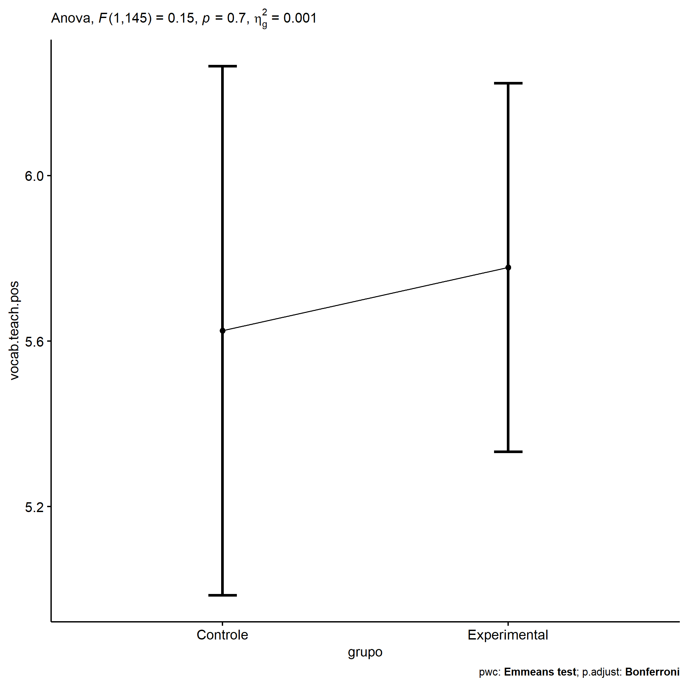<!-- -->

``` r
plots <- oneWayAncovaBoxPlots(
  wdat, "vocab.teach.pos", "grupo", aov, pwc, covar = "vocab.teach.pre",
  theme = "classic", color = color[["grupo"]],
  subtitle = which(aov$Effect == "grupo"))
```

``` r
if (length(unique(wdat[["grupo"]])) > 1)
  plots[["grupo"]] + ggplot2::ylab("Vocabulario Ensinado") + ggplot2::scale_x_discrete(labels=c('pre', 'pos'))
```

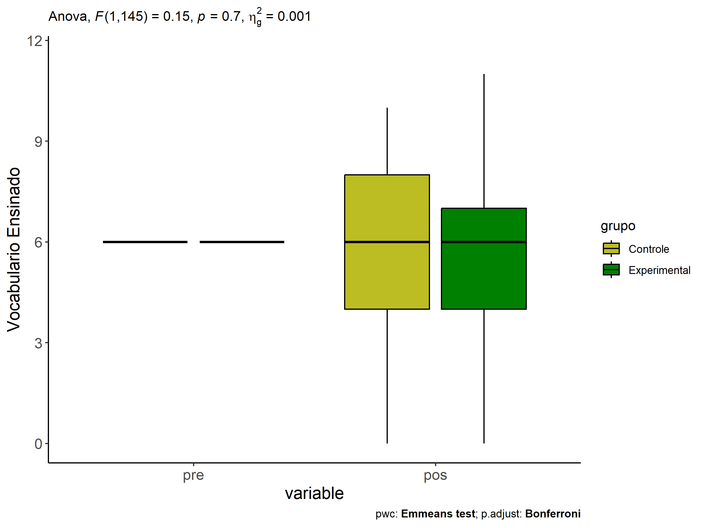<!-- -->

``` r
if (length(unique(wdat.long[["grupo"]])) > 1)
  plots <- oneWayAncovaBoxPlots(
    wdat.long, "vocab.teach", "grupo", aov, pwc.long, pre.post = "time",
    theme = "classic", color = color$prepost)
```

``` r
if (length(unique(wdat.long[["grupo"]])) > 1)
  plots[["grupo"]] + ggplot2::ylab("Vocabulario Ensinado")
```

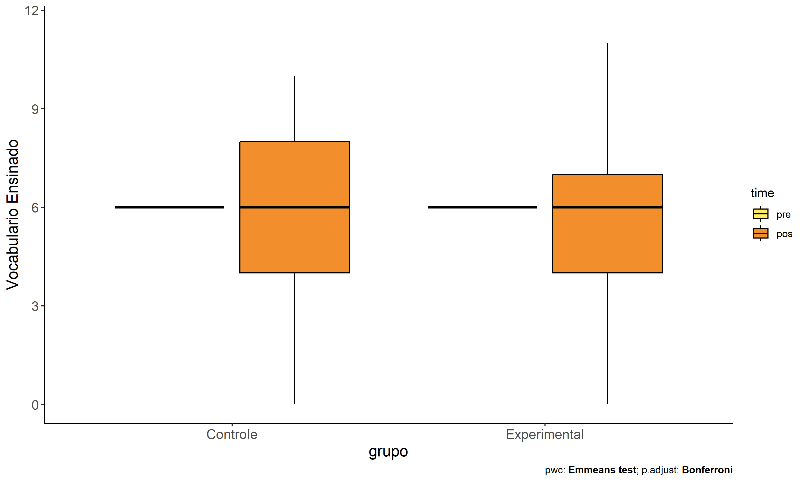<!-- -->

### Checking linearity assumption

``` r
ggscatter(wdat, x = "vocab.teach.pre", y = "vocab.teach.pos", size = 0.5,
          color = "grupo", add = "reg.line")+
  stat_regline_equation(
    aes(label =  paste(..eq.label.., ..rr.label.., sep = "~~~~"), color = grupo)
  )
```

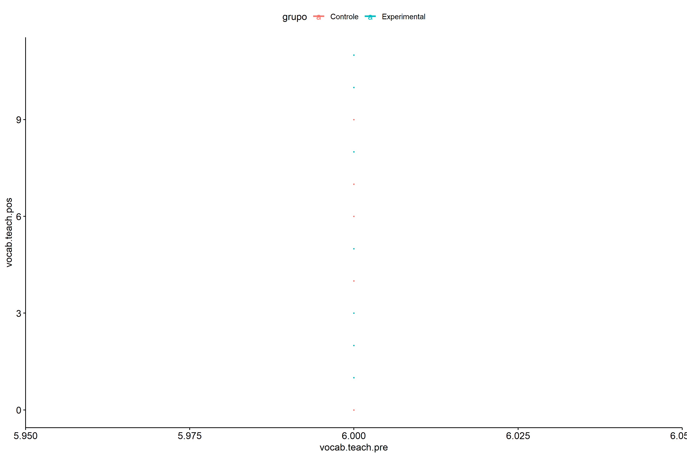<!-- -->

### Checking normality and homogeneity

``` r
res <- augment(lm(vocab.teach.pos ~ vocab.teach.pre + grupo, data = wdat))
```

``` r
shapiro_test(res$.resid)
```

    ## # A tibble: 1 × 3
    ##   variable   statistic p.value
    ##   <chr>          <dbl>   <dbl>
    ## 1 res$.resid     0.983  0.0593

``` r
levene_test(res, .resid ~ grupo)
```

    ## # A tibble: 1 × 4
    ##     df1   df2 statistic     p
    ##   <int> <int>     <dbl> <dbl>
    ## 1     1   145      1.18 0.279

# ANCOVA and Pairwise for two factors **grupo:Sexo**

## Without remove non-normal data

``` r
pdat = remove_group_data(dat[!is.na(dat[["grupo"]]) & !is.na(dat[["Sexo"]]),], "vocab.teach.pos", c("grupo","Sexo"))

pdat.long <- rbind(pdat[,c("id","grupo","Sexo")], pdat[,c("id","grupo","Sexo")])
pdat.long[["time"]] <- c(rep("pre", nrow(pdat)), rep("pos", nrow(pdat)))
pdat.long[["time"]] <- factor(pdat.long[["time"]], c("pre","pos"))
pdat.long[["vocab.teach"]] <- c(pdat[["vocab.teach.pre"]], pdat[["vocab.teach.pos"]])

aov = anova_test(pdat, vocab.teach.pos ~ vocab.teach.pre + grupo*Sexo)
laov[["grupo:Sexo"]] <- get_anova_table(aov)
```

``` r
pwcs <- list()
pwcs[["Sexo"]] <- emmeans_test(
  group_by(pdat, grupo), vocab.teach.pos ~ Sexo,
  covariate = vocab.teach.pre, p.adjust.method = "bonferroni")
pwcs[["grupo"]] <- emmeans_test(
  group_by(pdat, Sexo), vocab.teach.pos ~ grupo,
  covariate = vocab.teach.pre, p.adjust.method = "bonferroni")

pwc <- plyr::rbind.fill(pwcs[["grupo"]], pwcs[["Sexo"]])
pwc <- pwc[,c("grupo","Sexo", colnames(pwc)[!colnames(pwc) %in% c("grupo","Sexo")])]
```

``` r
pwc.long <- emmeans_test(dplyr::group_by_at(pdat.long, c("grupo","Sexo")),
                         vocab.teach ~ time,
                         p.adjust.method = "bonferroni")
lpwc[["grupo:Sexo"]] <- plyr::rbind.fill(pwc, pwc.long)
```

``` r
ds <- get.descriptives(pdat, "vocab.teach.pos", c("grupo","Sexo"), covar = "vocab.teach.pre")
ds <- merge(ds[ds$variable != "vocab.teach.pre",],
            ds[ds$variable == "vocab.teach.pre", !colnames(ds) %in% c("variable")],
            by = c("grupo","Sexo"), all.x = T, suffixes = c("", ".vocab.teach.pre"))
ds <- merge(get_emmeans(pwcs[["grupo"]]), ds, by = c("grupo","Sexo"), suffixes = c(".emms", ""))
ds <- ds[,c("grupo","Sexo","n","mean.vocab.teach.pre","se.vocab.teach.pre","mean","se","emmean","se.emms")]

colnames(ds) <- c("grupo","Sexo", "N", paste0(c("M","SE")," (pre)"),
                  paste0(c("M","SE"), " (unadj)"), paste0(c("M", "SE"), " (adj)"))

lemms[["grupo:Sexo"]] <- ds
```

## Computing ANCOVA and PairWise After removing non-normal data (OK)

``` r
wdat = pdat 

res = residuals(lm(vocab.teach.pos ~ vocab.teach.pre + grupo*Sexo, data = wdat))
non.normal = getNonNormal(res, wdat$id, plimit = 0.05)

wdat = wdat[!wdat$id %in% non.normal,]

wdat.long <- rbind(wdat[,c("id","grupo","Sexo")], wdat[,c("id","grupo","Sexo")])
wdat.long[["time"]] <- c(rep("pre", nrow(wdat)), rep("pos", nrow(wdat)))
wdat.long[["time"]] <- factor(wdat.long[["time"]], c("pre","pos"))
wdat.long[["vocab.teach"]] <- c(wdat[["vocab.teach.pre"]], wdat[["vocab.teach.pos"]])


ldat[["grupo:Sexo"]] = wdat

(non.normal)
```

    ## [1] "P863"

``` r
aov = anova_test(wdat, vocab.teach.pos ~ vocab.teach.pre + grupo*Sexo)
laov[["grupo:Sexo"]] <- merge(get_anova_table(aov), laov[["grupo:Sexo"]], by="Effect", suffixes = c("","'"))

(df = get_anova_table(aov))
```

    ## ANOVA Table (type II tests)
    ## 
    ##            Effect DFn DFd     F     p p<.05     ges
    ## 1 vocab.teach.pre   0 158    NA    NA  <NA>      NA
    ## 2           grupo   1 158 0.081 0.777       0.00051
    ## 3            Sexo   1 158 1.176 0.280       0.00700
    ## 4      grupo:Sexo   1 158 3.994 0.047     * 0.02500

| Effect          | DFn | DFd |     F |     p | p\<.05 |   ges |
|:----------------|----:|----:|------:|------:|:-------|------:|
| vocab.teach.pre |   0 | 158 |       |       |        |       |
| grupo           |   1 | 158 | 0.081 | 0.777 |        | 0.001 |
| Sexo            |   1 | 158 | 1.176 | 0.280 |        | 0.007 |
| grupo:Sexo      |   1 | 158 | 3.994 | 0.047 | \*     | 0.025 |

``` r
pwcs <- list()
pwcs[["Sexo"]] <- emmeans_test(
  group_by(wdat, grupo), vocab.teach.pos ~ Sexo,
  covariate = vocab.teach.pre, p.adjust.method = "bonferroni")
pwcs[["grupo"]] <- emmeans_test(
  group_by(wdat, Sexo), vocab.teach.pos ~ grupo,
  covariate = vocab.teach.pre, p.adjust.method = "bonferroni")

pwc <- plyr::rbind.fill(pwcs[["grupo"]], pwcs[["Sexo"]])
pwc <- pwc[,c("grupo","Sexo", colnames(pwc)[!colnames(pwc) %in% c("grupo","Sexo")])]
```

| grupo        | Sexo | term                   | .y.             | group1   | group2       |  df | statistic |     p | p.adj | p.adj.signif |
|:-------------|:-----|:-----------------------|:----------------|:---------|:-------------|----:|----------:|------:|------:|:-------------|
|              | F    | vocab.teach.pre\*grupo | vocab.teach.pos | Controle | Experimental | 158 |    -1.089 | 0.278 | 0.278 | ns           |
|              | M    | vocab.teach.pre\*grupo | vocab.teach.pos | Controle | Experimental | 158 |     1.700 | 0.091 | 0.091 | ns           |
| Controle     |      | vocab.teach.pre\*Sexo  | vocab.teach.pos | F        | M            | 158 |    -0.863 | 0.389 | 0.389 | ns           |
| Experimental |      | vocab.teach.pre\*Sexo  | vocab.teach.pos | F        | M            | 158 |     2.104 | 0.037 | 0.037 | \*           |

``` r
pwc.long <- emmeans_test(dplyr::group_by_at(wdat.long, c("grupo","Sexo")),
                         vocab.teach ~ time,
                         p.adjust.method = "bonferroni")
lpwc[["grupo:Sexo"]] <- merge(plyr::rbind.fill(pwc, pwc.long), lpwc[["grupo:Sexo"]], by=c("grupo","Sexo","term",".y.","group1","group2"), suffixes = c("","'"))
```

| grupo        | Sexo | term | .y.         | group1 | group2 |  df | statistic |     p | p.adj | p.adj.signif |
|:-------------|:-----|:-----|:------------|:-------|:-------|----:|----------:|------:|------:|:-------------|
| Controle     | F    | time | vocab.teach | pre    | pos    | 316 |     0.795 | 0.427 | 0.427 | ns           |
| Controle     | M    | time | vocab.teach | pre    | pos    | 316 |    -0.450 | 0.653 | 0.653 | ns           |
| Experimental | F    | time | vocab.teach | pre    | pos    | 316 |    -0.751 | 0.453 | 0.453 | ns           |
| Experimental | M    | time | vocab.teach | pre    | pos    | 316 |     2.111 | 0.036 | 0.036 | \*           |

``` r
ds <- get.descriptives(wdat, "vocab.teach.pos", c("grupo","Sexo"), covar = "vocab.teach.pre")
ds <- merge(ds[ds$variable != "vocab.teach.pre",],
            ds[ds$variable == "vocab.teach.pre", !colnames(ds) %in% c("variable")],
            by = c("grupo","Sexo"), all.x = T, suffixes = c("", ".vocab.teach.pre"))
ds <- merge(get_emmeans(pwcs[["grupo"]]), ds, by = c("grupo","Sexo"), suffixes = c(".emms", ""))
ds <- ds[,c("grupo","Sexo","n","mean.vocab.teach.pre","se.vocab.teach.pre","mean","se","emmean","se.emms")]

colnames(ds) <- c("grupo","Sexo", "N", paste0(c("M","SE")," (pre)"),
                  paste0(c("M","SE"), " (unadj)"), paste0(c("M", "SE"), " (adj)"))

lemms[["grupo:Sexo"]] <- merge(ds, lemms[["grupo:Sexo"]], by=c("grupo","Sexo"), suffixes = c("","'"))
```

| grupo        | Sexo |   N | M (pre) | SE (pre) | M (unadj) | SE (unadj) | M (adj) | SE (adj) |
|:-------------|:-----|----:|--------:|---------:|----------:|-----------:|--------:|---------:|
| Controle     | F    |  36 |       6 |        0 |     5.722 |      0.366 |   5.722 |    0.350 |
| Controle     | M    |  28 |       6 |        0 |     6.179 |      0.385 |   6.179 |    0.396 |
| Experimental | F    |  58 |       6 |        0 |     6.207 |      0.287 |   6.207 |    0.275 |
| Experimental | M    |  40 |       6 |        0 |     5.300 |      0.302 |   5.300 |    0.332 |

### Plots for ancova

``` r
plots <- twoWayAncovaPlots(
  wdat, "vocab.teach.pos", c("grupo","Sexo"), aov, pwcs, addParam = c("mean_se"),
  font.label.size=10, step.increase=0.05, p.label="p.adj",
  subtitle = which(aov$Effect == "grupo:Sexo"))
```

``` r
if (!is.null(plots[["grupo"]]))
  plots[["grupo"]] + ggplot2::scale_color_manual(values = color[["Sexo"]])
```

    ## Scale for colour is already present.
    ## Adding another scale for colour, which will replace the existing scale.

<!-- -->

``` r
if (!is.null(plots[["Sexo"]]))
  plots[["Sexo"]] + ggplot2::scale_color_manual(values = color[["grupo"]])
```

    ## Scale for colour is already present.
    ## Adding another scale for colour, which will replace the existing scale.

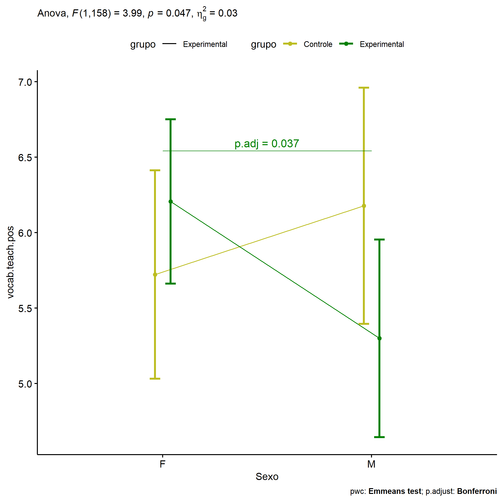<!-- -->

``` r
plots <- twoWayAncovaBoxPlots(
  wdat, "vocab.teach.pos", c("grupo","Sexo"), aov, pwcs, covar = "vocab.teach.pre",
  theme = "classic", color = color[["grupo:Sexo"]],
  subtitle = which(aov$Effect == "grupo:Sexo"))
```

``` r
plots[["grupo:Sexo"]] + ggplot2::ylab("Vocabulario Ensinado") + ggplot2::scale_x_discrete(labels=c('pre', 'pos'))
```

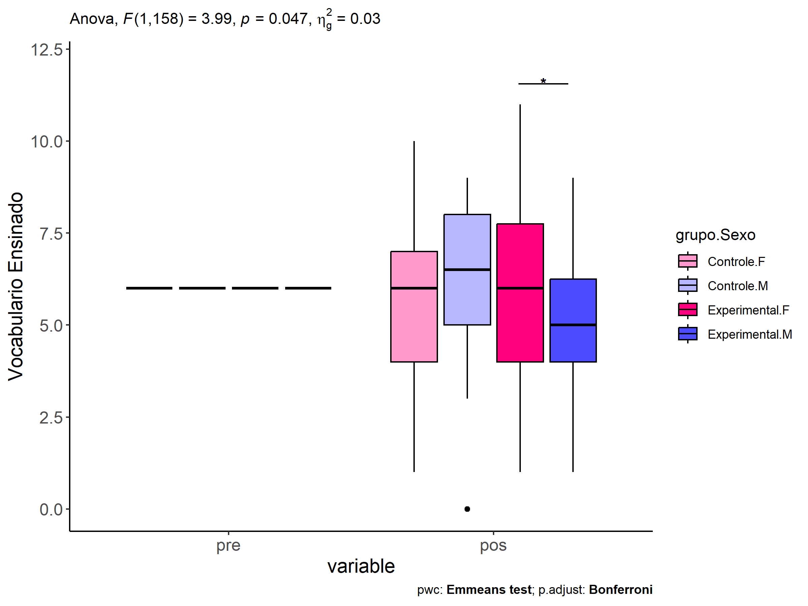<!-- -->

``` r
plots <- twoWayAncovaBoxPlots(
  wdat.long, "vocab.teach", c("grupo","Sexo"), aov, pwc.long, pre.post = "time",
  theme = "classic", color = color$prepost)
```

``` r
plots[["grupo:Sexo"]] + ggplot2::ylab("Vocabulario Ensinado")
```

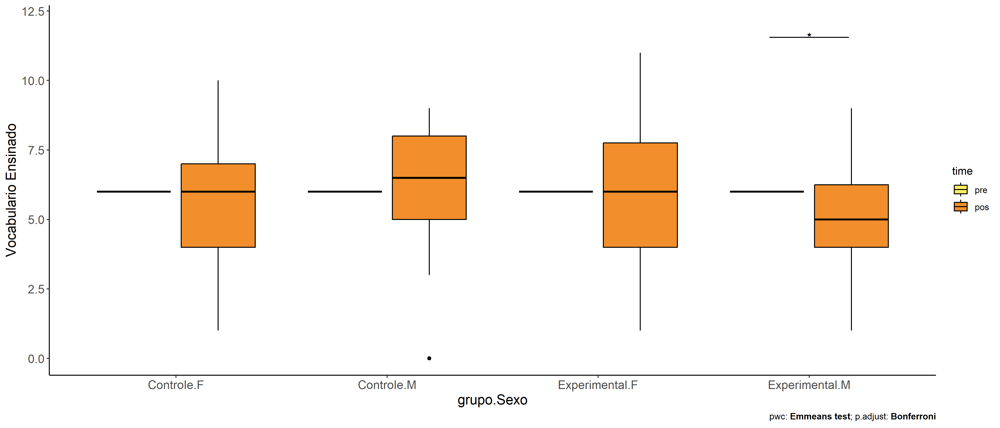<!-- -->

### Checking linearity assumption

``` r
ggscatter(wdat, x = "vocab.teach.pre", y = "vocab.teach.pos", size = 0.5,
          facet.by = c("grupo","Sexo"), add = "reg.line")+
  stat_regline_equation(
    aes(label =  paste(..eq.label.., ..rr.label.., sep = "~~~~"))
  )
```

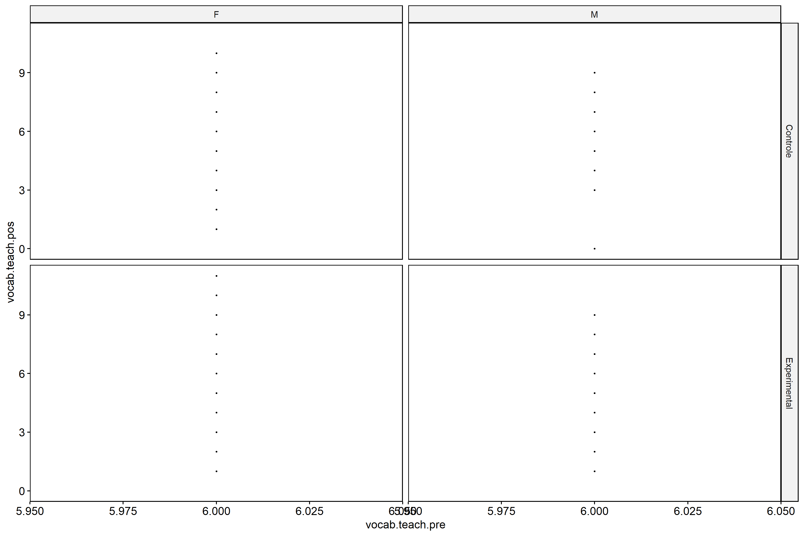<!-- -->

### Checking normality and homogeneity

``` r
res <- augment(lm(vocab.teach.pos ~ vocab.teach.pre + grupo*Sexo, data = wdat))
```

``` r
shapiro_test(res$.resid)
```

    ## # A tibble: 1 × 3
    ##   variable   statistic p.value
    ##   <chr>          <dbl>   <dbl>
    ## 1 res$.resid     0.983  0.0451

``` r
levene_test(res, .resid ~ grupo*Sexo)
```

    ## # A tibble: 1 × 4
    ##     df1   df2 statistic     p
    ##   <int> <int>     <dbl> <dbl>
    ## 1     3   158     0.432 0.730

# ANCOVA and Pairwise for two factors **grupo:Zona**

## Without remove non-normal data

``` r
pdat = remove_group_data(dat[!is.na(dat[["grupo"]]) & !is.na(dat[["Zona"]]),], "vocab.teach.pos", c("grupo","Zona"))

pdat.long <- rbind(pdat[,c("id","grupo","Zona")], pdat[,c("id","grupo","Zona")])
pdat.long[["time"]] <- c(rep("pre", nrow(pdat)), rep("pos", nrow(pdat)))
pdat.long[["time"]] <- factor(pdat.long[["time"]], c("pre","pos"))
pdat.long[["vocab.teach"]] <- c(pdat[["vocab.teach.pre"]], pdat[["vocab.teach.pos"]])

aov = anova_test(pdat, vocab.teach.pos ~ vocab.teach.pre + grupo*Zona)
laov[["grupo:Zona"]] <- get_anova_table(aov)
```

``` r
pwcs <- list()
pwcs[["Zona"]] <- emmeans_test(
  group_by(pdat, grupo), vocab.teach.pos ~ Zona,
  covariate = vocab.teach.pre, p.adjust.method = "bonferroni")
pwcs[["grupo"]] <- emmeans_test(
  group_by(pdat, Zona), vocab.teach.pos ~ grupo,
  covariate = vocab.teach.pre, p.adjust.method = "bonferroni")

pwc <- plyr::rbind.fill(pwcs[["grupo"]], pwcs[["Zona"]])
pwc <- pwc[,c("grupo","Zona", colnames(pwc)[!colnames(pwc) %in% c("grupo","Zona")])]
```

``` r
pwc.long <- emmeans_test(dplyr::group_by_at(pdat.long, c("grupo","Zona")),
                         vocab.teach ~ time,
                         p.adjust.method = "bonferroni")
lpwc[["grupo:Zona"]] <- plyr::rbind.fill(pwc, pwc.long)
```

``` r
ds <- get.descriptives(pdat, "vocab.teach.pos", c("grupo","Zona"), covar = "vocab.teach.pre")
ds <- merge(ds[ds$variable != "vocab.teach.pre",],
            ds[ds$variable == "vocab.teach.pre", !colnames(ds) %in% c("variable")],
            by = c("grupo","Zona"), all.x = T, suffixes = c("", ".vocab.teach.pre"))
ds <- merge(get_emmeans(pwcs[["grupo"]]), ds, by = c("grupo","Zona"), suffixes = c(".emms", ""))
ds <- ds[,c("grupo","Zona","n","mean.vocab.teach.pre","se.vocab.teach.pre","mean","se","emmean","se.emms")]

colnames(ds) <- c("grupo","Zona", "N", paste0(c("M","SE")," (pre)"),
                  paste0(c("M","SE"), " (unadj)"), paste0(c("M", "SE"), " (adj)"))

lemms[["grupo:Zona"]] <- ds
```

## Computing ANCOVA and PairWise After removing non-normal data (OK)

``` r
wdat = pdat 

res = residuals(lm(vocab.teach.pos ~ vocab.teach.pre + grupo*Zona, data = wdat))
non.normal = getNonNormal(res, wdat$id, plimit = 0.05)

wdat = wdat[!wdat$id %in% non.normal,]

wdat.long <- rbind(wdat[,c("id","grupo","Zona")], wdat[,c("id","grupo","Zona")])
wdat.long[["time"]] <- c(rep("pre", nrow(wdat)), rep("pos", nrow(wdat)))
wdat.long[["time"]] <- factor(wdat.long[["time"]], c("pre","pos"))
wdat.long[["vocab.teach"]] <- c(wdat[["vocab.teach.pre"]], wdat[["vocab.teach.pos"]])


ldat[["grupo:Zona"]] = wdat

(non.normal)
```

    ## NULL

``` r
aov = anova_test(wdat, vocab.teach.pos ~ vocab.teach.pre + grupo*Zona)
laov[["grupo:Zona"]] <- merge(get_anova_table(aov), laov[["grupo:Zona"]], by="Effect", suffixes = c("","'"))

(df = get_anova_table(aov))
```

    ## ANOVA Table (type II tests)
    ## 
    ##            Effect DFn DFd     F     p p<.05      ges
    ## 1 vocab.teach.pre   0 100    NA    NA  <NA>       NA
    ## 2           grupo   1 100 0.295 0.588       0.003000
    ## 3            Zona   1 100 0.465 0.497       0.005000
    ## 4      grupo:Zona   1 100 0.035 0.851       0.000355

| Effect          | DFn | DFd |     F |     p | p\<.05 |   ges |
|:----------------|----:|----:|------:|------:|:-------|------:|
| vocab.teach.pre |   0 | 100 |       |       |        |       |
| grupo           |   1 | 100 | 0.295 | 0.588 |        | 0.003 |
| Zona            |   1 | 100 | 0.465 | 0.497 |        | 0.005 |
| grupo:Zona      |   1 | 100 | 0.035 | 0.851 |        | 0.000 |

``` r
pwcs <- list()
pwcs[["Zona"]] <- emmeans_test(
  group_by(wdat, grupo), vocab.teach.pos ~ Zona,
  covariate = vocab.teach.pre, p.adjust.method = "bonferroni")
pwcs[["grupo"]] <- emmeans_test(
  group_by(wdat, Zona), vocab.teach.pos ~ grupo,
  covariate = vocab.teach.pre, p.adjust.method = "bonferroni")

pwc <- plyr::rbind.fill(pwcs[["grupo"]], pwcs[["Zona"]])
pwc <- pwc[,c("grupo","Zona", colnames(pwc)[!colnames(pwc) %in% c("grupo","Zona")])]
```

| grupo        | Zona   | term                   | .y.             | group1   | group2       |  df | statistic |     p | p.adj | p.adj.signif |
|:-------------|:-------|:-----------------------|:----------------|:---------|:-------------|----:|----------:|------:|------:|:-------------|
|              | Rural  | vocab.teach.pre\*grupo | vocab.teach.pos | Controle | Experimental | 100 |     0.357 | 0.722 | 0.722 | ns           |
|              | Urbana | vocab.teach.pre\*grupo | vocab.teach.pos | Controle | Experimental | 100 |     0.451 | 0.653 | 0.653 | ns           |
| Controle     |        | vocab.teach.pre\*Zona  | vocab.teach.pos | Rural    | Urbana       | 100 |    -0.566 | 0.573 | 0.573 | ns           |
| Experimental |        | vocab.teach.pre\*Zona  | vocab.teach.pos | Rural    | Urbana       | 100 |    -0.425 | 0.672 | 0.672 | ns           |

``` r
pwc.long <- emmeans_test(dplyr::group_by_at(wdat.long, c("grupo","Zona")),
                         vocab.teach ~ time,
                         p.adjust.method = "bonferroni")
lpwc[["grupo:Zona"]] <- merge(plyr::rbind.fill(pwc, pwc.long), lpwc[["grupo:Zona"]], by=c("grupo","Zona","term",".y.","group1","group2"), suffixes = c("","'"))
```

| grupo        | Zona   | term | .y.         | group1 | group2 |  df | statistic |     p | p.adj | p.adj.signif |
|:-------------|:-------|:-----|:------------|:-------|:-------|----:|----------:|------:|------:|:-------------|
| Controle     | Rural  | time | vocab.teach | pre    | pos    | 200 |    -0.083 | 0.934 | 0.934 | ns           |
| Controle     | Urbana | time | vocab.teach | pre    | pos    | 200 |    -0.704 | 0.482 | 0.482 | ns           |
| Experimental | Rural  | time | vocab.teach | pre    | pos    | 200 |     0.443 | 0.658 | 0.658 | ns           |
| Experimental | Urbana | time | vocab.teach | pre    | pos    | 200 |    -0.204 | 0.839 | 0.839 | ns           |

``` r
ds <- get.descriptives(wdat, "vocab.teach.pos", c("grupo","Zona"), covar = "vocab.teach.pre")
ds <- merge(ds[ds$variable != "vocab.teach.pre",],
            ds[ds$variable == "vocab.teach.pre", !colnames(ds) %in% c("variable")],
            by = c("grupo","Zona"), all.x = T, suffixes = c("", ".vocab.teach.pre"))
ds <- merge(get_emmeans(pwcs[["grupo"]]), ds, by = c("grupo","Zona"), suffixes = c(".emms", ""))
ds <- ds[,c("grupo","Zona","n","mean.vocab.teach.pre","se.vocab.teach.pre","mean","se","emmean","se.emms")]

colnames(ds) <- c("grupo","Zona", "N", paste0(c("M","SE")," (pre)"),
                  paste0(c("M","SE"), " (unadj)"), paste0(c("M", "SE"), " (adj)"))

lemms[["grupo:Zona"]] <- merge(ds, lemms[["grupo:Zona"]], by=c("grupo","Zona"), suffixes = c("","'"))
```

| grupo        | Zona   |   N | M (pre) | SE (pre) | M (unadj) | SE (unadj) | M (adj) | SE (adj) |
|:-------------|:-------|----:|--------:|---------:|----------:|-----------:|--------:|---------:|
| Controle     | Rural  |  32 |       6 |        0 |     6.031 |      0.337 |   6.031 |    0.379 |
| Controle     | Urbana |  11 |       6 |        0 |     6.455 |      0.790 |   6.455 |    0.646 |
| Experimental | Rural  |  40 |       6 |        0 |     5.850 |      0.370 |   5.850 |    0.339 |
| Experimental | Urbana |  21 |       6 |        0 |     6.095 |      0.390 |   6.095 |    0.467 |

### Plots for ancova

``` r
plots <- twoWayAncovaPlots(
  wdat, "vocab.teach.pos", c("grupo","Zona"), aov, pwcs, addParam = c("mean_se"),
  font.label.size=10, step.increase=0.05, p.label="p.adj",
  subtitle = which(aov$Effect == "grupo:Zona"))
```

``` r
if (!is.null(plots[["grupo"]]))
  plots[["grupo"]] + ggplot2::scale_color_manual(values = color[["Zona"]])
```

    ## Scale for colour is already present.
    ## Adding another scale for colour, which will replace the existing scale.

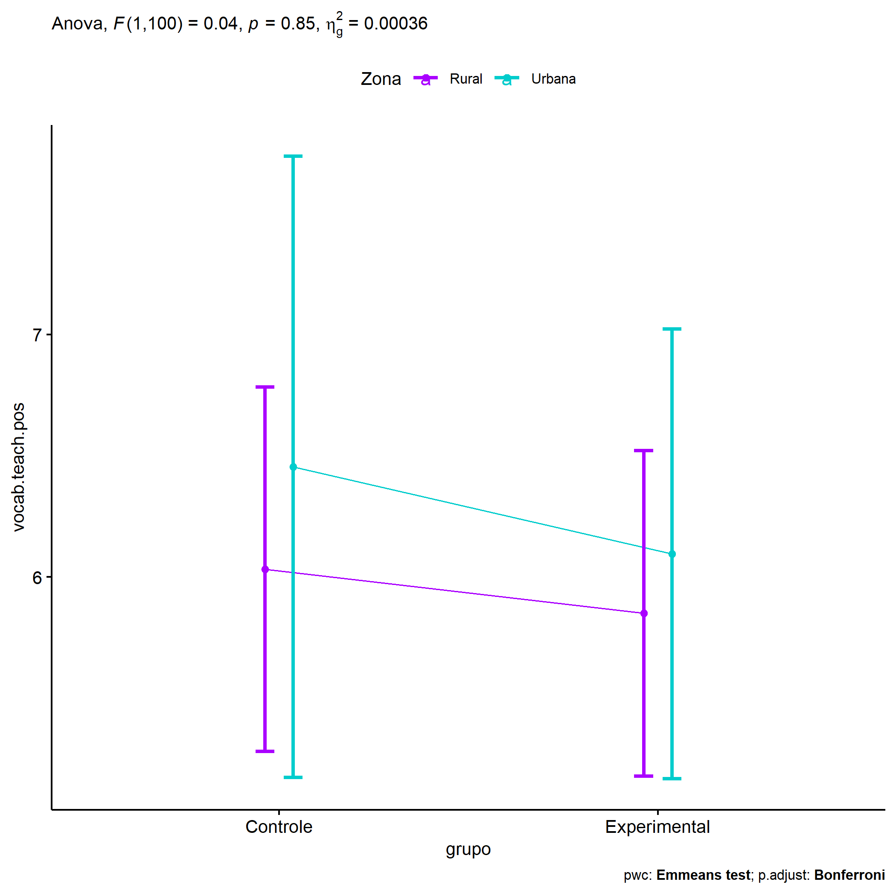<!-- -->

``` r
if (!is.null(plots[["Zona"]]))
  plots[["Zona"]] + ggplot2::scale_color_manual(values = color[["grupo"]])
```

    ## Scale for colour is already present.
    ## Adding another scale for colour, which will replace the existing scale.

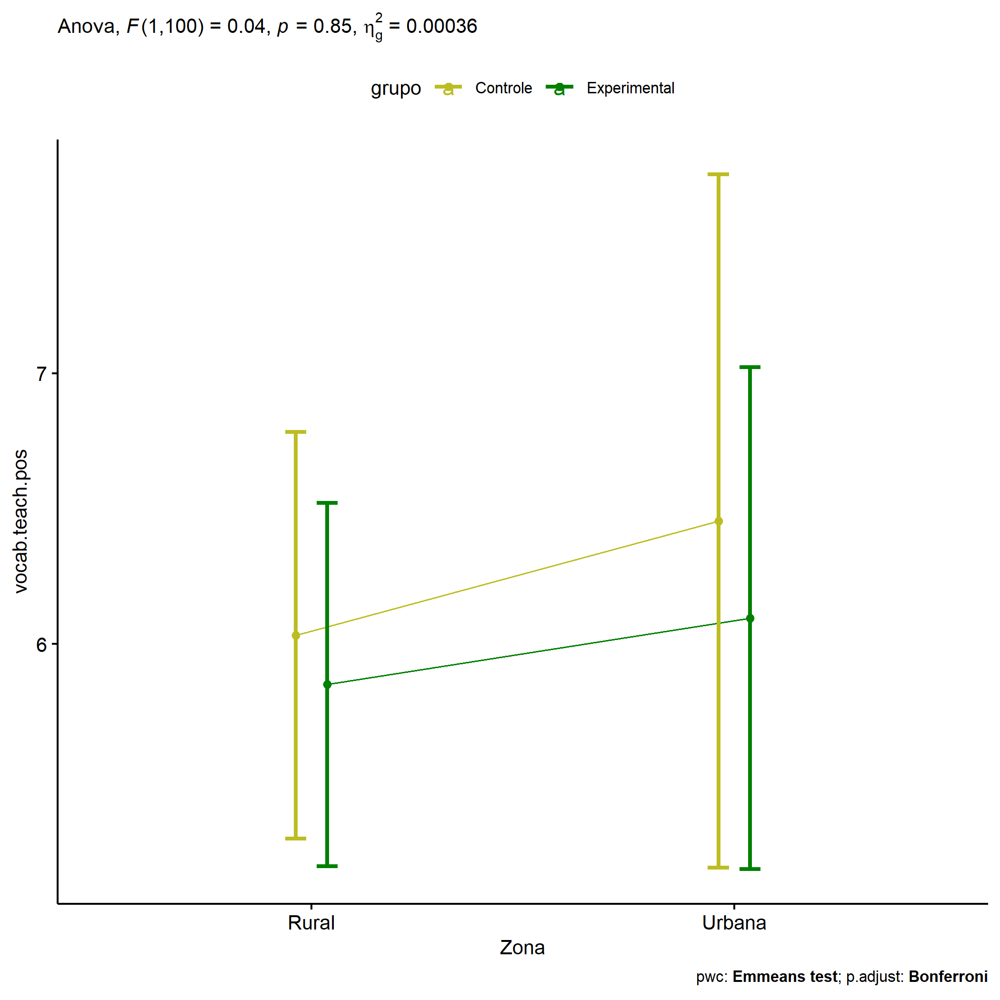<!-- -->

``` r
plots <- twoWayAncovaBoxPlots(
  wdat, "vocab.teach.pos", c("grupo","Zona"), aov, pwcs, covar = "vocab.teach.pre",
  theme = "classic", color = color[["grupo:Zona"]],
  subtitle = which(aov$Effect == "grupo:Zona"))
```

``` r
plots[["grupo:Zona"]] + ggplot2::ylab("Vocabulario Ensinado") + ggplot2::scale_x_discrete(labels=c('pre', 'pos'))
```

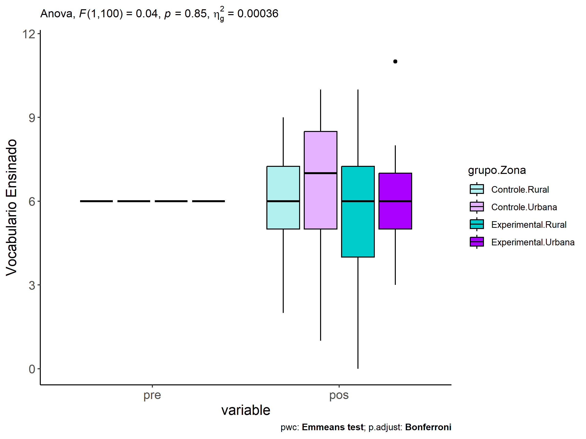<!-- -->

``` r
plots <- twoWayAncovaBoxPlots(
  wdat.long, "vocab.teach", c("grupo","Zona"), aov, pwc.long, pre.post = "time",
  theme = "classic", color = color$prepost)
```

``` r
plots[["grupo:Zona"]] + ggplot2::ylab("Vocabulario Ensinado")
```

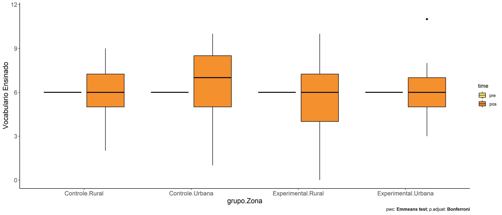<!-- -->

### Checking linearity assumption

``` r
ggscatter(wdat, x = "vocab.teach.pre", y = "vocab.teach.pos", size = 0.5,
          facet.by = c("grupo","Zona"), add = "reg.line")+
  stat_regline_equation(
    aes(label =  paste(..eq.label.., ..rr.label.., sep = "~~~~"))
  )
```

<!-- -->

### Checking normality and homogeneity

``` r
res <- augment(lm(vocab.teach.pos ~ vocab.teach.pre + grupo*Zona, data = wdat))
```

``` r
shapiro_test(res$.resid)
```

    ## # A tibble: 1 × 3
    ##   variable   statistic p.value
    ##   <chr>          <dbl>   <dbl>
    ## 1 res$.resid     0.981   0.136

``` r
levene_test(res, .resid ~ grupo*Zona)
```

    ## # A tibble: 1 × 4
    ##     df1   df2 statistic     p
    ##   <int> <int>     <dbl> <dbl>
    ## 1     3   100     0.767 0.515

# ANCOVA and Pairwise for two factors **grupo:Cor.Raca**

## Without remove non-normal data

``` r
pdat = remove_group_data(dat[!is.na(dat[["grupo"]]) & !is.na(dat[["Cor.Raca"]]),], "vocab.teach.pos", c("grupo","Cor.Raca"))

pdat.long <- rbind(pdat[,c("id","grupo","Cor.Raca")], pdat[,c("id","grupo","Cor.Raca")])
pdat.long[["time"]] <- c(rep("pre", nrow(pdat)), rep("pos", nrow(pdat)))
pdat.long[["time"]] <- factor(pdat.long[["time"]], c("pre","pos"))
pdat.long[["vocab.teach"]] <- c(pdat[["vocab.teach.pre"]], pdat[["vocab.teach.pos"]])

aov = anova_test(pdat, vocab.teach.pos ~ vocab.teach.pre + grupo*Cor.Raca)
laov[["grupo:Cor.Raca"]] <- get_anova_table(aov)
```

``` r
pwcs <- list()
pwcs[["Cor.Raca"]] <- emmeans_test(
  group_by(pdat, grupo), vocab.teach.pos ~ Cor.Raca,
  covariate = vocab.teach.pre, p.adjust.method = "bonferroni")
pwcs[["grupo"]] <- emmeans_test(
  group_by(pdat, Cor.Raca), vocab.teach.pos ~ grupo,
  covariate = vocab.teach.pre, p.adjust.method = "bonferroni")

pwc <- plyr::rbind.fill(pwcs[["grupo"]], pwcs[["Cor.Raca"]])
pwc <- pwc[,c("grupo","Cor.Raca", colnames(pwc)[!colnames(pwc) %in% c("grupo","Cor.Raca")])]
```

``` r
pwc.long <- emmeans_test(dplyr::group_by_at(pdat.long, c("grupo","Cor.Raca")),
                         vocab.teach ~ time,
                         p.adjust.method = "bonferroni")
lpwc[["grupo:Cor.Raca"]] <- plyr::rbind.fill(pwc, pwc.long)
```

``` r
ds <- get.descriptives(pdat, "vocab.teach.pos", c("grupo","Cor.Raca"), covar = "vocab.teach.pre")
ds <- merge(ds[ds$variable != "vocab.teach.pre",],
            ds[ds$variable == "vocab.teach.pre", !colnames(ds) %in% c("variable")],
            by = c("grupo","Cor.Raca"), all.x = T, suffixes = c("", ".vocab.teach.pre"))
ds <- merge(get_emmeans(pwcs[["grupo"]]), ds, by = c("grupo","Cor.Raca"), suffixes = c(".emms", ""))
ds <- ds[,c("grupo","Cor.Raca","n","mean.vocab.teach.pre","se.vocab.teach.pre","mean","se","emmean","se.emms")]

colnames(ds) <- c("grupo","Cor.Raca", "N", paste0(c("M","SE")," (pre)"),
                  paste0(c("M","SE"), " (unadj)"), paste0(c("M", "SE"), " (adj)"))

lemms[["grupo:Cor.Raca"]] <- ds
```

## Computing ANCOVA and PairWise After removing non-normal data (OK)

``` r
wdat = pdat 

res = residuals(lm(vocab.teach.pos ~ vocab.teach.pre + grupo*Cor.Raca, data = wdat))
non.normal = getNonNormal(res, wdat$id, plimit = 0.05)

wdat = wdat[!wdat$id %in% non.normal,]

wdat.long <- rbind(wdat[,c("id","grupo","Cor.Raca")], wdat[,c("id","grupo","Cor.Raca")])
wdat.long[["time"]] <- c(rep("pre", nrow(wdat)), rep("pos", nrow(wdat)))
wdat.long[["time"]] <- factor(wdat.long[["time"]], c("pre","pos"))
wdat.long[["vocab.teach"]] <- c(wdat[["vocab.teach.pre"]], wdat[["vocab.teach.pos"]])


ldat[["grupo:Cor.Raca"]] = wdat

(non.normal)
```

    ## NULL

``` r
aov = anova_test(wdat, vocab.teach.pos ~ vocab.teach.pre + grupo*Cor.Raca)
laov[["grupo:Cor.Raca"]] <- merge(get_anova_table(aov), laov[["grupo:Cor.Raca"]], by="Effect", suffixes = c("","'"))

(df = get_anova_table(aov))
```

    ## ANOVA Table (type II tests)
    ## 
    ##            Effect DFn DFd     F     p p<.05   ges
    ## 1 vocab.teach.pre   0  58    NA    NA  <NA>    NA
    ## 2           grupo   1  58 2.679 0.107       0.044
    ## 3        Cor.Raca   1  58 3.082 0.084       0.050
    ## 4  grupo:Cor.Raca   1  58 1.180 0.282       0.020

| Effect          | DFn | DFd |     F |     p | p\<.05 |   ges |
|:----------------|----:|----:|------:|------:|:-------|------:|
| vocab.teach.pre |   0 |  58 |       |       |        |       |
| grupo           |   1 |  58 | 2.679 | 0.107 |        | 0.044 |
| Cor.Raca        |   1 |  58 | 3.082 | 0.084 |        | 0.050 |
| grupo:Cor.Raca  |   1 |  58 | 1.180 | 0.282 |        | 0.020 |

``` r
pwcs <- list()
pwcs[["Cor.Raca"]] <- emmeans_test(
  group_by(wdat, grupo), vocab.teach.pos ~ Cor.Raca,
  covariate = vocab.teach.pre, p.adjust.method = "bonferroni")
pwcs[["grupo"]] <- emmeans_test(
  group_by(wdat, Cor.Raca), vocab.teach.pos ~ grupo,
  covariate = vocab.teach.pre, p.adjust.method = "bonferroni")

pwc <- plyr::rbind.fill(pwcs[["grupo"]], pwcs[["Cor.Raca"]])
pwc <- pwc[,c("grupo","Cor.Raca", colnames(pwc)[!colnames(pwc) %in% c("grupo","Cor.Raca")])]
```

| grupo        | Cor.Raca | term                      | .y.             | group1   | group2       |  df | statistic |     p | p.adj | p.adj.signif |
|:-------------|:---------|:--------------------------|:----------------|:---------|:-------------|----:|----------:|------:|------:|:-------------|
|              | Branca   | vocab.teach.pre\*grupo    | vocab.teach.pos | Controle | Experimental |  58 |    -0.052 | 0.959 | 0.959 | ns           |
|              | Parda    | vocab.teach.pre\*grupo    | vocab.teach.pos | Controle | Experimental |  58 |     1.964 | 0.054 | 0.054 | ns           |
| Controle     |          | vocab.teach.pre\*Cor.Raca | vocab.teach.pos | Branca   | Parda        |  58 |     0.284 | 0.777 | 0.777 | ns           |
| Experimental |          | vocab.teach.pre\*Cor.Raca | vocab.teach.pos | Branca   | Parda        |  58 |     2.045 | 0.045 | 0.045 | \*           |

``` r
pwc.long <- emmeans_test(dplyr::group_by_at(wdat.long, c("grupo","Cor.Raca")),
                         vocab.teach ~ time,
                         p.adjust.method = "bonferroni")
lpwc[["grupo:Cor.Raca"]] <- merge(plyr::rbind.fill(pwc, pwc.long), lpwc[["grupo:Cor.Raca"]], by=c("grupo","Cor.Raca","term",".y.","group1","group2"), suffixes = c("","'"))
```

| grupo        | Cor.Raca | term | .y.         | group1 | group2 |  df | statistic |     p | p.adj | p.adj.signif |
|:-------------|:---------|:-----|:------------|:-------|:-------|----:|----------:|------:|------:|:-------------|
| Controle     | Branca   | time | vocab.teach | pre    | pos    | 116 |    -1.101 | 0.273 | 0.273 | ns           |
| Controle     | Parda    | time | vocab.teach | pre    | pos    | 116 |    -1.302 | 0.195 | 0.195 | ns           |
| Experimental | Branca   | time | vocab.teach | pre    | pos    | 116 |    -1.463 | 0.146 | 0.146 | ns           |
| Experimental | Parda    | time | vocab.teach | pre    | pos    | 116 |     1.486 | 0.140 | 0.140 | ns           |

``` r
ds <- get.descriptives(wdat, "vocab.teach.pos", c("grupo","Cor.Raca"), covar = "vocab.teach.pre")
ds <- merge(ds[ds$variable != "vocab.teach.pre",],
            ds[ds$variable == "vocab.teach.pre", !colnames(ds) %in% c("variable")],
            by = c("grupo","Cor.Raca"), all.x = T, suffixes = c("", ".vocab.teach.pre"))
ds <- merge(get_emmeans(pwcs[["grupo"]]), ds, by = c("grupo","Cor.Raca"), suffixes = c(".emms", ""))
ds <- ds[,c("grupo","Cor.Raca","n","mean.vocab.teach.pre","se.vocab.teach.pre","mean","se","emmean","se.emms")]

colnames(ds) <- c("grupo","Cor.Raca", "N", paste0(c("M","SE")," (pre)"),
                  paste0(c("M","SE"), " (unadj)"), paste0(c("M", "SE"), " (adj)"))

lemms[["grupo:Cor.Raca"]] <- merge(ds, lemms[["grupo:Cor.Raca"]], by=c("grupo","Cor.Raca"), suffixes = c("","'"))
```

| grupo        | Cor.Raca |   N | M (pre) | SE (pre) | M (unadj) | SE (unadj) | M (adj) | SE (adj) |
|:-------------|:---------|----:|--------:|---------:|----------:|-----------:|--------:|---------:|
| Controle     | Branca   |   7 |       6 |        0 |     6.857 |      0.670 |   6.857 |    0.779 |
| Controle     | Parda    |  20 |       6 |        0 |     6.600 |      0.419 |   6.600 |    0.461 |
| Experimental | Branca   |  11 |       6 |        0 |     6.909 |      0.513 |   6.909 |    0.621 |
| Experimental | Parda    |  24 |       6 |        0 |     5.375 |      0.488 |   5.375 |    0.421 |

### Plots for ancova

``` r
plots <- twoWayAncovaPlots(
  wdat, "vocab.teach.pos", c("grupo","Cor.Raca"), aov, pwcs, addParam = c("mean_se"),
  font.label.size=10, step.increase=0.05, p.label="p.adj",
  subtitle = which(aov$Effect == "grupo:Cor.Raca"))
```

``` r
if (!is.null(plots[["grupo"]]))
  plots[["grupo"]] + ggplot2::scale_color_manual(values = color[["Cor.Raca"]])
```

    ## Scale for colour is already present.
    ## Adding another scale for colour, which will replace the existing scale.

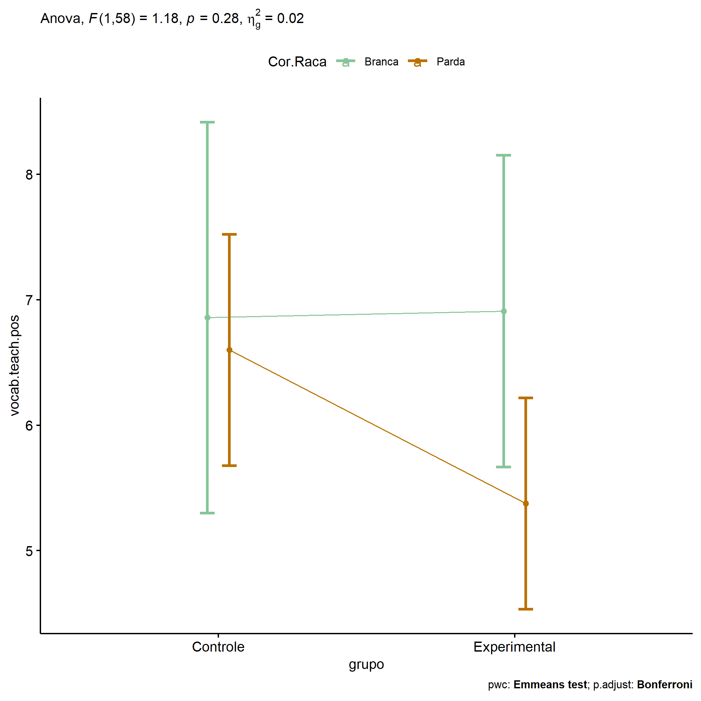<!-- -->

``` r
if (!is.null(plots[["Cor.Raca"]]))
  plots[["Cor.Raca"]] + ggplot2::scale_color_manual(values = color[["grupo"]])
```

    ## Scale for colour is already present.
    ## Adding another scale for colour, which will replace the existing scale.

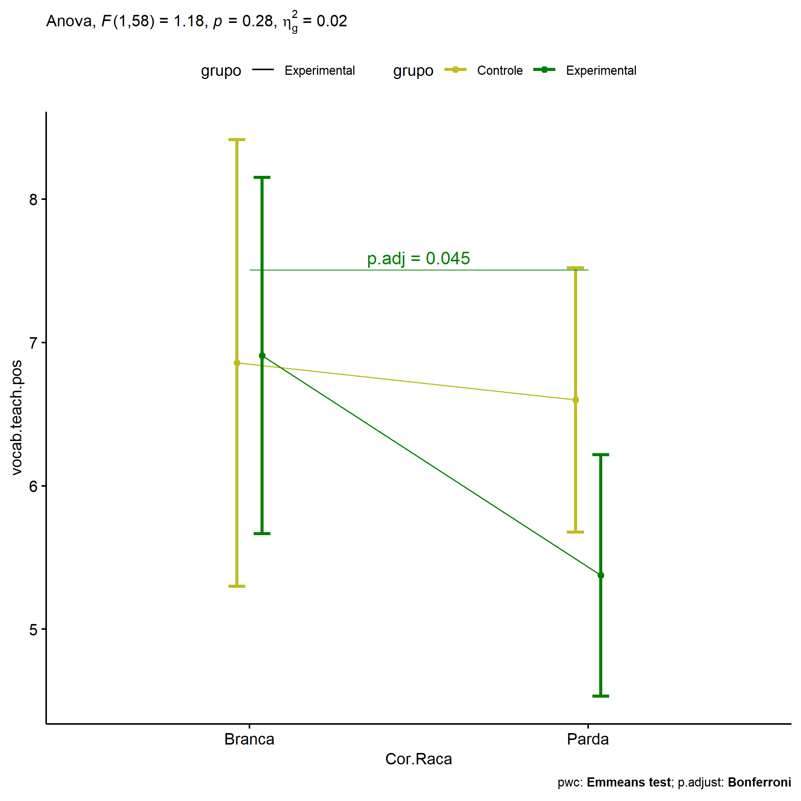<!-- -->

``` r
plots <- twoWayAncovaBoxPlots(
  wdat, "vocab.teach.pos", c("grupo","Cor.Raca"), aov, pwcs, covar = "vocab.teach.pre",
  theme = "classic", color = color[["grupo:Cor.Raca"]],
  subtitle = which(aov$Effect == "grupo:Cor.Raca"))
```

``` r
plots[["grupo:Cor.Raca"]] + ggplot2::ylab("Vocabulario Ensinado") + ggplot2::scale_x_discrete(labels=c('pre', 'pos'))
```

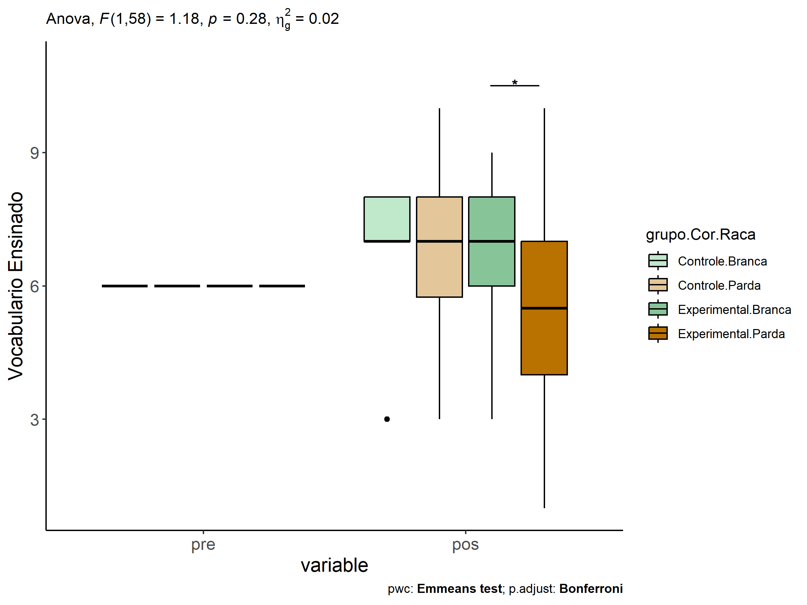<!-- -->

``` r
plots <- twoWayAncovaBoxPlots(
  wdat.long, "vocab.teach", c("grupo","Cor.Raca"), aov, pwc.long, pre.post = "time",
  theme = "classic", color = color$prepost)
```

``` r
plots[["grupo:Cor.Raca"]] + ggplot2::ylab("Vocabulario Ensinado")
```

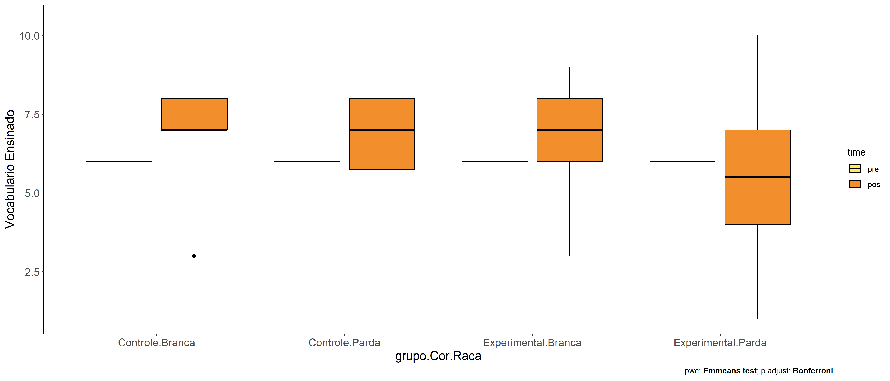<!-- -->

### Checking linearity assumption

``` r
ggscatter(wdat, x = "vocab.teach.pre", y = "vocab.teach.pos", size = 0.5,
          facet.by = c("grupo","Cor.Raca"), add = "reg.line")+
  stat_regline_equation(
    aes(label =  paste(..eq.label.., ..rr.label.., sep = "~~~~"))
  )
```

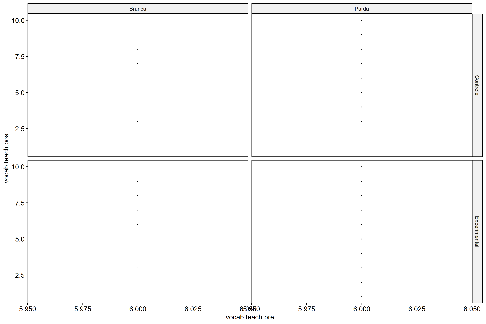<!-- -->

### Checking normality and homogeneity

``` r
res <- augment(lm(vocab.teach.pos ~ vocab.teach.pre + grupo*Cor.Raca, data = wdat))
```

``` r
shapiro_test(res$.resid)
```

    ## # A tibble: 1 × 3
    ##   variable   statistic p.value
    ##   <chr>          <dbl>   <dbl>
    ## 1 res$.resid     0.981   0.453

``` r
levene_test(res, .resid ~ grupo*Cor.Raca)
```

    ## # A tibble: 1 × 4
    ##     df1   df2 statistic     p
    ##   <int> <int>     <dbl> <dbl>
    ## 1     3    58      1.61 0.196

# ANCOVA and Pairwise for two factors **grupo:Serie**

## Without remove non-normal data

``` r
pdat = remove_group_data(dat[!is.na(dat[["grupo"]]) & !is.na(dat[["Serie"]]),], "vocab.teach.pos", c("grupo","Serie"))

pdat.long <- rbind(pdat[,c("id","grupo","Serie")], pdat[,c("id","grupo","Serie")])
pdat.long[["time"]] <- c(rep("pre", nrow(pdat)), rep("pos", nrow(pdat)))
pdat.long[["time"]] <- factor(pdat.long[["time"]], c("pre","pos"))
pdat.long[["vocab.teach"]] <- c(pdat[["vocab.teach.pre"]], pdat[["vocab.teach.pos"]])

aov = anova_test(pdat, vocab.teach.pos ~ vocab.teach.pre + grupo*Serie)
laov[["grupo:Serie"]] <- get_anova_table(aov)
```

``` r
pwcs <- list()
pwcs[["Serie"]] <- emmeans_test(
  group_by(pdat, grupo), vocab.teach.pos ~ Serie,
  covariate = vocab.teach.pre, p.adjust.method = "bonferroni")
pwcs[["grupo"]] <- emmeans_test(
  group_by(pdat, Serie), vocab.teach.pos ~ grupo,
  covariate = vocab.teach.pre, p.adjust.method = "bonferroni")

pwc <- plyr::rbind.fill(pwcs[["grupo"]], pwcs[["Serie"]])
pwc <- pwc[,c("grupo","Serie", colnames(pwc)[!colnames(pwc) %in% c("grupo","Serie")])]
```

``` r
pwc.long <- emmeans_test(dplyr::group_by_at(pdat.long, c("grupo","Serie")),
                         vocab.teach ~ time,
                         p.adjust.method = "bonferroni")
lpwc[["grupo:Serie"]] <- plyr::rbind.fill(pwc, pwc.long)
```

``` r
ds <- get.descriptives(pdat, "vocab.teach.pos", c("grupo","Serie"), covar = "vocab.teach.pre")
ds <- merge(ds[ds$variable != "vocab.teach.pre",],
            ds[ds$variable == "vocab.teach.pre", !colnames(ds) %in% c("variable")],
            by = c("grupo","Serie"), all.x = T, suffixes = c("", ".vocab.teach.pre"))
ds <- merge(get_emmeans(pwcs[["grupo"]]), ds, by = c("grupo","Serie"), suffixes = c(".emms", ""))
ds <- ds[,c("grupo","Serie","n","mean.vocab.teach.pre","se.vocab.teach.pre","mean","se","emmean","se.emms")]

colnames(ds) <- c("grupo","Serie", "N", paste0(c("M","SE")," (pre)"),
                  paste0(c("M","SE"), " (unadj)"), paste0(c("M", "SE"), " (adj)"))

lemms[["grupo:Serie"]] <- ds
```

## Computing ANCOVA and PairWise After removing non-normal data (OK)

``` r
wdat = pdat 

res = residuals(lm(vocab.teach.pos ~ vocab.teach.pre + grupo*Serie, data = wdat))
non.normal = getNonNormal(res, wdat$id, plimit = 0.05)

wdat = wdat[!wdat$id %in% non.normal,]

wdat.long <- rbind(wdat[,c("id","grupo","Serie")], wdat[,c("id","grupo","Serie")])
wdat.long[["time"]] <- c(rep("pre", nrow(wdat)), rep("pos", nrow(wdat)))
wdat.long[["time"]] <- factor(wdat.long[["time"]], c("pre","pos"))
wdat.long[["vocab.teach"]] <- c(wdat[["vocab.teach.pre"]], wdat[["vocab.teach.pos"]])


ldat[["grupo:Serie"]] = wdat

(non.normal)
```

    ## NULL

``` r
aov = anova_test(wdat, vocab.teach.pos ~ vocab.teach.pre + grupo*Serie)
laov[["grupo:Serie"]] <- merge(get_anova_table(aov), laov[["grupo:Serie"]], by="Effect", suffixes = c("","'"))

(df = get_anova_table(aov))
```

    ## ANOVA Table (type II tests)
    ## 
    ##            Effect DFn DFd     F     p p<.05      ges
    ## 1 vocab.teach.pre   0 155    NA    NA  <NA>       NA
    ## 2           grupo   1 155 0.019 0.890       0.000123
    ## 3           Serie   3 155 1.397 0.246       0.026000
    ## 4     grupo:Serie   3 155 0.121 0.947       0.002000

| Effect          | DFn | DFd |     F |     p | p\<.05 |   ges |
|:----------------|----:|----:|------:|------:|:-------|------:|
| vocab.teach.pre |   0 | 155 |       |       |        |       |
| grupo           |   1 | 155 | 0.019 | 0.890 |        | 0.000 |
| Serie           |   3 | 155 | 1.397 | 0.246 |        | 0.026 |
| grupo:Serie     |   3 | 155 | 0.121 | 0.947 |        | 0.002 |

``` r
pwcs <- list()
pwcs[["Serie"]] <- emmeans_test(
  group_by(wdat, grupo), vocab.teach.pos ~ Serie,
  covariate = vocab.teach.pre, p.adjust.method = "bonferroni")
pwcs[["grupo"]] <- emmeans_test(
  group_by(wdat, Serie), vocab.teach.pos ~ grupo,
  covariate = vocab.teach.pre, p.adjust.method = "bonferroni")

pwc <- plyr::rbind.fill(pwcs[["grupo"]], pwcs[["Serie"]])
pwc <- pwc[,c("grupo","Serie", colnames(pwc)[!colnames(pwc) %in% c("grupo","Serie")])]
```

| grupo        | Serie | term                   | .y.             | group1   | group2       |  df | statistic |     p | p.adj | p.adj.signif |
|:-------------|:------|:-----------------------|:----------------|:---------|:-------------|----:|----------:|------:|------:|:-------------|
|              | 6 ano | vocab.teach.pre\*grupo | vocab.teach.pos | Controle | Experimental | 155 |     0.021 | 0.984 | 0.984 | ns           |
|              | 7 ano | vocab.teach.pre\*grupo | vocab.teach.pos | Controle | Experimental | 155 |    -0.156 | 0.876 | 0.876 | ns           |
|              | 8 ano | vocab.teach.pre\*grupo | vocab.teach.pos | Controle | Experimental | 155 |     0.584 | 0.560 | 0.560 | ns           |
|              | 9 ano | vocab.teach.pre\*grupo | vocab.teach.pos | Controle | Experimental | 155 |    -0.130 | 0.896 | 0.896 | ns           |
| Controle     |       | vocab.teach.pre\*Serie | vocab.teach.pos | 6 ano    | 7 ano        | 155 |     0.131 | 0.896 | 1.000 | ns           |
| Controle     |       | vocab.teach.pre\*Serie | vocab.teach.pos | 6 ano    | 8 ano        | 155 |    -0.502 | 0.616 | 1.000 | ns           |
| Controle     |       | vocab.teach.pre\*Serie | vocab.teach.pos | 6 ano    | 9 ano        | 155 |    -1.033 | 0.303 | 1.000 | ns           |
| Controle     |       | vocab.teach.pre\*Serie | vocab.teach.pos | 7 ano    | 8 ano        | 155 |    -0.620 | 0.536 | 1.000 | ns           |
| Controle     |       | vocab.teach.pre\*Serie | vocab.teach.pos | 7 ano    | 9 ano        | 155 |    -1.157 | 0.249 | 1.000 | ns           |
| Controle     |       | vocab.teach.pre\*Serie | vocab.teach.pos | 8 ano    | 9 ano        | 155 |    -0.420 | 0.675 | 1.000 | ns           |
| Experimental |       | vocab.teach.pre\*Serie | vocab.teach.pos | 6 ano    | 7 ano        | 155 |    -0.032 | 0.974 | 1.000 | ns           |
| Experimental |       | vocab.teach.pre\*Serie | vocab.teach.pos | 6 ano    | 8 ano        | 155 |    -0.017 | 0.986 | 1.000 | ns           |
| Experimental |       | vocab.teach.pre\*Serie | vocab.teach.pos | 6 ano    | 9 ano        | 155 |    -1.259 | 0.210 | 1.000 | ns           |
| Experimental |       | vocab.teach.pre\*Serie | vocab.teach.pos | 7 ano    | 8 ano        | 155 |     0.018 | 0.986 | 1.000 | ns           |
| Experimental |       | vocab.teach.pre\*Serie | vocab.teach.pos | 7 ano    | 9 ano        | 155 |    -1.354 | 0.178 | 1.000 | ns           |
| Experimental |       | vocab.teach.pre\*Serie | vocab.teach.pos | 8 ano    | 9 ano        | 155 |    -1.418 | 0.158 | 0.950 | ns           |

``` r
pwc.long <- emmeans_test(dplyr::group_by_at(wdat.long, c("grupo","Serie")),
                         vocab.teach ~ time,
                         p.adjust.method = "bonferroni")
lpwc[["grupo:Serie"]] <- merge(plyr::rbind.fill(pwc, pwc.long), lpwc[["grupo:Serie"]], by=c("grupo","Serie","term",".y.","group1","group2"), suffixes = c("","'"))
```

| grupo        | Serie | term | .y.         | group1 | group2 |  df | statistic |     p | p.adj | p.adj.signif |
|:-------------|:------|:-----|:------------|:-------|:-------|----:|----------:|------:|------:|:-------------|
| Controle     | 6 ano | time | vocab.teach | pre    | pos    | 310 |     0.739 | 0.461 | 0.461 | ns           |
| Controle     | 7 ano | time | vocab.teach | pre    | pos    | 310 |     0.894 | 0.372 | 0.372 | ns           |
| Controle     | 8 ano | time | vocab.teach | pre    | pos    | 310 |     0.000 | 1.000 | 1.000 | ns           |
| Controle     | 9 ano | time | vocab.teach | pre    | pos    | 310 |    -0.737 | 0.462 | 0.462 | ns           |
| Experimental | 6 ano | time | vocab.teach | pre    | pos    | 310 |     0.869 | 0.386 | 0.386 | ns           |
| Experimental | 7 ano | time | vocab.teach | pre    | pos    | 310 |     0.994 | 0.321 | 0.321 | ns           |
| Experimental | 8 ano | time | vocab.teach | pre    | pos    | 310 |     1.093 | 0.275 | 0.275 | ns           |
| Experimental | 9 ano | time | vocab.teach | pre    | pos    | 310 |    -0.921 | 0.358 | 0.358 | ns           |

``` r
ds <- get.descriptives(wdat, "vocab.teach.pos", c("grupo","Serie"), covar = "vocab.teach.pre")
ds <- merge(ds[ds$variable != "vocab.teach.pre",],
            ds[ds$variable == "vocab.teach.pre", !colnames(ds) %in% c("variable")],
            by = c("grupo","Serie"), all.x = T, suffixes = c("", ".vocab.teach.pre"))
ds <- merge(get_emmeans(pwcs[["grupo"]]), ds, by = c("grupo","Serie"), suffixes = c(".emms", ""))
ds <- ds[,c("grupo","Serie","n","mean.vocab.teach.pre","se.vocab.teach.pre","mean","se","emmean","se.emms")]

colnames(ds) <- c("grupo","Serie", "N", paste0(c("M","SE")," (pre)"),
                  paste0(c("M","SE"), " (unadj)"), paste0(c("M", "SE"), " (adj)"))

lemms[["grupo:Serie"]] <- merge(ds, lemms[["grupo:Serie"]], by=c("grupo","Serie"), suffixes = c("","'"))
```

| grupo        | Serie |   N | M (pre) | SE (pre) | M (unadj) | SE (unadj) | M (adj) | SE (adj) |
|:-------------|:------|----:|--------:|---------:|----------:|-----------:|--------:|---------:|
| Controle     | 6 ano |  14 |       6 |        0 |     5.571 |      0.453 |   5.571 |    0.580 |
| Controle     | 7 ano |  13 |       6 |        0 |     5.462 |      0.739 |   5.462 |    0.602 |
| Controle     | 8 ano |  12 |       6 |        0 |     6.000 |      0.728 |   6.000 |    0.627 |
| Controle     | 9 ano |  25 |       6 |        0 |     6.320 |      0.373 |   6.320 |    0.434 |
| Experimental | 6 ano |  18 |       6 |        0 |     5.556 |      0.633 |   5.556 |    0.512 |
| Experimental | 7 ano |  26 |       6 |        0 |     5.577 |      0.305 |   5.577 |    0.426 |
| Experimental | 8 ano |  30 |       6 |        0 |     5.567 |      0.423 |   5.567 |    0.396 |
| Experimental | 9 ano |  25 |       6 |        0 |     6.400 |      0.440 |   6.400 |    0.434 |

### Plots for ancova

``` r
plots <- twoWayAncovaPlots(
  wdat, "vocab.teach.pos", c("grupo","Serie"), aov, pwcs, addParam = c("mean_se"),
  font.label.size=10, step.increase=0.05, p.label="p.adj",
  subtitle = which(aov$Effect == "grupo:Serie"))
```

``` r
if (!is.null(plots[["grupo"]]))
  plots[["grupo"]] + ggplot2::scale_color_manual(values = color[["Serie"]])
```

    ## Scale for colour is already present.
    ## Adding another scale for colour, which will replace the existing scale.

<!-- -->

``` r
if (!is.null(plots[["Serie"]]))
  plots[["Serie"]] + ggplot2::scale_color_manual(values = color[["grupo"]])
```

    ## Scale for colour is already present.
    ## Adding another scale for colour, which will replace the existing scale.

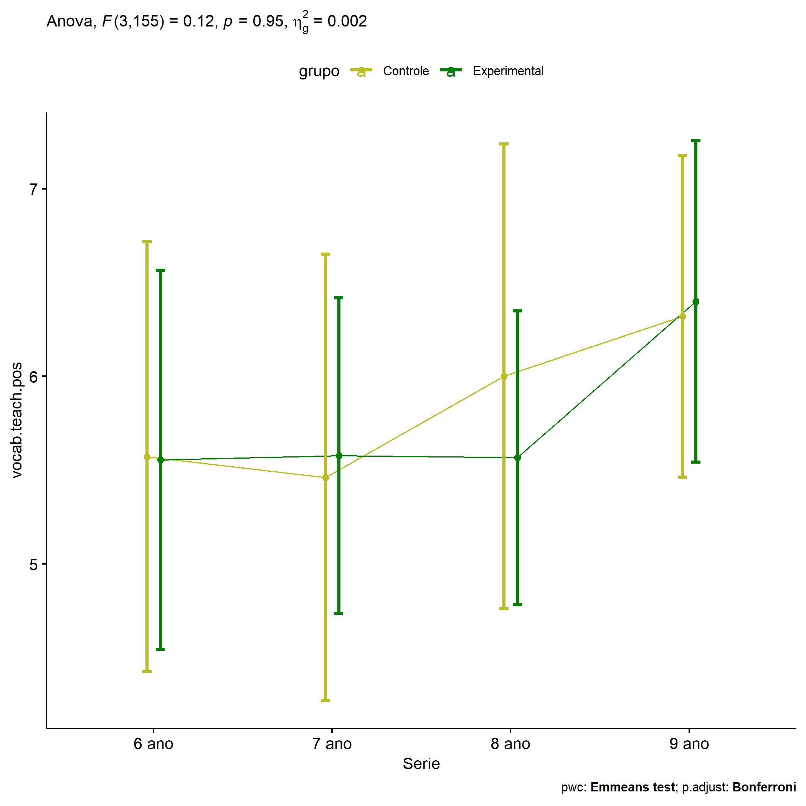<!-- -->

``` r
plots <- twoWayAncovaBoxPlots(
  wdat, "vocab.teach.pos", c("grupo","Serie"), aov, pwcs, covar = "vocab.teach.pre",
  theme = "classic", color = color[["grupo:Serie"]],
  subtitle = which(aov$Effect == "grupo:Serie"))
```

``` r
plots[["grupo:Serie"]] + ggplot2::ylab("Vocabulario Ensinado") + ggplot2::scale_x_discrete(labels=c('pre', 'pos'))
```

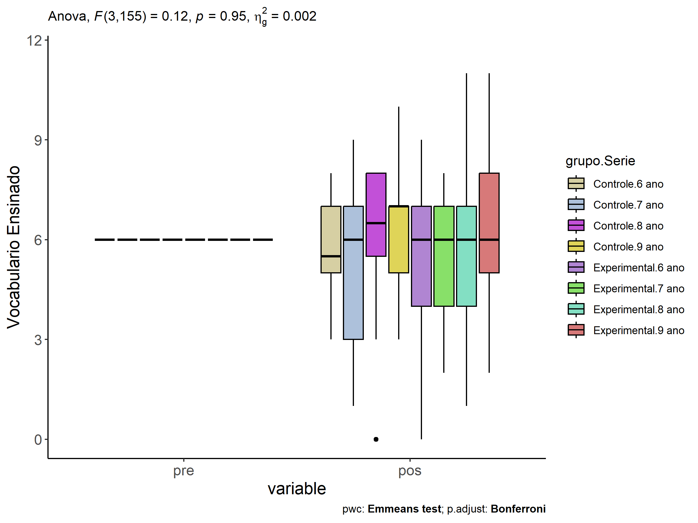<!-- -->

``` r
plots <- twoWayAncovaBoxPlots(
  wdat.long, "vocab.teach", c("grupo","Serie"), aov, pwc.long, pre.post = "time",
  theme = "classic", color = color$prepost)
```

``` r
plots[["grupo:Serie"]] + ggplot2::ylab("Vocabulario Ensinado")
```

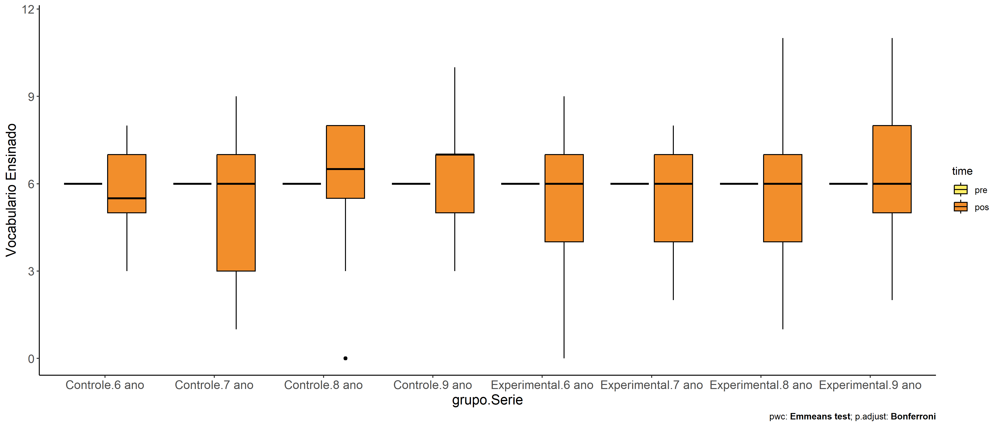<!-- -->

### Checking linearity assumption

``` r
ggscatter(wdat, x = "vocab.teach.pre", y = "vocab.teach.pos", size = 0.5,
          facet.by = c("grupo","Serie"), add = "reg.line")+
  stat_regline_equation(
    aes(label =  paste(..eq.label.., ..rr.label.., sep = "~~~~"))
  )
```

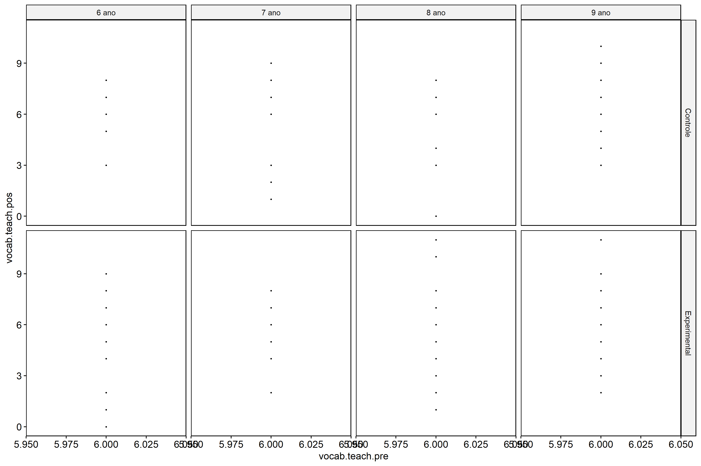<!-- -->

### Checking normality and homogeneity

``` r
res <- augment(lm(vocab.teach.pos ~ vocab.teach.pre + grupo*Serie, data = wdat))
```

``` r
shapiro_test(res$.resid)
```

    ## # A tibble: 1 × 3
    ##   variable   statistic p.value
    ##   <chr>          <dbl>   <dbl>
    ## 1 res$.resid     0.984  0.0513

``` r
levene_test(res, .resid ~ grupo*Serie)
```

    ## # A tibble: 1 × 4
    ##     df1   df2 statistic     p
    ##   <int> <int>     <dbl> <dbl>
    ## 1     7   155     0.834 0.560

# Summary of Results

## Descriptive Statistics

``` r
df <- get.descriptives(ldat[["grupo"]], c(dv.pre, dv.pos), c("grupo"), 
                       include.global = T, symmetry.test = T, normality.test = F)
df <- plyr::rbind.fill(
  df, do.call(plyr::rbind.fill, lapply(lfatores2, FUN = function(f) {
    if (nrow(dat) > 0 && sum(!is.na(unique(dat[[f]]))) > 1)
      get.descriptives(ldat[[paste0("grupo:",f)]], c(dv.pre,dv.pos), c("grupo", f),
                       symmetry.test = T, normality.test = F)
    }))
)
(df <- df[,c(fatores1[fatores1 %in% colnames(df)],"variable",
             colnames(df)[!colnames(df) %in% c(fatores1,"variable")])])
```

    ##           grupo Sexo   Zona Cor.Raca Serie        variable   n  mean median min max    sd    se    ci
    ## 1      Controle <NA>   <NA>     <NA>  <NA> vocab.teach.pre  48 6.000    6.0   6   6 0.000 0.000 0.000
    ## 2  Experimental <NA>   <NA>     <NA>  <NA> vocab.teach.pre  99 6.000    6.0   6   6 0.000 0.000 0.000
    ## 3          <NA> <NA>   <NA>     <NA>  <NA> vocab.teach.pre 147 6.000    6.0   6   6 0.000 0.000 0.000
    ## 4      Controle <NA>   <NA>     <NA>  <NA> vocab.teach.pos  48 5.625    6.0   0  10 2.358 0.340 0.685
    ## 5  Experimental <NA>   <NA>     <NA>  <NA> vocab.teach.pos  99 5.778    6.0   0  11 2.183 0.219 0.435
    ## 6          <NA> <NA>   <NA>     <NA>  <NA> vocab.teach.pos 147 5.728    6.0   0  11 2.235 0.184 0.364
    ## 7      Controle    F   <NA>     <NA>  <NA> vocab.teach.pre  36 6.000    6.0   6   6 0.000 0.000 0.000
    ## 8      Controle    M   <NA>     <NA>  <NA> vocab.teach.pre  28 6.000    6.0   6   6 0.000 0.000 0.000
    ## 9  Experimental    F   <NA>     <NA>  <NA> vocab.teach.pre  58 6.000    6.0   6   6 0.000 0.000 0.000
    ## 10 Experimental    M   <NA>     <NA>  <NA> vocab.teach.pre  40 6.000    6.0   6   6 0.000 0.000 0.000
    ## 11     Controle    F   <NA>     <NA>  <NA> vocab.teach.pos  36 5.722    6.0   1  10 2.199 0.366 0.744
    ## 12     Controle    M   <NA>     <NA>  <NA> vocab.teach.pos  28 6.179    6.5   0   9 2.038 0.385 0.790
    ## 13 Experimental    F   <NA>     <NA>  <NA> vocab.teach.pos  58 6.207    6.0   1  11 2.183 0.287 0.574
    ## 14 Experimental    M   <NA>     <NA>  <NA> vocab.teach.pos  40 5.300    5.0   1   9 1.911 0.302 0.611
    ## 15     Controle <NA>  Rural     <NA>  <NA> vocab.teach.pre  32 6.000    6.0   6   6 0.000 0.000 0.000
    ## 16     Controle <NA> Urbana     <NA>  <NA> vocab.teach.pre  11 6.000    6.0   6   6 0.000 0.000 0.000
    ## 17 Experimental <NA>  Rural     <NA>  <NA> vocab.teach.pre  40 6.000    6.0   6   6 0.000 0.000 0.000
    ## 18 Experimental <NA> Urbana     <NA>  <NA> vocab.teach.pre  21 6.000    6.0   6   6 0.000 0.000 0.000
    ## 19     Controle <NA>  Rural     <NA>  <NA> vocab.teach.pos  32 6.031    6.0   2   9 1.909 0.337 0.688
    ## 20     Controle <NA> Urbana     <NA>  <NA> vocab.teach.pos  11 6.455    7.0   1  10 2.622 0.790 1.761
    ## 21 Experimental <NA>  Rural     <NA>  <NA> vocab.teach.pos  40 5.850    6.0   0  10 2.338 0.370 0.748
    ## 22 Experimental <NA> Urbana     <NA>  <NA> vocab.teach.pos  21 6.095    6.0   3  11 1.786 0.390 0.813
    ## 23     Controle <NA>   <NA>   Branca  <NA> vocab.teach.pre   7 6.000    6.0   6   6 0.000 0.000 0.000
    ## 24     Controle <NA>   <NA>    Parda  <NA> vocab.teach.pre  20 6.000    6.0   6   6 0.000 0.000 0.000
    ## 25 Experimental <NA>   <NA>   Branca  <NA> vocab.teach.pre  11 6.000    6.0   6   6 0.000 0.000 0.000
    ## 26 Experimental <NA>   <NA>    Parda  <NA> vocab.teach.pre  24 6.000    6.0   6   6 0.000 0.000 0.000
    ## 27     Controle <NA>   <NA>   Branca  <NA> vocab.teach.pos   7 6.857    7.0   3   8 1.773 0.670 1.640
    ## 28     Controle <NA>   <NA>    Parda  <NA> vocab.teach.pos  20 6.600    7.0   3  10 1.875 0.419 0.878
    ## 29 Experimental <NA>   <NA>   Branca  <NA> vocab.teach.pos  11 6.909    7.0   3   9 1.700 0.513 1.142
    ## 30 Experimental <NA>   <NA>    Parda  <NA> vocab.teach.pos  24 5.375    5.5   1  10 2.392 0.488 1.010
    ## 31     Controle <NA>   <NA>     <NA> 6 ano vocab.teach.pre  14 6.000    6.0   6   6 0.000 0.000 0.000
    ## 32     Controle <NA>   <NA>     <NA> 7 ano vocab.teach.pre  13 6.000    6.0   6   6 0.000 0.000 0.000
    ## 33     Controle <NA>   <NA>     <NA> 8 ano vocab.teach.pre  12 6.000    6.0   6   6 0.000 0.000 0.000
    ## 34     Controle <NA>   <NA>     <NA> 9 ano vocab.teach.pre  25 6.000    6.0   6   6 0.000 0.000 0.000
    ## 35 Experimental <NA>   <NA>     <NA> 6 ano vocab.teach.pre  18 6.000    6.0   6   6 0.000 0.000 0.000
    ## 36 Experimental <NA>   <NA>     <NA> 7 ano vocab.teach.pre  26 6.000    6.0   6   6 0.000 0.000 0.000
    ## 37 Experimental <NA>   <NA>     <NA> 8 ano vocab.teach.pre  30 6.000    6.0   6   6 0.000 0.000 0.000
    ## 38 Experimental <NA>   <NA>     <NA> 9 ano vocab.teach.pre  25 6.000    6.0   6   6 0.000 0.000 0.000
    ## 39     Controle <NA>   <NA>     <NA> 6 ano vocab.teach.pos  14 5.571    5.5   3   8 1.697 0.453 0.980
    ## 40     Controle <NA>   <NA>     <NA> 7 ano vocab.teach.pos  13 5.462    6.0   1   9 2.665 0.739 1.610
    ## 41     Controle <NA>   <NA>     <NA> 8 ano vocab.teach.pos  12 6.000    6.5   0   8 2.523 0.728 1.603
    ## 42     Controle <NA>   <NA>     <NA> 9 ano vocab.teach.pos  25 6.320    7.0   3  10 1.865 0.373 0.770
    ## 43 Experimental <NA>   <NA>     <NA> 6 ano vocab.teach.pos  18 5.556    6.0   0   9 2.684 0.633 1.335
    ## 44 Experimental <NA>   <NA>     <NA> 7 ano vocab.teach.pos  26 5.577    6.0   2   8 1.554 0.305 0.628
    ## 45 Experimental <NA>   <NA>     <NA> 8 ano vocab.teach.pos  30 5.567    6.0   1  11 2.315 0.423 0.864
    ## 46 Experimental <NA>   <NA>     <NA> 9 ano vocab.teach.pos  25 6.400    6.0   2  11 2.198 0.440 0.907
    ##     iqr symmetry     skewness     kurtosis
    ## 1  0.00 few data  0.000000000  0.000000000
    ## 2  0.00 few data  0.000000000  0.000000000
    ## 3  0.00 few data  0.000000000  0.000000000
    ## 4  4.00      YES -0.234583307 -0.779400761
    ## 5  3.00      YES -0.154828575 -0.145811604
    ## 6  3.00      YES -0.193744047 -0.336318172
    ## 7  0.00 few data  0.000000000  0.000000000
    ## 8  0.00 few data  0.000000000  0.000000000
    ## 9  0.00 few data  0.000000000  0.000000000
    ## 10 0.00 few data  0.000000000  0.000000000
    ## 11 3.00      YES -0.251381395 -0.820050154
    ## 12 3.00       NO -1.018228635  0.952213258
    ## 13 3.75      YES -0.081330408 -0.352123074
    ## 14 2.25      YES -0.226602030 -0.590981415
    ## 15 0.00 few data  0.000000000  0.000000000
    ## 16 0.00 few data  0.000000000  0.000000000
    ## 17 0.00 few data  0.000000000  0.000000000
    ## 18 0.00 few data  0.000000000  0.000000000
    ## 19 2.25      YES -0.420429192 -0.900868529
    ## 20 3.50       NO -0.513401208 -0.732131318
    ## 21 3.25       NO -0.528417572 -0.267564567
    ## 22 2.00       NO  0.616258335  0.576082427
    ## 23 0.00 few data  0.000000000  0.000000000
    ## 24 0.00 few data  0.000000000  0.000000000
    ## 25 0.00 few data  0.000000000  0.000000000
    ## 26 0.00 few data  0.000000000  0.000000000
    ## 27 1.00 few data  0.000000000  0.000000000
    ## 28 2.25      YES -0.216617687 -0.881751049
    ## 29 2.00       NO -0.760284389  0.008972537
    ## 30 3.00      YES  0.120693694 -0.939000132
    ## 31 0.00 few data  0.000000000  0.000000000
    ## 32 0.00 few data  0.000000000  0.000000000
    ## 33 0.00 few data  0.000000000  0.000000000
    ## 34 0.00 few data  0.000000000  0.000000000
    ## 35 0.00 few data  0.000000000  0.000000000
    ## 36 0.00 few data  0.000000000  0.000000000
    ## 37 0.00 few data  0.000000000  0.000000000
    ## 38 0.00 few data  0.000000000  0.000000000
    ## 39 2.00      YES -0.333004598 -1.386600669
    ## 40 4.00      YES -0.314092003 -1.351388245
    ## 41 2.50       NO -1.090134330  0.033231293
    ## 42 2.00      YES -0.005686668 -1.055293442
    ## 43 3.00      YES -0.497669545 -0.819295019
    ## 44 3.00      YES -0.168580683 -0.811519592
    ## 45 3.00      YES  0.240360358 -0.426604322
    ## 46 3.00      YES -0.243929809 -0.363687039

| grupo        | Sexo | Zona   | Cor.Raca | Serie | variable        |   n |  mean | median | min | max |    sd |    se |    ci |  iqr | symmetry | skewness | kurtosis |
|:-------------|:-----|:-------|:---------|:------|:----------------|----:|------:|-------:|----:|----:|------:|------:|------:|-----:|:---------|---------:|---------:|
| Controle     |      |        |          |       | vocab.teach.pre |  48 | 6.000 |    6.0 |   6 |   6 | 0.000 | 0.000 | 0.000 | 0.00 | few data |    0.000 |    0.000 |
| Experimental |      |        |          |       | vocab.teach.pre |  99 | 6.000 |    6.0 |   6 |   6 | 0.000 | 0.000 | 0.000 | 0.00 | few data |    0.000 |    0.000 |
|              |      |        |          |       | vocab.teach.pre | 147 | 6.000 |    6.0 |   6 |   6 | 0.000 | 0.000 | 0.000 | 0.00 | few data |    0.000 |    0.000 |
| Controle     |      |        |          |       | vocab.teach.pos |  48 | 5.625 |    6.0 |   0 |  10 | 2.358 | 0.340 | 0.685 | 4.00 | YES      |   -0.235 |   -0.779 |
| Experimental |      |        |          |       | vocab.teach.pos |  99 | 5.778 |    6.0 |   0 |  11 | 2.183 | 0.219 | 0.435 | 3.00 | YES      |   -0.155 |   -0.146 |
|              |      |        |          |       | vocab.teach.pos | 147 | 5.728 |    6.0 |   0 |  11 | 2.235 | 0.184 | 0.364 | 3.00 | YES      |   -0.194 |   -0.336 |
| Controle     | F    |        |          |       | vocab.teach.pre |  36 | 6.000 |    6.0 |   6 |   6 | 0.000 | 0.000 | 0.000 | 0.00 | few data |    0.000 |    0.000 |
| Controle     | M    |        |          |       | vocab.teach.pre |  28 | 6.000 |    6.0 |   6 |   6 | 0.000 | 0.000 | 0.000 | 0.00 | few data |    0.000 |    0.000 |
| Experimental | F    |        |          |       | vocab.teach.pre |  58 | 6.000 |    6.0 |   6 |   6 | 0.000 | 0.000 | 0.000 | 0.00 | few data |    0.000 |    0.000 |
| Experimental | M    |        |          |       | vocab.teach.pre |  40 | 6.000 |    6.0 |   6 |   6 | 0.000 | 0.000 | 0.000 | 0.00 | few data |    0.000 |    0.000 |
| Controle     | F    |        |          |       | vocab.teach.pos |  36 | 5.722 |    6.0 |   1 |  10 | 2.199 | 0.366 | 0.744 | 3.00 | YES      |   -0.251 |   -0.820 |
| Controle     | M    |        |          |       | vocab.teach.pos |  28 | 6.179 |    6.5 |   0 |   9 | 2.038 | 0.385 | 0.790 | 3.00 | NO       |   -1.018 |    0.952 |
| Experimental | F    |        |          |       | vocab.teach.pos |  58 | 6.207 |    6.0 |   1 |  11 | 2.183 | 0.287 | 0.574 | 3.75 | YES      |   -0.081 |   -0.352 |
| Experimental | M    |        |          |       | vocab.teach.pos |  40 | 5.300 |    5.0 |   1 |   9 | 1.911 | 0.302 | 0.611 | 2.25 | YES      |   -0.227 |   -0.591 |
| Controle     |      | Rural  |          |       | vocab.teach.pre |  32 | 6.000 |    6.0 |   6 |   6 | 0.000 | 0.000 | 0.000 | 0.00 | few data |    0.000 |    0.000 |
| Controle     |      | Urbana |          |       | vocab.teach.pre |  11 | 6.000 |    6.0 |   6 |   6 | 0.000 | 0.000 | 0.000 | 0.00 | few data |    0.000 |    0.000 |
| Experimental |      | Rural  |          |       | vocab.teach.pre |  40 | 6.000 |    6.0 |   6 |   6 | 0.000 | 0.000 | 0.000 | 0.00 | few data |    0.000 |    0.000 |
| Experimental |      | Urbana |          |       | vocab.teach.pre |  21 | 6.000 |    6.0 |   6 |   6 | 0.000 | 0.000 | 0.000 | 0.00 | few data |    0.000 |    0.000 |
| Controle     |      | Rural  |          |       | vocab.teach.pos |  32 | 6.031 |    6.0 |   2 |   9 | 1.909 | 0.337 | 0.688 | 2.25 | YES      |   -0.420 |   -0.901 |
| Controle     |      | Urbana |          |       | vocab.teach.pos |  11 | 6.455 |    7.0 |   1 |  10 | 2.622 | 0.790 | 1.761 | 3.50 | NO       |   -0.513 |   -0.732 |
| Experimental |      | Rural  |          |       | vocab.teach.pos |  40 | 5.850 |    6.0 |   0 |  10 | 2.338 | 0.370 | 0.748 | 3.25 | NO       |   -0.528 |   -0.268 |
| Experimental |      | Urbana |          |       | vocab.teach.pos |  21 | 6.095 |    6.0 |   3 |  11 | 1.786 | 0.390 | 0.813 | 2.00 | NO       |    0.616 |    0.576 |
| Controle     |      |        | Branca   |       | vocab.teach.pre |   7 | 6.000 |    6.0 |   6 |   6 | 0.000 | 0.000 | 0.000 | 0.00 | few data |    0.000 |    0.000 |
| Controle     |      |        | Parda    |       | vocab.teach.pre |  20 | 6.000 |    6.0 |   6 |   6 | 0.000 | 0.000 | 0.000 | 0.00 | few data |    0.000 |    0.000 |
| Experimental |      |        | Branca   |       | vocab.teach.pre |  11 | 6.000 |    6.0 |   6 |   6 | 0.000 | 0.000 | 0.000 | 0.00 | few data |    0.000 |    0.000 |
| Experimental |      |        | Parda    |       | vocab.teach.pre |  24 | 6.000 |    6.0 |   6 |   6 | 0.000 | 0.000 | 0.000 | 0.00 | few data |    0.000 |    0.000 |
| Controle     |      |        | Branca   |       | vocab.teach.pos |   7 | 6.857 |    7.0 |   3 |   8 | 1.773 | 0.670 | 1.640 | 1.00 | few data |    0.000 |    0.000 |
| Controle     |      |        | Parda    |       | vocab.teach.pos |  20 | 6.600 |    7.0 |   3 |  10 | 1.875 | 0.419 | 0.878 | 2.25 | YES      |   -0.217 |   -0.882 |
| Experimental |      |        | Branca   |       | vocab.teach.pos |  11 | 6.909 |    7.0 |   3 |   9 | 1.700 | 0.513 | 1.142 | 2.00 | NO       |   -0.760 |    0.009 |
| Experimental |      |        | Parda    |       | vocab.teach.pos |  24 | 5.375 |    5.5 |   1 |  10 | 2.392 | 0.488 | 1.010 | 3.00 | YES      |    0.121 |   -0.939 |
| Controle     |      |        |          | 6 ano | vocab.teach.pre |  14 | 6.000 |    6.0 |   6 |   6 | 0.000 | 0.000 | 0.000 | 0.00 | few data |    0.000 |    0.000 |
| Controle     |      |        |          | 7 ano | vocab.teach.pre |  13 | 6.000 |    6.0 |   6 |   6 | 0.000 | 0.000 | 0.000 | 0.00 | few data |    0.000 |    0.000 |
| Controle     |      |        |          | 8 ano | vocab.teach.pre |  12 | 6.000 |    6.0 |   6 |   6 | 0.000 | 0.000 | 0.000 | 0.00 | few data |    0.000 |    0.000 |
| Controle     |      |        |          | 9 ano | vocab.teach.pre |  25 | 6.000 |    6.0 |   6 |   6 | 0.000 | 0.000 | 0.000 | 0.00 | few data |    0.000 |    0.000 |
| Experimental |      |        |          | 6 ano | vocab.teach.pre |  18 | 6.000 |    6.0 |   6 |   6 | 0.000 | 0.000 | 0.000 | 0.00 | few data |    0.000 |    0.000 |
| Experimental |      |        |          | 7 ano | vocab.teach.pre |  26 | 6.000 |    6.0 |   6 |   6 | 0.000 | 0.000 | 0.000 | 0.00 | few data |    0.000 |    0.000 |
| Experimental |      |        |          | 8 ano | vocab.teach.pre |  30 | 6.000 |    6.0 |   6 |   6 | 0.000 | 0.000 | 0.000 | 0.00 | few data |    0.000 |    0.000 |
| Experimental |      |        |          | 9 ano | vocab.teach.pre |  25 | 6.000 |    6.0 |   6 |   6 | 0.000 | 0.000 | 0.000 | 0.00 | few data |    0.000 |    0.000 |
| Controle     |      |        |          | 6 ano | vocab.teach.pos |  14 | 5.571 |    5.5 |   3 |   8 | 1.697 | 0.453 | 0.980 | 2.00 | YES      |   -0.333 |   -1.387 |
| Controle     |      |        |          | 7 ano | vocab.teach.pos |  13 | 5.462 |    6.0 |   1 |   9 | 2.665 | 0.739 | 1.610 | 4.00 | YES      |   -0.314 |   -1.351 |
| Controle     |      |        |          | 8 ano | vocab.teach.pos |  12 | 6.000 |    6.5 |   0 |   8 | 2.523 | 0.728 | 1.603 | 2.50 | NO       |   -1.090 |    0.033 |
| Controle     |      |        |          | 9 ano | vocab.teach.pos |  25 | 6.320 |    7.0 |   3 |  10 | 1.865 | 0.373 | 0.770 | 2.00 | YES      |   -0.006 |   -1.055 |
| Experimental |      |        |          | 6 ano | vocab.teach.pos |  18 | 5.556 |    6.0 |   0 |   9 | 2.684 | 0.633 | 1.335 | 3.00 | YES      |   -0.498 |   -0.819 |
| Experimental |      |        |          | 7 ano | vocab.teach.pos |  26 | 5.577 |    6.0 |   2 |   8 | 1.554 | 0.305 | 0.628 | 3.00 | YES      |   -0.169 |   -0.812 |
| Experimental |      |        |          | 8 ano | vocab.teach.pos |  30 | 5.567 |    6.0 |   1 |  11 | 2.315 | 0.423 | 0.864 | 3.00 | YES      |    0.240 |   -0.427 |
| Experimental |      |        |          | 9 ano | vocab.teach.pos |  25 | 6.400 |    6.0 |   2 |  11 | 2.198 | 0.440 | 0.907 | 3.00 | YES      |   -0.244 |   -0.364 |

## ANCOVA Table Comparison

``` r
df <- do.call(plyr::rbind.fill, laov)
(df <- df[!duplicated(df$Effect),])
```

    ##             Effect DFn DFd     F     p p<.05      ges DFn' DFd'    F'    p' p<.05'     ges'
    ## 1            grupo   1 145 0.150 0.699       0.001000    1  161 0.173 0.678        0.001000
    ## 2  vocab.teach.pre   0 145    NA    NA  <NA>       NA    0  161    NA    NA   <NA>       NA
    ## 4       grupo:Sexo   1 158 3.994 0.047     * 0.025000    1  159 3.255 0.073        0.020000
    ## 5             Sexo   1 158 1.176 0.280       0.007000    1  159 0.779 0.379        0.005000
    ## 8       grupo:Zona   1 100 0.035 0.851       0.000355    1  100 0.035 0.851        0.000355
    ## 10            Zona   1 100 0.465 0.497       0.005000    1  100 0.465 0.497        0.005000
    ## 11        Cor.Raca   1  58 3.082 0.084       0.050000    1   58 3.082 0.084        0.050000
    ## 13  grupo:Cor.Raca   1  58 1.180 0.282       0.020000    1   58 1.180 0.282        0.020000
    ## 16     grupo:Serie   3 155 0.121 0.947       0.002000    3  155 0.121 0.947        0.002000
    ## 17           Serie   3 155 1.397 0.246       0.026000    3  155 1.397 0.246        0.026000

|     | Effect          | DFn | DFd |     F |     p | p\<.05 |   ges | DFn’ | DFd’ |    F’ |    p’ | p\<.05’ |  ges’ |
|:----|:----------------|----:|----:|------:|------:|:-------|------:|-----:|-----:|------:|------:|:--------|------:|
| 1   | grupo           |   1 | 145 | 0.150 | 0.699 |        | 0.001 |    1 |  161 | 0.173 | 0.678 |         | 0.001 |
| 2   | vocab.teach.pre |   0 | 145 |       |       |        |       |    0 |  161 |       |       |         |       |
| 4   | grupo:Sexo      |   1 | 158 | 3.994 | 0.047 | \*     | 0.025 |    1 |  159 | 3.255 | 0.073 |         | 0.020 |
| 5   | Sexo            |   1 | 158 | 1.176 | 0.280 |        | 0.007 |    1 |  159 | 0.779 | 0.379 |         | 0.005 |
| 8   | grupo:Zona      |   1 | 100 | 0.035 | 0.851 |        | 0.000 |    1 |  100 | 0.035 | 0.851 |         | 0.000 |
| 10  | Zona            |   1 | 100 | 0.465 | 0.497 |        | 0.005 |    1 |  100 | 0.465 | 0.497 |         | 0.005 |
| 11  | Cor.Raca        |   1 |  58 | 3.082 | 0.084 |        | 0.050 |    1 |   58 | 3.082 | 0.084 |         | 0.050 |
| 13  | grupo:Cor.Raca  |   1 |  58 | 1.180 | 0.282 |        | 0.020 |    1 |   58 | 1.180 | 0.282 |         | 0.020 |
| 16  | grupo:Serie     |   3 | 155 | 0.121 | 0.947 |        | 0.002 |    3 |  155 | 0.121 | 0.947 |         | 0.002 |
| 17  | Serie           |   3 | 155 | 1.397 | 0.246 |        | 0.026 |    3 |  155 | 1.397 | 0.246 |         | 0.026 |

## PairWise Table Comparison

``` r
df <- do.call(plyr::rbind.fill, lpwc)
df <- df[,c(names(lfatores), names(df)[!names(df) %in% c(names(lfatores),"term",".y.")])]
```

| grupo        | Sexo | Zona   | Cor.Raca | Serie | group1   | group2       |  df | statistic |     p | p.adj | p.adj.signif | df’ | statistic’ |    p’ | p.adj’ | p.adj.signif’ |
|:-------------|:-----|:-------|:---------|:------|:---------|:-------------|----:|----------:|------:|------:|:-------------|----:|-----------:|------:|-------:|:--------------|
| Controle     |      |        |          |       | pre      | pos          | 290 |     1.159 | 0.247 | 0.247 | ns           | 322 |      0.289 | 0.773 |  0.773 | ns            |
| Experimental |      |        |          |       | pre      | pos          | 290 |     0.987 | 0.325 | 0.325 | ns           | 322 |      1.023 | 0.307 |  0.307 | ns            |
|              |      |        |          |       | Controle | Experimental | 145 |    -0.388 | 0.699 | 0.699 | ns           | 161 |      0.416 | 0.678 |  0.678 | ns            |
| Controle     | F    |        |          |       | pre      | pos          | 316 |     0.795 | 0.427 | 0.427 | ns           | 318 |      0.776 | 0.438 |  0.438 | ns            |
| Controle     | M    |        |          |       | pre      | pos          | 316 |    -0.450 | 0.653 | 0.653 | ns           | 318 |     -0.440 | 0.660 |  0.660 | ns            |
| Controle     |      |        |          |       | F        | M            | 158 |    -0.863 | 0.389 | 0.389 | ns           | 159 |     -0.843 | 0.400 |  0.400 | ns            |
| Experimental | F    |        |          |       | pre      | pos          | 316 |    -0.751 | 0.453 | 0.453 | ns           | 318 |     -0.364 | 0.716 |  0.716 | ns            |
| Experimental | M    |        |          |       | pre      | pos          | 316 |     2.111 | 0.036 | 0.036 | \*           | 318 |      2.062 | 0.040 |  0.040 | \*            |
| Experimental |      |        |          |       | F        | M            | 158 |     2.104 | 0.037 | 0.037 | \*           | 159 |      1.823 | 0.070 |  0.070 | ns            |
|              | F    |        |          |       | Controle | Experimental | 158 |    -1.089 | 0.278 | 0.278 | ns           | 159 |     -0.836 | 0.405 |  0.405 | ns            |
|              | M    |        |          |       | Controle | Experimental | 158 |     1.700 | 0.091 | 0.091 | ns           | 159 |      1.661 | 0.099 |  0.099 | ns            |
| Controle     |      |        |          |       | Rural    | Urbana       | 100 |    -0.566 | 0.573 | 0.573 | ns           | 100 |     -0.566 | 0.573 |  0.573 | ns            |
| Controle     |      | Rural  |          |       | pre      | pos          | 200 |    -0.083 | 0.934 | 0.934 | ns           | 200 |     -0.083 | 0.934 |  0.934 | ns            |
| Controle     |      | Urbana |          |       | pre      | pos          | 200 |    -0.704 | 0.482 | 0.482 | ns           | 200 |     -0.704 | 0.482 |  0.482 | ns            |
| Experimental |      |        |          |       | Rural    | Urbana       | 100 |    -0.425 | 0.672 | 0.672 | ns           | 100 |     -0.425 | 0.672 |  0.672 | ns            |
| Experimental |      | Rural  |          |       | pre      | pos          | 200 |     0.443 | 0.658 | 0.658 | ns           | 200 |      0.443 | 0.658 |  0.658 | ns            |
| Experimental |      | Urbana |          |       | pre      | pos          | 200 |    -0.204 | 0.839 | 0.839 | ns           | 200 |     -0.204 | 0.839 |  0.839 | ns            |
|              |      | Rural  |          |       | Controle | Experimental | 100 |     0.357 | 0.722 | 0.722 | ns           | 100 |      0.357 | 0.722 |  0.722 | ns            |
|              |      | Urbana |          |       | Controle | Experimental | 100 |     0.451 | 0.653 | 0.653 | ns           | 100 |      0.451 | 0.653 |  0.653 | ns            |
| Controle     |      |        | Branca   |       | pre      | pos          | 116 |    -1.101 | 0.273 | 0.273 | ns           | 116 |     -1.101 | 0.273 |  0.273 | ns            |
| Controle     |      |        |          |       | Branca   | Parda        |  58 |     0.284 | 0.777 | 0.777 | ns           |  58 |      0.284 | 0.777 |  0.777 | ns            |
| Controle     |      |        | Parda    |       | pre      | pos          | 116 |    -1.302 | 0.195 | 0.195 | ns           | 116 |     -1.302 | 0.195 |  0.195 | ns            |
| Experimental |      |        | Branca   |       | pre      | pos          | 116 |    -1.463 | 0.146 | 0.146 | ns           | 116 |     -1.463 | 0.146 |  0.146 | ns            |
| Experimental |      |        |          |       | Branca   | Parda        |  58 |     2.045 | 0.045 | 0.045 | \*           |  58 |      2.045 | 0.045 |  0.045 | \*            |
| Experimental |      |        | Parda    |       | pre      | pos          | 116 |     1.486 | 0.140 | 0.140 | ns           | 116 |      1.486 | 0.140 |  0.140 | ns            |
|              |      |        | Branca   |       | Controle | Experimental |  58 |    -0.052 | 0.959 | 0.959 | ns           |  58 |     -0.052 | 0.959 |  0.959 | ns            |
|              |      |        | Parda    |       | Controle | Experimental |  58 |     1.964 | 0.054 | 0.054 | ns           |  58 |      1.964 | 0.054 |  0.054 | ns            |
| Controle     |      |        |          | 6 ano | pre      | pos          | 310 |     0.739 | 0.461 | 0.461 | ns           | 310 |      0.739 | 0.461 |  0.461 | ns            |
| Controle     |      |        |          | 7 ano | pre      | pos          | 310 |     0.894 | 0.372 | 0.372 | ns           | 310 |      0.894 | 0.372 |  0.372 | ns            |
| Controle     |      |        |          | 8 ano | pre      | pos          | 310 |     0.000 | 1.000 | 1.000 | ns           | 310 |      0.000 | 1.000 |  1.000 | ns            |
| Controle     |      |        |          | 9 ano | pre      | pos          | 310 |    -0.737 | 0.462 | 0.462 | ns           | 310 |     -0.737 | 0.462 |  0.462 | ns            |
| Controle     |      |        |          |       | 6 ano    | 7 ano        | 155 |     0.131 | 0.896 | 1.000 | ns           | 155 |      0.131 | 0.896 |  1.000 | ns            |
| Controle     |      |        |          |       | 6 ano    | 8 ano        | 155 |    -0.502 | 0.616 | 1.000 | ns           | 155 |     -0.502 | 0.616 |  1.000 | ns            |
| Controle     |      |        |          |       | 6 ano    | 9 ano        | 155 |    -1.033 | 0.303 | 1.000 | ns           | 155 |     -1.033 | 0.303 |  1.000 | ns            |
| Controle     |      |        |          |       | 7 ano    | 8 ano        | 155 |    -0.620 | 0.536 | 1.000 | ns           | 155 |     -0.620 | 0.536 |  1.000 | ns            |
| Controle     |      |        |          |       | 7 ano    | 9 ano        | 155 |    -1.157 | 0.249 | 1.000 | ns           | 155 |     -1.157 | 0.249 |  1.000 | ns            |
| Controle     |      |        |          |       | 8 ano    | 9 ano        | 155 |    -0.420 | 0.675 | 1.000 | ns           | 155 |     -0.420 | 0.675 |  1.000 | ns            |
| Experimental |      |        |          | 6 ano | pre      | pos          | 310 |     0.869 | 0.386 | 0.386 | ns           | 310 |      0.869 | 0.386 |  0.386 | ns            |
| Experimental |      |        |          | 7 ano | pre      | pos          | 310 |     0.994 | 0.321 | 0.321 | ns           | 310 |      0.994 | 0.321 |  0.321 | ns            |
| Experimental |      |        |          | 8 ano | pre      | pos          | 310 |     1.093 | 0.275 | 0.275 | ns           | 310 |      1.093 | 0.275 |  0.275 | ns            |
| Experimental |      |        |          | 9 ano | pre      | pos          | 310 |    -0.921 | 0.358 | 0.358 | ns           | 310 |     -0.921 | 0.358 |  0.358 | ns            |
| Experimental |      |        |          |       | 6 ano    | 7 ano        | 155 |    -0.032 | 0.974 | 1.000 | ns           | 155 |     -0.032 | 0.974 |  1.000 | ns            |
| Experimental |      |        |          |       | 6 ano    | 8 ano        | 155 |    -0.017 | 0.986 | 1.000 | ns           | 155 |     -0.017 | 0.986 |  1.000 | ns            |
| Experimental |      |        |          |       | 6 ano    | 9 ano        | 155 |    -1.259 | 0.210 | 1.000 | ns           | 155 |     -1.259 | 0.210 |  1.000 | ns            |
| Experimental |      |        |          |       | 7 ano    | 8 ano        | 155 |     0.018 | 0.986 | 1.000 | ns           | 155 |      0.018 | 0.986 |  1.000 | ns            |
| Experimental |      |        |          |       | 7 ano    | 9 ano        | 155 |    -1.354 | 0.178 | 1.000 | ns           | 155 |     -1.354 | 0.178 |  1.000 | ns            |
| Experimental |      |        |          |       | 8 ano    | 9 ano        | 155 |    -1.418 | 0.158 | 0.950 | ns           | 155 |     -1.418 | 0.158 |  0.950 | ns            |
|              |      |        |          | 6 ano | Controle | Experimental | 155 |     0.021 | 0.984 | 0.984 | ns           | 155 |      0.021 | 0.984 |  0.984 | ns            |
|              |      |        |          | 7 ano | Controle | Experimental | 155 |    -0.156 | 0.876 | 0.876 | ns           | 155 |     -0.156 | 0.876 |  0.876 | ns            |
|              |      |        |          | 8 ano | Controle | Experimental | 155 |     0.584 | 0.560 | 0.560 | ns           | 155 |      0.584 | 0.560 |  0.560 | ns            |
|              |      |        |          | 9 ano | Controle | Experimental | 155 |    -0.130 | 0.896 | 0.896 | ns           | 155 |     -0.130 | 0.896 |  0.896 | ns            |

## EMMS Table Comparison

``` r
df <- do.call(plyr::rbind.fill, lemms)
df[["N-N'"]] <- df[["N"]] - df[["N'"]]
df <- df[,c(names(lfatores), names(df)[!names(df) %in% names(lfatores)])]
```

| grupo        | Sexo | Zona   | Cor.Raca | Serie |   N | M (pre) | SE (pre) | M (unadj) | SE (unadj) | M (adj) | SE (adj) |  N’ | M (pre)’ | SE (pre)’ | M (unadj)’ | SE (unadj)’ | M (adj)’ | SE (adj)’ | N-N’ |
|:-------------|:-----|:-------|:---------|:------|----:|--------:|---------:|----------:|-----------:|--------:|---------:|----:|---------:|----------:|-----------:|------------:|---------:|----------:|-----:|
| Controle     |      |        |          |       |  48 |       6 |        0 |     5.625 |      0.340 |   5.625 |    0.323 |  64 |        6 |         0 |      5.922 |       0.266 |    5.922 |     0.270 |  -16 |
| Experimental |      |        |          |       |  99 |       6 |        0 |     5.778 |      0.219 |   5.778 |    0.225 |  99 |        6 |         0 |      5.778 |       0.219 |    5.778 |     0.217 |    0 |
| Controle     | F    |        |          |       |  36 |       6 |        0 |     5.722 |      0.366 |   5.722 |    0.350 |  36 |        6 |         0 |      5.722 |       0.366 |    5.722 |     0.358 |    0 |
| Controle     | M    |        |          |       |  28 |       6 |        0 |     6.179 |      0.385 |   6.179 |    0.396 |  28 |        6 |         0 |      6.179 |       0.385 |    6.179 |     0.406 |    0 |
| Experimental | F    |        |          |       |  58 |       6 |        0 |     6.207 |      0.287 |   6.207 |    0.275 |  59 |        6 |         0 |      6.102 |       0.301 |    6.102 |     0.280 |   -1 |
| Experimental | M    |        |          |       |  40 |       6 |        0 |     5.300 |      0.302 |   5.300 |    0.332 |  40 |        6 |         0 |      5.300 |       0.302 |    5.300 |     0.340 |    0 |
| Controle     |      | Rural  |          |       |  32 |       6 |        0 |     6.031 |      0.337 |   6.031 |    0.379 |  32 |        6 |         0 |      6.031 |       0.337 |    6.031 |     0.379 |    0 |
| Controle     |      | Urbana |          |       |  11 |       6 |        0 |     6.455 |      0.790 |   6.455 |    0.646 |  11 |        6 |         0 |      6.455 |       0.790 |    6.455 |     0.646 |    0 |
| Experimental |      | Rural  |          |       |  40 |       6 |        0 |     5.850 |      0.370 |   5.850 |    0.339 |  40 |        6 |         0 |      5.850 |       0.370 |    5.850 |     0.339 |    0 |
| Experimental |      | Urbana |          |       |  21 |       6 |        0 |     6.095 |      0.390 |   6.095 |    0.467 |  21 |        6 |         0 |      6.095 |       0.390 |    6.095 |     0.467 |    0 |
| Controle     |      |        | Branca   |       |   7 |       6 |        0 |     6.857 |      0.670 |   6.857 |    0.779 |   7 |        6 |         0 |      6.857 |       0.670 |    6.857 |     0.779 |    0 |
| Controle     |      |        | Parda    |       |  20 |       6 |        0 |     6.600 |      0.419 |   6.600 |    0.461 |  20 |        6 |         0 |      6.600 |       0.419 |    6.600 |     0.461 |    0 |
| Experimental |      |        | Branca   |       |  11 |       6 |        0 |     6.909 |      0.513 |   6.909 |    0.621 |  11 |        6 |         0 |      6.909 |       0.513 |    6.909 |     0.621 |    0 |
| Experimental |      |        | Parda    |       |  24 |       6 |        0 |     5.375 |      0.488 |   5.375 |    0.421 |  24 |        6 |         0 |      5.375 |       0.488 |    5.375 |     0.421 |    0 |
| Controle     |      |        |          | 6 ano |  14 |       6 |        0 |     5.571 |      0.453 |   5.571 |    0.580 |  14 |        6 |         0 |      5.571 |       0.453 |    5.571 |     0.580 |    0 |
| Controle     |      |        |          | 7 ano |  13 |       6 |        0 |     5.462 |      0.739 |   5.462 |    0.602 |  13 |        6 |         0 |      5.462 |       0.739 |    5.462 |     0.602 |    0 |
| Controle     |      |        |          | 8 ano |  12 |       6 |        0 |     6.000 |      0.728 |   6.000 |    0.627 |  12 |        6 |         0 |      6.000 |       0.728 |    6.000 |     0.627 |    0 |
| Controle     |      |        |          | 9 ano |  25 |       6 |        0 |     6.320 |      0.373 |   6.320 |    0.434 |  25 |        6 |         0 |      6.320 |       0.373 |    6.320 |     0.434 |    0 |
| Experimental |      |        |          | 6 ano |  18 |       6 |        0 |     5.556 |      0.633 |   5.556 |    0.512 |  18 |        6 |         0 |      5.556 |       0.633 |    5.556 |     0.512 |    0 |
| Experimental |      |        |          | 7 ano |  26 |       6 |        0 |     5.577 |      0.305 |   5.577 |    0.426 |  26 |        6 |         0 |      5.577 |       0.305 |    5.577 |     0.426 |    0 |
| Experimental |      |        |          | 8 ano |  30 |       6 |        0 |     5.567 |      0.423 |   5.567 |    0.396 |  30 |        6 |         0 |      5.567 |       0.423 |    5.567 |     0.396 |    0 |
| Experimental |      |        |          | 9 ano |  25 |       6 |        0 |     6.400 |      0.440 |   6.400 |    0.434 |  25 |        6 |         0 |      6.400 |       0.440 |    6.400 |     0.434 |    0 |
