ANCOVA in Vocabulario Ensinado (Vocabulario Ensinado)
================
Geiser C. Challco <geiser@alumni.usp.br>

- [Descriptive Statistics of Initial
  Data](#descriptive-statistics-of-initial-data)
- [ANCOVA and Pairwise for one factor:
  **grupo**](#ancova-and-pairwise-for-one-factor-grupo)
  - [Without remove non-normal data](#without-remove-non-normal-data)
  - [Computing ANCOVA and PairWise After removing non-normal data
    (OK)](#computing-ancova-and-pairwise-after-removing-non-normal-data-ok)
    - [Plots for ancova](#plots-for-ancova)
    - [Checking linearity assumption](#checking-linearity-assumption)
    - [Checking normality and
      homogeneity](#checking-normality-and-homogeneity)
- [ANCOVA and Pairwise for two factors
  **grupo:Sexo**](#ancova-and-pairwise-for-two-factors-gruposexo)
  - [Without remove non-normal data](#without-remove-non-normal-data-1)
  - [Computing ANCOVA and PairWise After removing non-normal data
    (OK)](#computing-ancova-and-pairwise-after-removing-non-normal-data-ok-1)
    - [Plots for ancova](#plots-for-ancova-1)
    - [Checking linearity assumption](#checking-linearity-assumption-1)
    - [Checking normality and
      homogeneity](#checking-normality-and-homogeneity-1)
- [ANCOVA and Pairwise for two factors
  **grupo:Zona**](#ancova-and-pairwise-for-two-factors-grupozona)
  - [Without remove non-normal data](#without-remove-non-normal-data-2)
  - [Computing ANCOVA and PairWise After removing non-normal data
    (OK)](#computing-ancova-and-pairwise-after-removing-non-normal-data-ok-2)
    - [Plots for ancova](#plots-for-ancova-2)
    - [Checking linearity assumption](#checking-linearity-assumption-2)
    - [Checking normality and
      homogeneity](#checking-normality-and-homogeneity-2)
- [ANCOVA and Pairwise for two factors
  **grupo:Cor.Raca**](#ancova-and-pairwise-for-two-factors-grupocorraca)
  - [Without remove non-normal data](#without-remove-non-normal-data-3)
  - [Computing ANCOVA and PairWise After removing non-normal data
    (OK)](#computing-ancova-and-pairwise-after-removing-non-normal-data-ok-3)
    - [Plots for ancova](#plots-for-ancova-3)
    - [Checking linearity assumption](#checking-linearity-assumption-3)
    - [Checking normality and
      homogeneity](#checking-normality-and-homogeneity-3)
- [ANCOVA and Pairwise for two factors
  **grupo:Serie**](#ancova-and-pairwise-for-two-factors-gruposerie)
  - [Without remove non-normal data](#without-remove-non-normal-data-4)
  - [Computing ANCOVA and PairWise After removing non-normal data
    (OK)](#computing-ancova-and-pairwise-after-removing-non-normal-data-ok-4)
    - [Plots for ancova](#plots-for-ancova-4)
    - [Checking linearity assumption](#checking-linearity-assumption-4)
    - [Checking normality and
      homogeneity](#checking-normality-and-homogeneity-4)
- [Summary of Results](#summary-of-results)
  - [Descriptive Statistics](#descriptive-statistics)
  - [ANCOVA Table Comparison](#ancova-table-comparison)
  - [PairWise Table Comparison](#pairwise-table-comparison)
  - [EMMS Table Comparison](#emms-table-comparison)

**NOTE**:

- Teste ANCOVA para determinar se houve diferenças significativas no
  Vocabulario Ensinado (medido usando pre- e pos-testes).
- ANCOVA test to determine whether there were significant differences in
  Vocabulario Ensinado (measured using pre- and post-tests).

# Descriptive Statistics of Initial Data

``` r
df <- get.descriptives(dat, c(dv.pre, dv.pos), c("grupo"), 
                       include.global = T, symmetry.test = T, normality.test = F)
df <- plyr::rbind.fill(
  df, do.call(plyr::rbind.fill, lapply(lfatores2, FUN = function(f) {
    if (nrow(dat) > 0 && sum(!is.na(unique(dat[[f]]))) > 1)
      get.descriptives(dat, c(dv.pre,dv.pos), c("grupo", f),
                       symmetry.test = T, normality.test = F)
    }))
)
```

    ## Warning: There was 1 warning in `mutate()`.
    ## ℹ In argument: `ci = abs(stats::qt(alpha/2, .data$n - 1) * .data$se)`.
    ## Caused by warning:
    ## ! There was 1 warning in `mutate()`.
    ## ℹ In argument: `ci = abs(stats::qt(alpha/2, .data$n - 1) * .data$se)`.
    ## Caused by warning in `stats::qt()`:
    ## ! NaNs produced
    ## There was 1 warning in `mutate()`.
    ## ℹ In argument: `ci = abs(stats::qt(alpha/2, .data$n - 1) * .data$se)`.
    ## Caused by warning:
    ## ! There was 1 warning in `mutate()`.
    ## ℹ In argument: `ci = abs(stats::qt(alpha/2, .data$n - 1) * .data$se)`.
    ## Caused by warning in `stats::qt()`:
    ## ! NaNs produced

``` r
(df <- df[,c(fatores1[fatores1 %in% colnames(df)],"variable",
             colnames(df)[!colnames(df) %in% c(fatores1,"variable")])])
```

    ##           grupo Sexo   Zona Cor.Raca Serie        variable   n  mean median min max    sd    se    ci
    ## 1      Controle <NA>   <NA>     <NA>  <NA> vocab.teach.pre  97 7.794    7.0   7  13 1.060 0.108 0.214
    ## 2  Experimental <NA>   <NA>     <NA>  <NA> vocab.teach.pre 143 7.762    7.0   7  13 1.034 0.086 0.171
    ## 3          <NA> <NA>   <NA>     <NA>  <NA> vocab.teach.pre 240 7.775    7.0   7  13 1.043 0.067 0.133
    ## 4      Controle <NA>   <NA>     <NA>  <NA> vocab.teach.pos  97 6.866    7.0   2  11 2.024 0.206 0.408
    ## 5  Experimental <NA>   <NA>     <NA>  <NA> vocab.teach.pos 143 7.133    7.0   1  12 2.173 0.182 0.359
    ## 6          <NA> <NA>   <NA>     <NA>  <NA> vocab.teach.pos 240 7.025    7.0   1  12 2.114 0.136 0.269
    ## 7      Controle    F   <NA>     <NA>  <NA> vocab.teach.pre  49 7.592    7.0   7  10 0.814 0.116 0.234
    ## 8      Controle    M   <NA>     <NA>  <NA> vocab.teach.pre  48 8.000    8.0   7  13 1.238 0.179 0.359
    ## 9  Experimental    F   <NA>     <NA>  <NA> vocab.teach.pre  72 7.833    7.5   7  13 1.126 0.133 0.265
    ## 10 Experimental    M   <NA>     <NA>  <NA> vocab.teach.pre  71 7.690    7.0   7  11 0.935 0.111 0.221
    ## 11     Controle    F   <NA>     <NA>  <NA> vocab.teach.pos  49 6.918    7.0   2  10 1.891 0.270 0.543
    ## 12     Controle    M   <NA>     <NA>  <NA> vocab.teach.pos  48 6.812    7.0   2  11 2.170 0.313 0.630
    ## 13 Experimental    F   <NA>     <NA>  <NA> vocab.teach.pos  72 7.514    8.0   2  11 2.076 0.245 0.488
    ## 14 Experimental    M   <NA>     <NA>  <NA> vocab.teach.pos  71 6.746    7.0   1  12 2.215 0.263 0.524
    ## 15     Controle <NA>  Rural     <NA>  <NA> vocab.teach.pre  46 7.630    7.0   7  11 0.951 0.140 0.282
    ## 16     Controle <NA> Urbana     <NA>  <NA> vocab.teach.pre  18 7.611    7.0   7  10 0.979 0.231 0.487
    ## 17     Controle <NA>   <NA>     <NA>  <NA> vocab.teach.pre  33 8.121    8.0   7  13 1.193 0.208 0.423
    ## 18 Experimental <NA>  Rural     <NA>  <NA> vocab.teach.pre  61 7.689    7.0   7  11 0.975 0.125 0.250
    ## 19 Experimental <NA> Urbana     <NA>  <NA> vocab.teach.pre  40 7.950    8.0   7  13 1.239 0.196 0.396
    ## 20 Experimental <NA>   <NA>     <NA>  <NA> vocab.teach.pre  42 7.690    7.0   7  10 0.897 0.138 0.279
    ## 21     Controle <NA>  Rural     <NA>  <NA> vocab.teach.pos  46 7.043    7.0   2  10 2.022 0.298 0.600
    ## 22     Controle <NA> Urbana     <NA>  <NA> vocab.teach.pos  18 6.611    6.0   5  10 1.501 0.354 0.746
    ## 23     Controle <NA>   <NA>     <NA>  <NA> vocab.teach.pos  33 6.758    7.0   2  11 2.292 0.399 0.813
    ## 24 Experimental <NA>  Rural     <NA>  <NA> vocab.teach.pos  61 7.295    7.0   3  12 2.246 0.288 0.575
    ## 25 Experimental <NA> Urbana     <NA>  <NA> vocab.teach.pos  40 7.250    7.0   3  11 2.085 0.330 0.667
    ## 26 Experimental <NA>   <NA>     <NA>  <NA> vocab.teach.pos  42 6.786    7.0   1  10 2.159 0.333 0.673
    ## 27     Controle <NA>   <NA>   Branca  <NA> vocab.teach.pre   9 8.000    7.0   7  11 1.414 0.471 1.087
    ## 28     Controle <NA>   <NA> Indígena  <NA> vocab.teach.pre   2 7.000    7.0   7   7 0.000 0.000 0.000
    ## 29     Controle <NA>   <NA>    Parda  <NA> vocab.teach.pre  29 7.828    7.0   7  13 1.391 0.258 0.529
    ## 30     Controle <NA>   <NA>     <NA>  <NA> vocab.teach.pre  57 7.772    8.0   7  10 0.802 0.106 0.213
    ## 31 Experimental <NA>   <NA>   Branca  <NA> vocab.teach.pre  14 7.357    7.0   7   8 0.497 0.133 0.287
    ## 32 Experimental <NA>   <NA> Indígena  <NA> vocab.teach.pre   1 7.000    7.0   7   7    NA    NA   NaN
    ## 33 Experimental <NA>   <NA>    Parda  <NA> vocab.teach.pre  34 7.882    8.0   7  10 0.913 0.157 0.319
    ## 34 Experimental <NA>   <NA>     <NA>  <NA> vocab.teach.pre  94 7.787    7.0   7  13 1.125 0.116 0.230
    ## 35     Controle <NA>   <NA>   Branca  <NA> vocab.teach.pos   9 7.222    8.0   4  11 2.333 0.778 1.794
    ## 36     Controle <NA>   <NA> Indígena  <NA> vocab.teach.pos   2 8.000    8.0   8   8 0.000 0.000 0.000
    ## 37     Controle <NA>   <NA>    Parda  <NA> vocab.teach.pos  29 6.931    7.0   2  10 2.103 0.391 0.800
    ## 38     Controle <NA>   <NA>     <NA>  <NA> vocab.teach.pos  57 6.737    7.0   2  10 1.987 0.263 0.527
    ## 39 Experimental <NA>   <NA>   Branca  <NA> vocab.teach.pos  14 7.286    7.0   4  10 1.816 0.485 1.048
    ## 40 Experimental <NA>   <NA> Indígena  <NA> vocab.teach.pos   1 8.000    8.0   8   8    NA    NA   NaN
    ## 41 Experimental <NA>   <NA>    Parda  <NA> vocab.teach.pos  34 7.235    8.0   1  12 2.618 0.449 0.913
    ## 42 Experimental <NA>   <NA>     <NA>  <NA> vocab.teach.pos  94 7.064    7.0   2  11 2.073 0.214 0.425
    ## 43     Controle <NA>   <NA>     <NA> 6 ano vocab.teach.pre  13 7.692    7.0   7  10 0.947 0.263 0.572
    ## 44     Controle <NA>   <NA>     <NA> 7 ano vocab.teach.pre  16 7.812    7.0   7  11 1.167 0.292 0.622
    ## 45     Controle <NA>   <NA>     <NA> 8 ano vocab.teach.pre  24 7.583    7.0   7  10 0.881 0.180 0.372
    ## 46     Controle <NA>   <NA>     <NA> 9 ano vocab.teach.pre  44 7.932    8.0   7  13 1.149 0.173 0.349
    ## 47 Experimental <NA>   <NA>     <NA> 6 ano vocab.teach.pre  19 7.842    7.0   7  11 1.214 0.279 0.585
    ## 48 Experimental <NA>   <NA>     <NA> 7 ano vocab.teach.pre  41 7.902    7.0   7  13 1.281 0.200 0.404
    ## 49 Experimental <NA>   <NA>     <NA> 8 ano vocab.teach.pre  37 7.622    7.0   7   9 0.794 0.131 0.265
    ## 50 Experimental <NA>   <NA>     <NA> 9 ano vocab.teach.pre  46 7.717    8.0   7  11 0.886 0.131 0.263
    ## 51     Controle <NA>   <NA>     <NA> 6 ano vocab.teach.pos  13 5.769    6.0   2   9 1.922 0.533 1.161
    ## 52     Controle <NA>   <NA>     <NA> 7 ano vocab.teach.pos  16 6.500    6.0   2  10 1.932 0.483 1.030
    ## 53     Controle <NA>   <NA>     <NA> 8 ano vocab.teach.pos  24 7.000    8.0   2  10 1.978 0.404 0.835
    ## 54     Controle <NA>   <NA>     <NA> 9 ano vocab.teach.pos  44 7.250    7.0   3  11 2.036 0.307 0.619
    ## 55 Experimental <NA>   <NA>     <NA> 6 ano vocab.teach.pos  19 7.105    7.0   3  10 2.079 0.477 1.002
    ##     iqr symmetry    skewness    kurtosis
    ## 1  1.00       NO  1.86573629  5.01819031
    ## 2  1.00       NO  1.80919152  4.52911095
    ## 3  1.00       NO  1.84552469  4.81236104
    ## 4  2.00      YES -0.24452250 -0.45218685
    ## 5  3.00      YES -0.27576235 -0.41755572
    ## 6  3.00      YES -0.25239834 -0.40410669
    ## 7  1.00       NO  1.06979442  0.01753086
    ## 8  1.00       NO  1.78000745  3.92443094
    ## 9  1.00       NO  1.90093656  4.91041695
    ## 10 1.00       NO  1.46484786  2.18863247
    ## 11 2.00      YES -0.13858480 -0.61619827
    ## 12 2.25      YES -0.28992249 -0.53297820
    ## 13 3.00      YES -0.39197934 -0.40204102
    ## 14 3.00      YES -0.13431882 -0.42186596
    ## 15 1.00       NO  1.52719777  1.94298993
    ## 16 1.00 few data  0.00000000  0.00000000
    ## 17 2.00       NO  2.02559592  5.97229068
    ## 18 1.00       NO  1.48719858  2.03670220
    ## 19 1.00       NO  2.06190511  5.20798548
    ## 20 1.00       NO  1.01884735 -0.06016142
    ## 21 2.75       NO -0.51568139 -0.23562762
    ## 22 1.00       NO  0.83392351 -0.49339345
    ## 23 3.00      YES -0.16441884 -0.91775362
    ## 24 4.00      YES -0.08611405 -0.89517019
    ## 25 2.25      YES -0.32489519 -0.44556910
    ## 26 2.75       NO -0.55321503 -0.14535226
    ## 27 2.00       NO  0.94280904 -0.55555556
    ## 28 0.00 few data  0.00000000  0.00000000
    ## 29 1.00       NO  1.98994547  4.16069235
    ## 30 1.00       NO  0.82697608  0.12670952
    ## 31 1.00 few data  0.00000000  0.00000000
    ## 32 0.00 few data  0.00000000  0.00000000
    ## 33 2.00      YES  0.45439450 -1.17227841
    ## 34 1.00       NO  1.94205175  4.63992782
    ## 35 4.00      YES  0.07752942 -1.56362318
    ## 36 0.00 few data  0.00000000  0.00000000
    ## 37 3.00      YES -0.24595924 -0.64197398
    ## 38 2.00      YES -0.28509513 -0.40730465
    ## 39 2.75      YES -0.03652980 -1.17020136
    ## 40 0.00 few data  0.00000000  0.00000000
    ## 41 4.00      YES -0.31821156 -0.67751804
    ## 42 2.00      YES -0.25624344 -0.55876648
    ## 43 1.00       NO  1.11466795  0.14501147
    ## 44 1.25       NO  1.28119037  0.80844580
    ## 45 1.00       NO  1.22226249  0.33228839
    ## 46 1.00       NO  2.10552942  6.35064732
    ## 47 1.50       NO  1.16619771  0.20033637
    ## 48 1.00       NO  1.91854116  4.34983313
    ## 49 1.00 few data  0.00000000  0.00000000
    ## 50 1.00       NO  1.49987906  2.64504068
    ## 51 3.00      YES -0.21863652 -0.89996302
    ## 52 1.50      YES -0.20794386 -0.04490195
    ## 53 2.25       NO -0.74284095 -0.30601852
    ## 54 3.00      YES -0.08987253 -0.91644581
    ## 55 2.50      YES -0.09717365 -0.98280626
    ##  [ reached 'max' / getOption("max.print") -- omitted 3 rows ]

| grupo        | Sexo | Zona   | Cor.Raca | Serie | variable        |   n |  mean | median | min | max |    sd |    se |    ci |  iqr | symmetry | skewness | kurtosis |
|:-------------|:-----|:-------|:---------|:------|:----------------|----:|------:|-------:|----:|----:|------:|------:|------:|-----:|:---------|---------:|---------:|
| Controle     |      |        |          |       | vocab.teach.pre |  97 | 7.794 |    7.0 |   7 |  13 | 1.060 | 0.108 | 0.214 | 1.00 | NO       |    1.866 |    5.018 |
| Experimental |      |        |          |       | vocab.teach.pre | 143 | 7.762 |    7.0 |   7 |  13 | 1.034 | 0.086 | 0.171 | 1.00 | NO       |    1.809 |    4.529 |
|              |      |        |          |       | vocab.teach.pre | 240 | 7.775 |    7.0 |   7 |  13 | 1.043 | 0.067 | 0.133 | 1.00 | NO       |    1.846 |    4.812 |
| Controle     |      |        |          |       | vocab.teach.pos |  97 | 6.866 |    7.0 |   2 |  11 | 2.024 | 0.206 | 0.408 | 2.00 | YES      |   -0.245 |   -0.452 |
| Experimental |      |        |          |       | vocab.teach.pos | 143 | 7.133 |    7.0 |   1 |  12 | 2.173 | 0.182 | 0.359 | 3.00 | YES      |   -0.276 |   -0.418 |
|              |      |        |          |       | vocab.teach.pos | 240 | 7.025 |    7.0 |   1 |  12 | 2.114 | 0.136 | 0.269 | 3.00 | YES      |   -0.252 |   -0.404 |
| Controle     | F    |        |          |       | vocab.teach.pre |  49 | 7.592 |    7.0 |   7 |  10 | 0.814 | 0.116 | 0.234 | 1.00 | NO       |    1.070 |    0.018 |
| Controle     | M    |        |          |       | vocab.teach.pre |  48 | 8.000 |    8.0 |   7 |  13 | 1.238 | 0.179 | 0.359 | 1.00 | NO       |    1.780 |    3.924 |
| Experimental | F    |        |          |       | vocab.teach.pre |  72 | 7.833 |    7.5 |   7 |  13 | 1.126 | 0.133 | 0.265 | 1.00 | NO       |    1.901 |    4.910 |
| Experimental | M    |        |          |       | vocab.teach.pre |  71 | 7.690 |    7.0 |   7 |  11 | 0.935 | 0.111 | 0.221 | 1.00 | NO       |    1.465 |    2.189 |
| Controle     | F    |        |          |       | vocab.teach.pos |  49 | 6.918 |    7.0 |   2 |  10 | 1.891 | 0.270 | 0.543 | 2.00 | YES      |   -0.139 |   -0.616 |
| Controle     | M    |        |          |       | vocab.teach.pos |  48 | 6.812 |    7.0 |   2 |  11 | 2.170 | 0.313 | 0.630 | 2.25 | YES      |   -0.290 |   -0.533 |
| Experimental | F    |        |          |       | vocab.teach.pos |  72 | 7.514 |    8.0 |   2 |  11 | 2.076 | 0.245 | 0.488 | 3.00 | YES      |   -0.392 |   -0.402 |
| Experimental | M    |        |          |       | vocab.teach.pos |  71 | 6.746 |    7.0 |   1 |  12 | 2.215 | 0.263 | 0.524 | 3.00 | YES      |   -0.134 |   -0.422 |
| Controle     |      | Rural  |          |       | vocab.teach.pre |  46 | 7.630 |    7.0 |   7 |  11 | 0.951 | 0.140 | 0.282 | 1.00 | NO       |    1.527 |    1.943 |
| Controle     |      | Urbana |          |       | vocab.teach.pre |  18 | 7.611 |    7.0 |   7 |  10 | 0.979 | 0.231 | 0.487 | 1.00 | few data |    0.000 |    0.000 |
| Controle     |      |        |          |       | vocab.teach.pre |  33 | 8.121 |    8.0 |   7 |  13 | 1.193 | 0.208 | 0.423 | 2.00 | NO       |    2.026 |    5.972 |
| Experimental |      | Rural  |          |       | vocab.teach.pre |  61 | 7.689 |    7.0 |   7 |  11 | 0.975 | 0.125 | 0.250 | 1.00 | NO       |    1.487 |    2.037 |
| Experimental |      | Urbana |          |       | vocab.teach.pre |  40 | 7.950 |    8.0 |   7 |  13 | 1.239 | 0.196 | 0.396 | 1.00 | NO       |    2.062 |    5.208 |
| Experimental |      |        |          |       | vocab.teach.pre |  42 | 7.690 |    7.0 |   7 |  10 | 0.897 | 0.138 | 0.279 | 1.00 | NO       |    1.019 |   -0.060 |
| Controle     |      | Rural  |          |       | vocab.teach.pos |  46 | 7.043 |    7.0 |   2 |  10 | 2.022 | 0.298 | 0.600 | 2.75 | NO       |   -0.516 |   -0.236 |
| Controle     |      | Urbana |          |       | vocab.teach.pos |  18 | 6.611 |    6.0 |   5 |  10 | 1.501 | 0.354 | 0.746 | 1.00 | NO       |    0.834 |   -0.493 |
| Controle     |      |        |          |       | vocab.teach.pos |  33 | 6.758 |    7.0 |   2 |  11 | 2.292 | 0.399 | 0.813 | 3.00 | YES      |   -0.164 |   -0.918 |
| Experimental |      | Rural  |          |       | vocab.teach.pos |  61 | 7.295 |    7.0 |   3 |  12 | 2.246 | 0.288 | 0.575 | 4.00 | YES      |   -0.086 |   -0.895 |
| Experimental |      | Urbana |          |       | vocab.teach.pos |  40 | 7.250 |    7.0 |   3 |  11 | 2.085 | 0.330 | 0.667 | 2.25 | YES      |   -0.325 |   -0.446 |
| Experimental |      |        |          |       | vocab.teach.pos |  42 | 6.786 |    7.0 |   1 |  10 | 2.159 | 0.333 | 0.673 | 2.75 | NO       |   -0.553 |   -0.145 |
| Controle     |      |        | Branca   |       | vocab.teach.pre |   9 | 8.000 |    7.0 |   7 |  11 | 1.414 | 0.471 | 1.087 | 2.00 | NO       |    0.943 |   -0.556 |
| Controle     |      |        | Indígena |       | vocab.teach.pre |   2 | 7.000 |    7.0 |   7 |   7 | 0.000 | 0.000 | 0.000 | 0.00 | few data |    0.000 |    0.000 |
| Controle     |      |        | Parda    |       | vocab.teach.pre |  29 | 7.828 |    7.0 |   7 |  13 | 1.391 | 0.258 | 0.529 | 1.00 | NO       |    1.990 |    4.161 |
| Controle     |      |        |          |       | vocab.teach.pre |  57 | 7.772 |    8.0 |   7 |  10 | 0.802 | 0.106 | 0.213 | 1.00 | NO       |    0.827 |    0.127 |
| Experimental |      |        | Branca   |       | vocab.teach.pre |  14 | 7.357 |    7.0 |   7 |   8 | 0.497 | 0.133 | 0.287 | 1.00 | few data |    0.000 |    0.000 |
| Experimental |      |        | Indígena |       | vocab.teach.pre |   1 | 7.000 |    7.0 |   7 |   7 |       |       |       | 0.00 | few data |    0.000 |    0.000 |
| Experimental |      |        | Parda    |       | vocab.teach.pre |  34 | 7.882 |    8.0 |   7 |  10 | 0.913 | 0.157 | 0.319 | 2.00 | YES      |    0.454 |   -1.172 |
| Experimental |      |        |          |       | vocab.teach.pre |  94 | 7.787 |    7.0 |   7 |  13 | 1.125 | 0.116 | 0.230 | 1.00 | NO       |    1.942 |    4.640 |
| Controle     |      |        | Branca   |       | vocab.teach.pos |   9 | 7.222 |    8.0 |   4 |  11 | 2.333 | 0.778 | 1.794 | 4.00 | YES      |    0.078 |   -1.564 |
| Controle     |      |        | Indígena |       | vocab.teach.pos |   2 | 8.000 |    8.0 |   8 |   8 | 0.000 | 0.000 | 0.000 | 0.00 | few data |    0.000 |    0.000 |
| Controle     |      |        | Parda    |       | vocab.teach.pos |  29 | 6.931 |    7.0 |   2 |  10 | 2.103 | 0.391 | 0.800 | 3.00 | YES      |   -0.246 |   -0.642 |
| Controle     |      |        |          |       | vocab.teach.pos |  57 | 6.737 |    7.0 |   2 |  10 | 1.987 | 0.263 | 0.527 | 2.00 | YES      |   -0.285 |   -0.407 |
| Experimental |      |        | Branca   |       | vocab.teach.pos |  14 | 7.286 |    7.0 |   4 |  10 | 1.816 | 0.485 | 1.048 | 2.75 | YES      |   -0.037 |   -1.170 |
| Experimental |      |        | Indígena |       | vocab.teach.pos |   1 | 8.000 |    8.0 |   8 |   8 |       |       |       | 0.00 | few data |    0.000 |    0.000 |
| Experimental |      |        | Parda    |       | vocab.teach.pos |  34 | 7.235 |    8.0 |   1 |  12 | 2.618 | 0.449 | 0.913 | 4.00 | YES      |   -0.318 |   -0.678 |
| Experimental |      |        |          |       | vocab.teach.pos |  94 | 7.064 |    7.0 |   2 |  11 | 2.073 | 0.214 | 0.425 | 2.00 | YES      |   -0.256 |   -0.559 |
| Controle     |      |        |          | 6 ano | vocab.teach.pre |  13 | 7.692 |    7.0 |   7 |  10 | 0.947 | 0.263 | 0.572 | 1.00 | NO       |    1.115 |    0.145 |
| Controle     |      |        |          | 7 ano | vocab.teach.pre |  16 | 7.812 |    7.0 |   7 |  11 | 1.167 | 0.292 | 0.622 | 1.25 | NO       |    1.281 |    0.808 |
| Controle     |      |        |          | 8 ano | vocab.teach.pre |  24 | 7.583 |    7.0 |   7 |  10 | 0.881 | 0.180 | 0.372 | 1.00 | NO       |    1.222 |    0.332 |
| Controle     |      |        |          | 9 ano | vocab.teach.pre |  44 | 7.932 |    8.0 |   7 |  13 | 1.149 | 0.173 | 0.349 | 1.00 | NO       |    2.106 |    6.351 |
| Experimental |      |        |          | 6 ano | vocab.teach.pre |  19 | 7.842 |    7.0 |   7 |  11 | 1.214 | 0.279 | 0.585 | 1.50 | NO       |    1.166 |    0.200 |
| Experimental |      |        |          | 7 ano | vocab.teach.pre |  41 | 7.902 |    7.0 |   7 |  13 | 1.281 | 0.200 | 0.404 | 1.00 | NO       |    1.919 |    4.350 |
| Experimental |      |        |          | 8 ano | vocab.teach.pre |  37 | 7.622 |    7.0 |   7 |   9 | 0.794 | 0.131 | 0.265 | 1.00 | few data |    0.000 |    0.000 |
| Experimental |      |        |          | 9 ano | vocab.teach.pre |  46 | 7.717 |    8.0 |   7 |  11 | 0.886 | 0.131 | 0.263 | 1.00 | NO       |    1.500 |    2.645 |
| Controle     |      |        |          | 6 ano | vocab.teach.pos |  13 | 5.769 |    6.0 |   2 |   9 | 1.922 | 0.533 | 1.161 | 3.00 | YES      |   -0.219 |   -0.900 |
| Controle     |      |        |          | 7 ano | vocab.teach.pos |  16 | 6.500 |    6.0 |   2 |  10 | 1.932 | 0.483 | 1.030 | 1.50 | YES      |   -0.208 |   -0.045 |
| Controle     |      |        |          | 8 ano | vocab.teach.pos |  24 | 7.000 |    8.0 |   2 |  10 | 1.978 | 0.404 | 0.835 | 2.25 | NO       |   -0.743 |   -0.306 |
| Controle     |      |        |          | 9 ano | vocab.teach.pos |  44 | 7.250 |    7.0 |   3 |  11 | 2.036 | 0.307 | 0.619 | 3.00 | YES      |   -0.090 |   -0.916 |
| Experimental |      |        |          | 6 ano | vocab.teach.pos |  19 | 7.105 |    7.0 |   3 |  10 | 2.079 | 0.477 | 1.002 | 2.50 | YES      |   -0.097 |   -0.983 |
| Experimental |      |        |          | 7 ano | vocab.teach.pos |  41 | 6.512 |    6.0 |   2 |  11 | 2.491 | 0.389 | 0.786 | 3.00 | YES      |    0.085 |   -1.088 |
| Experimental |      |        |          | 8 ano | vocab.teach.pos |  37 | 7.081 |    7.0 |   3 |  11 | 2.019 | 0.332 | 0.673 | 3.00 | YES      |   -0.029 |   -0.814 |
| Experimental |      |        |          | 9 ano | vocab.teach.pos |  46 | 7.739 |    8.0 |   1 |  12 | 1.914 | 0.282 | 0.568 | 2.00 | NO       |   -0.751 |    1.729 |

# ANCOVA and Pairwise for one factor: **grupo**

## Without remove non-normal data

``` r
pdat = remove_group_data(dat[!is.na(dat[["grupo"]]),], "vocab.teach.pos", "grupo")

pdat.long <- rbind(pdat[,c("id","grupo")], pdat[,c("id","grupo")])
pdat.long[["time"]] <- c(rep("pre", nrow(pdat)), rep("pos", nrow(pdat)))
pdat.long[["time"]] <- factor(pdat.long[["time"]], c("pre","pos"))
pdat.long[["vocab.teach"]] <- c(pdat[["vocab.teach.pre"]], pdat[["vocab.teach.pos"]])

aov = anova_test(pdat, vocab.teach.pos ~ vocab.teach.pre + grupo)
laov[["grupo"]] <- get_anova_table(aov)
```

``` r
pwc <- emmeans_test(pdat, vocab.teach.pos ~ grupo, covariate = vocab.teach.pre,
                    p.adjust.method = "bonferroni")
```

``` r
pwc.long <- emmeans_test(dplyr::group_by_at(pdat.long, "grupo"),
                          vocab.teach ~ time,
                          p.adjust.method = "bonferroni")
lpwc[["grupo"]] <- plyr::rbind.fill(pwc, pwc.long)
```

``` r
ds <- get.descriptives(pdat, "vocab.teach.pos", "grupo", covar = "vocab.teach.pre")
ds <- merge(ds[ds$variable != "vocab.teach.pre",],
            ds[ds$variable == "vocab.teach.pre", !colnames(ds) %in% c("variable")],
            by = "grupo", all.x = T, suffixes = c("", ".vocab.teach.pre"))
ds <- merge(get_emmeans(pwc), ds, by = "grupo", suffixes = c(".emms", ""))
ds <- ds[,c("grupo","n","mean.vocab.teach.pre","se.vocab.teach.pre","mean","se","emmean","se.emms")]

colnames(ds) <- c("grupo", "N", paste0(c("M","SE")," (pre)"),
                  paste0(c("M","SE"), " (unadj)"), paste0(c("M", "SE"), " (adj)"))

lemms[["grupo"]] <- ds
```

## Computing ANCOVA and PairWise After removing non-normal data (OK)

``` r
wdat = pdat 

res = residuals(lm(vocab.teach.pos ~ vocab.teach.pre + grupo, data = wdat))
non.normal = getNonNormal(res, wdat$id, plimit = 0.05)

wdat = wdat[!wdat$id %in% non.normal,]

wdat.long <- rbind(wdat[,c("id","grupo")], wdat[,c("id","grupo")])
wdat.long[["time"]] <- c(rep("pre", nrow(wdat)), rep("pos", nrow(wdat)))
wdat.long[["time"]] <- factor(wdat.long[["time"]], c("pre","pos"))
wdat.long[["vocab.teach"]] <- c(wdat[["vocab.teach.pre"]], wdat[["vocab.teach.pos"]])

ldat[["grupo"]] = wdat

(non.normal)
```

    ##   [1] "P2152" "P3688" "P1846" "P588"  "P1133" "P3718" "P3245" "P3720" "P3719" "P3657" "P1650" "P2845"
    ##  [13] "P3728" "P1854" "P2481" "P1772" "P1116" "P596"  "P3733" "P3608" "P2084" "P3710" "P1707" "P3157"
    ##  [25] "P1888" "P3242" "P3704" "P3088" "P2480" "P2463" "P600"  "P2200" "P2412" "P2951" "P2476" "P3531"
    ##  [37] "P2079" "P846"  "P3284" "P552"  "P3534" "P1985" "P3712" "P938"  "P1153" "P2113" "P2295" "P3669"
    ##  [49] "P3693" "P3283" "P3643" "P2961" "P3595" "P3730" "P2381" "P633"  "P3151" "P3574" "P3620" "P3715"
    ##  [61] "P3599" "P2370" "P1060" "P2469" "P3259" "P3144" "P2127" "P3264" "P1778" "P2452" "P859"  "P548" 
    ##  [73] "P2368" "P559"  "P2353" "P3699" "P2139" "P2360" "P2432" "P3301" "P3652" "P1113" "P851"  "P2150"
    ##  [85] "P2387" "P2393" "P3171" "P2225" "P3241" "P3079" "P914"  "P3268" "P2066" "P2117" "P2123" "P2459"
    ##  [97] "P1949" "P2948" "P2410" "P1053" "P518"  "P2301" "P980"  "P3621" "P1001" "P526"  "P918"  "P1968"
    ## [109] "P2170" "P3149" "P496"  "P2445" "P1603" "P3703" "P2338" "P844"  "P2883" "P1028" "P2074" "P2175"
    ## [121] "P3528" "P2361" "P2088" "P2306" "P999"  "P2322" "P2379" "P1665" "P828"  "P2299" "P467"  "P2475"
    ## [133] "P2070" "P3550" "P2065" "P2873" "P2350" "P2446" "P1876" "P1709" "P1712" "P3226" "P3247" "P1147"
    ## [145] "P2108" "P2312" "P2990" "P3614" "P1900" "P3024" "P3523" "P2367" "P2461" "P916"  "P3138" "P2428"
    ## [157] "P3076" "P2196" "P2363" "P1596" "P499"  "P1833" "P3666" "P3676" "P3647" "P1851" "P3499" "P3714"
    ## [169] "P2323" "P2399" "P1085" "P2984" "P2309" "P3568" "P536"  "P2354" "P925"  "P1033" "P2357" "P3221"
    ## [181] "P1013" "P2296" "P2997" "P1076" "P3095" "P3603" "P3218" "P1679" "P3021" "P2331" "P2206" "P1136"
    ## [193] "P3663" "P907"  "P3551" "P3538" "P494"

``` r
aov = anova_test(wdat, vocab.teach.pos ~ vocab.teach.pre + grupo)
laov[["grupo"]] <- merge(get_anova_table(aov), laov[["grupo"]], by="Effect", suffixes = c("","'"))

(df = get_anova_table(aov))
```

    ## ANOVA Table (type II tests)
    ## 
    ##            Effect DFn DFd      F        p p<.05   ges
    ## 1 vocab.teach.pre   1  40 19.726 6.88e-05     * 0.330
    ## 2           grupo   1  40  4.409 4.20e-02     * 0.099

| Effect          | DFn | DFd |      F |     p | p\<.05 |   ges |
|:----------------|----:|----:|-------:|------:|:-------|------:|
| vocab.teach.pre |   1 |  40 | 19.726 | 0.000 | \*     | 0.330 |
| grupo           |   1 |  40 |  4.409 | 0.042 | \*     | 0.099 |

| term                   | .y.             | group1   | group2       |  df | statistic |     p | p.adj | p.adj.signif |
|:-----------------------|:----------------|:---------|:-------------|----:|----------:|------:|------:|:-------------|
| vocab.teach.pre\*grupo | vocab.teach.pos | Controle | Experimental |  40 |      -2.1 | 0.042 | 0.042 | \*           |

``` r
pwc.long <- emmeans_test(dplyr::group_by_at(wdat.long, "grupo"),
                         vocab.teach ~ time,
                         p.adjust.method = "bonferroni")
lpwc[["grupo"]] <- merge(plyr::rbind.fill(pwc, pwc.long), lpwc[["grupo"]], by=c("grupo","term",".y.","group1","group2"), suffixes = c("","'"))
```

| grupo        | term | .y.         | group1 | group2 |  df | statistic |   p | p.adj | p.adj.signif |
|:-------------|:-----|:------------|:-------|:-------|----:|----------:|----:|------:|:-------------|
| Controle     | time | vocab.teach | pre    | pos    |  82 |     8.668 |   0 |     0 | \*\*\*\*     |
| Experimental | time | vocab.teach | pre    | pos    |  82 |    10.268 |   0 |     0 | \*\*\*\*     |

``` r
ds <- get.descriptives(wdat, "vocab.teach.pos", "grupo", covar = "vocab.teach.pre")
ds <- merge(ds[ds$variable != "vocab.teach.pre",],
            ds[ds$variable == "vocab.teach.pre", !colnames(ds) %in% c("variable")],
            by = "grupo", all.x = T, suffixes = c("", ".vocab.teach.pre"))
ds <- merge(get_emmeans(pwc), ds, by = "grupo", suffixes = c(".emms", ""))
ds <- ds[,c("grupo","n","mean.vocab.teach.pre","se.vocab.teach.pre","mean","se","emmean","se.emms")]

colnames(ds) <- c("grupo", "N", paste0(c("M","SE")," (pre)"),
                  paste0(c("M","SE"), " (unadj)"), paste0(c("M", "SE"), " (adj)"))

lemms[["grupo"]] <- merge(ds, lemms[["grupo"]], by=c("grupo"), suffixes = c("","'"))
```

| grupo        |   N | M (pre) | SE (pre) | M (unadj) | SE (unadj) | M (adj) | SE (adj) |
|:-------------|----:|--------:|---------:|----------:|-----------:|--------:|---------:|
| Controle     |  14 |   8.071 |    0.425 |     3.714 |      0.322 |   3.651 |    0.256 |
| Experimental |  29 |   7.862 |    0.266 |     4.276 |      0.210 |   4.306 |    0.178 |

### Plots for ancova

``` r
plots <- oneWayAncovaPlots(
  wdat, "vocab.teach.pos", "grupo", aov, list("grupo"=pwc), addParam = c("mean_se"),
  font.label.size=10, step.increase=0.05, p.label="p.adj",
  subtitle = which(aov$Effect == "grupo"))
```

``` r
if (!is.null(nrow(plots[["grupo"]]$data)))
  plots[["grupo"]] + ggplot2::scale_color_manual(values = color[["grupo"]])
```

    ## Scale for colour is already present.
    ## Adding another scale for colour, which will replace the existing scale.

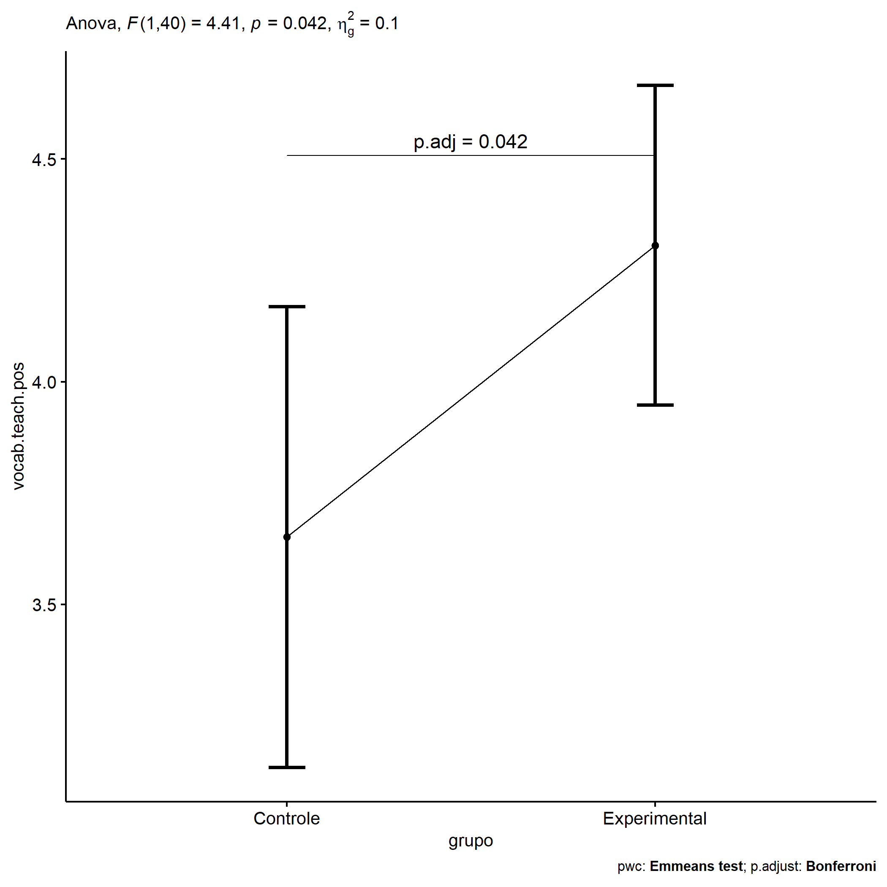<!-- -->

``` r
plots <- oneWayAncovaBoxPlots(
  wdat, "vocab.teach.pos", "grupo", aov, pwc, covar = "vocab.teach.pre",
  theme = "classic", color = color[["grupo"]],
  subtitle = which(aov$Effect == "grupo"))
```

``` r
if (length(unique(wdat[["grupo"]])) > 1)
  plots[["grupo"]] + ggplot2::ylab("Vocabulario Ensinado") + ggplot2::scale_x_discrete(labels=c('pre', 'pos'))
```

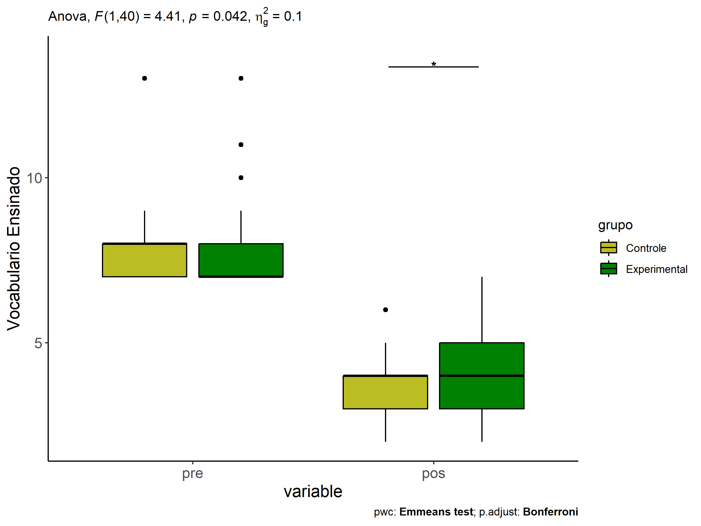<!-- -->

``` r
if (length(unique(wdat.long[["grupo"]])) > 1)
  plots <- oneWayAncovaBoxPlots(
    wdat.long, "vocab.teach", "grupo", aov, pwc.long, pre.post = "time",
    theme = "classic", color = color$prepost)
```

``` r
if (length(unique(wdat.long[["grupo"]])) > 1)
  plots[["grupo"]] + ggplot2::ylab("Vocabulario Ensinado")
```

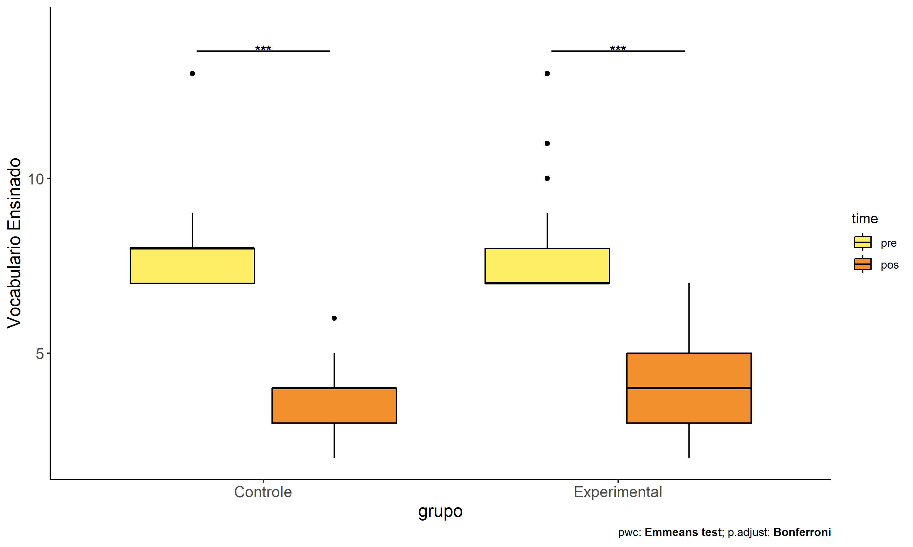<!-- -->

### Checking linearity assumption

``` r
ggscatter(wdat, x = "vocab.teach.pre", y = "vocab.teach.pos", size = 0.5,
          color = "grupo", add = "reg.line")+
  stat_regline_equation(
    aes(label =  paste(..eq.label.., ..rr.label.., sep = "~~~~"), color = grupo)
  )
```

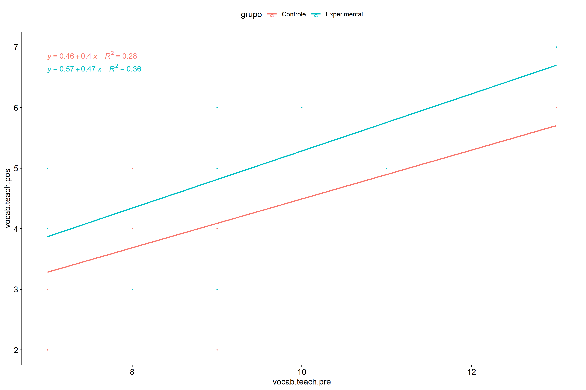<!-- -->

### Checking normality and homogeneity

``` r
res <- augment(lm(vocab.teach.pos ~ vocab.teach.pre + grupo, data = wdat))
```

``` r
shapiro_test(res$.resid)
```

    ## # A tibble: 1 × 3
    ##   variable   statistic p.value
    ##   <chr>          <dbl>   <dbl>
    ## 1 res$.resid     0.945  0.0393

``` r
levene_test(res, .resid ~ grupo)
```

    ## # A tibble: 1 × 4
    ##     df1   df2 statistic     p
    ##   <int> <int>     <dbl> <dbl>
    ## 1     1    41     0.160 0.691

# ANCOVA and Pairwise for two factors **grupo:Sexo**

## Without remove non-normal data

``` r
pdat = remove_group_data(dat[!is.na(dat[["grupo"]]) & !is.na(dat[["Sexo"]]),], "vocab.teach.pos", c("grupo","Sexo"))

pdat.long <- rbind(pdat[,c("id","grupo","Sexo")], pdat[,c("id","grupo","Sexo")])
pdat.long[["time"]] <- c(rep("pre", nrow(pdat)), rep("pos", nrow(pdat)))
pdat.long[["time"]] <- factor(pdat.long[["time"]], c("pre","pos"))
pdat.long[["vocab.teach"]] <- c(pdat[["vocab.teach.pre"]], pdat[["vocab.teach.pos"]])

aov = anova_test(pdat, vocab.teach.pos ~ vocab.teach.pre + grupo*Sexo)
laov[["grupo:Sexo"]] <- get_anova_table(aov)
```

``` r
pwcs <- list()
pwcs[["Sexo"]] <- emmeans_test(
  group_by(pdat, grupo), vocab.teach.pos ~ Sexo,
  covariate = vocab.teach.pre, p.adjust.method = "bonferroni")
pwcs[["grupo"]] <- emmeans_test(
  group_by(pdat, Sexo), vocab.teach.pos ~ grupo,
  covariate = vocab.teach.pre, p.adjust.method = "bonferroni")

pwc <- plyr::rbind.fill(pwcs[["grupo"]], pwcs[["Sexo"]])
pwc <- pwc[,c("grupo","Sexo", colnames(pwc)[!colnames(pwc) %in% c("grupo","Sexo")])]
```

``` r
pwc.long <- emmeans_test(dplyr::group_by_at(pdat.long, c("grupo","Sexo")),
                         vocab.teach ~ time,
                         p.adjust.method = "bonferroni")
lpwc[["grupo:Sexo"]] <- plyr::rbind.fill(pwc, pwc.long)
```

``` r
ds <- get.descriptives(pdat, "vocab.teach.pos", c("grupo","Sexo"), covar = "vocab.teach.pre")
ds <- merge(ds[ds$variable != "vocab.teach.pre",],
            ds[ds$variable == "vocab.teach.pre", !colnames(ds) %in% c("variable")],
            by = c("grupo","Sexo"), all.x = T, suffixes = c("", ".vocab.teach.pre"))
ds <- merge(get_emmeans(pwcs[["grupo"]]), ds, by = c("grupo","Sexo"), suffixes = c(".emms", ""))
ds <- ds[,c("grupo","Sexo","n","mean.vocab.teach.pre","se.vocab.teach.pre","mean","se","emmean","se.emms")]

colnames(ds) <- c("grupo","Sexo", "N", paste0(c("M","SE")," (pre)"),
                  paste0(c("M","SE"), " (unadj)"), paste0(c("M", "SE"), " (adj)"))

lemms[["grupo:Sexo"]] <- ds
```

## Computing ANCOVA and PairWise After removing non-normal data (OK)

``` r
wdat = pdat 

res = residuals(lm(vocab.teach.pos ~ vocab.teach.pre + grupo*Sexo, data = wdat))
non.normal = getNonNormal(res, wdat$id, plimit = 0.05)

wdat = wdat[!wdat$id %in% non.normal,]

wdat.long <- rbind(wdat[,c("id","grupo","Sexo")], wdat[,c("id","grupo","Sexo")])
wdat.long[["time"]] <- c(rep("pre", nrow(wdat)), rep("pos", nrow(wdat)))
wdat.long[["time"]] <- factor(wdat.long[["time"]], c("pre","pos"))
wdat.long[["vocab.teach"]] <- c(wdat[["vocab.teach.pre"]], wdat[["vocab.teach.pos"]])


ldat[["grupo:Sexo"]] = wdat

(non.normal)
```

    ## NULL

``` r
aov = anova_test(wdat, vocab.teach.pos ~ vocab.teach.pre + grupo*Sexo)
laov[["grupo:Sexo"]] <- merge(get_anova_table(aov), laov[["grupo:Sexo"]], by="Effect", suffixes = c("","'"))

(df = get_anova_table(aov))
```

    ## ANOVA Table (type II tests)
    ## 
    ##            Effect DFn DFd      F        p p<.05   ges
    ## 1 vocab.teach.pre   1 235 17.011 5.16e-05     * 0.068
    ## 2           grupo   1 235  1.133 2.88e-01       0.005
    ## 3            Sexo   1 235  4.267 4.00e-02     * 0.018
    ## 4      grupo:Sexo   1 235  0.475 4.91e-01       0.002

| Effect          | DFn | DFd |      F |     p | p\<.05 |   ges |
|:----------------|----:|----:|-------:|------:|:-------|------:|
| vocab.teach.pre |   1 | 235 | 17.011 | 0.000 | \*     | 0.068 |
| grupo           |   1 | 235 |  1.133 | 0.288 |        | 0.005 |
| Sexo            |   1 | 235 |  4.267 | 0.040 | \*     | 0.018 |
| grupo:Sexo      |   1 | 235 |  0.475 | 0.491 |        | 0.002 |

``` r
pwcs <- list()
pwcs[["Sexo"]] <- emmeans_test(
  group_by(wdat, grupo), vocab.teach.pos ~ Sexo,
  covariate = vocab.teach.pre, p.adjust.method = "bonferroni")
pwcs[["grupo"]] <- emmeans_test(
  group_by(wdat, Sexo), vocab.teach.pos ~ grupo,
  covariate = vocab.teach.pre, p.adjust.method = "bonferroni")

pwc <- plyr::rbind.fill(pwcs[["grupo"]], pwcs[["Sexo"]])
pwc <- pwc[,c("grupo","Sexo", colnames(pwc)[!colnames(pwc) %in% c("grupo","Sexo")])]
```

| grupo        | Sexo | term                   | .y.             | group1   | group2       |  df | statistic |     p | p.adj | p.adj.signif |
|:-------------|:-----|:-----------------------|:----------------|:---------|:-------------|----:|----------:|------:|------:|:-------------|
|              | F    | vocab.teach.pre\*grupo | vocab.teach.pos | Controle | Experimental | 235 |    -1.240 | 0.216 | 0.216 | ns           |
|              | M    | vocab.teach.pre\*grupo | vocab.teach.pos | Controle | Experimental | 235 |    -0.253 | 0.800 | 0.800 | ns           |
| Controle     |      | vocab.teach.pre\*Sexo  | vocab.teach.pos | F        | M            | 235 |     0.769 | 0.442 | 0.442 | ns           |
| Experimental |      | vocab.teach.pre\*Sexo  | vocab.teach.pos | F        | M            | 235 |     2.032 | 0.043 | 0.043 | \*           |

``` r
pwc.long <- emmeans_test(dplyr::group_by_at(wdat.long, c("grupo","Sexo")),
                         vocab.teach ~ time,
                         p.adjust.method = "bonferroni")
lpwc[["grupo:Sexo"]] <- merge(plyr::rbind.fill(pwc, pwc.long), lpwc[["grupo:Sexo"]], by=c("grupo","Sexo","term",".y.","group1","group2"), suffixes = c("","'"))
```

| grupo        | Sexo | term | .y.         | group1 | group2 |  df | statistic |     p | p.adj | p.adj.signif |
|:-------------|:-----|:-----|:------------|:-------|:-------|----:|----------:|------:|------:|:-------------|
| Controle     | F    | time | vocab.teach | pre    | pos    | 472 |     2.011 | 0.045 | 0.045 | \*           |
| Controle     | M    | time | vocab.teach | pre    | pos    | 472 |     3.509 | 0.000 | 0.000 | \*\*\*       |
| Experimental | F    | time | vocab.teach | pre    | pos    | 472 |     1.156 | 0.248 | 0.248 | ns           |
| Experimental | M    | time | vocab.teach | pre    | pos    | 472 |     3.391 | 0.001 | 0.001 | \*\*\*       |

``` r
ds <- get.descriptives(wdat, "vocab.teach.pos", c("grupo","Sexo"), covar = "vocab.teach.pre")
ds <- merge(ds[ds$variable != "vocab.teach.pre",],
            ds[ds$variable == "vocab.teach.pre", !colnames(ds) %in% c("variable")],
            by = c("grupo","Sexo"), all.x = T, suffixes = c("", ".vocab.teach.pre"))
ds <- merge(get_emmeans(pwcs[["grupo"]]), ds, by = c("grupo","Sexo"), suffixes = c(".emms", ""))
ds <- ds[,c("grupo","Sexo","n","mean.vocab.teach.pre","se.vocab.teach.pre","mean","se","emmean","se.emms")]

colnames(ds) <- c("grupo","Sexo", "N", paste0(c("M","SE")," (pre)"),
                  paste0(c("M","SE"), " (unadj)"), paste0(c("M", "SE"), " (adj)"))

lemms[["grupo:Sexo"]] <- merge(ds, lemms[["grupo:Sexo"]], by=c("grupo","Sexo"), suffixes = c("","'"))
```

| grupo        | Sexo |   N | M (pre) | SE (pre) | M (unadj) | SE (unadj) | M (adj) | SE (adj) |
|:-------------|:-----|----:|--------:|---------:|----------:|-----------:|--------:|---------:|
| Controle     | F    |  49 |   7.592 |    0.116 |     6.918 |      0.270 |   7.015 |    0.291 |
| Controle     | M    |  48 |   8.000 |    0.179 |     6.812 |      0.313 |   6.694 |    0.295 |
| Experimental | F    |  72 |   7.833 |    0.133 |     7.514 |      0.245 |   7.483 |    0.240 |
| Experimental | M    |  71 |   7.690 |    0.111 |     6.746 |      0.263 |   6.791 |    0.242 |

### Plots for ancova

``` r
plots <- twoWayAncovaPlots(
  wdat, "vocab.teach.pos", c("grupo","Sexo"), aov, pwcs, addParam = c("mean_se"),
  font.label.size=10, step.increase=0.05, p.label="p.adj",
  subtitle = which(aov$Effect == "grupo:Sexo"))
```

``` r
if (!is.null(plots[["grupo"]]))
  plots[["grupo"]] + ggplot2::scale_color_manual(values = color[["Sexo"]])
```

    ## Scale for colour is already present.
    ## Adding another scale for colour, which will replace the existing scale.

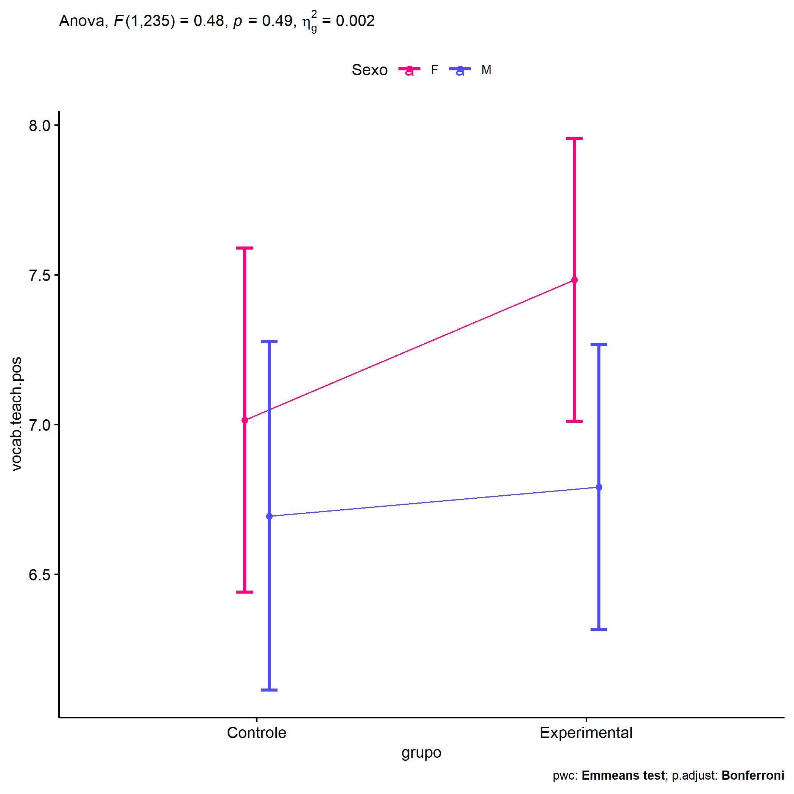<!-- -->

``` r
if (!is.null(plots[["Sexo"]]))
  plots[["Sexo"]] + ggplot2::scale_color_manual(values = color[["grupo"]])
```

    ## Scale for colour is already present.
    ## Adding another scale for colour, which will replace the existing scale.

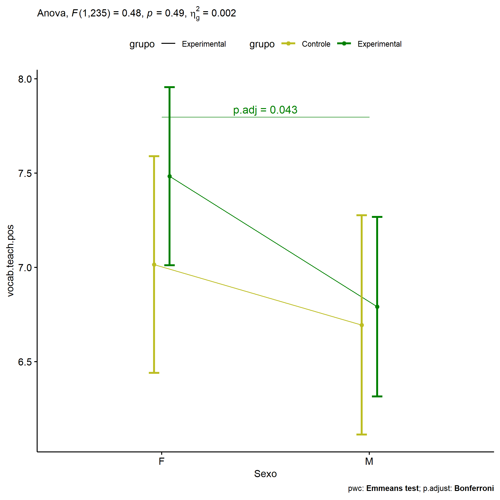<!-- -->

``` r
plots <- twoWayAncovaBoxPlots(
  wdat, "vocab.teach.pos", c("grupo","Sexo"), aov, pwcs, covar = "vocab.teach.pre",
  theme = "classic", color = color[["grupo:Sexo"]],
  subtitle = which(aov$Effect == "grupo:Sexo"))
```

``` r
plots[["grupo:Sexo"]] + ggplot2::ylab("Vocabulario Ensinado") + ggplot2::scale_x_discrete(labels=c('pre', 'pos'))
```

<!-- -->

``` r
plots <- twoWayAncovaBoxPlots(
  wdat.long, "vocab.teach", c("grupo","Sexo"), aov, pwc.long, pre.post = "time",
  theme = "classic", color = color$prepost)
```

``` r
plots[["grupo:Sexo"]] + ggplot2::ylab("Vocabulario Ensinado")
```

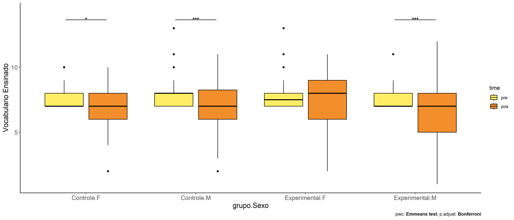<!-- -->

### Checking linearity assumption

``` r
ggscatter(wdat, x = "vocab.teach.pre", y = "vocab.teach.pos", size = 0.5,
          facet.by = c("grupo","Sexo"), add = "reg.line")+
  stat_regline_equation(
    aes(label =  paste(..eq.label.., ..rr.label.., sep = "~~~~"))
  )
```

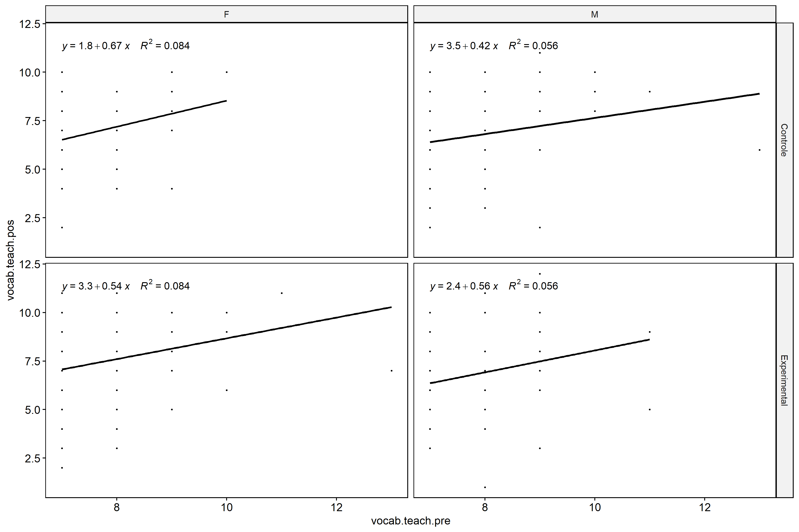<!-- -->

### Checking normality and homogeneity

``` r
res <- augment(lm(vocab.teach.pos ~ vocab.teach.pre + grupo*Sexo, data = wdat))
```

``` r
shapiro_test(res$.resid)
```

    ## # A tibble: 1 × 3
    ##   variable   statistic p.value
    ##   <chr>          <dbl>   <dbl>
    ## 1 res$.resid     0.989  0.0718

``` r
levene_test(res, .resid ~ grupo*Sexo)
```

    ## # A tibble: 1 × 4
    ##     df1   df2 statistic     p
    ##   <int> <int>     <dbl> <dbl>
    ## 1     3   236     0.412 0.745

# ANCOVA and Pairwise for two factors **grupo:Zona**

## Without remove non-normal data

``` r
pdat = remove_group_data(dat[!is.na(dat[["grupo"]]) & !is.na(dat[["Zona"]]),], "vocab.teach.pos", c("grupo","Zona"))

pdat.long <- rbind(pdat[,c("id","grupo","Zona")], pdat[,c("id","grupo","Zona")])
pdat.long[["time"]] <- c(rep("pre", nrow(pdat)), rep("pos", nrow(pdat)))
pdat.long[["time"]] <- factor(pdat.long[["time"]], c("pre","pos"))
pdat.long[["vocab.teach"]] <- c(pdat[["vocab.teach.pre"]], pdat[["vocab.teach.pos"]])

aov = anova_test(pdat, vocab.teach.pos ~ vocab.teach.pre + grupo*Zona)
laov[["grupo:Zona"]] <- get_anova_table(aov)
```

``` r
pwcs <- list()
pwcs[["Zona"]] <- emmeans_test(
  group_by(pdat, grupo), vocab.teach.pos ~ Zona,
  covariate = vocab.teach.pre, p.adjust.method = "bonferroni")
pwcs[["grupo"]] <- emmeans_test(
  group_by(pdat, Zona), vocab.teach.pos ~ grupo,
  covariate = vocab.teach.pre, p.adjust.method = "bonferroni")

pwc <- plyr::rbind.fill(pwcs[["grupo"]], pwcs[["Zona"]])
pwc <- pwc[,c("grupo","Zona", colnames(pwc)[!colnames(pwc) %in% c("grupo","Zona")])]
```

``` r
pwc.long <- emmeans_test(dplyr::group_by_at(pdat.long, c("grupo","Zona")),
                         vocab.teach ~ time,
                         p.adjust.method = "bonferroni")
lpwc[["grupo:Zona"]] <- plyr::rbind.fill(pwc, pwc.long)
```

``` r
ds <- get.descriptives(pdat, "vocab.teach.pos", c("grupo","Zona"), covar = "vocab.teach.pre")
ds <- merge(ds[ds$variable != "vocab.teach.pre",],
            ds[ds$variable == "vocab.teach.pre", !colnames(ds) %in% c("variable")],
            by = c("grupo","Zona"), all.x = T, suffixes = c("", ".vocab.teach.pre"))
ds <- merge(get_emmeans(pwcs[["grupo"]]), ds, by = c("grupo","Zona"), suffixes = c(".emms", ""))
ds <- ds[,c("grupo","Zona","n","mean.vocab.teach.pre","se.vocab.teach.pre","mean","se","emmean","se.emms")]

colnames(ds) <- c("grupo","Zona", "N", paste0(c("M","SE")," (pre)"),
                  paste0(c("M","SE"), " (unadj)"), paste0(c("M", "SE"), " (adj)"))

lemms[["grupo:Zona"]] <- ds
```

## Computing ANCOVA and PairWise After removing non-normal data (OK)

``` r
wdat = pdat 

res = residuals(lm(vocab.teach.pos ~ vocab.teach.pre + grupo*Zona, data = wdat))
non.normal = getNonNormal(res, wdat$id, plimit = 0.05)

wdat = wdat[!wdat$id %in% non.normal,]

wdat.long <- rbind(wdat[,c("id","grupo","Zona")], wdat[,c("id","grupo","Zona")])
wdat.long[["time"]] <- c(rep("pre", nrow(wdat)), rep("pos", nrow(wdat)))
wdat.long[["time"]] <- factor(wdat.long[["time"]], c("pre","pos"))
wdat.long[["vocab.teach"]] <- c(wdat[["vocab.teach.pre"]], wdat[["vocab.teach.pos"]])


ldat[["grupo:Zona"]] = wdat

(non.normal)
```

    ## NULL

``` r
aov = anova_test(wdat, vocab.teach.pos ~ vocab.teach.pre + grupo*Zona)
laov[["grupo:Zona"]] <- merge(get_anova_table(aov), laov[["grupo:Zona"]], by="Effect", suffixes = c("","'"))

(df = get_anova_table(aov))
```

    ## ANOVA Table (type II tests)
    ## 
    ##            Effect DFn DFd     F     p p<.05      ges
    ## 1 vocab.teach.pre   1 160 9.218 0.003     * 0.054000
    ## 2           grupo   1 160 0.879 0.350       0.005000
    ## 3            Zona   1 160 0.594 0.442       0.004000
    ## 4      grupo:Zona   1 160 0.134 0.714       0.000839

| Effect          | DFn | DFd |     F |     p | p\<.05 |   ges |
|:----------------|----:|----:|------:|------:|:-------|------:|
| vocab.teach.pre |   1 | 160 | 9.218 | 0.003 | \*     | 0.054 |
| grupo           |   1 | 160 | 0.879 | 0.350 |        | 0.005 |
| Zona            |   1 | 160 | 0.594 | 0.442 |        | 0.004 |
| grupo:Zona      |   1 | 160 | 0.134 | 0.714 |        | 0.001 |

``` r
pwcs <- list()
pwcs[["Zona"]] <- emmeans_test(
  group_by(wdat, grupo), vocab.teach.pos ~ Zona,
  covariate = vocab.teach.pre, p.adjust.method = "bonferroni")
pwcs[["grupo"]] <- emmeans_test(
  group_by(wdat, Zona), vocab.teach.pos ~ grupo,
  covariate = vocab.teach.pre, p.adjust.method = "bonferroni")

pwc <- plyr::rbind.fill(pwcs[["grupo"]], pwcs[["Zona"]])
pwc <- pwc[,c("grupo","Zona", colnames(pwc)[!colnames(pwc) %in% c("grupo","Zona")])]
```

| grupo        | Zona   | term                   | .y.             | group1   | group2       |  df | statistic |     p | p.adj | p.adj.signif |
|:-------------|:-------|:-----------------------|:----------------|:---------|:-------------|----:|----------:|------:|------:|:-------------|
|              | Rural  | vocab.teach.pre\*grupo | vocab.teach.pos | Controle | Experimental | 160 |    -0.567 | 0.571 | 0.571 | ns           |
|              | Urbana | vocab.teach.pre\*grupo | vocab.teach.pos | Controle | Experimental | 160 |    -0.833 | 0.406 | 0.406 | ns           |
| Controle     |        | vocab.teach.pre\*Zona  | vocab.teach.pos | Rural    | Urbana       | 160 |     0.752 | 0.453 | 0.453 | ns           |
| Experimental |        | vocab.teach.pre\*Zona  | vocab.teach.pos | Rural    | Urbana       | 160 |     0.403 | 0.687 | 0.687 | ns           |

``` r
pwc.long <- emmeans_test(dplyr::group_by_at(wdat.long, c("grupo","Zona")),
                         vocab.teach ~ time,
                         p.adjust.method = "bonferroni")
lpwc[["grupo:Zona"]] <- merge(plyr::rbind.fill(pwc, pwc.long), lpwc[["grupo:Zona"]], by=c("grupo","Zona","term",".y.","group1","group2"), suffixes = c("","'"))
```

| grupo        | Zona   | term | .y.         | group1 | group2 |  df | statistic |     p | p.adj | p.adj.signif |
|:-------------|:-------|:-----|:------------|:-------|:-------|----:|----------:|------:|------:|:-------------|
| Controle     | Rural  | time | vocab.teach | pre    | pos    | 322 |     1.714 | 0.087 | 0.087 | ns           |
| Controle     | Urbana | time | vocab.teach | pre    | pos    | 322 |     1.827 | 0.069 | 0.069 | ns           |
| Experimental | Rural  | time | vocab.teach | pre    | pos    | 322 |     1.323 | 0.187 | 0.187 | ns           |
| Experimental | Urbana | time | vocab.teach | pre    | pos    | 322 |     1.906 | 0.058 | 0.058 | ns           |

``` r
ds <- get.descriptives(wdat, "vocab.teach.pos", c("grupo","Zona"), covar = "vocab.teach.pre")
ds <- merge(ds[ds$variable != "vocab.teach.pre",],
            ds[ds$variable == "vocab.teach.pre", !colnames(ds) %in% c("variable")],
            by = c("grupo","Zona"), all.x = T, suffixes = c("", ".vocab.teach.pre"))
ds <- merge(get_emmeans(pwcs[["grupo"]]), ds, by = c("grupo","Zona"), suffixes = c(".emms", ""))
ds <- ds[,c("grupo","Zona","n","mean.vocab.teach.pre","se.vocab.teach.pre","mean","se","emmean","se.emms")]

colnames(ds) <- c("grupo","Zona", "N", paste0(c("M","SE")," (pre)"),
                  paste0(c("M","SE"), " (unadj)"), paste0(c("M", "SE"), " (adj)"))

lemms[["grupo:Zona"]] <- merge(ds, lemms[["grupo:Zona"]], by=c("grupo","Zona"), suffixes = c("","'"))
```

| grupo        | Zona   |   N | M (pre) | SE (pre) | M (unadj) | SE (unadj) | M (adj) | SE (adj) |
|:-------------|:-------|----:|--------:|---------:|----------:|-----------:|--------:|---------:|
| Controle     | Rural  |  46 |   7.630 |    0.140 |     7.043 |      0.298 |   7.089 |    0.299 |
| Controle     | Urbana |  18 |   7.611 |    0.231 |     6.611 |      0.354 |   6.665 |    0.478 |
| Experimental | Rural  |  61 |   7.689 |    0.125 |     7.295 |      0.288 |   7.313 |    0.259 |
| Experimental | Urbana |  40 |   7.950 |    0.196 |     7.250 |      0.330 |   7.146 |    0.322 |

### Plots for ancova

``` r
plots <- twoWayAncovaPlots(
  wdat, "vocab.teach.pos", c("grupo","Zona"), aov, pwcs, addParam = c("mean_se"),
  font.label.size=10, step.increase=0.05, p.label="p.adj",
  subtitle = which(aov$Effect == "grupo:Zona"))
```

``` r
if (!is.null(plots[["grupo"]]))
  plots[["grupo"]] + ggplot2::scale_color_manual(values = color[["Zona"]])
```

    ## Scale for colour is already present.
    ## Adding another scale for colour, which will replace the existing scale.

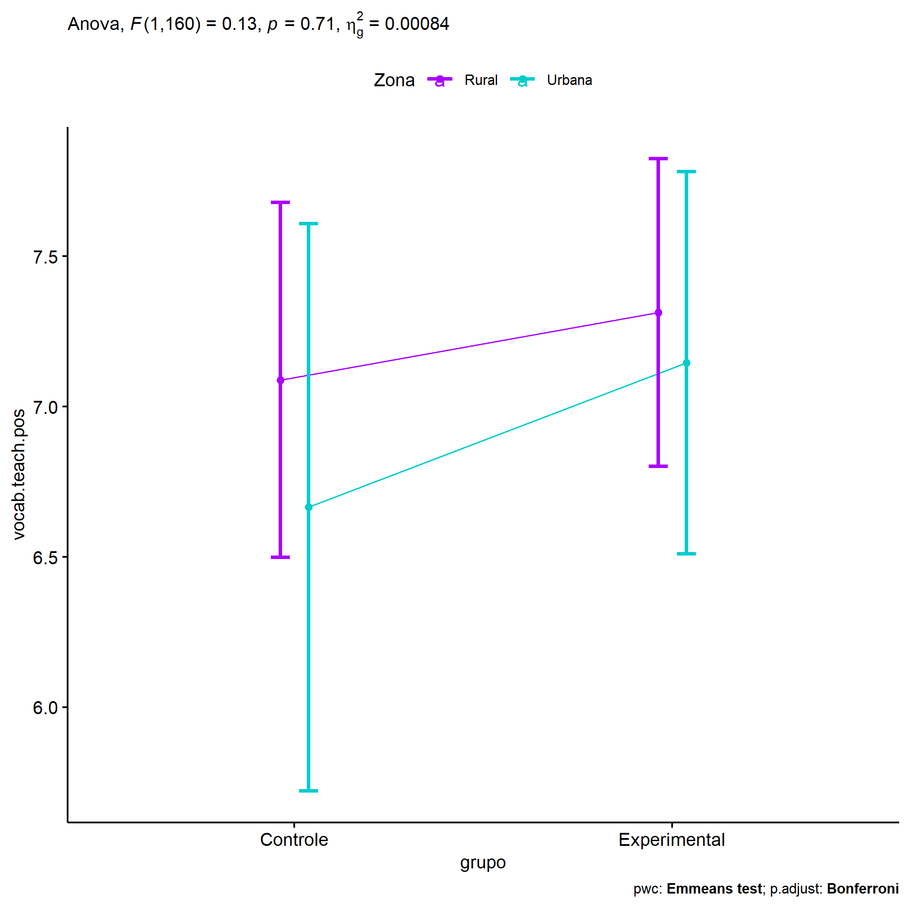<!-- -->

``` r
if (!is.null(plots[["Zona"]]))
  plots[["Zona"]] + ggplot2::scale_color_manual(values = color[["grupo"]])
```

    ## Scale for colour is already present.
    ## Adding another scale for colour, which will replace the existing scale.

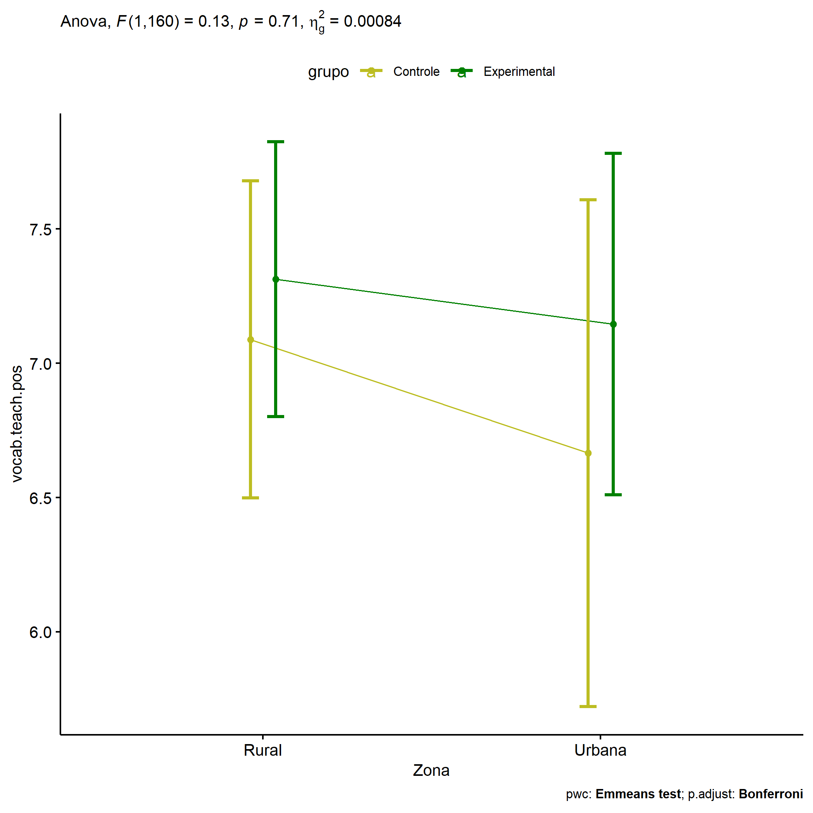<!-- -->

``` r
plots <- twoWayAncovaBoxPlots(
  wdat, "vocab.teach.pos", c("grupo","Zona"), aov, pwcs, covar = "vocab.teach.pre",
  theme = "classic", color = color[["grupo:Zona"]],
  subtitle = which(aov$Effect == "grupo:Zona"))
```

``` r
plots[["grupo:Zona"]] + ggplot2::ylab("Vocabulario Ensinado") + ggplot2::scale_x_discrete(labels=c('pre', 'pos'))
```

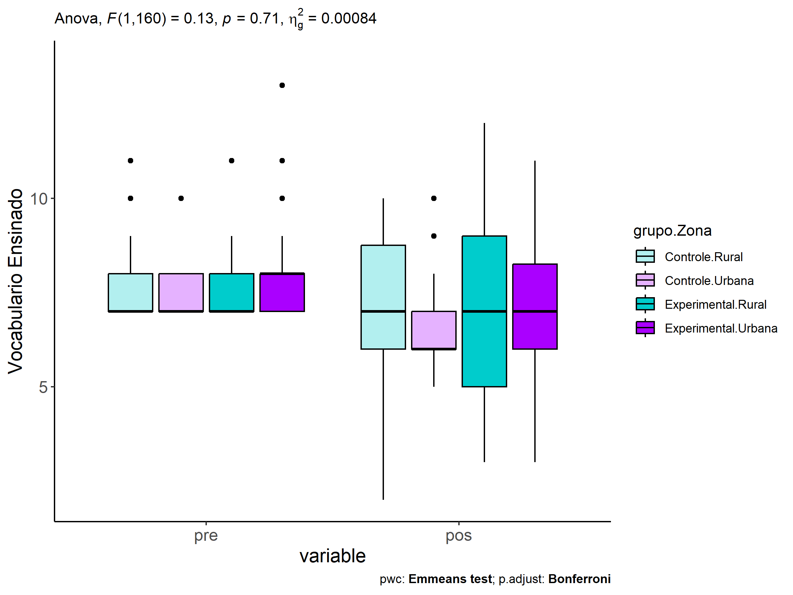<!-- -->

``` r
plots <- twoWayAncovaBoxPlots(
  wdat.long, "vocab.teach", c("grupo","Zona"), aov, pwc.long, pre.post = "time",
  theme = "classic", color = color$prepost)
```

``` r
plots[["grupo:Zona"]] + ggplot2::ylab("Vocabulario Ensinado")
```

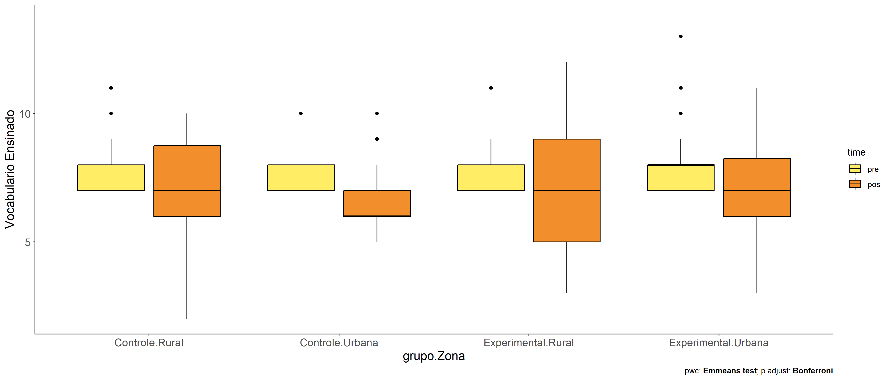<!-- -->

### Checking linearity assumption

``` r
ggscatter(wdat, x = "vocab.teach.pre", y = "vocab.teach.pos", size = 0.5,
          facet.by = c("grupo","Zona"), add = "reg.line")+
  stat_regline_equation(
    aes(label =  paste(..eq.label.., ..rr.label.., sep = "~~~~"))
  )
```

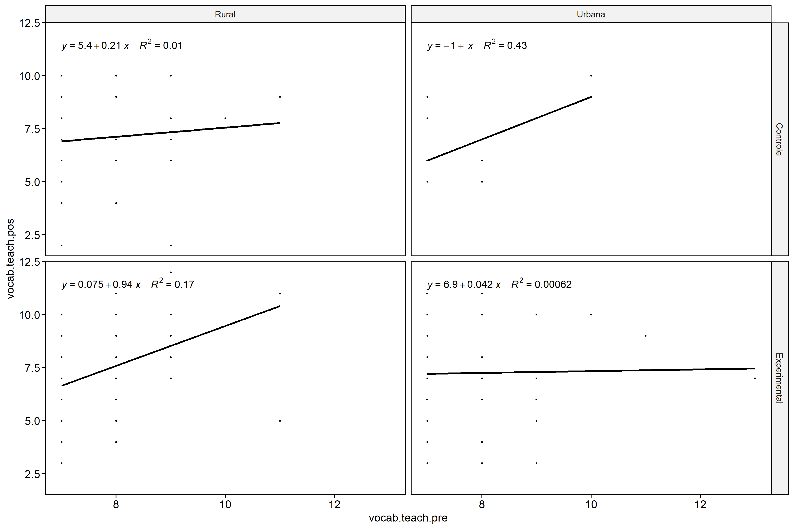<!-- -->

### Checking normality and homogeneity

``` r
res <- augment(lm(vocab.teach.pos ~ vocab.teach.pre + grupo*Zona, data = wdat))
```

``` r
shapiro_test(res$.resid)
```

    ## # A tibble: 1 × 3
    ##   variable   statistic p.value
    ##   <chr>          <dbl>   <dbl>
    ## 1 res$.resid     0.987   0.129

``` r
levene_test(res, .resid ~ grupo*Zona)
```

    ## # A tibble: 1 × 4
    ##     df1   df2 statistic      p
    ##   <int> <int>     <dbl>  <dbl>
    ## 1     3   161      2.58 0.0554

# ANCOVA and Pairwise for two factors **grupo:Cor.Raca**

## Without remove non-normal data

``` r
pdat = remove_group_data(dat[!is.na(dat[["grupo"]]) & !is.na(dat[["Cor.Raca"]]),], "vocab.teach.pos", c("grupo","Cor.Raca"))
```

    ## Warning: There was 1 warning in `mutate()`.
    ## ℹ In argument: `ci = abs(stats::qt(alpha/2, .data$n - 1) * .data$se)`.
    ## Caused by warning:
    ## ! There was 1 warning in `mutate()`.
    ## ℹ In argument: `ci = abs(stats::qt(alpha/2, .data$n - 1) * .data$se)`.
    ## Caused by warning in `stats::qt()`:
    ## ! NaNs produced

``` r
pdat.long <- rbind(pdat[,c("id","grupo","Cor.Raca")], pdat[,c("id","grupo","Cor.Raca")])
pdat.long[["time"]] <- c(rep("pre", nrow(pdat)), rep("pos", nrow(pdat)))
pdat.long[["time"]] <- factor(pdat.long[["time"]], c("pre","pos"))
pdat.long[["vocab.teach"]] <- c(pdat[["vocab.teach.pre"]], pdat[["vocab.teach.pos"]])

aov = anova_test(pdat, vocab.teach.pos ~ vocab.teach.pre + grupo*Cor.Raca)
laov[["grupo:Cor.Raca"]] <- get_anova_table(aov)
```

``` r
pwcs <- list()
pwcs[["Cor.Raca"]] <- emmeans_test(
  group_by(pdat, grupo), vocab.teach.pos ~ Cor.Raca,
  covariate = vocab.teach.pre, p.adjust.method = "bonferroni")
pwcs[["grupo"]] <- emmeans_test(
  group_by(pdat, Cor.Raca), vocab.teach.pos ~ grupo,
  covariate = vocab.teach.pre, p.adjust.method = "bonferroni")

pwc <- plyr::rbind.fill(pwcs[["grupo"]], pwcs[["Cor.Raca"]])
pwc <- pwc[,c("grupo","Cor.Raca", colnames(pwc)[!colnames(pwc) %in% c("grupo","Cor.Raca")])]
```

``` r
pwc.long <- emmeans_test(dplyr::group_by_at(pdat.long, c("grupo","Cor.Raca")),
                         vocab.teach ~ time,
                         p.adjust.method = "bonferroni")
lpwc[["grupo:Cor.Raca"]] <- plyr::rbind.fill(pwc, pwc.long)
```

``` r
ds <- get.descriptives(pdat, "vocab.teach.pos", c("grupo","Cor.Raca"), covar = "vocab.teach.pre")
ds <- merge(ds[ds$variable != "vocab.teach.pre",],
            ds[ds$variable == "vocab.teach.pre", !colnames(ds) %in% c("variable")],
            by = c("grupo","Cor.Raca"), all.x = T, suffixes = c("", ".vocab.teach.pre"))
ds <- merge(get_emmeans(pwcs[["grupo"]]), ds, by = c("grupo","Cor.Raca"), suffixes = c(".emms", ""))
ds <- ds[,c("grupo","Cor.Raca","n","mean.vocab.teach.pre","se.vocab.teach.pre","mean","se","emmean","se.emms")]

colnames(ds) <- c("grupo","Cor.Raca", "N", paste0(c("M","SE")," (pre)"),
                  paste0(c("M","SE"), " (unadj)"), paste0(c("M", "SE"), " (adj)"))

lemms[["grupo:Cor.Raca"]] <- ds
```

## Computing ANCOVA and PairWise After removing non-normal data (OK)

``` r
wdat = pdat 

res = residuals(lm(vocab.teach.pos ~ vocab.teach.pre + grupo*Cor.Raca, data = wdat))
non.normal = getNonNormal(res, wdat$id, plimit = 0.05)

wdat = wdat[!wdat$id %in% non.normal,]

wdat.long <- rbind(wdat[,c("id","grupo","Cor.Raca")], wdat[,c("id","grupo","Cor.Raca")])
wdat.long[["time"]] <- c(rep("pre", nrow(wdat)), rep("pos", nrow(wdat)))
wdat.long[["time"]] <- factor(wdat.long[["time"]], c("pre","pos"))
wdat.long[["vocab.teach"]] <- c(wdat[["vocab.teach.pre"]], wdat[["vocab.teach.pos"]])


ldat[["grupo:Cor.Raca"]] = wdat

(non.normal)
```

    ## NULL

``` r
aov = anova_test(wdat, vocab.teach.pos ~ vocab.teach.pre + grupo*Cor.Raca)
laov[["grupo:Cor.Raca"]] <- merge(get_anova_table(aov), laov[["grupo:Cor.Raca"]], by="Effect", suffixes = c("","'"))

(df = get_anova_table(aov))
```

    ## ANOVA Table (type II tests)
    ## 
    ##            Effect DFn DFd      F        p p<.05   ges
    ## 1 vocab.teach.pre   1  81 13.846 0.000365     * 0.146
    ## 2           grupo   1  81  0.532 0.468000       0.007
    ## 3        Cor.Raca   1  81  0.411 0.523000       0.005
    ## 4  grupo:Cor.Raca   1  81  0.085 0.771000       0.001

| Effect          | DFn | DFd |      F |     p | p\<.05 |   ges |
|:----------------|----:|----:|-------:|------:|:-------|------:|
| vocab.teach.pre |   1 |  81 | 13.846 | 0.000 | \*     | 0.146 |
| grupo           |   1 |  81 |  0.532 | 0.468 |        | 0.007 |
| Cor.Raca        |   1 |  81 |  0.411 | 0.523 |        | 0.005 |
| grupo:Cor.Raca  |   1 |  81 |  0.085 | 0.771 |        | 0.001 |

``` r
pwcs <- list()
pwcs[["Cor.Raca"]] <- emmeans_test(
  group_by(wdat, grupo), vocab.teach.pos ~ Cor.Raca,
  covariate = vocab.teach.pre, p.adjust.method = "bonferroni")
pwcs[["grupo"]] <- emmeans_test(
  group_by(wdat, Cor.Raca), vocab.teach.pos ~ grupo,
  covariate = vocab.teach.pre, p.adjust.method = "bonferroni")

pwc <- plyr::rbind.fill(pwcs[["grupo"]], pwcs[["Cor.Raca"]])
pwc <- pwc[,c("grupo","Cor.Raca", colnames(pwc)[!colnames(pwc) %in% c("grupo","Cor.Raca")])]
```

| grupo        | Cor.Raca | term                      | .y.             | group1   | group2       |  df | statistic |     p | p.adj | p.adj.signif |
|:-------------|:---------|:--------------------------|:----------------|:---------|:-------------|----:|----------:|------:|------:|:-------------|
|              | Branca   | vocab.teach.pre\*grupo    | vocab.teach.pos | Controle | Experimental |  81 |    -0.620 | 0.537 | 0.537 | ns           |
|              | Parda    | vocab.teach.pre\*grupo    | vocab.teach.pos | Controle | Experimental |  81 |    -0.481 | 0.632 | 0.632 | ns           |
| Controle     |          | vocab.teach.pre\*Cor.Raca | vocab.teach.pos | Branca   | Parda        |  81 |     0.188 | 0.851 | 0.851 | ns           |
| Experimental |          | vocab.teach.pre\*Cor.Raca | vocab.teach.pos | Branca   | Parda        |  81 |     0.678 | 0.500 | 0.500 | ns           |

``` r
pwc.long <- emmeans_test(dplyr::group_by_at(wdat.long, c("grupo","Cor.Raca")),
                         vocab.teach ~ time,
                         p.adjust.method = "bonferroni")
lpwc[["grupo:Cor.Raca"]] <- merge(plyr::rbind.fill(pwc, pwc.long), lpwc[["grupo:Cor.Raca"]], by=c("grupo","Cor.Raca","term",".y.","group1","group2"), suffixes = c("","'"))
```

| grupo        | Cor.Raca | term | .y.         | group1 | group2 |  df | statistic |     p | p.adj | p.adj.signif |
|:-------------|:---------|:-----|:------------|:-------|:-------|----:|----------:|------:|------:|:-------------|
| Controle     | Branca   | time | vocab.teach | pre    | pos    | 164 |     0.912 | 0.363 | 0.363 | ns           |
| Controle     | Parda    | time | vocab.teach | pre    | pos    | 164 |     1.886 | 0.061 | 0.061 | ns           |
| Experimental | Branca   | time | vocab.teach | pre    | pos    | 164 |     0.104 | 0.917 | 0.917 | ns           |
| Experimental | Parda    | time | vocab.teach | pre    | pos    | 164 |     1.474 | 0.142 | 0.142 | ns           |

``` r
ds <- get.descriptives(wdat, "vocab.teach.pos", c("grupo","Cor.Raca"), covar = "vocab.teach.pre")
ds <- merge(ds[ds$variable != "vocab.teach.pre",],
            ds[ds$variable == "vocab.teach.pre", !colnames(ds) %in% c("variable")],
            by = c("grupo","Cor.Raca"), all.x = T, suffixes = c("", ".vocab.teach.pre"))
ds <- merge(get_emmeans(pwcs[["grupo"]]), ds, by = c("grupo","Cor.Raca"), suffixes = c(".emms", ""))
ds <- ds[,c("grupo","Cor.Raca","n","mean.vocab.teach.pre","se.vocab.teach.pre","mean","se","emmean","se.emms")]

colnames(ds) <- c("grupo","Cor.Raca", "N", paste0(c("M","SE")," (pre)"),
                  paste0(c("M","SE"), " (unadj)"), paste0(c("M", "SE"), " (adj)"))

lemms[["grupo:Cor.Raca"]] <- merge(ds, lemms[["grupo:Cor.Raca"]], by=c("grupo","Cor.Raca"), suffixes = c("","'"))
```

| grupo        | Cor.Raca |   N | M (pre) | SE (pre) | M (unadj) | SE (unadj) | M (adj) | SE (adj) |
|:-------------|:---------|----:|--------:|---------:|----------:|-----------:|--------:|---------:|
| Controle     | Branca   |   9 |   8.000 |    0.471 |     7.222 |      0.778 |   7.056 |    0.716 |
| Controle     | Parda    |  29 |   7.828 |    0.258 |     6.931 |      0.391 |   6.902 |    0.398 |
| Experimental | Branca   |  14 |   7.357 |    0.133 |     7.286 |      0.485 |   7.630 |    0.581 |
| Experimental | Parda    |  34 |   7.882 |    0.157 |     7.235 |      0.449 |   7.162 |    0.368 |

### Plots for ancova

``` r
plots <- twoWayAncovaPlots(
  wdat, "vocab.teach.pos", c("grupo","Cor.Raca"), aov, pwcs, addParam = c("mean_se"),
  font.label.size=10, step.increase=0.05, p.label="p.adj",
  subtitle = which(aov$Effect == "grupo:Cor.Raca"))
```

``` r
if (!is.null(plots[["grupo"]]))
  plots[["grupo"]] + ggplot2::scale_color_manual(values = color[["Cor.Raca"]])
```

    ## Scale for colour is already present.
    ## Adding another scale for colour, which will replace the existing scale.

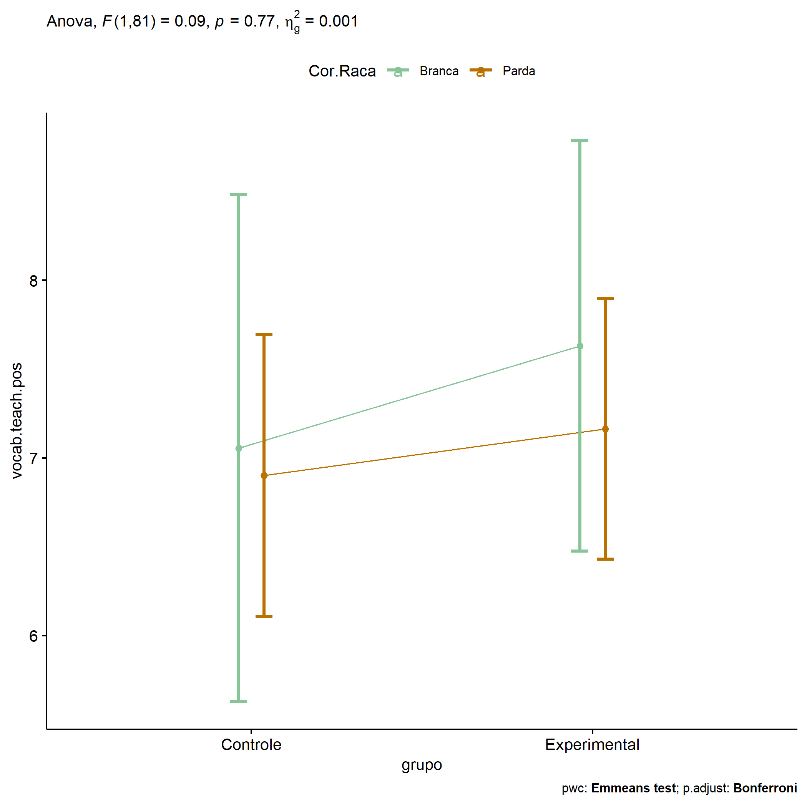<!-- -->

``` r
if (!is.null(plots[["Cor.Raca"]]))
  plots[["Cor.Raca"]] + ggplot2::scale_color_manual(values = color[["grupo"]])
```

    ## Scale for colour is already present.
    ## Adding another scale for colour, which will replace the existing scale.

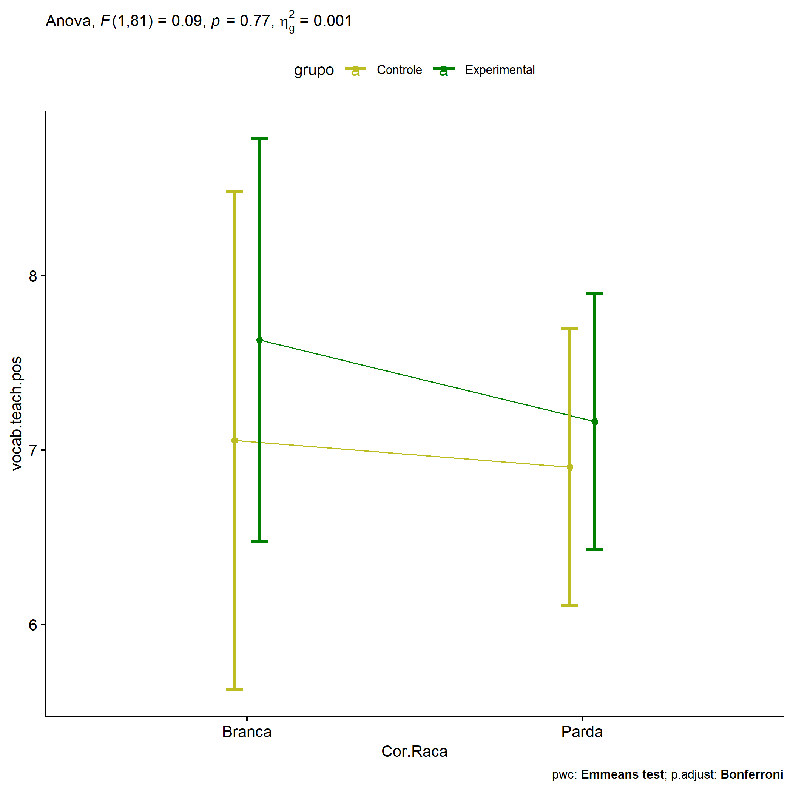<!-- -->

``` r
plots <- twoWayAncovaBoxPlots(
  wdat, "vocab.teach.pos", c("grupo","Cor.Raca"), aov, pwcs, covar = "vocab.teach.pre",
  theme = "classic", color = color[["grupo:Cor.Raca"]],
  subtitle = which(aov$Effect == "grupo:Cor.Raca"))
```

``` r
plots[["grupo:Cor.Raca"]] + ggplot2::ylab("Vocabulario Ensinado") + ggplot2::scale_x_discrete(labels=c('pre', 'pos'))
```

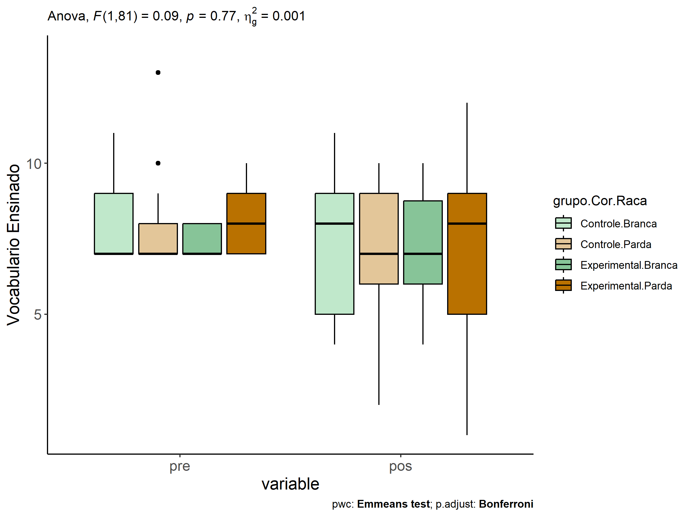<!-- -->

``` r
plots <- twoWayAncovaBoxPlots(
  wdat.long, "vocab.teach", c("grupo","Cor.Raca"), aov, pwc.long, pre.post = "time",
  theme = "classic", color = color$prepost)
```

``` r
plots[["grupo:Cor.Raca"]] + ggplot2::ylab("Vocabulario Ensinado")
```

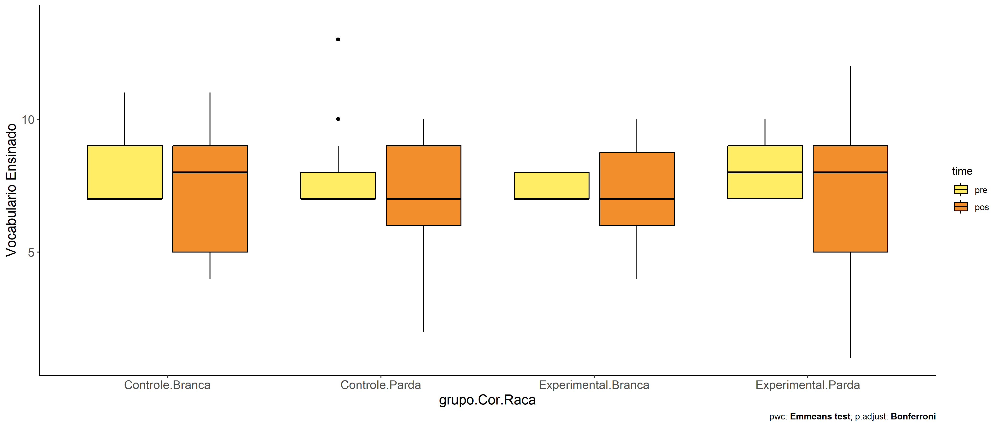<!-- -->

### Checking linearity assumption

``` r
ggscatter(wdat, x = "vocab.teach.pre", y = "vocab.teach.pos", size = 0.5,
          facet.by = c("grupo","Cor.Raca"), add = "reg.line")+
  stat_regline_equation(
    aes(label =  paste(..eq.label.., ..rr.label.., sep = "~~~~"))
  )
```

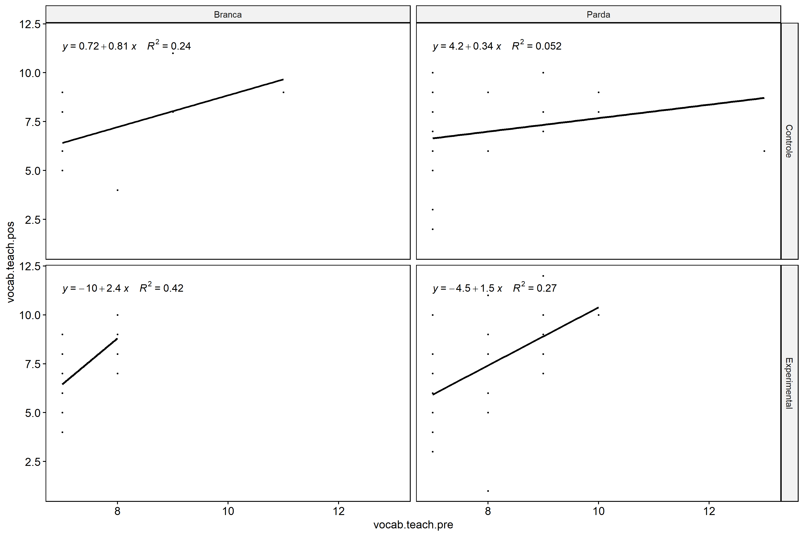<!-- -->

### Checking normality and homogeneity

``` r
res <- augment(lm(vocab.teach.pos ~ vocab.teach.pre + grupo*Cor.Raca, data = wdat))
```

``` r
shapiro_test(res$.resid)
```

    ## # A tibble: 1 × 3
    ##   variable   statistic p.value
    ##   <chr>          <dbl>   <dbl>
    ## 1 res$.resid     0.979   0.165

``` r
levene_test(res, .resid ~ grupo*Cor.Raca)
```

    ## # A tibble: 1 × 4
    ##     df1   df2 statistic     p
    ##   <int> <int>     <dbl> <dbl>
    ## 1     3    82     0.770 0.514

# ANCOVA and Pairwise for two factors **grupo:Serie**

## Without remove non-normal data

``` r
pdat = remove_group_data(dat[!is.na(dat[["grupo"]]) & !is.na(dat[["Serie"]]),], "vocab.teach.pos", c("grupo","Serie"))

pdat.long <- rbind(pdat[,c("id","grupo","Serie")], pdat[,c("id","grupo","Serie")])
pdat.long[["time"]] <- c(rep("pre", nrow(pdat)), rep("pos", nrow(pdat)))
pdat.long[["time"]] <- factor(pdat.long[["time"]], c("pre","pos"))
pdat.long[["vocab.teach"]] <- c(pdat[["vocab.teach.pre"]], pdat[["vocab.teach.pos"]])

aov = anova_test(pdat, vocab.teach.pos ~ vocab.teach.pre + grupo*Serie)
laov[["grupo:Serie"]] <- get_anova_table(aov)
```

``` r
pwcs <- list()
pwcs[["Serie"]] <- emmeans_test(
  group_by(pdat, grupo), vocab.teach.pos ~ Serie,
  covariate = vocab.teach.pre, p.adjust.method = "bonferroni")
pwcs[["grupo"]] <- emmeans_test(
  group_by(pdat, Serie), vocab.teach.pos ~ grupo,
  covariate = vocab.teach.pre, p.adjust.method = "bonferroni")

pwc <- plyr::rbind.fill(pwcs[["grupo"]], pwcs[["Serie"]])
pwc <- pwc[,c("grupo","Serie", colnames(pwc)[!colnames(pwc) %in% c("grupo","Serie")])]
```

``` r
pwc.long <- emmeans_test(dplyr::group_by_at(pdat.long, c("grupo","Serie")),
                         vocab.teach ~ time,
                         p.adjust.method = "bonferroni")
lpwc[["grupo:Serie"]] <- plyr::rbind.fill(pwc, pwc.long)
```

``` r
ds <- get.descriptives(pdat, "vocab.teach.pos", c("grupo","Serie"), covar = "vocab.teach.pre")
ds <- merge(ds[ds$variable != "vocab.teach.pre",],
            ds[ds$variable == "vocab.teach.pre", !colnames(ds) %in% c("variable")],
            by = c("grupo","Serie"), all.x = T, suffixes = c("", ".vocab.teach.pre"))
ds <- merge(get_emmeans(pwcs[["grupo"]]), ds, by = c("grupo","Serie"), suffixes = c(".emms", ""))
ds <- ds[,c("grupo","Serie","n","mean.vocab.teach.pre","se.vocab.teach.pre","mean","se","emmean","se.emms")]

colnames(ds) <- c("grupo","Serie", "N", paste0(c("M","SE")," (pre)"),
                  paste0(c("M","SE"), " (unadj)"), paste0(c("M", "SE"), " (adj)"))

lemms[["grupo:Serie"]] <- ds
```

## Computing ANCOVA and PairWise After removing non-normal data (OK)

``` r
wdat = pdat 

res = residuals(lm(vocab.teach.pos ~ vocab.teach.pre + grupo*Serie, data = wdat))
non.normal = getNonNormal(res, wdat$id, plimit = 0.05)

wdat = wdat[!wdat$id %in% non.normal,]

wdat.long <- rbind(wdat[,c("id","grupo","Serie")], wdat[,c("id","grupo","Serie")])
wdat.long[["time"]] <- c(rep("pre", nrow(wdat)), rep("pos", nrow(wdat)))
wdat.long[["time"]] <- factor(wdat.long[["time"]], c("pre","pos"))
wdat.long[["vocab.teach"]] <- c(wdat[["vocab.teach.pre"]], wdat[["vocab.teach.pos"]])


ldat[["grupo:Serie"]] = wdat

(non.normal)
```

    ## NULL

``` r
aov = anova_test(wdat, vocab.teach.pos ~ vocab.teach.pre + grupo*Serie)
laov[["grupo:Serie"]] <- merge(get_anova_table(aov), laov[["grupo:Serie"]], by="Effect", suffixes = c("","'"))

(df = get_anova_table(aov))
```

    ## ANOVA Table (type II tests)
    ## 
    ##            Effect DFn DFd      F        p p<.05   ges
    ## 1 vocab.teach.pre   1 231 18.567 2.43e-05     * 0.074
    ## 2           grupo   1 231  2.485 1.16e-01       0.011
    ## 3           Serie   3 231  4.123 7.00e-03     * 0.051
    ## 4     grupo:Serie   3 231  0.862 4.61e-01       0.011

| Effect          | DFn | DFd |      F |     p | p\<.05 |   ges |
|:----------------|----:|----:|-------:|------:|:-------|------:|
| vocab.teach.pre |   1 | 231 | 18.567 | 0.000 | \*     | 0.074 |
| grupo           |   1 | 231 |  2.485 | 0.116 |        | 0.011 |
| Serie           |   3 | 231 |  4.123 | 0.007 | \*     | 0.051 |
| grupo:Serie     |   3 | 231 |  0.862 | 0.461 |        | 0.011 |

``` r
pwcs <- list()
pwcs[["Serie"]] <- emmeans_test(
  group_by(wdat, grupo), vocab.teach.pos ~ Serie,
  covariate = vocab.teach.pre, p.adjust.method = "bonferroni")
pwcs[["grupo"]] <- emmeans_test(
  group_by(wdat, Serie), vocab.teach.pos ~ grupo,
  covariate = vocab.teach.pre, p.adjust.method = "bonferroni")

pwc <- plyr::rbind.fill(pwcs[["grupo"]], pwcs[["Serie"]])
pwc <- pwc[,c("grupo","Serie", colnames(pwc)[!colnames(pwc) %in% c("grupo","Serie")])]
```

| grupo        | Serie | term                   | .y.             | group1   | group2       |  df | statistic |     p | p.adj | p.adj.signif |
|:-------------|:------|:-----------------------|:----------------|:---------|:-------------|----:|----------:|------:|------:|:-------------|
|              | 6 ano | vocab.teach.pre\*grupo | vocab.teach.pos | Controle | Experimental | 231 |    -1.736 | 0.084 | 0.084 | ns           |
|              | 7 ano | vocab.teach.pre\*grupo | vocab.teach.pos | Controle | Experimental | 231 |     0.062 | 0.951 | 0.951 | ns           |
|              | 8 ano | vocab.teach.pre\*grupo | vocab.teach.pos | Controle | Experimental | 231 |    -0.115 | 0.909 | 0.909 | ns           |
|              | 9 ano | vocab.teach.pre\*grupo | vocab.teach.pos | Controle | Experimental | 231 |    -1.426 | 0.155 | 0.155 | ns           |
| Controle     |       | vocab.teach.pre\*Serie | vocab.teach.pos | 6 ano    | 7 ano        | 231 |    -0.888 | 0.376 | 1.000 | ns           |
| Controle     |       | vocab.teach.pre\*Serie | vocab.teach.pos | 6 ano    | 8 ano        | 231 |    -1.865 | 0.063 | 0.381 | ns           |
| Controle     |       | vocab.teach.pre\*Serie | vocab.teach.pos | 6 ano    | 9 ano        | 231 |    -2.129 | 0.034 | 0.206 | ns           |
| Controle     |       | vocab.teach.pre\*Serie | vocab.teach.pos | 7 ano    | 8 ano        | 231 |    -0.962 | 0.337 | 1.000 | ns           |
| Controle     |       | vocab.teach.pre\*Serie | vocab.teach.pos | 7 ano    | 9 ano        | 231 |    -1.169 | 0.244 | 1.000 | ns           |
| Controle     |       | vocab.teach.pre\*Serie | vocab.teach.pos | 8 ano    | 9 ano        | 231 |    -0.120 | 0.904 | 1.000 | ns           |
| Experimental |       | vocab.teach.pre\*Serie | vocab.teach.pos | 6 ano    | 7 ano        | 231 |     1.123 | 0.263 | 1.000 | ns           |
| Experimental |       | vocab.teach.pre\*Serie | vocab.teach.pos | 6 ano    | 8 ano        | 231 |    -0.168 | 0.867 | 1.000 | ns           |
| Experimental |       | vocab.teach.pre\*Serie | vocab.teach.pos | 6 ano    | 9 ano        | 231 |    -1.280 | 0.202 | 1.000 | ns           |
| Experimental |       | vocab.teach.pre\*Serie | vocab.teach.pos | 7 ano    | 8 ano        | 231 |    -1.578 | 0.116 | 0.695 | ns           |
| Experimental |       | vocab.teach.pre\*Serie | vocab.teach.pos | 7 ano    | 9 ano        | 231 |    -3.073 | 0.002 | 0.014 | \*           |
| Experimental |       | vocab.teach.pre\*Serie | vocab.teach.pos | 8 ano    | 9 ano        | 231 |    -1.367 | 0.173 | 1.000 | ns           |

``` r
pwc.long <- emmeans_test(dplyr::group_by_at(wdat.long, c("grupo","Serie")),
                         vocab.teach ~ time,
                         p.adjust.method = "bonferroni")
lpwc[["grupo:Serie"]] <- merge(plyr::rbind.fill(pwc, pwc.long), lpwc[["grupo:Serie"]], by=c("grupo","Serie","term",".y.","group1","group2"), suffixes = c("","'"))
```

| grupo        | Serie | term | .y.         | group1 | group2 |  df | statistic |     p | p.adj | p.adj.signif |
|:-------------|:------|:-----|:------------|:-------|:-------|----:|----------:|------:|------:|:-------------|
| Controle     | 6 ano | time | vocab.teach | pre    | pos    | 464 |     2.973 | 0.003 | 0.003 | \*\*         |
| Controle     | 7 ano | time | vocab.teach | pre    | pos    | 464 |     2.251 | 0.025 | 0.025 | \*           |
| Controle     | 8 ano | time | vocab.teach | pre    | pos    | 464 |     1.225 | 0.221 | 0.221 | ns           |
| Controle     | 9 ano | time | vocab.teach | pre    | pos    | 464 |     1.939 | 0.053 | 0.053 | ns           |
| Experimental | 6 ano | time | vocab.teach | pre    | pos    | 464 |     1.377 | 0.169 | 0.169 | ns           |
| Experimental | 7 ano | time | vocab.teach | pre    | pos    | 464 |     3.816 | 0.000 | 0.000 | \*\*\*       |
| Experimental | 8 ano | time | vocab.teach | pre    | pos    | 464 |     1.410 | 0.159 | 0.159 | ns           |
| Experimental | 9 ano | time | vocab.teach | pre    | pos    | 464 |    -0.063 | 0.950 | 0.950 | ns           |

``` r
ds <- get.descriptives(wdat, "vocab.teach.pos", c("grupo","Serie"), covar = "vocab.teach.pre")
ds <- merge(ds[ds$variable != "vocab.teach.pre",],
            ds[ds$variable == "vocab.teach.pre", !colnames(ds) %in% c("variable")],
            by = c("grupo","Serie"), all.x = T, suffixes = c("", ".vocab.teach.pre"))
ds <- merge(get_emmeans(pwcs[["grupo"]]), ds, by = c("grupo","Serie"), suffixes = c(".emms", ""))
ds <- ds[,c("grupo","Serie","n","mean.vocab.teach.pre","se.vocab.teach.pre","mean","se","emmean","se.emms")]

colnames(ds) <- c("grupo","Serie", "N", paste0(c("M","SE")," (pre)"),
                  paste0(c("M","SE"), " (unadj)"), paste0(c("M", "SE"), " (adj)"))

lemms[["grupo:Serie"]] <- merge(ds, lemms[["grupo:Serie"]], by=c("grupo","Serie"), suffixes = c("","'"))
```

| grupo        | Serie |   N | M (pre) | SE (pre) | M (unadj) | SE (unadj) | M (adj) | SE (adj) |
|:-------------|:------|----:|--------:|---------:|----------:|-----------:|--------:|---------:|
| Controle     | 6 ano |  13 |   7.692 |    0.263 |     5.769 |      0.533 |   5.814 |    0.557 |
| Controle     | 7 ano |  16 |   7.812 |    0.292 |     6.500 |      0.483 |   6.480 |    0.502 |
| Controle     | 8 ano |  24 |   7.583 |    0.180 |     7.000 |      0.404 |   7.104 |    0.411 |
| Controle     | 9 ano |  44 |   7.932 |    0.173 |     7.250 |      0.307 |   7.165 |    0.303 |
| Experimental | 6 ano |  19 |   7.842 |    0.279 |     7.105 |      0.477 |   7.069 |    0.461 |
| Experimental | 7 ano |  41 |   7.902 |    0.200 |     6.512 |      0.389 |   6.443 |    0.314 |
| Experimental | 8 ano |  37 |   7.622 |    0.131 |     7.081 |      0.332 |   7.164 |    0.331 |
| Experimental | 9 ano |  46 |   7.717 |    0.131 |     7.739 |      0.282 |   7.770 |    0.296 |

### Plots for ancova

``` r
plots <- twoWayAncovaPlots(
  wdat, "vocab.teach.pos", c("grupo","Serie"), aov, pwcs, addParam = c("mean_se"),
  font.label.size=10, step.increase=0.05, p.label="p.adj",
  subtitle = which(aov$Effect == "grupo:Serie"))
```

``` r
if (!is.null(plots[["grupo"]]))
  plots[["grupo"]] + ggplot2::scale_color_manual(values = color[["Serie"]])
```

    ## Scale for colour is already present.
    ## Adding another scale for colour, which will replace the existing scale.

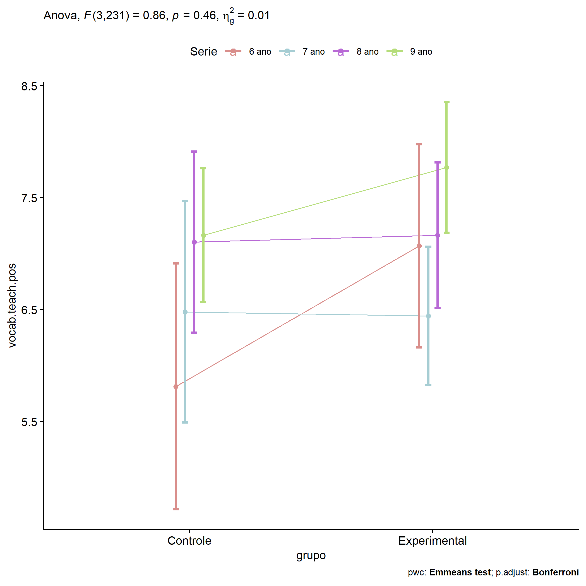<!-- -->

``` r
if (!is.null(plots[["Serie"]]))
  plots[["Serie"]] + ggplot2::scale_color_manual(values = color[["grupo"]])
```

    ## Scale for colour is already present.
    ## Adding another scale for colour, which will replace the existing scale.

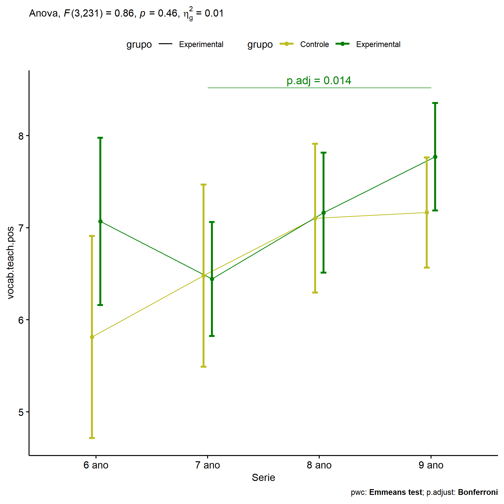<!-- -->

``` r
plots <- twoWayAncovaBoxPlots(
  wdat, "vocab.teach.pos", c("grupo","Serie"), aov, pwcs, covar = "vocab.teach.pre",
  theme = "classic", color = color[["grupo:Serie"]],
  subtitle = which(aov$Effect == "grupo:Serie"))
```

``` r
plots[["grupo:Serie"]] + ggplot2::ylab("Vocabulario Ensinado") + ggplot2::scale_x_discrete(labels=c('pre', 'pos'))
```

<!-- -->

``` r
plots <- twoWayAncovaBoxPlots(
  wdat.long, "vocab.teach", c("grupo","Serie"), aov, pwc.long, pre.post = "time",
  theme = "classic", color = color$prepost)
```

``` r
plots[["grupo:Serie"]] + ggplot2::ylab("Vocabulario Ensinado")
```

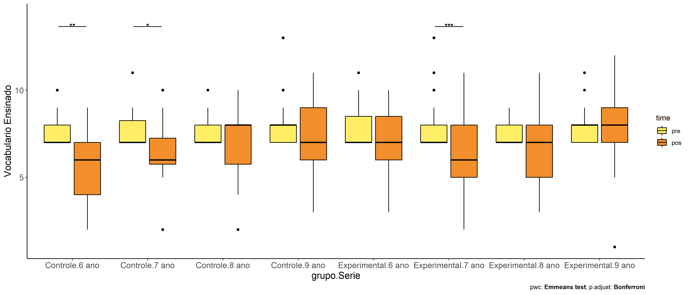<!-- -->

### Checking linearity assumption

``` r
ggscatter(wdat, x = "vocab.teach.pre", y = "vocab.teach.pos", size = 0.5,
          facet.by = c("grupo","Serie"), add = "reg.line")+
  stat_regline_equation(
    aes(label =  paste(..eq.label.., ..rr.label.., sep = "~~~~"))
  )
```

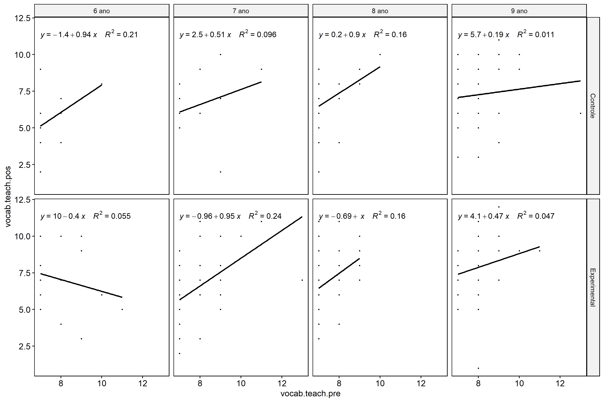<!-- -->

### Checking normality and homogeneity

``` r
res <- augment(lm(vocab.teach.pos ~ vocab.teach.pre + grupo*Serie, data = wdat))
```

``` r
shapiro_test(res$.resid)
```

    ## # A tibble: 1 × 3
    ##   variable   statistic p.value
    ##   <chr>          <dbl>   <dbl>
    ## 1 res$.resid     0.990  0.0848

``` r
levene_test(res, .resid ~ grupo*Serie)
```

    ## # A tibble: 1 × 4
    ##     df1   df2 statistic     p
    ##   <int> <int>     <dbl> <dbl>
    ## 1     7   232      1.01 0.424

# Summary of Results

## Descriptive Statistics

``` r
df <- get.descriptives(ldat[["grupo"]], c(dv.pre, dv.pos), c("grupo"), 
                       include.global = T, symmetry.test = T, normality.test = F)
df <- plyr::rbind.fill(
  df, do.call(plyr::rbind.fill, lapply(lfatores2, FUN = function(f) {
    if (nrow(dat) > 0 && sum(!is.na(unique(dat[[f]]))) > 1)
      get.descriptives(ldat[[paste0("grupo:",f)]], c(dv.pre,dv.pos), c("grupo", f),
                       symmetry.test = T, normality.test = F)
    }))
)
(df <- df[,c(fatores1[fatores1 %in% colnames(df)],"variable",
             colnames(df)[!colnames(df) %in% c(fatores1,"variable")])])
```

    ##           grupo Sexo   Zona Cor.Raca Serie        variable  n  mean median min max    sd    se    ci
    ## 1      Controle <NA>   <NA>     <NA>  <NA> vocab.teach.pre 14 8.071    8.0   7  13 1.592 0.425 0.919
    ## 2  Experimental <NA>   <NA>     <NA>  <NA> vocab.teach.pre 29 7.862    7.0   7  13 1.432 0.266 0.545
    ## 3          <NA> <NA>   <NA>     <NA>  <NA> vocab.teach.pre 43 7.930    7.0   7  13 1.470 0.224 0.452
    ## 4      Controle <NA>   <NA>     <NA>  <NA> vocab.teach.pos 14 3.714    4.0   2   6 1.204 0.322 0.695
    ## 5  Experimental <NA>   <NA>     <NA>  <NA> vocab.teach.pos 29 4.276    4.0   2   7 1.131 0.210 0.430
    ## 6          <NA> <NA>   <NA>     <NA>  <NA> vocab.teach.pos 43 4.093    4.0   2   7 1.171 0.179 0.360
    ## 7      Controle    F   <NA>     <NA>  <NA> vocab.teach.pre 49 7.592    7.0   7  10 0.814 0.116 0.234
    ## 8      Controle    M   <NA>     <NA>  <NA> vocab.teach.pre 48 8.000    8.0   7  13 1.238 0.179 0.359
    ## 9  Experimental    F   <NA>     <NA>  <NA> vocab.teach.pre 72 7.833    7.5   7  13 1.126 0.133 0.265
    ## 10 Experimental    M   <NA>     <NA>  <NA> vocab.teach.pre 71 7.690    7.0   7  11 0.935 0.111 0.221
    ## 11     Controle    F   <NA>     <NA>  <NA> vocab.teach.pos 49 6.918    7.0   2  10 1.891 0.270 0.543
    ## 12     Controle    M   <NA>     <NA>  <NA> vocab.teach.pos 48 6.812    7.0   2  11 2.170 0.313 0.630
    ## 13 Experimental    F   <NA>     <NA>  <NA> vocab.teach.pos 72 7.514    8.0   2  11 2.076 0.245 0.488
    ## 14 Experimental    M   <NA>     <NA>  <NA> vocab.teach.pos 71 6.746    7.0   1  12 2.215 0.263 0.524
    ## 15     Controle <NA>  Rural     <NA>  <NA> vocab.teach.pre 46 7.630    7.0   7  11 0.951 0.140 0.282
    ## 16     Controle <NA> Urbana     <NA>  <NA> vocab.teach.pre 18 7.611    7.0   7  10 0.979 0.231 0.487
    ## 17 Experimental <NA>  Rural     <NA>  <NA> vocab.teach.pre 61 7.689    7.0   7  11 0.975 0.125 0.250
    ## 18 Experimental <NA> Urbana     <NA>  <NA> vocab.teach.pre 40 7.950    8.0   7  13 1.239 0.196 0.396
    ## 19     Controle <NA>  Rural     <NA>  <NA> vocab.teach.pos 46 7.043    7.0   2  10 2.022 0.298 0.600
    ## 20     Controle <NA> Urbana     <NA>  <NA> vocab.teach.pos 18 6.611    6.0   5  10 1.501 0.354 0.746
    ## 21 Experimental <NA>  Rural     <NA>  <NA> vocab.teach.pos 61 7.295    7.0   3  12 2.246 0.288 0.575
    ## 22 Experimental <NA> Urbana     <NA>  <NA> vocab.teach.pos 40 7.250    7.0   3  11 2.085 0.330 0.667
    ## 23     Controle <NA>   <NA>   Branca  <NA> vocab.teach.pre  9 8.000    7.0   7  11 1.414 0.471 1.087
    ## 24     Controle <NA>   <NA>    Parda  <NA> vocab.teach.pre 29 7.828    7.0   7  13 1.391 0.258 0.529
    ## 25 Experimental <NA>   <NA>   Branca  <NA> vocab.teach.pre 14 7.357    7.0   7   8 0.497 0.133 0.287
    ## 26 Experimental <NA>   <NA>    Parda  <NA> vocab.teach.pre 34 7.882    8.0   7  10 0.913 0.157 0.319
    ## 27     Controle <NA>   <NA>   Branca  <NA> vocab.teach.pos  9 7.222    8.0   4  11 2.333 0.778 1.794
    ## 28     Controle <NA>   <NA>    Parda  <NA> vocab.teach.pos 29 6.931    7.0   2  10 2.103 0.391 0.800
    ## 29 Experimental <NA>   <NA>   Branca  <NA> vocab.teach.pos 14 7.286    7.0   4  10 1.816 0.485 1.048
    ## 30 Experimental <NA>   <NA>    Parda  <NA> vocab.teach.pos 34 7.235    8.0   1  12 2.618 0.449 0.913
    ## 31     Controle <NA>   <NA>     <NA> 6 ano vocab.teach.pre 13 7.692    7.0   7  10 0.947 0.263 0.572
    ## 32     Controle <NA>   <NA>     <NA> 7 ano vocab.teach.pre 16 7.812    7.0   7  11 1.167 0.292 0.622
    ## 33     Controle <NA>   <NA>     <NA> 8 ano vocab.teach.pre 24 7.583    7.0   7  10 0.881 0.180 0.372
    ## 34     Controle <NA>   <NA>     <NA> 9 ano vocab.teach.pre 44 7.932    8.0   7  13 1.149 0.173 0.349
    ## 35 Experimental <NA>   <NA>     <NA> 6 ano vocab.teach.pre 19 7.842    7.0   7  11 1.214 0.279 0.585
    ## 36 Experimental <NA>   <NA>     <NA> 7 ano vocab.teach.pre 41 7.902    7.0   7  13 1.281 0.200 0.404
    ## 37 Experimental <NA>   <NA>     <NA> 8 ano vocab.teach.pre 37 7.622    7.0   7   9 0.794 0.131 0.265
    ## 38 Experimental <NA>   <NA>     <NA> 9 ano vocab.teach.pre 46 7.717    8.0   7  11 0.886 0.131 0.263
    ## 39     Controle <NA>   <NA>     <NA> 6 ano vocab.teach.pos 13 5.769    6.0   2   9 1.922 0.533 1.161
    ## 40     Controle <NA>   <NA>     <NA> 7 ano vocab.teach.pos 16 6.500    6.0   2  10 1.932 0.483 1.030
    ## 41     Controle <NA>   <NA>     <NA> 8 ano vocab.teach.pos 24 7.000    8.0   2  10 1.978 0.404 0.835
    ## 42     Controle <NA>   <NA>     <NA> 9 ano vocab.teach.pos 44 7.250    7.0   3  11 2.036 0.307 0.619
    ## 43 Experimental <NA>   <NA>     <NA> 6 ano vocab.teach.pos 19 7.105    7.0   3  10 2.079 0.477 1.002
    ## 44 Experimental <NA>   <NA>     <NA> 7 ano vocab.teach.pos 41 6.512    6.0   2  11 2.491 0.389 0.786
    ## 45 Experimental <NA>   <NA>     <NA> 8 ano vocab.teach.pos 37 7.081    7.0   3  11 2.019 0.332 0.673
    ## 46 Experimental <NA>   <NA>     <NA> 9 ano vocab.teach.pos 46 7.739    8.0   1  12 1.914 0.282 0.568
    ##     iqr symmetry    skewness    kurtosis
    ## 1  1.00       NO  2.01882747  3.67355017
    ## 2  1.00       NO  1.99289068  3.79191775
    ## 3  1.00       NO  2.09283872  4.22709477
    ## 4  1.00      YES  0.02002573 -0.98928290
    ## 5  2.00      YES  0.18536304 -0.44845764
    ## 6  2.00      YES  0.08512720 -0.42054783
    ## 7  1.00       NO  1.06979442  0.01753086
    ## 8  1.00       NO  1.78000745  3.92443094
    ## 9  1.00       NO  1.90093656  4.91041695
    ## 10 1.00       NO  1.46484786  2.18863247
    ## 11 2.00      YES -0.13858480 -0.61619827
    ## 12 2.25      YES -0.28992249 -0.53297820
    ## 13 3.00      YES -0.39197934 -0.40204102
    ## 14 3.00      YES -0.13431882 -0.42186596
    ## 15 1.00       NO  1.52719777  1.94298993
    ## 16 1.00 few data  0.00000000  0.00000000
    ## 17 1.00       NO  1.48719858  2.03670220
    ## 18 1.00       NO  2.06190511  5.20798548
    ## 19 2.75       NO -0.51568139 -0.23562762
    ## 20 1.00       NO  0.83392351 -0.49339345
    ## 21 4.00      YES -0.08611405 -0.89517019
    ## 22 2.25      YES -0.32489519 -0.44556910
    ## 23 2.00       NO  0.94280904 -0.55555556
    ## 24 1.00       NO  1.98994547  4.16069235
    ## 25 1.00 few data  0.00000000  0.00000000
    ## 26 2.00      YES  0.45439450 -1.17227841
    ## 27 4.00      YES  0.07752942 -1.56362318
    ## 28 3.00      YES -0.24595924 -0.64197398
    ## 29 2.75      YES -0.03652980 -1.17020136
    ## 30 4.00      YES -0.31821156 -0.67751804
    ## 31 1.00       NO  1.11466795  0.14501147
    ## 32 1.25       NO  1.28119037  0.80844580
    ## 33 1.00       NO  1.22226249  0.33228839
    ## 34 1.00       NO  2.10552942  6.35064732
    ## 35 1.50       NO  1.16619771  0.20033637
    ## 36 1.00       NO  1.91854116  4.34983313
    ## 37 1.00 few data  0.00000000  0.00000000
    ## 38 1.00       NO  1.49987906  2.64504068
    ## 39 3.00      YES -0.21863652 -0.89996302
    ## 40 1.50      YES -0.20794386 -0.04490195
    ## 41 2.25       NO -0.74284095 -0.30601852
    ## 42 3.00      YES -0.08987253 -0.91644581
    ## 43 2.50      YES -0.09717365 -0.98280626
    ## 44 3.00      YES  0.08525627 -1.08838872
    ## 45 3.00      YES -0.02862447 -0.81416066
    ## 46 2.00       NO -0.75066066  1.72864798

| grupo        | Sexo | Zona   | Cor.Raca | Serie | variable        |   n |  mean | median | min | max |    sd |    se |    ci |  iqr | symmetry | skewness | kurtosis |
|:-------------|:-----|:-------|:---------|:------|:----------------|----:|------:|-------:|----:|----:|------:|------:|------:|-----:|:---------|---------:|---------:|
| Controle     |      |        |          |       | vocab.teach.pre |  14 | 8.071 |    8.0 |   7 |  13 | 1.592 | 0.425 | 0.919 | 1.00 | NO       |    2.019 |    3.674 |
| Experimental |      |        |          |       | vocab.teach.pre |  29 | 7.862 |    7.0 |   7 |  13 | 1.432 | 0.266 | 0.545 | 1.00 | NO       |    1.993 |    3.792 |
|              |      |        |          |       | vocab.teach.pre |  43 | 7.930 |    7.0 |   7 |  13 | 1.470 | 0.224 | 0.452 | 1.00 | NO       |    2.093 |    4.227 |
| Controle     |      |        |          |       | vocab.teach.pos |  14 | 3.714 |    4.0 |   2 |   6 | 1.204 | 0.322 | 0.695 | 1.00 | YES      |    0.020 |   -0.989 |
| Experimental |      |        |          |       | vocab.teach.pos |  29 | 4.276 |    4.0 |   2 |   7 | 1.131 | 0.210 | 0.430 | 2.00 | YES      |    0.185 |   -0.448 |
|              |      |        |          |       | vocab.teach.pos |  43 | 4.093 |    4.0 |   2 |   7 | 1.171 | 0.179 | 0.360 | 2.00 | YES      |    0.085 |   -0.421 |
| Controle     | F    |        |          |       | vocab.teach.pre |  49 | 7.592 |    7.0 |   7 |  10 | 0.814 | 0.116 | 0.234 | 1.00 | NO       |    1.070 |    0.018 |
| Controle     | M    |        |          |       | vocab.teach.pre |  48 | 8.000 |    8.0 |   7 |  13 | 1.238 | 0.179 | 0.359 | 1.00 | NO       |    1.780 |    3.924 |
| Experimental | F    |        |          |       | vocab.teach.pre |  72 | 7.833 |    7.5 |   7 |  13 | 1.126 | 0.133 | 0.265 | 1.00 | NO       |    1.901 |    4.910 |
| Experimental | M    |        |          |       | vocab.teach.pre |  71 | 7.690 |    7.0 |   7 |  11 | 0.935 | 0.111 | 0.221 | 1.00 | NO       |    1.465 |    2.189 |
| Controle     | F    |        |          |       | vocab.teach.pos |  49 | 6.918 |    7.0 |   2 |  10 | 1.891 | 0.270 | 0.543 | 2.00 | YES      |   -0.139 |   -0.616 |
| Controle     | M    |        |          |       | vocab.teach.pos |  48 | 6.812 |    7.0 |   2 |  11 | 2.170 | 0.313 | 0.630 | 2.25 | YES      |   -0.290 |   -0.533 |
| Experimental | F    |        |          |       | vocab.teach.pos |  72 | 7.514 |    8.0 |   2 |  11 | 2.076 | 0.245 | 0.488 | 3.00 | YES      |   -0.392 |   -0.402 |
| Experimental | M    |        |          |       | vocab.teach.pos |  71 | 6.746 |    7.0 |   1 |  12 | 2.215 | 0.263 | 0.524 | 3.00 | YES      |   -0.134 |   -0.422 |
| Controle     |      | Rural  |          |       | vocab.teach.pre |  46 | 7.630 |    7.0 |   7 |  11 | 0.951 | 0.140 | 0.282 | 1.00 | NO       |    1.527 |    1.943 |
| Controle     |      | Urbana |          |       | vocab.teach.pre |  18 | 7.611 |    7.0 |   7 |  10 | 0.979 | 0.231 | 0.487 | 1.00 | few data |    0.000 |    0.000 |
| Experimental |      | Rural  |          |       | vocab.teach.pre |  61 | 7.689 |    7.0 |   7 |  11 | 0.975 | 0.125 | 0.250 | 1.00 | NO       |    1.487 |    2.037 |
| Experimental |      | Urbana |          |       | vocab.teach.pre |  40 | 7.950 |    8.0 |   7 |  13 | 1.239 | 0.196 | 0.396 | 1.00 | NO       |    2.062 |    5.208 |
| Controle     |      | Rural  |          |       | vocab.teach.pos |  46 | 7.043 |    7.0 |   2 |  10 | 2.022 | 0.298 | 0.600 | 2.75 | NO       |   -0.516 |   -0.236 |
| Controle     |      | Urbana |          |       | vocab.teach.pos |  18 | 6.611 |    6.0 |   5 |  10 | 1.501 | 0.354 | 0.746 | 1.00 | NO       |    0.834 |   -0.493 |
| Experimental |      | Rural  |          |       | vocab.teach.pos |  61 | 7.295 |    7.0 |   3 |  12 | 2.246 | 0.288 | 0.575 | 4.00 | YES      |   -0.086 |   -0.895 |
| Experimental |      | Urbana |          |       | vocab.teach.pos |  40 | 7.250 |    7.0 |   3 |  11 | 2.085 | 0.330 | 0.667 | 2.25 | YES      |   -0.325 |   -0.446 |
| Controle     |      |        | Branca   |       | vocab.teach.pre |   9 | 8.000 |    7.0 |   7 |  11 | 1.414 | 0.471 | 1.087 | 2.00 | NO       |    0.943 |   -0.556 |
| Controle     |      |        | Parda    |       | vocab.teach.pre |  29 | 7.828 |    7.0 |   7 |  13 | 1.391 | 0.258 | 0.529 | 1.00 | NO       |    1.990 |    4.161 |
| Experimental |      |        | Branca   |       | vocab.teach.pre |  14 | 7.357 |    7.0 |   7 |   8 | 0.497 | 0.133 | 0.287 | 1.00 | few data |    0.000 |    0.000 |
| Experimental |      |        | Parda    |       | vocab.teach.pre |  34 | 7.882 |    8.0 |   7 |  10 | 0.913 | 0.157 | 0.319 | 2.00 | YES      |    0.454 |   -1.172 |
| Controle     |      |        | Branca   |       | vocab.teach.pos |   9 | 7.222 |    8.0 |   4 |  11 | 2.333 | 0.778 | 1.794 | 4.00 | YES      |    0.078 |   -1.564 |
| Controle     |      |        | Parda    |       | vocab.teach.pos |  29 | 6.931 |    7.0 |   2 |  10 | 2.103 | 0.391 | 0.800 | 3.00 | YES      |   -0.246 |   -0.642 |
| Experimental |      |        | Branca   |       | vocab.teach.pos |  14 | 7.286 |    7.0 |   4 |  10 | 1.816 | 0.485 | 1.048 | 2.75 | YES      |   -0.037 |   -1.170 |
| Experimental |      |        | Parda    |       | vocab.teach.pos |  34 | 7.235 |    8.0 |   1 |  12 | 2.618 | 0.449 | 0.913 | 4.00 | YES      |   -0.318 |   -0.678 |
| Controle     |      |        |          | 6 ano | vocab.teach.pre |  13 | 7.692 |    7.0 |   7 |  10 | 0.947 | 0.263 | 0.572 | 1.00 | NO       |    1.115 |    0.145 |
| Controle     |      |        |          | 7 ano | vocab.teach.pre |  16 | 7.812 |    7.0 |   7 |  11 | 1.167 | 0.292 | 0.622 | 1.25 | NO       |    1.281 |    0.808 |
| Controle     |      |        |          | 8 ano | vocab.teach.pre |  24 | 7.583 |    7.0 |   7 |  10 | 0.881 | 0.180 | 0.372 | 1.00 | NO       |    1.222 |    0.332 |
| Controle     |      |        |          | 9 ano | vocab.teach.pre |  44 | 7.932 |    8.0 |   7 |  13 | 1.149 | 0.173 | 0.349 | 1.00 | NO       |    2.106 |    6.351 |
| Experimental |      |        |          | 6 ano | vocab.teach.pre |  19 | 7.842 |    7.0 |   7 |  11 | 1.214 | 0.279 | 0.585 | 1.50 | NO       |    1.166 |    0.200 |
| Experimental |      |        |          | 7 ano | vocab.teach.pre |  41 | 7.902 |    7.0 |   7 |  13 | 1.281 | 0.200 | 0.404 | 1.00 | NO       |    1.919 |    4.350 |
| Experimental |      |        |          | 8 ano | vocab.teach.pre |  37 | 7.622 |    7.0 |   7 |   9 | 0.794 | 0.131 | 0.265 | 1.00 | few data |    0.000 |    0.000 |
| Experimental |      |        |          | 9 ano | vocab.teach.pre |  46 | 7.717 |    8.0 |   7 |  11 | 0.886 | 0.131 | 0.263 | 1.00 | NO       |    1.500 |    2.645 |
| Controle     |      |        |          | 6 ano | vocab.teach.pos |  13 | 5.769 |    6.0 |   2 |   9 | 1.922 | 0.533 | 1.161 | 3.00 | YES      |   -0.219 |   -0.900 |
| Controle     |      |        |          | 7 ano | vocab.teach.pos |  16 | 6.500 |    6.0 |   2 |  10 | 1.932 | 0.483 | 1.030 | 1.50 | YES      |   -0.208 |   -0.045 |
| Controle     |      |        |          | 8 ano | vocab.teach.pos |  24 | 7.000 |    8.0 |   2 |  10 | 1.978 | 0.404 | 0.835 | 2.25 | NO       |   -0.743 |   -0.306 |
| Controle     |      |        |          | 9 ano | vocab.teach.pos |  44 | 7.250 |    7.0 |   3 |  11 | 2.036 | 0.307 | 0.619 | 3.00 | YES      |   -0.090 |   -0.916 |
| Experimental |      |        |          | 6 ano | vocab.teach.pos |  19 | 7.105 |    7.0 |   3 |  10 | 2.079 | 0.477 | 1.002 | 2.50 | YES      |   -0.097 |   -0.983 |
| Experimental |      |        |          | 7 ano | vocab.teach.pos |  41 | 6.512 |    6.0 |   2 |  11 | 2.491 | 0.389 | 0.786 | 3.00 | YES      |    0.085 |   -1.088 |
| Experimental |      |        |          | 8 ano | vocab.teach.pos |  37 | 7.081 |    7.0 |   3 |  11 | 2.019 | 0.332 | 0.673 | 3.00 | YES      |   -0.029 |   -0.814 |
| Experimental |      |        |          | 9 ano | vocab.teach.pos |  46 | 7.739 |    8.0 |   1 |  12 | 1.914 | 0.282 | 0.568 | 2.00 | NO       |   -0.751 |    1.729 |

## ANCOVA Table Comparison

``` r
df <- do.call(plyr::rbind.fill, laov)
(df <- df[!duplicated(df$Effect),])
```

    ##             Effect DFn DFd      F        p p<.05      ges DFn' DFd'     F'       p' p<.05'     ges'
    ## 1            grupo   1  40  4.409 4.20e-02     * 0.099000    1  237  1.110 2.93e-01        0.005000
    ## 2  vocab.teach.pre   1  40 19.726 6.88e-05     * 0.330000    1  237 17.225 4.63e-05      * 0.068000
    ## 4       grupo:Sexo   1 235  0.475 4.91e-01       0.002000    1  235  0.475 4.91e-01        0.002000
    ## 5             Sexo   1 235  4.267 4.00e-02     * 0.018000    1  235  4.267 4.00e-02      * 0.018000
    ## 8       grupo:Zona   1 160  0.134 7.14e-01       0.000839    1  160  0.134 7.14e-01        0.000839
    ## 10            Zona   1 160  0.594 4.42e-01       0.004000    1  160  0.594 4.42e-01        0.004000
    ## 11        Cor.Raca   1  81  0.411 5.23e-01       0.005000    1   81  0.411 5.23e-01        0.005000
    ## 13  grupo:Cor.Raca   1  81  0.085 7.71e-01       0.001000    1   81  0.085 7.71e-01        0.001000
    ## 16     grupo:Serie   3 231  0.862 4.61e-01       0.011000    3  231  0.862 4.61e-01        0.011000
    ## 17           Serie   3 231  4.123 7.00e-03     * 0.051000    3  231  4.123 7.00e-03      * 0.051000

|     | Effect          | DFn | DFd |      F |     p | p\<.05 |   ges | DFn’ | DFd’ |     F’ |    p’ | p\<.05’ |  ges’ |
|:----|:----------------|----:|----:|-------:|------:|:-------|------:|-----:|-----:|-------:|------:|:--------|------:|
| 1   | grupo           |   1 |  40 |  4.409 | 0.042 | \*     | 0.099 |    1 |  237 |  1.110 | 0.293 |         | 0.005 |
| 2   | vocab.teach.pre |   1 |  40 | 19.726 | 0.000 | \*     | 0.330 |    1 |  237 | 17.225 | 0.000 | \*      | 0.068 |
| 4   | grupo:Sexo      |   1 | 235 |  0.475 | 0.491 |        | 0.002 |    1 |  235 |  0.475 | 0.491 |         | 0.002 |
| 5   | Sexo            |   1 | 235 |  4.267 | 0.040 | \*     | 0.018 |    1 |  235 |  4.267 | 0.040 | \*      | 0.018 |
| 8   | grupo:Zona      |   1 | 160 |  0.134 | 0.714 |        | 0.001 |    1 |  160 |  0.134 | 0.714 |         | 0.001 |
| 10  | Zona            |   1 | 160 |  0.594 | 0.442 |        | 0.004 |    1 |  160 |  0.594 | 0.442 |         | 0.004 |
| 11  | Cor.Raca        |   1 |  81 |  0.411 | 0.523 |        | 0.005 |    1 |   81 |  0.411 | 0.523 |         | 0.005 |
| 13  | grupo:Cor.Raca  |   1 |  81 |  0.085 | 0.771 |        | 0.001 |    1 |   81 |  0.085 | 0.771 |         | 0.001 |
| 16  | grupo:Serie     |   3 | 231 |  0.862 | 0.461 |        | 0.011 |    3 |  231 |  0.862 | 0.461 |         | 0.011 |
| 17  | Serie           |   3 | 231 |  4.123 | 0.007 | \*     | 0.051 |    3 |  231 |  4.123 | 0.007 | \*      | 0.051 |

## PairWise Table Comparison

``` r
df <- do.call(plyr::rbind.fill, lpwc)
df <- df[,c(names(lfatores), names(df)[!names(df) %in% c(names(lfatores),"term",".y.")])]
```

| grupo        | Sexo | Zona   | Cor.Raca | Serie | group1   | group2       |  df | statistic |     p | p.adj | p.adj.signif | df’ | statistic’ |    p’ | p.adj’ | p.adj.signif’ |
|:-------------|:-----|:-------|:---------|:------|:---------|:-------------|----:|----------:|------:|------:|:-------------|----:|-----------:|------:|-------:|:--------------|
| Controle     |      |        |          |       | pre      | pos          |  82 |     8.668 | 0.000 | 0.000 | \*\*\*\*     | 476 |      3.875 | 0.000 |  0.000 | \*\*\*        |
| Experimental |      |        |          |       | pre      | pos          |  82 |    10.268 | 0.000 | 0.000 | \*\*\*\*     | 476 |      3.192 | 0.002 |  0.002 | \*\*          |
|              |      |        |          |       | Controle | Experimental |  40 |    -2.100 | 0.042 | 0.042 | \*           | 237 |     -1.054 | 0.293 |  0.293 | ns            |
| Controle     | F    |        |          |       | pre      | pos          | 472 |     2.011 | 0.045 | 0.045 | \*           | 472 |      2.011 | 0.045 |  0.045 | \*            |
| Controle     | M    |        |          |       | pre      | pos          | 472 |     3.509 | 0.000 | 0.000 | \*\*\*       | 472 |      3.509 | 0.000 |  0.000 | \*\*\*        |
| Controle     |      |        |          |       | F        | M            | 235 |     0.769 | 0.442 | 0.442 | ns           | 235 |      0.769 | 0.442 |  0.442 | ns            |
| Experimental | F    |        |          |       | pre      | pos          | 472 |     1.156 | 0.248 | 0.248 | ns           | 472 |      1.156 | 0.248 |  0.248 | ns            |
| Experimental | M    |        |          |       | pre      | pos          | 472 |     3.391 | 0.001 | 0.001 | \*\*\*       | 472 |      3.391 | 0.001 |  0.001 | \*\*\*        |
| Experimental |      |        |          |       | F        | M            | 235 |     2.032 | 0.043 | 0.043 | \*           | 235 |      2.032 | 0.043 |  0.043 | \*            |
|              | F    |        |          |       | Controle | Experimental | 235 |    -1.240 | 0.216 | 0.216 | ns           | 235 |     -1.240 | 0.216 |  0.216 | ns            |
|              | M    |        |          |       | Controle | Experimental | 235 |    -0.253 | 0.800 | 0.800 | ns           | 235 |     -0.253 | 0.800 |  0.800 | ns            |
| Controle     |      |        |          |       | Rural    | Urbana       | 160 |     0.752 | 0.453 | 0.453 | ns           | 160 |      0.752 | 0.453 |  0.453 | ns            |
| Controle     |      | Rural  |          |       | pre      | pos          | 322 |     1.714 | 0.087 | 0.087 | ns           | 322 |      1.714 | 0.087 |  0.087 | ns            |
| Controle     |      | Urbana |          |       | pre      | pos          | 322 |     1.827 | 0.069 | 0.069 | ns           | 322 |      1.827 | 0.069 |  0.069 | ns            |
| Experimental |      |        |          |       | Rural    | Urbana       | 160 |     0.403 | 0.687 | 0.687 | ns           | 160 |      0.403 | 0.687 |  0.687 | ns            |
| Experimental |      | Rural  |          |       | pre      | pos          | 322 |     1.323 | 0.187 | 0.187 | ns           | 322 |      1.323 | 0.187 |  0.187 | ns            |
| Experimental |      | Urbana |          |       | pre      | pos          | 322 |     1.906 | 0.058 | 0.058 | ns           | 322 |      1.906 | 0.058 |  0.058 | ns            |
|              |      | Rural  |          |       | Controle | Experimental | 160 |    -0.567 | 0.571 | 0.571 | ns           | 160 |     -0.567 | 0.571 |  0.571 | ns            |
|              |      | Urbana |          |       | Controle | Experimental | 160 |    -0.833 | 0.406 | 0.406 | ns           | 160 |     -0.833 | 0.406 |  0.406 | ns            |
| Controle     |      |        | Branca   |       | pre      | pos          | 164 |     0.912 | 0.363 | 0.363 | ns           | 164 |      0.912 | 0.363 |  0.363 | ns            |
| Controle     |      |        |          |       | Branca   | Parda        |  81 |     0.188 | 0.851 | 0.851 | ns           |  81 |      0.188 | 0.851 |  0.851 | ns            |
| Controle     |      |        | Parda    |       | pre      | pos          | 164 |     1.886 | 0.061 | 0.061 | ns           | 164 |      1.886 | 0.061 |  0.061 | ns            |
| Experimental |      |        | Branca   |       | pre      | pos          | 164 |     0.104 | 0.917 | 0.917 | ns           | 164 |      0.104 | 0.917 |  0.917 | ns            |
| Experimental |      |        |          |       | Branca   | Parda        |  81 |     0.678 | 0.500 | 0.500 | ns           |  81 |      0.678 | 0.500 |  0.500 | ns            |
| Experimental |      |        | Parda    |       | pre      | pos          | 164 |     1.474 | 0.142 | 0.142 | ns           | 164 |      1.474 | 0.142 |  0.142 | ns            |
|              |      |        | Branca   |       | Controle | Experimental |  81 |    -0.620 | 0.537 | 0.537 | ns           |  81 |     -0.620 | 0.537 |  0.537 | ns            |
|              |      |        | Parda    |       | Controle | Experimental |  81 |    -0.481 | 0.632 | 0.632 | ns           |  81 |     -0.481 | 0.632 |  0.632 | ns            |
| Controle     |      |        |          | 6 ano | pre      | pos          | 464 |     2.973 | 0.003 | 0.003 | \*\*         | 464 |      2.973 | 0.003 |  0.003 | \*\*          |
| Controle     |      |        |          | 7 ano | pre      | pos          | 464 |     2.251 | 0.025 | 0.025 | \*           | 464 |      2.251 | 0.025 |  0.025 | \*            |
| Controle     |      |        |          | 8 ano | pre      | pos          | 464 |     1.225 | 0.221 | 0.221 | ns           | 464 |      1.225 | 0.221 |  0.221 | ns            |
| Controle     |      |        |          | 9 ano | pre      | pos          | 464 |     1.939 | 0.053 | 0.053 | ns           | 464 |      1.939 | 0.053 |  0.053 | ns            |
| Controle     |      |        |          |       | 6 ano    | 7 ano        | 231 |    -0.888 | 0.376 | 1.000 | ns           | 231 |     -0.888 | 0.376 |  1.000 | ns            |
| Controle     |      |        |          |       | 6 ano    | 8 ano        | 231 |    -1.865 | 0.063 | 0.381 | ns           | 231 |     -1.865 | 0.063 |  0.381 | ns            |
| Controle     |      |        |          |       | 6 ano    | 9 ano        | 231 |    -2.129 | 0.034 | 0.206 | ns           | 231 |     -2.129 | 0.034 |  0.206 | ns            |
| Controle     |      |        |          |       | 7 ano    | 8 ano        | 231 |    -0.962 | 0.337 | 1.000 | ns           | 231 |     -0.962 | 0.337 |  1.000 | ns            |
| Controle     |      |        |          |       | 7 ano    | 9 ano        | 231 |    -1.169 | 0.244 | 1.000 | ns           | 231 |     -1.169 | 0.244 |  1.000 | ns            |
| Controle     |      |        |          |       | 8 ano    | 9 ano        | 231 |    -0.120 | 0.904 | 1.000 | ns           | 231 |     -0.120 | 0.904 |  1.000 | ns            |
| Experimental |      |        |          | 6 ano | pre      | pos          | 464 |     1.377 | 0.169 | 0.169 | ns           | 464 |      1.377 | 0.169 |  0.169 | ns            |
| Experimental |      |        |          | 7 ano | pre      | pos          | 464 |     3.816 | 0.000 | 0.000 | \*\*\*       | 464 |      3.816 | 0.000 |  0.000 | \*\*\*        |
| Experimental |      |        |          | 8 ano | pre      | pos          | 464 |     1.410 | 0.159 | 0.159 | ns           | 464 |      1.410 | 0.159 |  0.159 | ns            |
| Experimental |      |        |          | 9 ano | pre      | pos          | 464 |    -0.063 | 0.950 | 0.950 | ns           | 464 |     -0.063 | 0.950 |  0.950 | ns            |
| Experimental |      |        |          |       | 6 ano    | 7 ano        | 231 |     1.123 | 0.263 | 1.000 | ns           | 231 |      1.123 | 0.263 |  1.000 | ns            |
| Experimental |      |        |          |       | 6 ano    | 8 ano        | 231 |    -0.168 | 0.867 | 1.000 | ns           | 231 |     -0.168 | 0.867 |  1.000 | ns            |
| Experimental |      |        |          |       | 6 ano    | 9 ano        | 231 |    -1.280 | 0.202 | 1.000 | ns           | 231 |     -1.280 | 0.202 |  1.000 | ns            |
| Experimental |      |        |          |       | 7 ano    | 8 ano        | 231 |    -1.578 | 0.116 | 0.695 | ns           | 231 |     -1.578 | 0.116 |  0.695 | ns            |
| Experimental |      |        |          |       | 7 ano    | 9 ano        | 231 |    -3.073 | 0.002 | 0.014 | \*           | 231 |     -3.073 | 0.002 |  0.014 | \*            |
| Experimental |      |        |          |       | 8 ano    | 9 ano        | 231 |    -1.367 | 0.173 | 1.000 | ns           | 231 |     -1.367 | 0.173 |  1.000 | ns            |
|              |      |        |          | 6 ano | Controle | Experimental | 231 |    -1.736 | 0.084 | 0.084 | ns           | 231 |     -1.736 | 0.084 |  0.084 | ns            |
|              |      |        |          | 7 ano | Controle | Experimental | 231 |     0.062 | 0.951 | 0.951 | ns           | 231 |      0.062 | 0.951 |  0.951 | ns            |
|              |      |        |          | 8 ano | Controle | Experimental | 231 |    -0.115 | 0.909 | 0.909 | ns           | 231 |     -0.115 | 0.909 |  0.909 | ns            |
|              |      |        |          | 9 ano | Controle | Experimental | 231 |    -1.426 | 0.155 | 0.155 | ns           | 231 |     -1.426 | 0.155 |  0.155 | ns            |

## EMMS Table Comparison

``` r
df <- do.call(plyr::rbind.fill, lemms)
df[["N-N'"]] <- df[["N"]] - df[["N'"]]
df <- df[,c(names(lfatores), names(df)[!names(df) %in% names(lfatores)])]
```

| grupo        | Sexo | Zona   | Cor.Raca | Serie |   N | M (pre) | SE (pre) | M (unadj) | SE (unadj) | M (adj) | SE (adj) |  N’ | M (pre)’ | SE (pre)’ | M (unadj)’ | SE (unadj)’ | M (adj)’ | SE (adj)’ | N-N’ |
|:-------------|:-----|:-------|:---------|:------|----:|--------:|---------:|----------:|-----------:|--------:|---------:|----:|---------:|----------:|-----------:|------------:|---------:|----------:|-----:|
| Controle     |      |        |          |       |  14 |   8.071 |    0.425 |     3.714 |      0.322 |   3.651 |    0.256 |  97 |    7.794 |     0.108 |      6.866 |       0.206 |    6.856 |     0.208 |  -83 |
| Experimental |      |        |          |       |  29 |   7.862 |    0.266 |     4.276 |      0.210 |   4.306 |    0.178 | 143 |    7.762 |     0.086 |      7.133 |       0.182 |    7.140 |     0.171 | -114 |
| Controle     | F    |        |          |       |  49 |   7.592 |    0.116 |     6.918 |      0.270 |   7.015 |    0.291 |  49 |    7.592 |     0.116 |      6.918 |       0.270 |    7.015 |     0.291 |    0 |
| Controle     | M    |        |          |       |  48 |   8.000 |    0.179 |     6.812 |      0.313 |   6.694 |    0.295 |  48 |    8.000 |     0.179 |      6.812 |       0.313 |    6.694 |     0.295 |    0 |
| Experimental | F    |        |          |       |  72 |   7.833 |    0.133 |     7.514 |      0.245 |   7.483 |    0.240 |  72 |    7.833 |     0.133 |      7.514 |       0.245 |    7.483 |     0.240 |    0 |
| Experimental | M    |        |          |       |  71 |   7.690 |    0.111 |     6.746 |      0.263 |   6.791 |    0.242 |  71 |    7.690 |     0.111 |      6.746 |       0.263 |    6.791 |     0.242 |    0 |
| Controle     |      | Rural  |          |       |  46 |   7.630 |    0.140 |     7.043 |      0.298 |   7.089 |    0.299 |  46 |    7.630 |     0.140 |      7.043 |       0.298 |    7.089 |     0.299 |    0 |
| Controle     |      | Urbana |          |       |  18 |   7.611 |    0.231 |     6.611 |      0.354 |   6.665 |    0.478 |  18 |    7.611 |     0.231 |      6.611 |       0.354 |    6.665 |     0.478 |    0 |
| Experimental |      | Rural  |          |       |  61 |   7.689 |    0.125 |     7.295 |      0.288 |   7.313 |    0.259 |  61 |    7.689 |     0.125 |      7.295 |       0.288 |    7.313 |     0.259 |    0 |
| Experimental |      | Urbana |          |       |  40 |   7.950 |    0.196 |     7.250 |      0.330 |   7.146 |    0.322 |  40 |    7.950 |     0.196 |      7.250 |       0.330 |    7.146 |     0.322 |    0 |
| Controle     |      |        | Branca   |       |   9 |   8.000 |    0.471 |     7.222 |      0.778 |   7.056 |    0.716 |   9 |    8.000 |     0.471 |      7.222 |       0.778 |    7.056 |     0.716 |    0 |
| Controle     |      |        | Parda    |       |  29 |   7.828 |    0.258 |     6.931 |      0.391 |   6.902 |    0.398 |  29 |    7.828 |     0.258 |      6.931 |       0.391 |    6.902 |     0.398 |    0 |
| Experimental |      |        | Branca   |       |  14 |   7.357 |    0.133 |     7.286 |      0.485 |   7.630 |    0.581 |  14 |    7.357 |     0.133 |      7.286 |       0.485 |    7.630 |     0.581 |    0 |
| Experimental |      |        | Parda    |       |  34 |   7.882 |    0.157 |     7.235 |      0.449 |   7.162 |    0.368 |  34 |    7.882 |     0.157 |      7.235 |       0.449 |    7.162 |     0.368 |    0 |
| Controle     |      |        |          | 6 ano |  13 |   7.692 |    0.263 |     5.769 |      0.533 |   5.814 |    0.557 |  13 |    7.692 |     0.263 |      5.769 |       0.533 |    5.814 |     0.557 |    0 |
| Controle     |      |        |          | 7 ano |  16 |   7.812 |    0.292 |     6.500 |      0.483 |   6.480 |    0.502 |  16 |    7.812 |     0.292 |      6.500 |       0.483 |    6.480 |     0.502 |    0 |
| Controle     |      |        |          | 8 ano |  24 |   7.583 |    0.180 |     7.000 |      0.404 |   7.104 |    0.411 |  24 |    7.583 |     0.180 |      7.000 |       0.404 |    7.104 |     0.411 |    0 |
| Controle     |      |        |          | 9 ano |  44 |   7.932 |    0.173 |     7.250 |      0.307 |   7.165 |    0.303 |  44 |    7.932 |     0.173 |      7.250 |       0.307 |    7.165 |     0.303 |    0 |
| Experimental |      |        |          | 6 ano |  19 |   7.842 |    0.279 |     7.105 |      0.477 |   7.069 |    0.461 |  19 |    7.842 |     0.279 |      7.105 |       0.477 |    7.069 |     0.461 |    0 |
| Experimental |      |        |          | 7 ano |  41 |   7.902 |    0.200 |     6.512 |      0.389 |   6.443 |    0.314 |  41 |    7.902 |     0.200 |      6.512 |       0.389 |    6.443 |     0.314 |    0 |
| Experimental |      |        |          | 8 ano |  37 |   7.622 |    0.131 |     7.081 |      0.332 |   7.164 |    0.331 |  37 |    7.622 |     0.131 |      7.081 |       0.332 |    7.164 |     0.331 |    0 |
| Experimental |      |        |          | 9 ano |  46 |   7.717 |    0.131 |     7.739 |      0.282 |   7.770 |    0.296 |  46 |    7.717 |     0.131 |      7.739 |       0.282 |    7.770 |     0.296 |    0 |
