ANCOVA in Vocabulario Ensinado (Vocabulario Ensinado)
================
Geiser C. Challco <geiser@alumni.usp.br>

- [Descriptive Statistics of Initial
  Data](#descriptive-statistics-of-initial-data)
- [ANCOVA and Pairwise for one factor:
  **grupo**](#ancova-and-pairwise-for-one-factor-grupo)
  - [Without remove non-normal data](#without-remove-non-normal-data)
  - [Computing ANCOVA and PairWise After removing non-normal data
    (OK)](#computing-ancova-and-pairwise-after-removing-non-normal-data-ok)
    - [Plots for ancova](#plots-for-ancova)
    - [Checking linearity assumption](#checking-linearity-assumption)
    - [Checking normality and
      homogeneity](#checking-normality-and-homogeneity)
- [ANCOVA and Pairwise for two factors
  **grupo:Sexo**](#ancova-and-pairwise-for-two-factors-gruposexo)
  - [Without remove non-normal data](#without-remove-non-normal-data-1)
  - [Computing ANCOVA and PairWise After removing non-normal data
    (OK)](#computing-ancova-and-pairwise-after-removing-non-normal-data-ok-1)
    - [Plots for ancova](#plots-for-ancova-1)
    - [Checking linearity assumption](#checking-linearity-assumption-1)
    - [Checking normality and
      homogeneity](#checking-normality-and-homogeneity-1)
- [ANCOVA and Pairwise for two factors
  **grupo:Zona**](#ancova-and-pairwise-for-two-factors-grupozona)
  - [Without remove non-normal data](#without-remove-non-normal-data-2)
  - [Computing ANCOVA and PairWise After removing non-normal data
    (OK)](#computing-ancova-and-pairwise-after-removing-non-normal-data-ok-2)
    - [Plots for ancova](#plots-for-ancova-2)
    - [Checking linearity assumption](#checking-linearity-assumption-2)
    - [Checking normality and
      homogeneity](#checking-normality-and-homogeneity-2)
- [ANCOVA and Pairwise for two factors
  **grupo:Cor.Raca**](#ancova-and-pairwise-for-two-factors-grupocorraca)
  - [Without remove non-normal data](#without-remove-non-normal-data-3)
  - [Computing ANCOVA and PairWise After removing non-normal data
    (OK)](#computing-ancova-and-pairwise-after-removing-non-normal-data-ok-3)
    - [Plots for ancova](#plots-for-ancova-3)
    - [Checking linearity assumption](#checking-linearity-assumption-3)
    - [Checking normality and
      homogeneity](#checking-normality-and-homogeneity-3)
- [ANCOVA and Pairwise for two factors
  **grupo:vocab.teach.quintile**](#ancova-and-pairwise-for-two-factors-grupovocabteachquintile)
  - [Without remove non-normal data](#without-remove-non-normal-data-4)
  - [Computing ANCOVA and PairWise After removing non-normal data
    (OK)](#computing-ancova-and-pairwise-after-removing-non-normal-data-ok-4)
    - [Plots for ancova](#plots-for-ancova-4)
    - [Checking linearity assumption](#checking-linearity-assumption-4)
    - [Checking normality and
      homogeneity](#checking-normality-and-homogeneity-4)
- [Summary of Results](#summary-of-results)
  - [Descriptive Statistics](#descriptive-statistics)
  - [ANCOVA Table Comparison](#ancova-table-comparison)
  - [PairWise Table Comparison](#pairwise-table-comparison)
  - [EMMS Table Comparison](#emms-table-comparison)

**NOTE**:

- Teste ANCOVA para determinar se houve diferenças significativas no
  Vocabulario Ensinado (medido usando pre- e pos-testes).
- ANCOVA test to determine whether there were significant differences in
  Vocabulario Ensinado (measured using pre- and post-tests).

# Descriptive Statistics of Initial Data

``` r
df <- get.descriptives(dat, c(dv.pre, dv.pos), c("grupo"), 
                       include.global = T, symmetry.test = T, normality.test = F)
df <- plyr::rbind.fill(
  df, do.call(plyr::rbind.fill, lapply(lfatores2, FUN = function(f) {
    if (nrow(dat) > 0 && sum(!is.na(unique(dat[[f]]))) > 1)
      get.descriptives(dat, c(dv.pre,dv.pos), c("grupo", f),
                       symmetry.test = T, normality.test = F)
    }))
)
```

    ## Warning: There were 2 warnings in `mutate()`.
    ## The first warning was:
    ## ℹ In argument: `ci = abs(stats::qt(alpha/2, .data$n - 1) * .data$se)`.
    ## Caused by warning:
    ## ! There was 1 warning in `mutate()`.
    ## ℹ In argument: `ci = abs(stats::qt(alpha/2, .data$n - 1) * .data$se)`.
    ## Caused by warning in `stats::qt()`:
    ## ! NaNs produced
    ## ℹ Run `dplyr::last_dplyr_warnings()` to see the 1 remaining warning.
    ## There were 2 warnings in `mutate()`.
    ## The first warning was:
    ## ℹ In argument: `ci = abs(stats::qt(alpha/2, .data$n - 1) * .data$se)`.
    ## Caused by warning:
    ## ! There was 1 warning in `mutate()`.
    ## ℹ In argument: `ci = abs(stats::qt(alpha/2, .data$n - 1) * .data$se)`.
    ## Caused by warning in `stats::qt()`:
    ## ! NaNs produced
    ## ℹ Run `dplyr::last_dplyr_warnings()` to see the 1 remaining warning.

``` r
(df <- df[,c(fatores1[fatores1 %in% colnames(df)],"variable",
             colnames(df)[!colnames(df) %in% c(fatores1,"variable")])])
```

    ##           grupo Sexo   Zona Cor.Raca vocab.teach.quintile        variable   n  mean median min max    sd    se
    ## 1      Controle <NA>   <NA>     <NA>                 <NA> vocab.teach.pre 146 3.925    4.0   0  10 1.901 0.157
    ## 2  Experimental <NA>   <NA>     <NA>                 <NA> vocab.teach.pre 165 4.255    4.0   1  11 1.902 0.148
    ## 3          <NA> <NA>   <NA>     <NA>                 <NA> vocab.teach.pre 311 4.100    4.0   0  11 1.906 0.108
    ## 4      Controle <NA>   <NA>     <NA>                 <NA> vocab.teach.pos 146 4.158    4.0   0   9 1.957 0.162
    ## 5  Experimental <NA>   <NA>     <NA>                 <NA> vocab.teach.pos 165 5.164    5.0   0  11 2.346 0.183
    ## 6          <NA> <NA>   <NA>     <NA>                 <NA> vocab.teach.pos 311 4.691    5.0   0  11 2.226 0.126
    ## 7      Controle    F   <NA>     <NA>                 <NA> vocab.teach.pre  65 4.062    4.0   0   9 1.870 0.232
    ## 8      Controle    M   <NA>     <NA>                 <NA> vocab.teach.pre  81 3.815    3.0   0  10 1.931 0.215
    ## 9  Experimental    F   <NA>     <NA>                 <NA> vocab.teach.pre  88 4.284    4.0   1  10 1.929 0.206
    ## 10 Experimental    M   <NA>     <NA>                 <NA> vocab.teach.pre  77 4.221    4.0   1  11 1.882 0.214
    ## 11     Controle    F   <NA>     <NA>                 <NA> vocab.teach.pos  65 4.462    4.0   0   9 1.985 0.246
    ## 12     Controle    M   <NA>     <NA>                 <NA> vocab.teach.pos  81 3.914    4.0   0   9 1.912 0.212
    ## 13 Experimental    F   <NA>     <NA>                 <NA> vocab.teach.pos  88 5.534    6.0   0  11 2.207 0.235
    ## 14 Experimental    M   <NA>     <NA>                 <NA> vocab.teach.pos  77 4.740    4.0   1  10 2.441 0.278
    ## 15     Controle <NA>  Rural     <NA>                 <NA> vocab.teach.pre  97 4.072    4.0   0  10 2.032 0.206
    ## 16     Controle <NA> Urbana     <NA>                 <NA> vocab.teach.pre  28 3.964    4.0   0   8 1.795 0.339
    ## 17     Controle <NA>   <NA>     <NA>                 <NA> vocab.teach.pre  21 3.190    3.0   2   5 1.167 0.255
    ## 18 Experimental <NA>  Rural     <NA>                 <NA> vocab.teach.pre  85 4.129    4.0   1  11 1.993 0.216
    ## 19 Experimental <NA> Urbana     <NA>                 <NA> vocab.teach.pre  38 4.395    4.0   1   9 2.034 0.330
    ## 20 Experimental <NA>   <NA>     <NA>                 <NA> vocab.teach.pre  42 4.381    4.0   1  10 1.592 0.246
    ## 21     Controle <NA>  Rural     <NA>                 <NA> vocab.teach.pos  97 4.186    4.0   0   9 1.970 0.200
    ## 22     Controle <NA> Urbana     <NA>                 <NA> vocab.teach.pos  28 4.536    5.0   1   7 1.856 0.351
    ## 23     Controle <NA>   <NA>     <NA>                 <NA> vocab.teach.pos  21 3.524    3.0   0   7 1.965 0.429
    ## 24 Experimental <NA>  Rural     <NA>                 <NA> vocab.teach.pos  85 5.000    5.0   0  10 2.304 0.250
    ## 25 Experimental <NA> Urbana     <NA>                 <NA> vocab.teach.pos  38 5.342    5.0   1  10 2.386 0.387
    ## 26 Experimental <NA>   <NA>     <NA>                 <NA> vocab.teach.pos  42 5.333    5.0   2  11 2.426 0.374
    ## 27     Controle <NA>   <NA>   Branca                 <NA> vocab.teach.pre  22 3.773    3.5   1   8 1.875 0.400
    ## 28     Controle <NA>   <NA> Indígena                 <NA> vocab.teach.pre   2 5.500    5.5   5   6 0.707 0.500
    ## 29     Controle <NA>   <NA>    Parda                 <NA> vocab.teach.pre  42 3.976    4.0   0  10 2.181 0.336
    ## 30     Controle <NA>   <NA>    Preta                 <NA> vocab.teach.pre   1 3.000    3.0   3   3    NA    NA
    ## 31     Controle <NA>   <NA>     <NA>                 <NA> vocab.teach.pre  79 3.911    4.0   0   8 1.784 0.201
    ## 32 Experimental <NA>   <NA>   Branca                 <NA> vocab.teach.pre  18 4.722    5.0   2   8 1.873 0.441
    ## 33 Experimental <NA>   <NA> Indígena                 <NA> vocab.teach.pre  13 4.000    4.0   2   6 1.414 0.392
    ## 34 Experimental <NA>   <NA>    Parda                 <NA> vocab.teach.pre  44 3.864    4.0   1   9 1.837 0.277
    ## 35 Experimental <NA>   <NA>    Preta                 <NA> vocab.teach.pre   1 1.000    1.0   1   1    NA    NA
    ## 36 Experimental <NA>   <NA>     <NA>                 <NA> vocab.teach.pre  89 4.427    4.0   1  11 1.965 0.208
    ## 37     Controle <NA>   <NA>   Branca                 <NA> vocab.teach.pos  22 4.273    4.0   1   9 2.334 0.498
    ## 38     Controle <NA>   <NA> Indígena                 <NA> vocab.teach.pos   2 6.000    6.0   5   7 1.414 1.000
    ## 39     Controle <NA>   <NA>    Parda                 <NA> vocab.teach.pos  42 4.238    4.0   0   9 2.093 0.323
    ## 40     Controle <NA>   <NA>    Preta                 <NA> vocab.teach.pos   1 6.000    6.0   6   6    NA    NA
    ## 41     Controle <NA>   <NA>     <NA>                 <NA> vocab.teach.pos  79 4.013    4.0   0   9 1.779 0.200
    ## 42 Experimental <NA>   <NA>   Branca                 <NA> vocab.teach.pos  18 4.611    4.5   1   9 2.477 0.584
    ## 43 Experimental <NA>   <NA> Indígena                 <NA> vocab.teach.pos  13 4.769    5.0   2   9 2.048 0.568
    ## 44 Experimental <NA>   <NA>    Parda                 <NA> vocab.teach.pos  44 4.932    5.0   1  10 2.204 0.332
    ## 45 Experimental <NA>   <NA>    Preta                 <NA> vocab.teach.pos   1 4.000    4.0   4   4    NA    NA
    ## 46 Experimental <NA>   <NA>     <NA>                 <NA> vocab.teach.pos  89 5.461    5.0   0  11 2.431 0.258
    ## 47     Controle <NA>   <NA>     <NA>         1st quintile vocab.teach.pre  40 1.700    2.0   0   2 0.608 0.096
    ## 48     Controle <NA>   <NA>     <NA>         2nd quintile vocab.teach.pre  25 3.000    3.0   3   3 0.000 0.000
    ## 49     Controle <NA>   <NA>     <NA>         3rd quintile vocab.teach.pre  54 4.556    5.0   4   5 0.502 0.068
    ## 50     Controle <NA>   <NA>     <NA>         4th quintile vocab.teach.pre  14 6.000    6.0   6   6 0.000 0.000
    ## 51     Controle <NA>   <NA>     <NA>         5th quintile vocab.teach.pre  13 7.692    7.0   7  10 0.947 0.263
    ## 52 Experimental <NA>   <NA>     <NA>         1st quintile vocab.teach.pre  33 1.758    2.0   1   2 0.435 0.076
    ## 53 Experimental <NA>   <NA>     <NA>         2nd quintile vocab.teach.pre  23 3.000    3.0   3   3 0.000 0.000
    ## 54 Experimental <NA>   <NA>     <NA>         3rd quintile vocab.teach.pre  72 4.417    4.0   4   5 0.496 0.059
    ## 55 Experimental <NA>   <NA>     <NA>         4th quintile vocab.teach.pre  18 6.000    6.0   6   6 0.000 0.000
    ##        ci  iqr symmetry     skewness    kurtosis
    ## 1   0.311 3.00      YES  0.418082732 -0.03890132
    ## 2   0.292 2.00       NO  0.618479107  0.55341026
    ## 3   0.213 2.00       NO  0.521220492  0.32641642
    ## 4   0.320 3.00      YES  0.169914080 -0.45127075
    ## 5   0.361 4.00      YES  0.243713424 -0.62009351
    ## 6   0.248 3.00      YES  0.317631310 -0.36680202
    ## 7   0.463 2.00      YES  0.152211341 -0.13153953
    ## 8   0.427 3.00       NO  0.619554882  0.06244240
    ## 9   0.409 3.00      YES  0.311532309 -0.23723936
    ## 10  0.427 2.00       NO  0.981286479  1.49611796
    ## 11  0.492 3.00      YES -0.003003248 -0.36805790
    ## 12  0.423 2.00      YES  0.301877859 -0.47981214
    ## 13  0.468 3.00      YES -0.035508307 -0.48214995
    ## 14  0.554 3.00       NO  0.587773801 -0.45428531
    ## 15  0.410 3.00      YES  0.330546042 -0.23268267
    ## 16  0.696 2.00      YES  0.125538208 -0.46198131
    ## 17  0.531 2.00      YES  0.368231803 -1.44215059
    ## 18  0.430 3.00       NO  0.697696180  0.53501745
    ## 19  0.669 2.00      YES  0.317044097 -0.51111946
    ## 20  0.496 1.75       NO  0.902537319  2.03292992
    ## 21  0.397 3.00      YES  0.350353235 -0.24293952
    ## 22  0.720 3.00      YES -0.339379849 -1.02160999
    ## 23  0.895 3.00      YES  0.003813068 -1.19606947
    ## 24  0.497 4.00      YES  0.063466076 -0.81574345
    ## 25  0.784 3.75      YES  0.312853672 -0.89218639
    ## 26  0.756 3.75      YES  0.458678790 -0.48912016
    ## 27  0.832 3.00      YES  0.314350345 -0.89280457
    ## 28  6.353 0.50 few data  0.000000000  0.00000000
    ## 29  0.680 3.00      YES  0.470494156  0.25727957
    ## 30    NaN 0.00 few data  0.000000000  0.00000000
    ## 31  0.400 2.50      YES  0.385555867 -0.57494316
    ## 32  0.931 2.00      YES -0.126389328 -1.18954801
    ## 33  0.855 2.00      YES -0.163178488 -1.38461538
    ## 34  0.559 2.25      YES  0.459769000 -0.16447314
    ## 35    NaN 0.00 few data  0.000000000  0.00000000
    ## 36  0.414 2.00       NO  0.832090262  0.92055341
    ## 37  1.035 3.50      YES  0.286071488 -1.01126963
    ## 38 12.706 1.00 few data  0.000000000  0.00000000
    ## 39  0.652 3.00      YES  0.049681974 -0.47604581
    ## 40    NaN 0.00 few data  0.000000000  0.00000000
    ## 41  0.399 2.00      YES  0.183359076 -0.46673868
    ## 42  1.232 4.75      YES  0.094041052 -1.62982798
    ## 43  1.237 2.00      YES  0.394196510 -0.77883738
    ## 44  0.670 4.00      YES  0.148094508 -0.85412487
    ## 45    NaN 0.00 few data  0.000000000  0.00000000
    ## 46  0.512 4.00      YES  0.232628814 -0.59261432
    ## 47  0.194 0.00 few data  0.000000000  0.00000000
    ## 48  0.000 0.00 few data  0.000000000  0.00000000
    ## 49  0.137 1.00 few data  0.000000000  0.00000000
    ## 50  0.000 0.00 few data  0.000000000  0.00000000
    ## 51  0.572 1.00       NO  1.114667945  0.14501147
    ## 52  0.154 0.00 few data  0.000000000  0.00000000
    ## 53  0.000 0.00 few data  0.000000000  0.00000000
    ## 54  0.117 1.00 few data  0.000000000  0.00000000
    ## 55  0.000 0.00 few data  0.000000000  0.00000000
    ##  [ reached 'max' / getOption("max.print") -- omitted 11 rows ]

| grupo        | Sexo | Zona   | Cor.Raca | vocab.teach.quintile | variable        |   n |  mean | median | min | max |    sd |    se |     ci |  iqr | symmetry | skewness | kurtosis |
|:-------------|:-----|:-------|:---------|:---------------------|:----------------|----:|------:|-------:|----:|----:|------:|------:|-------:|-----:|:---------|---------:|---------:|
| Controle     |      |        |          |                      | vocab.teach.pre | 146 | 3.925 |    4.0 |   0 |  10 | 1.901 | 0.157 |  0.311 | 3.00 | YES      |    0.418 |   -0.039 |
| Experimental |      |        |          |                      | vocab.teach.pre | 165 | 4.255 |    4.0 |   1 |  11 | 1.902 | 0.148 |  0.292 | 2.00 | NO       |    0.618 |    0.553 |
|              |      |        |          |                      | vocab.teach.pre | 311 | 4.100 |    4.0 |   0 |  11 | 1.906 | 0.108 |  0.213 | 2.00 | NO       |    0.521 |    0.326 |
| Controle     |      |        |          |                      | vocab.teach.pos | 146 | 4.158 |    4.0 |   0 |   9 | 1.957 | 0.162 |  0.320 | 3.00 | YES      |    0.170 |   -0.451 |
| Experimental |      |        |          |                      | vocab.teach.pos | 165 | 5.164 |    5.0 |   0 |  11 | 2.346 | 0.183 |  0.361 | 4.00 | YES      |    0.244 |   -0.620 |
|              |      |        |          |                      | vocab.teach.pos | 311 | 4.691 |    5.0 |   0 |  11 | 2.226 | 0.126 |  0.248 | 3.00 | YES      |    0.318 |   -0.367 |
| Controle     | F    |        |          |                      | vocab.teach.pre |  65 | 4.062 |    4.0 |   0 |   9 | 1.870 | 0.232 |  0.463 | 2.00 | YES      |    0.152 |   -0.132 |
| Controle     | M    |        |          |                      | vocab.teach.pre |  81 | 3.815 |    3.0 |   0 |  10 | 1.931 | 0.215 |  0.427 | 3.00 | NO       |    0.620 |    0.062 |
| Experimental | F    |        |          |                      | vocab.teach.pre |  88 | 4.284 |    4.0 |   1 |  10 | 1.929 | 0.206 |  0.409 | 3.00 | YES      |    0.312 |   -0.237 |
| Experimental | M    |        |          |                      | vocab.teach.pre |  77 | 4.221 |    4.0 |   1 |  11 | 1.882 | 0.214 |  0.427 | 2.00 | NO       |    0.981 |    1.496 |
| Controle     | F    |        |          |                      | vocab.teach.pos |  65 | 4.462 |    4.0 |   0 |   9 | 1.985 | 0.246 |  0.492 | 3.00 | YES      |   -0.003 |   -0.368 |
| Controle     | M    |        |          |                      | vocab.teach.pos |  81 | 3.914 |    4.0 |   0 |   9 | 1.912 | 0.212 |  0.423 | 2.00 | YES      |    0.302 |   -0.480 |
| Experimental | F    |        |          |                      | vocab.teach.pos |  88 | 5.534 |    6.0 |   0 |  11 | 2.207 | 0.235 |  0.468 | 3.00 | YES      |   -0.036 |   -0.482 |
| Experimental | M    |        |          |                      | vocab.teach.pos |  77 | 4.740 |    4.0 |   1 |  10 | 2.441 | 0.278 |  0.554 | 3.00 | NO       |    0.588 |   -0.454 |
| Controle     |      | Rural  |          |                      | vocab.teach.pre |  97 | 4.072 |    4.0 |   0 |  10 | 2.032 | 0.206 |  0.410 | 3.00 | YES      |    0.331 |   -0.233 |
| Controle     |      | Urbana |          |                      | vocab.teach.pre |  28 | 3.964 |    4.0 |   0 |   8 | 1.795 | 0.339 |  0.696 | 2.00 | YES      |    0.126 |   -0.462 |
| Controle     |      |        |          |                      | vocab.teach.pre |  21 | 3.190 |    3.0 |   2 |   5 | 1.167 | 0.255 |  0.531 | 2.00 | YES      |    0.368 |   -1.442 |
| Experimental |      | Rural  |          |                      | vocab.teach.pre |  85 | 4.129 |    4.0 |   1 |  11 | 1.993 | 0.216 |  0.430 | 3.00 | NO       |    0.698 |    0.535 |
| Experimental |      | Urbana |          |                      | vocab.teach.pre |  38 | 4.395 |    4.0 |   1 |   9 | 2.034 | 0.330 |  0.669 | 2.00 | YES      |    0.317 |   -0.511 |
| Experimental |      |        |          |                      | vocab.teach.pre |  42 | 4.381 |    4.0 |   1 |  10 | 1.592 | 0.246 |  0.496 | 1.75 | NO       |    0.903 |    2.033 |
| Controle     |      | Rural  |          |                      | vocab.teach.pos |  97 | 4.186 |    4.0 |   0 |   9 | 1.970 | 0.200 |  0.397 | 3.00 | YES      |    0.350 |   -0.243 |
| Controle     |      | Urbana |          |                      | vocab.teach.pos |  28 | 4.536 |    5.0 |   1 |   7 | 1.856 | 0.351 |  0.720 | 3.00 | YES      |   -0.339 |   -1.022 |
| Controle     |      |        |          |                      | vocab.teach.pos |  21 | 3.524 |    3.0 |   0 |   7 | 1.965 | 0.429 |  0.895 | 3.00 | YES      |    0.004 |   -1.196 |
| Experimental |      | Rural  |          |                      | vocab.teach.pos |  85 | 5.000 |    5.0 |   0 |  10 | 2.304 | 0.250 |  0.497 | 4.00 | YES      |    0.063 |   -0.816 |
| Experimental |      | Urbana |          |                      | vocab.teach.pos |  38 | 5.342 |    5.0 |   1 |  10 | 2.386 | 0.387 |  0.784 | 3.75 | YES      |    0.313 |   -0.892 |
| Experimental |      |        |          |                      | vocab.teach.pos |  42 | 5.333 |    5.0 |   2 |  11 | 2.426 | 0.374 |  0.756 | 3.75 | YES      |    0.459 |   -0.489 |
| Controle     |      |        | Branca   |                      | vocab.teach.pre |  22 | 3.773 |    3.5 |   1 |   8 | 1.875 | 0.400 |  0.832 | 3.00 | YES      |    0.314 |   -0.893 |
| Controle     |      |        | Indígena |                      | vocab.teach.pre |   2 | 5.500 |    5.5 |   5 |   6 | 0.707 | 0.500 |  6.353 | 0.50 | few data |    0.000 |    0.000 |
| Controle     |      |        | Parda    |                      | vocab.teach.pre |  42 | 3.976 |    4.0 |   0 |  10 | 2.181 | 0.336 |  0.680 | 3.00 | YES      |    0.470 |    0.257 |
| Controle     |      |        | Preta    |                      | vocab.teach.pre |   1 | 3.000 |    3.0 |   3 |   3 |       |       |        | 0.00 | few data |    0.000 |    0.000 |
| Controle     |      |        |          |                      | vocab.teach.pre |  79 | 3.911 |    4.0 |   0 |   8 | 1.784 | 0.201 |  0.400 | 2.50 | YES      |    0.386 |   -0.575 |
| Experimental |      |        | Branca   |                      | vocab.teach.pre |  18 | 4.722 |    5.0 |   2 |   8 | 1.873 | 0.441 |  0.931 | 2.00 | YES      |   -0.126 |   -1.190 |
| Experimental |      |        | Indígena |                      | vocab.teach.pre |  13 | 4.000 |    4.0 |   2 |   6 | 1.414 | 0.392 |  0.855 | 2.00 | YES      |   -0.163 |   -1.385 |
| Experimental |      |        | Parda    |                      | vocab.teach.pre |  44 | 3.864 |    4.0 |   1 |   9 | 1.837 | 0.277 |  0.559 | 2.25 | YES      |    0.460 |   -0.164 |
| Experimental |      |        | Preta    |                      | vocab.teach.pre |   1 | 1.000 |    1.0 |   1 |   1 |       |       |        | 0.00 | few data |    0.000 |    0.000 |
| Experimental |      |        |          |                      | vocab.teach.pre |  89 | 4.427 |    4.0 |   1 |  11 | 1.965 | 0.208 |  0.414 | 2.00 | NO       |    0.832 |    0.921 |
| Controle     |      |        | Branca   |                      | vocab.teach.pos |  22 | 4.273 |    4.0 |   1 |   9 | 2.334 | 0.498 |  1.035 | 3.50 | YES      |    0.286 |   -1.011 |
| Controle     |      |        | Indígena |                      | vocab.teach.pos |   2 | 6.000 |    6.0 |   5 |   7 | 1.414 | 1.000 | 12.706 | 1.00 | few data |    0.000 |    0.000 |
| Controle     |      |        | Parda    |                      | vocab.teach.pos |  42 | 4.238 |    4.0 |   0 |   9 | 2.093 | 0.323 |  0.652 | 3.00 | YES      |    0.050 |   -0.476 |
| Controle     |      |        | Preta    |                      | vocab.teach.pos |   1 | 6.000 |    6.0 |   6 |   6 |       |       |        | 0.00 | few data |    0.000 |    0.000 |
| Controle     |      |        |          |                      | vocab.teach.pos |  79 | 4.013 |    4.0 |   0 |   9 | 1.779 | 0.200 |  0.399 | 2.00 | YES      |    0.183 |   -0.467 |
| Experimental |      |        | Branca   |                      | vocab.teach.pos |  18 | 4.611 |    4.5 |   1 |   9 | 2.477 | 0.584 |  1.232 | 4.75 | YES      |    0.094 |   -1.630 |
| Experimental |      |        | Indígena |                      | vocab.teach.pos |  13 | 4.769 |    5.0 |   2 |   9 | 2.048 | 0.568 |  1.237 | 2.00 | YES      |    0.394 |   -0.779 |
| Experimental |      |        | Parda    |                      | vocab.teach.pos |  44 | 4.932 |    5.0 |   1 |  10 | 2.204 | 0.332 |  0.670 | 4.00 | YES      |    0.148 |   -0.854 |
| Experimental |      |        | Preta    |                      | vocab.teach.pos |   1 | 4.000 |    4.0 |   4 |   4 |       |       |        | 0.00 | few data |    0.000 |    0.000 |
| Experimental |      |        |          |                      | vocab.teach.pos |  89 | 5.461 |    5.0 |   0 |  11 | 2.431 | 0.258 |  0.512 | 4.00 | YES      |    0.233 |   -0.593 |
| Controle     |      |        |          | 1st quintile         | vocab.teach.pre |  40 | 1.700 |    2.0 |   0 |   2 | 0.608 | 0.096 |  0.194 | 0.00 | few data |    0.000 |    0.000 |
| Controle     |      |        |          | 2nd quintile         | vocab.teach.pre |  25 | 3.000 |    3.0 |   3 |   3 | 0.000 | 0.000 |  0.000 | 0.00 | few data |    0.000 |    0.000 |
| Controle     |      |        |          | 3rd quintile         | vocab.teach.pre |  54 | 4.556 |    5.0 |   4 |   5 | 0.502 | 0.068 |  0.137 | 1.00 | few data |    0.000 |    0.000 |
| Controle     |      |        |          | 4th quintile         | vocab.teach.pre |  14 | 6.000 |    6.0 |   6 |   6 | 0.000 | 0.000 |  0.000 | 0.00 | few data |    0.000 |    0.000 |
| Controle     |      |        |          | 5th quintile         | vocab.teach.pre |  13 | 7.692 |    7.0 |   7 |  10 | 0.947 | 0.263 |  0.572 | 1.00 | NO       |    1.115 |    0.145 |
| Experimental |      |        |          | 1st quintile         | vocab.teach.pre |  33 | 1.758 |    2.0 |   1 |   2 | 0.435 | 0.076 |  0.154 | 0.00 | few data |    0.000 |    0.000 |
| Experimental |      |        |          | 2nd quintile         | vocab.teach.pre |  23 | 3.000 |    3.0 |   3 |   3 | 0.000 | 0.000 |  0.000 | 0.00 | few data |    0.000 |    0.000 |
| Experimental |      |        |          | 3rd quintile         | vocab.teach.pre |  72 | 4.417 |    4.0 |   4 |   5 | 0.496 | 0.059 |  0.117 | 1.00 | few data |    0.000 |    0.000 |
| Experimental |      |        |          | 4th quintile         | vocab.teach.pre |  18 | 6.000 |    6.0 |   6 |   6 | 0.000 | 0.000 |  0.000 | 0.00 | few data |    0.000 |    0.000 |
| Experimental |      |        |          | 5th quintile         | vocab.teach.pre |  19 | 7.842 |    7.0 |   7 |  11 | 1.214 | 0.279 |  0.585 | 1.50 | NO       |    1.166 |    0.200 |
| Controle     |      |        |          | 1st quintile         | vocab.teach.pos |  40 | 3.550 |    3.5 |   0 |   7 | 1.797 | 0.284 |  0.575 | 3.00 | YES      |    0.024 |   -0.693 |
| Controle     |      |        |          | 2nd quintile         | vocab.teach.pos |  25 | 3.480 |    3.0 |   0 |   6 | 1.636 | 0.327 |  0.675 | 3.00 | YES      |    0.007 |   -0.842 |
| Controle     |      |        |          | 3rd quintile         | vocab.teach.pos |  54 | 4.167 |    4.0 |   1 |   9 | 1.921 | 0.261 |  0.524 | 2.00 | YES      |    0.332 |   -0.180 |
| Controle     |      |        |          | 4th quintile         | vocab.teach.pos |  14 | 5.571 |    5.5 |   3 |   8 | 1.697 | 0.453 |  0.980 | 2.00 | YES      |   -0.333 |   -1.387 |
| Controle     |      |        |          | 5th quintile         | vocab.teach.pos |  13 | 5.769 |    6.0 |   2 |   9 | 1.922 | 0.533 |  1.161 | 3.00 | YES      |   -0.219 |   -0.900 |
| Experimental |      |        |          | 1st quintile         | vocab.teach.pos |  33 | 4.242 |    3.0 |   1 |  10 | 2.278 | 0.397 |  0.808 | 3.00 | YES      |    0.463 |   -0.684 |
| Experimental |      |        |          | 2nd quintile         | vocab.teach.pos |  23 | 5.087 |    5.0 |   2 |   8 | 1.676 | 0.350 |  0.725 | 2.50 | YES      |   -0.075 |   -1.271 |
| Experimental |      |        |          | 3rd quintile         | vocab.teach.pos |  72 | 5.000 |    5.0 |   2 |  11 | 2.283 | 0.269 |  0.536 | 4.00 | NO       |    0.560 |   -0.405 |
| Experimental |      |        |          | 4th quintile         | vocab.teach.pos |  18 | 5.556 |    6.0 |   0 |   9 | 2.684 | 0.633 |  1.335 | 3.00 | YES      |   -0.498 |   -0.819 |
| Experimental |      |        |          | 5th quintile         | vocab.teach.pos |  19 | 7.105 |    7.0 |   3 |  10 | 2.079 | 0.477 |  1.002 | 2.50 | YES      |   -0.097 |   -0.983 |

# ANCOVA and Pairwise for one factor: **grupo**

## Without remove non-normal data

``` r
pdat = remove_group_data(dat[!is.na(dat[["grupo"]]),], "vocab.teach.pos", "grupo")

pdat.long <- rbind(pdat[,c("id","grupo")], pdat[,c("id","grupo")])
pdat.long[["time"]] <- c(rep("pre", nrow(pdat)), rep("pos", nrow(pdat)))
pdat.long[["time"]] <- factor(pdat.long[["time"]], c("pre","pos"))
pdat.long[["vocab.teach"]] <- c(pdat[["vocab.teach.pre"]], pdat[["vocab.teach.pos"]])

aov = anova_test(pdat, vocab.teach.pos ~ vocab.teach.pre + grupo)
laov[["grupo"]] <- get_anova_table(aov)
```

``` r
pwc <- emmeans_test(pdat, vocab.teach.pos ~ grupo, covariate = vocab.teach.pre,
                    p.adjust.method = "bonferroni")
```

``` r
pwc.long <- emmeans_test(dplyr::group_by_at(pdat.long, "grupo"),
                          vocab.teach ~ time,
                          p.adjust.method = "bonferroni")
lpwc[["grupo"]] <- plyr::rbind.fill(pwc, pwc.long)
```

``` r
ds <- get.descriptives(pdat, "vocab.teach.pos", "grupo", covar = "vocab.teach.pre")
ds <- merge(ds[ds$variable != "vocab.teach.pre",],
            ds[ds$variable == "vocab.teach.pre", !colnames(ds) %in% c("variable")],
            by = "grupo", all.x = T, suffixes = c("", ".vocab.teach.pre"))
ds <- merge(get_emmeans(pwc), ds, by = "grupo", suffixes = c(".emms", ""))
ds <- ds[,c("grupo","n","mean.vocab.teach.pre","se.vocab.teach.pre","mean","se","emmean","se.emms")]

colnames(ds) <- c("grupo", "N", paste0(c("M","SE")," (pre)"),
                  paste0(c("M","SE"), " (unadj)"), paste0(c("M", "SE"), " (adj)"))

lemms[["grupo"]] <- ds
```

## Computing ANCOVA and PairWise After removing non-normal data (OK)

``` r
wdat = pdat 

res = residuals(lm(vocab.teach.pos ~ vocab.teach.pre + grupo, data = wdat))
non.normal = getNonNormal(res, wdat$id, plimit = 0.05)

wdat = wdat[!wdat$id %in% non.normal,]

wdat.long <- rbind(wdat[,c("id","grupo")], wdat[,c("id","grupo")])
wdat.long[["time"]] <- c(rep("pre", nrow(wdat)), rep("pos", nrow(wdat)))
wdat.long[["time"]] <- factor(wdat.long[["time"]], c("pre","pos"))
wdat.long[["vocab.teach"]] <- c(wdat[["vocab.teach.pre"]], wdat[["vocab.teach.pos"]])

ldat[["grupo"]] = wdat

(non.normal)
```

    ## NULL

``` r
aov = anova_test(wdat, vocab.teach.pos ~ vocab.teach.pre + grupo)
laov[["grupo"]] <- merge(get_anova_table(aov), laov[["grupo"]], by="Effect", suffixes = c("","'"))

(df = get_anova_table(aov))
```

    ## ANOVA Table (type II tests)
    ## 
    ##            Effect DFn DFd      F        p p<.05   ges
    ## 1 vocab.teach.pre   1 308 37.169 3.24e-09     * 0.108
    ## 2           grupo   1 308 14.174 2.00e-04     * 0.044

| Effect          | DFn | DFd |      F |   p | p\<.05 |   ges |
|:----------------|----:|----:|-------:|----:|:-------|------:|
| vocab.teach.pre |   1 | 308 | 37.169 |   0 | \*     | 0.108 |
| grupo           |   1 | 308 | 14.174 |   0 | \*     | 0.044 |

| term                   | .y.             | group1   | group2       |  df | statistic |   p | p.adj | p.adj.signif |
|:-----------------------|:----------------|:---------|:-------------|----:|----------:|----:|------:|:-------------|
| vocab.teach.pre\*grupo | vocab.teach.pos | Controle | Experimental | 308 |    -3.765 |   0 |     0 | \*\*\*       |

``` r
pwc.long <- emmeans_test(dplyr::group_by_at(wdat.long, "grupo"),
                         vocab.teach ~ time,
                         p.adjust.method = "bonferroni")
lpwc[["grupo"]] <- merge(plyr::rbind.fill(pwc, pwc.long), lpwc[["grupo"]], by=c("grupo","term",".y.","group1","group2"), suffixes = c("","'"))
```

| grupo        | term | .y.         | group1 | group2 |  df | statistic |    p | p.adj | p.adj.signif |
|:-------------|:-----|:------------|:-------|:-------|----:|----------:|-----:|------:|:-------------|
| Controle     | time | vocab.teach | pre    | pos    | 618 |    -0.975 | 0.33 |  0.33 | ns           |
| Experimental | time | vocab.teach | pre    | pos    | 618 |    -4.045 | 0.00 |  0.00 | \*\*\*\*     |

``` r
ds <- get.descriptives(wdat, "vocab.teach.pos", "grupo", covar = "vocab.teach.pre")
ds <- merge(ds[ds$variable != "vocab.teach.pre",],
            ds[ds$variable == "vocab.teach.pre", !colnames(ds) %in% c("variable")],
            by = "grupo", all.x = T, suffixes = c("", ".vocab.teach.pre"))
ds <- merge(get_emmeans(pwc), ds, by = "grupo", suffixes = c(".emms", ""))
ds <- ds[,c("grupo","n","mean.vocab.teach.pre","se.vocab.teach.pre","mean","se","emmean","se.emms")]

colnames(ds) <- c("grupo", "N", paste0(c("M","SE")," (pre)"),
                  paste0(c("M","SE"), " (unadj)"), paste0(c("M", "SE"), " (adj)"))

lemms[["grupo"]] <- merge(ds, lemms[["grupo"]], by=c("grupo"), suffixes = c("","'"))
```

| grupo        |   N | M (pre) | SE (pre) | M (unadj) | SE (unadj) | M (adj) | SE (adj) |
|:-------------|----:|--------:|---------:|----------:|-----------:|--------:|---------:|
| Controle     | 146 |   3.925 |    0.157 |     4.158 |      0.162 |   4.223 |     0.17 |
| Experimental | 165 |   4.255 |    0.148 |     5.164 |      0.183 |   5.106 |     0.16 |

### Plots for ancova

``` r
plots <- oneWayAncovaPlots(
  wdat, "vocab.teach.pos", "grupo", aov, list("grupo"=pwc), addParam = c("mean_se"),
  font.label.size=10, step.increase=0.05, p.label="p.adj",
  subtitle = which(aov$Effect == "grupo"))
```

``` r
if (!is.null(nrow(plots[["grupo"]]$data)))
  plots[["grupo"]] + ggplot2::scale_color_manual(values = color[["grupo"]])
```

    ## Scale for colour is already present.
    ## Adding another scale for colour, which will replace the existing scale.

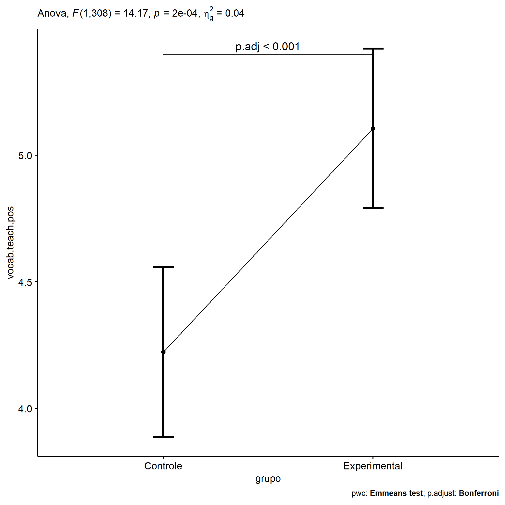<!-- -->

``` r
plots <- oneWayAncovaBoxPlots(
  wdat, "vocab.teach.pos", "grupo", aov, pwc, covar = "vocab.teach.pre",
  theme = "classic", color = color[["grupo"]],
  subtitle = which(aov$Effect == "grupo"))
```

``` r
if (length(unique(wdat[["grupo"]])) > 1)
  plots[["grupo"]] + ggplot2::ylab("Vocabulario Ensinado") + ggplot2::scale_x_discrete(labels=c('pre', 'pos'))
```

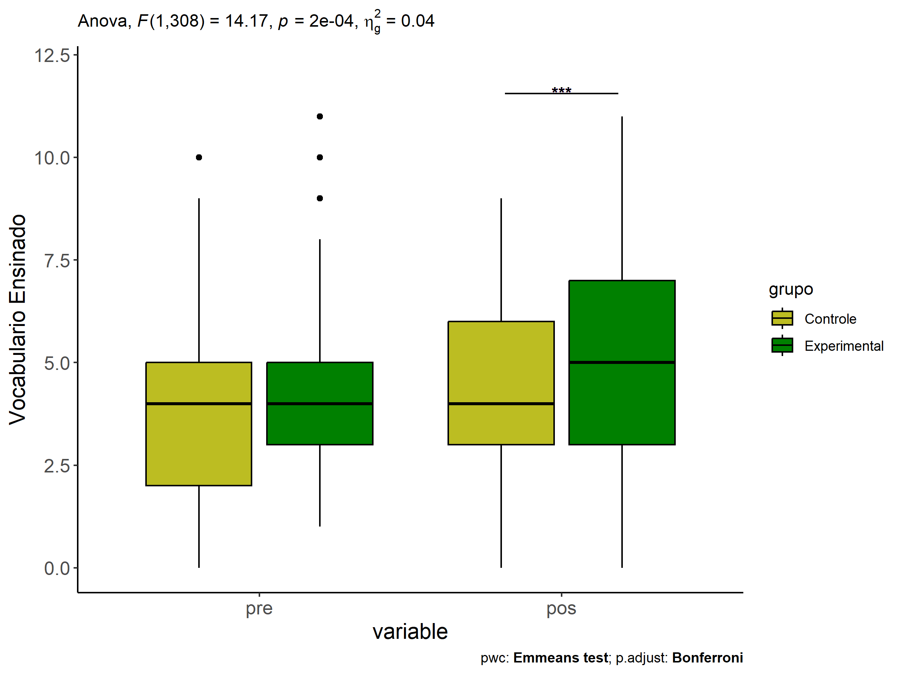<!-- -->

``` r
if (length(unique(wdat.long[["grupo"]])) > 1)
  plots <- oneWayAncovaBoxPlots(
    wdat.long, "vocab.teach", "grupo", aov, pwc.long, pre.post = "time",
    theme = "classic", color = color$prepost)
```

``` r
if (length(unique(wdat.long[["grupo"]])) > 1)
  plots[["grupo"]] + ggplot2::ylab("Vocabulario Ensinado")
```

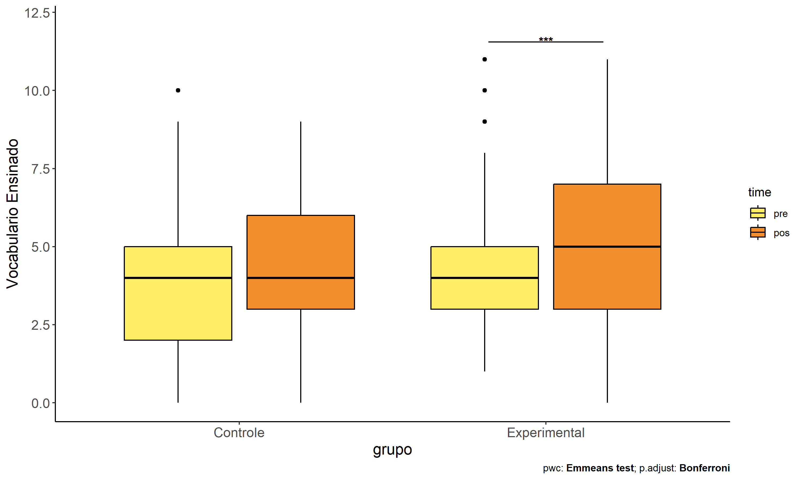<!-- -->

### Checking linearity assumption

``` r
ggscatter(wdat, x = "vocab.teach.pre", y = "vocab.teach.pos", size = 0.5,
          color = "grupo", add = "reg.line")+
  stat_regline_equation(
    aes(label =  paste(..eq.label.., ..rr.label.., sep = "~~~~"), color = grupo)
  )
```

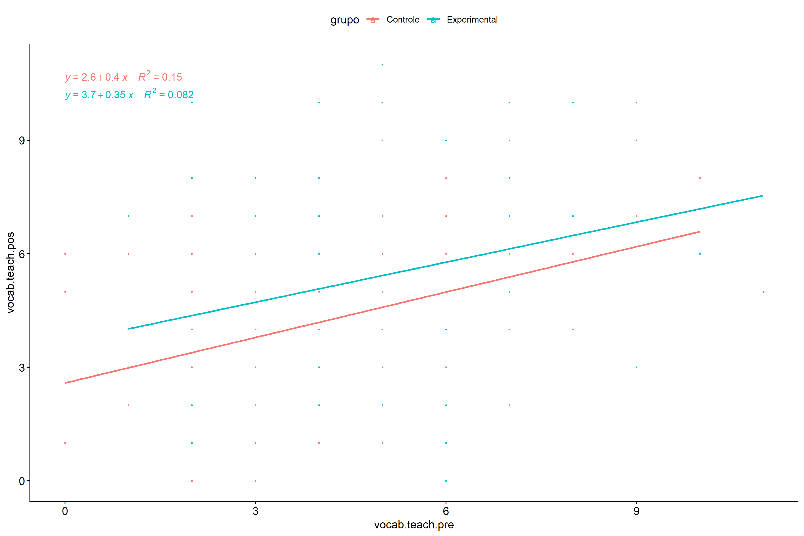<!-- -->

### Checking normality and homogeneity

``` r
res <- augment(lm(vocab.teach.pos ~ vocab.teach.pre + grupo, data = wdat))
```

``` r
shapiro_test(res$.resid)
```

    ## # A tibble: 1 × 3
    ##   variable   statistic p.value
    ##   <chr>          <dbl>   <dbl>
    ## 1 res$.resid     0.994   0.209

``` r
levene_test(res, .resid ~ grupo)
```

    ## # A tibble: 1 × 4
    ##     df1   df2 statistic       p
    ##   <int> <int>     <dbl>   <dbl>
    ## 1     1   309      10.2 0.00159

# ANCOVA and Pairwise for two factors **grupo:Sexo**

## Without remove non-normal data

``` r
pdat = remove_group_data(dat[!is.na(dat[["grupo"]]) & !is.na(dat[["Sexo"]]),], "vocab.teach.pos", c("grupo","Sexo"))

pdat.long <- rbind(pdat[,c("id","grupo","Sexo")], pdat[,c("id","grupo","Sexo")])
pdat.long[["time"]] <- c(rep("pre", nrow(pdat)), rep("pos", nrow(pdat)))
pdat.long[["time"]] <- factor(pdat.long[["time"]], c("pre","pos"))
pdat.long[["vocab.teach"]] <- c(pdat[["vocab.teach.pre"]], pdat[["vocab.teach.pos"]])

aov = anova_test(pdat, vocab.teach.pos ~ vocab.teach.pre + grupo*Sexo)
laov[["grupo:Sexo"]] <- get_anova_table(aov)
```

``` r
pwcs <- list()
pwcs[["Sexo"]] <- emmeans_test(
  group_by(pdat, grupo), vocab.teach.pos ~ Sexo,
  covariate = vocab.teach.pre, p.adjust.method = "bonferroni")
pwcs[["grupo"]] <- emmeans_test(
  group_by(pdat, Sexo), vocab.teach.pos ~ grupo,
  covariate = vocab.teach.pre, p.adjust.method = "bonferroni")

pwc <- plyr::rbind.fill(pwcs[["grupo"]], pwcs[["Sexo"]])
pwc <- pwc[,c("grupo","Sexo", colnames(pwc)[!colnames(pwc) %in% c("grupo","Sexo")])]
```

``` r
pwc.long <- emmeans_test(dplyr::group_by_at(pdat.long, c("grupo","Sexo")),
                         vocab.teach ~ time,
                         p.adjust.method = "bonferroni")
lpwc[["grupo:Sexo"]] <- plyr::rbind.fill(pwc, pwc.long)
```

``` r
ds <- get.descriptives(pdat, "vocab.teach.pos", c("grupo","Sexo"), covar = "vocab.teach.pre")
ds <- merge(ds[ds$variable != "vocab.teach.pre",],
            ds[ds$variable == "vocab.teach.pre", !colnames(ds) %in% c("variable")],
            by = c("grupo","Sexo"), all.x = T, suffixes = c("", ".vocab.teach.pre"))
ds <- merge(get_emmeans(pwcs[["grupo"]]), ds, by = c("grupo","Sexo"), suffixes = c(".emms", ""))
ds <- ds[,c("grupo","Sexo","n","mean.vocab.teach.pre","se.vocab.teach.pre","mean","se","emmean","se.emms")]

colnames(ds) <- c("grupo","Sexo", "N", paste0(c("M","SE")," (pre)"),
                  paste0(c("M","SE"), " (unadj)"), paste0(c("M", "SE"), " (adj)"))

lemms[["grupo:Sexo"]] <- ds
```

## Computing ANCOVA and PairWise After removing non-normal data (OK)

``` r
wdat = pdat 

res = residuals(lm(vocab.teach.pos ~ vocab.teach.pre + grupo*Sexo, data = wdat))
non.normal = getNonNormal(res, wdat$id, plimit = 0.05)

wdat = wdat[!wdat$id %in% non.normal,]

wdat.long <- rbind(wdat[,c("id","grupo","Sexo")], wdat[,c("id","grupo","Sexo")])
wdat.long[["time"]] <- c(rep("pre", nrow(wdat)), rep("pos", nrow(wdat)))
wdat.long[["time"]] <- factor(wdat.long[["time"]], c("pre","pos"))
wdat.long[["vocab.teach"]] <- c(wdat[["vocab.teach.pre"]], wdat[["vocab.teach.pos"]])


ldat[["grupo:Sexo"]] = wdat

(non.normal)
```

    ## NULL

``` r
aov = anova_test(wdat, vocab.teach.pos ~ vocab.teach.pre + grupo*Sexo)
laov[["grupo:Sexo"]] <- merge(get_anova_table(aov), laov[["grupo:Sexo"]], by="Effect", suffixes = c("","'"))

(df = get_anova_table(aov))
```

    ## ANOVA Table (type II tests)
    ## 
    ##            Effect DFn DFd      F        p p<.05   ges
    ## 1 vocab.teach.pre   1 306 36.689 4.06e-09     * 0.107
    ## 2           grupo   1 306 12.667 4.31e-04     * 0.040
    ## 3            Sexo   1 306  7.229 8.00e-03     * 0.023
    ## 4      grupo:Sexo   1 306  0.455 5.00e-01       0.001

| Effect          | DFn | DFd |      F |     p | p\<.05 |   ges |
|:----------------|----:|----:|-------:|------:|:-------|------:|
| vocab.teach.pre |   1 | 306 | 36.689 | 0.000 | \*     | 0.107 |
| grupo           |   1 | 306 | 12.667 | 0.000 | \*     | 0.040 |
| Sexo            |   1 | 306 |  7.229 | 0.008 | \*     | 0.023 |
| grupo:Sexo      |   1 | 306 |  0.455 | 0.500 |        | 0.001 |

``` r
pwcs <- list()
pwcs[["Sexo"]] <- emmeans_test(
  group_by(wdat, grupo), vocab.teach.pos ~ Sexo,
  covariate = vocab.teach.pre, p.adjust.method = "bonferroni")
pwcs[["grupo"]] <- emmeans_test(
  group_by(wdat, Sexo), vocab.teach.pos ~ grupo,
  covariate = vocab.teach.pre, p.adjust.method = "bonferroni")

pwc <- plyr::rbind.fill(pwcs[["grupo"]], pwcs[["Sexo"]])
pwc <- pwc[,c("grupo","Sexo", colnames(pwc)[!colnames(pwc) %in% c("grupo","Sexo")])]
```

| grupo        | Sexo | term                   | .y.             | group1   | group2       |  df | statistic |     p | p.adj | p.adj.signif |
|:-------------|:-----|:-----------------------|:----------------|:---------|:-------------|----:|----------:|------:|------:|:-------------|
|              | F    | vocab.teach.pre\*grupo | vocab.teach.pos | Controle | Experimental | 306 |    -2.971 | 0.003 | 0.003 | \*\*         |
|              | M    | vocab.teach.pre\*grupo | vocab.teach.pos | Controle | Experimental | 306 |    -2.082 | 0.038 | 0.038 | \*           |
| Controle     |      | vocab.teach.pre\*Sexo  | vocab.teach.pos | F        | M            | 306 |     1.346 | 0.179 | 0.179 | ns           |
| Experimental |      | vocab.teach.pre\*Sexo  | vocab.teach.pos | F        | M            | 306 |     2.424 | 0.016 | 0.016 | \*           |

``` r
pwc.long <- emmeans_test(dplyr::group_by_at(wdat.long, c("grupo","Sexo")),
                         vocab.teach ~ time,
                         p.adjust.method = "bonferroni")
lpwc[["grupo:Sexo"]] <- merge(plyr::rbind.fill(pwc, pwc.long), lpwc[["grupo:Sexo"]], by=c("grupo","Sexo","term",".y.","group1","group2"), suffixes = c("","'"))
```

| grupo        | Sexo | term | .y.         | group1 | group2 |  df | statistic |     p | p.adj | p.adj.signif |
|:-------------|:-----|:-----|:------------|:-------|:-------|----:|----------:|------:|------:|:-------------|
| Controle     | F    | time | vocab.teach | pre    | pos    | 614 |    -1.122 | 0.262 | 0.262 | ns           |
| Controle     | M    | time | vocab.teach | pre    | pos    | 614 |    -0.309 | 0.757 | 0.757 | ns           |
| Experimental | F    | time | vocab.teach | pre    | pos    | 614 |    -4.080 | 0.000 | 0.000 | \*\*\*\*     |
| Experimental | M    | time | vocab.teach | pre    | pos    | 614 |    -1.586 | 0.113 | 0.113 | ns           |

``` r
ds <- get.descriptives(wdat, "vocab.teach.pos", c("grupo","Sexo"), covar = "vocab.teach.pre")
ds <- merge(ds[ds$variable != "vocab.teach.pre",],
            ds[ds$variable == "vocab.teach.pre", !colnames(ds) %in% c("variable")],
            by = c("grupo","Sexo"), all.x = T, suffixes = c("", ".vocab.teach.pre"))
ds <- merge(get_emmeans(pwcs[["grupo"]]), ds, by = c("grupo","Sexo"), suffixes = c(".emms", ""))
ds <- ds[,c("grupo","Sexo","n","mean.vocab.teach.pre","se.vocab.teach.pre","mean","se","emmean","se.emms")]

colnames(ds) <- c("grupo","Sexo", "N", paste0(c("M","SE")," (pre)"),
                  paste0(c("M","SE"), " (unadj)"), paste0(c("M", "SE"), " (adj)"))

lemms[["grupo:Sexo"]] <- merge(ds, lemms[["grupo:Sexo"]], by=c("grupo","Sexo"), suffixes = c("","'"))
```

| grupo        | Sexo |   N | M (pre) | SE (pre) | M (unadj) | SE (unadj) | M (adj) | SE (adj) |
|:-------------|:-----|----:|--------:|---------:|----------:|-----------:|--------:|---------:|
| Controle     | F    |  65 |   4.062 |    0.232 |     4.462 |      0.246 |   4.476 |    0.253 |
| Controle     | M    |  81 |   3.815 |    0.215 |     3.914 |      0.212 |   4.019 |    0.227 |
| Experimental | F    |  88 |   4.284 |    0.206 |     5.534 |      0.235 |   5.466 |    0.217 |
| Experimental | M    |  77 |   4.221 |    0.214 |     4.740 |      0.278 |   4.696 |    0.232 |

### Plots for ancova

``` r
plots <- twoWayAncovaPlots(
  wdat, "vocab.teach.pos", c("grupo","Sexo"), aov, pwcs, addParam = c("mean_se"),
  font.label.size=10, step.increase=0.05, p.label="p.adj",
  subtitle = which(aov$Effect == "grupo:Sexo"))
```

``` r
if (!is.null(plots[["grupo"]]))
  plots[["grupo"]] + ggplot2::scale_color_manual(values = color[["Sexo"]])
```

    ## Scale for colour is already present.
    ## Adding another scale for colour, which will replace the existing scale.

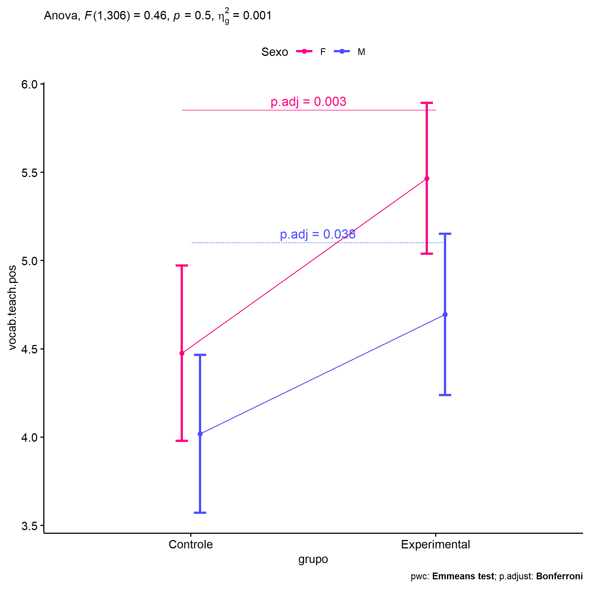<!-- -->

``` r
if (!is.null(plots[["Sexo"]]))
  plots[["Sexo"]] + ggplot2::scale_color_manual(values = color[["grupo"]])
```

    ## Scale for colour is already present.
    ## Adding another scale for colour, which will replace the existing scale.

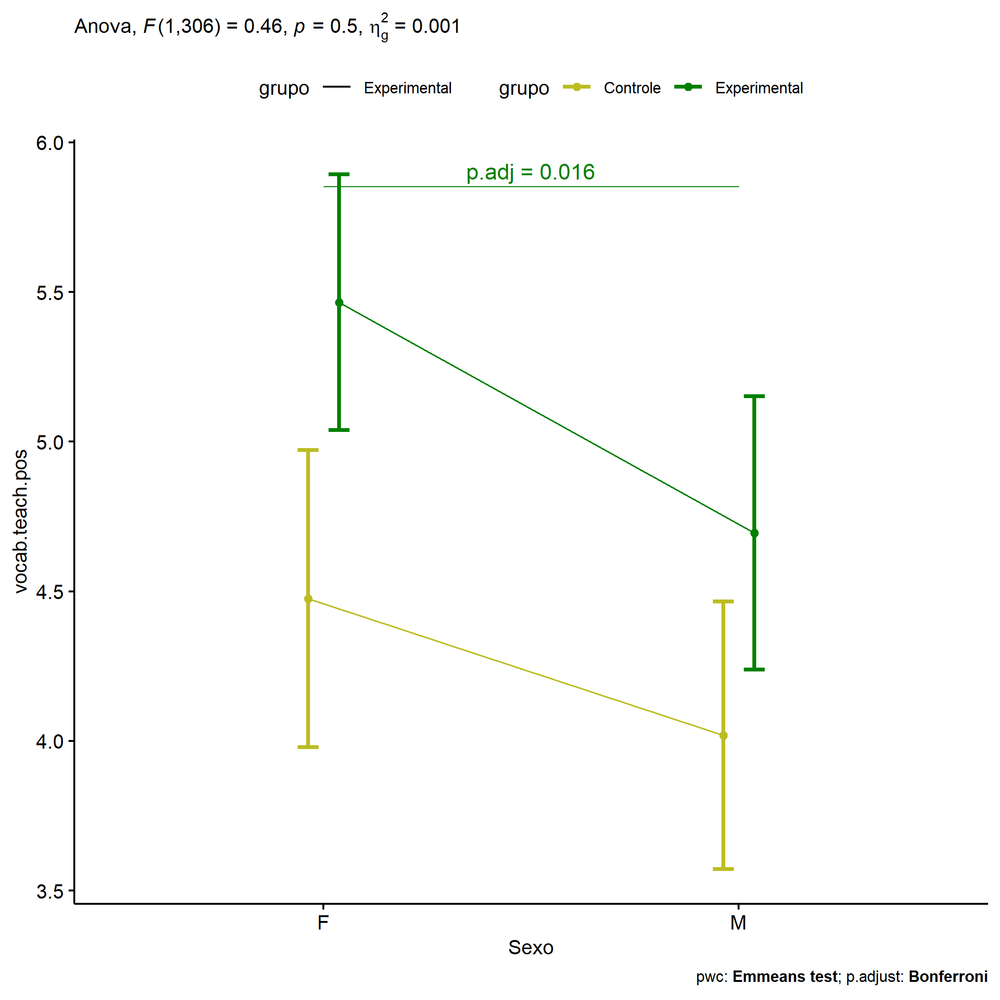<!-- -->

``` r
plots <- twoWayAncovaBoxPlots(
  wdat, "vocab.teach.pos", c("grupo","Sexo"), aov, pwcs, covar = "vocab.teach.pre",
  theme = "classic", color = color[["grupo:Sexo"]],
  subtitle = which(aov$Effect == "grupo:Sexo"))
```

``` r
plots[["grupo:Sexo"]] + ggplot2::ylab("Vocabulario Ensinado") + ggplot2::scale_x_discrete(labels=c('pre', 'pos'))
```

<!-- -->

``` r
plots <- twoWayAncovaBoxPlots(
  wdat.long, "vocab.teach", c("grupo","Sexo"), aov, pwc.long, pre.post = "time",
  theme = "classic", color = color$prepost)
```

``` r
plots[["grupo:Sexo"]] + ggplot2::ylab("Vocabulario Ensinado")
```

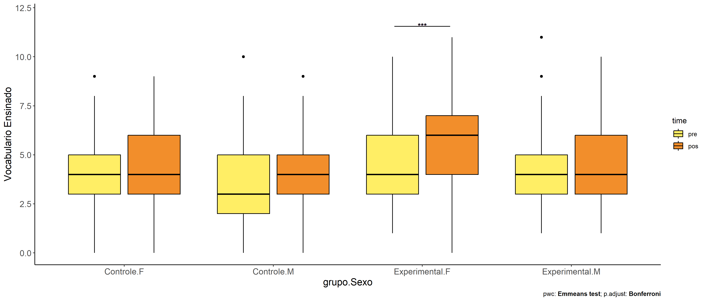<!-- -->

### Checking linearity assumption

``` r
ggscatter(wdat, x = "vocab.teach.pre", y = "vocab.teach.pos", size = 0.5,
          facet.by = c("grupo","Sexo"), add = "reg.line")+
  stat_regline_equation(
    aes(label =  paste(..eq.label.., ..rr.label.., sep = "~~~~"))
  )
```

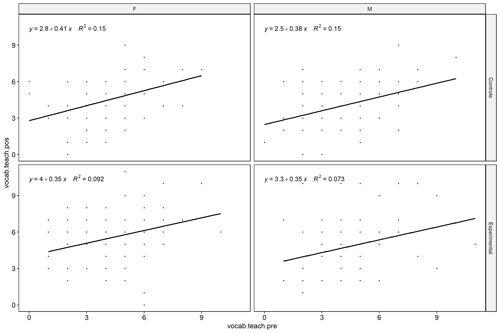<!-- -->

### Checking normality and homogeneity

``` r
res <- augment(lm(vocab.teach.pos ~ vocab.teach.pre + grupo*Sexo, data = wdat))
```

``` r
shapiro_test(res$.resid)
```

    ## # A tibble: 1 × 3
    ##   variable   statistic p.value
    ##   <chr>          <dbl>   <dbl>
    ## 1 res$.resid     0.994   0.227

``` r
levene_test(res, .resid ~ grupo*Sexo)
```

    ## # A tibble: 1 × 4
    ##     df1   df2 statistic      p
    ##   <int> <int>     <dbl>  <dbl>
    ## 1     3   307      2.65 0.0490

# ANCOVA and Pairwise for two factors **grupo:Zona**

## Without remove non-normal data

``` r
pdat = remove_group_data(dat[!is.na(dat[["grupo"]]) & !is.na(dat[["Zona"]]),], "vocab.teach.pos", c("grupo","Zona"))

pdat.long <- rbind(pdat[,c("id","grupo","Zona")], pdat[,c("id","grupo","Zona")])
pdat.long[["time"]] <- c(rep("pre", nrow(pdat)), rep("pos", nrow(pdat)))
pdat.long[["time"]] <- factor(pdat.long[["time"]], c("pre","pos"))
pdat.long[["vocab.teach"]] <- c(pdat[["vocab.teach.pre"]], pdat[["vocab.teach.pos"]])

aov = anova_test(pdat, vocab.teach.pos ~ vocab.teach.pre + grupo*Zona)
laov[["grupo:Zona"]] <- get_anova_table(aov)
```

``` r
pwcs <- list()
pwcs[["Zona"]] <- emmeans_test(
  group_by(pdat, grupo), vocab.teach.pos ~ Zona,
  covariate = vocab.teach.pre, p.adjust.method = "bonferroni")
pwcs[["grupo"]] <- emmeans_test(
  group_by(pdat, Zona), vocab.teach.pos ~ grupo,
  covariate = vocab.teach.pre, p.adjust.method = "bonferroni")

pwc <- plyr::rbind.fill(pwcs[["grupo"]], pwcs[["Zona"]])
pwc <- pwc[,c("grupo","Zona", colnames(pwc)[!colnames(pwc) %in% c("grupo","Zona")])]
```

``` r
pwc.long <- emmeans_test(dplyr::group_by_at(pdat.long, c("grupo","Zona")),
                         vocab.teach ~ time,
                         p.adjust.method = "bonferroni")
lpwc[["grupo:Zona"]] <- plyr::rbind.fill(pwc, pwc.long)
```

``` r
ds <- get.descriptives(pdat, "vocab.teach.pos", c("grupo","Zona"), covar = "vocab.teach.pre")
ds <- merge(ds[ds$variable != "vocab.teach.pre",],
            ds[ds$variable == "vocab.teach.pre", !colnames(ds) %in% c("variable")],
            by = c("grupo","Zona"), all.x = T, suffixes = c("", ".vocab.teach.pre"))
ds <- merge(get_emmeans(pwcs[["grupo"]]), ds, by = c("grupo","Zona"), suffixes = c(".emms", ""))
ds <- ds[,c("grupo","Zona","n","mean.vocab.teach.pre","se.vocab.teach.pre","mean","se","emmean","se.emms")]

colnames(ds) <- c("grupo","Zona", "N", paste0(c("M","SE")," (pre)"),
                  paste0(c("M","SE"), " (unadj)"), paste0(c("M", "SE"), " (adj)"))

lemms[["grupo:Zona"]] <- ds
```

## Computing ANCOVA and PairWise After removing non-normal data (OK)

``` r
wdat = pdat 

res = residuals(lm(vocab.teach.pos ~ vocab.teach.pre + grupo*Zona, data = wdat))
non.normal = getNonNormal(res, wdat$id, plimit = 0.05)

wdat = wdat[!wdat$id %in% non.normal,]

wdat.long <- rbind(wdat[,c("id","grupo","Zona")], wdat[,c("id","grupo","Zona")])
wdat.long[["time"]] <- c(rep("pre", nrow(wdat)), rep("pos", nrow(wdat)))
wdat.long[["time"]] <- factor(wdat.long[["time"]], c("pre","pos"))
wdat.long[["vocab.teach"]] <- c(wdat[["vocab.teach.pre"]], wdat[["vocab.teach.pos"]])


ldat[["grupo:Zona"]] = wdat

(non.normal)
```

    ## NULL

``` r
aov = anova_test(wdat, vocab.teach.pos ~ vocab.teach.pre + grupo*Zona)
laov[["grupo:Zona"]] <- merge(get_anova_table(aov), laov[["grupo:Zona"]], by="Effect", suffixes = c("","'"))

(df = get_anova_table(aov))
```

    ## ANOVA Table (type II tests)
    ## 
    ##            Effect DFn DFd      F        p p<.05      ges
    ## 1 vocab.teach.pre   1 243 34.761 1.24e-08     * 0.125000
    ## 2           grupo   1 243  8.616 4.00e-03     * 0.034000
    ## 3            Zona   1 243  1.135 2.88e-01       0.005000
    ## 4      grupo:Zona   1 243  0.066 7.97e-01       0.000272

| Effect          | DFn | DFd |      F |     p | p\<.05 |   ges |
|:----------------|----:|----:|-------:|------:|:-------|------:|
| vocab.teach.pre |   1 | 243 | 34.761 | 0.000 | \*     | 0.125 |
| grupo           |   1 | 243 |  8.616 | 0.004 | \*     | 0.034 |
| Zona            |   1 | 243 |  1.135 | 0.288 |        | 0.005 |
| grupo:Zona      |   1 | 243 |  0.066 | 0.797 |        | 0.000 |

``` r
pwcs <- list()
pwcs[["Zona"]] <- emmeans_test(
  group_by(wdat, grupo), vocab.teach.pos ~ Zona,
  covariate = vocab.teach.pre, p.adjust.method = "bonferroni")
pwcs[["grupo"]] <- emmeans_test(
  group_by(wdat, Zona), vocab.teach.pos ~ grupo,
  covariate = vocab.teach.pre, p.adjust.method = "bonferroni")

pwc <- plyr::rbind.fill(pwcs[["grupo"]], pwcs[["Zona"]])
pwc <- pwc[,c("grupo","Zona", colnames(pwc)[!colnames(pwc) %in% c("grupo","Zona")])]
```

| grupo        | Zona   | term                   | .y.             | group1   | group2       |  df | statistic |     p | p.adj | p.adj.signif |
|:-------------|:-------|:-----------------------|:----------------|:---------|:-------------|----:|----------:|------:|------:|:-------------|
|              | Rural  | vocab.teach.pre\*grupo | vocab.teach.pos | Controle | Experimental | 243 |    -2.654 | 0.008 | 0.008 | \*\*         |
|              | Urbana | vocab.teach.pre\*grupo | vocab.teach.pos | Controle | Experimental | 243 |    -1.282 | 0.201 | 0.201 | ns           |
| Controle     |        | vocab.teach.pre\*Zona  | vocab.teach.pos | Rural    | Urbana       | 243 |    -0.907 | 0.365 | 0.365 | ns           |
| Experimental |        | vocab.teach.pre\*Zona  | vocab.teach.pos | Rural    | Urbana       | 243 |    -0.614 | 0.540 | 0.540 | ns           |

``` r
pwc.long <- emmeans_test(dplyr::group_by_at(wdat.long, c("grupo","Zona")),
                         vocab.teach ~ time,
                         p.adjust.method = "bonferroni")
lpwc[["grupo:Zona"]] <- merge(plyr::rbind.fill(pwc, pwc.long), lpwc[["grupo:Zona"]], by=c("grupo","Zona","term",".y.","group1","group2"), suffixes = c("","'"))
```

| grupo        | Zona   | term | .y.         | group1 | group2 |  df | statistic |     p | p.adj | p.adj.signif |
|:-------------|:-------|:-----|:------------|:-------|:-------|----:|----------:|------:|------:|:-------------|
| Controle     | Rural  | time | vocab.teach | pre    | pos    | 488 |    -0.381 | 0.703 | 0.703 | ns           |
| Controle     | Urbana | time | vocab.teach | pre    | pos    | 488 |    -1.033 | 0.302 | 0.302 | ns           |
| Experimental | Rural  | time | vocab.teach | pre    | pos    | 488 |    -2.741 | 0.006 | 0.006 | \*\*         |
| Experimental | Urbana | time | vocab.teach | pre    | pos    | 488 |    -1.994 | 0.047 | 0.047 | \*           |

``` r
ds <- get.descriptives(wdat, "vocab.teach.pos", c("grupo","Zona"), covar = "vocab.teach.pre")
ds <- merge(ds[ds$variable != "vocab.teach.pre",],
            ds[ds$variable == "vocab.teach.pre", !colnames(ds) %in% c("variable")],
            by = c("grupo","Zona"), all.x = T, suffixes = c("", ".vocab.teach.pre"))
ds <- merge(get_emmeans(pwcs[["grupo"]]), ds, by = c("grupo","Zona"), suffixes = c(".emms", ""))
ds <- ds[,c("grupo","Zona","n","mean.vocab.teach.pre","se.vocab.teach.pre","mean","se","emmean","se.emms")]

colnames(ds) <- c("grupo","Zona", "N", paste0(c("M","SE")," (pre)"),
                  paste0(c("M","SE"), " (unadj)"), paste0(c("M", "SE"), " (adj)"))

lemms[["grupo:Zona"]] <- merge(ds, lemms[["grupo:Zona"]], by=c("grupo","Zona"), suffixes = c("","'"))
```

| grupo        | Zona   |   N | M (pre) | SE (pre) | M (unadj) | SE (unadj) | M (adj) | SE (adj) |
|:-------------|:-------|----:|--------:|---------:|----------:|-----------:|--------:|---------:|
| Controle     | Rural  |  97 |   4.072 |    0.206 |     4.186 |      0.200 |   4.207 |    0.204 |
| Controle     | Urbana |  28 |   3.964 |    0.339 |     4.536 |      0.351 |   4.598 |    0.380 |
| Experimental | Rural  |  85 |   4.129 |    0.216 |     5.000 |      0.250 |   5.000 |    0.218 |
| Experimental | Urbana |  38 |   4.395 |    0.330 |     5.342 |      0.387 |   5.241 |    0.327 |

### Plots for ancova

``` r
plots <- twoWayAncovaPlots(
  wdat, "vocab.teach.pos", c("grupo","Zona"), aov, pwcs, addParam = c("mean_se"),
  font.label.size=10, step.increase=0.05, p.label="p.adj",
  subtitle = which(aov$Effect == "grupo:Zona"))
```

``` r
if (!is.null(plots[["grupo"]]))
  plots[["grupo"]] + ggplot2::scale_color_manual(values = color[["Zona"]])
```

    ## Scale for colour is already present.
    ## Adding another scale for colour, which will replace the existing scale.

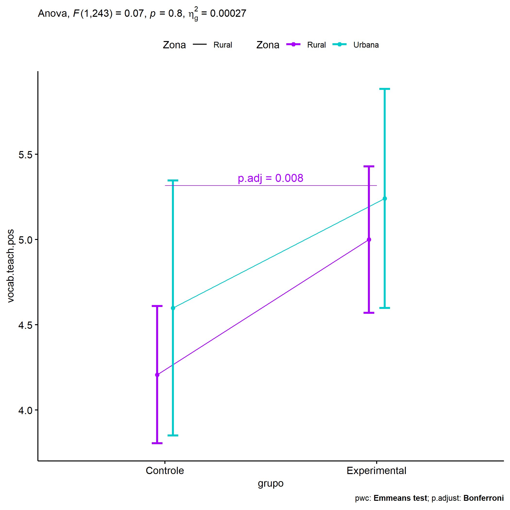<!-- -->

``` r
if (!is.null(plots[["Zona"]]))
  plots[["Zona"]] + ggplot2::scale_color_manual(values = color[["grupo"]])
```

    ## Scale for colour is already present.
    ## Adding another scale for colour, which will replace the existing scale.

<!-- -->

``` r
plots <- twoWayAncovaBoxPlots(
  wdat, "vocab.teach.pos", c("grupo","Zona"), aov, pwcs, covar = "vocab.teach.pre",
  theme = "classic", color = color[["grupo:Zona"]],
  subtitle = which(aov$Effect == "grupo:Zona"))
```

``` r
plots[["grupo:Zona"]] + ggplot2::ylab("Vocabulario Ensinado") + ggplot2::scale_x_discrete(labels=c('pre', 'pos'))
```

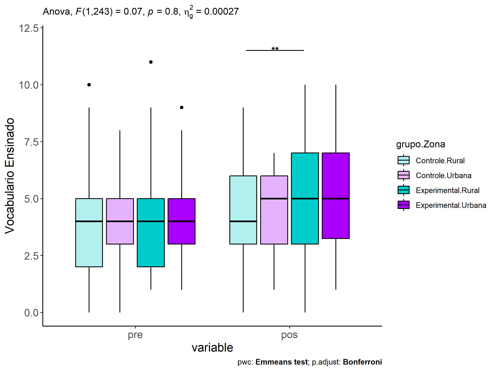<!-- -->

``` r
plots <- twoWayAncovaBoxPlots(
  wdat.long, "vocab.teach", c("grupo","Zona"), aov, pwc.long, pre.post = "time",
  theme = "classic", color = color$prepost)
```

``` r
plots[["grupo:Zona"]] + ggplot2::ylab("Vocabulario Ensinado")
```

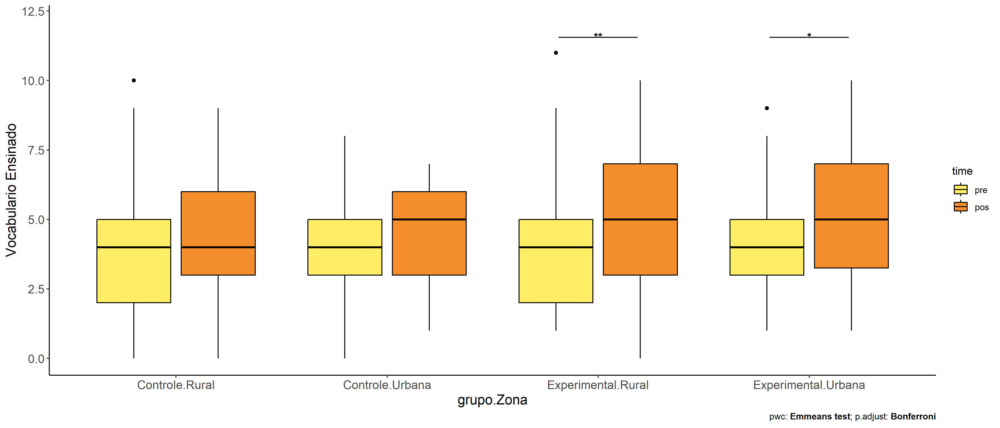<!-- -->

### Checking linearity assumption

``` r
ggscatter(wdat, x = "vocab.teach.pre", y = "vocab.teach.pos", size = 0.5,
          facet.by = c("grupo","Zona"), add = "reg.line")+
  stat_regline_equation(
    aes(label =  paste(..eq.label.., ..rr.label.., sep = "~~~~"))
  )
```

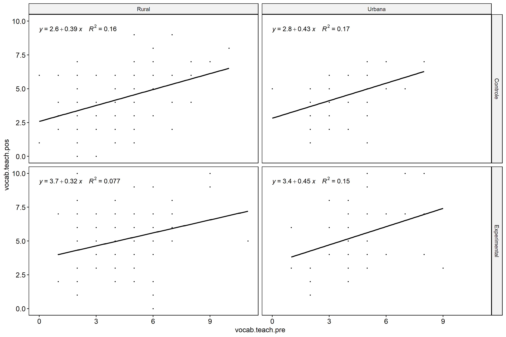<!-- -->

### Checking normality and homogeneity

``` r
res <- augment(lm(vocab.teach.pos ~ vocab.teach.pre + grupo*Zona, data = wdat))
```

``` r
shapiro_test(res$.resid)
```

    ## # A tibble: 1 × 3
    ##   variable   statistic p.value
    ##   <chr>          <dbl>   <dbl>
    ## 1 res$.resid     0.995   0.556

``` r
levene_test(res, .resid ~ grupo*Zona)
```

    ## # A tibble: 1 × 4
    ##     df1   df2 statistic      p
    ##   <int> <int>     <dbl>  <dbl>
    ## 1     3   244      3.14 0.0259

# ANCOVA and Pairwise for two factors **grupo:Cor.Raca**

## Without remove non-normal data

``` r
pdat = remove_group_data(dat[!is.na(dat[["grupo"]]) & !is.na(dat[["Cor.Raca"]]),], "vocab.teach.pos", c("grupo","Cor.Raca"))
```

    ## Warning: There were 2 warnings in `mutate()`.
    ## The first warning was:
    ## ℹ In argument: `ci = abs(stats::qt(alpha/2, .data$n - 1) * .data$se)`.
    ## Caused by warning:
    ## ! There was 1 warning in `mutate()`.
    ## ℹ In argument: `ci = abs(stats::qt(alpha/2, .data$n - 1) * .data$se)`.
    ## Caused by warning in `stats::qt()`:
    ## ! NaNs produced
    ## ℹ Run `dplyr::last_dplyr_warnings()` to see the 1 remaining warning.

``` r
pdat.long <- rbind(pdat[,c("id","grupo","Cor.Raca")], pdat[,c("id","grupo","Cor.Raca")])
pdat.long[["time"]] <- c(rep("pre", nrow(pdat)), rep("pos", nrow(pdat)))
pdat.long[["time"]] <- factor(pdat.long[["time"]], c("pre","pos"))
pdat.long[["vocab.teach"]] <- c(pdat[["vocab.teach.pre"]], pdat[["vocab.teach.pos"]])

aov = anova_test(pdat, vocab.teach.pos ~ vocab.teach.pre + grupo*Cor.Raca)
laov[["grupo:Cor.Raca"]] <- get_anova_table(aov)
```

``` r
pwcs <- list()
pwcs[["Cor.Raca"]] <- emmeans_test(
  group_by(pdat, grupo), vocab.teach.pos ~ Cor.Raca,
  covariate = vocab.teach.pre, p.adjust.method = "bonferroni")
pwcs[["grupo"]] <- emmeans_test(
  group_by(pdat, Cor.Raca), vocab.teach.pos ~ grupo,
  covariate = vocab.teach.pre, p.adjust.method = "bonferroni")

pwc <- plyr::rbind.fill(pwcs[["grupo"]], pwcs[["Cor.Raca"]])
pwc <- pwc[,c("grupo","Cor.Raca", colnames(pwc)[!colnames(pwc) %in% c("grupo","Cor.Raca")])]
```

``` r
pwc.long <- emmeans_test(dplyr::group_by_at(pdat.long, c("grupo","Cor.Raca")),
                         vocab.teach ~ time,
                         p.adjust.method = "bonferroni")
lpwc[["grupo:Cor.Raca"]] <- plyr::rbind.fill(pwc, pwc.long)
```

``` r
ds <- get.descriptives(pdat, "vocab.teach.pos", c("grupo","Cor.Raca"), covar = "vocab.teach.pre")
ds <- merge(ds[ds$variable != "vocab.teach.pre",],
            ds[ds$variable == "vocab.teach.pre", !colnames(ds) %in% c("variable")],
            by = c("grupo","Cor.Raca"), all.x = T, suffixes = c("", ".vocab.teach.pre"))
ds <- merge(get_emmeans(pwcs[["grupo"]]), ds, by = c("grupo","Cor.Raca"), suffixes = c(".emms", ""))
ds <- ds[,c("grupo","Cor.Raca","n","mean.vocab.teach.pre","se.vocab.teach.pre","mean","se","emmean","se.emms")]

colnames(ds) <- c("grupo","Cor.Raca", "N", paste0(c("M","SE")," (pre)"),
                  paste0(c("M","SE"), " (unadj)"), paste0(c("M", "SE"), " (adj)"))

lemms[["grupo:Cor.Raca"]] <- ds
```

## Computing ANCOVA and PairWise After removing non-normal data (OK)

``` r
wdat = pdat 

res = residuals(lm(vocab.teach.pos ~ vocab.teach.pre + grupo*Cor.Raca, data = wdat))
non.normal = getNonNormal(res, wdat$id, plimit = 0.05)

wdat = wdat[!wdat$id %in% non.normal,]

wdat.long <- rbind(wdat[,c("id","grupo","Cor.Raca")], wdat[,c("id","grupo","Cor.Raca")])
wdat.long[["time"]] <- c(rep("pre", nrow(wdat)), rep("pos", nrow(wdat)))
wdat.long[["time"]] <- factor(wdat.long[["time"]], c("pre","pos"))
wdat.long[["vocab.teach"]] <- c(wdat[["vocab.teach.pre"]], wdat[["vocab.teach.pos"]])


ldat[["grupo:Cor.Raca"]] = wdat

(non.normal)
```

    ## NULL

``` r
aov = anova_test(wdat, vocab.teach.pos ~ vocab.teach.pre + grupo*Cor.Raca)
laov[["grupo:Cor.Raca"]] <- merge(get_anova_table(aov), laov[["grupo:Cor.Raca"]], by="Effect", suffixes = c("","'"))

(df = get_anova_table(aov))
```

    ## ANOVA Table (type II tests)
    ## 
    ##            Effect DFn DFd      F        p p<.05   ges
    ## 1 vocab.teach.pre   1 133 28.784 3.49e-07     * 0.178
    ## 2           grupo   1 133  1.749 1.88e-01       0.013
    ## 3        Cor.Raca   2 133  0.246 7.82e-01       0.004
    ## 4  grupo:Cor.Raca   1 133  1.244 2.67e-01       0.009

| Effect          | DFn | DFd |      F |     p | p\<.05 |   ges |
|:----------------|----:|----:|-------:|------:|:-------|------:|
| vocab.teach.pre |   1 | 133 | 28.784 | 0.000 | \*     | 0.178 |
| grupo           |   1 | 133 |  1.749 | 0.188 |        | 0.013 |
| Cor.Raca        |   2 | 133 |  0.246 | 0.782 |        | 0.004 |
| grupo:Cor.Raca  |   1 | 133 |  1.244 | 0.267 |        | 0.009 |

``` r
pwcs <- list()
pwcs[["Cor.Raca"]] <- emmeans_test(
  group_by(wdat, grupo), vocab.teach.pos ~ Cor.Raca,
  covariate = vocab.teach.pre, p.adjust.method = "bonferroni")
pwcs[["grupo"]] <- emmeans_test(
  group_by(wdat, Cor.Raca), vocab.teach.pos ~ grupo,
  covariate = vocab.teach.pre, p.adjust.method = "bonferroni")

pwc <- plyr::rbind.fill(pwcs[["grupo"]], pwcs[["Cor.Raca"]])
pwc <- pwc[,c("grupo","Cor.Raca", colnames(pwc)[!colnames(pwc) %in% c("grupo","Cor.Raca")])]
```

| grupo        | Cor.Raca | term                      | .y.             | group1   | group2       |  df | statistic |     p | p.adj | p.adj.signif |
|:-------------|:---------|:--------------------------|:----------------|:---------|:-------------|----:|----------:|------:|------:|:-------------|
|              | Branca   | vocab.teach.pre\*grupo    | vocab.teach.pos | Controle | Experimental | 133 |     0.189 | 0.851 | 0.851 | ns           |
|              | Indígena | vocab.teach.pre\*grupo    | vocab.teach.pos | Controle | Experimental |     |           |       |       |              |
|              | Parda    | vocab.teach.pre\*grupo    | vocab.teach.pos | Controle | Experimental | 133 |    -1.720 | 0.088 | 0.088 | ns           |
| Controle     |          | vocab.teach.pre\*Cor.Raca | vocab.teach.pos | Branca   | Indígena     |     |           |       |       |              |
| Controle     |          | vocab.teach.pre\*Cor.Raca | vocab.teach.pos | Branca   | Parda        | 133 |     0.251 | 0.802 | 0.802 | ns           |
| Controle     |          | vocab.teach.pre\*Cor.Raca | vocab.teach.pos | Indígena | Parda        |     |           |       |       |              |
| Experimental |          | vocab.teach.pre\*Cor.Raca | vocab.teach.pos | Branca   | Indígena     | 133 |    -0.690 | 0.491 | 1.000 | ns           |
| Experimental |          | vocab.teach.pre\*Cor.Raca | vocab.teach.pos | Branca   | Parda        | 133 |    -1.294 | 0.198 | 0.593 | ns           |
| Experimental |          | vocab.teach.pre\*Cor.Raca | vocab.teach.pos | Indígena | Parda        | 133 |    -0.359 | 0.720 | 1.000 | ns           |

``` r
pwc.long <- emmeans_test(dplyr::group_by_at(wdat.long, c("grupo","Cor.Raca")),
                         vocab.teach ~ time,
                         p.adjust.method = "bonferroni")
lpwc[["grupo:Cor.Raca"]] <- merge(plyr::rbind.fill(pwc, pwc.long), lpwc[["grupo:Cor.Raca"]], by=c("grupo","Cor.Raca","term",".y.","group1","group2"), suffixes = c("","'"))
```

| grupo        | Cor.Raca | term | .y.         | group1 | group2 |  df | statistic |     p | p.adj | p.adj.signif |
|:-------------|:---------|:-----|:------------|:-------|:-------|----:|----------:|------:|------:|:-------------|
| Controle     | Branca   | time | vocab.teach | pre    | pos    | 268 |    -0.799 | 0.425 | 0.425 | ns           |
| Controle     | Indígena | time | vocab.teach | pre    | pos    |     |           |       |       |              |
| Controle     | Parda    | time | vocab.teach | pre    | pos    | 268 |    -0.578 | 0.564 | 0.564 | ns           |
| Experimental | Branca   | time | vocab.teach | pre    | pos    | 268 |     0.161 | 0.873 | 0.873 | ns           |
| Experimental | Indígena | time | vocab.teach | pre    | pos    | 268 |    -0.945 | 0.346 | 0.346 | ns           |
| Experimental | Parda    | time | vocab.teach | pre    | pos    | 268 |    -2.413 | 0.016 | 0.016 | \*           |

``` r
ds <- get.descriptives(wdat, "vocab.teach.pos", c("grupo","Cor.Raca"), covar = "vocab.teach.pre")
ds <- merge(ds[ds$variable != "vocab.teach.pre",],
            ds[ds$variable == "vocab.teach.pre", !colnames(ds) %in% c("variable")],
            by = c("grupo","Cor.Raca"), all.x = T, suffixes = c("", ".vocab.teach.pre"))
ds <- merge(get_emmeans(pwcs[["grupo"]]), ds, by = c("grupo","Cor.Raca"), suffixes = c(".emms", ""))
ds <- ds[,c("grupo","Cor.Raca","n","mean.vocab.teach.pre","se.vocab.teach.pre","mean","se","emmean","se.emms")]

colnames(ds) <- c("grupo","Cor.Raca", "N", paste0(c("M","SE")," (pre)"),
                  paste0(c("M","SE"), " (unadj)"), paste0(c("M", "SE"), " (adj)"))

lemms[["grupo:Cor.Raca"]] <- merge(ds, lemms[["grupo:Cor.Raca"]], by=c("grupo","Cor.Raca"), suffixes = c("","'"))
```

| grupo        | Cor.Raca |   N | M (pre) | SE (pre) | M (unadj) | SE (unadj) | M (adj) | SE (adj) |
|:-------------|:---------|----:|--------:|---------:|----------:|-----------:|--------:|---------:|
| Controle     | Branca   |  22 |   3.773 |    0.400 |     4.273 |      0.498 |   4.386 |    0.430 |
| Controle     | Parda    |  42 |   3.976 |    0.336 |     4.238 |      0.323 |   4.253 |    0.311 |
| Experimental | Branca   |  18 |   4.722 |    0.441 |     4.611 |      0.584 |   4.264 |    0.479 |
| Experimental | Indígena |  13 |   4.000 |    0.392 |     4.769 |      0.568 |   4.773 |    0.559 |
| Experimental | Parda    |  44 |   3.864 |    0.277 |     4.932 |      0.332 |   5.001 |    0.304 |

### Plots for ancova

``` r
plots <- twoWayAncovaPlots(
  wdat, "vocab.teach.pos", c("grupo","Cor.Raca"), aov, pwcs, addParam = c("mean_se"),
  font.label.size=10, step.increase=0.05, p.label="p.adj",
  subtitle = which(aov$Effect == "grupo:Cor.Raca"))
```

``` r
if (!is.null(plots[["grupo"]]))
  plots[["grupo"]] + ggplot2::scale_color_manual(values = color[["Cor.Raca"]])
```

<!-- -->

``` r
if (!is.null(plots[["Cor.Raca"]]))
  plots[["Cor.Raca"]] + ggplot2::scale_color_manual(values = color[["grupo"]])
```

    ## Scale for colour is already present.
    ## Adding another scale for colour, which will replace the existing scale.

    ## Warning: Removed 2 rows containing non-finite values (`stat_bracket()`).

    ## Warning: Removed 1 rows containing missing values (`geom_point()`).

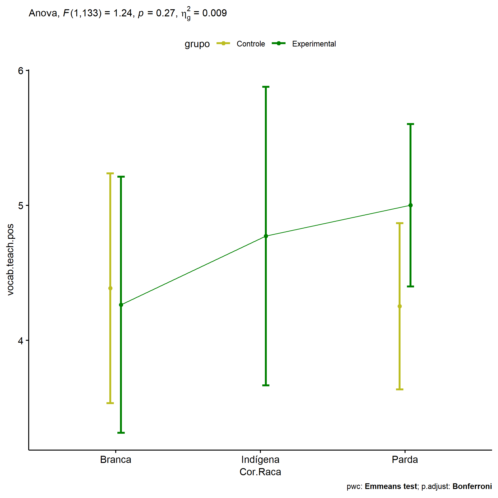<!-- -->

``` r
plots <- twoWayAncovaBoxPlots(
  wdat, "vocab.teach.pos", c("grupo","Cor.Raca"), aov, pwcs, covar = "vocab.teach.pre",
  theme = "classic", color = color[["grupo:Cor.Raca"]],
  subtitle = which(aov$Effect == "grupo:Cor.Raca"))
```

``` r
plots[["grupo:Cor.Raca"]] + ggplot2::ylab("Vocabulario Ensinado") + ggplot2::scale_x_discrete(labels=c('pre', 'pos'))
```

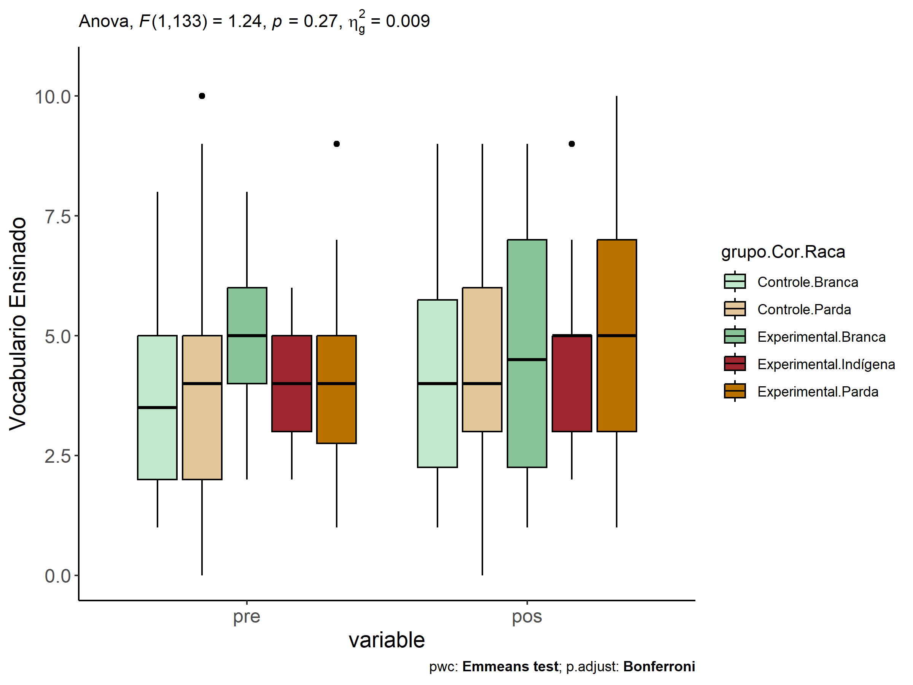<!-- -->

``` r
plots <- twoWayAncovaBoxPlots(
  wdat.long, "vocab.teach", c("grupo","Cor.Raca"), aov, pwc.long, pre.post = "time",
  theme = "classic", color = color$prepost)
```

``` r
plots[["grupo:Cor.Raca"]] + ggplot2::ylab("Vocabulario Ensinado")
```

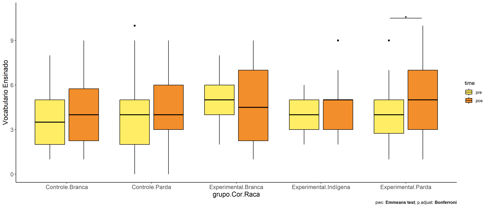<!-- -->

### Checking linearity assumption

``` r
ggscatter(wdat, x = "vocab.teach.pre", y = "vocab.teach.pos", size = 0.5,
          facet.by = c("grupo","Cor.Raca"), add = "reg.line")+
  stat_regline_equation(
    aes(label =  paste(..eq.label.., ..rr.label.., sep = "~~~~"))
  )
```

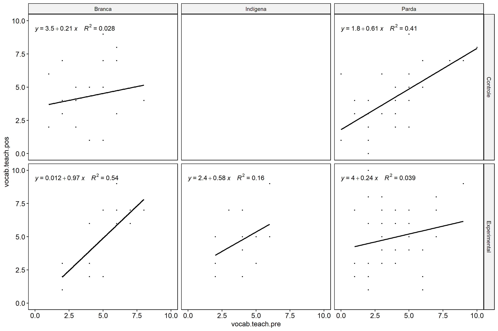<!-- -->

### Checking normality and homogeneity

``` r
res <- augment(lm(vocab.teach.pos ~ vocab.teach.pre + grupo*Cor.Raca, data = wdat))
```

``` r
shapiro_test(res$.resid)
```

    ## # A tibble: 1 × 3
    ##   variable   statistic p.value
    ##   <chr>          <dbl>   <dbl>
    ## 1 res$.resid     0.993   0.743

``` r
levene_test(res, .resid ~ grupo*Cor.Raca)
```

    ## # A tibble: 1 × 4
    ##     df1   df2 statistic     p
    ##   <int> <int>     <dbl> <dbl>
    ## 1     4   134      1.39 0.240

# ANCOVA and Pairwise for two factors **grupo:vocab.teach.quintile**

## Without remove non-normal data

``` r
pdat = remove_group_data(dat[!is.na(dat[["grupo"]]) & !is.na(dat[["vocab.teach.quintile"]]),], "vocab.teach.pos", c("grupo","vocab.teach.quintile"))

pdat.long <- rbind(pdat[,c("id","grupo","vocab.teach.quintile")], pdat[,c("id","grupo","vocab.teach.quintile")])
pdat.long[["time"]] <- c(rep("pre", nrow(pdat)), rep("pos", nrow(pdat)))
pdat.long[["time"]] <- factor(pdat.long[["time"]], c("pre","pos"))
pdat.long[["vocab.teach"]] <- c(pdat[["vocab.teach.pre"]], pdat[["vocab.teach.pos"]])

aov = anova_test(pdat, vocab.teach.pos ~ vocab.teach.pre + grupo*vocab.teach.quintile)
laov[["grupo:vocab.teach.quintile"]] <- get_anova_table(aov)
```

``` r
pwcs <- list()
pwcs[["vocab.teach.quintile"]] <- emmeans_test(
  group_by(pdat, grupo), vocab.teach.pos ~ vocab.teach.quintile,
  covariate = vocab.teach.pre, p.adjust.method = "bonferroni")
pwcs[["grupo"]] <- emmeans_test(
  group_by(pdat, vocab.teach.quintile), vocab.teach.pos ~ grupo,
  covariate = vocab.teach.pre, p.adjust.method = "bonferroni")

pwc <- plyr::rbind.fill(pwcs[["grupo"]], pwcs[["vocab.teach.quintile"]])
pwc <- pwc[,c("grupo","vocab.teach.quintile", colnames(pwc)[!colnames(pwc) %in% c("grupo","vocab.teach.quintile")])]
```

``` r
pwc.long <- emmeans_test(dplyr::group_by_at(pdat.long, c("grupo","vocab.teach.quintile")),
                         vocab.teach ~ time,
                         p.adjust.method = "bonferroni")
lpwc[["grupo:vocab.teach.quintile"]] <- plyr::rbind.fill(pwc, pwc.long)
```

``` r
ds <- get.descriptives(pdat, "vocab.teach.pos", c("grupo","vocab.teach.quintile"), covar = "vocab.teach.pre")
ds <- merge(ds[ds$variable != "vocab.teach.pre",],
            ds[ds$variable == "vocab.teach.pre", !colnames(ds) %in% c("variable")],
            by = c("grupo","vocab.teach.quintile"), all.x = T, suffixes = c("", ".vocab.teach.pre"))
ds <- merge(get_emmeans(pwcs[["grupo"]]), ds, by = c("grupo","vocab.teach.quintile"), suffixes = c(".emms", ""))
ds <- ds[,c("grupo","vocab.teach.quintile","n","mean.vocab.teach.pre","se.vocab.teach.pre","mean","se","emmean","se.emms")]

colnames(ds) <- c("grupo","vocab.teach.quintile", "N", paste0(c("M","SE")," (pre)"),
                  paste0(c("M","SE"), " (unadj)"), paste0(c("M", "SE"), " (adj)"))

lemms[["grupo:vocab.teach.quintile"]] <- ds
```

## Computing ANCOVA and PairWise After removing non-normal data (OK)

``` r
wdat = pdat 

res = residuals(lm(vocab.teach.pos ~ vocab.teach.pre + grupo*vocab.teach.quintile, data = wdat))
non.normal = getNonNormal(res, wdat$id, plimit = 0.05)

wdat = wdat[!wdat$id %in% non.normal,]

wdat.long <- rbind(wdat[,c("id","grupo","vocab.teach.quintile")], wdat[,c("id","grupo","vocab.teach.quintile")])
wdat.long[["time"]] <- c(rep("pre", nrow(wdat)), rep("pos", nrow(wdat)))
wdat.long[["time"]] <- factor(wdat.long[["time"]], c("pre","pos"))
wdat.long[["vocab.teach"]] <- c(wdat[["vocab.teach.pre"]], wdat[["vocab.teach.pos"]])


ldat[["grupo:vocab.teach.quintile"]] = wdat

(non.normal)
```

    ## NULL

``` r
aov = anova_test(wdat, vocab.teach.pos ~ vocab.teach.pre + grupo*vocab.teach.quintile)
laov[["grupo:vocab.teach.quintile"]] <- merge(get_anova_table(aov), laov[["grupo:vocab.teach.quintile"]], by="Effect", suffixes = c("","'"))

(df = get_anova_table(aov))
```

    ## ANOVA Table (type II tests)
    ## 
    ##                       Effect DFn DFd      F        p p<.05      ges
    ## 1            vocab.teach.pre   1 300  0.168 0.682000       0.000561
    ## 2                      grupo   1 300 14.271 0.000191     * 0.045000
    ## 3       vocab.teach.quintile   4 300  1.264 0.284000       0.017000
    ## 4 grupo:vocab.teach.quintile   4 300  0.881 0.475000       0.012000

| Effect                     | DFn | DFd |      F |     p | p\<.05 |   ges |
|:---------------------------|----:|----:|-------:|------:|:-------|------:|
| vocab.teach.pre            |   1 | 300 |  0.168 | 0.682 |        | 0.001 |
| grupo                      |   1 | 300 | 14.271 | 0.000 | \*     | 0.045 |
| vocab.teach.quintile       |   4 | 300 |  1.264 | 0.284 |        | 0.017 |
| grupo:vocab.teach.quintile |   4 | 300 |  0.881 | 0.475 |        | 0.012 |

``` r
pwcs <- list()
pwcs[["vocab.teach.quintile"]] <- emmeans_test(
  group_by(wdat, grupo), vocab.teach.pos ~ vocab.teach.quintile,
  covariate = vocab.teach.pre, p.adjust.method = "bonferroni")
pwcs[["grupo"]] <- emmeans_test(
  group_by(wdat, vocab.teach.quintile), vocab.teach.pos ~ grupo,
  covariate = vocab.teach.pre, p.adjust.method = "bonferroni")

pwc <- plyr::rbind.fill(pwcs[["grupo"]], pwcs[["vocab.teach.quintile"]])
pwc <- pwc[,c("grupo","vocab.teach.quintile", colnames(pwc)[!colnames(pwc) %in% c("grupo","vocab.teach.quintile")])]
```

| grupo        | vocab.teach.quintile | term                                  | .y.             | group1       | group2       |  df | statistic |     p | p.adj | p.adj.signif |
|:-------------|:---------------------|:--------------------------------------|:----------------|:-------------|:-------------|----:|----------:|------:|------:|:-------------|
|              | 1st quintile         | vocab.teach.pre\*grupo                | vocab.teach.pos | Controle     | Experimental | 300 |    -1.423 | 0.156 | 0.156 | ns           |
|              | 2nd quintile         | vocab.teach.pre\*grupo                | vocab.teach.pos | Controle     | Experimental | 300 |    -2.709 | 0.007 | 0.007 | \*\*         |
|              | 3rd quintile         | vocab.teach.pre\*grupo                | vocab.teach.pos | Controle     | Experimental | 300 |    -2.280 | 0.023 | 0.023 | \*           |
|              | 4th quintile         | vocab.teach.pre\*grupo                | vocab.teach.pos | Controle     | Experimental | 300 |     0.022 | 0.983 | 0.983 | ns           |
|              | 5th quintile         | vocab.teach.pre\*grupo                | vocab.teach.pos | Controle     | Experimental | 300 |    -1.788 | 0.075 | 0.075 | ns           |
| Controle     |                      | vocab.teach.pre\*vocab.teach.quintile | vocab.teach.pos | 1st quintile | 2nd quintile | 300 |     0.313 | 0.754 | 1.000 | ns           |
| Controle     |                      | vocab.teach.pre\*vocab.teach.quintile | vocab.teach.pos | 1st quintile | 3rd quintile | 300 |    -0.477 | 0.633 | 1.000 | ns           |
| Controle     |                      | vocab.teach.pre\*vocab.teach.quintile | vocab.teach.pos | 1st quintile | 4th quintile | 300 |    -1.443 | 0.150 | 1.000 | ns           |
| Controle     |                      | vocab.teach.pre\*vocab.teach.quintile | vocab.teach.pos | 1st quintile | 5th quintile | 300 |    -1.151 | 0.251 | 1.000 | ns           |
| Controle     |                      | vocab.teach.pre\*vocab.teach.quintile | vocab.teach.pos | 2nd quintile | 3rd quintile | 300 |    -0.910 | 0.364 | 1.000 | ns           |
| Controle     |                      | vocab.teach.pre\*vocab.teach.quintile | vocab.teach.pos | 2nd quintile | 4th quintile | 300 |    -1.923 | 0.055 | 0.554 | ns           |
| Controle     |                      | vocab.teach.pre\*vocab.teach.quintile | vocab.teach.pos | 2nd quintile | 5th quintile | 300 |    -1.506 | 0.133 | 1.000 | ns           |
| Controle     |                      | vocab.teach.pre\*vocab.teach.quintile | vocab.teach.pos | 3rd quintile | 4th quintile | 300 |    -1.844 | 0.066 | 0.662 | ns           |
| Controle     |                      | vocab.teach.pre\*vocab.teach.quintile | vocab.teach.pos | 3rd quintile | 5th quintile | 300 |    -1.417 | 0.158 | 1.000 | ns           |
| Controle     |                      | vocab.teach.pre\*vocab.teach.quintile | vocab.teach.pos | 4th quintile | 5th quintile | 300 |    -0.053 | 0.958 | 1.000 | ns           |
| Experimental |                      | vocab.teach.pre\*vocab.teach.quintile | vocab.teach.pos | 1st quintile | 2nd quintile | 300 |    -1.183 | 0.238 | 1.000 | ns           |
| Experimental |                      | vocab.teach.pre\*vocab.teach.quintile | vocab.teach.pos | 1st quintile | 3rd quintile | 300 |    -0.718 | 0.473 | 1.000 | ns           |
| Experimental |                      | vocab.teach.pre\*vocab.teach.quintile | vocab.teach.pos | 1st quintile | 4th quintile | 300 |    -0.845 | 0.399 | 1.000 | ns           |
| Experimental |                      | vocab.teach.pre\*vocab.teach.quintile | vocab.teach.pos | 1st quintile | 5th quintile | 300 |    -1.595 | 0.112 | 1.000 | ns           |
| Experimental |                      | vocab.teach.pre\*vocab.teach.quintile | vocab.teach.pos | 2nd quintile | 3rd quintile | 300 |     0.368 | 0.713 | 1.000 | ns           |
| Experimental |                      | vocab.teach.pre\*vocab.teach.quintile | vocab.teach.pos | 2nd quintile | 4th quintile | 300 |    -0.217 | 0.828 | 1.000 | ns           |
| Experimental |                      | vocab.teach.pre\*vocab.teach.quintile | vocab.teach.pos | 2nd quintile | 5th quintile | 300 |    -1.285 | 0.200 | 1.000 | ns           |
| Experimental |                      | vocab.teach.pre\*vocab.teach.quintile | vocab.teach.pos | 3rd quintile | 4th quintile | 300 |    -0.645 | 0.520 | 1.000 | ns           |
| Experimental |                      | vocab.teach.pre\*vocab.teach.quintile | vocab.teach.pos | 3rd quintile | 5th quintile | 300 |    -1.964 | 0.050 | 0.505 | ns           |
| Experimental |                      | vocab.teach.pre\*vocab.teach.quintile | vocab.teach.pos | 4th quintile | 5th quintile | 300 |    -1.762 | 0.079 | 0.791 | ns           |

``` r
pwc.long <- emmeans_test(dplyr::group_by_at(wdat.long, c("grupo","vocab.teach.quintile")),
                         vocab.teach ~ time,
                         p.adjust.method = "bonferroni")
lpwc[["grupo:vocab.teach.quintile"]] <- merge(plyr::rbind.fill(pwc, pwc.long), lpwc[["grupo:vocab.teach.quintile"]], by=c("grupo","vocab.teach.quintile","term",".y.","group1","group2"), suffixes = c("","'"))
```

| grupo        | vocab.teach.quintile | term | .y.         | group1 | group2 |  df | statistic |     p | p.adj | p.adj.signif |
|:-------------|:---------------------|:-----|:------------|:-------|:-------|----:|----------:|------:|------:|:-------------|
| Controle     | 1st quintile         | time | vocab.teach | pre    | pos    | 602 |    -5.516 | 0.000 | 0.000 | \*\*\*\*     |
| Controle     | 2nd quintile         | time | vocab.teach | pre    | pos    | 602 |    -1.132 | 0.258 | 0.258 | ns           |
| Controle     | 3rd quintile         | time | vocab.teach | pre    | pos    | 602 |     1.347 | 0.178 | 0.178 | ns           |
| Controle     | 4th quintile         | time | vocab.teach | pre    | pos    | 602 |     0.756 | 0.450 | 0.450 | ns           |
| Controle     | 5th quintile         | time | vocab.teach | pre    | pos    | 602 |     3.269 | 0.001 | 0.001 | \*\*         |
| Experimental | 1st quintile         | time | vocab.teach | pre    | pos    | 602 |    -6.730 | 0.000 | 0.000 | \*\*\*\*     |
| Experimental | 2nd quintile         | time | vocab.teach | pre    | pos    | 602 |    -4.719 | 0.000 | 0.000 | \*\*\*\*     |
| Experimental | 3rd quintile         | time | vocab.teach | pre    | pos    | 602 |    -2.334 | 0.020 | 0.020 | \*           |
| Experimental | 4th quintile         | time | vocab.teach | pre    | pos    | 602 |     0.889 | 0.374 | 0.374 | ns           |
| Experimental | 5th quintile         | time | vocab.teach | pre    | pos    | 602 |     1.514 | 0.130 | 0.130 | ns           |

``` r
ds <- get.descriptives(wdat, "vocab.teach.pos", c("grupo","vocab.teach.quintile"), covar = "vocab.teach.pre")
ds <- merge(ds[ds$variable != "vocab.teach.pre",],
            ds[ds$variable == "vocab.teach.pre", !colnames(ds) %in% c("variable")],
            by = c("grupo","vocab.teach.quintile"), all.x = T, suffixes = c("", ".vocab.teach.pre"))
ds <- merge(get_emmeans(pwcs[["grupo"]]), ds, by = c("grupo","vocab.teach.quintile"), suffixes = c(".emms", ""))
ds <- ds[,c("grupo","vocab.teach.quintile","n","mean.vocab.teach.pre","se.vocab.teach.pre","mean","se","emmean","se.emms")]

colnames(ds) <- c("grupo","vocab.teach.quintile", "N", paste0(c("M","SE")," (pre)"),
                  paste0(c("M","SE"), " (unadj)"), paste0(c("M", "SE"), " (adj)"))

lemms[["grupo:vocab.teach.quintile"]] <- merge(ds, lemms[["grupo:vocab.teach.quintile"]], by=c("grupo","vocab.teach.quintile"), suffixes = c("","'"))
```

| grupo        | vocab.teach.quintile |   N | M (pre) | SE (pre) | M (unadj) | SE (unadj) | M (adj) | SE (adj) |
|:-------------|:---------------------|----:|--------:|---------:|----------:|-----------:|--------:|---------:|
| Controle     | 1st quintile         |  40 |   1.700 |    0.096 |     3.550 |      0.284 |   3.765 |    0.616 |
| Controle     | 2nd quintile         |  25 |   3.000 |    0.000 |     3.480 |      0.327 |   3.578 |    0.476 |
| Controle     | 3rd quintile         |  54 |   4.556 |    0.068 |     4.167 |      0.261 |   4.126 |    0.297 |
| Controle     | 4th quintile         |  14 |   6.000 |    0.000 |     5.571 |      0.453 |   5.401 |    0.688 |
| Controle     | 5th quintile         |  13 |   7.692 |    0.263 |     5.769 |      0.533 |   5.448 |    0.969 |
| Experimental | 1st quintile         |  33 |   1.758 |    0.076 |     4.242 |      0.397 |   4.452 |    0.624 |
| Experimental | 2nd quintile         |  23 |   3.000 |    0.000 |     5.087 |      0.350 |   5.185 |    0.491 |
| Experimental | 3rd quintile         |  72 |   4.417 |    0.059 |     5.000 |      0.269 |   4.972 |    0.252 |
| Experimental | 4th quintile         |  18 |   6.000 |    0.000 |     5.556 |      0.633 |   5.385 |    0.637 |
| Experimental | 5th quintile         |  19 |   7.842 |    0.279 |     7.105 |      0.477 |   6.770 |    0.943 |

### Plots for ancova

``` r
plots <- twoWayAncovaPlots(
  wdat, "vocab.teach.pos", c("grupo","vocab.teach.quintile"), aov, pwcs, addParam = c("mean_se"),
  font.label.size=10, step.increase=0.05, p.label="p.adj",
  subtitle = which(aov$Effect == "grupo:vocab.teach.quintile"))
```

``` r
if (!is.null(plots[["grupo"]]))
  plots[["grupo"]] + ggplot2::scale_color_manual(values = color[["vocab.teach.quintile"]])
```

    ## Scale for colour is already present.
    ## Adding another scale for colour, which will replace the existing scale.

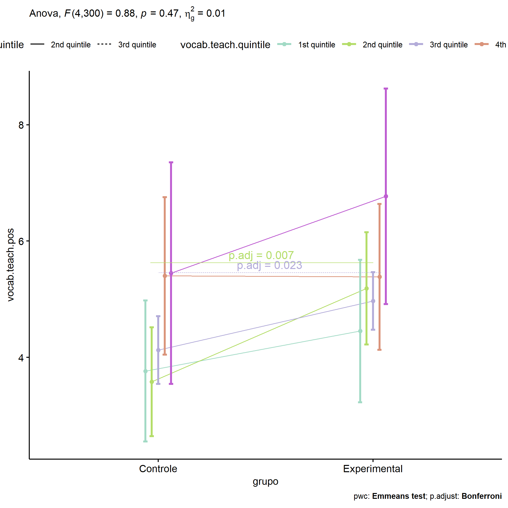<!-- -->

``` r
if (!is.null(plots[["vocab.teach.quintile"]]))
  plots[["vocab.teach.quintile"]] + ggplot2::scale_color_manual(values = color[["grupo"]])
```

    ## Scale for colour is already present.
    ## Adding another scale for colour, which will replace the existing scale.

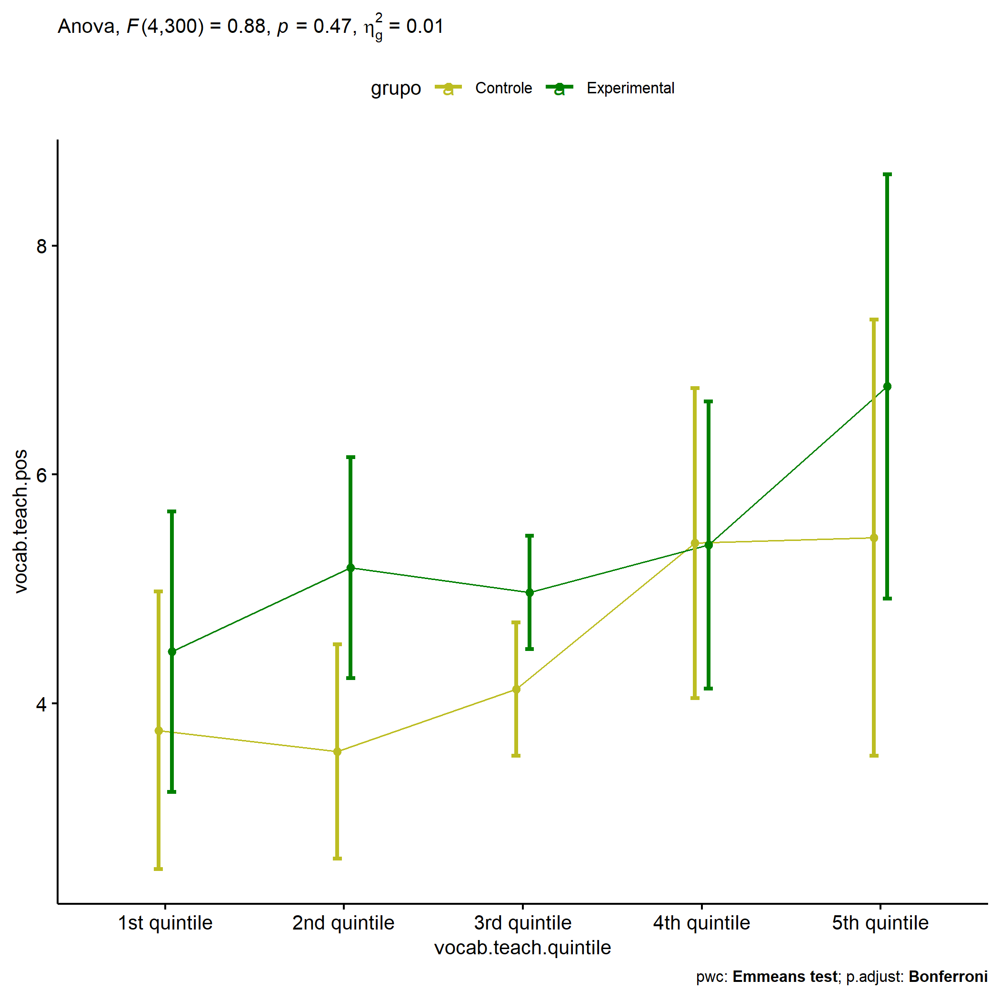<!-- -->

``` r
plots <- twoWayAncovaBoxPlots(
  wdat, "vocab.teach.pos", c("grupo","vocab.teach.quintile"), aov, pwcs, covar = "vocab.teach.pre",
  theme = "classic", color = color[["grupo:vocab.teach.quintile"]],
  subtitle = which(aov$Effect == "grupo:vocab.teach.quintile"))
```

``` r
plots[["grupo:vocab.teach.quintile"]] + ggplot2::ylab("Vocabulario Ensinado") + ggplot2::scale_x_discrete(labels=c('pre', 'pos'))
```

<!-- -->

``` r
plots <- twoWayAncovaBoxPlots(
  wdat.long, "vocab.teach", c("grupo","vocab.teach.quintile"), aov, pwc.long, pre.post = "time",
  theme = "classic", color = color$prepost)
```

``` r
plots[["grupo:vocab.teach.quintile"]] + ggplot2::ylab("Vocabulario Ensinado")
```

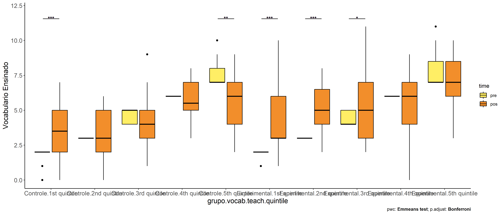<!-- -->

### Checking linearity assumption

``` r
ggscatter(wdat, x = "vocab.teach.pre", y = "vocab.teach.pos", size = 0.5,
          facet.by = c("grupo","vocab.teach.quintile"), add = "reg.line")+
  stat_regline_equation(
    aes(label =  paste(..eq.label.., ..rr.label.., sep = "~~~~"))
  )
```

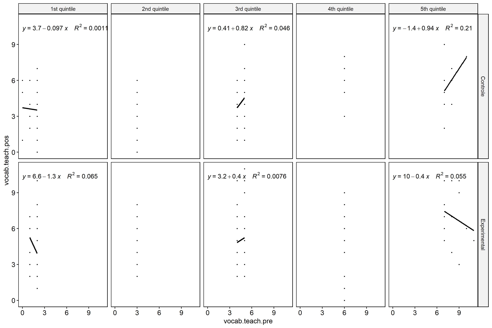<!-- -->

### Checking normality and homogeneity

``` r
res <- augment(lm(vocab.teach.pos ~ vocab.teach.pre + grupo*vocab.teach.quintile, data = wdat))
```

``` r
shapiro_test(res$.resid)
```

    ## # A tibble: 1 × 3
    ##   variable   statistic p.value
    ##   <chr>          <dbl>   <dbl>
    ## 1 res$.resid     0.991  0.0565

``` r
levene_test(res, .resid ~ grupo*vocab.teach.quintile)
```

    ## # A tibble: 1 × 4
    ##     df1   df2 statistic     p
    ##   <int> <int>     <dbl> <dbl>
    ## 1     9   301      1.32 0.227

# Summary of Results

## Descriptive Statistics

``` r
df <- get.descriptives(ldat[["grupo"]], c(dv.pre, dv.pos), c("grupo"), 
                       include.global = T, symmetry.test = T, normality.test = F)
df <- plyr::rbind.fill(
  df, do.call(plyr::rbind.fill, lapply(lfatores2, FUN = function(f) {
    if (nrow(dat) > 0 && sum(!is.na(unique(dat[[f]]))) > 1)
      get.descriptives(ldat[[paste0("grupo:",f)]], c(dv.pre,dv.pos), c("grupo", f),
                       symmetry.test = T, normality.test = F)
    }))
)
(df <- df[,c(fatores1[fatores1 %in% colnames(df)],"variable",
             colnames(df)[!colnames(df) %in% c(fatores1,"variable")])])
```

    ##           grupo Sexo   Zona Cor.Raca vocab.teach.quintile        variable   n  mean median min max    sd    se
    ## 1      Controle <NA>   <NA>     <NA>                 <NA> vocab.teach.pre 146 3.925    4.0   0  10 1.901 0.157
    ## 2  Experimental <NA>   <NA>     <NA>                 <NA> vocab.teach.pre 165 4.255    4.0   1  11 1.902 0.148
    ## 3          <NA> <NA>   <NA>     <NA>                 <NA> vocab.teach.pre 311 4.100    4.0   0  11 1.906 0.108
    ## 4      Controle <NA>   <NA>     <NA>                 <NA> vocab.teach.pos 146 4.158    4.0   0   9 1.957 0.162
    ## 5  Experimental <NA>   <NA>     <NA>                 <NA> vocab.teach.pos 165 5.164    5.0   0  11 2.346 0.183
    ## 6          <NA> <NA>   <NA>     <NA>                 <NA> vocab.teach.pos 311 4.691    5.0   0  11 2.226 0.126
    ## 7      Controle    F   <NA>     <NA>                 <NA> vocab.teach.pre  65 4.062    4.0   0   9 1.870 0.232
    ## 8      Controle    M   <NA>     <NA>                 <NA> vocab.teach.pre  81 3.815    3.0   0  10 1.931 0.215
    ## 9  Experimental    F   <NA>     <NA>                 <NA> vocab.teach.pre  88 4.284    4.0   1  10 1.929 0.206
    ## 10 Experimental    M   <NA>     <NA>                 <NA> vocab.teach.pre  77 4.221    4.0   1  11 1.882 0.214
    ## 11     Controle    F   <NA>     <NA>                 <NA> vocab.teach.pos  65 4.462    4.0   0   9 1.985 0.246
    ## 12     Controle    M   <NA>     <NA>                 <NA> vocab.teach.pos  81 3.914    4.0   0   9 1.912 0.212
    ## 13 Experimental    F   <NA>     <NA>                 <NA> vocab.teach.pos  88 5.534    6.0   0  11 2.207 0.235
    ## 14 Experimental    M   <NA>     <NA>                 <NA> vocab.teach.pos  77 4.740    4.0   1  10 2.441 0.278
    ## 15     Controle <NA>  Rural     <NA>                 <NA> vocab.teach.pre  97 4.072    4.0   0  10 2.032 0.206
    ## 16     Controle <NA> Urbana     <NA>                 <NA> vocab.teach.pre  28 3.964    4.0   0   8 1.795 0.339
    ## 17 Experimental <NA>  Rural     <NA>                 <NA> vocab.teach.pre  85 4.129    4.0   1  11 1.993 0.216
    ## 18 Experimental <NA> Urbana     <NA>                 <NA> vocab.teach.pre  38 4.395    4.0   1   9 2.034 0.330
    ## 19     Controle <NA>  Rural     <NA>                 <NA> vocab.teach.pos  97 4.186    4.0   0   9 1.970 0.200
    ## 20     Controle <NA> Urbana     <NA>                 <NA> vocab.teach.pos  28 4.536    5.0   1   7 1.856 0.351
    ## 21 Experimental <NA>  Rural     <NA>                 <NA> vocab.teach.pos  85 5.000    5.0   0  10 2.304 0.250
    ## 22 Experimental <NA> Urbana     <NA>                 <NA> vocab.teach.pos  38 5.342    5.0   1  10 2.386 0.387
    ## 23     Controle <NA>   <NA>   Branca                 <NA> vocab.teach.pre  22 3.773    3.5   1   8 1.875 0.400
    ## 24     Controle <NA>   <NA>    Parda                 <NA> vocab.teach.pre  42 3.976    4.0   0  10 2.181 0.336
    ## 25 Experimental <NA>   <NA>   Branca                 <NA> vocab.teach.pre  18 4.722    5.0   2   8 1.873 0.441
    ## 26 Experimental <NA>   <NA> Indígena                 <NA> vocab.teach.pre  13 4.000    4.0   2   6 1.414 0.392
    ## 27 Experimental <NA>   <NA>    Parda                 <NA> vocab.teach.pre  44 3.864    4.0   1   9 1.837 0.277
    ## 28     Controle <NA>   <NA>   Branca                 <NA> vocab.teach.pos  22 4.273    4.0   1   9 2.334 0.498
    ## 29     Controle <NA>   <NA>    Parda                 <NA> vocab.teach.pos  42 4.238    4.0   0   9 2.093 0.323
    ## 30 Experimental <NA>   <NA>   Branca                 <NA> vocab.teach.pos  18 4.611    4.5   1   9 2.477 0.584
    ## 31 Experimental <NA>   <NA> Indígena                 <NA> vocab.teach.pos  13 4.769    5.0   2   9 2.048 0.568
    ## 32 Experimental <NA>   <NA>    Parda                 <NA> vocab.teach.pos  44 4.932    5.0   1  10 2.204 0.332
    ## 33     Controle <NA>   <NA>     <NA>         1st quintile vocab.teach.pre  40 1.700    2.0   0   2 0.608 0.096
    ## 34     Controle <NA>   <NA>     <NA>         2nd quintile vocab.teach.pre  25 3.000    3.0   3   3 0.000 0.000
    ## 35     Controle <NA>   <NA>     <NA>         3rd quintile vocab.teach.pre  54 4.556    5.0   4   5 0.502 0.068
    ## 36     Controle <NA>   <NA>     <NA>         4th quintile vocab.teach.pre  14 6.000    6.0   6   6 0.000 0.000
    ## 37     Controle <NA>   <NA>     <NA>         5th quintile vocab.teach.pre  13 7.692    7.0   7  10 0.947 0.263
    ## 38 Experimental <NA>   <NA>     <NA>         1st quintile vocab.teach.pre  33 1.758    2.0   1   2 0.435 0.076
    ## 39 Experimental <NA>   <NA>     <NA>         2nd quintile vocab.teach.pre  23 3.000    3.0   3   3 0.000 0.000
    ## 40 Experimental <NA>   <NA>     <NA>         3rd quintile vocab.teach.pre  72 4.417    4.0   4   5 0.496 0.059
    ## 41 Experimental <NA>   <NA>     <NA>         4th quintile vocab.teach.pre  18 6.000    6.0   6   6 0.000 0.000
    ## 42 Experimental <NA>   <NA>     <NA>         5th quintile vocab.teach.pre  19 7.842    7.0   7  11 1.214 0.279
    ## 43     Controle <NA>   <NA>     <NA>         1st quintile vocab.teach.pos  40 3.550    3.5   0   7 1.797 0.284
    ## 44     Controle <NA>   <NA>     <NA>         2nd quintile vocab.teach.pos  25 3.480    3.0   0   6 1.636 0.327
    ## 45     Controle <NA>   <NA>     <NA>         3rd quintile vocab.teach.pos  54 4.167    4.0   1   9 1.921 0.261
    ## 46     Controle <NA>   <NA>     <NA>         4th quintile vocab.teach.pos  14 5.571    5.5   3   8 1.697 0.453
    ## 47     Controle <NA>   <NA>     <NA>         5th quintile vocab.teach.pos  13 5.769    6.0   2   9 1.922 0.533
    ## 48 Experimental <NA>   <NA>     <NA>         1st quintile vocab.teach.pos  33 4.242    3.0   1  10 2.278 0.397
    ## 49 Experimental <NA>   <NA>     <NA>         2nd quintile vocab.teach.pos  23 5.087    5.0   2   8 1.676 0.350
    ## 50 Experimental <NA>   <NA>     <NA>         3rd quintile vocab.teach.pos  72 5.000    5.0   2  11 2.283 0.269
    ## 51 Experimental <NA>   <NA>     <NA>         4th quintile vocab.teach.pos  18 5.556    6.0   0   9 2.684 0.633
    ## 52 Experimental <NA>   <NA>     <NA>         5th quintile vocab.teach.pos  19 7.105    7.0   3  10 2.079 0.477
    ##       ci  iqr symmetry     skewness    kurtosis
    ## 1  0.311 3.00      YES  0.418082732 -0.03890132
    ## 2  0.292 2.00       NO  0.618479107  0.55341026
    ## 3  0.213 2.00       NO  0.521220492  0.32641642
    ## 4  0.320 3.00      YES  0.169914080 -0.45127075
    ## 5  0.361 4.00      YES  0.243713424 -0.62009351
    ## 6  0.248 3.00      YES  0.317631310 -0.36680202
    ## 7  0.463 2.00      YES  0.152211341 -0.13153953
    ## 8  0.427 3.00       NO  0.619554882  0.06244240
    ## 9  0.409 3.00      YES  0.311532309 -0.23723936
    ## 10 0.427 2.00       NO  0.981286479  1.49611796
    ## 11 0.492 3.00      YES -0.003003248 -0.36805790
    ## 12 0.423 2.00      YES  0.301877859 -0.47981214
    ## 13 0.468 3.00      YES -0.035508307 -0.48214995
    ## 14 0.554 3.00       NO  0.587773801 -0.45428531
    ## 15 0.410 3.00      YES  0.330546042 -0.23268267
    ## 16 0.696 2.00      YES  0.125538208 -0.46198131
    ## 17 0.430 3.00       NO  0.697696180  0.53501745
    ## 18 0.669 2.00      YES  0.317044097 -0.51111946
    ## 19 0.397 3.00      YES  0.350353235 -0.24293952
    ## 20 0.720 3.00      YES -0.339379849 -1.02160999
    ## 21 0.497 4.00      YES  0.063466076 -0.81574345
    ## 22 0.784 3.75      YES  0.312853672 -0.89218639
    ## 23 0.832 3.00      YES  0.314350345 -0.89280457
    ## 24 0.680 3.00      YES  0.470494156  0.25727957
    ## 25 0.931 2.00      YES -0.126389328 -1.18954801
    ## 26 0.855 2.00      YES -0.163178488 -1.38461538
    ## 27 0.559 2.25      YES  0.459769000 -0.16447314
    ## 28 1.035 3.50      YES  0.286071488 -1.01126963
    ## 29 0.652 3.00      YES  0.049681974 -0.47604581
    ## 30 1.232 4.75      YES  0.094041052 -1.62982798
    ## 31 1.237 2.00      YES  0.394196510 -0.77883738
    ## 32 0.670 4.00      YES  0.148094508 -0.85412487
    ## 33 0.194 0.00 few data  0.000000000  0.00000000
    ## 34 0.000 0.00 few data  0.000000000  0.00000000
    ## 35 0.137 1.00 few data  0.000000000  0.00000000
    ## 36 0.000 0.00 few data  0.000000000  0.00000000
    ## 37 0.572 1.00       NO  1.114667945  0.14501147
    ## 38 0.154 0.00 few data  0.000000000  0.00000000
    ## 39 0.000 0.00 few data  0.000000000  0.00000000
    ## 40 0.117 1.00 few data  0.000000000  0.00000000
    ## 41 0.000 0.00 few data  0.000000000  0.00000000
    ## 42 0.585 1.50       NO  1.166197713  0.20033637
    ## 43 0.575 3.00      YES  0.024180272 -0.69345360
    ## 44 0.675 3.00      YES  0.006664282 -0.84233769
    ## 45 0.524 2.00      YES  0.331973657 -0.18036386
    ## 46 0.980 2.00      YES -0.333004598 -1.38660067
    ## 47 1.161 3.00      YES -0.218636518 -0.89996302
    ## 48 0.808 3.00      YES  0.463350690 -0.68416004
    ## 49 0.725 2.50      YES -0.075156850 -1.27121881
    ## 50 0.536 4.00       NO  0.560394260 -0.40503673
    ## 51 1.335 3.00      YES -0.497669545 -0.81929502
    ## 52 1.002 2.50      YES -0.097173646 -0.98280626

| grupo        | Sexo | Zona   | Cor.Raca | vocab.teach.quintile | variable        |   n |  mean | median | min | max |    sd |    se |    ci |  iqr | symmetry | skewness | kurtosis |
|:-------------|:-----|:-------|:---------|:---------------------|:----------------|----:|------:|-------:|----:|----:|------:|------:|------:|-----:|:---------|---------:|---------:|
| Controle     |      |        |          |                      | vocab.teach.pre | 146 | 3.925 |    4.0 |   0 |  10 | 1.901 | 0.157 | 0.311 | 3.00 | YES      |    0.418 |   -0.039 |
| Experimental |      |        |          |                      | vocab.teach.pre | 165 | 4.255 |    4.0 |   1 |  11 | 1.902 | 0.148 | 0.292 | 2.00 | NO       |    0.618 |    0.553 |
|              |      |        |          |                      | vocab.teach.pre | 311 | 4.100 |    4.0 |   0 |  11 | 1.906 | 0.108 | 0.213 | 2.00 | NO       |    0.521 |    0.326 |
| Controle     |      |        |          |                      | vocab.teach.pos | 146 | 4.158 |    4.0 |   0 |   9 | 1.957 | 0.162 | 0.320 | 3.00 | YES      |    0.170 |   -0.451 |
| Experimental |      |        |          |                      | vocab.teach.pos | 165 | 5.164 |    5.0 |   0 |  11 | 2.346 | 0.183 | 0.361 | 4.00 | YES      |    0.244 |   -0.620 |
|              |      |        |          |                      | vocab.teach.pos | 311 | 4.691 |    5.0 |   0 |  11 | 2.226 | 0.126 | 0.248 | 3.00 | YES      |    0.318 |   -0.367 |
| Controle     | F    |        |          |                      | vocab.teach.pre |  65 | 4.062 |    4.0 |   0 |   9 | 1.870 | 0.232 | 0.463 | 2.00 | YES      |    0.152 |   -0.132 |
| Controle     | M    |        |          |                      | vocab.teach.pre |  81 | 3.815 |    3.0 |   0 |  10 | 1.931 | 0.215 | 0.427 | 3.00 | NO       |    0.620 |    0.062 |
| Experimental | F    |        |          |                      | vocab.teach.pre |  88 | 4.284 |    4.0 |   1 |  10 | 1.929 | 0.206 | 0.409 | 3.00 | YES      |    0.312 |   -0.237 |
| Experimental | M    |        |          |                      | vocab.teach.pre |  77 | 4.221 |    4.0 |   1 |  11 | 1.882 | 0.214 | 0.427 | 2.00 | NO       |    0.981 |    1.496 |
| Controle     | F    |        |          |                      | vocab.teach.pos |  65 | 4.462 |    4.0 |   0 |   9 | 1.985 | 0.246 | 0.492 | 3.00 | YES      |   -0.003 |   -0.368 |
| Controle     | M    |        |          |                      | vocab.teach.pos |  81 | 3.914 |    4.0 |   0 |   9 | 1.912 | 0.212 | 0.423 | 2.00 | YES      |    0.302 |   -0.480 |
| Experimental | F    |        |          |                      | vocab.teach.pos |  88 | 5.534 |    6.0 |   0 |  11 | 2.207 | 0.235 | 0.468 | 3.00 | YES      |   -0.036 |   -0.482 |
| Experimental | M    |        |          |                      | vocab.teach.pos |  77 | 4.740 |    4.0 |   1 |  10 | 2.441 | 0.278 | 0.554 | 3.00 | NO       |    0.588 |   -0.454 |
| Controle     |      | Rural  |          |                      | vocab.teach.pre |  97 | 4.072 |    4.0 |   0 |  10 | 2.032 | 0.206 | 0.410 | 3.00 | YES      |    0.331 |   -0.233 |
| Controle     |      | Urbana |          |                      | vocab.teach.pre |  28 | 3.964 |    4.0 |   0 |   8 | 1.795 | 0.339 | 0.696 | 2.00 | YES      |    0.126 |   -0.462 |
| Experimental |      | Rural  |          |                      | vocab.teach.pre |  85 | 4.129 |    4.0 |   1 |  11 | 1.993 | 0.216 | 0.430 | 3.00 | NO       |    0.698 |    0.535 |
| Experimental |      | Urbana |          |                      | vocab.teach.pre |  38 | 4.395 |    4.0 |   1 |   9 | 2.034 | 0.330 | 0.669 | 2.00 | YES      |    0.317 |   -0.511 |
| Controle     |      | Rural  |          |                      | vocab.teach.pos |  97 | 4.186 |    4.0 |   0 |   9 | 1.970 | 0.200 | 0.397 | 3.00 | YES      |    0.350 |   -0.243 |
| Controle     |      | Urbana |          |                      | vocab.teach.pos |  28 | 4.536 |    5.0 |   1 |   7 | 1.856 | 0.351 | 0.720 | 3.00 | YES      |   -0.339 |   -1.022 |
| Experimental |      | Rural  |          |                      | vocab.teach.pos |  85 | 5.000 |    5.0 |   0 |  10 | 2.304 | 0.250 | 0.497 | 4.00 | YES      |    0.063 |   -0.816 |
| Experimental |      | Urbana |          |                      | vocab.teach.pos |  38 | 5.342 |    5.0 |   1 |  10 | 2.386 | 0.387 | 0.784 | 3.75 | YES      |    0.313 |   -0.892 |
| Controle     |      |        | Branca   |                      | vocab.teach.pre |  22 | 3.773 |    3.5 |   1 |   8 | 1.875 | 0.400 | 0.832 | 3.00 | YES      |    0.314 |   -0.893 |
| Controle     |      |        | Parda    |                      | vocab.teach.pre |  42 | 3.976 |    4.0 |   0 |  10 | 2.181 | 0.336 | 0.680 | 3.00 | YES      |    0.470 |    0.257 |
| Experimental |      |        | Branca   |                      | vocab.teach.pre |  18 | 4.722 |    5.0 |   2 |   8 | 1.873 | 0.441 | 0.931 | 2.00 | YES      |   -0.126 |   -1.190 |
| Experimental |      |        | Indígena |                      | vocab.teach.pre |  13 | 4.000 |    4.0 |   2 |   6 | 1.414 | 0.392 | 0.855 | 2.00 | YES      |   -0.163 |   -1.385 |
| Experimental |      |        | Parda    |                      | vocab.teach.pre |  44 | 3.864 |    4.0 |   1 |   9 | 1.837 | 0.277 | 0.559 | 2.25 | YES      |    0.460 |   -0.164 |
| Controle     |      |        | Branca   |                      | vocab.teach.pos |  22 | 4.273 |    4.0 |   1 |   9 | 2.334 | 0.498 | 1.035 | 3.50 | YES      |    0.286 |   -1.011 |
| Controle     |      |        | Parda    |                      | vocab.teach.pos |  42 | 4.238 |    4.0 |   0 |   9 | 2.093 | 0.323 | 0.652 | 3.00 | YES      |    0.050 |   -0.476 |
| Experimental |      |        | Branca   |                      | vocab.teach.pos |  18 | 4.611 |    4.5 |   1 |   9 | 2.477 | 0.584 | 1.232 | 4.75 | YES      |    0.094 |   -1.630 |
| Experimental |      |        | Indígena |                      | vocab.teach.pos |  13 | 4.769 |    5.0 |   2 |   9 | 2.048 | 0.568 | 1.237 | 2.00 | YES      |    0.394 |   -0.779 |
| Experimental |      |        | Parda    |                      | vocab.teach.pos |  44 | 4.932 |    5.0 |   1 |  10 | 2.204 | 0.332 | 0.670 | 4.00 | YES      |    0.148 |   -0.854 |
| Controle     |      |        |          | 1st quintile         | vocab.teach.pre |  40 | 1.700 |    2.0 |   0 |   2 | 0.608 | 0.096 | 0.194 | 0.00 | few data |    0.000 |    0.000 |
| Controle     |      |        |          | 2nd quintile         | vocab.teach.pre |  25 | 3.000 |    3.0 |   3 |   3 | 0.000 | 0.000 | 0.000 | 0.00 | few data |    0.000 |    0.000 |
| Controle     |      |        |          | 3rd quintile         | vocab.teach.pre |  54 | 4.556 |    5.0 |   4 |   5 | 0.502 | 0.068 | 0.137 | 1.00 | few data |    0.000 |    0.000 |
| Controle     |      |        |          | 4th quintile         | vocab.teach.pre |  14 | 6.000 |    6.0 |   6 |   6 | 0.000 | 0.000 | 0.000 | 0.00 | few data |    0.000 |    0.000 |
| Controle     |      |        |          | 5th quintile         | vocab.teach.pre |  13 | 7.692 |    7.0 |   7 |  10 | 0.947 | 0.263 | 0.572 | 1.00 | NO       |    1.115 |    0.145 |
| Experimental |      |        |          | 1st quintile         | vocab.teach.pre |  33 | 1.758 |    2.0 |   1 |   2 | 0.435 | 0.076 | 0.154 | 0.00 | few data |    0.000 |    0.000 |
| Experimental |      |        |          | 2nd quintile         | vocab.teach.pre |  23 | 3.000 |    3.0 |   3 |   3 | 0.000 | 0.000 | 0.000 | 0.00 | few data |    0.000 |    0.000 |
| Experimental |      |        |          | 3rd quintile         | vocab.teach.pre |  72 | 4.417 |    4.0 |   4 |   5 | 0.496 | 0.059 | 0.117 | 1.00 | few data |    0.000 |    0.000 |
| Experimental |      |        |          | 4th quintile         | vocab.teach.pre |  18 | 6.000 |    6.0 |   6 |   6 | 0.000 | 0.000 | 0.000 | 0.00 | few data |    0.000 |    0.000 |
| Experimental |      |        |          | 5th quintile         | vocab.teach.pre |  19 | 7.842 |    7.0 |   7 |  11 | 1.214 | 0.279 | 0.585 | 1.50 | NO       |    1.166 |    0.200 |
| Controle     |      |        |          | 1st quintile         | vocab.teach.pos |  40 | 3.550 |    3.5 |   0 |   7 | 1.797 | 0.284 | 0.575 | 3.00 | YES      |    0.024 |   -0.693 |
| Controle     |      |        |          | 2nd quintile         | vocab.teach.pos |  25 | 3.480 |    3.0 |   0 |   6 | 1.636 | 0.327 | 0.675 | 3.00 | YES      |    0.007 |   -0.842 |
| Controle     |      |        |          | 3rd quintile         | vocab.teach.pos |  54 | 4.167 |    4.0 |   1 |   9 | 1.921 | 0.261 | 0.524 | 2.00 | YES      |    0.332 |   -0.180 |
| Controle     |      |        |          | 4th quintile         | vocab.teach.pos |  14 | 5.571 |    5.5 |   3 |   8 | 1.697 | 0.453 | 0.980 | 2.00 | YES      |   -0.333 |   -1.387 |
| Controle     |      |        |          | 5th quintile         | vocab.teach.pos |  13 | 5.769 |    6.0 |   2 |   9 | 1.922 | 0.533 | 1.161 | 3.00 | YES      |   -0.219 |   -0.900 |
| Experimental |      |        |          | 1st quintile         | vocab.teach.pos |  33 | 4.242 |    3.0 |   1 |  10 | 2.278 | 0.397 | 0.808 | 3.00 | YES      |    0.463 |   -0.684 |
| Experimental |      |        |          | 2nd quintile         | vocab.teach.pos |  23 | 5.087 |    5.0 |   2 |   8 | 1.676 | 0.350 | 0.725 | 2.50 | YES      |   -0.075 |   -1.271 |
| Experimental |      |        |          | 3rd quintile         | vocab.teach.pos |  72 | 5.000 |    5.0 |   2 |  11 | 2.283 | 0.269 | 0.536 | 4.00 | NO       |    0.560 |   -0.405 |
| Experimental |      |        |          | 4th quintile         | vocab.teach.pos |  18 | 5.556 |    6.0 |   0 |   9 | 2.684 | 0.633 | 1.335 | 3.00 | YES      |   -0.498 |   -0.819 |
| Experimental |      |        |          | 5th quintile         | vocab.teach.pos |  19 | 7.105 |    7.0 |   3 |  10 | 2.079 | 0.477 | 1.002 | 2.50 | YES      |   -0.097 |   -0.983 |

## ANCOVA Table Comparison

``` r
df <- do.call(plyr::rbind.fill, laov)
(df <- df[!duplicated(df$Effect),])
```

    ##                        Effect DFn DFd      F        p p<.05      ges DFn' DFd'     F'       p' p<.05'     ges'
    ## 1                       grupo   1 308 14.174 2.00e-04     * 0.044000    1  308 14.174 2.00e-04      * 0.044000
    ## 2             vocab.teach.pre   1 308 37.169 3.24e-09     * 0.108000    1  308 37.169 3.24e-09      * 0.108000
    ## 4                  grupo:Sexo   1 306  0.455 5.00e-01       0.001000    1  306  0.455 5.00e-01        0.001000
    ## 5                        Sexo   1 306  7.229 8.00e-03     * 0.023000    1  306  7.229 8.00e-03      * 0.023000
    ## 8                  grupo:Zona   1 243  0.066 7.97e-01       0.000272    1  243  0.066 7.97e-01        0.000272
    ## 10                       Zona   1 243  1.135 2.88e-01       0.005000    1  243  1.135 2.88e-01        0.005000
    ## 11                   Cor.Raca   2 133  0.246 7.82e-01       0.004000    2  133  0.246 7.82e-01        0.004000
    ## 13             grupo:Cor.Raca   1 133  1.244 2.67e-01       0.009000    1  133  1.244 2.67e-01        0.009000
    ## 16 grupo:vocab.teach.quintile   4 300  0.881 4.75e-01       0.012000    4  300  0.881 4.75e-01        0.012000
    ## 18       vocab.teach.quintile   4 300  1.264 2.84e-01       0.017000    4  300  1.264 2.84e-01        0.017000

|     | Effect                     | DFn | DFd |      F |     p | p\<.05 |   ges | DFn’ | DFd’ |     F’ |    p’ | p\<.05’ |  ges’ |
|:----|:---------------------------|----:|----:|-------:|------:|:-------|------:|-----:|-----:|-------:|------:|:--------|------:|
| 1   | grupo                      |   1 | 308 | 14.174 | 0.000 | \*     | 0.044 |    1 |  308 | 14.174 | 0.000 | \*      | 0.044 |
| 2   | vocab.teach.pre            |   1 | 308 | 37.169 | 0.000 | \*     | 0.108 |    1 |  308 | 37.169 | 0.000 | \*      | 0.108 |
| 4   | grupo:Sexo                 |   1 | 306 |  0.455 | 0.500 |        | 0.001 |    1 |  306 |  0.455 | 0.500 |         | 0.001 |
| 5   | Sexo                       |   1 | 306 |  7.229 | 0.008 | \*     | 0.023 |    1 |  306 |  7.229 | 0.008 | \*      | 0.023 |
| 8   | grupo:Zona                 |   1 | 243 |  0.066 | 0.797 |        | 0.000 |    1 |  243 |  0.066 | 0.797 |         | 0.000 |
| 10  | Zona                       |   1 | 243 |  1.135 | 0.288 |        | 0.005 |    1 |  243 |  1.135 | 0.288 |         | 0.005 |
| 11  | Cor.Raca                   |   2 | 133 |  0.246 | 0.782 |        | 0.004 |    2 |  133 |  0.246 | 0.782 |         | 0.004 |
| 13  | grupo:Cor.Raca             |   1 | 133 |  1.244 | 0.267 |        | 0.009 |    1 |  133 |  1.244 | 0.267 |         | 0.009 |
| 16  | grupo:vocab.teach.quintile |   4 | 300 |  0.881 | 0.475 |        | 0.012 |    4 |  300 |  0.881 | 0.475 |         | 0.012 |
| 18  | vocab.teach.quintile       |   4 | 300 |  1.264 | 0.284 |        | 0.017 |    4 |  300 |  1.264 | 0.284 |         | 0.017 |

## PairWise Table Comparison

``` r
df <- do.call(plyr::rbind.fill, lpwc)
df <- df[,c(names(lfatores), names(df)[!names(df) %in% c(names(lfatores),"term",".y.")])]
```

| grupo        | Sexo | Zona   | Cor.Raca | vocab.teach.quintile | group1       | group2       |  df | statistic |     p | p.adj | p.adj.signif | df’ | statistic’ |    p’ | p.adj’ | p.adj.signif’ |
|:-------------|:-----|:-------|:---------|:---------------------|:-------------|:-------------|----:|----------:|------:|------:|:-------------|----:|-----------:|------:|-------:|:--------------|
| Controle     |      |        |          |                      | pre          | pos          | 618 |    -0.975 | 0.330 | 0.330 | ns           | 618 |     -0.975 | 0.330 |  0.330 | ns            |
| Experimental |      |        |          |                      | pre          | pos          | 618 |    -4.045 | 0.000 | 0.000 | \*\*\*\*     | 618 |     -4.045 | 0.000 |  0.000 | \*\*\*\*      |
|              |      |        |          |                      | Controle     | Experimental | 308 |    -3.765 | 0.000 | 0.000 | \*\*\*       | 308 |     -3.765 | 0.000 |  0.000 | \*\*\*        |
| Controle     | F    |        |          |                      | pre          | pos          | 614 |    -1.122 | 0.262 | 0.262 | ns           | 614 |     -1.122 | 0.262 |  0.262 | ns            |
| Controle     | M    |        |          |                      | pre          | pos          | 614 |    -0.309 | 0.757 | 0.757 | ns           | 614 |     -0.309 | 0.757 |  0.757 | ns            |
| Controle     |      |        |          |                      | F            | M            | 306 |     1.346 | 0.179 | 0.179 | ns           | 306 |      1.346 | 0.179 |  0.179 | ns            |
| Experimental | F    |        |          |                      | pre          | pos          | 614 |    -4.080 | 0.000 | 0.000 | \*\*\*\*     | 614 |     -4.080 | 0.000 |  0.000 | \*\*\*\*      |
| Experimental | M    |        |          |                      | pre          | pos          | 614 |    -1.586 | 0.113 | 0.113 | ns           | 614 |     -1.586 | 0.113 |  0.113 | ns            |
| Experimental |      |        |          |                      | F            | M            | 306 |     2.424 | 0.016 | 0.016 | \*           | 306 |      2.424 | 0.016 |  0.016 | \*            |
|              | F    |        |          |                      | Controle     | Experimental | 306 |    -2.971 | 0.003 | 0.003 | \*\*         | 306 |     -2.971 | 0.003 |  0.003 | \*\*          |
|              | M    |        |          |                      | Controle     | Experimental | 306 |    -2.082 | 0.038 | 0.038 | \*           | 306 |     -2.082 | 0.038 |  0.038 | \*            |
| Controle     |      |        |          |                      | Rural        | Urbana       | 243 |    -0.907 | 0.365 | 0.365 | ns           | 243 |     -0.907 | 0.365 |  0.365 | ns            |
| Controle     |      | Rural  |          |                      | pre          | pos          | 488 |    -0.381 | 0.703 | 0.703 | ns           | 488 |     -0.381 | 0.703 |  0.703 | ns            |
| Controle     |      | Urbana |          |                      | pre          | pos          | 488 |    -1.033 | 0.302 | 0.302 | ns           | 488 |     -1.033 | 0.302 |  0.302 | ns            |
| Experimental |      |        |          |                      | Rural        | Urbana       | 243 |    -0.614 | 0.540 | 0.540 | ns           | 243 |     -0.614 | 0.540 |  0.540 | ns            |
| Experimental |      | Rural  |          |                      | pre          | pos          | 488 |    -2.741 | 0.006 | 0.006 | \*\*         | 488 |     -2.741 | 0.006 |  0.006 | \*\*          |
| Experimental |      | Urbana |          |                      | pre          | pos          | 488 |    -1.994 | 0.047 | 0.047 | \*           | 488 |     -1.994 | 0.047 |  0.047 | \*            |
|              |      | Rural  |          |                      | Controle     | Experimental | 243 |    -2.654 | 0.008 | 0.008 | \*\*         | 243 |     -2.654 | 0.008 |  0.008 | \*\*          |
|              |      | Urbana |          |                      | Controle     | Experimental | 243 |    -1.282 | 0.201 | 0.201 | ns           | 243 |     -1.282 | 0.201 |  0.201 | ns            |
| Controle     |      |        | Branca   |                      | pre          | pos          | 268 |    -0.799 | 0.425 | 0.425 | ns           | 268 |     -0.799 | 0.425 |  0.425 | ns            |
| Controle     |      |        | Indígena |                      | pre          | pos          |     |           |       |       |              |     |            |       |        |               |
| Controle     |      |        |          |                      | Branca       | Indígena     |     |           |       |       |              |     |            |       |        |               |
| Controle     |      |        |          |                      | Branca       | Parda        | 133 |     0.251 | 0.802 | 0.802 | ns           | 133 |      0.251 | 0.802 |  0.802 | ns            |
| Controle     |      |        |          |                      | Indígena     | Parda        |     |           |       |       |              |     |            |       |        |               |
| Controle     |      |        | Parda    |                      | pre          | pos          | 268 |    -0.578 | 0.564 | 0.564 | ns           | 268 |     -0.578 | 0.564 |  0.564 | ns            |
| Experimental |      |        | Branca   |                      | pre          | pos          | 268 |     0.161 | 0.873 | 0.873 | ns           | 268 |      0.161 | 0.873 |  0.873 | ns            |
| Experimental |      |        | Indígena |                      | pre          | pos          | 268 |    -0.945 | 0.346 | 0.346 | ns           | 268 |     -0.945 | 0.346 |  0.346 | ns            |
| Experimental |      |        |          |                      | Branca       | Indígena     | 133 |    -0.690 | 0.491 | 1.000 | ns           | 133 |     -0.690 | 0.491 |  1.000 | ns            |
| Experimental |      |        |          |                      | Branca       | Parda        | 133 |    -1.294 | 0.198 | 0.593 | ns           | 133 |     -1.294 | 0.198 |  0.593 | ns            |
| Experimental |      |        |          |                      | Indígena     | Parda        | 133 |    -0.359 | 0.720 | 1.000 | ns           | 133 |     -0.359 | 0.720 |  1.000 | ns            |
| Experimental |      |        | Parda    |                      | pre          | pos          | 268 |    -2.413 | 0.016 | 0.016 | \*           | 268 |     -2.413 | 0.016 |  0.016 | \*            |
|              |      |        | Branca   |                      | Controle     | Experimental | 133 |     0.189 | 0.851 | 0.851 | ns           | 133 |      0.189 | 0.851 |  0.851 | ns            |
|              |      |        | Indígena |                      | Controle     | Experimental |     |           |       |       |              |     |            |       |        |               |
|              |      |        | Parda    |                      | Controle     | Experimental | 133 |    -1.720 | 0.088 | 0.088 | ns           | 133 |     -1.720 | 0.088 |  0.088 | ns            |
| Controle     |      |        |          | 1st quintile         | pre          | pos          | 602 |    -5.516 | 0.000 | 0.000 | \*\*\*\*     | 602 |     -5.516 | 0.000 |  0.000 | \*\*\*\*      |
| Controle     |      |        |          | 2nd quintile         | pre          | pos          | 602 |    -1.132 | 0.258 | 0.258 | ns           | 602 |     -1.132 | 0.258 |  0.258 | ns            |
| Controle     |      |        |          | 3rd quintile         | pre          | pos          | 602 |     1.347 | 0.178 | 0.178 | ns           | 602 |      1.347 | 0.178 |  0.178 | ns            |
| Controle     |      |        |          | 4th quintile         | pre          | pos          | 602 |     0.756 | 0.450 | 0.450 | ns           | 602 |      0.756 | 0.450 |  0.450 | ns            |
| Controle     |      |        |          | 5th quintile         | pre          | pos          | 602 |     3.269 | 0.001 | 0.001 | \*\*         | 602 |      3.269 | 0.001 |  0.001 | \*\*          |
| Controle     |      |        |          |                      | 1st quintile | 2nd quintile | 300 |     0.313 | 0.754 | 1.000 | ns           | 300 |      0.313 | 0.754 |  1.000 | ns            |
| Controle     |      |        |          |                      | 1st quintile | 3rd quintile | 300 |    -0.477 | 0.633 | 1.000 | ns           | 300 |     -0.477 | 0.633 |  1.000 | ns            |
| Controle     |      |        |          |                      | 1st quintile | 4th quintile | 300 |    -1.443 | 0.150 | 1.000 | ns           | 300 |     -1.443 | 0.150 |  1.000 | ns            |
| Controle     |      |        |          |                      | 1st quintile | 5th quintile | 300 |    -1.151 | 0.251 | 1.000 | ns           | 300 |     -1.151 | 0.251 |  1.000 | ns            |
| Controle     |      |        |          |                      | 2nd quintile | 3rd quintile | 300 |    -0.910 | 0.364 | 1.000 | ns           | 300 |     -0.910 | 0.364 |  1.000 | ns            |
| Controle     |      |        |          |                      | 2nd quintile | 4th quintile | 300 |    -1.923 | 0.055 | 0.554 | ns           | 300 |     -1.923 | 0.055 |  0.554 | ns            |
| Controle     |      |        |          |                      | 2nd quintile | 5th quintile | 300 |    -1.506 | 0.133 | 1.000 | ns           | 300 |     -1.506 | 0.133 |  1.000 | ns            |
| Controle     |      |        |          |                      | 3rd quintile | 4th quintile | 300 |    -1.844 | 0.066 | 0.662 | ns           | 300 |     -1.844 | 0.066 |  0.662 | ns            |
| Controle     |      |        |          |                      | 3rd quintile | 5th quintile | 300 |    -1.417 | 0.158 | 1.000 | ns           | 300 |     -1.417 | 0.158 |  1.000 | ns            |
| Controle     |      |        |          |                      | 4th quintile | 5th quintile | 300 |    -0.053 | 0.958 | 1.000 | ns           | 300 |     -0.053 | 0.958 |  1.000 | ns            |
| Experimental |      |        |          | 1st quintile         | pre          | pos          | 602 |    -6.730 | 0.000 | 0.000 | \*\*\*\*     | 602 |     -6.730 | 0.000 |  0.000 | \*\*\*\*      |
| Experimental |      |        |          | 2nd quintile         | pre          | pos          | 602 |    -4.719 | 0.000 | 0.000 | \*\*\*\*     | 602 |     -4.719 | 0.000 |  0.000 | \*\*\*\*      |
| Experimental |      |        |          | 3rd quintile         | pre          | pos          | 602 |    -2.334 | 0.020 | 0.020 | \*           | 602 |     -2.334 | 0.020 |  0.020 | \*            |
| Experimental |      |        |          | 4th quintile         | pre          | pos          | 602 |     0.889 | 0.374 | 0.374 | ns           | 602 |      0.889 | 0.374 |  0.374 | ns            |
| Experimental |      |        |          | 5th quintile         | pre          | pos          | 602 |     1.514 | 0.130 | 0.130 | ns           | 602 |      1.514 | 0.130 |  0.130 | ns            |
| Experimental |      |        |          |                      | 1st quintile | 2nd quintile | 300 |    -1.183 | 0.238 | 1.000 | ns           | 300 |     -1.183 | 0.238 |  1.000 | ns            |
| Experimental |      |        |          |                      | 1st quintile | 3rd quintile | 300 |    -0.718 | 0.473 | 1.000 | ns           | 300 |     -0.718 | 0.473 |  1.000 | ns            |
| Experimental |      |        |          |                      | 1st quintile | 4th quintile | 300 |    -0.845 | 0.399 | 1.000 | ns           | 300 |     -0.845 | 0.399 |  1.000 | ns            |
| Experimental |      |        |          |                      | 1st quintile | 5th quintile | 300 |    -1.595 | 0.112 | 1.000 | ns           | 300 |     -1.595 | 0.112 |  1.000 | ns            |
| Experimental |      |        |          |                      | 2nd quintile | 3rd quintile | 300 |     0.368 | 0.713 | 1.000 | ns           | 300 |      0.368 | 0.713 |  1.000 | ns            |
| Experimental |      |        |          |                      | 2nd quintile | 4th quintile | 300 |    -0.217 | 0.828 | 1.000 | ns           | 300 |     -0.217 | 0.828 |  1.000 | ns            |
| Experimental |      |        |          |                      | 2nd quintile | 5th quintile | 300 |    -1.285 | 0.200 | 1.000 | ns           | 300 |     -1.285 | 0.200 |  1.000 | ns            |
| Experimental |      |        |          |                      | 3rd quintile | 4th quintile | 300 |    -0.645 | 0.520 | 1.000 | ns           | 300 |     -0.645 | 0.520 |  1.000 | ns            |
| Experimental |      |        |          |                      | 3rd quintile | 5th quintile | 300 |    -1.964 | 0.050 | 0.505 | ns           | 300 |     -1.964 | 0.050 |  0.505 | ns            |
| Experimental |      |        |          |                      | 4th quintile | 5th quintile | 300 |    -1.762 | 0.079 | 0.791 | ns           | 300 |     -1.762 | 0.079 |  0.791 | ns            |
|              |      |        |          | 1st quintile         | Controle     | Experimental | 300 |    -1.423 | 0.156 | 0.156 | ns           | 300 |     -1.423 | 0.156 |  0.156 | ns            |
|              |      |        |          | 2nd quintile         | Controle     | Experimental | 300 |    -2.709 | 0.007 | 0.007 | \*\*         | 300 |     -2.709 | 0.007 |  0.007 | \*\*          |
|              |      |        |          | 3rd quintile         | Controle     | Experimental | 300 |    -2.280 | 0.023 | 0.023 | \*           | 300 |     -2.280 | 0.023 |  0.023 | \*            |
|              |      |        |          | 4th quintile         | Controle     | Experimental | 300 |     0.022 | 0.983 | 0.983 | ns           | 300 |      0.022 | 0.983 |  0.983 | ns            |
|              |      |        |          | 5th quintile         | Controle     | Experimental | 300 |    -1.788 | 0.075 | 0.075 | ns           | 300 |     -1.788 | 0.075 |  0.075 | ns            |

## EMMS Table Comparison

``` r
df <- do.call(plyr::rbind.fill, lemms)
df[["N-N'"]] <- df[["N"]] - df[["N'"]]
df <- df[,c(names(lfatores), names(df)[!names(df) %in% names(lfatores)])]
```

| grupo        | Sexo | Zona   | Cor.Raca | vocab.teach.quintile |   N | M (pre) | SE (pre) | M (unadj) | SE (unadj) | M (adj) | SE (adj) |  N’ | M (pre)’ | SE (pre)’ | M (unadj)’ | SE (unadj)’ | M (adj)’ | SE (adj)’ | N-N’ |
|:-------------|:-----|:-------|:---------|:---------------------|----:|--------:|---------:|----------:|-----------:|--------:|---------:|----:|---------:|----------:|-----------:|------------:|---------:|----------:|-----:|
| Controle     |      |        |          |                      | 146 |   3.925 |    0.157 |     4.158 |      0.162 |   4.223 |    0.170 | 146 |    3.925 |     0.157 |      4.158 |       0.162 |    4.223 |     0.170 |    0 |
| Experimental |      |        |          |                      | 165 |   4.255 |    0.148 |     5.164 |      0.183 |   5.106 |    0.160 | 165 |    4.255 |     0.148 |      5.164 |       0.183 |    5.106 |     0.160 |    0 |
| Controle     | F    |        |          |                      |  65 |   4.062 |    0.232 |     4.462 |      0.246 |   4.476 |    0.253 |  65 |    4.062 |     0.232 |      4.462 |       0.246 |    4.476 |     0.253 |    0 |
| Controle     | M    |        |          |                      |  81 |   3.815 |    0.215 |     3.914 |      0.212 |   4.019 |    0.227 |  81 |    3.815 |     0.215 |      3.914 |       0.212 |    4.019 |     0.227 |    0 |
| Experimental | F    |        |          |                      |  88 |   4.284 |    0.206 |     5.534 |      0.235 |   5.466 |    0.217 |  88 |    4.284 |     0.206 |      5.534 |       0.235 |    5.466 |     0.217 |    0 |
| Experimental | M    |        |          |                      |  77 |   4.221 |    0.214 |     4.740 |      0.278 |   4.696 |    0.232 |  77 |    4.221 |     0.214 |      4.740 |       0.278 |    4.696 |     0.232 |    0 |
| Controle     |      | Rural  |          |                      |  97 |   4.072 |    0.206 |     4.186 |      0.200 |   4.207 |    0.204 |  97 |    4.072 |     0.206 |      4.186 |       0.200 |    4.207 |     0.204 |    0 |
| Controle     |      | Urbana |          |                      |  28 |   3.964 |    0.339 |     4.536 |      0.351 |   4.598 |    0.380 |  28 |    3.964 |     0.339 |      4.536 |       0.351 |    4.598 |     0.380 |    0 |
| Experimental |      | Rural  |          |                      |  85 |   4.129 |    0.216 |     5.000 |      0.250 |   5.000 |    0.218 |  85 |    4.129 |     0.216 |      5.000 |       0.250 |    5.000 |     0.218 |    0 |
| Experimental |      | Urbana |          |                      |  38 |   4.395 |    0.330 |     5.342 |      0.387 |   5.241 |    0.327 |  38 |    4.395 |     0.330 |      5.342 |       0.387 |    5.241 |     0.327 |    0 |
| Controle     |      |        | Branca   |                      |  22 |   3.773 |    0.400 |     4.273 |      0.498 |   4.386 |    0.430 |  22 |    3.773 |     0.400 |      4.273 |       0.498 |    4.386 |     0.430 |    0 |
| Controle     |      |        | Parda    |                      |  42 |   3.976 |    0.336 |     4.238 |      0.323 |   4.253 |    0.311 |  42 |    3.976 |     0.336 |      4.238 |       0.323 |    4.253 |     0.311 |    0 |
| Experimental |      |        | Branca   |                      |  18 |   4.722 |    0.441 |     4.611 |      0.584 |   4.264 |    0.479 |  18 |    4.722 |     0.441 |      4.611 |       0.584 |    4.264 |     0.479 |    0 |
| Experimental |      |        | Indígena |                      |  13 |   4.000 |    0.392 |     4.769 |      0.568 |   4.773 |    0.559 |  13 |    4.000 |     0.392 |      4.769 |       0.568 |    4.773 |     0.559 |    0 |
| Experimental |      |        | Parda    |                      |  44 |   3.864 |    0.277 |     4.932 |      0.332 |   5.001 |    0.304 |  44 |    3.864 |     0.277 |      4.932 |       0.332 |    5.001 |     0.304 |    0 |
| Controle     |      |        |          | 1st quintile         |  40 |   1.700 |    0.096 |     3.550 |      0.284 |   3.765 |    0.616 |  40 |    1.700 |     0.096 |      3.550 |       0.284 |    3.765 |     0.616 |    0 |
| Controle     |      |        |          | 2nd quintile         |  25 |   3.000 |    0.000 |     3.480 |      0.327 |   3.578 |    0.476 |  25 |    3.000 |     0.000 |      3.480 |       0.327 |    3.578 |     0.476 |    0 |
| Controle     |      |        |          | 3rd quintile         |  54 |   4.556 |    0.068 |     4.167 |      0.261 |   4.126 |    0.297 |  54 |    4.556 |     0.068 |      4.167 |       0.261 |    4.126 |     0.297 |    0 |
| Controle     |      |        |          | 4th quintile         |  14 |   6.000 |    0.000 |     5.571 |      0.453 |   5.401 |    0.688 |  14 |    6.000 |     0.000 |      5.571 |       0.453 |    5.401 |     0.688 |    0 |
| Controle     |      |        |          | 5th quintile         |  13 |   7.692 |    0.263 |     5.769 |      0.533 |   5.448 |    0.969 |  13 |    7.692 |     0.263 |      5.769 |       0.533 |    5.448 |     0.969 |    0 |
| Experimental |      |        |          | 1st quintile         |  33 |   1.758 |    0.076 |     4.242 |      0.397 |   4.452 |    0.624 |  33 |    1.758 |     0.076 |      4.242 |       0.397 |    4.452 |     0.624 |    0 |
| Experimental |      |        |          | 2nd quintile         |  23 |   3.000 |    0.000 |     5.087 |      0.350 |   5.185 |    0.491 |  23 |    3.000 |     0.000 |      5.087 |       0.350 |    5.185 |     0.491 |    0 |
| Experimental |      |        |          | 3rd quintile         |  72 |   4.417 |    0.059 |     5.000 |      0.269 |   4.972 |    0.252 |  72 |    4.417 |     0.059 |      5.000 |       0.269 |    4.972 |     0.252 |    0 |
| Experimental |      |        |          | 4th quintile         |  18 |   6.000 |    0.000 |     5.556 |      0.633 |   5.385 |    0.637 |  18 |    6.000 |     0.000 |      5.556 |       0.633 |    5.385 |     0.637 |    0 |
| Experimental |      |        |          | 5th quintile         |  19 |   7.842 |    0.279 |     7.105 |      0.477 |   6.770 |    0.943 |  19 |    7.842 |     0.279 |      7.105 |       0.477 |    6.770 |     0.943 |    0 |
