ANCOVA in Vocabulario Ensinado (Vocabulario Ensinado)
================
Geiser C. Challco <geiser@alumni.usp.br>

- [Descriptive Statistics of Initial
  Data](#descriptive-statistics-of-initial-data)
- [ANCOVA and Pairwise for one factor:
  **grupo**](#ancova-and-pairwise-for-one-factor-grupo)
  - [Without remove non-normal data](#without-remove-non-normal-data)
  - [Computing ANCOVA and PairWise After removing non-normal data
    (OK)](#computing-ancova-and-pairwise-after-removing-non-normal-data-ok)
    - [Plots for ancova](#plots-for-ancova)
    - [Checking linearity assumption](#checking-linearity-assumption)
    - [Checking normality and
      homogeneity](#checking-normality-and-homogeneity)
- [ANCOVA and Pairwise for two factors
  **grupo:Sexo**](#ancova-and-pairwise-for-two-factors-gruposexo)
  - [Without remove non-normal data](#without-remove-non-normal-data-1)
  - [Computing ANCOVA and PairWise After removing non-normal data
    (OK)](#computing-ancova-and-pairwise-after-removing-non-normal-data-ok-1)
    - [Plots for ancova](#plots-for-ancova-1)
    - [Checking linearity assumption](#checking-linearity-assumption-1)
    - [Checking normality and
      homogeneity](#checking-normality-and-homogeneity-1)
- [ANCOVA and Pairwise for two factors
  **grupo:Zona**](#ancova-and-pairwise-for-two-factors-grupozona)
  - [Without remove non-normal data](#without-remove-non-normal-data-2)
  - [Computing ANCOVA and PairWise After removing non-normal data
    (OK)](#computing-ancova-and-pairwise-after-removing-non-normal-data-ok-2)
    - [Plots for ancova](#plots-for-ancova-2)
    - [Checking linearity assumption](#checking-linearity-assumption-2)
    - [Checking normality and
      homogeneity](#checking-normality-and-homogeneity-2)
- [ANCOVA and Pairwise for two factors
  **grupo:Cor.Raca**](#ancova-and-pairwise-for-two-factors-grupocorraca)
  - [Without remove non-normal data](#without-remove-non-normal-data-3)
  - [Computing ANCOVA and PairWise After removing non-normal data
    (OK)](#computing-ancova-and-pairwise-after-removing-non-normal-data-ok-3)
    - [Plots for ancova](#plots-for-ancova-3)
    - [Checking linearity assumption](#checking-linearity-assumption-3)
    - [Checking normality and
      homogeneity](#checking-normality-and-homogeneity-3)
- [ANCOVA and Pairwise for two factors
  **grupo:vocab.teach.quintile**](#ancova-and-pairwise-for-two-factors-grupovocabteachquintile)
  - [Without remove non-normal data](#without-remove-non-normal-data-4)
  - [Computing ANCOVA and PairWise After removing non-normal data
    (OK)](#computing-ancova-and-pairwise-after-removing-non-normal-data-ok-4)
    - [Plots for ancova](#plots-for-ancova-4)
    - [Checking linearity assumption](#checking-linearity-assumption-4)
    - [Checking normality and
      homogeneity](#checking-normality-and-homogeneity-4)
- [Summary of Results](#summary-of-results)
  - [Descriptive Statistics](#descriptive-statistics)
  - [ANCOVA Table Comparison](#ancova-table-comparison)
  - [PairWise Table Comparison](#pairwise-table-comparison)
  - [EMMS Table Comparison](#emms-table-comparison)

**NOTE**:

- Teste ANCOVA para determinar se houve diferenças significativas no
  Vocabulario Ensinado (medido usando pre- e pos-testes).
- ANCOVA test to determine whether there were significant differences in
  Vocabulario Ensinado (measured using pre- and post-tests).

# Descriptive Statistics of Initial Data

``` r
df <- get.descriptives(dat, c(dv.pre, dv.pos), c("grupo"), 
                       include.global = T, symmetry.test = T, normality.test = F)
df <- plyr::rbind.fill(
  df, do.call(plyr::rbind.fill, lapply(lfatores2, FUN = function(f) {
    if (nrow(dat) > 0 && sum(!is.na(unique(dat[[f]]))) > 1)
      get.descriptives(dat, c(dv.pre,dv.pos), c("grupo", f),
                       symmetry.test = T, normality.test = F)
    }))
)
(df <- df[,c(fatores1[fatores1 %in% colnames(df)],"variable",
             colnames(df)[!colnames(df) %in% c(fatores1,"variable")])])
```

    ##           grupo Sexo   Zona Cor.Raca vocab.teach.quintile        variable   n  mean median min max    sd    se
    ## 1      Controle <NA>   <NA>     <NA>                 <NA> vocab.teach.pre 152 4.013    4.0   1  11 1.919 0.156
    ## 2  Experimental <NA>   <NA>     <NA>                 <NA> vocab.teach.pre 196 4.745    5.0   1  13 2.157 0.154
    ## 3          <NA> <NA>   <NA>     <NA>                 <NA> vocab.teach.pre 348 4.425    4.0   1  13 2.085 0.112
    ## 4      Controle <NA>   <NA>     <NA>                 <NA> vocab.teach.pos 152 4.658    5.0   0  10 2.040 0.165
    ## 5  Experimental <NA>   <NA>     <NA>                 <NA> vocab.teach.pos 196 4.980    5.0   0  11 2.134 0.152
    ## 6          <NA> <NA>   <NA>     <NA>                 <NA> vocab.teach.pos 348 4.839    5.0   0  11 2.096 0.112
    ## 7      Controle    F   <NA>     <NA>                 <NA> vocab.teach.pre  85 4.259    4.0   1   9 1.767 0.192
    ## 8      Controle    M   <NA>     <NA>                 <NA> vocab.teach.pre  67 3.701    3.0   1  11 2.067 0.253
    ## 9  Experimental    F   <NA>     <NA>                 <NA> vocab.teach.pre  98 4.653    4.0   1  13 2.271 0.229
    ## 10 Experimental    M   <NA>     <NA>                 <NA> vocab.teach.pre  98 4.837    5.0   1   9 2.044 0.207
    ## 11     Controle    F   <NA>     <NA>                 <NA> vocab.teach.pos  85 4.800    5.0   0  10 1.969 0.214
    ## 12     Controle    M   <NA>     <NA>                 <NA> vocab.teach.pos  67 4.478    4.0   1  10 2.127 0.260
    ## 13 Experimental    F   <NA>     <NA>                 <NA> vocab.teach.pos  98 5.010    5.0   1  11 2.137 0.216
    ## 14 Experimental    M   <NA>     <NA>                 <NA> vocab.teach.pos  98 4.949    5.0   0  11 2.141 0.216
    ## 15     Controle <NA>  Rural     <NA>                 <NA> vocab.teach.pre  77 4.117    4.0   1  11 1.967 0.224
    ## 16     Controle <NA> Urbana     <NA>                 <NA> vocab.teach.pre  50 4.140    4.0   1   8 1.629 0.230
    ## 17     Controle <NA>   <NA>     <NA>                 <NA> vocab.teach.pre  25 3.440    3.0   1   9 2.256 0.451
    ## 18 Experimental <NA>  Rural     <NA>                 <NA> vocab.teach.pre  92 4.707    4.0   1  11 2.105 0.219
    ## 19 Experimental <NA> Urbana     <NA>                 <NA> vocab.teach.pre  75 4.760    5.0   1  13 2.324 0.268
    ## 20 Experimental <NA>   <NA>     <NA>                 <NA> vocab.teach.pre  29 4.828    4.0   1   9 1.929 0.358
    ## 21     Controle <NA>  Rural     <NA>                 <NA> vocab.teach.pos  77 5.013    5.0   1  10 2.074 0.236
    ## 22     Controle <NA> Urbana     <NA>                 <NA> vocab.teach.pos  50 4.480    4.0   0   9 1.876 0.265
    ## 23     Controle <NA>   <NA>     <NA>                 <NA> vocab.teach.pos  25 3.920    4.0   1  10 2.080 0.416
    ## 24 Experimental <NA>  Rural     <NA>                 <NA> vocab.teach.pos  92 5.065    5.0   0  11 2.267 0.236
    ## 25 Experimental <NA> Urbana     <NA>                 <NA> vocab.teach.pos  75 5.093    5.0   1  11 2.170 0.251
    ## 26 Experimental <NA>   <NA>     <NA>                 <NA> vocab.teach.pos  29 4.414    4.0   2   8 1.476 0.274
    ## 27     Controle <NA>   <NA>   Branca                 <NA> vocab.teach.pre  22 4.000    4.0   1  11 2.289 0.488
    ## 28     Controle <NA>   <NA> Indígena                 <NA> vocab.teach.pre   8 3.875    4.0   1   6 1.458 0.515
    ## 29     Controle <NA>   <NA>    Parda                 <NA> vocab.teach.pre  44 3.727    3.0   1   8 1.835 0.277
    ## 30     Controle <NA>   <NA>     <NA>                 <NA> vocab.teach.pre  78 4.192    4.0   1   9 1.907 0.216
    ## 31 Experimental <NA>   <NA>   Branca                 <NA> vocab.teach.pre  12 4.500    4.0   2   7 1.567 0.452
    ## 32 Experimental <NA>   <NA> Indígena                 <NA> vocab.teach.pre   2 4.000    4.0   1   7 4.243 3.000
    ## 33 Experimental <NA>   <NA>    Parda                 <NA> vocab.teach.pre  52 4.365    4.0   1  10 2.077 0.288
    ## 34 Experimental <NA>   <NA>     <NA>                 <NA> vocab.teach.pre 130 4.931    5.0   1  13 2.207 0.194
    ## 35     Controle <NA>   <NA>   Branca                 <NA> vocab.teach.pos  22 4.500    4.5   1   9 1.896 0.404
    ## 36     Controle <NA>   <NA> Indígena                 <NA> vocab.teach.pos   8 5.875    6.0   3   9 1.959 0.693
    ## 37     Controle <NA>   <NA>    Parda                 <NA> vocab.teach.pos  44 5.000    5.0   2   9 1.988 0.300
    ## 38     Controle <NA>   <NA>     <NA>                 <NA> vocab.teach.pos  78 4.385    4.0   0  10 2.078 0.235
    ## 39 Experimental <NA>   <NA>   Branca                 <NA> vocab.teach.pos  12 4.833    5.0   1   7 1.899 0.548
    ## 40 Experimental <NA>   <NA> Indígena                 <NA> vocab.teach.pos   2 5.500    5.5   3   8 3.536 2.500
    ## 41 Experimental <NA>   <NA>    Parda                 <NA> vocab.teach.pos  52 4.808    5.0   1  10 1.941 0.269
    ## 42 Experimental <NA>   <NA>     <NA>                 <NA> vocab.teach.pos 130 5.054    5.0   0  11 2.228 0.195
    ## 43     Controle <NA>   <NA>     <NA>         1st quintile vocab.teach.pre  33 1.636    2.0   1   2 0.489 0.085
    ## 44     Controle <NA>   <NA>     <NA>         2nd quintile vocab.teach.pre  33 3.000    3.0   3   3 0.000 0.000
    ## 45     Controle <NA>   <NA>     <NA>         3rd quintile vocab.teach.pre  57 4.456    4.0   4   5 0.503 0.067
    ## 46     Controle <NA>   <NA>     <NA>         4th quintile vocab.teach.pre  13 6.000    6.0   6   6 0.000 0.000
    ## 47     Controle <NA>   <NA>     <NA>         5th quintile vocab.teach.pre  16 7.812    7.0   7  11 1.167 0.292
    ## 48 Experimental <NA>   <NA>     <NA>         1st quintile vocab.teach.pre  27 1.667    2.0   1   2 0.480 0.092
    ## 49 Experimental <NA>   <NA>     <NA>         2nd quintile vocab.teach.pre  36 3.000    3.0   3   3 0.000 0.000
    ## 50 Experimental <NA>   <NA>     <NA>         3rd quintile vocab.teach.pre  66 4.500    4.5   4   5 0.504 0.062
    ## 51 Experimental <NA>   <NA>     <NA>         4th quintile vocab.teach.pre  26 6.000    6.0   6   6 0.000 0.000
    ## 52 Experimental <NA>   <NA>     <NA>         5th quintile vocab.teach.pre  41 7.902    7.0   7  13 1.281 0.200
    ## 53     Controle <NA>   <NA>     <NA>         1st quintile vocab.teach.pos  33 3.424    3.0   1   7 1.714 0.298
    ## 54     Controle <NA>   <NA>     <NA>         2nd quintile vocab.teach.pos  33 4.424    4.0   2   9 1.562 0.272
    ## 55     Controle <NA>   <NA>     <NA>         3rd quintile vocab.teach.pos  57 4.807    5.0   0  10 1.885 0.250
    ##        ci  iqr symmetry    skewness    kurtosis
    ## 1   0.308 2.00       NO  0.68540893  0.54683471
    ## 2   0.304 3.00       NO  0.54885981  0.32305820
    ## 3   0.220 3.00       NO  0.63176532  0.44947300
    ## 4   0.327 3.00      YES  0.28749933 -0.26698176
    ## 5   0.301 3.00      YES  0.40451280 -0.06760878
    ## 6   0.221 3.00      YES  0.36606167 -0.09873460
    ## 7   0.381 2.00      YES  0.42822025 -0.33336170
    ## 8   0.504 3.00       NO  1.02451691  1.41112633
    ## 9   0.455 3.00       NO  0.89814912  1.06893538
    ## 10  0.410 3.75      YES  0.08955561 -0.77992785
    ## 11  0.425 3.00      YES  0.05401788 -0.31992908
    ## 12  0.519 3.00       NO  0.55599421 -0.15229461
    ## 13  0.428 2.00      YES  0.48872648 -0.03336818
    ## 14  0.429 3.00      YES  0.31501501 -0.17116193
    ## 15  0.446 2.00       NO  1.01724943  1.10837964
    ## 16  0.463 2.00      YES  0.16775273 -0.47933360
    ## 17  0.931 4.00       NO  0.61869019 -0.59835399
    ## 18  0.436 3.00      YES  0.42699342 -0.30975523
    ## 19  0.535 3.00       NO  0.71467371  0.82266491
    ## 20  0.734 3.00      YES  0.20678840 -0.82605355
    ## 21  0.471 3.00      YES  0.27978409 -0.58890266
    ## 22  0.533 2.75      YES -0.16929106 -0.18775992
    ## 23  0.859 3.00       NO  0.95529117  0.64270616
    ## 24  0.469 3.25      YES  0.40170686 -0.16134761
    ## 25  0.499 4.00      YES  0.23420491 -0.39355645
    ## 26  0.562 1.00      YES  0.32334918 -0.38381992
    ## 27  1.015 2.50       NO  1.20571414  1.65518407
    ## 28  1.219 0.50       NO -0.54097715 -0.48372621
    ## 29  0.558 2.00       NO  0.70412951 -0.24770628
    ## 30  0.430 2.00      YES  0.41544169 -0.11720170
    ## 31  0.995 1.50      YES  0.26004193 -1.16383745
    ## 32 38.119 3.00 few data  0.00000000  0.00000000
    ## 33  0.578 3.00       NO  0.70213696 -0.04636760
    ## 34  0.383 3.00       NO  0.50339302  0.41620377
    ## 35  0.841 2.75      YES  0.30005326 -0.35420396
    ## 36  1.638 1.75      YES  0.15110449 -1.32917354
    ## 37  0.605 3.00      YES  0.38163707 -0.69383926
    ## 38  0.468 3.00      YES  0.29430442 -0.14851629
    ## 39  1.207 2.50      YES -0.43945061 -1.01783213
    ## 40 31.766 2.50 few data  0.00000000  0.00000000
    ## 41  0.540 2.00      YES  0.48723813  0.35927339
    ## 42  0.387 4.00      YES  0.40001702 -0.22214990
    ## 43  0.173 1.00 few data  0.00000000  0.00000000
    ## 44  0.000 0.00 few data  0.00000000  0.00000000
    ## 45  0.133 1.00 few data  0.00000000  0.00000000
    ## 46  0.000 0.00 few data  0.00000000  0.00000000
    ## 47  0.622 1.25       NO  1.28119037  0.80844580
    ## 48  0.190 1.00 few data  0.00000000  0.00000000
    ## 49  0.000 0.00 few data  0.00000000  0.00000000
    ## 50  0.124 1.00 few data  0.00000000  0.00000000
    ## 51  0.000 0.00 few data  0.00000000  0.00000000
    ## 52  0.404 1.00       NO  1.91854116  4.34983313
    ## 53  0.608 2.00      YES  0.46762031 -0.73644307
    ## 54  0.554 1.00       NO  0.68504577  0.58745810
    ## 55  0.500 3.00      YES  0.16396484  0.20595796
    ##  [ reached 'max' / getOption("max.print") -- omitted 7 rows ]

| grupo        | Sexo | Zona   | Cor.Raca | vocab.teach.quintile | variable        |   n |  mean | median | min | max |    sd |    se |     ci |  iqr | symmetry | skewness | kurtosis |
|:-------------|:-----|:-------|:---------|:---------------------|:----------------|----:|------:|-------:|----:|----:|------:|------:|-------:|-----:|:---------|---------:|---------:|
| Controle     |      |        |          |                      | vocab.teach.pre | 152 | 4.013 |    4.0 |   1 |  11 | 1.919 | 0.156 |  0.308 | 2.00 | NO       |    0.685 |    0.547 |
| Experimental |      |        |          |                      | vocab.teach.pre | 196 | 4.745 |    5.0 |   1 |  13 | 2.157 | 0.154 |  0.304 | 3.00 | NO       |    0.549 |    0.323 |
|              |      |        |          |                      | vocab.teach.pre | 348 | 4.425 |    4.0 |   1 |  13 | 2.085 | 0.112 |  0.220 | 3.00 | NO       |    0.632 |    0.449 |
| Controle     |      |        |          |                      | vocab.teach.pos | 152 | 4.658 |    5.0 |   0 |  10 | 2.040 | 0.165 |  0.327 | 3.00 | YES      |    0.287 |   -0.267 |
| Experimental |      |        |          |                      | vocab.teach.pos | 196 | 4.980 |    5.0 |   0 |  11 | 2.134 | 0.152 |  0.301 | 3.00 | YES      |    0.405 |   -0.068 |
|              |      |        |          |                      | vocab.teach.pos | 348 | 4.839 |    5.0 |   0 |  11 | 2.096 | 0.112 |  0.221 | 3.00 | YES      |    0.366 |   -0.099 |
| Controle     | F    |        |          |                      | vocab.teach.pre |  85 | 4.259 |    4.0 |   1 |   9 | 1.767 | 0.192 |  0.381 | 2.00 | YES      |    0.428 |   -0.333 |
| Controle     | M    |        |          |                      | vocab.teach.pre |  67 | 3.701 |    3.0 |   1 |  11 | 2.067 | 0.253 |  0.504 | 3.00 | NO       |    1.025 |    1.411 |
| Experimental | F    |        |          |                      | vocab.teach.pre |  98 | 4.653 |    4.0 |   1 |  13 | 2.271 | 0.229 |  0.455 | 3.00 | NO       |    0.898 |    1.069 |
| Experimental | M    |        |          |                      | vocab.teach.pre |  98 | 4.837 |    5.0 |   1 |   9 | 2.044 | 0.207 |  0.410 | 3.75 | YES      |    0.090 |   -0.780 |
| Controle     | F    |        |          |                      | vocab.teach.pos |  85 | 4.800 |    5.0 |   0 |  10 | 1.969 | 0.214 |  0.425 | 3.00 | YES      |    0.054 |   -0.320 |
| Controle     | M    |        |          |                      | vocab.teach.pos |  67 | 4.478 |    4.0 |   1 |  10 | 2.127 | 0.260 |  0.519 | 3.00 | NO       |    0.556 |   -0.152 |
| Experimental | F    |        |          |                      | vocab.teach.pos |  98 | 5.010 |    5.0 |   1 |  11 | 2.137 | 0.216 |  0.428 | 2.00 | YES      |    0.489 |   -0.033 |
| Experimental | M    |        |          |                      | vocab.teach.pos |  98 | 4.949 |    5.0 |   0 |  11 | 2.141 | 0.216 |  0.429 | 3.00 | YES      |    0.315 |   -0.171 |
| Controle     |      | Rural  |          |                      | vocab.teach.pre |  77 | 4.117 |    4.0 |   1 |  11 | 1.967 | 0.224 |  0.446 | 2.00 | NO       |    1.017 |    1.108 |
| Controle     |      | Urbana |          |                      | vocab.teach.pre |  50 | 4.140 |    4.0 |   1 |   8 | 1.629 | 0.230 |  0.463 | 2.00 | YES      |    0.168 |   -0.479 |
| Controle     |      |        |          |                      | vocab.teach.pre |  25 | 3.440 |    3.0 |   1 |   9 | 2.256 | 0.451 |  0.931 | 4.00 | NO       |    0.619 |   -0.598 |
| Experimental |      | Rural  |          |                      | vocab.teach.pre |  92 | 4.707 |    4.0 |   1 |  11 | 2.105 | 0.219 |  0.436 | 3.00 | YES      |    0.427 |   -0.310 |
| Experimental |      | Urbana |          |                      | vocab.teach.pre |  75 | 4.760 |    5.0 |   1 |  13 | 2.324 | 0.268 |  0.535 | 3.00 | NO       |    0.715 |    0.823 |
| Experimental |      |        |          |                      | vocab.teach.pre |  29 | 4.828 |    4.0 |   1 |   9 | 1.929 | 0.358 |  0.734 | 3.00 | YES      |    0.207 |   -0.826 |
| Controle     |      | Rural  |          |                      | vocab.teach.pos |  77 | 5.013 |    5.0 |   1 |  10 | 2.074 | 0.236 |  0.471 | 3.00 | YES      |    0.280 |   -0.589 |
| Controle     |      | Urbana |          |                      | vocab.teach.pos |  50 | 4.480 |    4.0 |   0 |   9 | 1.876 | 0.265 |  0.533 | 2.75 | YES      |   -0.169 |   -0.188 |
| Controle     |      |        |          |                      | vocab.teach.pos |  25 | 3.920 |    4.0 |   1 |  10 | 2.080 | 0.416 |  0.859 | 3.00 | NO       |    0.955 |    0.643 |
| Experimental |      | Rural  |          |                      | vocab.teach.pos |  92 | 5.065 |    5.0 |   0 |  11 | 2.267 | 0.236 |  0.469 | 3.25 | YES      |    0.402 |   -0.161 |
| Experimental |      | Urbana |          |                      | vocab.teach.pos |  75 | 5.093 |    5.0 |   1 |  11 | 2.170 | 0.251 |  0.499 | 4.00 | YES      |    0.234 |   -0.394 |
| Experimental |      |        |          |                      | vocab.teach.pos |  29 | 4.414 |    4.0 |   2 |   8 | 1.476 | 0.274 |  0.562 | 1.00 | YES      |    0.323 |   -0.384 |
| Controle     |      |        | Branca   |                      | vocab.teach.pre |  22 | 4.000 |    4.0 |   1 |  11 | 2.289 | 0.488 |  1.015 | 2.50 | NO       |    1.206 |    1.655 |
| Controle     |      |        | Indígena |                      | vocab.teach.pre |   8 | 3.875 |    4.0 |   1 |   6 | 1.458 | 0.515 |  1.219 | 0.50 | NO       |   -0.541 |   -0.484 |
| Controle     |      |        | Parda    |                      | vocab.teach.pre |  44 | 3.727 |    3.0 |   1 |   8 | 1.835 | 0.277 |  0.558 | 2.00 | NO       |    0.704 |   -0.248 |
| Controle     |      |        |          |                      | vocab.teach.pre |  78 | 4.192 |    4.0 |   1 |   9 | 1.907 | 0.216 |  0.430 | 2.00 | YES      |    0.415 |   -0.117 |
| Experimental |      |        | Branca   |                      | vocab.teach.pre |  12 | 4.500 |    4.0 |   2 |   7 | 1.567 | 0.452 |  0.995 | 1.50 | YES      |    0.260 |   -1.164 |
| Experimental |      |        | Indígena |                      | vocab.teach.pre |   2 | 4.000 |    4.0 |   1 |   7 | 4.243 | 3.000 | 38.119 | 3.00 | few data |    0.000 |    0.000 |
| Experimental |      |        | Parda    |                      | vocab.teach.pre |  52 | 4.365 |    4.0 |   1 |  10 | 2.077 | 0.288 |  0.578 | 3.00 | NO       |    0.702 |   -0.046 |
| Experimental |      |        |          |                      | vocab.teach.pre | 130 | 4.931 |    5.0 |   1 |  13 | 2.207 | 0.194 |  0.383 | 3.00 | NO       |    0.503 |    0.416 |
| Controle     |      |        | Branca   |                      | vocab.teach.pos |  22 | 4.500 |    4.5 |   1 |   9 | 1.896 | 0.404 |  0.841 | 2.75 | YES      |    0.300 |   -0.354 |
| Controle     |      |        | Indígena |                      | vocab.teach.pos |   8 | 5.875 |    6.0 |   3 |   9 | 1.959 | 0.693 |  1.638 | 1.75 | YES      |    0.151 |   -1.329 |
| Controle     |      |        | Parda    |                      | vocab.teach.pos |  44 | 5.000 |    5.0 |   2 |   9 | 1.988 | 0.300 |  0.605 | 3.00 | YES      |    0.382 |   -0.694 |
| Controle     |      |        |          |                      | vocab.teach.pos |  78 | 4.385 |    4.0 |   0 |  10 | 2.078 | 0.235 |  0.468 | 3.00 | YES      |    0.294 |   -0.149 |
| Experimental |      |        | Branca   |                      | vocab.teach.pos |  12 | 4.833 |    5.0 |   1 |   7 | 1.899 | 0.548 |  1.207 | 2.50 | YES      |   -0.439 |   -1.018 |
| Experimental |      |        | Indígena |                      | vocab.teach.pos |   2 | 5.500 |    5.5 |   3 |   8 | 3.536 | 2.500 | 31.766 | 2.50 | few data |    0.000 |    0.000 |
| Experimental |      |        | Parda    |                      | vocab.teach.pos |  52 | 4.808 |    5.0 |   1 |  10 | 1.941 | 0.269 |  0.540 | 2.00 | YES      |    0.487 |    0.359 |
| Experimental |      |        |          |                      | vocab.teach.pos | 130 | 5.054 |    5.0 |   0 |  11 | 2.228 | 0.195 |  0.387 | 4.00 | YES      |    0.400 |   -0.222 |
| Controle     |      |        |          | 1st quintile         | vocab.teach.pre |  33 | 1.636 |    2.0 |   1 |   2 | 0.489 | 0.085 |  0.173 | 1.00 | few data |    0.000 |    0.000 |
| Controle     |      |        |          | 2nd quintile         | vocab.teach.pre |  33 | 3.000 |    3.0 |   3 |   3 | 0.000 | 0.000 |  0.000 | 0.00 | few data |    0.000 |    0.000 |
| Controle     |      |        |          | 3rd quintile         | vocab.teach.pre |  57 | 4.456 |    4.0 |   4 |   5 | 0.503 | 0.067 |  0.133 | 1.00 | few data |    0.000 |    0.000 |
| Controle     |      |        |          | 4th quintile         | vocab.teach.pre |  13 | 6.000 |    6.0 |   6 |   6 | 0.000 | 0.000 |  0.000 | 0.00 | few data |    0.000 |    0.000 |
| Controle     |      |        |          | 5th quintile         | vocab.teach.pre |  16 | 7.812 |    7.0 |   7 |  11 | 1.167 | 0.292 |  0.622 | 1.25 | NO       |    1.281 |    0.808 |
| Experimental |      |        |          | 1st quintile         | vocab.teach.pre |  27 | 1.667 |    2.0 |   1 |   2 | 0.480 | 0.092 |  0.190 | 1.00 | few data |    0.000 |    0.000 |
| Experimental |      |        |          | 2nd quintile         | vocab.teach.pre |  36 | 3.000 |    3.0 |   3 |   3 | 0.000 | 0.000 |  0.000 | 0.00 | few data |    0.000 |    0.000 |
| Experimental |      |        |          | 3rd quintile         | vocab.teach.pre |  66 | 4.500 |    4.5 |   4 |   5 | 0.504 | 0.062 |  0.124 | 1.00 | few data |    0.000 |    0.000 |
| Experimental |      |        |          | 4th quintile         | vocab.teach.pre |  26 | 6.000 |    6.0 |   6 |   6 | 0.000 | 0.000 |  0.000 | 0.00 | few data |    0.000 |    0.000 |
| Experimental |      |        |          | 5th quintile         | vocab.teach.pre |  41 | 7.902 |    7.0 |   7 |  13 | 1.281 | 0.200 |  0.404 | 1.00 | NO       |    1.919 |    4.350 |
| Controle     |      |        |          | 1st quintile         | vocab.teach.pos |  33 | 3.424 |    3.0 |   1 |   7 | 1.714 | 0.298 |  0.608 | 2.00 | YES      |    0.468 |   -0.736 |
| Controle     |      |        |          | 2nd quintile         | vocab.teach.pos |  33 | 4.424 |    4.0 |   2 |   9 | 1.562 | 0.272 |  0.554 | 1.00 | NO       |    0.685 |    0.587 |
| Controle     |      |        |          | 3rd quintile         | vocab.teach.pos |  57 | 4.807 |    5.0 |   0 |  10 | 1.885 | 0.250 |  0.500 | 3.00 | YES      |    0.164 |    0.206 |
| Controle     |      |        |          | 4th quintile         | vocab.teach.pos |  13 | 5.462 |    6.0 |   1 |   9 | 2.665 | 0.739 |  1.610 | 4.00 | YES      |   -0.314 |   -1.351 |
| Controle     |      |        |          | 5th quintile         | vocab.teach.pos |  16 | 6.500 |    6.0 |   2 |  10 | 1.932 | 0.483 |  1.030 | 1.50 | YES      |   -0.208 |   -0.045 |
| Experimental |      |        |          | 1st quintile         | vocab.teach.pos |  27 | 3.370 |    3.0 |   1 |   7 | 1.548 | 0.298 |  0.612 | 1.50 | YES      |    0.473 |   -0.420 |
| Experimental |      |        |          | 2nd quintile         | vocab.teach.pos |  36 | 4.250 |    4.0 |   1 |   9 | 1.746 | 0.291 |  0.591 | 2.00 | YES      |    0.440 |   -0.108 |
| Experimental |      |        |          | 3rd quintile         | vocab.teach.pos |  66 | 4.848 |    5.0 |   0 |   9 | 1.817 | 0.224 |  0.447 | 2.00 | YES      |   -0.142 |   -0.150 |
| Experimental |      |        |          | 4th quintile         | vocab.teach.pos |  26 | 5.577 |    6.0 |   2 |   8 | 1.554 | 0.305 |  0.628 | 3.00 | YES      |   -0.169 |   -0.812 |
| Experimental |      |        |          | 5th quintile         | vocab.teach.pos |  41 | 6.512 |    6.0 |   2 |  11 | 2.491 | 0.389 |  0.786 | 3.00 | YES      |    0.085 |   -1.088 |

# ANCOVA and Pairwise for one factor: **grupo**

## Without remove non-normal data

``` r
pdat = remove_group_data(dat[!is.na(dat[["grupo"]]),], "vocab.teach.pos", "grupo")

pdat.long <- rbind(pdat[,c("id","grupo")], pdat[,c("id","grupo")])
pdat.long[["time"]] <- c(rep("pre", nrow(pdat)), rep("pos", nrow(pdat)))
pdat.long[["time"]] <- factor(pdat.long[["time"]], c("pre","pos"))
pdat.long[["vocab.teach"]] <- c(pdat[["vocab.teach.pre"]], pdat[["vocab.teach.pos"]])

aov = anova_test(pdat, vocab.teach.pos ~ vocab.teach.pre + grupo)
laov[["grupo"]] <- get_anova_table(aov)
```

``` r
pwc <- emmeans_test(pdat, vocab.teach.pos ~ grupo, covariate = vocab.teach.pre,
                    p.adjust.method = "bonferroni")
```

``` r
pwc.long <- emmeans_test(dplyr::group_by_at(pdat.long, "grupo"),
                          vocab.teach ~ time,
                          p.adjust.method = "bonferroni")
lpwc[["grupo"]] <- plyr::rbind.fill(pwc, pwc.long)
```

``` r
ds <- get.descriptives(pdat, "vocab.teach.pos", "grupo", covar = "vocab.teach.pre")
ds <- merge(ds[ds$variable != "vocab.teach.pre",],
            ds[ds$variable == "vocab.teach.pre", !colnames(ds) %in% c("variable")],
            by = "grupo", all.x = T, suffixes = c("", ".vocab.teach.pre"))
ds <- merge(get_emmeans(pwc), ds, by = "grupo", suffixes = c(".emms", ""))
ds <- ds[,c("grupo","n","mean.vocab.teach.pre","se.vocab.teach.pre","mean","se","emmean","se.emms")]

colnames(ds) <- c("grupo", "N", paste0(c("M","SE")," (pre)"),
                  paste0(c("M","SE"), " (unadj)"), paste0(c("M", "SE"), " (adj)"))

lemms[["grupo"]] <- ds
```

## Computing ANCOVA and PairWise After removing non-normal data (OK)

``` r
wdat = pdat 

res = residuals(lm(vocab.teach.pos ~ vocab.teach.pre + grupo, data = wdat))
non.normal = getNonNormal(res, wdat$id, plimit = 0.05)

wdat = wdat[!wdat$id %in% non.normal,]

wdat.long <- rbind(wdat[,c("id","grupo")], wdat[,c("id","grupo")])
wdat.long[["time"]] <- c(rep("pre", nrow(wdat)), rep("pos", nrow(wdat)))
wdat.long[["time"]] <- factor(wdat.long[["time"]], c("pre","pos"))
wdat.long[["vocab.teach"]] <- c(wdat[["vocab.teach.pre"]], wdat[["vocab.teach.pos"]])

ldat[["grupo"]] = wdat

(non.normal)
```

    ## NULL

``` r
aov = anova_test(wdat, vocab.teach.pos ~ vocab.teach.pre + grupo)
laov[["grupo"]] <- merge(get_anova_table(aov), laov[["grupo"]], by="Effect", suffixes = c("","'"))

(df = get_anova_table(aov))
```

    ## ANOVA Table (type II tests)
    ## 
    ##            Effect DFn DFd       F        p p<.05      ges
    ## 1 vocab.teach.pre   1 345 112.935 5.23e-23     * 0.247000
    ## 2           grupo   1 345   0.058 8.09e-01       0.000169

| Effect          | DFn | DFd |       F |     p | p\<.05 |   ges |
|:----------------|----:|----:|--------:|------:|:-------|------:|
| vocab.teach.pre |   1 | 345 | 112.935 | 0.000 | \*     | 0.247 |
| grupo           |   1 | 345 |   0.058 | 0.809 |        | 0.000 |

| term                   | .y.             | group1   | group2       |  df | statistic |     p | p.adj | p.adj.signif |
|:-----------------------|:----------------|:---------|:-------------|----:|----------:|------:|------:|:-------------|
| vocab.teach.pre\*grupo | vocab.teach.pos | Controle | Experimental | 345 |     0.241 | 0.809 | 0.809 | ns           |

``` r
pwc.long <- emmeans_test(dplyr::group_by_at(wdat.long, "grupo"),
                         vocab.teach ~ time,
                         p.adjust.method = "bonferroni")
lpwc[["grupo"]] <- merge(plyr::rbind.fill(pwc, pwc.long), lpwc[["grupo"]], by=c("grupo","term",".y.","group1","group2"), suffixes = c("","'"))
```

| grupo        | term | .y.         | group1 | group2 |  df | statistic |     p | p.adj | p.adj.signif |
|:-------------|:-----|:------------|:-------|:-------|----:|----------:|------:|------:|:-------------|
| Controle     | time | vocab.teach | pre    | pos    | 692 |    -2.709 | 0.007 | 0.007 | \*\*         |
| Experimental | time | vocab.teach | pre    | pos    | 692 |    -1.120 | 0.263 | 0.263 | ns           |

``` r
ds <- get.descriptives(wdat, "vocab.teach.pos", "grupo", covar = "vocab.teach.pre")
ds <- merge(ds[ds$variable != "vocab.teach.pre",],
            ds[ds$variable == "vocab.teach.pre", !colnames(ds) %in% c("variable")],
            by = "grupo", all.x = T, suffixes = c("", ".vocab.teach.pre"))
ds <- merge(get_emmeans(pwc), ds, by = "grupo", suffixes = c(".emms", ""))
ds <- ds[,c("grupo","n","mean.vocab.teach.pre","se.vocab.teach.pre","mean","se","emmean","se.emms")]

colnames(ds) <- c("grupo", "N", paste0(c("M","SE")," (pre)"),
                  paste0(c("M","SE"), " (unadj)"), paste0(c("M", "SE"), " (adj)"))

lemms[["grupo"]] <- merge(ds, lemms[["grupo"]], by=c("grupo"), suffixes = c("","'"))
```

| grupo        |   N | M (pre) | SE (pre) | M (unadj) | SE (unadj) | M (adj) | SE (adj) |
|:-------------|----:|--------:|---------:|----------:|-----------:|--------:|---------:|
| Controle     | 152 |   4.013 |    0.156 |     4.658 |      0.165 |   4.866 |    0.149 |
| Experimental | 196 |   4.745 |    0.154 |     4.980 |      0.152 |   4.818 |    0.131 |

### Plots for ancova

``` r
plots <- oneWayAncovaPlots(
  wdat, "vocab.teach.pos", "grupo", aov, list("grupo"=pwc), addParam = c("mean_se"),
  font.label.size=10, step.increase=0.05, p.label="p.adj",
  subtitle = which(aov$Effect == "grupo"))
```

``` r
if (!is.null(nrow(plots[["grupo"]]$data)))
  plots[["grupo"]] + ggplot2::scale_color_manual(values = color[["grupo"]])
```

    ## Scale for colour is already present.
    ## Adding another scale for colour, which will replace the existing scale.

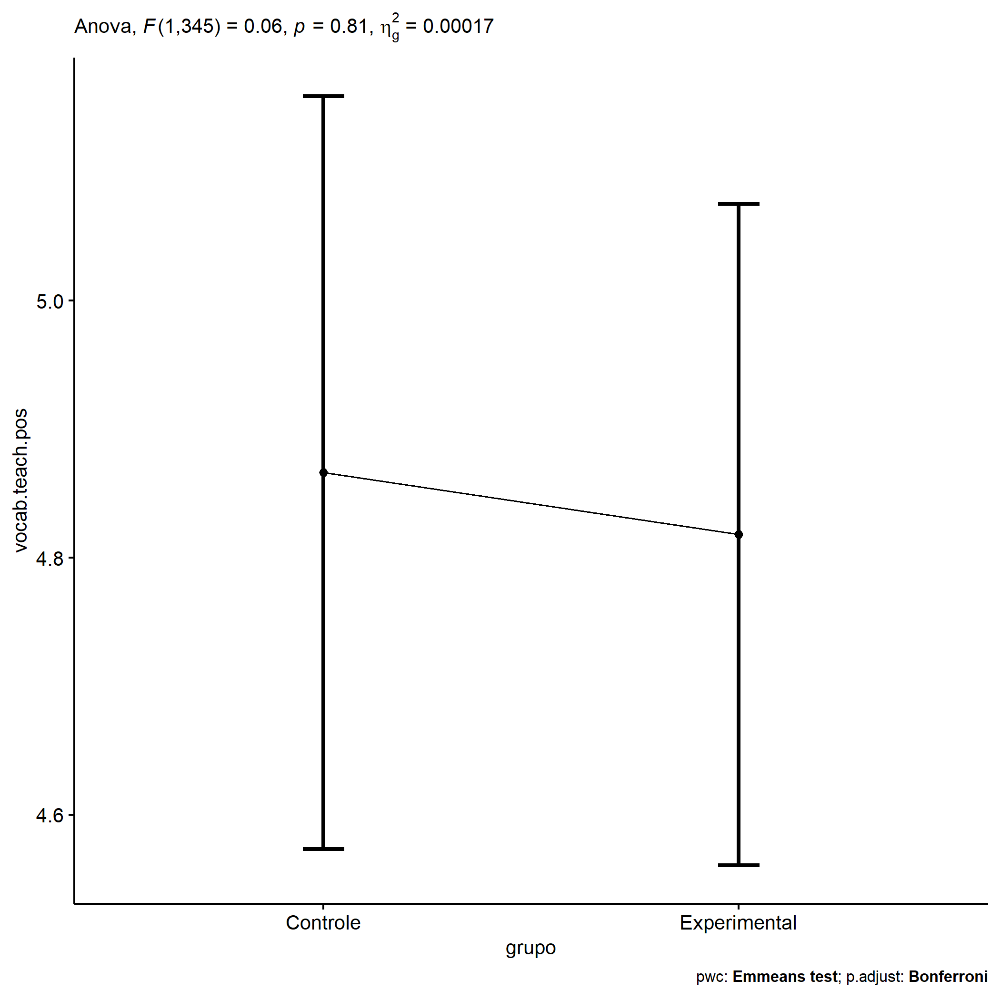<!-- -->

``` r
plots <- oneWayAncovaBoxPlots(
  wdat, "vocab.teach.pos", "grupo", aov, pwc, covar = "vocab.teach.pre",
  theme = "classic", color = color[["grupo"]],
  subtitle = which(aov$Effect == "grupo"))
```

``` r
if (length(unique(wdat[["grupo"]])) > 1)
  plots[["grupo"]] + ggplot2::ylab("Vocabulario Ensinado") + ggplot2::scale_x_discrete(labels=c('pre', 'pos'))
```

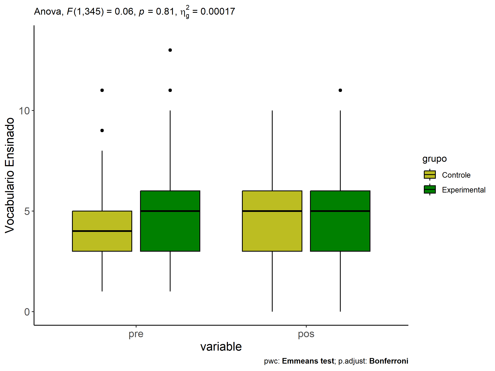<!-- -->

``` r
if (length(unique(wdat.long[["grupo"]])) > 1)
  plots <- oneWayAncovaBoxPlots(
    wdat.long, "vocab.teach", "grupo", aov, pwc.long, pre.post = "time",
    theme = "classic", color = color$prepost)
```

``` r
if (length(unique(wdat.long[["grupo"]])) > 1)
  plots[["grupo"]] + ggplot2::ylab("Vocabulario Ensinado")
```

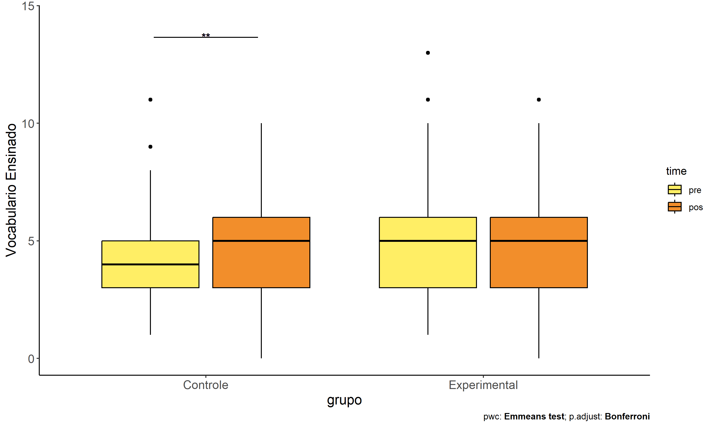<!-- -->

### Checking linearity assumption

``` r
ggscatter(wdat, x = "vocab.teach.pre", y = "vocab.teach.pos", size = 0.5,
          color = "grupo", add = "reg.line")+
  stat_regline_equation(
    aes(label =  paste(..eq.label.., ..rr.label.., sep = "~~~~"), color = grupo)
  )
```

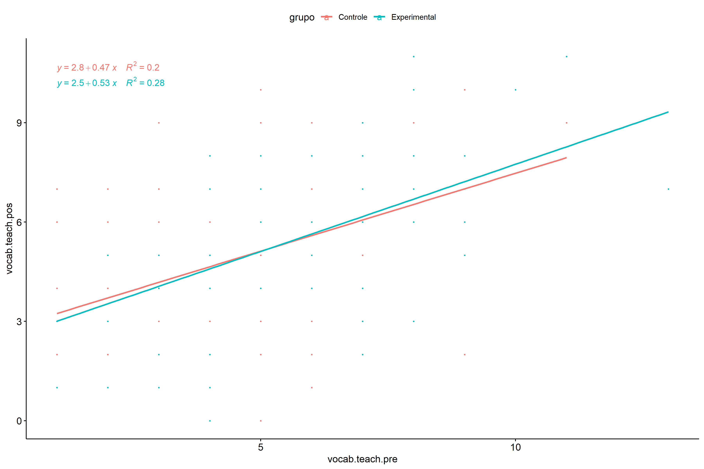<!-- -->

### Checking normality and homogeneity

``` r
res <- augment(lm(vocab.teach.pos ~ vocab.teach.pre + grupo, data = wdat))
```

``` r
shapiro_test(res$.resid)
```

    ## # A tibble: 1 × 3
    ##   variable   statistic p.value
    ##   <chr>          <dbl>   <dbl>
    ## 1 res$.resid     0.992  0.0644

``` r
levene_test(res, .resid ~ grupo)
```

    ## # A tibble: 1 × 4
    ##     df1   df2 statistic     p
    ##   <int> <int>     <dbl> <dbl>
    ## 1     1   346     0.561 0.454

# ANCOVA and Pairwise for two factors **grupo:Sexo**

## Without remove non-normal data

``` r
pdat = remove_group_data(dat[!is.na(dat[["grupo"]]) & !is.na(dat[["Sexo"]]),], "vocab.teach.pos", c("grupo","Sexo"))

pdat.long <- rbind(pdat[,c("id","grupo","Sexo")], pdat[,c("id","grupo","Sexo")])
pdat.long[["time"]] <- c(rep("pre", nrow(pdat)), rep("pos", nrow(pdat)))
pdat.long[["time"]] <- factor(pdat.long[["time"]], c("pre","pos"))
pdat.long[["vocab.teach"]] <- c(pdat[["vocab.teach.pre"]], pdat[["vocab.teach.pos"]])

aov = anova_test(pdat, vocab.teach.pos ~ vocab.teach.pre + grupo*Sexo)
laov[["grupo:Sexo"]] <- get_anova_table(aov)
```

``` r
pwcs <- list()
pwcs[["Sexo"]] <- emmeans_test(
  group_by(pdat, grupo), vocab.teach.pos ~ Sexo,
  covariate = vocab.teach.pre, p.adjust.method = "bonferroni")
pwcs[["grupo"]] <- emmeans_test(
  group_by(pdat, Sexo), vocab.teach.pos ~ grupo,
  covariate = vocab.teach.pre, p.adjust.method = "bonferroni")

pwc <- plyr::rbind.fill(pwcs[["grupo"]], pwcs[["Sexo"]])
pwc <- pwc[,c("grupo","Sexo", colnames(pwc)[!colnames(pwc) %in% c("grupo","Sexo")])]
```

``` r
pwc.long <- emmeans_test(dplyr::group_by_at(pdat.long, c("grupo","Sexo")),
                         vocab.teach ~ time,
                         p.adjust.method = "bonferroni")
lpwc[["grupo:Sexo"]] <- plyr::rbind.fill(pwc, pwc.long)
```

``` r
ds <- get.descriptives(pdat, "vocab.teach.pos", c("grupo","Sexo"), covar = "vocab.teach.pre")
ds <- merge(ds[ds$variable != "vocab.teach.pre",],
            ds[ds$variable == "vocab.teach.pre", !colnames(ds) %in% c("variable")],
            by = c("grupo","Sexo"), all.x = T, suffixes = c("", ".vocab.teach.pre"))
ds <- merge(get_emmeans(pwcs[["grupo"]]), ds, by = c("grupo","Sexo"), suffixes = c(".emms", ""))
ds <- ds[,c("grupo","Sexo","n","mean.vocab.teach.pre","se.vocab.teach.pre","mean","se","emmean","se.emms")]

colnames(ds) <- c("grupo","Sexo", "N", paste0(c("M","SE")," (pre)"),
                  paste0(c("M","SE"), " (unadj)"), paste0(c("M", "SE"), " (adj)"))

lemms[["grupo:Sexo"]] <- ds
```

## Computing ANCOVA and PairWise After removing non-normal data (OK)

``` r
wdat = pdat 

res = residuals(lm(vocab.teach.pos ~ vocab.teach.pre + grupo*Sexo, data = wdat))
non.normal = getNonNormal(res, wdat$id, plimit = 0.05)

wdat = wdat[!wdat$id %in% non.normal,]

wdat.long <- rbind(wdat[,c("id","grupo","Sexo")], wdat[,c("id","grupo","Sexo")])
wdat.long[["time"]] <- c(rep("pre", nrow(wdat)), rep("pos", nrow(wdat)))
wdat.long[["time"]] <- factor(wdat.long[["time"]], c("pre","pos"))
wdat.long[["vocab.teach"]] <- c(wdat[["vocab.teach.pre"]], wdat[["vocab.teach.pos"]])


ldat[["grupo:Sexo"]] = wdat

(non.normal)
```

    ## NULL

``` r
aov = anova_test(wdat, vocab.teach.pos ~ vocab.teach.pre + grupo*Sexo)
laov[["grupo:Sexo"]] <- merge(get_anova_table(aov), laov[["grupo:Sexo"]], by="Effect", suffixes = c("","'"))

(df = get_anova_table(aov))
```

    ## ANOVA Table (type II tests)
    ## 
    ##            Effect DFn DFd       F        p p<.05      ges
    ## 1 vocab.teach.pre   1 343 111.543 9.21e-23     * 0.245000
    ## 2           grupo   1 343   0.043 8.37e-01       0.000124
    ## 3            Sexo   1 343   0.286 5.93e-01       0.000835
    ## 4      grupo:Sexo   1 343   0.082 7.75e-01       0.000239

| Effect          | DFn | DFd |       F |     p | p\<.05 |   ges |
|:----------------|----:|----:|--------:|------:|:-------|------:|
| vocab.teach.pre |   1 | 343 | 111.543 | 0.000 | \*     | 0.245 |
| grupo           |   1 | 343 |   0.043 | 0.837 |        | 0.000 |
| Sexo            |   1 | 343 |   0.286 | 0.593 |        | 0.001 |
| grupo:Sexo      |   1 | 343 |   0.082 | 0.775 |        | 0.000 |

``` r
pwcs <- list()
pwcs[["Sexo"]] <- emmeans_test(
  group_by(wdat, grupo), vocab.teach.pos ~ Sexo,
  covariate = vocab.teach.pre, p.adjust.method = "bonferroni")
pwcs[["grupo"]] <- emmeans_test(
  group_by(wdat, Sexo), vocab.teach.pos ~ grupo,
  covariate = vocab.teach.pre, p.adjust.method = "bonferroni")

pwc <- plyr::rbind.fill(pwcs[["grupo"]], pwcs[["Sexo"]])
pwc <- pwc[,c("grupo","Sexo", colnames(pwc)[!colnames(pwc) %in% c("grupo","Sexo")])]
```

| grupo        | Sexo | term                   | .y.             | group1   | group2       |  df | statistic |     p | p.adj | p.adj.signif |
|:-------------|:-----|:-----------------------|:----------------|:---------|:-------------|----:|----------:|------:|------:|:-------------|
|              | F    | vocab.teach.pre\*grupo | vocab.teach.pos | Controle | Experimental | 343 |    -0.040 | 0.968 | 0.968 | ns           |
|              | M    | vocab.teach.pre\*grupo | vocab.teach.pos | Controle | Experimental | 343 |     0.350 | 0.727 | 0.727 | ns           |
| Controle     |      | vocab.teach.pre\*Sexo  | vocab.teach.pos | F        | M            | 343 |     0.135 | 0.893 | 0.893 | ns           |
| Experimental |      | vocab.teach.pre\*Sexo  | vocab.teach.pos | F        | M            | 343 |     0.591 | 0.555 | 0.555 | ns           |

``` r
pwc.long <- emmeans_test(dplyr::group_by_at(wdat.long, c("grupo","Sexo")),
                         vocab.teach ~ time,
                         p.adjust.method = "bonferroni")
lpwc[["grupo:Sexo"]] <- merge(plyr::rbind.fill(pwc, pwc.long), lpwc[["grupo:Sexo"]], by=c("grupo","Sexo","term",".y.","group1","group2"), suffixes = c("","'"))
```

| grupo        | Sexo | term | .y.         | group1 | group2 |  df | statistic |     p | p.adj | p.adj.signif |
|:-------------|:-----|:-----|:------------|:-------|:-------|----:|----------:|------:|------:|:-------------|
| Controle     | F    | time | vocab.teach | pre    | pos    | 688 |    -1.700 | 0.090 | 0.090 | ns           |
| Controle     | M    | time | vocab.teach | pre    | pos    | 688 |    -2.165 | 0.031 | 0.031 | \*           |
| Experimental | F    | time | vocab.teach | pre    | pos    | 688 |    -1.205 | 0.229 | 0.229 | ns           |
| Experimental | M    | time | vocab.teach | pre    | pos    | 688 |    -0.379 | 0.705 | 0.705 | ns           |

``` r
ds <- get.descriptives(wdat, "vocab.teach.pos", c("grupo","Sexo"), covar = "vocab.teach.pre")
ds <- merge(ds[ds$variable != "vocab.teach.pre",],
            ds[ds$variable == "vocab.teach.pre", !colnames(ds) %in% c("variable")],
            by = c("grupo","Sexo"), all.x = T, suffixes = c("", ".vocab.teach.pre"))
ds <- merge(get_emmeans(pwcs[["grupo"]]), ds, by = c("grupo","Sexo"), suffixes = c(".emms", ""))
ds <- ds[,c("grupo","Sexo","n","mean.vocab.teach.pre","se.vocab.teach.pre","mean","se","emmean","se.emms")]

colnames(ds) <- c("grupo","Sexo", "N", paste0(c("M","SE")," (pre)"),
                  paste0(c("M","SE"), " (unadj)"), paste0(c("M", "SE"), " (adj)"))

lemms[["grupo:Sexo"]] <- merge(ds, lemms[["grupo:Sexo"]], by=c("grupo","Sexo"), suffixes = c("","'"))
```

| grupo        | Sexo |   N | M (pre) | SE (pre) | M (unadj) | SE (unadj) | M (adj) | SE (adj) |
|:-------------|:-----|----:|--------:|---------:|----------:|-----------:|--------:|---------:|
| Controle     | F    |  85 |   4.259 |    0.192 |     4.800 |      0.214 |   4.884 |    0.198 |
| Controle     | M    |  67 |   3.701 |    0.253 |     4.478 |      0.260 |   4.844 |    0.226 |
| Experimental | F    |  98 |   4.653 |    0.229 |     5.010 |      0.216 |   4.895 |    0.185 |
| Experimental | M    |  98 |   4.837 |    0.207 |     4.949 |      0.216 |   4.741 |    0.185 |

### Plots for ancova

``` r
plots <- twoWayAncovaPlots(
  wdat, "vocab.teach.pos", c("grupo","Sexo"), aov, pwcs, addParam = c("mean_se"),
  font.label.size=10, step.increase=0.05, p.label="p.adj",
  subtitle = which(aov$Effect == "grupo:Sexo"))
```

``` r
if (!is.null(plots[["grupo"]]))
  plots[["grupo"]] + ggplot2::scale_color_manual(values = color[["Sexo"]])
```

    ## Scale for colour is already present.
    ## Adding another scale for colour, which will replace the existing scale.

<!-- -->

``` r
if (!is.null(plots[["Sexo"]]))
  plots[["Sexo"]] + ggplot2::scale_color_manual(values = color[["grupo"]])
```

    ## Scale for colour is already present.
    ## Adding another scale for colour, which will replace the existing scale.

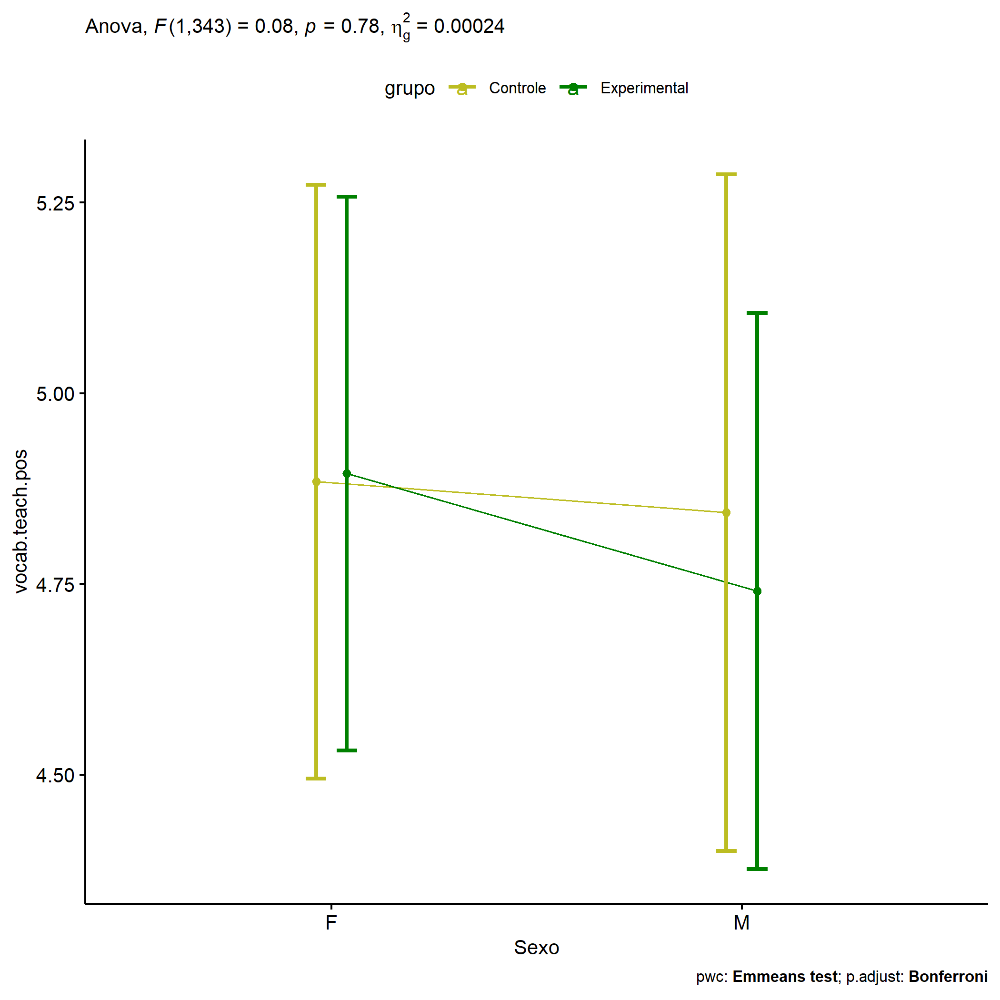<!-- -->

``` r
plots <- twoWayAncovaBoxPlots(
  wdat, "vocab.teach.pos", c("grupo","Sexo"), aov, pwcs, covar = "vocab.teach.pre",
  theme = "classic", color = color[["grupo:Sexo"]],
  subtitle = which(aov$Effect == "grupo:Sexo"))
```

``` r
plots[["grupo:Sexo"]] + ggplot2::ylab("Vocabulario Ensinado") + ggplot2::scale_x_discrete(labels=c('pre', 'pos'))
```

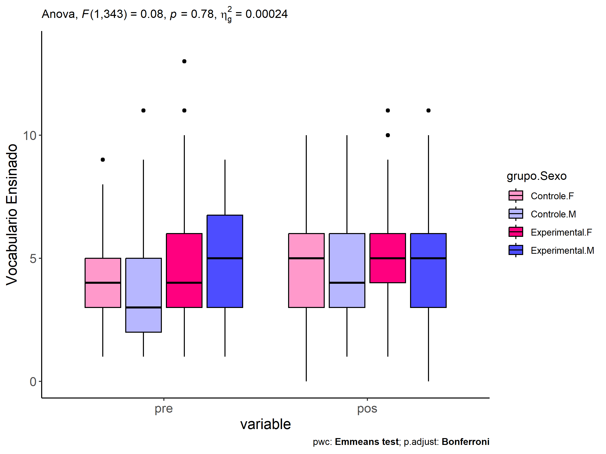<!-- -->

``` r
plots <- twoWayAncovaBoxPlots(
  wdat.long, "vocab.teach", c("grupo","Sexo"), aov, pwc.long, pre.post = "time",
  theme = "classic", color = color$prepost)
```

``` r
plots[["grupo:Sexo"]] + ggplot2::ylab("Vocabulario Ensinado")
```

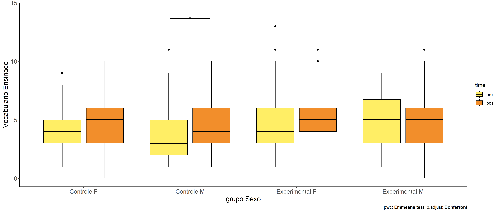<!-- -->

### Checking linearity assumption

``` r
ggscatter(wdat, x = "vocab.teach.pre", y = "vocab.teach.pos", size = 0.5,
          facet.by = c("grupo","Sexo"), add = "reg.line")+
  stat_regline_equation(
    aes(label =  paste(..eq.label.., ..rr.label.., sep = "~~~~"))
  )
```

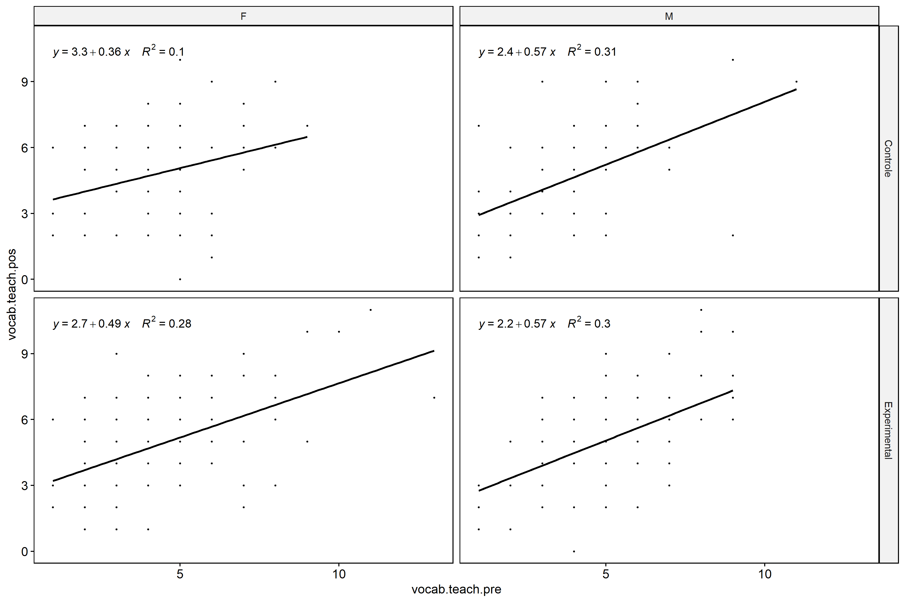<!-- -->

### Checking normality and homogeneity

``` r
res <- augment(lm(vocab.teach.pos ~ vocab.teach.pre + grupo*Sexo, data = wdat))
```

``` r
shapiro_test(res$.resid)
```

    ## # A tibble: 1 × 3
    ##   variable   statistic p.value
    ##   <chr>          <dbl>   <dbl>
    ## 1 res$.resid     0.994   0.202

``` r
levene_test(res, .resid ~ grupo*Sexo)
```

    ## # A tibble: 1 × 4
    ##     df1   df2 statistic     p
    ##   <int> <int>     <dbl> <dbl>
    ## 1     3   344     0.418 0.740

# ANCOVA and Pairwise for two factors **grupo:Zona**

## Without remove non-normal data

``` r
pdat = remove_group_data(dat[!is.na(dat[["grupo"]]) & !is.na(dat[["Zona"]]),], "vocab.teach.pos", c("grupo","Zona"))

pdat.long <- rbind(pdat[,c("id","grupo","Zona")], pdat[,c("id","grupo","Zona")])
pdat.long[["time"]] <- c(rep("pre", nrow(pdat)), rep("pos", nrow(pdat)))
pdat.long[["time"]] <- factor(pdat.long[["time"]], c("pre","pos"))
pdat.long[["vocab.teach"]] <- c(pdat[["vocab.teach.pre"]], pdat[["vocab.teach.pos"]])

aov = anova_test(pdat, vocab.teach.pos ~ vocab.teach.pre + grupo*Zona)
laov[["grupo:Zona"]] <- get_anova_table(aov)
```

``` r
pwcs <- list()
pwcs[["Zona"]] <- emmeans_test(
  group_by(pdat, grupo), vocab.teach.pos ~ Zona,
  covariate = vocab.teach.pre, p.adjust.method = "bonferroni")
pwcs[["grupo"]] <- emmeans_test(
  group_by(pdat, Zona), vocab.teach.pos ~ grupo,
  covariate = vocab.teach.pre, p.adjust.method = "bonferroni")

pwc <- plyr::rbind.fill(pwcs[["grupo"]], pwcs[["Zona"]])
pwc <- pwc[,c("grupo","Zona", colnames(pwc)[!colnames(pwc) %in% c("grupo","Zona")])]
```

``` r
pwc.long <- emmeans_test(dplyr::group_by_at(pdat.long, c("grupo","Zona")),
                         vocab.teach ~ time,
                         p.adjust.method = "bonferroni")
lpwc[["grupo:Zona"]] <- plyr::rbind.fill(pwc, pwc.long)
```

``` r
ds <- get.descriptives(pdat, "vocab.teach.pos", c("grupo","Zona"), covar = "vocab.teach.pre")
ds <- merge(ds[ds$variable != "vocab.teach.pre",],
            ds[ds$variable == "vocab.teach.pre", !colnames(ds) %in% c("variable")],
            by = c("grupo","Zona"), all.x = T, suffixes = c("", ".vocab.teach.pre"))
ds <- merge(get_emmeans(pwcs[["grupo"]]), ds, by = c("grupo","Zona"), suffixes = c(".emms", ""))
ds <- ds[,c("grupo","Zona","n","mean.vocab.teach.pre","se.vocab.teach.pre","mean","se","emmean","se.emms")]

colnames(ds) <- c("grupo","Zona", "N", paste0(c("M","SE")," (pre)"),
                  paste0(c("M","SE"), " (unadj)"), paste0(c("M", "SE"), " (adj)"))

lemms[["grupo:Zona"]] <- ds
```

## Computing ANCOVA and PairWise After removing non-normal data (OK)

``` r
wdat = pdat 

res = residuals(lm(vocab.teach.pos ~ vocab.teach.pre + grupo*Zona, data = wdat))
non.normal = getNonNormal(res, wdat$id, plimit = 0.05)

wdat = wdat[!wdat$id %in% non.normal,]

wdat.long <- rbind(wdat[,c("id","grupo","Zona")], wdat[,c("id","grupo","Zona")])
wdat.long[["time"]] <- c(rep("pre", nrow(wdat)), rep("pos", nrow(wdat)))
wdat.long[["time"]] <- factor(wdat.long[["time"]], c("pre","pos"))
wdat.long[["vocab.teach"]] <- c(wdat[["vocab.teach.pre"]], wdat[["vocab.teach.pos"]])


ldat[["grupo:Zona"]] = wdat

(non.normal)
```

    ## NULL

``` r
aov = anova_test(wdat, vocab.teach.pos ~ vocab.teach.pre + grupo*Zona)
laov[["grupo:Zona"]] <- merge(get_anova_table(aov), laov[["grupo:Zona"]], by="Effect", suffixes = c("","'"))

(df = get_anova_table(aov))
```

    ## ANOVA Table (type II tests)
    ## 
    ##            Effect DFn DFd      F        p p<.05      ges
    ## 1 vocab.teach.pre   1 289 97.070 6.21e-20     * 2.51e-01
    ## 2           grupo   1 289  0.015 9.04e-01       5.06e-05
    ## 3            Zona   1 289  1.116 2.92e-01       4.00e-03
    ## 4      grupo:Zona   1 289  1.526 2.18e-01       5.00e-03

| Effect          | DFn | DFd |      F |     p | p\<.05 |   ges |
|:----------------|----:|----:|-------:|------:|:-------|------:|
| vocab.teach.pre |   1 | 289 | 97.070 | 0.000 | \*     | 0.251 |
| grupo           |   1 | 289 |  0.015 | 0.904 |        | 0.000 |
| Zona            |   1 | 289 |  1.116 | 0.292 |        | 0.004 |
| grupo:Zona      |   1 | 289 |  1.526 | 0.218 |        | 0.005 |

``` r
pwcs <- list()
pwcs[["Zona"]] <- emmeans_test(
  group_by(wdat, grupo), vocab.teach.pos ~ Zona,
  covariate = vocab.teach.pre, p.adjust.method = "bonferroni")
pwcs[["grupo"]] <- emmeans_test(
  group_by(wdat, Zona), vocab.teach.pos ~ grupo,
  covariate = vocab.teach.pre, p.adjust.method = "bonferroni")

pwc <- plyr::rbind.fill(pwcs[["grupo"]], pwcs[["Zona"]])
pwc <- pwc[,c("grupo","Zona", colnames(pwc)[!colnames(pwc) %in% c("grupo","Zona")])]
```

| grupo        | Zona   | term                   | .y.             | group1   | group2       |  df | statistic |     p | p.adj | p.adj.signif |
|:-------------|:-------|:-----------------------|:----------------|:---------|:-------------|----:|----------:|------:|------:|:-------------|
|              | Rural  | vocab.teach.pre\*grupo | vocab.teach.pos | Controle | Experimental | 289 |     0.885 | 0.377 | 0.377 | ns           |
|              | Urbana | vocab.teach.pre\*grupo | vocab.teach.pos | Controle | Experimental | 289 |    -0.861 | 0.390 | 0.390 | ns           |
| Controle     |        | vocab.teach.pre\*Zona  | vocab.teach.pos | Rural    | Urbana       | 289 |     1.626 | 0.105 | 0.105 | ns           |
| Experimental |        | vocab.teach.pre\*Zona  | vocab.teach.pos | Rural    | Urbana       | 289 |    -0.001 | 0.999 | 0.999 | ns           |

``` r
pwc.long <- emmeans_test(dplyr::group_by_at(wdat.long, c("grupo","Zona")),
                         vocab.teach ~ time,
                         p.adjust.method = "bonferroni")
lpwc[["grupo:Zona"]] <- merge(plyr::rbind.fill(pwc, pwc.long), lpwc[["grupo:Zona"]], by=c("grupo","Zona","term",".y.","group1","group2"), suffixes = c("","'"))
```

| grupo        | Zona   | term | .y.         | group1 | group2 |  df | statistic |     p | p.adj | p.adj.signif |
|:-------------|:-------|:-----|:------------|:-------|:-------|----:|----------:|------:|------:|:-------------|
| Controle     | Rural  | time | vocab.teach | pre    | pos    | 580 |    -2.656 | 0.008 | 0.008 | \*\*         |
| Controle     | Urbana | time | vocab.teach | pre    | pos    | 580 |    -0.812 | 0.417 | 0.417 | ns           |
| Experimental | Rural  | time | vocab.teach | pre    | pos    | 580 |    -1.162 | 0.246 | 0.246 | ns           |
| Experimental | Urbana | time | vocab.teach | pre    | pos    | 580 |    -0.975 | 0.330 | 0.330 | ns           |

``` r
ds <- get.descriptives(wdat, "vocab.teach.pos", c("grupo","Zona"), covar = "vocab.teach.pre")
ds <- merge(ds[ds$variable != "vocab.teach.pre",],
            ds[ds$variable == "vocab.teach.pre", !colnames(ds) %in% c("variable")],
            by = c("grupo","Zona"), all.x = T, suffixes = c("", ".vocab.teach.pre"))
ds <- merge(get_emmeans(pwcs[["grupo"]]), ds, by = c("grupo","Zona"), suffixes = c(".emms", ""))
ds <- ds[,c("grupo","Zona","n","mean.vocab.teach.pre","se.vocab.teach.pre","mean","se","emmean","se.emms")]

colnames(ds) <- c("grupo","Zona", "N", paste0(c("M","SE")," (pre)"),
                  paste0(c("M","SE"), " (unadj)"), paste0(c("M", "SE"), " (adj)"))

lemms[["grupo:Zona"]] <- merge(ds, lemms[["grupo:Zona"]], by=c("grupo","Zona"), suffixes = c("","'"))
```

| grupo        | Zona   |   N | M (pre) | SE (pre) | M (unadj) | SE (unadj) | M (adj) | SE (adj) |
|:-------------|:-------|----:|--------:|---------:|----------:|-----------:|--------:|---------:|
| Controle     | Rural  |  77 |   4.117 |    0.224 |     5.013 |      0.236 |   5.196 |    0.211 |
| Controle     | Urbana |  50 |   4.140 |    0.230 |     4.480 |      0.265 |   4.651 |    0.262 |
| Experimental | Rural  |  92 |   4.707 |    0.219 |     5.065 |      0.236 |   4.942 |    0.193 |
| Experimental | Urbana |  75 |   4.760 |    0.268 |     5.093 |      0.251 |   4.942 |    0.214 |

### Plots for ancova

``` r
plots <- twoWayAncovaPlots(
  wdat, "vocab.teach.pos", c("grupo","Zona"), aov, pwcs, addParam = c("mean_se"),
  font.label.size=10, step.increase=0.05, p.label="p.adj",
  subtitle = which(aov$Effect == "grupo:Zona"))
```

``` r
if (!is.null(plots[["grupo"]]))
  plots[["grupo"]] + ggplot2::scale_color_manual(values = color[["Zona"]])
```

    ## Scale for colour is already present.
    ## Adding another scale for colour, which will replace the existing scale.

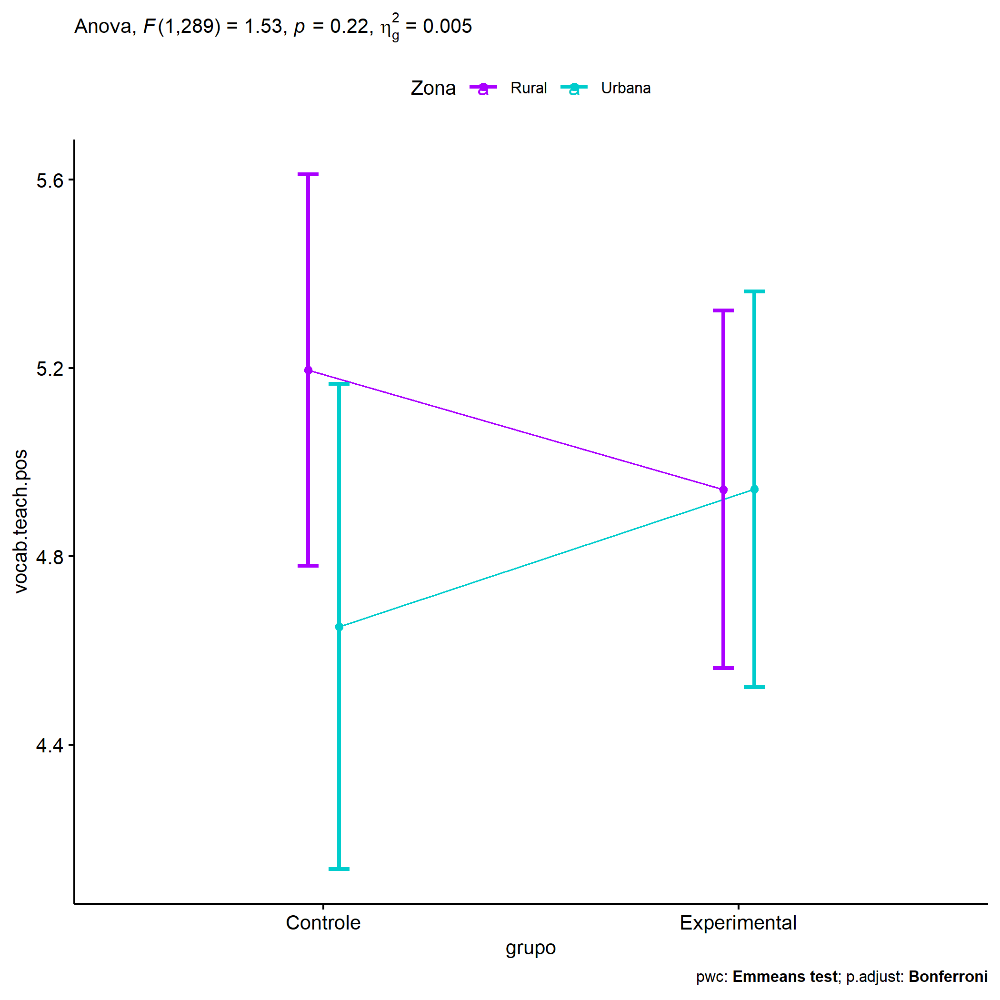<!-- -->

``` r
if (!is.null(plots[["Zona"]]))
  plots[["Zona"]] + ggplot2::scale_color_manual(values = color[["grupo"]])
```

    ## Scale for colour is already present.
    ## Adding another scale for colour, which will replace the existing scale.

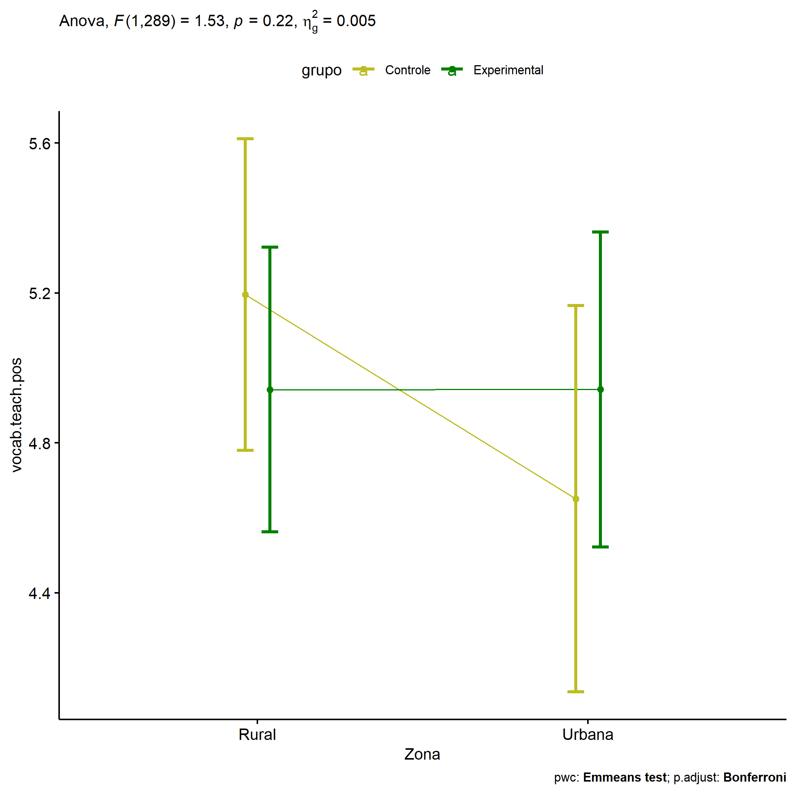<!-- -->

``` r
plots <- twoWayAncovaBoxPlots(
  wdat, "vocab.teach.pos", c("grupo","Zona"), aov, pwcs, covar = "vocab.teach.pre",
  theme = "classic", color = color[["grupo:Zona"]],
  subtitle = which(aov$Effect == "grupo:Zona"))
```

``` r
plots[["grupo:Zona"]] + ggplot2::ylab("Vocabulario Ensinado") + ggplot2::scale_x_discrete(labels=c('pre', 'pos'))
```

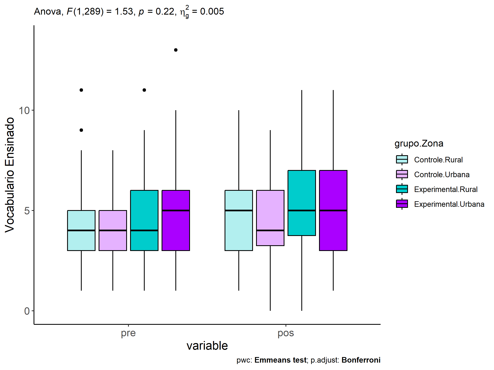<!-- -->

``` r
plots <- twoWayAncovaBoxPlots(
  wdat.long, "vocab.teach", c("grupo","Zona"), aov, pwc.long, pre.post = "time",
  theme = "classic", color = color$prepost)
```

``` r
plots[["grupo:Zona"]] + ggplot2::ylab("Vocabulario Ensinado")
```

<!-- -->

### Checking linearity assumption

``` r
ggscatter(wdat, x = "vocab.teach.pre", y = "vocab.teach.pos", size = 0.5,
          facet.by = c("grupo","Zona"), add = "reg.line")+
  stat_regline_equation(
    aes(label =  paste(..eq.label.., ..rr.label.., sep = "~~~~"))
  )
```

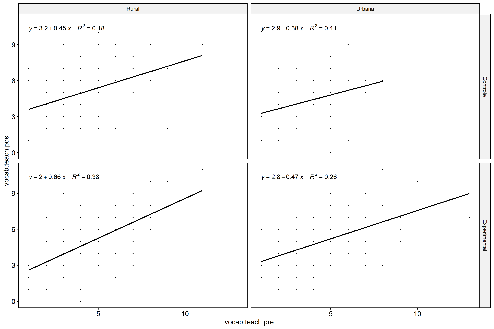<!-- -->

### Checking normality and homogeneity

``` r
res <- augment(lm(vocab.teach.pos ~ vocab.teach.pre + grupo*Zona, data = wdat))
```

``` r
shapiro_test(res$.resid)
```

    ## # A tibble: 1 × 3
    ##   variable   statistic p.value
    ##   <chr>          <dbl>   <dbl>
    ## 1 res$.resid     0.997   0.812

``` r
levene_test(res, .resid ~ grupo*Zona)
```

    ## # A tibble: 1 × 4
    ##     df1   df2 statistic     p
    ##   <int> <int>     <dbl> <dbl>
    ## 1     3   290     0.525 0.666

# ANCOVA and Pairwise for two factors **grupo:Cor.Raca**

## Without remove non-normal data

``` r
pdat = remove_group_data(dat[!is.na(dat[["grupo"]]) & !is.na(dat[["Cor.Raca"]]),], "vocab.teach.pos", c("grupo","Cor.Raca"))

pdat.long <- rbind(pdat[,c("id","grupo","Cor.Raca")], pdat[,c("id","grupo","Cor.Raca")])
pdat.long[["time"]] <- c(rep("pre", nrow(pdat)), rep("pos", nrow(pdat)))
pdat.long[["time"]] <- factor(pdat.long[["time"]], c("pre","pos"))
pdat.long[["vocab.teach"]] <- c(pdat[["vocab.teach.pre"]], pdat[["vocab.teach.pos"]])

aov = anova_test(pdat, vocab.teach.pos ~ vocab.teach.pre + grupo*Cor.Raca)
laov[["grupo:Cor.Raca"]] <- get_anova_table(aov)
```

``` r
pwcs <- list()
pwcs[["Cor.Raca"]] <- emmeans_test(
  group_by(pdat, grupo), vocab.teach.pos ~ Cor.Raca,
  covariate = vocab.teach.pre, p.adjust.method = "bonferroni")
pwcs[["grupo"]] <- emmeans_test(
  group_by(pdat, Cor.Raca), vocab.teach.pos ~ grupo,
  covariate = vocab.teach.pre, p.adjust.method = "bonferroni")

pwc <- plyr::rbind.fill(pwcs[["grupo"]], pwcs[["Cor.Raca"]])
pwc <- pwc[,c("grupo","Cor.Raca", colnames(pwc)[!colnames(pwc) %in% c("grupo","Cor.Raca")])]
```

``` r
pwc.long <- emmeans_test(dplyr::group_by_at(pdat.long, c("grupo","Cor.Raca")),
                         vocab.teach ~ time,
                         p.adjust.method = "bonferroni")
lpwc[["grupo:Cor.Raca"]] <- plyr::rbind.fill(pwc, pwc.long)
```

``` r
ds <- get.descriptives(pdat, "vocab.teach.pos", c("grupo","Cor.Raca"), covar = "vocab.teach.pre")
ds <- merge(ds[ds$variable != "vocab.teach.pre",],
            ds[ds$variable == "vocab.teach.pre", !colnames(ds) %in% c("variable")],
            by = c("grupo","Cor.Raca"), all.x = T, suffixes = c("", ".vocab.teach.pre"))
ds <- merge(get_emmeans(pwcs[["grupo"]]), ds, by = c("grupo","Cor.Raca"), suffixes = c(".emms", ""))
ds <- ds[,c("grupo","Cor.Raca","n","mean.vocab.teach.pre","se.vocab.teach.pre","mean","se","emmean","se.emms")]

colnames(ds) <- c("grupo","Cor.Raca", "N", paste0(c("M","SE")," (pre)"),
                  paste0(c("M","SE"), " (unadj)"), paste0(c("M", "SE"), " (adj)"))

lemms[["grupo:Cor.Raca"]] <- ds
```

## Computing ANCOVA and PairWise After removing non-normal data (OK)

``` r
wdat = pdat 

res = residuals(lm(vocab.teach.pos ~ vocab.teach.pre + grupo*Cor.Raca, data = wdat))
non.normal = getNonNormal(res, wdat$id, plimit = 0.05)

wdat = wdat[!wdat$id %in% non.normal,]

wdat.long <- rbind(wdat[,c("id","grupo","Cor.Raca")], wdat[,c("id","grupo","Cor.Raca")])
wdat.long[["time"]] <- c(rep("pre", nrow(wdat)), rep("pos", nrow(wdat)))
wdat.long[["time"]] <- factor(wdat.long[["time"]], c("pre","pos"))
wdat.long[["vocab.teach"]] <- c(wdat[["vocab.teach.pre"]], wdat[["vocab.teach.pos"]])


ldat[["grupo:Cor.Raca"]] = wdat

(non.normal)
```

    ## NULL

``` r
aov = anova_test(wdat, vocab.teach.pos ~ vocab.teach.pre + grupo*Cor.Raca)
laov[["grupo:Cor.Raca"]] <- merge(get_anova_table(aov), laov[["grupo:Cor.Raca"]], by="Effect", suffixes = c("","'"))

(df = get_anova_table(aov))
```

    ## ANOVA Table (type II tests)
    ## 
    ##            Effect DFn DFd      F        p p<.05   ges
    ## 1 vocab.teach.pre   1 132 43.249 1.03e-09     * 0.247
    ## 2           grupo   1 132  1.385 2.41e-01       0.010
    ## 3        Cor.Raca   2 132  1.942 1.48e-01       0.029
    ## 4  grupo:Cor.Raca   1 132  0.717 3.99e-01       0.005

| Effect          | DFn | DFd |      F |     p | p\<.05 |   ges |
|:----------------|----:|----:|-------:|------:|:-------|------:|
| vocab.teach.pre |   1 | 132 | 43.249 | 0.000 | \*     | 0.247 |
| grupo           |   1 | 132 |  1.385 | 0.241 |        | 0.010 |
| Cor.Raca        |   2 | 132 |  1.942 | 0.148 |        | 0.029 |
| grupo:Cor.Raca  |   1 | 132 |  0.717 | 0.399 |        | 0.005 |

``` r
pwcs <- list()
pwcs[["Cor.Raca"]] <- emmeans_test(
  group_by(wdat, grupo), vocab.teach.pos ~ Cor.Raca,
  covariate = vocab.teach.pre, p.adjust.method = "bonferroni")
pwcs[["grupo"]] <- emmeans_test(
  group_by(wdat, Cor.Raca), vocab.teach.pos ~ grupo,
  covariate = vocab.teach.pre, p.adjust.method = "bonferroni")

pwc <- plyr::rbind.fill(pwcs[["grupo"]], pwcs[["Cor.Raca"]])
pwc <- pwc[,c("grupo","Cor.Raca", colnames(pwc)[!colnames(pwc) %in% c("grupo","Cor.Raca")])]
```

| grupo        | Cor.Raca | term                      | .y.             | group1   | group2       |  df | statistic |     p | p.adj | p.adj.signif |
|:-------------|:---------|:--------------------------|:----------------|:---------|:-------------|----:|----------:|------:|------:|:-------------|
|              | Branca   | vocab.teach.pre\*grupo    | vocab.teach.pos | Controle | Experimental | 132 |    -0.144 | 0.886 | 0.886 | ns           |
|              | Indígena | vocab.teach.pre\*grupo    | vocab.teach.pos | Controle | Experimental |     |           |       |       |              |
|              | Parda    | vocab.teach.pre\*grupo    | vocab.teach.pos | Controle | Experimental | 132 |     1.441 | 0.152 | 0.152 | ns           |
| Controle     |          | vocab.teach.pre\*Cor.Raca | vocab.teach.pos | Branca   | Indígena     | 132 |    -2.051 | 0.042 | 0.127 | ns           |
| Controle     |          | vocab.teach.pre\*Cor.Raca | vocab.teach.pos | Branca   | Parda        | 132 |    -1.430 | 0.155 | 0.466 | ns           |
| Controle     |          | vocab.teach.pre\*Cor.Raca | vocab.teach.pos | Indígena | Parda        | 132 |     1.231 | 0.221 | 0.662 | ns           |
| Experimental |          | vocab.teach.pre\*Cor.Raca | vocab.teach.pos | Branca   | Indígena     |     |           |       |       |              |
| Experimental |          | vocab.teach.pre\*Cor.Raca | vocab.teach.pos | Branca   | Parda        | 132 |    -0.074 | 0.941 | 0.941 | ns           |
| Experimental |          | vocab.teach.pre\*Cor.Raca | vocab.teach.pos | Indígena | Parda        |     |           |       |       |              |

``` r
pwc.long <- emmeans_test(dplyr::group_by_at(wdat.long, c("grupo","Cor.Raca")),
                         vocab.teach ~ time,
                         p.adjust.method = "bonferroni")
lpwc[["grupo:Cor.Raca"]] <- merge(plyr::rbind.fill(pwc, pwc.long), lpwc[["grupo:Cor.Raca"]], by=c("grupo","Cor.Raca","term",".y.","group1","group2"), suffixes = c("","'"))
```

| grupo        | Cor.Raca | term | .y.         | group1 | group2 |  df | statistic |     p | p.adj | p.adj.signif |
|:-------------|:---------|:-----|:------------|:-------|:-------|----:|----------:|------:|------:|:-------------|
| Controle     | Branca   | time | vocab.teach | pre    | pos    | 266 |    -0.847 | 0.398 | 0.398 | ns           |
| Controle     | Indígena | time | vocab.teach | pre    | pos    | 266 |    -2.042 | 0.042 | 0.042 | \*           |
| Controle     | Parda    | time | vocab.teach | pre    | pos    | 266 |    -3.047 | 0.003 | 0.003 | \*\*         |
| Experimental | Branca   | time | vocab.teach | pre    | pos    | 266 |    -0.417 | 0.677 | 0.677 | ns           |
| Experimental | Indígena | time | vocab.teach | pre    | pos    |     |           |       |       |              |
| Experimental | Parda    | time | vocab.teach | pre    | pos    | 266 |    -1.151 | 0.251 | 0.251 | ns           |

``` r
ds <- get.descriptives(wdat, "vocab.teach.pos", c("grupo","Cor.Raca"), covar = "vocab.teach.pre")
ds <- merge(ds[ds$variable != "vocab.teach.pre",],
            ds[ds$variable == "vocab.teach.pre", !colnames(ds) %in% c("variable")],
            by = c("grupo","Cor.Raca"), all.x = T, suffixes = c("", ".vocab.teach.pre"))
ds <- merge(get_emmeans(pwcs[["grupo"]]), ds, by = c("grupo","Cor.Raca"), suffixes = c(".emms", ""))
ds <- ds[,c("grupo","Cor.Raca","n","mean.vocab.teach.pre","se.vocab.teach.pre","mean","se","emmean","se.emms")]

colnames(ds) <- c("grupo","Cor.Raca", "N", paste0(c("M","SE")," (pre)"),
                  paste0(c("M","SE"), " (unadj)"), paste0(c("M", "SE"), " (adj)"))

lemms[["grupo:Cor.Raca"]] <- merge(ds, lemms[["grupo:Cor.Raca"]], by=c("grupo","Cor.Raca"), suffixes = c("","'"))
```

| grupo        | Cor.Raca |   N | M (pre) | SE (pre) | M (unadj) | SE (unadj) | M (adj) | SE (adj) |
|:-------------|:---------|----:|--------:|---------:|----------:|-----------:|--------:|---------:|
| Controle     | Branca   |  22 |   4.000 |    0.488 |     4.500 |      0.404 |   4.543 |    0.362 |
| Controle     | Indígena |   8 |   3.875 |    0.515 |     5.875 |      0.693 |   5.979 |    0.600 |
| Controle     | Parda    |  44 |   3.727 |    0.277 |     5.000 |      0.300 |   5.176 |    0.257 |
| Experimental | Branca   |  12 |   4.500 |    0.452 |     4.833 |      0.548 |   4.631 |    0.491 |
| Experimental | Parda    |  52 |   4.365 |    0.288 |     4.808 |      0.269 |   4.671 |    0.236 |

### Plots for ancova

``` r
plots <- twoWayAncovaPlots(
  wdat, "vocab.teach.pos", c("grupo","Cor.Raca"), aov, pwcs, addParam = c("mean_se"),
  font.label.size=10, step.increase=0.05, p.label="p.adj",
  subtitle = which(aov$Effect == "grupo:Cor.Raca"))
```

``` r
if (!is.null(plots[["grupo"]]))
  plots[["grupo"]] + ggplot2::scale_color_manual(values = color[["Cor.Raca"]])
```

<!-- -->

``` r
if (!is.null(plots[["Cor.Raca"]]))
  plots[["Cor.Raca"]] + ggplot2::scale_color_manual(values = color[["grupo"]])
```

    ## Scale for colour is already present.
    ## Adding another scale for colour, which will replace the existing scale.

    ## Warning: Removed 2 rows containing non-finite values (`stat_bracket()`).

    ## Warning: Removed 1 rows containing missing values (`geom_point()`).

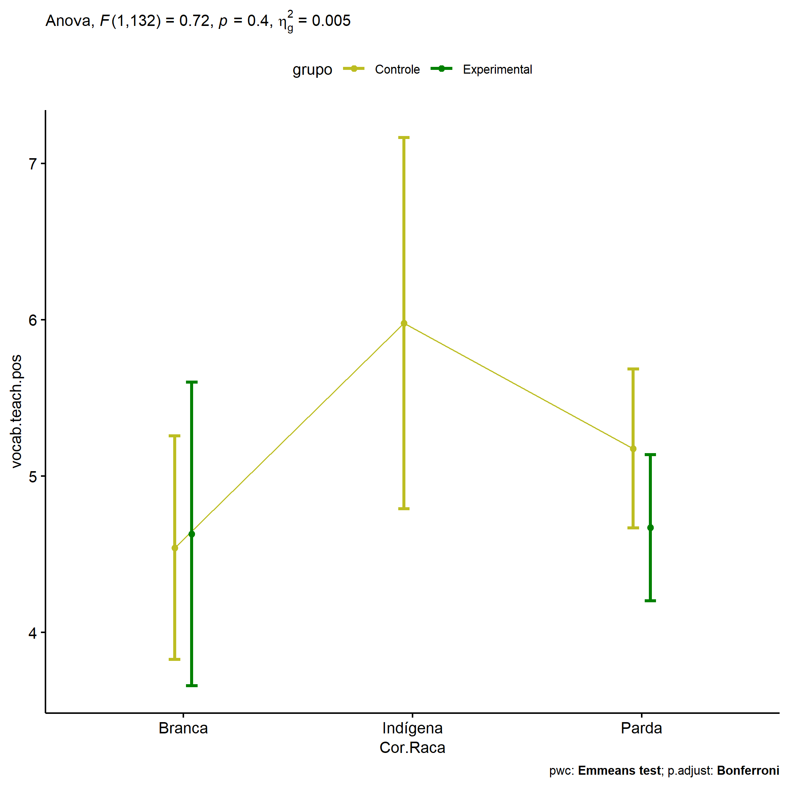<!-- -->

``` r
plots <- twoWayAncovaBoxPlots(
  wdat, "vocab.teach.pos", c("grupo","Cor.Raca"), aov, pwcs, covar = "vocab.teach.pre",
  theme = "classic", color = color[["grupo:Cor.Raca"]],
  subtitle = which(aov$Effect == "grupo:Cor.Raca"))
```

``` r
plots[["grupo:Cor.Raca"]] + ggplot2::ylab("Vocabulario Ensinado") + ggplot2::scale_x_discrete(labels=c('pre', 'pos'))
```

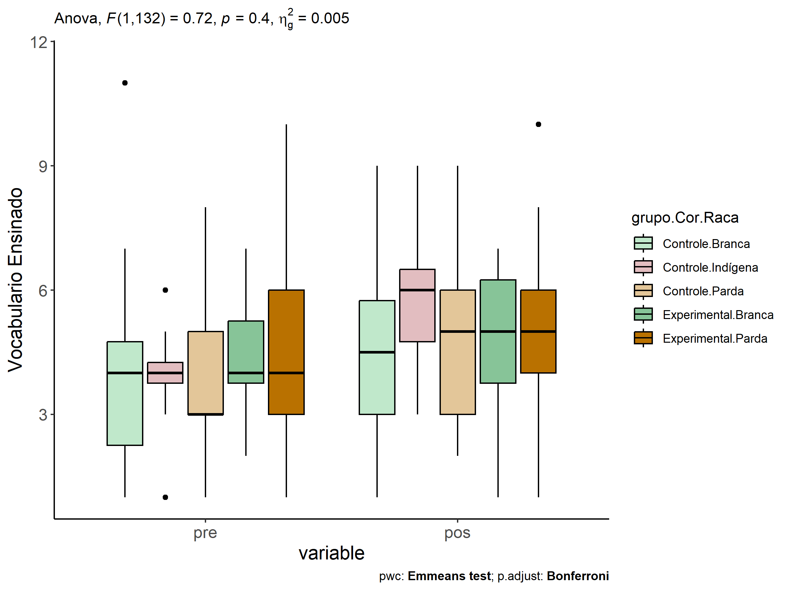<!-- -->

``` r
plots <- twoWayAncovaBoxPlots(
  wdat.long, "vocab.teach", c("grupo","Cor.Raca"), aov, pwc.long, pre.post = "time",
  theme = "classic", color = color$prepost)
```

``` r
plots[["grupo:Cor.Raca"]] + ggplot2::ylab("Vocabulario Ensinado")
```

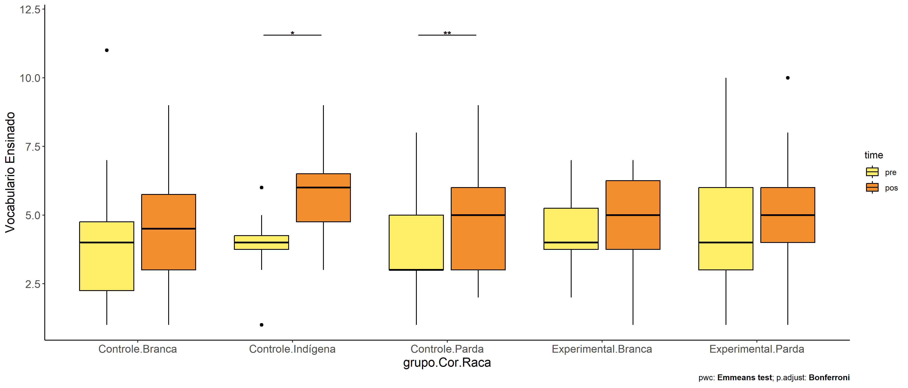<!-- -->

### Checking linearity assumption

``` r
ggscatter(wdat, x = "vocab.teach.pre", y = "vocab.teach.pos", size = 0.5,
          facet.by = c("grupo","Cor.Raca"), add = "reg.line")+
  stat_regline_equation(
    aes(label =  paste(..eq.label.., ..rr.label.., sep = "~~~~"))
  )
```

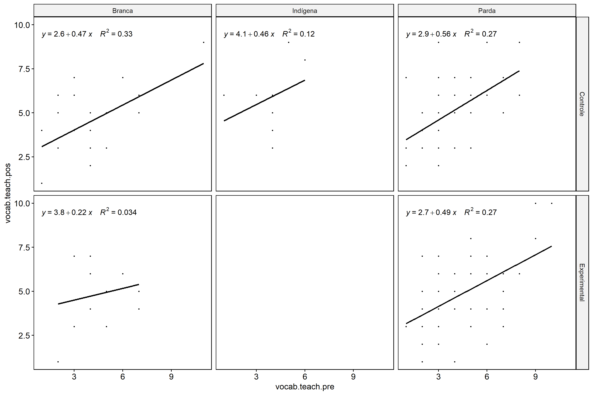<!-- -->

### Checking normality and homogeneity

``` r
res <- augment(lm(vocab.teach.pos ~ vocab.teach.pre + grupo*Cor.Raca, data = wdat))
```

``` r
shapiro_test(res$.resid)
```

    ## # A tibble: 1 × 3
    ##   variable   statistic p.value
    ##   <chr>          <dbl>   <dbl>
    ## 1 res$.resid     0.988   0.275

``` r
levene_test(res, .resid ~ grupo*Cor.Raca)
```

    ## # A tibble: 1 × 4
    ##     df1   df2 statistic     p
    ##   <int> <int>     <dbl> <dbl>
    ## 1     4   133     0.263 0.901

# ANCOVA and Pairwise for two factors **grupo:vocab.teach.quintile**

## Without remove non-normal data

``` r
pdat = remove_group_data(dat[!is.na(dat[["grupo"]]) & !is.na(dat[["vocab.teach.quintile"]]),], "vocab.teach.pos", c("grupo","vocab.teach.quintile"))

pdat.long <- rbind(pdat[,c("id","grupo","vocab.teach.quintile")], pdat[,c("id","grupo","vocab.teach.quintile")])
pdat.long[["time"]] <- c(rep("pre", nrow(pdat)), rep("pos", nrow(pdat)))
pdat.long[["time"]] <- factor(pdat.long[["time"]], c("pre","pos"))
pdat.long[["vocab.teach"]] <- c(pdat[["vocab.teach.pre"]], pdat[["vocab.teach.pos"]])

aov = anova_test(pdat, vocab.teach.pos ~ vocab.teach.pre + grupo*vocab.teach.quintile)
laov[["grupo:vocab.teach.quintile"]] <- get_anova_table(aov)
```

``` r
pwcs <- list()
pwcs[["vocab.teach.quintile"]] <- emmeans_test(
  group_by(pdat, grupo), vocab.teach.pos ~ vocab.teach.quintile,
  covariate = vocab.teach.pre, p.adjust.method = "bonferroni")
pwcs[["grupo"]] <- emmeans_test(
  group_by(pdat, vocab.teach.quintile), vocab.teach.pos ~ grupo,
  covariate = vocab.teach.pre, p.adjust.method = "bonferroni")

pwc <- plyr::rbind.fill(pwcs[["grupo"]], pwcs[["vocab.teach.quintile"]])
pwc <- pwc[,c("grupo","vocab.teach.quintile", colnames(pwc)[!colnames(pwc) %in% c("grupo","vocab.teach.quintile")])]
```

``` r
pwc.long <- emmeans_test(dplyr::group_by_at(pdat.long, c("grupo","vocab.teach.quintile")),
                         vocab.teach ~ time,
                         p.adjust.method = "bonferroni")
lpwc[["grupo:vocab.teach.quintile"]] <- plyr::rbind.fill(pwc, pwc.long)
```

``` r
ds <- get.descriptives(pdat, "vocab.teach.pos", c("grupo","vocab.teach.quintile"), covar = "vocab.teach.pre")
ds <- merge(ds[ds$variable != "vocab.teach.pre",],
            ds[ds$variable == "vocab.teach.pre", !colnames(ds) %in% c("variable")],
            by = c("grupo","vocab.teach.quintile"), all.x = T, suffixes = c("", ".vocab.teach.pre"))
ds <- merge(get_emmeans(pwcs[["grupo"]]), ds, by = c("grupo","vocab.teach.quintile"), suffixes = c(".emms", ""))
ds <- ds[,c("grupo","vocab.teach.quintile","n","mean.vocab.teach.pre","se.vocab.teach.pre","mean","se","emmean","se.emms")]

colnames(ds) <- c("grupo","vocab.teach.quintile", "N", paste0(c("M","SE")," (pre)"),
                  paste0(c("M","SE"), " (unadj)"), paste0(c("M", "SE"), " (adj)"))

lemms[["grupo:vocab.teach.quintile"]] <- ds
```

## Computing ANCOVA and PairWise After removing non-normal data (OK)

``` r
wdat = pdat 

res = residuals(lm(vocab.teach.pos ~ vocab.teach.pre + grupo*vocab.teach.quintile, data = wdat))
non.normal = getNonNormal(res, wdat$id, plimit = 0.05)

wdat = wdat[!wdat$id %in% non.normal,]

wdat.long <- rbind(wdat[,c("id","grupo","vocab.teach.quintile")], wdat[,c("id","grupo","vocab.teach.quintile")])
wdat.long[["time"]] <- c(rep("pre", nrow(wdat)), rep("pos", nrow(wdat)))
wdat.long[["time"]] <- factor(wdat.long[["time"]], c("pre","pos"))
wdat.long[["vocab.teach"]] <- c(wdat[["vocab.teach.pre"]], wdat[["vocab.teach.pos"]])


ldat[["grupo:vocab.teach.quintile"]] = wdat

(non.normal)
```

    ## NULL

``` r
aov = anova_test(wdat, vocab.teach.pos ~ vocab.teach.pre + grupo*vocab.teach.quintile)
laov[["grupo:vocab.teach.quintile"]] <- merge(get_anova_table(aov), laov[["grupo:vocab.teach.quintile"]], by="Effect", suffixes = c("","'"))

(df = get_anova_table(aov))
```

    ## ANOVA Table (type II tests)
    ## 
    ##                       Effect DFn DFd      F        p p<.05      ges
    ## 1            vocab.teach.pre   1 337 22.441 3.20e-06     * 0.062000
    ## 2                      grupo   1 337  0.045 8.32e-01       0.000134
    ## 3       vocab.teach.quintile   4 337  0.929 4.47e-01       0.011000
    ## 4 grupo:vocab.teach.quintile   4 337  0.046 9.96e-01       0.000543

| Effect                     | DFn | DFd |      F |     p | p\<.05 |   ges |
|:---------------------------|----:|----:|-------:|------:|:-------|------:|
| vocab.teach.pre            |   1 | 337 | 22.441 | 0.000 | \*     | 0.062 |
| grupo                      |   1 | 337 |  0.045 | 0.832 |        | 0.000 |
| vocab.teach.quintile       |   4 | 337 |  0.929 | 0.447 |        | 0.011 |
| grupo:vocab.teach.quintile |   4 | 337 |  0.046 | 0.996 |        | 0.001 |

``` r
pwcs <- list()
pwcs[["vocab.teach.quintile"]] <- emmeans_test(
  group_by(wdat, grupo), vocab.teach.pos ~ vocab.teach.quintile,
  covariate = vocab.teach.pre, p.adjust.method = "bonferroni")
pwcs[["grupo"]] <- emmeans_test(
  group_by(wdat, vocab.teach.quintile), vocab.teach.pos ~ grupo,
  covariate = vocab.teach.pre, p.adjust.method = "bonferroni")

pwc <- plyr::rbind.fill(pwcs[["grupo"]], pwcs[["vocab.teach.quintile"]])
pwc <- pwc[,c("grupo","vocab.teach.quintile", colnames(pwc)[!colnames(pwc) %in% c("grupo","vocab.teach.quintile")])]
```

| grupo        | vocab.teach.quintile | term                                  | .y.             | group1       | group2       |  df | statistic |     p | p.adj | p.adj.signif |
|:-------------|:---------------------|:--------------------------------------|:----------------|:-------------|:-------------|----:|----------:|------:|------:|:-------------|
|              | 1st quintile         | vocab.teach.pre\*grupo                | vocab.teach.pos | Controle     | Experimental | 337 |     0.162 | 0.872 | 0.872 | ns           |
|              | 2nd quintile         | vocab.teach.pre\*grupo                | vocab.teach.pos | Controle     | Experimental | 337 |     0.395 | 0.693 | 0.693 | ns           |
|              | 3rd quintile         | vocab.teach.pre\*grupo                | vocab.teach.pos | Controle     | Experimental | 337 |    -0.025 | 0.980 | 0.980 | ns           |
|              | 4th quintile         | vocab.teach.pre\*grupo                | vocab.teach.pos | Controle     | Experimental | 337 |    -0.186 | 0.853 | 0.853 | ns           |
|              | 5th quintile         | vocab.teach.pre\*grupo                | vocab.teach.pos | Controle     | Experimental | 337 |     0.104 | 0.917 | 0.917 | ns           |
| Controle     |                      | vocab.teach.pre\*vocab.teach.quintile | vocab.teach.pos | 1st quintile | 2nd quintile | 337 |     0.071 | 0.943 | 1.000 | ns           |
| Controle     |                      | vocab.teach.pre\*vocab.teach.quintile | vocab.teach.pos | 1st quintile | 3rd quintile | 337 |     1.257 | 0.210 | 1.000 | ns           |
| Controle     |                      | vocab.teach.pre\*vocab.teach.quintile | vocab.teach.pos | 1st quintile | 4th quintile | 337 |     1.386 | 0.167 | 1.000 | ns           |
| Controle     |                      | vocab.teach.pre\*vocab.teach.quintile | vocab.teach.pos | 1st quintile | 5th quintile | 337 |     1.421 | 0.156 | 1.000 | ns           |
| Controle     |                      | vocab.teach.pre\*vocab.teach.quintile | vocab.teach.pos | 2nd quintile | 3rd quintile | 337 |     1.560 | 0.120 | 1.000 | ns           |
| Controle     |                      | vocab.teach.pre\*vocab.teach.quintile | vocab.teach.pos | 2nd quintile | 4th quintile | 337 |     1.615 | 0.107 | 1.000 | ns           |
| Controle     |                      | vocab.teach.pre\*vocab.teach.quintile | vocab.teach.pos | 2nd quintile | 5th quintile | 337 |     1.659 | 0.098 | 0.980 | ns           |
| Controle     |                      | vocab.teach.pre\*vocab.teach.quintile | vocab.teach.pos | 3rd quintile | 4th quintile | 337 |     0.843 | 0.400 | 1.000 | ns           |
| Controle     |                      | vocab.teach.pre\*vocab.teach.quintile | vocab.teach.pos | 3rd quintile | 5th quintile | 337 |     1.147 | 0.252 | 1.000 | ns           |
| Controle     |                      | vocab.teach.pre\*vocab.teach.quintile | vocab.teach.pos | 4th quintile | 5th quintile | 337 |     0.455 | 0.649 | 1.000 | ns           |
| Experimental |                      | vocab.teach.pre\*vocab.teach.quintile | vocab.teach.pos | 1st quintile | 2nd quintile | 337 |     0.260 | 0.795 | 1.000 | ns           |
| Experimental |                      | vocab.teach.pre\*vocab.teach.quintile | vocab.teach.pos | 1st quintile | 3rd quintile | 337 |     1.092 | 0.276 | 1.000 | ns           |
| Experimental |                      | vocab.teach.pre\*vocab.teach.quintile | vocab.teach.pos | 1st quintile | 4th quintile | 337 |     1.265 | 0.207 | 1.000 | ns           |
| Experimental |                      | vocab.teach.pre\*vocab.teach.quintile | vocab.teach.pos | 1st quintile | 5th quintile | 337 |     1.452 | 0.147 | 1.000 | ns           |
| Experimental |                      | vocab.teach.pre\*vocab.teach.quintile | vocab.teach.pos | 2nd quintile | 3rd quintile | 337 |     1.204 | 0.229 | 1.000 | ns           |
| Experimental |                      | vocab.teach.pre\*vocab.teach.quintile | vocab.teach.pos | 2nd quintile | 4th quintile | 337 |     1.414 | 0.158 | 1.000 | ns           |
| Experimental |                      | vocab.teach.pre\*vocab.teach.quintile | vocab.teach.pos | 2nd quintile | 5th quintile | 337 |     1.642 | 0.102 | 1.000 | ns           |
| Experimental |                      | vocab.teach.pre\*vocab.teach.quintile | vocab.teach.pos | 3rd quintile | 4th quintile | 337 |     0.843 | 0.400 | 1.000 | ns           |
| Experimental |                      | vocab.teach.pre\*vocab.teach.quintile | vocab.teach.pos | 3rd quintile | 5th quintile | 337 |     1.404 | 0.161 | 1.000 | ns           |
| Experimental |                      | vocab.teach.pre\*vocab.teach.quintile | vocab.teach.pos | 4th quintile | 5th quintile | 337 |     0.925 | 0.356 | 1.000 | ns           |

``` r
pwc.long <- emmeans_test(dplyr::group_by_at(wdat.long, c("grupo","vocab.teach.quintile")),
                         vocab.teach ~ time,
                         p.adjust.method = "bonferroni")
lpwc[["grupo:vocab.teach.quintile"]] <- merge(plyr::rbind.fill(pwc, pwc.long), lpwc[["grupo:vocab.teach.quintile"]], by=c("grupo","vocab.teach.quintile","term",".y.","group1","group2"), suffixes = c("","'"))
```

| grupo        | vocab.teach.quintile | term | .y.         | group1 | group2 |  df | statistic |     p | p.adj | p.adj.signif |
|:-------------|:---------------------|:-----|:------------|:-------|:-------|----:|----------:|------:|------:|:-------------|
| Controle     | 1st quintile         | time | vocab.teach | pre    | pos    | 676 |    -5.169 | 0.000 | 0.000 | \*\*\*\*     |
| Controle     | 2nd quintile         | time | vocab.teach | pre    | pos    | 676 |    -4.117 | 0.000 | 0.000 | \*\*\*\*     |
| Controle     | 3rd quintile         | time | vocab.teach | pre    | pos    | 676 |    -1.333 | 0.183 | 0.183 | ns           |
| Controle     | 4th quintile         | time | vocab.teach | pre    | pos    | 676 |     0.977 | 0.329 | 0.329 | ns           |
| Controle     | 5th quintile         | time | vocab.teach | pre    | pos    | 676 |     2.642 | 0.008 | 0.008 | \*\*         |
| Experimental | 1st quintile         | time | vocab.teach | pre    | pos    | 676 |    -4.455 | 0.000 | 0.000 | \*\*\*\*     |
| Experimental | 2nd quintile         | time | vocab.teach | pre    | pos    | 676 |    -3.774 | 0.000 | 0.000 | \*\*\*       |
| Experimental | 3rd quintile         | time | vocab.teach | pre    | pos    | 676 |    -1.425 | 0.155 | 0.155 | ns           |
| Experimental | 4th quintile         | time | vocab.teach | pre    | pos    | 676 |     1.086 | 0.278 | 0.278 | ns           |
| Experimental | 5th quintile         | time | vocab.teach | pre    | pos    | 676 |     4.480 | 0.000 | 0.000 | \*\*\*\*     |

``` r
ds <- get.descriptives(wdat, "vocab.teach.pos", c("grupo","vocab.teach.quintile"), covar = "vocab.teach.pre")
ds <- merge(ds[ds$variable != "vocab.teach.pre",],
            ds[ds$variable == "vocab.teach.pre", !colnames(ds) %in% c("variable")],
            by = c("grupo","vocab.teach.quintile"), all.x = T, suffixes = c("", ".vocab.teach.pre"))
ds <- merge(get_emmeans(pwcs[["grupo"]]), ds, by = c("grupo","vocab.teach.quintile"), suffixes = c(".emms", ""))
ds <- ds[,c("grupo","vocab.teach.quintile","n","mean.vocab.teach.pre","se.vocab.teach.pre","mean","se","emmean","se.emms")]

colnames(ds) <- c("grupo","vocab.teach.quintile", "N", paste0(c("M","SE")," (pre)"),
                  paste0(c("M","SE"), " (unadj)"), paste0(c("M", "SE"), " (adj)"))

lemms[["grupo:vocab.teach.quintile"]] <- merge(ds, lemms[["grupo:vocab.teach.quintile"]], by=c("grupo","vocab.teach.quintile"), suffixes = c("","'"))
```

| grupo        | vocab.teach.quintile |   N | M (pre) | SE (pre) | M (unadj) | SE (unadj) | M (adj) | SE (adj) |
|:-------------|:---------------------|----:|--------:|---------:|----------:|-----------:|--------:|---------:|
| Controle     | 1st quintile         |  33 |   1.636 |    0.085 |     3.424 |      0.298 |   5.543 |    0.549 |
| Controle     | 2nd quintile         |  33 |   3.000 |    0.000 |     4.424 |      0.272 |   5.507 |    0.392 |
| Controle     | 3rd quintile         |  57 |   4.456 |    0.067 |     4.807 |      0.250 |   4.784 |    0.243 |
| Controle     | 4th quintile         |  13 |   6.000 |    0.000 |     5.462 |      0.739 |   4.265 |    0.567 |
| Controle     | 5th quintile         |  16 |   7.812 |    0.292 |     6.500 |      0.483 |   3.927 |    0.710 |
| Experimental | 1st quintile         |  27 |   1.667 |    0.092 |     3.370 |      0.298 |   5.466 |    0.565 |
| Experimental | 2nd quintile         |  36 |   3.000 |    0.000 |     4.250 |      0.291 |   5.333 |    0.381 |
| Experimental | 3rd quintile         |  66 |   4.500 |    0.062 |     4.848 |      0.224 |   4.792 |    0.226 |
| Experimental | 4th quintile         |  26 |   6.000 |    0.000 |     5.577 |      0.305 |   4.381 |    0.439 |
| Experimental | 5th quintile         |  41 |   7.902 |    0.200 |     6.512 |      0.389 |   3.871 |    0.627 |

### Plots for ancova

``` r
plots <- twoWayAncovaPlots(
  wdat, "vocab.teach.pos", c("grupo","vocab.teach.quintile"), aov, pwcs, addParam = c("mean_se"),
  font.label.size=10, step.increase=0.05, p.label="p.adj",
  subtitle = which(aov$Effect == "grupo:vocab.teach.quintile"))
```

``` r
if (!is.null(plots[["grupo"]]))
  plots[["grupo"]] + ggplot2::scale_color_manual(values = color[["vocab.teach.quintile"]])
```

    ## Scale for colour is already present.
    ## Adding another scale for colour, which will replace the existing scale.

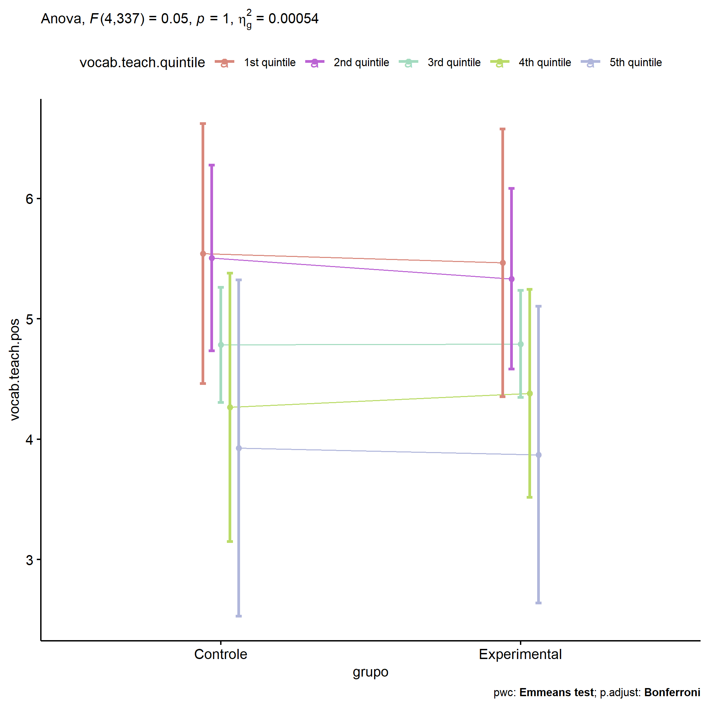<!-- -->

``` r
if (!is.null(plots[["vocab.teach.quintile"]]))
  plots[["vocab.teach.quintile"]] + ggplot2::scale_color_manual(values = color[["grupo"]])
```

    ## Scale for colour is already present.
    ## Adding another scale for colour, which will replace the existing scale.

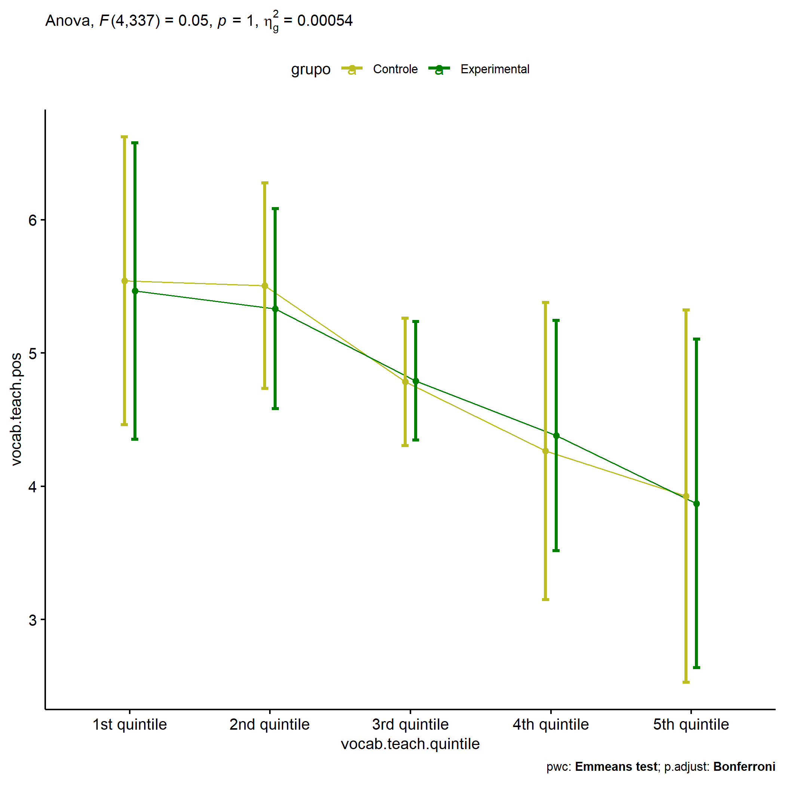<!-- -->

``` r
plots <- twoWayAncovaBoxPlots(
  wdat, "vocab.teach.pos", c("grupo","vocab.teach.quintile"), aov, pwcs, covar = "vocab.teach.pre",
  theme = "classic", color = color[["grupo:vocab.teach.quintile"]],
  subtitle = which(aov$Effect == "grupo:vocab.teach.quintile"))
```

``` r
plots[["grupo:vocab.teach.quintile"]] + ggplot2::ylab("Vocabulario Ensinado") + ggplot2::scale_x_discrete(labels=c('pre', 'pos'))
```

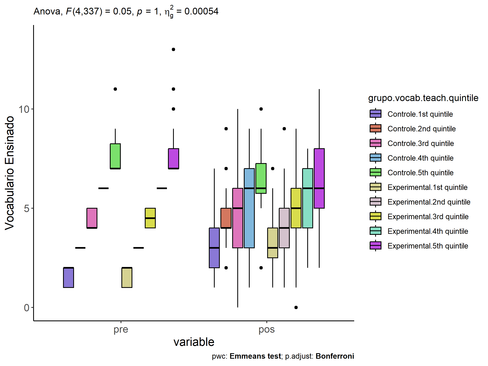<!-- -->

``` r
plots <- twoWayAncovaBoxPlots(
  wdat.long, "vocab.teach", c("grupo","vocab.teach.quintile"), aov, pwc.long, pre.post = "time",
  theme = "classic", color = color$prepost)
```

``` r
plots[["grupo:vocab.teach.quintile"]] + ggplot2::ylab("Vocabulario Ensinado")
```

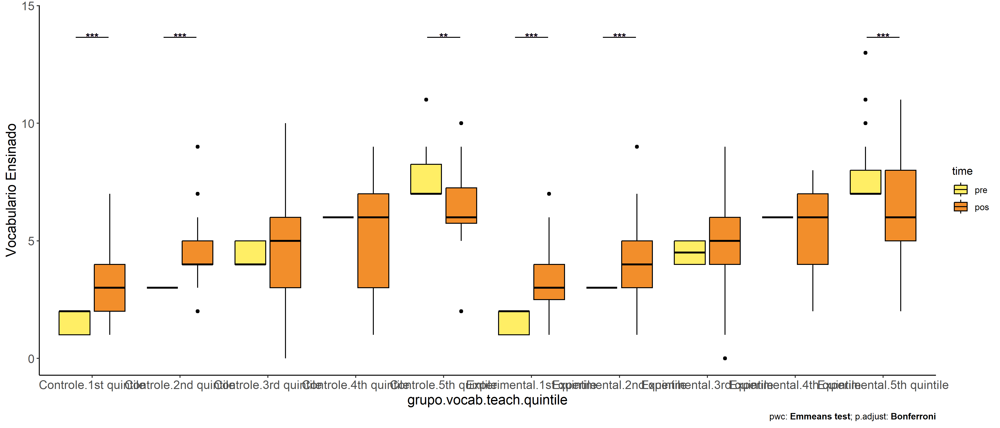<!-- -->

### Checking linearity assumption

``` r
ggscatter(wdat, x = "vocab.teach.pre", y = "vocab.teach.pos", size = 0.5,
          facet.by = c("grupo","vocab.teach.quintile"), add = "reg.line")+
  stat_regline_equation(
    aes(label =  paste(..eq.label.., ..rr.label.., sep = "~~~~"))
  )
```

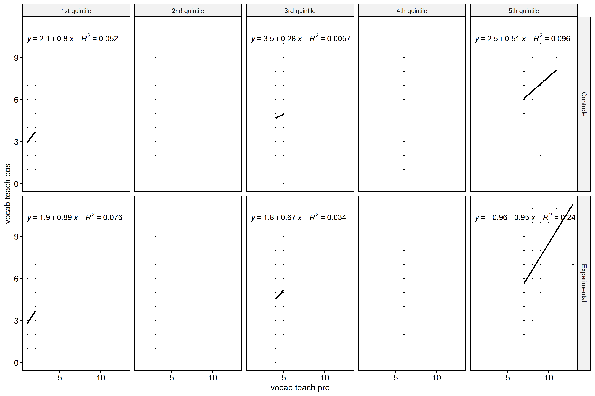<!-- -->

### Checking normality and homogeneity

``` r
res <- augment(lm(vocab.teach.pos ~ vocab.teach.pre + grupo*vocab.teach.quintile, data = wdat))
```

``` r
shapiro_test(res$.resid)
```

    ## # A tibble: 1 × 3
    ##   variable   statistic p.value
    ##   <chr>          <dbl>   <dbl>
    ## 1 res$.resid     0.995   0.276

``` r
levene_test(res, .resid ~ grupo*vocab.teach.quintile)
```

    ## # A tibble: 1 × 4
    ##     df1   df2 statistic      p
    ##   <int> <int>     <dbl>  <dbl>
    ## 1     9   338      1.67 0.0939

# Summary of Results

## Descriptive Statistics

``` r
df <- get.descriptives(ldat[["grupo"]], c(dv.pre, dv.pos), c("grupo"), 
                       include.global = T, symmetry.test = T, normality.test = F)
df <- plyr::rbind.fill(
  df, do.call(plyr::rbind.fill, lapply(lfatores2, FUN = function(f) {
    if (nrow(dat) > 0 && sum(!is.na(unique(dat[[f]]))) > 1)
      get.descriptives(ldat[[paste0("grupo:",f)]], c(dv.pre,dv.pos), c("grupo", f),
                       symmetry.test = T, normality.test = F)
    }))
)
(df <- df[,c(fatores1[fatores1 %in% colnames(df)],"variable",
             colnames(df)[!colnames(df) %in% c(fatores1,"variable")])])
```

    ##           grupo Sexo   Zona Cor.Raca vocab.teach.quintile        variable   n  mean median min max    sd    se
    ## 1      Controle <NA>   <NA>     <NA>                 <NA> vocab.teach.pre 152 4.013    4.0   1  11 1.919 0.156
    ## 2  Experimental <NA>   <NA>     <NA>                 <NA> vocab.teach.pre 196 4.745    5.0   1  13 2.157 0.154
    ## 3          <NA> <NA>   <NA>     <NA>                 <NA> vocab.teach.pre 348 4.425    4.0   1  13 2.085 0.112
    ## 4      Controle <NA>   <NA>     <NA>                 <NA> vocab.teach.pos 152 4.658    5.0   0  10 2.040 0.165
    ## 5  Experimental <NA>   <NA>     <NA>                 <NA> vocab.teach.pos 196 4.980    5.0   0  11 2.134 0.152
    ## 6          <NA> <NA>   <NA>     <NA>                 <NA> vocab.teach.pos 348 4.839    5.0   0  11 2.096 0.112
    ## 7      Controle    F   <NA>     <NA>                 <NA> vocab.teach.pre  85 4.259    4.0   1   9 1.767 0.192
    ## 8      Controle    M   <NA>     <NA>                 <NA> vocab.teach.pre  67 3.701    3.0   1  11 2.067 0.253
    ## 9  Experimental    F   <NA>     <NA>                 <NA> vocab.teach.pre  98 4.653    4.0   1  13 2.271 0.229
    ## 10 Experimental    M   <NA>     <NA>                 <NA> vocab.teach.pre  98 4.837    5.0   1   9 2.044 0.207
    ## 11     Controle    F   <NA>     <NA>                 <NA> vocab.teach.pos  85 4.800    5.0   0  10 1.969 0.214
    ## 12     Controle    M   <NA>     <NA>                 <NA> vocab.teach.pos  67 4.478    4.0   1  10 2.127 0.260
    ## 13 Experimental    F   <NA>     <NA>                 <NA> vocab.teach.pos  98 5.010    5.0   1  11 2.137 0.216
    ## 14 Experimental    M   <NA>     <NA>                 <NA> vocab.teach.pos  98 4.949    5.0   0  11 2.141 0.216
    ## 15     Controle <NA>  Rural     <NA>                 <NA> vocab.teach.pre  77 4.117    4.0   1  11 1.967 0.224
    ## 16     Controle <NA> Urbana     <NA>                 <NA> vocab.teach.pre  50 4.140    4.0   1   8 1.629 0.230
    ## 17 Experimental <NA>  Rural     <NA>                 <NA> vocab.teach.pre  92 4.707    4.0   1  11 2.105 0.219
    ## 18 Experimental <NA> Urbana     <NA>                 <NA> vocab.teach.pre  75 4.760    5.0   1  13 2.324 0.268
    ## 19     Controle <NA>  Rural     <NA>                 <NA> vocab.teach.pos  77 5.013    5.0   1  10 2.074 0.236
    ## 20     Controle <NA> Urbana     <NA>                 <NA> vocab.teach.pos  50 4.480    4.0   0   9 1.876 0.265
    ## 21 Experimental <NA>  Rural     <NA>                 <NA> vocab.teach.pos  92 5.065    5.0   0  11 2.267 0.236
    ## 22 Experimental <NA> Urbana     <NA>                 <NA> vocab.teach.pos  75 5.093    5.0   1  11 2.170 0.251
    ## 23     Controle <NA>   <NA>   Branca                 <NA> vocab.teach.pre  22 4.000    4.0   1  11 2.289 0.488
    ## 24     Controle <NA>   <NA> Indígena                 <NA> vocab.teach.pre   8 3.875    4.0   1   6 1.458 0.515
    ## 25     Controle <NA>   <NA>    Parda                 <NA> vocab.teach.pre  44 3.727    3.0   1   8 1.835 0.277
    ## 26 Experimental <NA>   <NA>   Branca                 <NA> vocab.teach.pre  12 4.500    4.0   2   7 1.567 0.452
    ## 27 Experimental <NA>   <NA>    Parda                 <NA> vocab.teach.pre  52 4.365    4.0   1  10 2.077 0.288
    ## 28     Controle <NA>   <NA>   Branca                 <NA> vocab.teach.pos  22 4.500    4.5   1   9 1.896 0.404
    ## 29     Controle <NA>   <NA> Indígena                 <NA> vocab.teach.pos   8 5.875    6.0   3   9 1.959 0.693
    ## 30     Controle <NA>   <NA>    Parda                 <NA> vocab.teach.pos  44 5.000    5.0   2   9 1.988 0.300
    ## 31 Experimental <NA>   <NA>   Branca                 <NA> vocab.teach.pos  12 4.833    5.0   1   7 1.899 0.548
    ## 32 Experimental <NA>   <NA>    Parda                 <NA> vocab.teach.pos  52 4.808    5.0   1  10 1.941 0.269
    ## 33     Controle <NA>   <NA>     <NA>         1st quintile vocab.teach.pre  33 1.636    2.0   1   2 0.489 0.085
    ## 34     Controle <NA>   <NA>     <NA>         2nd quintile vocab.teach.pre  33 3.000    3.0   3   3 0.000 0.000
    ## 35     Controle <NA>   <NA>     <NA>         3rd quintile vocab.teach.pre  57 4.456    4.0   4   5 0.503 0.067
    ## 36     Controle <NA>   <NA>     <NA>         4th quintile vocab.teach.pre  13 6.000    6.0   6   6 0.000 0.000
    ## 37     Controle <NA>   <NA>     <NA>         5th quintile vocab.teach.pre  16 7.812    7.0   7  11 1.167 0.292
    ## 38 Experimental <NA>   <NA>     <NA>         1st quintile vocab.teach.pre  27 1.667    2.0   1   2 0.480 0.092
    ## 39 Experimental <NA>   <NA>     <NA>         2nd quintile vocab.teach.pre  36 3.000    3.0   3   3 0.000 0.000
    ## 40 Experimental <NA>   <NA>     <NA>         3rd quintile vocab.teach.pre  66 4.500    4.5   4   5 0.504 0.062
    ## 41 Experimental <NA>   <NA>     <NA>         4th quintile vocab.teach.pre  26 6.000    6.0   6   6 0.000 0.000
    ## 42 Experimental <NA>   <NA>     <NA>         5th quintile vocab.teach.pre  41 7.902    7.0   7  13 1.281 0.200
    ## 43     Controle <NA>   <NA>     <NA>         1st quintile vocab.teach.pos  33 3.424    3.0   1   7 1.714 0.298
    ## 44     Controle <NA>   <NA>     <NA>         2nd quintile vocab.teach.pos  33 4.424    4.0   2   9 1.562 0.272
    ## 45     Controle <NA>   <NA>     <NA>         3rd quintile vocab.teach.pos  57 4.807    5.0   0  10 1.885 0.250
    ## 46     Controle <NA>   <NA>     <NA>         4th quintile vocab.teach.pos  13 5.462    6.0   1   9 2.665 0.739
    ## 47     Controle <NA>   <NA>     <NA>         5th quintile vocab.teach.pos  16 6.500    6.0   2  10 1.932 0.483
    ## 48 Experimental <NA>   <NA>     <NA>         1st quintile vocab.teach.pos  27 3.370    3.0   1   7 1.548 0.298
    ## 49 Experimental <NA>   <NA>     <NA>         2nd quintile vocab.teach.pos  36 4.250    4.0   1   9 1.746 0.291
    ## 50 Experimental <NA>   <NA>     <NA>         3rd quintile vocab.teach.pos  66 4.848    5.0   0   9 1.817 0.224
    ## 51 Experimental <NA>   <NA>     <NA>         4th quintile vocab.teach.pos  26 5.577    6.0   2   8 1.554 0.305
    ## 52 Experimental <NA>   <NA>     <NA>         5th quintile vocab.teach.pos  41 6.512    6.0   2  11 2.491 0.389
    ##       ci  iqr symmetry    skewness    kurtosis
    ## 1  0.308 2.00       NO  0.68540893  0.54683471
    ## 2  0.304 3.00       NO  0.54885981  0.32305820
    ## 3  0.220 3.00       NO  0.63176532  0.44947300
    ## 4  0.327 3.00      YES  0.28749933 -0.26698176
    ## 5  0.301 3.00      YES  0.40451280 -0.06760878
    ## 6  0.221 3.00      YES  0.36606167 -0.09873460
    ## 7  0.381 2.00      YES  0.42822025 -0.33336170
    ## 8  0.504 3.00       NO  1.02451691  1.41112633
    ## 9  0.455 3.00       NO  0.89814912  1.06893538
    ## 10 0.410 3.75      YES  0.08955561 -0.77992785
    ## 11 0.425 3.00      YES  0.05401788 -0.31992908
    ## 12 0.519 3.00       NO  0.55599421 -0.15229461
    ## 13 0.428 2.00      YES  0.48872648 -0.03336818
    ## 14 0.429 3.00      YES  0.31501501 -0.17116193
    ## 15 0.446 2.00       NO  1.01724943  1.10837964
    ## 16 0.463 2.00      YES  0.16775273 -0.47933360
    ## 17 0.436 3.00      YES  0.42699342 -0.30975523
    ## 18 0.535 3.00       NO  0.71467371  0.82266491
    ## 19 0.471 3.00      YES  0.27978409 -0.58890266
    ## 20 0.533 2.75      YES -0.16929106 -0.18775992
    ## 21 0.469 3.25      YES  0.40170686 -0.16134761
    ## 22 0.499 4.00      YES  0.23420491 -0.39355645
    ## 23 1.015 2.50       NO  1.20571414  1.65518407
    ## 24 1.219 0.50       NO -0.54097715 -0.48372621
    ## 25 0.558 2.00       NO  0.70412951 -0.24770628
    ## 26 0.995 1.50      YES  0.26004193 -1.16383745
    ## 27 0.578 3.00       NO  0.70213696 -0.04636760
    ## 28 0.841 2.75      YES  0.30005326 -0.35420396
    ## 29 1.638 1.75      YES  0.15110449 -1.32917354
    ## 30 0.605 3.00      YES  0.38163707 -0.69383926
    ## 31 1.207 2.50      YES -0.43945061 -1.01783213
    ## 32 0.540 2.00      YES  0.48723813  0.35927339
    ## 33 0.173 1.00 few data  0.00000000  0.00000000
    ## 34 0.000 0.00 few data  0.00000000  0.00000000
    ## 35 0.133 1.00 few data  0.00000000  0.00000000
    ## 36 0.000 0.00 few data  0.00000000  0.00000000
    ## 37 0.622 1.25       NO  1.28119037  0.80844580
    ## 38 0.190 1.00 few data  0.00000000  0.00000000
    ## 39 0.000 0.00 few data  0.00000000  0.00000000
    ## 40 0.124 1.00 few data  0.00000000  0.00000000
    ## 41 0.000 0.00 few data  0.00000000  0.00000000
    ## 42 0.404 1.00       NO  1.91854116  4.34983313
    ## 43 0.608 2.00      YES  0.46762031 -0.73644307
    ## 44 0.554 1.00       NO  0.68504577  0.58745810
    ## 45 0.500 3.00      YES  0.16396484  0.20595796
    ## 46 1.610 4.00      YES -0.31409200 -1.35138824
    ## 47 1.030 1.50      YES -0.20794386 -0.04490195
    ## 48 0.612 1.50      YES  0.47345015 -0.41952925
    ## 49 0.591 2.00      YES  0.44000897 -0.10814559
    ## 50 0.447 2.00      YES -0.14225403 -0.14972899
    ## 51 0.628 3.00      YES -0.16858068 -0.81151959
    ## 52 0.786 3.00      YES  0.08525627 -1.08838872

| grupo        | Sexo | Zona   | Cor.Raca | vocab.teach.quintile | variable        |   n |  mean | median | min | max |    sd |    se |    ci |  iqr | symmetry | skewness | kurtosis |
|:-------------|:-----|:-------|:---------|:---------------------|:----------------|----:|------:|-------:|----:|----:|------:|------:|------:|-----:|:---------|---------:|---------:|
| Controle     |      |        |          |                      | vocab.teach.pre | 152 | 4.013 |    4.0 |   1 |  11 | 1.919 | 0.156 | 0.308 | 2.00 | NO       |    0.685 |    0.547 |
| Experimental |      |        |          |                      | vocab.teach.pre | 196 | 4.745 |    5.0 |   1 |  13 | 2.157 | 0.154 | 0.304 | 3.00 | NO       |    0.549 |    0.323 |
|              |      |        |          |                      | vocab.teach.pre | 348 | 4.425 |    4.0 |   1 |  13 | 2.085 | 0.112 | 0.220 | 3.00 | NO       |    0.632 |    0.449 |
| Controle     |      |        |          |                      | vocab.teach.pos | 152 | 4.658 |    5.0 |   0 |  10 | 2.040 | 0.165 | 0.327 | 3.00 | YES      |    0.287 |   -0.267 |
| Experimental |      |        |          |                      | vocab.teach.pos | 196 | 4.980 |    5.0 |   0 |  11 | 2.134 | 0.152 | 0.301 | 3.00 | YES      |    0.405 |   -0.068 |
|              |      |        |          |                      | vocab.teach.pos | 348 | 4.839 |    5.0 |   0 |  11 | 2.096 | 0.112 | 0.221 | 3.00 | YES      |    0.366 |   -0.099 |
| Controle     | F    |        |          |                      | vocab.teach.pre |  85 | 4.259 |    4.0 |   1 |   9 | 1.767 | 0.192 | 0.381 | 2.00 | YES      |    0.428 |   -0.333 |
| Controle     | M    |        |          |                      | vocab.teach.pre |  67 | 3.701 |    3.0 |   1 |  11 | 2.067 | 0.253 | 0.504 | 3.00 | NO       |    1.025 |    1.411 |
| Experimental | F    |        |          |                      | vocab.teach.pre |  98 | 4.653 |    4.0 |   1 |  13 | 2.271 | 0.229 | 0.455 | 3.00 | NO       |    0.898 |    1.069 |
| Experimental | M    |        |          |                      | vocab.teach.pre |  98 | 4.837 |    5.0 |   1 |   9 | 2.044 | 0.207 | 0.410 | 3.75 | YES      |    0.090 |   -0.780 |
| Controle     | F    |        |          |                      | vocab.teach.pos |  85 | 4.800 |    5.0 |   0 |  10 | 1.969 | 0.214 | 0.425 | 3.00 | YES      |    0.054 |   -0.320 |
| Controle     | M    |        |          |                      | vocab.teach.pos |  67 | 4.478 |    4.0 |   1 |  10 | 2.127 | 0.260 | 0.519 | 3.00 | NO       |    0.556 |   -0.152 |
| Experimental | F    |        |          |                      | vocab.teach.pos |  98 | 5.010 |    5.0 |   1 |  11 | 2.137 | 0.216 | 0.428 | 2.00 | YES      |    0.489 |   -0.033 |
| Experimental | M    |        |          |                      | vocab.teach.pos |  98 | 4.949 |    5.0 |   0 |  11 | 2.141 | 0.216 | 0.429 | 3.00 | YES      |    0.315 |   -0.171 |
| Controle     |      | Rural  |          |                      | vocab.teach.pre |  77 | 4.117 |    4.0 |   1 |  11 | 1.967 | 0.224 | 0.446 | 2.00 | NO       |    1.017 |    1.108 |
| Controle     |      | Urbana |          |                      | vocab.teach.pre |  50 | 4.140 |    4.0 |   1 |   8 | 1.629 | 0.230 | 0.463 | 2.00 | YES      |    0.168 |   -0.479 |
| Experimental |      | Rural  |          |                      | vocab.teach.pre |  92 | 4.707 |    4.0 |   1 |  11 | 2.105 | 0.219 | 0.436 | 3.00 | YES      |    0.427 |   -0.310 |
| Experimental |      | Urbana |          |                      | vocab.teach.pre |  75 | 4.760 |    5.0 |   1 |  13 | 2.324 | 0.268 | 0.535 | 3.00 | NO       |    0.715 |    0.823 |
| Controle     |      | Rural  |          |                      | vocab.teach.pos |  77 | 5.013 |    5.0 |   1 |  10 | 2.074 | 0.236 | 0.471 | 3.00 | YES      |    0.280 |   -0.589 |
| Controle     |      | Urbana |          |                      | vocab.teach.pos |  50 | 4.480 |    4.0 |   0 |   9 | 1.876 | 0.265 | 0.533 | 2.75 | YES      |   -0.169 |   -0.188 |
| Experimental |      | Rural  |          |                      | vocab.teach.pos |  92 | 5.065 |    5.0 |   0 |  11 | 2.267 | 0.236 | 0.469 | 3.25 | YES      |    0.402 |   -0.161 |
| Experimental |      | Urbana |          |                      | vocab.teach.pos |  75 | 5.093 |    5.0 |   1 |  11 | 2.170 | 0.251 | 0.499 | 4.00 | YES      |    0.234 |   -0.394 |
| Controle     |      |        | Branca   |                      | vocab.teach.pre |  22 | 4.000 |    4.0 |   1 |  11 | 2.289 | 0.488 | 1.015 | 2.50 | NO       |    1.206 |    1.655 |
| Controle     |      |        | Indígena |                      | vocab.teach.pre |   8 | 3.875 |    4.0 |   1 |   6 | 1.458 | 0.515 | 1.219 | 0.50 | NO       |   -0.541 |   -0.484 |
| Controle     |      |        | Parda    |                      | vocab.teach.pre |  44 | 3.727 |    3.0 |   1 |   8 | 1.835 | 0.277 | 0.558 | 2.00 | NO       |    0.704 |   -0.248 |
| Experimental |      |        | Branca   |                      | vocab.teach.pre |  12 | 4.500 |    4.0 |   2 |   7 | 1.567 | 0.452 | 0.995 | 1.50 | YES      |    0.260 |   -1.164 |
| Experimental |      |        | Parda    |                      | vocab.teach.pre |  52 | 4.365 |    4.0 |   1 |  10 | 2.077 | 0.288 | 0.578 | 3.00 | NO       |    0.702 |   -0.046 |
| Controle     |      |        | Branca   |                      | vocab.teach.pos |  22 | 4.500 |    4.5 |   1 |   9 | 1.896 | 0.404 | 0.841 | 2.75 | YES      |    0.300 |   -0.354 |
| Controle     |      |        | Indígena |                      | vocab.teach.pos |   8 | 5.875 |    6.0 |   3 |   9 | 1.959 | 0.693 | 1.638 | 1.75 | YES      |    0.151 |   -1.329 |
| Controle     |      |        | Parda    |                      | vocab.teach.pos |  44 | 5.000 |    5.0 |   2 |   9 | 1.988 | 0.300 | 0.605 | 3.00 | YES      |    0.382 |   -0.694 |
| Experimental |      |        | Branca   |                      | vocab.teach.pos |  12 | 4.833 |    5.0 |   1 |   7 | 1.899 | 0.548 | 1.207 | 2.50 | YES      |   -0.439 |   -1.018 |
| Experimental |      |        | Parda    |                      | vocab.teach.pos |  52 | 4.808 |    5.0 |   1 |  10 | 1.941 | 0.269 | 0.540 | 2.00 | YES      |    0.487 |    0.359 |
| Controle     |      |        |          | 1st quintile         | vocab.teach.pre |  33 | 1.636 |    2.0 |   1 |   2 | 0.489 | 0.085 | 0.173 | 1.00 | few data |    0.000 |    0.000 |
| Controle     |      |        |          | 2nd quintile         | vocab.teach.pre |  33 | 3.000 |    3.0 |   3 |   3 | 0.000 | 0.000 | 0.000 | 0.00 | few data |    0.000 |    0.000 |
| Controle     |      |        |          | 3rd quintile         | vocab.teach.pre |  57 | 4.456 |    4.0 |   4 |   5 | 0.503 | 0.067 | 0.133 | 1.00 | few data |    0.000 |    0.000 |
| Controle     |      |        |          | 4th quintile         | vocab.teach.pre |  13 | 6.000 |    6.0 |   6 |   6 | 0.000 | 0.000 | 0.000 | 0.00 | few data |    0.000 |    0.000 |
| Controle     |      |        |          | 5th quintile         | vocab.teach.pre |  16 | 7.812 |    7.0 |   7 |  11 | 1.167 | 0.292 | 0.622 | 1.25 | NO       |    1.281 |    0.808 |
| Experimental |      |        |          | 1st quintile         | vocab.teach.pre |  27 | 1.667 |    2.0 |   1 |   2 | 0.480 | 0.092 | 0.190 | 1.00 | few data |    0.000 |    0.000 |
| Experimental |      |        |          | 2nd quintile         | vocab.teach.pre |  36 | 3.000 |    3.0 |   3 |   3 | 0.000 | 0.000 | 0.000 | 0.00 | few data |    0.000 |    0.000 |
| Experimental |      |        |          | 3rd quintile         | vocab.teach.pre |  66 | 4.500 |    4.5 |   4 |   5 | 0.504 | 0.062 | 0.124 | 1.00 | few data |    0.000 |    0.000 |
| Experimental |      |        |          | 4th quintile         | vocab.teach.pre |  26 | 6.000 |    6.0 |   6 |   6 | 0.000 | 0.000 | 0.000 | 0.00 | few data |    0.000 |    0.000 |
| Experimental |      |        |          | 5th quintile         | vocab.teach.pre |  41 | 7.902 |    7.0 |   7 |  13 | 1.281 | 0.200 | 0.404 | 1.00 | NO       |    1.919 |    4.350 |
| Controle     |      |        |          | 1st quintile         | vocab.teach.pos |  33 | 3.424 |    3.0 |   1 |   7 | 1.714 | 0.298 | 0.608 | 2.00 | YES      |    0.468 |   -0.736 |
| Controle     |      |        |          | 2nd quintile         | vocab.teach.pos |  33 | 4.424 |    4.0 |   2 |   9 | 1.562 | 0.272 | 0.554 | 1.00 | NO       |    0.685 |    0.587 |
| Controle     |      |        |          | 3rd quintile         | vocab.teach.pos |  57 | 4.807 |    5.0 |   0 |  10 | 1.885 | 0.250 | 0.500 | 3.00 | YES      |    0.164 |    0.206 |
| Controle     |      |        |          | 4th quintile         | vocab.teach.pos |  13 | 5.462 |    6.0 |   1 |   9 | 2.665 | 0.739 | 1.610 | 4.00 | YES      |   -0.314 |   -1.351 |
| Controle     |      |        |          | 5th quintile         | vocab.teach.pos |  16 | 6.500 |    6.0 |   2 |  10 | 1.932 | 0.483 | 1.030 | 1.50 | YES      |   -0.208 |   -0.045 |
| Experimental |      |        |          | 1st quintile         | vocab.teach.pos |  27 | 3.370 |    3.0 |   1 |   7 | 1.548 | 0.298 | 0.612 | 1.50 | YES      |    0.473 |   -0.420 |
| Experimental |      |        |          | 2nd quintile         | vocab.teach.pos |  36 | 4.250 |    4.0 |   1 |   9 | 1.746 | 0.291 | 0.591 | 2.00 | YES      |    0.440 |   -0.108 |
| Experimental |      |        |          | 3rd quintile         | vocab.teach.pos |  66 | 4.848 |    5.0 |   0 |   9 | 1.817 | 0.224 | 0.447 | 2.00 | YES      |   -0.142 |   -0.150 |
| Experimental |      |        |          | 4th quintile         | vocab.teach.pos |  26 | 5.577 |    6.0 |   2 |   8 | 1.554 | 0.305 | 0.628 | 3.00 | YES      |   -0.169 |   -0.812 |
| Experimental |      |        |          | 5th quintile         | vocab.teach.pos |  41 | 6.512 |    6.0 |   2 |  11 | 2.491 | 0.389 | 0.786 | 3.00 | YES      |    0.085 |   -1.088 |

## ANCOVA Table Comparison

``` r
df <- do.call(plyr::rbind.fill, laov)
(df <- df[!duplicated(df$Effect),])
```

    ##                        Effect DFn DFd       F        p p<.05      ges DFn' DFd'      F'       p' p<.05'     ges'
    ## 1                       grupo   1 345   0.058 8.09e-01       0.000169    1  345   0.058 8.09e-01        0.000169
    ## 2             vocab.teach.pre   1 345 112.935 5.23e-23     * 0.247000    1  345 112.935 5.23e-23      * 0.247000
    ## 4                  grupo:Sexo   1 343   0.082 7.75e-01       0.000239    1  343   0.082 7.75e-01        0.000239
    ## 5                        Sexo   1 343   0.286 5.93e-01       0.000835    1  343   0.286 5.93e-01        0.000835
    ## 8                  grupo:Zona   1 289   1.526 2.18e-01       0.005000    1  289   1.526 2.18e-01        0.005000
    ## 10                       Zona   1 289   1.116 2.92e-01       0.004000    1  289   1.116 2.92e-01        0.004000
    ## 11                   Cor.Raca   2 132   1.942 1.48e-01       0.029000    2  132   1.942 1.48e-01        0.029000
    ## 13             grupo:Cor.Raca   1 132   0.717 3.99e-01       0.005000    1  132   0.717 3.99e-01        0.005000
    ## 16 grupo:vocab.teach.quintile   4 337   0.046 9.96e-01       0.000543    4  337   0.046 9.96e-01        0.000543
    ## 18       vocab.teach.quintile   4 337   0.929 4.47e-01       0.011000    4  337   0.929 4.47e-01        0.011000

|     | Effect                     | DFn | DFd |       F |     p | p\<.05 |   ges | DFn’ | DFd’ |      F’ |    p’ | p\<.05’ |  ges’ |
|:----|:---------------------------|----:|----:|--------:|------:|:-------|------:|-----:|-----:|--------:|------:|:--------|------:|
| 1   | grupo                      |   1 | 345 |   0.058 | 0.809 |        | 0.000 |    1 |  345 |   0.058 | 0.809 |         | 0.000 |
| 2   | vocab.teach.pre            |   1 | 345 | 112.935 | 0.000 | \*     | 0.247 |    1 |  345 | 112.935 | 0.000 | \*      | 0.247 |
| 4   | grupo:Sexo                 |   1 | 343 |   0.082 | 0.775 |        | 0.000 |    1 |  343 |   0.082 | 0.775 |         | 0.000 |
| 5   | Sexo                       |   1 | 343 |   0.286 | 0.593 |        | 0.001 |    1 |  343 |   0.286 | 0.593 |         | 0.001 |
| 8   | grupo:Zona                 |   1 | 289 |   1.526 | 0.218 |        | 0.005 |    1 |  289 |   1.526 | 0.218 |         | 0.005 |
| 10  | Zona                       |   1 | 289 |   1.116 | 0.292 |        | 0.004 |    1 |  289 |   1.116 | 0.292 |         | 0.004 |
| 11  | Cor.Raca                   |   2 | 132 |   1.942 | 0.148 |        | 0.029 |    2 |  132 |   1.942 | 0.148 |         | 0.029 |
| 13  | grupo:Cor.Raca             |   1 | 132 |   0.717 | 0.399 |        | 0.005 |    1 |  132 |   0.717 | 0.399 |         | 0.005 |
| 16  | grupo:vocab.teach.quintile |   4 | 337 |   0.046 | 0.996 |        | 0.001 |    4 |  337 |   0.046 | 0.996 |         | 0.001 |
| 18  | vocab.teach.quintile       |   4 | 337 |   0.929 | 0.447 |        | 0.011 |    4 |  337 |   0.929 | 0.447 |         | 0.011 |

## PairWise Table Comparison

``` r
df <- do.call(plyr::rbind.fill, lpwc)
df <- df[,c(names(lfatores), names(df)[!names(df) %in% c(names(lfatores),"term",".y.")])]
```

| grupo        | Sexo | Zona   | Cor.Raca | vocab.teach.quintile | group1       | group2       |  df | statistic |     p | p.adj | p.adj.signif | df’ | statistic’ |    p’ | p.adj’ | p.adj.signif’ |
|:-------------|:-----|:-------|:---------|:---------------------|:-------------|:-------------|----:|----------:|------:|------:|:-------------|----:|-----------:|------:|-------:|:--------------|
| Controle     |      |        |          |                      | pre          | pos          | 692 |    -2.709 | 0.007 | 0.007 | \*\*         | 692 |     -2.709 | 0.007 |  0.007 | \*\*          |
| Experimental |      |        |          |                      | pre          | pos          | 692 |    -1.120 | 0.263 | 0.263 | ns           | 692 |     -1.120 | 0.263 |  0.263 | ns            |
|              |      |        |          |                      | Controle     | Experimental | 345 |     0.241 | 0.809 | 0.809 | ns           | 345 |      0.241 | 0.809 |  0.809 | ns            |
| Controle     | F    |        |          |                      | pre          | pos          | 688 |    -1.700 | 0.090 | 0.090 | ns           | 688 |     -1.700 | 0.090 |  0.090 | ns            |
| Controle     | M    |        |          |                      | pre          | pos          | 688 |    -2.165 | 0.031 | 0.031 | \*           | 688 |     -2.165 | 0.031 |  0.031 | \*            |
| Controle     |      |        |          |                      | F            | M            | 343 |     0.135 | 0.893 | 0.893 | ns           | 343 |      0.135 | 0.893 |  0.893 | ns            |
| Experimental | F    |        |          |                      | pre          | pos          | 688 |    -1.205 | 0.229 | 0.229 | ns           | 688 |     -1.205 | 0.229 |  0.229 | ns            |
| Experimental | M    |        |          |                      | pre          | pos          | 688 |    -0.379 | 0.705 | 0.705 | ns           | 688 |     -0.379 | 0.705 |  0.705 | ns            |
| Experimental |      |        |          |                      | F            | M            | 343 |     0.591 | 0.555 | 0.555 | ns           | 343 |      0.591 | 0.555 |  0.555 | ns            |
|              | F    |        |          |                      | Controle     | Experimental | 343 |    -0.040 | 0.968 | 0.968 | ns           | 343 |     -0.040 | 0.968 |  0.968 | ns            |
|              | M    |        |          |                      | Controle     | Experimental | 343 |     0.350 | 0.727 | 0.727 | ns           | 343 |      0.350 | 0.727 |  0.727 | ns            |
| Controle     |      |        |          |                      | Rural        | Urbana       | 289 |     1.626 | 0.105 | 0.105 | ns           | 289 |      1.626 | 0.105 |  0.105 | ns            |
| Controle     |      | Rural  |          |                      | pre          | pos          | 580 |    -2.656 | 0.008 | 0.008 | \*\*         | 580 |     -2.656 | 0.008 |  0.008 | \*\*          |
| Controle     |      | Urbana |          |                      | pre          | pos          | 580 |    -0.812 | 0.417 | 0.417 | ns           | 580 |     -0.812 | 0.417 |  0.417 | ns            |
| Experimental |      |        |          |                      | Rural        | Urbana       | 289 |    -0.001 | 0.999 | 0.999 | ns           | 289 |     -0.001 | 0.999 |  0.999 | ns            |
| Experimental |      | Rural  |          |                      | pre          | pos          | 580 |    -1.162 | 0.246 | 0.246 | ns           | 580 |     -1.162 | 0.246 |  0.246 | ns            |
| Experimental |      | Urbana |          |                      | pre          | pos          | 580 |    -0.975 | 0.330 | 0.330 | ns           | 580 |     -0.975 | 0.330 |  0.330 | ns            |
|              |      | Rural  |          |                      | Controle     | Experimental | 289 |     0.885 | 0.377 | 0.377 | ns           | 289 |      0.885 | 0.377 |  0.377 | ns            |
|              |      | Urbana |          |                      | Controle     | Experimental | 289 |    -0.861 | 0.390 | 0.390 | ns           | 289 |     -0.861 | 0.390 |  0.390 | ns            |
| Controle     |      |        | Branca   |                      | pre          | pos          | 266 |    -0.847 | 0.398 | 0.398 | ns           | 266 |     -0.847 | 0.398 |  0.398 | ns            |
| Controle     |      |        | Indígena |                      | pre          | pos          | 266 |    -2.042 | 0.042 | 0.042 | \*           | 266 |     -2.042 | 0.042 |  0.042 | \*            |
| Controle     |      |        |          |                      | Branca       | Indígena     | 132 |    -2.051 | 0.042 | 0.127 | ns           | 132 |     -2.051 | 0.042 |  0.127 | ns            |
| Controle     |      |        |          |                      | Branca       | Parda        | 132 |    -1.430 | 0.155 | 0.466 | ns           | 132 |     -1.430 | 0.155 |  0.466 | ns            |
| Controle     |      |        |          |                      | Indígena     | Parda        | 132 |     1.231 | 0.221 | 0.662 | ns           | 132 |      1.231 | 0.221 |  0.662 | ns            |
| Controle     |      |        | Parda    |                      | pre          | pos          | 266 |    -3.047 | 0.003 | 0.003 | \*\*         | 266 |     -3.047 | 0.003 |  0.003 | \*\*          |
| Experimental |      |        | Branca   |                      | pre          | pos          | 266 |    -0.417 | 0.677 | 0.677 | ns           | 266 |     -0.417 | 0.677 |  0.677 | ns            |
| Experimental |      |        | Indígena |                      | pre          | pos          |     |           |       |       |              |     |            |       |        |               |
| Experimental |      |        |          |                      | Branca       | Indígena     |     |           |       |       |              |     |            |       |        |               |
| Experimental |      |        |          |                      | Branca       | Parda        | 132 |    -0.074 | 0.941 | 0.941 | ns           | 132 |     -0.074 | 0.941 |  0.941 | ns            |
| Experimental |      |        |          |                      | Indígena     | Parda        |     |           |       |       |              |     |            |       |        |               |
| Experimental |      |        | Parda    |                      | pre          | pos          | 266 |    -1.151 | 0.251 | 0.251 | ns           | 266 |     -1.151 | 0.251 |  0.251 | ns            |
|              |      |        | Branca   |                      | Controle     | Experimental | 132 |    -0.144 | 0.886 | 0.886 | ns           | 132 |     -0.144 | 0.886 |  0.886 | ns            |
|              |      |        | Indígena |                      | Controle     | Experimental |     |           |       |       |              |     |            |       |        |               |
|              |      |        | Parda    |                      | Controle     | Experimental | 132 |     1.441 | 0.152 | 0.152 | ns           | 132 |      1.441 | 0.152 |  0.152 | ns            |
| Controle     |      |        |          | 1st quintile         | pre          | pos          | 676 |    -5.169 | 0.000 | 0.000 | \*\*\*\*     | 676 |     -5.169 | 0.000 |  0.000 | \*\*\*\*      |
| Controle     |      |        |          | 2nd quintile         | pre          | pos          | 676 |    -4.117 | 0.000 | 0.000 | \*\*\*\*     | 676 |     -4.117 | 0.000 |  0.000 | \*\*\*\*      |
| Controle     |      |        |          | 3rd quintile         | pre          | pos          | 676 |    -1.333 | 0.183 | 0.183 | ns           | 676 |     -1.333 | 0.183 |  0.183 | ns            |
| Controle     |      |        |          | 4th quintile         | pre          | pos          | 676 |     0.977 | 0.329 | 0.329 | ns           | 676 |      0.977 | 0.329 |  0.329 | ns            |
| Controle     |      |        |          | 5th quintile         | pre          | pos          | 676 |     2.642 | 0.008 | 0.008 | \*\*         | 676 |      2.642 | 0.008 |  0.008 | \*\*          |
| Controle     |      |        |          |                      | 1st quintile | 2nd quintile | 337 |     0.071 | 0.943 | 1.000 | ns           | 337 |      0.071 | 0.943 |  1.000 | ns            |
| Controle     |      |        |          |                      | 1st quintile | 3rd quintile | 337 |     1.257 | 0.210 | 1.000 | ns           | 337 |      1.257 | 0.210 |  1.000 | ns            |
| Controle     |      |        |          |                      | 1st quintile | 4th quintile | 337 |     1.386 | 0.167 | 1.000 | ns           | 337 |      1.386 | 0.167 |  1.000 | ns            |
| Controle     |      |        |          |                      | 1st quintile | 5th quintile | 337 |     1.421 | 0.156 | 1.000 | ns           | 337 |      1.421 | 0.156 |  1.000 | ns            |
| Controle     |      |        |          |                      | 2nd quintile | 3rd quintile | 337 |     1.560 | 0.120 | 1.000 | ns           | 337 |      1.560 | 0.120 |  1.000 | ns            |
| Controle     |      |        |          |                      | 2nd quintile | 4th quintile | 337 |     1.615 | 0.107 | 1.000 | ns           | 337 |      1.615 | 0.107 |  1.000 | ns            |
| Controle     |      |        |          |                      | 2nd quintile | 5th quintile | 337 |     1.659 | 0.098 | 0.980 | ns           | 337 |      1.659 | 0.098 |  0.980 | ns            |
| Controle     |      |        |          |                      | 3rd quintile | 4th quintile | 337 |     0.843 | 0.400 | 1.000 | ns           | 337 |      0.843 | 0.400 |  1.000 | ns            |
| Controle     |      |        |          |                      | 3rd quintile | 5th quintile | 337 |     1.147 | 0.252 | 1.000 | ns           | 337 |      1.147 | 0.252 |  1.000 | ns            |
| Controle     |      |        |          |                      | 4th quintile | 5th quintile | 337 |     0.455 | 0.649 | 1.000 | ns           | 337 |      0.455 | 0.649 |  1.000 | ns            |
| Experimental |      |        |          | 1st quintile         | pre          | pos          | 676 |    -4.455 | 0.000 | 0.000 | \*\*\*\*     | 676 |     -4.455 | 0.000 |  0.000 | \*\*\*\*      |
| Experimental |      |        |          | 2nd quintile         | pre          | pos          | 676 |    -3.774 | 0.000 | 0.000 | \*\*\*       | 676 |     -3.774 | 0.000 |  0.000 | \*\*\*        |
| Experimental |      |        |          | 3rd quintile         | pre          | pos          | 676 |    -1.425 | 0.155 | 0.155 | ns           | 676 |     -1.425 | 0.155 |  0.155 | ns            |
| Experimental |      |        |          | 4th quintile         | pre          | pos          | 676 |     1.086 | 0.278 | 0.278 | ns           | 676 |      1.086 | 0.278 |  0.278 | ns            |
| Experimental |      |        |          | 5th quintile         | pre          | pos          | 676 |     4.480 | 0.000 | 0.000 | \*\*\*\*     | 676 |      4.480 | 0.000 |  0.000 | \*\*\*\*      |
| Experimental |      |        |          |                      | 1st quintile | 2nd quintile | 337 |     0.260 | 0.795 | 1.000 | ns           | 337 |      0.260 | 0.795 |  1.000 | ns            |
| Experimental |      |        |          |                      | 1st quintile | 3rd quintile | 337 |     1.092 | 0.276 | 1.000 | ns           | 337 |      1.092 | 0.276 |  1.000 | ns            |
| Experimental |      |        |          |                      | 1st quintile | 4th quintile | 337 |     1.265 | 0.207 | 1.000 | ns           | 337 |      1.265 | 0.207 |  1.000 | ns            |
| Experimental |      |        |          |                      | 1st quintile | 5th quintile | 337 |     1.452 | 0.147 | 1.000 | ns           | 337 |      1.452 | 0.147 |  1.000 | ns            |
| Experimental |      |        |          |                      | 2nd quintile | 3rd quintile | 337 |     1.204 | 0.229 | 1.000 | ns           | 337 |      1.204 | 0.229 |  1.000 | ns            |
| Experimental |      |        |          |                      | 2nd quintile | 4th quintile | 337 |     1.414 | 0.158 | 1.000 | ns           | 337 |      1.414 | 0.158 |  1.000 | ns            |
| Experimental |      |        |          |                      | 2nd quintile | 5th quintile | 337 |     1.642 | 0.102 | 1.000 | ns           | 337 |      1.642 | 0.102 |  1.000 | ns            |
| Experimental |      |        |          |                      | 3rd quintile | 4th quintile | 337 |     0.843 | 0.400 | 1.000 | ns           | 337 |      0.843 | 0.400 |  1.000 | ns            |
| Experimental |      |        |          |                      | 3rd quintile | 5th quintile | 337 |     1.404 | 0.161 | 1.000 | ns           | 337 |      1.404 | 0.161 |  1.000 | ns            |
| Experimental |      |        |          |                      | 4th quintile | 5th quintile | 337 |     0.925 | 0.356 | 1.000 | ns           | 337 |      0.925 | 0.356 |  1.000 | ns            |
|              |      |        |          | 1st quintile         | Controle     | Experimental | 337 |     0.162 | 0.872 | 0.872 | ns           | 337 |      0.162 | 0.872 |  0.872 | ns            |
|              |      |        |          | 2nd quintile         | Controle     | Experimental | 337 |     0.395 | 0.693 | 0.693 | ns           | 337 |      0.395 | 0.693 |  0.693 | ns            |
|              |      |        |          | 3rd quintile         | Controle     | Experimental | 337 |    -0.025 | 0.980 | 0.980 | ns           | 337 |     -0.025 | 0.980 |  0.980 | ns            |
|              |      |        |          | 4th quintile         | Controle     | Experimental | 337 |    -0.186 | 0.853 | 0.853 | ns           | 337 |     -0.186 | 0.853 |  0.853 | ns            |
|              |      |        |          | 5th quintile         | Controle     | Experimental | 337 |     0.104 | 0.917 | 0.917 | ns           | 337 |      0.104 | 0.917 |  0.917 | ns            |

## EMMS Table Comparison

``` r
df <- do.call(plyr::rbind.fill, lemms)
df[["N-N'"]] <- df[["N"]] - df[["N'"]]
df <- df[,c(names(lfatores), names(df)[!names(df) %in% names(lfatores)])]
```

| grupo        | Sexo | Zona   | Cor.Raca | vocab.teach.quintile |   N | M (pre) | SE (pre) | M (unadj) | SE (unadj) | M (adj) | SE (adj) |  N’ | M (pre)’ | SE (pre)’ | M (unadj)’ | SE (unadj)’ | M (adj)’ | SE (adj)’ | N-N’ |
|:-------------|:-----|:-------|:---------|:---------------------|----:|--------:|---------:|----------:|-----------:|--------:|---------:|----:|---------:|----------:|-----------:|------------:|---------:|----------:|-----:|
| Controle     |      |        |          |                      | 152 |   4.013 |    0.156 |     4.658 |      0.165 |   4.866 |    0.149 | 152 |    4.013 |     0.156 |      4.658 |       0.165 |    4.866 |     0.149 |    0 |
| Experimental |      |        |          |                      | 196 |   4.745 |    0.154 |     4.980 |      0.152 |   4.818 |    0.131 | 196 |    4.745 |     0.154 |      4.980 |       0.152 |    4.818 |     0.131 |    0 |
| Controle     | F    |        |          |                      |  85 |   4.259 |    0.192 |     4.800 |      0.214 |   4.884 |    0.198 |  85 |    4.259 |     0.192 |      4.800 |       0.214 |    4.884 |     0.198 |    0 |
| Controle     | M    |        |          |                      |  67 |   3.701 |    0.253 |     4.478 |      0.260 |   4.844 |    0.226 |  67 |    3.701 |     0.253 |      4.478 |       0.260 |    4.844 |     0.226 |    0 |
| Experimental | F    |        |          |                      |  98 |   4.653 |    0.229 |     5.010 |      0.216 |   4.895 |    0.185 |  98 |    4.653 |     0.229 |      5.010 |       0.216 |    4.895 |     0.185 |    0 |
| Experimental | M    |        |          |                      |  98 |   4.837 |    0.207 |     4.949 |      0.216 |   4.741 |    0.185 |  98 |    4.837 |     0.207 |      4.949 |       0.216 |    4.741 |     0.185 |    0 |
| Controle     |      | Rural  |          |                      |  77 |   4.117 |    0.224 |     5.013 |      0.236 |   5.196 |    0.211 |  77 |    4.117 |     0.224 |      5.013 |       0.236 |    5.196 |     0.211 |    0 |
| Controle     |      | Urbana |          |                      |  50 |   4.140 |    0.230 |     4.480 |      0.265 |   4.651 |    0.262 |  50 |    4.140 |     0.230 |      4.480 |       0.265 |    4.651 |     0.262 |    0 |
| Experimental |      | Rural  |          |                      |  92 |   4.707 |    0.219 |     5.065 |      0.236 |   4.942 |    0.193 |  92 |    4.707 |     0.219 |      5.065 |       0.236 |    4.942 |     0.193 |    0 |
| Experimental |      | Urbana |          |                      |  75 |   4.760 |    0.268 |     5.093 |      0.251 |   4.942 |    0.214 |  75 |    4.760 |     0.268 |      5.093 |       0.251 |    4.942 |     0.214 |    0 |
| Controle     |      |        | Branca   |                      |  22 |   4.000 |    0.488 |     4.500 |      0.404 |   4.543 |    0.362 |  22 |    4.000 |     0.488 |      4.500 |       0.404 |    4.543 |     0.362 |    0 |
| Controle     |      |        | Indígena |                      |   8 |   3.875 |    0.515 |     5.875 |      0.693 |   5.979 |    0.600 |   8 |    3.875 |     0.515 |      5.875 |       0.693 |    5.979 |     0.600 |    0 |
| Controle     |      |        | Parda    |                      |  44 |   3.727 |    0.277 |     5.000 |      0.300 |   5.176 |    0.257 |  44 |    3.727 |     0.277 |      5.000 |       0.300 |    5.176 |     0.257 |    0 |
| Experimental |      |        | Branca   |                      |  12 |   4.500 |    0.452 |     4.833 |      0.548 |   4.631 |    0.491 |  12 |    4.500 |     0.452 |      4.833 |       0.548 |    4.631 |     0.491 |    0 |
| Experimental |      |        | Parda    |                      |  52 |   4.365 |    0.288 |     4.808 |      0.269 |   4.671 |    0.236 |  52 |    4.365 |     0.288 |      4.808 |       0.269 |    4.671 |     0.236 |    0 |
| Controle     |      |        |          | 1st quintile         |  33 |   1.636 |    0.085 |     3.424 |      0.298 |   5.543 |    0.549 |  33 |    1.636 |     0.085 |      3.424 |       0.298 |    5.543 |     0.549 |    0 |
| Controle     |      |        |          | 2nd quintile         |  33 |   3.000 |    0.000 |     4.424 |      0.272 |   5.507 |    0.392 |  33 |    3.000 |     0.000 |      4.424 |       0.272 |    5.507 |     0.392 |    0 |
| Controle     |      |        |          | 3rd quintile         |  57 |   4.456 |    0.067 |     4.807 |      0.250 |   4.784 |    0.243 |  57 |    4.456 |     0.067 |      4.807 |       0.250 |    4.784 |     0.243 |    0 |
| Controle     |      |        |          | 4th quintile         |  13 |   6.000 |    0.000 |     5.462 |      0.739 |   4.265 |    0.567 |  13 |    6.000 |     0.000 |      5.462 |       0.739 |    4.265 |     0.567 |    0 |
| Controle     |      |        |          | 5th quintile         |  16 |   7.812 |    0.292 |     6.500 |      0.483 |   3.927 |    0.710 |  16 |    7.812 |     0.292 |      6.500 |       0.483 |    3.927 |     0.710 |    0 |
| Experimental |      |        |          | 1st quintile         |  27 |   1.667 |    0.092 |     3.370 |      0.298 |   5.466 |    0.565 |  27 |    1.667 |     0.092 |      3.370 |       0.298 |    5.466 |     0.565 |    0 |
| Experimental |      |        |          | 2nd quintile         |  36 |   3.000 |    0.000 |     4.250 |      0.291 |   5.333 |    0.381 |  36 |    3.000 |     0.000 |      4.250 |       0.291 |    5.333 |     0.381 |    0 |
| Experimental |      |        |          | 3rd quintile         |  66 |   4.500 |    0.062 |     4.848 |      0.224 |   4.792 |    0.226 |  66 |    4.500 |     0.062 |      4.848 |       0.224 |    4.792 |     0.226 |    0 |
| Experimental |      |        |          | 4th quintile         |  26 |   6.000 |    0.000 |     5.577 |      0.305 |   4.381 |    0.439 |  26 |    6.000 |     0.000 |      5.577 |       0.305 |    4.381 |     0.439 |    0 |
| Experimental |      |        |          | 5th quintile         |  41 |   7.902 |    0.200 |     6.512 |      0.389 |   3.871 |    0.627 |  41 |    7.902 |     0.200 |      6.512 |       0.389 |    3.871 |     0.627 |    0 |
