ANCOVA in Vocabulario Ensinado (Vocabulario Ensinado)
================
Geiser C. Challco <geiser@alumni.usp.br>

- [Descriptive Statistics of Initial
  Data](#descriptive-statistics-of-initial-data)
- [ANCOVA and Pairwise for one factor:
  **grupo**](#ancova-and-pairwise-for-one-factor-grupo)
  - [Without remove non-normal data](#without-remove-non-normal-data)
  - [Computing ANCOVA and PairWise After removing non-normal data
    (OK)](#computing-ancova-and-pairwise-after-removing-non-normal-data-ok)
    - [Plots for ancova](#plots-for-ancova)
    - [Checking linearity assumption](#checking-linearity-assumption)
    - [Checking normality and
      homogeneity](#checking-normality-and-homogeneity)
- [ANCOVA and Pairwise for two factors
  **grupo:Sexo**](#ancova-and-pairwise-for-two-factors-gruposexo)
  - [Without remove non-normal data](#without-remove-non-normal-data-1)
  - [Computing ANCOVA and PairWise After removing non-normal data
    (OK)](#computing-ancova-and-pairwise-after-removing-non-normal-data-ok-1)
    - [Plots for ancova](#plots-for-ancova-1)
    - [Checking linearity assumption](#checking-linearity-assumption-1)
    - [Checking normality and
      homogeneity](#checking-normality-and-homogeneity-1)
- [ANCOVA and Pairwise for two factors
  **grupo:Zona**](#ancova-and-pairwise-for-two-factors-grupozona)
  - [Without remove non-normal data](#without-remove-non-normal-data-2)
  - [Computing ANCOVA and PairWise After removing non-normal data
    (OK)](#computing-ancova-and-pairwise-after-removing-non-normal-data-ok-2)
    - [Plots for ancova](#plots-for-ancova-2)
    - [Checking linearity assumption](#checking-linearity-assumption-2)
    - [Checking normality and
      homogeneity](#checking-normality-and-homogeneity-2)
- [ANCOVA and Pairwise for two factors
  **grupo:Cor.Raca**](#ancova-and-pairwise-for-two-factors-grupocorraca)
  - [Without remove non-normal data](#without-remove-non-normal-data-3)
  - [Computing ANCOVA and PairWise After removing non-normal data
    (OK)](#computing-ancova-and-pairwise-after-removing-non-normal-data-ok-3)
    - [Plots for ancova](#plots-for-ancova-3)
    - [Checking linearity assumption](#checking-linearity-assumption-3)
    - [Checking normality and
      homogeneity](#checking-normality-and-homogeneity-3)
- [ANCOVA and Pairwise for two factors
  **grupo:vocab.teach.quintile**](#ancova-and-pairwise-for-two-factors-grupovocabteachquintile)
  - [Without remove non-normal data](#without-remove-non-normal-data-4)
  - [Computing ANCOVA and PairWise After removing non-normal data
    (OK)](#computing-ancova-and-pairwise-after-removing-non-normal-data-ok-4)
    - [Plots for ancova](#plots-for-ancova-4)
    - [Checking linearity assumption](#checking-linearity-assumption-4)
    - [Checking normality and
      homogeneity](#checking-normality-and-homogeneity-4)
- [Summary of Results](#summary-of-results)
  - [Descriptive Statistics](#descriptive-statistics)
  - [ANCOVA Table Comparison](#ancova-table-comparison)
  - [PairWise Table Comparison](#pairwise-table-comparison)
  - [EMMS Table Comparison](#emms-table-comparison)

**NOTE**:

- Teste ANCOVA para determinar se houve diferenças significativas no
  Vocabulario Ensinado (medido usando pre- e pos-testes).
- ANCOVA test to determine whether there were significant differences in
  Vocabulario Ensinado (measured using pre- and post-tests).

# Descriptive Statistics of Initial Data

``` r
df <- get.descriptives(dat, c(dv.pre, dv.pos), c("grupo"), 
                       include.global = T, symmetry.test = T, normality.test = F)
df <- plyr::rbind.fill(
  df, do.call(plyr::rbind.fill, lapply(lfatores2, FUN = function(f) {
    if (nrow(dat) > 0 && sum(!is.na(unique(dat[[f]]))) > 1)
      get.descriptives(dat, c(dv.pre,dv.pos), c("grupo", f),
                       symmetry.test = T, normality.test = F)
    }))
)
```

    ## Warning: There were 2 warnings in `mutate()`.
    ## The first warning was:
    ## ℹ In argument: `ci = abs(stats::qt(alpha/2, .data$n - 1) * .data$se)`.
    ## Caused by warning:
    ## ! There was 1 warning in `mutate()`.
    ## ℹ In argument: `ci = abs(stats::qt(alpha/2, .data$n - 1) * .data$se)`.
    ## Caused by warning in `stats::qt()`:
    ## ! NaNs produced
    ## ℹ Run `dplyr::last_dplyr_warnings()` to see the 1 remaining warning.
    ## There were 2 warnings in `mutate()`.
    ## The first warning was:
    ## ℹ In argument: `ci = abs(stats::qt(alpha/2, .data$n - 1) * .data$se)`.
    ## Caused by warning:
    ## ! There was 1 warning in `mutate()`.
    ## ℹ In argument: `ci = abs(stats::qt(alpha/2, .data$n - 1) * .data$se)`.
    ## Caused by warning in `stats::qt()`:
    ## ! NaNs produced
    ## ℹ Run `dplyr::last_dplyr_warnings()` to see the 1 remaining warning.

``` r
(df <- df[,c(fatores1[fatores1 %in% colnames(df)],"variable",
             colnames(df)[!colnames(df) %in% c(fatores1,"variable")])])
```

    ##           grupo Sexo   Zona Cor.Raca vocab.teach.quintile        variable   n  mean median min max    sd    se
    ## 1      Controle <NA>   <NA>     <NA>                 <NA> vocab.teach.pre 100 4.560    4.5   0  10 2.298 0.230
    ## 2  Experimental <NA>   <NA>     <NA>                 <NA> vocab.teach.pre 181 4.796    5.0   1   9 1.954 0.145
    ## 3          <NA> <NA>   <NA>     <NA>                 <NA> vocab.teach.pre 281 4.712    5.0   0  10 2.082 0.124
    ## 4      Controle <NA>   <NA>     <NA>                 <NA> vocab.teach.pos 100 5.070    5.0   0  10 2.508 0.251
    ## 5  Experimental <NA>   <NA>     <NA>                 <NA> vocab.teach.pos 181 5.210    5.0   1  11 2.188 0.163
    ## 6          <NA> <NA>   <NA>     <NA>                 <NA> vocab.teach.pos 281 5.160    5.0   0  11 2.304 0.137
    ## 7      Controle    F   <NA>     <NA>                 <NA> vocab.teach.pre  53 4.679    5.0   0  10 2.335 0.321
    ## 8      Controle    M   <NA>     <NA>                 <NA> vocab.teach.pre  47 4.426    4.0   0   9 2.272 0.331
    ## 9  Experimental    F   <NA>     <NA>                 <NA> vocab.teach.pre  96 4.958    5.0   1   9 2.031 0.207
    ## 10 Experimental    M   <NA>     <NA>                 <NA> vocab.teach.pre  85 4.612    4.0   1   9 1.859 0.202
    ## 11     Controle    F   <NA>     <NA>                 <NA> vocab.teach.pos  53 5.094    5.0   0  10 2.640 0.363
    ## 12     Controle    M   <NA>     <NA>                 <NA> vocab.teach.pos  47 5.043    5.0   0   9 2.377 0.347
    ## 13 Experimental    F   <NA>     <NA>                 <NA> vocab.teach.pos  96 5.698    5.5   1  11 2.206 0.225
    ## 14 Experimental    M   <NA>     <NA>                 <NA> vocab.teach.pos  85 4.659    4.0   1   9 2.044 0.222
    ## 15     Controle <NA>  Rural     <NA>                 <NA> vocab.teach.pre  38 4.658    4.5   1   9 1.963 0.318
    ## 16     Controle <NA> Urbana     <NA>                 <NA> vocab.teach.pre  18 4.222    4.0   0  10 2.510 0.592
    ## 17     Controle <NA>   <NA>     <NA>                 <NA> vocab.teach.pre  44 4.614    5.0   0   9 2.508 0.378
    ## 18 Experimental <NA>  Rural     <NA>                 <NA> vocab.teach.pre  56 4.786    5.0   1   9 2.006 0.268
    ## 19 Experimental <NA> Urbana     <NA>                 <NA> vocab.teach.pre  33 4.636    4.0   1   8 1.578 0.275
    ## 20 Experimental <NA>   <NA>     <NA>                 <NA> vocab.teach.pre  92 4.859    5.0   1   9 2.057 0.214
    ## 21     Controle <NA>  Rural     <NA>                 <NA> vocab.teach.pos  38 4.842    5.0   0   8 2.552 0.414
    ## 22     Controle <NA> Urbana     <NA>                 <NA> vocab.teach.pos  18 5.444    5.0   2  10 2.382 0.561
    ## 23     Controle <NA>   <NA>     <NA>                 <NA> vocab.teach.pos  44 5.114    5.0   0  10 2.554 0.385
    ## 24 Experimental <NA>  Rural     <NA>                 <NA> vocab.teach.pos  56 5.143    5.0   1  11 2.244 0.300
    ## 25 Experimental <NA> Urbana     <NA>                 <NA> vocab.teach.pos  33 5.727    6.0   2  11 2.125 0.370
    ## 26 Experimental <NA>   <NA>     <NA>                 <NA> vocab.teach.pos  92 5.065    5.0   1  10 2.173 0.227
    ## 27     Controle <NA>   <NA>   Branca                 <NA> vocab.teach.pre   3 6.000    7.0   2   9 3.606 2.082
    ## 28     Controle <NA>   <NA> Indígena                 <NA> vocab.teach.pre   1 7.000    7.0   7   7    NA    NA
    ## 29     Controle <NA>   <NA>    Parda                 <NA> vocab.teach.pre  38 4.789    5.0   1   9 1.833 0.297
    ## 30     Controle <NA>   <NA>     <NA>                 <NA> vocab.teach.pre  58 4.293    4.0   0  10 2.492 0.327
    ## 31 Experimental <NA>   <NA>  Amarela                 <NA> vocab.teach.pre   1 3.000    3.0   3   3    NA    NA
    ## 32 Experimental <NA>   <NA>   Branca                 <NA> vocab.teach.pre  19 5.053    5.0   1   8 1.747 0.401
    ## 33 Experimental <NA>   <NA>    Parda                 <NA> vocab.teach.pre  53 4.642    4.0   1   9 2.030 0.279
    ## 34 Experimental <NA>   <NA>     <NA>                 <NA> vocab.teach.pre 108 4.843    5.0   1   9 1.963 0.189
    ## 35     Controle <NA>   <NA>   Branca                 <NA> vocab.teach.pos   3 5.000    5.0   2   8 3.000 1.732
    ## 36     Controle <NA>   <NA> Indígena                 <NA> vocab.teach.pos   1 8.000    8.0   8   8    NA    NA
    ## 37     Controle <NA>   <NA>    Parda                 <NA> vocab.teach.pos  38 4.974    5.0   0   9 2.584 0.419
    ## 38     Controle <NA>   <NA>     <NA>                 <NA> vocab.teach.pos  58 5.086    5.0   0  10 2.473 0.325
    ## 39 Experimental <NA>   <NA>  Amarela                 <NA> vocab.teach.pos   1 6.000    6.0   6   6    NA    NA
    ## 40 Experimental <NA>   <NA>   Branca                 <NA> vocab.teach.pos  19 5.211    6.0   2   8 2.175 0.499
    ## 41 Experimental <NA>   <NA>    Parda                 <NA> vocab.teach.pos  53 5.264    5.0   1  11 2.371 0.326
    ## 42 Experimental <NA>   <NA>     <NA>                 <NA> vocab.teach.pos 108 5.176    5.0   1  11 2.126 0.205
    ## 43     Controle <NA>   <NA>     <NA>         1st quintile vocab.teach.pre  22 1.455    2.0   0   2 0.739 0.157
    ## 44     Controle <NA>   <NA>     <NA>         2nd quintile vocab.teach.pre  12 3.000    3.0   3   3 0.000 0.000
    ## 45     Controle <NA>   <NA>     <NA>         3rd quintile vocab.teach.pre  30 4.467    4.0   4   5 0.507 0.093
    ## 46     Controle <NA>   <NA>     <NA>         4th quintile vocab.teach.pre  12 6.000    6.0   6   6 0.000 0.000
    ## 47     Controle <NA>   <NA>     <NA>         5th quintile vocab.teach.pre  24 7.583    7.0   7  10 0.881 0.180
    ## 48 Experimental <NA>   <NA>     <NA>         1st quintile vocab.teach.pre  22 1.727    2.0   1   2 0.456 0.097
    ## 49 Experimental <NA>   <NA>     <NA>         2nd quintile vocab.teach.pre  28 3.000    3.0   3   3 0.000 0.000
    ## 50 Experimental <NA>   <NA>     <NA>         3rd quintile vocab.teach.pre  64 4.438    4.0   4   5 0.500 0.062
    ## 51 Experimental <NA>   <NA>     <NA>         4th quintile vocab.teach.pre  30 6.000    6.0   6   6 0.000 0.000
    ## 52 Experimental <NA>   <NA>     <NA>         5th quintile vocab.teach.pre  37 7.622    7.0   7   9 0.794 0.131
    ## 53     Controle <NA>   <NA>     <NA>         1st quintile vocab.teach.pos  22 3.045    3.0   0  10 2.535 0.540
    ## 54     Controle <NA>   <NA>     <NA>         2nd quintile vocab.teach.pos  12 4.833    4.5   3   8 1.749 0.505
    ## 55     Controle <NA>   <NA>     <NA>         3rd quintile vocab.teach.pos  30 4.733    5.0   1   8 1.856 0.339
    ##       ci  iqr symmetry     skewness   kurtosis
    ## 1  0.456 3.00      YES  0.049797641 -0.7691093
    ## 2  0.287 3.00      YES  0.174791370 -0.6426233
    ## 3  0.244 3.00      YES  0.091198282 -0.6162388
    ## 4  0.498 4.00      YES -0.166011777 -0.7859689
    ## 5  0.321 3.00      YES  0.356049028 -0.3427974
    ## 6  0.271 3.00      YES  0.108893021 -0.4651629
    ## 7  0.644 4.00      YES  0.008292624 -0.9283892
    ## 8  0.667 3.00      YES  0.089236504 -0.6638209
    ## 9  0.411 2.50      YES  0.055942331 -0.7739890
    ## 10 0.401 3.00      YES  0.293079917 -0.4812928
    ## 11 0.728 5.00      YES -0.106236163 -0.8623222
    ## 12 0.698 4.00      YES -0.258505847 -0.8427934
    ## 13 0.447 3.00      YES  0.369339997 -0.3790105
    ## 14 0.441 3.00      YES  0.277741623 -0.6687730
    ## 15 0.645 3.00      YES  0.135105497 -0.9514729
    ## 16 1.248 3.50      YES  0.415894023 -0.4712290
    ## 17 0.762 4.25      YES -0.105203262 -1.0871577
    ## 18 0.537 3.00      YES  0.063881145 -0.8233975
    ## 19 0.559 2.00      YES  0.080759242 -0.4192144
    ## 20 0.426 3.00      YES  0.210376869 -0.7768406
    ## 21 0.839 4.00      YES -0.341299820 -1.1414025
    ## 22 1.184 3.50      YES  0.287084295 -1.1274088
    ## 23 0.776 3.00      YES -0.131911990 -0.7411734
    ## 24 0.601 2.25       NO  0.517325674 -0.2789377
    ## 25 0.754 3.00       NO  0.631089235  0.1729528
    ## 26 0.450 3.25      YES  0.171580048 -0.8030315
    ## 27 8.957 3.50 few data  0.000000000  0.0000000
    ## 28   NaN 0.00 few data  0.000000000  0.0000000
    ## 29 0.602 2.00      YES -0.133018295 -0.6347115
    ## 30 0.655 3.75      YES  0.211918535 -0.8809237
    ## 31   NaN 0.00 few data  0.000000000  0.0000000
    ## 32 0.842 2.00      YES -0.431026746 -0.4737336
    ## 33 0.559 3.00      YES  0.292950698 -0.7568284
    ## 34 0.374 3.00      YES  0.188660287 -0.6388414
    ## 35 7.452 3.00 few data  0.000000000  0.0000000
    ## 36   NaN 0.00 few data  0.000000000  0.0000000
    ## 37 0.849 4.00      YES -0.301379088 -1.1092716
    ## 38 0.650 3.75      YES -0.035553902 -0.5895558
    ## 39   NaN 0.00 few data  0.000000000  0.0000000
    ## 40 1.048 4.00      YES  0.020657041 -1.7586159
    ## 41 0.654 2.00      YES  0.421021907 -0.4615199
    ## 42 0.406 3.00      YES  0.361449935 -0.1771188
    ## 43 0.327 1.00 few data  0.000000000  0.0000000
    ## 44 0.000 0.00 few data  0.000000000  0.0000000
    ## 45 0.189 1.00 few data  0.000000000  0.0000000
    ## 46 0.000 0.00 few data  0.000000000  0.0000000
    ## 47 0.372 1.00       NO  1.222262494  0.3322884
    ## 48 0.202 0.75 few data  0.000000000  0.0000000
    ## 49 0.000 0.00 few data  0.000000000  0.0000000
    ## 50 0.125 1.00 few data  0.000000000  0.0000000
    ## 51 0.000 0.00 few data  0.000000000  0.0000000
    ## 52 0.265 1.00 few data  0.000000000  0.0000000
    ## 53 1.124 3.00       NO  0.788477896  0.2864182
    ## 54 1.112 1.50       NO  0.698628758 -0.8799893
    ## 55 0.693 2.75      YES -0.060182064 -0.9117503
    ##  [ reached 'max' / getOption("max.print") -- omitted 7 rows ]

| grupo        | Sexo | Zona   | Cor.Raca | vocab.teach.quintile | variable        |   n |  mean | median | min | max |    sd |    se |    ci |  iqr | symmetry | skewness | kurtosis |
|:-------------|:-----|:-------|:---------|:---------------------|:----------------|----:|------:|-------:|----:|----:|------:|------:|------:|-----:|:---------|---------:|---------:|
| Controle     |      |        |          |                      | vocab.teach.pre | 100 | 4.560 |    4.5 |   0 |  10 | 2.298 | 0.230 | 0.456 | 3.00 | YES      |    0.050 |   -0.769 |
| Experimental |      |        |          |                      | vocab.teach.pre | 181 | 4.796 |    5.0 |   1 |   9 | 1.954 | 0.145 | 0.287 | 3.00 | YES      |    0.175 |   -0.643 |
|              |      |        |          |                      | vocab.teach.pre | 281 | 4.712 |    5.0 |   0 |  10 | 2.082 | 0.124 | 0.244 | 3.00 | YES      |    0.091 |   -0.616 |
| Controle     |      |        |          |                      | vocab.teach.pos | 100 | 5.070 |    5.0 |   0 |  10 | 2.508 | 0.251 | 0.498 | 4.00 | YES      |   -0.166 |   -0.786 |
| Experimental |      |        |          |                      | vocab.teach.pos | 181 | 5.210 |    5.0 |   1 |  11 | 2.188 | 0.163 | 0.321 | 3.00 | YES      |    0.356 |   -0.343 |
|              |      |        |          |                      | vocab.teach.pos | 281 | 5.160 |    5.0 |   0 |  11 | 2.304 | 0.137 | 0.271 | 3.00 | YES      |    0.109 |   -0.465 |
| Controle     | F    |        |          |                      | vocab.teach.pre |  53 | 4.679 |    5.0 |   0 |  10 | 2.335 | 0.321 | 0.644 | 4.00 | YES      |    0.008 |   -0.928 |
| Controle     | M    |        |          |                      | vocab.teach.pre |  47 | 4.426 |    4.0 |   0 |   9 | 2.272 | 0.331 | 0.667 | 3.00 | YES      |    0.089 |   -0.664 |
| Experimental | F    |        |          |                      | vocab.teach.pre |  96 | 4.958 |    5.0 |   1 |   9 | 2.031 | 0.207 | 0.411 | 2.50 | YES      |    0.056 |   -0.774 |
| Experimental | M    |        |          |                      | vocab.teach.pre |  85 | 4.612 |    4.0 |   1 |   9 | 1.859 | 0.202 | 0.401 | 3.00 | YES      |    0.293 |   -0.481 |
| Controle     | F    |        |          |                      | vocab.teach.pos |  53 | 5.094 |    5.0 |   0 |  10 | 2.640 | 0.363 | 0.728 | 5.00 | YES      |   -0.106 |   -0.862 |
| Controle     | M    |        |          |                      | vocab.teach.pos |  47 | 5.043 |    5.0 |   0 |   9 | 2.377 | 0.347 | 0.698 | 4.00 | YES      |   -0.259 |   -0.843 |
| Experimental | F    |        |          |                      | vocab.teach.pos |  96 | 5.698 |    5.5 |   1 |  11 | 2.206 | 0.225 | 0.447 | 3.00 | YES      |    0.369 |   -0.379 |
| Experimental | M    |        |          |                      | vocab.teach.pos |  85 | 4.659 |    4.0 |   1 |   9 | 2.044 | 0.222 | 0.441 | 3.00 | YES      |    0.278 |   -0.669 |
| Controle     |      | Rural  |          |                      | vocab.teach.pre |  38 | 4.658 |    4.5 |   1 |   9 | 1.963 | 0.318 | 0.645 | 3.00 | YES      |    0.135 |   -0.951 |
| Controle     |      | Urbana |          |                      | vocab.teach.pre |  18 | 4.222 |    4.0 |   0 |  10 | 2.510 | 0.592 | 1.248 | 3.50 | YES      |    0.416 |   -0.471 |
| Controle     |      |        |          |                      | vocab.teach.pre |  44 | 4.614 |    5.0 |   0 |   9 | 2.508 | 0.378 | 0.762 | 4.25 | YES      |   -0.105 |   -1.087 |
| Experimental |      | Rural  |          |                      | vocab.teach.pre |  56 | 4.786 |    5.0 |   1 |   9 | 2.006 | 0.268 | 0.537 | 3.00 | YES      |    0.064 |   -0.823 |
| Experimental |      | Urbana |          |                      | vocab.teach.pre |  33 | 4.636 |    4.0 |   1 |   8 | 1.578 | 0.275 | 0.559 | 2.00 | YES      |    0.081 |   -0.419 |
| Experimental |      |        |          |                      | vocab.teach.pre |  92 | 4.859 |    5.0 |   1 |   9 | 2.057 | 0.214 | 0.426 | 3.00 | YES      |    0.210 |   -0.777 |
| Controle     |      | Rural  |          |                      | vocab.teach.pos |  38 | 4.842 |    5.0 |   0 |   8 | 2.552 | 0.414 | 0.839 | 4.00 | YES      |   -0.341 |   -1.141 |
| Controle     |      | Urbana |          |                      | vocab.teach.pos |  18 | 5.444 |    5.0 |   2 |  10 | 2.382 | 0.561 | 1.184 | 3.50 | YES      |    0.287 |   -1.127 |
| Controle     |      |        |          |                      | vocab.teach.pos |  44 | 5.114 |    5.0 |   0 |  10 | 2.554 | 0.385 | 0.776 | 3.00 | YES      |   -0.132 |   -0.741 |
| Experimental |      | Rural  |          |                      | vocab.teach.pos |  56 | 5.143 |    5.0 |   1 |  11 | 2.244 | 0.300 | 0.601 | 2.25 | NO       |    0.517 |   -0.279 |
| Experimental |      | Urbana |          |                      | vocab.teach.pos |  33 | 5.727 |    6.0 |   2 |  11 | 2.125 | 0.370 | 0.754 | 3.00 | NO       |    0.631 |    0.173 |
| Experimental |      |        |          |                      | vocab.teach.pos |  92 | 5.065 |    5.0 |   1 |  10 | 2.173 | 0.227 | 0.450 | 3.25 | YES      |    0.172 |   -0.803 |
| Controle     |      |        | Branca   |                      | vocab.teach.pre |   3 | 6.000 |    7.0 |   2 |   9 | 3.606 | 2.082 | 8.957 | 3.50 | few data |    0.000 |    0.000 |
| Controle     |      |        | Indígena |                      | vocab.teach.pre |   1 | 7.000 |    7.0 |   7 |   7 |       |       |       | 0.00 | few data |    0.000 |    0.000 |
| Controle     |      |        | Parda    |                      | vocab.teach.pre |  38 | 4.789 |    5.0 |   1 |   9 | 1.833 | 0.297 | 0.602 | 2.00 | YES      |   -0.133 |   -0.635 |
| Controle     |      |        |          |                      | vocab.teach.pre |  58 | 4.293 |    4.0 |   0 |  10 | 2.492 | 0.327 | 0.655 | 3.75 | YES      |    0.212 |   -0.881 |
| Experimental |      |        | Amarela  |                      | vocab.teach.pre |   1 | 3.000 |    3.0 |   3 |   3 |       |       |       | 0.00 | few data |    0.000 |    0.000 |
| Experimental |      |        | Branca   |                      | vocab.teach.pre |  19 | 5.053 |    5.0 |   1 |   8 | 1.747 | 0.401 | 0.842 | 2.00 | YES      |   -0.431 |   -0.474 |
| Experimental |      |        | Parda    |                      | vocab.teach.pre |  53 | 4.642 |    4.0 |   1 |   9 | 2.030 | 0.279 | 0.559 | 3.00 | YES      |    0.293 |   -0.757 |
| Experimental |      |        |          |                      | vocab.teach.pre | 108 | 4.843 |    5.0 |   1 |   9 | 1.963 | 0.189 | 0.374 | 3.00 | YES      |    0.189 |   -0.639 |
| Controle     |      |        | Branca   |                      | vocab.teach.pos |   3 | 5.000 |    5.0 |   2 |   8 | 3.000 | 1.732 | 7.452 | 3.00 | few data |    0.000 |    0.000 |
| Controle     |      |        | Indígena |                      | vocab.teach.pos |   1 | 8.000 |    8.0 |   8 |   8 |       |       |       | 0.00 | few data |    0.000 |    0.000 |
| Controle     |      |        | Parda    |                      | vocab.teach.pos |  38 | 4.974 |    5.0 |   0 |   9 | 2.584 | 0.419 | 0.849 | 4.00 | YES      |   -0.301 |   -1.109 |
| Controle     |      |        |          |                      | vocab.teach.pos |  58 | 5.086 |    5.0 |   0 |  10 | 2.473 | 0.325 | 0.650 | 3.75 | YES      |   -0.036 |   -0.590 |
| Experimental |      |        | Amarela  |                      | vocab.teach.pos |   1 | 6.000 |    6.0 |   6 |   6 |       |       |       | 0.00 | few data |    0.000 |    0.000 |
| Experimental |      |        | Branca   |                      | vocab.teach.pos |  19 | 5.211 |    6.0 |   2 |   8 | 2.175 | 0.499 | 1.048 | 4.00 | YES      |    0.021 |   -1.759 |
| Experimental |      |        | Parda    |                      | vocab.teach.pos |  53 | 5.264 |    5.0 |   1 |  11 | 2.371 | 0.326 | 0.654 | 2.00 | YES      |    0.421 |   -0.462 |
| Experimental |      |        |          |                      | vocab.teach.pos | 108 | 5.176 |    5.0 |   1 |  11 | 2.126 | 0.205 | 0.406 | 3.00 | YES      |    0.361 |   -0.177 |
| Controle     |      |        |          | 1st quintile         | vocab.teach.pre |  22 | 1.455 |    2.0 |   0 |   2 | 0.739 | 0.157 | 0.327 | 1.00 | few data |    0.000 |    0.000 |
| Controle     |      |        |          | 2nd quintile         | vocab.teach.pre |  12 | 3.000 |    3.0 |   3 |   3 | 0.000 | 0.000 | 0.000 | 0.00 | few data |    0.000 |    0.000 |
| Controle     |      |        |          | 3rd quintile         | vocab.teach.pre |  30 | 4.467 |    4.0 |   4 |   5 | 0.507 | 0.093 | 0.189 | 1.00 | few data |    0.000 |    0.000 |
| Controle     |      |        |          | 4th quintile         | vocab.teach.pre |  12 | 6.000 |    6.0 |   6 |   6 | 0.000 | 0.000 | 0.000 | 0.00 | few data |    0.000 |    0.000 |
| Controle     |      |        |          | 5th quintile         | vocab.teach.pre |  24 | 7.583 |    7.0 |   7 |  10 | 0.881 | 0.180 | 0.372 | 1.00 | NO       |    1.222 |    0.332 |
| Experimental |      |        |          | 1st quintile         | vocab.teach.pre |  22 | 1.727 |    2.0 |   1 |   2 | 0.456 | 0.097 | 0.202 | 0.75 | few data |    0.000 |    0.000 |
| Experimental |      |        |          | 2nd quintile         | vocab.teach.pre |  28 | 3.000 |    3.0 |   3 |   3 | 0.000 | 0.000 | 0.000 | 0.00 | few data |    0.000 |    0.000 |
| Experimental |      |        |          | 3rd quintile         | vocab.teach.pre |  64 | 4.438 |    4.0 |   4 |   5 | 0.500 | 0.062 | 0.125 | 1.00 | few data |    0.000 |    0.000 |
| Experimental |      |        |          | 4th quintile         | vocab.teach.pre |  30 | 6.000 |    6.0 |   6 |   6 | 0.000 | 0.000 | 0.000 | 0.00 | few data |    0.000 |    0.000 |
| Experimental |      |        |          | 5th quintile         | vocab.teach.pre |  37 | 7.622 |    7.0 |   7 |   9 | 0.794 | 0.131 | 0.265 | 1.00 | few data |    0.000 |    0.000 |
| Controle     |      |        |          | 1st quintile         | vocab.teach.pos |  22 | 3.045 |    3.0 |   0 |  10 | 2.535 | 0.540 | 1.124 | 3.00 | NO       |    0.788 |    0.286 |
| Controle     |      |        |          | 2nd quintile         | vocab.teach.pos |  12 | 4.833 |    4.5 |   3 |   8 | 1.749 | 0.505 | 1.112 | 1.50 | NO       |    0.699 |   -0.880 |
| Controle     |      |        |          | 3rd quintile         | vocab.teach.pos |  30 | 4.733 |    5.0 |   1 |   8 | 1.856 | 0.339 | 0.693 | 2.75 | YES      |   -0.060 |   -0.912 |
| Controle     |      |        |          | 4th quintile         | vocab.teach.pos |  12 | 6.000 |    6.5 |   0 |   8 | 2.523 | 0.728 | 1.603 | 2.50 | NO       |   -1.090 |    0.033 |
| Controle     |      |        |          | 5th quintile         | vocab.teach.pos |  24 | 7.000 |    8.0 |   2 |  10 | 1.978 | 0.404 | 0.835 | 2.25 | NO       |   -0.743 |   -0.306 |
| Experimental |      |        |          | 1st quintile         | vocab.teach.pos |  22 | 3.409 |    4.0 |   1 |   7 | 1.436 | 0.306 | 0.637 | 1.00 | YES      |    0.128 |    0.090 |
| Experimental |      |        |          | 2nd quintile         | vocab.teach.pos |  28 | 4.500 |    4.0 |   2 |   8 | 1.503 | 0.284 | 0.583 | 1.25 | NO       |    0.536 |   -0.028 |
| Experimental |      |        |          | 3rd quintile         | vocab.teach.pos |  64 | 4.891 |    5.0 |   1 |   9 | 1.912 | 0.239 | 0.478 | 3.00 | YES      |    0.060 |   -0.812 |
| Experimental |      |        |          | 4th quintile         | vocab.teach.pos |  30 | 5.567 |    6.0 |   1 |  11 | 2.315 | 0.423 | 0.864 | 3.00 | YES      |    0.240 |   -0.427 |
| Experimental |      |        |          | 5th quintile         | vocab.teach.pos |  37 | 7.081 |    7.0 |   3 |  11 | 2.019 | 0.332 | 0.673 | 3.00 | YES      |   -0.029 |   -0.814 |

# ANCOVA and Pairwise for one factor: **grupo**

## Without remove non-normal data

``` r
pdat = remove_group_data(dat[!is.na(dat[["grupo"]]),], "vocab.teach.pos", "grupo")

pdat.long <- rbind(pdat[,c("id","grupo")], pdat[,c("id","grupo")])
pdat.long[["time"]] <- c(rep("pre", nrow(pdat)), rep("pos", nrow(pdat)))
pdat.long[["time"]] <- factor(pdat.long[["time"]], c("pre","pos"))
pdat.long[["vocab.teach"]] <- c(pdat[["vocab.teach.pre"]], pdat[["vocab.teach.pos"]])

aov = anova_test(pdat, vocab.teach.pos ~ vocab.teach.pre + grupo)
laov[["grupo"]] <- get_anova_table(aov)
```

``` r
pwc <- emmeans_test(pdat, vocab.teach.pos ~ grupo, covariate = vocab.teach.pre,
                    p.adjust.method = "bonferroni")
```

``` r
pwc.long <- emmeans_test(dplyr::group_by_at(pdat.long, "grupo"),
                          vocab.teach ~ time,
                          p.adjust.method = "bonferroni")
lpwc[["grupo"]] <- plyr::rbind.fill(pwc, pwc.long)
```

``` r
ds <- get.descriptives(pdat, "vocab.teach.pos", "grupo", covar = "vocab.teach.pre")
ds <- merge(ds[ds$variable != "vocab.teach.pre",],
            ds[ds$variable == "vocab.teach.pre", !colnames(ds) %in% c("variable")],
            by = "grupo", all.x = T, suffixes = c("", ".vocab.teach.pre"))
ds <- merge(get_emmeans(pwc), ds, by = "grupo", suffixes = c(".emms", ""))
ds <- ds[,c("grupo","n","mean.vocab.teach.pre","se.vocab.teach.pre","mean","se","emmean","se.emms")]

colnames(ds) <- c("grupo", "N", paste0(c("M","SE")," (pre)"),
                  paste0(c("M","SE"), " (unadj)"), paste0(c("M", "SE"), " (adj)"))

lemms[["grupo"]] <- ds
```

## Computing ANCOVA and PairWise After removing non-normal data (OK)

``` r
wdat = pdat 

res = residuals(lm(vocab.teach.pos ~ vocab.teach.pre + grupo, data = wdat))
non.normal = getNonNormal(res, wdat$id, plimit = 0.05)

wdat = wdat[!wdat$id %in% non.normal,]

wdat.long <- rbind(wdat[,c("id","grupo")], wdat[,c("id","grupo")])
wdat.long[["time"]] <- c(rep("pre", nrow(wdat)), rep("pos", nrow(wdat)))
wdat.long[["time"]] <- factor(wdat.long[["time"]], c("pre","pos"))
wdat.long[["vocab.teach"]] <- c(wdat[["vocab.teach.pre"]], wdat[["vocab.teach.pos"]])

ldat[["grupo"]] = wdat

(non.normal)
```

    ## NULL

``` r
aov = anova_test(wdat, vocab.teach.pos ~ vocab.teach.pre + grupo)
laov[["grupo"]] <- merge(get_anova_table(aov), laov[["grupo"]], by="Effect", suffixes = c("","'"))

(df = get_anova_table(aov))
```

    ## ANOVA Table (type II tests)
    ## 
    ##            Effect DFn DFd          F        p p<.05      ges
    ## 1 vocab.teach.pre   1 278 109.230000 8.81e-22     * 2.82e-01
    ## 2           grupo   1 278   0.000031 9.96e-01       1.12e-07

| Effect          | DFn | DFd |      F |     p | p\<.05 |   ges |
|:----------------|----:|----:|-------:|------:|:-------|------:|
| vocab.teach.pre |   1 | 278 | 109.23 | 0.000 | \*     | 0.282 |
| grupo           |   1 | 278 |   0.00 | 0.996 |        | 0.000 |

| term                   | .y.             | group1   | group2       |  df | statistic |     p | p.adj | p.adj.signif |
|:-----------------------|:----------------|:---------|:-------------|----:|----------:|------:|------:|:-------------|
| vocab.teach.pre\*grupo | vocab.teach.pos | Controle | Experimental | 278 |    -0.006 | 0.996 | 0.996 | ns           |

``` r
pwc.long <- emmeans_test(dplyr::group_by_at(wdat.long, "grupo"),
                         vocab.teach ~ time,
                         p.adjust.method = "bonferroni")
lpwc[["grupo"]] <- merge(plyr::rbind.fill(pwc, pwc.long), lpwc[["grupo"]], by=c("grupo","term",".y.","group1","group2"), suffixes = c("","'"))
```

| grupo        | term | .y.         | group1 | group2 |  df | statistic |     p | p.adj | p.adj.signif |
|:-------------|:-----|:------------|:-------|:-------|----:|----------:|------:|------:|:-------------|
| Controle     | time | vocab.teach | pre    | pos    | 558 |    -1.641 | 0.101 | 0.101 | ns           |
| Experimental | time | vocab.teach | pre    | pos    | 558 |    -1.794 | 0.073 | 0.073 | ns           |

``` r
ds <- get.descriptives(wdat, "vocab.teach.pos", "grupo", covar = "vocab.teach.pre")
ds <- merge(ds[ds$variable != "vocab.teach.pre",],
            ds[ds$variable == "vocab.teach.pre", !colnames(ds) %in% c("variable")],
            by = "grupo", all.x = T, suffixes = c("", ".vocab.teach.pre"))
ds <- merge(get_emmeans(pwc), ds, by = "grupo", suffixes = c(".emms", ""))
ds <- ds[,c("grupo","n","mean.vocab.teach.pre","se.vocab.teach.pre","mean","se","emmean","se.emms")]

colnames(ds) <- c("grupo", "N", paste0(c("M","SE")," (pre)"),
                  paste0(c("M","SE"), " (unadj)"), paste0(c("M", "SE"), " (adj)"))

lemms[["grupo"]] <- merge(ds, lemms[["grupo"]], by=c("grupo"), suffixes = c("","'"))
```

| grupo        |   N | M (pre) | SE (pre) | M (unadj) | SE (unadj) | M (adj) | SE (adj) |
|:-------------|----:|--------:|---------:|----------:|-----------:|--------:|---------:|
| Controle     | 100 |   4.560 |    0.230 |      5.07 |      0.251 |   5.159 |    0.196 |
| Experimental | 181 |   4.796 |    0.145 |      5.21 |      0.163 |   5.161 |    0.146 |

### Plots for ancova

``` r
plots <- oneWayAncovaPlots(
  wdat, "vocab.teach.pos", "grupo", aov, list("grupo"=pwc), addParam = c("mean_se"),
  font.label.size=10, step.increase=0.05, p.label="p.adj",
  subtitle = which(aov$Effect == "grupo"))
```

``` r
if (!is.null(nrow(plots[["grupo"]]$data)))
  plots[["grupo"]] + ggplot2::scale_color_manual(values = color[["grupo"]])
```

    ## Scale for colour is already present.
    ## Adding another scale for colour, which will replace the existing scale.

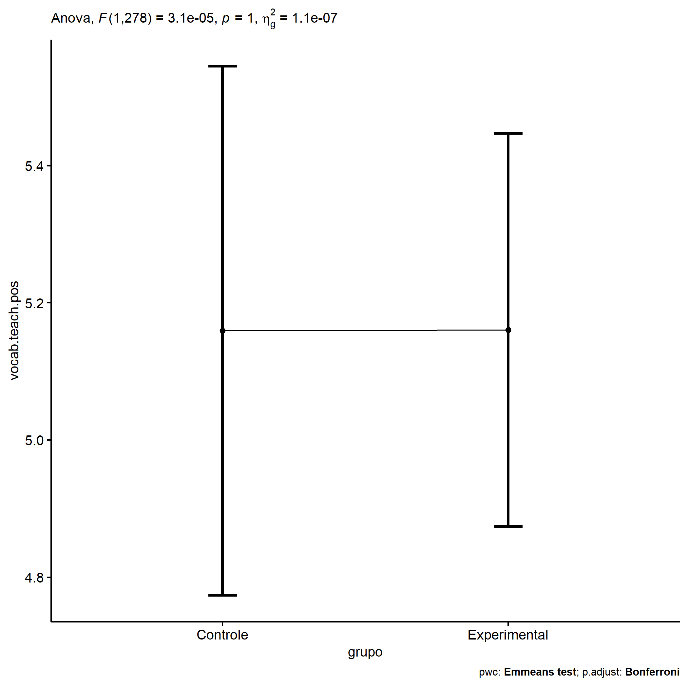<!-- -->

``` r
plots <- oneWayAncovaBoxPlots(
  wdat, "vocab.teach.pos", "grupo", aov, pwc, covar = "vocab.teach.pre",
  theme = "classic", color = color[["grupo"]],
  subtitle = which(aov$Effect == "grupo"))
```

``` r
if (length(unique(wdat[["grupo"]])) > 1)
  plots[["grupo"]] + ggplot2::ylab("Vocabulario Ensinado") + ggplot2::scale_x_discrete(labels=c('pre', 'pos'))
```

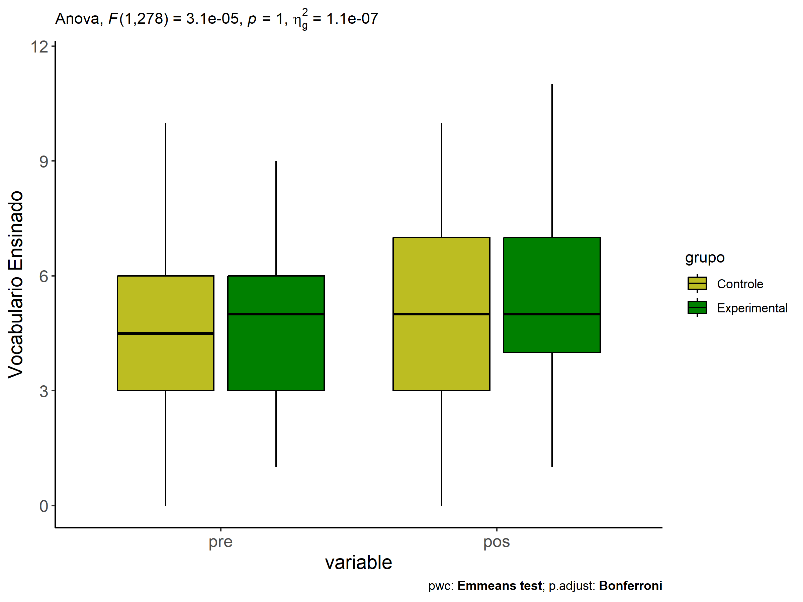<!-- -->

``` r
if (length(unique(wdat.long[["grupo"]])) > 1)
  plots <- oneWayAncovaBoxPlots(
    wdat.long, "vocab.teach", "grupo", aov, pwc.long, pre.post = "time",
    theme = "classic", color = color$prepost)
```

``` r
if (length(unique(wdat.long[["grupo"]])) > 1)
  plots[["grupo"]] + ggplot2::ylab("Vocabulario Ensinado")
```

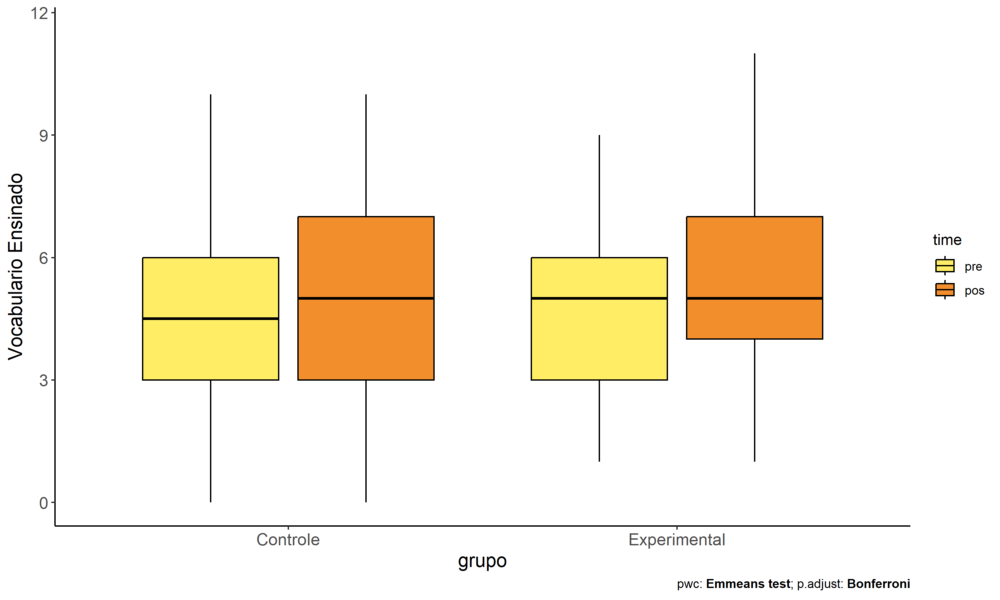<!-- -->

### Checking linearity assumption

``` r
ggscatter(wdat, x = "vocab.teach.pre", y = "vocab.teach.pos", size = 0.5,
          color = "grupo", add = "reg.line")+
  stat_regline_equation(
    aes(label =  paste(..eq.label.., ..rr.label.., sep = "~~~~"), color = grupo)
  )
```

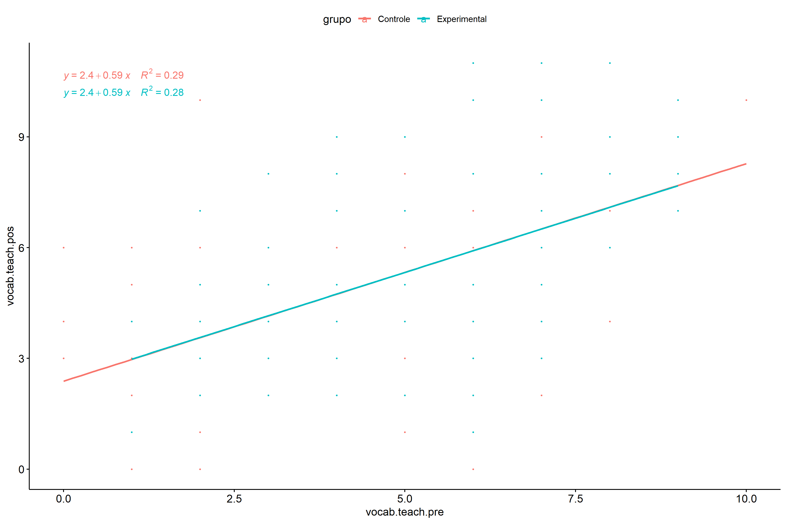<!-- -->

### Checking normality and homogeneity

``` r
res <- augment(lm(vocab.teach.pos ~ vocab.teach.pre + grupo, data = wdat))
```

``` r
shapiro_test(res$.resid)
```

    ## # A tibble: 1 × 3
    ##   variable   statistic p.value
    ##   <chr>          <dbl>   <dbl>
    ## 1 res$.resid     0.996   0.691

``` r
levene_test(res, .resid ~ grupo)
```

    ## # A tibble: 1 × 4
    ##     df1   df2 statistic     p
    ##   <int> <int>     <dbl> <dbl>
    ## 1     1   279      1.39 0.240

# ANCOVA and Pairwise for two factors **grupo:Sexo**

## Without remove non-normal data

``` r
pdat = remove_group_data(dat[!is.na(dat[["grupo"]]) & !is.na(dat[["Sexo"]]),], "vocab.teach.pos", c("grupo","Sexo"))

pdat.long <- rbind(pdat[,c("id","grupo","Sexo")], pdat[,c("id","grupo","Sexo")])
pdat.long[["time"]] <- c(rep("pre", nrow(pdat)), rep("pos", nrow(pdat)))
pdat.long[["time"]] <- factor(pdat.long[["time"]], c("pre","pos"))
pdat.long[["vocab.teach"]] <- c(pdat[["vocab.teach.pre"]], pdat[["vocab.teach.pos"]])

aov = anova_test(pdat, vocab.teach.pos ~ vocab.teach.pre + grupo*Sexo)
laov[["grupo:Sexo"]] <- get_anova_table(aov)
```

``` r
pwcs <- list()
pwcs[["Sexo"]] <- emmeans_test(
  group_by(pdat, grupo), vocab.teach.pos ~ Sexo,
  covariate = vocab.teach.pre, p.adjust.method = "bonferroni")
pwcs[["grupo"]] <- emmeans_test(
  group_by(pdat, Sexo), vocab.teach.pos ~ grupo,
  covariate = vocab.teach.pre, p.adjust.method = "bonferroni")

pwc <- plyr::rbind.fill(pwcs[["grupo"]], pwcs[["Sexo"]])
pwc <- pwc[,c("grupo","Sexo", colnames(pwc)[!colnames(pwc) %in% c("grupo","Sexo")])]
```

``` r
pwc.long <- emmeans_test(dplyr::group_by_at(pdat.long, c("grupo","Sexo")),
                         vocab.teach ~ time,
                         p.adjust.method = "bonferroni")
lpwc[["grupo:Sexo"]] <- plyr::rbind.fill(pwc, pwc.long)
```

``` r
ds <- get.descriptives(pdat, "vocab.teach.pos", c("grupo","Sexo"), covar = "vocab.teach.pre")
ds <- merge(ds[ds$variable != "vocab.teach.pre",],
            ds[ds$variable == "vocab.teach.pre", !colnames(ds) %in% c("variable")],
            by = c("grupo","Sexo"), all.x = T, suffixes = c("", ".vocab.teach.pre"))
ds <- merge(get_emmeans(pwcs[["grupo"]]), ds, by = c("grupo","Sexo"), suffixes = c(".emms", ""))
ds <- ds[,c("grupo","Sexo","n","mean.vocab.teach.pre","se.vocab.teach.pre","mean","se","emmean","se.emms")]

colnames(ds) <- c("grupo","Sexo", "N", paste0(c("M","SE")," (pre)"),
                  paste0(c("M","SE"), " (unadj)"), paste0(c("M", "SE"), " (adj)"))

lemms[["grupo:Sexo"]] <- ds
```

## Computing ANCOVA and PairWise After removing non-normal data (OK)

``` r
wdat = pdat 

res = residuals(lm(vocab.teach.pos ~ vocab.teach.pre + grupo*Sexo, data = wdat))
non.normal = getNonNormal(res, wdat$id, plimit = 0.05)

wdat = wdat[!wdat$id %in% non.normal,]

wdat.long <- rbind(wdat[,c("id","grupo","Sexo")], wdat[,c("id","grupo","Sexo")])
wdat.long[["time"]] <- c(rep("pre", nrow(wdat)), rep("pos", nrow(wdat)))
wdat.long[["time"]] <- factor(wdat.long[["time"]], c("pre","pos"))
wdat.long[["vocab.teach"]] <- c(wdat[["vocab.teach.pre"]], wdat[["vocab.teach.pos"]])


ldat[["grupo:Sexo"]] = wdat

(non.normal)
```

    ## NULL

``` r
aov = anova_test(wdat, vocab.teach.pos ~ vocab.teach.pre + grupo*Sexo)
laov[["grupo:Sexo"]] <- merge(get_anova_table(aov), laov[["grupo:Sexo"]], by="Effect", suffixes = c("","'"))

(df = get_anova_table(aov))
```

    ## ANOVA Table (type II tests)
    ## 
    ##            Effect DFn DFd         F        p p<.05      ges
    ## 1 vocab.teach.pre   1 276 107.26200 1.89e-21     * 2.80e-01
    ## 2           grupo   1 276   0.00019 9.89e-01       6.88e-07
    ## 3            Sexo   1 276   4.75900 3.00e-02     * 1.70e-02
    ## 4      grupo:Sexo   1 276   3.73300 5.40e-02       1.30e-02

| Effect          | DFn | DFd |       F |     p | p\<.05 |   ges |
|:----------------|----:|----:|--------:|------:|:-------|------:|
| vocab.teach.pre |   1 | 276 | 107.262 | 0.000 | \*     | 0.280 |
| grupo           |   1 | 276 |   0.000 | 0.989 |        | 0.000 |
| Sexo            |   1 | 276 |   4.759 | 0.030 | \*     | 0.017 |
| grupo:Sexo      |   1 | 276 |   3.733 | 0.054 |        | 0.013 |

``` r
pwcs <- list()
pwcs[["Sexo"]] <- emmeans_test(
  group_by(wdat, grupo), vocab.teach.pos ~ Sexo,
  covariate = vocab.teach.pre, p.adjust.method = "bonferroni")
pwcs[["grupo"]] <- emmeans_test(
  group_by(wdat, Sexo), vocab.teach.pos ~ grupo,
  covariate = vocab.teach.pre, p.adjust.method = "bonferroni")

pwc <- plyr::rbind.fill(pwcs[["grupo"]], pwcs[["Sexo"]])
pwc <- pwc[,c("grupo","Sexo", colnames(pwc)[!colnames(pwc) %in% c("grupo","Sexo")])]
```

| grupo        | Sexo | term                   | .y.             | group1   | group2       |  df | statistic |     p | p.adj | p.adj.signif |
|:-------------|:-----|:-----------------------|:----------------|:---------|:-------------|----:|----------:|------:|------:|:-------------|
|              | F    | vocab.teach.pre\*grupo | vocab.teach.pos | Controle | Experimental | 276 |    -1.334 | 0.183 | 0.183 | ns           |
|              | M    | vocab.teach.pre\*grupo | vocab.teach.pos | Controle | Experimental | 276 |     1.396 | 0.164 | 0.164 | ns           |
| Controle     |      | vocab.teach.pre\*Sexo  | vocab.teach.pos | F        | M            | 276 |    -0.244 | 0.807 | 0.807 | ns           |
| Experimental |      | vocab.teach.pre\*Sexo  | vocab.teach.pos | F        | M            | 276 |     2.903 | 0.004 | 0.004 | \*\*         |

``` r
pwc.long <- emmeans_test(dplyr::group_by_at(wdat.long, c("grupo","Sexo")),
                         vocab.teach ~ time,
                         p.adjust.method = "bonferroni")
lpwc[["grupo:Sexo"]] <- merge(plyr::rbind.fill(pwc, pwc.long), lpwc[["grupo:Sexo"]], by=c("grupo","Sexo","term",".y.","group1","group2"), suffixes = c("","'"))
```

| grupo        | Sexo | term | .y.         | group1 | group2 |  df | statistic |     p | p.adj | p.adj.signif |
|:-------------|:-----|:-----|:------------|:-------|:-------|----:|----------:|------:|------:|:-------------|
| Controle     | F    | time | vocab.teach | pre    | pos    | 554 |    -0.979 | 0.328 | 0.328 | ns           |
| Controle     | M    | time | vocab.teach | pre    | pos    | 554 |    -1.371 | 0.171 | 0.171 | ns           |
| Experimental | F    | time | vocab.teach | pre    | pos    | 554 |    -2.348 | 0.019 | 0.019 | \*           |
| Experimental | M    | time | vocab.teach | pre    | pos    | 554 |    -0.141 | 0.888 | 0.888 | ns           |

``` r
ds <- get.descriptives(wdat, "vocab.teach.pos", c("grupo","Sexo"), covar = "vocab.teach.pre")
ds <- merge(ds[ds$variable != "vocab.teach.pre",],
            ds[ds$variable == "vocab.teach.pre", !colnames(ds) %in% c("variable")],
            by = c("grupo","Sexo"), all.x = T, suffixes = c("", ".vocab.teach.pre"))
ds <- merge(get_emmeans(pwcs[["grupo"]]), ds, by = c("grupo","Sexo"), suffixes = c(".emms", ""))
ds <- ds[,c("grupo","Sexo","n","mean.vocab.teach.pre","se.vocab.teach.pre","mean","se","emmean","se.emms")]

colnames(ds) <- c("grupo","Sexo", "N", paste0(c("M","SE")," (pre)"),
                  paste0(c("M","SE"), " (unadj)"), paste0(c("M", "SE"), " (adj)"))

lemms[["grupo:Sexo"]] <- merge(ds, lemms[["grupo:Sexo"]], by=c("grupo","Sexo"), suffixes = c("","'"))
```

| grupo        | Sexo |   N | M (pre) | SE (pre) | M (unadj) | SE (unadj) | M (adj) | SE (adj) |
|:-------------|:-----|----:|--------:|---------:|----------:|-----------:|--------:|---------:|
| Controle     | F    |  53 |   4.679 |    0.321 |     5.094 |      0.363 |   5.113 |    0.266 |
| Controle     | M    |  47 |   4.426 |    0.331 |     5.043 |      0.347 |   5.208 |    0.283 |
| Experimental | F    |  96 |   4.958 |    0.207 |     5.698 |      0.225 |   5.555 |    0.198 |
| Experimental | M    |  85 |   4.612 |    0.202 |     4.659 |      0.222 |   4.717 |    0.210 |

### Plots for ancova

``` r
plots <- twoWayAncovaPlots(
  wdat, "vocab.teach.pos", c("grupo","Sexo"), aov, pwcs, addParam = c("mean_se"),
  font.label.size=10, step.increase=0.05, p.label="p.adj",
  subtitle = which(aov$Effect == "grupo:Sexo"))
```

``` r
if (!is.null(plots[["grupo"]]))
  plots[["grupo"]] + ggplot2::scale_color_manual(values = color[["Sexo"]])
```

    ## Scale for colour is already present.
    ## Adding another scale for colour, which will replace the existing scale.

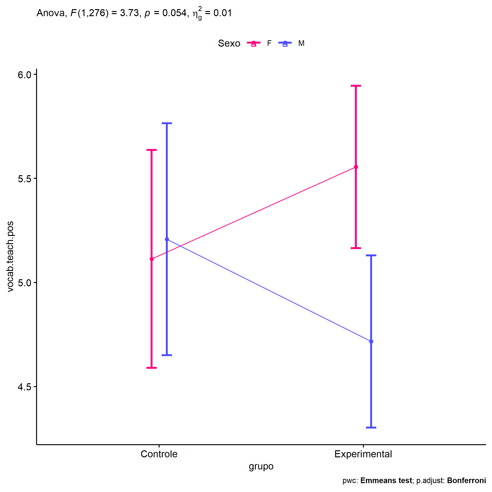<!-- -->

``` r
if (!is.null(plots[["Sexo"]]))
  plots[["Sexo"]] + ggplot2::scale_color_manual(values = color[["grupo"]])
```

    ## Scale for colour is already present.
    ## Adding another scale for colour, which will replace the existing scale.

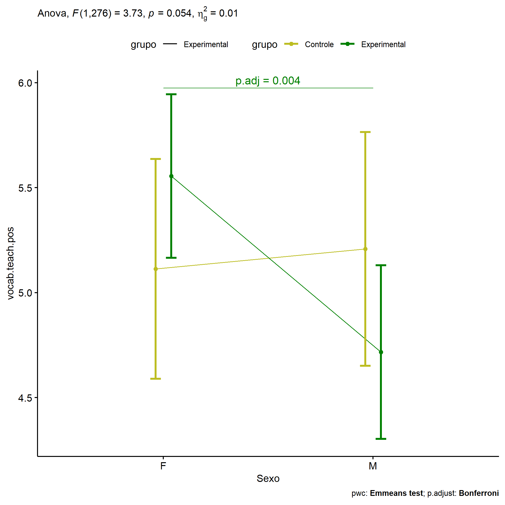<!-- -->

``` r
plots <- twoWayAncovaBoxPlots(
  wdat, "vocab.teach.pos", c("grupo","Sexo"), aov, pwcs, covar = "vocab.teach.pre",
  theme = "classic", color = color[["grupo:Sexo"]],
  subtitle = which(aov$Effect == "grupo:Sexo"))
```

``` r
plots[["grupo:Sexo"]] + ggplot2::ylab("Vocabulario Ensinado") + ggplot2::scale_x_discrete(labels=c('pre', 'pos'))
```

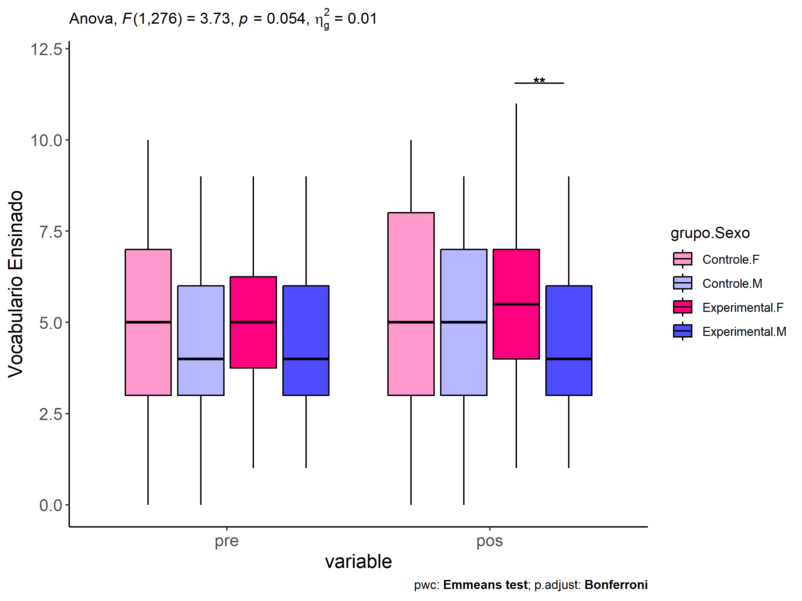<!-- -->

``` r
plots <- twoWayAncovaBoxPlots(
  wdat.long, "vocab.teach", c("grupo","Sexo"), aov, pwc.long, pre.post = "time",
  theme = "classic", color = color$prepost)
```

``` r
plots[["grupo:Sexo"]] + ggplot2::ylab("Vocabulario Ensinado")
```

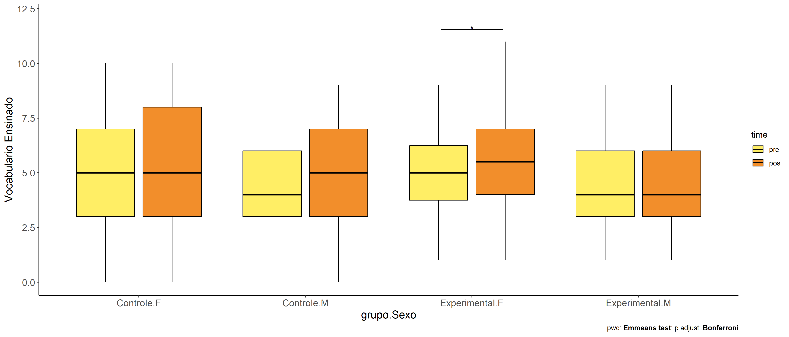<!-- -->

### Checking linearity assumption

``` r
ggscatter(wdat, x = "vocab.teach.pre", y = "vocab.teach.pos", size = 0.5,
          facet.by = c("grupo","Sexo"), add = "reg.line")+
  stat_regline_equation(
    aes(label =  paste(..eq.label.., ..rr.label.., sep = "~~~~"))
  )
```

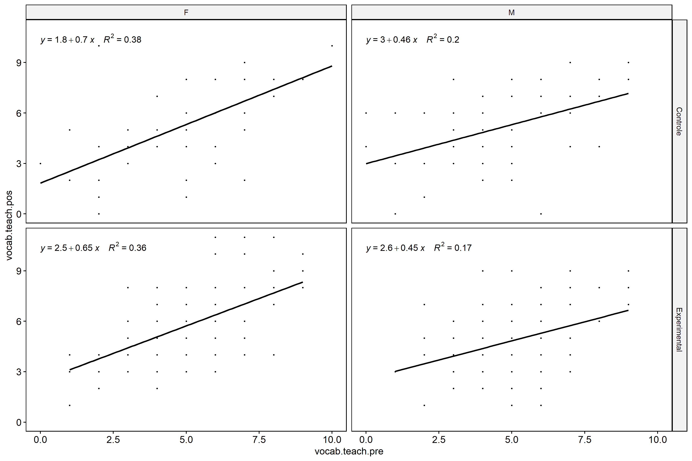<!-- -->

### Checking normality and homogeneity

``` r
res <- augment(lm(vocab.teach.pos ~ vocab.teach.pre + grupo*Sexo, data = wdat))
```

``` r
shapiro_test(res$.resid)
```

    ## # A tibble: 1 × 3
    ##   variable   statistic p.value
    ##   <chr>          <dbl>   <dbl>
    ## 1 res$.resid     0.998   0.950

``` r
levene_test(res, .resid ~ grupo*Sexo)
```

    ## # A tibble: 1 × 4
    ##     df1   df2 statistic     p
    ##   <int> <int>     <dbl> <dbl>
    ## 1     3   277     0.875 0.454

# ANCOVA and Pairwise for two factors **grupo:Zona**

## Without remove non-normal data

``` r
pdat = remove_group_data(dat[!is.na(dat[["grupo"]]) & !is.na(dat[["Zona"]]),], "vocab.teach.pos", c("grupo","Zona"))

pdat.long <- rbind(pdat[,c("id","grupo","Zona")], pdat[,c("id","grupo","Zona")])
pdat.long[["time"]] <- c(rep("pre", nrow(pdat)), rep("pos", nrow(pdat)))
pdat.long[["time"]] <- factor(pdat.long[["time"]], c("pre","pos"))
pdat.long[["vocab.teach"]] <- c(pdat[["vocab.teach.pre"]], pdat[["vocab.teach.pos"]])

aov = anova_test(pdat, vocab.teach.pos ~ vocab.teach.pre + grupo*Zona)
laov[["grupo:Zona"]] <- get_anova_table(aov)
```

``` r
pwcs <- list()
pwcs[["Zona"]] <- emmeans_test(
  group_by(pdat, grupo), vocab.teach.pos ~ Zona,
  covariate = vocab.teach.pre, p.adjust.method = "bonferroni")
pwcs[["grupo"]] <- emmeans_test(
  group_by(pdat, Zona), vocab.teach.pos ~ grupo,
  covariate = vocab.teach.pre, p.adjust.method = "bonferroni")

pwc <- plyr::rbind.fill(pwcs[["grupo"]], pwcs[["Zona"]])
pwc <- pwc[,c("grupo","Zona", colnames(pwc)[!colnames(pwc) %in% c("grupo","Zona")])]
```

``` r
pwc.long <- emmeans_test(dplyr::group_by_at(pdat.long, c("grupo","Zona")),
                         vocab.teach ~ time,
                         p.adjust.method = "bonferroni")
lpwc[["grupo:Zona"]] <- plyr::rbind.fill(pwc, pwc.long)
```

``` r
ds <- get.descriptives(pdat, "vocab.teach.pos", c("grupo","Zona"), covar = "vocab.teach.pre")
ds <- merge(ds[ds$variable != "vocab.teach.pre",],
            ds[ds$variable == "vocab.teach.pre", !colnames(ds) %in% c("variable")],
            by = c("grupo","Zona"), all.x = T, suffixes = c("", ".vocab.teach.pre"))
ds <- merge(get_emmeans(pwcs[["grupo"]]), ds, by = c("grupo","Zona"), suffixes = c(".emms", ""))
ds <- ds[,c("grupo","Zona","n","mean.vocab.teach.pre","se.vocab.teach.pre","mean","se","emmean","se.emms")]

colnames(ds) <- c("grupo","Zona", "N", paste0(c("M","SE")," (pre)"),
                  paste0(c("M","SE"), " (unadj)"), paste0(c("M", "SE"), " (adj)"))

lemms[["grupo:Zona"]] <- ds
```

## Computing ANCOVA and PairWise After removing non-normal data (OK)

``` r
wdat = pdat 

res = residuals(lm(vocab.teach.pos ~ vocab.teach.pre + grupo*Zona, data = wdat))
non.normal = getNonNormal(res, wdat$id, plimit = 0.05)

wdat = wdat[!wdat$id %in% non.normal,]

wdat.long <- rbind(wdat[,c("id","grupo","Zona")], wdat[,c("id","grupo","Zona")])
wdat.long[["time"]] <- c(rep("pre", nrow(wdat)), rep("pos", nrow(wdat)))
wdat.long[["time"]] <- factor(wdat.long[["time"]], c("pre","pos"))
wdat.long[["vocab.teach"]] <- c(wdat[["vocab.teach.pre"]], wdat[["vocab.teach.pos"]])


ldat[["grupo:Zona"]] = wdat

(non.normal)
```

    ## NULL

``` r
aov = anova_test(wdat, vocab.teach.pos ~ vocab.teach.pre + grupo*Zona)
laov[["grupo:Zona"]] <- merge(get_anova_table(aov), laov[["grupo:Zona"]], by="Effect", suffixes = c("","'"))

(df = get_anova_table(aov))
```

    ## ANOVA Table (type II tests)
    ## 
    ##            Effect DFn DFd      F        p p<.05     ges
    ## 1 vocab.teach.pre   1 140 63.234 5.55e-13     * 0.31100
    ## 2           grupo   1 140  0.199 6.56e-01       0.00100
    ## 3            Zona   1 140  5.056 2.60e-02     * 0.03500
    ## 4      grupo:Zona   1 140  0.087 7.69e-01       0.00062

| Effect          | DFn | DFd |      F |     p | p\<.05 |   ges |
|:----------------|----:|----:|-------:|------:|:-------|------:|
| vocab.teach.pre |   1 | 140 | 63.234 | 0.000 | \*     | 0.311 |
| grupo           |   1 | 140 |  0.199 | 0.656 |        | 0.001 |
| Zona            |   1 | 140 |  5.056 | 0.026 | \*     | 0.035 |
| grupo:Zona      |   1 | 140 |  0.087 | 0.769 |        | 0.001 |

``` r
pwcs <- list()
pwcs[["Zona"]] <- emmeans_test(
  group_by(wdat, grupo), vocab.teach.pos ~ Zona,
  covariate = vocab.teach.pre, p.adjust.method = "bonferroni")
pwcs[["grupo"]] <- emmeans_test(
  group_by(wdat, Zona), vocab.teach.pos ~ grupo,
  covariate = vocab.teach.pre, p.adjust.method = "bonferroni")

pwc <- plyr::rbind.fill(pwcs[["grupo"]], pwcs[["Zona"]])
pwc <- pwc[,c("grupo","Zona", colnames(pwc)[!colnames(pwc) %in% c("grupo","Zona")])]
```

| grupo        | Zona   | term                   | .y.             | group1   | group2       |  df | statistic |     p | p.adj | p.adj.signif |
|:-------------|:-------|:-----------------------|:----------------|:---------|:-------------|----:|----------:|------:|------:|:-------------|
|              | Rural  | vocab.teach.pre\*grupo | vocab.teach.pos | Controle | Experimental | 140 |    -0.534 | 0.594 | 0.594 | ns           |
|              | Urbana | vocab.teach.pre\*grupo | vocab.teach.pos | Controle | Experimental | 140 |    -0.021 | 0.984 | 0.984 | ns           |
| Controle     |        | vocab.teach.pre\*Zona  | vocab.teach.pos | Rural    | Urbana       | 140 |    -1.602 | 0.111 | 0.111 | ns           |
| Experimental |        | vocab.teach.pre\*Zona  | vocab.teach.pos | Rural    | Urbana       | 140 |    -1.608 | 0.110 | 0.110 | ns           |

``` r
pwc.long <- emmeans_test(dplyr::group_by_at(wdat.long, c("grupo","Zona")),
                         vocab.teach ~ time,
                         p.adjust.method = "bonferroni")
lpwc[["grupo:Zona"]] <- merge(plyr::rbind.fill(pwc, pwc.long), lpwc[["grupo:Zona"]], by=c("grupo","Zona","term",".y.","group1","group2"), suffixes = c("","'"))
```

| grupo        | Zona   | term | .y.         | group1 | group2 |  df | statistic |     p | p.adj | p.adj.signif |
|:-------------|:-------|:-----|:------------|:-------|:-------|----:|----------:|------:|------:|:-------------|
| Controle     | Rural  | time | vocab.teach | pre    | pos    | 282 |    -0.373 | 0.710 | 0.710 | ns           |
| Controle     | Urbana | time | vocab.teach | pre    | pos    | 282 |    -1.701 | 0.090 | 0.090 | ns           |
| Experimental | Rural  | time | vocab.teach | pre    | pos    | 282 |    -0.877 | 0.381 | 0.381 | ns           |
| Experimental | Urbana | time | vocab.teach | pre    | pos    | 282 |    -2.056 | 0.041 | 0.041 | \*           |

``` r
ds <- get.descriptives(wdat, "vocab.teach.pos", c("grupo","Zona"), covar = "vocab.teach.pre")
ds <- merge(ds[ds$variable != "vocab.teach.pre",],
            ds[ds$variable == "vocab.teach.pre", !colnames(ds) %in% c("variable")],
            by = c("grupo","Zona"), all.x = T, suffixes = c("", ".vocab.teach.pre"))
ds <- merge(get_emmeans(pwcs[["grupo"]]), ds, by = c("grupo","Zona"), suffixes = c(".emms", ""))
ds <- ds[,c("grupo","Zona","n","mean.vocab.teach.pre","se.vocab.teach.pre","mean","se","emmean","se.emms")]

colnames(ds) <- c("grupo","Zona", "N", paste0(c("M","SE")," (pre)"),
                  paste0(c("M","SE"), " (unadj)"), paste0(c("M", "SE"), " (adj)"))

lemms[["grupo:Zona"]] <- merge(ds, lemms[["grupo:Zona"]], by=c("grupo","Zona"), suffixes = c("","'"))
```

| grupo        | Zona   |   N | M (pre) | SE (pre) | M (unadj) | SE (unadj) | M (adj) | SE (adj) |
|:-------------|:-------|----:|--------:|---------:|----------:|-----------:|--------:|---------:|
| Controle     | Rural  |  38 |   4.658 |    0.318 |     4.842 |      0.414 |   4.836 |    0.313 |
| Controle     | Urbana |  18 |   4.222 |    0.592 |     5.444 |      0.561 |   5.723 |    0.457 |
| Experimental | Rural  |  56 |   4.786 |    0.268 |     5.143 |      0.300 |   5.053 |    0.258 |
| Experimental | Urbana |  33 |   4.636 |    0.275 |     5.727 |      0.370 |   5.735 |    0.336 |

### Plots for ancova

``` r
plots <- twoWayAncovaPlots(
  wdat, "vocab.teach.pos", c("grupo","Zona"), aov, pwcs, addParam = c("mean_se"),
  font.label.size=10, step.increase=0.05, p.label="p.adj",
  subtitle = which(aov$Effect == "grupo:Zona"))
```

``` r
if (!is.null(plots[["grupo"]]))
  plots[["grupo"]] + ggplot2::scale_color_manual(values = color[["Zona"]])
```

    ## Scale for colour is already present.
    ## Adding another scale for colour, which will replace the existing scale.

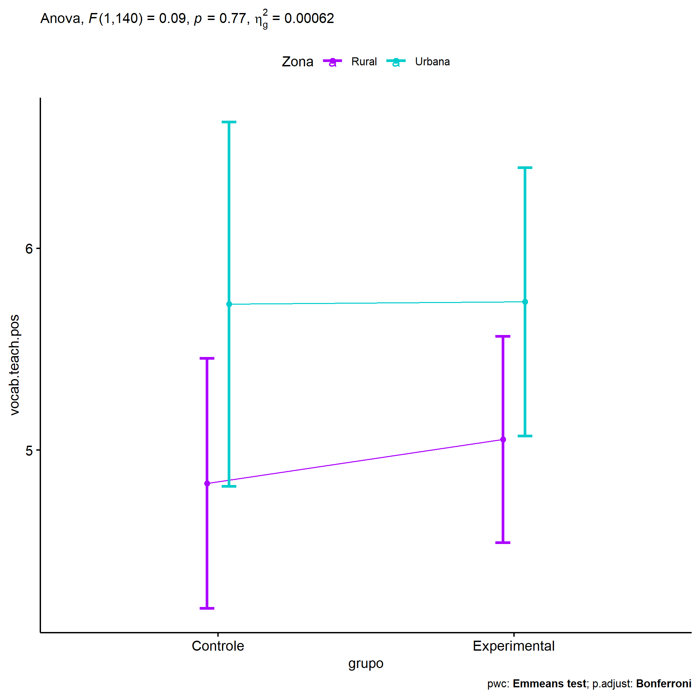<!-- -->

``` r
if (!is.null(plots[["Zona"]]))
  plots[["Zona"]] + ggplot2::scale_color_manual(values = color[["grupo"]])
```

    ## Scale for colour is already present.
    ## Adding another scale for colour, which will replace the existing scale.

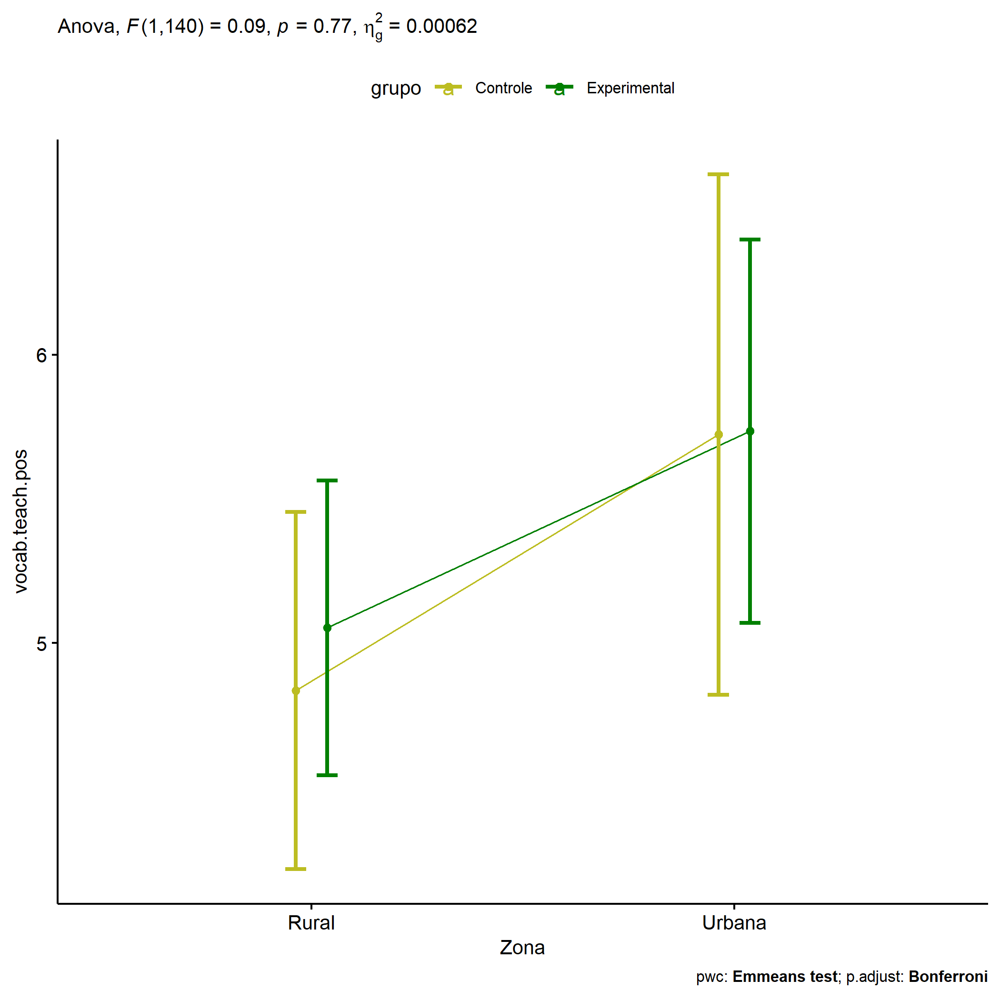<!-- -->

``` r
plots <- twoWayAncovaBoxPlots(
  wdat, "vocab.teach.pos", c("grupo","Zona"), aov, pwcs, covar = "vocab.teach.pre",
  theme = "classic", color = color[["grupo:Zona"]],
  subtitle = which(aov$Effect == "grupo:Zona"))
```

``` r
plots[["grupo:Zona"]] + ggplot2::ylab("Vocabulario Ensinado") + ggplot2::scale_x_discrete(labels=c('pre', 'pos'))
```

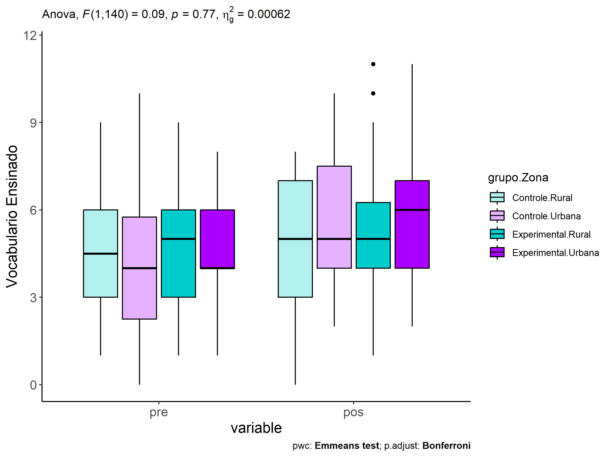<!-- -->

``` r
plots <- twoWayAncovaBoxPlots(
  wdat.long, "vocab.teach", c("grupo","Zona"), aov, pwc.long, pre.post = "time",
  theme = "classic", color = color$prepost)
```

``` r
plots[["grupo:Zona"]] + ggplot2::ylab("Vocabulario Ensinado")
```

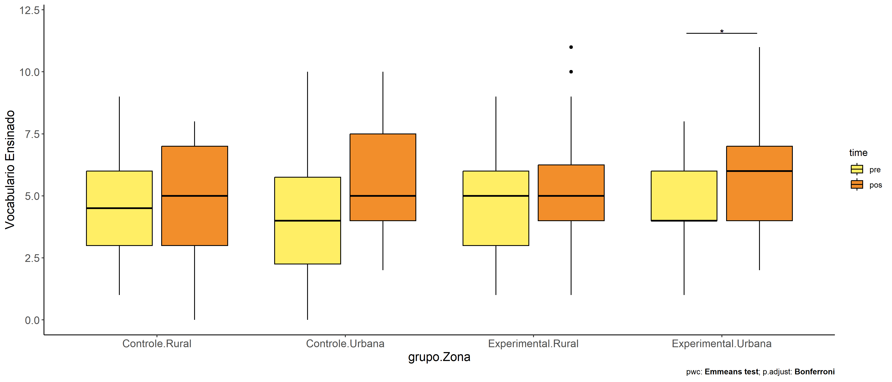<!-- -->

### Checking linearity assumption

``` r
ggscatter(wdat, x = "vocab.teach.pre", y = "vocab.teach.pos", size = 0.5,
          facet.by = c("grupo","Zona"), add = "reg.line")+
  stat_regline_equation(
    aes(label =  paste(..eq.label.., ..rr.label.., sep = "~~~~"))
  )
```

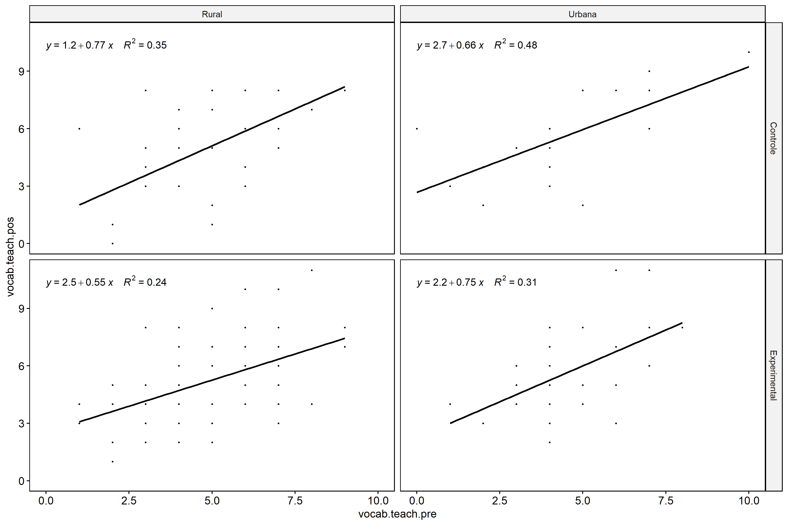<!-- -->

### Checking normality and homogeneity

``` r
res <- augment(lm(vocab.teach.pos ~ vocab.teach.pre + grupo*Zona, data = wdat))
```

``` r
shapiro_test(res$.resid)
```

    ## # A tibble: 1 × 3
    ##   variable   statistic p.value
    ##   <chr>          <dbl>   <dbl>
    ## 1 res$.resid     0.985   0.132

``` r
levene_test(res, .resid ~ grupo*Zona)
```

    ## # A tibble: 1 × 4
    ##     df1   df2 statistic     p
    ##   <int> <int>     <dbl> <dbl>
    ## 1     3   141      1.04 0.377

# ANCOVA and Pairwise for two factors **grupo:Cor.Raca**

## Without remove non-normal data

``` r
pdat = remove_group_data(dat[!is.na(dat[["grupo"]]) & !is.na(dat[["Cor.Raca"]]),], "vocab.teach.pos", c("grupo","Cor.Raca"))
```

    ## Warning: There were 2 warnings in `mutate()`.
    ## The first warning was:
    ## ℹ In argument: `ci = abs(stats::qt(alpha/2, .data$n - 1) * .data$se)`.
    ## Caused by warning:
    ## ! There was 1 warning in `mutate()`.
    ## ℹ In argument: `ci = abs(stats::qt(alpha/2, .data$n - 1) * .data$se)`.
    ## Caused by warning in `stats::qt()`:
    ## ! NaNs produced
    ## ℹ Run `dplyr::last_dplyr_warnings()` to see the 1 remaining warning.

``` r
pdat.long <- rbind(pdat[,c("id","grupo","Cor.Raca")], pdat[,c("id","grupo","Cor.Raca")])
pdat.long[["time"]] <- c(rep("pre", nrow(pdat)), rep("pos", nrow(pdat)))
pdat.long[["time"]] <- factor(pdat.long[["time"]], c("pre","pos"))
pdat.long[["vocab.teach"]] <- c(pdat[["vocab.teach.pre"]], pdat[["vocab.teach.pos"]])

aov = anova_test(pdat, vocab.teach.pos ~ vocab.teach.pre + grupo*Cor.Raca)
laov[["grupo:Cor.Raca"]] <- get_anova_table(aov)
```

``` r
pwcs <- list()
pwcs[["Cor.Raca"]] <- emmeans_test(
  group_by(pdat, grupo), vocab.teach.pos ~ Cor.Raca,
  covariate = vocab.teach.pre, p.adjust.method = "bonferroni")
pwcs[["grupo"]] <- emmeans_test(
  group_by(pdat, Cor.Raca), vocab.teach.pos ~ grupo,
  covariate = vocab.teach.pre, p.adjust.method = "bonferroni")

pwc <- plyr::rbind.fill(pwcs[["grupo"]], pwcs[["Cor.Raca"]])
pwc <- pwc[,c("grupo","Cor.Raca", colnames(pwc)[!colnames(pwc) %in% c("grupo","Cor.Raca")])]
```

``` r
pwc.long <- emmeans_test(dplyr::group_by_at(pdat.long, c("grupo","Cor.Raca")),
                         vocab.teach ~ time,
                         p.adjust.method = "bonferroni")
lpwc[["grupo:Cor.Raca"]] <- plyr::rbind.fill(pwc, pwc.long)
```

``` r
ds <- get.descriptives(pdat, "vocab.teach.pos", c("grupo","Cor.Raca"), covar = "vocab.teach.pre")
ds <- merge(ds[ds$variable != "vocab.teach.pre",],
            ds[ds$variable == "vocab.teach.pre", !colnames(ds) %in% c("variable")],
            by = c("grupo","Cor.Raca"), all.x = T, suffixes = c("", ".vocab.teach.pre"))
ds <- merge(get_emmeans(pwcs[["grupo"]]), ds, by = c("grupo","Cor.Raca"), suffixes = c(".emms", ""))
ds <- ds[,c("grupo","Cor.Raca","n","mean.vocab.teach.pre","se.vocab.teach.pre","mean","se","emmean","se.emms")]

colnames(ds) <- c("grupo","Cor.Raca", "N", paste0(c("M","SE")," (pre)"),
                  paste0(c("M","SE"), " (unadj)"), paste0(c("M", "SE"), " (adj)"))

lemms[["grupo:Cor.Raca"]] <- ds
```

## Computing ANCOVA and PairWise After removing non-normal data (OK)

``` r
wdat = pdat 

res = residuals(lm(vocab.teach.pos ~ vocab.teach.pre + grupo*Cor.Raca, data = wdat))
non.normal = getNonNormal(res, wdat$id, plimit = 0.05)

wdat = wdat[!wdat$id %in% non.normal,]

wdat.long <- rbind(wdat[,c("id","grupo","Cor.Raca")], wdat[,c("id","grupo","Cor.Raca")])
wdat.long[["time"]] <- c(rep("pre", nrow(wdat)), rep("pos", nrow(wdat)))
wdat.long[["time"]] <- factor(wdat.long[["time"]], c("pre","pos"))
wdat.long[["vocab.teach"]] <- c(wdat[["vocab.teach.pre"]], wdat[["vocab.teach.pos"]])


ldat[["grupo:Cor.Raca"]] = wdat

(non.normal)
```

    ## NULL

``` r
aov = anova_test(wdat, vocab.teach.pos ~ vocab.teach.pre + grupo*Cor.Raca)
laov[["grupo:Cor.Raca"]] <- merge(get_anova_table(aov), laov[["grupo:Cor.Raca"]], by="Effect", suffixes = c("","'"))

(df = get_anova_table(aov))
```

    ## ANOVA Table (type II tests)
    ## 
    ##            Effect DFn DFd      F        p p<.05   ges
    ## 1 vocab.teach.pre   1 106 48.953 2.46e-10     * 0.316
    ## 2           grupo   1 106  0.857 3.57e-01       0.008
    ## 3        Cor.Raca   1 106  0.410 5.23e-01       0.004
    ## 4  grupo:Cor.Raca   0 106     NA       NA  <NA>    NA

| Effect          | DFn | DFd |      F |     p | p\<.05 |   ges |
|:----------------|----:|----:|-------:|------:|:-------|------:|
| vocab.teach.pre |   1 | 106 | 48.953 | 0.000 | \*     | 0.316 |
| grupo           |   1 | 106 |  0.857 | 0.357 |        | 0.008 |
| Cor.Raca        |   1 | 106 |  0.410 | 0.523 |        | 0.004 |
| grupo:Cor.Raca  |   0 | 106 |        |       |        |       |

``` r
pwcs <- list()
pwcs[["Cor.Raca"]] <- emmeans_test(
  group_by(wdat, grupo), vocab.teach.pos ~ Cor.Raca,
  covariate = vocab.teach.pre, p.adjust.method = "bonferroni")
pwcs[["grupo"]] <- emmeans_test(
  group_by(wdat, Cor.Raca), vocab.teach.pos ~ grupo,
  covariate = vocab.teach.pre, p.adjust.method = "bonferroni")

pwc <- plyr::rbind.fill(pwcs[["grupo"]], pwcs[["Cor.Raca"]])
pwc <- pwc[,c("grupo","Cor.Raca", colnames(pwc)[!colnames(pwc) %in% c("grupo","Cor.Raca")])]
```

| grupo        | Cor.Raca | term                      | .y.             | group1   | group2       |  df | statistic |     p | p.adj | p.adj.signif |
|:-------------|:---------|:--------------------------|:----------------|:---------|:-------------|----:|----------:|------:|------:|:-------------|
|              | Branca   | vocab.teach.pre\*grupo    | vocab.teach.pos | Controle | Experimental |     |           |       |       |              |
|              | Parda    | vocab.teach.pre\*grupo    | vocab.teach.pos | Controle | Experimental | 106 |    -0.926 | 0.357 | 0.357 | ns           |
| Controle     |          | vocab.teach.pre\*Cor.Raca | vocab.teach.pos | Branca   | Parda        |     |           |       |       |              |
| Experimental |          | vocab.teach.pre\*Cor.Raca | vocab.teach.pos | Branca   | Parda        | 106 |    -0.640 | 0.523 | 0.523 | ns           |

``` r
pwc.long <- emmeans_test(dplyr::group_by_at(wdat.long, c("grupo","Cor.Raca")),
                         vocab.teach ~ time,
                         p.adjust.method = "bonferroni")
lpwc[["grupo:Cor.Raca"]] <- merge(plyr::rbind.fill(pwc, pwc.long), lpwc[["grupo:Cor.Raca"]], by=c("grupo","Cor.Raca","term",".y.","group1","group2"), suffixes = c("","'"))
```

| grupo        | Cor.Raca | term | .y.         | group1 | group2 |  df | statistic |     p | p.adj | p.adj.signif |
|:-------------|:---------|:-----|:------------|:-------|:-------|----:|----------:|------:|------:|:-------------|
| Controle     | Branca   | time | vocab.teach | pre    | pos    |     |           |       |       |              |
| Controle     | Parda    | time | vocab.teach | pre    | pos    | 214 |    -0.368 | 0.713 | 0.713 | ns           |
| Experimental | Branca   | time | vocab.teach | pre    | pos    | 214 |    -0.223 | 0.824 | 0.824 | ns           |
| Experimental | Parda    | time | vocab.teach | pre    | pos    | 214 |    -1.470 | 0.143 | 0.143 | ns           |

``` r
ds <- get.descriptives(wdat, "vocab.teach.pos", c("grupo","Cor.Raca"), covar = "vocab.teach.pre")
ds <- merge(ds[ds$variable != "vocab.teach.pre",],
            ds[ds$variable == "vocab.teach.pre", !colnames(ds) %in% c("variable")],
            by = c("grupo","Cor.Raca"), all.x = T, suffixes = c("", ".vocab.teach.pre"))
ds <- merge(get_emmeans(pwcs[["grupo"]]), ds, by = c("grupo","Cor.Raca"), suffixes = c(".emms", ""))
ds <- ds[,c("grupo","Cor.Raca","n","mean.vocab.teach.pre","se.vocab.teach.pre","mean","se","emmean","se.emms")]

colnames(ds) <- c("grupo","Cor.Raca", "N", paste0(c("M","SE")," (pre)"),
                  paste0(c("M","SE"), " (unadj)"), paste0(c("M", "SE"), " (adj)"))

lemms[["grupo:Cor.Raca"]] <- merge(ds, lemms[["grupo:Cor.Raca"]], by=c("grupo","Cor.Raca"), suffixes = c("","'"))
```

| grupo        | Cor.Raca |   N | M (pre) | SE (pre) | M (unadj) | SE (unadj) | M (adj) | SE (adj) |
|:-------------|:---------|----:|--------:|---------:|----------:|-----------:|--------:|---------:|
| Controle     | Parda    |  38 |   4.789 |    0.297 |     4.974 |      0.419 |   4.955 |    0.326 |
| Experimental | Branca   |  19 |   5.053 |    0.401 |     5.211 |      0.499 |   5.006 |    0.461 |
| Experimental | Parda    |  53 |   4.642 |    0.279 |     5.264 |      0.326 |   5.351 |    0.276 |

### Plots for ancova

``` r
plots <- twoWayAncovaPlots(
  wdat, "vocab.teach.pos", c("grupo","Cor.Raca"), aov, pwcs, addParam = c("mean_se"),
  font.label.size=10, step.increase=0.05, p.label="p.adj",
  subtitle = which(aov$Effect == "grupo:Cor.Raca"))
```

``` r
if (!is.null(plots[["grupo"]]))
  plots[["grupo"]] + ggplot2::scale_color_manual(values = color[["Cor.Raca"]])
```

<!-- -->

``` r
if (!is.null(plots[["Cor.Raca"]]))
  plots[["Cor.Raca"]] + ggplot2::scale_color_manual(values = color[["grupo"]])
```

<!-- -->

``` r
plots <- twoWayAncovaBoxPlots(
  wdat, "vocab.teach.pos", c("grupo","Cor.Raca"), aov, pwcs, covar = "vocab.teach.pre",
  theme = "classic", color = color[["grupo:Cor.Raca"]],
  subtitle = which(aov$Effect == "grupo:Cor.Raca"))
```

``` r
plots[["grupo:Cor.Raca"]] + ggplot2::ylab("Vocabulario Ensinado") + ggplot2::scale_x_discrete(labels=c('pre', 'pos'))
```

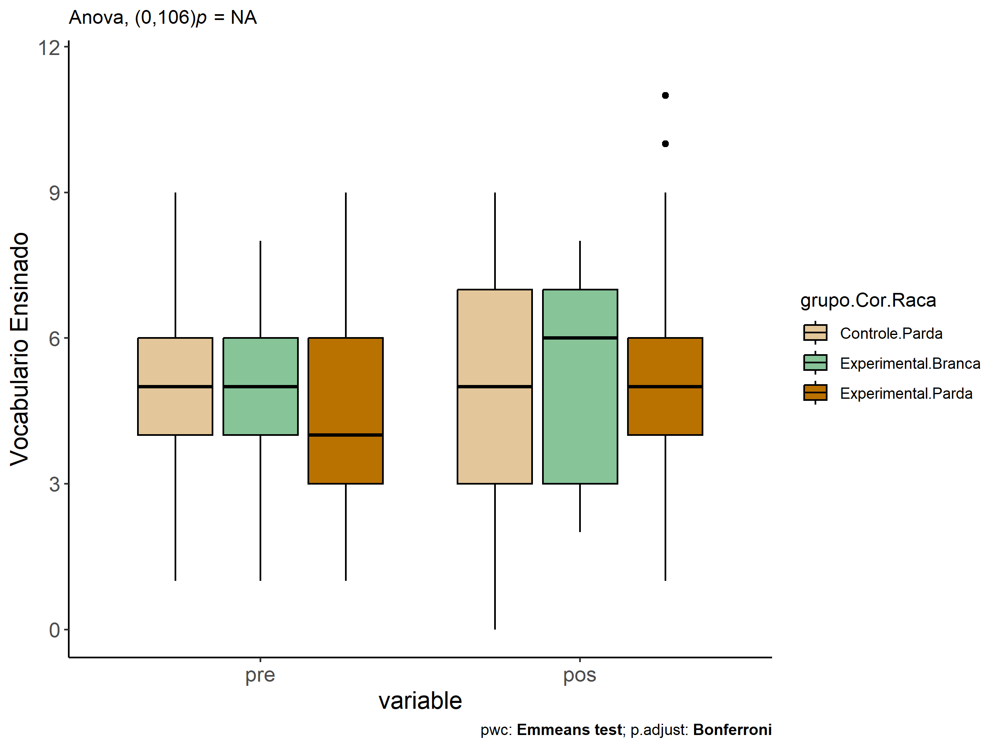<!-- -->

``` r
plots <- twoWayAncovaBoxPlots(
  wdat.long, "vocab.teach", c("grupo","Cor.Raca"), aov, pwc.long, pre.post = "time",
  theme = "classic", color = color$prepost)
```

``` r
plots[["grupo:Cor.Raca"]] + ggplot2::ylab("Vocabulario Ensinado")
```

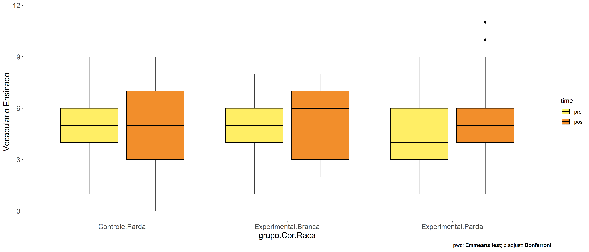<!-- -->

### Checking linearity assumption

``` r
ggscatter(wdat, x = "vocab.teach.pre", y = "vocab.teach.pos", size = 0.5,
          facet.by = c("grupo","Cor.Raca"), add = "reg.line")+
  stat_regline_equation(
    aes(label =  paste(..eq.label.., ..rr.label.., sep = "~~~~"))
  )
```

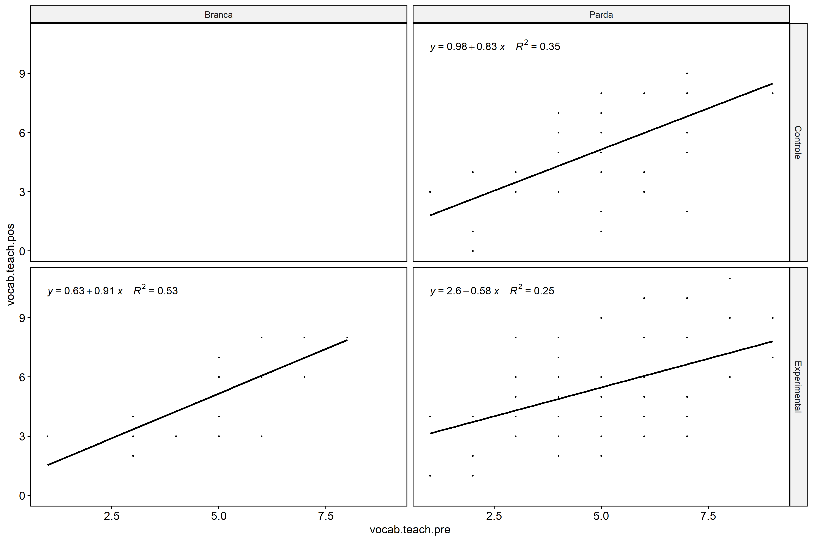<!-- -->

### Checking normality and homogeneity

``` r
res <- augment(lm(vocab.teach.pos ~ vocab.teach.pre + grupo*Cor.Raca, data = wdat))
```

``` r
shapiro_test(res$.resid)
```

    ## # A tibble: 1 × 3
    ##   variable   statistic p.value
    ##   <chr>          <dbl>   <dbl>
    ## 1 res$.resid     0.985   0.235

``` r
levene_test(res, .resid ~ grupo*Cor.Raca)
```

    ## # A tibble: 1 × 4
    ##     df1   df2 statistic     p
    ##   <int> <int>     <dbl> <dbl>
    ## 1     2   107      1.26 0.288

# ANCOVA and Pairwise for two factors **grupo:vocab.teach.quintile**

## Without remove non-normal data

``` r
pdat = remove_group_data(dat[!is.na(dat[["grupo"]]) & !is.na(dat[["vocab.teach.quintile"]]),], "vocab.teach.pos", c("grupo","vocab.teach.quintile"))

pdat.long <- rbind(pdat[,c("id","grupo","vocab.teach.quintile")], pdat[,c("id","grupo","vocab.teach.quintile")])
pdat.long[["time"]] <- c(rep("pre", nrow(pdat)), rep("pos", nrow(pdat)))
pdat.long[["time"]] <- factor(pdat.long[["time"]], c("pre","pos"))
pdat.long[["vocab.teach"]] <- c(pdat[["vocab.teach.pre"]], pdat[["vocab.teach.pos"]])

aov = anova_test(pdat, vocab.teach.pos ~ vocab.teach.pre + grupo*vocab.teach.quintile)
laov[["grupo:vocab.teach.quintile"]] <- get_anova_table(aov)
```

``` r
pwcs <- list()
pwcs[["vocab.teach.quintile"]] <- emmeans_test(
  group_by(pdat, grupo), vocab.teach.pos ~ vocab.teach.quintile,
  covariate = vocab.teach.pre, p.adjust.method = "bonferroni")
pwcs[["grupo"]] <- emmeans_test(
  group_by(pdat, vocab.teach.quintile), vocab.teach.pos ~ grupo,
  covariate = vocab.teach.pre, p.adjust.method = "bonferroni")

pwc <- plyr::rbind.fill(pwcs[["grupo"]], pwcs[["vocab.teach.quintile"]])
pwc <- pwc[,c("grupo","vocab.teach.quintile", colnames(pwc)[!colnames(pwc) %in% c("grupo","vocab.teach.quintile")])]
```

``` r
pwc.long <- emmeans_test(dplyr::group_by_at(pdat.long, c("grupo","vocab.teach.quintile")),
                         vocab.teach ~ time,
                         p.adjust.method = "bonferroni")
lpwc[["grupo:vocab.teach.quintile"]] <- plyr::rbind.fill(pwc, pwc.long)
```

``` r
ds <- get.descriptives(pdat, "vocab.teach.pos", c("grupo","vocab.teach.quintile"), covar = "vocab.teach.pre")
ds <- merge(ds[ds$variable != "vocab.teach.pre",],
            ds[ds$variable == "vocab.teach.pre", !colnames(ds) %in% c("variable")],
            by = c("grupo","vocab.teach.quintile"), all.x = T, suffixes = c("", ".vocab.teach.pre"))
ds <- merge(get_emmeans(pwcs[["grupo"]]), ds, by = c("grupo","vocab.teach.quintile"), suffixes = c(".emms", ""))
ds <- ds[,c("grupo","vocab.teach.quintile","n","mean.vocab.teach.pre","se.vocab.teach.pre","mean","se","emmean","se.emms")]

colnames(ds) <- c("grupo","vocab.teach.quintile", "N", paste0(c("M","SE")," (pre)"),
                  paste0(c("M","SE"), " (unadj)"), paste0(c("M", "SE"), " (adj)"))

lemms[["grupo:vocab.teach.quintile"]] <- ds
```

## Computing ANCOVA and PairWise After removing non-normal data (OK)

``` r
wdat = pdat 

res = residuals(lm(vocab.teach.pos ~ vocab.teach.pre + grupo*vocab.teach.quintile, data = wdat))
non.normal = getNonNormal(res, wdat$id, plimit = 0.05)

wdat = wdat[!wdat$id %in% non.normal,]

wdat.long <- rbind(wdat[,c("id","grupo","vocab.teach.quintile")], wdat[,c("id","grupo","vocab.teach.quintile")])
wdat.long[["time"]] <- c(rep("pre", nrow(wdat)), rep("pos", nrow(wdat)))
wdat.long[["time"]] <- factor(wdat.long[["time"]], c("pre","pos"))
wdat.long[["vocab.teach"]] <- c(wdat[["vocab.teach.pre"]], wdat[["vocab.teach.pos"]])


ldat[["grupo:vocab.teach.quintile"]] = wdat

(non.normal)
```

    ## NULL

``` r
aov = anova_test(wdat, vocab.teach.pos ~ vocab.teach.pre + grupo*vocab.teach.quintile)
laov[["grupo:vocab.teach.quintile"]] <- merge(get_anova_table(aov), laov[["grupo:vocab.teach.quintile"]], by="Effect", suffixes = c("","'"))

(df = get_anova_table(aov))
```

    ## ANOVA Table (type II tests)
    ## 
    ##                       Effect DFn DFd       F     p p<.05      ges
    ## 1            vocab.teach.pre   1 270 4.91600 0.027     * 1.80e-02
    ## 2                      grupo   1 270 0.00068 0.979       2.52e-06
    ## 3       vocab.teach.quintile   4 270 1.02500 0.395       1.50e-02
    ## 4 grupo:vocab.teach.quintile   4 270 0.24400 0.913       4.00e-03

| Effect                     | DFn | DFd |     F |     p | p\<.05 |   ges |
|:---------------------------|----:|----:|------:|------:|:-------|------:|
| vocab.teach.pre            |   1 | 270 | 4.916 | 0.027 | \*     | 0.018 |
| grupo                      |   1 | 270 | 0.001 | 0.979 |        | 0.000 |
| vocab.teach.quintile       |   4 | 270 | 1.025 | 0.395 |        | 0.015 |
| grupo:vocab.teach.quintile |   4 | 270 | 0.244 | 0.913 |        | 0.004 |

``` r
pwcs <- list()
pwcs[["vocab.teach.quintile"]] <- emmeans_test(
  group_by(wdat, grupo), vocab.teach.pos ~ vocab.teach.quintile,
  covariate = vocab.teach.pre, p.adjust.method = "bonferroni")
pwcs[["grupo"]] <- emmeans_test(
  group_by(wdat, vocab.teach.quintile), vocab.teach.pos ~ grupo,
  covariate = vocab.teach.pre, p.adjust.method = "bonferroni")

pwc <- plyr::rbind.fill(pwcs[["grupo"]], pwcs[["vocab.teach.quintile"]])
pwc <- pwc[,c("grupo","vocab.teach.quintile", colnames(pwc)[!colnames(pwc) %in% c("grupo","vocab.teach.quintile")])]
```

| grupo        | vocab.teach.quintile | term                                  | .y.             | group1       | group2       |  df | statistic |     p | p.adj | p.adj.signif |
|:-------------|:---------------------|:--------------------------------------|:----------------|:-------------|:-------------|----:|----------:|------:|------:|:-------------|
|              | 1st quintile         | vocab.teach.pre\*grupo                | vocab.teach.pos | Controle     | Experimental | 270 |    -0.386 | 0.700 | 0.700 | ns           |
|              | 2nd quintile         | vocab.teach.pre\*grupo                | vocab.teach.pos | Controle     | Experimental | 270 |     0.491 | 0.624 | 0.624 | ns           |
|              | 3rd quintile         | vocab.teach.pre\*grupo                | vocab.teach.pos | Controle     | Experimental | 270 |    -0.394 | 0.694 | 0.694 | ns           |
|              | 4th quintile         | vocab.teach.pre\*grupo                | vocab.teach.pos | Controle     | Experimental | 270 |     0.645 | 0.520 | 0.520 | ns           |
|              | 5th quintile         | vocab.teach.pre\*grupo                | vocab.teach.pos | Controle     | Experimental | 270 |    -0.121 | 0.904 | 0.904 | ns           |
| Controle     |                      | vocab.teach.pre\*vocab.teach.quintile | vocab.teach.pos | 1st quintile | 2nd quintile | 270 |    -1.315 | 0.190 | 1.000 | ns           |
| Controle     |                      | vocab.teach.pre\*vocab.teach.quintile | vocab.teach.pos | 1st quintile | 3rd quintile | 270 |    -0.248 | 0.804 | 1.000 | ns           |
| Controle     |                      | vocab.teach.pre\*vocab.teach.quintile | vocab.teach.pos | 1st quintile | 4th quintile | 270 |    -0.596 | 0.552 | 1.000 | ns           |
| Controle     |                      | vocab.teach.pre\*vocab.teach.quintile | vocab.teach.pos | 1st quintile | 5th quintile | 270 |    -0.649 | 0.517 | 1.000 | ns           |
| Controle     |                      | vocab.teach.pre\*vocab.teach.quintile | vocab.teach.pos | 2nd quintile | 3rd quintile | 270 |     1.096 | 0.274 | 1.000 | ns           |
| Controle     |                      | vocab.teach.pre\*vocab.teach.quintile | vocab.teach.pos | 2nd quintile | 4th quintile | 270 |     0.289 | 0.773 | 1.000 | ns           |
| Controle     |                      | vocab.teach.pre\*vocab.teach.quintile | vocab.teach.pos | 2nd quintile | 5th quintile | 270 |     0.062 | 0.951 | 1.000 | ns           |
| Controle     |                      | vocab.teach.pre\*vocab.teach.quintile | vocab.teach.pos | 3rd quintile | 4th quintile | 270 |    -0.686 | 0.493 | 1.000 | ns           |
| Controle     |                      | vocab.teach.pre\*vocab.teach.quintile | vocab.teach.pos | 3rd quintile | 5th quintile | 270 |    -0.849 | 0.397 | 1.000 | ns           |
| Controle     |                      | vocab.teach.pre\*vocab.teach.quintile | vocab.teach.pos | 4th quintile | 5th quintile | 270 |    -0.289 | 0.773 | 1.000 | ns           |
| Experimental |                      | vocab.teach.pre\*vocab.teach.quintile | vocab.teach.pos | 1st quintile | 2nd quintile | 270 |    -0.747 | 0.456 | 1.000 | ns           |
| Experimental |                      | vocab.teach.pre\*vocab.teach.quintile | vocab.teach.pos | 1st quintile | 3rd quintile | 270 |    -0.202 | 0.840 | 1.000 | ns           |
| Experimental |                      | vocab.teach.pre\*vocab.teach.quintile | vocab.teach.pos | 1st quintile | 4th quintile | 270 |    -0.061 | 0.951 | 1.000 | ns           |
| Experimental |                      | vocab.teach.pre\*vocab.teach.quintile | vocab.teach.pos | 1st quintile | 5th quintile | 270 |    -0.561 | 0.575 | 1.000 | ns           |
| Experimental |                      | vocab.teach.pre\*vocab.teach.quintile | vocab.teach.pos | 2nd quintile | 3rd quintile | 270 |     0.571 | 0.568 | 1.000 | ns           |
| Experimental |                      | vocab.teach.pre\*vocab.teach.quintile | vocab.teach.pos | 2nd quintile | 4th quintile | 270 |     0.477 | 0.633 | 1.000 | ns           |
| Experimental |                      | vocab.teach.pre\*vocab.teach.quintile | vocab.teach.pos | 2nd quintile | 5th quintile | 270 |    -0.282 | 0.778 | 1.000 | ns           |
| Experimental |                      | vocab.teach.pre\*vocab.teach.quintile | vocab.teach.pos | 3rd quintile | 4th quintile | 270 |     0.159 | 0.874 | 1.000 | ns           |
| Experimental |                      | vocab.teach.pre\*vocab.teach.quintile | vocab.teach.pos | 3rd quintile | 5th quintile | 270 |    -0.779 | 0.436 | 1.000 | ns           |
| Experimental |                      | vocab.teach.pre\*vocab.teach.quintile | vocab.teach.pos | 4th quintile | 5th quintile | 270 |    -1.199 | 0.232 | 1.000 | ns           |

``` r
pwc.long <- emmeans_test(dplyr::group_by_at(wdat.long, c("grupo","vocab.teach.quintile")),
                         vocab.teach ~ time,
                         p.adjust.method = "bonferroni")
lpwc[["grupo:vocab.teach.quintile"]] <- merge(plyr::rbind.fill(pwc, pwc.long), lpwc[["grupo:vocab.teach.quintile"]], by=c("grupo","vocab.teach.quintile","term",".y.","group1","group2"), suffixes = c("","'"))
```

| grupo        | vocab.teach.quintile | term | .y.         | group1 | group2 |  df | statistic |     p | p.adj | p.adj.signif |
|:-------------|:---------------------|:-----|:------------|:-------|:-------|----:|----------:|------:|------:|:-------------|
| Controle     | 1st quintile         | time | vocab.teach | pre    | pos    | 542 |    -3.631 | 0.000 | 0.000 | \*\*\*       |
| Controle     | 2nd quintile         | time | vocab.teach | pre    | pos    | 542 |    -3.090 | 0.002 | 0.002 | \*\*         |
| Controle     | 3rd quintile         | time | vocab.teach | pre    | pos    | 542 |    -0.711 | 0.478 | 0.478 | ns           |
| Controle     | 4th quintile         | time | vocab.teach | pre    | pos    | 542 |     0.000 | 1.000 | 1.000 | ns           |
| Controle     | 5th quintile         | time | vocab.teach | pre    | pos    | 542 |     1.390 | 0.165 | 0.165 | ns           |
| Experimental | 1st quintile         | time | vocab.teach | pre    | pos    | 542 |    -3.838 | 0.000 | 0.000 | \*\*\*       |
| Experimental | 2nd quintile         | time | vocab.teach | pre    | pos    | 542 |    -3.862 | 0.000 | 0.000 | \*\*\*       |
| Experimental | 3rd quintile         | time | vocab.teach | pre    | pos    | 542 |    -1.764 | 0.078 | 0.078 | ns           |
| Experimental | 4th quintile         | time | vocab.teach | pre    | pos    | 542 |     1.155 | 0.249 | 0.249 | ns           |
| Experimental | 5th quintile         | time | vocab.teach | pre    | pos    | 542 |     1.600 | 0.110 | 0.110 | ns           |

``` r
ds <- get.descriptives(wdat, "vocab.teach.pos", c("grupo","vocab.teach.quintile"), covar = "vocab.teach.pre")
ds <- merge(ds[ds$variable != "vocab.teach.pre",],
            ds[ds$variable == "vocab.teach.pre", !colnames(ds) %in% c("variable")],
            by = c("grupo","vocab.teach.quintile"), all.x = T, suffixes = c("", ".vocab.teach.pre"))
ds <- merge(get_emmeans(pwcs[["grupo"]]), ds, by = c("grupo","vocab.teach.quintile"), suffixes = c(".emms", ""))
ds <- ds[,c("grupo","vocab.teach.quintile","n","mean.vocab.teach.pre","se.vocab.teach.pre","mean","se","emmean","se.emms")]

colnames(ds) <- c("grupo","vocab.teach.quintile", "N", paste0(c("M","SE")," (pre)"),
                  paste0(c("M","SE"), " (unadj)"), paste0(c("M", "SE"), " (adj)"))

lemms[["grupo:vocab.teach.quintile"]] <- merge(ds, lemms[["grupo:vocab.teach.quintile"]], by=c("grupo","vocab.teach.quintile"), suffixes = c("","'"))
```

| grupo        | vocab.teach.quintile |   N | M (pre) | SE (pre) | M (unadj) | SE (unadj) | M (adj) | SE (adj) |
|:-------------|:---------------------|----:|--------:|---------:|----------:|-----------:|--------:|---------:|
| Controle     | 1st quintile         |  22 |   1.455 |    0.157 |     3.045 |      0.540 |   4.639 |    0.832 |
| Controle     | 2nd quintile         |  12 |   3.000 |    0.000 |     4.833 |      0.505 |   5.671 |    0.682 |
| Controle     | 3rd quintile         |  30 |   4.467 |    0.093 |     4.733 |      0.339 |   4.853 |    0.363 |
| Controle     | 4th quintile         |  12 |   6.000 |    0.000 |     6.000 |      0.728 |   5.370 |    0.635 |
| Controle     | 5th quintile         |  24 |   7.583 |    0.180 |     7.000 |      0.404 |   5.595 |    0.750 |
| Experimental | 1st quintile         |  22 |   1.727 |    0.097 |     3.409 |      0.306 |   4.869 |    0.781 |
| Experimental | 2nd quintile         |  28 |   3.000 |    0.000 |     4.500 |      0.284 |   5.337 |    0.530 |
| Experimental | 3rd quintile         |  64 |   4.438 |    0.062 |     4.891 |      0.239 |   5.025 |    0.253 |
| Experimental | 4th quintile         |  30 |   6.000 |    0.000 |     5.567 |      0.423 |   4.936 |    0.458 |
| Experimental | 5th quintile         |  37 |   7.622 |    0.131 |     7.081 |      0.332 |   5.657 |    0.719 |

### Plots for ancova

``` r
plots <- twoWayAncovaPlots(
  wdat, "vocab.teach.pos", c("grupo","vocab.teach.quintile"), aov, pwcs, addParam = c("mean_se"),
  font.label.size=10, step.increase=0.05, p.label="p.adj",
  subtitle = which(aov$Effect == "grupo:vocab.teach.quintile"))
```

``` r
if (!is.null(plots[["grupo"]]))
  plots[["grupo"]] + ggplot2::scale_color_manual(values = color[["vocab.teach.quintile"]])
```

    ## Scale for colour is already present.
    ## Adding another scale for colour, which will replace the existing scale.

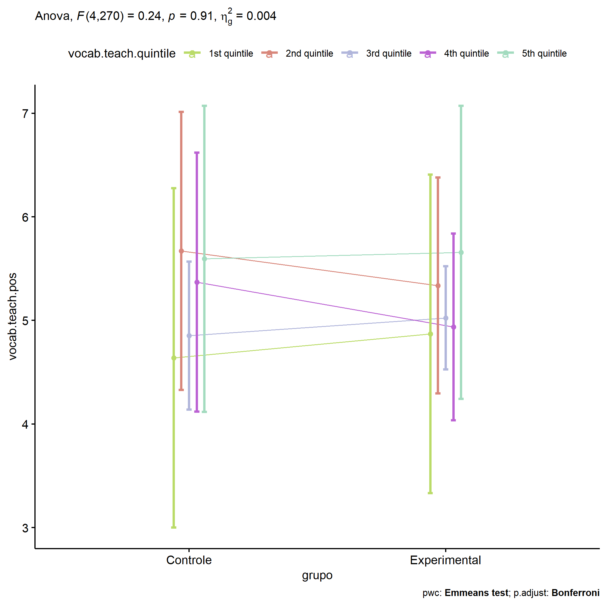<!-- -->

``` r
if (!is.null(plots[["vocab.teach.quintile"]]))
  plots[["vocab.teach.quintile"]] + ggplot2::scale_color_manual(values = color[["grupo"]])
```

    ## Scale for colour is already present.
    ## Adding another scale for colour, which will replace the existing scale.

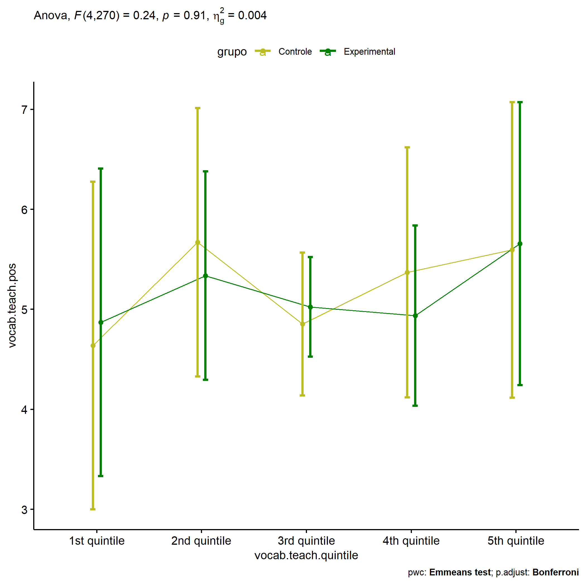<!-- -->

``` r
plots <- twoWayAncovaBoxPlots(
  wdat, "vocab.teach.pos", c("grupo","vocab.teach.quintile"), aov, pwcs, covar = "vocab.teach.pre",
  theme = "classic", color = color[["grupo:vocab.teach.quintile"]],
  subtitle = which(aov$Effect == "grupo:vocab.teach.quintile"))
```

``` r
plots[["grupo:vocab.teach.quintile"]] + ggplot2::ylab("Vocabulario Ensinado") + ggplot2::scale_x_discrete(labels=c('pre', 'pos'))
```

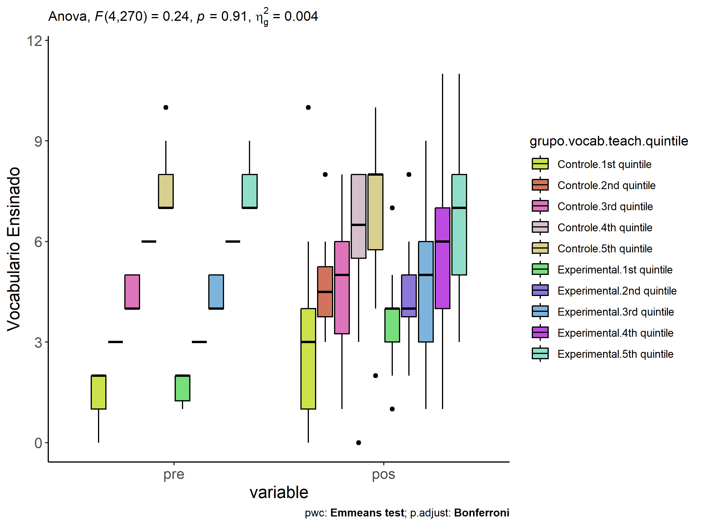<!-- -->

``` r
plots <- twoWayAncovaBoxPlots(
  wdat.long, "vocab.teach", c("grupo","vocab.teach.quintile"), aov, pwc.long, pre.post = "time",
  theme = "classic", color = color$prepost)
```

``` r
plots[["grupo:vocab.teach.quintile"]] + ggplot2::ylab("Vocabulario Ensinado")
```

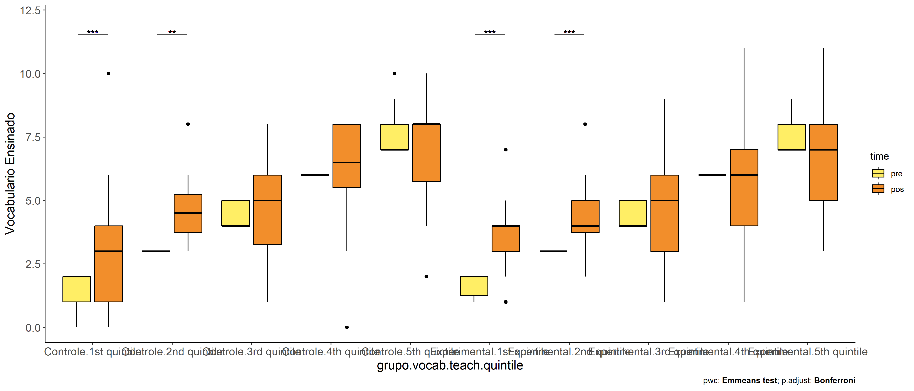<!-- -->

### Checking linearity assumption

``` r
ggscatter(wdat, x = "vocab.teach.pre", y = "vocab.teach.pos", size = 0.5,
          facet.by = c("grupo","vocab.teach.quintile"), add = "reg.line")+
  stat_regline_equation(
    aes(label =  paste(..eq.label.., ..rr.label.., sep = "~~~~"))
  )
```

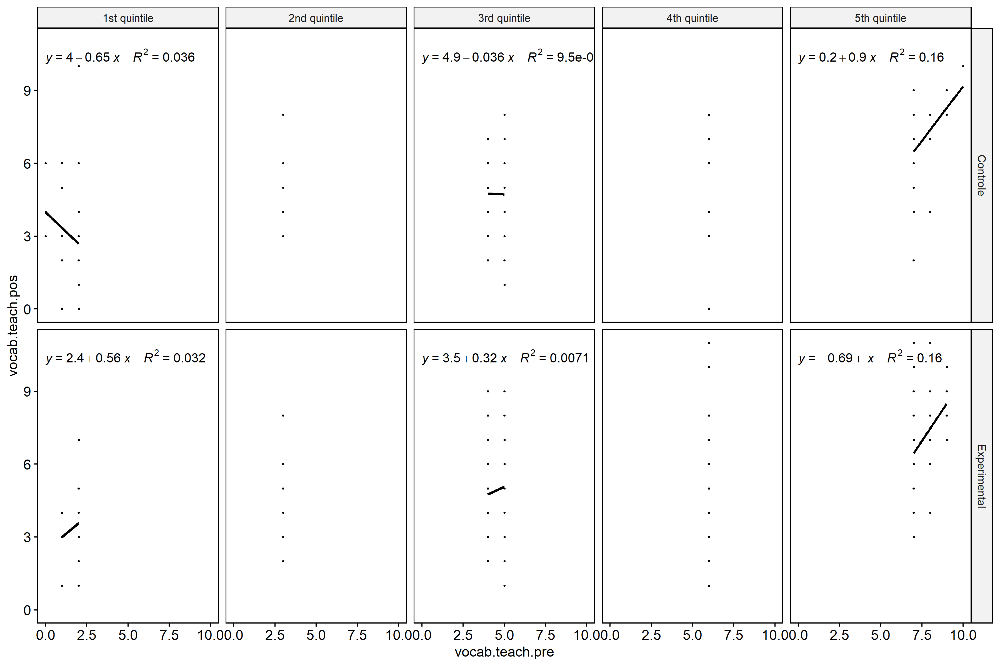<!-- -->

### Checking normality and homogeneity

``` r
res <- augment(lm(vocab.teach.pos ~ vocab.teach.pre + grupo*vocab.teach.quintile, data = wdat))
```

``` r
shapiro_test(res$.resid)
```

    ## # A tibble: 1 × 3
    ##   variable   statistic p.value
    ##   <chr>          <dbl>   <dbl>
    ## 1 res$.resid     0.995   0.555

``` r
levene_test(res, .resid ~ grupo*vocab.teach.quintile)
```

    ## # A tibble: 1 × 4
    ##     df1   df2 statistic      p
    ##   <int> <int>     <dbl>  <dbl>
    ## 1     9   271      1.69 0.0902

# Summary of Results

## Descriptive Statistics

``` r
df <- get.descriptives(ldat[["grupo"]], c(dv.pre, dv.pos), c("grupo"), 
                       include.global = T, symmetry.test = T, normality.test = F)
df <- plyr::rbind.fill(
  df, do.call(plyr::rbind.fill, lapply(lfatores2, FUN = function(f) {
    if (nrow(dat) > 0 && sum(!is.na(unique(dat[[f]]))) > 1)
      get.descriptives(ldat[[paste0("grupo:",f)]], c(dv.pre,dv.pos), c("grupo", f),
                       symmetry.test = T, normality.test = F)
    }))
)
(df <- df[,c(fatores1[fatores1 %in% colnames(df)],"variable",
             colnames(df)[!colnames(df) %in% c(fatores1,"variable")])])
```

    ##           grupo Sexo   Zona Cor.Raca vocab.teach.quintile        variable   n  mean median min max    sd    se
    ## 1      Controle <NA>   <NA>     <NA>                 <NA> vocab.teach.pre 100 4.560    4.5   0  10 2.298 0.230
    ## 2  Experimental <NA>   <NA>     <NA>                 <NA> vocab.teach.pre 181 4.796    5.0   1   9 1.954 0.145
    ## 3          <NA> <NA>   <NA>     <NA>                 <NA> vocab.teach.pre 281 4.712    5.0   0  10 2.082 0.124
    ## 4      Controle <NA>   <NA>     <NA>                 <NA> vocab.teach.pos 100 5.070    5.0   0  10 2.508 0.251
    ## 5  Experimental <NA>   <NA>     <NA>                 <NA> vocab.teach.pos 181 5.210    5.0   1  11 2.188 0.163
    ## 6          <NA> <NA>   <NA>     <NA>                 <NA> vocab.teach.pos 281 5.160    5.0   0  11 2.304 0.137
    ## 7      Controle    F   <NA>     <NA>                 <NA> vocab.teach.pre  53 4.679    5.0   0  10 2.335 0.321
    ## 8      Controle    M   <NA>     <NA>                 <NA> vocab.teach.pre  47 4.426    4.0   0   9 2.272 0.331
    ## 9  Experimental    F   <NA>     <NA>                 <NA> vocab.teach.pre  96 4.958    5.0   1   9 2.031 0.207
    ## 10 Experimental    M   <NA>     <NA>                 <NA> vocab.teach.pre  85 4.612    4.0   1   9 1.859 0.202
    ## 11     Controle    F   <NA>     <NA>                 <NA> vocab.teach.pos  53 5.094    5.0   0  10 2.640 0.363
    ## 12     Controle    M   <NA>     <NA>                 <NA> vocab.teach.pos  47 5.043    5.0   0   9 2.377 0.347
    ## 13 Experimental    F   <NA>     <NA>                 <NA> vocab.teach.pos  96 5.698    5.5   1  11 2.206 0.225
    ## 14 Experimental    M   <NA>     <NA>                 <NA> vocab.teach.pos  85 4.659    4.0   1   9 2.044 0.222
    ## 15     Controle <NA>  Rural     <NA>                 <NA> vocab.teach.pre  38 4.658    4.5   1   9 1.963 0.318
    ## 16     Controle <NA> Urbana     <NA>                 <NA> vocab.teach.pre  18 4.222    4.0   0  10 2.510 0.592
    ## 17 Experimental <NA>  Rural     <NA>                 <NA> vocab.teach.pre  56 4.786    5.0   1   9 2.006 0.268
    ## 18 Experimental <NA> Urbana     <NA>                 <NA> vocab.teach.pre  33 4.636    4.0   1   8 1.578 0.275
    ## 19     Controle <NA>  Rural     <NA>                 <NA> vocab.teach.pos  38 4.842    5.0   0   8 2.552 0.414
    ## 20     Controle <NA> Urbana     <NA>                 <NA> vocab.teach.pos  18 5.444    5.0   2  10 2.382 0.561
    ## 21 Experimental <NA>  Rural     <NA>                 <NA> vocab.teach.pos  56 5.143    5.0   1  11 2.244 0.300
    ## 22 Experimental <NA> Urbana     <NA>                 <NA> vocab.teach.pos  33 5.727    6.0   2  11 2.125 0.370
    ## 23     Controle <NA>   <NA>    Parda                 <NA> vocab.teach.pre  38 4.789    5.0   1   9 1.833 0.297
    ## 24 Experimental <NA>   <NA>   Branca                 <NA> vocab.teach.pre  19 5.053    5.0   1   8 1.747 0.401
    ## 25 Experimental <NA>   <NA>    Parda                 <NA> vocab.teach.pre  53 4.642    4.0   1   9 2.030 0.279
    ## 26     Controle <NA>   <NA>    Parda                 <NA> vocab.teach.pos  38 4.974    5.0   0   9 2.584 0.419
    ## 27 Experimental <NA>   <NA>   Branca                 <NA> vocab.teach.pos  19 5.211    6.0   2   8 2.175 0.499
    ## 28 Experimental <NA>   <NA>    Parda                 <NA> vocab.teach.pos  53 5.264    5.0   1  11 2.371 0.326
    ## 29     Controle <NA>   <NA>     <NA>         1st quintile vocab.teach.pre  22 1.455    2.0   0   2 0.739 0.157
    ## 30     Controle <NA>   <NA>     <NA>         2nd quintile vocab.teach.pre  12 3.000    3.0   3   3 0.000 0.000
    ## 31     Controle <NA>   <NA>     <NA>         3rd quintile vocab.teach.pre  30 4.467    4.0   4   5 0.507 0.093
    ## 32     Controle <NA>   <NA>     <NA>         4th quintile vocab.teach.pre  12 6.000    6.0   6   6 0.000 0.000
    ## 33     Controle <NA>   <NA>     <NA>         5th quintile vocab.teach.pre  24 7.583    7.0   7  10 0.881 0.180
    ## 34 Experimental <NA>   <NA>     <NA>         1st quintile vocab.teach.pre  22 1.727    2.0   1   2 0.456 0.097
    ## 35 Experimental <NA>   <NA>     <NA>         2nd quintile vocab.teach.pre  28 3.000    3.0   3   3 0.000 0.000
    ## 36 Experimental <NA>   <NA>     <NA>         3rd quintile vocab.teach.pre  64 4.438    4.0   4   5 0.500 0.062
    ## 37 Experimental <NA>   <NA>     <NA>         4th quintile vocab.teach.pre  30 6.000    6.0   6   6 0.000 0.000
    ## 38 Experimental <NA>   <NA>     <NA>         5th quintile vocab.teach.pre  37 7.622    7.0   7   9 0.794 0.131
    ## 39     Controle <NA>   <NA>     <NA>         1st quintile vocab.teach.pos  22 3.045    3.0   0  10 2.535 0.540
    ## 40     Controle <NA>   <NA>     <NA>         2nd quintile vocab.teach.pos  12 4.833    4.5   3   8 1.749 0.505
    ## 41     Controle <NA>   <NA>     <NA>         3rd quintile vocab.teach.pos  30 4.733    5.0   1   8 1.856 0.339
    ## 42     Controle <NA>   <NA>     <NA>         4th quintile vocab.teach.pos  12 6.000    6.5   0   8 2.523 0.728
    ## 43     Controle <NA>   <NA>     <NA>         5th quintile vocab.teach.pos  24 7.000    8.0   2  10 1.978 0.404
    ## 44 Experimental <NA>   <NA>     <NA>         1st quintile vocab.teach.pos  22 3.409    4.0   1   7 1.436 0.306
    ## 45 Experimental <NA>   <NA>     <NA>         2nd quintile vocab.teach.pos  28 4.500    4.0   2   8 1.503 0.284
    ## 46 Experimental <NA>   <NA>     <NA>         3rd quintile vocab.teach.pos  64 4.891    5.0   1   9 1.912 0.239
    ## 47 Experimental <NA>   <NA>     <NA>         4th quintile vocab.teach.pos  30 5.567    6.0   1  11 2.315 0.423
    ## 48 Experimental <NA>   <NA>     <NA>         5th quintile vocab.teach.pos  37 7.081    7.0   3  11 2.019 0.332
    ##       ci  iqr symmetry     skewness    kurtosis
    ## 1  0.456 3.00      YES  0.049797641 -0.76910925
    ## 2  0.287 3.00      YES  0.174791370 -0.64262327
    ## 3  0.244 3.00      YES  0.091198282 -0.61623882
    ## 4  0.498 4.00      YES -0.166011777 -0.78596888
    ## 5  0.321 3.00      YES  0.356049028 -0.34279745
    ## 6  0.271 3.00      YES  0.108893021 -0.46516287
    ## 7  0.644 4.00      YES  0.008292624 -0.92838918
    ## 8  0.667 3.00      YES  0.089236504 -0.66382085
    ## 9  0.411 2.50      YES  0.055942331 -0.77398898
    ## 10 0.401 3.00      YES  0.293079917 -0.48129285
    ## 11 0.728 5.00      YES -0.106236163 -0.86232215
    ## 12 0.698 4.00      YES -0.258505847 -0.84279344
    ## 13 0.447 3.00      YES  0.369339997 -0.37901045
    ## 14 0.441 3.00      YES  0.277741623 -0.66877301
    ## 15 0.645 3.00      YES  0.135105497 -0.95147290
    ## 16 1.248 3.50      YES  0.415894023 -0.47122904
    ## 17 0.537 3.00      YES  0.063881145 -0.82339754
    ## 18 0.559 2.00      YES  0.080759242 -0.41921441
    ## 19 0.839 4.00      YES -0.341299820 -1.14140246
    ## 20 1.184 3.50      YES  0.287084295 -1.12740876
    ## 21 0.601 2.25       NO  0.517325674 -0.27893775
    ## 22 0.754 3.00       NO  0.631089235  0.17295284
    ## 23 0.602 2.00      YES -0.133018295 -0.63471145
    ## 24 0.842 2.00      YES -0.431026746 -0.47373362
    ## 25 0.559 3.00      YES  0.292950698 -0.75682841
    ## 26 0.849 4.00      YES -0.301379088 -1.10927159
    ## 27 1.048 4.00      YES  0.020657041 -1.75861590
    ## 28 0.654 2.00      YES  0.421021907 -0.46151992
    ## 29 0.327 1.00 few data  0.000000000  0.00000000
    ## 30 0.000 0.00 few data  0.000000000  0.00000000
    ## 31 0.189 1.00 few data  0.000000000  0.00000000
    ## 32 0.000 0.00 few data  0.000000000  0.00000000
    ## 33 0.372 1.00       NO  1.222262494  0.33228839
    ## 34 0.202 0.75 few data  0.000000000  0.00000000
    ## 35 0.000 0.00 few data  0.000000000  0.00000000
    ## 36 0.125 1.00 few data  0.000000000  0.00000000
    ## 37 0.000 0.00 few data  0.000000000  0.00000000
    ## 38 0.265 1.00 few data  0.000000000  0.00000000
    ## 39 1.124 3.00       NO  0.788477896  0.28641818
    ## 40 1.112 1.50       NO  0.698628758 -0.87998930
    ## 41 0.693 2.75      YES -0.060182064 -0.91175025
    ## 42 1.603 2.50       NO -1.090134330  0.03323129
    ## 43 0.835 2.25       NO -0.742840946 -0.30601852
    ## 44 0.637 1.00      YES  0.127813313  0.08998256
    ## 45 0.583 1.25       NO  0.536368221 -0.02803826
    ## 46 0.478 3.00      YES  0.059557559 -0.81209106
    ## 47 0.864 3.00      YES  0.240360358 -0.42660432
    ## 48 0.673 3.00      YES -0.028624470 -0.81416066

| grupo        | Sexo | Zona   | Cor.Raca | vocab.teach.quintile | variable        |   n |  mean | median | min | max |    sd |    se |    ci |  iqr | symmetry | skewness | kurtosis |
|:-------------|:-----|:-------|:---------|:---------------------|:----------------|----:|------:|-------:|----:|----:|------:|------:|------:|-----:|:---------|---------:|---------:|
| Controle     |      |        |          |                      | vocab.teach.pre | 100 | 4.560 |    4.5 |   0 |  10 | 2.298 | 0.230 | 0.456 | 3.00 | YES      |    0.050 |   -0.769 |
| Experimental |      |        |          |                      | vocab.teach.pre | 181 | 4.796 |    5.0 |   1 |   9 | 1.954 | 0.145 | 0.287 | 3.00 | YES      |    0.175 |   -0.643 |
|              |      |        |          |                      | vocab.teach.pre | 281 | 4.712 |    5.0 |   0 |  10 | 2.082 | 0.124 | 0.244 | 3.00 | YES      |    0.091 |   -0.616 |
| Controle     |      |        |          |                      | vocab.teach.pos | 100 | 5.070 |    5.0 |   0 |  10 | 2.508 | 0.251 | 0.498 | 4.00 | YES      |   -0.166 |   -0.786 |
| Experimental |      |        |          |                      | vocab.teach.pos | 181 | 5.210 |    5.0 |   1 |  11 | 2.188 | 0.163 | 0.321 | 3.00 | YES      |    0.356 |   -0.343 |
|              |      |        |          |                      | vocab.teach.pos | 281 | 5.160 |    5.0 |   0 |  11 | 2.304 | 0.137 | 0.271 | 3.00 | YES      |    0.109 |   -0.465 |
| Controle     | F    |        |          |                      | vocab.teach.pre |  53 | 4.679 |    5.0 |   0 |  10 | 2.335 | 0.321 | 0.644 | 4.00 | YES      |    0.008 |   -0.928 |
| Controle     | M    |        |          |                      | vocab.teach.pre |  47 | 4.426 |    4.0 |   0 |   9 | 2.272 | 0.331 | 0.667 | 3.00 | YES      |    0.089 |   -0.664 |
| Experimental | F    |        |          |                      | vocab.teach.pre |  96 | 4.958 |    5.0 |   1 |   9 | 2.031 | 0.207 | 0.411 | 2.50 | YES      |    0.056 |   -0.774 |
| Experimental | M    |        |          |                      | vocab.teach.pre |  85 | 4.612 |    4.0 |   1 |   9 | 1.859 | 0.202 | 0.401 | 3.00 | YES      |    0.293 |   -0.481 |
| Controle     | F    |        |          |                      | vocab.teach.pos |  53 | 5.094 |    5.0 |   0 |  10 | 2.640 | 0.363 | 0.728 | 5.00 | YES      |   -0.106 |   -0.862 |
| Controle     | M    |        |          |                      | vocab.teach.pos |  47 | 5.043 |    5.0 |   0 |   9 | 2.377 | 0.347 | 0.698 | 4.00 | YES      |   -0.259 |   -0.843 |
| Experimental | F    |        |          |                      | vocab.teach.pos |  96 | 5.698 |    5.5 |   1 |  11 | 2.206 | 0.225 | 0.447 | 3.00 | YES      |    0.369 |   -0.379 |
| Experimental | M    |        |          |                      | vocab.teach.pos |  85 | 4.659 |    4.0 |   1 |   9 | 2.044 | 0.222 | 0.441 | 3.00 | YES      |    0.278 |   -0.669 |
| Controle     |      | Rural  |          |                      | vocab.teach.pre |  38 | 4.658 |    4.5 |   1 |   9 | 1.963 | 0.318 | 0.645 | 3.00 | YES      |    0.135 |   -0.951 |
| Controle     |      | Urbana |          |                      | vocab.teach.pre |  18 | 4.222 |    4.0 |   0 |  10 | 2.510 | 0.592 | 1.248 | 3.50 | YES      |    0.416 |   -0.471 |
| Experimental |      | Rural  |          |                      | vocab.teach.pre |  56 | 4.786 |    5.0 |   1 |   9 | 2.006 | 0.268 | 0.537 | 3.00 | YES      |    0.064 |   -0.823 |
| Experimental |      | Urbana |          |                      | vocab.teach.pre |  33 | 4.636 |    4.0 |   1 |   8 | 1.578 | 0.275 | 0.559 | 2.00 | YES      |    0.081 |   -0.419 |
| Controle     |      | Rural  |          |                      | vocab.teach.pos |  38 | 4.842 |    5.0 |   0 |   8 | 2.552 | 0.414 | 0.839 | 4.00 | YES      |   -0.341 |   -1.141 |
| Controle     |      | Urbana |          |                      | vocab.teach.pos |  18 | 5.444 |    5.0 |   2 |  10 | 2.382 | 0.561 | 1.184 | 3.50 | YES      |    0.287 |   -1.127 |
| Experimental |      | Rural  |          |                      | vocab.teach.pos |  56 | 5.143 |    5.0 |   1 |  11 | 2.244 | 0.300 | 0.601 | 2.25 | NO       |    0.517 |   -0.279 |
| Experimental |      | Urbana |          |                      | vocab.teach.pos |  33 | 5.727 |    6.0 |   2 |  11 | 2.125 | 0.370 | 0.754 | 3.00 | NO       |    0.631 |    0.173 |
| Controle     |      |        | Parda    |                      | vocab.teach.pre |  38 | 4.789 |    5.0 |   1 |   9 | 1.833 | 0.297 | 0.602 | 2.00 | YES      |   -0.133 |   -0.635 |
| Experimental |      |        | Branca   |                      | vocab.teach.pre |  19 | 5.053 |    5.0 |   1 |   8 | 1.747 | 0.401 | 0.842 | 2.00 | YES      |   -0.431 |   -0.474 |
| Experimental |      |        | Parda    |                      | vocab.teach.pre |  53 | 4.642 |    4.0 |   1 |   9 | 2.030 | 0.279 | 0.559 | 3.00 | YES      |    0.293 |   -0.757 |
| Controle     |      |        | Parda    |                      | vocab.teach.pos |  38 | 4.974 |    5.0 |   0 |   9 | 2.584 | 0.419 | 0.849 | 4.00 | YES      |   -0.301 |   -1.109 |
| Experimental |      |        | Branca   |                      | vocab.teach.pos |  19 | 5.211 |    6.0 |   2 |   8 | 2.175 | 0.499 | 1.048 | 4.00 | YES      |    0.021 |   -1.759 |
| Experimental |      |        | Parda    |                      | vocab.teach.pos |  53 | 5.264 |    5.0 |   1 |  11 | 2.371 | 0.326 | 0.654 | 2.00 | YES      |    0.421 |   -0.462 |
| Controle     |      |        |          | 1st quintile         | vocab.teach.pre |  22 | 1.455 |    2.0 |   0 |   2 | 0.739 | 0.157 | 0.327 | 1.00 | few data |    0.000 |    0.000 |
| Controle     |      |        |          | 2nd quintile         | vocab.teach.pre |  12 | 3.000 |    3.0 |   3 |   3 | 0.000 | 0.000 | 0.000 | 0.00 | few data |    0.000 |    0.000 |
| Controle     |      |        |          | 3rd quintile         | vocab.teach.pre |  30 | 4.467 |    4.0 |   4 |   5 | 0.507 | 0.093 | 0.189 | 1.00 | few data |    0.000 |    0.000 |
| Controle     |      |        |          | 4th quintile         | vocab.teach.pre |  12 | 6.000 |    6.0 |   6 |   6 | 0.000 | 0.000 | 0.000 | 0.00 | few data |    0.000 |    0.000 |
| Controle     |      |        |          | 5th quintile         | vocab.teach.pre |  24 | 7.583 |    7.0 |   7 |  10 | 0.881 | 0.180 | 0.372 | 1.00 | NO       |    1.222 |    0.332 |
| Experimental |      |        |          | 1st quintile         | vocab.teach.pre |  22 | 1.727 |    2.0 |   1 |   2 | 0.456 | 0.097 | 0.202 | 0.75 | few data |    0.000 |    0.000 |
| Experimental |      |        |          | 2nd quintile         | vocab.teach.pre |  28 | 3.000 |    3.0 |   3 |   3 | 0.000 | 0.000 | 0.000 | 0.00 | few data |    0.000 |    0.000 |
| Experimental |      |        |          | 3rd quintile         | vocab.teach.pre |  64 | 4.438 |    4.0 |   4 |   5 | 0.500 | 0.062 | 0.125 | 1.00 | few data |    0.000 |    0.000 |
| Experimental |      |        |          | 4th quintile         | vocab.teach.pre |  30 | 6.000 |    6.0 |   6 |   6 | 0.000 | 0.000 | 0.000 | 0.00 | few data |    0.000 |    0.000 |
| Experimental |      |        |          | 5th quintile         | vocab.teach.pre |  37 | 7.622 |    7.0 |   7 |   9 | 0.794 | 0.131 | 0.265 | 1.00 | few data |    0.000 |    0.000 |
| Controle     |      |        |          | 1st quintile         | vocab.teach.pos |  22 | 3.045 |    3.0 |   0 |  10 | 2.535 | 0.540 | 1.124 | 3.00 | NO       |    0.788 |    0.286 |
| Controle     |      |        |          | 2nd quintile         | vocab.teach.pos |  12 | 4.833 |    4.5 |   3 |   8 | 1.749 | 0.505 | 1.112 | 1.50 | NO       |    0.699 |   -0.880 |
| Controle     |      |        |          | 3rd quintile         | vocab.teach.pos |  30 | 4.733 |    5.0 |   1 |   8 | 1.856 | 0.339 | 0.693 | 2.75 | YES      |   -0.060 |   -0.912 |
| Controle     |      |        |          | 4th quintile         | vocab.teach.pos |  12 | 6.000 |    6.5 |   0 |   8 | 2.523 | 0.728 | 1.603 | 2.50 | NO       |   -1.090 |    0.033 |
| Controle     |      |        |          | 5th quintile         | vocab.teach.pos |  24 | 7.000 |    8.0 |   2 |  10 | 1.978 | 0.404 | 0.835 | 2.25 | NO       |   -0.743 |   -0.306 |
| Experimental |      |        |          | 1st quintile         | vocab.teach.pos |  22 | 3.409 |    4.0 |   1 |   7 | 1.436 | 0.306 | 0.637 | 1.00 | YES      |    0.128 |    0.090 |
| Experimental |      |        |          | 2nd quintile         | vocab.teach.pos |  28 | 4.500 |    4.0 |   2 |   8 | 1.503 | 0.284 | 0.583 | 1.25 | NO       |    0.536 |   -0.028 |
| Experimental |      |        |          | 3rd quintile         | vocab.teach.pos |  64 | 4.891 |    5.0 |   1 |   9 | 1.912 | 0.239 | 0.478 | 3.00 | YES      |    0.060 |   -0.812 |
| Experimental |      |        |          | 4th quintile         | vocab.teach.pos |  30 | 5.567 |    6.0 |   1 |  11 | 2.315 | 0.423 | 0.864 | 3.00 | YES      |    0.240 |   -0.427 |
| Experimental |      |        |          | 5th quintile         | vocab.teach.pos |  37 | 7.081 |    7.0 |   3 |  11 | 2.019 | 0.332 | 0.673 | 3.00 | YES      |   -0.029 |   -0.814 |

## ANCOVA Table Comparison

``` r
df <- do.call(plyr::rbind.fill, laov)
(df <- df[!duplicated(df$Effect),])
```

    ##                        Effect DFn DFd          F        p p<.05      ges DFn' DFd'         F'       p' p<.05'
    ## 1                       grupo   1 278   0.000031 9.96e-01       1.12e-07    1  278   0.000031 9.96e-01       
    ## 2             vocab.teach.pre   1 278 109.230000 8.81e-22     * 2.82e-01    1  278 109.230000 8.81e-22      *
    ## 4                  grupo:Sexo   1 276   3.733000 5.40e-02       1.30e-02    1  276   3.733000 5.40e-02       
    ## 5                        Sexo   1 276   4.759000 3.00e-02     * 1.70e-02    1  276   4.759000 3.00e-02      *
    ## 8                  grupo:Zona   1 140   0.087000 7.69e-01       6.20e-04    1  140   0.087000 7.69e-01       
    ## 10                       Zona   1 140   5.056000 2.60e-02     * 3.50e-02    1  140   5.056000 2.60e-02      *
    ## 11                   Cor.Raca   1 106   0.410000 5.23e-01       4.00e-03    1  106   0.410000 5.23e-01       
    ## 13             grupo:Cor.Raca   0 106         NA       NA  <NA>       NA    0  106         NA       NA   <NA>
    ## 16 grupo:vocab.teach.quintile   4 270   0.244000 9.13e-01       4.00e-03    4  270   0.244000 9.13e-01       
    ## 18       vocab.teach.quintile   4 270   1.025000 3.95e-01       1.50e-02    4  270   1.025000 3.95e-01       
    ##        ges'
    ## 1  1.12e-07
    ## 2  2.82e-01
    ## 4  1.30e-02
    ## 5  1.70e-02
    ## 8  6.20e-04
    ## 10 3.50e-02
    ## 11 4.00e-03
    ## 13       NA
    ## 16 4.00e-03
    ## 18 1.50e-02

|     | Effect                     | DFn | DFd |       F |     p | p\<.05 |   ges | DFn’ | DFd’ |      F’ |    p’ | p\<.05’ |  ges’ |
|:----|:---------------------------|----:|----:|--------:|------:|:-------|------:|-----:|-----:|--------:|------:|:--------|------:|
| 1   | grupo                      |   1 | 278 |   0.000 | 0.996 |        | 0.000 |    1 |  278 |   0.000 | 0.996 |         | 0.000 |
| 2   | vocab.teach.pre            |   1 | 278 | 109.230 | 0.000 | \*     | 0.282 |    1 |  278 | 109.230 | 0.000 | \*      | 0.282 |
| 4   | grupo:Sexo                 |   1 | 276 |   3.733 | 0.054 |        | 0.013 |    1 |  276 |   3.733 | 0.054 |         | 0.013 |
| 5   | Sexo                       |   1 | 276 |   4.759 | 0.030 | \*     | 0.017 |    1 |  276 |   4.759 | 0.030 | \*      | 0.017 |
| 8   | grupo:Zona                 |   1 | 140 |   0.087 | 0.769 |        | 0.001 |    1 |  140 |   0.087 | 0.769 |         | 0.001 |
| 10  | Zona                       |   1 | 140 |   5.056 | 0.026 | \*     | 0.035 |    1 |  140 |   5.056 | 0.026 | \*      | 0.035 |
| 11  | Cor.Raca                   |   1 | 106 |   0.410 | 0.523 |        | 0.004 |    1 |  106 |   0.410 | 0.523 |         | 0.004 |
| 13  | grupo:Cor.Raca             |   0 | 106 |         |       |        |       |    0 |  106 |         |       |         |       |
| 16  | grupo:vocab.teach.quintile |   4 | 270 |   0.244 | 0.913 |        | 0.004 |    4 |  270 |   0.244 | 0.913 |         | 0.004 |
| 18  | vocab.teach.quintile       |   4 | 270 |   1.025 | 0.395 |        | 0.015 |    4 |  270 |   1.025 | 0.395 |         | 0.015 |

## PairWise Table Comparison

``` r
df <- do.call(plyr::rbind.fill, lpwc)
df <- df[,c(names(lfatores), names(df)[!names(df) %in% c(names(lfatores),"term",".y.")])]
```

| grupo        | Sexo | Zona   | Cor.Raca | vocab.teach.quintile | group1       | group2       |  df | statistic |     p | p.adj | p.adj.signif | df’ | statistic’ |    p’ | p.adj’ | p.adj.signif’ |
|:-------------|:-----|:-------|:---------|:---------------------|:-------------|:-------------|----:|----------:|------:|------:|:-------------|----:|-----------:|------:|-------:|:--------------|
| Controle     |      |        |          |                      | pre          | pos          | 558 |    -1.641 | 0.101 | 0.101 | ns           | 558 |     -1.641 | 0.101 |  0.101 | ns            |
| Experimental |      |        |          |                      | pre          | pos          | 558 |    -1.794 | 0.073 | 0.073 | ns           | 558 |     -1.794 | 0.073 |  0.073 | ns            |
|              |      |        |          |                      | Controle     | Experimental | 278 |    -0.006 | 0.996 | 0.996 | ns           | 278 |     -0.006 | 0.996 |  0.996 | ns            |
| Controle     | F    |        |          |                      | pre          | pos          | 554 |    -0.979 | 0.328 | 0.328 | ns           | 554 |     -0.979 | 0.328 |  0.328 | ns            |
| Controle     | M    |        |          |                      | pre          | pos          | 554 |    -1.371 | 0.171 | 0.171 | ns           | 554 |     -1.371 | 0.171 |  0.171 | ns            |
| Controle     |      |        |          |                      | F            | M            | 276 |    -0.244 | 0.807 | 0.807 | ns           | 276 |     -0.244 | 0.807 |  0.807 | ns            |
| Experimental | F    |        |          |                      | pre          | pos          | 554 |    -2.348 | 0.019 | 0.019 | \*           | 554 |     -2.348 | 0.019 |  0.019 | \*            |
| Experimental | M    |        |          |                      | pre          | pos          | 554 |    -0.141 | 0.888 | 0.888 | ns           | 554 |     -0.141 | 0.888 |  0.888 | ns            |
| Experimental |      |        |          |                      | F            | M            | 276 |     2.903 | 0.004 | 0.004 | \*\*         | 276 |      2.903 | 0.004 |  0.004 | \*\*          |
|              | F    |        |          |                      | Controle     | Experimental | 276 |    -1.334 | 0.183 | 0.183 | ns           | 276 |     -1.334 | 0.183 |  0.183 | ns            |
|              | M    |        |          |                      | Controle     | Experimental | 276 |     1.396 | 0.164 | 0.164 | ns           | 276 |      1.396 | 0.164 |  0.164 | ns            |
| Controle     |      |        |          |                      | Rural        | Urbana       | 140 |    -1.602 | 0.111 | 0.111 | ns           | 140 |     -1.602 | 0.111 |  0.111 | ns            |
| Controle     |      | Rural  |          |                      | pre          | pos          | 282 |    -0.373 | 0.710 | 0.710 | ns           | 282 |     -0.373 | 0.710 |  0.710 | ns            |
| Controle     |      | Urbana |          |                      | pre          | pos          | 282 |    -1.701 | 0.090 | 0.090 | ns           | 282 |     -1.701 | 0.090 |  0.090 | ns            |
| Experimental |      |        |          |                      | Rural        | Urbana       | 140 |    -1.608 | 0.110 | 0.110 | ns           | 140 |     -1.608 | 0.110 |  0.110 | ns            |
| Experimental |      | Rural  |          |                      | pre          | pos          | 282 |    -0.877 | 0.381 | 0.381 | ns           | 282 |     -0.877 | 0.381 |  0.381 | ns            |
| Experimental |      | Urbana |          |                      | pre          | pos          | 282 |    -2.056 | 0.041 | 0.041 | \*           | 282 |     -2.056 | 0.041 |  0.041 | \*            |
|              |      | Rural  |          |                      | Controle     | Experimental | 140 |    -0.534 | 0.594 | 0.594 | ns           | 140 |     -0.534 | 0.594 |  0.594 | ns            |
|              |      | Urbana |          |                      | Controle     | Experimental | 140 |    -0.021 | 0.984 | 0.984 | ns           | 140 |     -0.021 | 0.984 |  0.984 | ns            |
| Controle     |      |        | Branca   |                      | pre          | pos          |     |           |       |       |              |     |            |       |        |               |
| Controle     |      |        |          |                      | Branca       | Parda        |     |           |       |       |              |     |            |       |        |               |
| Controle     |      |        | Parda    |                      | pre          | pos          | 214 |    -0.368 | 0.713 | 0.713 | ns           | 214 |     -0.368 | 0.713 |  0.713 | ns            |
| Experimental |      |        | Branca   |                      | pre          | pos          | 214 |    -0.223 | 0.824 | 0.824 | ns           | 214 |     -0.223 | 0.824 |  0.824 | ns            |
| Experimental |      |        |          |                      | Branca       | Parda        | 106 |    -0.640 | 0.523 | 0.523 | ns           | 106 |     -0.640 | 0.523 |  0.523 | ns            |
| Experimental |      |        | Parda    |                      | pre          | pos          | 214 |    -1.470 | 0.143 | 0.143 | ns           | 214 |     -1.470 | 0.143 |  0.143 | ns            |
|              |      |        | Branca   |                      | Controle     | Experimental |     |           |       |       |              |     |            |       |        |               |
|              |      |        | Parda    |                      | Controle     | Experimental | 106 |    -0.926 | 0.357 | 0.357 | ns           | 106 |     -0.926 | 0.357 |  0.357 | ns            |
| Controle     |      |        |          | 1st quintile         | pre          | pos          | 542 |    -3.631 | 0.000 | 0.000 | \*\*\*       | 542 |     -3.631 | 0.000 |  0.000 | \*\*\*        |
| Controle     |      |        |          | 2nd quintile         | pre          | pos          | 542 |    -3.090 | 0.002 | 0.002 | \*\*         | 542 |     -3.090 | 0.002 |  0.002 | \*\*          |
| Controle     |      |        |          | 3rd quintile         | pre          | pos          | 542 |    -0.711 | 0.478 | 0.478 | ns           | 542 |     -0.711 | 0.478 |  0.478 | ns            |
| Controle     |      |        |          | 4th quintile         | pre          | pos          | 542 |     0.000 | 1.000 | 1.000 | ns           | 542 |      0.000 | 1.000 |  1.000 | ns            |
| Controle     |      |        |          | 5th quintile         | pre          | pos          | 542 |     1.390 | 0.165 | 0.165 | ns           | 542 |      1.390 | 0.165 |  0.165 | ns            |
| Controle     |      |        |          |                      | 1st quintile | 2nd quintile | 270 |    -1.315 | 0.190 | 1.000 | ns           | 270 |     -1.315 | 0.190 |  1.000 | ns            |
| Controle     |      |        |          |                      | 1st quintile | 3rd quintile | 270 |    -0.248 | 0.804 | 1.000 | ns           | 270 |     -0.248 | 0.804 |  1.000 | ns            |
| Controle     |      |        |          |                      | 1st quintile | 4th quintile | 270 |    -0.596 | 0.552 | 1.000 | ns           | 270 |     -0.596 | 0.552 |  1.000 | ns            |
| Controle     |      |        |          |                      | 1st quintile | 5th quintile | 270 |    -0.649 | 0.517 | 1.000 | ns           | 270 |     -0.649 | 0.517 |  1.000 | ns            |
| Controle     |      |        |          |                      | 2nd quintile | 3rd quintile | 270 |     1.096 | 0.274 | 1.000 | ns           | 270 |      1.096 | 0.274 |  1.000 | ns            |
| Controle     |      |        |          |                      | 2nd quintile | 4th quintile | 270 |     0.289 | 0.773 | 1.000 | ns           | 270 |      0.289 | 0.773 |  1.000 | ns            |
| Controle     |      |        |          |                      | 2nd quintile | 5th quintile | 270 |     0.062 | 0.951 | 1.000 | ns           | 270 |      0.062 | 0.951 |  1.000 | ns            |
| Controle     |      |        |          |                      | 3rd quintile | 4th quintile | 270 |    -0.686 | 0.493 | 1.000 | ns           | 270 |     -0.686 | 0.493 |  1.000 | ns            |
| Controle     |      |        |          |                      | 3rd quintile | 5th quintile | 270 |    -0.849 | 0.397 | 1.000 | ns           | 270 |     -0.849 | 0.397 |  1.000 | ns            |
| Controle     |      |        |          |                      | 4th quintile | 5th quintile | 270 |    -0.289 | 0.773 | 1.000 | ns           | 270 |     -0.289 | 0.773 |  1.000 | ns            |
| Experimental |      |        |          | 1st quintile         | pre          | pos          | 542 |    -3.838 | 0.000 | 0.000 | \*\*\*       | 542 |     -3.838 | 0.000 |  0.000 | \*\*\*        |
| Experimental |      |        |          | 2nd quintile         | pre          | pos          | 542 |    -3.862 | 0.000 | 0.000 | \*\*\*       | 542 |     -3.862 | 0.000 |  0.000 | \*\*\*        |
| Experimental |      |        |          | 3rd quintile         | pre          | pos          | 542 |    -1.764 | 0.078 | 0.078 | ns           | 542 |     -1.764 | 0.078 |  0.078 | ns            |
| Experimental |      |        |          | 4th quintile         | pre          | pos          | 542 |     1.155 | 0.249 | 0.249 | ns           | 542 |      1.155 | 0.249 |  0.249 | ns            |
| Experimental |      |        |          | 5th quintile         | pre          | pos          | 542 |     1.600 | 0.110 | 0.110 | ns           | 542 |      1.600 | 0.110 |  0.110 | ns            |
| Experimental |      |        |          |                      | 1st quintile | 2nd quintile | 270 |    -0.747 | 0.456 | 1.000 | ns           | 270 |     -0.747 | 0.456 |  1.000 | ns            |
| Experimental |      |        |          |                      | 1st quintile | 3rd quintile | 270 |    -0.202 | 0.840 | 1.000 | ns           | 270 |     -0.202 | 0.840 |  1.000 | ns            |
| Experimental |      |        |          |                      | 1st quintile | 4th quintile | 270 |    -0.061 | 0.951 | 1.000 | ns           | 270 |     -0.061 | 0.951 |  1.000 | ns            |
| Experimental |      |        |          |                      | 1st quintile | 5th quintile | 270 |    -0.561 | 0.575 | 1.000 | ns           | 270 |     -0.561 | 0.575 |  1.000 | ns            |
| Experimental |      |        |          |                      | 2nd quintile | 3rd quintile | 270 |     0.571 | 0.568 | 1.000 | ns           | 270 |      0.571 | 0.568 |  1.000 | ns            |
| Experimental |      |        |          |                      | 2nd quintile | 4th quintile | 270 |     0.477 | 0.633 | 1.000 | ns           | 270 |      0.477 | 0.633 |  1.000 | ns            |
| Experimental |      |        |          |                      | 2nd quintile | 5th quintile | 270 |    -0.282 | 0.778 | 1.000 | ns           | 270 |     -0.282 | 0.778 |  1.000 | ns            |
| Experimental |      |        |          |                      | 3rd quintile | 4th quintile | 270 |     0.159 | 0.874 | 1.000 | ns           | 270 |      0.159 | 0.874 |  1.000 | ns            |
| Experimental |      |        |          |                      | 3rd quintile | 5th quintile | 270 |    -0.779 | 0.436 | 1.000 | ns           | 270 |     -0.779 | 0.436 |  1.000 | ns            |
| Experimental |      |        |          |                      | 4th quintile | 5th quintile | 270 |    -1.199 | 0.232 | 1.000 | ns           | 270 |     -1.199 | 0.232 |  1.000 | ns            |
|              |      |        |          | 1st quintile         | Controle     | Experimental | 270 |    -0.386 | 0.700 | 0.700 | ns           | 270 |     -0.386 | 0.700 |  0.700 | ns            |
|              |      |        |          | 2nd quintile         | Controle     | Experimental | 270 |     0.491 | 0.624 | 0.624 | ns           | 270 |      0.491 | 0.624 |  0.624 | ns            |
|              |      |        |          | 3rd quintile         | Controle     | Experimental | 270 |    -0.394 | 0.694 | 0.694 | ns           | 270 |     -0.394 | 0.694 |  0.694 | ns            |
|              |      |        |          | 4th quintile         | Controle     | Experimental | 270 |     0.645 | 0.520 | 0.520 | ns           | 270 |      0.645 | 0.520 |  0.520 | ns            |
|              |      |        |          | 5th quintile         | Controle     | Experimental | 270 |    -0.121 | 0.904 | 0.904 | ns           | 270 |     -0.121 | 0.904 |  0.904 | ns            |

## EMMS Table Comparison

``` r
df <- do.call(plyr::rbind.fill, lemms)
df[["N-N'"]] <- df[["N"]] - df[["N'"]]
df <- df[,c(names(lfatores), names(df)[!names(df) %in% names(lfatores)])]
```

| grupo        | Sexo | Zona   | Cor.Raca | vocab.teach.quintile |   N | M (pre) | SE (pre) | M (unadj) | SE (unadj) | M (adj) | SE (adj) |  N’ | M (pre)’ | SE (pre)’ | M (unadj)’ | SE (unadj)’ | M (adj)’ | SE (adj)’ | N-N’ |
|:-------------|:-----|:-------|:---------|:---------------------|----:|--------:|---------:|----------:|-----------:|--------:|---------:|----:|---------:|----------:|-----------:|------------:|---------:|----------:|-----:|
| Controle     |      |        |          |                      | 100 |   4.560 |    0.230 |     5.070 |      0.251 |   5.159 |    0.196 | 100 |    4.560 |     0.230 |      5.070 |       0.251 |    5.159 |     0.196 |    0 |
| Experimental |      |        |          |                      | 181 |   4.796 |    0.145 |     5.210 |      0.163 |   5.161 |    0.146 | 181 |    4.796 |     0.145 |      5.210 |       0.163 |    5.161 |     0.146 |    0 |
| Controle     | F    |        |          |                      |  53 |   4.679 |    0.321 |     5.094 |      0.363 |   5.113 |    0.266 |  53 |    4.679 |     0.321 |      5.094 |       0.363 |    5.113 |     0.266 |    0 |
| Controle     | M    |        |          |                      |  47 |   4.426 |    0.331 |     5.043 |      0.347 |   5.208 |    0.283 |  47 |    4.426 |     0.331 |      5.043 |       0.347 |    5.208 |     0.283 |    0 |
| Experimental | F    |        |          |                      |  96 |   4.958 |    0.207 |     5.698 |      0.225 |   5.555 |    0.198 |  96 |    4.958 |     0.207 |      5.698 |       0.225 |    5.555 |     0.198 |    0 |
| Experimental | M    |        |          |                      |  85 |   4.612 |    0.202 |     4.659 |      0.222 |   4.717 |    0.210 |  85 |    4.612 |     0.202 |      4.659 |       0.222 |    4.717 |     0.210 |    0 |
| Controle     |      | Rural  |          |                      |  38 |   4.658 |    0.318 |     4.842 |      0.414 |   4.836 |    0.313 |  38 |    4.658 |     0.318 |      4.842 |       0.414 |    4.836 |     0.313 |    0 |
| Controle     |      | Urbana |          |                      |  18 |   4.222 |    0.592 |     5.444 |      0.561 |   5.723 |    0.457 |  18 |    4.222 |     0.592 |      5.444 |       0.561 |    5.723 |     0.457 |    0 |
| Experimental |      | Rural  |          |                      |  56 |   4.786 |    0.268 |     5.143 |      0.300 |   5.053 |    0.258 |  56 |    4.786 |     0.268 |      5.143 |       0.300 |    5.053 |     0.258 |    0 |
| Experimental |      | Urbana |          |                      |  33 |   4.636 |    0.275 |     5.727 |      0.370 |   5.735 |    0.336 |  33 |    4.636 |     0.275 |      5.727 |       0.370 |    5.735 |     0.336 |    0 |
| Controle     |      |        | Parda    |                      |  38 |   4.789 |    0.297 |     4.974 |      0.419 |   4.955 |    0.326 |  38 |    4.789 |     0.297 |      4.974 |       0.419 |    4.955 |     0.326 |    0 |
| Experimental |      |        | Branca   |                      |  19 |   5.053 |    0.401 |     5.211 |      0.499 |   5.006 |    0.461 |  19 |    5.053 |     0.401 |      5.211 |       0.499 |    5.006 |     0.461 |    0 |
| Experimental |      |        | Parda    |                      |  53 |   4.642 |    0.279 |     5.264 |      0.326 |   5.351 |    0.276 |  53 |    4.642 |     0.279 |      5.264 |       0.326 |    5.351 |     0.276 |    0 |
| Controle     |      |        |          | 1st quintile         |  22 |   1.455 |    0.157 |     3.045 |      0.540 |   4.639 |    0.832 |  22 |    1.455 |     0.157 |      3.045 |       0.540 |    4.639 |     0.832 |    0 |
| Controle     |      |        |          | 2nd quintile         |  12 |   3.000 |    0.000 |     4.833 |      0.505 |   5.671 |    0.682 |  12 |    3.000 |     0.000 |      4.833 |       0.505 |    5.671 |     0.682 |    0 |
| Controle     |      |        |          | 3rd quintile         |  30 |   4.467 |    0.093 |     4.733 |      0.339 |   4.853 |    0.363 |  30 |    4.467 |     0.093 |      4.733 |       0.339 |    4.853 |     0.363 |    0 |
| Controle     |      |        |          | 4th quintile         |  12 |   6.000 |    0.000 |     6.000 |      0.728 |   5.370 |    0.635 |  12 |    6.000 |     0.000 |      6.000 |       0.728 |    5.370 |     0.635 |    0 |
| Controle     |      |        |          | 5th quintile         |  24 |   7.583 |    0.180 |     7.000 |      0.404 |   5.595 |    0.750 |  24 |    7.583 |     0.180 |      7.000 |       0.404 |    5.595 |     0.750 |    0 |
| Experimental |      |        |          | 1st quintile         |  22 |   1.727 |    0.097 |     3.409 |      0.306 |   4.869 |    0.781 |  22 |    1.727 |     0.097 |      3.409 |       0.306 |    4.869 |     0.781 |    0 |
| Experimental |      |        |          | 2nd quintile         |  28 |   3.000 |    0.000 |     4.500 |      0.284 |   5.337 |    0.530 |  28 |    3.000 |     0.000 |      4.500 |       0.284 |    5.337 |     0.530 |    0 |
| Experimental |      |        |          | 3rd quintile         |  64 |   4.438 |    0.062 |     4.891 |      0.239 |   5.025 |    0.253 |  64 |    4.438 |     0.062 |      4.891 |       0.239 |    5.025 |     0.253 |    0 |
| Experimental |      |        |          | 4th quintile         |  30 |   6.000 |    0.000 |     5.567 |      0.423 |   4.936 |    0.458 |  30 |    6.000 |     0.000 |      5.567 |       0.423 |    4.936 |     0.458 |    0 |
| Experimental |      |        |          | 5th quintile         |  37 |   7.622 |    0.131 |     7.081 |      0.332 |   5.657 |    0.719 |  37 |    7.622 |     0.131 |      7.081 |       0.332 |    5.657 |     0.719 |    0 |
