ANCOVA in Vocabulario Ensinado (Vocabulario Ensinado)
================
Geiser C. Challco <geiser@alumni.usp.br>

- [Descriptive Statistics of Initial
  Data](#descriptive-statistics-of-initial-data)
- [ANCOVA and Pairwise for one factor:
  **grupo**](#ancova-and-pairwise-for-one-factor-grupo)
  - [Without remove non-normal data](#without-remove-non-normal-data)
  - [Computing ANCOVA and PairWise After removing non-normal data
    (OK)](#computing-ancova-and-pairwise-after-removing-non-normal-data-ok)
    - [Plots for ancova](#plots-for-ancova)
    - [Checking linearity assumption](#checking-linearity-assumption)
    - [Checking normality and
      homogeneity](#checking-normality-and-homogeneity)
- [ANCOVA and Pairwise for two factors
  **grupo:Sexo**](#ancova-and-pairwise-for-two-factors-gruposexo)
  - [Without remove non-normal data](#without-remove-non-normal-data-1)
  - [Computing ANCOVA and PairWise After removing non-normal data
    (OK)](#computing-ancova-and-pairwise-after-removing-non-normal-data-ok-1)
    - [Plots for ancova](#plots-for-ancova-1)
    - [Checking linearity assumption](#checking-linearity-assumption-1)
    - [Checking normality and
      homogeneity](#checking-normality-and-homogeneity-1)
- [ANCOVA and Pairwise for two factors
  **grupo:Zona**](#ancova-and-pairwise-for-two-factors-grupozona)
  - [Without remove non-normal data](#without-remove-non-normal-data-2)
  - [Computing ANCOVA and PairWise After removing non-normal data
    (OK)](#computing-ancova-and-pairwise-after-removing-non-normal-data-ok-2)
    - [Plots for ancova](#plots-for-ancova-2)
    - [Checking linearity assumption](#checking-linearity-assumption-2)
    - [Checking normality and
      homogeneity](#checking-normality-and-homogeneity-2)
- [ANCOVA and Pairwise for two factors
  **grupo:Cor.Raca**](#ancova-and-pairwise-for-two-factors-grupocorraca)
  - [Without remove non-normal data](#without-remove-non-normal-data-3)
  - [Computing ANCOVA and PairWise After removing non-normal data
    (OK)](#computing-ancova-and-pairwise-after-removing-non-normal-data-ok-3)
    - [Plots for ancova](#plots-for-ancova-3)
    - [Checking linearity assumption](#checking-linearity-assumption-3)
    - [Checking normality and
      homogeneity](#checking-normality-and-homogeneity-3)
- [ANCOVA and Pairwise for two factors
  **grupo:vocab.teach.quintile**](#ancova-and-pairwise-for-two-factors-grupovocabteachquintile)
  - [Without remove non-normal data](#without-remove-non-normal-data-4)
  - [Computing ANCOVA and PairWise After removing non-normal data
    (OK)](#computing-ancova-and-pairwise-after-removing-non-normal-data-ok-4)
    - [Plots for ancova](#plots-for-ancova-4)
    - [Checking linearity assumption](#checking-linearity-assumption-4)
    - [Checking normality and
      homogeneity](#checking-normality-and-homogeneity-4)
- [Summary of Results](#summary-of-results)
  - [Descriptive Statistics](#descriptive-statistics)
  - [ANCOVA Table Comparison](#ancova-table-comparison)
  - [PairWise Table Comparison](#pairwise-table-comparison)
  - [EMMS Table Comparison](#emms-table-comparison)

**NOTE**:

- Teste ANCOVA para determinar se houve diferenças significativas no
  Vocabulario Ensinado (medido usando pre- e pos-testes).
- ANCOVA test to determine whether there were significant differences in
  Vocabulario Ensinado (measured using pre- and post-tests).

# Descriptive Statistics of Initial Data

``` r
df <- get.descriptives(dat, c(dv.pre, dv.pos), c("grupo"), 
                       include.global = T, symmetry.test = T, normality.test = F)
df <- plyr::rbind.fill(
  df, do.call(plyr::rbind.fill, lapply(lfatores2, FUN = function(f) {
    if (nrow(dat) > 0 && sum(!is.na(unique(dat[[f]]))) > 1)
      get.descriptives(dat, c(dv.pre,dv.pos), c("grupo", f),
                       symmetry.test = T, normality.test = F)
    }))
)
(df <- df[,c(fatores1[fatores1 %in% colnames(df)],"variable",
             colnames(df)[!colnames(df) %in% c(fatores1,"variable")])])
```

    ##           grupo Sexo   Zona Cor.Raca vocab.teach.quintile        variable   n  mean median min max    sd    se
    ## 1      Controle <NA>   <NA>     <NA>                 <NA> vocab.teach.pre 118 5.814    6.0   1  13 2.108 0.194
    ## 2  Experimental <NA>   <NA>     <NA>                 <NA> vocab.teach.pre 171 5.222    5.0   0  11 1.927 0.147
    ## 3          <NA> <NA>   <NA>     <NA>                 <NA> vocab.teach.pre 289 5.464    5.0   0  13 2.021 0.119
    ## 4      Controle <NA>   <NA>     <NA>                 <NA> vocab.teach.pos 118 6.068    6.0   1  15 2.360 0.217
    ## 5  Experimental <NA>   <NA>     <NA>                 <NA> vocab.teach.pos 171 6.316    6.0   0  12 2.211 0.169
    ## 6          <NA> <NA>   <NA>     <NA>                 <NA> vocab.teach.pos 289 6.215    6.0   0  15 2.272 0.134
    ## 7      Controle    F   <NA>     <NA>                 <NA> vocab.teach.pre  56 5.607    6.0   1   9 1.951 0.261
    ## 8      Controle    M   <NA>     <NA>                 <NA> vocab.teach.pre  62 6.000    6.0   1  13 2.240 0.284
    ## 9  Experimental    F   <NA>     <NA>                 <NA> vocab.teach.pre  86 5.221    5.0   0  10 1.887 0.204
    ## 10 Experimental    M   <NA>     <NA>                 <NA> vocab.teach.pre  85 5.224    5.0   1  11 1.978 0.215
    ## 11     Controle    F   <NA>     <NA>                 <NA> vocab.teach.pos  56 6.107    6.0   1  15 2.477 0.331
    ## 12     Controle    M   <NA>     <NA>                 <NA> vocab.teach.pos  62 6.032    6.0   1  11 2.269 0.288
    ## 13 Experimental    F   <NA>     <NA>                 <NA> vocab.teach.pos  86 6.651    7.0   2  12 2.168 0.234
    ## 14 Experimental    M   <NA>     <NA>                 <NA> vocab.teach.pos  85 5.976    6.0   0  12 2.215 0.240
    ## 15     Controle <NA>  Rural     <NA>                 <NA> vocab.teach.pre  41 5.854    6.0   1   9 1.878 0.293
    ## 16     Controle <NA> Urbana     <NA>                 <NA> vocab.teach.pre  18 6.056    6.0   3  10 1.798 0.424
    ## 17     Controle <NA>   <NA>     <NA>                 <NA> vocab.teach.pre  59 5.712    6.0   1  13 2.357 0.307
    ## 18 Experimental <NA>  Rural     <NA>                 <NA> vocab.teach.pre  61 5.377    5.0   0   9 1.993 0.255
    ## 19 Experimental <NA> Urbana     <NA>                 <NA> vocab.teach.pre  43 5.419    5.0   2  11 2.152 0.328
    ## 20 Experimental <NA>   <NA>     <NA>                 <NA> vocab.teach.pre  67 4.955    5.0   1  10 1.701 0.208
    ## 21     Controle <NA>  Rural     <NA>                 <NA> vocab.teach.pos  41 7.146    7.0   2  15 2.435 0.380
    ## 22     Controle <NA> Urbana     <NA>                 <NA> vocab.teach.pos  18 5.667    6.0   2  10 2.249 0.530
    ## 23     Controle <NA>   <NA>     <NA>                 <NA> vocab.teach.pos  59 5.441    5.0   1  11 2.095 0.273
    ## 24 Experimental <NA>  Rural     <NA>                 <NA> vocab.teach.pos  61 6.574    7.0   0  12 2.334 0.299
    ## 25 Experimental <NA> Urbana     <NA>                 <NA> vocab.teach.pos  43 6.116    6.0   3  10 1.854 0.283
    ## 26 Experimental <NA>   <NA>     <NA>                 <NA> vocab.teach.pos  67 6.209    6.0   1  12 2.313 0.283
    ## 27     Controle <NA>   <NA>   Branca                 <NA> vocab.teach.pre   7 6.571    6.0   5   9 1.272 0.481
    ## 28     Controle <NA>   <NA> Indígena                 <NA> vocab.teach.pre   2 5.500    5.5   4   7 2.121 1.500
    ## 29     Controle <NA>   <NA>    Parda                 <NA> vocab.teach.pre  44 5.364    5.0   1  13 2.393 0.361
    ## 30     Controle <NA>   <NA>     <NA>                 <NA> vocab.teach.pre  65 6.046    6.0   1  10 1.948 0.242
    ## 31 Experimental <NA>   <NA>   Branca                 <NA> vocab.teach.pre  13 5.769    6.0   3   8 1.739 0.482
    ## 32 Experimental <NA>   <NA> Indígena                 <NA> vocab.teach.pre   3 5.000    5.0   4   6 1.000 0.577
    ## 33 Experimental <NA>   <NA>    Parda                 <NA> vocab.teach.pre  52 4.942    5.0   0   9 2.155 0.299
    ## 34 Experimental <NA>   <NA>     <NA>                 <NA> vocab.teach.pre 103 5.301    5.0   1  11 1.846 0.182
    ## 35     Controle <NA>   <NA>   Branca                 <NA> vocab.teach.pos   7 8.000    8.0   5  11 1.826 0.690
    ## 36     Controle <NA>   <NA> Indígena                 <NA> vocab.teach.pos   2 5.000    5.0   2   8 4.243 3.000
    ## 37     Controle <NA>   <NA>    Parda                 <NA> vocab.teach.pos  44 5.773    6.0   1  10 2.208 0.333
    ## 38     Controle <NA>   <NA>     <NA>                 <NA> vocab.teach.pos  65 6.092    6.0   1  15 2.409 0.299
    ## 39 Experimental <NA>   <NA>   Branca                 <NA> vocab.teach.pos  13 7.231    7.0   5  10 1.922 0.533
    ## 40 Experimental <NA>   <NA> Indígena                 <NA> vocab.teach.pos   3 6.333    6.0   6   7 0.577 0.333
    ## 41 Experimental <NA>   <NA>    Parda                 <NA> vocab.teach.pos  52 6.212    6.0   0  12 2.667 0.370
    ## 42 Experimental <NA>   <NA>     <NA>                 <NA> vocab.teach.pos 103 6.252    6.0   1  11 2.008 0.198
    ## 43     Controle <NA>   <NA>     <NA>         1st quintile vocab.teach.pre   7 1.571    2.0   1   2 0.535 0.202
    ## 44     Controle <NA>   <NA>     <NA>         2nd quintile vocab.teach.pre  10 3.000    3.0   3   3 0.000 0.000
    ## 45     Controle <NA>   <NA>     <NA>         3rd quintile vocab.teach.pre  32 4.562    5.0   4   5 0.504 0.089
    ## 46     Controle <NA>   <NA>     <NA>         4th quintile vocab.teach.pre  25 6.000    6.0   6   6 0.000 0.000
    ## 47     Controle <NA>   <NA>     <NA>         5th quintile vocab.teach.pre  44 7.932    8.0   7  13 1.149 0.173
    ## 48 Experimental <NA>   <NA>     <NA>         1st quintile vocab.teach.pre  11 1.636    2.0   0   2 0.674 0.203
    ## 49 Experimental <NA>   <NA>     <NA>         2nd quintile vocab.teach.pre  18 3.000    3.0   3   3 0.000 0.000
    ## 50 Experimental <NA>   <NA>     <NA>         3rd quintile vocab.teach.pre  71 4.451    4.0   4   5 0.501 0.059
    ## 51 Experimental <NA>   <NA>     <NA>         4th quintile vocab.teach.pre  25 6.000    6.0   6   6 0.000 0.000
    ## 52 Experimental <NA>   <NA>     <NA>         5th quintile vocab.teach.pre  46 7.717    8.0   7  11 0.886 0.131
    ## 53     Controle <NA>   <NA>     <NA>         1st quintile vocab.teach.pos   7 4.000    3.0   3   7 1.528 0.577
    ## 54     Controle <NA>   <NA>     <NA>         2nd quintile vocab.teach.pos  10 4.000    5.0   1   6 1.700 0.537
    ## 55     Controle <NA>   <NA>     <NA>         3rd quintile vocab.teach.pos  32 5.344    5.0   1  15 2.522 0.446
    ##        ci  iqr symmetry    skewness      kurtosis
    ## 1   0.384 3.00      YES  0.04302473  0.2476591973
    ## 2   0.291 3.00      YES  0.17075985 -0.2379406908
    ## 3   0.234 3.00      YES  0.14577250  0.0212699844
    ## 4   0.430 2.75      YES  0.42665155  0.6570400109
    ## 5   0.334 3.00      YES -0.20163128  0.1173075794
    ## 6   0.263 3.00      YES  0.07502711  0.3385159433
    ## 7   0.522 3.00      YES -0.30263546 -0.3909318131
    ## 8   0.569 3.75      YES  0.18949373  0.2880808870
    ## 9   0.405 2.00      YES -0.01491067 -0.0553673673
    ## 10  0.427 3.00      YES  0.33062833 -0.4625477417
    ## 11  0.663 2.25       NO  0.81049847  1.4403103244
    ## 12  0.576 3.00      YES -0.04749910 -0.6223388141
    ## 13  0.465 3.00      YES  0.01571033 -0.4462921297
    ## 14  0.478 2.00      YES -0.39963234  0.3301072138
    ## 15  0.593 2.00       NO -0.67691271 -0.0995565107
    ## 16  0.894 2.00      YES  0.26618080 -0.7035544095
    ## 17  0.614 4.00      YES  0.31708796  0.1414870882
    ## 18  0.510 3.00      YES -0.24404977 -0.3024800541
    ## 19  0.662 3.00      YES  0.31893431 -0.6878287826
    ## 20  0.415 2.00      YES  0.36007889  0.0731152259
    ## 21  0.769 3.00      YES  0.40179457  1.1284561795
    ## 22  1.118 2.50      YES  0.15949902 -0.7553482363
    ## 23  0.546 3.00      YES  0.31420589  0.0331522122
    ## 24  0.598 3.00      YES -0.41665589  0.2759270218
    ## 25  0.571 2.00      YES  0.03119827 -0.8810556188
    ## 26  0.564 3.00      YES -0.13503084  0.0399719262
    ## 27  1.177 1.00       NO  0.69627620 -0.7507944354
    ## 28 19.059 1.50 few data  0.00000000  0.0000000000
    ## 29  0.727 3.00       NO  0.60277900  0.8243071593
    ## 30  0.483 3.00      YES -0.37593822 -0.4644546363
    ## 31  1.051 3.00      YES -0.02490786 -1.5901113228
    ## 32  2.484 1.00 few data  0.00000000  0.0000000000
    ## 33  0.600 3.00      YES  0.23445663 -0.6273938603
    ## 34  0.361 3.00      YES  0.22567662  0.0009307526
    ## 35  1.689 1.00      YES  0.00000000 -0.8914285714
    ## 36 38.119 3.00 few data  0.00000000  0.0000000000
    ## 37  0.671 2.25      YES  0.33233982 -0.2006736362
    ## 38  0.597 4.00       NO  0.61296507  1.3257856133
    ## 39  1.161 3.00      YES  0.21863652 -1.7124630178
    ## 40  1.434 0.50 few data  0.00000000  0.0000000000
    ## 41  0.742 4.00      YES  0.04497499 -0.3022777944
    ## 42  0.393 3.00      YES -0.45207941 -0.0181813030
    ## 43  0.494 1.00 few data  0.00000000  0.0000000000
    ## 44  0.000 0.00 few data  0.00000000  0.0000000000
    ## 45  0.182 1.00 few data  0.00000000  0.0000000000
    ## 46  0.000 0.00 few data  0.00000000  0.0000000000
    ## 47  0.349 1.00       NO  2.10552942  6.3506473217
    ## 48  0.453 0.50 few data  0.00000000  0.0000000000
    ## 49  0.000 0.00 few data  0.00000000  0.0000000000
    ## 50  0.119 1.00 few data  0.00000000  0.0000000000
    ## 51  0.000 0.00 few data  0.00000000  0.0000000000
    ## 52  0.263 1.00       NO  1.49987906  2.6450406819
    ## 53  1.413 1.50       NO  0.96194009 -0.7434402332
    ## 54  1.216 2.50       NO -0.61097719 -1.3943786982
    ## 55  0.909 2.00       NO  1.50406505  4.5379104311
    ##  [ reached 'max' / getOption("max.print") -- omitted 7 rows ]

| grupo        | Sexo | Zona   | Cor.Raca | vocab.teach.quintile | variable        |   n |  mean | median | min | max |    sd |    se |     ci |  iqr | symmetry | skewness | kurtosis |
|:-------------|:-----|:-------|:---------|:---------------------|:----------------|----:|------:|-------:|----:|----:|------:|------:|-------:|-----:|:---------|---------:|---------:|
| Controle     |      |        |          |                      | vocab.teach.pre | 118 | 5.814 |    6.0 |   1 |  13 | 2.108 | 0.194 |  0.384 | 3.00 | YES      |    0.043 |    0.248 |
| Experimental |      |        |          |                      | vocab.teach.pre | 171 | 5.222 |    5.0 |   0 |  11 | 1.927 | 0.147 |  0.291 | 3.00 | YES      |    0.171 |   -0.238 |
|              |      |        |          |                      | vocab.teach.pre | 289 | 5.464 |    5.0 |   0 |  13 | 2.021 | 0.119 |  0.234 | 3.00 | YES      |    0.146 |    0.021 |
| Controle     |      |        |          |                      | vocab.teach.pos | 118 | 6.068 |    6.0 |   1 |  15 | 2.360 | 0.217 |  0.430 | 2.75 | YES      |    0.427 |    0.657 |
| Experimental |      |        |          |                      | vocab.teach.pos | 171 | 6.316 |    6.0 |   0 |  12 | 2.211 | 0.169 |  0.334 | 3.00 | YES      |   -0.202 |    0.117 |
|              |      |        |          |                      | vocab.teach.pos | 289 | 6.215 |    6.0 |   0 |  15 | 2.272 | 0.134 |  0.263 | 3.00 | YES      |    0.075 |    0.339 |
| Controle     | F    |        |          |                      | vocab.teach.pre |  56 | 5.607 |    6.0 |   1 |   9 | 1.951 | 0.261 |  0.522 | 3.00 | YES      |   -0.303 |   -0.391 |
| Controle     | M    |        |          |                      | vocab.teach.pre |  62 | 6.000 |    6.0 |   1 |  13 | 2.240 | 0.284 |  0.569 | 3.75 | YES      |    0.189 |    0.288 |
| Experimental | F    |        |          |                      | vocab.teach.pre |  86 | 5.221 |    5.0 |   0 |  10 | 1.887 | 0.204 |  0.405 | 2.00 | YES      |   -0.015 |   -0.055 |
| Experimental | M    |        |          |                      | vocab.teach.pre |  85 | 5.224 |    5.0 |   1 |  11 | 1.978 | 0.215 |  0.427 | 3.00 | YES      |    0.331 |   -0.463 |
| Controle     | F    |        |          |                      | vocab.teach.pos |  56 | 6.107 |    6.0 |   1 |  15 | 2.477 | 0.331 |  0.663 | 2.25 | NO       |    0.810 |    1.440 |
| Controle     | M    |        |          |                      | vocab.teach.pos |  62 | 6.032 |    6.0 |   1 |  11 | 2.269 | 0.288 |  0.576 | 3.00 | YES      |   -0.047 |   -0.622 |
| Experimental | F    |        |          |                      | vocab.teach.pos |  86 | 6.651 |    7.0 |   2 |  12 | 2.168 | 0.234 |  0.465 | 3.00 | YES      |    0.016 |   -0.446 |
| Experimental | M    |        |          |                      | vocab.teach.pos |  85 | 5.976 |    6.0 |   0 |  12 | 2.215 | 0.240 |  0.478 | 2.00 | YES      |   -0.400 |    0.330 |
| Controle     |      | Rural  |          |                      | vocab.teach.pre |  41 | 5.854 |    6.0 |   1 |   9 | 1.878 | 0.293 |  0.593 | 2.00 | NO       |   -0.677 |   -0.100 |
| Controle     |      | Urbana |          |                      | vocab.teach.pre |  18 | 6.056 |    6.0 |   3 |  10 | 1.798 | 0.424 |  0.894 | 2.00 | YES      |    0.266 |   -0.704 |
| Controle     |      |        |          |                      | vocab.teach.pre |  59 | 5.712 |    6.0 |   1 |  13 | 2.357 | 0.307 |  0.614 | 4.00 | YES      |    0.317 |    0.141 |
| Experimental |      | Rural  |          |                      | vocab.teach.pre |  61 | 5.377 |    5.0 |   0 |   9 | 1.993 | 0.255 |  0.510 | 3.00 | YES      |   -0.244 |   -0.302 |
| Experimental |      | Urbana |          |                      | vocab.teach.pre |  43 | 5.419 |    5.0 |   2 |  11 | 2.152 | 0.328 |  0.662 | 3.00 | YES      |    0.319 |   -0.688 |
| Experimental |      |        |          |                      | vocab.teach.pre |  67 | 4.955 |    5.0 |   1 |  10 | 1.701 | 0.208 |  0.415 | 2.00 | YES      |    0.360 |    0.073 |
| Controle     |      | Rural  |          |                      | vocab.teach.pos |  41 | 7.146 |    7.0 |   2 |  15 | 2.435 | 0.380 |  0.769 | 3.00 | YES      |    0.402 |    1.128 |
| Controle     |      | Urbana |          |                      | vocab.teach.pos |  18 | 5.667 |    6.0 |   2 |  10 | 2.249 | 0.530 |  1.118 | 2.50 | YES      |    0.159 |   -0.755 |
| Controle     |      |        |          |                      | vocab.teach.pos |  59 | 5.441 |    5.0 |   1 |  11 | 2.095 | 0.273 |  0.546 | 3.00 | YES      |    0.314 |    0.033 |
| Experimental |      | Rural  |          |                      | vocab.teach.pos |  61 | 6.574 |    7.0 |   0 |  12 | 2.334 | 0.299 |  0.598 | 3.00 | YES      |   -0.417 |    0.276 |
| Experimental |      | Urbana |          |                      | vocab.teach.pos |  43 | 6.116 |    6.0 |   3 |  10 | 1.854 | 0.283 |  0.571 | 2.00 | YES      |    0.031 |   -0.881 |
| Experimental |      |        |          |                      | vocab.teach.pos |  67 | 6.209 |    6.0 |   1 |  12 | 2.313 | 0.283 |  0.564 | 3.00 | YES      |   -0.135 |    0.040 |
| Controle     |      |        | Branca   |                      | vocab.teach.pre |   7 | 6.571 |    6.0 |   5 |   9 | 1.272 | 0.481 |  1.177 | 1.00 | NO       |    0.696 |   -0.751 |
| Controle     |      |        | Indígena |                      | vocab.teach.pre |   2 | 5.500 |    5.5 |   4 |   7 | 2.121 | 1.500 | 19.059 | 1.50 | few data |    0.000 |    0.000 |
| Controle     |      |        | Parda    |                      | vocab.teach.pre |  44 | 5.364 |    5.0 |   1 |  13 | 2.393 | 0.361 |  0.727 | 3.00 | NO       |    0.603 |    0.824 |
| Controle     |      |        |          |                      | vocab.teach.pre |  65 | 6.046 |    6.0 |   1 |  10 | 1.948 | 0.242 |  0.483 | 3.00 | YES      |   -0.376 |   -0.464 |
| Experimental |      |        | Branca   |                      | vocab.teach.pre |  13 | 5.769 |    6.0 |   3 |   8 | 1.739 | 0.482 |  1.051 | 3.00 | YES      |   -0.025 |   -1.590 |
| Experimental |      |        | Indígena |                      | vocab.teach.pre |   3 | 5.000 |    5.0 |   4 |   6 | 1.000 | 0.577 |  2.484 | 1.00 | few data |    0.000 |    0.000 |
| Experimental |      |        | Parda    |                      | vocab.teach.pre |  52 | 4.942 |    5.0 |   0 |   9 | 2.155 | 0.299 |  0.600 | 3.00 | YES      |    0.234 |   -0.627 |
| Experimental |      |        |          |                      | vocab.teach.pre | 103 | 5.301 |    5.0 |   1 |  11 | 1.846 | 0.182 |  0.361 | 3.00 | YES      |    0.226 |    0.001 |
| Controle     |      |        | Branca   |                      | vocab.teach.pos |   7 | 8.000 |    8.0 |   5 |  11 | 1.826 | 0.690 |  1.689 | 1.00 | YES      |    0.000 |   -0.891 |
| Controle     |      |        | Indígena |                      | vocab.teach.pos |   2 | 5.000 |    5.0 |   2 |   8 | 4.243 | 3.000 | 38.119 | 3.00 | few data |    0.000 |    0.000 |
| Controle     |      |        | Parda    |                      | vocab.teach.pos |  44 | 5.773 |    6.0 |   1 |  10 | 2.208 | 0.333 |  0.671 | 2.25 | YES      |    0.332 |   -0.201 |
| Controle     |      |        |          |                      | vocab.teach.pos |  65 | 6.092 |    6.0 |   1 |  15 | 2.409 | 0.299 |  0.597 | 4.00 | NO       |    0.613 |    1.326 |
| Experimental |      |        | Branca   |                      | vocab.teach.pos |  13 | 7.231 |    7.0 |   5 |  10 | 1.922 | 0.533 |  1.161 | 3.00 | YES      |    0.219 |   -1.712 |
| Experimental |      |        | Indígena |                      | vocab.teach.pos |   3 | 6.333 |    6.0 |   6 |   7 | 0.577 | 0.333 |  1.434 | 0.50 | few data |    0.000 |    0.000 |
| Experimental |      |        | Parda    |                      | vocab.teach.pos |  52 | 6.212 |    6.0 |   0 |  12 | 2.667 | 0.370 |  0.742 | 4.00 | YES      |    0.045 |   -0.302 |
| Experimental |      |        |          |                      | vocab.teach.pos | 103 | 6.252 |    6.0 |   1 |  11 | 2.008 | 0.198 |  0.393 | 3.00 | YES      |   -0.452 |   -0.018 |
| Controle     |      |        |          | 1st quintile         | vocab.teach.pre |   7 | 1.571 |    2.0 |   1 |   2 | 0.535 | 0.202 |  0.494 | 1.00 | few data |    0.000 |    0.000 |
| Controle     |      |        |          | 2nd quintile         | vocab.teach.pre |  10 | 3.000 |    3.0 |   3 |   3 | 0.000 | 0.000 |  0.000 | 0.00 | few data |    0.000 |    0.000 |
| Controle     |      |        |          | 3rd quintile         | vocab.teach.pre |  32 | 4.562 |    5.0 |   4 |   5 | 0.504 | 0.089 |  0.182 | 1.00 | few data |    0.000 |    0.000 |
| Controle     |      |        |          | 4th quintile         | vocab.teach.pre |  25 | 6.000 |    6.0 |   6 |   6 | 0.000 | 0.000 |  0.000 | 0.00 | few data |    0.000 |    0.000 |
| Controle     |      |        |          | 5th quintile         | vocab.teach.pre |  44 | 7.932 |    8.0 |   7 |  13 | 1.149 | 0.173 |  0.349 | 1.00 | NO       |    2.106 |    6.351 |
| Experimental |      |        |          | 1st quintile         | vocab.teach.pre |  11 | 1.636 |    2.0 |   0 |   2 | 0.674 | 0.203 |  0.453 | 0.50 | few data |    0.000 |    0.000 |
| Experimental |      |        |          | 2nd quintile         | vocab.teach.pre |  18 | 3.000 |    3.0 |   3 |   3 | 0.000 | 0.000 |  0.000 | 0.00 | few data |    0.000 |    0.000 |
| Experimental |      |        |          | 3rd quintile         | vocab.teach.pre |  71 | 4.451 |    4.0 |   4 |   5 | 0.501 | 0.059 |  0.119 | 1.00 | few data |    0.000 |    0.000 |
| Experimental |      |        |          | 4th quintile         | vocab.teach.pre |  25 | 6.000 |    6.0 |   6 |   6 | 0.000 | 0.000 |  0.000 | 0.00 | few data |    0.000 |    0.000 |
| Experimental |      |        |          | 5th quintile         | vocab.teach.pre |  46 | 7.717 |    8.0 |   7 |  11 | 0.886 | 0.131 |  0.263 | 1.00 | NO       |    1.500 |    2.645 |
| Controle     |      |        |          | 1st quintile         | vocab.teach.pos |   7 | 4.000 |    3.0 |   3 |   7 | 1.528 | 0.577 |  1.413 | 1.50 | NO       |    0.962 |   -0.743 |
| Controle     |      |        |          | 2nd quintile         | vocab.teach.pos |  10 | 4.000 |    5.0 |   1 |   6 | 1.700 | 0.537 |  1.216 | 2.50 | NO       |   -0.611 |   -1.394 |
| Controle     |      |        |          | 3rd quintile         | vocab.teach.pos |  32 | 5.344 |    5.0 |   1 |  15 | 2.522 | 0.446 |  0.909 | 2.00 | NO       |    1.504 |    4.538 |
| Controle     |      |        |          | 4th quintile         | vocab.teach.pos |  25 | 6.320 |    7.0 |   3 |  10 | 1.865 | 0.373 |  0.770 | 2.00 | YES      |   -0.006 |   -1.055 |
| Controle     |      |        |          | 5th quintile         | vocab.teach.pos |  44 | 7.250 |    7.0 |   3 |  11 | 2.036 | 0.307 |  0.619 | 3.00 | YES      |   -0.090 |   -0.916 |
| Experimental |      |        |          | 1st quintile         | vocab.teach.pos |  11 | 4.909 |    5.0 |   1 |   8 | 2.212 | 0.667 |  1.486 | 3.00 | YES      |   -0.048 |   -1.235 |
| Experimental |      |        |          | 2nd quintile         | vocab.teach.pos |  18 | 5.333 |    5.5 |   1 |   7 | 1.879 | 0.443 |  0.934 | 3.00 | NO       |   -0.760 |   -0.544 |
| Experimental |      |        |          | 3rd quintile         | vocab.teach.pos |  71 | 5.831 |    6.0 |   0 |  12 | 2.042 | 0.242 |  0.483 | 2.00 | YES      |    0.047 |    0.827 |
| Experimental |      |        |          | 4th quintile         | vocab.teach.pos |  25 | 6.400 |    6.0 |   2 |  11 | 2.198 | 0.440 |  0.907 | 3.00 | YES      |   -0.244 |   -0.364 |
| Experimental |      |        |          | 5th quintile         | vocab.teach.pos |  46 | 7.739 |    8.0 |   1 |  12 | 1.914 | 0.282 |  0.568 | 2.00 | NO       |   -0.751 |    1.729 |

# ANCOVA and Pairwise for one factor: **grupo**

## Without remove non-normal data

``` r
pdat = remove_group_data(dat[!is.na(dat[["grupo"]]),], "vocab.teach.pos", "grupo")

pdat.long <- rbind(pdat[,c("id","grupo")], pdat[,c("id","grupo")])
pdat.long[["time"]] <- c(rep("pre", nrow(pdat)), rep("pos", nrow(pdat)))
pdat.long[["time"]] <- factor(pdat.long[["time"]], c("pre","pos"))
pdat.long[["vocab.teach"]] <- c(pdat[["vocab.teach.pre"]], pdat[["vocab.teach.pos"]])

aov = anova_test(pdat, vocab.teach.pos ~ vocab.teach.pre + grupo)
laov[["grupo"]] <- get_anova_table(aov)
```

``` r
pwc <- emmeans_test(pdat, vocab.teach.pos ~ grupo, covariate = vocab.teach.pre,
                    p.adjust.method = "bonferroni")
```

``` r
pwc.long <- emmeans_test(dplyr::group_by_at(pdat.long, "grupo"),
                          vocab.teach ~ time,
                          p.adjust.method = "bonferroni")
lpwc[["grupo"]] <- plyr::rbind.fill(pwc, pwc.long)
```

``` r
ds <- get.descriptives(pdat, "vocab.teach.pos", "grupo", covar = "vocab.teach.pre")
ds <- merge(ds[ds$variable != "vocab.teach.pre",],
            ds[ds$variable == "vocab.teach.pre", !colnames(ds) %in% c("variable")],
            by = "grupo", all.x = T, suffixes = c("", ".vocab.teach.pre"))
ds <- merge(get_emmeans(pwc), ds, by = "grupo", suffixes = c(".emms", ""))
ds <- ds[,c("grupo","n","mean.vocab.teach.pre","se.vocab.teach.pre","mean","se","emmean","se.emms")]

colnames(ds) <- c("grupo", "N", paste0(c("M","SE")," (pre)"),
                  paste0(c("M","SE"), " (unadj)"), paste0(c("M", "SE"), " (adj)"))

lemms[["grupo"]] <- ds
```

## Computing ANCOVA and PairWise After removing non-normal data (OK)

``` r
wdat = pdat 

res = residuals(lm(vocab.teach.pos ~ vocab.teach.pre + grupo, data = wdat))
non.normal = getNonNormal(res, wdat$id, plimit = 0.05)

wdat = wdat[!wdat$id %in% non.normal,]

wdat.long <- rbind(wdat[,c("id","grupo")], wdat[,c("id","grupo")])
wdat.long[["time"]] <- c(rep("pre", nrow(wdat)), rep("pos", nrow(wdat)))
wdat.long[["time"]] <- factor(wdat.long[["time"]], c("pre","pos"))
wdat.long[["vocab.teach"]] <- c(wdat[["vocab.teach.pre"]], wdat[["vocab.teach.pos"]])

ldat[["grupo"]] = wdat

(non.normal)
```

    ## [1] "P3709" "P1139"

``` r
aov = anova_test(wdat, vocab.teach.pos ~ vocab.teach.pre + grupo)
laov[["grupo"]] <- merge(get_anova_table(aov), laov[["grupo"]], by="Effect", suffixes = c("","'"))

(df = get_anova_table(aov))
```

    ## ANOVA Table (type II tests)
    ## 
    ##            Effect DFn DFd      F        p p<.05   ges
    ## 1 vocab.teach.pre   1 284 84.483 8.51e-18     * 0.229
    ## 2           grupo   1 284  8.301 4.00e-03     * 0.028

| Effect          | DFn | DFd |      F |     p | p\<.05 |   ges |
|:----------------|----:|----:|-------:|------:|:-------|------:|
| vocab.teach.pre |   1 | 284 | 84.483 | 0.000 | \*     | 0.229 |
| grupo           |   1 | 284 |  8.301 | 0.004 | \*     | 0.028 |

| term                   | .y.             | group1   | group2       |  df | statistic |     p | p.adj | p.adj.signif |
|:-----------------------|:----------------|:---------|:-------------|----:|----------:|------:|------:|:-------------|
| vocab.teach.pre\*grupo | vocab.teach.pos | Controle | Experimental | 284 |    -2.881 | 0.004 | 0.004 | \*\*         |

``` r
pwc.long <- emmeans_test(dplyr::group_by_at(wdat.long, "grupo"),
                         vocab.teach ~ time,
                         p.adjust.method = "bonferroni")
lpwc[["grupo"]] <- merge(plyr::rbind.fill(pwc, pwc.long), lpwc[["grupo"]], by=c("grupo","term",".y.","group1","group2"), suffixes = c("","'"))
```

| grupo        | term | .y.         | group1 | group2 |  df | statistic |     p | p.adj | p.adj.signif |
|:-------------|:-----|:------------|:-------|:-------|----:|----------:|------:|------:|:-------------|
| Controle     | time | vocab.teach | pre    | pos    | 570 |    -0.623 | 0.534 | 0.534 | ns           |
| Experimental | time | vocab.teach | pre    | pos    | 570 |    -4.960 | 0.000 | 0.000 | \*\*\*\*     |

``` r
ds <- get.descriptives(wdat, "vocab.teach.pos", "grupo", covar = "vocab.teach.pre")
ds <- merge(ds[ds$variable != "vocab.teach.pre",],
            ds[ds$variable == "vocab.teach.pre", !colnames(ds) %in% c("variable")],
            by = "grupo", all.x = T, suffixes = c("", ".vocab.teach.pre"))
ds <- merge(get_emmeans(pwc), ds, by = "grupo", suffixes = c(".emms", ""))
ds <- ds[,c("grupo","n","mean.vocab.teach.pre","se.vocab.teach.pre","mean","se","emmean","se.emms")]

colnames(ds) <- c("grupo", "N", paste0(c("M","SE")," (pre)"),
                  paste0(c("M","SE"), " (unadj)"), paste0(c("M", "SE"), " (adj)"))

lemms[["grupo"]] <- merge(ds, lemms[["grupo"]], by=c("grupo"), suffixes = c("","'"))
```

| grupo        |   N | M (pre) | SE (pre) | M (unadj) | SE (unadj) | M (adj) | SE (adj) |
|:-------------|----:|--------:|---------:|----------:|-----------:|--------:|---------:|
| Controle     | 117 |   5.821 |    0.196 |     5.991 |      0.205 |   5.807 |    0.179 |
| Experimental | 170 |   5.224 |    0.148 |     6.353 |      0.166 |   6.480 |    0.148 |

### Plots for ancova

``` r
plots <- oneWayAncovaPlots(
  wdat, "vocab.teach.pos", "grupo", aov, list("grupo"=pwc), addParam = c("mean_se"),
  font.label.size=10, step.increase=0.05, p.label="p.adj",
  subtitle = which(aov$Effect == "grupo"))
```

``` r
if (!is.null(nrow(plots[["grupo"]]$data)))
  plots[["grupo"]] + ggplot2::scale_color_manual(values = color[["grupo"]])
```

    ## Scale for colour is already present.
    ## Adding another scale for colour, which will replace the existing scale.

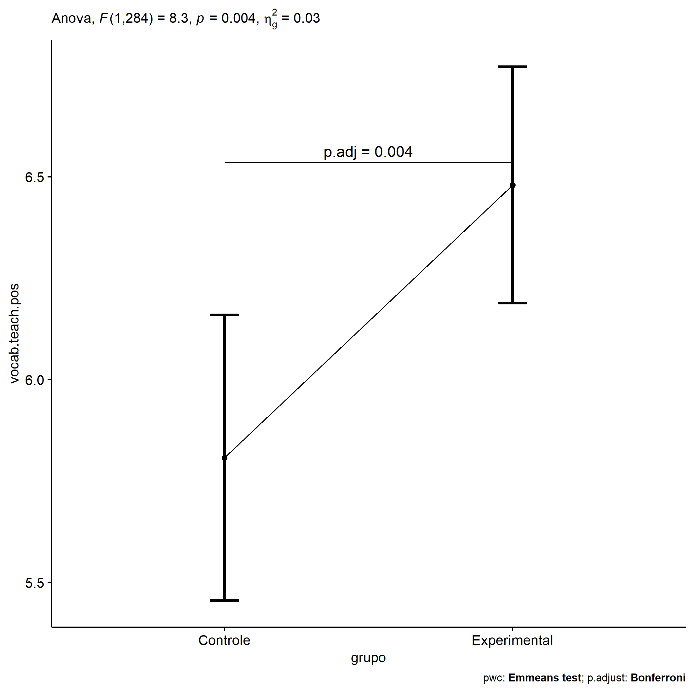<!-- -->

``` r
plots <- oneWayAncovaBoxPlots(
  wdat, "vocab.teach.pos", "grupo", aov, pwc, covar = "vocab.teach.pre",
  theme = "classic", color = color[["grupo"]],
  subtitle = which(aov$Effect == "grupo"))
```

``` r
if (length(unique(wdat[["grupo"]])) > 1)
  plots[["grupo"]] + ggplot2::ylab("Vocabulario Ensinado") + ggplot2::scale_x_discrete(labels=c('pre', 'pos'))
```

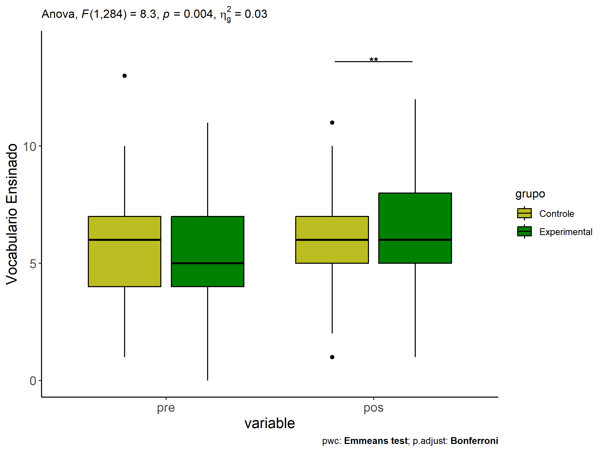<!-- -->

``` r
if (length(unique(wdat.long[["grupo"]])) > 1)
  plots <- oneWayAncovaBoxPlots(
    wdat.long, "vocab.teach", "grupo", aov, pwc.long, pre.post = "time",
    theme = "classic", color = color$prepost)
```

``` r
if (length(unique(wdat.long[["grupo"]])) > 1)
  plots[["grupo"]] + ggplot2::ylab("Vocabulario Ensinado")
```

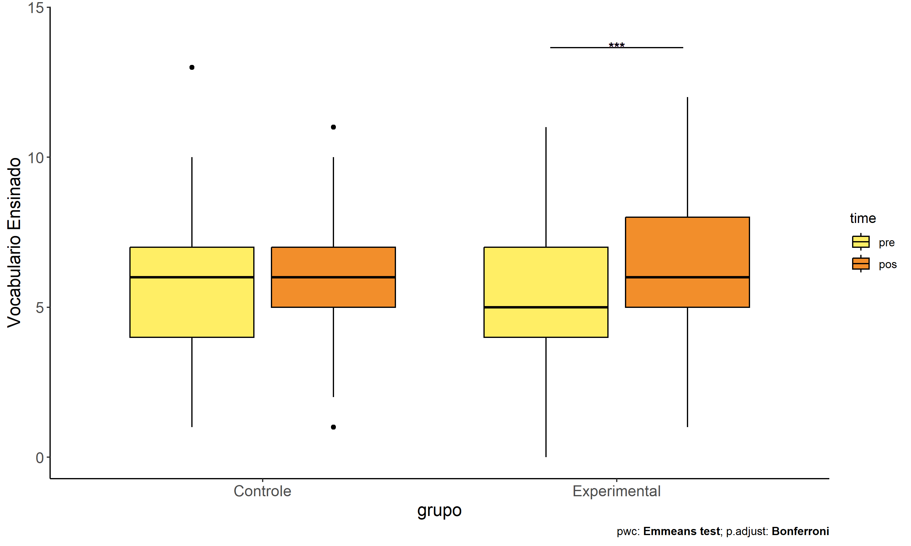<!-- -->

### Checking linearity assumption

``` r
ggscatter(wdat, x = "vocab.teach.pre", y = "vocab.teach.pos", size = 0.5,
          color = "grupo", add = "reg.line")+
  stat_regline_equation(
    aes(label =  paste(..eq.label.., ..rr.label.., sep = "~~~~"), color = grupo)
  )
```

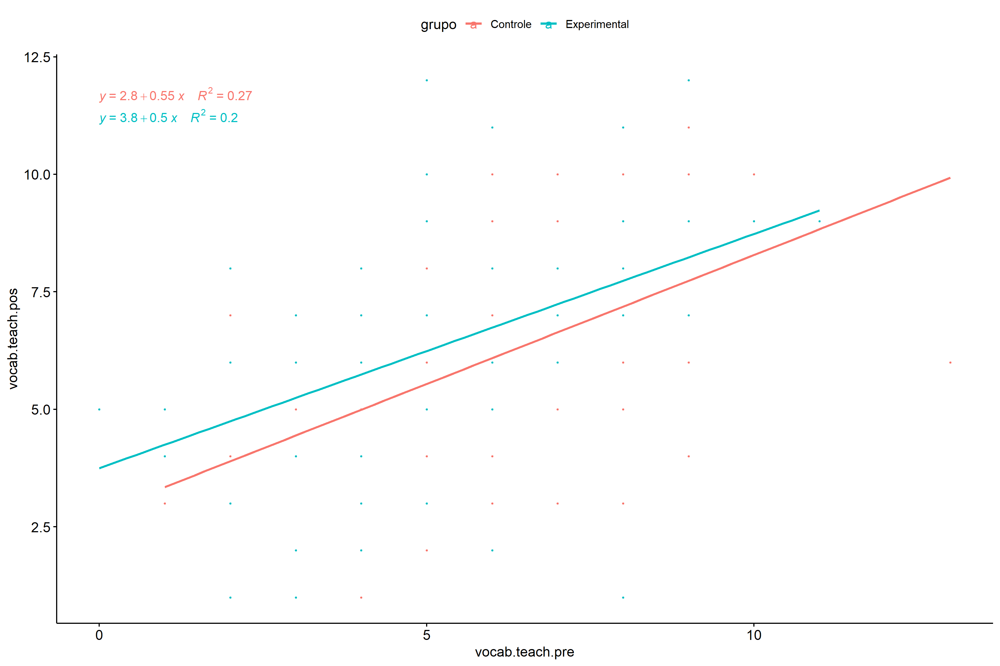<!-- -->

### Checking normality and homogeneity

``` r
res <- augment(lm(vocab.teach.pos ~ vocab.teach.pre + grupo, data = wdat))
```

``` r
shapiro_test(res$.resid)
```

    ## # A tibble: 1 × 3
    ##   variable   statistic p.value
    ##   <chr>          <dbl>   <dbl>
    ## 1 res$.resid     0.993   0.209

``` r
levene_test(res, .resid ~ grupo)
```

    ## # A tibble: 1 × 4
    ##     df1   df2 statistic     p
    ##   <int> <int>     <dbl> <dbl>
    ## 1     1   285    0.0293 0.864

# ANCOVA and Pairwise for two factors **grupo:Sexo**

## Without remove non-normal data

``` r
pdat = remove_group_data(dat[!is.na(dat[["grupo"]]) & !is.na(dat[["Sexo"]]),], "vocab.teach.pos", c("grupo","Sexo"))

pdat.long <- rbind(pdat[,c("id","grupo","Sexo")], pdat[,c("id","grupo","Sexo")])
pdat.long[["time"]] <- c(rep("pre", nrow(pdat)), rep("pos", nrow(pdat)))
pdat.long[["time"]] <- factor(pdat.long[["time"]], c("pre","pos"))
pdat.long[["vocab.teach"]] <- c(pdat[["vocab.teach.pre"]], pdat[["vocab.teach.pos"]])

aov = anova_test(pdat, vocab.teach.pos ~ vocab.teach.pre + grupo*Sexo)
laov[["grupo:Sexo"]] <- get_anova_table(aov)
```

``` r
pwcs <- list()
pwcs[["Sexo"]] <- emmeans_test(
  group_by(pdat, grupo), vocab.teach.pos ~ Sexo,
  covariate = vocab.teach.pre, p.adjust.method = "bonferroni")
pwcs[["grupo"]] <- emmeans_test(
  group_by(pdat, Sexo), vocab.teach.pos ~ grupo,
  covariate = vocab.teach.pre, p.adjust.method = "bonferroni")

pwc <- plyr::rbind.fill(pwcs[["grupo"]], pwcs[["Sexo"]])
pwc <- pwc[,c("grupo","Sexo", colnames(pwc)[!colnames(pwc) %in% c("grupo","Sexo")])]
```

``` r
pwc.long <- emmeans_test(dplyr::group_by_at(pdat.long, c("grupo","Sexo")),
                         vocab.teach ~ time,
                         p.adjust.method = "bonferroni")
lpwc[["grupo:Sexo"]] <- plyr::rbind.fill(pwc, pwc.long)
```

``` r
ds <- get.descriptives(pdat, "vocab.teach.pos", c("grupo","Sexo"), covar = "vocab.teach.pre")
ds <- merge(ds[ds$variable != "vocab.teach.pre",],
            ds[ds$variable == "vocab.teach.pre", !colnames(ds) %in% c("variable")],
            by = c("grupo","Sexo"), all.x = T, suffixes = c("", ".vocab.teach.pre"))
ds <- merge(get_emmeans(pwcs[["grupo"]]), ds, by = c("grupo","Sexo"), suffixes = c(".emms", ""))
ds <- ds[,c("grupo","Sexo","n","mean.vocab.teach.pre","se.vocab.teach.pre","mean","se","emmean","se.emms")]

colnames(ds) <- c("grupo","Sexo", "N", paste0(c("M","SE")," (pre)"),
                  paste0(c("M","SE"), " (unadj)"), paste0(c("M", "SE"), " (adj)"))

lemms[["grupo:Sexo"]] <- ds
```

## Computing ANCOVA and PairWise After removing non-normal data (OK)

``` r
wdat = pdat 

res = residuals(lm(vocab.teach.pos ~ vocab.teach.pre + grupo*Sexo, data = wdat))
non.normal = getNonNormal(res, wdat$id, plimit = 0.05)

wdat = wdat[!wdat$id %in% non.normal,]

wdat.long <- rbind(wdat[,c("id","grupo","Sexo")], wdat[,c("id","grupo","Sexo")])
wdat.long[["time"]] <- c(rep("pre", nrow(wdat)), rep("pos", nrow(wdat)))
wdat.long[["time"]] <- factor(wdat.long[["time"]], c("pre","pos"))
wdat.long[["vocab.teach"]] <- c(wdat[["vocab.teach.pre"]], wdat[["vocab.teach.pos"]])


ldat[["grupo:Sexo"]] = wdat

(non.normal)
```

    ## [1] "P3709"

``` r
aov = anova_test(wdat, vocab.teach.pos ~ vocab.teach.pre + grupo*Sexo)
laov[["grupo:Sexo"]] <- merge(get_anova_table(aov), laov[["grupo:Sexo"]], by="Effect", suffixes = c("","'"))

(df = get_anova_table(aov))
```

    ## ANOVA Table (type II tests)
    ## 
    ##            Effect DFn DFd      F        p p<.05   ges
    ## 1 vocab.teach.pre   1 283 83.155 1.45e-17     * 0.227
    ## 2           grupo   1 283  7.022 9.00e-03     * 0.024
    ## 3            Sexo   1 283  3.821 5.20e-02       0.013
    ## 4      grupo:Sexo   1 283  1.452 2.29e-01       0.005

| Effect          | DFn | DFd |      F |     p | p\<.05 |   ges |
|:----------------|----:|----:|-------:|------:|:-------|------:|
| vocab.teach.pre |   1 | 283 | 83.155 | 0.000 | \*     | 0.227 |
| grupo           |   1 | 283 |  7.022 | 0.009 | \*     | 0.024 |
| Sexo            |   1 | 283 |  3.821 | 0.052 |        | 0.013 |
| grupo:Sexo      |   1 | 283 |  1.452 | 0.229 |        | 0.005 |

``` r
pwcs <- list()
pwcs[["Sexo"]] <- emmeans_test(
  group_by(wdat, grupo), vocab.teach.pos ~ Sexo,
  covariate = vocab.teach.pre, p.adjust.method = "bonferroni")
pwcs[["grupo"]] <- emmeans_test(
  group_by(wdat, Sexo), vocab.teach.pos ~ grupo,
  covariate = vocab.teach.pre, p.adjust.method = "bonferroni")

pwc <- plyr::rbind.fill(pwcs[["grupo"]], pwcs[["Sexo"]])
pwc <- pwc[,c("grupo","Sexo", colnames(pwc)[!colnames(pwc) %in% c("grupo","Sexo")])]
```

| grupo        | Sexo | term                   | .y.             | group1   | group2       |  df | statistic |     p | p.adj | p.adj.signif |
|:-------------|:-----|:-----------------------|:----------------|:---------|:-------------|----:|----------:|------:|------:|:-------------|
|              | F    | vocab.teach.pre\*grupo | vocab.teach.pos | Controle | Experimental | 283 |    -2.717 | 0.007 | 0.007 | \*\*         |
|              | M    | vocab.teach.pre\*grupo | vocab.teach.pos | Controle | Experimental | 283 |    -1.070 | 0.285 | 0.285 | ns           |
| Controle     |      | vocab.teach.pre\*Sexo  | vocab.teach.pos | F        | M            | 283 |     0.313 | 0.754 | 0.754 | ns           |
| Experimental |      | vocab.teach.pre\*Sexo  | vocab.teach.pos | F        | M            | 283 |     2.275 | 0.024 | 0.024 | \*           |

``` r
pwc.long <- emmeans_test(dplyr::group_by_at(wdat.long, c("grupo","Sexo")),
                         vocab.teach ~ time,
                         p.adjust.method = "bonferroni")
lpwc[["grupo:Sexo"]] <- merge(plyr::rbind.fill(pwc, pwc.long), lpwc[["grupo:Sexo"]], by=c("grupo","Sexo","term",".y.","group1","group2"), suffixes = c("","'"))
```

| grupo        | Sexo | term | .y.         | group1 | group2 |  df | statistic |     p | p.adj | p.adj.signif |
|:-------------|:-----|:-----|:------------|:-------|:-------|----:|----------:|------:|------:|:-------------|
| Controle     | F    | time | vocab.teach | pre    | pos    | 568 |    -0.813 | 0.416 | 0.416 | ns           |
| Controle     | M    | time | vocab.teach | pre    | pos    | 568 |    -0.085 | 0.932 | 0.932 | ns           |
| Experimental | F    | time | vocab.teach | pre    | pos    | 568 |    -4.445 | 0.000 | 0.000 | \*\*\*\*     |
| Experimental | M    | time | vocab.teach | pre    | pos    | 568 |    -2.326 | 0.020 | 0.020 | \*           |

``` r
ds <- get.descriptives(wdat, "vocab.teach.pos", c("grupo","Sexo"), covar = "vocab.teach.pre")
ds <- merge(ds[ds$variable != "vocab.teach.pre",],
            ds[ds$variable == "vocab.teach.pre", !colnames(ds) %in% c("variable")],
            by = c("grupo","Sexo"), all.x = T, suffixes = c("", ".vocab.teach.pre"))
ds <- merge(get_emmeans(pwcs[["grupo"]]), ds, by = c("grupo","Sexo"), suffixes = c(".emms", ""))
ds <- ds[,c("grupo","Sexo","n","mean.vocab.teach.pre","se.vocab.teach.pre","mean","se","emmean","se.emms")]

colnames(ds) <- c("grupo","Sexo", "N", paste0(c("M","SE")," (pre)"),
                  paste0(c("M","SE"), " (unadj)"), paste0(c("M", "SE"), " (adj)"))

lemms[["grupo:Sexo"]] <- merge(ds, lemms[["grupo:Sexo"]], by=c("grupo","Sexo"), suffixes = c("","'"))
```

| grupo        | Sexo |   N | M (pre) | SE (pre) | M (unadj) | SE (unadj) | M (adj) | SE (adj) |
|:-------------|:-----|----:|--------:|---------:|----------:|-----------:|--------:|---------:|
| Controle     | F    |  55 |   5.618 |    0.265 |     5.945 |      0.294 |   5.865 |    0.262 |
| Controle     | M    |  62 |   6.000 |    0.284 |     6.032 |      0.288 |   5.752 |    0.249 |
| Experimental | F    |  86 |   5.221 |    0.204 |     6.651 |      0.234 |   6.779 |    0.210 |
| Experimental | M    |  85 |   5.224 |    0.215 |     5.976 |      0.240 |   6.103 |    0.211 |

### Plots for ancova

``` r
plots <- twoWayAncovaPlots(
  wdat, "vocab.teach.pos", c("grupo","Sexo"), aov, pwcs, addParam = c("mean_se"),
  font.label.size=10, step.increase=0.05, p.label="p.adj",
  subtitle = which(aov$Effect == "grupo:Sexo"))
```

``` r
if (!is.null(plots[["grupo"]]))
  plots[["grupo"]] + ggplot2::scale_color_manual(values = color[["Sexo"]])
```

    ## Scale for colour is already present.
    ## Adding another scale for colour, which will replace the existing scale.

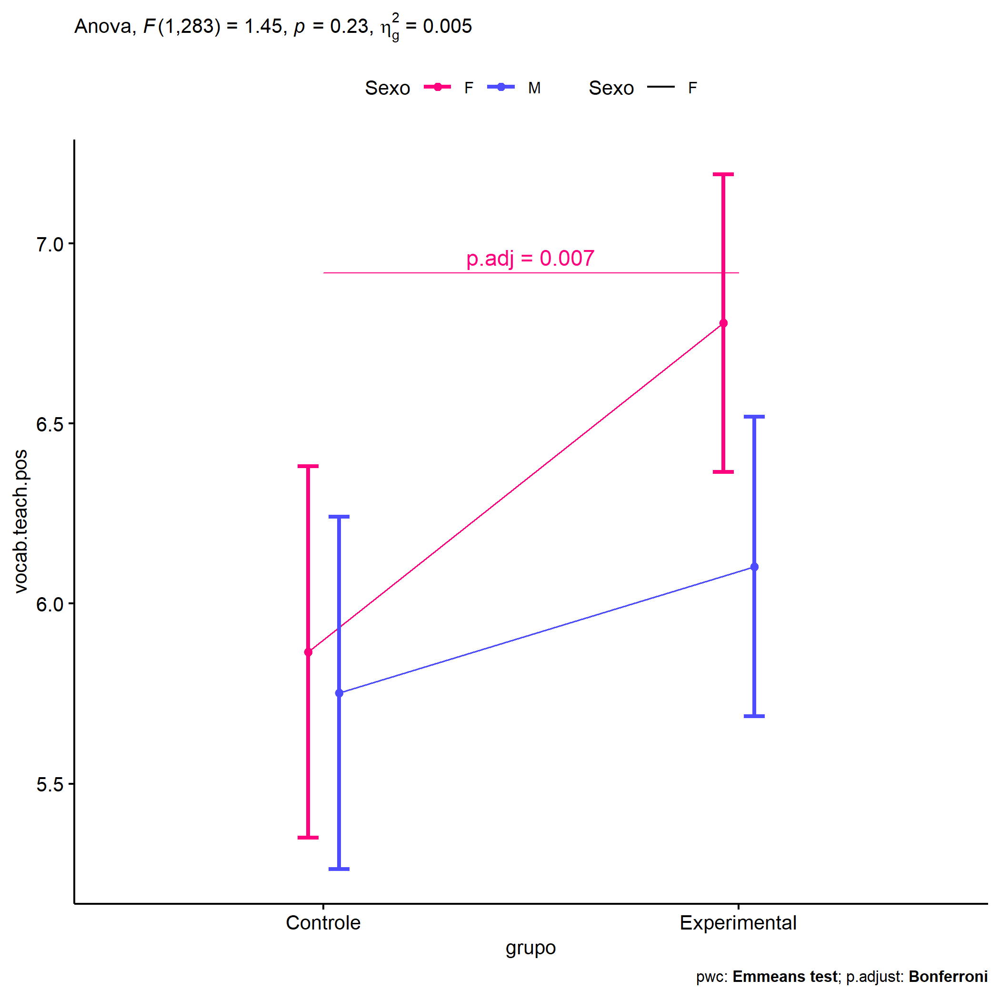<!-- -->

``` r
if (!is.null(plots[["Sexo"]]))
  plots[["Sexo"]] + ggplot2::scale_color_manual(values = color[["grupo"]])
```

    ## Scale for colour is already present.
    ## Adding another scale for colour, which will replace the existing scale.

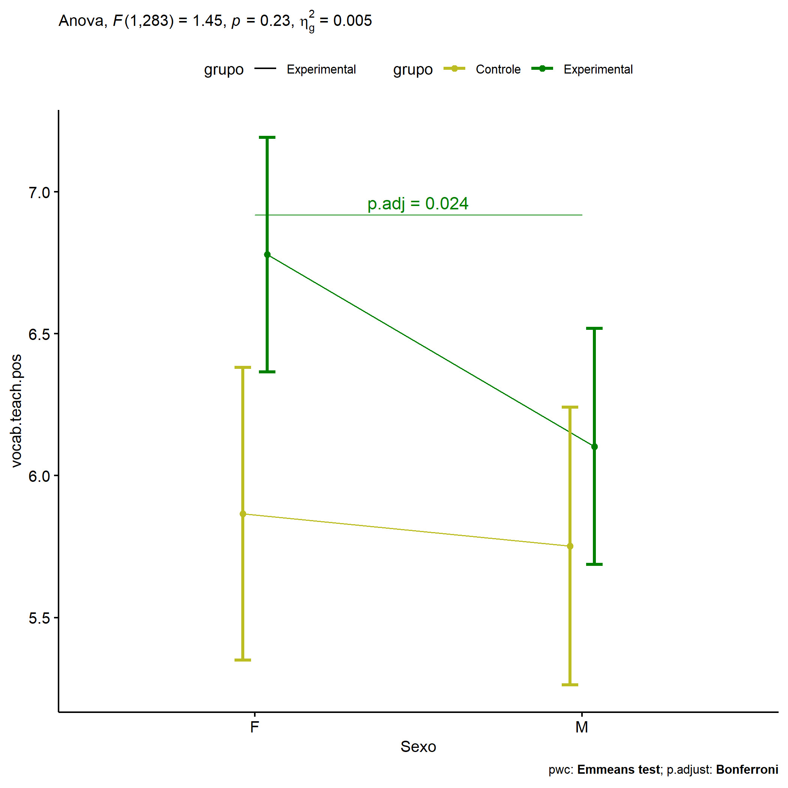<!-- -->

``` r
plots <- twoWayAncovaBoxPlots(
  wdat, "vocab.teach.pos", c("grupo","Sexo"), aov, pwcs, covar = "vocab.teach.pre",
  theme = "classic", color = color[["grupo:Sexo"]],
  subtitle = which(aov$Effect == "grupo:Sexo"))
```

``` r
plots[["grupo:Sexo"]] + ggplot2::ylab("Vocabulario Ensinado") + ggplot2::scale_x_discrete(labels=c('pre', 'pos'))
```

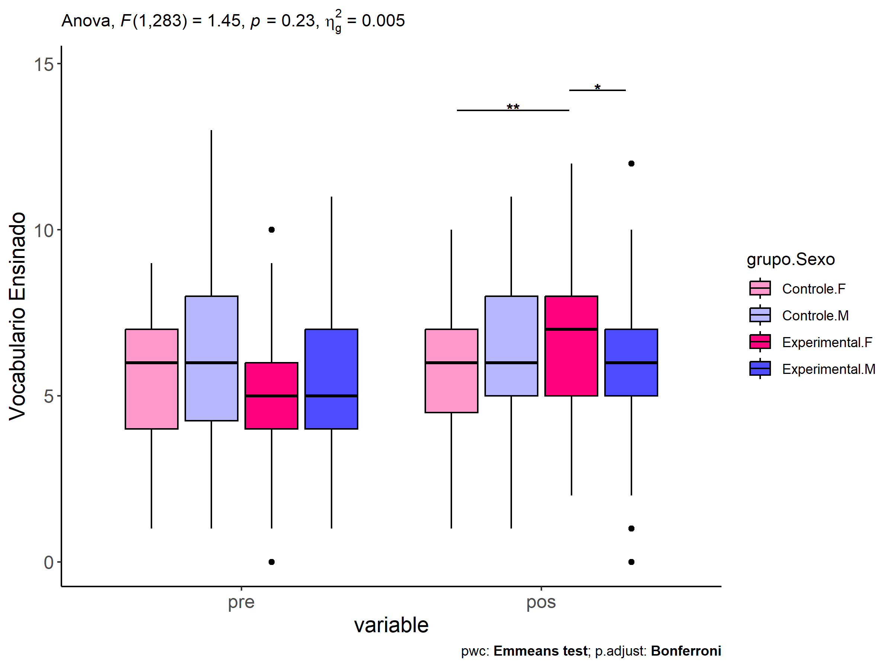<!-- -->

``` r
plots <- twoWayAncovaBoxPlots(
  wdat.long, "vocab.teach", c("grupo","Sexo"), aov, pwc.long, pre.post = "time",
  theme = "classic", color = color$prepost)
```

``` r
plots[["grupo:Sexo"]] + ggplot2::ylab("Vocabulario Ensinado")
```

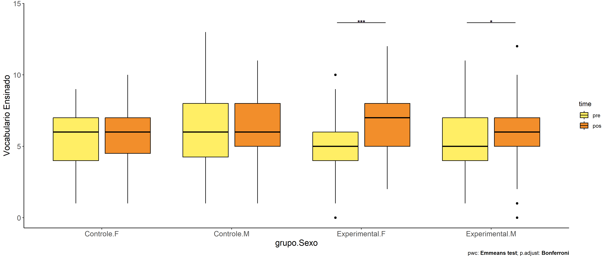<!-- -->

### Checking linearity assumption

``` r
ggscatter(wdat, x = "vocab.teach.pre", y = "vocab.teach.pos", size = 0.5,
          facet.by = c("grupo","Sexo"), add = "reg.line")+
  stat_regline_equation(
    aes(label =  paste(..eq.label.., ..rr.label.., sep = "~~~~"))
  )
```

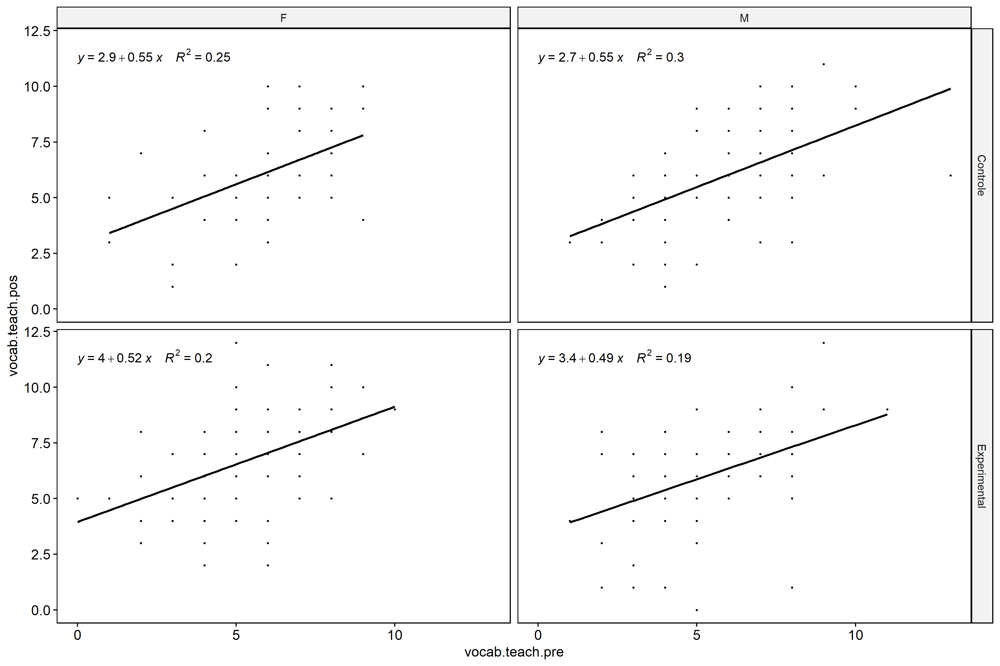<!-- -->

### Checking normality and homogeneity

``` r
res <- augment(lm(vocab.teach.pos ~ vocab.teach.pre + grupo*Sexo, data = wdat))
```

``` r
shapiro_test(res$.resid)
```

    ## # A tibble: 1 × 3
    ##   variable   statistic p.value
    ##   <chr>          <dbl>   <dbl>
    ## 1 res$.resid     0.992   0.123

``` r
levene_test(res, .resid ~ grupo*Sexo)
```

    ## # A tibble: 1 × 4
    ##     df1   df2 statistic     p
    ##   <int> <int>     <dbl> <dbl>
    ## 1     3   284    0.0428 0.988

# ANCOVA and Pairwise for two factors **grupo:Zona**

## Without remove non-normal data

``` r
pdat = remove_group_data(dat[!is.na(dat[["grupo"]]) & !is.na(dat[["Zona"]]),], "vocab.teach.pos", c("grupo","Zona"))

pdat.long <- rbind(pdat[,c("id","grupo","Zona")], pdat[,c("id","grupo","Zona")])
pdat.long[["time"]] <- c(rep("pre", nrow(pdat)), rep("pos", nrow(pdat)))
pdat.long[["time"]] <- factor(pdat.long[["time"]], c("pre","pos"))
pdat.long[["vocab.teach"]] <- c(pdat[["vocab.teach.pre"]], pdat[["vocab.teach.pos"]])

aov = anova_test(pdat, vocab.teach.pos ~ vocab.teach.pre + grupo*Zona)
laov[["grupo:Zona"]] <- get_anova_table(aov)
```

``` r
pwcs <- list()
pwcs[["Zona"]] <- emmeans_test(
  group_by(pdat, grupo), vocab.teach.pos ~ Zona,
  covariate = vocab.teach.pre, p.adjust.method = "bonferroni")
pwcs[["grupo"]] <- emmeans_test(
  group_by(pdat, Zona), vocab.teach.pos ~ grupo,
  covariate = vocab.teach.pre, p.adjust.method = "bonferroni")

pwc <- plyr::rbind.fill(pwcs[["grupo"]], pwcs[["Zona"]])
pwc <- pwc[,c("grupo","Zona", colnames(pwc)[!colnames(pwc) %in% c("grupo","Zona")])]
```

``` r
pwc.long <- emmeans_test(dplyr::group_by_at(pdat.long, c("grupo","Zona")),
                         vocab.teach ~ time,
                         p.adjust.method = "bonferroni")
lpwc[["grupo:Zona"]] <- plyr::rbind.fill(pwc, pwc.long)
```

``` r
ds <- get.descriptives(pdat, "vocab.teach.pos", c("grupo","Zona"), covar = "vocab.teach.pre")
ds <- merge(ds[ds$variable != "vocab.teach.pre",],
            ds[ds$variable == "vocab.teach.pre", !colnames(ds) %in% c("variable")],
            by = c("grupo","Zona"), all.x = T, suffixes = c("", ".vocab.teach.pre"))
ds <- merge(get_emmeans(pwcs[["grupo"]]), ds, by = c("grupo","Zona"), suffixes = c(".emms", ""))
ds <- ds[,c("grupo","Zona","n","mean.vocab.teach.pre","se.vocab.teach.pre","mean","se","emmean","se.emms")]

colnames(ds) <- c("grupo","Zona", "N", paste0(c("M","SE")," (pre)"),
                  paste0(c("M","SE"), " (unadj)"), paste0(c("M", "SE"), " (adj)"))

lemms[["grupo:Zona"]] <- ds
```

## Computing ANCOVA and PairWise After removing non-normal data (OK)

``` r
wdat = pdat 

res = residuals(lm(vocab.teach.pos ~ vocab.teach.pre + grupo*Zona, data = wdat))
non.normal = getNonNormal(res, wdat$id, plimit = 0.05)

wdat = wdat[!wdat$id %in% non.normal,]

wdat.long <- rbind(wdat[,c("id","grupo","Zona")], wdat[,c("id","grupo","Zona")])
wdat.long[["time"]] <- c(rep("pre", nrow(wdat)), rep("pos", nrow(wdat)))
wdat.long[["time"]] <- factor(wdat.long[["time"]], c("pre","pos"))
wdat.long[["vocab.teach"]] <- c(wdat[["vocab.teach.pre"]], wdat[["vocab.teach.pos"]])


ldat[["grupo:Zona"]] = wdat

(non.normal)
```

    ## [1] "P3709"

``` r
aov = anova_test(wdat, vocab.teach.pos ~ vocab.teach.pre + grupo*Zona)
laov[["grupo:Zona"]] <- merge(get_anova_table(aov), laov[["grupo:Zona"]], by="Effect", suffixes = c("","'"))

(df = get_anova_table(aov))
```

    ## ANOVA Table (type II tests)
    ## 
    ##            Effect DFn DFd      F        p p<.05   ges
    ## 1 vocab.teach.pre   1 157 67.075 8.54e-14     * 0.299
    ## 2           grupo   1 157  0.584 4.46e-01       0.004
    ## 3            Zona   1 157  7.037 9.00e-03     * 0.043
    ## 4      grupo:Zona   1 157  2.101 1.49e-01       0.013

| Effect          | DFn | DFd |      F |     p | p\<.05 |   ges |
|:----------------|----:|----:|-------:|------:|:-------|------:|
| vocab.teach.pre |   1 | 157 | 67.075 | 0.000 | \*     | 0.299 |
| grupo           |   1 | 157 |  0.584 | 0.446 |        | 0.004 |
| Zona            |   1 | 157 |  7.037 | 0.009 | \*     | 0.043 |
| grupo:Zona      |   1 | 157 |  2.101 | 0.149 |        | 0.013 |

``` r
pwcs <- list()
pwcs[["Zona"]] <- emmeans_test(
  group_by(wdat, grupo), vocab.teach.pos ~ Zona,
  covariate = vocab.teach.pre, p.adjust.method = "bonferroni")
pwcs[["grupo"]] <- emmeans_test(
  group_by(wdat, Zona), vocab.teach.pos ~ grupo,
  covariate = vocab.teach.pre, p.adjust.method = "bonferroni")

pwc <- plyr::rbind.fill(pwcs[["grupo"]], pwcs[["Zona"]])
pwc <- pwc[,c("grupo","Zona", colnames(pwc)[!colnames(pwc) %in% c("grupo","Zona")])]
```

| grupo        | Zona   | term                   | .y.             | group1   | group2       |  df | statistic |     p | p.adj | p.adj.signif |
|:-------------|:-------|:-----------------------|:----------------|:---------|:-------------|----:|----------:|------:|------:|:-------------|
|              | Rural  | vocab.teach.pre\*grupo | vocab.teach.pos | Controle | Experimental | 157 |     0.223 | 0.824 | 0.824 | ns           |
|              | Urbana | vocab.teach.pre\*grupo | vocab.teach.pos | Controle | Experimental | 157 |    -1.621 | 0.107 | 0.107 | ns           |
| Controle     |        | vocab.teach.pre\*Zona  | vocab.teach.pos | Rural    | Urbana       | 157 |     2.710 | 0.007 | 0.007 | \*\*         |
| Experimental |        | vocab.teach.pre\*Zona  | vocab.teach.pos | Rural    | Urbana       | 157 |     1.340 | 0.182 | 0.182 | ns           |

``` r
pwc.long <- emmeans_test(dplyr::group_by_at(wdat.long, c("grupo","Zona")),
                         vocab.teach ~ time,
                         p.adjust.method = "bonferroni")
lpwc[["grupo:Zona"]] <- merge(plyr::rbind.fill(pwc, pwc.long), lpwc[["grupo:Zona"]], by=c("grupo","Zona","term",".y.","group1","group2"), suffixes = c("","'"))
```

| grupo        | Zona   | term | .y.         | group1 | group2 |  df | statistic |     p | p.adj | p.adj.signif |
|:-------------|:-------|:-----|:------------|:-------|:-------|----:|----------:|------:|------:|:-------------|
| Controle     | Rural  | time | vocab.teach | pre    | pos    | 316 |    -2.318 | 0.021 | 0.021 | \*           |
| Controle     | Urbana | time | vocab.teach | pre    | pos    | 316 |     0.563 | 0.574 | 0.574 | ns           |
| Experimental | Rural  | time | vocab.teach | pre    | pos    | 316 |    -3.187 | 0.002 | 0.002 | \*\*         |
| Experimental | Urbana | time | vocab.teach | pre    | pos    | 316 |    -1.560 | 0.120 | 0.120 | ns           |

``` r
ds <- get.descriptives(wdat, "vocab.teach.pos", c("grupo","Zona"), covar = "vocab.teach.pre")
ds <- merge(ds[ds$variable != "vocab.teach.pre",],
            ds[ds$variable == "vocab.teach.pre", !colnames(ds) %in% c("variable")],
            by = c("grupo","Zona"), all.x = T, suffixes = c("", ".vocab.teach.pre"))
ds <- merge(get_emmeans(pwcs[["grupo"]]), ds, by = c("grupo","Zona"), suffixes = c(".emms", ""))
ds <- ds[,c("grupo","Zona","n","mean.vocab.teach.pre","se.vocab.teach.pre","mean","se","emmean","se.emms")]

colnames(ds) <- c("grupo","Zona", "N", paste0(c("M","SE")," (pre)"),
                  paste0(c("M","SE"), " (unadj)"), paste0(c("M", "SE"), " (adj)"))

lemms[["grupo:Zona"]] <- merge(ds, lemms[["grupo:Zona"]], by=c("grupo","Zona"), suffixes = c("","'"))
```

| grupo        | Zona   |   N | M (pre) | SE (pre) | M (unadj) | SE (unadj) | M (adj) | SE (adj) |
|:-------------|:-------|----:|--------:|---------:|----------:|-----------:|--------:|---------:|
| Controle     | Rural  |  40 |   5.875 |    0.300 |     6.950 |      0.334 |   6.780 |    0.286 |
| Controle     | Urbana |  18 |   6.056 |    0.424 |     5.667 |      0.530 |   5.390 |    0.427 |
| Experimental | Rural  |  61 |   5.377 |    0.255 |     6.574 |      0.299 |   6.697 |    0.232 |
| Experimental | Urbana |  43 |   5.419 |    0.328 |     6.116 |      0.283 |   6.215 |    0.276 |

### Plots for ancova

``` r
plots <- twoWayAncovaPlots(
  wdat, "vocab.teach.pos", c("grupo","Zona"), aov, pwcs, addParam = c("mean_se"),
  font.label.size=10, step.increase=0.05, p.label="p.adj",
  subtitle = which(aov$Effect == "grupo:Zona"))
```

``` r
if (!is.null(plots[["grupo"]]))
  plots[["grupo"]] + ggplot2::scale_color_manual(values = color[["Zona"]])
```

    ## Scale for colour is already present.
    ## Adding another scale for colour, which will replace the existing scale.

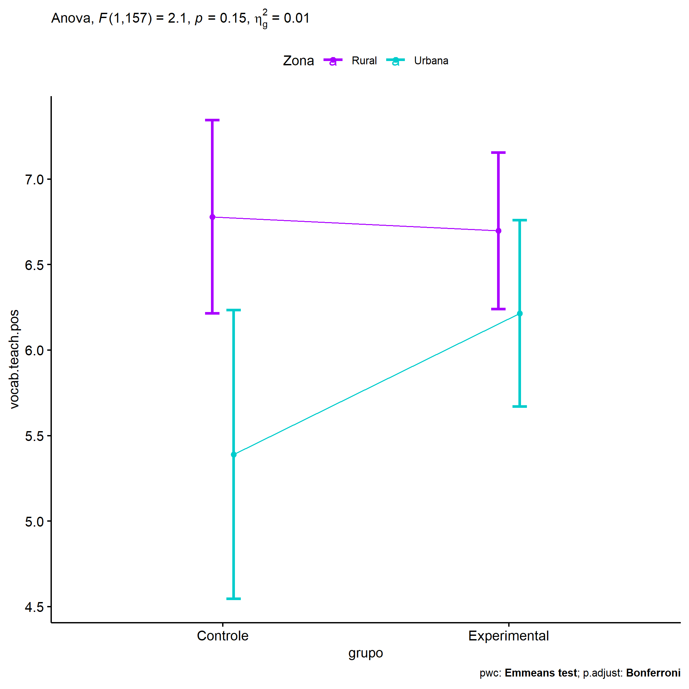<!-- -->

``` r
if (!is.null(plots[["Zona"]]))
  plots[["Zona"]] + ggplot2::scale_color_manual(values = color[["grupo"]])
```

    ## Scale for colour is already present.
    ## Adding another scale for colour, which will replace the existing scale.

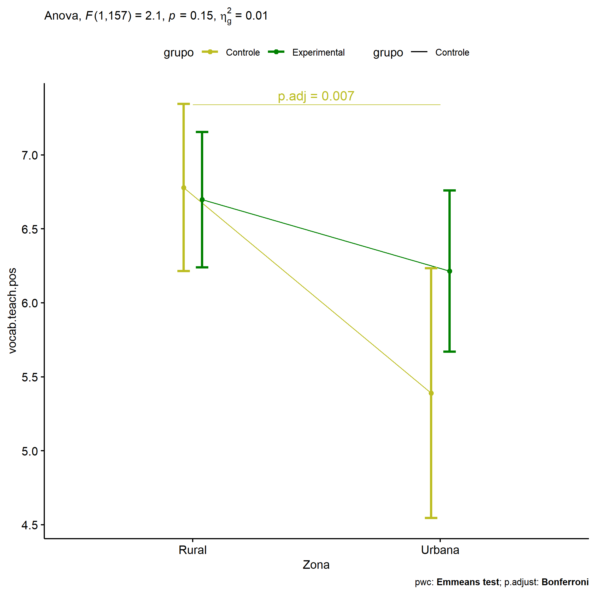<!-- -->

``` r
plots <- twoWayAncovaBoxPlots(
  wdat, "vocab.teach.pos", c("grupo","Zona"), aov, pwcs, covar = "vocab.teach.pre",
  theme = "classic", color = color[["grupo:Zona"]],
  subtitle = which(aov$Effect == "grupo:Zona"))
```

``` r
plots[["grupo:Zona"]] + ggplot2::ylab("Vocabulario Ensinado") + ggplot2::scale_x_discrete(labels=c('pre', 'pos'))
```

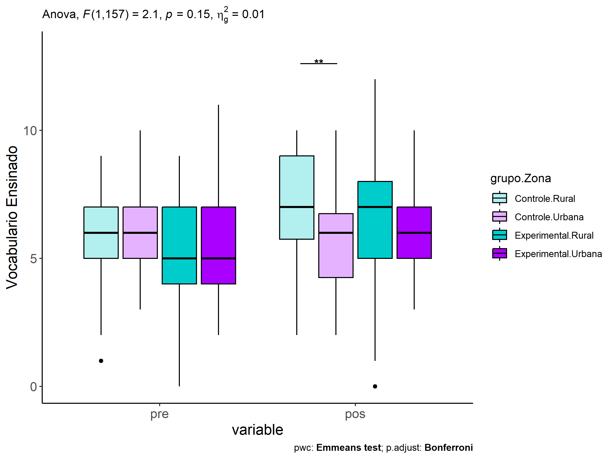<!-- -->

``` r
plots <- twoWayAncovaBoxPlots(
  wdat.long, "vocab.teach", c("grupo","Zona"), aov, pwc.long, pre.post = "time",
  theme = "classic", color = color$prepost)
```

``` r
plots[["grupo:Zona"]] + ggplot2::ylab("Vocabulario Ensinado")
```

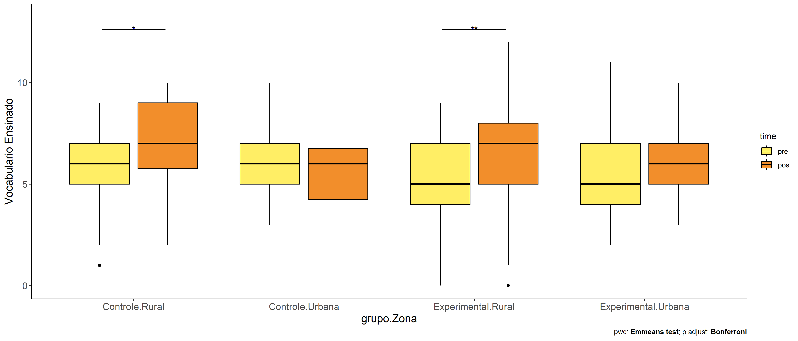<!-- -->

### Checking linearity assumption

``` r
ggscatter(wdat, x = "vocab.teach.pre", y = "vocab.teach.pos", size = 0.5,
          facet.by = c("grupo","Zona"), add = "reg.line")+
  stat_regline_equation(
    aes(label =  paste(..eq.label.., ..rr.label.., sep = "~~~~"))
  )
```

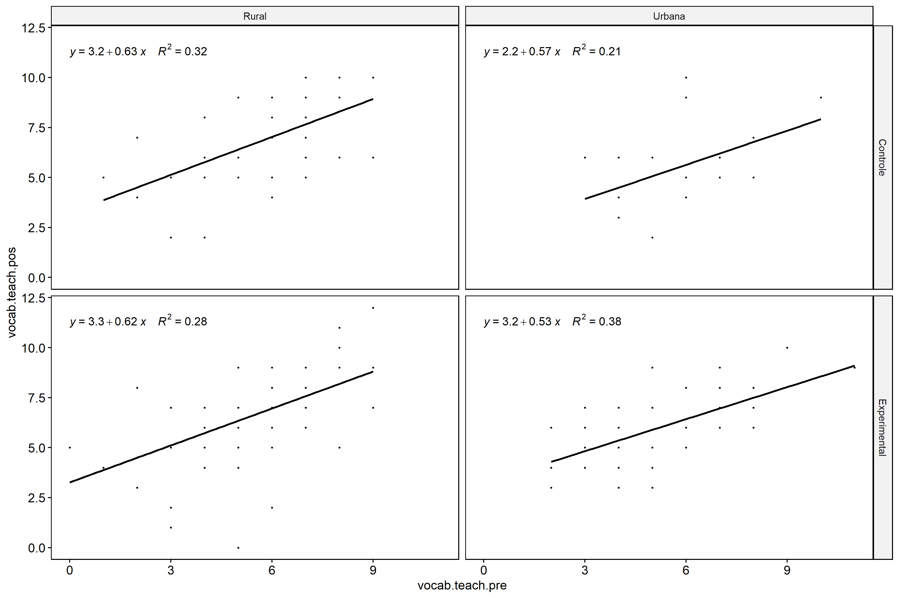<!-- -->

### Checking normality and homogeneity

``` r
res <- augment(lm(vocab.teach.pos ~ vocab.teach.pre + grupo*Zona, data = wdat))
```

``` r
shapiro_test(res$.resid)
```

    ## # A tibble: 1 × 3
    ##   variable   statistic p.value
    ##   <chr>          <dbl>   <dbl>
    ## 1 res$.resid     0.988   0.170

``` r
levene_test(res, .resid ~ grupo*Zona)
```

    ## # A tibble: 1 × 4
    ##     df1   df2 statistic     p
    ##   <int> <int>     <dbl> <dbl>
    ## 1     3   158     0.704 0.551

# ANCOVA and Pairwise for two factors **grupo:Cor.Raca**

## Without remove non-normal data

``` r
pdat = remove_group_data(dat[!is.na(dat[["grupo"]]) & !is.na(dat[["Cor.Raca"]]),], "vocab.teach.pos", c("grupo","Cor.Raca"))

pdat.long <- rbind(pdat[,c("id","grupo","Cor.Raca")], pdat[,c("id","grupo","Cor.Raca")])
pdat.long[["time"]] <- c(rep("pre", nrow(pdat)), rep("pos", nrow(pdat)))
pdat.long[["time"]] <- factor(pdat.long[["time"]], c("pre","pos"))
pdat.long[["vocab.teach"]] <- c(pdat[["vocab.teach.pre"]], pdat[["vocab.teach.pos"]])

aov = anova_test(pdat, vocab.teach.pos ~ vocab.teach.pre + grupo*Cor.Raca)
laov[["grupo:Cor.Raca"]] <- get_anova_table(aov)
```

``` r
pwcs <- list()
pwcs[["Cor.Raca"]] <- emmeans_test(
  group_by(pdat, grupo), vocab.teach.pos ~ Cor.Raca,
  covariate = vocab.teach.pre, p.adjust.method = "bonferroni")
pwcs[["grupo"]] <- emmeans_test(
  group_by(pdat, Cor.Raca), vocab.teach.pos ~ grupo,
  covariate = vocab.teach.pre, p.adjust.method = "bonferroni")

pwc <- plyr::rbind.fill(pwcs[["grupo"]], pwcs[["Cor.Raca"]])
pwc <- pwc[,c("grupo","Cor.Raca", colnames(pwc)[!colnames(pwc) %in% c("grupo","Cor.Raca")])]
```

``` r
pwc.long <- emmeans_test(dplyr::group_by_at(pdat.long, c("grupo","Cor.Raca")),
                         vocab.teach ~ time,
                         p.adjust.method = "bonferroni")
lpwc[["grupo:Cor.Raca"]] <- plyr::rbind.fill(pwc, pwc.long)
```

``` r
ds <- get.descriptives(pdat, "vocab.teach.pos", c("grupo","Cor.Raca"), covar = "vocab.teach.pre")
ds <- merge(ds[ds$variable != "vocab.teach.pre",],
            ds[ds$variable == "vocab.teach.pre", !colnames(ds) %in% c("variable")],
            by = c("grupo","Cor.Raca"), all.x = T, suffixes = c("", ".vocab.teach.pre"))
ds <- merge(get_emmeans(pwcs[["grupo"]]), ds, by = c("grupo","Cor.Raca"), suffixes = c(".emms", ""))
ds <- ds[,c("grupo","Cor.Raca","n","mean.vocab.teach.pre","se.vocab.teach.pre","mean","se","emmean","se.emms")]

colnames(ds) <- c("grupo","Cor.Raca", "N", paste0(c("M","SE")," (pre)"),
                  paste0(c("M","SE"), " (unadj)"), paste0(c("M", "SE"), " (adj)"))

lemms[["grupo:Cor.Raca"]] <- ds
```

## Computing ANCOVA and PairWise After removing non-normal data (OK)

``` r
wdat = pdat 

res = residuals(lm(vocab.teach.pos ~ vocab.teach.pre + grupo*Cor.Raca, data = wdat))
non.normal = getNonNormal(res, wdat$id, plimit = 0.05)

wdat = wdat[!wdat$id %in% non.normal,]

wdat.long <- rbind(wdat[,c("id","grupo","Cor.Raca")], wdat[,c("id","grupo","Cor.Raca")])
wdat.long[["time"]] <- c(rep("pre", nrow(wdat)), rep("pos", nrow(wdat)))
wdat.long[["time"]] <- factor(wdat.long[["time"]], c("pre","pos"))
wdat.long[["vocab.teach"]] <- c(wdat[["vocab.teach.pre"]], wdat[["vocab.teach.pos"]])


ldat[["grupo:Cor.Raca"]] = wdat

(non.normal)
```

    ## NULL

``` r
aov = anova_test(wdat, vocab.teach.pos ~ vocab.teach.pre + grupo*Cor.Raca)
laov[["grupo:Cor.Raca"]] <- merge(get_anova_table(aov), laov[["grupo:Cor.Raca"]], by="Effect", suffixes = c("","'"))

(df = get_anova_table(aov))
```

    ## ANOVA Table (type II tests)
    ## 
    ##            Effect DFn DFd      F        p p<.05   ges
    ## 1 vocab.teach.pre   1 111 32.732 9.09e-08     * 0.228
    ## 2           grupo   1 111  1.576 2.12e-01       0.014
    ## 3        Cor.Raca   1 111  3.283 7.30e-02       0.029
    ## 4  grupo:Cor.Raca   1 111  0.877 3.51e-01       0.008

| Effect          | DFn | DFd |      F |     p | p\<.05 |   ges |
|:----------------|----:|----:|-------:|------:|:-------|------:|
| vocab.teach.pre |   1 | 111 | 32.732 | 0.000 | \*     | 0.228 |
| grupo           |   1 | 111 |  1.576 | 0.212 |        | 0.014 |
| Cor.Raca        |   1 | 111 |  3.283 | 0.073 |        | 0.029 |
| grupo:Cor.Raca  |   1 | 111 |  0.877 | 0.351 |        | 0.008 |

``` r
pwcs <- list()
pwcs[["Cor.Raca"]] <- emmeans_test(
  group_by(wdat, grupo), vocab.teach.pos ~ Cor.Raca,
  covariate = vocab.teach.pre, p.adjust.method = "bonferroni")
pwcs[["grupo"]] <- emmeans_test(
  group_by(wdat, Cor.Raca), vocab.teach.pos ~ grupo,
  covariate = vocab.teach.pre, p.adjust.method = "bonferroni")

pwc <- plyr::rbind.fill(pwcs[["grupo"]], pwcs[["Cor.Raca"]])
pwc <- pwc[,c("grupo","Cor.Raca", colnames(pwc)[!colnames(pwc) %in% c("grupo","Cor.Raca")])]
```

| grupo        | Cor.Raca | term                      | .y.             | group1   | group2       |  df | statistic |     p | p.adj | p.adj.signif |
|:-------------|:---------|:--------------------------|:----------------|:---------|:-------------|----:|----------:|------:|------:|:-------------|
|              | Branca   | vocab.teach.pre\*grupo    | vocab.teach.pos | Controle | Experimental | 111 |     0.353 | 0.725 | 0.725 | ns           |
|              | Parda    | vocab.teach.pre\*grupo    | vocab.teach.pos | Controle | Experimental | 111 |    -1.523 | 0.131 | 0.131 | ns           |
| Controle     |          | vocab.teach.pre\*Cor.Raca | vocab.teach.pos | Branca   | Parda        | 111 |     1.847 | 0.067 | 0.067 | ns           |
| Experimental |          | vocab.teach.pre\*Cor.Raca | vocab.teach.pos | Branca   | Parda        | 111 |     0.892 | 0.374 | 0.374 | ns           |

``` r
pwc.long <- emmeans_test(dplyr::group_by_at(wdat.long, c("grupo","Cor.Raca")),
                         vocab.teach ~ time,
                         p.adjust.method = "bonferroni")
lpwc[["grupo:Cor.Raca"]] <- merge(plyr::rbind.fill(pwc, pwc.long), lpwc[["grupo:Cor.Raca"]], by=c("grupo","Cor.Raca","term",".y.","group1","group2"), suffixes = c("","'"))
```

| grupo        | Cor.Raca | term | .y.         | group1 | group2 |  df | statistic |     p | p.adj | p.adj.signif |
|:-------------|:---------|:-----|:------------|:-------|:-------|----:|----------:|------:|------:|:-------------|
| Controle     | Branca   | time | vocab.teach | pre    | pos    | 224 |    -1.172 | 0.243 | 0.243 | ns           |
| Controle     | Parda    | time | vocab.teach | pre    | pos    | 224 |    -0.841 | 0.401 | 0.401 | ns           |
| Experimental | Branca   | time | vocab.teach | pre    | pos    | 224 |    -1.633 | 0.104 | 0.104 | ns           |
| Experimental | Parda    | time | vocab.teach | pre    | pos    | 224 |    -2.837 | 0.005 | 0.005 | \*\*         |

``` r
ds <- get.descriptives(wdat, "vocab.teach.pos", c("grupo","Cor.Raca"), covar = "vocab.teach.pre")
ds <- merge(ds[ds$variable != "vocab.teach.pre",],
            ds[ds$variable == "vocab.teach.pre", !colnames(ds) %in% c("variable")],
            by = c("grupo","Cor.Raca"), all.x = T, suffixes = c("", ".vocab.teach.pre"))
ds <- merge(get_emmeans(pwcs[["grupo"]]), ds, by = c("grupo","Cor.Raca"), suffixes = c(".emms", ""))
ds <- ds[,c("grupo","Cor.Raca","n","mean.vocab.teach.pre","se.vocab.teach.pre","mean","se","emmean","se.emms")]

colnames(ds) <- c("grupo","Cor.Raca", "N", paste0(c("M","SE")," (pre)"),
                  paste0(c("M","SE"), " (unadj)"), paste0(c("M", "SE"), " (adj)"))

lemms[["grupo:Cor.Raca"]] <- merge(ds, lemms[["grupo:Cor.Raca"]], by=c("grupo","Cor.Raca"), suffixes = c("","'"))
```

| grupo        | Cor.Raca |   N | M (pre) | SE (pre) | M (unadj) | SE (unadj) | M (adj) | SE (adj) |
|:-------------|:---------|----:|--------:|---------:|----------:|-----------:|--------:|---------:|
| Controle     | Branca   |   7 |   6.571 |    0.481 |     8.000 |      0.690 |   7.331 |    0.804 |
| Controle     | Parda    |  44 |   5.364 |    0.361 |     5.773 |      0.333 |   5.736 |    0.317 |
| Experimental | Branca   |  13 |   5.769 |    0.482 |     7.231 |      0.533 |   6.982 |    0.585 |
| Experimental | Parda    |  52 |   4.942 |    0.299 |     6.212 |      0.370 |   6.395 |    0.294 |

### Plots for ancova

``` r
plots <- twoWayAncovaPlots(
  wdat, "vocab.teach.pos", c("grupo","Cor.Raca"), aov, pwcs, addParam = c("mean_se"),
  font.label.size=10, step.increase=0.05, p.label="p.adj",
  subtitle = which(aov$Effect == "grupo:Cor.Raca"))
```

``` r
if (!is.null(plots[["grupo"]]))
  plots[["grupo"]] + ggplot2::scale_color_manual(values = color[["Cor.Raca"]])
```

    ## Scale for colour is already present.
    ## Adding another scale for colour, which will replace the existing scale.

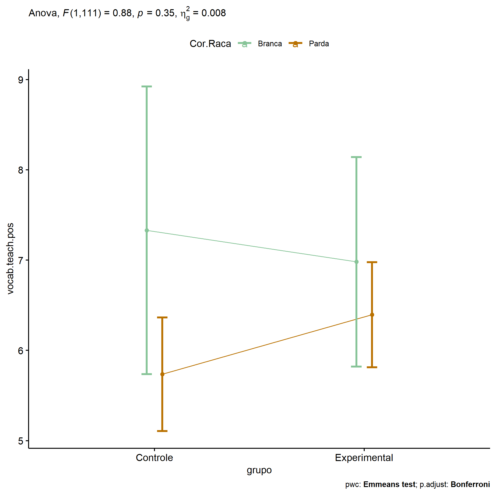<!-- -->

``` r
if (!is.null(plots[["Cor.Raca"]]))
  plots[["Cor.Raca"]] + ggplot2::scale_color_manual(values = color[["grupo"]])
```

    ## Scale for colour is already present.
    ## Adding another scale for colour, which will replace the existing scale.

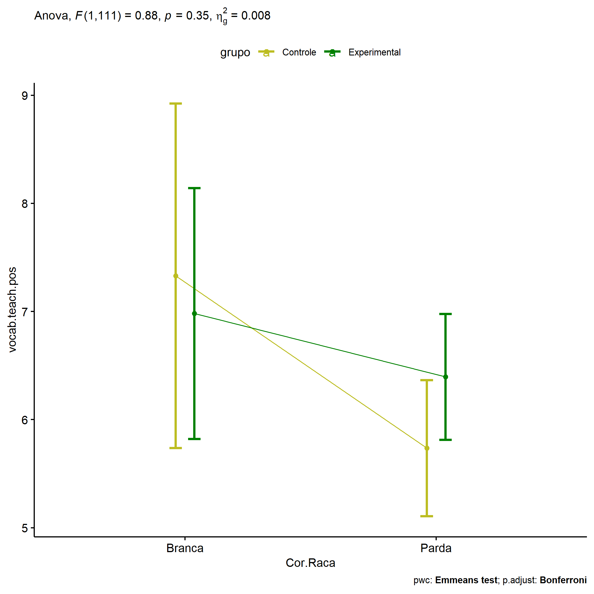<!-- -->

``` r
plots <- twoWayAncovaBoxPlots(
  wdat, "vocab.teach.pos", c("grupo","Cor.Raca"), aov, pwcs, covar = "vocab.teach.pre",
  theme = "classic", color = color[["grupo:Cor.Raca"]],
  subtitle = which(aov$Effect == "grupo:Cor.Raca"))
```

``` r
plots[["grupo:Cor.Raca"]] + ggplot2::ylab("Vocabulario Ensinado") + ggplot2::scale_x_discrete(labels=c('pre', 'pos'))
```

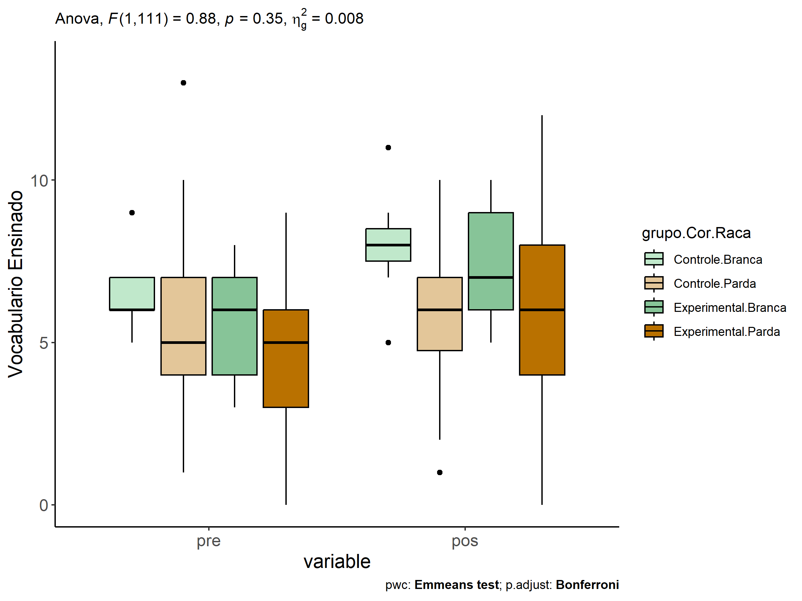<!-- -->

``` r
plots <- twoWayAncovaBoxPlots(
  wdat.long, "vocab.teach", c("grupo","Cor.Raca"), aov, pwc.long, pre.post = "time",
  theme = "classic", color = color$prepost)
```

``` r
plots[["grupo:Cor.Raca"]] + ggplot2::ylab("Vocabulario Ensinado")
```

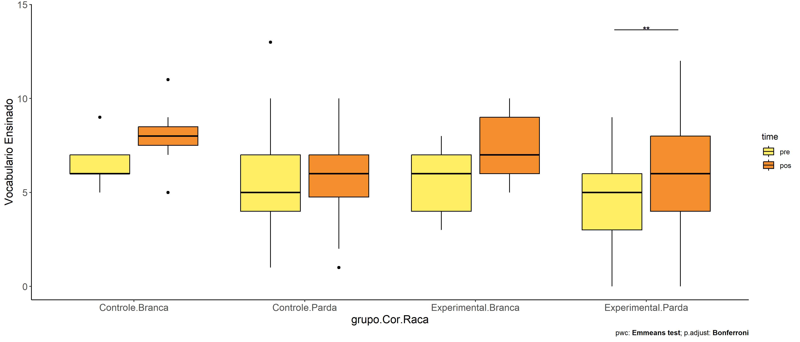<!-- -->

### Checking linearity assumption

``` r
ggscatter(wdat, x = "vocab.teach.pre", y = "vocab.teach.pos", size = 0.5,
          facet.by = c("grupo","Cor.Raca"), add = "reg.line")+
  stat_regline_equation(
    aes(label =  paste(..eq.label.., ..rr.label.., sep = "~~~~"))
  )
```

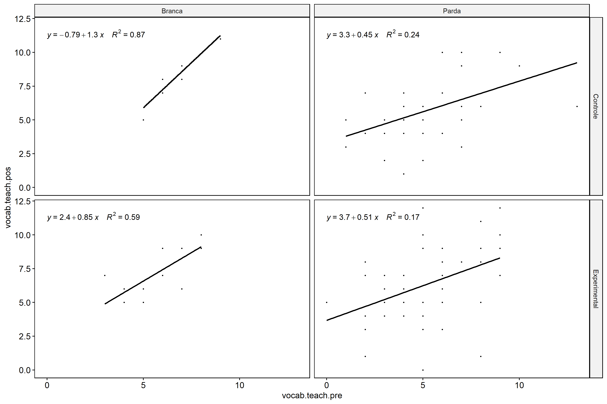<!-- -->

### Checking normality and homogeneity

``` r
res <- augment(lm(vocab.teach.pos ~ vocab.teach.pre + grupo*Cor.Raca, data = wdat))
```

``` r
shapiro_test(res$.resid)
```

    ## # A tibble: 1 × 3
    ##   variable   statistic p.value
    ##   <chr>          <dbl>   <dbl>
    ## 1 res$.resid     0.985   0.212

``` r
levene_test(res, .resid ~ grupo*Cor.Raca)
```

    ## # A tibble: 1 × 4
    ##     df1   df2 statistic      p
    ##   <int> <int>     <dbl>  <dbl>
    ## 1     3   112      2.13 0.0999

# ANCOVA and Pairwise for two factors **grupo:vocab.teach.quintile**

## Without remove non-normal data

``` r
pdat = remove_group_data(dat[!is.na(dat[["grupo"]]) & !is.na(dat[["vocab.teach.quintile"]]),], "vocab.teach.pos", c("grupo","vocab.teach.quintile"))

pdat.long <- rbind(pdat[,c("id","grupo","vocab.teach.quintile")], pdat[,c("id","grupo","vocab.teach.quintile")])
pdat.long[["time"]] <- c(rep("pre", nrow(pdat)), rep("pos", nrow(pdat)))
pdat.long[["time"]] <- factor(pdat.long[["time"]], c("pre","pos"))
pdat.long[["vocab.teach"]] <- c(pdat[["vocab.teach.pre"]], pdat[["vocab.teach.pos"]])

aov = anova_test(pdat, vocab.teach.pos ~ vocab.teach.pre + grupo*vocab.teach.quintile)
laov[["grupo:vocab.teach.quintile"]] <- get_anova_table(aov)
```

``` r
pwcs <- list()
pwcs[["vocab.teach.quintile"]] <- emmeans_test(
  group_by(pdat, grupo), vocab.teach.pos ~ vocab.teach.quintile,
  covariate = vocab.teach.pre, p.adjust.method = "bonferroni")
pwcs[["grupo"]] <- emmeans_test(
  group_by(pdat, vocab.teach.quintile), vocab.teach.pos ~ grupo,
  covariate = vocab.teach.pre, p.adjust.method = "bonferroni")

pwc <- plyr::rbind.fill(pwcs[["grupo"]], pwcs[["vocab.teach.quintile"]])
pwc <- pwc[,c("grupo","vocab.teach.quintile", colnames(pwc)[!colnames(pwc) %in% c("grupo","vocab.teach.quintile")])]
```

``` r
pwc.long <- emmeans_test(dplyr::group_by_at(pdat.long, c("grupo","vocab.teach.quintile")),
                         vocab.teach ~ time,
                         p.adjust.method = "bonferroni")
lpwc[["grupo:vocab.teach.quintile"]] <- plyr::rbind.fill(pwc, pwc.long)
```

``` r
ds <- get.descriptives(pdat, "vocab.teach.pos", c("grupo","vocab.teach.quintile"), covar = "vocab.teach.pre")
ds <- merge(ds[ds$variable != "vocab.teach.pre",],
            ds[ds$variable == "vocab.teach.pre", !colnames(ds) %in% c("variable")],
            by = c("grupo","vocab.teach.quintile"), all.x = T, suffixes = c("", ".vocab.teach.pre"))
ds <- merge(get_emmeans(pwcs[["grupo"]]), ds, by = c("grupo","vocab.teach.quintile"), suffixes = c(".emms", ""))
ds <- ds[,c("grupo","vocab.teach.quintile","n","mean.vocab.teach.pre","se.vocab.teach.pre","mean","se","emmean","se.emms")]

colnames(ds) <- c("grupo","vocab.teach.quintile", "N", paste0(c("M","SE")," (pre)"),
                  paste0(c("M","SE"), " (unadj)"), paste0(c("M", "SE"), " (adj)"))

lemms[["grupo:vocab.teach.quintile"]] <- ds
```

## Computing ANCOVA and PairWise After removing non-normal data (OK)

``` r
wdat = pdat 

res = residuals(lm(vocab.teach.pos ~ vocab.teach.pre + grupo*vocab.teach.quintile, data = wdat))
non.normal = getNonNormal(res, wdat$id, plimit = 0.05)

wdat = wdat[!wdat$id %in% non.normal,]

wdat.long <- rbind(wdat[,c("id","grupo","vocab.teach.quintile")], wdat[,c("id","grupo","vocab.teach.quintile")])
wdat.long[["time"]] <- c(rep("pre", nrow(wdat)), rep("pos", nrow(wdat)))
wdat.long[["time"]] <- factor(wdat.long[["time"]], c("pre","pos"))
wdat.long[["vocab.teach"]] <- c(wdat[["vocab.teach.pre"]], wdat[["vocab.teach.pos"]])


ldat[["grupo:vocab.teach.quintile"]] = wdat

(non.normal)
```

    ## [1] "P3709"

``` r
aov = anova_test(wdat, vocab.teach.pos ~ vocab.teach.pre + grupo*vocab.teach.quintile)
laov[["grupo:vocab.teach.quintile"]] <- merge(get_anova_table(aov), laov[["grupo:vocab.teach.quintile"]], by="Effect", suffixes = c("","'"))

(df = get_anova_table(aov))
```

    ## ANOVA Table (type II tests)
    ## 
    ##                       Effect DFn DFd     F     p p<.05   ges
    ## 1            vocab.teach.pre   1 277 3.847 0.051       0.014
    ## 2                      grupo   1 277 7.417 0.007     * 0.026
    ## 3       vocab.teach.quintile   4 277 0.681 0.606       0.010
    ## 4 grupo:vocab.teach.quintile   4 277 0.530 0.714       0.008

| Effect                     | DFn | DFd |     F |     p | p\<.05 |   ges |
|:---------------------------|----:|----:|------:|------:|:-------|------:|
| vocab.teach.pre            |   1 | 277 | 3.847 | 0.051 |        | 0.014 |
| grupo                      |   1 | 277 | 7.417 | 0.007 | \*     | 0.026 |
| vocab.teach.quintile       |   4 | 277 | 0.681 | 0.606 |        | 0.010 |
| grupo:vocab.teach.quintile |   4 | 277 | 0.530 | 0.714 |        | 0.008 |

``` r
pwcs <- list()
pwcs[["vocab.teach.quintile"]] <- emmeans_test(
  group_by(wdat, grupo), vocab.teach.pos ~ vocab.teach.quintile,
  covariate = vocab.teach.pre, p.adjust.method = "bonferroni")
pwcs[["grupo"]] <- emmeans_test(
  group_by(wdat, vocab.teach.quintile), vocab.teach.pos ~ grupo,
  covariate = vocab.teach.pre, p.adjust.method = "bonferroni")

pwc <- plyr::rbind.fill(pwcs[["grupo"]], pwcs[["vocab.teach.quintile"]])
pwc <- pwc[,c("grupo","vocab.teach.quintile", colnames(pwc)[!colnames(pwc) %in% c("grupo","vocab.teach.quintile")])]
```

| grupo        | vocab.teach.quintile | term                                  | .y.             | group1       | group2       |  df | statistic |     p | p.adj | p.adj.signif |
|:-------------|:---------------------|:--------------------------------------|:----------------|:-------------|:-------------|----:|----------:|------:|------:|:-------------|
|              | 1st quintile         | vocab.teach.pre\*grupo                | vocab.teach.pos | Controle     | Experimental | 277 |    -0.933 | 0.352 | 0.352 | ns           |
|              | 2nd quintile         | vocab.teach.pre\*grupo                | vocab.teach.pos | Controle     | Experimental | 277 |    -1.720 | 0.086 | 0.086 | ns           |
|              | 3rd quintile         | vocab.teach.pre\*grupo                | vocab.teach.pos | Controle     | Experimental | 277 |    -1.967 | 0.050 | 0.050 | ns           |
|              | 4th quintile         | vocab.teach.pre\*grupo                | vocab.teach.pos | Controle     | Experimental | 277 |    -0.144 | 0.886 | 0.886 | ns           |
|              | 5th quintile         | vocab.teach.pre\*grupo                | vocab.teach.pos | Controle     | Experimental | 277 |    -1.354 | 0.177 | 0.177 | ns           |
| Controle     |                      | vocab.teach.pre\*vocab.teach.quintile | vocab.teach.pos | 1st quintile | 2nd quintile | 277 |     0.495 | 0.621 | 1.000 | ns           |
| Controle     |                      | vocab.teach.pre\*vocab.teach.quintile | vocab.teach.pos | 1st quintile | 3rd quintile | 277 |     0.000 | 1.000 | 1.000 | ns           |
| Controle     |                      | vocab.teach.pre\*vocab.teach.quintile | vocab.teach.pos | 1st quintile | 4th quintile | 277 |    -0.684 | 0.495 | 1.000 | ns           |
| Controle     |                      | vocab.teach.pre\*vocab.teach.quintile | vocab.teach.pos | 1st quintile | 5th quintile | 277 |    -0.758 | 0.449 | 1.000 | ns           |
| Controle     |                      | vocab.teach.pre\*vocab.teach.quintile | vocab.teach.pos | 2nd quintile | 3rd quintile | 277 |    -0.648 | 0.518 | 1.000 | ns           |
| Controle     |                      | vocab.teach.pre\*vocab.teach.quintile | vocab.teach.pos | 2nd quintile | 4th quintile | 277 |    -1.412 | 0.159 | 1.000 | ns           |
| Controle     |                      | vocab.teach.pre\*vocab.teach.quintile | vocab.teach.pos | 2nd quintile | 5th quintile | 277 |    -1.387 | 0.167 | 1.000 | ns           |
| Controle     |                      | vocab.teach.pre\*vocab.teach.quintile | vocab.teach.pos | 3rd quintile | 4th quintile | 277 |    -1.336 | 0.183 | 1.000 | ns           |
| Controle     |                      | vocab.teach.pre\*vocab.teach.quintile | vocab.teach.pos | 3rd quintile | 5th quintile | 277 |    -1.384 | 0.167 | 1.000 | ns           |
| Controle     |                      | vocab.teach.pre\*vocab.teach.quintile | vocab.teach.pos | 4th quintile | 5th quintile | 277 |    -0.435 | 0.664 | 1.000 | ns           |
| Experimental |                      | vocab.teach.pre\*vocab.teach.quintile | vocab.teach.pos | 1st quintile | 2nd quintile | 277 |     0.061 | 0.951 | 1.000 | ns           |
| Experimental |                      | vocab.teach.pre\*vocab.teach.quintile | vocab.teach.pos | 1st quintile | 3rd quintile | 277 |     0.066 | 0.947 | 1.000 | ns           |
| Experimental |                      | vocab.teach.pre\*vocab.teach.quintile | vocab.teach.pos | 1st quintile | 4th quintile | 277 |     0.021 | 0.984 | 1.000 | ns           |
| Experimental |                      | vocab.teach.pre\*vocab.teach.quintile | vocab.teach.pos | 1st quintile | 5th quintile | 277 |    -0.573 | 0.567 | 1.000 | ns           |
| Experimental |                      | vocab.teach.pre\*vocab.teach.quintile | vocab.teach.pos | 2nd quintile | 3rd quintile | 277 |     0.009 | 0.993 | 1.000 | ns           |
| Experimental |                      | vocab.teach.pre\*vocab.teach.quintile | vocab.teach.pos | 2nd quintile | 4th quintile | 277 |    -0.033 | 0.974 | 1.000 | ns           |
| Experimental |                      | vocab.teach.pre\*vocab.teach.quintile | vocab.teach.pos | 2nd quintile | 5th quintile | 277 |    -0.773 | 0.440 | 1.000 | ns           |
| Experimental |                      | vocab.teach.pre\*vocab.teach.quintile | vocab.teach.pos | 3rd quintile | 4th quintile | 277 |    -0.060 | 0.952 | 1.000 | ns           |
| Experimental |                      | vocab.teach.pre\*vocab.teach.quintile | vocab.teach.pos | 3rd quintile | 5th quintile | 277 |    -1.130 | 0.260 | 1.000 | ns           |
| Experimental |                      | vocab.teach.pre\*vocab.teach.quintile | vocab.teach.pos | 4th quintile | 5th quintile | 277 |    -1.294 | 0.197 | 1.000 | ns           |

``` r
pwc.long <- emmeans_test(dplyr::group_by_at(wdat.long, c("grupo","vocab.teach.quintile")),
                         vocab.teach ~ time,
                         p.adjust.method = "bonferroni")
lpwc[["grupo:vocab.teach.quintile"]] <- merge(plyr::rbind.fill(pwc, pwc.long), lpwc[["grupo:vocab.teach.quintile"]], by=c("grupo","vocab.teach.quintile","term",".y.","group1","group2"), suffixes = c("","'"))
```

| grupo        | vocab.teach.quintile | term | .y.         | group1 | group2 |  df | statistic |     p | p.adj | p.adj.signif |
|:-------------|:---------------------|:-----|:------------|:-------|:-------|----:|----------:|------:|------:|:-------------|
| Controle     | 1st quintile         | time | vocab.teach | pre    | pos    | 556 |    -3.082 | 0.002 | 0.002 | \*\*         |
| Controle     | 2nd quintile         | time | vocab.teach | pre    | pos    | 556 |    -1.517 | 0.130 | 0.130 | ns           |
| Controle     | 3rd quintile         | time | vocab.teach | pre    | pos    | 556 |    -1.292 | 0.197 | 0.197 | ns           |
| Controle     | 4th quintile         | time | vocab.teach | pre    | pos    | 556 |    -0.768 | 0.443 | 0.443 | ns           |
| Controle     | 5th quintile         | time | vocab.teach | pre    | pos    | 556 |     2.170 | 0.030 | 0.030 | \*           |
| Experimental | 1st quintile         | time | vocab.teach | pre    | pos    | 556 |    -5.207 | 0.000 | 0.000 | \*\*\*\*     |
| Experimental | 2nd quintile         | time | vocab.teach | pre    | pos    | 556 |    -4.749 | 0.000 | 0.000 | \*\*\*\*     |
| Experimental | 3rd quintile         | time | vocab.teach | pre    | pos    | 556 |    -5.579 | 0.000 | 0.000 | \*\*\*\*     |
| Experimental | 4th quintile         | time | vocab.teach | pre    | pos    | 556 |    -0.959 | 0.338 | 0.338 | ns           |
| Experimental | 5th quintile         | time | vocab.teach | pre    | pos    | 556 |    -0.071 | 0.944 | 0.944 | ns           |

``` r
ds <- get.descriptives(wdat, "vocab.teach.pos", c("grupo","vocab.teach.quintile"), covar = "vocab.teach.pre")
ds <- merge(ds[ds$variable != "vocab.teach.pre",],
            ds[ds$variable == "vocab.teach.pre", !colnames(ds) %in% c("variable")],
            by = c("grupo","vocab.teach.quintile"), all.x = T, suffixes = c("", ".vocab.teach.pre"))
ds <- merge(get_emmeans(pwcs[["grupo"]]), ds, by = c("grupo","vocab.teach.quintile"), suffixes = c(".emms", ""))
ds <- ds[,c("grupo","vocab.teach.quintile","n","mean.vocab.teach.pre","se.vocab.teach.pre","mean","se","emmean","se.emms")]

colnames(ds) <- c("grupo","vocab.teach.quintile", "N", paste0(c("M","SE")," (pre)"),
                  paste0(c("M","SE"), " (unadj)"), paste0(c("M", "SE"), " (adj)"))

lemms[["grupo:vocab.teach.quintile"]] <- merge(ds, lemms[["grupo:vocab.teach.quintile"]], by=c("grupo","vocab.teach.quintile"), suffixes = c("","'"))
```

| grupo        | vocab.teach.quintile |   N | M (pre) | SE (pre) | M (unadj) | SE (unadj) | M (adj) | SE (adj) |
|:-------------|:---------------------|----:|--------:|---------:|----------:|-----------:|--------:|---------:|
| Controle     | 1st quintile         |   7 |   1.571 |    0.202 |     4.000 |      0.577 |   5.350 |    1.012 |
| Controle     | 2nd quintile         |  10 |   3.000 |    0.000 |     4.000 |      0.537 |   4.855 |    0.759 |
| Controle     | 3rd quintile         |  31 |   4.548 |    0.091 |     5.032 |      0.329 |   5.350 |    0.388 |
| Controle     | 4th quintile         |  25 |   6.000 |    0.000 |     6.320 |      0.373 |   6.135 |    0.404 |
| Controle     | 5th quintile         |  44 |   7.932 |    0.173 |     7.250 |      0.307 |   6.395 |    0.527 |
| Experimental | 1st quintile         |  11 |   1.636 |    0.203 |     4.909 |      0.667 |   6.236 |    0.899 |
| Experimental | 2nd quintile         |  18 |   3.000 |    0.000 |     5.333 |      0.443 |   6.188 |    0.636 |
| Experimental | 3rd quintile         |  71 |   4.451 |    0.059 |     5.831 |      0.242 |   6.183 |    0.294 |
| Experimental | 4th quintile         |  25 |   6.000 |    0.000 |     6.400 |      0.440 |   6.215 |    0.404 |
| Experimental | 5th quintile         |  46 |   7.717 |    0.131 |     7.739 |      0.282 |   6.958 |    0.492 |

### Plots for ancova

``` r
plots <- twoWayAncovaPlots(
  wdat, "vocab.teach.pos", c("grupo","vocab.teach.quintile"), aov, pwcs, addParam = c("mean_se"),
  font.label.size=10, step.increase=0.05, p.label="p.adj",
  subtitle = which(aov$Effect == "grupo:vocab.teach.quintile"))
```

``` r
if (!is.null(plots[["grupo"]]))
  plots[["grupo"]] + ggplot2::scale_color_manual(values = color[["vocab.teach.quintile"]])
```

    ## Scale for colour is already present.
    ## Adding another scale for colour, which will replace the existing scale.

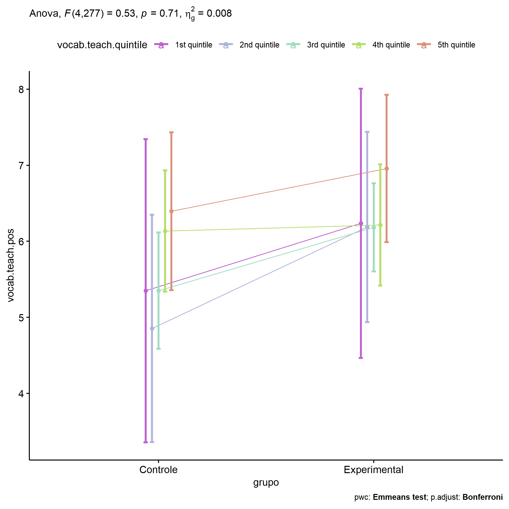<!-- -->

``` r
if (!is.null(plots[["vocab.teach.quintile"]]))
  plots[["vocab.teach.quintile"]] + ggplot2::scale_color_manual(values = color[["grupo"]])
```

    ## Scale for colour is already present.
    ## Adding another scale for colour, which will replace the existing scale.

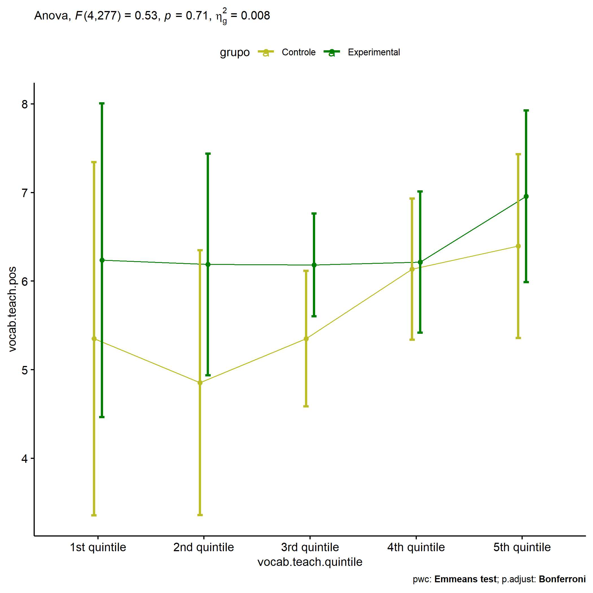<!-- -->

``` r
plots <- twoWayAncovaBoxPlots(
  wdat, "vocab.teach.pos", c("grupo","vocab.teach.quintile"), aov, pwcs, covar = "vocab.teach.pre",
  theme = "classic", color = color[["grupo:vocab.teach.quintile"]],
  subtitle = which(aov$Effect == "grupo:vocab.teach.quintile"))
```

``` r
plots[["grupo:vocab.teach.quintile"]] + ggplot2::ylab("Vocabulario Ensinado") + ggplot2::scale_x_discrete(labels=c('pre', 'pos'))
```

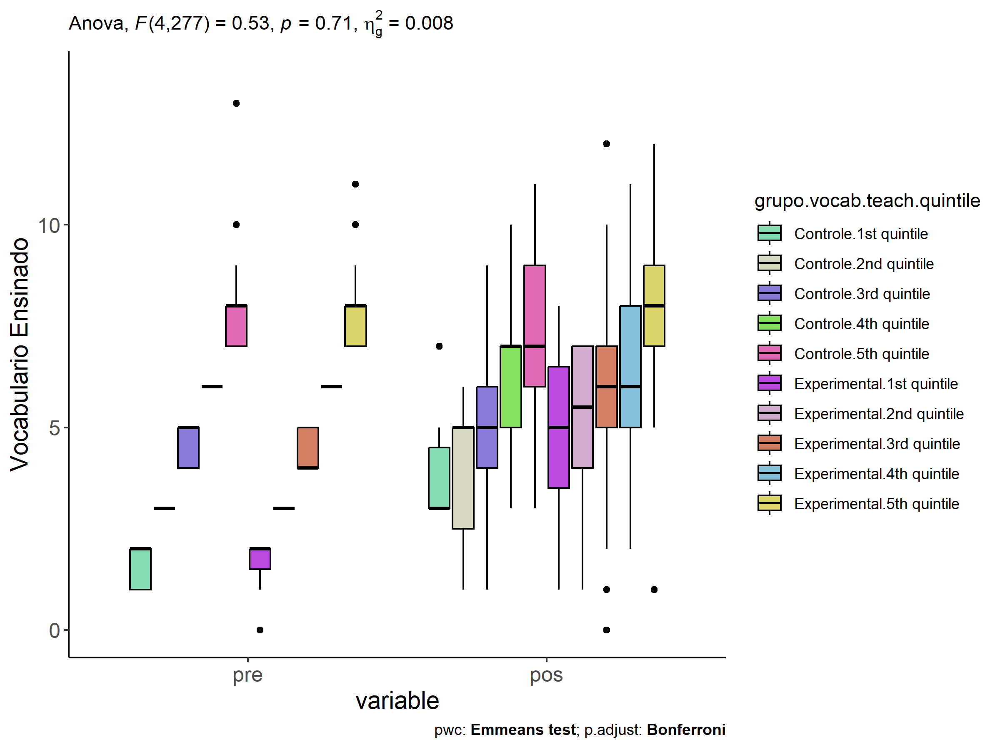<!-- -->

``` r
plots <- twoWayAncovaBoxPlots(
  wdat.long, "vocab.teach", c("grupo","vocab.teach.quintile"), aov, pwc.long, pre.post = "time",
  theme = "classic", color = color$prepost)
```

``` r
plots[["grupo:vocab.teach.quintile"]] + ggplot2::ylab("Vocabulario Ensinado")
```

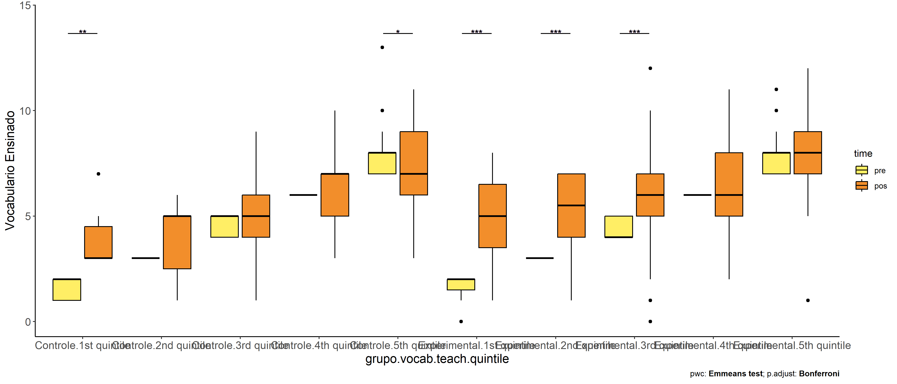<!-- -->

### Checking linearity assumption

``` r
ggscatter(wdat, x = "vocab.teach.pre", y = "vocab.teach.pos", size = 0.5,
          facet.by = c("grupo","vocab.teach.quintile"), add = "reg.line")+
  stat_regline_equation(
    aes(label =  paste(..eq.label.., ..rr.label.., sep = "~~~~"))
  )
```

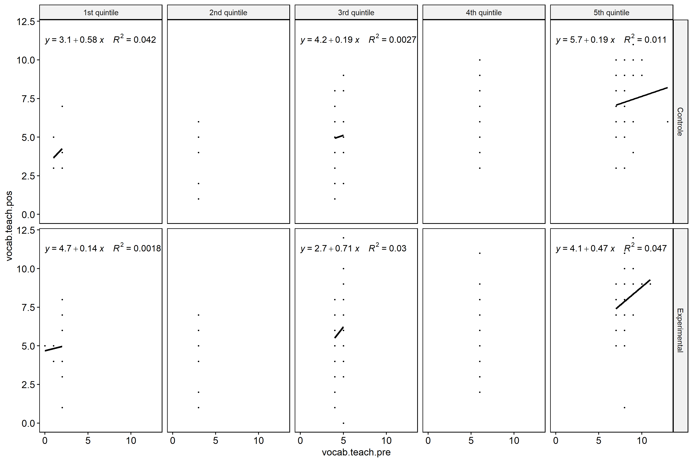<!-- -->

### Checking normality and homogeneity

``` r
res <- augment(lm(vocab.teach.pos ~ vocab.teach.pre + grupo*vocab.teach.quintile, data = wdat))
```

``` r
shapiro_test(res$.resid)
```

    ## # A tibble: 1 × 3
    ##   variable   statistic p.value
    ##   <chr>          <dbl>   <dbl>
    ## 1 res$.resid     0.992   0.130

``` r
levene_test(res, .resid ~ grupo*vocab.teach.quintile)
```

    ## # A tibble: 1 × 4
    ##     df1   df2 statistic     p
    ##   <int> <int>     <dbl> <dbl>
    ## 1     9   278     0.503 0.872

# Summary of Results

## Descriptive Statistics

``` r
df <- get.descriptives(ldat[["grupo"]], c(dv.pre, dv.pos), c("grupo"), 
                       include.global = T, symmetry.test = T, normality.test = F)
df <- plyr::rbind.fill(
  df, do.call(plyr::rbind.fill, lapply(lfatores2, FUN = function(f) {
    if (nrow(dat) > 0 && sum(!is.na(unique(dat[[f]]))) > 1)
      get.descriptives(ldat[[paste0("grupo:",f)]], c(dv.pre,dv.pos), c("grupo", f),
                       symmetry.test = T, normality.test = F)
    }))
)
(df <- df[,c(fatores1[fatores1 %in% colnames(df)],"variable",
             colnames(df)[!colnames(df) %in% c(fatores1,"variable")])])
```

    ##           grupo Sexo   Zona Cor.Raca vocab.teach.quintile        variable   n  mean median min max    sd    se
    ## 1      Controle <NA>   <NA>     <NA>                 <NA> vocab.teach.pre 117 5.821    6.0   1  13 2.116 0.196
    ## 2  Experimental <NA>   <NA>     <NA>                 <NA> vocab.teach.pre 170 5.224    5.0   0  11 1.933 0.148
    ## 3          <NA> <NA>   <NA>     <NA>                 <NA> vocab.teach.pre 287 5.467    5.0   0  13 2.027 0.120
    ## 4      Controle <NA>   <NA>     <NA>                 <NA> vocab.teach.pos 117 5.991    6.0   1  11 2.219 0.205
    ## 5  Experimental <NA>   <NA>     <NA>                 <NA> vocab.teach.pos 170 6.353    6.0   1  12 2.163 0.166
    ## 6          <NA> <NA>   <NA>     <NA>                 <NA> vocab.teach.pos 287 6.206    6.0   1  12 2.189 0.129
    ## 7      Controle    F   <NA>     <NA>                 <NA> vocab.teach.pre  55 5.618    6.0   1   9 1.967 0.265
    ## 8      Controle    M   <NA>     <NA>                 <NA> vocab.teach.pre  62 6.000    6.0   1  13 2.240 0.284
    ## 9  Experimental    F   <NA>     <NA>                 <NA> vocab.teach.pre  86 5.221    5.0   0  10 1.887 0.204
    ## 10 Experimental    M   <NA>     <NA>                 <NA> vocab.teach.pre  85 5.224    5.0   1  11 1.978 0.215
    ## 11     Controle    F   <NA>     <NA>                 <NA> vocab.teach.pos  55 5.945    6.0   1  10 2.181 0.294
    ## 12     Controle    M   <NA>     <NA>                 <NA> vocab.teach.pos  62 6.032    6.0   1  11 2.269 0.288
    ## 13 Experimental    F   <NA>     <NA>                 <NA> vocab.teach.pos  86 6.651    7.0   2  12 2.168 0.234
    ## 14 Experimental    M   <NA>     <NA>                 <NA> vocab.teach.pos  85 5.976    6.0   0  12 2.215 0.240
    ## 15     Controle <NA>  Rural     <NA>                 <NA> vocab.teach.pre  40 5.875    6.0   1   9 1.897 0.300
    ## 16     Controle <NA> Urbana     <NA>                 <NA> vocab.teach.pre  18 6.056    6.0   3  10 1.798 0.424
    ## 17 Experimental <NA>  Rural     <NA>                 <NA> vocab.teach.pre  61 5.377    5.0   0   9 1.993 0.255
    ## 18 Experimental <NA> Urbana     <NA>                 <NA> vocab.teach.pre  43 5.419    5.0   2  11 2.152 0.328
    ## 19     Controle <NA>  Rural     <NA>                 <NA> vocab.teach.pos  40 6.950    7.0   2  10 2.112 0.334
    ## 20     Controle <NA> Urbana     <NA>                 <NA> vocab.teach.pos  18 5.667    6.0   2  10 2.249 0.530
    ## 21 Experimental <NA>  Rural     <NA>                 <NA> vocab.teach.pos  61 6.574    7.0   0  12 2.334 0.299
    ## 22 Experimental <NA> Urbana     <NA>                 <NA> vocab.teach.pos  43 6.116    6.0   3  10 1.854 0.283
    ## 23     Controle <NA>   <NA>   Branca                 <NA> vocab.teach.pre   7 6.571    6.0   5   9 1.272 0.481
    ## 24     Controle <NA>   <NA>    Parda                 <NA> vocab.teach.pre  44 5.364    5.0   1  13 2.393 0.361
    ## 25 Experimental <NA>   <NA>   Branca                 <NA> vocab.teach.pre  13 5.769    6.0   3   8 1.739 0.482
    ## 26 Experimental <NA>   <NA>    Parda                 <NA> vocab.teach.pre  52 4.942    5.0   0   9 2.155 0.299
    ## 27     Controle <NA>   <NA>   Branca                 <NA> vocab.teach.pos   7 8.000    8.0   5  11 1.826 0.690
    ## 28     Controle <NA>   <NA>    Parda                 <NA> vocab.teach.pos  44 5.773    6.0   1  10 2.208 0.333
    ## 29 Experimental <NA>   <NA>   Branca                 <NA> vocab.teach.pos  13 7.231    7.0   5  10 1.922 0.533
    ## 30 Experimental <NA>   <NA>    Parda                 <NA> vocab.teach.pos  52 6.212    6.0   0  12 2.667 0.370
    ## 31     Controle <NA>   <NA>     <NA>         1st quintile vocab.teach.pre   7 1.571    2.0   1   2 0.535 0.202
    ## 32     Controle <NA>   <NA>     <NA>         2nd quintile vocab.teach.pre  10 3.000    3.0   3   3 0.000 0.000
    ## 33     Controle <NA>   <NA>     <NA>         3rd quintile vocab.teach.pre  31 4.548    5.0   4   5 0.506 0.091
    ## 34     Controle <NA>   <NA>     <NA>         4th quintile vocab.teach.pre  25 6.000    6.0   6   6 0.000 0.000
    ## 35     Controle <NA>   <NA>     <NA>         5th quintile vocab.teach.pre  44 7.932    8.0   7  13 1.149 0.173
    ## 36 Experimental <NA>   <NA>     <NA>         1st quintile vocab.teach.pre  11 1.636    2.0   0   2 0.674 0.203
    ## 37 Experimental <NA>   <NA>     <NA>         2nd quintile vocab.teach.pre  18 3.000    3.0   3   3 0.000 0.000
    ## 38 Experimental <NA>   <NA>     <NA>         3rd quintile vocab.teach.pre  71 4.451    4.0   4   5 0.501 0.059
    ## 39 Experimental <NA>   <NA>     <NA>         4th quintile vocab.teach.pre  25 6.000    6.0   6   6 0.000 0.000
    ## 40 Experimental <NA>   <NA>     <NA>         5th quintile vocab.teach.pre  46 7.717    8.0   7  11 0.886 0.131
    ## 41     Controle <NA>   <NA>     <NA>         1st quintile vocab.teach.pos   7 4.000    3.0   3   7 1.528 0.577
    ## 42     Controle <NA>   <NA>     <NA>         2nd quintile vocab.teach.pos  10 4.000    5.0   1   6 1.700 0.537
    ## 43     Controle <NA>   <NA>     <NA>         3rd quintile vocab.teach.pos  31 5.032    5.0   1   9 1.835 0.329
    ## 44     Controle <NA>   <NA>     <NA>         4th quintile vocab.teach.pos  25 6.320    7.0   3  10 1.865 0.373
    ## 45     Controle <NA>   <NA>     <NA>         5th quintile vocab.teach.pos  44 7.250    7.0   3  11 2.036 0.307
    ## 46 Experimental <NA>   <NA>     <NA>         1st quintile vocab.teach.pos  11 4.909    5.0   1   8 2.212 0.667
    ## 47 Experimental <NA>   <NA>     <NA>         2nd quintile vocab.teach.pos  18 5.333    5.5   1   7 1.879 0.443
    ## 48 Experimental <NA>   <NA>     <NA>         3rd quintile vocab.teach.pos  71 5.831    6.0   0  12 2.042 0.242
    ## 49 Experimental <NA>   <NA>     <NA>         4th quintile vocab.teach.pos  25 6.400    6.0   2  11 2.198 0.440
    ## 50 Experimental <NA>   <NA>     <NA>         5th quintile vocab.teach.pos  46 7.739    8.0   1  12 1.914 0.282
    ##       ci  iqr symmetry     skewness      kurtosis
    ## 1  0.387 3.00      YES  0.033630279  0.2272568319
    ## 2  0.293 3.00      YES  0.168263254 -0.2543100375
    ## 3  0.236 3.00      YES  0.140660795  0.0014960068
    ## 4  0.406 2.00      YES  0.062329373 -0.5245644658
    ## 5  0.328 3.00      YES -0.121346373  0.0004291308
    ## 6  0.254 3.00      YES -0.048789081 -0.2314286249
    ## 7  0.532 3.00      YES -0.316574205 -0.4232545632
    ## 8  0.569 3.75      YES  0.189493734  0.2880808870
    ## 9  0.405 2.00      YES -0.014910665 -0.0553673673
    ## 10 0.427 3.00      YES  0.330628327 -0.4625477417
    ## 11 0.590 2.50      YES  0.194629965 -0.4821931389
    ## 12 0.576 3.00      YES -0.047499101 -0.6223388141
    ## 13 0.465 3.00      YES  0.015710328 -0.4462921297
    ## 14 0.478 2.00      YES -0.399632342  0.3301072138
    ## 15 0.607 2.00       NO -0.703945768 -0.1137688110
    ## 16 0.894 2.00      YES  0.266180799 -0.7035544095
    ## 17 0.510 3.00      YES -0.244049767 -0.3024800541
    ## 18 0.662 3.00      YES  0.318934312 -0.6878287826
    ## 19 0.675 3.25      YES -0.382101304 -0.4970275088
    ## 20 1.118 2.50      YES  0.159499021 -0.7553482363
    ## 21 0.598 3.00      YES -0.416655894  0.2759270218
    ## 22 0.571 2.00      YES  0.031198270 -0.8810556188
    ## 23 1.177 1.00       NO  0.696276198 -0.7507944354
    ## 24 0.727 3.00       NO  0.602779004  0.8243071593
    ## 25 1.051 3.00      YES -0.024907855 -1.5901113228
    ## 26 0.600 3.00      YES  0.234456625 -0.6273938603
    ## 27 1.689 1.00      YES  0.000000000 -0.8914285714
    ## 28 0.671 2.25      YES  0.332339822 -0.2006736362
    ## 29 1.161 3.00      YES  0.218636518 -1.7124630178
    ## 30 0.742 4.00      YES  0.044974995 -0.3022777944
    ## 31 0.494 1.00 few data  0.000000000  0.0000000000
    ## 32 0.000 0.00 few data  0.000000000  0.0000000000
    ## 33 0.186 1.00 few data  0.000000000  0.0000000000
    ## 34 0.000 0.00 few data  0.000000000  0.0000000000
    ## 35 0.349 1.00       NO  2.105529424  6.3506473217
    ## 36 0.453 0.50 few data  0.000000000  0.0000000000
    ## 37 0.000 0.00 few data  0.000000000  0.0000000000
    ## 38 0.119 1.00 few data  0.000000000  0.0000000000
    ## 39 0.000 0.00 few data  0.000000000  0.0000000000
    ## 40 0.263 1.00       NO  1.499879061  2.6450406819
    ## 41 1.413 1.50       NO  0.961940088 -0.7434402332
    ## 42 1.216 2.50       NO -0.610977190 -1.3943786982
    ## 43 0.673 2.00      YES -0.171218488 -0.2415875697
    ## 44 0.770 2.00      YES -0.005686668 -1.0552934416
    ## 45 0.619 3.00      YES -0.089872531 -0.9164458141
    ## 46 1.486 3.00      YES -0.047510944 -1.2346490239
    ## 47 0.934 3.00       NO -0.759664183 -0.5440946502
    ## 48 0.483 2.00      YES  0.046931431  0.8269222898
    ## 49 0.907 3.00      YES -0.243929809 -0.3636870392
    ## 50 0.568 2.00       NO -0.750660662  1.7286479818

| grupo        | Sexo | Zona   | Cor.Raca | vocab.teach.quintile | variable        |   n |  mean | median | min | max |    sd |    se |    ci |  iqr | symmetry | skewness | kurtosis |
|:-------------|:-----|:-------|:---------|:---------------------|:----------------|----:|------:|-------:|----:|----:|------:|------:|------:|-----:|:---------|---------:|---------:|
| Controle     |      |        |          |                      | vocab.teach.pre | 117 | 5.821 |    6.0 |   1 |  13 | 2.116 | 0.196 | 0.387 | 3.00 | YES      |    0.034 |    0.227 |
| Experimental |      |        |          |                      | vocab.teach.pre | 170 | 5.224 |    5.0 |   0 |  11 | 1.933 | 0.148 | 0.293 | 3.00 | YES      |    0.168 |   -0.254 |
|              |      |        |          |                      | vocab.teach.pre | 287 | 5.467 |    5.0 |   0 |  13 | 2.027 | 0.120 | 0.236 | 3.00 | YES      |    0.141 |    0.001 |
| Controle     |      |        |          |                      | vocab.teach.pos | 117 | 5.991 |    6.0 |   1 |  11 | 2.219 | 0.205 | 0.406 | 2.00 | YES      |    0.062 |   -0.525 |
| Experimental |      |        |          |                      | vocab.teach.pos | 170 | 6.353 |    6.0 |   1 |  12 | 2.163 | 0.166 | 0.328 | 3.00 | YES      |   -0.121 |    0.000 |
|              |      |        |          |                      | vocab.teach.pos | 287 | 6.206 |    6.0 |   1 |  12 | 2.189 | 0.129 | 0.254 | 3.00 | YES      |   -0.049 |   -0.231 |
| Controle     | F    |        |          |                      | vocab.teach.pre |  55 | 5.618 |    6.0 |   1 |   9 | 1.967 | 0.265 | 0.532 | 3.00 | YES      |   -0.317 |   -0.423 |
| Controle     | M    |        |          |                      | vocab.teach.pre |  62 | 6.000 |    6.0 |   1 |  13 | 2.240 | 0.284 | 0.569 | 3.75 | YES      |    0.189 |    0.288 |
| Experimental | F    |        |          |                      | vocab.teach.pre |  86 | 5.221 |    5.0 |   0 |  10 | 1.887 | 0.204 | 0.405 | 2.00 | YES      |   -0.015 |   -0.055 |
| Experimental | M    |        |          |                      | vocab.teach.pre |  85 | 5.224 |    5.0 |   1 |  11 | 1.978 | 0.215 | 0.427 | 3.00 | YES      |    0.331 |   -0.463 |
| Controle     | F    |        |          |                      | vocab.teach.pos |  55 | 5.945 |    6.0 |   1 |  10 | 2.181 | 0.294 | 0.590 | 2.50 | YES      |    0.195 |   -0.482 |
| Controle     | M    |        |          |                      | vocab.teach.pos |  62 | 6.032 |    6.0 |   1 |  11 | 2.269 | 0.288 | 0.576 | 3.00 | YES      |   -0.047 |   -0.622 |
| Experimental | F    |        |          |                      | vocab.teach.pos |  86 | 6.651 |    7.0 |   2 |  12 | 2.168 | 0.234 | 0.465 | 3.00 | YES      |    0.016 |   -0.446 |
| Experimental | M    |        |          |                      | vocab.teach.pos |  85 | 5.976 |    6.0 |   0 |  12 | 2.215 | 0.240 | 0.478 | 2.00 | YES      |   -0.400 |    0.330 |
| Controle     |      | Rural  |          |                      | vocab.teach.pre |  40 | 5.875 |    6.0 |   1 |   9 | 1.897 | 0.300 | 0.607 | 2.00 | NO       |   -0.704 |   -0.114 |
| Controle     |      | Urbana |          |                      | vocab.teach.pre |  18 | 6.056 |    6.0 |   3 |  10 | 1.798 | 0.424 | 0.894 | 2.00 | YES      |    0.266 |   -0.704 |
| Experimental |      | Rural  |          |                      | vocab.teach.pre |  61 | 5.377 |    5.0 |   0 |   9 | 1.993 | 0.255 | 0.510 | 3.00 | YES      |   -0.244 |   -0.302 |
| Experimental |      | Urbana |          |                      | vocab.teach.pre |  43 | 5.419 |    5.0 |   2 |  11 | 2.152 | 0.328 | 0.662 | 3.00 | YES      |    0.319 |   -0.688 |
| Controle     |      | Rural  |          |                      | vocab.teach.pos |  40 | 6.950 |    7.0 |   2 |  10 | 2.112 | 0.334 | 0.675 | 3.25 | YES      |   -0.382 |   -0.497 |
| Controle     |      | Urbana |          |                      | vocab.teach.pos |  18 | 5.667 |    6.0 |   2 |  10 | 2.249 | 0.530 | 1.118 | 2.50 | YES      |    0.159 |   -0.755 |
| Experimental |      | Rural  |          |                      | vocab.teach.pos |  61 | 6.574 |    7.0 |   0 |  12 | 2.334 | 0.299 | 0.598 | 3.00 | YES      |   -0.417 |    0.276 |
| Experimental |      | Urbana |          |                      | vocab.teach.pos |  43 | 6.116 |    6.0 |   3 |  10 | 1.854 | 0.283 | 0.571 | 2.00 | YES      |    0.031 |   -0.881 |
| Controle     |      |        | Branca   |                      | vocab.teach.pre |   7 | 6.571 |    6.0 |   5 |   9 | 1.272 | 0.481 | 1.177 | 1.00 | NO       |    0.696 |   -0.751 |
| Controle     |      |        | Parda    |                      | vocab.teach.pre |  44 | 5.364 |    5.0 |   1 |  13 | 2.393 | 0.361 | 0.727 | 3.00 | NO       |    0.603 |    0.824 |
| Experimental |      |        | Branca   |                      | vocab.teach.pre |  13 | 5.769 |    6.0 |   3 |   8 | 1.739 | 0.482 | 1.051 | 3.00 | YES      |   -0.025 |   -1.590 |
| Experimental |      |        | Parda    |                      | vocab.teach.pre |  52 | 4.942 |    5.0 |   0 |   9 | 2.155 | 0.299 | 0.600 | 3.00 | YES      |    0.234 |   -0.627 |
| Controle     |      |        | Branca   |                      | vocab.teach.pos |   7 | 8.000 |    8.0 |   5 |  11 | 1.826 | 0.690 | 1.689 | 1.00 | YES      |    0.000 |   -0.891 |
| Controle     |      |        | Parda    |                      | vocab.teach.pos |  44 | 5.773 |    6.0 |   1 |  10 | 2.208 | 0.333 | 0.671 | 2.25 | YES      |    0.332 |   -0.201 |
| Experimental |      |        | Branca   |                      | vocab.teach.pos |  13 | 7.231 |    7.0 |   5 |  10 | 1.922 | 0.533 | 1.161 | 3.00 | YES      |    0.219 |   -1.712 |
| Experimental |      |        | Parda    |                      | vocab.teach.pos |  52 | 6.212 |    6.0 |   0 |  12 | 2.667 | 0.370 | 0.742 | 4.00 | YES      |    0.045 |   -0.302 |
| Controle     |      |        |          | 1st quintile         | vocab.teach.pre |   7 | 1.571 |    2.0 |   1 |   2 | 0.535 | 0.202 | 0.494 | 1.00 | few data |    0.000 |    0.000 |
| Controle     |      |        |          | 2nd quintile         | vocab.teach.pre |  10 | 3.000 |    3.0 |   3 |   3 | 0.000 | 0.000 | 0.000 | 0.00 | few data |    0.000 |    0.000 |
| Controle     |      |        |          | 3rd quintile         | vocab.teach.pre |  31 | 4.548 |    5.0 |   4 |   5 | 0.506 | 0.091 | 0.186 | 1.00 | few data |    0.000 |    0.000 |
| Controle     |      |        |          | 4th quintile         | vocab.teach.pre |  25 | 6.000 |    6.0 |   6 |   6 | 0.000 | 0.000 | 0.000 | 0.00 | few data |    0.000 |    0.000 |
| Controle     |      |        |          | 5th quintile         | vocab.teach.pre |  44 | 7.932 |    8.0 |   7 |  13 | 1.149 | 0.173 | 0.349 | 1.00 | NO       |    2.106 |    6.351 |
| Experimental |      |        |          | 1st quintile         | vocab.teach.pre |  11 | 1.636 |    2.0 |   0 |   2 | 0.674 | 0.203 | 0.453 | 0.50 | few data |    0.000 |    0.000 |
| Experimental |      |        |          | 2nd quintile         | vocab.teach.pre |  18 | 3.000 |    3.0 |   3 |   3 | 0.000 | 0.000 | 0.000 | 0.00 | few data |    0.000 |    0.000 |
| Experimental |      |        |          | 3rd quintile         | vocab.teach.pre |  71 | 4.451 |    4.0 |   4 |   5 | 0.501 | 0.059 | 0.119 | 1.00 | few data |    0.000 |    0.000 |
| Experimental |      |        |          | 4th quintile         | vocab.teach.pre |  25 | 6.000 |    6.0 |   6 |   6 | 0.000 | 0.000 | 0.000 | 0.00 | few data |    0.000 |    0.000 |
| Experimental |      |        |          | 5th quintile         | vocab.teach.pre |  46 | 7.717 |    8.0 |   7 |  11 | 0.886 | 0.131 | 0.263 | 1.00 | NO       |    1.500 |    2.645 |
| Controle     |      |        |          | 1st quintile         | vocab.teach.pos |   7 | 4.000 |    3.0 |   3 |   7 | 1.528 | 0.577 | 1.413 | 1.50 | NO       |    0.962 |   -0.743 |
| Controle     |      |        |          | 2nd quintile         | vocab.teach.pos |  10 | 4.000 |    5.0 |   1 |   6 | 1.700 | 0.537 | 1.216 | 2.50 | NO       |   -0.611 |   -1.394 |
| Controle     |      |        |          | 3rd quintile         | vocab.teach.pos |  31 | 5.032 |    5.0 |   1 |   9 | 1.835 | 0.329 | 0.673 | 2.00 | YES      |   -0.171 |   -0.242 |
| Controle     |      |        |          | 4th quintile         | vocab.teach.pos |  25 | 6.320 |    7.0 |   3 |  10 | 1.865 | 0.373 | 0.770 | 2.00 | YES      |   -0.006 |   -1.055 |
| Controle     |      |        |          | 5th quintile         | vocab.teach.pos |  44 | 7.250 |    7.0 |   3 |  11 | 2.036 | 0.307 | 0.619 | 3.00 | YES      |   -0.090 |   -0.916 |
| Experimental |      |        |          | 1st quintile         | vocab.teach.pos |  11 | 4.909 |    5.0 |   1 |   8 | 2.212 | 0.667 | 1.486 | 3.00 | YES      |   -0.048 |   -1.235 |
| Experimental |      |        |          | 2nd quintile         | vocab.teach.pos |  18 | 5.333 |    5.5 |   1 |   7 | 1.879 | 0.443 | 0.934 | 3.00 | NO       |   -0.760 |   -0.544 |
| Experimental |      |        |          | 3rd quintile         | vocab.teach.pos |  71 | 5.831 |    6.0 |   0 |  12 | 2.042 | 0.242 | 0.483 | 2.00 | YES      |    0.047 |    0.827 |
| Experimental |      |        |          | 4th quintile         | vocab.teach.pos |  25 | 6.400 |    6.0 |   2 |  11 | 2.198 | 0.440 | 0.907 | 3.00 | YES      |   -0.244 |   -0.364 |
| Experimental |      |        |          | 5th quintile         | vocab.teach.pos |  46 | 7.739 |    8.0 |   1 |  12 | 1.914 | 0.282 | 0.568 | 2.00 | NO       |   -0.751 |    1.729 |

## ANCOVA Table Comparison

``` r
df <- do.call(plyr::rbind.fill, laov)
(df <- df[!duplicated(df$Effect),])
```

    ##                        Effect DFn DFd      F        p p<.05   ges DFn' DFd'     F'       p' p<.05'  ges'
    ## 1                       grupo   1 284  8.301 4.00e-03     * 0.028    1  286  5.079 2.50e-02      * 0.017
    ## 2             vocab.teach.pre   1 284 84.483 8.51e-18     * 0.229    1  286 74.363 4.54e-16      * 0.206
    ## 4                  grupo:Sexo   1 283  1.452 2.29e-01       0.005    1  284  0.676 4.12e-01        0.002
    ## 5                        Sexo   1 283  3.821 5.20e-02       0.013    1  284  4.688 3.10e-02      * 0.016
    ## 8                  grupo:Zona   1 157  2.101 1.49e-01       0.013    1  158  2.812 9.60e-02        0.017
    ## 10                       Zona   1 157  7.037 9.00e-03     * 0.043    1  158  7.390 7.00e-03      * 0.045
    ## 11                   Cor.Raca   1 111  3.283 7.30e-02       0.029    1  111  3.283 7.30e-02        0.029
    ## 13             grupo:Cor.Raca   1 111  0.877 3.51e-01       0.008    1  111  0.877 3.51e-01        0.008
    ## 16 grupo:vocab.teach.quintile   4 277  0.530 7.14e-01       0.008    4  278  0.430 7.87e-01        0.006
    ## 18       vocab.teach.quintile   4 277  0.681 6.06e-01       0.010    4  278  0.397 8.10e-01        0.006

|     | Effect                     | DFn | DFd |      F |     p | p\<.05 |   ges | DFn’ | DFd’ |     F’ |    p’ | p\<.05’ |  ges’ |
|:----|:---------------------------|----:|----:|-------:|------:|:-------|------:|-----:|-----:|-------:|------:|:--------|------:|
| 1   | grupo                      |   1 | 284 |  8.301 | 0.004 | \*     | 0.028 |    1 |  286 |  5.079 | 0.025 | \*      | 0.017 |
| 2   | vocab.teach.pre            |   1 | 284 | 84.483 | 0.000 | \*     | 0.229 |    1 |  286 | 74.363 | 0.000 | \*      | 0.206 |
| 4   | grupo:Sexo                 |   1 | 283 |  1.452 | 0.229 |        | 0.005 |    1 |  284 |  0.676 | 0.412 |         | 0.002 |
| 5   | Sexo                       |   1 | 283 |  3.821 | 0.052 |        | 0.013 |    1 |  284 |  4.688 | 0.031 | \*      | 0.016 |
| 8   | grupo:Zona                 |   1 | 157 |  2.101 | 0.149 |        | 0.013 |    1 |  158 |  2.812 | 0.096 |         | 0.017 |
| 10  | Zona                       |   1 | 157 |  7.037 | 0.009 | \*     | 0.043 |    1 |  158 |  7.390 | 0.007 | \*      | 0.045 |
| 11  | Cor.Raca                   |   1 | 111 |  3.283 | 0.073 |        | 0.029 |    1 |  111 |  3.283 | 0.073 |         | 0.029 |
| 13  | grupo:Cor.Raca             |   1 | 111 |  0.877 | 0.351 |        | 0.008 |    1 |  111 |  0.877 | 0.351 |         | 0.008 |
| 16  | grupo:vocab.teach.quintile |   4 | 277 |  0.530 | 0.714 |        | 0.008 |    4 |  278 |  0.430 | 0.787 |         | 0.006 |
| 18  | vocab.teach.quintile       |   4 | 277 |  0.681 | 0.606 |        | 0.010 |    4 |  278 |  0.397 | 0.810 |         | 0.006 |

## PairWise Table Comparison

``` r
df <- do.call(plyr::rbind.fill, lpwc)
df <- df[,c(names(lfatores), names(df)[!names(df) %in% c(names(lfatores),"term",".y.")])]
```

| grupo        | Sexo | Zona   | Cor.Raca | vocab.teach.quintile | group1       | group2       |  df | statistic |     p | p.adj | p.adj.signif | df’ | statistic’ |    p’ | p.adj’ | p.adj.signif’ |
|:-------------|:-----|:-------|:---------|:---------------------|:-------------|:-------------|----:|----------:|------:|------:|:-------------|----:|-----------:|------:|-------:|:--------------|
| Controle     |      |        |          |                      | pre          | pos          | 570 |    -0.623 | 0.534 | 0.534 | ns           | 574 |     -0.912 | 0.362 |  0.362 | ns            |
| Experimental |      |        |          |                      | pre          | pos          | 570 |    -4.960 | 0.000 | 0.000 | \*\*\*\*     | 574 |     -4.721 | 0.000 |  0.000 | \*\*\*\*      |
|              |      |        |          |                      | Controle     | Experimental | 284 |    -2.881 | 0.004 | 0.004 | \*\*         | 286 |     -2.254 | 0.025 |  0.025 | \*            |
| Controle     | F    |        |          |                      | pre          | pos          | 568 |    -0.813 | 0.416 | 0.416 | ns           | 570 |     -1.236 | 0.217 |  0.217 | ns            |
| Controle     | M    |        |          |                      | pre          | pos          | 568 |    -0.085 | 0.932 | 0.932 | ns           | 570 |     -0.084 | 0.933 |  0.933 | ns            |
| Controle     |      |        |          |                      | F            | M            | 283 |     0.313 | 0.754 | 0.754 | ns           | 284 |      0.748 | 0.455 |  0.455 | ns            |
| Experimental | F    |        |          |                      | pre          | pos          | 568 |    -4.445 | 0.000 | 0.000 | \*\*\*\*     | 570 |     -4.383 | 0.000 |  0.000 | \*\*\*\*      |
| Experimental | M    |        |          |                      | pre          | pos          | 568 |    -2.326 | 0.020 | 0.020 | \*           | 570 |     -2.294 | 0.022 |  0.022 | \*            |
| Experimental |      |        |          |                      | F            | M            | 283 |     2.275 | 0.024 | 0.024 | \*           | 284 |      2.192 | 0.029 |  0.029 | \*            |
|              | F    |        |          |                      | Controle     | Experimental | 283 |    -2.717 | 0.007 | 0.007 | \*\*         | 284 |     -2.145 | 0.033 |  0.033 | \*            |
|              | M    |        |          |                      | Controle     | Experimental | 283 |    -1.070 | 0.285 | 0.285 | ns           | 284 |     -1.020 | 0.309 |  0.309 | ns            |
| Controle     |      |        |          |                      | Rural        | Urbana       | 157 |     2.710 | 0.007 | 0.007 | \*\*         | 158 |      2.936 | 0.004 |  0.004 | \*\*          |
| Controle     |      | Rural  |          |                      | pre          | pos          | 316 |    -2.318 | 0.021 | 0.021 | \*           | 318 |     -2.767 | 0.006 |  0.006 | \*\*          |
| Controle     |      | Urbana |          |                      | pre          | pos          | 316 |     0.563 | 0.574 | 0.574 | ns           | 318 |      0.551 | 0.582 |  0.582 | ns            |
| Experimental |      |        |          |                      | Rural        | Urbana       | 157 |     1.340 | 0.182 | 0.182 | ns           | 158 |      1.258 | 0.210 |  0.210 | ns            |
| Experimental |      | Rural  |          |                      | pre          | pos          | 316 |    -3.187 | 0.002 | 0.002 | \*\*         | 318 |     -3.124 | 0.002 |  0.002 | \*\*          |
| Experimental |      | Urbana |          |                      | pre          | pos          | 316 |    -1.560 | 0.120 | 0.120 | ns           | 318 |     -1.529 | 0.127 |  0.127 | ns            |
|              |      | Rural  |          |                      | Controle     | Experimental | 157 |     0.223 | 0.824 | 0.824 | ns           | 158 |      0.761 | 0.448 |  0.448 | ns            |
|              |      | Urbana |          |                      | Controle     | Experimental | 157 |    -1.621 | 0.107 | 0.107 | ns           | 158 |     -1.510 | 0.133 |  0.133 | ns            |
| Controle     |      |        | Branca   |                      | pre          | pos          | 224 |    -1.172 | 0.243 | 0.243 | ns           | 224 |     -1.172 | 0.243 |  0.243 | ns            |
| Controle     |      |        |          |                      | Branca       | Parda        | 111 |     1.847 | 0.067 | 0.067 | ns           | 111 |      1.847 | 0.067 |  0.067 | ns            |
| Controle     |      |        | Parda    |                      | pre          | pos          | 224 |    -0.841 | 0.401 | 0.401 | ns           | 224 |     -0.841 | 0.401 |  0.401 | ns            |
| Experimental |      |        | Branca   |                      | pre          | pos          | 224 |    -1.633 | 0.104 | 0.104 | ns           | 224 |     -1.633 | 0.104 |  0.104 | ns            |
| Experimental |      |        |          |                      | Branca       | Parda        | 111 |     0.892 | 0.374 | 0.374 | ns           | 111 |      0.892 | 0.374 |  0.374 | ns            |
| Experimental |      |        | Parda    |                      | pre          | pos          | 224 |    -2.837 | 0.005 | 0.005 | \*\*         | 224 |     -2.837 | 0.005 |  0.005 | \*\*          |
|              |      |        | Branca   |                      | Controle     | Experimental | 111 |     0.353 | 0.725 | 0.725 | ns           | 111 |      0.353 | 0.725 |  0.725 | ns            |
|              |      |        | Parda    |                      | Controle     | Experimental | 111 |    -1.523 | 0.131 | 0.131 | ns           | 111 |     -1.523 | 0.131 |  0.131 | ns            |
| Controle     |      |        |          | 1st quintile         | pre          | pos          | 556 |    -3.082 | 0.002 | 0.002 | \*\*         | 558 |     -2.972 | 0.003 |  0.003 | \*\*          |
| Controle     |      |        |          | 2nd quintile         | pre          | pos          | 556 |    -1.517 | 0.130 | 0.130 | ns           | 558 |     -1.462 | 0.144 |  0.144 | ns            |
| Controle     |      |        |          | 3rd quintile         | pre          | pos          | 556 |    -1.292 | 0.197 | 0.197 | ns           | 558 |     -2.044 | 0.041 |  0.041 | \*            |
| Controle     |      |        |          | 4th quintile         | pre          | pos          | 556 |    -0.768 | 0.443 | 0.443 | ns           | 558 |     -0.740 | 0.460 |  0.460 | ns            |
| Controle     |      |        |          | 5th quintile         | pre          | pos          | 556 |     2.170 | 0.030 | 0.030 | \*           | 558 |      2.092 | 0.037 |  0.037 | \*            |
| Controle     |      |        |          |                      | 1st quintile | 2nd quintile | 277 |     0.495 | 0.621 | 1.000 | ns           | 278 |      0.523 | 0.601 |  1.000 | ns            |
| Controle     |      |        |          |                      | 1st quintile | 3rd quintile | 277 |     0.000 | 1.000 | 1.000 | ns           | 278 |     -0.200 | 0.841 |  1.000 | ns            |
| Controle     |      |        |          |                      | 1st quintile | 4th quintile | 277 |    -0.684 | 0.495 | 1.000 | ns           | 278 |     -0.529 | 0.598 |  1.000 | ns            |
| Controle     |      |        |          |                      | 1st quintile | 5th quintile | 277 |    -0.758 | 0.449 | 1.000 | ns           | 278 |     -0.575 | 0.566 |  1.000 | ns            |
| Controle     |      |        |          |                      | 2nd quintile | 3rd quintile | 277 |    -0.648 | 0.518 | 1.000 | ns           | 278 |     -0.941 | 0.347 |  1.000 | ns            |
| Controle     |      |        |          |                      | 2nd quintile | 4th quintile | 277 |    -1.412 | 0.159 | 1.000 | ns           | 278 |     -1.247 | 0.213 |  1.000 | ns            |
| Controle     |      |        |          |                      | 2nd quintile | 5th quintile | 277 |    -1.387 | 0.167 | 1.000 | ns           | 278 |     -1.185 | 0.237 |  1.000 | ns            |
| Controle     |      |        |          |                      | 3rd quintile | 4th quintile | 277 |    -1.336 | 0.183 | 1.000 | ns           | 278 |     -0.706 | 0.481 |  1.000 | ns            |
| Controle     |      |        |          |                      | 3rd quintile | 5th quintile | 277 |    -1.384 | 0.167 | 1.000 | ns           | 278 |     -0.796 | 0.426 |  1.000 | ns            |
| Controle     |      |        |          |                      | 4th quintile | 5th quintile | 277 |    -0.435 | 0.664 | 1.000 | ns           | 278 |     -0.310 | 0.757 |  1.000 | ns            |
| Experimental |      |        |          | 1st quintile         | pre          | pos          | 556 |    -5.207 | 0.000 | 0.000 | \*\*\*\*     | 558 |     -5.020 | 0.000 |  0.000 | \*\*\*\*      |
| Experimental |      |        |          | 2nd quintile         | pre          | pos          | 556 |    -4.749 | 0.000 | 0.000 | \*\*\*\*     | 558 |     -4.578 | 0.000 |  0.000 | \*\*\*\*      |
| Experimental |      |        |          | 3rd quintile         | pre          | pos          | 556 |    -5.579 | 0.000 | 0.000 | \*\*\*\*     | 558 |     -5.379 | 0.000 |  0.000 | \*\*\*\*      |
| Experimental |      |        |          | 4th quintile         | pre          | pos          | 556 |    -0.959 | 0.338 | 0.338 | ns           | 558 |     -0.925 | 0.355 |  0.355 | ns            |
| Experimental |      |        |          | 5th quintile         | pre          | pos          | 556 |    -0.071 | 0.944 | 0.944 | ns           | 558 |     -0.068 | 0.946 |  0.946 | ns            |
| Experimental |      |        |          |                      | 1st quintile | 2nd quintile | 277 |     0.061 | 0.951 | 1.000 | ns           | 278 |      0.116 | 0.907 |  1.000 | ns            |
| Experimental |      |        |          |                      | 1st quintile | 3rd quintile | 277 |     0.066 | 0.947 | 1.000 | ns           | 278 |      0.180 | 0.857 |  1.000 | ns            |
| Experimental |      |        |          |                      | 1st quintile | 4th quintile | 277 |     0.021 | 0.984 | 1.000 | ns           | 278 |      0.158 | 0.874 |  1.000 | ns            |
| Experimental |      |        |          |                      | 1st quintile | 5th quintile | 277 |    -0.573 | 0.567 | 1.000 | ns           | 278 |     -0.390 | 0.697 |  1.000 | ns            |
| Experimental |      |        |          |                      | 2nd quintile | 3rd quintile | 277 |     0.009 | 0.993 | 1.000 | ns           | 278 |      0.092 | 0.927 |  1.000 | ns            |
| Experimental |      |        |          |                      | 2nd quintile | 4th quintile | 277 |    -0.033 | 0.974 | 1.000 | ns           | 278 |      0.092 | 0.927 |  1.000 | ns            |
| Experimental |      |        |          |                      | 2nd quintile | 5th quintile | 277 |    -0.773 | 0.440 | 1.000 | ns           | 278 |     -0.586 | 0.559 |  1.000 | ns            |
| Experimental |      |        |          |                      | 3rd quintile | 4th quintile | 277 |    -0.060 | 0.952 | 1.000 | ns           | 278 |      0.039 | 0.969 |  1.000 | ns            |
| Experimental |      |        |          |                      | 3rd quintile | 5th quintile | 277 |    -1.130 | 0.260 | 1.000 | ns           | 278 |     -0.928 | 0.354 |  1.000 | ns            |
| Experimental |      |        |          |                      | 4th quintile | 5th quintile | 277 |    -1.294 | 0.197 | 1.000 | ns           | 278 |     -1.144 | 0.254 |  1.000 | ns            |
|              |      |        |          | 1st quintile         | Controle     | Experimental | 277 |    -0.933 | 0.352 | 0.352 | ns           | 278 |     -0.894 | 0.372 |  0.372 | ns            |
|              |      |        |          | 2nd quintile         | Controle     | Experimental | 277 |    -1.720 | 0.086 | 0.086 | ns           | 278 |     -1.653 | 0.099 |  0.099 | ns            |
|              |      |        |          | 3rd quintile         | Controle     | Experimental | 277 |    -1.967 | 0.050 | 0.050 | ns           | 278 |     -1.216 | 0.225 |  0.225 | ns            |
|              |      |        |          | 4th quintile         | Controle     | Experimental | 277 |    -0.144 | 0.886 | 0.886 | ns           | 278 |     -0.138 | 0.890 |  0.890 | ns            |
|              |      |        |          | 5th quintile         | Controle     | Experimental | 277 |    -1.354 | 0.177 | 0.177 | ns           | 278 |     -1.318 | 0.188 |  0.188 | ns            |

## EMMS Table Comparison

``` r
df <- do.call(plyr::rbind.fill, lemms)
df[["N-N'"]] <- df[["N"]] - df[["N'"]]
df <- df[,c(names(lfatores), names(df)[!names(df) %in% names(lfatores)])]
```

| grupo        | Sexo | Zona   | Cor.Raca | vocab.teach.quintile |   N | M (pre) | SE (pre) | M (unadj) | SE (unadj) | M (adj) | SE (adj) |  N’ | M (pre)’ | SE (pre)’ | M (unadj)’ | SE (unadj)’ | M (adj)’ | SE (adj)’ | N-N’ |
|:-------------|:-----|:-------|:---------|:---------------------|----:|--------:|---------:|----------:|-----------:|--------:|---------:|----:|---------:|----------:|-----------:|------------:|---------:|----------:|-----:|
| Controle     |      |        |          |                      | 117 |   5.821 |    0.196 |     5.991 |      0.205 |   5.807 |    0.179 | 118 |    5.814 |     0.194 |      6.068 |       0.217 |    5.887 |     0.188 |   -1 |
| Experimental |      |        |          |                      | 170 |   5.224 |    0.148 |     6.353 |      0.166 |   6.480 |    0.148 | 171 |    5.222 |     0.147 |      6.316 |       0.169 |    6.440 |     0.156 |   -1 |
| Controle     | F    |        |          |                      |  55 |   5.618 |    0.265 |     5.945 |      0.294 |   5.865 |    0.262 |  56 |    5.607 |     0.261 |      6.107 |       0.331 |    6.033 |     0.270 |   -1 |
| Controle     | M    |        |          |                      |  62 |   6.000 |    0.284 |     6.032 |      0.288 |   5.752 |    0.249 |  62 |    6.000 |     0.284 |      6.032 |       0.288 |    5.754 |     0.258 |    0 |
| Experimental | F    |        |          |                      |  86 |   5.221 |    0.204 |     6.651 |      0.234 |   6.779 |    0.210 |  86 |    5.221 |     0.204 |      6.651 |       0.234 |    6.777 |     0.218 |    0 |
| Experimental | M    |        |          |                      |  85 |   5.224 |    0.215 |     5.976 |      0.240 |   6.103 |    0.211 |  85 |    5.224 |     0.215 |      5.976 |       0.240 |    6.101 |     0.219 |    0 |
| Controle     |      | Rural  |          |                      |  40 |   5.875 |    0.300 |     6.950 |      0.334 |   6.780 |    0.286 |  41 |    5.854 |     0.293 |      7.146 |       0.380 |    6.990 |     0.301 |   -1 |
| Controle     |      | Urbana |          |                      |  18 |   6.056 |    0.424 |     5.667 |      0.530 |   5.390 |    0.427 |  18 |    6.056 |     0.424 |      5.667 |       0.530 |    5.393 |     0.455 |    0 |
| Experimental |      | Rural  |          |                      |  61 |   5.377 |    0.255 |     6.574 |      0.299 |   6.697 |    0.232 |  61 |    5.377 |     0.255 |      6.574 |       0.299 |    6.693 |     0.247 |    0 |
| Experimental |      | Urbana |          |                      |  43 |   5.419 |    0.328 |     6.116 |      0.283 |   6.215 |    0.276 |  43 |    5.419 |     0.328 |      6.116 |       0.283 |    6.211 |     0.293 |    0 |
| Controle     |      |        | Branca   |                      |   7 |   6.571 |    0.481 |     8.000 |      0.690 |   7.331 |    0.804 |   7 |    6.571 |     0.481 |      8.000 |       0.690 |    7.331 |     0.804 |    0 |
| Controle     |      |        | Parda    |                      |  44 |   5.364 |    0.361 |     5.773 |      0.333 |   5.736 |    0.317 |  44 |    5.364 |     0.361 |      5.773 |       0.333 |    5.736 |     0.317 |    0 |
| Experimental |      |        | Branca   |                      |  13 |   5.769 |    0.482 |     7.231 |      0.533 |   6.982 |    0.585 |  13 |    5.769 |     0.482 |      7.231 |       0.533 |    6.982 |     0.585 |    0 |
| Experimental |      |        | Parda    |                      |  52 |   4.942 |    0.299 |     6.212 |      0.370 |   6.395 |    0.294 |  52 |    4.942 |     0.299 |      6.212 |       0.370 |    6.395 |     0.294 |    0 |
| Controle     |      |        |          | 1st quintile         |   7 |   1.571 |    0.202 |     4.000 |      0.577 |   5.350 |    1.012 |   7 |    1.571 |     0.202 |      4.000 |       0.577 |    5.484 |     1.053 |    0 |
| Controle     |      |        |          | 2nd quintile         |  10 |   3.000 |    0.000 |     4.000 |      0.537 |   4.855 |    0.759 |  10 |    3.000 |     0.000 |      4.000 |       0.537 |    4.939 |     0.789 |    0 |
| Controle     |      |        |          | 3rd quintile         |  31 |   4.548 |    0.091 |     5.032 |      0.329 |   5.350 |    0.388 |  32 |    4.562 |     0.089 |      5.344 |       0.446 |    5.687 |     0.398 |   -1 |
| Controle     |      |        |          | 4th quintile         |  25 |   6.000 |    0.000 |     6.320 |      0.373 |   6.135 |    0.404 |  25 |    6.000 |     0.000 |      6.320 |       0.373 |    6.116 |     0.421 |    0 |
| Controle     |      |        |          | 5th quintile         |  44 |   7.932 |    0.173 |     7.250 |      0.307 |   6.395 |    0.527 |  44 |    7.932 |     0.173 |      7.250 |       0.307 |    6.309 |     0.548 |    0 |
| Experimental |      |        |          | 1st quintile         |  11 |   1.636 |    0.203 |     4.909 |      0.667 |   6.236 |    0.899 |  11 |    1.636 |     0.203 |      4.909 |       0.667 |    6.368 |     0.935 |    0 |
| Experimental |      |        |          | 2nd quintile         |  18 |   3.000 |    0.000 |     5.333 |      0.443 |   6.188 |    0.636 |  18 |    3.000 |     0.000 |      5.333 |       0.443 |    6.273 |     0.661 |    0 |
| Experimental |      |        |          | 3rd quintile         |  71 |   4.451 |    0.059 |     5.831 |      0.242 |   6.183 |    0.294 |  71 |    4.451 |     0.059 |      5.831 |       0.242 |    6.217 |     0.306 |    0 |
| Experimental |      |        |          | 4th quintile         |  25 |   6.000 |    0.000 |     6.400 |      0.440 |   6.215 |    0.404 |  25 |    6.000 |     0.000 |      6.400 |       0.440 |    6.196 |     0.421 |    0 |
| Experimental |      |        |          | 5th quintile         |  46 |   7.717 |    0.131 |     7.739 |      0.282 |   6.958 |    0.492 |  46 |    7.717 |     0.131 |      7.739 |       0.282 |    6.880 |     0.512 |    0 |
