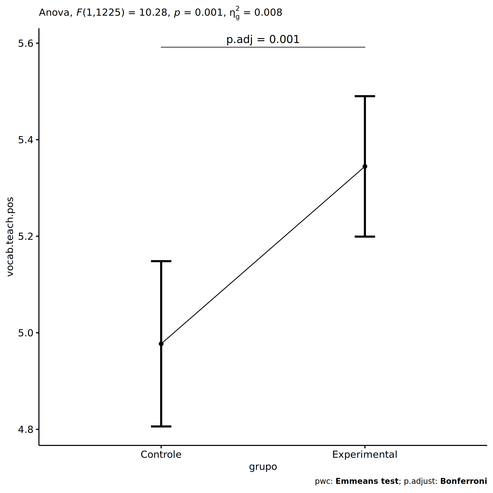
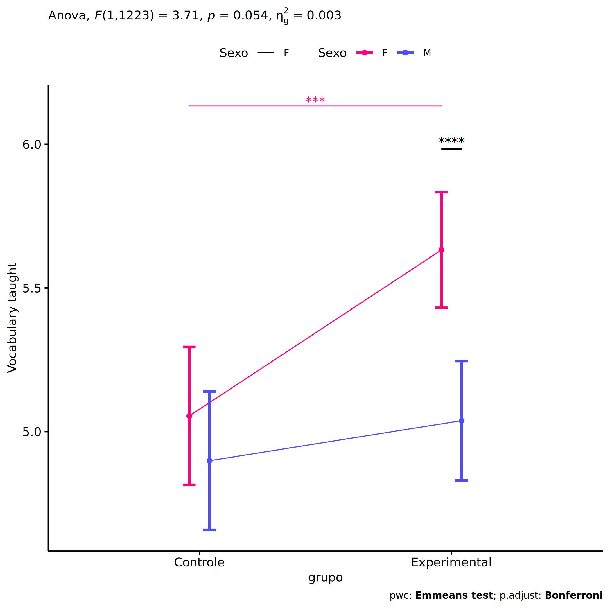
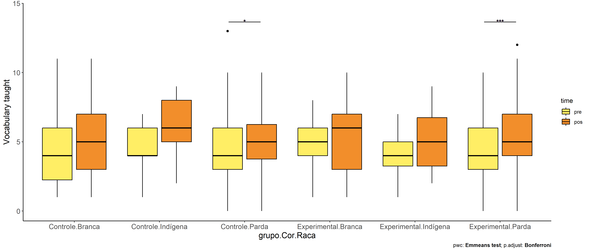
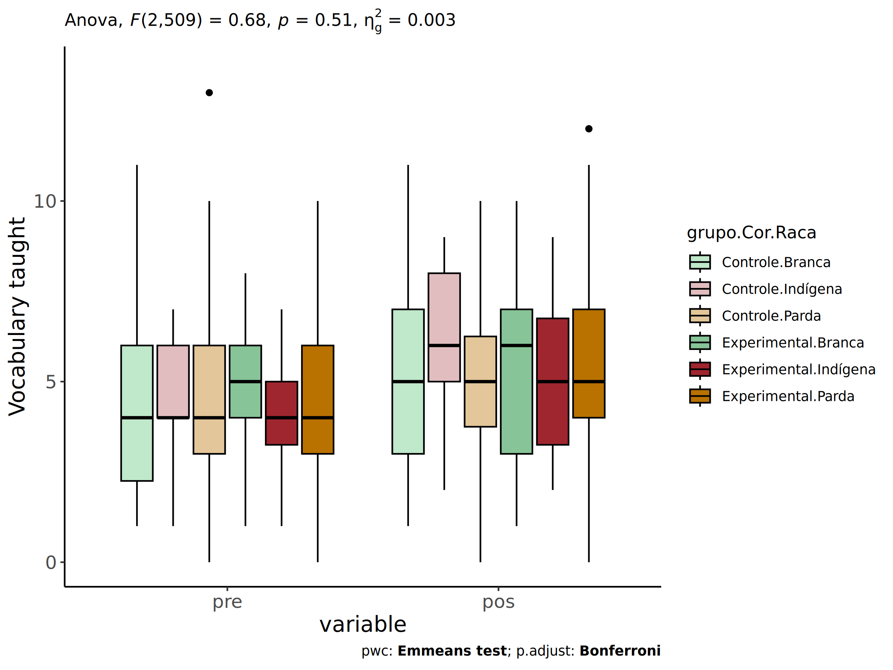
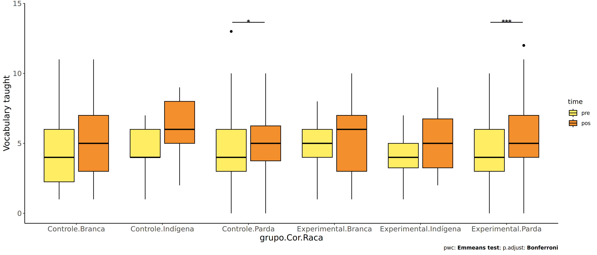
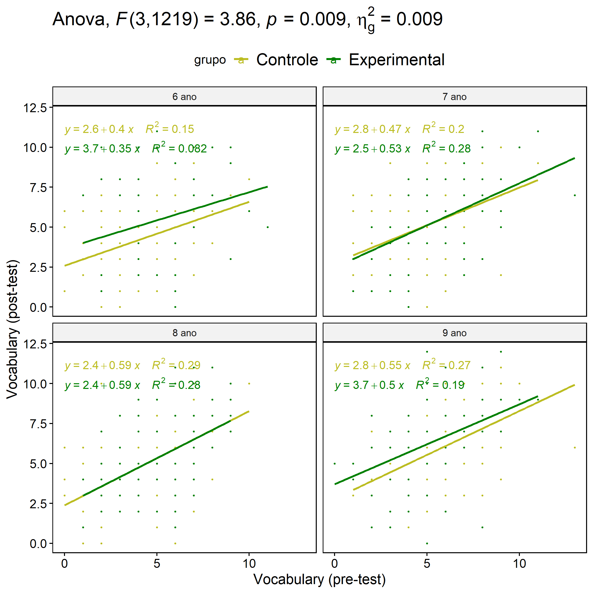
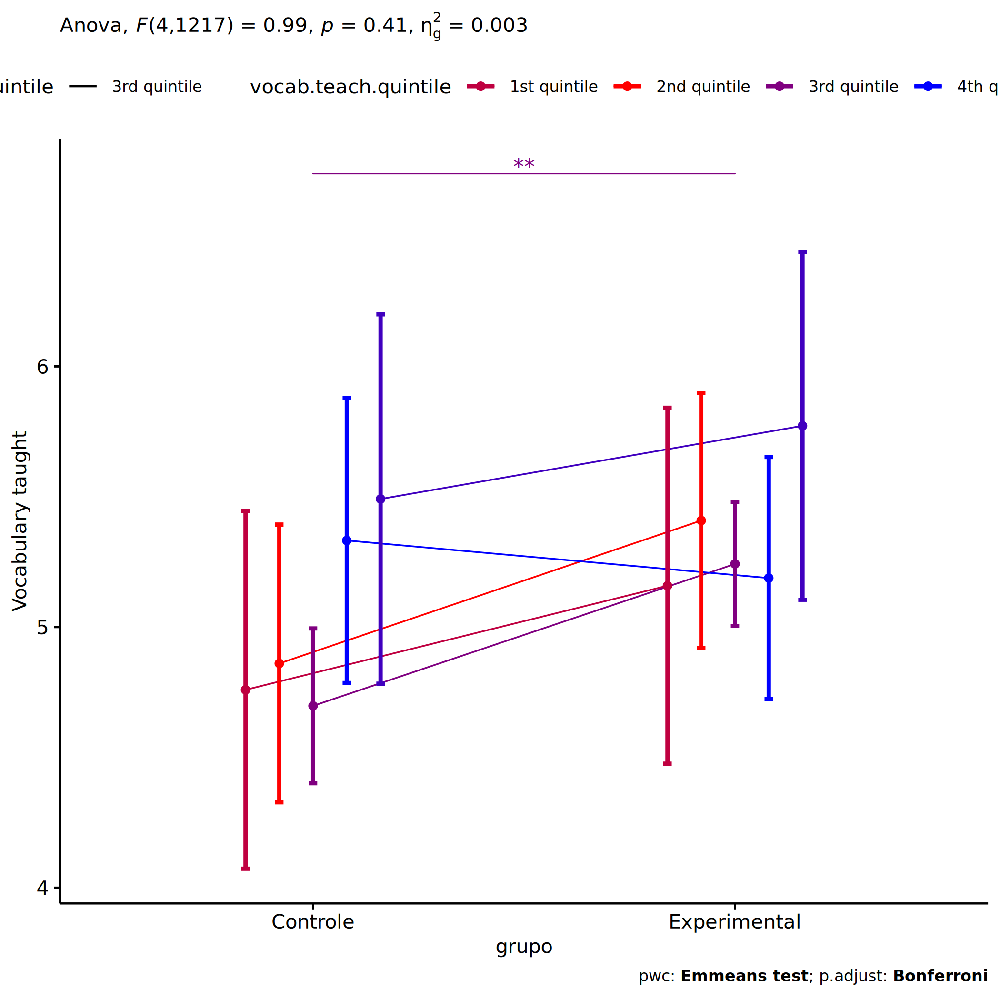

ANCOVA in Vocabulary taught (Vocabulary taught)
================
Geiser C. Challco <geiser@alumni.usp.br>

- [Setting Initial Variables](#setting-initial-variables)
- [Descriptive Statistics of Initial
  Data](#descriptive-statistics-of-initial-data)
- [ANCOVA and Pairwise for one factor:
  **grupo**](#ancova-and-pairwise-for-one-factor-grupo)
  - [Without remove non-normal data](#without-remove-non-normal-data)
  - [Computing ANCOVA and PairWise After removing non-normal data
    (OK)](#computing-ancova-and-pairwise-after-removing-non-normal-data-ok)
    - [Plots for ancova](#plots-for-ancova)
    - [Checking linearity assumption](#checking-linearity-assumption)
    - [Checking normality and
      homogeneity](#checking-normality-and-homogeneity)
- [ANCOVA and Pairwise for two factors
  **grupo:Sexo**](#ancova-and-pairwise-for-two-factors-gruposexo)
  - [Without remove non-normal data](#without-remove-non-normal-data-1)
  - [Computing ANCOVA and PairWise After removing non-normal data
    (OK)](#computing-ancova-and-pairwise-after-removing-non-normal-data-ok-1)
    - [Plots for ancova](#plots-for-ancova-1)
    - [Checking linearity assumption](#checking-linearity-assumption-1)
    - [Checking normality and
      homogeneity](#checking-normality-and-homogeneity-1)
- [ANCOVA and Pairwise for two factors
  **grupo:Zona**](#ancova-and-pairwise-for-two-factors-grupozona)
  - [Without remove non-normal data](#without-remove-non-normal-data-2)
  - [Computing ANCOVA and PairWise After removing non-normal data
    (OK)](#computing-ancova-and-pairwise-after-removing-non-normal-data-ok-2)
    - [Plots for ancova](#plots-for-ancova-2)
    - [Checking linearity assumption](#checking-linearity-assumption-2)
    - [Checking normality and
      homogeneity](#checking-normality-and-homogeneity-2)
- [ANCOVA and Pairwise for two factors
  **grupo:Cor.Raca**](#ancova-and-pairwise-for-two-factors-grupocorraca)
  - [Without remove non-normal data](#without-remove-non-normal-data-3)
  - [Computing ANCOVA and PairWise After removing non-normal data
    (OK)](#computing-ancova-and-pairwise-after-removing-non-normal-data-ok-3)
    - [Plots for ancova](#plots-for-ancova-3)
    - [Checking linearity assumption](#checking-linearity-assumption-3)
    - [Checking normality and
      homogeneity](#checking-normality-and-homogeneity-3)
- [ANCOVA and Pairwise for two factors
  **grupo:Serie**](#ancova-and-pairwise-for-two-factors-gruposerie)
  - [Without remove non-normal data](#without-remove-non-normal-data-4)
  - [Computing ANCOVA and PairWise After removing non-normal data
    (OK)](#computing-ancova-and-pairwise-after-removing-non-normal-data-ok-4)
    - [Plots for ancova](#plots-for-ancova-4)
    - [Checking linearity assumption](#checking-linearity-assumption-4)
    - [Checking normality and
      homogeneity](#checking-normality-and-homogeneity-4)
- [ANCOVA and Pairwise for two factors
  **grupo:vocab.teach.quintile**](#ancova-and-pairwise-for-two-factors-grupovocabteachquintile)
  - [Without remove non-normal data](#without-remove-non-normal-data-5)
  - [Computing ANCOVA and PairWise After removing non-normal data
    (OK)](#computing-ancova-and-pairwise-after-removing-non-normal-data-ok-5)
    - [Plots for ancova](#plots-for-ancova-5)
    - [Checking linearity assumption](#checking-linearity-assumption-5)
    - [Checking normality and
      homogeneity](#checking-normality-and-homogeneity-5)
- [Summary of Results](#summary-of-results)
  - [Descriptive Statistics](#descriptive-statistics)
  - [ANCOVA Table Comparison](#ancova-table-comparison)
  - [PairWise Table Comparison](#pairwise-table-comparison)
  - [EMMS Table Comparison](#emms-table-comparison)

**NOTE**:

- Teste ANCOVA para determinar se houve diferenças significativas no
  Vocabulary taught (medido usando pre- e pos-testes).
- ANCOVA test to determine whether there were significant differences in
  Vocabulary taught (measured using pre- and post-tests).

# Setting Initial Variables

``` r
dv = "vocab.teach"
dv.pos = "vocab.teach.pos"
dv.pre = "vocab.teach.pre"

fatores2 <- c("Sexo","Zona","Cor.Raca","Serie","vocab.teach.quintile")
lfatores2 <- as.list(fatores2)
names(lfatores2) <- fatores2

fatores1 <- c("grupo", fatores2)
lfatores1 <- as.list(fatores1)
names(lfatores1) <- fatores1

lfatores <- c(lfatores1)

color <- list()
color[["prepost"]] = c("#ffee65","#f28e2B")
color[["grupo"]] = c("#bcbd22","#008000")
color[["Sexo"]] = c("#FF007F","#4D4DFF")
color[["Zona"]] = c("#AA00FF","#00CCCC")
color[["Cor.Raca"]] = c(
  "Parda"="#b97100","Indígena"="#9F262F",
  "Branca"="#87c498", "Preta"="#848283","Amarela"="#D6B91C"
)

level <- list()
level[["grupo"]] = c("Controle","Experimental")
level[["Sexo"]] = c("F","M")
level[["Zona"]] = c("Rural","Urbana")
level[["Cor.Raca"]] = c("Parda","Indígena","Branca", "Preta","Amarela")
level[["Serie"]] = c("6 ano","7 ano","8 ano","9 ano")

# ..

ymin <- 0
ymax <- 0

ymin.ci <- 0
ymax.ci <- 0


color[["grupo:Sexo"]] = c(
  "Controle:F"="#ff99cb", "Controle:M"="#b7b7ff",
  "Experimental:F"="#FF007F", "Experimental:M"="#4D4DFF",
  "Controle.F"="#ff99cb", "Controle.M"="#b7b7ff",
  "Experimental.F"="#FF007F", "Experimental.M"="#4D4DFF"
)
color[["grupo:Zona"]] = c(
  "Controle:Rural"="#b2efef","Controle:Urbana"="#e5b2ff",
  "Experimental:Rural"="#00CCCC", "Experimental:Urbana"="#AA00FF",
  "Controle.Rural"="#b2efef","Controle.Urbana"="#e5b2ff",
  "Experimental.Rural"="#00CCCC", "Experimental.Urbana"="#AA00FF"
)
color[["grupo:Cor.Raca"]] = c(
    "Controle:Parda"="#e3c699", "Experimental:Parda"="#b97100",
    "Controle:Indígena"="#e2bdc0", "Experimental:Indígena"="#9F262F",
    "Controle:Branca"="#c0e8cb", "Experimental:Branca"="#87c498",
    "Controle:Preta"="#dad9d9", "Experimental:Preta"="#848283",
    "Controle:Amarela"="#eee3a4", "Experimental:Amarela"="#D6B91C",
    
    "Controle.Parda"="#e3c699", "Experimental.Parda"="#b97100",
    "Controle.Indígena"="#e2bdc0", "Experimental.Indígena"="#9F262F",
    "Controle.Branca"="#c0e8cb", "Experimental.Branca"="#87c498",
    "Controle.Preta"="#dad9d9", "Experimental.Preta"="#848283",
    "Controle.Amarela"="#eee3a4", "Experimental.Amarela"="#D6B91C"
)


for (coln in c("vocab","vocab.teach","vocab.non.teach","score.tde",
               "TFL.lidas.per.min","TFL.corretas.per.min","TFL.erradas.per.min","TFL.omitidas.per.min",
               "leitura.compreensao")) {
  color[[paste0(coln,".quintile")]] = c("#BF0040","#FF0000","#800080","#0000FF","#4000BF")
  level[[paste0(coln,".quintile")]] = c("1st quintile","2nd quintile","3rd quintile","4th quintile","5th quintile")
  color[[paste0("grupo:",coln,".quintile")]] = c(
    "Experimental.1st quintile"="#BF0040", "Controle.1st quintile"="#d8668c",
    "Experimental.2nd quintile"="#FF0000", "Controle.2nd quintile"="#ff7f7f",
    "Experimental.3rd quintile"="#8fce00", "Controle.3rd quintile"="#ddf0b2",
    "Experimental.4th quintile"="#0000FF", "Controle.4th quintile"="#b2b2ff",
    "Experimental.5th quintile"="#4000BF", "Controle.5th quintile"="#b299e5",
    
    "Experimental:1st quintile"="#BF0040", "Controle:1st quintile"="#d8668c",
    "Experimental:2nd quintile"="#FF0000", "Controle:2nd quintile"="#ff7f7f",
    "Experimental:3rd quintile"="#8fce00", "Controle:3rd quintile"="#ddf0b2",
    "Experimental:4th quintile"="#0000FF", "Controle:4th quintile"="#b2b2ff",
    "Experimental:5th quintile"="#4000BF", "Controle:5th quintile"="#b299e5")
}


gdat <- read_excel("../data/data.xlsx", sheet = "sumary")
gdat <- gdat[which(is.na(gdat$Necessidade.Deficiencia) & !is.na(gdat$WG.Grupo)),]


dat <- gdat
dat$grupo <- factor(dat[["WG.Grupo"]], level[["grupo"]])
for (coln in c(names(lfatores))) {
  dat[[coln]] <- factor(dat[[coln]], level[[coln]][level[[coln]] %in% unique(dat[[coln]])])
}
dat <- dat[which(!is.na(dat[[dv.pre]]) & !is.na(dat[[dv.pos]])),]
dat <- dat[,c("id",names(lfatores),dv.pre,dv.pos)]

dat.long <- rbind(dat, dat)
dat.long$time <- c(rep("pre", nrow(dat)), rep("pos", nrow(dat)))
dat.long$time <- factor(dat.long$time, c("pre","pos"))
dat.long[[dv]] <- c(dat[[dv.pre]], dat[[dv.pos]])


for (f in c("grupo", names(lfatores))) {
  if (is.null(color[[f]]) && length(unique(dat[[f]])) > 0) 
      color[[f]] <- distinctColorPalette(length(unique(dat[[f]])))
}
for (f in c(fatores2)) {
  if (is.null(color[[paste0("grupo:",f)]]) && length(unique(dat[[f]])) > 0)
    color[[paste0("grupo:",f)]] <- distinctColorPalette(length(unique(dat[["grupo"]]))*length(unique(dat[[f]])))
}

ldat <- list()
laov <- list()
lpwc <- list()
lemms <- list()
```

# Descriptive Statistics of Initial Data

``` r
df <- get.descriptives(dat, c(dv.pre, dv.pos), c("grupo"), 
                       include.global = T, symmetry.test = T, normality.test = F)
df <- plyr::rbind.fill(
  df, do.call(plyr::rbind.fill, lapply(lfatores2, FUN = function(f) {
    if (nrow(dat) > 0 && sum(!is.na(unique(dat[[f]]))) > 1)
      get.descriptives(dat, c(dv.pre,dv.pos), c("grupo", f),
                       symmetry.test = T, normality.test = F)
    }))
)
```

    ## Warning: There were 3 warnings in `mutate()`.
    ## The first warning was:
    ## ℹ In argument: `ci = abs(stats::qt(alpha/2, .data$n - 1) * .data$se)`.
    ## Caused by warning:
    ## ! There was 1 warning in `mutate()`.
    ## ℹ In argument: `ci = abs(stats::qt(alpha/2, .data$n - 1) * .data$se)`.
    ## Caused by warning in `stats::qt()`:
    ## ! NaNs produced
    ## ℹ Run `dplyr::last_dplyr_warnings()` to see the 2 remaining warnings.
    ## There were 3 warnings in `mutate()`.
    ## The first warning was:
    ## ℹ In argument: `ci = abs(stats::qt(alpha/2, .data$n - 1) * .data$se)`.
    ## Caused by warning:
    ## ! There was 1 warning in `mutate()`.
    ## ℹ In argument: `ci = abs(stats::qt(alpha/2, .data$n - 1) * .data$se)`.
    ## Caused by warning in `stats::qt()`:
    ## ! NaNs produced
    ## ℹ Run `dplyr::last_dplyr_warnings()` to see the 2 remaining warnings.

``` r
df <- df[,c(fatores1[fatores1 %in% colnames(df)],"variable",
            colnames(df)[!colnames(df) %in% c(fatores1,"variable")])]
```

| grupo        | Sexo | Zona   | Cor.Raca | Serie | vocab.teach.quintile | variable        |    n |  mean | median | min | max |    sd |    se |    ci |  iqr | symmetry | skewness | kurtosis |
|:-------------|:-----|:-------|:---------|:------|:---------------------|:----------------|-----:|------:|-------:|----:|----:|------:|------:|------:|-----:|:---------|---------:|---------:|
| Controle     |      |        |          |       |                      | vocab.teach.pre |  516 | 4.506 |    4.0 |   0 |  13 | 2.164 | 0.095 | 0.187 | 3.00 | YES      |    0.358 |   -0.156 |
| Experimental |      |        |          |       |                      | vocab.teach.pre |  713 | 4.759 |    5.0 |   0 |  13 | 2.018 | 0.076 | 0.148 | 3.00 | YES      |    0.383 |   -0.021 |
|              |      |        |          |       |                      | vocab.teach.pre | 1229 | 4.653 |    4.0 |   0 |  13 | 2.083 | 0.059 | 0.117 | 3.00 | YES      |    0.358 |   -0.073 |
| Controle     |      |        |          |       |                      | vocab.teach.pos |  516 | 4.919 |    5.0 |   0 |  15 | 2.294 | 0.101 | 0.198 | 3.00 | YES      |    0.295 |    0.106 |
| Experimental |      |        |          |       |                      | vocab.teach.pos |  713 | 5.401 |    5.0 |   0 |  12 | 2.273 | 0.085 | 0.167 | 3.00 | YES      |    0.206 |   -0.390 |
|              |      |        |          |       |                      | vocab.teach.pos | 1229 | 5.199 |    5.0 |   0 |  15 | 2.293 | 0.065 | 0.128 | 3.00 | YES      |    0.237 |   -0.188 |
| Controle     | F    |        |          |       |                      | vocab.teach.pre |  259 | 4.587 |    5.0 |   0 |  10 | 2.032 | 0.126 | 0.249 | 3.00 | YES      |    0.139 |   -0.532 |
| Controle     | M    |        |          |       |                      | vocab.teach.pre |  257 | 4.424 |    4.0 |   0 |  13 | 2.290 | 0.143 | 0.281 | 3.00 | NO       |    0.531 |    0.058 |
| Experimental | F    |        |          |       |                      | vocab.teach.pre |  368 | 4.777 |    5.0 |   0 |  13 | 2.063 | 0.108 | 0.211 | 3.00 | YES      |    0.375 |    0.137 |
| Experimental | M    |        |          |       |                      | vocab.teach.pre |  345 | 4.739 |    5.0 |   1 |  11 | 1.971 | 0.106 | 0.209 | 3.00 | YES      |    0.387 |   -0.257 |
| Controle     | F    |        |          |       |                      | vocab.teach.pos |  259 | 5.058 |    5.0 |   0 |  15 | 2.303 | 0.143 | 0.282 | 2.00 | YES      |    0.337 |    0.675 |
| Controle     | M    |        |          |       |                      | vocab.teach.pos |  257 | 4.778 |    5.0 |   0 |  11 | 2.281 | 0.142 | 0.280 | 3.00 | YES      |    0.249 |   -0.536 |
| Experimental | F    |        |          |       |                      | vocab.teach.pos |  368 | 5.698 |    6.0 |   0 |  12 | 2.249 | 0.117 | 0.230 | 3.00 | YES      |    0.212 |   -0.394 |
| Experimental | M    |        |          |       |                      | vocab.teach.pos |  345 | 5.084 |    5.0 |   0 |  12 | 2.258 | 0.122 | 0.239 | 4.00 | YES      |    0.214 |   -0.426 |
| Controle     |      | Rural  |          |       |                      | vocab.teach.pre |  253 | 4.462 |    4.0 |   0 |  11 | 2.069 | 0.130 | 0.256 | 3.00 | YES      |    0.324 |   -0.388 |
| Controle     |      | Urbana |          |       |                      | vocab.teach.pre |  114 | 4.412 |    4.0 |   0 |  10 | 1.968 | 0.184 | 0.365 | 2.75 | YES      |    0.306 |   -0.024 |
| Controle     |      |        |          |       |                      | vocab.teach.pre |  149 | 4.651 |    5.0 |   0 |  13 | 2.452 | 0.201 | 0.397 | 3.00 | YES      |    0.343 |   -0.289 |
| Experimental |      | Rural  |          |       |                      | vocab.teach.pre |  294 | 4.694 |    5.0 |   0 |  11 | 2.068 | 0.121 | 0.237 | 3.00 | YES      |    0.289 |   -0.366 |
| Experimental |      | Urbana |          |       |                      | vocab.teach.pre |  189 | 4.815 |    5.0 |   1 |  13 | 2.127 | 0.155 | 0.305 | 3.00 | NO       |    0.538 |    0.429 |
| Experimental |      |        |          |       |                      | vocab.teach.pre |  230 | 4.796 |    4.5 |   1 |  10 | 1.861 | 0.123 | 0.242 | 2.00 | YES      |    0.354 |   -0.235 |
| Controle     |      | Rural  |          |       |                      | vocab.teach.pos |  253 | 5.016 |    5.0 |   0 |  15 | 2.384 | 0.150 | 0.295 | 4.00 | YES      |    0.372 |    0.263 |
| Controle     |      | Urbana |          |       |                      | vocab.teach.pos |  114 | 4.833 |    5.0 |   0 |  10 | 2.052 | 0.192 | 0.381 | 2.00 | YES      |    0.125 |   -0.173 |
| Controle     |      |        |          |       |                      | vocab.teach.pos |  149 | 4.819 |    5.0 |   0 |  11 | 2.322 | 0.190 | 0.376 | 3.00 | YES      |    0.206 |   -0.328 |
| Experimental |      | Rural  |          |       |                      | vocab.teach.pos |  294 | 5.374 |    5.0 |   0 |  12 | 2.358 | 0.138 | 0.271 | 3.00 | YES      |    0.168 |   -0.455 |
| Experimental |      | Urbana |          |       |                      | vocab.teach.pos |  189 | 5.487 |    6.0 |   1 |  11 | 2.163 | 0.157 | 0.310 | 3.00 | YES      |    0.225 |   -0.404 |
| Experimental |      |        |          |       |                      | vocab.teach.pos |  230 | 5.365 |    5.0 |   1 |  12 | 2.258 | 0.149 | 0.293 | 3.00 | YES      |    0.256 |   -0.363 |
| Controle     |      |        | Parda    |       |                      | vocab.teach.pre |  168 | 4.458 |    4.0 |   0 |  13 | 2.166 | 0.167 | 0.330 | 3.00 | NO       |    0.546 |    0.619 |
| Controle     |      |        | Indígena |       |                      | vocab.teach.pre |   13 | 4.615 |    4.0 |   1 |   7 | 1.660 | 0.460 | 1.003 | 2.00 | YES      |   -0.338 |   -0.464 |
| Controle     |      |        | Branca   |       |                      | vocab.teach.pre |   54 | 4.352 |    4.0 |   1 |  11 | 2.267 | 0.308 | 0.619 | 3.75 | NO       |    0.590 |   -0.056 |
| Controle     |      |        | Preta    |       |                      | vocab.teach.pre |    1 | 3.000 |    3.0 |   3 |   3 |       |       |       | 0.00 | few data |    0.000 |    0.000 |
| Controle     |      |        |          |       |                      | vocab.teach.pre |  280 | 4.564 |    4.0 |   0 |  10 | 2.173 | 0.130 | 0.256 | 3.00 | YES      |    0.204 |   -0.672 |
| Experimental |      |        | Parda    |       |                      | vocab.teach.pre |  201 | 4.478 |    4.0 |   0 |  10 | 2.057 | 0.145 | 0.286 | 3.00 | YES      |    0.454 |   -0.356 |
| Experimental |      |        | Indígena |       |                      | vocab.teach.pre |   18 | 4.167 |    4.0 |   1 |   7 | 1.654 | 0.390 | 0.822 | 1.75 | YES      |   -0.250 |   -1.004 |
| Experimental |      |        | Branca   |       |                      | vocab.teach.pre |   62 | 5.000 |    5.0 |   1 |   8 | 1.765 | 0.224 | 0.448 | 2.00 | YES      |   -0.123 |   -0.789 |
| Experimental |      |        | Preta    |       |                      | vocab.teach.pre |    1 | 1.000 |    1.0 |   1 |   1 |       |       |       | 0.00 | few data |    0.000 |    0.000 |
| Experimental |      |        | Amarela  |       |                      | vocab.teach.pre |    1 | 3.000 |    3.0 |   3 |   3 |       |       |       | 0.00 | few data |    0.000 |    0.000 |
| Experimental |      |        |          |       |                      | vocab.teach.pre |  430 | 4.893 |    5.0 |   1 |  13 | 2.028 | 0.098 | 0.192 | 2.75 | YES      |    0.424 |    0.186 |
| Controle     |      |        | Parda    |       |                      | vocab.teach.pos |  168 | 5.006 |    5.0 |   0 |  10 | 2.265 | 0.175 | 0.345 | 2.50 | YES      |    0.079 |   -0.377 |
| Controle     |      |        | Indígena |       |                      | vocab.teach.pos |   13 | 5.923 |    6.0 |   2 |   9 | 2.100 | 0.582 | 1.269 | 3.00 | YES      |   -0.305 |   -1.134 |
| Controle     |      |        | Branca   |       |                      | vocab.teach.pos |   54 | 4.889 |    5.0 |   1 |  11 | 2.408 | 0.328 | 0.657 | 4.00 | YES      |    0.295 |   -0.654 |
| Controle     |      |        | Preta    |       |                      | vocab.teach.pos |    1 | 6.000 |    6.0 |   6 |   6 |       |       |       | 0.00 | few data |    0.000 |    0.000 |
| Controle     |      |        |          |       |                      | vocab.teach.pos |  280 | 4.821 |    5.0 |   0 |  15 | 2.299 | 0.137 | 0.270 | 3.00 | YES      |    0.458 |    0.620 |
| Experimental |      |        | Parda    |       |                      | vocab.teach.pos |  201 | 5.318 |    5.0 |   0 |  12 | 2.364 | 0.167 | 0.329 | 3.00 | YES      |    0.381 |   -0.144 |
| Experimental |      |        | Indígena |       |                      | vocab.teach.pos |   18 | 5.111 |    5.0 |   2 |   9 | 2.026 | 0.478 | 1.007 | 3.50 | YES      |    0.098 |   -1.067 |
| Experimental |      |        | Branca   |       |                      | vocab.teach.pos |   62 | 5.387 |    6.0 |   1 |  10 | 2.335 | 0.297 | 0.593 | 4.00 | YES      |   -0.030 |   -1.012 |
| Experimental |      |        | Preta    |       |                      | vocab.teach.pos |    1 | 4.000 |    4.0 |   4 |   4 |       |       |       | 0.00 | few data |    0.000 |    0.000 |
| Experimental |      |        | Amarela  |       |                      | vocab.teach.pos |    1 | 6.000 |    6.0 |   6 |   6 |       |       |       | 0.00 | few data |    0.000 |    0.000 |
| Experimental |      |        |          |       |                      | vocab.teach.pos |  430 | 5.456 |    5.0 |   0 |  11 | 2.239 | 0.108 | 0.212 | 3.00 | YES      |    0.150 |   -0.452 |
| Controle     |      |        |          | 6 ano |                      | vocab.teach.pre |  146 | 3.925 |    4.0 |   0 |  10 | 1.901 | 0.157 | 0.311 | 3.00 | YES      |    0.418 |   -0.039 |
| Controle     |      |        |          | 7 ano |                      | vocab.teach.pre |  152 | 4.013 |    4.0 |   1 |  11 | 1.919 | 0.156 | 0.308 | 2.00 | NO       |    0.685 |    0.547 |
| Controle     |      |        |          | 8 ano |                      | vocab.teach.pre |  100 | 4.560 |    4.5 |   0 |  10 | 2.298 | 0.230 | 0.456 | 3.00 | YES      |    0.050 |   -0.769 |
| Controle     |      |        |          | 9 ano |                      | vocab.teach.pre |  118 | 5.814 |    6.0 |   1 |  13 | 2.108 | 0.194 | 0.384 | 3.00 | YES      |    0.043 |    0.248 |
| Experimental |      |        |          | 6 ano |                      | vocab.teach.pre |  165 | 4.255 |    4.0 |   1 |  11 | 1.902 | 0.148 | 0.292 | 2.00 | NO       |    0.618 |    0.553 |
| Experimental |      |        |          | 7 ano |                      | vocab.teach.pre |  196 | 4.745 |    5.0 |   1 |  13 | 2.157 | 0.154 | 0.304 | 3.00 | NO       |    0.549 |    0.323 |
| Experimental |      |        |          | 8 ano |                      | vocab.teach.pre |  181 | 4.796 |    5.0 |   1 |   9 | 1.954 | 0.145 | 0.287 | 3.00 | YES      |    0.175 |   -0.643 |
| Experimental |      |        |          | 9 ano |                      | vocab.teach.pre |  171 | 5.222 |    5.0 |   0 |  11 | 1.927 | 0.147 | 0.291 | 3.00 | YES      |    0.171 |   -0.238 |
| Controle     |      |        |          | 6 ano |                      | vocab.teach.pos |  146 | 4.158 |    4.0 |   0 |   9 | 1.957 | 0.162 | 0.320 | 3.00 | YES      |    0.170 |   -0.451 |
| Controle     |      |        |          | 7 ano |                      | vocab.teach.pos |  152 | 4.658 |    5.0 |   0 |  10 | 2.040 | 0.165 | 0.327 | 3.00 | YES      |    0.287 |   -0.267 |
| Controle     |      |        |          | 8 ano |                      | vocab.teach.pos |  100 | 5.070 |    5.0 |   0 |  10 | 2.508 | 0.251 | 0.498 | 4.00 | YES      |   -0.166 |   -0.786 |
| Controle     |      |        |          | 9 ano |                      | vocab.teach.pos |  118 | 6.068 |    6.0 |   1 |  15 | 2.360 | 0.217 | 0.430 | 2.75 | YES      |    0.427 |    0.657 |
| Experimental |      |        |          | 6 ano |                      | vocab.teach.pos |  165 | 5.164 |    5.0 |   0 |  11 | 2.346 | 0.183 | 0.361 | 4.00 | YES      |    0.244 |   -0.620 |
| Experimental |      |        |          | 7 ano |                      | vocab.teach.pos |  196 | 4.980 |    5.0 |   0 |  11 | 2.134 | 0.152 | 0.301 | 3.00 | YES      |    0.405 |   -0.068 |
| Experimental |      |        |          | 8 ano |                      | vocab.teach.pos |  181 | 5.210 |    5.0 |   1 |  11 | 2.188 | 0.163 | 0.321 | 3.00 | YES      |    0.356 |   -0.343 |
| Experimental |      |        |          | 9 ano |                      | vocab.teach.pos |  171 | 6.316 |    6.0 |   0 |  12 | 2.211 | 0.169 | 0.334 | 3.00 | YES      |   -0.202 |    0.117 |
| Controle     |      |        |          |       | 1st quintile         | vocab.teach.pre |  102 | 1.618 |    2.0 |   0 |   2 | 0.598 | 0.059 | 0.117 | 1.00 | few data |    0.000 |    0.000 |
| Controle     |      |        |          |       | 2nd quintile         | vocab.teach.pre |   80 | 3.000 |    3.0 |   3 |   3 | 0.000 | 0.000 | 0.000 | 0.00 | few data |    0.000 |    0.000 |
| Controle     |      |        |          |       | 3rd quintile         | vocab.teach.pre |  173 | 4.509 |    5.0 |   4 |   5 | 0.501 | 0.038 | 0.075 | 1.00 | few data |    0.000 |    0.000 |
| Controle     |      |        |          |       | 4th quintile         | vocab.teach.pre |   64 | 6.000 |    6.0 |   6 |   6 | 0.000 | 0.000 | 0.000 | 0.00 | few data |    0.000 |    0.000 |
| Controle     |      |        |          |       | 5th quintile         | vocab.teach.pre |   97 | 7.794 |    7.0 |   7 |  13 | 1.060 | 0.108 | 0.214 | 1.00 | NO       |    1.866 |    5.018 |
| Experimental |      |        |          |       | 1st quintile         | vocab.teach.pre |   93 | 1.710 |    2.0 |   0 |   2 | 0.480 | 0.050 | 0.099 | 1.00 | few data |    0.000 |    0.000 |
| Experimental |      |        |          |       | 2nd quintile         | vocab.teach.pre |  105 | 3.000 |    3.0 |   3 |   3 | 0.000 | 0.000 | 0.000 | 0.00 | few data |    0.000 |    0.000 |
| Experimental |      |        |          |       | 3rd quintile         | vocab.teach.pre |  273 | 4.451 |    4.0 |   4 |   5 | 0.498 | 0.030 | 0.059 | 1.00 | few data |    0.000 |    0.000 |
| Experimental |      |        |          |       | 4th quintile         | vocab.teach.pre |   99 | 6.000 |    6.0 |   6 |   6 | 0.000 | 0.000 | 0.000 | 0.00 | few data |    0.000 |    0.000 |
| Experimental |      |        |          |       | 5th quintile         | vocab.teach.pre |  143 | 7.762 |    7.0 |   7 |  13 | 1.034 | 0.086 | 0.171 | 1.00 | NO       |    1.809 |    4.529 |
| Controle     |      |        |          |       | 1st quintile         | vocab.teach.pos |  102 | 3.431 |    3.0 |   0 |  10 | 1.927 | 0.191 | 0.378 | 2.75 | YES      |    0.412 |    0.170 |
| Controle     |      |        |          |       | 2nd quintile         | vocab.teach.pos |   80 | 4.138 |    4.0 |   0 |   9 | 1.674 | 0.187 | 0.373 | 2.00 | YES      |    0.265 |    0.205 |
| Controle     |      |        |          |       | 3rd quintile         | vocab.teach.pos |  173 | 4.694 |    5.0 |   0 |  15 | 2.047 | 0.156 | 0.307 | 3.00 | NO       |    0.746 |    2.761 |
| Controle     |      |        |          |       | 4th quintile         | vocab.teach.pos |   64 | 5.922 |    6.0 |   0 |  10 | 2.125 | 0.266 | 0.531 | 2.25 | NO       |   -0.573 |   -0.201 |
| Controle     |      |        |          |       | 5th quintile         | vocab.teach.pos |   97 | 6.866 |    7.0 |   2 |  11 | 2.024 | 0.206 | 0.408 | 2.00 | YES      |   -0.245 |   -0.452 |
| Experimental |      |        |          |       | 1st quintile         | vocab.teach.pos |   93 | 3.871 |    3.0 |   1 |  10 | 1.946 | 0.202 | 0.401 | 2.00 | NO       |    0.617 |   -0.028 |
| Experimental |      |        |          |       | 2nd quintile         | vocab.teach.pos |  105 | 4.686 |    5.0 |   1 |   9 | 1.723 | 0.168 | 0.333 | 3.00 | YES      |    0.107 |   -0.648 |
| Experimental |      |        |          |       | 3rd quintile         | vocab.teach.pos |  273 | 5.154 |    5.0 |   0 |  12 | 2.058 | 0.125 | 0.245 | 3.00 | YES      |    0.228 |   -0.010 |
| Experimental |      |        |          |       | 4th quintile         | vocab.teach.pos |   99 | 5.778 |    6.0 |   0 |  11 | 2.183 | 0.219 | 0.435 | 3.00 | YES      |   -0.155 |   -0.146 |
| Experimental |      |        |          |       | 5th quintile         | vocab.teach.pos |  143 | 7.133 |    7.0 |   1 |  12 | 2.173 | 0.182 | 0.359 | 3.00 | YES      |   -0.276 |   -0.418 |

# ANCOVA and Pairwise for one factor: **grupo**

## Without remove non-normal data

``` r
pdat = remove_group_data(dat[!is.na(dat[["grupo"]]),], "vocab.teach.pos", "grupo")

pdat.long <- rbind(pdat[,c("id","grupo")], pdat[,c("id","grupo")])
pdat.long[["time"]] <- c(rep("pre", nrow(pdat)), rep("pos", nrow(pdat)))
pdat.long[["time"]] <- factor(pdat.long[["time"]], c("pre","pos"))
pdat.long[["vocab.teach"]] <- c(pdat[["vocab.teach.pre"]], pdat[["vocab.teach.pos"]])

aov = anova_test(pdat, vocab.teach.pos ~ vocab.teach.pre + grupo)
laov[["grupo"]] <- get_anova_table(aov)
```

``` r
pwc <- emmeans_test(pdat, vocab.teach.pos ~ grupo, covariate = vocab.teach.pre,
                    p.adjust.method = "bonferroni")
```

``` r
pwc.long <- emmeans_test(dplyr::group_by_at(pdat.long, "grupo"),
                          vocab.teach ~ time,
                          p.adjust.method = "bonferroni")
lpwc[["grupo"]] <- plyr::rbind.fill(pwc, pwc.long)
```

``` r
ds <- get.descriptives(pdat, "vocab.teach.pos", "grupo", covar = "vocab.teach.pre")
ds <- merge(ds[ds$variable != "vocab.teach.pre",],
            ds[ds$variable == "vocab.teach.pre", !colnames(ds) %in% c("variable")],
            by = "grupo", all.x = T, suffixes = c("", ".vocab.teach.pre"))
ds <- merge(get_emmeans(pwc), ds, by = "grupo", suffixes = c(".emms", ""))
ds <- ds[,c("grupo","n","mean.vocab.teach.pre","se.vocab.teach.pre","mean","se",
            "emmean","se.emms","conf.low","conf.high")]

colnames(ds) <- c("grupo", "N", paste0(c("M","SE")," (pre)"),
                  paste0(c("M","SE"), " (unadj)"),
                  paste0(c("M", "SE"), " (adj)"), "conf.low", "conf.high")

lemms[["grupo"]] <- ds
```

## Computing ANCOVA and PairWise After removing non-normal data (OK)

``` r
wdat = pdat 

res = residuals(lm(vocab.teach.pos ~ vocab.teach.pre + grupo, data = wdat))
non.normal = getNonNormal(res, wdat$id, plimit = 0.05)

wdat = wdat[!wdat$id %in% non.normal,]

wdat.long <- rbind(wdat[,c("id","grupo")], wdat[,c("id","grupo")])
wdat.long[["time"]] <- c(rep("pre", nrow(wdat)), rep("pos", nrow(wdat)))
wdat.long[["time"]] <- factor(wdat.long[["time"]], c("pre","pos"))
wdat.long[["vocab.teach"]] <- c(wdat[["vocab.teach.pre"]], wdat[["vocab.teach.pos"]])

ldat[["grupo"]] = wdat

(non.normal)
```

    ## [1] "P3709"

``` r
aov = anova_test(wdat, vocab.teach.pos ~ vocab.teach.pre + grupo)
laov[["grupo"]] <- merge(get_anova_table(aov), laov[["grupo"]],
                            by="Effect", suffixes = c("","'"))

(df = get_anova_table(aov))
```

    ## ANOVA Table (type II tests)
    ## 
    ##            Effect DFn  DFd       F        p p<.05   ges
    ## 1 vocab.teach.pre   1 1225 380.801 4.64e-74     * 0.237
    ## 2           grupo   1 1225  10.282 1.00e-03     * 0.008

| Effect          | DFn |  DFd |       F |     p | p\<.05 |   ges |
|:----------------|----:|-----:|--------:|------:|:-------|------:|
| vocab.teach.pre |   1 | 1225 | 380.801 | 0.000 | \*     | 0.237 |
| grupo           |   1 | 1225 |  10.282 | 0.001 | \*     | 0.008 |

``` r
pwc <- emmeans_test(wdat, vocab.teach.pos ~ grupo, covariate = vocab.teach.pre,
                    p.adjust.method = "bonferroni")
```

| term                   | .y.             | group1   | group2       |   df | statistic |     p | p.adj | p.adj.signif |
|:-----------------------|:----------------|:---------|:-------------|-----:|----------:|------:|------:|:-------------|
| vocab.teach.pre\*grupo | vocab.teach.pos | Controle | Experimental | 1225 |    -3.207 | 0.001 | 0.001 | \*\*         |

``` r
pwc.long <- emmeans_test(dplyr::group_by_at(wdat.long, "grupo"),
                         vocab.teach ~ time,
                         p.adjust.method = "bonferroni")
lpwc[["grupo"]] <- merge(plyr::rbind.fill(pwc, pwc.long), lpwc[["grupo"]],
                            by=c("grupo","term",".y.","group1","group2"),
                            suffixes = c("","'"))
```

| grupo        | term | .y.         | group1 | group2 |   df | statistic |     p | p.adj | p.adj.signif |
|:-------------|:-----|:------------|:-------|:-------|-----:|----------:|------:|------:|:-------------|
| Controle     | time | vocab.teach | pre    | pos    | 2452 |    -2.909 | 0.004 | 0.004 | \*\*         |
| Experimental | time | vocab.teach | pre    | pos    | 2452 |    -5.577 | 0.000 | 0.000 | \*\*\*\*     |

``` r
ds <- get.descriptives(wdat, "vocab.teach.pos", "grupo", covar = "vocab.teach.pre")
ds <- merge(ds[ds$variable != "vocab.teach.pre",],
            ds[ds$variable == "vocab.teach.pre", !colnames(ds) %in% c("variable")],
            by = "grupo", all.x = T, suffixes = c("", ".vocab.teach.pre"))
ds <- merge(get_emmeans(pwc), ds, by = "grupo", suffixes = c(".emms", ""))
ds <- ds[,c("grupo","n","mean.vocab.teach.pre","se.vocab.teach.pre","mean","se",
            "emmean","se.emms","conf.low","conf.high")]

colnames(ds) <- c("grupo", "N", paste0(c("M","SE")," (pre)"),
                  paste0(c("M","SE"), " (unadj)"),
                  paste0(c("M", "SE"), " (adj)"), "conf.low", "conf.high")

lemms[["grupo"]] <- merge(ds, lemms[["grupo"]], by=c("grupo"), suffixes = c("","'"))
```

| grupo        |   N | M (pre) | SE (pre) | M (unadj) | SE (unadj) | M (adj) | SE (adj) | conf.low | conf.high |
|:-------------|----:|--------:|---------:|----------:|-----------:|--------:|---------:|---------:|----------:|
| Controle     | 515 |   4.505 |    0.095 |     4.899 |      0.099 |   4.977 |    0.087 |    4.806 |     5.148 |
| Experimental | 713 |   4.759 |    0.076 |     5.401 |      0.085 |   5.345 |    0.074 |    5.199 |     5.490 |

### Plots for ancova

``` r
plots <- oneWayAncovaPlots(
  wdat, "vocab.teach.pos", "grupo", aov, list("grupo"=pwc), addParam = c("mean_ci"),
  font.label.size=10, step.increase=0.05, p.label="p.adj",
  subtitle = which(aov$Effect == "grupo"))
```

``` r
if (!is.null(nrow(plots[["grupo"]]$data)))
  plots[["grupo"]] +
  if (ymin.ci < ymax.ci) ggplot2::ylim(ymin.ci, ymax.ci)
```

<!-- -->

``` r
plots <- oneWayAncovaBoxPlots(
  wdat, "vocab.teach.pos", "grupo", aov, pwc, covar = "vocab.teach.pre",
  theme = "classic", color = color[["grupo"]],
  subtitle = which(aov$Effect == "grupo"))
```

``` r
if (length(unique(wdat[["grupo"]])) > 1)
  plots[["grupo"]] + ggplot2::ylab("Vocabulary taught") +
  ggplot2::scale_x_discrete(labels=c('pre', 'pos')) +
  if (ymin < ymax) ggplot2::ylim(ymin, ymax)
```

<!-- -->

``` r
if (length(unique(wdat.long[["grupo"]])) > 1)
  plots <- oneWayAncovaBoxPlots(
    wdat.long, "vocab.teach", "grupo", aov, pwc.long,
    pre.post = "time", theme = "classic", color = color$prepost)
```

``` r
if (length(unique(wdat.long[["grupo"]])) > 1)
  plots[["grupo"]] + ggplot2::ylab("Vocabulary taught") +
  if (ymin < ymax) ggplot2::ylim(ymin, ymax) 
```

<!-- -->

### Checking linearity assumption

``` r
ggscatter(wdat, x = "vocab.teach.pre", y = "vocab.teach.pos", size = 0.5,
          color = "grupo", add = "reg.line")+
  stat_regline_equation(
    aes(label =  paste(..eq.label.., ..rr.label.., sep = "~~~~"), color = grupo)
  ) +
  ggplot2::labs(subtitle = rstatix::get_test_label(aov, detailed = T, row = which(aov$Effect == "grupo"))) +
  ggplot2::scale_color_manual(values = color[["grupo"]]) +
  if (ymin < ymax) ggplot2::ylim(ymin, ymax)
```

<!-- -->

### Checking normality and homogeneity

``` r
res <- augment(lm(vocab.teach.pos ~ vocab.teach.pre + grupo, data = wdat))
```

``` r
shapiro_test(res$.resid)
```

    ## # A tibble: 1 × 3
    ##   variable   statistic p.value
    ##   <chr>          <dbl>   <dbl>
    ## 1 res$.resid     0.998   0.263

``` r
levene_test(res, .resid ~ grupo)
```

    ## # A tibble: 1 × 4
    ##     df1   df2 statistic     p
    ##   <int> <int>     <dbl> <dbl>
    ## 1     1  1226      2.40 0.121

# ANCOVA and Pairwise for two factors **grupo:Sexo**

## Without remove non-normal data

``` r
pdat = remove_group_data(dat[!is.na(dat[["grupo"]]) & !is.na(dat[["Sexo"]]),],
                         "vocab.teach.pos", c("grupo","Sexo"))
pdat = pdat[pdat[["Sexo"]] %in% do.call(
  intersect, lapply(unique(pdat[["grupo"]]), FUN = function(x) {
    unique(pdat[["Sexo"]][which(pdat[["grupo"]] == x)])
  })),]
pdat[["grupo"]] = factor(pdat[["grupo"]], level[["grupo"]])
pdat[["Sexo"]] = factor(
  pdat[["Sexo"]],
  level[["Sexo"]][level[["Sexo"]] %in% unique(pdat[["Sexo"]])])

pdat.long <- rbind(pdat[,c("id","grupo","Sexo")], pdat[,c("id","grupo","Sexo")])
pdat.long[["time"]] <- c(rep("pre", nrow(pdat)), rep("pos", nrow(pdat)))
pdat.long[["time"]] <- factor(pdat.long[["time"]], c("pre","pos"))
pdat.long[["vocab.teach"]] <- c(pdat[["vocab.teach.pre"]], pdat[["vocab.teach.pos"]])

if (length(unique(pdat[["Sexo"]])) >= 2) {
  aov = anova_test(pdat, vocab.teach.pos ~ vocab.teach.pre + grupo*Sexo)
  laov[["grupo:Sexo"]] <- get_anova_table(aov)
}
```

``` r
if (length(unique(pdat[["Sexo"]])) >= 2) {
  pwcs <- list()
  pwcs[["Sexo"]] <- emmeans_test(
    group_by(pdat, grupo), vocab.teach.pos ~ Sexo,
    covariate = vocab.teach.pre, p.adjust.method = "bonferroni")
  pwcs[["grupo"]] <- emmeans_test(
    group_by(pdat, Sexo), vocab.teach.pos ~ grupo,
    covariate = vocab.teach.pre, p.adjust.method = "bonferroni")
  
  pwc <- plyr::rbind.fill(pwcs[["grupo"]], pwcs[["Sexo"]])
  pwc <- pwc[,c("grupo","Sexo", colnames(pwc)[!colnames(pwc) %in% c("grupo","Sexo")])]
}
```

``` r
if (length(unique(pdat[["Sexo"]])) >= 2) {
  pwc.long <- emmeans_test(dplyr::group_by_at(pdat.long, c("grupo","Sexo")),
                           vocab.teach ~ time,
                           p.adjust.method = "bonferroni")
  lpwc[["grupo:Sexo"]] <- plyr::rbind.fill(pwc, pwc.long)
}
```

``` r
if (length(unique(pdat[["Sexo"]])) >= 2) {
  ds <- get.descriptives(pdat, "vocab.teach.pos", c("grupo","Sexo"), covar = "vocab.teach.pre")
  ds <- merge(ds[ds$variable != "vocab.teach.pre",],
              ds[ds$variable == "vocab.teach.pre", !colnames(ds) %in% c("variable")],
              by = c("grupo","Sexo"), all.x = T, suffixes = c("", ".vocab.teach.pre"))
  ds <- merge(get_emmeans(pwcs[["grupo"]]), ds,
              by = c("grupo","Sexo"), suffixes = c(".emms", ""))
  ds <- ds[,c("grupo","Sexo","n","mean.vocab.teach.pre","se.vocab.teach.pre","mean","se",
              "emmean","se.emms","conf.low","conf.high")]
  
  colnames(ds) <- c("grupo","Sexo", "N", paste0(c("M","SE")," (pre)"),
                    paste0(c("M","SE"), " (unadj)"),
                    paste0(c("M", "SE"), " (adj)"), "conf.low", "conf.high")
  
  lemms[["grupo:Sexo"]] <- ds
}
```

## Computing ANCOVA and PairWise After removing non-normal data (OK)

``` r
if (length(unique(pdat[["Sexo"]])) >= 2) {
  wdat = pdat 
  
  res = residuals(lm(vocab.teach.pos ~ vocab.teach.pre + grupo*Sexo, data = wdat))
  non.normal = getNonNormal(res, wdat$id, plimit = 0.05)
  
  wdat = wdat[!wdat$id %in% non.normal,]
  
  wdat.long <- rbind(wdat[,c("id","grupo","Sexo")], wdat[,c("id","grupo","Sexo")])
  wdat.long[["time"]] <- c(rep("pre", nrow(wdat)), rep("pos", nrow(wdat)))
  wdat.long[["time"]] <- factor(wdat.long[["time"]], c("pre","pos"))
  wdat.long[["vocab.teach"]] <- c(wdat[["vocab.teach.pre"]], wdat[["vocab.teach.pos"]])
  
  
  ldat[["grupo:Sexo"]] = wdat
  
  (non.normal)
}
```

    ## [1] "P3709"

``` r
if (length(unique(pdat[["Sexo"]])) >= 2) {
  aov = anova_test(wdat, vocab.teach.pos ~ vocab.teach.pre + grupo*Sexo)
  laov[["grupo:Sexo"]] <- merge(get_anova_table(aov), laov[["grupo:Sexo"]],
                                         by="Effect", suffixes = c("","'"))
  df = get_anova_table(aov)
}
```

| Effect          | DFn |  DFd |       F |     p | p\<.05 |   ges |
|:----------------|----:|-----:|--------:|------:|:-------|------:|
| vocab.teach.pre |   1 | 1223 | 383.236 | 0.000 | \*     | 0.239 |
| grupo           |   1 | 1223 |  10.087 | 0.002 | \*     | 0.008 |
| Sexo            |   1 | 1223 |  13.356 | 0.000 | \*     | 0.011 |
| grupo:Sexo      |   1 | 1223 |   3.710 | 0.054 |        | 0.003 |

``` r
if (length(unique(pdat[["Sexo"]])) >= 2) {
  pwcs <- list()
  pwcs[["Sexo"]] <- emmeans_test(
    group_by(wdat, grupo), vocab.teach.pos ~ Sexo,
    covariate = vocab.teach.pre, p.adjust.method = "bonferroni")
  pwcs[["grupo"]] <- emmeans_test(
    group_by(wdat, Sexo), vocab.teach.pos ~ grupo,
    covariate = vocab.teach.pre, p.adjust.method = "bonferroni")
  
  pwc <- plyr::rbind.fill(pwcs[["grupo"]], pwcs[["Sexo"]])
  pwc <- pwc[,c("grupo","Sexo", colnames(pwc)[!colnames(pwc) %in% c("grupo","Sexo")])]
}
```

| grupo        | Sexo | term                   | .y.             | group1   | group2       |   df | statistic |     p | p.adj | p.adj.signif |
|:-------------|:-----|:-----------------------|:----------------|:---------|:-------------|-----:|----------:|------:|------:|:-------------|
|              | F    | vocab.teach.pre\*grupo | vocab.teach.pos | Controle | Experimental | 1223 |    -3.615 | 0.000 | 0.000 | \*\*\*       |
|              | M    | vocab.teach.pre\*grupo | vocab.teach.pos | Controle | Experimental | 1223 |    -0.859 | 0.391 | 0.391 | ns           |
| Controle     |      | vocab.teach.pre\*Sexo  | vocab.teach.pos | F        | M            | 1223 |     0.900 | 0.368 | 0.368 | ns           |
| Experimental |      | vocab.teach.pre\*Sexo  | vocab.teach.pos | F        | M            | 1223 |     4.032 | 0.000 | 0.000 | \*\*\*\*     |

``` r
if (length(unique(pdat[["Sexo"]])) >= 2) {
  pwc.long <- emmeans_test(dplyr::group_by_at(wdat.long, c("grupo","Sexo")),
                           vocab.teach ~ time,
                           p.adjust.method = "bonferroni")
  lpwc[["grupo:Sexo"]] <- merge(plyr::rbind.fill(pwc, pwc.long),
                                         lpwc[["grupo:Sexo"]],
                                         by=c("grupo","Sexo","term",".y.","group1","group2"),
                                         suffixes = c("","'"))
}
```

| grupo        | Sexo | term | .y.         | group1 | group2 |   df | statistic |     p | p.adj | p.adj.signif |
|:-------------|:-----|:-----|:------------|:-------|:-------|-----:|----------:|------:|------:|:-------------|
| Controle     | F    | time | vocab.teach | pre    | pos    | 2448 |    -2.273 | 0.023 | 0.023 | \*           |
| Controle     | M    | time | vocab.teach | pre    | pos    | 2448 |    -1.851 | 0.064 | 0.064 | ns           |
| Experimental | F    | time | vocab.teach | pre    | pos    | 2448 |    -5.761 | 0.000 | 0.000 | \*\*\*\*     |
| Experimental | M    | time | vocab.teach | pre    | pos    | 2448 |    -2.089 | 0.037 | 0.037 | \*           |

``` r
if (length(unique(pdat[["Sexo"]])) >= 2) {
  ds <- get.descriptives(wdat, "vocab.teach.pos", c("grupo","Sexo"), covar = "vocab.teach.pre")
  ds <- merge(ds[ds$variable != "vocab.teach.pre",],
              ds[ds$variable == "vocab.teach.pre", !colnames(ds) %in% c("variable")],
              by = c("grupo","Sexo"), all.x = T, suffixes = c("", ".vocab.teach.pre"))
  ds <- merge(get_emmeans(pwcs[["grupo"]]), ds,
              by = c("grupo","Sexo"), suffixes = c(".emms", ""))
  ds <- ds[,c("grupo","Sexo","n","mean.vocab.teach.pre","se.vocab.teach.pre",
              "mean","se","emmean","se.emms","conf.low","conf.high")]
  
  colnames(ds) <- c("grupo","Sexo", "N", paste0(c("M","SE")," (pre)"),
                    paste0(c("M","SE"), " (unadj)"),
                    paste0(c("M", "SE"), " (adj)"), "conf.low", "conf.high")
  
  lemms[["grupo:Sexo"]] <- merge(ds, lemms[["grupo:Sexo"]],
                                          by=c("grupo","Sexo"), suffixes = c("","'"))
}
```

| grupo        | Sexo |   N | M (pre) | SE (pre) | M (unadj) | SE (unadj) | M (adj) | SE (adj) | conf.low | conf.high |
|:-------------|:-----|----:|--------:|---------:|----------:|-----------:|--------:|---------:|---------:|----------:|
| Controle     | F    | 258 |   4.585 |    0.127 |     5.019 |      0.138 |   5.055 |    0.122 |    4.815 |     5.295 |
| Controle     | M    | 257 |   4.424 |    0.143 |     4.778 |      0.142 |   4.899 |    0.123 |    4.658 |     5.140 |
| Experimental | F    | 368 |   4.777 |    0.108 |     5.698 |      0.117 |   5.632 |    0.103 |    5.431 |     5.834 |
| Experimental | M    | 345 |   4.739 |    0.106 |     5.084 |      0.122 |   5.038 |    0.106 |    4.830 |     5.246 |

### Plots for ancova

``` r
if (length(unique(pdat[["Sexo"]])) >= 2) {
  ggPlotAoC2(pwcs, "grupo", "Sexo", aov, ylab = "Vocabulary taught",
             subtitle = which(aov$Effect == "grupo:Sexo"), addParam = "errorbar") +
    ggplot2::scale_color_manual(values = color[["Sexo"]]) +
    if (ymin.ci < ymax.ci) ggplot2::ylim(ymin.ci, ymax.ci)
}
```

    ## Scale for colour is already present.
    ## Adding another scale for colour, which will replace the existing scale.

<!-- -->

``` r
if (length(unique(pdat[["Sexo"]])) >= 2) {
  ggPlotAoC2(pwcs, "Sexo", "grupo", aov, ylab = "Vocabulary taught",
               subtitle = which(aov$Effect == "grupo:Sexo"), addParam = "errorbar") +
      ggplot2::scale_color_manual(values = color[["grupo"]]) +
      if (ymin.ci < ymax.ci) ggplot2::ylim(ymin.ci, ymax.ci)
}
```

    ## Scale for colour is already present.
    ## Adding another scale for colour, which will replace the existing scale.

<!-- -->

``` r
if (length(unique(pdat[["Sexo"]])) >= 2) {
  plots <- twoWayAncovaBoxPlots(
    wdat, "vocab.teach.pos", c("grupo","Sexo"), aov, pwcs, covar = "vocab.teach.pre",
    theme = "classic", color = color[["grupo:Sexo"]],
    subtitle = which(aov$Effect == "grupo:Sexo"))
}
```

``` r
if (length(unique(pdat[["Sexo"]])) >= 2) {
  plots[["grupo:Sexo"]] + ggplot2::ylab("Vocabulary taught") +
  ggplot2::scale_x_discrete(labels=c('pre', 'pos')) +
  if (ymin < ymax) ggplot2::ylim(ymin, ymax)
}
```

    ## Warning: No shared levels found between `names(values)` of the manual scale and the data's colour
    ## values.

<!-- -->

``` r
if (length(unique(pdat[["Sexo"]])) >= 2) {
  plots <- twoWayAncovaBoxPlots(
    wdat.long, "vocab.teach", c("grupo","Sexo"), aov, pwc.long,
    pre.post = "time",
    theme = "classic", color = color$prepost)
}
```

``` r
if (length(unique(pdat[["Sexo"]])) >= 2) 
  plots[["grupo:Sexo"]] + ggplot2::ylab("Vocabulary taught") +
    if (ymin < ymax) ggplot2::ylim(ymin, ymax)
```

<!-- -->

### Checking linearity assumption

``` r
if (length(unique(pdat[["Sexo"]])) >= 2) {
  ggscatter(wdat, x = "vocab.teach.pre", y = "vocab.teach.pos", size = 0.5,
            facet.by = c("grupo","Sexo"), add = "reg.line")+
    stat_regline_equation(
      aes(label =  paste(..eq.label.., ..rr.label.., sep = "~~~~"))
    ) +
    if (ymin < ymax) ggplot2::ylim(ymin, ymax)
}
```

<!-- -->

``` r
if (length(unique(pdat[["Sexo"]])) >= 2) {
  ggscatter(wdat, x = "vocab.teach.pre", y = "vocab.teach.pos", size = 0.5,
            color = "grupo", facet.by = "Sexo", add = "reg.line")+
    stat_regline_equation(
      aes(label =  paste(..eq.label.., ..rr.label.., sep = "~~~~"), color = grupo)
    ) +
    ggplot2::labs(subtitle = rstatix::get_test_label(aov, detailed = T, row = which(aov$Effect == "grupo:Sexo"))) +
    ggplot2::scale_color_manual(values = color[["grupo"]]) +
    if (ymin < ymax) ggplot2::ylim(ymin, ymax)
}
```

<!-- -->

``` r
if (length(unique(pdat[["Sexo"]])) >= 2) {
  ggscatter(wdat, x = "vocab.teach.pre", y = "vocab.teach.pos", size = 0.5,
            color = "Sexo", facet.by = "grupo", add = "reg.line")+
    stat_regline_equation(
      aes(label =  paste(..eq.label.., ..rr.label.., sep = "~~~~"), color = Sexo)
    ) +
    ggplot2::labs(subtitle = rstatix::get_test_label(aov, detailed = T, row = which(aov$Effect == "grupo:Sexo"))) +
    ggplot2::scale_color_manual(values = color[["Sexo"]]) +
    if (ymin < ymax) ggplot2::ylim(ymin, ymax)
}
```

<!-- -->

### Checking normality and homogeneity

``` r
if (length(unique(pdat[["Sexo"]])) >= 2) 
  res <- augment(lm(vocab.teach.pos ~ vocab.teach.pre + grupo*Sexo, data = wdat))
```

``` r
if (length(unique(pdat[["Sexo"]])) >= 2)
  shapiro_test(res$.resid)
```

    ## # A tibble: 1 × 3
    ##   variable   statistic p.value
    ##   <chr>          <dbl>   <dbl>
    ## 1 res$.resid     0.999   0.459

``` r
if (length(unique(pdat[["Sexo"]])) >= 2) 
  levene_test(res, .resid ~ grupo*Sexo)
```

    ## # A tibble: 1 × 4
    ##     df1   df2 statistic     p
    ##   <int> <int>     <dbl> <dbl>
    ## 1     3  1224     0.660 0.577

# ANCOVA and Pairwise for two factors **grupo:Zona**

## Without remove non-normal data

``` r
pdat = remove_group_data(dat[!is.na(dat[["grupo"]]) & !is.na(dat[["Zona"]]),],
                         "vocab.teach.pos", c("grupo","Zona"))
pdat = pdat[pdat[["Zona"]] %in% do.call(
  intersect, lapply(unique(pdat[["grupo"]]), FUN = function(x) {
    unique(pdat[["Zona"]][which(pdat[["grupo"]] == x)])
  })),]
pdat[["grupo"]] = factor(pdat[["grupo"]], level[["grupo"]])
pdat[["Zona"]] = factor(
  pdat[["Zona"]],
  level[["Zona"]][level[["Zona"]] %in% unique(pdat[["Zona"]])])

pdat.long <- rbind(pdat[,c("id","grupo","Zona")], pdat[,c("id","grupo","Zona")])
pdat.long[["time"]] <- c(rep("pre", nrow(pdat)), rep("pos", nrow(pdat)))
pdat.long[["time"]] <- factor(pdat.long[["time"]], c("pre","pos"))
pdat.long[["vocab.teach"]] <- c(pdat[["vocab.teach.pre"]], pdat[["vocab.teach.pos"]])

if (length(unique(pdat[["Zona"]])) >= 2) {
  aov = anova_test(pdat, vocab.teach.pos ~ vocab.teach.pre + grupo*Zona)
  laov[["grupo:Zona"]] <- get_anova_table(aov)
}
```

``` r
if (length(unique(pdat[["Zona"]])) >= 2) {
  pwcs <- list()
  pwcs[["Zona"]] <- emmeans_test(
    group_by(pdat, grupo), vocab.teach.pos ~ Zona,
    covariate = vocab.teach.pre, p.adjust.method = "bonferroni")
  pwcs[["grupo"]] <- emmeans_test(
    group_by(pdat, Zona), vocab.teach.pos ~ grupo,
    covariate = vocab.teach.pre, p.adjust.method = "bonferroni")
  
  pwc <- plyr::rbind.fill(pwcs[["grupo"]], pwcs[["Zona"]])
  pwc <- pwc[,c("grupo","Zona", colnames(pwc)[!colnames(pwc) %in% c("grupo","Zona")])]
}
```

``` r
if (length(unique(pdat[["Zona"]])) >= 2) {
  pwc.long <- emmeans_test(dplyr::group_by_at(pdat.long, c("grupo","Zona")),
                           vocab.teach ~ time,
                           p.adjust.method = "bonferroni")
  lpwc[["grupo:Zona"]] <- plyr::rbind.fill(pwc, pwc.long)
}
```

``` r
if (length(unique(pdat[["Zona"]])) >= 2) {
  ds <- get.descriptives(pdat, "vocab.teach.pos", c("grupo","Zona"), covar = "vocab.teach.pre")
  ds <- merge(ds[ds$variable != "vocab.teach.pre",],
              ds[ds$variable == "vocab.teach.pre", !colnames(ds) %in% c("variable")],
              by = c("grupo","Zona"), all.x = T, suffixes = c("", ".vocab.teach.pre"))
  ds <- merge(get_emmeans(pwcs[["grupo"]]), ds,
              by = c("grupo","Zona"), suffixes = c(".emms", ""))
  ds <- ds[,c("grupo","Zona","n","mean.vocab.teach.pre","se.vocab.teach.pre","mean","se",
              "emmean","se.emms","conf.low","conf.high")]
  
  colnames(ds) <- c("grupo","Zona", "N", paste0(c("M","SE")," (pre)"),
                    paste0(c("M","SE"), " (unadj)"),
                    paste0(c("M", "SE"), " (adj)"), "conf.low", "conf.high")
  
  lemms[["grupo:Zona"]] <- ds
}
```

## Computing ANCOVA and PairWise After removing non-normal data (OK)

``` r
if (length(unique(pdat[["Zona"]])) >= 2) {
  wdat = pdat 
  
  res = residuals(lm(vocab.teach.pos ~ vocab.teach.pre + grupo*Zona, data = wdat))
  non.normal = getNonNormal(res, wdat$id, plimit = 0.05)
  
  wdat = wdat[!wdat$id %in% non.normal,]
  
  wdat.long <- rbind(wdat[,c("id","grupo","Zona")], wdat[,c("id","grupo","Zona")])
  wdat.long[["time"]] <- c(rep("pre", nrow(wdat)), rep("pos", nrow(wdat)))
  wdat.long[["time"]] <- factor(wdat.long[["time"]], c("pre","pos"))
  wdat.long[["vocab.teach"]] <- c(wdat[["vocab.teach.pre"]], wdat[["vocab.teach.pos"]])
  
  
  ldat[["grupo:Zona"]] = wdat
  
  (non.normal)
}
```

    ## [1] "P3709"

``` r
if (length(unique(pdat[["Zona"]])) >= 2) {
  aov = anova_test(wdat, vocab.teach.pos ~ vocab.teach.pre + grupo*Zona)
  laov[["grupo:Zona"]] <- merge(get_anova_table(aov), laov[["grupo:Zona"]],
                                         by="Effect", suffixes = c("","'"))
  df = get_anova_table(aov)
}
```

| Effect          | DFn | DFd |       F |     p | p\<.05 |   ges |
|:----------------|----:|----:|--------:|------:|:-------|------:|
| vocab.teach.pre |   1 | 844 | 287.941 | 0.000 | \*     | 0.254 |
| grupo           |   1 | 844 |   5.704 | 0.017 | \*     | 0.007 |
| Zona            |   1 | 844 |   0.020 | 0.887 |        | 0.000 |
| grupo:Zona      |   1 | 844 |   0.323 | 0.570 |        | 0.000 |

``` r
if (length(unique(pdat[["Zona"]])) >= 2) {
  pwcs <- list()
  pwcs[["Zona"]] <- emmeans_test(
    group_by(wdat, grupo), vocab.teach.pos ~ Zona,
    covariate = vocab.teach.pre, p.adjust.method = "bonferroni")
  pwcs[["grupo"]] <- emmeans_test(
    group_by(wdat, Zona), vocab.teach.pos ~ grupo,
    covariate = vocab.teach.pre, p.adjust.method = "bonferroni")
  
  pwc <- plyr::rbind.fill(pwcs[["grupo"]], pwcs[["Zona"]])
  pwc <- pwc[,c("grupo","Zona", colnames(pwc)[!colnames(pwc) %in% c("grupo","Zona")])]
}
```

| grupo        | Zona   | term                   | .y.             | group1   | group2       |  df | statistic |     p | p.adj | p.adj.signif |
|:-------------|:-------|:-----------------------|:----------------|:---------|:-------------|----:|----------:|------:|------:|:-------------|
|              | Rural  | vocab.teach.pre\*grupo | vocab.teach.pos | Controle | Experimental | 844 |    -1.605 | 0.109 | 0.109 | ns           |
|              | Urbana | vocab.teach.pre\*grupo | vocab.teach.pos | Controle | Experimental | 844 |    -1.862 | 0.063 | 0.063 | ns           |
| Controle     |        | vocab.teach.pre\*Zona  | vocab.teach.pos | Rural    | Urbana       | 844 |     0.528 | 0.598 | 0.598 | ns           |
| Experimental |        | vocab.teach.pre\*Zona  | vocab.teach.pos | Rural    | Urbana       | 844 |    -0.253 | 0.801 | 0.801 | ns           |

``` r
if (length(unique(pdat[["Zona"]])) >= 2) {
  pwc.long <- emmeans_test(dplyr::group_by_at(wdat.long, c("grupo","Zona")),
                           vocab.teach ~ time,
                           p.adjust.method = "bonferroni")
  lpwc[["grupo:Zona"]] <- merge(plyr::rbind.fill(pwc, pwc.long),
                                         lpwc[["grupo:Zona"]],
                                         by=c("grupo","Zona","term",".y.","group1","group2"),
                                         suffixes = c("","'"))
}
```

| grupo        | Zona   | term | .y.         | group1 | group2 |   df | statistic |     p | p.adj | p.adj.signif |
|:-------------|:-------|:-----|:------------|:-------|:-------|-----:|----------:|------:|------:|:-------------|
| Controle     | Rural  | time | vocab.teach | pre    | pos    | 1690 |    -2.672 | 0.008 | 0.008 | \*\*         |
| Controle     | Urbana | time | vocab.teach | pre    | pos    | 1690 |    -1.467 | 0.143 | 0.143 | ns           |
| Experimental | Rural  | time | vocab.teach | pre    | pos    | 1690 |    -3.806 | 0.000 | 0.000 | \*\*\*       |
| Experimental | Urbana | time | vocab.teach | pre    | pos    | 1690 |    -3.015 | 0.003 | 0.003 | \*\*         |

``` r
if (length(unique(pdat[["Zona"]])) >= 2) {
  ds <- get.descriptives(wdat, "vocab.teach.pos", c("grupo","Zona"), covar = "vocab.teach.pre")
  ds <- merge(ds[ds$variable != "vocab.teach.pre",],
              ds[ds$variable == "vocab.teach.pre", !colnames(ds) %in% c("variable")],
              by = c("grupo","Zona"), all.x = T, suffixes = c("", ".vocab.teach.pre"))
  ds <- merge(get_emmeans(pwcs[["grupo"]]), ds,
              by = c("grupo","Zona"), suffixes = c(".emms", ""))
  ds <- ds[,c("grupo","Zona","n","mean.vocab.teach.pre","se.vocab.teach.pre",
              "mean","se","emmean","se.emms","conf.low","conf.high")]
  
  colnames(ds) <- c("grupo","Zona", "N", paste0(c("M","SE")," (pre)"),
                    paste0(c("M","SE"), " (unadj)"),
                    paste0(c("M", "SE"), " (adj)"), "conf.low", "conf.high")
  
  lemms[["grupo:Zona"]] <- merge(ds, lemms[["grupo:Zona"]],
                                          by=c("grupo","Zona"), suffixes = c("","'"))
}
```

| grupo        | Zona   |   N | M (pre) | SE (pre) | M (unadj) | SE (unadj) | M (adj) | SE (adj) | conf.low | conf.high |
|:-------------|:-------|----:|--------:|---------:|----------:|-----------:|--------:|---------:|---------:|----------:|
| Controle     | Rural  | 252 |   4.460 |    0.131 |     4.976 |      0.145 |   5.061 |    0.123 |    4.819 |     5.302 |
| Controle     | Urbana | 114 |   4.412 |    0.184 |     4.833 |      0.192 |   4.944 |    0.183 |    4.585 |     5.303 |
| Experimental | Rural  | 294 |   4.694 |    0.121 |     5.374 |      0.138 |   5.330 |    0.114 |    5.106 |     5.554 |
| Experimental | Urbana | 189 |   4.815 |    0.155 |     5.487 |      0.157 |   5.376 |    0.142 |    5.097 |     5.655 |

### Plots for ancova

``` r
if (length(unique(pdat[["Zona"]])) >= 2) {
  ggPlotAoC2(pwcs, "grupo", "Zona", aov, ylab = "Vocabulary taught",
             subtitle = which(aov$Effect == "grupo:Zona"), addParam = "errorbar") +
    ggplot2::scale_color_manual(values = color[["Zona"]]) +
    if (ymin.ci < ymax.ci) ggplot2::ylim(ymin.ci, ymax.ci)
}
```

    ## Scale for colour is already present.
    ## Adding another scale for colour, which will replace the existing scale.

<!-- -->

``` r
if (length(unique(pdat[["Zona"]])) >= 2) {
  ggPlotAoC2(pwcs, "Zona", "grupo", aov, ylab = "Vocabulary taught",
               subtitle = which(aov$Effect == "grupo:Zona"), addParam = "errorbar") +
      ggplot2::scale_color_manual(values = color[["grupo"]]) +
      if (ymin.ci < ymax.ci) ggplot2::ylim(ymin.ci, ymax.ci)
}
```

    ## Scale for colour is already present.
    ## Adding another scale for colour, which will replace the existing scale.

<!-- -->

``` r
if (length(unique(pdat[["Zona"]])) >= 2) {
  plots <- twoWayAncovaBoxPlots(
    wdat, "vocab.teach.pos", c("grupo","Zona"), aov, pwcs, covar = "vocab.teach.pre",
    theme = "classic", color = color[["grupo:Zona"]],
    subtitle = which(aov$Effect == "grupo:Zona"))
}
```

``` r
if (length(unique(pdat[["Zona"]])) >= 2) {
  plots[["grupo:Zona"]] + ggplot2::ylab("Vocabulary taught") +
  ggplot2::scale_x_discrete(labels=c('pre', 'pos')) +
  if (ymin < ymax) ggplot2::ylim(ymin, ymax)
}
```

    ## Warning: No shared levels found between `names(values)` of the manual scale and the data's colour
    ## values.

<!-- -->

``` r
if (length(unique(pdat[["Zona"]])) >= 2) {
  plots <- twoWayAncovaBoxPlots(
    wdat.long, "vocab.teach", c("grupo","Zona"), aov, pwc.long,
    pre.post = "time",
    theme = "classic", color = color$prepost)
}
```

``` r
if (length(unique(pdat[["Zona"]])) >= 2) 
  plots[["grupo:Zona"]] + ggplot2::ylab("Vocabulary taught") +
    if (ymin < ymax) ggplot2::ylim(ymin, ymax)
```

<!-- -->

### Checking linearity assumption

``` r
if (length(unique(pdat[["Zona"]])) >= 2) {
  ggscatter(wdat, x = "vocab.teach.pre", y = "vocab.teach.pos", size = 0.5,
            facet.by = c("grupo","Zona"), add = "reg.line")+
    stat_regline_equation(
      aes(label =  paste(..eq.label.., ..rr.label.., sep = "~~~~"))
    ) +
    if (ymin < ymax) ggplot2::ylim(ymin, ymax)
}
```

<!-- -->

``` r
if (length(unique(pdat[["Zona"]])) >= 2) {
  ggscatter(wdat, x = "vocab.teach.pre", y = "vocab.teach.pos", size = 0.5,
            color = "grupo", facet.by = "Zona", add = "reg.line")+
    stat_regline_equation(
      aes(label =  paste(..eq.label.., ..rr.label.., sep = "~~~~"), color = grupo)
    ) +
    ggplot2::labs(subtitle = rstatix::get_test_label(aov, detailed = T, row = which(aov$Effect == "grupo:Zona"))) +
    ggplot2::scale_color_manual(values = color[["grupo"]]) +
    if (ymin < ymax) ggplot2::ylim(ymin, ymax)
}
```

<!-- -->

``` r
if (length(unique(pdat[["Zona"]])) >= 2) {
  ggscatter(wdat, x = "vocab.teach.pre", y = "vocab.teach.pos", size = 0.5,
            color = "Zona", facet.by = "grupo", add = "reg.line")+
    stat_regline_equation(
      aes(label =  paste(..eq.label.., ..rr.label.., sep = "~~~~"), color = Zona)
    ) +
    ggplot2::labs(subtitle = rstatix::get_test_label(aov, detailed = T, row = which(aov$Effect == "grupo:Zona"))) +
    ggplot2::scale_color_manual(values = color[["Zona"]]) +
    if (ymin < ymax) ggplot2::ylim(ymin, ymax)
}
```

<!-- -->

### Checking normality and homogeneity

``` r
if (length(unique(pdat[["Zona"]])) >= 2) 
  res <- augment(lm(vocab.teach.pos ~ vocab.teach.pre + grupo*Zona, data = wdat))
```

``` r
if (length(unique(pdat[["Zona"]])) >= 2)
  shapiro_test(res$.resid)
```

    ## # A tibble: 1 × 3
    ##   variable   statistic p.value
    ##   <chr>          <dbl>   <dbl>
    ## 1 res$.resid     0.998   0.498

``` r
if (length(unique(pdat[["Zona"]])) >= 2) 
  levene_test(res, .resid ~ grupo*Zona)
```

    ## # A tibble: 1 × 4
    ##     df1   df2 statistic     p
    ##   <int> <int>     <dbl> <dbl>
    ## 1     3   845      1.37 0.252

# ANCOVA and Pairwise for two factors **grupo:Cor.Raca**

## Without remove non-normal data

``` r
pdat = remove_group_data(dat[!is.na(dat[["grupo"]]) & !is.na(dat[["Cor.Raca"]]),],
                         "vocab.teach.pos", c("grupo","Cor.Raca"))
```

    ## Warning: There were 3 warnings in `mutate()`.
    ## The first warning was:
    ## ℹ In argument: `ci = abs(stats::qt(alpha/2, .data$n - 1) * .data$se)`.
    ## Caused by warning:
    ## ! There was 1 warning in `mutate()`.
    ## ℹ In argument: `ci = abs(stats::qt(alpha/2, .data$n - 1) * .data$se)`.
    ## Caused by warning in `stats::qt()`:
    ## ! NaNs produced
    ## ℹ Run `dplyr::last_dplyr_warnings()` to see the 2 remaining warnings.

``` r
pdat = pdat[pdat[["Cor.Raca"]] %in% do.call(
  intersect, lapply(unique(pdat[["grupo"]]), FUN = function(x) {
    unique(pdat[["Cor.Raca"]][which(pdat[["grupo"]] == x)])
  })),]
pdat[["grupo"]] = factor(pdat[["grupo"]], level[["grupo"]])
pdat[["Cor.Raca"]] = factor(
  pdat[["Cor.Raca"]],
  level[["Cor.Raca"]][level[["Cor.Raca"]] %in% unique(pdat[["Cor.Raca"]])])

pdat.long <- rbind(pdat[,c("id","grupo","Cor.Raca")], pdat[,c("id","grupo","Cor.Raca")])
pdat.long[["time"]] <- c(rep("pre", nrow(pdat)), rep("pos", nrow(pdat)))
pdat.long[["time"]] <- factor(pdat.long[["time"]], c("pre","pos"))
pdat.long[["vocab.teach"]] <- c(pdat[["vocab.teach.pre"]], pdat[["vocab.teach.pos"]])

if (length(unique(pdat[["Cor.Raca"]])) >= 2) {
  aov = anova_test(pdat, vocab.teach.pos ~ vocab.teach.pre + grupo*Cor.Raca)
  laov[["grupo:Cor.Raca"]] <- get_anova_table(aov)
}
```

``` r
if (length(unique(pdat[["Cor.Raca"]])) >= 2) {
  pwcs <- list()
  pwcs[["Cor.Raca"]] <- emmeans_test(
    group_by(pdat, grupo), vocab.teach.pos ~ Cor.Raca,
    covariate = vocab.teach.pre, p.adjust.method = "bonferroni")
  pwcs[["grupo"]] <- emmeans_test(
    group_by(pdat, Cor.Raca), vocab.teach.pos ~ grupo,
    covariate = vocab.teach.pre, p.adjust.method = "bonferroni")
  
  pwc <- plyr::rbind.fill(pwcs[["grupo"]], pwcs[["Cor.Raca"]])
  pwc <- pwc[,c("grupo","Cor.Raca", colnames(pwc)[!colnames(pwc) %in% c("grupo","Cor.Raca")])]
}
```

``` r
if (length(unique(pdat[["Cor.Raca"]])) >= 2) {
  pwc.long <- emmeans_test(dplyr::group_by_at(pdat.long, c("grupo","Cor.Raca")),
                           vocab.teach ~ time,
                           p.adjust.method = "bonferroni")
  lpwc[["grupo:Cor.Raca"]] <- plyr::rbind.fill(pwc, pwc.long)
}
```

``` r
if (length(unique(pdat[["Cor.Raca"]])) >= 2) {
  ds <- get.descriptives(pdat, "vocab.teach.pos", c("grupo","Cor.Raca"), covar = "vocab.teach.pre")
  ds <- merge(ds[ds$variable != "vocab.teach.pre",],
              ds[ds$variable == "vocab.teach.pre", !colnames(ds) %in% c("variable")],
              by = c("grupo","Cor.Raca"), all.x = T, suffixes = c("", ".vocab.teach.pre"))
  ds <- merge(get_emmeans(pwcs[["grupo"]]), ds,
              by = c("grupo","Cor.Raca"), suffixes = c(".emms", ""))
  ds <- ds[,c("grupo","Cor.Raca","n","mean.vocab.teach.pre","se.vocab.teach.pre","mean","se",
              "emmean","se.emms","conf.low","conf.high")]
  
  colnames(ds) <- c("grupo","Cor.Raca", "N", paste0(c("M","SE")," (pre)"),
                    paste0(c("M","SE"), " (unadj)"),
                    paste0(c("M", "SE"), " (adj)"), "conf.low", "conf.high")
  
  lemms[["grupo:Cor.Raca"]] <- ds
}
```

## Computing ANCOVA and PairWise After removing non-normal data (OK)

``` r
if (length(unique(pdat[["Cor.Raca"]])) >= 2) {
  wdat = pdat 
  
  res = residuals(lm(vocab.teach.pos ~ vocab.teach.pre + grupo*Cor.Raca, data = wdat))
  non.normal = getNonNormal(res, wdat$id, plimit = 0.05)
  
  wdat = wdat[!wdat$id %in% non.normal,]
  
  wdat.long <- rbind(wdat[,c("id","grupo","Cor.Raca")], wdat[,c("id","grupo","Cor.Raca")])
  wdat.long[["time"]] <- c(rep("pre", nrow(wdat)), rep("pos", nrow(wdat)))
  wdat.long[["time"]] <- factor(wdat.long[["time"]], c("pre","pos"))
  wdat.long[["vocab.teach"]] <- c(wdat[["vocab.teach.pre"]], wdat[["vocab.teach.pos"]])
  
  
  ldat[["grupo:Cor.Raca"]] = wdat
  
  (non.normal)
}
```

    ## NULL

``` r
if (length(unique(pdat[["Cor.Raca"]])) >= 2) {
  aov = anova_test(wdat, vocab.teach.pos ~ vocab.teach.pre + grupo*Cor.Raca)
  laov[["grupo:Cor.Raca"]] <- merge(get_anova_table(aov), laov[["grupo:Cor.Raca"]],
                                         by="Effect", suffixes = c("","'"))
  df = get_anova_table(aov)
}
```

| Effect          | DFn | DFd |       F |     p | p\<.05 |   ges |
|:----------------|----:|----:|--------:|------:|:-------|------:|
| vocab.teach.pre |   1 | 509 | 188.846 | 0.000 | \*     | 0.271 |
| grupo           |   1 | 509 |   1.436 | 0.231 |        | 0.003 |
| Cor.Raca        |   2 | 509 |   0.773 | 0.462 |        | 0.003 |
| grupo:Cor.Raca  |   2 | 509 |   0.683 | 0.506 |        | 0.003 |

``` r
if (length(unique(pdat[["Cor.Raca"]])) >= 2) {
  pwcs <- list()
  pwcs[["Cor.Raca"]] <- emmeans_test(
    group_by(wdat, grupo), vocab.teach.pos ~ Cor.Raca,
    covariate = vocab.teach.pre, p.adjust.method = "bonferroni")
  pwcs[["grupo"]] <- emmeans_test(
    group_by(wdat, Cor.Raca), vocab.teach.pos ~ grupo,
    covariate = vocab.teach.pre, p.adjust.method = "bonferroni")
  
  pwc <- plyr::rbind.fill(pwcs[["grupo"]], pwcs[["Cor.Raca"]])
  pwc <- pwc[,c("grupo","Cor.Raca", colnames(pwc)[!colnames(pwc) %in% c("grupo","Cor.Raca")])]
}
```

| grupo        | Cor.Raca | term                      | .y.             | group1   | group2       |  df | statistic |     p | p.adj | p.adj.signif |
|:-------------|:---------|:--------------------------|:----------------|:---------|:-------------|----:|----------:|------:|------:|:-------------|
|              | Parda    | vocab.teach.pre\*grupo    | vocab.teach.pos | Controle | Experimental | 509 |    -1.455 | 0.146 | 0.146 | ns           |
|              | Indígena | vocab.teach.pre\*grupo    | vocab.teach.pos | Controle | Experimental | 509 |     0.763 | 0.446 | 0.446 | ns           |
|              | Branca   | vocab.teach.pre\*grupo    | vocab.teach.pos | Controle | Experimental | 509 |    -0.324 | 0.746 | 0.746 | ns           |
| Controle     |          | vocab.teach.pre\*Cor.Raca | vocab.teach.pos | Parda    | Indígena     | 509 |    -1.448 | 0.148 | 0.445 | ns           |
| Controle     |          | vocab.teach.pre\*Cor.Raca | vocab.teach.pos | Parda    | Branca       | 509 |     0.177 | 0.860 | 1.000 | ns           |
| Controle     |          | vocab.teach.pre\*Cor.Raca | vocab.teach.pos | Indígena | Branca       | 509 |     1.438 | 0.151 | 0.453 | ns           |
| Experimental |          | vocab.teach.pre\*Cor.Raca | vocab.teach.pos | Parda    | Indígena     | 509 |     0.053 | 0.958 | 1.000 | ns           |
| Experimental |          | vocab.teach.pre\*Cor.Raca | vocab.teach.pos | Parda    | Branca       | 509 |     0.819 | 0.413 | 1.000 | ns           |
| Experimental |          | vocab.teach.pre\*Cor.Raca | vocab.teach.pos | Indígena | Branca       | 509 |     0.396 | 0.692 | 1.000 | ns           |

``` r
if (length(unique(pdat[["Cor.Raca"]])) >= 2) {
  pwc.long <- emmeans_test(dplyr::group_by_at(wdat.long, c("grupo","Cor.Raca")),
                           vocab.teach ~ time,
                           p.adjust.method = "bonferroni")
  lpwc[["grupo:Cor.Raca"]] <- merge(plyr::rbind.fill(pwc, pwc.long),
                                         lpwc[["grupo:Cor.Raca"]],
                                         by=c("grupo","Cor.Raca","term",".y.","group1","group2"),
                                         suffixes = c("","'"))
}
```

| grupo        | Cor.Raca | term | .y.         | group1 | group2 |   df | statistic |     p | p.adj | p.adj.signif |
|:-------------|:---------|:-----|:------------|:-------|:-------|-----:|----------:|------:|------:|:-------------|
| Controle     | Parda    | time | vocab.teach | pre    | pos    | 1020 |    -2.288 | 0.022 | 0.022 | \*           |
| Controle     | Indígena | time | vocab.teach | pre    | pos    | 1020 |    -1.520 | 0.129 | 0.129 | ns           |
| Controle     | Branca   | time | vocab.teach | pre    | pos    | 1020 |    -1.272 | 0.204 | 0.204 | ns           |
| Experimental | Parda    | time | vocab.teach | pre    | pos    | 1020 |    -3.842 | 0.000 | 0.000 | \*\*\*       |
| Experimental | Indígena | time | vocab.teach | pre    | pos    | 1020 |    -1.292 | 0.197 | 0.197 | ns           |
| Experimental | Branca   | time | vocab.teach | pre    | pos    | 1020 |    -0.982 | 0.326 | 0.326 | ns           |

``` r
if (length(unique(pdat[["Cor.Raca"]])) >= 2) {
  ds <- get.descriptives(wdat, "vocab.teach.pos", c("grupo","Cor.Raca"), covar = "vocab.teach.pre")
  ds <- merge(ds[ds$variable != "vocab.teach.pre",],
              ds[ds$variable == "vocab.teach.pre", !colnames(ds) %in% c("variable")],
              by = c("grupo","Cor.Raca"), all.x = T, suffixes = c("", ".vocab.teach.pre"))
  ds <- merge(get_emmeans(pwcs[["grupo"]]), ds,
              by = c("grupo","Cor.Raca"), suffixes = c(".emms", ""))
  ds <- ds[,c("grupo","Cor.Raca","n","mean.vocab.teach.pre","se.vocab.teach.pre",
              "mean","se","emmean","se.emms","conf.low","conf.high")]
  
  colnames(ds) <- c("grupo","Cor.Raca", "N", paste0(c("M","SE")," (pre)"),
                    paste0(c("M","SE"), " (unadj)"),
                    paste0(c("M", "SE"), " (adj)"), "conf.low", "conf.high")
  
  lemms[["grupo:Cor.Raca"]] <- merge(ds, lemms[["grupo:Cor.Raca"]],
                                          by=c("grupo","Cor.Raca"), suffixes = c("","'"))
}
```

| grupo        | Cor.Raca |   N | M (pre) | SE (pre) | M (unadj) | SE (unadj) | M (adj) | SE (adj) | conf.low | conf.high |
|:-------------|:---------|----:|--------:|---------:|----------:|-----------:|--------:|---------:|---------:|----------:|
| Controle     | Branca   |  54 |   4.352 |    0.308 |     4.889 |      0.328 |   4.983 |    0.270 |    4.454 |     5.513 |
| Controle     | Indígena |  13 |   4.615 |    0.460 |     5.923 |      0.582 |   5.864 |    0.549 |    4.784 |     6.943 |
| Controle     | Parda    | 168 |   4.458 |    0.167 |     5.006 |      0.175 |   5.038 |    0.153 |    4.738 |     5.338 |
| Experimental | Branca   |  62 |   5.000 |    0.224 |     5.387 |      0.297 |   5.103 |    0.252 |    4.607 |     5.599 |
| Experimental | Indígena |  18 |   4.167 |    0.390 |     5.111 |      0.478 |   5.314 |    0.467 |    4.396 |     6.231 |
| Experimental | Parda    | 201 |   4.478 |    0.145 |     5.318 |      0.167 |   5.339 |    0.140 |    5.065 |     5.614 |

### Plots for ancova

``` r
if (length(unique(pdat[["Cor.Raca"]])) >= 2) {
  ggPlotAoC2(pwcs, "grupo", "Cor.Raca", aov, ylab = "Vocabulary taught",
             subtitle = which(aov$Effect == "grupo:Cor.Raca"), addParam = "errorbar") +
    ggplot2::scale_color_manual(values = color[["Cor.Raca"]]) +
    if (ymin.ci < ymax.ci) ggplot2::ylim(ymin.ci, ymax.ci)
}
```

    ## Scale for colour is already present.
    ## Adding another scale for colour, which will replace the existing scale.

<!-- -->

``` r
if (length(unique(pdat[["Cor.Raca"]])) >= 2) {
  ggPlotAoC2(pwcs, "Cor.Raca", "grupo", aov, ylab = "Vocabulary taught",
               subtitle = which(aov$Effect == "grupo:Cor.Raca"), addParam = "errorbar") +
      ggplot2::scale_color_manual(values = color[["grupo"]]) +
      if (ymin.ci < ymax.ci) ggplot2::ylim(ymin.ci, ymax.ci)
}
```

    ## Scale for colour is already present.
    ## Adding another scale for colour, which will replace the existing scale.

<!-- -->

``` r
if (length(unique(pdat[["Cor.Raca"]])) >= 2) {
  plots <- twoWayAncovaBoxPlots(
    wdat, "vocab.teach.pos", c("grupo","Cor.Raca"), aov, pwcs, covar = "vocab.teach.pre",
    theme = "classic", color = color[["grupo:Cor.Raca"]],
    subtitle = which(aov$Effect == "grupo:Cor.Raca"))
}
```

``` r
if (length(unique(pdat[["Cor.Raca"]])) >= 2) {
  plots[["grupo:Cor.Raca"]] + ggplot2::ylab("Vocabulary taught") +
  ggplot2::scale_x_discrete(labels=c('pre', 'pos')) +
  if (ymin < ymax) ggplot2::ylim(ymin, ymax)
}
```

    ## Warning: No shared levels found between `names(values)` of the manual scale and the data's colour
    ## values.

<!-- -->

``` r
if (length(unique(pdat[["Cor.Raca"]])) >= 2) {
  plots <- twoWayAncovaBoxPlots(
    wdat.long, "vocab.teach", c("grupo","Cor.Raca"), aov, pwc.long,
    pre.post = "time",
    theme = "classic", color = color$prepost)
}
```

``` r
if (length(unique(pdat[["Cor.Raca"]])) >= 2) 
  plots[["grupo:Cor.Raca"]] + ggplot2::ylab("Vocabulary taught") +
    if (ymin < ymax) ggplot2::ylim(ymin, ymax)
```

<!-- -->

### Checking linearity assumption

``` r
if (length(unique(pdat[["Cor.Raca"]])) >= 2) {
  ggscatter(wdat, x = "vocab.teach.pre", y = "vocab.teach.pos", size = 0.5,
            facet.by = c("grupo","Cor.Raca"), add = "reg.line")+
    stat_regline_equation(
      aes(label =  paste(..eq.label.., ..rr.label.., sep = "~~~~"))
    ) +
    if (ymin < ymax) ggplot2::ylim(ymin, ymax)
}
```

<!-- -->

``` r
if (length(unique(pdat[["Cor.Raca"]])) >= 2) {
  ggscatter(wdat, x = "vocab.teach.pre", y = "vocab.teach.pos", size = 0.5,
            color = "grupo", facet.by = "Cor.Raca", add = "reg.line")+
    stat_regline_equation(
      aes(label =  paste(..eq.label.., ..rr.label.., sep = "~~~~"), color = grupo)
    ) +
    ggplot2::labs(subtitle = rstatix::get_test_label(aov, detailed = T, row = which(aov$Effect == "grupo:Cor.Raca"))) +
    ggplot2::scale_color_manual(values = color[["grupo"]]) +
    if (ymin < ymax) ggplot2::ylim(ymin, ymax)
}
```

<!-- -->

``` r
if (length(unique(pdat[["Cor.Raca"]])) >= 2) {
  ggscatter(wdat, x = "vocab.teach.pre", y = "vocab.teach.pos", size = 0.5,
            color = "Cor.Raca", facet.by = "grupo", add = "reg.line")+
    stat_regline_equation(
      aes(label =  paste(..eq.label.., ..rr.label.., sep = "~~~~"), color = Cor.Raca)
    ) +
    ggplot2::labs(subtitle = rstatix::get_test_label(aov, detailed = T, row = which(aov$Effect == "grupo:Cor.Raca"))) +
    ggplot2::scale_color_manual(values = color[["Cor.Raca"]]) +
    if (ymin < ymax) ggplot2::ylim(ymin, ymax)
}
```

<!-- -->

### Checking normality and homogeneity

``` r
if (length(unique(pdat[["Cor.Raca"]])) >= 2) 
  res <- augment(lm(vocab.teach.pos ~ vocab.teach.pre + grupo*Cor.Raca, data = wdat))
```

``` r
if (length(unique(pdat[["Cor.Raca"]])) >= 2)
  shapiro_test(res$.resid)
```

    ## # A tibble: 1 × 3
    ##   variable   statistic p.value
    ##   <chr>          <dbl>   <dbl>
    ## 1 res$.resid     0.998   0.919

``` r
if (length(unique(pdat[["Cor.Raca"]])) >= 2) 
  levene_test(res, .resid ~ grupo*Cor.Raca)
```

    ## # A tibble: 1 × 4
    ##     df1   df2 statistic     p
    ##   <int> <int>     <dbl> <dbl>
    ## 1     5   510     0.703 0.621

# ANCOVA and Pairwise for two factors **grupo:Serie**

## Without remove non-normal data

``` r
pdat = remove_group_data(dat[!is.na(dat[["grupo"]]) & !is.na(dat[["Serie"]]),],
                         "vocab.teach.pos", c("grupo","Serie"))
pdat = pdat[pdat[["Serie"]] %in% do.call(
  intersect, lapply(unique(pdat[["grupo"]]), FUN = function(x) {
    unique(pdat[["Serie"]][which(pdat[["grupo"]] == x)])
  })),]
pdat[["grupo"]] = factor(pdat[["grupo"]], level[["grupo"]])
pdat[["Serie"]] = factor(
  pdat[["Serie"]],
  level[["Serie"]][level[["Serie"]] %in% unique(pdat[["Serie"]])])

pdat.long <- rbind(pdat[,c("id","grupo","Serie")], pdat[,c("id","grupo","Serie")])
pdat.long[["time"]] <- c(rep("pre", nrow(pdat)), rep("pos", nrow(pdat)))
pdat.long[["time"]] <- factor(pdat.long[["time"]], c("pre","pos"))
pdat.long[["vocab.teach"]] <- c(pdat[["vocab.teach.pre"]], pdat[["vocab.teach.pos"]])

if (length(unique(pdat[["Serie"]])) >= 2) {
  aov = anova_test(pdat, vocab.teach.pos ~ vocab.teach.pre + grupo*Serie)
  laov[["grupo:Serie"]] <- get_anova_table(aov)
}
```

``` r
if (length(unique(pdat[["Serie"]])) >= 2) {
  pwcs <- list()
  pwcs[["Serie"]] <- emmeans_test(
    group_by(pdat, grupo), vocab.teach.pos ~ Serie,
    covariate = vocab.teach.pre, p.adjust.method = "bonferroni")
  pwcs[["grupo"]] <- emmeans_test(
    group_by(pdat, Serie), vocab.teach.pos ~ grupo,
    covariate = vocab.teach.pre, p.adjust.method = "bonferroni")
  
  pwc <- plyr::rbind.fill(pwcs[["grupo"]], pwcs[["Serie"]])
  pwc <- pwc[,c("grupo","Serie", colnames(pwc)[!colnames(pwc) %in% c("grupo","Serie")])]
}
```

``` r
if (length(unique(pdat[["Serie"]])) >= 2) {
  pwc.long <- emmeans_test(dplyr::group_by_at(pdat.long, c("grupo","Serie")),
                           vocab.teach ~ time,
                           p.adjust.method = "bonferroni")
  lpwc[["grupo:Serie"]] <- plyr::rbind.fill(pwc, pwc.long)
}
```

``` r
if (length(unique(pdat[["Serie"]])) >= 2) {
  ds <- get.descriptives(pdat, "vocab.teach.pos", c("grupo","Serie"), covar = "vocab.teach.pre")
  ds <- merge(ds[ds$variable != "vocab.teach.pre",],
              ds[ds$variable == "vocab.teach.pre", !colnames(ds) %in% c("variable")],
              by = c("grupo","Serie"), all.x = T, suffixes = c("", ".vocab.teach.pre"))
  ds <- merge(get_emmeans(pwcs[["grupo"]]), ds,
              by = c("grupo","Serie"), suffixes = c(".emms", ""))
  ds <- ds[,c("grupo","Serie","n","mean.vocab.teach.pre","se.vocab.teach.pre","mean","se",
              "emmean","se.emms","conf.low","conf.high")]
  
  colnames(ds) <- c("grupo","Serie", "N", paste0(c("M","SE")," (pre)"),
                    paste0(c("M","SE"), " (unadj)"),
                    paste0(c("M", "SE"), " (adj)"), "conf.low", "conf.high")
  
  lemms[["grupo:Serie"]] <- ds
}
```

## Computing ANCOVA and PairWise After removing non-normal data (OK)

``` r
if (length(unique(pdat[["Serie"]])) >= 2) {
  wdat = pdat 
  
  res = residuals(lm(vocab.teach.pos ~ vocab.teach.pre + grupo*Serie, data = wdat))
  non.normal = getNonNormal(res, wdat$id, plimit = 0.05)
  
  wdat = wdat[!wdat$id %in% non.normal,]
  
  wdat.long <- rbind(wdat[,c("id","grupo","Serie")], wdat[,c("id","grupo","Serie")])
  wdat.long[["time"]] <- c(rep("pre", nrow(wdat)), rep("pos", nrow(wdat)))
  wdat.long[["time"]] <- factor(wdat.long[["time"]], c("pre","pos"))
  wdat.long[["vocab.teach"]] <- c(wdat[["vocab.teach.pre"]], wdat[["vocab.teach.pos"]])
  
  
  ldat[["grupo:Serie"]] = wdat
  
  (non.normal)
}
```

    ## [1] "P3709"

``` r
if (length(unique(pdat[["Serie"]])) >= 2) {
  aov = anova_test(wdat, vocab.teach.pos ~ vocab.teach.pre + grupo*Serie)
  laov[["grupo:Serie"]] <- merge(get_anova_table(aov), laov[["grupo:Serie"]],
                                         by="Effect", suffixes = c("","'"))
  df = get_anova_table(aov)
}
```

| Effect          | DFn |  DFd |       F |     p | p\<.05 |   ges |
|:----------------|----:|-----:|--------:|------:|:-------|------:|
| vocab.teach.pre |   1 | 1219 | 325.734 | 0.000 | \*     | 0.211 |
| grupo           |   1 | 1219 |  10.035 | 0.002 | \*     | 0.008 |
| Serie           |   3 | 1219 |  11.129 | 0.000 | \*     | 0.027 |
| grupo:Serie     |   3 | 1219 |   3.860 | 0.009 | \*     | 0.009 |

``` r
if (length(unique(pdat[["Serie"]])) >= 2) {
  pwcs <- list()
  pwcs[["Serie"]] <- emmeans_test(
    group_by(wdat, grupo), vocab.teach.pos ~ Serie,
    covariate = vocab.teach.pre, p.adjust.method = "bonferroni")
  pwcs[["grupo"]] <- emmeans_test(
    group_by(wdat, Serie), vocab.teach.pos ~ grupo,
    covariate = vocab.teach.pre, p.adjust.method = "bonferroni")
  
  pwc <- plyr::rbind.fill(pwcs[["grupo"]], pwcs[["Serie"]])
  pwc <- pwc[,c("grupo","Serie", colnames(pwc)[!colnames(pwc) %in% c("grupo","Serie")])]
}
```

| grupo        | Serie | term                   | .y.             | group1   | group2       |   df | statistic |     p | p.adj | p.adj.signif |
|:-------------|:------|:-----------------------|:----------------|:---------|:-------------|-----:|----------:|------:|------:|:-------------|
|              | 6 ano | vocab.teach.pre\*grupo | vocab.teach.pos | Controle | Experimental | 1219 |    -3.797 | 0.000 | 0.000 | \*\*\*       |
|              | 7 ano | vocab.teach.pre\*grupo | vocab.teach.pos | Controle | Experimental | 1219 |     0.209 | 0.834 | 0.834 | ns           |
|              | 8 ano | vocab.teach.pre\*grupo | vocab.teach.pos | Controle | Experimental | 1219 |    -0.091 | 0.927 | 0.927 | ns           |
|              | 9 ano | vocab.teach.pre\*grupo | vocab.teach.pos | Controle | Experimental | 1219 |    -2.661 | 0.008 | 0.008 | \*\*         |
| Controle     |       | vocab.teach.pre\*Serie | vocab.teach.pos | 6 ano    | 7 ano        | 1219 |    -2.021 | 0.044 | 0.261 | ns           |
| Controle     |       | vocab.teach.pre\*Serie | vocab.teach.pos | 6 ano    | 8 ano        | 1219 |    -2.347 | 0.019 | 0.115 | ns           |
| Controle     |       | vocab.teach.pre\*Serie | vocab.teach.pos | 6 ano    | 9 ano        | 1219 |    -3.582 | 0.000 | 0.002 | \*\*         |
| Controle     |       | vocab.teach.pre\*Serie | vocab.teach.pos | 7 ano    | 8 ano        | 1219 |    -0.552 | 0.581 | 1.000 | ns           |
| Controle     |       | vocab.teach.pre\*Serie | vocab.teach.pos | 7 ano    | 9 ano        | 1219 |    -1.756 | 0.079 | 0.476 | ns           |
| Controle     |       | vocab.teach.pre\*Serie | vocab.teach.pos | 8 ano    | 9 ano        | 1219 |    -1.088 | 0.277 | 1.000 | ns           |
| Experimental |       | vocab.teach.pre\*Serie | vocab.teach.pos | 6 ano    | 7 ano        | 1219 |     2.081 | 0.038 | 0.226 | ns           |
| Experimental |       | vocab.teach.pre\*Serie | vocab.teach.pos | 6 ano    | 8 ano        | 1219 |     1.067 | 0.286 | 1.000 | ns           |
| Experimental |       | vocab.teach.pre\*Serie | vocab.teach.pos | 6 ano    | 9 ano        | 1219 |    -3.119 | 0.002 | 0.011 | \*           |
| Experimental |       | vocab.teach.pre\*Serie | vocab.teach.pos | 7 ano    | 8 ano        | 1219 |    -1.021 | 0.307 | 1.000 | ns           |
| Experimental |       | vocab.teach.pre\*Serie | vocab.teach.pos | 7 ano    | 9 ano        | 1219 |    -5.373 | 0.000 | 0.000 | \*\*\*\*     |
| Experimental |       | vocab.teach.pre\*Serie | vocab.teach.pos | 8 ano    | 9 ano        | 1219 |    -4.290 | 0.000 | 0.000 | \*\*\*       |

``` r
if (length(unique(pdat[["Serie"]])) >= 2) {
  pwc.long <- emmeans_test(dplyr::group_by_at(wdat.long, c("grupo","Serie")),
                           vocab.teach ~ time,
                           p.adjust.method = "bonferroni")
  lpwc[["grupo:Serie"]] <- merge(plyr::rbind.fill(pwc, pwc.long),
                                         lpwc[["grupo:Serie"]],
                                         by=c("grupo","Serie","term",".y.","group1","group2"),
                                         suffixes = c("","'"))
}
```

| grupo        | Serie | term | .y.         | group1 | group2 |   df | statistic |     p | p.adj | p.adj.signif |
|:-------------|:------|:-----|:------------|:-------|:-------|-----:|----------:|------:|------:|:-------------|
| Controle     | 6 ano | time | vocab.teach | pre    | pos    | 2440 |    -0.946 | 0.344 | 0.344 | ns           |
| Controle     | 7 ano | time | vocab.teach | pre    | pos    | 2440 |    -2.671 | 0.008 | 0.008 | \*\*         |
| Controle     | 8 ano | time | vocab.teach | pre    | pos    | 2440 |    -1.714 | 0.087 | 0.087 | ns           |
| Controle     | 9 ano | time | vocab.teach | pre    | pos    | 2440 |    -0.621 | 0.534 | 0.534 | ns           |
| Experimental | 6 ano | time | vocab.teach | pre    | pos    | 2440 |    -3.924 | 0.000 | 0.000 | \*\*\*\*     |
| Experimental | 7 ano | time | vocab.teach | pre    | pos    | 2440 |    -1.104 | 0.270 | 0.270 | ns           |
| Experimental | 8 ano | time | vocab.teach | pre    | pos    | 2440 |    -1.873 | 0.061 | 0.061 | ns           |
| Experimental | 9 ano | time | vocab.teach | pre    | pos    | 2440 |    -4.806 | 0.000 | 0.000 | \*\*\*\*     |

``` r
if (length(unique(pdat[["Serie"]])) >= 2) {
  ds <- get.descriptives(wdat, "vocab.teach.pos", c("grupo","Serie"), covar = "vocab.teach.pre")
  ds <- merge(ds[ds$variable != "vocab.teach.pre",],
              ds[ds$variable == "vocab.teach.pre", !colnames(ds) %in% c("variable")],
              by = c("grupo","Serie"), all.x = T, suffixes = c("", ".vocab.teach.pre"))
  ds <- merge(get_emmeans(pwcs[["grupo"]]), ds,
              by = c("grupo","Serie"), suffixes = c(".emms", ""))
  ds <- ds[,c("grupo","Serie","n","mean.vocab.teach.pre","se.vocab.teach.pre",
              "mean","se","emmean","se.emms","conf.low","conf.high")]
  
  colnames(ds) <- c("grupo","Serie", "N", paste0(c("M","SE")," (pre)"),
                    paste0(c("M","SE"), " (unadj)"),
                    paste0(c("M", "SE"), " (adj)"), "conf.low", "conf.high")
  
  lemms[["grupo:Serie"]] <- merge(ds, lemms[["grupo:Serie"]],
                                          by=c("grupo","Serie"), suffixes = c("","'"))
}
```

| grupo        | Serie |   N | M (pre) | SE (pre) | M (unadj) | SE (unadj) | M (adj) | SE (adj) | conf.low | conf.high |
|:-------------|:------|----:|--------:|---------:|----------:|-----------:|--------:|---------:|---------:|----------:|
| Controle     | 6 ano | 146 |   3.925 |    0.157 |     4.158 |      0.162 |   4.521 |    0.162 |    4.203 |     4.840 |
| Controle     | 7 ano | 152 |   4.013 |    0.156 |     4.658 |      0.165 |   4.978 |    0.159 |    4.666 |     5.289 |
| Controle     | 8 ano | 100 |   4.560 |    0.230 |     5.070 |      0.251 |   5.116 |    0.195 |    4.734 |     5.498 |
| Controle     | 9 ano | 117 |   5.821 |    0.196 |     5.991 |      0.205 |   5.407 |    0.183 |    5.048 |     5.766 |
| Experimental | 6 ano | 165 |   4.255 |    0.148 |     5.164 |      0.183 |   5.363 |    0.152 |    5.064 |     5.661 |
| Experimental | 7 ano | 196 |   4.745 |    0.154 |     4.980 |      0.152 |   4.933 |    0.139 |    4.660 |     5.206 |
| Experimental | 8 ano | 181 |   4.796 |    0.145 |     5.210 |      0.163 |   5.138 |    0.145 |    4.854 |     5.422 |
| Experimental | 9 ano | 171 |   5.222 |    0.147 |     6.316 |      0.169 |   6.031 |    0.150 |    5.737 |     6.325 |

### Plots for ancova

``` r
if (length(unique(pdat[["Serie"]])) >= 2) {
  ggPlotAoC2(pwcs, "grupo", "Serie", aov, ylab = "Vocabulary taught",
             subtitle = which(aov$Effect == "grupo:Serie"), addParam = "errorbar") +
    ggplot2::scale_color_manual(values = color[["Serie"]]) +
    if (ymin.ci < ymax.ci) ggplot2::ylim(ymin.ci, ymax.ci)
}
```

    ## Scale for colour is already present.
    ## Adding another scale for colour, which will replace the existing scale.

<!-- -->

``` r
if (length(unique(pdat[["Serie"]])) >= 2) {
  ggPlotAoC2(pwcs, "Serie", "grupo", aov, ylab = "Vocabulary taught",
               subtitle = which(aov$Effect == "grupo:Serie"), addParam = "errorbar") +
      ggplot2::scale_color_manual(values = color[["grupo"]]) +
      if (ymin.ci < ymax.ci) ggplot2::ylim(ymin.ci, ymax.ci)
}
```

    ## Scale for colour is already present.
    ## Adding another scale for colour, which will replace the existing scale.

<!-- -->

``` r
if (length(unique(pdat[["Serie"]])) >= 2) {
  plots <- twoWayAncovaBoxPlots(
    wdat, "vocab.teach.pos", c("grupo","Serie"), aov, pwcs, covar = "vocab.teach.pre",
    theme = "classic", color = color[["grupo:Serie"]],
    subtitle = which(aov$Effect == "grupo:Serie"))
}
```

``` r
if (length(unique(pdat[["Serie"]])) >= 2) {
  plots[["grupo:Serie"]] + ggplot2::ylab("Vocabulary taught") +
  ggplot2::scale_x_discrete(labels=c('pre', 'pos')) +
  if (ymin < ymax) ggplot2::ylim(ymin, ymax)
}
```

<!-- -->

``` r
if (length(unique(pdat[["Serie"]])) >= 2) {
  plots <- twoWayAncovaBoxPlots(
    wdat.long, "vocab.teach", c("grupo","Serie"), aov, pwc.long,
    pre.post = "time",
    theme = "classic", color = color$prepost)
}
```

``` r
if (length(unique(pdat[["Serie"]])) >= 2) 
  plots[["grupo:Serie"]] + ggplot2::ylab("Vocabulary taught") +
    if (ymin < ymax) ggplot2::ylim(ymin, ymax)
```

<!-- -->

### Checking linearity assumption

``` r
if (length(unique(pdat[["Serie"]])) >= 2) {
  ggscatter(wdat, x = "vocab.teach.pre", y = "vocab.teach.pos", size = 0.5,
            facet.by = c("grupo","Serie"), add = "reg.line")+
    stat_regline_equation(
      aes(label =  paste(..eq.label.., ..rr.label.., sep = "~~~~"))
    ) +
    if (ymin < ymax) ggplot2::ylim(ymin, ymax)
}
```

<!-- -->

``` r
if (length(unique(pdat[["Serie"]])) >= 2) {
  ggscatter(wdat, x = "vocab.teach.pre", y = "vocab.teach.pos", size = 0.5,
            color = "grupo", facet.by = "Serie", add = "reg.line")+
    stat_regline_equation(
      aes(label =  paste(..eq.label.., ..rr.label.., sep = "~~~~"), color = grupo)
    ) +
    ggplot2::labs(subtitle = rstatix::get_test_label(aov, detailed = T, row = which(aov$Effect == "grupo:Serie"))) +
    ggplot2::scale_color_manual(values = color[["grupo"]]) +
    if (ymin < ymax) ggplot2::ylim(ymin, ymax)
}
```

<!-- -->

``` r
if (length(unique(pdat[["Serie"]])) >= 2) {
  ggscatter(wdat, x = "vocab.teach.pre", y = "vocab.teach.pos", size = 0.5,
            color = "Serie", facet.by = "grupo", add = "reg.line")+
    stat_regline_equation(
      aes(label =  paste(..eq.label.., ..rr.label.., sep = "~~~~"), color = Serie)
    ) +
    ggplot2::labs(subtitle = rstatix::get_test_label(aov, detailed = T, row = which(aov$Effect == "grupo:Serie"))) +
    ggplot2::scale_color_manual(values = color[["Serie"]]) +
    if (ymin < ymax) ggplot2::ylim(ymin, ymax)
}
```

<!-- -->

### Checking normality and homogeneity

``` r
if (length(unique(pdat[["Serie"]])) >= 2) 
  res <- augment(lm(vocab.teach.pos ~ vocab.teach.pre + grupo*Serie, data = wdat))
```

``` r
if (length(unique(pdat[["Serie"]])) >= 2)
  shapiro_test(res$.resid)
```

    ## # A tibble: 1 × 3
    ##   variable   statistic p.value
    ##   <chr>          <dbl>   <dbl>
    ## 1 res$.resid     0.998   0.364

``` r
if (length(unique(pdat[["Serie"]])) >= 2) 
  levene_test(res, .resid ~ grupo*Serie)
```

    ## # A tibble: 1 × 4
    ##     df1   df2 statistic       p
    ##   <int> <int>     <dbl>   <dbl>
    ## 1     7  1220      2.86 0.00583

# ANCOVA and Pairwise for two factors **grupo:vocab.teach.quintile**

## Without remove non-normal data

``` r
pdat = remove_group_data(dat[!is.na(dat[["grupo"]]) & !is.na(dat[["vocab.teach.quintile"]]),],
                         "vocab.teach.pos", c("grupo","vocab.teach.quintile"))
pdat = pdat[pdat[["vocab.teach.quintile"]] %in% do.call(
  intersect, lapply(unique(pdat[["grupo"]]), FUN = function(x) {
    unique(pdat[["vocab.teach.quintile"]][which(pdat[["grupo"]] == x)])
  })),]
pdat[["grupo"]] = factor(pdat[["grupo"]], level[["grupo"]])
pdat[["vocab.teach.quintile"]] = factor(
  pdat[["vocab.teach.quintile"]],
  level[["vocab.teach.quintile"]][level[["vocab.teach.quintile"]] %in% unique(pdat[["vocab.teach.quintile"]])])

pdat.long <- rbind(pdat[,c("id","grupo","vocab.teach.quintile")], pdat[,c("id","grupo","vocab.teach.quintile")])
pdat.long[["time"]] <- c(rep("pre", nrow(pdat)), rep("pos", nrow(pdat)))
pdat.long[["time"]] <- factor(pdat.long[["time"]], c("pre","pos"))
pdat.long[["vocab.teach"]] <- c(pdat[["vocab.teach.pre"]], pdat[["vocab.teach.pos"]])

if (length(unique(pdat[["vocab.teach.quintile"]])) >= 2) {
  aov = anova_test(pdat, vocab.teach.pos ~ vocab.teach.pre + grupo*vocab.teach.quintile)
  laov[["grupo:vocab.teach.quintile"]] <- get_anova_table(aov)
}
```

``` r
if (length(unique(pdat[["vocab.teach.quintile"]])) >= 2) {
  pwcs <- list()
  pwcs[["vocab.teach.quintile"]] <- emmeans_test(
    group_by(pdat, grupo), vocab.teach.pos ~ vocab.teach.quintile,
    covariate = vocab.teach.pre, p.adjust.method = "bonferroni")
  pwcs[["grupo"]] <- emmeans_test(
    group_by(pdat, vocab.teach.quintile), vocab.teach.pos ~ grupo,
    covariate = vocab.teach.pre, p.adjust.method = "bonferroni")
  
  pwc <- plyr::rbind.fill(pwcs[["grupo"]], pwcs[["vocab.teach.quintile"]])
  pwc <- pwc[,c("grupo","vocab.teach.quintile", colnames(pwc)[!colnames(pwc) %in% c("grupo","vocab.teach.quintile")])]
}
```

``` r
if (length(unique(pdat[["vocab.teach.quintile"]])) >= 2) {
  pwc.long <- emmeans_test(dplyr::group_by_at(pdat.long, c("grupo","vocab.teach.quintile")),
                           vocab.teach ~ time,
                           p.adjust.method = "bonferroni")
  lpwc[["grupo:vocab.teach.quintile"]] <- plyr::rbind.fill(pwc, pwc.long)
}
```

``` r
if (length(unique(pdat[["vocab.teach.quintile"]])) >= 2) {
  ds <- get.descriptives(pdat, "vocab.teach.pos", c("grupo","vocab.teach.quintile"), covar = "vocab.teach.pre")
  ds <- merge(ds[ds$variable != "vocab.teach.pre",],
              ds[ds$variable == "vocab.teach.pre", !colnames(ds) %in% c("variable")],
              by = c("grupo","vocab.teach.quintile"), all.x = T, suffixes = c("", ".vocab.teach.pre"))
  ds <- merge(get_emmeans(pwcs[["grupo"]]), ds,
              by = c("grupo","vocab.teach.quintile"), suffixes = c(".emms", ""))
  ds <- ds[,c("grupo","vocab.teach.quintile","n","mean.vocab.teach.pre","se.vocab.teach.pre","mean","se",
              "emmean","se.emms","conf.low","conf.high")]
  
  colnames(ds) <- c("grupo","vocab.teach.quintile", "N", paste0(c("M","SE")," (pre)"),
                    paste0(c("M","SE"), " (unadj)"),
                    paste0(c("M", "SE"), " (adj)"), "conf.low", "conf.high")
  
  lemms[["grupo:vocab.teach.quintile"]] <- ds
}
```

## Computing ANCOVA and PairWise After removing non-normal data (OK)

``` r
if (length(unique(pdat[["vocab.teach.quintile"]])) >= 2) {
  wdat = pdat 
  
  res = residuals(lm(vocab.teach.pos ~ vocab.teach.pre + grupo*vocab.teach.quintile, data = wdat))
  non.normal = getNonNormal(res, wdat$id, plimit = 0.05)
  
  wdat = wdat[!wdat$id %in% non.normal,]
  
  wdat.long <- rbind(wdat[,c("id","grupo","vocab.teach.quintile")], wdat[,c("id","grupo","vocab.teach.quintile")])
  wdat.long[["time"]] <- c(rep("pre", nrow(wdat)), rep("pos", nrow(wdat)))
  wdat.long[["time"]] <- factor(wdat.long[["time"]], c("pre","pos"))
  wdat.long[["vocab.teach"]] <- c(wdat[["vocab.teach.pre"]], wdat[["vocab.teach.pos"]])
  
  
  ldat[["grupo:vocab.teach.quintile"]] = wdat
  
  (non.normal)
}
```

    ## [1] "P3709"

``` r
if (length(unique(pdat[["vocab.teach.quintile"]])) >= 2) {
  aov = anova_test(wdat, vocab.teach.pos ~ vocab.teach.pre + grupo*vocab.teach.quintile)
  laov[["grupo:vocab.teach.quintile"]] <- merge(get_anova_table(aov), laov[["grupo:vocab.teach.quintile"]],
                                         by="Effect", suffixes = c("","'"))
  df = get_anova_table(aov)
}
```

| Effect                     | DFn |  DFd |      F |     p | p\<.05 |   ges |
|:---------------------------|----:|-----:|-------:|------:|:-------|------:|
| vocab.teach.pre            |   1 | 1217 | 20.967 | 0.000 | \*     | 0.017 |
| grupo                      |   1 | 1217 | 10.914 | 0.001 | \*     | 0.009 |
| vocab.teach.quintile       |   4 | 1217 |  1.750 | 0.137 |        | 0.006 |
| grupo:vocab.teach.quintile |   4 | 1217 |  0.986 | 0.414 |        | 0.003 |

``` r
if (length(unique(pdat[["vocab.teach.quintile"]])) >= 2) {
  pwcs <- list()
  pwcs[["vocab.teach.quintile"]] <- emmeans_test(
    group_by(wdat, grupo), vocab.teach.pos ~ vocab.teach.quintile,
    covariate = vocab.teach.pre, p.adjust.method = "bonferroni")
  pwcs[["grupo"]] <- emmeans_test(
    group_by(wdat, vocab.teach.quintile), vocab.teach.pos ~ grupo,
    covariate = vocab.teach.pre, p.adjust.method = "bonferroni")
  
  pwc <- plyr::rbind.fill(pwcs[["grupo"]], pwcs[["vocab.teach.quintile"]])
  pwc <- pwc[,c("grupo","vocab.teach.quintile", colnames(pwc)[!colnames(pwc) %in% c("grupo","vocab.teach.quintile")])]
}
```

| grupo        | vocab.teach.quintile | term                                  | .y.             | group1       | group2       |   df | statistic |     p | p.adj | p.adj.signif |
|:-------------|:---------------------|:--------------------------------------|:----------------|:-------------|:-------------|-----:|----------:|------:|------:|:-------------|
|              | 1st quintile         | vocab.teach.pre\*grupo                | vocab.teach.pos | Controle     | Experimental | 1217 |    -1.409 | 0.159 | 0.159 | ns           |
|              | 2nd quintile         | vocab.teach.pre\*grupo                | vocab.teach.pos | Controle     | Experimental | 1217 |    -1.869 | 0.062 | 0.062 | ns           |
|              | 3rd quintile         | vocab.teach.pre\*grupo                | vocab.teach.pos | Controle     | Experimental | 1217 |    -2.828 | 0.005 | 0.005 | \*\*         |
|              | 4th quintile         | vocab.teach.pre\*grupo                | vocab.teach.pos | Controle     | Experimental | 1217 |     0.455 | 0.649 | 0.649 | ns           |
|              | 5th quintile         | vocab.teach.pre\*grupo                | vocab.teach.pos | Controle     | Experimental | 1217 |    -1.080 | 0.280 | 0.280 | ns           |
| Controle     |                      | vocab.teach.pre\*vocab.teach.quintile | vocab.teach.pos | 1st quintile | 2nd quintile | 1217 |    -0.313 | 0.754 | 1.000 | ns           |
| Controle     |                      | vocab.teach.pre\*vocab.teach.quintile | vocab.teach.pos | 1st quintile | 3rd quintile | 1217 |     0.166 | 0.868 | 1.000 | ns           |
| Controle     |                      | vocab.teach.pre\*vocab.teach.quintile | vocab.teach.pos | 1st quintile | 4th quintile | 1217 |    -1.093 | 0.275 | 1.000 | ns           |
| Controle     |                      | vocab.teach.pre\*vocab.teach.quintile | vocab.teach.pos | 1st quintile | 5th quintile | 1217 |    -1.120 | 0.263 | 1.000 | ns           |
| Controle     |                      | vocab.teach.pre\*vocab.teach.quintile | vocab.teach.pos | 2nd quintile | 3rd quintile | 1217 |     0.536 | 0.592 | 1.000 | ns           |
| Controle     |                      | vocab.teach.pre\*vocab.teach.quintile | vocab.teach.pos | 2nd quintile | 4th quintile | 1217 |    -1.076 | 0.282 | 1.000 | ns           |
| Controle     |                      | vocab.teach.pre\*vocab.teach.quintile | vocab.teach.pos | 2nd quintile | 5th quintile | 1217 |    -1.154 | 0.249 | 1.000 | ns           |
| Controle     |                      | vocab.teach.pre\*vocab.teach.quintile | vocab.teach.pos | 3rd quintile | 4th quintile | 1217 |    -1.966 | 0.050 | 0.495 | ns           |
| Controle     |                      | vocab.teach.pre\*vocab.teach.quintile | vocab.teach.pos | 3rd quintile | 5th quintile | 1217 |    -1.973 | 0.049 | 0.487 | ns           |
| Controle     |                      | vocab.teach.pre\*vocab.teach.quintile | vocab.teach.pos | 4th quintile | 5th quintile | 1217 |    -0.440 | 0.660 | 1.000 | ns           |
| Experimental |                      | vocab.teach.pre\*vocab.teach.quintile | vocab.teach.pos | 1st quintile | 2nd quintile | 1217 |    -0.814 | 0.416 | 1.000 | ns           |
| Experimental |                      | vocab.teach.pre\*vocab.teach.quintile | vocab.teach.pos | 1st quintile | 3rd quintile | 1217 |    -0.236 | 0.813 | 1.000 | ns           |
| Experimental |                      | vocab.teach.pre\*vocab.teach.quintile | vocab.teach.pos | 1st quintile | 4th quintile | 1217 |    -0.059 | 0.953 | 1.000 | ns           |
| Experimental |                      | vocab.teach.pre\*vocab.teach.quintile | vocab.teach.pos | 1st quintile | 5th quintile | 1217 |    -0.965 | 0.335 | 1.000 | ns           |
| Experimental |                      | vocab.teach.pre\*vocab.teach.quintile | vocab.teach.pos | 2nd quintile | 3rd quintile | 1217 |     0.627 | 0.531 | 1.000 | ns           |
| Experimental |                      | vocab.teach.pre\*vocab.teach.quintile | vocab.teach.pos | 2nd quintile | 4th quintile | 1217 |     0.554 | 0.580 | 1.000 | ns           |
| Experimental |                      | vocab.teach.pre\*vocab.teach.quintile | vocab.teach.pos | 2nd quintile | 5th quintile | 1217 |    -0.697 | 0.486 | 1.000 | ns           |
| Experimental |                      | vocab.teach.pre\*vocab.teach.quintile | vocab.teach.pos | 3rd quintile | 4th quintile | 1217 |     0.197 | 0.844 | 1.000 | ns           |
| Experimental |                      | vocab.teach.pre\*vocab.teach.quintile | vocab.teach.pos | 3rd quintile | 5th quintile | 1217 |    -1.407 | 0.160 | 1.000 | ns           |
| Experimental |                      | vocab.teach.pre\*vocab.teach.quintile | vocab.teach.pos | 4th quintile | 5th quintile | 1217 |    -1.893 | 0.059 | 0.585 | ns           |

``` r
if (length(unique(pdat[["vocab.teach.quintile"]])) >= 2) {
  pwc.long <- emmeans_test(dplyr::group_by_at(wdat.long, c("grupo","vocab.teach.quintile")),
                           vocab.teach ~ time,
                           p.adjust.method = "bonferroni")
  lpwc[["grupo:vocab.teach.quintile"]] <- merge(plyr::rbind.fill(pwc, pwc.long),
                                         lpwc[["grupo:vocab.teach.quintile"]],
                                         by=c("grupo","vocab.teach.quintile","term",".y.","group1","group2"),
                                         suffixes = c("","'"))
}
```

| grupo        | vocab.teach.quintile | term | .y.         | group1 | group2 |   df | statistic |     p | p.adj | p.adj.signif |
|:-------------|:---------------------|:-----|:------------|:-------|:-------|-----:|----------:|------:|------:|:-------------|
| Controle     | 1st quintile         | time | vocab.teach | pre    | pos    | 2436 |    -8.813 | 0.000 | 0.000 | \*\*\*\*     |
| Controle     | 2nd quintile         | time | vocab.teach | pre    | pos    | 2436 |    -4.895 | 0.000 | 0.000 | \*\*\*\*     |
| Controle     | 3rd quintile         | time | vocab.teach | pre    | pos    | 2436 |    -0.807 | 0.420 | 0.420 | ns           |
| Controle     | 4th quintile         | time | vocab.teach | pre    | pos    | 2436 |     0.301 | 0.764 | 0.764 | ns           |
| Controle     | 5th quintile         | time | vocab.teach | pre    | pos    | 2436 |     4.396 | 0.000 | 0.000 | \*\*\*\*     |
| Experimental | 1st quintile         | time | vocab.teach | pre    | pos    | 2436 |   -10.028 | 0.000 | 0.000 | \*\*\*\*     |
| Experimental | 2nd quintile         | time | vocab.teach | pre    | pos    | 2436 |    -8.310 | 0.000 | 0.000 | \*\*\*\*     |
| Experimental | 3rd quintile         | time | vocab.teach | pre    | pos    | 2436 |    -5.591 | 0.000 | 0.000 | \*\*\*\*     |
| Experimental | 4th quintile         | time | vocab.teach | pre    | pos    | 2436 |     1.064 | 0.288 | 0.288 | ns           |
| Experimental | 5th quintile         | time | vocab.teach | pre    | pos    | 2436 |     3.621 | 0.000 | 0.000 | \*\*\*       |

``` r
if (length(unique(pdat[["vocab.teach.quintile"]])) >= 2) {
  ds <- get.descriptives(wdat, "vocab.teach.pos", c("grupo","vocab.teach.quintile"), covar = "vocab.teach.pre")
  ds <- merge(ds[ds$variable != "vocab.teach.pre",],
              ds[ds$variable == "vocab.teach.pre", !colnames(ds) %in% c("variable")],
              by = c("grupo","vocab.teach.quintile"), all.x = T, suffixes = c("", ".vocab.teach.pre"))
  ds <- merge(get_emmeans(pwcs[["grupo"]]), ds,
              by = c("grupo","vocab.teach.quintile"), suffixes = c(".emms", ""))
  ds <- ds[,c("grupo","vocab.teach.quintile","n","mean.vocab.teach.pre","se.vocab.teach.pre",
              "mean","se","emmean","se.emms","conf.low","conf.high")]
  
  colnames(ds) <- c("grupo","vocab.teach.quintile", "N", paste0(c("M","SE")," (pre)"),
                    paste0(c("M","SE"), " (unadj)"),
                    paste0(c("M", "SE"), " (adj)"), "conf.low", "conf.high")
  
  lemms[["grupo:vocab.teach.quintile"]] <- merge(ds, lemms[["grupo:vocab.teach.quintile"]],
                                          by=c("grupo","vocab.teach.quintile"), suffixes = c("","'"))
}
```

| grupo        | vocab.teach.quintile |   N | M (pre) | SE (pre) | M (unadj) | SE (unadj) | M (adj) | SE (adj) | conf.low | conf.high |
|:-------------|:---------------------|----:|--------:|---------:|----------:|-----------:|--------:|---------:|---------:|----------:|
| Controle     | 1st quintile         | 102 |   1.618 |    0.059 |     3.431 |      0.191 |   4.759 |    0.350 |    4.073 |     5.446 |
| Controle     | 2nd quintile         |  80 |   3.000 |    0.000 |     4.138 |      0.187 |   4.861 |    0.272 |    4.328 |     5.393 |
| Controle     | 3rd quintile         | 172 |   4.506 |    0.038 |     4.634 |      0.144 |   4.698 |    0.151 |    4.401 |     4.995 |
| Controle     | 4th quintile         |  64 |   6.000 |    0.000 |     5.922 |      0.266 |   5.332 |    0.279 |    4.786 |     5.879 |
| Controle     | 5th quintile         |  97 |   7.794 |    0.108 |     6.866 |      0.206 |   5.491 |    0.361 |    4.783 |     6.200 |
| Experimental | 1st quintile         |  93 |   1.710 |    0.050 |     3.871 |      0.202 |   5.159 |    0.348 |    4.476 |     5.841 |
| Experimental | 2nd quintile         | 105 |   3.000 |    0.000 |     4.686 |      0.168 |   5.409 |    0.249 |    4.920 |     5.898 |
| Experimental | 3rd quintile         | 273 |   4.451 |    0.030 |     5.154 |      0.125 |   5.242 |    0.121 |    5.004 |     5.480 |
| Experimental | 4th quintile         |  99 |   6.000 |    0.000 |     5.778 |      0.219 |   5.188 |    0.237 |    4.724 |     5.652 |
| Experimental | 5th quintile         | 143 |   7.762 |    0.086 |     7.133 |      0.182 |   5.772 |    0.340 |    5.105 |     6.439 |

### Plots for ancova

``` r
if (length(unique(pdat[["vocab.teach.quintile"]])) >= 2) {
  ggPlotAoC2(pwcs, "grupo", "vocab.teach.quintile", aov, ylab = "Vocabulary taught",
             subtitle = which(aov$Effect == "grupo:vocab.teach.quintile"), addParam = "errorbar") +
    ggplot2::scale_color_manual(values = color[["vocab.teach.quintile"]]) +
    if (ymin.ci < ymax.ci) ggplot2::ylim(ymin.ci, ymax.ci)
}
```

    ## Scale for colour is already present.
    ## Adding another scale for colour, which will replace the existing scale.

<!-- -->

``` r
if (length(unique(pdat[["vocab.teach.quintile"]])) >= 2) {
  ggPlotAoC2(pwcs, "vocab.teach.quintile", "grupo", aov, ylab = "Vocabulary taught",
               subtitle = which(aov$Effect == "grupo:vocab.teach.quintile"), addParam = "errorbar") +
      ggplot2::scale_color_manual(values = color[["grupo"]]) +
      if (ymin.ci < ymax.ci) ggplot2::ylim(ymin.ci, ymax.ci)
}
```

    ## Scale for colour is already present.
    ## Adding another scale for colour, which will replace the existing scale.

<!-- -->

``` r
if (length(unique(pdat[["vocab.teach.quintile"]])) >= 2) {
  plots <- twoWayAncovaBoxPlots(
    wdat, "vocab.teach.pos", c("grupo","vocab.teach.quintile"), aov, pwcs, covar = "vocab.teach.pre",
    theme = "classic", color = color[["grupo:vocab.teach.quintile"]],
    subtitle = which(aov$Effect == "grupo:vocab.teach.quintile"))
}
```

``` r
if (length(unique(pdat[["vocab.teach.quintile"]])) >= 2) {
  plots[["grupo:vocab.teach.quintile"]] + ggplot2::ylab("Vocabulary taught") +
  ggplot2::scale_x_discrete(labels=c('pre', 'pos')) +
  if (ymin < ymax) ggplot2::ylim(ymin, ymax)
}
```

    ## Warning: No shared levels found between `names(values)` of the manual scale and the data's colour
    ## values.

<!-- -->

``` r
if (length(unique(pdat[["vocab.teach.quintile"]])) >= 2) {
  plots <- twoWayAncovaBoxPlots(
    wdat.long, "vocab.teach", c("grupo","vocab.teach.quintile"), aov, pwc.long,
    pre.post = "time",
    theme = "classic", color = color$prepost)
}
```

``` r
if (length(unique(pdat[["vocab.teach.quintile"]])) >= 2) 
  plots[["grupo:vocab.teach.quintile"]] + ggplot2::ylab("Vocabulary taught") +
    if (ymin < ymax) ggplot2::ylim(ymin, ymax)
```

<!-- -->

### Checking linearity assumption

``` r
if (length(unique(pdat[["vocab.teach.quintile"]])) >= 2) {
  ggscatter(wdat, x = "vocab.teach.pre", y = "vocab.teach.pos", size = 0.5,
            facet.by = c("grupo","vocab.teach.quintile"), add = "reg.line")+
    stat_regline_equation(
      aes(label =  paste(..eq.label.., ..rr.label.., sep = "~~~~"))
    ) +
    if (ymin < ymax) ggplot2::ylim(ymin, ymax)
}
```

<!-- -->

``` r
if (length(unique(pdat[["vocab.teach.quintile"]])) >= 2) {
  ggscatter(wdat, x = "vocab.teach.pre", y = "vocab.teach.pos", size = 0.5,
            color = "grupo", facet.by = "vocab.teach.quintile", add = "reg.line")+
    stat_regline_equation(
      aes(label =  paste(..eq.label.., ..rr.label.., sep = "~~~~"), color = grupo)
    ) +
    ggplot2::labs(subtitle = rstatix::get_test_label(aov, detailed = T, row = which(aov$Effect == "grupo:vocab.teach.quintile"))) +
    ggplot2::scale_color_manual(values = color[["grupo"]]) +
    if (ymin < ymax) ggplot2::ylim(ymin, ymax)
}
```

<!-- -->

``` r
if (length(unique(pdat[["vocab.teach.quintile"]])) >= 2) {
  ggscatter(wdat, x = "vocab.teach.pre", y = "vocab.teach.pos", size = 0.5,
            color = "vocab.teach.quintile", facet.by = "grupo", add = "reg.line")+
    stat_regline_equation(
      aes(label =  paste(..eq.label.., ..rr.label.., sep = "~~~~"), color = vocab.teach.quintile)
    ) +
    ggplot2::labs(subtitle = rstatix::get_test_label(aov, detailed = T, row = which(aov$Effect == "grupo:vocab.teach.quintile"))) +
    ggplot2::scale_color_manual(values = color[["vocab.teach.quintile"]]) +
    if (ymin < ymax) ggplot2::ylim(ymin, ymax)
}
```

<!-- -->

### Checking normality and homogeneity

``` r
if (length(unique(pdat[["vocab.teach.quintile"]])) >= 2) 
  res <- augment(lm(vocab.teach.pos ~ vocab.teach.pre + grupo*vocab.teach.quintile, data = wdat))
```

``` r
if (length(unique(pdat[["vocab.teach.quintile"]])) >= 2)
  shapiro_test(res$.resid)
```

    ## # A tibble: 1 × 3
    ##   variable   statistic p.value
    ##   <chr>          <dbl>   <dbl>
    ## 1 res$.resid     0.998   0.287

``` r
if (length(unique(pdat[["vocab.teach.quintile"]])) >= 2) 
  levene_test(res, .resid ~ grupo*vocab.teach.quintile)
```

    ## # A tibble: 1 × 4
    ##     df1   df2 statistic     p
    ##   <int> <int>     <dbl> <dbl>
    ## 1     9  1218      1.43 0.171

# Summary of Results

## Descriptive Statistics

``` r
df <- get.descriptives(ldat[["grupo"]], c(dv.pre, dv.pos), c("grupo"), 
                       include.global = T, symmetry.test = T, normality.test = F)
df <- plyr::rbind.fill(
  df, do.call(plyr::rbind.fill, lapply(lfatores2, FUN = function(f) {
    if (nrow(dat) > 0 && sum(!is.na(unique(dat[[f]]))) > 1 && paste0("grupo:",f) %in% names(ldat))
      get.descriptives(ldat[[paste0("grupo:",f)]], c(dv.pre,dv.pos), c("grupo", f),
                       symmetry.test = T, normality.test = F)
    }))
)
df <- df[,c(fatores1[fatores1 %in% colnames(df)],"variable",
             colnames(df)[!colnames(df) %in% c(fatores1,"variable")])]
```

| grupo        | Sexo | Zona   | Cor.Raca | Serie | vocab.teach.quintile | variable        |    n |  mean | median | min | max |    sd |    se |    ci |  iqr | symmetry | skewness | kurtosis |
|:-------------|:-----|:-------|:---------|:------|:---------------------|:----------------|-----:|------:|-------:|----:|----:|------:|------:|------:|-----:|:---------|---------:|---------:|
| Controle     |      |        |          |       |                      | vocab.teach.pre |  515 | 4.505 |    4.0 |   0 |  13 | 2.166 | 0.095 | 0.187 | 3.00 | YES      |    0.359 |   -0.160 |
| Experimental |      |        |          |       |                      | vocab.teach.pre |  713 | 4.759 |    5.0 |   0 |  13 | 2.018 | 0.076 | 0.148 | 3.00 | YES      |    0.383 |   -0.021 |
|              |      |        |          |       |                      | vocab.teach.pre | 1228 | 4.652 |    4.0 |   0 |  13 | 2.084 | 0.059 | 0.117 | 3.00 | YES      |    0.358 |   -0.075 |
| Controle     |      |        |          |       |                      | vocab.teach.pos |  515 | 4.899 |    5.0 |   0 |  11 | 2.253 | 0.099 | 0.195 | 3.00 | YES      |    0.164 |   -0.426 |
| Experimental |      |        |          |       |                      | vocab.teach.pos |  713 | 5.401 |    5.0 |   0 |  12 | 2.273 | 0.085 | 0.167 | 3.00 | YES      |    0.206 |   -0.390 |
|              |      |        |          |       |                      | vocab.teach.pos | 1228 | 5.191 |    5.0 |   0 |  12 | 2.277 | 0.065 | 0.127 | 3.00 | YES      |    0.188 |   -0.382 |
| Controle     | F    |        |          |       |                      | vocab.teach.pre |  258 | 4.585 |    5.0 |   0 |  10 | 2.035 | 0.127 | 0.250 | 3.00 | YES      |    0.141 |   -0.540 |
| Controle     | M    |        |          |       |                      | vocab.teach.pre |  257 | 4.424 |    4.0 |   0 |  13 | 2.290 | 0.143 | 0.281 | 3.00 | NO       |    0.531 |    0.058 |
| Experimental | F    |        |          |       |                      | vocab.teach.pre |  368 | 4.777 |    5.0 |   0 |  13 | 2.063 | 0.108 | 0.211 | 3.00 | YES      |    0.375 |    0.137 |
| Experimental | M    |        |          |       |                      | vocab.teach.pre |  345 | 4.739 |    5.0 |   1 |  11 | 1.971 | 0.106 | 0.209 | 3.00 | YES      |    0.387 |   -0.257 |
| Controle     | F    |        |          |       |                      | vocab.teach.pos |  258 | 5.019 |    5.0 |   0 |  10 | 2.222 | 0.138 | 0.272 | 2.00 | YES      |    0.082 |   -0.294 |
| Controle     | M    |        |          |       |                      | vocab.teach.pos |  257 | 4.778 |    5.0 |   0 |  11 | 2.281 | 0.142 | 0.280 | 3.00 | YES      |    0.249 |   -0.536 |
| Experimental | F    |        |          |       |                      | vocab.teach.pos |  368 | 5.698 |    6.0 |   0 |  12 | 2.249 | 0.117 | 0.230 | 3.00 | YES      |    0.212 |   -0.394 |
| Experimental | M    |        |          |       |                      | vocab.teach.pos |  345 | 5.084 |    5.0 |   0 |  12 | 2.258 | 0.122 | 0.239 | 4.00 | YES      |    0.214 |   -0.426 |
| Controle     |      | Rural  |          |       |                      | vocab.teach.pre |  252 | 4.460 |    4.0 |   0 |  11 | 2.073 | 0.131 | 0.257 | 3.00 | YES      |    0.326 |   -0.396 |
| Controle     |      | Urbana |          |       |                      | vocab.teach.pre |  114 | 4.412 |    4.0 |   0 |  10 | 1.968 | 0.184 | 0.365 | 2.75 | YES      |    0.306 |   -0.024 |
| Experimental |      | Rural  |          |       |                      | vocab.teach.pre |  294 | 4.694 |    5.0 |   0 |  11 | 2.068 | 0.121 | 0.237 | 3.00 | YES      |    0.289 |   -0.366 |
| Experimental |      | Urbana |          |       |                      | vocab.teach.pre |  189 | 4.815 |    5.0 |   1 |  13 | 2.127 | 0.155 | 0.305 | 3.00 | NO       |    0.538 |    0.429 |
| Controle     |      | Rural  |          |       |                      | vocab.teach.pos |  252 | 4.976 |    5.0 |   0 |  10 | 2.304 | 0.145 | 0.286 | 4.00 | YES      |    0.142 |   -0.635 |
| Controle     |      | Urbana |          |       |                      | vocab.teach.pos |  114 | 4.833 |    5.0 |   0 |  10 | 2.052 | 0.192 | 0.381 | 2.00 | YES      |    0.125 |   -0.173 |
| Experimental |      | Rural  |          |       |                      | vocab.teach.pos |  294 | 5.374 |    5.0 |   0 |  12 | 2.358 | 0.138 | 0.271 | 3.00 | YES      |    0.168 |   -0.455 |
| Experimental |      | Urbana |          |       |                      | vocab.teach.pos |  189 | 5.487 |    6.0 |   1 |  11 | 2.163 | 0.157 | 0.310 | 3.00 | YES      |    0.225 |   -0.404 |
| Controle     |      |        | Parda    |       |                      | vocab.teach.pre |  168 | 4.458 |    4.0 |   0 |  13 | 2.166 | 0.167 | 0.330 | 3.00 | NO       |    0.546 |    0.619 |
| Controle     |      |        | Indígena |       |                      | vocab.teach.pre |   13 | 4.615 |    4.0 |   1 |   7 | 1.660 | 0.460 | 1.003 | 2.00 | YES      |   -0.338 |   -0.464 |
| Controle     |      |        | Branca   |       |                      | vocab.teach.pre |   54 | 4.352 |    4.0 |   1 |  11 | 2.267 | 0.308 | 0.619 | 3.75 | NO       |    0.590 |   -0.056 |
| Experimental |      |        | Parda    |       |                      | vocab.teach.pre |  201 | 4.478 |    4.0 |   0 |  10 | 2.057 | 0.145 | 0.286 | 3.00 | YES      |    0.454 |   -0.356 |
| Experimental |      |        | Indígena |       |                      | vocab.teach.pre |   18 | 4.167 |    4.0 |   1 |   7 | 1.654 | 0.390 | 0.822 | 1.75 | YES      |   -0.250 |   -1.004 |
| Experimental |      |        | Branca   |       |                      | vocab.teach.pre |   62 | 5.000 |    5.0 |   1 |   8 | 1.765 | 0.224 | 0.448 | 2.00 | YES      |   -0.123 |   -0.789 |
| Controle     |      |        | Parda    |       |                      | vocab.teach.pos |  168 | 5.006 |    5.0 |   0 |  10 | 2.265 | 0.175 | 0.345 | 2.50 | YES      |    0.079 |   -0.377 |
| Controle     |      |        | Indígena |       |                      | vocab.teach.pos |   13 | 5.923 |    6.0 |   2 |   9 | 2.100 | 0.582 | 1.269 | 3.00 | YES      |   -0.305 |   -1.134 |
| Controle     |      |        | Branca   |       |                      | vocab.teach.pos |   54 | 4.889 |    5.0 |   1 |  11 | 2.408 | 0.328 | 0.657 | 4.00 | YES      |    0.295 |   -0.654 |
| Experimental |      |        | Parda    |       |                      | vocab.teach.pos |  201 | 5.318 |    5.0 |   0 |  12 | 2.364 | 0.167 | 0.329 | 3.00 | YES      |    0.381 |   -0.144 |
| Experimental |      |        | Indígena |       |                      | vocab.teach.pos |   18 | 5.111 |    5.0 |   2 |   9 | 2.026 | 0.478 | 1.007 | 3.50 | YES      |    0.098 |   -1.067 |
| Experimental |      |        | Branca   |       |                      | vocab.teach.pos |   62 | 5.387 |    6.0 |   1 |  10 | 2.335 | 0.297 | 0.593 | 4.00 | YES      |   -0.030 |   -1.012 |
| Controle     |      |        |          | 6 ano |                      | vocab.teach.pre |  146 | 3.925 |    4.0 |   0 |  10 | 1.901 | 0.157 | 0.311 | 3.00 | YES      |    0.418 |   -0.039 |
| Controle     |      |        |          | 7 ano |                      | vocab.teach.pre |  152 | 4.013 |    4.0 |   1 |  11 | 1.919 | 0.156 | 0.308 | 2.00 | NO       |    0.685 |    0.547 |
| Controle     |      |        |          | 8 ano |                      | vocab.teach.pre |  100 | 4.560 |    4.5 |   0 |  10 | 2.298 | 0.230 | 0.456 | 3.00 | YES      |    0.050 |   -0.769 |
| Controle     |      |        |          | 9 ano |                      | vocab.teach.pre |  117 | 5.821 |    6.0 |   1 |  13 | 2.116 | 0.196 | 0.387 | 3.00 | YES      |    0.034 |    0.227 |
| Experimental |      |        |          | 6 ano |                      | vocab.teach.pre |  165 | 4.255 |    4.0 |   1 |  11 | 1.902 | 0.148 | 0.292 | 2.00 | NO       |    0.618 |    0.553 |
| Experimental |      |        |          | 7 ano |                      | vocab.teach.pre |  196 | 4.745 |    5.0 |   1 |  13 | 2.157 | 0.154 | 0.304 | 3.00 | NO       |    0.549 |    0.323 |
| Experimental |      |        |          | 8 ano |                      | vocab.teach.pre |  181 | 4.796 |    5.0 |   1 |   9 | 1.954 | 0.145 | 0.287 | 3.00 | YES      |    0.175 |   -0.643 |
| Experimental |      |        |          | 9 ano |                      | vocab.teach.pre |  171 | 5.222 |    5.0 |   0 |  11 | 1.927 | 0.147 | 0.291 | 3.00 | YES      |    0.171 |   -0.238 |
| Controle     |      |        |          | 6 ano |                      | vocab.teach.pos |  146 | 4.158 |    4.0 |   0 |   9 | 1.957 | 0.162 | 0.320 | 3.00 | YES      |    0.170 |   -0.451 |
| Controle     |      |        |          | 7 ano |                      | vocab.teach.pos |  152 | 4.658 |    5.0 |   0 |  10 | 2.040 | 0.165 | 0.327 | 3.00 | YES      |    0.287 |   -0.267 |
| Controle     |      |        |          | 8 ano |                      | vocab.teach.pos |  100 | 5.070 |    5.0 |   0 |  10 | 2.508 | 0.251 | 0.498 | 4.00 | YES      |   -0.166 |   -0.786 |
| Controle     |      |        |          | 9 ano |                      | vocab.teach.pos |  117 | 5.991 |    6.0 |   1 |  11 | 2.219 | 0.205 | 0.406 | 2.00 | YES      |    0.062 |   -0.525 |
| Experimental |      |        |          | 6 ano |                      | vocab.teach.pos |  165 | 5.164 |    5.0 |   0 |  11 | 2.346 | 0.183 | 0.361 | 4.00 | YES      |    0.244 |   -0.620 |
| Experimental |      |        |          | 7 ano |                      | vocab.teach.pos |  196 | 4.980 |    5.0 |   0 |  11 | 2.134 | 0.152 | 0.301 | 3.00 | YES      |    0.405 |   -0.068 |
| Experimental |      |        |          | 8 ano |                      | vocab.teach.pos |  181 | 5.210 |    5.0 |   1 |  11 | 2.188 | 0.163 | 0.321 | 3.00 | YES      |    0.356 |   -0.343 |
| Experimental |      |        |          | 9 ano |                      | vocab.teach.pos |  171 | 6.316 |    6.0 |   0 |  12 | 2.211 | 0.169 | 0.334 | 3.00 | YES      |   -0.202 |    0.117 |
| Controle     |      |        |          |       | 1st quintile         | vocab.teach.pre |  102 | 1.618 |    2.0 |   0 |   2 | 0.598 | 0.059 | 0.117 | 1.00 | few data |    0.000 |    0.000 |
| Controle     |      |        |          |       | 2nd quintile         | vocab.teach.pre |   80 | 3.000 |    3.0 |   3 |   3 | 0.000 | 0.000 | 0.000 | 0.00 | few data |    0.000 |    0.000 |
| Controle     |      |        |          |       | 3rd quintile         | vocab.teach.pre |  172 | 4.506 |    5.0 |   4 |   5 | 0.501 | 0.038 | 0.075 | 1.00 | few data |    0.000 |    0.000 |
| Controle     |      |        |          |       | 4th quintile         | vocab.teach.pre |   64 | 6.000 |    6.0 |   6 |   6 | 0.000 | 0.000 | 0.000 | 0.00 | few data |    0.000 |    0.000 |
| Controle     |      |        |          |       | 5th quintile         | vocab.teach.pre |   97 | 7.794 |    7.0 |   7 |  13 | 1.060 | 0.108 | 0.214 | 1.00 | NO       |    1.866 |    5.018 |
| Experimental |      |        |          |       | 1st quintile         | vocab.teach.pre |   93 | 1.710 |    2.0 |   0 |   2 | 0.480 | 0.050 | 0.099 | 1.00 | few data |    0.000 |    0.000 |
| Experimental |      |        |          |       | 2nd quintile         | vocab.teach.pre |  105 | 3.000 |    3.0 |   3 |   3 | 0.000 | 0.000 | 0.000 | 0.00 | few data |    0.000 |    0.000 |
| Experimental |      |        |          |       | 3rd quintile         | vocab.teach.pre |  273 | 4.451 |    4.0 |   4 |   5 | 0.498 | 0.030 | 0.059 | 1.00 | few data |    0.000 |    0.000 |
| Experimental |      |        |          |       | 4th quintile         | vocab.teach.pre |   99 | 6.000 |    6.0 |   6 |   6 | 0.000 | 0.000 | 0.000 | 0.00 | few data |    0.000 |    0.000 |
| Experimental |      |        |          |       | 5th quintile         | vocab.teach.pre |  143 | 7.762 |    7.0 |   7 |  13 | 1.034 | 0.086 | 0.171 | 1.00 | NO       |    1.809 |    4.529 |
| Controle     |      |        |          |       | 1st quintile         | vocab.teach.pos |  102 | 3.431 |    3.0 |   0 |  10 | 1.927 | 0.191 | 0.378 | 2.75 | YES      |    0.412 |    0.170 |
| Controle     |      |        |          |       | 2nd quintile         | vocab.teach.pos |   80 | 4.138 |    4.0 |   0 |   9 | 1.674 | 0.187 | 0.373 | 2.00 | YES      |    0.265 |    0.205 |
| Controle     |      |        |          |       | 3rd quintile         | vocab.teach.pos |  172 | 4.634 |    5.0 |   0 |  10 | 1.895 | 0.144 | 0.285 | 3.00 | YES      |    0.104 |   -0.188 |
| Controle     |      |        |          |       | 4th quintile         | vocab.teach.pos |   64 | 5.922 |    6.0 |   0 |  10 | 2.125 | 0.266 | 0.531 | 2.25 | NO       |   -0.573 |   -0.201 |
| Controle     |      |        |          |       | 5th quintile         | vocab.teach.pos |   97 | 6.866 |    7.0 |   2 |  11 | 2.024 | 0.206 | 0.408 | 2.00 | YES      |   -0.245 |   -0.452 |
| Experimental |      |        |          |       | 1st quintile         | vocab.teach.pos |   93 | 3.871 |    3.0 |   1 |  10 | 1.946 | 0.202 | 0.401 | 2.00 | NO       |    0.617 |   -0.028 |
| Experimental |      |        |          |       | 2nd quintile         | vocab.teach.pos |  105 | 4.686 |    5.0 |   1 |   9 | 1.723 | 0.168 | 0.333 | 3.00 | YES      |    0.107 |   -0.648 |
| Experimental |      |        |          |       | 3rd quintile         | vocab.teach.pos |  273 | 5.154 |    5.0 |   0 |  12 | 2.058 | 0.125 | 0.245 | 3.00 | YES      |    0.228 |   -0.010 |
| Experimental |      |        |          |       | 4th quintile         | vocab.teach.pos |   99 | 5.778 |    6.0 |   0 |  11 | 2.183 | 0.219 | 0.435 | 3.00 | YES      |   -0.155 |   -0.146 |
| Experimental |      |        |          |       | 5th quintile         | vocab.teach.pos |  143 | 7.133 |    7.0 |   1 |  12 | 2.173 | 0.182 | 0.359 | 3.00 | YES      |   -0.276 |   -0.418 |

## ANCOVA Table Comparison

``` r
df <- do.call(plyr::rbind.fill, laov)
df <- df[!duplicated(df$Effect),]
```

|     | Effect                     | DFn |  DFd |       F |     p | p\<.05 |   ges | DFn’ | DFd’ |      F’ |    p’ | p\<.05’ |  ges’ |
|:----|:---------------------------|----:|-----:|--------:|------:|:-------|------:|-----:|-----:|--------:|------:|:--------|------:|
| 1   | grupo                      |   1 | 1225 |  10.282 | 0.001 | \*     | 0.008 |    1 | 1226 |   9.066 | 0.003 | \*      | 0.007 |
| 2   | vocab.teach.pre            |   1 | 1225 | 380.801 | 0.000 | \*     | 0.237 |    1 | 1226 | 374.895 | 0.000 | \*      | 0.234 |
| 4   | grupo:Sexo                 |   1 | 1223 |   3.710 | 0.054 |        | 0.003 |    1 | 1224 |   3.045 | 0.081 |         | 0.002 |
| 5   | Sexo                       |   1 | 1223 |  13.356 | 0.000 | \*     | 0.011 |    1 | 1224 |  14.128 | 0.000 | \*      | 0.011 |
| 8   | grupo:Zona                 |   1 |  844 |   0.323 | 0.570 |        | 0.000 |    1 |  845 |   0.479 | 0.489 |         | 0.001 |
| 10  | Zona                       |   1 |  844 |   0.020 | 0.887 |        | 0.000 |    1 |  845 |   0.063 | 0.802 |         | 0.000 |
| 11  | Cor.Raca                   |   2 |  509 |   0.773 | 0.462 |        | 0.003 |    2 |  509 |   0.773 | 0.462 |         | 0.003 |
| 13  | grupo:Cor.Raca             |   2 |  509 |   0.683 | 0.506 |        | 0.003 |    2 |  509 |   0.683 | 0.506 |         | 0.003 |
| 16  | grupo:Serie                |   3 | 1219 |   3.860 | 0.009 | \*     | 0.009 |    3 | 1220 |   3.564 | 0.014 | \*      | 0.009 |
| 17  | Serie                      |   3 | 1219 |  11.129 | 0.000 | \*     | 0.027 |    3 | 1220 |  11.904 | 0.000 | \*      | 0.028 |
| 20  | grupo:vocab.teach.quintile |   4 | 1217 |   0.986 | 0.414 |        | 0.003 |    4 | 1218 |   0.853 | 0.491 |         | 0.003 |
| 22  | vocab.teach.quintile       |   4 | 1217 |   1.750 | 0.137 |        | 0.006 |    4 | 1218 |   1.465 | 0.210 |         | 0.005 |

## PairWise Table Comparison

``` r
df <- do.call(plyr::rbind.fill, lpwc)
df <- df[,c(names(lfatores)[names(lfatores) %in% colnames(df)],
            names(df)[!names(df) %in% c(names(lfatores),"term",".y.")])]
```

| grupo        | Sexo | Zona   | Cor.Raca | Serie | vocab.teach.quintile | group1       | group2       |   df | statistic |     p | p.adj | p.adj.signif |  df’ | statistic’ |    p’ | p.adj’ | p.adj.signif’ |
|:-------------|:-----|:-------|:---------|:------|:---------------------|:-------------|:-------------|-----:|----------:|------:|------:|:-------------|-----:|-----------:|------:|-------:|:--------------|
| Controle     |      |        |          |       |                      | pre          | pos          | 2452 |    -2.909 | 0.004 | 0.004 | \*\*         | 2454 |     -3.037 | 0.002 |  0.002 | \*\*          |
| Experimental |      |        |          |       |                      | pre          | pos          | 2452 |    -5.577 | 0.000 | 0.000 | \*\*\*\*     | 2454 |     -5.555 | 0.000 |  0.000 | \*\*\*\*      |
|              |      |        |          |       |                      | Controle     | Experimental | 1225 |    -3.207 | 0.001 | 0.001 | \*\*         | 1226 |     -3.011 | 0.003 |  0.003 | \*\*          |
| Controle     | F    |        |          |       |                      | pre          | pos          | 2448 |    -2.273 | 0.023 | 0.023 | \*           | 2450 |     -2.462 | 0.014 |  0.014 | \*            |
| Controle     | M    |        |          |       |                      | pre          | pos          | 2448 |    -1.851 | 0.064 | 0.064 | ns           | 2450 |     -1.843 | 0.065 |  0.065 | ns            |
| Controle     |      |        |          |       |                      | F            | M            | 1223 |     0.900 | 0.368 | 0.368 | ns           | 1224 |      1.107 | 0.268 |  0.268 | ns            |
| Experimental | F    |        |          |       |                      | pre          | pos          | 2448 |    -5.761 | 0.000 | 0.000 | \*\*\*\*     | 2450 |     -5.739 | 0.000 |  0.000 | \*\*\*\*      |
| Experimental | M    |        |          |       |                      | pre          | pos          | 2448 |    -2.089 | 0.037 | 0.037 | \*           | 2450 |     -2.081 | 0.038 |  0.038 | \*            |
| Experimental |      |        |          |       |                      | F            | M            | 1223 |     4.032 | 0.000 | 0.000 | \*\*\*\*     | 1224 |      3.994 | 0.000 |  0.000 | \*\*\*\*      |
|              | F    |        |          |       |                      | Controle     | Experimental | 1223 |    -3.615 | 0.000 | 0.000 | \*\*\*       | 1224 |     -3.350 | 0.001 |  0.001 | \*\*\*        |
|              | M    |        |          |       |                      | Controle     | Experimental | 1223 |    -0.859 | 0.391 | 0.391 | ns           | 1224 |     -0.849 | 0.396 |  0.396 | ns            |
| Controle     |      |        |          |       |                      | Rural        | Urbana       |  844 |     0.528 | 0.598 | 0.598 | ns           |  845 |      0.693 | 0.488 |  0.488 | ns            |
| Controle     |      | Rural  |          |       |                      | pre          | pos          | 1690 |    -2.672 | 0.008 | 0.008 | \*\*         | 1692 |     -2.856 | 0.004 |  0.004 | \*\*          |
| Controle     |      | Urbana |          |       |                      | pre          | pos          | 1690 |    -1.467 | 0.143 | 0.143 | ns           | 1692 |     -1.459 | 0.145 |  0.145 | ns            |
| Experimental |      |        |          |       |                      | Rural        | Urbana       |  844 |    -0.253 | 0.801 | 0.801 | ns           |  845 |     -0.248 | 0.804 |  0.804 | ns            |
| Experimental |      | Rural  |          |       |                      | pre          | pos          | 1690 |    -3.806 | 0.000 | 0.000 | \*\*\*       | 1692 |     -3.785 | 0.000 |  0.000 | \*\*\*        |
| Experimental |      | Urbana |          |       |                      | pre          | pos          | 1690 |    -3.015 | 0.003 | 0.003 | \*\*         | 1692 |     -2.997 | 0.003 |  0.003 | \*\*          |
|              |      | Rural  |          |       |                      | Controle     | Experimental |  844 |    -1.605 | 0.109 | 0.109 | ns           |  845 |     -1.357 | 0.175 |  0.175 | ns            |
|              |      | Urbana |          |       |                      | Controle     | Experimental |  844 |    -1.862 | 0.063 | 0.063 | ns           |  845 |     -1.834 | 0.067 |  0.067 | ns            |
| Controle     |      |        | Branca   |       |                      | pre          | pos          | 1020 |    -1.272 | 0.204 | 0.204 | ns           | 1020 |     -1.272 | 0.204 |  0.204 | ns            |
| Controle     |      |        | Indígena |       |                      | pre          | pos          | 1020 |    -1.520 | 0.129 | 0.129 | ns           | 1020 |     -1.520 | 0.129 |  0.129 | ns            |
| Controle     |      |        |          |       |                      | Indígena     | Branca       |  509 |     1.438 | 0.151 | 0.453 | ns           |  509 |      1.438 | 0.151 |  0.453 | ns            |
| Controle     |      |        |          |       |                      | Parda        | Branca       |  509 |     0.177 | 0.860 | 1.000 | ns           |  509 |      0.177 | 0.860 |  1.000 | ns            |
| Controle     |      |        |          |       |                      | Parda        | Indígena     |  509 |    -1.448 | 0.148 | 0.445 | ns           |  509 |     -1.448 | 0.148 |  0.445 | ns            |
| Controle     |      |        | Parda    |       |                      | pre          | pos          | 1020 |    -2.288 | 0.022 | 0.022 | \*           | 1020 |     -2.288 | 0.022 |  0.022 | \*            |
| Experimental |      |        | Branca   |       |                      | pre          | pos          | 1020 |    -0.982 | 0.326 | 0.326 | ns           | 1020 |     -0.982 | 0.326 |  0.326 | ns            |
| Experimental |      |        | Indígena |       |                      | pre          | pos          | 1020 |    -1.292 | 0.197 | 0.197 | ns           | 1020 |     -1.292 | 0.197 |  0.197 | ns            |
| Experimental |      |        |          |       |                      | Indígena     | Branca       |  509 |     0.396 | 0.692 | 1.000 | ns           |  509 |      0.396 | 0.692 |  1.000 | ns            |
| Experimental |      |        |          |       |                      | Parda        | Branca       |  509 |     0.819 | 0.413 | 1.000 | ns           |  509 |      0.819 | 0.413 |  1.000 | ns            |
| Experimental |      |        |          |       |                      | Parda        | Indígena     |  509 |     0.053 | 0.958 | 1.000 | ns           |  509 |      0.053 | 0.958 |  1.000 | ns            |
| Experimental |      |        | Parda    |       |                      | pre          | pos          | 1020 |    -3.842 | 0.000 | 0.000 | \*\*\*       | 1020 |     -3.842 | 0.000 |  0.000 | \*\*\*        |
|              |      |        | Branca   |       |                      | Controle     | Experimental |  509 |    -0.324 | 0.746 | 0.746 | ns           |  509 |     -0.324 | 0.746 |  0.746 | ns            |
|              |      |        | Indígena |       |                      | Controle     | Experimental |  509 |     0.763 | 0.446 | 0.446 | ns           |  509 |      0.763 | 0.446 |  0.446 | ns            |
|              |      |        | Parda    |       |                      | Controle     | Experimental |  509 |    -1.455 | 0.146 | 0.146 | ns           |  509 |     -1.455 | 0.146 |  0.146 | ns            |
| Controle     |      |        |          | 6 ano |                      | pre          | pos          | 2440 |    -0.946 | 0.344 | 0.344 | ns           | 2442 |     -0.942 | 0.346 |  0.346 | ns            |
| Controle     |      |        |          | 7 ano |                      | pre          | pos          | 2440 |    -2.671 | 0.008 | 0.008 | \*\*         | 2442 |     -2.662 | 0.008 |  0.008 | \*\*          |
| Controle     |      |        |          | 8 ano |                      | pre          | pos          | 2440 |    -1.714 | 0.087 | 0.087 | ns           | 2442 |     -1.708 | 0.088 |  0.088 | ns            |
| Controle     |      |        |          | 9 ano |                      | pre          | pos          | 2440 |    -0.621 | 0.534 | 0.534 | ns           | 2442 |     -0.925 | 0.355 |  0.355 | ns            |
| Controle     |      |        |          |       |                      | 6 ano        | 7 ano        | 1219 |    -2.021 | 0.044 | 0.261 | ns           | 1220 |     -2.003 | 0.045 |  0.272 | ns            |
| Controle     |      |        |          |       |                      | 6 ano        | 8 ano        | 1219 |    -2.347 | 0.019 | 0.115 | ns           | 1220 |     -2.329 | 0.020 |  0.120 | ns            |
| Controle     |      |        |          |       |                      | 6 ano        | 9 ano        | 1219 |    -3.582 | 0.000 | 0.002 | \*\*         | 1220 |     -3.890 | 0.000 |  0.001 | \*\*\*        |
| Controle     |      |        |          |       |                      | 7 ano        | 8 ano        | 1219 |    -0.552 | 0.581 | 1.000 | ns           | 1220 |     -0.550 | 0.582 |  1.000 | ns            |
| Controle     |      |        |          |       |                      | 7 ano        | 9 ano        | 1219 |    -1.756 | 0.079 | 0.476 | ns           | 1220 |     -2.080 | 0.038 |  0.227 | ns            |
| Controle     |      |        |          |       |                      | 8 ano        | 9 ano        | 1219 |    -1.088 | 0.277 | 1.000 | ns           | 1220 |     -1.384 | 0.167 |  1.000 | ns            |
| Experimental |      |        |          | 6 ano |                      | pre          | pos          | 2440 |    -3.924 | 0.000 | 0.000 | \*\*\*\*     | 2442 |     -3.911 | 0.000 |  0.000 | \*\*\*\*      |
| Experimental |      |        |          | 7 ano |                      | pre          | pos          | 2440 |    -1.104 | 0.270 | 0.270 | ns           | 2442 |     -1.101 | 0.271 |  0.271 | ns            |
| Experimental |      |        |          | 8 ano |                      | pre          | pos          | 2440 |    -1.873 | 0.061 | 0.061 | ns           | 2442 |     -1.867 | 0.062 |  0.062 | ns            |
| Experimental |      |        |          | 9 ano |                      | pre          | pos          | 2440 |    -4.806 | 0.000 | 0.000 | \*\*\*\*     | 2442 |     -4.790 | 0.000 |  0.000 | \*\*\*\*      |
| Experimental |      |        |          |       |                      | 6 ano        | 7 ano        | 1219 |     2.081 | 0.038 | 0.226 | ns           | 1220 |      2.059 | 0.040 |  0.238 | ns            |
| Experimental |      |        |          |       |                      | 6 ano        | 8 ano        | 1219 |     1.067 | 0.286 | 1.000 | ns           | 1220 |      1.053 | 0.292 |  1.000 | ns            |
| Experimental |      |        |          |       |                      | 6 ano        | 9 ano        | 1219 |    -3.119 | 0.002 | 0.011 | \*           | 1220 |     -3.098 | 0.002 |  0.012 | \*            |
| Experimental |      |        |          |       |                      | 7 ano        | 8 ano        | 1219 |    -1.021 | 0.307 | 1.000 | ns           | 1220 |     -1.012 | 0.312 |  1.000 | ns            |
| Experimental |      |        |          |       |                      | 7 ano        | 9 ano        | 1219 |    -5.373 | 0.000 | 0.000 | \*\*\*\*     | 1220 |     -5.329 | 0.000 |  0.000 | \*\*\*\*      |
| Experimental |      |        |          |       |                      | 8 ano        | 9 ano        | 1219 |    -4.290 | 0.000 | 0.000 | \*\*\*       | 1220 |     -4.254 | 0.000 |  0.000 | \*\*\*        |
|              |      |        |          | 6 ano |                      | Controle     | Experimental | 1219 |    -3.797 | 0.000 | 0.000 | \*\*\*       | 1220 |     -3.766 | 0.000 |  0.000 | \*\*\*        |
|              |      |        |          | 7 ano |                      | Controle     | Experimental | 1219 |     0.209 | 0.834 | 0.834 | ns           | 1220 |      0.202 | 0.840 |  0.840 | ns            |
|              |      |        |          | 8 ano |                      | Controle     | Experimental | 1219 |    -0.091 | 0.927 | 0.927 | ns           | 1220 |     -0.092 | 0.927 |  0.927 | ns            |
|              |      |        |          | 9 ano |                      | Controle     | Experimental | 1219 |    -2.661 | 0.008 | 0.008 | \*\*         | 1220 |     -2.302 | 0.022 |  0.022 | \*            |
| Controle     |      |        |          |       | 1st quintile         | pre          | pos          | 2436 |    -8.813 | 0.000 | 0.000 | \*\*\*\*     | 2438 |     -8.728 | 0.000 |  0.000 | \*\*\*\*      |
| Controle     |      |        |          |       | 2nd quintile         | pre          | pos          | 2436 |    -4.895 | 0.000 | 0.000 | \*\*\*\*     | 2438 |     -4.848 | 0.000 |  0.000 | \*\*\*\*      |
| Controle     |      |        |          |       | 3rd quintile         | pre          | pos          | 2436 |    -0.807 | 0.420 | 0.420 | ns           | 2438 |     -1.159 | 0.246 |  0.246 | ns            |
| Controle     |      |        |          |       | 4th quintile         | pre          | pos          | 2436 |     0.301 | 0.764 | 0.764 | ns           | 2438 |      0.298 | 0.766 |  0.766 | ns            |
| Controle     |      |        |          |       | 5th quintile         | pre          | pos          | 2436 |     4.396 | 0.000 | 0.000 | \*\*\*\*     | 2438 |      4.354 | 0.000 |  0.000 | \*\*\*\*      |
| Controle     |      |        |          |       |                      | 1st quintile | 2nd quintile | 1217 |    -0.313 | 0.754 | 1.000 | ns           | 1218 |     -0.261 | 0.794 |  1.000 | ns            |
| Controle     |      |        |          |       |                      | 1st quintile | 3rd quintile | 1217 |     0.166 | 0.868 | 1.000 | ns           | 1218 |      0.098 | 0.922 |  1.000 | ns            |
| Controle     |      |        |          |       |                      | 1st quintile | 4th quintile | 1217 |    -1.093 | 0.275 | 1.000 | ns           | 1218 |     -0.986 | 0.325 |  1.000 | ns            |
| Controle     |      |        |          |       |                      | 1st quintile | 5th quintile | 1217 |    -1.120 | 0.263 | 1.000 | ns           | 1218 |     -1.000 | 0.317 |  1.000 | ns            |
| Controle     |      |        |          |       |                      | 2nd quintile | 3rd quintile | 1217 |     0.536 | 0.592 | 1.000 | ns           | 1218 |      0.397 | 0.692 |  1.000 | ns            |
| Controle     |      |        |          |       |                      | 2nd quintile | 4th quintile | 1217 |    -1.076 | 0.282 | 1.000 | ns           | 1218 |     -0.986 | 0.324 |  1.000 | ns            |
| Controle     |      |        |          |       |                      | 2nd quintile | 5th quintile | 1217 |    -1.154 | 0.249 | 1.000 | ns           | 1218 |     -1.041 | 0.298 |  1.000 | ns            |
| Controle     |      |        |          |       |                      | 3rd quintile | 4th quintile | 1217 |    -1.966 | 0.050 | 0.495 | ns           | 1218 |     -1.714 | 0.087 |  0.867 | ns            |
| Controle     |      |        |          |       |                      | 3rd quintile | 5th quintile | 1217 |    -1.973 | 0.049 | 0.487 | ns           | 1218 |     -1.716 | 0.086 |  0.863 | ns            |
| Controle     |      |        |          |       |                      | 4th quintile | 5th quintile | 1217 |    -0.440 | 0.660 | 1.000 | ns           | 1218 |     -0.379 | 0.705 |  1.000 | ns            |
| Experimental |      |        |          |       | 1st quintile         | pre          | pos          | 2436 |   -10.028 | 0.000 | 0.000 | \*\*\*\*     | 2438 |     -9.931 | 0.000 |  0.000 | \*\*\*\*      |
| Experimental |      |        |          |       | 2nd quintile         | pre          | pos          | 2436 |    -8.310 | 0.000 | 0.000 | \*\*\*\*     | 2438 |     -8.230 | 0.000 |  0.000 | \*\*\*\*      |
| Experimental |      |        |          |       | 3rd quintile         | pre          | pos          | 2436 |    -5.591 | 0.000 | 0.000 | \*\*\*\*     | 2438 |     -5.537 | 0.000 |  0.000 | \*\*\*\*      |
| Experimental |      |        |          |       | 4th quintile         | pre          | pos          | 2436 |     1.064 | 0.288 | 0.288 | ns           | 2438 |      1.054 | 0.292 |  0.292 | ns            |
| Experimental |      |        |          |       | 5th quintile         | pre          | pos          | 2436 |     3.621 | 0.000 | 0.000 | \*\*\*       | 2438 |      3.586 | 0.000 |  0.000 | \*\*\*        |
| Experimental |      |        |          |       |                      | 1st quintile | 2nd quintile | 1217 |    -0.814 | 0.416 | 1.000 | ns           | 1218 |     -0.757 | 0.449 |  1.000 | ns            |
| Experimental |      |        |          |       |                      | 1st quintile | 3rd quintile | 1217 |    -0.236 | 0.813 | 1.000 | ns           | 1218 |     -0.144 | 0.885 |  1.000 | ns            |
| Experimental |      |        |          |       |                      | 1st quintile | 4th quintile | 1217 |    -0.059 | 0.953 | 1.000 | ns           | 1218 |      0.041 | 0.967 |  1.000 | ns            |
| Experimental |      |        |          |       |                      | 1st quintile | 5th quintile | 1217 |    -0.965 | 0.335 | 1.000 | ns           | 1218 |     -0.846 | 0.398 |  1.000 | ns            |
| Experimental |      |        |          |       |                      | 2nd quintile | 3rd quintile | 1217 |     0.627 | 0.531 | 1.000 | ns           | 1218 |      0.683 | 0.495 |  1.000 | ns            |
| Experimental |      |        |          |       |                      | 2nd quintile | 4th quintile | 1217 |     0.554 | 0.580 | 1.000 | ns           | 1218 |      0.635 | 0.526 |  1.000 | ns            |
| Experimental |      |        |          |       |                      | 2nd quintile | 5th quintile | 1217 |    -0.697 | 0.486 | 1.000 | ns           | 1218 |     -0.585 | 0.559 |  1.000 | ns            |
| Experimental |      |        |          |       |                      | 3rd quintile | 4th quintile | 1217 |     0.197 | 0.844 | 1.000 | ns           | 1218 |      0.260 | 0.795 |  1.000 | ns            |
| Experimental |      |        |          |       |                      | 3rd quintile | 5th quintile | 1217 |    -1.407 | 0.160 | 1.000 | ns           | 1218 |     -1.292 | 0.197 |  1.000 | ns            |
| Experimental |      |        |          |       |                      | 4th quintile | 5th quintile | 1217 |    -1.893 | 0.059 | 0.585 | ns           | 1218 |     -1.808 | 0.071 |  0.708 | ns            |
|              |      |        |          |       | 1st quintile         | Controle     | Experimental | 1217 |    -1.409 | 0.159 | 0.159 | ns           | 1218 |     -1.391 | 0.165 |  0.165 | ns            |
|              |      |        |          |       | 2nd quintile         | Controle     | Experimental | 1217 |    -1.869 | 0.062 | 0.062 | ns           | 1218 |     -1.850 | 0.065 |  0.065 | ns            |
|              |      |        |          |       | 3rd quintile         | Controle     | Experimental | 1217 |    -2.828 | 0.005 | 0.005 | \*\*         | 1218 |     -2.506 | 0.012 |  0.012 | \*            |
|              |      |        |          |       | 4th quintile         | Controle     | Experimental | 1217 |     0.455 | 0.649 | 0.649 | ns           | 1218 |      0.450 | 0.653 |  0.653 | ns            |
|              |      |        |          |       | 5th quintile         | Controle     | Experimental | 1217 |    -1.080 | 0.280 | 0.280 | ns           | 1218 |     -1.070 | 0.285 |  0.285 | ns            |

## EMMS Table Comparison

``` r
df <- do.call(plyr::rbind.fill, lemms)
df[["N-N'"]] <- df[["N"]] - df[["N'"]]
df <- df[,c(names(lfatores)[names(lfatores) %in% colnames(df)],
            names(df)[!names(df) %in% names(lfatores)])]
```

| grupo        | Sexo | Zona   | Cor.Raca | Serie | vocab.teach.quintile |   N | M (pre) | SE (pre) | M (unadj) | SE (unadj) | M (adj) | SE (adj) | conf.low | conf.high |  N’ | M (pre)’ | SE (pre)’ | M (unadj)’ | SE (unadj)’ | M (adj)’ | SE (adj)’ | conf.low’ | conf.high’ | N-N’ |
|:-------------|:-----|:-------|:---------|:------|:---------------------|----:|--------:|---------:|----------:|-----------:|--------:|---------:|---------:|----------:|----:|---------:|----------:|-----------:|------------:|---------:|----------:|----------:|-----------:|-----:|
| Controle     |      |        |          |       |                      | 515 |   4.505 |    0.095 |     4.899 |      0.099 |   4.977 |    0.087 |    4.806 |     5.148 | 516 |    4.506 |     0.095 |      4.919 |       0.101 |    4.996 |     0.088 |     4.824 |      5.169 |   -1 |
| Experimental |      |        |          |       |                      | 713 |   4.759 |    0.076 |     5.401 |      0.085 |   5.345 |    0.074 |    5.199 |     5.490 | 713 |    4.759 |     0.076 |      5.401 |       0.085 |    5.345 |     0.075 |     5.198 |      5.492 |    0 |
| Controle     | F    |        |          |       |                      | 258 |   4.585 |    0.127 |     5.019 |      0.138 |   5.055 |    0.122 |    4.815 |     5.295 | 259 |    4.587 |     0.126 |      5.058 |       0.143 |    5.093 |     0.123 |     4.851 |      5.335 |   -1 |
| Controle     | M    |        |          |       |                      | 257 |   4.424 |    0.143 |     4.778 |      0.142 |   4.899 |    0.123 |    4.658 |     5.140 | 257 |    4.424 |     0.143 |      4.778 |       0.142 |    4.899 |     0.124 |     4.656 |      5.142 |    0 |
| Experimental | F    |        |          |       |                      | 368 |   4.777 |    0.108 |     5.698 |      0.117 |   5.632 |    0.103 |    5.431 |     5.834 | 368 |    4.777 |     0.108 |      5.698 |       0.117 |    5.632 |     0.104 |     5.429 |      5.836 |    0 |
| Experimental | M    |        |          |       |                      | 345 |   4.739 |    0.106 |     5.084 |      0.122 |   5.038 |    0.106 |    4.830 |     5.246 | 345 |    4.739 |     0.106 |      5.084 |       0.122 |    5.038 |     0.107 |     4.828 |      5.248 |    0 |
| Controle     |      | Rural  |          |       |                      | 252 |   4.460 |    0.131 |     4.976 |      0.145 |   5.061 |    0.123 |    4.819 |     5.302 | 253 |    4.462 |     0.130 |      5.016 |       0.150 |    5.100 |     0.125 |     4.855 |      5.344 |   -1 |
| Controle     |      | Urbana |          |       |                      | 114 |   4.412 |    0.184 |     4.833 |      0.192 |   4.944 |    0.183 |    4.585 |     5.303 | 114 |    4.412 |     0.184 |      4.833 |       0.192 |    4.945 |     0.186 |     4.581 |      5.309 |    0 |
| Experimental |      | Rural  |          |       |                      | 294 |   4.694 |    0.121 |     5.374 |      0.138 |   5.330 |    0.114 |    5.106 |     5.554 | 294 |    4.694 |     0.121 |      5.374 |       0.138 |    5.330 |     0.115 |     5.103 |      5.557 |    0 |
| Experimental |      | Urbana |          |       |                      | 189 |   4.815 |    0.155 |     5.487 |      0.157 |   5.376 |    0.142 |    5.097 |     5.655 | 189 |    4.815 |     0.155 |      5.487 |       0.157 |    5.376 |     0.144 |     5.093 |      5.659 |    0 |
| Controle     |      |        | Branca   |       |                      |  54 |   4.352 |    0.308 |     4.889 |      0.328 |   4.983 |    0.270 |    4.454 |     5.513 |  54 |    4.352 |     0.308 |      4.889 |       0.328 |    4.983 |     0.270 |     4.454 |      5.513 |    0 |
| Controle     |      |        | Indígena |       |                      |  13 |   4.615 |    0.460 |     5.923 |      0.582 |   5.864 |    0.549 |    4.784 |     6.943 |  13 |    4.615 |     0.460 |      5.923 |       0.582 |    5.864 |     0.549 |     4.784 |      6.943 |    0 |
| Controle     |      |        | Parda    |       |                      | 168 |   4.458 |    0.167 |     5.006 |      0.175 |   5.038 |    0.153 |    4.738 |     5.338 | 168 |    4.458 |     0.167 |      5.006 |       0.175 |    5.038 |     0.153 |     4.738 |      5.338 |    0 |
| Experimental |      |        | Branca   |       |                      |  62 |   5.000 |    0.224 |     5.387 |      0.297 |   5.103 |    0.252 |    4.607 |     5.599 |  62 |    5.000 |     0.224 |      5.387 |       0.297 |    5.103 |     0.252 |     4.607 |      5.599 |    0 |
| Experimental |      |        | Indígena |       |                      |  18 |   4.167 |    0.390 |     5.111 |      0.478 |   5.314 |    0.467 |    4.396 |     6.231 |  18 |    4.167 |     0.390 |      5.111 |       0.478 |    5.314 |     0.467 |     4.396 |      6.231 |    0 |
| Experimental |      |        | Parda    |       |                      | 201 |   4.478 |    0.145 |     5.318 |      0.167 |   5.339 |    0.140 |    5.065 |     5.614 | 201 |    4.478 |     0.145 |      5.318 |       0.167 |    5.339 |     0.140 |     5.065 |      5.614 |    0 |
| Controle     |      |        |          | 6 ano |                      | 146 |   3.925 |    0.157 |     4.158 |      0.162 |   4.521 |    0.162 |    4.203 |     4.840 | 146 |    3.925 |     0.157 |      4.158 |       0.162 |    4.520 |     0.164 |     4.199 |      4.842 |    0 |
| Controle     |      |        |          | 7 ano |                      | 152 |   4.013 |    0.156 |     4.658 |      0.165 |   4.978 |    0.159 |    4.666 |     5.289 | 152 |    4.013 |     0.156 |      4.658 |       0.165 |    4.977 |     0.160 |     4.662 |      5.291 |    0 |
| Controle     |      |        |          | 8 ano |                      | 100 |   4.560 |    0.230 |     5.070 |      0.251 |   5.116 |    0.195 |    4.734 |     5.498 | 100 |    4.560 |     0.230 |      5.070 |       0.251 |    5.116 |     0.197 |     4.731 |      5.502 |    0 |
| Controle     |      |        |          | 9 ano |                      | 117 |   5.821 |    0.196 |     5.991 |      0.205 |   5.407 |    0.183 |    5.048 |     5.766 | 118 |    5.814 |     0.194 |      6.068 |       0.217 |    5.489 |     0.184 |     5.128 |      5.850 |   -1 |
| Experimental |      |        |          | 6 ano |                      | 165 |   4.255 |    0.148 |     5.164 |      0.183 |   5.363 |    0.152 |    5.064 |     5.661 | 165 |    4.255 |     0.148 |      5.164 |       0.183 |    5.362 |     0.153 |     5.061 |      5.663 |    0 |
| Experimental |      |        |          | 7 ano |                      | 196 |   4.745 |    0.154 |     4.980 |      0.152 |   4.933 |    0.139 |    4.660 |     5.206 | 196 |    4.745 |     0.154 |      4.980 |       0.152 |    4.934 |     0.140 |     4.658 |      5.209 |    0 |
| Experimental |      |        |          | 8 ano |                      | 181 |   4.796 |    0.145 |     5.210 |      0.163 |   5.138 |    0.145 |    4.854 |     5.422 | 181 |    4.796 |     0.145 |      5.210 |       0.163 |    5.139 |     0.146 |     4.852 |      5.425 |    0 |
| Experimental |      |        |          | 9 ano |                      | 171 |   5.222 |    0.147 |     6.316 |      0.169 |   6.031 |    0.150 |    5.737 |     6.325 | 171 |    5.222 |     0.147 |      6.316 |       0.169 |    6.032 |     0.151 |     5.735 |      6.328 |    0 |
| Controle     |      |        |          |       | 1st quintile         | 102 |   1.618 |    0.059 |     3.431 |      0.191 |   4.759 |    0.350 |    4.073 |     5.446 | 102 |    1.618 |     0.059 |      3.431 |       0.191 |    4.795 |     0.353 |     4.101 |      5.488 |    0 |
| Controle     |      |        |          |       | 2nd quintile         |  80 |   3.000 |    0.000 |     4.138 |      0.187 |   4.861 |    0.272 |    4.328 |     5.393 |  80 |    3.000 |     0.000 |      4.138 |       0.187 |    4.880 |     0.274 |     4.342 |      5.418 |    0 |
| Controle     |      |        |          |       | 3rd quintile         | 172 |   4.506 |    0.038 |     4.634 |      0.144 |   4.698 |    0.151 |    4.401 |     4.995 | 173 |    4.509 |     0.038 |      4.694 |       0.156 |    4.758 |     0.152 |     4.459 |      5.057 |   -1 |
| Controle     |      |        |          |       | 4th quintile         |  64 |   6.000 |    0.000 |     5.922 |      0.266 |   5.332 |    0.279 |    4.786 |     5.879 |  64 |    6.000 |     0.000 |      5.922 |       0.266 |    5.317 |     0.281 |     4.764 |      5.869 |    0 |
| Controle     |      |        |          |       | 5th quintile         |  97 |   7.794 |    0.108 |     6.866 |      0.206 |   5.491 |    0.361 |    4.783 |     6.200 |  97 |    7.794 |     0.108 |      6.866 |       0.206 |    5.455 |     0.365 |     4.739 |      6.170 |    0 |
| Experimental |      |        |          |       | 1st quintile         |  93 |   1.710 |    0.050 |     3.871 |      0.202 |   5.159 |    0.348 |    4.476 |     5.841 |  93 |    1.710 |     0.050 |      3.871 |       0.202 |    5.193 |     0.351 |     4.503 |      5.883 |    0 |
| Experimental |      |        |          |       | 2nd quintile         | 105 |   3.000 |    0.000 |     4.686 |      0.168 |   5.409 |    0.249 |    4.920 |     5.898 | 105 |    3.000 |     0.000 |      4.686 |       0.168 |    5.428 |     0.252 |     4.934 |      5.922 |    0 |
| Experimental |      |        |          |       | 3rd quintile         | 273 |   4.451 |    0.030 |     5.154 |      0.125 |   5.242 |    0.121 |    5.004 |     5.480 | 273 |    4.451 |     0.030 |      5.154 |       0.125 |    5.245 |     0.122 |     5.004 |      5.485 |    0 |
| Experimental |      |        |          |       | 4th quintile         |  99 |   6.000 |    0.000 |     5.778 |      0.219 |   5.188 |    0.237 |    4.724 |     5.652 |  99 |    6.000 |     0.000 |      5.778 |       0.219 |    5.172 |     0.239 |     4.703 |      5.642 |    0 |
| Experimental |      |        |          |       | 5th quintile         | 143 |   7.762 |    0.086 |     7.133 |      0.182 |   5.772 |    0.340 |    5.105 |     6.439 | 143 |    7.762 |     0.086 |      7.133 |       0.182 |    5.736 |     0.343 |     5.062 |      6.410 |    0 |
