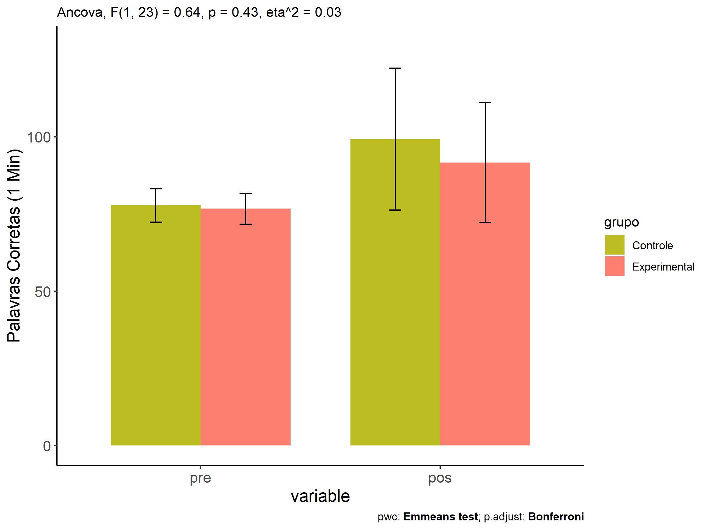
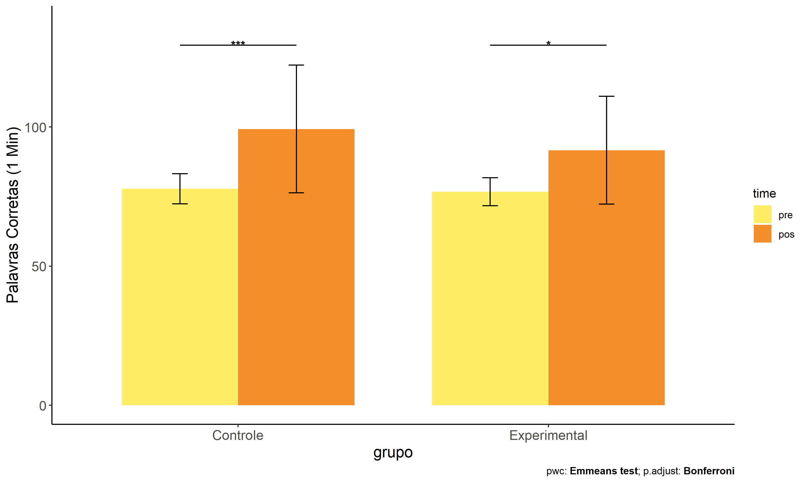
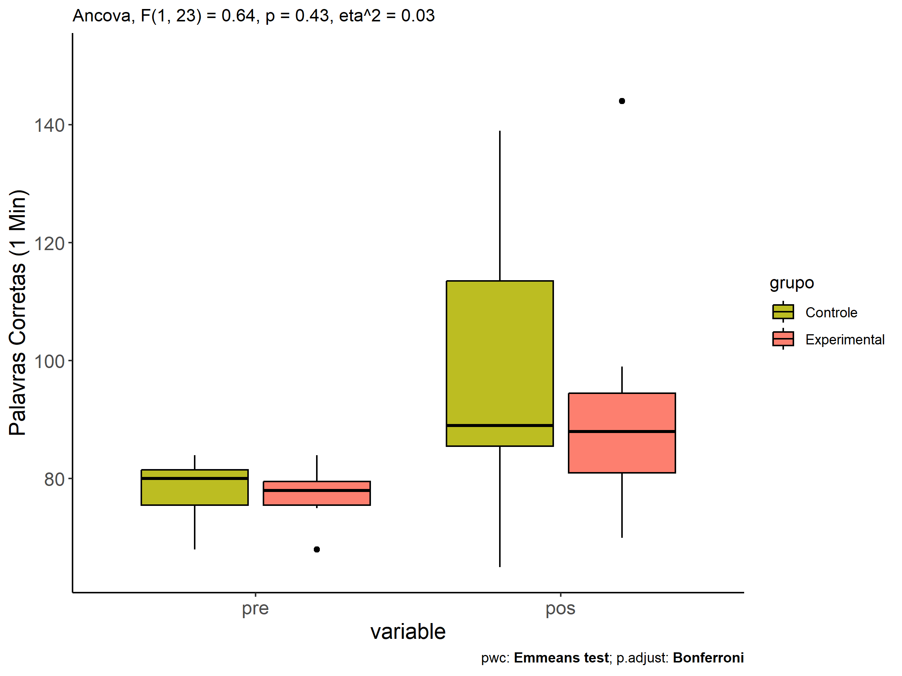
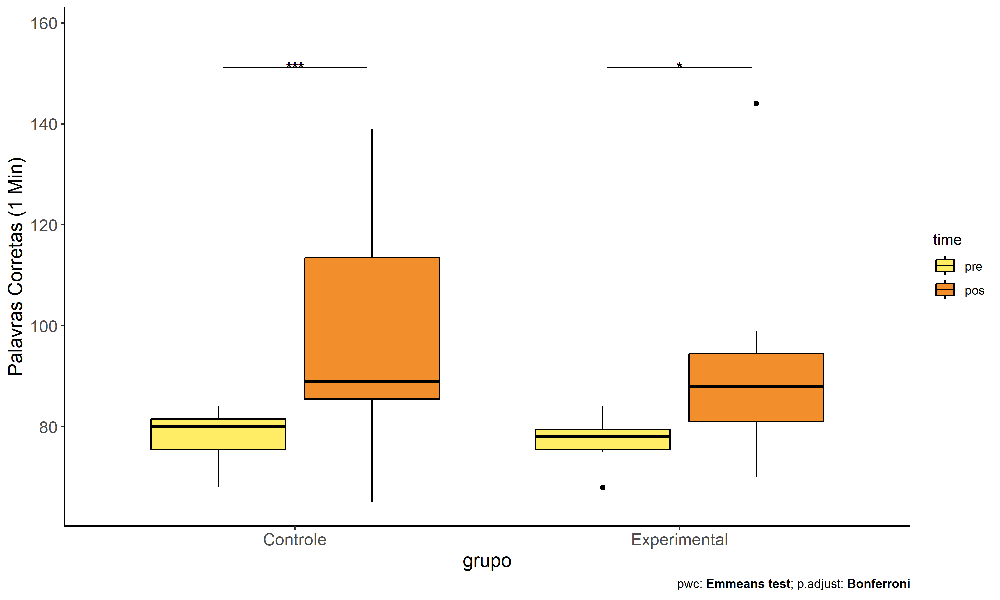
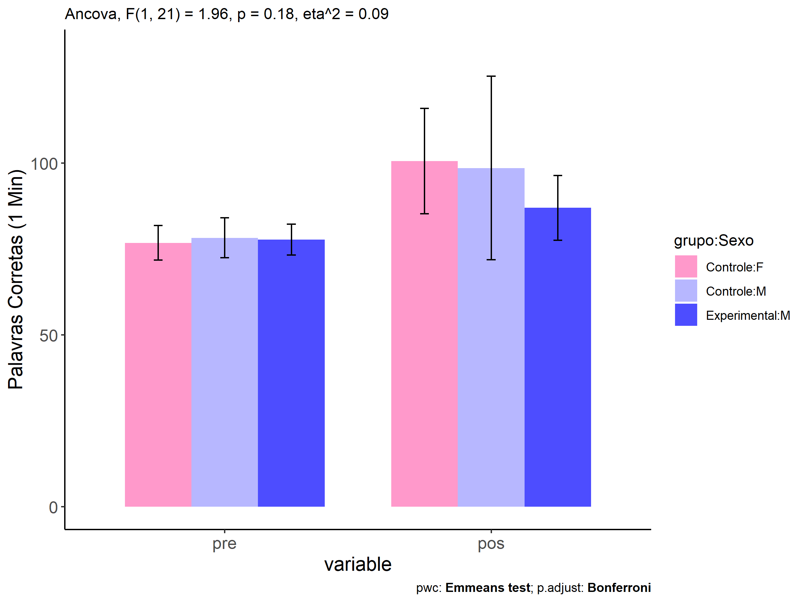
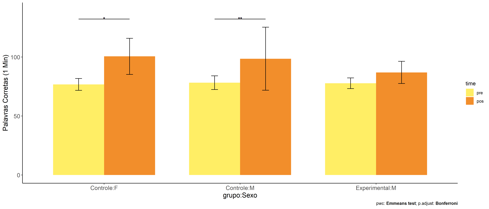
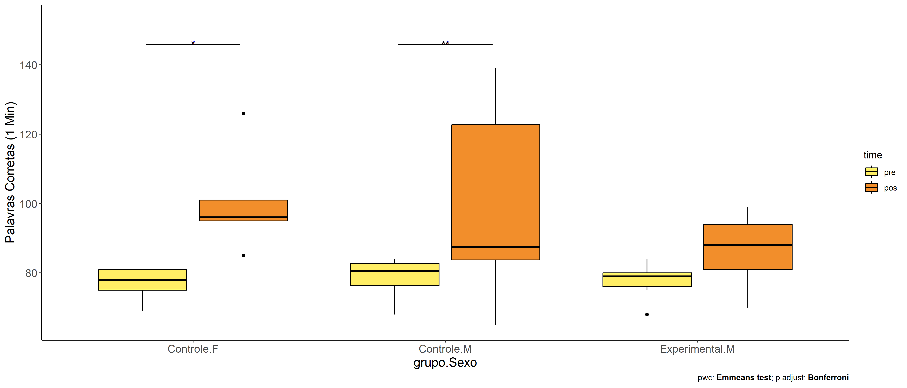

ANCOVA in Palavras Corretas (1 Min) (Palavras Corretas (1 Min))
================
Geiser C. Challco <geiser@alumni.usp.br>

- [Descriptive Statistics of Initial
  Data](#descriptive-statistics-of-initial-data)
- [Checking of Assumptions](#checking-of-assumptions)
  - [Assumption: Normality distribution of
    data](#assumption-normality-distribution-of-data)
  - [Assumption: Homogeneity of data
    distribution](#assumption-homogeneity-of-data-distribution)
- [Computation of ANCOVA test and Pairwise
  Comparison](#computation-of-ancova-test-and-pairwise-comparison)
  - [ANCOVA tests for one factor](#ancova-tests-for-one-factor)
  - [ANCOVA tests for two factors](#ancova-tests-for-two-factors)
  - [Pairwise comparisons for one factor:
    **grupo**](#pairwise-comparisons-for-one-factor-grupo)
  - [Pairwise comparisons for two
    factors](#pairwise-comparisons-for-two-factors)
    - [factores: **grupo:Sexo**](#factores-gruposexo)
    - [factores: **grupo:Zona**](#factores-grupozona)
    - [factores: **grupo:Cor.Raca**](#factores-grupocorraca)
    - [factores: **grupo:Serie**](#factores-gruposerie)

**NOTE**

- Teste ANCOVA para determinar se houve diferenças significativas no
  Palavras Corretas (1 Min) (medido usando pre- e pos-testes).
- ANCOVA test to determine whether there were significant differences in
  Palavras Corretas (1 Min) (measured using pre- and post-tests).

# Descriptive Statistics of Initial Data

| grupo        | Sexo | Zona   | Cor.Raca | Serie | variable                 |   n |    mean | median | min | max |     sd |     se |      ci |   iqr |
|:-------------|:-----|:-------|:---------|:------|:-------------------------|----:|--------:|-------:|----:|----:|-------:|-------:|--------:|------:|
| Controle     | F    |        |          |       | TFL.corretas.per.min.pre |   5 |  76.800 |   78.0 |  69 |  81 |  5.020 |  2.245 |   6.233 |  6.00 |
| Controle     | M    |        |          |       | TFL.corretas.per.min.pre |  10 |  78.300 |   80.5 |  68 |  84 |  5.774 |  1.826 |   4.131 |  6.50 |
| Experimental | F    |        |          |       | TFL.corretas.per.min.pre |   2 |  72.000 |   72.0 |  68 |  76 |  5.657 |  4.000 |  50.825 |  4.00 |
| Experimental | M    |        |          |       | TFL.corretas.per.min.pre |   9 |  77.778 |   79.0 |  68 |  84 |  4.522 |  1.507 |   3.476 |  4.00 |
| Controle     | F    |        |          |       | TFL.corretas.per.min.pos |   5 | 100.600 |   96.0 |  85 | 126 | 15.339 |  6.860 |  19.046 |  6.00 |
| Controle     | M    |        |          |       | TFL.corretas.per.min.pos |  10 |  98.600 |   87.5 |  65 | 139 | 26.730 |  8.453 |  19.121 | 39.00 |
| Experimental | F    |        |          |       | TFL.corretas.per.min.pos |   2 | 112.500 |  112.5 |  81 | 144 | 44.548 | 31.500 | 400.245 | 31.50 |
| Experimental | M    |        |          |       | TFL.corretas.per.min.pos |   9 |  87.000 |   88.0 |  70 |  99 |  9.434 |  3.145 |   7.252 | 13.00 |
| Controle     |      | Rural  |          |       | TFL.corretas.per.min.pre |   9 |  77.444 |   80.0 |  68 |  83 |  5.703 |  1.901 |   4.384 |  6.00 |
| Controle     |      | Urbana |          |       | TFL.corretas.per.min.pre |   1 |  82.000 |   82.0 |  82 |  82 |        |        |         |  0.00 |
| Controle     |      |        |          |       | TFL.corretas.per.min.pre |   5 |  77.600 |   78.0 |  69 |  84 |  5.683 |  2.542 |   7.057 |  5.00 |
| Experimental |      | Rural  |          |       | TFL.corretas.per.min.pre |   9 |  77.000 |   79.0 |  68 |  84 |  5.545 |  1.848 |   4.262 |  4.00 |
| Experimental |      |        |          |       | TFL.corretas.per.min.pre |   2 |  75.500 |   75.5 |  75 |  76 |  0.707 |  0.500 |   6.353 |  0.50 |
| Controle     |      | Rural  |          |       | TFL.corretas.per.min.pos |   9 |  86.111 |   86.0 |  65 | 101 | 10.179 |  3.393 |   7.824 |  6.00 |
| Controle     |      | Urbana |          |       | TFL.corretas.per.min.pos |   1 | 135.000 |  135.0 | 135 | 135 |        |        |         |  0.00 |
| Controle     |      |        |          |       | TFL.corretas.per.min.pos |   5 | 115.800 |  126.0 |  85 | 139 | 24.263 | 10.851 |  30.127 | 39.00 |
| Experimental |      | Rural  |          |       | TFL.corretas.per.min.pos |   9 |  94.000 |   94.0 |  70 | 144 | 20.869 |  6.956 |  16.041 | 12.00 |
| Experimental |      |        |          |       | TFL.corretas.per.min.pos |   2 |  81.000 |   81.0 |  81 |  81 |  0.000 |  0.000 |   0.000 |  0.00 |
| Controle     |      |        | Branca   |       | TFL.corretas.per.min.pre |   1 |  83.000 |   83.0 |  83 |  83 |        |        |         |  0.00 |
| Controle     |      |        | Parda    |       | TFL.corretas.per.min.pre |   7 |  76.286 |   77.0 |  68 |  83 |  5.964 |  2.254 |   5.516 |  9.00 |
| Controle     |      |        |          |       | TFL.corretas.per.min.pre |   7 |  78.571 |   80.0 |  69 |  84 |  4.962 |  1.875 |   4.589 |  4.50 |
| Experimental |      |        | Amarela  |       | TFL.corretas.per.min.pre |   1 |  76.000 |   76.0 |  76 |  76 |        |        |         |  0.00 |
| Experimental |      |        | Indígena |       | TFL.corretas.per.min.pre |   1 |  78.000 |   78.0 |  78 |  78 |        |        |         |  0.00 |
| Experimental |      |        | Parda    |       | TFL.corretas.per.min.pre |   5 |  79.000 |   79.0 |  76 |  81 |  1.871 |  0.837 |   2.323 |  1.00 |
| Experimental |      |        |          |       | TFL.corretas.per.min.pre |   4 |  73.750 |   71.5 |  68 |  84 |  7.588 |  3.794 |  12.075 |  9.25 |
| Controle     |      |        | Branca   |       | TFL.corretas.per.min.pos |   1 |  83.000 |   83.0 |  83 |  83 |        |        |         |  0.00 |
| Controle     |      |        | Parda    |       | TFL.corretas.per.min.pos |   7 |  85.714 |   89.0 |  65 |  96 | 10.610 |  4.010 |   9.813 |  9.00 |
| Controle     |      |        |          |       | TFL.corretas.per.min.pos |   7 | 115.143 |  126.0 |  85 | 139 | 23.787 |  8.991 |  21.999 | 41.00 |
| Experimental |      |        | Amarela  |       | TFL.corretas.per.min.pos |   1 |  81.000 |   81.0 |  81 |  81 |        |        |         |  0.00 |
| Experimental |      |        | Indígena |       | TFL.corretas.per.min.pos |   1 |  88.000 |   88.0 |  88 |  88 |        |        |         |  0.00 |
| Experimental |      |        | Parda    |       | TFL.corretas.per.min.pos |   5 |  88.000 |   94.0 |  70 |  99 | 11.640 |  5.206 |  14.454 | 11.00 |
| Experimental |      |        |          |       | TFL.corretas.per.min.pos |   4 |  99.750 |   88.0 |  79 | 144 | 30.347 | 15.173 |  48.288 | 26.75 |
| Controle     |      |        |          | 6 ano | TFL.corretas.per.min.pre |   5 |  78.200 |   80.0 |  68 |  83 |  6.221 |  2.782 |   7.724 |  6.00 |
| Controle     |      |        |          | 7 ano | TFL.corretas.per.min.pre |   3 |  75.000 |   75.0 |  69 |  81 |  6.000 |  3.464 |  14.905 |  6.00 |
| Controle     |      |        |          | 8 ano | TFL.corretas.per.min.pre |   3 |  80.333 |   81.0 |  78 |  82 |  2.082 |  1.202 |   5.171 |  2.00 |
| Controle     |      |        |          | 9 ano | TFL.corretas.per.min.pre |   4 |  77.500 |   78.5 |  69 |  84 |  6.557 |  3.279 |  10.434 |  7.50 |
| Experimental |      |        |          | 6 ano | TFL.corretas.per.min.pre |   5 |  74.200 |   76.0 |  68 |  80 |  5.848 |  2.615 |   7.261 | 11.00 |
| Experimental |      |        |          | 7 ano | TFL.corretas.per.min.pre |   3 |  77.333 |   78.0 |  75 |  79 |  2.082 |  1.202 |   5.171 |  2.00 |
| Experimental |      |        |          | 8 ano | TFL.corretas.per.min.pre |   3 |  80.333 |   81.0 |  76 |  84 |  4.041 |  2.333 |  10.040 |  4.00 |
| Controle     |      |        |          | 6 ano | TFL.corretas.per.min.pos |   5 |  85.400 |   86.0 |  80 |  89 |  3.912 |  1.749 |   4.857 |  6.00 |
| Controle     |      |        |          | 7 ano | TFL.corretas.per.min.pos |   3 |  89.000 |   86.0 |  85 |  96 |  6.083 |  3.512 |  15.110 |  5.50 |
| Controle     |      |        |          | 8 ano | TFL.corretas.per.min.pos |   3 | 118.667 |  126.0 |  95 | 135 | 20.984 | 12.115 |  52.127 | 20.00 |
| Controle     |      |        |          | 9 ano | TFL.corretas.per.min.pos |   4 | 109.750 |  117.5 |  65 | 139 | 34.267 | 17.134 |  54.527 | 43.25 |
| Experimental |      |        |          | 6 ano | TFL.corretas.per.min.pos |   5 |  93.600 |   81.0 |  70 | 144 | 29.450 | 13.170 |  36.567 | 15.00 |
| Experimental |      |        |          | 7 ano | TFL.corretas.per.min.pos |   3 |  89.333 |   88.0 |  81 |  99 |  9.074 |  5.239 |  22.540 |  9.00 |
| Experimental |      |        |          | 8 ano | TFL.corretas.per.min.pos |   3 |  90.667 |   94.0 |  83 |  95 |  6.658 |  3.844 |  16.540 |  6.00 |

# Checking of Assumptions

## Assumption: Normality distribution of data

| var                      |   n |   skewness |   kurtosis | symmetry | statistic | method       |         p | p.signif | normality |
|:-------------------------|----:|-----------:|-----------:|:---------|----------:|:-------------|----------:|:---------|:----------|
| TFL.corretas.per.min.pos |  26 |  0.5487568 | -0.4771119 | NO       | 0.9282595 | Shapiro-Wilk | 0.0704461 | ns       | YES       |
| TFL.corretas.per.min.pos |  19 |  1.2605115 |  2.8091673 | NO       | 0.8492163 | Shapiro-Wilk | 0.0065146 | \*\*     | NO        |
| TFL.corretas.per.min.pos |  15 | -0.6091520 | -0.1260317 | NO       | 0.9410874 | Shapiro-Wilk | 0.3962413 | ns       | YES       |
| TFL.corretas.per.min.pos |  26 |  0.5977811 |  1.6554133 | NO       | 0.9316338 | Shapiro-Wilk | 0.0847598 | ns       | YES       |

## Assumption: Homogeneity of data distribution

| var                      | method         | formula                    |   n | DFn.df1 | DFd.df2 | statistic |         p | p.signif |
|:-------------------------|:---------------|:---------------------------|----:|--------:|--------:|----------:|----------:|:---------|
| TFL.corretas.per.min.pos | Levene’s test  | `.res`~`grupo`\*`Sexo`     |  26 |       3 |      22 | 3.4567597 | 0.0338671 | \*       |
| TFL.corretas.per.min.pos | Anova’s slopes | `.res`~`grupo`\*`Sexo`     |  26 |       3 |      18 | 2.7040000 | 0.0760000 | ns       |
| TFL.corretas.per.min.pos | Levene’s test  | `.res`~`grupo`\*`Zona`     |  19 |       2 |      16 | 0.7670703 | 0.4807109 | ns       |
| TFL.corretas.per.min.pos | Anova’s slopes | `.res`~`grupo`\*`Zona`     |  19 |       1 |      14 | 2.8300000 | 0.1150000 | ns       |
| TFL.corretas.per.min.pos | Levene’s test  | `.res`~`grupo`\*`Cor.Raca` |  15 |       4 |      10 | 0.5639470 | 0.6944832 | ns       |
| TFL.corretas.per.min.pos | Anova’s slopes | `.res`~`grupo`\*`Cor.Raca` |  15 |       1 |       8 | 0.1700000 | 0.6910000 | ns       |
| TFL.corretas.per.min.pos | Levene’s test  | `.res`~`grupo`\*`Serie`    |  26 |       6 |      19 | 1.4304540 | 0.2545959 | ns       |
| TFL.corretas.per.min.pos | Anova’s slopes | `.res`~`grupo`\*`Serie`    |  26 |       6 |      12 | 1.1620000 | 0.3870000 | ns       |

# Computation of ANCOVA test and Pairwise Comparison

## ANCOVA tests for one factor

|     | Effect                   | DFn | DFd |      SSn |       SSd |     F |     p |   ges | p\<.05 |
|:----|:-------------------------|----:|----:|---------:|----------:|------:|------:|------:|:-------|
| 1   | TFL.corretas.per.min.pre |   1 |  23 |  301.643 | 10843.836 | 0.640 | 0.432 | 0.027 |        |
| 2   | grupo                    |   1 |  23 |  299.200 | 10843.836 | 0.635 | 0.434 | 0.027 |        |
| 4   | Sexo                     |   1 |  23 |  892.652 | 10250.384 | 2.003 | 0.170 | 0.080 |        |
| 6   | Zona                     |   1 |  16 | 1909.421 |  4575.064 | 6.678 | 0.020 | 0.294 | \*     |
| 8   | Cor.Raca                 |   3 |  10 |  105.422 |   857.312 | 0.410 | 0.749 | 0.110 |        |
| 10  | Serie                    |   3 |  21 | 1612.981 |  9530.055 | 1.185 | 0.339 | 0.145 |        |

## ANCOVA tests for two factors

|     | Effect                   | DFn | DFd |      SSn |      SSd |     F |     p |   ges | p\<.05 |
|:----|:-------------------------|----:|----:|---------:|---------:|------:|------:|------:|:-------|
| 1   | TFL.corretas.per.min.pre |   1 |  21 |  814.026 | 9254.074 | 1.847 | 0.189 | 0.081 |        |
| 4   | grupo:Sexo               |   1 |  21 |  862.298 | 9254.074 | 1.957 | 0.176 | 0.085 |        |
| 8   | grupo:Zona               |   0 |  15 |          | 4300.421 |       |       |       |        |
| 12  | grupo:Cor.Raca           |   0 |   9 |          |  853.810 |       |       |       |        |
| 16  | grupo:Serie              |   2 |  18 | 1361.596 | 8104.190 | 1.512 | 0.247 | 0.144 |        |

## Pairwise comparisons for one factor: **grupo**

| var                      | grupo        |   n | M (pre) | SE (pre) | M (unadj) | SE (unadj) | M (adj) | SE (adj) |
|:-------------------------|:-------------|----:|--------:|---------:|----------:|-----------:|--------:|---------:|
| TFL.corretas.per.min.pos | Controle     |  15 |  77.800 |    1.395 |    99.267 |      5.930 |  98.960 |    5.620 |
| TFL.corretas.per.min.pos | Experimental |  11 |  76.727 |    1.508 |    91.636 |      5.847 |  92.055 |    6.568 |

| .y.                      | group1   | group2       | estimate | conf.low | conf.high |    se | statistic |     p | p.adj | p.adj.signif |
|:-------------------------|:---------|:-------------|---------:|---------:|----------:|------:|----------:|------:|------:|:-------------|
| TFL.corretas.per.min.pos | Controle | Experimental |    6.904 |  -11.025 |    24.833 | 8.667 |     0.797 | 0.434 | 0.434 | ns           |
| TFL.corretas.per.min.pre | Controle | Experimental |    1.073 |   -3.219 |     5.364 | 2.079 |     0.516 | 0.611 | 0.611 | ns           |

| .y.                  | grupo        | group1 | group2 | estimate | conf.low | conf.high |    se | statistic | p       | p.adj   | p.adj.signif |
|:---------------------|:-------------|:-------|:-------|---------:|---------:|----------:|------:|----------:|:--------|:--------|:-------------|
| TFL.corretas.per.min | Controle     | pre    | pos    |  -21.467 |  -32.980 |    -9.953 | 5.726 |    -3.749 | \<0.001 | \<0.001 | \*\*\*       |
| TFL.corretas.per.min | Experimental | pre    | pos    |  -14.909 |  -28.354 |    -1.465 | 6.687 |    -2.230 | 0.03    | 0.03    | \*           |

<!-- -->

<!-- -->

<!-- -->

<!-- -->

## Pairwise comparisons for two factors

### factores: **grupo:Sexo**

| var                      | grupo        | Sexo |   n | M (pre) | SE (pre) | M (unadj) | SE (unadj) | M (adj) | SE (adj) |
|:-------------------------|:-------------|:-----|----:|--------:|---------:|----------:|-----------:|--------:|---------:|
| TFL.corretas.per.min.pos | Controle     | F    |   5 |  76.800 |    2.245 |     100.6 |      6.860 | 102.267 |    8.090 |
| TFL.corretas.per.min.pos | Controle     | M    |  10 |  78.300 |    1.826 |      98.6 |      8.453 |  97.746 |    5.709 |
| TFL.corretas.per.min.pos | Experimental | M    |   9 |  77.778 |    1.507 |      87.0 |      3.145 |  87.023 |    6.004 |

|     | .y.                      | grupo    | Sexo | group1   | group2       | estimate | conf.low | conf.high |    se | statistic |     p | p.adj | p.adj.signif |
|:----|:-------------------------|:---------|:-----|:---------|:-------------|---------:|---------:|----------:|------:|----------:|------:|------:|:-------------|
| 2   | TFL.corretas.per.min.pos |          | M    | Controle | Experimental |   10.722 |   -6.561 |    28.005 | 8.285 |     1.294 | 0.210 | 0.210 | ns           |
| 4   | TFL.corretas.per.min.pre |          | M    | Controle | Experimental |    0.522 |   -4.432 |     5.476 | 2.382 |     0.219 | 0.829 | 0.829 | ns           |
| 5   | TFL.corretas.per.min.pos | Controle |      | F        | M            |    4.521 |  -16.194 |    25.237 | 9.931 |     0.455 | 0.654 | 0.654 | ns           |
| 7   | TFL.corretas.per.min.pre | Controle |      | F        | M            |   -1.500 |   -7.405 |     4.405 | 2.840 |    -0.528 | 0.603 | 0.603 | ns           |

| .y.                  | grupo        | Sexo | group1 | group2 | estimate | conf.low | conf.high |    se | statistic |     p | p.adj | p.adj.signif |
|:---------------------|:-------------|:-----|:-------|:-------|---------:|---------:|----------:|------:|----------:|------:|------:|:-------------|
| TFL.corretas.per.min | Controle     | F    | pre    | pos    |  -23.800 |  -42.115 |    -5.485 | 9.075 |    -2.622 | 0.012 | 0.012 | \*           |
| TFL.corretas.per.min | Controle     | M    | pre    | pos    |  -20.300 |  -33.251 |    -7.349 | 6.417 |    -3.163 | 0.003 | 0.003 | \*\*         |
| TFL.corretas.per.min | Experimental | M    | pre    | pos    |   -9.222 |  -22.873 |     4.429 | 6.764 |    -1.363 | 0.180 | 0.180 | ns           |

<!-- -->

<!-- -->

<!-- -->

<!-- -->

### factores: **grupo:Zona**

### factores: **grupo:Cor.Raca**

### factores: **grupo:Serie**
