ANCOVA in Palavras Corretas (1 Min) (Palavras Corretas (1 Min))
================
Geiser C. Challco <geiser@alumni.usp.br>

- [Descriptive Statistics of Initial
  Data](#descriptive-statistics-of-initial-data)
- [Checking of Assumptions](#checking-of-assumptions)
  - [Assumption: Normality distribution of
    data](#assumption-normality-distribution-of-data)
  - [Assumption: Homogeneity of data
    distribution](#assumption-homogeneity-of-data-distribution)
- [Computation of ANCOVA test and Pairwise
  Comparison](#computation-of-ancova-test-and-pairwise-comparison)
  - [ANCOVA tests for one factor](#ancova-tests-for-one-factor)
  - [ANCOVA tests for two factors](#ancova-tests-for-two-factors)
  - [Pairwise comparisons for one factor:
    **grupo**](#pairwise-comparisons-for-one-factor-grupo)
  - [Pairwise comparisons for two
    factors](#pairwise-comparisons-for-two-factors)
    - [factores: **grupo:Sexo**](#factores-gruposexo)
    - [factores: **grupo:Zona**](#factores-grupozona)
    - [factores: **grupo:Cor.Raca**](#factores-grupocorraca)
    - [factores:
      **grupo:TFL.corretas.per.min.quintile**](#factores-grupotflcorretasperminquintile)

**NOTE**

- Teste ANCOVA para determinar se houve diferenças significativas no
  Palavras Corretas (1 Min) (medido usando pre- e pos-testes).
- ANCOVA test to determine whether there were significant differences in
  Palavras Corretas (1 Min) (measured using pre- and post-tests).

# Descriptive Statistics of Initial Data

| grupo        | Sexo | Zona   | Cor.Raca | TFL.corretas.per.min.quintile | variable                 |   n |    mean | median | min | max |     sd |     se |      ci |   iqr |
|:-------------|:-----|:-------|:---------|:------------------------------|:-------------------------|----:|--------:|-------:|----:|----:|-------:|-------:|--------:|------:|
| Controle     | F    |        |          |                               | TFL.corretas.per.min.pre |  16 |  94.188 |   98.0 |  39 | 137 | 23.702 |  5.925 |  12.630 | 17.00 |
| Controle     | M    |        |          |                               | TFL.corretas.per.min.pre |  15 |  80.667 |   83.0 |  23 | 137 | 27.207 |  7.025 |  15.067 | 29.50 |
| Experimental | F    |        |          |                               | TFL.corretas.per.min.pre |  11 |  91.364 |   93.0 |  60 | 116 | 17.963 |  5.416 |  12.067 | 20.50 |
| Experimental | M    |        |          |                               | TFL.corretas.per.min.pre |   8 |  84.250 |   82.5 |  57 | 112 | 17.434 |  6.164 |  14.575 | 19.50 |
| Controle     | F    |        |          |                               | TFL.corretas.per.min.pos |  16 | 114.750 |  117.0 |  87 | 156 | 23.584 |  5.896 |  12.567 | 42.50 |
| Controle     | M    |        |          |                               | TFL.corretas.per.min.pos |  15 |  87.667 |   86.0 |  42 | 116 | 21.215 |  5.478 |  11.749 | 32.00 |
| Experimental | F    |        |          |                               | TFL.corretas.per.min.pos |  11 | 124.727 |  115.0 |  81 | 190 | 32.459 |  9.787 |  21.807 | 49.00 |
| Experimental | M    |        |          |                               | TFL.corretas.per.min.pos |   8 | 103.125 |   94.0 |  70 | 184 | 34.803 | 12.305 |  29.096 | 14.25 |
| Controle     |      | Rural  |          |                               | TFL.corretas.per.min.pre |  25 |  86.440 |   92.0 |  23 | 137 | 25.694 |  5.139 |  10.606 | 24.00 |
| Controle     |      | Urbana |          |                               | TFL.corretas.per.min.pre |   3 |  78.000 |   88.0 |  47 |  99 | 27.404 | 15.822 |  68.076 | 26.00 |
| Controle     |      |        |          |                               | TFL.corretas.per.min.pre |   3 | 107.333 |   98.0 |  87 | 137 | 26.274 | 15.169 |  65.269 | 25.00 |
| Experimental |      | Rural  |          |                               | TFL.corretas.per.min.pre |  14 |  86.643 |   87.0 |  57 | 116 | 19.282 |  5.153 |  11.133 | 26.50 |
| Experimental |      | Urbana |          |                               | TFL.corretas.per.min.pre |   4 |  97.500 |   95.0 |  90 | 110 |  8.699 |  4.349 |  13.842 |  6.50 |
| Experimental |      |        |          |                               | TFL.corretas.per.min.pre |   1 |  76.000 |   76.0 |  76 |  76 |        |        |         |  0.00 |
| Controle     |      | Rural  |          |                               | TFL.corretas.per.min.pos |  25 |  96.760 |   91.0 |  42 | 135 | 23.152 |  4.630 |   9.557 | 32.00 |
| Controle     |      | Urbana |          |                               | TFL.corretas.per.min.pos |   3 | 124.333 |  135.0 |  87 | 151 | 33.307 | 19.230 |  82.738 | 32.00 |
| Controle     |      |        |          |                               | TFL.corretas.per.min.pos |   3 | 119.667 |  110.0 |  93 | 156 | 32.593 | 18.818 |  80.967 | 31.50 |
| Experimental |      | Rural  |          |                               | TFL.corretas.per.min.pos |  14 | 111.929 |  101.5 |  70 | 184 | 31.139 |  8.322 |  17.979 | 37.50 |
| Experimental |      | Urbana |          |                               | TFL.corretas.per.min.pos |   4 | 137.250 |  132.5 |  94 | 190 | 42.074 | 21.037 |  66.950 | 50.25 |
| Experimental |      |        |          |                               | TFL.corretas.per.min.pos |   1 |  81.000 |   81.0 |  81 |  81 |        |        |         |  0.00 |
| Controle     |      |        | Branca   |                               | TFL.corretas.per.min.pre |   5 | 100.800 |   92.0 |  83 | 137 | 21.218 |  9.489 |  26.346 | 10.00 |
| Controle     |      |        | Parda    |                               | TFL.corretas.per.min.pre |  17 |  87.353 |   94.0 |  23 | 114 | 24.479 |  5.937 |  12.586 | 26.00 |
| Controle     |      |        |          |                               | TFL.corretas.per.min.pre |   9 |  80.889 |   87.0 |  39 | 137 | 30.698 | 10.233 |  23.596 | 45.00 |
| Experimental |      |        | Amarela  |                               | TFL.corretas.per.min.pre |   1 |  76.000 |   76.0 |  76 |  76 |        |        |         |  0.00 |
| Experimental |      |        | Branca   |                               | TFL.corretas.per.min.pre |   1 |  96.000 |   96.0 |  96 |  96 |        |        |         |  0.00 |
| Experimental |      |        | Indígena |                               | TFL.corretas.per.min.pre |   1 | 113.000 |  113.0 | 113 | 113 |        |        |         |  0.00 |
| Experimental |      |        | Parda    |                               | TFL.corretas.per.min.pre |   7 |  91.714 |   89.0 |  79 | 116 | 12.854 |  4.859 |  11.888 | 14.00 |
| Experimental |      |        |          |                               | TFL.corretas.per.min.pre |   9 |  83.556 |   90.0 |  57 | 112 | 20.893 |  6.964 |  16.060 | 26.00 |
| Controle     |      |        | Branca   |                               | TFL.corretas.per.min.pos |   5 | 107.200 |  112.0 |  83 | 135 | 19.867 |  8.885 |  24.668 | 18.00 |
| Controle     |      |        | Parda    |                               | TFL.corretas.per.min.pos |  17 |  94.824 |   89.0 |  42 | 151 | 26.356 |  6.392 |  13.551 | 33.00 |
| Controle     |      |        |          |                               | TFL.corretas.per.min.pos |   9 | 111.444 |  110.0 |  74 | 156 | 26.973 |  8.991 |  20.733 | 48.00 |
| Experimental |      |        | Amarela  |                               | TFL.corretas.per.min.pos |   1 |  81.000 |   81.0 |  81 |  81 |        |        |         |  0.00 |
| Experimental |      |        | Branca   |                               | TFL.corretas.per.min.pos |   1 | 150.000 |  150.0 | 150 | 150 |        |        |         |  0.00 |
| Experimental |      |        | Indígena |                               | TFL.corretas.per.min.pos |   1 | 137.000 |  137.0 | 137 | 137 |        |        |         |  0.00 |
| Experimental |      |        | Parda    |                               | TFL.corretas.per.min.pos |   7 |  97.429 |   99.0 |  70 | 115 | 14.164 |  5.353 |  13.100 | 11.00 |
| Experimental |      |        |          |                               | TFL.corretas.per.min.pos |   9 | 127.444 |  115.0 |  79 | 190 | 41.171 | 13.724 |  31.647 | 56.00 |
| Controle     |      |        |          | 1st quintile                  | TFL.corretas.per.min.pre |   6 |  46.167 |   49.0 |  23 |  64 | 13.977 |  5.706 |  14.668 | 11.50 |
| Controle     |      |        |          | 2nd quintile                  | TFL.corretas.per.min.pre |   5 |  78.200 |   80.0 |  68 |  83 |  6.221 |  2.782 |   7.724 |  6.00 |
| Controle     |      |        |          | 3rd quintile                  | TFL.corretas.per.min.pre |   7 |  90.286 |   91.0 |  87 |  94 |  2.928 |  1.107 |   2.708 |  5.00 |
| Controle     |      |        |          | 4th quintile                  | TFL.corretas.per.min.pre |   9 | 101.778 |   99.0 |  97 | 110 |  4.969 |  1.656 |   3.820 |  4.00 |
| Controle     |      |        |          | 5th quintile                  | TFL.corretas.per.min.pre |   4 | 125.250 |  125.5 | 113 | 137 | 13.574 |  6.787 |  21.599 | 23.25 |
| Experimental |      |        |          | 1st quintile                  | TFL.corretas.per.min.pre |   2 |  58.500 |   58.5 |  57 |  60 |  2.121 |  1.500 |  19.059 |  1.50 |
| Experimental |      |        |          | 2nd quintile                  | TFL.corretas.per.min.pre |   5 |  74.200 |   76.0 |  68 |  80 |  5.848 |  2.615 |   7.261 | 11.00 |
| Experimental |      |        |          | 3rd quintile                  | TFL.corretas.per.min.pre |   5 |  90.200 |   90.0 |  85 |  94 |  3.564 |  1.594 |   4.425 |  4.00 |
| Experimental |      |        |          | 4th quintile                  | TFL.corretas.per.min.pre |   4 |  99.750 |   97.0 |  95 | 110 |  6.946 |  3.473 |  11.053 |  5.25 |
| Experimental |      |        |          | 5th quintile                  | TFL.corretas.per.min.pre |   3 | 113.667 |  113.0 | 112 | 116 |  2.082 |  1.202 |   5.171 |  2.00 |
| Controle     |      |        |          | 1st quintile                  | TFL.corretas.per.min.pos |   6 |  72.833 |   70.0 |  42 | 104 | 21.208 |  8.658 |  22.256 | 19.25 |
| Controle     |      |        |          | 2nd quintile                  | TFL.corretas.per.min.pos |   5 |  85.400 |   86.0 |  80 |  89 |  3.912 |  1.749 |   4.857 |  6.00 |
| Controle     |      |        |          | 3rd quintile                  | TFL.corretas.per.min.pos |   7 | 105.714 |   94.0 |  84 | 135 | 21.892 |  8.274 |  20.246 | 33.50 |
| Controle     |      |        |          | 4th quintile                  | TFL.corretas.per.min.pos |   9 | 119.222 |  117.0 |  91 | 151 | 17.188 |  5.729 |  13.212 | 18.00 |
| Controle     |      |        |          | 5th quintile                  | TFL.corretas.per.min.pos |   4 | 118.500 |  115.5 |  87 | 156 | 28.525 | 14.262 |  45.389 | 22.50 |
| Experimental |      |        |          | 1st quintile                  | TFL.corretas.per.min.pos |   2 | 122.000 |  122.0 |  94 | 150 | 39.598 | 28.000 | 355.774 | 28.00 |
| Experimental |      |        |          | 2nd quintile                  | TFL.corretas.per.min.pos |   5 |  93.600 |   81.0 |  70 | 144 | 29.450 | 13.170 |  36.567 | 15.00 |
| Experimental |      |        |          | 3rd quintile                  | TFL.corretas.per.min.pos |   5 | 105.000 |  104.0 |  94 | 115 |  9.823 |  4.393 |  12.197 | 18.00 |
| Experimental |      |        |          | 4th quintile                  | TFL.corretas.per.min.pos |   4 | 135.000 |  128.0 |  94 | 190 | 43.863 | 21.932 |  69.796 | 57.00 |
| Experimental |      |        |          | 5th quintile                  | TFL.corretas.per.min.pos |   3 | 140.000 |  137.0 |  99 | 184 | 42.579 | 24.583 | 105.773 | 42.50 |

# Checking of Assumptions

## Assumption: Normality distribution of data

| var                      |   n |  skewness |   kurtosis | symmetry | statistic | method       |         p | p.signif | normality |
|:-------------------------|----:|----------:|-----------:|:---------|----------:|:-------------|----------:|:---------|:----------|
| TFL.corretas.per.min.pos |  50 | 0.5765696 |  0.2719857 | NO       | 0.9675341 | Shapiro-Wilk | 0.1833836 | ns       | YES       |
| TFL.corretas.per.min.pos |  46 | 0.7345929 | -0.0532070 | NO       | 0.9404118 | Shapiro-Wilk | 0.0202784 | \*       | NO        |
| TFL.corretas.per.min.pos |  32 | 0.9029176 |  1.1410664 | NO       | 0.9464171 | Shapiro-Wilk | 0.1139762 | ns       | YES       |
| TFL.corretas.per.min.pos |  50 | 0.5166587 | -0.2734457 | NO       | 0.9623666 | Shapiro-Wilk | 0.1117002 | ns       | YES       |

## Assumption: Homogeneity of data distribution

| var                      | method         | formula                                         |   n | DFn.df1 | DFd.df2 | statistic |         p | p.signif |
|:-------------------------|:---------------|:------------------------------------------------|----:|--------:|--------:|----------:|----------:|:---------|
| TFL.corretas.per.min.pos | Levene’s test  | `.res`~`grupo`\*`Sexo`                          |  50 |       3 |      46 | 3.7892054 | 0.0164354 | \*       |
| TFL.corretas.per.min.pos | Anova’s slopes | `.res`~`grupo`\*`Sexo`                          |  50 |       3 |      42 | 1.5900000 | 0.2060000 | ns       |
| TFL.corretas.per.min.pos | Levene’s test  | `.res`~`grupo`\*`Zona`                          |  46 |       3 |      42 | 2.0143186 | 0.1265114 | ns       |
| TFL.corretas.per.min.pos | Anova’s slopes | `.res`~`grupo`\*`Zona`                          |  46 |       3 |      38 | 2.3560000 | 0.0870000 | ns       |
| TFL.corretas.per.min.pos | Levene’s test  | `.res`~`grupo`\*`Cor.Raca`                      |  32 |       5 |      26 | 0.5598904 | 0.7296214 | ns       |
| TFL.corretas.per.min.pos | Anova’s slopes | `.res`~`grupo`\*`Cor.Raca`                      |  32 |       2 |      23 | 0.7930000 | 0.4640000 | ns       |
| TFL.corretas.per.min.pos | Levene’s test  | `.res`~`grupo`\*`TFL.corretas.per.min.quintile` |  50 |       9 |      40 | 1.6006093 | 0.1482471 | ns       |
| TFL.corretas.per.min.pos | Anova’s slopes | `.res`~`grupo`\*`TFL.corretas.per.min.quintile` |  50 |       9 |      30 | 2.9170000 | 0.0130000 | \*       |

# Computation of ANCOVA test and Pairwise Comparison

## ANCOVA tests for one factor

|     | Effect                        | DFn | DFd |       SSn |       SSd |      F | p       |   ges | p\<.05 |
|:----|:------------------------------|----:|----:|----------:|----------:|-------:|:--------|------:|:-------|
| 1   | TFL.corretas.per.min.pre      |   1 |  47 | 11966.509 | 29533.009 | 19.044 | \<0.001 | 0.288 | \*     |
| 2   | grupo                         |   1 |  47 |  2144.417 | 29533.009 |  3.413 | 0.071   | 0.068 |        |
| 4   | Sexo                          |   1 |  47 |  4348.152 | 27329.273 |  7.478 | 0.009   | 0.137 | \*     |
| 6   | Zona                          |   1 |  43 |  4598.408 | 26287.992 |  7.522 | 0.009   | 0.149 | \*     |
| 8   | Cor.Raca                      |   3 |  27 |   978.338 |  9122.475 |  0.965 | 0.423   | 0.097 |        |
| 10  | TFL.corretas.per.min.quintile |   4 |  44 |  2179.026 | 29498.400 |  0.813 | 0.524   | 0.069 |        |

## ANCOVA tests for two factors

|     | Effect                              | DFn | DFd |      SSn |       SSd |      F | p       |   ges | p\<.05 |
|:----|:------------------------------------|----:|----:|---------:|----------:|-------:|:--------|------:|:-------|
| 1   | TFL.corretas.per.min.pre            |   1 |  45 | 8143.467 | 25515.924 | 14.362 | \<0.001 | 0.242 | \*     |
| 4   | grupo:Sexo                          |   1 |  45 |    8.932 | 25515.924 |  0.016 | 0.901   | 0.000 |        |
| 8   | grupo:Zona                          |   1 |  41 |  287.678 | 24256.664 |  0.486 | 0.49    | 0.012 |        |
| 12  | grupo:Cor.Raca                      |   1 |  25 | 1559.265 |  7338.061 |  5.312 | 0.03    | 0.175 | \*     |
| 16  | grupo:TFL.corretas.per.min.quintile |   4 |  39 | 2211.381 | 24397.759 |  0.884 | 0.483   | 0.083 |        |

## Pairwise comparisons for one factor: **grupo**

| var                      | grupo        |   n | M (pre) | SE (pre) | M (unadj) | SE (unadj) | M (adj) | SE (adj) |
|:-------------------------|:-------------|----:|--------:|---------:|----------:|-----------:|--------:|---------:|
| TFL.corretas.per.min.pos | Controle     |  31 |  87.645 |    4.661 |   101.645 |      4.675 | 101.832 |    4.502 |
| TFL.corretas.per.min.pos | Experimental |  19 |  88.368 |    4.042 |   115.632 |      7.869 | 115.326 |    5.751 |

| .y.                      | group1   | group2       | estimate | conf.low | conf.high |    se | statistic |     p | p.adj | p.adj.signif |
|:-------------------------|:---------|:-------------|---------:|---------:|----------:|------:|----------:|------:|------:|:-------------|
| TFL.corretas.per.min.pos | Controle | Experimental |  -13.494 |  -28.188 |     1.201 | 7.304 |    -1.847 | 0.071 | 0.071 | ns           |
| TFL.corretas.per.min.pre | Controle | Experimental |   -0.723 |  -14.303 |    12.857 | 6.754 |    -0.107 | 0.915 | 0.915 | ns           |

| .y.                  | grupo        | group1 | group2 | estimate | conf.low | conf.high |    se | statistic |     p | p.adj | p.adj.signif |
|:---------------------|:-------------|:-------|:-------|---------:|---------:|----------:|------:|----------:|------:|------:|:-------------|
| TFL.corretas.per.min | Controle     | pre    | pos    |  -14.000 |  -27.349 |    -0.651 | 6.725 |    -2.082 | 0.040 | 0.040 | \*           |
| TFL.corretas.per.min | Experimental | pre    | pos    |  -27.263 |  -44.314 |   -10.212 | 8.590 |    -3.174 | 0.002 | 0.002 | \*\*         |

    ## Scale for colour is already present.
    ## Adding another scale for colour, which will replace the existing scale.

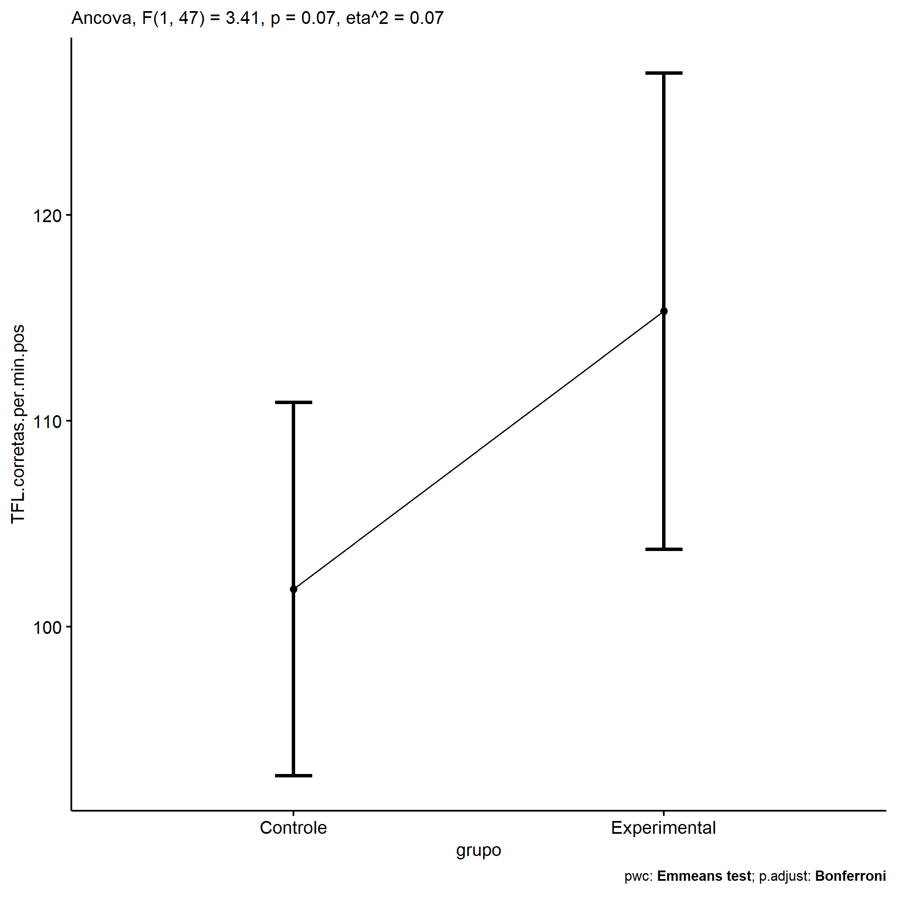<!-- -->

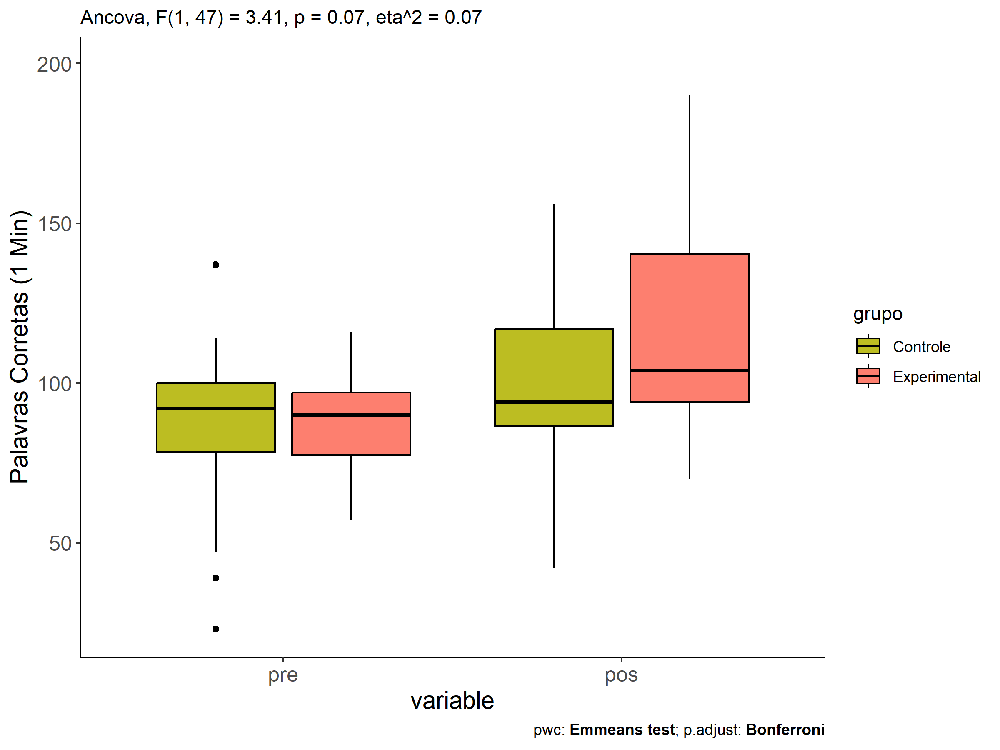<!-- -->

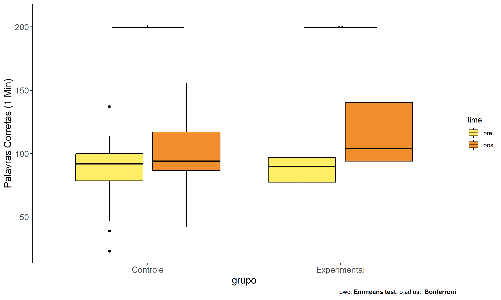<!-- -->

## Pairwise comparisons for two factors

### factores: **grupo:Sexo**

| var                      | grupo        | Sexo |   n | M (pre) | SE (pre) | M (unadj) | SE (unadj) | M (adj) | SE (adj) |
|:-------------------------|:-------------|:-----|----:|--------:|---------:|----------:|-----------:|--------:|---------:|
| TFL.corretas.per.min.pos | Controle     | F    |  16 |  94.188 |    5.925 |   114.750 |      5.896 | 111.110 |    6.030 |
| TFL.corretas.per.min.pos | Controle     | M    |  15 |  80.667 |    7.025 |    87.667 |      5.478 |  91.879 |    6.248 |
| TFL.corretas.per.min.pos | Experimental | F    |  11 |  91.364 |    5.416 |   124.727 |      9.787 | 122.727 |    7.199 |
| TFL.corretas.per.min.pos | Experimental | M    |   8 |  84.250 |    6.164 |   103.125 |     12.305 | 105.256 |    8.438 |

| .y.                      | grupo        | Sexo | group1   | group2       | estimate | conf.low | conf.high |     se | statistic |     p | p.adj | p.adj.signif |
|:-------------------------|:-------------|:-----|:---------|:-------------|---------:|---------:|----------:|-------:|----------:|------:|------:|:-------------|
| TFL.corretas.per.min.pos |              | F    | Controle | Experimental |  -11.617 |  -30.422 |     7.188 |  9.337 |    -1.244 | 0.220 | 0.220 | ns           |
| TFL.corretas.per.min.pos |              | M    | Controle | Experimental |  -13.377 |  -34.403 |     7.649 | 10.439 |    -1.281 | 0.207 | 0.207 | ns           |
| TFL.corretas.per.min.pre |              | F    | Controle | Experimental |    2.824 |  -15.238 |    20.886 |  8.973 |     0.315 | 0.754 | 0.754 | ns           |
| TFL.corretas.per.min.pre |              | M    | Controle | Experimental |   -3.583 |  -23.773 |    16.606 | 10.030 |    -0.357 | 0.723 | 0.723 | ns           |
| TFL.corretas.per.min.pos | Controle     |      | F        | M            |   19.231 |    1.496 |    36.966 |  8.805 |     2.184 | 0.034 | 0.034 | \*           |
| TFL.corretas.per.min.pos | Experimental |      | F        | M            |   17.471 |   -4.922 |    39.864 | 11.118 |     1.571 | 0.123 | 0.123 | ns           |
| TFL.corretas.per.min.pre | Controle     |      | F        | M            |   13.521 |   -3.053 |    30.095 |  8.234 |     1.642 | 0.107 | 0.107 | ns           |
| TFL.corretas.per.min.pre | Experimental |      | F        | M            |    7.114 |  -14.314 |    28.542 | 10.645 |     0.668 | 0.507 | 0.507 | ns           |

| .y.                  | grupo        | Sexo | group1 | group2 | estimate | conf.low | conf.high |     se | statistic |     p | p.adj | p.adj.signif |
|:---------------------|:-------------|:-----|:-------|:-------|---------:|---------:|----------:|-------:|----------:|------:|------:|:-------------|
| TFL.corretas.per.min | Controle     | F    | pre    | pos    |  -20.563 |  -38.163 |    -2.962 |  8.862 |    -2.320 | 0.023 | 0.023 | \*           |
| TFL.corretas.per.min | Controle     | M    | pre    | pos    |   -7.000 |  -25.178 |    11.178 |  9.153 |    -0.765 | 0.446 | 0.446 | ns           |
| TFL.corretas.per.min | Experimental | F    | pre    | pos    |  -33.364 |  -54.591 |   -12.136 | 10.688 |    -3.122 | 0.002 | 0.002 | \*\*         |
| TFL.corretas.per.min | Experimental | M    | pre    | pos    |  -18.875 |  -43.766 |     6.016 | 12.533 |    -1.506 | 0.135 | 0.135 | ns           |

    ## Scale for colour is already present.
    ## Adding another scale for colour, which will replace the existing scale.

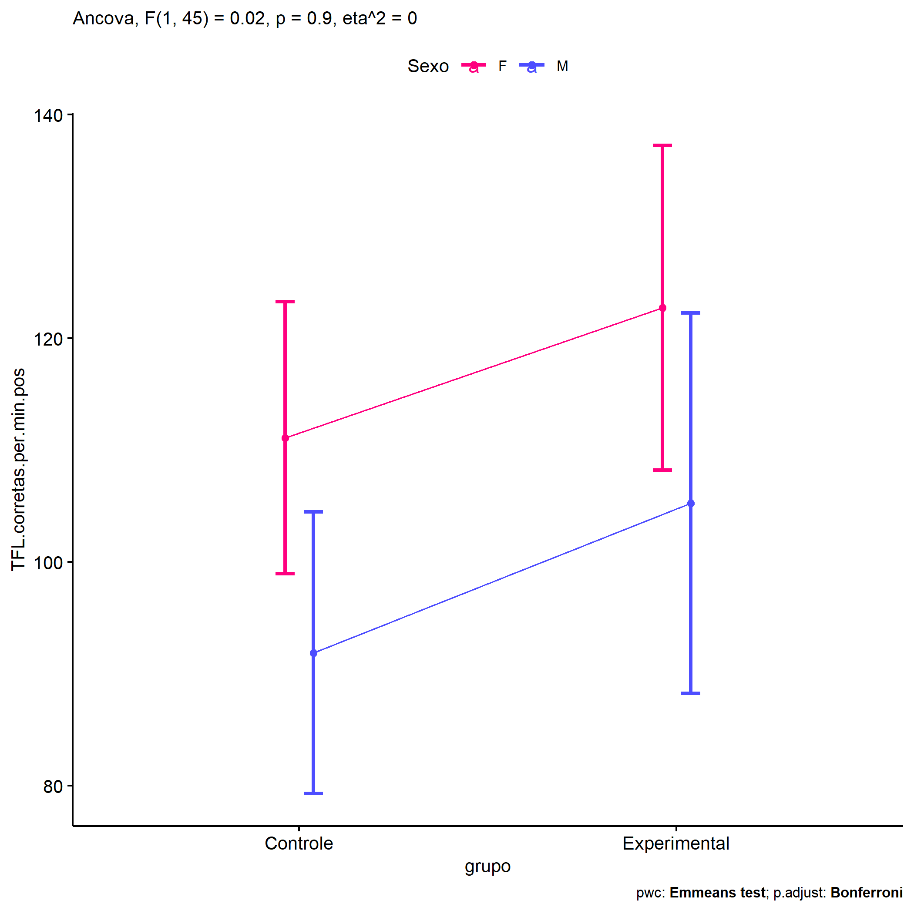<!-- -->

    ## Scale for colour is already present.
    ## Adding another scale for colour, which will replace the existing scale.

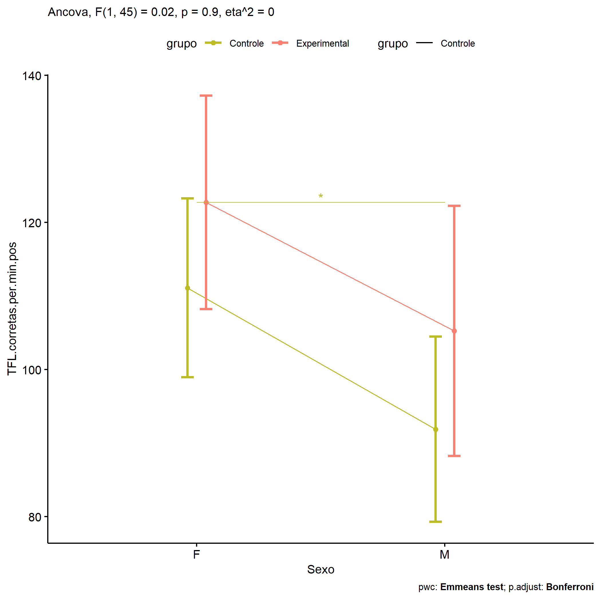<!-- -->

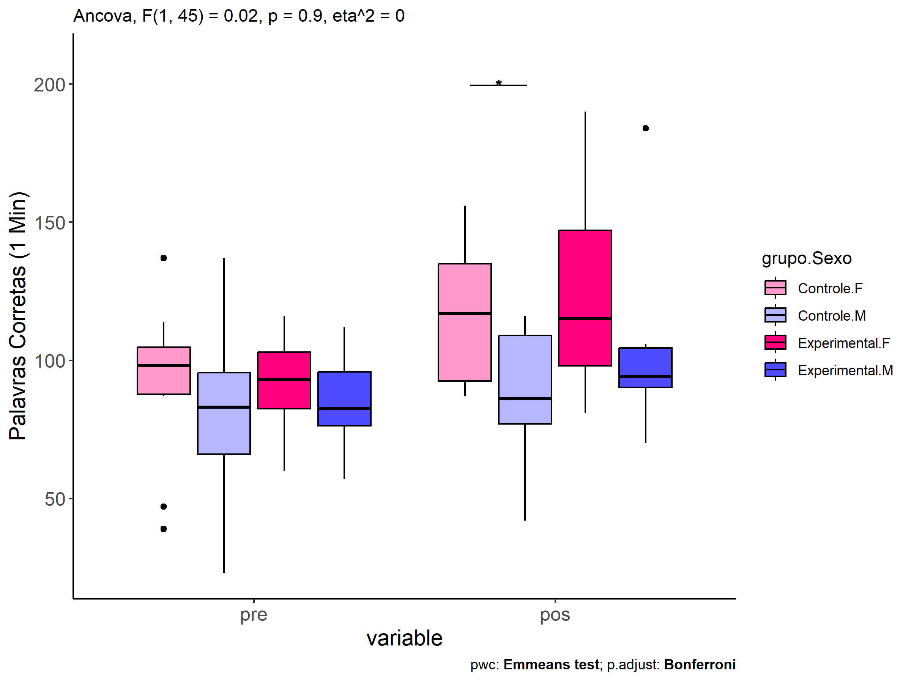<!-- -->

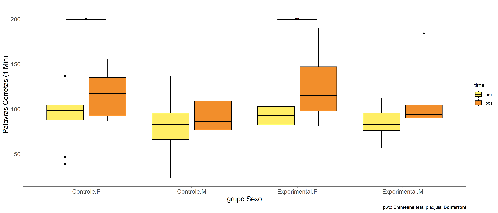<!-- -->

### factores: **grupo:Zona**

### factores: **grupo:Cor.Raca**

| var                      | grupo        | Cor.Raca |   n | M (pre) | SE (pre) | M (unadj) | SE (unadj) | M (adj) | SE (adj) |
|:-------------------------|:-------------|:---------|----:|--------:|---------:|----------:|-----------:|--------:|---------:|
| TFL.corretas.per.min.pos | Controle     | Branca   |   5 | 100.800 |    9.489 |   107.200 |      8.885 |  99.866 |    7.817 |
| TFL.corretas.per.min.pos | Controle     | Parda    |  17 |  87.353 |    5.937 |    94.824 |      6.392 |  97.277 |    4.188 |
| TFL.corretas.per.min.pos | Experimental | Parda    |   7 |  91.714 |    4.859 |    97.429 |      5.353 |  96.708 |    6.477 |

|     | .y.                      | grupo    | Cor.Raca | group1   | group2       | estimate | conf.low | conf.high |     se | statistic |     p | p.adj | p.adj.signif |
|:----|:-------------------------|:---------|:---------|:---------|:-------------|---------:|---------:|----------:|-------:|----------:|------:|------:|:-------------|
| 2   | TFL.corretas.per.min.pos |          | Parda    | Controle | Experimental |    0.569 |  -15.337 |    16.476 |  7.723 |     0.074 | 0.942 | 0.942 | ns           |
| 4   | TFL.corretas.per.min.pre |          | Parda    | Controle | Experimental |   -4.361 |  -24.505 |    15.782 |  9.800 |    -0.445 | 0.660 | 0.660 | ns           |
| 5   | TFL.corretas.per.min.pos | Controle |          | Branca   | Parda        |    2.589 |  -15.862 |    21.039 |  8.959 |     0.289 | 0.775 | 0.775 | ns           |
| 7   | TFL.corretas.per.min.pre | Controle |          | Branca   | Parda        |   13.447 |   -9.372 |    36.266 | 11.101 |     1.211 | 0.237 | 0.237 | ns           |

| .y.                  | grupo        | Cor.Raca | group1 | group2 | estimate | conf.low | conf.high |     se | statistic |     p | p.adj | p.adj.signif |
|:---------------------|:-------------|:---------|:-------|:-------|---------:|---------:|----------:|-------:|----------:|------:|------:|:-------------|
| TFL.corretas.per.min | Controle     | Branca   | pre    | pos    |   -6.400 |  -34.929 |    22.129 | 14.217 |    -0.450 | 0.654 | 0.654 | ns           |
| TFL.corretas.per.min | Controle     | Parda    | pre    | pos    |   -7.471 |  -22.943 |     8.001 |  7.710 |    -0.969 | 0.337 | 0.337 | ns           |
| TFL.corretas.per.min | Experimental | Parda    | pre    | pos    |   -5.714 |  -29.826 |    18.397 | 12.016 |    -0.476 | 0.636 | 0.636 | ns           |

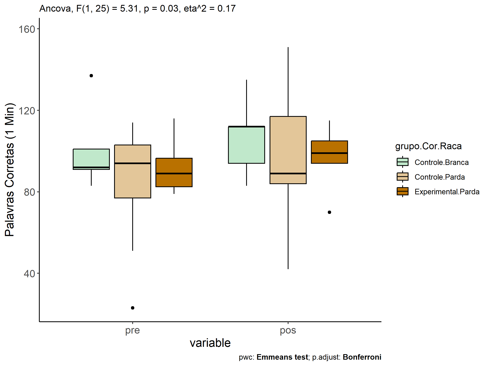<!-- -->

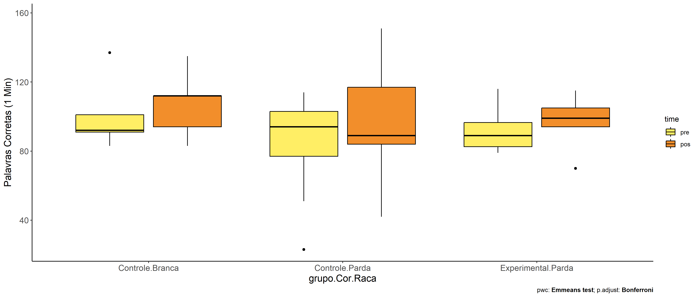<!-- -->

### factores: **grupo:TFL.corretas.per.min.quintile**

| var                      | grupo        | TFL.corretas.per.min.quintile |   n | M (pre) | SE (pre) | M (unadj) | SE (unadj) | M (adj) | SE (adj) |
|:-------------------------|:-------------|:------------------------------|----:|--------:|---------:|----------:|-----------:|--------:|---------:|
| TFL.corretas.per.min.pos | Controle     | 1st quintile                  |   6 |  46.167 |    5.706 |    72.833 |      8.658 |  64.220 |   19.327 |
| TFL.corretas.per.min.pos | Controle     | 2nd quintile                  |   5 |  78.200 |    2.782 |    85.400 |      1.749 |  84.463 |    8.894 |
| TFL.corretas.per.min.pos | Controle     | 3rd quintile                  |   7 |  90.286 |    1.107 |   105.714 |      8.274 | 107.674 |    8.364 |
| TFL.corretas.per.min.pos | Controle     | 4th quintile                  |   9 | 101.778 |    1.656 |   119.222 |      5.729 | 123.936 |   11.617 |
| TFL.corretas.per.min.pos | Experimental | 2nd quintile                  |   5 |  74.200 |    2.615 |    93.600 |     13.170 |  91.705 |    9.511 |
| TFL.corretas.per.min.pos | Experimental | 3rd quintile                  |   5 |  90.200 |    1.594 |   105.000 |      4.393 | 106.939 |    9.549 |

|     | .y.                      | grupo        | TFL.corretas.per.min.quintile | group1       | group2       | estimate | conf.low | conf.high |     se | statistic | p       | p.adj   | p.adj.signif |
|:----|:-------------------------|:-------------|:------------------------------|:-------------|:-------------|---------:|---------:|----------:|-------:|----------:|:--------|:--------|:-------------|
| 2   | TFL.corretas.per.min.pos |              | 2nd quintile                  | Controle     | Experimental |   -7.241 |  -32.643 |    18.160 | 12.438 |    -0.582 | 0.565   | 0.565   | ns           |
| 3   | TFL.corretas.per.min.pos |              | 3rd quintile                  | Controle     | Experimental |    0.735 |  -22.488 |    23.958 | 11.371 |     0.065 | 0.949   | 0.949   | ns           |
| 6   | TFL.corretas.per.min.pre |              | 2nd quintile                  | Controle     | Experimental |    4.000 |   -5.174 |    13.174 |  4.498 |     0.889 | 0.381   | 0.381   | ns           |
| 7   | TFL.corretas.per.min.pre |              | 3rd quintile                  | Controle     | Experimental |    0.086 |   -8.408 |     8.580 |  4.165 |     0.021 | 0.984   | 0.984   | ns           |
| 9   | TFL.corretas.per.min.pos | Controle     |                               | 1st quintile | 2nd quintile |  -20.243 |  -60.319 |    19.832 | 19.623 |    -1.032 | 0.31    | 1       | ns           |
| 10  | TFL.corretas.per.min.pos | Controle     |                               | 1st quintile | 3rd quintile |  -43.454 |  -92.843 |     5.935 | 24.184 |    -1.797 | 0.082   | 0.495   | ns           |
| 11  | TFL.corretas.per.min.pos | Controle     |                               | 1st quintile | 4th quintile |  -59.716 | -119.205 |    -0.227 | 29.129 |    -2.050 | 0.049   | 0.295   | ns           |
| 12  | TFL.corretas.per.min.pos | Controle     |                               | 2nd quintile | 3rd quintile |  -23.211 |  -49.399 |     2.978 | 12.823 |    -1.810 | 0.08    | 0.482   | ns           |
| 13  | TFL.corretas.per.min.pos | Controle     |                               | 2nd quintile | 4th quintile |  -39.473 |  -71.830 |    -7.115 | 15.844 |    -2.491 | 0.018   | 0.111   | ns           |
| 14  | TFL.corretas.per.min.pos | Controle     |                               | 3rd quintile | 4th quintile |  -16.262 |  -39.326 |     6.802 | 11.293 |    -1.440 | 0.16    | 0.961   | ns           |
| 18  | TFL.corretas.per.min.pos | Experimental |                               | 2nd quintile | 3rd quintile |  -15.234 |  -45.000 |    14.531 | 14.575 |    -1.045 | 0.304   | 0.304   | ns           |
| 21  | TFL.corretas.per.min.pre | Controle     |                               | 1st quintile | 2nd quintile |  -32.033 |  -40.817 |   -23.249 |  4.307 |    -7.438 | \<0.001 | \<0.001 | \*\*\*\*     |
| 22  | TFL.corretas.per.min.pre | Controle     |                               | 1st quintile | 3rd quintile |  -44.119 |  -52.189 |   -36.049 |  3.957 |   -11.150 | \<0.001 | \<0.001 | \*\*\*\*     |
| 23  | TFL.corretas.per.min.pre | Controle     |                               | 1st quintile | 4th quintile |  -55.611 |  -63.256 |   -47.966 |  3.749 |   -14.835 | \<0.001 | \<0.001 | \*\*\*\*     |
| 24  | TFL.corretas.per.min.pre | Controle     |                               | 2nd quintile | 3rd quintile |  -12.086 |  -20.580 |    -3.592 |  4.165 |    -2.902 | 0.007   | 0.041   | \*           |
| 25  | TFL.corretas.per.min.pre | Controle     |                               | 2nd quintile | 4th quintile |  -23.578 |  -31.669 |   -15.487 |  3.967 |    -5.943 | \<0.001 | \<0.001 | \*\*\*\*     |
| 26  | TFL.corretas.per.min.pre | Controle     |                               | 3rd quintile | 4th quintile |  -11.492 |  -18.802 |    -4.182 |  3.584 |    -3.206 | 0.003   | 0.019   | \*           |
| 30  | TFL.corretas.per.min.pre | Experimental |                               | 2nd quintile | 3rd quintile |  -16.000 |  -25.174 |    -6.826 |  4.498 |    -3.557 | 0.001   | 0.001   | \*\*         |

| .y.                  | grupo        | TFL.corretas.per.min.quintile | group1 | group2 | estimate | conf.low | conf.high |    se | statistic |     p | p.adj | p.adj.signif |
|:---------------------|:-------------|:------------------------------|:-------|:-------|---------:|---------:|----------:|------:|----------:|------:|------:|:-------------|
| TFL.corretas.per.min | Controle     | 1st quintile                  | pre    | pos    |  -26.667 |  -43.361 |    -9.973 | 8.351 |    -3.193 | 0.002 | 0.002 | \*\*         |
| TFL.corretas.per.min | Controle     | 2nd quintile                  | pre    | pos    |   -7.200 |  -25.487 |    11.087 | 9.148 |    -0.787 | 0.434 | 0.434 | ns           |
| TFL.corretas.per.min | Controle     | 3rd quintile                  | pre    | pos    |  -15.429 |  -30.884 |     0.027 | 7.732 |    -1.995 | 0.050 | 0.050 | ns           |
| TFL.corretas.per.min | Controle     | 4th quintile                  | pre    | pos    |  -17.444 |  -31.075 |    -3.814 | 6.819 |    -2.558 | 0.013 | 0.013 | \*           |
| TFL.corretas.per.min | Experimental | 2nd quintile                  | pre    | pos    |  -19.400 |  -37.687 |    -1.113 | 9.148 |    -2.121 | 0.038 | 0.038 | \*           |
| TFL.corretas.per.min | Experimental | 3rd quintile                  | pre    | pos    |  -14.800 |  -33.087 |     3.487 | 9.148 |    -1.618 | 0.111 | 0.111 | ns           |

    ## Scale for colour is already present.
    ## Adding another scale for colour, which will replace the existing scale.

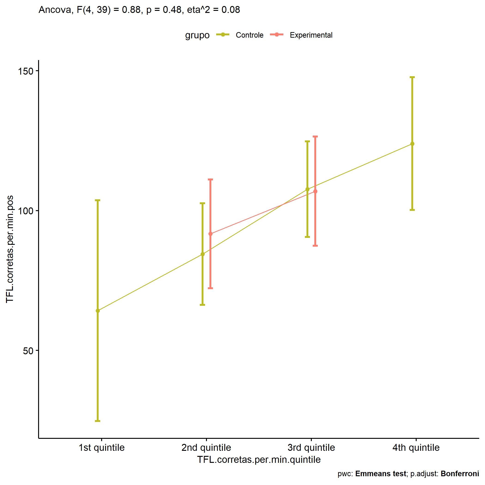<!-- -->

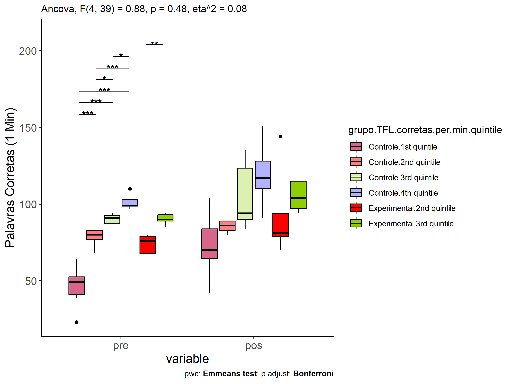<!-- -->

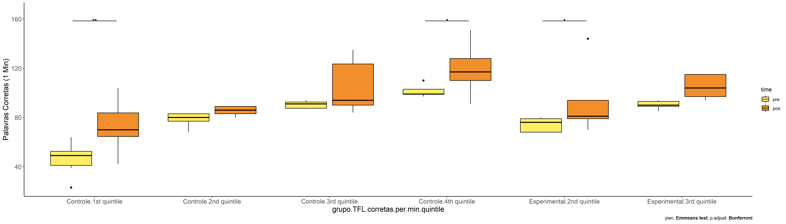<!-- -->
