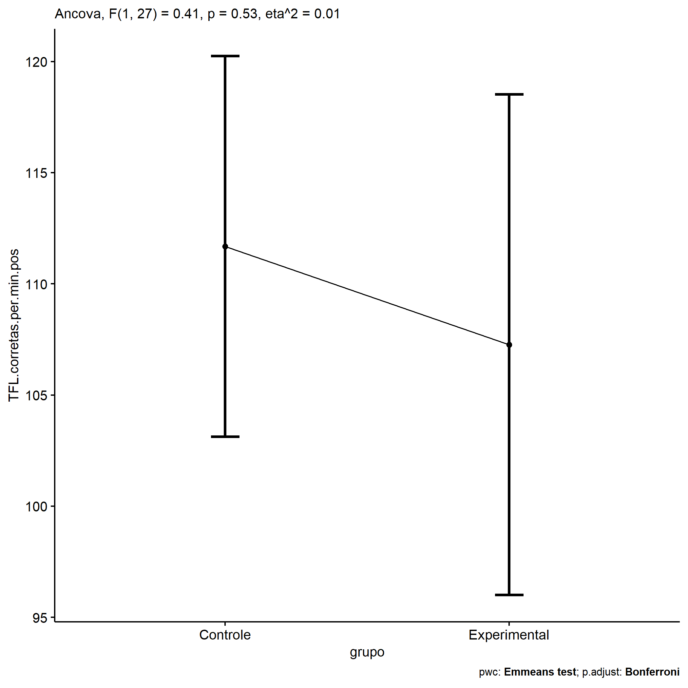
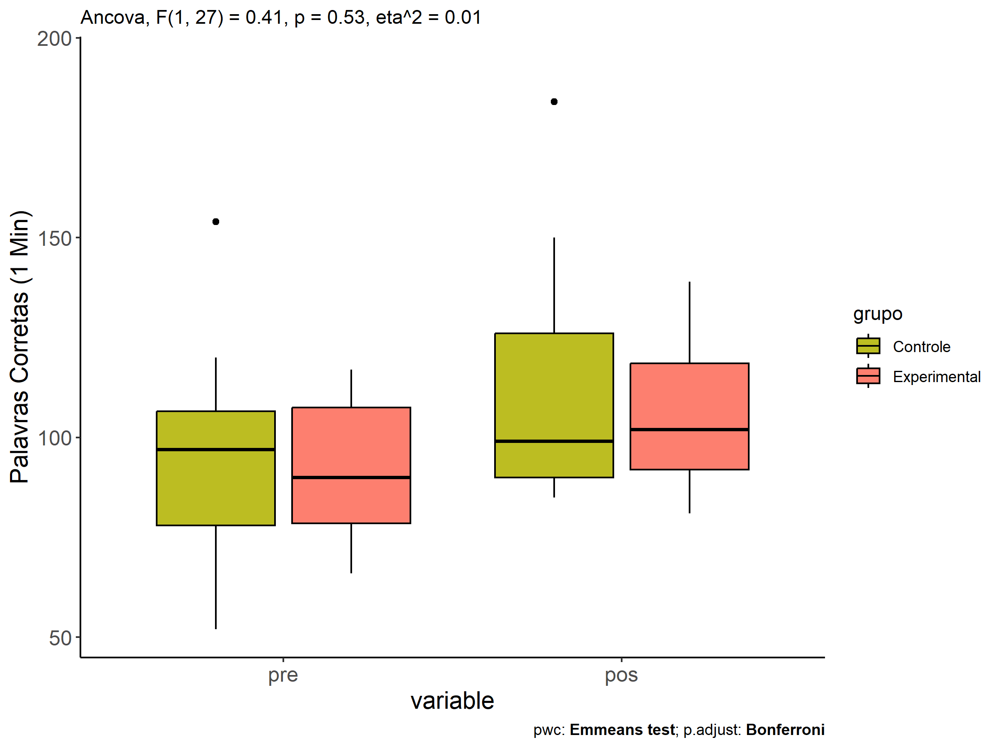
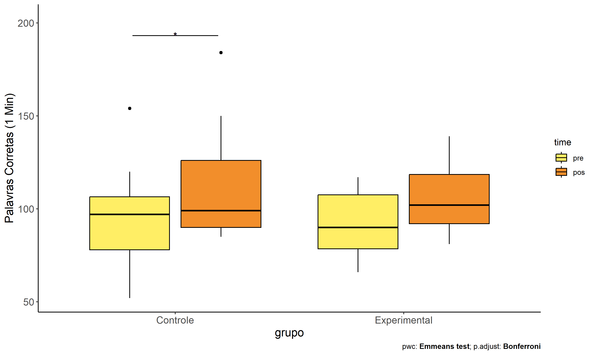
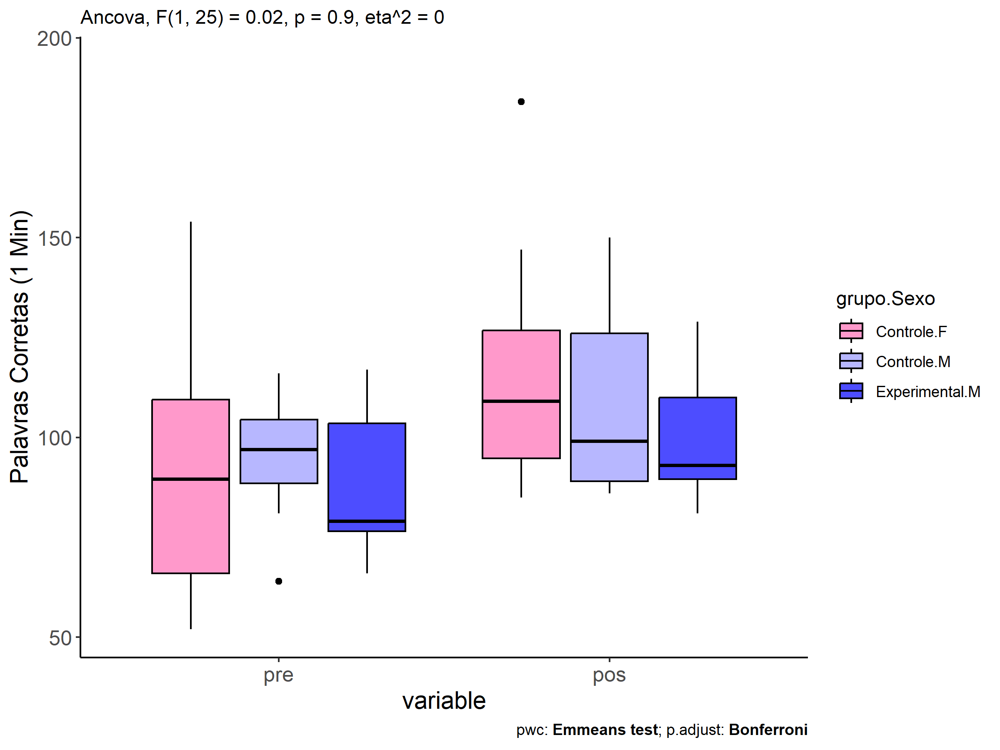
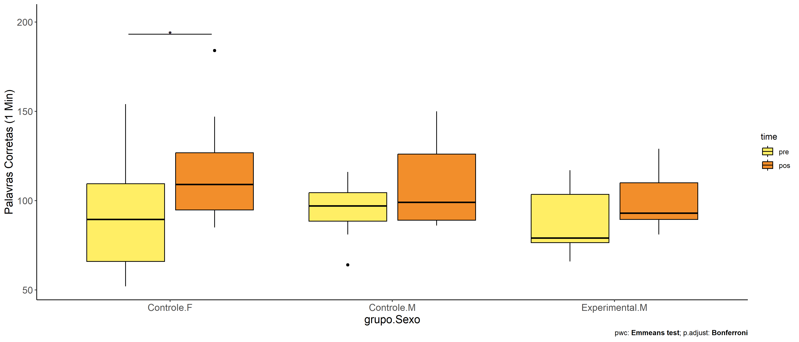

ANCOVA in Palavras Corretas (1 Min) (Palavras Corretas (1 Min))
================
Geiser C. Challco <geiser@alumni.usp.br>

- [Descriptive Statistics of Initial
  Data](#descriptive-statistics-of-initial-data)
- [Checking of Assumptions](#checking-of-assumptions)
  - [Assumption: Normality distribution of
    data](#assumption-normality-distribution-of-data)
  - [Assumption: Homogeneity of data
    distribution](#assumption-homogeneity-of-data-distribution)
- [Computation of ANCOVA test and Pairwise
  Comparison](#computation-of-ancova-test-and-pairwise-comparison)
  - [ANCOVA tests for one factor](#ancova-tests-for-one-factor)
  - [ANCOVA tests for two factors](#ancova-tests-for-two-factors)
  - [Pairwise comparisons for one factor:
    **grupo**](#pairwise-comparisons-for-one-factor-grupo)
  - [Pairwise comparisons for two
    factors](#pairwise-comparisons-for-two-factors)
    - [factores: **grupo:Sexo**](#factores-gruposexo)
    - [factores: **grupo:Zona**](#factores-grupozona)
    - [factores: **grupo:Cor.Raca**](#factores-grupocorraca)
    - [factores:
      **grupo:TFL.corretas.per.min.quintile**](#factores-grupotflcorretasperminquintile)

**NOTE**

- Teste ANCOVA para determinar se houve diferenças significativas no
  Palavras Corretas (1 Min) (medido usando pre- e pos-testes).
- ANCOVA test to determine whether there were significant differences in
  Palavras Corretas (1 Min) (measured using pre- and post-tests).

# Descriptive Statistics of Initial Data

| grupo        | Sexo | Cor.Raca | TFL.corretas.per.min.quintile | variable                 |   n |    mean | median | min | max |     sd |     se |      ci |   iqr |
|:-------------|:-----|:---------|:------------------------------|:-------------------------|----:|--------:|-------:|----:|----:|-------:|-------:|--------:|------:|
| Controle     | F    |          |                               | TFL.corretas.per.min.pre |   8 |  92.125 |   89.5 |  52 | 154 | 35.073 | 12.400 |  29.322 | 43.50 |
| Controle     | M    |          |                               | TFL.corretas.per.min.pre |  11 |  95.182 |   97.0 |  64 | 116 | 15.270 |  4.604 |  10.258 | 16.00 |
| Experimental | F    |          |                               | TFL.corretas.per.min.pre |   4 |  99.000 |   95.5 |  88 | 117 | 12.675 |  6.338 |  20.169 | 11.00 |
| Experimental | M    |          |                               | TFL.corretas.per.min.pre |   7 |  88.857 |   79.0 |  66 | 117 | 20.473 |  7.738 |  18.934 | 27.00 |
| Controle     | F    |          |                               | TFL.corretas.per.min.pos |   8 | 117.625 |  109.0 |  85 | 184 | 33.607 | 11.882 |  28.096 | 32.00 |
| Controle     | M    |          |                               | TFL.corretas.per.min.pos |  11 | 108.000 |   99.0 |  86 | 150 | 22.109 |  6.666 |  14.853 | 37.00 |
| Experimental | F    |          |                               | TFL.corretas.per.min.pos |   4 | 117.750 |  115.0 | 102 | 139 | 15.457 |  7.728 |  24.595 | 10.75 |
| Experimental | M    |          |                               | TFL.corretas.per.min.pos |   7 | 100.286 |   93.0 |  81 | 129 | 17.877 |  6.757 |  16.533 | 20.50 |
| Controle     |      | Branca   |                               | TFL.corretas.per.min.pre |   4 | 103.250 |  105.0 |  88 | 115 | 11.236 |  5.618 |  17.879 |  8.25 |
| Controle     |      | Indígena |                               | TFL.corretas.per.min.pre |   2 | 121.500 |  121.5 |  89 | 154 | 45.962 | 32.500 | 412.952 | 32.50 |
| Controle     |      | Parda    |                               | TFL.corretas.per.min.pre |   9 |  88.444 |   89.0 |  52 | 120 | 22.842 |  7.614 |  17.558 | 27.00 |
| Controle     |      | Preta    |                               | TFL.corretas.per.min.pre |   1 |  99.000 |   99.0 |  99 |  99 |        |        |         |  0.00 |
| Controle     |      |          |                               | TFL.corretas.per.min.pre |   3 |  77.667 |   69.0 |  57 | 107 | 26.102 | 15.070 |  64.842 | 25.00 |
| Experimental |      | Branca   |                               | TFL.corretas.per.min.pre |   2 | 117.000 |  117.0 | 117 | 117 |  0.000 |  0.000 |   0.000 |  0.00 |
| Experimental |      | Indígena |                               | TFL.corretas.per.min.pre |   3 |  89.667 |   93.0 |  78 |  98 | 10.408 |  6.009 |  25.856 | 10.00 |
| Experimental |      | Parda    |                               | TFL.corretas.per.min.pre |   2 |  72.500 |   72.5 |  66 |  79 |  9.192 |  6.500 |  82.590 |  6.50 |
| Experimental |      |          |                               | TFL.corretas.per.min.pre |   4 |  92.500 |   89.0 |  75 | 117 | 17.635 |  8.818 |  28.062 | 12.00 |
| Controle     |      | Branca   |                               | TFL.corretas.per.min.pos |   4 | 120.000 |  120.0 |  90 | 150 | 24.495 | 12.247 |  38.977 | 15.00 |
| Controle     |      | Indígena |                               | TFL.corretas.per.min.pos |   2 | 117.500 |  117.5 |  88 | 147 | 41.719 | 29.500 | 374.833 | 29.50 |
| Controle     |      | Parda    |                               | TFL.corretas.per.min.pos |   9 | 109.556 |   96.0 |  86 | 184 | 31.871 | 10.624 |  24.498 | 35.00 |
| Controle     |      | Preta    |                               | TFL.corretas.per.min.pos |   1 | 118.000 |  118.0 | 118 | 118 |        |        |         |  0.00 |
| Controle     |      |          |                               | TFL.corretas.per.min.pos |   3 | 103.333 |   98.0 |  85 | 127 | 21.502 | 12.414 |  53.414 | 21.00 |
| Experimental |      | Branca   |                               | TFL.corretas.per.min.pos |   2 | 130.000 |  130.0 | 121 | 139 | 12.728 |  9.000 | 114.356 |  9.00 |
| Experimental |      | Indígena |                               | TFL.corretas.per.min.pos |   3 | 102.000 |  102.0 |  88 | 116 | 14.000 |  8.083 |  34.778 | 14.00 |
| Experimental |      | Parda    |                               | TFL.corretas.per.min.pos |   2 |  95.000 |   95.0 |  91 |  99 |  5.657 |  4.000 |  50.825 |  4.00 |
| Experimental |      |          |                               | TFL.corretas.per.min.pos |   4 | 104.250 |  103.5 |  81 | 129 | 21.407 | 10.703 |  34.063 | 27.75 |
| Controle     |      |          | 1st quintile                  | TFL.corretas.per.min.pre |   3 |  57.667 |   57.0 |  52 |  64 |  6.028 |  3.480 |  14.974 |  6.00 |
| Controle     |      |          | 2nd quintile                  | TFL.corretas.per.min.pre |   3 |  75.000 |   75.0 |  69 |  81 |  6.000 |  3.464 |  14.905 |  6.00 |
| Controle     |      |          | 3rd quintile                  | TFL.corretas.per.min.pre |   3 |  88.667 |   89.0 |  88 |  89 |  0.577 |  0.333 |   1.434 |  0.50 |
| Controle     |      |          | 4th quintile                  | TFL.corretas.per.min.pre |   6 | 102.500 |  103.0 |  97 | 107 |  3.937 |  1.607 |   4.132 |  5.75 |
| Controle     |      |          | 5th quintile                  | TFL.corretas.per.min.pre |   4 | 126.250 |  118.0 | 115 | 154 | 18.626 |  9.313 |  29.638 | 12.75 |
| Experimental |      |          | 1st quintile                  | TFL.corretas.per.min.pre |   1 |  66.000 |   66.0 |  66 |  66 |        |        |         |  0.00 |
| Experimental |      |          | 2nd quintile                  | TFL.corretas.per.min.pre |   3 |  77.333 |   78.0 |  75 |  79 |  2.082 |  1.202 |   5.171 |  2.00 |
| Experimental |      |          | 3rd quintile                  | TFL.corretas.per.min.pre |   3 |  90.333 |   90.0 |  88 |  93 |  2.517 |  1.453 |   6.252 |  2.50 |
| Experimental |      |          | 4th quintile                  | TFL.corretas.per.min.pre |   1 |  98.000 |   98.0 |  98 |  98 |        |        |         |  0.00 |
| Experimental |      |          | 5th quintile                  | TFL.corretas.per.min.pre |   3 | 117.000 |  117.0 | 117 | 117 |  0.000 |  0.000 |   0.000 |  0.00 |
| Controle     |      |          | 1st quintile                  | TFL.corretas.per.min.pos |   3 |  93.000 |   91.0 |  90 |  98 |  4.359 |  2.517 |  10.828 |  4.00 |
| Controle     |      |          | 2nd quintile                  | TFL.corretas.per.min.pos |   3 |  89.000 |   86.0 |  85 |  96 |  6.083 |  3.512 |  15.110 |  5.50 |
| Controle     |      |          | 3rd quintile                  | TFL.corretas.per.min.pos |   3 | 108.667 |   88.0 |  88 | 150 | 35.796 | 20.667 |  88.921 | 31.00 |
| Controle     |      |          | 4th quintile                  | TFL.corretas.per.min.pos |   6 | 118.167 |  120.0 |  99 | 127 |  9.988 |  4.078 |  10.482 |  5.25 |
| Controle     |      |          | 5th quintile                  | TFL.corretas.per.min.pos |   4 | 137.000 |  137.0 |  90 | 184 | 39.234 | 19.617 |  62.431 | 38.50 |
| Experimental |      |          | 1st quintile                  | TFL.corretas.per.min.pos |   1 |  91.000 |   91.0 |  91 |  91 |        |        |         |  0.00 |
| Experimental |      |          | 2nd quintile                  | TFL.corretas.per.min.pos |   3 |  89.333 |   88.0 |  81 |  99 |  9.074 |  5.239 |  22.540 |  9.00 |
| Experimental |      |          | 3rd quintile                  | TFL.corretas.per.min.pos |   3 | 107.667 |  114.0 |  93 | 116 | 12.741 |  7.356 |  31.650 | 11.50 |
| Experimental |      |          | 4th quintile                  | TFL.corretas.per.min.pos |   1 | 102.000 |  102.0 | 102 | 102 |        |        |         |  0.00 |
| Experimental |      |          | 5th quintile                  | TFL.corretas.per.min.pos |   3 | 129.667 |  129.0 | 121 | 139 |  9.018 |  5.207 |  22.403 |  9.00 |

# Checking of Assumptions

## Assumption: Normality distribution of data

| var                      |   n |  skewness | kurtosis | symmetry | statistic | method       |         p | p.signif | normality |
|:-------------------------|----:|----------:|---------:|:---------|----------:|:-------------|----------:|:---------|:----------|
| TFL.corretas.per.min.pos |  30 | 1.0912558 | 1.810393 | NO       | 0.8772933 | Shapiro-Wilk | 0.0024447 | \*\*     | NO        |
| TFL.corretas.per.min.pos |  23 | 0.7203997 | 1.333684 | NO       | 0.8887311 | Shapiro-Wilk | 0.0149154 | \*       | NO        |
| TFL.corretas.per.min.pos |  30 | 0.7203115 | 2.453424 | NO       | 0.8713029 | Shapiro-Wilk | 0.0017911 | \*\*     | NO        |

## Assumption: Homogeneity of data distribution

| var                      | method         | formula                                         |   n | DFn.df1 | DFd.df2 | statistic |         p | p.signif |
|:-------------------------|:---------------|:------------------------------------------------|----:|--------:|--------:|----------:|----------:|:---------|
| TFL.corretas.per.min.pos | Levene’s test  | `.res`~`grupo`\*`Sexo`                          |  30 |       3 |      26 | 1.0567496 | 0.3843681 | ns       |
| TFL.corretas.per.min.pos | Anova’s slopes | `.res`~`grupo`\*`Sexo`                          |  30 |       3 |      22 | 0.1920000 | 0.9010000 | ns       |
| TFL.corretas.per.min.pos | Levene’s test  | `.res`~`grupo`\*`Cor.Raca`                      |  23 |       6 |      16 | 0.7644876 | 0.6082862 | ns       |
| TFL.corretas.per.min.pos | Anova’s slopes | `.res`~`grupo`\*`Cor.Raca`                      |  23 |       4 |      11 | 2.3830000 | 0.1150000 | ns       |
| TFL.corretas.per.min.pos | Levene’s test  | `.res`~`grupo`\*`TFL.corretas.per.min.quintile` |  30 |       9 |      20 | 0.6645016 | 0.7306730 | ns       |
| TFL.corretas.per.min.pos | Anova’s slopes | `.res`~`grupo`\*`TFL.corretas.per.min.quintile` |  30 |       6 |      13 | 1.1200000 | 0.4030000 | ns       |

# Computation of ANCOVA test and Pairwise Comparison

## ANCOVA tests for one factor

|     | Effect                        | DFn | DFd |      SSn |      SSd |      F | p       |   ges | p\<.05 |
|:----|:------------------------------|----:|----:|---------:|---------:|-------:|:--------|------:|:-------|
| 1   | TFL.corretas.per.min.pre      |   1 |  27 | 7701.959 | 8931.533 | 23.283 | \<0.001 | 0.463 | \*     |
| 2   | grupo                         |   1 |  27 |  136.236 | 8931.533 |  0.412 | 0.526   | 0.015 |        |
| 4   | Sexo                          |   1 |  27 |  939.664 | 8128.105 |  3.121 | 0.089   | 0.104 |        |
| 6   | Cor.Raca                      |   3 |  18 |  503.109 | 7729.610 |  0.391 | 0.761   | 0.061 |        |
| 8   | TFL.corretas.per.min.quintile |   4 |  24 |  728.378 | 8339.392 |  0.524 | 0.719   | 0.080 |        |

## ANCOVA tests for two factors

|     | Effect                              | DFn | DFd |      SSn |      SSd |      F | p       |   ges | p\<.05 |
|:----|:------------------------------------|----:|----:|---------:|---------:|-------:|:--------|------:|:-------|
| 1   | TFL.corretas.per.min.pre            |   1 |  25 | 7404.834 | 8023.220 | 23.073 | \<0.001 | 0.480 | \*     |
| 4   | grupo:Sexo                          |   1 |  25 |    5.107 | 8023.220 |  0.016 | 0.901   | 0.001 |        |
| 8   | grupo:Cor.Raca                      |   2 |  15 |  110.798 | 7608.229 |  0.109 | 0.897   | 0.014 |        |
| 12  | grupo:TFL.corretas.per.min.quintile |   4 |  19 |  112.616 | 8127.541 |  0.066 | 0.991   | 0.014 |        |

## Pairwise comparisons for one factor: **grupo**

| var                      | grupo        |   n | M (pre) | SE (pre) | M (unadj) | SE (unadj) | M (adj) | SE (adj) |
|:-------------------------|:-------------|----:|--------:|---------:|----------:|-----------:|--------:|---------:|
| TFL.corretas.per.min.pos | Controle     |  19 |  93.895 |    5.668 |   112.053 |      6.218 | 111.689 |    4.173 |
| TFL.corretas.per.min.pos | Experimental |  11 |  92.545 |    5.443 |   106.636 |      5.568 | 107.265 |    5.485 |

| .y.                      | group1   | group2       | estimate | conf.low | conf.high |    se | statistic |     p | p.adj | p.adj.signif |
|:-------------------------|:---------|:-------------|---------:|---------:|----------:|------:|----------:|------:|------:|:-------------|
| TFL.corretas.per.min.pos | Controle | Experimental |    4.424 |   -9.721 |    18.569 | 6.894 |     0.642 | 0.526 | 0.526 | ns           |
| TFL.corretas.per.min.pre | Controle | Experimental |    1.349 |  -16.155 |    18.854 | 8.545 |     0.158 | 0.876 | 0.876 | ns           |

| .y.                  | grupo        | group1 | group2 | estimate | conf.low | conf.high |     se | statistic |     p | p.adj | p.adj.signif |
|:---------------------|:-------------|:-------|:-------|---------:|---------:|----------:|-------:|----------:|------:|------:|:-------------|
| TFL.corretas.per.min | Controle     | pre    | pos    |  -18.158 |  -33.420 |    -2.896 |  7.618 |    -2.383 | 0.021 | 0.021 | \*           |
| TFL.corretas.per.min | Experimental | pre    | pos    |  -14.091 |  -34.149 |     5.967 | 10.013 |    -1.407 | 0.165 | 0.165 | ns           |

    ## Scale for colour is already present.
    ## Adding another scale for colour, which will replace the existing scale.

<!-- -->

<!-- -->

<!-- -->

## Pairwise comparisons for two factors

### factores: **grupo:Sexo**

| var                      | grupo        | Sexo |   n | M (pre) | SE (pre) | M (unadj) | SE (unadj) | M (adj) | SE (adj) |
|:-------------------------|:-------------|:-----|----:|--------:|---------:|----------:|-----------:|--------:|---------:|
| TFL.corretas.per.min.pos | Controle     | F    |   8 |  92.125 |   12.400 |   117.625 |     11.882 | 117.923 |    6.617 |
| TFL.corretas.per.min.pos | Controle     | M    |  11 |  95.182 |    4.604 |   108.000 |      6.666 | 106.093 |    5.659 |
| TFL.corretas.per.min.pos | Experimental | M    |   7 |  88.857 |    7.738 |   100.286 |      6.757 | 102.942 |    7.099 |

|     | .y.                      | grupo    | Sexo | group1   | group2       | estimate | conf.low | conf.high |     se | statistic |     p | p.adj | p.adj.signif |
|:----|:-------------------------|:---------|:-----|:---------|:-------------|---------:|---------:|----------:|-------:|----------:|------:|------:|:-------------|
| 2   | TFL.corretas.per.min.pos |          | M    | Controle | Experimental |    3.151 |  -15.734 |    22.036 |  9.106 |     0.346 | 0.733 | 0.733 | ns           |
| 4   | TFL.corretas.per.min.pre |          | M    | Controle | Experimental |    6.325 |  -17.869 |    30.518 | 11.695 |     0.541 | 0.594 | 0.594 | ns           |
| 5   | TFL.corretas.per.min.pos | Controle |      | F        | M            |   11.831 |   -6.233 |    29.894 |  8.710 |     1.358 | 0.188 | 0.188 | ns           |
| 7   | TFL.corretas.per.min.pre | Controle |      | F        | M            |   -3.057 |  -26.308 |    20.194 | 11.240 |    -0.272 | 0.788 | 0.788 | ns           |

| .y.                  | grupo        | Sexo | group1 | group2 | estimate | conf.low | conf.high |     se | statistic |     p | p.adj | p.adj.signif |
|:---------------------|:-------------|:-----|:-------|:-------|---------:|---------:|----------:|-------:|----------:|------:|------:|:-------------|
| TFL.corretas.per.min | Controle     | F    | pre    | pos    |  -25.500 |  -50.406 |    -0.594 | 12.373 |    -2.061 | 0.045 | 0.045 | \*           |
| TFL.corretas.per.min | Controle     | M    | pre    | pos    |  -12.818 |  -34.058 |     8.421 | 10.552 |    -1.215 | 0.231 | 0.231 | ns           |
| TFL.corretas.per.min | Experimental | M    | pre    | pos    |  -11.429 |  -38.054 |    15.197 | 13.227 |    -0.864 | 0.392 | 0.392 | ns           |

<!-- -->

<!-- -->

### factores: **grupo:Zona**

### factores: **grupo:Cor.Raca**

### factores: **grupo:TFL.corretas.per.min.quintile**
