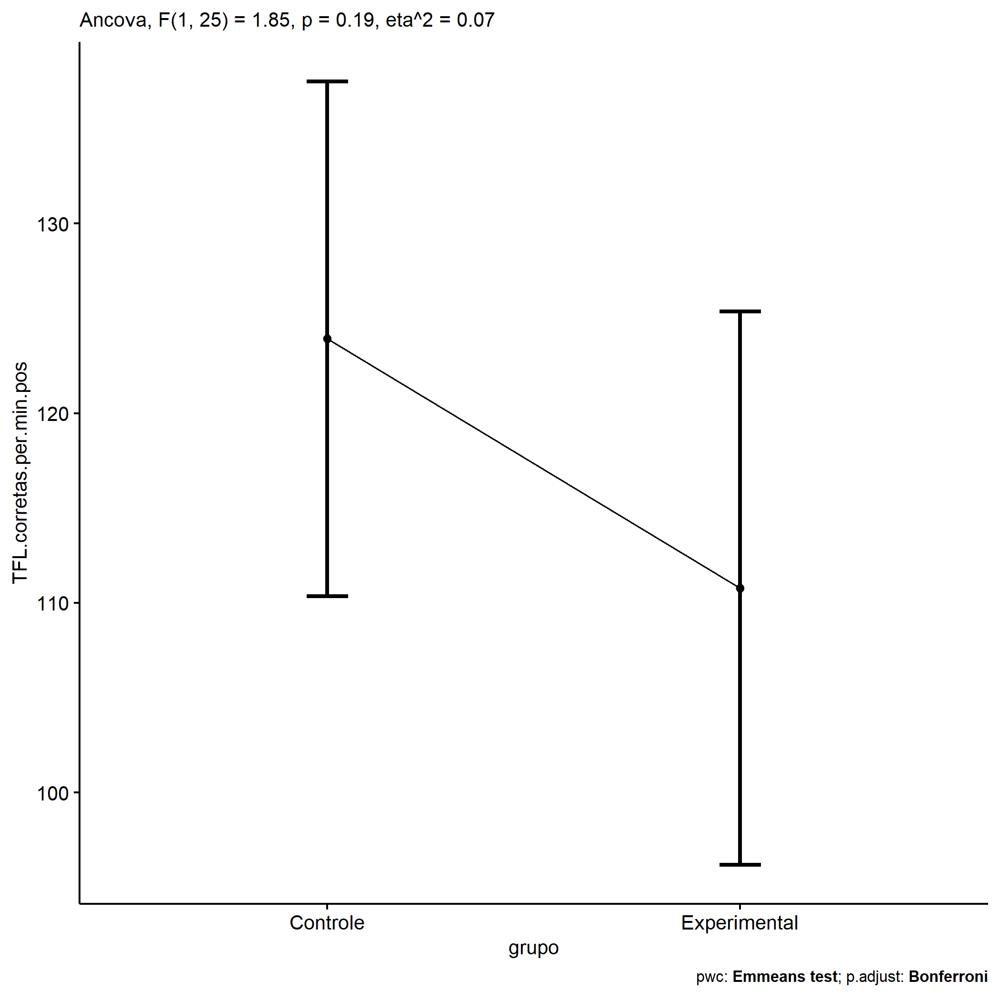
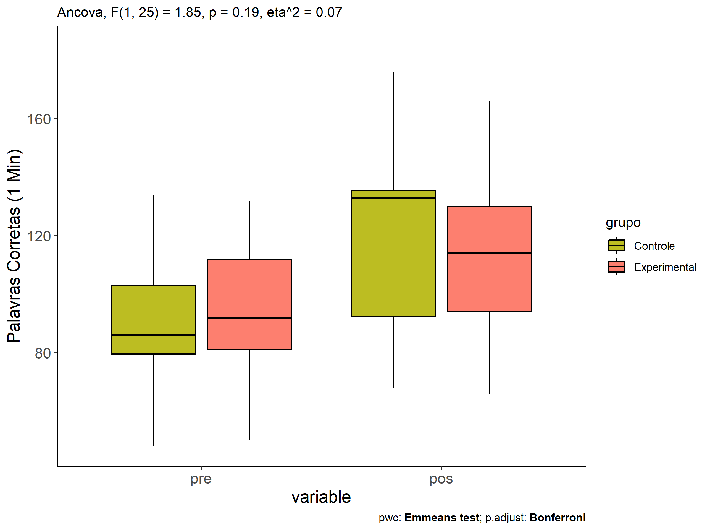
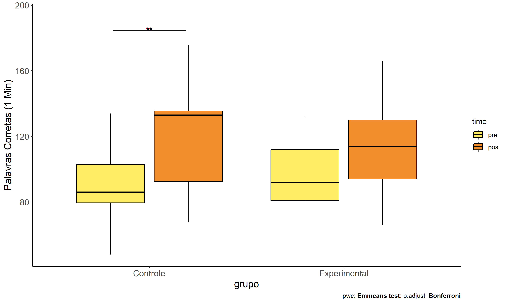

ANCOVA in Palavras Corretas (1 Min) (Palavras Corretas (1 Min))
================
Geiser C. Challco <geiser@alumni.usp.br>

- [Descriptive Statistics of Initial
  Data](#descriptive-statistics-of-initial-data)
- [Checking of Assumptions](#checking-of-assumptions)
  - [Assumption: Normality distribution of
    data](#assumption-normality-distribution-of-data)
  - [Assumption: Homogeneity of data
    distribution](#assumption-homogeneity-of-data-distribution)
- [Computation of ANCOVA test and Pairwise
  Comparison](#computation-of-ancova-test-and-pairwise-comparison)
  - [ANCOVA tests for one factor](#ancova-tests-for-one-factor)
  - [ANCOVA tests for two factors](#ancova-tests-for-two-factors)
  - [Pairwise comparisons for one factor:
    **grupo**](#pairwise-comparisons-for-one-factor-grupo)
  - [Pairwise comparisons for two
    factors](#pairwise-comparisons-for-two-factors)
    - [factores: **grupo:Sexo**](#factores-gruposexo)
    - [factores: **grupo:Zona**](#factores-grupozona)
    - [factores: **grupo:Cor.Raca**](#factores-grupocorraca)
    - [factores:
      **grupo:TFL.corretas.per.min.quintile**](#factores-grupotflcorretasperminquintile)

**NOTE**

- Teste ANCOVA para determinar se houve diferenças significativas no
  Palavras Corretas (1 Min) (medido usando pre- e pos-testes).
- ANCOVA test to determine whether there were significant differences in
  Palavras Corretas (1 Min) (measured using pre- and post-tests).

# Descriptive Statistics of Initial Data

| grupo        | Sexo | Zona   | Cor.Raca | TFL.corretas.per.min.quintile | variable                 |   n |    mean | median | min | max |     sd |     se |      ci |   iqr |
|:-------------|:-----|:-------|:---------|:------------------------------|:-------------------------|----:|--------:|-------:|----:|----:|-------:|-------:|--------:|------:|
| Controle     | F    |        |          |                               | TFL.corretas.per.min.pre |   3 |  70.333 |   78.0 |  52 |  81 | 15.948 |  9.207 |  39.617 | 14.50 |
| Controle     | M    |        |          |                               | TFL.corretas.per.min.pre |  12 |  93.000 |   89.5 |  48 | 134 | 25.577 |  7.383 |  16.251 | 26.25 |
| Experimental | F    |        |          |                               | TFL.corretas.per.min.pre |   3 | 111.333 |  112.0 |  90 | 132 | 21.008 | 12.129 |  52.187 | 21.00 |
| Experimental | M    |        |          |                               | TFL.corretas.per.min.pre |  10 |  84.900 |   88.0 |  50 | 116 | 22.328 |  7.061 |  15.973 | 14.75 |
| Controle     | F    |        |          |                               | TFL.corretas.per.min.pos |   3 | 118.667 |  126.0 |  95 | 135 | 20.984 | 12.115 |  52.127 | 20.00 |
| Controle     | M    |        |          |                               | TFL.corretas.per.min.pos |  12 | 124.167 |  134.0 |  68 | 176 | 35.195 | 10.160 |  22.362 | 50.25 |
| Experimental | F    |        |          |                               | TFL.corretas.per.min.pos |   3 | 129.000 |  129.0 | 114 | 144 | 15.000 |  8.660 |  37.262 | 15.00 |
| Experimental | M    |        |          |                               | TFL.corretas.per.min.pos |  10 | 106.600 |  101.5 |  66 | 166 | 30.913 |  9.775 |  22.114 | 40.75 |
| Controle     |      | Rural  |          |                               | TFL.corretas.per.min.pre |   5 |  83.000 |   86.0 |  48 | 134 | 34.278 | 15.330 |  42.562 | 37.00 |
| Controle     |      | Urbana |          |                               | TFL.corretas.per.min.pre |   3 | 101.000 |   98.0 |  82 | 123 | 20.664 | 11.930 |  51.332 | 20.50 |
| Controle     |      |        |          |                               | TFL.corretas.per.min.pre |   7 |  87.000 |   85.0 |  52 | 118 | 21.401 |  8.089 |  19.793 | 18.00 |
| Experimental |      | Rural  |          |                               | TFL.corretas.per.min.pre |   6 |  79.333 |   82.5 |  51 |  92 | 15.227 |  6.216 |  15.980 | 12.75 |
| Experimental |      | Urbana |          |                               | TFL.corretas.per.min.pre |   2 | 111.000 |  111.0 |  90 | 132 | 29.698 | 21.000 | 266.830 | 21.00 |
| Experimental |      |        |          |                               | TFL.corretas.per.min.pre |   5 |  97.000 |  112.0 |  50 | 116 | 28.036 | 12.538 |  34.811 | 23.00 |
| Controle     |      | Rural  |          |                               | TFL.corretas.per.min.pos |   5 | 100.600 |   86.0 |  68 | 135 | 31.198 | 13.952 |  38.737 | 52.00 |
| Controle     |      | Urbana |          |                               | TFL.corretas.per.min.pos |   3 | 153.333 |  149.0 | 135 | 176 | 20.841 | 12.032 |  51.771 | 20.50 |
| Controle     |      |        |          |                               | TFL.corretas.per.min.pos |   7 | 126.143 |  130.0 |  90 | 171 | 27.322 | 10.327 |  25.268 | 25.00 |
| Experimental |      | Rural  |          |                               | TFL.corretas.per.min.pos |   6 |  97.167 |   94.5 |  73 | 130 | 19.974 |  8.154 |  20.962 | 19.00 |
| Experimental |      | Urbana |          |                               | TFL.corretas.per.min.pos |   2 | 121.500 |  121.5 | 114 | 129 | 10.607 |  7.500 |  95.297 |  7.50 |
| Experimental |      |        |          |                               | TFL.corretas.per.min.pos |   5 | 125.400 |  135.0 |  66 | 166 | 37.760 | 16.887 |  46.885 | 28.00 |
| Controle     |      |        | Parda    |                               | TFL.corretas.per.min.pre |   6 |  99.667 |   89.5 |  81 | 134 | 21.304 |  8.697 |  22.357 | 25.25 |
| Controle     |      |        |          |                               | TFL.corretas.per.min.pre |   9 |  81.000 |   82.0 |  48 | 123 | 26.014 |  8.671 |  19.996 | 43.00 |
| Experimental |      |        | Branca   |                               | TFL.corretas.per.min.pre |   1 |  92.000 |   92.0 |  92 |  92 |        |        |         |  0.00 |
| Experimental |      |        | Indígena |                               | TFL.corretas.per.min.pre |   1 |  50.000 |   50.0 |  50 |  50 |        |        |         |  0.00 |
| Experimental |      |        | Parda    |                               | TFL.corretas.per.min.pre |   4 |  80.000 |   78.5 |  51 | 112 | 25.047 | 12.523 |  39.855 | 19.00 |
| Experimental |      |        |          |                               | TFL.corretas.per.min.pre |   7 | 103.000 |   92.0 |  84 | 132 | 17.916 |  6.772 |  16.570 | 24.50 |
| Controle     |      |        | Parda    |                               | TFL.corretas.per.min.pos |   6 | 100.500 |   92.5 |  68 | 136 | 27.905 | 11.392 |  29.285 | 40.25 |
| Controle     |      |        |          |                               | TFL.corretas.per.min.pos |   9 | 138.111 |  135.0 |  86 | 176 | 26.441 |  8.814 |  20.324 | 19.00 |
| Experimental |      |        | Branca   |                               | TFL.corretas.per.min.pos |   1 | 108.000 |  108.0 | 108 | 108 |        |        |         |  0.00 |
| Experimental |      |        | Indígena |                               | TFL.corretas.per.min.pos |   1 |  66.000 |   66.0 |  66 |  66 |        |        |         |  0.00 |
| Experimental |      |        | Parda    |                               | TFL.corretas.per.min.pos |   4 |  98.500 |   88.5 |  73 | 144 | 31.522 | 15.761 |  50.159 | 26.00 |
| Experimental |      |        |          |                               | TFL.corretas.per.min.pos |   7 | 126.429 |  129.0 |  95 | 166 | 22.022 |  8.323 |  20.367 | 17.50 |
| Controle     |      |        |          | 1st quintile                  | TFL.corretas.per.min.pre |   3 |  51.667 |   52.0 |  48 |  55 |  3.512 |  2.028 |   8.724 |  3.50 |
| Controle     |      |        |          | 2nd quintile                  | TFL.corretas.per.min.pre |   3 |  80.333 |   81.0 |  78 |  82 |  2.082 |  1.202 |   5.171 |  2.00 |
| Controle     |      |        |          | 3rd quintile                  | TFL.corretas.per.min.pre |   4 |  87.500 |   86.5 |  85 |  92 |  3.109 |  1.555 |   4.947 |  2.50 |
| Controle     |      |        |          | 4th quintile                  | TFL.corretas.per.min.pre |   2 | 103.000 |  103.0 |  98 | 108 |  7.071 |  5.000 |  63.531 |  5.00 |
| Controle     |      |        |          | 5th quintile                  | TFL.corretas.per.min.pre |   3 | 125.000 |  123.0 | 118 | 134 |  8.185 |  4.726 |  20.334 |  8.00 |
| Experimental |      |        |          | 1st quintile                  | TFL.corretas.per.min.pre |   2 |  50.500 |   50.5 |  50 |  51 |  0.707 |  0.500 |   6.353 |  0.50 |
| Experimental |      |        |          | 2nd quintile                  | TFL.corretas.per.min.pre |   3 |  80.333 |   81.0 |  76 |  84 |  4.041 |  2.333 |  10.040 |  4.00 |
| Experimental |      |        |          | 3rd quintile                  | TFL.corretas.per.min.pre |   4 |  91.500 |   92.0 |  90 |  92 |  1.000 |  0.500 |   1.591 |  0.50 |
| Experimental |      |        |          | 5th quintile                  | TFL.corretas.per.min.pre |   4 | 118.750 |  115.5 | 112 | 132 |  8.995 |  4.498 |  14.314 |  5.75 |
| Controle     |      |        |          | 1st quintile                  | TFL.corretas.per.min.pos |   3 | 118.667 |  135.0 |  86 | 135 | 28.290 | 16.333 |  70.277 | 24.50 |
| Controle     |      |        |          | 2nd quintile                  | TFL.corretas.per.min.pos |   3 | 118.667 |  126.0 |  95 | 135 | 20.984 | 12.115 |  52.127 | 20.00 |
| Controle     |      |        |          | 3rd quintile                  | TFL.corretas.per.min.pos |   4 |  92.250 |   85.5 |  68 | 130 | 26.738 | 13.369 |  42.546 | 22.25 |
| Controle     |      |        |          | 4th quintile                  | TFL.corretas.per.min.pos |   2 | 160.000 |  160.0 | 149 | 171 | 15.556 | 11.000 | 139.768 | 11.00 |
| Controle     |      |        |          | 5th quintile                  | TFL.corretas.per.min.pos |   3 | 148.333 |  136.0 | 133 | 176 | 24.007 | 13.860 |  59.637 | 21.50 |
| Experimental |      |        |          | 1st quintile                  | TFL.corretas.per.min.pos |   2 |  69.500 |   69.5 |  66 |  73 |  4.950 |  3.500 |  44.472 |  3.50 |
| Experimental |      |        |          | 2nd quintile                  | TFL.corretas.per.min.pos |   3 |  90.667 |   94.0 |  83 |  95 |  6.658 |  3.844 |  16.540 |  6.00 |
| Experimental |      |        |          | 3rd quintile                  | TFL.corretas.per.min.pos |   4 | 121.750 |  122.0 | 108 | 135 | 12.816 |  6.408 |  20.393 | 18.75 |
| Experimental |      |        |          | 5th quintile                  | TFL.corretas.per.min.pos |   4 | 138.750 |  136.5 | 116 | 166 | 21.469 | 10.734 |  34.162 | 23.75 |

# Checking of Assumptions

## Assumption: Normality distribution of data

| var                      |   n |   skewness |   kurtosis | symmetry | statistic | method       |         p | p.signif | normality |
|:-------------------------|----:|-----------:|-----------:|:---------|----------:|:-------------|----------:|:---------|:----------|
| TFL.corretas.per.min.pos |  28 | -0.1244831 | -0.9239431 | YES      | 0.9694046 | Shapiro-Wilk | 0.5647132 | ns       | YES       |
| TFL.corretas.per.min.pos |  16 |  0.6370907 |  0.4499347 | NO       | 0.9448547 | Shapiro-Wilk | 0.4127789 | ns       | YES       |
| TFL.corretas.per.min.pos |  12 |  0.0537685 | -1.4526529 | YES      | 0.9616402 | Shapiro-Wilk | 0.8069677 | ns       | YES       |
| TFL.corretas.per.min.pos |  28 |  0.1784102 | -0.7033056 | YES      | 0.9831524 | Shapiro-Wilk | 0.9179358 | ns       | YES       |

## Assumption: Homogeneity of data distribution

| var                      | method         | formula                                         |   n | DFn.df1 | DFd.df2 | statistic |         p | p.signif |
|:-------------------------|:---------------|:------------------------------------------------|----:|--------:|--------:|----------:|----------:|:---------|
| TFL.corretas.per.min.pos | Levene’s test  | `.res`~`grupo`\*`Sexo`                          |  28 |       3 |      24 | 1.7688087 | 0.1799863 | ns       |
| TFL.corretas.per.min.pos | Anova’s slopes | `.res`~`grupo`\*`Sexo`                          |  28 |       3 |      20 | 1.2680000 | 0.3120000 | ns       |
| TFL.corretas.per.min.pos | Levene’s test  | `.res`~`grupo`\*`Zona`                          |  16 |       3 |      12 | 1.6283999 | 0.2348588 | ns       |
| TFL.corretas.per.min.pos | Anova’s slopes | `.res`~`grupo`\*`Zona`                          |  16 |       3 |       8 | 0.6520000 | 0.6040000 | ns       |
| TFL.corretas.per.min.pos | Levene’s test  | `.res`~`grupo`\*`Cor.Raca`                      |  12 |       3 |       8 | 3.3731910 | 0.0750943 | ns       |
| TFL.corretas.per.min.pos | Anova’s slopes | `.res`~`grupo`\*`Cor.Raca`                      |  12 |       1 |       6 | 0.0140000 | 0.9080000 | ns       |
| TFL.corretas.per.min.pos | Levene’s test  | `.res`~`grupo`\*`TFL.corretas.per.min.quintile` |  28 |       8 |      19 | 0.3109086 | 0.9523543 | ns       |
| TFL.corretas.per.min.pos | Anova’s slopes | `.res`~`grupo`\*`TFL.corretas.per.min.quintile` |  28 |       8 |      10 | 0.5100000 | 0.8240000 | ns       |

# Computation of ANCOVA test and Pairwise Comparison

## ANCOVA tests for one factor

|     | Effect                        | DFn | DFd |      SSn |       SSd |      F |     p |   ges | p\<.05 |
|:----|:------------------------------|----:|----:|---------:|----------:|-------:|------:|------:|:-------|
| 1   | TFL.corretas.per.min.pre      |   1 |  25 | 8532.062 | 16255.179 | 13.122 | 0.001 | 0.344 | \*     |
| 2   | grupo                         |   1 |  25 | 1201.283 | 16255.179 |  1.848 | 0.186 | 0.069 |        |
| 4   | Sexo                          |   1 |  25 |  203.278 | 17253.184 |  0.295 | 0.592 | 0.012 |        |
| 6   | Zona                          |   1 |  13 | 2894.572 |  6938.521 |  5.423 | 0.037 | 0.294 | \*     |
| 8   | Cor.Raca                      |   2 |   8 |   86.981 |  2073.248 |  0.168 | 0.848 | 0.040 |        |
| 10  | TFL.corretas.per.min.quintile |   4 |  22 | 3719.175 | 13737.287 |  1.489 | 0.240 | 0.213 |        |

## ANCOVA tests for two factors

|     | Effect                              | DFn | DFd |      SSn |       SSd |      F |     p |   ges | p\<.05 |
|:----|:------------------------------------|----:|----:|---------:|----------:|-------:|------:|------:|:-------|
| 1   | TFL.corretas.per.min.pre            |   1 |  23 | 7631.712 | 15925.021 | 11.022 | 0.003 | 0.324 | \*     |
| 4   | grupo:Sexo                          |   1 |  23 |   89.341 | 15925.021 |  0.129 | 0.723 | 0.006 |        |
| 8   | grupo:Zona                          |   1 |  11 |  969.987 |  5373.361 |  1.986 | 0.186 | 0.153 |        |
| 12  | grupo:Cor.Raca                      |   0 |   7 |          |  1210.585 |        |       |       |        |
| 16  | grupo:TFL.corretas.per.min.quintile |   3 |  18 | 5240.012 |  8009.021 |  3.926 | 0.026 | 0.396 | \*     |

## Pairwise comparisons for one factor: **grupo**

| var                      | grupo        |   n | M (pre) | SE (pre) | M (unadj) | SE (unadj) | M (adj) | SE (adj) |
|:-------------------------|:-------------|----:|--------:|---------:|----------:|-----------:|--------:|---------:|
| TFL.corretas.per.min.pos | Controle     |  15 |  88.467 |    6.524 |   123.067 |      8.332 | 123.928 |    6.588 |
| TFL.corretas.per.min.pos | Experimental |  13 |  91.000 |    6.690 |   111.769 |      8.089 | 110.776 |    7.078 |

| .y.                      | group1   | group2       | estimate | conf.low | conf.high |    se | statistic |     p | p.adj | p.adj.signif |
|:-------------------------|:---------|:-------------|---------:|---------:|----------:|------:|----------:|------:|------:|:-------------|
| TFL.corretas.per.min.pos | Controle | Experimental |   13.152 |   -6.776 |     33.08 | 9.676 |     1.359 | 0.186 | 0.186 | ns           |
| TFL.corretas.per.min.pre | Controle | Experimental |   -2.533 |  -21.807 |     16.74 | 9.377 |    -0.270 | 0.789 | 0.789 | ns           |

| .y.                  | grupo        | group1 | group2 | estimate | conf.low | conf.high |     se | statistic |     p | p.adj | p.adj.signif |
|:---------------------|:-------------|:-------|:-------|---------:|---------:|----------:|-------:|----------:|------:|------:|:-------------|
| TFL.corretas.per.min | Controle     | pre    | pos    |  -34.600 |  -55.101 |   -14.099 | 10.216 |    -3.387 | 0.001 | 0.001 | \*\*         |
| TFL.corretas.per.min | Experimental | pre    | pos    |  -20.769 |  -42.791 |     1.252 | 10.974 |    -1.893 | 0.064 | 0.064 | ns           |

    ## Scale for colour is already present.
    ## Adding another scale for colour, which will replace the existing scale.

<!-- -->

<!-- -->

<!-- -->

## Pairwise comparisons for two factors

### factores: **grupo:Sexo**

### factores: **grupo:Zona**

### factores: **grupo:Cor.Raca**

### factores: **grupo:TFL.corretas.per.min.quintile**
