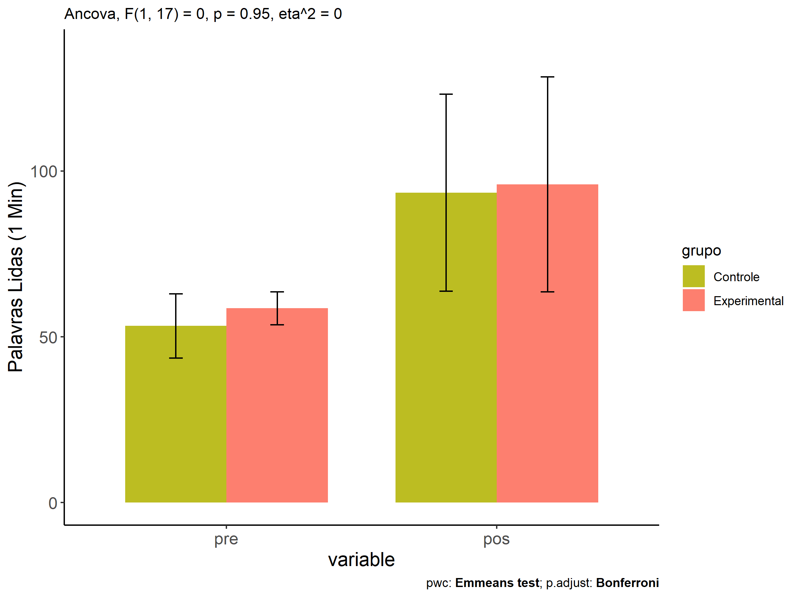
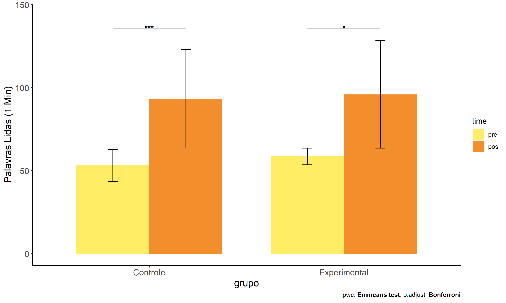
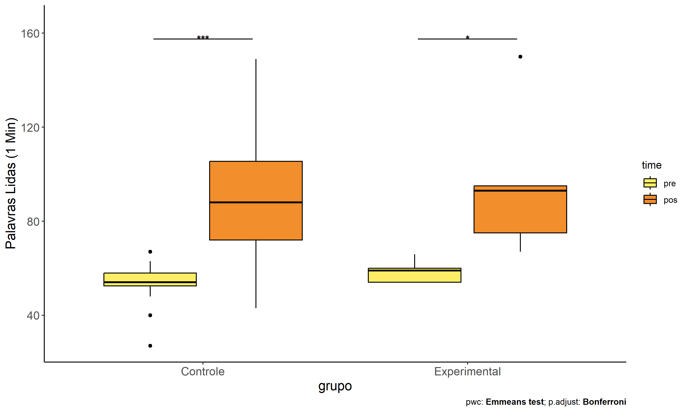

ANCOVA in Palavras Lidas (1 Min) (Palavras Lidas (1 Min))
================
Geiser C. Challco <geiser@alumni.usp.br>

- [Descriptive Statistics of Initial
  Data](#descriptive-statistics-of-initial-data)
- [Checking of Assumptions](#checking-of-assumptions)
  - [Assumption: Normality distribution of
    data](#assumption-normality-distribution-of-data)
  - [Assumption: Homogeneity of data
    distribution](#assumption-homogeneity-of-data-distribution)
- [Computation of ANCOVA test and Pairwise
  Comparison](#computation-of-ancova-test-and-pairwise-comparison)
  - [ANCOVA tests for one factor](#ancova-tests-for-one-factor)
  - [ANCOVA tests for two factors](#ancova-tests-for-two-factors)
  - [Pairwise comparisons for one factor:
    **grupo**](#pairwise-comparisons-for-one-factor-grupo)
  - [Pairwise comparisons for two
    factors](#pairwise-comparisons-for-two-factors)
    - [factores: **grupo:Sexo**](#factores-gruposexo)
    - [factores: **grupo:Zona**](#factores-grupozona)
    - [factores: **grupo:Cor.Raca**](#factores-grupocorraca)
    - [factores: **grupo:Serie**](#factores-gruposerie)

**NOTE**

- Teste ANCOVA para determinar se houve diferenças significativas no
  Palavras Lidas (1 Min) (medido usando pre- e pos-testes).
- ANCOVA test to determine whether there were significant differences in
  Palavras Lidas (1 Min) (measured using pre- and post-tests).

# Descriptive Statistics of Initial Data

| grupo        | Sexo | Zona   | Cor.Raca | Serie | variable              |   n |    mean | median | min | max |     sd |     se |      ci |   iqr |
|:-------------|:-----|:-------|:---------|:------|:----------------------|----:|--------:|-------:|----:|----:|-------:|-------:|--------:|------:|
| Controle     | F    |        |          |       | TFL.lidas.per.min.pre |   5 |  51.600 |   54.0 |  40 |  62 |  8.173 |  3.655 |  10.148 |  6.00 |
| Controle     | M    |        |          |       | TFL.lidas.per.min.pre |  10 |  54.100 |   54.5 |  27 |  67 | 10.651 |  3.368 |   7.619 |  4.00 |
| Experimental | F    |        |          |       | TFL.lidas.per.min.pre |   1 |  60.000 |   60.0 |  60 |  60 |        |        |         |  0.00 |
| Experimental | M    |        |          |       | TFL.lidas.per.min.pre |   4 |  58.250 |   56.5 |  54 |  66 |  5.679 |  2.839 |   9.036 |  6.75 |
| Controle     | F    |        |          |       | TFL.lidas.per.min.pos |   5 | 105.800 |  102.0 |  88 | 135 | 17.541 |  7.845 |  21.780 |  6.00 |
| Controle     | M    |        |          |       | TFL.lidas.per.min.pos |  10 |  87.300 |   76.0 |  43 | 149 | 33.317 | 10.536 |  23.833 | 33.00 |
| Experimental | F    |        |          |       | TFL.lidas.per.min.pos |   1 | 150.000 |  150.0 | 150 | 150 |        |        |         |  0.00 |
| Experimental | M    |        |          |       | TFL.lidas.per.min.pos |   4 |  82.500 |   84.0 |  67 |  95 | 13.699 |  6.850 |  21.798 | 20.50 |
| Controle     |      | Rural  |          |       | TFL.lidas.per.min.pre |  11 |  52.364 |   54.0 |  27 |  67 | 10.745 |  3.240 |   7.219 |  4.00 |
| Controle     |      | Urbana |          |       | TFL.lidas.per.min.pre |   1 |  48.000 |   48.0 |  48 |  48 |        |        |         |  0.00 |
| Controle     |      |        |          |       | TFL.lidas.per.min.pre |   3 |  58.333 |   58.0 |  54 |  63 |  4.509 |  2.603 |  11.202 |  4.50 |
| Experimental |      | Rural  |          |       | TFL.lidas.per.min.pre |   4 |  59.750 |   59.5 |  54 |  66 |  4.924 |  2.462 |   7.836 |  3.75 |
| Experimental |      |        |          |       | TFL.lidas.per.min.pre |   1 |  54.000 |   54.0 |  54 |  54 |        |        |         |  0.00 |
| Controle     |      | Rural  |          |       | TFL.lidas.per.min.pos |  11 |  94.091 |   99.0 |  43 | 149 | 31.063 |  9.366 |  20.868 | 33.50 |
| Controle     |      | Urbana |          |       | TFL.lidas.per.min.pos |   1 |  88.000 |   88.0 |  88 |  88 |        |        |         |  0.00 |
| Controle     |      |        |          |       | TFL.lidas.per.min.pos |   3 |  93.000 |   76.0 |  68 | 135 | 36.592 | 21.127 |  90.900 | 33.50 |
| Experimental |      | Rural  |          |       | TFL.lidas.per.min.pos |   4 | 103.250 |   94.0 |  75 | 150 | 32.438 | 16.219 |  51.617 | 20.25 |
| Experimental |      |        |          |       | TFL.lidas.per.min.pos |   1 |  67.000 |   67.0 |  67 |  67 |        |        |         |  0.00 |
| Controle     |      |        | Parda    |       | TFL.lidas.per.min.pre |   6 |  53.167 |   54.0 |  27 |  67 | 13.963 |  5.700 |  14.653 |  6.75 |
| Controle     |      |        |          |       | TFL.lidas.per.min.pre |   9 |  53.333 |   54.0 |  40 |  62 |  6.461 |  2.154 |   4.967 |  7.00 |
| Experimental |      |        | Indígena |       | TFL.lidas.per.min.pre |   1 |  54.000 |   54.0 |  54 |  54 |        |        |         |  0.00 |
| Experimental |      |        | Parda    |       | TFL.lidas.per.min.pre |   2 |  60.000 |   60.0 |  54 |  66 |  8.485 |  6.000 |  76.237 |  6.00 |
| Experimental |      |        |          |       | TFL.lidas.per.min.pre |   2 |  59.500 |   59.5 |  59 |  60 |  0.707 |  0.500 |   6.353 |  0.50 |
| Controle     |      |        | Parda    |       | TFL.lidas.per.min.pos |   6 |  76.167 |   72.0 |  43 | 106 | 23.250 |  9.492 |  24.399 | 27.50 |
| Controle     |      |        |          |       | TFL.lidas.per.min.pos |   9 | 105.000 |  102.0 |  68 | 149 | 28.866 |  9.622 |  22.188 | 49.00 |
| Experimental |      |        | Indígena |       | TFL.lidas.per.min.pos |   1 |  67.000 |   67.0 |  67 |  67 |        |        |         |  0.00 |
| Experimental |      |        | Parda    |       | TFL.lidas.per.min.pos |   2 |  84.000 |   84.0 |  75 |  93 | 12.728 |  9.000 | 114.356 |  9.00 |
| Experimental |      |        |          |       | TFL.lidas.per.min.pos |   2 | 122.500 |  122.5 |  95 | 150 | 38.891 | 27.500 | 349.421 | 27.50 |
| Controle     |      |        |          | 6 ano | TFL.lidas.per.min.pre |   6 |  49.000 |   51.0 |  27 |  67 | 14.114 |  5.762 |  14.812 | 15.00 |
| Controle     |      |        |          | 7 ano | TFL.lidas.per.min.pre |   2 |  58.000 |   58.0 |  54 |  62 |  5.657 |  4.000 |  50.825 |  4.00 |
| Controle     |      |        |          | 8 ano | TFL.lidas.per.min.pre |   3 |  53.333 |   54.0 |  51 |  55 |  2.082 |  1.202 |   5.171 |  2.00 |
| Controle     |      |        |          | 9 ano | TFL.lidas.per.min.pre |   4 |  57.250 |   56.0 |  54 |  63 |  4.272 |  2.136 |   6.798 |  5.25 |
| Experimental |      |        |          | 6 ano | TFL.lidas.per.min.pre |   2 |  59.500 |   59.5 |  59 |  60 |  0.707 |  0.500 |   6.353 |  0.50 |
| Experimental |      |        |          | 7 ano | TFL.lidas.per.min.pre |   1 |  66.000 |   66.0 |  66 |  66 |        |        |         |  0.00 |
| Experimental |      |        |          | 8 ano | TFL.lidas.per.min.pre |   2 |  54.000 |   54.0 |  54 |  54 |  0.000 |  0.000 |   0.000 |  0.00 |
| Controle     |      |        |          | 6 ano | TFL.lidas.per.min.pos |   6 |  74.167 |   72.0 |  43 | 105 | 21.160 |  8.639 |  22.207 | 19.25 |
| Controle     |      |        |          | 7 ano | TFL.lidas.per.min.pos |   2 | 100.500 |  100.5 |  99 | 102 |  2.121 |  1.500 |  19.059 |  1.50 |
| Controle     |      |        |          | 8 ano | TFL.lidas.per.min.pos |   3 | 119.000 |  135.0 |  86 | 136 | 28.583 | 16.503 |  71.005 | 25.00 |
| Controle     |      |        |          | 9 ano | TFL.lidas.per.min.pos |   4 |  99.750 |   91.0 |  68 | 149 | 36.682 | 18.341 |  58.370 | 42.75 |
| Experimental |      |        |          | 6 ano | TFL.lidas.per.min.pos |   2 | 122.500 |  122.5 |  95 | 150 | 38.891 | 27.500 | 349.421 | 27.50 |
| Experimental |      |        |          | 7 ano | TFL.lidas.per.min.pos |   1 |  93.000 |   93.0 |  93 |  93 |        |        |         |  0.00 |
| Experimental |      |        |          | 8 ano | TFL.lidas.per.min.pos |   2 |  71.000 |   71.0 |  67 |  75 |  5.657 |  4.000 |  50.825 |  4.00 |

# Checking of Assumptions

## Assumption: Normality distribution of data

| var                   |   n |  skewness |   kurtosis | symmetry | statistic | method       |         p | p.signif | normality |
|:----------------------|----:|----------:|-----------:|:---------|----------:|:-------------|----------:|:---------|:----------|
| TFL.lidas.per.min.pos |  20 | 1.0540429 |  0.3424717 | NO       | 0.8995780 | Shapiro-Wilk | 0.0404945 | \*       | NO        |
| TFL.lidas.per.min.pos |  16 | 0.5016002 | -0.9800421 | NO       | 0.9403381 | Shapiro-Wilk | 0.3531761 | ns       | YES       |
| TFL.lidas.per.min.pos |   9 | 0.5346006 | -1.1024801 | NO       | 0.9250889 | Shapiro-Wilk | 0.4360275 | ns       | YES       |
| TFL.lidas.per.min.pos |  20 | 0.2288300 | -0.6607020 | YES      | 0.9569322 | Shapiro-Wilk | 0.4845291 | ns       | YES       |

## Assumption: Homogeneity of data distribution

| var                   | method         | formula                    |   n | DFn.df1 | DFd.df2 | statistic |         p | p.signif |
|:----------------------|:---------------|:---------------------------|----:|--------:|--------:|----------:|----------:|:---------|
| TFL.lidas.per.min.pos | Levene’s test  | `.res`~`grupo`\*`Sexo`     |  20 |       3 |      16 | 0.7402805 | 0.5434060 | ns       |
| TFL.lidas.per.min.pos | Anova’s slopes | `.res`~`grupo`\*`Sexo`     |  20 |       2 |      13 | 0.1120000 | 0.8950000 | ns       |
| TFL.lidas.per.min.pos | Levene’s test  | `.res`~`grupo`\*`Zona`     |  16 |       2 |      13 | 0.6696373 | 0.5286949 | ns       |
| TFL.lidas.per.min.pos | Anova’s slopes | `.res`~`grupo`\*`Zona`     |  16 |       1 |      11 | 0.0420000 | 0.8420000 | ns       |
| TFL.lidas.per.min.pos | Levene’s test  | `.res`~`grupo`\*`Cor.Raca` |   9 |       2 |       6 | 0.6363941 | 0.5615015 | ns       |
| TFL.lidas.per.min.pos | Anova’s slopes | `.res`~`grupo`\*`Cor.Raca` |   9 |       1 |       4 | 0.0680000 | 0.8080000 | ns       |
| TFL.lidas.per.min.pos | Levene’s test  | `.res`~`grupo`\*`Serie`    |  20 |       6 |      13 | 1.0683638 | 0.4287906 | ns       |
| TFL.lidas.per.min.pos | Anova’s slopes | `.res`~`grupo`\*`Serie`    |  20 |       4 |       8 | 2.4800000 | 0.1280000 | ns       |

# Computation of ANCOVA test and Pairwise Comparison

## ANCOVA tests for one factor

|     | Effect                | DFn | DFd |      SSn |       SSd |     F |     p |   ges | p\<.05 |
|:----|:----------------------|----:|----:|---------:|----------:|------:|------:|------:|:-------|
| 1   | TFL.lidas.per.min.pre |   1 |  17 |  642.450 | 15927.284 | 0.686 | 0.419 | 0.039 |        |
| 2   | grupo                 |   1 |  17 |    3.984 | 15927.284 | 0.004 | 0.949 | 0.000 |        |
| 4   | Sexo                  |   1 |  17 | 3522.524 | 12408.744 | 4.826 | 0.042 | 0.221 | \*     |
| 6   | Zona                  |   1 |  13 |    8.010 | 11978.297 | 0.009 | 0.927 | 0.001 |        |
| 8   | Cor.Raca              |   1 |   6 |   95.914 |  2170.571 | 0.265 | 0.625 | 0.042 |        |
| 10  | Serie                 |   3 |  15 |  556.685 | 15374.583 | 0.181 | 0.908 | 0.035 |        |

## ANCOVA tests for two factors

|     | Effect                | DFn | DFd |      SSn |       SSd |     F |     p |   ges | p\<.05 |
|:----|:----------------------|----:|----:|---------:|----------:|------:|------:|------:|:-------|
| 1   | TFL.lidas.per.min.pre |   1 |  15 |  737.781 | 11046.119 | 1.002 | 0.333 | 0.063 |        |
| 4   | grupo:Sexo            |   1 |  15 | 1347.769 | 11046.119 | 1.830 | 0.196 | 0.109 |        |
| 8   | grupo:Zona            |   0 |  12 |          | 11954.803 |       |       |       |        |
| 12  | grupo:Cor.Raca        |   0 |   5 |          |  2163.515 |       |       |       |        |
| 16  | grupo:Serie           |   2 |  12 | 5915.352 |  9457.773 | 3.753 | 0.054 | 0.385 |        |

## Pairwise comparisons for one factor: **grupo**

| var                   | grupo        |   n | M (pre) | SE (pre) | M (unadj) | SE (unadj) | M (adj) | SE (adj) |
|:----------------------|:-------------|----:|--------:|---------:|----------:|-----------:|--------:|---------:|
| TFL.lidas.per.min.pos | Controle     |  15 |  53.267 |    2.497 |    93.467 |      7.672 |  94.367 |    7.978 |
| TFL.lidas.per.min.pos | Experimental |   5 |  58.600 |    2.227 |    96.000 |     14.505 |  93.298 |   14.072 |

| .y.                   | group1   | group2       | estimate | conf.low | conf.high |     se | statistic |     p | p.adj | p.adj.signif |
|:----------------------|:---------|:-------------|---------:|---------:|----------:|-------:|----------:|------:|------:|:-------------|
| TFL.lidas.per.min.pos | Controle | Experimental |    1.069 |  -33.519 |    35.658 | 16.394 |     0.065 | 0.949 | 0.949 | ns           |
| TFL.lidas.per.min.pre | Controle | Experimental |   -5.333 |  -14.929 |     4.262 |  4.567 |    -1.168 | 0.258 | 0.258 | ns           |

| .y.               | grupo        | group1 | group2 | estimate | conf.low | conf.high |     se | statistic | p       | p.adj   | p.adj.signif |
|:------------------|:-------------|:-------|:-------|---------:|---------:|----------:|-------:|----------:|:--------|:--------|:-------------|
| TFL.lidas.per.min | Controle     | pre    | pos    |    -40.2 |  -56.749 |   -23.651 |  8.160 |    -4.927 | \<0.001 | \<0.001 | \*\*\*\*     |
| TFL.lidas.per.min | Experimental | pre    | pos    |    -37.4 |  -66.064 |    -8.736 | 14.133 |    -2.646 | 0.012   | 0.012   | \*           |

<!-- -->

<!-- -->

<!-- -->

<!-- -->

## Pairwise comparisons for two factors

### factores: **grupo:Sexo**

### factores: **grupo:Zona**

### factores: **grupo:Cor.Raca**

### factores: **grupo:Serie**
