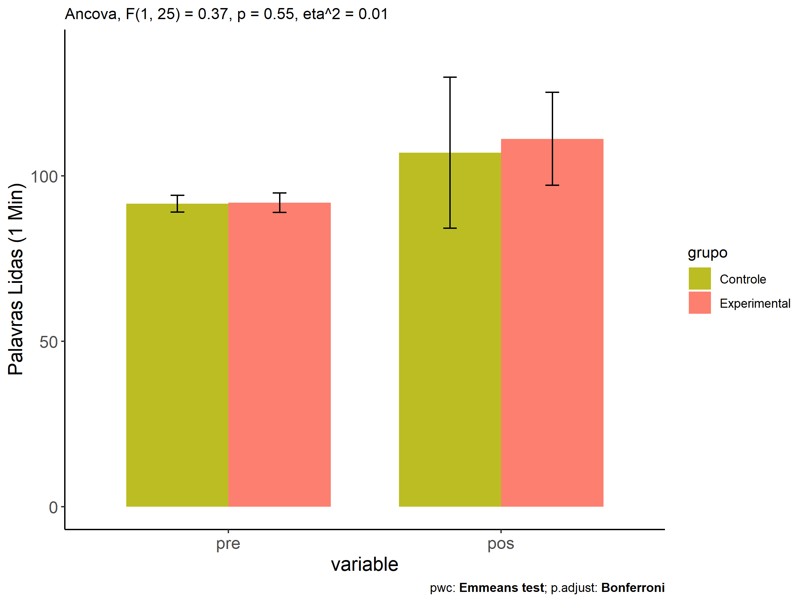
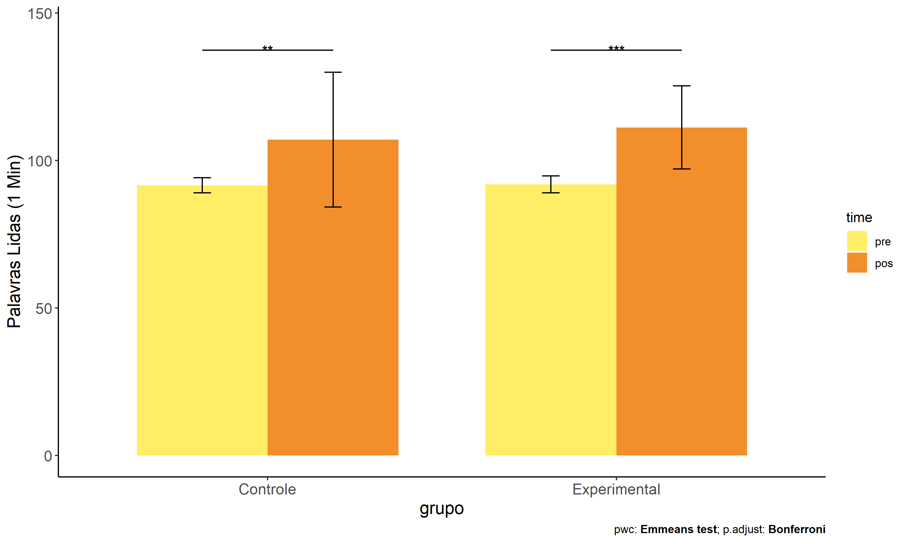
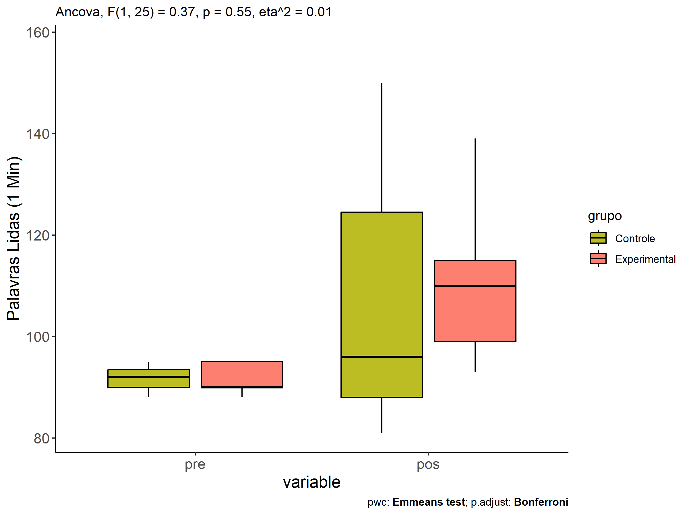
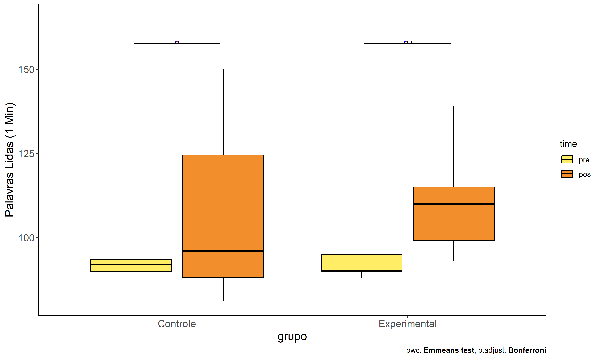
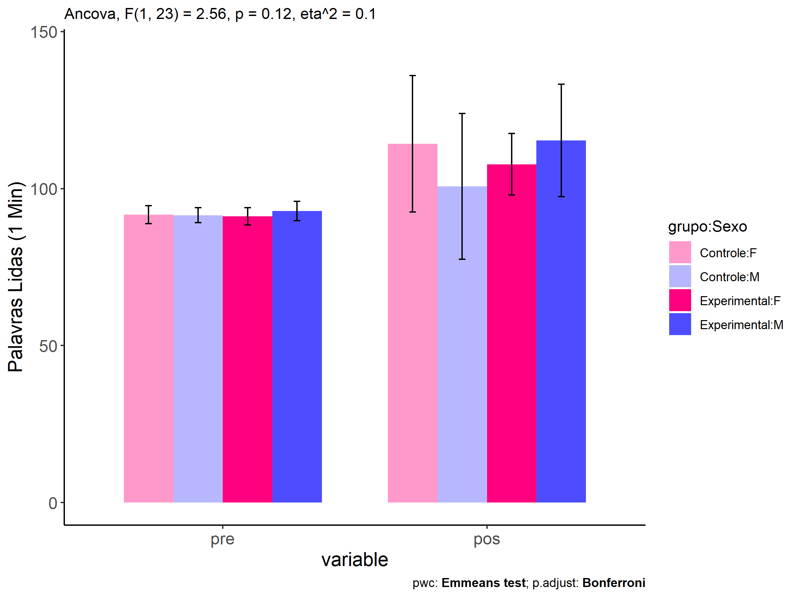
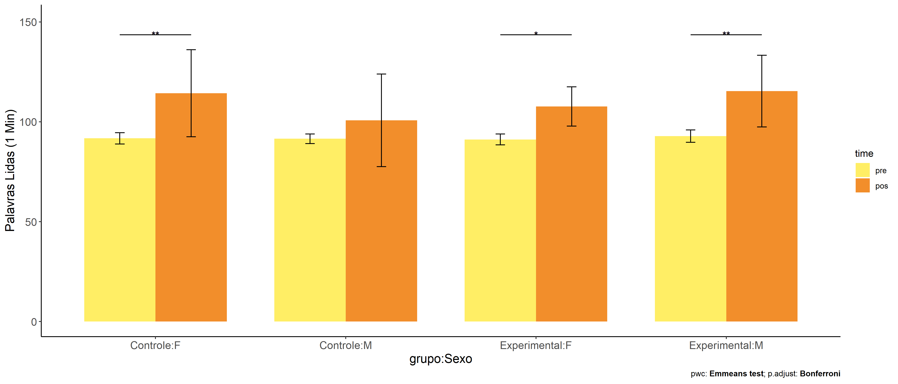
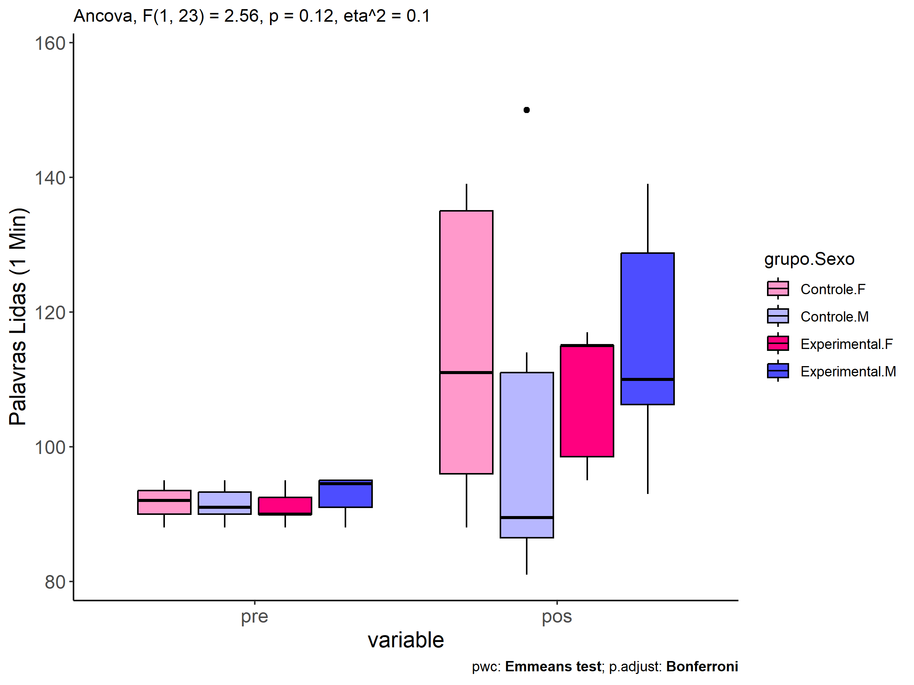
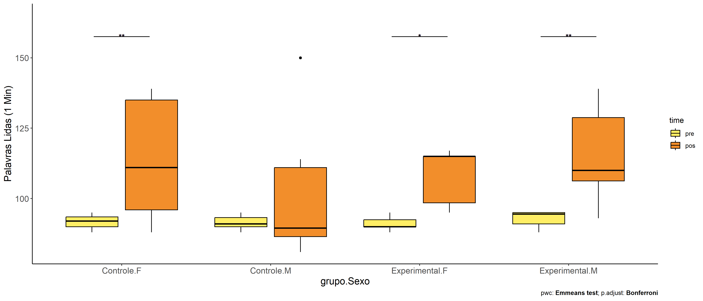

ANCOVA in Palavras Lidas (1 Min) (Palavras Lidas (1 Min))
================
Geiser C. Challco <geiser@alumni.usp.br>

- [Descriptive Statistics of Initial
  Data](#descriptive-statistics-of-initial-data)
- [Checking of Assumptions](#checking-of-assumptions)
  - [Assumption: Normality distribution of
    data](#assumption-normality-distribution-of-data)
  - [Assumption: Homogeneity of data
    distribution](#assumption-homogeneity-of-data-distribution)
- [Computation of ANCOVA test and Pairwise
  Comparison](#computation-of-ancova-test-and-pairwise-comparison)
  - [ANCOVA tests for one factor](#ancova-tests-for-one-factor)
  - [ANCOVA tests for two factors](#ancova-tests-for-two-factors)
  - [Pairwise comparisons for one factor:
    **grupo**](#pairwise-comparisons-for-one-factor-grupo)
  - [Pairwise comparisons for two
    factors](#pairwise-comparisons-for-two-factors)
    - [factores: **grupo:Sexo**](#factores-gruposexo)
    - [factores: **grupo:Zona**](#factores-grupozona)
    - [factores: **grupo:Cor.Raca**](#factores-grupocorraca)
    - [factores: **grupo:Serie**](#factores-gruposerie)

**NOTE**

- Teste ANCOVA para determinar se houve diferenças significativas no
  Palavras Lidas (1 Min) (medido usando pre- e pos-testes).
- ANCOVA test to determine whether there were significant differences in
  Palavras Lidas (1 Min) (measured using pre- and post-tests).

# Descriptive Statistics of Initial Data

| grupo        | Sexo | Zona   | Cor.Raca | Serie | variable              |   n |    mean | median | min | max |     sd |     se |      ci |   iqr |
|:-------------|:-----|:-------|:---------|:------|:----------------------|----:|--------:|-------:|----:|----:|-------:|-------:|--------:|------:|
| Controle     | F    |        |          |       | TFL.lidas.per.min.pre |   7 |  91.714 |   92.0 |  88 |  95 |  2.870 |  1.085 |   2.654 |  3.50 |
| Controle     | M    |        |          |       | TFL.lidas.per.min.pre |   8 |  91.500 |   91.0 |  88 |  95 |  2.390 |  0.845 |   1.998 |  3.25 |
| Experimental | F    |        |          |       | TFL.lidas.per.min.pre |   7 |  91.143 |   90.0 |  88 |  95 |  2.734 |  1.033 |   2.529 |  2.50 |
| Experimental | M    |        |          |       | TFL.lidas.per.min.pre |   6 |  92.833 |   94.5 |  88 |  95 |  3.061 |  1.249 |   3.212 |  4.00 |
| Controle     | F    |        |          |       | TFL.lidas.per.min.pos |   7 | 114.286 |  111.0 |  88 | 139 | 21.754 |  8.222 |  20.119 | 39.00 |
| Controle     | M    |        |          |       | TFL.lidas.per.min.pos |   8 | 100.750 |   89.5 |  81 | 150 | 23.212 |  8.207 |  19.406 | 24.50 |
| Experimental | F    |        |          |       | TFL.lidas.per.min.pos |   7 | 107.714 |  115.0 |  95 | 117 |  9.810 |  3.708 |   9.073 | 16.50 |
| Experimental | M    |        |          |       | TFL.lidas.per.min.pos |   6 | 115.333 |  110.0 |  93 | 139 | 17.941 |  7.324 |  18.828 | 22.50 |
| Controle     |      | Rural  |          |       | TFL.lidas.per.min.pre |  10 |  91.900 |   92.0 |  88 |  95 |  2.378 |  0.752 |   1.701 |  3.75 |
| Controle     |      | Urbana |          |       | TFL.lidas.per.min.pre |   1 |  88.000 |   88.0 |  88 |  88 |        |        |         |  0.00 |
| Controle     |      |        |          |       | TFL.lidas.per.min.pre |   4 |  91.750 |   92.0 |  88 |  95 |  2.872 |  1.436 |   4.570 |  1.75 |
| Experimental |      | Rural  |          |       | TFL.lidas.per.min.pre |   7 |  91.857 |   90.0 |  88 |  95 |  3.024 |  1.143 |   2.796 |  5.00 |
| Experimental |      | Urbana |          |       | TFL.lidas.per.min.pre |   3 |  91.667 |   90.0 |  90 |  95 |  2.887 |  1.667 |   7.171 |  2.50 |
| Experimental |      |        |          |       | TFL.lidas.per.min.pre |   3 |  92.333 |   94.0 |  88 |  95 |  3.786 |  2.186 |   9.405 |  3.50 |
| Controle     |      | Rural  |          |       | TFL.lidas.per.min.pos |  10 | 103.400 |   92.0 |  81 | 150 | 23.486 |  7.427 |  16.801 | 25.75 |
| Controle     |      | Urbana |          |       | TFL.lidas.per.min.pos |   1 | 135.000 |  135.0 | 135 | 135 |        |        |         |  0.00 |
| Controle     |      |        |          |       | TFL.lidas.per.min.pos |   4 | 109.250 |  103.5 |  91 | 139 | 21.577 | 10.789 |  34.334 | 23.25 |
| Experimental |      | Rural  |          |       | TFL.lidas.per.min.pos |   7 | 106.857 |  110.0 |  93 | 117 |  8.783 |  3.320 |   8.123 | 11.00 |
| Experimental |      | Urbana |          |       | TFL.lidas.per.min.pos |   3 | 109.667 |  115.0 |  99 | 115 |  9.238 |  5.333 |  22.947 |  8.00 |
| Experimental |      |        |          |       | TFL.lidas.per.min.pos |   3 | 123.000 |  135.0 |  95 | 139 | 24.331 | 14.048 |  60.442 | 22.00 |
| Controle     |      |        | Branca   |       | TFL.lidas.per.min.pre |   5 |  91.400 |   92.0 |  90 |  93 |  1.342 |  0.600 |   1.666 |  2.00 |
| Controle     |      |        | Parda    |       | TFL.lidas.per.min.pre |   7 |  92.714 |   94.0 |  88 |  95 |  2.812 |  1.063 |   2.600 |  4.00 |
| Controle     |      |        |          |       | TFL.lidas.per.min.pre |   3 |  89.333 |   88.0 |  88 |  92 |  2.309 |  1.333 |   5.737 |  2.00 |
| Experimental |      |        | Branca   |       | TFL.lidas.per.min.pre |   2 |  95.000 |   95.0 |  95 |  95 |  0.000 |  0.000 |   0.000 |  0.00 |
| Experimental |      |        | Parda    |       | TFL.lidas.per.min.pre |   3 |  88.667 |   88.0 |  88 |  90 |  1.155 |  0.667 |   2.868 |  1.00 |
| Experimental |      |        |          |       | TFL.lidas.per.min.pre |   8 |  92.375 |   92.0 |  90 |  95 |  2.560 |  0.905 |   2.140 |  5.00 |
| Controle     |      |        | Branca   |       | TFL.lidas.per.min.pos |   5 | 111.400 |  110.0 |  87 | 150 | 24.141 | 10.796 |  29.975 | 18.00 |
| Controle     |      |        | Parda    |       | TFL.lidas.per.min.pos |   7 |  91.429 |   88.0 |  81 | 111 |  9.813 |  3.709 |   9.075 |  7.00 |
| Controle     |      |        |          |       | TFL.lidas.per.min.pos |   3 | 136.333 |  135.0 | 135 | 139 |  2.309 |  1.333 |   5.737 |  2.00 |
| Experimental |      |        | Branca   |       | TFL.lidas.per.min.pos |   2 | 110.000 |  110.0 | 110 | 110 |  0.000 |  0.000 |   0.000 |  0.00 |
| Experimental |      |        | Parda    |       | TFL.lidas.per.min.pos |   3 | 105.667 |  105.0 |  95 | 117 | 11.015 |  6.360 |  27.363 | 11.00 |
| Experimental |      |        |          |       | TFL.lidas.per.min.pos |   8 | 113.625 |  115.0 |  93 | 139 | 16.860 |  5.961 |  14.096 | 21.25 |
| Controle     |      |        |          | 6 ano | TFL.lidas.per.min.pre |   8 |  91.500 |   92.0 |  88 |  95 |  2.619 |  0.926 |   2.189 |  3.75 |
| Controle     |      |        |          | 7 ano | TFL.lidas.per.min.pre |   2 |  90.000 |   90.0 |  90 |  90 |  0.000 |  0.000 |   0.000 |  0.00 |
| Controle     |      |        |          | 8 ano | TFL.lidas.per.min.pre |   2 |  91.500 |   91.5 |  88 |  95 |  4.950 |  3.500 |  44.472 |  3.50 |
| Controle     |      |        |          | 9 ano | TFL.lidas.per.min.pre |   3 |  93.000 |   92.0 |  92 |  95 |  1.732 |  1.000 |   4.303 |  1.50 |
| Experimental |      |        |          | 6 ano | TFL.lidas.per.min.pre |   5 |  91.600 |   90.0 |  88 |  95 |  3.209 |  1.435 |   3.985 |  5.00 |
| Experimental |      |        |          | 7 ano | TFL.lidas.per.min.pre |   2 |  90.000 |   90.0 |  90 |  90 |  0.000 |  0.000 |   0.000 |  0.00 |
| Experimental |      |        |          | 8 ano | TFL.lidas.per.min.pre |   3 |  93.333 |   95.0 |  90 |  95 |  2.887 |  1.667 |   7.171 |  2.50 |
| Experimental |      |        |          | 9 ano | TFL.lidas.per.min.pre |   3 |  92.333 |   94.0 |  88 |  95 |  3.786 |  2.186 |   9.405 |  3.50 |
| Controle     |      |        |          | 6 ano | TFL.lidas.per.min.pos |   8 | 104.500 |   96.0 |  85 | 135 | 20.887 |  7.385 |  17.462 | 31.50 |
| Controle     |      |        |          | 7 ano | TFL.lidas.per.min.pos |   2 | 119.000 |  119.0 |  88 | 150 | 43.841 | 31.000 | 393.892 | 31.00 |
| Controle     |      |        |          | 8 ano | TFL.lidas.per.min.pos |   2 |  86.000 |   86.0 |  81 |  91 |  7.071 |  5.000 |  63.531 |  5.00 |
| Controle     |      |        |          | 9 ano | TFL.lidas.per.min.pos |   3 | 120.000 |  111.0 | 110 | 139 | 16.462 |  9.504 |  40.894 | 14.50 |
| Experimental |      |        |          | 6 ano | TFL.lidas.per.min.pos |   5 | 106.800 |  105.0 |  98 | 117 |  8.843 |  3.955 |  10.980 | 16.00 |
| Experimental |      |        |          | 7 ano | TFL.lidas.per.min.pos |   2 | 104.000 |  104.0 |  93 | 115 | 15.556 | 11.000 | 139.768 | 11.00 |
| Experimental |      |        |          | 8 ano | TFL.lidas.per.min.pos |   3 | 120.000 |  115.0 | 110 | 135 | 13.229 |  7.638 |  32.862 | 12.50 |
| Experimental |      |        |          | 9 ano | TFL.lidas.per.min.pos |   3 | 114.667 |  110.0 |  95 | 139 | 22.368 | 12.914 |  55.566 | 22.00 |

# Checking of Assumptions

## Assumption: Normality distribution of data

| var                   |   n |  skewness |   kurtosis | symmetry | statistic | method       |         p | p.signif | normality |
|:----------------------|----:|----------:|-----------:|:---------|----------:|:-------------|----------:|:---------|:----------|
| TFL.lidas.per.min.pos |  28 | 0.6234234 | -0.2678809 | NO       | 0.9393261 | Shapiro-Wilk | 0.1062555 | ns       | YES       |
| TFL.lidas.per.min.pos |  21 | 0.6958593 |  0.4413379 | NO       | 0.9440961 | Shapiro-Wilk | 0.2622802 | ns       | YES       |
| TFL.lidas.per.min.pos |  17 | 0.9896978 |  1.3304008 | NO       | 0.9035977 | Shapiro-Wilk | 0.0780407 | ns       | YES       |
| TFL.lidas.per.min.pos |  28 | 0.2101754 | -0.7538118 | YES      | 0.9667305 | Shapiro-Wilk | 0.4961761 | ns       | YES       |

## Assumption: Homogeneity of data distribution

| var                   | method         | formula                    |   n | DFn.df1 | DFd.df2 | statistic |         p | p.signif |
|:----------------------|:---------------|:---------------------------|----:|--------:|--------:|----------:|----------:|:---------|
| TFL.lidas.per.min.pos | Levene’s test  | `.res`~`grupo`\*`Sexo`     |  28 |       3 |      24 | 0.7376929 | 0.5398820 | ns       |
| TFL.lidas.per.min.pos | Anova’s slopes | `.res`~`grupo`\*`Sexo`     |  28 |       3 |      20 | 1.8040000 | 0.1790000 | ns       |
| TFL.lidas.per.min.pos | Levene’s test  | `.res`~`grupo`\*`Zona`     |  21 |       3 |      17 | 1.6416190 | 0.2171198 | ns       |
| TFL.lidas.per.min.pos | Anova’s slopes | `.res`~`grupo`\*`Zona`     |  21 |       2 |      14 | 1.5880000 | 0.2390000 | ns       |
| TFL.lidas.per.min.pos | Levene’s test  | `.res`~`grupo`\*`Cor.Raca` |  17 |       3 |      13 | 1.3918521 | 0.2894306 | ns       |
| TFL.lidas.per.min.pos | Anova’s slopes | `.res`~`grupo`\*`Cor.Raca` |  17 |       2 |      10 | 0.5010000 | 0.6200000 | ns       |
| TFL.lidas.per.min.pos | Levene’s test  | `.res`~`grupo`\*`Serie`    |  28 |       7 |      20 | 1.6206518 | 0.1868832 | ns       |
| TFL.lidas.per.min.pos | Anova’s slopes | `.res`~`grupo`\*`Serie`    |  28 |       5 |      14 | 1.1490000 | 0.3810000 | ns       |

# Computation of ANCOVA test and Pairwise Comparison

## ANCOVA tests for one factor

|     | Effect                | DFn | DFd |      SSn |      SSd |     F |     p |   ges | p\<.05 |
|:----|:----------------------|----:|----:|---------:|---------:|------:|------:|------:|:-------|
| 1   | TFL.lidas.per.min.pre |   1 |  25 |  194.233 | 9475.008 | 0.512 | 0.481 | 0.020 |        |
| 2   | grupo                 |   1 |  25 |  139.886 | 9475.008 | 0.369 | 0.549 | 0.015 |        |
| 4   | Sexo                  |   1 |  25 |   81.433 | 9533.461 | 0.214 | 0.648 | 0.008 |        |
| 6   | Zona                  |   1 |  18 |  177.371 | 4743.822 | 0.673 | 0.423 | 0.036 |        |
| 8   | Cor.Raca              |   1 |  14 | 1059.664 | 3452.691 | 4.297 | 0.057 | 0.235 |        |
| 10  | Serie                 |   3 |  23 |  730.615 | 8884.279 | 0.630 | 0.603 | 0.076 |        |

## ANCOVA tests for two factors

|     | Effect                | DFn | DFd |      SSn |      SSd |     F |     p |   ges | p\<.05 |
|:----|:----------------------|----:|----:|---------:|---------:|------:|------:|------:|:-------|
| 1   | TFL.lidas.per.min.pre |   1 |  23 |  330.897 | 8466.794 | 0.899 | 0.353 | 0.038 |        |
| 4   | grupo:Sexo            |   1 |  23 |  942.533 | 8466.794 | 2.560 | 0.123 | 0.100 |        |
| 8   | grupo:Zona            |   1 |  16 |  190.610 | 4550.590 | 0.670 | 0.425 | 0.040 |        |
| 12  | grupo:Cor.Raca        |   1 |  12 |  130.556 | 3149.931 | 0.497 | 0.494 | 0.040 |        |
| 16  | grupo:Serie           |   3 |  19 | 1818.413 | 6960.117 | 1.655 | 0.210 | 0.207 |        |

## Pairwise comparisons for one factor: **grupo**

| var                   | grupo        |   n | M (pre) | SE (pre) | M (unadj) | SE (unadj) | M (adj) | SE (adj) |
|:----------------------|:-------------|----:|--------:|---------:|----------:|-----------:|--------:|---------:|
| TFL.lidas.per.min.pos | Controle     |  15 |  91.600 |    0.653 |   107.067 |      5.894 | 106.915 |    5.031 |
| TFL.lidas.per.min.pos | Experimental |  13 |  91.923 |    0.804 |   111.231 |      3.901 | 111.406 |    5.405 |

| .y.                   | group1   | group2       | estimate | conf.low | conf.high |    se | statistic |     p | p.adj | p.adj.signif |
|:----------------------|:---------|:-------------|---------:|---------:|----------:|------:|----------:|------:|------:|:-------------|
| TFL.lidas.per.min.pos | Controle | Experimental |   -4.490 |  -19.713 |    10.732 | 7.391 |    -0.608 | 0.549 | 0.549 | ns           |
| TFL.lidas.per.min.pre | Controle | Experimental |   -0.323 |   -2.432 |     1.785 | 1.026 |    -0.315 | 0.755 | 0.755 | ns           |

| .y.               | grupo        | group1 | group2 | estimate | conf.low | conf.high |    se | statistic | p       | p.adj   | p.adj.signif |
|:------------------|:-------------|:-------|:-------|---------:|---------:|----------:|------:|----------:|:--------|:--------|:-------------|
| TFL.lidas.per.min | Controle     | pre    | pos    |  -15.467 |  -25.556 |    -5.377 | 5.028 |    -3.076 | 0.003   | 0.003   | \*\*         |
| TFL.lidas.per.min | Experimental | pre    | pos    |  -19.308 |  -30.146 |    -8.470 | 5.401 |    -3.575 | \<0.001 | \<0.001 | \*\*\*       |

<!-- -->

<!-- -->

<!-- -->

<!-- -->

## Pairwise comparisons for two factors

### factores: **grupo:Sexo**

| var                   | grupo        | Sexo |   n | M (pre) | SE (pre) | M (unadj) | SE (unadj) | M (adj) | SE (adj) |
|:----------------------|:-------------|:-----|----:|--------:|---------:|----------:|-----------:|--------:|---------:|
| TFL.lidas.per.min.pos | Controle     | F    |   7 |  91.714 |    1.085 |   114.286 |      8.222 | 114.237 |    7.252 |
| TFL.lidas.per.min.pos | Controle     | M    |   8 |  91.500 |    0.845 |   100.750 |      8.207 | 100.412 |    6.793 |
| TFL.lidas.per.min.pos | Experimental | F    |   7 |  91.143 |    1.033 |   107.714 |      3.708 | 106.894 |    7.303 |
| TFL.lidas.per.min.pos | Experimental | M    |   6 |  92.833 |    1.249 |   115.333 |      7.324 | 116.798 |    7.984 |

| .y.                   | grupo        | Sexo | group1   | group2       | estimate | conf.low | conf.high |     se | statistic |     p | p.adj | p.adj.signif |
|:----------------------|:-------------|:-----|:---------|:-------------|---------:|---------:|----------:|-------:|----------:|------:|------:|:-------------|
| TFL.lidas.per.min.pos |              | F    | Controle | Experimental |    7.344 |  -13.938 |    28.626 | 10.288 |     0.714 | 0.483 | 0.483 | ns           |
| TFL.lidas.per.min.pos |              | M    | Controle | Experimental |  -16.386 |  -38.178 |     5.407 | 10.535 |    -1.555 | 0.134 | 0.134 | ns           |
| TFL.lidas.per.min.pre |              | F    | Controle | Experimental |    0.571 |   -2.459 |     3.602 |  1.468 |     0.389 | 0.701 | 0.701 | ns           |
| TFL.lidas.per.min.pre |              | M    | Controle | Experimental |   -1.333 |   -4.395 |     1.729 |  1.484 |    -0.899 | 0.378 | 0.378 | ns           |
| TFL.lidas.per.min.pos | Controle     |      | F        | M            |   13.825 |   -6.726 |    34.377 |  9.935 |     1.392 | 0.177 | 0.177 | ns           |
| TFL.lidas.per.min.pos | Experimental |      | F        | M            |   -9.904 |  -32.541 |    12.733 | 10.943 |    -0.905 | 0.375 | 0.375 | ns           |
| TFL.lidas.per.min.pre | Controle     |      | F        | M            |    0.214 |   -2.720 |     3.149 |  1.422 |     0.151 | 0.881 | 0.881 | ns           |
| TFL.lidas.per.min.pre | Experimental |      | F        | M            |   -1.690 |   -4.845 |     1.464 |  1.528 |    -1.106 | 0.280 | 0.280 | ns           |

| .y.               | grupo        | Sexo | group1 | group2 | estimate | conf.low | conf.high |    se | statistic |     p | p.adj | p.adj.signif |
|:------------------|:-------------|:-----|:-------|:-------|---------:|---------:|----------:|------:|----------:|------:|------:|:-------------|
| TFL.lidas.per.min | Controle     | F    | pre    | pos    |  -22.571 |  -37.270 |    -7.872 | 7.311 |    -3.087 | 0.003 | 0.003 | \*\*         |
| TFL.lidas.per.min | Controle     | M    | pre    | pos    |   -9.250 |  -23.000 |     4.500 | 6.838 |    -1.353 | 0.183 | 0.183 | ns           |
| TFL.lidas.per.min | Experimental | F    | pre    | pos    |  -16.571 |  -31.270 |    -1.872 | 7.311 |    -2.267 | 0.028 | 0.028 | \*           |
| TFL.lidas.per.min | Experimental | M    | pre    | pos    |  -22.500 |  -38.377 |    -6.623 | 7.896 |    -2.849 | 0.006 | 0.006 | \*\*         |

<!-- -->

<!-- -->

<!-- -->

<!-- -->

### factores: **grupo:Zona**

### factores: **grupo:Cor.Raca**

### factores: **grupo:Serie**
