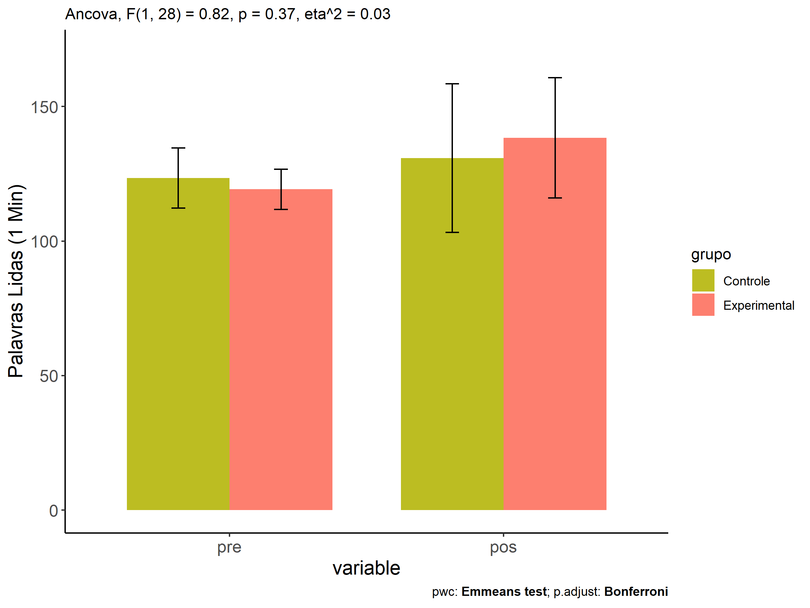
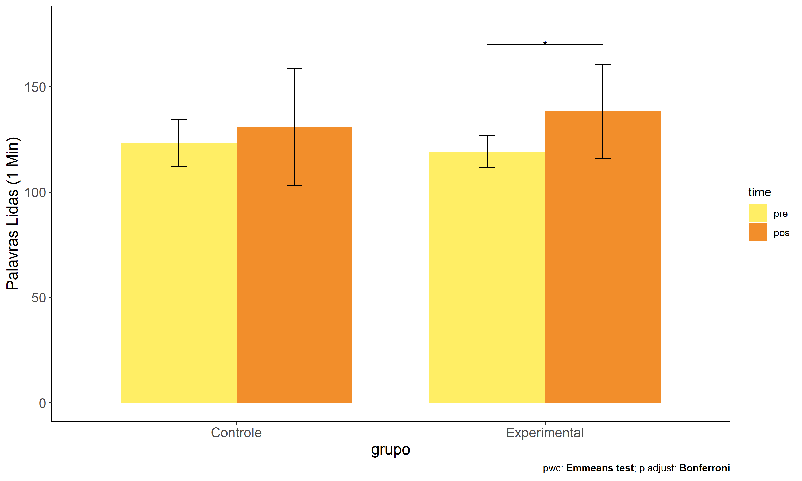
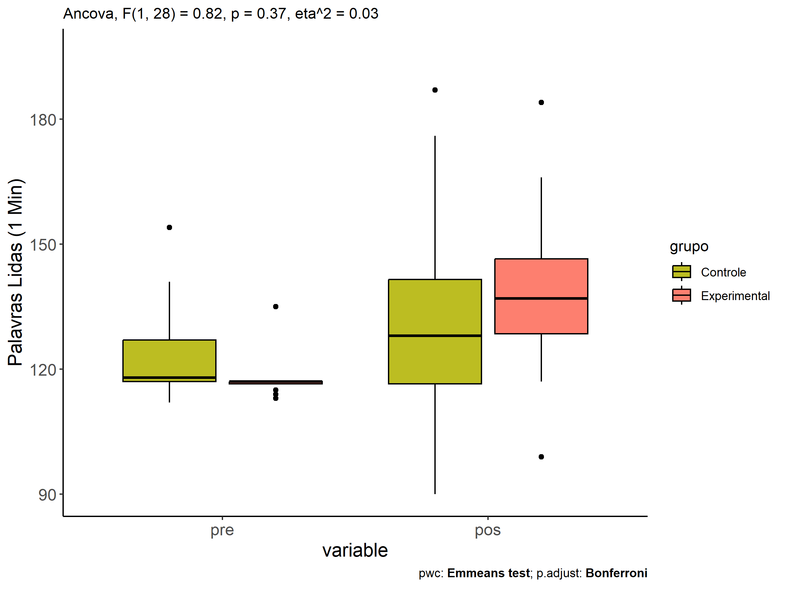
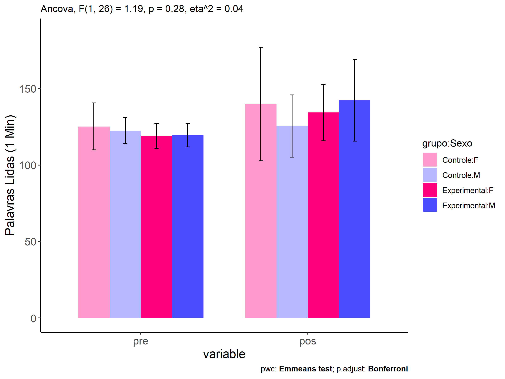
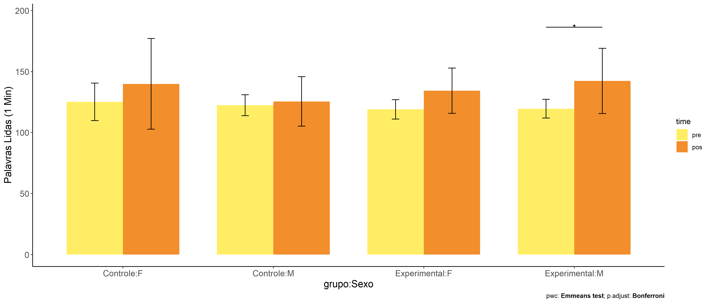
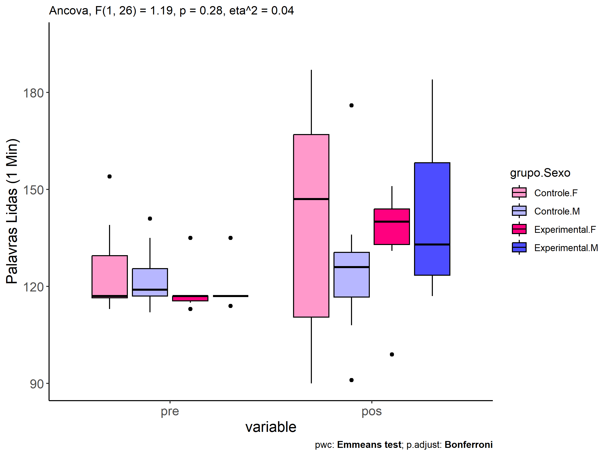
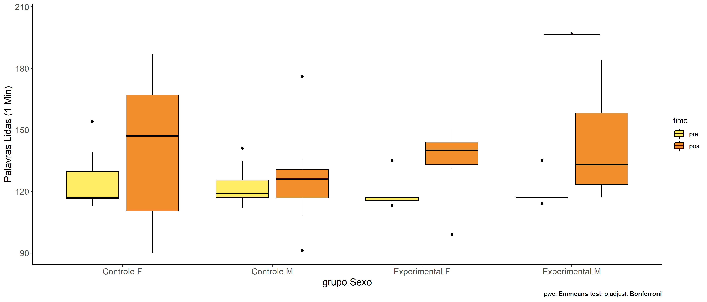

ANCOVA in Palavras Lidas (1 Min) (Palavras Lidas (1 Min))
================
Geiser C. Challco <geiser@alumni.usp.br>

- [Descriptive Statistics of Initial
  Data](#descriptive-statistics-of-initial-data)
- [Checking of Assumptions](#checking-of-assumptions)
  - [Assumption: Normality distribution of
    data](#assumption-normality-distribution-of-data)
  - [Assumption: Homogeneity of data
    distribution](#assumption-homogeneity-of-data-distribution)
- [Computation of ANCOVA test and Pairwise
  Comparison](#computation-of-ancova-test-and-pairwise-comparison)
  - [ANCOVA tests for one factor](#ancova-tests-for-one-factor)
  - [ANCOVA tests for two factors](#ancova-tests-for-two-factors)
  - [Pairwise comparisons for one factor:
    **grupo**](#pairwise-comparisons-for-one-factor-grupo)
  - [Pairwise comparisons for two
    factors](#pairwise-comparisons-for-two-factors)
    - [factores: **grupo:Sexo**](#factores-gruposexo)
    - [factores: **grupo:Zona**](#factores-grupozona)
    - [factores: **grupo:Cor.Raca**](#factores-grupocorraca)
    - [factores: **grupo:Serie**](#factores-gruposerie)

**NOTE**

- Teste ANCOVA para determinar se houve diferenças significativas no
  Palavras Lidas (1 Min) (medido usando pre- e pos-testes).
- ANCOVA test to determine whether there were significant differences in
  Palavras Lidas (1 Min) (measured using pre- and post-tests).

# Descriptive Statistics of Initial Data

| grupo        | Sexo | Zona   | Cor.Raca | Serie | variable              |   n |    mean | median | min | max |     sd |     se |      ci |   iqr |
|:-------------|:-----|:-------|:---------|:------|:----------------------|----:|--------:|-------:|----:|----:|-------:|-------:|--------:|------:|
| Controle     | F    |        |          |       | TFL.lidas.per.min.pre |   7 | 125.143 |  117.0 | 113 | 154 | 15.356 |  5.804 |  14.202 | 13.00 |
| Controle     | M    |        |          |       | TFL.lidas.per.min.pre |  12 | 122.417 |  119.0 | 112 | 141 |  8.618 |  2.488 |   5.475 |  8.50 |
| Experimental | F    |        |          |       | TFL.lidas.per.min.pre |   6 | 119.000 |  117.0 | 113 | 135 |  8.000 |  3.266 |   8.395 |  1.50 |
| Experimental | M    |        |          |       | TFL.lidas.per.min.pre |   6 | 119.500 |  117.0 | 114 | 135 |  7.688 |  3.138 |   8.068 |  0.00 |
| Controle     | F    |        |          |       | TFL.lidas.per.min.pos |   7 | 139.857 |  147.0 |  90 | 187 | 37.191 | 14.057 |  34.396 | 56.50 |
| Controle     | M    |        |          |       | TFL.lidas.per.min.pos |  12 | 125.500 |  126.0 |  91 | 176 | 20.260 |  5.848 |  12.872 | 13.75 |
| Experimental | F    |        |          |       | TFL.lidas.per.min.pos |   6 | 134.333 |  140.0 |  99 | 151 | 18.533 |  7.566 |  19.449 | 11.00 |
| Experimental | M    |        |          |       | TFL.lidas.per.min.pos |   6 | 142.333 |  133.0 | 117 | 184 | 26.741 | 10.917 |  28.063 | 34.75 |
| Controle     |      | Rural  |          |       | TFL.lidas.per.min.pre |  15 | 123.133 |  117.0 | 112 | 154 | 11.801 |  3.047 |   6.535 |  8.50 |
| Controle     |      | Urbana |          |       | TFL.lidas.per.min.pre |   1 | 124.000 |  124.0 | 124 | 124 |        |        |         |  0.00 |
| Controle     |      |        |          |       | TFL.lidas.per.min.pre |   3 | 124.667 |  118.0 | 117 | 139 | 12.423 |  7.172 |  30.861 | 11.00 |
| Experimental |      | Rural  |          |       | TFL.lidas.per.min.pre |   6 | 119.167 |  117.0 | 114 | 135 |  7.859 |  3.208 |   8.248 |  1.50 |
| Experimental |      | Urbana |          |       | TFL.lidas.per.min.pre |   1 | 135.000 |  135.0 | 135 | 135 |        |        |         |  0.00 |
| Experimental |      |        |          |       | TFL.lidas.per.min.pre |   5 | 116.200 |  117.0 | 113 | 117 |  1.789 |  0.800 |   2.221 |  0.00 |
| Controle     |      | Rural  |          |       | TFL.lidas.per.min.pos |  15 | 122.600 |  120.0 |  90 | 187 | 23.700 |  6.119 |  13.125 | 17.00 |
| Controle     |      | Urbana |          |       | TFL.lidas.per.min.pos |   1 | 176.000 |  176.0 | 176 | 176 |        |        |         |  0.00 |
| Controle     |      |        |          |       | TFL.lidas.per.min.pos |   3 | 156.667 |  158.0 | 136 | 176 | 20.033 | 11.566 |  49.765 | 20.00 |
| Experimental |      | Rural  |          |       | TFL.lidas.per.min.pos |   6 | 136.500 |  137.0 |  99 | 184 | 28.041 | 11.448 |  29.427 | 16.00 |
| Experimental |      | Urbana |          |       | TFL.lidas.per.min.pos |   1 | 131.000 |  131.0 | 131 | 131 |        |        |         |  0.00 |
| Experimental |      |        |          |       | TFL.lidas.per.min.pos |   5 | 142.000 |  145.0 | 117 | 166 | 18.788 |  8.402 |  23.329 | 20.00 |
| Controle     |      |        | Branca   |       | TFL.lidas.per.min.pre |   4 | 124.000 |  119.0 | 117 | 141 | 11.489 |  5.745 |  18.282 |  9.00 |
| Controle     |      |        | Indígena |       | TFL.lidas.per.min.pre |   1 | 154.000 |  154.0 | 154 | 154 |        |        |         |  0.00 |
| Controle     |      |        | Parda    |       | TFL.lidas.per.min.pre |  10 | 120.300 |  117.5 | 113 | 135 |  6.832 |  2.161 |   4.887 |  3.00 |
| Controle     |      |        |          |       | TFL.lidas.per.min.pre |   4 | 123.000 |  120.5 | 112 | 139 | 11.747 |  5.874 |  18.693 | 12.00 |
| Experimental |      |        | Branca   |       | TFL.lidas.per.min.pre |   2 | 117.000 |  117.0 | 117 | 117 |  0.000 |  0.000 |   0.000 |  0.00 |
| Experimental |      |        | Indígena |       | TFL.lidas.per.min.pre |   1 | 115.000 |  115.0 | 115 | 115 |        |        |         |  0.00 |
| Experimental |      |        | Parda    |       | TFL.lidas.per.min.pre |   3 | 121.667 |  117.0 | 113 | 135 | 11.719 |  6.766 |  29.111 | 11.00 |
| Experimental |      |        |          |       | TFL.lidas.per.min.pre |   6 | 119.500 |  117.0 | 114 | 135 |  7.688 |  3.138 |   8.068 |  0.00 |
| Controle     |      |        | Branca   |       | TFL.lidas.per.min.pos |   4 | 113.250 |  116.5 |  91 | 129 | 15.966 |  7.983 |  25.406 | 10.25 |
| Controle     |      |        | Indígena |       | TFL.lidas.per.min.pos |   1 | 147.000 |  147.0 | 147 | 147 |        |        |         |  0.00 |
| Controle     |      |        | Parda    |       | TFL.lidas.per.min.pos |  10 | 124.600 |  122.0 |  90 | 187 | 26.357 |  8.335 |  18.855 | 23.00 |
| Controle     |      |        |          |       | TFL.lidas.per.min.pos |   4 | 159.750 |  167.0 | 129 | 176 | 22.187 | 11.093 |  35.304 | 25.25 |
| Experimental |      |        | Branca   |       | TFL.lidas.per.min.pos |   2 | 131.000 |  131.0 | 121 | 141 | 14.142 | 10.000 | 127.062 | 10.00 |
| Experimental |      |        | Indígena |       | TFL.lidas.per.min.pos |   1 | 139.000 |  139.0 | 139 | 139 |        |        |         |  0.00 |
| Experimental |      |        | Parda    |       | TFL.lidas.per.min.pos |   3 | 126.333 |  135.0 |  99 | 145 | 24.194 | 13.968 |  60.100 | 23.00 |
| Experimental |      |        |          |       | TFL.lidas.per.min.pos |   6 | 146.667 |  141.0 | 117 | 184 | 25.129 | 10.259 |  26.371 | 31.25 |
| Controle     |      |        |          | 6 ano | TFL.lidas.per.min.pre |   4 | 127.500 |  128.0 | 113 | 141 | 14.549 |  7.274 |  23.150 | 23.50 |
| Controle     |      |        |          | 7 ano | TFL.lidas.per.min.pre |   5 | 124.000 |  117.0 | 112 | 154 | 17.015 |  7.609 |  21.127 |  3.00 |
| Controle     |      |        |          | 8 ano | TFL.lidas.per.min.pre |   3 | 125.667 |  124.0 | 118 | 135 |  8.622 |  4.978 |  21.417 |  8.50 |
| Controle     |      |        |          | 9 ano | TFL.lidas.per.min.pre |   7 | 119.714 |  117.0 | 116 | 130 |  4.889 |  1.848 |   4.522 |  3.50 |
| Experimental |      |        |          | 6 ano | TFL.lidas.per.min.pre |   3 | 115.333 |  115.0 | 114 | 117 |  1.528 |  0.882 |   3.795 |  1.50 |
| Experimental |      |        |          | 7 ano | TFL.lidas.per.min.pre |   3 | 117.000 |  117.0 | 117 | 117 |  0.000 |  0.000 |   0.000 |  0.00 |
| Experimental |      |        |          | 8 ano | TFL.lidas.per.min.pre |   4 | 120.500 |  117.0 | 113 | 135 |  9.849 |  4.924 |  15.672 |  5.50 |
| Experimental |      |        |          | 9 ano | TFL.lidas.per.min.pre |   2 | 126.000 |  126.0 | 117 | 135 | 12.728 |  9.000 | 114.356 |  9.00 |
| Controle     |      |        |          | 6 ano | TFL.lidas.per.min.pos |   4 | 121.000 |  118.0 |  90 | 158 | 28.024 | 14.012 |  44.592 | 20.00 |
| Controle     |      |        |          | 7 ano | TFL.lidas.per.min.pos |   5 | 136.400 |  129.0 |  91 | 187 | 34.854 | 15.587 |  43.277 | 19.00 |
| Controle     |      |        |          | 8 ano | TFL.lidas.per.min.pos |   3 | 149.000 |  136.0 | 135 | 176 | 23.388 | 13.503 |  58.099 | 20.50 |
| Controle     |      |        |          | 9 ano | TFL.lidas.per.min.pos |   7 | 124.571 |  117.0 | 101 | 176 | 24.528 |  9.271 |  22.685 | 14.00 |
| Experimental |      |        |          | 6 ano | TFL.lidas.per.min.pos |   3 | 140.667 |  139.0 |  99 | 184 | 42.525 | 24.552 | 105.637 | 42.50 |
| Experimental |      |        |          | 7 ano | TFL.lidas.per.min.pos |   3 | 131.000 |  131.0 | 121 | 141 | 10.000 |  5.774 |  24.841 | 10.00 |
| Experimental |      |        |          | 8 ano | TFL.lidas.per.min.pos |   4 | 139.750 |  138.0 | 117 | 166 | 20.903 | 10.451 |  33.261 | 22.75 |
| Experimental |      |        |          | 9 ano | TFL.lidas.per.min.pos |   2 | 143.000 |  143.0 | 135 | 151 | 11.314 |  8.000 | 101.650 |  8.00 |

# Checking of Assumptions

## Assumption: Normality distribution of data

| var                   |   n |  skewness |   kurtosis | symmetry | statistic | method       |         p | p.signif | normality |
|:----------------------|----:|----------:|-----------:|:---------|----------:|:-------------|----------:|:---------|:----------|
| TFL.lidas.per.min.pos |  31 | 0.2805113 | -0.4338937 | YES      | 0.9710975 | Shapiro-Wilk | 0.5497512 | ns       | YES       |
| TFL.lidas.per.min.pos |  23 | 1.0862187 |  1.5847610 | NO       | 0.8802392 | Shapiro-Wilk | 0.0101195 | \*       | NO        |
| TFL.lidas.per.min.pos |  21 | 1.1103983 |  2.1113938 | NO       | 0.9085956 | Shapiro-Wilk | 0.0515186 | ns       | YES       |
| TFL.lidas.per.min.pos |  31 | 0.5468391 | -0.1108994 | NO       | 0.9411594 | Shapiro-Wilk | 0.0888443 | ns       | YES       |

## Assumption: Homogeneity of data distribution

| var                   | method         | formula                    |   n | DFn.df1 | DFd.df2 | statistic |         p | p.signif |
|:----------------------|:---------------|:---------------------------|----:|--------:|--------:|----------:|----------:|:---------|
| TFL.lidas.per.min.pos | Levene’s test  | `.res`~`grupo`\*`Sexo`     |  31 |       3 |      27 | 1.4543458 | 0.2490791 | ns       |
| TFL.lidas.per.min.pos | Anova’s slopes | `.res`~`grupo`\*`Sexo`     |  31 |       3 |      23 | 0.3190000 | 0.8120000 | ns       |
| TFL.lidas.per.min.pos | Levene’s test  | `.res`~`grupo`\*`Zona`     |  23 |       3 |      19 | 0.6612413 | 0.5859989 | ns       |
| TFL.lidas.per.min.pos | Anova’s slopes | `.res`~`grupo`\*`Zona`     |  23 |       1 |      17 | 0.5310000 | 0.4760000 | ns       |
| TFL.lidas.per.min.pos | Levene’s test  | `.res`~`grupo`\*`Cor.Raca` |  21 |       5 |      15 | 0.3971422 | 0.8431949 | ns       |
| TFL.lidas.per.min.pos | Anova’s slopes | `.res`~`grupo`\*`Cor.Raca` |  21 |       2 |      12 | 0.0420000 | 0.9590000 | ns       |
| TFL.lidas.per.min.pos | Levene’s test  | `.res`~`grupo`\*`Serie`    |  31 |       7 |      23 | 0.3800379 | 0.9045474 | ns       |
| TFL.lidas.per.min.pos | Anova’s slopes | `.res`~`grupo`\*`Serie`    |  31 |       6 |      16 | 0.9930000 | 0.4630000 | ns       |

# Computation of ANCOVA test and Pairwise Comparison

## ANCOVA tests for one factor

|     | Effect                | DFn | DFd |      SSn |       SSd |     F |     p |   ges | p\<.05 |
|:----|:----------------------|----:|----:|---------:|----------:|------:|------:|------:|:-------|
| 1   | TFL.lidas.per.min.pre |   1 |  28 |  298.727 | 18911.097 | 0.442 | 0.511 | 0.016 |        |
| 2   | grupo                 |   1 |  28 |  556.173 | 18911.097 | 0.823 | 0.372 | 0.029 |        |
| 4   | Sexo                  |   1 |  28 |  271.963 | 19195.307 | 0.397 | 0.534 | 0.014 |        |
| 6   | Zona                  |   1 |  20 | 1137.032 | 13547.170 | 1.679 | 0.210 | 0.077 |        |
| 8   | Cor.Raca              |   2 |  17 |  561.918 |  8698.755 | 0.549 | 0.587 | 0.061 |        |
| 10  | Serie                 |   3 |  26 | 1027.655 | 18439.615 | 0.483 | 0.697 | 0.053 |        |

## ANCOVA tests for two factors

|     | Effect                | DFn | DFd |      SSn |       SSd |     F |     p |   ges | p\<.05 |
|:----|:----------------------|----:|----:|---------:|----------:|------:|------:|------:|:-------|
| 1   | TFL.lidas.per.min.pre |   1 |  26 |  193.701 | 17912.823 | 0.281 | 0.600 | 0.011 |        |
| 4   | grupo:Sexo            |   1 |  26 |  821.983 | 17912.823 | 1.193 | 0.285 | 0.044 |        |
| 8   | grupo:Zona            |   1 |  18 | 1819.772 | 11401.127 | 2.873 | 0.107 | 0.138 |        |
| 12  | grupo:Cor.Raca        |   2 |  14 |  326.103 |  8122.919 | 0.281 | 0.759 | 0.039 |        |
| 16  | grupo:Serie           |   3 |  22 | 1167.637 | 16984.383 | 0.504 | 0.683 | 0.064 |        |

## Pairwise comparisons for one factor: **grupo**

| var                   | grupo        |   n | M (pre) | SE (pre) | M (unadj) | SE (unadj) | M (adj) | SE (adj) |
|:----------------------|:-------------|----:|--------:|---------:|----------:|-----------:|--------:|---------:|
| TFL.lidas.per.min.pos | Controle     |  19 | 123.421 |    2.573 |   130.789 |      6.335 | 130.270 |    6.013 |
| TFL.lidas.per.min.pos | Experimental |  12 | 119.250 |    2.161 |   138.333 |      6.446 | 139.157 |    7.604 |

| .y.                   | group1   | group2       | estimate | conf.low | conf.high |    se | statistic |     p | p.adj | p.adj.signif |
|:----------------------|:---------|:-------------|---------:|---------:|----------:|------:|----------:|------:|------:|:-------------|
| TFL.lidas.per.min.pos | Controle | Experimental |   -8.887 |  -28.948 |    11.174 | 9.793 |    -0.907 | 0.372 | 0.372 | ns           |
| TFL.lidas.per.min.pre | Controle | Experimental |    4.171 |   -3.346 |    11.688 | 3.675 |     1.135 | 0.266 | 0.266 | ns           |

| .y.               | grupo        | group1 | group2 | estimate | conf.low | conf.high |    se | statistic |     p | p.adj | p.adj.signif |
|:------------------|:-------------|:-------|:-------|---------:|---------:|----------:|------:|----------:|------:|------:|:-------------|
| TFL.lidas.per.min | Controle     | pre    | pos    |   -7.368 |  -20.043 |     5.306 | 6.332 |    -1.164 | 0.249 | 0.249 | ns           |
| TFL.lidas.per.min | Experimental | pre    | pos    |  -19.083 |  -35.032 |    -3.135 | 7.967 |    -2.395 | 0.020 | 0.020 | \*           |

<!-- -->

<!-- -->

<!-- -->

<!-- -->

## Pairwise comparisons for two factors

### factores: **grupo:Sexo**

| var                   | grupo        | Sexo |   n | M (pre) | SE (pre) | M (unadj) | SE (unadj) | M (adj) | SE (adj) |
|:----------------------|:-------------|:-----|----:|--------:|---------:|----------:|-----------:|--------:|---------:|
| TFL.lidas.per.min.pos | Controle     | F    |   7 | 125.143 |    5.804 |   139.857 |     14.057 | 138.987 |   10.056 |
| TFL.lidas.per.min.pos | Controle     | M    |  12 | 122.417 |    2.488 |   125.500 |      5.848 | 125.341 |    7.583 |
| TFL.lidas.per.min.pos | Experimental | F    |   6 | 119.000 |    3.266 |   134.333 |      7.566 | 135.065 |   10.804 |
| TFL.lidas.per.min.pos | Experimental | M    |   6 | 119.500 |    3.138 |   142.333 |     10.917 | 142.935 |   10.776 |

| .y.                   | grupo        | Sexo | group1   | group2       | estimate | conf.low | conf.high |     se | statistic |     p | p.adj | p.adj.signif |
|:----------------------|:-------------|:-----|:---------|:-------------|---------:|---------:|----------:|-------:|----------:|------:|------:|:-------------|
| TFL.lidas.per.min.pos |              | F    | Controle | Experimental |    3.922 |  -26.731 |    34.574 | 14.912 |     0.263 | 0.795 | 0.795 | ns           |
| TFL.lidas.per.min.pos |              | M    | Controle | Experimental |  -17.594 |  -44.732 |     9.543 | 13.202 |    -1.333 | 0.194 | 0.194 | ns           |
| TFL.lidas.per.min.pre |              | F    | Controle | Experimental |    6.143 |   -5.580 |    17.865 |  5.713 |     1.075 | 0.292 | 0.292 | ns           |
| TFL.lidas.per.min.pre |              | M    | Controle | Experimental |    2.917 |   -7.619 |    13.452 |  5.135 |     0.568 | 0.575 | 0.575 | ns           |
| TFL.lidas.per.min.pos | Controle     |      | F        | M            |   13.646 |  -12.162 |    39.454 | 12.555 |     1.087 | 0.287 | 0.287 | ns           |
| TFL.lidas.per.min.pos | Experimental |      | F        | M            |   -7.870 |  -39.024 |    23.285 | 15.156 |    -0.519 | 0.608 | 0.608 | ns           |
| TFL.lidas.per.min.pre | Controle     |      | F        | M            |    2.726 |   -7.295 |    12.747 |  4.884 |     0.558 | 0.581 | 0.581 | ns           |
| TFL.lidas.per.min.pre | Experimental |      | F        | M            |   -0.500 |  -12.665 |    11.665 |  5.929 |    -0.084 | 0.933 | 0.933 | ns           |

| .y.               | grupo        | Sexo | group1 | group2 | estimate | conf.low | conf.high |     se | statistic |     p | p.adj | p.adj.signif |
|:------------------|:-------------|:-----|:-------|:-------|---------:|---------:|----------:|-------:|----------:|------:|------:|:-------------|
| TFL.lidas.per.min | Controle     | F    | pre    | pos    |  -14.714 |  -35.824 |     6.396 | 10.529 |    -1.397 | 0.168 | 0.168 | ns           |
| TFL.lidas.per.min | Controle     | M    | pre    | pos    |   -3.083 |  -19.206 |    13.040 |  8.042 |    -0.383 | 0.703 | 0.703 | ns           |
| TFL.lidas.per.min | Experimental | F    | pre    | pos    |  -15.333 |  -38.135 |     7.468 | 11.373 |    -1.348 | 0.183 | 0.183 | ns           |
| TFL.lidas.per.min | Experimental | M    | pre    | pos    |  -22.833 |  -45.635 |    -0.032 | 11.373 |    -2.008 | 0.050 | 0.050 | \*           |

<!-- -->

<!-- -->

<!-- -->

<!-- -->

### factores: **grupo:Zona**

### factores: **grupo:Cor.Raca**

### factores: **grupo:Serie**
