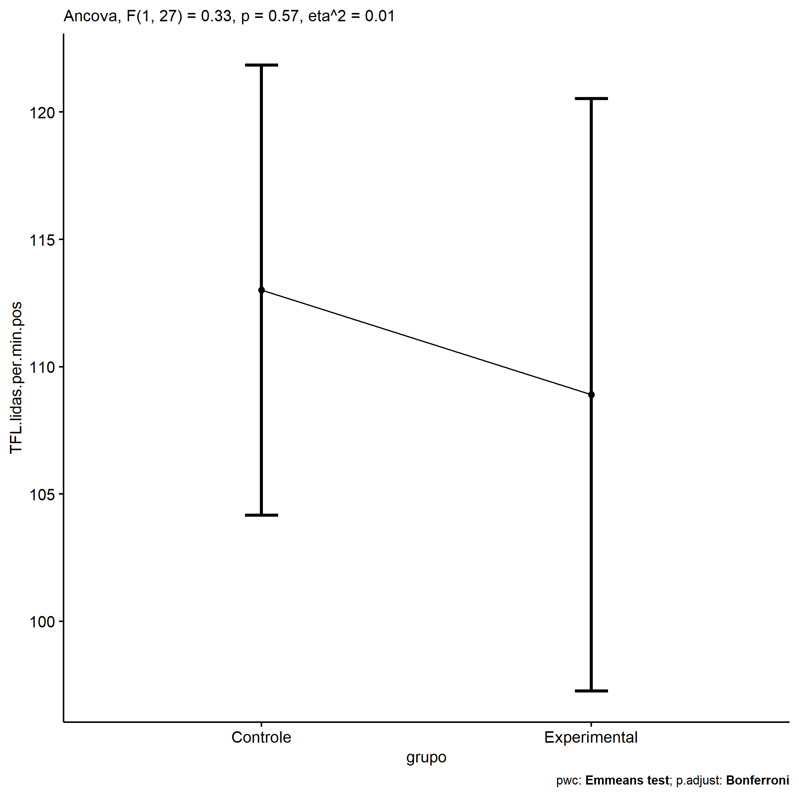
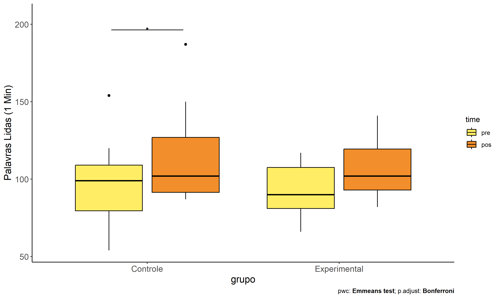
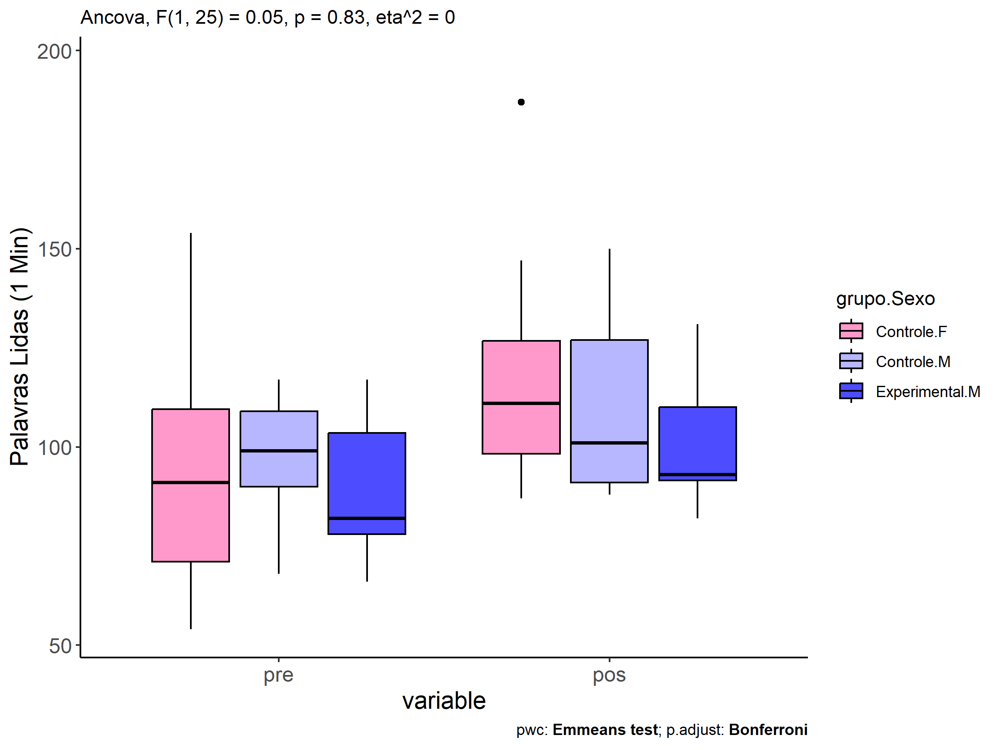
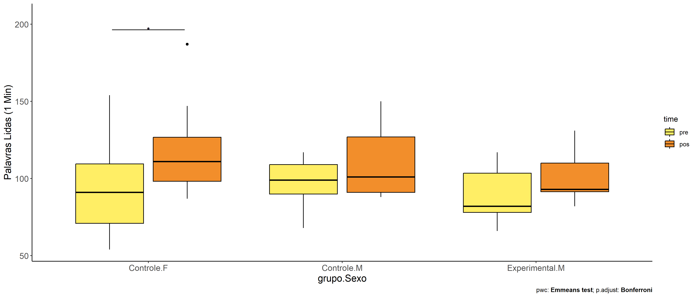

ANCOVA in Palavras Lidas (1 Min) (Palavras Lidas (1 Min))
================
Geiser C. Challco <geiser@alumni.usp.br>

- [Descriptive Statistics of Initial
  Data](#descriptive-statistics-of-initial-data)
- [Checking of Assumptions](#checking-of-assumptions)
  - [Assumption: Normality distribution of
    data](#assumption-normality-distribution-of-data)
  - [Assumption: Homogeneity of data
    distribution](#assumption-homogeneity-of-data-distribution)
- [Computation of ANCOVA test and Pairwise
  Comparison](#computation-of-ancova-test-and-pairwise-comparison)
  - [ANCOVA tests for one factor](#ancova-tests-for-one-factor)
  - [ANCOVA tests for two factors](#ancova-tests-for-two-factors)
  - [Pairwise comparisons for one factor:
    **grupo**](#pairwise-comparisons-for-one-factor-grupo)
  - [Pairwise comparisons for two
    factors](#pairwise-comparisons-for-two-factors)
    - [factores: **grupo:Sexo**](#factores-gruposexo)
    - [factores: **grupo:Zona**](#factores-grupozona)
    - [factores: **grupo:Cor.Raca**](#factores-grupocorraca)
    - [factores:
      **grupo:TFL.lidas.per.min.quintile**](#factores-grupotfllidasperminquintile)

**NOTE**

- Teste ANCOVA para determinar se houve diferenças significativas no
  Palavras Lidas (1 Min) (medido usando pre- e pos-testes).
- ANCOVA test to determine whether there were significant differences in
  Palavras Lidas (1 Min) (measured using pre- and post-tests).

# Descriptive Statistics of Initial Data

| grupo        | Sexo | Cor.Raca | TFL.lidas.per.min.quintile | variable              |   n |    mean | median | min | max |     sd |     se |      ci |   iqr |
|:-------------|:-----|:---------|:---------------------------|:----------------------|----:|--------:|-------:|----:|----:|-------:|-------:|--------:|------:|
| Controle     | F    |          |                            | TFL.lidas.per.min.pre |   8 |  94.000 |   91.0 |  54 | 154 | 33.496 | 11.843 |  28.004 | 38.50 |
| Controle     | M    |          |                            | TFL.lidas.per.min.pre |  11 |  97.818 |   99.0 |  68 | 117 | 15.072 |  4.544 |  10.125 | 19.00 |
| Experimental | F    |          |                            | TFL.lidas.per.min.pre |   4 | 100.500 |   97.5 |  90 | 117 | 11.561 |  5.781 |  18.397 |  7.50 |
| Experimental | M    |          |                            | TFL.lidas.per.min.pre |   7 |  89.714 |   82.0 |  66 | 117 | 19.973 |  7.549 |  18.472 | 25.50 |
| Controle     | F    |          |                            | TFL.lidas.per.min.pos |   8 | 119.750 |  111.0 |  87 | 187 | 33.053 | 11.686 |  27.633 | 28.50 |
| Controle     | M    |          |                            | TFL.lidas.per.min.pos |  11 | 109.273 |  101.0 |  88 | 150 | 21.666 |  6.533 |  14.555 | 36.00 |
| Experimental | F    |          |                            | TFL.lidas.per.min.pos |   4 | 119.000 |  116.5 | 102 | 141 | 16.228 |  8.114 |  25.822 | 12.00 |
| Experimental | M    |          |                            | TFL.lidas.per.min.pos |   7 | 101.286 |   93.0 |  82 | 131 | 17.858 |  6.750 |  16.516 | 18.50 |
| Controle     |      | Branca   |                            | TFL.lidas.per.min.pre |   4 | 104.500 |  105.5 |  90 | 117 | 11.091 |  5.545 |  17.648 |  7.50 |
| Controle     |      | Indígena |                            | TFL.lidas.per.min.pre |   2 | 125.000 |  125.0 |  96 | 154 | 41.012 | 29.000 | 368.480 | 29.00 |
| Controle     |      | Parda    |                            | TFL.lidas.per.min.pre |   9 |  90.333 |   90.0 |  54 | 120 | 22.299 |  7.433 |  17.141 | 29.00 |
| Controle     |      | Preta    |                            | TFL.lidas.per.min.pre |   1 |  99.000 |   99.0 |  99 |  99 |        |        |         |  0.00 |
| Controle     |      |          |                            | TFL.lidas.per.min.pre |   3 |  82.667 |   74.0 |  62 | 112 | 26.102 | 15.070 |  64.842 | 25.00 |
| Experimental |      | Branca   |                            | TFL.lidas.per.min.pre |   2 | 117.000 |  117.0 | 117 | 117 |  0.000 |  0.000 |   0.000 |  0.00 |
| Experimental |      | Indígena |                            | TFL.lidas.per.min.pre |   3 |  92.333 |   97.0 |  82 |  98 |  8.963 |  5.175 |  22.265 |  8.00 |
| Experimental |      | Parda    |                            | TFL.lidas.per.min.pre |   2 |  73.000 |   73.0 |  66 |  80 |  9.899 |  7.000 |  88.943 |  7.00 |
| Experimental |      |          |                            | TFL.lidas.per.min.pre |   4 |  93.250 |   90.0 |  76 | 117 | 17.154 |  8.577 |  27.295 | 10.25 |
| Controle     |      | Branca   |                            | TFL.lidas.per.min.pos |   4 | 120.250 |  120.0 |  91 | 150 | 24.088 | 12.044 |  38.330 | 14.75 |
| Controle     |      | Indígena |                            | TFL.lidas.per.min.pos |   2 | 119.500 |  119.5 |  92 | 147 | 38.891 | 27.500 | 349.421 | 27.50 |
| Controle     |      | Parda    |                            | TFL.lidas.per.min.pos |   9 | 111.556 |   99.0 |  88 | 187 | 32.043 | 10.681 |  24.631 | 35.00 |
| Controle     |      | Preta    |                            | TFL.lidas.per.min.pos |   1 | 118.000 |  118.0 | 118 | 118 |        |        |         |  0.00 |
| Controle     |      |          |                            | TFL.lidas.per.min.pos |   3 | 106.000 |  102.0 |  87 | 129 | 21.284 | 12.288 |  52.872 | 21.00 |
| Experimental |      | Branca   |                            | TFL.lidas.per.min.pos |   2 | 131.000 |  131.0 | 121 | 141 | 14.142 | 10.000 | 127.062 | 10.00 |
| Experimental |      | Indígena |                            | TFL.lidas.per.min.pos |   3 | 103.333 |  102.0 |  90 | 118 | 14.048 |  8.110 |  34.896 | 14.00 |
| Experimental |      | Parda    |                            | TFL.lidas.per.min.pos |   2 |  96.000 |   96.0 |  93 |  99 |  4.243 |  3.000 |  38.119 |  3.00 |
| Experimental |      |          |                            | TFL.lidas.per.min.pos |   4 | 105.250 |  104.0 |  82 | 131 | 21.975 | 10.988 |  34.968 | 28.75 |
| Controle     |      |          | 1st quintile               | TFL.lidas.per.min.pre |   2 |  58.000 |   58.0 |  54 |  62 |  5.657 |  4.000 |  50.825 |  4.00 |
| Controle     |      |          | 2nd quintile               | TFL.lidas.per.min.pre |   4 |  75.250 |   75.5 |  68 |  82 |  5.852 |  2.926 |   9.312 |  5.75 |
| Controle     |      |          | 3rd quintile               | TFL.lidas.per.min.pre |   2 |  90.000 |   90.0 |  90 |  90 |  0.000 |  0.000 |   0.000 |  0.00 |
| Controle     |      |          | 4th quintile               | TFL.lidas.per.min.pre |   6 | 101.833 |  102.0 |  96 | 106 |  4.355 |  1.778 |   4.570 |  6.75 |
| Controle     |      |          | 5th quintile               | TFL.lidas.per.min.pre |   5 | 124.000 |  117.0 | 112 | 154 | 17.015 |  7.609 |  21.127 |  3.00 |
| Experimental |      |          | 1st quintile               | TFL.lidas.per.min.pre |   1 |  66.000 |   66.0 |  66 |  66 |        |        |         |  0.00 |
| Experimental |      |          | 2nd quintile               | TFL.lidas.per.min.pre |   3 |  79.333 |   80.0 |  76 |  82 |  3.055 |  1.764 |   7.589 |  3.00 |
| Experimental |      |          | 3rd quintile               | TFL.lidas.per.min.pre |   2 |  90.000 |   90.0 |  90 |  90 |  0.000 |  0.000 |   0.000 |  0.00 |
| Experimental |      |          | 4th quintile               | TFL.lidas.per.min.pre |   2 |  97.500 |   97.5 |  97 |  98 |  0.707 |  0.500 |   6.353 |  0.50 |
| Experimental |      |          | 5th quintile               | TFL.lidas.per.min.pre |   3 | 117.000 |  117.0 | 117 | 117 |  0.000 |  0.000 |   0.000 |  0.00 |
| Controle     |      |          | 1st quintile               | TFL.lidas.per.min.pos |   2 | 100.500 |  100.5 |  99 | 102 |  2.121 |  1.500 |  19.059 |  1.50 |
| Controle     |      |          | 2nd quintile               | TFL.lidas.per.min.pos |   4 |  90.500 |   89.5 |  87 |  96 |  4.041 |  2.021 |   6.431 |  4.50 |
| Controle     |      |          | 3rd quintile               | TFL.lidas.per.min.pos |   2 | 119.000 |  119.0 |  88 | 150 | 43.841 | 31.000 | 393.892 | 31.00 |
| Controle     |      |          | 4th quintile               | TFL.lidas.per.min.pos |   6 | 112.833 |  119.0 |  92 | 126 | 13.243 |  5.406 |  13.897 | 14.75 |
| Controle     |      |          | 5th quintile               | TFL.lidas.per.min.pos |   5 | 136.400 |  129.0 |  91 | 187 | 34.854 | 15.587 |  43.277 | 19.00 |
| Experimental |      |          | 1st quintile               | TFL.lidas.per.min.pos |   1 |  93.000 |   93.0 |  93 |  93 |        |        |         |  0.00 |
| Experimental |      |          | 2nd quintile               | TFL.lidas.per.min.pos |   3 |  90.333 |   90.0 |  82 |  99 |  8.505 |  4.910 |  21.127 |  8.50 |
| Experimental |      |          | 3rd quintile               | TFL.lidas.per.min.pos |   2 | 104.000 |  104.0 |  93 | 115 | 15.556 | 11.000 | 139.768 | 11.00 |
| Experimental |      |          | 4th quintile               | TFL.lidas.per.min.pos |   2 | 110.000 |  110.0 | 102 | 118 | 11.314 |  8.000 | 101.650 |  8.00 |
| Experimental |      |          | 5th quintile               | TFL.lidas.per.min.pos |   3 | 131.000 |  131.0 | 121 | 141 | 10.000 |  5.774 |  24.841 | 10.00 |

# Checking of Assumptions

## Assumption: Normality distribution of data

| var                   |   n |  skewness | kurtosis | symmetry | statistic | method       |         p | p.signif | normality |
|:----------------------|----:|----------:|---------:|:---------|----------:|:-------------|----------:|:---------|:----------|
| TFL.lidas.per.min.pos |  30 | 1.0808909 | 1.630162 | NO       | 0.8880898 | Shapiro-Wilk | 0.0043479 | \*\*     | NO        |
| TFL.lidas.per.min.pos |  23 | 0.7713135 | 1.251130 | NO       | 0.9038410 | Shapiro-Wilk | 0.0303583 | \*       | NO        |
| TFL.lidas.per.min.pos |  30 | 0.4733933 | 2.494355 | YES      | 0.9070891 | Shapiro-Wilk | 0.0125754 | \*       | NO        |

## Assumption: Homogeneity of data distribution

| var                   | method         | formula                                      |   n | DFn.df1 | DFd.df2 | statistic |         p | p.signif |
|:----------------------|:---------------|:---------------------------------------------|----:|--------:|--------:|----------:|----------:|:---------|
| TFL.lidas.per.min.pos | Levene’s test  | `.res`~`grupo`\*`Sexo`                       |  30 |       3 |      26 | 0.9094168 | 0.4499856 | ns       |
| TFL.lidas.per.min.pos | Anova’s slopes | `.res`~`grupo`\*`Sexo`                       |  30 |       3 |      22 | 0.2300000 | 0.8750000 | ns       |
| TFL.lidas.per.min.pos | Levene’s test  | `.res`~`grupo`\*`Cor.Raca`                   |  23 |       6 |      16 | 0.6164540 | 0.7144111 | ns       |
| TFL.lidas.per.min.pos | Anova’s slopes | `.res`~`grupo`\*`Cor.Raca`                   |  23 |       4 |      11 | 2.0600000 | 0.1550000 | ns       |
| TFL.lidas.per.min.pos | Levene’s test  | `.res`~`grupo`\*`TFL.lidas.per.min.quintile` |  30 |       9 |      20 | 1.2343514 | 0.3295299 | ns       |
| TFL.lidas.per.min.pos | Anova’s slopes | `.res`~`grupo`\*`TFL.lidas.per.min.quintile` |  30 |       5 |      14 | 0.0730000 | 0.9950000 | ns       |

# Computation of ANCOVA test and Pairwise Comparison

## ANCOVA tests for one factor

|     | Effect                     | DFn | DFd |      SSn |      SSd |      F | p       |   ges | p\<.05 |
|:----|:---------------------------|----:|----:|---------:|---------:|-------:|:--------|------:|:-------|
| 1   | TFL.lidas.per.min.pre      |   1 |  27 | 6831.525 | 9520.762 | 19.374 | \<0.001 | 0.418 | \*     |
| 2   | grupo                      |   1 |  27 |  117.327 | 9520.762 |  0.333 | 0.569   | 0.012 |        |
| 4   | Sexo                       |   1 |  27 | 1081.648 | 8556.440 |  3.413 | 0.076   | 0.112 |        |
| 6   | Cor.Raca                   |   3 |  18 |  568.356 | 8210.883 |  0.415 | 0.744   | 0.065 |        |
| 8   | TFL.lidas.per.min.quintile |   4 |  24 | 1218.039 | 8420.049 |  0.868 | 0.497   | 0.126 |        |

## ANCOVA tests for two factors

|     | Effect                           | DFn | DFd |      SSn |      SSd |      F | p       |   ges | p\<.05 |
|:----|:---------------------------------|----:|----:|---------:|---------:|-------:|:--------|------:|:-------|
| 1   | TFL.lidas.per.min.pre            |   1 |  25 | 6586.869 | 8458.241 | 19.469 | \<0.001 | 0.438 | \*     |
| 4   | grupo:Sexo                       |   1 |  25 |   16.279 | 8458.241 |  0.048 | 0.828   | 0.002 |        |
| 8   | grupo:Cor.Raca                   |   2 |  15 |   92.627 | 8101.715 |  0.086 | 0.918   | 0.011 |        |
| 12  | grupo:TFL.lidas.per.min.quintile |   4 |  19 |  180.512 | 8093.621 |  0.106 | 0.979   | 0.022 |        |

## Pairwise comparisons for one factor: **grupo**

| var                   | grupo        |   n | M (pre) | SE (pre) | M (unadj) | SE (unadj) | M (adj) | SE (adj) |
|:----------------------|:-------------|----:|--------:|---------:|----------:|-----------:|--------:|---------:|
| TFL.lidas.per.min.pos | Controle     |  19 |  96.211 |    5.459 |   113.684 |      6.130 | 113.007 |    4.311 |
| TFL.lidas.per.min.pos | Experimental |  11 |  93.636 |    5.301 |   107.727 |      5.643 | 108.896 |    5.668 |

| .y.                   | group1   | group2       | estimate | conf.low | conf.high |    se | statistic |     p | p.adj | p.adj.signif |
|:----------------------|:---------|:-------------|---------:|---------:|----------:|------:|----------:|------:|------:|:-------------|
| TFL.lidas.per.min.pos | Controle | Experimental |    4.111 |  -10.512 |    18.734 | 7.127 |     0.577 | 0.569 | 0.569 | ns           |
| TFL.lidas.per.min.pre | Controle | Experimental |    2.574 |  -14.330 |    19.478 | 8.252 |     0.312 | 0.757 | 0.757 | ns           |

| .y.               | grupo        | group1 | group2 | estimate | conf.low | conf.high |    se | statistic |     p | p.adj | p.adj.signif |
|:------------------|:-------------|:-------|:-------|---------:|---------:|----------:|------:|----------:|------:|------:|:-------------|
| TFL.lidas.per.min | Controle     | pre    | pos    |  -17.474 |  -32.425 |    -2.522 | 7.464 |    -2.341 | 0.023 | 0.023 | \*           |
| TFL.lidas.per.min | Experimental | pre    | pos    |  -14.091 |  -33.741 |     5.559 | 9.809 |    -1.436 | 0.156 | 0.156 | ns           |

    ## Scale for colour is already present.
    ## Adding another scale for colour, which will replace the existing scale.

<!-- -->

<!-- -->

<!-- -->

## Pairwise comparisons for two factors

### factores: **grupo:Sexo**

| var                   | grupo        | Sexo |   n | M (pre) | SE (pre) | M (unadj) | SE (unadj) | M (adj) | SE (adj) |
|:----------------------|:-------------|:-----|----:|--------:|---------:|----------:|-----------:|--------:|---------:|
| TFL.lidas.per.min.pos | Controle     | F    |   8 |  94.000 |   11.843 |   119.750 |     11.686 | 120.073 |    6.787 |
| TFL.lidas.per.min.pos | Controle     | M    |  11 |  97.818 |    4.544 |   109.273 |      6.533 | 106.920 |    5.816 |
| TFL.lidas.per.min.pos | Experimental | M    |   7 |  89.714 |    7.549 |   101.286 |      6.750 | 104.613 |    7.301 |

|     | .y.                   | grupo    | Sexo | group1   | group2       | estimate | conf.low | conf.high |     se | statistic |     p | p.adj | p.adj.signif |
|:----|:----------------------|:---------|:-----|:---------|:-------------|---------:|---------:|----------:|-------:|----------:|------:|------:|:-------------|
| 2   | TFL.lidas.per.min.pos |          | M    | Controle | Experimental |    2.307 |  -17.154 |    21.769 |  9.384 |     0.246 | 0.808 | 0.808 | ns           |
| 4   | TFL.lidas.per.min.pre |          | M    | Controle | Experimental |    8.104 |  -15.231 |    31.439 | 11.280 |     0.718 | 0.480 | 0.480 | ns           |
| 5   | TFL.lidas.per.min.pos | Controle |      | F        | M            |   13.153 |   -5.394 |    31.700 |  8.943 |     1.471 | 0.156 | 0.156 | ns           |
| 7   | TFL.lidas.per.min.pre | Controle |      | F        | M            |   -3.818 |  -26.244 |    18.608 | 10.841 |    -0.352 | 0.728 | 0.728 | ns           |

| .y.               | grupo        | Sexo | group1 | group2 | estimate | conf.low | conf.high |     se | statistic |     p | p.adj | p.adj.signif |
|:------------------|:-------------|:-----|:-------|:-------|---------:|---------:|----------:|-------:|----------:|------:|------:|:-------------|
| TFL.lidas.per.min | Controle     | F    | pre    | pos    |  -25.750 |  -50.031 |    -1.469 | 12.063 |    -2.135 | 0.038 | 0.038 | \*           |
| TFL.lidas.per.min | Controle     | M    | pre    | pos    |  -11.455 |  -32.162 |     9.253 | 10.287 |    -1.113 | 0.271 | 0.271 | ns           |
| TFL.lidas.per.min | Experimental | M    | pre    | pos    |  -11.571 |  -37.529 |    14.386 | 12.896 |    -0.897 | 0.374 | 0.374 | ns           |

<!-- -->

<!-- -->

### factores: **grupo:Zona**

### factores: **grupo:Cor.Raca**

### factores: **grupo:TFL.lidas.per.min.quintile**
