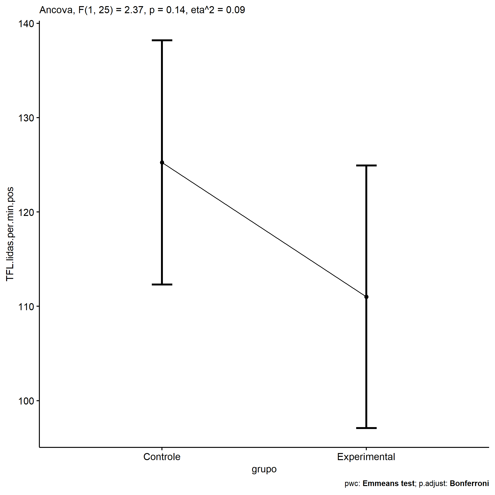
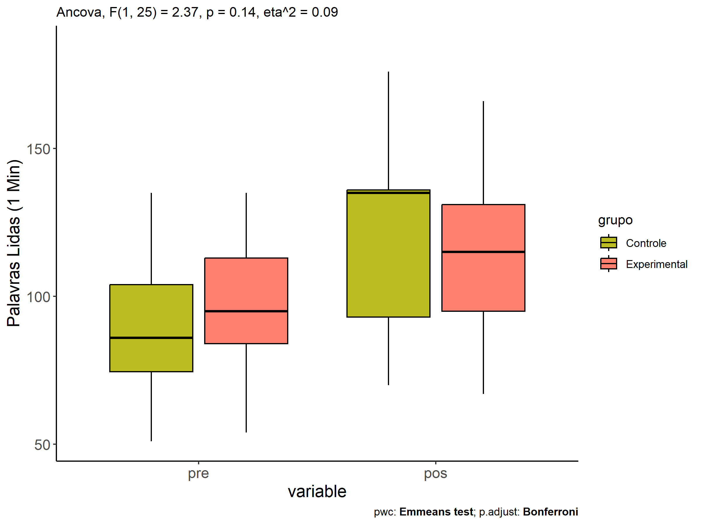
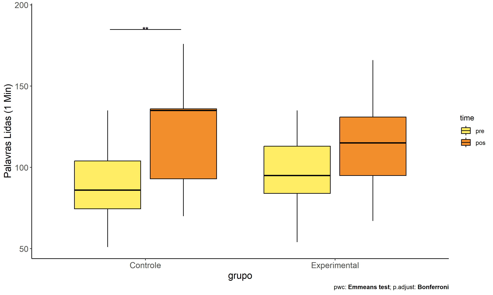

ANCOVA in Palavras Lidas (1 Min) (Palavras Lidas (1 Min))
================
Geiser C. Challco <geiser@alumni.usp.br>

- [Descriptive Statistics of Initial
  Data](#descriptive-statistics-of-initial-data)
- [Checking of Assumptions](#checking-of-assumptions)
  - [Assumption: Normality distribution of
    data](#assumption-normality-distribution-of-data)
  - [Assumption: Homogeneity of data
    distribution](#assumption-homogeneity-of-data-distribution)
- [Computation of ANCOVA test and Pairwise
  Comparison](#computation-of-ancova-test-and-pairwise-comparison)
  - [ANCOVA tests for one factor](#ancova-tests-for-one-factor)
  - [ANCOVA tests for two factors](#ancova-tests-for-two-factors)
  - [Pairwise comparisons for one factor:
    **grupo**](#pairwise-comparisons-for-one-factor-grupo)
  - [Pairwise comparisons for two
    factors](#pairwise-comparisons-for-two-factors)
    - [factores: **grupo:Sexo**](#factores-gruposexo)
    - [factores: **grupo:Zona**](#factores-grupozona)
    - [factores: **grupo:Cor.Raca**](#factores-grupocorraca)
    - [factores:
      **grupo:TFL.lidas.per.min.quintile**](#factores-grupotfllidasperminquintile)

**NOTE**

- Teste ANCOVA para determinar se houve diferenças significativas no
  Palavras Lidas (1 Min) (medido usando pre- e pos-testes).
- ANCOVA test to determine whether there were significant differences in
  Palavras Lidas (1 Min) (measured using pre- and post-tests).

# Descriptive Statistics of Initial Data

| grupo        | Sexo | Zona   | Cor.Raca | TFL.lidas.per.min.quintile | variable              |   n |    mean | median | min | max |     sd |     se |      ci |   iqr |
|:-------------|:-----|:-------|:---------|:---------------------------|:----------------------|----:|--------:|-------:|----:|----:|-------:|-------:|--------:|------:|
| Controle     | F    |        |          |                            | TFL.lidas.per.min.pre |   3 |  73.000 |   81.0 |  54 |  84 | 16.523 |  9.539 |  41.045 | 15.00 |
| Controle     | M    |        |          |                            | TFL.lidas.per.min.pre |  12 |  92.583 |   91.5 |  51 | 135 | 26.373 |  7.613 |  16.757 | 32.00 |
| Experimental | F    |        |          |                            | TFL.lidas.per.min.pre |   3 | 112.667 |  113.0 |  90 | 135 | 22.502 | 12.991 |  55.898 | 22.50 |
| Experimental | M    |        |          |                            | TFL.lidas.per.min.pre |  10 |  87.700 |   90.5 |  54 | 117 | 21.746 |  6.877 |  15.556 | 15.50 |
| Controle     | F    |        |          |                            | TFL.lidas.per.min.pos |   3 | 118.667 |  126.0 |  95 | 135 | 20.984 | 12.115 |  52.127 | 20.00 |
| Controle     | M    |        |          |                            | TFL.lidas.per.min.pos |  12 | 124.750 |  135.0 |  70 | 176 | 34.963 | 10.093 |  22.214 | 49.75 |
| Experimental | F    |        |          |                            | TFL.lidas.per.min.pos |   3 | 130.333 |  131.0 | 115 | 145 | 15.011 |  8.667 |  37.290 | 15.00 |
| Experimental | M    |        |          |                            | TFL.lidas.per.min.pos |  10 | 107.800 |  103.0 |  67 | 166 | 30.158 |  9.537 |  21.574 | 37.75 |
| Controle     |      | Rural  |          |                            | TFL.lidas.per.min.pre |   5 |  80.800 |   68.0 |  51 | 135 | 34.845 | 15.583 |  43.266 | 40.00 |
| Controle     |      | Urbana |          |                            | TFL.lidas.per.min.pre |   3 | 102.000 |   99.0 |  83 | 124 | 20.664 | 11.930 |  51.332 | 20.50 |
| Controle     |      |        |          |                            | TFL.lidas.per.min.pre |   7 |  88.571 |   86.0 |  54 | 118 | 20.671 |  7.813 |  19.117 | 16.00 |
| Experimental |      | Rural  |          |                            | TFL.lidas.per.min.pre |   6 |  82.333 |   85.0 |  54 |  96 | 15.345 |  6.265 |  16.104 | 12.50 |
| Experimental |      | Urbana |          |                            | TFL.lidas.per.min.pre |   2 | 112.500 |  112.5 |  90 | 135 | 31.820 | 22.500 | 285.890 | 22.50 |
| Experimental |      |        |          |                            | TFL.lidas.per.min.pre |   5 |  99.200 |  113.0 |  54 | 117 | 26.855 | 12.010 |  33.345 | 22.00 |
| Controle     |      | Rural  |          |                            | TFL.lidas.per.min.pos |   5 | 101.600 |   86.0 |  70 | 136 | 31.485 | 14.080 |  39.094 | 54.00 |
| Controle     |      | Urbana |          |                            | TFL.lidas.per.min.pos |   3 | 153.667 |  150.0 | 135 | 176 | 20.744 | 11.977 |  51.532 | 20.50 |
| Controle     |      |        |          |                            | TFL.lidas.per.min.pos |   7 | 126.286 |  130.0 |  91 | 171 | 27.103 | 10.244 |  25.066 | 25.00 |
| Experimental |      | Rural  |          |                            | TFL.lidas.per.min.pos |   6 |  98.833 |   95.5 |  75 | 130 | 19.115 |  7.803 |  20.060 | 17.50 |
| Experimental |      | Urbana |          |                            | TFL.lidas.per.min.pos |   2 | 123.000 |  123.0 | 115 | 131 | 11.314 |  8.000 | 101.650 |  8.00 |
| Experimental |      |        |          |                            | TFL.lidas.per.min.pos |   5 | 126.000 |  135.0 |  67 | 166 | 37.430 | 16.739 |  46.475 | 28.00 |
| Controle     |      |        | Parda    |                            | TFL.lidas.per.min.pre |   6 |  98.000 |   91.5 |  68 | 135 | 24.389 |  9.957 |  25.594 | 27.25 |
| Controle     |      |        |          |                            | TFL.lidas.per.min.pre |   9 |  82.444 |   83.0 |  51 | 124 | 25.672 |  8.557 |  19.733 | 44.00 |
| Experimental |      |        | Branca   |                            | TFL.lidas.per.min.pre |   1 |  95.000 |   95.0 |  95 |  95 |        |        |         |  0.00 |
| Experimental |      |        | Indígena |                            | TFL.lidas.per.min.pre |   1 |  54.000 |   54.0 |  54 |  54 |        |        |         |  0.00 |
| Experimental |      |        | Parda    |                            | TFL.lidas.per.min.pre |   4 |  82.500 |   81.5 |  54 | 113 | 24.201 | 12.100 |  38.508 | 18.50 |
| Experimental |      |        |          |                            | TFL.lidas.per.min.pre |   7 | 105.143 |   96.0 |  86 | 135 | 18.050 |  6.822 |  16.694 | 24.50 |
| Controle     |      |        | Parda    |                            | TFL.lidas.per.min.pos |   6 | 101.333 |   93.0 |  70 | 136 | 27.847 | 11.369 |  29.224 | 41.50 |
| Controle     |      |        |          |                            | TFL.lidas.per.min.pos |   9 | 138.333 |  135.0 |  86 | 176 | 26.481 |  8.827 |  20.355 | 20.00 |
| Experimental |      |        | Branca   |                            | TFL.lidas.per.min.pos |   1 | 110.000 |  110.0 | 110 | 110 |        |        |         |  0.00 |
| Experimental |      |        | Indígena |                            | TFL.lidas.per.min.pos |   1 |  67.000 |   67.0 |  67 |  67 |        |        |         |  0.00 |
| Experimental |      |        | Parda    |                            | TFL.lidas.per.min.pos |   4 | 100.500 |   91.0 |  75 | 145 | 30.784 | 15.392 |  48.985 | 23.50 |
| Experimental |      |        |          |                            | TFL.lidas.per.min.pos |   7 | 127.143 |  130.0 |  96 | 166 | 21.660 |  8.187 |  20.032 | 17.00 |
| Controle     |      |        |          | 1st quintile               | TFL.lidas.per.min.pre |   3 |  53.333 |   54.0 |  51 |  55 |  2.082 |  1.202 |   5.171 |  2.00 |
| Controle     |      |        |          | 2nd quintile               | TFL.lidas.per.min.pre |   5 |  80.400 |   83.0 |  68 |  86 |  7.162 |  3.203 |   8.893 |  3.00 |
| Controle     |      |        |          | 3rd quintile               | TFL.lidas.per.min.pre |   2 |  91.500 |   91.5 |  88 |  95 |  4.950 |  3.500 |  44.472 |  3.50 |
| Controle     |      |        |          | 4th quintile               | TFL.lidas.per.min.pre |   2 | 104.000 |  104.0 |  99 | 109 |  7.071 |  5.000 |  63.531 |  5.00 |
| Controle     |      |        |          | 5th quintile               | TFL.lidas.per.min.pre |   3 | 125.667 |  124.0 | 118 | 135 |  8.622 |  4.978 |  21.417 |  8.50 |
| Experimental |      |        |          | 1st quintile               | TFL.lidas.per.min.pre |   2 |  54.000 |   54.0 |  54 |  54 |  0.000 |  0.000 |   0.000 |  0.00 |
| Experimental |      |        |          | 2nd quintile               | TFL.lidas.per.min.pre |   3 |  83.000 |   84.0 |  79 |  86 |  3.606 |  2.082 |   8.957 |  3.50 |
| Experimental |      |        |          | 3rd quintile               | TFL.lidas.per.min.pre |   3 |  93.333 |   95.0 |  90 |  95 |  2.887 |  1.667 |   7.171 |  2.50 |
| Experimental |      |        |          | 4th quintile               | TFL.lidas.per.min.pre |   1 |  96.000 |   96.0 |  96 |  96 |        |        |         |  0.00 |
| Experimental |      |        |          | 5th quintile               | TFL.lidas.per.min.pre |   4 | 120.500 |  117.0 | 113 | 135 |  9.849 |  4.924 |  15.672 |  5.50 |
| Controle     |      |        |          | 1st quintile               | TFL.lidas.per.min.pos |   3 | 119.000 |  135.0 |  86 | 136 | 28.583 | 16.503 |  71.005 | 25.00 |
| Controle     |      |        |          | 2nd quintile               | TFL.lidas.per.min.pos |   5 | 111.200 |  126.0 |  70 | 135 | 27.833 | 12.447 |  34.560 | 35.00 |
| Controle     |      |        |          | 3rd quintile               | TFL.lidas.per.min.pos |   2 |  86.000 |   86.0 |  81 |  91 |  7.071 |  5.000 |  63.531 |  5.00 |
| Controle     |      |        |          | 4th quintile               | TFL.lidas.per.min.pos |   2 | 160.500 |  160.5 | 150 | 171 | 14.849 | 10.500 | 133.415 | 10.50 |
| Controle     |      |        |          | 5th quintile               | TFL.lidas.per.min.pos |   3 | 149.000 |  136.0 | 135 | 176 | 23.388 | 13.503 |  58.099 | 20.50 |
| Experimental |      |        |          | 1st quintile               | TFL.lidas.per.min.pos |   2 |  71.000 |   71.0 |  67 |  75 |  5.657 |  4.000 |  50.825 |  4.00 |
| Experimental |      |        |          | 2nd quintile               | TFL.lidas.per.min.pos |   3 |  92.667 |   95.0 |  87 |  96 |  4.933 |  2.848 |  12.254 |  4.50 |
| Experimental |      |        |          | 3rd quintile               | TFL.lidas.per.min.pos |   3 | 120.000 |  115.0 | 110 | 135 | 13.229 |  7.638 |  32.862 | 12.50 |
| Experimental |      |        |          | 4th quintile               | TFL.lidas.per.min.pos |   1 | 130.000 |  130.0 | 130 | 130 |        |        |         |  0.00 |
| Experimental |      |        |          | 5th quintile               | TFL.lidas.per.min.pos |   4 | 139.750 |  138.0 | 117 | 166 | 20.903 | 10.451 |  33.261 | 22.75 |

# Checking of Assumptions

## Assumption: Normality distribution of data

| var                   |   n |   skewness |   kurtosis | symmetry | statistic | method       |         p | p.signif | normality |
|:----------------------|----:|-----------:|-----------:|:---------|----------:|:-------------|----------:|:---------|:----------|
| TFL.lidas.per.min.pos |  28 | -0.0001411 | -1.0322205 | YES      | 0.9726249 | Shapiro-Wilk | 0.6524360 | ns       | YES       |
| TFL.lidas.per.min.pos |  16 |  0.9072021 |  0.9710006 | NO       | 0.9063942 | Shapiro-Wilk | 0.1018018 | ns       | YES       |
| TFL.lidas.per.min.pos |  12 | -0.2810521 | -1.1492627 | YES      | 0.9574667 | Shapiro-Wilk | 0.7471480 | ns       | YES       |
| TFL.lidas.per.min.pos |  28 | -0.1657723 | -0.8587379 | YES      | 0.9713191 | Shapiro-Wilk | 0.6163740 | ns       | YES       |

## Assumption: Homogeneity of data distribution

| var                   | method         | formula                                      |   n | DFn.df1 | DFd.df2 | statistic |         p | p.signif |
|:----------------------|:---------------|:---------------------------------------------|----:|--------:|--------:|----------:|----------:|:---------|
| TFL.lidas.per.min.pos | Levene’s test  | `.res`~`grupo`\*`Sexo`                       |  28 |       3 |      24 |  1.849160 | 0.1652483 | ns       |
| TFL.lidas.per.min.pos | Anova’s slopes | `.res`~`grupo`\*`Sexo`                       |  28 |       3 |      20 |  1.414000 | 0.2680000 | ns       |
| TFL.lidas.per.min.pos | Levene’s test  | `.res`~`grupo`\*`Zona`                       |  16 |       3 |      12 |  1.421023 | 0.2849367 | ns       |
| TFL.lidas.per.min.pos | Anova’s slopes | `.res`~`grupo`\*`Zona`                       |  16 |       3 |       8 |  0.540000 | 0.6680000 | ns       |
| TFL.lidas.per.min.pos | Levene’s test  | `.res`~`grupo`\*`Cor.Raca`                   |  12 |       3 |       8 |  1.212331 | 0.3660937 | ns       |
| TFL.lidas.per.min.pos | Anova’s slopes | `.res`~`grupo`\*`Cor.Raca`                   |  12 |       1 |       6 |  0.186000 | 0.6810000 | ns       |
| TFL.lidas.per.min.pos | Levene’s test  | `.res`~`grupo`\*`TFL.lidas.per.min.quintile` |  28 |       9 |      18 |  0.601123 | 0.7801041 | ns       |
| TFL.lidas.per.min.pos | Anova’s slopes | `.res`~`grupo`\*`TFL.lidas.per.min.quintile` |  28 |       7 |      10 |  1.290000 | 0.3450000 | ns       |

# Computation of ANCOVA test and Pairwise Comparison

## ANCOVA tests for one factor

|     | Effect                     | DFn | DFd |      SSn |       SSd |      F | p       |   ges | p\<.05 |
|:----|:---------------------------|----:|----:|---------:|----------:|-------:|:--------|------:|:-------|
| 1   | TFL.lidas.per.min.pre      |   1 |  25 | 9474.628 | 14749.105 | 16.060 | \<0.001 | 0.391 | \*     |
| 2   | grupo                      |   1 |  25 | 1398.741 | 14749.105 |  2.371 | 0.136   | 0.087 |        |
| 4   | Sexo                       |   1 |  25 |  149.009 | 15998.837 |  0.233 | 0.634   | 0.009 |        |
| 6   | Zona                       |   1 |  13 | 2518.411 |  6332.368 |  5.170 | 0.041   | 0.285 | \*     |
| 8   | Cor.Raca                   |   2 |   8 |   38.357 |  1457.512 |  0.105 | 0.901   | 0.026 |        |
| 10  | TFL.lidas.per.min.quintile |   4 |  22 | 3496.285 | 12651.561 |  1.520 | 0.231   | 0.217 |        |

## ANCOVA tests for two factors

|     | Effect                           | DFn | DFd |      SSn |       SSd |      F |     p |   ges | p\<.05 |
|:----|:---------------------------------|----:|----:|---------:|----------:|-------:|------:|------:|:-------|
| 1   | TFL.lidas.per.min.pre            |   1 |  23 | 8439.669 | 14523.515 | 13.365 | 0.001 | 0.368 | \*     |
| 4   | grupo:Sexo                       |   1 |  23 |   44.373 | 14523.515 |  0.070 | 0.793 | 0.003 |        |
| 8   | grupo:Zona                       |   1 |  11 |  868.473 |  4773.798 |  2.001 | 0.185 | 0.154 |        |
| 12  | grupo:Cor.Raca                   |   0 |   7 |          |   883.296 |        |       |       |        |
| 16  | grupo:TFL.lidas.per.min.quintile |   4 |  17 | 4297.125 |  7339.788 |  2.488 | 0.082 | 0.369 |        |

## Pairwise comparisons for one factor: **grupo**

| var                   | grupo        |   n | M (pre) | SE (pre) | M (unadj) | SE (unadj) | M (adj) | SE (adj) |
|:----------------------|:-------------|----:|--------:|---------:|----------:|-----------:|--------:|---------:|
| TFL.lidas.per.min.pos | Controle     |  15 |  88.667 |    6.589 |   123.533 |      8.285 | 125.256 |    6.286 |
| TFL.lidas.per.min.pos | Experimental |  13 |  93.462 |    6.557 |   113.000 |      7.929 | 111.012 |    6.755 |

| .y.                   | group1   | group2       | estimate | conf.low | conf.high |    se | statistic |     p | p.adj | p.adj.signif |
|:----------------------|:---------|:-------------|---------:|---------:|----------:|------:|----------:|------:|------:|:-------------|
| TFL.lidas.per.min.pos | Controle | Experimental |   14.243 |   -4.808 |    33.295 | 9.250 |     1.540 | 0.136 | 0.136 | ns           |
| TFL.lidas.per.min.pre | Controle | Experimental |   -4.795 |  -24.011 |    14.421 | 9.348 |    -0.513 | 0.612 | 0.612 | ns           |

| .y.               | grupo        | group1 | group2 | estimate | conf.low | conf.high |     se | statistic |     p | p.adj | p.adj.signif |
|:------------------|:-------------|:-------|:-------|---------:|---------:|----------:|-------:|----------:|------:|------:|:-------------|
| TFL.lidas.per.min | Controle     | pre    | pos    |  -34.867 |  -55.201 |   -14.532 | 10.134 |    -3.441 | 0.001 | 0.001 | \*\*         |
| TFL.lidas.per.min | Experimental | pre    | pos    |  -19.538 |  -41.381 |     2.304 | 10.885 |    -1.795 | 0.078 | 0.078 | ns           |

    ## Scale for colour is already present.
    ## Adding another scale for colour, which will replace the existing scale.

<!-- -->

<!-- -->

<!-- -->

## Pairwise comparisons for two factors

### factores: **grupo:Sexo**

### factores: **grupo:Zona**

### factores: **grupo:Cor.Raca**

### factores: **grupo:TFL.lidas.per.min.quintile**
