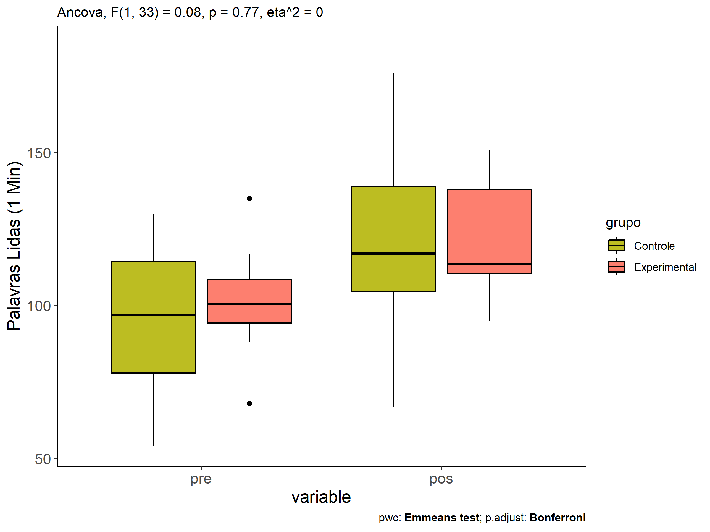
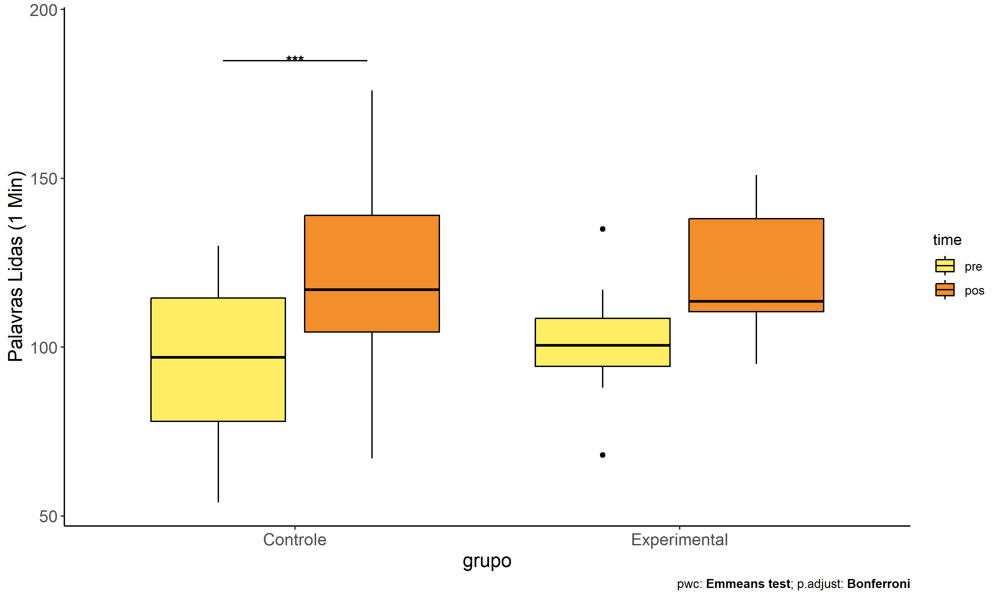
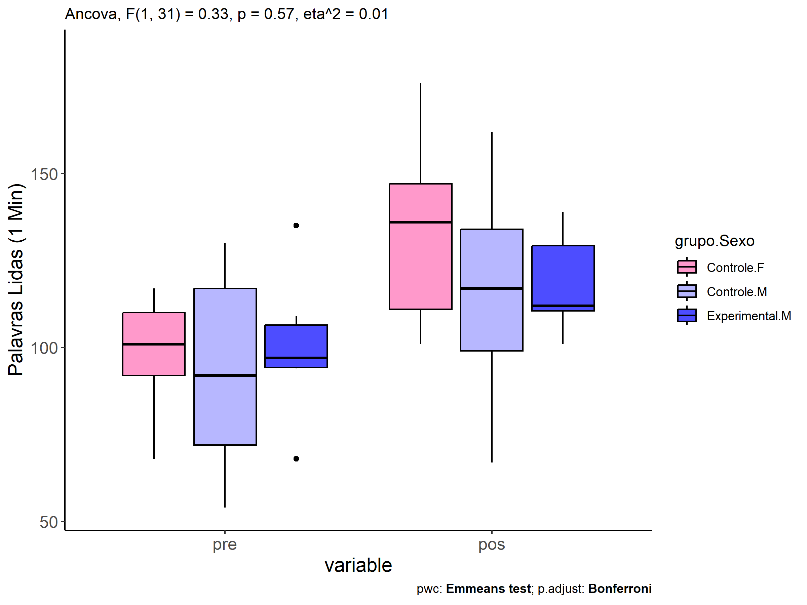
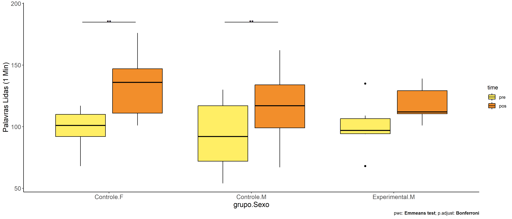

ANCOVA in Palavras Lidas (1 Min) (Palavras Lidas (1 Min))
================
Geiser C. Challco <geiser@alumni.usp.br>

- [Descriptive Statistics of Initial
  Data](#descriptive-statistics-of-initial-data)
- [Checking of Assumptions](#checking-of-assumptions)
  - [Assumption: Normality distribution of
    data](#assumption-normality-distribution-of-data)
  - [Assumption: Homogeneity of data
    distribution](#assumption-homogeneity-of-data-distribution)
- [Computation of ANCOVA test and Pairwise
  Comparison](#computation-of-ancova-test-and-pairwise-comparison)
  - [ANCOVA tests for one factor](#ancova-tests-for-one-factor)
  - [ANCOVA tests for two factors](#ancova-tests-for-two-factors)
  - [Pairwise comparisons for one factor:
    **grupo**](#pairwise-comparisons-for-one-factor-grupo)
  - [Pairwise comparisons for two
    factors](#pairwise-comparisons-for-two-factors)
    - [factores: **grupo:Sexo**](#factores-gruposexo)
    - [factores: **grupo:Zona**](#factores-grupozona)
    - [factores: **grupo:Cor.Raca**](#factores-grupocorraca)
    - [factores:
      **grupo:TFL.lidas.per.min.quintile**](#factores-grupotfllidasperminquintile)

**NOTE**

- Teste ANCOVA para determinar se houve diferenças significativas no
  Palavras Lidas (1 Min) (medido usando pre- e pos-testes).
- ANCOVA test to determine whether there were significant differences in
  Palavras Lidas (1 Min) (measured using pre- and post-tests).

# Descriptive Statistics of Initial Data

| grupo        | Sexo | Zona   | Cor.Raca | TFL.lidas.per.min.quintile | variable              |   n |    mean | median | min | max |     sd |     se |      ci |   iqr |
|:-------------|:-----|:-------|:---------|:---------------------------|:----------------------|----:|--------:|-------:|----:|----:|-------:|-------:|--------:|------:|
| Controle     | F    |        |          |                            | TFL.lidas.per.min.pre |   9 |  98.556 |  101.0 |  68 | 117 | 15.573 |  5.191 |  11.971 | 18.00 |
| Controle     | M    |        |          |                            | TFL.lidas.per.min.pre |  17 |  91.176 |   92.0 |  54 | 130 | 25.370 |  6.153 |  13.044 | 45.00 |
| Experimental | F    |        |          |                            | TFL.lidas.per.min.pre |   4 | 103.500 |  104.5 |  88 | 117 | 12.069 |  6.035 |  19.205 | 11.00 |
| Experimental | M    |        |          |                            | TFL.lidas.per.min.pre |   6 | 100.000 |   97.0 |  68 | 135 | 21.872 |  8.929 |  22.954 | 12.25 |
| Controle     | F    |        |          |                            | TFL.lidas.per.min.pos |   9 | 132.889 |  136.0 | 101 | 176 | 26.737 |  8.912 |  20.552 | 36.00 |
| Controle     | M    |        |          |                            | TFL.lidas.per.min.pos |  17 | 113.824 |  117.0 |  67 | 162 | 27.569 |  6.686 |  14.174 | 35.00 |
| Experimental | F    |        |          |                            | TFL.lidas.per.min.pos |   4 | 125.000 |  127.0 |  95 | 151 | 24.980 | 12.490 |  39.749 | 32.00 |
| Experimental | M    |        |          |                            | TFL.lidas.per.min.pos |   6 | 118.167 |  112.0 | 101 | 139 | 15.198 |  6.204 |  15.949 | 18.75 |
| Controle     |      | Rural  |          |                            | TFL.lidas.per.min.pre |  12 |  98.333 |  108.5 |  54 | 130 | 26.661 |  7.696 |  16.939 | 35.25 |
| Controle     |      | Urbana |          |                            | TFL.lidas.per.min.pre |   1 | 110.000 |  110.0 | 110 | 110 |        |        |         |  0.00 |
| Controle     |      |        |          |                            | TFL.lidas.per.min.pre |  13 |  88.231 |   92.0 |  58 | 117 | 17.861 |  4.954 |  10.793 | 26.00 |
| Experimental |      | Rural  |          |                            | TFL.lidas.per.min.pre |   6 | 102.167 |  103.0 |  68 | 135 | 21.803 |  8.901 |  22.881 | 12.50 |
| Experimental |      |        |          |                            | TFL.lidas.per.min.pre |   4 | 100.250 |   98.0 |  88 | 117 | 12.553 |  6.277 |  19.975 | 13.25 |
| Controle     |      | Rural  |          |                            | TFL.lidas.per.min.pos |  12 | 112.417 |  113.5 |  67 | 149 | 19.402 |  5.601 |  12.328 | 13.25 |
| Controle     |      | Urbana |          |                            | TFL.lidas.per.min.pos |   1 | 165.000 |  165.0 | 165 | 165 |        |        |         |  0.00 |
| Controle     |      |        |          |                            | TFL.lidas.per.min.pos |  13 | 124.385 |  136.0 |  68 | 176 | 32.809 |  9.100 |  19.826 | 40.00 |
| Experimental |      | Rural  |          |                            | TFL.lidas.per.min.pos |   6 | 114.167 |  112.0 | 101 | 135 | 11.268 |  4.600 |  11.825 |  3.75 |
| Experimental |      |        |          |                            | TFL.lidas.per.min.pos |   4 | 131.000 |  139.0 |  95 | 151 | 24.658 | 12.329 |  39.236 | 14.00 |
| Controle     |      |        | Branca   |                            | TFL.lidas.per.min.pre |   3 | 110.000 |  117.0 |  92 | 121 | 15.716 |  9.074 |  39.041 | 14.50 |
| Controle     |      |        | Indígena |                            | TFL.lidas.per.min.pre |   1 | 101.000 |  101.0 | 101 | 101 |        |        |         |  0.00 |
| Controle     |      |        | Parda    |                            | TFL.lidas.per.min.pre |  10 |  97.000 |  101.5 |  54 | 130 | 25.962 |  8.210 |  18.572 | 39.00 |
| Controle     |      |        |          |                            | TFL.lidas.per.min.pre |  12 |  86.333 |   85.5 |  54 | 117 | 19.974 |  5.766 |  12.691 | 28.50 |
| Experimental |      |        | Branca   |                            | TFL.lidas.per.min.pre |   1 |  95.000 |   95.0 |  95 |  95 |        |        |         |  0.00 |
| Experimental |      |        | Indígena |                            | TFL.lidas.per.min.pre |   3 | 105.000 |  107.0 |  99 | 109 |  5.292 |  3.055 |  13.145 |  5.00 |
| Experimental |      |        | Parda    |                            | TFL.lidas.per.min.pre |   3 |  97.000 |   88.0 |  68 | 135 | 34.395 | 19.858 |  85.441 | 33.50 |
| Experimental |      |        |          |                            | TFL.lidas.per.min.pre |   3 | 104.333 |  102.0 |  94 | 117 | 11.676 |  6.741 |  29.005 | 11.50 |
| Controle     |      |        | Branca   |                            | TFL.lidas.per.min.pos |   3 | 118.667 |  117.0 | 110 | 129 |  9.609 |  5.548 |  23.870 |  9.50 |
| Controle     |      |        | Indígena |                            | TFL.lidas.per.min.pos |   1 | 117.000 |  117.0 | 117 | 117 |        |        |         |  0.00 |
| Controle     |      |        | Parda    |                            | TFL.lidas.per.min.pos |  10 | 100.000 |  103.5 |  67 | 124 | 17.745 |  5.611 |  12.694 | 17.25 |
| Controle     |      |        |          |                            | TFL.lidas.per.min.pos |  12 | 138.167 |  139.0 |  68 | 176 | 28.651 |  8.271 |  18.204 | 16.75 |
| Experimental |      |        | Branca   |                            | TFL.lidas.per.min.pos |   1 | 110.000 |  110.0 | 110 | 110 |        |        |         |  0.00 |
| Experimental |      |        | Indígena |                            | TFL.lidas.per.min.pos |   3 | 113.000 |  112.0 | 112 | 115 |  1.732 |  1.000 |   4.303 |  1.50 |
| Experimental |      |        | Parda    |                            | TFL.lidas.per.min.pos |   3 | 110.333 |  101.0 |  95 | 135 | 21.572 | 12.454 |  53.587 | 20.00 |
| Experimental |      |        |          |                            | TFL.lidas.per.min.pos |   3 | 143.000 |  139.0 | 139 | 151 |  6.928 |  4.000 |  17.211 |  6.00 |
| Controle     |      |        |          | 1st quintile               | TFL.lidas.per.min.pre |   4 |  57.250 |   56.0 |  54 |  63 |  4.272 |  2.136 |   6.798 |  5.25 |
| Controle     |      |        |          | 2nd quintile               | TFL.lidas.per.min.pre |   6 |  78.500 |   80.0 |  68 |  86 |  7.583 |  3.096 |   7.958 | 11.75 |
| Controle     |      |        |          | 3rd quintile               | TFL.lidas.per.min.pre |   3 |  93.000 |   92.0 |  92 |  95 |  1.732 |  1.000 |   4.303 |  1.50 |
| Controle     |      |        |          | 4th quintile               | TFL.lidas.per.min.pre |   6 | 103.333 |  103.0 |  99 | 110 |  3.777 |  1.542 |   3.964 |  2.75 |
| Controle     |      |        |          | 5th quintile               | TFL.lidas.per.min.pre |   7 | 119.714 |  117.0 | 116 | 130 |  4.889 |  1.848 |   4.522 |  3.50 |
| Experimental |      |        |          | 2nd quintile               | TFL.lidas.per.min.pre |   1 |  68.000 |   68.0 |  68 |  68 |        |        |         |  0.00 |
| Experimental |      |        |          | 3rd quintile               | TFL.lidas.per.min.pre |   3 |  92.333 |   94.0 |  88 |  95 |  3.786 |  2.186 |   9.405 |  3.50 |
| Experimental |      |        |          | 4th quintile               | TFL.lidas.per.min.pre |   4 | 104.250 |  104.5 |  99 | 109 |  4.573 |  2.287 |   7.277 |  6.25 |
| Experimental |      |        |          | 5th quintile               | TFL.lidas.per.min.pre |   2 | 126.000 |  126.0 | 117 | 135 | 12.728 |  9.000 | 114.356 |  9.00 |
| Controle     |      |        |          | 1st quintile               | TFL.lidas.per.min.pos |   4 |  99.750 |   91.0 |  68 | 149 | 36.682 | 18.341 |  58.370 | 42.75 |
| Controle     |      |        |          | 2nd quintile               | TFL.lidas.per.min.pos |   6 | 119.833 |  135.0 |  67 | 139 | 29.116 | 11.887 |  30.556 | 26.75 |
| Controle     |      |        |          | 3rd quintile               | TFL.lidas.per.min.pos |   3 | 120.000 |  111.0 | 110 | 139 | 16.462 |  9.504 |  40.894 | 14.50 |
| Controle     |      |        |          | 4th quintile               | TFL.lidas.per.min.pos |   6 | 130.167 |  132.0 |  91 | 165 | 32.214 | 13.151 |  33.807 | 54.75 |
| Controle     |      |        |          | 5th quintile               | TFL.lidas.per.min.pos |   7 | 124.571 |  117.0 | 101 | 176 | 24.528 |  9.271 |  22.685 | 14.00 |
| Experimental |      |        |          | 2nd quintile               | TFL.lidas.per.min.pos |   1 | 101.000 |  101.0 | 101 | 101 |        |        |         |  0.00 |
| Experimental |      |        |          | 3rd quintile               | TFL.lidas.per.min.pos |   3 | 114.667 |  110.0 |  95 | 139 | 22.368 | 12.914 |  55.566 | 22.00 |
| Experimental |      |        |          | 4th quintile               | TFL.lidas.per.min.pos |   4 | 119.500 |  113.5 | 112 | 139 | 13.077 |  6.538 |  20.808 |  9.00 |
| Experimental |      |        |          | 5th quintile               | TFL.lidas.per.min.pos |   2 | 143.000 |  143.0 | 135 | 151 | 11.314 |  8.000 | 101.650 |  8.00 |

# Checking of Assumptions

## Assumption: Normality distribution of data

| var                   |   n |  skewness |   kurtosis | symmetry | statistic | method       |         p | p.signif | normality |
|:----------------------|----:|----------:|-----------:|:---------|----------:|:-------------|----------:|:---------|:----------|
| TFL.lidas.per.min.pos |  36 | 0.2356773 | -0.8987382 | YES      | 0.9751253 | Shapiro-Wilk | 0.5808205 | ns       | YES       |
| TFL.lidas.per.min.pos |  19 | 0.2535528 |  2.7039539 | YES      | 0.8482129 | Shapiro-Wilk | 0.0062749 | \*\*     | NO        |
| TFL.lidas.per.min.pos |  21 | 0.4708306 |  0.8201375 | YES      | 0.9581219 | Shapiro-Wilk | 0.4791320 | ns       | YES       |
| TFL.lidas.per.min.pos |  36 | 0.1772360 | -0.3227695 | YES      | 0.9825844 | Shapiro-Wilk | 0.8287951 | ns       | YES       |

## Assumption: Homogeneity of data distribution

| var                   | method         | formula                                      |   n | DFn.df1 | DFd.df2 | statistic |         p | p.signif |
|:----------------------|:---------------|:---------------------------------------------|----:|--------:|--------:|----------:|----------:|:---------|
| TFL.lidas.per.min.pos | Levene’s test  | `.res`~`grupo`\*`Sexo`                       |  36 |       3 |      32 | 1.5537479 | 0.2197362 | ns       |
| TFL.lidas.per.min.pos | Anova’s slopes | `.res`~`grupo`\*`Sexo`                       |  36 |       3 |      28 | 0.4850000 | 0.6950000 | ns       |
| TFL.lidas.per.min.pos | Levene’s test  | `.res`~`grupo`\*`Zona`                       |  19 |       2 |      16 | 0.8917881 | 0.4293457 | ns       |
| TFL.lidas.per.min.pos | Anova’s slopes | `.res`~`grupo`\*`Zona`                       |  19 |       1 |      14 | 1.0590000 | 0.3210000 | ns       |
| TFL.lidas.per.min.pos | Levene’s test  | `.res`~`grupo`\*`Cor.Raca`                   |  21 |       5 |      15 | 1.1061473 | 0.3978573 | ns       |
| TFL.lidas.per.min.pos | Anova’s slopes | `.res`~`grupo`\*`Cor.Raca`                   |  21 |       3 |      11 | 0.0770000 | 0.9710000 | ns       |
| TFL.lidas.per.min.pos | Levene’s test  | `.res`~`grupo`\*`TFL.lidas.per.min.quintile` |  36 |       8 |      27 | 0.7696570 | 0.6321099 | ns       |
| TFL.lidas.per.min.pos | Anova’s slopes | `.res`~`grupo`\*`TFL.lidas.per.min.quintile` |  36 |       7 |      19 | 1.0710000 | 0.4190000 | ns       |

# Computation of ANCOVA test and Pairwise Comparison

## ANCOVA tests for one factor

|     | Effect                     | DFn | DFd |      SSn |       SSd |     F |     p |   ges | p\<.05 |
|:----|:---------------------------|----:|----:|---------:|----------:|------:|------:|------:|:-------|
| 1   | TFL.lidas.per.min.pre      |   1 |  33 | 2692.840 | 20464.406 | 4.342 | 0.045 | 0.116 | \*     |
| 2   | grupo                      |   1 |  33 |   52.316 | 20464.406 | 0.084 | 0.773 | 0.003 |        |
| 4   | Sexo                       |   1 |  33 | 1394.795 | 19121.927 | 2.407 | 0.130 | 0.068 |        |
| 6   | Zona                       |   1 |  16 | 2366.382 |  4489.344 | 8.434 | 0.010 | 0.345 | \*     |
| 8   | Cor.Raca                   |   2 |  17 |  393.696 |  2230.007 | 1.501 | 0.251 | 0.150 |        |
| 10  | TFL.lidas.per.min.quintile |   4 |  30 |  349.095 | 20167.627 | 0.130 | 0.970 | 0.017 |        |

## ANCOVA tests for two factors

|     | Effect                           | DFn | DFd |      SSn |       SSd |     F |     p |   ges | p\<.05 |
|:----|:---------------------------------|----:|----:|---------:|----------:|------:|------:|------:|:-------|
| 1   | TFL.lidas.per.min.pre            |   1 |  31 | 2050.235 | 18855.958 | 3.371 | 0.076 | 0.098 |        |
| 4   | grupo:Sexo                       |   1 |  31 |  198.544 | 18855.958 | 0.326 | 0.572 | 0.010 |        |
| 8   | grupo:Zona                       |   0 |  15 |          |  4484.513 |       |       |       |        |
| 12  | grupo:Cor.Raca                   |   2 |  14 |  186.764 |  1955.707 | 0.668 | 0.528 | 0.087 |        |
| 16  | grupo:TFL.lidas.per.min.quintile |   3 |  26 |  860.438 | 19230.094 | 0.388 | 0.763 | 0.043 |        |

## Pairwise comparisons for one factor: **grupo**

| var                   | grupo        |   n | M (pre) | SE (pre) | M (unadj) | SE (unadj) | M (adj) | SE (adj) |
|:----------------------|:-------------|----:|--------:|---------:|----------:|-----------:|--------:|---------:|
| TFL.lidas.per.min.pos | Controle     |  26 |  93.731 |    4.396 |   120.423 |      5.550 | 121.313 |    4.902 |
| TFL.lidas.per.min.pos | Experimental |  10 | 101.400 |    5.636 |   120.900 |      5.906 | 118.585 |    7.953 |

| .y.                   | group1   | group2       | estimate | conf.low | conf.high |    se | statistic |     p | p.adj | p.adj.signif |
|:----------------------|:---------|:-------------|---------:|---------:|----------:|------:|----------:|------:|------:|:-------------|
| TFL.lidas.per.min.pos | Controle | Experimental |    2.728 |  -16.382 |    21.839 | 9.393 |     0.290 | 0.773 | 0.773 | ns           |
| TFL.lidas.per.min.pre | Controle | Experimental |   -7.669 |  -23.772 |     8.434 | 7.924 |    -0.968 | 0.340 | 0.340 | ns           |

| .y.               | grupo        | group1 | group2 | estimate | conf.low | conf.high |     se | statistic | p       | p.adj   | p.adj.signif |
|:------------------|:-------------|:-------|:-------|---------:|---------:|----------:|-------:|----------:|:--------|:--------|:-------------|
| TFL.lidas.per.min | Controle     | pre    | pos    |  -26.692 |  -39.874 |   -13.511 |  6.606 |    -4.041 | \<0.001 | \<0.001 | \*\*\*       |
| TFL.lidas.per.min | Experimental | pre    | pos    |  -19.500 |  -40.755 |     1.755 | 10.652 |    -1.831 | 0.072   | 0.072   | ns           |

    ## Scale for colour is already present.
    ## Adding another scale for colour, which will replace the existing scale.

<!-- -->

<!-- -->

<!-- -->

## Pairwise comparisons for two factors

### factores: **grupo:Sexo**

| var                   | grupo        | Sexo |   n | M (pre) | SE (pre) | M (unadj) | SE (unadj) | M (adj) | SE (adj) |
|:----------------------|:-------------|:-----|----:|--------:|---------:|----------:|-----------:|--------:|---------:|
| TFL.lidas.per.min.pos | Controle     | F    |   9 |  98.556 |    5.191 |   132.889 |      8.912 | 131.692 |    8.358 |
| TFL.lidas.per.min.pos | Controle     | M    |  17 |  91.176 |    6.153 |   113.824 |      6.686 | 115.047 |    6.105 |
| TFL.lidas.per.min.pos | Experimental | M    |   6 | 100.000 |    8.929 |   118.167 |      6.204 | 116.496 |   10.249 |

|     | .y.                   | grupo    | Sexo | group1   | group2       | estimate | conf.low | conf.high |     se | statistic |     p | p.adj | p.adj.signif |
|:----|:----------------------|:---------|:-----|:---------|:-------------|---------:|---------:|----------:|-------:|----------:|------:|------:|:-------------|
| 2   | TFL.lidas.per.min.pos |          | M    | Controle | Experimental |   -1.449 |  -26.025 |    23.126 | 11.997 |    -0.121 | 0.905 | 0.905 | ns           |
| 4   | TFL.lidas.per.min.pre |          | M    | Controle | Experimental |   -8.824 |  -30.638 |    12.991 | 10.666 |    -0.827 | 0.415 | 0.415 | ns           |
| 5   | TFL.lidas.per.min.pos | Controle |      | F        | M            |   16.645 |   -4.671 |    37.962 | 10.406 |     1.600 | 0.121 | 0.121 | ns           |
| 7   | TFL.lidas.per.min.pre | Controle |      | F        | M            |    7.379 |  -11.558 |    26.316 |  9.259 |     0.797 | 0.432 | 0.432 | ns           |

| .y.               | grupo        | Sexo | group1 | group2 | estimate | conf.low | conf.high |     se | statistic |     p | p.adj | p.adj.signif |
|:------------------|:-------------|:-----|:-------|:-------|---------:|---------:|----------:|-------:|----------:|------:|------:|:-------------|
| TFL.lidas.per.min | Controle     | F    | pre    | pos    |  -34.333 |  -57.067 |   -11.600 | 11.357 |    -3.023 | 0.004 | 0.004 | \*\*         |
| TFL.lidas.per.min | Controle     | M    | pre    | pos    |  -22.647 |  -39.188 |    -6.106 |  8.264 |    -2.741 | 0.008 | 0.008 | \*\*         |
| TFL.lidas.per.min | Experimental | M    | pre    | pos    |  -18.167 |  -46.010 |     9.676 | 13.910 |    -1.306 | 0.197 | 0.197 | ns           |

<!-- -->

<!-- -->

### factores: **grupo:Zona**

### factores: **grupo:Cor.Raca**

### factores: **grupo:TFL.lidas.per.min.quintile**
