ANCOVA in Palavras Lidas (1 Min) (Palavras Lidas (1 Min))
================
Geiser C. Challco <geiser@alumni.usp.br>

- [Descriptive Statistics of Initial
  Data](#descriptive-statistics-of-initial-data)
- [Checking of Assumptions](#checking-of-assumptions)
  - [Assumption: Normality distribution of
    data](#assumption-normality-distribution-of-data)
  - [Assumption: Homogeneity of data
    distribution](#assumption-homogeneity-of-data-distribution)
- [Computation of ANCOVA test and Pairwise
  Comparison](#computation-of-ancova-test-and-pairwise-comparison)
  - [ANCOVA tests for one factor](#ancova-tests-for-one-factor)
  - [ANCOVA tests for two factors](#ancova-tests-for-two-factors)
  - [Pairwise comparisons for one factor:
    **grupo**](#pairwise-comparisons-for-one-factor-grupo)
  - [Pairwise comparisons for two
    factors](#pairwise-comparisons-for-two-factors)
    - [factores: **grupo:Sexo**](#factores-gruposexo)
    - [factores: **grupo:Zona**](#factores-grupozona)
    - [factores: **grupo:Cor.Raca**](#factores-grupocorraca)
    - [factores:
      **grupo:TFL.lidas.per.min.quintile**](#factores-grupotfllidasperminquintile)

**NOTE**

- Teste ANCOVA para determinar se houve diferenças significativas no
  Palavras Lidas (1 Min) (medido usando pre- e pos-testes).
- ANCOVA test to determine whether there were significant differences in
  Palavras Lidas (1 Min) (measured using pre- and post-tests).

# Descriptive Statistics of Initial Data

| grupo        | Sexo | Zona   | Cor.Raca | TFL.lidas.per.min.quintile | variable              |   n |    mean | median | min | max |     sd |     se |     ci |   iqr |
|:-------------|:-----|:-------|:---------|:---------------------------|:----------------------|----:|--------:|-------:|----:|----:|-------:|-------:|-------:|------:|
| Controle     | F    |        |          |                            | TFL.lidas.per.min.pre |  36 |  93.917 |   96.5 |  40 | 154 | 24.110 |  4.018 |  8.158 | 23.75 |
| Controle     | M    |        |          |                            | TFL.lidas.per.min.pre |  55 |  90.618 |   92.0 |  27 | 141 | 24.250 |  3.270 |  6.556 | 33.50 |
| Experimental | F    |        |          |                            | TFL.lidas.per.min.pre |  22 |  98.455 |   96.5 |  60 | 135 | 17.470 |  3.725 |  7.746 | 22.25 |
| Experimental | M    |        |          |                            | TFL.lidas.per.min.pre |  31 |  90.032 |   90.0 |  54 | 135 | 20.001 |  3.592 |  7.336 | 19.50 |
| Controle     | F    |        |          |                            | TFL.lidas.per.min.pos |  36 | 121.194 |  118.5 |  87 | 187 | 26.148 |  4.358 |  8.847 | 37.00 |
| Controle     | M    |        |          |                            | TFL.lidas.per.min.pos |  55 | 108.618 |  108.0 |  43 | 176 | 29.114 |  3.926 |  7.871 | 42.00 |
| Experimental | F    |        |          |                            | TFL.lidas.per.min.pos |  22 | 125.318 |  117.5 |  82 | 195 | 26.032 |  5.550 | 11.542 | 38.75 |
| Experimental | M    |        |          |                            | TFL.lidas.per.min.pos |  31 | 107.290 |  101.0 |  67 | 184 | 26.267 |  4.718 |  9.635 | 26.00 |
| Controle     |      | Rural  |          |                            | TFL.lidas.per.min.pre |  58 |  91.914 |   94.5 |  27 | 154 | 26.233 |  3.445 |  6.898 | 38.25 |
| Controle     |      | Urbana |          |                            | TFL.lidas.per.min.pre |   7 |  93.000 |   99.0 |  48 | 124 | 24.055 |  9.092 | 22.248 | 19.00 |
| Controle     |      |        |          |                            | TFL.lidas.per.min.pre |  26 |  91.654 |   92.0 |  54 | 139 | 19.626 |  3.849 |  7.927 | 22.25 |
| Experimental |      | Rural  |          |                            | TFL.lidas.per.min.pre |  35 |  90.714 |   90.0 |  54 | 135 | 18.909 |  3.196 |  6.496 | 19.00 |
| Experimental |      | Urbana |          |                            | TFL.lidas.per.min.pre |   6 | 102.667 |   95.5 |  90 | 135 | 17.455 |  7.126 | 18.318 | 15.25 |
| Experimental |      |        |          |                            | TFL.lidas.per.min.pre |  12 |  97.167 |   98.5 |  54 | 117 | 20.683 |  5.971 | 13.141 | 32.00 |
| Controle     |      | Rural  |          |                            | TFL.lidas.per.min.pos |  58 | 106.276 |  105.5 |  43 | 187 | 25.144 |  3.302 |  6.611 | 31.50 |
| Controle     |      | Urbana |          |                            | TFL.lidas.per.min.pos |   7 | 142.857 |  150.0 |  88 | 176 | 28.399 | 10.734 | 26.264 | 23.00 |
| Controle     |      |        |          |                            | TFL.lidas.per.min.pos |  26 | 122.038 |  128.0 |  68 | 176 | 29.198 |  5.726 | 11.793 | 42.25 |
| Experimental |      | Rural  |          |                            | TFL.lidas.per.min.pos |  35 | 109.371 |  105.0 |  70 | 184 | 23.204 |  3.922 |  7.971 | 22.50 |
| Experimental |      | Urbana |          |                            | TFL.lidas.per.min.pos |   6 | 134.333 |  123.0 |  99 | 195 | 34.541 | 14.101 | 36.248 | 31.00 |
| Experimental |      |        |          |                            | TFL.lidas.per.min.pos |  12 | 120.750 |  133.0 |  67 | 166 | 31.758 |  9.168 | 20.178 | 48.75 |
| Controle     |      |        | Branca   |                            | TFL.lidas.per.min.pre |  12 | 105.500 |  103.5 |  90 | 141 | 15.895 |  4.588 | 10.099 | 25.00 |
| Controle     |      |        | Indígena |                            | TFL.lidas.per.min.pre |   3 | 117.000 |  101.0 |  96 | 154 | 32.140 | 18.556 | 79.841 | 29.00 |
| Controle     |      |        | Parda    |                            | TFL.lidas.per.min.pre |  42 |  92.381 |   95.0 |  27 | 135 | 23.486 |  3.624 |  7.319 | 33.00 |
| Controle     |      |        | Preta    |                            | TFL.lidas.per.min.pre |   1 |  99.000 |   99.0 |  99 |  99 |        |        |        |  0.00 |
| Controle     |      |        |          |                            | TFL.lidas.per.min.pre |  33 |  83.909 |   85.0 |  40 | 139 | 24.108 |  4.197 |  8.548 | 39.00 |
| Experimental |      |        | Amarela  |                            | TFL.lidas.per.min.pre |   1 |  76.000 |   76.0 |  76 |  76 |        |        |        |  0.00 |
| Experimental |      |        | Branca   |                            | TFL.lidas.per.min.pre |   5 | 104.000 |   96.0 |  95 | 117 | 11.874 |  5.310 | 14.744 | 22.00 |
| Experimental |      |        | Indígena |                            | TFL.lidas.per.min.pre |   8 |  95.125 |   98.5 |  54 | 115 | 19.342 |  6.839 | 16.171 | 14.25 |
| Experimental |      |        | Parda    |                            | TFL.lidas.per.min.pre |  16 |  88.688 |   86.0 |  54 | 135 | 20.261 |  5.065 | 10.796 | 17.00 |
| Experimental |      |        |          |                            | TFL.lidas.per.min.pre |  23 |  94.826 |   95.0 |  59 | 135 | 19.878 |  4.145 |  8.596 | 24.00 |
| Controle     |      |        | Branca   |                            | TFL.lidas.per.min.pos |  12 | 115.417 |  116.5 |  87 | 150 | 18.143 |  5.237 | 11.528 | 15.75 |
| Controle     |      |        | Indígena |                            | TFL.lidas.per.min.pos |   3 | 118.667 |  117.0 |  92 | 147 | 27.538 | 15.899 | 68.408 | 27.50 |
| Controle     |      |        | Parda    |                            | TFL.lidas.per.min.pos |  42 | 101.095 |   96.0 |  43 | 187 | 25.697 |  3.965 |  8.008 | 29.00 |
| Controle     |      |        | Preta    |                            | TFL.lidas.per.min.pos |   1 | 118.000 |  118.0 | 118 | 118 |        |        |        |  0.00 |
| Controle     |      |        |          |                            | TFL.lidas.per.min.pos |  33 | 128.242 |  135.0 |  68 | 176 | 29.130 |  5.071 | 10.329 | 42.00 |
| Experimental |      |        | Amarela  |                            | TFL.lidas.per.min.pos |   1 |  82.000 |   82.0 |  82 |  82 |        |        |        |  0.00 |
| Experimental |      |        | Branca   |                            | TFL.lidas.per.min.pos |   5 | 126.600 |  121.0 | 110 | 151 | 18.609 |  8.322 | 23.106 | 31.00 |
| Experimental |      |        | Indígena |                            | TFL.lidas.per.min.pos |   8 | 106.875 |  112.0 |  67 | 139 | 21.290 |  7.527 | 17.799 | 16.75 |
| Experimental |      |        | Parda    |                            | TFL.lidas.per.min.pos |  16 | 100.750 |   97.0 |  70 | 145 | 19.039 |  4.760 | 10.145 | 10.75 |
| Experimental |      |        |          |                            | TFL.lidas.per.min.pos |  23 | 126.130 |  130.0 |  80 | 195 | 30.697 |  6.401 | 13.274 | 43.50 |
| Controle     |      |        |          | 1st quintile               | TFL.lidas.per.min.pre |  15 |  53.267 |   54.0 |  27 |  67 |  9.669 |  2.497 |  5.355 |  5.50 |
| Controle     |      |        |          | 2nd quintile               | TFL.lidas.per.min.pre |  19 |  78.263 |   81.0 |  68 |  86 |  6.814 |  1.563 |  3.284 | 11.00 |
| Controle     |      |        |          | 3rd quintile               | TFL.lidas.per.min.pre |  15 |  91.600 |   92.0 |  88 |  95 |  2.530 |  0.653 |  1.401 |  3.50 |
| Controle     |      |        |          | 4th quintile               | TFL.lidas.per.min.pre |  23 | 102.609 |  102.0 |  96 | 110 |  4.261 |  0.889 |  1.843 |  6.50 |
| Controle     |      |        |          | 5th quintile               | TFL.lidas.per.min.pre |  19 | 123.421 |  118.0 | 112 | 154 | 11.217 |  2.573 |  5.406 | 10.00 |
| Experimental |      |        |          | 1st quintile               | TFL.lidas.per.min.pre |   5 |  58.600 |   59.0 |  54 |  66 |  4.980 |  2.227 |  6.183 |  6.00 |
| Experimental |      |        |          | 2nd quintile               | TFL.lidas.per.min.pre |  12 |  77.417 |   79.5 |  68 |  86 |  6.360 |  1.836 |  4.041 |  8.00 |
| Experimental |      |        |          | 3rd quintile               | TFL.lidas.per.min.pre |  13 |  91.923 |   90.0 |  88 |  95 |  2.900 |  0.804 |  1.752 |  5.00 |
| Experimental |      |        |          | 4th quintile               | TFL.lidas.per.min.pre |  11 | 100.818 |   99.0 |  96 | 110 |  5.382 |  1.623 |  3.616 |  8.00 |
| Experimental |      |        |          | 5th quintile               | TFL.lidas.per.min.pre |  12 | 119.250 |  117.0 | 113 | 135 |  7.485 |  2.161 |  4.756 |  0.50 |
| Controle     |      |        |          | 1st quintile               | TFL.lidas.per.min.pos |  15 |  93.467 |   88.0 |  43 | 149 | 29.715 |  7.672 | 16.456 | 33.50 |
| Controle     |      |        |          | 2nd quintile               | TFL.lidas.per.min.pos |  19 | 104.632 |   95.0 |  67 | 139 | 24.683 |  5.663 | 11.897 | 44.50 |
| Controle     |      |        |          | 3rd quintile               | TFL.lidas.per.min.pos |  15 | 107.067 |   96.0 |  81 | 150 | 22.827 |  5.894 | 12.641 | 36.50 |
| Controle     |      |        |          | 4th quintile               | TFL.lidas.per.min.pos |  23 | 124.174 |  118.0 |  91 | 171 | 23.704 |  4.943 | 10.250 | 32.00 |
| Controle     |      |        |          | 5th quintile               | TFL.lidas.per.min.pos |  19 | 130.789 |  128.0 |  90 | 187 | 27.614 |  6.335 | 13.309 | 25.00 |
| Experimental |      |        |          | 1st quintile               | TFL.lidas.per.min.pos |   5 |  96.000 |   93.0 |  67 | 150 | 32.435 | 14.505 | 40.273 | 20.00 |
| Experimental |      |        |          | 2nd quintile               | TFL.lidas.per.min.pos |  12 |  93.500 |   92.5 |  70 | 145 | 18.594 |  5.368 | 11.814 | 14.75 |
| Experimental |      |        |          | 3rd quintile               | TFL.lidas.per.min.pos |  13 | 111.231 |  110.0 |  93 | 139 | 14.066 |  3.901 |  8.500 | 16.00 |
| Experimental |      |        |          | 4th quintile               | TFL.lidas.per.min.pos |  11 | 125.000 |  115.0 |  95 | 195 | 28.415 |  8.567 | 19.089 | 25.50 |
| Experimental |      |        |          | 5th quintile               | TFL.lidas.per.min.pos |  12 | 138.333 |  137.0 |  99 | 184 | 22.329 |  6.446 | 14.187 | 18.00 |

# Checking of Assumptions

## Assumption: Normality distribution of data

| var                   |   n |  skewness |   kurtosis | symmetry | statistic | method     |         p | p.signif | normality |
|:----------------------|----:|----------:|-----------:|:---------|----------:|:-----------|----------:|:---------|:----------|
| TFL.lidas.per.min.pos | 144 | 0.7726262 | -0.0434053 | NO       |  13.07845 | D’Agostino | 0.0014456 | \*       | QQ        |
| TFL.lidas.per.min.pos | 106 | 1.1777958 |  1.4553258 | NO       |  25.60882 | D’Agostino | 0.0000027 | \*\*\*\* | QQ        |
| TFL.lidas.per.min.pos |  88 | 1.1630354 |  2.4560761 | NO       |  26.06617 | D’Agostino | 0.0000022 | \*\*\*\* | NO        |
| TFL.lidas.per.min.pos | 144 | 0.7380805 | -0.1717787 | NO       |  12.05576 | D’Agostino | 0.0024106 | \*       | QQ        |

## Assumption: Homogeneity of data distribution

| var                   | method         | formula                                      |   n | DFn.df1 | DFd.df2 | statistic |         p | p.signif |
|:----------------------|:---------------|:---------------------------------------------|----:|--------:|--------:|----------:|----------:|:---------|
| TFL.lidas.per.min.pos | Levene’s test  | `.res`~`grupo`\*`Sexo`                       | 144 |       3 |     140 | 1.5797866 | 0.1969973 | ns       |
| TFL.lidas.per.min.pos | Anova’s slopes | `.res`~`grupo`\*`Sexo`                       | 144 |       3 |     136 | 1.5230000 | 0.2110000 | ns       |
| TFL.lidas.per.min.pos | Levene’s test  | `.res`~`grupo`\*`Zona`                       | 106 |       3 |     102 | 0.8659973 | 0.4613674 | ns       |
| TFL.lidas.per.min.pos | Anova’s slopes | `.res`~`grupo`\*`Zona`                       | 106 |       3 |      98 | 1.0540000 | 0.3720000 | ns       |
| TFL.lidas.per.min.pos | Levene’s test  | `.res`~`grupo`\*`Cor.Raca`                   |  88 |       7 |      80 | 0.6377754 | 0.7233386 | ns       |
| TFL.lidas.per.min.pos | Anova’s slopes | `.res`~`grupo`\*`Cor.Raca`                   |  88 |       5 |      74 | 1.0690000 | 0.3850000 | ns       |
| TFL.lidas.per.min.pos | Levene’s test  | `.res`~`grupo`\*`TFL.lidas.per.min.quintile` | 144 |       9 |     134 | 0.7089375 | 0.6998999 | ns       |
| TFL.lidas.per.min.pos | Anova’s slopes | `.res`~`grupo`\*`TFL.lidas.per.min.quintile` | 144 |       9 |     124 | 1.1100000 | 0.3610000 | ns       |

# Computation of ANCOVA test and Pairwise Comparison

## ANCOVA tests for one factor

|     | Effect                     | DFn | DFd |       SSn |      SSd |      F | p       |   ges | p\<.05 |
|:----|:---------------------------|----:|----:|----------:|---------:|-------:|:--------|------:|:-------|
| 1   | TFL.lidas.per.min.pre      |   1 | 141 | 29808.353 | 82446.89 | 50.978 | \<0.001 | 0.266 | \*     |
| 2   | grupo                      |   1 | 141 |     0.702 | 82446.89 |  0.001 | 0.972   | 0.000 |        |
| 4   | Sexo                       |   1 | 141 |  4438.547 | 78009.04 |  8.023 | 0.005   | 0.054 | \*     |
| 6   | Zona                       |   1 | 103 |  9018.734 | 48837.41 | 19.021 | \<0.001 | 0.156 | \*     |
| 8   | Cor.Raca                   |   4 |  82 |   992.789 | 24297.05 |  0.838 | 0.505   | 0.039 |        |
| 10  | TFL.lidas.per.min.quintile |   4 | 138 |  2273.964 | 80173.62 |  0.979 | 0.421   | 0.028 |        |

## ANCOVA tests for two factors

|     | Effect                           | DFn | DFd |       SSn |      SSd |      F | p       |   ges | p\<.05 |
|:----|:---------------------------------|----:|----:|----------:|---------:|-------:|:--------|------:|:-------|
| 1   | TFL.lidas.per.min.pre            |   1 | 139 | 26665.441 | 77966.34 | 47.540 | \<0.001 | 0.255 | \*     |
| 4   | grupo:Sexo                       |   1 | 139 |    42.670 | 77966.34 |  0.076 | 0.783   | 0.001 |        |
| 8   | grupo:Zona                       |   1 | 101 |   869.335 | 47912.59 |  1.833 | 0.179   | 0.018 |        |
| 12  | grupo:Cor.Raca                   |   2 |  79 |   270.276 | 23680.35 |  0.451 | 0.639   | 0.011 |        |
| 16  | grupo:TFL.lidas.per.min.quintile |   4 | 133 |  1655.370 | 78484.24 |  0.701 | 0.592   | 0.021 |        |

## Pairwise comparisons for one factor: **grupo**

| var                   | grupo        |   n | M (pre) | SE (pre) | M (unadj) | SE (unadj) | M (adj) | SE (adj) |
|:----------------------|:-------------|----:|--------:|---------:|----------:|-----------:|--------:|---------:|
| TFL.lidas.per.min.pos | Controle     |  91 |  91.923 |    2.528 |   113.593 |      2.988 | 113.974 |    2.535 |
| TFL.lidas.per.min.pos | Experimental |  53 |  93.528 |    2.648 |   114.774 |      3.767 | 114.119 |    3.323 |

| .y.                   | group1   | group2       | estimate | conf.low | conf.high |    se | statistic |     p | p.adj | p.adj.signif |
|:----------------------|:---------|:-------------|---------:|---------:|----------:|------:|----------:|------:|------:|:-------------|
| TFL.lidas.per.min.pos | Controle | Experimental |   -0.145 |   -8.410 |     8.120 | 4.181 |    -0.035 | 0.972 | 0.972 | ns           |
| TFL.lidas.per.min.pre | Controle | Experimental |   -1.605 |   -9.279 |     6.068 | 3.882 |    -0.414 | 0.680 | 0.680 | ns           |

| .y.               | grupo        | group1 | group2 | estimate | conf.low | conf.high |    se | statistic | p       | p.adj   | p.adj.signif |
|:------------------|:-------------|:-------|:-------|---------:|---------:|----------:|------:|----------:|:--------|:--------|:-------------|
| TFL.lidas.per.min | Controle     | pre    | pos    |  -21.670 |  -29.096 |   -14.244 | 3.773 |    -5.744 | \<0.001 | \<0.001 | \*\*\*\*     |
| TFL.lidas.per.min | Experimental | pre    | pos    |  -21.245 |  -30.976 |   -11.515 | 4.943 |    -4.298 | \<0.001 | \<0.001 | \*\*\*\*     |

    ## Scale for colour is already present.
    ## Adding another scale for colour, which will replace the existing scale.

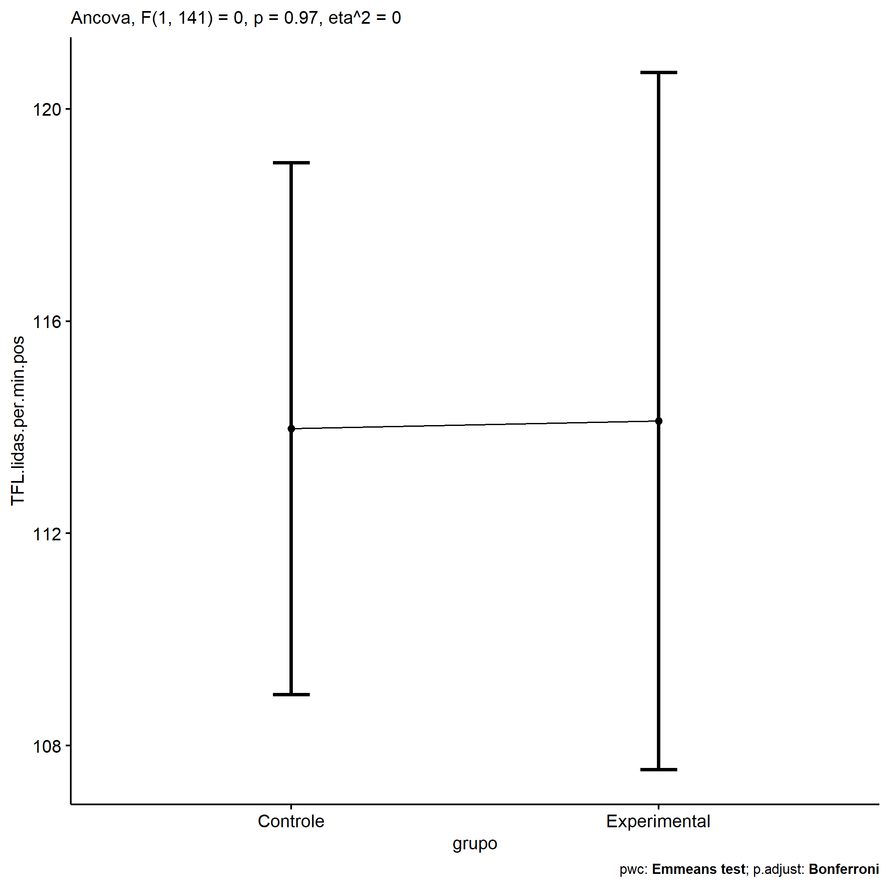<!-- -->

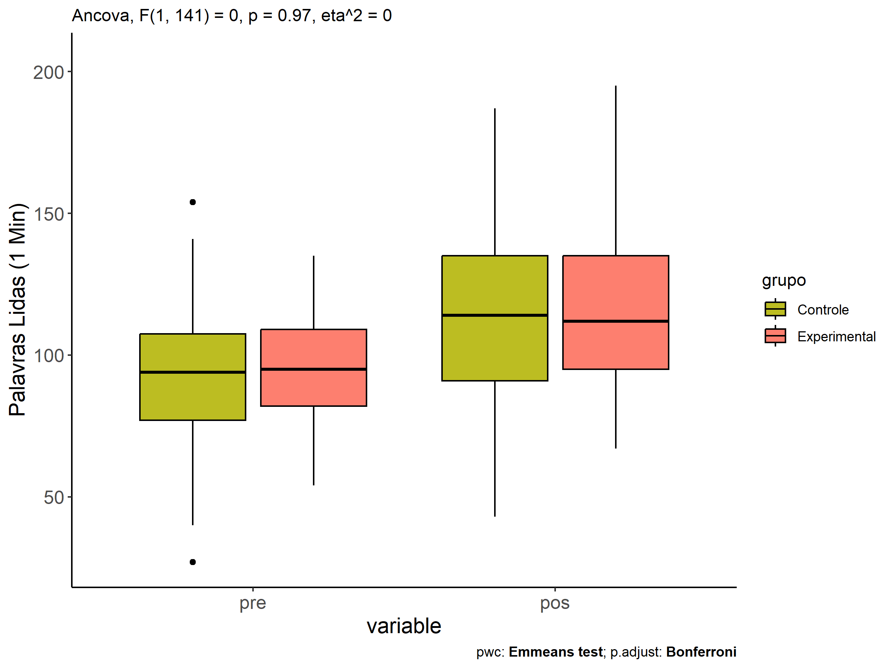<!-- -->

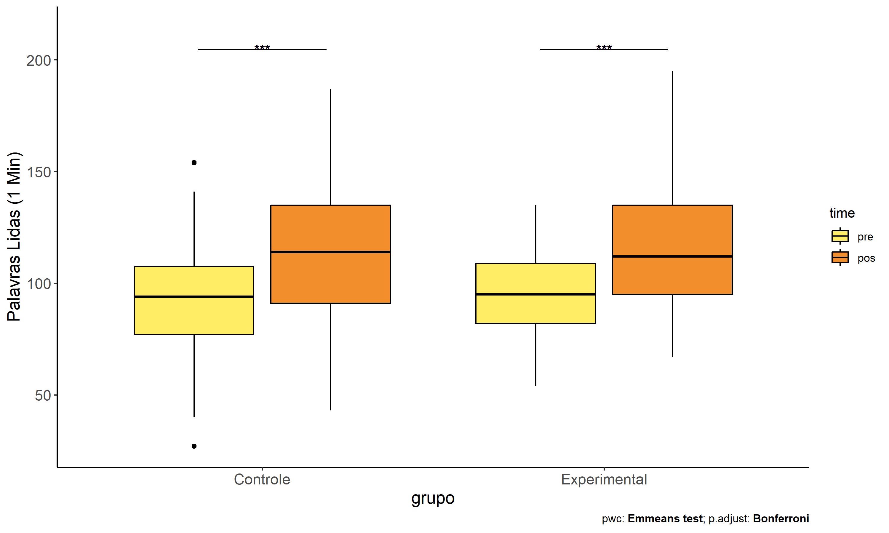<!-- -->

## Pairwise comparisons for two factors

### factores: **grupo:Sexo**

| var                   | grupo        | Sexo |   n | M (pre) | SE (pre) | M (unadj) | SE (unadj) | M (adj) | SE (adj) |
|:----------------------|:-------------|:-----|----:|--------:|---------:|----------:|-----------:|--------:|---------:|
| TFL.lidas.per.min.pos | Controle     | F    |  36 |  93.917 |    4.018 |   121.194 |      4.358 | 120.332 |    3.949 |
| TFL.lidas.per.min.pos | Controle     | M    |  55 |  90.618 |    3.270 |   108.618 |      3.926 | 109.784 |    3.198 |
| TFL.lidas.per.min.pos | Experimental | F    |  22 |  98.455 |    3.725 |   125.318 |      5.550 | 121.665 |    5.077 |
| TFL.lidas.per.min.pos | Experimental | M    |  31 |  90.032 |    3.592 |   107.290 |      4.718 | 108.816 |    4.259 |

| .y.                   | grupo        | Sexo | group1   | group2       | estimate | conf.low | conf.high |    se | statistic |     p | p.adj | p.adj.signif |
|:----------------------|:-------------|:-----|:---------|:-------------|---------:|---------:|----------:|------:|----------:|------:|------:|:-------------|
| TFL.lidas.per.min.pos |              | F    | Controle | Experimental |   -1.333 |  -14.030 |    11.364 | 6.422 |    -0.208 | 0.836 | 0.836 | ns           |
| TFL.lidas.per.min.pos |              | M    | Controle | Experimental |    0.968 |   -9.550 |    11.485 | 5.319 |     0.182 | 0.856 | 0.856 | ns           |
| TFL.lidas.per.min.pre |              | F    | Controle | Experimental |   -4.538 |  -16.545 |     7.469 | 6.073 |    -0.747 | 0.456 | 0.456 | ns           |
| TFL.lidas.per.min.pre |              | M    | Controle | Experimental |    0.586 |   -9.379 |    10.551 | 5.040 |     0.116 | 0.908 | 0.908 | ns           |
| TFL.lidas.per.min.pos | Controle     |      | F        | M            |   10.548 |    0.492 |    20.603 | 5.086 |     2.074 | 0.040 | 0.040 | \*           |
| TFL.lidas.per.min.pos | Experimental |      | F        | M            |   12.848 |   -0.290 |    25.987 | 6.645 |     1.934 | 0.055 | 0.055 | ns           |
| TFL.lidas.per.min.pre | Controle     |      | F        | M            |    3.298 |   -6.213 |    12.810 | 4.811 |     0.686 | 0.494 | 0.494 | ns           |
| TFL.lidas.per.min.pre | Experimental |      | F        | M            |    8.422 |   -3.946 |    20.791 | 6.256 |     1.346 | 0.180 | 0.180 | ns           |

| .y.               | grupo        | Sexo | group1 | group2 | estimate | conf.low | conf.high |    se | statistic | p       | p.adj   | p.adj.signif |
|:------------------|:-------------|:-----|:-------|:-------|---------:|---------:|----------:|------:|----------:|:--------|:--------|:-------------|
| TFL.lidas.per.min | Controle     | F    | pre    | pos    |  -27.278 |  -38.882 |   -15.674 | 5.895 |    -4.627 | \<0.001 | \<0.001 | \*\*\*\*     |
| TFL.lidas.per.min | Controle     | M    | pre    | pos    |  -18.000 |  -27.388 |    -8.612 | 4.769 |    -3.774 | \<0.001 | \<0.001 | \*\*\*       |
| TFL.lidas.per.min | Experimental | F    | pre    | pos    |  -26.864 |  -41.708 |   -12.020 | 7.541 |    -3.562 | \<0.001 | \<0.001 | \*\*\*       |
| TFL.lidas.per.min | Experimental | M    | pre    | pos    |  -17.258 |  -29.763 |    -4.753 | 6.353 |    -2.717 | 0.007   | 0.007   | \*\*         |

    ## Scale for colour is already present.
    ## Adding another scale for colour, which will replace the existing scale.

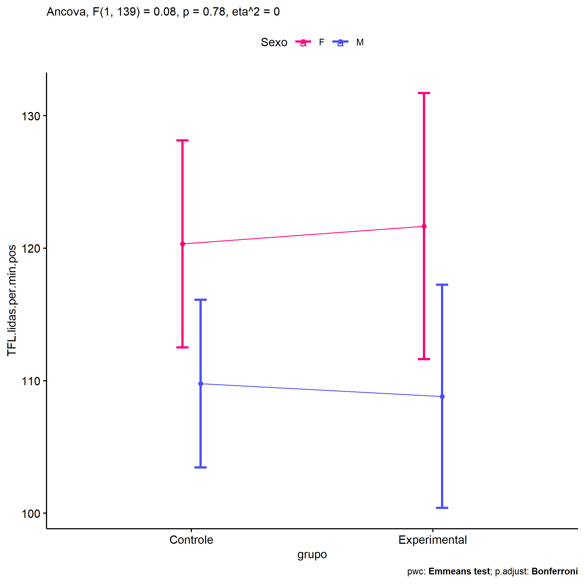<!-- -->

    ## Scale for colour is already present.
    ## Adding another scale for colour, which will replace the existing scale.

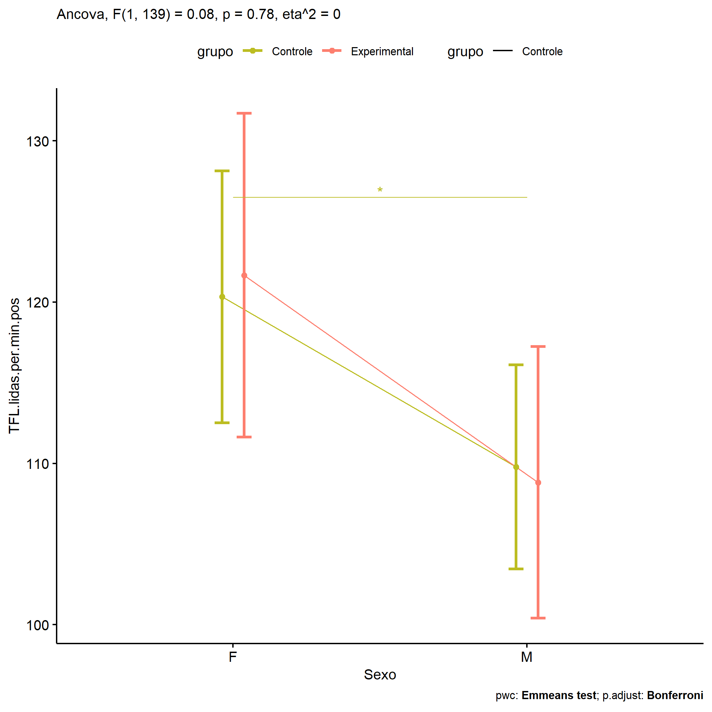<!-- -->

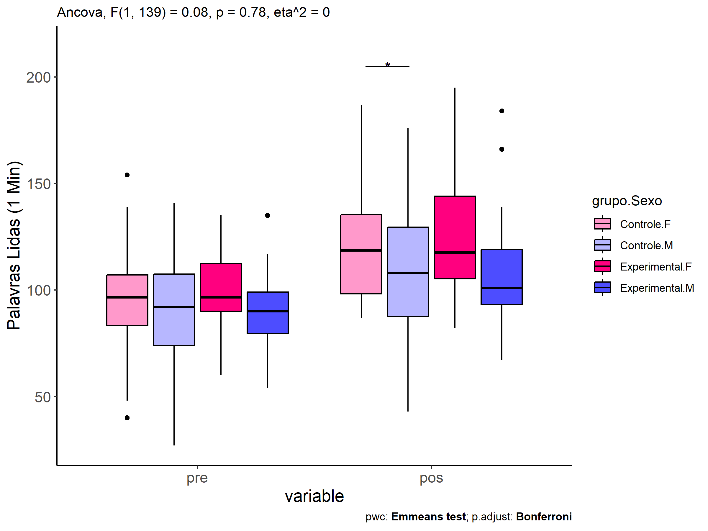<!-- -->

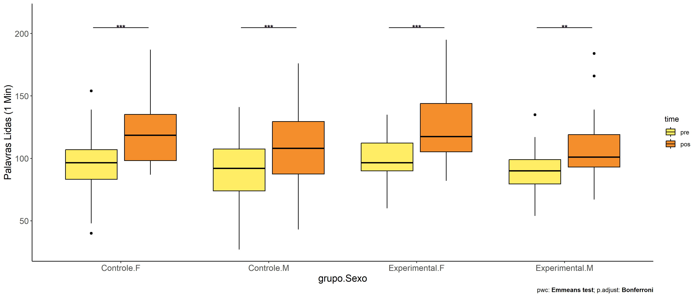<!-- -->

### factores: **grupo:Zona**

| var                   | grupo        | Zona   |   n | M (pre) | SE (pre) | M (unadj) | SE (unadj) | M (adj) | SE (adj) |
|:----------------------|:-------------|:-------|----:|--------:|---------:|----------:|-----------:|--------:|---------:|
| TFL.lidas.per.min.pos | Controle     | Rural  |  58 |  91.914 |    3.445 |   106.276 |      3.302 | 106.433 |    2.860 |
| TFL.lidas.per.min.pos | Controle     | Urbana |   7 |  93.000 |    9.092 |   142.857 |     10.734 | 142.414 |    8.233 |
| TFL.lidas.per.min.pos | Experimental | Rural  |  35 |  90.714 |    3.196 |   109.371 |      3.922 | 110.192 |    3.684 |
| TFL.lidas.per.min.pos | Experimental | Urbana |   6 | 102.667 |    7.126 |   134.333 |     14.101 | 128.545 |    8.943 |

| .y.                   | grupo        | Zona   | group1   | group2       | estimate | conf.low | conf.high |     se | statistic | p       | p.adj   | p.adj.signif |
|:----------------------|:-------------|:-------|:---------|:-------------|---------:|---------:|----------:|-------:|----------:|:--------|:--------|:-------------|
| TFL.lidas.per.min.pos |              | Rural  | Controle | Experimental |   -3.759 |  -13.009 |     5.492 |  4.663 |    -0.806 | 0.422   | 0.422   | ns           |
| TFL.lidas.per.min.pos |              | Urbana | Controle | Experimental |   13.869 |  -10.233 |    37.971 | 12.150 |     1.141 | 0.256   | 0.256   | ns           |
| TFL.lidas.per.min.pre |              | Rural  | Controle | Experimental |    1.200 |   -8.782 |    11.181 |  5.032 |     0.238 | 0.812   | 0.812   | ns           |
| TFL.lidas.per.min.pre |              | Urbana | Controle | Experimental |   -9.667 |  -35.610 |    16.277 | 13.080 |    -0.739 | 0.462   | 0.462   | ns           |
| TFL.lidas.per.min.pos | Controle     |        | Rural    | Urbana       |  -35.981 |  -53.270 |   -18.692 |  8.715 |    -4.128 | \<0.001 | \<0.001 | \*\*\*\*     |
| TFL.lidas.per.min.pos | Experimental |        | Rural    | Urbana       |  -18.353 |  -37.568 |     0.861 |  9.686 |    -1.895 | 0.061   | 0.061   | ns           |
| TFL.lidas.per.min.pre | Controle     |        | Rural    | Urbana       |   -1.086 |  -19.745 |    17.572 |  9.407 |    -0.115 | 0.908   | 0.908   | ns           |
| TFL.lidas.per.min.pre | Experimental |        | Rural    | Urbana       |  -11.952 |  -32.557 |     8.652 | 10.388 |    -1.151 | 0.253   | 0.253   | ns           |

| .y.               | grupo        | Zona   | group1 | group2 | estimate | conf.low | conf.high |     se | statistic | p       | p.adj   | p.adj.signif |
|:------------------|:-------------|:-------|:-------|:-------|---------:|---------:|----------:|-------:|----------:|:--------|:--------|:-------------|
| TFL.lidas.per.min | Controle     | Rural  | pre    | pos    |  -14.362 |  -23.298 |    -5.426 |  4.532 |    -3.169 | 0.002   | 0.002   | \*\*         |
| TFL.lidas.per.min | Controle     | Urbana | pre    | pos    |  -49.857 |  -75.580 |   -24.134 | 13.046 |    -3.822 | \<0.001 | \<0.001 | \*\*\*       |
| TFL.lidas.per.min | Experimental | Rural  | pre    | pos    |  -18.657 |  -30.161 |    -7.154 |  5.834 |    -3.198 | 0.002   | 0.002   | \*\*         |
| TFL.lidas.per.min | Experimental | Urbana | pre    | pos    |  -31.667 |  -59.450 |    -3.883 | 14.091 |    -2.247 | 0.026   | 0.026   | \*           |

    ## Scale for colour is already present.
    ## Adding another scale for colour, which will replace the existing scale.

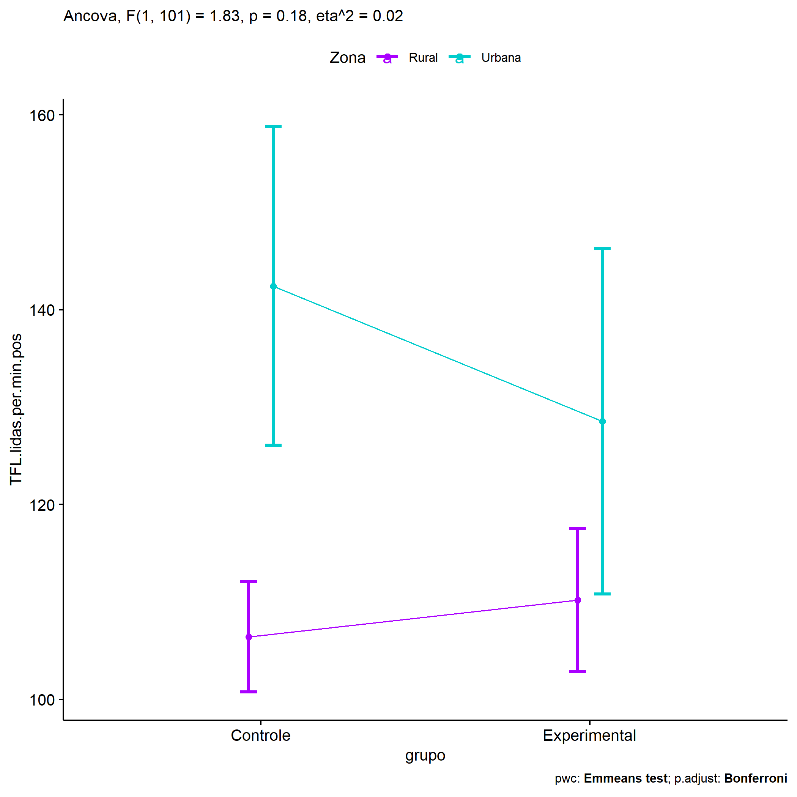<!-- -->

    ## Scale for colour is already present.
    ## Adding another scale for colour, which will replace the existing scale.

<!-- -->

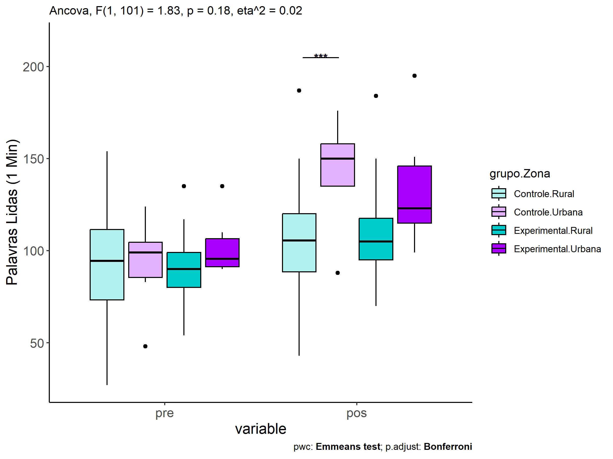<!-- -->

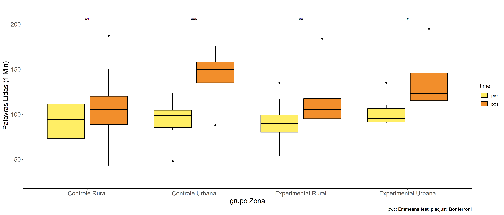<!-- -->

### factores: **grupo:Cor.Raca**

| var                   | grupo        | Cor.Raca |   n | M (pre) | SE (pre) | M (unadj) | SE (unadj) | M (adj) | SE (adj) |
|:----------------------|:-------------|:---------|----:|--------:|---------:|----------:|-----------:|--------:|---------:|
| TFL.lidas.per.min.pos | Controle     | Branca   |  12 | 105.500 |    4.588 |   115.417 |      5.237 | 107.687 |    5.141 |
| TFL.lidas.per.min.pos | Controle     | Parda    |  42 |  92.381 |    3.624 |   101.095 |      3.965 | 102.610 |    2.700 |
| TFL.lidas.per.min.pos | Experimental | Branca   |   5 | 104.000 |    5.310 |   126.600 |      8.322 | 119.927 |    7.853 |
| TFL.lidas.per.min.pos | Experimental | Indígena |   8 |  95.125 |    6.839 |   106.875 |      7.527 | 106.456 |    6.169 |
| TFL.lidas.per.min.pos | Experimental | Parda    |  16 |  88.688 |    5.065 |   100.750 |      4.760 | 104.867 |    4.396 |

|     | .y.                   | grupo        | Cor.Raca | group1   | group2       | estimate | conf.low | conf.high |     se | statistic |     p | p.adj | p.adj.signif |
|:----|:----------------------|:-------------|:---------|:---------|:-------------|---------:|---------:|----------:|-------:|----------:|------:|------:|:-------------|
| 1   | TFL.lidas.per.min.pos |              | Branca   | Controle | Experimental |  -12.240 |  -30.737 |     6.256 |  9.289 |    -1.318 | 0.191 | 0.191 | ns           |
| 3   | TFL.lidas.per.min.pos |              | Parda    | Controle | Experimental |   -2.257 |  -12.488 |     7.973 |  5.138 |    -0.439 | 0.662 | 0.662 | ns           |
| 4   | TFL.lidas.per.min.pre |              | Branca   | Controle | Experimental |    1.500 |  -20.863 |    23.863 | 11.233 |     0.134 | 0.894 | 0.894 | ns           |
| 6   | TFL.lidas.per.min.pre |              | Parda    | Controle | Experimental |    3.693 |   -8.649 |    16.036 |  6.200 |     0.596 | 0.553 | 0.553 | ns           |
| 8   | TFL.lidas.per.min.pos | Controle     |          | Branca   | Parda        |    5.077 |   -6.556 |    16.710 |  5.842 |     0.869 | 0.387 | 0.387 | ns           |
| 10  | TFL.lidas.per.min.pos | Experimental |          | Branca   | Indígena     |   13.471 |   -6.405 |    33.348 |  9.982 |     1.350 | 0.181 | 0.543 | ns           |
| 11  | TFL.lidas.per.min.pos | Experimental |          | Branca   | Parda        |   15.060 |   -2.969 |    33.089 |  9.054 |     1.663 | 0.100 | 0.301 | ns           |
| 12  | TFL.lidas.per.min.pos | Experimental |          | Indígena | Parda        |    1.589 |  -13.504 |    16.682 |  7.579 |     0.210 | 0.835 | 1.000 | ns           |
| 14  | TFL.lidas.per.min.pre | Controle     |          | Branca   | Parda        |   13.119 |   -0.633 |    26.871 |  6.907 |     1.899 | 0.061 | 0.061 | ns           |
| 16  | TFL.lidas.per.min.pre | Experimental |          | Branca   | Indígena     |    8.875 |  -15.076 |    32.826 | 12.030 |     0.738 | 0.463 | 1.000 | ns           |
| 17  | TFL.lidas.per.min.pre | Experimental |          | Branca   | Parda        |   15.312 |   -6.212 |    36.837 | 10.812 |     1.416 | 0.161 | 0.482 | ns           |
| 18  | TFL.lidas.per.min.pre | Experimental |          | Indígena | Parda        |    6.437 |  -11.754 |    24.629 |  9.138 |     0.704 | 0.483 | 1.000 | ns           |

| .y.               | grupo        | Cor.Raca | group1 | group2 | estimate | conf.low | conf.high |     se | statistic |     p | p.adj | p.adj.signif |
|:------------------|:-------------|:---------|:-------|:-------|---------:|---------:|----------:|-------:|----------:|------:|------:|:-------------|
| TFL.lidas.per.min | Controle     | Branca   | pre    | pos    |   -9.917 |  -27.648 |     7.815 |  8.977 |    -1.105 | 0.271 | 0.271 | ns           |
| TFL.lidas.per.min | Controle     | Parda    | pre    | pos    |   -8.714 |  -18.192 |     0.764 |  4.798 |    -1.816 | 0.071 | 0.071 | ns           |
| TFL.lidas.per.min | Experimental | Branca   | pre    | pos    |  -22.600 |  -50.070 |     4.870 | 13.907 |    -1.625 | 0.106 | 0.106 | ns           |
| TFL.lidas.per.min | Experimental | Indígena | pre    | pos    |  -11.750 |  -33.467 |     9.967 | 10.994 |    -1.069 | 0.287 | 0.287 | ns           |
| TFL.lidas.per.min | Experimental | Parda    | pre    | pos    |  -12.062 |  -27.419 |     3.294 |  7.774 |    -1.552 | 0.123 | 0.123 | ns           |

    ## Scale for colour is already present.
    ## Adding another scale for colour, which will replace the existing scale.

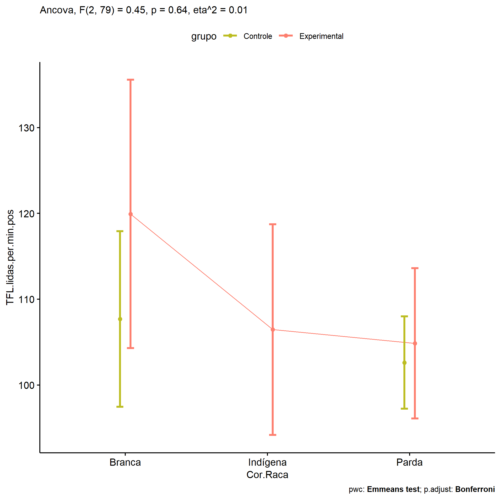<!-- -->

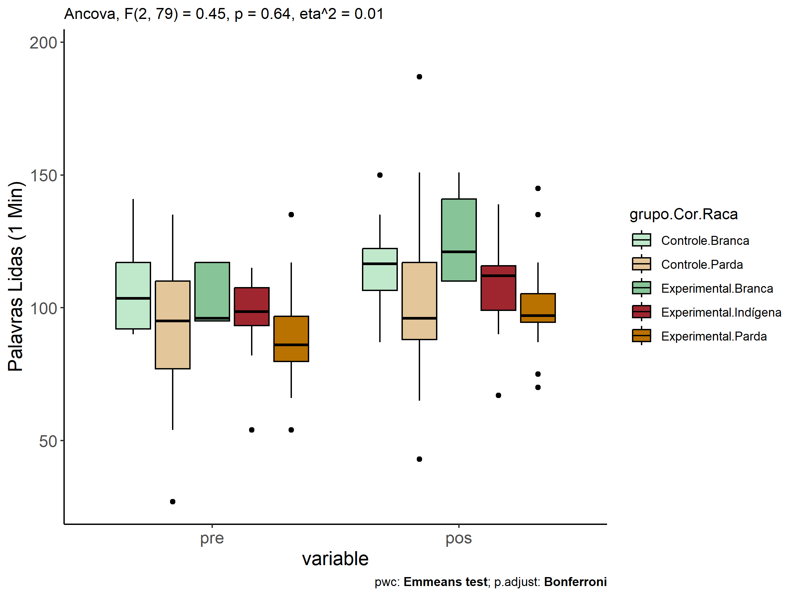<!-- -->

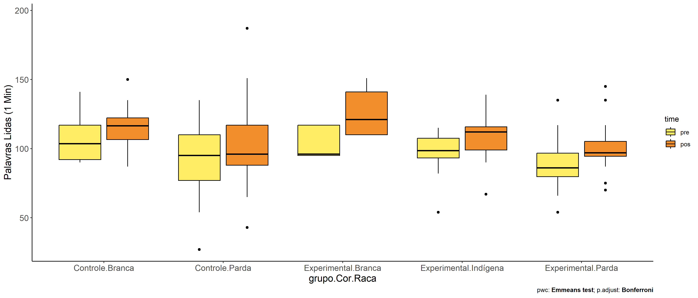<!-- -->

### factores: **grupo:TFL.lidas.per.min.quintile**

| var                   | grupo        | TFL.lidas.per.min.quintile |   n | M (pre) | SE (pre) | M (unadj) | SE (unadj) | M (adj) | SE (adj) |
|:----------------------|:-------------|:---------------------------|----:|--------:|---------:|----------:|-----------:|--------:|---------:|
| TFL.lidas.per.min.pos | Controle     | 1st quintile               |  15 |  53.267 |    2.497 |    93.467 |      7.672 | 116.229 |   13.427 |
| TFL.lidas.per.min.pos | Controle     | 2nd quintile               |  19 |  78.263 |    1.563 |   104.632 |      5.663 | 112.897 |    7.046 |
| TFL.lidas.per.min.pos | Controle     | 3rd quintile               |  15 |  91.600 |    0.653 |   107.067 |      5.894 | 107.597 |    6.278 |
| TFL.lidas.per.min.pos | Controle     | 4th quintile               |  23 | 102.609 |    0.889 |   124.174 |      4.943 | 118.319 |    5.914 |
| TFL.lidas.per.min.pos | Controle     | 5th quintile               |  19 | 123.421 |    2.573 |   130.789 |      6.335 | 112.864 |   10.884 |
| TFL.lidas.per.min.pos | Experimental | 1st quintile               |   5 |  58.600 |    2.227 |    96.000 |     14.505 | 115.669 |   14.942 |
| TFL.lidas.per.min.pos | Experimental | 2nd quintile               |  12 |  77.417 |    1.836 |    93.500 |      5.368 | 102.256 |    8.368 |
| TFL.lidas.per.min.pos | Experimental | 3rd quintile               |  13 |  91.923 |    0.804 |   111.231 |      3.901 | 111.573 |    6.740 |
| TFL.lidas.per.min.pos | Experimental | 4th quintile               |  11 | 100.818 |    1.623 |   125.000 |      8.567 | 120.184 |    7.743 |
| TFL.lidas.per.min.pos | Experimental | 5th quintile               |  12 | 119.250 |    2.161 |   138.333 |      6.446 | 122.827 |   10.704 |

| .y.                   | grupo        | TFL.lidas.per.min.quintile | group1       | group2       | estimate | conf.low | conf.high |     se | statistic | p       | p.adj   | p.adj.signif |
|:----------------------|:-------------|:---------------------------|:-------------|:-------------|---------:|---------:|----------:|-------:|----------:|:--------|:--------|:-------------|
| TFL.lidas.per.min.pos |              | 1st quintile               | Controle     | Experimental |    0.560 |  -24.457 |    25.577 | 12.648 |     0.044 | 0.965   | 0.965   | ns           |
| TFL.lidas.per.min.pos |              | 2nd quintile               | Controle     | Experimental |   10.641 |   -7.084 |    28.365 |  8.961 |     1.187 | 0.237   | 0.237   | ns           |
| TFL.lidas.per.min.pos |              | 3rd quintile               | Controle     | Experimental |   -3.977 |  -22.185 |    14.232 |  9.206 |    -0.432 | 0.666   | 0.666   | ns           |
| TFL.lidas.per.min.pos |              | 4th quintile               | Controle     | Experimental |   -1.865 |  -19.511 |    15.782 |  8.922 |    -0.209 | 0.835   | 0.835   | ns           |
| TFL.lidas.per.min.pos |              | 5th quintile               | Controle     | Experimental |   -9.963 |  -27.855 |     7.929 |  9.046 |    -1.101 | 0.273   | 0.273   | ns           |
| TFL.lidas.per.min.pre |              | 1st quintile               | Controle     | Experimental |   -5.333 |  -12.419 |     1.752 |  3.583 |    -1.489 | 0.139   | 0.139   | ns           |
| TFL.lidas.per.min.pre |              | 2nd quintile               | Controle     | Experimental |    0.846 |   -4.213 |     5.906 |  2.558 |     0.331 | 0.741   | 0.741   | ns           |
| TFL.lidas.per.min.pre |              | 3rd quintile               | Controle     | Experimental |   -0.323 |   -5.522 |     4.876 |  2.629 |    -0.123 | 0.902   | 0.902   | ns           |
| TFL.lidas.per.min.pre |              | 4th quintile               | Controle     | Experimental |    1.791 |   -3.240 |     6.821 |  2.543 |     0.704 | 0.483   | 0.483   | ns           |
| TFL.lidas.per.min.pre |              | 5th quintile               | Controle     | Experimental |    4.171 |   -0.888 |     9.231 |  2.558 |     1.631 | 0.105   | 0.105   | ns           |
| TFL.lidas.per.min.pos | Controle     |                            | 1st quintile | 2nd quintile |    3.332 |  -19.008 |    25.673 | 11.295 |     0.295 | 0.768   | 1       | ns           |
| TFL.lidas.per.min.pos | Controle     |                            | 1st quintile | 3rd quintile |    8.632 |  -20.244 |    37.509 | 14.599 |     0.591 | 0.555   | 1       | ns           |
| TFL.lidas.per.min.pos | Controle     |                            | 1st quintile | 4th quintile |   -2.090 |  -35.644 |    31.463 | 16.964 |    -0.123 | 0.902   | 1       | ns           |
| TFL.lidas.per.min.pos | Controle     |                            | 1st quintile | 5th quintile |    3.364 |  -41.772 |    48.500 | 22.819 |     0.147 | 0.883   | 1       | ns           |
| TFL.lidas.per.min.pos | Controle     |                            | 2nd quintile | 3rd quintile |    5.300 |  -13.115 |    23.714 |  9.310 |     0.569 | 0.57    | 1       | ns           |
| TFL.lidas.per.min.pos | Controle     |                            | 2nd quintile | 4th quintile |   -5.423 |  -26.257 |    15.411 | 10.533 |    -0.515 | 0.608   | 1       | ns           |
| TFL.lidas.per.min.pos | Controle     |                            | 2nd quintile | 5th quintile |    0.032 |  -31.161 |    31.226 | 15.770 |     0.002 | 0.998   | 1       | ns           |
| TFL.lidas.per.min.pos | Controle     |                            | 3rd quintile | 4th quintile |  -10.723 |  -27.976 |     6.531 |  8.723 |    -1.229 | 0.221   | 1       | ns           |
| TFL.lidas.per.min.pos | Controle     |                            | 3rd quintile | 5th quintile |   -5.268 |  -30.524 |    19.989 | 12.769 |    -0.413 | 0.681   | 1       | ns           |
| TFL.lidas.per.min.pos | Controle     |                            | 4th quintile | 5th quintile |    5.455 |  -13.960 |    24.870 |  9.816 |     0.556 | 0.579   | 1       | ns           |
| TFL.lidas.per.min.pos | Experimental |                            | 1st quintile | 2nd quintile |   13.413 |  -14.531 |    41.357 | 14.128 |     0.949 | 0.344   | 1       | ns           |
| TFL.lidas.per.min.pos | Experimental |                            | 1st quintile | 3rd quintile |    4.096 |  -28.104 |    36.296 | 16.279 |     0.252 | 0.802   | 1       | ns           |
| TFL.lidas.per.min.pos | Experimental |                            | 1st quintile | 4th quintile |   -4.515 |  -40.704 |    31.675 | 18.296 |    -0.247 | 0.805   | 1       | ns           |
| TFL.lidas.per.min.pos | Experimental |                            | 1st quintile | 5th quintile |   -7.158 |  -51.553 |    37.237 | 22.445 |    -0.319 | 0.75    | 1       | ns           |
| TFL.lidas.per.min.pos | Experimental |                            | 2nd quintile | 3rd quintile |   -9.318 |  -30.420 |    11.785 | 10.669 |    -0.873 | 0.384   | 1       | ns           |
| TFL.lidas.per.min.pos | Experimental |                            | 2nd quintile | 4th quintile |  -17.928 |  -42.388 |     6.533 | 12.366 |    -1.450 | 0.149   | 1       | ns           |
| TFL.lidas.per.min.pos | Experimental |                            | 2nd quintile | 5th quintile |  -20.571 |  -52.372 |    11.229 | 16.077 |    -1.280 | 0.203   | 1       | ns           |
| TFL.lidas.per.min.pos | Experimental |                            | 3rd quintile | 4th quintile |   -8.610 |  -29.001 |    11.781 | 10.309 |    -0.835 | 0.405   | 1       | ns           |
| TFL.lidas.per.min.pos | Experimental |                            | 3rd quintile | 5th quintile |  -11.254 |  -36.499 |    13.991 | 12.763 |    -0.882 | 0.38    | 1       | ns           |
| TFL.lidas.per.min.pos | Experimental |                            | 4th quintile | 5th quintile |   -2.643 |  -25.532 |    20.245 | 11.572 |    -0.228 | 0.82    | 1       | ns           |
| TFL.lidas.per.min.pre | Controle     |                            | 1st quintile | 2nd quintile |  -24.996 |  -29.736 |   -20.257 |  2.396 |   -10.432 | \<0.001 | \<0.001 | \*\*\*\*     |
| TFL.lidas.per.min.pre | Controle     |                            | 1st quintile | 3rd quintile |  -38.333 |  -43.344 |   -33.323 |  2.533 |   -15.132 | \<0.001 | \<0.001 | \*\*\*\*     |
| TFL.lidas.per.min.pre | Controle     |                            | 1st quintile | 4th quintile |  -49.342 |  -53.896 |   -44.788 |  2.302 |   -21.431 | \<0.001 | \<0.001 | \*\*\*\*     |
| TFL.lidas.per.min.pre | Controle     |                            | 1st quintile | 5th quintile |  -70.154 |  -74.894 |   -65.415 |  2.396 |   -29.278 | \<0.001 | \<0.001 | \*\*\*\*     |
| TFL.lidas.per.min.pre | Controle     |                            | 2nd quintile | 3rd quintile |  -13.337 |  -18.076 |    -8.598 |  2.396 |    -5.566 | \<0.001 | \<0.001 | \*\*\*\*     |
| TFL.lidas.per.min.pre | Controle     |                            | 2nd quintile | 4th quintile |  -24.346 |  -28.599 |   -20.092 |  2.151 |   -11.320 | \<0.001 | \<0.001 | \*\*\*\*     |
| TFL.lidas.per.min.pre | Controle     |                            | 2nd quintile | 5th quintile |  -45.158 |  -49.610 |   -40.706 |  2.251 |   -20.063 | \<0.001 | \<0.001 | \*\*\*\*     |
| TFL.lidas.per.min.pre | Controle     |                            | 3rd quintile | 4th quintile |  -11.009 |  -15.562 |    -6.455 |  2.302 |    -4.781 | \<0.001 | \<0.001 | \*\*\*\*     |
| TFL.lidas.per.min.pre | Controle     |                            | 3rd quintile | 5th quintile |  -31.821 |  -36.560 |   -27.082 |  2.396 |   -13.280 | \<0.001 | \<0.001 | \*\*\*\*     |
| TFL.lidas.per.min.pre | Controle     |                            | 4th quintile | 5th quintile |  -20.812 |  -25.066 |   -16.559 |  2.151 |    -9.677 | \<0.001 | \<0.001 | \*\*\*\*     |
| TFL.lidas.per.min.pre | Experimental |                            | 1st quintile | 2nd quintile |  -18.817 |  -26.120 |   -11.513 |  3.693 |    -5.096 | \<0.001 | \<0.001 | \*\*\*\*     |
| TFL.lidas.per.min.pre | Experimental |                            | 1st quintile | 3rd quintile |  -33.323 |  -40.544 |   -26.103 |  3.651 |    -9.128 | \<0.001 | \<0.001 | \*\*\*\*     |
| TFL.lidas.per.min.pre | Experimental |                            | 1st quintile | 4th quintile |  -42.218 |  -49.619 |   -34.818 |  3.742 |   -11.283 | \<0.001 | \<0.001 | \*\*\*\*     |
| TFL.lidas.per.min.pre | Experimental |                            | 1st quintile | 5th quintile |  -60.650 |  -67.954 |   -53.346 |  3.693 |   -16.424 | \<0.001 | \<0.001 | \*\*\*\*     |
| TFL.lidas.per.min.pre | Experimental |                            | 2nd quintile | 3rd quintile |  -14.506 |  -19.999 |    -9.014 |  2.777 |    -5.223 | \<0.001 | \<0.001 | \*\*\*\*     |
| TFL.lidas.per.min.pre | Experimental |                            | 2nd quintile | 4th quintile |  -23.402 |  -29.129 |   -17.674 |  2.896 |    -8.081 | \<0.001 | \<0.001 | \*\*\*\*     |
| TFL.lidas.per.min.pre | Experimental |                            | 2nd quintile | 5th quintile |  -41.833 |  -47.435 |   -36.232 |  2.832 |   -14.771 | \<0.001 | \<0.001 | \*\*\*\*     |
| TFL.lidas.per.min.pre | Experimental |                            | 3rd quintile | 4th quintile |   -8.895 |  -14.516 |    -3.274 |  2.842 |    -3.130 | 0.002   | 0.021   | \*           |
| TFL.lidas.per.min.pre | Experimental |                            | 3rd quintile | 5th quintile |  -27.327 |  -32.820 |   -21.834 |  2.777 |    -9.840 | \<0.001 | \<0.001 | \*\*\*\*     |
| TFL.lidas.per.min.pre | Experimental |                            | 4th quintile | 5th quintile |  -18.432 |  -24.159 |   -12.704 |  2.896 |    -6.365 | \<0.001 | \<0.001 | \*\*\*\*     |

| .y.               | grupo        | TFL.lidas.per.min.quintile | group1 | group2 | estimate | conf.low | conf.high |     se | statistic | p       | p.adj   | p.adj.signif |
|:------------------|:-------------|:---------------------------|:-------|:-------|---------:|---------:|----------:|-------:|----------:|:--------|:--------|:-------------|
| TFL.lidas.per.min | Controle     | 1st quintile               | pre    | pos    |  -40.200 |  -53.161 |   -27.239 |  6.583 |    -6.107 | \<0.001 | \<0.001 | \*\*\*\*     |
| TFL.lidas.per.min | Controle     | 2nd quintile               | pre    | pos    |  -26.368 |  -37.884 |   -14.852 |  5.849 |    -4.508 | \<0.001 | \<0.001 | \*\*\*\*     |
| TFL.lidas.per.min | Controle     | 3rd quintile               | pre    | pos    |  -15.467 |  -28.427 |    -2.506 |  6.583 |    -2.350 | 0.02    | 0.02    | \*           |
| TFL.lidas.per.min | Controle     | 4th quintile               | pre    | pos    |  -21.565 |  -32.032 |   -11.098 |  5.316 |    -4.057 | \<0.001 | \<0.001 | \*\*\*\*     |
| TFL.lidas.per.min | Controle     | 5th quintile               | pre    | pos    |   -7.368 |  -18.884 |     4.148 |  5.849 |    -1.260 | 0.209   | 0.209   | ns           |
| TFL.lidas.per.min | Experimental | 1st quintile               | pre    | pos    |  -37.400 |  -59.849 |   -14.951 | 11.402 |    -3.280 | 0.001   | 0.001   | \*\*         |
| TFL.lidas.per.min | Experimental | 2nd quintile               | pre    | pos    |  -16.083 |  -30.574 |    -1.593 |  7.360 |    -2.185 | 0.03    | 0.03    | \*           |
| TFL.lidas.per.min | Experimental | 3rd quintile               | pre    | pos    |  -19.308 |  -33.230 |    -5.386 |  7.071 |    -2.730 | 0.007   | 0.007   | \*\*         |
| TFL.lidas.per.min | Experimental | 4th quintile               | pre    | pos    |  -24.182 |  -39.317 |    -9.047 |  7.687 |    -3.146 | 0.002   | 0.002   | \*\*         |
| TFL.lidas.per.min | Experimental | 5th quintile               | pre    | pos    |  -19.083 |  -33.574 |    -4.593 |  7.360 |    -2.593 | 0.01    | 0.01    | \*           |

    ## Scale for colour is already present.
    ## Adding another scale for colour, which will replace the existing scale.

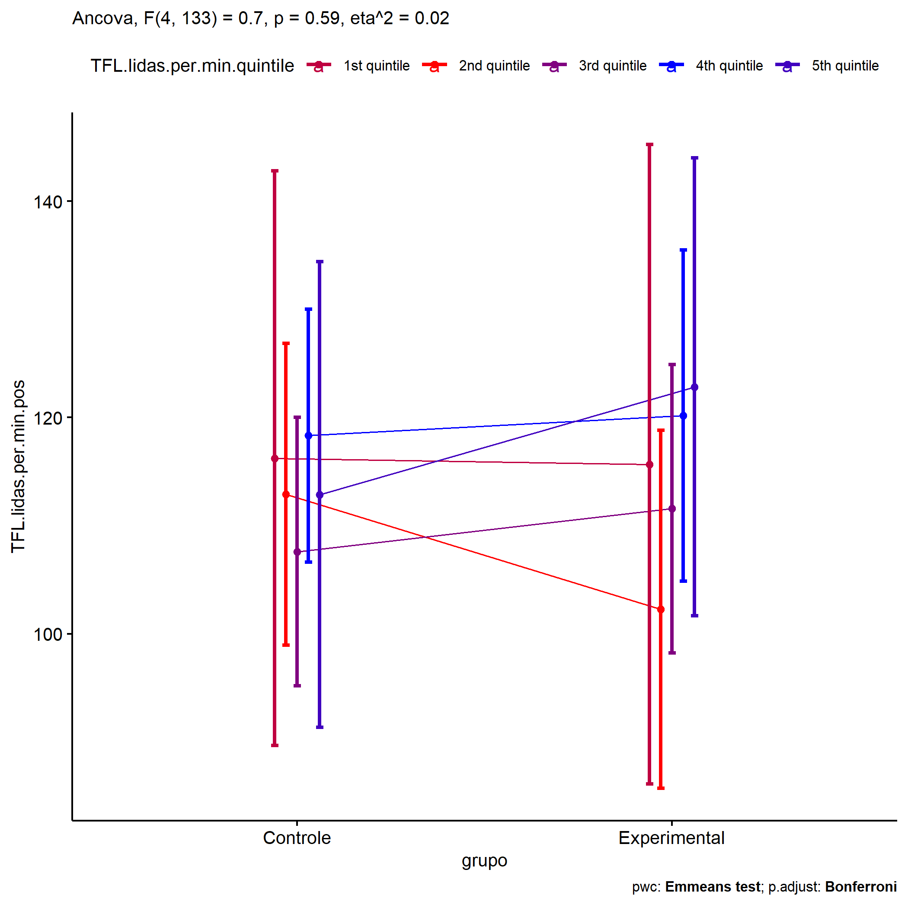<!-- -->

    ## Scale for colour is already present.
    ## Adding another scale for colour, which will replace the existing scale.

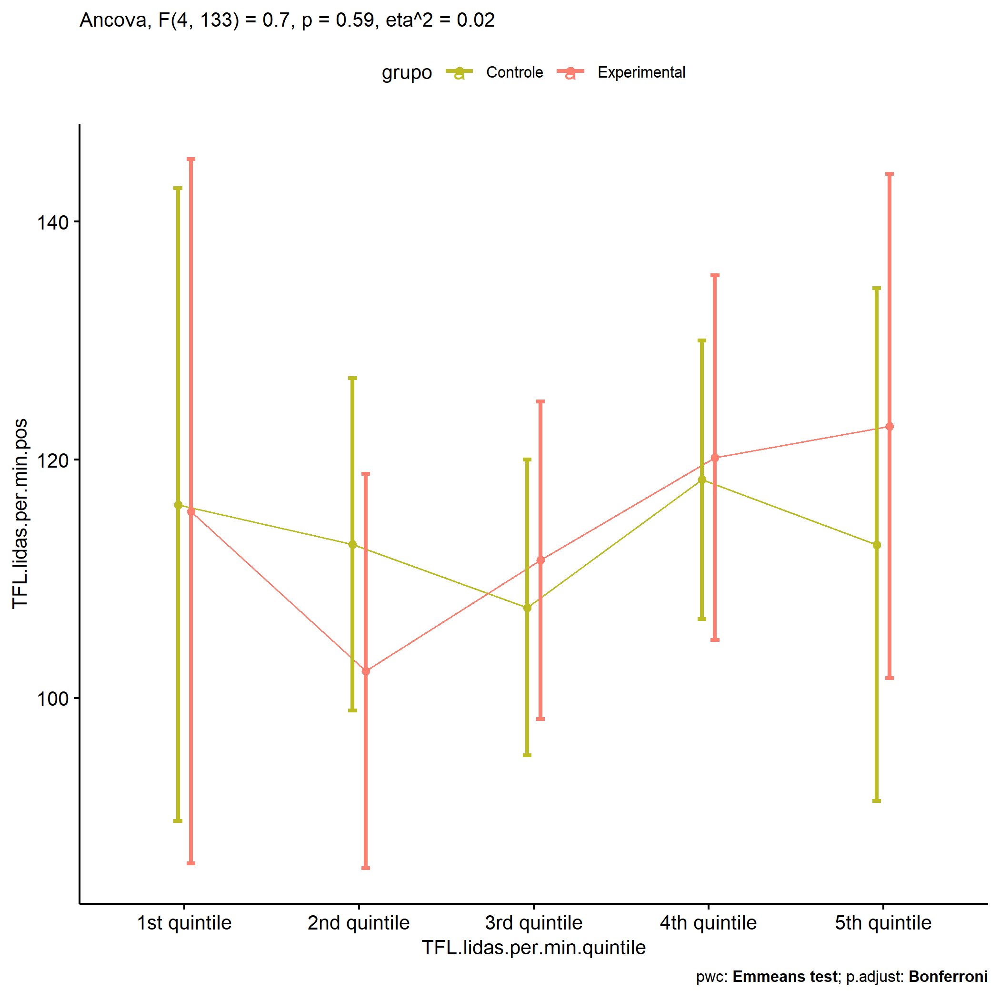<!-- -->

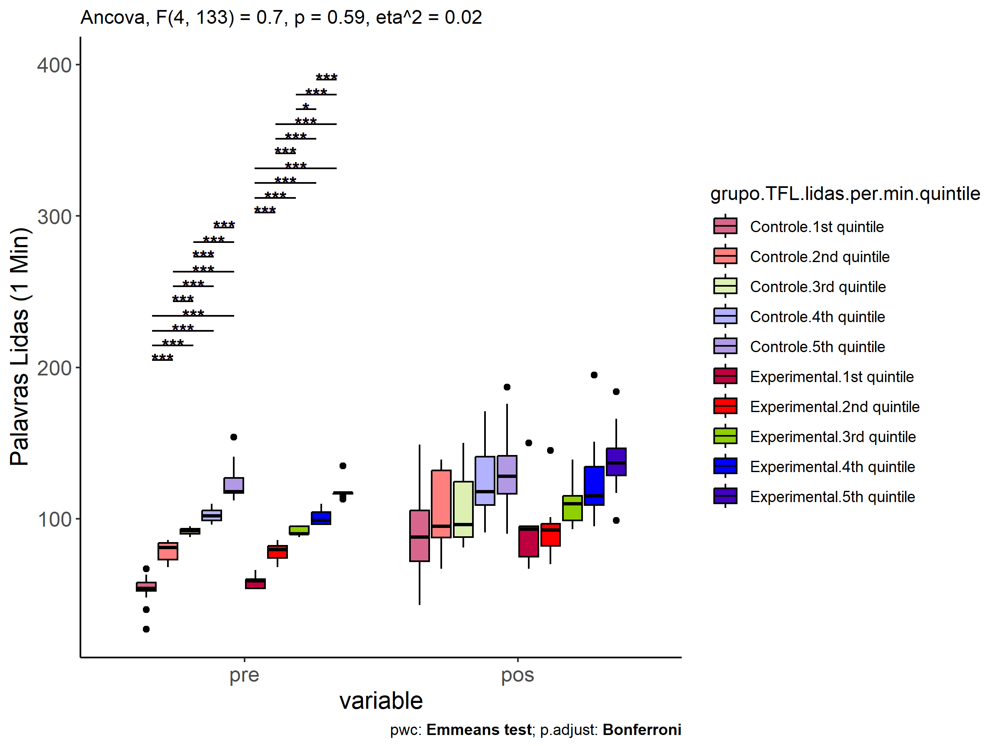<!-- -->

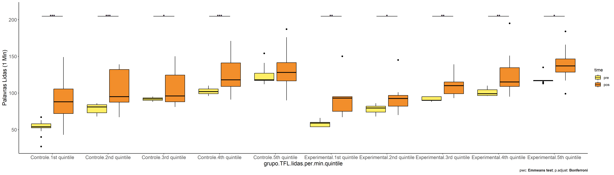<!-- -->
