ANCOVA in Palavras Lidas (1 Min) (Palavras Lidas (1 Min))
================
Geiser C. Challco <geiser@alumni.usp.br>

- [Descriptive Statistics of Initial
  Data](#descriptive-statistics-of-initial-data)
- [ANCOVA and Pairwise for one factor:
  **grupo**](#ancova-and-pairwise-for-one-factor-grupo)
  - [Without remove non-normal data](#without-remove-non-normal-data)
  - [Computing ANCOVA and PairWise After removing non-normal data
    (OK)](#computing-ancova-and-pairwise-after-removing-non-normal-data-ok)
    - [Plots for ancova](#plots-for-ancova)
    - [Checking linearity assumption](#checking-linearity-assumption)
    - [Checking normality and
      homogeneity](#checking-normality-and-homogeneity)
- [ANCOVA and Pairwise for two factors
  **grupo:Sexo**](#ancova-and-pairwise-for-two-factors-gruposexo)
  - [Without remove non-normal data](#without-remove-non-normal-data-1)
  - [Computing ANCOVA and PairWise After removing non-normal data
    (OK)](#computing-ancova-and-pairwise-after-removing-non-normal-data-ok-1)
    - [Plots for ancova](#plots-for-ancova-1)
    - [Checking linearity assumption](#checking-linearity-assumption-1)
    - [Checking normality and
      homogeneity](#checking-normality-and-homogeneity-1)
- [ANCOVA and Pairwise for two factors
  **grupo:Zona**](#ancova-and-pairwise-for-two-factors-grupozona)
  - [Without remove non-normal data](#without-remove-non-normal-data-2)
  - [Computing ANCOVA and PairWise After removing non-normal data
    (OK)](#computing-ancova-and-pairwise-after-removing-non-normal-data-ok-2)
    - [Plots for ancova](#plots-for-ancova-2)
    - [Checking linearity assumption](#checking-linearity-assumption-2)
    - [Checking normality and
      homogeneity](#checking-normality-and-homogeneity-2)
- [ANCOVA and Pairwise for two factors
  **grupo:Cor.Raca**](#ancova-and-pairwise-for-two-factors-grupocorraca)
  - [Without remove non-normal data](#without-remove-non-normal-data-3)
  - [Computing ANCOVA and PairWise After removing non-normal data
    (OK)](#computing-ancova-and-pairwise-after-removing-non-normal-data-ok-3)
    - [Plots for ancova](#plots-for-ancova-3)
    - [Checking linearity assumption](#checking-linearity-assumption-3)
    - [Checking normality and
      homogeneity](#checking-normality-and-homogeneity-3)
- [ANCOVA and Pairwise for two factors
  **grupo:TFL.lidas.per.min.quintile**](#ancova-and-pairwise-for-two-factors-grupotfllidasperminquintile)
  - [Without remove non-normal data](#without-remove-non-normal-data-4)
  - [Computing ANCOVA and PairWise After removing non-normal data
    (OK)](#computing-ancova-and-pairwise-after-removing-non-normal-data-ok-4)
    - [Plots for ancova](#plots-for-ancova-4)
    - [Checking linearity assumption](#checking-linearity-assumption-4)
    - [Checking normality and
      homogeneity](#checking-normality-and-homogeneity-4)
- [Summary of Results](#summary-of-results)
  - [Descriptive Statistics](#descriptive-statistics)
  - [ANCOVA Table Comparison](#ancova-table-comparison)
  - [PairWise Table Comparison](#pairwise-table-comparison)
  - [EMMS Table Comparison](#emms-table-comparison)

**NOTE**:

- Teste ANCOVA para determinar se houve diferenças significativas no
  Palavras Lidas (1 Min) (medido usando pre- e pos-testes).
- ANCOVA test to determine whether there were significant differences in
  Palavras Lidas (1 Min) (measured using pre- and post-tests).

# Descriptive Statistics of Initial Data

``` r
df <- get.descriptives(dat, c(dv.pre, dv.pos), c("grupo"), 
                       include.global = T, symmetry.test = T, normality.test = F)
df <- plyr::rbind.fill(
  df, do.call(plyr::rbind.fill, lapply(lfatores2, FUN = function(f) {
    if (nrow(dat) > 0 && sum(!is.na(unique(dat[[f]]))) > 1)
      get.descriptives(dat, c(dv.pre,dv.pos), c("grupo", f),
                       symmetry.test = T, normality.test = F)
    }))
)
```

    ## Warning: There were 2 warnings in `mutate()`.
    ## The first warning was:
    ## ℹ In argument: `ci = abs(stats::qt(alpha/2, .data$n - 1) * .data$se)`.
    ## Caused by warning:
    ## ! There was 1 warning in `mutate()`.
    ## ℹ In argument: `ci = abs(stats::qt(alpha/2, .data$n - 1) * .data$se)`.
    ## Caused by warning in `stats::qt()`:
    ## ! NaNs produced
    ## ℹ Run `dplyr::last_dplyr_warnings()` to see the 1 remaining warning.
    ## There were 2 warnings in `mutate()`.
    ## The first warning was:
    ## ℹ In argument: `ci = abs(stats::qt(alpha/2, .data$n - 1) * .data$se)`.
    ## Caused by warning:
    ## ! There was 1 warning in `mutate()`.
    ## ℹ In argument: `ci = abs(stats::qt(alpha/2, .data$n - 1) * .data$se)`.
    ## Caused by warning in `stats::qt()`:
    ## ! NaNs produced
    ## ℹ Run `dplyr::last_dplyr_warnings()` to see the 1 remaining warning.

``` r
(df <- df[,c(fatores1[fatores1 %in% colnames(df)],"variable",
             colnames(df)[!colnames(df) %in% c(fatores1,"variable")])])
```

    ##           grupo Sexo   Zona Cor.Raca TFL.lidas.per.min.quintile              variable   n    mean median min max
    ## 1      Controle <NA>   <NA>     <NA>                       <NA> TFL.lidas.per.min.pre  91  91.923   94.0  27 154
    ## 2  Experimental <NA>   <NA>     <NA>                       <NA> TFL.lidas.per.min.pre  53  93.528   95.0  54 135
    ## 3          <NA> <NA>   <NA>     <NA>                       <NA> TFL.lidas.per.min.pre 144  92.514   95.0  27 154
    ## 4      Controle <NA>   <NA>     <NA>                       <NA> TFL.lidas.per.min.pos  91 113.593  114.0  43 187
    ## 5  Experimental <NA>   <NA>     <NA>                       <NA> TFL.lidas.per.min.pos  53 114.774  112.0  67 195
    ## 6          <NA> <NA>   <NA>     <NA>                       <NA> TFL.lidas.per.min.pos 144 114.028  112.0  43 195
    ## 7      Controle    F   <NA>     <NA>                       <NA> TFL.lidas.per.min.pre  36  93.917   96.5  40 154
    ## 8      Controle    M   <NA>     <NA>                       <NA> TFL.lidas.per.min.pre  55  90.618   92.0  27 141
    ## 9  Experimental    F   <NA>     <NA>                       <NA> TFL.lidas.per.min.pre  22  98.455   96.5  60 135
    ## 10 Experimental    M   <NA>     <NA>                       <NA> TFL.lidas.per.min.pre  31  90.032   90.0  54 135
    ## 11     Controle    F   <NA>     <NA>                       <NA> TFL.lidas.per.min.pos  36 121.194  118.5  87 187
    ## 12     Controle    M   <NA>     <NA>                       <NA> TFL.lidas.per.min.pos  55 108.618  108.0  43 176
    ## 13 Experimental    F   <NA>     <NA>                       <NA> TFL.lidas.per.min.pos  22 125.318  117.5  82 195
    ## 14 Experimental    M   <NA>     <NA>                       <NA> TFL.lidas.per.min.pos  31 107.290  101.0  67 184
    ## 15     Controle <NA>  Rural     <NA>                       <NA> TFL.lidas.per.min.pre  58  91.914   94.5  27 154
    ## 16     Controle <NA> Urbana     <NA>                       <NA> TFL.lidas.per.min.pre   7  93.000   99.0  48 124
    ## 17     Controle <NA>   <NA>     <NA>                       <NA> TFL.lidas.per.min.pre  26  91.654   92.0  54 139
    ## 18 Experimental <NA>  Rural     <NA>                       <NA> TFL.lidas.per.min.pre  35  90.714   90.0  54 135
    ## 19 Experimental <NA> Urbana     <NA>                       <NA> TFL.lidas.per.min.pre   6 102.667   95.5  90 135
    ## 20 Experimental <NA>   <NA>     <NA>                       <NA> TFL.lidas.per.min.pre  12  97.167   98.5  54 117
    ## 21     Controle <NA>  Rural     <NA>                       <NA> TFL.lidas.per.min.pos  58 106.276  105.5  43 187
    ## 22     Controle <NA> Urbana     <NA>                       <NA> TFL.lidas.per.min.pos   7 142.857  150.0  88 176
    ## 23     Controle <NA>   <NA>     <NA>                       <NA> TFL.lidas.per.min.pos  26 122.038  128.0  68 176
    ## 24 Experimental <NA>  Rural     <NA>                       <NA> TFL.lidas.per.min.pos  35 109.371  105.0  70 184
    ## 25 Experimental <NA> Urbana     <NA>                       <NA> TFL.lidas.per.min.pos   6 134.333  123.0  99 195
    ## 26 Experimental <NA>   <NA>     <NA>                       <NA> TFL.lidas.per.min.pos  12 120.750  133.0  67 166
    ## 27     Controle <NA>   <NA>   Branca                       <NA> TFL.lidas.per.min.pre  12 105.500  103.5  90 141
    ## 28     Controle <NA>   <NA> Indígena                       <NA> TFL.lidas.per.min.pre   3 117.000  101.0  96 154
    ## 29     Controle <NA>   <NA>    Parda                       <NA> TFL.lidas.per.min.pre  42  92.381   95.0  27 135
    ## 30     Controle <NA>   <NA>    Preta                       <NA> TFL.lidas.per.min.pre   1  99.000   99.0  99  99
    ## 31     Controle <NA>   <NA>     <NA>                       <NA> TFL.lidas.per.min.pre  33  83.909   85.0  40 139
    ## 32 Experimental <NA>   <NA>  Amarela                       <NA> TFL.lidas.per.min.pre   1  76.000   76.0  76  76
    ## 33 Experimental <NA>   <NA>   Branca                       <NA> TFL.lidas.per.min.pre   5 104.000   96.0  95 117
    ## 34 Experimental <NA>   <NA> Indígena                       <NA> TFL.lidas.per.min.pre   8  95.125   98.5  54 115
    ## 35 Experimental <NA>   <NA>    Parda                       <NA> TFL.lidas.per.min.pre  16  88.688   86.0  54 135
    ## 36 Experimental <NA>   <NA>     <NA>                       <NA> TFL.lidas.per.min.pre  23  94.826   95.0  59 135
    ## 37     Controle <NA>   <NA>   Branca                       <NA> TFL.lidas.per.min.pos  12 115.417  116.5  87 150
    ## 38     Controle <NA>   <NA> Indígena                       <NA> TFL.lidas.per.min.pos   3 118.667  117.0  92 147
    ## 39     Controle <NA>   <NA>    Parda                       <NA> TFL.lidas.per.min.pos  42 101.095   96.0  43 187
    ## 40     Controle <NA>   <NA>    Preta                       <NA> TFL.lidas.per.min.pos   1 118.000  118.0 118 118
    ## 41     Controle <NA>   <NA>     <NA>                       <NA> TFL.lidas.per.min.pos  33 128.242  135.0  68 176
    ## 42 Experimental <NA>   <NA>  Amarela                       <NA> TFL.lidas.per.min.pos   1  82.000   82.0  82  82
    ## 43 Experimental <NA>   <NA>   Branca                       <NA> TFL.lidas.per.min.pos   5 126.600  121.0 110 151
    ## 44 Experimental <NA>   <NA> Indígena                       <NA> TFL.lidas.per.min.pos   8 106.875  112.0  67 139
    ## 45 Experimental <NA>   <NA>    Parda                       <NA> TFL.lidas.per.min.pos  16 100.750   97.0  70 145
    ## 46 Experimental <NA>   <NA>     <NA>                       <NA> TFL.lidas.per.min.pos  23 126.130  130.0  80 195
    ## 47     Controle <NA>   <NA>     <NA>               1st quintile TFL.lidas.per.min.pre  15  53.267   54.0  27  67
    ## 48     Controle <NA>   <NA>     <NA>               2nd quintile TFL.lidas.per.min.pre  19  78.263   81.0  68  86
    ## 49     Controle <NA>   <NA>     <NA>               3rd quintile TFL.lidas.per.min.pre  15  91.600   92.0  88  95
    ## 50     Controle <NA>   <NA>     <NA>               4th quintile TFL.lidas.per.min.pre  23 102.609  102.0  96 110
    ## 51     Controle <NA>   <NA>     <NA>               5th quintile TFL.lidas.per.min.pre  19 123.421  118.0 112 154
    ## 52 Experimental <NA>   <NA>     <NA>               1st quintile TFL.lidas.per.min.pre   5  58.600   59.0  54  66
    ## 53 Experimental <NA>   <NA>     <NA>               2nd quintile TFL.lidas.per.min.pre  12  77.417   79.5  68  86
    ## 54 Experimental <NA>   <NA>     <NA>               3rd quintile TFL.lidas.per.min.pre  13  91.923   90.0  88  95
    ## 55 Experimental <NA>   <NA>     <NA>               4th quintile TFL.lidas.per.min.pre  11 100.818   99.0  96 110
    ##        sd     se     ci   iqr symmetry    skewness    kurtosis
    ## 1  24.115  2.528  5.022 30.50      YES -0.18446800 -0.12841898
    ## 2  19.277  2.648  5.313 27.00      YES -0.06868141 -0.47081654
    ## 3  22.399  1.867  3.690 29.00      YES -0.18253652 -0.03279087
    ## 4  28.508  2.988  5.937 44.00      YES  0.25283539 -0.32694232
    ## 5  27.425  3.767  7.559 40.00       NO  0.70103535  0.27254687
    ## 6  28.024  2.335  4.616 42.00      YES  0.40758649 -0.06837707
    ## 7  24.110  4.018  8.158 23.75      YES -0.12869798  0.16506331
    ## 8  24.250  3.270  6.556 33.50      YES -0.21419750 -0.43960379
    ## 9  17.470  3.725  7.746 22.25      YES -0.19039067 -0.25995629
    ## 10 20.001  3.592  7.336 19.50      YES  0.10521959 -0.60749344
    ## 11 26.148  4.358  8.847 37.00       NO  0.61474231 -0.44286867
    ## 12 29.114  3.926  7.871 42.00      YES  0.19591159 -0.57960695
    ## 13 26.032  5.550 11.542 38.75       NO  0.58652959  0.11601440
    ## 14 26.267  4.718  9.635 26.00       NO  0.96205249  0.82195037
    ## 15 26.233  3.445  6.898 38.25      YES -0.18905235 -0.34742859
    ## 16 24.055  9.092 22.248 19.00       NO -0.58614065 -0.81530927
    ## 17 19.626  3.849  7.927 22.25      YES  0.08801562 -0.24740768
    ## 18 18.909  3.196  6.496 19.00      YES  0.06166721 -0.52649305
    ## 19 17.455  7.126 18.318 15.25       NO  0.92096949 -0.93015328
    ## 20 20.683  5.971 13.141 32.00       NO -0.61148704 -0.92212231
    ## 21 25.144  3.302  6.611 31.50      YES  0.33001706  0.64898009
    ## 22 28.399 10.734 26.264 23.00       NO -0.73531573 -0.68988901
    ## 23 29.198  5.726 11.793 42.25      YES  0.00718775 -1.03643079
    ## 24 23.204  3.922  7.971 22.50       NO  1.00843114  1.24751380
    ## 25 34.541 14.101 36.248 31.00       NO  0.68474726 -1.18967487
    ## 26 31.758  9.168 20.178 48.75      YES -0.35920445 -1.44790173
    ## 27 15.895  4.588 10.099 25.00       NO  0.77075591 -0.53576075
    ## 28 32.140 18.556 79.841 29.00 few data  0.00000000  0.00000000
    ## 29 23.486  3.624  7.319 33.00       NO -0.51121668 -0.17798214
    ## 30     NA     NA    NaN  0.00 few data  0.00000000  0.00000000
    ## 31 24.108  4.197  8.548 39.00      YES  0.11911746 -0.75725682
    ## 32     NA     NA    NaN  0.00 few data  0.00000000  0.00000000
    ## 33 11.874  5.310 14.744 22.00 few data  0.00000000  0.00000000
    ## 34 19.342  6.839 16.171 14.25       NO -1.02828663 -0.22855186
    ## 35 20.261  5.065 10.796 17.00       NO  0.54856534 -0.20893115
    ## 36 19.878  4.145  8.596 24.00      YES -0.08457833 -0.75828800
    ## 37 18.143  5.237 11.528 15.75      YES  0.09195270 -0.87510640
    ## 38 27.538 15.899 68.408 27.50 few data  0.00000000  0.00000000
    ## 39 25.697  3.965  8.008 29.00       NO  0.74547707  1.53583144
    ## 40     NA     NA    NaN  0.00 few data  0.00000000  0.00000000
    ## 41 29.130  5.071 10.329 42.00      YES -0.30892323 -0.82442567
    ## 42     NA     NA    NaN  0.00 few data  0.00000000  0.00000000
    ## 43 18.609  8.322 23.106 31.00      YES  0.25413167 -2.08224676
    ## 44 21.290  7.527 17.799 16.75      YES -0.42728978 -0.75134675
    ## 45 19.039  4.760 10.145 10.75       NO  0.73675787  0.16747099
    ## 46 30.697  6.401 13.274 43.50      YES  0.45040261 -0.56910693
    ## 47  9.669  2.497  5.355  5.50       NO -1.19593222  1.26452381
    ## 48  6.814  1.563  3.284 11.00      YES -0.39249818 -1.48109073
    ## 49  2.530  0.653  1.401  3.50      YES -0.07213946 -1.43494792
    ## 50  4.261  0.889  1.843  6.50      YES  0.47499951 -1.08971962
    ## 51 11.217  2.573  5.406 10.00       NO  1.29684604  0.63033740
    ## 52  4.980  2.227  6.183  6.00      YES  0.34551386 -1.73243496
    ## 53  6.360  1.836  4.041  8.00      YES -0.44123637 -1.37601683
    ## 54  2.900  0.804  1.752  5.00      YES -0.00537463 -1.90280731
    ## 55  5.382  1.623  3.616  8.00       NO  0.66139321 -1.37823975
    ##  [ reached 'max' / getOption("max.print") -- omitted 11 rows ]

| grupo        | Sexo | Zona   | Cor.Raca | TFL.lidas.per.min.quintile | variable              |   n |    mean | median | min | max |     sd |     se |     ci |   iqr | symmetry | skewness | kurtosis |
|:-------------|:-----|:-------|:---------|:---------------------------|:----------------------|----:|--------:|-------:|----:|----:|-------:|-------:|-------:|------:|:---------|---------:|---------:|
| Controle     |      |        |          |                            | TFL.lidas.per.min.pre |  91 |  91.923 |   94.0 |  27 | 154 | 24.115 |  2.528 |  5.022 | 30.50 | YES      |   -0.184 |   -0.128 |
| Experimental |      |        |          |                            | TFL.lidas.per.min.pre |  53 |  93.528 |   95.0 |  54 | 135 | 19.277 |  2.648 |  5.313 | 27.00 | YES      |   -0.069 |   -0.471 |
|              |      |        |          |                            | TFL.lidas.per.min.pre | 144 |  92.514 |   95.0 |  27 | 154 | 22.399 |  1.867 |  3.690 | 29.00 | YES      |   -0.183 |   -0.033 |
| Controle     |      |        |          |                            | TFL.lidas.per.min.pos |  91 | 113.593 |  114.0 |  43 | 187 | 28.508 |  2.988 |  5.937 | 44.00 | YES      |    0.253 |   -0.327 |
| Experimental |      |        |          |                            | TFL.lidas.per.min.pos |  53 | 114.774 |  112.0 |  67 | 195 | 27.425 |  3.767 |  7.559 | 40.00 | NO       |    0.701 |    0.273 |
|              |      |        |          |                            | TFL.lidas.per.min.pos | 144 | 114.028 |  112.0 |  43 | 195 | 28.024 |  2.335 |  4.616 | 42.00 | YES      |    0.408 |   -0.068 |
| Controle     | F    |        |          |                            | TFL.lidas.per.min.pre |  36 |  93.917 |   96.5 |  40 | 154 | 24.110 |  4.018 |  8.158 | 23.75 | YES      |   -0.129 |    0.165 |
| Controle     | M    |        |          |                            | TFL.lidas.per.min.pre |  55 |  90.618 |   92.0 |  27 | 141 | 24.250 |  3.270 |  6.556 | 33.50 | YES      |   -0.214 |   -0.440 |
| Experimental | F    |        |          |                            | TFL.lidas.per.min.pre |  22 |  98.455 |   96.5 |  60 | 135 | 17.470 |  3.725 |  7.746 | 22.25 | YES      |   -0.190 |   -0.260 |
| Experimental | M    |        |          |                            | TFL.lidas.per.min.pre |  31 |  90.032 |   90.0 |  54 | 135 | 20.001 |  3.592 |  7.336 | 19.50 | YES      |    0.105 |   -0.607 |
| Controle     | F    |        |          |                            | TFL.lidas.per.min.pos |  36 | 121.194 |  118.5 |  87 | 187 | 26.148 |  4.358 |  8.847 | 37.00 | NO       |    0.615 |   -0.443 |
| Controle     | M    |        |          |                            | TFL.lidas.per.min.pos |  55 | 108.618 |  108.0 |  43 | 176 | 29.114 |  3.926 |  7.871 | 42.00 | YES      |    0.196 |   -0.580 |
| Experimental | F    |        |          |                            | TFL.lidas.per.min.pos |  22 | 125.318 |  117.5 |  82 | 195 | 26.032 |  5.550 | 11.542 | 38.75 | NO       |    0.587 |    0.116 |
| Experimental | M    |        |          |                            | TFL.lidas.per.min.pos |  31 | 107.290 |  101.0 |  67 | 184 | 26.267 |  4.718 |  9.635 | 26.00 | NO       |    0.962 |    0.822 |
| Controle     |      | Rural  |          |                            | TFL.lidas.per.min.pre |  58 |  91.914 |   94.5 |  27 | 154 | 26.233 |  3.445 |  6.898 | 38.25 | YES      |   -0.189 |   -0.347 |
| Controle     |      | Urbana |          |                            | TFL.lidas.per.min.pre |   7 |  93.000 |   99.0 |  48 | 124 | 24.055 |  9.092 | 22.248 | 19.00 | NO       |   -0.586 |   -0.815 |
| Controle     |      |        |          |                            | TFL.lidas.per.min.pre |  26 |  91.654 |   92.0 |  54 | 139 | 19.626 |  3.849 |  7.927 | 22.25 | YES      |    0.088 |   -0.247 |
| Experimental |      | Rural  |          |                            | TFL.lidas.per.min.pre |  35 |  90.714 |   90.0 |  54 | 135 | 18.909 |  3.196 |  6.496 | 19.00 | YES      |    0.062 |   -0.526 |
| Experimental |      | Urbana |          |                            | TFL.lidas.per.min.pre |   6 | 102.667 |   95.5 |  90 | 135 | 17.455 |  7.126 | 18.318 | 15.25 | NO       |    0.921 |   -0.930 |
| Experimental |      |        |          |                            | TFL.lidas.per.min.pre |  12 |  97.167 |   98.5 |  54 | 117 | 20.683 |  5.971 | 13.141 | 32.00 | NO       |   -0.611 |   -0.922 |
| Controle     |      | Rural  |          |                            | TFL.lidas.per.min.pos |  58 | 106.276 |  105.5 |  43 | 187 | 25.144 |  3.302 |  6.611 | 31.50 | YES      |    0.330 |    0.649 |
| Controle     |      | Urbana |          |                            | TFL.lidas.per.min.pos |   7 | 142.857 |  150.0 |  88 | 176 | 28.399 | 10.734 | 26.264 | 23.00 | NO       |   -0.735 |   -0.690 |
| Controle     |      |        |          |                            | TFL.lidas.per.min.pos |  26 | 122.038 |  128.0 |  68 | 176 | 29.198 |  5.726 | 11.793 | 42.25 | YES      |    0.007 |   -1.036 |
| Experimental |      | Rural  |          |                            | TFL.lidas.per.min.pos |  35 | 109.371 |  105.0 |  70 | 184 | 23.204 |  3.922 |  7.971 | 22.50 | NO       |    1.008 |    1.248 |
| Experimental |      | Urbana |          |                            | TFL.lidas.per.min.pos |   6 | 134.333 |  123.0 |  99 | 195 | 34.541 | 14.101 | 36.248 | 31.00 | NO       |    0.685 |   -1.190 |
| Experimental |      |        |          |                            | TFL.lidas.per.min.pos |  12 | 120.750 |  133.0 |  67 | 166 | 31.758 |  9.168 | 20.178 | 48.75 | YES      |   -0.359 |   -1.448 |
| Controle     |      |        | Branca   |                            | TFL.lidas.per.min.pre |  12 | 105.500 |  103.5 |  90 | 141 | 15.895 |  4.588 | 10.099 | 25.00 | NO       |    0.771 |   -0.536 |
| Controle     |      |        | Indígena |                            | TFL.lidas.per.min.pre |   3 | 117.000 |  101.0 |  96 | 154 | 32.140 | 18.556 | 79.841 | 29.00 | few data |    0.000 |    0.000 |
| Controle     |      |        | Parda    |                            | TFL.lidas.per.min.pre |  42 |  92.381 |   95.0 |  27 | 135 | 23.486 |  3.624 |  7.319 | 33.00 | NO       |   -0.511 |   -0.178 |
| Controle     |      |        | Preta    |                            | TFL.lidas.per.min.pre |   1 |  99.000 |   99.0 |  99 |  99 |        |        |        |  0.00 | few data |    0.000 |    0.000 |
| Controle     |      |        |          |                            | TFL.lidas.per.min.pre |  33 |  83.909 |   85.0 |  40 | 139 | 24.108 |  4.197 |  8.548 | 39.00 | YES      |    0.119 |   -0.757 |
| Experimental |      |        | Amarela  |                            | TFL.lidas.per.min.pre |   1 |  76.000 |   76.0 |  76 |  76 |        |        |        |  0.00 | few data |    0.000 |    0.000 |
| Experimental |      |        | Branca   |                            | TFL.lidas.per.min.pre |   5 | 104.000 |   96.0 |  95 | 117 | 11.874 |  5.310 | 14.744 | 22.00 | few data |    0.000 |    0.000 |
| Experimental |      |        | Indígena |                            | TFL.lidas.per.min.pre |   8 |  95.125 |   98.5 |  54 | 115 | 19.342 |  6.839 | 16.171 | 14.25 | NO       |   -1.028 |   -0.229 |
| Experimental |      |        | Parda    |                            | TFL.lidas.per.min.pre |  16 |  88.688 |   86.0 |  54 | 135 | 20.261 |  5.065 | 10.796 | 17.00 | NO       |    0.549 |   -0.209 |
| Experimental |      |        |          |                            | TFL.lidas.per.min.pre |  23 |  94.826 |   95.0 |  59 | 135 | 19.878 |  4.145 |  8.596 | 24.00 | YES      |   -0.085 |   -0.758 |
| Controle     |      |        | Branca   |                            | TFL.lidas.per.min.pos |  12 | 115.417 |  116.5 |  87 | 150 | 18.143 |  5.237 | 11.528 | 15.75 | YES      |    0.092 |   -0.875 |
| Controle     |      |        | Indígena |                            | TFL.lidas.per.min.pos |   3 | 118.667 |  117.0 |  92 | 147 | 27.538 | 15.899 | 68.408 | 27.50 | few data |    0.000 |    0.000 |
| Controle     |      |        | Parda    |                            | TFL.lidas.per.min.pos |  42 | 101.095 |   96.0 |  43 | 187 | 25.697 |  3.965 |  8.008 | 29.00 | NO       |    0.745 |    1.536 |
| Controle     |      |        | Preta    |                            | TFL.lidas.per.min.pos |   1 | 118.000 |  118.0 | 118 | 118 |        |        |        |  0.00 | few data |    0.000 |    0.000 |
| Controle     |      |        |          |                            | TFL.lidas.per.min.pos |  33 | 128.242 |  135.0 |  68 | 176 | 29.130 |  5.071 | 10.329 | 42.00 | YES      |   -0.309 |   -0.824 |
| Experimental |      |        | Amarela  |                            | TFL.lidas.per.min.pos |   1 |  82.000 |   82.0 |  82 |  82 |        |        |        |  0.00 | few data |    0.000 |    0.000 |
| Experimental |      |        | Branca   |                            | TFL.lidas.per.min.pos |   5 | 126.600 |  121.0 | 110 | 151 | 18.609 |  8.322 | 23.106 | 31.00 | YES      |    0.254 |   -2.082 |
| Experimental |      |        | Indígena |                            | TFL.lidas.per.min.pos |   8 | 106.875 |  112.0 |  67 | 139 | 21.290 |  7.527 | 17.799 | 16.75 | YES      |   -0.427 |   -0.751 |
| Experimental |      |        | Parda    |                            | TFL.lidas.per.min.pos |  16 | 100.750 |   97.0 |  70 | 145 | 19.039 |  4.760 | 10.145 | 10.75 | NO       |    0.737 |    0.167 |
| Experimental |      |        |          |                            | TFL.lidas.per.min.pos |  23 | 126.130 |  130.0 |  80 | 195 | 30.697 |  6.401 | 13.274 | 43.50 | YES      |    0.450 |   -0.569 |
| Controle     |      |        |          | 1st quintile               | TFL.lidas.per.min.pre |  15 |  53.267 |   54.0 |  27 |  67 |  9.669 |  2.497 |  5.355 |  5.50 | NO       |   -1.196 |    1.265 |
| Controle     |      |        |          | 2nd quintile               | TFL.lidas.per.min.pre |  19 |  78.263 |   81.0 |  68 |  86 |  6.814 |  1.563 |  3.284 | 11.00 | YES      |   -0.392 |   -1.481 |
| Controle     |      |        |          | 3rd quintile               | TFL.lidas.per.min.pre |  15 |  91.600 |   92.0 |  88 |  95 |  2.530 |  0.653 |  1.401 |  3.50 | YES      |   -0.072 |   -1.435 |
| Controle     |      |        |          | 4th quintile               | TFL.lidas.per.min.pre |  23 | 102.609 |  102.0 |  96 | 110 |  4.261 |  0.889 |  1.843 |  6.50 | YES      |    0.475 |   -1.090 |
| Controle     |      |        |          | 5th quintile               | TFL.lidas.per.min.pre |  19 | 123.421 |  118.0 | 112 | 154 | 11.217 |  2.573 |  5.406 | 10.00 | NO       |    1.297 |    0.630 |
| Experimental |      |        |          | 1st quintile               | TFL.lidas.per.min.pre |   5 |  58.600 |   59.0 |  54 |  66 |  4.980 |  2.227 |  6.183 |  6.00 | YES      |    0.346 |   -1.732 |
| Experimental |      |        |          | 2nd quintile               | TFL.lidas.per.min.pre |  12 |  77.417 |   79.5 |  68 |  86 |  6.360 |  1.836 |  4.041 |  8.00 | YES      |   -0.441 |   -1.376 |
| Experimental |      |        |          | 3rd quintile               | TFL.lidas.per.min.pre |  13 |  91.923 |   90.0 |  88 |  95 |  2.900 |  0.804 |  1.752 |  5.00 | YES      |   -0.005 |   -1.903 |
| Experimental |      |        |          | 4th quintile               | TFL.lidas.per.min.pre |  11 | 100.818 |   99.0 |  96 | 110 |  5.382 |  1.623 |  3.616 |  8.00 | NO       |    0.661 |   -1.378 |
| Experimental |      |        |          | 5th quintile               | TFL.lidas.per.min.pre |  12 | 119.250 |  117.0 | 113 | 135 |  7.485 |  2.161 |  4.756 |  0.50 | NO       |    1.445 |    0.342 |
| Controle     |      |        |          | 1st quintile               | TFL.lidas.per.min.pos |  15 |  93.467 |   88.0 |  43 | 149 | 29.715 |  7.672 | 16.456 | 33.50 | YES      |    0.326 |   -0.949 |
| Controle     |      |        |          | 2nd quintile               | TFL.lidas.per.min.pos |  19 | 104.632 |   95.0 |  67 | 139 | 24.683 |  5.663 | 11.897 | 44.50 | YES      |    0.214 |   -1.577 |
| Controle     |      |        |          | 3rd quintile               | TFL.lidas.per.min.pos |  15 | 107.067 |   96.0 |  81 | 150 | 22.827 |  5.894 | 12.641 | 36.50 | NO       |    0.552 |   -1.311 |
| Controle     |      |        |          | 4th quintile               | TFL.lidas.per.min.pos |  23 | 124.174 |  118.0 |  91 | 171 | 23.704 |  4.943 | 10.250 | 32.00 | YES      |    0.448 |   -0.945 |
| Controle     |      |        |          | 5th quintile               | TFL.lidas.per.min.pos |  19 | 130.789 |  128.0 |  90 | 187 | 27.614 |  6.335 | 13.309 | 25.00 | NO       |    0.520 |   -0.698 |
| Experimental |      |        |          | 1st quintile               | TFL.lidas.per.min.pos |   5 |  96.000 |   93.0 |  67 | 150 | 32.435 | 14.505 | 40.273 | 20.00 | NO       |    0.726 |   -1.300 |
| Experimental |      |        |          | 2nd quintile               | TFL.lidas.per.min.pos |  12 |  93.500 |   92.5 |  70 | 145 | 18.594 |  5.368 | 11.814 | 14.75 | NO       |    1.535 |    2.169 |
| Experimental |      |        |          | 3rd quintile               | TFL.lidas.per.min.pos |  13 | 111.231 |  110.0 |  93 | 139 | 14.066 |  3.901 |  8.500 | 16.00 | NO       |    0.566 |   -0.740 |
| Experimental |      |        |          | 4th quintile               | TFL.lidas.per.min.pos |  11 | 125.000 |  115.0 |  95 | 195 | 28.415 |  8.567 | 19.089 | 25.50 | NO       |    1.235 |    0.597 |
| Experimental |      |        |          | 5th quintile               | TFL.lidas.per.min.pos |  12 | 138.333 |  137.0 |  99 | 184 | 22.329 |  6.446 | 14.187 | 18.00 | YES      |    0.316 |   -0.433 |

# ANCOVA and Pairwise for one factor: **grupo**

## Without remove non-normal data

``` r
pdat = remove_group_data(dat[!is.na(dat[["grupo"]]),], "TFL.lidas.per.min.pos", "grupo")

pdat.long <- rbind(pdat[,c("id","grupo")], pdat[,c("id","grupo")])
pdat.long[["time"]] <- c(rep("pre", nrow(pdat)), rep("pos", nrow(pdat)))
pdat.long[["time"]] <- factor(pdat.long[["time"]], c("pre","pos"))
pdat.long[["TFL.lidas.per.min"]] <- c(pdat[["TFL.lidas.per.min.pre"]], pdat[["TFL.lidas.per.min.pos"]])

aov = anova_test(pdat, TFL.lidas.per.min.pos ~ TFL.lidas.per.min.pre + grupo)
laov[["grupo"]] <- get_anova_table(aov)
```

``` r
pwc <- emmeans_test(pdat, TFL.lidas.per.min.pos ~ grupo, covariate = TFL.lidas.per.min.pre,
                    p.adjust.method = "bonferroni")
```

``` r
pwc.long <- emmeans_test(dplyr::group_by_at(pdat.long, "grupo"),
                          TFL.lidas.per.min ~ time,
                          p.adjust.method = "bonferroni")
lpwc[["grupo"]] <- plyr::rbind.fill(pwc, pwc.long)
```

``` r
ds <- get.descriptives(pdat, "TFL.lidas.per.min.pos", "grupo", covar = "TFL.lidas.per.min.pre")
ds <- merge(ds[ds$variable != "TFL.lidas.per.min.pre",],
            ds[ds$variable == "TFL.lidas.per.min.pre", !colnames(ds) %in% c("variable")],
            by = "grupo", all.x = T, suffixes = c("", ".TFL.lidas.per.min.pre"))
ds <- merge(get_emmeans(pwc), ds, by = "grupo", suffixes = c(".emms", ""))
ds <- ds[,c("grupo","n","mean.TFL.lidas.per.min.pre","se.TFL.lidas.per.min.pre","mean","se","emmean","se.emms")]

colnames(ds) <- c("grupo", "N", paste0(c("M","SE")," (pre)"),
                  paste0(c("M","SE"), " (unadj)"), paste0(c("M", "SE"), " (adj)"))

lemms[["grupo"]] <- ds
```

## Computing ANCOVA and PairWise After removing non-normal data (OK)

``` r
wdat = pdat 

res = residuals(lm(TFL.lidas.per.min.pos ~ TFL.lidas.per.min.pre + grupo, data = wdat))
non.normal = getNonNormal(res, wdat$id, plimit = 0.05)

wdat = wdat[!wdat$id %in% non.normal,]

wdat.long <- rbind(wdat[,c("id","grupo")], wdat[,c("id","grupo")])
wdat.long[["time"]] <- c(rep("pre", nrow(wdat)), rep("pos", nrow(wdat)))
wdat.long[["time"]] <- factor(wdat.long[["time"]], c("pre","pos"))
wdat.long[["TFL.lidas.per.min"]] <- c(wdat[["TFL.lidas.per.min.pre"]], wdat[["TFL.lidas.per.min.pos"]])

ldat[["grupo"]] = wdat

(non.normal)
```

    ##  [1] "P463"  "P956"  "P3498" "P3609" "P3721" "P3516" "P808"  "P445"  "P3521" "P3504" "P1010" "P3729" "P446" 
    ## [14] "P1109" "P465"  "P3492" "P942"  "P3581" "P1091" "P820"  "P1094" "P3627" "P621"  "P3566" "P184"  "P133" 
    ## [27] "P628"  "P3501" "P816"  "P1017" "P950"  "P947"  "P1097" "P3495" "P3615" "P1716" "P3505" "P3512" "P3524"
    ## [40] "P3565" "P3502" "P128"  "P1089" "P812"  "P521"  "P448"  "P3558" "P3606" "P3518" "P3624" "P1004" "P994" 
    ## [53] "P1000" "P616"  "P618"  "P829"  "P241"  "P451"  "P515"  "P615"  "P460"  "P813"  "P936"  "P614"  "P457" 
    ## [66] "P513"  "P958"  "P516"  "P1084" "P997"  "P626"  "P3509" "P3734" "P613"  "P3598" "P1107" "P512"  "P464" 
    ## [79] "P625"  "P612"  "P3560" "P3519" "P620"  "P523"  "P948"  "P2210" "P3508" "P943"  "P3577" "P176"  "P3569"
    ## [92] "P1742"

``` r
aov = anova_test(wdat, TFL.lidas.per.min.pos ~ TFL.lidas.per.min.pre + grupo)
laov[["grupo"]] <- merge(get_anova_table(aov), laov[["grupo"]], by="Effect", suffixes = c("","'"))

(df = get_anova_table(aov))
```

    ## ANOVA Table (type II tests)
    ## 
    ##                  Effect DFn DFd      F       p p<.05   ges
    ## 1 TFL.lidas.per.min.pre   1  49 39.759 7.9e-08     * 0.448
    ## 2                 grupo   1  49  0.929 3.4e-01       0.019

| Effect                | DFn | DFd |      F |    p | p\<.05 |   ges |
|:----------------------|----:|----:|-------:|-----:|:-------|------:|
| TFL.lidas.per.min.pre |   1 |  49 | 39.759 | 0.00 | \*     | 0.448 |
| grupo                 |   1 |  49 |  0.929 | 0.34 |        | 0.019 |

| term                         | .y.                   | group1   | group2       |  df | statistic |    p | p.adj | p.adj.signif |
|:-----------------------------|:----------------------|:---------|:-------------|----:|----------:|-----:|------:|:-------------|
| TFL.lidas.per.min.pre\*grupo | TFL.lidas.per.min.pos | Controle | Experimental |  49 |     0.964 | 0.34 |  0.34 | ns           |

``` r
pwc.long <- emmeans_test(dplyr::group_by_at(wdat.long, "grupo"),
                         TFL.lidas.per.min ~ time,
                         p.adjust.method = "bonferroni")
lpwc[["grupo"]] <- merge(plyr::rbind.fill(pwc, pwc.long), lpwc[["grupo"]], by=c("grupo","term",".y.","group1","group2"), suffixes = c("","'"))
```

| grupo        | term | .y.               | group1 | group2 |  df | statistic |   p | p.adj | p.adj.signif |
|:-------------|:-----|:------------------|:-------|:-------|----:|----------:|----:|------:|:-------------|
| Controle     | time | TFL.lidas.per.min | pre    | pos    | 100 |    -9.206 |   0 |     0 | \*\*\*\*     |
| Experimental | time | TFL.lidas.per.min | pre    | pos    | 100 |    -5.917 |   0 |     0 | \*\*\*\*     |

``` r
ds <- get.descriptives(wdat, "TFL.lidas.per.min.pos", "grupo", covar = "TFL.lidas.per.min.pre")
ds <- merge(ds[ds$variable != "TFL.lidas.per.min.pre",],
            ds[ds$variable == "TFL.lidas.per.min.pre", !colnames(ds) %in% c("variable")],
            by = "grupo", all.x = T, suffixes = c("", ".TFL.lidas.per.min.pre"))
ds <- merge(get_emmeans(pwc), ds, by = "grupo", suffixes = c(".emms", ""))
ds <- ds[,c("grupo","n","mean.TFL.lidas.per.min.pre","se.TFL.lidas.per.min.pre","mean","se","emmean","se.emms")]

colnames(ds) <- c("grupo", "N", paste0(c("M","SE")," (pre)"),
                  paste0(c("M","SE"), " (unadj)"), paste0(c("M", "SE"), " (adj)"))

lemms[["grupo"]] <- merge(ds, lemms[["grupo"]], by=c("grupo"), suffixes = c("","'"))
```

| grupo        |   N | M (pre) | SE (pre) | M (unadj) | SE (unadj) | M (adj) | SE (adj) |
|:-------------|----:|--------:|---------:|----------:|-----------:|--------:|---------:|
| Controle     |  33 |  87.364 |    4.315 |   139.000 |      3.971 | 141.414 |    3.045 |
| Experimental |  19 |  96.947 |    4.019 |   140.684 |      5.427 | 136.492 |    4.036 |

### Plots for ancova

``` r
plots <- oneWayAncovaPlots(
  wdat, "TFL.lidas.per.min.pos", "grupo", aov, list("grupo"=pwc), addParam = c("mean_se"),
  font.label.size=10, step.increase=0.05, p.label="p.adj",
  subtitle = which(aov$Effect == "grupo"))
```

``` r
if (!is.null(nrow(plots[["grupo"]]$data)))
  plots[["grupo"]] + ggplot2::scale_color_manual(values = color[["grupo"]])
```

    ## Scale for colour is already present.
    ## Adding another scale for colour, which will replace the existing scale.

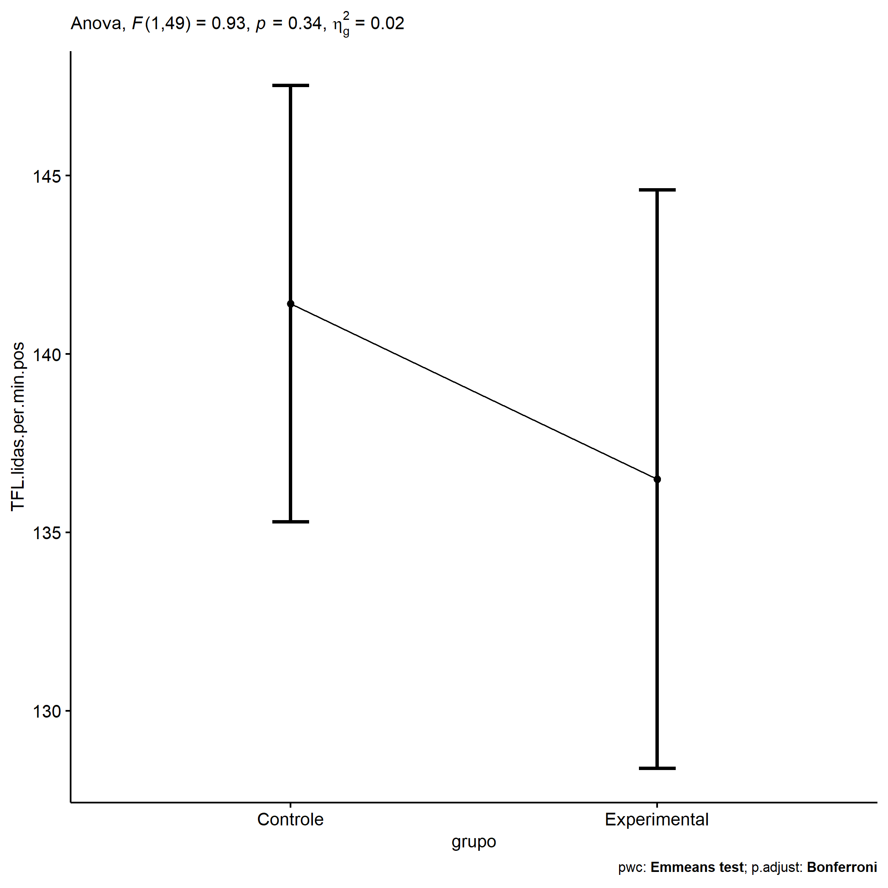<!-- -->

``` r
plots <- oneWayAncovaBoxPlots(
  wdat, "TFL.lidas.per.min.pos", "grupo", aov, pwc, covar = "TFL.lidas.per.min.pre",
  theme = "classic", color = color[["grupo"]],
  subtitle = which(aov$Effect == "grupo"))
```

``` r
if (length(unique(wdat[["grupo"]])) > 1)
  plots[["grupo"]] + ggplot2::ylab("Palavras Lidas (1 Min)") + ggplot2::scale_x_discrete(labels=c('pre', 'pos'))
```

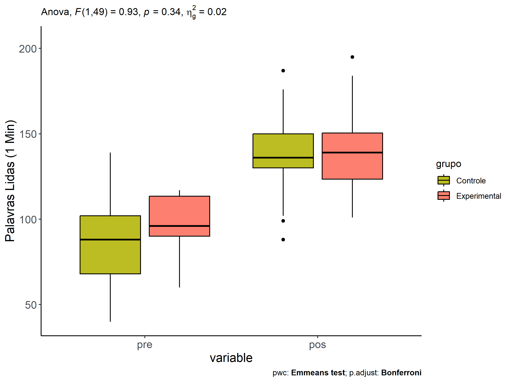<!-- -->

``` r
if (length(unique(wdat.long[["grupo"]])) > 1)
  plots <- oneWayAncovaBoxPlots(
    wdat.long, "TFL.lidas.per.min", "grupo", aov, pwc.long, pre.post = "time",
    theme = "classic", color = color$prepost)
```

``` r
if (length(unique(wdat.long[["grupo"]])) > 1)
  plots[["grupo"]] + ggplot2::ylab("Palavras Lidas (1 Min)")
```

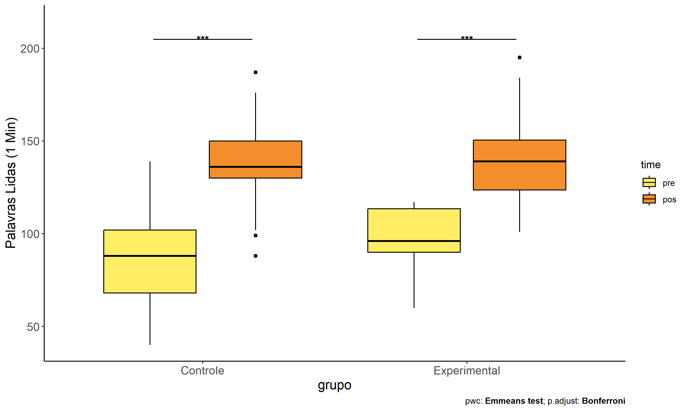<!-- -->

### Checking linearity assumption

``` r
ggscatter(wdat, x = "TFL.lidas.per.min.pre", y = "TFL.lidas.per.min.pos", size = 0.5,
          color = "grupo", add = "reg.line")+
  stat_regline_equation(
    aes(label =  paste(..eq.label.., ..rr.label.., sep = "~~~~"), color = grupo)
  )
```

<!-- -->

### Checking normality and homogeneity

``` r
res <- augment(lm(TFL.lidas.per.min.pos ~ TFL.lidas.per.min.pre + grupo, data = wdat))
```

``` r
shapiro_test(res$.resid)
```

    ## # A tibble: 1 × 3
    ##   variable   statistic p.value
    ##   <chr>          <dbl>   <dbl>
    ## 1 res$.resid     0.950  0.0305

``` r
levene_test(res, .resid ~ grupo)
```

    ## # A tibble: 1 × 4
    ##     df1   df2 statistic     p
    ##   <int> <int>     <dbl> <dbl>
    ## 1     1    50      1.37 0.248

# ANCOVA and Pairwise for two factors **grupo:Sexo**

## Without remove non-normal data

``` r
pdat = remove_group_data(dat[!is.na(dat[["grupo"]]) & !is.na(dat[["Sexo"]]),], "TFL.lidas.per.min.pos", c("grupo","Sexo"))

pdat.long <- rbind(pdat[,c("id","grupo","Sexo")], pdat[,c("id","grupo","Sexo")])
pdat.long[["time"]] <- c(rep("pre", nrow(pdat)), rep("pos", nrow(pdat)))
pdat.long[["time"]] <- factor(pdat.long[["time"]], c("pre","pos"))
pdat.long[["TFL.lidas.per.min"]] <- c(pdat[["TFL.lidas.per.min.pre"]], pdat[["TFL.lidas.per.min.pos"]])

aov = anova_test(pdat, TFL.lidas.per.min.pos ~ TFL.lidas.per.min.pre + grupo*Sexo)
laov[["grupo:Sexo"]] <- get_anova_table(aov)
```

``` r
pwcs <- list()
pwcs[["Sexo"]] <- emmeans_test(
  group_by(pdat, grupo), TFL.lidas.per.min.pos ~ Sexo,
  covariate = TFL.lidas.per.min.pre, p.adjust.method = "bonferroni")
pwcs[["grupo"]] <- emmeans_test(
  group_by(pdat, Sexo), TFL.lidas.per.min.pos ~ grupo,
  covariate = TFL.lidas.per.min.pre, p.adjust.method = "bonferroni")

pwc <- plyr::rbind.fill(pwcs[["grupo"]], pwcs[["Sexo"]])
pwc <- pwc[,c("grupo","Sexo", colnames(pwc)[!colnames(pwc) %in% c("grupo","Sexo")])]
```

``` r
pwc.long <- emmeans_test(dplyr::group_by_at(pdat.long, c("grupo","Sexo")),
                         TFL.lidas.per.min ~ time,
                         p.adjust.method = "bonferroni")
lpwc[["grupo:Sexo"]] <- plyr::rbind.fill(pwc, pwc.long)
```

``` r
ds <- get.descriptives(pdat, "TFL.lidas.per.min.pos", c("grupo","Sexo"), covar = "TFL.lidas.per.min.pre")
ds <- merge(ds[ds$variable != "TFL.lidas.per.min.pre",],
            ds[ds$variable == "TFL.lidas.per.min.pre", !colnames(ds) %in% c("variable")],
            by = c("grupo","Sexo"), all.x = T, suffixes = c("", ".TFL.lidas.per.min.pre"))
ds <- merge(get_emmeans(pwcs[["grupo"]]), ds, by = c("grupo","Sexo"), suffixes = c(".emms", ""))
ds <- ds[,c("grupo","Sexo","n","mean.TFL.lidas.per.min.pre","se.TFL.lidas.per.min.pre","mean","se","emmean","se.emms")]

colnames(ds) <- c("grupo","Sexo", "N", paste0(c("M","SE")," (pre)"),
                  paste0(c("M","SE"), " (unadj)"), paste0(c("M", "SE"), " (adj)"))

lemms[["grupo:Sexo"]] <- ds
```

## Computing ANCOVA and PairWise After removing non-normal data (OK)

``` r
wdat = pdat 

res = residuals(lm(TFL.lidas.per.min.pos ~ TFL.lidas.per.min.pre + grupo*Sexo, data = wdat))
non.normal = getNonNormal(res, wdat$id, plimit = 0.05)

wdat = wdat[!wdat$id %in% non.normal,]

wdat.long <- rbind(wdat[,c("id","grupo","Sexo")], wdat[,c("id","grupo","Sexo")])
wdat.long[["time"]] <- c(rep("pre", nrow(wdat)), rep("pos", nrow(wdat)))
wdat.long[["time"]] <- factor(wdat.long[["time"]], c("pre","pos"))
wdat.long[["TFL.lidas.per.min"]] <- c(wdat[["TFL.lidas.per.min.pre"]], wdat[["TFL.lidas.per.min.pos"]])


ldat[["grupo:Sexo"]] = wdat

(non.normal)
```

    ##  [1] "P1768" "P121"  "P2250" "P2380" "P1743" "P2220" "P2378" "P510"  "P2385" "P2404" "P2214" "P2377" "P2294"
    ## [14] "P1698" "P945"  "P2209"

``` r
aov = anova_test(wdat, TFL.lidas.per.min.pos ~ TFL.lidas.per.min.pre + grupo*Sexo)
laov[["grupo:Sexo"]] <- merge(get_anova_table(aov), laov[["grupo:Sexo"]], by="Effect", suffixes = c("","'"))

(df = get_anova_table(aov))
```

    ## ANOVA Table (type II tests)
    ## 
    ##                  Effect DFn DFd      F        p p<.05   ges
    ## 1 TFL.lidas.per.min.pre   1 123 81.449 3.01e-15     * 0.398
    ## 2                 grupo   1 123  0.506 4.78e-01       0.004
    ## 3                  Sexo   1 123 11.520 9.27e-04     * 0.086
    ## 4            grupo:Sexo   1 123  0.986 3.23e-01       0.008

| Effect                | DFn | DFd |      F |     p | p\<.05 |   ges |
|:----------------------|----:|----:|-------:|------:|:-------|------:|
| TFL.lidas.per.min.pre |   1 | 123 | 81.449 | 0.000 | \*     | 0.398 |
| grupo                 |   1 | 123 |  0.506 | 0.478 |        | 0.004 |
| Sexo                  |   1 | 123 | 11.520 | 0.001 | \*     | 0.086 |
| grupo:Sexo            |   1 | 123 |  0.986 | 0.323 |        | 0.008 |

``` r
pwcs <- list()
pwcs[["Sexo"]] <- emmeans_test(
  group_by(wdat, grupo), TFL.lidas.per.min.pos ~ Sexo,
  covariate = TFL.lidas.per.min.pre, p.adjust.method = "bonferroni")
pwcs[["grupo"]] <- emmeans_test(
  group_by(wdat, Sexo), TFL.lidas.per.min.pos ~ grupo,
  covariate = TFL.lidas.per.min.pre, p.adjust.method = "bonferroni")

pwc <- plyr::rbind.fill(pwcs[["grupo"]], pwcs[["Sexo"]])
pwc <- pwc[,c("grupo","Sexo", colnames(pwc)[!colnames(pwc) %in% c("grupo","Sexo")])]
```

| grupo        | Sexo | term                         | .y.                   | group1   | group2       |  df | statistic |     p | p.adj | p.adj.signif |
|:-------------|:-----|:-----------------------------|:----------------------|:---------|:-------------|----:|----------:|------:|------:|:-------------|
|              | F    | TFL.lidas.per.min.pre\*grupo | TFL.lidas.per.min.pos | Controle | Experimental | 123 |     0.332 | 0.741 | 0.741 | ns           |
|              | M    | TFL.lidas.per.min.pre\*grupo | TFL.lidas.per.min.pos | Controle | Experimental | 123 |    -1.177 | 0.241 | 0.241 | ns           |
| Controle     |      | TFL.lidas.per.min.pre\*Sexo  | TFL.lidas.per.min.pos | F        | M            | 123 |     3.299 | 0.001 | 0.001 | \*\*         |
| Experimental |      | TFL.lidas.per.min.pre\*Sexo  | TFL.lidas.per.min.pos | F        | M            | 123 |     1.293 | 0.198 | 0.198 | ns           |

``` r
pwc.long <- emmeans_test(dplyr::group_by_at(wdat.long, c("grupo","Sexo")),
                         TFL.lidas.per.min ~ time,
                         p.adjust.method = "bonferroni")
lpwc[["grupo:Sexo"]] <- merge(plyr::rbind.fill(pwc, pwc.long), lpwc[["grupo:Sexo"]], by=c("grupo","Sexo","term",".y.","group1","group2"), suffixes = c("","'"))
```

| grupo        | Sexo | term | .y.               | group1 | group2 |  df | statistic |     p | p.adj | p.adj.signif |
|:-------------|:-----|:-----|:------------------|:-------|:-------|----:|----------:|------:|------:|:-------------|
| Controle     | F    | time | TFL.lidas.per.min | pre    | pos    | 248 |    -4.063 | 0.000 | 0.000 | \*\*\*\*     |
| Controle     | M    | time | TFL.lidas.per.min | pre    | pos    | 248 |    -2.189 | 0.030 | 0.030 | \*           |
| Experimental | F    | time | TFL.lidas.per.min | pre    | pos    | 248 |    -2.483 | 0.014 | 0.014 | \*           |
| Experimental | M    | time | TFL.lidas.per.min | pre    | pos    | 248 |    -2.710 | 0.007 | 0.007 | \*\*         |

``` r
ds <- get.descriptives(wdat, "TFL.lidas.per.min.pos", c("grupo","Sexo"), covar = "TFL.lidas.per.min.pre")
ds <- merge(ds[ds$variable != "TFL.lidas.per.min.pre",],
            ds[ds$variable == "TFL.lidas.per.min.pre", !colnames(ds) %in% c("variable")],
            by = c("grupo","Sexo"), all.x = T, suffixes = c("", ".TFL.lidas.per.min.pre"))
ds <- merge(get_emmeans(pwcs[["grupo"]]), ds, by = c("grupo","Sexo"), suffixes = c(".emms", ""))
ds <- ds[,c("grupo","Sexo","n","mean.TFL.lidas.per.min.pre","se.TFL.lidas.per.min.pre","mean","se","emmean","se.emms")]

colnames(ds) <- c("grupo","Sexo", "N", paste0(c("M","SE")," (pre)"),
                  paste0(c("M","SE"), " (unadj)"), paste0(c("M", "SE"), " (adj)"))

lemms[["grupo:Sexo"]] <- merge(ds, lemms[["grupo:Sexo"]], by=c("grupo","Sexo"), suffixes = c("","'"))
```

| grupo        | Sexo |   N | M (pre) | SE (pre) | M (unadj) | SE (unadj) | M (adj) | SE (adj) |
|:-------------|:-----|----:|--------:|---------:|----------:|-----------:|--------:|---------:|
| Controle     | F    |  32 |  93.125 |    4.171 |   115.625 |      3.688 | 115.384 |    3.080 |
| Controle     | M    |  47 |  91.213 |    3.550 |   101.213 |      3.485 | 102.203 |    2.544 |
| Experimental | F    |  19 | 101.474 |    3.288 |   119.316 |      4.743 | 113.698 |    4.045 |
| Experimental | M    |  30 |  89.233 |    3.621 |   104.733 |      4.099 | 106.998 |    3.191 |

### Plots for ancova

``` r
plots <- twoWayAncovaPlots(
  wdat, "TFL.lidas.per.min.pos", c("grupo","Sexo"), aov, pwcs, addParam = c("mean_se"),
  font.label.size=10, step.increase=0.05, p.label="p.adj",
  subtitle = which(aov$Effect == "grupo:Sexo"))
```

``` r
if (!is.null(plots[["grupo"]]))
  plots[["grupo"]] + ggplot2::scale_color_manual(values = color[["Sexo"]])
```

    ## Scale for colour is already present.
    ## Adding another scale for colour, which will replace the existing scale.

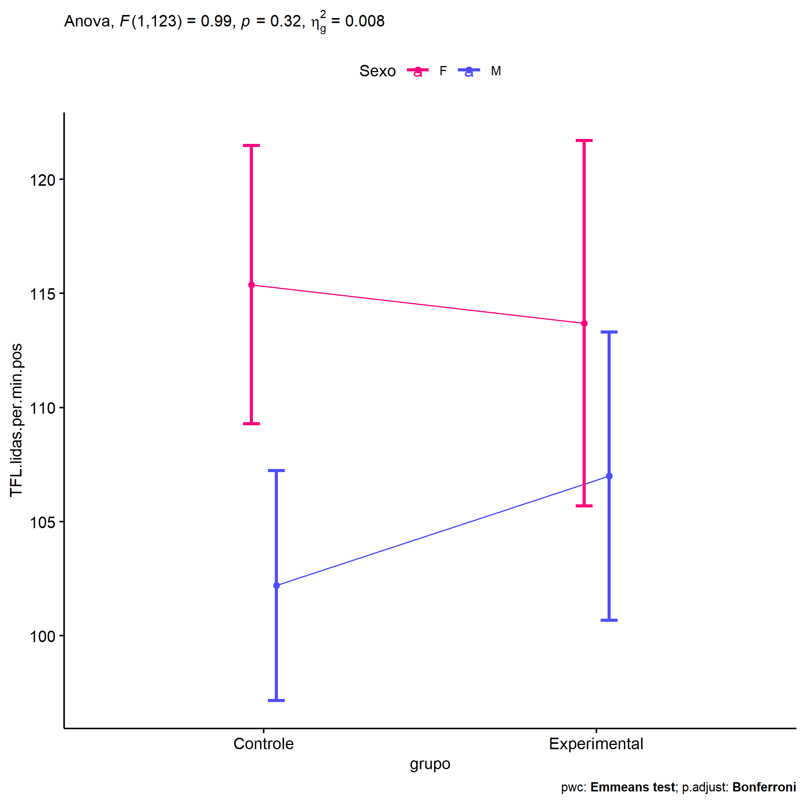<!-- -->

``` r
if (!is.null(plots[["Sexo"]]))
  plots[["Sexo"]] + ggplot2::scale_color_manual(values = color[["grupo"]])
```

    ## Scale for colour is already present.
    ## Adding another scale for colour, which will replace the existing scale.

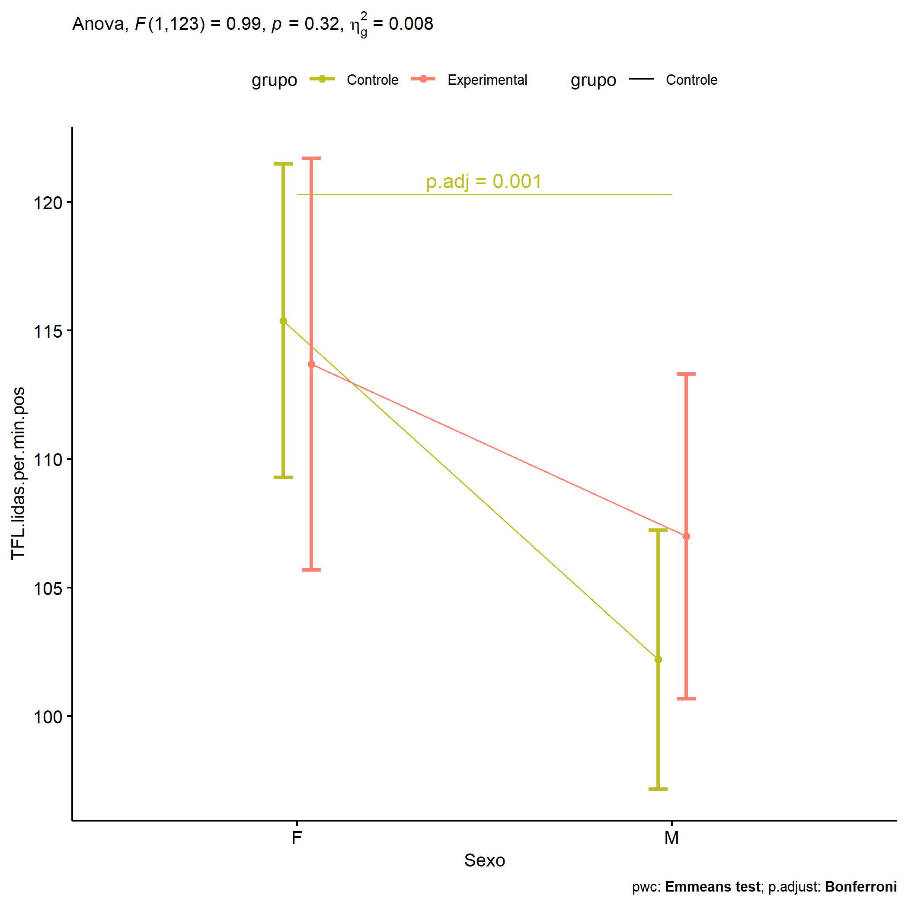<!-- -->

``` r
plots <- twoWayAncovaBoxPlots(
  wdat, "TFL.lidas.per.min.pos", c("grupo","Sexo"), aov, pwcs, covar = "TFL.lidas.per.min.pre",
  theme = "classic", color = color[["grupo:Sexo"]],
  subtitle = which(aov$Effect == "grupo:Sexo"))
```

``` r
plots[["grupo:Sexo"]] + ggplot2::ylab("Palavras Lidas (1 Min)") + ggplot2::scale_x_discrete(labels=c('pre', 'pos'))
```

<!-- -->

``` r
plots <- twoWayAncovaBoxPlots(
  wdat.long, "TFL.lidas.per.min", c("grupo","Sexo"), aov, pwc.long, pre.post = "time",
  theme = "classic", color = color$prepost)
```

``` r
plots[["grupo:Sexo"]] + ggplot2::ylab("Palavras Lidas (1 Min)")
```

<!-- -->

### Checking linearity assumption

``` r
ggscatter(wdat, x = "TFL.lidas.per.min.pre", y = "TFL.lidas.per.min.pos", size = 0.5,
          facet.by = c("grupo","Sexo"), add = "reg.line")+
  stat_regline_equation(
    aes(label =  paste(..eq.label.., ..rr.label.., sep = "~~~~"))
  )
```

<!-- -->

### Checking normality and homogeneity

``` r
res <- augment(lm(TFL.lidas.per.min.pos ~ TFL.lidas.per.min.pre + grupo*Sexo, data = wdat))
```

``` r
shapiro_test(res$.resid)
```

    ## # A tibble: 1 × 3
    ##   variable   statistic p.value
    ##   <chr>          <dbl>   <dbl>
    ## 1 res$.resid     0.972  0.0102

``` r
levene_test(res, .resid ~ grupo*Sexo)
```

    ## # A tibble: 1 × 4
    ##     df1   df2 statistic     p
    ##   <int> <int>     <dbl> <dbl>
    ## 1     3   124      1.04 0.376

# ANCOVA and Pairwise for two factors **grupo:Zona**

## Without remove non-normal data

``` r
pdat = remove_group_data(dat[!is.na(dat[["grupo"]]) & !is.na(dat[["Zona"]]),], "TFL.lidas.per.min.pos", c("grupo","Zona"))

pdat.long <- rbind(pdat[,c("id","grupo","Zona")], pdat[,c("id","grupo","Zona")])
pdat.long[["time"]] <- c(rep("pre", nrow(pdat)), rep("pos", nrow(pdat)))
pdat.long[["time"]] <- factor(pdat.long[["time"]], c("pre","pos"))
pdat.long[["TFL.lidas.per.min"]] <- c(pdat[["TFL.lidas.per.min.pre"]], pdat[["TFL.lidas.per.min.pos"]])

aov = anova_test(pdat, TFL.lidas.per.min.pos ~ TFL.lidas.per.min.pre + grupo*Zona)
laov[["grupo:Zona"]] <- get_anova_table(aov)
```

``` r
pwcs <- list()
pwcs[["Zona"]] <- emmeans_test(
  group_by(pdat, grupo), TFL.lidas.per.min.pos ~ Zona,
  covariate = TFL.lidas.per.min.pre, p.adjust.method = "bonferroni")
pwcs[["grupo"]] <- emmeans_test(
  group_by(pdat, Zona), TFL.lidas.per.min.pos ~ grupo,
  covariate = TFL.lidas.per.min.pre, p.adjust.method = "bonferroni")

pwc <- plyr::rbind.fill(pwcs[["grupo"]], pwcs[["Zona"]])
pwc <- pwc[,c("grupo","Zona", colnames(pwc)[!colnames(pwc) %in% c("grupo","Zona")])]
```

``` r
pwc.long <- emmeans_test(dplyr::group_by_at(pdat.long, c("grupo","Zona")),
                         TFL.lidas.per.min ~ time,
                         p.adjust.method = "bonferroni")
lpwc[["grupo:Zona"]] <- plyr::rbind.fill(pwc, pwc.long)
```

``` r
ds <- get.descriptives(pdat, "TFL.lidas.per.min.pos", c("grupo","Zona"), covar = "TFL.lidas.per.min.pre")
ds <- merge(ds[ds$variable != "TFL.lidas.per.min.pre",],
            ds[ds$variable == "TFL.lidas.per.min.pre", !colnames(ds) %in% c("variable")],
            by = c("grupo","Zona"), all.x = T, suffixes = c("", ".TFL.lidas.per.min.pre"))
ds <- merge(get_emmeans(pwcs[["grupo"]]), ds, by = c("grupo","Zona"), suffixes = c(".emms", ""))
ds <- ds[,c("grupo","Zona","n","mean.TFL.lidas.per.min.pre","se.TFL.lidas.per.min.pre","mean","se","emmean","se.emms")]

colnames(ds) <- c("grupo","Zona", "N", paste0(c("M","SE")," (pre)"),
                  paste0(c("M","SE"), " (unadj)"), paste0(c("M", "SE"), " (adj)"))

lemms[["grupo:Zona"]] <- ds
```

## Computing ANCOVA and PairWise After removing non-normal data (OK)

``` r
wdat = pdat 

res = residuals(lm(TFL.lidas.per.min.pos ~ TFL.lidas.per.min.pre + grupo*Zona, data = wdat))
non.normal = getNonNormal(res, wdat$id, plimit = 0.05)

wdat = wdat[!wdat$id %in% non.normal,]

wdat.long <- rbind(wdat[,c("id","grupo","Zona")], wdat[,c("id","grupo","Zona")])
wdat.long[["time"]] <- c(rep("pre", nrow(wdat)), rep("pos", nrow(wdat)))
wdat.long[["time"]] <- factor(wdat.long[["time"]], c("pre","pos"))
wdat.long[["TFL.lidas.per.min"]] <- c(wdat[["TFL.lidas.per.min.pre"]], wdat[["TFL.lidas.per.min.pos"]])


ldat[["grupo:Zona"]] = wdat

(non.normal)
```

    ## [1] "P1768" "P121"  "P2378" "P1743" "P2220" "P510"  "P1698"

``` r
aov = anova_test(wdat, TFL.lidas.per.min.pos ~ TFL.lidas.per.min.pre + grupo*Zona)
laov[["grupo:Zona"]] <- merge(get_anova_table(aov), laov[["grupo:Zona"]], by="Effect", suffixes = c("","'"))

(df = get_anova_table(aov))
```

    ## ANOVA Table (type II tests)
    ## 
    ##                  Effect DFn DFd      F        p p<.05   ges
    ## 1 TFL.lidas.per.min.pre   1  94 84.400 9.85e-15     * 0.473
    ## 2                 grupo   1  94  0.260 6.11e-01       0.003
    ## 3                  Zona   1  94 34.869 5.58e-08     * 0.271
    ## 4            grupo:Zona   1  94  8.262 5.00e-03     * 0.081

| Effect                | DFn | DFd |      F |     p | p\<.05 |   ges |
|:----------------------|----:|----:|-------:|------:|:-------|------:|
| TFL.lidas.per.min.pre |   1 |  94 | 84.400 | 0.000 | \*     | 0.473 |
| grupo                 |   1 |  94 |  0.260 | 0.611 |        | 0.003 |
| Zona                  |   1 |  94 | 34.869 | 0.000 | \*     | 0.271 |
| grupo:Zona            |   1 |  94 |  8.262 | 0.005 | \*     | 0.081 |

``` r
pwcs <- list()
pwcs[["Zona"]] <- emmeans_test(
  group_by(wdat, grupo), TFL.lidas.per.min.pos ~ Zona,
  covariate = TFL.lidas.per.min.pre, p.adjust.method = "bonferroni")
pwcs[["grupo"]] <- emmeans_test(
  group_by(wdat, Zona), TFL.lidas.per.min.pos ~ grupo,
  covariate = TFL.lidas.per.min.pre, p.adjust.method = "bonferroni")

pwc <- plyr::rbind.fill(pwcs[["grupo"]], pwcs[["Zona"]])
pwc <- pwc[,c("grupo","Zona", colnames(pwc)[!colnames(pwc) %in% c("grupo","Zona")])]
```

| grupo        | Zona   | term                         | .y.                   | group1   | group2       |  df | statistic |     p | p.adj | p.adj.signif |
|:-------------|:-------|:-----------------------------|:----------------------|:---------|:-------------|----:|----------:|------:|------:|:-------------|
|              | Rural  | TFL.lidas.per.min.pre\*grupo | TFL.lidas.per.min.pos | Controle | Experimental |  94 |    -0.545 | 0.587 | 0.587 | ns           |
|              | Urbana | TFL.lidas.per.min.pre\*grupo | TFL.lidas.per.min.pos | Controle | Experimental |  94 |     2.869 | 0.005 | 0.005 | \*\*         |
| Controle     |        | TFL.lidas.per.min.pre\*Zona  | TFL.lidas.per.min.pos | Rural    | Urbana       |  94 |    -6.379 | 0.000 | 0.000 | \*\*\*\*     |
| Experimental |        | TFL.lidas.per.min.pre\*Zona  | TFL.lidas.per.min.pos | Rural    | Urbana       |  94 |    -1.565 | 0.121 | 0.121 | ns           |

``` r
pwc.long <- emmeans_test(dplyr::group_by_at(wdat.long, c("grupo","Zona")),
                         TFL.lidas.per.min ~ time,
                         p.adjust.method = "bonferroni")
lpwc[["grupo:Zona"]] <- merge(plyr::rbind.fill(pwc, pwc.long), lpwc[["grupo:Zona"]], by=c("grupo","Zona","term",".y.","group1","group2"), suffixes = c("","'"))
```

| grupo        | Zona   | term | .y.               | group1 | group2 |  df | statistic |     p | p.adj | p.adj.signif |
|:-------------|:-------|:-----|:------------------|:-------|:-------|----:|----------:|------:|------:|:-------------|
| Controle     | Rural  | time | TFL.lidas.per.min | pre    | pos    | 190 |    -2.549 | 0.012 | 0.012 | \*           |
| Controle     | Urbana | time | TFL.lidas.per.min | pre    | pos    | 190 |    -4.227 | 0.000 | 0.000 | \*\*\*\*     |
| Experimental | Rural  | time | TFL.lidas.per.min | pre    | pos    | 190 |    -2.356 | 0.019 | 0.019 | \*           |
| Experimental | Urbana | time | TFL.lidas.per.min | pre    | pos    | 190 |    -1.505 | 0.134 | 0.134 | ns           |

``` r
ds <- get.descriptives(wdat, "TFL.lidas.per.min.pos", c("grupo","Zona"), covar = "TFL.lidas.per.min.pre")
ds <- merge(ds[ds$variable != "TFL.lidas.per.min.pre",],
            ds[ds$variable == "TFL.lidas.per.min.pre", !colnames(ds) %in% c("variable")],
            by = c("grupo","Zona"), all.x = T, suffixes = c("", ".TFL.lidas.per.min.pre"))
ds <- merge(get_emmeans(pwcs[["grupo"]]), ds, by = c("grupo","Zona"), suffixes = c(".emms", ""))
ds <- ds[,c("grupo","Zona","n","mean.TFL.lidas.per.min.pre","se.TFL.lidas.per.min.pre","mean","se","emmean","se.emms")]

colnames(ds) <- c("grupo","Zona", "N", paste0(c("M","SE")," (pre)"),
                  paste0(c("M","SE"), " (unadj)"), paste0(c("M", "SE"), " (adj)"))

lemms[["grupo:Zona"]] <- merge(ds, lemms[["grupo:Zona"]], by=c("grupo","Zona"), suffixes = c("","'"))
```

| grupo        | Zona   |   N | M (pre) | SE (pre) | M (unadj) | SE (unadj) | M (adj) | SE (adj) |
|:-------------|:-------|----:|--------:|---------:|----------:|-----------:|--------:|---------:|
| Controle     | Rural  |  55 |  92.764 |    3.462 |   103.491 |      2.981 | 103.544 |    2.066 |
| Controle     | Urbana |   7 |  93.000 |    9.092 |   142.857 |     10.734 | 142.762 |    5.791 |
| Experimental | Rural  |  32 |  91.656 |    3.195 |   104.656 |      3.030 | 105.402 |    2.710 |
| Experimental | Urbana |   5 | 101.200 |    8.540 |   122.200 |      8.800 | 116.977 |    6.875 |

### Plots for ancova

``` r
plots <- twoWayAncovaPlots(
  wdat, "TFL.lidas.per.min.pos", c("grupo","Zona"), aov, pwcs, addParam = c("mean_se"),
  font.label.size=10, step.increase=0.05, p.label="p.adj",
  subtitle = which(aov$Effect == "grupo:Zona"))
```

``` r
if (!is.null(plots[["grupo"]]))
  plots[["grupo"]] + ggplot2::scale_color_manual(values = color[["Zona"]])
```

    ## Scale for colour is already present.
    ## Adding another scale for colour, which will replace the existing scale.

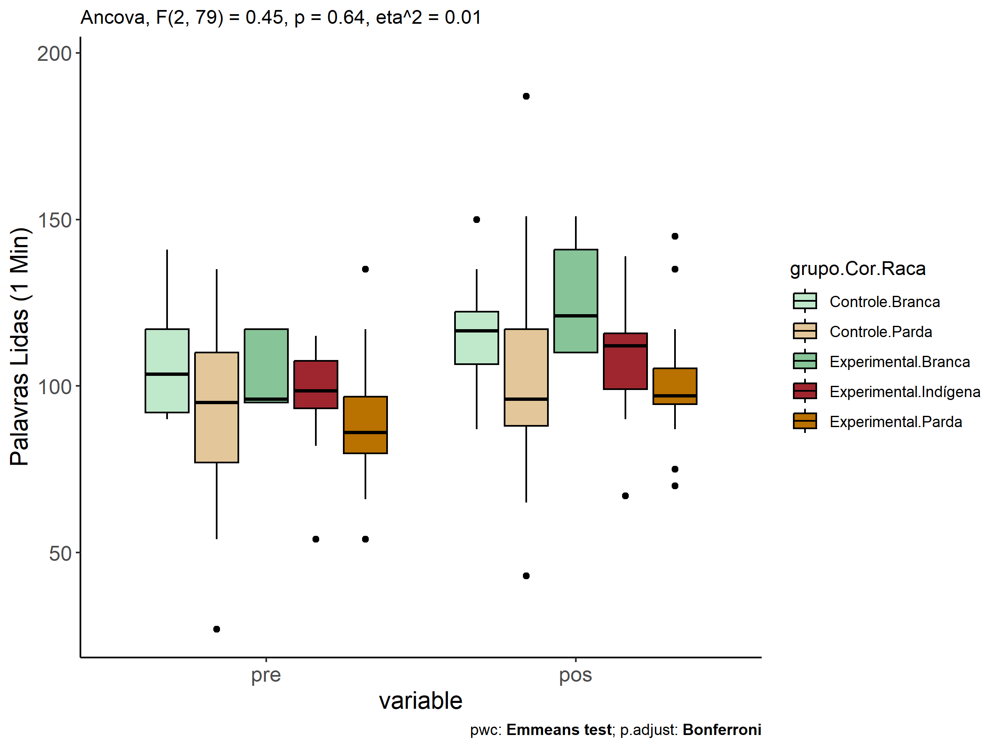<!-- -->

``` r
if (!is.null(plots[["Zona"]]))
  plots[["Zona"]] + ggplot2::scale_color_manual(values = color[["grupo"]])
```

    ## Scale for colour is already present.
    ## Adding another scale for colour, which will replace the existing scale.

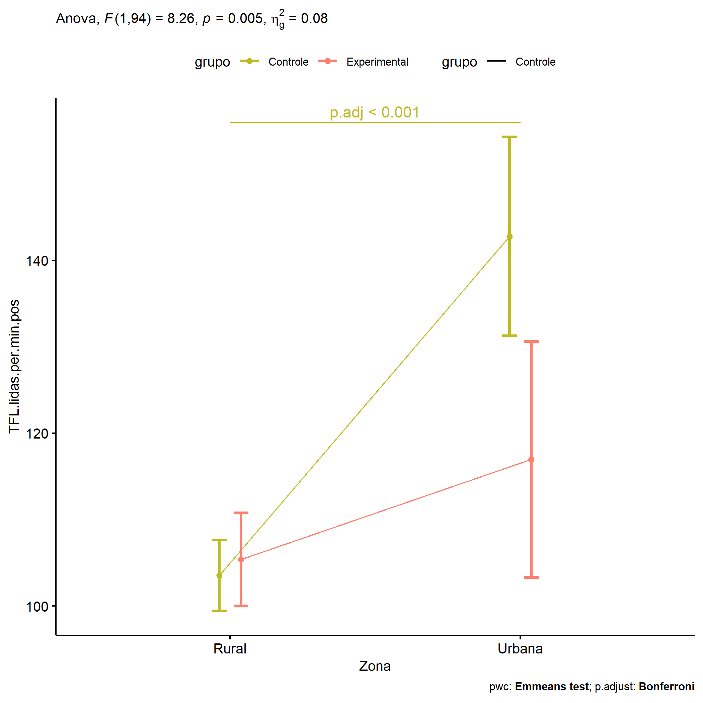<!-- -->

``` r
plots <- twoWayAncovaBoxPlots(
  wdat, "TFL.lidas.per.min.pos", c("grupo","Zona"), aov, pwcs, covar = "TFL.lidas.per.min.pre",
  theme = "classic", color = color[["grupo:Zona"]],
  subtitle = which(aov$Effect == "grupo:Zona"))
```

``` r
plots[["grupo:Zona"]] + ggplot2::ylab("Palavras Lidas (1 Min)") + ggplot2::scale_x_discrete(labels=c('pre', 'pos'))
```

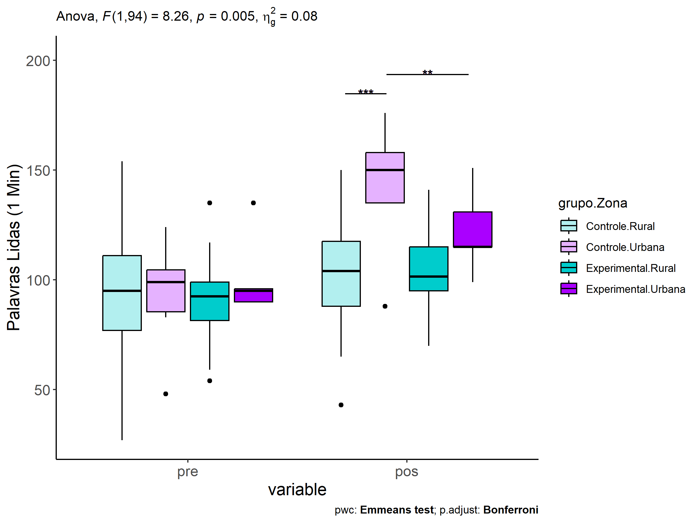<!-- -->

``` r
plots <- twoWayAncovaBoxPlots(
  wdat.long, "TFL.lidas.per.min", c("grupo","Zona"), aov, pwc.long, pre.post = "time",
  theme = "classic", color = color$prepost)
```

``` r
plots[["grupo:Zona"]] + ggplot2::ylab("Palavras Lidas (1 Min)")
```

<!-- -->

### Checking linearity assumption

``` r
ggscatter(wdat, x = "TFL.lidas.per.min.pre", y = "TFL.lidas.per.min.pos", size = 0.5,
          facet.by = c("grupo","Zona"), add = "reg.line")+
  stat_regline_equation(
    aes(label =  paste(..eq.label.., ..rr.label.., sep = "~~~~"))
  )
```

<!-- -->

### Checking normality and homogeneity

``` r
res <- augment(lm(TFL.lidas.per.min.pos ~ TFL.lidas.per.min.pre + grupo*Zona, data = wdat))
```

``` r
shapiro_test(res$.resid)
```

    ## # A tibble: 1 × 3
    ##   variable   statistic p.value
    ##   <chr>          <dbl>   <dbl>
    ## 1 res$.resid     0.982   0.212

``` r
levene_test(res, .resid ~ grupo*Zona)
```

    ## # A tibble: 1 × 4
    ##     df1   df2 statistic     p
    ##   <int> <int>     <dbl> <dbl>
    ## 1     3    95      2.06 0.111

# ANCOVA and Pairwise for two factors **grupo:Cor.Raca**

## Without remove non-normal data

``` r
pdat = remove_group_data(dat[!is.na(dat[["grupo"]]) & !is.na(dat[["Cor.Raca"]]),], "TFL.lidas.per.min.pos", c("grupo","Cor.Raca"))
```

    ## Warning: There were 2 warnings in `mutate()`.
    ## The first warning was:
    ## ℹ In argument: `ci = abs(stats::qt(alpha/2, .data$n - 1) * .data$se)`.
    ## Caused by warning:
    ## ! There was 1 warning in `mutate()`.
    ## ℹ In argument: `ci = abs(stats::qt(alpha/2, .data$n - 1) * .data$se)`.
    ## Caused by warning in `stats::qt()`:
    ## ! NaNs produced
    ## ℹ Run `dplyr::last_dplyr_warnings()` to see the 1 remaining warning.

``` r
pdat.long <- rbind(pdat[,c("id","grupo","Cor.Raca")], pdat[,c("id","grupo","Cor.Raca")])
pdat.long[["time"]] <- c(rep("pre", nrow(pdat)), rep("pos", nrow(pdat)))
pdat.long[["time"]] <- factor(pdat.long[["time"]], c("pre","pos"))
pdat.long[["TFL.lidas.per.min"]] <- c(pdat[["TFL.lidas.per.min.pre"]], pdat[["TFL.lidas.per.min.pos"]])

aov = anova_test(pdat, TFL.lidas.per.min.pos ~ TFL.lidas.per.min.pre + grupo*Cor.Raca)
laov[["grupo:Cor.Raca"]] <- get_anova_table(aov)
```

``` r
pwcs <- list()
pwcs[["Cor.Raca"]] <- emmeans_test(
  group_by(pdat, grupo), TFL.lidas.per.min.pos ~ Cor.Raca,
  covariate = TFL.lidas.per.min.pre, p.adjust.method = "bonferroni")
pwcs[["grupo"]] <- emmeans_test(
  group_by(pdat, Cor.Raca), TFL.lidas.per.min.pos ~ grupo,
  covariate = TFL.lidas.per.min.pre, p.adjust.method = "bonferroni")

pwc <- plyr::rbind.fill(pwcs[["grupo"]], pwcs[["Cor.Raca"]])
pwc <- pwc[,c("grupo","Cor.Raca", colnames(pwc)[!colnames(pwc) %in% c("grupo","Cor.Raca")])]
```

``` r
pwc.long <- emmeans_test(dplyr::group_by_at(pdat.long, c("grupo","Cor.Raca")),
                         TFL.lidas.per.min ~ time,
                         p.adjust.method = "bonferroni")
lpwc[["grupo:Cor.Raca"]] <- plyr::rbind.fill(pwc, pwc.long)
```

``` r
ds <- get.descriptives(pdat, "TFL.lidas.per.min.pos", c("grupo","Cor.Raca"), covar = "TFL.lidas.per.min.pre")
ds <- merge(ds[ds$variable != "TFL.lidas.per.min.pre",],
            ds[ds$variable == "TFL.lidas.per.min.pre", !colnames(ds) %in% c("variable")],
            by = c("grupo","Cor.Raca"), all.x = T, suffixes = c("", ".TFL.lidas.per.min.pre"))
ds <- merge(get_emmeans(pwcs[["grupo"]]), ds, by = c("grupo","Cor.Raca"), suffixes = c(".emms", ""))
ds <- ds[,c("grupo","Cor.Raca","n","mean.TFL.lidas.per.min.pre","se.TFL.lidas.per.min.pre","mean","se","emmean","se.emms")]

colnames(ds) <- c("grupo","Cor.Raca", "N", paste0(c("M","SE")," (pre)"),
                  paste0(c("M","SE"), " (unadj)"), paste0(c("M", "SE"), " (adj)"))

lemms[["grupo:Cor.Raca"]] <- ds
```

## Computing ANCOVA and PairWise After removing non-normal data (OK)

``` r
wdat = pdat 

res = residuals(lm(TFL.lidas.per.min.pos ~ TFL.lidas.per.min.pre + grupo*Cor.Raca, data = wdat))
non.normal = getNonNormal(res, wdat$id, plimit = 0.05)

wdat = wdat[!wdat$id %in% non.normal,]

wdat.long <- rbind(wdat[,c("id","grupo","Cor.Raca")], wdat[,c("id","grupo","Cor.Raca")])
wdat.long[["time"]] <- c(rep("pre", nrow(wdat)), rep("pos", nrow(wdat)))
wdat.long[["time"]] <- factor(wdat.long[["time"]], c("pre","pos"))
wdat.long[["TFL.lidas.per.min"]] <- c(wdat[["TFL.lidas.per.min.pre"]], wdat[["TFL.lidas.per.min.pos"]])


ldat[["grupo:Cor.Raca"]] = wdat

(non.normal)
```

    ## [1] "P510"  "P1728"

``` r
aov = anova_test(wdat, TFL.lidas.per.min.pos ~ TFL.lidas.per.min.pre + grupo*Cor.Raca)
laov[["grupo:Cor.Raca"]] <- merge(get_anova_table(aov), laov[["grupo:Cor.Raca"]], by="Effect", suffixes = c("","'"))

(df = get_anova_table(aov))
```

    ## ANOVA Table (type II tests)
    ## 
    ##                  Effect DFn DFd      F        p p<.05   ges
    ## 1 TFL.lidas.per.min.pre   1  75 62.801 1.66e-11     * 0.456
    ## 2                 grupo   1  75  2.933 9.10e-02       0.038
    ## 3              Cor.Raca   2  75  3.311 4.20e-02     * 0.081
    ## 4        grupo:Cor.Raca   1  75  0.648 4.23e-01       0.009

| Effect                | DFn | DFd |      F |     p | p\<.05 |   ges |
|:----------------------|----:|----:|-------:|------:|:-------|------:|
| TFL.lidas.per.min.pre |   1 |  75 | 62.801 | 0.000 | \*     | 0.456 |
| grupo                 |   1 |  75 |  2.933 | 0.091 |        | 0.038 |
| Cor.Raca              |   2 |  75 |  3.311 | 0.042 | \*     | 0.081 |
| grupo:Cor.Raca        |   1 |  75 |  0.648 | 0.423 |        | 0.009 |

``` r
pwcs <- list()
pwcs[["Cor.Raca"]] <- emmeans_test(
  group_by(wdat, grupo), TFL.lidas.per.min.pos ~ Cor.Raca,
  covariate = TFL.lidas.per.min.pre, p.adjust.method = "bonferroni")
pwcs[["grupo"]] <- emmeans_test(
  group_by(wdat, Cor.Raca), TFL.lidas.per.min.pos ~ grupo,
  covariate = TFL.lidas.per.min.pre, p.adjust.method = "bonferroni")

pwc <- plyr::rbind.fill(pwcs[["grupo"]], pwcs[["Cor.Raca"]])
pwc <- pwc[,c("grupo","Cor.Raca", colnames(pwc)[!colnames(pwc) %in% c("grupo","Cor.Raca")])]
```

| grupo        | Cor.Raca | term                            | .y.                   | group1   | group2       |  df | statistic |     p | p.adj | p.adj.signif |
|:-------------|:---------|:--------------------------------|:----------------------|:---------|:-------------|----:|----------:|------:|------:|:-------------|
|              | Branca   | TFL.lidas.per.min.pre\*grupo    | TFL.lidas.per.min.pos | Controle | Experimental |  75 |    -1.537 | 0.129 | 0.129 | ns           |
|              | Indígena | TFL.lidas.per.min.pre\*grupo    | TFL.lidas.per.min.pos | Controle | Experimental |     |           |       |       |              |
|              | Parda    | TFL.lidas.per.min.pre\*grupo    | TFL.lidas.per.min.pos | Controle | Experimental |  75 |    -1.106 | 0.272 | 0.272 | ns           |
| Controle     |          | TFL.lidas.per.min.pre\*Cor.Raca | TFL.lidas.per.min.pos | Branca   | Indígena     |     |           |       |       |              |
| Controle     |          | TFL.lidas.per.min.pre\*Cor.Raca | TFL.lidas.per.min.pos | Branca   | Parda        |  75 |     1.753 | 0.084 | 0.084 | ns           |
| Controle     |          | TFL.lidas.per.min.pre\*Cor.Raca | TFL.lidas.per.min.pos | Indígena | Parda        |     |           |       |       |              |
| Experimental |          | TFL.lidas.per.min.pre\*Cor.Raca | TFL.lidas.per.min.pos | Branca   | Indígena     |  75 |     1.655 | 0.102 | 0.306 | ns           |
| Experimental |          | TFL.lidas.per.min.pre\*Cor.Raca | TFL.lidas.per.min.pos | Branca   | Parda        |  75 |     2.086 | 0.040 | 0.121 | ns           |
| Experimental |          | TFL.lidas.per.min.pre\*Cor.Raca | TFL.lidas.per.min.pos | Indígena | Parda        |  75 |     0.312 | 0.756 | 1.000 | ns           |

``` r
pwc.long <- emmeans_test(dplyr::group_by_at(wdat.long, c("grupo","Cor.Raca")),
                         TFL.lidas.per.min ~ time,
                         p.adjust.method = "bonferroni")
lpwc[["grupo:Cor.Raca"]] <- merge(plyr::rbind.fill(pwc, pwc.long), lpwc[["grupo:Cor.Raca"]], by=c("grupo","Cor.Raca","term",".y.","group1","group2"), suffixes = c("","'"))
```

| grupo        | Cor.Raca | term | .y.               | group1 | group2 |  df | statistic |     p | p.adj | p.adj.signif |
|:-------------|:---------|:-----|:------------------|:-------|:-------|----:|----------:|------:|------:|:-------------|
| Controle     | Branca   | time | TFL.lidas.per.min | pre    | pos    | 152 |    -1.181 | 0.239 | 0.239 | ns           |
| Controle     | Indígena | time | TFL.lidas.per.min | pre    | pos    |     |           |       |       |              |
| Controle     | Parda    | time | TFL.lidas.per.min | pre    | pos    | 152 |    -1.343 | 0.181 | 0.181 | ns           |
| Experimental | Branca   | time | TFL.lidas.per.min | pre    | pos    | 152 |    -1.738 | 0.084 | 0.084 | ns           |
| Experimental | Indígena | time | TFL.lidas.per.min | pre    | pos    | 152 |    -1.143 | 0.255 | 0.255 | ns           |
| Experimental | Parda    | time | TFL.lidas.per.min | pre    | pos    | 152 |    -1.659 | 0.099 | 0.099 | ns           |

``` r
ds <- get.descriptives(wdat, "TFL.lidas.per.min.pos", c("grupo","Cor.Raca"), covar = "TFL.lidas.per.min.pre")
ds <- merge(ds[ds$variable != "TFL.lidas.per.min.pre",],
            ds[ds$variable == "TFL.lidas.per.min.pre", !colnames(ds) %in% c("variable")],
            by = c("grupo","Cor.Raca"), all.x = T, suffixes = c("", ".TFL.lidas.per.min.pre"))
ds <- merge(get_emmeans(pwcs[["grupo"]]), ds, by = c("grupo","Cor.Raca"), suffixes = c(".emms", ""))
ds <- ds[,c("grupo","Cor.Raca","n","mean.TFL.lidas.per.min.pre","se.TFL.lidas.per.min.pre","mean","se","emmean","se.emms")]

colnames(ds) <- c("grupo","Cor.Raca", "N", paste0(c("M","SE")," (pre)"),
                  paste0(c("M","SE"), " (unadj)"), paste0(c("M", "SE"), " (adj)"))

lemms[["grupo:Cor.Raca"]] <- merge(ds, lemms[["grupo:Cor.Raca"]], by=c("grupo","Cor.Raca"), suffixes = c("","'"))
```

| grupo        | Cor.Raca |   N | M (pre) | SE (pre) | M (unadj) | SE (unadj) | M (adj) | SE (adj) |
|:-------------|:---------|----:|--------:|---------:|----------:|-----------:|--------:|---------:|
| Controle     | Branca   |  12 | 105.500 |    4.588 |   115.417 |      5.237 | 108.172 |    4.381 |
| Controle     | Parda    |  40 |  91.525 |    3.737 |    97.700 |      3.276 |  99.384 |    2.356 |
| Experimental | Branca   |   5 | 104.000 |    5.310 |   126.600 |      8.322 | 120.314 |    6.685 |
| Experimental | Indígena |   8 |  95.125 |    6.839 |   106.875 |      7.527 | 106.259 |    5.248 |
| Experimental | Parda    |  16 |  88.688 |    5.065 |   100.750 |      4.760 | 104.246 |    3.737 |

### Plots for ancova

``` r
plots <- twoWayAncovaPlots(
  wdat, "TFL.lidas.per.min.pos", c("grupo","Cor.Raca"), aov, pwcs, addParam = c("mean_se"),
  font.label.size=10, step.increase=0.05, p.label="p.adj",
  subtitle = which(aov$Effect == "grupo:Cor.Raca"))
```

``` r
if (!is.null(plots[["grupo"]]))
  plots[["grupo"]] + ggplot2::scale_color_manual(values = color[["Cor.Raca"]])
```

<!-- -->

``` r
if (!is.null(plots[["Cor.Raca"]]))
  plots[["Cor.Raca"]] + ggplot2::scale_color_manual(values = color[["grupo"]])
```

    ## Scale for colour is already present.
    ## Adding another scale for colour, which will replace the existing scale.

    ## Warning: Removed 2 rows containing non-finite values (`stat_bracket()`).

    ## Warning: Removed 1 rows containing missing values (`geom_point()`).

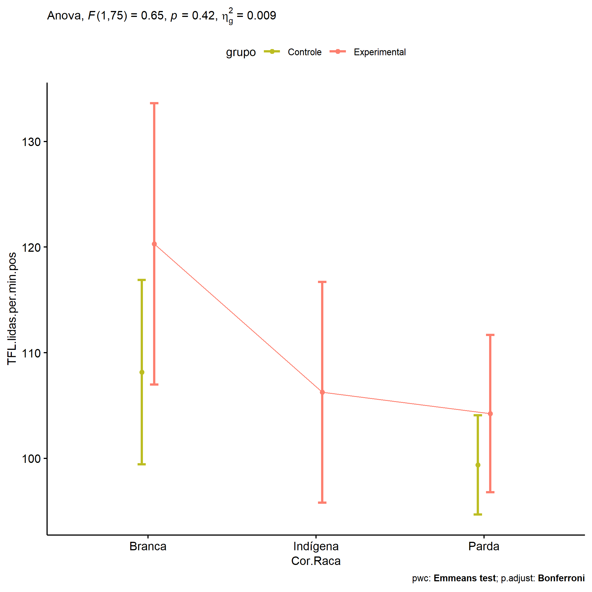<!-- -->

``` r
plots <- twoWayAncovaBoxPlots(
  wdat, "TFL.lidas.per.min.pos", c("grupo","Cor.Raca"), aov, pwcs, covar = "TFL.lidas.per.min.pre",
  theme = "classic", color = color[["grupo:Cor.Raca"]],
  subtitle = which(aov$Effect == "grupo:Cor.Raca"))
```

``` r
plots[["grupo:Cor.Raca"]] + ggplot2::ylab("Palavras Lidas (1 Min)") + ggplot2::scale_x_discrete(labels=c('pre', 'pos'))
```

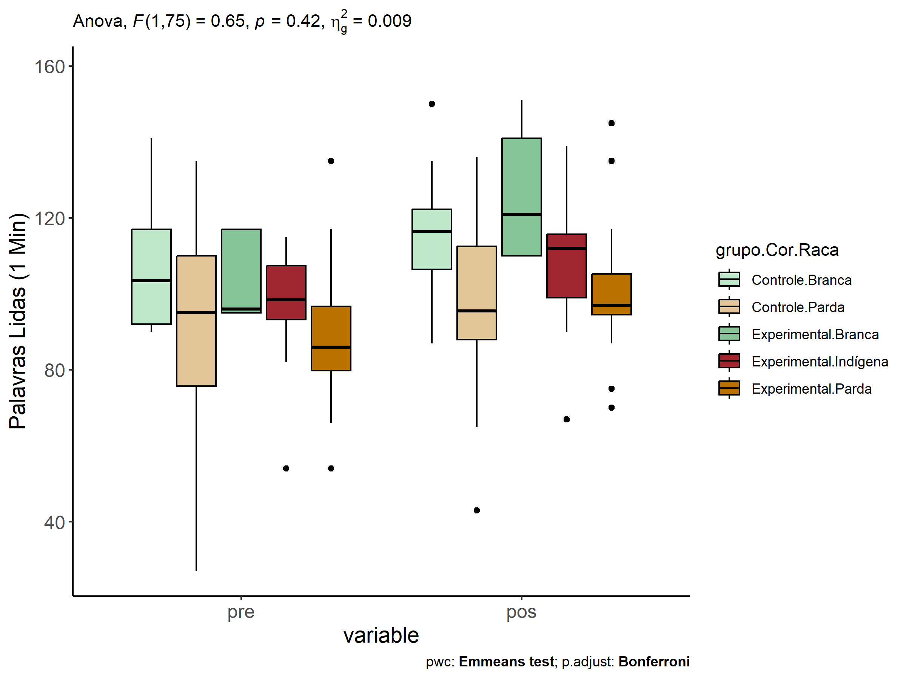<!-- -->

``` r
plots <- twoWayAncovaBoxPlots(
  wdat.long, "TFL.lidas.per.min", c("grupo","Cor.Raca"), aov, pwc.long, pre.post = "time",
  theme = "classic", color = color$prepost)
```

``` r
plots[["grupo:Cor.Raca"]] + ggplot2::ylab("Palavras Lidas (1 Min)")
```

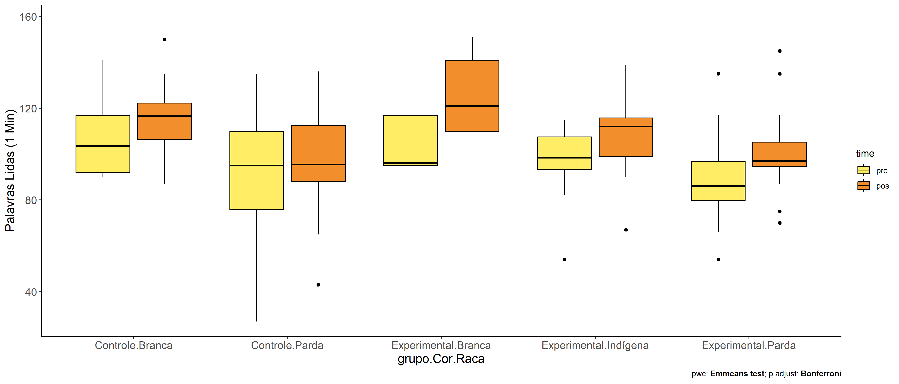<!-- -->

### Checking linearity assumption

``` r
ggscatter(wdat, x = "TFL.lidas.per.min.pre", y = "TFL.lidas.per.min.pos", size = 0.5,
          facet.by = c("grupo","Cor.Raca"), add = "reg.line")+
  stat_regline_equation(
    aes(label =  paste(..eq.label.., ..rr.label.., sep = "~~~~"))
  )
```

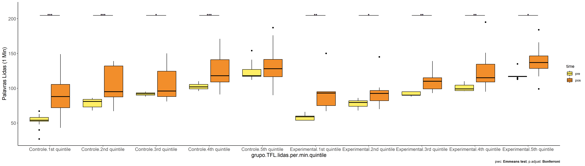<!-- -->

### Checking normality and homogeneity

``` r
res <- augment(lm(TFL.lidas.per.min.pos ~ TFL.lidas.per.min.pre + grupo*Cor.Raca, data = wdat))
```

``` r
shapiro_test(res$.resid)
```

    ## # A tibble: 1 × 3
    ##   variable   statistic p.value
    ##   <chr>          <dbl>   <dbl>
    ## 1 res$.resid     0.978   0.169

``` r
levene_test(res, .resid ~ grupo*Cor.Raca)
```

    ## # A tibble: 1 × 4
    ##     df1   df2 statistic     p
    ##   <int> <int>     <dbl> <dbl>
    ## 1     4    76     0.547 0.702

# ANCOVA and Pairwise for two factors **grupo:TFL.lidas.per.min.quintile**

## Without remove non-normal data

``` r
pdat = remove_group_data(dat[!is.na(dat[["grupo"]]) & !is.na(dat[["TFL.lidas.per.min.quintile"]]),], "TFL.lidas.per.min.pos", c("grupo","TFL.lidas.per.min.quintile"))

pdat.long <- rbind(pdat[,c("id","grupo","TFL.lidas.per.min.quintile")], pdat[,c("id","grupo","TFL.lidas.per.min.quintile")])
pdat.long[["time"]] <- c(rep("pre", nrow(pdat)), rep("pos", nrow(pdat)))
pdat.long[["time"]] <- factor(pdat.long[["time"]], c("pre","pos"))
pdat.long[["TFL.lidas.per.min"]] <- c(pdat[["TFL.lidas.per.min.pre"]], pdat[["TFL.lidas.per.min.pos"]])

aov = anova_test(pdat, TFL.lidas.per.min.pos ~ TFL.lidas.per.min.pre + grupo*TFL.lidas.per.min.quintile)
laov[["grupo:TFL.lidas.per.min.quintile"]] <- get_anova_table(aov)
```

``` r
pwcs <- list()
pwcs[["TFL.lidas.per.min.quintile"]] <- emmeans_test(
  group_by(pdat, grupo), TFL.lidas.per.min.pos ~ TFL.lidas.per.min.quintile,
  covariate = TFL.lidas.per.min.pre, p.adjust.method = "bonferroni")
pwcs[["grupo"]] <- emmeans_test(
  group_by(pdat, TFL.lidas.per.min.quintile), TFL.lidas.per.min.pos ~ grupo,
  covariate = TFL.lidas.per.min.pre, p.adjust.method = "bonferroni")

pwc <- plyr::rbind.fill(pwcs[["grupo"]], pwcs[["TFL.lidas.per.min.quintile"]])
pwc <- pwc[,c("grupo","TFL.lidas.per.min.quintile", colnames(pwc)[!colnames(pwc) %in% c("grupo","TFL.lidas.per.min.quintile")])]
```

``` r
pwc.long <- emmeans_test(dplyr::group_by_at(pdat.long, c("grupo","TFL.lidas.per.min.quintile")),
                         TFL.lidas.per.min ~ time,
                         p.adjust.method = "bonferroni")
lpwc[["grupo:TFL.lidas.per.min.quintile"]] <- plyr::rbind.fill(pwc, pwc.long)
```

``` r
ds <- get.descriptives(pdat, "TFL.lidas.per.min.pos", c("grupo","TFL.lidas.per.min.quintile"), covar = "TFL.lidas.per.min.pre")
ds <- merge(ds[ds$variable != "TFL.lidas.per.min.pre",],
            ds[ds$variable == "TFL.lidas.per.min.pre", !colnames(ds) %in% c("variable")],
            by = c("grupo","TFL.lidas.per.min.quintile"), all.x = T, suffixes = c("", ".TFL.lidas.per.min.pre"))
ds <- merge(get_emmeans(pwcs[["grupo"]]), ds, by = c("grupo","TFL.lidas.per.min.quintile"), suffixes = c(".emms", ""))
ds <- ds[,c("grupo","TFL.lidas.per.min.quintile","n","mean.TFL.lidas.per.min.pre","se.TFL.lidas.per.min.pre","mean","se","emmean","se.emms")]

colnames(ds) <- c("grupo","TFL.lidas.per.min.quintile", "N", paste0(c("M","SE")," (pre)"),
                  paste0(c("M","SE"), " (unadj)"), paste0(c("M", "SE"), " (adj)"))

lemms[["grupo:TFL.lidas.per.min.quintile"]] <- ds
```

## Computing ANCOVA and PairWise After removing non-normal data (OK)

``` r
wdat = pdat 

res = residuals(lm(TFL.lidas.per.min.pos ~ TFL.lidas.per.min.pre + grupo*TFL.lidas.per.min.quintile, data = wdat))
non.normal = getNonNormal(res, wdat$id, plimit = 0.05)

wdat = wdat[!wdat$id %in% non.normal,]

wdat.long <- rbind(wdat[,c("id","grupo","TFL.lidas.per.min.quintile")], wdat[,c("id","grupo","TFL.lidas.per.min.quintile")])
wdat.long[["time"]] <- c(rep("pre", nrow(wdat)), rep("pos", nrow(wdat)))
wdat.long[["time"]] <- factor(wdat.long[["time"]], c("pre","pos"))
wdat.long[["TFL.lidas.per.min"]] <- c(wdat[["TFL.lidas.per.min.pre"]], wdat[["TFL.lidas.per.min.pos"]])


ldat[["grupo:TFL.lidas.per.min.quintile"]] = wdat

(non.normal)
```

    ##  [1] "P808"  "P463"  "P3516" "P956"  "P3504" "P3721" "P1109" "P820"  "P1010" "P3492" "P3581" "P1091" "P3609"
    ## [14] "P3627" "P1094" "P3501" "P3729" "P3566" "P3498" "P3521" "P445"  "P1097" "P521"  "P446"  "P3502" "P812" 
    ## [27] "P1000" "P816"  "P465"  "P621"  "P947"  "P3606" "P942"  "P3495" "P618"  "P628"  "P950"  "P241"  "P451" 
    ## [40] "P515"  "P448"  "P3558" "P3505" "P128"  "P1017" "P1089" "P3518" "P615"  "P994"  "P1084" "P813"  "P626" 
    ## [53] "P460"  "P3512" "P3524" "P184"  "P133"  "P616"  "P1716" "P936"  "P513"  "P3615" "P464"  "P512"  "P3519"
    ## [66] "P620"  "P3565" "P2210" "P3560" "P176"  "P523"  "P3734" "P614"  "P3577" "P457"  "P943"  "P3509" "P613" 
    ## [79] "P3598" "P997"  "P3624" "P1729" "P1004" "P516"  "P1742" "P829"  "P612"  "P948"  "P1107" "P625"  "P449" 
    ## [92] "P3578" "P941"  "P953"  "P958"  "P3569" "P174"

``` r
aov = anova_test(wdat, TFL.lidas.per.min.pos ~ TFL.lidas.per.min.pre + grupo*TFL.lidas.per.min.quintile)
laov[["grupo:TFL.lidas.per.min.quintile"]] <- merge(get_anova_table(aov), laov[["grupo:TFL.lidas.per.min.quintile"]], by="Effect", suffixes = c("","'"))

(df = get_anova_table(aov))
```

    ## ANOVA Table (type II tests)
    ## 
    ##                             Effect DFn DFd     F     p p<.05      ges
    ## 1            TFL.lidas.per.min.pre   1  36 3.613 0.065       0.091000
    ## 2                            grupo   1  36 0.022 0.882       0.000615
    ## 3       TFL.lidas.per.min.quintile   4  36 2.148 0.095       0.193000
    ## 4 grupo:TFL.lidas.per.min.quintile   4  36 0.705 0.594       0.073000

| Effect                           | DFn | DFd |     F |     p | p\<.05 |   ges |
|:---------------------------------|----:|----:|------:|------:|:-------|------:|
| TFL.lidas.per.min.pre            |   1 |  36 | 3.613 | 0.065 |        | 0.091 |
| grupo                            |   1 |  36 | 0.022 | 0.882 |        | 0.001 |
| TFL.lidas.per.min.quintile       |   4 |  36 | 2.148 | 0.095 |        | 0.193 |
| grupo:TFL.lidas.per.min.quintile |   4 |  36 | 0.705 | 0.594 |        | 0.073 |

``` r
pwcs <- list()
pwcs[["TFL.lidas.per.min.quintile"]] <- emmeans_test(
  group_by(wdat, grupo), TFL.lidas.per.min.pos ~ TFL.lidas.per.min.quintile,
  covariate = TFL.lidas.per.min.pre, p.adjust.method = "bonferroni")
pwcs[["grupo"]] <- emmeans_test(
  group_by(wdat, TFL.lidas.per.min.quintile), TFL.lidas.per.min.pos ~ grupo,
  covariate = TFL.lidas.per.min.pre, p.adjust.method = "bonferroni")

pwc <- plyr::rbind.fill(pwcs[["grupo"]], pwcs[["TFL.lidas.per.min.quintile"]])
pwc <- pwc[,c("grupo","TFL.lidas.per.min.quintile", colnames(pwc)[!colnames(pwc) %in% c("grupo","TFL.lidas.per.min.quintile")])]
```

| grupo        | TFL.lidas.per.min.quintile | term                                              | .y.                   | group1       | group2       |  df | statistic |     p | p.adj | p.adj.signif |
|:-------------|:---------------------------|:--------------------------------------------------|:----------------------|:-------------|:-------------|----:|----------:|------:|------:|:-------------|
|              | 1st quintile               | TFL.lidas.per.min.pre\*grupo                      | TFL.lidas.per.min.pos | Controle     | Experimental |  36 |    -1.106 | 0.276 | 0.276 | ns           |
|              | 2nd quintile               | TFL.lidas.per.min.pre\*grupo                      | TFL.lidas.per.min.pos | Controle     | Experimental |  36 |    -0.061 | 0.951 | 0.951 | ns           |
|              | 3rd quintile               | TFL.lidas.per.min.pre\*grupo                      | TFL.lidas.per.min.pos | Controle     | Experimental |  36 |     1.131 | 0.265 | 0.265 | ns           |
|              | 4th quintile               | TFL.lidas.per.min.pre\*grupo                      | TFL.lidas.per.min.pos | Controle     | Experimental |  36 |    -0.433 | 0.667 | 0.667 | ns           |
|              | 5th quintile               | TFL.lidas.per.min.pre\*grupo                      | TFL.lidas.per.min.pos | Controle     | Experimental |  36 |    -0.251 | 0.804 | 0.804 | ns           |
| Controle     |                            | TFL.lidas.per.min.pre\*TFL.lidas.per.min.quintile | TFL.lidas.per.min.pos | 1st quintile | 2nd quintile |  36 |     0.882 | 0.383 | 1.000 | ns           |
| Controle     |                            | TFL.lidas.per.min.pre\*TFL.lidas.per.min.quintile | TFL.lidas.per.min.pos | 1st quintile | 3rd quintile |  36 |     1.102 | 0.278 | 1.000 | ns           |
| Controle     |                            | TFL.lidas.per.min.pre\*TFL.lidas.per.min.quintile | TFL.lidas.per.min.pos | 1st quintile | 4th quintile |  36 |     0.725 | 0.473 | 1.000 | ns           |
| Controle     |                            | TFL.lidas.per.min.pre\*TFL.lidas.per.min.quintile | TFL.lidas.per.min.pos | 1st quintile | 5th quintile |  36 |     0.649 | 0.520 | 1.000 | ns           |
| Controle     |                            | TFL.lidas.per.min.pre\*TFL.lidas.per.min.quintile | TFL.lidas.per.min.pos | 2nd quintile | 3rd quintile |  36 |     0.823 | 0.416 | 1.000 | ns           |
| Controle     |                            | TFL.lidas.per.min.pre\*TFL.lidas.per.min.quintile | TFL.lidas.per.min.pos | 2nd quintile | 4th quintile |  36 |     0.332 | 0.742 | 1.000 | ns           |
| Controle     |                            | TFL.lidas.per.min.pre\*TFL.lidas.per.min.quintile | TFL.lidas.per.min.pos | 2nd quintile | 5th quintile |  36 |     0.390 | 0.699 | 1.000 | ns           |
| Controle     |                            | TFL.lidas.per.min.pre\*TFL.lidas.per.min.quintile | TFL.lidas.per.min.pos | 3rd quintile | 4th quintile |  36 |    -0.368 | 0.715 | 1.000 | ns           |
| Controle     |                            | TFL.lidas.per.min.pre\*TFL.lidas.per.min.quintile | TFL.lidas.per.min.pos | 3rd quintile | 5th quintile |  36 |     0.019 | 0.985 | 1.000 | ns           |
| Controle     |                            | TFL.lidas.per.min.pre\*TFL.lidas.per.min.quintile | TFL.lidas.per.min.pos | 4th quintile | 5th quintile |  36 |     0.326 | 0.746 | 1.000 | ns           |
| Experimental |                            | TFL.lidas.per.min.pre\*TFL.lidas.per.min.quintile | TFL.lidas.per.min.pos | 1st quintile | 2nd quintile |  36 |     1.671 | 0.103 | 1.000 | ns           |
| Experimental |                            | TFL.lidas.per.min.pre\*TFL.lidas.per.min.quintile | TFL.lidas.per.min.pos | 1st quintile | 3rd quintile |  36 |     2.320 | 0.026 | 0.261 | ns           |
| Experimental |                            | TFL.lidas.per.min.pre\*TFL.lidas.per.min.quintile | TFL.lidas.per.min.pos | 1st quintile | 4th quintile |  36 |     1.286 | 0.207 | 1.000 | ns           |
| Experimental |                            | TFL.lidas.per.min.pre\*TFL.lidas.per.min.quintile | TFL.lidas.per.min.pos | 1st quintile | 5th quintile |  36 |     1.245 | 0.221 | 1.000 | ns           |
| Experimental |                            | TFL.lidas.per.min.pre\*TFL.lidas.per.min.quintile | TFL.lidas.per.min.pos | 2nd quintile | 3rd quintile |  36 |     1.184 | 0.244 | 1.000 | ns           |
| Experimental |                            | TFL.lidas.per.min.pre\*TFL.lidas.per.min.quintile | TFL.lidas.per.min.pos | 2nd quintile | 4th quintile |  36 |     0.056 | 0.956 | 1.000 | ns           |
| Experimental |                            | TFL.lidas.per.min.pre\*TFL.lidas.per.min.quintile | TFL.lidas.per.min.pos | 2nd quintile | 5th quintile |  36 |     0.260 | 0.796 | 1.000 | ns           |
| Experimental |                            | TFL.lidas.per.min.pre\*TFL.lidas.per.min.quintile | TFL.lidas.per.min.pos | 3rd quintile | 4th quintile |  36 |    -1.703 | 0.097 | 0.972 | ns           |
| Experimental |                            | TFL.lidas.per.min.pre\*TFL.lidas.per.min.quintile | TFL.lidas.per.min.pos | 3rd quintile | 5th quintile |  36 |    -0.890 | 0.379 | 1.000 | ns           |
| Experimental |                            | TFL.lidas.per.min.pre\*TFL.lidas.per.min.quintile | TFL.lidas.per.min.pos | 4th quintile | 5th quintile |  36 |     0.438 | 0.664 | 1.000 | ns           |

``` r
pwc.long <- emmeans_test(dplyr::group_by_at(wdat.long, c("grupo","TFL.lidas.per.min.quintile")),
                         TFL.lidas.per.min ~ time,
                         p.adjust.method = "bonferroni")
lpwc[["grupo:TFL.lidas.per.min.quintile"]] <- merge(plyr::rbind.fill(pwc, pwc.long), lpwc[["grupo:TFL.lidas.per.min.quintile"]], by=c("grupo","TFL.lidas.per.min.quintile","term",".y.","group1","group2"), suffixes = c("","'"))
```

| grupo        | TFL.lidas.per.min.quintile | term | .y.               | group1 | group2 |  df | statistic |   p | p.adj | p.adj.signif |
|:-------------|:---------------------------|:-----|:------------------|:-------|:-------|----:|----------:|----:|------:|:-------------|
| Controle     | 1st quintile               | time | TFL.lidas.per.min | pre    | pos    |  74 |    -9.478 |   0 |     0 | \*\*\*\*     |
| Controle     | 2nd quintile               | time | TFL.lidas.per.min | pre    | pos    |  74 |    -7.875 |   0 |     0 | \*\*\*\*     |
| Controle     | 3rd quintile               | time | TFL.lidas.per.min | pre    | pos    |  74 |    -5.501 |   0 |     0 | \*\*\*\*     |
| Controle     | 4th quintile               | time | TFL.lidas.per.min | pre    | pos    |  74 |    -7.562 |   0 |     0 | \*\*\*\*     |
| Controle     | 5th quintile               | time | TFL.lidas.per.min | pre    | pos    |  74 |    -5.328 |   0 |     0 | \*\*\*\*     |
| Experimental | 1st quintile               | time | TFL.lidas.per.min | pre    | pos    |  74 |    -4.987 |   0 |     0 | \*\*\*\*     |
| Experimental | 2nd quintile               | time | TFL.lidas.per.min | pre    | pos    |  74 |    -4.310 |   0 |     0 | \*\*\*\*     |
| Experimental | 3rd quintile               | time | TFL.lidas.per.min | pre    | pos    |  74 |    -4.014 |   0 |     0 | \*\*\*       |
| Experimental | 4th quintile               | time | TFL.lidas.per.min | pre    | pos    |  74 |    -5.846 |   0 |     0 | \*\*\*\*     |
| Experimental | 5th quintile               | time | TFL.lidas.per.min | pre    | pos    |  74 |    -5.125 |   0 |     0 | \*\*\*\*     |

``` r
ds <- get.descriptives(wdat, "TFL.lidas.per.min.pos", c("grupo","TFL.lidas.per.min.quintile"), covar = "TFL.lidas.per.min.pre")
```

    ## Warning: There was 1 warning in `mutate()`.
    ## ℹ In argument: `ci = abs(stats::qt(alpha/2, .data$n - 1) * .data$se)`.
    ## Caused by warning:
    ## ! There was 1 warning in `mutate()`.
    ## ℹ In argument: `ci = abs(stats::qt(alpha/2, .data$n - 1) * .data$se)`.
    ## Caused by warning in `stats::qt()`:
    ## ! NaNs produced

``` r
ds <- merge(ds[ds$variable != "TFL.lidas.per.min.pre",],
            ds[ds$variable == "TFL.lidas.per.min.pre", !colnames(ds) %in% c("variable")],
            by = c("grupo","TFL.lidas.per.min.quintile"), all.x = T, suffixes = c("", ".TFL.lidas.per.min.pre"))
ds <- merge(get_emmeans(pwcs[["grupo"]]), ds, by = c("grupo","TFL.lidas.per.min.quintile"), suffixes = c(".emms", ""))
ds <- ds[,c("grupo","TFL.lidas.per.min.quintile","n","mean.TFL.lidas.per.min.pre","se.TFL.lidas.per.min.pre","mean","se","emmean","se.emms")]

colnames(ds) <- c("grupo","TFL.lidas.per.min.quintile", "N", paste0(c("M","SE")," (pre)"),
                  paste0(c("M","SE"), " (unadj)"), paste0(c("M", "SE"), " (adj)"))

lemms[["grupo:TFL.lidas.per.min.quintile"]] <- merge(ds, lemms[["grupo:TFL.lidas.per.min.quintile"]], by=c("grupo","TFL.lidas.per.min.quintile"), suffixes = c("","'"))
```

| grupo        | TFL.lidas.per.min.quintile |   N | M (pre) | SE (pre) | M (unadj) | SE (unadj) | M (adj) | SE (adj) |
|:-------------|:---------------------------|----:|--------:|---------:|----------:|-----------:|--------:|---------:|
| Controle     | 1st quintile               |   6 |  51.833 |    2.372 |   121.667 |      8.500 | 159.843 |   21.203 |
| Controle     | 2nd quintile               |   7 |  80.429 |    2.419 |   134.143 |      1.792 | 144.598 |    8.358 |
| Controle     | 3rd quintile               |   5 |  90.200 |    1.020 |   134.600 |      5.836 | 135.582 |    7.465 |
| Controle     | 4th quintile               |   8 | 103.000 |    1.558 |   151.250 |      5.130 | 139.823 |    8.414 |
| Controle     | 5th quintile               |   5 | 123.600 |    4.032 |   166.600 |      8.953 | 135.202 |   18.119 |
| Experimental | 1st quintile               |   1 |  60.000 |          |   150.000 |            | 180.260 |   23.037 |
| Experimental | 2nd quintile               |   2 |  68.000 |    0.000 |   123.000 |     22.000 | 145.504 |   16.697 |
| Experimental | 3rd quintile               |   5 |  91.800 |    1.114 |   124.200 |      5.276 | 123.631 |    7.453 |
| Experimental | 4th quintile               |   4 | 101.000 |    3.317 |   153.750 |     14.407 | 144.262 |    9.708 |
| Experimental | 5th quintile               |   4 | 115.250 |    1.031 |   161.500 |      8.703 | 138.197 |   14.819 |

### Plots for ancova

``` r
plots <- twoWayAncovaPlots(
  wdat, "TFL.lidas.per.min.pos", c("grupo","TFL.lidas.per.min.quintile"), aov, pwcs, addParam = c("mean_se"),
  font.label.size=10, step.increase=0.05, p.label="p.adj",
  subtitle = which(aov$Effect == "grupo:TFL.lidas.per.min.quintile"))
```

``` r
if (!is.null(plots[["grupo"]]))
  plots[["grupo"]] + ggplot2::scale_color_manual(values = color[["TFL.lidas.per.min.quintile"]])
```

    ## Scale for colour is already present.
    ## Adding another scale for colour, which will replace the existing scale.

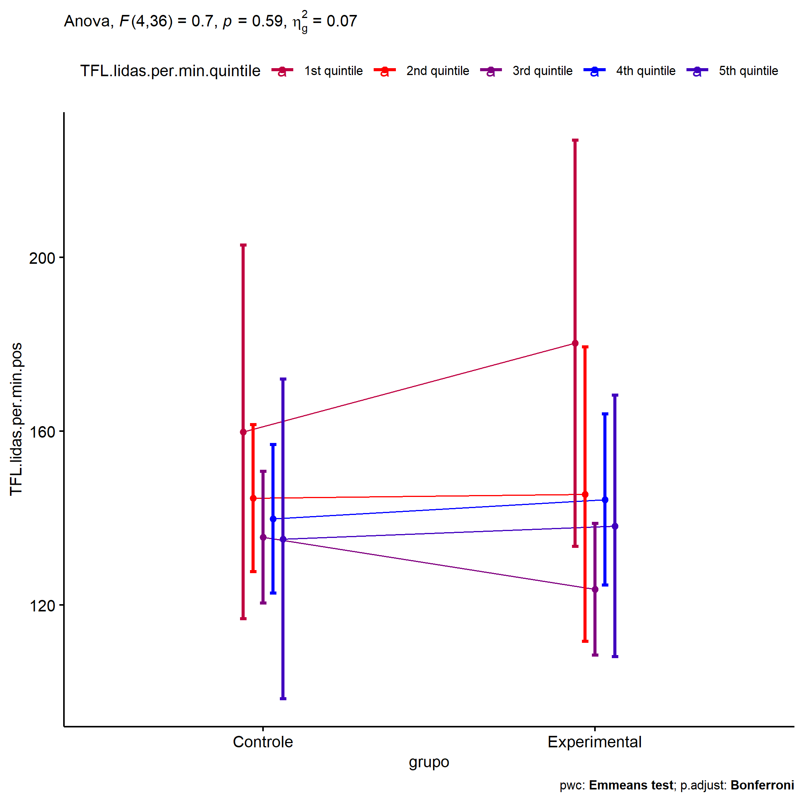<!-- -->

``` r
if (!is.null(plots[["TFL.lidas.per.min.quintile"]]))
  plots[["TFL.lidas.per.min.quintile"]] + ggplot2::scale_color_manual(values = color[["grupo"]])
```

    ## Scale for colour is already present.
    ## Adding another scale for colour, which will replace the existing scale.

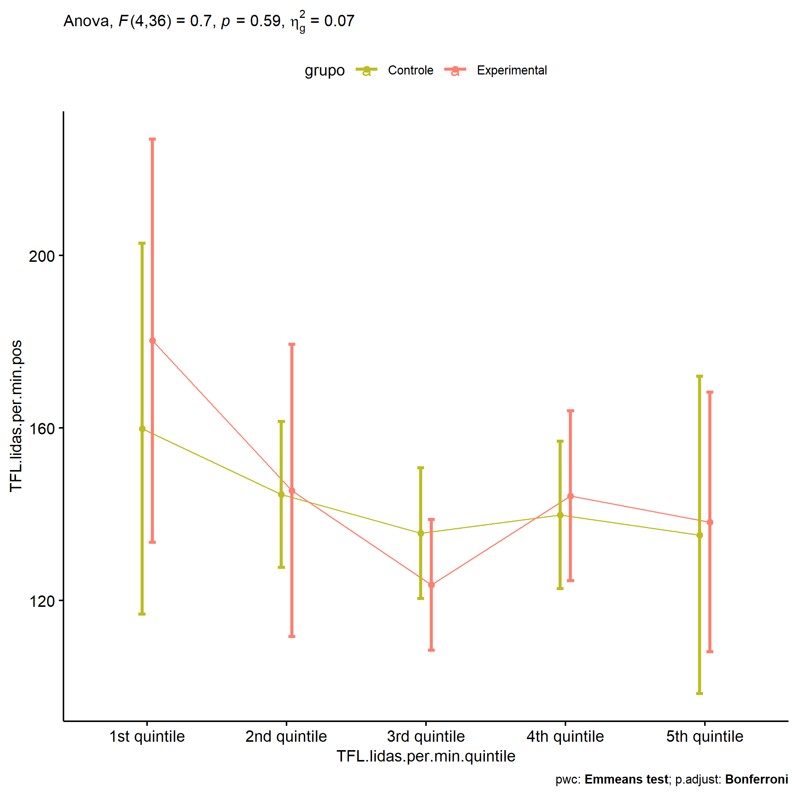<!-- -->

``` r
plots <- twoWayAncovaBoxPlots(
  wdat, "TFL.lidas.per.min.pos", c("grupo","TFL.lidas.per.min.quintile"), aov, pwcs, covar = "TFL.lidas.per.min.pre",
  theme = "classic", color = color[["grupo:TFL.lidas.per.min.quintile"]],
  subtitle = which(aov$Effect == "grupo:TFL.lidas.per.min.quintile"))
```

``` r
plots[["grupo:TFL.lidas.per.min.quintile"]] + ggplot2::ylab("Palavras Lidas (1 Min)") + ggplot2::scale_x_discrete(labels=c('pre', 'pos'))
```

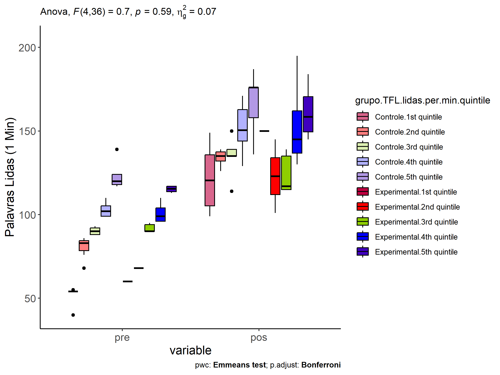<!-- -->

``` r
plots <- twoWayAncovaBoxPlots(
  wdat.long, "TFL.lidas.per.min", c("grupo","TFL.lidas.per.min.quintile"), aov, pwc.long, pre.post = "time",
  theme = "classic", color = color$prepost)
```

``` r
plots[["grupo:TFL.lidas.per.min.quintile"]] + ggplot2::ylab("Palavras Lidas (1 Min)")
```

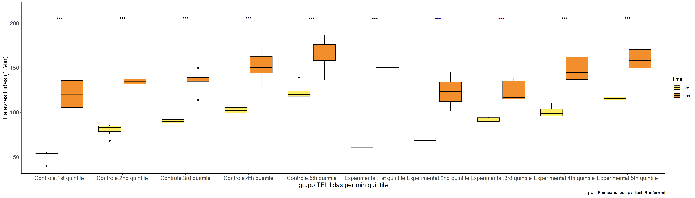<!-- -->

### Checking linearity assumption

``` r
ggscatter(wdat, x = "TFL.lidas.per.min.pre", y = "TFL.lidas.per.min.pos", size = 0.5,
          facet.by = c("grupo","TFL.lidas.per.min.quintile"), add = "reg.line")+
  stat_regline_equation(
    aes(label =  paste(..eq.label.., ..rr.label.., sep = "~~~~"))
  )
```

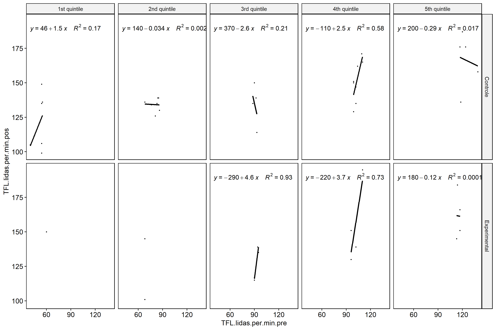<!-- -->

### Checking normality and homogeneity

``` r
res <- augment(lm(TFL.lidas.per.min.pos ~ TFL.lidas.per.min.pre + grupo*TFL.lidas.per.min.quintile, data = wdat))
```

``` r
shapiro_test(res$.resid)
```

    ## # A tibble: 1 × 3
    ##   variable   statistic p.value
    ##   <chr>          <dbl>   <dbl>
    ## 1 res$.resid     0.975   0.398

``` r
levene_test(res, .resid ~ grupo*TFL.lidas.per.min.quintile)
```

    ## # A tibble: 1 × 4
    ##     df1   df2 statistic     p
    ##   <int> <int>     <dbl> <dbl>
    ## 1     9    37      1.44 0.207

# Summary of Results

## Descriptive Statistics

``` r
df <- get.descriptives(ldat[["grupo"]], c(dv.pre, dv.pos), c("grupo"), 
                       include.global = T, symmetry.test = T, normality.test = F)
df <- plyr::rbind.fill(
  df, do.call(plyr::rbind.fill, lapply(lfatores2, FUN = function(f) {
    if (nrow(dat) > 0 && sum(!is.na(unique(dat[[f]]))) > 1)
      get.descriptives(ldat[[paste0("grupo:",f)]], c(dv.pre,dv.pos), c("grupo", f),
                       symmetry.test = T, normality.test = F)
    }))
)
```

    ## Warning: There was 1 warning in `mutate()`.
    ## ℹ In argument: `ci = abs(stats::qt(alpha/2, .data$n - 1) * .data$se)`.
    ## Caused by warning:
    ## ! There was 1 warning in `mutate()`.
    ## ℹ In argument: `ci = abs(stats::qt(alpha/2, .data$n - 1) * .data$se)`.
    ## Caused by warning in `stats::qt()`:
    ## ! NaNs produced
    ## There was 1 warning in `mutate()`.
    ## ℹ In argument: `ci = abs(stats::qt(alpha/2, .data$n - 1) * .data$se)`.
    ## Caused by warning:
    ## ! There was 1 warning in `mutate()`.
    ## ℹ In argument: `ci = abs(stats::qt(alpha/2, .data$n - 1) * .data$se)`.
    ## Caused by warning in `stats::qt()`:
    ## ! NaNs produced

``` r
(df <- df[,c(fatores1[fatores1 %in% colnames(df)],"variable",
             colnames(df)[!colnames(df) %in% c(fatores1,"variable")])])
```

    ##           grupo Sexo   Zona Cor.Raca TFL.lidas.per.min.quintile              variable  n    mean median min max
    ## 1      Controle <NA>   <NA>     <NA>                       <NA> TFL.lidas.per.min.pre 33  87.364   88.0  40 139
    ## 2  Experimental <NA>   <NA>     <NA>                       <NA> TFL.lidas.per.min.pre 19  96.947   96.0  60 117
    ## 3          <NA> <NA>   <NA>     <NA>                       <NA> TFL.lidas.per.min.pre 52  90.865   93.0  40 139
    ## 4      Controle <NA>   <NA>     <NA>                       <NA> TFL.lidas.per.min.pos 33 139.000  136.0  88 187
    ## 5  Experimental <NA>   <NA>     <NA>                       <NA> TFL.lidas.per.min.pos 19 140.684  139.0 101 195
    ## 6          <NA> <NA>   <NA>     <NA>                       <NA> TFL.lidas.per.min.pos 52 139.615  139.0  88 195
    ## 7      Controle    F   <NA>     <NA>                       <NA> TFL.lidas.per.min.pre 32  93.125   95.0  40 154
    ## 8      Controle    M   <NA>     <NA>                       <NA> TFL.lidas.per.min.pre 47  91.213   93.0  27 141
    ## 9  Experimental    F   <NA>     <NA>                       <NA> TFL.lidas.per.min.pre 19 101.474   97.0  76 135
    ## 10 Experimental    M   <NA>     <NA>                       <NA> TFL.lidas.per.min.pre 30  89.233   89.0  54 135
    ## 11     Controle    F   <NA>     <NA>                       <NA> TFL.lidas.per.min.pos 32 115.625  117.0  87 158
    ## 12     Controle    M   <NA>     <NA>                       <NA> TFL.lidas.per.min.pos 47 101.213   99.0  43 150
    ## 13 Experimental    F   <NA>     <NA>                       <NA> TFL.lidas.per.min.pos 19 119.316  115.0  82 151
    ## 14 Experimental    M   <NA>     <NA>                       <NA> TFL.lidas.per.min.pos 30 104.733  100.0  67 166
    ## 15     Controle <NA>  Rural     <NA>                       <NA> TFL.lidas.per.min.pre 55  92.764   95.0  27 154
    ## 16     Controle <NA> Urbana     <NA>                       <NA> TFL.lidas.per.min.pre  7  93.000   99.0  48 124
    ## 17 Experimental <NA>  Rural     <NA>                       <NA> TFL.lidas.per.min.pre 32  91.656   92.5  54 135
    ## 18 Experimental <NA> Urbana     <NA>                       <NA> TFL.lidas.per.min.pre  5 101.200   95.0  90 135
    ## 19     Controle <NA>  Rural     <NA>                       <NA> TFL.lidas.per.min.pos 55 103.491  104.0  43 150
    ## 20     Controle <NA> Urbana     <NA>                       <NA> TFL.lidas.per.min.pos  7 142.857  150.0  88 176
    ## 21 Experimental <NA>  Rural     <NA>                       <NA> TFL.lidas.per.min.pos 32 104.656  101.5  70 141
    ## 22 Experimental <NA> Urbana     <NA>                       <NA> TFL.lidas.per.min.pos  5 122.200  115.0  99 151
    ## 23     Controle <NA>   <NA>   Branca                       <NA> TFL.lidas.per.min.pre 12 105.500  103.5  90 141
    ## 24     Controle <NA>   <NA>    Parda                       <NA> TFL.lidas.per.min.pre 40  91.525   95.0  27 135
    ## 25 Experimental <NA>   <NA>   Branca                       <NA> TFL.lidas.per.min.pre  5 104.000   96.0  95 117
    ## 26 Experimental <NA>   <NA> Indígena                       <NA> TFL.lidas.per.min.pre  8  95.125   98.5  54 115
    ## 27 Experimental <NA>   <NA>    Parda                       <NA> TFL.lidas.per.min.pre 16  88.688   86.0  54 135
    ## 28     Controle <NA>   <NA>   Branca                       <NA> TFL.lidas.per.min.pos 12 115.417  116.5  87 150
    ## 29     Controle <NA>   <NA>    Parda                       <NA> TFL.lidas.per.min.pos 40  97.700   95.5  43 136
    ## 30 Experimental <NA>   <NA>   Branca                       <NA> TFL.lidas.per.min.pos  5 126.600  121.0 110 151
    ## 31 Experimental <NA>   <NA> Indígena                       <NA> TFL.lidas.per.min.pos  8 106.875  112.0  67 139
    ## 32 Experimental <NA>   <NA>    Parda                       <NA> TFL.lidas.per.min.pos 16 100.750   97.0  70 145
    ## 33     Controle <NA>   <NA>     <NA>               1st quintile TFL.lidas.per.min.pre  6  51.833   54.0  40  55
    ## 34     Controle <NA>   <NA>     <NA>               2nd quintile TFL.lidas.per.min.pre  7  80.429   83.0  68  86
    ## 35     Controle <NA>   <NA>     <NA>               3rd quintile TFL.lidas.per.min.pre  5  90.200   90.0  88  93
    ## 36     Controle <NA>   <NA>     <NA>               4th quintile TFL.lidas.per.min.pre  8 103.000  102.0  99 110
    ## 37     Controle <NA>   <NA>     <NA>               5th quintile TFL.lidas.per.min.pre  5 123.600  120.0 117 139
    ## 38 Experimental <NA>   <NA>     <NA>               1st quintile TFL.lidas.per.min.pre  1  60.000   60.0  60  60
    ## 39 Experimental <NA>   <NA>     <NA>               2nd quintile TFL.lidas.per.min.pre  2  68.000   68.0  68  68
    ## 40 Experimental <NA>   <NA>     <NA>               3rd quintile TFL.lidas.per.min.pre  5  91.800   90.0  90  95
    ## 41 Experimental <NA>   <NA>     <NA>               4th quintile TFL.lidas.per.min.pre  4 101.000   99.0  96 110
    ## 42 Experimental <NA>   <NA>     <NA>               5th quintile TFL.lidas.per.min.pre  4 115.250  115.5 113 117
    ## 43     Controle <NA>   <NA>     <NA>               1st quintile TFL.lidas.per.min.pos  6 121.667  120.5  99 149
    ## 44     Controle <NA>   <NA>     <NA>               2nd quintile TFL.lidas.per.min.pos  7 134.143  135.0 126 139
    ## 45     Controle <NA>   <NA>     <NA>               3rd quintile TFL.lidas.per.min.pos  5 134.600  135.0 114 150
    ## 46     Controle <NA>   <NA>     <NA>               4th quintile TFL.lidas.per.min.pos  8 151.250  150.5 129 171
    ## 47     Controle <NA>   <NA>     <NA>               5th quintile TFL.lidas.per.min.pos  5 166.600  176.0 136 187
    ## 48 Experimental <NA>   <NA>     <NA>               1st quintile TFL.lidas.per.min.pos  1 150.000  150.0 150 150
    ## 49 Experimental <NA>   <NA>     <NA>               2nd quintile TFL.lidas.per.min.pos  2 123.000  123.0 101 145
    ## 50 Experimental <NA>   <NA>     <NA>               3rd quintile TFL.lidas.per.min.pos  5 124.200  117.0 115 139
    ## 51 Experimental <NA>   <NA>     <NA>               4th quintile TFL.lidas.per.min.pos  4 153.750  145.0 130 195
    ## 52 Experimental <NA>   <NA>     <NA>               5th quintile TFL.lidas.per.min.pos  4 161.500  158.5 145 184
    ##        sd     se      ci   iqr symmetry    skewness    kurtosis
    ## 1  24.790  4.315   8.790 34.00      YES -0.11876909 -0.87521814
    ## 2  17.520  4.019   8.444 23.50       NO -0.57553868 -0.73795376
    ## 3  22.708  3.149   6.322 29.50      YES -0.36368668 -0.63926130
    ## 4  22.809  3.971   8.088 20.00      YES -0.10731621 -0.21959002
    ## 5  23.657  5.427  11.403 27.00       NO  0.52818618 -0.18050138
    ## 6  22.905  3.176   6.377 20.50      YES  0.14792535 -0.03807732
    ## 7  23.596  4.171   8.507 20.25      YES  0.01301567  0.53847405
    ## 8  24.340  3.550   7.146 33.50      YES -0.24321732 -0.32117483
    ## 9  14.331  3.288   6.907 24.00      YES  0.48697030 -0.48173271
    ## 10 19.833  3.621   7.406 19.00      YES  0.16956222 -0.49631246
    ## 11 20.863  3.688   7.522 39.00      YES  0.31090893 -1.18400281
    ## 12 23.890  3.485   7.014 31.00      YES -0.05334268 -0.74281987
    ## 13 20.675  4.743   9.965 38.50      YES  0.05528040 -1.29535742
    ## 14 22.451  4.099   8.383 22.75       NO  0.59418556  0.05184421
    ## 15 25.675  3.462   6.941 34.00      YES -0.22139650 -0.11883340
    ## 16 24.055  9.092  22.248 19.00       NO -0.58614065 -0.81530927
    ## 17 18.074  3.195   6.517 17.50      YES  0.07417904 -0.21487839
    ## 18 19.097  8.540  23.712  6.00       NO  1.01728946 -0.98678642
    ## 19 22.105  2.981   5.976 29.50      YES -0.17566159 -0.28677081
    ## 20 28.399 10.734  26.264 23.00       NO -0.73531573 -0.68988901
    ## 21 17.138  3.030   6.179 20.00      YES  0.28045637 -0.33272750
    ## 22 19.677  8.800  24.433 16.00      YES  0.29756000 -1.68060378
    ## 23 15.895  4.588  10.099 25.00       NO  0.77075591 -0.53576075
    ## 24 23.632  3.737   7.558 34.25      YES -0.46139356 -0.23048315
    ## 25 11.874  5.310  14.744 22.00 few data  0.00000000  0.00000000
    ## 26 19.342  6.839  16.171 14.25       NO -1.02828663 -0.22855186
    ## 27 20.261  5.065  10.796 17.00       NO  0.54856534 -0.20893115
    ## 28 18.143  5.237  11.528 15.75      YES  0.09195270 -0.87510640
    ## 29 20.719  3.276   6.626 24.50      YES -0.15416194 -0.21937699
    ## 30 18.609  8.322  23.106 31.00      YES  0.25413167 -2.08224676
    ## 31 21.290  7.527  17.799 16.75      YES -0.42728978 -0.75134675
    ## 32 19.039  4.760  10.145 10.75       NO  0.73675787  0.16747099
    ## 33  5.811  2.372   6.098  0.00 few data  0.00000000  0.00000000
    ## 34  6.399  2.419   5.918  6.00       NO -0.91331317 -0.79787828
    ## 35  2.280  1.020   2.831  4.00      YES  0.10929492 -2.12118343
    ## 36  4.408  1.558   3.685  6.25       NO  0.53423187 -1.52040982
    ## 37  9.017  4.032  11.196  6.00       NO  0.85738870 -1.20585304
    ## 38     NA     NA     NaN  0.00 few data  0.00000000  0.00000000
    ## 39  0.000  0.000   0.000  0.00 few data  0.00000000  0.00000000
    ## 40  2.490  1.114   3.092  4.00 few data  0.00000000  0.00000000
    ## 41  6.633  3.317  10.555  8.00 few data  0.00000000  0.00000000
    ## 42  2.062  1.031   3.280  3.25 few data  0.00000000  0.00000000
    ## 43 20.820  8.500  21.849 30.50      YES  0.10370696 -2.08338211
    ## 44  4.741  1.792   4.385  5.50       NO -0.50250039 -1.35513377
    ## 45 13.050  5.836  16.204  4.00      YES -0.45034584 -1.36769601
    ## 46 14.509  5.130  12.130 18.75      YES -0.15713693 -1.54324717
    ## 47 20.020  8.953  24.858 18.00      YES -0.47701424 -1.66653388
    ## 48     NA     NA     NaN  0.00 few data  0.00000000  0.00000000
    ## 49 31.113 22.000 279.537 22.00 few data  0.00000000  0.00000000
    ## 50 11.798  5.276  14.650 20.00      YES  0.31307829 -2.18872771
    ## 51 28.814 14.407  45.850 25.25       NO  0.55974805 -1.81735064
    ## 52 17.407  8.703  27.698 21.00      YES  0.27643535 -2.06606583

| grupo        | Sexo | Zona   | Cor.Raca | TFL.lidas.per.min.quintile | variable              |   n |    mean | median | min | max |     sd |     se |      ci |   iqr | symmetry | skewness | kurtosis |
|:-------------|:-----|:-------|:---------|:---------------------------|:----------------------|----:|--------:|-------:|----:|----:|-------:|-------:|--------:|------:|:---------|---------:|---------:|
| Controle     |      |        |          |                            | TFL.lidas.per.min.pre |  33 |  87.364 |   88.0 |  40 | 139 | 24.790 |  4.315 |   8.790 | 34.00 | YES      |   -0.119 |   -0.875 |
| Experimental |      |        |          |                            | TFL.lidas.per.min.pre |  19 |  96.947 |   96.0 |  60 | 117 | 17.520 |  4.019 |   8.444 | 23.50 | NO       |   -0.576 |   -0.738 |
|              |      |        |          |                            | TFL.lidas.per.min.pre |  52 |  90.865 |   93.0 |  40 | 139 | 22.708 |  3.149 |   6.322 | 29.50 | YES      |   -0.364 |   -0.639 |
| Controle     |      |        |          |                            | TFL.lidas.per.min.pos |  33 | 139.000 |  136.0 |  88 | 187 | 22.809 |  3.971 |   8.088 | 20.00 | YES      |   -0.107 |   -0.220 |
| Experimental |      |        |          |                            | TFL.lidas.per.min.pos |  19 | 140.684 |  139.0 | 101 | 195 | 23.657 |  5.427 |  11.403 | 27.00 | NO       |    0.528 |   -0.181 |
|              |      |        |          |                            | TFL.lidas.per.min.pos |  52 | 139.615 |  139.0 |  88 | 195 | 22.905 |  3.176 |   6.377 | 20.50 | YES      |    0.148 |   -0.038 |
| Controle     | F    |        |          |                            | TFL.lidas.per.min.pre |  32 |  93.125 |   95.0 |  40 | 154 | 23.596 |  4.171 |   8.507 | 20.25 | YES      |    0.013 |    0.538 |
| Controle     | M    |        |          |                            | TFL.lidas.per.min.pre |  47 |  91.213 |   93.0 |  27 | 141 | 24.340 |  3.550 |   7.146 | 33.50 | YES      |   -0.243 |   -0.321 |
| Experimental | F    |        |          |                            | TFL.lidas.per.min.pre |  19 | 101.474 |   97.0 |  76 | 135 | 14.331 |  3.288 |   6.907 | 24.00 | YES      |    0.487 |   -0.482 |
| Experimental | M    |        |          |                            | TFL.lidas.per.min.pre |  30 |  89.233 |   89.0 |  54 | 135 | 19.833 |  3.621 |   7.406 | 19.00 | YES      |    0.170 |   -0.496 |
| Controle     | F    |        |          |                            | TFL.lidas.per.min.pos |  32 | 115.625 |  117.0 |  87 | 158 | 20.863 |  3.688 |   7.522 | 39.00 | YES      |    0.311 |   -1.184 |
| Controle     | M    |        |          |                            | TFL.lidas.per.min.pos |  47 | 101.213 |   99.0 |  43 | 150 | 23.890 |  3.485 |   7.014 | 31.00 | YES      |   -0.053 |   -0.743 |
| Experimental | F    |        |          |                            | TFL.lidas.per.min.pos |  19 | 119.316 |  115.0 |  82 | 151 | 20.675 |  4.743 |   9.965 | 38.50 | YES      |    0.055 |   -1.295 |
| Experimental | M    |        |          |                            | TFL.lidas.per.min.pos |  30 | 104.733 |  100.0 |  67 | 166 | 22.451 |  4.099 |   8.383 | 22.75 | NO       |    0.594 |    0.052 |
| Controle     |      | Rural  |          |                            | TFL.lidas.per.min.pre |  55 |  92.764 |   95.0 |  27 | 154 | 25.675 |  3.462 |   6.941 | 34.00 | YES      |   -0.221 |   -0.119 |
| Controle     |      | Urbana |          |                            | TFL.lidas.per.min.pre |   7 |  93.000 |   99.0 |  48 | 124 | 24.055 |  9.092 |  22.248 | 19.00 | NO       |   -0.586 |   -0.815 |
| Experimental |      | Rural  |          |                            | TFL.lidas.per.min.pre |  32 |  91.656 |   92.5 |  54 | 135 | 18.074 |  3.195 |   6.517 | 17.50 | YES      |    0.074 |   -0.215 |
| Experimental |      | Urbana |          |                            | TFL.lidas.per.min.pre |   5 | 101.200 |   95.0 |  90 | 135 | 19.097 |  8.540 |  23.712 |  6.00 | NO       |    1.017 |   -0.987 |
| Controle     |      | Rural  |          |                            | TFL.lidas.per.min.pos |  55 | 103.491 |  104.0 |  43 | 150 | 22.105 |  2.981 |   5.976 | 29.50 | YES      |   -0.176 |   -0.287 |
| Controle     |      | Urbana |          |                            | TFL.lidas.per.min.pos |   7 | 142.857 |  150.0 |  88 | 176 | 28.399 | 10.734 |  26.264 | 23.00 | NO       |   -0.735 |   -0.690 |
| Experimental |      | Rural  |          |                            | TFL.lidas.per.min.pos |  32 | 104.656 |  101.5 |  70 | 141 | 17.138 |  3.030 |   6.179 | 20.00 | YES      |    0.280 |   -0.333 |
| Experimental |      | Urbana |          |                            | TFL.lidas.per.min.pos |   5 | 122.200 |  115.0 |  99 | 151 | 19.677 |  8.800 |  24.433 | 16.00 | YES      |    0.298 |   -1.681 |
| Controle     |      |        | Branca   |                            | TFL.lidas.per.min.pre |  12 | 105.500 |  103.5 |  90 | 141 | 15.895 |  4.588 |  10.099 | 25.00 | NO       |    0.771 |   -0.536 |
| Controle     |      |        | Parda    |                            | TFL.lidas.per.min.pre |  40 |  91.525 |   95.0 |  27 | 135 | 23.632 |  3.737 |   7.558 | 34.25 | YES      |   -0.461 |   -0.230 |
| Experimental |      |        | Branca   |                            | TFL.lidas.per.min.pre |   5 | 104.000 |   96.0 |  95 | 117 | 11.874 |  5.310 |  14.744 | 22.00 | few data |    0.000 |    0.000 |
| Experimental |      |        | Indígena |                            | TFL.lidas.per.min.pre |   8 |  95.125 |   98.5 |  54 | 115 | 19.342 |  6.839 |  16.171 | 14.25 | NO       |   -1.028 |   -0.229 |
| Experimental |      |        | Parda    |                            | TFL.lidas.per.min.pre |  16 |  88.688 |   86.0 |  54 | 135 | 20.261 |  5.065 |  10.796 | 17.00 | NO       |    0.549 |   -0.209 |
| Controle     |      |        | Branca   |                            | TFL.lidas.per.min.pos |  12 | 115.417 |  116.5 |  87 | 150 | 18.143 |  5.237 |  11.528 | 15.75 | YES      |    0.092 |   -0.875 |
| Controle     |      |        | Parda    |                            | TFL.lidas.per.min.pos |  40 |  97.700 |   95.5 |  43 | 136 | 20.719 |  3.276 |   6.626 | 24.50 | YES      |   -0.154 |   -0.219 |
| Experimental |      |        | Branca   |                            | TFL.lidas.per.min.pos |   5 | 126.600 |  121.0 | 110 | 151 | 18.609 |  8.322 |  23.106 | 31.00 | YES      |    0.254 |   -2.082 |
| Experimental |      |        | Indígena |                            | TFL.lidas.per.min.pos |   8 | 106.875 |  112.0 |  67 | 139 | 21.290 |  7.527 |  17.799 | 16.75 | YES      |   -0.427 |   -0.751 |
| Experimental |      |        | Parda    |                            | TFL.lidas.per.min.pos |  16 | 100.750 |   97.0 |  70 | 145 | 19.039 |  4.760 |  10.145 | 10.75 | NO       |    0.737 |    0.167 |
| Controle     |      |        |          | 1st quintile               | TFL.lidas.per.min.pre |   6 |  51.833 |   54.0 |  40 |  55 |  5.811 |  2.372 |   6.098 |  0.00 | few data |    0.000 |    0.000 |
| Controle     |      |        |          | 2nd quintile               | TFL.lidas.per.min.pre |   7 |  80.429 |   83.0 |  68 |  86 |  6.399 |  2.419 |   5.918 |  6.00 | NO       |   -0.913 |   -0.798 |
| Controle     |      |        |          | 3rd quintile               | TFL.lidas.per.min.pre |   5 |  90.200 |   90.0 |  88 |  93 |  2.280 |  1.020 |   2.831 |  4.00 | YES      |    0.109 |   -2.121 |
| Controle     |      |        |          | 4th quintile               | TFL.lidas.per.min.pre |   8 | 103.000 |  102.0 |  99 | 110 |  4.408 |  1.558 |   3.685 |  6.25 | NO       |    0.534 |   -1.520 |
| Controle     |      |        |          | 5th quintile               | TFL.lidas.per.min.pre |   5 | 123.600 |  120.0 | 117 | 139 |  9.017 |  4.032 |  11.196 |  6.00 | NO       |    0.857 |   -1.206 |
| Experimental |      |        |          | 1st quintile               | TFL.lidas.per.min.pre |   1 |  60.000 |   60.0 |  60 |  60 |        |        |         |  0.00 | few data |    0.000 |    0.000 |
| Experimental |      |        |          | 2nd quintile               | TFL.lidas.per.min.pre |   2 |  68.000 |   68.0 |  68 |  68 |  0.000 |  0.000 |   0.000 |  0.00 | few data |    0.000 |    0.000 |
| Experimental |      |        |          | 3rd quintile               | TFL.lidas.per.min.pre |   5 |  91.800 |   90.0 |  90 |  95 |  2.490 |  1.114 |   3.092 |  4.00 | few data |    0.000 |    0.000 |
| Experimental |      |        |          | 4th quintile               | TFL.lidas.per.min.pre |   4 | 101.000 |   99.0 |  96 | 110 |  6.633 |  3.317 |  10.555 |  8.00 | few data |    0.000 |    0.000 |
| Experimental |      |        |          | 5th quintile               | TFL.lidas.per.min.pre |   4 | 115.250 |  115.5 | 113 | 117 |  2.062 |  1.031 |   3.280 |  3.25 | few data |    0.000 |    0.000 |
| Controle     |      |        |          | 1st quintile               | TFL.lidas.per.min.pos |   6 | 121.667 |  120.5 |  99 | 149 | 20.820 |  8.500 |  21.849 | 30.50 | YES      |    0.104 |   -2.083 |
| Controle     |      |        |          | 2nd quintile               | TFL.lidas.per.min.pos |   7 | 134.143 |  135.0 | 126 | 139 |  4.741 |  1.792 |   4.385 |  5.50 | NO       |   -0.503 |   -1.355 |
| Controle     |      |        |          | 3rd quintile               | TFL.lidas.per.min.pos |   5 | 134.600 |  135.0 | 114 | 150 | 13.050 |  5.836 |  16.204 |  4.00 | YES      |   -0.450 |   -1.368 |
| Controle     |      |        |          | 4th quintile               | TFL.lidas.per.min.pos |   8 | 151.250 |  150.5 | 129 | 171 | 14.509 |  5.130 |  12.130 | 18.75 | YES      |   -0.157 |   -1.543 |
| Controle     |      |        |          | 5th quintile               | TFL.lidas.per.min.pos |   5 | 166.600 |  176.0 | 136 | 187 | 20.020 |  8.953 |  24.858 | 18.00 | YES      |   -0.477 |   -1.667 |
| Experimental |      |        |          | 1st quintile               | TFL.lidas.per.min.pos |   1 | 150.000 |  150.0 | 150 | 150 |        |        |         |  0.00 | few data |    0.000 |    0.000 |
| Experimental |      |        |          | 2nd quintile               | TFL.lidas.per.min.pos |   2 | 123.000 |  123.0 | 101 | 145 | 31.113 | 22.000 | 279.537 | 22.00 | few data |    0.000 |    0.000 |
| Experimental |      |        |          | 3rd quintile               | TFL.lidas.per.min.pos |   5 | 124.200 |  117.0 | 115 | 139 | 11.798 |  5.276 |  14.650 | 20.00 | YES      |    0.313 |   -2.189 |
| Experimental |      |        |          | 4th quintile               | TFL.lidas.per.min.pos |   4 | 153.750 |  145.0 | 130 | 195 | 28.814 | 14.407 |  45.850 | 25.25 | NO       |    0.560 |   -1.817 |
| Experimental |      |        |          | 5th quintile               | TFL.lidas.per.min.pos |   4 | 161.500 |  158.5 | 145 | 184 | 17.407 |  8.703 |  27.698 | 21.00 | YES      |    0.276 |   -2.066 |

## ANCOVA Table Comparison

``` r
df <- do.call(plyr::rbind.fill, laov)
(df <- df[!duplicated(df$Effect),])
```

    ##                              Effect DFn DFd      F        p p<.05   ges DFn' DFd'     F'       p' p<.05'
    ## 1                             grupo   1  49  0.929 3.40e-01       0.019    1  141  0.001 9.72e-01       
    ## 2             TFL.lidas.per.min.pre   1  49 39.759 7.90e-08     * 0.448    1  141 50.978 4.54e-11      *
    ## 4                        grupo:Sexo   1 123  0.986 3.23e-01       0.008    1  139  0.076 7.83e-01       
    ## 5                              Sexo   1 123 11.520 9.27e-04     * 0.086    1  139  7.912 6.00e-03      *
    ## 8                        grupo:Zona   1  94  8.262 5.00e-03     * 0.081    1  101  1.833 1.79e-01       
    ## 10                             Zona   1  94 34.869 5.58e-08     * 0.271    1  101 18.781 3.47e-05      *
    ## 11                         Cor.Raca   2  75  3.311 4.20e-02     * 0.081    2   77  1.315 2.75e-01       
    ## 13                   grupo:Cor.Raca   1  75  0.648 4.23e-01       0.009    1   77  0.885 3.50e-01       
    ## 16 grupo:TFL.lidas.per.min.quintile   4  36  0.705 5.94e-01       0.073    4  133  0.701 5.92e-01       
    ## 18       TFL.lidas.per.min.quintile   4  36  2.148 9.50e-02       0.193    4  133  0.977 4.22e-01       
    ##        ges'
    ## 1  8.52e-06
    ## 2  2.66e-01
    ## 4  5.47e-04
    ## 5  5.40e-02
    ## 8  1.80e-02
    ## 10 1.57e-01
    ## 11 3.30e-02
    ## 13 1.10e-02
    ## 16 2.10e-02
    ## 18 2.90e-02

|     | Effect                           | DFn | DFd |      F |     p | p\<.05 |   ges | DFn’ | DFd’ |     F’ |    p’ | p\<.05’ |  ges’ |
|:----|:---------------------------------|----:|----:|-------:|------:|:-------|------:|-----:|-----:|-------:|------:|:--------|------:|
| 1   | grupo                            |   1 |  49 |  0.929 | 0.340 |        | 0.019 |    1 |  141 |  0.001 | 0.972 |         | 0.000 |
| 2   | TFL.lidas.per.min.pre            |   1 |  49 | 39.759 | 0.000 | \*     | 0.448 |    1 |  141 | 50.978 | 0.000 | \*      | 0.266 |
| 4   | grupo:Sexo                       |   1 | 123 |  0.986 | 0.323 |        | 0.008 |    1 |  139 |  0.076 | 0.783 |         | 0.001 |
| 5   | Sexo                             |   1 | 123 | 11.520 | 0.001 | \*     | 0.086 |    1 |  139 |  7.912 | 0.006 | \*      | 0.054 |
| 8   | grupo:Zona                       |   1 |  94 |  8.262 | 0.005 | \*     | 0.081 |    1 |  101 |  1.833 | 0.179 |         | 0.018 |
| 10  | Zona                             |   1 |  94 | 34.869 | 0.000 | \*     | 0.271 |    1 |  101 | 18.781 | 0.000 | \*      | 0.157 |
| 11  | Cor.Raca                         |   2 |  75 |  3.311 | 0.042 | \*     | 0.081 |    2 |   77 |  1.315 | 0.275 |         | 0.033 |
| 13  | grupo:Cor.Raca                   |   1 |  75 |  0.648 | 0.423 |        | 0.009 |    1 |   77 |  0.885 | 0.350 |         | 0.011 |
| 16  | grupo:TFL.lidas.per.min.quintile |   4 |  36 |  0.705 | 0.594 |        | 0.073 |    4 |  133 |  0.701 | 0.592 |         | 0.021 |
| 18  | TFL.lidas.per.min.quintile       |   4 |  36 |  2.148 | 0.095 |        | 0.193 |    4 |  133 |  0.977 | 0.422 |         | 0.029 |

## PairWise Table Comparison

``` r
df <- do.call(plyr::rbind.fill, lpwc)
df <- df[,c(names(lfatores), names(df)[!names(df) %in% c(names(lfatores),"term",".y.")])]
```

| grupo        | Sexo | Zona   | Cor.Raca | TFL.lidas.per.min.quintile | group1       | group2       |  df | statistic |     p | p.adj | p.adj.signif | df’ | statistic’ |    p’ | p.adj’ | p.adj.signif’ |
|:-------------|:-----|:-------|:---------|:---------------------------|:-------------|:-------------|----:|----------:|------:|------:|:-------------|----:|-----------:|------:|-------:|:--------------|
| Controle     |      |        |          |                            | pre          | pos          | 100 |    -9.206 | 0.000 | 0.000 | \*\*\*\*     | 284 |     -5.744 | 0.000 |  0.000 | \*\*\*\*      |
| Experimental |      |        |          |                            | pre          | pos          | 100 |    -5.917 | 0.000 | 0.000 | \*\*\*\*     | 284 |     -4.298 | 0.000 |  0.000 | \*\*\*\*      |
|              |      |        |          |                            | Controle     | Experimental |  49 |     0.964 | 0.340 | 0.340 | ns           | 141 |     -0.035 | 0.972 |  0.972 | ns            |
| Controle     | F    |        |          |                            | pre          | pos          | 248 |    -4.063 | 0.000 | 0.000 | \*\*\*\*     | 280 |     -4.627 | 0.000 |  0.000 | \*\*\*\*      |
| Controle     | M    |        |          |                            | pre          | pos          | 248 |    -2.189 | 0.030 | 0.030 | \*           | 280 |     -3.774 | 0.000 |  0.000 | \*\*\*        |
| Controle     |      |        |          |                            | F            | M            | 123 |     3.299 | 0.001 | 0.001 | \*\*         | 139 |      2.074 | 0.040 |  0.040 | \*            |
| Experimental | F    |        |          |                            | pre          | pos          | 248 |    -2.483 | 0.014 | 0.014 | \*           | 280 |     -3.562 | 0.000 |  0.000 | \*\*\*        |
| Experimental | M    |        |          |                            | pre          | pos          | 248 |    -2.710 | 0.007 | 0.007 | \*\*         | 280 |     -2.717 | 0.007 |  0.007 | \*\*          |
| Experimental |      |        |          |                            | F            | M            | 123 |     1.293 | 0.198 | 0.198 | ns           | 139 |      1.934 | 0.055 |  0.055 | ns            |
|              | F    |        |          |                            | Controle     | Experimental | 123 |     0.332 | 0.741 | 0.741 | ns           | 139 |     -0.208 | 0.836 |  0.836 | ns            |
|              | M    |        |          |                            | Controle     | Experimental | 123 |    -1.177 | 0.241 | 0.241 | ns           | 139 |      0.182 | 0.856 |  0.856 | ns            |
| Controle     |      |        |          |                            | Rural        | Urbana       |  94 |    -6.379 | 0.000 | 0.000 | \*\*\*\*     | 101 |     -4.128 | 0.000 |  0.000 | \*\*\*\*      |
| Controle     |      | Rural  |          |                            | pre          | pos          | 190 |    -2.549 | 0.012 | 0.012 | \*           | 204 |     -3.169 | 0.002 |  0.002 | \*\*          |
| Controle     |      | Urbana |          |                            | pre          | pos          | 190 |    -4.227 | 0.000 | 0.000 | \*\*\*\*     | 204 |     -3.822 | 0.000 |  0.000 | \*\*\*        |
| Experimental |      |        |          |                            | Rural        | Urbana       |  94 |    -1.565 | 0.121 | 0.121 | ns           | 101 |     -1.895 | 0.061 |  0.061 | ns            |
| Experimental |      | Rural  |          |                            | pre          | pos          | 190 |    -2.356 | 0.019 | 0.019 | \*           | 204 |     -3.198 | 0.002 |  0.002 | \*\*          |
| Experimental |      | Urbana |          |                            | pre          | pos          | 190 |    -1.505 | 0.134 | 0.134 | ns           | 204 |     -2.247 | 0.026 |  0.026 | \*            |
|              |      | Rural  |          |                            | Controle     | Experimental |  94 |    -0.545 | 0.587 | 0.587 | ns           | 101 |     -0.806 | 0.422 |  0.422 | ns            |
|              |      | Urbana |          |                            | Controle     | Experimental |  94 |     2.869 | 0.005 | 0.005 | \*\*         | 101 |      1.141 | 0.256 |  0.256 | ns            |
| Controle     |      |        | Branca   |                            | pre          | pos          | 152 |    -1.181 | 0.239 | 0.239 | ns           | 156 |     -1.105 | 0.271 |  0.271 | ns            |
| Controle     |      |        | Indígena |                            | pre          | pos          |     |           |       |       |              |     |            |       |        |               |
| Controle     |      |        |          |                            | Branca       | Indígena     |     |           |       |       |              |     |            |       |        |               |
| Controle     |      |        |          |                            | Branca       | Parda        |  75 |     1.753 | 0.084 | 0.084 | ns           |  77 |      0.869 | 0.387 |  0.387 | ns            |
| Controle     |      |        |          |                            | Indígena     | Parda        |     |           |       |       |              |     |            |       |        |               |
| Controle     |      |        | Parda    |                            | pre          | pos          | 152 |    -1.343 | 0.181 | 0.181 | ns           | 156 |     -1.816 | 0.071 |  0.071 | ns            |
| Experimental |      |        | Branca   |                            | pre          | pos          | 152 |    -1.738 | 0.084 | 0.084 | ns           | 156 |     -1.625 | 0.106 |  0.106 | ns            |
| Experimental |      |        | Indígena |                            | pre          | pos          | 152 |    -1.143 | 0.255 | 0.255 | ns           | 156 |     -1.069 | 0.287 |  0.287 | ns            |
| Experimental |      |        |          |                            | Branca       | Indígena     |  75 |     1.655 | 0.102 | 0.306 | ns           |  77 |      1.350 | 0.181 |  0.543 | ns            |
| Experimental |      |        |          |                            | Branca       | Parda        |  75 |     2.086 | 0.040 | 0.121 | ns           |  77 |      1.663 | 0.100 |  0.301 | ns            |
| Experimental |      |        |          |                            | Indígena     | Parda        |  75 |     0.312 | 0.756 | 1.000 | ns           |  77 |      0.210 | 0.835 |  1.000 | ns            |
| Experimental |      |        | Parda    |                            | pre          | pos          | 152 |    -1.659 | 0.099 | 0.099 | ns           | 156 |     -1.552 | 0.123 |  0.123 | ns            |
|              |      |        | Branca   |                            | Controle     | Experimental |  75 |    -1.537 | 0.129 | 0.129 | ns           |  77 |     -1.318 | 0.191 |  0.191 | ns            |
|              |      |        | Indígena |                            | Controle     | Experimental |     |           |       |       |              |     |            |       |        |               |
|              |      |        | Parda    |                            | Controle     | Experimental |  75 |    -1.106 | 0.272 | 0.272 | ns           |  77 |     -0.439 | 0.662 |  0.662 | ns            |
| Controle     |      |        |          | 1st quintile               | pre          | pos          |  74 |    -9.478 | 0.000 | 0.000 | \*\*\*\*     | 268 |     -6.107 | 0.000 |  0.000 | \*\*\*\*      |
| Controle     |      |        |          | 2nd quintile               | pre          | pos          |  74 |    -7.875 | 0.000 | 0.000 | \*\*\*\*     | 268 |     -4.508 | 0.000 |  0.000 | \*\*\*\*      |
| Controle     |      |        |          | 3rd quintile               | pre          | pos          |  74 |    -5.501 | 0.000 | 0.000 | \*\*\*\*     | 268 |     -2.350 | 0.020 |  0.020 | \*            |
| Controle     |      |        |          | 4th quintile               | pre          | pos          |  74 |    -7.562 | 0.000 | 0.000 | \*\*\*\*     | 268 |     -4.057 | 0.000 |  0.000 | \*\*\*\*      |
| Controle     |      |        |          | 5th quintile               | pre          | pos          |  74 |    -5.328 | 0.000 | 0.000 | \*\*\*\*     | 268 |     -1.260 | 0.209 |  0.209 | ns            |
| Controle     |      |        |          |                            | 1st quintile | 2nd quintile |  36 |     0.882 | 0.383 | 1.000 | ns           | 133 |      0.295 | 0.768 |  1.000 | ns            |
| Controle     |      |        |          |                            | 1st quintile | 3rd quintile |  36 |     1.102 | 0.278 | 1.000 | ns           | 133 |      0.591 | 0.555 |  1.000 | ns            |
| Controle     |      |        |          |                            | 1st quintile | 4th quintile |  36 |     0.725 | 0.473 | 1.000 | ns           | 133 |     -0.123 | 0.902 |  1.000 | ns            |
| Controle     |      |        |          |                            | 1st quintile | 5th quintile |  36 |     0.649 | 0.520 | 1.000 | ns           | 133 |      0.147 | 0.883 |  1.000 | ns            |
| Controle     |      |        |          |                            | 2nd quintile | 3rd quintile |  36 |     0.823 | 0.416 | 1.000 | ns           | 133 |      0.569 | 0.570 |  1.000 | ns            |
| Controle     |      |        |          |                            | 2nd quintile | 4th quintile |  36 |     0.332 | 0.742 | 1.000 | ns           | 133 |     -0.515 | 0.608 |  1.000 | ns            |
| Controle     |      |        |          |                            | 2nd quintile | 5th quintile |  36 |     0.390 | 0.699 | 1.000 | ns           | 133 |      0.002 | 0.998 |  1.000 | ns            |
| Controle     |      |        |          |                            | 3rd quintile | 4th quintile |  36 |    -0.368 | 0.715 | 1.000 | ns           | 133 |     -1.229 | 0.221 |  1.000 | ns            |
| Controle     |      |        |          |                            | 3rd quintile | 5th quintile |  36 |     0.019 | 0.985 | 1.000 | ns           | 133 |     -0.413 | 0.681 |  1.000 | ns            |
| Controle     |      |        |          |                            | 4th quintile | 5th quintile |  36 |     0.326 | 0.746 | 1.000 | ns           | 133 |      0.556 | 0.579 |  1.000 | ns            |
| Experimental |      |        |          | 1st quintile               | pre          | pos          |  74 |    -4.987 | 0.000 | 0.000 | \*\*\*\*     | 268 |     -3.280 | 0.001 |  0.001 | \*\*          |
| Experimental |      |        |          | 2nd quintile               | pre          | pos          |  74 |    -4.310 | 0.000 | 0.000 | \*\*\*\*     | 268 |     -2.185 | 0.030 |  0.030 | \*            |
| Experimental |      |        |          | 3rd quintile               | pre          | pos          |  74 |    -4.014 | 0.000 | 0.000 | \*\*\*       | 268 |     -2.730 | 0.007 |  0.007 | \*\*          |
| Experimental |      |        |          | 4th quintile               | pre          | pos          |  74 |    -5.846 | 0.000 | 0.000 | \*\*\*\*     | 268 |     -3.146 | 0.002 |  0.002 | \*\*          |
| Experimental |      |        |          | 5th quintile               | pre          | pos          |  74 |    -5.125 | 0.000 | 0.000 | \*\*\*\*     | 268 |     -2.593 | 0.010 |  0.010 | \*            |
| Experimental |      |        |          |                            | 1st quintile | 2nd quintile |  36 |     1.671 | 0.103 | 1.000 | ns           | 133 |      0.949 | 0.344 |  1.000 | ns            |
| Experimental |      |        |          |                            | 1st quintile | 3rd quintile |  36 |     2.320 | 0.026 | 0.261 | ns           | 133 |      0.252 | 0.802 |  1.000 | ns            |
| Experimental |      |        |          |                            | 1st quintile | 4th quintile |  36 |     1.286 | 0.207 | 1.000 | ns           | 133 |     -0.247 | 0.805 |  1.000 | ns            |
| Experimental |      |        |          |                            | 1st quintile | 5th quintile |  36 |     1.245 | 0.221 | 1.000 | ns           | 133 |     -0.319 | 0.750 |  1.000 | ns            |
| Experimental |      |        |          |                            | 2nd quintile | 3rd quintile |  36 |     1.184 | 0.244 | 1.000 | ns           | 133 |     -0.873 | 0.384 |  1.000 | ns            |
| Experimental |      |        |          |                            | 2nd quintile | 4th quintile |  36 |     0.056 | 0.956 | 1.000 | ns           | 133 |     -1.450 | 0.149 |  1.000 | ns            |
| Experimental |      |        |          |                            | 2nd quintile | 5th quintile |  36 |     0.260 | 0.796 | 1.000 | ns           | 133 |     -1.280 | 0.203 |  1.000 | ns            |
| Experimental |      |        |          |                            | 3rd quintile | 4th quintile |  36 |    -1.703 | 0.097 | 0.972 | ns           | 133 |     -0.835 | 0.405 |  1.000 | ns            |
| Experimental |      |        |          |                            | 3rd quintile | 5th quintile |  36 |    -0.890 | 0.379 | 1.000 | ns           | 133 |     -0.882 | 0.380 |  1.000 | ns            |
| Experimental |      |        |          |                            | 4th quintile | 5th quintile |  36 |     0.438 | 0.664 | 1.000 | ns           | 133 |     -0.228 | 0.820 |  1.000 | ns            |
|              |      |        |          | 1st quintile               | Controle     | Experimental |  36 |    -1.106 | 0.276 | 0.276 | ns           | 133 |      0.044 | 0.965 |  0.965 | ns            |
|              |      |        |          | 2nd quintile               | Controle     | Experimental |  36 |    -0.061 | 0.951 | 0.951 | ns           | 133 |      1.187 | 0.237 |  0.237 | ns            |
|              |      |        |          | 3rd quintile               | Controle     | Experimental |  36 |     1.131 | 0.265 | 0.265 | ns           | 133 |     -0.432 | 0.666 |  0.666 | ns            |
|              |      |        |          | 4th quintile               | Controle     | Experimental |  36 |    -0.433 | 0.667 | 0.667 | ns           | 133 |     -0.209 | 0.835 |  0.835 | ns            |
|              |      |        |          | 5th quintile               | Controle     | Experimental |  36 |    -0.251 | 0.804 | 0.804 | ns           | 133 |     -1.101 | 0.273 |  0.273 | ns            |

## EMMS Table Comparison

``` r
df <- do.call(plyr::rbind.fill, lemms)
df[["N-N'"]] <- df[["N"]] - df[["N'"]]
df <- df[,c(names(lfatores), names(df)[!names(df) %in% names(lfatores)])]
```

| grupo        | Sexo | Zona   | Cor.Raca | TFL.lidas.per.min.quintile |   N | M (pre) | SE (pre) | M (unadj) | SE (unadj) | M (adj) | SE (adj) |  N’ | M (pre)’ | SE (pre)’ | M (unadj)’ | SE (unadj)’ | M (adj)’ | SE (adj)’ | N-N’ |
|:-------------|:-----|:-------|:---------|:---------------------------|----:|--------:|---------:|----------:|-----------:|--------:|---------:|----:|---------:|----------:|-----------:|------------:|---------:|----------:|-----:|
| Controle     |      |        |          |                            |  33 |  87.364 |    4.315 |   139.000 |      3.971 | 141.414 |    3.045 |  91 |   91.923 |     2.528 |    113.593 |       2.988 |  113.974 |     2.535 |  -58 |
| Experimental |      |        |          |                            |  19 |  96.947 |    4.019 |   140.684 |      5.427 | 136.492 |    4.036 |  53 |   93.528 |     2.648 |    114.774 |       3.767 |  114.119 |     3.323 |  -34 |
| Controle     | F    |        |          |                            |  32 |  93.125 |    4.171 |   115.625 |      3.688 | 115.384 |    3.080 |  36 |   93.917 |     4.018 |    121.194 |       4.358 |  120.332 |     3.949 |   -4 |
| Controle     | M    |        |          |                            |  47 |  91.213 |    3.550 |   101.213 |      3.485 | 102.203 |    2.544 |  55 |   90.618 |     3.270 |    108.618 |       3.926 |  109.784 |     3.198 |   -8 |
| Experimental | F    |        |          |                            |  19 | 101.474 |    3.288 |   119.316 |      4.743 | 113.698 |    4.045 |  22 |   98.455 |     3.725 |    125.318 |       5.550 |  121.665 |     5.077 |   -3 |
| Experimental | M    |        |          |                            |  30 |  89.233 |    3.621 |   104.733 |      4.099 | 106.998 |    3.191 |  31 |   90.032 |     3.592 |    107.290 |       4.718 |  108.816 |     4.259 |   -1 |
| Controle     |      | Rural  |          |                            |  55 |  92.764 |    3.462 |   103.491 |      2.981 | 103.544 |    2.066 |  58 |   91.914 |     3.445 |    106.276 |       3.302 |  106.433 |     2.860 |   -3 |
| Controle     |      | Urbana |          |                            |   7 |  93.000 |    9.092 |   142.857 |     10.734 | 142.762 |    5.791 |   7 |   93.000 |     9.092 |    142.857 |      10.734 |  142.414 |     8.233 |    0 |
| Experimental |      | Rural  |          |                            |  32 |  91.656 |    3.195 |   104.656 |      3.030 | 105.402 |    2.710 |  35 |   90.714 |     3.196 |    109.371 |       3.922 |  110.192 |     3.684 |   -3 |
| Experimental |      | Urbana |          |                            |   5 | 101.200 |    8.540 |   122.200 |      8.800 | 116.977 |    6.875 |   6 |  102.667 |     7.126 |    134.333 |      14.101 |  128.545 |     8.943 |   -1 |
| Controle     |      |        | Branca   |                            |  12 | 105.500 |    4.588 |   115.417 |      5.237 | 108.172 |    4.381 |  12 |  105.500 |     4.588 |    115.417 |       5.237 |  107.687 |     5.141 |    0 |
| Controle     |      |        | Parda    |                            |  40 |  91.525 |    3.737 |    97.700 |      3.276 |  99.384 |    2.356 |  42 |   92.381 |     3.624 |    101.095 |       3.965 |  102.610 |     2.700 |   -2 |
| Experimental |      |        | Branca   |                            |   5 | 104.000 |    5.310 |   126.600 |      8.322 | 120.314 |    6.685 |   5 |  104.000 |     5.310 |    126.600 |       8.322 |  119.927 |     7.853 |    0 |
| Experimental |      |        | Indígena |                            |   8 |  95.125 |    6.839 |   106.875 |      7.527 | 106.259 |    5.248 |   8 |   95.125 |     6.839 |    106.875 |       7.527 |  106.456 |     6.169 |    0 |
| Experimental |      |        | Parda    |                            |  16 |  88.688 |    5.065 |   100.750 |      4.760 | 104.246 |    3.737 |  16 |   88.688 |     5.065 |    100.750 |       4.760 |  104.867 |     4.396 |    0 |
| Controle     |      |        |          | 1st quintile               |   6 |  51.833 |    2.372 |   121.667 |      8.500 | 159.843 |   21.203 |  15 |   53.267 |     2.497 |     93.467 |       7.672 |  116.229 |    13.427 |   -9 |
| Controle     |      |        |          | 2nd quintile               |   7 |  80.429 |    2.419 |   134.143 |      1.792 | 144.598 |    8.358 |  19 |   78.263 |     1.563 |    104.632 |       5.663 |  112.897 |     7.046 |  -12 |
| Controle     |      |        |          | 3rd quintile               |   5 |  90.200 |    1.020 |   134.600 |      5.836 | 135.582 |    7.465 |  15 |   91.600 |     0.653 |    107.067 |       5.894 |  107.597 |     6.278 |  -10 |
| Controle     |      |        |          | 4th quintile               |   8 | 103.000 |    1.558 |   151.250 |      5.130 | 139.823 |    8.414 |  23 |  102.609 |     0.889 |    124.174 |       4.943 |  118.319 |     5.914 |  -15 |
| Controle     |      |        |          | 5th quintile               |   5 | 123.600 |    4.032 |   166.600 |      8.953 | 135.202 |   18.119 |  19 |  123.421 |     2.573 |    130.789 |       6.335 |  112.864 |    10.884 |  -14 |
| Experimental |      |        |          | 1st quintile               |   1 |  60.000 |          |   150.000 |            | 180.260 |   23.037 |   5 |   58.600 |     2.227 |     96.000 |      14.505 |  115.669 |    14.942 |   -4 |
| Experimental |      |        |          | 2nd quintile               |   2 |  68.000 |    0.000 |   123.000 |     22.000 | 145.504 |   16.697 |  12 |   77.417 |     1.836 |     93.500 |       5.368 |  102.256 |     8.368 |  -10 |
| Experimental |      |        |          | 3rd quintile               |   5 |  91.800 |    1.114 |   124.200 |      5.276 | 123.631 |    7.453 |  13 |   91.923 |     0.804 |    111.231 |       3.901 |  111.573 |     6.740 |   -8 |
| Experimental |      |        |          | 4th quintile               |   4 | 101.000 |    3.317 |   153.750 |     14.407 | 144.262 |    9.708 |  11 |  100.818 |     1.623 |    125.000 |       8.567 |  120.184 |     7.743 |   -7 |
| Experimental |      |        |          | 5th quintile               |   4 | 115.250 |    1.031 |   161.500 |      8.703 | 138.197 |   14.819 |  12 |  119.250 |     2.161 |    138.333 |       6.446 |  122.827 |    10.704 |   -8 |
