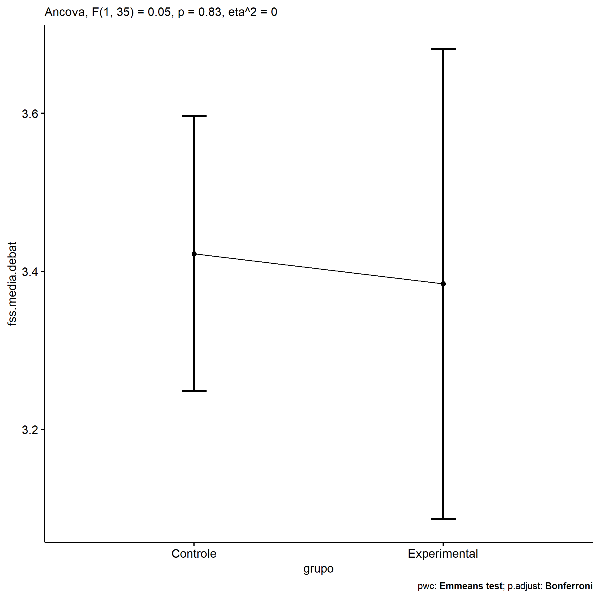
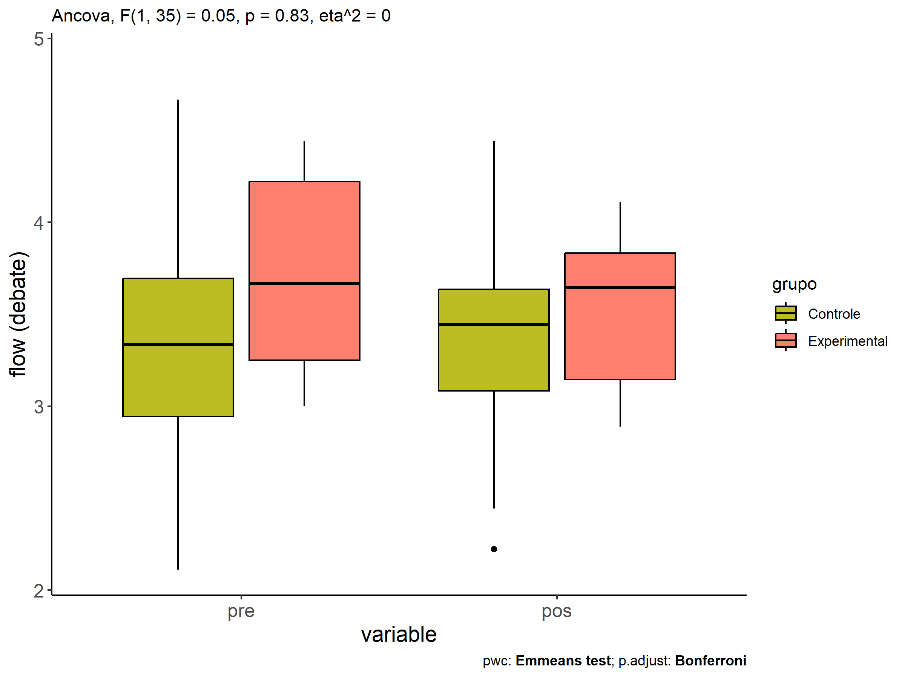
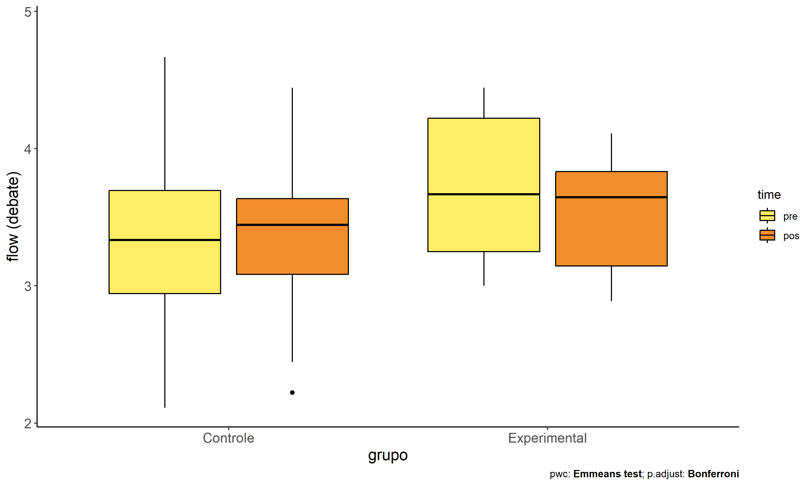
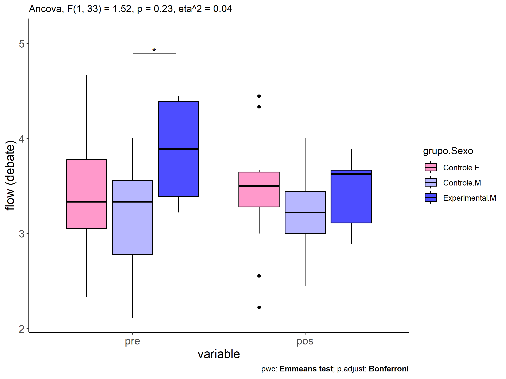
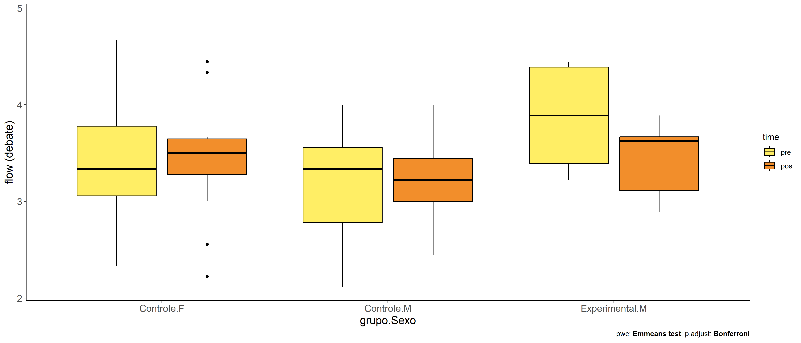

ANCOVA in flow (debate) (flow (debate))
================
Geiser C. Challco <geiser@alumni.usp.br>

- [Descriptive Statistics of Initial
  Data](#descriptive-statistics-of-initial-data)
- [Checking of Assumptions](#checking-of-assumptions)
  - [Assumption: Normality distribution of
    data](#assumption-normality-distribution-of-data)
  - [Assumption: Homogeneity of data
    distribution](#assumption-homogeneity-of-data-distribution)
- [Computation of ANCOVA test and Pairwise
  Comparison](#computation-of-ancova-test-and-pairwise-comparison)
  - [ANCOVA tests for one factor](#ancova-tests-for-one-factor)
  - [ANCOVA tests for two factors](#ancova-tests-for-two-factors)
  - [Pairwise comparisons for one factor:
    **grupo**](#pairwise-comparisons-for-one-factor-grupo)
  - [Pairwise comparisons for two
    factors](#pairwise-comparisons-for-two-factors)
    - [factores: **grupo:Sexo**](#factores-gruposexo)
    - [factores: **grupo:Zona**](#factores-grupozona)
    - [factores: **grupo:Cor.Raca**](#factores-grupocorraca)

**NOTE**

- Teste ANCOVA para determinar se houve diferenças significativas no
  flow (debate) (medido usando pre- e pos-testes).
- ANCOVA test to determine whether there were significant differences in
  flow (debate) (measured using pre- and post-tests).

# Descriptive Statistics of Initial Data

| grupo        | Sexo | Zona   | Cor.Raca | variable        |   n |  mean | median |   min |   max |    sd |    se |    ci |   iqr |
|:-------------|:-----|:-------|:---------|:----------------|----:|------:|-------:|------:|------:|------:|------:|------:|------:|
| Controle     | F    |        |          | dfs.media.debat |  15 | 3.407 |  3.333 | 2.333 | 4.667 | 0.656 | 0.169 | 0.363 | 0.722 |
| Controle     | M    |        |          | dfs.media.debat |  13 | 3.239 |  3.333 | 2.111 | 4.000 | 0.553 | 0.153 | 0.334 | 0.778 |
| Experimental | F    |        |          | dfs.media.debat |   3 | 3.370 |  3.222 | 3.000 | 3.889 | 0.463 | 0.267 | 1.149 | 0.444 |
| Experimental | M    |        |          | dfs.media.debat |   7 | 3.873 |  3.889 | 3.222 | 4.444 | 0.542 | 0.205 | 0.501 | 1.000 |
| Controle     | F    |        |          | fss.media.debat |  15 | 3.482 |  3.500 | 2.222 | 4.444 | 0.610 | 0.158 | 0.338 | 0.368 |
| Controle     | M    |        |          | fss.media.debat |  13 | 3.248 |  3.222 | 2.444 | 4.000 | 0.480 | 0.133 | 0.290 | 0.444 |
| Experimental | F    |        |          | fss.media.debat |   3 | 3.750 |  3.889 | 3.250 | 4.111 | 0.447 | 0.258 | 1.111 | 0.431 |
| Experimental | M    |        |          | fss.media.debat |   7 | 3.423 |  3.625 | 2.889 | 3.889 | 0.378 | 0.143 | 0.349 | 0.556 |
| Controle     |      | Rural  |          | dfs.media.debat |  22 | 3.222 |  3.278 | 2.111 | 4.444 | 0.585 | 0.125 | 0.259 | 0.861 |
| Controle     |      | Urbana |          | dfs.media.debat |   3 | 3.963 |  4.000 | 3.222 | 4.667 | 0.723 | 0.417 | 1.796 | 0.722 |
| Controle     |      |        |          | dfs.media.debat |   3 | 3.481 |  3.333 | 3.333 | 3.778 | 0.257 | 0.148 | 0.637 | 0.222 |
| Experimental |      | Rural  |          | dfs.media.debat |  10 | 3.722 |  3.667 | 3.000 | 4.444 | 0.550 | 0.174 | 0.393 | 0.972 |
| Controle     |      | Rural  |          | fss.media.debat |  22 | 3.265 |  3.333 | 2.222 | 4.333 | 0.531 | 0.113 | 0.235 | 0.542 |
| Controle     |      | Urbana |          | fss.media.debat |   3 | 4.134 |  4.333 | 3.625 | 4.444 | 0.445 | 0.257 | 1.104 | 0.410 |
| Controle     |      |        |          | fss.media.debat |   3 | 3.407 |  3.444 | 3.222 | 3.556 | 0.170 | 0.098 | 0.422 | 0.167 |
| Experimental |      | Rural  |          | fss.media.debat |  10 | 3.521 |  3.646 | 2.889 | 4.111 | 0.406 | 0.128 | 0.290 | 0.687 |
| Controle     |      |        | Branca   | dfs.media.debat |   5 | 2.867 |  2.778 | 2.111 | 3.667 | 0.678 | 0.303 | 0.841 | 1.111 |
| Controle     |      |        | Parda    | dfs.media.debat |  14 | 3.595 |  3.444 | 3.000 | 4.667 | 0.502 | 0.134 | 0.290 | 0.528 |
| Controle     |      |        |          | dfs.media.debat |   9 | 3.173 |  3.222 | 2.556 | 4.000 | 0.559 | 0.186 | 0.429 | 0.556 |
| Experimental |      |        | Parda    | dfs.media.debat |   4 | 3.778 |  3.667 | 3.333 | 4.444 | 0.505 | 0.253 | 0.804 | 0.611 |
| Experimental |      |        |          | dfs.media.debat |   6 | 3.685 |  3.556 | 3.000 | 4.444 | 0.622 | 0.254 | 0.653 | 1.000 |
| Controle     |      |        | Branca   | fss.media.debat |   5 | 3.067 |  3.111 | 2.222 | 3.889 | 0.731 | 0.327 | 0.908 | 1.222 |
| Controle     |      |        | Parda    | fss.media.debat |  14 | 3.422 |  3.444 | 2.778 | 4.333 | 0.366 | 0.098 | 0.212 | 0.319 |
| Controle     |      |        |          | fss.media.debat |   9 | 3.469 |  3.444 | 2.556 | 4.444 | 0.698 | 0.233 | 0.536 | 1.000 |
| Experimental |      |        | Parda    | fss.media.debat |   4 | 3.389 |  3.389 | 3.111 | 3.667 | 0.321 | 0.160 | 0.510 | 0.556 |
| Experimental |      |        |          | fss.media.debat |   6 | 3.609 |  3.757 | 2.889 | 4.111 | 0.460 | 0.188 | 0.482 | 0.545 |

# Checking of Assumptions

## Assumption: Normality distribution of data

| var             |   n |   skewness |   kurtosis | symmetry | statistic | method       |         p | p.signif | normality |
|:----------------|----:|-----------:|-----------:|:---------|----------:|:-------------|----------:|:---------|:----------|
| fss.media.debat |  38 | -0.0237717 | -0.6434816 | YES      | 0.9763998 | Shapiro-Wilk | 0.5903391 | ns       | YES       |
| fss.media.debat |  35 | -0.4844604 | -0.9106120 | YES      | 0.9420045 | Shapiro-Wilk | 0.0644170 | ns       | YES       |
| fss.media.debat |  23 | -0.3247867 | -1.0172946 | YES      | 0.9530380 | Shapiro-Wilk | 0.3378843 | ns       | YES       |

## Assumption: Homogeneity of data distribution

| var             | method         | formula                    |   n | DFn.df1 | DFd.df2 | statistic |         p | p.signif |
|:----------------|:---------------|:---------------------------|----:|--------:|--------:|----------:|----------:|:---------|
| fss.media.debat | Levene’s test  | `.res`~`grupo`\*`Sexo`     |  38 |       3 |      34 | 0.0633629 | 0.9788208 | ns       |
| fss.media.debat | Anova’s slopes | `.res`~`grupo`\*`Sexo`     |  38 |       3 |      30 | 0.9090000 | 0.4480000 | ns       |
| fss.media.debat | Levene’s test  | `.res`~`grupo`\*`Zona`     |  35 |       2 |      32 | 0.2893550 | 0.7506846 | ns       |
| fss.media.debat | Anova’s slopes | `.res`~`grupo`\*`Zona`     |  35 |       2 |      29 | 6.1770000 | 0.0060000 | \*\*     |
| fss.media.debat | Levene’s test  | `.res`~`grupo`\*`Cor.Raca` |  23 |       2 |      20 | 1.3604389 | 0.2792858 | ns       |
| fss.media.debat | Anova’s slopes | `.res`~`grupo`\*`Cor.Raca` |  23 |       2 |      17 | 0.7530000 | 0.4860000 | ns       |

# Computation of ANCOVA test and Pairwise Comparison

## ANCOVA tests for one factor

|     | Effect          | DFn | DFd |   SSn |   SSd |      F | p       |   ges | p\<.05 |
|:----|:----------------|----:|----:|------:|------:|-------:|:--------|------:|:-------|
| 1   | dfs.media.debat |   1 |  35 | 2.807 | 7.038 | 13.959 | \<0.001 | 0.285 | \*     |
| 2   | grupo           |   1 |  35 | 0.010 | 7.038 |  0.049 | 0.827   | 0.001 |        |
| 4   | Sexo            |   1 |  35 | 0.574 | 6.474 |  3.101 | 0.087   | 0.081 |        |
| 6   | Zona            |   1 |  32 | 0.772 | 6.110 |  4.041 | 0.053   | 0.112 |        |
| 8   | Cor.Raca        |   1 |  20 | 0.002 | 2.771 |  0.016 | 0.902   | 0.001 |        |

## ANCOVA tests for two factors

|     | Effect          | DFn | DFd |   SSn |   SSd |      F | p       |   ges | p\<.05 |
|:----|:----------------|----:|----:|------:|------:|-------:|:--------|------:|:-------|
| 1   | dfs.media.debat |   1 |  33 | 3.050 | 6.187 | 16.271 | \<0.001 | 0.330 | \*     |
| 4   | grupo:Sexo      |   1 |  33 | 0.285 | 6.187 |  1.518 | 0.227   | 0.044 |        |
| 8   | grupo:Zona      |   0 |  31 |       | 6.090 |        |         |       |        |
| 12  | grupo:Cor.Raca  |   0 |  19 |       | 2.724 |        |         |       |        |

## Pairwise comparisons for one factor: **grupo**

| var             | grupo        |   n | M (pre) | SE (pre) | M (unadj) | SE (unadj) | M (adj) | SE (adj) |
|:----------------|:-------------|----:|--------:|---------:|----------:|-----------:|--------:|---------:|
| fss.media.debat | Controle     |  28 |   3.329 |    0.114 |     3.374 |      0.105 |   3.422 |    0.086 |
| fss.media.debat | Experimental |  10 |   3.722 |    0.174 |     3.521 |      0.128 |   3.384 |    0.146 |

| .y.             | group1   | group2       | estimate | conf.low | conf.high |    se | statistic |     p | p.adj | p.adj.signif |
|:----------------|:---------|:-------------|---------:|---------:|----------:|------:|----------:|------:|------:|:-------------|
| fss.media.debat | Controle | Experimental |    0.038 |   -0.312 |     0.388 | 0.172 |     0.220 | 0.827 | 0.827 | ns           |
| dfs.media.debat | Controle | Experimental |   -0.393 |   -0.835 |     0.049 | 0.218 |    -1.802 | 0.080 | 0.080 | ns           |

| .y.        | grupo        | group1 | group2 | estimate | conf.low | conf.high |    se | statistic |     p | p.adj | p.adj.signif |
|:-----------|:-------------|:-------|:-------|---------:|---------:|----------:|------:|----------:|------:|------:|:-------------|
| flow.debat | Controle     | pre    | pos    |   -0.044 |   -0.342 |     0.253 | 0.149 |    -0.296 | 0.768 | 0.768 | ns           |
| flow.debat | Experimental | pre    | pos    |    0.201 |   -0.296 |     0.699 | 0.250 |     0.806 | 0.423 | 0.423 | ns           |

    ## Scale for colour is already present.
    ## Adding another scale for colour, which will replace the existing scale.

<!-- -->

<!-- -->

<!-- -->

## Pairwise comparisons for two factors

### factores: **grupo:Sexo**

| var             | grupo        | Sexo |   n | M (pre) | SE (pre) | M (unadj) | SE (unadj) | M (adj) | SE (adj) |
|:----------------|:-------------|:-----|----:|--------:|---------:|----------:|-----------:|--------:|---------:|
| fss.media.debat | Controle     | F    |  15 |   3.407 |    0.169 |     3.482 |      0.158 |   3.498 |    0.113 |
| fss.media.debat | Controle     | M    |  13 |   3.239 |    0.153 |     3.248 |      0.133 |   3.349 |    0.124 |
| fss.media.debat | Experimental | M    |   7 |   3.873 |    0.205 |     3.423 |      0.143 |   3.202 |    0.174 |

|     | .y.             | grupo    | Sexo | group1   | group2       | estimate | conf.low | conf.high |    se | statistic |     p | p.adj | p.adj.signif |
|:----|:----------------|:---------|:-----|:---------|:-------------|---------:|---------:|----------:|------:|----------:|------:|------:|:-------------|
| 2   | fss.media.debat |          | M    | Controle | Experimental |    0.147 |   -0.302 |     0.595 | 0.220 |     0.667 | 0.510 | 0.510 | ns           |
| 4   | dfs.media.debat |          | M    | Controle | Experimental |   -0.634 |   -1.205 |    -0.062 | 0.280 |    -2.259 | 0.031 | 0.031 | \*           |
| 5   | fss.media.debat | Controle |      | F        | M            |    0.149 |   -0.190 |     0.489 | 0.167 |     0.896 | 0.377 | 0.377 | ns           |
| 7   | dfs.media.debat | Controle |      | F        | M            |    0.168 |   -0.294 |     0.630 | 0.227 |     0.741 | 0.464 | 0.464 | ns           |

| .y.        | grupo        | Sexo | group1 | group2 | estimate | conf.low | conf.high |    se | statistic |     p | p.adj | p.adj.signif |
|:-----------|:-------------|:-----|:-------|:-------|---------:|---------:|----------:|------:|----------:|------:|------:|:-------------|
| flow.debat | Controle     | F    | pre    | pos    |   -0.075 |   -0.486 |     0.336 | 0.206 |    -0.365 | 0.716 | 0.716 | ns           |
| flow.debat | Controle     | M    | pre    | pos    |   -0.009 |   -0.450 |     0.433 | 0.221 |    -0.039 | 0.969 | 0.969 | ns           |
| flow.debat | Experimental | M    | pre    | pos    |    0.450 |   -0.151 |     1.052 | 0.301 |     1.496 | 0.139 | 0.139 | ns           |

<!-- -->

<!-- -->

### factores: **grupo:Zona**

### factores: **grupo:Cor.Raca**
