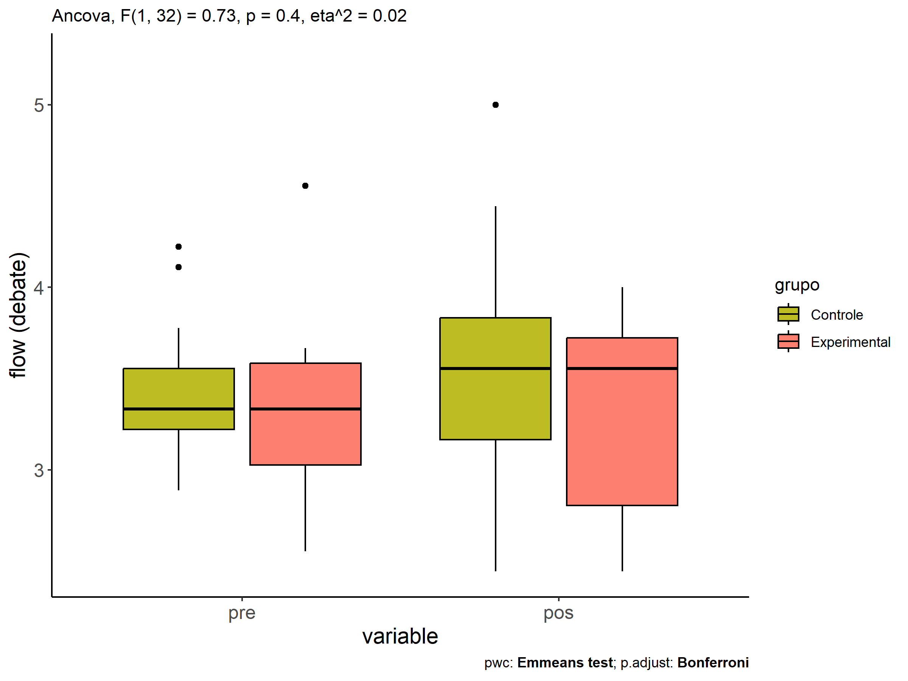
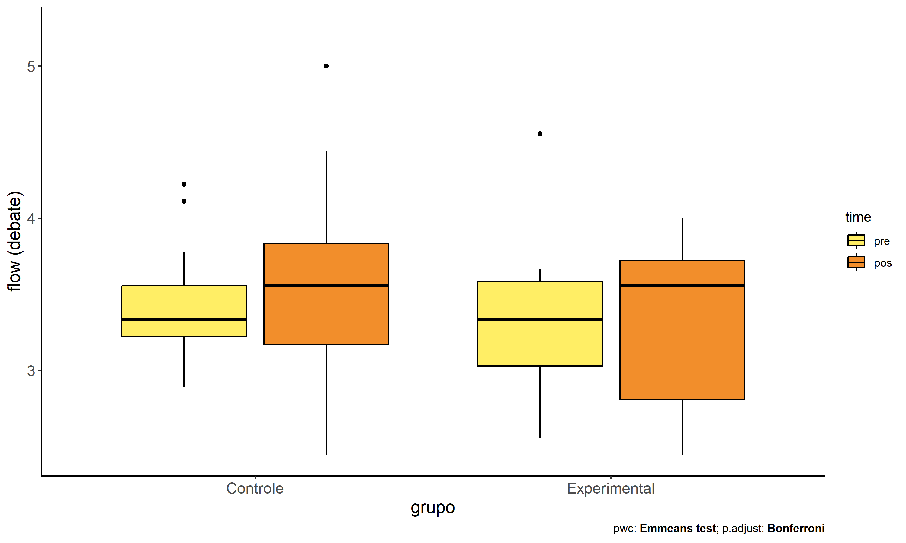

ANCOVA in flow (debate) (flow (debate))
================
Geiser C. Challco <geiser@alumni.usp.br>

- [Descriptive Statistics of Initial
  Data](#descriptive-statistics-of-initial-data)
- [Checking of Assumptions](#checking-of-assumptions)
  - [Assumption: Normality distribution of
    data](#assumption-normality-distribution-of-data)
  - [Assumption: Homogeneity of data
    distribution](#assumption-homogeneity-of-data-distribution)
- [Computation of ANCOVA test and Pairwise
  Comparison](#computation-of-ancova-test-and-pairwise-comparison)
  - [ANCOVA tests for one factor](#ancova-tests-for-one-factor)
  - [ANCOVA tests for two factors](#ancova-tests-for-two-factors)
  - [Pairwise comparisons for one factor:
    **grupo**](#pairwise-comparisons-for-one-factor-grupo)
  - [Pairwise comparisons for two
    factors](#pairwise-comparisons-for-two-factors)
    - [factores: **grupo:Sexo**](#factores-gruposexo)
    - [factores: **grupo:Zona**](#factores-grupozona)
    - [factores: **grupo:Cor.Raca**](#factores-grupocorraca)

**NOTE**

- Teste ANCOVA para determinar se houve diferenças significativas no
  flow (debate) (medido usando pre- e pos-testes).
- ANCOVA test to determine whether there were significant differences in
  flow (debate) (measured using pre- and post-tests).

# Descriptive Statistics of Initial Data

| grupo        | Sexo | Zona   | Cor.Raca | variable        |   n |  mean | median |   min |   max |    sd |    se |    ci |   iqr |
|:-------------|:-----|:-------|:---------|:----------------|----:|------:|-------:|------:|------:|------:|------:|------:|------:|
| Controle     | F    |        |          | dfs.media.debat |  15 | 3.348 |  3.333 | 2.889 | 4.111 | 0.308 | 0.080 | 0.171 | 0.444 |
| Controle     | M    |        |          | dfs.media.debat |  12 | 3.447 |  3.333 | 3.000 | 4.222 | 0.333 | 0.096 | 0.212 | 0.444 |
| Experimental | F    |        |          | dfs.media.debat |   4 | 3.222 |  3.333 | 2.556 | 3.667 | 0.505 | 0.253 | 0.804 | 0.611 |
| Experimental | M    |        |          | dfs.media.debat |   4 | 3.500 |  3.333 | 2.778 | 4.556 | 0.772 | 0.386 | 1.229 | 0.778 |
| Controle     | F    |        |          | fss.media.debat |  15 | 3.388 |  3.375 | 2.444 | 4.444 | 0.552 | 0.143 | 0.306 | 0.444 |
| Controle     | M    |        |          | fss.media.debat |  12 | 3.704 |  3.611 | 2.889 | 5.000 | 0.592 | 0.171 | 0.376 | 0.528 |
| Experimental | F    |        |          | fss.media.debat |   4 | 3.111 |  3.222 | 2.444 | 3.556 | 0.544 | 0.272 | 0.866 | 0.778 |
| Experimental | M    |        |          | fss.media.debat |   4 | 3.528 |  3.778 | 2.556 | 4.000 | 0.663 | 0.331 | 1.055 | 0.528 |
| Controle     |      | Rural  |          | dfs.media.debat |  18 | 3.329 |  3.236 | 2.889 | 4.111 | 0.310 | 0.073 | 0.154 | 0.417 |
| Controle     |      | Urbana |          | dfs.media.debat |   3 | 3.370 |  3.333 | 3.222 | 3.556 | 0.170 | 0.098 | 0.422 | 0.167 |
| Controle     |      |        |          | dfs.media.debat |   6 | 3.593 |  3.556 | 3.222 | 4.222 | 0.349 | 0.142 | 0.366 | 0.250 |
| Experimental |      | Rural  |          | dfs.media.debat |   8 | 3.361 |  3.333 | 2.556 | 4.556 | 0.622 | 0.220 | 0.520 | 0.556 |
| Controle     |      | Rural  |          | fss.media.debat |  18 | 3.531 |  3.556 | 2.778 | 4.444 | 0.475 | 0.112 | 0.236 | 0.639 |
| Controle     |      | Urbana |          | fss.media.debat |   3 | 3.889 |  3.556 | 3.111 | 5.000 | 0.988 | 0.570 | 2.453 | 0.944 |
| Controle     |      |        |          | fss.media.debat |   6 | 3.340 |  3.465 | 2.444 | 4.333 | 0.692 | 0.283 | 0.727 | 0.795 |
| Experimental |      | Rural  |          | fss.media.debat |   8 | 3.319 |  3.556 | 2.444 | 4.000 | 0.604 | 0.214 | 0.505 | 0.917 |
| Controle     |      |        | Branca   | dfs.media.debat |   3 | 3.444 |  3.444 | 3.333 | 3.556 | 0.111 | 0.064 | 0.276 | 0.111 |
| Controle     |      |        | Parda    | dfs.media.debat |  16 | 3.425 |  3.292 | 2.889 | 4.222 | 0.380 | 0.095 | 0.203 | 0.389 |
| Controle     |      |        | Preta    | dfs.media.debat |   1 | 3.222 |  3.222 | 3.222 | 3.222 |       |       |       | 0.000 |
| Controle     |      |        |          | dfs.media.debat |   7 | 3.317 |  3.333 | 3.000 | 3.667 | 0.235 | 0.089 | 0.217 | 0.278 |
| Experimental |      |        | Branca   | dfs.media.debat |   2 | 3.556 |  3.556 | 3.556 | 3.556 | 0.000 | 0.000 | 0.000 | 0.000 |
| Experimental |      |        | Indígena | dfs.media.debat |   2 | 3.111 |  3.111 | 2.556 | 3.667 | 0.786 | 0.556 | 7.059 | 0.556 |
| Experimental |      |        | Parda    | dfs.media.debat |   2 | 3.833 |  3.833 | 3.111 | 4.556 | 1.021 | 0.722 | 9.177 | 0.722 |
| Experimental |      |        |          | dfs.media.debat |   2 | 2.944 |  2.944 | 2.778 | 3.111 | 0.236 | 0.167 | 2.118 | 0.167 |
| Controle     |      |        | Branca   | fss.media.debat |   3 | 3.444 |  3.556 | 3.222 | 3.556 | 0.192 | 0.111 | 0.478 | 0.167 |
| Controle     |      |        | Parda    | fss.media.debat |  16 | 3.562 |  3.556 | 2.667 | 5.000 | 0.678 | 0.170 | 0.361 | 1.056 |
| Controle     |      |        | Preta    | fss.media.debat |   1 | 3.444 |  3.444 | 3.444 | 3.444 |       |       |       | 0.000 |
| Controle     |      |        |          | fss.media.debat |   7 | 3.498 |  3.556 | 2.444 | 4.111 | 0.542 | 0.205 | 0.501 | 0.479 |
| Experimental |      |        | Branca   | fss.media.debat |   2 | 3.722 |  3.722 | 3.556 | 3.889 | 0.236 | 0.167 | 2.118 | 0.167 |
| Experimental |      |        | Indígena | fss.media.debat |   2 | 3.222 |  3.222 | 2.889 | 3.556 | 0.471 | 0.333 | 4.235 | 0.333 |
| Experimental |      |        | Parda    | fss.media.debat |   2 | 3.111 |  3.111 | 2.556 | 3.667 | 0.786 | 0.556 | 7.059 | 0.556 |
| Experimental |      |        |          | fss.media.debat |   2 | 3.222 |  3.222 | 2.444 | 4.000 | 1.100 | 0.778 | 9.883 | 0.778 |

# Checking of Assumptions

## Assumption: Normality distribution of data

| var             |   n |  skewness |   kurtosis | symmetry | statistic | method       |         p | p.signif | normality |
|:----------------|----:|----------:|-----------:|:---------|----------:|:-------------|----------:|:---------|:----------|
| fss.media.debat |  35 | 0.2104950 | -0.1413079 | YES      | 0.9732670 | Shapiro-Wilk | 0.5390099 | ns       | YES       |
| fss.media.debat |  29 | 0.2506924 | -0.7312184 | YES      | 0.9676431 | Shapiro-Wilk | 0.4976628 | ns       | YES       |
| fss.media.debat |  26 | 0.6382556 |  1.4992640 | NO       | 0.9217546 | Shapiro-Wilk | 0.0494359 | \*       | NO        |

## Assumption: Homogeneity of data distribution

| var             | method         | formula                    |   n | DFn.df1 | DFd.df2 | statistic |         p | p.signif |
|:----------------|:---------------|:---------------------------|----:|--------:|--------:|----------:|----------:|:---------|
| fss.media.debat | Levene’s test  | `.res`~`grupo`\*`Sexo`     |  35 |       3 |      31 | 0.3888811 | 0.7617960 | ns       |
| fss.media.debat | Anova’s slopes | `.res`~`grupo`\*`Sexo`     |  35 |       3 |      27 | 0.3700000 | 0.7750000 | ns       |
| fss.media.debat | Levene’s test  | `.res`~`grupo`\*`Zona`     |  29 |       2 |      26 | 0.7474238 | 0.4834888 | ns       |
| fss.media.debat | Anova’s slopes | `.res`~`grupo`\*`Zona`     |  29 |       2 |      23 | 0.0330000 | 0.9670000 | ns       |
| fss.media.debat | Levene’s test  | `.res`~`grupo`\*`Cor.Raca` |  26 |       5 |      20 | 1.2557881 | 0.3211058 | ns       |
| fss.media.debat | Anova’s slopes | `.res`~`grupo`\*`Cor.Raca` |  26 |       3 |      16 | 0.1160000 | 0.9500000 | ns       |

# Computation of ANCOVA test and Pairwise Comparison

## ANCOVA tests for one factor

|     | Effect          | DFn | DFd |   SSn |    SSd |     F |     p |   ges | p\<.05 |
|:----|:----------------|----:|----:|------:|-------:|------:|------:|------:|:-------|
| 1   | dfs.media.debat |   1 |  32 | 1.214 | 10.130 | 3.835 | 0.059 | 0.107 |        |
| 2   | grupo           |   1 |  32 | 0.232 | 10.130 | 0.734 | 0.398 | 0.022 |        |
| 4   | Sexo            |   1 |  32 | 0.620 |  9.742 | 2.037 | 0.163 | 0.060 |        |
| 6   | Zona            |   1 |  26 | 0.452 |  7.851 | 1.497 | 0.232 | 0.054 |        |
| 8   | Cor.Raca        |   3 |  21 | 0.030 |  7.201 | 0.029 | 0.993 | 0.004 |        |

## ANCOVA tests for two factors

|     | Effect          | DFn | DFd |   SSn |   SSd |     F |     p |   ges | p\<.05 |
|:----|:----------------|----:|----:|------:|------:|------:|------:|------:|:-------|
| 1   | dfs.media.debat |   1 |  30 | 0.867 | 9.466 | 2.747 | 0.108 | 0.084 |        |
| 4   | grupo:Sexo      |   1 |  30 | 0.001 | 9.466 | 0.004 | 0.953 | 0.000 |        |
| 8   | grupo:Zona      |   0 |  25 |       | 7.571 |       |       |       |        |
| 12  | grupo:Cor.Raca  |   1 |  19 | 0.594 | 6.308 | 1.790 | 0.197 | 0.086 |        |

## Pairwise comparisons for one factor: **grupo**

| var             | grupo        |   n | M (pre) | SE (pre) | M (unadj) | SE (unadj) | M (adj) | SE (adj) |
|:----------------|:-------------|----:|--------:|---------:|----------:|-----------:|--------:|---------:|
| fss.media.debat | Controle     |  27 |   3.392 |    0.061 |     3.528 |      0.112 |   3.525 |    0.108 |
| fss.media.debat | Experimental |   8 |   3.361 |    0.220 |     3.319 |      0.214 |   3.331 |    0.199 |

| .y.             | group1   | group2       | estimate | conf.low | conf.high |    se | statistic |     p | p.adj | p.adj.signif |
|:----------------|:---------|:-------------|---------:|---------:|----------:|------:|----------:|------:|------:|:-------------|
| fss.media.debat | Controle | Experimental |    0.194 |   -0.267 |     0.656 | 0.227 |     0.857 | 0.398 | 0.398 | ns           |
| dfs.media.debat | Controle | Experimental |    0.031 |   -0.298 |     0.360 | 0.162 |     0.191 | 0.850 | 0.850 | ns           |

| .y.        | grupo        | group1 | group2 | estimate | conf.low | conf.high |    se | statistic |     p | p.adj | p.adj.signif |
|:-----------|:-------------|:-------|:-------|---------:|---------:|----------:|------:|----------:|------:|------:|:-------------|
| flow.debat | Controle     | pre    | pos    |   -0.136 |   -0.409 |     0.137 | 0.137 |    -0.997 | 0.323 | 0.323 | ns           |
| flow.debat | Experimental | pre    | pos    |    0.042 |   -0.460 |     0.543 | 0.251 |     0.166 | 0.869 | 0.869 | ns           |

    ## Scale for colour is already present.
    ## Adding another scale for colour, which will replace the existing scale.

<!-- -->

<!-- -->

<!-- -->

## Pairwise comparisons for two factors

### factores: **grupo:Sexo**

### factores: **grupo:Zona**

### factores: **grupo:Cor.Raca**
