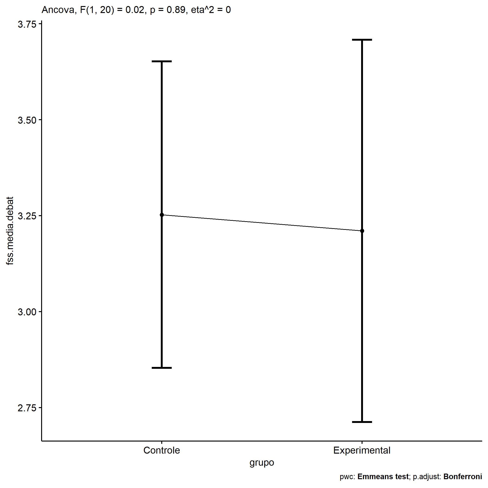
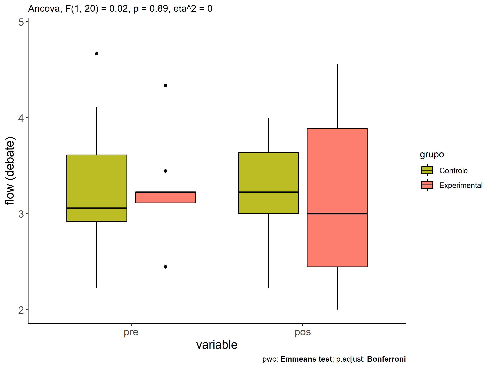
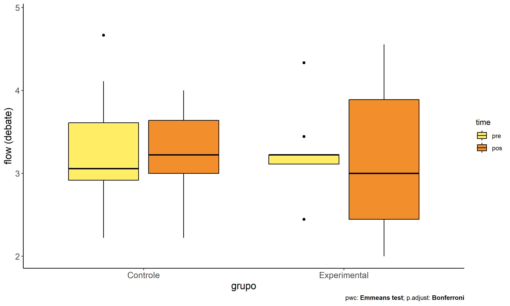
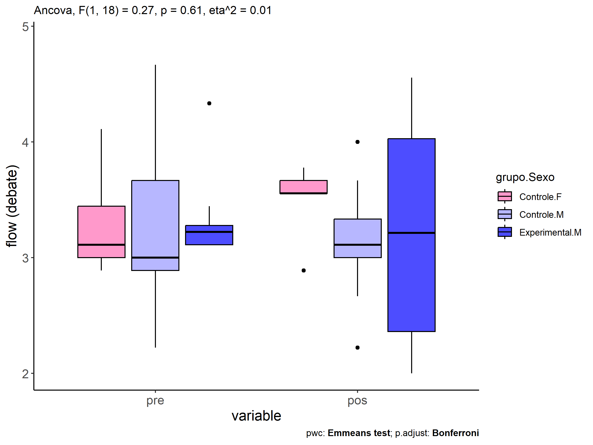
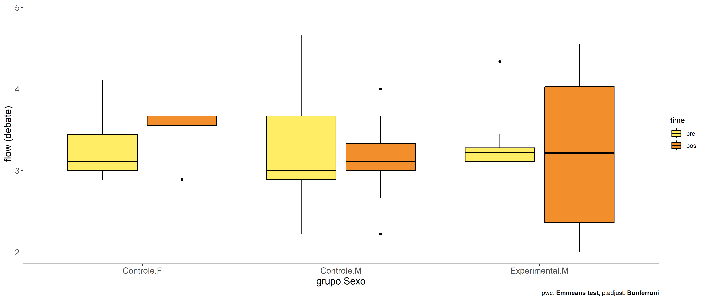

ANCOVA in flow (debate) (flow (debate))
================
Geiser C. Challco <geiser@alumni.usp.br>

- [Descriptive Statistics of Initial
  Data](#descriptive-statistics-of-initial-data)
- [Checking of Assumptions](#checking-of-assumptions)
  - [Assumption: Normality distribution of
    data](#assumption-normality-distribution-of-data)
  - [Assumption: Homogeneity of data
    distribution](#assumption-homogeneity-of-data-distribution)
- [Computation of ANCOVA test and Pairwise
  Comparison](#computation-of-ancova-test-and-pairwise-comparison)
  - [ANCOVA tests for one factor](#ancova-tests-for-one-factor)
  - [ANCOVA tests for two factors](#ancova-tests-for-two-factors)
  - [Pairwise comparisons for one factor:
    **grupo**](#pairwise-comparisons-for-one-factor-grupo)
  - [Pairwise comparisons for two
    factors](#pairwise-comparisons-for-two-factors)
    - [factores: **grupo:Sexo**](#factores-gruposexo)
    - [factores: **grupo:Zona**](#factores-grupozona)
    - [factores: **grupo:Cor.Raca**](#factores-grupocorraca)

**NOTE**

- Teste ANCOVA para determinar se houve diferenças significativas no
  flow (debate) (medido usando pre- e pos-testes).
- ANCOVA test to determine whether there were significant differences in
  flow (debate) (measured using pre- and post-tests).

# Descriptive Statistics of Initial Data

| grupo        | Sexo | Zona   | Cor.Raca | variable        |   n |  mean | median |   min |   max |    sd |    se |    ci |   iqr |
|:-------------|:-----|:-------|:---------|:----------------|----:|------:|-------:|------:|------:|------:|------:|------:|------:|
| Controle     | F    |        |          | dfs.media.debat |   5 | 3.311 |  3.111 | 2.889 | 4.111 | 0.493 | 0.221 | 0.612 | 0.444 |
| Controle     | M    |        |          | dfs.media.debat |   9 | 3.250 |  3.000 | 2.222 | 4.667 | 0.699 | 0.233 | 0.538 | 0.778 |
| Experimental | F    |        |          | dfs.media.debat |   1 | 2.444 |  2.444 | 2.444 | 2.444 |       |       |       | 0.000 |
| Experimental | M    |        |          | dfs.media.debat |   8 | 3.347 |  3.222 | 3.111 | 4.333 | 0.413 | 0.146 | 0.346 | 0.167 |
| Controle     | F    |        |          | fss.media.debat |   5 | 3.489 |  3.556 | 2.889 | 3.778 | 0.348 | 0.156 | 0.432 | 0.111 |
| Controle     | M    |        |          | fss.media.debat |   9 | 3.123 |  3.111 | 2.222 | 4.000 | 0.520 | 0.173 | 0.399 | 0.333 |
| Experimental | F    |        |          | fss.media.debat |   1 | 3.000 |  3.000 | 3.000 | 3.000 |       |       |       | 0.000 |
| Experimental | M    |        |          | fss.media.debat |   8 | 3.234 |  3.215 | 2.000 | 4.556 | 1.020 | 0.361 | 0.853 | 1.667 |
| Controle     |      | Rural  |          | dfs.media.debat |   6 | 3.426 |  3.333 | 2.222 | 4.667 | 0.893 | 0.364 | 0.937 | 1.083 |
| Controle     |      | Urbana |          | dfs.media.debat |   3 | 3.048 |  3.111 | 2.889 | 3.143 | 0.138 | 0.080 | 0.344 | 0.127 |
| Controle     |      |        |          | dfs.media.debat |   5 | 3.222 |  3.000 | 2.889 | 3.778 | 0.377 | 0.169 | 0.468 | 0.444 |
| Experimental |      | Rural  |          | dfs.media.debat |   6 | 3.093 |  3.167 | 2.444 | 3.444 | 0.340 | 0.139 | 0.357 | 0.111 |
| Experimental |      |        |          | dfs.media.debat |   3 | 3.556 |  3.222 | 3.111 | 4.333 | 0.676 | 0.390 | 1.679 | 0.611 |
| Controle     |      | Rural  |          | fss.media.debat |   6 | 3.333 |  3.333 | 2.667 | 4.000 | 0.492 | 0.201 | 0.516 | 0.611 |
| Controle     |      | Urbana |          | fss.media.debat |   3 | 3.000 |  3.000 | 2.889 | 3.111 | 0.111 | 0.064 | 0.276 | 0.111 |
| Controle     |      |        |          | fss.media.debat |   5 | 3.311 |  3.556 | 2.222 | 3.778 | 0.631 | 0.282 | 0.783 | 0.333 |
| Experimental |      | Rural  |          | fss.media.debat |   6 | 3.241 |  3.278 | 2.111 | 4.444 | 0.887 | 0.362 | 0.931 | 1.222 |
| Experimental |      |        |          | fss.media.debat |   3 | 3.144 |  2.875 | 2.000 | 4.556 | 1.299 | 0.750 | 3.226 | 1.278 |
| Controle     |      |        | Parda    | dfs.media.debat |   9 | 3.309 |  3.111 | 2.222 | 4.667 | 0.689 | 0.230 | 0.530 | 0.667 |
| Controle     |      |        |          | dfs.media.debat |   5 | 3.206 |  3.000 | 2.889 | 4.111 | 0.516 | 0.231 | 0.641 | 0.254 |
| Experimental |      |        | Branca   | dfs.media.debat |   1 | 3.444 |  3.444 | 3.444 | 3.444 |       |       |       | 0.000 |
| Experimental |      |        | Indígena | dfs.media.debat |   1 | 4.333 |  4.333 | 4.333 | 4.333 |       |       |       | 0.000 |
| Experimental |      |        | Parda    | dfs.media.debat |   3 | 2.926 |  3.111 | 2.444 | 3.222 | 0.421 | 0.243 | 1.045 | 0.389 |
| Experimental |      |        |          | dfs.media.debat |   4 | 3.167 |  3.167 | 3.111 | 3.222 | 0.064 | 0.032 | 0.102 | 0.111 |
| Controle     |      |        | Parda    | fss.media.debat |   9 | 3.333 |  3.333 | 2.667 | 4.000 | 0.448 | 0.149 | 0.344 | 0.667 |
| Controle     |      |        |          | fss.media.debat |   5 | 3.111 |  3.111 | 2.222 | 3.667 | 0.572 | 0.256 | 0.710 | 0.556 |
| Experimental |      |        | Branca   | fss.media.debat |   1 | 2.111 |  2.111 | 2.111 | 2.111 |       |       |       | 0.000 |
| Experimental |      |        | Indígena | fss.media.debat |   1 | 4.556 |  4.556 | 4.556 | 4.556 |       |       |       | 0.000 |
| Experimental |      |        | Parda    | fss.media.debat |   3 | 3.481 |  3.556 | 3.000 | 3.889 | 0.449 | 0.259 | 1.116 | 0.444 |
| Experimental |      |        |          | fss.media.debat |   4 | 2.941 |  2.660 | 2.000 | 4.444 | 1.064 | 0.532 | 1.693 | 0.934 |

# Checking of Assumptions

## Assumption: Normality distribution of data

| var             |   n |   skewness |   kurtosis | symmetry | statistic | method       |         p | p.signif | normality |
|:----------------|----:|-----------:|-----------:|:---------|----------:|:-------------|----------:|:---------|:----------|
| fss.media.debat |  23 |  0.0606924 | -0.7252427 | YES      | 0.9738570 | Shapiro-Wilk | 0.7802005 | ns       | YES       |
| fss.media.debat |  15 |  0.0650146 | -0.6559339 | YES      | 0.9801707 | Shapiro-Wilk | 0.9706539 | ns       | YES       |
| fss.media.debat |  14 | -0.2365646 | -1.0371568 | YES      | 0.9650908 | Shapiro-Wilk | 0.8051233 | ns       | YES       |

## Assumption: Homogeneity of data distribution

| var             | method         | formula                    |   n | DFn.df1 | DFd.df2 | statistic |         p | p.signif |
|:----------------|:---------------|:---------------------------|----:|--------:|--------:|----------:|----------:|:---------|
| fss.media.debat | Levene’s test  | `.res`~`grupo`\*`Sexo`     |  23 |       3 |      19 | 4.8357157 | 0.0114938 | \*       |
| fss.media.debat | Anova’s slopes | `.res`~`grupo`\*`Sexo`     |  23 |       2 |      16 | 1.0890000 | 0.3600000 | ns       |
| fss.media.debat | Levene’s test  | `.res`~`grupo`\*`Zona`     |  15 |       2 |      12 | 5.6629185 | 0.0185381 | \*       |
| fss.media.debat | Anova’s slopes | `.res`~`grupo`\*`Zona`     |  15 |       2 |       9 | 0.0230000 | 0.9780000 | ns       |
| fss.media.debat | Levene’s test  | `.res`~`grupo`\*`Cor.Raca` |  14 |       3 |      10 | 0.8901214 | 0.4792557 | ns       |
| fss.media.debat | Anova’s slopes | `.res`~`grupo`\*`Cor.Raca` |  14 |       1 |       8 | 2.9350000 | 0.1250000 | ns       |

# Computation of ANCOVA test and Pairwise Comparison

## ANCOVA tests for one factor

|     | Effect          | DFn | DFd |   SSn |    SSd |     F |     p |   ges | p\<.05 |
|:----|:----------------|----:|----:|------:|-------:|------:|------:|------:|:-------|
| 1   | dfs.media.debat |   1 |  20 | 0.147 | 10.254 | 0.287 | 0.598 | 0.014 |        |
| 2   | grupo           |   1 |  20 | 0.010 | 10.254 | 0.019 | 0.892 | 0.001 |        |
| 4   | Sexo            |   1 |  20 | 0.282 |  9.981 | 0.565 | 0.461 | 0.027 |        |
| 6   | Zona            |   1 |  12 | 0.251 |  5.023 | 0.599 | 0.454 | 0.048 |        |
| 8   | Cor.Raca        |   2 |  10 | 3.057 |  1.963 | 7.786 | 0.009 | 0.609 | \*     |

## ANCOVA tests for two factors

|     | Effect          | DFn | DFd |   SSn |   SSd |     F |     p |   ges | p\<.05 |
|:----|:----------------|----:|----:|------:|------:|------:|------:|------:|:-------|
| 1   | dfs.media.debat |   1 |  18 | 0.091 | 9.832 | 0.166 | 0.688 | 0.009 |        |
| 4   | grupo:Sexo      |   1 |  18 | 0.146 | 9.832 | 0.268 | 0.611 | 0.015 |        |
| 8   | grupo:Zona      |   0 |  11 |       | 4.945 |       |       |       |        |
| 12  | grupo:Cor.Raca  |   0 |   9 |       | 1.942 |       |       |       |        |

## Pairwise comparisons for one factor: **grupo**

| var             | grupo        |   n | M (pre) | SE (pre) | M (unadj) | SE (unadj) | M (adj) | SE (adj) |
|:----------------|:-------------|----:|--------:|---------:|----------:|-----------:|--------:|---------:|
| fss.media.debat | Controle     |  14 |   3.272 |    0.164 |     3.254 |      0.130 |   3.253 |    0.191 |
| fss.media.debat | Experimental |   9 |   3.247 |    0.163 |     3.208 |      0.319 |   3.211 |    0.239 |

| .y.             | group1   | group2       | estimate | conf.low | conf.high |    se | statistic |     p | p.adj | p.adj.signif |
|:----------------|:---------|:-------------|---------:|---------:|----------:|------:|----------:|------:|------:|:-------------|
| fss.media.debat | Controle | Experimental |    0.042 |   -0.596 |     0.680 | 0.306 |     0.137 | 0.892 | 0.892 | ns           |
| dfs.media.debat | Controle | Experimental |    0.025 |   -0.481 |     0.531 | 0.243 |     0.103 | 0.919 | 0.919 | ns           |

| .y.        | grupo        | group1 | group2 | estimate | conf.low | conf.high |    se | statistic |     p | p.adj | p.adj.signif |
|:-----------|:-------------|:-------|:-------|---------:|---------:|----------:|------:|----------:|------:|------:|:-------------|
| flow.debat | Controle     | pre    | pos    |    0.018 |   -0.470 |     0.507 | 0.242 |     0.075 | 0.941 | 0.941 | ns           |
| flow.debat | Experimental | pre    | pos    |    0.039 |   -0.571 |     0.648 | 0.302 |     0.128 | 0.899 | 0.899 | ns           |

    ## Scale for colour is already present.
    ## Adding another scale for colour, which will replace the existing scale.

<!-- -->

<!-- -->

<!-- -->

## Pairwise comparisons for two factors

### factores: **grupo:Sexo**

| var             | grupo        | Sexo |   n | M (pre) | SE (pre) | M (unadj) | SE (unadj) | M (adj) | SE (adj) |
|:----------------|:-------------|:-----|----:|--------:|---------:|----------:|-----------:|--------:|---------:|
| fss.media.debat | Controle     | F    |   5 |   3.311 |    0.221 |     3.489 |      0.156 |   3.487 |    0.331 |
| fss.media.debat | Controle     | M    |   9 |   3.250 |    0.233 |     3.123 |      0.173 |   3.129 |    0.247 |
| fss.media.debat | Experimental | M    |   8 |   3.347 |    0.146 |     3.234 |      0.361 |   3.229 |    0.262 |

|     | .y.             | grupo    | Sexo | group1   | group2       | estimate | conf.low | conf.high |    se | statistic |     p | p.adj | p.adj.signif |
|:----|:----------------|:---------|:-----|:---------|:-------------|---------:|---------:|----------:|------:|----------:|------:|------:|:-------------|
| 2   | fss.media.debat |          | M    | Controle | Experimental |   -0.099 |   -0.856 |     0.658 | 0.360 |    -0.275 | 0.786 | 0.786 | ns           |
| 4   | dfs.media.debat |          | M    | Controle | Experimental |   -0.097 |   -0.672 |     0.479 | 0.275 |    -0.352 | 0.729 | 0.729 | ns           |
| 5   | fss.media.debat | Controle |      | F        | M            |    0.358 |   -0.509 |     1.225 | 0.413 |     0.868 | 0.397 | 0.397 | ns           |
| 7   | dfs.media.debat | Controle |      | F        | M            |    0.061 |   -0.600 |     0.721 | 0.316 |     0.192 | 0.850 | 0.850 | ns           |

| .y.        | grupo        | Sexo | group1 | group2 | estimate | conf.low | conf.high |    se | statistic |     p | p.adj | p.adj.signif |
|:-----------|:-------------|:-----|:-------|:-------|---------:|---------:|----------:|------:|----------:|------:|------:|:-------------|
| flow.debat | Controle     | F    | pre    | pos    |   -0.178 |   -1.009 |     0.653 | 0.410 |    -0.433 | 0.667 | 0.667 | ns           |
| flow.debat | Controle     | M    | pre    | pos    |    0.127 |   -0.492 |     0.746 | 0.306 |     0.415 | 0.680 | 0.680 | ns           |
| flow.debat | Experimental | M    | pre    | pos    |    0.113 |   -0.544 |     0.770 | 0.324 |     0.348 | 0.730 | 0.730 | ns           |

<!-- -->

<!-- -->

### factores: **grupo:Zona**

### factores: **grupo:Cor.Raca**
