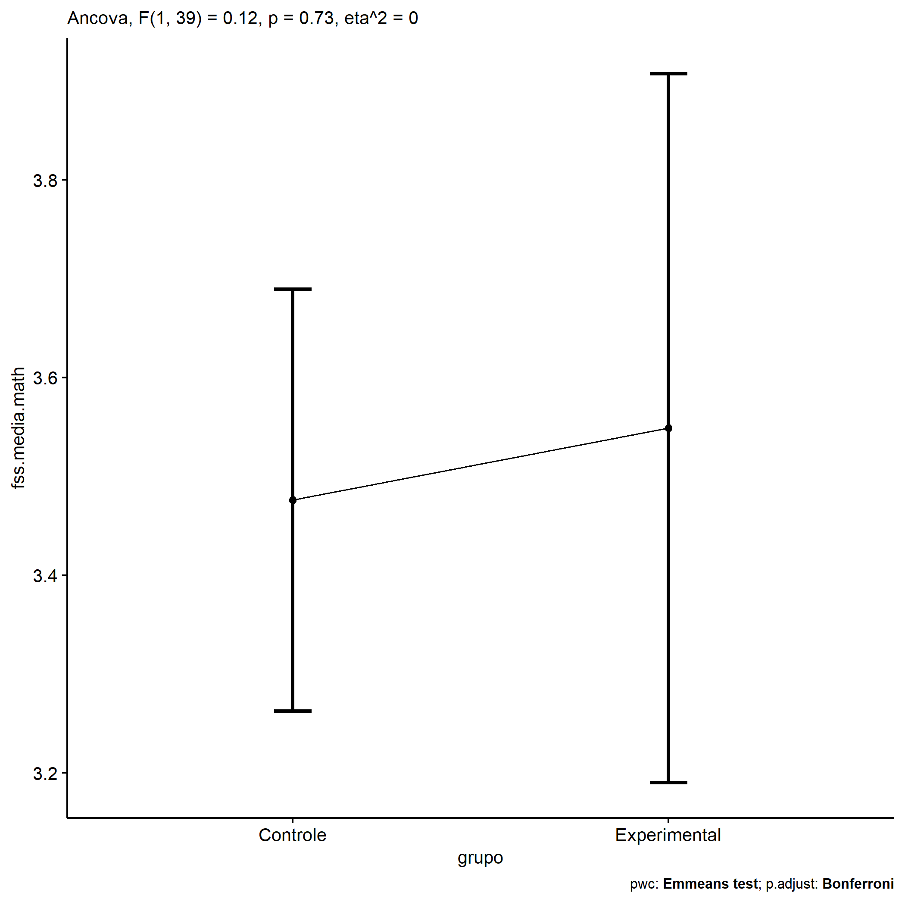
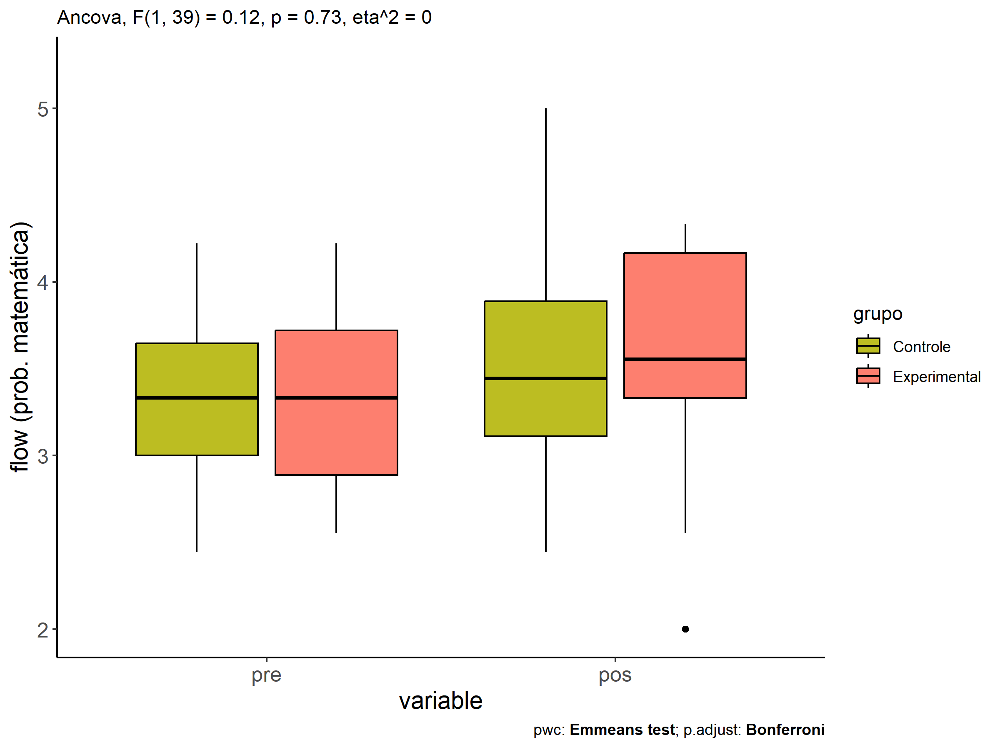
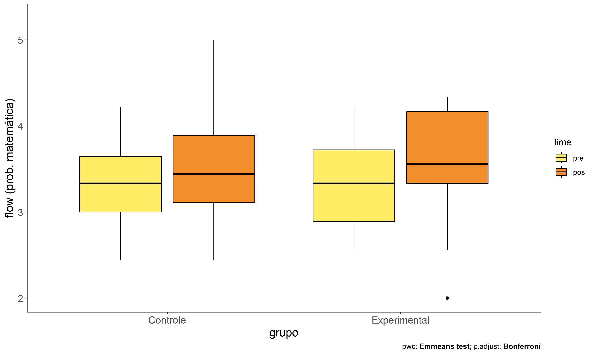
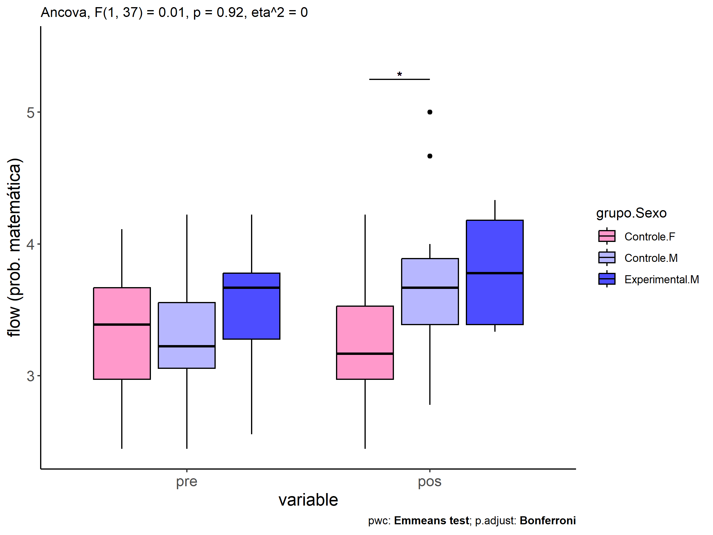
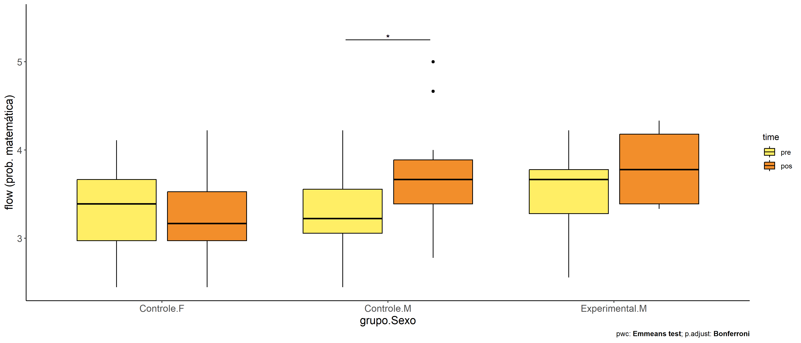

ANCOVA in flow (prob. matemática) (flow (prob. matemática))
================
Geiser C. Challco <geiser@alumni.usp.br>

- [Descriptive Statistics of Initial
  Data](#descriptive-statistics-of-initial-data)
- [Checking of Assumptions](#checking-of-assumptions)
  - [Assumption: Normality distribution of
    data](#assumption-normality-distribution-of-data)
  - [Assumption: Homogeneity of data
    distribution](#assumption-homogeneity-of-data-distribution)
- [Computation of ANCOVA test and Pairwise
  Comparison](#computation-of-ancova-test-and-pairwise-comparison)
  - [ANCOVA tests for one factor](#ancova-tests-for-one-factor)
  - [ANCOVA tests for two factors](#ancova-tests-for-two-factors)
  - [Pairwise comparisons for one factor:
    **grupo**](#pairwise-comparisons-for-one-factor-grupo)
  - [Pairwise comparisons for two
    factors](#pairwise-comparisons-for-two-factors)
    - [factores: **grupo:Sexo**](#factores-gruposexo)
    - [factores: **grupo:Zona**](#factores-grupozona)
    - [factores: **grupo:Cor.Raca**](#factores-grupocorraca)

**NOTE**

- Teste ANCOVA para determinar se houve diferenças significativas no
  flow (prob. matemática) (medido usando pre- e pos-testes).
- ANCOVA test to determine whether there were significant differences in
  flow (prob. matemática) (measured using pre- and post-tests).

# Descriptive Statistics of Initial Data

| grupo        | Sexo | Zona   | Cor.Raca | variable       |   n |  mean | median |   min |   max |    sd |    se |     ci |   iqr |
|:-------------|:-----|:-------|:---------|:---------------|----:|------:|-------:|------:|------:|------:|------:|-------:|------:|
| Controle     | F    |        |          | dfs.media.math |  16 | 3.331 |  3.389 | 2.444 | 4.111 | 0.493 | 0.123 |  0.263 | 0.694 |
| Controle     | M    |        |          | dfs.media.math |  15 | 3.341 |  3.222 | 2.444 | 4.222 | 0.487 | 0.126 |  0.270 | 0.500 |
| Experimental | F    |        |          | dfs.media.math |   4 | 2.944 |  2.889 | 2.667 | 3.333 | 0.333 | 0.167 |  0.530 | 0.500 |
| Experimental | M    |        |          | dfs.media.math |   7 | 3.508 |  3.667 | 2.556 | 4.222 | 0.532 | 0.201 |  0.492 | 0.500 |
| Controle     | F    |        |          | fss.media.math |  16 | 3.256 |  3.167 | 2.444 | 4.222 | 0.505 | 0.126 |  0.269 | 0.556 |
| Controle     | M    |        |          | fss.media.math |  15 | 3.719 |  3.667 | 2.778 | 5.000 | 0.577 | 0.149 |  0.320 | 0.500 |
| Experimental | F    |        |          | fss.media.math |   4 | 3.083 |  3.056 | 2.000 | 4.222 | 0.995 | 0.498 |  1.584 | 1.306 |
| Experimental | M    |        |          | fss.media.math |   7 | 3.798 |  3.778 | 3.333 | 4.333 | 0.437 | 0.165 |  0.404 | 0.792 |
| Controle     |      | Rural  |          | dfs.media.math |  19 | 3.232 |  3.111 | 2.444 | 4.111 | 0.518 | 0.119 |  0.250 | 0.701 |
| Controle     |      | Urbana |          | dfs.media.math |   4 | 3.444 |  3.500 | 2.889 | 3.889 | 0.435 | 0.218 |  0.692 | 0.500 |
| Controle     |      |        |          | dfs.media.math |   8 | 3.528 |  3.500 | 3.000 | 4.222 | 0.384 | 0.136 |  0.321 | 0.333 |
| Experimental |      | Rural  |          | dfs.media.math |   8 | 3.292 |  3.278 | 2.667 | 4.222 | 0.524 | 0.185 |  0.438 | 0.444 |
| Experimental |      | Urbana |          | dfs.media.math |   1 | 2.556 |  2.556 | 2.556 | 2.556 |       |       |        | 0.000 |
| Experimental |      |        |          | dfs.media.math |   2 | 3.722 |  3.722 | 3.667 | 3.778 | 0.079 | 0.056 |  0.706 | 0.056 |
| Controle     |      | Rural  |          | fss.media.math |  19 | 3.485 |  3.444 | 2.444 | 4.667 | 0.576 | 0.132 |  0.278 | 0.667 |
| Controle     |      | Urbana |          | fss.media.math |   4 | 3.861 |  3.667 | 3.111 | 5.000 | 0.823 | 0.412 |  1.310 | 0.806 |
| Controle     |      |        |          | fss.media.math |   8 | 3.276 |  3.111 | 2.875 | 3.889 | 0.418 | 0.148 |  0.349 | 0.583 |
| Experimental |      | Rural  |          | fss.media.math |   8 | 3.403 |  3.500 | 2.000 | 4.333 | 0.792 | 0.280 |  0.662 | 0.750 |
| Experimental |      | Urbana |          | fss.media.math |   1 | 4.250 |  4.250 | 4.250 | 4.250 |       |       |        | 0.000 |
| Experimental |      |        |          | fss.media.math |   2 | 3.722 |  3.722 | 3.333 | 4.111 | 0.550 | 0.389 |  4.941 | 0.389 |
| Controle     |      |        | Branca   | dfs.media.math |   3 | 3.519 |  3.444 | 3.000 | 4.111 | 0.559 | 0.323 |  1.389 | 0.556 |
| Controle     |      |        | Parda    | dfs.media.math |  17 | 3.344 |  3.556 | 2.444 | 4.222 | 0.554 | 0.134 |  0.285 | 0.778 |
| Controle     |      |        | Preta    | dfs.media.math |   1 | 2.889 |  2.889 | 2.889 | 2.889 |       |       |        | 0.000 |
| Controle     |      |        |          | dfs.media.math |  10 | 3.311 |  3.167 | 2.889 | 3.889 | 0.354 | 0.112 |  0.254 | 0.389 |
| Experimental |      |        | Branca   | dfs.media.math |   3 | 3.074 |  3.333 | 2.556 | 3.333 | 0.449 | 0.259 |  1.116 | 0.389 |
| Experimental |      |        | Indígena | dfs.media.math |   2 | 2.889 |  2.889 | 2.667 | 3.111 | 0.314 | 0.222 |  2.824 | 0.222 |
| Experimental |      |        | Parda    | dfs.media.math |   2 | 4.000 |  4.000 | 3.778 | 4.222 | 0.314 | 0.222 |  2.824 | 0.222 |
| Experimental |      |        |          | dfs.media.math |   4 | 3.333 |  3.444 | 2.667 | 3.778 | 0.505 | 0.253 |  0.804 | 0.611 |
| Controle     |      |        | Branca   | fss.media.math |   3 | 3.667 |  3.222 | 3.111 | 4.667 | 0.868 | 0.501 |  2.156 | 0.778 |
| Controle     |      |        | Parda    | fss.media.math |  17 | 3.503 |  3.444 | 2.444 | 5.000 | 0.641 | 0.155 |  0.329 | 0.778 |
| Controle     |      |        | Preta    | fss.media.math |   1 | 3.333 |  3.333 | 3.333 | 3.333 |       |       |        | 0.000 |
| Controle     |      |        |          | fss.media.math |  10 | 3.399 |  3.444 | 2.778 | 3.889 | 0.456 | 0.144 |  0.326 | 0.917 |
| Experimental |      |        | Branca   | fss.media.math |   3 | 3.750 |  3.556 | 3.444 | 4.250 | 0.437 | 0.252 |  1.084 | 0.403 |
| Experimental |      |        | Indígena | fss.media.math |   2 | 3.389 |  3.389 | 2.556 | 4.222 | 1.179 | 0.833 | 10.589 | 0.833 |
| Experimental |      |        | Parda    | fss.media.math |   2 | 4.056 |  4.056 | 3.778 | 4.333 | 0.393 | 0.278 |  3.530 | 0.278 |
| Experimental |      |        |          | fss.media.math |   4 | 3.194 |  3.333 | 2.000 | 4.111 | 0.877 | 0.438 |  1.395 | 0.528 |

# Checking of Assumptions

## Assumption: Normality distribution of data

| var            |   n |  skewness |   kurtosis | symmetry | statistic | method       |         p | p.signif | normality |
|:---------------|----:|----------:|-----------:|:---------|----------:|:-------------|----------:|:---------|:----------|
| fss.media.math |  42 | 0.5861880 | -0.2371465 | NO       | 0.9623005 | Shapiro-Wilk | 0.1784219 | ns       | YES       |
| fss.media.math |  32 | 0.1170683 | -0.6810463 | YES      | 0.9789479 | Shapiro-Wilk | 0.7684645 | ns       | YES       |
| fss.media.math |  28 | 0.5886889 | -0.6663843 | NO       | 0.9392036 | Shapiro-Wilk | 0.1054959 | ns       | YES       |

## Assumption: Homogeneity of data distribution

| var            | method         | formula                    |   n | DFn.df1 | DFd.df2 | statistic |         p | p.signif |
|:---------------|:---------------|:---------------------------|----:|--------:|--------:|----------:|----------:|:---------|
| fss.media.math | Levene’s test  | `.res`~`grupo`\*`Sexo`     |  42 |       3 |      38 | 1.1463641 | 0.3428281 | ns       |
| fss.media.math | Anova’s slopes | `.res`~`grupo`\*`Sexo`     |  42 |       3 |      34 | 3.3470000 | 0.0300000 | \*       |
| fss.media.math | Levene’s test  | `.res`~`grupo`\*`Zona`     |  32 |       3 |      28 | 0.9633703 | 0.4237501 | ns       |
| fss.media.math | Anova’s slopes | `.res`~`grupo`\*`Zona`     |  32 |       2 |      25 | 1.3180000 | 0.2860000 | ns       |
| fss.media.math | Levene’s test  | `.res`~`grupo`\*`Cor.Raca` |  28 |       5 |      22 | 0.6025436 | 0.6985683 | ns       |
| fss.media.math | Anova’s slopes | `.res`~`grupo`\*`Cor.Raca` |  28 |       4 |      17 | 1.8460000 | 0.1660000 | ns       |

# Computation of ANCOVA test and Pairwise Comparison

## ANCOVA tests for one factor

|     | Effect         | DFn | DFd |   SSn |    SSd |     F |     p |   ges | p\<.05 |
|:----|:---------------|----:|----:|------:|-------:|------:|------:|------:|:-------|
| 1   | dfs.media.math |   1 |  39 | 2.079 | 13.487 | 6.013 | 0.019 | 0.134 | \*     |
| 2   | grupo          |   1 |  39 | 0.043 | 13.487 | 0.125 | 0.726 | 0.003 |        |
| 4   | Sexo           |   1 |  39 | 2.243 | 11.288 | 7.748 | 0.008 | 0.166 | \*     |
| 6   | Zona           |   1 |  29 | 0.927 | 10.270 | 2.617 | 0.117 | 0.083 |        |
| 8   | Cor.Raca       |   3 |  23 | 0.193 |  8.770 | 0.168 | 0.917 | 0.021 |        |

## ANCOVA tests for two factors

|     | Effect         | DFn | DFd |   SSn |    SSd |     F |     p |   ges | p\<.05 |
|:----|:---------------|----:|----:|------:|-------:|------:|------:|------:|:-------|
| 1   | dfs.media.math |   1 |  37 | 1.327 | 11.285 | 4.352 | 0.044 | 0.105 | \*     |
| 4   | grupo:Sexo     |   1 |  37 | 0.003 | 11.285 | 0.009 | 0.924 | 0.000 |        |
| 8   | grupo:Zona     |   1 |  27 | 0.732 |  9.538 | 2.073 | 0.161 | 0.071 |        |
| 12  | grupo:Cor.Raca |   1 |  21 | 0.003 |  8.539 | 0.008 | 0.929 | 0.000 |        |

## Pairwise comparisons for one factor: **grupo**

| var            | grupo        |   n | M (pre) | SE (pre) | M (unadj) | SE (unadj) | M (adj) | SE (adj) |
|:---------------|:-------------|----:|--------:|---------:|----------:|-----------:|--------:|---------:|
| fss.media.math | Controle     |  31 |   3.336 |    0.087 |     3.480 |      0.104 |   3.476 |    0.106 |
| fss.media.math | Experimental |  11 |   3.303 |    0.161 |     3.538 |      0.222 |   3.549 |    0.177 |

| .y.            | group1   | group2       | estimate | conf.low | conf.high |    se | statistic |     p | p.adj | p.adj.signif |
|:---------------|:---------|:-------------|---------:|---------:|----------:|------:|----------:|------:|------:|:-------------|
| fss.media.math | Controle | Experimental |   -0.073 |   -0.491 |     0.345 | 0.206 |    -0.354 | 0.726 | 0.726 | ns           |
| dfs.media.math | Controle | Experimental |    0.033 |   -0.319 |     0.384 | 0.174 |     0.187 | 0.852 | 0.852 | ns           |

| .y.       | grupo        | group1 | group2 | estimate | conf.low | conf.high |    se | statistic |     p | p.adj | p.adj.signif |
|:----------|:-------------|:-------|:-------|---------:|---------:|----------:|------:|----------:|------:|------:|:-------------|
| flow.math | Controle     | pre    | pos    |   -0.144 |   -0.429 |     0.140 | 0.143 |    -1.008 | 0.316 | 0.316 | ns           |
| flow.math | Experimental | pre    | pos    |   -0.235 |   -0.713 |     0.243 | 0.240 |    -0.978 | 0.331 | 0.331 | ns           |

    ## Scale for colour is already present.
    ## Adding another scale for colour, which will replace the existing scale.

<!-- -->

<!-- -->

<!-- -->

## Pairwise comparisons for two factors

### factores: **grupo:Sexo**

| var            | grupo        | Sexo |   n | M (pre) | SE (pre) | M (unadj) | SE (unadj) | M (adj) | SE (adj) |
|:---------------|:-------------|:-----|----:|--------:|---------:|----------:|-----------:|--------:|---------:|
| fss.media.math | Controle     | F    |  16 |   3.331 |    0.123 |     3.256 |      0.126 |   3.267 |    0.128 |
| fss.media.math | Controle     | M    |  15 |   3.341 |    0.126 |     3.719 |      0.149 |   3.727 |    0.132 |
| fss.media.math | Experimental | M    |   7 |   3.508 |    0.201 |     3.798 |      0.165 |   3.755 |    0.194 |

|     | .y.            | grupo    | Sexo | group1   | group2       | estimate | conf.low | conf.high |    se | statistic |     p | p.adj | p.adj.signif |
|:----|:---------------|:---------|:-----|:---------|:-------------|---------:|---------:|----------:|------:|----------:|------:|------:|:-------------|
| 2   | fss.media.math |          | M    | Controle | Experimental |   -0.028 |   -0.506 |     0.450 | 0.235 |    -0.120 | 0.905 | 0.905 | ns           |
| 4   | dfs.media.math |          | M    | Controle | Experimental |   -0.167 |   -0.630 |     0.295 | 0.228 |    -0.734 | 0.468 | 0.468 | ns           |
| 5   | fss.media.math | Controle |      | F        | M            |   -0.459 |   -0.832 |    -0.087 | 0.183 |    -2.507 | 0.017 | 0.017 | \*           |
| 7   | dfs.media.math | Controle |      | F        | M            |   -0.010 |   -0.373 |     0.353 | 0.179 |    -0.056 | 0.956 | 0.956 | ns           |

| .y.       | grupo        | Sexo | group1 | group2 | estimate | conf.low | conf.high |    se | statistic |     p | p.adj | p.adj.signif |
|:----------|:-------------|:-----|:-------|:-------|---------:|---------:|----------:|------:|----------:|------:|------:|:-------------|
| flow.math | Controle     | F    | pre    | pos    |    0.075 |   -0.286 |     0.435 | 0.181 |     0.413 | 0.681 | 0.681 | ns           |
| flow.math | Controle     | M    | pre    | pos    |   -0.378 |   -0.750 |    -0.005 | 0.187 |    -2.023 | 0.047 | 0.047 | \*           |
| flow.math | Experimental | M    | pre    | pos    |   -0.290 |   -0.835 |     0.256 | 0.273 |    -1.060 | 0.293 | 0.293 | ns           |

<!-- -->

<!-- -->

### factores: **grupo:Zona**

### factores: **grupo:Cor.Raca**
