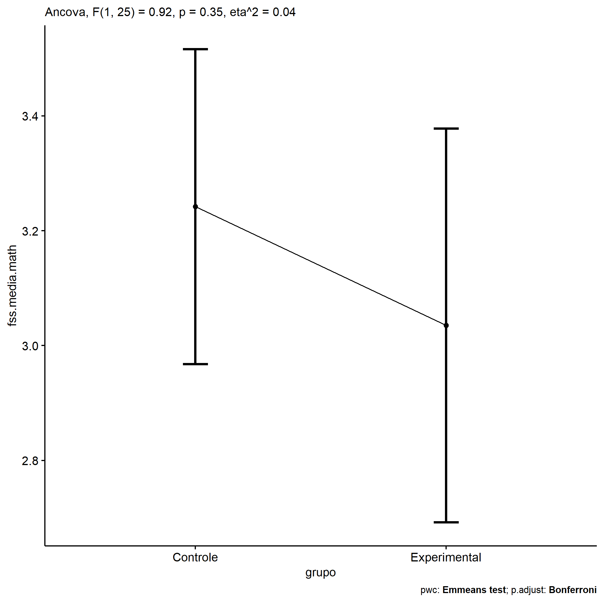
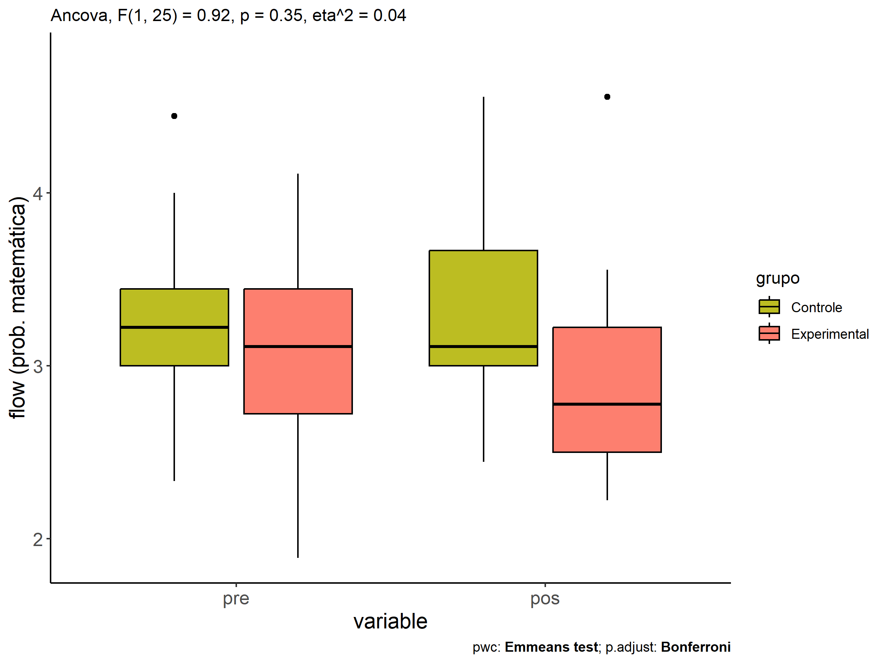
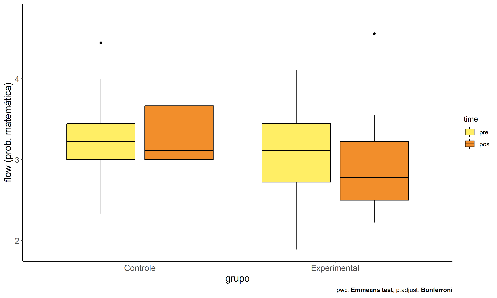
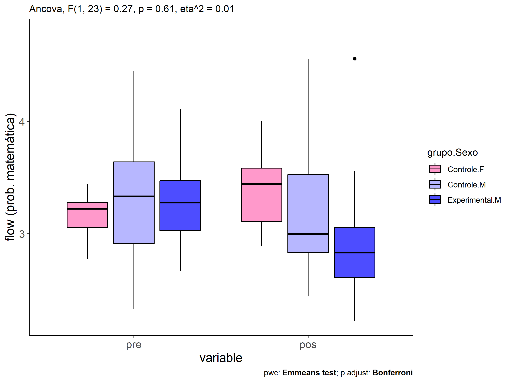
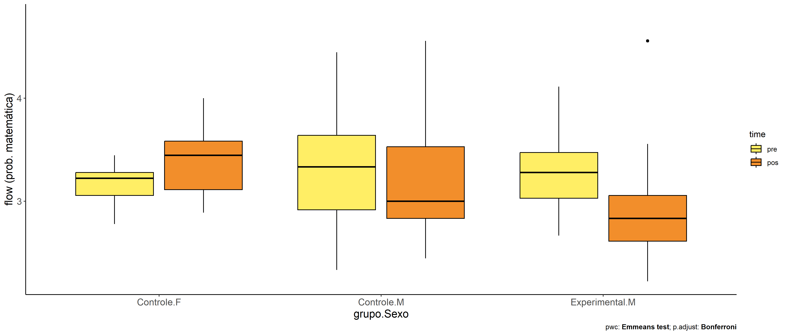
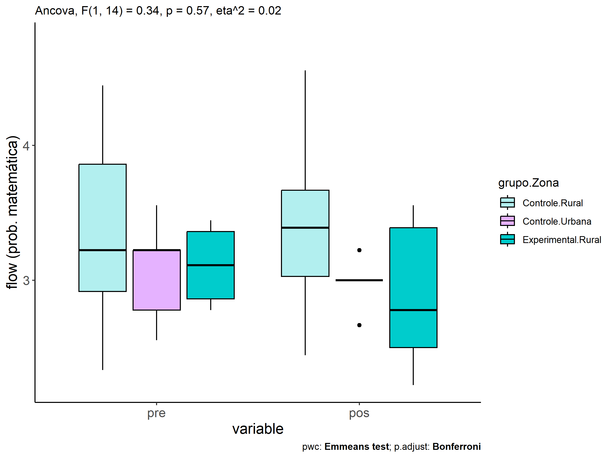
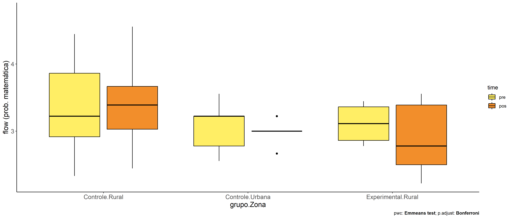

ANCOVA in flow (prob. matemática) (flow (prob. matemática))
================
Geiser C. Challco <geiser@alumni.usp.br>

- [Descriptive Statistics of Initial
  Data](#descriptive-statistics-of-initial-data)
- [Checking of Assumptions](#checking-of-assumptions)
  - [Assumption: Normality distribution of
    data](#assumption-normality-distribution-of-data)
  - [Assumption: Homogeneity of data
    distribution](#assumption-homogeneity-of-data-distribution)
- [Computation of ANCOVA test and Pairwise
  Comparison](#computation-of-ancova-test-and-pairwise-comparison)
  - [ANCOVA tests for one factor](#ancova-tests-for-one-factor)
  - [ANCOVA tests for two factors](#ancova-tests-for-two-factors)
  - [Pairwise comparisons for one factor:
    **grupo**](#pairwise-comparisons-for-one-factor-grupo)
  - [Pairwise comparisons for two
    factors](#pairwise-comparisons-for-two-factors)
    - [factores: **grupo:Sexo**](#factores-gruposexo)
    - [factores: **grupo:Zona**](#factores-grupozona)
    - [factores: **grupo:Cor.Raca**](#factores-grupocorraca)

**NOTE**

- Teste ANCOVA para determinar se houve diferenças significativas no
  flow (prob. matemática) (medido usando pre- e pos-testes).
- ANCOVA test to determine whether there were significant differences in
  flow (prob. matemática) (measured using pre- and post-tests).

# Descriptive Statistics of Initial Data

| grupo        | Sexo | Zona   | Cor.Raca | variable       |   n |  mean | median |   min |   max |    sd |    se |    ci |   iqr |
|:-------------|:-----|:-------|:---------|:---------------|----:|------:|-------:|------:|------:|------:|------:|------:|------:|
| Controle     | F    |        |          | dfs.media.math |   7 | 3.159 |  3.222 | 2.778 | 3.444 | 0.221 | 0.083 | 0.204 | 0.222 |
| Controle     | M    |        |          | dfs.media.math |  10 | 3.311 |  3.333 | 2.333 | 4.444 | 0.647 | 0.205 | 0.463 | 0.722 |
| Experimental | F    |        |          | dfs.media.math |   3 | 2.259 |  2.111 | 1.889 | 2.778 | 0.463 | 0.267 | 1.149 | 0.444 |
| Experimental | M    |        |          | dfs.media.math |   8 | 3.278 |  3.278 | 2.667 | 4.111 | 0.464 | 0.164 | 0.388 | 0.444 |
| Controle     | F    |        |          | fss.media.math |   7 | 3.389 |  3.444 | 2.889 | 4.000 | 0.386 | 0.146 | 0.357 | 0.472 |
| Controle     | M    |        |          | fss.media.math |  10 | 3.222 |  3.000 | 2.444 | 4.556 | 0.654 | 0.207 | 0.468 | 0.694 |
| Experimental | F    |        |          | fss.media.math |   3 | 2.852 |  2.556 | 2.444 | 3.556 | 0.612 | 0.353 | 1.520 | 0.556 |
| Experimental | M    |        |          | fss.media.math |   8 | 3.000 |  2.833 | 2.222 | 4.556 | 0.739 | 0.261 | 0.618 | 0.444 |
| Controle     |      | Rural  |          | dfs.media.math |   6 | 3.352 |  3.222 | 2.333 | 4.444 | 0.774 | 0.316 | 0.813 | 0.944 |
| Controle     |      | Urbana |          | dfs.media.math |   5 | 3.067 |  3.222 | 2.556 | 3.556 | 0.398 | 0.178 | 0.494 | 0.444 |
| Controle     |      |        |          | dfs.media.math |   6 | 3.296 |  3.278 | 3.000 | 3.667 | 0.240 | 0.098 | 0.252 | 0.278 |
| Experimental |      | Rural  |          | dfs.media.math |   6 | 3.111 |  3.111 | 2.778 | 3.444 | 0.298 | 0.122 | 0.313 | 0.500 |
| Experimental |      | Urbana |          | dfs.media.math |   2 | 2.000 |  2.000 | 1.889 | 2.111 | 0.157 | 0.111 | 1.412 | 0.111 |
| Experimental |      |        |          | dfs.media.math |   3 | 3.444 |  3.556 | 2.667 | 4.111 | 0.729 | 0.421 | 1.810 | 0.722 |
| Controle     |      | Rural  |          | fss.media.math |   6 | 3.407 |  3.389 | 2.444 | 4.556 | 0.726 | 0.296 | 0.762 | 0.639 |
| Controle     |      | Urbana |          | fss.media.math |   5 | 2.978 |  3.000 | 2.667 | 3.222 | 0.199 | 0.089 | 0.247 | 0.000 |
| Controle     |      |        |          | fss.media.math |   6 | 3.435 |  3.472 | 2.778 | 4.000 | 0.524 | 0.214 | 0.550 | 0.847 |
| Experimental |      | Rural  |          | fss.media.math |   6 | 2.889 |  2.778 | 2.222 | 3.556 | 0.562 | 0.230 | 0.590 | 0.889 |
| Experimental |      | Urbana |          | fss.media.math |   2 | 2.500 |  2.500 | 2.444 | 2.556 | 0.079 | 0.056 | 0.706 | 0.056 |
| Experimental |      |        |          | fss.media.math |   3 | 3.407 |  2.889 | 2.778 | 4.556 | 0.996 | 0.575 | 2.474 | 0.889 |
| Controle     |      |        | Parda    | dfs.media.math |   9 | 3.272 |  3.222 | 2.333 | 4.444 | 0.641 | 0.214 | 0.493 | 0.556 |
| Controle     |      |        |          | dfs.media.math |   8 | 3.222 |  3.222 | 2.556 | 3.667 | 0.351 | 0.124 | 0.294 | 0.389 |
| Experimental |      |        | Branca   | dfs.media.math |   1 | 3.444 |  3.444 | 3.444 | 3.444 |       |       |       | 0.000 |
| Experimental |      |        | Indígena | dfs.media.math |   1 | 4.111 |  4.111 | 4.111 | 4.111 |       |       |       | 0.000 |
| Experimental |      |        | Parda    | dfs.media.math |   3 | 3.000 |  2.778 | 2.778 | 3.444 | 0.385 | 0.222 | 0.956 | 0.333 |
| Experimental |      |        |          | dfs.media.math |   6 | 2.741 |  2.889 | 1.889 | 3.556 | 0.643 | 0.262 | 0.675 | 0.861 |
| Controle     |      |        | Parda    | fss.media.math |   9 | 3.432 |  3.222 | 2.444 | 4.556 | 0.668 | 0.223 | 0.513 | 1.000 |
| Controle     |      |        |          | fss.media.math |   8 | 3.132 |  3.000 | 2.667 | 3.667 | 0.361 | 0.128 | 0.302 | 0.514 |
| Experimental |      |        | Branca   | fss.media.math |   1 | 2.667 |  2.667 | 2.667 | 2.667 |       |       |       | 0.000 |
| Experimental |      |        | Indígena | fss.media.math |   1 | 4.556 |  4.556 | 4.556 | 4.556 |       |       |       | 0.000 |
| Experimental |      |        | Parda    | fss.media.math |   3 | 3.333 |  3.556 | 2.889 | 3.556 | 0.385 | 0.222 | 0.956 | 0.333 |
| Experimental |      |        |          | fss.media.math |   6 | 2.556 |  2.500 | 2.222 | 2.889 | 0.243 | 0.099 | 0.255 | 0.278 |

# Checking of Assumptions

## Assumption: Normality distribution of data

| var            |   n |   skewness |   kurtosis | symmetry | statistic | method       |         p | p.signif | normality |
|:---------------|----:|-----------:|-----------:|:---------|----------:|:-------------|----------:|:---------|:----------|
| fss.media.math |  28 |  0.4783447 | -0.7825432 | YES      | 0.9477175 | Shapiro-Wilk | 0.1735506 | ns       | YES       |
| fss.media.math |  19 |  0.1458778 | -1.0432158 | YES      | 0.9674816 | Shapiro-Wilk | 0.7252055 | ns       | YES       |
| fss.media.math |  14 | -0.1354180 | -1.4335079 | YES      | 0.9343947 | Shapiro-Wilk | 0.3512262 | ns       | YES       |

## Assumption: Homogeneity of data distribution

| var            | method         | formula                    |   n | DFn.df1 | DFd.df2 | statistic |         p | p.signif |
|:---------------|:---------------|:---------------------------|----:|--------:|--------:|----------:|----------:|:---------|
| fss.media.math | Levene’s test  | `.res`~`grupo`\*`Sexo`     |  28 |       3 |      24 |  1.208956 | 0.3278355 | ns       |
| fss.media.math | Anova’s slopes | `.res`~`grupo`\*`Sexo`     |  28 |       3 |      20 |  0.723000 | 0.5500000 | ns       |
| fss.media.math | Levene’s test  | `.res`~`grupo`\*`Zona`     |  19 |       3 |      15 |  5.386958 | 0.0102078 | \*       |
| fss.media.math | Anova’s slopes | `.res`~`grupo`\*`Zona`     |  19 |       3 |      11 |  0.183000 | 0.9060000 | ns       |
| fss.media.math | Levene’s test  | `.res`~`grupo`\*`Cor.Raca` |  14 |       3 |      10 |  3.376294 | 0.0626055 | ns       |
| fss.media.math | Anova’s slopes | `.res`~`grupo`\*`Cor.Raca` |  14 |       1 |       8 |  0.001000 | 0.9720000 | ns       |

# Computation of ANCOVA test and Pairwise Comparison

## ANCOVA tests for one factor

|     | Effect         | DFn | DFd |   SSn |   SSd |     F |     p |   ges | p\<.05 |
|:----|:---------------|----:|----:|------:|------:|------:|------:|------:|:-------|
| 1   | dfs.media.math |   1 |  25 | 2.096 | 7.389 | 7.091 | 0.013 | 0.221 | \*     |
| 2   | grupo          |   1 |  25 | 0.272 | 7.389 | 0.922 | 0.346 | 0.036 |        |
| 4   | Sexo           |   1 |  25 | 0.770 | 6.892 | 2.791 | 0.107 | 0.100 |        |
| 6   | Zona           |   1 |  16 | 0.040 | 4.401 | 0.147 | 0.707 | 0.009 |        |
| 8   | Cor.Raca       |   2 |  10 | 1.213 | 3.107 | 1.952 | 0.192 | 0.281 |        |

## ANCOVA tests for two factors

|     | Effect         | DFn | DFd |   SSn |   SSd |     F |     p |   ges | p\<.05 |
|:----|:---------------|----:|----:|------:|------:|------:|------:|------:|:-------|
| 1   | dfs.media.math |   1 |  23 | 2.615 | 6.708 | 8.966 | 0.006 | 0.280 | \*     |
| 4   | grupo:Sexo     |   1 |  23 | 0.080 | 6.708 | 0.274 | 0.606 | 0.012 |        |
| 8   | grupo:Zona     |   1 |  14 | 0.093 | 3.861 | 0.337 | 0.571 | 0.024 |        |
| 12  | grupo:Cor.Raca |   0 |   9 |       | 3.105 |       |       |       |        |

## Pairwise comparisons for one factor: **grupo**

| var            | grupo        |   n | M (pre) | SE (pre) | M (unadj) | SE (unadj) | M (adj) | SE (adj) |
|:---------------|:-------------|----:|--------:|---------:|----------:|-----------:|--------:|---------:|
| fss.media.math | Controle     |  17 |   3.248 |    0.124 |     3.291 |      0.134 |   3.242 |    0.133 |
| fss.media.math | Experimental |  11 |   3.000 |    0.195 |     2.960 |      0.205 |   3.035 |    0.166 |

| .y.            | group1   | group2       | estimate | conf.low | conf.high |    se | statistic |     p | p.adj | p.adj.signif |
|:---------------|:---------|:-------------|---------:|---------:|----------:|------:|----------:|------:|------:|:-------------|
| fss.media.math | Controle | Experimental |    0.207 |   -0.237 |     0.651 | 0.215 |     0.960 | 0.346 | 0.346 | ns           |
| dfs.media.math | Controle | Experimental |    0.248 |   -0.203 |     0.699 | 0.219 |     1.132 | 0.268 | 0.268 | ns           |

| .y.       | grupo        | group1 | group2 | estimate | conf.low | conf.high |    se | statistic |     p | p.adj | p.adj.signif |
|:----------|:-------------|:-------|:-------|---------:|---------:|----------:|------:|----------:|------:|------:|:-------------|
| flow.math | Controle     | pre    | pos    |   -0.042 |   -0.446 |     0.361 | 0.201 |    -0.211 | 0.833 | 0.833 | ns           |
| flow.math | Experimental | pre    | pos    |    0.040 |   -0.461 |     0.542 | 0.250 |     0.162 | 0.872 | 0.872 | ns           |

    ## Scale for colour is already present.
    ## Adding another scale for colour, which will replace the existing scale.

<!-- -->

<!-- -->

<!-- -->

## Pairwise comparisons for two factors

### factores: **grupo:Sexo**

| var            | grupo        | Sexo |   n | M (pre) | SE (pre) | M (unadj) | SE (unadj) | M (adj) | SE (adj) |
|:---------------|:-------------|:-----|----:|--------:|---------:|----------:|-----------:|--------:|---------:|
| fss.media.math | Controle     | F    |   7 |   3.159 |    0.083 |     3.389 |      0.146 |   3.449 |    0.212 |
| fss.media.math | Controle     | M    |  10 |   3.311 |    0.205 |     3.222 |      0.207 |   3.190 |    0.176 |
| fss.media.math | Experimental | M    |   8 |   3.278 |    0.164 |     3.000 |      0.261 |   2.988 |    0.197 |

|     | .y.            | grupo    | Sexo | group1   | group2       | estimate | conf.low | conf.high |    se | statistic |     p | p.adj | p.adj.signif |
|:----|:---------------|:---------|:-----|:---------|:-------------|---------:|---------:|----------:|------:|----------:|------:|------:|:-------------|
| 2   | fss.media.math |          | M    | Controle | Experimental |    0.202 |   -0.347 |     0.751 | 0.264 |     0.765 | 0.453 | 0.453 | ns           |
| 4   | dfs.media.math |          | M    | Controle | Experimental |    0.033 |   -0.462 |     0.528 | 0.239 |     0.140 | 0.890 | 0.890 | ns           |
| 5   | fss.media.math | Controle |      | F        | M            |    0.260 |   -0.315 |     0.835 | 0.276 |     0.939 | 0.358 | 0.358 | ns           |
| 7   | dfs.media.math | Controle |      | F        | M            |   -0.152 |   -0.667 |     0.362 | 0.248 |    -0.614 | 0.545 | 0.545 | ns           |

| .y.       | grupo        | Sexo | group1 | group2 | estimate | conf.low | conf.high |    se | statistic |     p | p.adj | p.adj.signif |
|:----------|:-------------|:-----|:-------|:-------|---------:|---------:|----------:|------:|----------:|------:|------:|:-------------|
| flow.math | Controle     | F    | pre    | pos    |   -0.230 |   -0.841 |     0.381 | 0.303 |    -0.759 | 0.452 | 0.452 | ns           |
| flow.math | Controle     | M    | pre    | pos    |    0.089 |   -0.422 |     0.600 | 0.254 |     0.351 | 0.728 | 0.728 | ns           |
| flow.math | Experimental | M    | pre    | pos    |    0.278 |   -0.294 |     0.849 | 0.284 |     0.980 | 0.333 | 0.333 | ns           |

<!-- -->

<!-- -->

### factores: **grupo:Zona**

| var            | grupo        | Zona   |   n | M (pre) | SE (pre) | M (unadj) | SE (unadj) | M (adj) | SE (adj) |
|:---------------|:-------------|:-------|----:|--------:|---------:|----------:|-----------:|--------:|---------:|
| fss.media.math | Controle     | Rural  |   6 |   3.352 |    0.316 |     3.407 |      0.296 |   3.348 |    0.227 |
| fss.media.math | Controle     | Urbana |   5 |   3.067 |    0.178 |     2.978 |      0.089 |   3.019 |    0.246 |
| fss.media.math | Experimental | Rural  |   6 |   3.111 |    0.122 |     2.889 |      0.230 |   2.914 |    0.223 |

|     | .y.            | grupo    | Zona  | group1   | group2       | estimate | conf.low | conf.high |    se | statistic |     p | p.adj | p.adj.signif |
|:----|:---------------|:---------|:------|:---------|:-------------|---------:|---------:|----------:|------:|----------:|------:|------:|:-------------|
| 1   | fss.media.math |          | Rural | Controle | Experimental |    0.433 |   -0.261 |     1.127 | 0.321 |     1.348 | 0.201 | 0.201 | ns           |
| 3   | dfs.media.math |          | Rural | Controle | Experimental |    0.241 |   -0.427 |     0.909 | 0.311 |     0.773 | 0.452 | 0.452 | ns           |
| 5   | fss.media.math | Controle |       | Rural    | Urbana       |    0.329 |   -0.403 |     1.061 | 0.339 |     0.970 | 0.350 | 0.350 | ns           |
| 7   | dfs.media.math | Controle |       | Rural    | Urbana       |    0.285 |   -0.415 |     0.986 | 0.327 |     0.873 | 0.397 | 0.397 | ns           |

| .y.       | grupo        | Zona   | group1 | group2 | estimate | conf.low | conf.high |    se | statistic |     p | p.adj | p.adj.signif |
|:----------|:-------------|:-------|:-------|:-------|---------:|---------:|----------:|------:|----------:|------:|------:|:-------------|
| flow.math | Controle     | Rural  | pre    | pos    |   -0.056 |   -0.705 |     0.594 | 0.317 |    -0.175 | 0.862 | 0.862 | ns           |
| flow.math | Controle     | Urbana | pre    | pos    |    0.089 |   -0.623 |     0.800 | 0.347 |     0.256 | 0.800 | 0.800 | ns           |
| flow.math | Experimental | Rural  | pre    | pos    |    0.222 |   -0.427 |     0.872 | 0.317 |     0.701 | 0.489 | 0.489 | ns           |

<!-- -->

<!-- -->

### factores: **grupo:Cor.Raca**
