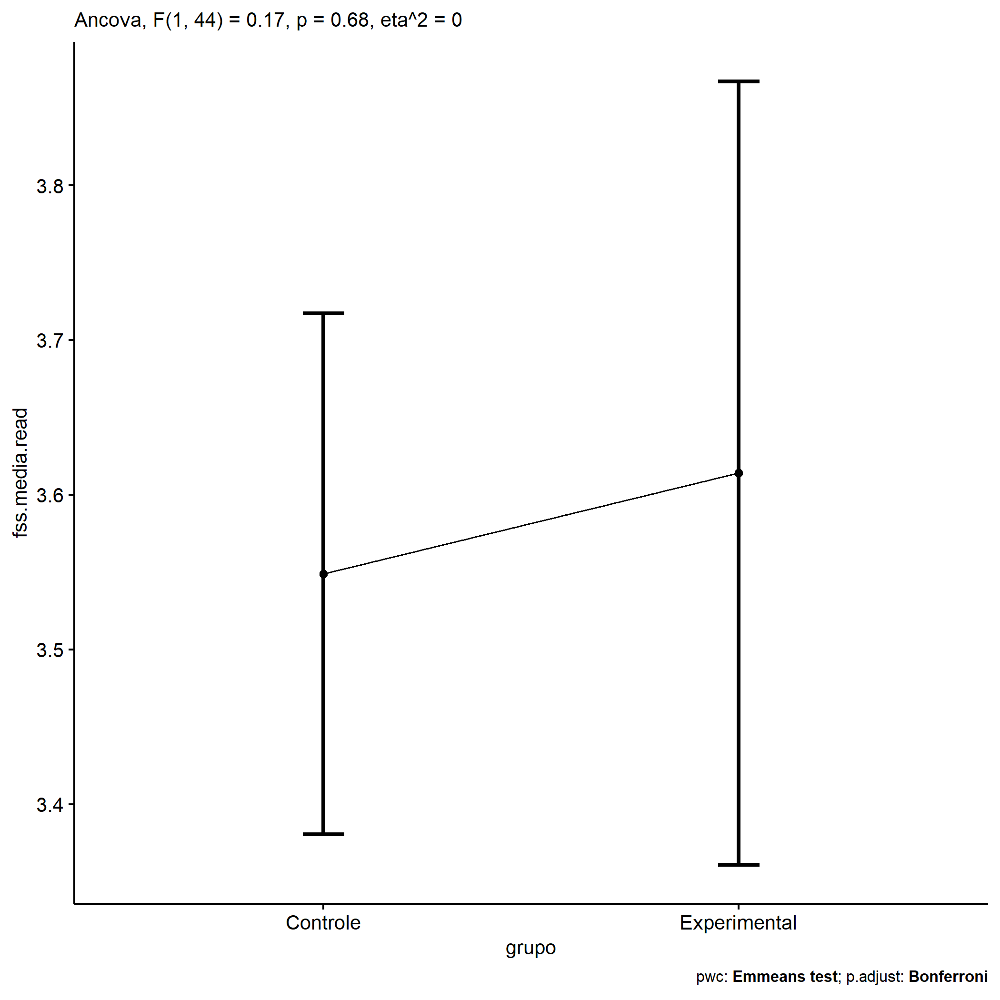
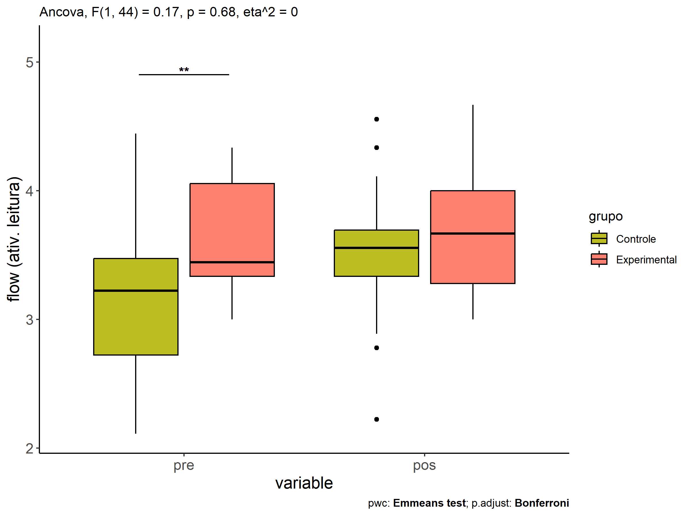
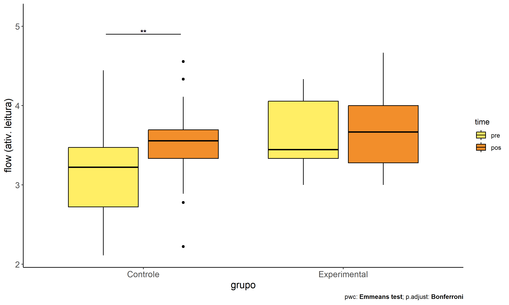
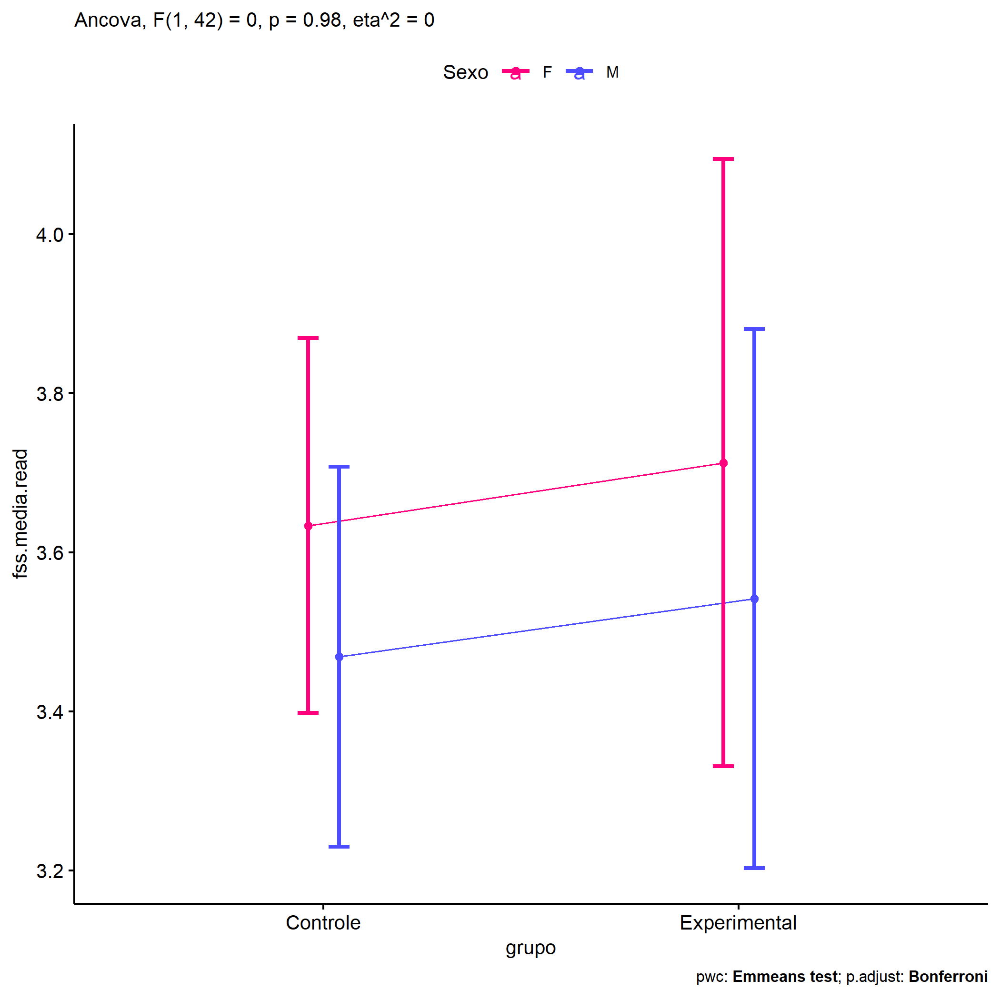
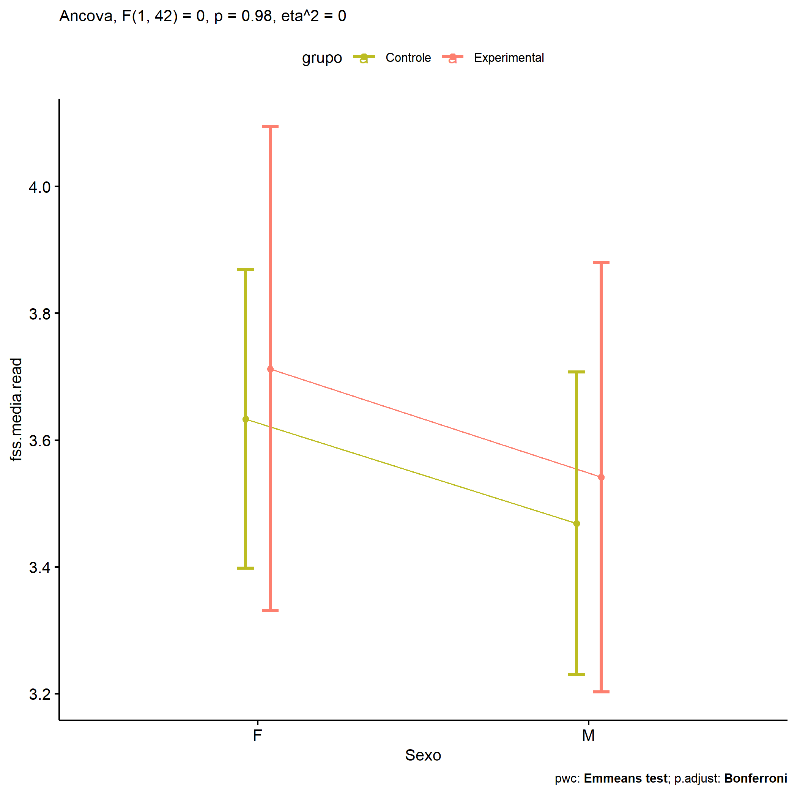
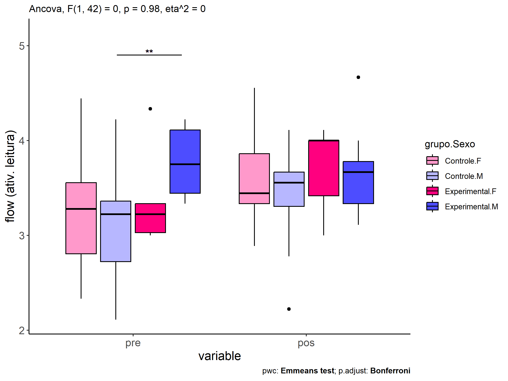
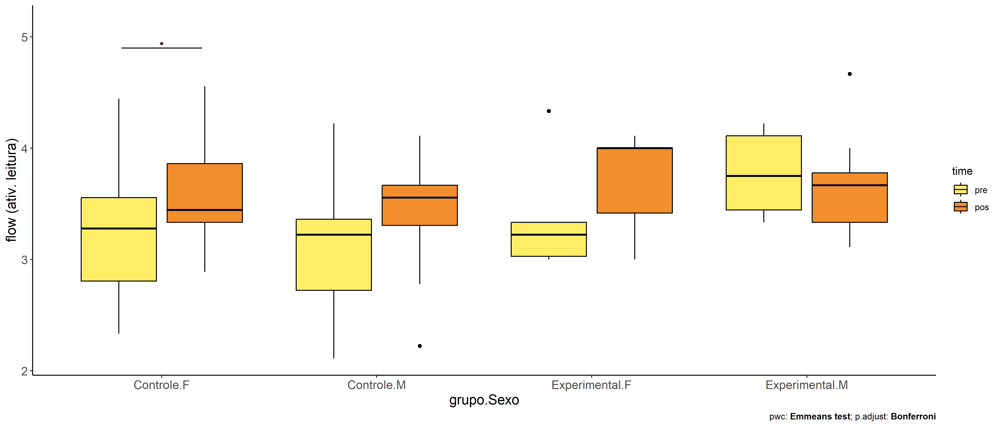
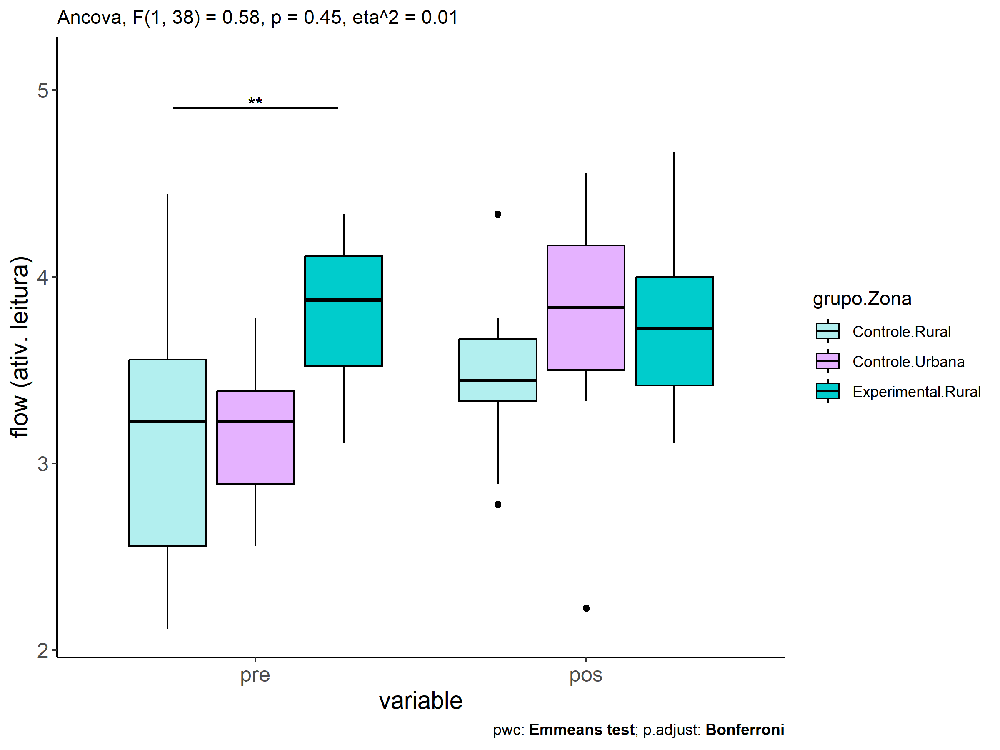
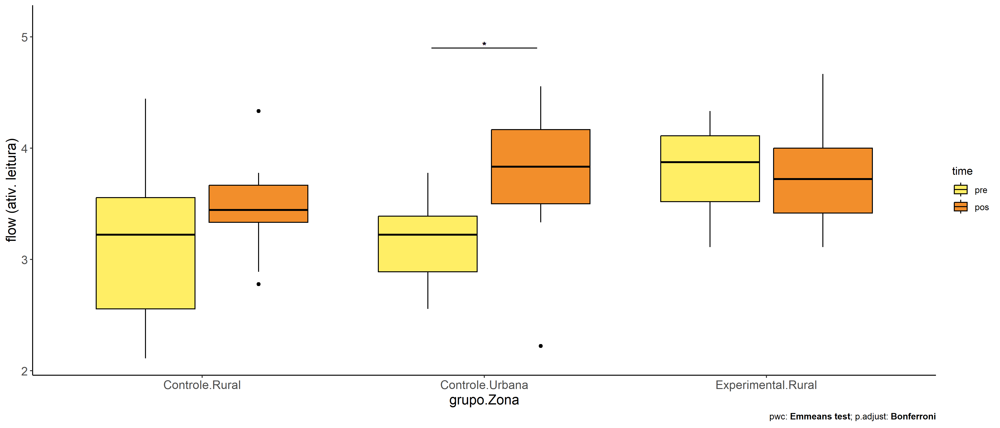

ANCOVA in flow (ativ. leitura) (flow (ativ. leitura))
================
Geiser C. Challco <geiser@alumni.usp.br>

- [Descriptive Statistics of Initial
  Data](#descriptive-statistics-of-initial-data)
- [Checking of Assumptions](#checking-of-assumptions)
  - [Assumption: Normality distribution of
    data](#assumption-normality-distribution-of-data)
  - [Assumption: Homogeneity of data
    distribution](#assumption-homogeneity-of-data-distribution)
- [Computation of ANCOVA test and Pairwise
  Comparison](#computation-of-ancova-test-and-pairwise-comparison)
  - [ANCOVA tests for one factor](#ancova-tests-for-one-factor)
  - [ANCOVA tests for two factors](#ancova-tests-for-two-factors)
  - [Pairwise comparisons for one factor:
    **grupo**](#pairwise-comparisons-for-one-factor-grupo)
  - [Pairwise comparisons for two
    factors](#pairwise-comparisons-for-two-factors)
    - [factores: **grupo:Sexo**](#factores-gruposexo)
    - [factores: **grupo:Zona**](#factores-grupozona)
    - [factores: **grupo:Cor.Raca**](#factores-grupocorraca)

**NOTE**

- Teste ANCOVA para determinar se houve diferenças significativas no
  flow (ativ. leitura) (medido usando pre- e pos-testes).
- ANCOVA test to determine whether there were significant differences in
  flow (ativ. leitura) (measured using pre- and post-tests).

# Descriptive Statistics of Initial Data

| grupo        | Sexo | Zona   | Cor.Raca | variable       |   n |  mean | median |   min |   max |    sd |    se |    ci |   iqr |
|:-------------|:-----|:-------|:---------|:---------------|----:|------:|-------:|------:|------:|------:|------:|------:|------:|
| Controle     | F    |        |          | dfs.media.read |  16 | 3.194 |  3.278 | 2.333 | 4.444 | 0.572 | 0.143 | 0.305 | 0.750 |
| Controle     | M    |        |          | dfs.media.read |  16 | 3.118 |  3.222 | 2.111 | 4.222 | 0.566 | 0.141 | 0.301 | 0.639 |
| Experimental | F    |        |          | dfs.media.read |   6 | 3.352 |  3.222 | 3.000 | 4.333 | 0.504 | 0.206 | 0.529 | 0.306 |
| Experimental | M    |        |          | dfs.media.read |   9 | 3.796 |  3.750 | 3.333 | 4.222 | 0.333 | 0.111 | 0.256 | 0.667 |
| Controle     | F    |        |          | fss.media.read |  16 | 3.611 |  3.444 | 2.889 | 4.556 | 0.487 | 0.122 | 0.259 | 0.528 |
| Controle     | M    |        |          | fss.media.read |  16 | 3.431 |  3.556 | 2.222 | 4.111 | 0.439 | 0.110 | 0.234 | 0.361 |
| Experimental | F    |        |          | fss.media.read |   6 | 3.722 |  4.000 | 3.000 | 4.111 | 0.480 | 0.196 | 0.504 | 0.583 |
| Experimental | M    |        |          | fss.media.read |   9 | 3.642 |  3.667 | 3.111 | 4.667 | 0.487 | 0.162 | 0.374 | 0.444 |
| Controle     |      | Rural  |          | dfs.media.read |  21 | 3.148 |  3.222 | 2.111 | 4.444 | 0.648 | 0.141 | 0.295 | 1.000 |
| Controle     |      | Urbana |          | dfs.media.read |   8 | 3.153 |  3.222 | 2.556 | 3.778 | 0.436 | 0.154 | 0.365 | 0.500 |
| Controle     |      |        |          | dfs.media.read |   3 | 3.222 |  3.222 | 3.222 | 3.222 | 0.000 | 0.000 | 0.000 | 0.000 |
| Experimental |      | Rural  |          | dfs.media.read |  10 | 3.817 |  3.875 | 3.111 | 4.333 | 0.411 | 0.130 | 0.294 | 0.590 |
| Experimental |      | Urbana |          | dfs.media.read |   4 | 3.278 |  3.333 | 3.000 | 3.444 | 0.192 | 0.096 | 0.306 | 0.111 |
| Experimental |      |        |          | dfs.media.read |   1 | 3.000 |  3.000 | 3.000 | 3.000 |       |       |       | 0.000 |
| Controle     |      | Rural  |          | fss.media.read |  21 | 3.455 |  3.444 | 2.778 | 4.333 | 0.337 | 0.074 | 0.153 | 0.333 |
| Controle     |      | Urbana |          | fss.media.read |   8 | 3.722 |  3.833 | 2.222 | 4.556 | 0.739 | 0.261 | 0.618 | 0.667 |
| Controle     |      |        |          | fss.media.read |   3 | 3.444 |  3.556 | 3.111 | 3.667 | 0.294 | 0.170 | 0.730 | 0.278 |
| Experimental |      | Rural  |          | fss.media.read |  10 | 3.733 |  3.722 | 3.111 | 4.667 | 0.475 | 0.150 | 0.340 | 0.583 |
| Experimental |      | Urbana |          | fss.media.read |   4 | 3.639 |  3.722 | 3.000 | 4.111 | 0.516 | 0.258 | 0.821 | 0.694 |
| Experimental |      |        |          | fss.media.read |   1 | 3.222 |  3.222 | 3.222 | 3.222 |       |       |       | 0.000 |
| Controle     |      |        | Branca   | dfs.media.read |   5 | 2.756 |  2.778 | 2.111 | 3.333 | 0.535 | 0.239 | 0.665 | 0.889 |
| Controle     |      |        | Parda    | dfs.media.read |  13 | 3.513 |  3.444 | 2.778 | 4.444 | 0.492 | 0.136 | 0.297 | 0.333 |
| Controle     |      |        |          | dfs.media.read |  14 | 2.968 |  3.111 | 2.333 | 3.778 | 0.460 | 0.123 | 0.266 | 0.667 |
| Experimental |      |        | Amarela  | dfs.media.read |   1 | 3.000 |  3.000 | 3.000 | 3.000 |       |       |       | 0.000 |
| Experimental |      |        | Parda    | dfs.media.read |   4 | 3.826 |  3.875 | 3.444 | 4.111 | 0.296 | 0.148 | 0.471 | 0.354 |
| Experimental |      |        |          | dfs.media.read |  10 | 3.597 |  3.389 | 3.000 | 4.333 | 0.477 | 0.151 | 0.341 | 0.688 |
| Controle     |      |        | Branca   | fss.media.read |   5 | 3.600 |  3.556 | 3.444 | 3.778 | 0.127 | 0.057 | 0.157 | 0.111 |
| Controle     |      |        | Parda    | fss.media.read |  13 | 3.556 |  3.444 | 2.778 | 4.333 | 0.401 | 0.111 | 0.242 | 0.444 |
| Controle     |      |        |          | fss.media.read |  14 | 3.460 |  3.444 | 2.222 | 4.556 | 0.596 | 0.159 | 0.344 | 0.417 |
| Experimental |      |        | Amarela  | fss.media.read |   1 | 3.222 |  3.222 | 3.222 | 3.222 |       |       |       | 0.000 |
| Experimental |      |        | Parda    | fss.media.read |   4 | 3.472 |  3.500 | 3.111 | 3.778 | 0.306 | 0.153 | 0.487 | 0.417 |
| Experimental |      |        |          | fss.media.read |  10 | 3.800 |  4.000 | 3.000 | 4.667 | 0.502 | 0.159 | 0.359 | 0.500 |

# Checking of Assumptions

## Assumption: Normality distribution of data

| var            |   n |   skewness |   kurtosis | symmetry | statistic | method       |         p | p.signif | normality |
|:---------------|----:|-----------:|-----------:|:---------|----------:|:-------------|----------:|:---------|:----------|
| fss.media.read |  47 | -0.1847344 | -0.2082980 | YES      | 0.9883168 | Shapiro-Wilk | 0.9155322 | ns       | YES       |
| fss.media.read |  43 | -0.6676802 |  0.9379116 | NO       | 0.9650493 | Shapiro-Wilk | 0.2115054 | ns       | YES       |
| fss.media.read |  23 | -0.0655100 |  0.1343883 | YES      | 0.9773388 | Shapiro-Wilk | 0.8562231 | ns       | YES       |

## Assumption: Homogeneity of data distribution

| var            | method         | formula                    |   n | DFn.df1 | DFd.df2 | statistic |         p | p.signif |
|:---------------|:---------------|:---------------------------|----:|--------:|--------:|----------:|----------:|:---------|
| fss.media.read | Levene’s test  | `.res`~`grupo`\*`Sexo`     |  47 |       3 |      43 | 0.0206979 | 0.9958959 | ns       |
| fss.media.read | Anova’s slopes | `.res`~`grupo`\*`Sexo`     |  47 |       3 |      39 | 2.0840000 | 0.1180000 | ns       |
| fss.media.read | Levene’s test  | `.res`~`grupo`\*`Zona`     |  43 |       3 |      39 | 1.3878048 | 0.2608617 | ns       |
| fss.media.read | Anova’s slopes | `.res`~`grupo`\*`Zona`     |  43 |       3 |      35 | 1.9680000 | 0.1370000 | ns       |
| fss.media.read | Levene’s test  | `.res`~`grupo`\*`Cor.Raca` |  23 |       3 |      19 | 1.8379962 | 0.1745061 | ns       |
| fss.media.read | Anova’s slopes | `.res`~`grupo`\*`Cor.Raca` |  23 |       2 |      16 | 0.0900000 | 0.9150000 | ns       |

# Computation of ANCOVA test and Pairwise Comparison

## ANCOVA tests for one factor

|     | Effect         | DFn | DFd |   SSn |   SSd |     F |     p |   ges | p\<.05 |
|:----|:---------------|----:|----:|------:|------:|------:|------:|------:|:-------|
| 1   | dfs.media.read |   1 |  44 | 0.458 | 9.317 | 2.163 | 0.148 | 0.047 |        |
| 2   | grupo          |   1 |  44 | 0.037 | 9.317 | 0.175 | 0.678 | 0.004 |        |
| 4   | Sexo           |   1 |  44 | 0.308 | 9.047 | 1.496 | 0.228 | 0.033 |        |
| 6   | Zona           |   1 |  40 | 0.298 | 8.758 | 1.361 | 0.250 | 0.033 |        |
| 8   | Cor.Raca       |   2 |  19 | 0.134 | 2.269 | 0.560 | 0.580 | 0.056 |        |

## ANCOVA tests for two factors

|     | Effect         | DFn | DFd |   SSn |   SSd |     F |     p |   ges | p\<.05 |
|:----|:---------------|----:|----:|------:|------:|------:|------:|------:|:-------|
| 1   | dfs.media.read |   1 |  42 | 0.495 | 8.997 | 2.310 | 0.136 | 0.052 |        |
| 4   | grupo:Sexo     |   1 |  42 | 0.000 | 8.997 | 0.000 | 0.984 | 0.000 |        |
| 8   | grupo:Zona     |   1 |  38 | 0.130 | 8.584 | 0.577 | 0.452 | 0.015 |        |
| 12  | grupo:Cor.Raca |   0 |  18 |       | 2.233 |       |       |       |        |

## Pairwise comparisons for one factor: **grupo**

| var            | grupo        |   n | M (pre) | SE (pre) | M (unadj) | SE (unadj) | M (adj) | SE (adj) |
|:---------------|:-------------|----:|--------:|---------:|----------:|-----------:|--------:|---------:|
| fss.media.read | Controle     |  32 |   3.156 |    0.099 |     3.521 |      0.082 |   3.549 |    0.084 |
| fss.media.read | Experimental |  15 |   3.619 |    0.117 |     3.674 |      0.121 |   3.614 |    0.126 |

| .y.            | group1   | group2       | estimate | conf.low | conf.high |    se | statistic |     p | p.adj | p.adj.signif |
|:---------------|:---------|:-------------|---------:|---------:|----------:|------:|----------:|------:|------:|:-------------|
| fss.media.read | Controle | Experimental |   -0.065 |   -0.379 |     0.249 | 0.156 |    -0.418 | 0.678 | 0.678 | ns           |
| dfs.media.read | Controle | Experimental |   -0.462 |   -0.796 |    -0.129 | 0.166 |    -2.790 | 0.008 | 0.008 | \*\*         |

| .y.       | grupo        | group1 | group2 | estimate | conf.low | conf.high |    se | statistic |     p | p.adj | p.adj.signif |
|:----------|:-------------|:-------|:-------|---------:|---------:|----------:|------:|----------:|------:|------:|:-------------|
| flow.read | Controle     | pre    | pos    |   -0.365 |   -0.612 |    -0.117 | 0.125 |    -2.924 | 0.004 | 0.004 | \*\*         |
| flow.read | Experimental | pre    | pos    |   -0.056 |   -0.417 |     0.306 | 0.182 |    -0.305 | 0.761 | 0.761 | ns           |

    ## Scale for colour is already present.
    ## Adding another scale for colour, which will replace the existing scale.

<!-- -->

<!-- -->

<!-- -->

## Pairwise comparisons for two factors

### factores: **grupo:Sexo**

| var            | grupo        | Sexo |   n | M (pre) | SE (pre) | M (unadj) | SE (unadj) | M (adj) | SE (adj) |
|:---------------|:-------------|:-----|----:|--------:|---------:|----------:|-----------:|--------:|---------:|
| fss.media.read | Controle     | F    |  16 |   3.194 |    0.143 |     3.611 |      0.122 |   3.633 |    0.117 |
| fss.media.read | Controle     | M    |  16 |   3.118 |    0.141 |     3.431 |      0.110 |   3.468 |    0.118 |
| fss.media.read | Experimental | F    |   6 |   3.352 |    0.206 |     3.722 |      0.196 |   3.712 |    0.189 |
| fss.media.read | Experimental | M    |   9 |   3.796 |    0.111 |     3.642 |      0.162 |   3.541 |    0.168 |

| .y.            | grupo        | Sexo | group1   | group2       | estimate | conf.low | conf.high |    se | statistic |     p | p.adj | p.adj.signif |
|:---------------|:-------------|:-----|:---------|:-------------|---------:|---------:|----------:|------:|----------:|------:|------:|:-------------|
| fss.media.read |              | F    | Controle | Experimental |   -0.079 |   -0.528 |     0.370 | 0.223 |    -0.355 | 0.725 | 0.725 | ns           |
| fss.media.read |              | M    | Controle | Experimental |   -0.073 |   -0.503 |     0.358 | 0.213 |    -0.342 | 0.734 | 0.734 | ns           |
| dfs.media.read |              | F    | Controle | Experimental |   -0.157 |   -0.664 |     0.350 | 0.251 |    -0.626 | 0.535 | 0.535 | ns           |
| dfs.media.read |              | M    | Controle | Experimental |   -0.678 |   -1.120 |    -0.237 | 0.219 |    -3.099 | 0.003 | 0.003 | \*\*         |
| fss.media.read | Controle     |      | F        | M            |    0.165 |   -0.166 |     0.496 | 0.164 |     1.006 | 0.320 | 0.320 | ns           |
| fss.media.read | Experimental |      | F        | M            |    0.171 |   -0.336 |     0.678 | 0.251 |     0.681 | 0.500 | 0.500 | ns           |
| dfs.media.read | Controle     |      | F        | M            |    0.076 |   -0.298 |     0.451 | 0.186 |     0.411 | 0.683 | 0.683 | ns           |
| dfs.media.read | Experimental |      | F        | M            |   -0.444 |   -1.003 |     0.114 | 0.277 |    -1.606 | 0.116 | 0.116 | ns           |

| .y.       | grupo        | Sexo | group1 | group2 | estimate | conf.low | conf.high |    se | statistic |     p | p.adj | p.adj.signif |
|:----------|:-------------|:-----|:-------|:-------|---------:|---------:|----------:|------:|----------:|------:|------:|:-------------|
| flow.read | Controle     | F    | pre    | pos    |   -0.417 |   -0.767 |    -0.066 | 0.176 |    -2.365 | 0.020 | 0.020 | \*           |
| flow.read | Controle     | M    | pre    | pos    |   -0.312 |   -0.663 |     0.038 | 0.176 |    -1.774 | 0.080 | 0.080 | ns           |
| flow.read | Experimental | F    | pre    | pos    |   -0.370 |   -0.942 |     0.202 | 0.288 |    -1.287 | 0.201 | 0.201 | ns           |
| flow.read | Experimental | M    | pre    | pos    |    0.154 |   -0.313 |     0.621 | 0.235 |     0.657 | 0.513 | 0.513 | ns           |

    ## Scale for colour is already present.
    ## Adding another scale for colour, which will replace the existing scale.

<!-- -->

    ## Scale for colour is already present.
    ## Adding another scale for colour, which will replace the existing scale.

<!-- -->

<!-- -->

<!-- -->

### factores: **grupo:Zona**

| var            | grupo        | Zona   |   n | M (pre) | SE (pre) | M (unadj) | SE (unadj) | M (adj) | SE (adj) |
|:---------------|:-------------|:-------|----:|--------:|---------:|----------:|-----------:|--------:|---------:|
| fss.media.read | Controle     | Rural  |  21 |   3.148 |    0.141 |     3.455 |      0.074 |   3.487 |    0.105 |
| fss.media.read | Controle     | Urbana |   8 |   3.153 |    0.154 |     3.722 |      0.261 |   3.753 |    0.168 |
| fss.media.read | Experimental | Rural  |  10 |   3.817 |    0.130 |     3.733 |      0.150 |   3.641 |    0.164 |

|     | .y.            | grupo    | Zona  | group1   | group2       | estimate | conf.low | conf.high |    se | statistic |     p | p.adj | p.adj.signif |
|:----|:---------------|:---------|:------|:---------|:-------------|---------:|---------:|----------:|------:|----------:|------:|------:|:-------------|
| 1   | fss.media.read |          | Rural | Controle | Experimental |   -0.154 |   -0.568 |     0.259 | 0.204 |    -0.758 | 0.453 | 0.453 | ns           |
| 3   | dfs.media.read |          | Rural | Controle | Experimental |   -0.669 |   -1.104 |    -0.233 | 0.215 |    -3.112 | 0.004 | 0.004 | \*\*         |
| 5   | fss.media.read | Controle |       | Rural    | Urbana       |   -0.266 |   -0.663 |     0.130 | 0.195 |    -1.363 | 0.182 | 0.182 | ns           |
| 7   | dfs.media.read | Controle |       | Rural    | Urbana       |   -0.005 |   -0.476 |     0.466 | 0.232 |    -0.020 | 0.984 | 0.984 | ns           |

| .y.       | grupo        | Zona   | group1 | group2 | estimate | conf.low | conf.high |    se | statistic |     p | p.adj | p.adj.signif |
|:----------|:-------------|:-------|:-------|:-------|---------:|---------:|----------:|------:|----------:|------:|------:|:-------------|
| flow.read | Controle     | Rural  | pre    | pos    |   -0.307 |   -0.626 |     0.012 | 0.160 |    -1.917 | 0.059 | 0.059 | ns           |
| flow.read | Controle     | Urbana | pre    | pos    |   -0.569 |   -1.087 |    -0.052 | 0.259 |    -2.195 | 0.031 | 0.031 | \*           |
| flow.read | Experimental | Rural  | pre    | pos    |    0.083 |   -0.379 |     0.546 | 0.232 |     0.359 | 0.721 | 0.721 | ns           |

<!-- -->

<!-- -->

### factores: **grupo:Cor.Raca**
