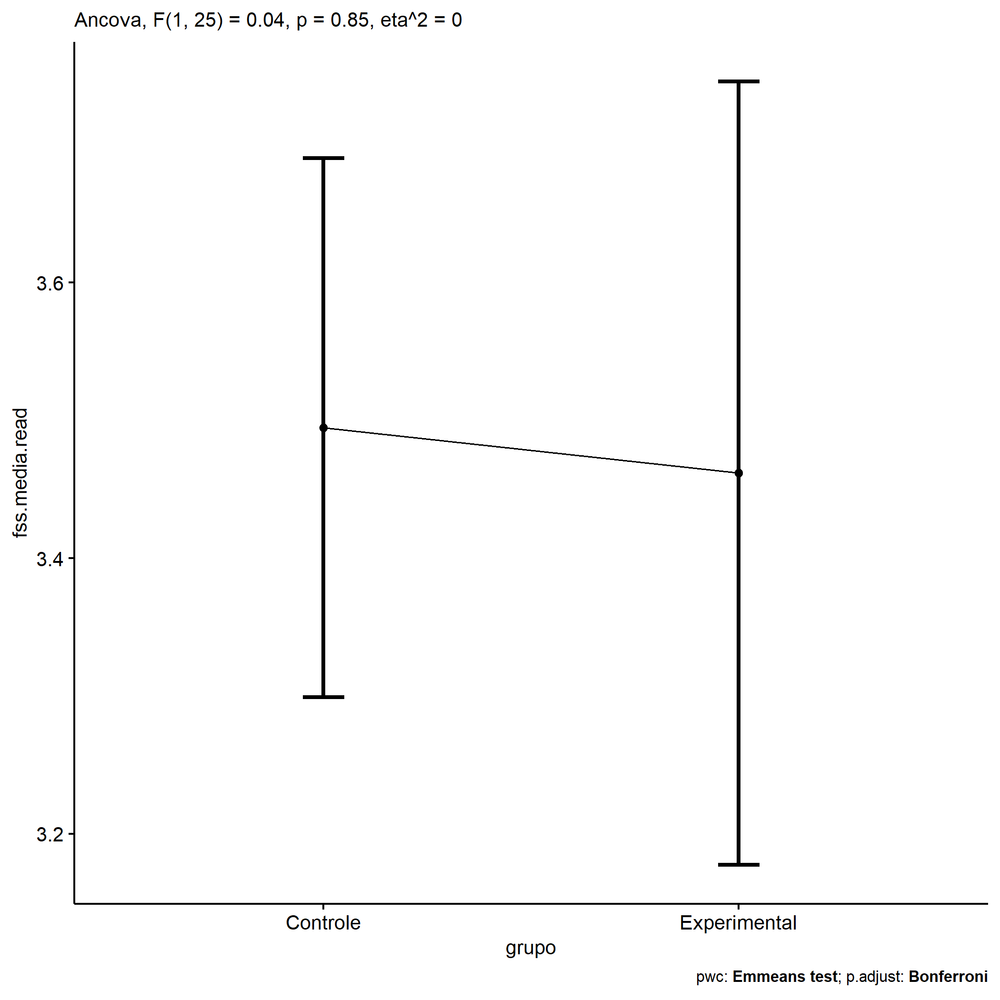
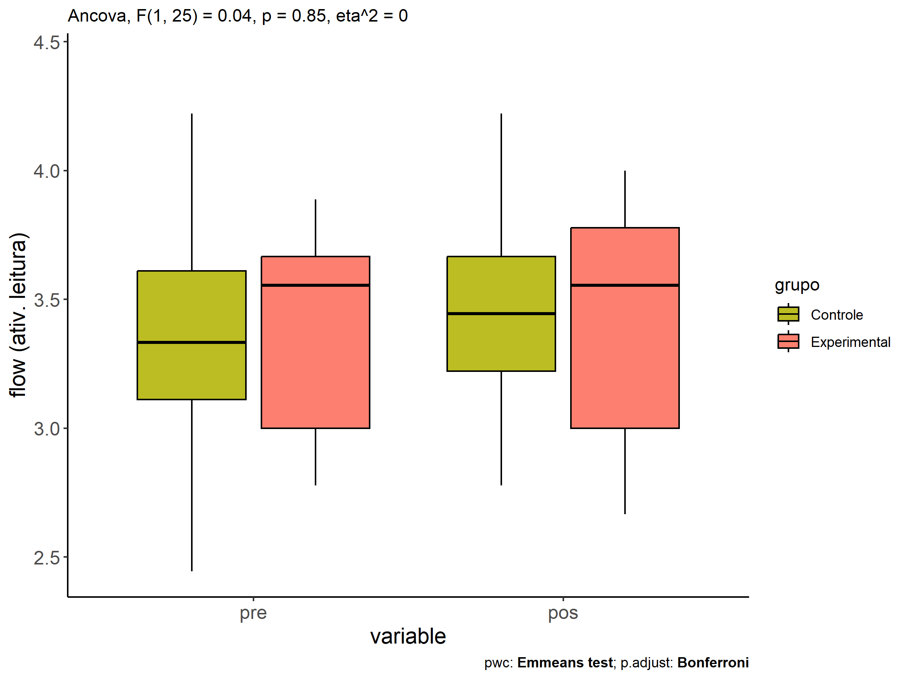
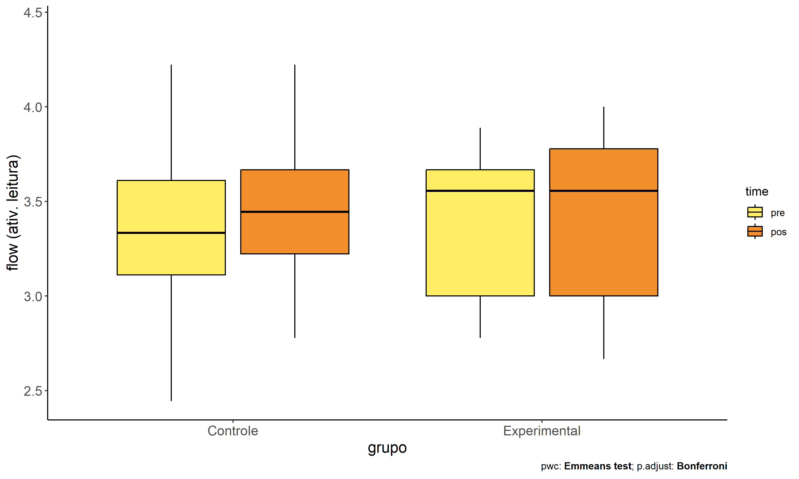
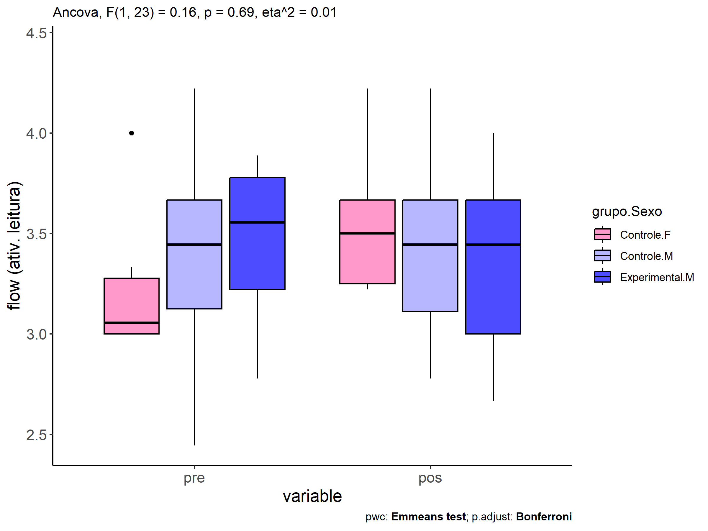
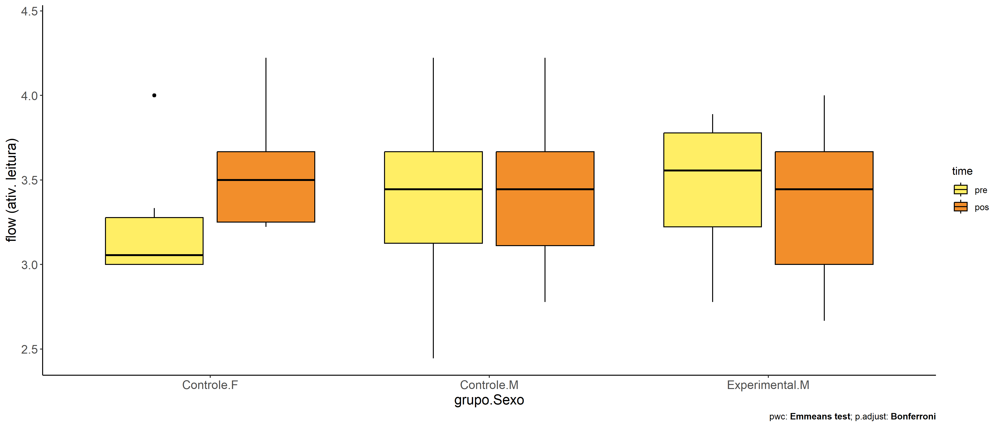

ANCOVA in flow (ativ. leitura) (flow (ativ. leitura))
================
Geiser C. Challco <geiser@alumni.usp.br>

- [Descriptive Statistics of Initial
  Data](#descriptive-statistics-of-initial-data)
- [Checking of Assumptions](#checking-of-assumptions)
  - [Assumption: Normality distribution of
    data](#assumption-normality-distribution-of-data)
  - [Assumption: Homogeneity of data
    distribution](#assumption-homogeneity-of-data-distribution)
- [Computation of ANCOVA test and Pairwise
  Comparison](#computation-of-ancova-test-and-pairwise-comparison)
  - [ANCOVA tests for one factor](#ancova-tests-for-one-factor)
  - [ANCOVA tests for two factors](#ancova-tests-for-two-factors)
  - [Pairwise comparisons for one factor:
    **grupo**](#pairwise-comparisons-for-one-factor-grupo)
  - [Pairwise comparisons for two
    factors](#pairwise-comparisons-for-two-factors)
    - [factores: **grupo:Sexo**](#factores-gruposexo)
    - [factores: **grupo:Zona**](#factores-grupozona)
    - [factores: **grupo:Cor.Raca**](#factores-grupocorraca)

**NOTE**

- Teste ANCOVA para determinar se houve diferenças significativas no
  flow (ativ. leitura) (medido usando pre- e pos-testes).
- ANCOVA test to determine whether there were significant differences in
  flow (ativ. leitura) (measured using pre- and post-tests).

# Descriptive Statistics of Initial Data

| grupo        | Sexo | Zona   | Cor.Raca | variable       |   n |  mean | median |   min |   max |    sd |    se |    ci |   iqr |
|:-------------|:-----|:-------|:---------|:---------------|----:|------:|-------:|------:|------:|------:|------:|------:|------:|
| Controle     | F    |        |          | dfs.media.read |   6 | 3.241 |  3.056 | 3.000 | 4.000 | 0.394 | 0.161 | 0.413 | 0.278 |
| Controle     | M    |        |          | dfs.media.read |  13 | 3.446 |  3.444 | 2.444 | 4.222 | 0.466 | 0.129 | 0.282 | 0.542 |
| Experimental | F    |        |          | dfs.media.read |   4 | 3.250 |  3.278 | 2.778 | 3.667 | 0.429 | 0.215 | 0.683 | 0.639 |
| Experimental | M    |        |          | dfs.media.read |   5 | 3.444 |  3.556 | 2.778 | 3.889 | 0.451 | 0.202 | 0.560 | 0.556 |
| Controle     | F    |        |          | fss.media.read |   6 | 3.556 |  3.500 | 3.222 | 4.222 | 0.385 | 0.157 | 0.404 | 0.417 |
| Controle     | M    |        |          | fss.media.read |  13 | 3.470 |  3.444 | 2.778 | 4.222 | 0.433 | 0.120 | 0.262 | 0.556 |
| Experimental | F    |        |          | fss.media.read |   4 | 3.583 |  3.667 | 3.000 | 4.000 | 0.429 | 0.215 | 0.683 | 0.417 |
| Experimental | M    |        |          | fss.media.read |   5 | 3.356 |  3.444 | 2.667 | 4.000 | 0.529 | 0.237 | 0.657 | 0.667 |
| Controle     |      | Rural  |          | dfs.media.read |   8 | 3.458 |  3.333 | 2.444 | 4.222 | 0.613 | 0.217 | 0.512 | 0.917 |
| Controle     |      |        |          | dfs.media.read |  11 | 3.324 |  3.333 | 3.000 | 3.778 | 0.291 | 0.088 | 0.195 | 0.500 |
| Experimental |      | Rural  |          | dfs.media.read |   5 | 3.400 |  3.556 | 2.778 | 3.778 | 0.405 | 0.181 | 0.503 | 0.444 |
| Experimental |      | Urbana |          | dfs.media.read |   1 | 3.556 |  3.556 | 3.556 | 3.556 |       |       |       | 0.000 |
| Experimental |      |        |          | dfs.media.read |   3 | 3.222 |  3.000 | 2.778 | 3.889 | 0.588 | 0.339 | 1.461 | 0.556 |
| Controle     |      | Rural  |          | fss.media.read |   8 | 3.597 |  3.611 | 2.778 | 4.222 | 0.541 | 0.191 | 0.452 | 0.806 |
| Controle     |      |        |          | fss.media.read |  11 | 3.424 |  3.444 | 3.000 | 4.000 | 0.289 | 0.087 | 0.194 | 0.389 |
| Experimental |      | Rural  |          | fss.media.read |   5 | 3.356 |  3.444 | 2.667 | 4.000 | 0.529 | 0.237 | 0.657 | 0.667 |
| Experimental |      | Urbana |          | fss.media.read |   1 | 3.778 |  3.778 | 3.778 | 3.778 |       |       |       | 0.000 |
| Experimental |      |        |          | fss.media.read |   3 | 3.519 |  3.556 | 3.000 | 4.000 | 0.501 | 0.289 | 1.245 | 0.500 |
| Controle     |      |        | Branca   | dfs.media.read |   1 | 4.222 |  4.222 | 4.222 | 4.222 |       |       |       | 0.000 |
| Controle     |      |        | Parda    | dfs.media.read |   7 | 3.476 |  3.556 | 2.444 | 4.111 | 0.566 | 0.214 | 0.523 | 0.556 |
| Controle     |      |        |          | dfs.media.read |  11 | 3.244 |  3.125 | 3.000 | 3.778 | 0.257 | 0.077 | 0.172 | 0.333 |
| Experimental |      |        | Branca   | dfs.media.read |   2 | 3.278 |  3.278 | 2.778 | 3.778 | 0.707 | 0.500 | 6.353 | 0.500 |
| Experimental |      |        | Indígena | dfs.media.read |   2 | 3.611 |  3.611 | 3.556 | 3.667 | 0.079 | 0.056 | 0.706 | 0.056 |
| Experimental |      |        | Parda    | dfs.media.read |   3 | 3.259 |  3.222 | 3.000 | 3.556 | 0.280 | 0.161 | 0.695 | 0.278 |
| Experimental |      |        |          | dfs.media.read |   2 | 3.333 |  3.333 | 2.778 | 3.889 | 0.786 | 0.556 | 7.059 | 0.556 |
| Controle     |      |        | Branca   | fss.media.read |   1 | 4.222 |  4.222 | 4.222 | 4.222 |       |       |       | 0.000 |
| Controle     |      |        | Parda    | fss.media.read |   7 | 3.571 |  3.556 | 3.000 | 4.222 | 0.442 | 0.167 | 0.409 | 0.556 |
| Controle     |      |        |          | fss.media.read |  11 | 3.384 |  3.333 | 2.778 | 4.000 | 0.338 | 0.102 | 0.227 | 0.389 |
| Experimental |      |        | Branca   | fss.media.read |   2 | 3.333 |  3.333 | 3.000 | 3.667 | 0.471 | 0.333 | 4.235 | 0.333 |
| Experimental |      |        | Indígena | fss.media.read |   2 | 3.722 |  3.722 | 3.444 | 4.000 | 0.393 | 0.278 | 3.530 | 0.278 |
| Experimental |      |        | Parda    | fss.media.read |   3 | 3.148 |  3.000 | 2.667 | 3.778 | 0.570 | 0.329 | 1.416 | 0.556 |
| Experimental |      |        |          | fss.media.read |   2 | 3.778 |  3.778 | 3.556 | 4.000 | 0.314 | 0.222 | 2.824 | 0.222 |

# Checking of Assumptions

## Assumption: Normality distribution of data

| var            |   n |   skewness |  kurtosis | symmetry | statistic | method       |         p | p.signif | normality |
|:---------------|----:|-----------:|----------:|:---------|----------:|:-------------|----------:|:---------|:----------|
| fss.media.read |  28 |  0.0202856 | -1.292182 | YES      | 0.9509878 | Shapiro-Wilk | 0.2097641 | ns       | YES       |
| fss.media.read |  14 | -0.2624137 | -1.583221 | YES      | 0.9023120 | Shapiro-Wilk | 0.1218472 | ns       | YES       |
| fss.media.read |  15 |  0.1764275 | -1.400154 | YES      | 0.9456145 | Shapiro-Wilk | 0.4582072 | ns       | YES       |

## Assumption: Homogeneity of data distribution

| var            | method         | formula                    |   n | DFn.df1 | DFd.df2 | statistic |         p | p.signif |
|:---------------|:---------------|:---------------------------|----:|--------:|--------:|----------:|----------:|:---------|
| fss.media.read | Levene’s test  | `.res`~`grupo`\*`Sexo`     |  28 |       3 |      24 | 0.7395101 | 0.5388689 | ns       |
| fss.media.read | Anova’s slopes | `.res`~`grupo`\*`Sexo`     |  28 |       3 |      20 | 0.3460000 | 0.7930000 | ns       |
| fss.media.read | Levene’s test  | `.res`~`grupo`\*`Zona`     |  14 |       2 |      11 | 1.4679308 | 0.2722223 | ns       |
| fss.media.read | Anova’s slopes | `.res`~`grupo`\*`Zona`     |  14 |       1 |       9 | 0.3220000 | 0.5840000 | ns       |
| fss.media.read | Levene’s test  | `.res`~`grupo`\*`Cor.Raca` |  15 |       4 |      10 | 0.4165807 | 0.7931973 | ns       |
| fss.media.read | Anova’s slopes | `.res`~`grupo`\*`Cor.Raca` |  15 |       3 |       6 | 1.0720000 | 0.4290000 | ns       |

# Computation of ANCOVA test and Pairwise Comparison

## ANCOVA tests for one factor

|     | Effect         | DFn | DFd |   SSn |   SSd |     F |     p |   ges | p\<.05 |
|:----|:---------------|----:|----:|------:|------:|------:|------:|------:|:-------|
| 1   | dfs.media.read |   1 |  25 | 0.529 | 4.281 | 3.088 | 0.091 | 0.110 |        |
| 2   | grupo          |   1 |  25 | 0.007 | 4.281 | 0.039 | 0.846 | 0.002 |        |
| 4   | Sexo           |   1 |  25 | 0.255 | 4.033 | 1.579 | 0.221 | 0.059 |        |
| 6   | Zona           |   1 |  11 | 0.051 | 2.994 | 0.186 | 0.674 | 0.017 |        |
| 8   | Cor.Raca       |   2 |  11 | 0.104 | 2.867 | 0.200 | 0.822 | 0.035 |        |

## ANCOVA tests for two factors

|     | Effect         | DFn | DFd |   SSn |   SSd |     F |     p |   ges | p\<.05 |
|:----|:---------------|----:|----:|------:|------:|------:|------:|------:|:-------|
| 1   | dfs.media.read |   1 |  23 | 0.680 | 3.985 | 3.925 | 0.060 | 0.146 |        |
| 4   | grupo:Sexo     |   1 |  23 | 0.028 | 3.985 | 0.159 | 0.693 | 0.007 |        |
| 8   | grupo:Zona     |   0 |  10 |       | 2.841 |       |       |       |        |
| 12  | grupo:Cor.Raca |   1 |   9 | 0.085 | 2.192 | 0.350 | 0.569 | 0.037 |        |

## Pairwise comparisons for one factor: **grupo**

| var            | grupo        |   n | M (pre) | SE (pre) | M (unadj) | SE (unadj) | M (adj) | SE (adj) |
|:---------------|:-------------|----:|--------:|---------:|----------:|-----------:|--------:|---------:|
| fss.media.read | Controle     |  19 |   3.381 |    0.102 |     3.497 |      0.094 |   3.495 |    0.095 |
| fss.media.read | Experimental |   9 |   3.358 |    0.142 |     3.457 |      0.158 |   3.462 |    0.138 |

| .y.            | group1   | group2       | estimate | conf.low | conf.high |    se | statistic |     p | p.adj | p.adj.signif |
|:---------------|:---------|:-------------|---------:|---------:|----------:|------:|----------:|------:|------:|:-------------|
| fss.media.read | Controle | Experimental |    0.033 |   -0.312 |     0.378 | 0.168 |     0.196 | 0.846 | 0.846 | ns           |
| dfs.media.read | Controle | Experimental |    0.023 |   -0.342 |     0.388 | 0.178 |     0.129 | 0.899 | 0.899 | ns           |

| .y.       | grupo        | group1 | group2 | estimate | conf.low | conf.high |    se | statistic |     p | p.adj | p.adj.signif |
|:----------|:-------------|:-------|:-------|---------:|---------:|----------:|------:|----------:|------:|------:|:-------------|
| flow.read | Controle     | pre    | pos    |   -0.116 |   -0.399 |     0.167 | 0.141 |    -0.824 | 0.413 | 0.413 | ns           |
| flow.read | Experimental | pre    | pos    |   -0.099 |   -0.510 |     0.312 | 0.205 |    -0.482 | 0.632 | 0.632 | ns           |

    ## Scale for colour is already present.
    ## Adding another scale for colour, which will replace the existing scale.

<!-- -->

<!-- -->

<!-- -->

## Pairwise comparisons for two factors

### factores: **grupo:Sexo**

| var            | grupo        | Sexo |   n | M (pre) | SE (pre) | M (unadj) | SE (unadj) | M (adj) | SE (adj) |
|:---------------|:-------------|:-----|----:|--------:|---------:|----------:|-----------:|--------:|---------:|
| fss.media.read | Controle     | F    |   6 |   3.241 |    0.161 |     3.556 |      0.157 |   3.607 |    0.177 |
| fss.media.read | Controle     | M    |  13 |   3.446 |    0.129 |     3.470 |      0.120 |   3.453 |    0.119 |
| fss.media.read | Experimental | M    |   5 |   3.444 |    0.202 |     3.356 |      0.237 |   3.339 |    0.191 |

|     | .y.            | grupo    | Sexo | group1   | group2       | estimate | conf.low | conf.high |    se | statistic |     p | p.adj | p.adj.signif |
|:----|:---------------|:---------|:-----|:---------|:-------------|---------:|---------:|----------:|------:|----------:|------:|------:|:-------------|
| 2   | fss.media.read |          | M    | Controle | Experimental |    0.114 |   -0.354 |     0.583 | 0.225 |     0.508 | 0.617 | 0.617 | ns           |
| 4   | dfs.media.read |          | M    | Controle | Experimental |    0.001 |   -0.488 |     0.490 | 0.235 |     0.005 | 0.996 | 0.996 | ns           |
| 5   | fss.media.read | Controle |      | F        | M            |    0.154 |   -0.294 |     0.602 | 0.215 |     0.717 | 0.482 | 0.482 | ns           |
| 7   | dfs.media.read | Controle |      | F        | M            |   -0.205 |   -0.664 |     0.254 | 0.221 |    -0.928 | 0.364 | 0.364 | ns           |

| .y.       | grupo        | Sexo | group1 | group2 | estimate | conf.low | conf.high |    se | statistic |     p | p.adj | p.adj.signif |
|:----------|:-------------|:-----|:-------|:-------|---------:|---------:|----------:|------:|----------:|------:|------:|:-------------|
| flow.read | Controle     | F    | pre    | pos    |   -0.315 |   -0.833 |     0.203 | 0.257 |    -1.226 | 0.227 | 0.227 | ns           |
| flow.read | Controle     | M    | pre    | pos    |   -0.025 |   -0.377 |     0.328 | 0.174 |    -0.141 | 0.889 | 0.889 | ns           |
| flow.read | Experimental | M    | pre    | pos    |    0.089 |   -0.479 |     0.657 | 0.281 |     0.316 | 0.754 | 0.754 | ns           |

<!-- -->

<!-- -->

### factores: **grupo:Zona**

### factores: **grupo:Cor.Raca**
