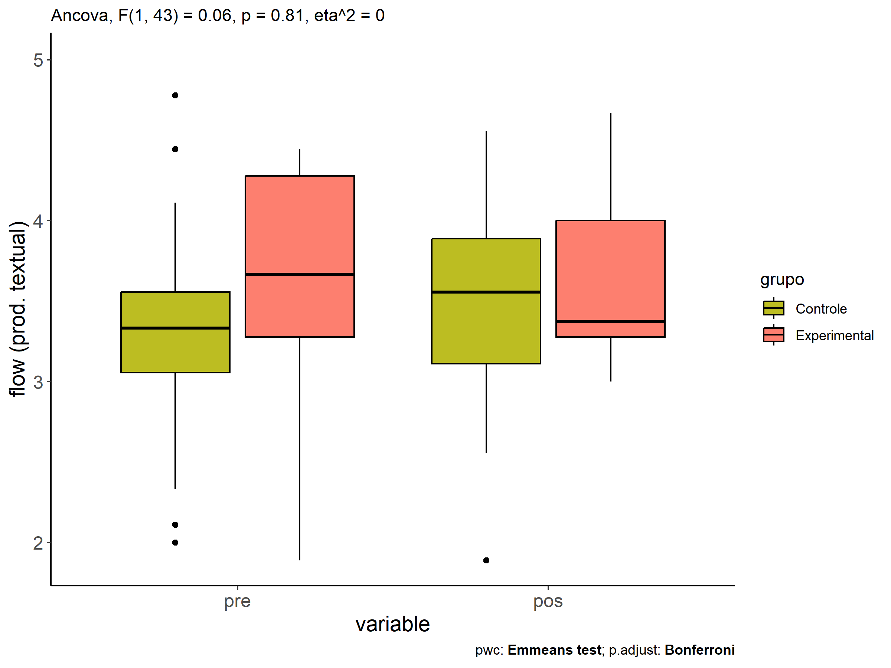
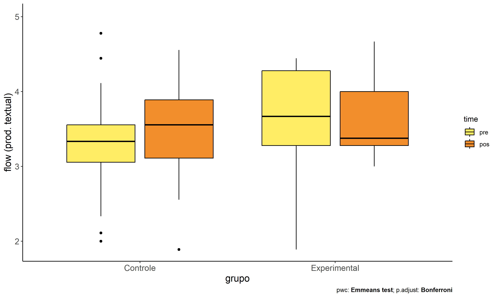
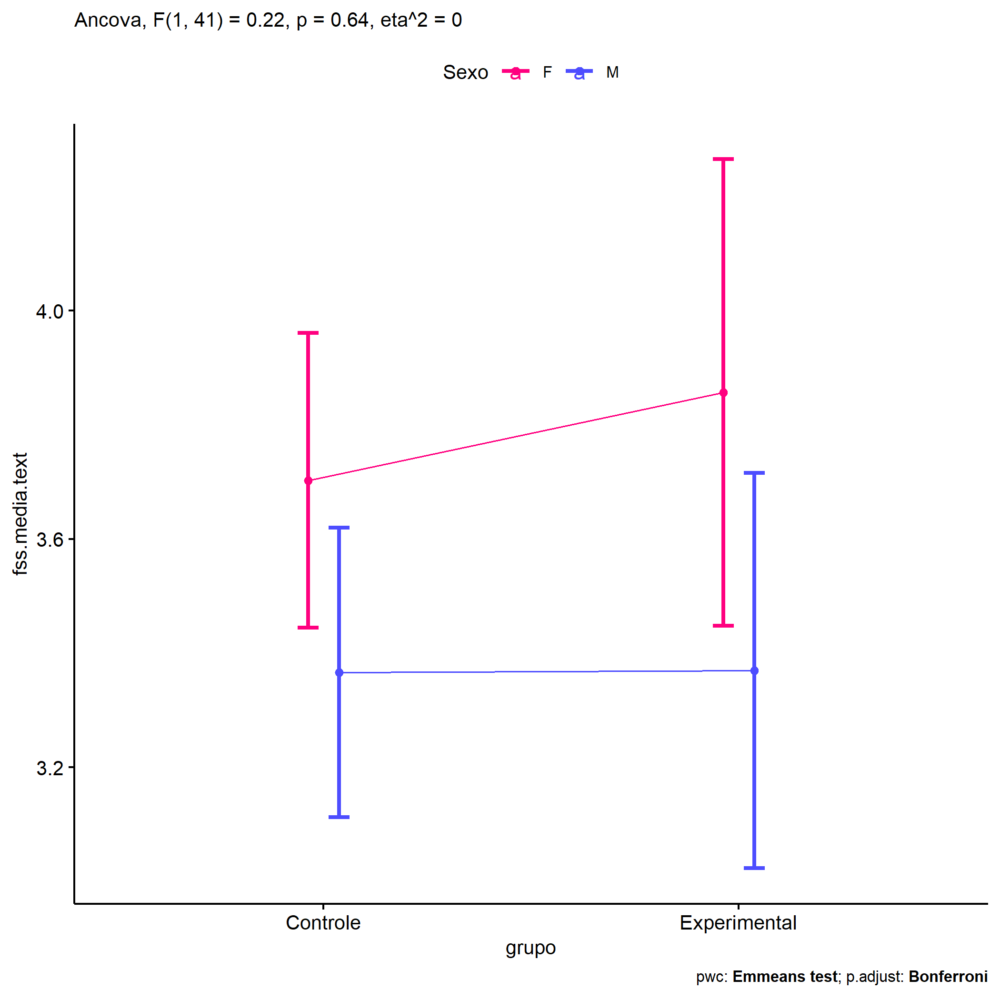
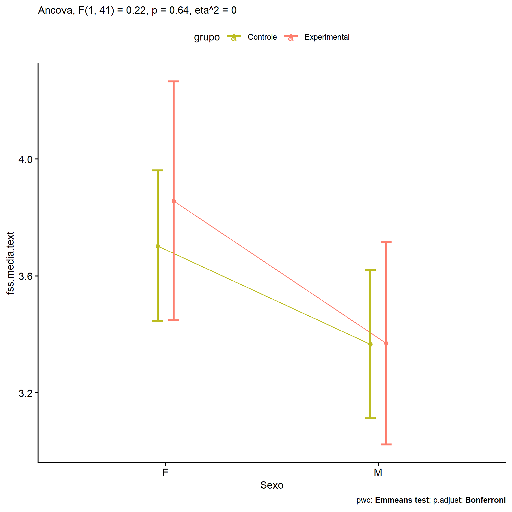
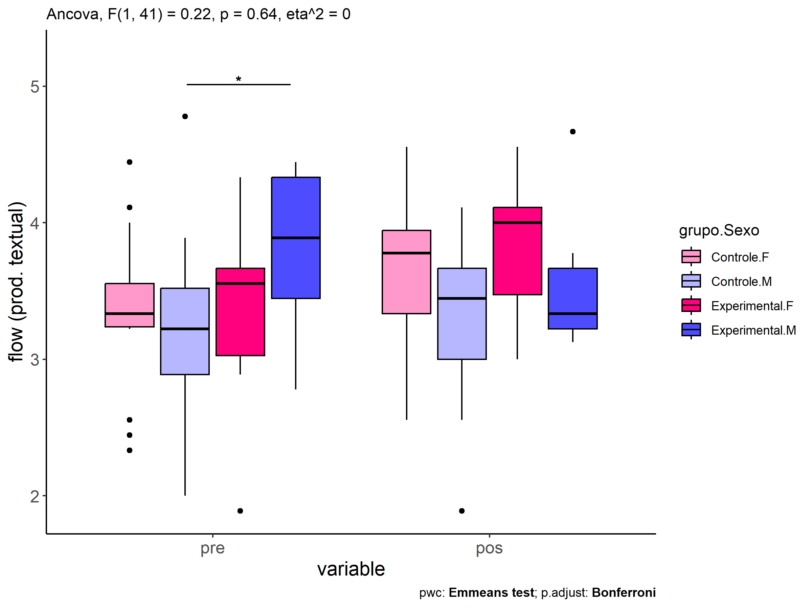
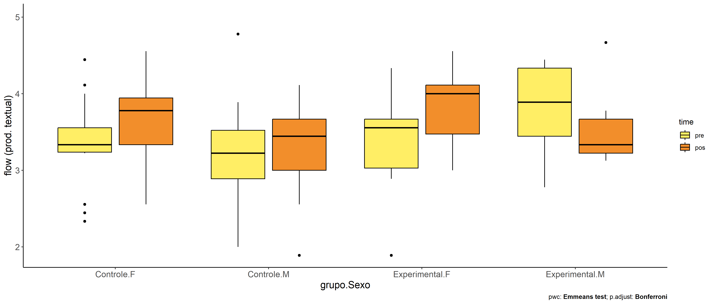
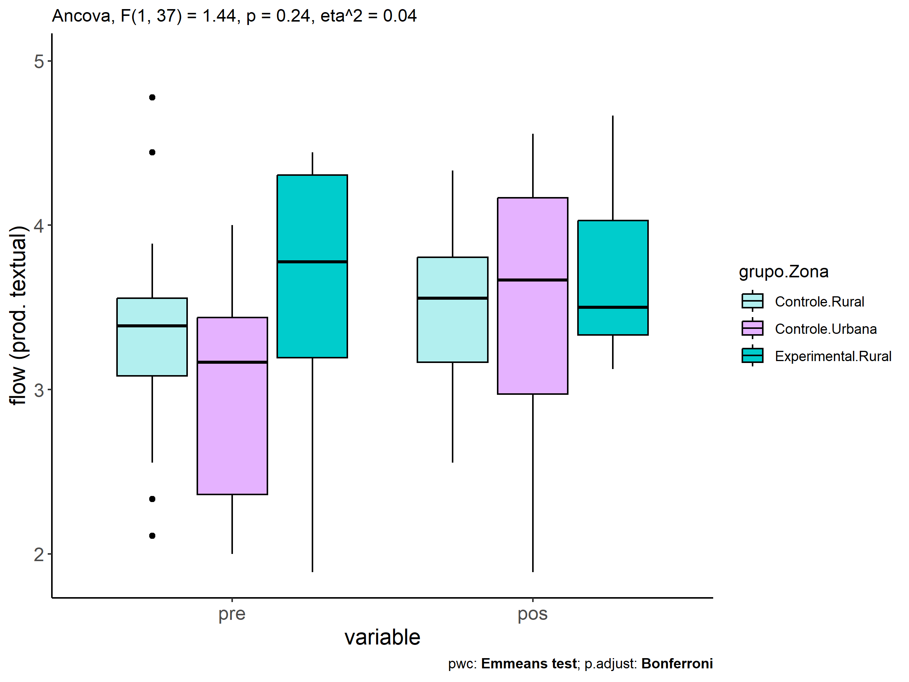

ANCOVA in flow (prod. textual) (flow (prod. textual))
================
Geiser C. Challco <geiser@alumni.usp.br>

- [Descriptive Statistics of Initial
  Data](#descriptive-statistics-of-initial-data)
- [Checking of Assumptions](#checking-of-assumptions)
  - [Assumption: Normality distribution of
    data](#assumption-normality-distribution-of-data)
  - [Assumption: Homogeneity of data
    distribution](#assumption-homogeneity-of-data-distribution)
- [Computation of ANCOVA test and Pairwise
  Comparison](#computation-of-ancova-test-and-pairwise-comparison)
  - [ANCOVA tests for one factor](#ancova-tests-for-one-factor)
  - [ANCOVA tests for two factors](#ancova-tests-for-two-factors)
  - [Pairwise comparisons for one factor:
    **grupo**](#pairwise-comparisons-for-one-factor-grupo)
  - [Pairwise comparisons for two
    factors](#pairwise-comparisons-for-two-factors)
    - [factores: **grupo:Sexo**](#factores-gruposexo)
    - [factores: **grupo:Zona**](#factores-grupozona)
    - [factores: **grupo:Cor.Raca**](#factores-grupocorraca)

**NOTE**

- Teste ANCOVA para determinar se houve diferenças significativas no
  flow (prod. textual) (medido usando pre- e pos-testes).
- ANCOVA test to determine whether there were significant differences in
  flow (prod. textual) (measured using pre- and post-tests).

# Descriptive Statistics of Initial Data

| grupo        | Sexo | Zona   | Cor.Raca | variable       |   n |  mean | median |   min |   max |    sd |    se |    ci |   iqr |
|:-------------|:-----|:-------|:---------|:---------------|----:|------:|-------:|------:|------:|------:|------:|------:|------:|
| Controle     | F    |        |          | dfs.media.text |  15 | 3.365 |  3.333 | 2.333 | 4.444 | 0.588 | 0.152 | 0.326 | 0.319 |
| Controle     | M    |        |          | dfs.media.text |  16 | 3.179 |  3.222 | 2.000 | 4.778 | 0.737 | 0.184 | 0.392 | 0.632 |
| Experimental | F    |        |          | dfs.media.text |   6 | 3.315 |  3.556 | 1.889 | 4.333 | 0.839 | 0.342 | 0.880 | 0.639 |
| Experimental | M    |        |          | dfs.media.text |   9 | 3.790 |  3.889 | 2.778 | 4.444 | 0.599 | 0.200 | 0.461 | 0.889 |
| Controle     | F    |        |          | fss.media.text |  15 | 3.698 |  3.778 | 2.556 | 4.556 | 0.547 | 0.141 | 0.303 | 0.611 |
| Controle     | M    |        |          | fss.media.text |  16 | 3.292 |  3.444 | 1.889 | 4.111 | 0.586 | 0.147 | 0.312 | 0.667 |
| Experimental | F    |        |          | fss.media.text |   6 | 3.833 |  4.000 | 3.000 | 4.556 | 0.570 | 0.233 | 0.598 | 0.639 |
| Experimental | M    |        |          | fss.media.text |   9 | 3.525 |  3.333 | 3.125 | 4.667 | 0.478 | 0.159 | 0.367 | 0.444 |
| Controle     |      | Rural  |          | dfs.media.text |  20 | 3.335 |  3.389 | 2.111 | 4.778 | 0.650 | 0.145 | 0.304 | 0.472 |
| Controle     |      | Urbana |          | dfs.media.text |   8 | 2.997 |  3.167 | 2.000 | 4.000 | 0.740 | 0.262 | 0.619 | 1.076 |
| Controle     |      |        |          | dfs.media.text |   3 | 3.556 |  3.333 | 3.222 | 4.111 | 0.484 | 0.280 | 1.203 | 0.444 |
| Experimental |      | Rural  |          | dfs.media.text |  10 | 3.611 |  3.778 | 1.889 | 4.444 | 0.825 | 0.261 | 0.590 | 1.111 |
| Experimental |      | Urbana |          | dfs.media.text |   4 | 3.611 |  3.611 | 2.889 | 4.333 | 0.591 | 0.296 | 0.941 | 0.444 |
| Experimental |      |        |          | dfs.media.text |   1 | 3.444 |  3.444 | 3.444 | 3.444 |       |       |       | 0.000 |
| Controle     |      | Rural  |          | fss.media.text |  20 | 3.446 |  3.556 | 2.556 | 4.333 | 0.501 | 0.112 | 0.235 | 0.639 |
| Controle     |      | Urbana |          | fss.media.text |   8 | 3.514 |  3.667 | 1.889 | 4.556 | 0.891 | 0.315 | 0.745 | 1.194 |
| Controle     |      |        |          | fss.media.text |   3 | 3.704 |  3.778 | 3.444 | 3.889 | 0.231 | 0.134 | 0.575 | 0.222 |
| Experimental |      | Rural  |          | fss.media.text |  10 | 3.712 |  3.500 | 3.125 | 4.667 | 0.558 | 0.176 | 0.399 | 0.694 |
| Experimental |      | Urbana |          | fss.media.text |   4 | 3.427 |  3.299 | 3.000 | 4.111 | 0.481 | 0.241 | 0.766 | 0.392 |
| Experimental |      |        |          | fss.media.text |   1 | 3.889 |  3.889 | 3.889 | 3.889 |       |       |       | 0.000 |
| Controle     |      |        | Branca   | dfs.media.text |   5 | 2.844 |  3.000 | 2.111 | 3.556 | 0.607 | 0.271 | 0.753 | 0.889 |
| Controle     |      |        | Parda    | dfs.media.text |  13 | 3.489 |  3.444 | 3.111 | 4.444 | 0.345 | 0.096 | 0.209 | 0.222 |
| Controle     |      |        |          | dfs.media.text |  13 | 3.212 |  3.222 | 2.000 | 4.778 | 0.855 | 0.237 | 0.517 | 1.333 |
| Experimental |      |        | Amarela  | dfs.media.text |   1 | 3.444 |  3.444 | 3.444 | 3.444 |       |       |       | 0.000 |
| Experimental |      |        | Parda    | dfs.media.text |   4 | 3.639 |  3.667 | 2.778 | 4.444 | 0.705 | 0.352 | 1.122 | 0.750 |
| Experimental |      |        |          | dfs.media.text |  10 | 3.600 |  3.667 | 1.889 | 4.333 | 0.795 | 0.251 | 0.568 | 1.083 |
| Controle     |      |        | Branca   | fss.media.text |   5 | 3.356 |  3.556 | 2.556 | 4.000 | 0.574 | 0.257 | 0.713 | 0.667 |
| Controle     |      |        | Parda    | fss.media.text |  13 | 3.564 |  3.667 | 2.667 | 4.333 | 0.443 | 0.123 | 0.268 | 0.556 |
| Controle     |      |        |          | fss.media.text |  13 | 3.464 |  3.444 | 1.889 | 4.556 | 0.751 | 0.208 | 0.454 | 1.000 |
| Experimental |      |        | Amarela  | fss.media.text |   1 | 3.889 |  3.889 | 3.889 | 3.889 |       |       |       | 0.000 |
| Experimental |      |        | Parda    | fss.media.text |   4 | 3.500 |  3.500 | 3.222 | 3.778 | 0.264 | 0.132 | 0.421 | 0.389 |
| Experimental |      |        |          | fss.media.text |  10 | 3.683 |  3.354 | 3.000 | 4.667 | 0.617 | 0.195 | 0.441 | 0.861 |

# Checking of Assumptions

## Assumption: Normality distribution of data

| var            |   n |   skewness |   kurtosis | symmetry | statistic | method       |         p | p.signif | normality |
|:---------------|----:|-----------:|-----------:|:---------|----------:|:-------------|----------:|:---------|:----------|
| fss.media.text |  46 | -0.5840030 |  0.2287581 | NO       | 0.9719684 | Shapiro-Wilk | 0.3271908 | ns       | YES       |
| fss.media.text |  42 | -0.6235537 |  0.0696962 | NO       | 0.9578411 | Shapiro-Wilk | 0.1235627 | ns       | YES       |
| fss.media.text |  23 | -0.6024480 | -0.9819215 | NO       | 0.9171875 | Shapiro-Wilk | 0.0580094 | ns       | YES       |

## Assumption: Homogeneity of data distribution

| var            | method         | formula                    |   n | DFn.df1 | DFd.df2 | statistic |         p | p.signif |
|:---------------|:---------------|:---------------------------|----:|--------:|--------:|----------:|----------:|:---------|
| fss.media.text | Levene’s test  | `.res`~`grupo`\*`Sexo`     |  46 |       3 |      42 | 0.5086173 | 0.6784897 | ns       |
| fss.media.text | Anova’s slopes | `.res`~`grupo`\*`Sexo`     |  46 |       3 |      38 | 1.2410000 | 0.3080000 | ns       |
| fss.media.text | Levene’s test  | `.res`~`grupo`\*`Zona`     |  42 |       3 |      38 | 0.3172215 | 0.8128276 | ns       |
| fss.media.text | Anova’s slopes | `.res`~`grupo`\*`Zona`     |  42 |       3 |      34 | 3.5220000 | 0.0250000 | \*       |
| fss.media.text | Levene’s test  | `.res`~`grupo`\*`Cor.Raca` |  23 |       3 |      19 | 0.8311538 | 0.4931524 | ns       |
| fss.media.text | Anova’s slopes | `.res`~`grupo`\*`Cor.Raca` |  23 |       2 |      16 | 1.9300000 | 0.1780000 | ns       |

# Computation of ANCOVA test and Pairwise Comparison

## ANCOVA tests for one factor

|     | Effect         | DFn | DFd |   SSn |    SSd |     F |     p |   ges | p\<.05 |
|:----|:---------------|----:|----:|------:|-------:|------:|------:|------:|:-------|
| 1   | dfs.media.text |   1 |  43 | 2.637 | 11.776 | 9.628 | 0.003 | 0.183 | \*     |
| 2   | grupo          |   1 |  43 | 0.016 | 11.776 | 0.059 | 0.810 | 0.001 |        |
| 4   | Sexo           |   1 |  43 | 1.640 | 10.152 | 6.948 | 0.012 | 0.139 | \*     |
| 6   | Zona           |   1 |  39 | 0.009 | 11.597 | 0.030 | 0.864 | 0.001 |        |
| 8   | Cor.Raca       |   2 |  19 | 0.240 |  2.299 | 0.993 | 0.389 | 0.095 |        |

## ANCOVA tests for two factors

|     | Effect         | DFn | DFd |   SSn |    SSd |      F |     p |   ges | p\<.05 |
|:----|:---------------|----:|----:|------:|-------:|-------:|------:|------:|:-------|
| 1   | dfs.media.text |   1 |  41 | 2.741 | 10.050 | 11.181 | 0.002 | 0.214 | \*     |
| 4   | grupo:Sexo     |   1 |  41 | 0.053 | 10.050 |  0.216 | 0.644 | 0.005 |        |
| 8   | grupo:Zona     |   1 |  37 | 0.434 | 11.154 |  1.441 | 0.238 | 0.037 |        |
| 12  | grupo:Cor.Raca |   0 |  18 |       |  2.226 |        |       |       |        |

## Pairwise comparisons for one factor: **grupo**

| var            | grupo        |   n | M (pre) | SE (pre) | M (unadj) | SE (unadj) | M (adj) | SE (adj) |
|:---------------|:-------------|----:|--------:|---------:|----------:|-----------:|--------:|---------:|
| fss.media.text | Controle     |  31 |   3.269 |    0.119 |     3.488 |      0.107 |   3.527 |    0.095 |
| fss.media.text | Experimental |  15 |   3.600 |    0.185 |     3.648 |      0.134 |   3.568 |    0.138 |

| .y.            | group1   | group2       | estimate | conf.low | conf.high |    se | statistic |    p | p.adj | p.adj.signif |
|:---------------|:---------|:-------------|---------:|---------:|----------:|------:|----------:|-----:|------:|:-------------|
| fss.media.text | Controle | Experimental |   -0.041 |   -0.382 |     0.300 | 0.169 |    -0.242 | 0.81 |  0.81 | ns           |
| dfs.media.text | Controle | Experimental |   -0.331 |   -0.763 |     0.101 | 0.214 |    -1.544 | 0.13 |  0.13 | ns           |

| .y.       | grupo        | group1 | group2 | estimate | conf.low | conf.high |   se | statistic |     p | p.adj | p.adj.signif |
|:----------|:-------------|:-------|:-------|---------:|---------:|----------:|-----:|----------:|------:|------:|:-------------|
| flow.text | Controle     | pre    | pos    |   -0.220 |   -0.537 |     0.098 | 0.16 |    -1.373 | 0.173 | 0.173 | ns           |
| flow.text | Experimental | pre    | pos    |   -0.048 |   -0.505 |     0.409 | 0.23 |    -0.209 | 0.835 | 0.835 | ns           |

    ## Scale for colour is already present.
    ## Adding another scale for colour, which will replace the existing scale.

<!-- -->

<!-- -->

<!-- -->

## Pairwise comparisons for two factors

### factores: **grupo:Sexo**

| var            | grupo        | Sexo |   n | M (pre) | SE (pre) | M (unadj) | SE (unadj) | M (adj) | SE (adj) |
|:---------------|:-------------|:-----|----:|--------:|---------:|----------:|-----------:|--------:|---------:|
| fss.media.text | Controle     | F    |  15 |   3.365 |    0.152 |     3.698 |      0.141 |   3.703 |    0.128 |
| fss.media.text | Controle     | M    |  16 |   3.179 |    0.184 |     3.292 |      0.147 |   3.366 |    0.126 |
| fss.media.text | Experimental | F    |   6 |   3.315 |    0.342 |     3.833 |      0.233 |   3.857 |    0.202 |
| fss.media.text | Experimental | M    |   9 |   3.790 |    0.200 |     3.525 |      0.159 |   3.369 |    0.171 |

| .y.            | grupo        | Sexo | group1   | group2       | estimate | conf.low | conf.high |    se | statistic |     p | p.adj | p.adj.signif |
|:---------------|:-------------|:-----|:---------|:-------------|---------:|---------:|----------:|------:|----------:|------:|------:|:-------------|
| fss.media.text |              | F    | Controle | Experimental |   -0.154 |   -0.637 |     0.329 | 0.239 |    -0.644 | 0.523 | 0.523 | ns           |
| fss.media.text |              | M    | Controle | Experimental |   -0.003 |   -0.442 |     0.436 | 0.217 |    -0.014 | 0.989 | 0.989 | ns           |
| dfs.media.text |              | F    | Controle | Experimental |    0.050 |   -0.612 |     0.712 | 0.328 |     0.152 | 0.880 | 0.880 | ns           |
| dfs.media.text |              | M    | Controle | Experimental |   -0.611 |   -1.182 |    -0.040 | 0.283 |    -2.160 | 0.037 | 0.037 | \*           |
| fss.media.text | Controle     |      | F        | M            |    0.337 |   -0.025 |     0.698 | 0.179 |     1.878 | 0.067 | 0.067 | ns           |
| fss.media.text | Experimental |      | F        | M            |    0.487 |   -0.051 |     1.025 | 0.266 |     1.830 | 0.075 | 0.075 | ns           |
| dfs.media.text | Controle     |      | F        | M            |    0.186 |   -0.307 |     0.679 | 0.244 |     0.762 | 0.450 | 0.450 | ns           |
| dfs.media.text | Experimental |      | F        | M            |   -0.475 |   -1.198 |     0.247 | 0.358 |    -1.328 | 0.191 | 0.191 | ns           |

| .y.       | grupo        | Sexo | group1 | group2 | estimate | conf.low | conf.high |    se | statistic |     p | p.adj | p.adj.signif |
|:----------|:-------------|:-----|:-------|:-------|---------:|---------:|----------:|------:|----------:|------:|------:|:-------------|
| flow.text | Controle     | F    | pre    | pos    |   -0.333 |   -0.783 |     0.116 | 0.226 |    -1.475 | 0.144 | 0.144 | ns           |
| flow.text | Controle     | M    | pre    | pos    |   -0.113 |   -0.548 |     0.322 | 0.219 |    -0.516 | 0.607 | 0.607 | ns           |
| flow.text | Experimental | F    | pre    | pos    |   -0.519 |   -1.229 |     0.192 | 0.357 |    -1.451 | 0.150 | 0.150 | ns           |
| flow.text | Experimental | M    | pre    | pos    |    0.265 |   -0.315 |     0.846 | 0.292 |     0.910 | 0.365 | 0.365 | ns           |

    ## Scale for colour is already present.
    ## Adding another scale for colour, which will replace the existing scale.

<!-- -->

    ## Scale for colour is already present.
    ## Adding another scale for colour, which will replace the existing scale.

<!-- -->

<!-- -->

<!-- -->

### factores: **grupo:Zona**

| var            | grupo        | Zona   |   n | M (pre) | SE (pre) | M (unadj) | SE (unadj) | M (adj) | SE (adj) |
|:---------------|:-------------|:-------|----:|--------:|---------:|----------:|-----------:|--------:|---------:|
| fss.media.text | Controle     | Rural  |  20 |   3.335 |    0.145 |     3.446 |      0.112 |   3.446 |    0.120 |
| fss.media.text | Controle     | Urbana |   8 |   2.997 |    0.262 |     3.514 |      0.315 |   3.661 |    0.194 |
| fss.media.text | Experimental | Rural  |  10 |   3.611 |    0.261 |     3.712 |      0.176 |   3.593 |    0.173 |

|     | .y.            | grupo    | Zona  | group1   | group2       | estimate | conf.low | conf.high |    se | statistic |     p | p.adj | p.adj.signif |
|:----|:---------------|:---------|:------|:---------|:-------------|---------:|---------:|----------:|------:|----------:|------:|------:|:-------------|
| 1   | fss.media.text |          | Rural | Controle | Experimental |   -0.147 |   -0.574 |     0.281 | 0.210 |    -0.698 | 0.490 | 0.490 | ns           |
| 3   | dfs.media.text |          | Rural | Controle | Experimental |   -0.276 |   -0.840 |     0.287 | 0.278 |    -0.996 | 0.326 | 0.326 | ns           |
| 5   | fss.media.text | Controle |       | Rural    | Urbana       |   -0.215 |   -0.678 |     0.249 | 0.228 |    -0.942 | 0.353 | 0.353 | ns           |
| 7   | dfs.media.text | Controle |       | Rural    | Urbana       |    0.338 |   -0.271 |     0.947 | 0.300 |     1.128 | 0.267 | 0.267 | ns           |

| .y.       | grupo        | Zona   | group1 | group2 | estimate | conf.low | conf.high |    se | statistic |     p | p.adj | p.adj.signif |
|:----------|:-------------|:-------|:-------|:-------|---------:|---------:|----------:|------:|----------:|------:|------:|:-------------|
| flow.text | Controle     | Rural  | pre    | pos    |   -0.111 |   -0.532 |     0.309 | 0.211 |    -0.527 | 0.600 | 0.600 | ns           |
| flow.text | Controle     | Urbana | pre    | pos    |   -0.517 |   -1.182 |     0.148 | 0.333 |    -1.552 | 0.125 | 0.125 | ns           |
| flow.text | Experimental | Rural  | pre    | pos    |   -0.101 |   -0.696 |     0.493 | 0.298 |    -0.340 | 0.735 | 0.735 | ns           |

<!-- -->

<!-- -->

### factores: **grupo:Cor.Raca**
