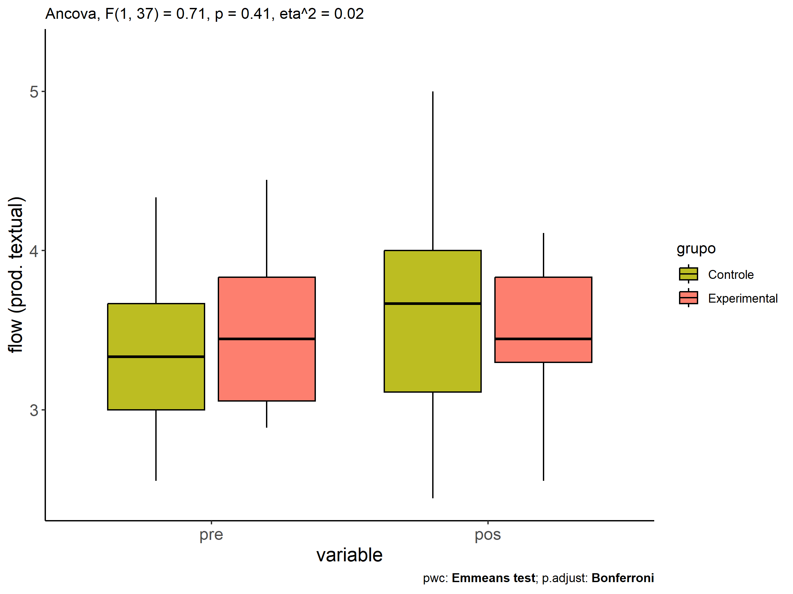
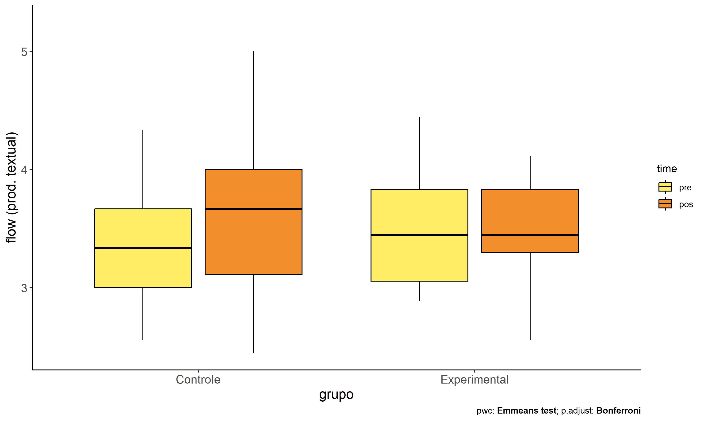
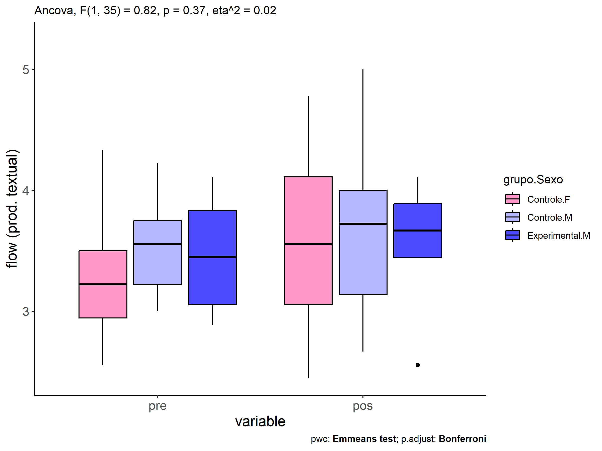
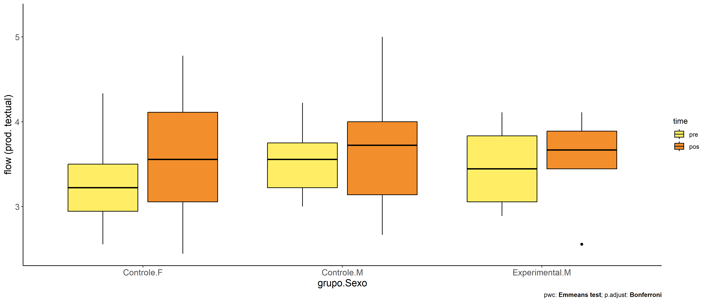

ANCOVA in flow (prod. textual) (flow (prod. textual))
================
Geiser C. Challco <geiser@alumni.usp.br>

- [Descriptive Statistics of Initial
  Data](#descriptive-statistics-of-initial-data)
- [Checking of Assumptions](#checking-of-assumptions)
  - [Assumption: Normality distribution of
    data](#assumption-normality-distribution-of-data)
  - [Assumption: Homogeneity of data
    distribution](#assumption-homogeneity-of-data-distribution)
- [Computation of ANCOVA test and Pairwise
  Comparison](#computation-of-ancova-test-and-pairwise-comparison)
  - [ANCOVA tests for one factor](#ancova-tests-for-one-factor)
  - [ANCOVA tests for two factors](#ancova-tests-for-two-factors)
  - [Pairwise comparisons for one factor:
    **grupo**](#pairwise-comparisons-for-one-factor-grupo)
  - [Pairwise comparisons for two
    factors](#pairwise-comparisons-for-two-factors)
    - [factores: **grupo:Sexo**](#factores-gruposexo)
    - [factores: **grupo:Zona**](#factores-grupozona)
    - [factores: **grupo:Cor.Raca**](#factores-grupocorraca)

**NOTE**

- Teste ANCOVA para determinar se houve diferenças significativas no
  flow (prod. textual) (medido usando pre- e pos-testes).
- ANCOVA test to determine whether there were significant differences in
  flow (prod. textual) (measured using pre- and post-tests).

# Descriptive Statistics of Initial Data

| grupo        | Sexo | Zona   | Cor.Raca | variable       |   n |  mean | median |   min |   max |    sd |    se |    ci |   iqr |
|:-------------|:-----|:-------|:---------|:---------------|----:|------:|-------:|------:|------:|------:|------:|------:|------:|
| Controle     | F    |        |          | dfs.media.text |  15 | 3.274 |  3.222 | 2.556 | 4.333 | 0.488 | 0.126 | 0.270 | 0.556 |
| Controle     | M    |        |          | dfs.media.text |  14 | 3.500 |  3.556 | 3.000 | 4.222 | 0.387 | 0.103 | 0.223 | 0.528 |
| Experimental | F    |        |          | dfs.media.text |   4 | 3.583 |  3.500 | 2.889 | 4.444 | 0.681 | 0.341 | 1.084 | 0.806 |
| Experimental | M    |        |          | dfs.media.text |   7 | 3.460 |  3.444 | 2.889 | 4.111 | 0.486 | 0.184 | 0.450 | 0.778 |
| Controle     | F    |        |          | fss.media.text |  15 | 3.556 |  3.556 | 2.444 | 4.778 | 0.736 | 0.190 | 0.407 | 1.056 |
| Controle     | M    |        |          | fss.media.text |  14 | 3.619 |  3.722 | 2.667 | 5.000 | 0.653 | 0.175 | 0.377 | 0.861 |
| Experimental | F    |        |          | fss.media.text |   4 | 3.233 |  3.299 | 2.556 | 3.778 | 0.509 | 0.254 | 0.809 | 0.420 |
| Experimental | M    |        |          | fss.media.text |   7 | 3.571 |  3.667 | 2.556 | 4.111 | 0.511 | 0.193 | 0.473 | 0.444 |
| Controle     |      | Rural  |          | dfs.media.text |  17 | 3.281 |  3.222 | 2.556 | 4.333 | 0.438 | 0.106 | 0.225 | 0.556 |
| Controle     |      | Urbana |          | dfs.media.text |   4 | 3.389 |  3.333 | 3.111 | 3.778 | 0.294 | 0.147 | 0.468 | 0.333 |
| Controle     |      |        |          | dfs.media.text |   8 | 3.597 |  3.667 | 2.778 | 4.222 | 0.504 | 0.178 | 0.421 | 0.667 |
| Experimental |      | Rural  |          | dfs.media.text |   8 | 3.556 |  3.500 | 2.889 | 4.444 | 0.582 | 0.206 | 0.486 | 0.806 |
| Experimental |      | Urbana |          | dfs.media.text |   1 | 2.889 |  2.889 | 2.889 | 2.889 |       |       |       | 0.000 |
| Experimental |      |        |          | dfs.media.text |   2 | 3.611 |  3.611 | 3.444 | 3.778 | 0.236 | 0.167 | 2.118 | 0.167 |
| Controle     |      | Rural  |          | fss.media.text |  17 | 3.647 |  3.889 | 2.444 | 4.778 | 0.715 | 0.173 | 0.368 | 1.222 |
| Controle     |      | Urbana |          | fss.media.text |   4 | 3.889 |  3.611 | 3.333 | 5.000 | 0.786 | 0.393 | 1.250 | 0.833 |
| Controle     |      |        |          | fss.media.text |   8 | 3.306 |  3.389 | 2.556 | 4.000 | 0.544 | 0.192 | 0.454 | 0.722 |
| Experimental |      | Rural  |          | fss.media.text |   8 | 3.422 |  3.576 | 2.556 | 4.111 | 0.607 | 0.215 | 0.508 | 0.833 |
| Experimental |      | Urbana |          | fss.media.text |   1 | 3.667 |  3.667 | 3.667 | 3.667 |       |       |       | 0.000 |
| Experimental |      |        |          | fss.media.text |   2 | 3.444 |  3.444 | 3.444 | 3.444 | 0.000 | 0.000 | 0.000 | 0.000 |
| Controle     |      |        | Branca   | dfs.media.text |   3 | 3.370 |  3.444 | 2.889 | 3.778 | 0.449 | 0.259 | 1.116 | 0.444 |
| Controle     |      |        | Parda    | dfs.media.text |  17 | 3.405 |  3.333 | 2.556 | 4.333 | 0.497 | 0.120 | 0.255 | 0.556 |
| Controle     |      |        | Preta    | dfs.media.text |   1 | 3.222 |  3.222 | 3.222 | 3.222 |       |       |       | 0.000 |
| Controle     |      |        |          | dfs.media.text |   8 | 3.361 |  3.389 | 2.778 | 4.000 | 0.423 | 0.150 | 0.354 | 0.667 |
| Experimental |      |        | Branca   | dfs.media.text |   3 | 3.741 |  3.889 | 2.889 | 4.444 | 0.788 | 0.455 | 1.958 | 0.778 |
| Experimental |      |        | Indígena | dfs.media.text |   2 | 3.500 |  3.500 | 3.222 | 3.778 | 0.393 | 0.278 | 3.530 | 0.278 |
| Experimental |      |        | Parda    | dfs.media.text |   2 | 3.667 |  3.667 | 3.222 | 4.111 | 0.629 | 0.444 | 5.647 | 0.444 |
| Experimental |      |        |          | dfs.media.text |   4 | 3.250 |  3.167 | 2.889 | 3.778 | 0.439 | 0.219 | 0.698 | 0.639 |
| Controle     |      |        | Branca   | fss.media.text |   3 | 3.185 |  3.111 | 2.667 | 3.778 | 0.559 | 0.323 | 1.389 | 0.556 |
| Controle     |      |        | Parda    | fss.media.text |  17 | 3.614 |  3.333 | 2.444 | 5.000 | 0.785 | 0.190 | 0.404 | 1.222 |
| Controle     |      |        | Preta    | fss.media.text |   1 | 4.000 |  4.000 | 4.000 | 4.000 |       |       |       | 0.000 |
| Controle     |      |        |          | fss.media.text |   8 | 3.625 |  3.722 | 2.556 | 4.222 | 0.534 | 0.189 | 0.447 | 0.472 |
| Experimental |      |        | Branca   | fss.media.text |   3 | 3.778 |  3.778 | 3.667 | 3.889 | 0.111 | 0.064 | 0.276 | 0.111 |
| Experimental |      |        | Indígena | fss.media.text |   2 | 3.299 |  3.299 | 3.222 | 3.375 | 0.108 | 0.076 | 0.971 | 0.076 |
| Experimental |      |        | Parda    | fss.media.text |   2 | 3.333 |  3.333 | 2.556 | 4.111 | 1.100 | 0.778 | 9.883 | 0.778 |
| Experimental |      |        |          | fss.media.text |   4 | 3.333 |  3.444 | 2.556 | 3.889 | 0.559 | 0.280 | 0.890 | 0.333 |

# Checking of Assumptions

## Assumption: Normality distribution of data

| var            |   n |   skewness |   kurtosis | symmetry | statistic | method       |         p | p.signif | normality |
|:---------------|----:|-----------:|-----------:|:---------|----------:|:-------------|----------:|:---------|:----------|
| fss.media.text |  40 |  0.0197561 | -0.5433907 | YES      | 0.9800049 | Shapiro-Wilk | 0.6897356 | ns       | YES       |
| fss.media.text |  30 | -0.0765164 | -0.8818089 | YES      | 0.9824003 | Shapiro-Wilk | 0.8851429 | ns       | YES       |
| fss.media.text |  28 |  0.2009644 | -0.7871091 | YES      | 0.9741339 | Shapiro-Wilk | 0.6945002 | ns       | YES       |

## Assumption: Homogeneity of data distribution

| var            | method         | formula                    |   n | DFn.df1 | DFd.df2 | statistic |         p | p.signif |
|:---------------|:---------------|:---------------------------|----:|--------:|--------:|----------:|----------:|:---------|
| fss.media.text | Levene’s test  | `.res`~`grupo`\*`Sexo`     |  40 |       3 |      36 | 1.1582092 | 0.3390788 | ns       |
| fss.media.text | Anova’s slopes | `.res`~`grupo`\*`Sexo`     |  40 |       3 |      32 | 0.0760000 | 0.9730000 | ns       |
| fss.media.text | Levene’s test  | `.res`~`grupo`\*`Zona`     |  30 |       3 |      26 | 0.8138102 | 0.4978660 | ns       |
| fss.media.text | Anova’s slopes | `.res`~`grupo`\*`Zona`     |  30 |       2 |      23 | 0.8340000 | 0.4470000 | ns       |
| fss.media.text | Levene’s test  | `.res`~`grupo`\*`Cor.Raca` |  28 |       5 |      22 | 1.6169004 | 0.1971738 | ns       |
| fss.media.text | Anova’s slopes | `.res`~`grupo`\*`Cor.Raca` |  28 |       4 |      17 | 0.4740000 | 0.7540000 | ns       |

# Computation of ANCOVA test and Pairwise Comparison

## ANCOVA tests for one factor

|     | Effect         | DFn | DFd |   SSn |    SSd |     F |     p |   ges | p\<.05 |
|:----|:---------------|----:|----:|------:|-------:|------:|------:|------:|:-------|
| 1   | dfs.media.text |   1 |  37 | 1.392 | 14.401 | 3.575 | 0.066 | 0.088 |        |
| 2   | grupo          |   1 |  37 | 0.276 | 14.401 | 0.709 | 0.405 | 0.019 |        |
| 4   | Sexo           |   1 |  37 | 0.036 | 14.641 | 0.090 | 0.766 | 0.002 |        |
| 6   | Zona           |   1 |  27 | 0.389 | 11.598 | 0.905 | 0.350 | 0.032 |        |
| 8   | Cor.Raca       |   3 |  23 | 0.517 | 11.579 | 0.342 | 0.795 | 0.043 |        |

## ANCOVA tests for two factors

|     | Effect         | DFn | DFd |   SSn |    SSd |     F |     p |   ges | p\<.05 |
|:----|:---------------|----:|----:|------:|-------:|------:|------:|------:|:-------|
| 1   | dfs.media.text |   1 |  35 | 1.464 | 14.007 | 3.657 | 0.064 | 0.095 |        |
| 4   | grupo:Sexo     |   1 |  35 | 0.329 | 14.007 | 0.822 | 0.371 | 0.023 |        |
| 8   | grupo:Zona     |   1 |  25 | 0.120 | 10.878 | 0.276 | 0.604 | 0.011 |        |
| 12  | grupo:Cor.Raca |   1 |  21 | 0.570 | 11.009 | 1.087 | 0.309 | 0.049 |        |

## Pairwise comparisons for one factor: **grupo**

| var            | grupo        |   n | M (pre) | SE (pre) | M (unadj) | SE (unadj) | M (adj) | SE (adj) |
|:---------------|:-------------|----:|--------:|---------:|----------:|-----------:|--------:|---------:|
| fss.media.text | Controle     |  29 |   3.383 |    0.083 |     3.586 |      0.127 |   3.600 |    0.116 |
| fss.media.text | Experimental |  11 |   3.505 |    0.161 |     3.448 |      0.155 |   3.412 |    0.189 |

| .y.            | group1   | group2       | estimate | conf.low | conf.high |    se | statistic |     p | p.adj | p.adj.signif |
|:---------------|:---------|:-------------|---------:|---------:|----------:|------:|----------:|------:|------:|:-------------|
| fss.media.text | Controle | Experimental |    0.187 |   -0.263 |     0.638 | 0.222 |     0.842 | 0.405 | 0.405 | ns           |
| dfs.media.text | Controle | Experimental |   -0.122 |   -0.461 |     0.217 | 0.167 |    -0.728 | 0.471 | 0.471 | ns           |

| .y.       | grupo        | group1 | group2 | estimate | conf.low | conf.high |    se | statistic |     p | p.adj | p.adj.signif |
|:----------|:-------------|:-------|:-------|---------:|---------:|----------:|------:|----------:|------:|------:|:-------------|
| flow.text | Controle     | pre    | pos    |   -0.203 |   -0.499 |     0.093 | 0.148 |    -1.368 | 0.175 | 0.175 | ns           |
| flow.text | Experimental | pre    | pos    |    0.057 |   -0.423 |     0.537 | 0.241 |     0.236 | 0.814 | 0.814 | ns           |

    ## Scale for colour is already present.
    ## Adding another scale for colour, which will replace the existing scale.

<!-- -->

<!-- -->

<!-- -->

## Pairwise comparisons for two factors

### factores: **grupo:Sexo**

| var            | grupo        | Sexo |   n | M (pre) | SE (pre) | M (unadj) | SE (unadj) | M (adj) | SE (adj) |
|:---------------|:-------------|:-----|----:|--------:|---------:|----------:|-----------:|--------:|---------:|
| fss.media.text | Controle     | F    |  15 |   3.274 |    0.126 |     3.556 |      0.190 |   3.603 |    0.172 |
| fss.media.text | Controle     | M    |  14 |   3.500 |    0.103 |     3.619 |      0.175 |   3.580 |    0.177 |
| fss.media.text | Experimental | M    |   7 |   3.460 |    0.184 |     3.571 |      0.193 |   3.548 |    0.248 |

|     | .y.            | grupo    | Sexo | group1   | group2       | estimate | conf.low | conf.high |    se | statistic |     p | p.adj | p.adj.signif |
|:----|:---------------|:---------|:-----|:---------|:-------------|---------:|---------:|----------:|------:|----------:|------:|------:|:-------------|
| 2   | fss.media.text |          | M    | Controle | Experimental |    0.032 |   -0.585 |     0.650 | 0.303 |     0.107 | 0.915 | 0.915 | ns           |
| 4   | dfs.media.text |          | M    | Controle | Experimental |    0.040 |   -0.384 |     0.464 | 0.208 |     0.190 | 0.850 | 0.850 | ns           |
| 5   | fss.media.text | Controle |      | F        | M            |    0.023 |   -0.486 |     0.532 | 0.250 |     0.091 | 0.928 | 0.928 | ns           |
| 7   | dfs.media.text | Controle |      | F        | M            |   -0.226 |   -0.566 |     0.115 | 0.167 |    -1.350 | 0.186 | 0.186 | ns           |

| .y.       | grupo        | Sexo | group1 | group2 | estimate | conf.low | conf.high |    se | statistic |     p | p.adj | p.adj.signif |
|:----------|:-------------|:-----|:-------|:-------|---------:|---------:|----------:|------:|----------:|------:|------:|:-------------|
| flow.text | Controle     | F    | pre    | pos    |   -0.281 |   -0.696 |     0.134 | 0.208 |    -1.354 | 0.180 | 0.180 | ns           |
| flow.text | Controle     | M    | pre    | pos    |   -0.119 |   -0.549 |     0.311 | 0.215 |    -0.553 | 0.582 | 0.582 | ns           |
| flow.text | Experimental | M    | pre    | pos    |   -0.111 |   -0.719 |     0.496 | 0.304 |    -0.365 | 0.716 | 0.716 | ns           |

<!-- -->

<!-- -->

### factores: **grupo:Zona**

### factores: **grupo:Cor.Raca**
