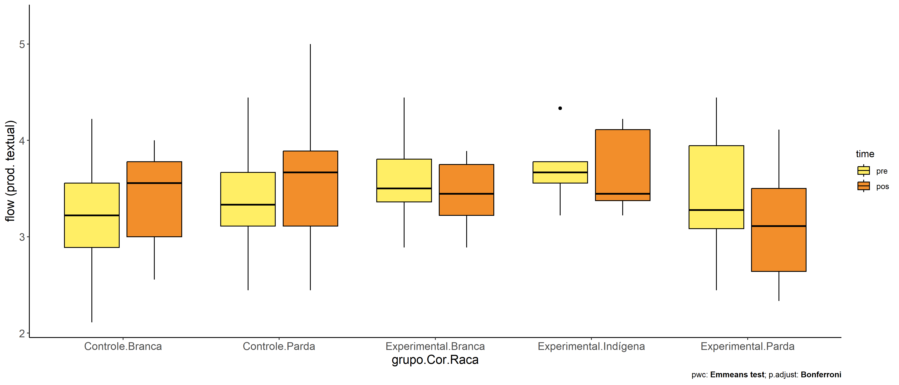

ANCOVA in flow (prod. textual) (flow (prod. textual))
================
Geiser C. Challco <geiser@alumni.usp.br>

- [Descriptive Statistics of Initial
  Data](#descriptive-statistics-of-initial-data)
- [Checking of Assumptions](#checking-of-assumptions)
  - [Assumption: Normality distribution of
    data](#assumption-normality-distribution-of-data)
  - [Assumption: Homogeneity of data
    distribution](#assumption-homogeneity-of-data-distribution)
- [Computation of ANCOVA test and Pairwise
  Comparison](#computation-of-ancova-test-and-pairwise-comparison)
  - [ANCOVA tests for one factor](#ancova-tests-for-one-factor)
  - [ANCOVA tests for two factors](#ancova-tests-for-two-factors)
  - [Pairwise comparisons for one factor:
    **grupo**](#pairwise-comparisons-for-one-factor-grupo)
  - [Pairwise comparisons for two
    factors](#pairwise-comparisons-for-two-factors)
    - [factores: **grupo:Sexo**](#factores-gruposexo)
    - [factores: **grupo:Zona**](#factores-grupozona)
    - [factores: **grupo:Cor.Raca**](#factores-grupocorraca)

**NOTE**

- Teste ANCOVA para determinar se houve diferenças significativas no
  flow (prod. textual) (medido usando pre- e pos-testes).
- ANCOVA test to determine whether there were significant differences in
  flow (prod. textual) (measured using pre- and post-tests).

# Descriptive Statistics of Initial Data

| grupo        | Sexo | Zona   | Cor.Raca | variable       |   n |  mean | median |   min |   max |    sd |    se |    ci |   iqr |
|:-------------|:-----|:-------|:---------|:---------------|----:|------:|-------:|------:|------:|------:|------:|------:|------:|
| Controle     | F    |        |          | dfs.media.text |  42 | 3.368 |  3.333 | 2.333 | 4.444 | 0.500 | 0.077 | 0.156 | 0.444 |
| Controle     | M    |        |          | dfs.media.text |  52 | 3.326 |  3.389 | 1.333 | 4.778 | 0.628 | 0.087 | 0.175 | 0.778 |
| Experimental | F    |        |          | dfs.media.text |  15 | 3.289 |  3.333 | 1.889 | 4.444 | 0.686 | 0.177 | 0.380 | 0.778 |
| Experimental | M    |        |          | dfs.media.text |  29 | 3.567 |  3.444 | 2.778 | 4.444 | 0.495 | 0.092 | 0.188 | 0.667 |
| Controle     | F    |        |          | fss.media.text |  42 | 3.612 |  3.722 | 2.444 | 4.778 | 0.583 | 0.090 | 0.182 | 0.771 |
| Controle     | M    |        |          | fss.media.text |  52 | 3.393 |  3.444 | 1.889 | 5.000 | 0.589 | 0.082 | 0.164 | 0.889 |
| Experimental | F    |        |          | fss.media.text |  15 | 3.469 |  3.375 | 2.333 | 4.556 | 0.648 | 0.167 | 0.359 | 1.000 |
| Experimental | M    |        |          | fss.media.text |  29 | 3.334 |  3.333 | 2.333 | 4.667 | 0.558 | 0.104 | 0.212 | 0.778 |
| Controle     |      | Rural  |          | dfs.media.text |  51 | 3.345 |  3.333 | 2.111 | 4.778 | 0.577 | 0.081 | 0.162 | 0.667 |
| Controle     |      | Urbana |          | dfs.media.text |  15 | 3.020 |  3.222 | 1.333 | 4.000 | 0.740 | 0.191 | 0.410 | 0.722 |
| Controle     |      |        |          | dfs.media.text |  28 | 3.518 |  3.472 | 2.778 | 4.222 | 0.369 | 0.070 | 0.143 | 0.556 |
| Experimental |      | Rural  |          | dfs.media.text |  29 | 3.494 |  3.556 | 1.889 | 4.444 | 0.625 | 0.116 | 0.238 | 0.778 |
| Experimental |      | Urbana |          | dfs.media.text |   6 | 3.444 |  3.444 | 2.889 | 4.333 | 0.544 | 0.222 | 0.571 | 0.639 |
| Experimental |      |        |          | dfs.media.text |   9 | 3.420 |  3.444 | 2.667 | 4.333 | 0.464 | 0.155 | 0.357 | 0.111 |
| Controle     |      | Rural  |          | fss.media.text |  51 | 3.475 |  3.556 | 2.444 | 4.778 | 0.581 | 0.081 | 0.164 | 0.889 |
| Controle     |      | Urbana |          | fss.media.text |  15 | 3.511 |  3.333 | 1.889 | 5.000 | 0.791 | 0.204 | 0.438 | 1.000 |
| Controle     |      |        |          | fss.media.text |  28 | 3.508 |  3.667 | 2.333 | 4.222 | 0.512 | 0.097 | 0.198 | 0.667 |
| Experimental |      | Rural  |          | fss.media.text |  29 | 3.389 |  3.333 | 2.333 | 4.667 | 0.607 | 0.113 | 0.231 | 0.778 |
| Experimental |      | Urbana |          | fss.media.text |   6 | 3.377 |  3.299 | 2.889 | 4.111 | 0.453 | 0.185 | 0.476 | 0.538 |
| Experimental |      |        |          | fss.media.text |   9 | 3.355 |  3.444 | 2.333 | 4.111 | 0.655 | 0.218 | 0.504 | 1.139 |
| Controle     |      |        | Branca   | dfs.media.text |   9 | 3.173 |  3.222 | 2.111 | 4.222 | 0.674 | 0.225 | 0.518 | 0.667 |
| Controle     |      |        | Parda    | dfs.media.text |  45 | 3.421 |  3.333 | 2.444 | 4.444 | 0.466 | 0.069 | 0.140 | 0.556 |
| Controle     |      |        | Preta    | dfs.media.text |   1 | 3.222 |  3.222 | 3.222 | 3.222 |       |       |       | 0.000 |
| Controle     |      |        |          | dfs.media.text |  39 | 3.300 |  3.333 | 1.333 | 4.778 | 0.661 | 0.106 | 0.214 | 0.764 |
| Experimental |      |        | Amarela  | dfs.media.text |   1 | 3.444 |  3.444 | 3.444 | 3.444 |       |       |       | 0.000 |
| Experimental |      |        | Branca   | dfs.media.text |   6 | 3.593 |  3.500 | 2.889 | 4.444 | 0.529 | 0.216 | 0.555 | 0.444 |
| Experimental |      |        | Indígena | dfs.media.text |   5 | 3.711 |  3.667 | 3.222 | 4.333 | 0.405 | 0.181 | 0.503 | 0.222 |
| Experimental |      |        | Parda    | dfs.media.text |  12 | 3.426 |  3.278 | 2.444 | 4.444 | 0.599 | 0.173 | 0.381 | 0.861 |
| Experimental |      |        |          | dfs.media.text |  20 | 3.406 |  3.444 | 1.889 | 4.333 | 0.637 | 0.142 | 0.298 | 0.806 |
| Controle     |      |        | Branca   | fss.media.text |   9 | 3.358 |  3.556 | 2.556 | 4.000 | 0.538 | 0.179 | 0.414 | 0.778 |
| Controle     |      |        | Parda    | fss.media.text |  45 | 3.580 |  3.667 | 2.444 | 5.000 | 0.589 | 0.088 | 0.177 | 0.778 |
| Controle     |      |        | Preta    | fss.media.text |   1 | 4.000 |  4.000 | 4.000 | 4.000 |       |       |       | 0.000 |
| Controle     |      |        |          | fss.media.text |  39 | 3.405 |  3.444 | 1.889 | 4.556 | 0.609 | 0.098 | 0.197 | 0.889 |
| Experimental |      |        | Amarela  | fss.media.text |   1 | 3.889 |  3.889 | 3.889 | 3.889 |       |       |       | 0.000 |
| Experimental |      |        | Branca   | fss.media.text |   6 | 3.444 |  3.444 | 2.889 | 3.889 | 0.391 | 0.160 | 0.411 | 0.528 |
| Experimental |      |        | Indígena | fss.media.text |   5 | 3.675 |  3.444 | 3.222 | 4.222 | 0.458 | 0.205 | 0.568 | 0.736 |
| Experimental |      |        | Parda    | fss.media.text |  12 | 3.130 |  3.111 | 2.333 | 4.111 | 0.556 | 0.161 | 0.353 | 0.861 |
| Experimental |      |        |          | fss.media.text |  20 | 3.413 |  3.354 | 2.333 | 4.667 | 0.660 | 0.148 | 0.309 | 0.972 |

# Checking of Assumptions

## Assumption: Normality distribution of data

| var            |   n |   skewness |   kurtosis | symmetry | statistic | method     |         p | p.signif | normality |
|:---------------|----:|-----------:|-----------:|:---------|----------:|:-----------|----------:|:---------|:----------|
| fss.media.text | 138 | -0.1295261 | -0.4555790 | YES      | 1.4875774 | D’Agostino | 0.4753097 | ns       | QQ        |
| fss.media.text | 101 | -0.0165436 | -0.4751895 | YES      | 0.6929008 | D’Agostino | 0.7071939 | ns       | QQ        |
| fss.media.text |  79 |  0.0682638 | -0.2058915 | YES      | 0.0791200 | D’Agostino | 0.9612123 | ns       | YES       |

## Assumption: Homogeneity of data distribution

| var            | method         | formula                    |   n | DFn.df1 | DFd.df2 | statistic |         p | p.signif |
|:---------------|:---------------|:---------------------------|----:|--------:|--------:|----------:|----------:|:---------|
| fss.media.text | Levene’s test  | `.res`~`grupo`\*`Sexo`     | 138 |       3 |     134 | 0.3477732 | 0.7908144 | ns       |
| fss.media.text | Anova’s slopes | `.res`~`grupo`\*`Sexo`     | 138 |       3 |     130 | 0.4000000 | 0.7530000 | ns       |
| fss.media.text | Levene’s test  | `.res`~`grupo`\*`Zona`     | 101 |       3 |      97 | 0.1971978 | 0.8980736 | ns       |
| fss.media.text | Anova’s slopes | `.res`~`grupo`\*`Zona`     | 101 |       3 |      93 | 2.4720000 | 0.0670000 | ns       |
| fss.media.text | Levene’s test  | `.res`~`grupo`\*`Cor.Raca` |  79 |       6 |      72 | 1.2634841 | 0.2850507 | ns       |
| fss.media.text | Anova’s slopes | `.res`~`grupo`\*`Cor.Raca` |  79 |       4 |      67 | 0.0430000 | 0.9960000 | ns       |

# Computation of ANCOVA test and Pairwise Comparison

## ANCOVA tests for one factor

|     | Effect         | DFn | DFd |   SSn |    SSd |      F | p       |   ges | p\<.05 |
|:----|:---------------|----:|----:|------:|-------:|-------:|:--------|------:|:-------|
| 1   | dfs.media.text |   1 | 135 | 5.878 | 41.654 | 19.051 | \<0.001 | 0.124 | \*     |
| 2   | grupo          |   1 | 135 | 0.728 | 41.654 |  2.361 | 0.127   | 0.017 |        |
| 4   | Sexo           |   1 | 135 | 1.696 | 40.687 |  5.628 | 0.019   | 0.040 | \*     |
| 6   | Zona           |   1 |  98 | 0.236 | 32.365 |  0.714 | 0.4     | 0.007 |        |
| 8   | Cor.Raca       |   4 |  73 | 0.590 | 21.612 |  0.498 | 0.737   | 0.027 |        |

## ANCOVA tests for two factors

|     | Effect         | DFn | DFd |   SSn |    SSd |      F | p       |   ges | p\<.05 |
|:----|:---------------|----:|----:|------:|-------:|-------:|:--------|------:|:-------|
| 1   | dfs.media.text |   1 | 133 | 6.101 | 40.141 | 20.216 | \<0.001 | 0.132 | \*     |
| 4   | grupo:Sexo     |   1 | 133 | 0.009 | 40.141 |  0.030 | 0.863   | 0.000 |        |
| 8   | grupo:Zona     |   1 |  96 | 0.080 | 31.632 |  0.243 | 0.623   | 0.003 |        |
| 12  | grupo:Cor.Raca |   1 |  71 | 0.357 | 19.649 |  1.291 | 0.26    | 0.018 |        |

## Pairwise comparisons for one factor: **grupo**

| var            | grupo        |   n | M (pre) | SE (pre) | M (unadj) | SE (unadj) | M (adj) | SE (adj) |
|:---------------|:-------------|----:|--------:|---------:|----------:|-----------:|--------:|---------:|
| fss.media.text | Controle     |  94 |   3.345 |    0.059 |     3.491 |      0.061 |   3.506 |    0.057 |
| fss.media.text | Experimental |  44 |   3.472 |    0.087 |     3.380 |      0.088 |   3.349 |    0.084 |

| .y.            | group1   | group2       | estimate | conf.low | conf.high |    se | statistic |     p | p.adj | p.adj.signif |
|:---------------|:---------|:-------------|---------:|---------:|----------:|------:|----------:|------:|------:|:-------------|
| fss.media.text | Controle | Experimental |    0.157 |   -0.045 |     0.359 | 0.102 |     1.537 | 0.127 | 0.127 | ns           |
| dfs.media.text | Controle | Experimental |   -0.128 |   -0.334 |     0.079 | 0.105 |    -1.219 | 0.225 | 0.225 | ns           |

| .y.       | grupo        | group1 | group2 | estimate | conf.low | conf.high |    se | statistic |     p | p.adj | p.adj.signif |
|:----------|:-------------|:-------|:-------|---------:|---------:|----------:|------:|----------:|------:|------:|:-------------|
| flow.text | Controle     | pre    | pos    |   -0.146 |   -0.313 |     0.021 | 0.085 |    -1.721 | 0.086 | 0.086 | ns           |
| flow.text | Experimental | pre    | pos    |    0.092 |   -0.152 |     0.336 | 0.124 |     0.740 | 0.460 | 0.460 | ns           |

    ## Scale for colour is already present.
    ## Adding another scale for colour, which will replace the existing scale.

<!-- -->

<!-- -->

<!-- -->

## Pairwise comparisons for two factors

### factores: **grupo:Sexo**

| var            | grupo        | Sexo |   n | M (pre) | SE (pre) | M (unadj) | SE (unadj) | M (adj) | SE (adj) |
|:---------------|:-------------|:-----|----:|--------:|---------:|----------:|-----------:|--------:|---------:|
| fss.media.text | Controle     | F    |  42 |   3.368 |    0.077 |     3.612 |      0.090 |   3.618 |    0.085 |
| fss.media.text | Controle     | M    |  52 |   3.326 |    0.087 |     3.393 |      0.082 |   3.415 |    0.076 |
| fss.media.text | Experimental | F    |  15 |   3.289 |    0.177 |     3.469 |      0.167 |   3.505 |    0.142 |
| fss.media.text | Experimental | M    |  29 |   3.567 |    0.092 |     3.334 |      0.104 |   3.266 |    0.103 |

| .y.            | grupo        | Sexo | group1   | group2       | estimate | conf.low | conf.high |    se | statistic |     p | p.adj | p.adj.signif |
|:---------------|:-------------|:-----|:---------|:-------------|---------:|---------:|----------:|------:|----------:|------:|------:|:-------------|
| fss.media.text |              | F    | Controle | Experimental |    0.113 |   -0.214 |     0.440 | 0.165 |     0.681 | 0.497 | 0.497 | ns           |
| fss.media.text |              | M    | Controle | Experimental |    0.149 |   -0.106 |     0.404 | 0.129 |     1.156 | 0.250 | 0.250 | ns           |
| dfs.media.text |              | F    | Controle | Experimental |    0.079 |   -0.261 |     0.420 | 0.172 |     0.462 | 0.645 | 0.645 | ns           |
| dfs.media.text |              | M    | Controle | Experimental |   -0.241 |   -0.504 |     0.021 | 0.133 |    -1.822 | 0.071 | 0.071 | ns           |
| fss.media.text | Controle     |      | F        | M            |    0.203 |   -0.023 |     0.428 | 0.114 |     1.777 | 0.078 | 0.078 | ns           |
| fss.media.text | Experimental |      | F        | M            |    0.239 |   -0.110 |     0.588 | 0.176 |     1.356 | 0.177 | 0.177 | ns           |
| dfs.media.text | Controle     |      | F        | M            |    0.043 |   -0.192 |     0.277 | 0.119 |     0.361 | 0.719 | 0.719 | ns           |
| dfs.media.text | Experimental |      | F        | M            |   -0.278 |   -0.638 |     0.082 | 0.182 |    -1.529 | 0.129 | 0.129 | ns           |

| .y.       | grupo        | Sexo | group1 | group2 | estimate | conf.low | conf.high |    se | statistic |     p | p.adj | p.adj.signif |
|:----------|:-------------|:-----|:-------|:-------|---------:|---------:|----------:|------:|----------:|------:|------:|:-------------|
| flow.text | Controle     | F    | pre    | pos    |   -0.243 |   -0.492 |     0.006 | 0.127 |    -1.924 | 0.055 | 0.055 | ns           |
| flow.text | Controle     | M    | pre    | pos    |   -0.068 |   -0.291 |     0.156 | 0.114 |    -0.594 | 0.553 | 0.553 | ns           |
| flow.text | Experimental | F    | pre    | pos    |   -0.181 |   -0.597 |     0.236 | 0.212 |    -0.853 | 0.394 | 0.394 | ns           |
| flow.text | Experimental | M    | pre    | pos    |    0.233 |   -0.067 |     0.532 | 0.152 |     1.529 | 0.127 | 0.127 | ns           |

    ## Scale for colour is already present.
    ## Adding another scale for colour, which will replace the existing scale.

<!-- -->

    ## Scale for colour is already present.
    ## Adding another scale for colour, which will replace the existing scale.

<!-- -->

<!-- -->

<!-- -->

### factores: **grupo:Zona**

| var            | grupo        | Zona   |   n | M (pre) | SE (pre) | M (unadj) | SE (unadj) | M (adj) | SE (adj) |
|:---------------|:-------------|:-------|----:|--------:|---------:|----------:|-----------:|--------:|---------:|
| fss.media.text | Controle     | Rural  |  51 |   3.345 |    0.081 |     3.475 |      0.081 |   3.476 |    0.080 |
| fss.media.text | Controle     | Urbana |  15 |   3.020 |    0.191 |     3.511 |      0.204 |   3.635 |    0.151 |
| fss.media.text | Experimental | Rural  |  29 |   3.494 |    0.116 |     3.389 |      0.113 |   3.332 |    0.108 |
| fss.media.text | Experimental | Urbana |   6 |   3.444 |    0.222 |     3.377 |      0.185 |   3.340 |    0.235 |

| .y.            | grupo        | Zona   | group1   | group2       | estimate | conf.low | conf.high |    se | statistic |     p | p.adj | p.adj.signif |
|:---------------|:-------------|:-------|:---------|:-------------|---------:|---------:|----------:|------:|----------:|------:|------:|:-------------|
| fss.media.text |              | Rural  | Controle | Experimental |    0.144 |   -0.123 |     0.410 | 0.134 |     1.069 | 0.288 | 0.288 | ns           |
| fss.media.text |              | Urbana | Controle | Experimental |    0.296 |   -0.260 |     0.852 | 0.280 |     1.055 | 0.294 | 0.294 | ns           |
| dfs.media.text |              | Rural  | Controle | Experimental |   -0.149 |   -0.433 |     0.135 | 0.143 |    -1.042 | 0.300 | 0.300 | ns           |
| dfs.media.text |              | Urbana | Controle | Experimental |   -0.424 |   -1.014 |     0.166 | 0.297 |    -1.426 | 0.157 | 0.157 | ns           |
| fss.media.text | Controle     |        | Rural    | Urbana       |   -0.160 |   -0.500 |     0.181 | 0.171 |    -0.931 | 0.354 | 0.354 | ns           |
| fss.media.text | Experimental |        | Rural    | Urbana       |   -0.007 |   -0.519 |     0.504 | 0.257 |    -0.029 | 0.977 | 0.977 | ns           |
| dfs.media.text | Controle     |        | Rural    | Urbana       |    0.325 |   -0.034 |     0.684 | 0.181 |     1.795 | 0.076 | 0.076 | ns           |
| dfs.media.text | Experimental |        | Rural    | Urbana       |    0.050 |   -0.498 |     0.598 | 0.276 |     0.180 | 0.857 | 0.857 | ns           |

| .y.       | grupo        | Zona   | group1 | group2 | estimate | conf.low | conf.high |    se | statistic |     p | p.adj | p.adj.signif |
|:----------|:-------------|:-------|:-------|:-------|---------:|---------:|----------:|------:|----------:|------:|------:|:-------------|
| flow.text | Controle     | Rural  | pre    | pos    |   -0.130 |   -0.371 |     0.110 | 0.122 |    -1.068 | 0.287 | 0.287 | ns           |
| flow.text | Controle     | Urbana | pre    | pos    |   -0.491 |   -0.935 |    -0.047 | 0.225 |    -2.180 | 0.030 | 0.030 | \*           |
| flow.text | Experimental | Rural  | pre    | pos    |    0.105 |   -0.214 |     0.425 | 0.162 |     0.651 | 0.516 | 0.516 | ns           |
| flow.text | Experimental | Urbana | pre    | pos    |    0.067 |   -0.635 |     0.769 | 0.356 |     0.189 | 0.851 | 0.851 | ns           |

    ## Scale for colour is already present.
    ## Adding another scale for colour, which will replace the existing scale.

<!-- -->

    ## Scale for colour is already present.
    ## Adding another scale for colour, which will replace the existing scale.

<!-- -->

<!-- -->

<!-- -->

### factores: **grupo:Cor.Raca**

| var            | grupo        | Cor.Raca |   n | M (pre) | SE (pre) | M (unadj) | SE (unadj) | M (adj) | SE (adj) |
|:---------------|:-------------|:---------|----:|--------:|---------:|----------:|-----------:|--------:|---------:|
| fss.media.text | Controle     | Branca   |   9 |   3.173 |    0.225 |     3.358 |      0.179 |   3.457 |    0.178 |
| fss.media.text | Controle     | Parda    |  45 |   3.421 |    0.069 |     3.580 |      0.088 |   3.582 |    0.078 |
| fss.media.text | Experimental | Branca   |   6 |   3.593 |    0.216 |     3.444 |      0.160 |   3.379 |    0.216 |
| fss.media.text | Experimental | Indígena |   5 |   3.711 |    0.181 |     3.675 |      0.205 |   3.563 |    0.238 |
| fss.media.text | Experimental | Parda    |  12 |   3.426 |    0.173 |     3.130 |      0.161 |   3.129 |    0.152 |

|     | .y.            | grupo        | Cor.Raca | group1   | group2       | estimate | conf.low | conf.high |    se | statistic |     p | p.adj | p.adj.signif |
|:----|:---------------|:-------------|:---------|:---------|:-------------|---------:|---------:|----------:|------:|----------:|------:|------:|:-------------|
| 1   | fss.media.text |              | Branca   | Controle | Experimental |    0.078 |   -0.484 |     0.640 | 0.282 |     0.278 | 0.782 | 0.782 | ns           |
| 3   | fss.media.text |              | Parda    | Controle | Experimental |    0.453 |    0.112 |     0.793 | 0.171 |     2.648 | 0.010 | 0.010 | \*\*         |
| 4   | dfs.media.text |              | Branca   | Controle | Experimental |   -0.420 |   -0.962 |     0.123 | 0.272 |    -1.542 | 0.127 | 0.127 | ns           |
| 6   | dfs.media.text |              | Parda    | Controle | Experimental |   -0.005 |   -0.340 |     0.329 | 0.168 |    -0.031 | 0.975 | 0.975 | ns           |
| 8   | fss.media.text | Controle     |          | Branca   | Parda        |   -0.125 |   -0.513 |     0.263 | 0.194 |    -0.643 | 0.522 | 0.522 | ns           |
| 10  | fss.media.text | Experimental |          | Branca   | Indígena     |   -0.184 |   -0.820 |     0.452 | 0.319 |    -0.577 | 0.566 | 1.000 | ns           |
| 11  | fss.media.text | Experimental |          | Branca   | Parda        |    0.249 |   -0.277 |     0.775 | 0.264 |     0.946 | 0.348 | 1.000 | ns           |
| 12  | fss.media.text | Experimental |          | Indígena | Parda        |    0.434 |   -0.129 |     0.996 | 0.282 |     1.537 | 0.129 | 0.386 | ns           |
| 14  | dfs.media.text | Controle     |          | Branca   | Parda        |   -0.248 |   -0.624 |     0.128 | 0.189 |    -1.314 | 0.193 | 0.193 | ns           |
| 16  | dfs.media.text | Experimental |          | Branca   | Indígena     |   -0.119 |   -0.742 |     0.505 | 0.313 |    -0.379 | 0.706 | 1.000 | ns           |
| 17  | dfs.media.text | Experimental |          | Branca   | Parda        |    0.167 |   -0.348 |     0.681 | 0.258 |     0.646 | 0.521 | 1.000 | ns           |
| 18  | dfs.media.text | Experimental |          | Indígena | Parda        |    0.285 |   -0.263 |     0.833 | 0.275 |     1.038 | 0.303 | 0.909 | ns           |

| .y.       | grupo        | Cor.Raca | group1 | group2 | estimate | conf.low | conf.high |    se | statistic |     p | p.adj | p.adj.signif |
|:----------|:-------------|:---------|:-------|:-------|---------:|---------:|----------:|------:|----------:|------:|------:|:-------------|
| flow.text | Controle     | Branca   | pre    | pos    |   -0.185 |   -0.687 |     0.317 | 0.254 |    -0.729 | 0.467 | 0.467 | ns           |
| flow.text | Controle     | Parda    | pre    | pos    |   -0.160 |   -0.384 |     0.065 | 0.114 |    -1.405 | 0.162 | 0.162 | ns           |
| flow.text | Experimental | Branca   | pre    | pos    |    0.148 |   -0.467 |     0.763 | 0.311 |     0.476 | 0.635 | 0.635 | ns           |
| flow.text | Experimental | Indígena | pre    | pos    |    0.036 |   -0.637 |     0.710 | 0.341 |     0.106 | 0.916 | 0.916 | ns           |
| flow.text | Experimental | Parda    | pre    | pos    |    0.296 |   -0.138 |     0.731 | 0.220 |     1.347 | 0.180 | 0.180 | ns           |

    ## Scale for colour is already present.
    ## Adding another scale for colour, which will replace the existing scale.

<!-- -->

<!-- -->

<!-- -->
