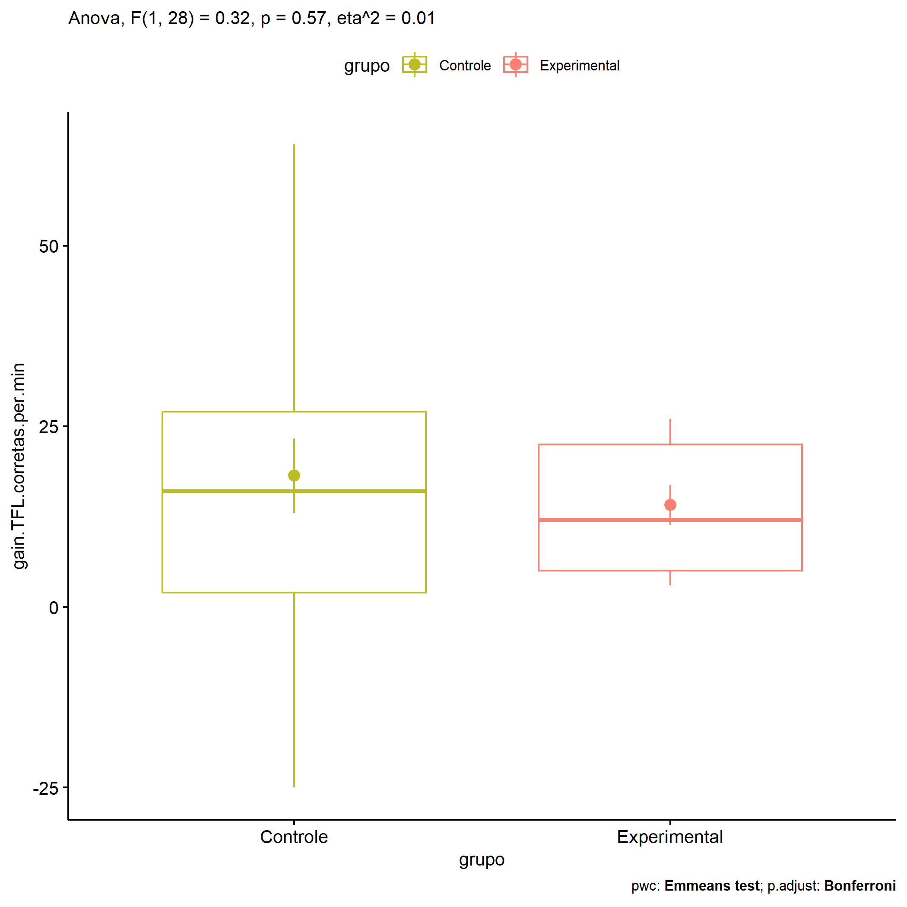

ANOVA in Gains for gain Palavras Corretas (1 Min) (gain Palavras
Corretas (1 Min))
================
Geiser C. Challco <geiser@alumni.usp.br>

- [Descriptive Statistics of Initial
  Data](#descriptive-statistics-of-initial-data)
- [Checking of Assumptions](#checking-of-assumptions)
  - [Assumption: Normality distribution of
    data](#assumption-normality-distribution-of-data)
  - [Assumption: Homogeneity of data
    distribution](#assumption-homogeneity-of-data-distribution)
- [Computation of ANCOVA test and Pairwise
  Comparison](#computation-of-ancova-test-and-pairwise-comparison)
  - [ANCOVA tests for one factor](#ancova-tests-for-one-factor)
  - [ANCOVA tests for two factors](#ancova-tests-for-two-factors)
  - [Pairwise comparisons for one factor:
    **grupo**](#pairwise-comparisons-for-one-factor-grupo)
  - [Pairwise comparisons for two
    factors](#pairwise-comparisons-for-two-factors)
    - [factores: **grupo:Sexo**](#factores-gruposexo)
    - [factores: **grupo:Zona**](#factores-grupozona)
    - [factores: **grupo:Cor.Raca**](#factores-grupocorraca)

**NOTE**

- Teste ANOVA para determinar se houve diferenças significativas no gain
  Palavras Corretas (1 Min) (medido usando a diferença entre post-test e
  pre-testes).
- ANOVA test to determine whether there were significant differences in
  gain Palavras Corretas (1 Min) (measured using the difference between
  post-test and pre-tests).

# Descriptive Statistics of Initial Data

| grupo        | Sexo | Cor.Raca | variable                  |   n |   mean | median | min | max |     sd |     se |      ci |   iqr |
|:-------------|:-----|:---------|:--------------------------|----:|-------:|-------:|----:|----:|-------:|-------:|--------:|------:|
| Controle     | F    |          | gain.TFL.corretas.per.min |   8 | 25.500 |   18.5 |  -7 |  64 | 21.693 |  7.670 |  18.136 | 24.00 |
| Controle     | M    |          | gain.TFL.corretas.per.min |  11 | 12.818 |   11.0 | -25 |  62 | 22.449 |  6.769 |  15.082 | 24.00 |
| Experimental | F    |          | gain.TFL.corretas.per.min |   4 | 18.750 |   22.5 |   4 |  26 |  9.979 |  4.990 |  15.879 |  6.25 |
| Experimental | M    |          | gain.TFL.corretas.per.min |   7 | 11.429 |   10.0 |   3 |  25 |  8.324 |  3.146 |   7.698 | 11.00 |
| Controle     |      | Branca   | gain.TFL.corretas.per.min |   4 | 16.750 |   15.0 | -25 |  62 | 35.584 | 17.792 |  56.623 | 23.25 |
| Controle     |      | Indígena | gain.TFL.corretas.per.min |   2 | -4.000 |   -4.0 |  -7 |  -1 |  4.243 |  3.000 |  38.119 |  3.00 |
| Controle     |      | Parda    | gain.TFL.corretas.per.min |   9 | 21.111 |   21.0 |  -3 |  64 | 21.398 |  7.133 |  16.448 | 23.00 |
| Controle     |      | Preta    | gain.TFL.corretas.per.min |   1 | 19.000 |   19.0 |  19 |  19 |        |        |         |  0.00 |
| Controle     |      |          | gain.TFL.corretas.per.min |   3 | 25.667 |   20.0 |  16 |  41 | 13.429 |  7.753 |  33.359 | 12.50 |
| Experimental |      | Branca   | gain.TFL.corretas.per.min |   2 | 13.000 |   13.0 |   4 |  22 | 12.728 |  9.000 | 114.356 |  9.00 |
| Experimental |      | Indígena | gain.TFL.corretas.per.min |   3 | 12.333 |   10.0 |   4 |  23 |  9.713 |  5.608 |  24.127 |  9.50 |
| Experimental |      | Parda    | gain.TFL.corretas.per.min |   2 | 22.500 |   22.5 |  20 |  25 |  3.536 |  2.500 |  31.766 |  2.50 |
| Experimental |      |          | gain.TFL.corretas.per.min |   4 | 11.750 |    9.0 |   3 |  26 | 10.210 |  5.105 |  16.247 | 10.25 |

# Checking of Assumptions

## Assumption: Normality distribution of data

| var                       |   n |  skewness |  kurtosis | symmetry | statistic | method       |         p | p.signif | normality |
|:--------------------------|----:|----------:|----------:|:---------|----------:|:-------------|----------:|:---------|:----------|
| gain.TFL.corretas.per.min |  30 | 0.5225205 | 0.9925356 | NO       | 0.9452685 | Shapiro-Wilk | 0.1261374 | ns       | YES       |
| gain.TFL.corretas.per.min |  23 | 0.4876819 | 0.9020643 | YES      | 0.9198258 | Shapiro-Wilk | 0.0660507 | ns       | YES       |

## Assumption: Homogeneity of data distribution

| var                       | method        | formula                                         |   n | df1 | df2 | statistic |         p | p.signif |
|:--------------------------|:--------------|:------------------------------------------------|----:|----:|----:|----------:|----------:|:---------|
| gain.TFL.corretas.per.min | Levene’s test | `gain.TFL.corretas.per.min`~`grupo`\*`Sexo`     |  30 |   3 |  26 | 1.4439748 | 0.2527905 | ns       |
| gain.TFL.corretas.per.min | Levene’s test | `gain.TFL.corretas.per.min`~`grupo`\*`Cor.Raca` |  23 |   6 |  16 | 0.9636182 | 0.4797773 | ns       |

# Computation of ANCOVA test and Pairwise Comparison

## ANCOVA tests for one factor

| Effect   | DFn | DFd |     SSn |      SSd |     F |     p |   ges | p\<.05 |
|:---------|----:|----:|--------:|---------:|------:|------:|------:|:-------|
| grupo    |   1 |  28 | 115.231 | 9929.435 | 0.325 | 0.573 | 0.011 |        |
| Sexo     |   1 |  28 | 866.806 | 9177.861 | 2.644 | 0.115 | 0.086 |        |
| Cor.Raca |   3 |  19 | 844.372 | 8184.845 | 0.653 | 0.591 | 0.094 |        |

## ANCOVA tests for two factors

|     | Effect         | DFn | DFd |     SSn |      SSd |     F |     p |   ges | p\<.05 |
|:----|:---------------|----:|----:|--------:|---------:|------:|------:|------:|:-------|
| 3   | grupo:Sexo     |   1 |  26 |  47.200 | 9048.101 | 0.136 | 0.716 | 0.005 |        |
| 6   | grupo:Cor.Raca |   2 |  16 | 273.764 | 7842.806 | 0.279 | 0.760 | 0.034 |        |

## Pairwise comparisons for one factor: **grupo**

| var                       | grupo        |   n |      M |    SE |
|:--------------------------|:-------------|----:|-------:|------:|
| gain.TFL.corretas.per.min | Controle     |  19 | 18.158 | 5.152 |
| gain.TFL.corretas.per.min | Experimental |  11 | 14.091 | 2.781 |

| .y.                       | group1   | group2       | estimate | conf.low | conf.high |    se | statistic |     p | p.adj | p.adj.signif |
|:--------------------------|:---------|:-------------|---------:|---------:|----------:|------:|----------:|------:|------:|:-------------|
| gain.TFL.corretas.per.min | Controle | Experimental |    4.067 |  -10.548 |    18.682 | 7.135 |      0.57 | 0.573 | 0.573 | ns           |

    ## Scale for colour is already present.
    ## Adding another scale for colour, which will replace the existing scale.

<!-- -->

## Pairwise comparisons for two factors

### factores: **grupo:Sexo**

| var                       | grupo        | Sexo |   n |      M |    SE |
|:--------------------------|:-------------|:-----|----:|-------:|------:|
| gain.TFL.corretas.per.min | Controle     | F    |   8 | 25.500 | 7.670 |
| gain.TFL.corretas.per.min | Controle     | M    |  11 | 12.818 | 6.769 |
| gain.TFL.corretas.per.min | Experimental | M    |   7 | 11.429 | 3.146 |

|     | .y.                       | grupo    | Sexo | group1   | group2       | estimate | conf.low | conf.high |    se | statistic |     p | p.adj | p.adj.signif |
|:----|:--------------------------|:---------|:-----|:---------|:-------------|---------:|---------:|----------:|------:|----------:|------:|------:|:-------------|
| 2   | gain.TFL.corretas.per.min |          | M    | Controle | Experimental |    1.390 |  -18.118 |    20.897 | 9.430 |     0.147 | 0.884 | 0.884 | ns           |
| 3   | gain.TFL.corretas.per.min | Controle |      | F        | M            |   12.682 |   -6.066 |    31.430 | 9.063 |     1.399 | 0.175 | 0.175 | ns           |

### factores: **grupo:Zona**

### factores: **grupo:Cor.Raca**
