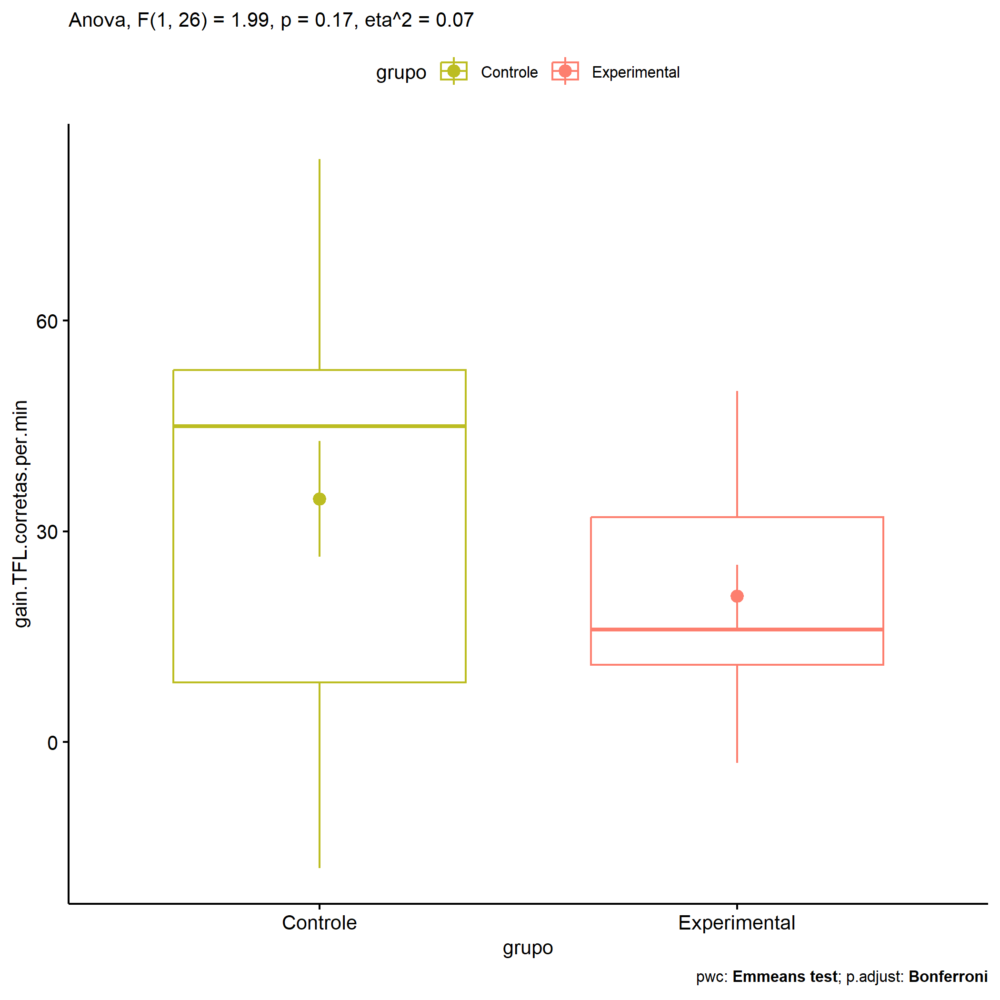

ANOVA in Gains for gain Palavras Corretas (1 Min) (gain Palavras
Corretas (1 Min))
================
Geiser C. Challco <geiser@alumni.usp.br>

- [Descriptive Statistics of Initial
  Data](#descriptive-statistics-of-initial-data)
- [Checking of Assumptions](#checking-of-assumptions)
  - [Assumption: Normality distribution of
    data](#assumption-normality-distribution-of-data)
  - [Assumption: Homogeneity of data
    distribution](#assumption-homogeneity-of-data-distribution)
- [Computation of ANCOVA test and Pairwise
  Comparison](#computation-of-ancova-test-and-pairwise-comparison)
  - [ANCOVA tests for one factor](#ancova-tests-for-one-factor)
  - [ANCOVA tests for two factors](#ancova-tests-for-two-factors)
  - [Pairwise comparisons for one factor:
    **grupo**](#pairwise-comparisons-for-one-factor-grupo)
  - [Pairwise comparisons for two
    factors](#pairwise-comparisons-for-two-factors)
    - [factores: **grupo:Sexo**](#factores-gruposexo)
    - [factores: **grupo:Zona**](#factores-grupozona)
    - [factores: **grupo:Cor.Raca**](#factores-grupocorraca)

**NOTE**

- Teste ANOVA para determinar se houve diferenças significativas no gain
  Palavras Corretas (1 Min) (medido usando a diferença entre post-test e
  pre-testes).
- ANOVA test to determine whether there were significant differences in
  gain Palavras Corretas (1 Min) (measured using the difference between
  post-test and pre-tests).

# Descriptive Statistics of Initial Data

| grupo        | Sexo | Zona   | Cor.Raca | variable                  |   n |   mean | median | min | max |     sd |     se |      ci |   iqr |
|:-------------|:-----|:-------|:---------|:--------------------------|----:|-------:|-------:|----:|----:|-------:|-------:|--------:|------:|
| Controle     | F    |        |          | gain.TFL.corretas.per.min |   3 | 48.333 |   48.0 |  14 |  83 | 34.501 | 19.919 |  85.706 | 34.50 |
| Controle     | M    |        |          | gain.TFL.corretas.per.min |  12 | 31.167 |   41.5 | -18 |  80 | 31.880 |  9.203 |  20.256 | 51.00 |
| Experimental | F    |        |          | gain.TFL.corretas.per.min |   3 | 17.667 |   24.0 |  -3 |  32 | 18.339 | 10.588 |  45.558 | 17.50 |
| Experimental | M    |        |          | gain.TFL.corretas.per.min |  10 | 21.700 |   16.0 |   1 |  50 | 16.398 |  5.186 |  11.731 | 22.50 |
| Controle     |      | Rural  |          | gain.TFL.corretas.per.min |   5 | 17.600 |   -1.0 | -18 |  80 | 41.052 | 18.359 |  50.973 | 49.00 |
| Controle     |      | Urbana |          | gain.TFL.corretas.per.min |   3 | 52.333 |   53.0 |  51 |  53 |  1.155 |  0.667 |   2.868 |  1.00 |
| Controle     |      |        |          | gain.TFL.corretas.per.min |   7 | 39.143 |   45.0 |   3 |  83 | 28.841 | 10.901 |  26.674 | 39.50 |
| Experimental |      | Rural  |          | gain.TFL.corretas.per.min |   6 | 17.833 |   14.5 |   7 |  38 | 11.089 |  4.527 |  11.637 |  9.00 |
| Experimental |      | Urbana |          | gain.TFL.corretas.per.min |   2 | 10.500 |   10.5 |  -3 |  24 | 19.092 | 13.500 | 171.534 | 13.50 |
| Experimental |      |        |          | gain.TFL.corretas.per.min |   5 | 28.400 |   32.0 |   1 |  50 | 19.982 |  8.936 |  24.812 | 27.00 |
| Controle     |      |        | Parda    | gain.TFL.corretas.per.min |   6 |  0.833 |    1.0 | -18 |  18 | 13.934 |  5.689 |  14.623 | 19.75 |
| Controle     |      |        |          | gain.TFL.corretas.per.min |   9 | 57.111 |   53.0 |  38 |  83 | 15.390 |  5.130 |  11.830 | 15.00 |
| Experimental |      |        | Branca   | gain.TFL.corretas.per.min |   1 | 16.000 |   16.0 |  16 |  16 |        |        |         |  0.00 |
| Experimental |      |        | Indígena | gain.TFL.corretas.per.min |   1 | 16.000 |   16.0 |  16 |  16 |        |        |         |  0.00 |
| Experimental |      |        | Parda    | gain.TFL.corretas.per.min |   4 | 18.500 |   17.5 |   7 |  32 | 10.909 |  5.454 |  17.358 | 13.00 |
| Experimental |      |        |          | gain.TFL.corretas.per.min |   7 | 23.429 |   24.0 |  -3 |  50 | 21.046 |  7.955 |  19.465 | 34.50 |

# Checking of Assumptions

## Assumption: Normality distribution of data

| var                       |   n |   skewness |   kurtosis | symmetry | statistic | method       |         p | p.signif | normality |
|:--------------------------|----:|-----------:|-----------:|:---------|----------:|:-------------|----------:|:---------|:----------|
| gain.TFL.corretas.per.min |  28 | -0.1247905 | -0.9040157 | YES      | 0.9834046 | Shapiro-Wilk | 0.9225423 | ns       | YES       |
| gain.TFL.corretas.per.min |  16 |  0.9793849 |  1.2385079 | NO       | 0.9122436 | Shapiro-Wilk | 0.1264811 | ns       | YES       |
| gain.TFL.corretas.per.min |  12 | -0.0110308 | -1.2035697 | YES      | 0.9607780 | Shapiro-Wilk | 0.7948779 | ns       | YES       |

## Assumption: Homogeneity of data distribution

| var                       | method        | formula                                         |   n | df1 | df2 | statistic |         p | p.signif |
|:--------------------------|:--------------|:------------------------------------------------|----:|----:|----:|----------:|----------:|:---------|
| gain.TFL.corretas.per.min | Levene’s test | `gain.TFL.corretas.per.min`~`grupo`\*`Sexo`     |  28 |   3 |  24 |  1.609731 | 0.2132966 | ns       |
| gain.TFL.corretas.per.min | Levene’s test | `gain.TFL.corretas.per.min`~`grupo`\*`Zona`     |  16 |   3 |  12 |  1.755008 | 0.2091315 | ns       |
| gain.TFL.corretas.per.min | Levene’s test | `gain.TFL.corretas.per.min`~`grupo`\*`Cor.Raca` |  12 |   3 |   8 |  1.388424 | 0.3149446 | ns       |

# Computation of ANCOVA test and Pairwise Comparison

## ANCOVA tests for one factor

| Effect   | DFn | DFd |      SSn |       SSd |     F |     p |   ges | p\<.05 |
|:---------|----:|----:|---------:|----------:|------:|------:|------:|:-------|
| grupo    |   1 |  26 | 1332.199 | 17397.908 | 1.991 | 0.170 | 0.071 |        |
| Sexo     |   1 |  26 |  177.516 | 18552.591 | 0.249 | 0.622 | 0.009 |        |
| Zona     |   1 |  14 | 1098.056 |  9823.382 | 1.565 | 0.231 | 0.101 |        |
| Cor.Raca |   2 |   9 |  109.350 |  2076.900 | 0.237 | 0.794 | 0.050 |        |

## ANCOVA tests for two factors

|     | Effect         | DFn | DFd |      SSn |       SSd |     F |     p |   ges | p\<.05 |
|:----|:---------------|----:|----:|---------:|----------:|------:|------:|------:|:-------|
| 3   | grupo:Sexo     |   1 |  24 |  528.753 | 16653.100 | 0.762 | 0.391 | 0.031 |        |
| 6   | grupo:Zona     |   1 |  12 | 1474.670 |  7723.200 | 2.291 | 0.156 | 0.160 |        |
| 9   | grupo:Cor.Raca |   0 |   8 |          |  1327.833 |       |       |       |        |

## Pairwise comparisons for one factor: **grupo**

| var                       | grupo        |   n |      M |    SE |
|:--------------------------|:-------------|----:|-------:|------:|
| gain.TFL.corretas.per.min | Controle     |  15 | 34.600 | 8.243 |
| gain.TFL.corretas.per.min | Experimental |  13 | 20.769 | 4.480 |

| .y.                       | group1   | group2       | estimate | conf.low | conf.high |    se | statistic |    p | p.adj | p.adj.signif |
|:--------------------------|:---------|:-------------|---------:|---------:|----------:|------:|----------:|-----:|------:|:-------------|
| gain.TFL.corretas.per.min | Controle | Experimental |   13.831 |   -6.318 |    33.979 | 9.802 |     1.411 | 0.17 |  0.17 | ns           |

    ## Scale for colour is already present.
    ## Adding another scale for colour, which will replace the existing scale.

<!-- -->

## Pairwise comparisons for two factors

### factores: **grupo:Sexo**

### factores: **grupo:Zona**

### factores: **grupo:Cor.Raca**
