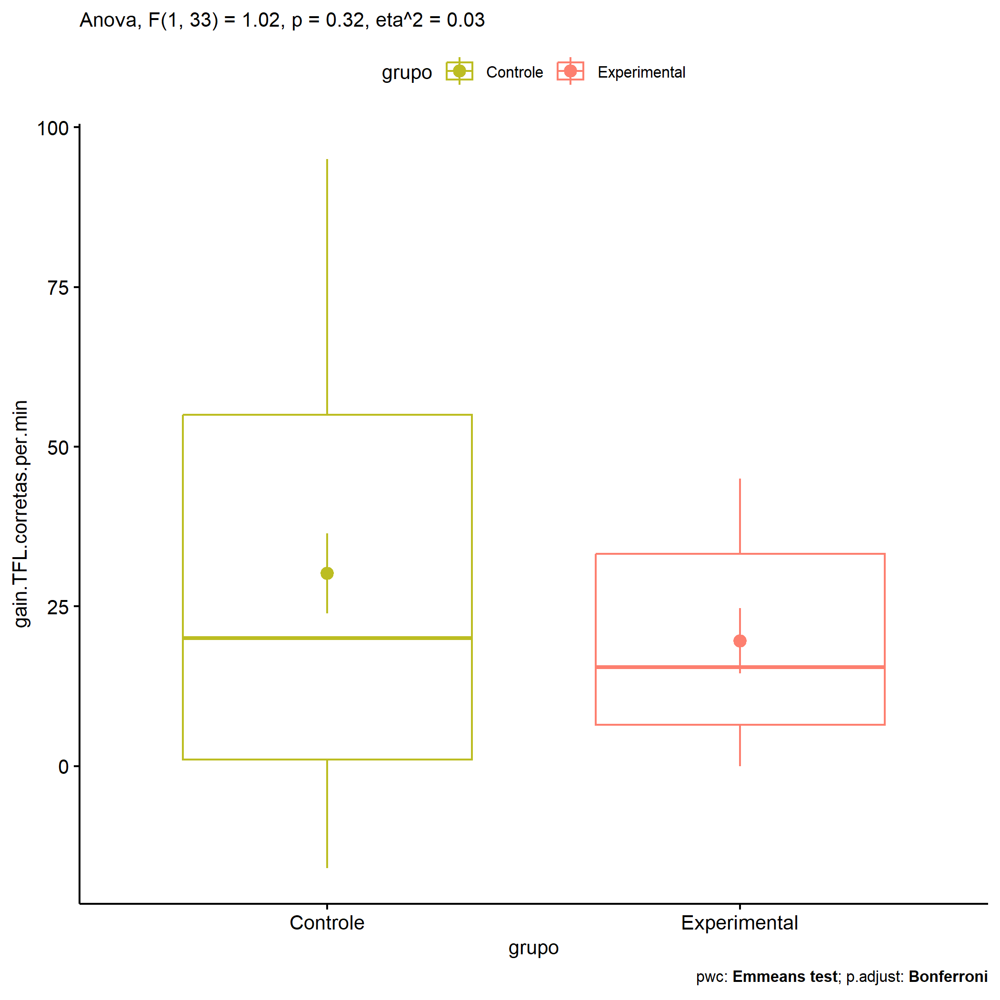

ANOVA in Gains for gain Palavras Corretas (1 Min) (gain Palavras
Corretas (1 Min))
================
Geiser C. Challco <geiser@alumni.usp.br>

- [Descriptive Statistics of Initial
  Data](#descriptive-statistics-of-initial-data)
- [Checking of Assumptions](#checking-of-assumptions)
  - [Assumption: Normality distribution of
    data](#assumption-normality-distribution-of-data)
  - [Assumption: Homogeneity of data
    distribution](#assumption-homogeneity-of-data-distribution)
- [Computation of ANCOVA test and Pairwise
  Comparison](#computation-of-ancova-test-and-pairwise-comparison)
  - [ANCOVA tests for one factor](#ancova-tests-for-one-factor)
  - [ANCOVA tests for two factors](#ancova-tests-for-two-factors)
  - [Pairwise comparisons for one factor:
    **grupo**](#pairwise-comparisons-for-one-factor-grupo)
  - [Pairwise comparisons for two
    factors](#pairwise-comparisons-for-two-factors)
    - [factores: **grupo:Sexo**](#factores-gruposexo)
    - [factores: **grupo:Zona**](#factores-grupozona)
    - [factores: **grupo:Cor.Raca**](#factores-grupocorraca)

**NOTE**

- Teste ANOVA para determinar se houve diferenças significativas no gain
  Palavras Corretas (1 Min) (medido usando a diferença entre post-test e
  pre-testes).
- ANOVA test to determine whether there were significant differences in
  gain Palavras Corretas (1 Min) (measured using the difference between
  post-test and pre-tests).

# Descriptive Statistics of Initial Data

| grupo        | Sexo | Zona   | Cor.Raca | variable                  |   n |   mean | median | min | max |     sd |     se |     ci |   iqr |
|:-------------|:-----|:-------|:---------|:--------------------------|----:|-------:|-------:|----:|----:|-------:|-------:|-------:|------:|
| Controle     | F    |        |          | gain.TFL.corretas.per.min |   9 | 35.556 |   45.0 | -11 |  69 | 26.001 |  8.667 | 19.986 | 36.00 |
| Controle     | M    |        |          | gain.TFL.corretas.per.min |  16 | 27.125 |   15.0 | -16 |  95 | 34.201 |  8.550 | 18.224 | 56.00 |
| Experimental | F    |        |          | gain.TFL.corretas.per.min |   4 | 20.750 |   19.5 |   6 |  38 | 16.153 |  8.076 | 25.703 | 25.25 |
| Experimental | M    |        |          | gain.TFL.corretas.per.min |   6 | 18.833 |   15.5 |   0 |  45 | 17.589 |  7.181 | 18.458 | 24.00 |
| Controle     |      | Rural  |          | gain.TFL.corretas.per.min |  12 | 15.417 |    4.5 | -16 |  95 | 33.797 |  9.756 | 21.474 | 22.75 |
| Controle     |      | Urbana |          | gain.TFL.corretas.per.min |   1 | 55.000 |   55.0 |  55 |  55 |        |        |        |  0.00 |
| Controle     |      |        |          | gain.TFL.corretas.per.min |  12 | 42.833 |   50.0 |  -7 |  69 | 22.655 |  6.540 | 14.394 | 21.75 |
| Experimental |      | Rural  |          | gain.TFL.corretas.per.min |   6 | 12.667 |   11.0 |   0 |  34 | 12.258 |  5.004 | 12.864 | 12.00 |
| Experimental |      |        |          | gain.TFL.corretas.per.min |   4 | 30.000 |   34.5 |   6 |  45 | 16.990 |  8.495 | 27.035 | 15.00 |
| Controle     |      |        | Branca   | gain.TFL.corretas.per.min |   3 |  8.333 |    8.0 |   1 |  16 |  7.506 |  4.333 | 18.645 |  7.50 |
| Controle     |      |        | Indígena | gain.TFL.corretas.per.min |   1 | 16.000 |   16.0 |  16 |  16 |        |        |        |  0.00 |
| Controle     |      |        | Parda    | gain.TFL.corretas.per.min |   9 |  6.111 |   -4.0 | -16 |  70 | 26.657 |  8.886 | 20.491 | 25.00 |
| Controle     |      |        |          | gain.TFL.corretas.per.min |  12 | 54.833 |   55.0 |  20 |  95 | 17.647 |  5.094 | 11.213 | 13.00 |
| Experimental |      |        | Branca   | gain.TFL.corretas.per.min |   1 | 14.000 |   14.0 |  14 |  14 |        |        |        |  0.00 |
| Experimental |      |        | Indígena | gain.TFL.corretas.per.min |   3 |  9.333 |    8.0 |   3 |  17 |  7.095 |  4.096 | 17.624 |  7.00 |
| Experimental |      |        | Parda    | gain.TFL.corretas.per.min |   3 | 13.333 |    6.0 |   0 |  34 | 18.148 | 10.477 | 45.081 | 17.00 |
| Experimental |      |        |          | gain.TFL.corretas.per.min |   3 | 38.000 |   38.0 |  31 |  45 |  7.000 |  4.041 | 17.389 |  7.00 |

# Checking of Assumptions

## Assumption: Normality distribution of data

| var                       |   n |  skewness |   kurtosis | symmetry | statistic | method       |         p | p.signif | normality |
|:--------------------------|----:|----------:|-----------:|:---------|----------:|:-------------|----------:|:---------|:----------|
| gain.TFL.corretas.per.min |  35 | 0.2832433 | -0.7128521 | YES      | 0.9638547 | Shapiro-Wilk | 0.2974551 | ns       | YES       |
| gain.TFL.corretas.per.min |  19 | 1.5482584 |  1.9441882 | NO       | 0.8105402 | Shapiro-Wilk | 0.0016326 | \*\*     | NO        |
| gain.TFL.corretas.per.min |  20 | 1.9145221 |  4.2934127 | NO       | 0.7995971 | Shapiro-Wilk | 0.0008521 | \*\*\*   | NO        |

## Assumption: Homogeneity of data distribution

| var                       | method        | formula                                         |   n | df1 | df2 | statistic |         p | p.signif |
|:--------------------------|:--------------|:------------------------------------------------|----:|----:|----:|----------:|----------:|:---------|
| gain.TFL.corretas.per.min | Levene’s test | `gain.TFL.corretas.per.min`~`grupo`\*`Sexo`     |  35 |   3 |  31 | 1.6391557 | 0.2004692 | ns       |
| gain.TFL.corretas.per.min | Levene’s test | `gain.TFL.corretas.per.min`~`grupo`\*`Zona`     |  19 |   2 |  16 | 0.9327012 | 0.4138638 | ns       |
| gain.TFL.corretas.per.min | Levene’s test | `gain.TFL.corretas.per.min`~`grupo`\*`Cor.Raca` |  20 |   5 |  14 | 0.4485993 | 0.8074120 | ns       |

# Computation of ANCOVA test and Pairwise Comparison

## ANCOVA tests for one factor

| Effect   | DFn | DFd |      SSn |       SSd |     F |     p |   ges | p\<.05 |
|:---------|----:|----:|---------:|----------:|------:|------:|------:|:-------|
| grupo    |   1 |  33 |  796.526 | 25701.760 | 1.023 | 0.319 | 0.030 |        |
| Sexo     |   1 |  33 |  307.695 | 26190.591 | 0.388 | 0.538 | 0.012 |        |
| Zona     |   1 |  17 | 1553.921 | 13346.500 | 1.979 | 0.177 | 0.104 |        |
| Cor.Raca |   2 |  17 |   32.133 |  6731.667 | 0.041 | 0.960 | 0.005 |        |

## ANCOVA tests for two factors

|     | Effect         | DFn | DFd |     SSn |       SSd |     F |     p |   ges | p\<.05 |
|:----|:---------------|----:|----:|--------:|----------:|------:|------:|------:|:-------|
| 3   | grupo:Sexo     |   1 |  31 |  71.883 | 25283.556 | 0.088 | 0.769 | 0.003 |        |
| 6   | grupo:Zona     |   0 |  16 |         | 13316.250 |       |       |       |        |
| 9   | grupo:Cor.Raca |   2 |  14 | 110.711 |  6556.889 | 0.118 | 0.889 | 0.017 |        |

## Pairwise comparisons for one factor: **grupo**

| var                       | grupo        |   n |     M |    SE |
|:--------------------------|:-------------|----:|------:|------:|
| gain.TFL.corretas.per.min | Controle     |  25 | 30.16 | 6.240 |
| gain.TFL.corretas.per.min | Experimental |  10 | 19.60 | 5.097 |

| .y.                       | group1   | group2       | estimate | conf.low | conf.high |     se | statistic |     p | p.adj | p.adj.signif |
|:--------------------------|:---------|:-------------|---------:|---------:|----------:|-------:|----------:|------:|------:|:-------------|
| gain.TFL.corretas.per.min | Controle | Experimental |    10.56 |  -10.685 |    31.805 | 10.442 |     1.011 | 0.319 | 0.319 | ns           |

    ## Scale for colour is already present.
    ## Adding another scale for colour, which will replace the existing scale.

<!-- -->

## Pairwise comparisons for two factors

### factores: **grupo:Sexo**

| var                       | grupo        | Sexo |   n |      M |    SE |
|:--------------------------|:-------------|:-----|----:|-------:|------:|
| gain.TFL.corretas.per.min | Controle     | F    |   9 | 35.556 | 8.667 |
| gain.TFL.corretas.per.min | Controle     | M    |  16 | 27.125 | 8.550 |
| gain.TFL.corretas.per.min | Experimental | M    |   6 | 18.833 | 7.181 |

|     | .y.                       | grupo    | Sexo | group1   | group2       | estimate | conf.low | conf.high |     se | statistic |     p | p.adj | p.adj.signif |
|:----|:--------------------------|:---------|:-----|:---------|:-------------|---------:|---------:|----------:|-------:|----------:|------:|------:|:-------------|
| 2   | gain.TFL.corretas.per.min |          | M    | Controle | Experimental |    8.292 |  -20.715 |    37.299 | 14.161 |     0.586 | 0.563 | 0.563 | ns           |
| 3   | gain.TFL.corretas.per.min | Controle |      | F        | M            |    8.431 |  -16.817 |    33.678 | 12.325 |     0.684 | 0.500 | 0.500 | ns           |

### factores: **grupo:Zona**

### factores: **grupo:Cor.Raca**
