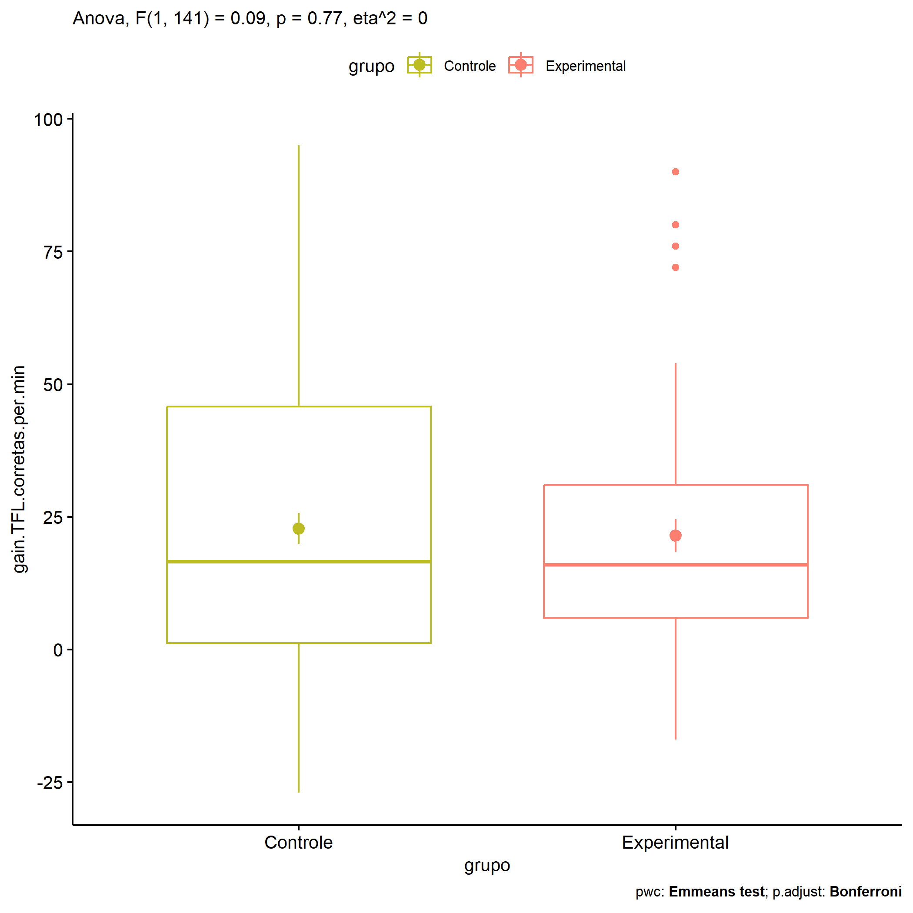
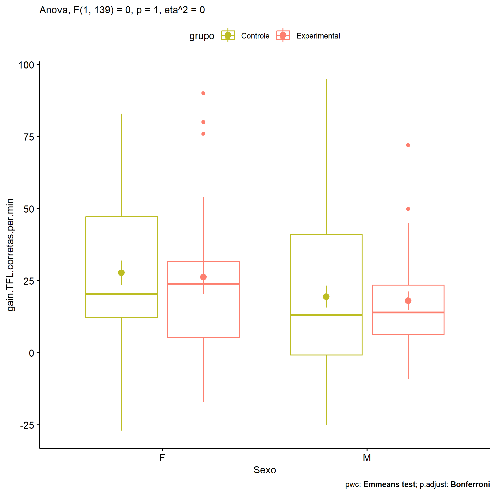
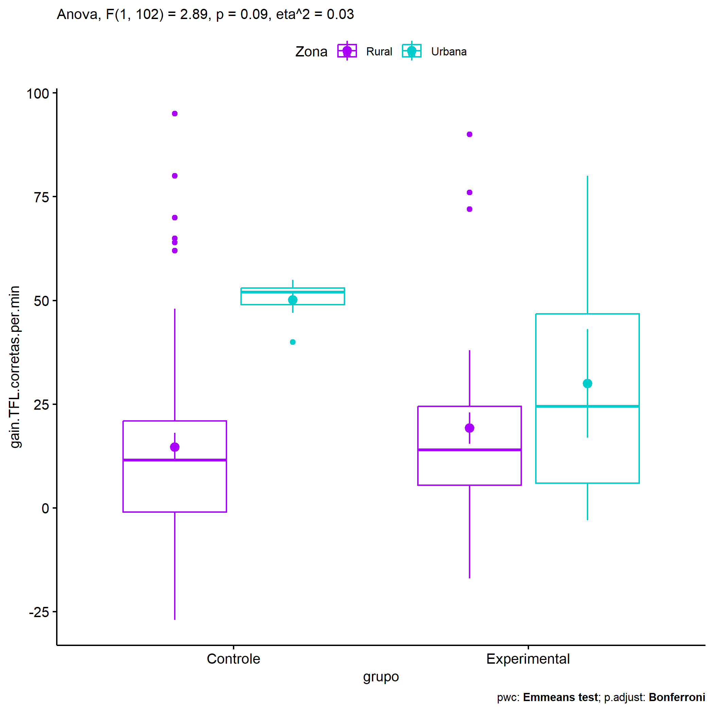
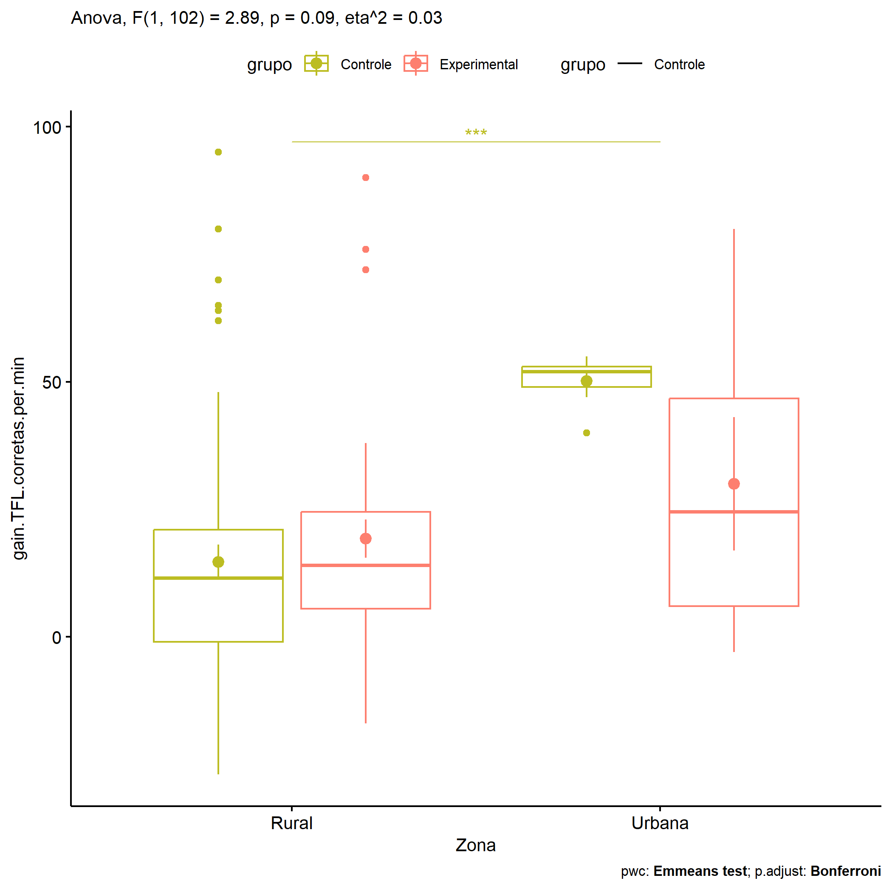

ANOVA in Gains for gain Palavras Corretas (1 Min) (gain Palavras
Corretas (1 Min))
================
Geiser C. Challco <geiser@alumni.usp.br>

- [Descriptive Statistics of Initial
  Data](#descriptive-statistics-of-initial-data)
- [Checking of Assumptions](#checking-of-assumptions)
  - [Assumption: Normality distribution of
    data](#assumption-normality-distribution-of-data)
  - [Assumption: Homogeneity of data
    distribution](#assumption-homogeneity-of-data-distribution)
- [Computation of ANCOVA test and Pairwise
  Comparison](#computation-of-ancova-test-and-pairwise-comparison)
  - [ANCOVA tests for one factor](#ancova-tests-for-one-factor)
  - [ANCOVA tests for two factors](#ancova-tests-for-two-factors)
  - [Pairwise comparisons for one factor:
    **grupo**](#pairwise-comparisons-for-one-factor-grupo)
  - [Pairwise comparisons for two
    factors](#pairwise-comparisons-for-two-factors)
    - [factores: **grupo:Sexo**](#factores-gruposexo)
    - [factores: **grupo:Zona**](#factores-grupozona)
    - [factores: **grupo:Cor.Raca**](#factores-grupocorraca)

**NOTE**

- Teste ANOVA para determinar se houve diferenças significativas no gain
  Palavras Corretas (1 Min) (medido usando a diferença entre post-test e
  pre-testes).
- ANOVA test to determine whether there were significant differences in
  gain Palavras Corretas (1 Min) (measured using the difference between
  post-test and pre-tests).

# Descriptive Statistics of Initial Data

| grupo        | Sexo | Zona   | Cor.Raca | variable                  |   n |   mean | median | min | max |     sd |     se |     ci |   iqr |
|:-------------|:-----|:-------|:---------|:--------------------------|----:|-------:|-------:|----:|----:|-------:|-------:|-------:|------:|
| Controle     | F    |        |          | gain.TFL.corretas.per.min |  36 | 27.722 |   20.5 | -27 |  83 | 25.934 |  4.322 |  8.775 | 35.00 |
| Controle     | M    |        |          | gain.TFL.corretas.per.min |  54 | 19.519 |   13.0 | -25 |  95 | 27.949 |  3.803 |  7.628 | 41.75 |
| Experimental | F    |        |          | gain.TFL.corretas.per.min |  22 | 26.273 |   24.0 | -17 |  90 | 27.631 |  5.891 | 12.251 | 26.50 |
| Experimental | M    |        |          | gain.TFL.corretas.per.min |  31 | 18.097 |   14.0 |  -9 |  72 | 17.730 |  3.184 |  6.503 | 17.00 |
| Controle     |      | Rural  |          | gain.TFL.corretas.per.min |  58 | 14.638 |   11.5 | -27 |  95 | 26.027 |  3.418 |  6.844 | 22.00 |
| Controle     |      | Urbana |          | gain.TFL.corretas.per.min |   7 | 50.143 |   52.0 |  40 |  55 |  5.113 |  1.933 |  4.729 |  4.00 |
| Controle     |      |        |          | gain.TFL.corretas.per.min |  25 | 34.080 |   42.0 |  -7 |  83 | 25.285 |  5.057 | 10.437 | 41.00 |
| Experimental |      | Rural  |          | gain.TFL.corretas.per.min |  35 | 19.257 |   14.0 | -17 |  90 | 22.357 |  3.779 |  7.680 | 19.00 |
| Experimental |      | Urbana |          | gain.TFL.corretas.per.min |   6 | 30.000 |   24.5 |  -3 |  80 | 32.019 | 13.072 | 33.602 | 40.75 |
| Experimental |      |        |          | gain.TFL.corretas.per.min |  12 | 23.750 |   23.5 |   1 |  50 | 17.920 |  5.173 | 11.386 | 33.25 |
| Controle     |      |        | Branca   | gain.TFL.corretas.per.min |  12 | 10.333 |   11.0 | -25 |  62 | 23.715 |  6.846 | 15.068 | 16.50 |
| Controle     |      |        | Indígena | gain.TFL.corretas.per.min |   3 |  2.667 |   -1.0 |  -7 |  16 | 11.930 |  6.888 | 29.637 | 11.50 |
| Controle     |      |        | Parda    | gain.TFL.corretas.per.min |  41 |  9.195 |    6.0 | -27 |  70 | 20.539 |  3.208 |  6.483 | 22.00 |
| Controle     |      |        | Preta    | gain.TFL.corretas.per.min |   1 | 19.000 |   19.0 |  19 |  19 |        |        |        |  0.00 |
| Controle     |      |        |          | gain.TFL.corretas.per.min |  33 | 46.182 |   48.0 |   6 |  95 | 21.155 |  3.683 |  7.501 | 20.00 |
| Experimental |      |        | Amarela  | gain.TFL.corretas.per.min |   1 |  5.000 |    5.0 |   5 |   5 |        |        |        |  0.00 |
| Experimental |      |        | Branca   | gain.TFL.corretas.per.min |   5 | 22.000 |   16.0 |   4 |  54 | 19.026 |  8.509 | 23.624 |  8.00 |
| Experimental |      |        | Indígena | gain.TFL.corretas.per.min |   8 | 13.125 |   13.0 |   3 |  24 |  8.114 |  2.869 |  6.784 | 11.50 |
| Experimental |      |        | Parda    | gain.TFL.corretas.per.min |  16 | 12.438 |   13.5 | -17 |  34 | 14.624 |  3.656 |  7.793 | 18.25 |
| Experimental |      |        |          | gain.TFL.corretas.per.min |  23 | 31.304 |   26.0 |  -3 |  90 | 27.672 |  5.770 | 11.966 | 35.50 |

# Checking of Assumptions

## Assumption: Normality distribution of data

| var                       |   n |  skewness |   kurtosis | symmetry | statistic | method     |         p | p.signif | normality |
|:--------------------------|----:|----------:|-----------:|:---------|----------:|:-----------|----------:|:---------|:----------|
| gain.TFL.corretas.per.min | 143 | 0.6204097 | -0.0355408 | NO       |  8.973767 | D’Agostino | 0.0112557 | ns       | QQ        |
| gain.TFL.corretas.per.min | 106 | 1.1392618 |  1.4133130 | NO       | 24.488592 | D’Agostino | 0.0000048 | \*\*\*\* | QQ        |
| gain.TFL.corretas.per.min |  87 | 0.8669562 |  1.6325456 | NO       | 16.679745 | D’Agostino | 0.0002388 | \*\*\*   | NO        |

## Assumption: Homogeneity of data distribution

| var                       | method        | formula                                         |   n | df1 | df2 | statistic |         p | p.signif |
|:--------------------------|:--------------|:------------------------------------------------|----:|----:|----:|----------:|----------:|:---------|
| gain.TFL.corretas.per.min | Levene’s test | `gain.TFL.corretas.per.min`~`grupo`\*`Sexo`     | 143 |   3 | 139 | 2.1838084 | 0.0926844 | ns       |
| gain.TFL.corretas.per.min | Levene’s test | `gain.TFL.corretas.per.min`~`grupo`\*`Zona`     | 106 |   3 | 102 | 2.1796974 | 0.0949822 | ns       |
| gain.TFL.corretas.per.min | Levene’s test | `gain.TFL.corretas.per.min`~`grupo`\*`Cor.Raca` |  87 |   7 |  79 | 0.9185604 | 0.4967991 | ns       |

# Computation of ANCOVA test and Pairwise Comparison

## ANCOVA tests for one factor

| Effect   | DFn | DFd |      SSn |      SSd |      F |     p |   ges | p\<.05 |
|:---------|----:|----:|---------:|---------:|-------:|------:|------:|:-------|
| grupo    |   1 | 141 |   57.194 | 92715.65 |  0.087 | 0.768 | 0.001 |        |
| Sexo     |   1 | 141 | 2302.563 | 90470.28 |  3.589 | 0.060 | 0.025 |        |
| Zona     |   1 | 104 | 6829.385 | 62667.52 | 11.334 | 0.001 | 0.098 | \*     |
| Cor.Raca |   4 |  82 |  280.242 | 29302.61 |  0.196 | 0.940 | 0.009 |        |

## ANCOVA tests for two factors

|     | Effect         | DFn | DFd |      SSn |      SSd |     F |     p |   ges | p\<.05 |
|:----|:---------------|----:|----:|---------:|---------:|------:|------:|------:|:-------|
| 3   | grupo:Sexo     |   1 | 139 |    0.006 | 90401.78 | 0.000 | 0.998 | 0.000 |        |
| 6   | grupo:Zona     |   1 | 102 | 1725.575 | 60890.94 | 2.891 | 0.092 | 0.028 |        |
| 9   | grupo:Cor.Raca |   2 |  79 |  243.984 | 28462.58 | 0.339 | 0.714 | 0.008 |        |

## Pairwise comparisons for one factor: **grupo**

| var                       | grupo        |   n |      M |    SE |
|:--------------------------|:-------------|----:|-------:|------:|
| gain.TFL.corretas.per.min | Controle     |  90 | 22.800 | 2.879 |
| gain.TFL.corretas.per.min | Experimental |  53 | 21.491 | 3.091 |

| .y.                       | group1   | group2       | estimate | conf.low | conf.high |   se | statistic |     p | p.adj | p.adj.signif |
|:--------------------------|:---------|:-------------|---------:|---------:|----------:|-----:|----------:|------:|------:|:-------------|
| gain.TFL.corretas.per.min | Controle | Experimental |    1.309 |   -7.468 |    10.087 | 4.44 |     0.295 | 0.768 | 0.768 | ns           |

    ## Scale for colour is already present.
    ## Adding another scale for colour, which will replace the existing scale.

<!-- -->

## Pairwise comparisons for two factors

### factores: **grupo:Sexo**

| var                       | grupo        | Sexo |   n |      M |    SE |
|:--------------------------|:-------------|:-----|----:|-------:|------:|
| gain.TFL.corretas.per.min | Controle     | F    |  36 | 27.722 | 4.322 |
| gain.TFL.corretas.per.min | Controle     | M    |  54 | 19.519 | 3.803 |
| gain.TFL.corretas.per.min | Experimental | F    |  22 | 26.273 | 5.891 |
| gain.TFL.corretas.per.min | Experimental | M    |  31 | 18.097 | 3.184 |

| .y.                       | grupo        | Sexo | group1   | group2       | estimate | conf.low | conf.high |    se | statistic |     p | p.adj | p.adj.signif |
|:--------------------------|:-------------|:-----|:---------|:-------------|---------:|---------:|----------:|------:|----------:|------:|------:|:-------------|
| gain.TFL.corretas.per.min |              | F    | Controle | Experimental |    1.449 |  -12.196 |    15.095 | 6.901 |     0.210 | 0.834 | 0.834 | ns           |
| gain.TFL.corretas.per.min |              | M    | Controle | Experimental |    1.422 |   -9.940 |    12.784 | 5.747 |     0.247 | 0.805 | 0.805 | ns           |
| gain.TFL.corretas.per.min | Controle     |      | F        | M            |    8.204 |   -2.646 |    19.053 | 5.487 |     1.495 | 0.137 | 0.137 | ns           |
| gain.TFL.corretas.per.min | Experimental |      | F        | M            |    8.176 |   -5.880 |    22.232 | 7.109 |     1.150 | 0.252 | 0.252 | ns           |

    ## Scale for colour is already present.
    ## Adding another scale for colour, which will replace the existing scale.

<!-- -->

    ## Scale for colour is already present.
    ## Adding another scale for colour, which will replace the existing scale.

<!-- -->

### factores: **grupo:Zona**

| var                       | grupo        | Zona   |   n |      M |     SE |
|:--------------------------|:-------------|:-------|----:|-------:|-------:|
| gain.TFL.corretas.per.min | Controle     | Rural  |  58 | 14.638 |  3.418 |
| gain.TFL.corretas.per.min | Controle     | Urbana |   7 | 50.143 |  1.933 |
| gain.TFL.corretas.per.min | Experimental | Rural  |  35 | 19.257 |  3.779 |
| gain.TFL.corretas.per.min | Experimental | Urbana |   6 | 30.000 | 13.072 |

| .y.                       | grupo        | Zona   | group1   | group2       | estimate | conf.low | conf.high |     se | statistic | p       | p.adj   | p.adj.signif |
|:--------------------------|:-------------|:-------|:---------|:-------------|---------:|---------:|----------:|-------:|----------:|:--------|:--------|:-------------|
| gain.TFL.corretas.per.min |              | Rural  | Controle | Experimental |   -4.619 |  -14.992 |     5.754 |  5.230 |    -0.883 | 0.379   | 0.379   | ns           |
| gain.TFL.corretas.per.min |              | Urbana | Controle | Experimental |   20.143 |   -6.819 |    47.105 | 13.593 |     1.482 | 0.141   | 0.141   | ns           |
| gain.TFL.corretas.per.min | Controle     |        | Rural    | Urbana       |  -35.505 |  -54.896 |   -16.114 |  9.776 |    -3.632 | \<0.001 | \<0.001 | \*\*\*       |
| gain.TFL.corretas.per.min | Experimental |        | Rural    | Urbana       |  -10.743 |  -32.156 |    10.671 | 10.796 |    -0.995 | 0.322   | 0.322   | ns           |

    ## Scale for colour is already present.
    ## Adding another scale for colour, which will replace the existing scale.

<!-- -->

    ## Scale for colour is already present.
    ## Adding another scale for colour, which will replace the existing scale.

<!-- -->

### factores: **grupo:Cor.Raca**

| var                       | grupo        | Cor.Raca |   n |      M |    SE |
|:--------------------------|:-------------|:---------|----:|-------:|------:|
| gain.TFL.corretas.per.min | Controle     | Branca   |  12 | 10.333 | 6.846 |
| gain.TFL.corretas.per.min | Controle     | Parda    |  41 |  9.195 | 3.208 |
| gain.TFL.corretas.per.min | Experimental | Branca   |   5 | 22.000 | 8.509 |
| gain.TFL.corretas.per.min | Experimental | Indígena |   8 | 13.125 | 2.869 |
| gain.TFL.corretas.per.min | Experimental | Parda    |  16 | 12.438 | 3.656 |

|     | .y.                       | grupo        | Cor.Raca | group1   | group2       | estimate | conf.low | conf.high |     se | statistic |     p | p.adj | p.adj.signif |
|:----|:--------------------------|:-------------|:---------|:---------|:-------------|---------:|---------:|----------:|-------:|----------:|------:|------:|:-------------|
| 1   | gain.TFL.corretas.per.min |              | Branca   | Controle | Experimental |  -11.667 |  -31.943 |     8.609 | 10.183 |    -1.146 | 0.255 | 0.255 | ns           |
| 3   | gain.TFL.corretas.per.min |              | Parda    | Controle | Experimental |   -3.242 |  -14.471 |     7.986 |  5.639 |    -0.575 | 0.567 | 0.567 | ns           |
| 5   | gain.TFL.corretas.per.min | Controle     |          | Branca   | Parda        |    1.138 |  -11.364 |    13.641 |  6.279 |     0.181 | 0.857 | 0.857 | ns           |
| 7   | gain.TFL.corretas.per.min | Experimental |          | Branca   | Indígena     |    8.875 |  -12.841 |    30.591 | 10.906 |     0.814 | 0.418 | 1.000 | ns           |
| 8   | gain.TFL.corretas.per.min | Experimental |          | Branca   | Parda        |    9.562 |   -9.954 |    29.079 |  9.801 |     0.976 | 0.332 | 0.997 | ns           |
| 9   | gain.TFL.corretas.per.min | Experimental |          | Indígena | Parda        |    0.688 |  -15.807 |    17.182 |  8.283 |     0.083 | 0.934 | 1.000 | ns           |

    ## Scale for colour is already present.
    ## Adding another scale for colour, which will replace the existing scale.

<!-- -->
